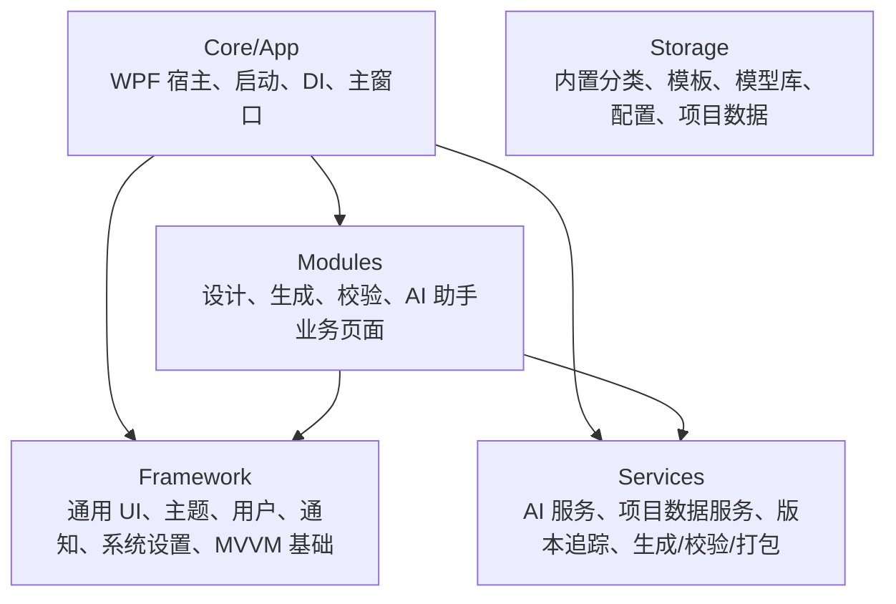
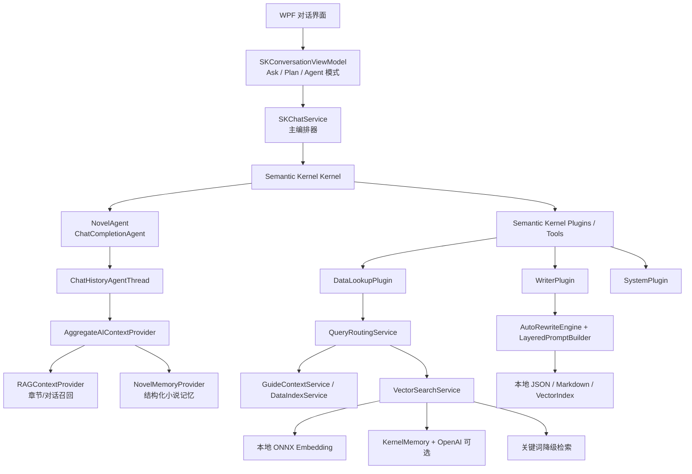
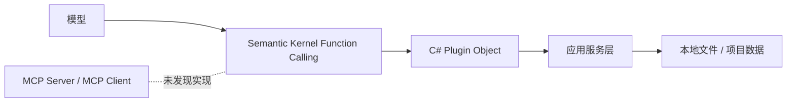
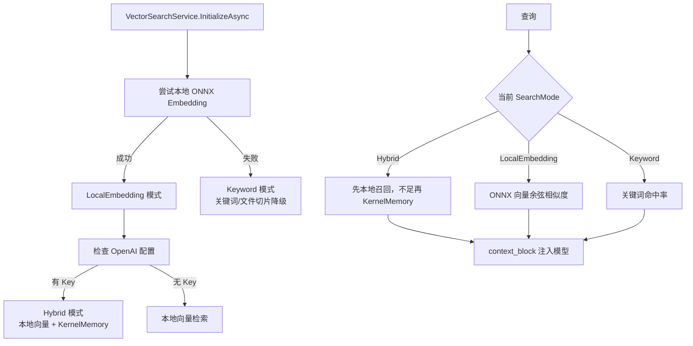
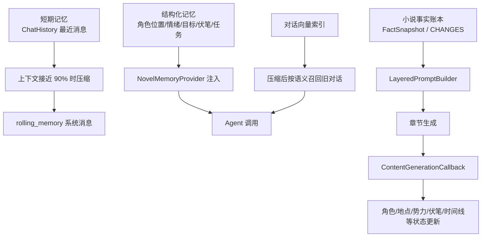
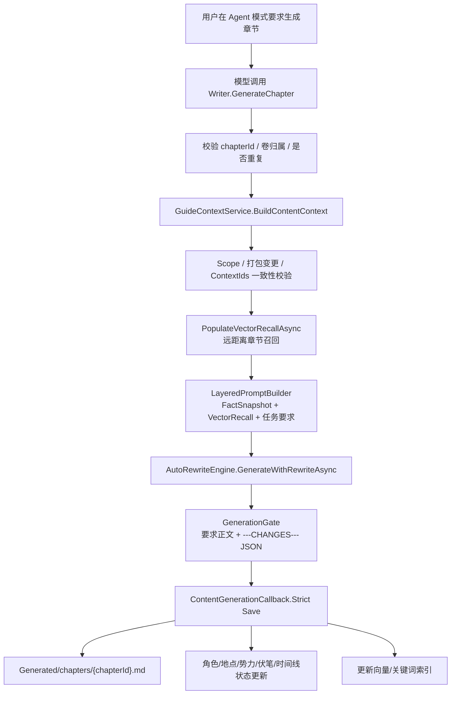

> DEVELOPER

https://github.com/zy-zmc/tianming-novel-ai-writer.git把这个项目拉下来看看

> AGENT

我会先按 `agent-reach` 的路由看一下 GitHub 获取方式，然后把仓库克隆到当前工作区里，接着快速扫项目结构和入口文件。

> TOOL

tool_use exec_command
id: call_OOHhMj2nX76g7XXXzlbhDEaz
```json
{
  "cmd": "sed -n '1,180p' /Users/lyston/.agents/skills/agent-reach/SKILL.md",
  "workdir": "/Users/lyston/PycharmProjects",
  "yield_time_ms": 1000,
  "max_output_tokens": 12000
}
```

> TOOL

tool_result
id: call_OOHhMj2nX76g7XXXzlbhDEaz
```
Chunk ID: af9748
Wall time: 0.0000 seconds
Process exited with code 0
Original token count: 926
Output:
error: Can't create the symlink for multishells at "/Users/lyston/.local/state/fnm_multishells/76621_1778312697245". Maybe there are some issues with permissions for the directory? Operation not permitted (os error 1)
---
name: agent-reach
description: >
  Give your AI agent eyes to see the entire internet.
  17 platforms via CLI, MCP, curl, and Python scripts.
  Zero config for 8 channels.

  【路由方式】SKILL.md 包含路由表和常用命令，复杂场景需按需阅读对应分类的 references/*.md。
  分类：search / social (小红书/抖音/微博/推特/B站/V2EX/Reddit) / career(LinkedIn) / dev(github) / web(网页/文章/公众号/RSS) / video(YouTube/B站/播客).

  Use when user asks to search, read, or interact on any supported platform,
  shares a URL, or asks to search the web.
triggers:
  - search: 搜/查/找/search/搜索/查一下/帮我搜
  - social:
    - 小红书: xiaohongshu/xhs/小红书/红书
    - 抖音: douyin/抖音
    - Twitter: twitter/推特/x.com/推文
    - 微博: weibo/微博
    - B站: bilibili/b站/哔哩哔哩
    - V2EX: v2ex
    - Reddit: reddit
  - career: 招聘/职位/求职/linkedin/领英/找工作
  - dev: github/代码/仓库/gh/issue/pr/分支/commit
  - web: 网页/链接/文章/公众号/微信文章/rss/读一下/打开这个
  - video: youtube/视频/播客/字幕/小宇宙/转录/yt
  - finance: 雪球/股票/stock/xueqiu/行情/基金
metadata:
  openclaw:
    homepage: https://github.com/Panniantong/Agent-Reach
---

# Agent Reach — 路由器

17 平台工具集合。根据用户意图选择对应分类。

## 路由表

| 用户意图 | 分类 | 详细文档 |
|---------|------|---------|
| 网页搜索/代码搜索 | search | [references/search.md](references/search.md) |
| 小红书/抖音/微博/推特/B站/V2EX/Reddit | social | [references/social.md](references/social.md) |
| 招聘/职位/LinkedIn | career | [references/career.md](references/career.md) |
| GitHub/代码 | dev | [references/dev.md](references/dev.md) |
| 网页/文章/公众号/RSS | web | [references/web.md](references/web.md) |
| YouTube/B站/播客字幕 | video | [references/video.md](references/video.md) |

## 零配置快速命令

```bash
# Exa 网页搜索
mcporter call 'exa.web_search_exa(query: "query", numResults: 5)'

# 通用网页阅读
curl -s "https://r.jina.ai/URL"

# GitHub 搜索
gh search repos "query" --sort stars --limit 10

# Twitter 搜索
twitter search "query" --limit 10

# YouTube/B站字幕
yt-dlp --write-sub --skip-download -o "/tmp/%(id)s" "URL"

# Reddit 搜索
rdt search "query" --limit 10

# Reddit 读帖 + 评论
rdt read POST_ID

# V2EX 热门
curl -s "https://www.v2ex.com/api/topics/hot.json" -H "User-Agent: agent-reach/1.0"
```

## 环境检查

```bash
# 检查可用 channel
agent-reach doctor

# 查看所有 MCP 服务
mcporter_list_servers()
```

## 工作区规则

**不要在 agent workspace 创建文件。** 使用 `/tmp/` 存放临时输出，`~/.agent-reach/` 存放持久数据。

## 详细文档

根据用户需求，阅读对应的详细文档：

- [搜索工具](references/search.md) — Exa AI 搜索
- [社交媒体](references/social.md) — 小红书, 抖音, Twitter, B站, V2EX, Reddit
- [职场招聘](references/career.md) — LinkedIn
- [开发工具](references/dev.md) — GitHub CLI
- [网页阅读](references/web.md) — Jina Reader, 微信公众号, RSS
- [视频播客](references/video.md) — YouTube, B站, 小宇宙

## 配置渠道

如果某个 channel 需要配置，获取安装指南：
https://raw.githubusercontent.com/Panniantong/agent-reach/main/docs/install.md

用户只需提供 cookies，其他配置由 agent 完成。

```

> TOOL

tool_use exec_command
id: call_iMU0srR6gb6QljOw41hepS6E
```json
{
  "cmd": "ls -la",
  "workdir": "/Users/lyston/PycharmProjects",
  "yield_time_ms": 1000,
  "max_output_tokens": 12000
}
```

> TOOL

tool_use exec_command
id: call_NpzofKlDl9d2VeloUSTBNJFp
```json
{
  "cmd": "git clone https://github.com/zy-zmc/tianming-novel-ai-writer.git",
  "workdir": "/Users/lyston/PycharmProjects",
  "yield_time_ms": 1000,
  "max_output_tokens": 12000
}
```

> TOOL

tool_result
id: call_iMU0srR6gb6QljOw41hepS6E
```
Chunk ID: 9a4ecf
Wall time: 0.0000 seconds
Process exited with code 0
Original token count: 629
Output:
error: Can't create the symlink for multishells at "/Users/lyston/.local/state/fnm_multishells/76659_1778312707270". Maybe there are some issues with permissions for the directory? Operation not permitted (os error 1)
total 40
drwxr-xr-x@ 38 lyston  staff   1216 May  9 14:55 .
drwxr-x---+ 69 lyston  staff   2208 May  9 15:44 ..
-rw-r--r--@  1 lyston  staff  18436 May  9 15:29 .DS_Store
drwxr-xr-x@  3 lyston  staff     96 Apr 22 09:32 .claude
drwxr-xr-x@  3 lyston  staff     96 May  8 14:37 .pnpm-store
drwxr-xr-x@ 48 lyston  staff   1536 Apr 15 09:09 AionUi
drwxrwxr-x@ 30 lyston  staff    960 Apr 22 09:32 CLIProxyAPI
drwxr-xr-x@ 16 lyston  staff    512 May  8 13:50 CodexDesktop-Rebuild
drwxr-xr-x@ 31 lyston  staff    992 May  8 10:55 GenericAgent
drwxrwxr-x@ 14 lyston  staff    448 Apr 21 17:47 Infinitoai
drwxr-xr-x@ 21 lyston  staff    672 May  3 20:06 LDStatusPro
drwxr-xr-x@ 15 lyston  staff    480 Apr 24 14:43 ai_agents
drwxr-xr-x@ 29 lyston  staff    928 Apr 25 20:49 anything-analyzer
drwxr-xr-x@  3 lyston  staff     96 Apr  9 16:34 claude_code
drwxr-xr-x@ 33 lyston  staff   1056 May  6 11:47 codex-session-toolkit
drwxr-xr-x   5 lyston  staff    160 Apr 13 22:41 cpa1
drwxr-xr-x@  6 lyston  staff    192 Apr 21 09:28 data
drwxr-xr-x@ 30 lyston  staff    960 May  6 11:43 dbx
drwxr-xr-x@ 27 lyston  staff    864 May  9 14:09 discourse-saver-upstream
drwxr-xr-x@ 22 lyston  staff    704 Apr 14 08:38 fast-note-sync-service
drwxr-xr-x@ 36 lyston  staff   1152 May  9 14:55 golutra
drwxr-xr-x@ 12 lyston  staff    384 Apr 25 17:34 grok
drwxr-xr-x@ 21 lyston  staff    672 Apr 25 18:13 grok2api
drwxr-xr-x@ 18 lyston  staff    576 Apr 18 10:48 hapi
drwxr-xr-x@ 26 lyston  staff    832 May  8 10:52 hermes
drwxr-xr-x@ 87 lyston  staff   2784 Apr 30 23:43 hermes-agent
drwxrwxr-x@ 32 lyston  staff   1024 May  2 18:57 hermes-webui
drwxr-xr-x@ 43 lyston  staff   1376 Apr  8 10:14 metapi-main
drwxr-xr-x@ 29 lyston  staff    928 Apr 13 09:36 model-check
drwxr-xr-x@ 22 lyston  staff    704 Apr 26 19:19 ppt-master
drwxr-xr-x@ 28 lyston  staff    896 Apr 22 09:07 raap
drwxr-xr-x@ 16 lyston  staff    512 May  8 15:41 smart-file-agent
drwxr-xr-x@  2 lyston  staff     64 Apr  9 16:34 ssh-todolist
drwxr-xr-x@ 24 lyston  staff    768 May  4 14:59 sub2api
drwxr-xr-x@ 23 lyston  staff    736 May  2 12:07 sub2api-deploy
drwxr-xr-x@ 16 lyston  staff    512 May  9 15:11 video-agent
drwxr-xr-x@ 14 lyston  staff    448 May  5 19:56 working
drwxr-xr-x@ 10 lyston  staff    320 May  5 19:41 自然辩证法

```

> TOOL

tool_result
id: call_NpzofKlDl9d2VeloUSTBNJFp
```
Chunk ID: f11ef3
Wall time: 1.0098 seconds
Process running with session ID 88156
Original token count: 11
Output:
Cloning into 'tianming-novel-ai-writer'...

```

> AGENT

仓库已经开始克隆了。我先确认它拉完整，再看 README、依赖和主要目录，给你一个“这项目是干嘛的、怎么跑、有没有明显坑”的快速体检。

> TOOL

tool_use write_stdin
id: call_0FKNGDGhHAJDdLL5eioATFo6
```json
{
  "session_id": 88156,
  "chars": "",
  "yield_time_ms": 1000,
  "max_output_tokens": 12000
}
```

> TOOL

tool_result
id: call_0FKNGDGhHAJDdLL5eioATFo6
```
Chunk ID: 8fe77c
Wall time: 0.0000 seconds
Process exited with code 0
Original token count: 0
Output:

```

> TOOL

tool_use exec_command
id: call_sUzvCiUZpRiLvVyQOtKBA6JG
```json
{
  "cmd": "find . -maxdepth 2 -type f | sort",
  "workdir": "/Users/lyston/PycharmProjects/tianming-novel-ai-writer",
  "yield_time_ms": 1000,
  "max_output_tokens": 20000
}
```

> TOOL

tool_use exec_command
id: call_sM3Kv9pjqkFq27I8sZXWtNWm
```json
{
  "cmd": "find . -maxdepth 2 -type d | sort",
  "workdir": "/Users/lyston/PycharmProjects/tianming-novel-ai-writer",
  "yield_time_ms": 1000,
  "max_output_tokens": 12000
}
```

> TOOL

tool_use exec_command
id: call_y5NaSUNcyjKthMb7He9LOh7c
```json
{
  "cmd": "git status --short",
  "workdir": "/Users/lyston/PycharmProjects/tianming-novel-ai-writer",
  "yield_time_ms": 1000,
  "max_output_tokens": 12000
}
```

> TOOL

tool_use exec_command
id: call_9zzzWye8LrsbbF82f3CD1Ucb
```json
{
  "cmd": "git log --oneline -5",
  "workdir": "/Users/lyston/PycharmProjects/tianming-novel-ai-writer",
  "yield_time_ms": 1000,
  "max_output_tokens": 12000
}
```

> TOOL

tool_result
id: call_sUzvCiUZpRiLvVyQOtKBA6JG
```
Chunk ID: 13d0f1
Wall time: 0.0000 seconds
Process exited with code 0
Original token count: 141
Output:
error: Can't create the symlink for multishells at "/Users/lyston/.local/state/fnm_multishells/76803_1778312725991". Maybe there are some issues with permissions for the directory? Operation not permitted (os error 1)
./.git/HEAD
./.git/config
./.git/description
./.git/index
./.git/packed-refs
./LICENSE
./README.md
./Scripts/启动_加密调试.bat
./Scripts/启动_调试.bat
./Scripts/清理.bat
./Scripts/编译.bat
./v2.8.7-升级说明.txt
./天命系统（2.8.7 版）完整业务介绍.pptx
./天命（2.8.7 版）与其他写作工具差异讲解.pptx

```

> TOOL

tool_result
id: call_sM3Kv9pjqkFq27I8sZXWtNWm
```
Chunk ID: 70aead
Wall time: 0.0000 seconds
Process exited with code 0
Original token count: 200
Output:
error: Can't create the symlink for multishells at "/Users/lyston/.local/state/fnm_multishells/76802_1778312725991". Maybe there are some issues with permissions for the directory? Operation not permitted (os error 1)
.
./.git
./.git/hooks
./.git/info
./.git/logs
./.git/objects
./.git/refs
./Core
./Core/App
./Docs
./Docs/本地部署
./Docs/组件文档
./Docs/问题处理
./Framework
./Framework/Appearance
./Framework/Common
./Framework/Notifications
./Framework/SystemSettings
./Framework/UI
./Framework/User
./Modules
./Modules/AIAssistant
./Modules/Design
./Modules/Generate
./Modules/Validate
./Scripts
./Scripts/加密
./Scripts/证书
./Scripts/调试
./Services
./Services/Framework
./Services/Modules
./Storage
./Storage/Config
./Storage/Framework
./Storage/Modules
./Storage/Services

```

> TOOL

tool_result
id: call_y5NaSUNcyjKthMb7He9LOh7c
```
Chunk ID: 0f7d7e
Wall time: 0.1401 seconds
Process exited with code 0
Original token count: 55
Output:
error: Can't create the symlink for multishells at "/Users/lyston/.local/state/fnm_multishells/76816_1778312726008". Maybe there are some issues with permissions for the directory? Operation not permitted (os error 1)

```

> TOOL

tool_result
id: call_9zzzWye8LrsbbF82f3CD1Ucb
```
Chunk ID: b5b0e3
Wall time: 0.0000 seconds
Process exited with code 0
Original token count: 98
Output:
error: Can't create the symlink for multishells at "/Users/lyston/.local/state/fnm_multishells/76828_1778312726060". Maybe there are some issues with permissions for the directory? Operation not permitted (os error 1)
ed2aabb Update README.md
6008cd9 Rename v2.8.7-升级说明.md.txt to v2.8.7-升级说明.txt
6366cd1 Add files via upload
96c9331 Update README.md
f0ba100 Update README.md

```

> AGENT

这个仓库不是常见的前端/后端脚手架，目录像是一个 Windows 桌面应用项目：有 `Core`、`Modules`、`Services`、`Storage`，还带了 `.bat` 启动/编译脚本和两份 PPT 介绍。我继续往下看工程文件和启动说明。

> TOOL

tool_use exec_command
id: call_wEclhz6giWuScTcyj84LX2nJ
```json
{
  "cmd": "sed -n '1,220p' README.md",
  "workdir": "/Users/lyston/PycharmProjects/tianming-novel-ai-writer",
  "yield_time_ms": 1000,
  "max_output_tokens": 20000
}
```

> TOOL

tool_use exec_command
id: call_HGLqkko4qVIC0HaqUnTDXO4A
```json
{
  "cmd": "find . -maxdepth 4 -name '*.sln' -o -name '*.csproj' -o -name '*.fsproj' -o -name '*.vbproj' -o -name 'package.json' -o -name 'pyproject.toml' -o -name 'requirements.txt' -o -name 'Cargo.toml' -o -name 'go.mod' -o -name '*.xaml'",
  "workdir": "/Users/lyston/PycharmProjects/tianming-novel-ai-writer",
  "yield_time_ms": 1000,
  "max_output_tokens": 20000
}
```

> TOOL

tool_use exec_command
id: call_cUabboOWOtsTsLlpkudnRChT
```json
{
  "cmd": "rg --files -g '!天命系统（2.8.7 版）完整业务介绍.pptx' -g '!天命（2.8.7 版）与其他写作工具差异讲解.pptx'",
  "workdir": "/Users/lyston/PycharmProjects/tianming-novel-ai-writer",
  "yield_time_ms": 1000,
  "max_output_tokens": 30000
}
```

> TOOL

tool_use exec_command
id: call_fp8viGHjoA2jdody2vKccFyV
```json
{
  "cmd": "sed -n '1,220p' v2.8.7-升级说明.txt",
  "workdir": "/Users/lyston/PycharmProjects/tianming-novel-ai-writer",
  "yield_time_ms": 1000,
  "max_output_tokens": 20000
}
```

> TOOL

tool_result
id: call_wEclhz6giWuScTcyj84LX2nJ
```
Chunk ID: bf4063
Wall time: 0.0000 seconds
Process exited with code 0
Original token count: 2617
Output:
error: Can't create the symlink for multishells at "/Users/lyston/.local/state/fnm_multishells/76991_1778312737880". Maybe there are some issues with permissions for the directory? Operation not permitted (os error 1)
# 天命 - AI 网文创作系统

> **AI 不会天然记得一本千万字小说。天命做的事情是：把故事变成系统能管理的数据，让 AI 按数据写作。**

普通 AI 写作工具生成一段文字就结束了；天命管理一整本书的 **可生成 · 可校验 · 可追踪 · 可重打包** 的创作过程。这就是写到第 3000 章依然连贯的原因。

## 为什么不一样

| 常见崩坏现象 | 纯上下文方式 | 天命方式 |
|-------------|------------|---------|
| 上下文越来越长 | 超窗截断，早期内容遗忘 | 结构化数据，按章节精准调用 |
| 角色性格漂移 | 设定被稀释 | 角色规则字段强约束 |
| 伏笔忘了回收 | 无状态追踪 | 伏笔状态字段持续追踪 |
| 硬规则被打破 | 提示词没强调就失效 | 五大规则参与生成门禁 |
| 角色位置混乱 | 没有位置状态 | 角色位置字段持续更新 |
| 写错后继续往下写 | 靠人工事后发现 | 门禁不通过不落地 |
| 设定修改难同步 | 没有重打包概念 | 重新打包刷新 AI 可见数据 |

## 核心机制

### 闭环写作流程

每一章都经历完整闭环，而不是流水线：

```
写前读取 → AI 写作 → 门禁校验 → 正文落地 → 状态回写 → 下一章读取最新状态
```

第 3001 章看到的是第 3000 章落地后写入的真实字段值，而不是模型模糊回忆。

### 生成门禁六道关卡

正文必须穿过六道门，才能落地存储：

1. **协议解析** — AI 输出必须包含 `---CHANGES---` 分隔符 + 完整 JSON 变更声明，字段缺失直接打回
2. **引用校验** — CHANGES 中引用的角色、地点、势力 ID 必须在设计数据中存在
3. **一致性校验** — 角色状态变化、冲突推进、伏笔动作是否与事实快照矛盾
4. **未知实体检测** — 正文引入超过 5 个未登记角色/地点/势力 → 打回（区分有剧情作用 vs 龙套）
5. **描写一致性** — 正文中角色外貌描写（发色、瞳色）是否与角色档案矛盾，地点描写是否与地点特征冲突
6. **蓝图出场检查** — 蓝图指定的角色、势力、地点、剧情关键角色是否在正文中实际出现（视角角色仅出现 1 次会警告"叙事力度不足"）

> 例：AI 写"张三独闯火窟"，但角色规则写明"张三畏火" → 一致性校验失败 → 这一章不会带着错误进入第 88 章。
>
> 例：蓝图指定张三、李四、王五出场，正文只写了张三 → 超过缺席阈值 → 打回重写。

### 长距召回

跨千章的回忆不靠模型记忆，靠系统按相关性挑选历史切片：

- **历史里程碑** 归档关键事件
- **长距召回片段** 按本章相关性挑选
- **伏笔状态** 由事实快照持续追踪

> 例：第 500 章呼应第 30 章埋下的"假死真相" → 系统自动召回第 30 章伏笔片段 + 伏笔状态（已埋·未收）→ 组装进章节引用清单。

### 统一校验

门禁是实时栏杆，统一校验是全身体检：

- 覆盖设定层（世界观·角色·地点·势力）、规划层（大纲·分卷·章节·蓝图）、事实层
- 修改设定后重跑校验 → 精确列出受影响章节号 → 修订有据可依

> 例：改了张三的能力规则 → 跑统一校验 → 系统列出第 45、87、123、201 章存在冲突。

## 从零到第一章：九步闭环

| 阶段 | 步骤 |
|------|------|
| **准备数据** | ① 配置 AI 模型 → ② 拆书提炼 → ③ 生成创意素材 |
| **建立骨架** | ④ 生成五大规则 → ⑤ 生成大纲 → ⑥ 生成分卷、章节、蓝图 |
| **生成闭环** | ⑦ 数据中心打包 → ⑧ 生成第一章 → ⑨ 统一校验修正 |

前 6 步不是形式流程，而是在为 AI 建立可读取、可校验、可追踪的数据基础。

## 视频教程

[B站：AI写作-天命 保姆级教程 — 新手也能写出资深作家水准的小说](https://www.bilibili.com/video/BV1CqXTBRETo/)

> 视频基于早期版本录制，最新版为 v2.8.7，核心流程一致，部分功能有增强。

## 交流群


## 功能模块

### 设计模块

构建完整的小说世界框架，为 AI 生成提供结构化上下文：

- **五大规则** — 世界观、角色、势力、地点、剧情，定义哪些事不能乱写
- **创意素材库** — 分类管理灵感素材、写作参考
- **智能拆书** — 内置爬虫，从网络小说平台抓取并分析作品结构，学习叙事手法

### 生成模块

基于设计数据，AI 自动生成小说内容：

- **四层规划** — 大纲 → 分卷 → 章节 → 蓝图，层层细化
- **数据中心打包** — 每章生成前组装任务包，AI 只看本章相关数据
- **章节生成** — 输出正文 + 章节变更声明，下一章知道哪些事实已改变
- **版本对比** — 可视化查看不同版本差异

**数据中心打包 — AI 每章实际读取的数据：**

| 数据项 | 说明 |
|--------|------|
| 五大规则 | 本章引用的角色、地点、势力、世界观、剧情规则 |
| 大纲 + 分卷设计 | 当前卷的结构与走向 |
| 章节计划 + 蓝图 | 本章目标、场景编排、出场实体 |
| 创意素材模板 | 题材类型对应的提示词模板 |
| 事实快照（12 维） | 截止上一章的所有状态字段值 |
| 前章摘要链 | 前 N 章的递进式摘要 |
| 前章尾段 | 上一章结尾的原文片段（衔接用） |
| 历史里程碑 | 跨卷关键事件归档 |
| 向量召回片段 | 按语义相关性从历史章节检索的文本切片 |
| 前卷事实归档 | 已完结卷的最终状态快照 |
| 状态偏离警告 | 如果检测到快照异常，附带修复提示 |
| 场景指引 | 蓝图中本章场景的详细执行引导 |

### 校验模块

AI 自动检查内容一致性和逻辑合理性：

- **生成门禁** — 六道关卡实时拦截错误
- **统一校验** — 全书级深度检查，精确定位受影响章节
- **一致性调和** — 自动发现并修复跨章节设定矛盾

### 追踪系统 — 12 维事实快照

每章生成后，系统从 AI 输出中提取 **9 类变更声明**，写入 **12 维事实快照**，下一章直接读取字段值而不是靠模型回忆。

**AI 每章必须交付的 9 类变更声明（CHANGES）：**

| 变更类型 | 记录内容 |
|---------|---------|
| 角色状态变化 | 境界/等级、新增能力、失去能力、心理状态、关键事件、关系变化（信任度增减） |
| 冲突进度 | 冲突 ID、新状态、推进事件 |
| 新剧情节点 | 关键词、上下文摘要、涉及角色、所属故事线（主线/支线） |
| 伏笔动作 | 伏笔 ID、动作类型（埋设 setup / 回收 payoff） |
| 地点状态变化 | 地点 ID、新状态、触发事件 |
| 势力状态变化 | 势力 ID、新状态、触发事件 |
| 时间推进 | 当前时段、经过时间、关键时间事件 |
| 角色移动 | 角色 ID、出发地 → 目的地 |
| 物品流转 | 物品名称、原持有者 → 新持有者、物品状态 |

**系统维护的 12 维事实快照：**

| 维度 | 追踪内容 | 示例 |
|------|---------|------|
| 角色状态 | 境界、能力、关系网 | 张三·筑基期·会御剑术 |
| 角色位置 | 每个角色当前所在地点 | 张三·正在·烈焰谷 |
| 角色外貌 | 发色、瞳色、外观特征、性格标签 | 防止 AI 写出矛盾描写 |
| 冲突进度 | 每条冲突线的当前状态 | 正邪大战·进行中 |
| 伏笔状态 | 已埋/未收/逾期，分 Tier 统计 | 假死真相·已埋·未收·Tier-1 |
| 剧情节点 | 按章归档的关键事件 | 第87章·张三叛出宗门 |
| 地点状态 | 地点当前状况 | 烈焰谷·已被封印 |
| 势力状态 | 势力当前状况 | 天剑宗·内乱中 |
| 时间线 | 章节时段、经过时间、关键事件 | 检测时序冲突 |
| 物品状态 | 物品持有者和状态 | 天命剑·张三持有·active |
| 世界观硬约束 | 不可违反的规则 | "凡人不可飞行"→硬约束 |
| 地点特征 | 地点描述与环境细节 | 防止场景描写前后矛盾 |

> **闭环关键**：第 N 章的 CHANGES 经门禁校验通过后，更新事实快照 → 第 N+1 章读取更新后的快照。连贯不是靠模型记忆，而是靠每章的状态回写。

### AI 助手

- 多模型管理（OpenAI、Anthropic、Gemini 等兼容接口）
- 多 Key 自动轮换，避免限速
- 20+ 专业提示词模板，覆盖 14 种小说类型
- **Agent / Plan / Edit** 三种模式：执行生成、多步计划、普通问答
- 基于本地 ONNX 嵌入模型的语义搜索
- 长对话结构化记忆提取

### 更多能力

- **主题系统** — 多套主题 + AI 配色方案 + 图片取色 + 系统跟随 + 定时切换
- **编辑器** — Markdown 编辑、多标签页、内联编辑、版本历史
- **通知系统** — 系统通知、声音方案、语音播报、勿扰模式
- **代理配置** — HTTP/SOCKS 代理、代理链、PAC 脚本

## 技术栈

| 层面 | 技术选型 |
|------|---------|
| 框架 | .NET 8.0 + WPF |
| 架构 | MVVM + 依赖注入 |
| AI 引擎 | Microsoft Semantic Kernel |
| 本地嵌入 | ONNX Runtime |

## 项目结构

```
Core/          应用入口与启动配置
Framework/     框架层（主题、通用控件、用户系统、系统设置）
Services/      服务层（AI 服务、项目数据、版本追踪）
Modules/       功能模块（设计、生成、校验、AI 助手）
Storage/       数据存储（配置、主题、模板）
```

依赖方向：**Modules → Services → Framework ← Core**

## 环境要求

- **操作系统**：Windows 10 (19041) 及以上
- **运行时**：.NET 8.0 SDK
- **AI 服务**：需自行配置 API Key（支持 OpenAI / Anthropic 等兼容接口），项目不内置任何 Key

## 快速开始

```bash
git clone https://github.com/zy-zmc/tianming-novel-ai-writer.git
dotnet build Core/App/天命.csproj -c Release
dotnet run --project Core/App/天命.csproj
```

首次运行后在模型管理中配置你的 AI API Key 即可开始创作。

### 嵌入模型（可选）


```

> TOOL

tool_result
id: call_HGLqkko4qVIC0HaqUnTDXO4A
```
Chunk ID: 0bacd7
Wall time: 0.0000 seconds
Process exited with code 0
Original token count: 260
Output:
error: Can't create the symlink for multishells at "/Users/lyston/.local/state/fnm_multishells/76993_1778312737883". Maybe there are some issues with permissions for the directory? Operation not permitted (os error 1)
./Core/App/App.xaml
./Core/App/MainWindow.xaml
./Core/App/天命_wiberswk_wpftmp.csproj
./Core/App/天命.csproj
./Framework/UI/Workspace/WorkspaceLayout.xaml
./Framework/UI/Components/TreeNavigationList.xaml
./Framework/UI/Windows/Theme.xaml
./Framework/UI/Windows/ThreeColumnLayout.xaml
./Framework/SystemSettings/DataCleanup/DataCleanupView.xaml
./Framework/Common/Search/SearchTextBox.xaml
./Framework/Common/Styles/StandardGeometry.xaml
./Framework/Common/Styles/StandardMargins.xaml
./Framework/Common/Styles/FontResources.xaml
./Framework/Common/Styles/ImplicitStyles.xaml
./Framework/Common/Styles/Converters.xaml
./Framework/Common/Styles/PlaceholderStyles.xaml
./Framework/Common/Styles/AllStyles.xaml
./Modules/Generate/Content/ContentView.xaml
./Modules/AIAssistant/MemoryManagement/MemoryManagementView.xaml

```

> TOOL

tool_result
id: call_cUabboOWOtsTsLlpkudnRChT
```
Chunk ID: e0df3e
Wall time: 0.0000 seconds
Process exited with code 0
Original token count: 16798
Output:
Total output lines: 1064

error: Can't create the symlink for multishells at "/Users/lyston/.local/state/fnm_multishells/76989_1778312737880". Maybe there are some issues with permissions for the directory? Operation not permitted (os error 1)
Services/Modules/VersionTracking/Models/VersionRegistry.cs
Services/Modules/VersionTracking/VersionTrackingService.cs
Services/Modules/VersionTracking/DependencyConfig.cs
Services/Modules/ProjectData/Interfaces/IContextService.cs
Services/Modules/ProjectData/Interfaces/IGlobalSummaryService.cs
Services/Modules/ProjectData/Interfaces/IModuleEnabledService.cs
Services/Modules/ProjectData/Interfaces/IIndexService.cs
Services/Modules/ProjectData/Interfaces/IPublishService.cs
Services/Modules/ProjectData/Interfaces/IUnifiedValidationService.cs
Services/Modules/ProjectData/Interfaces/IFocusContextService.cs
Services/Modules/ProjectData/Interfaces/IValidationSummaryService.cs
Services/Modules/ProjectData/Interfaces/IGeneratedContentService.cs
Services/Modules/ProjectData/Interfaces/IWorkScopeService.cs
Services/Modules/ProjectData/Interfaces/IIndexable.cs
Services/Modules/ProjectData/Interfaces/IValidationReportService.cs
Services/Modules/ProjectData/Interfaces/IPackageHistoryService.cs
Services/Modules/ProjectData/Interfaces/IChangeDetectionService.cs
Services/Modules/ProjectData/Helpers/NavigationConfigParser.cs
Services/Modules/ProjectData/Implementations/Generation/ContentPolisher.cs
Services/Modules/ProjectData/Implementations/Generation/GenerationGate.cs
Services/Modules/ProjectData/Implementations/Generation/ContentGenerationCallback.cs
Services/Modules/ProjectData/Implementations/Generation/GenerationStatisticsService.cs
Services/Modules/ProjectData/Implementations/Generation/GeneratedContentService.cs
Services/Modules/ProjectData/Implementations/Generation/AIOutputParser.cs
Services/Modules/ProjectData/Implementations/Summary/GlobalSummaryService.cs
Services/Modules/ProjectData/Implementations/Summary/ProgressiveSummaryService.cs
Services/Modules/ProjectData/Implementations/Validation/ContentDescriptionValidator.cs
Services/Modules/ProjectData/Implementations/Validation/ConsistencyReconciler.cs
Services/Modules/ProjectData/Implementations/Validation/ContentEntityExtractor.cs
Services/Modules/ProjectData/Implementations/Validation/UnifiedValidationService.cs
Services/Modules/ProjectData/Implementations/Validation/ValidationSummaryService.cs
Services/Modules/ProjectData/Implementations/Validation/ValidationReportService.cs
Services/Modules/ProjectData/Implementations/ChangeDetection/ChangeDetectionService.cs
Services/Modules/ProjectData/Implementations/PackagingAllowlist.cs
Services/Modules/ProjectData/Implementations/Indexing/DataIndexService.cs
Services/Modules/ProjectData/Implementations/Indexing/IndexService.cs
Services/Modules/ProjectData/Implementations/Indexing/KeywordChapterIndexService.cs
Services/Modules/ProjectData/Implementations/Indexing/PlotPointsIndexService.cs
Services/Modules/ProjectData/Implementations/Guides/GuideContextService.cs
Services/Modules/ProjectData/Implementations/Guides/ChapterSummaryStore.cs
Services/Modules/ProjectData/Implementations/Guides/ChapterMilestoneStore.cs
Services/Modules/ProjectData/Implementations/Guides/VolumeFactArchiveStore.cs
Services/Modules/ProjectData/Implementations/Guides/GuideIndexBuilder.cs
Services/Modules/ProjectData/Implementations/Guides/GuideManager.cs
Services/Framework/AI/Interfaces/Prompts/IChatPromptBridge.cs
Services/Framework/AI/Interfaces/Prompts/IPromptRepository.cs
Services/Modules/ProjectData/Implementations/Tracking/LedgerConsistencyChecker.cs
Services/Modules/ProjectData/Implementations/Tracking/LocationStateService.cs
Services/Modules/ProjectData/Implementations/Tracking/LedgerTrimService.cs
Services/Modules/ProjectData/Implementations/Tracking/FactionStateService.cs
Services/Modules/ProjectData/Implementations/Tracking/ConflictProgressService.cs
Services/Modules/ProjectData/Implementations/Tracking/FactSnapshotExtractor.cs
Services/Modules/ProjectData/Implementations/Tracking/TimelineService.cs
Services/Framework/AI/Interfaces/AI/IAIUsageStatisticsService.cs
Services/Framework/AI/Interfaces/AI/IAIConfigurationService.cs
Services/Framework/AI/Interfaces/AI/IAITextGenerationService.cs
Services/Framework/AI/Interfaces/AI/IAILibraryService.cs
Services/Framework/AI/Interfaces/AI/IAIChatService.cs
Services/Modules/ProjectData/Implementations/Tracking/Rules/LedgerRuleSetProvider.cs
Services/Modules/ProjectData/Implementations/Tracking/Rules/LedgerRuleSet.cs
Services/Modules/ProjectData/Implementations/Tracking/ForeshadowingStatusService.cs
Services/Modules/ProjectData/Implementations/Tracking/RelationStrengthService.cs
Services/Modules/ProjectData/Implementations/Tracking/ItemStateService.cs
Services/Modules/ProjectData/Implementations/Tracking/CharacterStateService.cs
Services/Framework/AI/Monitoring/ApiCallRecord.cs
Services/Framework/AI/Monitoring/StatisticsService.cs
Services/Framework/AI/QueryRouting/QueryRouter.cs
Services/Framework/AI/QueryRouting/QueryRoutingService.cs
Modules/AIAssistant/ModelIntegration/UsageStatistics/UsageStatisticsView.xaml
Modules/AIAssistant/ModelIntegration/UsageStatistics/UsageStatisticsView.xaml.cs
Modules/AIAssistant/ModelIntegration/UsageStatistics/UsageStatisticsViewModel.cs
Services/Framework/EntityManager/Interfaces/IEntityManagerService.cs
Modules/AIAssistant/ModelIntegration/ModelManagement/ApiKeyManagerDialog.xaml
Services/Framework/AI/Core/KeyRotationTypes.cs
Services/Framework/AI/Core/UserConfiguration.cs
Modules/AIAssistant/ModelIntegration/ModelManagement/ModelManagementViewModel.cs
Services/Framework/AI/Core/AICategory.cs
Services/Framework/AI/Core/AIModel.cs
Services/Framework/AI/Core/AIProvider.cs
Services/Framework/AI/Core/ModelNameSanitizer.cs
Services/Framework/AI/Core/ApiKeyRotationService.cs
Services/Framework/AI/Core/AIService.cs
Services/Framework/AI/Core/ApiKeyEntry.cs
Modules/AIAssistant/ModelIntegration/ModelManagement/Services/ModelService.cs
Modules/AIAssistant/ModelIntegration/ModelManagement/Services/EndpointTestService.cs
Modules/AIAssistant/ModelIntegration/ModelManagement/ModelManagementView.xaml
Modules/AIAssistant/ModelIntegration/ModelManagement/ModelManagementView.xaml.cs
Modules/AIAssistant/ModelIntegration/ModelManagement/ApiKeyManagerDialog.xaml.cs
Services/Modules/ProjectData/Implementations/Scope/WorkScopeService.cs
Modules/AIAssistant/ModelIntegration/ModelManagement/Models/UserConfigurationData.cs
Modules/AIAssistant/ModelIntegration/ModelManagement/Models/AIProviderCategory.cs
Services/Framework/AI/SemanticKernel/Conversation/Helpers/ConversationSummarizer.cs
Services/Framework/AI/SemanticKernel/Conversation/Helpers/ThinkingBlockParser.cs
Services/Framework/AI/SemanticKernel/Conversation/Helpers/ExecutionTraceCollector.cs
Services/Framework/AI/SemanticKernel/Conversation/Helpers/SingleChapterTaskDetector.cs
Services/Framework/AI/SemanticKernel/Conversation/Helpers/PlanPayloadPublisher.cs
Services/Modules/ProjectData/Implementations/Context/ContextService.cs
Services/Modules/ProjectData/Implementations/Context/SessionContextCache.cs
Services/Modules/ProjectData/Implementations/Context/FocusContextService.cs
Services/Framework/AI/SemanticKernel/Conversation/Parsing/PlanStepNormalizer.cs
Services/Framework/AI/SemanticKernel/Conversation/Parsing/IPlanParser.cs
Services/Framework/AI/SemanticKernel/Conversation/Parsing/ChapterDirectiveParser.cs
Services/Framework/AI/SemanticKernel/Conversation/Parsing/ChineseNumberParser.cs
Services/Framework/AI/SemanticKernel/Conversation/Parsing/PlanStepParser.cs
Services/Modules/ProjectData/Implementations/Packaging/PublishService.cs
Services/Modules/ProjectData/Implementations/Packaging/ContextIdsCompletenessChecker.cs
Services/Modules/ProjectData/Implementations/Packaging/PackageHistoryService.cs
Services/Modules/ProjectData/Implementations/Packaging/ModuleEnabledService.cs
Modules/AIAssistant/PromptTools/VersionTesting/Services/VersionTestingService.cs
Modules/AIAssistant/PromptTools/VersionTesting/VersionTestingViewModel.cs
Modules/AIAssistant/PromptTools/VersionTesting/VersionTestingView.xaml.cs
Services/Framework/AI/SemanticKernel/Conversation/Thinking/IThinkingStrategy.cs
Services/Framework/AI/SemanticKernel/Conversation/Thinking/ThinkingRouteResult.cs
Services/Framework/AI/SemanticKernel/Conversation/Thinking/ThinkingRouter.cs
Modules/AIAssistant/PromptTools/VersionTesting/Models/TestVersionData.cs
Modules/AIAssistant/PromptTools/VersionTesting/VersionTestingView.xaml
Services/Framework/AI/SemanticKernel/Conversation/Thinking/Strategies/TagBasedStrategy.cs
Services/Framework/AI/SemanticKernel/Conversation/Thinking/Strategies/MetadataThinkingStrategy.cs
Services/Framework/AI/SemanticKernel/Conversation/Thinking/Strategies/OpenAIReasoningStrategy.cs
Modules/AIAssistant/PromptTools/PromptManagement/Services/PromptService.cs
Services/Framework/AI/SemanticKernel/Conversation/Models/ExecutionResultContext.cs
Services/Framework/AI/SemanticKernel/Conversation/Models/MessagePayload.cs
Services/Framework/AI/SemanticKernel/Conversation/Models/ConversationMessage.cs
Services/Framework/Settings/SettingsManager.cs
Services/Framework/Settings/LogManager.cs
Modules/AIAssistant/PromptTools/PromptManagement/Models/PromptTemplateData.cs
Modules/AIAssistant/PromptTools/PromptManagement/Models/PromptCategory.cs
Modules/AIAssistant/PromptTools/PromptManagement/PromptManagementView.xaml.cs
Modules/AIAssistant/PromptTools/PromptManagement/PromptManagementView.xaml
Modules/AIAssistant/PromptTools/PromptManagement/PromptManagementViewModel.cs
Services/Framework/AI/SemanticKernel/Conversation/Config/ConversationDisplayPolicy.cs
Services/Framework/AI/SemanticKernel/Conversation/Config/ConversationModeProfile.cs
Services/Framework/AI/SemanticKernel/Conversation/Config/ModeProfileRegistry.cs
Services/Framework/AI/SemanticKernel/UIMessageItem.cs
Services/Framework/AI/SemanticKernel/GenerationProgressHub.cs
Services/Framework/AI/SemanticKernel/ChatHistoryCompressionService.cs
Services/Framework/AI/SemanticKernel/LocalEmbeddingService.cs
Services/Framework/AI/SemanticKernel/ExecutionEvent.cs
Services/Framework/AI/SemanticKernel/AnthropicChatCompletionService.cs
Modules/AIAssistant/MemoryManagement/MemoryManagementViewModel.cs
Modules/AIAssistant/MemoryManagement/MemoryManagementView.xaml
Modules/AIAssistant/MemoryManagement/MemoryManagementView.xaml.cs
Services/Framework/AI/SemanticKernel/Conversation/Mapping/IConversationMessageMapper.cs
Services/Framework/AI/SemanticKernel/Conversation/Mapping/IExecutionResultMapper.cs
Services/Framework/AI/SemanticKernel/Conversation/Mapping/PlanExecutionResultMapper.cs
Services/Framework/AI/SemanticKernel/Conversation/Mapping/PlanModeMapper.cs
Services/Framework/AI/SemanticKernel/Conversation/Mapping/AskModeMapper.cs
Services/Framework/AI/SemanticKernel/Conversation/Mapping/AgentExecutionResultMapper.cs
Services/Framework/AI/SemanticKernel/Conversation/Mapping/AgentModeMapper.cs
Services/Framework/AI/SemanticKernel/PlanModeFilter.cs
Services/Framework/AI/SemanticKernel/ChatModeSettings.cs
Services/Framework/AI/SemanticKernel/Agents/NovelAgent.cs
Services/Framework/SystemIntegration/BusinessCleanupService.cs
Services/Framework/SystemIntegration/TrayIconService.cs
Services/Framework/SystemIntegration/GlobalCleanupService.cs
Services/Framework/SystemIntegration/WindowsNotificationService.cs
LICENSE
Services/Framework/AI/SemanticKernel/Agents/Providers/NovelMemoryProvider.cs
Services/Framework/AI/SemanticKernel/Agents/Providers/RAGContextProvider.cs
Services/Framework/AI/SemanticKernel/Agents/Wrappers/ThinkingStreamWrapper.cs
Services/Framework/AI/SemanticKernel/SessionManager.cs
Services/Framework/Notification/NotificationSoundService.cs
Services/Framework/AI/SemanticKernel/VectorSearchService.cs
Modules/Generate/Elements/Blueprint/Services/BlueprintService.cs
Modules/Generate/Elements/Blueprint/BlueprintView.xaml
Modules/Generate/Elements/Blueprint/BlueprintView.xaml.cs
Modules/Generate/Elements/Blueprint/BlueprintViewModel.cs
Services/Framework/AI/SemanticKernel/Embedding/ITextEmbedder.cs
Services/Framework/AI/SemanticKernel/Embedding/OnnxTextEmbedder.cs
Services/Framework/AI/SemanticKernel/StructuredMemoryExtractor.cs
Services/Framework/AI/SemanticKernel/ChatPromptBridge.cs
Modules/Generate/Elements/VolumeDesign/VolumeDesignViewModel.cs
Core/App/天命.csproj
Modules/Generate/Elements/VolumeDesign/Services/VolumeDesignService.cs
Modules/Generate/Elements/VolumeDesign/VolumeDesignView.xaml.cs
Modules/Generate/Elements/VolumeDesign/VolumeDesignView.xaml
Services/Framework/AI/SemanticKernel/Plugins/WriterPlugin.cs
Services/Framework/AI/SemanticKernel/Plugins/DataLookupPlugin.cs
Services/Framework/AI/SemanticKernel/Plugins/SystemPlugin.cs
Services/Framework/AI/SemanticKernel/Plugins/LayeredPromptBuilder.cs
Services/Framework/AI/SemanticKernel/Plugins/AutoRewriteEngine.cs
Services/Framework/AI/SemanticKernel/Plugins/ChapterDiffContext.cs
Core/App/MainWindow.xaml
Core/App/App.xaml
Core/App/MainWindow.xaml.cs
Core/App/App.xaml.cs
v2.8.7-升级说明.txt
Core/App/runtimeconfig.template.json
Services/Modules/ProjectData/Models/Validation/ConsistencyRule.cs
Services/Modules/ProjectData/Models/Validation/ValidationReport.cs
Services/Modules/ProjectData/Models/Validation/IdReferenceReport.cs
Services/Modules/ProjectData/Models/Validation/ValidationIssue.cs
Services/Modules/ProjectData/Models/Validation/QualityRule.cs
Services/Modules/ProjectData/Models/Validation/ValidationResult.cs
Services/Modules/ProjectData/Models/Validation/ConsistencyReport.cs
Services/Modules/ProjectData/Models/DataSyncResult.cs
Core/App/Build/Services.props
Core/App/Build/Framework.props
Core/App/Build/Dependencies.props
Core/App/Build/Modules.props
Core/App/Build/Build.props
Core/App/Bootstrap/DependencyInjection.cs
Core/App/天命_wiberswk_wpftmp.csproj
Services/Modules/ProjectData/Models/ChangeDetection/ChangeStatus.cs
Core/App/Properties/AssemblyInfo.cs
Modules/Generate/Elements/Chapter/Services/ChapterService.cs
Modules/Generate/Elements/Chapter/ChapterView.xaml.cs
Modules/Generate/Elements/Chapter/ChapterViewModel.cs
Modules/Generate/Elements/Chapter/ChapterView.xaml
Services/Modules/ProjectData/Configurations/ProjectDataConfig.cs
Services/Framework/AI/SemanticKernel/Chunk/IStreamChunk.cs
Services/Framework/AI/SemanticKernel/SKChatService.cs
Docs/组件文档/01-搜索组件.md
Docs/组件文档/08-ViewModel基类.md
Docs/组件文档/07-全局服务.md
Docs/组件文档/04-辅助类.md
Docs/组件文档/03-转换器.md
Docs/组件文档/组件总索引.md
Docs/组件文档/09-内置分类文件规范.md
Docs/组件文档/05-样式资源.md
Docs/组件文档/06-行为类.md
Docs/组件文档/02-控件组件.md
Modules/Generate/Content/Services/ContentConfigService.cs
Docs/本地部署/开源说明.md
Modules/Generate/Content/Views/VersionDiffDialog.xaml.cs
Modules/Generate/Content/Views/PackageHistoryDialog.xaml
Modules/Generate/Content/Views/VersionDiffDialog.xaml
Modules/Generate/Content/Views/PackageHistoryDialog.xaml.cs
Modules/Generate/Content/ContentView.xaml.cs
Docs/问题处理/双栏布局修改规范.md
Docs/问题处理/目录结构.md
Docs/问题处理/隐式样式.md
Docs/问题处理/异常处理.md
Framework/SystemSettings/Logging/LogFormat/LogFormatView.xaml
Framework/SystemSettings/Logging/LogFormat/LogFormatView.xaml.cs
Framework/SystemSettings/Logging/LogFormat/LogFormatSettings.cs
Framework/SystemSettings/Logging/LogFormat/LogFormatViewModel.cs
Modules/Generate/Content/ChapterPreview/ChapterPreviewView.xaml.cs
Modules/Generate/Content/ChapterPreview/ChapterPreviewViewModel.cs
Modules/Generate/Content/ChapterPreview/ChapterPreviewView.xaml
Modules/Generate/Content/ContentViewModel.cs
Modules/Generate/Content/ContentView.xaml
Services/Modules/ProjectData/Models/Context/FocusContext.cs
Services/Modules/ProjectData/Models/Context/RelationStrength.cs
Services/Modules/ProjectData/Models/Context/DeepSummary.cs
Services/Modules/ProjectData/Models/Context/TrackingStatus.cs
Services/Modules/ProjectData/Models/Context/ExpandedContext.cs
Services/Modules/ProjectData/Models/Context/CriticalChangeResult.cs
Services/Modules/ProjectData/Models/Context/LayerCompletionStatus.cs
Services/Modules/ProjectData/Models/Context/GlobalSummary.cs
Services/Modules/ProjectData/Models/Context/ExpansionConfig.cs
Services/Modules/ProjectData/Models/Context/LayerProceedResult.cs
Framework/Notifications/SystemNotifications/SystemIntegration/Services/ContextMenuService.cs
Framework/Notifications/SystemNotifications/SystemIntegration/Services/SendToMenuService.cs
Framework/Notifications/SystemNotifications/SystemIntegration/Services/UrlProtocolService.cs
Framework/Notifications/SystemNotifications/SystemIntegration/Services/AutoStartupService.cs
Framework/Notifications/SystemNotifications/SystemIntegration/Services/FileTypeAssociationService.cs
Framework/Notifications/SystemNotifications/SystemIntegration/SystemIntegrationViewModel.cs
Framework/Notifications/SystemNotifications/SystemIntegration/SystemIntegrationView.xaml
Framework/Notifications/SystemNotifications/SystemIntegration/SystemIntegrationView.xaml.cs
Framework/Notifications/SystemNotifications/SystemIntegration/SystemIntegrationSettings.cs
Framework/Notifications/SystemNotifications/NotificationTypes/NotificationTypesView.xaml
Framework/Notifications/SystemNotifications/NotificationTypes/NotificationTypeSettings.cs
Framework/Notifications/SystemNotifications/NotificationTypes/NotificationTypesView.xaml.cs
Framework/Notifications/SystemNotifications/NotificationTypes/NotificationTypesViewModel.cs
Modules/Generate/GlobalSettings/Outline/Services/OutlineService.cs
Modules/Generate/GlobalSettings/Outline/OutlineView.xaml
Modules/Generate/GlobalSettings/Outline/OutlineViewModel.cs
Modules/Generate/GlobalSettings/Outline/OutlineView.xaml.cs
Framework/Notifications/SystemNotifications/NotificationStyle/NotificationStyleView.xaml
Framework/Notifications/SystemNotifications/NotificationStyle/NotificationStyleView.xaml.cs
Framework/Notifications/SystemNotifications/NotificationStyle/NotificationStyleSettings.cs
Framework/Notifications/SystemNotifications/NotificationStyle/NotificationStyleViewModel.cs
Framework/SystemSettings/Logging/LogLevel/LogLevelSettings.cs
Framework/SystemSettings/Logging/LogLevel/LogLevelView.xaml
Framework/SystemSettings/Logging/LogLevel/LogLevelViewModel.cs
Framework/SystemSettings/Logging/LogLevel/LogLevelView.xaml.cs
Services/Modules/ProjectData/Models/Tracking/ProtocolValidationResult.cs
Services/Modules/ProjectData/Models/Tracking/GenerationResult.cs
Services/Modules/ProjectData/Models/Tracking/GateModels.cs
Services/Modules/ProjectData/Models/Tracking/ConsistencyIssue.cs
Services/Modules/ProjectData/Models/Tracking/GenerationStatistics.cs
Services/Modules/ProjectData/Models/Tracking/VolumeFactArchive.cs
Services/Modules/ProjectData/Models/Tracking/ConsistencyResult.cs
Services/Modules/ProjectData/Models/Tracking/TrackingChangeModels.cs
Services/Modules/ProjectData/Models/Tracking/FactSnapshot.cs
Services/Modules/ProjectData/Models/Tracking/ExtendedFactSnapshot.cs
Framework/SystemSettings/Logging/LogOutput/LogOutputView.xaml
Framework/SystemSettings/Logging/LogOutput/LogOutputViewModel.cs
Framework/SystemSettings/Logging/LogOutput/LogOutputSettings.cs
Framework/SystemSettings/Logging/LogOutput/LogOutputView.xaml.cs
Storage/Modules/AIAssistant/PromptTools/PromptManagement/built_in_templates/Spec-奇幻.json
Storage/Modules/AIAssistant/PromptTools/PromptManagement/built_in_templates/小说设计师.json
Storage/Modules/AIAssistant/PromptTools/PromptManagement/built_in_templates/Spec-短篇爽文.json
Storage/Modules/AIAssistant/PromptTools/PromptManagement/built_in_templates/校验-默认.json
Storage/Modules/AIAssistant/PromptTools/PromptManagement/built_in_templates/Spec-历史.json
Storage/Modules/AIAssistant/PromptTools/PromptManagement/built_in_templates/Spec-悬疑.json
St…6798 tokens truncated…l.cs
Framework/User/Account/PasswordSecurity/PasswordSecurityViewModel.cs
Framework/User/Account/PasswordSecurity/PasswordSecuritySettings.cs
Framework/User/Account/PasswordSecurity/PasswordSecurityView.xaml.cs
Framework/User/Account/PasswordSecurity/PasswordSecurityView.xaml
Framework/Appearance/Font/UIFont/UIFontViewModel.cs
Framework/Appearance/Font/UIFont/UIFontView.xaml
Framework/Appearance/Font/UIFont/UIFontView.xaml.cs
Framework/Appearance/Font/FontManager.cs
Framework/Common/Helpers/Id/ShortIdGenerator.cs
Framework/UI/Icons/Providers/AiHubMixf.png
Framework/UI/Icons/Providers/Jimeng.png
Framework/UI/Icons/Providers/minimax.png
Framework/UI/Icons/Providers/AiPing.png
Framework/UI/Icons/Providers/qwen.png
Framework/UI/Icons/Providers/TokenFlux.png
Framework/UI/Icons/Providers/qiniuyun.png
Framework/UI/Icons/Providers/360zhinao.png
Framework/UI/Icons/Providers/shangtang.png
Framework/UI/Icons/Providers/grok.png
Framework/UI/Icons/Providers/DMXAPI.png
Framework/UI/Icons/Providers/doubao.png
Framework/UI/Icons/Providers/anthropic.png
Framework/UI/Icons/Providers/openrouter.png
Framework/UI/Icons/Providers/yi.png
Framework/UI/Icons/Providers/ernie.png
Framework/UI/Icons/Providers/hunyuan.png
Framework/UI/Icons/Providers/moonshot.png
Framework/UI/Icons/Providers/Together.png
Framework/UI/Icons/Providers/doudi.png
Framework/UI/Icons/Providers/Naga.png
Framework/UI/Icons/Providers/Ollama.png
Framework/UI/Icons/Providers/kunlunwanwei.png
Framework/UI/Icons/Providers/cohere.png
Framework/UI/Icons/Providers/langengkeji.png
Framework/UI/Icons/Providers/Hugging Face.png
Framework/UI/Icons/Providers/Cerebras.png
Framework/UI/Icons/Providers/apus.png
Framework/UI/Icons/Providers/Perplexity.png
Framework/UI/Icons/Providers/tianyiyunxirang.png
Framework/UI/Icons/Providers/zhipu.png
Framework/UI/Icons/Providers/BSZS.png
Framework/UI/Icons/Providers/Xiaomi-Mimo.png
Framework/UI/Icons/Providers/ocoolAI.png
Framework/UI/Icons/Providers/gemini.png
Framework/UI/Icons/Providers/meta.png
Framework/UI/Icons/Providers/Coze.png
Framework/UI/Icons/Providers/Alaya NeW.png
Framework/UI/Icons/Providers/New API.png
Framework/UI/Icons/Providers/302ai.png
Framework/UI/Icons/Providers/spark.png
Framework/UI/Icons/Providers/AWS Bedrock.png
Framework/UI/Icons/Providers/Cephalon.png
Framework/UI/Icons/Providers/groq.png
Framework/UI/Icons/Providers/siliconflow.png
Framework/UI/Icons/Providers/baichuan.png
Framework/UI/Icons/Providers/openai.png
Framework/UI/Icons/Providers/app.png
Framework/UI/Icons/Providers/Sambanova.png
Framework/UI/Icons/Providers/NVIDIA.png
Framework/UI/Icons/Providers/PH8.png
Framework/UI/Icons/Providers/stepfun.png
Framework/UI/Icons/Providers/fireworks.png
Framework/UI/Icons/Providers/GitHub Models.png
Framework/UI/Icons/Providers/deepseek.png
Framework/UI/Icons/Providers/mistral.png
Framework/UI/Icons/Providers/wuwenxinqiong.png
Framework/UI/Icons/Providers/BurnCloud.png
Framework/Common/Helpers/AI/ProviderLogoHelper.cs
Framework/Common/Helpers/AI/PromptGenerationResult.cs
Framework/Common/Helpers/AI/PromptGenerationContext.cs
Framework/Common/Helpers/AI/ModuleMetadataRegistry.cs
Framework/Common/Helpers/AI/IPromptGenerationService.cs
Framework/Common/Helpers/AI/PromptGenerationService.cs
Framework/Appearance/ThemeManagement/ThemeImportExport/ThemeImportExportViewModel.cs
Framework/Appearance/ThemeManagement/ThemeImportExport/ThemeImportExportView.xaml
Framework/Appearance/ThemeManagement/ThemeImportExport/ThemeImportExportView.xaml.cs
Framework/Appearance/ThemeManagement/BuiltInThemes.cs
Framework/Appearance/Animation/ThemeTransition/ThemeTransitionSettings.cs
Framework/Appearance/Animation/ThemeTransition/ThemeTransitionViewModel.cs
Framework/User/Profile/Subscription/SubscriptionView.xaml.cs
Framework/User/Profile/Subscription/SubscriptionView.xaml
Framework/User/Profile/Subscription/SubscriptionViewModel.cs
Framework/Appearance/AutoTheme/SystemFollow/SystemFollowView.xaml
Framework/Appearance/AutoTheme/SystemFollow/SystemFollowController.cs
Framework/Appearance/AutoTheme/SystemFollow/SystemFollowSettings.cs
Framework/Appearance/AutoTheme/SystemFollow/StatisticsAnalyzer.cs
Framework/Appearance/AutoTheme/SystemFollow/SceneDetector.cs
Framework/Appearance/AutoTheme/SystemFollow/SystemFollowViewModel.cs
Framework/Appearance/AutoTheme/SystemFollow/SystemFollowView.xaml.cs
Framework/Appearance/AutoTheme/SystemFollow/SystemThemeMonitor.cs
Framework/Appearance/Animation/LoadingAnimation/LoadingAnimationViewModel.cs
Framework/Appearance/Animation/LoadingAnimation/LoadingAnimationView.xaml
Framework/Appearance/Animation/LoadingAnimation/LoadingAnimationView.xaml.cs
Framework/Appearance/Animation/LoadingAnimation/LoadingAnimationSettings.cs
Framework/Appearance/Animation/LoadingAnimation/LoadingAnimationService.cs
Framework/Appearance/Animation/ThemeTransition/ThemeTransitionView.xaml.cs
Framework/Appearance/Animation/ThemeTransition/ThemeTransitionView.xaml
Framework/Appearance/Animation/ThemeTransition/ThemeTransitionService.cs
Framework/Appearance/AutoTheme/ConflictResolver.cs
Framework/Common/Helpers/Json/JsonHelper.cs
Framework/Common/Helpers/ChapterParserHelper.cs
Framework/Common/Helpers/Storage/StoragePathHelper.cs
Framework/Common/Helpers/ChapterAllocationHelper.cs
Framework/Common/Helpers/EntityNameNormalizeHelper.cs
Framework/User/Profile/BasicInfo/BasicInfoSettings.cs
Framework/User/Profile/BasicInfo/AvatarUploadDialog.xaml.cs
Framework/User/Profile/BasicInfo/AvatarUploadDialog.xaml
Framework/User/Profile/BasicInfo/BasicInfoView.xaml
Framework/User/Profile/BasicInfo/BasicInfoView.xaml.cs
Framework/User/Profile/BasicInfo/BasicInfoViewModel.cs
Framework/User/Profile/BasicInfo/UserProfileService.cs
Framework/User/Profile/BasicInfo/BasicInfoModel.cs
Framework/Appearance/AutoTheme/TimeBased/TimeBasedSettings.cs
Framework/Appearance/AutoTheme/TimeBased/TimelineControl.xaml
Framework/Appearance/AutoTheme/TimeBased/HolidayLibrary.cs
Framework/Appearance/AutoTheme/TimeBased/TimeScheduleService.cs
Framework/Appearance/AutoTheme/TimeBased/SunCalculator.cs
Framework/Appearance/AutoTheme/TimeBased/TimeScheduleEditDialog.xaml.cs
Framework/Appearance/AutoTheme/TimeBased/TimeBasedView.xaml
Framework/Appearance/AutoTheme/TimeBased/TimeBasedViewModel.cs
Framework/Appearance/AutoTheme/TimeBased/TimelineControl.xaml.cs
Framework/Appearance/AutoTheme/TimeBased/TimeScheduleEditDialog.xaml
Framework/Appearance/AutoTheme/TimeBased/TimeBasedView.xaml.cs
Framework/User/Preferences/Display/DisplayViewModel.cs
Framework/User/Preferences/Display/DisplayView.xaml
Framework/User/Preferences/Display/DisplaySettings.cs
Framework/User/Preferences/Display/DisplayModel.cs
Framework/User/Preferences/Display/DisplayView.xaml.cs
Framework/User/Preferences/Display/DisplayService.cs
Framework/Common/Helpers/Security/EncryptionHelper.cs
Framework/Common/Helpers/EntityReferencePromptHelper.cs
Framework/Common/Helpers/ItemsSourceTemplateSelector.cs
Framework/User/Preferences/Locale/LocaleModel.cs
Framework/User/Preferences/Locale/LocaleView.xaml.cs
Framework/User/Preferences/Locale/LocaleViewModel.cs
Framework/User/Preferences/Locale/LocaleView.xaml
Framework/User/Preferences/Locale/LocaleService.cs
Framework/User/Preferences/Locale/LocaleSettings.cs
Framework/UI/Workspace/Services/CurrentChapterTracker.cs
Framework/UI/Workspace/Services/ChapterGenerationBridge.cs
Framework/User/Security/PasswordProtection/AppLockSettings.cs
Framework/Common/Controls/DataTree/DataTreeView.xaml.cs
Framework/Common/Controls/DataTree/DataTreeView.xaml
Framework/Common/Helpers/UI/DialogHelper.cs
Framework/Common/Helpers/UI/ButtonHelper.cs
Framework/Common/Helpers/UI/TextInputContextMenuHelper.cs
Framework/Common/Helpers/UI/CircleProgress.cs
Framework/Common/Helpers/UI/RefreshEffectHelper.cs
Framework/Common/Helpers/UI/SmartButtonHelper.cs
Framework/Common/Helpers/UI/UIHelper.cs
Framework/Common/Helpers/UI/PasswordBoxHelper.cs
Framework/Common/Helpers/UI/ComboBoxHelper.cs
Framework/Common/Controls/Markdown/MarkdownStreamViewer.xaml
Framework/Common/Controls/Markdown/MarkdownViewer.xaml.cs
Framework/Common/Controls/Markdown/MarkdownEditor.xaml
Framework/Common/Controls/Markdown/MarkdownStreamViewer.xaml.cs
Framework/Common/Controls/Markdown/MarkdownEditor.xaml.cs
Framework/Common/Controls/Markdown/MarkdownViewer.xaml
Framework/Common/Behaviors/FocusBehavior.cs
Framework/Common/Behaviors/DragDropBehavior.cs
Framework/Common/Behaviors/SmoothScrollBehavior.cs
Framework/UI/Workspace/Services/Prompt/DialogueBusinessPrompt.cs
Framework/User/Security/PasswordProtection/PasswordLock/PasswordLockViewModel.cs
Framework/User/Security/PasswordProtection/PasswordLock/PasswordLockView.xaml
Framework/User/Security/PasswordProtection/PasswordLock/PasswordLockView.xaml.cs
Framework/UI/Workspace/Services/CurrentChapterPersistenceService.cs
Framework/UI/Workspace/Services/ChapterVersionService.cs
Framework/UI/Workspace/Services/PanelCommunicationService.cs
Framework/UI/Workspace/Services/TodoExecutionService.cs
Framework/UI/Workspace/Services/ReferenceParser.cs
Framework/Common/Controls/Forms/StandardTabForm.xaml
Framework/Common/Controls/Forms/CategoryManagementForm.xaml.cs
Framework/Common/Controls/Forms/StandardTabForm.xaml.cs
Framework/Common/Controls/Forms/CommonConfigForm.xaml.cs
Framework/Common/Controls/Forms/CategoryManagementForm.xaml
Framework/Common/Controls/Forms/CommonConfigForm.xaml
Framework/Common/Controls/Animations/AnimatedGradientStripe.xaml
Framework/Common/Controls/Animations/AnimatedGradientStripe.xaml.cs
Framework/Appearance/ThemeManagement/ThemeDesign/ThemeDesignViewModel.cs
Framework/Appearance/ThemeManagement/ThemeDesign/ColorPickerControl.xaml.cs
Framework/Appearance/ThemeManagement/ThemeDesign/ThemeDesignView.xaml.cs
Framework/Appearance/ThemeManagement/ThemeDesign/ThemeDesignView.xaml
Framework/Appearance/ThemeManagement/ThemeDesign/ColorPickerControl.xaml
Framework/Common/Styles/AllStyles.xaml
Framework/Common/Styles/PlaceholderStyles.xaml
Framework/Common/Styles/Converters.xaml
Framework/Common/Styles/ImplicitStyles.xaml
Framework/User/Security/PasswordProtection/AutoLock/AutoLockViewModel.cs
Framework/User/Security/PasswordProtection/AutoLock/AutoLockView.xaml
Framework/User/Security/PasswordProtection/AutoLock/AutoLockView.xaml.cs
Framework/Common/Styles/StandardMargins.xaml
Framework/Common/Controls/Statistics/TokenStatistics.xaml
Framework/Common/Controls/Statistics/TokenStatistics.xaml.cs
Framework/Common/Controls/BreathingLight.cs
Framework/Common/Controls/Dialogs/BatchGenerationDialog.xaml.cs
Framework/Common/Controls/Dialogs/ColorPickerDialog.xaml
Framework/Common/Controls/Dialogs/BatchGenerationDialog.xaml
Framework/Common/Controls/Dialogs/ColorPickerDialog.xaml.cs
Framework/Common/Controls/Dialogs/StandardDialog.xaml
Framework/Common/Controls/Dialogs/StandardDialog.xaml.cs
Framework/Common/Controls/DataManagement/DualTabContainer.xaml
Framework/Common/Controls/DataManagement/TwoColumnEditorLayout.xaml.cs
Framework/Common/Controls/DataManagement/TwoColumnEditorLayout.xaml
Framework/Common/Controls/DataManagement/DualTabContainer.xaml.cs
Framework/Common/Controls/DataManagement/FunctionalDetailForm.xaml
Framework/Common/Controls/DataManagement/FunctionalDetailForm.xaml.cs
Framework/Common/Styles/ListBoxStyles/StandardListBox.xaml
Framework/Common/Search/SearchHelper.cs
Framework/Common/Search/SearchTextBox.xaml
Framework/Common/Search/SearchTextBox.xaml.cs
Framework/Common/Styles/DialogStyles/StandardDialogStyles.xaml
Framework/Common/Controls/Menus/DataManagementContextMenu.xaml.cs
Framework/Common/Controls/Menus/ChapterManagementContextMenu.xaml
Framework/Common/Controls/Menus/FileOperationsContextMenu.xaml
Framework/Common/Controls/Menus/DataManagementContextMenu.xaml
Framework/Common/Controls/Menus/FileOperationsContextMenu.xaml.cs
Framework/Common/Controls/Menus/ChapterManagementContextMenu.xaml.cs
Framework/Common/Controls/Code/CodeBlockViewer.xaml.cs
Framework/Common/Controls/Code/CodeBlockViewer.xaml
Framework/UI/Workspace/Services/Spec/CreativeSpec.cs
Framework/UI/Workspace/Services/Spec/SpecLoader.cs
Framework/UI/Workspace/Services/Spec/SpecMerger.cs
Framework/UI/Workspace/Services/ChapterFileWatcher.cs
Framework/UI/Workspace/Services/ProjectManager.cs
Framework/UI/Workspace/WorkspaceLayout.xaml
Framework/Common/Styles/ButtonStyles/StandardButtons.xaml
Framework/Common/Styles/CardStyles/StandardCards.xaml
Framework/Common/Styles/StandardGeometry.xaml
Framework/Common/Controls/EmojiPicker/EmojiPicker.xaml
Framework/Common/Controls/EmojiPicker/EmojiPicker.xaml.cs
Framework/Common/Controls/Layout/IconHeaderGroupBox.cs
Framework/Common/Controls/Layout/SingleTabContainer.xaml
Framework/Common/Controls/Layout/SingleTabContainer.xaml.cs
Framework/Common/Styles/FontResources.xaml
Framework/Common/Services/StandardFormOptionsService.cs
Framework/Common/Services/BatchEntityReader.cs
Framework/Common/Services/SslPinningHandler.cs
Framework/Common/Services/SmartFieldExtractor.cs
Framework/Common/Services/ServerAuthService.cs
Framework/Common/Services/SingleFileStorage.cs
Framework/Common/Services/IntegrityHash.cs
Framework/Common/Services/IAsyncInitializable.cs
Framework/Common/Services/ServiceLocator.cs
Framework/Common/Services/IDataStorageStrategy.cs
Framework/UI/Workspace/WorkspaceLayout.xaml.cs
Framework/Common/Services/Factories/Implementations/WindowFactory.cs
Framework/Common/Services/Factories/Implementations/ObjectFactory.cs
Framework/Common/Services/Factories/Implementations/StoragePathHelperService.cs
Framework/Common/Services/Factories/Implementations/ViewFactory.cs
Framework/Common/Styles/TextStyles/StandardText.xaml
Framework/Common/Styles/InputStyles/StandardInputs.xaml
Framework/Common/Styles/InputStyles/TreeComboBoxStyle.xaml
Framework/Common/Styles/ScrollbarStyles/StandardScrollbar.xaml
Framework/UI/Workspace/CenterPanel/EditorPanel.xaml
Framework/Common/Constants/DesignCategories.cs
Framework/UI/Workspace/LeftPanel/DocumentPanel.xaml
Framework/Common/Constants/NavigationDefinitions.cs
Framework/Common/Styles/LayoutStyles/StandardLayout.xaml
Framework/UI/Workspace/CenterPanel/Controls/VersionHistoryPanel.xaml
Framework/UI/Workspace/CenterPanel/Controls/VersionHistoryPanelViewModel.cs
Framework/UI/Workspace/CenterPanel/Controls/DiffViewerViewModel.cs
Framework/UI/Workspace/CenterPanel/Controls/InlineEditPopup.xaml.cs
Framework/UI/Workspace/CenterPanel/Controls/InlineEditPopup.xaml
Framework/UI/Workspace/CenterPanel/Controls/DiffViewer.xaml.cs
Framework/UI/Workspace/CenterPanel/Controls/InlineEditPopupViewModel.cs
Framework/UI/Workspace/CenterPanel/Controls/VersionHistoryPanel.xaml.cs
Framework/UI/Workspace/CenterPanel/Controls/DiffViewer.xaml
Framework/UI/Workspace/CenterPanel/EditorPanel.xaml.cs
Framework/UI/Workspace/LeftPanel/DocumentPanel.xaml.cs
Framework/UI/Workspace/RightPanel/ConversationPanel.xaml
Framework/UI/Workspace/RightPanel/ConversationPanel.xaml.cs
Framework/UI/Workspace/LeftPanel/ChapterList/ChapterListPanel.xaml
Framework/UI/Workspace/LeftPanel/ChapterList/ChapterListPanel.xaml.cs
Framework/Common/ViewModels/ITreeActionHost.cs
Framework/Common/ViewModels/INovelGenresHost.cs
Framework/Common/ViewModels/IDataTreeHost.cs
Framework/Common/ViewModels/AIGenerationConfig.cs
Framework/Common/ViewModels/AIGenerationEnums.cs
Framework/Common/ViewModels/DataManagementViewModelBase.cs
Framework/Common/ViewModels/IAIGeneratingState.cs
Framework/Common/ViewModels/SinglePageViewModelBase.cs
Framework/Common/ViewModels/TreeDataViewModelBase.cs
Framework/Common/ViewModels/IBulkToggleSelectionHost.cs
Framework/UI/Workspace/RightPanel/Modes/ChatMode.cs
Framework/UI/Workspace/CenterPanel/ChapterEditor/HomepageView.xaml
Framework/UI/Workspace/CenterPanel/ChapterEditor/EditorTabManager.cs
Framework/UI/Workspace/CenterPanel/ChapterEditor/PlanViewModel.cs
Framework/UI/Workspace/CenterPanel/ChapterEditor/ContentModifiedEventArgs.cs
Framework/UI/Workspace/CenterPanel/ChapterEditor/ChapterMarkdownEditor.xaml.cs
Framework/UI/Workspace/CenterPanel/ChapterEditor/EditorTabBar.xaml.cs
Framework/UI/Workspace/CenterPanel/ChapterEditor/PlanView.xaml.cs
Framework/UI/Workspace/CenterPanel/ChapterEditor/ChapterMarkdownEditor.xaml
Framework/UI/Workspace/CenterPanel/ChapterEditor/DashboardView.xaml
Framework/UI/Workspace/CenterPanel/ChapterEditor/HomepageView.xaml.cs
Framework/UI/Workspace/CenterPanel/ChapterEditor/DashboardView.xaml.cs
Framework/UI/Workspace/CenterPanel/ChapterEditor/ChapterMarkdownEditorViewModel.cs
Framework/UI/Workspace/CenterPanel/ChapterEditor/EditorTabBar.xaml
Framework/UI/Workspace/CenterPanel/ChapterEditor/PlanView.xaml
Framework/UI/Workspace/RightPanel/Dialogs/SessionHistoryDialog.xaml.cs
Framework/UI/Workspace/RightPanel/Dialogs/SessionHistoryDialog.xaml
Framework/UI/Workspace/RightPanel/Controls/ThinkingPanel.xaml
Framework/UI/Workspace/RightPanel/Controls/ReferenceDropdownViewModel.cs
Framework/UI/Workspace/RightPanel/Controls/ThinkingPanelViewModel.cs
Framework/UI/Workspace/RightPanel/Controls/TodoPanelViewModel.cs
Framework/UI/Workspace/RightPanel/Controls/ThinkingPanel.xaml.cs
Framework/UI/Workspace/RightPanel/Controls/ReferenceDropdown.xaml
Framework/UI/Workspace/RightPanel/Controls/TodoOverlay.xaml
Framework/UI/Workspace/RightPanel/Controls/ReferenceDropdown.xaml.cs
Framework/UI/Workspace/RightPanel/Controls/TodoOverlay.xaml.cs
Framework/UI/Workspace/Common/Layout/WorkspaceLayout.Layout.cs
Framework/UI/Workspace/CenterPanel/ValidationReport/ValidationReportPanel.xaml
Framework/UI/Workspace/CenterPanel/ValidationReport/ValidationReportPanel.xaml.cs
Framework/Common/Converters/LevelToMarginConverter.cs
Framework/UI/Workspace/Common/Resources/ChatStyles.xaml
Framework/UI/Workspace/RightPanel/Conversation/SKConversationViewModel.cs
Framework/UI/Workspace/Common/Controls/ProjectSelector.xaml.cs
Framework/UI/Workspace/Common/Controls/GenerationParamsViewModel.cs
Framework/UI/Workspace/Common/Controls/ProjectSpecPanel.xaml
Framework/UI/Workspace/Common/Controls/ProjectSpecPanelViewModel.cs
Framework/UI/Workspace/Common/Controls/ProjectSpecPanel.xaml.cs
Framework/UI/Workspace/Common/Controls/GenerationParamsPanel.xaml
Framework/UI/Workspace/Common/Controls/GenerationParamsPanel.xaml.cs
Framework/UI/Workspace/Common/Controls/ProjectSelector.xaml
Framework/UI/Workspace/Common/Controls/ProjectSelectorViewModel.cs
Framework/Common/Converters/Comparison/ObjectEqualityConverter.cs
Framework/Common/Converters/Visibility/InverseCountToVisibilityConverter.cs
Framework/Common/Converters/Visibility/NullToVisibilityConverter.cs
Framework/Common/Converters/Visibility/InverseNullToVisibilityConverter.cs
Framework/Common/Converters/Visibility/InverseBoolToVisibilityConverter.cs
Framework/Common/Converters/Visibility/BoolToVisibilityConverter.cs
Framework/Common/Converters/Visibility/CountToVisibilityConverter.cs
Framework/Common/Models/IEnableable.cs
Framework/Common/Models/IDataItem.cs
Framework/Common/Models/BatchGenerationConfig.cs
Framework/Common/Models/ICategory.cs
Framework/Common/Models/SelectableEntity.cs
Framework/Common/Models/IDependencyTracked.cs
Framework/Common/Models/IBoundPrimaryTypeHost.cs
Framework/Common/Models/ILogoPathHost.cs
Framework/Common/Models/PreviousBatchInfo.cs
Framework/Common/Converters/Value/BoolToTextConverter.cs
Framework/Common/Converters/Value/EnumToBoolConverter.cs
Framework/Common/Converters/Value/ResourceKeyToDynamicResourceConverter.cs
Framework/Common/Converters/Value/PercentageToWidthConverter.cs
Framework/Common/Converters/Value/BoolToExpandTextConverter.cs
Framework/Common/Converters/Value/BoolToColorConverter.cs
Framework/Common/Converters/Value/InverseBoolConverter.cs
Framework/Common/Controls/Feedback/ToastNotification.xaml
Framework/Common/Controls/Feedback/LoadingIndicator.xaml.cs
Framework/Common/Controls/Feedback/BusyOverlay.xaml.cs
Framework/Common/Controls/Feedback/LoadingIndicator.xaml
Framework/Common/Controls/Feedback/BusyOverlay.xaml
Framework/Common/Controls/Feedback/ToastNotification.xaml.cs

```

> TOOL

tool_result
id: call_fp8viGHjoA2jdody2vKccFyV
```
Chunk ID: ea9f02
Wall time: 0.0000 seconds
Process exited with code 0
Original token count: 2612
Output:
error: Can't create the symlink for multishells at "/Users/lyston/.local/state/fnm_multishells/76997_1778312737889". Maybe there are some issues with permissions for the directory? Operation not permitted (os error 1)
v2.8.7 主要业务提升
一、追踪系统:从"维度追踪"升级为"维度漂移自动修复"
新增能力	解决的问题
实体漂移检测 (EntityDrift)	AI 漏写角色某个维度 → 自动检测并回填
实体遗漏记录	跟踪每章哪些实体被忽略 → 用于后续修正
截止期约束 (Deadline)	“三天后报仇” → 系统记录到第几章必须兑现
承诺约束 (Pledge)	角色立下的誓言 → 后续章节若违背自动告警
秘密揭露追踪 (SecretReveal)	"假死真相"在第 30 章埋下,第 N 章前不能露馅 → 系统强约束
快照提取拆分	FactSnapshot 拆为 9 个专项提取器,每个维度独立可控
实体重建订阅	设计数据变更 → 自动重建相关章节的事实快照,不用手动刷新
二、生成质量层:新增"AI 痕迹去除"全流程 + 润色双通道
2.1 人化规则 (HumanizeRules) 12 子模块
子规则	解决的问题
AI 填充词检测	“总而言之”、“值得一提的是” 等 AI 套话识别替换
小说口语化	把书面语改写为更自然的人物对话
引号规范化	中英文引号、对话标点统一
数字格式化	三位数 vs 三萬 vs 阿拉伯数字的语境化选择
翻译腔清理	“进行了一次思考” 这类翻译腔句式 → 改为中文自然表达
过度修饰清理	“美丽动人、楚楚可怜的、犹如仙子般的” → 收敛
小说人造痕迹清理	列举词、AI 标志性句式
高风险词库	内置 AI 高频"翻译腔"词汇黑名单
N-gram 频率评分	基于中文 N-gram 库判断文本是否自然
候选词挑选器	多个改写候选中选最自然的版本
2.2 润色链路双通道
新增能力	解决的问题
本地正则润色 + 在线 AI 润色	不依赖单一通道,本地兜底快、在线润色精
专用润色 API 独立配置	正文用便宜模型生成、用强模型润色 → 成本可控
未配置 fallback 主对话	不需要专门配也能直接用
字数偏离检测	润色后字数偏移过大 → 自动检测告警
过长自动重试	润色超长导致截断 → 自动分段重试
CHANGES 状态保留	润色不会破坏 9 类变更声明的格式
2.3 变更归一化
新增能力	解决的问题
变更规范化 (Canonicalizer)	AI 输出的 CHANGES 格式不统一 → 自动归一
重要性校正	AI 标记的事件重要性不准 → 自动修正
三、校验系统:从"全书检查"升级为"分层抽样 + 向量定位"
新增能力	解决的问题
抽样校验	千章长篇全量校验慢 → 智能抽样定位高风险章节
正文描述校验器	AI 描写细节与设定矛盾 → 自动检出
正文实体提取器	章节中漏带的实体 → 自动捕获并回填追踪
向量索引 + 追踪联调	老章节伏笔召回不准 → 用语义向量精确定位
校验子系统拆 5 个	聚合 / 规则 / 抽样 / 校验 / 辅助,可独立扩展
四、生成层:从"逐模块手工"升级为"一键成书 + 内容提炼"
新增能力	解决的问题
一键直出整本书	旧版需逐个模块生成 → 新版按 10 步管线自动跑完:模板->世界->角色->势力->位置->剧情->大纲->分卷->章节->蓝图
断点续跑	中途崩溃/暂停 → 重启后从中断点继续,不重头来过
前置缺失自动补全	用户跳了一步 → 后续步骤自动检测并补回前置
按分卷自动展开	卷数定了,后续章节、蓝图按卷批量生成
短篇蓝图	旧版只支持长篇 → 新版可生成短篇爽文/短剧式章节蓝图
内容提炼工坊	用户有现成设定文档/拆书笔记 → AI 自动提炼成结构化数据(世界/角色/势力/位置/剧情)
依赖检查 + 一键落盘	提炼结果 → 自动检测依赖完整性后写入正式数据模块
五、长篇稳定性:从"全量上下文"升级为"分层 + 压缩 + WAL"
新增能力	解决的问题
章节变更预写日志 (WAL)	写到一半崩溃 → 状态可恢复,不丢数据
里程碑压缩器	关键事件越积越多 → 自动压缩归档,上下文不爆炸
卷级事实归档	跨卷状态混乱 → 按卷归档隔离
关键事件存储	重要剧情节点丢失 → 单独持久化,优先召回
多层语义索引	跨千章呼应伏笔 → 章节级 + 段落分块级 + 实体首次出现 + 持久化文件向量,语义召回
生成中断状态保护	意外退出 → 当前章节状态完整保留
防止:写到一半崩溃丢状态、关键事件过多导致上下文混乱、跨卷状态断层、老剧情召回不到。

六、上下文系统:从"塞数据"升级为"分层组装"
新增能力	说明
ContextService 拆 10 个子系统	设计/生成/校验/完整/打包/内容检查/数据聚合等
按任务类型读切片	写角色读角色规则,写正文读章节蓝图+事实快照,做校验读约束+历史
避免上下文污染	AI 不再一次性吞所有数据 → token 利用率更高,效果更准
七、AI 调度层:从"单模型直连"升级为"7 层中间件 + 多模型路由"
新增能力	解决的问题
AI 中间件管道(7 层)	错误归一化 → Key 自动轮换 → 重试降级 → Thinking 提取 → 推理抽取 → 用量统计 → 链路追踪
Key 自动轮换	单 Key 限速/欠费 → 自动切换到下一个可用 Key
请求重试 + 降级	模型偶发失败 → 自动重试,多次失败降级到备用模型
PromptTool 降级	模型不支持 Tool Call → 自动用 Prompt 模拟工具调用,所有模型都能用 Agent
模型能力自动发现	新接入模型 → 自动探测是否支持工具调用/推理/上下文长度/Thinking 输出格式
写作专用 API 路由	写作模型和对话模型分开配 → 正文用强模型,日常对话用便宜模型
Thinking 提取	DeepSeek-R1/o1 等推理模型的思维链 → 自动剥离,不污染正文
Token 用量统计	不知道每天烧多少钱 → 按模型/会话/任务统计实时用量
ModelService 拆 3 子服务	配置 / 参数配置文件 / 供应商,可独立扩展
模型库 + Logo + 能力中心	新手不会配模型 → 内置主流模型预设、分类、Logo,选了就能用
八、Agent 层:从"只能聊天"升级为"能动手改写作工程"
插件	v1.4.6	v2.8.7
WriterPlugin	单文件	拆 5 模块(生成 / 清洗 / 长距召回 / 短篇 / 换卷)
LayeredPromptBuilder	单文件	拆 6 模块(提示词分层组装)
AutoRewriteEngine	单文件	拆 3 模块(诊断 → 改写策略 → 执行)
WorkspacePlugin	无	工作区文件读写 + 文件预览
DataEditPlugin	无	数据编辑 + 待确认变更暂存(防 AI 误操作)
ContentEditPlugin	无	直接编辑正文
微型本地 NLP	无	内置 chinese-roberta-tiny → 轻量分析不消耗 API
让 AI 助手不只聊天,能直接读写工作区文件、改动数据、编辑正文。

九、数据打包:从"打个包"升级为"打包前预检 + 报告"
新增能力	解决的问题
打包前预检	数据缺失就打包 → 直接告诉用户哪一项要先补齐
数据完整性扫描	打包后发现漏数据 → 提前扫描出所有缺失
打包报告	打包了什么、漏了什么 → 一目了然
引导文件自动生成	AI 不知道怎么读包内数据 → 自动生成引导文件
模块启用/禁用	不想让某模块进 prompt → 一键禁用
全局清理	打包前清理冗余数据 → 包体更小、更精准
十、题材覆盖:从 10 个扩展到 22 个
项目	v1.4.6	v2.8.7
题材 Spec 数量	10 个	25 个
内置提示词模板	25 个	37 个
Spec 自动同步	手动	题材切换 → 自动同步全套规则
完整题材列表:玄幻 / 仙侠 / 武侠 / 都市 / 科幻 / 言情 / 悬疑 / 奇幻 / 历史 / 军事 / 灵异 / 游戏 / 轻小说 / 短篇爽文 / 体育 / 古言 / 同人 / 恐怖 / 无限流 / 末日 / 现实 / 种田 / 穿越重生 / 系统 / 耽美。

新增专项模板:短篇蓝图设计师(配套短篇蓝图模块的专属提示词)。

十一、写作 Spec 配置:从"统一参数"升级为"分维度可调"
新增能力	说明
黄金三章配置	第 1-3 章用更严的规则,留住读者
字数补偿	章节字数偏短 → 自动补写到目标
字数容差	设定 ±10% 容忍区间 → AI 不会硬凑字数
Spec 自动跟随题材	切题材 → 写作参数自动同步
十二、用户体验层:用户能直接看到/点到的功能
12.1 数据备份系统(全新)
新增能力	解决的问题
导出章节	想单独把正文打包带走 → 一键导出 ZIP
导出全量备份	整个项目要迁移/存档 → 一键全量打包
从备份恢复	误删/电脑出问题 → 一键还原
状态面板	显示备份大小、上次备份时间、章节统计
12.2 字体管理升级
新增能力	解决的问题
字体性能分析	装太多字体卡顿 → 检测哪些字体渲染快/慢
连字检测	编程字体的连字效果 → 自动识别
等宽字体检测	编辑器场景需要等宽 → 自动筛
字符宽度分析	中英混排错位 → 字符宽度精准计算
字体收藏	常用字体散落难找 → 收藏置顶
字体导入/导出	换电脑要重配字体 → 一键迁移
字体主题匹配	主题切换字体不搭 → 自动匹配
OpenType 特性	高级字体特性(花体、小型大写) → 直接调
字体分类	字体太多找不到 → 按用途分类
场景预设	不同界面用不同字体组合 → 一套预设搞定
编辑器字体预设	写作场景专用字体方案 → 一键应用
12.3 通知中心增强
写作过程主动推送:润色 API 未配置告警、生成完成、校验失败、数据备份完成等。

十三、基础设施:支撑上层能力的隐形升级
新增模块	用途
Helpers/Numerics(VectorMath)	向量数学,支撑语义搜索、长距召回
Helpers/Validation	密码强度校验 + 通用校验
Helpers/Utility	通用工具类扩展
LogManager 拆 FileWriter	日志写入性能与稳定性提升
一句话总结
v1.4.6:让 AI 写长篇 不崩、不乱、可校验。

v2.8.7:让 AI 写长篇 更自动、文风更像人写、剧情债务可追踪、千章长跑更稳、Agent 能动手。

写作软件最痛的几个问题------AI 套话太重、漏字段漏伏笔、承诺没兑现、千章后老剧情召回不到、Key 限速、模型不支持工具调用、生成中断丢状态------v2.8.7 都给了系统性答案。

```

> AGENT

README 明确写了技术栈：`.NET 8.0 + WPF + MVVM + 依赖注入 + Semantic Kernel + ONNX Runtime`，运行目标是 Windows 10+。我再扫一下工程文件和本地部署文档，判断在你这台机器上能不能直接编译运行。

> TOOL

tool_use exec_command
id: call_d4O9FWLD8GRBOIVEgN0KfPCS
```json
{
  "cmd": "sed -n '220,420p' README.md",
  "workdir": "/Users/lyston/PycharmProjects/tianming-novel-ai-writer",
  "yield_time_ms": 1000,
  "max_output_tokens": 12000
}
```

> TOOL

tool_use exec_command
id: call_ATX4bD0oc7jyqO74GfhIrTCa
```json
{
  "cmd": "sed -n '1,260p' Core/App/天命.csproj",
  "workdir": "/Users/lyston/PycharmProjects/tianming-novel-ai-writer",
  "yield_time_ms": 1000,
  "max_output_tokens": 20000
}
```

> TOOL

tool_use exec_command
id: call_6g6VtcrDTsqBdSJTVujp24O7
```json
{
  "cmd": "sed -n '1,260p' Docs/本地部署/开源说明.md",
  "workdir": "/Users/lyston/PycharmProjects/tianming-novel-ai-writer",
  "yield_time_ms": 1000,
  "max_output_tokens": 16000
}
```

> TOOL

tool_use exec_command
id: call_vch7DDamcMiSwC1gNLhCgWnS
```json
{
  "cmd": "find Core/App/Build -maxdepth 1 -type f -name '*.props' -print",
  "workdir": "/Users/lyston/PycharmProjects/tianming-novel-ai-writer",
  "yield_time_ms": 1000,
  "max_output_tokens": 12000
}
```

> TOOL

tool_result
id: call_d4O9FWLD8GRBOIVEgN0KfPCS
```
Chunk ID: ca012a
Wall time: 0.0000 seconds
Process exited with code 0
Original token count: 245
Output:
error: Can't create the symlink for multishells at "/Users/lyston/.local/state/fnm_multishells/77147_1778312758402". Maybe there are some issues with permissions for the directory? Operation not permitted (os error 1)

向量搜索需要 ONNX 嵌入模型（约 90MB），未包含在仓库中：

1. 下载 [BAAI/bge-small-zh-v1.5](https://huggingface.co/BAAI/bge-small-zh-v1.5) 的 ONNX 格式
2. 放到 `Storage/Services/Framework/AI/EmbeddingModels/bge-small-zh/model.onnx`

不需要向量搜索可跳过。

## 自行部署

详见 [Docs/开源说明.md](Docs/开源说明.md)，包含禁用保护系统、跳过登录授权、配置服务端地址等说明。

## 🙏 致谢

感谢真诚、友善、团结、专业的 Linuxdo 社区，让我学到了那么多有关 AI 相关知识。

[](https://linux.do)

- [LinuxDo](https://linux.do) 学 ai, 上 L 站!

## 许可证

[MIT License](LICENSE)


```

> TOOL

tool_result
id: call_ATX4bD0oc7jyqO74GfhIrTCa
```
Chunk ID: 1b3f4b
Wall time: 0.0000 seconds
Process exited with code 0
Original token count: 374
Output:
error: Can't create the symlink for multishells at "/Users/lyston/.local/state/fnm_multishells/77146_1778312758402". Maybe there are some issues with permissions for the directory? Operation not permitted (os error 1)
<Project Sdk="Microsoft.NET.Sdk">

  <PropertyGroup>
    <OutputType>WinExe</OutputType>
    <TargetFramework>net8.0-windows10.0.19041.0</TargetFramework>
    <UseWPF>true</UseWPF>
    <Nullable>enable</Nullable>
    <AssemblyName>天命</AssemblyName>
    <RootNamespace>TM</RootNamespace>
    <Version>1.4.6</Version>
    <ApplicationIcon>..\..\Framework\UI\Icons\app.ico</ApplicationIcon>
    <NoWarn>NETSDK1206</NoWarn>
    <ServerGarbageCollection>true</ServerGarbageCollection>
    <ConcurrentGarbageCollection>true</ConcurrentGarbageCollection>
  </PropertyGroup>

  <!-- 导入模块化构建配置文件 -->
  <Import Project="Build\Build.props" />
  <Import Project="Build\Dependencies.props" />
  <Import Project="Build\Framework.props" />
  <Import Project="Build\Services.props" />
  <Import Project="Build\Modules.props" />

  <!-- 排除编译输出目录 -->
  <ItemGroup>
    <Compile Remove="obj\**" />
    <Compile Remove="bin\**" />
    <None Remove="obj\**" />
    <None Remove="bin\**" />
  </ItemGroup>
  <ItemGroup>
    <PackageReference Include="IP2Region.Net" Version="3.0.0" />
    <PackageReference Include="Microsoft.ML.OnnxRuntime" Version="1.24.2" />
    <PackageReference Include="zxcvbn-core" Version="7.0.92" />
  </ItemGroup>

</Project>

```

> TOOL

tool_result
id: call_6g6VtcrDTsqBdSJTVujp24O7
```
Chunk ID: 9c1ed6
Wall time: 0.0000 seconds
Process exited with code 0
Original token count: 3076
Output:
error: Can't create the symlink for multishells at "/Users/lyston/.local/state/fnm_multishells/77157_1778312758419". Maybe there are some issues with permissions for the directory? Operation not permitted (os error 1)
**天命** 是一款面向网文作者的 AI 辅助创作桌面应用，基于 .NET 8.0 + WPF 构建。它将小说的 **设计、生成、校验** 全流程串联，并深度集成大语言模型，帮助作者从世界观设定到章节成文实现高效创作。

## 功能总览

### 1. 设计模块 (Design)

构建完整的小说世界框架，为 AI 生成提供结构化上下文。

- **世界观规则** — 定义全局世界设定，作为所有创作的基础约束
- **角色规则** — 管理角色档案、性格、背景、关系网络
- **势力规则** — 设计势力体系、层级结构、势力关系
- **地点规则** — 构建地理空间、场景描述、区域关联
- **剧情规则** — 规划剧情线、冲突设置、伏笔埋设
- **创意素材库** — 分类管理灵感素材、写作参考
- **智能拆书** — 内置网页爬虫，支持从网络小说平台抓取并分析已有作品结构，学习其叙事手法

### 2. 生成模块 (Generate)

基于设计数据，AI 自动生成小说内容。

- **大纲生成** — 全局大纲规划，支持多层级结构
- **卷设计** — 分卷规划，定义每卷核心冲突与走向
- **蓝图系统** — 章节级蓝图，细化每章的场景、人物、事件
- **章节生成** — AI 根据蓝图、上下文和设定自动生成章节正文
- **章节预览** — 实时预览生成效果，支持版本对比
- **版本对比 (Diff)** — 可视化查看不同版本之间的差异
- **打包发布** — 支持将作品打包导出，附带版本历史

### 3. 校验模块 (Validate)

AI 自动检查内容一致性和逻辑合理性。

- **世界观校验** — 检查内容是否符合已定义的世界观规则
- **角色校验** — 检测角色行为是否与人设一致
- **剧情校验** — 验证情节逻辑、伏笔回收、冲突合理性
- **大纲校验** — 检查章节内容是否偏离大纲规划
- **章节校验** — 逐章扫描文本质量、前后矛盾等问题
- **正文校验** — 全文级深度检查
- **一致性调和** — 自动发现并修复跨章节的设定矛盾
- **章节修复** — 对检出问题的章节提供 AI 辅助修复建议

### 4. AI 助手 (AI Assistant)

深度集成大语言模型，贯穿创作全流程。

- **多模型管理** — 支持接入多个 AI 服务商（OpenAI、Anthropic 等兼容接口），自由切换
- **API Key 轮换** — 多 Key 自动轮换，避免限速
- **用量统计** — 实时监控 Token 消耗和调用频次
- **提示词管理** — 内置 20+ 专业提示词模板，覆盖 14 种小说类型：
  - 玄幻、仙侠、武侠、奇幻、科幻、都市、言情、悬疑、灵异、军事、历史、游戏、轻小说、短篇爽文
- **AIGC 工具集** — 场景渲染、对话打磨、情感深化、文字精炼、文笔润色、节奏调整
- **提示词版本测试** — A/B 测试不同提示词效果
- **记忆管理** — 长对话结构化记忆提取，避免上下文丢失

### 5. 智能对话面板

右侧集成 AI 对话面板，随时与 AI 讨论创作。

- **Semantic Kernel 集成** — 基于微软 Semantic Kernel 构建 AI 编排层
- **多轮对话** — 完整会话管理，支持历史回溯
- **对话压缩** — 长对话自动压缩摘要，节省 Token
- **上下文引用** — 对话中可引用当前章节、角色、设定等项目数据
- **计划模式** — 支持 AI 规划型对话，自动拆分任务
- **待办执行** — AI 生成的待办事项可直接执行
- **向量搜索** — 基于本地 ONNX 嵌入模型的语义搜索，快速检索项目内容
- **智能路由** — 查询自动路由到最合适的 AI 处理器

### 6. 编辑器

中央面板提供专业的章节编辑环境。

- **Markdown 编辑器** — 支持 Markdown 语法的章节编辑
- **多标签页** — 同时打开多个章节，快速切换
- **仪表盘视图** — 项目整体数据概览
- **计划视图** — 可视化查看创作计划和进度
- **主页视图** — 快速进入最近编辑的内容
- **内联编辑** — 选中文本直接发起 AI 修改
- **版本历史** — 每个章节的完整编辑历史

### 7. 追踪系统

自动追踪小说中的状态变化，保持一致性。

- **角色状态追踪** — 追踪角色在各章节的状态变化（位置、心理、能力等）
- **势力状态追踪** — 监控势力消长、成员变动
- **地点状态追踪** — 记录场景变化
- **物品状态追踪** — 追踪关键道具的归属与流转
- **时间线管理** — 维护全局时间线，检测时序冲突
- **伏笔状态追踪** — 标记伏笔埋设与回收状态
- **冲突进度追踪** — 跟踪主要冲突的发展阶段
- **事实快照提取** — 从章节正文自动提取事实信息
- **账本一致性检查** — 交叉验证各追踪维度的数据一致性

## 框架能力

### 主题与外观

- **主题管理** — 内置多套主题，支持自定义设计、导入导出
- **AI 配色方案** — 使用 AI 智能生成主题配色
- **图片取色** — 从图片提取配色方案
- **系统跟随** — 自动跟随 Windows 系统明暗主题
- **定时切换** — 基于时间/日出日落自动切换主题
- **主题过渡动画** — 切换主题时的平滑过渡效果
- **字体管理** — 编辑器字体与 UI 字体独立管理，支持连字检测、等宽检测、字宽分析、OpenType 特性

### 通知系统

- **系统通知** — 可配置的消息通知，支持多种通知类型和样式
- **声音方案** — 自定义通知音效
- **语音播报** — TTS 语音播报通知内容
- **音量与设备管理** — 独立音量控制和输出设备选择
- **勿扰模式** — 专注写作时屏蔽通知
- **通知历史** — 完整的通知记录

### 用户系统

- **账号管理** — 注册、登录、第三方绑定（OAuth）
- **订阅管理** — 订阅状态和服务管理
- **安全保护** — 密码锁定、自动锁定、密码强度检测（zxcvbn）
- **个人资料** — 头像上传、基本信息编辑
- **登录历史** — IP 归属地解析（IP2Region）
- **多语言** — 国际化支持
- **显示偏好** — 界面显示配置

### 系统设置

- **代理配置** — HTTP/SOCKS 代理、代理链、PAC 脚本、代理规则、连通性测试
- **日志系统** — 可配置日志级别、格式、输出方式、日志轮转
- **数据清理** — 项目数据和缓存清理
- **系统信息** — 应用信息、运行环境、诊断信息、系统监控

## 技术架构

### 技术栈

| 层面 | 技术选型 |
|------|---------|
| 框架 | .NET 8.0 + WPF |
| 架构 | MVVM + 依赖注入 |
| AI 引擎 | Microsoft Semantic Kernel |
| 本地嵌入 | ONNX Runtime |
| 地理定位 | IP2Region |
| 密码安全 | zxcvbn-core |

### 分层架构

```
Core/          应用入口与启动配置
  └── App/         启动、窗口、依赖注入

Framework/     框架层（可复用基础设施）
  ├── Appearance/      主题、字体、动画
  ├── Common/          通用控件、转换器、辅助类、样式
  ├── Notifications/   通知系统
  ├── SystemSettings/  系统设置
  ├── UI/              窗口布局、工作区面板
  └── User/            用户账号与安全

Services/      服务层（业务逻辑）
  ├── Framework/       AI 服务、系统集成
  └── Modules/         项目数据、版本追踪

Modules/       功能模块层
  ├── AIAssistant/     AI 助手
  ├── Design/          小说设计
  ├── Generate/        内容生成
  └── Validate/        内容校验

Storage/       数据存储（配置、主题、模板）
```

依赖方向：**Modules → Services → Framework ← Core**

### 设计原则

- **模块化** — 四大功能模块独立开发、独立扩展
- **服务解耦** — 通过接口和依赖注入实现松耦合
- **主题动态化** — 所有颜色资源使用 DynamicResource，支持运行时切换
- **数据驱动** — 设计数据结构化存储，为 AI 生成提供精准上下文
- **本地优先** — 嵌入模型本地运行，向量搜索无需外部服务

## 环境要求

- **操作系统**：Windows 10 (19041) 及以上
- **运行时**：.NET 8.0 Runtime
- **AI 服务**：需自行配置 AI 模型 API Key（支持 OpenAI / Anthropic 等兼容接口），项目不内置任何 API Key
- **本地嵌入模型**：向量搜索功能需要 ONNX 嵌入模型文件，因体积过大（约 90MB）未包含在仓库中，请自行下载后放置到对应目录

### 嵌入模型下载

向量搜索使用 `bge-small-zh` 模型，需手动下载并放置：

1. 从 HuggingFace 下载模型：[BAAI/bge-small-zh-v1.5](https://huggingface.co/BAAI/bge-small-zh-v1.5) 的 ONNX 格式
2. 将 `model.onnx` 放到 `Storage/Services/Framework/AI/EmbeddingModels/bge-small-zh/` 目录下

如果不需要向量搜索功能，可以跳过此步骤，应用仍可正常运行。

## 本地模式与自行部署指南

> 本项目开源后已移除加密 DLL。若只想本机使用，可按本地模式跳过保护、登录、授权和心跳；若要接入自己的服务端，请继续配置服务端地址、证书和 OAuth。

### 第一步：禁用保护系统

需要修改 **3 个文件**，去掉所有加密校验：

**① `Framework/Common/Services/IntegrityHash.cs`** — 关闭签名校验开关

```csharp
// 将 IsSigned 改为 false
public const bool IsSigned = false;
```

**② `Framework/Common/Services/ProtectionService.cs`** — 禁用保护

- 将 `SC()` 方法直接 `return true`（跳过启动校验）
- 将 `PL` 默认值改为 `PunishmentLevel.None`（防止调试时被强制退出）
- 删除所有 `[DllImport("TMProtect.dll"...)]` 声明及 `TMP_` 开头的调用

**③ `Framework/Common/Services/SslPinningHandler.cs`** — 禁用 SSL 证书钉扎

- 删除 `[DllImport("TMProtect.dll"...)]` 声明
- 将 `ServerCertificateCustomValidationCallback` 中的验证逻辑改为 `return true`

### 第二步：跳过启动流程中的校验

**`Core/App/App.xaml.cs`** 启动流程中有三处需要处理：

```csharp
// 1. 删除或注释掉 ProtectionService.SC() 的调用及 scPassed 检查逻辑（约第 168-314 行）
// 2. 删除或注释掉 ServerAuthInitializer.Initialize() 调用
// 3. 删除或注释掉 ProtectionService.Initialize() 调用
```

### 第三步：配置你的服务端地址

如果只使用本地模式，可以跳过服务端部署，仅保留用户自行配置 AI 模型的能力。

以下文件中的地址和证书已替换为占位符，搜索 `example.com` 或 `YOUR_` 即可定位，替换为你自己的值：

| 文件 | 占位符 | 改什么 |
|------|--------|--------|
| `Framework/User/Services/ApiService.cs` | `https://api.example.com` | 替换为你的 API 地址 |
| `Framework/Common/Services/ServerAuthService.cs` | `https://api.example.com` | 替换为你的 API 地址 |
| `Framework/Common/Services/SslPinningHandler.cs` | `YOUR_SSL_PIN_BASE64_HERE` | 替换为你服务器的 SPKI SHA-256 哈希（可用 `Scripts/证书/更新SSL证书.bat` 自动获取） |
| `Framework/SystemSettings/Info/AppInfo/AppInfoSettings.cs` | `https://update.example.com` | 替换为你的更新服务器地址，或将 `AutoCheckUpdate` 设为 `false` |

### 第四步（可选）：如果不需要用户登录系统

在 `App.xaml.cs` 中跳过 `LoginWindow` 显示，直接进入主窗口，并确保：

- `ServerAuthService.IsLoggedIn` 返回 `true`
- `ServerAuthService.CheckFeatureAuthAsync()` 返回 `true`

### 本地模式功能边界

本地模式不包含账号注册、登录、第三方 OAuth、订阅、卡密激活、服务端公告、强制更新、服务端功能授权和多设备登录状态检查。

本地模式仍可保留本地项目管理、设计/生成/校验模块、提示词模板、用户自配 AI 模型、本地向量搜索、主题、字体、通知、代理等本地设置。

### 第五步（可选）：配置第三方 OAuth 登录

```

> TOOL

tool_result
id: call_vch7DDamcMiSwC1gNLhCgWnS
```
Chunk ID: b7d4fa
Wall time: 0.0003 seconds
Process exited with code 0
Original token count: 93
Output:
error: Can't create the symlink for multishells at "/Users/lyston/.local/state/fnm_multishells/77156_1778312758419". Maybe there are some issues with permissions for the directory? Operation not permitted (os error 1)
Core/App/Build/Build.props
Core/App/Build/Modules.props
Core/App/Build/Dependencies.props
Core/App/Build/Framework.props
Core/App/Build/Services.props

```

> AGENT

开源说明里有一段很关键：仓库说明“开源后已移除加密 DLL”，本地跑可能要手动跳过保护/登录/授权相关逻辑。我查一下这些引用实际还在不在，顺便看当前机器的 .NET 环境，避免给你一个跑不起来的结论。

> TOOL

tool_use exec_command
id: call_tggMHpnWcSMlZL4cC1u9nwmt
```json
{
  "cmd": "dotnet --info",
  "workdir": "/Users/lyston/PycharmProjects/tianming-novel-ai-writer",
  "yield_time_ms": 1000,
  "max_output_tokens": 20000
}
```

> TOOL

tool_use exec_command
id: call_sF0XjRsmGkKour6Ko1rVmTfA
```json
{
  "cmd": "rg -n \"ProtectionService|TMProtect|IsSigned|example\\.com|YOUR_|ServerAuthInitializer|LoginWindow|CheckFeatureAuthAsync\"",
  "workdir": "/Users/lyston/PycharmProjects/tianming-novel-ai-writer",
  "yield_time_ms": 1000,
  "max_output_tokens": 30000
}
```

> TOOL

tool_use exec_command
id: call_7difcfELUdQMI0LUbBYiDoXW
```json
{
  "cmd": "sed -n '1,220p' Framework/Common/Services/IntegrityHash.cs",
  "workdir": "/Users/lyston/PycharmProjects/tianming-novel-ai-writer",
  "yield_time_ms": 1000,
  "max_output_tokens": 12000
}
```

> TOOL

tool_use exec_command
id: call_95BQtVaqUAC3DOKAR1DW9UTv
```json
{
  "cmd": "sed -n '1,380p' Core/App/App.xaml.cs",
  "workdir": "/Users/lyston/PycharmProjects/tianming-novel-ai-writer",
  "yield_time_ms": 1000,
  "max_output_tokens": 30000
}
```

> TOOL

tool_result
id: call_tggMHpnWcSMlZL4cC1u9nwmt
```
Chunk ID: d4b4ca
Wall time: 0.0000 seconds
Process exited with code 127
Original token count: 63
Output:
error: Can't create the symlink for multishells at "/Users/lyston/.local/state/fnm_multishells/77262_1778312774741". Maybe there are some issues with permissions for the directory? Operation not permitted (os error 1)
zsh:1: command not found: dotnet

```

> TOOL

tool_result
id: call_sF0XjRsmGkKour6Ko1rVmTfA
```
Chunk ID: 37b032
Wall time: 0.0000 seconds
Process exited with code 0
Original token count: 4871
Output:
error: Can't create the symlink for multishells at "/Users/lyston/.local/state/fnm_multishells/77273_1778312774781". Maybe there are some issues with permissions for the directory? Operation not permitted (os error 1)
Scripts/证书/update-ssl-pin.ps1:3:# 用法：.\update-ssl-pin.ps1 -Domain api.example.com
Scripts/证书/update-ssl-pin.ps1:8:    [string]$Domain   # 你的服务器域名，例如: api.example.com
Scripts/证书/更新SSL证书.bat:3:set /p DOMAIN="请输入你的服务器域名（例如 api.example.com）: "
Core/App/天命_wiberswk_wpftmp.csproj:446:    <Compile Include="E:\AI\天命\Core\App\obj\Debug\net8.0-windows10.0.19041.0\LoginWindow.g.cs" />
Modules/AIAssistant/PromptTools/VersionTesting/VersionTestingViewModel.cs:498:        if (!await TM.Framework.Common.Services.ProtectionService.CheckFeatureAuthorizationAsync("writing.ai"))
Core/App/Bootstrap/DependencyInjection.cs:26:            services.AddTransient<LoginWindow>();
Docs/组件文档/04-辅助类.md:227:bool isValidEmail = ValidationHelper.IsValidEmail("test@example.com");
Docs/组件文档/04-辅助类.md:318:var qrImage = QRCodeGenerator.Generate("https://example.com");
Core/App/MainWindow.xaml.cs:296:                        .CreateWindow<LoginWindow>();
Core/App/App.xaml.cs:158:            ServerAuthInitializer.OnReturnToLoginRequired += (msg) => Dispatcher.BeginInvoke(() => ReturnToLogin(msg));
Core/App/App.xaml.cs:170:                try { return ProtectionService.SC(); }
Core/App/App.xaml.cs:268:            var loginWindow = _windowFactory!.CreateWindow<LoginWindow>();
Core/App/App.xaml.cs:283:                    var reason = ProtectionService.StartupBlockReason;
Core/App/App.xaml.cs:286:                        reason = ProtectionService.NativeProtectIssue;
Core/App/App.xaml.cs:321:                ServerAuthInitializer.Initialize();
Core/App/App.xaml.cs:324:                ProtectionService.Initialize();
Core/App/App.xaml.cs:391:                ProtectionService.Stop();
Core/App/App.xaml.cs:392:                ServerAuthInitializer.Stop();
Core/App/App.xaml.cs:423:                var loginWindow = _windowFactory!.CreateWindow<LoginWindow>();
Core/App/App.xaml.cs:435:                ServerAuthInitializer.Initialize();
Core/App/App.xaml.cs:436:                ProtectionService.Initialize();
Core/App/App.xaml.cs:488:                    ServerAuthInitializer.Stop();
Core/App/App.xaml.cs:497:                    ProtectionService.Stop();
Core/App/App.xaml.cs:838:                        await TM.Framework.Common.Services.ProtectionService.CheckFeatureAuthorizationAsync("writing.ai");
Docs/本地部署/开源说明.md:209:// 将 IsSigned 改为 false
Docs/本地部署/开源说明.md:210:public const bool IsSigned = false;
Docs/本地部署/开源说明.md:213:**② `Framework/Common/Services/ProtectionService.cs`** — 禁用保护
Docs/本地部署/开源说明.md:217:- 删除所有 `[DllImport("TMProtect.dll"...)]` 声明及 `TMP_` 开头的调用
Docs/本地部署/开源说明.md:221:- 删除 `[DllImport("TMProtect.dll"...)]` 声明
Docs/本地部署/开源说明.md:229:// 1. 删除或注释掉 ProtectionService.SC() 的调用及 scPassed 检查逻辑（约第 168-314 行）
Docs/本地部署/开源说明.md:230:// 2. 删除或注释掉 ServerAuthInitializer.Initialize() 调用
Docs/本地部署/开源说明.md:231:// 3. 删除或注释掉 ProtectionService.Initialize() 调用
Docs/本地部署/开源说明.md:238:以下文件中的地址和证书已替换为占位符，搜索 `example.com` 或 `YOUR_` 即可定位，替换为你自己的值：
Docs/本地部署/开源说明.md:242:| `Framework/User/Services/ApiService.cs` | `https://api.example.com` | 替换为你的 API 地址 |
Docs/本地部署/开源说明.md:243:| `Framework/Common/Services/ServerAuthService.cs` | `https://api.example.com` | 替换为你的 API 地址 |
Docs/本地部署/开源说明.md:244:| `Framework/Common/Services/SslPinningHandler.cs` | `YOUR_SSL_PIN_BASE64_HERE` | 替换为你服务器的 SPKI SHA-256 哈希（可用 `Scripts/证书/更新SSL证书.bat` 自动获取） |
Docs/本地部署/开源说明.md:245:| `Framework/SystemSettings/Info/AppInfo/AppInfoSettings.cs` | `https://update.example.com` | 替换为你的更新服务器地址，或将 `AutoCheckUpdate` 设为 `false` |
Docs/本地部署/开源说明.md:249:在 `App.xaml.cs` 中跳过 `LoginWindow` 显示，直接进入主窗口，并确保：
Docs/本地部署/开源说明.md:252:- `ServerAuthService.CheckFeatureAuthAsync()` 返回 `true`
Docs/本地部署/开源说明.md:270:| `IntegrityHash.cs` | `IsSigned = false` | ✅ |
Docs/本地部署/开源说明.md:271:| `ProtectionService.cs` | `SC()` 返回 `true`；`PL` 改为 `None`；删除 TMProtect.dll 引用 | ✅ |
Docs/本地部署/开源说明.md:272:| `SslPinningHandler.cs` | 删除 TMProtect.dll 引用；替换 `YOUR_SSL_PIN_BASE64_HERE` 或改为 `return true` | ✅ |
Docs/本地部署/开源说明.md:273:| `App.xaml.cs` | 删除 `ProtectionService.SC()`/`Initialize()` 和 `ServerAuthInitializer.Initialize()` 调用 | ✅ |
Docs/本地部署/开源说明.md:274:| `ApiService.cs` | 替换 `https://api.example.com` 为你的地址 | 服务端模式必需 |
Docs/本地部署/开源说明.md:275:| `ServerAuthService.cs` | 替换 `https://api.example.com` 为你的地址 | 服务端模式必需 |
Docs/本地部署/开源说明.md:276:| `AppInfoSettings.cs` | 替换 `https://update.example.com` 或关闭自动更新 | 可选 |
Framework/SystemSettings/Info/AppInfo/AppInfoSettings.cs:7:        [System.Text.Json.Serialization.JsonPropertyName("UpdateServerUrl")] public string UpdateServerUrl { get; set; } = "https://update.example.com";
Framework/Common/Services/ServerAuthInitializer.cs:8:    public static class ServerAuthInitializer
Framework/Common/Services/ServerAuthInitializer.cs:24:            ProtectionService.SV = ValidateWithServerAsync;
Framework/Common/Services/ServerAuthInitializer.cs:25:            ProtectionService.SH = HeartbeatAsync;
Framework/Common/Services/ServerAuthInitializer.cs:26:            ProtectionService.FA = CheckFeatureAuthAsync;
Framework/Common/Services/ServerAuthInitializer.cs:28:            ProtectionService.MSI();
Framework/Common/Services/ServerAuthInitializer.cs:40:            ProtectionService.SV = null;
Framework/Common/Services/ServerAuthInitializer.cs:41:            ProtectionService.SH = null;
Framework/Common/Services/ServerAuthInitializer.cs:42:            ProtectionService.FA = null;
Framework/Common/Services/ServerAuthInitializer.cs:47:        private static async Task<ProtectionService.SVR> ValidateWithServerAsync()
Framework/Common/Services/ServerAuthInitializer.cs:51:            return new ProtectionService.SVR
Framework/Common/Services/ServerAuthInitializer.cs:102:        private static async Task<bool> CheckFeatureAuthAsync(string featureId)
Framework/Common/Services/ServerAuthInitializer.cs:104:            return await ServiceLocator.Get<ServerAuthService>().CheckFeatureAuthAsync(featureId);
Framework/Common/Services/ProtectionService.cs:15:    public static class ProtectionService
Framework/Common/Services/ProtectionService.cs:44:            Debug.WriteLine($"[ProtectionService] {key}: {ex.Message}");
Framework/Common/Services/ProtectionService.cs:93:        [DllImport("TMProtect.dll", CallingConvention = CallingConvention.Cdecl)]
Framework/Common/Services/ProtectionService.cs:95:        [DllImport("TMProtect.dll", CallingConvention = CallingConvention.Cdecl)]
Framework/Common/Services/ProtectionService.cs:97:        [DllImport("TMProtect.dll", CallingConvention = CallingConvention.Cdecl)]
Framework/Common/Services/ProtectionService.cs:99:        [DllImport("TMProtect.dll", CallingConvention = CallingConvention.Cdecl)]
Framework/Common/Services/ProtectionService.cs:101:        [DllImport("TMProtect.dll", CallingConvention = CallingConvention.Cdecl, CharSet = CharSet.Ansi)]
Framework/Common/Services/ProtectionService.cs:115:                var dllPath = Path.Combine(baseDir, "TMProtect.dll");
Framework/Common/Services/ProtectionService.cs:119:                    _nativeProtectIssue = $"TMProtect.dll 缺失（可能被杀软隔离）: {dllPath}";
Framework/Common/Services/ProtectionService.cs:120:                    TM.App.Log($"[ProtectionService] TMProtect missing: {dllPath}");
Framework/Common/Services/ProtectionService.cs:128:                    TM.App.Log("[ProtectionService] ext loaded");
Framework/Common/Services/ProtectionService.cs:134:                _nativeProtectIssue = $"TMProtect.dll 加载失败（可能被杀软隔离）: {ex.Message}";
Framework/Common/Services/ProtectionService.cs:135:                TM.App.Log($"[ProtectionService] TMProtect load fail: {ex.Message}");
Framework/Common/Services/ProtectionService.cs:140:                _nativeProtectIssue = $"TMProtect.dll 无法加载（位数/损坏）: {ex.Message}";
Framework/Common/Services/ProtectionService.cs:141:                TM.App.Log($"[ProtectionService] TMProtect bad image: {ex.Message}");
Framework/Common/Services/ProtectionService.cs:146:                _nativeProtectIssue = $"TMProtect 初始化异常: {ex.Message}";
Framework/Common/Services/ProtectionService.cs:147:                TM.App.Log($"[ProtectionService] TMProtect init err: {ex.Message}");
Framework/Common/Services/ProtectionService.cs:191:                if (IntegrityHash.IsSigned && !string.IsNullOrEmpty(IntegrityHash.MainAssemblyHash))
Framework/Common/Services/ProtectionService.cs:194:                    TM.App.Log($"[ProtectionService] H1: {_originalHash?.Substring(0, 16)}...");
Framework/Common/Services/ProtectionService.cs:205:                    TM.App.Log($"[ProtectionService] H2: {_originalHash?.Substring(0, 16)}...");
Framework/Common/Services/ProtectionService.cs:210:                TM.App.Log($"[ProtectionService] H err: {ex.Message}");
Framework/Common/Services/ProtectionService.cs:268:                    TM.App.Log($"[ProtectionService] SV fail: {result.Message}");
Framework/Common/Services/ProtectionService.cs:275:                TM.App.Log($"[ProtectionService] SV err: {ex.Message}");
Framework/Common/Services/ProtectionService.cs:309:                TM.App.Log("[ProtectionService] off");
Framework/Common/Services/ProtectionService.cs:318:                TM.App.Log($"[ProtectionService] 延迟惩罚已触发: nativeAvail={_nativeProtectAvailable}, nativeVerified={nativeVerified}, startupToken={_startupToken}, scHashMatch={scHashMatch}");
Framework/Common/Services/ProtectionService.cs:322:                    TM.App.Log($"[ProtectionService] 延迟惩罚将在 {delaySec / 1000}s 后执行");
Framework/Common/Services/ProtectionService.cs:335:            TM.App.Log("[ProtectionService] started");
Framework/Common/Services/ProtectionService.cs:342:                TM.App.Log("[ProtectionService] SC: off");
Framework/Common/Services/ProtectionService.cs:349:                TM.App.Log("[ProtectionService] SC: start");
Framework/Common/Services/ProtectionService.cs:353:                    if (IntegrityHash.IsSigned)
Framework/Common/Services/ProtectionService.cs:356:                        var dllPath = Path.Combine(baseDir, "TMProtect.dll");
Framework/Common/Services/ProtectionService.cs:359:                            _startupBlockReason = $"缺少 TMProtect.dll（可能被杀软隔离）。请将安装目录加入白名单，或重新安装覆盖。\n路径: {dllPath}";
Framework/Common/Services/ProtectionService.cs:360:                            TM.App.Log($"[ProtectionService] SC: TMProtect missing: {dllPath}");
Framework/Common/Services/ProtectionService.cs:369:                    TM.App.Log("[ProtectionService] SC: f1");
Framework/Common/Services/ProtectionService.cs:375:                    TM.App.Log("[ProtectionService] SC: f2");
Framework/Common/Services/ProtectionService.cs:381:                    TM.App.Log("[ProtectionService] SC: f3");
Framework/Common/Services/ProtectionService.cs:387:                    TM.App.Log("[ProtectionService] SC: f4");
Framework/Common/Services/ProtectionService.cs:391:                TM.App.Log("[ProtectionService] SC: ok");
Framework/Common/Services/ProtectionService.cs:399:                TM.App.Log($"[ProtectionService] SC err: {ex.Message}");
Framework/Common/Services/ProtectionService.cs:408:            hash ^= typeof(ProtectionService).GetFields(
Framework/Common/Services/ProtectionService.cs:418:            TM.App.Log("[ProtectionService] stopped");
Framework/Common/Services/ProtectionService.cs:451:                    bool isSigned = IntegrityHash.IsSigned;
Framework/Common/Services/ProtectionService.cs:464:                TM.App.Log($"[ProtectionService] PC err: {ex.Message}");
Framework/Common/Services/ProtectionService.cs:501:                TM.App.Log($"[ProtectionService] EC err: {ex.Message}");
Framework/Common/Services/ProtectionService.cs:522:                        TM.App.Log($"[ProtectionService] v{_violationCount}/{ViolationThreshold}: {result.GetThreatSummary()}");
Framework/Common/Services/ProtectionService.cs:531:                        TM.App.Log($"[ProtectionService] 检测通过，重置违规计数(was {_violationCount})");
Framework/Common/Services/ProtectionService.cs:541:                    TM.App.Log($"[ProtectionService] loop err: {ex.Message}");
Framework/Common/Services/ProtectionService.cs:786:                    bool isSigned = IntegrityHash.IsSigned;
Framework/Common/Services/ProtectionService.cs:790:                        TM.App.Log("[ProtectionService] H file missing");
Framework/Common/Services/ProtectionService.cs:821:                    TM.App.Log("[ProtectionService] sig fail");
Framework/Common/Services/ProtectionService.cs:839:                    if (name == "天命.dll" || name == "TMProtect.dll") continue;
Framework/Common/Services/ProtectionService.cs:950:                        TM.App.Log($"[ProtectionService] cc: {declaringType.FullName}.{method.Name}");
Framework/Common/Services/ProtectionService.cs:981:                    TM.App.Log($"[ProtectionService] cc: {declaringType.FullName}.{method.Name}");
Framework/Common/Services/ProtectionService.cs:998:                var type = typeof(ProtectionService);
Framework/Common/Services/ProtectionService.cs:1021:                var type = typeof(ProtectionService);
Framework/Common/Services/ProtectionService.cs:1030:                    TM.App.Log($"[ProtectionService] cm1: {currentMethods}/{_cmBaselineMethods}");
Framework/Common/Services/ProtectionService.cs:1041:                    TM.App.Log($"[ProtectionService] cm2: {currentFields}/{_cmBaselineFields}");
Framework/Common/Services/ProtectionService.cs:1066:                        typeof(ProtectionService).Module);
Framework/Common/Services/ProtectionService.cs:1249:                TM.App.Log($"[ProtectionService] pp err: {ex.Message}");
Framework/Common/Services/ProtectionService.cs:1306:                    TM.App.Log($"[ProtectionService] Terminate: {summary}, violationCount={_violationCount}");
Framework/Common/Services/ProtectionService.cs:1309:                    TM.App.Log($"[ProtectionService] Exit now: {summary}");
Framework/Common/Services/ProtectionService.cs:1331:                TM.App.Log($"[ProtectionService] wipe err: {ex.Message}");
Framework/Common/Services/ServerAuthService.cs:79:        public string BaseUrl { get; set; } = "https://api.example.com";
Framework/Common/Services/ServerAuthService.cs:305:        public async Task<bool> CheckFeatureAuthAsync(string featureId)
Framework/Common/Services/IntegrityHash.cs:7:        public const bool IsSigned = true;
Framework/Common/Services/SslPinningHandler.cs:14:            "YOUR_SSL_PIN_BASE64_HERE",
Framework/Common/Services/SslPinningHandler.cs:17:        [DllImport("TMProtect.dll", CallingConvention = CallingConvention.Cdecl, CharSet = CharSet.Ansi)]
Framework/Appearance/Font/Services/CodeSampleProvider.cs:319:    ""email"": ""dev@example.com""
Framework/Appearance/Font/Services/CodeSampleProvider.cs:398:[链接文本](https://example.com)
Framework/Common/ViewModels/TreeDataViewModelBase.cs:246:            if (!await ProtectionService.CheckFeatureAuthorizationAsync(AIFeatureId))
Framework/User/Services/ApiService.cs:24:        public static string BaseUrl { get; set; } = "https://api.example.com";
Framework/User/Account/Login/LoginWindow.xaml.cs:19:    public partial class LoginWindow : Window
Framework/User/Account/Login/LoginWindow.xaml.cs:48:            System.Diagnostics.Debug.WriteLine($"[LoginWindow] {key}: {ex.Message}");
Framework/User/Account/Login/LoginWindow.xaml.cs:57:        public LoginWindow()
Framework/User/Account/Login/LoginWindow.xaml.cs:80:            TM.App.Log("[LoginWindow] 登录窗口已初始化");
Framework/User/Account/Login/LoginWindow.xaml.cs:131:                TM.App.Log("[LoginWindow] 第三方登录图标已加载");
Framework/User/Account/Login/LoginWindow.xaml.cs:135:                TM.App.Log($"[LoginWindow] 加载第三方登录图标失败: {ex.Message}");
Framework/User/Account/Login/LoginWindow.xaml.cs:246:                TM.App.Log($"[LoginWindow] 加载应用图标失败: {ex.Message}");
Framework/User/Account/Login/LoginWindow.xaml.cs:279:                TM.App.Log($"[LoginWindow] 加载历史账号失败: {ex.Message}");
Framework/User/Account/Login/LoginWindow.xaml.cs:322:                TM.App.Log($"[LoginWindow] 加载记住信息失败: {ex.Message}");
Framework/User/Account/Login/LoginWindow.xaml.cs:337:                    TM.App.Log($"[LoginWindow] DragMove失败: {ex.Message}");
Framework/User/Account/Login/LoginWindow.xaml.cs:344:            TM.App.Log("[LoginWindow] 用户点击关闭按钮，退出程序");
Framework/User/Account/Login/LoginWindow.xaml.cs:350:            TM.App.Log("[LoginWindow] 用户点击取消按钮，退出程序");
Framework/User/Account/Login/LoginWindow.xaml.cs:388:                        TM.App.Log("[LoginWindow] 用户清除了历史账号记录");
Framework/User/Account/Login/LoginWindow.xaml.cs:422:                TM.App.Log($"[LoginWindow] 切换历史账号异常: {ex.Message}");
Framework/User/Account/Login/LoginWindow.xaml.cs:532:                TM.App.Log($"[LoginWindow] 注册账号异常: {ex.Message}");
Framework/User/Account/Login/LoginWindow.xaml.cs:546:                TM.App.Log($"[LoginWindow] 打开账号续费异常: {ex.Message}");
Framework/User/Account/Login/LoginWindow.xaml.cs:610:                    TM.App.Log($"[LoginWindow] 登录成功: {username}");
Framework/User/Account/Login/LoginWindow.xaml.cs:642:                TM.App.Log($"[LoginWindow] 登录异常: {ex.Message}");
Framework/User/Account/Login/LoginWindow.xaml.cs:656:            TM.App.Log($"[LoginWindow] 显示错误: {message}");
Framework/User/Account/Login/LoginWindow.xaml.cs:671:                TM.App.Log($"[LoginWindow] 用户点击第三方登录: {platform}");
Framework/User/Account/Login/LoginWindow.xaml.cs:678:                    TM.App.Log($"[LoginWindow] 第三方登录被拒绝: {platform} 未绑定");
Framework/User/Account/Login/LoginWindow.xaml.cs:730:                    TM.App.Log($"[LoginWindow] 第三方登录成功: {platform} - {LoggedInUsername}");
Framework/User/Account/Login/LoginWindow.xaml.cs:741:                TM.App.Log($"[LoginWindow] 第三方登录异常: {ex.Message}");
Framework/User/Account/Login/LoginWindow.xaml:1:<Window x:Class="TM.Framework.User.Account.Login.LoginWindow"

```

> TOOL

tool_result
id: call_7difcfELUdQMI0LUbBYiDoXW
```
Chunk ID: e25608
Wall time: 0.0000 seconds
Process exited with code 0
Original token count: 119
Output:
error: Can't create the symlink for multishells at "/Users/lyston/.local/state/fnm_multishells/77298_1778312774919". Maybe there are some issues with permissions for the directory? Operation not permitted (os error 1)
namespace TM.Framework.Common.Services
{
    public static class IntegrityHash
    {
        public const string MainAssemblyHash = "";
        public const string BuildTimestamp = "2026-03-05 22:52:03";
        public const bool IsSigned = true;
    }
}

```

> TOOL

tool_result
id: call_95BQtVaqUAC3DOKAR1DW9UTv
```
Chunk ID: dc7e4d
Wall time: 0.0000 seconds
Process exited with code 0
Original token count: 3543
Output:
error: Can't create the symlink for multishells at "/Users/lyston/.local/state/fnm_multishells/77299_1778312774919". Maybe there are some issues with permissions for the directory? Operation not permitted (os error 1)
using System;
using System.Reflection;
using System.Diagnostics;
using System.IO;
using System.Runtime;
using System.Runtime.InteropServices;
using System.Text.Json;
using System.Threading.Tasks;
using System.Windows;
using System.Windows.Threading;
using Microsoft.Extensions.DependencyInjection;
using TM.Framework.Appearance.ThemeManagement;
using TM.Framework.Appearance.Font;
using TM.Framework.User.Security.PasswordProtection;
using TM.Framework.User.Account.PasswordSecurity.Services;
using TM.Framework.User.Account.Login;
using TM.Framework.User.Account.Login.Bootstrap;
using TM.Framework.User.Profile.BasicInfo;
using TM.Framework.User.Services;
using TM.Framework.Common.Helpers;
using TM.Framework.Common.Helpers.Storage;
using TM.Framework.Common.Services;
using TM.Framework.Common.Services.Factories;
using TM.Framework.Notifications.SystemNotifications.SystemIntegration;
using TM.Framework.SystemSettings.Proxy.Services;
using TM.Services.Framework.Settings;
using TM.Services.Framework.SystemIntegration;

namespace TM
{
    [Obfuscation(Exclude = true, ApplyToMembers = true)]
    public partial class App : Application
    {
        [DllImport("kernel32.dll")]
        private static extern bool AllocConsole();

        [DllImport("kernel32.dll")]
        private static extern bool AttachConsole(int dwProcessId);

        [DllImport("kernel32.dll", SetLastError = true, CharSet = CharSet.Unicode)]
        private static extern IntPtr CreateFileW(
            string lpFileName,
            uint dwDesiredAccess,
            uint dwShareMode,
            IntPtr lpSecurityAttributes,
            uint dwCreationDisposition,
            uint dwFlagsAndAttributes,
            IntPtr hTemplateFile);

        [DllImport("kernel32.dll", SetLastError = true)]
        private static extern bool SetStdHandle(int nStdHandle, IntPtr hHandle);

        [DllImport("kernel32.dll", SetLastError = true)]
        private static extern bool SetProcessInformation(
            IntPtr hProcess, int ProcessInformationClass,
            ref PROCESS_POWER_THROTTLING_STATE processInformation, int size);

        [StructLayout(LayoutKind.Sequential)]
        private struct PROCESS_POWER_THROTTLING_STATE
        {
            public uint Version;
            public uint ControlMask;
            public uint StateMask;
        }

        private const int StdErrorHandle = -12;
        private const uint GenericWrite = 0x40000000;
        private const uint FileShareWrite = 0x00000002;
        private const uint OpenExisting = 3;

        public static bool IsDebugMode { get; private set; }

        private IWindowFactory? _windowFactory;
        private ThemeManager? _themeManager;
        private ServerAuthService? _serverAuthService;
        private AuthTokenManager? _authTokenManager;
        private BasicInfoSettings? _basicInfoSettings;
        private CurrentUserContext? _currentUserContext;
        private AppLockSettings? _appLockSettings;
        private AccountSecurityService? _accountSecurityService;
        private SystemIntegrationSettings? _systemIntegrationSettings;
        private UIStateCache? _uiStateCache;
        private string? _lastAnnouncementShown;

        private DispatcherTimer? _autoLockTimer;
        private bool _isReturningToLogin;

        protected override async void OnStartup(StartupEventArgs e)
        {
            base.OnStartup(e);

            try
            {

            try
            {
                var proc = Process.GetCurrentProcess();
                proc.PriorityClass = ProcessPriorityClass.High;
                proc.PriorityBoostEnabled = true;
                GCSettings.LatencyMode = GCLatencyMode.Interactive;
            }
            catch { }

            try
            {
                var state = new PROCESS_POWER_THROTTLING_STATE
                {
                    Version = 1,
                    ControlMask = 0x4,
                    StateMask = 0
                };
                SetProcessInformation(Process.GetCurrentProcess().Handle, 4,
                    ref state, Marshal.SizeOf<PROCESS_POWER_THROTTLING_STATE>());
            }
            catch { }

            IsDebugMode = e.Args.Length > 0 && e.Args[0] == "--debug";

            try
            {
                if (!IsDebugMode)
                {
                    var nul = CreateFileW("NUL", GenericWrite, FileShareWrite, IntPtr.Zero, OpenExisting, 0, IntPtr.Zero);
                    if (nul != IntPtr.Zero && nul.ToInt64() != -1)
                    {
                        SetStdHandle(StdErrorHandle, nul);
                    }
                }
            }
            catch
            {
            }

            try
            {
                var serviceProvider = DependencyInjection.ConfigureServices();
                _windowFactory = serviceProvider.GetRequiredService<IWindowFactory>();

                _themeManager = ServiceLocator.Get<ThemeManager>();
                _serverAuthService = ServiceLocator.Get<ServerAuthService>();
                _authTokenManager = ServiceLocator.Get<AuthTokenManager>();
                _basicInfoSettings = ServiceLocator.Get<BasicInfoSettings>();
                _currentUserContext = ServiceLocator.Get<CurrentUserContext>();
                _appLockSettings = ServiceLocator.Get<AppLockSettings>();
                _accountSecurityService = ServiceLocator.Get<AccountSecurityService>();
                _systemIntegrationSettings = ServiceLocator.Get<SystemIntegrationSettings>();
                _uiStateCache = ServiceLocator.Get<UIStateCache>();
            }
            catch (Exception ex)
            {
                Console.WriteLine($"[DI] 初始化失败: {ex.Message}");
                StandardDialog.ShowError($"DI初始化失败: {ex.Message}", "错误", null);
                Shutdown();
                return;
            }

            _serverAuthService!.OnForceLogout += (msg) => Dispatcher.BeginInvoke(() => ReturnToLogin(msg));
            ServerAuthInitializer.OnReturnToLoginRequired += (msg) => Dispatcher.BeginInvoke(() => ReturnToLogin(msg));
            _serverAuthService!.OnAnnouncementReceived += (msg) => Dispatcher.BeginInvoke(() =>
            {
                if (msg != _lastAnnouncementShown)
                {
                    _lastAnnouncementShown = msg;
                    GlobalToast.Info("📢 系统公告", msg, 5000);
                }
            });

            var scTask = Task.Run(() =>
            {
                try { return ProtectionService.SC(); }
                catch (Exception ex) { Log($"[App] SC err: {ex.Message}"); return false; }
            });

            ShutdownMode = System.Windows.ShutdownMode.OnExplicitShutdown;

            EventManager.RegisterClassHandler(typeof(Window), Window.PreviewKeyDownEvent, 
                new System.Windows.Input.KeyEventHandler((sender, args) =>
                {
                    if (args.SystemKey == System.Windows.Input.Key.LeftAlt || 
                        args.SystemKey == System.Windows.Input.Key.RightAlt ||
                        args.Key == System.Windows.Input.Key.LeftAlt || 
                        args.Key == System.Windows.Input.Key.RightAlt)
                    {
                        args.Handled = true;
                    }
                }));

            IsDebugMode = e.Args.Length > 0 && e.Args[0] == "--debug";

            string? _lastExMsg = null;
            DateTime _lastExTime = DateTime.MinValue;
            int _repeatCount = 0;

            this.DispatcherUnhandledException += (sender, args) =>
            {
                args.Handled = true;

                if (args.Exception is OperationCanceledException or TaskCanceledException)
                {
                    Log($"[App] 操作已取消（静默处理）: {args.Exception.Message}");
                    return;
                }

                var now = DateTime.Now;
                var msg = args.Exception.Message;
                if (msg == _lastExMsg && (now - _lastExTime).TotalSeconds < 2)
                {
                    _repeatCount++;
                    if (_repeatCount > 3)
                    {
                        return;
                    }
                }
                else
                {
                    _repeatCount = 1;
                }
                _lastExMsg = msg;
                _lastExTime = now;

                string errorMsg = $"[App] 未处理异常: {args.Exception}";

                Log("[App] !!! UI线程未处理异常 !!!");
                Log(errorMsg);

                try
                {
                    StandardDialog.ShowError(args.Exception.Message, "错误", null);
                }
                catch (Exception dialogEx)
                {
                    Log($"[App] 错误弹窗本身失败: {dialogEx.Message}");
                }
            };

            TaskScheduler.UnobservedTaskException += (sender, args) =>
            {
                Log($"[Task] 后台任务未捕获异常: {args.Exception}");
                args.SetObserved();
            };

            AppDomain.CurrentDomain.UnhandledException += (sender, args) =>
            {
                var ex = args.ExceptionObject as Exception;
                Log($"[Fatal] AppDomain致命异常(IsTerminating={args.IsTerminating}): {ex}");
            };

            if (IsDebugMode)
            {
                if (!AttachConsole(-1))
                {
                    AllocConsole();
                }
            }

            try
            {
                Log("[启动] 初始化主题系统...");
                _themeManager!.Initialize();
                Log($"[主题] 当前主题: {ThemeManager.GetThemeDisplayName(_themeManager!.CurrentTheme)}");
            }
            catch (Exception ex)
            {
                Log($"[主题] 初始化失败: {ex.Message}");
            }

            Log("[启动] 显示登录窗口...");
            var loginWindow = _windowFactory!.CreateWindow<LoginWindow>();
            var loginResult = loginWindow.ShowDialog();

            if (loginResult != true)
            {
                Log("[启动] 用户取消登录，程序退出");
                Shutdown();
                return;
            }

            var scPassed = await scTask;
            if (!scPassed)
            {
                try
                {
                    var reason = ProtectionService.StartupBlockReason;
                    if (string.IsNullOrWhiteSpace(reason))
                    {
                        reason = ProtectionService.NativeProtectIssue;
                    }

                    var message = string.IsNullOrWhiteSpace(reason)
                        ? "启动安全校验失败：关键文件可能缺失、被杀软隔离或被篡改。\n建议：将安装目录加入杀软白名单后重新安装覆盖。"
                        : reason;

                    try
                    {
                        GlobalToast.Error("启动校验失败", "检测到关键文件异常，程序将退出。请查看弹窗详情并按提示处理。");
                    }
                    catch { }

                    try
                    {
                        StandardDialog.ShowError(message, "启动校验失败", null);
                    }
                    catch { }

                    Log($"[启动] SC 校验失败: {message}");
                }
                catch (Exception ex)
                {
                    Log($"[启动] SC 失败提示异常: {ex.Message}");
                }

                await Task.Delay(new Random().Next(500, 2000));
                Environment.Exit(-1);
                return;
            }

            try
            {
                Log("[启动] 初始化服务器授权...");

                ServerAuthInitializer.Initialize();
                Log("[启动] 服务器授权已启动");

                ProtectionService.Initialize();
                Log("[启动] 后台服务已启动");
            }
            catch (Exception ex)
            {
                Log($"[启动] 服务器授权初始化失败: {ex.Message}");
                StandardDialog.ShowError("无法连接到授权服务器，请检查网络后重试。", "连接失败");
                Shutdown();
                return;
            }

            try
            {
                if (!string.IsNullOrWhiteSpace(loginWindow.LoggedInUsername))
                {
                    _basicInfoSettings!.SwitchUser(loginWindow.LoggedInUsername);
                    _currentUserContext!.Refresh();
                }
            }
            catch (Exception ex)
            {
                Log($"[启动] 切换用户资料失败: {ex.Message}");
            }

            var bootstrapManager = CreateBootstrapTasks(e.Args);

            Log("[启动] 显示启动进度窗口...");
            var splashWindow = _windowFactory!.CreateWindow<SplashWindow>(bootstrapManager);
            var splashResult = splashWindow.ShowDialog();

            if (splashResult != true)
            {
                Log("[启动] 启动失败，程序退出");
                Shutdown();
                return;
            }

            Log("[启动] 所有任务完成，显示主窗口...");

            var mainWindow = _windowFactory!.CreateWindow<MainWindow>();
            MainWindow = mainWindow;
            ShutdownMode = System.Windows.ShutdownMode.OnMainWindowClose;
            mainWindow.Show();

            if (e.Args.Length > 0)
            {
                await ProcessCommandLineArgsAsync(e.Args);
            }

            Log("[启动] 程序启动完成");
            }
            catch (Exception ex)
            {
                Log($"[启动] 启动流程异常: {ex.Message}");
                Shutdown();
            }
        }

```

> AGENT

这台环境里没有 `dotnet` 命令，而且项目目标是 `net8.0-windows10.0.19041.0` 的 WPF，所以在当前 macOS 工作区里基本不能直接跑 UI。下面我把依赖和几个会影响本地运行的点再收一下，最后给你结论和建议。

> TOOL

tool_use exec_command
id: call_ptpVDlYnqiksrEug1TREhERg
```json
{
  "cmd": "find . -type f | sed 's/.*//g' | sort | uniq -c | sort -nr",
  "workdir": "/Users/lyston/PycharmProjects/tianming-novel-ai-writer",
  "yield_time_ms": 1000,
  "max_output_tokens": 12000
}
```

> TOOL

tool_use exec_command
id: call_RDc8d92WCUKzvbKr5fAWn7VX
```json
{
  "cmd": "rg -n \"PackageReference|ProjectReference|Reference Include|Compile Include|Page Include|Resource Include\" Core/App/Build Core/App/天命.csproj",
  "workdir": "/Users/lyston/PycharmProjects/tianming-novel-ai-writer",
  "yield_time_ms": 1000,
  "max_output_tokens": 30000
}
```

> TOOL

tool_use exec_command
id: call_HtHtuotHFFcNtMwFRJhKH6hZ
```json
{
  "cmd": "find Storage/Services/Framework/AI/EmbeddingModels -maxdepth 3 -type f",
  "workdir": "/Users/lyston/PycharmProjects/tianming-novel-ai-writer",
  "yield_time_ms": 1000,
  "max_output_tokens": 12000
}
```

> TOOL

tool_use exec_command
id: call_huTErsDVYILFWg0LD58Mi6vz
```json
{
  "cmd": "rg -n \"TODO|FIXME|throw new NotImplementedException|NotSupportedException|catch \\{ \\}|catch\\s*\\(Exception\" Core Framework Services Modules | head -120",
  "workdir": "/Users/lyston/PycharmProjects/tianming-novel-ai-writer",
  "yield_time_ms": 1000,
  "max_output_tokens": 20000
}
```

> TOOL

tool_result
id: call_ptpVDlYnqiksrEug1TREhERg
```
Chunk ID: 7dacd1
Wall time: 0.0000 seconds
Process exited with code 0
Original token count: 56
Output:
error: Can't create the symlink for multishells at "/Users/lyston/.local/state/fnm_multishells/77408_1778312792906". Maybe there are some issues with permissions for the directory? Operation not permitted (os error 1)
1093 

```

> TOOL

tool_result
id: call_RDc8d92WCUKzvbKr5fAWn7VX
```
Chunk ID: 977236
Wall time: 0.0000 seconds
Process exited with code 0
Original token count: 7315
Output:
error: Can't create the symlink for multishells at "/Users/lyston/.local/state/fnm_multishells/77417_1778312792906". Maybe there are some issues with permissions for the directory? Operation not permitted (os error 1)
Core/App/Build/Services.props:9:    <Page Include="..\..\Services\**\*.xaml" Link="Services\%(RecursiveDir)%(Filename)%(Extension)">
Core/App/Build/Services.props:14:    <Compile Include="..\..\Services\**\*.cs" Link="Services\%(RecursiveDir)%(Filename)%(Extension)" />
Core/App/天命.csproj:32:    <PackageReference Include="IP2Region.Net" Version="3.0.0" />
Core/App/天命.csproj:33:    <PackageReference Include="Microsoft.ML.OnnxRuntime" Version="1.24.2" />
Core/App/天命.csproj:34:    <PackageReference Include="zxcvbn-core" Version="7.0.92" />
Core/App/Build/Modules.props:12:    <Page Include="..\..\Modules\**\*.xaml" Link="Modules\%(RecursiveDir)%(Filename)%(Extension)">
Core/App/Build/Modules.props:16:    <Compile Include="..\..\Modules\**\*.xaml.cs" Link="Modules\%(RecursiveDir)%(Filename)%(Extension)" />
Core/App/Build/Modules.props:17:    <Compile Include="..\..\Modules\**\*.cs" Exclude="..\..\Modules\**\*.xaml.cs" Link="Modules\%(RecursiveDir)%(Filename)%(Extension)" />
Core/App/Build/Framework.props:9:    <Page Include="..\..\Framework\UI\Windows\*.xaml" Link="Framework\UI\Windows\%(Filename)%(Extension)">
Core/App/Build/Framework.props:12:    <Compile Include="..\..\Framework\UI\Windows\*.xaml.cs" Link="Framework\UI\Windows\%(Filename)%(Extension)" />
Core/App/Build/Framework.props:16:    <Page Include="..\..\Framework\UI\Windows\UnifiedWindow\*.xaml" Link="Framework\UI\Windows\UnifiedWindow\%(Filename)%(Extension)">
Core/App/Build/Framework.props:19:    <Compile Include="..\..\Framework\UI\Windows\UnifiedWindow\*.xaml.cs" Link="Framework\UI\Windows\UnifiedWindow\%(Filename)%(Extension)" />
Core/App/Build/Framework.props:20:    <Compile Include="..\..\Framework\UI\Windows\UnifiedWindow\UnifiedWindowViewModel.cs" Link="Framework\UI\Windows\UnifiedWindow\UnifiedWindowViewModel.cs" />
Core/App/Build/Framework.props:21:    <Compile Include="..\..\Framework\UI\Windows\UnifiedWindow\UnifiedWindowSettings.cs" Link="Framework\UI\Windows\UnifiedWindow\UnifiedWindowSettings.cs" />
Core/App/Build/Framework.props:24:    <Compile Include="..\..\Framework\UI\Helpers\**\*.cs" Link="Framework\UI\Helpers\%(RecursiveDir)%(Filename)%(Extension)" />
Core/App/Build/Framework.props:27:    <Compile Include="..\..\Framework\UI\Workspaces\**\*.xaml.cs" Link="Framework\UI\Workspaces\%(RecursiveDir)%(Filename)%(Extension)" />
Core/App/Build/Framework.props:28:    <Page Include="..\..\Framework\UI\Workspaces\**\*.xaml" Link="Framework\UI\Workspaces\%(RecursiveDir)%(Filename)%(Extension)">
Core/App/Build/Framework.props:33:    <Compile Include="..\..\Framework\UI\Workspace\**\*.xaml.cs" Link="Framework\UI\Workspace\%(RecursiveDir)%(Filename)%(Extension)" />
Core/App/Build/Framework.props:34:    <Page Include="..\..\Framework\UI\Workspace\**\*.xaml" Link="Framework\UI\Workspace\%(RecursiveDir)%(Filename)%(Extension)">
Core/App/Build/Framework.props:38:    <Compile Include="..\..\Framework\UI\Workspace\Common\Layout\*.cs" Link="Framework\UI\Workspace\Common\Layout\%(Filename)%(Extension)" />
Core/App/Build/Framework.props:41:    <Compile Include="..\..\Framework\UI\Workspace\RightPanel\Conversation\*.cs" Link="Framework\UI\Workspace\RightPanel\Conversation\%(Filename)%(Extension)" />
Core/App/Build/Framework.props:43:    <Compile Include="..\..\Framework\UI\Workspace\RightPanel\Modes\*.cs" Link="Framework\UI\Workspace\RightPanel\Modes\%(Filename)%(Extension)" />
Core/App/Build/Framework.props:45:    <Compile Include="..\..\Framework\UI\Workspace\Services\*.cs" Link="Framework\UI\Workspace\Services\%(Filename)%(Extension)" />
Core/App/Build/Framework.props:46:    <Compile Include="..\..\Framework\UI\Workspace\Services\Spec\*.cs" Link="Framework\UI\Workspace\Services\Spec\%(Filename)%(Extension)" />
Core/App/Build/Framework.props:47:    <Compile Include="..\..\Framework\UI\Workspace\Services\Prompt\*.cs" Link="Framework\UI\Workspace\Services\Prompt\%(Filename)%(Extension)" />
Core/App/Build/Framework.props:49:    <Compile Include="..\..\Framework\UI\Workspace\Common\Controls\*ViewModel.cs" Link="Framework\UI\Workspace\Common\Controls\%(Filename)%(Extension)" />
Core/App/Build/Framework.props:50:    <Compile Include="..\..\Framework\UI\Workspace\CenterPanel\Controls\*ViewModel.cs" Link="Framework\UI\Workspace\CenterPanel\Controls\%(Filename)%(Extension)" />
Core/App/Build/Framework.props:51:    <Compile Include="..\..\Framework\UI\Workspace\RightPanel\Controls\*ViewModel.cs" Link="Framework\UI\Workspace\RightPanel\Controls\%(Filename)%(Extension)" />
Core/App/Build/Framework.props:53:    <Compile Include="..\..\Framework\UI\Workspace\CenterPanel\ChapterEditor\EditorTabManager.cs" Link="Framework\UI\Workspace\CenterPanel\ChapterEditor\%(Filename)%(Extension)" />
Core/App/Build/Framework.props:54:    <Compile Include="..\..\Framework\UI\Workspace\CenterPanel\ChapterEditor\ChapterMarkdownEditorViewModel.cs" Link="Framework\UI\Workspace\CenterPanel\ChapterEditor\%(Filename)%(Extension)" />
Core/App/Build/Framework.props:55:    <Compile Include="..\..\Framework\UI\Workspace\CenterPanel\ChapterEditor\PlanViewModel.cs" Link="Framework\UI\Workspace\CenterPanel\ChapterEditor\PlanViewModel.cs" />
Core/App/Build/Framework.props:56:    <Compile Include="..\..\Framework\UI\Workspace\CenterPanel\ChapterEditor\ContentModifiedEventArgs.cs" Link="Framework\UI\Workspace\CenterPanel\ChapterEditor\ContentModifiedEventArgs.cs" />
Core/App/Build/Framework.props:60:    <Compile Include="..\..\Framework\UI\Components\*.xaml.cs" Link="Framework\UI\Components\%(Filename)%(Extension)" />
Core/App/Build/Framework.props:61:    <Page Include="..\..\Framework\UI\Components\*.xaml" Link="Framework\UI\Components\%(Filename)%(Extension)">
Core/App/Build/Framework.props:71:    <Page Include="..\..\Framework\Appearance\ThemeManagement\**\*.xaml" Link="Framework\Appearance\ThemeManagement\%(RecursiveDir)%(Filename)%(Extension)">
Core/App/Build/Framework.props:75:    <Compile Include="..\..\Framework\Appearance\ThemeManagement\**\*.xaml.cs" Link="Framework\Appearance\ThemeManagement\%(RecursiveDir)%(Filename)%(Extension)">
Core/App/Build/Framework.props:78:    <Compile Include="..\..\Framework\Appearance\ThemeManagement\ThemeManager.cs" Link="Framework\Appearance\ThemeManagement\ThemeManager.cs" />
Core/App/Build/Framework.props:79:    <Compile Include="..\..\Framework\Appearance\ThemeManagement\BuiltInThemes.cs" Link="Framework\Appearance\ThemeManagement\BuiltInThemes.cs" />
Core/App/Build/Framework.props:80:    <Compile Include="..\..\Framework\Appearance\ThemeManagement\ThemeSelection\ThemeSelectionSettings.cs" Link="Framework\Appearance\ThemeManagement\ThemeSelection\ThemeSelectionSettings.cs" />
Core/App/Build/Framework.props:81:    <Compile Include="..\..\Framework\Appearance\ThemeManagement\ThemeDesign\ThemeDesignViewModel.cs" Link="Framework\Appearance\ThemeManagement\ThemeDesign\ThemeDesignViewModel.cs" />
Core/App/Build/Framework.props:82:    <Compile Include="..\..\Framework\Appearance\ThemeManagement\ThemeImportExport\ThemeImportExportViewModel.cs" Link="Framework\Appearance\ThemeManagement\ThemeImportExport\ThemeImportExportViewModel.cs" />
Core/App/Build/Framework.props:85:    <Page Include="..\..\Framework\Appearance\IntelligentGeneration\**\*.xaml" Link="Framework\Appearance\IntelligentGeneration\%(RecursiveDir)%(Filename)%(Extension)">
Core/App/Build/Framework.props:89:    <Compile Include="..\..\Framework\Appearance\IntelligentGeneration\**\*.xaml.cs" Link="Framework\Appearance\IntelligentGeneration\%(RecursiveDir)%(Filename)%(Extension)">
Core/App/Build/Framework.props:92:    <Compile Include="..\..\Framework\Appearance\IntelligentGeneration\ImageColorPicker\ColorExtractor.cs" Link="Framework\Appearance\IntelligentGeneration\ImageColorPicker\ColorExtractor.cs" />
Core/App/Build/Framework.props:93:    <Compile Include="..\..\Framework\Appearance\IntelligentGeneration\ImageColorPicker\ImageAnalyzer.cs" Link="Framework\Appearance\IntelligentGeneration\ImageColorPicker\ImageAnalyzer.cs" />
Core/App/Build/Framework.props:94:    <Compile Include="..\..\Framework\Appearance\IntelligentGeneration\ImageColorPicker\ImageColorPickerViewModel.cs" Link="Framework\Appearance\IntelligentGeneration\ImageColorPicker\ImageColorPickerViewModel.cs" />
Core/App/Build/Framework.props:95:    <Compile Include="..\..\Framework\Appearance\IntelligentGeneration\AIColorScheme\AIColorSchemeViewModel.cs" Link="Framework\Appearance\IntelligentGeneration\AIColorScheme\AIColorSchemeViewModel.cs" />
Core/App/Build/Framework.props:96:    <Compile Include="..\..\Framework\Appearance\IntelligentGeneration\AIColorScheme\AIColorSchemeSettings.cs" Link="Framework\Appearance\IntelligentGeneration\AIColorScheme\AIColorSchemeSettings.cs" />
Core/App/Build/Framework.props:97:    <Compile Include="..\..\Framework\Appearance\IntelligentGeneration\GenerationHistory\GenerationHistoryViewModel.cs" Link="Framework\Appearance\IntelligentGeneration\GenerationHistory\GenerationHistoryViewModel.cs" />
Core/App/Build/Framework.props:98:    <Compile Include="..\..\Framework\Appearance\IntelligentGeneration\GenerationHistory\GenerationHistorySettings.cs" Link="Framework\Appearance\IntelligentGeneration\GenerationHistory\GenerationHistorySettings.cs" />
Core/App/Build/Framework.props:101:    <Page Include="..\..\Framework\Appearance\Animation\**\*.xaml" Link="Framework\Appearance\Animation\%(RecursiveDir)%(Filename)%(Extension)">
Core/App/Build/Framework.props:105:    <Compile Include="..\..\Framework\Appearance\Animation\**\*.xaml.cs" Link="Framework\Appearance\Animation\%(RecursiveDir)%(Filename)%(Extension)">
Core/App/Build/Framework.props:108:    <Compile Include="..\..\Framework\Appearance\Animation\ThemeTransition\EasingFunctions.cs" Link="Framework\Appearance\Animation\ThemeTransition\EasingFunctions.cs" />
Core/App/Build/Framework.props:109:    <Compile Include="..\..\Framework\Appearance\Animation\ThemeTransition\ThemeTransitionSettings.cs" Link="Framework\Appearance\Animation\ThemeTransition\ThemeTransitionSettings.cs" />
Core/App/Build/Framework.props:110:    <Compile Include="..\..\Framework\Appearance\Animation\ThemeTransition\ThemeTransitionService.cs" Link="Framework\Appearance\Animation\ThemeTransition\ThemeTransitionService.cs" />
Core/App/Build/Framework.props:111:    <Compile Include="..\..\Framework\Appearance\Animation\ThemeTransition\ThemeTransitionViewModel.cs" Link="Framework\Appearance\Animation\ThemeTransition\ThemeTransitionViewModel.cs" />
Core/App/Build/Framework.props:112:    <Compile Include="..\..\Framework\Appearance\Animation\LoadingAnimation\LoadingAnimationSettings.cs" Link="Framework\Appearance\Animation\LoadingAnimation\LoadingAnimationSettings.cs" />
Core/App/Build/Framework.props:113:    <Compile Include="..\..\Framework\Appearance\Animation\LoadingAnimation\LoadingAnimationService.cs" Link="Framework\Appearance\Animation\LoadingAnimation\LoadingAnimationService.cs" />
Core/App/Build/Framework.props:114:    <Compile Include="..\..\Framework\Appearance\Animation\LoadingAnimation\LoadingAnimationViewModel.cs" Link="Framework\Appearance\Animation\LoadingAnimation\LoadingAnimationViewModel.cs" />
Core/App/Build/Framework.props:115:    <Compile Include="..\..\Framework\Appearance\Animation\UIResolution\UIResolutionSettings.cs" Link="Framework\Appearance\Animation\UIResolution\UIResolutionSettings.cs" />
Core/App/Build/Framework.props:116:    <Compile Include="..\..\Framework\Appearance\Animation\UIResolution\UIResolutionService.cs" Link="Framework\Appearance\Animation\UIResolution\UIResolutionService.cs" />
Core/App/Build/Framework.props:117:    <Compile Include="..\..\Framework\Appearance\Animation\UIResolution\UIResolutionViewModel.cs" Link="Framework\Appearance\Animation\UIResolution\UIResolutionViewModel.cs" />
Core/App/Build/Framework.props:120:    <Page Include="..\..\Framework\Appearance\AutoTheme\SystemFollow\*.xaml" Link="Framework\Appearance\AutoTheme\SystemFollow\%(Filename)%(Extension)">
Core/App/Build/Framework.props:124:    <Compile Include="..\..\Framework\Appearance\AutoTheme\SystemFollow\*.xaml.cs" Link="Framework\Appearance\AutoTheme\SystemFollow\%(Filename)%(Extension)">
Core/App/Build/Framework.props:127:    <Compile Include="..\..\Framework\Appearance\AutoTheme\ConflictResolver.cs" Link="Framework\Appearance\AutoTheme\ConflictResolver.cs" />
Core/App/Build/Framework.props:128:    <Compile Include="..\..\Framework\Appearance\AutoTheme\SystemFollow\SystemFollowSettings.cs" Link="Framework\Appearance\AutoTheme\SystemFollow\SystemFollowSettings.cs" />
Core/App/Build/Framework.props:129:    <Compile Include="..\..\Framework\Appearance\AutoTheme\SystemFollow\SystemThemeMonitor.cs" Link="Framework\Appearance\AutoTheme\SystemFollow\SystemThemeMonitor.cs" />
Core/App/Build/Framework.props:130:    <Compile Include="..\..\Framework\Appearance\AutoTheme\SystemFollow\SystemFollowController.cs" Link="Framework\Appearance\AutoTheme\SystemFollow\SystemFollowController.cs" />
Core/App/Build/Framework.props:131:    <Compile Include="..\..\Framework\Appearance\AutoTheme\SystemFollow\SystemFollowViewModel.cs" Link="Framework\Appearance\AutoTheme\SystemFollow\SystemFollowViewModel.cs" />
Core/App/Build/Framework.props:132:    <Compile Include="..\..\Framework\Appearance\AutoTheme\SystemFollow\SceneDetector.cs" Link="Framework\Appearance\AutoTheme\SystemFollow\SceneDetector.cs" />
Core/App/Build/Framework.props:133:    <Compile Include="..\..\Framework\Appearance\AutoTheme\SystemFollow\StatisticsAnalyzer.cs" Link="Framework\Appearance\AutoTheme\SystemFollow\StatisticsAnalyzer.cs" />
Core/App/Build/Framework.props:135:    <Page Include="..\..\Framework\Appearance\AutoTheme\TimeBased\*.xaml" Link="Framework\Appearance\AutoTheme\TimeBased\%(Filename)%(Extension)">
Core/App/Build/Framework.props:139:    <Compile Include="..\..\Framework\Appearance\AutoTheme\TimeBased\*.xaml.cs" Link="Framework\Appearance\AutoTheme\TimeBased\%(Filename)%(Extension)">
Core/App/Build/Framework.props:142:    <Compile Include="..\..\Framework\Appearance\AutoTheme\TimeBased\TimeBasedSettings.cs" Link="Framework\Appearance\AutoTheme\TimeBased\TimeBasedSettings.cs" />
Core/App/Build/Framework.props:143:    <Compile Include="..\..\Framework\Appearance\AutoTheme\TimeBased\SunCalculator.cs" Link="Framework\Appearance\AutoTheme\TimeBased\SunCalculator.cs" />
Core/App/Build/Framework.props:144:    <Compile Include="..\..\Framework\Appearance\AutoTheme\TimeBased\TimeScheduleService.cs" Link="Framework\Appearance\AutoTheme\TimeBased\TimeScheduleService.cs" />
Core/App/Build/Framework.props:145:    <Compile Include="..\..\Framework\Appearance\AutoTheme\TimeBased\TimeBasedViewModel.cs" Link="Framework\Appearance\AutoTheme\TimeBased\TimeBasedViewModel.cs" />
Core/App/Build/Framework.props:146:    <Compile Include="..\..\Framework\Appearance\AutoTheme\TimeBased\HolidayLibrary.cs" Link="Framework\Appearance\AutoTheme\TimeBased\HolidayLibrary.cs" />
Core/App/Build/Framework.props:149:    <Compile Include="..\..\Framework\Appearance\Font\FontManager.cs" Link="Framework\Appearance\Font\FontManager.cs" />
Core/App/Build/Framework.props:150:    <Compile Include="..\..\Framework\Appearance\Font\FontConfigurationSettings.cs" Link="Framework\Appearance\Font\FontConfigurationSettings.cs" />
Core/App/Build/Framework.props:151:    <Compile Include="..\..\Framework\Appearance\Font\Models\FontSettings.cs" Link="Framework\Appearance\Font\Models\FontSettings.cs" />
Core/App/Build/Framework.props:153:    <Page Include="..\..\Framework\Appearance\Font\UIFont\*.xaml" Link="Framework\Appearance\Font\UIFont\%(Filename)%(Extension)">
Core/App/Build/Framework.props:157:    <Compile Include="..\..\Framework\Appearance\Font\UIFont\*.xaml.cs" Link="Framework\Appearance\Font\UIFont\%(Filename)%(Extension)">
Core/App/Build/Framework.props:160:    <Compile Include="..\..\Framework\Appearance\Font\UIFont\UIFontViewModel.cs" Link="Framework\Appearance\Font\UIFont\UIFontViewModel.cs" />
Core/App/Build/Framework.props:162:    <Page Include="..\..\Framework\Appearance\Font\EditorFont\*.xaml" Link="Framework\Appearance\Font\EditorFont\%(Filename)%(Extension)">
Core/App/Build/Framework.props:166:    <Compile Include="..\..\Framework\Appearance\Font\EditorFont\*.xaml.cs" Link="Framework\Appearance\Font\EditorFont\%(Filename)%(Extension)">
Core/App/Build/Framework.props:169:    <Compile Include="..\..\Framework\Appearance\Font\EditorFont\EditorFontViewModel.cs" Link="Framework\Appearance\Font\EditorFont\EditorFontViewModel.cs" />
Core/App/Build/Framework.props:172:    <Compile Include="..\..\Framework\Appearance\Font\Services\*.cs" Link="Framework\Appearance\Font\Services\%(Filename)%(Extension)" />
Core/App/Build/Framework.props:175:    <Compile Include="..\..\Framework\Appearance\Font\Converters\*.cs" Link="Framework\Appearance\Font\Converters\%(Filename)%(Extension)" />
Core/App/Build/Framework.props:184:    <Page Include="..\..\Framework\Common\Styles\**\*.xaml" Link="Framework\Common\Styles\%(RecursiveDir)%(Filename)%(Extension)">
Core/App/Build/Framework.props:189:    <Compile Include="..\..\Framework\Common\Controls\**\*.cs" Link="Framework\Common\Controls\%(RecursiveDir)%(Filename)%(Extension)" />
Core/App/Build/Framework.props:190:    <Page Include="..\..\Framework\Common\Controls\**\*.xaml" Link="Framework\Common\Controls\%(RecursiveDir)%(Filename)%(Extension)">
Core/App/Build/Framework.props:195:    <Compile Include="..\..\Framework\Common\Converters\**\*.cs" Link="Framework\Common\Converters\%(RecursiveDir)%(Filename)%(Extension)" />
Core/App/Build/Framework.props:198:    <Compile Include="..\..\Framework\Common\Helpers\**\*.cs" Link="Framework\Common\Helpers\%(RecursiveDir)%(Filename)%(Extension)" />
Core/App/Build/Framework.props:201:    <Compile Include="..\..\Framework\Common\Services\**\*.cs" Link="Framework\Common\Services\%(RecursiveDir)%(Filename)%(Extension)" />
Core/App/Build/Framework.props:204:    <Compile Include="..\..\Framework\Common\Behaviors\*.cs" Link="Framework\Common\Behaviors\%(Filename)%(Extension)" />
Core/App/Build/Framework.props:207:    <Compile Include="..\..\Framework\Common\ViewModels\*.cs" Link="Framework\Common\ViewModels\%(Filename)%(Extension)" />
Core/App/Build/Framework.props:210:    <Compile Include="..\..\Framework\Common\Models\*.cs" Link="Framework\Common\Models\%(Filename)%(Extension)" />
Core/App/Build/Framework.props:213:    <Compile Include="..\..\Framework\Common\Constants\*.cs" Link="Framework\Common\Constants\%(Filename)%(Extension)" />
Core/App/Build/Framework.props:216:    <Compile Include="..\..\Framework\Common\Search\*.cs" Link="Framework\Common\Search\%(Filename)%(Extension)" />
Core/App/Build/Framework.props:217:    <Page Include="..\..\Framework\Common\Search\*.xaml" Link="Framework\Common\Search\%(Filename)%(Extension)">
Core/App/Build/Framework.props:222:    <Compile Include="..\..\Framework\Common\Attributes\*.cs" Link="Framework\Common\Attributes\%(Filename)%(Extension)" />
Core/App/Build/Framework.props:230:    <Page Include="..\..\Framework\User\Profile\BasicInfo\*.xaml" Link="Framework\User\Profile\BasicInfo\%(Filename)%(Extension)">
Core/App/Build/Framework.props:234:    <Compile Include="..\..\Framework\User\Profile\BasicInfo\*.xaml.cs" Link="Framework\User\Profile\BasicInfo\%(Filename)%(Extension)">
Core/App/Build/Framework.props:237:    <Compile Include="..\..\Framework\User\Profile\BasicInfo\BasicInfoViewModel.cs" Link="Framework\User\Profile\BasicInfo\BasicInfoViewModel.cs" />
Core/App/Build/Framework.props:238:    <Compile Include="..\..\Framework\User\Profile\BasicInfo\BasicInfoModel.cs" Link="Framework\User\Profile\BasicInfo\BasicInfoModel.cs" />
Core/App/Build/Framework.props:239:    <Compile Include="..\..\Framework\User\Profile\BasicInfo\BasicInfoSettings.cs" Link="Framework\User\Profile\BasicInfo\BasicInfoSettings.cs" />
Core/App/Build/Framework.props:240:    <Compile Include="..\..\Framework\User\Profile\BasicInfo\UserProfileService.cs" Link="Framework\User\Profile\BasicInfo\UserProfileService.cs" />
Core/App/Build/Framework.props:242:    <Page Include="..\..\Framework\User\Profile\Subscription\*.xaml" Link="Framework\User\Profile\Subscription\%(Filename)%(Extension)">
Core/App/Build/Framework.props:246:    <Compile Include="..\..\Framework\User\Profile\Subscription\*.xaml.cs" Link="Framework\User\Profile\Subscription\%(Filename)%(Extension)">
Core/App/Build/Framework.props:249:    <Compile Include="..\..\Framework\User\Profile\Subscription\*.cs" Exclude="..\..\Framework\User\Profile\Subscription\*.xaml.cs" Link="Framework\User\Profile\Subscription\%(Filename)%(Extension)" />
Core/App/Build/Framework.props:252:    <Page Include="..\..\Framework\User\Account\**\*.xaml" Link="Framework\User\Account\%(RecursiveDir)%(Filename)%(Extension)">
Core/App/Build/Framework.props:256:    <Compile Include="..\..\Framework\User\Account\**\*.xaml.cs" Link="Framework\User\Account\%(RecursiveDir)%(Filename)%(Extension)">
Core/App/Build/Framework.props:259:    <Compile Include="..\..\Framework\User\Account\**\*.cs" Exclude="..\..\Framework\User\Account\**\*.xaml.cs" Link="Framework\User\Account\%(RecursiveDir)%(Filename)%(Extension)" />
Core/App/Build/Framework.props:262:    <Page Include="..\..\Framework\User\DataExport\**\*.xaml" Link="Framework\User\DataExport\%(RecursiveDir)%(Filename)%(Extension)">
Core/App/Build/Framework.props:266:    <Compile Include="..\..\Framework\User\DataExport\**\*.xaml.cs" Link="Framework\User\DataExport\%(RecursiveDir)%(Filename)%(Extension)">
Core/App/Build/Framework.props:269:    <Compile Include="..\..\Framework\User\DataExport\**\*.cs" Exclude="..\..\Framework\User\DataExport\**\*.xaml.cs" Link="Framework\User\DataExport\%(RecursiveDir)%(Filename)%(Extension)" />
Core/App/Build/Framework.props:272:    <Page Include="..\..\Framework\User\Preferences\**\*.xaml" Link="Framework\User\Preferences\%(RecursiveDir)%(Filename)%(Extension)">
Core/App/Build/Framework.props:276:    <Compile Include="..\..\Framework\User\Preferences\**\*.xaml.cs" Link="Framework\User\Preferences\%(RecursiveDir)%(Filename)%(Extension)">
Core/App/Build/Framework.props:279:    <Compile Include="..\..\Framework\User\Preferences\**\*.cs" Exclude="..\..\Framework\User\Preferences\**\*.xaml.cs" Link="Framework\User\Preferences\%(RecursiveDir)%(Filename)%(Extension)" />
Core/App/Build/Framework.props:282:    <Compile Include="..\..\Framework\User\Services\**\*.cs" Link="Framework\User\Services\%(RecursiveDir)%(Filename)%(Extension)" />
Core/App/Build/Framework.props:290:    <Page Include="..\..\Framework\SystemSettings\Logging\**\*.xaml" Link="Framework\SystemSettings\Logging\%(RecursiveDir)%(Filename)%(Extension)">
Core/App/Build/Framework.props:294:    <Compile Include="..\..\Framework\SystemSettings\Logging\**\*.xaml.cs" Link="Framework\SystemSettings\Logging\%(RecursiveDir)%(Filename)%(Extension)">
Core/App/Build/Framework.props:297:    <Compile Include="..\..\Framework\SystemSettings\Logging\**\*.cs" Exclude="..\..\Framework\SystemSettings\Logging\**\*.xaml.cs" Link="Framework\SystemSettings\Logging\%(RecursiveDir)%(Filename)%(Extension)" />
Core/App/Build/Framework.props:300:    <Page Include="..\..\Framework\SystemSettings\Info\**\*.xaml" Link="Framework\SystemSettings\Info\%(RecursiveDir)%(Filename)%(Extension)">
Core/App/Build/Framework.props:304:    <Compile Include="..\..\Framework\SystemSettings\Info\**\*.xaml.cs" Link="Framework\SystemSettings\Info\%(RecursiveDir)%(Filename)%(Extension)">
Core/App/Build/Framework.props:307:    <Compile Include="..\..\Framework\SystemSettings\Info\**\*.cs" Exclude="..\..\Framework\SystemSettings\Info\**\*.xaml.cs" Link="Framework\SystemSettings\Info\%(RecursiveDir)%(Filename)%(Extension)" />
Core/App/Build/Framework.props:310:    <Page Include="..\..\Framework\User\Security\**\*.xaml" Link="Framework\User\Security\%(RecursiveDir)%(Filename)%(Extension)">
Core/App/Build/Framework.props:314:    <Compile Include="..\..\Framework\User\Security\**\*.xaml.cs" Link="Framework\User\Security\%(RecursiveDir)%(Filename)%(Extension)">
Core/App/Build/Framework.props:317:    <Compile Include="..\..\Framework\User\Security\**\*.cs" Exclude="..\..\Framework\User\Security\**\*.xaml.cs" Link="Framework\User\Security\%(RecursiveDir)%(Filename)%(Extension)" />
Core/App/Build/Framework.props:320:    <Page Include="..\..\Framework\Notifications\**\*.xaml" Link="Framework\Notifications\%(RecursiveDir)%(Filename)%(Extension)">
Core/App/Build/Framework.props:324:    <Compile Include="..\..\Framework\Notifications\**\*.xaml.cs" Link="Framework\Notifications\%(RecursiveDir)%(Filename)%(Extension)">
Core/App/Build/Framework.props:327:    <Compile Include="..\..\Framework\Notifications\**\*.cs" Exclude="..\..\Framework\Notifications\**\*.xaml.cs" Link="Framework\Notifications\%(RecursiveDir)%(Filename)%(Extension)" />
Core/App/Build/Framework.props:330:    <Page Include="..\..\Framework\SystemSettings\Proxy\**\*.xaml" Link="Framework\SystemSettings\Proxy\%(RecursiveDir)%(Filename)%(Extension)">
Core/App/Build/Framework.props:334:    <Compile Include="..\..\Framework\SystemSettings\Proxy\**\*.xaml.cs" Link="Framework\SystemSettings\Proxy\%(RecursiveDir)%(Filename)%(Extension)">
Core/App/Build/Framework.props:337:    <Compile Include="..\..\Framework\SystemSettings\Proxy\**\*.cs" Exclude="..\..\Framework\SystemSettings\Proxy\**\*.xaml.cs" Link="Framework\SystemSettings\Proxy\%(RecursiveDir)%(Filename)%(Extension)" />
Core/App/Build/Framework.props:340:    <Page Include="..\..\Framework\SystemSettings\DataCleanup\**\*.xaml" Link="Framework\SystemSettings\DataCleanup\%(RecursiveDir)%(Filename)%(Extension)">
Core/App/Build/Framework.props:344:    <Compile Include="..\..\Framework\SystemSettings\DataCleanup\**\*.xaml.cs" Link="Framework\SystemSettings\DataCleanup\%(RecursiveDir)%(Filename)%(Extension)">
Core/App/Build/Framework.props:347:    <Compile Include="..\..\Framework\SystemSettings\DataCleanup\**\*.cs" Exclude="..\..\Framework\SystemSettings\DataCleanup\**\*.xaml.cs" Link="Framework\SystemSettings\DataCleanup\%(RecursiveDir)%(Filename)%(Extension)" />
Core/App/Build/Dependencies.props:7:    <PackageReference Include="Microsoft.Extensions.DependencyInjection" Version="10.0.3" />
Core/App/Build/Dependencies.props:9:    <PackageReference Include="Emoji.Wpf" Version="0.3.4" />
Core/App/Build/Dependencies.props:10:    <PackageReference Include="Microsoft.CodeAnalysis.CSharp.Scripting" Version="5.0.0" />
Core/App/Build/Dependencies.props:11:    <PackageReference Include="Microsoft.Toolkit.Uwp.Notifications" Version="7.1.3" />
Core/App/Build/Dependencies.props:12:    <PackageReference Include="NAudio" Version="2.2.1" />
Core/App/Build/Dependencies.props:13:    <PackageReference Include="QRCoder" Version="1.7.0" />
Core/App/Build/Dependencies.props:14:    <PackageReference Include="System.Drawing.Common" Version="10.0.3" />
Core/App/Build/Dependencies.props:15:    <PackageReference Include="System.Management" Version="10.0.3" />
Core/App/Build/Dependencies.props:16:    <PackageReference Include="System.Security.Cryptography.ProtectedData" Version="10.0.3" />
Core/App/Build/Dependencies.props:17:    <PackageReference Include="System.Speech" Version="10.0.3" />
Core/App/Build/Dependencies.props:20:    <PackageReference Include="Microsoft.SemanticKernel" Version="1.73.0" />
Core/App/Build/Dependencies.props:21:    <PackageReference Include="Microsoft.SemanticKernel.Connectors.OpenAI" Version="1.73.0" />
Core/App/Build/Dependencies.props:24:    <PackageReference Include="Microsoft.SemanticKernel.Agents.Core" Version="1.73.0" />
Core/App/Build/Dependencies.props:27:    <PackageReference Include="Microsoft.KernelMemory.Core" Version="0.98.250508.3" />
Core/App/Build/Dependencies.props:28:    <PackageReference Include="Microsoft.KernelMemory.AI.OpenAI" Version="0.98.250508.3" />
Core/App/Build/Dependencies.props:31:    <PackageReference Include="Microsoft.SemanticKernel.Connectors.Google" Version="1.73.0-alpha" />
Core/App/Build/Dependencies.props:34:    <PackageReference Include="Polly.Extensions" Version="8.6.6" />
Core/App/Build/Dependencies.props:37:    <PackageReference Include="DiffPlex.Wpf" Version="1.9.1" />
Core/App/Build/Dependencies.props:40:    <PackageReference Include="Markdig" Version="0.45.0" />
Core/App/Build/Dependencies.props:41:    <PackageReference Include="Markdig.Wpf" Version="0.5.0.1" />
Core/App/Build/Dependencies.props:42:    <PackageReference Include="ColorCode.Core" Version="2.0.15" />
Core/App/Build/Dependencies.props:43:    <PackageReference Include="ColorCode.HTML" Version="2.0.15" />
Core/App/Build/Dependencies.props:44:    <PackageReference Include="QuestPDF" Version="2026.2.3" />
Core/App/Build/Dependencies.props:45:    <PackageReference Include="HtmlAgilityPack" Version="1.12.4" />
Core/App/Build/Dependencies.props:48:    <PackageReference Include="Microsoft.Web.WebView2" Version="1.0.3800.47" />
Core/App/Build/Dependencies.props:53:    <FrameworkReference Include="Microsoft.WindowsDesktop.App.WindowsForms" />

```

> TOOL

tool_result
id: call_HtHtuotHFFcNtMwFRJhKH6hZ
```
Chunk ID: 6c9c0e
Wall time: 0.0000 seconds
Process exited with code 0
Original token count: 72
Output:
error: Can't create the symlink for multishells at "/Users/lyston/.local/state/fnm_multishells/77432_1778312792923". Maybe there are some issues with permissions for the directory? Operation not permitted (os error 1)
Storage/Services/Framework/AI/EmbeddingModels/bge-small-zh/vocab.txt

```

> TOOL

tool_result
id: call_huTErsDVYILFWg0LD58Mi6vz
```
Chunk ID: 1e0619
Wall time: 0.0000 seconds
Process exited with code 0
Original token count: 3235
Output:
error: Can't create the symlink for multishells at "/Users/lyston/.local/state/fnm_multishells/77433_1778312792927". Maybe there are some issues with permissions for the directory? Operation not permitted (os error 1)
Framework/Notifications/SystemNotifications/SystemIntegration/Services/ContextMenuService.cs:51:            catch (Exception ex)
Framework/Notifications/SystemNotifications/SystemIntegration/Services/ContextMenuService.cs:109:            catch (Exception ex)
Framework/Notifications/SystemNotifications/SystemIntegration/Services/ContextMenuService.cs:143:            catch (Exception ex)
Framework/Notifications/SystemNotifications/SystemIntegration/Services/ContextMenuService.cs:166:                catch (Exception ex)
Framework/Notifications/SystemNotifications/SystemIntegration/Services/ContextMenuService.cs:182:                catch (Exception ex)
Framework/Notifications/SystemNotifications/SystemIntegration/Services/ContextMenuService.cs:200:            catch (Exception ex)
Framework/Notifications/SystemNotifications/SystemIntegration/Services/ContextMenuService.cs:224:            catch (Exception ex)
Framework/Notifications/SystemNotifications/SystemIntegration/Services/ContextMenuService.cs:263:            catch (Exception ex)
Services/Modules/VersionTracking/VersionTrackingService.cs:69:                    catch (Exception ex)
Services/Modules/VersionTracking/VersionTrackingService.cs:163:            catch (Exception ex)
Modules/AIAssistant/ModelIntegration/UsageStatistics/UsageStatisticsView.xaml.cs:34:        throw new NotImplementedException();
Framework/Notifications/SystemNotifications/SystemIntegration/Services/SendToMenuService.cs:90:            catch (Exception ex)
Framework/Notifications/SystemNotifications/SystemIntegration/Services/SendToMenuService.cs:113:            catch (Exception ex)
Framework/Notifications/SystemNotifications/SystemIntegration/Services/SendToMenuService.cs:127:            catch (Exception ex)
Framework/Notifications/SystemNotifications/SystemIntegration/Services/SendToMenuService.cs:187:            catch (Exception ex)
Modules/AIAssistant/ModelIntegration/UsageStatistics/UsageStatisticsViewModel.cs:93:        catch (Exception ex)
Modules/AIAssistant/ModelIntegration/UsageStatistics/UsageStatisticsViewModel.cs:113:        catch (Exception ex)
Framework/Notifications/SystemNotifications/SystemIntegration/Services/UrlProtocolService.cs:56:            catch (Exception ex)
Framework/Notifications/SystemNotifications/SystemIntegration/Services/UrlProtocolService.cs:85:            catch (Exception ex)
Framework/Notifications/SystemNotifications/SystemIntegration/Services/UrlProtocolService.cs:103:            catch (Exception ex)
Framework/Notifications/SystemNotifications/SystemIntegration/Services/UrlProtocolService.cs:161:                                catch (Exception ex)
Framework/Notifications/SystemNotifications/SystemIntegration/Services/UrlProtocolService.cs:189:            catch (Exception ex)
Framework/Notifications/SystemNotifications/SystemIntegration/Services/AutoStartupService.cs:65:            catch (Exception ex)
Framework/Notifications/SystemNotifications/SystemIntegration/Services/AutoStartupService.cs:83:            catch (Exception ex)
Framework/Notifications/SystemNotifications/SystemIntegration/Services/AutoStartupService.cs:100:            catch (Exception ex)
Modules/AIAssistant/ModelIntegration/ModelManagement/ModelManagementView.xaml.cs:64:        catch (Exception ex)
Modules/AIAssistant/ModelIntegration/ModelManagement/ModelManagementViewModel.cs:479:        catch (Exception ex)
Modules/AIAssistant/ModelIntegration/ModelManagement/ModelManagementViewModel.cs:731:        catch (Exception ex)
Modules/AIAssistant/ModelIntegration/ModelManagement/ModelManagementViewModel.cs:833:        catch (Exception ex)
Modules/AIAssistant/ModelIntegration/ModelManagement/ModelManagementViewModel.cs:942:        catch (Exception ex)
Modules/AIAssistant/ModelIntegration/ModelManagement/ModelManagementViewModel.cs:963:        catch (Exception ex)
Modules/AIAssistant/ModelIntegration/ModelManagement/ModelManagementViewModel.cs:1023:                catch (Exception ex)
Modules/AIAssistant/ModelIntegration/ModelManagement/ModelManagementViewModel.cs:1086:                catch (Exception ex)
Modules/AIAssistant/ModelIntegration/ModelManagement/ModelManagementViewModel.cs:1108:        catch (Exception ex)
Modules/AIAssistant/ModelIntegration/ModelManagement/ModelManagementViewModel.cs:1146:        catch (Exception ex)
Modules/AIAssistant/ModelIntegration/ModelManagement/ModelManagementViewModel.cs:1454:        catch (Exception ex)
Modules/AIAssistant/ModelIntegration/ModelManagement/ModelManagementViewModel.cs:1704:        catch (Exception ex)
Modules/AIAssistant/ModelIntegration/ModelManagement/ModelManagementViewModel.cs:1776:        catch (Exception ex)
Modules/AIAssistant/ModelIntegration/ModelManagement/ModelManagementViewModel.cs:1906:        catch (Exception ex)
Modules/AIAssistant/ModelIntegration/ModelManagement/ModelManagementViewModel.cs:2014:        catch (Exception ex)
Modules/AIAssistant/ModelIntegration/ModelManagement/ModelManagementViewModel.cs:2052:        catch (Exception ex)
Modules/AIAssistant/ModelIntegration/ModelManagement/ModelManagementViewModel.cs:2090:        catch (Exception ex)
Modules/AIAssistant/ModelIntegration/ModelManagement/ModelManagementViewModel.cs:2219:        catch (Exception ex)
Modules/AIAssistant/ModelIntegration/ModelManagement/ModelManagementViewModel.cs:2236:        catch (Exception ex)
Modules/AIAssistant/ModelIntegration/ModelManagement/ModelManagementViewModel.cs:2280:        catch (Exception ex)
Modules/AIAssistant/ModelIntegration/ModelManagement/ModelManagementViewModel.cs:2348:        catch (Exception ex)
Modules/AIAssistant/ModelIntegration/ModelManagement/ModelManagementViewModel.cs:2434:        catch (Exception ex)
Core/App/MainWindow.xaml.cs:96:                    catch (Exception ex)
Core/App/MainWindow.xaml.cs:146:            catch (Exception ex)
Core/App/MainWindow.xaml.cs:195:            catch (Exception ex)
Core/App/MainWindow.xaml.cs:242:                    catch (Exception ex)
Core/App/MainWindow.xaml.cs:265:                catch (Exception ex)
Core/App/MainWindow.xaml.cs:313:                catch (Exception ex)
Core/App/MainWindow.xaml.cs:334:            catch (Exception ex)
Core/App/MainWindow.xaml.cs:353:            catch (Exception ex)
Core/App/MainWindow.xaml.cs:380:                catch (Exception ex)
Core/App/MainWindow.xaml.cs:420:            catch (Exception ex)
Framework/Notifications/SystemNotifications/SystemIntegration/Services/FileTypeAssociationService.cs:71:            catch (Exception ex)
Framework/Notifications/SystemNotifications/SystemIntegration/Services/FileTypeAssociationService.cs:95:                catch (Exception ex)
Framework/Notifications/SystemNotifications/SystemIntegration/Services/FileTypeAssociationService.cs:112:                catch (Exception ex)
Framework/Notifications/SystemNotifications/SystemIntegration/Services/FileTypeAssociationService.cs:130:            catch (Exception ex)
Framework/Notifications/SystemNotifications/SystemIntegration/Services/FileTypeAssociationService.cs:148:            catch (Exception ex)
Framework/Notifications/SystemNotifications/SystemIntegration/Services/FileTypeAssociationService.cs:187:            catch (Exception ex)
Framework/Notifications/SystemNotifications/SystemIntegration/Services/FileTypeAssociationService.cs:208:            catch (Exception ex)
Modules/AIAssistant/ModelIntegration/ModelManagement/Services/ModelService.cs:90:        catch (Exception ex)
Modules/AIAssistant/ModelIntegration/ModelManagement/Services/ModelService.cs:119:        catch (Exception ex)
Modules/AIAssistant/ModelIntegration/ModelManagement/Services/ModelService.cs:132:        catch (Exception ex)
Modules/AIAssistant/ModelIntegration/ModelManagement/Services/ModelService.cs:160:        catch (Exception ex)
Modules/AIAssistant/ModelIntegration/ModelManagement/Services/ModelService.cs:182:        catch (Exception ex)
Modules/AIAssistant/ModelIntegration/ModelManagement/Services/ModelService.cs:244:                catch (Exception ex)
Modules/AIAssistant/ModelIntegration/ModelManagement/Services/ModelService.cs:299:        catch (Exception ex)
Modules/AIAssistant/ModelIntegration/ModelManagement/Services/ModelService.cs:357:        catch (Exception ex)
Modules/AIAssistant/ModelIntegration/ModelManagement/Services/ModelService.cs:673:        catch (Exception ex)
Modules/AIAssistant/ModelIntegration/ModelManagement/Services/ModelService.cs:734:            catch (Exception ex)
Modules/AIAssistant/ModelIntegration/ModelManagement/Services/ModelService.cs:780:        catch (Exception ex)
Modules/AIAssistant/ModelIntegration/ModelManagement/Services/ModelService.cs:886:        catch (Exception ex)
Modules/AIAssistant/ModelIntegration/ModelManagement/Services/ModelService.cs:951:        catch (Exception ex)
Modules/AIAssistant/ModelIntegration/ModelManagement/Services/ModelService.cs:1198:                    catch (Exception ex)
Modules/AIAssistant/ModelIntegration/ModelManagement/Services/ModelService.cs:1208:        catch (Exception ex)
Modules/AIAssistant/ModelIntegration/ModelManagement/Services/ModelService.cs:1233:        catch (Exception ex)
Framework/Notifications/SystemNotifications/SystemIntegration/SystemIntegrationViewModel.cs:259:            catch (Exception ex)
Core/App/App.xaml.cs:102:            catch { }
Core/App/App.xaml.cs:115:            catch { }
Core/App/App.xaml.cs:149:            catch (Exception ex)
Core/App/App.xaml.cs:171:                catch (Exception ex) { Log($"[App] SC err: {ex.Message}"); return false; }
Core/App/App.xaml.cs:230:                catch (Exception dialogEx)
Core/App/App.xaml.cs:262:            catch (Exception ex)
Core/App/App.xaml.cs:297:                    catch { }
Core/App/App.xaml.cs:303:                    catch { }
Core/App/App.xaml.cs:307:                catch (Exception ex)
Core/App/App.xaml.cs:327:            catch (Exception ex)
Core/App/App.xaml.cs:343:            catch (Exception ex)
Core/App/App.xaml.cs:375:            catch (Exception ex)
Core/App/App.xaml.cs:408:                catch { }
Core/App/App.xaml.cs:414:                catch { }
Core/App/App.xaml.cs:419:                try { ServiceLocator.Get<Framework.UI.Workspace.Services.PanelCommunicationService>().ClearAllSubscriptions(); } catch { }
Core/App/App.xaml.cs:446:                catch (Exception ex)
Core/App/App.xaml.cs:466:                try { ServiceLocator.Get<TM.Services.Framework.SystemIntegration.TrayIconService>().UpdateMainWindow(mainWindow); } catch { }
Core/App/App.xaml.cs:470:            catch (Exception ex)
Core/App/App.xaml.cs:490:                catch (Exception ex)
Core/App/App.xaml.cs:499:                catch (Exception ex)
Core/App/App.xaml.cs:513:                catch (Exception ex)
Core/App/App.xaml.cs:534:                    catch (Exception ex)
Core/App/App.xaml.cs:550:                catch (Exception ex)
Core/App/App.xaml.cs:564:                catch (Exception ex)
Core/App/App.xaml.cs:574:                try { ServiceLocator.TryGet<TM.Services.Framework.Settings.LogManager>()?.Flush(); } catch { }
Core/App/App.xaml.cs:576:            catch (Exception ex)
Core/App/App.xaml.cs:682:            catch (Exception ex)
Core/App/App.xaml.cs:705:                    catch (Exception ex)
Core/App/App.xaml.cs:719:                catch (Exception ex) { Log($"[生成参数] 生成参数加载失败，使用默认值: {ex.Message}"); }
Core/App/App.xaml.cs:726:                    catch (Exception ex) { Log($"[SystemIntegration] 初始化失败: {ex.Message}"); }
Core/App/App.xaml.cs:731:                    catch (Exception ex) { Log($"[代理] 初始化失败: {ex.Message}"); }
Core/App/App.xaml.cs:742:                    catch (Exception ex) { Log($"[字体] 加载配置失败: {ex.Message}"); }
Core/App/App.xaml.cs:751:                    catch (Exception ex) { Log($"[Bootstrap] UIResolution 初始化失败: {ex.Message}"); }
Core/App/App.xaml.cs:758:                    catch (Exception ex) { Log($"[Bootstrap] TimeScheduleService 初始化失败: {ex.Message}"); }
Core/App/App.xaml.cs:765:                    catch (Exception ex) { Log($"[Bootstrap] SystemFollowController 初始化失败: {ex.Message}"); }
Core/App/App.xaml.cs:772:                    catch (Exception ex) { Log($"[Bootstrap] LocaleService 初始化失败: {ex.Message}"); }
Core/App/App.xaml.cs:787:                    catch (Exception ex) { Log($"[对账] 一致性检查失败: {ex.Message}"); }
Core/App/App.xaml.cs:801:                    catch (Exception ex) { Log($"[AI服务] 初始化失败: {ex.Message}"); }
Core/App/App.xaml.cs:811:                    catch (Exception ex) { Log($"[预热] 会话索引预热失败: {ex.Message}"); }

```

> AGENT

我发现一个小矛盾：README 和升级说明都在讲 v2.8.7，但工程文件里的 `<Version>` 还是 `1.4.6`。这类版本号不同步不一定致命，不过如果后面要打包发布或排查问题，得把它记在案。

> TOOL

tool_use exec_command
id: call_0bj9oLbulsLe3WctRMqA2y5z
```json
{
  "cmd": "git remote -v",
  "workdir": "/Users/lyston/PycharmProjects/tianming-novel-ai-writer",
  "yield_time_ms": 1000,
  "max_output_tokens": 12000
}
```

> TOOL

tool_use exec_command
id: call_3QvVjsa6OC7EfMz626ufLPWC
```json
{
  "cmd": "git show -s --format='%h%n%ci%n%s' HEAD",
  "workdir": "/Users/lyston/PycharmProjects/tianming-novel-ai-writer",
  "yield_time_ms": 1000,
  "max_output_tokens": 12000
}
```

> TOOL

tool_use exec_command
id: call_Cxvp3aRsQl3aRxWbt75TNb7i
```json
{
  "cmd": "find . -type f | wc -l",
  "workdir": "/Users/lyston/PycharmProjects/tianming-novel-ai-writer",
  "yield_time_ms": 1000,
  "max_output_tokens": 12000
}
```

> TOOL

tool_use exec_command
id: call_5HZWJxGX6OZ0VEpVStld767e
```json
{
  "cmd": "find . -type f | awk 'BEGIN{FS=\"/\"} {n=$NF; if (n ~ /\\./) {sub(/^.*\\./,\"\",n); c[n]++} else c[\"[no extension]\"]++} END{for (e in c) print c[e], e}' | sort -nr | head -20",
  "workdir": "/Users/lyston/PycharmProjects/tianming-novel-ai-writer",
  "yield_time_ms": 1000,
  "max_output_tokens": 12000
}
```

> TOOL

tool_result
id: call_0bj9oLbulsLe3WctRMqA2y5z
```
Chunk ID: eeee6b
Wall time: 0.0000 seconds
Process exited with code 0
Original token count: 90
Output:
error: Can't create the symlink for multishells at "/Users/lyston/.local/state/fnm_multishells/77553_1778312808147". Maybe there are some issues with permissions for the directory? Operation not permitted (os error 1)
origin	https://github.com/zy-zmc/tianming-novel-ai-writer.git (fetch)
origin	https://github.com/zy-zmc/tianming-novel-ai-writer.git (push)

```

> TOOL

tool_result
id: call_3QvVjsa6OC7EfMz626ufLPWC
```
Chunk ID: 9c13c7
Wall time: 0.0000 seconds
Process exited with code 0
Original token count: 68
Output:
error: Can't create the symlink for multishells at "/Users/lyston/.local/state/fnm_multishells/77558_1778312808147". Maybe there are some issues with permissions for the directory? Operation not permitted (os error 1)
ed2aabb
2026-05-09 12:56:36 +0800
Update README.md

```

> TOOL

tool_result
id: call_Cxvp3aRsQl3aRxWbt75TNb7i
```
Chunk ID: 142dc5
Wall time: 0.0000 seconds
Process exited with code 0
Original token count: 57
Output:
error: Can't create the symlink for multishells at "/Users/lyston/.local/state/fnm_multishells/77581_1778312808203". Maybe there are some issues with permissions for the directory? Operation not permitted (os error 1)
    1093

```

> TOOL

tool_result
id: call_5HZWJxGX6OZ0VEpVStld767e
```
Chunk ID: 29aa28
Wall time: 0.0000 seconds
Process exited with code 0
Original token count: 91
Output:
error: Can't create the symlink for multishells at "/Users/lyston/.local/state/fnm_multishells/77582_1778312808203". Maybe there are some issues with permissions for the directory? Operation not permitted (os error 1)
761 cs
155 xaml
63 png
46 json
16 md
14 sample
12 [no extension]
5 props
5 bat
3 txt
3 ps1
2 pptx
2 csproj
1 xdb
1 rev
1 pack
1 jpg
1 idx
1 ico

```

> AGENT

已拉下来并快速体检了一遍，仓库在：

[tianming-novel-ai-writer](/Users/lyston/PycharmProjects/tianming-novel-ai-writer)

这是一个 **.NET 8 + WPF 的 Windows 桌面应用**，主打 AI 网文长篇创作闭环：设计数据、章节生成、事实追踪、门禁校验、版本对比、AI 助手等。代码量不小，约 `1093` 个文件，其中 `761` 个 C# 文件、`155` 个 XAML 文件。

几个关键结论：

- 入口工程是 [Core/App/天命.csproj](/Users/lyston/PycharmProjects/tianming-novel-ai-writer/Core/App/天命.csproj)，目标框架是 `net8.0-windows10.0.19041.0`，只能在 Windows/WPF 环境正常跑。
- 当前 macOS 环境里没有 `dotnet` 命令，所以这里没法直接编译；即使装了 SDK，WPF UI 也不适合在 macOS 直接运行。
- README 写的是 v2.8.7，但 `.csproj` 里的 `<Version>` 还是 `1.4.6`，版本号明显没同步。
- [Docs/本地部署/开源说明.md](/Users/lyston/PycharmProjects/tianming-novel-ai-writer/Docs/本地部署/开源说明.md) 说明开源后移除了加密 DLL，本地跑需要处理保护系统、登录授权、SSL pinning 等逻辑。
- ONNX 嵌入模型没随仓库带，当前只有 `vocab.txt`，向量搜索要手动放 `model.onnx`。
- 最新提交是 `ed2aabb`，时间 `2026-05-09 12:56:36 +0800`，提交信息 `Update README.md`。

我没有改动仓库文件，当前工作区是干净的。下一步比较实际的是：在 Windows 机器或 Windows VM 里装 `.NET 8 SDK`，按开源说明先做本地模式补丁，再跑 `dotnet build Core/App/天命.csproj -c Release` 看第一轮编译错误。

> DEVELOPER

深入研究一下这个项目，他是怎么处理ai遗忘的，他的记忆是怎么设计的等，深入研究

> AGENT

我会把重点放在“AI 遗忘”的工程解法上：上下文如何组装、长期记忆怎么落盘、章节事实如何回写、召回如何做，以及生成门禁如何防止错误进入后续章节。先扫相关模块，再沿着一次章节生成链路把数据流串起来。

> TOOL

tool_use update_plan
id: call_7ozEghJqekzKHLvqZD3Uc8LD
```json
{
  "plan": [
    {
      "step": "定位记忆/上下文/追踪相关模块",
      "status": "in_progress"
    },
    {
      "step": "梳理章节生成时的上下文组装链路",
      "status": "pending"
    },
    {
      "step": "梳理事实快照与 CHANGES 回写机制",
      "status": "pending"
    },
    {
      "step": "梳理长距召回、摘要、向量检索和会话记忆",
      "status": "pending"
    },
    {
      "step": "汇总设计思想、优缺点和可借鉴点",
      "status": "pending"
    }
  ]
}
```

> TOOL

tool_result
id: call_7ozEghJqekzKHLvqZD3Uc8LD
```
Plan updated
```

> TOOL

tool_use exec_command
id: call_in7gpVgnRtPkYGSQE0D2gvct
```json
{
  "cmd": "find Services/Modules/ProjectData/Implementations -maxdepth 3 -type f | sort",
  "workdir": "/Users/lyston/PycharmProjects/tianming-novel-ai-writer",
  "yield_time_ms": 1000,
  "max_output_tokens": 30000
}
```

> TOOL

tool_use exec_command
id: call_9Sx6bBiDR2xi6w1E7J7kvFyk
```json
{
  "cmd": "find Services/Framework/AI/SemanticKernel -maxdepth 4 -type f | sort",
  "workdir": "/Users/lyston/PycharmProjects/tianming-novel-ai-writer",
  "yield_time_ms": 1000,
  "max_output_tokens": 30000
}
```

> TOOL

tool_use exec_command
id: call_9l2eXrpfwKc2VKgbxLqvTmn1
```json
{
  "cmd": "rg -n \"FactSnapshot|CHANGES|---CHANGES---|ContextService|FocusContext|Memory|Recall|Vector|Summary|Milestone|Ledger|Package|Long|Foreshadow|Embedding|Compress|Archive|GenerateChapter|GenerateContent|事实|召回|记忆|摘要|快照|伏笔|账本|打包\" Services Modules Framework Core -g '*.cs'",
  "workdir": "/Users/lyston/PycharmProjects/tianming-novel-ai-writer",
  "yield_time_ms": 1000,
  "max_output_tokens": 50000
}
```

> TOOL

tool_use exec_command
id: call_cXmYZATUvStEBB38ceaWk7bg
```json
{
  "cmd": "find Storage -maxdepth 6 -type f | sort | head -200",
  "workdir": "/Users/lyston/PycharmProjects/tianming-novel-ai-writer",
  "yield_time_ms": 1000,
  "max_output_tokens": 20000
}
```

> TOOL

tool_result
id: call_in7gpVgnRtPkYGSQE0D2gvct
```
Chunk ID: d0c2e9
Wall time: 0.0000 seconds
Process exited with code 0
Original token count: 976
Output:
error: Can't create the symlink for multishells at "/Users/lyston/.local/state/fnm_multishells/78533_1778313159716". Maybe there are some issues with permissions for the directory? Operation not permitted (os error 1)
Services/Modules/ProjectData/Implementations/ChangeDetection/ChangeDetectionService.cs
Services/Modules/ProjectData/Implementations/Context/ContextService.cs
Services/Modules/ProjectData/Implementations/Context/FocusContextService.cs
Services/Modules/ProjectData/Implementations/Context/SessionContextCache.cs
Services/Modules/ProjectData/Implementations/Generation/AIOutputParser.cs
Services/Modules/ProjectData/Implementations/Generation/ContentGenerationCallback.cs
Services/Modules/ProjectData/Implementations/Generation/ContentPolisher.cs
Services/Modules/ProjectData/Implementations/Generation/GeneratedContentService.cs
Services/Modules/ProjectData/Implementations/Generation/GenerationGate.cs
Services/Modules/ProjectData/Implementations/Generation/GenerationStatisticsService.cs
Services/Modules/ProjectData/Implementations/Guides/ChapterMilestoneStore.cs
Services/Modules/ProjectData/Implementations/Guides/ChapterSummaryStore.cs
Services/Modules/ProjectData/Implementations/Guides/GuideContextService.cs
Services/Modules/ProjectData/Implementations/Guides/GuideIndexBuilder.cs
Services/Modules/ProjectData/Implementations/Guides/GuideManager.cs
Services/Modules/ProjectData/Implementations/Guides/VolumeFactArchiveStore.cs
Services/Modules/ProjectData/Implementations/Indexing/DataIndexService.cs
Services/Modules/ProjectData/Implementations/Indexing/IndexService.cs
Services/Modules/ProjectData/Implementations/Indexing/KeywordChapterIndexService.cs
Services/Modules/ProjectData/Implementations/Indexing/PlotPointsIndexService.cs
Services/Modules/ProjectData/Implementations/Packaging/ContextIdsCompletenessChecker.cs
Services/Modules/ProjectData/Implementations/Packaging/ModuleEnabledService.cs
Services/Modules/ProjectData/Implementations/Packaging/PackageHistoryService.cs
Services/Modules/ProjectData/Implementations/Packaging/PublishService.cs
Services/Modules/ProjectData/Implementations/PackagingAllowlist.cs
Services/Modules/ProjectData/Implementations/Scope/WorkScopeService.cs
Services/Modules/ProjectData/Implementations/Summary/GlobalSummaryService.cs
Services/Modules/ProjectData/Implementations/Summary/ProgressiveSummaryService.cs
Services/Modules/ProjectData/Implementations/Tracking/CharacterStateService.cs
Services/Modules/ProjectData/Implementations/Tracking/ConflictProgressService.cs
Services/Modules/ProjectData/Implementations/Tracking/FactSnapshotExtractor.cs
Services/Modules/ProjectData/Implementations/Tracking/FactionStateService.cs
Services/Modules/ProjectData/Implementations/Tracking/ForeshadowingStatusService.cs
Services/Modules/ProjectData/Implementations/Tracking/ItemStateService.cs
Services/Modules/ProjectData/Implementations/Tracking/LedgerConsistencyChecker.cs
Services/Modules/ProjectData/Implementations/Tracking/LedgerTrimService.cs
Services/Modules/ProjectData/Implementations/Tracking/LocationStateService.cs
Services/Modules/ProjectData/Implementations/Tracking/RelationStrengthService.cs
Services/Modules/ProjectData/Implementations/Tracking/Rules/LedgerRuleSet.cs
Services/Modules/ProjectData/Implementations/Tracking/Rules/LedgerRuleSetProvider.cs
Services/Modules/ProjectData/Implementations/Tracking/TimelineService.cs
Services/Modules/ProjectData/Implementations/Validation/ConsistencyReconciler.cs
Services/Modules/ProjectData/Implementations/Validation/ContentDescriptionValidator.cs
Services/Modules/ProjectData/Implementations/Validation/ContentEntityExtractor.cs
Services/Modules/ProjectData/Implementations/Validation/UnifiedValidationService.cs
Services/Modules/ProjectData/Implementations/Validation/ValidationReportService.cs
Services/Modules/ProjectData/Implementations/Validation/ValidationSummaryService.cs

```

> TOOL

tool_result
id: call_9Sx6bBiDR2xi6w1E7J7kvFyk
```
Chunk ID: 0ca2d7
Wall time: 0.0000 seconds
Process exited with code 0
Original token count: 1179
Output:
error: Can't create the symlink for multishells at "/Users/lyston/.local/state/fnm_multishells/78532_1778313159716". Maybe there are some issues with permissions for the directory? Operation not permitted (os error 1)
Services/Framework/AI/SemanticKernel/Agents/NovelAgent.cs
Services/Framework/AI/SemanticKernel/Agents/Providers/NovelMemoryProvider.cs
Services/Framework/AI/SemanticKernel/Agents/Providers/RAGContextProvider.cs
Services/Framework/AI/SemanticKernel/Agents/Wrappers/ThinkingStreamWrapper.cs
Services/Framework/AI/SemanticKernel/AnthropicChatCompletionService.cs
Services/Framework/AI/SemanticKernel/ChatHistoryCompressionService.cs
Services/Framework/AI/SemanticKernel/ChatModeSettings.cs
Services/Framework/AI/SemanticKernel/ChatPromptBridge.cs
Services/Framework/AI/SemanticKernel/Chunk/IStreamChunk.cs
Services/Framework/AI/SemanticKernel/Conversation/Config/ConversationDisplayPolicy.cs
Services/Framework/AI/SemanticKernel/Conversation/Config/ConversationModeProfile.cs
Services/Framework/AI/SemanticKernel/Conversation/Config/ModeProfileRegistry.cs
Services/Framework/AI/SemanticKernel/Conversation/Helpers/ConversationSummarizer.cs
Services/Framework/AI/SemanticKernel/Conversation/Helpers/ExecutionTraceCollector.cs
Services/Framework/AI/SemanticKernel/Conversation/Helpers/PlanPayloadPublisher.cs
Services/Framework/AI/SemanticKernel/Conversation/Helpers/SingleChapterTaskDetector.cs
Services/Framework/AI/SemanticKernel/Conversation/Helpers/ThinkingBlockParser.cs
Services/Framework/AI/SemanticKernel/Conversation/Mapping/AgentExecutionResultMapper.cs
Services/Framework/AI/SemanticKernel/Conversation/Mapping/AgentModeMapper.cs
Services/Framework/AI/SemanticKernel/Conversation/Mapping/AskModeMapper.cs
Services/Framework/AI/SemanticKernel/Conversation/Mapping/IConversationMessageMapper.cs
Services/Framework/AI/SemanticKernel/Conversation/Mapping/IExecutionResultMapper.cs
Services/Framework/AI/SemanticKernel/Conversation/Mapping/PlanExecutionResultMapper.cs
Services/Framework/AI/SemanticKernel/Conversation/Mapping/PlanModeMapper.cs
Services/Framework/AI/SemanticKernel/Conversation/Models/ConversationMessage.cs
Services/Framework/AI/SemanticKernel/Conversation/Models/ExecutionResultContext.cs
Services/Framework/AI/SemanticKernel/Conversation/Models/MessagePayload.cs
Services/Framework/AI/SemanticKernel/Conversation/Parsing/ChapterDirectiveParser.cs
Services/Framework/AI/SemanticKernel/Conversation/Parsing/ChineseNumberParser.cs
Services/Framework/AI/SemanticKernel/Conversation/Parsing/IPlanParser.cs
Services/Framework/AI/SemanticKernel/Conversation/Parsing/PlanStepNormalizer.cs
Services/Framework/AI/SemanticKernel/Conversation/Parsing/PlanStepParser.cs
Services/Framework/AI/SemanticKernel/Conversation/Thinking/IThinkingStrategy.cs
Services/Framework/AI/SemanticKernel/Conversation/Thinking/Strategies/MetadataThinkingStrategy.cs
Services/Framework/AI/SemanticKernel/Conversation/Thinking/Strategies/OpenAIReasoningStrategy.cs
Services/Framework/AI/SemanticKernel/Conversation/Thinking/Strategies/TagBasedStrategy.cs
Services/Framework/AI/SemanticKernel/Conversation/Thinking/ThinkingRouteResult.cs
Services/Framework/AI/SemanticKernel/Conversation/Thinking/ThinkingRouter.cs
Services/Framework/AI/SemanticKernel/Embedding/ITextEmbedder.cs
Services/Framework/AI/SemanticKernel/Embedding/OnnxTextEmbedder.cs
Services/Framework/AI/SemanticKernel/ExecutionEvent.cs
Services/Framework/AI/SemanticKernel/GenerationProgressHub.cs
Services/Framework/AI/SemanticKernel/LocalEmbeddingService.cs
Services/Framework/AI/SemanticKernel/PlanModeFilter.cs
Services/Framework/AI/SemanticKernel/Plugins/AutoRewriteEngine.cs
Services/Framework/AI/SemanticKernel/Plugins/ChapterDiffContext.cs
Services/Framework/AI/SemanticKernel/Plugins/DataLookupPlugin.cs
Services/Framework/AI/SemanticKernel/Plugins/LayeredPromptBuilder.cs
Services/Framework/AI/SemanticKernel/Plugins/SystemPlugin.cs
Services/Framework/AI/SemanticKernel/Plugins/WriterPlugin.cs
Services/Framework/AI/SemanticKernel/Prompts/Behavior/BehaviorPromptProvider.cs
Services/Framework/AI/SemanticKernel/Prompts/Business/BusinessPromptProvider.cs
Services/Framework/AI/SemanticKernel/Prompts/Developer/DeveloperPromptProvider.cs
Services/Framework/AI/SemanticKernel/Prompts/Dialog/DialogPromptProvider.cs
Services/Framework/AI/SemanticKernel/Prompts/PromptLibrary.cs
Services/Framework/AI/SemanticKernel/Prompts/Spec/SpecPromptProvider.cs
Services/Framework/AI/SemanticKernel/SKChatService.cs
Services/Framework/AI/SemanticKernel/SessionManager.cs
Services/Framework/AI/SemanticKernel/StructuredMemoryExtractor.cs
Services/Framework/AI/SemanticKernel/UIMessageItem.cs
Services/Framework/AI/SemanticKernel/VectorSearchService.cs

```

> TOOL

tool_result
id: call_9l2eXrpfwKc2VKgbxLqvTmn1
```
Chunk ID: d4258f
Wall time: 0.0001 seconds
Process exited with code 0
Original token count: 116685
Output:
Total output lines: 2966

error: Can't create the symlink for multishells at "/Users/lyston/.local/state/fnm_multishells/78537_1778313159716". Maybe there are some issues with permissions for the directory? Operation not permitted (os error 1)
Services/Modules/VersionTracking/VersionTrackingService.cs:125:            TM.App.Log($"[VersionTracking] 获取依赖快照: {currentModule} → {snapshot.Count}个依赖");
Modules/AIAssistant/ModelIntegration/UsageStatistics/UsageStatisticsViewModel.cs:19:    private StatisticsSummary _summary = new();
Modules/AIAssistant/ModelIntegration/UsageStatistics/UsageStatisticsViewModel.cs:31:    public StatisticsSummary Summary
Modules/AIAssistant/ModelIntegration/UsageStatistics/UsageStatisticsViewModel.cs:72:            Summary = _statisticsService.GetSummary();
Core/App/App.xaml.cs:784:                            Log($"[对账] 已自动修复: staging={result.StagingCleaned}, bak={result.BakCleaned}, 摘要={result.SummariesRepaired}");
Core/App/App.xaml.cs:871:                        await ServiceLocator.Get<TM.Services.Framework.AI.SemanticKernel.VectorSearchService>().InitializeAsync();
Core/App/App.xaml.cs:904:                        var memService = ServiceLocator.Get<MemoryOptimizationService>();
Core/App/Bootstrap/DependencyInjection.cs:30:            services.AddSingleton<Services.Modules.ProjectData.Implementations.GuideContextService>();
Core/App/Bootstrap/DependencyInjection.cs:33:            services.AddSingleton<Services.Modules.ProjectData.Interfaces.IFocusContextService, 
Core/App/Bootstrap/DependencyInjection.cs:34:                Services.Modules.ProjectData.Implementations.FocusContextService>();
Core/App/Bootstrap/DependencyInjection.cs:39:            services.AddSingleton<Services.Modules.ProjectData.Interfaces.IPackageHistoryService,
Core/App/Bootstrap/DependencyInjection.cs:40:                Services.Modules.ProjectData.Implementations.PackageHistoryService>();
Core/App/Bootstrap/DependencyInjection.cs:43:            services.AddSingleton<Services.Modules.ProjectData.Implementations.ValidationSummaryService>();
Core/App/Bootstrap/DependencyInjection.cs:44:            services.AddSingleton<Services.Modules.ProjectData.Interfaces.IValidationSummaryService>(sp =>
Core/App/Bootstrap/DependencyInjection.cs:45:                sp.GetRequiredService<Services.Modules.ProjectData.Implementations.ValidationSummaryService>());
Core/App/Bootstrap/DependencyInjection.cs:61:            services.AddSingleton<Modules.Validate.ValidationSummary.ValidationResult.ChapterRepairService>();
Core/App/Bootstrap/DependencyInjection.cs:71:            services.AddSingleton<Framework.Common.Services.MemoryOptimizationService>();
Core/App/Bootstrap/DependencyInjection.cs:112:            services.AddSingleton<Services.Framework.AI.SemanticKernel.VectorSearchService>();
Core/App/Bootstrap/DependencyInjection.cs:117:            services.AddSingleton<Services.Modules.ProjectData.Implementations.FactSnapshotExtractor>();
Core/App/Bootstrap/DependencyInjection.cs:118:            services.AddSingleton<Services.Modules.ProjectData.Implementations.ForeshadowingStatusService>();
Core/App/Bootstrap/DependencyInjection.cs:123:            services.AddSingleton<Services.Modules.ProjectData.Implementations.ChapterSummaryStore>();
Core/App/Bootstrap/DependencyInjection.cs:124:            services.AddSingleton<Services.Modules.ProjectData.Implementations.ChapterMilestoneStore>();
Core/App/Bootstrap/DependencyInjection.cs:125:            services.AddSingleton<Services.Modules.ProjectData.Implementations.VolumeFactArchiveStore>();
Core/App/Bootstrap/DependencyInjection.cs:127:            services.AddSingleton<Services.Modules.ProjectData.Implementations.LedgerConsistencyChecker>();
Core/App/Bootstrap/DependencyInjection.cs:128:            services.AddSingleton<Services.Modules.ProjectData.Implementations.Tracking.Rules.LedgerRuleSetProvider>();
Core/App/Bootstrap/DependencyInjection.cs:266:            services.AddSingleton<Services.Modules.ProjectData.Implementations.ContextService>();
Core/App/Bootstrap/DependencyInjection.cs:273:            services.AddSingleton<Services.Modules.ProjectData.Interfaces.IContextService>(sp =>
Core/App/Bootstrap/DependencyInjection.cs:274:                sp.GetRequiredService<Services.Modules.ProjectData.Implementations.ContextService>());
Core/App/Bootstrap/DependencyInjection.cs:278:            services.AddSingleton<Services.Modules.ProjectData.Implementations.LedgerTrimService>();
Core/App/Bootstrap/DependencyInjection.cs:284:            services.AddSingleton<Services.Modules.ProjectData.Implementations.ProgressiveSummaryService>();
Core/App/Bootstrap/DependencyInjection.cs:285:            services.AddSingleton<Services.Modules.ProjectData.Implementations.GlobalSummaryService>();
Core/App/Bootstrap/DependencyInjection.cs:286:            services.AddSingleton<Services.Modules.ProjectData.Interfaces.IGlobalSummaryService>(sp =>
Core/App/Bootstrap/DependencyInjection.cs:287:                sp.GetRequiredService<Services.Modules.ProjectData.Implementations.GlobalSummaryService>());
Core/App/Bootstrap/DependencyInjection.cs:303:            services.AddTransient<Modules.AIAssistant.MemoryManagement.MemoryManagementViewModel>();
Core/App/Bootstrap/DependencyInjection.cs:304:            services.AddTransient<Modules.Validate.ValidationSummary.ValidationResult.ValidationResultViewModel>();
Core/App/Bootstrap/DependencyInjection.cs:323:            services.AddTransient<Modules.AIAssistant.MemoryManagement.MemoryManagementView>();
Core/App/Bootstrap/DependencyInjection.cs:324:            services.AddTransient<Modules.Validate.ValidationSummary.ValidationResult.ValidationResultView>();
Services/Modules/VersionTracking/DependencyConfig.cs:24:            ["ValidationSummary"] = new[] { 
Services/Modules/VersionTracking/DependencyConfig.cs:44:            ["ValidationSummary"] = "验证结果",
Services/Modules/ProjectData/Interfaces/IContextService.cs:9:    public interface IContextService
Services/Modules/ProjectData/Interfaces/IGlobalSummaryService.cs:6:    public interface IGlobalSummaryService
Services/Modules/ProjectData/Interfaces/IGlobalSummaryService.cs:8:        Task<GlobalSummary> GetGlobalSummaryAsync();
Services/Modules/ProjectData/Interfaces/IGlobalSummaryService.cs:10:        Task<GlobalSummary> ComputeRealTimeAsync();
Modules/Design/Templates/CreativeMaterials/CreativeMaterialsViewModel.cs:28:        private readonly IFocusContextService _focusContextService;
Modules/Design/Templates/CreativeMaterials/CreativeMaterialsViewModel.cs:143:        private string _formForeshadowingTechnique = string.Empty;
Modules/Design/Templates/CreativeMaterials/CreativeMaterialsViewModel.cs:149:        public string FormForeshadowingTechnique { get => _formForeshadowingTechnique; set { _formForeshadowingTechnique = value; OnPropertyChanged(); } }
Modules/Design/Templates/CreativeMaterials/CreativeMaterialsViewModel.cs:268:        public CreativeMaterialsViewModel(IPromptRepository promptRepository, IFocusContextService focusContextService, BookAnalysisService bookAnalysisService, IWorkScopeService workScopeService, SpecLoader specLoader)
Modules/Design/Templates/CreativeMaterials/CreativeMaterialsViewModel.cs:271:            _focusContextService = focusContextService;
Modules/Design/Templates/CreativeMaterials/CreativeMaterialsViewModel.cs:345:                   || data.ForeshadowingTechnique.Contains(keyword, StringComparison.OrdinalIgnoreCase)
Modules/Design/Templates/CreativeMaterials/CreativeMaterialsViewModel.cs:399:            FormForeshadowingTechnique = data.ForeshadowingTechnique;
Modules/Design/Templates/CreativeMaterials/CreativeMaterialsViewModel.cs:453:            FormForeshadowingTechnique = string.Empty;
Modules/Design/Templates/CreativeMaterials/CreativeMaterialsViewModel.cs:629:            data.ForeshadowingTechnique = FormForeshadowingTechnique;
Modules/Design/Templates/CreativeMaterials/CreativeMaterialsViewModel.cs:753:                    ["剧情素材-伏笔设计"] = v => FormForeshadowingTechnique = v,
Modules/Design/Templates/CreativeMaterials/CreativeMaterialsViewModel.cs:772:                    ["剧情素材-伏笔设计"] = () => FormForeshadowingTechnique,
Modules/Design/Templates/CreativeMaterials/CreativeMaterialsViewModel.cs:789:                    var context = await _focusContextService.GetDesignContextAsync(focusId, "Templates", currentSourceBookId);
Modules/Design/Templates/CreativeMaterials/CreativeMaterialsViewModel.cs:810:                    if (!string.IsNullOrEmpty(context.GlobalSummary?.StorySummary))
Modules/Design/Templates/CreativeMaterials/CreativeMaterialsViewModel.cs:813:                        sb.AppendLine(context.GlobalSummary.StorySummary);
Modules/Design/Templates/CreativeMaterials/CreativeMaterialsViewModel.cs:871:                            || !string.IsNullOrWhiteSpace(sourceBook.ForeshadowingTechnique)
Modules/Design/Templates/CreativeMaterials/CreativeMaterialsViewModel.cs:881:                            if (!string.IsNullOrWhiteSpace(sourceBook.ForeshadowingTechnique))
Modules/Design/Templates/CreativeMaterials/CreativeMaterialsViewModel.cs:882:                                sb.AppendLine(sourceBook.ForeshadowingTechnique);
Modules/Design/Templates/CreativeMaterials/CreativeMaterialsViewModel.cs:918:                    ["剧情素材-伏笔设计"] = "ForeshadowingTechnique",
Modules/Design/Templates/CreativeMaterials/CreativeMaterialsViewModel.cs:994:                        ForeshadowingTechnique = reader.GetString("ForeshadowingTechnique"),
Modules/Validate/ValidationSummary/ValidationResult/ChapterRepairService.cs:18:namespace TM.Modules.Validate.ValidationSummary.ValidationResult
Modules/Validate/ValidationSummary/ValidationResult/ChapterRepairService.cs:24:        private readonly GuideContextService _guideContextService;
Modules/Validate/ValidationSummary/ValidationResult/ChapterRepairService.cs:27:        private FactSnapshot? _lastFactSnapshot;
Modules/Validate/ValidationSummary/ValidationResult/ChapterRepairService.cs:33:            GuideContextService guideContextService,
Modules/Validate/ValidationSummary/ValidationResult/ChapterRepairService.cs:37:            _guideContextService = guideContextService;
Modules/Validate/ValidationSummary/ValidationResult/ChapterRepairService.cs:65:            var ctx = await _guideContextService.BuildContentContextAsync(chapterId);
Modules/Validate/ValidationSummary/ValidationResult/ChapterRepairService.cs:67:                throw new InvalidOperationException($"无法获取章节 {chapterId} 的打包上下文，请确认已执行打包");
Modules/Validate/ValidationSummary/ValidationResult/ChapterRepairService.cs:69:            _lastFactSnapshot = ctx.FactSnapshot;
Modules/Validate/ValidationSummary/ValidationResult/ChapterRepairService.cs:96:            if (ctx.FactSnapshot == null)
Modules/Validate/ValidationSummary/ValidationResult/ChapterRepairService.cs:97:                throw new InvalidOperationException($"章节 {chapterId} 缺少 FactSnapshot（上下文模式: {ctx.ContextMode}），请重新打包后重试");
Modules/Validate/ValidationSummary/ValidationResult/ChapterRepairService.cs:103:            await new WriterPlugin().PopulateVectorRecallAsync(ctx, ct);
Modules/Validate/ValidationSummary/ValidationResult/ChapterRepairService.cs:110:                    chapterId, ctx, ctx.FactSnapshot, spec, ct);
Modules/Validate/ValidationSummary/ValidationResult/ChapterRepairService.cs:149:            var factSnapshot = _lastFactSnapshot
Modules/Validate/ValidationSummary/ValidationResult/ChapterRepairService.cs:150:                ?? throw new InvalidOperationException("未找到 FactSnapshot，请先执行修复再保存");
Services/Modules/ProjectData/Interfaces/IIndexService.cs:14:        IndexItem BuildIndexItem<T>(T item, bool useDeepSummary = false) where T : IIndexable;
Modules/Generate/Elements/Blueprint/BlueprintViewModel.cs:34:        private readonly ContextService _contextService;
Modules/Generate/Elements/Blueprint/BlueprintViewModel.cs:114:        public BlueprintViewModel(IPromptRepository promptRepository, ContextService contextService, CharacterRulesService characterService, LocationRulesService locationService, FactionRulesService factionService, ChapterService chapterService, VolumeDesignService volumeDesignService, IWorkScopeService workScopeService)
Modules/Generate/Elements/Blueprint/BlueprintViewModel.cs:1439:                var chapterSummary = BuildVolumeChapterSummary(FormCategory);
Modules/Generate/Elements/Blueprint/BlueprintViewModel.cs:1440:                if (!string.IsNullOrWhiteSpace(chapterSummary))
Modules/Generate/Elements/Blueprint/BlueprintViewModel.cs:1443:                    sb.AppendLine(chapterSummary);
Modules/Generate/Elements/Blueprint/BlueprintViewModel.cs:1529:        private string BuildVolumeChapterSummary(string categoryName)
Modules/Generate/Elements/Blueprint/BlueprintViewModel.cs:1569:                if (!string.IsNullOrWhiteSpace(ch.Foreshadowing))
Modules/Generate/Elements/Blueprint/BlueprintViewModel.cs:1570:                    sb.AppendLine($"  伏笔埋设/回收：{ch.Foreshadowing}");
Modules/Validate/ValidationSummary/ValidationResult/ValidationResultViewModel.cs:17:using TM.Services.Modules.ProjectData.Models.Validate.ValidationSummary;
Modules/Validate/ValidationSummary/ValidationResult/ValidationResultViewModel.cs:19:namespace TM.Modules.Validate.ValidationSummary.ValidationResult
Modules/Validate/ValidationSummary/ValidationResult/ValidationResultViewModel.cs:22:    public class ValidationResultViewModel : DataManagementViewModelBase<ValidationSummaryData, ValidationSummaryCategory, ValidationSummaryService>, TM.Framework.Common.ViewModels.IAIGeneratingState
Modules/Validate/ValidationSummary/ValidationResult/ValidationResultViewModel.cs:83:        private ValidationSummaryData? _selectedData;
Modules/Validate/ValidationSummary/ValidationResult/ValidationResultViewModel.cs:85:        public ValidationSummaryData? SelectedData
Modules/Validate/ValidationSummary/ValidationResult/ValidationResultViewModel.cs:144:                            Summary = item.Summary,
Modules/Validate/ValidationSummary/ValidationResult/ValidationResultViewModel.cs:282:        protected override ValidationSummaryData? CreateNewData(string? categoryName = null)
Modules/Validate/ValidationSummary/ValidationResult/ValidationResultViewModel.cs:302:        protected override List<ValidationSummaryCategory> GetAllCategoriesFromService()
Modules/Validate/ValidationSummary/ValidationResult/ValidationResultViewModel.cs:307:        protected override List<ValidationSummaryData> GetAllDataItems()
Modules/Validate/ValidationSummary/ValidationResult/ValidationResultViewModel.cs:312:        protected override string GetDataCategory(ValidationSummaryData data)
Modules/Validate/ValidationSummary/ValidationResult/ValidationResultViewModel.cs:317:        protected override TreeNodeItem ConvertToTreeNode(ValidationSummaryData data)
Modules/Validate/ValidationSummary/ValidationResult/ValidationResultViewModel.cs:336:        protected override bool MatchesSearchKeyword(ValidationSummaryData data, string keyword)
Modules/Validate/ValidationSummary/ValidationResult/ValidationResultViewModel.cs:356:                if (param is TreeNodeItem { Tag: ValidationSummaryData data })
Modules/Validate/ValidationSummary/ValidationResult/ValidationResultViewModel.cs:366:                else if (param is TreeNodeItem { Tag: ValidationSummaryCategory category })
Modules/Validate/ValidationSummary/ValidationResult/ValidationResultViewModel.cs:384:        private void LoadDataToForm(ValidationSummaryData data)
Modules/Validate/ValidationSummary/ValidationResult/ValidationResultViewModel.cs:392:        private void LoadCategoryToForm(ValidationSummaryCategory category)
Modules/Validate/ValidationSummary/ValidationResult/ValidationResultViewModel.cs:506:        protected override string GetModuleNameForVersionTracking() => "ValidationSummary";
Modules/Validate/ValidationSummary/ValidationResult/ValidationResultViewModel.cs:525:        public string Summary { get; set; } = string.Empty;
Modules/Validate/ValidationSummary/ValidationResult/ValidationResultView.xaml.cs:5:namespace TM.Modules.Validate.ValidationSummary.ValidationResult
Modules/Validate/ValidationSummary/ValidationResult/ChapterRepairDialog.xaml.cs:5:namespace TM.Modules.Validate.ValidationSummary.ValidationResult
Modules/Generate/Elements/VolumeDesign/VolumeDesignViewModel.cs:31:        private readonly ContextService _contextService;
Modules/Generate/Elements/VolumeDesign/VolumeDesignViewModel.cs:37:        public VolumeDesignViewModel(IPromptRepository promptRepository, ContextService contextService, IWorkScopeService workScopeService, CharacterRulesService characterService, FactionRulesService factionService, LocationRulesService locationService)
Services/Modules/ProjectData/Interfaces/IFocusContextService.cs:6:    public interface IFocusContextService
Services/Modules/ProjectData/Interfaces/IFocusContextService.cs:8:        Task<DesignFocusContext> GetDesignContextAsync(string focusId, string targetLayer);
Services/Modules/ProjectData/Interfaces/IFocusContextService.cs:10:        Task<DesignFocusContext> GetDesignContextAsync(string focusId, string targetLayer, string? sourceBookId);
Services/Modules/ProjectData/Interfaces/IFocusContextService.cs:12:        Task<GenerateFocusContext> GetGenerateContextAsync(string focusId, string targetLayer);
Services/Modules/ProjectData/Interfaces/IFocusContextService.cs:14:        Task<GenerateFocusContext> GetGenerateContextAsync(string focusId, string targetLayer, string? sourceBookId);
Services/Modules/ProjectData/Interfaces/IFocusContextService.cs:16:        Task<GlobalSummary> GetGlobalSummaryAsync();
Services/Modules/ProjectData/Interfaces/IFocusContextService.cs:20:        Task<DesignFocusContext> GetSmartParsingContextAsync(string focusId);
Services/Modules/ProjectData/Interfaces/IFocusContextService.cs:22:        Task<DesignFocusContext> GetTemplatesContextAsync(string focusId);
Services/Modules/ProjectData/Interfaces/IFocusContextService.cs:24:        Task<DesignFocusContext> GetWorldviewContextAsync(string focusId);
Services/Modules/ProjectData/Interfaces/IFocusContextService.cs:26:        Task<DesignFocusContext> GetCharactersContextAsync(string focusId);
Services/Modules/ProjectData/Interfaces/IFocusContextService.cs:28:        Task<DesignFocusContext> GetFactionsContextAsync(string focusId);
Services/Modules/ProjectData/Interfaces/IFocusContextService.cs:30:        Task<DesignFocusContext> GetPlotContextAsync(string focusId);
Services/Modules/ProjectData/Interfaces/IFocusContextService.cs:32:        Task<GenerateFocusContext> GetOutlineContextAsync(string focusId);
Services/Modules/ProjectData/Interfaces/IFocusContextService.cs:34:        Task<GenerateFocusContext> GetPlanningContextAsync(string focusId);
Services/Modules/ProjectData/Interfaces/IFocusContextService.cs:36:        Task<GenerateFocusContext> GetBlueprintContextAsync(string focusId);
Services/Modules/ProjectData/Interfaces/IFocusContextService.cs:38:        Task<GenerateFocusContext> GetContentContextAsync(string focusId);
Services/Modules/ProjectData/Interfaces/IValidationSummaryService.cs:3:using TM.Services.Modules.ProjectData.Models.Validate.ValidationSummary;
Services/Modules/ProjectData/Interfaces/IValidationSummaryService.cs:7:    public interface IValidationSummaryService
Services/Modules/ProjectData/Interfaces/IValidationSummaryService.cs:11:        List<ValidationSummaryData> GetAllData();
Services/Modules/ProjectData/Interfaces/IValidationSummaryService.cs:13:        ValidationSummaryData? GetDataById(string id);
Services/Modules/ProjectData/Interfaces/IValidationSummaryService.cs:15:        ValidationSummaryData? GetDataByVolumeNumber(int volumeNumber);
Services/Modules/ProjectData/Interfaces/IValidationSummary…106685 tokens truncated…124:                    TM.App.Log("[VectorSearchService] keyword mode");
Services/Framework/AI/SemanticKernel/VectorSearchService.cs:151:            if (_localEmbedding.IsAvailable)
Services/Framework/AI/SemanticKernel/VectorSearchService.cs:153:                _localEmbedding.RemoveChapterIndex(chapterId);
Services/Framework/AI/SemanticKernel/VectorSearchService.cs:154:                await _localEmbedding.IndexChapterAsync(chapterId, filePath);
Services/Framework/AI/SemanticKernel/VectorSearchService.cs:155:                localOk = _localEmbedding.IsChapterIndexed(chapterId);
Services/Framework/AI/SemanticKernel/VectorSearchService.cs:158:            kmOk = await IndexChapterWithKernelMemoryAsync(chapterId, filePath);
Services/Framework/AI/SemanticKernel/VectorSearchService.cs:161:                throw new InvalidOperationException($"[VectorSearchService] 向量索引失败: {chapterId}");
Services/Framework/AI/SemanticKernel/VectorSearchService.cs:164:        private async Task<bool> IndexChapterWithKernelMemoryAsync(string chapterId, string filePath)
Services/Framework/AI/SemanticKernel/VectorSearchService.cs:202:                TM.App.Log($"[VectorSearchService] Kernel Memory索引失败 {chapterId}: {ex.Message}");
Services/Framework/AI/SemanticKernel/VectorSearchService.cs:213:            _localEmbedding.RemoveChapterIndex(chapterId);
Services/Framework/AI/SemanticKernel/VectorSearchService.cs:225:                    TM.App.Log($"[VectorSearchService] Kernel Memory删除 {chapterId} 失败（非致命）: {ex.Message}");
Services/Framework/AI/SemanticKernel/VectorSearchService.cs:229:            TM.App.Log($"[VectorSearchService] 已移除章节索引: {chapterId}");
Services/Framework/AI/SemanticKernel/VectorSearchService.cs:235:            StoragePathHelper.GetCurrentProjectPath(), "VectorIndex", "indexed_chapters.json");
Services/Framework/AI/SemanticKernel/VectorSearchService.cs:253:                TM.App.Log($"[VectorSearchService] 已恢复 {count} 个 KernelMemory 索引记录");
Services/Framework/AI/SemanticKernel/VectorSearchService.cs:257:                TM.App.Log($"[VectorSearchService] 加载索引记录失败（非致命）: {ex.Message}");
Services/Framework/AI/SemanticKernel/VectorSearchService.cs:281:                TM.App.Log($"[VectorSearchService] 保存索引记录失败（非致命）: {ex.Message}");
Services/Framework/AI/SemanticKernel/VectorSearchService.cs:307:            _localEmbedding.ClearIndex();
Services/Framework/AI/SemanticKernel/VectorSearchService.cs:310:            TM.App.Log("[VectorSearchService] 索引已清空");
Services/Framework/AI/SemanticKernel/VectorSearchService.cs:323:                    var localResults = await _localEmbedding.SearchAsync(query, topK);
Services/Framework/AI/SemanticKernel/VectorSearchService.cs:330:                        var openaiResults = await SearchWithKernelMemoryAsync(query, topK);
Services/Framework/AI/SemanticKernel/VectorSearchService.cs:335:                case SearchMode.LocalEmbedding:
Services/Framework/AI/SemanticKernel/VectorSearchService.cs:336:                    results = await _localEmbedding.SearchAsync(query, topK);
Services/Framework/AI/SemanticKernel/VectorSearchService.cs:375:            var chunks = _localEmbedding.GetChunksByChapterId(chapterId, topK);
Services/Framework/AI/SemanticKernel/VectorSearchService.cs:409:                TM.App.Log($"[VectorSearchService] fallback read err: {ex.Message}");
Services/Framework/AI/SemanticKernel/VectorSearchService.cs:426:        private async Task<List<SearchResult>> SearchWithKernelMemoryAsync(string query, int topK)
Services/Framework/AI/SemanticKernel/VectorSearchService.cs:456:                TM.App.Log($"[VectorSearchService] search err: {ex.Message}");
Services/Framework/AI/SemanticKernel/VectorSearchService.cs:494:            TM.App.Log($"[VectorSearchService] fallback init: {mdFileCount} files");
Services/Framework/AI/SemanticKernel/VectorSearchService.cs:700:            _localEmbedding.SwitchConversationSession(sessionId);
Services/Framework/AI/SemanticKernel/VectorSearchService.cs:705:            _localEmbedding.SwitchConversationSession(sessionId, forceClear);
Services/Framework/AI/SemanticKernel/VectorSearchService.cs:710:            _localEmbedding.IndexConversationTurn(turnIndex, userText, assistantText);
Services/Framework/AI/SemanticKernel/VectorSearchService.cs:718:                case SearchMode.LocalEmbedding:
Services/Framework/AI/SemanticKernel/VectorSearchService.cs:719:                                        return _localEmbedding.SearchConversation(query, topK, excludeRecentTurns);
Services/Framework/AI/SemanticKernel/VectorSearchService.cs:727:        public int IndexedConversationTurns => _localEmbedding.IndexedConversationTurns;
Services/Framework/AI/SemanticKernel/VectorSearchService.cs:729:        public void SaveConversationIndex(string filePath) => _localEmbedding.SaveConversationIndex(filePath);
Services/Framework/AI/SemanticKernel/VectorSearchService.cs:731:        public void LoadConversationIndex(string filePath) => _localEmbedding.LoadConversationIndex(filePath);
Services/Framework/AI/SemanticKernel/VectorSearchService.cs:733:        public static string FormatRecalledContext(List<ConversationSearchResult> results)
Services/Framework/AI/SemanticKernel/VectorSearchService.cs:773:        LocalEmbedding,
Services/Framework/AI/SemanticKernel/Plugins/AutoRewriteEngine.cs:44:            FactSnapshot factSnapshot,
Services/Framework/AI/SemanticKernel/Plugins/AutoRewriteEngine.cs:252:                            else if (error.Contains("ForeshadowingRollback"))
Services/Framework/AI/SemanticKernel/Plugins/AutoRewriteEngine.cs:253:                                ServiceLocator.Get<GenerationStatisticsService>().RecordConsistencyIssue("ForeshadowingRollback");
Services/Framework/AI/SemanticKernel/Plugins/AutoRewriteEngine.cs:263:                var progressSummary = SummarizeFailuresForProgress(previousFailures);
Services/Framework/AI/SemanticKernel/Plugins/AutoRewriteEngine.cs:264:                GenerationProgressHub.Report($"⚠ 校验失败：{progressSummary}，开始第{attempt + 1}次重写...");
Services/Framework/AI/SemanticKernel/Plugins/AutoRewriteEngine.cs:272:                : $"已达到最大重写次数（{MaxRewriteAttempts + 1}次），请调整快照/规则/章节任务后重试";
Services/Framework/AI/SemanticKernel/Plugins/AutoRewriteEngine.cs:292:            FactSnapshot factSnapshot,
Services/Framework/AI/SemanticKernel/Plugins/AutoRewriteEngine.cs:316:        private string BuildRewriteFeedback(List<string> failures, FactSnapshot? factSnapshot = null)
Services/Framework/AI/SemanticKernel/Plugins/AutoRewriteEngine.cs:337:                    sb.AppendLine("以下为账本基线（必须严格对齐）：");
Services/Framework/AI/SemanticKernel/Plugins/AutoRewriteEngine.cs:390:                AppendValidEntityHint(sb, failures, "ForeshadowId", "埋设", "ForeshadowId",
Services/Framework/AI/SemanticKernel/Plugins/AutoRewriteEngine.cs:391:                    GetValidEntityHints(factSnapshot.ForeshadowingStatus?.Select(f => ((string?)f.Name, (string?)f.Id)).ToList()));
Services/Framework/AI/SemanticKernel/Plugins/AutoRewriteEngine.cs:392:                bool hasForeshadowErr = failures.Any(f => f.Contains("伏笔", StringComparison.OrdinalIgnoreCase)
Services/Framework/AI/SemanticKernel/Plugins/AutoRewriteEngine.cs:393:                                                       || f.Contains("ForeshadowId", StringComparison.OrdinalIgnoreCase)
Services/Framework/AI/SemanticKernel/Plugins/AutoRewriteEngine.cs:395:                if (hasForeshadowErr && factSnapshot.ForeshadowingStatus?.Count > 0)
Services/Framework/AI/SemanticKernel/Plugins/AutoRewriteEngine.cs:398:                    sb.AppendLine("⚠ **伏笔当前状态（重写时必须严格遵守，不可违反）**：");
Services/Framework/AI/SemanticKernel/Plugins/AutoRewriteEngine.cs:399:                    foreach (var fs in factSnapshot.ForeshadowingStatus)
Services/Framework/AI/SemanticKernel/Plugins/AutoRewriteEngine.cs:420:                bool charLedgerEmpty     = factSnapshot.CharacterStates?.All(s  => string.IsNullOrWhiteSpace(s.Id))  != false;
Services/Framework/AI/SemanticKernel/Plugins/AutoRewriteEngine.cs:421:                bool conflictLedgerEmpty = factSnapshot.ConflictProgress?.All(c  => string.IsNullOrWhiteSpace(c.Id))  != false;
Services/Framework/AI/SemanticKernel/Plugins/AutoRewriteEngine.cs:422:                bool fsLedgerEmpty       = factSnapshot.ForeshadowingStatus?.All(f => string.IsNullOrWhiteSpace(f.Id)) != false;
Services/Framework/AI/SemanticKernel/Plugins/AutoRewriteEngine.cs:423:                bool locLedgerEmpty      = factSnapshot.LocationStates?.All(l  => string.IsNullOrWhiteSpace(l.Id))  != false;
Services/Framework/AI/SemanticKernel/Plugins/AutoRewriteEngine.cs:424:                bool facLedgerEmpty      = factSnapshot.FactionStates?.All(f   => string.IsNullOrWhiteSpace(f.Id))  != false;
Services/Framework/AI/SemanticKernel/Plugins/AutoRewriteEngine.cs:425:                bool itemLedgerEmpty     = factSnapshot.ItemStates?.All(i      => string.IsNullOrWhiteSpace(i.Id))  != false;
Services/Framework/AI/SemanticKernel/Plugins/AutoRewriteEngine.cs:427:                bool needCharEmpty    = charLedgerEmpty     && failures.Any(f => f.Contains("CharacterId",      StringComparison.OrdinalIgnoreCase) || f.Contains("InvolvedCharacters", StringComparison.OrdinalIgnoreCase) || f.Contains("CharacterMovements", StringComparison.OrdinalIgnoreCase) || f.Contains("FromHolder", StringComparison.OrdinalIgnoreCase) || f.Contains("ToHolder", StringComparison.OrdinalIgnoreCase));
Services/Framework/AI/SemanticKernel/Plugins/AutoRewriteEngine.cs:428:                bool needConflictEmpty= conflictLedgerEmpty && failures.Any(f => f.Contains("ConflictId",       StringComparison.OrdinalIgnoreCase));
Services/Framework/AI/SemanticKernel/Plugins/AutoRewriteEngine.cs:429:                bool needFsEmpty      = fsLedgerEmpty       && failures.Any(f => f.Contains("ForeshadowId",     StringComparison.OrdinalIgnoreCase));
Services/Framework/AI/SemanticKernel/Plugins/AutoRewriteEngine.cs:430:                bool needLocEmpty     = locLedgerEmpty      && failures.Any(f => f.Contains("LocationId",       StringComparison.OrdinalIgnoreCase) || f.Contains("FromLocation", StringComparison.OrdinalIgnoreCase) || f.Contains("ToLocation", StringComparison.OrdinalIgnoreCase));
Services/Framework/AI/SemanticKernel/Plugins/AutoRewriteEngine.cs:431:                bool needFacEmpty     = facLedgerEmpty      && failures.Any(f => f.Contains("FactionId",        StringComparison.OrdinalIgnoreCase));
Services/Framework/AI/SemanticKernel/Plugins/AutoRewriteEngine.cs:432:                bool needItemEmpty    = itemLedgerEmpty      && failures.Any(f => f.Contains("ItemId",          StringComparison.OrdinalIgnoreCase));
Services/Framework/AI/SemanticKernel/Plugins/AutoRewriteEngine.cs:438:                    sb.AppendLine("⚠ 以下实体类型在账本中无已追踪记录（无可用ShortId），对应CHANGES字段必须输出空数组，禁止填写任何名称/拼音/自造标识符（此指令优先于上方关于ShortId的要求）：");
Services/Framework/AI/SemanticKernel/Plugins/AutoRewriteEngine.cs:440:                        sb.AppendLine("  角色账本为空 → CharacterStateChanges=[] | CharacterMovements=[] | RelationshipChanges={} | InvolvedCharacters（NewPlotPoints中）=[] | ItemTransfers中 FromHolder/ToHolder均留空字符串");
Services/Framework/AI/SemanticKernel/Plugins/AutoRewriteEngine.cs:442:                        sb.AppendLine("  冲突账本为空 → ConflictProgress=[]");
Services/Framework/AI/SemanticKernel/Plugins/AutoRewriteEngine.cs:444:                        sb.AppendLine("  伏笔账本为空 → ForeshadowingActions=[]");
Services/Framework/AI/SemanticKernel/Plugins/AutoRewriteEngine.cs:446:                        sb.AppendLine("  地点账本为空 → LocationStateChanges=[]");
Services/Framework/AI/SemanticKernel/Plugins/AutoRewriteEngine.cs:448:                        sb.AppendLine("  势力账本为空 → FactionStateChanges=[]");
Services/Framework/AI/SemanticKernel/Plugins/AutoRewriteEngine.cs:450:                        sb.AppendLine("  物品账本为空 → ItemTransfers=[]（没有已追踪物品，ItemId无合法ShortId，禁止填写）");
Services/Framework/AI/SemanticKernel/Plugins/AutoRewriteEngine.cs:508:                var fsHints    = GetValidEntityHints(factSnapshot.ForeshadowingStatus?.Select(f => ((string?)f.Name,  (string?)f.Id)).ToList());
Services/Framework/AI/SemanticKernel/Plugins/AutoRewriteEngine.cs:515:                    sb.AppendLine("重写时 CHANGES 中所有 Id 字段必须使用以下括号内的 ShortId，禁止使用名称、拼音或自造标识符：");
Services/Framework/AI/SemanticKernel/Plugins/AutoRewriteEngine.cs:518:                    if (fsHints.Count > 0)    sb.AppendLine($"伏笔: {string.Join("、", fsHints)}");
Services/Framework/AI/SemanticKernel/Plugins/AutoRewriteEngine.cs:526:            sb.AppendLine("请保持原有的写作要求和格式规范（包含 ---CHANGES--- 分隔符及完整JSON），修复以上问题后重新输出完整内容。");
Services/Framework/AI/SemanticKernel/Plugins/AutoRewriteEngine.cs:643:            var idx = content.IndexOf("---CHANGES---", StringComparison.Ordinal);
Framework/Appearance/Font/Services/FontImportExportService.cs:181:                var sharePackage = new
Framework/Appearance/Font/Services/FontImportExportService.cs:189:                var json = JsonSerializer.Serialize(sharePackage, JsonHelper.Default);
Framework/Appearance/Font/EditorFont/EditorFontViewModel.cs:670:                    report.Summary
Framework/Appearance/Font/EditorFont/EditorFontViewModel.cs:673:                TM.App.Log($"[EditorFont] 分析完成: {report.Summary}");
Framework/Appearance/Font/EditorFont/EditorFontViewModel.cs:764:                    report.Summary
Framework/Appearance/Font/EditorFont/EditorFontViewModel.cs:767:                TM.App.Log($"[EditorFont] 性能测试完成: {report.Summary}");
Framework/UI/Workspace/RightPanel/ConversationPanel.xaml.cs:626:                AddMenuItem("⟲ 撤回到输入框", vm.RecallToInputCommand);
Framework/UI/Workspace/CenterPanel/ChapterEditor/PlanViewModel.cs:100:        private string _runSummaryText = "尚未执行";
Framework/UI/Workspace/CenterPanel/ChapterEditor/PlanViewModel.cs:101:        public string RunSummaryText
Framework/UI/Workspace/CenterPanel/ChapterEditor/PlanViewModel.cs:103:            get => _runSummaryText;
Framework/UI/Workspace/CenterPanel/ChapterEditor/PlanViewModel.cs:104:            set { if (_runSummaryText != value) { _runSummaryText = value; OnPropertyChanged(); } }
Framework/UI/Workspace/CenterPanel/ChapterEditor/PlanViewModel.cs:107:        private string _errorSummaryText = string.Empty;
Framework/UI/Workspace/CenterPanel/ChapterEditor/PlanViewModel.cs:108:        public string ErrorSummaryText
Framework/UI/Workspace/CenterPanel/ChapterEditor/PlanViewModel.cs:110:            get => _errorSummaryText;
Framework/UI/Workspace/CenterPanel/ChapterEditor/PlanViewModel.cs:111:            set { if (_errorSummaryText != value) { _errorSummaryText = value; OnPropertyChanged(); } }
Framework/UI/Workspace/CenterPanel/ChapterEditor/PlanViewModel.cs:250:            RecalculateSummary();
Framework/UI/Workspace/CenterPanel/ChapterEditor/PlanViewModel.cs:361:                RecalculateSummary();
Framework/UI/Workspace/CenterPanel/ChapterEditor/PlanViewModel.cs:365:        private void RecalculateSummary()
Framework/UI/Workspace/CenterPanel/ChapterEditor/PlanViewModel.cs:369:                RunSummaryText = "尚未执行";
Framework/UI/Workspace/CenterPanel/ChapterEditor/PlanViewModel.cs:370:                ErrorSummaryText = string.Empty;
Framework/UI/Workspace/CenterPanel/ChapterEditor/PlanViewModel.cs:393:                RunSummaryText = "尚未生成计划步骤";
Framework/UI/Workspace/CenterPanel/ChapterEditor/PlanViewModel.cs:397:                RunSummaryText = $"共 {allStepGroups.Count} 个步骤，等待执行";
Framework/UI/Workspace/CenterPanel/ChapterEditor/PlanViewModel.cs:401:                RunSummaryText = $"共 {allStepGroups.Count} 步，已完成 {executedGroups.Count - failedSteps}，失败 {failedSteps}";
Framework/UI/Workspace/CenterPanel/ChapterEditor/PlanViewModel.cs:413:                ErrorSummaryText = "失败步骤: " + string.Join(" / ", failedTitles) + more;
Framework/UI/Workspace/CenterPanel/ChapterEditor/PlanViewModel.cs:417:                ErrorSummaryText = string.Empty;
Framework/Appearance/AutoTheme/TimeBased/TimeBasedSettings.cs:62:        [JsonPropertyName("Longitude")] public double Longitude { get; set; } = 116.4;
Framework/Appearance/AutoTheme/TimeBased/TimeBasedSettings.cs:94:                Longitude = 116.4,
Framework/UI/Workspace/CenterPanel/ValidationReport/ValidationReportPanel.xaml.cs:58:                SummaryText.Text = "正在执行校验，请稍候";
Framework/UI/Workspace/CenterPanel/ValidationReport/ValidationReportPanel.xaml.cs:65:                GlobalToast.Success("校验完成", report.Summary);
Framework/UI/Workspace/CenterPanel/ValidationReport/ValidationReportPanel.xaml.cs:106:            SummaryText.Text = report.Summary;
Framework/UI/Workspace/CenterPanel/ValidationReport/ValidationReportPanel.xaml.cs:126:            SummaryText.Text = "选择章节后点击校验";
Framework/Appearance/AutoTheme/TimeBased/TimeScheduleService.cs:161:                    var (sunrise, sunset) = SunCalculator.CalculateSunTimes(now, _settings.Latitude, _settings.Longitude);
Framework/Appearance/AutoTheme/TimeBased/SunCalculator.cs:37:                double trueLongitude = l + c;
Framework/Appearance/AutoTheme/TimeBased/SunCalculator.cs:40:                double declination = ToDegrees(Math.Asin(Math.Sin(ToRadians(obliquity)) * Math.Sin(ToRadians(trueLongitude))));
Framework/Appearance/AutoTheme/TimeBased/TimeBasedViewModel.cs:80:        public double Longitude
Framework/Appearance/AutoTheme/TimeBased/TimeBasedViewModel.cs:246:                    _latitude = s.Latitude; _longitude = s.Longitude;
Framework/Appearance/AutoTheme/TimeBased/TimeBasedViewModel.cs:435:                var (sunrise, sunset) = SunCalculator.CalculateSunTimes(DateTime.Now, Latitude, Longitude);
Framework/Appearance/AutoTheme/TimeBased/TimeBasedViewModel.cs:481:                    Longitude = lon;
Framework/Appearance/AutoTheme/TimeBased/TimeBasedViewModel.cs:581:                _settings.Longitude = Longitude;
Framework/UI/Workspace/CenterPanel/ChapterEditor/ChapterMarkdownEditor.xaml.cs:245:            @"(?m)^\s*[-\u2010\u2011\u2012\u2013\u2014\u2212]{3}\s*CHANGES\s*[-\u2010\u2011\u2012\u2013\u2014\u2212]{3}\s*$",
Framework/UI/Workspace/CenterPanel/ChapterEditor/ChapterMarkdownEditor.xaml.cs:249:            @"(?m)^(?:---\s*\n+\s*)?#{1,3}\s*(?:CHANGES|变更记录|变更摘要|状态变更)\s*\n",
Framework/UI/Workspace/CenterPanel/ChapterEditor/ChapterMarkdownEditor.xaml.cs:589:                        var _edArchiveStore = ServiceLocator.Get<VolumeFactArchiveStore>();
Framework/UI/Workspace/CenterPanel/ChapterEditor/ChapterMarkdownEditor.xaml.cs:590:                        var _edPrevArchives = await _edArchiveStore.GetPreviousArchivesAsync(_edParsed.Value.volumeNumber);
Framework/UI/Workspace/CenterPanel/ChapterEditor/ChapterMarkdownEditor.xaml.cs:591:                        if (!_edPrevArchives.Any(a => a.VolumeNumber == _edPrevVol))
Framework/UI/Workspace/CenterPanel/ChapterEditor/ChapterMarkdownEditor.xaml.cs:595:                            await _edReconciler.AutoArchiveVolumeIfNeededAsync(_edPrevVol);
Framework/UI/Workspace/CenterPanel/ChapterEditor/ChapterMarkdownEditor.xaml.cs:672:                        TM.App.Log("[ChapterMarkdownEditor] 内联编辑：已补回原CHANGES块");

```

> TOOL

tool_result
id: call_cXmYZATUvStEBB38ceaWk7bg
```
Chunk ID: 70fc95
Wall time: 0.0000 seconds
Process exited with code 0
Original token count: 1014
Output:
error: Can't create the symlink for multishells at "/Users/lyston/.local/state/fnm_multishells/78549_1778313159745". Maybe there are some issues with permissions for the directory? Operation not permitted (os error 1)
Storage/Config/projects.json
Storage/Framework/Appearance/Animation/ThemeTransition/settings.json
Storage/Framework/Common/IpLocation/ip2region_v4.xdb
Storage/Framework/Common/standard_form_options.json
Storage/Framework/Notifications/NotificationManagement/NotificationHistory/notification_history.json
Storage/Framework/UI/Windows/ThreeColumnLayout/layout_settings.json
Storage/Framework/UI/Windows/UnifiedWindow/window_settings.json
Storage/Modules/AIAssistant/PromptTools/PromptManagement/built_in_categories.json
Storage/Modules/AIAssistant/PromptTools/PromptManagement/built_in_templates/AIGC-场景渲染.json
Storage/Modules/AIAssistant/PromptTools/PromptManagement/built_in_templates/AIGC-对话打磨.json
Storage/Modules/AIAssistant/PromptTools/PromptManagement/built_in_templates/AIGC-情感深化.json
Storage/Modules/AIAssistant/PromptTools/PromptManagement/built_in_templates/AIGC-文字精炼.json
Storage/Modules/AIAssistant/PromptTools/PromptManagement/built_in_templates/AIGC-文笔润色.json
Storage/Modules/AIAssistant/PromptTools/PromptManagement/built_in_templates/AIGC-节奏调整.json
Storage/Modules/AIAssistant/PromptTools/PromptManagement/built_in_templates/Spec-仙侠.json
Storage/Modules/AIAssistant/PromptTools/PromptManagement/built_in_templates/Spec-军事.json
Storage/Modules/AIAssistant/PromptTools/PromptManagement/built_in_templates/Spec-历史.json
Storage/Modules/AIAssistant/PromptTools/PromptManagement/built_in_templates/Spec-奇幻.json
Storage/Modules/AIAssistant/PromptTools/PromptManagement/built_in_templates/Spec-悬疑.json
Storage/Modules/AIAssistant/PromptTools/PromptManagement/built_in_templates/Spec-武侠.json
Storage/Modules/AIAssistant/PromptTools/PromptManagement/built_in_templates/Spec-游戏.json
Storage/Modules/AIAssistant/PromptTools/PromptManagement/built_in_templates/Spec-灵异.json
Storage/Modules/AIAssistant/PromptTools/PromptManagement/built_in_templates/Spec-玄幻.json
Storage/Modules/AIAssistant/PromptTools/PromptManagement/built_in_templates/Spec-短篇爽文.json
Storage/Modules/AIAssistant/PromptTools/PromptManagement/built_in_templates/Spec-科幻.json
Storage/Modules/AIAssistant/PromptTools/PromptManagement/built_in_templates/Spec-言情.json
Storage/Modules/AIAssistant/PromptTools/PromptManagement/built_in_templates/Spec-轻小说.json
Storage/Modules/AIAssistant/PromptTools/PromptManagement/built_in_templates/Spec-都市.json
Storage/Modules/AIAssistant/PromptTools/PromptManagement/built_in_templates/小说创作者.json
Storage/Modules/AIAssistant/PromptTools/PromptManagement/built_in_templates/小说设计师.json
Storage/Modules/AIAssistant/PromptTools/PromptManagement/built_in_templates/拆书分析师.json
Storage/Modules/AIAssistant/PromptTools/PromptManagement/built_in_templates/校验-默认.json
Storage/Modules/AIAssistant/PromptTools/PromptManagement/built_in_templates/素材设计师.json
Storage/Modules/Design/Elements/CharacterRules/built_in_categories.json
Storage/Modules/Design/Elements/FactionRules/built_in_categories.json
Storage/Modules/Design/Elements/LocationRules/built_in_categories.json
Storage/Modules/Design/Elements/PlotRules/built_in_categories.json
Storage/Modules/Design/GlobalSettings/WorldRules/built_in_categories.json
Storage/Modules/Design/SmartParsing/BookAnalysis/built_in_categories.json
Storage/Modules/Design/Templates/CreativeMaterials/built_in_categories.json
Storage/Modules/Generate/Elements/VolumeDesign/built_in_categories.json
Storage/Modules/Generate/GlobalSettings/Outline/built_in_categories.json
Storage/Services/AI/Capabilities/model-capabilities.json
Storage/Services/AI/Library/built_in_categories.json
Storage/Services/AI/Library/provider-logos.json
Storage/Services/Framework/AI/EmbeddingModels/bge-small-zh/vocab.txt
Storage/Services/Settings/context_expansion_config.json

```

> TOOL

tool_use update_plan
id: call_QhFjMKS0HkXG7okl64dthaoX
```json
{
  "plan": [
    {
      "step": "定位记忆/上下文/追踪相关模块",
      "status": "completed"
    },
    {
      "step": "梳理章节生成时的上下文组装链路",
      "status": "in_progress"
    },
    {
      "step": "梳理事实快照与 CHANGES 回写机制",
      "status": "pending"
    },
    {
      "step": "梳理长距召回、摘要、向量检索和会话记忆",
      "status": "pending"
    },
    {
      "step": "汇总设计思想、优缺点和可借鉴点",
      "status": "pending"
    }
  ]
}
```

> TOOL

tool_result
id: call_QhFjMKS0HkXG7okl64dthaoX
```
Plan updated
```

> AGENT

已经定位到核心代码了：它不是简单“把前文塞进 prompt”，而是把记忆拆成几层：设计规则、章节蓝图、事实快照、摘要链、里程碑、卷级归档、向量召回、会话记忆。现在我沿着“生成一章”的调用链读代码。

> TOOL

tool_use exec_command
id: call_cqPadE6YrpBwdh77zIazvKNj
```json
{
  "cmd": "sed -n '1,260p' Services/Modules/ProjectData/Implementations/Context/ContextService.cs",
  "workdir": "/Users/lyston/PycharmProjects/tianming-novel-ai-writer",
  "yield_time_ms": 1000,
  "max_output_tokens": 30000
}
```

> TOOL

tool_use exec_command
id: call_xDAuehTerPW0oUXMYXEVNGfo
```json
{
  "cmd": "sed -n '1,320p' Services/Modules/ProjectData/Implementations/Guides/GuideContextService.cs",
  "workdir": "/Users/lyston/PycharmProjects/tianming-novel-ai-writer",
  "yield_time_ms": 1000,
  "max_output_tokens": 30000
}
```

> TOOL

tool_use exec_command
id: call_67UDp8E9YJNyVmIIJ8Z9vh5M
```json
{
  "cmd": "sed -n '1,360p' Services/Framework/AI/SemanticKernel/Plugins/WriterPlugin.cs",
  "workdir": "/Users/lyston/PycharmProjects/tianming-novel-ai-writer",
  "yield_time_ms": 1000,
  "max_output_tokens": 40000
}
```

> TOOL

tool_use exec_command
id: call_njVtrgpJwLH8eHBCwNIoHaNl
```json
{
  "cmd": "sed -n '1,320p' Services/Modules/ProjectData/Implementations/Generation/GeneratedContentService.cs",
  "workdir": "/Users/lyston/PycharmProjects/tianming-novel-ai-writer",
  "yield_time_ms": 1000,
  "max_output_tokens": 30000
}
```

> TOOL

tool_result
id: call_cqPadE6YrpBwdh77zIazvKNj
```
Chunk ID: f3bf96
Wall time: 0.0000 seconds
Process exited with code 0
Original token count: 2988
Output:
error: Can't create the symlink for multishells at "/Users/lyston/.local/state/fnm_multishells/78662_1778313186695". Maybe there are some issues with permissions for the directory? Operation not permitted (os error 1)
using System;
using System.Collections.Generic;
using System.IO;
using System.Linq;
using System.Text.Json;
using System.Threading.Tasks;
using TM.Framework.Common.Models;
using TM.Services.Modules.ProjectData.Helpers;
using TM.Services.Modules.ProjectData.Interfaces;
using TM.Services.Modules.ProjectData.Models.Contexts;
using TM.Services.Modules.ProjectData.Models.Contexts.Aggregates;
using TM.Services.Modules.ProjectData.Models.Contexts.Design;
using TM.Services.Modules.ProjectData.Models.Contexts.Generate;
using TM.Services.Modules.ProjectData.Models.Design.Characters;
using TM.Services.Modules.ProjectData.Models.Design.Worldview;
using TM.Services.Modules.ProjectData.Models.Design.SmartParsing;
using TM.Services.Modules.ProjectData.Models.Design.Templates;
using TM.Services.Modules.ProjectData.Models.Design.Plot;
using TM.Services.Modules.ProjectData.Models.Design.Factions;
using TM.Services.Modules.ProjectData.Models.Design.Location;
using TM.Services.Modules.ProjectData.Models.Generate.StrategicOutline;
using TM.Services.Modules.ProjectData.Models.Generate.ChapterPlanning;
using TM.Services.Modules.ProjectData.Models.Generate.ChapterBlueprint;
using TM.Services.Modules.ProjectData.Models.Generate.VolumeDesign;
using TM.Services.Modules.ProjectData.Models.Common;

namespace TM.Services.Modules.ProjectData.Implementations
{
    public class ContextService : IContextService
    {
        private static readonly JsonSerializerOptions JsonOptions = new()
        {
            PropertyNameCaseInsensitive = true,
            WriteIndented = true
        };

        private const string PackagedCacheLayer = "PackagedContext";

        private readonly SessionContextCache _sessionCache;
        private readonly IWorkScopeService _workScopeService;

        private bool IsInCurrentScope(ISourceBookBound item)
        {
            var scopeId = _workScopeService.CurrentSourceBookId;
            if (string.IsNullOrWhiteSpace(scopeId))
                return true;
            if (item == null)
                return false;
            if (string.IsNullOrWhiteSpace(item.SourceBookId))
                return true;
            return string.Equals(item.SourceBookId, scopeId, StringComparison.Ordinal);
        }

        public ContextService(SessionContextCache sessionCache, IWorkScopeService workScopeService)
        {
            _sessionCache = sessionCache;
            _workScopeService = workScopeService;

            _workScopeService.ScopeChanged += (_, _) => _sessionCache.InvalidateLayer(PackagedCacheLayer);
            GuideContextService.CacheInvalidated += (_, _) => _sessionCache.InvalidateLayer(PackagedCacheLayer);

            try
            {
                StoragePathHelper.CurrentProjectChanged += (_, _) => _sessionCache.InvalidateLayer(PackagedCacheLayer);
            }
            catch (Exception ex)
            {
                TM.App.Log($"[ContextService] 订阅项目切换事件失败: {ex.Message}");
            }
        }

        #region Design

        public async Task<SmartParsingContext> GetSmartParsingContextAsync()
        {
            TM.App.Log("[ContextService] 构建SmartParsingContext");

            var context = new SmartParsingContext
            {
                BookAnalyses = await LoadFunctionDataAsync<BookAnalysisData>("BookAnalysis")
            };

            TM.App.Log($"[ContextService] SmartParsingContext构建完成: BookAnalyses={context.BookAnalyses.Count}");
            return context;
        }

        public async Task<TemplatesContext> GetTemplatesContextAsync()
        {
            TM.App.Log("[ContextService] 构建TemplatesContext");

            var context = new TemplatesContext
            {
                CreativeMaterials = await LoadFunctionDataAsync<CreativeMaterialData>("CreativeMaterials")
            };

            TM.App.Log($"[ContextService] TemplatesContext构建完成: CreativeMaterials={context.CreativeMaterials.Count}");
            return context;
        }

        public async Task<WorldviewContext> GetWorldviewContextAsync()
        {
            TM.App.Log("[ContextService] 构建WorldviewContext");

            var templatesData = await LoadFunctionDataAsync<CreativeMaterialData>("CreativeMaterials");
            var worldRulesData = await LoadFunctionDataAsync<WorldRulesData>("WorldRules");

            var templates = new TemplatesContext { CreativeMaterials = templatesData };
            var context = new WorldviewContext
            {
                Templates = templates,
                WorldRules = worldRulesData
            };

            TM.App.Log($"[ContextService] WorldviewContext构建完成: WorldRules={context.WorldRules.Count}");
            return context;
        }

        public async Task<CharacterContext> GetCharacterContextAsync()
        {
            TM.App.Log("[ContextService] 构建CharacterContext");

            var templatesData = await LoadFunctionDataAsync<CreativeMaterialData>("CreativeMaterials");
            var worldRulesData = await LoadFunctionDataAsync<WorldRulesData>("WorldRules");
            var characterRulesData = await LoadFunctionDataAsync<CharacterRulesData>("CharacterRules");

            var templates = new TemplatesContext { CreativeMaterials = templatesData };
            var worldview = new WorldviewContext { Templates = templates, WorldRules = worldRulesData };
            var context = new CharacterContext
            {
                Templates = templates,
                Worldview = worldview,
                CharacterRules = characterRulesData
            };

            TM.App.Log($"[ContextService] CharacterContext构建完成");
            return context;
        }

        public async Task<FactionsContext> GetFactionsContextAsync()
        {
            TM.App.Log("[ContextService] 构建FactionsContext");

            var templatesData = await LoadFunctionDataAsync<CreativeMaterialData>("CreativeMaterials");
            var worldRulesData = await LoadFunctionDataAsync<WorldRulesData>("WorldRules");
            var characterRulesData = await LoadFunctionDataAsync<CharacterRulesData>("CharacterRules");
            var factionRulesData = await LoadFunctionDataAsync<FactionRulesData>("FactionRules");

            var templates = new TemplatesContext { CreativeMaterials = templatesData };
            var worldview = new WorldviewContext { Templates = templates, WorldRules = worldRulesData };
            var characters = new CharacterContext { Templates = templates, Worldview = worldview, CharacterRules = characterRulesData };
            var context = new FactionsContext
            {
                Templates = templates,
                Worldview = worldview,
                Characters = characters,
                FactionRules = factionRulesData
            };

            TM.App.Log($"[ContextService] FactionsContext构建完成");
            return context;
        }

        public async Task<LocationContext> GetLocationsContextAsync()
        {
            TM.App.Log("[ContextService] 构建LocationContext");

            var templatesData = await LoadFunctionDataAsync<CreativeMaterialData>("CreativeMaterials");
            var worldRulesData = await LoadFunctionDataAsync<WorldRulesData>("WorldRules");
            var characterRulesData = await LoadFunctionDataAsync<CharacterRulesData>("CharacterRules");
            var factionRulesData = await LoadFunctionDataAsync<FactionRulesData>("FactionRules");
            var locationRulesData = await LoadFunctionDataAsync<LocationRulesData>("LocationRules");

            var templates = new TemplatesContext { CreativeMaterials = templatesData };
            var worldview = new WorldviewContext { Templates = templates, WorldRules = worldRulesData };
            var characters = new CharacterContext { Templates = templates, Worldview = worldview, CharacterRules = characterRulesData };
            var factions = new FactionsContext { Templates = templates, Worldview = worldview, Characters = characters, FactionRules = factionRulesData };
            var context = new LocationContext
            {
                Templates = templates,
                Worldview = worldview,
                Characters = characters,
                Factions = factions,
                LocationRules = locationRulesData
            };

            TM.App.Log($"[ContextService] LocationContext构建完成: LocationRules={context.LocationRules.Count}");
            return context;
        }

        public async Task<PlotContext> GetPlotContextAsync()
        {
            TM.App.Log("[ContextService] 构建PlotContext");

            var templatesData = await LoadFunctionDataAsync<CreativeMaterialData>("CreativeMaterials");
            var worldRulesData = await LoadFunctionDataAsync<WorldRulesData>("WorldRules");
            var characterRulesData = await LoadFunctionDataAsync<CharacterRulesData>("CharacterRules");
            var factionRulesData = await LoadFunctionDataAsync<FactionRulesData>("FactionRules");
            var locationRulesData = await LoadFunctionDataAsync<LocationRulesData>("LocationRules");
            var plotRulesData = await LoadFunctionDataAsync<PlotRulesData>("PlotRules");

            var templates = new TemplatesContext { CreativeMaterials = templatesData };
            var worldview = new WorldviewContext { Templates = templates, WorldRules = worldRulesData };
            var characters = new CharacterContext { Templates = templates, Worldview = worldview, CharacterRules = characterRulesData };
            var factions = new FactionsContext { Templates = templates, Worldview = worldview, Characters = characters, FactionRules = factionRulesData };
            var locations = new LocationContext { Templates = templates, Worldview = worldview, Characters = characters, Factions = factions, LocationRules = locationRulesData };
            var context = new PlotContext
            {
                Templates = templates,
                Worldview = worldview,
                Characters = characters,
                Factions = factions,
                Locations = locations,
                PlotRules = plotRulesData
            };

            TM.App.Log($"[ContextService] PlotContext构建完成");
            return context;
        }

        public async Task<DesignData> GetDesignContextAsync()
        {
            TM.App.Log("[ContextService] 构建DesignContext");
            var designData = await BuildDesignDataAsync();
            TM.App.Log($"[ContextService] DesignContext构建完成");
            return designData;
        }

        #endregion

        #region Generate

        public async Task<OutlineContext> GetOutlineContextAsync()
        {
            TM.App.Log("[ContextService] 构建OutlineContext");

            var context = new OutlineContext
            {
                Design = await BuildDesignDataAsync(),
                Outlines = await LoadFunctionDataAsync<Models.Generate.StrategicOutline.OutlineData>("Outline")
            };

            TM.App.Log($"[ContextService] OutlineContext构建完成");
            return context;
        }

        public async Task<PlanningContext> GetPlanningContextAsync()
        {
            TM.App.Log("[ContextService] 构建PlanningContext");

            var context = new PlanningContext
            {
                Design = await BuildDesignDataAsync(),
                Outline = await BuildOutlineDataAsync(),
                Chapters = await LoadFunctionDataAsync<Models.Generate.ChapterPlanning.ChapterData>("Chapter")
            };

            TM.App.Log($"[ContextService] PlanningContext构建完成");
            return context;
        }


```

> TOOL

tool_result
id: call_xDAuehTerPW0oUXMYXEVNGfo
```
Chunk ID: c48864
Wall time: 0.0000 seconds
Process exited with code 0
Original token count: 4517
Output:
error: Can't create the symlink for multishells at "/Users/lyston/.local/state/fnm_multishells/78665_1778313186694". Maybe there are some issues with permissions for the directory? Operation not permitted (os error 1)
using System;
using System.Collections.Concurrent;
using System.Collections.Generic;
using System.IO;
using System.Linq;
using System.Text;
using System.Text.Json;
using System.Threading;
using System.Threading.Tasks;
using System.Text.RegularExpressions;
using TM.Framework.Common.Helpers;
using TM.Framework.Common.Helpers.Storage;
using TM.Framework.Common.Services;
using TM.Services.Modules.ProjectData.Interfaces;
using TM.Services.Modules.ProjectData.Models.Guides;
using TM.Services.Modules.ProjectData.Models.Contexts.Design;
using TM.Services.Modules.ProjectData.Models.Contexts.Generate;
using TM.Services.Modules.ProjectData.Models.TaskContexts;
using TM.Services.Modules.ProjectData.Models.Generate.StrategicOutline;
using TM.Services.Modules.ProjectData.Models.Generate.ChapterPlanning;
using TM.Services.Modules.ProjectData.Models.Generate.ChapterBlueprint;
using TM.Services.Modules.ProjectData.Models.Generate.VolumeDesign;
using TM.Services.Modules.ProjectData.Models.Context;
using TM.Services.Modules.ProjectData.Models.Tracking;
using TM.Services.Modules.ProjectData.Models.Design.Templates;
using TM.Services.Modules.ProjectData.Models.Design.Characters;

namespace TM.Services.Modules.ProjectData.Implementations
{
    public static class LayeredContextConfig
    {
        public static int PreviousSummaryCount { get; set; } = 30;

        public const int MdFallbackMaxDistance = 1;

        public static int MdSummaryExtractLength { get; set; } = 500;

        public static int ActiveEntityWindowChapters { get; set; } = 8;

        public static int ActiveEntityWindowMaxCount { get; set; } = 25;

        public static int SummaryRecentWindowCount { get; set; } = 30;

        public static int MilestoneAnchorInterval { get; set; } = 8;

        public static int VolumeMilestoneMaxChars { get; set; } = 20000;

        public static int VolumeMilestoneTailRecentCount { get; set; } = 15;

        public const int PreviousChapterTailLength = 1000;

        public const int PreviousChapterTailMinLength = 200;

        public static int LedgerCharacterStateKeepRecent { get; set; } = 10000000;
        public static int LedgerConflictProgressKeepRecent { get; set; } = 2000000;
        public static int LedgerPlotPointsKeepRecent { get; set; } = 10000000;
        public static int LedgerLocationStateKeepRecent { get; set; } = 5000000;
        public static int LedgerFactionStateKeepRecent { get; set; } = 5000000;
        public static int LedgerTimelineKeepRecent { get; set; } = 10000000;
        public static int LedgerMovementKeepRecent { get; set; } = 5000000;
        public static int LedgerItemStateKeepRecent { get; set; } = 5000000;
        public static int LedgerMaxCriticalPerEntity { get; set; } = int.MaxValue;
        public static int LedgerImportantKeepRecent { get; set; } = 2000000;
        public static int LedgerNormalSampleInterval { get; set; } = 50;
        public static int DriftWarningsMaxPerEntity { get; set; } = 100000;
        public static int SnapshotMaxFactionInject { get; set; } = 30;
        public static int SnapshotMaxItemInject { get; set; } = 50;
        public static int SnapshotMaxTimelineInject { get; set; } = 5;
        public static int MilestoneMaxPreviousVolumes { get; set; } = 12;
        public static int ArchiveMaxPreviousVolumes { get; set; } = 8;

        public static int ArchiveInjectMaxCharacterStates { get; set; } = 60;

        public static int ArchiveInjectMaxConflictProgress { get; set; } = 25;

        public static int ArchiveInjectMaxTimelineEntries { get; set; } = 10;

        public static int ArchiveInjectMaxCharacterLocations { get; set; } = 50;

        public static int ArchiveInjectMaxFactionStates { get; set; } = 20;

        public static int ArchiveInjectMaxLocationStates { get; set; } = 20;

        public static int ArchiveInjectMaxFieldChars { get; set; } = 300;

        public static int ArchiveInjectMaxItemStates { get; set; } = 50;

        public static int ArchiveInjectMaxForeshadowingStatus { get; set; } = 40;

        private static readonly string SettingsFileName = "layered_context_settings.json";

        public static async Task InitializeFromStorageAsync()
        {
            try
            {
                var path = System.IO.Path.Combine(
                    StoragePathHelper.GetServicesStoragePath("Settings"), SettingsFileName);
                if (!System.IO.File.Exists(path)) return;

                var json = await System.IO.File.ReadAllTextAsync(path);
                var opts = new System.Text.Json.JsonSerializerOptions { PropertyNameCaseInsensitive = true };
                var dict = System.Text.Json.JsonSerializer.Deserialize<Dictionary<string, System.Text.Json.JsonElement>>(json, opts);
                if (dict == null) return;

                void TrySetInt(string key, Action<int> setter, int min, int max)
                {
                    if (dict.TryGetValue(key, out var el) && el.TryGetInt32(out var v))
                        setter(Math.Clamp(v, min, max));
                }

                TrySetInt(nameof(ActiveEntityWindowChapters),         v => ActiveEntityWindowChapters = v, 1, 1000);
                TrySetInt(nameof(ActiveEntityWindowMaxCount),         v => ActiveEntityWindowMaxCount = v, 0, 10000);
                TrySetInt(nameof(SummaryRecentWindowCount),           v => SummaryRecentWindowCount = v, 0, 2000);
                TrySetInt(nameof(PreviousSummaryCount),               v => PreviousSummaryCount = v, 0, 2000);
                TrySetInt(nameof(MilestoneAnchorInterval),            v => MilestoneAnchorInterval = v, 1, 1000);
                TrySetInt(nameof(VolumeMilestoneMaxChars),            v => VolumeMilestoneMaxChars = v, 0, 2000000);
                TrySetInt(nameof(VolumeMilestoneTailRecentCount),     v => VolumeMilestoneTailRecentCount = v, 0, 2000);
                TrySetInt(nameof(MilestoneMaxPreviousVolumes),        v => MilestoneMaxPreviousVolumes = v, 0, 2000);
                TrySetInt(nameof(ArchiveMaxPreviousVolumes),          v => ArchiveMaxPreviousVolumes = v, 0, 2000);
                TrySetInt(nameof(SnapshotMaxFactionInject),           v => SnapshotMaxFactionInject = v, 0, 10000);
                TrySetInt(nameof(SnapshotMaxItemInject),              v => SnapshotMaxItemInject = v, 0, 10000);
                TrySetInt(nameof(SnapshotMaxTimelineInject),          v => SnapshotMaxTimelineInject = v, 1, 50);
                TrySetInt(nameof(ArchiveInjectMaxCharacterStates),    v => ArchiveInjectMaxCharacterStates = v, 0, 10000);
                TrySetInt(nameof(ArchiveInjectMaxConflictProgress),   v => ArchiveInjectMaxConflictProgress = v, 0, 10000);
                TrySetInt(nameof(ArchiveInjectMaxTimelineEntries),    v => ArchiveInjectMaxTimelineEntries = v, 0, 10000);
                TrySetInt(nameof(ArchiveInjectMaxCharacterLocations), v => ArchiveInjectMaxCharacterLocations = v, 0, 10000);
                TrySetInt(nameof(ArchiveInjectMaxFactionStates),      v => ArchiveInjectMaxFactionStates = v, 0, 10000);
                TrySetInt(nameof(ArchiveInjectMaxLocationStates),     v => ArchiveInjectMaxLocationStates = v, 0, 10000);
                TrySetInt(nameof(ArchiveInjectMaxFieldChars),         v => ArchiveInjectMaxFieldChars = v, 0, 1000000);
                TrySetInt(nameof(ArchiveInjectMaxItemStates),         v => ArchiveInjectMaxItemStates = v, 0, 10000);
                TrySetInt(nameof(ArchiveInjectMaxForeshadowingStatus), v => ArchiveInjectMaxForeshadowingStatus = v, 0, 10000);

                TM.App.Log("[LayeredContextConfig] 已从本地存储加载参数");
            }
            catch (Exception ex)
            {
                TM.App.Log($"[LayeredContextConfig] 加载本地参数失败，使用默认值: {ex.Message}");
            }
        }

        public static async Task SaveToStorageAsync()
        {
            try
            {
                var dir = StoragePathHelper.GetServicesStoragePath("Settings");
                System.IO.Directory.CreateDirectory(dir);
                var path = System.IO.Path.Combine(dir, SettingsFileName);
                var dict = new Dictionary<string, int>
                {
                    [nameof(ActiveEntityWindowChapters)]    = ActiveEntityWindowChapters,
                    [nameof(ActiveEntityWindowMaxCount)]    = ActiveEntityWindowMaxCount,
                    [nameof(SummaryRecentWindowCount)]      = SummaryRecentWindowCount,
                    [nameof(PreviousSummaryCount)]          = PreviousSummaryCount,
                    [nameof(MilestoneAnchorInterval)]       = MilestoneAnchorInterval,
                    [nameof(VolumeMilestoneMaxChars)]       = VolumeMilestoneMaxChars,
                    [nameof(VolumeMilestoneTailRecentCount)]= VolumeMilestoneTailRecentCount,
                    [nameof(MilestoneMaxPreviousVolumes)]   = MilestoneMaxPreviousVolumes,
                    [nameof(ArchiveMaxPreviousVolumes)]     = ArchiveMaxPreviousVolumes,
                    [nameof(SnapshotMaxFactionInject)]      = SnapshotMaxFactionInject,
                    [nameof(SnapshotMaxItemInject)]         = SnapshotMaxItemInject,
                    [nameof(SnapshotMaxTimelineInject)]     = SnapshotMaxTimelineInject,
                    [nameof(ArchiveInjectMaxCharacterStates)]    = ArchiveInjectMaxCharacterStates,
                    [nameof(ArchiveInjectMaxConflictProgress)]   = ArchiveInjectMaxConflictProgress,
                    [nameof(ArchiveInjectMaxTimelineEntries)]    = ArchiveInjectMaxTimelineEntries,
                    [nameof(ArchiveInjectMaxCharacterLocations)] = ArchiveInjectMaxCharacterLocations,
                    [nameof(ArchiveInjectMaxFactionStates)]      = ArchiveInjectMaxFactionStates,
                    [nameof(ArchiveInjectMaxLocationStates)]     = ArchiveInjectMaxLocationStates,
                    [nameof(ArchiveInjectMaxFieldChars)]         = ArchiveInjectMaxFieldChars,
                    [nameof(ArchiveInjectMaxItemStates)]              = ArchiveInjectMaxItemStates,
                    [nameof(ArchiveInjectMaxForeshadowingStatus)]    = ArchiveInjectMaxForeshadowingStatus,
                };
                var json = System.Text.Json.JsonSerializer.Serialize(dict,
                    new System.Text.Json.JsonSerializerOptions { WriteIndented = true });
                await System.IO.File.WriteAllTextAsync(path, json);
                TM.App.Log("[LayeredContextConfig] 参数已保存到本地存储");
            }
            catch (Exception ex)
            {
                TM.App.Log($"[LayeredContextConfig] 保存本地参数失败: {ex.Message}");
            }
        }
    }

    public class GuideContextService
    {
        private readonly FactSnapshotExtractor _factSnapshotExtractor;
        private readonly IWorkScopeService _workScopeService;
        private readonly ChapterSummaryStore _summaryStore;
        private readonly ChapterMilestoneStore _milestoneStore;

        private static string[] _cachedChapterIds = Array.Empty<string>();
        private static string _chapterIdsCachedForPath = string.Empty;
        private static DateTime _chapterIdsCachedAt = DateTime.MinValue;
        private static readonly object _chapterIdsCacheLock = new();

        public GuideContextService(FactSnapshotExtractor factSnapshotExtractor, IWorkScopeService workScopeService, ChapterSummaryStore summaryStore, ChapterMilestoneStore milestoneStore)
        {
            _factSnapshotExtractor = factSnapshotExtractor;
            _workScopeService = workScopeService;
            _summaryStore = summaryStore;
            _milestoneStore = milestoneStore;

            _workScopeService.ScopeChanged += (_, _) => ClearCache();
            CacheInvalidated += (_, _) => ClearCache();

            try
            {
                StoragePathHelper.CurrentProjectChanged += (_, _) => ClearCache();
            }
            catch (Exception ex)
            {
                TM.App.Log($"[GuideContextService] 订阅项目切换事件失败: {ex.Message}");
            }
        }

        public static event EventHandler? CacheInvalidated;

        public static void RaiseCacheInvalidated()
        {
            CacheInvalidated?.Invoke(null, EventArgs.Empty);
            TM.App.Log("[GuideContextService] 已触发全局缓存失效事件");
        }

        private static readonly JsonSerializerOptions JsonOptions = new()
        {
            PropertyNameCaseInsensitive = true,
            WriteIndented = true
        };

        private static string TruncateString(string? text, int maxLength)
        {
            if (string.IsNullOrEmpty(text)) return string.Empty;
            return text.Length <= maxLength ? text : text[..maxLength] + "...";
        }

        private static List<VolumeFactArchive> BuildInjectableArchives(
            List<VolumeFactArchive> rawArchives,
            Models.Guides.ContextIdCollection? contextIds)
        {
            if (rawArchives == null || rawArchives.Count == 0)
                return new List<VolumeFactArchive>();

            var focusCharacters = contextIds?.Characters ?? new List<string>();
            var focusConflicts = contextIds?.Conflicts ?? new List<string>();
            var focusFactions = contextIds?.Factions ?? new List<string>();
            var focusLocations = contextIds?.Locations ?? new List<string>();

            var maxChars = LayeredContextConfig.ArchiveInjectMaxFieldChars;
            var maxCharacterStates = LayeredContextConfig.ArchiveInjectMaxCharacterStates;
            var maxConflicts = LayeredContextConfig.ArchiveInjectMaxConflictProgress;
            var maxTimeline = LayeredContextConfig.ArchiveInjectMaxTimelineEntries;
            var maxLocations = LayeredContextConfig.ArchiveInjectMaxCharacterLocations;
            var maxFactionStates = LayeredContextConfig.ArchiveInjectMaxFactionStates;
            var maxLocationStates = LayeredContextConfig.ArchiveInjectMaxLocationStates;

            var focusCharacterSet = new HashSet<string>(focusCharacters, StringComparer.OrdinalIgnoreCase);
            var focusConflictSet = new HashSet<string>(focusConflicts, StringComparer.OrdinalIgnoreCase);
            var focusFactionSet = new HashSet<string>(focusFactions, StringComparer.OrdinalIgnoreCase);
            var focusLocationSet = new HashSet<string>(focusLocations, StringComparer.OrdinalIgnoreCase);

            var result = new List<VolumeFactArchive>(rawArchives.Count);
            foreach (var archive in rawArchives)
            {
                if (archive == null) continue;

                var trimmed = new VolumeFactArchive
                {
                    VolumeNumber = archive.VolumeNumber,
                    LastChapterId = archive.LastChapterId ?? string.Empty,
                    ArchivedAt = archive.ArchivedAt,
                    CharacterStates = new List<CharacterStateSnapshot>(),
                    ConflictProgress = new List<ConflictProgressSnapshot>(),
                    ForeshadowingStatus = new List<ForeshadowingStatusSnapshot>(),
                    LocationStates = new List<LocationStateSnapshot>(),
                    FactionStates = new List<FactionStateSnapshot>(),
                    ItemStates = new List<ItemStateSnapshot>(),
                    Timeline = new List<TimelineSnapshot>(),
                    CharacterLocations = new List<CharacterLocationSnapshot>()
                };

                if (archive.CharacterStates != null && archive.CharacterStates.Count > 0)
                {
                    var selected = focusCharacterSet.Count > 0
                        ? archive.CharacterStates.Where(s => !string.IsNullOrWhiteSpace(s.Id) && focusCharacterSet.Contains(s.Id))
                        : archive.CharacterStates.Where(s => !string.IsNullOrWhiteSpace(s.Id));

                    foreach (var cs in selected)
                    {
                        if (trimmed.CharacterStates.Count >= maxCharacterStates) break;
                        trimmed.CharacterStates.Add(new CharacterStateSnapshot
                        {
                            Id = cs.Id ?? string.Empty,
                            Name = cs.Name ?? string.Empty,
                            Stage = TruncateString(cs.Stage, maxChars),
                            Abilities = TruncateString(cs.Abilities, maxChars),
                            Relationships = TruncateString(cs.Relationships, maxChars),
                            ChapterId = cs.ChapterId ?? string.Empty
                        });
                    }
                }

                if (archive.ConflictProgress != null && archive.ConflictProgress.Count > 0)
                {
                    var selected = focusConflictSet.Count > 0
                        ? archive.ConflictProgress.Where(c => !string.IsNullOrWhiteSpace(c.Id) && focusConflictSet.Contains(c.Id))
                        : archive.ConflictProgress.Where(c => !string.IsNullOrWhiteSpace(c.Status));

                    foreach (var cf in selected)
                    {
                        if (trimmed.ConflictProgress.Count >= maxConflicts) break;
                        var progress = cf.RecentProgress ?? new List<string>();
                        trimmed.ConflictProgress.Add(new ConflictProgressSnapshot
                        {
                            Id = cf.Id ?? string.Empty,
                            Name = cf.Name ?? string.Empty,
                            Status = TruncateString(cf.Status, maxChars),
                            RecentProgress = progress
                                .Where(p => !string.IsNullOrWhiteSpace(p))
                                .Take(3)
                                .Select(p => TruncateString(p, maxChars))

```

> TOOL

tool_result
id: call_67UDp8E9YJNyVmIIJ8Z9vh5M
```
Chunk ID: 7fbbe6
Wall time: 0.0000 seconds
Process exited with code 0
Original token count: 3935
Output:
error: Can't create the symlink for multishells at "/Users/lyston/.local/state/fnm_multishells/78670_1778313186699". Maybe there are some issues with permissions for the directory? Operation not permitted (os error 1)
using System;
using System.Collections.Generic;
using System.ComponentModel;
using System.Linq;
using System.Text;
using System.Threading;
using System.Threading.Tasks;
using Microsoft.SemanticKernel;
using TM.Framework.Common.Helpers;
using TM.Framework.Common.Helpers.Storage;
using TM.Framework.Common.Services;
using TM.Framework.UI.Workspace.Services;
using TM.Framework.UI.Workspace.Services.Spec;
using TM.Modules.Generate.Elements.VolumeDesign.Services;
using TM.Modules.Generate.Content.Services;
using TM.Services.Modules.ProjectData.Helpers;
using TM.Services.Modules.ProjectData.Implementations;
using TM.Services.Modules.ProjectData.Interfaces;
using TM.Services.Modules.ProjectData.Models.Guides;
using TM.Services.Modules.ProjectData.Models.Generate.VolumeDesign;
using System.Reflection;
using TM.Services.Modules.ProjectData.Models.TaskContexts;
using TM.Services.Modules.ProjectData.Models.Tracking;
using TM.Services.Modules.ProjectData.Models.Context;
using TM.Services.Framework.AI.SemanticKernel;

namespace TM.Services.Framework.AI.SemanticKernel.Plugins
{
    [Obfuscation(Exclude = true)]
    public class WriterPlugin
    {
        private PanelCommunicationService Comm => ServiceLocator.Get<PanelCommunicationService>();
        private VolumeDesignService VolumeDesignService => ServiceLocator.Get<VolumeDesignService>();

        public class SavedChapterResult
        {
            public string ChapterId { get; set; } = string.Empty;
            public string Title { get; set; } = string.Empty;
            public string SavedContent { get; set; } = string.Empty;
            public string DisplayContent { get; set; } = string.Empty;
            public string? ChangesJson { get; set; }
            public double? ChangesDurationSeconds { get; set; }
        }

        private async Task<string> GenerateDefaultNextChapterIdAsync(CancellationToken ct)
        {
            ct.ThrowIfCancellationRequested();

            var contentService = ServiceLocator.Get<GeneratedContentService>();
            var chapters = await contentService.GetGeneratedChaptersAsync();

            var baseChapterNumber = 0;
            if (CurrentChapterTracker.HasCurrentChapter)
            {
                var parsed = ChapterParserHelper.ParseChapterId(CurrentChapterTracker.CurrentChapterId);
                if (parsed.HasValue)
                {
                    baseChapterNumber = parsed.Value.chapterNumber;
                }
            }

            if (baseChapterNumber <= 0 && chapters.Count > 0)
            {
                baseChapterNumber = chapters.Max(c => c.ChapterNumber);
            }

            var targetChapterNumber = baseChapterNumber > 0 ? baseChapterNumber + 1 : 1;
            var volumeNumber = await ResolveVolumeNumberForChapterAsync(ct, targetChapterNumber);
            return ChapterParserHelper.BuildChapterId(volumeNumber, targetChapterNumber);
        }

        private async Task<int> ResolveVolumeNumberForChapterAsync(CancellationToken ct, int chapterNumber)
        {
            if (chapterNumber <= 0)
            {
                throw new InvalidOperationException("章节号无效");
            }

            ct.ThrowIfCancellationRequested();
            await VolumeDesignService.InitializeAsync();
            var designs = VolumeDesignService.GetAllVolumeDesigns();

            var _scopeId = ServiceLocator.Get<IWorkScopeService>().CurrentSourceBookId;
            if (!string.IsNullOrEmpty(_scopeId))
                designs = designs.Where(v => string.Equals(v.SourceBookId, _scopeId, StringComparison.Ordinal)).ToList();

            var matches = designs
                .Where(v => v.VolumeNumber > 0)
                .Where(v => v.StartChapter > 0)
                .Where(v => v.EndChapter <= 0
                    ? chapterNumber >= v.StartChapter
                    : chapterNumber >= v.StartChapter && chapterNumber <= v.EndChapter)
                .ToList();

            if (matches.Count == 1)
            {
                return matches[0].VolumeNumber;
            }

            if (matches.Count == 0)
            {
                var volumeNumberFromGuide = await TryResolveVolumeNumberFromContentGuideAsync(ct, designs, chapterNumber);
                if (volumeNumberFromGuide.HasValue)
                {
                    return volumeNumberFromGuide.Value;
                }

                var availableVolumes = designs
                    .Where(v => v.VolumeNumber > 0)
                    .Select(v => v.VolumeNumber)
                    .Distinct()
                    .OrderBy(v => v)
                    .ToList();

                if (availableVolumes.Count == 1)
                {
                    var soleVolume = designs.First(v => v.VolumeNumber == availableVolumes[0]);
                    if (soleVolume.StartChapter > 0 && soleVolume.EndChapter > 0)
                    {
                        TM.App.Log($"[WriterPlugin] 警告: 第{chapterNumber}章超出第{soleVolume.VolumeNumber}卷的设计范围({soleVolume.StartChapter}-{soleVolume.EndChapter})，该章节可能缺少规划/蓝图数据");
                    }
                    return availableVolumes[0];
                }

                throw new InvalidOperationException($"未找到包含第{chapterNumber}章的分卷范围，请在分卷设计中配置章节范围或明确卷号。");
            }

            var contentService = ServiceLocator.Get<GeneratedContentService>();
            var currentVolPriority = 0;
            if (CurrentChapterTracker.HasCurrentChapter)
            {
                var currentParsed = ChapterParserHelper.ParseChapterId(CurrentChapterTracker.CurrentChapterId);
                if (currentParsed.HasValue)
                    currentVolPriority = currentParsed.Value.volumeNumber;
            }

            var orderedMatches = matches
                .OrderByDescending(m => m.VolumeNumber == currentVolPriority ? 1 : 0)
                .ThenBy(m => m.VolumeNumber)
                .ToList();

            foreach (var match in orderedMatches)
            {
                var candidateId = ChapterParserHelper.BuildChapterId(match.VolumeNumber, chapterNumber);
                if (!contentService.ChapterExists(candidateId))
                {
                    TM.App.Log($"[WriterPlugin] F3b消歧: 第{chapterNumber}章 → 第{match.VolumeNumber}卷（{candidateId}未落盘）");
                    return match.VolumeNumber;
                }
            }

            var existingIds = orderedMatches
                .Select(m => ChapterParserHelper.BuildChapterId(m.VolumeNumber, chapterNumber))
                .ToList();
            var idList = string.Join("、", existingIds);
            throw new InvalidOperationException(
                $"第{chapterNumber}章在以下卷中均已生成：{idList}。\n" +
                $"如需新建，请指定卷号（如\"生成第X卷第{chapterNumber}章\"）；\n" +
                $"如需重写，请使用 @重写:{existingIds.First()} 指令。");
        }

        private async Task<int?> TryResolveVolumeNumberFromContentGuideAsync(
            CancellationToken ct,
            IList<VolumeDesignData> volumeDesigns,
            int chapterNumber)
        {
            ct.ThrowIfCancellationRequested();

            var guideService = ServiceLocator.Get<GuideContextService>();
            var guide = await guideService.GetContentGuideAsync();
            if (guide?.Chapters == null || guide.Chapters.Count == 0)
            {
                return null;
            }

            var volumeNumbers = volumeDesigns
                .Where(v => v.VolumeNumber > 0)
                .Select(v => v.VolumeNumber)
                .Distinct()
                .OrderBy(v => v)
                .ToList();

            var matched = new List<int>();
            foreach (var vol in volumeNumbers)
            {
                var chapterId = ChapterParserHelper.BuildChapterId(vol, chapterNumber);
                if (guide.Chapters.ContainsKey(chapterId))
                {
                    matched.Add(vol);
                }
            }

            if (matched.Count == 1)
            {
                return matched[0];
            }

            return null;
        }

        private async Task ValidateChapterIdVolumeAsync(CancellationToken ct, string chapterId)
        {
            if (string.IsNullOrWhiteSpace(chapterId))
            {
                throw new InvalidOperationException("章节ID不能为空");
            }

            var parsed = ChapterParserHelper.ParseChapterId(chapterId);
            if (!parsed.HasValue)
            {
                throw new InvalidOperationException($"章节ID格式无效: {chapterId}");
            }

            ct.ThrowIfCancellationRequested();
            await VolumeDesignService.InitializeAsync();
            var _validateScopeId = ServiceLocator.Get<IWorkScopeService>().CurrentSourceBookId;
            var volumeExists = VolumeDesignService.GetAllVolumeDesigns()
                .Any(v => v.VolumeNumber == parsed.Value.volumeNumber
                       && (string.IsNullOrEmpty(_validateScopeId) || string.Equals(v.SourceBookId, _validateScopeId, StringComparison.Ordinal)));

            if (!volumeExists)
            {
                throw new InvalidOperationException($"卷 {parsed.Value.volumeNumber} 未在分卷设计中定义，无法生成。请先创建分卷或修正章节ID。");
            }
        }

        public async Task<SavedChapterResult> SaveExternalChapterAsync(
            CancellationToken ct,
            string title,
            string content,
            string chapterId = "")
        {
            ct.ThrowIfCancellationRequested();

            var contentService = ServiceLocator.Get<GeneratedContentService>();
            if (string.IsNullOrWhiteSpace(chapterId))
            {
                chapterId = await GenerateDefaultNextChapterIdAsync(ct);
            }

            await ValidateChapterIdVolumeAsync(ct, chapterId);

            var _extParsed = ChapterParserHelper.ParseChapterId(chapterId);
            if (_extParsed.HasValue && _extParsed.Value.chapterNumber == 1 && _extParsed.Value.volumeNumber > 1)
            {
                var _extPrevVol = _extParsed.Value.volumeNumber - 1;
                try
                {
                    var _extArchiveStore = ServiceLocator.Get<TM.Services.Modules.ProjectData.Implementations.VolumeFactArchiveStore>();
                    var _extPrevArchives = await _extArchiveStore.GetPreviousArchivesAsync(_extParsed.Value.volumeNumber);
                    if (!_extPrevArchives.Any(a => a.VolumeNumber == _extPrevVol))
                    {
                        TM.App.Log($"[WriterPlugin] 外部保存检测到新卷第1章，自动存档第{_extPrevVol}卷...");
                        var _extReconciler = ServiceLocator.Get<TM.Services.Modules.ProjectData.Implementations.ConsistencyReconciler>();
                        await _extReconciler.AutoArchiveVolumeIfNeededAsync(_extPrevVol);
                        TM.App.Log($"[WriterPlugin] 第{_extPrevVol}卷自动存档完成");
                    }
                }
                catch (Exception _extArchiveEx)
                {
                    TM.App.Log($"[WriterPlugin] 外部保存第{_extPrevVol}卷自动存档失败（不阻断保存）: {_extArchiveEx.Message}");
                }
            }

            var savedContent = StripLeadingTitle(content ?? string.Empty);

            ct.ThrowIfCancellationRequested();
            var callback = ServiceLocator.Get<ContentGenerationCallback>();
            await callback.OnExternalContentSavedAsync(chapterId, savedContent);

            var persisted = await contentService.GetChapterAsync(chapterId) ?? savedContent;

            return new SavedChapterResult
            {
                ChapterId = chapterId,
                Title = title,
                SavedContent = persisted,
                DisplayContent = persisted
            };
        }

        private static SavedChapterResult BuildSavedChapterResult(
            string chapterId,
            string title,
            string savedContent,
            ProtocolValidationResult? protocol,
            double changesSeconds)
        {
            var result = new SavedChapterResult
            {
                ChapterId = chapterId,
                Title = title,
                SavedContent = savedContent,
                DisplayContent = protocol?.ContentWithoutChanges ?? savedContent,
                ChangesDurationSeconds = changesSeconds
            };

            if (protocol?.Changes != null)
            {
                result.ChangesJson = System.Text.Json.JsonSerializer.Serialize(protocol.Changes, new System.Text.Json.JsonSerializerOptions
                {
                    WriteIndented = false
                });
            }

            return result;
        }

        private static readonly object _debugLogLock = new();
        private static readonly HashSet<string> _debugLoggedKeys = new();

        private static void DebugLogOnce(string key, Exception ex)
        {
            if (!TM.App.IsDebugMode)
            {
                return;
            }

            lock (_debugLogLock)
            {
                if (_debugLoggedKeys.Count >= 500 || !_debugLoggedKeys.Add(key))
                {
                    return;
                }
            }

            System.Diagnostics.Debug.WriteLine($"[WriterPlugin] {key}: {ex.Message}");
        }

        [KernelFunction("GenerateChapter")]
        [Description("根据章节ID对应的打包数据和项目设定生成完整章节内容，并保存到当前项目的章节文件中。")]
        public async Task<string> GenerateChapterAsync(
            CancellationToken ct,
            [Description("章节ID，如 vol1_ch1。留空时根据当前启用的卷自动生成。")] string chapterId = "",
            [Description("写作风格要求，如'轻松幽默'，可选")] string style = "",
            [Description("目标字数，例如 3500，0 表示不强制")] int wordCount = 0)
        {
            TM.App.Log($"[WriterPlugin] GenerateChapter: {chapterId}");

            try
            {
                if (string.IsNullOrWhiteSpace(chapterId))
                {
                    const string msg = "[生成失败] 未指定章节ID。请使用 @chapter:volN_chM / @重写:volN_chM / @续写:volN_chM，或输入“第N卷第M章/第M章”（需分卷设计配置章节范围）。";
                    TM.App.Log($"[WriterPlugin] {msg}");
                    return msg;
                }

                await ValidateChapterIdVolumeAsync(ct, chapterId);

                var _kfParsed = ChapterParserHelper.ParseChapterId(chapterId);
                if (_kfParsed.HasValue && _kfParsed.Value.chapterNumber == 1 && _kfParsed.Value.volumeNumber > 1)
                {
                    var _kfPrevVol = _kfParsed.Value.volumeNumber - 1;
                    try
                    {
                        var _kfArchiveStore = ServiceLocator.Get<TM.Services.Modules.ProjectData.Implementations.VolumeFactArchiveStore>();
                        var _kfPrevArchives = await _kfArchiveStore.GetPreviousArchivesAsync(_kfParsed.Value.volumeNumber);
                        if (!_kfPrevArchives.Any(a => a.VolumeNumber == _kfPrevVol))
                        {

```

> TOOL

tool_result
id: call_njVtrgpJwLH8eHBCwNIoHaNl
```
Chunk ID: c858d1
Wall time: 0.0000 seconds
Process exited with code 0
Original token count: 2913
Output:
error: Can't create the symlink for multishells at "/Users/lyston/.local/state/fnm_multishells/78671_1778313186698". Maybe there are some issues with permissions for the directory? Operation not permitted (os error 1)
using System;
using System.Collections.Generic;
using System.IO;
using System.Linq;
using System.Text;
using TM.Framework.Common.Helpers;
using TM.Framework.Common.Services;
using System.Threading.Tasks;
using TM.Framework.Common.Helpers.Storage;
using TM.Services.Framework.AI.SemanticKernel.Conversation.Parsing;
using TM.Modules.Generate.Elements.VolumeDesign.Services;
using TM.Services.Modules.ProjectData.Interfaces;
using TM.Services.Modules.ProjectData.Models.Generated;

namespace TM.Services.Modules.ProjectData.Implementations
{
    public class GeneratedContentService : IGeneratedContentService
    {
        private string ChaptersDirectory => StoragePathHelper.GetProjectChaptersPath();

        private static readonly Dictionary<string, (ChapterInfo Info, DateTime Modified)> _metaCache = new();
        private static readonly object _metaCacheLock = new();

        private static string[] _cachedFiles = Array.Empty<string>();
        private static DateTime _cachedFilesAt = DateTime.MinValue;
        private static string _cachedFilesDir = string.Empty;

        public GeneratedContentService()
        {
            _ = ChaptersDirectory;

            try
            {
                StoragePathHelper.CurrentProjectChanged += (_, _) => InvalidateStaticCaches();
            }
            catch (Exception ex)
            {
                TM.App.Log($"[GeneratedContentService] 订阅项目切换事件失败: {ex.Message}");
            }
        }

        public void InvalidateStaticCaches()
        {
            lock (_metaCacheLock)
            {
                _metaCache.Clear();
                _cachedFiles = Array.Empty<string>();
                _cachedFilesAt = DateTime.MinValue;
                _cachedFilesDir = string.Empty;
            }
        }

        public Task SaveChapterAsync(string chapterId, string content)
        {
            if (string.IsNullOrWhiteSpace(chapterId))
                throw new ArgumentException("章节ID不能为空", nameof(chapterId));

            var callback = ServiceLocator.Get<ContentGenerationCallback>();
            return callback.OnExternalContentSavedAsync(chapterId, content);
        }

        public async Task<string?> GetChapterAsync(string chapterId)
        {
            if (string.IsNullOrWhiteSpace(chapterId))
                return null;

            var filePath = GetChapterPath(chapterId);

            if (!File.Exists(filePath))
                return null;

            return await File.ReadAllTextAsync(filePath);
        }

        public async Task<List<ChapterInfo>> GetGeneratedChaptersAsync()
        {
            var chapters = new List<ChapterInfo>();

            if (!Directory.Exists(ChaptersDirectory))
                return chapters;

            var dir = ChaptersDirectory;
            var dirModified = Directory.Exists(dir)
                ? Directory.GetLastWriteTimeUtc(dir)
                : DateTime.MinValue;
            string[] files;
            lock (_metaCacheLock)
            {
                if (_cachedFilesDir == dir && _cachedFilesAt == dirModified && _cachedFiles.Length > 0)
                    files = _cachedFiles;
                else
                    files = null!;
            }
            if (files == null)
            {
                files = Directory.GetFiles(dir, "*.md", SearchOption.TopDirectoryOnly);
                lock (_metaCacheLock)
                {
                    _cachedFiles = files;
                    _cachedFilesAt = dirModified;
                    _cachedFilesDir = dir;
                }
            }

            foreach (var file in files)
            {
                var fileInfo = new FileInfo(file);
                var chapterId = Path.GetFileNameWithoutExtension(file);
                var modified = fileInfo.LastWriteTime;

                ChapterInfo? cached = null;
                lock (_metaCacheLock)
                {
                    if (_metaCache.TryGetValue(file, out var entry) && entry.Modified == modified)
                        cached = entry.Info;
                }

                if (cached != null)
                {
                    chapters.Add(cached);
                    continue;
                }

                var (volumeNumber, chapterNumber) = ParseChapterId(chapterId);
                var (title, wordCount) = await ReadChapterMetaAsync(file).ConfigureAwait(false);

                var info = new ChapterInfo
                {
                    Id = chapterId,
                    Title = title,
                    VolumeNumber = volumeNumber,
                    ChapterNumber = chapterNumber,
                    WordCount = wordCount,
                    CreatedTime = fileInfo.CreationTime,
                    ModifiedTime = modified,
                    FilePath = file
                };

                lock (_metaCacheLock) { _metaCache[file] = (info, modified); }
                chapters.Add(info);
            }

            return chapters
                .OrderBy(c => c.VolumeNumber)
                .ThenBy(c => c.ChapterNumber)
                .ToList();
        }

        public async Task<bool> DeleteChapterAsync(string chapterId)
        {
            if (string.IsNullOrWhiteSpace(chapterId))
                return false;

            var filePath = GetChapterPath(chapterId);

            if (!File.Exists(filePath))
                return false;

            try
            {
                try
                {
                    await ServiceLocator.Get<ContentGenerationCallback>().OnChapterDeletedAsync(chapterId);
                }
                catch (Exception ex)
                {
                    TM.App.Log($"[GeneratedContentService] 章节清理失败（非致命，继续删除MD）: {chapterId}, {ex.Message}");
                }

                File.Delete(filePath);
                TM.App.Log($"[GeneratedContentService] 删除章节: {chapterId}");

                return true;
            }
            catch (Exception ex)
            {
                TM.App.Log($"[GeneratedContentService] 删除章节失败: {chapterId}, {ex.Message}");
                return false;
            }
        }

        public bool ChapterExists(string chapterId)
        {
            if (string.IsNullOrWhiteSpace(chapterId))
                return false;

            return File.Exists(GetChapterPath(chapterId));
        }

        public string GetChapterPath(string chapterId)
        {
            return Path.Combine(ChaptersDirectory, $"{chapterId}.md");
        }

        private static (int volumeNumber, int chapterNumber) ParseChapterId(string chapterId)
        {
            return ChapterParserHelper.ParseChapterIdOrDefault(chapterId);
        }

        private static string NormalizeChapterTitle(string title)
        {
            return ChapterParserHelper.NormalizeChapterTitle(title);
        }

        private static async Task<(string Title, int WordCount)> ReadChapterMetaAsync(string filePath)
        {
            try
            {
                using var reader = new StreamReader(filePath, Encoding.UTF8, detectEncodingFromByteOrderMarks: true);
                string? firstNonEmptyLine = null;
                string? title = null;

                var chineseCount = 0;
                var englishWords = 0;
                var lineIndex = 0;

                while (true)
                {
                    var line = await reader.ReadLineAsync().ConfigureAwait(false);
                    if (line == null)
                        break;

                    var trimmed = line.Trim();
                    if (firstNonEmptyLine == null && !string.IsNullOrWhiteSpace(trimmed))
                        firstNonEmptyLine = trimmed;

                    if (title == null && lineIndex < 10)
                    {
                        if (trimmed.StartsWith("# "))
                            title = NormalizeChapterTitle(trimmed.Substring(2).Trim());
                        else if (trimmed.StartsWith("## "))
                            title = NormalizeChapterTitle(trimmed.Substring(3).Trim());
                    }

                    AccumulateWordCounts(line, ref chineseCount, ref englishWords);
                    lineIndex++;
                }

                if (string.IsNullOrEmpty(title))
                {
                    if (!string.IsNullOrEmpty(firstNonEmptyLine))
                    {
                        title = firstNonEmptyLine.Length > 50
                            ? firstNonEmptyLine.Substring(0, 50) + "..."
                            : firstNonEmptyLine;
                    }
                    else
                    {
                        title = "未命名章节";
                    }
                }

                return (title, chineseCount + englishWords);
            }
            catch (Exception ex)
            {
                TM.App.Log($"[GeneratedContentService] 读取章节元数据失败 [{Path.GetFileName(filePath)}]: {ex.Message}");
                return ("未命名章节", 0);
            }
        }

        private static void AccumulateWordCounts(string line, ref int chineseCount, ref int englishWords)
        {
            var inWord = false;

            foreach (var c in line)
            {
                if (c >= 0x4E00 && c <= 0x9FFF)
                {
                    chineseCount++;
                }

                var isLetter = (c >= 'a' && c <= 'z') || (c >= 'A' && c <= 'Z');
                if (isLetter)
                {
                    if (!inWord)
                    {
                        englishWords++;
                        inWord = true;
                    }
                }
                else
                {
                    inWord = false;
                }
            }
        }

        #region 分类（卷）管理

        public async Task<bool> VolumeExistsAsync(int volumeNumber)
        {
            var volumeService = ServiceLocator.Get<VolumeDesignService>();
            await volumeService.InitializeAsync();
            var scopeId = ServiceLocator.Get<IWorkScopeService>().CurrentSourceBookId;
            return volumeService.GetAllVolumeDesigns().Any(v =>
                v.VolumeNumber == volumeNumber
                && (string.IsNullOrEmpty(scopeId) || string.Equals(v.SourceBookId, scopeId, StringComparison.Ordinal)));
        }

        public async Task<string> GenerateNextChapterIdFromSourceAsync(string sourceChapterId)
        {
            if (string.IsNullOrWhiteSpace(sourceChapterId))
                throw new ArgumentException("章节ID不能为空", nameof(sourceChapterId));

            var parsed = ChapterParserHelper.ParseChapterId(sourceChapterId);
            if (parsed == null)
                throw new ArgumentException($"章节ID格式无效: {sourceChapterId}", nameof(sourceChapterId));

            var (volumeNumber, chapterNumber) = parsed.Value;

            if (!await VolumeExistsAsync(volumeNumber))
                throw new InvalidOperationException($"卷 {volumeNumber} 不存在");

            if (!ChapterExists(sourceChapterId))
                throw new InvalidOperationException($"来源章节 {sourceChapterId} 不存在");

            var sameVolumeNextId = ChapterParserHelper.BuildChapterId(volumeNumber, chapterNumber + 1);
            var targetChapterId = sameVolumeNextId;


```

> TOOL

tool_use exec_command
id: call_ze92fgkz0CnJppIbpJqAMVy1
```json
{
  "cmd": "rg -n \"BuildContentContextAsync|GetContentGuideAsync|ContentTaskContext|FactSnapshot|PreviousSummaries|Milestones|VectorRecall|PreviousVolumeArchives|PreviousChapterTail|ContextIds|Build.*Context|Build.*Guide|GetPreviousArchivesAsync|BuildInjectableArchives\" Services/Modules/ProjectData/Implementations/Guides/GuideContextService.cs",
  "workdir": "/Users/lyston/PycharmProjects/tianming-novel-ai-writer",
  "yield_time_ms": 1000,
  "max_output_tokens": 30000
}
```

> TOOL

tool_use exec_command
id: call_0Bxg9yPOIvr0aVr72pvThEU2
```json
{
  "cmd": "sed -n '320,760p' Services/Modules/ProjectData/Implementations/Guides/GuideContextService.cs",
  "workdir": "/Users/lyston/PycharmProjects/tianming-novel-ai-writer",
  "yield_time_ms": 1000,
  "max_output_tokens": 40000
}
```

> TOOL

tool_use exec_command
id: call_n0vIblRKyRRmaiaJU58rZLEA
```json
{
  "cmd": "find Services/Modules/ProjectData/Models -maxdepth 4 -type f | sort | rg \"TaskContexts|Guides|Tracking|Context\"",
  "workdir": "/Users/lyston/PycharmProjects/tianming-novel-ai-writer",
  "yield_time_ms": 1000,
  "max_output_tokens": 30000
}
```

> TOOL

tool_use exec_command
id: call_arLzIRuQcdmslvyvuO0VStDK
```json
{
  "cmd": "sed -n '360,840p' Services/Framework/AI/SemanticKernel/Plugins/WriterPlugin.cs",
  "workdir": "/Users/lyston/PycharmProjects/tianming-novel-ai-writer",
  "yield_time_ms": 1000,
  "max_output_tokens": 50000
}
```

> TOOL

tool_result
id: call_ze92fgkz0CnJppIbpJqAMVy1
```
Chunk ID: 28bd20
Wall time: 0.0000 seconds
Process exited with code 0
Original token count: 2473
Output:
error: Can't create the symlink for multishells at "/Users/lyston/.local/state/fnm_multishells/78741_1778313203242". Maybe there are some issues with permissions for the directory? Operation not permitted (os error 1)
50:        public const int PreviousChapterTailLength = 1000;
52:        public const int PreviousChapterTailMinLength = 200;
186:        private readonly FactSnapshotExtractor _factSnapshotExtractor;
196:        public GuideContextService(FactSnapshotExtractor factSnapshotExtractor, IWorkScopeService workScopeService, ChapterSummaryStore summaryStore, ChapterMilestoneStore milestoneStore)
236:        private static List<VolumeFactArchive> BuildInjectableArchives(
698:        private async Task TryExpandForKeySceneAsync(ContentTaskContext context, ContentGuideEntry? chapterGuide)
910:        public async Task<ContextIdValidationResult> ValidateContextIdsAsync(ContextIdCollection? contextIds)
1050:                var contentGuide = await GetContentGuideAsync();
1073:                TM.App.Log($"[GuideContextService] Preflight ContextIds 验证失败: {string.Join("; ", errors)}");
1140:        public async Task<OutlineTaskContext?> BuildOutlineContextAsync(string volumeId)
1147:            var characterItems = await ExtractCharactersAsync(volumeGuide.ContextIds.Characters);
1148:            var locationItems = await ExtractLocationsAsync(volumeGuide.ContextIds.Locations);
1149:            var factionItems = await ExtractFactionsAsync(volumeGuide.ContextIds.Factions ?? new List<string>());
1150:            var plotRuleItems = await ExtractPlotRulesAsync(volumeGuide.ContextIds.PlotRules ?? new List<string>());
1151:            var previousOutlineItems = await ExtractPreviousOutlinesAsync(volumeGuide.ContextIds.PreviousOutlines ?? new List<string>());
1192:                var guide = await GetContentGuideAsync();
1219:        public async Task<PlanningTaskContext?> BuildPlanningContextAsync(string volumeId)
1226:            var volumeItem = await ExtractVolumeAsync(volumeGuide.ContextIds.VolumeOutline);
1227:            var characterItems = await ExtractCharactersAsync(volumeGuide.ContextIds.Characters);
1228:            var plotRuleItems = await ExtractPlotRulesAsync(volumeGuide.ContextIds.PlotRules ?? new List<string>());
1253:        public async Task<BlueprintTaskContext?> BuildBlueprintContextAsync(string chapterId)
1260:            var volumeItem = await ExtractVolumeAsync(chapterGuide.ContextIds.VolumeOutline);
1261:            var characterItems = await ExtractCharactersAsync(chapterGuide.ContextIds.Characters);
1262:            var locationItems = await ExtractLocationsAsync(chapterGuide.ContextIds.Locations);
1263:            var factionItems = await ExtractFactionsAsync(chapterGuide.ContextIds.Factions ?? new List<string>());
1264:            var plotRuleItems = await ExtractPlotRulesAsync(chapterGuide.ContextIds.PlotRules ?? new List<string>());
1271:                PreviousChapterSummary = await GetChapterSummaryAsync(chapterGuide.ContextIds.PreviousChapter),
1302:        public async Task<ContentTaskContext?> BuildContentContextAsync(string chapterId)
1304:            TM.App.Log($"[GuideContextService] BuildContentContextAsync: chapterId={chapterId}");
1305:            var guide = await GetContentGuideAsync();
1309:            TM.App.Log($"[GuideContextService] BuildContentContextAsync: chapterId={chapterId}, hasPackage={hasPackage}");
1317:            var prevChapterId = chapterGuide!.ContextIds.PreviousChapter;
1322:                TM.App.Log($"[GuideContextService] BuildContentContextAsync: chapterId={chapterId}, mode=M1, prev={prevChapterId}");
1323:                return await BuildFullContextAsync(chapterId, chapterGuide!, guide!, prevChapterId);
1327:            TM.App.Log($"[GuideContextService] BuildContentContextAsync: chapterId={chapterId}, mode=M2, prev={prevChapterId}");
1328:            return await BuildPackageOnlyContextAsync(chapterId, chapterGuide!, guide!);
1331:        private async Task<ContentTaskContext> BuildFullContextAsync(
1339:            context.ContextIds = chapterGuide.ContextIds;
1343:            var storeSummariesTask = _summaryStore.GetPreviousSummariesAsync(chapterId, LayeredContextConfig.PreviousSummaryCount);
1345:            var tailTask = LoadChapterTailAsync(prevChapterId, LayeredContextConfig.PreviousChapterTailLength);
1346:            var factSnapshotTask = ExtractFactSnapshotAsync(chapterId, chapterGuide.ContextIds);
1347:            var milestonesTask = _milestoneStore.GetPreviousMilestonesAsync(currentVol);
1349:                ? ServiceLocator.Get<VolumeFactArchiveStore>().GetPreviousArchivesAsync(currentVol)
1362:            context.PreviousChapterTail = await tailTask;
1364:            context.FactSnapshot = await factSnapshotTask;
1366:            context.HistoricalMilestones = await milestonesTask;
1367:            if (context.HistoricalMilestones.Count > 0)
1368:                TM.App.Log($"[GuideContextService] 注入里程碑: {context.HistoricalMilestones.Count}卷");
1372:                context.PreviousVolumeArchives = BuildInjectableArchives(await archivesTask, chapterGuide.ContextIds);
1373:                if (context.PreviousVolumeArchives.Count > 0)
1374:                    TM.App.Log($"[GuideContextService] 注入前卷事实存档: {context.PreviousVolumeArchives.Count}卷");
1383:            context.VectorRecallDegraded = IsVectorRecallDegraded();
1384:            if (context.VectorRecallDegraded)
1392:        private async Task<ContentTaskContext> BuildPackageOnlyContextAsync(
1399:            context.ContextIds = chapterGuide.ContextIds;
1403:            var storeSummariesPOTask = _summaryStore.GetPreviousSummariesAsync(chapterId, LayeredContextConfig.PreviousSummaryCount);
1404:            var factSnapshotPOTask = ExtractFactSnapshotAsync(chapterId, chapterGuide.ContextIds);
1405:            var milestonesPOTask = _milestoneStore.GetPreviousMilestonesAsync(currentVolPO);
1407:                ? ServiceLocator.Get<VolumeFactArchiveStore>().GetPreviousArchivesAsync(currentVolPO)
1417:            context.FactSnapshot = await factSnapshotPOTask;
1419:            context.HistoricalMilestones = await milestonesPOTask;
1420:            if (context.HistoricalMilestones.Count > 0)
1421:                TM.App.Log($"[GuideContextService] 注入里程碑(PO): {context.HistoricalMilestones.Count}卷");
1425:                context.PreviousVolumeArchives = BuildInjectableArchives(await archivesPOTask, chapterGuide.ContextIds);
1426:                if (context.PreviousVolumeArchives.Count > 0)
1427:                    TM.App.Log($"[GuideContextService] 注入前卷事实存档(PO): {context.PreviousVolumeArchives.Count}卷");
1436:            context.VectorRecallDegraded = IsVectorRecallDegraded();
1443:        private async Task<ContentTaskContext> LoadTaskLayerAsync(
1448:            var characterTask = ExtractCharactersAsync(chapterGuide.ContextIds.Characters);
1449:            var locationTask = ExtractLocationsAsync(chapterGuide.ContextIds.Locations);
1450:            var factionTask = ExtractFactionsAsync(chapterGuide.ContextIds.Factions ?? new List<string>());
1451:            var plotRuleTask = ExtractPlotRulesAsync(chapterGuide.ContextIds.PlotRules ?? new List<string>());
1452:            var volumeTask = ExtractVolumeAsync(chapterGuide.ContextIds.VolumeOutline);
1453:            var worldRuleTask = ExtractWorldRulesAsync(chapterGuide.ContextIds.WorldRuleIds ?? new List<string>());
1454:            var templateTask = ExtractTemplatesAsync(chapterGuide.ContextIds.TemplateIds);
1455:            var chapterPlanTask = ExtractChapterPlanAsync(chapterGuide.ContextIds.ChapterPlanId);
1456:            var blueprintTask = ExtractBlueprintsAsync(chapterGuide.ContextIds.BlueprintIds ?? new List<string>());
1457:            var volumeDesignTask = ExtractVolumeDesignAsync(chapterGuide.ContextIds.VolumeDesignId);
1474:            var context = new ContentTaskContext
1484:                PreviousChapterSummary = !string.IsNullOrEmpty(chapterGuide.ContextIds.PreviousChapter)
1485:                    ? await _summaryStore.GetSummaryAsync(chapterGuide.ContextIds.PreviousChapter)
1584:                var guide = await GetContentGuideAsync();
1808:                var contentGuide = await GetContentGuideAsync();
1830:        public Task<Models.Tracking.FactSnapshot> ExtractFactSnapshotForChapterAsync(
1833:            => ExtractFactSnapshotAsync(chapterId, contextIds);
1835:        private async Task<Models.Tracking.FactSnapshot> ExtractFactSnapshotAsync(
1861:                TM.App.Log($"[GuideContextService] 物品注入: {snapshot.ItemStates?.Count ?? 0}条（FactSnapshotExtractor已过滤）");
1882:        public async Task<ContentGuide> GetContentGuideAsync()
2255:        private static async Task DetectStateDivergenceAsync(ContentTaskContext context)
2257:            if (context.FactSnapshot == null || context.Characters.Count == 0)
2285:                        ? $"角色[{entry.Name}]: ⚠⚠ 累积漂移{entry.DriftWarnings.Count}条（已超严重阈值{DriftEscalateThreshold}），FactSnapshot.CharacterStates可能不完整，请优先以最新状态描述为准并警惕角色信息矛盾"
2286:                        : $"角色[{entry.Name}]: 静态设定与运行状态存在{entry.DriftWarnings.Count}条漂移记录，请以FactSnapshot.CharacterStates为准";
2298:        private static bool IsVectorRecallDegraded()
2310:        private async Task DetectTrackingGapsAsync(ContentTaskContext context, string currentChapterId)
2368:                        $"[v1追踪空洞] 近10章中以下章节有正文但无CHANGES记录，账本可能有空洞（FactSnapshot准确性下降）: {string.Join(", ", gapChapters)}");
2378:        private static async Task ValidateVolumeEndChapterAsync(ContentTaskContext context, string chapterId)

```

> TOOL

tool_result
id: call_0Bxg9yPOIvr0aVr72pvThEU2
```
Chunk ID: 730f58
Wall time: 0.0000 seconds
Process exited with code 0
Original token count: 5336
Output:
error: Can't create the symlink for multishells at "/Users/lyston/.local/state/fnm_multishells/78749_1778313203245". Maybe there are some issues with permissions for the directory? Operation not permitted (os error 1)
                                .Select(p => TruncateString(p, maxChars))
                                .ToList()
                        });
                    }
                }

                if (archive.Timeline != null && archive.Timeline.Count > 0 && maxTimeline > 0)
                {
                    var take = Math.Min(maxTimeline, archive.Timeline.Count);
                    var skip = Math.Max(0, archive.Timeline.Count - take);
                    foreach (var t in archive.Timeline.Skip(skip))
                    {
                        trimmed.Timeline.Add(new TimelineSnapshot
                        {
                            ChapterId = t.ChapterId ?? string.Empty,
                            TimePeriod = TruncateString(t.TimePeriod, maxChars),
                            ElapsedTime = TruncateString(t.ElapsedTime, maxChars),
                            KeyTimeEvent = TruncateString(t.KeyTimeEvent, maxChars)
                        });
                    }
                }

                if (archive.CharacterLocations != null && archive.CharacterLocations.Count > 0 && maxLocations > 0)
                {
                    var selected = focusCharacterSet.Count > 0
                        ? archive.CharacterLocations.Where(l => !string.IsNullOrWhiteSpace(l.CharacterId) && focusCharacterSet.Contains(l.CharacterId))
                        : archive.CharacterLocations.Where(l => !string.IsNullOrWhiteSpace(l.CharacterId));

                    foreach (var loc in selected)
                    {
                        if (trimmed.CharacterLocations.Count >= maxLocations) break;
                        trimmed.CharacterLocations.Add(new CharacterLocationSnapshot
                        {
                            CharacterId = loc.CharacterId ?? string.Empty,
                            CharacterName = loc.CharacterName ?? string.Empty,
                            CurrentLocation = TruncateString(loc.CurrentLocation, maxChars),
                            ChapterId = loc.ChapterId ?? string.Empty
                        });
                    }
                }

                if (archive.FactionStates != null && archive.FactionStates.Count > 0 && maxFactionStates > 0)
                {
                    var selected = focusFactionSet.Count > 0
                        ? archive.FactionStates.Where(f => !string.IsNullOrWhiteSpace(f.Id) && focusFactionSet.Contains(f.Id))
                        : archive.FactionStates.Where(f => !string.IsNullOrWhiteSpace(f.Status));

                    foreach (var fac in selected)
                    {
                        if (trimmed.FactionStates.Count >= maxFactionStates) break;
                        trimmed.FactionStates.Add(new FactionStateSnapshot
                        {
                            Id = fac.Id ?? string.Empty,
                            Name = fac.Name ?? string.Empty,
                            Status = TruncateString(fac.Status, maxChars),
                            ChapterId = fac.ChapterId ?? string.Empty
                        });
                    }
                }

                if (archive.LocationStates != null && archive.LocationStates.Count > 0 && maxLocationStates > 0)
                {
                    var selected = focusLocationSet.Count > 0
                        ? archive.LocationStates.Where(l => !string.IsNullOrWhiteSpace(l.Id) && focusLocationSet.Contains(l.Id))
                        : archive.LocationStates.Where(l => !string.IsNullOrWhiteSpace(l.Status));

                    foreach (var locState in selected)
                    {
                        if (trimmed.LocationStates.Count >= maxLocationStates) break;
                        trimmed.LocationStates.Add(new LocationStateSnapshot
                        {
                            Id = locState.Id ?? string.Empty,
                            Name = locState.Name ?? string.Empty,
                            Status = TruncateString(locState.Status, maxChars),
                            ChapterId = locState.ChapterId ?? string.Empty
                        });
                    }
                }

                if (archive.ItemStates != null && archive.ItemStates.Count > 0)
                {
                    var selected = focusCharacterSet.Count > 0
                        ? archive.ItemStates.Where(i => !string.IsNullOrWhiteSpace(i.CurrentHolder) && focusCharacterSet.Contains(i.CurrentHolder))
                        : archive.ItemStates.Where(i => !string.IsNullOrWhiteSpace(i.Id));
                    var maxItems = LayeredContextConfig.ArchiveInjectMaxItemStates;
                    foreach (var item in selected)
                    {
                        if (trimmed.ItemStates.Count >= maxItems) break;
                        trimmed.ItemStates.Add(new ItemStateSnapshot
                        {
                            Id = item.Id ?? string.Empty,
                            Name = item.Name ?? string.Empty,
                            CurrentHolder = item.CurrentHolder ?? string.Empty,
                            Status = TruncateString(item.Status, maxChars),
                            ChapterId = item.ChapterId ?? string.Empty
                        });
                    }
                }

                if (archive.ForeshadowingStatus != null && archive.ForeshadowingStatus.Count > 0)
                {
                    var maxForeshadowing = LayeredContextConfig.ArchiveInjectMaxForeshadowingStatus;
                    var foreshadowingSelected = archive.ForeshadowingStatus
                        .Where(f => !f.IsResolved)
                        .OrderByDescending(f => f.IsOverdue)
                        .ThenByDescending(f => f.IsSetup);
                    foreach (var fs in foreshadowingSelected)
                    {
                        if (trimmed.ForeshadowingStatus.Count >= maxForeshadowing) break;
                        trimmed.ForeshadowingStatus.Add(new ForeshadowingStatusSnapshot
                        {
                            Id = fs.Id ?? string.Empty,
                            Name = fs.Name ?? string.Empty,
                            IsSetup = fs.IsSetup,
                            IsResolved = fs.IsResolved,
                            IsOverdue = fs.IsOverdue,
                            SetupChapterId = fs.SetupChapterId ?? string.Empty,
                            PayoffChapterId = fs.PayoffChapterId ?? string.Empty
                        });
                    }
                }

                result.Add(trimmed);
            }

            return result;
        }

        private readonly ConcurrentDictionary<string, Models.Design.Characters.CharacterRulesData> _characterCache = new();
        private readonly ConcurrentDictionary<string, Models.Design.Worldview.WorldRulesData> _worldRulesCache = new();
        private readonly ConcurrentDictionary<string, CreativeMaterialData> _templateCache = new();
        private readonly ConcurrentDictionary<string, Models.Design.Factions.FactionRulesData> _factionCache = new();
        private readonly ConcurrentDictionary<string, Models.Design.Location.LocationRulesData> _locationCache = new();
        private readonly ConcurrentDictionary<string, Models.Design.Plot.PlotRulesData> _plotRulesCache = new();
        private readonly ConcurrentDictionary<string, Models.Generate.StrategicOutline.OutlineData> _volumeCache = new();
        private readonly ConcurrentDictionary<string, ChapterData> _chapterPlanCache = new();
        private readonly ConcurrentDictionary<string, BlueprintData> _blueprintCache = new();
        private readonly ConcurrentDictionary<string, VolumeDesignData> _volumeDesignCache = new();

        private ContentGuide? _contentGuideCache;
        private readonly object _contentGuideCacheLock = new();
        private readonly SemaphoreSlim _contentGuideLoadLock = new(1, 1);

        private volatile ExpansionConfig? _expansionConfig;

        private volatile bool _cacheInitialized = false;
        private readonly SemaphoreSlim _cacheInitLock = new(1, 1);

        #region Cache

        public async Task InitializeCacheAsync()
        {
            if (_cacheInitialized) return;

            await _cacheInitLock.WaitAsync();
            try
            {
            if (_cacheInitialized) return;

            var worldRulesTask = LoadPackagedAsync<Models.Design.Worldview.WorldRulesData>("Design/globalsettings.json", "worldrules");
            var charactersTask = LoadPackagedAsync<Models.Design.Characters.CharacterRulesData>("Design/elements.json", "characterrules");
            var factionsTask = LoadPackagedAsync<Models.Design.Factions.FactionRulesData>("Design/elements.json", "factionrules");
            var locationsTask = LoadPackagedAsync<Models.Design.Location.LocationRulesData>("Design/elements.json", "locationrules");
            var plotRulesTask = LoadPackagedAsync<Models.Design.Plot.PlotRulesData>("Design/elements.json", "plotrules");
            var volumesTask = LoadPackagedAsync<Models.Generate.StrategicOutline.OutlineData>("Generate/globalsettings.json", "outline");
            var chapterPlansTask = LoadPackagedAsync<ChapterData>("Generate/elements.json", "chapter");
            var blueprintsTask = LoadPackagedAsync<BlueprintData>("Generate/elements.json", "blueprint");
            var volumeDesignsTask = LoadPackagedAsync<VolumeDesignData>("Generate/elements.json", "volumedesign");
            var templatesTask = LoadTemplatesAsync();

            await Task.WhenAll(
                worldRulesTask, charactersTask, factionsTask, locationsTask, plotRulesTask,
                volumesTask, chapterPlansTask, blueprintsTask, volumeDesignsTask, templatesTask);

            foreach (var w in await worldRulesTask) _worldRulesCache[w.Id] = w;
            foreach (var c in await charactersTask) _characterCache[c.Id] = c;
            foreach (var f in await factionsTask) _factionCache[f.Id] = f;
            foreach (var l in await locationsTask) _locationCache[l.Id] = l;
            foreach (var p in await plotRulesTask) _plotRulesCache[p.Id] = p;
            foreach (var v in await volumesTask) _volumeCache[v.Id] = v;

            foreach (var plan in await chapterPlansTask)
            {
                if (!string.IsNullOrWhiteSpace(plan.Id))
                    _chapterPlanCache[plan.Id] = plan;
            }

            foreach (var blueprint in await blueprintsTask)
            {
                if (!string.IsNullOrWhiteSpace(blueprint.Id))
                    _blueprintCache[blueprint.Id] = blueprint;
            }

            foreach (var volumeDesign in await volumeDesignsTask)
            {
                if (!string.IsNullOrWhiteSpace(volumeDesign.Id))
                    _volumeDesignCache[volumeDesign.Id] = volumeDesign;
            }

            _cacheInitialized = true;
            TM.App.Log("[GuideContextService] 缓存初始化完成（并行加载）");
            }
            finally
            {
                _cacheInitLock.Release();
            }
        }

        private async Task LoadTemplatesAsync()
        {
            try
            {
                var templatePath = StoragePathHelper.GetFilePath(
                    "Modules",
                    "Design/Templates/CreativeMaterials",
                    "creative_materials.json");
                if (File.Exists(templatePath))
                {
                    var json = await File.ReadAllTextAsync(templatePath);
                    var templates = JsonSerializer.Deserialize<List<CreativeMaterialData>>(json, JsonOptions) ?? new List<CreativeMaterialData>();
                    var currentSourceBookId = _workScopeService.CurrentSourceBookId;
                    foreach (var template in templates)
                    {
                        if (template == null || !template.IsEnabled)
                            continue;
                        if (!string.IsNullOrEmpty(currentSourceBookId) &&
                            !string.Equals(template.SourceBookId, currentSourceBookId, StringComparison.Ordinal))
                        {
                            continue;
                        }
                        if (!string.IsNullOrWhiteSpace(template.Id))
                        {
                            _templateCache[template.Id] = template;
                        }
                    }
                }
            }
            catch (Exception ex)
            {
                TM.App.Log($"[GuideContextService] 加载创作模板失败: {ex.Message}");
            }
        }

        private async Task<Models.Index.IndexItem?> BuildRelatedIndexItemAsync(
            string entityId, Models.Context.RelationStrength strength, string sourceBookId)
        {
            try
            {
                await InitializeCacheAsync();

                if (!_characterCache.TryGetValue(entityId, out var profile) || profile == null)
                    return null;

                if (!string.Equals(profile.SourceBookId ?? string.Empty, sourceBookId, StringComparison.Ordinal))
                    return null;

                var briefParts = new List<string>();
                if (!string.IsNullOrWhiteSpace(profile.Identity)) briefParts.Add(profile.Identity);
                if (!string.IsNullOrWhiteSpace(profile.Want)) briefParts.Add($"目标:{profile.Want}");
                if (!string.IsNullOrWhiteSpace(profile.Need)) briefParts.Add($"需求:{profile.Need}");

                var deepParts = new List<string>();
                if (!string.IsNullOrWhiteSpace(profile.FlawBelief)) deepParts.Add(profile.FlawBelief);
                if (!string.IsNullOrWhiteSpace(profile.GrowthPath)) deepParts.Add(profile.GrowthPath);
                if (!string.IsNullOrWhiteSpace(profile.SpecialAbilities)) deepParts.Add(profile.SpecialAbilities);

                return new Models.Index.IndexItem
                {
                    Id = profile.Id,
                    Name = profile.Name,
                    Type = profile.CharacterType,
                    BriefSummary = TruncateString(string.Join("；", briefParts), 30),
                    DeepSummary = TruncateString(string.Join("。", deepParts), 80),
                    RelationStrength = strength.ToString()
                };
            }
            catch (Exception ex)
            {
                TM.App.Log($"[GuideContextService] 构建关联实体索引失败（Scope={sourceBookId}）: {ex.Message}");
                return null;
            }
        }

        public void ClearCache()
        {
            _characterCache.Clear();
            _worldRulesCache.Clear();
            _templateCache.Clear();
            _factionCache.Clear();
            _locationCache.Clear();
            _plotRulesCache.Clear();
            _volumeCache.Clear();
            _chapterPlanCache.Clear();
            _blueprintCache.Clear();
            _volumeDesignCache.Clear();
            lock (_contentGuideCacheLock)
            {
                _contentGuideCache = null;
            }
            _expansionConfig = null;
            _summaryStore.InvalidateCache();
            _milestoneStore.InvalidateCache();
            ServiceLocator.Get<VolumeFactArchiveStore>().InvalidateCache();
            ServiceLocator.Get<KeywordChapterIndexService>().InvalidateCache();
            ServiceLocator.Get<PlotPointsIndexService>().InvalidateCache();
            _cacheInitialized = false;
            lock (_chapterIdsCacheLock) { _chapterIdsCachedForPath = string.Empty; }
            TM.App.Log("[GuideContextService] 缓存已清除");
        }

        private static string[] GetCachedChapterIds(string chaptersPath)
        {
            lock (_chapterIdsCacheLock)
            {
                var now = DateTime.UtcNow;
                if (_chapterIdsCachedForPath == chaptersPath
                    && (now - _chapterIdsCachedAt).TotalSeconds < 30
                    && _cachedChapterIds.Length > 0)
                    return _cachedChapterIds;

                var ids = System.IO.Directory.Exists(chaptersPath)
                    ? System.IO.Directory.GetFiles(chaptersPath, "*.md", System.IO.SearchOption.TopDirectoryOnly)
                          .Select(f => System.IO.Path.GetFileNameWithoutExtension(f)).ToArray()
                    : Array.Empty<string>();
                _cachedChapterIds = ids;
                _chapterIdsCachedForPath = chaptersPath;
                _chapterIdsCachedAt = now;
                return ids;
            }
        }

        #endregion

        #region ExpansionConfig

        private async Task<ExpansionConfig> GetExpansionConfigAsync()
        {
            if (_expansionConfig == null)
            {
                var path = Path.Combine(
                    StoragePathHelper.GetServicesStoragePath("Settings"),
                    "context_expansion_config.json");
                if (File.Exists(path))
                {
                    try
                    {
                        var json = await File.ReadAllTextAsync(path);
                        _expansionConfig = JsonSerializer.Deserialize<ExpansionConfig>(json, JsonOptions);
                    }
                    catch (Exception ex)
                    {
                        TM.App.Log($"[GuideContextService] 加载扩展配置失败: {ex.Message}");
                    }
                }
                _expansionConfig ??= new ExpansionConfig { Enabled = false };
            }
            return _expansionConfig;
        }

        private async Task<bool> IsKeySceneAsync(ContentGuideEntry? chapterGuide)
        {
            var config = await GetExpansionConfigAsync();
            if (!config.Enabled || chapterGuide?.Scenes == null || chapterGuide.Scenes.Count == 0)
                return false;

            var maxCharacters = chapterGuide.Scenes.Max(s => s.CharacterIds?.Count ?? 0);
            if (maxCharacters > config.Rules.SceneCharactersThreshold)
                return true;

            foreach (var scene in chapterGuide.Scenes)
            {
                if (config.Rules.TriggerKeywords.Any(k => scene.Purpose?.Contains(k) == true))
                    return true;
            }

            return false;
        }

        private async Task TryExpandForKeySceneAsync(ContentTaskContext context, ContentGuideEntry? chapterGuide)
        {
            if (!await IsKeySceneAsync(chapterGuide) || chapterGuide == null)
                return;

            var config = await GetExpansionConfigAsync();

            var loadedCharIds = context.Characters.Select(c => c.Id).ToHashSet();
            var additionalCharIds = chapterGuide.Scenes
                .SelectMany(s => s.CharacterIds ?? new())
                .Distinct()
                .Where(id => !loadedCharIds.Contains(id))
                .Take(config.Limits.MaxAdditionalCharacters)
                .ToList();

            if (additionalCharIds.Count > 0)
            {
                var additionalChars = await ExtractCharactersAsync(additionalCharIds);
                context.ExpandedCharacters.AddRange(additionalChars);
            }

            if (context.ExpandedCharacters.Count > 0)
            {
                context.IsKeySceneExpanded = true;
                TM.App.Log($"[GuideContextService] 关键场景扩展: +{context.ExpandedCharacters.Count}角色");
            }
        }

        #endregion

        #region Extractors

        public async Task<List<Models.Design.Characters.CharacterRulesData>> ExtractCharactersAsync(List<string>? ids)
        {
            await InitializeCacheAsync();
            if (ids == null || ids.Count == 0)
                return new List<Models.Design.Characters.CharacterRulesData>();
            var missing = ids.Where(id => !_characterCache.ContainsKey(id)).ToList();
            if (missing.Count > 0)
                TM.App.Log($"[GuideContextService] 角色ID未找到: {string.Join(", ", missing)}");
            return ids
                .Where(id => _characterCache.ContainsKey(id))
                .Select(id => _characterCache[id])
                .ToList();
        }

        public async Task<List<Models.Design.Characters.CharacterRulesData>> GetAllCharactersAsync()
        {
            await InitializeCacheAsync();
            return _characterCache.Values.ToList();
        }

        public async Task<List<Models.Design.Location.LocationRulesData>> ExtractLocationsAsync(List<string>? ids)
        {
            await InitializeCacheAsync();
            if (ids == null || ids.Count == 0)
                return new List<Models.Design.Location.LocationRulesData>();
            var missing = ids.Where(id => !_locationCache.ContainsKey(id)).ToList();
            if (missing.Count > 0)
                TM.App.Log($"[GuideContextService] 地点ID未找到: {string.Join(", ", missing)}");
            return ids
                .Where(id => _locationCache.ContainsKey(id))
                .Select(id => _locationCache[id])

```

> TOOL

tool_result
id: call_n0vIblRKyRRmaiaJU58rZLEA
```
Chunk ID: 736789
Wall time: 0.0000 seconds
Process exited with code 0
Original token count: 1036
Output:
error: Can't create the symlink for multishells at "/Users/lyston/.local/state/fnm_multishells/78768_1778313203269". Maybe there are some issues with permissions for the directory? Operation not permitted (os error 1)
Services/Modules/ProjectData/Models/Common/IContextStringProvider.cs
Services/Modules/ProjectData/Models/Context/CriticalChangeResult.cs
Services/Modules/ProjectData/Models/Context/DeepSummary.cs
Services/Modules/ProjectData/Models/Context/ExpandedContext.cs
Services/Modules/ProjectData/Models/Context/ExpansionConfig.cs
Services/Modules/ProjectData/Models/Context/FocusContext.cs
Services/Modules/ProjectData/Models/Context/GlobalSummary.cs
Services/Modules/ProjectData/Models/Context/LayerCompletionStatus.cs
Services/Modules/ProjectData/Models/Context/LayerProceedResult.cs
Services/Modules/ProjectData/Models/Context/RelationStrength.cs
Services/Modules/ProjectData/Models/Context/TrackingStatus.cs
Services/Modules/ProjectData/Models/Contexts/Aggregates/DesignData.cs
Services/Modules/ProjectData/Models/Contexts/Aggregates/GenerateData.cs
Services/Modules/ProjectData/Models/Contexts/Design/CharacterContext.cs
Services/Modules/ProjectData/Models/Contexts/Design/FactionsContext.cs
Services/Modules/ProjectData/Models/Contexts/Design/LocationContext.cs
Services/Modules/ProjectData/Models/Contexts/Design/PlotContext.cs
Services/Modules/ProjectData/Models/Contexts/Design/SmartParsingContext.cs
Services/Modules/ProjectData/Models/Contexts/Design/TemplatesContext.cs
Services/Modules/ProjectData/Models/Contexts/Design/WorldviewContext.cs
Services/Modules/ProjectData/Models/Contexts/Generate/BlueprintContext.cs
Services/Modules/ProjectData/Models/Contexts/Generate/OutlineContext.cs
Services/Modules/ProjectData/Models/Contexts/Generate/PlanningContext.cs
Services/Modules/ProjectData/Models/Contexts/ValidationContext.cs
Services/Modules/ProjectData/Models/Guides/BlueprintGuide.cs
Services/Modules/ProjectData/Models/Guides/ChapterGuideDisplayItem.cs
Services/Modules/ProjectData/Models/Guides/CharacterStateGuide.cs
Services/Modules/ProjectData/Models/Guides/ConflictProgressGuide.cs
Services/Modules/ProjectData/Models/Guides/ContentGuide.cs
Services/Modules/ProjectData/Models/Guides/ContentGuideEntry.cs
Services/Modules/ProjectData/Models/Guides/ContextIdCollection.cs
Services/Modules/ProjectData/Models/Guides/FactionStateGuide.cs
Services/Modules/ProjectData/Models/Guides/ForeshadowingStatusGuide.cs
Services/Modules/ProjectData/Models/Guides/ItemStateGuide.cs
Services/Modules/ProjectData/Models/Guides/LocationStateGuide.cs
Services/Modules/ProjectData/Models/Guides/OutlineGuide.cs
Services/Modules/ProjectData/Models/Guides/PlanningGuide.cs
Services/Modules/ProjectData/Models/Guides/PlotPointsIndex.cs
Services/Modules/ProjectData/Models/Guides/RhythmInfo.cs
Services/Modules/ProjectData/Models/Guides/SceneGuideEntry.cs
Services/Modules/ProjectData/Models/Guides/TimelineGuide.cs
Services/Modules/ProjectData/Models/ProjectContext.cs
Services/Modules/ProjectData/Models/TaskContexts/BlueprintTaskContext.cs
Services/Modules/ProjectData/Models/TaskContexts/ChapterSummaryEntry.cs
Services/Modules/ProjectData/Models/TaskContexts/ContentTaskContext.cs
Services/Modules/ProjectData/Models/TaskContexts/OutlineTaskContext.cs
Services/Modules/ProjectData/Models/TaskContexts/PlanningTaskContext.cs
Services/Modules/ProjectData/Models/TaskContexts/ValidateTaskContext.cs
Services/Modules/ProjectData/Models/TaskContexts/VolumeMilestoneEntry.cs
Services/Modules/ProjectData/Models/Tracking/ConsistencyIssue.cs
Services/Modules/ProjectData/Models/Tracking/ConsistencyResult.cs
Services/Modules/ProjectData/Models/Tracking/ExtendedFactSnapshot.cs
Services/Modules/ProjectData/Models/Tracking/FactSnapshot.cs
Services/Modules/ProjectData/Models/Tracking/GateModels.cs
Services/Modules/ProjectData/Models/Tracking/GenerationResult.cs
Services/Modules/ProjectData/Models/Tracking/GenerationStatistics.cs
Services/Modules/ProjectData/Models/Tracking/ProtocolValidationResult.cs
Services/Modules/ProjectData/Models/Tracking/TrackingChangeModels.cs
Services/Modules/ProjectData/Models/Tracking/VolumeFactArchive.cs

```

> TOOL

tool_result
id: call_arLzIRuQcdmslvyvuO0VStDK
```
Chunk ID: 0d5643
Wall time: 0.0000 seconds
Process exited with code 0
Original token count: 6054
Output:
error: Can't create the symlink for multishells at "/Users/lyston/.local/state/fnm_multishells/78767_1778313203269". Maybe there are some issues with permissions for the directory? Operation not permitted (os error 1)
                        {
                            TM.App.Log($"[WriterPlugin] 检测到新卷第1章，自动存档第{_kfPrevVol}卷...");
                            var _kfReconciler = ServiceLocator.Get<TM.Services.Modules.ProjectData.Implementations.ConsistencyReconciler>();
                            await _kfReconciler.AutoArchiveVolumeIfNeededAsync(_kfPrevVol);
                            TM.App.Log($"[WriterPlugin] 第{_kfPrevVol}卷自动存档完成");
                        }
                    }
                    catch (Exception _kfArchiveEx)
                    {
                        TM.App.Log($"[WriterPlugin] 第{_kfPrevVol}卷自动存档失败（不阻断生成）: {_kfArchiveEx.Message}");
                    }
                }

                var contentServiceF2 = ServiceLocator.Get<GeneratedContentService>();
                if (contentServiceF2.ChapterExists(chapterId))
                {
                    var dupMsg = $"章节 {chapterId} 已存在。如需重新生成请使用 @重写:{chapterId} 指令。";
                    TM.App.Log($"[WriterPlugin] 重复生成拦截: {dupMsg}");
                    return dupMsg;
                }

                TM.App.Log($"[WriterPlugin] 开始生成章节: {chapterId}");
                GenerationProgressHub.Report($"正在准备生成 {chapterId}：加载打包上下文...");

                var guideService = ServiceLocator.Get<GuideContextService>();
                var ctx = await guideService.BuildContentContextAsync(chapterId);
                if (ctx == null)
                {
                    var msg = $"[生成失败] 无法获取章节 {chapterId} 的打包上下文，请确认已执行打包。";
                    TM.App.Log($"[WriterPlugin] {msg}");
                    return msg;
                }

                if (ctx.ContextMode == ContentContextMode.Full && ctx.FactSnapshot == null)
                {
                    var msg = $"[生成失败] 章节 {chapterId} 为正式版上下文（打包+MD），但 FactSnapshot 缺失。请重新打包或修复账本后重试。";
                    TM.App.Log($"[WriterPlugin] {msg}");
                    return msg;
                }

                GenerationProgressHub.Report("正在并行加载前置数据...");
                using var vectorCts = new CancellationTokenSource();
                var specTask = ServiceLocator.Get<SpecLoader>().LoadProjectSpecAsync();
                var vectorTask = PopulateVectorRecallAsync(ctx, vectorCts.Token);

                if (ctx.ContextMode == ContentContextMode.Full && ctx.FactSnapshot != null)
                {
                    var currentScope = await ServiceLocator.Get<IWorkScopeService>().GetCurrentScopeAsync();
                    var publishService = ServiceLocator.Get<IPublishService>();
                    var manifest = publishService.GetManifest();
                    if (string.IsNullOrEmpty(currentScope))
                    {
                        var scopeMsg = "[生成失败] Scope为空，无法进行正式版生成。请先在智能拆书模块创建并保存拆书条目。";
                        TM.App.Log($"[WriterPlugin] {scopeMsg}");
                        vectorCts.Cancel();
                        return scopeMsg;
                    }
                    if (manifest != null && !string.IsNullOrEmpty(manifest.SourceBookId) && 
                        !string.Equals(currentScope, manifest.SourceBookId, StringComparison.Ordinal))
                    {
                        var scopeMsg = $"[生成失败] 当前Scope({currentScope})与打包数据的SourceBookId({manifest.SourceBookId})不一致。请重新打包后重试。";
                        TM.App.Log($"[WriterPlugin] {scopeMsg}");
                        vectorCts.Cancel();
                        return scopeMsg;
                    }

                    var changeDetection = ServiceLocator.Get<IChangeDetectionService>();
                    GenerationProgressHub.Report("正在校验打包一致性：扫描模块变更...");
                    await changeDetection.RefreshAllAsync();
                    var configService = ServiceLocator.Get<ContentConfigService>();

                    var enabledChangedModules = changeDetection.GetChangedModules()
                        .Where(m => configService.IsModuleEnabled(m))
                        .ToList();

                    if (enabledChangedModules.Count > 0)
                    {
                        var msg = "[生成失败] 检测到已启用模块存在未打包变更，正式版生成条件未满足。请先重新打包后重试。\n" +
                                  string.Join("\n", enabledChangedModules.Select(m => $"- {m}"));
                        TM.App.Log($"[WriterPlugin] {msg}");
                        vectorCts.Cancel();
                        return msg;
                    }

                    var contextIdsValidation = await guideService.ValidateContextIdsAsync(ctx.ContextIds);
                    if (!contextIdsValidation.IsValid)
                    {
                        var msg = $"[生成失败] ContextIds 解析失败，索引与本体不一致。\n{contextIdsValidation.GetErrorSummary()}";
                        TM.App.Log($"[WriterPlugin] {msg}");
                        vectorCts.Cancel();
                        return msg;
                    }
                }

                var projectSpec = await specTask;
                CreativeSpec? overrideSpec = null;
                if (!string.IsNullOrWhiteSpace(style) || wordCount > 0)
                {
                    overrideSpec = new CreativeSpec();
                    if (!string.IsNullOrWhiteSpace(style))
                    {
                        overrideSpec.WritingStyle = style;
                    }

                    if (wordCount > 0)
                    {
                        overrideSpec.TargetWordCount = wordCount;
                    }
                }

                var effectiveSpec = CreativeSpec.Merge(projectSpec, overrideSpec);
                await vectorTask;

                string rawContent;

                if (ctx.FactSnapshot == null && ctx.ContextMode != ContentContextMode.Full)
                {
                    var msg = $"[生成失败] {chapterId} 缺少 FactSnapshot，强一致模式下禁止轻量生成/跳过一致性校验。请先完成打包后重试。";
                    TM.App.Log($"[WriterPlugin] {msg}");
                    vectorCts.Cancel();
                    return msg;
                }

                TM.App.Log($"[WriterPlugin] gen: {chapterId}");
                GenerationProgressHub.Report("准备完成，开始正式生成章节...");
                var genResult = await ServiceLocator.Get<AutoRewriteEngine>().GenerateWithRewriteAsync(
                    chapterId,
                    ctx,
                    ctx.FactSnapshot!,
                    effectiveSpec);

                if (!genResult.Success)
                {
                    if (genResult.RequiresManualIntervention)
                    {
                        TM.App.Log($"[WriterPlugin] 需要人工介入: {chapterId}");
                        return $"[生成失败] {genResult.InterventionHint}\n\n最后失败原因：\n{string.Join("\n", genResult.GetLastFailureReasons().Select(f => $"- {f}"))}";
                    }

                    var error = string.IsNullOrWhiteSpace(genResult.ErrorMessage)
                        ? "[生成失败] AI 未返回任何内容"
                        : $"[生成失败] {genResult.ErrorMessage}";
                    TM.App.Log($"[WriterPlugin] {error}");
                    return error;
                }

                rawContent = genResult.Content!;
                TM.App.Log($"[WriterPlugin] gen ok: {chapterId}, attempts: {genResult.TotalAttempts}");

                var cleaned = StripLeadingTitle(
                    StripPromptEchoKeepChanges(CleanContentKeepChanges(rawContent), ctx.Title));

                var callback = ServiceLocator.Get<ContentGenerationCallback>();
                var effectiveSnapshot2 = ctx.FactSnapshot ?? await TryBuildLazySnapshotAsync(chapterId, ctx.ContextIds);
                if (effectiveSnapshot2 != null)
                {
                    await callback.OnContentGeneratedStrictAsync(
                        chapterId,
                        cleaned,
                        effectiveSnapshot2,
                        genResult.GateResult,
                        genResult.DesignElements);
                }
                else
                {
                    var msg = $"[生成失败] {chapterId} FactSnapshot不可用，强一致模式下禁止降级为非严格保存。请检查打包上下文是否完整后重试。";
                    TM.App.Log($"[WriterPlugin] {msg}");
                    vectorCts.Cancel();
                    return msg;
                }

                var actualWordCount = CountWords(cleaned);
                var title = string.IsNullOrWhiteSpace(ctx.Title) ? chapterId : ctx.Title;

                TM.App.Log($"[WriterPlugin] 章节生成并保存成功: {chapterId}, 标题: {title}, 字数: {actualWordCount}");
                GlobalToast.Success("章节已保存", $"「{title}」约 {actualWordCount} 字");

                var persisted = await ServiceLocator.Get<GeneratedContentService>().GetChapterAsync(chapterId);
                var displayContent = persisted ?? cleaned;

                CurrentChapterTracker.SetCurrentChapter(chapterId, title);
                await TryAutoSwitchVolumeAfterGenerationAsync(chapterId);

                System.Windows.Application.Current?.Dispatcher.InvokeAsync(() =>
                {
                    Comm.PublishRefreshChapterList();
                    Comm.PublishChapterSelected(chapterId, BuildCanonicalTabTitle(chapterId, title), displayContent);
                    StandardDialog.FlashTaskbarIfBackground(System.Windows.Application.Current.MainWindow);
                });

                return $"已生成章节「{title}」，约 {actualWordCount} 字。\n内容已保存到项目章节文件（{chapterId}.md），对话中不展示完整正文。";
            }
            catch (OperationCanceledException)
            {
                TM.App.Log($"[WriterPlugin] 生成已取消");
                return "[已取消] 生成被用户取消";
            }
            catch (Exception ex)
            {
                TM.App.Log($"[WriterPlugin] 异常: {ex.Message}");
                return $"[异常] {ex.Message}";
            }
        }

        public async Task<string> GenerateChapterAsync(CancellationToken ct, string chapterId = "")
        {
            TM.App.Log($"[WriterPlugin] GenerateChapter (可取消): {chapterId}");

            try
            {
                ct.ThrowIfCancellationRequested();

                if (string.IsNullOrWhiteSpace(chapterId))
                {
                    throw new InvalidOperationException("未指定章节ID。请使用 @chapter:volN_chM / @重写:volN_chM / @续写:volN_chM，或输入“第N卷第M章/第M章”（需分卷设计配置章节范围）。");
                }

                await ValidateChapterIdVolumeAsync(ct, chapterId);

                var _autoArchiveParsed = ChapterParserHelper.ParseChapterId(chapterId);
                if (_autoArchiveParsed.HasValue && _autoArchiveParsed.Value.chapterNumber == 1 && _autoArchiveParsed.Value.volumeNumber > 1)
                {
                    var _prevVol = _autoArchiveParsed.Value.volumeNumber - 1;
                    try
                    {
                        var _archiveStore = ServiceLocator.Get<TM.Services.Modules.ProjectData.Implementations.VolumeFactArchiveStore>();
                        var _prevArchives = await _archiveStore.GetPreviousArchivesAsync(_autoArchiveParsed.Value.volumeNumber);
                        if (!_prevArchives.Any(a => a.VolumeNumber == _prevVol))
                        {
                            TM.App.Log($"[WriterPlugin] 检测到新卷第1章，自动存档第{_prevVol}卷...");
                            var _reconciler = ServiceLocator.Get<TM.Services.Modules.ProjectData.Implementations.ConsistencyReconciler>();
                            await _reconciler.AutoArchiveVolumeIfNeededAsync(_prevVol);
                            TM.App.Log($"[WriterPlugin] 第{_prevVol}卷自动存档完成");
                        }
                    }
                    catch (Exception _archiveEx)
                    {
                        TM.App.Log($"[WriterPlugin] 第{_prevVol}卷自动存档失败（不阻断生成）: {_archiveEx.Message}");
                    }
                }

                var contentServiceF2 = ServiceLocator.Get<GeneratedContentService>();
                if (contentServiceF2.ChapterExists(chapterId))
                {
                    var dupMsg = $"章节 {chapterId} 已存在。如需重新生成请使用 @重写:{chapterId} 指令。";
                    TM.App.Log($"[WriterPlugin] 重复生成拦截: {dupMsg}");
                    throw new InvalidOperationException(dupMsg);
                }

                ct.ThrowIfCancellationRequested();

                GenerationProgressHub.Report($"正在准备生成 {chapterId}：加载打包上下文...");
                var guideService = ServiceLocator.Get<GuideContextService>();
                var ctx = await guideService.BuildContentContextAsync(chapterId);
                if (ctx == null)
                {
                    var errorMsg = $"无法获取章节 {chapterId} 的打包上下文，请确认已执行打包";
                    TM.App.Log($"[WriterPlugin] {errorMsg}");
                    throw new InvalidOperationException(errorMsg);
                }

                if (ctx.ContextMode == ContentContextMode.Full && ctx.FactSnapshot == null)
                {
                    var errorMsg = $"章节 {chapterId} 为正式版上下文（打包+MD），但 FactSnapshot 缺失。请重新打包或修复账本后重试。";
                    TM.App.Log($"[WriterPlugin] {errorMsg}");
                    throw new InvalidOperationException(errorMsg);
                }

                GenerationProgressHub.Report("正在并行加载前置数据...");
                using var vectorCts = CancellationTokenSource.CreateLinkedTokenSource(ct);
                var specTask = ServiceLocator.Get<SpecLoader>().LoadProjectSpecAsync();
                var vectorTask = PopulateVectorRecallAsync(ctx, vectorCts.Token);

                if (ctx.ContextMode == ContentContextMode.Full && ctx.FactSnapshot != null)
                {
                    await EnsureScopeConsistencyAsync();

                    ct.ThrowIfCancellationRequested();
                    var changeDetection = ServiceLocator.Get<IChangeDetectionService>();
                    GenerationProgressHub.Report("正在校验打包一致性：扫描模块变更...");
                    await changeDetection.RefreshAllAsync();
                    var configService = ServiceLocator.Get<ContentConfigService>();

                    var enabledChangedModules = changeDetection.GetChangedModules()
                        .Where(m => configService.IsModuleEnabled(m))
                        .ToList();

                    if (enabledChangedModules.Count > 0)
                    {
                        var errorMsg = "检测到已启用模块存在未打包变更，正式版生成条件未满足。请先重新打包后重试。\n" +
                                       string.Join("\n", enabledChangedModules.Select(m => $"- {m}"));
                        TM.App.Log($"[WriterPlugin] {errorMsg}");
                        vectorCts.Cancel();
                        throw new InvalidOperationException(errorMsg);
                    }

                    var contextIdsValidation = await guideService.ValidateContextIdsAsync(ctx.ContextIds);
                    if (!contextIdsValidation.IsValid)
                    {
                        var errorMsg = $"ContextIds 解析失败，索引与本体不一致。\n{contextIdsValidation.GetErrorSummary()}";
                        TM.App.Log($"[WriterPlugin] {errorMsg}");
                        vectorCts.Cancel();
                        throw new InvalidOperationException(errorMsg);
                    }
                }

                ct.ThrowIfCancellationRequested();

                var projectSpec = await specTask;
                var effectiveSpec = CreativeSpec.Merge(projectSpec, null);
                await vectorTask;

                ct.ThrowIfCancellationRequested();

                string rawContent;

                if (ctx.FactSnapshot == null && ctx.ContextMode != ContentContextMode.Full)
                {
                    var msg = $"章节 {chapterId} 缺少 FactSnapshot，强一致模式下禁止轻量生成/跳过一致性校验。请先完成打包后重试。";
                    TM.App.Log($"[WriterPlugin] {msg}");
                    vectorCts.Cancel();
                    throw new InvalidOperationException(msg);
                }

                TM.App.Log($"[WriterPlugin] gen: {chapterId}");
                GenerationProgressHub.Report("准备完成，开始正式生成章节...");
                var genResult = await ServiceLocator.Get<AutoRewriteEngine>().GenerateWithRewriteAsync(
                    chapterId,
                    ctx,
                    ctx.FactSnapshot!,
                    effectiveSpec,
                    ct);

                if (!genResult.Success)
                {
                    if (genResult.RequiresManualIntervention)
                    {
                        TM.App.Log($"[WriterPlugin] 需要人工介入: {chapterId}");
                        throw new InvalidOperationException($"{genResult.InterventionHint}\n最后失败原因：{string.Join("; ", genResult.GetLastFailureReasons())}");
                    }

                    var errorMsg = string.IsNullOrWhiteSpace(genResult.ErrorMessage)
                        ? "AI 未返回任何内容"
                        : genResult.ErrorMessage;
                    TM.App.Log($"[WriterPlugin] AI生成失败: {errorMsg}");
                    throw new InvalidOperationException(errorMsg);
                }

                rawContent = genResult.Content!;
                TM.App.Log($"[WriterPlugin] gen ok: {chapterId}, attempts: {genResult.TotalAttempts}");

                ct.ThrowIfCancellationRequested();

                var cleaned = StripLeadingTitle(
                    StripPromptEchoKeepChanges(CleanContentKeepChanges(rawContent), ctx.Title));

                var callback = ServiceLocator.Get<ContentGenerationCallback>();
                var effectiveSnapshot3 = ctx.FactSnapshot ?? await TryBuildLazySnapshotAsync(chapterId, ctx.ContextIds);
                if (effectiveSnapshot3 != null)
                {
                    await callback.OnContentGeneratedStrictAsync(
                        chapterId,
                        cleaned,
                        effectiveSnapshot3,
                        genResult.GateResult,
                        genResult.DesignElements);
                }
                else
                {
                    var msg = $"{chapterId} FactSnapshot不可用，强一致模式下禁止降级为非严格保存。请检查打包上下文是否完整后重试。";
                    TM.App.Log($"[WriterPlugin] {msg}");
                    vectorCts.Cancel();
                    throw new InvalidOperationException(msg);
                }

                var actualWordCount = CountWords(cleaned);
                var title = string.IsNullOrWhiteSpace(ctx.Title) ? chapterId : ctx.Title;

                TM.App.Log($"[WriterPlugin] 章节生成成功: {chapterId}, 字数: {actualWordCount}");
                GlobalToast.Success("章节已保存", $"「{title}」约 {actualWordCount} 字");

                var persisted = await ServiceLocator.Get<GeneratedContentService>().GetChapterAsync(chapterId);
                var displayContent = persisted ?? cleaned;

                CurrentChapterTracker.SetCurrentChapter(chapterId, title);
                await TryAutoSwitchVolumeAfterGenerationAsync(chapterId);

                System.Windows.Application.Current?.Dispatcher.InvokeAsync(() =>
                {
                    Comm.PublishRefreshChapterList();
                    Comm.PublishChapterSelected(chapterId, BuildCanonicalTabTitle(chapterId, title), displayContent);
                    StandardDialog.FlashTaskbarIfBackground(System.Windows.Application.Current.MainWindow);
                });

                return $"已生成章节「{title}」，约 {actualWordCount} 字。";
            }
            catch (OperationCanceledException)
            {
                TM.App.Log($"[WriterPlugin] 生成已取消");
                throw;
            }
            catch (Exception ex)
            {
                TM.App.Log($"[WriterPlugin] 异常: {ex.Message}");
                throw;
            }
        }

        public async Task<string> GenerateChapterByNumberAsync(CancellationToken ct, int chapterNumber)
        {
            TM.App.Log($"[WriterPlugin] GenerateChapterByNumber: 第{chapterNumber}章");

            try
            {
                ct.ThrowIfCancellationRequested();

                var volumeNumber = await ResolveVolumeNumberForChapterAsync(ct, chapterNumber);
                var chapterId = ChapterParserHelper.BuildChapterId(volumeNumber, chapterNumber);

                GlobalToast.Info("卷归属", $"第{chapterNumber}章 → 第{volumeNumber}卷");

                return await GenerateChapterAsync(ct, chapterId);
            }
            catch (OperationCanceledException)
            {
                throw;
            }
            catch (Exception ex)
            {
                TM.App.Log($"[WriterPlugin] 异常: {ex.Message}");
                throw;
            }
        }

        public async Task<string> GenerateChapterFromSourceAsync(CancellationToken ct, string sourceChapterId)
        {
            TM.App.Log($"[WriterPlugin] GenerateChapterFromSource: {sourceChapterId}");

            try
            {
                ct.ThrowIfCancellationRequested();

                var contentService = ServiceLocator.Get<GeneratedContentService>();

                if (!contentService.ChapterExists(sourceChapterId))
                {
                    var errorMsg = $"来源章节 {sourceChapterId} 不存在";
                    TM.App.Log($"[WriterPlugin] {errorMsg}");
                    throw new InvalidOperationException(errorMsg);
                }

                ct.ThrowIfCancellationRequested();

                var targetChapterId = await contentService.GenerateNextChapterIdFromSourceAsync(sourceChapterId);
                TM.App.Log($"[WriterPlugin] 续写目标章节: {sourceChapterId} → {targetChapterId}");

                ct.ThrowIfCancellationRequested();

                return await GenerateChapterAsync(ct, targetChapterId);
            }
            catch (OperationCanceledException)
            {
                TM.App.Log($"[WriterPlugin] 续写已取消");
                throw;
            }
            catch (Exception ex)
            {
                TM.App.Log($"[WriterPlugin] 续写异常: {ex.Message}");
                throw;
            }
        }

        public async Task<string> RewriteChapterAsync(CancellationToken ct, string targetChapterId)
        {
            TM.App.Log($"[WriterPlugin] RewriteChapter: {targetChapterId}");

            try
            {
                ct.ThrowIfCancellationRequested();

                var contentService = ServiceLocator.Get<GeneratedContentService>();

```

> TOOL

tool_use exec_command
id: call_ABlksPdxjtrP0dDdrZDs5Ba9
```json
{
  "cmd": "sed -n '1300,1508p' Services/Modules/ProjectData/Implementations/Guides/GuideContextService.cs",
  "workdir": "/Users/lyston/PycharmProjects/tianming-novel-ai-writer",
  "yield_time_ms": 1000,
  "max_output_tokens": 30000
}
```

> TOOL

tool_use exec_command
id: call_Shxg4kZK5GMIgAmSr67rauuZ
```json
{
  "cmd": "sed -n '1508,1905p' Services/Modules/ProjectData/Implementations/Guides/GuideContextService.cs",
  "workdir": "/Users/lyston/PycharmProjects/tianming-novel-ai-writer",
  "yield_time_ms": 1000,
  "max_output_tokens": 40000
}
```

> TOOL

tool_use exec_command
id: call_C22NnNtkrkIz5POrITzbVjkB
```json
{
  "cmd": "sed -n '1,260p' Services/Modules/ProjectData/Models/TaskContexts/ContentTaskContext.cs",
  "workdir": "/Users/lyston/PycharmProjects/tianming-novel-ai-writer",
  "yield_time_ms": 1000,
  "max_output_tokens": 22000
}
```

> TOOL

tool_use exec_command
id: call_kH8XZSVzHakzD76kCT3cTTDb
```json
{
  "cmd": "sed -n '1,260p' Services/Modules/ProjectData/Models/Guides/ContentGuideEntry.cs",
  "workdir": "/Users/lyston/PycharmProjects/tianming-novel-ai-writer",
  "yield_time_ms": 1000,
  "max_output_tokens": 22000
}
```

> TOOL

tool_result
id: call_ABlksPdxjtrP0dDdrZDs5Ba9
```
Chunk ID: f0f169
Wall time: 0.0000 seconds
Process exited with code 0
Original token count: 2681
Output:
error: Can't create the symlink for multishells at "/Users/lyston/.local/state/fnm_multishells/78843_1778313216731". Maybe there are some issues with permissions for the directory? Operation not permitted (os error 1)
        }

        public async Task<ContentTaskContext?> BuildContentContextAsync(string chapterId)
        {
            TM.App.Log($"[GuideContextService] BuildContentContextAsync: chapterId={chapterId}");
            var guide = await GetContentGuideAsync();

            ContentGuideEntry? chapterGuide = null;
            bool hasPackage = guide?.Chapters?.TryGetValue(chapterId, out chapterGuide) == true && chapterGuide != null;
            TM.App.Log($"[GuideContextService] BuildContentContextAsync: chapterId={chapterId}, hasPackage={hasPackage}");

            if (!hasPackage)
            {
                TM.App.Log($"[GuideContextService] 章节 {chapterId} 缺少打包数据");
                return null;
            }

            var prevChapterId = chapterGuide!.ContextIds.PreviousChapter;
            bool hasPrevMd = !string.IsNullOrEmpty(prevChapterId) && HasChapterMd(prevChapterId);

            if (hasPrevMd)
            {
                TM.App.Log($"[GuideContextService] BuildContentContextAsync: chapterId={chapterId}, mode=M1, prev={prevChapterId}");
                return await BuildFullContextAsync(chapterId, chapterGuide!, guide!, prevChapterId);
            }

            TM.App.Log($"[GuideContextService] 章节 {chapterId} 缺少MD上下文，使用备用模式");
            TM.App.Log($"[GuideContextService] BuildContentContextAsync: chapterId={chapterId}, mode=M2, prev={prevChapterId}");
            return await BuildPackageOnlyContextAsync(chapterId, chapterGuide!, guide!);
        }

        private async Task<ContentTaskContext> BuildFullContextAsync(
            string chapterId, 
            ContentGuideEntry chapterGuide, 
            ContentGuide guide,
            string prevChapterId)
        {
            var context = await LoadTaskLayerAsync(chapterId, chapterGuide, guide);
            context.ContextMode = ContentContextMode.Full;
            context.ContextIds = chapterGuide.ContextIds;

            var currentVol = ChapterParserHelper.ParseChapterId(chapterId)?.volumeNumber ?? 1;

            var storeSummariesTask = _summaryStore.GetPreviousSummariesAsync(chapterId, LayeredContextConfig.PreviousSummaryCount);
            var mdSummariesTask = ExtractSummariesFromMdAsync(chapterId, LayeredContextConfig.PreviousSummaryCount);
            var tailTask = LoadChapterTailAsync(prevChapterId, LayeredContextConfig.PreviousChapterTailLength);
            var factSnapshotTask = ExtractFactSnapshotAsync(chapterId, chapterGuide.ContextIds);
            var milestonesTask = _milestoneStore.GetPreviousMilestonesAsync(currentVol);
            var archivesTask = currentVol > 1
                ? ServiceLocator.Get<VolumeFactArchiveStore>().GetPreviousArchivesAsync(currentVol)
                : Task.FromResult(new List<VolumeFactArchive>());

            await Task.WhenAll(storeSummariesTask, mdSummariesTask, tailTask, factSnapshotTask, milestonesTask, archivesTask);

            context.PreviousChapterSummaries = LoadPreviousChapterSummaries(
                chapterId, 
                await storeSummariesTask,
                LayeredContextConfig.PreviousSummaryCount);

            context.MdPreviousChapterSummaries = await mdSummariesTask;

            context.PreviousChapterId = prevChapterId;
            context.PreviousChapterTail = await tailTask;

            context.FactSnapshot = await factSnapshotTask;

            context.HistoricalMilestones = await milestonesTask;
            if (context.HistoricalMilestones.Count > 0)
                TM.App.Log($"[GuideContextService] 注入里程碑: {context.HistoricalMilestones.Count}卷");

            if (currentVol > 1)
            {
                context.PreviousVolumeArchives = BuildInjectableArchives(await archivesTask, chapterGuide.ContextIds);
                if (context.PreviousVolumeArchives.Count > 0)
                    TM.App.Log($"[GuideContextService] 注入前卷事实存档: {context.PreviousVolumeArchives.Count}卷");
            }

            await DetectStateDivergenceAsync(context);

            await DetectTrackingGapsAsync(context, chapterId);

            await ValidateVolumeEndChapterAsync(context, chapterId);

            context.VectorRecallDegraded = IsVectorRecallDegraded();
            if (context.VectorRecallDegraded)
                TM.App.Log($"[GuideContextService] {chapterId} 向量召回处于降级状态，远距离一致性精度下降");

            await TryExpandForKeySceneAsync(context, chapterGuide);

            return context;
        }

        private async Task<ContentTaskContext> BuildPackageOnlyContextAsync(
            string chapterId, 
            ContentGuideEntry chapterGuide, 
            ContentGuide guide)
        {
            var context = await LoadTaskLayerAsync(chapterId, chapterGuide, guide);
            context.ContextMode = ContentContextMode.PackageOnly;
            context.ContextIds = chapterGuide.ContextIds;

            var currentVolPO = ChapterParserHelper.ParseChapterId(chapterId)?.volumeNumber ?? 1;

            var storeSummariesPOTask = _summaryStore.GetPreviousSummariesAsync(chapterId, LayeredContextConfig.PreviousSummaryCount);
            var factSnapshotPOTask = ExtractFactSnapshotAsync(chapterId, chapterGuide.ContextIds);
            var milestonesPOTask = _milestoneStore.GetPreviousMilestonesAsync(currentVolPO);
            var archivesPOTask = currentVolPO > 1
                ? ServiceLocator.Get<VolumeFactArchiveStore>().GetPreviousArchivesAsync(currentVolPO)
                : Task.FromResult(new List<VolumeFactArchive>());

            await Task.WhenAll(storeSummariesPOTask, factSnapshotPOTask, milestonesPOTask, archivesPOTask);

            context.PreviousChapterSummaries = LoadPreviousChapterSummaries(
                chapterId, 
                await storeSummariesPOTask,
                LayeredContextConfig.PreviousSummaryCount);

            context.FactSnapshot = await factSnapshotPOTask;

            context.HistoricalMilestones = await milestonesPOTask;
            if (context.HistoricalMilestones.Count > 0)
                TM.App.Log($"[GuideContextService] 注入里程碑(PO): {context.HistoricalMilestones.Count}卷");

            if (currentVolPO > 1)
            {
                context.PreviousVolumeArchives = BuildInjectableArchives(await archivesPOTask, chapterGuide.ContextIds);
                if (context.PreviousVolumeArchives.Count > 0)
                    TM.App.Log($"[GuideContextService] 注入前卷事实存档(PO): {context.PreviousVolumeArchives.Count}卷");
            }

            await DetectStateDivergenceAsync(context);

            await DetectTrackingGapsAsync(context, chapterId);

            await ValidateVolumeEndChapterAsync(context, chapterId);

            context.VectorRecallDegraded = IsVectorRecallDegraded();

            await TryExpandForKeySceneAsync(context, chapterGuide);

            return context;
        }

        private async Task<ContentTaskContext> LoadTaskLayerAsync(
            string chapterId, 
            ContentGuideEntry chapterGuide, 
            ContentGuide guide)
        {
            var characterTask = ExtractCharactersAsync(chapterGuide.ContextIds.Characters);
            var locationTask = ExtractLocationsAsync(chapterGuide.ContextIds.Locations);
            var factionTask = ExtractFactionsAsync(chapterGuide.ContextIds.Factions ?? new List<string>());
            var plotRuleTask = ExtractPlotRulesAsync(chapterGuide.ContextIds.PlotRules ?? new List<string>());
            var volumeTask = ExtractVolumeAsync(chapterGuide.ContextIds.VolumeOutline);
            var worldRuleTask = ExtractWorldRulesAsync(chapterGuide.ContextIds.WorldRuleIds ?? new List<string>());
            var templateTask = ExtractTemplatesAsync(chapterGuide.ContextIds.TemplateIds);
            var chapterPlanTask = ExtractChapterPlanAsync(chapterGuide.ContextIds.ChapterPlanId);
            var blueprintTask = ExtractBlueprintsAsync(chapterGuide.ContextIds.BlueprintIds ?? new List<string>());
            var volumeDesignTask = ExtractVolumeDesignAsync(chapterGuide.ContextIds.VolumeDesignId);

            await Task.WhenAll(
                characterTask, locationTask, factionTask, plotRuleTask,
                volumeTask, worldRuleTask, templateTask, chapterPlanTask, blueprintTask, volumeDesignTask);

            var characterItems = await characterTask;
            var locationItems = await locationTask;
            var factionItems = await factionTask;
            var plotRuleItems = await plotRuleTask;
            var volumeItem = await volumeTask;
            var worldRuleItems = await worldRuleTask;
            var templateItems = await templateTask;
            var chapterPlanItem = await chapterPlanTask;
            var blueprintItems = await blueprintTask;
            var volumeDesignItem = await volumeDesignTask;

            var context = new ContentTaskContext
            {
                ChapterId = chapterId,
                Title = ResolveChapterDisplayTitle(chapterGuide, chapterId),
                Summary = chapterGuide.Summary,
                VolumeOutline = volumeItem,
                ChapterPlan = chapterPlanItem,
                VolumeDesign = volumeDesignItem,
                Rhythm = chapterGuide.Rhythm,
                Scenes = chapterGuide.Scenes,
                PreviousChapterSummary = !string.IsNullOrEmpty(chapterGuide.ContextIds.PreviousChapter)
                    ? await _summaryStore.GetSummaryAsync(chapterGuide.ContextIds.PreviousChapter)
                    : string.Empty
            };

            foreach (var c in characterItems) context.Characters.Add(c);
            foreach (var l in locationItems) context.Locations.Add(l);
            foreach (var f in factionItems) context.Factions.Add(f);
            foreach (var p in plotRuleItems) context.PlotRules.Add(p);
            foreach (var w in worldRuleItems) context.WorldRules.Add(w);
            foreach (var t in templateItems) context.Templates.Add(t);
            foreach (var b in blueprintItems) context.Blueprints.Add(b);

            return context;
        }

        private List<ChapterSummaryEntry> LoadPreviousChapterSummaries(
            string currentChapterId,
            Dictionary<string, string> allSummaries,
            int count)
        {
            var result = new List<ChapterSummaryEntry>();

            if (allSummaries == null || allSummaries.Count == 0)
                return result;

```

> TOOL

tool_result
id: call_Shxg4kZK5GMIgAmSr67rauuZ
```
Chunk ID: ff40c2
Wall time: 0.0000 seconds
Process exited with code 0
Original token count: 4279
Output:
error: Can't create the symlink for multishells at "/Users/lyston/.local/state/fnm_multishells/78842_1778313216731". Maybe there are some issues with permissions for the directory? Operation not permitted (os error 1)
                return result;

            var currentParsed = ChapterParserHelper.ParseChapterId(currentChapterId);
            var currentVol = currentParsed?.volumeNumber ?? 1;

            var previousAll = allSummaries
                .Where(kv => ChapterParserHelper.CompareChapterId(kv.Key, currentChapterId) < 0)
                .ToList();

            var recentCount = LayeredContextConfig.SummaryRecentWindowCount;
            var recentKeys = previousAll
                .OrderByDescending(kv => kv.Key, Comparer<string>.Create(ChapterParserHelper.CompareChapterId))
                .Take(recentCount)
                .Select(kv => kv.Key)
                .ToHashSet();

            var milestoneAnchorInterval = LayeredContextConfig.MilestoneAnchorInterval;
            var milestoneKeys  = new HashSet<string>();
            var volumeStartKeys = new HashSet<string>();
            var midpointKeys   = new HashSet<string>();
            foreach (var volGroup in previousAll
                .GroupBy(kv => ChapterParserHelper.ParseChapterId(kv.Key)?.volumeNumber ?? 0)
                .Where(g => g.Key > 0 && g.Key < currentVol))
            {
                var sortedChapters = volGroup
                    .OrderBy(kv => ChapterParserHelper.ParseChapterId(kv.Key)?.chapterNumber ?? 0)
                    .ToList();
                milestoneKeys.Add(sortedChapters.Last().Key);
                if (sortedChapters.Count <= 1) continue;
                volumeStartKeys.Add(sortedChapters[0].Key);
                for (int i = milestoneAnchorInterval; i < sortedChapters.Count - 1; i += milestoneAnchorInterval)
                    midpointKeys.Add(sortedChapters[i].Key);
            }

            var allAnchorKeys = new HashSet<string>(milestoneKeys.Concat(volumeStartKeys).Concat(midpointKeys));
            var selectedKeys = recentKeys.Union(allAnchorKeys).ToList();
            var selectedSummaries = previousAll
                .Where(kv => selectedKeys.Contains(kv.Key))
                .OrderBy(kv => kv.Key, Comparer<string>.Create(ChapterParserHelper.CompareChapterId))
                .Take(Math.Max(count, recentCount + allAnchorKeys.Count))
                .ToList();

            foreach (var kv in selectedSummaries)
            {
                var parsed = ChapterParserHelper.ParseChapterId(kv.Key);
                var chapterNumber = parsed?.chapterNumber ?? 0;
                var isEndMilestone  = milestoneKeys.Contains(kv.Key)   && !recentKeys.Contains(kv.Key);
                var isVolumeStart   = volumeStartKeys.Contains(kv.Key) && !recentKeys.Contains(kv.Key);
                var isMidpoint      = midpointKeys.Contains(kv.Key)    && !recentKeys.Contains(kv.Key);
                var prefix = isEndMilestone ? $"[{parsed?.volumeNumber}卷收尾] "
                           : isVolumeStart  ? $"[{parsed?.volumeNumber}卷起始] "
                           : isMidpoint     ? $"[{parsed?.volumeNumber}卷中段] "
                           : string.Empty;
                result.Add(new ChapterSummaryEntry
                {
                    ChapterId = kv.Key,
                    ChapterNumber = chapterNumber,
                    Summary = prefix + kv.Value
                });
            }

            return result;
        }

        private async Task<List<ChapterSummaryEntry>> ExtractSummariesFromMdAsync(
            string currentChapterId, int count)
        {
            var result = new List<ChapterSummaryEntry>();

            try
            {
                var chaptersPath = StoragePathHelper.GetProjectChaptersPath();
                if (!Directory.Exists(chaptersPath))
                    return result;

                IEnumerable<string> allChapterIds;
                var guide = await GetContentGuideAsync();
                if (guide?.Chapters != null && guide.Chapters.Count > 0)
                {
                    allChapterIds = guide.Chapters.Keys;
                }
                else
                {
                    allChapterIds = Directory.GetFiles(chaptersPath, "vol*_ch*.md")
                        .Select(f => Path.GetFileNameWithoutExtension(f));
                }

                var previousChapterFiles = allChapterIds
                    .Where(id => ChapterParserHelper.CompareChapterId(id, currentChapterId) < 0)
                    .OrderByDescending(id => id, Comparer<string>.Create(ChapterParserHelper.CompareChapterId))
                    .Take(count)
                    .Reverse()
                    .ToList();

                foreach (var chapId in previousChapterFiles)
                {
                    var mdPath = Path.Combine(chaptersPath, $"{chapId}.md");
                    if (!File.Exists(mdPath)) continue;

                    var fullContent = await ReadFileHeadAsync(mdPath, 8000);
                    var summary = ExtractSampledSummaryFromMd(fullContent, LayeredContextConfig.MdSummaryExtractLength);
                    var parsed = ChapterParserHelper.ParseChapterId(chapId);
                    result.Add(new ChapterSummaryEntry
                    {
                        ChapterId = chapId,
                        ChapterNumber = parsed?.chapterNumber ?? 0,
                        Summary = summary
                    });
                }
            }
            catch (Exception ex)
            {
                TM.App.Log($"[GuideContextService] 从MD提取摘要失败: {ex.Message}");
            }

            return result;
        }

        private string ExtractHeadFromMd(string content, int maxLength)
        {
            var lines = content.Split('\n');
            var bodyStart = 0;
            for (int i = 0; i < Math.Min(3, lines.Length); i++)
            {
                if (lines[i].TrimStart().StartsWith("#"))
                {
                    bodyStart = i + 1;
                    break;
                }
            }
            var body = string.Join(' ', lines.Skip(bodyStart))
                .Replace("\r", "").Replace("\n", " ").Trim();

            return body.Length <= maxLength ? body : body.Substring(0, maxLength) + "...";
        }

        private string ExtractSampledSummaryFromMd(string rawContent, int maxLength)
        {
            var lines = rawContent.Split('\n');
            var bodyStart = 0;
            for (int i = 0; i < Math.Min(3, lines.Length); i++)
            {
                if (lines[i].TrimStart().StartsWith("#"))
                {
                    bodyStart = i + 1;
                    break;
                }
            }
            var body = string.Join(' ', lines.Skip(bodyStart))
                .Replace("\r", "").Replace("\n", " ").Trim();

            if (body.Length <= maxLength) return body;

            var headLen = maxLength * 2 / 5;
            var midLen  = maxLength * 3 / 10;
            var tailLen = maxLength - headLen - midLen;

            var head = body.Substring(0, headLen);
            var midStart = Math.Max(headLen, body.Length / 2 - midLen / 2);
            var mid  = body.Substring(midStart, Math.Min(midLen, body.Length - midStart));
            var tail = body.Length > tailLen ? body.Substring(body.Length - tailLen) : string.Empty;

            var sb = new System.Text.StringBuilder();
            sb.Append(head).Append("……");
            if (!string.IsNullOrWhiteSpace(mid))  sb.Append("[中段]").Append(mid).Append("……");
            if (!string.IsNullOrWhiteSpace(tail)) sb.Append("[末段]").Append(tail);
            return sb.ToString();
        }

        private async Task<string> LoadChapterTailAsync(string chapterId, int tailLength)
        {
            var chaptersPath = StoragePathHelper.GetProjectChaptersPath();
            var chapterFile = Path.Combine(chaptersPath, $"{chapterId}.md");

            if (!File.Exists(chapterFile)) return string.Empty;

            try
            {
                var tail = await ReadFileTailAsync(chapterFile, tailLength);
                if (string.IsNullOrWhiteSpace(tail))
                    return string.Empty;

                if (tail.Length <= tailLength)
                    return tail.Trim();

                var startIndex = tail.Length - tailLength;
                var paragraphStart = tail.IndexOf("\n\n", startIndex, StringComparison.Ordinal);
                if (paragraphStart > startIndex && paragraphStart < tail.Length - 100)
                {
                    startIndex = paragraphStart + 2;
                }

                return tail.Substring(startIndex).Trim();
            }
            catch (Exception ex)
            {
                TM.App.Log($"[GuideContextService] 加载章节尾部失败 [{chapterId}]: {ex.Message}");
                return string.Empty;
            }
        }

        private static async Task<string> ReadFileHeadAsync(string filePath, int expectedLength)
        {
            var bytesToRead = Math.Max(4096, Math.Min(65536, expectedLength * 8 + 2048));

            await using var stream = new FileStream(
                filePath,
                FileMode.Open,
                FileAccess.Read,
                FileShare.ReadWrite,
                bufferSize: 4096,
                useAsync: true);

            if (stream.Length <= bytesToRead)
            {
                using var reader = new StreamReader(stream, Encoding.UTF8, detectEncodingFromByteOrderMarks: true, bufferSize: 4096, leaveOpen: true);
                return await reader.ReadToEndAsync();
            }

            var buffer = new byte[bytesToRead];
            var read = await stream.ReadAsync(buffer.AsMemory(0, buffer.Length));
            if (read <= 0) return string.Empty;
            return Encoding.UTF8.GetString(buffer, 0, read);
        }

        private static async Task<string> ReadFileTailAsync(string filePath, int expectedLength)
        {
            var bytesToRead = Math.Max(4096, Math.Min(131072, expectedLength * 8 + 4096));

            await using var stream = new FileStream(
                filePath,
                FileMode.Open,
                FileAccess.Read,
                FileShare.ReadWrite,
                bufferSize: 4096,
                useAsync: true);

            if (stream.Length <= bytesToRead)
            {
                using var reader = new StreamReader(stream, Encoding.UTF8, detectEncodingFromByteOrderMarks: true, bufferSize: 4096, leaveOpen: true);
                var full = await reader.ReadToEndAsync();

                var lines = full.Split('\n');
                var bodyStart = 0;
                for (int i = 0; i < Math.Min(3, lines.Length); i++)
                {
                    if (lines[i].TrimStart().StartsWith("#", StringComparison.Ordinal))
                    {
                        bodyStart = i + 1;
                        break;
                    }
                }
                var body = string.Join('\n', lines.Skip(bodyStart));
                return body.Trim();
            }

            var start = Math.Max(0, stream.Length - bytesToRead - 4);
            stream.Seek(start, SeekOrigin.Begin);

            var remaining = stream.Length - start;
            var bufferSize = remaining > int.MaxValue ? int.MaxValue : (int)remaining;
            var buffer = new byte[bufferSize];
            var read = await stream.ReadAsync(buffer.AsMemory(0, buffer.Length));
            if (read <= 0) return string.Empty;

            var tail = Encoding.UTF8.GetString(buffer, 0, read);
            return tail;
        }

        private bool HasChapterMd(string chapterId)
        {
            try
            {
                var chaptersPath = StoragePathHelper.GetProjectChaptersPath();
                var chapterFile = Path.Combine(chaptersPath, $"{chapterId}.md");
                return File.Exists(chapterFile);
            }
            catch (Exception ex)
            {
                TM.App.Log($"[GuideContextService] 检查章节MD失败: {ex.Message}");
                return false;
            }
        }

        private int ParseChapterNumber(string chapterId)
        {
            return ChapterParserHelper.ExtractChapterNumberFromSuffix(chapterId);
        }

        private string BuildChapterId(string templateChapterId, int chapterNumber)
        {
            return ChapterParserHelper.ReplaceChapterNumber(templateChapterId, chapterNumber);
        }

        #endregion

        public async Task<int> GetVolumeMaxChapterAsync(int volumeNumber)
        {
            try
            {
                var contentGuide = await GetContentGuideAsync();
                if (contentGuide?.Chapters == null || contentGuide.Chapters.Count == 0)
                    return 0;

                var maxChapter = 0;
                foreach (var kvp in contentGuide.Chapters)
                {
                    var p = ChapterParserHelper.ParseChapterId(kvp.Key);
                    if (p.HasValue && p.Value.volumeNumber == volumeNumber)
                        maxChapter = Math.Max(maxChapter, p.Value.chapterNumber);
                }
                return maxChapter;
            }
            catch (Exception ex)
            {
                TM.App.Log($"[GuideContextService] 推断第{volumeNumber}卷末章节号失败: {ex.Message}");
                return 0;
            }
        }

        #region SnapshotExtract

        public Task<Models.Tracking.FactSnapshot> ExtractFactSnapshotForChapterAsync(
            string chapterId,
            ContextIdCollection contextIds)
            => ExtractFactSnapshotAsync(chapterId, contextIds);

        private async Task<Models.Tracking.FactSnapshot> ExtractFactSnapshotAsync(
            string chapterId, 
            ContextIdCollection contextIds)
        {
            try
            {
                var characterIds = contextIds?.Characters ?? new List<string>();
                var locationIds = contextIds?.Locations ?? new List<string>();
                var conflictIds = contextIds?.Conflicts ?? new List<string>();
                var foreshadowingSetupIds = contextIds?.ForeshadowingSetups ?? new List<string>();
                var foreshadowingPayoffIds = contextIds?.ForeshadowingPayoffs ?? new List<string>();
                var worldRuleIds = contextIds?.WorldRuleIds ?? new List<string>();
                var factionIds = contextIds?.Factions ?? new List<string>();

                var snapshot = await _factSnapshotExtractor.ExtractSnapshotAsync(
                    chapterId,
                    characterIds,
                    locationIds,
                    conflictIds,
                    foreshadowingSetupIds,
                    foreshadowingPayoffIds,
                    worldRuleIds,
                    factionIds);

                TM.App.Log($"[GuideContextService] 势力注入: {snapshot.FactionStates?.Count ?? 0}条（关联{factionIds.Count}个优先）");

                TM.App.Log($"[GuideContextService] 物品注入: {snapshot.ItemStates?.Count ?? 0}条（FactSnapshotExtractor已过滤）");

                TM.App.Log($"[GuideContextService] 事实快照抽取完成: " +
                    $"角色{snapshot.CharacterStates.Count}, " +
                    $"冲突{snapshot.ConflictProgress.Count}, " +
                    $"伏笔{snapshot.ForeshadowingStatus.Count}, " +
                    $"情节{snapshot.PlotPoints.Count}");

                return snapshot;
            }
            catch (Exception ex)
            {
                TM.App.Log($"[GuideContextService] 事实快照抽取失败: {ex.Message}");
                throw;
            }
        }

        #endregion

        #region Helpers

        public async Task<ContentGuide> GetContentGuideAsync()
        {
            ContentGuide? cached;
            lock (_contentGuideCacheLock)
            {
                cached = _contentGuideCache;
            }
            if (cached != null) return cached;

            await _contentGuideLoadLock.WaitAsync();
            try
            {
                lock (_contentGuideCacheLock) { cached = _contentGuideCache; }
                if (cached != null) return cached;

                var guidesDir = Path.Combine(StoragePathHelper.GetProjectConfigPath(), "guides");
                var shardFiles = Directory.Exists(guidesDir)
                    ? Directory.GetFiles(guidesDir, "content_guide_vol*.json")
                        .Select(f => {
                            var stem = Path.GetFileNameWithoutExtension(f);
                            const string prefix = "content_guide_vol";
                            if (!stem.StartsWith(prefix, StringComparison.OrdinalIgnoreCase)) return (Path: f, Vol: -1);
                            var suffix = stem.Substring(prefix.Length);
                            return int.TryParse(suffix, out var num) && num > 0 ? (Path: f, Vol: num) : (Path: f, Vol: -1);

```

> TOOL

tool_result
id: call_C22NnNtkrkIz5POrITzbVjkB
```
Chunk ID: a59eaa
Wall time: 0.0000 seconds
Process exited with code 0
Original token count: 1323
Output:
error: Can't create the symlink for multishells at "/Users/lyston/.local/state/fnm_multishells/78844_1778313216731". Maybe there are some issues with permissions for the directory? Operation not permitted (os error 1)
using System.Collections.Generic;
using TM.Services.Modules.ProjectData.Models.Contexts.Design;
using TM.Services.Modules.ProjectData.Models.Contexts.Generate;
using TM.Services.Modules.ProjectData.Models.Guides;
using TM.Services.Modules.ProjectData.Models.Design.Characters;
using TM.Services.Modules.ProjectData.Models.Design.Worldview;
using TM.Services.Modules.ProjectData.Models.Design.Templates;
using TM.Services.Modules.ProjectData.Models.Design.Location;
using TM.Services.Modules.ProjectData.Models.Design.Plot;
using TM.Services.Modules.ProjectData.Models.Design.Factions;
using TM.Services.Modules.ProjectData.Models.Generate.ChapterPlanning;
using TM.Services.Modules.ProjectData.Models.Generate.ChapterBlueprint;
using TM.Services.Modules.ProjectData.Models.Generate.VolumeDesign;
using TM.Services.Modules.ProjectData.Models.Generate.StrategicOutline;
using TM.Services.Modules.ProjectData.Models.Tracking;
using System.Text.Json.Serialization;

namespace TM.Services.Modules.ProjectData.Models.TaskContexts
{
    public enum ContentContextMode
    {
        Unknown = 0,
        Full = 1,
        PackageOnly = 2,
        MdOnly = 3
    }

    public class ContentTaskContext
    {
        [JsonPropertyName("ContextMode")]
        public ContentContextMode ContextMode { get; set; } = ContentContextMode.Unknown;
        [JsonPropertyName("ChapterId")]
        public string ChapterId { get; set; } = string.Empty;
        [JsonPropertyName("Title")]
        public string Title { get; set; } = string.Empty;
        [JsonPropertyName("Summary")]
        public string Summary { get; set; } = string.Empty;
        [JsonPropertyName("Characters")]
        public List<CharacterRulesData> Characters { get; set; } = new();
        [JsonPropertyName("Locations")]
        public List<LocationRulesData> Locations { get; set; } = new();
        [JsonPropertyName("PlotRules")]
        public List<PlotRulesData> PlotRules { get; set; } = new();
        [JsonPropertyName("Factions")]
        public List<FactionRulesData> Factions { get; set; } = new();
        [JsonPropertyName("WorldRules")]
        public List<WorldRulesData> WorldRules { get; set; } = new();
        [JsonPropertyName("Templates")]
        public List<CreativeMaterialData> Templates { get; set; } = new();
        [JsonPropertyName("VolumeOutline")]
        public OutlineData? VolumeOutline { get; set; }
        [JsonPropertyName("ChapterPlan")]
        public ChapterData? ChapterPlan { get; set; }
        [JsonPropertyName("Blueprints")]
        public List<BlueprintData> Blueprints { get; set; } = new();
        [JsonPropertyName("VolumeDesign")]
        public VolumeDesignData? VolumeDesign { get; set; }
        [JsonPropertyName("PreviousChapterSummary")]
        public string PreviousChapterSummary { get; set; } = string.Empty;
        [JsonPropertyName("Rhythm")]
        public RhythmInfo? Rhythm { get; set; }
        [JsonPropertyName("Scenes")]
        public List<SceneGuideEntry> Scenes { get; set; } = new();

        [JsonPropertyName("PreviousChapterSummaries")]
        public List<ChapterSummaryEntry> PreviousChapterSummaries { get; set; } = new();

        [JsonPropertyName("MdPreviousChapterSummaries")]
        public List<ChapterSummaryEntry> MdPreviousChapterSummaries { get; set; } = new();

        [JsonPropertyName("PreviousChapterTail")]
        public string PreviousChapterTail { get; set; } = string.Empty;
        [JsonPropertyName("PreviousChapterId")]
        public string PreviousChapterId { get; set; } = string.Empty;

        [JsonPropertyName("ExpandedCharacters")]
        public List<CharacterRulesData> ExpandedCharacters { get; set; } = new();
        [JsonPropertyName("IsKeySceneExpanded")]
        public bool IsKeySceneExpanded { get; set; } = false;

        [JsonPropertyName("FactSnapshot")]
        public FactSnapshot? FactSnapshot { get; set; }

        [JsonPropertyName("ContextIds")]
        public ContextIdCollection? ContextIds { get; set; }

        [JsonPropertyName("HistoricalMilestones")]
        public List<VolumeMilestoneEntry> HistoricalMilestones { get; set; } = new();

        [JsonPropertyName("VectorRecallFragments")]
        public List<VectorRecallFragment> VectorRecallFragments { get; set; } = new();

        [JsonPropertyName("PreviousVolumeArchives")]
        public List<VolumeFactArchive> PreviousVolumeArchives { get; set; } = new();

        [JsonPropertyName("StateDivergenceWarnings")]
        public List<string> StateDivergenceWarnings { get; set; } = new();

        [JsonPropertyName("VectorRecallDegraded")]
        public bool VectorRecallDegraded { get; set; } = false;

        [JsonIgnore]
        public string? RepairHints { get; set; }
    }

    public class VectorRecallFragment
    {
        [JsonPropertyName("ChapterId")]
        public string ChapterId { get; set; } = string.Empty;
        [JsonPropertyName("Content")]
        public string Content { get; set; } = string.Empty;
        [JsonPropertyName("Score")]
        public double Score { get; set; }
    }
}

```

> TOOL

tool_result
id: call_kH8XZSVzHakzD76kCT3cTTDb
```
Chunk ID: b11861
Wall time: 0.0000 seconds
Process exited with code 0
Original token count: 560
Output:
error: Can't create the symlink for multishells at "/Users/lyston/.local/state/fnm_multishells/78850_1778313216742". Maybe there are some issues with permissions for the directory? Operation not permitted (os error 1)
using System.Collections.Generic;

namespace TM.Services.Modules.ProjectData.Models.Guides
{
    public class ContentGuideEntry
    {
        [System.Text.Json.Serialization.JsonPropertyName("ChapterId")] public string ChapterId { get; set; } = string.Empty;
        [System.Text.Json.Serialization.JsonPropertyName("Title")] public string Title { get; set; } = string.Empty;
        [System.Text.Json.Serialization.JsonPropertyName("Summary")] public string Summary { get; set; } = string.Empty;
        [System.Text.Json.Serialization.JsonPropertyName("ContextIds")] public ContextIdCollection ContextIds { get; set; } = new();
        [System.Text.Json.Serialization.JsonPropertyName("Rhythm")] public RhythmInfo Rhythm { get; set; } = new();
        [System.Text.Json.Serialization.JsonPropertyName("Scenes")] public List<SceneGuideEntry> Scenes { get; set; } = new();
        [System.Text.Json.Serialization.JsonPropertyName("ChapterNumber")] public int ChapterNumber { get; set; }
        [System.Text.Json.Serialization.JsonPropertyName("Volume")] public string Volume { get; set; } = string.Empty;
        [System.Text.Json.Serialization.JsonPropertyName("ChapterTheme")] public string ChapterTheme { get; set; } = string.Empty;
        [System.Text.Json.Serialization.JsonPropertyName("MainGoal")] public string MainGoal { get; set; } = string.Empty;
        [System.Text.Json.Serialization.JsonPropertyName("KeyTurn")] public string KeyTurn { get; set; } = string.Empty;
        [System.Text.Json.Serialization.JsonPropertyName("Hook")] public string Hook { get; set; } = string.Empty;
        [System.Text.Json.Serialization.JsonPropertyName("WorldInfoDrop")] public string WorldInfoDrop { get; set; } = string.Empty;
        [System.Text.Json.Serialization.JsonPropertyName("CharacterArcProgress")] public string CharacterArcProgress { get; set; } = string.Empty;
        [System.Text.Json.Serialization.JsonPropertyName("Foreshadowing")] public string Foreshadowing { get; set; } = string.Empty;
    }
}

```

> AGENT

从生成链路看，正式生成前它会强制要求 `FactSnapshot` 存在；也就是说“记忆”不是可选增强，而是门禁的一部分。接下来我看 `FactSnapshotExtractor`、`GenerationGate`、`ContentGenerationCallback`，这是防遗忘设计里最关键的闭环。

> TOOL

tool_use exec_command
id: call_9mFDa725vC796fGxP893sCb8
```json
{
  "cmd": "sed -n '1,360p' Services/Modules/ProjectData/Implementations/Tracking/FactSnapshotExtractor.cs",
  "workdir": "/Users/lyston/PycharmProjects/tianming-novel-ai-writer",
  "yield_time_ms": 1000,
  "max_output_tokens": 50000
}
```

> TOOL

tool_use exec_command
id: call_NWOPXG30u1M5KkJIz79wPXM6
```json
{
  "cmd": "sed -n '1,360p' Services/Modules/ProjectData/Models/Tracking/FactSnapshot.cs",
  "workdir": "/Users/lyston/PycharmProjects/tianming-novel-ai-writer",
  "yield_time_ms": 1000,
  "max_output_tokens": 40000
}
```

> TOOL

tool_use exec_command
id: call_d7BQUyemPZibSCmlK4lsE26R
```json
{
  "cmd": "sed -n '1,420p' Services/Modules/ProjectData/Models/Tracking/TrackingChangeModels.cs",
  "workdir": "/Users/lyston/PycharmProjects/tianming-novel-ai-writer",
  "yield_time_ms": 1000,
  "max_output_tokens": 50000
}
```

> TOOL

tool_use exec_command
id: call_dl7rU1NHNQ60ji3WbTc2Ytr1
```json
{
  "cmd": "sed -n '1,420p' Services/Modules/ProjectData/Implementations/Generation/ContentGenerationCallback.cs",
  "workdir": "/Users/lyston/PycharmProjects/tianming-novel-ai-writer",
  "yield_time_ms": 1000,
  "max_output_tokens": 50000
}
```

> TOOL

tool_result
id: call_9mFDa725vC796fGxP893sCb8
```
Chunk ID: 188a39
Wall time: 0.0000 seconds
Process exited with code 0
Original token count: 3941
Output:
error: Can't create the symlink for multishells at "/Users/lyston/.local/state/fnm_multishells/78951_1778313238478". Maybe there are some issues with permissions for the directory? Operation not permitted (os error 1)
using System;
using System.Collections.Generic;
using System.Linq;
using System.Text.Json;
using System.Threading.Tasks;
using TM.Framework.Common.Services;
using TM.Framework.Common.Helpers.Storage;
using TM.Services.Modules.ProjectData.Models.Guides;
using GuideCharacterState = TM.Services.Modules.ProjectData.Models.Guides.CharacterState;
using GuideRelationshipState = TM.Services.Modules.ProjectData.Models.Guides.RelationshipState;
using TM.Services.Modules.ProjectData.Models.Tracking;
using TM.Services.Modules.ProjectData.Models.Context;

namespace TM.Services.Modules.ProjectData.Implementations
{
    public class FactSnapshotExtractor
    {
        private readonly GuideManager _guideManager;

        private GuideContextService? _guideContextService;
        private GuideContextService GuideContextService => _guideContextService ??= ServiceLocator.Get<GuideContextService>();

        #region 构造函数

        public FactSnapshotExtractor(GuideManager guideManager)
        {
            _guideManager = guideManager;
        }

        #endregion

        #region 常量

        private const string CharacterStateGuideFileName = "character_state_guide.json";
        private const string ConflictProgressGuideFileName = "conflict_progress_guide.json";
        private const string ForeshadowingStatusGuideFileName = "foreshadowing_status_guide.json";

        private static int ActiveEntityWindowChapters => LayeredContextConfig.ActiveEntityWindowChapters;
        private static int ActiveEntityWindowMaxCount  => LayeredContextConfig.ActiveEntityWindowMaxCount;

        #endregion

        #region 公开方法

        public async Task<FactSnapshot> ExtractSnapshotAsync(
            string chapterId,
            List<string> characterIds,
            List<string> locationIds,
            List<string> conflictIds,
            List<string> foreshadowingSetupIds,
            List<string> foreshadowingPayoffIds,
            List<string> worldRuleIds,
            List<string>? factionIds = null)
        {
            var snapshot = new FactSnapshot();
            var prevChapterId = GetPreviousChapterId(chapterId);
            var characterIdSet = characterIds != null && characterIds.Count > 0
                ? new HashSet<string>(characterIds, StringComparer.Ordinal)
                : null;

            snapshot.CharacterStates = await ExtractCharacterStatesAsync(characterIds, prevChapterId);

            snapshot.ConflictProgress = await ExtractConflictProgressAsync(conflictIds);

            snapshot.ForeshadowingStatus = await ExtractForeshadowingStatusAsync(
                foreshadowingSetupIds, 
                foreshadowingPayoffIds);

            var otherEntityIds = new HashSet<string>();
            otherEntityIds.UnionWith(conflictIds);
            otherEntityIds.UnionWith(foreshadowingSetupIds);
            otherEntityIds.UnionWith(foreshadowingPayoffIds);

            snapshot.PlotPoints = await ExtractPlotPointsAsync(chapterId, characterIds, otherEntityIds.ToList());

            snapshot.CharacterDescriptions = await ExtractCharacterDescriptionsAsync(characterIds);

            snapshot.LocationDescriptions = await ExtractLocationDescriptionsAsync(locationIds);

            snapshot.WorldRuleConstraints = await ExtractWorldRuleConstraintsAsync(worldRuleIds);

            snapshot.LocationStates = await ExtractLocationStatesAsync(locationIds, prevChapterId: prevChapterId);

            snapshot.FactionStates = await ExtractFactionStatesAsync(applyLimit: true, priorityIds: factionIds, prevChapterId: prevChapterId);

            snapshot.Timeline = await ExtractTimelineAsync();

            snapshot.CharacterLocations = await ExtractCharacterLocationsAsync(prevChapterId, forceIncludeCharacterIds: characterIds);

            snapshot.ItemStates = await ExtractItemStatesAsync(characterIds);

            if (snapshot.CharacterStates != null && snapshot.CharacterDescriptions != null)
            {
                var activeInjectedIds = snapshot.CharacterStates
                    .Select(s => s.Id)
                    .Where(id => (characterIdSet == null || !characterIdSet.Contains(id)) && !snapshot.CharacterDescriptions.ContainsKey(id))
                    .ToList();

                if (activeInjectedIds.Count > 0)
                {
                    var extraDescs = await ExtractCharacterDescriptionsAsync(activeInjectedIds);
                    foreach (var (id, desc) in extraDescs)
                        snapshot.CharacterDescriptions[id] = desc;

                    TM.App.Log($"[FactSnapshotExtractor] 补充注入活跃角色描述: {activeInjectedIds.Count}条");
                }
            }

            return snapshot;
        }

        public async Task<Dictionary<string, CharacterCoreDescription>> ExtractCharacterDescriptionsAsync(List<string>? characterIds)
        {
            var result = new Dictionary<string, CharacterCoreDescription>();
            if (characterIds == null || characterIds.Count == 0)
                return result;

            try
            {
                var guideService = GuideContextService;
                var characters = await guideService.ExtractCharactersAsync(characterIds);

                foreach (var c in characters)
                {
                    var appearance = c.Appearance ?? string.Empty;
                    result[c.Id] = new CharacterCoreDescription
                    {
                        Id = c.Id,
                        Name = c.Name,
                        HairColor = ExtractHairColor(appearance),
                        EyeColor = string.Empty,
                        Appearance = appearance,
                        PersonalityTags = ParseTags(c.FlawBelief + "," + c.Identity + "," + c.Want)
                    };
                }
            }
            catch (Exception ex)
            {
                TM.App.Log($"[FactSnapshotExtractor] 抽取角色描述失败: {ex.Message}");
            }

            return result;
        }

        public async Task<Dictionary<string, LocationCoreDescription>> ExtractLocationDescriptionsAsync(List<string> locationIds)
        {
            var result = new Dictionary<string, LocationCoreDescription>();
            if (locationIds == null || locationIds.Count == 0)
                return result;

            try
            {
                var guideService = GuideContextService;
                var locations = await guideService.ExtractLocationsAsync(locationIds);

                foreach (var loc in locations)
                {
                    result[loc.Id] = new LocationCoreDescription
                    {
                        Id = loc.Id,
                        Name = loc.Name,
                        Description = loc.Description ?? string.Empty,
                        Features = ParseTags(loc.Description)
                    };
                }
            }
            catch (Exception ex)
            {
                TM.App.Log($"[FactSnapshotExtractor] 抽取地点描述失败: {ex.Message}");
            }

            return result;
        }

        public async Task<List<WorldRuleConstraint>> ExtractWorldRuleConstraintsAsync(List<string> worldRuleIds)
        {
            var result = new List<WorldRuleConstraint>();

            if (worldRuleIds == null || worldRuleIds.Count == 0)
                return result;

            try
            {
                var guideService = GuideContextService;
                await guideService.InitializeCacheAsync();
                var worldRules = await guideService.ExtractWorldRulesAsync(worldRuleIds);

                foreach (var rule in worldRules)
                {
                    if (!string.IsNullOrEmpty(rule.HardRules))
                    {
                        result.Add(new WorldRuleConstraint
                        {
                            RuleId = rule.Id,
                            RuleName = rule.Name,
                            Constraint = rule.HardRules,
                            IsHardConstraint = true
                        });
                    }
                }
            }
            catch (Exception ex)
            {
                TM.App.Log($"[FactSnapshotExtractor] 抽取世界观约束失败: {ex.Message}");
            }

            return result;
        }

        private static List<string> ParseTags(string? text)
        {
            if (string.IsNullOrEmpty(text))
                return new List<string>();

            return text.Split(new[] { ',', '，', '、', ';', '；', ' ' }, StringSplitOptions.RemoveEmptyEntries)
                .Select(t => t.Trim())
                .Where(t => t.Length > 0 && t.Length <= 20)
                .ToList();
        }

        private static readonly string[] HairColorKeywords =
            { "黑发", "金发", "白发", "红发", "银发", "棕发", "蓝发", "紫发", "绿发" };

        private static string ExtractHairColor(string appearance)
        {
            if (string.IsNullOrWhiteSpace(appearance)) return string.Empty;
            foreach (var keyword in HairColorKeywords)
            {
                if (appearance.Contains(keyword, StringComparison.OrdinalIgnoreCase))
                    return keyword;
            }
            return string.Empty;
        }

        #endregion

        #region 私有方法 - 角色状态抽取

        private async Task<List<CharacterStateSnapshot>> ExtractCharacterStatesAsync(
            List<string>? characterIds,
            string prevChapterId)
        {
            var result = new List<CharacterStateSnapshot>();

            try
            {
                var guide = await AggregateCharacterStateGuideAsync();

                if (characterIds != null && characterIds.Count > 0)
                {
                    foreach (var characterId in characterIds)
                    {
                        if (!guide.Characters.TryGetValue(characterId, out var characterEntry))
                            continue;

                        if (characterEntry.StateHistory == null || characterEntry.StateHistory.Count == 0)
                            continue;

                        var state = BinarySearchState(characterEntry.StateHistory, prevChapterId);
                        if (state == null)
                            state = characterEntry.StateHistory.FirstOrDefault();

                        if (state != null)
                        {
                            result.Add(new CharacterStateSnapshot
                            {
                                Id = characterId,
                                Name = characterEntry.Name,
                                Stage = state.Level,
                                Abilities = string.Join("、", state.Abilities ?? new List<string>()),
                                Relationships = FormatRelationships(state.Relationships),
                                ChapterId = state.Chapter
                            });
                        }
                    }
                }

                if (characterIds != null && characterIds.Count > 0 && !string.IsNullOrEmpty(prevChapterId))
                {
                    var existingResultIds = new HashSet<string>(result.Select(r => r.Id));
                    var parsedPrev = ChapterParserHelper.ParseChapterId(prevChapterId);
                    if (parsedPrev.HasValue && parsedPrev.Value.volumeNumber > 1)
                    {
                        var archives = await ServiceLocator.Get<VolumeFactArchiveStore>()
                            .GetPreviousArchivesAsync(parsedPrev.Value.volumeNumber);
                        var archivesDesc = archives.OrderByDescending(a => a.VolumeNumber).ToList();
                        if (archivesDesc.Count == 0)
                            TM.App.Log($"[FactSnapshotExtractor] {prevChapterId} vol>1但无前卷存档，跨卷角色基线注入将静默跳过（请确认卷设计已配置EndChapter并触发卷末存档）");
                        var needsBaseline = characterIds.Where(id => !existingResultIds.Contains(id)).ToList();
                        foreach (var charId in needsBaseline)
                        {
                            foreach (var archive in archivesDesc)
                            {
                                var baseline = archive.CharacterStates.FirstOrDefault(s => s.Id == charId);
                                if (baseline == null) continue;
                                result.Add(new CharacterStateSnapshot
                                {
                                    Id = charId,
                                    Name = baseline.Name,
                                    Stage = baseline.Stage,
                                    Abilities = baseline.Abilities,
                                    Relationships = baseline.Relationships,
                                    ChapterId = $"vol{archive.VolumeNumber}_archive"
                                });
                                TM.App.Log($"[FactSnapshotExtractor] {charId} 使用前卷存档基线(第{archive.VolumeNumber}卷)");
                                break;
                            }
                        }
                    }
                }

                if (!string.IsNullOrEmpty(prevChapterId))
                {
                    var existingIds = new HashSet<string>(result.Select(r => r.Id));
                    var comparer = Comparer<string>.Create(ChapterParserHelper.CompareChapterId);
                    var activeSnapshots = new List<CharacterStateSnapshot>();

                    foreach (var (id, entry) in guide.Characters)
                    {
                        if (existingIds.Contains(id)) continue;
                        if (entry.StateHistory == null || entry.StateHistory.Count == 0) continue;

                        var lastState = BinarySearchState(entry.StateHistory, prevChapterId);
                        if (lastState == null || string.IsNullOrEmpty(lastState.Chapter)) continue;

                        if (!IsActiveInRecentChapters(lastState.Chapter, prevChapterId, ActiveEntityWindowChapters, GetChaptersPerVol()))
                            continue;

                        activeSnapshots.Add(new CharacterStateSnapshot
                        {
                            Id = id,
                            Name = entry.Name,
                            Stage = lastState.Level,
                            Abilities = string.Join("、", lastState.Abilities ?? new List<string>()),
                            Relationships = FormatRelationships(lastState.Relationships),
                            ChapterId = lastState.Chapter
                        });
                    }

                    var injected = activeSnapshots
                        .OrderByDescending(s => s.ChapterId, comparer)
                        .Take(ActiveEntityWindowMaxCount)
                        .ToList();

                    result.AddRange(injected);

                    if (injected.Count > 0)
                        TM.App.Log($"[FactSnapshotExtractor] 注入近期活跃角色: {injected.Count}条");
                }
            }
            catch (Exception ex)
            {
                TM.App.Log($"[FactSnapshotExtractor] 抽取角色状态失败: {ex.Message}");
            }

            return result;
        }

        private static int GetChaptersPerVol()
        {

```

> TOOL

tool_result
id: call_NWOPXG30u1M5KkJIz79wPXM6
```
Chunk ID: d09f98
Wall time: 0.0000 seconds
Process exited with code 0
Original token count: 1907
Output:
error: Can't create the symlink for multishells at "/Users/lyston/.local/state/fnm_multishells/78952_1778313238478". Maybe there are some issues with permissions for the directory? Operation not permitted (os error 1)
using System.Collections.Generic;
using System.Text.Json.Serialization;

namespace TM.Services.Modules.ProjectData.Models.Tracking
{
    public class FactSnapshot
    {
        [JsonPropertyName("CharacterStates")] public List<CharacterStateSnapshot> CharacterStates { get; set; } = new();
        [JsonPropertyName("ConflictProgress")] public List<ConflictProgressSnapshot> ConflictProgress { get; set; } = new();
        [JsonPropertyName("ForeshadowingStatus")] public List<ForeshadowingStatusSnapshot> ForeshadowingStatus { get; set; } = new();
        [JsonPropertyName("PlotPoints")] public List<PlotPointSnapshot> PlotPoints { get; set; } = new();
        [JsonPropertyName("CharacterDescriptions")] public Dictionary<string, CharacterCoreDescription> CharacterDescriptions { get; set; } = new();
        [JsonPropertyName("LocationDescriptions")] public Dictionary<string, LocationCoreDescription> LocationDescriptions { get; set; } = new();
        [JsonPropertyName("WorldRuleConstraints")] public List<WorldRuleConstraint> WorldRuleConstraints { get; set; } = new();
        [JsonPropertyName("LocationStates")] public List<LocationStateSnapshot> LocationStates { get; set; } = new();
        [JsonPropertyName("FactionStates")] public List<FactionStateSnapshot> FactionStates { get; set; } = new();
        [JsonPropertyName("Timeline")] public List<TimelineSnapshot> Timeline { get; set; } = new();
        [JsonPropertyName("CharacterLocations")] public List<CharacterLocationSnapshot> CharacterLocations { get; set; } = new();
        [JsonPropertyName("ItemStates")] public List<ItemStateSnapshot> ItemStates { get; set; } = new();
    }

    public class CharacterCoreDescription
    {
        [JsonPropertyName("Id")] public string Id { get; set; } = string.Empty;
        [JsonPropertyName("Name")] public string Name { get; set; } = string.Empty;
        [JsonPropertyName("HairColor")] public string HairColor { get; set; } = string.Empty;
        [JsonPropertyName("EyeColor")] public string EyeColor { get; set; } = string.Empty;
        [JsonPropertyName("Appearance")] public string Appearance { get; set; } = string.Empty;
        [JsonPropertyName("PersonalityTags")] public List<string> PersonalityTags { get; set; } = new();
    }

    public class LocationCoreDescription
    {
        [JsonPropertyName("Id")] public string Id { get; set; } = string.Empty;
        [JsonPropertyName("Name")] public string Name { get; set; } = string.Empty;
        [JsonPropertyName("Description")] public string Description { get; set; } = string.Empty;
        [JsonPropertyName("Features")] public List<string> Features { get; set; } = new();
    }

    public class WorldRuleConstraint
    {
        [JsonPropertyName("RuleId")] public string RuleId { get; set; } = string.Empty;
        [JsonPropertyName("RuleName")] public string RuleName { get; set; } = string.Empty;
        [JsonPropertyName("Constraint")] public string Constraint { get; set; } = string.Empty;
        [JsonPropertyName("IsHardConstraint")] public bool IsHardConstraint { get; set; } = true;
    }

    public class LocationStateSnapshot
    {
        [JsonPropertyName("Id")] public string Id { get; set; } = string.Empty;
        [JsonPropertyName("Name")] public string Name { get; set; } = string.Empty;
        [JsonPropertyName("Status")] public string Status { get; set; } = string.Empty;
        [JsonPropertyName("ChapterId")] public string ChapterId { get; set; } = string.Empty;
    }

    public class FactionStateSnapshot
    {
        [JsonPropertyName("Id")] public string Id { get; set; } = string.Empty;
        [JsonPropertyName("Name")] public string Name { get; set; } = string.Empty;
        [JsonPropertyName("Status")] public string Status { get; set; } = string.Empty;
        [JsonPropertyName("ChapterId")] public string ChapterId { get; set; } = string.Empty;
    }

    public class CharacterStateSnapshot
    {
        [JsonPropertyName("Id")] public string Id { get; set; } = string.Empty;
        [JsonPropertyName("Name")] public string Name { get; set; } = string.Empty;
        [JsonPropertyName("Stage")] public string Stage { get; set; } = string.Empty;
        [JsonPropertyName("Abilities")] public string Abilities { get; set; } = string.Empty;
        [JsonPropertyName("Relationships")] public string Relationships { get; set; } = string.Empty;
        [JsonPropertyName("ChapterId")] public string ChapterId { get; set; } = string.Empty;
    }

    public class ConflictProgressSnapshot
    {
        [JsonPropertyName("Id")] public string Id { get; set; } = string.Empty;
        [JsonPropertyName("Name")] public string Name { get; set; } = string.Empty;
        [JsonPropertyName("Status")] public string Status { get; set; } = string.Empty;
        [JsonPropertyName("RecentProgress")] public List<string> RecentProgress { get; set; } = new();
    }

    public class ForeshadowingStatusSnapshot
    {
        [JsonPropertyName("Id")] public string Id { get; set; } = string.Empty;
        [JsonPropertyName("Name")] public string Name { get; set; } = string.Empty;
        [JsonPropertyName("IsSetup")] public bool IsSetup { get; set; }
        [JsonPropertyName("IsResolved")] public bool IsResolved { get; set; }
        [JsonPropertyName("IsOverdue")] public bool IsOverdue { get; set; }
        [JsonPropertyName("SetupChapterId")] public string? SetupChapterId { get; set; }
        [JsonPropertyName("PayoffChapterId")] public string? PayoffChapterId { get; set; }
    }

    public class PlotPointSnapshot
    {
        [JsonPropertyName("Id")] public string Id { get; set; } = string.Empty;
        [JsonPropertyName("Summary")] public string Summary { get; set; } = string.Empty;
        [JsonPropertyName("ChapterId")] public string ChapterId { get; set; } = string.Empty;
        [JsonPropertyName("RelatedEntityIds")] public List<string> RelatedEntityIds { get; set; } = new();
        [JsonPropertyName("Storyline")] public string Storyline { get; set; } = "main";
    }

    public class TimelineSnapshot
    {
        [JsonPropertyName("ChapterId")] public string ChapterId { get; set; } = string.Empty;
        [JsonPropertyName("TimePeriod")] public string TimePeriod { get; set; } = string.Empty;
        [JsonPropertyName("ElapsedTime")] public string ElapsedTime { get; set; } = string.Empty;
        [JsonPropertyName("KeyTimeEvent")] public string KeyTimeEvent { get; set; } = string.Empty;
    }

    public class ItemStateSnapshot
    {
        [JsonPropertyName("Id")] public string Id { get; set; } = string.Empty;
        [JsonPropertyName("Name")] public string Name { get; set; } = string.Empty;
        [JsonPropertyName("CurrentHolder")] public string CurrentHolder { get; set; } = string.Empty;
        [JsonPropertyName("Status")] public string Status { get; set; } = "active";
        [JsonPropertyName("ChapterId")] public string ChapterId { get; set; } = string.Empty;
    }

    public class CharacterLocationSnapshot
    {
        [JsonPropertyName("CharacterId")] public string CharacterId { get; set; } = string.Empty;
        [JsonPropertyName("CharacterName")] public string CharacterName { get; set; } = string.Empty;
        [JsonPropertyName("CurrentLocation")] public string CurrentLocation { get; set; } = string.Empty;
        [JsonPropertyName("ChapterId")] public string ChapterId { get; set; } = string.Empty;
    }
}

```

> TOOL

tool_result
id: call_d7BQUyemPZibSCmlK4lsE26R
```
Chunk ID: 3c96fb
Wall time: 0.0000 seconds
Process exited with code 0
Original token count: 1964
Output:
error: Can't create the symlink for multishells at "/Users/lyston/.local/state/fnm_multishells/78955_1778313238482". Maybe there are some issues with permissions for the directory? Operation not permitted (os error 1)
using System.Collections.Generic;
using System.Text.Json.Serialization;

namespace TM.Services.Modules.ProjectData.Models.Tracking
{
    public class CharacterStateChange
    {
        [JsonPropertyName("CharacterId")] public string CharacterId { get; set; } = string.Empty;
        [JsonPropertyName("NewLevel")] public string NewLevel { get; set; } = string.Empty;
        [JsonPropertyName("NewAbilities")] public List<string> NewAbilities { get; set; } = new();
        [JsonPropertyName("LostAbilities")] public List<string> LostAbilities { get; set; } = new();
        [JsonPropertyName("RelationshipChanges")] public Dictionary<string, RelationshipChange> RelationshipChanges { get; set; } = new();
        [JsonPropertyName("NewMentalState")] public string NewMentalState { get; set; } = string.Empty;
        [JsonPropertyName("KeyEvent")] public string KeyEvent { get; set; } = string.Empty;
        [JsonPropertyName("Importance")] public string Importance { get; set; } = "normal";
    }

    public class RelationshipChange
    {
        [JsonPropertyName("Relation")] public string Relation { get; set; } = string.Empty;
        [JsonPropertyName("TrustDelta")] public int TrustDelta { get; set; }
    }

    public class ConflictProgressChange
    {
        [JsonPropertyName("ConflictId")] public string ConflictId { get; set; } = string.Empty;
        [JsonPropertyName("NewStatus")] public string NewStatus { get; set; } = string.Empty;
        [JsonPropertyName("Event")] public string Event { get; set; } = string.Empty;
        [JsonPropertyName("Importance")] public string Importance { get; set; } = "normal";
    }

    public class PlotPointChange
    {
        [JsonPropertyName("Keywords")] public List<string> Keywords { get; set; } = new();
        [JsonPropertyName("Context")] public string Context { get; set; } = string.Empty;
        [JsonPropertyName("InvolvedCharacters")] public List<string> InvolvedCharacters { get; set; } = new();
        [JsonPropertyName("Importance")] public string Importance { get; set; } = "normal";
        [JsonPropertyName("Storyline")] public string Storyline { get; set; } = "main";
    }

    public class ForeshadowingAction
    {
        [JsonPropertyName("ForeshadowId")] public string ForeshadowId { get; set; } = string.Empty;
        [JsonPropertyName("Action")] public string Action { get; set; } = string.Empty;
    }

    public class LocationStateChange
    {
        [JsonPropertyName("LocationId")] public string LocationId { get; set; } = string.Empty;
        [JsonPropertyName("NewStatus")] public string NewStatus { get; set; } = string.Empty;
        [JsonPropertyName("Event")] public string Event { get; set; } = string.Empty;
        [JsonPropertyName("Importance")] public string Importance { get; set; } = "normal";
    }

    public class FactionStateChange
    {
        [JsonPropertyName("FactionId")] public string FactionId { get; set; } = string.Empty;
        [JsonPropertyName("NewStatus")] public string NewStatus { get; set; } = string.Empty;
        [JsonPropertyName("Event")] public string Event { get; set; } = string.Empty;
        [JsonPropertyName("Importance")] public string Importance { get; set; } = "normal";
    }

    public class TimeProgressionChange
    {
        [JsonPropertyName("TimePeriod")] public string TimePeriod { get; set; } = string.Empty;
        [JsonPropertyName("ElapsedTime")] public string ElapsedTime { get; set; } = string.Empty;
        [JsonPropertyName("KeyTimeEvent")] public string KeyTimeEvent { get; set; } = string.Empty;
        [JsonPropertyName("Importance")] public string Importance { get; set; } = "normal";
    }

    public class CharacterMovementChange
    {
        [JsonPropertyName("CharacterId")] public string CharacterId { get; set; } = string.Empty;
        [JsonPropertyName("FromLocation")] public string FromLocation { get; set; } = string.Empty;
        [JsonPropertyName("ToLocation")] public string ToLocation { get; set; } = string.Empty;
        [JsonPropertyName("Importance")] public string Importance { get; set; } = "normal";
    }

    public class ItemTransferChange
    {
        [JsonPropertyName("ItemId")] public string ItemId { get; set; } = string.Empty;
        [JsonPropertyName("ItemName")] public string ItemName { get; set; } = string.Empty;
        [JsonPropertyName("FromHolder")] public string FromHolder { get; set; } = string.Empty;
        [JsonPropertyName("ToHolder")] public string ToHolder { get; set; } = string.Empty;
        [JsonPropertyName("NewStatus")] public string NewStatus { get; set; } = "active";
        [JsonPropertyName("Event")] public string Event { get; set; } = string.Empty;
        [JsonPropertyName("Importance")] public string Importance { get; set; } = "normal";
    }

    public class ChapterChanges
    {
        [JsonPropertyName("CharacterStateChanges")] public List<CharacterStateChange> CharacterStateChanges { get; set; } = new();
        [JsonPropertyName("ConflictProgress")] public List<ConflictProgressChange> ConflictProgress { get; set; } = new();
        [JsonPropertyName("NewPlotPoints")] public List<PlotPointChange> NewPlotPoints { get; set; } = new();
        [JsonPropertyName("ForeshadowingActions")] public List<ForeshadowingAction> ForeshadowingActions { get; set; } = new();
        [JsonPropertyName("LocationStateChanges")] public List<LocationStateChange> LocationStateChanges { get; set; } = new();
        [JsonPropertyName("FactionStateChanges")] public List<FactionStateChange> FactionStateChanges { get; set; } = new();
        [JsonPropertyName("TimeProgression")] public TimeProgressionChange? TimeProgression { get; set; }
        [JsonPropertyName("CharacterMovements")] public List<CharacterMovementChange> CharacterMovements { get; set; } = new();
        [JsonPropertyName("ItemTransfers")] public List<ItemTransferChange> ItemTransfers { get; set; } = new();
    }

    public class PlotPointEntry
    {
        [JsonPropertyName("Id")] public string Id { get; set; } = string.Empty;
        [JsonPropertyName("Chapter")] public string Chapter { get; set; } = string.Empty;
        [JsonPropertyName("Keywords")] public List<string> Keywords { get; set; } = new();
        [JsonPropertyName("Context")] public string Context { get; set; } = string.Empty;
        [JsonPropertyName("InvolvedCharacters")] public List<string> InvolvedCharacters { get; set; } = new();
        [JsonPropertyName("Importance")] public string Importance { get; set; } = "normal";
        [JsonPropertyName("Storyline")] public string Storyline { get; set; } = "main";
    }

    public class ForeshadowingStatistics
    {
        [JsonPropertyName("TotalCount")] public int TotalCount { get; set; }
        [JsonPropertyName("SetupCount")] public int SetupCount { get; set; }
        [JsonPropertyName("ResolvedCount")] public int ResolvedCount { get; set; }
        [JsonPropertyName("OverdueCount")] public int OverdueCount { get; set; }
        [JsonPropertyName("Tier1Stats")] public ForeshadowingTierStats Tier1Stats { get; set; } = new();
        [JsonPropertyName("Tier2Stats")] public ForeshadowingTierStats Tier2Stats { get; set; } = new();
        [JsonPropertyName("Tier3Stats")] public ForeshadowingTierStats Tier3Stats { get; set; } = new();
    }

    public class ForeshadowingTierStats
    {
        [JsonPropertyName("Total")] public int Total { get; set; }
        [JsonPropertyName("Setup")] public int Setup { get; set; }
        [JsonPropertyName("Resolved")] public int Resolved { get; set; }
        [JsonPropertyName("Overdue")] public int Overdue { get; set; }
    }
}

```

> TOOL

tool_result
id: call_dl7rU1NHNQ60ji3WbTc2Ytr1
```
Chunk ID: cb2fb4
Wall time: 0.0000 seconds
Process exited with code 0
Original token count: 5057
Output:
error: Can't create the symlink for multishells at "/Users/lyston/.local/state/fnm_multishells/78967_1778313238531". Maybe there are some issues with permissions for the directory? Operation not permitted (os error 1)
using System;
using System.Collections.Generic;
using System.IO;
using System.Linq;
using System.Reflection;
using System.Text.Json;
using System.Threading.Tasks;
using TM.Modules.Generate.Elements.VolumeDesign.Services;
using TM.Services.Framework.AI.SemanticKernel;
using TM.Services.Modules.ProjectData.Interfaces;
using TM.Services.Modules.ProjectData.Models.Tracking;
using TM.Services.Modules.ProjectData.Models.Guides;
using TM.Framework.Common.Helpers;
using TM.Framework.Common.Services;
using TM.Services.Modules.ProjectData.Helpers;

namespace TM.Services.Modules.ProjectData.Implementations
{
    [Obfuscation(Feature = "controlflow", Exclude = true, ApplyToMembers = true)]
    public class ContentGenerationCallback
    {
        private readonly GenerationGate _generationGate;
        private readonly GuideManager _guideManager;
        private readonly LedgerTrimService _ledgerTrim;
        private readonly ChapterSummaryStore _summaryStore;
        private readonly ChapterMilestoneStore _milestoneStore;
        private readonly VectorSearchService _vectorSearchService;
        private readonly CharacterStateService _characterStateService;
        private readonly ConflictProgressService _conflictProgressService;
        private readonly PlotPointsIndexService _plotPointsIndexService;
        private readonly ForeshadowingStatusService _foreshadowingStatusService;
        private readonly LocationStateService _locationStateService;
        private readonly FactionStateService _factionStateService;
        private readonly TimelineService _timelineService;
        private readonly ItemStateService _itemStateService;

        private sealed record NameMapCacheEntry(Dictionary<string, string> Map, DateTime Expires);
        private volatile NameMapCacheEntry? _nameMapCache;

        public void ClearNameMapCache() => _nameMapCache = null;

        public ContentGenerationCallback(
            GenerationGate generationGate,
            GuideManager guideManager,
            LedgerTrimService ledgerTrimService,
            ChapterSummaryStore summaryStore,
            ChapterMilestoneStore milestoneStore,
            VectorSearchService vectorSearchService,
            CharacterStateService characterStateService,
            ConflictProgressService conflictProgressService,
            PlotPointsIndexService plotPointsIndexService,
            ForeshadowingStatusService foreshadowingStatusService,
            LocationStateService locationStateService,
            FactionStateService factionStateService,
            TimelineService timelineService,
            ItemStateService itemStateService)
        {
            _generationGate = generationGate;
            _guideManager = guideManager;
            _ledgerTrim = ledgerTrimService;
            _summaryStore = summaryStore;
            _milestoneStore = milestoneStore;
            _vectorSearchService = vectorSearchService;
            _characterStateService = characterStateService;
            _conflictProgressService = conflictProgressService;
            _plotPointsIndexService = plotPointsIndexService;
            _foreshadowingStatusService = foreshadowingStatusService;
            _locationStateService = locationStateService;
            _factionStateService = factionStateService;
            _timelineService = timelineService;
            _itemStateService = itemStateService;

            StoragePathHelper.CurrentProjectChanged += (_, _) => _nameMapCache = null;
        }
        private static readonly JsonSerializerOptions JsonOptions = new()
        {
            PropertyNameCaseInsensitive = true,
            WriteIndented = true
        };

        private static readonly System.Text.RegularExpressions.Regex RegexTagBlock = new(
            @"<\s*(think|thinking|analysis)\b[^>]*>[\s\S]*?<\s*/\s*\1\s*>",
            System.Text.RegularExpressions.RegexOptions.IgnoreCase | System.Text.RegularExpressions.RegexOptions.Compiled);
        private static readonly System.Text.RegularExpressions.Regex RegexFencedBlock = new(
            @"```(?:thinking|analysis|reasoning)[\s\S]*?```",
            System.Text.RegularExpressions.RegexOptions.IgnoreCase | System.Text.RegularExpressions.RegexOptions.Compiled);
        private static readonly System.Text.RegularExpressions.Regex RegexOrphanTag = new(
            @"(?m)^\s*</?\s*(think|thinking|analysis)\b[^>]*>\s*$",
            System.Text.RegularExpressions.RegexOptions.IgnoreCase | System.Text.RegularExpressions.RegexOptions.Compiled);

        public async Task OnContentGeneratedStrictAsync(
            string chapterId,
            string rawContent,
            FactSnapshot factSnapshot,
            GateResult? gateResult = null,
            DesignElementNames? designElements = null)
        {
            await OnContentGeneratedInternalAsync(
                chapterId,
                rawContent,
                factSnapshot,
                gateResult,
                designElements);
        }

        public async Task OnExternalContentSavedAsync(string chapterId, string content)
        {
            TM.App.Log($"[ContentCallback] 外部内容保存: {chapterId}");

            ChapterChanges? externalChanges = null;
            var protocol = _generationGate.ValidateChangesProtocol(content);
            if (!protocol.Success)
            {
                var hasProtocolError = protocol.Errors
                    .Any(e => !e.Contains("未识别到CHANGES区域", StringComparison.Ordinal));
                if (hasProtocolError)
                {
                    var reason = string.Join("; ", protocol.Errors.Take(3));
                    throw new InvalidOperationException($"外部内容CHANGES协议无效: {reason}");
                }
            }
            if (protocol.Success && protocol.Changes != null)
            {
                var structResult = _generationGate.ValidateStructuralOnly(protocol.Changes);
                if (!structResult.Success)
                {
                    var issues = string.Join("; ", structResult.GetIssueDescriptions().Take(5));
                    throw new InvalidOperationException($"外部内容CHANGES结构校验失败: {issues}");
                }

                externalChanges = protocol.Changes;
                content = protocol.ContentWithoutChanges ?? content;
                TM.App.Log($"[ContentCallback] {chapterId} 检测到CHANGES块，将同步追踪Guide");
            }

            var persistedContent = await NormalizePersistedContentAsync(chapterId, content);

            var chaptersPath = StoragePathHelper.GetProjectChaptersPath();
            var stagingPath = Path.Combine(chaptersPath, ".staging");
            var chapterFile = Path.Combine(chaptersPath, $"{chapterId}.md");
            var stagingFile = Path.Combine(stagingPath, $"{chapterId}.md");
            var backupFile = chapterFile + ".bak";
            var hadExistingFile = File.Exists(chapterFile);
            var contentChanged = true;
            if (hadExistingFile)
            {
                try
                {
                    var oldPersisted = await File.ReadAllTextAsync(chapterFile);
                    contentChanged = !string.Equals(oldPersisted, persistedContent, StringComparison.Ordinal);
                }
                catch (Exception ex)
                {
                    TM.App.Log($"[ContentCallback] {chapterId} 比较旧正文失败（按已变更处理）: {ex.Message}");
                    contentChanged = true;
                }
            }

            string? summary = null;
            var guideFlushed = false;
            var trackingClearedForNoChanges = false;
            try
            {
                if (!Directory.Exists(stagingPath))
                    Directory.CreateDirectory(stagingPath);

                await File.WriteAllTextAsync(stagingFile, persistedContent);

                if (hadExistingFile)
                    File.Copy(chapterFile, backupFile, overwrite: true);

                File.Move(stagingFile, chapterFile, overwrite: true);

                var nameMap = externalChanges != null ? await BuildEntityNameMapAsync() : null;
                summary = externalChanges != null
                    ? BuildStructuredSummary(persistedContent, externalChanges, nameMap)
                    : ExtractSummary(persistedContent);

                if (externalChanges != null)
                {
                    if (hadExistingFile)
                    {
                        await RemoveTrackingDataForChapterAsync(chapterId);
                        TM.App.Log($"[ContentCallback] {chapterId} 外部重写：已清除旧追踪数据");
                    }

                    await UpdateTrackingGuidesAsync(chapterId, externalChanges);
                    TM.App.Log($"[ContentCallback] {chapterId} 外部CHANGES追踪已更新");
                }
                else if (hadExistingFile && contentChanged)
                {
                    await RemoveTrackingDataForChapterAsync(chapterId);
                    trackingClearedForNoChanges = true;
                    TM.App.Log($"[ContentCallback] {chapterId} 未提供CHANGES，已清除旧追踪数据，避免状态陈旧");
                }

                await _guideManager.FlushAllAsync();
                guideFlushed = true;

                ServiceLocator.Get<GuideContextService>().InvalidateContentGuideCache();

                await UpdateChapterSummaryAsync(chapterId, summary);

                await _ledgerTrim.TrimAllAsync();

                if (File.Exists(backupFile))
                    File.Delete(backupFile);

                TM.App.Log($"[ContentCallback] {chapterId} ext ok");
            }
            catch (Exception ex)
            {
                TM.App.Log($"[ContentCallback] {chapterId} ext err: {ex.Message}");

                if (!guideFlushed)
                {
                    _guideManager.DiscardDirtyAndEvict();
                }

                try
                {
                    if (File.Exists(stagingFile))
                        File.Delete(stagingFile);

                    if (!guideFlushed)
                    {
                        if (hadExistingFile && File.Exists(backupFile))
                        {
                            File.Copy(backupFile, chapterFile, overwrite: true);
                            File.Delete(backupFile);
                        }
                        else if (!hadExistingFile && File.Exists(chapterFile))
                        {
                            File.Delete(chapterFile);
                        }
                    }
                    else
                    {
                        if (File.Exists(backupFile))
                            File.Delete(backupFile);
                        TM.App.Log($"[ContentCallback] {chapterId} partial ok");
                    }
                }
                catch (Exception rollbackEx)
                {
                    TM.App.Log($"[ContentCallback] {chapterId} 回滚失败: {rollbackEx.Message}");
                }

                if (!guideFlushed)
                    throw;
            }

            try
            {
                await _vectorSearchService.IndexChapterAsync(chapterId, chapterFile);
                if (_vectorSearchService.CurrentMode == TM.Services.Framework.AI.SemanticKernel.SearchMode.Keyword)
                    WriteVectorDegradedFlag();
                else
                    ClearVectorDegradedFlag();
            }
            catch (Exception ex)
            {
                TM.App.Log($"[ContentCallback] {chapterId} 向量索引更新失败（不影响正文）: {ex.Message}");
                WriteVectorDegradedFlag();
            }

            if (externalChanges != null)
            {
                try
                {
                    await ServiceLocator.Get<KeywordChapterIndexService>().IndexChapterAsync(chapterId, externalChanges);
                }
                catch (Exception ex)
                {
                    TM.App.Log($"[ContentCallback] {chapterId} 关键词索引更新失败（不影响正文）: {ex.Message}");
                }
            }
            else if (trackingClearedForNoChanges)
            {
                GlobalToast.Warning("追踪待补全", $"章节 {chapterId} 未提供CHANGES，旧追踪数据已清除。建议使用带CHANGES导入或重新生成。", 5000);
            }

            await TryUpdateVolumeMilestoneAsync(chapterId, summary, isRewrite: hadExistingFile);
        }

        private async Task OnContentGeneratedInternalAsync(
            string chapterId,
            string rawContent,
            FactSnapshot factSnapshot,
            GateResult? gateResult,
            DesignElementNames? designElements = null)
        {
            ChapterChanges? changes;
            string content;

            const bool strictGate = true;

            if (gateResult != null && gateResult.Success)
            {
                changes = gateResult.ParsedChanges;
                var _cleanedProtocol = _generationGate.ValidateChangesProtocol(rawContent);
                content = _cleanedProtocol.ContentWithoutChanges ?? rawContent;
                TM.App.Log($"[ContentCallback] {chapterId} 复用校验结果（正文取自已清理rawContent）");
            }
            else
            {
                var newGateResult = await _generationGate.ValidateAsync(
                    chapterId,
                    rawContent,
                    factSnapshot,
                    designElements);

                if (!newGateResult.Success)
                {
                    var err = $"[ContentCallback] {chapterId} 落盘前校验失败: {string.Join("; ", newGateResult.GetTopFailures(5))}";
                    TM.App.Log(err);
                    throw new InvalidOperationException(err);
                }

                changes = newGateResult.ParsedChanges;
                content = newGateResult.ContentWithoutChanges ?? string.Empty;
                TM.App.Log($"[ContentCallback] {chapterId} 校验通过（复用解析结果）");
            }

            content = await NormalizePersistedContentAsync(chapterId, content);

            var chaptersPath = StoragePathHelper.GetProjectChaptersPath();
            var stagingPath = Path.Combine(chaptersPath, ".staging");
            var chapterFile = Path.Combine(chaptersPath, $"{chapterId}.md");
            var stagingFile = Path.Combine(stagingPath, $"{chapterId}.md");
            var backupFile = chapterFile + ".bak";
            var hadExistingFile = File.Exists(chapterFile);

            string? summary = null;
            var guideFlushed = false;
            try
            {
                if (!Directory.Exists(stagingPath))
                {
                    Directory.CreateDirectory(stagingPath);
                }

                await File.WriteAllTextAsync(stagingFile, content);
                TM.App.Log($"[ContentCallback] S1: {chapterId}");

                if (hadExistingFile)
                {
                    File.Copy(chapterFile, backupFile, overwrite: true);
                }

                File.Move(stagingFile, chapterFile, overwrite: true);
                TM.App.Log($"[ContentCallback] S2: {chapterId}");

                var nameMap = changes != null ? await BuildEntityNameMapAsync() : null;
                summary = changes != null
                    ? BuildStructuredSummary(content, changes, nameMap)
                    : ExtractSummary(content);

                if (strictGate && changes != null && !string.IsNullOrWhiteSpace(summary))
                {
                    try
                    {
                        var _driftVols = _guideManager.GetExistingVolumeNumbers("character_state_guide.json");
                        var _driftAllChars = new Dictionary<string, CharacterStateEntry>();
                        foreach (var _dv in _driftVols.TakeLast(5))
                        {
                            var _dg = await _guideManager.GetGuideAsync<CharacterStateGuide>(GuideManager.GetVolumeFileName("character_state_guide.json", _dv));
                            foreach (var (_did, _de) in _dg.Characters)
                                if (!_driftAllChars.ContainsKey(_did))
                                    _driftAllChars[_did] = _de;
                        }
                        var _driftVolFile = GuideManager.GetVolumeFileName("character_state_guide.json",
                            ChapterParserHelper.ParseChapterIdOrDefault(chapterId).volumeNumber);
                        var _driftCurGuide = await _guideManager.GetGuideAsync<CharacterStateGuide>(_driftVolFile);
                        var declaredIds = new HashSet<string>(
                            changes.CharacterStateChanges?.Select(c => c.CharacterId) ?? Enumerable.Empty<string>(),
                            StringComparer.OrdinalIgnoreCase);
                        var changesPatched = false;
                        bool driftFound = false;
                        foreach (var (id, entry) in _driftAllChars)
                        {
                            if (declaredIds.Contains(id)) continue;
                            if (!string.IsNullOrWhiteSpace(entry.Name) && entry.Name.Length >= 2 && summary.Contains(entry.Name, StringComparison.OrdinalIgnoreCase))
                            {
                                var warnMsg = $"{chapterId}: 出现于摘要但CHANGES未申报，状态可能不一致";
                                TM.App.Log($"[ContentCallback] 漂移检测 {chapterId}: 角色\"{entry.Name}\"出现于正文但CHANGES无申报，自动补录出现记录");
                                if (!_driftCurGuide.Characters.ContainsKey(id))
                                    _driftCurGuide.Characters[id] = new CharacterStateEntry { Name = entry.Name };
                                var _curEntry = _driftCurGuide.Characters[id];
                                var maxWarn = LayeredContextConfig.DriftWarningsMaxPerEntity;
                                if (_curEntry.DriftWarnings.Count >= maxWarn)
                                    _curEntry.DriftWarnings.RemoveRange(0, _curEntry.DriftWarnings.Count - maxWarn + 1);
                                _curEntry.DriftWarnings.Add(warnMsg);
                                driftFound = true;

                                var autoChange = new TM.Services.Modules.ProjectData.Models.Tracking.CharacterStateChange
                                {
                                    CharacterId = id,
                                    KeyEvent = "[自动补录] 出现于本章正文，CHANGES未申报",
                                    Importance = "important"
                                };

                                changes.CharacterStateChanges ??= new();
                                if (!changes.CharacterStateChanges.Any(c => string.Equals(c.CharacterId, id, StringComparison.OrdinalIgnoreCase)))
                                {
                                    changes.CharacterStateChanges.Add(autoChange);
                                    declaredIds.Add(id);
                                    changesPatched = true;
                                    TM.App.Log($"[ContentCallback] 已自动补录角色 \"{entry.Name}\" 出现记录到CHANGES: {chapterId}");
                                }
                            }
                        }
                        if (changesPatched)
                            summary = BuildStructuredSummary(content, changes, nameMap);
                        if (driftFound)
                            _guideManager.MarkDirty(_driftVolFile);
                    }
                    catch (Exception driftEx)
                    {
                        TM.App.Log($"[ContentCallback] 漂移检测失败: {driftEx.Message}");

```

> TOOL

tool_use exec_command
id: call_CqtNeYeLw3lgXZK10LNUPnc5
```json
{
  "cmd": "sed -n '420,920p' Services/Modules/ProjectData/Implementations/Generation/ContentGenerationCallback.cs",
  "workdir": "/Users/lyston/PycharmProjects/tianming-novel-ai-writer",
  "yield_time_ms": 1000,
  "max_output_tokens": 50000
}
```

> TOOL

tool_use exec_command
id: call_PaHbOMmUdVXSJ7aPhTWmTnHW
```json
{
  "cmd": "sed -n '1,420p' Services/Modules/ProjectData/Implementations/Generation/GenerationGate.cs",
  "workdir": "/Users/lyston/PycharmProjects/tianming-novel-ai-writer",
  "yield_time_ms": 1000,
  "max_output_tokens": 50000
}
```

> TOOL

tool_use exec_command
id: call_iB1EYCW3XDmniCiAuCpc5lA6
```json
{
  "cmd": "sed -n '420,920p' Services/Modules/ProjectData/Implementations/Generation/GenerationGate.cs",
  "workdir": "/Users/lyston/PycharmProjects/tianming-novel-ai-writer",
  "yield_time_ms": 1000,
  "max_output_tokens": 50000
}
```

> TOOL

tool_use exec_command
id: call_pfAlQ764ke9wJpY9PVB2r5IP
```json
{
  "cmd": "sed -n '1,320p' Services/Framework/AI/SemanticKernel/Plugins/AutoRewriteEngine.cs",
  "workdir": "/Users/lyston/PycharmProjects/tianming-novel-ai-writer",
  "yield_time_ms": 1000,
  "max_output_tokens": 40000
}
```

> TOOL

tool_result
id: call_CqtNeYeLw3lgXZK10LNUPnc5
```
Chunk ID: 9430b9
Wall time: 0.0000 seconds
Process exited with code 0
Original token count: 5963
Output:
error: Can't create the symlink for multishells at "/Users/lyston/.local/state/fnm_multishells/79052_1778313250895". Maybe there are some issues with permissions for the directory? Operation not permitted (os error 1)
                        TM.App.Log($"[ContentCallback] 漂移检测失败: {driftEx.Message}");
                    }
                }

                if (hadExistingFile && changes != null)
                {
                    await RemoveTrackingDataForChapterAsync(chapterId);
                }

                if (changes != null)
                {
                    await UpdateTrackingGuidesAsync(chapterId, changes);
                }
                else
                {
                    TM.App.Log($"[ContentCallback] {chapterId} 无CHANGES，跳过追踪更新");
                }

                await _guideManager.FlushAllAsync();
                guideFlushed = true;

                ServiceLocator.Get<GuideContextService>().InvalidateContentGuideCache();

                await UpdateChapterSummaryAsync(chapterId, summary);

                await _ledgerTrim.TrimAllAsync();

                if (changes != null)
                {
                    try
                    {
                        await ServiceLocator.Get<KeywordChapterIndexService>()
                            .IndexChapterAsync(chapterId, changes);
                    }
                    catch (Exception ex)
                    {
                        TM.App.Log($"[ContentCallback] 关键词索引更新失败（非致命）: {ex.Message}");
                    }
                }

                if (File.Exists(backupFile))
                {
                    File.Delete(backupFile);
                }

                TM.App.Log($"[ContentCallback] {chapterId} ok");
            }
            catch (Exception ex)
            {
                TM.App.Log($"[ContentCallback] {chapterId} err: {ex.Message}");

                if (!guideFlushed)
                {
                    _guideManager.DiscardDirtyAndEvict();
                }

                try
                {
                    if (File.Exists(stagingFile))
                    {
                        File.Delete(stagingFile);
                    }

                    if (!guideFlushed)
                    {
                        if (hadExistingFile && File.Exists(backupFile))
                        {
                            File.Copy(backupFile, chapterFile, overwrite: true);
                            File.Delete(backupFile);
                            TM.App.Log($"[ContentCallback] {chapterId} 已恢复备份");
                        }
                        else if (!hadExistingFile && File.Exists(chapterFile))
                        {
                            File.Delete(chapterFile);
                            TM.App.Log($"[ContentCallback] {chapterId} 已删除新建文件");
                        }
                    }
                    else
                    {
                        if (File.Exists(backupFile))
                            File.Delete(backupFile);
                        TM.App.Log($"[ContentCallback] {chapterId} partial ok (idx)");
                    }
                }
                catch (Exception rollbackEx)
                {
                    TM.App.Log($"[ContentCallback] {chapterId} 回滚失败: {rollbackEx.Message}");
                }

                if (!guideFlushed)
                    throw;
            }

            try
            {
                await _vectorSearchService.IndexChapterAsync(chapterId, chapterFile);
                if (_vectorSearchService.CurrentMode == TM.Services.Framework.AI.SemanticKernel.SearchMode.Keyword)
                    WriteVectorDegradedFlag();
                else
                    ClearVectorDegradedFlag();
            }
            catch (Exception ex)
            {
                TM.App.Log($"[ContentCallback] {chapterId} 向量索引更新失败（不影响正文）: {ex.Message}");
                WriteVectorDegradedFlag();
            }

            await TryUpdateVolumeMilestoneAsync(chapterId, summary, isRewrite: hadExistingFile);
        }

        private async Task TryUpdateVolumeMilestoneAsync(string chapterId, string? summary = null, bool archiveOnEndChapter = true, bool isRewrite = false)
        {
            try
            {
                var parsed = ChapterParserHelper.ParseChapterId(chapterId);
                if (!parsed.HasValue) return;

                var volumeNumber = parsed.Value.volumeNumber;
                if (!string.IsNullOrWhiteSpace(summary))
                {
                    if (isRewrite)
                    {
                        var currentSummaries = await _summaryStore.GetVolumeSummariesAsync(volumeNumber);
                        await _milestoneStore.RebuildVolumeMilestoneAsync(volumeNumber, currentSummaries);
                        TM.App.Log($"[ContentCallback] {chapterId} 重写场景，已全量重建第{volumeNumber}卷里程碑");
                    }
                    else
                    {
                        await _milestoneStore.AppendChapterMilestoneAsync(volumeNumber, chapterId, summary);
                    }
                }

                if (archiveOnEndChapter)
                    await TryArchiveVolumeFactAsync(chapterId, volumeNumber);
            }
            catch (Exception ex)
            {
                TM.App.Log($"[ContentCallback] {chapterId} 里程碑更新失败（不影响正文）: {ex.Message}");
            }
        }

        private async Task TryArchiveVolumeFactAsync(string chapterId, int volumeNumber)
        {
            try
            {
                var volumeService = ServiceLocator.Get<VolumeDesignService>();
                if (!volumeService.IsInitialized)
                    await volumeService.InitializeAsync();
                var designs = volumeService.GetAllVolumeDesigns();
                var volumeDesign = designs.FirstOrDefault(v => v.VolumeNumber == volumeNumber);

                var effectiveEndChapter = volumeDesign?.EndChapter ?? 0;

                if (effectiveEndChapter <= 0)
                {
                    effectiveEndChapter = await ResolveVolumeEndChapterAsync(volumeNumber);
                    if (effectiveEndChapter > 0)
                        TM.App.Log($"[ContentCallback] 第{volumeNumber}卷EndChapter未配置，自动推断为: {effectiveEndChapter}");
                }

                if (effectiveEndChapter <= 0)
                {
                    TM.App.Log($"[ContentCallback] 第{volumeNumber}卷无法确定结束章节号（ContentGuide可能为空），跳过卷末存档");
                    return;
                }

                var parsed = ChapterParserHelper.ParseChapterId(chapterId);
                if (!parsed.HasValue || parsed.Value.chapterNumber != effectiveEndChapter) return;

                var snapshot = await ServiceLocator.Get<FactSnapshotExtractor>().ExtractVolumeEndSnapshotAsync(chapterId);
                await ServiceLocator.Get<VolumeFactArchiveStore>().ArchiveVolumeAsync(volumeNumber, snapshot, chapterId);
                TM.App.Log($"[ContentCallback] 第{volumeNumber}卷事实存档完成: {chapterId}（effectiveEndChapter={effectiveEndChapter}）");
            }
            catch (Exception ex)
            {
                TM.App.Log($"[ContentCallback] 卷事实存档失败（不影响正文）: {ex.Message}");
            }
        }

        private static Task<int> ResolveVolumeEndChapterAsync(int volumeNumber)
            => ServiceLocator.Get<GuideContextService>().GetVolumeMaxChapterAsync(volumeNumber);

        private async Task<string> NormalizePersistedContentAsync(string chapterId, string content)
        {
            var normalizedBody = StripModelArtifacts(content);
            normalizedBody = StripLeadingHeadings(normalizedBody);

            var packagedTitle = await GetPackagedChapterTitleStrictAsync(chapterId);

            var canonicalTitle = BuildCanonicalTitle(chapterId, packagedTitle);
            if (string.IsNullOrWhiteSpace(normalizedBody))
            {
                return $"# {canonicalTitle}";
            }

            return $"# {canonicalTitle}\n\n{normalizedBody}";
        }

        private static async Task<string> GetPackagedChapterTitleStrictAsync(string chapterId)
        {
            try
            {
                var guideService = ServiceLocator.Get<GuideContextService>();
                var guide = await guideService.GetContentGuideAsync();
                if (guide?.Chapters != null && guide.Chapters.TryGetValue(chapterId, out var entry) && !string.IsNullOrWhiteSpace(entry?.Title))
                    return ChapterParserHelper.NormalizeChapterTitle(entry.Title.Trim());
            }
            catch (Exception ex)
            {
                TM.App.Log($"[ContentCallback] {chapterId} 获取打包标题异常（将使用章节号）: {ex.Message}");
            }

            TM.App.Log($"[ContentCallback] {chapterId} 未找到打包标题，使用章节号落盘");
            return string.Empty;
        }

        private static string BuildCanonicalTitle(string chapterId, string title)
        {
            var parsed = ChapterParserHelper.ParseChapterId(chapterId);
            var chapterNum = parsed?.chapterNumber ?? 0;
            if (chapterNum > 0)
            {
                return string.IsNullOrWhiteSpace(title) ? $"第{chapterNum}章" : $"第{chapterNum}章 {title}";
            }

            return string.IsNullOrWhiteSpace(title) ? chapterId : title;
        }

        private static string StripLeadingHeadings(string content)
        {
            if (string.IsNullOrWhiteSpace(content))
            {
                return string.Empty;
            }

            var text = content.TrimStart();
            while (!string.IsNullOrEmpty(text))
            {
                var firstLineEnd = text.IndexOf('\n');
                var firstLine = (firstLineEnd >= 0 ? text.Substring(0, firstLineEnd) : text).Trim();
                if (!firstLine.StartsWith("#", StringComparison.Ordinal))
                {
                    break;
                }

                text = firstLineEnd >= 0 ? text.Substring(firstLineEnd + 1).TrimStart() : string.Empty;
            }

            return text.Trim();
        }

        private static string StripModelArtifacts(string content)
        {
            if (string.IsNullOrWhiteSpace(content))
            {
                return string.Empty;
            }

            content = RegexTagBlock.Replace(content, string.Empty);
            content = RegexFencedBlock.Replace(content, string.Empty);
            content = RegexOrphanTag.Replace(content, string.Empty);

            return content.Trim();
        }

        public async Task OnChapterDeletedAsync(string chapterId)
        {
            TM.App.Log($"[ContentCallback] 开始级联清理: {chapterId}");

            try
            {
                await _summaryStore.RemoveSummaryAsync(chapterId);
            }
            catch (Exception ex)
            {
                TM.App.Log($"[ContentCallback] 清理摘要失败: {ex.Message}");
            }

            try { await _characterStateService.RemoveChapterDataAsync(chapterId); }
            catch (Exception ex) { TM.App.Log($"[ContentCallback] 清理角色状态失败: {ex.Message}"); }

            try { await _conflictProgressService.RemoveChapterDataAsync(chapterId); }
            catch (Exception ex) { TM.App.Log($"[ContentCallback] 清理冲突进度失败: {ex.Message}"); }

            try { await _plotPointsIndexService.RemoveChapterDataAsync(chapterId); }
            catch (Exception ex) { TM.App.Log($"[ContentCallback] 清理情节索引失败: {ex.Message}"); }

            try { await _foreshadowingStatusService.RemoveChapterDataAsync(chapterId); }
            catch (Exception ex) { TM.App.Log($"[ContentCallback] 清理伏笔状态失败: {ex.Message}"); }

            try { await _locationStateService.RemoveChapterDataAsync(chapterId); }
            catch (Exception ex) { TM.App.Log($"[ContentCallback] 清理地点状态失败: {ex.Message}"); }

            try { await _factionStateService.RemoveChapterDataAsync(chapterId); }
            catch (Exception ex) { TM.App.Log($"[ContentCallback] 清理势力状态失败: {ex.Message}"); }

            try { await _timelineService.RemoveChapterDataAsync(chapterId); }
            catch (Exception ex) { TM.App.Log($"[ContentCallback] 清理时间线失败: {ex.Message}"); }

            try { await _itemStateService.RemoveChapterDataAsync(chapterId); }
            catch (Exception ex) { TM.App.Log($"[ContentCallback] 清理物品状态失败: {ex.Message}"); }

            try { ServiceLocator.Get<RelationStrengthService>().InvalidateCache(); }
            catch (Exception ex) { TM.App.Log($"[ContentCallback] 关联强度缓存失效失败（非致命）: {ex.Message}"); }

            try
            {
                await _guideManager.FlushAllAsync();
                ServiceLocator.Get<GuideContextService>().InvalidateContentGuideCache();
            }
            catch (Exception ex)
            {
                TM.App.Log($"[ContentCallback] guides刷盘失败: {ex.Message}");
            }

            try
            {
                await _vectorSearchService.RemoveChapterAsync(chapterId);
            }
            catch (Exception ex)
            {
                TM.App.Log($"[ContentCallback] 清理向量索引失败（非致命）: {ex.Message}");
            }

            try
            {
                await ServiceLocator.Get<KeywordChapterIndexService>().RemoveChapterAsync(chapterId);
            }
            catch (Exception ex)
            {
                TM.App.Log($"[ContentCallback] 清理关键词索引失败（非致命）: {ex.Message}");
            }

            try
            {
                var _parsed = ChapterParserHelper.ParseChapterId(chapterId);
                if (_parsed.HasValue)
                {
                    var _vol = _parsed.Value.volumeNumber;
                    var _currentSummaries = await _summaryStore.GetVolumeSummariesAsync(_vol);
                    await _milestoneStore.RebuildVolumeMilestoneAsync(_vol, _currentSummaries);
                }
            }
            catch (Exception ex)
            {
                TM.App.Log($"[ContentCallback] 里程碑重建失败（非致命）: {ex.Message}");
            }

            try
            {
                var _archiveStore = ServiceLocator.Get<VolumeFactArchiveStore>();
                var _archiveParsed = ChapterParserHelper.ParseChapterId(chapterId);
                if (_archiveParsed.HasValue)
                    await _archiveStore.DeleteArchiveIfLastChapterAsync(_archiveParsed.Value.volumeNumber, chapterId);
                else
                    _archiveStore.InvalidateCache();
            }
            catch (Exception ex) { TM.App.Log($"[ContentCallback] 存档联动清理失败（非致命）: {ex.Message}"); }

            TM.App.Log($"[ContentCallback] 级联清理完成: {chapterId}");
        }

        private async Task RemoveTrackingDataForChapterAsync(string chapterId)
        {
            try { await _characterStateService.RemoveChapterDataAsync(chapterId); }
            catch (Exception ex) { TM.App.Log($"[ContentCallback] {chapterId} 清除角色状态失败（重写前）: {ex.Message}"); }

            try { await _conflictProgressService.RemoveChapterDataAsync(chapterId); }
            catch (Exception ex) { TM.App.Log($"[ContentCallback] {chapterId} 清除冲突进度失败（重写前）: {ex.Message}"); }

            try { await _plotPointsIndexService.RemoveChapterDataAsync(chapterId); }
            catch (Exception ex) { TM.App.Log($"[ContentCallback] {chapterId} 清除情节索引失败（重写前）: {ex.Message}"); }

            try { await _foreshadowingStatusService.RemoveChapterDataAsync(chapterId); }
            catch (Exception ex) { TM.App.Log($"[ContentCallback] {chapterId} 清除伏笔状态失败（重写前）: {ex.Message}"); }

            try { await _locationStateService.RemoveChapterDataAsync(chapterId); }
            catch (Exception ex) { TM.App.Log($"[ContentCallback] {chapterId} 清除地点状态失败（重写前）: {ex.Message}"); }

            try { await _factionStateService.RemoveChapterDataAsync(chapterId); }
            catch (Exception ex) { TM.App.Log($"[ContentCallback] {chapterId} 清除势力状态失败（重写前）: {ex.Message}"); }

            try { await _timelineService.RemoveChapterDataAsync(chapterId); }
            catch (Exception ex) { TM.App.Log($"[ContentCallback] {chapterId} 清除时间线失败（重写前）: {ex.Message}"); }

            try { await _itemStateService.RemoveChapterDataAsync(chapterId); }
            catch (Exception ex) { TM.App.Log($"[ContentCallback] {chapterId} 清除物品状态失败（重写前）: {ex.Message}"); }

            try { ServiceLocator.Get<RelationStrengthService>().InvalidateCache(); }
            catch (Exception ex) { TM.App.Log($"[ContentCallback] {chapterId} 关联强度缓存失效失败（重写前）: {ex.Message}"); }

            try { await ServiceLocator.Get<KeywordChapterIndexService>().RemoveChapterAsync(chapterId); }
            catch (Exception ex) { TM.App.Log($"[ContentCallback] {chapterId} 清除关键词索引失败（重写前）: {ex.Message}"); }

            TM.App.Log($"[ContentCallback] 已清除 {chapterId} 旧追踪数据（重写前）");
        }

        private async Task UpdateTrackingGuidesAsync(string chapterId, ChapterChanges changes)
        {
            var charCount = changes.CharacterStateChanges?.Count ?? 0;
            foreach (var change in changes.CharacterStateChanges ?? new())
            {
                await _characterStateService.UpdateCharacterStateAsync(chapterId, change);
            }
            if (charCount > 0)
                TM.App.Log($"[ContentCallback] {chapterId} 更新角色状态: {charCount}条");

            var conflictCount = changes.ConflictProgress?.Count ?? 0;
            foreach (var change in changes.ConflictProgress ?? new())
            {
                await _conflictProgressService.UpdateConflictProgressAsync(chapterId, change);
            }
            if (conflictCount > 0)
                TM.App.Log($"[ContentCallback] {chapterId} 更新冲突进度: {conflictCount}条");

            var plotCount = changes.NewPlotPoints?.Count ?? 0;
            foreach (var change in changes.NewPlotPoints ?? new())
            {
                await _plotPointsIndexService.AddPlotPointAsync(chapterId, change);
            }
            if (plotCount > 0)
                TM.App.Log($"[ContentCallback] {chapterId} 添加关键情节: {plotCount}条");

            var foreshadowCount = changes.ForeshadowingActions?.Count ?? 0;
            foreach (var action in changes.ForeshadowingActions ?? new())
            {
                if (action.Action == "setup")
                    await _foreshadowingStatusService.MarkAsSetupAsync(action.ForeshadowId, chapterId);
                else if (action.Action == "payoff")
                    await _foreshadowingStatusService.MarkAsResolvedAsync(action.ForeshadowId, chapterId);
            }
            if (foreshadowCount > 0)
                TM.App.Log($"[ContentCallback] {chapterId} 更新伏笔状态: {foreshadowCount}条");

            var locationCount = changes.LocationStateChanges?.Count ?? 0;
            foreach (var change in changes.LocationStateChanges ?? new())
            {
                await _locationStateService.UpdateLocationStateAsync(chapterId, change);
            }
            if (locationCount > 0)
                TM.App.Log($"[ContentCallback] {chapterId} 更新地点状态: {locationCount}条");

            var factionCount = changes.FactionStateChanges?.Count ?? 0;
            foreach (var change in changes.FactionStateChanges ?? new())
            {
                await _factionStateService.UpdateFactionStateAsync(chapterId, change);
            }
            if (factionCount > 0)
                TM.App.Log($"[ContentCallback] {chapterId} 更新势力状态: {factionCount}条");

            if (changes.TimeProgression != null)
            {
                await _timelineService.UpdateTimeProgressionAsync(chapterId, changes.TimeProgression);
                TM.App.Log($"[ContentCallback] {chapterId} 更新时间推进");
            }

            var movementCount = changes.CharacterMovements?.Count ?? 0;
            if (movementCount > 0)
            {
                await _timelineService.UpdateCharacterMovementsAsync(chapterId, changes.CharacterMovements!);
                TM.App.Log($"[ContentCallback] {chapterId} 更新角色位置: {movementCount}条");
            }

            var itemCount = changes.ItemTransfers?.Count ?? 0;
            foreach (var change in changes.ItemTransfers ?? new())
            {
                await _itemStateService.UpdateItemStateAsync(chapterId, change);
            }
            if (itemCount > 0)
                TM.App.Log($"[ContentCallback] {chapterId} 更新物品流转: {itemCount}条");

            await _foreshadowingStatusService.RefreshOverdueStatusAsync(chapterId);

            TM.App.Log($"[ContentCallback] {chapterId} done");
        }

        private async System.Threading.Tasks.Task<System.Collections.Generic.Dictionary<string, string>> BuildEntityNameMapAsync()
        {
            var cached = _nameMapCache;
            if (cached != null && DateTime.UtcNow < cached.Expires)
                return cached.Map;

            var map = new System.Collections.Generic.Dictionary<string, string>(System.StringComparer.OrdinalIgnoreCase);
            try
            {
                var _nmGm = _guideManager;
                foreach (var _v in _nmGm.GetExistingVolumeNumbers("character_state_guide.json").TakeLast(5))
                { var _g = await _nmGm.GetGuideAsync<CharacterStateGuide>(GuideManager.GetVolumeFileName("character_state_guide.json", _v)); foreach (var (id, e) in _g.Characters) if (!string.IsNullOrWhiteSpace(e.Name)) map[id] = e.Name; }
                foreach (var _v in _nmGm.GetExistingVolumeNumbers("conflict_progress_guide.json").TakeLast(5))
                { var _g = await _nmGm.GetGuideAsync<ConflictProgressGuide>(GuideManager.GetVolumeFileName("conflict_progress_guide.json", _v)); foreach (var (id, e) in _g.Conflicts) if (!string.IsNullOrWhiteSpace(e.Name)) map[id] = e.Name; }
                var _fowGuide = await _nmGm.GetGuideAsync<ForeshadowingStatusGuide>("foreshadowing_status_guide.json");
                foreach (var (id, e) in _fowGuide.Foreshadowings) if (!string.IsNullOrWhiteSpace(e.Name)) map[id] = e.Name;
                foreach (var _v in _nmGm.GetExistingVolumeNumbers("location_state_guide.json").TakeLast(5))
                { var _g = await _nmGm.GetGuideAsync<LocationStateGuide>(GuideManager.GetVolumeFileName("location_state_guide.json", _v)); foreach (var (id, e) in _g.Locations) if (!string.IsNullOrWhiteSpace(e.Name)) map[id] = e.Name; }
                foreach (var _v in _nmGm.GetExistingVolumeNumbers("faction_state_guide.json").TakeLast(5))
                { var _g = await _nmGm.GetGuideAsync<FactionStateGuide>(GuideManager.GetVolumeFileName("faction_state_guide.json", _v)); foreach (var (id, e) in _g.Factions) if (!string.IsNullOrWhiteSpace(e.Name)) map[id] = e.Name; }
            }
            catch (Exception ex)
            {
                TM.App.Log($"[ContentCallback] BuildEntityNameMapAsync失败，将回退到ID: {ex.Message}");
            }

```

> TOOL

tool_result
id: call_PaHbOMmUdVXSJ7aPhTWmTnHW
```
Chunk ID: 22a455
Wall time: 0.0000 seconds
Process exited with code 0
Original token count: 4332
Output:
error: Can't create the symlink for multishells at "/Users/lyston/.local/state/fnm_multishells/79054_1778313250895". Maybe there are some issues with permissions for the directory? Operation not permitted (os error 1)
using System;
using System.Collections.Generic;
using System.Linq;
using System.Reflection;
using System.Text.RegularExpressions;
using System.Text.Json;
using System.Threading.Tasks;
using TM.Framework.Common.Helpers;
using TM.Framework.Common.Helpers.Id;
using TM.Services.Modules.ProjectData.Interfaces;
using TM.Services.Modules.ProjectData.Models.Tracking;
using TM.Services.Modules.ProjectData.Implementations.Tracking.Rules;

namespace TM.Services.Modules.ProjectData.Implementations
{
    [Obfuscation(Feature = "controlflow", Exclude = true, ApplyToMembers = true)]
    public class GenerationGate
    {
        private readonly LedgerConsistencyChecker _ledgerConsistencyChecker;
        private readonly LedgerRuleSetProvider _ledgerRuleSetProvider;

        private static readonly object _debugLogLock = new();
        private static readonly HashSet<string> _debugLoggedKeys = new();

        private static void DebugLogOnce(string key, Exception ex)
        {
            if (!TM.App.IsDebugMode)
            {
                return;
            }

            lock (_debugLogLock)
            {
                if (_debugLoggedKeys.Count >= 500 || !_debugLoggedKeys.Add(key))
                {
                    return;
                }
            }

            System.Diagnostics.Debug.WriteLine($"[GenerationGate] {key}: {ex.Message}");
        }

        #region 构造函数

        public GenerationGate(LedgerConsistencyChecker ledgerConsistencyChecker, LedgerRuleSetProvider ledgerRuleSetProvider)
        {
            _ledgerConsistencyChecker = ledgerConsistencyChecker;
            _ledgerRuleSetProvider = ledgerRuleSetProvider;
        }

        #endregion

        #region 常量

        public const string ChangesSeparator = "---CHANGES---";

        internal static readonly Regex ChangesSeparatorLineRegex = new(
            @"(?m)^\s*[-\u2010\u2011\u2012\u2013\u2014\u2212]{3}\s*CHANGES\s*[-\u2010\u2011\u2012\u2013\u2014\u2212]{3}\s*$",
            RegexOptions.IgnoreCase | RegexOptions.Compiled);

        internal static readonly Regex MdChangesHeaderRegex = new(
            @"(?m)^(?:---\s*\n+\s*)?#{1,3}\s*(?:CHANGES|变更记录|变更摘要|状态变更)\s*\n",
            RegexOptions.IgnoreCase | RegexOptions.Compiled);

        private static readonly string[] ChangesSignatureFields = 
        {
            "CharacterStateChanges", "ConflictProgress", "ForeshadowingActions",
            "NewPlotPoints", "LocationStateChanges", "FactionStateChanges",
            "TimeProgression", "CharacterMovements", "ItemTransfers"
        };

        #endregion

        #region 公开方法

        public ConsistencyResult ValidateStructuralOnly(ChapterChanges changes)
            => _ledgerConsistencyChecker.ValidateStructuralOnly(changes);

        public async Task<GateResult> ValidateAsync(
            string chapterId,
            string rawContent,
            FactSnapshot factSnapshot,
            DesignElementNames? designElements = null)
        {
            var result = new GateResult { ChapterId = chapterId };

            TM.App.Log($"[GG] start: {chapterId}");

            var protocolResult = ValidateChangesProtocol(rawContent);
            if (!protocolResult.Success)
            {
                result.AddFailure(FailureType.Protocol, protocolResult.Errors);
                TM.App.Log("[GG] fail");
                return result;
            }

            result.ParsedChanges = protocolResult.Changes;
            result.ContentWithoutChanges = protocolResult.ContentWithoutChanges;

            var ruleSet = _ledgerRuleSetProvider.GetRuleSetForGate();
            var consistencyResult = _ledgerConsistencyChecker.Validate(
                protocolResult.Changes!, 
                factSnapshot,
                ruleSet);
            if (!consistencyResult.Success)
            {
                result.AddFailure(FailureType.Consistency, consistencyResult.GetIssueDescriptions());
                TM.App.Log("[GG] fail");
                return result;
            }

            var contentToValidate = protocolResult.ContentWithoutChanges ?? "";

            var step4Task = Task.Run(() =>
            {
                var entityExtractor = new ContentEntityExtractor(factSnapshot);
                return entityExtractor.GetUnknownEntities(contentToValidate);
            });

            var step5Task = Task.Run(() =>
            {
                var issues = new List<string>();
                if (factSnapshot.CharacterDescriptions.Count > 0 || factSnapshot.LocationDescriptions.Count > 0)
                {
                    var descValidator = new ContentDescriptionValidator();
                    issues.AddRange(descValidator.ValidateCharacterDescriptions(contentToValidate, factSnapshot.CharacterDescriptions));
                    issues.AddRange(descValidator.ValidateLocationDescriptions(contentToValidate, factSnapshot.LocationDescriptions));
                }
                return issues;
            });

            var step6Task = Task.Run(() =>
            {
                if (factSnapshot.WorldRuleConstraints.Count > 0)
                {
                    return ValidateWorldRuleConstraints(contentToValidate, factSnapshot.WorldRuleConstraints);
                }
                return new List<string>();
            });

            await Task.WhenAll(step4Task, step5Task, step6Task);

            var unknownEntities = await step4Task;
            var descIssues = await step5Task;
            var ruleViolations = await step6Task;

            if (unknownEntities.Count > 0)
            {
                var changes = protocolResult.Changes;
                var functionalEntities = unknownEntities
                    .Where(e => IsEntityInChanges(e, changes))
                    .ToList();
                var backgroundEntities = unknownEntities
                    .Where(e => !IsEntityInChanges(e, changes))
                    .ToList();

                if (unknownEntities.Count > 5 || backgroundEntities.Count > 3)
                {
                    var functionalSet = new HashSet<string>(functionalEntities, StringComparer.OrdinalIgnoreCase);
                    var failures = unknownEntities
                        .Select(e => functionalSet.Contains(e)
                            ? $"正文引入未登记实体(有剧情作用): {e}"
                            : $"正文引入未登记实体(龙套): {e}")
                        .ToList();
                    result.AddFailure(FailureType.Consistency, failures);
                    TM.App.Log($"[GG] fail: 未知实体超限 功能性{functionalEntities.Count}个 龙套{backgroundEntities.Count}个");
                    return result;
                }
                else
                {
                    TM.App.Log($"[GG] warn: 未知实体 功能性{functionalEntities.Count}个 龙套{backgroundEntities.Count}个（允许通过）");
                }
            }

            if (descIssues.Count > 0)
            {
                result.AddFailure(FailureType.Consistency, descIssues);
                TM.App.Log("[GG] fail");
                return result;
            }

            if (ruleViolations.Count > 0)
            {
                result.AddFailure(FailureType.Consistency, ruleViolations);
                TM.App.Log("[GG] fail");
                return result;
            }

            if (designElements != null)
            {
                var (povFailures, designIssues, qualityWarnings) = ValidateDesignElementPresence(contentToValidate, designElements);
                if (qualityWarnings.Count > 0)
                    TM.App.Log($"[GG] quality-warn: {string.Join("; ", qualityWarnings)}");
                if (povFailures.Count > 0)
                {
                    TM.App.Log($"[GG] quality-warn: POV角色缺席（可接受） {string.Join("; ", povFailures)}");
                }
                var totalElements = designElements.CharacterNames.Count
                                  + designElements.FactionNames.Count
                                  + designElements.LocationNames.Count
                                  + designElements.PlotKeyNames.Count;
                var threshold = Math.Max(3, totalElements / 3);
                if (designIssues.Count > threshold)
                {
                    result.AddFailure(FailureType.Consistency, designIssues);
                    TM.App.Log($"[GG] fail: design {designIssues.Count}/{totalElements} missing (threshold={threshold})");
                    return result;
                }
                else if (designIssues.Count > 0)
                {
                    TM.App.Log($"[GG] warn: design {designIssues.Count}/{totalElements} missing (threshold={threshold}, pass)");
                }
            }

            result.Success = true;
            TM.App.Log($"[GG] ok: {chapterId}");
            return result;
        }

        private static (List<string> povFailures, List<string> issues, List<string> qualityWarnings) ValidateDesignElementPresence(string content, DesignElementNames elements)
        {
            var povFailures = new List<string>();
            var issues = new List<string>();
            var qualityWarnings = new List<string>();

            foreach (var name in elements.PovCharacterNames)
            {
                if (string.IsNullOrWhiteSpace(name)) continue;
                var count = CountNameInContent(content, name);
                if (count == 0)
                    povFailures.Add($"视角角色未在正文出现: {name}");
                else if (count == 1)
                    qualityWarnings.Add($"视角角色'{name}'仅出现1次，叙事力度不足");
            }

            foreach (var name in elements.CharacterNames)
            {
                if (string.IsNullOrWhiteSpace(name)) continue;
                var count = CountNameInContent(content, name);
                if (count == 0)
                    issues.Add($"指定角色未在正文出现: {name}");
                else if (count == 1)
                    qualityWarnings.Add($"角色'{name}'仅出现1次，疑似背景一提");
            }

            foreach (var name in elements.FactionNames)
            {
                if (string.IsNullOrWhiteSpace(name)) continue;
                var count = CountNameInContent(content, name);
                if (count == 0)
                    issues.Add($"指定势力未在正文出现: {name}");
                else if (count == 1)
                    qualityWarnings.Add($"势力'{name}'仅出现1次，疑似背景一提");
            }

            foreach (var name in elements.LocationNames)
            {
                if (string.IsNullOrWhiteSpace(name)) continue;
                var count = CountNameInContent(content, name);
                if (count == 0)
                    issues.Add($"指定地点未在正文出现: {name}");
                else if (count == 1)
                    qualityWarnings.Add($"地点'{name}'仅出现1次，疑似背景一提");
            }

            foreach (var name in elements.PlotKeyNames)
            {
                if (string.IsNullOrWhiteSpace(name)) continue;
                var count = CountNameInContent(content, name);
                if (count == 0)
                    issues.Add($"剧情关键角色未在正文出现: {name}");
                else if (count == 1)
                    qualityWarnings.Add($"剧情关键角色'{name}'仅出现1次，疑似背景一提");
            }

            return (povFailures, issues, qualityWarnings);
        }

        private static int CountNameInContent(string content, string fullName)
        {
            if (string.IsNullOrWhiteSpace(content) || string.IsNullOrWhiteSpace(fullName))
                return 0;

            var variants = new List<string>();
            void AddVariant(string? s)
            {
                if (string.IsNullOrWhiteSpace(s)) return;
                var v = s.Trim();
                if (v.Length < 2) return;
                if (!variants.Contains(v)) variants.Add(v);
            }

            AddVariant(fullName);

            var primaryName = EntityNameNormalizeHelper.StripBracketAnnotation(fullName);
            if (!string.IsNullOrWhiteSpace(primaryName) && !string.Equals(primaryName, fullName, StringComparison.Ordinal))
                AddVariant(primaryName);

            var aliasMatches = Regex.Matches(fullName, @"[\(（\[【](.+?)[\)）\]】]");
            foreach (Match m in aliasMatches)
                AddVariant(m.Groups[1].Value);

            var maxCount = 0;
            foreach (var nameToCount in variants)
            {
                var count = 0;
                var idx = 0;
                while ((idx = content.IndexOf(nameToCount, idx, StringComparison.OrdinalIgnoreCase)) >= 0)
                {
                    count++;
                    idx += nameToCount.Length;
                }
                if (count > maxCount) maxCount = count;
            }

            return maxCount;
        }

        private static bool DesignNameExistsInContent(string content, string fullName)
        {
            return EntityNameNormalizeHelper.NameExistsInContent(content, fullName);
        }

        private static bool IsEntityInChanges(string entityName, ChapterChanges? changes)
        {
            if (changes == null || string.IsNullOrWhiteSpace(entityName))
                return false;

            var name = entityName.Trim();

            foreach (var c in changes.CharacterStateChanges ?? new())
                if (ContainsEntityName(c.CharacterId, name) || ContainsEntityName(c.KeyEvent, name))
                    return true;

            foreach (var c in changes.ConflictProgress ?? new())
                if (ContainsEntityName(c.ConflictId, name) || ContainsEntityName(c.Event, name))
                    return true;

            foreach (var f in changes.ForeshadowingActions ?? new())
                if (ContainsEntityName(f.ForeshadowId, name))
                    return true;

            foreach (var p in changes.NewPlotPoints ?? new())
                if (ContainsEntityName(p.Context, name) ||
                    (p.InvolvedCharacters?.Any(ic => ContainsEntityName(ic, name)) == true))
                    return true;

            foreach (var l in changes.LocationStateChanges ?? new())
                if (ContainsEntityName(l.LocationId, name) || ContainsEntityName(l.Event, name))
                    return true;

            foreach (var fa in changes.FactionStateChanges ?? new())
                if (ContainsEntityName(fa.FactionId, name) || ContainsEntityName(fa.Event, name))
                    return true;

            foreach (var m in changes.CharacterMovements ?? new())
                if (ContainsEntityName(m.CharacterId, name))
                    return true;

            foreach (var it in changes.ItemTransfers ?? new())
                if (ContainsEntityName(it.ItemName, name) || ContainsEntityName(it.Event, name))
                    return true;

            return false;
        }

        private static bool ContainsEntityName(string? text, string entityName)
        {
            if (string.IsNullOrEmpty(text) || string.IsNullOrEmpty(entityName))
                return false;
            return text.Contains(entityName, StringComparison.OrdinalIgnoreCase);
        }

        public ProtocolValidationResult ValidateChangesProtocol(string rawContent)
        {
            var result = new ProtocolValidationResult();

            if (string.IsNullOrEmpty(rawContent))
            {
                result.AddError("内容为空");
                return result;
            }

            var (contentPart, changesPart, formatType) = IdentifyChangesRegion(rawContent);

            if (changesPart == null)
            {
                result.AddError($"未识别到CHANGES区域（支持格式：{ChangesSeparator}、末尾JSON）");
                return result;
            }

            result.ContentWithoutChanges = contentPart;
            TM.App.Log($"[GG] 识别到CHANGES区域，格式: {formatType}");

            var (changes, parseError) = ParseChangesContent(changesPart, formatType);

            if (changes == null)
            {
                result.AddError(parseError ?? "CHANGES解析失败");
                return result;
            }

            result.Changes = changes;

            if (formatType == ChangesFormatType.Json || formatType == ChangesFormatType.JsonNoSeparator)
            {
                var jsonStr = ExtractJsonFromChangesSection(changesPart);
                if (!string.IsNullOrEmpty(jsonStr))
                {
                    var repairedJsonStr = RepairChangesJson(jsonStr);
                    ValidateRequiredFields(result, repairedJsonStr);
                }
            }

            if (!result.HasErrors)
            {
                ValidateShortIdFields(result);
            }

            result.Success = !result.HasErrors;

```

> TOOL

tool_result
id: call_iB1EYCW3XDmniCiAuCpc5lA6
```
Chunk ID: a627a0
Wall time: 0.0000 seconds
Process exited with code 0
Original token count: 4726
Output:
error: Can't create the symlink for multishells at "/Users/lyston/.local/state/fnm_multishells/79053_1778313250895". Maybe there are some issues with permissions for the directory? Operation not permitted (os error 1)
            result.Success = !result.HasErrors;
            return result;
        }

        private enum ChangesFormatType
        {
            Json,
            JsonNoSeparator,
            Markdown
        }

        private (string content, string? changes, ChangesFormatType format) IdentifyChangesRegion(string rawContent)
        {
            var idx = rawContent.IndexOf(ChangesSeparator, StringComparison.Ordinal);
            if (idx >= 0)
            {
                return (
                    rawContent.Substring(0, idx).Trim(),
                    rawContent.Substring(idx + ChangesSeparator.Length).Trim(),
                    ChangesFormatType.Json
                );
            }

            var m = ChangesSeparatorLineRegex.Match(rawContent);
            if (m.Success)
            {
                return (
                    rawContent.Substring(0, m.Index).Trim(),
                    rawContent.Substring(m.Index + m.Length).Trim(),
                    ChangesFormatType.Json
                );
            }

            var mdMatch = MdChangesHeaderRegex.Match(rawContent);
            if (mdMatch.Success)
            {
                return (
                    rawContent.Substring(0, mdMatch.Index).Trim(),
                    rawContent.Substring(mdMatch.Index).Trim(),
                    ChangesFormatType.Markdown
                );
            }

            var jsonResult = TryIdentifyTrailingJson(rawContent);
            if (jsonResult.HasValue)
            {
                return (
                    rawContent.Substring(0, jsonResult.Value.startIndex).Trim(),
                    jsonResult.Value.json,
                    ChangesFormatType.JsonNoSeparator
                );
            }

            var mdContentMatch = Regex.Match(rawContent, @"(?m)^---\s*\n+\s*\*\*[^*]+\*\*[：:]");
            if (mdContentMatch.Success)
            {
                return (
                    rawContent.Substring(0, mdContentMatch.Index).Trim(),
                    rawContent.Substring(mdContentMatch.Index).Trim(),
                    ChangesFormatType.Markdown
                );
            }

            return (rawContent, null, ChangesFormatType.Json);
        }

        private (int startIndex, string json)? TryIdentifyTrailingJson(string rawContent)
        {
            var lastBrace = rawContent.LastIndexOf('}');
            if (lastBrace < 0) return null;

            var braceCount = 0;
            var jsonStartIndex = -1;

            for (var i = lastBrace; i >= 0; i--)
            {
                var c = rawContent[i];
                if (c == '}') braceCount++;
                else if (c == '{')
                {
                    braceCount--;
                    if (braceCount == 0)
                    {
                        jsonStartIndex = i;
                        break;
                    }
                }
            }

            if (jsonStartIndex < 0) return null;

            var candidateJson = rawContent.Substring(jsonStartIndex, lastBrace - jsonStartIndex + 1);

            try
            {
                using var doc = JsonDocument.Parse(candidateJson, new JsonDocumentOptions
                {
                    CommentHandling = JsonCommentHandling.Skip,
                    AllowTrailingCommas = true
                });

                if (doc.RootElement.ValueKind != JsonValueKind.Object) return null;

                var matchedFields = 0;
                foreach (var field in ChangesSignatureFields)
                {
                    if (doc.RootElement.TryGetProperty(field, out _) ||
                        doc.RootElement.TryGetProperty(ToCamelCase(field), out _))
                    {
                        matchedFields++;
                    }
                }

                if (matchedFields < 2) return null;

                var actualStart = jsonStartIndex;
                var beforeJson = rawContent.Substring(0, jsonStartIndex).TrimEnd();
                var codeBlockIdx = beforeJson.LastIndexOf("```", StringComparison.Ordinal);
                if (codeBlockIdx >= 0)
                {
                    var between = beforeJson.Substring(codeBlockIdx + 3).Trim();
                    if (string.IsNullOrEmpty(between) || between.Equals("json", StringComparison.OrdinalIgnoreCase))
                    {
                        var lineStart = beforeJson.LastIndexOf('\n', codeBlockIdx);
                        actualStart = lineStart >= 0 ? lineStart : codeBlockIdx;
                    }
                }

                return (actualStart, candidateJson);
            }
            catch (JsonException)
            {
                return null;
            }
        }

        private static string ToCamelCase(string s) => 
            string.IsNullOrEmpty(s) ? s : char.ToLowerInvariant(s[0]) + s.Substring(1);

        private (ChapterChanges? changes, string? error) ParseChangesContent(string changesPart, ChangesFormatType formatType)
        {
            if (formatType == ChangesFormatType.Markdown)
            {
                return (null, "CHANGES只允许JSON格式（### CHANGES 等 Markdown 格式不被接受）。请确保正文末尾输出 ---CHANGES--- 分隔符并紧跟JSON对象。");
            }

            var jsonStr = ExtractJsonFromChangesSection(changesPart);
            if (!string.IsNullOrEmpty(jsonStr))
            {
                var jsonResult = TryParseJsonChanges(jsonStr);
                if (jsonResult != null)
                {
                    return (jsonResult, null);
                }
            }

            return (null, "CHANGES解析失败：JSON格式无法解析，请检查JSON语法（括号、逗号、引号）");
        }

        private ChapterChanges? TryParseJsonChanges(string jsonStr)
        {
            try
            {
                var options = new JsonSerializerOptions
                {
                    PropertyNameCaseInsensitive = true,
                    ReadCommentHandling = JsonCommentHandling.Skip,
                    AllowTrailingCommas = true
                };
                options.Converters.Add(new CharacterStateChangeConverter());

                try
                {
                    return JsonSerializer.Deserialize<ChapterChanges>(jsonStr, options);
                }
                catch (JsonException)
                {
                    var repaired = RepairChangesJson(jsonStr);
                    if (!string.Equals(repaired, jsonStr, StringComparison.Ordinal))
                    {
                        TM.App.Log("[GG] JSON修复后重试");
                        return JsonSerializer.Deserialize<ChapterChanges>(repaired, options);
                    }
                    throw;
                }
            }
            catch (JsonException ex)
            {
                TM.App.Log($"[GG] JSON解析失败: {ex.Message}");
                return null;
            }
        }

        private sealed class CharacterStateChangeConverter : System.Text.Json.Serialization.JsonConverter<CharacterStateChange>
        {
            public override CharacterStateChange? Read(ref Utf8JsonReader reader, Type typeToConvert, JsonSerializerOptions options)
            {
                if (reader.TokenType == JsonTokenType.Null)
                {
                    return null;
                }

                using var doc = JsonDocument.ParseValue(ref reader);
                var root = doc.RootElement;
                if (root.ValueKind != JsonValueKind.Object)
                {
                    return new CharacterStateChange();
                }

                var model = new CharacterStateChange();

                if (TryGetString(root, "CharacterId", out var characterId) || TryGetString(root, "characterId", out characterId))
                {
                    model.CharacterId = characterId;
                }
                else if (TryGetString(root, "Character", out var character) || TryGetString(root, "character", out character))
                {
                    model.CharacterId = character;
                }

                if (TryGetString(root, "NewLevel", out var newLevel) || TryGetString(root, "newLevel", out newLevel) || TryGetString(root, "level", out newLevel))
                {
                    model.NewLevel = newLevel;
                }

                if (TryGetString(root, "NewMentalState", out var mental) || TryGetString(root, "newMentalState", out mental) || TryGetString(root, "mentalState", out mental))
                {
                    model.NewMentalState = mental;
                }

                if (TryGetString(root, "KeyEvent", out var keyEvent) || TryGetString(root, "keyEvent", out keyEvent))
                {
                    model.KeyEvent = keyEvent;
                }
                else if (TryGetString(root, "change", out var altKeyEvent) || TryGetString(root, "Change", out altKeyEvent))
                {
                    model.KeyEvent = altKeyEvent;
                }

                if (root.TryGetProperty("NewAbilities", out var abilitiesEl) || root.TryGetProperty("newAbilities", out abilitiesEl) || root.TryGetProperty("abilities", out abilitiesEl))
                {
                    if (abilitiesEl.ValueKind == JsonValueKind.Array)
                    {
                        foreach (var item in abilitiesEl.EnumerateArray())
                        {
                            if (item.ValueKind == JsonValueKind.String)
                            {
                                model.NewAbilities.Add(item.GetString() ?? string.Empty);
                            }
                        }
                    }
                    else if (abilitiesEl.ValueKind == JsonValueKind.String)
                    {
                        var s = abilitiesEl.GetString();
                        if (!string.IsNullOrWhiteSpace(s))
                        {
                            model.NewAbilities.Add(s);
                        }
                    }
                }

                if (root.TryGetProperty("LostAbilities", out var lostAbilitiesEl) || root.TryGetProperty("lostAbilities", out lostAbilitiesEl))
                {
                    if (lostAbilitiesEl.ValueKind == JsonValueKind.Array)
                    {
                        foreach (var item in lostAbilitiesEl.EnumerateArray())
                        {
                            if (item.ValueKind == JsonValueKind.String)
                            {
                                model.LostAbilities.Add(item.GetString() ?? string.Empty);
                            }
                        }
                    }
                    else if (lostAbilitiesEl.ValueKind == JsonValueKind.String)
                    {
                        var s = lostAbilitiesEl.GetString();
                        if (!string.IsNullOrWhiteSpace(s))
                        {
                            model.LostAbilities.Add(s);
                        }
                    }
                }

                if (TryGetString(root, "Importance", out var importance) || TryGetString(root, "importance", out importance))
                {
                    model.Importance = importance;
                }

                if (root.TryGetProperty("RelationshipChanges", out var relEl) || root.TryGetProperty("relationshipChanges", out relEl))
                {
                    if (relEl.ValueKind == JsonValueKind.Object)
                    {
                        foreach (var prop in relEl.EnumerateObject())
                        {
                            if (prop.Value.ValueKind == JsonValueKind.Object)
                            {
                                var rc = new RelationshipChange();
                                if (TryGetString(prop.Value, "Relation", out var relation) || TryGetString(prop.Value, "relation", out relation))
                                {
                                    rc.Relation = relation;
                                }
                                if (TryGetInt(prop.Value, "TrustDelta", out var delta) || TryGetInt(prop.Value, "trustDelta", out delta))
                                {
                                    rc.TrustDelta = delta;
                                }
                                model.RelationshipChanges[prop.Name] = rc;
                            }
                        }
                    }
                }

                return model;
            }

            public override void Write(Utf8JsonWriter writer, CharacterStateChange value, JsonSerializerOptions options)
            {
                writer.WriteStartObject();
                writer.WriteString("CharacterId", value.CharacterId);
                writer.WriteString("NewLevel", value.NewLevel);
                writer.WritePropertyName("NewAbilities");
                JsonSerializer.Serialize(writer, value.NewAbilities, options);
                writer.WritePropertyName("LostAbilities");
                JsonSerializer.Serialize(writer, value.LostAbilities, options);
                writer.WritePropertyName("RelationshipChanges");
                JsonSerializer.Serialize(writer, value.RelationshipChanges, options);
                writer.WriteString("NewMentalState", value.NewMentalState);
                writer.WriteString("KeyEvent", value.KeyEvent);
                writer.WriteString("Importance", value.Importance ?? "normal");
                writer.WriteEndObject();
            }

            private static bool TryGetString(JsonElement obj, string name, out string value)
            {
                if (obj.ValueKind == JsonValueKind.Object && obj.TryGetProperty(name, out var el) && el.ValueKind == JsonValueKind.String)
                {
                    value = el.GetString() ?? string.Empty;
                    return true;
                }
                value = string.Empty;
                return false;
            }

            private static bool TryGetInt(JsonElement obj, string name, out int value)
            {
                if (obj.ValueKind == JsonValueKind.Object && obj.TryGetProperty(name, out var el))
                {
                    if (el.ValueKind == JsonValueKind.Number && el.TryGetInt32(out value))
                    {
                        return true;
                    }
                    if (el.ValueKind == JsonValueKind.String && int.TryParse(el.GetString(), out value))
                    {
                        return true;
                    }
                }
                value = 0;
                return false;
            }
        }

        #endregion

        #region 私有方法

        private string ExtractJsonFromChangesSection(string changesSection)
        {
            if (string.IsNullOrEmpty(changesSection))
                return string.Empty;

            var content = changesSection.Trim();

            if (content.StartsWith("```"))
            {
                var firstNewline = content.IndexOf('\n');
                if (firstNewline > 0)
                {
                    content = content.Substring(firstNewline + 1);
                }

                var lastBackticks = content.LastIndexOf("```");
                if (lastBackticks > 0)
                {
                    content = content.Substring(0, lastBackticks);
                }
            }

            content = content.Trim();

            var jsonStart = content.IndexOf('{');
            if (jsonStart < 0)
            {
                return content;
            }

            var best = string.Empty;
            var end = content.IndexOf('}', jsonStart + 1);
            while (end > jsonStart)
            {
                var candidate = content.Substring(jsonStart, end - jsonStart + 1);
                try
                {
                    using var doc = JsonDocument.Parse(candidate, new JsonDocumentOptions
                    {
                        CommentHandling = JsonCommentHandling.Skip,
                        AllowTrailingCommas = true
                    });

                    if (doc.RootElement.ValueKind == JsonValueKind.Object)
                    {
                        return candidate;
                    }
                }
                catch
                {
                    best = candidate;
                }

                end = content.IndexOf('}', end + 1);
            }

            return string.IsNullOrEmpty(best)
                ? content.Substring(jsonStart)
                : best;
        }

        private static string RepairChangesJson(string json)
        {
            if (string.IsNullOrWhiteSpace(json))
            {
                return json;
            }

            json = RemoveJsonComments(json);

            json = MapChineseFieldNames(json);

            var sb = new System.Text.StringBuilder(json.Length + 64);
            var inString = false;
            var stringQuoteChar = '"';
            var escape = false;

            for (var i = 0; i < json.Length; i++)
            {
                var c = json[i];

                if (inString)
                {
                    if (escape)
                    {
                        escape = false;
                        sb.Append(c);
                        continue;
                    }

                    if (c == '\\')
                    {
                        escape = true;
                        sb.Append(c);
                        continue;
                    }

                    if (c == stringQuoteChar)
                    {
                        inString = false;
                        sb.Append('"');
                        continue;
                    }

                    sb.Append(c);
                    continue;
                }

                if (c == '\'')
                {
                    inString = true;
                    stringQuoteChar = '\'';
                    sb.Append('"');
                    continue;
                }

                if (c == '"')
                {
                    inString = true;
                    stringQuoteChar = '"';
                    sb.Append('"');
                    continue;
                }

                if (c == '：')
                {
                    sb.Append(':');
                    continue;
                }

                if (c == '，')
                {
                    sb.Append(',');
                    continue;
                }

                if (c == ',')

```

> TOOL

tool_result
id: call_pfAlQ764ke9wJpY9PVB2r5IP
```
Chunk ID: cd00a5
Wall time: 0.0000 seconds
Process exited with code 0
Original token count: 4053
Output:
error: Can't create the symlink for multishells at "/Users/lyston/.local/state/fnm_multishells/79051_1778313250895". Maybe there are some issues with permissions for the directory? Operation not permitted (os error 1)
using System;
using System.Collections.Generic;
using System.Linq;
using System.Text;
using System.Threading;
using System.Threading.Tasks;
using TM.Framework.Common.Services;
using TM.Framework.UI.Workspace.Services.Spec;
using TM.Services.Framework.AI.Interfaces.Prompts;
using TM.Services.Modules.ProjectData.Implementations;
using TM.Services.Modules.ProjectData.Implementations.Generation;
using TM.Services.Modules.ProjectData.Models.TaskContexts;
using TM.Services.Modules.ProjectData.Models.Tracking;

namespace TM.Services.Framework.AI.SemanticKernel.Plugins
{
    public class AutoRewriteEngine
    {
        #region 常量

        public const int MaxRewriteAttempts = 2;

        public const int MaxFailureReasonsPerRewrite = 5;

        #endregion

        #region 润色配置

        private int GetPolishMode(CreativeSpec? spec) => spec?.PolishMode ?? 0;

        #endregion

        #region 构造函数

        public AutoRewriteEngine() { }

        #endregion

        #region 公开方法

        public async Task<GenerationResult> GenerateWithRewriteAsync(
            string chapterId,
            ContentTaskContext taskContext,
            FactSnapshot factSnapshot,
            CreativeSpec? spec,
            CancellationToken ct = default)
        {
            var result = new GenerationResult { ChapterId = chapterId };
            List<string> previousFailures = new();
            bool hadAnyGateFailure = false;

            TM.App.Log($"[AutoRewriteEngine] 开始生成章节: {chapterId}");
            GenerationProgressHub.Report($"开始生成章节 {chapterId}...");

            var sessionKey = $"rewrite_{chapterId}_{DateTime.Now.Ticks}";
            var aiService = ServiceLocator.Get<Core.AIService>();

            try
            {

            var designElements = BuildDesignElementNames(taskContext);

            for (int attempt = 0; attempt <= MaxRewriteAttempts; attempt++)
            {
                ct.ThrowIfCancellationRequested();

                var isRewrite = attempt > 0;
                var isFullRetry = isRewrite && previousFailures.Count == 0;
                TM.App.Log($"[AutoRewriteEngine] 第{attempt + 1}次生成{(isFullRetry ? "（重新生成）" : isRewrite ? "（重写）" : "")}");
                GenerationProgressHub.Report(isFullRetry ? $"AI未返回内容，第{attempt + 1}次重新生成..."
                    : isRewrite ? $"校验未通过，开始第{attempt + 1}次重写..."
                    : "正在调用AI生成内容...");

                string userPrompt;
                if (!isRewrite || previousFailures.Count == 0)
                {
                        userPrompt = BuildPromptWithFailures(taskContext, factSnapshot, spec, previousFailures, false);
                }
                else
                {
                        userPrompt = BuildRewriteFeedback(previousFailures, factSnapshot);
                }

                var aiResult = await aiService.GenerateInBusinessSessionAsync(
                    sessionKey,
                    () => Task.FromResult(BuildSystemPromptWithSpec(spec)),
                    userPrompt,
                    ct,
                    isNavigationGuarded: false);
                int emptyRetries = 0;
                while ((!aiResult.Success || string.IsNullOrWhiteSpace(aiResult.Content)) && emptyRetries < MaxRewriteAttempts)
                {
                    ct.ThrowIfCancellationRequested();
                    emptyRetries++;
                    TM.App.Log($"[AutoRewriteEngine] AI空返回，内部重试 {emptyRetries}/{MaxRewriteAttempts}");
                    GenerationProgressHub.Report($"⚠ AI未返回内容，重试中（{emptyRetries}/{MaxRewriteAttempts}）...");
                    aiService.EndBusinessSession(sessionKey);
                    sessionKey = $"rewrite_{chapterId}_{DateTime.Now.Ticks}";
                    userPrompt = BuildPromptWithFailures(taskContext, factSnapshot, spec, new List<string>(), false);
                    aiResult = await aiService.GenerateInBusinessSessionAsync(
                        sessionKey,
                        () => Task.FromResult(BuildSystemPromptWithSpec(spec)),
                        userPrompt,
                        ct,
                        isNavigationGuarded: false);
                }
                if (!aiResult.Success || string.IsNullOrWhiteSpace(aiResult.Content))
                {
                    var errorMsg = string.IsNullOrWhiteSpace(aiResult.ErrorMessage)
                        ? "AI未返回任何内容"
                        : aiResult.ErrorMessage;
                    result.AddAttempt(attempt, false, $"AI连续{emptyRetries + 1}次空返回: {errorMsg}", new List<string> { errorMsg });
                    TM.App.Log($"[AutoRewriteEngine] AI连续空返回，attempt {attempt} 失败");
                    previousFailures = new List<string>();
                    continue;
                }

                GenerationProgressHub.Report("AI生成完成，正在校验...");
                var gateResult = await ServiceLocator.Get<GenerationGate>().ValidateAsync(
                    chapterId,
                    aiResult.Content!,
                    factSnapshot,
                    designElements: designElements);

                if (gateResult.Success)
                {
                    var finalContent = aiResult.Content!;
                    var finalGateResult = gateResult;

                    var polishMode = GetPolishMode(spec);
                    if (polishMode > 0)
                    {
                        var polisher = ServiceLocator.Get<ContentPolisher>();
                        var totalPolishRounds = polishMode;

                        TM.App.Log($"[AutoRewriteEngine] 开始润色（共{totalPolishRounds}轮）...");
                        GenerationProgressHub.Report(polishMode == 2
                            ? "校验通过，开始第1次润色..."
                            : "校验通过，开始润色...");

                        var polishResult = await polisher.PolishAsync(aiResult.Content!, ct);

                        if (polishMode >= 2 && polishResult.Success && !string.IsNullOrWhiteSpace(polishResult.PolishedContent))
                        {
                            TM.App.Log($"[AutoRewriteEngine] 开始第2次润色...");
                            GenerationProgressHub.Report("第1次润色完成，开始第2次润色...");
                            var polish2 = await polisher.PolishAsync(polishResult.PolishedContent, ct);

                            if (polish2.Success && !string.IsNullOrWhiteSpace(polish2.ContentWithoutChanges))
                            {
                                polishResult = polish2;
                                TM.App.Log($"[AutoRewriteEngine] 使用第2次润色结果");
                            }
                            else
                            {
                                TM.App.Log($"[AutoRewriteEngine] 第2次润色失败，使用第1次结果");
                            }
                        }

                        if (polishResult.Success && !string.IsNullOrWhiteSpace(polishResult.ContentWithoutChanges))
                        {
                            var polishGateResult = await ServiceLocator.Get<GenerationGate>().ValidateAsync(
                                chapterId,
                                polishResult.PolishedContent,
                                factSnapshot,
                                designElements);

                            if (polishGateResult.Success)
                            {
                                finalContent = polishResult.PolishedContent;
                                finalGateResult = polishGateResult;
                                TM.App.Log($"[AutoRewriteEngine] 润色完成并通过校验（共{totalPolishRounds}轮）");
                                GenerationProgressHub.Report($"✓ 润色完成，校验通过（{totalPolishRounds}轮）");
                            }
                            else
                            {
                                TM.App.Log($"[AutoRewriteEngine] 润色后校验失败，使用原文");
                                GenerationProgressHub.Report("⚠ 润色后校验失败，使用原文");
                            }
                        }
                        else
                        {
                            TM.App.Log($"[AutoRewriteEngine] 润色失败，使用原文: {polishResult.ErrorMessage}");
                            GenerationProgressHub.Report("⚠ 润色失败，使用原文");
                        }
                    }

                    var bpCheckContent = finalGateResult.ContentWithoutChanges
                        ?? StripChangesSection(finalContent);
                    var missingItems = CheckBlueprintCompliance(bpCheckContent, taskContext);
                    if (missingItems.Count > 0)
                    {
                        var totalBpEntities = CountBlueprintEntities(taskContext);
                        var bpThreshold = Math.Max(3, totalBpEntities / 3);
                        if (missingItems.Count <= bpThreshold)
                        {
                            TM.App.Log($"[AutoRewriteEngine] 蓝图合规 warn: {missingItems.Count}/{totalBpEntities} 缺席 (threshold={bpThreshold}, pass)");
                        }
                        else
                        {
                            if (!ReferenceEquals(finalContent, aiResult.Content!))
                            {
                                var origBpContent = gateResult.ContentWithoutChanges ?? StripChangesSection(aiResult.Content!);
                                var origMissing = CheckBlueprintCompliance(origBpContent, taskContext);
                                if (origMissing.Count <= bpThreshold)
                                {
                                    finalContent = aiResult.Content!;
                                    finalGateResult = gateResult;
                                    TM.App.Log($"[AutoRewriteEngine] 润色导致蓝图合规退步({missingItems.Count}→{origMissing.Count})，回退到原文");
                                    GenerationProgressHub.Report("⚠ 润色导致蓝图退步，使用原文");
                                    goto bp_passed;
                                }
                            }

                            var msg = $"蓝图要求的以下角色/地点/势力在正文中未出现，请在重写时自然融入：【{string.Join("、", missingItems)}】";
                            previousFailures = new List<string> { msg };
                            result.AddAttempt(attempt, false, msg, previousFailures);
                            TM.App.Log($"[AutoRewriteEngine] 蓝图合规检查失败: {msg}");
                            GenerationProgressHub.Report($"⚠ 蓝图合规: {missingItems.Count}/{totalBpEntities} 个实体未出场，重写中...");
                            continue;
                        }
                    }

                    bp_passed:
                    result.Success = true;
                    result.Content = finalContent;
                    result.ParsedChanges = finalGateResult.ParsedChanges;
                    result.GateResult = finalGateResult;
                    result.DesignElements = designElements;
                    result.AddAttempt(attempt, true, "校验通过");

                    TM.App.Log($"[AutoRewriteEngine] 第{attempt + 1}次生成成功");
                    GenerationProgressHub.Report($"✓ 章节 {chapterId} 生成完成");

                    ServiceLocator.Get<GenerationStatisticsService>().RecordGeneration(result);

                    return result;
                }

                hadAnyGateFailure = true;
                previousFailures = gateResult.GetHumanReadableFailures(MaxFailureReasonsPerRewrite);
                result.AddAttempt(attempt, false, string.Join("; ", previousFailures), previousFailures);

                foreach (var failure in gateResult.Failures)
                {
                    if (failure.Type == FailureType.Consistency)
                    {
                        foreach (var error in failure.Errors)
                        {
                            if (error.Contains("PayoffBeforeSetup"))
                                ServiceLocator.Get<GenerationStatisticsService>().RecordConsistencyIssue("PayoffBeforeSetup");
                            else if (error.Contains("ForeshadowingRollback"))
                                ServiceLocator.Get<GenerationStatisticsService>().RecordConsistencyIssue("ForeshadowingRollback");
                            else if (error.Contains("ConflictStatusSkip"))
                                ServiceLocator.Get<GenerationStatisticsService>().RecordConsistencyIssue("ConflictStatusSkip");
                            else if (error.Contains("CharacterNotInvolved"))
                                ServiceLocator.Get<GenerationStatisticsService>().RecordConsistencyIssue("CharacterNotInvolved");
                        }
                    }
                }

                TM.App.Log($"[AutoRewriteEngine] 第{attempt + 1}次生成校验失败: {string.Join("; ", previousFailures.Take(3))}");
                var progressSummary = SummarizeFailuresForProgress(previousFailures);
                GenerationProgressHub.Report($"⚠ 校验失败：{progressSummary}，开始第{attempt + 1}次重写...");
            }

            result.Success = false;
            result.RequiresManualIntervention = true;
            bool exhaustedByEmpty = !hadAnyGateFailure && previousFailures.Count == 0;
            result.InterventionHint = exhaustedByEmpty
                ? $"AI连续返回空内容（共{result.TotalAttempts}次），请检查网络连接或减少章节字数要求后重试"
                : $"已达到最大重写次数（{MaxRewriteAttempts + 1}次），请调整快照/规则/章节任务后重试";
            result.ErrorMessage = exhaustedByEmpty
                ? $"章节生成失败，AI未返回任何内容（共尝试{result.TotalAttempts}次）"
                : $"章节生成失败，共尝试{result.TotalAttempts}次。最后失败原因：{string.Join("; ", previousFailures)}";

            TM.App.Log($"[AutoRewriteEngine] 达到最大重写次数，需要人工介入: {chapterId}");

            ServiceLocator.Get<GenerationStatisticsService>().RecordGeneration(result);

            return result;

            }
            finally
            {
                aiService.EndBusinessSession(sessionKey);
            }
        }

        public string BuildPromptWithFailures(
            ContentTaskContext taskContext,
            FactSnapshot factSnapshot,
            CreativeSpec? spec,
            List<string> previousFailures,
            bool isRewrite)
        {
            var basePrompt = ServiceLocator.Get<LayeredPromptBuilder>().BuildLayeredPrompt(taskContext, factSnapshot, spec);

            if (isRewrite && previousFailures.Count > 0)
            {
                basePrompt = AppendFailureReasons(basePrompt, previousFailures);
            }

            if (!string.IsNullOrWhiteSpace(taskContext.RepairHints))
            {
                basePrompt = basePrompt + "\n\n" + taskContext.RepairHints;
            }

            return basePrompt;
        }

        #endregion

        #region 私有方法

        private string BuildRewriteFeedback(List<string> failures, FactSnapshot? factSnapshot = null)
        {
            var sb = new StringBuilder();
            sb.AppendLine("<rewrite_feedback reason=\"validation_failure\">");
            sb.AppendLine("你上次生成的内容未通过校验，请根据以下问题重新生成完整章节：");

```

> TOOL

tool_use exec_command
id: call_BXGmdUCjatrlKp6Sc8xkHh3G
```json
{
  "cmd": "sed -n '320,760p' Services/Framework/AI/SemanticKernel/Plugins/AutoRewriteEngine.cs",
  "workdir": "/Users/lyston/PycharmProjects/tianming-novel-ai-writer",
  "yield_time_ms": 1000,
  "max_output_tokens": 50000
}
```

> TOOL

tool_use exec_command
id: call_NZ6NvPgnDCA34vmMoTMPtofW
```json
{
  "cmd": "sed -n '1,420p' Services/Framework/AI/SemanticKernel/Plugins/LayeredPromptBuilder.cs",
  "workdir": "/Users/lyston/PycharmProjects/tianming-novel-ai-writer",
  "yield_time_ms": 1000,
  "max_output_tokens": 50000
}
```

> TOOL

tool_use exec_command
id: call_ufvGWmOEYUo0wfp2cfZSjgrr
```json
{
  "cmd": "sed -n '420,920p' Services/Framework/AI/SemanticKernel/Plugins/LayeredPromptBuilder.cs",
  "workdir": "/Users/lyston/PycharmProjects/tianming-novel-ai-writer",
  "yield_time_ms": 1000,
  "max_output_tokens": 50000
}
```

> TOOL

tool_use exec_command
id: call_kKf0UHPDWF8e8ExMywokRLJ6
```json
{
  "cmd": "rg -n \"Append.*Fact|FactSnapshot|PreviousChapterSummaries|HistoricalMilestones|VectorRecallFragments|PreviousVolumeArchives|CHANGES|CharacterStates|Foreshadowing|PreviousChapterTail|BuildLayeredPrompt|Append.*Layer\" Services/Framework/AI/SemanticKernel/Plugins/LayeredPromptBuilder.cs",
  "workdir": "/Users/lyston/PycharmProjects/tianming-novel-ai-writer",
  "yield_time_ms": 1000,
  "max_output_tokens": 30000
}
```

> TOOL

tool_result
id: call_BXGmdUCjatrlKp6Sc8xkHh3G
```
Chunk ID: fc0645
Wall time: 0.0000 seconds
Process exited with code 0
Original token count: 6776
Output:
error: Can't create the symlink for multishells at "/Users/lyston/.local/state/fnm_multishells/79118_1778313268972". Maybe there are some issues with permissions for the directory? Operation not permitted (os error 1)
            sb.AppendLine("你上次生成的内容未通过校验，请根据以下问题重新生成完整章节：");
            sb.AppendLine();

            var reasonsToAppend = failures.Take(MaxFailureReasonsPerRewrite).ToList();
            for (int i = 0; i < reasonsToAppend.Count; i++)
            {
                sb.AppendLine($"{i + 1}. {reasonsToAppend[i]}");
            }

            if (factSnapshot != null)
            {
                if (failures.Any(f => f.Contains("FromLocation", StringComparison.OrdinalIgnoreCase)
                                      || f.Contains("FromHolder", StringComparison.OrdinalIgnoreCase)
                                      || f.Contains("路径不连续", StringComparison.OrdinalIgnoreCase)))
                {
                    sb.AppendLine();
                    sb.AppendLine("<hard_baseline mandatory=\"true\" scope=\"changes_consistency\">");
                    sb.AppendLine("以下为账本基线（必须严格对齐）：");
                    sb.AppendLine("1) 若输出 CharacterMovements：CharacterId 使用角色 ShortId；FromLocation 必须等于该角色当前位置的地点 ShortId；");
                    sb.AppendLine("2) 若输出 ItemTransfers：FromHolder/ToHolder 使用角色 ShortId；FromHolder 必须等于该物品当前持有者 ShortId。\n");

                    if (factSnapshot.CharacterLocations != null && factSnapshot.CharacterLocations.Count > 0)
                    {
                        sb.AppendLine("【角色当前位置】格式: 角色名（CharacterId）: 地点名（LocationId）");
                        var locMap = factSnapshot.LocationDescriptions ?? new System.Collections.Generic.Dictionary<string, LocationCoreDescription>();
                        foreach (var loc in factSnapshot.CharacterLocations)
                        {
                            var charName = string.IsNullOrWhiteSpace(loc.CharacterName) ? loc.CharacterId : loc.CharacterName;
                            if (string.IsNullOrWhiteSpace(charName) || string.IsNullOrWhiteSpace(loc.CurrentLocation)) continue;
                            string locDisplay;
                            if (TM.Framework.Common.Helpers.Id.ShortIdGenerator.IsLikelyId(loc.CurrentLocation)
                                && locMap.TryGetValue(loc.CurrentLocation, out var lDesc))
                                locDisplay = $"{lDesc.Name}（{loc.CurrentLocation}）";
                            else
                                locDisplay = loc.CurrentLocation;
                            sb.AppendLine($"- {charName}（{loc.CharacterId}）: {locDisplay}");
                        }
                        sb.AppendLine();
                    }

                    if (factSnapshot.ItemStates != null && factSnapshot.ItemStates.Count > 0)
                    {
                        sb.AppendLine("【物品持有者】格式: 物品名（ItemId）: 持有者名（CharacterId）");
                        var charMap = factSnapshot.CharacterDescriptions ?? new System.Collections.Generic.Dictionary<string, CharacterCoreDescription>();
                        foreach (var item in factSnapshot.ItemStates)
                        {
                            if (string.IsNullOrWhiteSpace(item.Name)) continue;
                            string holderDisplay;
                            if (string.IsNullOrWhiteSpace(item.CurrentHolder))
                                holderDisplay = "无人持有";
                            else if (TM.Framework.Common.Helpers.Id.ShortIdGenerator.IsLikelyId(item.CurrentHolder)
                                     && charMap.TryGetValue(item.CurrentHolder, out var cDesc))
                                holderDisplay = $"{cDesc.Name}（{item.CurrentHolder}）";
                            else
                                holderDisplay = item.CurrentHolder;
                            var idPart = string.IsNullOrWhiteSpace(item.Id) ? string.Empty : $"（{item.Id}）";
                            sb.AppendLine($"- {item.Name}{idPart}: {holderDisplay}");
                        }
                        sb.AppendLine();
                    }

                    sb.AppendLine("</hard_baseline>");
                }

                AppendValidEntityHint(sb, failures, "CharacterId", "不在本章涉及角色列表", "CharacterId",
                    GetValidEntityHints(factSnapshot.CharacterStates?.Select(s => ((string?)s.Name, (string?)s.Id)).ToList()));
                AppendValidEntityHint(sb, failures, "RelationshipChanges", "RelationshipChanges.key", "CharacterId（关系变化对象）",
                    GetValidEntityHints(factSnapshot.CharacterStates?.Select(s => ((string?)s.Name, (string?)s.Id)).ToList()));
                AppendValidEntityHint(sb, failures, "ConflictId", "NewStatus", "ConflictId",
                    GetValidEntityHints(factSnapshot.ConflictProgress?.Select(c => ((string?)c.Name, (string?)c.Id)).ToList()));
                AppendValidEntityHint(sb, failures, "ForeshadowId", "埋设", "ForeshadowId",
                    GetValidEntityHints(factSnapshot.ForeshadowingStatus?.Select(f => ((string?)f.Name, (string?)f.Id)).ToList()));
                bool hasForeshadowErr = failures.Any(f => f.Contains("伏笔", StringComparison.OrdinalIgnoreCase)
                                                       || f.Contains("ForeshadowId", StringComparison.OrdinalIgnoreCase)
                                                       || f.Contains("埋设", StringComparison.OrdinalIgnoreCase));
                if (hasForeshadowErr && factSnapshot.ForeshadowingStatus?.Count > 0)
                {
                    sb.AppendLine();
                    sb.AppendLine("⚠ **伏笔当前状态（重写时必须严格遵守，不可违反）**：");
                    foreach (var fs in factSnapshot.ForeshadowingStatus)
                    {
                        var st = fs.IsResolved ? "已揭示（禁止再埋设/揭示）"
                               : fs.IsSetup   ? "已埋设未揭示（可揭示，禁止再埋设）"
                                              : "未埋设（可埋设，禁止揭示）";
                        sb.AppendLine($"  - {fs.Name}（{fs.Id}）：{st}");
                    }
                }
                AppendValidEntityHint(sb, failures, "LocationId", "FromLocation", "LocationId",
                    GetValidEntityHints(factSnapshot.LocationStates?.Select(l => ((string?)l.Name, (string?)l.Id)).ToList()));
                AppendValidEntityHint(sb, failures, "ToLocation", "终点位置", "LocationId",
                    GetValidEntityHints(factSnapshot.LocationStates?.Select(l => ((string?)l.Name, (string?)l.Id)).ToList()));
                AppendValidEntityHint(sb, failures, "势力", "FactionId", "FactionId",
                    GetValidEntityHints(factSnapshot.FactionStates?.Select(f => ((string?)f.Name, (string?)f.Id)).ToList()));
                AppendValidEntityHint(sb, failures, "InvolvedCharacters", "CharacterMovements", "CharacterId",
                    GetValidEntityHints(factSnapshot.CharacterStates?.Select(s => ((string?)s.Name, (string?)s.Id)).ToList()));
                AppendValidEntityHint(sb, failures, "ItemId", "ItemTransfers", "ItemId",
                    GetValidEntityHints(factSnapshot.ItemStates?.Select(i => ((string?)i.Name, (string?)i.Id)).ToList()));
                AppendValidEntityHint(sb, failures, "FromHolder", "ToHolder", "CharacterId（物品持有者）",
                    GetValidEntityHints(factSnapshot.CharacterStates?.Select(s => ((string?)s.Name, (string?)s.Id)).ToList()));

                bool charLedgerEmpty     = factSnapshot.CharacterStates?.All(s  => string.IsNullOrWhiteSpace(s.Id))  != false;
                bool conflictLedgerEmpty = factSnapshot.ConflictProgress?.All(c  => string.IsNullOrWhiteSpace(c.Id))  != false;
                bool fsLedgerEmpty       = factSnapshot.ForeshadowingStatus?.All(f => string.IsNullOrWhiteSpace(f.Id)) != false;
                bool locLedgerEmpty      = factSnapshot.LocationStates?.All(l  => string.IsNullOrWhiteSpace(l.Id))  != false;
                bool facLedgerEmpty      = factSnapshot.FactionStates?.All(f   => string.IsNullOrWhiteSpace(f.Id))  != false;
                bool itemLedgerEmpty     = factSnapshot.ItemStates?.All(i      => string.IsNullOrWhiteSpace(i.Id))  != false;

                bool needCharEmpty    = charLedgerEmpty     && failures.Any(f => f.Contains("CharacterId",      StringComparison.OrdinalIgnoreCase) || f.Contains("InvolvedCharacters", StringComparison.OrdinalIgnoreCase) || f.Contains("CharacterMovements", StringComparison.OrdinalIgnoreCase) || f.Contains("FromHolder", StringComparison.OrdinalIgnoreCase) || f.Contains("ToHolder", StringComparison.OrdinalIgnoreCase));
                bool needConflictEmpty= conflictLedgerEmpty && failures.Any(f => f.Contains("ConflictId",       StringComparison.OrdinalIgnoreCase));
                bool needFsEmpty      = fsLedgerEmpty       && failures.Any(f => f.Contains("ForeshadowId",     StringComparison.OrdinalIgnoreCase));
                bool needLocEmpty     = locLedgerEmpty      && failures.Any(f => f.Contains("LocationId",       StringComparison.OrdinalIgnoreCase) || f.Contains("FromLocation", StringComparison.OrdinalIgnoreCase) || f.Contains("ToLocation", StringComparison.OrdinalIgnoreCase));
                bool needFacEmpty     = facLedgerEmpty      && failures.Any(f => f.Contains("FactionId",        StringComparison.OrdinalIgnoreCase));
                bool needItemEmpty    = itemLedgerEmpty      && failures.Any(f => f.Contains("ItemId",          StringComparison.OrdinalIgnoreCase));

                if (needCharEmpty || needConflictEmpty || needFsEmpty || needLocEmpty || needFacEmpty || needItemEmpty)
                {
                    sb.AppendLine();
                    sb.AppendLine("<hard_baseline mandatory=\"true\" scope=\"empty_ledger_shortid\">");
                    sb.AppendLine("⚠ 以下实体类型在账本中无已追踪记录（无可用ShortId），对应CHANGES字段必须输出空数组，禁止填写任何名称/拼音/自造标识符（此指令优先于上方关于ShortId的要求）：");
                    if (needCharEmpty)
                        sb.AppendLine("  角色账本为空 → CharacterStateChanges=[] | CharacterMovements=[] | RelationshipChanges={} | InvolvedCharacters（NewPlotPoints中）=[] | ItemTransfers中 FromHolder/ToHolder均留空字符串");
                    if (needConflictEmpty)
                        sb.AppendLine("  冲突账本为空 → ConflictProgress=[]");
                    if (needFsEmpty)
                        sb.AppendLine("  伏笔账本为空 → ForeshadowingActions=[]");
                    if (needLocEmpty)
                        sb.AppendLine("  地点账本为空 → LocationStateChanges=[]");
                    if (needFacEmpty)
                        sb.AppendLine("  势力账本为空 → FactionStateChanges=[]");
                    if (needItemEmpty)
                        sb.AppendLine("  物品账本为空 → ItemTransfers=[]（没有已追踪物品，ItemId无合法ShortId，禁止填写）");
                    sb.AppendLine("</hard_baseline>");
                }

                var missingChars = failures
                    .Where(f => f.Contains("指定角色未在正文出现:") || f.Contains("剧情关键角色未在正文出现:"))
                    .Select(f => { var i = f.IndexOf(':'); return i >= 0 ? f.Substring(i + 1).Trim() : f; })
                    .Where(n => !string.IsNullOrWhiteSpace(n))
                    .ToList();
                var missingFactions = failures
                    .Where(f => f.Contains("指定势力未在正文出现:"))
                    .Select(f => { var i = f.IndexOf(':'); return i >= 0 ? f.Substring(i + 1).Trim() : f; })
                    .Where(n => !string.IsNullOrWhiteSpace(n))
                    .ToList();
                var missingLocs = failures
                    .Where(f => f.Contains("指定地点未在正文出现:"))
                    .Select(f => { var i = f.IndexOf(':'); return i >= 0 ? f.Substring(i + 1).Trim() : f; })
                    .Where(n => !string.IsNullOrWhiteSpace(n))
                    .ToList();
                var missingBpEntities = failures
                    .Where(f => f.Contains("蓝图要求") || f.Contains("自然融入"))
                    .SelectMany(f =>
                    {
                        var s = f.IndexOf('【'); var e = f.IndexOf('】');
                        if (s < 0 || e <= s) return Enumerable.Empty<string>();
                        return f.Substring(s + 1, e - s - 1)
                                .Split('、', StringSplitOptions.RemoveEmptyEntries)
                                .Select(n => n.Trim()).Where(n => n.Length >= 2);
                    })
                    .Where(n => !missingChars.Contains(n, StringComparer.OrdinalIgnoreCase)
                             && !missingFactions.Contains(n, StringComparer.OrdinalIgnoreCase)
                             && !missingLocs.Contains(n, StringComparer.OrdinalIgnoreCase))
                    .Distinct(StringComparer.OrdinalIgnoreCase)
                    .ToList();

                if (missingChars.Count > 0 || missingFactions.Count > 0 || missingLocs.Count > 0 || missingBpEntities.Count > 0)
                {
                    sb.AppendLine();
                    sb.AppendLine("<hard_baseline mandatory=\"true\" scope=\"design_element_presence\">");
                    sb.AppendLine("以下实体是本章任务的必要组成部分，重写时**必须**在正文中安排有实质戏份（对话/动作/事件均可）：");
                    if (missingChars.Count > 0)
                        sb.AppendLine($"- 必须出场的角色：【{string.Join("、", missingChars)}】");
                    if (missingFactions.Count > 0)
                        sb.AppendLine($"- 必须提及的势力：【{string.Join("、", missingFactions)}】");
                    if (missingLocs.Count > 0)
                        sb.AppendLine($"- 必须出现的地点：【{string.Join("、", missingLocs)}】");
                    if (missingBpEntities.Count > 0)
                        sb.AppendLine($"- 必须出现的实体：【{string.Join("、", missingBpEntities)}】");
                    sb.AppendLine("请在重写时围绕本章主线情节，自然地安排上述实体出场，不可省略或跳过。");
                    sb.AppendLine("</hard_baseline>");
                }
            }

            bool hasBlueprintFailure = failures.Any(f => f.Contains("蓝图要求") || f.Contains("自然融入"));
            if (hasBlueprintFailure && factSnapshot != null)
            {
                var charHints  = GetValidEntityHints(factSnapshot.CharacterStates?.Select(s  => ((string?)s.Name,  (string?)s.Id)).ToList());
                var conflHints = GetValidEntityHints(factSnapshot.ConflictProgress?.Select(c  => ((string?)c.Name,  (string?)c.Id)).ToList());
                var fsHints    = GetValidEntityHints(factSnapshot.ForeshadowingStatus?.Select(f => ((string?)f.Name,  (string?)f.Id)).ToList());
                var locHints   = GetValidEntityHints(factSnapshot.LocationStates?.Select(l  => ((string?)l.Name,  (string?)l.Id)).ToList());
                var facHints   = GetValidEntityHints(factSnapshot.FactionStates?.Select(f   => ((string?)f.Name,  (string?)f.Id)).ToList());
                if (charHints.Count > 0 || conflHints.Count > 0 || fsHints.Count > 0 || locHints.Count > 0 || facHints.Count > 0)
                {
                    sb.AppendLine();
                    sb.AppendLine("<shortid_reference mandatory=\"true\" reason=\"blueprint_rewrite\">");
                    sb.AppendLine("重写时 CHANGES 中所有 Id 字段必须使用以下括号内的 ShortId，禁止使用名称、拼音或自造标识符：");
                    if (charHints.Count > 0)  sb.AppendLine($"角色: {string.Join("、", charHints)}");
                    if (conflHints.Count > 0) sb.AppendLine($"冲突: {string.Join("、", conflHints)}");
                    if (fsHints.Count > 0)    sb.AppendLine($"伏笔: {string.Join("、", fsHints)}");
                    if (locHints.Count > 0)   sb.AppendLine($"地点: {string.Join("、", locHints)}");
                    if (facHints.Count > 0)   sb.AppendLine($"势力: {string.Join("、", facHints)}");
                    sb.AppendLine("</shortid_reference>");
                }
            }

            sb.AppendLine();
            sb.AppendLine("请保持原有的写作要求和格式规范（包含 ---CHANGES--- 分隔符及完整JSON），修复以上问题后重新输出完整内容。");
            sb.AppendLine("</rewrite_feedback>");

            return sb.ToString();
        }

        private static void AppendValidEntityHint(
            StringBuilder sb,
            List<string> failures,
            string keyword1,
            string keyword2,
            string fieldName,
            List<string>? validEntries)
        {
            if (validEntries == null || validEntries.Count == 0) return;
            bool hasError = failures.Any(f => f.Contains(keyword1, StringComparison.OrdinalIgnoreCase) || f.Contains(keyword2, StringComparison.OrdinalIgnoreCase));
            if (!hasError) return;

            var distinct = validEntries.Distinct().ToList();
            sb.AppendLine();
            sb.AppendLine($"⚠ **{fieldName}格式纠正**：本章合法实体列表（必须填写**括号内的 ShortId**，禁止填写名称文字）：");
            sb.AppendLine($"  {string.Join("、", distinct)}");
            var exampleId = ExtractIdFromHint(distinct.First());
            if (!string.IsNullOrWhiteSpace(exampleId))
                sb.AppendLine($"  例如：\"{fieldName}\": \"{exampleId}\"");
        }

        private static string? ExtractIdFromHint(string hint)
        {
            var m = System.Text.RegularExpressions.Regex.Match(hint, @"（([^\uff09]+)）$");
            return m.Success ? m.Groups[1].Value.Trim() : null;
        }

        private static List<string> GetValidEntityHints(List<(string? name, string? id)>? pairs)
        {
            if (pairs == null) return new List<string>();
            return pairs
                .Where(p => !string.IsNullOrWhiteSpace(p.name) && !string.IsNullOrWhiteSpace(p.id))
                .Select(p => $"{p.name}（{p.id}）")
                .Distinct()
                .ToList();
        }

        private static readonly char[] _bpSeparators = { ',', '，', '、', ';', '；' };

        private static int CountBlueprintEntities(ContentTaskContext ctx)
        {
            if (ctx.Blueprints == null || ctx.Blueprints.Count == 0) return 0;
            var names = new HashSet<string>(StringComparer.OrdinalIgnoreCase);
            foreach (var bp in ctx.Blueprints)
            {
                foreach (var sep in new[] { bp.Cast, bp.Locations, bp.Factions })
                {
                    if (string.IsNullOrWhiteSpace(sep)) continue;
                    foreach (var p in sep.Split(_bpSeparators, StringSplitOptions.RemoveEmptyEntries))
                    {
                        var n = p.Trim();
                        if (n.Length >= 2) names.Add(n);
                    }
                }
                if (!string.IsNullOrWhiteSpace(bp.PovCharacter)) names.Add(bp.PovCharacter.Trim());
            }
            return names.Count;
        }

        private static string SummarizeFailuresForProgress(List<string> failures)
        {
            if (failures.Count == 0) return "未知原因";
            var cleaned = failures
                .Take(2)
                .Select(f => System.Text.RegularExpressions.Regex.Replace(
                    f, @"（反馈了名称'[^']+'）", string.Empty).Trim())
                .Where(f => !string.IsNullOrWhiteSpace(f))
                .ToList();
            var summary = string.Join("；", cleaned);
            if (failures.Count > 2) summary += $"（共{failures.Count}项）";
            return summary;
        }

        private static List<string> CheckBlueprintCompliance(string content, ContentTaskContext ctx)
        {
            var missing = new HashSet<string>(StringComparer.OrdinalIgnoreCase);
            if (string.IsNullOrWhiteSpace(content) || ctx.Blueprints == null || ctx.Blueprints.Count == 0)
                return new List<string>();

            foreach (var bp in ctx.Blueprints)
            {
                ExtractBlueprintMissing(content, bp.Cast, missing);
                ExtractBlueprintMissing(content, bp.Locations, missing);
                ExtractBlueprintMissing(content, bp.Factions, missing);
                if (!string.IsNullOrWhiteSpace(bp.PovCharacter))
                {
                    var name = bp.PovCharacter.Trim();
                    if (name.Length >= 2 && !content.Contains(name, StringComparison.OrdinalIgnoreCase))
                        missing.Add(name);
                }
            }
            return missing.ToList();
        }

        private static void ExtractBlueprintMissing(string content, string? raw, HashSet<string> missing)
        {
            if (string.IsNullOrWhiteSpace(raw)) return;
            foreach (var part in raw.Split(_bpSeparators, StringSplitOptions.RemoveEmptyEntries))
            {
                var name = part.Trim();
                if (name.Length < 2) continue;
                if (content.Contains(name, StringComparison.OrdinalIgnoreCase)) continue;
                var shortName = EntityNameNormalizeHelper.StripBracketAnnotation(name);
                if (!string.IsNullOrWhiteSpace(shortName) && shortName != name
                    && shortName.Length >= 2 && content.Contains(shortName, StringComparison.OrdinalIgnoreCase)) continue;
                missing.Add(name);
            }
        }

        private static string StripChangesSection(string content)
        {
            var idx = content.IndexOf("---CHANGES---", StringComparison.Ordinal);
            return idx > 0 ? content[..idx].TrimEnd() : content;
        }

        private string AppendFailureReasons(string prompt, List<string> failures)
        {
            if (failures.Count == 0) return prompt;

            var sb = new StringBuilder(prompt);
            sb.AppendLine();
            sb.AppendLine("<rewrite_instruction reason=\"validation_failure\">");
            sb.AppendLine("上次生成失败，请修复以下问题：");
            sb.AppendLine();

            var reasonsToAppend = failures.Take(MaxFailureReasonsPerRewrite).ToList();
            for (int i = 0; i < reasonsToAppend.Count; i++)
            {
                sb.AppendLine($"{i + 1}. {reasonsToAppend[i]}");
            }

            sb.AppendLine();
            sb.AppendLine("请仔细检查并修正上述问题，确保输出符合要求。");
            sb.AppendLine("</rewrite_instruction>");

            return sb.ToString();
        }

        internal static DesignElementNames BuildDesignElementNames(ContentTaskContext ctx)
        {
            var names = new DesignElementNames();

            if (ctx.Characters != null)
            {
                foreach (var c in ctx.Characters)
                {
                    if (!string.IsNullOrWhiteSpace(c.Name))
                        names.CharacterNames.Add(c.Name);
                }
            }

            if (ctx.Locations != null)
            {
                foreach (var loc in ctx.Locations)
                {
                    if (!string.IsNullOrWhiteSpace(loc.Name))
                        names.LocationNames.Add(loc.Name);
                }
            }

            if (ctx.ExpandedCharacters != null)
            {
                foreach (var c in ctx.ExpandedCharacters)
                {
                    if (!string.IsNullOrWhiteSpace(c.Name) && !names.CharacterNames.Contains(c.Name))
                        names.CharacterNames.Add(c.Name);
                }
            }

            if (ctx.Blueprints != null)
            {
                foreach (var bp in ctx.Blueprints)
                {
                    if (!string.IsNullOrWhiteSpace(bp.PovCharacter))
                    {
                        var pov = bp.PovCharacter.Trim();
                        if (!names.CharacterNames.Contains(pov))
                            names.CharacterNames.Add(pov);
                        if (!names.PovCharacterNames.Contains(pov))
                            names.PovCharacterNames.Add(pov);
                    }
                    AddBlueprintTextEntities(bp.Cast, names.CharacterNames);
                    AddBlueprintTextEntities(bp.Locations, names.LocationNames);
                    AddBlueprintTextEntities(bp.Factions, names.FactionNames);
                }
            }

            return names;
        }

        private static readonly char[] _bpNameSeparators = { ',', '\uff0c', '\u3001', ';', '\uff1b' };

        private static void AddBlueprintTextEntities(string? raw, List<string> target)
        {
            if (string.IsNullOrWhiteSpace(raw)) return;
            foreach (var part in raw.Split(_bpNameSeparators, StringSplitOptions.RemoveEmptyEntries))
            {
                var name = part.Trim();
                if (name.Length >= 2 && !target.Contains(name))
                    target.Add(name);
            }
        }

        private static string BuildSystemPromptWithSpec(CreativeSpec? spec)
        {
            var sb = new StringBuilder();

            if (spec != null && !string.IsNullOrEmpty(spec.TemplateName))
            {
                try
                {
                    var repo = ServiceLocator.Get<IPromptRepository>();
                    var specTemplate = repo.GetAllTemplates()
                        .FirstOrDefault(t => t.Name == spec.TemplateName
                            && t.Tags != null && t.Tags.Contains("Spec"));
                    if (specTemplate != null && !string.IsNullOrWhiteSpace(specTemplate.SystemPrompt))
                    {
                        sb.AppendLine("<genre_spec priority=\"highest\" source=\"prompt_library\">");
                        sb.AppendLine(specTemplate.SystemPrompt);
                        sb.AppendLine("</genre_spec>");
                        sb.AppendLine();
                        TM.App.Log($"[AutoRewriteEngine] 已注入Spec模板原文: {specTemplate.Name}");
                    }
                }
                catch (Exception ex)
                {
                    TM.App.Log($"[AutoRewriteEngine] 加载Spec模板失败: {ex.Message}");
                }
            }

```

> TOOL

tool_result
id: call_NZ6NvPgnDCA34vmMoTMPtofW
```
Chunk ID: 543e23
Wall time: 0.0000 seconds
Process exited with code 0
Original token count: 5542
Output:
error: Can't create the symlink for multishells at "/Users/lyston/.local/state/fnm_multishells/79124_1778313268975". Maybe there are some issues with permissions for the directory? Operation not permitted (os error 1)
using System;
using System.Collections.Generic;
using System.Linq;
using System.Text;
using TM.Framework.Common.Helpers.Id;
using TM.Framework.UI.Workspace.Services.Spec;
using TM.Services.Modules.ProjectData.Models.TaskContexts;
using TM.Services.Modules.ProjectData.Models.Tracking;

namespace TM.Services.Framework.AI.SemanticKernel.Plugins
{
    public class LayeredPromptBuilder
    {
        #region 常量

        #endregion

        #region 构造函数

        public LayeredPromptBuilder() { }

        #endregion

        #region 公开方法

        public string BuildLayeredPrompt(
            ContentTaskContext taskContext,
            FactSnapshot factSnapshot,
            CreativeSpec? spec)
        {
            var sb = new StringBuilder();

            sb.AppendLine("<chapter_generation_task>");
            sb.AppendLine();
            AppendChangesFormatReminder(sb, spec);

            AppendFactLedgerSection(sb, factSnapshot);

            AppendVectorRecallSection(sb, taskContext.VectorRecallFragments);

            AppendTaskSection(sb, taskContext, spec);

            AppendChangesRequirement(sb);

            AppendTailEntityChecklist(sb, taskContext);

            AppendChangesIdQuickRef(sb, factSnapshot);

            sb.AppendLine("</chapter_generation_task>");

            return sb.ToString();
        }

        public string BuildLayeredPromptWithoutFact(
            ContentTaskContext taskContext,
            CreativeSpec? spec)
        {
            var sb = new StringBuilder();

            sb.AppendLine("<chapter_generation_task>");
            sb.AppendLine();
            AppendChangesFormatReminder(sb, spec);

            AppendVectorRecallSection(sb, taskContext.VectorRecallFragments);

            AppendTaskSection(sb, taskContext, spec);
            AppendChangesRequirement(sb);
            AppendTailEntityChecklist(sb, taskContext);

            sb.AppendLine("</chapter_generation_task>");

            return sb.ToString();
        }

        #endregion

        #region 私有方法

        private static void AppendChangesFormatReminder(StringBuilder sb, CreativeSpec? spec = null)
        {
            sb.AppendLine("<format_reminder mandatory=\"true\">");
            sb.AppendLine("输出格式强制要求：正文末尾必须输出 `---CHANGES---` 分隔符（仅半角连字符），紧跟JSON变更摘要（含9个顶级字段）。所有ID字段必须使用事实账本中括号内的 **ShortId**（格式：13字符大写字母开头，如 `D7M3VT2K9P4N`），禁止填写名称文字。详见末尾「输出要求」。");
            if (spec?.TargetWordCount > 0)
            {
                sb.AppendLine($"字数要求（强制）：本章目标字数约 {spec.TargetWordCount} 字，请在正文完整覆盖章节蓝图所有场景后自然收束，不得因字数未达标而截断。");
            }
            sb.AppendLine("</format_reminder>");
            sb.AppendLine();
        }

        private void AppendFactLedgerSection(StringBuilder sb, FactSnapshot snapshot)
        {
            sb.AppendLine("<fact_ledger immutable=\"true\" override=\"never\">");
            sb.AppendLine("> 禁止推翻；变化必须发生在本章剧情中并记录。");
            sb.AppendLine();

            var factContent = FormatFactSnapshot(snapshot);
            sb.AppendLine(factContent);
            sb.AppendLine("</fact_ledger>");
            sb.AppendLine();
        }

        private string FormatFactSnapshot(FactSnapshot snapshot)
        {
            var sb = new StringBuilder();

            if (snapshot.WorldRuleConstraints != null && snapshot.WorldRuleConstraints.Count > 0)
            {
                sb.AppendLine("<section name=\"world_constraints\" role=\"hard_constraint\">");
                foreach (var rule in snapshot.WorldRuleConstraints)
                {
                    if (string.IsNullOrWhiteSpace(rule.RuleName) || string.IsNullOrWhiteSpace(rule.Constraint))
                        continue;
                    sb.AppendLine($"- **{rule.RuleName}**：{rule.Constraint}");
                }
                sb.AppendLine("</section>");
                sb.AppendLine();
            }

            if (snapshot.CharacterStates != null && snapshot.CharacterStates.Count > 0)
            {
                sb.AppendLine("<section name=\"character_states\" role=\"entity_baseline\">");
                sb.AppendLine("> ⚠ **以下括号内的 ShortId 即为CHANGES中 CharacterId / RelationshipChanges key 的唯一合法值，必须原样复制，禁止填写名称文字**");
                sb.AppendLine("> ⚠ **硬约束**：角色等级/阶段只升不降；若在CHANGES中声明能力失去或重大状态变化，必须在KeyEvent明确给出剧情原因；RelationshipChanges 的 TrustDelta 单章不要出现极端跳变（默认不应超过±30）。");
                foreach (var state in snapshot.CharacterStates)
                {
                    if (string.IsNullOrWhiteSpace(state.Name)) continue;
                    var idLabel = string.IsNullOrWhiteSpace(state.Id) ? "?" : state.Id;
                    sb.AppendLine($"- **{state.Name}**（{idLabel}）");
                    if (!string.IsNullOrWhiteSpace(state.Stage))
                        sb.AppendLine($"  - 阶段：{state.Stage}");
                    if (!string.IsNullOrWhiteSpace(state.Abilities))
                        sb.AppendLine($"  - 能力：{state.Abilities}");
                    if (!string.IsNullOrWhiteSpace(state.Relationships))
                        sb.AppendLine($"  - 关系：{state.Relationships}");
                }
                sb.AppendLine("</section>");
                sb.AppendLine();
            }

            if (snapshot.ConflictProgress != null && snapshot.ConflictProgress.Count > 0)
            {
                sb.AppendLine("<section name=\"conflict_progress\" role=\"entity_baseline\">");
                sb.AppendLine("> ⚠ **以下括号内的 ShortId 即为CHANGES中 ConflictId 的唯一合法值，必须原样复制**");
                sb.AppendLine("> ⚠ **硬约束**：冲突状态不可回退；若在CHANGES中更新 NewStatus，必须是对当前状态的推进或解决，不允许写回更早状态。");
                foreach (var conflict in snapshot.ConflictProgress)
                {
                    if (string.IsNullOrWhiteSpace(conflict.Name)) continue;
                    var idLabel = string.IsNullOrWhiteSpace(conflict.Id) ? "?" : conflict.Id;
                    sb.AppendLine($"- **{conflict.Name}**（{idLabel}）：{conflict.Status}");
                    if (conflict.RecentProgress != null)
                    {
                        foreach (var point in conflict.RecentProgress.Where(p => !string.IsNullOrWhiteSpace(p)))
                        {
                            sb.AppendLine($"  - {point}");
                        }
                    }
                }
                sb.AppendLine("</section>");
                sb.AppendLine();
            }

            if (snapshot.ForeshadowingStatus != null && snapshot.ForeshadowingStatus.Count > 0)
            {
                sb.AppendLine("<section name=\"foreshadowing\" role=\"entity_baseline\">");
                sb.AppendLine("> ⚠ **以下括号内的 ShortId 即为CHANGES中 ForeshadowId 的唯一合法值，必须原样复制**");
                sb.AppendLine("> ⚠ **硬约束**：未埋设不可揭示；已揭示不可重新埋设。若本章不涉及该伏笔流转，请不要在CHANGES中声明动作。");
                foreach (var f in snapshot.ForeshadowingStatus)
                {
                    if (string.IsNullOrWhiteSpace(f.Name)) continue;
                    var idLabel = string.IsNullOrWhiteSpace(f.Id) ? "?" : f.Id;
                    var status = f.IsResolved ? "已揭示" : (f.IsSetup ? "已埋设" : "未埋设");
                    var warning = f.IsOverdue ? " ⚠️逾期" : "";
                    sb.AppendLine($"- **{f.Name}**（{idLabel}）：{status}{warning}");
                }
                sb.AppendLine("</section>");
                sb.AppendLine();
            }

            if (snapshot.PlotPoints != null && snapshot.PlotPoints.Count > 0)
            {
                sb.AppendLine("<section name=\"plot_points\" role=\"narrative_baseline\">");
                var groups = snapshot.PlotPoints
                    .Where(p => !string.IsNullOrWhiteSpace(p.Summary))
                    .GroupBy(p => p.Storyline ?? "main")
                    .OrderByDescending(g => g.Key == "main" ? 2 : g.Key == "sub" ? 1 : 0);
                foreach (var group in groups)
                {
                    var label = group.Key switch
                    {
                        "main" => "主线",
                        "sub" => "支线",
                        "character_arc" => "人物弧光",
                        _ => group.Key
                    };
                    sb.AppendLine($"**{label}**：");
                    foreach (var point in group)
                    {
                        sb.AppendLine($"- {point.ChapterId}: {point.Summary}");
                    }
                }
                sb.AppendLine("</section>");
                sb.AppendLine();
            }

            if (snapshot.LocationStates != null && snapshot.LocationStates.Count > 0)
            {
                sb.AppendLine("<section name=\"location_states\" role=\"entity_baseline\">");
                sb.AppendLine("> ⚠ **以下括号内的 ShortId 即为CHANGES中 LocationId 的唯一合法值，必须原样复制**");
                foreach (var loc in snapshot.LocationStates)
                {
                    if (string.IsNullOrWhiteSpace(loc.Name)) continue;
                    var idLabel = string.IsNullOrWhiteSpace(loc.Id) ? "?" : loc.Id;
                    sb.AppendLine($"- **{loc.Name}**（{idLabel}）：{loc.Status}");
                }
                sb.AppendLine("</section>");
                sb.AppendLine();
            }

            if (snapshot.FactionStates != null && snapshot.FactionStates.Count > 0)
            {
                sb.AppendLine("<section name=\"faction_states\" role=\"entity_baseline\">");
                sb.AppendLine("> ⚠ **以下括号内的 ShortId 即为CHANGES中 FactionId 的唯一合法值，必须原样复制**");
                foreach (var fac in snapshot.FactionStates)
                {
                    if (string.IsNullOrWhiteSpace(fac.Name)) continue;
                    var idLabel = string.IsNullOrWhiteSpace(fac.Id) ? "?" : fac.Id;
                    sb.AppendLine($"- **{fac.Name}**（{idLabel}）：{fac.Status}");
                }
                sb.AppendLine("</section>");
                sb.AppendLine();
            }

            if (snapshot.Timeline != null && snapshot.Timeline.Count > 0)
            {
                sb.AppendLine("<section name=\"timeline\" role=\"temporal_baseline\">");
                foreach (var t in snapshot.Timeline)
                {
                    if (string.IsNullOrWhiteSpace(t.TimePeriod)) continue;
                    var elapsed = string.IsNullOrWhiteSpace(t.ElapsedTime) ? "" : $"（经过{t.ElapsedTime}）";
                    sb.AppendLine($"- {t.ChapterId}: {t.TimePeriod}{elapsed}");
                }
                sb.AppendLine("</section>");
                sb.AppendLine();
            }

            if (snapshot.CharacterLocations != null && snapshot.CharacterLocations.Count > 0)
            {
                sb.AppendLine("<section name=\"character_locations\" role=\"spatial_baseline\">");
                sb.AppendLine("> ⚠ **硬约束**：CharacterMovements.CharacterId 使用角色括号内 ShortId；FromLocation/ToLocation 使用地点括号内 ShortId；FromLocation 必须等于本表中该角色的地点 ShortId；同章内可多次移动（A→B→C），但每次 FromLocation = 上一次的 ToLocation。不得路径断裂。");
                var locDescMap = snapshot.LocationDescriptions ?? new Dictionary<string, LocationCoreDescription>();
                var locNameToId = locDescMap.Values
                    .Where(l => !string.IsNullOrWhiteSpace(l.Name) && !string.IsNullOrWhiteSpace(l.Id))
                    .ToDictionary(l => l.Name, l => l.Id, StringComparer.OrdinalIgnoreCase);
                foreach (var loc in snapshot.CharacterLocations)
                {
                    var charDisplayName = string.IsNullOrWhiteSpace(loc.CharacterName) ? loc.CharacterId : loc.CharacterName;
                    if (string.IsNullOrWhiteSpace(loc.CurrentLocation)) continue;
                    string locationDisplay;
                    if (ShortIdGenerator.IsLikelyId(loc.CurrentLocation) && locDescMap.TryGetValue(loc.CurrentLocation, out var locDesc))
                        locationDisplay = $"{locDesc.Name}（{loc.CurrentLocation}）";
                    else if (locNameToId.TryGetValue(loc.CurrentLocation, out var locId))
                        locationDisplay = $"{loc.CurrentLocation}（{locId}）";
                    else
                        locationDisplay = loc.CurrentLocation;
                    sb.AppendLine($"- **{charDisplayName}**（{loc.CharacterId}）：{locationDisplay}");
                }
                sb.AppendLine("</section>");
                sb.AppendLine();
            }

            if (snapshot.ItemStates != null && snapshot.ItemStates.Count > 0)
            {
                sb.AppendLine("<section name=\"item_states\" role=\"entity_baseline\">");
                sb.AppendLine("> ⚠ **硬约束**：ItemTransfers.ItemId 使用物品 ShortId；FromHolder/ToHolder 使用角色 ShortId；第一次转让的 FromHolder 必须等于本表该物品的持有者 ShortId；同章内可多次转手（A→B→C），但每次 FromHolder = 上一次的 ToHolder。");
                var charDescMap = snapshot.CharacterDescriptions ?? new Dictionary<string, CharacterCoreDescription>();
                var charNameToId = charDescMap.Values
                    .Where(c => !string.IsNullOrWhiteSpace(c.Name) && !string.IsNullOrWhiteSpace(c.Id))
                    .ToDictionary(c => c.Name, c => c.Id, StringComparer.OrdinalIgnoreCase);
                foreach (var item in snapshot.ItemStates)
                {
                    if (string.IsNullOrWhiteSpace(item.Name)) continue;
                    string holderDisplay;
                    if (string.IsNullOrWhiteSpace(item.CurrentHolder))
                        holderDisplay = "无人持有";
                    else if (ShortIdGenerator.IsLikelyId(item.CurrentHolder) && charDescMap.TryGetValue(item.CurrentHolder, out var cDesc))
                        holderDisplay = $"{cDesc.Name}（{item.CurrentHolder}）";
                    else if (charNameToId.TryGetValue(item.CurrentHolder, out var cId))
                        holderDisplay = $"{item.CurrentHolder}（{cId}）";
                    else
                        holderDisplay = item.CurrentHolder;
                    var itemIdPart = string.IsNullOrWhiteSpace(item.Id) ? string.Empty : $"（{item.Id}）";
                    sb.AppendLine($"- **{item.Name}**{itemIdPart}：{holderDisplay}，状态={item.Status}");
                }
                sb.AppendLine("</section>");
                sb.AppendLine();
            }

            return sb.ToString();
        }

        #endregion

        #region 私有方法 - 长距离记忆召回

        private void AppendVectorRecallSection(StringBuilder sb, List<VectorRecallFragment>? fragments)
        {
            if (fragments == null || fragments.Count == 0)
                return;

            sb.AppendLine("<context_block source=\"vector_recall\">");
            sb.AppendLine("> 以下是从历史章节中检索到的与本章相关内容，请注意保持一致性。");
            sb.AppendLine();

            foreach (var fragment in fragments)
            {
                sb.AppendLine($"**来源: {fragment.ChapterId}**");
                sb.AppendLine(fragment.Content);
                sb.AppendLine();
            }
            sb.AppendLine("</context_block>");
            sb.AppendLine();
        }

        #endregion

        #region 私有方法 - 本章任务区块

        private void AppendTaskSection(StringBuilder sb, ContentTaskContext ctx, CreativeSpec? spec)
        {
            sb.AppendLine("<task_context>");
            sb.AppendLine("> 请将以下信息视为创作输入，目标是写出连贯自然的小说章节正文。");
            sb.AppendLine();

            static string ResolveId(string? id, Dictionary<string, string> map)
            {
                if (string.IsNullOrWhiteSpace(id)) return string.Empty;
                return map.TryGetValue(id, out var n) ? n : id;
            }

            static string ResolveIds(string? ids, Dictionary<string, string> map)
            {
                if (string.IsNullOrWhiteSpace(ids)) return string.Empty;
                return string.Join("、", ids.Split(new[] { ',', '，', '、', ';', '；', ' ' }, StringSplitOptions.RemoveEmptyEntries)
                    .Select(s => s.Trim()).Where(s => !string.IsNullOrWhiteSpace(s))
                    .Select(s => ResolveId(s, map)).Where(s => !string.IsNullOrWhiteSpace(s)));
            }

            var characterIdToName = ctx.Characters
                .Where(c => !string.IsNullOrWhiteSpace(c.Id) && !string.IsNullOrWhiteSpace(c.Name))
                .ToDictionary(c => c.Id, c => c.Name, StringComparer.OrdinalIgnoreCase);
            var factionIdToName = ctx.Factions
                .Where(f => !string.IsNullOrWhiteSpace(f.Id) && !string.IsNullOrWhiteSpace(f.Name))
                .ToDictionary(f => f.Id, f => f.Name, StringComparer.OrdinalIgnoreCase);
            var locationIdToName = ctx.Locations
                .Where(l => !string.IsNullOrWhiteSpace(l.Id) && !string.IsNullOrWhiteSpace(l.Name))
                .ToDictionary(l => l.Id, l => l.Name, StringComparer.OrdinalIgnoreCase);

            if (ctx.HistoricalMilestones != null && ctx.HistoricalMilestones.Count > 0)
            {
                sb.AppendLine("<section name=\"historical_milestones\" role=\"background_reference\" priority=\"normal\">");
                sb.AppendLine("> 以下是各前卷的浓缩历史，请确保本章内容与这些已发生事件保持一致。");
                sb.AppendLine();
                foreach (var milestone in ctx.HistoricalMilestones)
                {
                    sb.AppendLine(milestone.Milestone);
                    sb.AppendLine();
                }
                sb.AppendLine("</section>");
                sb.AppendLine();
            }

            if (ctx.PreviousVolumeArchives != null && ctx.PreviousVolumeArchives.Count > 0)
            {
                sb.AppendLine("<section name=\"prev_volume_archive\" role=\"cross_volume_baseline\" priority=\"normal\">");
                sb.AppendLine("> 以下是各前卷末尾的结构化历史基线（快照时间：前卷结束时）。");
                sb.AppendLine("> ⚠ 当前卷内的最新状态以上方 `<fact_ledger>` 为准；两者冲突时 `<fact_ledger>` 优先。");
                sb.AppendLine();
                foreach (var archive in ctx.PreviousVolumeArchives)
                {
                    sb.AppendLine($"**第{archive.VolumeNumber}卷末**（{archive.LastChapterId}）");
                    foreach (var cs in archive.CharacterStates)
                    {
                        var parts = new System.Collections.Generic.List<string>();
                        if (!string.IsNullOrWhiteSpace(cs.Stage)) parts.Add($"修为·{cs.Stage}");
                        if (!string.IsNullOrWhiteSpace(cs.Abilities)) parts.Add($"能力·{cs.Abilities}");
                        if (!string.IsNullOrWhiteSpace(cs.Relationships)) parts.Add($"关系·{cs.Relationships}");
                        sb.AppendLine($"  {cs.Name}：{string.Join("；", parts)}");
                    }
                    foreach (var cf in archive.ConflictProgress)
                    {
                        if (!string.IsNullOrWhiteSpace(cf.Status))
                            sb.AppendLine($"  冲突[{cf.Name}]：{cf.Status}");
                    }

                    if (archive.Timeline != null && archive.Timeline.Count > 0)
                    {
                        foreach (var t in archive.Timeline)
                        {
                            if (string.IsNullOrWhiteSpace(t.TimePeriod)) continue;
                            var elapsed = string.IsNullOrWhiteSpace(t.ElapsedTime) ? string.Empty : $"（经过{t.ElapsedTime}）";
                            var timeEvent = string.IsNullOrWhiteSpace(t.KeyTimeEvent) ? string.Empty : $"，要点={t.KeyTimeEvent}";
                            sb.AppendLine($"  时间[{t.ChapterId}]：{TruncateLine(t.TimePeriod, 120)}{TruncateLine(elapsed, 80)}{TruncateLine(timeEvent, 120)}");
                        }
                    }

                    if (archive.CharacterLocations != null && archive.CharacterLocations.Count > 0)
                    {
                        foreach (var loc in archive.CharacterLocations)
                        {
                            if (string.IsNullOrWhiteSpace(loc.CurrentLocation)) continue;
                            var name = string.IsNullOrWhiteSpace(loc.CharacterName) ? loc.CharacterId : loc.CharacterName;
                            sb.AppendLine($"  位置[{name}]：{TruncateLine(loc.CurrentLocation, 120)}");
                        }
                    }

                    if (archive.FactionStates != null && archive.FactionStates.Count > 0)
                    {
                        foreach (var fac in archive.FactionStates)
                        {

```

> TOOL

tool_result
id: call_ufvGWmOEYUo0wfp2cfZSjgrr
```
Chunk ID: 0e9154
Wall time: 0.0000 seconds
Process exited with code 0
Original token count: 7758
Output:
error: Can't create the symlink for multishells at "/Users/lyston/.local/state/fnm_multishells/79129_1778313268985". Maybe there are some issues with permissions for the directory? Operation not permitted (os error 1)
                        {
                            if (string.IsNullOrWhiteSpace(fac.Status)) continue;
                            sb.AppendLine($"  势力[{fac.Name}]：{TruncateLine(fac.Status, 120)}");
                        }
                    }

                    if (archive.LocationStates != null && archive.LocationStates.Count > 0)
                    {
                        foreach (var locState in archive.LocationStates)
                        {
                            if (string.IsNullOrWhiteSpace(locState.Status)) continue;
                            sb.AppendLine($"  地点[{locState.Name}]：{TruncateLine(locState.Status, 120)}");
                        }
                    }

                    if (archive.ItemStates != null && archive.ItemStates.Count > 0)
                    {
                        foreach (var item in archive.ItemStates)
                        {
                            if (string.IsNullOrWhiteSpace(item.Name)) continue;
                            var holder = string.IsNullOrWhiteSpace(item.CurrentHolder) ? string.Empty : $"，持有者={item.CurrentHolder}";
                            var status = string.IsNullOrWhiteSpace(item.Status) ? string.Empty : $"，状态={TruncateLine(item.Status, 80)}";
                            sb.AppendLine($"  物品[{item.Name}]{holder}{status}");
                        }
                    }

                    if (archive.ForeshadowingStatus != null && archive.ForeshadowingStatus.Count > 0)
                    {
                        foreach (var fs in archive.ForeshadowingStatus.Where(f => !f.IsResolved))
                        {
                            if (string.IsNullOrWhiteSpace(fs.Name)) continue;
                            var overdue = fs.IsOverdue ? "【逾期】" : string.Empty;
                            sb.AppendLine($"  伏笔[{fs.Name}]{overdue}：已埋设未揭示");
                        }
                    }

                    sb.AppendLine();
                }
                sb.AppendLine("</section>");
                sb.AppendLine();
            }

            if (ctx.PreviousChapterSummaries != null && ctx.PreviousChapterSummaries.Count > 0)
            {
                sb.AppendLine("<section name=\"chapter_summaries\" role=\"recent_context\" priority=\"normal\">");
                foreach (var summary in ctx.PreviousChapterSummaries)
                {
                    sb.AppendLine($"**第{summary.ChapterNumber}章**：{summary.Summary}");
                }
                sb.AppendLine("</section>");
                sb.AppendLine();
            }

            if (ctx.MdPreviousChapterSummaries != null && ctx.MdPreviousChapterSummaries.Count > 0)
            {
                sb.AppendLine("<section name=\"md_summaries\" role=\"recent_context\" priority=\"normal\">");
                foreach (var summary in ctx.MdPreviousChapterSummaries)
                {
                    sb.AppendLine($"**第{summary.ChapterNumber}章开头**：");
                    sb.AppendLine(summary.Summary);
                    sb.AppendLine();
                }
                sb.AppendLine("</section>");
                sb.AppendLine();
            }

            if (!string.IsNullOrEmpty(ctx.PreviousChapterTail))
            {
                sb.AppendLine("<section name=\"chapter_tail\" role=\"connection_anchor\" priority=\"high\">");
                sb.AppendLine("```");
                sb.AppendLine(ctx.PreviousChapterTail);
                sb.AppendLine("```");
                sb.AppendLine("> 请从此处自然衔接，不要复述提示词，不要解释你的写作过程。");
                sb.AppendLine("</section>");
                sb.AppendLine();
            }

            if (ctx.StateDivergenceWarnings != null && ctx.StateDivergenceWarnings.Count > 0)
            {
                sb.AppendLine("<section name=\"consistency_warnings\" role=\"alert\" priority=\"high\">");
                sb.AppendLine("> 以下警告由系统检测生成，反映账本追踪可信度问题，请优先以FactSnapshot数据为准。");
                sb.AppendLine();
                foreach (var w in ctx.StateDivergenceWarnings)
                    sb.AppendLine($"- {w}");
                sb.AppendLine("</section>");
                sb.AppendLine();
            }

            sb.AppendLine("<section name=\"chapter_task\" role=\"primary_directive\" priority=\"highest\">");
            sb.AppendLine($"- 章节：{ctx.ChapterId}");
            sb.AppendLine($"- 标题：{ctx.Title}");
            if (!string.IsNullOrEmpty(ctx.Summary))
                sb.AppendLine($"- 概要：{ctx.Summary}");
            if (ctx.Rhythm != null)
                sb.AppendLine($"- 节奏：{ctx.Rhythm.PaceType} / {ctx.Rhythm.Intensity} / {ctx.Rhythm.EmotionalTone}");

            var mandatoryChars = ctx.Characters?.Where(c => !string.IsNullOrWhiteSpace(c.Name)).Select(c => c.Name).ToList() ?? new System.Collections.Generic.List<string>();
            if (ctx.ExpandedCharacters != null)
                foreach (var ec in ctx.ExpandedCharacters)
                    if (!string.IsNullOrWhiteSpace(ec.Name) && !mandatoryChars.Contains(ec.Name))
                        mandatoryChars.Add(ec.Name);
            var mandatoryFactions = new System.Collections.Generic.List<string>();
            var mandatoryLocs = ctx.Locations?.Where(l => !string.IsNullOrWhiteSpace(l.Name)).Select(l => l.Name).ToList() ?? new System.Collections.Generic.List<string>();
            if (ctx.Blueprints != null)
            {
                char[] bpSep = { ',', '\uff0c', '\u3001', ';', '\uff1b' };
                foreach (var bp in ctx.Blueprints)
                {
                    if (!string.IsNullOrWhiteSpace(bp.PovCharacter) && !mandatoryChars.Contains(bp.PovCharacter.Trim()))
                        mandatoryChars.Add(bp.PovCharacter.Trim());
                    foreach (var p in (bp.Cast ?? string.Empty).Split(bpSep, StringSplitOptions.RemoveEmptyEntries))
                    { var n = p.Trim(); if (n.Length >= 2 && !mandatoryChars.Contains(n)) mandatoryChars.Add(n); }
                    foreach (var p in (bp.Factions ?? string.Empty).Split(bpSep, StringSplitOptions.RemoveEmptyEntries))
                    { var n = p.Trim(); if (n.Length >= 2 && !mandatoryFactions.Contains(n)) mandatoryFactions.Add(n); }
                    foreach (var p in (bp.Locations ?? string.Empty).Split(bpSep, StringSplitOptions.RemoveEmptyEntries))
                    { var n = p.Trim(); if (n.Length >= 2 && !mandatoryLocs.Contains(n)) mandatoryLocs.Add(n); }
                }
            }
            if ((mandatoryChars.Count > 0) || (mandatoryFactions?.Count > 0) || (mandatoryLocs?.Count > 0))
            {
                sb.AppendLine("- \u26a0 **本章必须在正文中出场的实体（不可省略，须有实质戏份：对话/行动/情节参与，不能仅作背景一笔带过）**：");
                if (mandatoryChars?.Count > 0)
                    sb.AppendLine($"  - 角色：{string.Join("、", mandatoryChars)}");
                if (mandatoryFactions?.Count > 0)
                    sb.AppendLine($"  - 势力：{string.Join("、", mandatoryFactions)}");
                if (mandatoryLocs?.Count > 0)
                    sb.AppendLine($"  - 地点：{string.Join("、", mandatoryLocs)}");
            }

            bool hasTaskLayer = !string.IsNullOrEmpty(ctx.Title)
                               || !string.IsNullOrEmpty(ctx.Summary)
                               || (ctx.Characters != null && ctx.Characters.Count > 0)
                               || (ctx.WorldRules != null && ctx.WorldRules.Count > 0)
                               || (ctx.Templates != null && ctx.Templates.Count > 0)
                               || ctx.VolumeOutline != null
                               || ctx.VolumeDesign != null
                               || ctx.ChapterPlan != null
                               || (ctx.Blueprints != null && ctx.Blueprints.Count > 0)
                               || (ctx.Scenes != null && ctx.Scenes.Count > 0);
            if (!hasTaskLayer)
            {
                sb.AppendLine("> 当前为纯续写模式：请根据上一章结尾直接续写正文，保持人物口吻与叙事风格一致。");
            }
            sb.AppendLine("</section>");
            sb.AppendLine();

            if (ctx.Templates != null && ctx.Templates.Count > 0)
            {
                sb.AppendLine($"<section name=\"creative_materials\" role=\"style_reference\" priority=\"normal\" count=\"{ctx.Templates.Count}\">");
                foreach (var t in ctx.Templates)
                {
                    sb.AppendLine($"- **{t.Name}**");
                    if (!string.IsNullOrWhiteSpace(t.OverallIdea))
                        sb.AppendLine($"  - 整体构思：{t.OverallIdea}");
                    if (!string.IsNullOrWhiteSpace(t.WorldBuildingMethod))
                        sb.AppendLine($"  - 世界观构建手法：{t.WorldBuildingMethod}");
                    if (!string.IsNullOrWhiteSpace(t.PowerSystemDesign))
                        sb.AppendLine($"  - 力量体系：{t.PowerSystemDesign}");
                    if (!string.IsNullOrWhiteSpace(t.EnvironmentDescription))
                        sb.AppendLine($"  - 环境描写：{t.EnvironmentDescription}");
                    if (!string.IsNullOrWhiteSpace(t.PlotStructure))
                        sb.AppendLine($"  - 情节结构：{t.PlotStructure}");
                    if (!string.IsNullOrWhiteSpace(t.ProtagonistDesign))
                        sb.AppendLine($"  - 主角塑造：{t.ProtagonistDesign}");
                    if (!string.IsNullOrWhiteSpace(t.GoldenFingerDesign))
                        sb.AppendLine($"  - 金手指：{t.GoldenFingerDesign}");
                }
                sb.AppendLine("</section>");
                sb.AppendLine();
            }

            if (ctx.WorldRules != null && ctx.WorldRules.Count > 0)
            {
                sb.AppendLine($"<section name=\"worldview_rules\" role=\"setting_constraint\" priority=\"normal\" count=\"{ctx.WorldRules.Count}\">");
                foreach (var rule in ctx.WorldRules)
                {
                    sb.AppendLine($"- **{rule.Name}**");
                    if (!string.IsNullOrWhiteSpace(rule.OneLineSummary))
                        sb.AppendLine($"  - 简介：{rule.OneLineSummary}");
                    if (!string.IsNullOrWhiteSpace(rule.PowerSystem))
                        sb.AppendLine($"  - 力量体系：{rule.PowerSystem}");
                    if (!string.IsNullOrWhiteSpace(rule.Cosmology))
                        sb.AppendLine($"  - 宇宙观：{rule.Cosmology}");
                    if (!string.IsNullOrWhiteSpace(rule.SpecialLaws))
                        sb.AppendLine($"  - 特殊法则：{rule.SpecialLaws}");
                    if (!string.IsNullOrWhiteSpace(rule.HardRules))
                        sb.AppendLine($"  - 硬规则：{rule.HardRules}");
                    if (!string.IsNullOrWhiteSpace(rule.SoftRules))
                        sb.AppendLine($"  - 软规则：{rule.SoftRules}");
                    if (!string.IsNullOrWhiteSpace(rule.StatusQuo))
                        sb.AppendLine($"  - 故事开始前现状：{rule.StatusQuo}");
                    if (!string.IsNullOrWhiteSpace(rule.KeyEvents))
                        sb.AppendLine($"  - 关键历史事件：{rule.KeyEvents}");
                    if (!string.IsNullOrWhiteSpace(rule.AncientEra))
                        sb.AppendLine($"  - 创世/古代纪元：{rule.AncientEra}");
                }
                sb.AppendLine("</section>");
                sb.AppendLine();
            }

            if (ctx.VolumeOutline != null)
            {
                sb.AppendLine("<section name=\"outline\" role=\"macro_reference\" priority=\"normal\">");
                sb.AppendLine($"- 名称：{ctx.VolumeOutline.Name}");
                if (!string.IsNullOrWhiteSpace(ctx.VolumeOutline.Theme))
                    sb.AppendLine($"- 主题：{ctx.VolumeOutline.Theme}");
                if (ctx.VolumeOutline.TotalChapterCount > 0)
                    sb.AppendLine($"- 全书总章节数：{ctx.VolumeOutline.TotalChapterCount}");
                if (!string.IsNullOrWhiteSpace(ctx.VolumeOutline.OneLineOutline))
                    sb.AppendLine($"- 一句话大纲：{ctx.VolumeOutline.OneLineOutline}");
                if (!string.IsNullOrWhiteSpace(ctx.VolumeOutline.EmotionalTone))
                    sb.AppendLine($"- 情感基调：{ctx.VolumeOutline.EmotionalTone}");
                if (!string.IsNullOrWhiteSpace(ctx.VolumeOutline.CoreConflict))
                    sb.AppendLine($"- 核心冲突：{ctx.VolumeOutline.CoreConflict}");
                if (!string.IsNullOrWhiteSpace(ctx.VolumeOutline.EndingState))
                    sb.AppendLine($"- 结局目标：{ctx.VolumeOutline.EndingState}");
                sb.AppendLine("</section>");
                sb.AppendLine();
            }

            if (ctx.VolumeDesign != null)
            {
                sb.AppendLine("<section name=\"volume_design\" role=\"structural_guide\" priority=\"normal\">");
                if (ctx.VolumeDesign.VolumeNumber > 0)
                    sb.AppendLine($"- 卷序号：{ctx.VolumeDesign.VolumeNumber}");
                if (!string.IsNullOrWhiteSpace(ctx.VolumeDesign.VolumeTitle))
                    sb.AppendLine($"- 卷标题：{ctx.VolumeDesign.VolumeTitle}");
                if (!string.IsNullOrWhiteSpace(ctx.VolumeDesign.VolumeTheme))
                    sb.AppendLine($"- 卷主题：{ctx.VolumeDesign.VolumeTheme}");
                if (!string.IsNullOrWhiteSpace(ctx.VolumeDesign.StageGoal))
                    sb.AppendLine($"- 阶段目标：{ctx.VolumeDesign.StageGoal}");
                if (!string.IsNullOrWhiteSpace(ctx.VolumeDesign.EstimatedWordCount))
                    sb.AppendLine($"- 预计字数：{ctx.VolumeDesign.EstimatedWordCount}");
                if (ctx.VolumeDesign.TargetChapterCount > 0)
                    sb.AppendLine($"- 目标章节数：{ctx.VolumeDesign.TargetChapterCount}");
                if (ctx.VolumeDesign.StartChapter > 0 || ctx.VolumeDesign.EndChapter > 0)
                    sb.AppendLine($"- 章节范围：{ctx.VolumeDesign.StartChapter} - {ctx.VolumeDesign.EndChapter}");
                if (!string.IsNullOrWhiteSpace(ctx.VolumeDesign.MainConflict))
                    sb.AppendLine($"- 主冲突：{ctx.VolumeDesign.MainConflict}");
                if (!string.IsNullOrWhiteSpace(ctx.VolumeDesign.PressureSource))
                    sb.AppendLine($"- 压力来源：{ctx.VolumeDesign.PressureSource}");
                if (!string.IsNullOrWhiteSpace(ctx.VolumeDesign.KeyEvents))
                    sb.AppendLine($"- 关键事件：{ctx.VolumeDesign.KeyEvents}");
                if (!string.IsNullOrWhiteSpace(ctx.VolumeDesign.OpeningState))
                    sb.AppendLine($"- 开篇状态：{ctx.VolumeDesign.OpeningState}");
                if (!string.IsNullOrWhiteSpace(ctx.VolumeDesign.EndingState))
                    sb.AppendLine($"- 收束状态：{ctx.VolumeDesign.EndingState}");
                if (!string.IsNullOrWhiteSpace(ctx.VolumeDesign.ChapterAllocationOverview))
                    sb.AppendLine($"- 章节分配总览：{ctx.VolumeDesign.ChapterAllocationOverview}");
                if (!string.IsNullOrWhiteSpace(ctx.VolumeDesign.PlotAllocation))
                    sb.AppendLine($"- 剧情分配：{ctx.VolumeDesign.PlotAllocation}");
                if (!string.IsNullOrWhiteSpace(ctx.VolumeDesign.ChapterGenerationHints))
                    sb.AppendLine($"- 章节生成提示：{ctx.VolumeDesign.ChapterGenerationHints}");
                sb.AppendLine("</section>");
                sb.AppendLine();
            }

            if (ctx.ChapterPlan != null)
            {
                sb.AppendLine("<section name=\"chapter_plan\" role=\"execution_guide\" priority=\"high\">");
                if (ctx.ChapterPlan.ChapterNumber > 0)
                    sb.AppendLine($"- 章节序号：{ctx.ChapterPlan.ChapterNumber}");
                if (!string.IsNullOrWhiteSpace(ctx.ChapterPlan.ChapterTitle))
                    sb.AppendLine($"- 章节标题：{ctx.ChapterPlan.ChapterTitle}");
                if (!string.IsNullOrWhiteSpace(ctx.ChapterPlan.Volume))
                    sb.AppendLine($"- 所属卷：{ctx.ChapterPlan.Volume}");
                if (!string.IsNullOrWhiteSpace(ctx.ChapterPlan.EstimatedWordCount))
                    sb.AppendLine($"- 预计字数：{ctx.ChapterPlan.EstimatedWordCount}");
                if (!string.IsNullOrWhiteSpace(ctx.ChapterPlan.ChapterTheme))
                    sb.AppendLine($"- 章节主题：{ctx.ChapterPlan.ChapterTheme}");
                if (!string.IsNullOrWhiteSpace(ctx.ChapterPlan.ReaderExperienceGoal))
                    sb.AppendLine($"- 读者体验目标：{ctx.ChapterPlan.ReaderExperienceGoal}");
                if (!string.IsNullOrWhiteSpace(ctx.ChapterPlan.MainGoal))
                    sb.AppendLine($"- 主目标：{ctx.ChapterPlan.MainGoal}");
                if (!string.IsNullOrWhiteSpace(ctx.ChapterPlan.ResistanceSource))
                    sb.AppendLine($"- 阻力来源：{ctx.ChapterPlan.ResistanceSource}");
                if (!string.IsNullOrWhiteSpace(ctx.ChapterPlan.KeyTurn))
                    sb.AppendLine($"- 关键转折：{ctx.ChapterPlan.KeyTurn}");
                if (!string.IsNullOrWhiteSpace(ctx.ChapterPlan.Hook))
                    sb.AppendLine($"- 结尾钩子：{ctx.ChapterPlan.Hook}");
                if (!string.IsNullOrWhiteSpace(ctx.ChapterPlan.WorldInfoDrop))
                    sb.AppendLine($"- 世界观信息投放：{ctx.ChapterPlan.WorldInfoDrop}");
                if (!string.IsNullOrWhiteSpace(ctx.ChapterPlan.CharacterArcProgress))
                    sb.AppendLine($"- 角色弧光推进：{ctx.ChapterPlan.CharacterArcProgress}");
                if (!string.IsNullOrWhiteSpace(ctx.ChapterPlan.MainPlotProgress))
                    sb.AppendLine($"- 主线推进点：{ctx.ChapterPlan.MainPlotProgress}");
                if (!string.IsNullOrWhiteSpace(ctx.ChapterPlan.Foreshadowing))
                    sb.AppendLine($"- 伏笔埋设/回收：{ctx.ChapterPlan.Foreshadowing}");
                sb.AppendLine("</section>");
                sb.AppendLine();
            }

            if (ctx.Blueprints != null && ctx.Blueprints.Count > 0)
            {
                sb.AppendLine($"<section name=\"blueprints\" role=\"scene_directive\" priority=\"highest\" count=\"{ctx.Blueprints.Count}\">");
                foreach (var blueprint in ctx.Blueprints)
                {
                    var title = !string.IsNullOrWhiteSpace(blueprint.SceneTitle)
                        ? blueprint.SceneTitle
                        : blueprint.Name;
                    sb.AppendLine($"- **{title}**");
                    if (blueprint.SceneNumber > 0)
                        sb.AppendLine($"  - 场景序号：{blueprint.SceneNumber}");
                    if (!string.IsNullOrWhiteSpace(blueprint.OneLineStructure))
                        sb.AppendLine($"  - 结构：{blueprint.OneLineStructure}");
                    if (!string.IsNullOrWhiteSpace(blueprint.PacingCurve))
                        sb.AppendLine($"  - 节奏曲线：{blueprint.PacingCurve}");
                    if (!string.IsNullOrWhiteSpace(blueprint.PovCharacter))
                        sb.AppendLine($"  - 视角角色：{blueprint.PovCharacter}");
                    if (!string.IsNullOrWhiteSpace(blueprint.EstimatedWordCount))
                        sb.AppendLine($"  - 预计字数：{blueprint.EstimatedWordCount}");
                    if (!string.IsNullOrWhiteSpace(blueprint.Opening))
                        sb.AppendLine($"  - 起：{blueprint.Opening}");
                    if (!string.IsNullOrWhiteSpace(blueprint.Development))
                        sb.AppendLine($"  - 承：{blueprint.Development}");
                    if (!string.IsNullOrWhiteSpace(blueprint.Turning))
                        sb.AppendLine($"  - 转：{blueprint.Turning}");
                    if (!string.IsNullOrWhiteSpace(blueprint.Ending))
                        sb.AppendLine($"  - 合：{blueprint.Ending}");
                    if (!string.IsNullOrWhiteSpace(blueprint.InfoDrop))
                        sb.AppendLine($"  - 信息投放：{blueprint.InfoDrop}");
                    if (!string.IsNullOrWhiteSpace(blueprint.Cast))
                        sb.AppendLine($"  - 角色：{blueprint.Cast}");
                    if (!string.IsNullOrWhiteSpace(blueprint.Locations))
                        sb.AppendLine($"  - 地点：{blueprint.Locations}");
                    if (!string.IsNullOrWhiteSpace(blueprint.Factions))
                        sb.AppendLine($"  - 势力：{blueprint.Factions}");
                    if (!string.IsNullOrWhiteSpace(blueprint.ItemsClues))
                        sb.AppendLine($"  - 道具/线索：{blueprint.ItemsClues}");
                }
                sb.AppendLine("</section>");
                sb.AppendLine();
            }

            if (ctx.Characters != null && ctx.Characters.Count > 0)
            {
                sb.AppendLine($"<section name=\"characters\" role=\"entity_reference\" priority=\"normal\" count=\"{ctx.Characters.Count}\">");
                foreach (var c in ctx.Characters)
                {
                    sb.AppendLine($"- **{c.Name}**");
                    if (!string.IsNullOrWhiteSpace(c.CharacterType))
                        sb.AppendLine($"  - 类型：{c.CharacterType}");
                    if (!string.IsNullOrWhiteSpace(c.Identity))
                        sb.AppendLine($"  - 身份：{c.Identity}");
                    if (!string.IsNullOrWhiteSpace(c.Race))
                        sb.AppendLine($"  - 种族：{c.Race}");
                    if (!string.IsNullOrWhiteSpace(c.Appearance))
                        sb.AppendLine($"  - 外貌：{c.Appearance}");
                    if (!string.IsNullOrWhiteSpace(c.Want))
                        sb.AppendLine($"  - 外在目标：{c.Want}");
                    if (!string.IsNullOrWhiteSpace(c.Need))
                        sb.AppendLine($"  - 内在需求：{c.Need}");
                    if (!string.IsNullOrWhiteSpace(c.FlawBelief))
                        sb.AppendLine($"  - 致命缺点：{c.FlawBelief}");
                    if (!string.IsNullOrWhiteSpace(c.GrowthPath))
                        sb.AppendLine($"  - 成长路径：{c.GrowthPath}");
                    if (!string.IsNullOrWhiteSpace(c.SpecialAbilities))
                        sb.AppendLine($"  - 特殊能力：{c.SpecialAbilities}");
                    if (!string.IsNullOrWhiteSpace(c.NonCombatSkills))
                        sb.AppendLine($"  - 非战斗技能：{c.NonCombatSkills}");
                    if (!string.IsNullOrWhiteSpace(c.SignatureItems))
                        sb.AppendLine($"  - 标志性装备：{c.SignatureItems}");
                }
                sb.AppendLine("</section>");
                sb.AppendLine();
            }

            if (ctx.Factions != null && ctx.Factions.Count > 0)
            {
                sb.AppendLine($"<section name=\"factions\" role=\"entity_reference\" priority=\"normal\" count=\"{ctx.Factions.Count}\">");
                foreach (var f in ctx.Factions)
                {
                    sb.AppendLine($"- **{f.Name}**");
                    if (!string.IsNullOrWhiteSpace(f.FactionType))
                        sb.AppendLine($"  - 类型：{f.FactionType}");
                    if (!string.IsNullOrWhiteSpace(f.Goal))
                        sb.AppendLine($"  - 理念目标：{f.Goal}");
                    if (!string.IsNullOrWhiteSpace(f.Leader))
                        sb.AppendLine($"  - 领袖：{ResolveId(f.Leader, characterIdToName)}");
                    if (!string.IsNullOrWhiteSpace(f.StrengthTerritory))
                        sb.AppendLine($"  - 实力/地盘：{f.StrengthTerritory}");
                    if (!string.IsNullOrWhiteSpace(f.MemberTraits))
                        sb.AppendLine($"  - 成员特征：{f.MemberTraits}");
                    if (!string.IsNullOrWhiteSpace(f.Allies))
                        sb.AppendLine($"  - 盟友：{f.Allies}");
                    if (!string.IsNullOrWhiteSpace(f.Enemies))
                        sb.AppendLine($"  - 敌对：{f.Enemies}");
                    if (!string.IsNullOrWhiteSpace(f.NeutralCompetitors))
                        sb.AppendLine($"  - 中立/竞争：{f.NeutralCompetitors}");
                }
                sb.AppendLine("</section>");
                sb.AppendLine();
            }

            if (ctx.Locations != null && ctx.Locations.Count > 0)
            {
                sb.AppendLine($"<section name=\"locations\" role=\"entity_reference\" priority=\"normal\" count=\"{ctx.Locations.Count}\">");
                foreach (var loc in ctx.Locations)
                {
                    sb.AppendLine($"- **{loc.Name}**：{TruncateText(loc.Description, 100)}");
                }
                sb.AppendLine("</section>");
                sb.AppendLine();
            }

            if (ctx.PlotRules != null && ctx.PlotRules.Count > 0)
            {
                sb.AppendLine($"<section name=\"plot_rules\" role=\"narrative_guide\" priority=\"normal\" count=\"{ctx.PlotRules.Count}\">");
                foreach (var p in ctx.PlotRules)
                {
                    sb.AppendLine($"- **{p.Name}**");
                    if (!string.IsNullOrWhiteSpace(p.OneLineSummary))
                        sb.AppendLine($"  - 简介：{p.OneLineSummary}");
                    if (!string.IsNullOrWhiteSpace(p.Goal))
                        sb.AppendLine($"  - 目标：{p.Goal}");
                    if (!string.IsNullOrWhiteSpace(p.Conflict))
                        sb.AppendLine($"  - 冲突：{p.Conflict}");
                    if (!string.IsNullOrWhiteSpace(p.Result))
                        sb.AppendLine($"  - 结果：{p.Result}");
                    if (!string.IsNullOrWhiteSpace(p.EmotionCurve))
                        sb.AppendLine($"  - 情绪曲线：{p.EmotionCurve}");
                    if (!string.IsNullOrWhiteSpace(p.MainCharacters))
                        sb.AppendLine($"  - 主要角色：{ResolveIds(p.MainCharacters, characterIdToName)}");
                    if (!string.IsNullOrWhiteSpace(p.KeyNpcs))
                        sb.AppendLine($"  - 关键NPC：{ResolveIds(p.KeyNpcs, characterIdToName)}");
                    if (!string.IsNullOrWhiteSpace(p.Location))
                        sb.AppendLine($"  - 地点：{ResolveId(p.Location, locationIdToName)}");
                }
                sb.AppendLine("</section>");
                sb.AppendLine();
            }

            if (ctx.ExpandedCharacters != null && ctx.ExpandedCharacters.Count > 0)
            {
                sb.AppendLine($"<section name=\"expanded_characters\" role=\"entity_reference\" priority=\"normal\" count=\"{ctx.ExpandedCharacters.Count}\">");
                foreach (var c in ctx.ExpandedCharacters)
                {
                    sb.AppendLine($"- **{c.Name}**");
                    if (!string.IsNullOrWhiteSpace(c.CharacterType))
                        sb.AppendLine($"  - 类型：{c.CharacterType}");
                    if (!string.IsNullOrWhiteSpace(c.Identity))
                        sb.AppendLine($"  - 身份：{c.Identity}");
                    if (!string.IsNullOrWhiteSpace(c.Want))
                        sb.AppendLine($"  - 外在目标：{c.Want}");
                    if (!string.IsNullOrWhiteSpace(c.FlawBelief))
                        sb.AppendLine($"  - 致命缺点：{c.FlawBelief}");
                    if (!string.IsNullOrWhiteSpace(c.SpecialAbilities))
                        sb.AppendLine($"  - 特殊能力：{c.SpecialAbilities}");
                }
                sb.AppendLine("</section>");
                sb.AppendLine();
            }

            if (ctx.Scenes != null && ctx.Scenes.Count > 0)
            {
                sb.AppendLine($"<section name=\"scenes\" role=\"scene_structure\" priority=\"normal\" count=\"{ctx.Scenes.Count}\">");
                foreach (var s in ctx.Scenes)
                {
                    sb.AppendLine($"- 场景{s.SceneNumber}：{s.Purpose}");
                }
                sb.AppendLine("</section>");
                sb.AppendLine();
            }

            if (spec != null)
            {
                var specPrompt = spec.BuildPromptFragment();
                if (!string.IsNullOrWhiteSpace(specPrompt))
                {
                    sb.AppendLine("<section name=\"creative_spec\" role=\"style_constraint\" priority=\"highest\">");
                    sb.AppendLine(specPrompt);
                    sb.AppendLine("</section>");
                    sb.AppendLine();
                }
            }

            sb.AppendLine("</task_context>");
            sb.AppendLine();
        }

        #endregion

        #region 私有方法 - CHANGES输出要求

        private void AppendChangesRequirement(StringBuilder sb)
        {
            sb.AppendLine("<output_requirements mandatory=\"true\">");
            sb.AppendLine();
            sb.AppendLine("1. 请根据以上信息生成完整章节正文");
            sb.AppendLine("2. 直接输出小说正文内容，以章节标题（# 第X章：标题）开头");
            sb.AppendLine("3. 禁止输出任何自我介绍、AI身份说明、任务确认等非正文内容");
            sb.AppendLine("4. 禁止输出「好的」「我来生成」「以下是内容」等过渡语");
            sb.AppendLine("5. 只输出纯粹的小说章节正文");
            sb.AppendLine();
            sb.AppendLine("6. **正文末尾必须输出变更摘要**，格式如下：");
            sb.AppendLine();
            sb.AppendLine("<changes_protocol separator=\"---CHANGES---\" format=\"json\" fields=\"9\" mandatory=\"true\">");
            sb.AppendLine("**⚠ ID字段强制规则（违反将触发校验失败并强制重写）**：");
            sb.AppendLine("- 所有 ID 字段必须填写事实账本括号内的 **ShortId**（格式：13字符大写字母开头，如 `D7M3VT2K9P4N`），禁止填写名称文字或拼音");
            sb.AppendLine("- `CharacterId`（含 `CharacterMovements` 和 `RelationshipChanges` 的 key）→ 使用角色 ShortId");
            sb.AppendLine("- `ConflictId` → 使用冲突 ShortId");

```

> TOOL

tool_result
id: call_kKf0UHPDWF8e8ExMywokRLJ6
```
Chunk ID: ce8f7e
Wall time: 0.0000 seconds
Process exited with code 0
Original token count: 1978
Output:
error: Can't create the symlink for multishells at "/Users/lyston/.local/state/fnm_multishells/79142_1778313269071". Maybe there are some issues with permissions for the directory? Operation not permitted (os error 1)
26:        public string BuildLayeredPrompt(
28:            FactSnapshot factSnapshot,
37:            AppendFactLedgerSection(sb, factSnapshot);
39:            AppendVectorRecallSection(sb, taskContext.VectorRecallFragments);
54:        public string BuildLayeredPromptWithoutFact(
64:            AppendVectorRecallSection(sb, taskContext.VectorRecallFragments);
82:            sb.AppendLine("输出格式强制要求：正文末尾必须输出 `---CHANGES---` 分隔符（仅半角连字符），紧跟JSON变更摘要（含9个顶级字段）。所有ID字段必须使用事实账本中括号内的 **ShortId**（格式：13字符大写字母开头，如 `D7M3VT2K9P4N`），禁止填写名称文字。详见末尾「输出要求」。");
91:        private void AppendFactLedgerSection(StringBuilder sb, FactSnapshot snapshot)
97:            var factContent = FormatFactSnapshot(snapshot);
103:        private string FormatFactSnapshot(FactSnapshot snapshot)
120:            if (snapshot.CharacterStates != null && snapshot.CharacterStates.Count > 0)
123:                sb.AppendLine("> ⚠ **以下括号内的 ShortId 即为CHANGES中 CharacterId / RelationshipChanges key 的唯一合法值，必须原样复制，禁止填写名称文字**");
124:                sb.AppendLine("> ⚠ **硬约束**：角色等级/阶段只升不降；若在CHANGES中声明能力失去或重大状态变化，必须在KeyEvent明确给出剧情原因；RelationshipChanges 的 TrustDelta 单章不要出现极端跳变（默认不应超过±30）。");
125:                foreach (var state in snapshot.CharacterStates)
144:                sb.AppendLine("> ⚠ **以下括号内的 ShortId 即为CHANGES中 ConflictId 的唯一合法值，必须原样复制**");
145:                sb.AppendLine("> ⚠ **硬约束**：冲突状态不可回退；若在CHANGES中更新 NewStatus，必须是对当前状态的推进或解决，不允许写回更早状态。");
163:            if (snapshot.ForeshadowingStatus != null && snapshot.ForeshadowingStatus.Count > 0)
166:                sb.AppendLine("> ⚠ **以下括号内的 ShortId 即为CHANGES中 ForeshadowId 的唯一合法值，必须原样复制**");
167:                sb.AppendLine("> ⚠ **硬约束**：未埋设不可揭示；已揭示不可重新埋设。若本章不涉及该伏笔流转，请不要在CHANGES中声明动作。");
168:                foreach (var f in snapshot.ForeshadowingStatus)
209:                sb.AppendLine("> ⚠ **以下括号内的 ShortId 即为CHANGES中 LocationId 的唯一合法值，必须原样复制**");
223:                sb.AppendLine("> ⚠ **以下括号内的 ShortId 即为CHANGES中 FactionId 的唯一合法值，必须原样复制**");
359:            if (ctx.HistoricalMilestones != null && ctx.HistoricalMilestones.Count > 0)
364:                foreach (var milestone in ctx.HistoricalMilestones)
373:            if (ctx.PreviousVolumeArchives != null && ctx.PreviousVolumeArchives.Count > 0)
379:                foreach (var archive in ctx.PreviousVolumeArchives)
382:                    foreach (var cs in archive.CharacterStates)
446:                    if (archive.ForeshadowingStatus != null && archive.ForeshadowingStatus.Count > 0)
448:                        foreach (var fs in archive.ForeshadowingStatus.Where(f => !f.IsResolved))
462:            if (ctx.PreviousChapterSummaries != null && ctx.PreviousChapterSummaries.Count > 0)
465:                foreach (var summary in ctx.PreviousChapterSummaries)
473:            if (ctx.MdPreviousChapterSummaries != null && ctx.MdPreviousChapterSummaries.Count > 0)
476:                foreach (var summary in ctx.MdPreviousChapterSummaries)
486:            if (!string.IsNullOrEmpty(ctx.PreviousChapterTail))
490:                sb.AppendLine(ctx.PreviousChapterTail);
500:                sb.AppendLine("> 以下警告由系统检测生成，反映账本追踪可信度问题，请优先以FactSnapshot数据为准。");
544:                    sb.AppendLine($"  - 势力：{string.Join("、", mandatoryFactions)}");
706:                if (!string.IsNullOrWhiteSpace(ctx.ChapterPlan.Foreshadowing))
707:                    sb.AppendLine($"- 伏笔埋设/回收：{ctx.ChapterPlan.Foreshadowing}");
746:                        sb.AppendLine($"  - 势力：{blueprint.Factions}");
789:                sb.AppendLine($"<section name=\"factions\" role=\"entity_reference\" priority=\"normal\" count=\"{ctx.Factions.Count}\">");
794:                        sb.AppendLine($"  - 类型：{f.FactionType}");
902:        #region 私有方法 - CHANGES输出要求
916:            sb.AppendLine("<changes_protocol separator=\"---CHANGES---\" format=\"json\" fields=\"9\" mandatory=\"true\">");
923:            sb.AppendLine("- `FactionId` → 使用势力 ShortId");
927:            sb.AppendLine("---CHANGES---");
946:            sb.AppendLine("  \"ForeshadowingActions\": [");
955:            sb.AppendLine("  \"FactionStateChanges\": [");
956:            sb.AppendLine("    { \"FactionId\": \"\", \"NewStatus\": \"\", \"Event\": \"\", \"Importance\": \"normal\" }");
973:            sb.AppendLine("7. 分隔符必须原样输出为一整行：`---CHANGES---`（仅使用半角连字符 '-'，不得用 '—/–/−' 等其他破折号替换，不得加入额外字符）。");
976:            sb.AppendLine("**CHANGES字段说明**：");
981:            sb.AppendLine("- `ForeshadowingActions`: 本章伏笔动作（setup/payoff），无动作则为空数组");
984:            sb.AppendLine("- `FactionStateChanges`: 本章势力状态变化（壮大/覆灭/联盟/分裂等），无变化则为空数组。Importance标记事件重要性");
992:            sb.AppendLine("- ForeshadowingActions[]: ForeshadowId, Action（仅 setup 或 payoff）");
995:            sb.AppendLine("- FactionStateChanges[]: FactionId, NewStatus, Event, Importance（normal/important/critical）");
1007:            sb.AppendLine("1. 分隔符是否为精确的 `---CHANGES---`（仅半角连字符`-`，共13个字符，不得用——/–/−替换）？");
1008:            sb.AppendLine("2. JSON是否包含全部9个顶级字段（CharacterStateChanges/ConflictProgress/ForeshadowingActions/NewPlotPoints/LocationStateChanges/FactionStateChanges/TimeProgression/CharacterMovements/ItemTransfers）？");
1009:            sb.AppendLine("3. 所有ID字段（CharacterId/ConflictId/ForeshadowId/LocationId/FactionId/ItemId/FromHolder/ToHolder/FromLocation/ToLocation/InvolvedCharacters中的元素）是否填写了事实账本括号内的 **ShortId**（格式：13字符大写字母开头，如`D7M3VT2K9P4N`）？禁止填写名称文字或拼音。");
1065:        #region 私有方法 - CHANGES ID快速参考
1067:        private static void AppendChangesIdQuickRef(StringBuilder sb, FactSnapshot snapshot)
1069:            var charIds    = snapshot.CharacterStates   .Where(s => !string.IsNullOrWhiteSpace(s.Id) && !string.IsNullOrWhiteSpace(s.Name)).ToList();
1071:            var fsIds      = snapshot.ForeshadowingStatus.Where(f => !string.IsNullOrWhiteSpace(f.Id) && !string.IsNullOrWhiteSpace(f.Name)).ToList();
1077:            sb.AppendLine("CHANGES字段ID约束（按实体类型强制执行，禁止伪造ShortId）：");
1096:                sb.AppendLine("  ⚠ 伏笔：账本无追踪记录 → ForeshadowingActions=[]");
1103:                    if (f.IsResolved)        { state = "已揭示"; allowed = "禁止任何Action，请从ForeshadowingActions中省略此条目"; }
1119:                sb.AppendLine("  ⚠ 势力：账本无追踪记录 → FactionStateChanges=[]");
1122:                sb.Append("  势力FactionId：");

```

> TOOL

tool_use update_plan
id: call_NkpsrciG4Iq0O8oWD2L8a5GA
```json
{
  "plan": [
    {
      "step": "定位记忆/上下文/追踪相关模块",
      "status": "completed"
    },
    {
      "step": "梳理章节生成时的上下文组装链路",
      "status": "completed"
    },
    {
      "step": "梳理事实快照与 CHANGES 回写机制",
      "status": "in_progress"
    },
    {
      "step": "梳理长距召回、摘要、向量检索和会话记忆",
      "status": "pending"
    },
    {
      "step": "汇总设计思想、优缺点和可借鉴点",
      "status": "pending"
    }
  ]
}
```

> TOOL

tool_result
id: call_NkpsrciG4Iq0O8oWD2L8a5GA
```
Plan updated
```

> AGENT

闭环已经比较清楚：AI 输出必须带 `---CHANGES---` 和 9 类 JSON 变更，落盘前用事实账本校验，通过后才把正文保存，并把变更写回各类 guide。现在我继续看这些 guide 的存储结构和长期召回索引，看看它如何撑到很长篇幅。

> TOOL

tool_use exec_command
id: call_XoGnZWx8rxCKXFkGoV2YHK6m
```json
{
  "cmd": "sed -n '1,360p' Services/Modules/ProjectData/Implementations/Tracking/CharacterStateService.cs",
  "workdir": "/Users/lyston/PycharmProjects/tianming-novel-ai-writer",
  "yield_time_ms": 1000,
  "max_output_tokens": 40000
}
```

> TOOL

tool_use exec_command
id: call_Er7EUptMZs1eJ9ZhMTWRPbk2
```json
{
  "cmd": "sed -n '1,360p' Services/Modules/ProjectData/Implementations/Tracking/ForeshadowingStatusService.cs",
  "workdir": "/Users/lyston/PycharmProjects/tianming-novel-ai-writer",
  "yield_time_ms": 1000,
  "max_output_tokens": 40000
}
```

> TOOL

tool_use exec_command
id: call_XVPJagjsy3aghVHaD2NVRzuB
```json
{
  "cmd": "sed -n '1,360p' Services/Modules/ProjectData/Implementations/Tracking/TimelineService.cs",
  "workdir": "/Users/lyston/PycharmProjects/tianming-novel-ai-writer",
  "yield_time_ms": 1000,
  "max_output_tokens": 40000
}
```

> TOOL

tool_use exec_command
id: call_UUFNRRS2RcZvzMO5VUCezfcK
```json
{
  "cmd": "sed -n '1,360p' Services/Modules/ProjectData/Implementations/Tracking/LedgerConsistencyChecker.cs",
  "workdir": "/Users/lyston/PycharmProjects/tianming-novel-ai-writer",
  "yield_time_ms": 1000,
  "max_output_tokens": 50000
}
```

> TOOL

tool_result
id: call_XoGnZWx8rxCKXFkGoV2YHK6m
```
Chunk ID: a1101e
Wall time: 0.0000 seconds
Process exited with code 0
Original token count: 2800
Output:
error: Can't create the symlink for multishells at "/Users/lyston/.local/state/fnm_multishells/79298_1778313298540". Maybe there are some issues with permissions for the directory? Operation not permitted (os error 1)
using System;
using System.Collections.Generic;
using System.IO;
using System.Linq;
using System.Text.Json;
using System.Threading.Tasks;
using TM.Framework.Common.Helpers;
using TM.Framework.Common.Helpers.Storage;
using TM.Services.Modules.ProjectData.Models.Guides;
using TM.Services.Modules.ProjectData.Models.Tracking;

namespace TM.Services.Modules.ProjectData.Implementations
{
    public class CharacterStateService
    {
        private readonly GuideManager _guideManager;

        private static readonly string[] _escalationKeywords =
        {
            "首次", "第一次", "突破", "觉醒", "死亡", "牺牲", "背叛", "结盟",
            "失忆", "失去", "变心", "决裂", "和解", "永久", "不可逆"
        };

        #region 构造函数

        public CharacterStateService(GuideManager guideManager)
        {
            _guideManager = guideManager;
        }

        #endregion

        private const string BaseFileName = "character_state_guide.json";
        private static string VolumeFileName(string chapterId) =>
            GuideManager.GetVolumeFileName(BaseFileName,
                ChapterParserHelper.ParseChapterIdOrDefault(chapterId).volumeNumber);

        public async Task<CharacterState?> GetCharacterStateAtAsync(string characterId, string chapterId)
        {
            var volNumbers = _guideManager.GetExistingVolumeNumbers(BaseFileName);
            var targetVol = ChapterParserHelper.ParseChapterIdOrDefault(chapterId).volumeNumber;
            foreach (var vol in volNumbers.Where(v => v <= targetVol).OrderByDescending(v => v))
            {
                var guide = await _guideManager.GetGuideAsync<CharacterStateGuide>(
                    GuideManager.GetVolumeFileName(BaseFileName, vol));
                if (!guide.Characters.TryGetValue(characterId, out var entry) || entry.StateHistory.Count == 0)
                    continue;
                var state = BinarySearchState(entry.StateHistory, chapterId);
                if (state != null) return state;
            }
            return null;
        }

        private CharacterState? BinarySearchState(List<CharacterState> history, string targetChapterId)
        {
            int left = 0, right = history.Count - 1;
            int resultIndex = -1;

            while (left <= right)
            {
                int mid = (left + right) / 2;
                int cmp = CompareChapterId(history[mid].Chapter, targetChapterId);

                if (cmp <= 0)
                {
                    resultIndex = mid;
                    left = mid + 1;
                }
                else
                {
                    right = mid - 1;
                }
            }

            return resultIndex >= 0 ? history[resultIndex] : null;
        }

        private int CompareChapterId(string a, string b)
        {
            return ChapterParserHelper.CompareChapterId(a, b);
        }

        public async Task UpdateCharacterStateAsync(string chapterId, CharacterStateChange change)
        {
            var volFile = VolumeFileName(chapterId);
            var guide = await _guideManager.GetGuideAsync<CharacterStateGuide>(volFile);

            if (!guide.Characters.ContainsKey(change.CharacterId))
            {
                var displayName = await TryResolveCharacterDisplayNameAsync(change.CharacterId) ?? change.CharacterId;
                guide.Characters[change.CharacterId] = new CharacterStateEntry
                {
                    Name = displayName
                };
                TM.App.Log($"[CharacterState] 自动注册新角色: {change.CharacterId} (Name={displayName})");
            }

            var characterEntry = guide.Characters[change.CharacterId];

            var lastState = characterEntry.StateHistory.LastOrDefault();
            var newState = new CharacterState
            {
                Chapter = chapterId,
                Phase = GetPhaseFromChapter(chapterId),
                Level = !string.IsNullOrWhiteSpace(change.NewLevel) ? change.NewLevel : (lastState?.Level ?? ""),
                Abilities = MergeAbilities(lastState?.Abilities, change.NewAbilities, change.LostAbilities),
                Relationships = MergeRelationships(lastState?.Relationships, change.RelationshipChanges),
                MentalState = !string.IsNullOrWhiteSpace(change.NewMentalState) ? change.NewMentalState : (lastState?.MentalState ?? ""),
                KeyEvent = change.KeyEvent,
                Importance = string.IsNullOrWhiteSpace(change.Importance) ? "normal" : change.Importance
            };

            if (string.Equals(newState.Importance, "normal", StringComparison.OrdinalIgnoreCase)
                && !string.IsNullOrWhiteSpace(newState.KeyEvent)
                && newState.KeyEvent.Length >= 20
                && _escalationKeywords.Any(k => newState.KeyEvent.Contains(k)))
            {
                newState.Importance = "important";
                TM.App.Log($"[CharacterState] 自动升级为important: {newState.KeyEvent[..Math.Min(30, newState.KeyEvent.Length)]}");
            }

            characterEntry.StateHistory.Add(newState);

            if (characterEntry.StateHistory.Count > 1)
            {
                var prev = characterEntry.StateHistory[characterEntry.StateHistory.Count - 2];
                if (ChapterParserHelper.CompareChapterId(newState.Chapter, prev.Chapter) < 0)
                    characterEntry.StateHistory.Sort((a, b) => ChapterParserHelper.CompareChapterId(a.Chapter, b.Chapter));
            }

            _guideManager.MarkDirty(volFile);
            TM.App.Log($"[CharacterState] 已更新 {change.CharacterId} 在 {chapterId} 的状态");
        }

        public async Task RemoveChapterDataAsync(string chapterId)
        {
            var volFile = VolumeFileName(chapterId);
            var guide = await _guideManager.GetGuideAsync<CharacterStateGuide>(volFile);
            var modified = false;

            foreach (var (_, entry) in guide.Characters)
            {
                var removed = entry.StateHistory.RemoveAll(s =>
                    string.Equals(s.Chapter, chapterId, StringComparison.Ordinal));
                if (removed > 0)
                {
                    modified = true;
                    entry.StateHistory.Sort((a, b) => ChapterParserHelper.CompareChapterId(a.Chapter, b.Chapter));
                }
            }

            if (modified)
            {
                _guideManager.MarkDirty(volFile);
                TM.App.Log($"[CharacterState] 已移除章节 {chapterId} 的状态记录并重排历史顺序");
            }
        }

        private (int vol, int ch) ParseChapterId(string chapterId)
        {
            var result = ChapterParserHelper.ParseChapterIdOrDefault(chapterId);
            return (result.volumeNumber, result.chapterNumber);
        }

        private string GetPhaseFromChapter(string chapterId)
        {
            var (vol, _) = ParseChapterId(chapterId);
            try
            {
                var totalVols = ServiceLocator.Get<TM.Modules.Generate.Elements.VolumeDesign.Services.VolumeDesignService>().GetAllVolumeDesigns().Count;
                if (totalVols <= 0) totalVols = 4;
                var ratio = (float)vol / totalVols;
                if (ratio <= 0.25f) return "起";
                if (ratio <= 0.50f) return "承";
                if (ratio <= 0.75f) return "转";
                return "合";
            }
            catch
            {
                return vol switch { 1 => "起", 2 => "承", 3 => "转", _ => "合" };
            }
        }

        private List<string> MergeAbilities(
            List<string>? existing,
            List<string>? newAbilities,
            List<string>? lostAbilities)
        {
            var result = new HashSet<string>(existing ?? new List<string>(), StringComparer.OrdinalIgnoreCase);

            if (newAbilities != null)
            {
                foreach (var ability in newAbilities.Where(a => !string.IsNullOrWhiteSpace(a)))
                {
                    result.Add(ability.Trim());
                }
            }

            if (lostAbilities != null)
            {
                foreach (var ability in lostAbilities.Where(a => !string.IsNullOrWhiteSpace(a)))
                {
                    result.Remove(ability.Trim());
                }
            }

            return result.ToList();
        }

        private Dictionary<string, RelationshipState> MergeRelationships(
            Dictionary<string, RelationshipState>? existing,
            Dictionary<string, RelationshipChange>? changes)
        {
            var result = existing != null 
                ? new Dictionary<string, RelationshipState>(existing) 
                : new Dictionary<string, RelationshipState>();

            if (changes != null)
            {
                foreach (var (targetId, change) in changes)
                {
                    if (result.ContainsKey(targetId))
                    {
                        result[targetId].Relation = change.Relation;
                        result[targetId].Trust += change.TrustDelta;
                    }
                    else
                    {
                        result[targetId] = new RelationshipState
                        {
                            Relation = change.Relation,
                            Trust = change.TrustDelta
                        };
                    }
                }
            }

            return result;
        }

        private static async Task<string?> TryResolveCharacterDisplayNameAsync(string characterId)
        {
            try
            {
                var elementsPath = Path.Combine(
                    StoragePathHelper.GetProjectConfigPath(), "Design", "elements.json");
                if (!File.Exists(elementsPath)) return null;

                var json = await File.ReadAllTextAsync(elementsPath);
                using var doc = JsonDocument.Parse(json);
                var root = doc.RootElement;
                if (!root.TryGetProperty("data", out var data)) return null;
                if (!data.TryGetProperty("characterrules", out var charModule)) return null;
                if (!charModule.TryGetProperty("character_rules", out var characters)) return null;

                foreach (var item in characters.EnumerateArray())
                {
                    var id = item.TryGetProperty("Id", out var idProp) ? idProp.GetString() : null;
                    if (string.Equals(id, characterId, StringComparison.OrdinalIgnoreCase))
                    {
                        var name = item.TryGetProperty("Name", out var nameProp) ? nameProp.GetString() : null;
                        return string.IsNullOrWhiteSpace(name) ? null : name;
                    }
                }
            }
            catch { }
            return null;
        }
    }
}

```

> TOOL

tool_result
id: call_Er7EUptMZs1eJ9ZhMTWRPbk2
```
Chunk ID: 1d4301
Wall time: 0.0000 seconds
Process exited with code 0
Original token count: 2155
Output:
error: Can't create the symlink for multishells at "/Users/lyston/.local/state/fnm_multishells/79314_1778313298550". Maybe there are some issues with permissions for the directory? Operation not permitted (os error 1)
using System;
using System.Collections.Generic;
using System.IO;
using System.Linq;
using System.Threading.Tasks;
using TM.Framework.Common.Helpers;
using TM.Framework.Common.Helpers.Storage;
using TM.Services.Modules.ProjectData.Models.Guides;
using TM.Services.Modules.ProjectData.Models.Tracking;
using TM.Framework.Common.Services;

namespace TM.Services.Modules.ProjectData.Implementations
{
    public class ForeshadowingStatusService
    {
        private readonly GuideManager _guideManager;

        #region 构造函数

        public ForeshadowingStatusService(GuideManager guideManager)
        {
            _guideManager = guideManager;
        }

        private static string GetLatestExistingChapterId()
        {
            try
            {
                var chaptersPath = StoragePathHelper.GetProjectChaptersPath();
                if (!Directory.Exists(chaptersPath))
                    return string.Empty;

                var files = Directory.GetFiles(chaptersPath, "*.md", SearchOption.TopDirectoryOnly);
                if (files.Length == 0)
                    return string.Empty;

                var latest = string.Empty;
                foreach (var file in files)
                {
                    var id = Path.GetFileNameWithoutExtension(file);
                    if (string.IsNullOrWhiteSpace(id))
                        continue;

                    if (string.IsNullOrEmpty(latest) || ChapterParserHelper.CompareChapterId(id, latest) > 0)
                    {
                        latest = id;
                    }
                }

                return latest;
            }
            catch
            {
                return string.Empty;
            }
        }

        #endregion

        private const string GuideFileName = "foreshadowing_status_guide.json";

        public async Task<ForeshadowingStatistics> GetStatisticsAsync()
        {
            var guide = await _guideManager.GetGuideAsync<ForeshadowingStatusGuide>(GuideFileName);

            return new ForeshadowingStatistics
            {
                TotalCount = guide.Foreshadowings.Count,
                SetupCount = guide.Foreshadowings.Count(f => f.Value.IsSetup),
                ResolvedCount = guide.Foreshadowings.Count(f => f.Value.IsResolved),
                OverdueCount = guide.Foreshadowings.Count(f => f.Value.IsOverdue),

                Tier1Stats = GetTierStats(guide, "Tier-1"),
                Tier2Stats = GetTierStats(guide, "Tier-2"),
                Tier3Stats = GetTierStats(guide, "Tier-3")
            };
        }

        public async Task<List<ForeshadowingStatusEntry>> GetOverdueForeshadowingsAsync()
        {
            var guide = await _guideManager.GetGuideAsync<ForeshadowingStatusGuide>(GuideFileName);

            return guide.Foreshadowings.Values
                .Where(f => f.IsOverdue)
                .OrderBy(f => f.ExpectedPayoffChapter)
                .ToList();
        }

        public async Task MarkAsSetupAsync(string foreshadowId, string chapterId)
        {
            var guide = await _guideManager.GetGuideAsync<ForeshadowingStatusGuide>(GuideFileName);

            if (!guide.Foreshadowings.ContainsKey(foreshadowId))
            {
                guide.Foreshadowings[foreshadowId] = new ForeshadowingStatusEntry { Name = foreshadowId };
                TM.App.Log($"[Foreshadowing] 自动注册新伏笔: {foreshadowId}");
            }

            guide.Foreshadowings[foreshadowId].IsSetup = true;
            guide.Foreshadowings[foreshadowId].ActualSetupChapter = chapterId;
            _guideManager.MarkDirty(GuideFileName);
            TM.App.Log($"[Foreshadowing] 已标记 {foreshadowId} 在 {chapterId} 埋设");
        }

        public async Task MarkAsResolvedAsync(string foreshadowId, string chapterId)
        {
            var guide = await _guideManager.GetGuideAsync<ForeshadowingStatusGuide>(GuideFileName);

            if (!guide.Foreshadowings.ContainsKey(foreshadowId))
            {
                guide.Foreshadowings[foreshadowId] = new ForeshadowingStatusEntry { Name = foreshadowId };
                TM.App.Log($"[Foreshadowing] 自动注册新伏笔: {foreshadowId}");
            }

            guide.Foreshadowings[foreshadowId].IsResolved = true;
            guide.Foreshadowings[foreshadowId].IsOverdue  = false;
            guide.Foreshadowings[foreshadowId].ActualPayoffChapter = chapterId;
            _guideManager.MarkDirty(GuideFileName);
            TM.App.Log($"[Foreshadowing] 已标记 {foreshadowId} 在 {chapterId} 揭示");
        }

        public async Task RefreshOverdueStatusAsync(string currentChapterId)
        {
            var parsedCurrent = ChapterParserHelper.ParseChapterId(currentChapterId);
            if (!parsedCurrent.HasValue) return;

            var guide = await _guideManager.GetGuideAsync<ForeshadowingStatusGuide>(GuideFileName);
            var modified = false;

            foreach (var (_, entry) in guide.Foreshadowings)
            {
                if (entry.IsResolved)
                {
                    if (entry.IsOverdue) { entry.IsOverdue = false; modified = true; }
                    continue;
                }

                if (string.IsNullOrWhiteSpace(entry.ExpectedPayoffChapter) ||
                    ChapterParserHelper.ParseChapterId(entry.ExpectedPayoffChapter) == null)
                    continue;

                var shouldOverdue = ChapterParserHelper.CompareChapterId(currentChapterId, entry.ExpectedPayoffChapter) > 0;
                if (entry.IsOverdue != shouldOverdue)
                {
                    entry.IsOverdue = shouldOverdue;
                    modified = true;
                }
            }

            if (modified)
            {
                _guideManager.MarkDirty(GuideFileName);
                TM.App.Log($"[Foreshadowing] {currentChapterId} 刷新逾期状态完成");
            }
        }

        public async Task RemoveChapterDataAsync(string chapterId)
        {
            var guide = await _guideManager.GetGuideAsync<ForeshadowingStatusGuide>(GuideFileName);
            var modified = false;

            var latestChapterId = GetLatestExistingChapterId();
            var canCompareLatest = !string.IsNullOrWhiteSpace(latestChapterId) &&
                                   ChapterParserHelper.ParseChapterId(latestChapterId) != null;

            foreach (var (_, entry) in guide.Foreshadowings)
            {
                if (string.Equals(entry.ActualSetupChapter, chapterId, StringComparison.Ordinal))
                {
                    entry.IsSetup = false;
                    entry.ActualSetupChapter = string.Empty;
                    modified = true;
                }

                if (string.Equals(entry.ActualPayoffChapter, chapterId, StringComparison.Ordinal))
                {
                    entry.IsResolved = false;
                    entry.ActualPayoffChapter = string.Empty;
                    modified = true;
                }

                var shouldOverdue = false;
                if (!entry.IsResolved && canCompareLatest &&
                    !string.IsNullOrWhiteSpace(entry.ExpectedPayoffChapter) &&
                    ChapterParserHelper.ParseChapterId(entry.ExpectedPayoffChapter) != null)
                {
                    shouldOverdue = ChapterParserHelper.CompareChapterId(latestChapterId, entry.ExpectedPayoffChapter) > 0;
                }

                if (entry.IsOverdue != shouldOverdue)
                {
                    entry.IsOverdue = shouldOverdue;
                    modified = true;
                }
            }

            if (modified)
            {
                _guideManager.MarkDirty(GuideFileName);
                TM.App.Log($"[Foreshadowing] 已回退章节 {chapterId} 的伏笔状态");
            }
        }

        private ForeshadowingTierStats GetTierStats(ForeshadowingStatusGuide guide, string tier)
        {
            var tierItems = guide.Foreshadowings.Values.Where(f => f.Tier == tier).ToList();
            return new ForeshadowingTierStats
            {
                Total = tierItems.Count,
                Setup = tierItems.Count(f => f.IsSetup),
                Resolved = tierItems.Count(f => f.IsResolved),
                Overdue = tierItems.Count(f => f.IsOverdue)
            };
        }
    }
}

```

> TOOL

tool_result
id: call_XVPJagjsy3aghVHaD2NVRzuB
```
Chunk ID: fecbb2
Wall time: 0.0000 seconds
Process exited with code 0
Original token count: 1878
Output:
error: Can't create the symlink for multishells at "/Users/lyston/.local/state/fnm_multishells/79323_1778313298562". Maybe there are some issues with permissions for the directory? Operation not permitted (os error 1)
using System;
using System.Collections.Generic;
using System.Linq;
using System.Threading.Tasks;
using TM.Framework.Common.Helpers;
using TM.Services.Modules.ProjectData.Models.Guides;
using TM.Services.Modules.ProjectData.Models.Tracking;

namespace TM.Services.Modules.ProjectData.Implementations
{
    public class TimelineService
    {
        private readonly GuideManager _guideManager;

        public TimelineService(GuideManager guideManager)
        {
            _guideManager = guideManager;
        }

        private const string BaseFileName = "timeline_guide.json";
        private static string VolumeFileName(string chapterId) =>
            GuideManager.GetVolumeFileName(BaseFileName,
                ChapterParserHelper.ParseChapterIdOrDefault(chapterId).volumeNumber);

        public async Task UpdateTimeProgressionAsync(string chapterId, TimeProgressionChange change)
        {
            if (change == null) return;
            if (string.IsNullOrWhiteSpace(change.TimePeriod) && string.IsNullOrWhiteSpace(change.ElapsedTime))
                return;

            var volFile = VolumeFileName(chapterId);
            var guide = await _guideManager.GetGuideAsync<TimelineGuide>(volFile);

            guide.ChapterTimeline.RemoveAll(t =>
                string.Equals(t.ChapterId, chapterId, StringComparison.Ordinal));

            guide.ChapterTimeline.Add(new ChapterTimeEntry
            {
                ChapterId = chapterId,
                TimePeriod = change.TimePeriod,
                ElapsedTime = change.ElapsedTime,
                KeyTimeEvent = change.KeyTimeEvent,
                Importance = string.IsNullOrWhiteSpace(change.Importance) ? "normal" : change.Importance
            });

            _guideManager.MarkDirty(volFile);
            TM.App.Log($"[TimelineService] 已更新 {chapterId} 时间推进: {change.TimePeriod}, 经过: {change.ElapsedTime}");
        }

        public async Task UpdateCharacterMovementsAsync(string chapterId, List<CharacterMovementChange> movements)
        {
            if (movements == null || movements.Count == 0) return;

            var volFile = VolumeFileName(chapterId);
            var guide = await _guideManager.GetGuideAsync<TimelineGuide>(volFile);

            foreach (var move in movements)
            {
                if (string.IsNullOrWhiteSpace(move.CharacterId) || string.IsNullOrWhiteSpace(move.ToLocation))
                    continue;

                if (!guide.CharacterLocations.ContainsKey(move.CharacterId))
                {
                    var resolvedName = move.CharacterId;
                    try
                    {
                        var csVolNum = ChapterParserHelper.ParseChapterIdOrDefault(chapterId).volumeNumber;
                        var csVolFile = GuideManager.GetVolumeFileName("character_state_guide.json", csVolNum);
                        var csGuide = await _guideManager.GetGuideAsync<CharacterStateGuide>(csVolFile);
                        if (csGuide.Characters.TryGetValue(move.CharacterId, out var csEntry) && !string.IsNullOrWhiteSpace(csEntry.Name))
                            resolvedName = csEntry.Name;
                    }
                    catch { }

                    guide.CharacterLocations[move.CharacterId] = new CharacterLocationEntry
                    {
                        CharacterName = resolvedName,
                        CurrentLocation = move.ToLocation,
                        LastUpdatedChapter = chapterId
                    };
                }

                var entry = guide.CharacterLocations[move.CharacterId];
                entry.CurrentLocation = move.ToLocation;
                entry.LastUpdatedChapter = chapterId;
                entry.MovementHistory.Add(new MovementRecord
                {
                    Chapter = chapterId,
                    FromLocation = move.FromLocation,
                    ToLocation = move.ToLocation,
                    Importance = string.IsNullOrWhiteSpace(move.Importance) ? "normal" : move.Importance
                });
            }

            _guideManager.MarkDirty(volFile);
            TM.App.Log($"[TimelineService] 已更新 {chapterId} 角色位置移动: {movements.Count}条");
        }

        public async Task RemoveChapterDataAsync(string chapterId)
        {
            var volFile = VolumeFileName(chapterId);
            var guide = await _guideManager.GetGuideAsync<TimelineGuide>(volFile);
            var modified = false;

            var removed = guide.ChapterTimeline.RemoveAll(t =>
                string.Equals(t.ChapterId, chapterId, StringComparison.Ordinal));
            if (removed > 0) modified = true;

            foreach (var (_, entry) in guide.CharacterLocations)
            {
                var movesRemoved = entry.MovementHistory.RemoveAll(m =>
                    string.Equals(m.Chapter, chapterId, StringComparison.Ordinal));
                if (movesRemoved > 0)
                {
                    modified = true;

                    entry.MovementHistory.Sort((a, b) => ChapterParserHelper.CompareChapterId(a.Chapter, b.Chapter));
                    var lastMove = entry.MovementHistory.LastOrDefault();
                    if (lastMove != null)
                    {
                        entry.CurrentLocation = lastMove.ToLocation;
                        entry.LastUpdatedChapter = lastMove.Chapter;
                    }
                    else
                    {
                        entry.CurrentLocation = string.Empty;
                        entry.LastUpdatedChapter = string.Empty;
                    }
                }
            }

            if (modified)
            {
                _guideManager.MarkDirty(volFile);
                TM.App.Log($"[TimelineService] 已移除章节 {chapterId} 的时间线记录并重算当前位置");
            }
        }

        public async Task<List<ChapterTimeEntry>> GetRecentTimelineAsync(int count = 5)
        {
            var volNumbers = _guideManager.GetExistingVolumeNumbers(BaseFileName);
            var allEntries = new List<ChapterTimeEntry>();
            foreach (var vol in volNumbers.TakeLast(5))
            {
                var guide = await _guideManager.GetGuideAsync<TimelineGuide>(
                    GuideManager.GetVolumeFileName(BaseFileName, vol));
                allEntries.AddRange(guide.ChapterTimeline);
            }
            var comparer = Comparer<string>.Create(ChapterParserHelper.CompareChapterId);
            return allEntries.OrderBy(t => t.ChapterId, comparer).TakeLast(count).ToList();
        }

        public async Task<Dictionary<string, CharacterLocationEntry>> GetAllCharacterLocationsAsync()
        {
            var volNumbers = _guideManager.GetExistingVolumeNumbers(BaseFileName);
            var merged = new Dictionary<string, CharacterLocationEntry>();
            foreach (var vol in volNumbers.TakeLast(5))
            {
                var guide = await _guideManager.GetGuideAsync<TimelineGuide>(
                    GuideManager.GetVolumeFileName(BaseFileName, vol));
                foreach (var (id, entry) in guide.CharacterLocations)
                    merged[id] = entry;
            }
            return merged;
        }
    }
}

```

> TOOL

tool_result
id: call_UUFNRRS2RcZvzMO5VUCezfcK
```
Chunk ID: edf652
Wall time: 0.0000 seconds
Process exited with code 0
Original token count: 3330
Output:
error: Can't create the symlink for multishells at "/Users/lyston/.local/state/fnm_multishells/79324_1778313298565". Maybe there are some issues with permissions for the directory? Operation not permitted (os error 1)
using System;
using System.Collections.Generic;
using System.Linq;
using TM.Framework.Common.Helpers;
using TM.Services.Modules.ProjectData.Implementations.Tracking.Rules;
using TM.Services.Modules.ProjectData.Models.Tracking;

namespace TM.Services.Modules.ProjectData.Implementations
{
    public class LedgerConsistencyChecker
    {
        private static readonly FactSnapshot StructuralValidationSnapshot = new();

        #region 构造函数

        public LedgerConsistencyChecker() { }

        #endregion

        #region 公开方法

        public ConsistencyResult Validate(ChapterChanges changes, FactSnapshot factSnapshot)
        {
            return Validate(changes, factSnapshot, LedgerRuleSet.CreateUniversalDefault());
        }

        public ConsistencyResult ValidateStructuralOnly(ChapterChanges changes)
        {
            var result = new ConsistencyResult();
            if (changes == null) return result;
            ValidateTimelineConsistency(changes, StructuralValidationSnapshot, result);
            ValidateItemOwnershipConsistency(changes, StructuralValidationSnapshot, result);
            ValidateFactionRelationshipConsistency(changes, result);
            result.Success = !result.HasIssues;
            return result;
        }

        public ConsistencyResult Validate(ChapterChanges changes, FactSnapshot factSnapshot, LedgerRuleSet ruleSet)
        {
            var result = new ConsistencyResult();

            if (changes == null)
            {
                result.AddIssue("", "NullChanges", "CHANGES对象不为空", "CHANGES对象为空");
                return result;
            }

            ValidateForeshadowingConsistency(changes, factSnapshot, result);

            ValidateConflictConsistency(changes, factSnapshot, result, ruleSet);

            ValidateCharacterConsistency(changes, factSnapshot, result, ruleSet);

            var chapterLocations = new HashSet<string>(
                factSnapshot.LocationDescriptions?.Keys ?? Enumerable.Empty<string>(),
                StringComparer.OrdinalIgnoreCase);

            var chapterCharacters = new HashSet<string>(
                factSnapshot.CharacterDescriptions?.Keys ?? Enumerable.Empty<string>(),
                StringComparer.OrdinalIgnoreCase);

            ValidateTimelineConsistency(changes, factSnapshot, result, chapterLocations);

            ValidateItemOwnershipConsistency(changes, factSnapshot, result, chapterCharacters);

            ValidateFactionRelationshipConsistency(changes, result);

            result.Success = !result.HasIssues;
            return result;
        }

        #endregion

        #region V1

        private void ValidateForeshadowingConsistency(
            ChapterChanges changes,
            FactSnapshot factSnapshot,
            ConsistencyResult result)
        {
            if (changes.ForeshadowingActions == null || changes.ForeshadowingActions.Count == 0)
                return;

            foreach (var action in changes.ForeshadowingActions)
            {
                if (string.IsNullOrEmpty(action.ForeshadowId))
                    continue;

                var existing = factSnapshot.ForeshadowingStatus
                    .FirstOrDefault(f => f.Id == action.ForeshadowId);

                if (existing == null)
                {
                    continue;
                }

                var actionLower = action.Action?.ToLowerInvariant() ?? "";

                if (existing.IsResolved && actionLower == "setup")
                {
                    result.AddIssue(new ConsistencyIssue
                    {
                        EntityId = action.ForeshadowId,
                        IssueType = "ForeshadowingRollback",
                        Expected = "已揭示状态不可回退",
                        Actual = "尝试重新埋设"
                    });
                }

                if (actionLower == "payoff" && !existing.IsSetup)
                {
                    result.AddIssue(new ConsistencyIssue
                    {
                        EntityId = action.ForeshadowId,
                        IssueType = "PayoffBeforeSetup",
                        Expected = "先埋设后揭示",
                        Actual = "未埋设即揭示"
                    });
                }
            }
        }

        #endregion

        #region V2

        private void ValidateConflictConsistency(
            ChapterChanges changes,
            FactSnapshot factSnapshot,
            ConsistencyResult result,
            LedgerRuleSet ruleSet)
        {
            if (ruleSet == null || !ruleSet.EnableConflictFlowCheck || ruleSet.ConflictStatusSequence == null || ruleSet.ConflictStatusSequence.Count < 2)
                return;

            if (changes.ConflictProgress == null || changes.ConflictProgress.Count == 0)
                return;

            var statusIndexMap = BuildStatusIndexMap(ruleSet.ConflictStatusSequence);

            foreach (var progress in changes.ConflictProgress)
            {
                if (string.IsNullOrEmpty(progress.ConflictId))
                    continue;

                var existing = factSnapshot.ConflictProgress
                    .FirstOrDefault(c => c.Id == progress.ConflictId);

                if (existing == null)
                {
                    continue;
                }

                var currentStatus = NormalizeConflictStatus(existing.Status);
                var newStatus = NormalizeConflictStatus(progress.NewStatus);

                if (string.IsNullOrWhiteSpace(currentStatus) || string.IsNullOrWhiteSpace(newStatus))
                    continue;

                if (currentStatus == newStatus)
                    continue;

                if (!statusIndexMap.TryGetValue(currentStatus, out var oldIndex) ||
                    !statusIndexMap.TryGetValue(newStatus, out var newIndex))
                {
                    continue;
                }

                if (newIndex < oldIndex)
                {
                    result.AddIssue(new ConsistencyIssue
                    {
                        EntityId = progress.ConflictId,
                        IssueType = "ConflictStatusSkip",
                        Expected = $"冲突状态不可回退（{currentStatus} → {newStatus}）",
                        Actual = $"尝试回退到 {newStatus}"
                    });
                }
            }
        }

        private static Dictionary<string, int> BuildStatusIndexMap(IReadOnlyList<string> sequence)
        {
            var map = new Dictionary<string, int>(StringComparer.OrdinalIgnoreCase);
            if (sequence == null || sequence.Count < 2)
            {
                return map;
            }

            foreach (var item in sequence)
            {
                var s = NormalizeConflictStatus(item);
                if (string.IsNullOrWhiteSpace(s))
                {
                    continue;
                }

                if (!map.ContainsKey(s))
                {
                    map[s] = map.Count;
                }
            }

            return map;
        }

        private static string NormalizeConflictStatus(string? status)
        {
            if (string.IsNullOrWhiteSpace(status))
            {
                return string.Empty;
            }

            var s = status.Trim();
            var lower = s.ToLowerInvariant();

            if (lower is "pending" or "todo" or "new" or "open")
            {
                return "pending";
            }

            if (lower is "active" or "ongoing" or "running" or "inprogress" or "in_progress")
            {
                return "active";
            }

            if (lower is "climax" or "peak" or "burst" or "explosion")
            {
                return "climax";
            }

            if (lower is "resolved" or "done" or "closed" or "finished" or "complete" or "completed")
            {
                return "resolved";
            }

            if (s.Contains("未") && (s.Contains("开始") || s.Contains("触发") || s.Contains("启动")))
            {
                return "pending";
            }

            if (s.Contains("进行") || s.Contains("推进") || s.Contains("发展") || s.Contains("展开") || s.Contains("激活") || s.Contains("触发") || s.Contains("开启"))
            {
                return "active";
            }

            if (s.Contains("高潮") || s.Contains("爆发") || s.Contains("决战") || s.Contains("决裂") || s.Contains("临界"))
            {
                return "climax";
            }

            if (s.Contains("解决") || s.Contains("结束") || s.Contains("完结") || s.Contains("收束") || s.Contains("已结") || s.Contains("闭环"))
            {
                return "resolved";
            }

            return lower;
        }

        #endregion

        #region V3

        private void ValidateCharacterConsistency(
            ChapterChanges changes,
            FactSnapshot factSnapshot,
            ConsistencyResult result,
            LedgerRuleSet ruleSet)
        {
            if (changes.CharacterStateChanges == null || changes.CharacterStateChanges.Count == 0)
                return;

            var involvedCharacterIds = new HashSet<string>(StringComparer.OrdinalIgnoreCase);

            var states = factSnapshot.CharacterStates;
            if (states == null)
            {
                TM.App.Log("[LedgerConsistencyChecker] CharacterStates is null");
                foreach (var change in changes.CharacterStateChanges)
                {
                    if (string.IsNullOrWhiteSpace(change.CharacterId))
                        continue;

                    result.AddIssue(new ConsistencyIssue
                    {
                        EntityId = change.CharacterId,
                        IssueType = "CharacterNotInvolved",
                        Expected = "本章涉及角色列表应可用（FactSnapshot.CharacterStates 不应为 null）",
                        Actual = "FactSnapshot.CharacterStates 为 null"
                    });
                }
                return;
            }

            foreach (var c in states)
            {
                if (!string.IsNullOrWhiteSpace(c.Id)) involvedCharacterIds.Add(c.Id);
            }

            if (factSnapshot.CharacterDescriptions != null)
            {
                foreach (var kv in factSnapshot.CharacterDescriptions)
                {
                    if (!string.IsNullOrWhiteSpace(kv.Key)) involvedCharacterIds.Add(kv.Key);
                }
            }

            if (involvedCharacterIds.Count == 0)
            {
                TM.App.Log("[LedgerConsistencyChecker] V3: no characters extracted");
                foreach (var change in changes.CharacterStateChanges)
                {
                    if (string.IsNullOrWhiteSpace(change.CharacterId))
                        continue;

                    result.AddIssue(new ConsistencyIssue
                    {
                        EntityId = change.CharacterId,
                        IssueType = "CharacterNotInvolved",
                        Expected = "角色必须在章节上下文中定义",
                        Actual = "上下文角色集合为空"
                    });
                }

                return;
            }

            foreach (var change in changes.CharacterStateChanges)
            {
                if (string.IsNullOrEmpty(change.CharacterId))
                    continue;

                if (!involvedCharacterIds.Contains(change.CharacterId))
                {
                    var charName = EntityNameResolver.ResolveCharacter(change.CharacterId);
                    result.AddIssue(new ConsistencyIssue
                    {
                        EntityId = change.CharacterId,
                        IssueType = "CharacterNotInvolved",
                        Expected = "CHANGES中的角色应在本章涉及角色列表中",
                        Actual = $"角色 {charName} 不在本章涉及角色中"
                    });
                }

                var existing = states.FirstOrDefault(c => string.Equals(c.Id, change.CharacterId, StringComparison.OrdinalIgnoreCase));

                if (existing == null)
                    continue;

                if (!string.IsNullOrEmpty(change.NewLevel) && !string.IsNullOrEmpty(existing.Stage))
                {
                    if (ruleSet != null && ruleSet.EnableLevelRegressionCheck)
                    {
                        var oldLevel = ParseLevelNumber(existing.Stage, ruleSet.LevelTextMap);
                        var newLevel = ParseLevelNumber(change.NewLevel, ruleSet.LevelTextMap);

                        if (oldLevel >= 0 && newLevel >= 0 && newLevel < oldLevel)
                        {
                            var keywords = ruleSet.AbilityLossKeywords ?? new List<string>();
                            var hasLossEvent = !string.IsNullOrEmpty(change.KeyEvent) &&

```

> TOOL

tool_use exec_command
id: call_H7HmiGmhcaUCEICx824Cwcww
```json
{
  "cmd": "sed -n '360,820p' Services/Modules/ProjectData/Implementations/Tracking/LedgerConsistencyChecker.cs",
  "workdir": "/Users/lyston/PycharmProjects/tianming-novel-ai-writer",
  "yield_time_ms": 1000,
  "max_output_tokens": 50000
}
```

> TOOL

tool_use exec_command
id: call_hHeX2PHlOK8cF4lihbPFCLKk
```json
{
  "cmd": "sed -n '1,360p' Services/Modules/ProjectData/Implementations/Tracking/LedgerTrimService.cs",
  "workdir": "/Users/lyston/PycharmProjects/tianming-novel-ai-writer",
  "yield_time_ms": 1000,
  "max_output_tokens": 40000
}
```

> TOOL

tool_use exec_command
id: call_5Q0a7D0HvBbPUjWzb9mfCSnK
```json
{
  "cmd": "sed -n '1,360p' Services/Modules/ProjectData/Implementations/Guides/ChapterSummaryStore.cs",
  "workdir": "/Users/lyston/PycharmProjects/tianming-novel-ai-writer",
  "yield_time_ms": 1000,
  "max_output_tokens": 40000
}
```

> TOOL

tool_use exec_command
id: call_Ui6OPeJSxck5r3BepPLHhtZm
```json
{
  "cmd": "sed -n '1,380p' Services/Modules/ProjectData/Implementations/Guides/ChapterMilestoneStore.cs",
  "workdir": "/Users/lyston/PycharmProjects/tianming-novel-ai-writer",
  "yield_time_ms": 1000,
  "max_output_tokens": 40000
}
```

> TOOL

tool_result
id: call_H7HmiGmhcaUCEICx824Cwcww
```
Chunk ID: df2794
Wall time: 0.0000 seconds
Process exited with code 0
Original token count: 4276
Output:
error: Can't create the symlink for multishells at "/Users/lyston/.local/state/fnm_multishells/79401_1778313312692". Maybe there are some issues with permissions for the directory? Operation not permitted (os error 1)
                            var hasLossEvent = !string.IsNullOrEmpty(change.KeyEvent) &&
                                (keywords.Count == 0 || keywords.Any(k => !string.IsNullOrWhiteSpace(k) && change.KeyEvent.Contains(k, StringComparison.OrdinalIgnoreCase)));

                            if (!hasLossEvent)
                            {
                                result.AddIssue(new ConsistencyIssue
                                {
                                    EntityId = change.CharacterId,
                                    IssueType = "LevelRegression",
                                    Expected = "等级只升不降（除非有明确失去事件）",
                                    Actual = $"{existing.Stage} → {change.NewLevel}（无失去事件说明）"
                                });
                            }
                        }
                    }
                }

                if (change.LostAbilities != null && change.LostAbilities.Count > 0)
                {
                    if (ruleSet != null && ruleSet.EnableAbilityLossRequiresEvent)
                    {
                        var lossKeywords = ruleSet.AbilityLossKeywords ?? new List<string>();
                        var hasLossEvent = !string.IsNullOrEmpty(change.KeyEvent) &&
                            lossKeywords.Any(k => !string.IsNullOrWhiteSpace(k) && change.KeyEvent.Contains(k, StringComparison.OrdinalIgnoreCase));

                        if (!hasLossEvent)
                        {
                            result.AddIssue(new ConsistencyIssue
                            {
                                EntityId = change.CharacterId,
                                IssueType = "AbilityLossWithoutEvent",
                                Expected = "能力失去必须有对应的KeyEvent说明原因",
                                Actual = $"失去能力 [{string.Join(", ", change.LostAbilities)}] 但KeyEvent未说明原因"
                            });
                        }
                    }
                }

                if (change.RelationshipChanges != null)
                {
                    int maxTrustDelta = ruleSet != null ? ruleSet.MaxTrustDelta : 30;
                    foreach (var (targetId, relChange) in change.RelationshipChanges)
                    {
                        if (Math.Abs(relChange.TrustDelta) > maxTrustDelta)
                        {
                            var targetName = EntityNameResolver.ResolveCharacter(targetId);
                            result.AddIssue(new ConsistencyIssue
                            {
                                EntityId = change.CharacterId,
                                IssueType = "TrustDeltaExceedsLimit",
                                Expected = $"单章信任值变化不超过±{maxTrustDelta}",
                                Actual = $"与 {targetName} 的信任值变化为 {relChange.TrustDelta}"
                            });
                        }
                    }
                }
            }
        }

        private static int ParseLevelNumber(string level, Dictionary<string, int> levelMap)
        {
            if (string.IsNullOrWhiteSpace(level))
                return -1;

            var text = level.Trim();

            var tierMatch = System.Text.RegularExpressions.Regex.Match(text, @"tier\s*[-_]?\s*(\d+)", System.Text.RegularExpressions.RegexOptions.IgnoreCase);
            if (tierMatch.Success && int.TryParse(tierMatch.Groups[1].Value, out var tierNum))
            {
                if (levelMap != null && levelMap.TryGetValue($"Tier-{tierNum}", out var tierValue))
                    return tierValue;
                return tierNum;
            }

            var match = System.Text.RegularExpressions.Regex.Match(text, @"\d+");
            if (match.Success && int.TryParse(match.Value, out var num))
                return num;

            var romanMatch = System.Text.RegularExpressions.Regex.Match(text, @"\b[IVXLCDM]+\b", System.Text.RegularExpressions.RegexOptions.IgnoreCase);
            if (romanMatch.Success && TryParseRomanNumeral(romanMatch.Value, out var romanNum))
                return romanNum;

            var chineseMatch = System.Text.RegularExpressions.Regex.Match(text, @"[零一二三四五六七八九十百千万两]+", System.Text.RegularExpressions.RegexOptions.IgnoreCase);
            if (chineseMatch.Success && TryParseChineseNumber(chineseMatch.Value, out var cnNum))
                return cnNum;

            var gradeMatch = System.Text.RegularExpressions.Regex.Match(
                text,
                @"\b(SSS|SS|S|A|B|C|D|E|F)\b|(?i)(SSS|SS|S|A|B|C|D|E|F)\s*(级|阶|段)",
                System.Text.RegularExpressions.RegexOptions.IgnoreCase);
            if (gradeMatch.Success)
            {
                var g = (gradeMatch.Groups[1].Success ? gradeMatch.Groups[1].Value : gradeMatch.Groups[2].Value).ToUpperInvariant();
                if (!string.IsNullOrWhiteSpace(g))
                {
                    if (levelMap.TryGetValue(g, out var gradeValue))
                        return gradeValue;
                }
            }

            foreach (var kv in levelMap)
            {
                if (level.Contains(kv.Key, StringComparison.OrdinalIgnoreCase))
                {
                    return kv.Value;
                }
            }

            return -1;
        }

        private static bool TryParseRomanNumeral(string text, out int value)
        {
            value = 0;
            if (string.IsNullOrWhiteSpace(text))
            {
                return false;
            }

            int total = 0;
            int prev = 0;
            foreach (var c in text.Trim().ToUpperInvariant())
            {
                int cur = c switch
                {
                    'I' => 1,
                    'V' => 5,
                    'X' => 10,
                    'L' => 50,
                    'C' => 100,
                    'D' => 500,
                    'M' => 1000,
                    _ => 0
                };

                if (cur == 0)
                {
                    value = 0;
                    return false;
                }

                if (cur > prev)
                {
                    total += cur - 2 * prev;
                }
                else
                {
                    total += cur;
                }

                prev = cur;
            }

            value = total;
            return value > 0;
        }

        private static bool TryParseChineseNumber(string text, out int value)
        {
            value = 0;
            if (string.IsNullOrWhiteSpace(text))
            {
                return false;
            }

            int result = 0;
            int section = 0;
            int number = 0;

            foreach (var c in text.Trim())
            {
                int digit = c switch
                {
                    '零' => 0,
                    '一' => 1,
                    '二' => 2,
                    '两' => 2,
                    '三' => 3,
                    '四' => 4,
                    '五' => 5,
                    '六' => 6,
                    '七' => 7,
                    '八' => 8,
                    '九' => 9,
                    _ => -1
                };

                if (digit >= 0)
                {
                    number = digit;
                    continue;
                }

                int unit = c switch
                {
                    '十' => 10,
                    '百' => 100,
                    '千' => 1000,
                    '万' => 10000,
                    _ => 0
                };

                if (unit == 0)
                {
                    value = 0;
                    return false;
                }

                if (unit == 10000)
                {
                    section += number;
                    result += section * 10000;
                    section = 0;
                    number = 0;
                }
                else
                {
                    section += (number == 0 ? 1 : number) * unit;
                    number = 0;
                }
            }

            value = result + section + number;
            return value > 0;
        }

        #endregion

        #region V4

        private void ValidateTimelineConsistency(ChapterChanges changes, FactSnapshot factSnapshot, ConsistencyResult result, HashSet<string>? chapterLocations = null)
        {
            if (changes.CharacterMovements == null || changes.CharacterMovements.Count == 0)
                return;

            var movementsByChar = changes.CharacterMovements
                .Where(m => !string.IsNullOrWhiteSpace(m.CharacterId))
                .GroupBy(m => m.CharacterId, StringComparer.OrdinalIgnoreCase)
                .Where(g => g.Count() > 1);

            foreach (var group in movementsByChar)
            {
                var moves = group.ToList();
                for (int i = 1; i < moves.Count; i++)
                {
                    var prev = moves[i - 1];
                    var curr = moves[i];
                    if (!string.IsNullOrWhiteSpace(prev.ToLocation)
                        && !string.IsNullOrWhiteSpace(curr.FromLocation)
                        && !string.Equals(prev.ToLocation, curr.FromLocation, StringComparison.OrdinalIgnoreCase))
                    {
                        result.AddIssue(new ConsistencyIssue
                        {
                            EntityId = group.Key,
                            IssueType = "MovementChainBreak",
                            Expected = $"移动路径连续（到达{prev.ToLocation}后再从{prev.ToLocation}出发）",
                            Actual = $"从{curr.FromLocation}出发，但上次到达{prev.ToLocation}（路径断裂/同时在两地）"
                        });
                    }
                }
            }

            if (factSnapshot?.CharacterLocations != null && factSnapshot.CharacterLocations.Count > 0)
            {
                var rollingLocationMap = factSnapshot.CharacterLocations
                    .Where(c => !string.IsNullOrWhiteSpace(c.CharacterId) && !string.IsNullOrWhiteSpace(c.CurrentLocation))
                    .ToDictionary(c => c.CharacterId, c => c.CurrentLocation, StringComparer.OrdinalIgnoreCase);

                foreach (var move in changes.CharacterMovements
                    .Where(m => !string.IsNullOrWhiteSpace(m.CharacterId) && !string.IsNullOrWhiteSpace(m.FromLocation)))
                {
                    if (rollingLocationMap.TryGetValue(move.CharacterId, out var knownLoc)
                        && !string.IsNullOrWhiteSpace(knownLoc)
                        && !string.Equals(knownLoc, move.FromLocation, StringComparison.OrdinalIgnoreCase))
                    {
                        if (chapterLocations != null && chapterLocations.Contains(move.FromLocation))
                        {
                            if (!string.IsNullOrWhiteSpace(move.ToLocation))
                                rollingLocationMap[move.CharacterId] = move.ToLocation;
                            continue;
                        }

                        result.AddIssue(new ConsistencyIssue
                        {
                            EntityId = move.CharacterId,
                            IssueType = "MovementStartLocationMismatch",
                            Expected = $"从已知位置 {knownLoc} 出发",
                            Actual = $"CHANGES声称从 {move.FromLocation} 出发（账本位置不符）"
                        });
                    }

                    if (!string.IsNullOrWhiteSpace(move.ToLocation))
                        rollingLocationMap[move.CharacterId] = move.ToLocation;
                }
            }
        }

        #endregion

        #region V5

        private void ValidateItemOwnershipConsistency(ChapterChanges changes, FactSnapshot factSnapshot, ConsistencyResult result, HashSet<string>? chapterCharacters = null)
        {
            if (changes.ItemTransfers == null || changes.ItemTransfers.Count == 0)
                return;

            var rollingHolderMap = new Dictionary<string, string>(StringComparer.OrdinalIgnoreCase);
            if (factSnapshot?.ItemStates != null)
            {
                foreach (var item in factSnapshot.ItemStates.Where(i => !string.IsNullOrWhiteSpace(i.Id) && !string.IsNullOrWhiteSpace(i.CurrentHolder)))
                    rollingHolderMap[item.Id] = item.CurrentHolder;
            }

            foreach (var transfer in changes.ItemTransfers
                .Where(t => !string.IsNullOrWhiteSpace(t.ItemId) && !string.IsNullOrWhiteSpace(t.FromHolder)))
            {
                if (!rollingHolderMap.ContainsKey(transfer.ItemId))
                {
                    rollingHolderMap[transfer.ItemId] = transfer.FromHolder;
                }
                else if (rollingHolderMap.TryGetValue(transfer.ItemId, out var knownHolder)
                         && !string.Equals(knownHolder, transfer.FromHolder, StringComparison.OrdinalIgnoreCase))
                {
                    if (chapterCharacters != null && chapterCharacters.Contains(transfer.FromHolder))
                    {
                        rollingHolderMap[transfer.ItemId] = transfer.ToHolder ?? string.Empty;
                        continue;
                    }

                    var holderLabel = string.IsNullOrWhiteSpace(knownHolder) ? "无人持有" : knownHolder;

                    result.AddIssue(new ConsistencyIssue
                    {
                        EntityId = transfer.ItemId,
                        IssueType = "ItemOwnershipMismatch",
                        Expected = $"物品由当前持有者 {holderLabel} 转让",
                        Actual = $"CHANGES声称由 {transfer.FromHolder} 转让（持有者不符）"
                    });
                }

                rollingHolderMap[transfer.ItemId] = transfer.ToHolder ?? string.Empty;
            }
        }

        #endregion

        #region V6

        private void ValidateFactionRelationshipConsistency(ChapterChanges changes, ConsistencyResult result)
        {
            if (changes.CharacterStateChanges == null || changes.CharacterStateChanges.Count == 0)
                return;

            var allyPairs  = new HashSet<string>(StringComparer.OrdinalIgnoreCase);
            var enemyPairs = new HashSet<string>(StringComparer.OrdinalIgnoreCase);

            foreach (var change in changes.CharacterStateChanges.Where(c => !string.IsNullOrWhiteSpace(c.CharacterId)))
            {
                foreach (var kv in change.RelationshipChanges ?? new Dictionary<string, RelationshipChange>())
                {
                    var targetId = kv.Key;
                    if (string.IsNullOrWhiteSpace(targetId)) continue;
                    var rel = kv.Value?.Relation ?? string.Empty;

                    var pairKey = string.Compare(change.CharacterId, targetId, StringComparison.OrdinalIgnoreCase) <= 0
                        ? $"{change.CharacterId}|{targetId}"
                        : $"{targetId}|{change.CharacterId}";

                    if (IsAllyRelation(rel))  allyPairs.Add(pairKey);
                    if (IsEnemyRelation(rel)) enemyPairs.Add(pairKey);
                }
            }

            foreach (var pair in allyPairs.Where(p => enemyPairs.Contains(p)))
            {
                var ids = pair.Split('|');
                result.AddIssue(new ConsistencyIssue
                {
                    EntityId = ids[0],
                    IssueType = "RelationshipContradiction",
                    Expected = "同一章节角色关系申报一致",
                    Actual = $"角色 {ids[0]} 与 {ids[1]} 在本章同时被声明为盟友和仇敌（关系矛盾）"
                });
            }
        }

        private static bool IsAllyRelation(string relation) =>
            !string.IsNullOrWhiteSpace(relation) &&
            (relation.Contains("盟友") || relation.Contains("同盟") || relation.Contains("结盟") ||
             relation.Contains("ally",   StringComparison.OrdinalIgnoreCase) ||
             relation.Contains("friend", StringComparison.OrdinalIgnoreCase));

        private static bool IsEnemyRelation(string relation) =>
            !string.IsNullOrWhiteSpace(relation) &&
            (relation.Contains("仇敌") || relation.Contains("敌对") || relation.Contains("宿敌") ||
             relation.Contains("enemy",   StringComparison.OrdinalIgnoreCase) ||
             relation.Contains("hostile", StringComparison.OrdinalIgnoreCase));

        #endregion
    }
}

```

> TOOL

tool_result
id: call_hHeX2PHlOK8cF4lihbPFCLKk
```
Chunk ID: 78013d
Wall time: 0.0000 seconds
Process exited with code 0
Original token count: 4395
Output:
error: Can't create the symlink for multishells at "/Users/lyston/.local/state/fnm_multishells/79409_1778313312694". Maybe there are some issues with permissions for the directory? Operation not permitted (os error 1)
using System.Collections.Generic;
using System.Linq;
using System.Threading.Tasks;
using TM.Framework.Common.Services;
using TM.Services.Modules.ProjectData.Models.Guides;
using TM.Services.Modules.ProjectData.Models.Tracking;

namespace TM.Services.Modules.ProjectData.Implementations
{
    public class LedgerTrimService
    {
        private readonly GuideManager _guideManager;

        private static int CharacterStateKeepRecent   => LayeredContextConfig.LedgerCharacterStateKeepRecent;
        private static int ConflictProgressKeepRecent  => LayeredContextConfig.LedgerConflictProgressKeepRecent;
        private static int PlotPointsKeepRecent        => LayeredContextConfig.LedgerPlotPointsKeepRecent;
        private static int LocationStateKeepRecent     => LayeredContextConfig.LedgerLocationStateKeepRecent;
        private static int FactionStateKeepRecent      => LayeredContextConfig.LedgerFactionStateKeepRecent;
        private static int TimelineKeepRecent          => LayeredContextConfig.LedgerTimelineKeepRecent;
        private static int MovementKeepRecent          => LayeredContextConfig.LedgerMovementKeepRecent;
        private static int ItemStateKeepRecent         => LayeredContextConfig.LedgerItemStateKeepRecent;
        private static int MaxCriticalPerEntity => LayeredContextConfig.LedgerMaxCriticalPerEntity;

        private static readonly System.Collections.Generic.HashSet<string> PlotPointEscalationKeywords =
            new(System.StringComparer.OrdinalIgnoreCase)
            {
                "转折", "揭示", "决战", "牺牲", "死亡", "背叛", "觉醒", "终章",
                "最终", "真相", "关键", "逆转", "崩溃", "覆灭", "重生", "突破",
                "心理", "内心", "心境", "转变", "暗线", "隐线", "伏线", "暗示",
                "预兆", "推进", "心魔", "执念", "动摇", "崩塌", "觉察", "发现"
            };

        private static bool HasEscalationKeyword(PlotPointEntry p)
        {
            if (string.IsNullOrEmpty(p.Context)) return false;
            foreach (var kw in PlotPointEscalationKeywords)
                if (p.Context.Contains(kw, System.StringComparison.OrdinalIgnoreCase))
                    return true;
            return false;
        }

        private static bool IsCritical(string? importance) =>
            string.Equals(importance, "critical", System.StringComparison.OrdinalIgnoreCase);

        private static bool IsImportant(string? importance) =>
            string.Equals(importance, "important", System.StringComparison.OrdinalIgnoreCase);

        private static int ImportantKeepRecent => LayeredContextConfig.LedgerImportantKeepRecent;

        public LedgerTrimService(GuideManager guideManager)
        {
            _guideManager = guideManager;
        }

        public class TrimResult
        {
            public int CharactersTrimmed { get; set; }
            public int TotalStatesTrimmed { get; set; }
            public int ConflictsTrimmed { get; set; }
            public int TotalProgressTrimmed { get; set; }
            public int PlotPointsTrimmed { get; set; }
            public int LocationsTrimmed { get; set; }
            public int TotalLocationStatesTrimmed { get; set; }
            public int FactionsTrimmed { get; set; }
            public int TotalFactionStatesTrimmed { get; set; }
            public int TimelineEntriesTrimmed { get; set; }
            public int CharactersMovementsTrimmed { get; set; }
            public int TotalMovementsTrimmed { get; set; }
            public int ItemsTrimmed { get; set; }
            public int TotalItemStatesTrimmed { get; set; }
            public int ForeshadowingsResolved { get; set; }
        }

        public async Task<TrimResult> TrimAllAsync()
        {
            var result = new TrimResult();

            await TrimCharacterStateHistoryAsync(result);
            await TrimConflictProgressAsync(result);
            await TrimPlotPointsAsync(result);
            await TrimLocationStateHistoryAsync(result);
            await TrimFactionStateHistoryAsync(result);
            await TrimTimelineAsync(result);
            await TrimCharacterMovementsAsync(result);
            await TrimItemStateHistoryAsync(result);
            await TrimForeshadowingsAsync(result);

            if (result.TotalStatesTrimmed > 0 ||
                result.TotalProgressTrimmed > 0 ||
                result.PlotPointsTrimmed > 0 ||
                result.TotalLocationStatesTrimmed > 0 ||
                result.TotalFactionStatesTrimmed > 0 ||
                result.TimelineEntriesTrimmed > 0 ||
                result.TotalMovementsTrimmed > 0 ||
                result.TotalItemStatesTrimmed > 0 ||
                result.ForeshadowingsResolved > 0)
            {
                await _guideManager.FlushAllAsync();
                TM.App.Log($"[LedgerTrim] 裁剪完成: 角色{result.CharactersTrimmed}个({result.TotalStatesTrimmed}条状态), " +
                           $"冲突{result.ConflictsTrimmed}个({result.TotalProgressTrimmed}条进度), " +
                           $"情节点{result.PlotPointsTrimmed}条, " +
                           $"地点{result.LocationsTrimmed}个({result.TotalLocationStatesTrimmed}条状态), " +
                           $"势力{result.FactionsTrimmed}个({result.TotalFactionStatesTrimmed}条状态), " +
                           $"时间线{result.TimelineEntriesTrimmed}条, " +
                           $"移动{result.CharactersMovementsTrimmed}人({result.TotalMovementsTrimmed}条), " +
                           $"物品{result.ItemsTrimmed}个({result.TotalItemStatesTrimmed}条状态), " +
                           $"伏笔清理{result.ForeshadowingsResolved}条");
            }
            else
            {
                TM.App.Log("[LedgerTrim] skip: within limits");
            }

            return result;
        }

        private async Task TrimCharacterStateHistoryAsync(TrimResult result)
        {
            foreach (var csFile in GetVolFiles("character_state_guide.json"))
            {
            var guide = await _guideManager.GetGuideAsync<CharacterStateGuide>(csFile);
            var csPrev = result.TotalStatesTrimmed;
            foreach (var (characterId, entry) in guide.Characters)
            {
                var history = entry.StateHistory;
                if (history.Count <= CharacterStateKeepRecent)
                    continue;

                var trimCount = history.Count - CharacterStateKeepRecent;
                var trimZone = history.Take(trimCount).ToList();
                var keepZone = history.Skip(trimCount).ToList();

                var criticalEntries = trimZone.Where(s => IsCritical(s.Importance)).ToList();
                if (criticalEntries.Count > MaxCriticalPerEntity)
                    criticalEntries = criticalEntries.TakeLast(MaxCriticalPerEntity).ToList();

                var importantEntries = trimZone.Where(s => IsImportant(s.Importance)).TakeLast(ImportantKeepRecent).ToList();
                var trueNormalEntries = trimZone.Where(s => !IsCritical(s.Importance) && !IsImportant(s.Importance)).ToList();

                var normalAnchors = BuildNormalAnchors(trueNormalEntries);
                var actualTrimmed = System.Math.Max(0, trueNormalEntries.Count - normalAnchors.Count);

                var rebuilt = new List<CharacterState>();
                rebuilt.AddRange(criticalEntries);
                rebuilt.AddRange(importantEntries);
                rebuilt.AddRange(normalAnchors);
                rebuilt.AddRange(keepZone);

                entry.StateHistory = rebuilt;
                result.CharactersTrimmed++;
                result.TotalStatesTrimmed += System.Math.Max(0, actualTrimmed);
            }

            if (result.TotalStatesTrimmed > csPrev) _guideManager.MarkDirty(csFile);
            }
        }

        private static int NormalSampleInterval => LayeredContextConfig.LedgerNormalSampleInterval;

        private static System.Collections.Generic.List<CharacterState> BuildNormalAnchors(
            System.Collections.Generic.List<CharacterState> normals)
        {
            var anchors = new System.Collections.Generic.List<CharacterState>();
            if (normals.Count == 0) return anchors;

            var first = normals.First();
            first.KeyEvent = $"[起始锚点] {first.KeyEvent}（归档{normals.Count}条）";
            anchors.Add(first);

            for (int i = NormalSampleInterval; i < normals.Count - 1; i += NormalSampleInterval)
            {
                var sample = normals[i];
                sample.KeyEvent = $"[中间快照@{i}] {sample.KeyEvent}";
                anchors.Add(sample);
            }

            if (normals.Count > 1)
            {
                var last = normals.Last();
                last.KeyEvent = $"[截止快照] {last.KeyEvent}";
                anchors.Add(last);
            }

            return anchors;
        }

        private static System.Collections.Generic.List<PlotPointEntry> BuildPlotPointAnchors(
            System.Collections.Generic.List<PlotPointEntry> normals)
        {
            var anchors = new System.Collections.Generic.List<PlotPointEntry>();
            if (normals.Count == 0) return anchors;

            var first = normals.First();
            first.Context = $"[起始锚点] {first.Context}（归档{normals.Count}条）";
            anchors.Add(first);

            for (int i = NormalSampleInterval; i < normals.Count - 1; i += NormalSampleInterval)
            {
                var sample = normals[i];
                sample.Context = $"[中间快照@{i}] {sample.Context}";
                anchors.Add(sample);
            }

            if (normals.Count > 1)
            {
                var last = normals.Last();
                last.Context = $"[截止快照] {last.Context}";
                anchors.Add(last);
            }

            return anchors;
        }

        private async Task TrimConflictProgressAsync(TrimResult result)
        {
            foreach (var cpFile in GetVolFiles("conflict_progress_guide.json"))
            {
            var guide = await _guideManager.GetGuideAsync<ConflictProgressGuide>(cpFile);
            var cpPrev = result.TotalProgressTrimmed;
            foreach (var (conflictId, entry) in guide.Conflicts)
            {
                var points = entry.ProgressPoints;
                if (points.Count <= ConflictProgressKeepRecent)
                    continue;

                var trimCount = points.Count - ConflictProgressKeepRecent;
                var trimZone = points.Take(trimCount).ToList();
                var keepZone = points.Skip(trimCount).ToList();

                var criticalEntries = trimZone.Where(p => IsCritical(p.Importance)).ToList();
                if (criticalEntries.Count > MaxCriticalPerEntity)
                    criticalEntries = criticalEntries.TakeLast(MaxCriticalPerEntity).ToList();

                var importantEntries = trimZone.Where(p => IsImportant(p.Importance)).TakeLast(ImportantKeepRecent).ToList();
                var trueNormalEntries = trimZone.Where(p => !IsCritical(p.Importance) && !IsImportant(p.Importance)).ToList();
                var actualTrimmed = System.Math.Max(0, trueNormalEntries.Count - (trueNormalEntries.Count > 1 ? 2 : 1));

                var rebuilt = new List<ConflictProgressPoint>();
                rebuilt.AddRange(criticalEntries);
                rebuilt.AddRange(importantEntries);
                if (trueNormalEntries.Count > 0)
                {
                    var firstEntry = trueNormalEntries.First();
                    firstEntry.Description = $"[起始锚点] {firstEntry.Description}（归档{trueNormalEntries.Count}条）";
                    rebuilt.Add(firstEntry);
                    if (trueNormalEntries.Count > 1)
                    {
                        var lastEntry = trueNormalEntries.Last();
                        lastEntry.Description = $"[截止快照] {lastEntry.Description}";
                        rebuilt.Add(lastEntry);
                    }
                }
                rebuilt.AddRange(keepZone);

                entry.ProgressPoints = rebuilt;
                result.ConflictsTrimmed++;
                result.TotalProgressTrimmed += System.Math.Max(0, actualTrimmed);
            }

            if (result.TotalProgressTrimmed > cpPrev) _guideManager.MarkDirty(cpFile);
            }
        }

        private async Task TrimPlotPointsAsync(TrimResult result)
        {
            var store = ServiceLocator.Get<PlotPointsIndexService>();
            var volNumbers = store.GetExistingVolumeNumbers();

            foreach (var vol in volNumbers)
            {
                var points = await store.GetVolumeEntriesAsync(vol);
                if (points.Count <= PlotPointsKeepRecent)
                    continue;

                var trimCount = points.Count - PlotPointsKeepRecent;
                var trimZone = points.Take(trimCount).ToList();
                var keepZone = points.Skip(trimCount).ToList();

                foreach (var p in trimZone)
                    if (!IsCritical(p.Importance) && HasEscalationKeyword(p))
                        p.Importance = "critical";

                var criticalEntries = trimZone.Where(p => IsCritical(p.Importance)).ToList();
                if (criticalEntries.Count > MaxCriticalPerEntity)
                    criticalEntries = criticalEntries.TakeLast(MaxCriticalPerEntity).ToList();

                var importantEntries = trimZone.Where(p => IsImportant(p.Importance)).TakeLast(ImportantKeepRecent).ToList();
                var trueNormalEntries = trimZone.Where(p => !IsCritical(p.Importance) && !IsImportant(p.Importance)).ToList();
                var normalAnchors = BuildPlotPointAnchors(trueNormalEntries);
                var actualTrimmed = System.Math.Max(0, trueNormalEntries.Count - normalAnchors.Count);

                var rebuilt = new List<PlotPointEntry>();
                rebuilt.AddRange(criticalEntries);
                rebuilt.AddRange(importantEntries);
                rebuilt.AddRange(normalAnchors);
                rebuilt.AddRange(keepZone);

                await store.SetVolumeEntriesAsync(vol, rebuilt);
                result.PlotPointsTrimmed += System.Math.Max(0, actualTrimmed);
            }
        }

        private async Task TrimLocationStateHistoryAsync(TrimResult result)
        {
            foreach (var locFile in GetVolFiles("location_state_guide.json"))
            {
            var guide = await _guideManager.GetGuideAsync<LocationStateGuide>(locFile);
            var locPrev = result.TotalLocationStatesTrimmed;
            foreach (var (_, entry) in guide.Locations)
            {
                var history = entry.StateHistory;
                if (history.Count <= LocationStateKeepRecent)
                    continue;

                var trimCount = history.Count - LocationStateKeepRecent;
                var trimZone = history.Take(trimCount).ToList();
                var keepZone = history.Skip(trimCount).ToList();

                var criticalEntries = trimZone.Where(s => IsCritical(s.Importance)).ToList();
                if (criticalEntries.Count > MaxCriticalPerEntity)
                    criticalEntries = criticalEntries.TakeLast(MaxCriticalPerEntity).ToList();

                var importantEntries = trimZone.Where(s => IsImportant(s.Importance)).TakeLast(ImportantKeepRecent).ToList();
                var trueNormalEntries = trimZone.Where(s => !IsCritical(s.Importance) && !IsImportant(s.Importance)).ToList();
                var normalAnchors = BuildLocationAnchors(trueNormalEntries);
                var actualTrimmed = System.Math.Max(0, trueNormalEntries.Count - normalAnchors.Count);

                var rebuilt = new List<LocationStatePoint>();
                rebuilt.AddRange(criticalEntries);
                rebuilt.AddRange(importantEntries);
                rebuilt.AddRange(normalAnchors);
                rebuilt.AddRange(keepZone);
                entry.StateHistory = rebuilt;

                result.LocationsTrimmed++;
                result.TotalLocationStatesTrimmed += System.Math.Max(0, actualTrimmed);
            }

            if (result.TotalLocationStatesTrimmed > locPrev) _guideManager.MarkDirty(locFile);
            }
        }

        private async Task TrimFactionStateHistoryAsync(TrimResult result)
        {
            foreach (var facFile in GetVolFiles("faction_state_guide.json"))
            {
            var guide = await _guideManager.GetGuideAsync<FactionStateGuide>(facFile);
            var facPrev = result.TotalFactionStatesTrimmed;
            foreach (var (_, entry) in guide.Factions)
            {
                var history = entry.StateHistory;
                if (history.Count <= FactionStateKeepRecent)
                    continue;

                var trimCount = history.Count - FactionStateKeepRecent;
                var trimZone = history.Take(trimCount).ToList();
                var keepZone = history.Skip(trimCount).ToList();

                var criticalEntries = trimZone.Where(s => IsCritical(s.Importance)).ToList();
                if (criticalEntries.Count > MaxCriticalPerEntity)

```

> TOOL

tool_result
id: call_5Q0a7D0HvBbPUjWzb9mfCSnK
```
Chunk ID: 8653ea
Wall time: 0.0000 seconds
Process exited with code 0
Original token count: 2424
Output:
error: Can't create the symlink for multishells at "/Users/lyston/.local/state/fnm_multishells/79408_1778313312694". Maybe there are some issues with permissions for the directory? Operation not permitted (os error 1)
using System;
using System.Collections.Concurrent;
using System.Collections.Generic;
using System.IO;
using System.Linq;
using System.Text.Json;
using System.Threading;
using System.Threading.Tasks;
using TM.Framework.Common.Helpers;
using TM.Framework.Common.Helpers.Storage;

namespace TM.Services.Modules.ProjectData.Implementations
{
    public class ChapterSummaryStore
    {
        private readonly ConcurrentDictionary<int, Dictionary<string, string>> _volumeCache = new();
        private readonly SemaphoreSlim _writeLock = new(1, 1);

        public ChapterSummaryStore()
        {
            try
            {
                StoragePathHelper.CurrentProjectChanged += (_, _) =>
                {
                    _volumeCache.Clear();
                    TM.App.Log("[ChapterSummaryStore] 项目切换，已清除摘要分片缓存");
                };
            }
            catch (Exception ex)
            {
                TM.App.Log($"[ChapterSummaryStore] 订阅项目切换事件失败: {ex.Message}");
            }
        }

        private static readonly JsonSerializerOptions JsonOptions = new()
        {
            PropertyNameCaseInsensitive = true,
            WriteIndented = true
        };

        #region 公开方法

        public async Task SetSummaryAsync(string chapterId, string summary)
        {
            var vol = GetVolumeNumber(chapterId);
            await _writeLock.WaitAsync();
            try
            {
                var existing = await LoadVolumeInternalAsync(vol);
                var updated = new Dictionary<string, string>(existing) { [chapterId] = summary };
                await SaveVolumeAsync(vol, updated);
            }
            finally
            {
                _writeLock.Release();
            }
        }

        public async Task RemoveSummaryAsync(string chapterId)
        {
            var vol = GetVolumeNumber(chapterId);
            await _writeLock.WaitAsync();
            try
            {
                var existing = await LoadVolumeInternalAsync(vol);
                if (existing.ContainsKey(chapterId))
                {
                    var updated = new Dictionary<string, string>(existing);
                    updated.Remove(chapterId);
                    await SaveVolumeAsync(vol, updated);
                    TM.App.Log($"[SummaryStore] 已移除摘要: {chapterId}");
                }
            }
            finally
            {
                _writeLock.Release();
            }
        }

        public async Task<string> GetSummaryAsync(string chapterId)
        {
            var vol = GetVolumeNumber(chapterId);
            var summaries = await LoadVolumeAsync(vol);
            return summaries.GetValueOrDefault(chapterId, string.Empty);
        }

        public async Task<Dictionary<string, string>> GetPreviousSummariesAsync(string currentChapterId, int count)
        {
            var parsed = ChapterParserHelper.ParseChapterId(currentChapterId);
            if (!parsed.HasValue)
                return new Dictionary<string, string>();

            var currentVol = parsed.Value.volumeNumber;

            var allSummaries = new Dictionary<string, string>(await LoadVolumeAsync(currentVol));

            var _preloadStart = System.Math.Max(1, currentVol - 5);
            var _preloadTasks = Enumerable.Range(_preloadStart, currentVol - _preloadStart)
                .Select(v => LoadVolumeAsync(v)).ToList();
            if (_preloadTasks.Count > 0) await Task.WhenAll(_preloadTasks);

            var volToLoad = currentVol - 1;
            while (volToLoad >= 1)
            {
                var previousCount = allSummaries
                    .Count(kv => ChapterParserHelper.CompareChapterId(kv.Key, currentChapterId) < 0);
                if (previousCount >= count) break;

                var prevVolSummaries = await LoadVolumeAsync(volToLoad);
                foreach (var kv in prevVolSummaries)
                    allSummaries.TryAdd(kv.Key, kv.Value);

                volToLoad--;
            }

            return allSummaries;
        }

        public async Task<Dictionary<string, string>> GetVolumeSummariesAsync(int volumeNumber)
        {
            return new Dictionary<string, string>(await LoadVolumeAsync(volumeNumber));
        }

        public async Task<Dictionary<string, string>> GetAllSummariesAsync()
        {
            var dir = GetSummariesDir();
            if (!Directory.Exists(dir))
                return new Dictionary<string, string>();

            var result = new Dictionary<string, string>();
            var files = Directory.GetFiles(dir, "vol*.json");
            foreach (var file in files)
            {
                var fileName = Path.GetFileNameWithoutExtension(file);
                if (fileName.StartsWith("vol") && int.TryParse(fileName.Substring(3), out var vol))
                {
                    var summaries = await LoadVolumeAsync(vol);
                    foreach (var kv in summaries)
                    {
                        result.TryAdd(kv.Key, kv.Value);
                    }
                }
            }

            return result;
        }

        public void InvalidateCache()
        {
            _volumeCache.Clear();
        }

        public async Task BulkSetAsync(Dictionary<string, string> summaries)
        {
            if (summaries == null || summaries.Count == 0) return;

            await _writeLock.WaitAsync();
            try
            {
                var byVolume = new Dictionary<int, Dictionary<string, string>>();
                foreach (var kv in summaries)
                {
                    var vol = GetVolumeNumber(kv.Key);
                    if (!byVolume.TryGetValue(vol, out var volDict))
                    {
                        volDict = new Dictionary<string, string>();
                        byVolume[vol] = volDict;
                    }
                    volDict[kv.Key] = kv.Value;
                }

                var dir = GetSummariesDir();
                Directory.CreateDirectory(dir);

                foreach (var (vol, volSummaries) in byVolume)
                {
                    await SaveVolumeInternalAsync(vol, volSummaries);
                    _volumeCache[vol] = volSummaries;
                }
            }
            finally
            {
                _writeLock.Release();
            }
        }

        #endregion

        #region 私有方法

        private string GetSummariesDir()
        {
            return Path.Combine(StoragePathHelper.GetProjectConfigPath(), "guides", "summaries");
        }

        private string GetVolumeFilePath(int volumeNumber)
        {
            return Path.Combine(GetSummariesDir(), $"vol{volumeNumber}.json");
        }

        private static int GetVolumeNumber(string chapterId)
        {
            return ChapterParserHelper.ParseChapterId(chapterId)?.volumeNumber ?? 1;
        }

        private async Task<Dictionary<string, string>> LoadVolumeAsync(int volumeNumber)
        {
            if (_volumeCache.TryGetValue(volumeNumber, out var cached))
                return cached;

            return await LoadVolumeInternalAsync(volumeNumber);
        }

        private async Task<Dictionary<string, string>> LoadVolumeInternalAsync(int volumeNumber)
        {
            var path = GetVolumeFilePath(volumeNumber);
            Dictionary<string, string> summaries;

            if (File.Exists(path))
            {
                try
                {
                    var json = await File.ReadAllTextAsync(path);
                    summaries = JsonSerializer.Deserialize<Dictionary<string, string>>(json, JsonOptions)
                                ?? new Dictionary<string, string>();
                }
                catch (Exception ex)
                {
                    TM.App.Log($"[SummaryStore] 加载 vol{volumeNumber} 失败: {ex.Message}");
                    summaries = new Dictionary<string, string>();
                }
            }
            else
            {
                summaries = new Dictionary<string, string>();
            }

            _volumeCache[volumeNumber] = summaries;
            return summaries;
        }

        private async Task SaveVolumeAsync(int volumeNumber, Dictionary<string, string> summaries)
        {
            await SaveVolumeInternalAsync(volumeNumber, summaries);
            _volumeCache[volumeNumber] = summaries;
        }

        private async Task SaveVolumeInternalAsync(int volumeNumber, Dictionary<string, string> summaries)
        {
            var dir = GetSummariesDir();
            if (!Directory.Exists(dir))
                Directory.CreateDirectory(dir);

            var path = GetVolumeFilePath(volumeNumber);
            var tmpPath = path + ".tmp";

            try
            {
                var json = JsonSerializer.Serialize(summaries, JsonOptions);
                await File.WriteAllTextAsync(tmpPath, json);
                File.Move(tmpPath, path, overwrite: true);
            }
            catch (Exception ex)
            {
                TM.App.Log($"[SummaryStore] 保存 vol{volumeNumber} 失败: {ex.Message}");

                try
                {
                    if (File.Exists(tmpPath))
                        File.Delete(tmpPath);
                }
                catch { }

                throw;
            }
        }

        #endregion
    }
}

```

> TOOL

tool_result
id: call_Ui6OPeJSxck5r3BepPLHhtZm
```
Chunk ID: 10b12c
Wall time: 0.0000 seconds
Process exited with code 0
Original token count: 3100
Output:
error: Can't create the symlink for multishells at "/Users/lyston/.local/state/fnm_multishells/79414_1778313312701". Maybe there are some issues with permissions for the directory? Operation not permitted (os error 1)
using System;
using System.Collections.Concurrent;
using System.Collections.Generic;
using System.IO;
using System.Linq;
using System.Text;
using System.Threading;
using System.Threading.Tasks;
using TM.Framework.Common.Helpers;
using TM.Framework.Common.Helpers.Storage;
using TM.Services.Modules.ProjectData.Models.TaskContexts;

namespace TM.Services.Modules.ProjectData.Implementations
{
    public class ChapterMilestoneStore
    {
        private readonly ConcurrentDictionary<int, string> _cache = new();
        private readonly SemaphoreSlim _writeLock = new(1, 1);

        public ChapterMilestoneStore()
        {
            try
            {
                StoragePathHelper.CurrentProjectChanged += (_, _) =>
                {
                    _cache.Clear();
                    TM.App.Log("[ChapterMilestoneStore] 项目切换，已清除里程碑缓存");
                };
            }
            catch (Exception ex)
            {
                TM.App.Log($"[ChapterMilestoneStore] 订阅项目切换事件失败: {ex.Message}");
            }
        }

        #region 公开方法

        public void InvalidateCache() => _cache.Clear();

        public async Task RebuildVolumeMilestoneAsync(int volumeNumber, Dictionary<string, string> volumeSummaries)
        {
            if (volumeNumber <= 0 || volumeSummaries == null || volumeSummaries.Count == 0)
                return;

            var milestone = BuildMilestoneText(volumeNumber, volumeSummaries);
            var maxChars = LayeredContextConfig.VolumeMilestoneMaxChars;
            if (maxChars > 0 && milestone.Length >= maxChars)
                TM.App.Log($"[MilestoneStore] 第{volumeNumber}卷里程碑已达到上限{maxChars}字，已自动丢弃较早章节摘要以控制规模");

            await _writeLock.WaitAsync();
            try
            {
                await SaveMilestoneAsync(volumeNumber, milestone);
                _cache[volumeNumber] = milestone;
            }
            finally
            {
                _writeLock.Release();
            }

            TM.App.Log($"[MilestoneStore] 已更新第{volumeNumber}卷里程碑: {milestone.Length}字");
        }

        public async Task AppendChapterMilestoneAsync(int volumeNumber, string chapterId, string summary)
        {
            if (volumeNumber <= 0 || string.IsNullOrWhiteSpace(summary)) return;

            var parsed = ChapterParserHelper.ParseChapterId(chapterId);
            var chNum = parsed?.chapterNumber ?? 0;
            var prefix = chNum > 0 ? $"第{chNum}章" : chapterId;
            var maxChars = LayeredContextConfig.VolumeMilestoneMaxChars > 0
                ? LayeredContextConfig.VolumeMilestoneMaxChars : 12000;
            var perChapterMax = System.Math.Max(200, System.Math.Min(800, maxChars / 10));
            var trunc = summary.Length > perChapterMax ? summary.Substring(0, perChapterMax) + "..." : summary;
            var newLine = $"[{prefix}] {trunc}";

            await _writeLock.WaitAsync();
            try
            {
                var existing = await LoadMilestoneAsync(volumeNumber);
                string updated;
                if (string.IsNullOrWhiteSpace(existing))
                    updated = $"=== 第{volumeNumber}卷 历史摘要 ===" + Environment.NewLine + newLine;
                else
                    updated = existing + Environment.NewLine + newLine;

                if (updated.Length > maxChars)
                {
                    var firstNl = updated.IndexOf('\n');
                    if (firstNl > 0 && firstNl < 300 && updated.StartsWith("=== "))
                    {
                        var header = updated.Substring(0, firstNl).TrimEnd('\r');
                        var body = updated.Substring(firstNl + 1);
                        var keep = maxChars - header.Length - Environment.NewLine.Length;
                        if (keep > 0 && body.Length > keep)
                        {
                            body = body.Substring(body.Length - keep);
                            var firstNlIdx = body.IndexOf('\n');
                            if (firstNlIdx > 0 && firstNlIdx < 200)
                                body = body.Substring(firstNlIdx + 1);
                        }
                        updated = header + Environment.NewLine + body;
                    }
                    else
                    {
                        updated = updated.Substring(updated.Length - maxChars);
                        var nlIdx = updated.IndexOf('\n');
                        if (nlIdx > 0 && nlIdx < 200)
                            updated = updated.Substring(nlIdx + 1);
                    }
                }

                await SaveMilestoneAsync(volumeNumber, updated);
                _cache[volumeNumber] = updated;
            }
            finally
            {
                _writeLock.Release();
            }

            TM.App.Log($"[MilestoneStore] 已追加第{volumeNumber}卷/{prefix}里程碑条目");
        }

        public async Task<List<VolumeMilestoneEntry>> GetPreviousMilestonesAsync(int currentVolumeNumber)
        {
            var result = new List<VolumeMilestoneEntry>();

            var maxVols = LayeredContextConfig.MilestoneMaxPreviousVolumes;
            var startVol = System.Math.Max(1, currentVolumeNumber - maxVols);
            for (var vol = startVol; vol < currentVolumeNumber; vol++)
            {
                var milestone = await LoadMilestoneAsync(vol);
                if (!string.IsNullOrWhiteSpace(milestone))
                {
                    result.Add(new VolumeMilestoneEntry
                    {
                        VolumeNumber = vol,
                        Milestone = milestone
                    });
                }
            }

            return result;
        }

        #endregion

        #region 私有方法

        private static string BuildMilestoneText(int volumeNumber, Dictionary<string, string> volumeSummaries)
        {
            var header = $"=== 第{volumeNumber}卷 历史摘要 ===";
            if (volumeSummaries.Count == 0)
                return header;

            var ordered = volumeSummaries
                .OrderBy(kv => kv.Key, Comparer<string>.Create(ChapterParserHelper.CompareChapterId))
                .ToList();

            var interval = System.Math.Max(1, LayeredContextConfig.MilestoneAnchorInterval);
            var tailRecentCount = System.Math.Max(0, LayeredContextConfig.VolumeMilestoneTailRecentCount);
            var maxChars = LayeredContextConfig.VolumeMilestoneMaxChars;
            if (maxChars <= 0)
                maxChars = 12000;
            var perChapterMax = System.Math.Max(200, System.Math.Min(800, maxChars / 10));

            var selectedKeys = new HashSet<string>();
            if (ordered.Count > 0)
                selectedKeys.Add(ordered[0].Key);
            if (ordered.Count > 1)
                selectedKeys.Add(ordered[^1].Key);

            if (tailRecentCount > 0)
            {
                var take = System.Math.Min(tailRecentCount, ordered.Count);
                var skip = System.Math.Max(0, ordered.Count - take);
                foreach (var kv in ordered.Skip(skip))
                    selectedKeys.Add(kv.Key);
            }

            for (int i = interval; i < ordered.Count - 1; i += interval)
                selectedKeys.Add(ordered[i].Key);

            var selected = ordered
                .Where(kv => selectedKeys.Contains(kv.Key))
                .OrderBy(kv => kv.Key, Comparer<string>.Create(ChapterParserHelper.CompareChapterId))
                .ToList();

            var lines = new List<string>(capacity: selected.Count + 1) { header };
            foreach (var kv in selected)
            {
                var parsed = ChapterParserHelper.ParseChapterId(kv.Key);
                var chNum = parsed?.chapterNumber ?? 0;
                var prefix = chNum > 0 ? $"第{chNum}章" : kv.Key;
                var summary = kv.Value ?? string.Empty;
                if (summary.Length > perChapterMax)
                    summary = summary.Substring(0, perChapterMax) + "...";
                lines.Add($"[{prefix}] {summary}");
            }

            while (GetTotalCharCount(lines) > maxChars && lines.Count > 1)
                lines.RemoveAt(1);

            var merged = string.Join(Environment.NewLine, lines).Trim();
            if (merged.Length <= maxChars)
                return merged;
            return merged.Substring(0, maxChars);
        }

        private static int GetTotalCharCount(List<string> lines)
        {
            if (lines == null || lines.Count == 0) return 0;
            var total = 0;
            for (int i = 0; i < lines.Count; i++)
            {
                total += lines[i]?.Length ?? 0;
                if (i < lines.Count - 1)
                    total += Environment.NewLine.Length;
            }
            return total;
        }

        private string GetMilestonesDir()
        {
            return Path.Combine(StoragePathHelper.GetProjectConfigPath(), "guides", "milestones");
        }

        private string GetMilestoneFilePath(int volumeNumber)
        {
            return Path.Combine(GetMilestonesDir(), $"vol{volumeNumber}.txt");
        }

        private async Task<string> LoadMilestoneAsync(int volumeNumber)
        {
            if (_cache.TryGetValue(volumeNumber, out var cached))
                return cached;

            var path = GetMilestoneFilePath(volumeNumber);
            if (!File.Exists(path))
                return string.Empty;

            try
            {
                var text = await File.ReadAllTextAsync(path);

                var maxChars = LayeredContextConfig.VolumeMilestoneMaxChars;
                if (maxChars > 0 && text.Length > maxChars)
                {
                    var firstLineEnd = text.IndexOf('\n');
                    if (firstLineEnd > 0 && firstLineEnd < 300 && text.StartsWith("=== "))
                    {
                        var header = text.Substring(0, firstLineEnd).TrimEnd('\r');
                        var body = text.Substring(firstLineEnd + 1);
                        var remaining = maxChars - header.Length - Environment.NewLine.Length;
                        if (remaining > 0)
                        {
                            if (body.Length > remaining)
                                body = body.Substring(body.Length - remaining);
                            text = header + Environment.NewLine + body;
                        }
                        else
                        {
                            text = header.Length <= maxChars ? header : header.Substring(0, maxChars);
                        }
                    }
                    else
                    {
                        text = text.Substring(text.Length - maxChars);
                    }

                    TM.App.Log($"[MilestoneStore] vol{volumeNumber}.txt 超过上限{maxChars}字，读取时已自动截断");
                }

                _cache[volumeNumber] = text;
                return text;
            }
            catch (Exception ex)
            {
                TM.App.Log($"[MilestoneStore] 加载 vol{volumeNumber} 失败: {ex.Message}");
                return string.Empty;
            }
        }

        private async Task SaveMilestoneAsync(int volumeNumber, string milestone)
        {
            var dir = GetMilestonesDir();
            if (!Directory.Exists(dir))
                Directory.CreateDirectory(dir);

            var path = GetMilestoneFilePath(volumeNumber);
            var tmpPath = path + ".tmp";

            try
            {
                await File.WriteAllTextAsync(tmpPath, milestone);
                File.Move(tmpPath, path, overwrite: true);
            }
            catch (Exception ex)
            {
                TM.App.Log($"[MilestoneStore] 保存 vol{volumeNumber} 失败: {ex.Message}");
                try { if (File.Exists(tmpPath)) File.Delete(tmpPath); } catch { }
                throw;
            }
        }

        #endregion
    }
}

```

> TOOL

tool_use update_plan
id: call_qBP9VqPkkrbF0uc7otft0eip
```json
{
  "plan": [
    {
      "step": "定位记忆/上下文/追踪相关模块",
      "status": "completed"
    },
    {
      "step": "梳理章节生成时的上下文组装链路",
      "status": "completed"
    },
    {
      "step": "梳理事实快照与 CHANGES 回写机制",
      "status": "completed"
    },
    {
      "step": "梳理长距召回、摘要、向量检索和会话记忆",
      "status": "in_progress"
    },
    {
      "step": "汇总设计思想、优缺点和可借鉴点",
      "status": "pending"
    }
  ]
}
```

> TOOL

tool_result
id: call_qBP9VqPkkrbF0uc7otft0eip
```
Plan updated
```

> AGENT

状态账本是分卷文件，角色/冲突/地点/势力/时间线这些都有各自 guide；章节被重写或删除时还会级联清理对应追踪记录。长篇稳定性靠三件事叠加：分卷摘要、卷末事实归档、向量/关键词召回，我接着拆这一层。

> TOOL

tool_use exec_command
id: call_7MzAIKs41k9MSIpdDVe9xdFl
```json
{
  "cmd": "sed -n '1,420p' Services/Modules/ProjectData/Implementations/Guides/VolumeFactArchiveStore.cs",
  "workdir": "/Users/lyston/PycharmProjects/tianming-novel-ai-writer",
  "yield_time_ms": 1000,
  "max_output_tokens": 40000
}
```

> TOOL

tool_use exec_command
id: call_gBADWfVnuHBPoGFf6Evi2Otu
```json
{
  "cmd": "rg -n \"ExtractVolumeEndSnapshotAsync|Extract.*StatesAsync|GetPreviousArchivesAsync|ArchiveVolumeAsync|VolumeFactArchive\" Services/Modules/ProjectData/Implementations/Tracking/FactSnapshotExtractor.cs Services/Modules/ProjectData/Implementations/Guides/VolumeFactArchiveStore.cs Services/Modules/ProjectData/Models/Tracking/VolumeFactArchive.cs",
  "workdir": "/Users/lyston/PycharmProjects/tianming-novel-ai-writer",
  "yield_time_ms": 1000,
  "max_output_tokens": 30000
}
```

> TOOL

tool_use exec_command
id: call_0Ylb75yVnLOGuDQqm9M92LPh
```json
{
  "cmd": "sed -n '1,260p' Services/Modules/ProjectData/Models/Tracking/VolumeFactArchive.cs",
  "workdir": "/Users/lyston/PycharmProjects/tianming-novel-ai-writer",
  "yield_time_ms": 1000,
  "max_output_tokens": 22000
}
```

> TOOL

tool_use exec_command
id: call_CcwWeUP6tKCVUTf3d482Gst4
```json
{
  "cmd": "sed -n '360,860p' Services/Modules/ProjectData/Implementations/Tracking/FactSnapshotExtractor.cs",
  "workdir": "/Users/lyston/PycharmProjects/tianming-novel-ai-writer",
  "yield_time_ms": 1000,
  "max_output_tokens": 50000
}
```

> TOOL

tool_result
id: call_7MzAIKs41k9MSIpdDVe9xdFl
```
Chunk ID: cf3bdb
Wall time: 0.0000 seconds
Process exited with code 0
Original token count: 1695
Output:
error: Can't create the symlink for multishells at "/Users/lyston/.local/state/fnm_multishells/79534_1778313342696". Maybe there are some issues with permissions for the directory? Operation not permitted (os error 1)
using System;
using System.Collections.Concurrent;
using System.Collections.Generic;
using System.IO;
using System.Text.Json;
using System.Threading;
using System.Threading.Tasks;
using TM.Framework.Common.Helpers;
using TM.Framework.Common.Helpers.Storage;
using TM.Services.Modules.ProjectData.Models.Tracking;

namespace TM.Services.Modules.ProjectData.Implementations
{
    public class VolumeFactArchiveStore
    {
        private readonly ConcurrentDictionary<int, VolumeFactArchive> _cache = new();
        private readonly SemaphoreSlim _writeLock = new(1, 1);

        public VolumeFactArchiveStore()
        {
            try
            {
                StoragePathHelper.CurrentProjectChanged += (_, _) =>
                {
                    _cache.Clear();
                    TM.App.Log("[FactArchiveStore] 项目切换，已清除卷存档缓存");
                };
            }
            catch (Exception ex)
            {
                TM.App.Log($"[FactArchiveStore] 订阅项目切换事件失败: {ex.Message}");
            }
        }

        private static readonly JsonSerializerOptions _jsonOptions = new()
        {
            PropertyNameCaseInsensitive = true,
            WriteIndented = false,
            DefaultIgnoreCondition = System.Text.Json.Serialization.JsonIgnoreCondition.WhenWritingNull
        };

        #region 公开方法

        public void InvalidateCache() => _cache.Clear();

        public async Task ArchiveVolumeAsync(int volumeNumber, FactSnapshot snapshot, string lastChapterId)
        {
            if (volumeNumber <= 0 || snapshot == null) return;

            var archive = new VolumeFactArchive
            {
                VolumeNumber = volumeNumber,
                LastChapterId = lastChapterId,
                ArchivedAt = DateTime.Now,
                CharacterStates = snapshot.CharacterStates ?? new(),
                ConflictProgress = snapshot.ConflictProgress ?? new(),
                ForeshadowingStatus = snapshot.ForeshadowingStatus ?? new(),
                LocationStates = snapshot.LocationStates ?? new(),
                FactionStates = snapshot.FactionStates ?? new(),
                ItemStates = snapshot.ItemStates ?? new(),
                Timeline = snapshot.Timeline ?? new(),
                CharacterLocations = snapshot.CharacterLocations ?? new()
            };

            await _writeLock.WaitAsync();
            try
            {
                await SaveArchiveAsync(volumeNumber, archive);
                _cache[volumeNumber] = archive;
            }
            finally
            {
                _writeLock.Release();
            }

            TM.App.Log($"[FactArchiveStore] 第{volumeNumber}卷存档完成: {lastChapterId}，角色{archive.CharacterStates.Count}条");
        }

        public async Task DeleteArchiveIfLastChapterAsync(int volumeNumber, string chapterId)
        {
            if (volumeNumber <= 0 || string.IsNullOrWhiteSpace(chapterId)) return;

            var archive = await LoadArchiveAsync(volumeNumber);
            if (archive == null) return;
            if (!string.Equals(archive.LastChapterId, chapterId, StringComparison.OrdinalIgnoreCase)) return;

            var path = GetArchiveFilePath(volumeNumber);
            await _writeLock.WaitAsync();
            try
            {
                _cache.TryRemove(volumeNumber, out _);
                if (File.Exists(path))
                {
                    File.Delete(path);
                    TM.App.Log($"[FactArchiveStore] 第{volumeNumber}卷存档已删除（LastChapterId={chapterId} 被删除）");
                }
            }
            finally
            {
                _writeLock.Release();
            }
        }

        public async Task<List<VolumeFactArchive>> GetPreviousArchivesAsync(int currentVolumeNumber)
        {
            var result = new List<VolumeFactArchive>();
            if (currentVolumeNumber <= 1) return result;

            var dir = GetArchivesDir();
            if (!Directory.Exists(dir)) return result;

            var maxVols = LayeredContextConfig.ArchiveMaxPreviousVolumes;
            var startVol = System.Math.Max(1, currentVolumeNumber - maxVols);
            for (int vol = startVol; vol < currentVolumeNumber; vol++)
            {
                var archive = await LoadArchiveAsync(vol);
                if (archive != null)
                    result.Add(archive);
            }

            return result;
        }

        #endregion

        #region 私有方法

        private string GetArchivesDir()
        {
            return Path.Combine(StoragePathHelper.GetProjectConfigPath(), "guides", "fact_archives");
        }

        private string GetArchiveFilePath(int volumeNumber)
        {
            return Path.Combine(GetArchivesDir(), $"vol{volumeNumber}.json");
        }

        private async Task<VolumeFactArchive?> LoadArchiveAsync(int volumeNumber)
        {
            if (_cache.TryGetValue(volumeNumber, out var cached))
                return cached;

            var path = GetArchiveFilePath(volumeNumber);
            if (!File.Exists(path)) return null;

            try
            {
                var json = await File.ReadAllTextAsync(path);
                var archive = JsonSerializer.Deserialize<VolumeFactArchive>(json, _jsonOptions);
                if (archive != null)
                    _cache[volumeNumber] = archive;
                return archive;
            }
            catch (Exception ex)
            {
                TM.App.Log($"[FactArchiveStore] 加载 vol{volumeNumber} 失败: {ex.Message}");
                return null;
            }
        }

        private async Task SaveArchiveAsync(int volumeNumber, VolumeFactArchive archive)
        {
            var dir = GetArchivesDir();
            if (!Directory.Exists(dir))
                Directory.CreateDirectory(dir);

            var path = GetArchiveFilePath(volumeNumber);
            var tmpPath = path + ".tmp";

            try
            {
                var json = JsonSerializer.Serialize(archive, _jsonOptions);
                await File.WriteAllTextAsync(tmpPath, json);
                File.Move(tmpPath, path, overwrite: true);
            }
            catch (Exception ex)
            {
                TM.App.Log($"[FactArchiveStore] 保存 vol{volumeNumber} 失败: {ex.Message}");
                try { if (File.Exists(tmpPath)) File.Delete(tmpPath); } catch { }
                throw;
            }
        }

        #endregion
    }
}

```

> TOOL

tool_result
id: call_gBADWfVnuHBPoGFf6Evi2Otu
```
Chunk ID: 42a972
Wall time: 0.0000 seconds
Process exited with code 0
Original token count: 1118
Output:
error: Can't create the symlink for multishells at "/Users/lyston/.local/state/fnm_multishells/79547_1778313342705". Maybe there are some issues with permissions for the directory? Operation not permitted (os error 1)
Services/Modules/ProjectData/Models/Tracking/VolumeFactArchive.cs:7:    public class VolumeFactArchive
Services/Modules/ProjectData/Implementations/Guides/VolumeFactArchiveStore.cs:14:    public class VolumeFactArchiveStore
Services/Modules/ProjectData/Implementations/Guides/VolumeFactArchiveStore.cs:16:        private readonly ConcurrentDictionary<int, VolumeFactArchive> _cache = new();
Services/Modules/ProjectData/Implementations/Guides/VolumeFactArchiveStore.cs:19:        public VolumeFactArchiveStore()
Services/Modules/ProjectData/Implementations/Guides/VolumeFactArchiveStore.cs:46:        public async Task ArchiveVolumeAsync(int volumeNumber, FactSnapshot snapshot, string lastChapterId)
Services/Modules/ProjectData/Implementations/Guides/VolumeFactArchiveStore.cs:50:            var archive = new VolumeFactArchive
Services/Modules/ProjectData/Implementations/Guides/VolumeFactArchiveStore.cs:104:        public async Task<List<VolumeFactArchive>> GetPreviousArchivesAsync(int currentVolumeNumber)
Services/Modules/ProjectData/Implementations/Guides/VolumeFactArchiveStore.cs:106:            var result = new List<VolumeFactArchive>();
Services/Modules/ProjectData/Implementations/Guides/VolumeFactArchiveStore.cs:138:        private async Task<VolumeFactArchive?> LoadArchiveAsync(int volumeNumber)
Services/Modules/ProjectData/Implementations/Guides/VolumeFactArchiveStore.cs:149:                var archive = JsonSerializer.Deserialize<VolumeFactArchive>(json, _jsonOptions);
Services/Modules/ProjectData/Implementations/Guides/VolumeFactArchiveStore.cs:161:        private async Task SaveArchiveAsync(int volumeNumber, VolumeFactArchive archive)
Services/Modules/ProjectData/Implementations/Tracking/FactSnapshotExtractor.cs:61:            snapshot.CharacterStates = await ExtractCharacterStatesAsync(characterIds, prevChapterId);
Services/Modules/ProjectData/Implementations/Tracking/FactSnapshotExtractor.cs:82:            snapshot.LocationStates = await ExtractLocationStatesAsync(locationIds, prevChapterId: prevChapterId);
Services/Modules/ProjectData/Implementations/Tracking/FactSnapshotExtractor.cs:84:            snapshot.FactionStates = await ExtractFactionStatesAsync(applyLimit: true, priorityIds: factionIds, prevChapterId: prevChapterId);
Services/Modules/ProjectData/Implementations/Tracking/FactSnapshotExtractor.cs:90:            snapshot.ItemStates = await ExtractItemStatesAsync(characterIds);
Services/Modules/ProjectData/Implementations/Tracking/FactSnapshotExtractor.cs:239:        private async Task<List<CharacterStateSnapshot>> ExtractCharacterStatesAsync(
Services/Modules/ProjectData/Implementations/Tracking/FactSnapshotExtractor.cs:284:                        var archives = await ServiceLocator.Get<VolumeFactArchiveStore>()
Services/Modules/ProjectData/Implementations/Tracking/FactSnapshotExtractor.cs:285:                            .GetPreviousArchivesAsync(parsedPrev.Value.volumeNumber);
Services/Modules/ProjectData/Implementations/Tracking/FactSnapshotExtractor.cs:654:        private async Task<List<LocationStateSnapshot>> ExtractLocationStatesAsync(
Services/Modules/ProjectData/Implementations/Tracking/FactSnapshotExtractor.cs:721:        private async Task<List<FactionStateSnapshot>> ExtractFactionStatesAsync(
Services/Modules/ProjectData/Implementations/Tracking/FactSnapshotExtractor.cs:859:        private async Task<List<ItemStateSnapshot>> ExtractItemStatesAsync(List<string>? characterIds = null, bool applyLimit = true, bool allVolumes = false)
Services/Modules/ProjectData/Implementations/Tracking/FactSnapshotExtractor.cs:919:        public async Task<FactSnapshot> ExtractVolumeEndSnapshotAsync(string chapterId)
Services/Modules/ProjectData/Implementations/Tracking/FactSnapshotExtractor.cs:971:                snapshot.LocationStates = await ExtractLocationStatesAsync(null, allVolumes: true);
Services/Modules/ProjectData/Implementations/Tracking/FactSnapshotExtractor.cs:972:                snapshot.FactionStates = await ExtractFactionStatesAsync(applyLimit: false, allVolumes: true);
Services/Modules/ProjectData/Implementations/Tracking/FactSnapshotExtractor.cs:973:                snapshot.ItemStates = await ExtractItemStatesAsync(applyLimit: false, allVolumes: true);

```

> TOOL

tool_result
id: call_0Ylb75yVnLOGuDQqm9M92LPh
```
Chunk ID: 586222
Wall time: 0.0000 seconds
Process exited with code 0
Original token count: 408
Output:
error: Can't create the symlink for multishells at "/Users/lyston/.local/state/fnm_multishells/79549_1778313342705". Maybe there are some issues with permissions for the directory? Operation not permitted (os error 1)
using System;
using System.Collections.Generic;
using System.Text.Json.Serialization;

namespace TM.Services.Modules.ProjectData.Models.Tracking
{
    public class VolumeFactArchive
    {
        [JsonPropertyName("VolumeNumber")] public int VolumeNumber { get; set; }
        [JsonPropertyName("LastChapterId")] public string LastChapterId { get; set; } = string.Empty;
        [JsonPropertyName("ArchivedAt")] public DateTime ArchivedAt { get; set; }
        [JsonPropertyName("CharacterStates")] public List<CharacterStateSnapshot> CharacterStates { get; set; } = new();
        [JsonPropertyName("ConflictProgress")] public List<ConflictProgressSnapshot> ConflictProgress { get; set; } = new();
        [JsonPropertyName("ForeshadowingStatus")] public List<ForeshadowingStatusSnapshot> ForeshadowingStatus { get; set; } = new();
        [JsonPropertyName("LocationStates")] public List<LocationStateSnapshot> LocationStates { get; set; } = new();
        [JsonPropertyName("FactionStates")] public List<FactionStateSnapshot> FactionStates { get; set; } = new();
        [JsonPropertyName("ItemStates")] public List<ItemStateSnapshot> ItemStates { get; set; } = new();
        [JsonPropertyName("Timeline")] public List<TimelineSnapshot> Timeline { get; set; } = new();
        [JsonPropertyName("CharacterLocations")] public List<CharacterLocationSnapshot> CharacterLocations { get; set; } = new();
    }
}

```

> TOOL

tool_result
id: call_CcwWeUP6tKCVUTf3d482Gst4
```
Chunk ID: 45a3b3
Wall time: 0.0000 seconds
Process exited with code 0
Original token count: 5212
Output:
error: Can't create the symlink for multishells at "/Users/lyston/.local/state/fnm_multishells/79548_1778313342705". Maybe there are some issues with permissions for the directory? Operation not permitted (os error 1)
        {
            try
            {
                var volService = ServiceLocator.Get<TM.Modules.Generate.Elements.VolumeDesign.Services.VolumeDesignService>();
                var designs = volService.GetAllVolumeDesigns();
                if (designs != null && designs.Count > 0)
                {
                    var withEnd = designs.Where(d => d.EndChapter > 0 && d.VolumeNumber > 0 && d.StartChapter > 0).ToList();
                    if (withEnd.Count > 0)
                        return (int)System.Math.Round(withEnd.Average(d => (double)(d.EndChapter - d.StartChapter + 1)));
                }
            }
            catch { }
            return 20;
        }

        private static bool IsActiveInRecentChapters(string lastChapterId, string prevChapterId, int windowSize, int chaptersPerVol = 20)
        {
            if (string.IsNullOrEmpty(lastChapterId) || string.IsNullOrEmpty(prevChapterId)) return false;

            if (ChapterParserHelper.CompareChapterId(lastChapterId, prevChapterId) > 0)
                return false;

            var current = ChapterParserHelper.ParseChapterId(prevChapterId);
            var last    = ChapterParserHelper.ParseChapterId(lastChapterId);
            if (current == null || last == null) return false;

            int distance = (current.Value.volumeNumber - last.Value.volumeNumber) * chaptersPerVol
                         + (current.Value.chapterNumber - last.Value.chapterNumber);
            return distance >= 0 && distance <= windowSize;
        }

        private GuideCharacterState? BinarySearchState(List<GuideCharacterState> history, string targetChapterId)
        {
            if (history == null || history.Count == 0)
                return null;

            int left = 0, right = history.Count - 1;
            int resultIndex = -1;

            while (left <= right)
            {
                int mid = (left + right) / 2;
                int cmp = ChapterParserHelper.CompareChapterId(history[mid].Chapter, targetChapterId);

                if (cmp <= 0)
                {
                    resultIndex = mid;
                    left = mid + 1;
                }
                else
                {
                    right = mid - 1;
                }
            }

            return resultIndex >= 0 ? history[resultIndex] : null;
        }

        private string FormatRelationships(Dictionary<string, GuideRelationshipState>? relationships)
        {
            if (relationships == null || relationships.Count == 0)
                return string.Empty;

            var parts = relationships
                .Where(r => !string.IsNullOrWhiteSpace(r.Key))
                .Select(r => string.IsNullOrWhiteSpace(r.Value.Relation)
                    ? $"{r.Key}(信任{r.Value.Trust:+#;-#;0})"
                    : $"{r.Key}({r.Value.Relation},{r.Value.Trust:+#;-#;0})");

            return string.Join("、", parts);
        }

        #endregion

        #region 私有方法 - 冲突进度抽取

        private async Task<List<ConflictProgressSnapshot>> ExtractConflictProgressAsync(
            List<string> conflictIds)
        {
            var result = new List<ConflictProgressSnapshot>();

            if (conflictIds == null || conflictIds.Count == 0)
                return result;

            try
            {
                var guide = await AggregateConflictProgressGuideAsync();

                foreach (var conflictId in conflictIds)
                {
                    if (!guide.Conflicts.TryGetValue(conflictId, out var conflictEntry))
                        continue;

                    var recentProgress = (conflictEntry.ProgressPoints ?? new List<ConflictProgressPoint>())
                        .Where(p => !string.IsNullOrWhiteSpace(p.Event))
                        .TakeLast(10)
                        .Select(p => $"{p.Chapter}: {p.Event}")
                        .ToList();

                    result.Add(new ConflictProgressSnapshot
                    {
                        Id = conflictId,
                        Name = conflictEntry.Name,
                        Status = conflictEntry.Status,
                        RecentProgress = recentProgress
                    });
                }
            }
            catch (Exception ex)
            {
                TM.App.Log($"[FactSnapshotExtractor] 抽取冲突进度失败: {ex.Message}");
            }

            return result;
        }

        #endregion

        #region 私有方法 - 伏笔状态抽取

        private async Task<List<ForeshadowingStatusSnapshot>> ExtractForeshadowingStatusAsync(
            List<string> setupIds,
            List<string> payoffIds)
        {
            var result = new List<ForeshadowingStatusSnapshot>();

            var allIds = new HashSet<string>();
            if (setupIds != null) allIds.UnionWith(setupIds);
            if (payoffIds != null) allIds.UnionWith(payoffIds);

            if (allIds.Count == 0)
                return result;

            try
            {
                var guide = await _guideManager.GetGuideAsync<ForeshadowingStatusGuide>(ForeshadowingStatusGuideFileName);

                foreach (var foreshadowId in allIds)
                {
                    if (!guide.Foreshadowings.TryGetValue(foreshadowId, out var entry))
                        continue;

                    result.Add(new ForeshadowingStatusSnapshot
                    {
                        Id = foreshadowId,
                        Name = entry.Name,
                        IsSetup = entry.IsSetup,
                        IsResolved = entry.IsResolved,
                        IsOverdue = entry.IsOverdue,
                        SetupChapterId = entry.ActualSetupChapter,
                        PayoffChapterId = entry.ActualPayoffChapter
                    });
                }
            }
            catch (Exception ex)
            {
                TM.App.Log($"[FactSnapshotExtractor] 抽取伏笔状态失败: {ex.Message}");
            }

            return result;
        }

        #endregion

        #region 私有方法 - 关键情节抽取

        private async Task<List<PlotPointSnapshot>> ExtractPlotPointsAsync(
            string currentChapterId,
            List<string>? characterIds,
            List<string> otherEntityIds)
        {
            var result = new List<PlotPointSnapshot>();

            if ((characterIds == null || characterIds.Count == 0) &&
                (otherEntityIds == null || otherEntityIds.Count == 0))
                return result;

            try
            {
                var charSet = new HashSet<string>(characterIds ?? new List<string>());
                var otherSet = new HashSet<string>(otherEntityIds ?? new List<string>());

                var candidates = await ServiceLocator.Get<PlotPointsIndexService>().SearchRecentAsync(
                    currentChapterId, charSet, otherSet, lookbackVolumes: 5);

                if (candidates.Count == 0)
                    return result;

                var chapterComparer = Comparer<string>.Create(ChapterParserHelper.CompareChapterId);
                var relatedPlotPoints = candidates
                    .OrderByDescending(p => ImportanceScore(p))
                    .ThenByDescending(p => p.Chapter, chapterComparer)
                    .Take(15)
                    .ToList();

                foreach (var plotPoint in relatedPlotPoints)
                {
                    result.Add(new PlotPointSnapshot
                    {
                        Id = plotPoint.Id,
                        Summary = plotPoint.Context,
                        ChapterId = plotPoint.Chapter,
                        RelatedEntityIds = plotPoint.InvolvedCharacters ?? new List<string>(),
                        Storyline = plotPoint.Storyline
                    });
                }
            }
            catch (Exception ex)
            {
                TM.App.Log($"[FactSnapshotExtractor] 抽取关键情节失败: {ex.Message}");
            }

            return result;
        }

        #endregion

        #region 私有方法 - 优先级计算

        private static int ImportanceScore(PlotPointEntry p)
        {
            var score = p.Importance switch
            {
                "critical" => 3,
                "important" => 2,
                _ => 1
            };
            if (string.Equals(p.Storyline, "main", StringComparison.OrdinalIgnoreCase))
                score += 2;
            return score;
        }

        #endregion

        #region 私有方法 - 辅助

        private string GetPreviousChapterId(string chapterId)
        {
            var parsed = ChapterParserHelper.ParseChapterId(chapterId);
            if (parsed == null)
                return string.Empty;

            var (vol, ch) = parsed.Value;

            if (ch > 1)
            {
                return ChapterParserHelper.BuildChapterId(vol, ch - 1);
            }
            else if (vol > 1)
            {
                var lastChapterOfPrevVolume = GetLastChapterOfVolume(vol - 1);
                if (lastChapterOfPrevVolume > 0)
                {
                    return ChapterParserHelper.BuildChapterId(vol - 1, lastChapterOfPrevVolume);
                }
                TM.App.Log($"[FactSnapshotExtractor] 无法确定卷{vol - 1}的最后一章，跳过跨卷状态抽取");
                return string.Empty;
            }

            return string.Empty;
        }

        private int GetLastChapterOfVolume(int volumeNumber)
        {
            try
            {
                var chaptersPath = StoragePathHelper.GetProjectChaptersPath();
                if (!System.IO.Directory.Exists(chaptersPath))
                    return 0;

                var volumePrefix = $"vol{volumeNumber}_ch";
                var chapterFiles = System.IO.Directory.GetFiles(chaptersPath, $"vol{volumeNumber}_ch*.md");

                if (chapterFiles.Length == 0)
                    return 0;

                var maxChapter = chapterFiles
                    .Select(f => System.IO.Path.GetFileNameWithoutExtension(f))
                    .Select(name => ChapterParserHelper.ParseChapterId(name))
                    .Where(p => p != null)
                    .Select(p => p!.Value.chapterNumber)
                    .DefaultIfEmpty(0)
                    .Max();

                return maxChapter;
            }
            catch (Exception ex)
            {
                TM.App.Log($"[FactSnapshotExtractor] 查询卷{volumeNumber}最后一章失败: {ex.Message}");
                return 0;
            }
        }

        private async Task<List<LocationStateSnapshot>> ExtractLocationStatesAsync(
            List<string>? locationIds, bool allVolumes = false, string? prevChapterId = null)
        {
            var result = new List<LocationStateSnapshot>();
            try
            {
                var guide = await AggregateLocationStateGuideAsync(allVolumes);

                if (locationIds == null || locationIds.Count > 0)
                {
                    var filterIds = (locationIds != null && locationIds.Count > 0)
                        ? new HashSet<string>(locationIds, StringComparer.OrdinalIgnoreCase)
                        : null;
                    foreach (var (id, entry) in guide.Locations)
                    {
                        if (filterIds != null && !filterIds.Contains(id)) continue;
                        var lastState = entry.StateHistory.LastOrDefault();
                        result.Add(new LocationStateSnapshot
                        {
                            Id = id,
                            Name = entry.Name,
                            Status = entry.CurrentStatus,
                            ChapterId = lastState?.Chapter ?? string.Empty
                        });
                    }
                }

                if (!string.IsNullOrEmpty(prevChapterId) && !allVolumes)
                {
                    var existingIds = new HashSet<string>(result.Select(r => r.Id), StringComparer.OrdinalIgnoreCase);
                    var chaptersPerVol = GetChaptersPerVol();
                    var activeSnapshots = new List<LocationStateSnapshot>();

                    foreach (var (id, entry) in guide.Locations)
                    {
                        if (existingIds.Contains(id)) continue;
                        if (entry.StateHistory == null || entry.StateHistory.Count == 0) continue;
                        var lastState = entry.StateHistory.LastOrDefault();
                        if (lastState == null || string.IsNullOrEmpty(lastState.Chapter)) continue;
                        if (!IsActiveInRecentChapters(lastState.Chapter, prevChapterId, ActiveEntityWindowChapters, chaptersPerVol))
                            continue;
                        activeSnapshots.Add(new LocationStateSnapshot
                        {
                            Id = id,
                            Name = entry.Name,
                            Status = entry.CurrentStatus,
                            ChapterId = lastState.Chapter
                        });
                    }

                    var comparer = Comparer<string>.Create(ChapterParserHelper.CompareChapterId);
                    var injected = activeSnapshots
                        .OrderByDescending(s => s.ChapterId, comparer)
                        .Take(ActiveEntityWindowMaxCount)
                        .ToList();
                    result.AddRange(injected);
                    if (injected.Count > 0)
                        TM.App.Log($"[FactSnapshotExtractor] 注入近期活跃地点: {injected.Count}条");
                }
            }
            catch (Exception ex)
            {
                TM.App.Log($"[FactSnapshotExtractor] 抽取地点状态失败: {ex.Message}");
            }
            return result;
        }

        private async Task<List<FactionStateSnapshot>> ExtractFactionStatesAsync(
            bool applyLimit = false, bool allVolumes = false, List<string>? priorityIds = null, string? prevChapterId = null)
        {
            var result = new List<FactionStateSnapshot>();
            try
            {
                var guide = await AggregateFactionStateGuideAsync(allVolumes);
                foreach (var (id, entry) in guide.Factions)
                {
                    var lastState = entry.StateHistory.LastOrDefault();
                    result.Add(new FactionStateSnapshot
                    {
                        Id = id,
                        Name = entry.Name,
                        Status = entry.CurrentStatus,
                        ChapterId = lastState?.Chapter ?? string.Empty
                    });
                }

                if (!string.IsNullOrEmpty(prevChapterId) && !allVolumes)
                {
                    var chaptersPerVol = GetChaptersPerVol();
                    var activeIds = new List<string>();
                    foreach (var (id, entry) in guide.Factions)
                    {
                        if (entry.StateHistory == null || entry.StateHistory.Count == 0) continue;
                        var lastState = entry.StateHistory.LastOrDefault();
                        if (lastState == null || string.IsNullOrEmpty(lastState.Chapter)) continue;
                        if (IsActiveInRecentChapters(lastState.Chapter, prevChapterId, ActiveEntityWindowChapters, chaptersPerVol))
                            activeIds.Add(id);
                    }
                    if (activeIds.Count > 0)
                    {
                        priorityIds = priorityIds != null
                            ? priorityIds.Union(activeIds).Distinct().ToList()
                            : activeIds;
                        TM.App.Log($"[FactSnapshotExtractor] 近期活跃势力补入优先池: {activeIds.Count}条");
                    }
                }

                if (applyLimit)
                {
                    var max = LayeredContextConfig.SnapshotMaxFactionInject;
                    if (result.Count > max)
                    {
                        var factionComparer = Comparer<string>.Create(ChapterParserHelper.CompareChapterId);
                        if (priorityIds != null && priorityIds.Count > 0)
                        {
                            var prioritySet = new HashSet<string>(priorityIds, StringComparer.OrdinalIgnoreCase);
                            var priority = result.Where(f => prioritySet.Contains(f.Id)).ToList();
                            var others = result
                                .Where(f => !prioritySet.Contains(f.Id))
                                .OrderByDescending(f => f.ChapterId, factionComparer)
                                .Take(Math.Max(0, max - priority.Count))
                                .ToList();
                            result = priority.Concat(others).ToList();
                        }
                        else
                        {
                            result = result
                                .OrderByDescending(f => f.ChapterId, factionComparer)
                                .Take(max)
                                .ToList();
                        }
                    }
                }
            }
            catch (Exception ex)
            {
                TM.App.Log($"[FactSnapshotExtractor] 抽取势力状态失败: {ex.Message}");
            }
            return result;
        }

        private async Task<List<TimelineSnapshot>> ExtractTimelineAsync(bool allVolumes = false)
        {
            var result = new List<TimelineSnapshot>();
            try
            {
                var guide = await AggregateTimelineGuideAsync(allVolumes);
                var comparer = Comparer<string>.Create(ChapterParserHelper.CompareChapterId);
                var recentCount = LayeredContextConfig.SnapshotMaxTimelineInject;
                var recent = guide.ChapterTimeline
                    .OrderByDescending(t => t.ChapterId, comparer)
                    .Take(recentCount)
                    .OrderBy(t => t.ChapterId, comparer)
                    .ToList();

                foreach (var entry in recent)
                {
                    result.Add(new TimelineSnapshot
                    {
                        ChapterId = entry.ChapterId,
                        TimePeriod = entry.TimePeriod,
                        ElapsedTime = entry.ElapsedTime,
                        KeyTimeEvent = entry.KeyTimeEvent
                    });
                }
            }
            catch (Exception ex)
            {
                TM.App.Log($"[FactSnapshotExtractor] 抽取时间线失败: {ex.Message}");
            }
            return result;
        }

        private async Task<List<CharacterLocationSnapshot>> ExtractCharacterLocationsAsync(string prevChapterId, bool skipWindowFilter = false, List<string>? forceIncludeCharacterIds = null)
        {
            var result = new List<CharacterLocationSnapshot>();
            try
            {
                var guide = await AggregateTimelineGuideAsync();
                var forceSet = forceIncludeCharacterIds != null && forceIncludeCharacterIds.Count > 0
                    ? new System.Collections.Generic.HashSet<string>(forceIncludeCharacterIds, StringComparer.Ordinal)
                    : null;
                foreach (var (id, entry) in guide.CharacterLocations)
                {
                    if (!skipWindowFilter
                        && (forceSet == null || !forceSet.Contains(id))
                        && !IsActiveInRecentChapters(entry.LastUpdatedChapter, prevChapterId, ActiveEntityWindowChapters, GetChaptersPerVol()))
                        continue;

                    result.Add(new CharacterLocationSnapshot
                    {
                        CharacterId = id,
                        CharacterName = entry.CharacterName,
                        CurrentLocation = entry.CurrentLocation,
                        ChapterId = entry.LastUpdatedChapter
                    });
                }
            }
            catch (Exception ex)
            {
                TM.App.Log($"[FactSnapshotExtractor] 抽取角色位置失败: {ex.Message}");
            }
            return result;
        }

        private async Task<List<ItemStateSnapshot>> ExtractItemStatesAsync(List<string>? characterIds = null, bool applyLimit = true, bool allVolumes = false)
        {

```

> TOOL

tool_use exec_command
id: call_HLsiNhogXAdm9VFtrL4Tt5gk
```json
{
  "cmd": "sed -n '860,1045p' Services/Modules/ProjectData/Implementations/Tracking/FactSnapshotExtractor.cs",
  "workdir": "/Users/lyston/PycharmProjects/tianming-novel-ai-writer",
  "yield_time_ms": 1000,
  "max_output_tokens": 30000
}
```

> TOOL

tool_use exec_command
id: call_qkWg6NN7NhF2xwXw4ka6GRNs
```json
{
  "cmd": "sed -n '1,460p' Services/Framework/AI/SemanticKernel/VectorSearchService.cs",
  "workdir": "/Users/lyston/PycharmProjects/tianming-novel-ai-writer",
  "yield_time_ms": 1000,
  "max_output_tokens": 50000
}
```

> TOOL

tool_use exec_command
id: call_oEGSH3NQclhMkx6lu4RBEOO2
```json
{
  "cmd": "sed -n '460,820p' Services/Framework/AI/SemanticKernel/VectorSearchService.cs",
  "workdir": "/Users/lyston/PycharmProjects/tianming-novel-ai-writer",
  "yield_time_ms": 1000,
  "max_output_tokens": 50000
}
```

> TOOL

tool_use exec_command
id: call_tsmzhtuW953k5BLa58J1uIjl
```json
{
  "cmd": "rg -n \"PopulateVectorRecallAsync|VectorRecall|SearchAsync|SearchConversation|IndexConversation|FormatRecalledContext\" Services/Framework/AI/SemanticKernel Services/Modules/ProjectData/Implementations -g '*.cs'",
  "workdir": "/Users/lyston/PycharmProjects/tianming-novel-ai-writer",
  "yield_time_ms": 1000,
  "max_output_tokens": 30000
}
```

> TOOL

tool_result
id: call_HLsiNhogXAdm9VFtrL4Tt5gk
```
Chunk ID: e73aa0
Wall time: 0.0000 seconds
Process exited with code 0
Original token count: 2340
Output:
error: Can't create the symlink for multishells at "/Users/lyston/.local/state/fnm_multishells/79618_1778313364280". Maybe there are some issues with permissions for the directory? Operation not permitted (os error 1)
        {
            var result = new List<ItemStateSnapshot>();
            try
            {
                var guide = await AggregateItemStateGuideAsync(allVolumes);
                var all = new List<ItemStateSnapshot>(guide.Items.Count);
                foreach (var (id, entry) in guide.Items)
                {
                    var lastState = entry.StateHistory.LastOrDefault();
                    all.Add(new ItemStateSnapshot
                    {
                        Id = id,
                        Name = entry.Name,
                        CurrentHolder = entry.CurrentHolder,
                        Status = entry.CurrentStatus,
                        ChapterId = lastState?.Chapter ?? string.Empty
                    });
                }

                if (!applyLimit)
                {
                    return all;
                }

                var maxInject = LayeredContextConfig.SnapshotMaxItemInject;
                if (characterIds != null && characterIds.Count > 0)
                {
                    var itemComparer = Comparer<string>.Create(ChapterParserHelper.CompareChapterId);
                    var charSet = new System.Collections.Generic.HashSet<string>(characterIds, StringComparer.Ordinal);
                    var related = all.Where(i => charSet.Contains(i.CurrentHolder)).ToList();
                    var others  = all
                        .Where(i => !charSet.Contains(i.CurrentHolder))
                        .OrderByDescending(i => i.ChapterId, itemComparer)
                        .ToList();
                    result.AddRange(related);
                    var remaining = maxInject - related.Count;
                    if (remaining > 0 && others.Count > 0)
                        result.AddRange(others.Take(remaining));
                    TM.App.Log($"[FactSnapshotExtractor] 物品注入: 关联{related.Count}条 + 补充{result.Count - related.Count}条");
                }
                else
                {
                    var itemComparer = Comparer<string>.Create(ChapterParserHelper.CompareChapterId);
                    result = all.Count > maxInject
                        ? all.OrderByDescending(i => i.ChapterId, itemComparer).Take(maxInject).ToList()
                        : all;
                }
            }
            catch (Exception ex)
            {
                TM.App.Log($"[FactSnapshotExtractor] 抽取物品状态失败: {ex.Message}");
            }
            return result;
        }

        #endregion

        #region 公开方法 - 卷末全量快照（不依赖打包上下文）

        public async Task<FactSnapshot> ExtractVolumeEndSnapshotAsync(string chapterId)
        {
            var snapshot = new FactSnapshot();
            try
            {
                var charGuide = await AggregateCharacterStateGuideAsync(allVolumes: true);
                foreach (var (id, entry) in charGuide.Characters)
                {
                    var lastState = entry.StateHistory.LastOrDefault();
                    if (lastState == null) continue;
                    snapshot.CharacterStates.Add(new CharacterStateSnapshot
                    {
                        Id = id,
                        Name = entry.Name,
                        Stage = lastState.Level,
                        Abilities = string.Join("、", lastState.Abilities ?? new List<string>()),
                        Relationships = FormatRelationships(lastState.Relationships),
                        ChapterId = lastState.Chapter
                    });
                }

                var conflictGuide = await AggregateConflictProgressGuideAsync(allVolumes: true);
                foreach (var (id, entry) in conflictGuide.Conflicts)
                {
                    snapshot.ConflictProgress.Add(new ConflictProgressSnapshot
                    {
                        Id = id,
                        Name = entry.Name,
                        Status = entry.Status,
                        RecentProgress = entry.ProgressPoints
                            .TakeLast(3)
                            .Select(p => p.Event)
                            .Where(e => !string.IsNullOrWhiteSpace(e))
                            .ToList()
                    });
                }

                var foreshadowGuide = await _guideManager.GetGuideAsync<ForeshadowingStatusGuide>(ForeshadowingStatusGuideFileName);
                foreach (var (id, entry) in foreshadowGuide.Foreshadowings)
                {
                    snapshot.ForeshadowingStatus.Add(new ForeshadowingStatusSnapshot
                    {
                        Id = id,
                        Name = entry.Name,
                        IsSetup = entry.IsSetup,
                        IsResolved = entry.IsResolved,
                        IsOverdue = entry.IsOverdue,
                        SetupChapterId = entry.ActualSetupChapter,
                        PayoffChapterId = entry.ActualPayoffChapter
                    });
                }

                snapshot.LocationStates = await ExtractLocationStatesAsync(null, allVolumes: true);
                snapshot.FactionStates = await ExtractFactionStatesAsync(applyLimit: false, allVolumes: true);
                snapshot.ItemStates = await ExtractItemStatesAsync(applyLimit: false, allVolumes: true);

                snapshot.Timeline = await ExtractTimelineAsync(allVolumes: true);

                snapshot.CharacterLocations = await ExtractCharacterLocationsAsync(chapterId, skipWindowFilter: true);

                TM.App.Log($"[FactSnapshotExtractor] 卷末全量快照: 角色{snapshot.CharacterStates.Count}+冲突{snapshot.ConflictProgress.Count}+伏笔{snapshot.ForeshadowingStatus.Count}+地点{snapshot.LocationStates.Count}+势力{snapshot.FactionStates.Count}+物品{snapshot.ItemStates.Count}+时间线{snapshot.Timeline.Count}+角色位置{snapshot.CharacterLocations.Count}");
            }
            catch (Exception ex)
            {
                TM.App.Log($"[FactSnapshotExtractor] 卷末快照抽取失败: {ex.Message}");
            }
            return snapshot;
        }

        #endregion

        #region 分卷聚合辅助

        private async Task<CharacterStateGuide> AggregateCharacterStateGuideAsync(bool allVolumes = false)
        {
            var vols = _guideManager.GetExistingVolumeNumbers(CharacterStateGuideFileName);
            var recent = allVolumes ? vols : vols.TakeLast(5).ToList();
            var merged = new CharacterStateGuide();
            foreach (var vol in recent)
            {
                var g = await _guideManager.GetGuideAsync<CharacterStateGuide>(GuideManager.GetVolumeFileName(CharacterStateGuideFileName, vol));
                foreach (var (id, entry) in g.Characters)
                {
                    if (!merged.Characters.ContainsKey(id))
                        merged.Characters[id] = new CharacterStateEntry { Name = entry.Name };
                    merged.Characters[id].StateHistory.AddRange(entry.StateHistory);
                    if (entry.DriftWarnings?.Count > 0)
                        (merged.Characters[id].DriftWarnings ??= new()).AddRange(entry.DriftWarnings);
                }
            }
            foreach (var e in merged.Characters.Values)
                e.StateHistory.Sort((a, b) => ChapterParserHelper.CompareChapterId(a.Chapter, b.Chapter));
            return merged;
        }

        private async Task<ConflictProgressGuide> AggregateConflictProgressGuideAsync(bool allVolumes = false)
        {
            var vols = _guideManager.GetExistingVolumeNumbers(ConflictProgressGuideFileName);
            var recent = allVolumes ? vols : vols.TakeLast(5).ToList();
            var merged = new ConflictProgressGuide();
            foreach (var vol in recent)
            {
                var g = await _guideManager.GetGuideAsync<ConflictProgressGuide>(GuideManager.GetVolumeFileName(ConflictProgressGuideFileName, vol));
                foreach (var (id, entry) in g.Conflicts)
                {
                    if (!merged.Conflicts.ContainsKey(id))
                        merged.Conflicts[id] = new ConflictProgressEntry { Name = entry.Name };
                    merged.Conflicts[id].Status = entry.Status;
                    merged.Conflicts[id].ProgressPoints.AddRange(entry.ProgressPoints);
                }
            }
            return merged;
        }

        private async Task<LocationStateGuide> AggregateLocationStateGuideAsync(bool allVolumes = false)
        {
            const string f = "location_state_guide.json";
            var vols = _guideManager.GetExistingVolumeNumbers(f);
            var recent = allVolumes ? vols : vols.TakeLast(5).ToList();
            var merged = new LocationStateGuide();
            foreach (var vol in recent)
            {
                var g = await _guideManager.GetGuideAsync<LocationStateGuide>(GuideManager.GetVolumeFileName(f, vol));
                foreach (var (id, entry) in g.Locations) merged.Locations[id] = entry;
            }
            return merged;
        }

```

> TOOL

tool_result
id: call_qkWg6NN7NhF2xwXw4ka6GRNs
```
Chunk ID: 92fdf3
Wall time: 0.0000 seconds
Process exited with code 0
Original token count: 4107
Output:
error: Can't create the symlink for multishells at "/Users/lyston/.local/state/fnm_multishells/79652_1778313364319". Maybe there are some issues with permissions for the directory? Operation not permitted (os error 1)
using System;
using System.Collections.Generic;
using System.IO;
using System.Linq;
using System.Threading;
using System.Threading.Tasks;
using System.Text.Json;
using Microsoft.KernelMemory;
using TM.Services.Framework.AI.Core;

namespace TM.Services.Framework.AI.SemanticKernel
{
    public class VectorSearchService
    {
        private IKernelMemory? _memory;
        private readonly LocalEmbeddingService _localEmbedding = new();
        private volatile bool _isInitialized;
        private string _currentProjectName = string.Empty;
        private readonly HashSet<string> _indexedChapters = new();
        private readonly object _indexedChaptersLock = new();
        private int _initEpoch;
        private readonly SemaphoreSlim _initLock = new(1, 1);

        private const string CollectionName = "chapters";

        private SearchMode _currentMode = SearchMode.None;

        public VectorSearchService() { }

        public bool IsAvailable => _isInitialized;
        public SearchMode CurrentMode => _currentMode;

        public async Task InitializeAsync()
        {
            await _initLock.WaitAsync();
            try
            {
                var currentProject = StoragePathHelper.CurrentProjectName;

                if (_isInitialized && _currentProjectName == currentProject)
                    return;

                if (_currentProjectName != currentProject)
                {
                    ClearIndex();
                }

                var epoch = Volatile.Read(ref _initEpoch);

                _currentProjectName = currentProject;

                await TryLoadIndexedChaptersAsync();
                if (epoch != Volatile.Read(ref _initEpoch))
                    return;

                try
                {
                    await _localEmbedding.InitializeAsync();
                    if (_localEmbedding.IsAvailable)
                    {
                        _currentMode = SearchMode.LocalEmbedding;
                        TM.App.Log("[VectorSearchService] 本地向量搜索已启用");
                    }
                }
                catch (Exception ex)
                {
                    TM.App.Log($"[VectorSearchService] 本地向量初始化失败: {ex.Message}");
                }

                if (epoch != Volatile.Read(ref _initEpoch))
                    return;

                try
                {
                    var config = GetOpenAIConfig();
                    if (config != null)
                    {
                        _memory = new KernelMemoryBuilder()
                            .WithOpenAIDefaults(config.ApiKey)
                            .Build<MemoryServerless>();

                        var chaptersPath = StoragePathHelper.GetProjectChaptersPath();
                        if (Directory.Exists(chaptersPath))
                        {
                            var mdFiles = Directory.GetFiles(chaptersPath, "*.md", SearchOption.TopDirectoryOnly);
                            foreach (var file in mdFiles)
                            {
                                if (epoch != Volatile.Read(ref _initEpoch))
                                    return;

                                var chapterId = Path.GetFileNameWithoutExtension(file);
                                var alreadyIndexed = false;
                                lock (_indexedChaptersLock)
                                {
                                    alreadyIndexed = _indexedChapters.Contains(chapterId);
                                }
                                if (alreadyIndexed) continue;

                                await IndexChapterWithKernelMemoryAsync(chapterId, file);
                            }
                        }

                        _currentMode = SearchMode.Hybrid;
                        int indexedCount;
                        lock (_indexedChaptersLock) { indexedCount = _indexedChapters.Count; }
                        TM.App.Log($"[VectorSearchService] 混合搜索模式已启用（本地+OpenAI），索引 {indexedCount} 章节");
                    }
                }
                catch (Exception ex)
                {
                    TM.App.Log($"[VectorSearchService] OpenAI向量初始化失败: {ex.Message}，使用本地向量");
                }

                if (epoch != Volatile.Read(ref _initEpoch))
                    return;

                if (_currentMode == SearchMode.None)
                {
                    await InitializeFallbackAsync();
                    if (epoch != Volatile.Read(ref _initEpoch))
                        return;

                    _currentMode = SearchMode.Keyword;
                    TM.App.Log("[VectorSearchService] keyword mode");
                }

                _isInitialized = true;
            }
            finally
            {
                _initLock.Release();
            }
        }

        public async Task IndexChapterAsync(string chapterId, string? filePath = null)
        {
            if (!_isInitialized)
                await InitializeAsync();

            filePath ??= Path.Combine(StoragePathHelper.GetProjectChaptersPath(), $"{chapterId}.md");

            if (_currentMode == SearchMode.Keyword)
            {
                await InvalidateFallbackCacheAsync(chapterId);
                return;
            }

            var localOk = false;
            var kmOk = false;

            if (_localEmbedding.IsAvailable)
            {
                _localEmbedding.RemoveChapterIndex(chapterId);
                await _localEmbedding.IndexChapterAsync(chapterId, filePath);
                localOk = _localEmbedding.IsChapterIndexed(chapterId);
            }

            kmOk = await IndexChapterWithKernelMemoryAsync(chapterId, filePath);

            if (!localOk && !kmOk)
                throw new InvalidOperationException($"[VectorSearchService] 向量索引失败: {chapterId}");
        }

        private async Task<bool> IndexChapterWithKernelMemoryAsync(string chapterId, string filePath)
        {
            var memory = _memory;
            if (memory == null)
                return false;

            try
            {
                if (!File.Exists(filePath))
                    return false;

                var existed = false;
                lock (_indexedChaptersLock)
                {
                    existed = _indexedChapters.Contains(chapterId);
                }

                if (existed)
                {
                    await memory.DeleteDocumentAsync(chapterId);
                }

                var content = await File.ReadAllTextAsync(filePath);
                await memory.ImportTextAsync(content, chapterId, tags: new TagCollection
                {
                    { "chapterId", chapterId },
                    { "project", _currentProjectName }
                });

                lock (_indexedChaptersLock)
                {
                    _indexedChapters.Add(chapterId);
                }
                await SaveIndexedChaptersToDiskAsync().ConfigureAwait(false);
                return true;
            }
            catch (Exception ex)
            {
                TM.App.Log($"[VectorSearchService] Kernel Memory索引失败 {chapterId}: {ex.Message}");
                return false;
            }
        }

        public async Task RemoveChapterAsync(string chapterId)
        {
            lock (_indexedChaptersLock)
            {
                _indexedChapters.Remove(chapterId);
            }
            _localEmbedding.RemoveChapterIndex(chapterId);
            await InvalidateFallbackCacheAsync(chapterId);

            var memory = _memory;
            if (memory != null)
            {
                try
                {
                    await memory.DeleteDocumentAsync(chapterId);
                }
                catch (Exception ex)
                {
                    TM.App.Log($"[VectorSearchService] Kernel Memory删除 {chapterId} 失败（非致命）: {ex.Message}");
                }
            }

            TM.App.Log($"[VectorSearchService] 已移除章节索引: {chapterId}");

            await SaveIndexedChaptersToDiskAsync().ConfigureAwait(false);
        }

        private string GetIndexedChaptersPath() => System.IO.Path.Combine(
            StoragePathHelper.GetCurrentProjectPath(), "VectorIndex", "indexed_chapters.json");

        private async Task TryLoadIndexedChaptersAsync()
        {
            try
            {
                var path = GetIndexedChaptersPath();
                if (!File.Exists(path)) return;
                var json = await File.ReadAllTextAsync(path);
                var ids = JsonSerializer.Deserialize<List<string>>(json);
                if (ids == null) return;

                int count;
                lock (_indexedChaptersLock)
                {
                    foreach (var id in ids) _indexedChapters.Add(id);
                    count = _indexedChapters.Count;
                }
                TM.App.Log($"[VectorSearchService] 已恢复 {count} 个 KernelMemory 索引记录");
            }
            catch (Exception ex)
            {
                TM.App.Log($"[VectorSearchService] 加载索引记录失败（非致命）: {ex.Message}");
            }
        }

        private async Task SaveIndexedChaptersToDiskAsync()
        {
            try
            {
                var path = GetIndexedChaptersPath();
                var dir = Path.GetDirectoryName(path)!;
                if (!Directory.Exists(dir)) Directory.CreateDirectory(dir);

                List<string> snapshot;
                lock (_indexedChaptersLock)
                {
                    snapshot = _indexedChapters.ToList();
                }
                var json = JsonSerializer.Serialize(snapshot);
                var tmpPath = path + ".tmp";
                await File.WriteAllTextAsync(tmpPath, json);
                File.Move(tmpPath, path, overwrite: true);
            }
            catch (Exception ex)
            {
                TM.App.Log($"[VectorSearchService] 保存索引记录失败（非致命）: {ex.Message}");
            }
        }

        public void ClearIndex()
        {
            lock (_indexedChaptersLock)
            {
                _indexedChapters.Clear();
            }
            _memory = null;
            _isInitialized = false;
            _ = Task.Run(async () =>
            {
                await _fallbackCacheSemaphore.WaitAsync().ConfigureAwait(false);
                try
                {
                    _fallbackChunkCache.Clear();
                    _fallbackLru.Clear();
                    _fallbackLruNodes.Clear();
                }
                finally
                {
                    _fallbackCacheSemaphore.Release();
                }
            });
            _localEmbedding.ClearIndex();
            _currentMode = SearchMode.None;
            Interlocked.Increment(ref _initEpoch);
            TM.App.Log("[VectorSearchService] 索引已清空");
        }

        public async Task<List<SearchResult>> SearchAsync(string query, int topK = 5)
        {
            if (!_isInitialized)
                await InitializeAsync();

            var results = new List<SearchResult>();

            switch (_currentMode)
            {
                case SearchMode.Hybrid:
                    var localResults = await _localEmbedding.SearchAsync(query, topK);
                    if (localResults.Count >= topK)
                    {
                        results = localResults;
                    }
                    else
                    {
                        var openaiResults = await SearchWithKernelMemoryAsync(query, topK);
                        results = MergeAndDeduplicate(localResults, openaiResults, topK);
                    }
                    break;

                case SearchMode.LocalEmbedding:
                    results = await _localEmbedding.SearchAsync(query, topK);
                    break;

                case SearchMode.Keyword:
                default:
                    results = await SearchWithFallbackAsync(query, topK);
                    break;
            }

            return results;
        }

        private static List<SearchResult> MergeAndDeduplicate(
            List<SearchResult> results1, 
            List<SearchResult> results2, 
            int topK)
        {
            var merged = new Dictionary<string, SearchResult>();

            foreach (var r in results1.Concat(results2))
            {
                var key = $"{r.ChapterId}_{r.Position}";
                if (!merged.ContainsKey(key) || merged[key].Score < r.Score)
                {
                    merged[key] = r;
                }
            }

            return merged.Values
                .OrderByDescending(r => r.Score)
                .Take(topK)
                .ToList();
        }

        public async Task<List<SearchResult>> SearchByChapterAsync(string chapterId, int topK = 2)
        {
            if (!_isInitialized)
                await InitializeAsync();

            var chunks = _localEmbedding.GetChunksByChapterId(chapterId, topK);
            if (chunks.Count > 0)
                return chunks;

            var fallback = await GetFallbackChunksAsync(chapterId, topK);
            return fallback;
        }

        private async Task<List<SearchResult>> GetFallbackChunksAsync(string chapterId, int topK)
        {
            var results = new List<SearchResult>();
            try
            {
                var chaptersPath = StoragePathHelper.GetProjectChaptersPath();
                var filePath = Path.Combine(chaptersPath, $"{chapterId}.md");
                if (!File.Exists(filePath)) return results;

                var content = await File.ReadAllTextAsync(filePath);
                if (string.IsNullOrWhiteSpace(content)) return results;

                var chunks = ChunkContent(chapterId, content);
                foreach (var chunk in chunks.Take(topK))
                {
                    results.Add(new SearchResult
                    {
                        ChapterId = chunk.ChapterId,
                        Position = chunk.Position,
                        Content = chunk.Content,
                        Score = 1.0f
                    });
                }
            }
            catch (Exception ex)
            {
                TM.App.Log($"[VectorSearchService] fallback read err: {ex.Message}");
            }
            return results;
        }

        public async Task<List<string>> FindRelatedChaptersAsync(string query, int topK = 5)
        {
            var results = await SearchAsync(query, topK * 2);
            return results
                .Select(r => r.ChapterId)
                .Distinct()
                .Take(topK)
                .ToList();
        }

        #region KM

        private async Task<List<SearchResult>> SearchWithKernelMemoryAsync(string query, int topK)
        {
            var results = new List<SearchResult>();

            try
            {
                var memory = _memory;
                if (memory == null)
                    return results;

                var searchResult = await memory.SearchAsync(query, limit: topK);

                foreach (var citation in searchResult.Results)
                {
                    var chapterId = citation.DocumentId;

                    foreach (var partition in citation.Partitions)
                    {
                        results.Add(new SearchResult
                        {
                            ChapterId = chapterId,
                            Position = partition.PartitionNumber,
                            Content = partition.Text,
                            Score = partition.Relevance
                        });
                    }
                }
            }
            catch (Exception ex)
            {
                TM.App.Log($"[VectorSearchService] search err: {ex.Message}");
            }

            return results.OrderByDescending(r => r.Score).Take(topK).ToList();
        }

```

> TOOL

tool_result
id: call_oEGSH3NQclhMkx6lu4RBEOO2
```
Chunk ID: 642a1d
Wall time: 0.0000 seconds
Process exited with code 0
Original token count: 2792
Output:
error: Can't create the symlink for multishells at "/Users/lyston/.local/state/fnm_multishells/79649_1778313364316". Maybe there are some issues with permissions for the directory? Operation not permitted (os error 1)
        }

        private static UserConfiguration? GetOpenAIConfig()
        {
            var configs = ServiceLocator.Get<AIService>().GetAllConfigurations();
            return configs.FirstOrDefault(c => 
                c.ProviderId.Equals("openai", StringComparison.OrdinalIgnoreCase) &&
                !string.IsNullOrEmpty(c.ApiKey));
        }

        #endregion

        #region TextMatch

        private const int FallbackChapterCacheSize = 12;
        private readonly Dictionary<string, List<ChapterChunk>> _fallbackChunkCache = new();
        private readonly LinkedList<string> _fallbackLru = new();
        private readonly Dictionary<string, LinkedListNode<string>> _fallbackLruNodes = new();
        private readonly SemaphoreSlim _fallbackCacheSemaphore = new(1, 1);

        private Task InitializeFallbackAsync()
        {
            _fallbackChunkCache.Clear();
            _fallbackLru.Clear();
            _fallbackLruNodes.Clear();
            _currentProjectName = StoragePathHelper.CurrentProjectName;

            var chaptersPath = StoragePathHelper.GetProjectChaptersPath();
            if (!Directory.Exists(chaptersPath))
            {
                return Task.CompletedTask;
            }

            var mdFileCount = Directory.GetFiles(chaptersPath, "*.md", SearchOption.TopDirectoryOnly).Length;
            TM.App.Log($"[VectorSearchService] fallback init: {mdFileCount} files");

            return Task.CompletedTask;
        }

        private async Task<List<SearchResult>> SearchWithFallbackAsync(string query, int topK)
        {
            var chaptersPath = StoragePathHelper.GetProjectChaptersPath();
            if (!Directory.Exists(chaptersPath))
                return new List<SearchResult>();

            if (topK <= 0)
                return new List<SearchResult>();

            var queryTerms = query.Split(new[] { ' ', '，', ',', '、' }, StringSplitOptions.RemoveEmptyEntries);
            if (queryTerms.Length == 0)
                return new List<SearchResult>();

            var mdFiles = Directory.GetFiles(chaptersPath, "*.md", SearchOption.TopDirectoryOnly);
            var topResults = new List<SearchResult>(topK);

            foreach (var file in mdFiles)
            {
                var chapterId = Path.GetFileNameWithoutExtension(file);
                var chunks = await GetOrLoadFallbackChunksAsync(chapterId, file);
                if (chunks.Count == 0)
                    continue;

                foreach (var chunk in chunks)
                {
                    var score = CalculateRelevance(queryTerms, chunk.Content);
                    if (score <= 0)
                        continue;

                    if (topResults.Count == topK && score <= topResults[topResults.Count - 1].Score)
                        continue;

                    var result = new SearchResult
                    {
                        ChapterId = chunk.ChapterId,
                        Position = chunk.Position,
                        Content = chunk.Content,
                        Score = score

                    };

                    var insertIndex = 0;
                    while (insertIndex < topResults.Count && topResults[insertIndex].Score >= result.Score)
                        insertIndex++;

                    topResults.Insert(insertIndex, result);
                    if (topResults.Count > topK)
                        topResults.RemoveAt(topResults.Count - 1);
                }
            }

            return topResults;
        }

        private async Task<List<ChapterChunk>> GetOrLoadFallbackChunksAsync(string chapterId, string filePath)
        {
            await _fallbackCacheSemaphore.WaitAsync().ConfigureAwait(false);
            try
            {
                if (_fallbackChunkCache.TryGetValue(chapterId, out var cached))
                {
                    TouchFallbackLru(chapterId);
                    return cached;
                }
            }
            finally
            {
                _fallbackCacheSemaphore.Release();
            }

            if (!File.Exists(filePath))
                return new List<ChapterChunk>();

            var content = await File.ReadAllTextAsync(filePath).ConfigureAwait(false);
            var chunks = ChunkContent(chapterId, content);

            await _fallbackCacheSemaphore.WaitAsync().ConfigureAwait(false);
            try
            {
                if (_fallbackChunkCache.TryGetValue(chapterId, out var cached))
                {
                    TouchFallbackLru(chapterId);
                    return cached;
                }

                _fallbackChunkCache[chapterId] = chunks;
                TouchFallbackLru(chapterId);

                while (_fallbackLru.Count > FallbackChapterCacheSize)
                {
                    var toRemove = _fallbackLru.First?.Value;
                    if (string.IsNullOrEmpty(toRemove))
                        break;

                    _fallbackLru.RemoveFirst();
                    _fallbackLruNodes.Remove(toRemove);
                    _fallbackChunkCache.Remove(toRemove);
                }

                return chunks;
            }
            finally
            {
                _fallbackCacheSemaphore.Release();
            }
        }

        private void TouchFallbackLru(string chapterId)
        {
            if (_fallbackLruNodes.TryGetValue(chapterId, out var node))
            {
                _fallbackLru.Remove(node);
            }

            var newNode = _fallbackLru.AddLast(chapterId);
            _fallbackLruNodes[chapterId] = newNode;
        }

        private async Task InvalidateFallbackCacheAsync(string chapterId)
        {
            await _fallbackCacheSemaphore.WaitAsync().ConfigureAwait(false);
            try
            {
                _fallbackChunkCache.Remove(chapterId);
                if (_fallbackLruNodes.TryGetValue(chapterId, out var node))
                {
                    _fallbackLru.Remove(node);
                    _fallbackLruNodes.Remove(chapterId);
                }
            }
            finally
            {
                _fallbackCacheSemaphore.Release();
            }
        }

        private static List<ChapterChunk> ChunkContent(string chapterId, string content)
        {
            var chunks = new List<ChapterChunk>();
            if (string.IsNullOrEmpty(content))
                return chunks;

            var paragraphs = content.Split(new[] { "\n\n", "\r\n\r\n" }, StringSplitOptions.RemoveEmptyEntries);
            var position = 0;
            var buffer = "";
            const int targetSize = 500;
            const int overlap = 50;

            foreach (var para in paragraphs)
            {
                var trimmed = para.Trim();
                if (string.IsNullOrEmpty(trimmed))
                    continue;

                buffer += (buffer.Length > 0 ? "\n" : "") + trimmed;

                if (buffer.Length >= targetSize)
                {
                    chunks.Add(new ChapterChunk
                    {
                        ChapterId = chapterId,
                        Position = position,
                        Content = buffer
                    });

                    var overlapStart = Math.Max(0, buffer.Length - overlap);
                    buffer = buffer.Substring(overlapStart);
                    position++;
                }
            }

            if (!string.IsNullOrEmpty(buffer))
            {
                chunks.Add(new ChapterChunk
                {
                    ChapterId = chapterId,
                    Position = position,
                    Content = buffer
                });
            }

            return chunks;
        }

        private static double CalculateRelevance(string[] queryTerms, string content)
        {
            if (queryTerms.Length == 0 || string.IsNullOrEmpty(content))
                return 0;

            var matchCount = queryTerms.Count(term =>
                content.Contains(term, StringComparison.OrdinalIgnoreCase));

            return (double)matchCount / queryTerms.Length;
        }

        #endregion

        #region ConversationSearch

        public void SwitchConversationSession(string? sessionId)
        {
            _localEmbedding.SwitchConversationSession(sessionId);
        }

        public void SwitchConversationSession(string? sessionId, bool forceClear)
        {
            _localEmbedding.SwitchConversationSession(sessionId, forceClear);
        }

        public void IndexConversationTurn(int turnIndex, string userText, string assistantText)
        {
            _localEmbedding.IndexConversationTurn(turnIndex, userText, assistantText);
        }

        public List<ConversationSearchResult> SearchConversation(string query, int topK = 3, int excludeRecentTurns = 12)
        {
                        switch (_currentMode)
            {
                case SearchMode.Hybrid:
                case SearchMode.LocalEmbedding:
                                        return _localEmbedding.SearchConversation(query, topK, excludeRecentTurns);

                case SearchMode.Keyword:
                default:
                    return new List<ConversationSearchResult>();
            }
        }

        public int IndexedConversationTurns => _localEmbedding.IndexedConversationTurns;

        public void SaveConversationIndex(string filePath) => _localEmbedding.SaveConversationIndex(filePath);

        public void LoadConversationIndex(string filePath) => _localEmbedding.LoadConversationIndex(filePath);

        public static string FormatRecalledContext(List<ConversationSearchResult> results)
        {
            if (results.Count == 0) return string.Empty;

            var lines = new System.Text.StringBuilder();
            lines.AppendLine("<context_block source=\"semantic_recall\">");
            foreach (var r in results)
            {
                lines.AppendLine($"[轮次 {r.TurnIndex + 1}，相关度 {r.Score:F2}]");
                lines.AppendLine($"  用户: {r.UserText}");
                lines.AppendLine($"  助手: {r.AssistantText}");
                lines.AppendLine();
            }
            lines.AppendLine("</context_block>");

            return lines.ToString();
        }

        #endregion
    }

    public class ChapterChunk
    {
        public string ChapterId { get; set; } = string.Empty;
        public int Position { get; set; }
        public string Content { get; set; } = string.Empty;
    }

    public class SearchResult
    {
        public string ChapterId { get; set; } = string.Empty;
        public int Position { get; set; }
        public string Content { get; set; } = string.Empty;
        public double Score { get; set; }
    }

    public enum SearchMode
    {
        None,
        Keyword,
        LocalEmbedding,
        Hybrid
    }
}

```

> TOOL

tool_result
id: call_tsmzhtuW953k5BLa58J1uIjl
```
Chunk ID: 760be8
Wall time: 0.0000 seconds
Process exited with code 0
Original token count: 1589
Output:
error: Can't create the symlink for multishells at "/Users/lyston/.local/state/fnm_multishells/79653_1778313364319". Maybe there are some issues with permissions for the directory? Operation not permitted (os error 1)
Services/Modules/ProjectData/Implementations/Guides/GuideContextService.cs:1383:            context.VectorRecallDegraded = IsVectorRecallDegraded();
Services/Modules/ProjectData/Implementations/Guides/GuideContextService.cs:1384:            if (context.VectorRecallDegraded)
Services/Modules/ProjectData/Implementations/Guides/GuideContextService.cs:1436:            context.VectorRecallDegraded = IsVectorRecallDegraded();
Services/Modules/ProjectData/Implementations/Guides/GuideContextService.cs:2298:        private static bool IsVectorRecallDegraded()
Services/Framework/AI/SemanticKernel/LocalEmbeddingService.cs:256:        public async Task<List<SearchResult>> SearchAsync(string query, int topK = 5, double? minScore = null)
Services/Framework/AI/SemanticKernel/LocalEmbeddingService.cs:593:        public void IndexConversationTurn(int turnIndex, string userText, string assistantText)
Services/Framework/AI/SemanticKernel/LocalEmbeddingService.cs:622:        public List<ConversationSearchResult> SearchConversation(string query, int topK = 3, int excludeRecentTurns = 12, double? minScore = null)
Services/Modules/ProjectData/Implementations/Indexing/KeywordChapterIndexService.cs:84:        public async Task<List<string>> SearchAsync(IEnumerable<string> keywords, int topK = 5)
Services/Framework/AI/SemanticKernel/Plugins/WriterPlugin.cs:403:                var vectorTask = PopulateVectorRecallAsync(ctx, vectorCts.Token);
Services/Framework/AI/SemanticKernel/Plugins/WriterPlugin.cs:631:                var vectorTask = PopulateVectorRecallAsync(ctx, vectorCts.Token);
Services/Framework/AI/SemanticKernel/Plugins/WriterPlugin.cs:1282:        public async Task PopulateVectorRecallAsync(ContentTaskContext ctx, CancellationToken ct = default)
Services/Framework/AI/SemanticKernel/Plugins/WriterPlugin.cs:1302:                        var recallIds = await keywordIndex.SearchAsync(queryKeywords, topK: 5);
Services/Framework/AI/SemanticKernel/Plugins/WriterPlugin.cs:1317:                                    ctx.VectorRecallFragments ??= new();
Services/Framework/AI/SemanticKernel/Plugins/WriterPlugin.cs:1318:                                    ctx.VectorRecallFragments.Add(new VectorRecallFragment
Services/Framework/AI/SemanticKernel/Plugins/WriterPlugin.cs:1328:                        TM.App.Log($"[WriterPlugin] 向量不可用，关键词兜底召回 {ctx.VectorRecallFragments?.Count ?? 0} 章");
Services/Framework/AI/SemanticKernel/Plugins/WriterPlugin.cs:1338:                var results = await vectorSearch.SearchAsync(query, topK: 5);
Services/Framework/AI/SemanticKernel/Plugins/WriterPlugin.cs:1354:                ctx.VectorRecallFragments = filtered
Services/Framework/AI/SemanticKernel/Plugins/WriterPlugin.cs:1355:                    .Select(r => new VectorRecallFragment
Services/Framework/AI/SemanticKernel/Plugins/WriterPlugin.cs:1363:                TM.App.Log($"[WriterPlugin] 向量召回 {ctx.VectorRecallFragments.Count} 条远距离片段（查询: {TruncateForLog(query, 60)}）");
Services/Framework/AI/SemanticKernel/Plugins/DataLookupPlugin.cs:190:        public async Task<string> SmartSearchAsync(
Services/Framework/AI/SemanticKernel/Plugins/DataLookupPlugin.cs:193:            return await RoutingService.SmartSearchAsync(query);
Services/Framework/AI/SemanticKernel/VectorSearchService.cs:313:        public async Task<List<SearchResult>> SearchAsync(string query, int topK = 5)
Services/Framework/AI/SemanticKernel/VectorSearchService.cs:323:                    var localResults = await _localEmbedding.SearchAsync(query, topK);
Services/Framework/AI/SemanticKernel/VectorSearchService.cs:336:                    results = await _localEmbedding.SearchAsync(query, topK);
Services/Framework/AI/SemanticKernel/VectorSearchService.cs:416:            var results = await SearchAsync(query, topK * 2);
Services/Framework/AI/SemanticKernel/VectorSearchService.cs:436:                var searchResult = await memory.SearchAsync(query, limit: topK);
Services/Framework/AI/SemanticKernel/VectorSearchService.cs:708:        public void IndexConversationTurn(int turnIndex, string userText, string assistantText)
Services/Framework/AI/SemanticKernel/VectorSearchService.cs:710:            _localEmbedding.IndexConversationTurn(turnIndex, userText, assistantText);
Services/Framework/AI/SemanticKernel/VectorSearchService.cs:713:        public List<ConversationSearchResult> SearchConversation(string query, int topK = 3, int excludeRecentTurns = 12)
Services/Framework/AI/SemanticKernel/VectorSearchService.cs:719:                                        return _localEmbedding.SearchConversation(query, topK, excludeRecentTurns);
Services/Framework/AI/SemanticKernel/VectorSearchService.cs:733:        public static string FormatRecalledContext(List<ConversationSearchResult> results)
Services/Framework/AI/SemanticKernel/Agents/Providers/RAGContextProvider.cs:48:                    var recalled = _vectorSearch.SearchConversation(userText, topK: 3);
Services/Framework/AI/SemanticKernel/Agents/Providers/RAGContextProvider.cs:51:                        var recalledText = VectorSearchService.FormatRecalledContext(recalled);
Services/Framework/AI/SemanticKernel/Agents/Providers/RAGContextProvider.cs:66:                    var chapterResults = await _vectorSearch.SearchAsync(userText, topK: 3);
Services/Framework/AI/SemanticKernel/Plugins/LayeredPromptBuilder.cs:39:            AppendVectorRecallSection(sb, taskContext.VectorRecallFragments);
Services/Framework/AI/SemanticKernel/Plugins/LayeredPromptBuilder.cs:64:            AppendVectorRecallSection(sb, taskContext.VectorRecallFragments);
Services/Framework/AI/SemanticKernel/Plugins/LayeredPromptBuilder.cs:306:        private void AppendVectorRecallSection(StringBuilder sb, List<VectorRecallFragment>? fragments)
Services/Framework/AI/SemanticKernel/SKChatService.cs:841:                    try { _vectorSearch.IndexConversationTurn(turnIdx, userTextForIndex, result); }
Services/Framework/AI/SemanticKernel/SKChatService.cs:1958:                            _vectorSearch.IndexConversationTurn(t.TurnIndex, t.User, t.Assistant);

```

> TOOL

tool_use exec_command
id: call_boQFzfgdYhdBZENWBnyQCwS2
```json
{
  "cmd": "sed -n '1260,1385p' Services/Framework/AI/SemanticKernel/Plugins/WriterPlugin.cs",
  "workdir": "/Users/lyston/PycharmProjects/tianming-novel-ai-writer",
  "yield_time_ms": 1000,
  "max_output_tokens": 26000
}
```

> TOOL

tool_use exec_command
id: call_zJo4jOIu5Hc21Ir0pisA7Jy3
```json
{
  "cmd": "sed -n '1,220p' Services/Framework/AI/SemanticKernel/Agents/Providers/RAGContextProvider.cs",
  "workdir": "/Users/lyston/PycharmProjects/tianming-novel-ai-writer",
  "yield_time_ms": 1000,
  "max_output_tokens": 22000
}
```

> TOOL

tool_use exec_command
id: call_RbeNZaHmivIjqKTOFRcX6gz5
```json
{
  "cmd": "sed -n '1,300p' Services/Framework/AI/SemanticKernel/ChatHistoryCompressionService.cs",
  "workdir": "/Users/lyston/PycharmProjects/tianming-novel-ai-writer",
  "yield_time_ms": 1000,
  "max_output_tokens": 30000
}
```

> TOOL

tool_use exec_command
id: call_ezrMk3MPIsnbIYczC8JEf7SX
```json
{
  "cmd": "sed -n '1,320p' Services/Framework/AI/SemanticKernel/StructuredMemoryExtractor.cs",
  "workdir": "/Users/lyston/PycharmProjects/tianming-novel-ai-writer",
  "yield_time_ms": 1000,
  "max_output_tokens": 30000
}
```

> TOOL

tool_result
id: call_boQFzfgdYhdBZENWBnyQCwS2
```
Chunk ID: 847298
Wall time: 0.0000 seconds
Process exited with code 0
Original token count: 1410
Output:
error: Can't create the symlink for multishells at "/Users/lyston/.local/state/fnm_multishells/79712_1778313381210". Maybe there are some issues with permissions for the directory? Operation not permitted (os error 1)
            {
                if (char.IsWhiteSpace(c) || char.IsPunctuation(c))
                {
                    inWord = false;
                }
                else if (c >= 0x4E00 && c <= 0x9FFF)
                {
                    count++;
                    inWord = false;
                }
                else if (!inWord)
                {
                    count++;
                    inWord = true;
                }
            }

            return count;
        }

        #region 长距离记忆召回

        public async Task PopulateVectorRecallAsync(ContentTaskContext ctx, CancellationToken ct = default)
        {
            try
            {
                ct.ThrowIfCancellationRequested();
                var vectorSearch = ServiceLocator.Get<VectorSearchService>();
                if (!vectorSearch.IsAvailable)
                {
                    await vectorSearch.InitializeAsync();
                    if (!vectorSearch.IsAvailable)
                    {
                        ct.ThrowIfCancellationRequested();
                        var keywordIndex = ServiceLocator.Get<KeywordChapterIndexService>();
                        var queryText = BuildVectorSearchQuery(ctx);
                        if (string.IsNullOrWhiteSpace(queryText)) return;

                        var queryKeywords = queryText
                            .Split(new[] { ' ', '\n', '、', '，' }, StringSplitOptions.RemoveEmptyEntries)
                            .Distinct()
                            .ToList();
                        var recallIds = await keywordIndex.SearchAsync(queryKeywords, topK: 5);

                        var chaptersPath = StoragePathHelper.GetProjectChaptersPath();
                        foreach (var chapId in recallIds.Where(id =>
                            !string.Equals(id, ctx.ChapterId, StringComparison.OrdinalIgnoreCase) &&
                            !string.Equals(id, ctx.PreviousChapterId, StringComparison.OrdinalIgnoreCase)))
                        {
                            ct.ThrowIfCancellationRequested();
                            var mdPath = System.IO.Path.Combine(chaptersPath, $"{chapId}.md");
                            if (!System.IO.File.Exists(mdPath)) continue;
                            try
                            {
                                var head = await ReadFileHeadAsync(mdPath, 300);
                                if (!string.IsNullOrWhiteSpace(head))
                                {
                                    ctx.VectorRecallFragments ??= new();
                                    ctx.VectorRecallFragments.Add(new VectorRecallFragment
                                    {
                                        ChapterId = chapId,
                                        Content = head,
                                        Score = 0.0
                                    });
                                }
                            }
                            catch { }
                        }
                        TM.App.Log($"[WriterPlugin] 向量不可用，关键词兜底召回 {ctx.VectorRecallFragments?.Count ?? 0} 章");
                        return;
                    }
                }

                ct.ThrowIfCancellationRequested();
                var query = BuildVectorSearchQuery(ctx);
                if (string.IsNullOrWhiteSpace(query))
                    return;

                var results = await vectorSearch.SearchAsync(query, topK: 5);
                if (results.Count == 0)
                    return;

                var currentChapterId = ctx.ChapterId;
                var previousChapterId = ctx.PreviousChapterId;
                var filtered = results
                    .Where(r => !string.Equals(r.ChapterId, currentChapterId, StringComparison.OrdinalIgnoreCase)
                             && !string.Equals(r.ChapterId, previousChapterId, StringComparison.OrdinalIgnoreCase))
                    .Where(r => r.Score >= 0.3)
                    .Take(3)
                    .ToList();

                if (filtered.Count == 0)
                    return;

                ctx.VectorRecallFragments = filtered
                    .Select(r => new VectorRecallFragment
                    {
                        ChapterId = r.ChapterId,
                        Content = r.Content,
                        Score = r.Score
                    })
                    .ToList();

                TM.App.Log($"[WriterPlugin] 向量召回 {ctx.VectorRecallFragments.Count} 条远距离片段（查询: {TruncateForLog(query, 60)}）");
            }
            catch (OperationCanceledException)
            {
                TM.App.Log("[WriterPlugin] 向量召回已取消");
            }
            catch (Exception ex)
            {
                TM.App.Log($"[WriterPlugin] 向量召回失败（非致命）: {ex.Message}");
            }
        }

        public static string BuildVectorSearchQuery(ContentTaskContext ctx)
        {
            var parts = new List<string>();

            if (ctx.FactSnapshot?.ForeshadowingStatus != null)
            {
                foreach (var f in ctx.FactSnapshot.ForeshadowingStatus.Where(f => f.IsSetup && !f.IsResolved))
                {
                    if (!string.IsNullOrWhiteSpace(f.Name))
                        parts.Add(f.Name);
                }

```

> TOOL

tool_result
id: call_zJo4jOIu5Hc21Ir0pisA7Jy3
```
Chunk ID: ff001c
Wall time: 0.0000 seconds
Process exited with code 0
Original token count: 1326
Output:
error: Can't create the symlink for multishells at "/Users/lyston/.local/state/fnm_multishells/79711_1778313381210". Maybe there are some issues with permissions for the directory? Operation not permitted (os error 1)
#pragma warning disable SKEXP0130

using System;
using System.Collections.Generic;
using System.Linq;
using System.Text;
using System.Threading;
using System.Threading.Tasks;
using Microsoft.Extensions.AI;
using Microsoft.SemanticKernel;

namespace TM.Services.Framework.AI.SemanticKernel.Agents.Providers
{
    public sealed class RAGContextProvider : AIContextProvider
    {
        private readonly VectorSearchService _vectorSearch;
        private readonly Func<bool> _isSessionCompressed;
        private HashSet<string> _lastInjectedChapterKeys = new();

        public IReadOnlyList<SearchResult> LastChapterResults { get; private set; } = Array.Empty<SearchResult>();

        public RAGContextProvider(VectorSearchService vectorSearch, Func<bool> isSessionCompressed)
        {
            _vectorSearch = vectorSearch;
            _isSessionCompressed = isSessionCompressed;
        }

        public override async Task<AIContext> ModelInvokingAsync(
            ICollection<ChatMessage> newMessages,
            CancellationToken cancellationToken = default)
        {
            var context = new AIContext();

            var userMessage = newMessages
                .LastOrDefault(m => m.Role == ChatRole.User);
            var userText = userMessage?.Text;

            if (string.IsNullOrWhiteSpace(userText))
                return context;

            LastChapterResults = Array.Empty<SearchResult>();
            var instructionBuilder = new StringBuilder();

            if (_isSessionCompressed() && _vectorSearch.IsAvailable && _vectorSearch.IndexedConversationTurns > 0)
            {
                try
                {
                    var recalled = _vectorSearch.SearchConversation(userText, topK: 3);
                    if (recalled.Count > 0)
                    {
                        var recalledText = VectorSearchService.FormatRecalledContext(recalled);
                        instructionBuilder.AppendLine(recalledText);
                        TM.App.Log($"[RAGContextProvider] RAG召回 {recalled.Count} 条相关历史，{recalledText.Length} 字符");
                    }
                }
                catch (Exception ex)
                {
                    TM.App.Log($"[RAGContextProvider] RAG召回失败（非致命）: {ex.Message}");
                }
            }

            if (ShouldTriggerChapterSearch(userText))
            {
                try
                {
                    var chapterResults = await _vectorSearch.SearchAsync(userText, topK: 3);

                    chapterResults = chapterResults.Where(r => r.Score >= 0.4).ToList();

                    var currentKeys = new HashSet<string>(chapterResults.Select(r => $"{r.ChapterId}:{r.Position}"));
                    chapterResults = chapterResults
                        .Where(r => !_lastInjectedChapterKeys.Contains($"{r.ChapterId}:{r.Position}"))
                        .ToList();
                    _lastInjectedChapterKeys = currentKeys;

                    if (chapterResults.Count > 0)
                    {
                        LastChapterResults = chapterResults;
                        var chapterContext = FormatChapterRecallContext(chapterResults);
                        instructionBuilder.AppendLine(chapterContext);
                        TM.App.Log($"[RAGContextProvider] 章节检索 {chapterResults.Count} 条（去重后），{chapterContext.Length} 字符");
                    }
                }
                catch (Exception ex)
                {
                    TM.App.Log($"[RAGContextProvider] 章节检索失败（非致命）: {ex.Message}");
                }
            }

            if (instructionBuilder.Length > 0)
            {
                context.Instructions = instructionBuilder.ToString();
            }

            return context;
        }

        public void ResetDedup()
        {
            _lastInjectedChapterKeys.Clear();
        }

        private static bool ShouldTriggerChapterSearch(string userText)
        {
            if (string.IsNullOrWhiteSpace(userText)) return false;
            if (userText.Length < 4) return false;

            var chatPatterns = new[] { "你好", "谢谢", "好的", "嗯嗯", "哈哈", "了解", "明白", "收到",
                "ok", "yes", "no", "hi", "hello", "thanks", "继续", "下一步" };
            var lower = userText.ToLowerInvariant();
            return !chatPatterns.Any(p => lower == p);
        }

        private static string FormatChapterRecallContext(List<SearchResult> results)
        {
            var sb = new StringBuilder();
            sb.AppendLine("<context_block source=\"chapter_recall\">");
            foreach (var r in results)
            {
                sb.AppendLine($"[章节 {r.ChapterId}，片段 {r.Position}，相关度 {r.Score:F2}]");
                sb.AppendLine(r.Content.Length > 600 ? r.Content[..600] + "…" : r.Content);
                sb.AppendLine();
            }
            sb.AppendLine("</context_block>");
            return sb.ToString();
        }
    }
}

```

> TOOL

tool_result
id: call_RbeNZaHmivIjqKTOFRcX6gz5
```
Chunk ID: 06862b
Wall time: 0.0000 seconds
Process exited with code 0
Original token count: 3112
Output:
error: Can't create the symlink for multishells at "/Users/lyston/.local/state/fnm_multishells/79736_1778313381251". Maybe there are some issues with permissions for the directory? Operation not permitted (os error 1)
using System;
using System.Collections.Generic;
using System.Linq;
using System.Threading;
using System.Threading.Tasks;
using Microsoft.SemanticKernel;
using Microsoft.SemanticKernel.ChatCompletion;

namespace TM.Services.Framework.AI.SemanticKernel
{
    public sealed class ChatHistoryCompressionService
    {
        private const int HybridRecentRounds = 12;

        private const double CompressionTriggerPercent = 90;
        private const double PostCompressionTokenTargetPercent = 0.75;

        private const double SummaryBudgetPercentOfContextWindow = 0.06;
        private const int SummaryMinChars = 1200;
        private const int SummaryMaxChars = 12000;

        private readonly Func<string, string, CancellationToken, Task<string>> _oneShot;
        private readonly Func<string, int> _getModelContextWindow;

        public ChatHistoryCompressionService(
            Func<string, string, CancellationToken, Task<string>> oneShot,
            Func<string, int> getModelContextWindow)
        {
            _oneShot = oneShot ?? throw new ArgumentNullException(nameof(oneShot));
            _getModelContextWindow = getModelContextWindow ?? throw new ArgumentNullException(nameof(getModelContextWindow));
        }

        public (int EstimatedTokens, int ContextWindow, double UsagePercent) GetContextUsage(
            ChatHistory history,
            string modelId,
            string? additionalText = null,
            int? overrideContextWindow = null)
        {
            if (history == null) throw new ArgumentNullException(nameof(history));
            if (string.IsNullOrEmpty(modelId)) return (0, 0, 0);

            int contextWindow = overrideContextWindow.HasValue && overrideContextWindow.Value > 0
                ? overrideContextWindow.Value
                : _getModelContextWindow(modelId);

            if (contextWindow <= 0) return (0, 0, 0);

            int estimatedTokens = EstimateSessionTokens(history);
            if (!string.IsNullOrEmpty(additionalText))
            {
                estimatedTokens += EstimateTokenCount(additionalText);
            }

            double usagePercent = (double)estimatedTokens / contextWindow * 100;
            if (usagePercent > 100) usagePercent = 100;

            return (estimatedTokens, contextWindow, usagePercent);
        }

        public async Task<(ChatHistory CompressedHistory, bool Compressed)> EnsureCompressionIfNeededAsync(
            ChatHistory history,
            string modelId,
            string? upcomingText,
            CancellationToken cancellationToken,
            int? overrideContextWindow = null,
            string? structuredMemory = null)
        {
            if (history == null) throw new ArgumentNullException(nameof(history));
            if (history.Count == 0) return (history, false);

            var (_, contextWindow, usagePercent) = GetContextUsage(history, modelId, upcomingText, overrideContextWindow);
            if (contextWindow <= 0) return (history, false);

            if (usagePercent < CompressionTriggerPercent)
            {
                return (history, false);
            }

            var compressed = await CompressChatHistoryAsync(history, modelId, contextWindow, cancellationToken, structuredMemory);
            return (compressed, true);
        }

        public async Task<ChatHistory> CompressChatHistoryAsync(
            ChatHistory history,
            string modelId,
            int contextWindow,
            CancellationToken cancellationToken,
            string? structuredMemory = null)
        {
            if (history == null) throw new ArgumentNullException(nameof(history));
            if (history.Count == 0) return history;

            string? systemPrompt = null;
            foreach (var msg in history)
            {
                if (msg.Role == AuthorRole.System)
                {
                    systemPrompt = msg.Content;
                    break;
                }
            }

            string? existingSummarySystem = null;
            bool sawFirstSystem = false;
            foreach (var msg in history)
            {
                if (msg.Role != AuthorRole.System) continue;

                if (!sawFirstSystem)
                {
                    sawFirstSystem = true;
                    continue;
                }

                existingSummarySystem = msg.Content;
                break;
            }

            int keptStartIndex = 0;
            var kept = new List<Microsoft.SemanticKernel.ChatMessageContent>();
            int rounds = 0;
            for (int i = history.Count - 1; i >= 0; i--)
            {
                var msg = history[i];
                if (msg.Role == AuthorRole.System) continue;
                if (string.IsNullOrWhiteSpace(msg.Content)) continue;

                kept.Add(msg);
                if (msg.Role == AuthorRole.User)
                {
                    rounds++;
                    if (rounds >= HybridRecentRounds)
                    {
                        keptStartIndex = i;
                        break;
                    }
                }
            }

            kept.Reverse();

            var toSummarize = new List<Microsoft.SemanticKernel.ChatMessageContent>();
            if (kept.Count > 0)
            {
                for (int i = 0; i < keptStartIndex; i++)
                {
                    var msg = history[i];
                    if (msg.Role == AuthorRole.System) continue;
                    if (string.IsNullOrWhiteSpace(msg.Content)) continue;
                    toSummarize.Add(msg);
                }
            }

            if (toSummarize.Count == 0)
            {
                return CompressChatHistoryHardTruncate(history, contextWindow);
            }

            var summaryUserPromptBuilder = new System.Text.StringBuilder();
            if (!string.IsNullOrWhiteSpace(existingSummarySystem))
            {
                summaryUserPromptBuilder.AppendLine("旧记忆块：");
                summaryUserPromptBuilder.AppendLine(existingSummarySystem);
                summaryUserPromptBuilder.AppendLine();
            }

            if (!string.IsNullOrWhiteSpace(structuredMemory))
            {
                summaryUserPromptBuilder.AppendLine("结构化记忆（实时抽取）：");
                summaryUserPromptBuilder.AppendLine(structuredMemory);
                summaryUserPromptBuilder.AppendLine();
            }

            summaryUserPromptBuilder.AppendLine("对话片段：");
            foreach (var msg in toSummarize)
            {
                var roleLabel = msg.Role == AuthorRole.User
                    ? "User"
                    : msg.Role == AuthorRole.Assistant
                        ? "Assistant"
                        : "System";
                summaryUserPromptBuilder.AppendLine($"{roleLabel}: {msg.Content}");
            }

            var summarySystemPrompt = BuildNovelMemorySystemPrompt();

            var rawSummary = await _oneShot(summarySystemPrompt, summaryUserPromptBuilder.ToString(), cancellationToken);
            if (string.IsNullOrWhiteSpace(rawSummary) || rawSummary.StartsWith("[错误]", StringComparison.OrdinalIgnoreCase) || rawSummary.StartsWith("[已取消]", StringComparison.OrdinalIgnoreCase))
            {
                return CompressChatHistoryHardTruncate(history, contextWindow);
            }

            var cleanedSummary = rawSummary.Trim();
            var summaryMaxChars = GetSummaryMaxChars(contextWindow);
            if (cleanedSummary.Length > summaryMaxChars)
            {
                cleanedSummary = cleanedSummary[..summaryMaxChars];
            }

            var newHistory = string.IsNullOrWhiteSpace(systemPrompt)
                ? new ChatHistory()
                : new ChatHistory(systemPrompt);

            if (!string.IsNullOrWhiteSpace(cleanedSummary))
            {
                newHistory.AddSystemMessage($"<rolling_memory>\n{cleanedSummary}\n</rolling_memory>");
            }

            foreach (var msg in kept)
            {
                var text = msg.Content ?? string.Empty;
                if (msg.Role == AuthorRole.User)
                {
                    newHistory.AddUserMessage(text);
                }
                else if (msg.Role == AuthorRole.Assistant)
                {
                    newHistory.AddAssistantMessage(text);
                }
            }

            int tokenLimit = (int)(contextWindow * PostCompressionTokenTargetPercent);
            while (EstimateSessionTokens(newHistory) > tokenLimit)
            {
                int removeIndex = -1;
                for (int i = 0; i < newHistory.Count; i++)
                {
                    if (newHistory[i].Role != AuthorRole.System)
                    {
                        removeIndex = i;
                        break;
                    }
                }

                if (removeIndex < 0) break;
                newHistory.RemoveAt(removeIndex);
            }

            return newHistory;
        }

        private static int GetSummaryMaxChars(int contextWindow)
        {
            var chars = (int)Math.Round(contextWindow * SummaryBudgetPercentOfContextWindow);
            if (chars < SummaryMinChars) return SummaryMinChars;
            if (chars > SummaryMaxChars) return SummaryMaxChars;
            return chars;
        }

        private static string BuildNovelMemorySystemPrompt()
        {
            return "<role>Context Memory Compressor for novel writing. Merge given inputs into a new rolling memory block.</role>\n\n" +
                   "<input_description>\n" +
                   "- 旧记忆块：上一轮压缩的结果（如有）\n" +
                   "- 结构化记忆：实时抽取的角色/剧情/世界状态（如有，优先保留）\n" +
                   "- 对话片段：需要压缩的历史对话\n" +
                   "</input_description>\n\n" +
                   "<retention_priority>\n" +
                   "1. MUST RETAIN: 角色当前状态、未回收伏笔、世界规则\n" +
                   "2. IMPORTANT: 剧情里程碑、当前任务目标\n" +
                   "3. COMPRESSIBLE: 日常对话、已完成任务、已回收伏笔\n" +
                   "</retention_priority>\n\n" +
                   "<output_rules>\n" +
                   "1) 只输出纯文本，不要Markdown代码块，不要解释。\n" +
                   "2) 不要包含推理过程。\n" +
                   "3) 必须保持字段稳定，尽量不要改写已有事实，只做补充/合并/纠错。\n" +
                   "4) 结构化记忆中的信息优先级最高，必须完整保留。\n" +
                   "</output_rules>\n\n" +
                   "<output_format mandatory=\"true\">\n" +
                   "请按以下固定结构输出（缺失项可留空，但标题必须保留）：\n" +
                   "<section name=\"世界观/规则\"/>\n" +
                   "<section name=\"人物状态表\">（人物：位置/目标/关系变化/伤病/情绪/秘密）</section>\n" +
                   "<section name=\"势力/组织状态\"/>\n" +
                   "<section name=\"时间线/里程碑\"/>\n" +
                   "<section name=\"伏笔清单\">（已埋未收/已回收/待埋）</section>\n" +
                   "<section name=\"叙事约束/文风\"/>\n" +
                   "<section name=\"当前卷目标/待办\"/>\n" +
                   "</output_format>\n";
        }

        private const int MinRecentRounds = 2;

        private static ChatHistory CompressChatHistoryHardTruncate(ChatHistory history, int contextWindow)
        {
            var newHistory = new ChatHistory();

            foreach (var msg in history)
            {
                if (msg.Role == AuthorRole.System)
                {
                    if (!string.IsNullOrEmpty(msg.Content))
                    {
                        newHistory.AddSystemMessage(msg.Content);
                    }
                    break;
                }
            }

            bool sawFirstSystem = false;
            foreach (var msg in history)

```

> TOOL

tool_result
id: call_ezrMk3MPIsnbIYczC8JEf7SX
```
Chunk ID: ef703b
Wall time: 0.0000 seconds
Process exited with code 0
Original token count: 2975
Output:
error: Can't create the symlink for multishells at "/Users/lyston/.local/state/fnm_multishells/79735_1778313381249". Maybe there are some issues with permissions for the directory? Operation not permitted (os error 1)
using System;
using System.Collections.Generic;
using System.Text.Json;
using System.Text.RegularExpressions;
using System.Threading;
using System.Threading.Tasks;

namespace TM.Services.Framework.AI.SemanticKernel
{
    public sealed class StructuredMemoryExtractor
    {
        private readonly Func<string, string, CancellationToken, Task<string>>? _llmExtractor;
        private readonly JsonSerializerOptions _jsonOptions;

        public class StructuredMemory
        {
            public Dictionary<string, CharacterState> Characters { get; set; } = new();

            public PlotProgress Plot { get; set; } = new();

            public WorldState World { get; set; } = new();

            public TaskState Task { get; set; } = new();

            public DateTime LastUpdated { get; set; } = DateTime.Now;
        }

        public class CharacterState
        {
            public string? Location { get; set; }
            public string? Emotion { get; set; }
            public string? Goal { get; set; }
            public string? Status { get; set; }
            public List<string> Relationships { get; set; } = new();
        }

        public class PlotProgress
        {
            public int CurrentChapter { get; set; }
            public string? CurrentVolume { get; set; }
            public List<string> Milestones { get; set; } = new();
            public List<string> ForeshadowingPending { get; set; } = new();
            public List<string> ForeshadowingResolved { get; set; } = new();
        }

        public class WorldState
        {
            public List<string> Rules { get; set; } = new();
            public List<string> CurrentState { get; set; } = new();
        }

        public class TaskState
        {
            public string? Current { get; set; }
            public List<string> Pending { get; set; } = new();
            public List<string> Completed { get; set; } = new();
        }

        private StructuredMemory _memory = new();

        public StructuredMemoryExtractor(Func<string, string, CancellationToken, Task<string>>? llmExtractor = null)
        {
            _llmExtractor = llmExtractor;
            _jsonOptions = JsonHelper.CnCompact;
        }

        public StructuredMemory GetMemory() => _memory;

        public void ClearMemory()
        {
            _memory = new StructuredMemory();
        }

        public void ExtractFromResponse(string assistantResponse)
        {
            if (string.IsNullOrWhiteSpace(assistantResponse)) return;

            try
            {
                ExtractCharacterLocations(assistantResponse);

                ExtractChapterInfo(assistantResponse);

                ExtractForeshadowing(assistantResponse);

                _memory.LastUpdated = DateTime.Now;
            }
            catch (Exception ex)
            {
                TM.App.Log($"[StructuredMemoryExtractor] 规则抽取失败: {ex.Message}");
            }
        }

        public async Task ExtractWithLLMAsync(string content, CancellationToken ct = default)
        {
            if (_llmExtractor == null || string.IsNullOrWhiteSpace(content)) return;

            try
            {
                var systemPrompt = BuildExtractionSystemPrompt();
                var result = await _llmExtractor(systemPrompt, content, ct);

                if (string.IsNullOrWhiteSpace(result) || 
                    result.StartsWith("[错误]") || 
                    result.StartsWith("[已取消]"))
                {
                    return;
                }

                MergeExtractedData(result);
                _memory.LastUpdated = DateTime.Now;
            }
            catch (Exception ex)
            {
                TM.App.Log($"[StructuredMemoryExtractor] LLM抽取失败: {ex.Message}");
            }
        }

        public string ToTextFormat()
        {
            var sb = new System.Text.StringBuilder();

            if (_memory.Characters.Count > 0)
            {
                sb.AppendLine("<section name=\"角色状态\">");
                foreach (var (name, state) in _memory.Characters)
                {
                    var parts = new List<string>();
                    if (!string.IsNullOrEmpty(state.Location)) parts.Add($"位置:{state.Location}");
                    if (!string.IsNullOrEmpty(state.Emotion)) parts.Add($"情绪:{state.Emotion}");
                    if (!string.IsNullOrEmpty(state.Goal)) parts.Add($"目标:{state.Goal}");
                    if (!string.IsNullOrEmpty(state.Status)) parts.Add($"状态:{state.Status}");
                    if (parts.Count > 0)
                    {
                        sb.AppendLine($"  {name}: {string.Join(", ", parts)}");
                    }
                }
                sb.AppendLine("</section>");
                sb.AppendLine();
            }

            if (_memory.Plot.CurrentChapter > 0 || _memory.Plot.Milestones.Count > 0)
            {
                sb.AppendLine("<section name=\"剧情进展\">");
                if (_memory.Plot.CurrentChapter > 0)
                {
                    var vol = string.IsNullOrEmpty(_memory.Plot.CurrentVolume) ? "" : $"{_memory.Plot.CurrentVolume} ";
                    sb.AppendLine($"  当前: {vol}第{_memory.Plot.CurrentChapter}章");
                }
                foreach (var m in _memory.Plot.Milestones)
                {
                    sb.AppendLine($"  里程碑: {m}");
                }
                sb.AppendLine("</section>");
                sb.AppendLine();
            }

            if (_memory.Plot.ForeshadowingPending.Count > 0 || _memory.Plot.ForeshadowingResolved.Count > 0)
            {
                sb.AppendLine("<section name=\"伏笔清单\">");
                foreach (var f in _memory.Plot.ForeshadowingPending)
                {
                    sb.AppendLine($"  待收: {f}");
                }
                foreach (var f in _memory.Plot.ForeshadowingResolved)
                {
                    sb.AppendLine($"  已收: {f}");
                }
                sb.AppendLine("</section>");
                sb.AppendLine();
            }

            if (_memory.World.Rules.Count > 0 || _memory.World.CurrentState.Count > 0)
            {
                sb.AppendLine("<section name=\"世界状态\">");
                foreach (var r in _memory.World.Rules)
                {
                    sb.AppendLine($"  规则: {r}");
                }
                foreach (var s in _memory.World.CurrentState)
                {
                    sb.AppendLine($"  状态: {s}");
                }
                sb.AppendLine("</section>");
                sb.AppendLine();
            }

            if (!string.IsNullOrEmpty(_memory.Task.Current) || _memory.Task.Pending.Count > 0)
            {
                sb.AppendLine("<section name=\"当前任务\">");
                if (!string.IsNullOrEmpty(_memory.Task.Current))
                {
                    sb.AppendLine($"  进行中: {_memory.Task.Current}");
                }
                foreach (var t in _memory.Task.Pending)
                {
                    sb.AppendLine($"  待办: {t}");
                }
                sb.AppendLine("</section>");
                sb.AppendLine();
            }

            return sb.ToString().TrimEnd();
        }

        public bool HasMemory()
        {
            return _memory.Characters.Count > 0 ||
                   _memory.Plot.CurrentChapter > 0 ||
                   _memory.Plot.Milestones.Count > 0 ||
                   _memory.Plot.ForeshadowingPending.Count > 0 ||
                   _memory.World.Rules.Count > 0 ||
                   !string.IsNullOrEmpty(_memory.Task.Current);
        }

        #region 规则抽取实现

        private void ExtractCharacterLocations(string text)
        {
            var patterns = new[]
            {
                @"([^\s，。！？""'']{2,6})(?:在|来到|前往|抵达|进入|走进|离开)([^\s，。！？""'']{2,10})",
            };

            foreach (var pattern in patterns)
            {
                var matches = Regex.Matches(text, pattern);
                foreach (Match m in matches)
                {
                    if (m.Groups.Count >= 3)
                    {
                        var name = m.Groups[1].Value.Trim();
                        var location = m.Groups[2].Value.Trim();

                        if (IsValidCharacterName(name))
                        {
                            if (!_memory.Characters.ContainsKey(name))
                            {
                                _memory.Characters[name] = new CharacterState();
                            }
                            _memory.Characters[name].Location = location;
                        }
                    }
                }
            }
        }

        private void ExtractChapterInfo(string text)
        {
            var chapterMatch = Regex.Match(text, @"第(\d+)章");
            if (chapterMatch.Success && int.TryParse(chapterMatch.Groups[1].Value, out var chapter))
            {
                _memory.Plot.CurrentChapter = chapter;
            }

            var volumeMatch = Regex.Match(text, @"第(\d+)卷");
            if (volumeMatch.Success)
            {
                _memory.Plot.CurrentVolume = $"第{volumeMatch.Groups[1].Value}卷";
            }
        }

        private void ExtractForeshadowing(string text)
        {
            var pendingMatches = Regex.Matches(text, @"(?:埋下|设置|留下)(?:了)?伏笔[：:]\s*([^，。！？\n]{2,20})");
            foreach (Match m in pendingMatches)
            {
                var foreshadow = m.Groups[1].Value.Trim();
                if (!_memory.Plot.ForeshadowingPending.Contains(foreshadow))
                {
                    _memory.Plot.ForeshadowingPending.Add(foreshadow);
                }
            }

            var resolvedMatches = Regex.Matches(text, @"(?:回收|揭示|揭开)(?:了)?伏笔[：:]\s*([^，。！？\n]{2,20})");
            foreach (Match m in resolvedMatches)
            {
                var foreshadow = m.Groups[1].Value.Trim();
                if (!_memory.Plot.ForeshadowingResolved.Contains(foreshadow))
                {
                    _memory.Plot.ForeshadowingResolved.Add(foreshadow);
                }
                _memory.Plot.ForeshadowingPending.Remove(foreshadow);
            }
        }

        private static bool IsValidCharacterName(string name)
        {
            if (string.IsNullOrWhiteSpace(name) || name.Length < 2 || name.Length > 6)
                return false;

            var excludes = new[] { "他们", "她们", "我们", "你们", "这里", "那里", "所有", "一些", "其他", "自己" };
            return !Array.Exists(excludes, e => e == name);
        }

        #endregion

        #region LLM抽取实现

        private static string BuildExtractionSystemPrompt()
        {
            return @"<role>Structured Information Extractor for novel writing. Extract key information from given content.</role>

<output_format type=""json"" strict=""true"">
输出JSON格式（只输出JSON，不要解释）：
{
  ""characters"": {
    ""角色名"": { ""location"": ""位置"", ""emotion"": ""情绪"", ""goal"": ""目标"", ""status"": ""状态"" }
  },
  ""plot"": {
    ""chapter"": 章节数字,
    ""milestones"": [""里程碑1""],
    ""foreshadowing_pending"": [""待收伏笔""],
    ""foreshadowing_resolved"": [""已收伏笔""]
  },
  ""world"": {
    ""rules"": [""世界规则""],
    ""state"": [""当前状态""]
  },
  ""task"": {

```

> TOOL

tool_use exec_command
id: call_Noh9uP8gT7XHsG6ncgKJLj1m
```json
{
  "cmd": "sed -n '1385,1448p' Services/Framework/AI/SemanticKernel/Plugins/WriterPlugin.cs",
  "workdir": "/Users/lyston/PycharmProjects/tianming-novel-ai-writer",
  "yield_time_ms": 1000,
  "max_output_tokens": 12000
}
```

> TOOL

tool_use exec_command
id: call_DkbudTEELsWxXkUerISszcrt
```json
{
  "cmd": "sed -n '320,620p' Services/Framework/AI/SemanticKernel/StructuredMemoryExtractor.cs",
  "workdir": "/Users/lyston/PycharmProjects/tianming-novel-ai-writer",
  "yield_time_ms": 1000,
  "max_output_tokens": 20000
}
```

> TOOL

tool_use exec_command
id: call_oYY3GoOKEqBMkB9K96H5HCRS
```json
{
  "cmd": "rg -n \"StructuredMemoryExtractor|structuredMemory|CompressChatHistory|EnsureCompressionIfNeededAsync|rolling_memory|IndexConversationTurn|SaveConversationIndex|LoadConversationIndex|SwitchConversationSession\" Services/Framework/AI/SemanticKernel/SKChatService.cs Services/Framework/AI/SemanticKernel/SessionManager.cs Services/Framework/AI/SemanticKernel/Agents -g '*.cs'",
  "workdir": "/Users/lyston/PycharmProjects/tianming-novel-ai-writer",
  "yield_time_ms": 1000,
  "max_output_tokens": 30000
}
```

> TOOL

tool_use exec_command
id: call_qMzKMRxNrSfwsUeyBbjDa0xN
```json
{
  "cmd": "sed -n '760,900p' Services/Framework/AI/SemanticKernel/SKChatService.cs",
  "workdir": "/Users/lyston/PycharmProjects/tianming-novel-ai-writer",
  "yield_time_ms": 1000,
  "max_output_tokens": 26000
}
```

> TOOL

tool_result
id: call_Noh9uP8gT7XHsG6ncgKJLj1m
```
Chunk ID: bd58bf
Wall time: 0.0000 seconds
Process exited with code 0
Original token count: 679
Output:
error: Can't create the symlink for multishells at "/Users/lyston/.local/state/fnm_multishells/79822_1778313404003". Maybe there are some issues with permissions for the directory? Operation not permitted (os error 1)
                }
            }

            if (ctx.ChapterPlan != null)
            {
                if (!string.IsNullOrWhiteSpace(ctx.ChapterPlan.ChapterTheme))
                    parts.Add(ctx.ChapterPlan.ChapterTheme);
                if (!string.IsNullOrWhiteSpace(ctx.ChapterPlan.MainGoal))
                    parts.Add(ctx.ChapterPlan.MainGoal);
                if (!string.IsNullOrWhiteSpace(ctx.ChapterPlan.Foreshadowing))
                    parts.Add(ctx.ChapterPlan.Foreshadowing);
            }

            if (ctx.Characters != null)
            {
                foreach (var c in ctx.Characters.Take(5))
                {
                    if (!string.IsNullOrWhiteSpace(c.Name))
                        parts.Add(c.Name);
                }
            }

            if (ctx.PlotRules != null)
            {
                foreach (var p in ctx.PlotRules.Take(3))
                {
                    if (!string.IsNullOrWhiteSpace(p.Name))
                        parts.Add(p.Name);
                }
            }

            return string.Join(" ", parts.Distinct().Take(15));
        }

        private static string TruncateForLog(string text, int maxLen)
        {
            if (string.IsNullOrEmpty(text) || text.Length <= maxLen) return text ?? string.Empty;
            return text.Substring(0, maxLen) + "...";
        }

        private static async Task<string> ReadFileHeadAsync(string filePath, int maxChars)
        {
            var text = await System.IO.File.ReadAllTextAsync(filePath);
            if (text.Length <= maxChars) return text;
            var cut = text.Substring(0, maxChars);
            var lastBreak = cut.LastIndexOfAny(new[] { '\n', '。', '！', '？' });
            return lastBreak > maxChars / 2 ? cut.Substring(0, lastBreak + 1) : cut;
        }

        private static async Task<FactSnapshot?> TryBuildLazySnapshotAsync(
            string chapterId,
            ContextIdCollection? contextIds)
        {
            if (contextIds == null) return null;
            try
            {
                var guideService = ServiceLocator.Get<GuideContextService>();
                var snapshot = await guideService.ExtractFactSnapshotForChapterAsync(chapterId, contextIds);
                if (snapshot != null)
                    TM.App.Log($"[WriterPlugin] {chapterId} FactSnapshot延迟构建成功，升级为严格路径");
                return snapshot;
            }
            catch (Exception ex)
            {

```

> TOOL

tool_result
id: call_DkbudTEELsWxXkUerISszcrt
```
Chunk ID: 53ab57
Wall time: 0.0000 seconds
Process exited with code 0
Original token count: 1959
Output:
error: Can't create the symlink for multishells at "/Users/lyston/.local/state/fnm_multishells/79821_1778313404003". Maybe there are some issues with permissions for the directory? Operation not permitted (os error 1)
  ""task"": {
    ""current"": ""当前任务"",
    ""pending"": [""待办任务""]
  }
}

只抽取明确提到的信息，没有的字段留空或空数组。
</output_format>";
        }

        private void MergeExtractedData(string jsonResult)
        {
            try
            {
                var json = jsonResult.Trim();
                if (json.StartsWith("```"))
                {
                    var lines = json.Split('\n');
                    json = string.Join("\n", lines[1..^1]);
                }

                using var doc = JsonDocument.Parse(json);
                var root = doc.RootElement;

                if (root.TryGetProperty("characters", out var chars))
                {
                    foreach (var prop in chars.EnumerateObject())
                    {
                        var name = prop.Name;
                        if (!_memory.Characters.ContainsKey(name))
                        {
                            _memory.Characters[name] = new CharacterState();
                        }

                        var state = _memory.Characters[name];
                        if (prop.Value.TryGetProperty("location", out var loc) && loc.ValueKind == JsonValueKind.String)
                            state.Location = loc.GetString();
                        if (prop.Value.TryGetProperty("emotion", out var emo) && emo.ValueKind == JsonValueKind.String)
                            state.Emotion = emo.GetString();
                        if (prop.Value.TryGetProperty("goal", out var goal) && goal.ValueKind == JsonValueKind.String)
                            state.Goal = goal.GetString();
                        if (prop.Value.TryGetProperty("status", out var status) && status.ValueKind == JsonValueKind.String)
                            state.Status = status.GetString();
                    }
                }

                if (root.TryGetProperty("plot", out var plot))
                {
                    if (plot.TryGetProperty("chapter", out var ch) && ch.ValueKind == JsonValueKind.Number)
                        _memory.Plot.CurrentChapter = ch.GetInt32();

                    MergeStringArray(plot, "milestones", _memory.Plot.Milestones);
                    MergeStringArray(plot, "foreshadowing_pending", _memory.Plot.ForeshadowingPending);
                    MergeStringArray(plot, "foreshadowing_resolved", _memory.Plot.ForeshadowingResolved);
                }

                if (root.TryGetProperty("world", out var world))
                {
                    MergeStringArray(world, "rules", _memory.World.Rules);
                    MergeStringArray(world, "state", _memory.World.CurrentState);
                }

                if (root.TryGetProperty("task", out var task))
                {
                    if (task.TryGetProperty("current", out var curr) && curr.ValueKind == JsonValueKind.String)
                        _memory.Task.Current = curr.GetString();

                    MergeStringArray(task, "pending", _memory.Task.Pending);
                }
            }
            catch (Exception ex)
            {
                TM.App.Log($"[StructuredMemoryExtractor] 合并JSON失败: {ex.Message}");
            }
        }

        private static void MergeStringArray(JsonElement parent, string propertyName, List<string> target)
        {
            if (!parent.TryGetProperty(propertyName, out var arr) || arr.ValueKind != JsonValueKind.Array)
                return;

            foreach (var item in arr.EnumerateArray())
            {
                if (item.ValueKind == JsonValueKind.String)
                {
                    var val = item.GetString();
                    if (!string.IsNullOrWhiteSpace(val) && !target.Contains(val))
                    {
                        target.Add(val);
                    }
                }
            }
        }

        #endregion

        #region 持久化

        public void SaveToFile(string filePath)
        {
            if (!HasMemory()) return;
            try
            {
                var json = JsonSerializer.Serialize(_memory, _jsonOptions);
                var dir = System.IO.Path.GetDirectoryName(filePath);
                if (!string.IsNullOrEmpty(dir) && !System.IO.Directory.Exists(dir))
                    System.IO.Directory.CreateDirectory(dir);
                var tmp = filePath + ".tmp";
                System.IO.File.WriteAllText(tmp, json, System.Text.Encoding.UTF8);
                System.IO.File.Move(tmp, filePath, overwrite: true);
                TM.App.Log($"[StructuredMemoryExtractor] 记忆已保存: {filePath}");
            }
            catch (Exception ex)
            {
                TM.App.Log($"[StructuredMemoryExtractor] 记忆保存失败（非致命）: {ex.Message}");
            }
        }

        public async System.Threading.Tasks.Task SaveToFileAsync(string filePath)
        {
            if (!HasMemory()) return;
            var json = JsonSerializer.Serialize(_memory, _jsonOptions);
            await System.Threading.Tasks.Task.Run(() =>
            {
                try
                {
                    var dir = System.IO.Path.GetDirectoryName(filePath);
                    if (!string.IsNullOrEmpty(dir) && !System.IO.Directory.Exists(dir))
                        System.IO.Directory.CreateDirectory(dir);
                    var tmp = filePath + ".tmp";
                    System.IO.File.WriteAllText(tmp, json, System.Text.Encoding.UTF8);
                    System.IO.File.Move(tmp, filePath, overwrite: true);
                    TM.App.Log($"[StructuredMemoryExtractor] 记忆已保存: {filePath}");
                }
                catch (Exception ex)
                {
                    TM.App.Log($"[StructuredMemoryExtractor] 记忆保存失败（非致命）: {ex.Message}");
                }
            }).ConfigureAwait(false);
        }

        public void LoadFromFile(string filePath)
        {
            if (!System.IO.File.Exists(filePath)) return;
            try
            {
                var json = System.IO.File.ReadAllText(filePath, System.Text.Encoding.UTF8);
                var loaded = JsonSerializer.Deserialize<StructuredMemory>(json, _jsonOptions);
                if (loaded != null)
                {
                    _memory = loaded;
                    TM.App.Log($"[StructuredMemoryExtractor] 记忆已加载: {filePath}");
                }
            }
            catch (Exception ex)
            {
                TM.App.Log($"[StructuredMemoryExtractor] 记忆加载失败（非致命）: {ex.Message}");
            }
        }

        public async System.Threading.Tasks.Task LoadFromFileAsync(string filePath)
        {
            if (!System.IO.File.Exists(filePath)) return;
            var result = await System.Threading.Tasks.Task.Run(() =>
            {
                try
                {
                    var json = System.IO.File.ReadAllText(filePath, System.Text.Encoding.UTF8);
                    return JsonSerializer.Deserialize<StructuredMemory>(json, _jsonOptions);
                }
                catch (Exception ex)
                {
                    TM.App.Log($"[StructuredMemoryExtractor] 记忆加载失败（非致命）: {ex.Message}");
                    return null;
                }
            }).ConfigureAwait(false);
            if (result != null)
            {
                _memory = result;
                TM.App.Log($"[StructuredMemoryExtractor] 记忆已加载: {filePath}");
            }
        }

        #endregion
    }
}

```

> TOOL

tool_result
id: call_oYY3GoOKEqBMkB9K96H5HCRS
```
Chunk ID: 8a6c81
Wall time: 0.0000 seconds
Process exited with code 0
Original token count: 1249
Output:
error: Can't create the symlink for multishells at "/Users/lyston/.local/state/fnm_multishells/79845_1778313404110". Maybe there are some issues with permissions for the directory? Operation not permitted (os error 1)
Services/Framework/AI/SemanticKernel/SKChatService.cs:68:        private readonly StructuredMemoryExtractor _memoryExtractor;
Services/Framework/AI/SemanticKernel/SKChatService.cs:203:        public StructuredMemoryExtractor.StructuredMemory GetMemory() => _memoryExtractor.GetMemory();
Services/Framework/AI/SemanticKernel/SKChatService.cs:276:            _memoryExtractor = new StructuredMemoryExtractor(
Services/Framework/AI/SemanticKernel/SKChatService.cs:302:                _vectorSearch.SwitchConversationSession(initialSessionId);
Services/Framework/AI/SemanticKernel/SKChatService.cs:305:                LoadConversationIndexForSession(initialSessionId);
Services/Framework/AI/SemanticKernel/SKChatService.cs:357:                await EnsureCompressionIfNeededAsync(promptForModel, localCts.Token);
Services/Framework/AI/SemanticKernel/SKChatService.cs:520:                    var tempExtractor = new StructuredMemoryExtractor();
Services/Framework/AI/SemanticKernel/SKChatService.cs:544:                var (compressedHistory, compressed) = await _compression.EnsureCompressionIfNeededAsync(
Services/Framework/AI/SemanticKernel/SKChatService.cs:549:                    structuredMemory: businessStructuredMemory);
Services/Framework/AI/SemanticKernel/SKChatService.cs:741:                await EnsureCompressionIfNeededAsync(userPromptForModel, localCts.Token, fallbackContextWindow);
Services/Framework/AI/SemanticKernel/SKChatService.cs:841:                    try { _vectorSearch.IndexConversationTurn(turnIdx, userTextForIndex, result); }
Services/Framework/AI/SemanticKernel/SKChatService.cs:1045:                                        _chatHistory = await _compression.CompressChatHistoryAsync(
Services/Framework/AI/SemanticKernel/SKChatService.cs:1472:                _vectorSearch.SwitchConversationSession(sessionId, forceClear: true);
Services/Framework/AI/SemanticKernel/SKChatService.cs:1535:            _vectorSearch.SwitchConversationSession(null, forceClear: true);
Services/Framework/AI/SemanticKernel/SKChatService.cs:1570:            _vectorSearch.SwitchConversationSession(null, forceClear: true);
Services/Framework/AI/SemanticKernel/SKChatService.cs:1667:        private async Task EnsureCompressionIfNeededAsync(string? upcomingText, CancellationToken cancellationToken, int? overrideContextWindow = null)
Services/Framework/AI/SemanticKernel/SKChatService.cs:1682:            var structuredMemory = _memoryExtractor.HasMemory() ? _memoryExtractor.ToTextFormat() : null;
Services/Framework/AI/SemanticKernel/SKChatService.cs:1683:            const int structuredMemoryMaxChars = 2000;
Services/Framework/AI/SemanticKernel/SKChatService.cs:1685:            if (!string.IsNullOrEmpty(structuredMemory) && structuredMemory.Length > structuredMemoryMaxChars)
Services/Framework/AI/SemanticKernel/SKChatService.cs:1687:                structuredMemory = structuredMemory[..structuredMemoryMaxChars];
Services/Framework/AI/SemanticKernel/SKChatService.cs:1695:            var (compressedHistory, compressed) = await _compression.EnsureCompressionIfNeededAsync(
Services/Framework/AI/SemanticKernel/SKChatService.cs:1701:                structuredMemory);
Services/Framework/AI/SemanticKernel/SKChatService.cs:1774:            _vectorSearch.SwitchConversationSession(Sessions.GetCurrentSessionId());
Services/Framework/AI/SemanticKernel/SKChatService.cs:1788:            _vectorSearch.SwitchConversationSession(sessionId);
Services/Framework/AI/SemanticKernel/SKChatService.cs:1793:            LoadConversationIndexForSession(sessionId);
Services/Framework/AI/SemanticKernel/SKChatService.cs:1809:            _vectorSearch.SwitchConversationSession(sessionId);
Services/Framework/AI/SemanticKernel/SKChatService.cs:1814:            LoadConversationIndexForSession(sessionId);
Services/Framework/AI/SemanticKernel/SKChatService.cs:1837:                _vectorSearch.SaveConversationIndex(path);
Services/Framework/AI/SemanticKernel/SKChatService.cs:1845:        private void LoadConversationIndexForSession(string sessionId)
Services/Framework/AI/SemanticKernel/SKChatService.cs:1850:                _vectorSearch.LoadConversationIndex(path);
Services/Framework/AI/SemanticKernel/SKChatService.cs:1955:                        _vectorSearch.SwitchConversationSession(sessionId, forceClear: true);
Services/Framework/AI/SemanticKernel/SKChatService.cs:1958:                            _vectorSearch.IndexConversationTurn(t.TurnIndex, t.User, t.Assistant);
Services/Framework/AI/SemanticKernel/Agents/Providers/NovelMemoryProvider.cs:14:        private readonly StructuredMemoryExtractor _extractor;
Services/Framework/AI/SemanticKernel/Agents/Providers/NovelMemoryProvider.cs:16:        public NovelMemoryProvider(StructuredMemoryExtractor extractor)

```

> TOOL

tool_result
id: call_qMzKMRxNrSfwsUeyBbjDa0xN
```
Chunk ID: 956780
Wall time: 0.0000 seconds
Process exited with code 0
Original token count: 1747
Output:
error: Can't create the symlink for multishells at "/Users/lyston/.local/state/fnm_multishells/79846_1778313404110". Maybe there are some issues with permissions for the directory? Operation not permitted (os error 1)
                    {
                        onThinkingChunk(t);
                        thinkingBuilder.Append(t);
                    };
                }
                else if (mode == TM.Framework.UI.Workspace.RightPanel.Modes.ChatMode.Plan ||
                         mode == TM.Framework.UI.Workspace.RightPanel.Modes.ChatMode.Agent)
                {
                    effectiveThinkingSink = t =>
                    {
                        if (!string.IsNullOrWhiteSpace(t)) thinkingBuilder.AppendLine(t);
                    };
                }
                else
                {
                    effectiveThinkingSink = t => thinkingBuilder.Append(t);
                }

                var settings = GetCurrentModeSettings(fallbackMaxTokens);

                await _streamingPipeline.ExecuteAsync(async innerCt =>
                {
                    using var idleCts = CancellationTokenSource.CreateLinkedTokenSource(innerCt);
                    idleCts.CancelAfter(StreamIdleTimeout);

                    await foreach (var streamChunk in _novelAgent!.InvokeStreamingAsync(_chatHistory, settings, idleCts.Token))
                    {
                        idleCts.CancelAfter(StreamIdleTimeout);

                        switch (streamChunk)
                        {
                            case TextDeltaChunk textChunk:
                                var sanitizedChunk = TM.Services.Framework.AI.Core.ModelNameSanitizer.SanitizeChunk(textChunk.Content);
                                answerBuilder.Append(sanitizedChunk);
                                onChunk(sanitizedChunk);
                                break;
                            case ThinkingDeltaChunk thinkingChunk:
                                effectiveThinkingSink(thinkingChunk.Content);
                                break;
                            case StreamCompleteChunk:
                                break;
                        }
                    }
                }, localCts.Token);

                var result = TM.Services.Framework.AI.Core.ModelNameSanitizer.Sanitize(answerBuilder.ToString());

                LastThinkingContent = thinkingBuilder.ToString();

                if (string.IsNullOrWhiteSpace(result) && attempt < maxRetries)
                {
                    TM.App.Log($"[SKChatService] 模型返回空回复，自动重试（第 {attempt + 1} 次）");
                    if (_chatHistory.Count > 0 && _chatHistory[^1].Role == AuthorRole.User)
                    {
                        _chatHistory.RemoveAt(_chatHistory.Count - 1);
                    }

                    continue;
                }

                if (string.IsNullOrWhiteSpace(result))
                {
                    result = "（模型未输出正式回答，请重试。）";
                    onChunk(result);
                }

                if (_chatHistory.Count == 0 ||
                    _chatHistory[^1].Role != AuthorRole.Assistant ||
                    _chatHistory[^1].Content != result)
                {
                    _chatHistory.AddAssistantMessage(result);
                }

                TriggerBackgroundMemoryExtraction();

                var userTextForIndex = _chatHistory.Count >= 2
                    ? _chatHistory[^2].Content ?? string.Empty
                    : string.Empty;
                var turnIdx = _turnIndex++;
                _ = System.Threading.Tasks.Task.Run(() =>
                {
                    try { _vectorSearch.IndexConversationTurn(turnIdx, userTextForIndex, result); }
                    catch (Exception ex) { TM.App.Log($"[SKChatService] RAG索引失败（非致命）: {ex.Message}"); }
                });

                TM.App.Log($"[SKChatService] 流式完成，总长度: {result.Length}");

                ExecutionEventHub.Publish(new ExecutionEvent
                {
                    RunId = runId,
                    Mode = mode,
                    EventType = ExecutionEventType.AssistantMessage,
                    Title = "Assistant",
                    Detail = result,
                    Succeeded = true
                });

                ExecutionEventHub.Publish(new ExecutionEvent
                {
                    RunId = runId,
                    Mode = mode,
                    EventType = ExecutionEventType.RunCompleted,
                    Title = "Run completed",
                    Succeeded = true
                });

                    PlanModeFilter.ResetRun(runId);
                    return result;
                }
                catch (BrokenCircuitException)
                {
                    TM.App.Log("[SKChatService] 熍断器开路，端点暂时不可用");
                    GlobalToast.Error("端点暂时不可用", "请等开30秒后重试，或切换到其他模型");
                    if (_chatHistory.Count > 0 && _chatHistory[^1].Role == AuthorRole.User)
                        _chatHistory.RemoveAt(_chatHistory.Count - 1);
                    ExecutionEventHub.Publish(new ExecutionEvent
                    {
                        RunId = runId, Mode = mode, EventType = ExecutionEventType.RunFailed,
                        Title = "熍断器开路", Detail = "[错误] 端点暂时不可用", Succeeded = false
                    });
                    PlanModeFilter.ResetRun(runId);
                    return "[错误] 端点暂时不可用，请等开30秒";
                }
                catch (OperationCanceledException) when (!cancellationToken.IsCancellationRequested)
                {
                    TM.App.Log("[SKChatService] 流式空闲超时（90s无数据），强制中止流");
                    GlobalToast.Warning("响应超时", "AI 流式超过90秒无响应，请检查网络或端点状态");
                    if (_chatHistory.Count > 0 && _chatHistory[^1].Role == AuthorRole.User)
                        _chatHistory.RemoveAt(_chatHistory.Count - 1);
                    ExecutionEventHub.Publish(new ExecutionEvent
                    {
                        RunId = runId, Mode = mode, EventType = ExecutionEventType.RunFailed,
                        Title = "空闲超时", Detail = "[错误] 请求超时", Succeeded = false
                    });
                    PlanModeFilter.ResetRun(runId);
                    return "[错误] 请求空闲超时";
                }
                catch (TaskCanceledException ex) when (!cancellationToken.IsCancellationRequested)
                {
                    TM.App.Log($"[SKChatService] 流式请求超时或被底层取消: {ex.Message}");
                    GlobalToast.Warning("请求超时", "请检查网络或代理连接后重试");

```

> TOOL

tool_use exec_command
id: call_rawD7mrGr4oL3BEGu6sJSntj
```json
{
  "cmd": "sed -n '250,330p' Services/Framework/AI/SemanticKernel/SKChatService.cs",
  "workdir": "/Users/lyston/PycharmProjects/tianming-novel-ai-writer",
  "yield_time_ms": 1000,
  "max_output_tokens": 16000
}
```

> TOOL

tool_use exec_command
id: call_NTdtHyAKk753wTYqeJ13rXVz
```json
{
  "cmd": "sed -n '1660,1715p' Services/Framework/AI/SemanticKernel/SKChatService.cs",
  "workdir": "/Users/lyston/PycharmProjects/tianming-novel-ai-writer",
  "yield_time_ms": 1000,
  "max_output_tokens": 14000
}
```

> TOOL

tool_use exec_command
id: call_Kk4MHPKOFq5ZROqQVbWu4klw
```json
{
  "cmd": "sed -n '1818,1860p' Services/Framework/AI/SemanticKernel/SKChatService.cs",
  "workdir": "/Users/lyston/PycharmProjects/tianming-novel-ai-writer",
  "yield_time_ms": 1000,
  "max_output_tokens": 12000
}
```

> TOOL

tool_use exec_command
id: call_UsSTJD3fpv4S4r5Dp6jqMr8Y
```json
{
  "cmd": "sed -n '1,120p' Services/Framework/AI/SemanticKernel/Agents/Providers/NovelMemoryProvider.cs",
  "workdir": "/Users/lyston/PycharmProjects/tianming-novel-ai-writer",
  "yield_time_ms": 1000,
  "max_output_tokens": 12000
}
```

> TOOL

tool_result
id: call_rawD7mrGr4oL3BEGu6sJSntj
```
Chunk ID: 2ccda5
Wall time: 0.0000 seconds
Process exited with code 0
Original token count: 861
Output:
error: Can't create the symlink for multishells at "/Users/lyston/.local/state/fnm_multishells/79935_1778313424259". Maybe there are some issues with permissions for the directory? Operation not permitted (os error 1)
        public bool IsSessionCompressed => _isSessionCompressed;

        public bool IsMainConversationGenerating => _currentCts != null && !_currentCts.IsCancellationRequested;

        private Action? _cancelWorkspaceBatchAction;

        public bool IsWorkspaceBatchGenerating => _cancelWorkspaceBatchAction != null;

        public void RegisterWorkspaceBatch(Action cancelAction) => _cancelWorkspaceBatchAction = cancelAction;

        public void UnregisterWorkspaceBatch() => _cancelWorkspaceBatchAction = null;

        public void CancelWorkspaceBatch()
        {
            _cancelWorkspaceBatchAction?.Invoke();
            _cancelWorkspaceBatchAction = null;
        }

        public SKChatService(AIService ai, ProxyService proxy, SessionManager sessions)
        {
            _ai = ai;
            _proxy = proxy;
            _sessions = sessions;
            _compression = new ChatHistoryCompressionService(
                (systemPrompt, userPrompt, ct) => GenerateOneShotAsync(systemPrompt, userPrompt, ct),
                GetModelContextWindow);
            _memoryExtractor = new StructuredMemoryExtractor(
                (systemPrompt, userPrompt, ct) => GenerateOneShotAsync(systemPrompt, userPrompt, ct));
            _vectorSearch = ServiceLocator.Get<VectorSearchService>();
            _statistics = ServiceLocator.Get<IAIUsageStatisticsService>();

            TM.App.Log("[SKChatService] 初始化");

            _proxy.ConfigChanged += (_, _) =>
            {
                try
                {
                    _lastKernelConfigKey = null;
                    TM.App.Log("[SKChatService] 代理配置变更，已标记重建Kernel（延迟销毁）");
                }
                catch (Exception ex)
                {
                    TM.App.Log($"[SKChatService] 处理代理变更失败: {ex.Message}");
                }
            };

            var allSessions = Sessions.GetAllSessions();
            if (allSessions.Count > 0)
            {
                var initialSessionId = allSessions[0].Id;
                _chatHistory = Sessions.SwitchSession(initialSessionId);
                _memoryExtractor.ClearMemory();
                _vectorSearch.SwitchConversationSession(initialSessionId);
                _turnIndex = 0;
                _ragProvider?.ResetDedup();
                LoadConversationIndexForSession(initialSessionId);
                LoadMemoryForSession(initialSessionId);
            }

            _ = Conversation.Mapping.PlanModeMapper.PrewarmContentGuideCacheAsync();
        }

        public IDisposable UseTransientMode(TM.Framework.UI.Workspace.RightPanel.Modes.ChatMode mode)
        {
            var oldMode = _currentMode;
            var oldFilter = PlanModeFilter.IsEnabled;

            _currentMode = mode;
            PlanModeFilter.IsEnabled = ChatModeSettings.RequiresFunctionConfirmation(mode);

            return new DisposableAction(() =>
            {
                _currentMode = oldMode;
                PlanModeFilter.IsEnabled = oldFilter;
            });
        }

        #region IAIChatService 实现

        public async Task<string> SendMessageAsync(string displayText, string promptForModel)
        {

```

> TOOL

tool_result
id: call_NTdtHyAKk753wTYqeJ13rXVz
```
Chunk ID: 45f88c
Wall time: 0.0000 seconds
Process exited with code 0
Original token count: 591
Output:
error: Can't create the symlink for multishells at "/Users/lyston/.local/state/fnm_multishells/79940_1778313424263". Maybe there are some issues with permissions for the directory? Operation not permitted (os error 1)
                catch (Exception ex)
                {
                    TM.App.Log($"[SKChatService] 后台LLM记忆预抽取失败（非致命）: {ex.Message}");
                }
            });
        }

        private async Task EnsureCompressionIfNeededAsync(string? upcomingText, CancellationToken cancellationToken, int? overrideContextWindow = null)
        {
            var config = AI.GetActiveConfiguration();
            if (config == null || string.IsNullOrEmpty(config.ModelId))
            {
                return;
            }

            var (_, contextWindow, usagePercent) = _compression.GetContextUsage(_chatHistory, config.ModelId, upcomingText, overrideContextWindow);
            bool willCompress = usagePercent >= 90;
            if (!willCompress)
            {
                return;
            }

            var structuredMemory = _memoryExtractor.HasMemory() ? _memoryExtractor.ToTextFormat() : null;
            const int structuredMemoryMaxChars = 2000;

            if (!string.IsNullOrEmpty(structuredMemory) && structuredMemory.Length > structuredMemoryMaxChars)
            {
                structuredMemory = structuredMemory[..structuredMemoryMaxChars];
            }

            if (willCompress)
            {
                GlobalToast.Info("上下文压缩", $"正在压缩对话历史（用量{usagePercent:F0}%）...", 2000);
            }

            var (compressedHistory, compressed) = await _compression.EnsureCompressionIfNeededAsync(
                _chatHistory,
                config.ModelId,
                upcomingText,
                cancellationToken,
                overrideContextWindow,
                structuredMemory);

            if (!compressed)
            {
                return;
            }

            _chatHistory = compressedHistory;
            _isSessionCompressed = true;
            TM.App.Log($"[SKChatService] 会话已压缩，剩余消息数: {_chatHistory.Count}");
            GlobalToast.Success("压缩完成", $"保留{_chatHistory.Count}条消息", 2000);
        }

        private int GetModelContextWindow(string modelId)
        {

```

> TOOL

tool_result
id: call_Kk4MHPKOFq5ZROqQVbWu4klw
```
Chunk ID: 6cb036
Wall time: 0.0000 seconds
Process exited with code 0
Original token count: 407
Output:
error: Can't create the symlink for multishells at "/Users/lyston/.local/state/fnm_multishells/79958_1778313424320". Maybe there are some issues with permissions for the directory? Operation not permitted (os error 1)
        }

        public ChatHistory GetChatHistory() => _chatHistory;

        private void SaveCurrentConversationIndex()
        {
            var sessionId = Sessions.GetCurrentSessionIdOrNull();
            if (string.IsNullOrEmpty(sessionId)) return;

            try
            {
                var path = GetConversationIndexPath(sessionId);
                if (_vectorSearch.IndexedConversationTurns == 0)
                {
                    if (System.IO.File.Exists(path))
                        System.IO.File.Delete(path);
                    return;
                }

                _vectorSearch.SaveConversationIndex(path);
            }
            catch (Exception ex)
            {
                TM.App.Log($"[SKChatService] 保存对话索引失败（非致命）: {ex.Message}");
            }
        }

        private void LoadConversationIndexForSession(string sessionId)
        {
            try
            {
                var path = GetConversationIndexPath(sessionId);
                _vectorSearch.LoadConversationIndex(path);
                _turnIndex = _vectorSearch.IndexedConversationTurns;
            }
            catch (Exception ex)
            {
                TM.App.Log($"[SKChatService] 加载对话索引失败（非致命）: {ex.Message}");
            }
        }

        private static string GetConversationIndexPath(string sessionId)
        {

```

> TOOL

tool_result
id: call_UsSTJD3fpv4S4r5Dp6jqMr8Y
```
Chunk ID: 8f45b2
Wall time: 0.0000 seconds
Process exited with code 0
Original token count: 465
Output:
error: Can't create the symlink for multishells at "/Users/lyston/.local/state/fnm_multishells/79964_1778313424342". Maybe there are some issues with permissions for the directory? Operation not permitted (os error 1)
#pragma warning disable SKEXP0130

using System.Collections.Generic;
using System.Linq;
using System.Threading;
using System.Threading.Tasks;
using Microsoft.Extensions.AI;
using Microsoft.SemanticKernel;

namespace TM.Services.Framework.AI.SemanticKernel.Agents.Providers
{
    public sealed class NovelMemoryProvider : AIContextProvider
    {
        private readonly StructuredMemoryExtractor _extractor;

        public NovelMemoryProvider(StructuredMemoryExtractor extractor)
        {
            _extractor = extractor;
        }

        public override Task MessageAddingAsync(
            string? threadId,
            ChatMessage newMessage,
            CancellationToken cancellationToken = default)
        {
            if (newMessage.Role == ChatRole.Assistant && !string.IsNullOrWhiteSpace(newMessage.Text))
            {
                _extractor.ExtractFromResponse(newMessage.Text);
            }

            return Task.CompletedTask;
        }

        public override Task<AIContext> ModelInvokingAsync(
            ICollection<ChatMessage> newMessages,
            CancellationToken cancellationToken = default)
        {
            var context = new AIContext();

            if (_extractor.HasMemory())
            {
                var memoryText = _extractor.ToTextFormat();
                if (!string.IsNullOrWhiteSpace(memoryText))
                {
                    context.Instructions = memoryText;
                    TM.App.Log($"[NovelMemoryProvider] 注入结构化记忆 {memoryText.Length} 字符");
                }
            }

            return Task.FromResult(context);
        }
    }
}

```

> TOOL

tool_use exec_command
id: call_2FWQ0UbZVuBz1bWRWoYx4YzP
```json
{
  "cmd": "sed -n '1860,1888p' Services/Framework/AI/SemanticKernel/SKChatService.cs",
  "workdir": "/Users/lyston/PycharmProjects/tianming-novel-ai-writer",
  "yield_time_ms": 1000,
  "max_output_tokens": 8000
}
```

> TOOL

tool_result
id: call_2FWQ0UbZVuBz1bWRWoYx4YzP
```
Chunk ID: 9e6766
Wall time: 0.0000 seconds
Process exited with code 0
Original token count: 314
Output:
error: Can't create the symlink for multishells at "/Users/lyston/.local/state/fnm_multishells/80026_1778313442251". Maybe there are some issues with permissions for the directory? Operation not permitted (os error 1)
        {
            return System.IO.Path.Combine(
                StoragePathHelper.GetCurrentProjectPath(),
                "Sessions",
                $"{sessionId}.conversation_turns.json");
        }

        private static string GetMemoryPath(string sessionId)
        {
            return System.IO.Path.Combine(
                StoragePathHelper.GetCurrentProjectPath(),
                "Sessions",
                $"{sessionId}.memory.json");
        }

        private void SaveCurrentMemory()
        {
            var sessionId = Sessions.GetCurrentSessionIdOrNull();
            if (string.IsNullOrEmpty(sessionId)) return;
            _memoryExtractor.SaveToFile(GetMemoryPath(sessionId));
        }

        private async System.Threading.Tasks.Task SaveCurrentMemoryAsync()
        {
            var sessionId = Sessions.GetCurrentSessionIdOrNull();
            if (string.IsNullOrEmpty(sessionId)) return;
            await _memoryExtractor.SaveToFileAsync(GetMemoryPath(sessionId)).ConfigureAwait(false);
        }


```

> TOOL

tool_use exec_command
id: call_Y08dxCqknbmksXzuAwZIHCec
```json
{
  "cmd": "sed -n '1888,1912p' Services/Framework/AI/SemanticKernel/SKChatService.cs",
  "workdir": "/Users/lyston/PycharmProjects/tianming-novel-ai-writer",
  "yield_time_ms": 1000,
  "max_output_tokens": 8000
}
```

> TOOL

tool_result
id: call_Y08dxCqknbmksXzuAwZIHCec
```
Chunk ID: d97bc4
Wall time: 0.0000 seconds
Process exited with code 0
Original token count: 279
Output:
error: Can't create the symlink for multishells at "/Users/lyston/.local/state/fnm_multishells/80129_1778313470989". Maybe there are some issues with permissions for the directory? Operation not permitted (os error 1)

        private void LoadMemoryForSession(string sessionId)
        {
            _memoryExtractor.LoadFromFile(GetMemoryPath(sessionId));
        }

        private async System.Threading.Tasks.Task LoadMemoryForSessionAsync(string sessionId)
        {
            await _memoryExtractor.LoadFromFileAsync(GetMemoryPath(sessionId)).ConfigureAwait(false);
        }

        #region R1

        public void SaveMessages(IEnumerable<UIMessageItem> messages)
        {
            var records = messages.Select(m => m.ToSerializedRecord()).ToList();
            Sessions.SaveCurrentMessages(records);

            var sessionId = Sessions.GetCurrentSessionIdOrNull();
            if (!string.IsNullOrEmpty(sessionId))
            {
                Sessions.UpdateSessionMode(sessionId, ((int)_currentMode).ToString());
            }

            _chatHistory = Sessions.RebuildChatHistory(records);

```

> AGENT

对话记忆和写作记忆是两套系统：章节生成走“事实账本+打包上下文”，聊天助手另有滚动压缩、结构化记忆和会话向量召回。这个分离设计挺聪明：正文一致性不依赖聊天历史，聊天只是辅助层。

> TOOL

tool_use exec_command
id: call_DGbTRnBc7p89PD5IQmNQ04ml
```json
{
  "cmd": "sed -n '1,360p' Services/Modules/ProjectData/Implementations/Packaging/PublishService.cs",
  "workdir": "/Users/lyston/PycharmProjects/tianming-novel-ai-writer",
  "yield_time_ms": 1000,
  "max_output_tokens": 50000
}
```

> TOOL

tool_use exec_command
id: call_GcsT3GN2UoSJILb5rfBsgjD6
```json
{
  "cmd": "sed -n '1,360p' Services/Modules/ProjectData/Implementations/Guides/GuideIndexBuilder.cs",
  "workdir": "/Users/lyston/PycharmProjects/tianming-novel-ai-writer",
  "yield_time_ms": 1000,
  "max_output_tokens": 50000
}
```

> TOOL

tool_use exec_command
id: call_V4SHCyMk9HTGV73grrfAM0kV
```json
{
  "cmd": "sed -n '1,260p' Services/Modules/ProjectData/Models/Guides/ContextIdCollection.cs",
  "workdir": "/Users/lyston/PycharmProjects/tianming-novel-ai-writer",
  "yield_time_ms": 1000,
  "max_output_tokens": 24000
}
```

> TOOL

tool_use exec_command
id: call_KfgOMqaEiFE8aglAkANUWr7Y
```json
{
  "cmd": "sed -n '1,260p' Services/Modules/ProjectData/Models/Guides/ContentGuide.cs",
  "workdir": "/Users/lyston/PycharmProjects/tianming-novel-ai-writer",
  "yield_time_ms": 1000,
  "max_output_tokens": 18000
}
```

> TOOL

tool_result
id: call_DGbTRnBc7p89PD5IQmNQ04ml
```
Chunk ID: ab33b0
Wall time: 0.0000 seconds
Process exited with code 0
Original token count: 3922
Output:
error: Can't create the symlink for multishells at "/Users/lyston/.local/state/fnm_multishells/80236_1778313491582". Maybe there are some issues with permissions for the directory? Operation not permitted (os error 1)
using System;
using System.Collections.Generic;
using System.IO;
using System.Reflection;
using System.Linq;
using System.Text.Json;
using System.Text.Json.Nodes;
using System.Threading.Tasks;
using TM.Framework.Common.Helpers;
using TM.Framework.Common.Services;
using TM.Services.Modules.ProjectData.Helpers;
using TM.Services.Modules.ProjectData.Interfaces;
using TM.Services.Modules.ProjectData.Models.Publishing;
using TM.Services.Modules.ProjectData.Models.Guides;
using TM.Services.Modules.ProjectData.Models.Contexts.Design;
using TM.Services.Modules.ProjectData.Models.Design.Plot;
using TM.Modules.Generate.Elements.VolumeDesign.Services;

namespace TM.Services.Modules.ProjectData.Implementations
{
    [Obfuscation(Feature = "controlflow", Exclude = true, ApplyToMembers = true)]
    public class PublishService : IPublishService
    {
        private readonly IChangeDetectionService _changeDetectionService;
        private readonly IWorkScopeService _workScopeService;
        private readonly GuideContextService _guideContextService;
        private ManifestInfo? _cachedManifest;

        private static readonly object _debugLogLock = new();
        private static readonly System.Collections.Generic.HashSet<string> _debugLoggedKeys = new();

        private static readonly Dictionary<string, (int Words, DateTime Modified)> _wordCountCache = new();
        private static readonly object _wordCountCacheLock = new();

        private static void DebugLogOnce(string key, Exception ex)
        {
            if (!TM.App.IsDebugMode)
            {
                return;
            }

            lock (_debugLogLock)
            {
                if (_debugLoggedKeys.Count >= 500 || !_debugLoggedKeys.Add(key))
                {
                    return;
                }
            }

            System.Diagnostics.Debug.WriteLine($"[PublishService] {key}: {ex.Message}");
        }

        private static readonly JsonSerializerOptions JsonOptions = new()
        {
            PropertyNameCaseInsensitive = true,
            WriteIndented = true
        };

        public PublishService(
            IChangeDetectionService changeDetectionService, 
            IWorkScopeService workScopeService,
            GuideContextService guideContextService)
        {
            _changeDetectionService = changeDetectionService;
            _workScopeService = workScopeService;
            _guideContextService = guideContextService;

            try
            {
                StoragePathHelper.CurrentProjectChanged += (_, _) =>
                {
                    _cachedManifest = null;
                    lock (_wordCountCacheLock) { _wordCountCache.Clear(); }
                    try
                    {
                        _guideContextService.ClearCache();
                    }
                    catch { }
                };
            }
            catch (Exception ex)
            {
                TM.App.Log($"[PublishService] 订阅项目切换事件失败: {ex.Message}");
            }
        }

        private static Dictionary<string, HashSet<string>> PackageSubModuleAllowlist => PackagingAllowlist.SubModules;

        private List<PackageMapping> GetPackageMappings()
        {
            var mappings = new List<PackageMapping>();

            foreach (var pair in PackageSubModuleAllowlist)
            {
                var moduleType = pair.Key;
                var allowlist = pair.Value;
                var subModules = NavigationConfigParser.GetSubModules(moduleType);

                foreach (var (subModule, displayName) in subModules)
                {
                    if (!allowlist.Contains(displayName))
                        continue;

                    var modulePath = $"{moduleType}/{subModule}";
                    var status = _changeDetectionService.GetStatus(modulePath);
                    if (!status.IsEnabled)
                        continue;

                    var functions = NavigationConfigParser.GetFunctionsBySubModule(moduleType, subModule);
                    if (functions.Count == 0)
                    {
                        TM.App.Log($"[PublishService] 未找到功能: {moduleType}/{subModule}，跳过打包");
                        continue;
                    }
                    var functionNames = functions.Select(f => f.FunctionName).ToArray();

                    var targetFile = $"{subModule.ToLower()}.json";

                    mappings.Add(new PackageMapping(
                        moduleType,
                        subModule,
                        functionNames,
                        targetFile
                    ));
                }
            }

            return mappings;
        }

        #region 公共方法

        public async Task<PublishResult> PublishAllAsync()
        {
            TM.App.Log("[PublishService] 开始打包所有模块");

            var backupPath = string.Empty;
            var packagedModules = new List<string>();

            try
            {
                try
                {
                    var volumeService = ServiceLocator.Get<VolumeDesignService>();
                    await volumeService.InitializeAsync();
                    var _publishScopeId = await ServiceLocator.Get<IWorkScopeService>().GetCurrentScopeAsync();
                    var enabledVolumes = volumeService.GetAllVolumeDesigns()
                        .Where(v => v.IsEnabled && v.VolumeNumber > 0
                               && (string.IsNullOrEmpty(_publishScopeId) || string.Equals(v.SourceBookId, _publishScopeId, StringComparison.Ordinal)))
                        .ToList();
                    if (enabledVolumes.Count > 1)
                    {
                        var maxVolumeNumber = enabledVolumes.Max(v => v.VolumeNumber);
                        var unconfigured = enabledVolumes
                            .Where(v => v.EndChapter <= 0 && v.VolumeNumber < maxVolumeNumber)
                            .Select(v => v.VolumeNumber).ToList();
                        if (unconfigured.Count > 0)
                        {
                            var volList = string.Join("、", unconfigured.Select(n => $"第{n}卷"));
                            TM.App.Log($"[PublishService] L-004.1 阻断：{volList}未配置EndChapter，拒绝打包");
                            return PublishResult.Failed($"{volList}未配置\"结束章节\"", "跨卷角色状态基线存档将无法触发，可能导致剧情断裂。请在分卷设计中为每卷填写结束章节号后重新打包。");
                        }
                    }
                }
                catch (Exception ex)
                {
                    TM.App.Log($"[PublishService] L-004.1 EndChapter前置检查异常（非致命，允许继续）: {ex.Message}");
                }

                {
                    var allMappings = GetPackageMappings();
                    var storageRoot = StoragePathHelper.GetStorageRoot();
                    var missingFunctions = new List<string>();

                    foreach (var mapping in allMappings)
                    {
                        var sourceBasePath = Path.Combine(storageRoot, "Modules", mapping.ModuleType, mapping.SubModule);
                        foreach (var subDir in mapping.SubDirectories)
                        {
                            var subDirPath = Path.Combine(sourceBasePath, subDir);
                            var hasData = Directory.Exists(subDirPath)
                                          && Directory.GetFiles(subDirPath, "*.json").Length > 0;
                            if (!hasData)
                            {
                                var subModuleName = NavigationConfigParser.GetSubModuleDisplayName(mapping.SubModule);
                                var functionName = NavigationConfigParser.GetDisplayName(subDir);
                                missingFunctions.Add($"{subModuleName}/{functionName}");
                            }
                        }
                    }

                    if (missingFunctions.Count > 0)
                    {
                        var detail = string.Join("、", missingFunctions);
                        TM.App.Log($"[PublishService] 打包阻断：以下业务缺失构建数据: {detail}");
                        return PublishResult.Failed(
                            $"以下业务尚未构建数据，无法打包：{detail}。请先完成构建后重新打包。");
                    }
                }

                backupPath = await CreateBackupAsync();
                TM.App.Log($"[PublishService] 已创建备份: {backupPath}");

                EnsureDirectoriesExist();

                foreach (var mapping in GetPackageMappings())
                {
                    await PackageModuleAsync(mapping);
                    packagedModules.Add($"{mapping.ModuleType}/{mapping.SubModule}");
                }

                var version = await UpdateManifestAsync();
                TM.App.Log($"[PublishService] 已更新manifest，版本: {version}");

                await GenerateGuideFilesAsync();

                _changeDetectionService.MarkAllAsPackaged();

                var integrityResult = await ValidatePackagedDataIntegrityAsync();
                if (!integrityResult.IsValid)
                {
                    GlobalToast.Warning("打包警告", integrityResult.Message);
                }

                await RefreshServiceCachesAsync();

                if (!string.IsNullOrEmpty(backupPath) && Directory.Exists(backupPath))
                {
                    Directory.Delete(backupPath, true);
                    var _manifestBak = backupPath + ".manifest.json";
                    if (File.Exists(_manifestBak)) File.Delete(_manifestBak);
                }

                var completenessWarnings = await new ContextIdsCompletenessChecker(_guideContextService).RunAsync();
                NotifyCompletenessWarnings(completenessWarnings);

                TM.App.Log("[PublishService] 打包完成");
                return PublishResult.Success(version, packagedModules);
            }
            catch (Exception ex)
            {
                TM.App.Log($"[PublishService] 打包失败: {ex.Message}");

                if (!string.IsNullOrEmpty(backupPath))
                {
                    try
                    {
                        await RestoreBackupAsync(backupPath);
                        TM.App.Log("[PublishService] 已回滚到备份");
                    }
                    catch (Exception rbEx)
                    {
                        TM.App.Log($"[PublishService] 回滚失败（非致命）: {rbEx.Message}");
                    }
                }

                _cachedManifest = null;

                try { ServiceLocator.Get<GuideManager>().DiscardDirtyAndEvict(); }
                catch { }

                try
                {
                    GuideContextService.RaiseCacheInvalidated();
                    await _guideContextService.InitializeCacheAsync();
                }
                catch (Exception cacheEx)
                {
                    TM.App.Log($"[PublishService] 回滚后预热缓存失败（非致命）: {cacheEx.Message}");
                }

                try { await _changeDetectionService.RefreshAllAsync(); } catch { }

                return PublishResult.Failed("打包失败", ex.Message);
            }
        }

        public async Task<PublishResult> PublishModuleAsync(string moduleName)
        {
            TM.App.Log($"[PublishService] 开始打包模块: {moduleName}");

            var packagedModules = new List<string>();
            var backupPath = string.Empty;

            try
            {
                {
                    var mappingsForModule = GetPackageMappings().Where(m => m.ModuleType == moduleName).ToList();
                    var storageRoot = StoragePathHelper.GetStorageRoot();
                    var missingFunctions = new List<string>();

                    foreach (var mapping in mappingsForModule)
                    {
                        var sourceBasePath = Path.Combine(storageRoot, "Modules", mapping.ModuleType, mapping.SubModule);
                        foreach (var subDir in mapping.SubDirectories)
                        {
                            var subDirPath = Path.Combine(sourceBasePath, subDir);
                            var hasData = Directory.Exists(subDirPath)
                                          && Directory.GetFiles(subDirPath, "*.json").Length > 0;
                            if (!hasData)
                            {
                                var subModuleName = NavigationConfigParser.GetSubModuleDisplayName(mapping.SubModule);
                                var functionName = NavigationConfigParser.GetDisplayName(subDir);
                                missingFunctions.Add($"{subModuleName}/{functionName}");
                            }
                        }
                    }

                    if (missingFunctions.Count > 0)
                    {
                        var detail = string.Join("、", missingFunctions);
                        TM.App.Log($"[PublishService] 单模块打包阻断：以下业务缺失构建数据: {detail}");
                        return PublishResult.Failed(
                            $"以下业务尚未构建数据，无法打包：{detail}。请先完成构建后重新打包。");
                    }
                }

                backupPath = await CreateBackupAsync();
                TM.App.Log($"[PublishService] 单模块打包已创建备份: {backupPath}");

                EnsureDirectoriesExist();

                var mappings = GetPackageMappings().Where(m => m.ModuleType == moduleName).ToList();

                foreach (var mapping in mappings)
                {
                    await PackageModuleAsync(mapping);
                    packagedModules.Add($"{mapping.ModuleType}/{mapping.SubModule}");
                    _changeDetectionService.MarkAsPackaged($"{mapping.ModuleType}/{mapping.SubModule}");
                }

                var version = await UpdateManifestAsync();

                await GenerateGuideFilesAsync();

                if (!string.IsNullOrEmpty(backupPath) && Directory.Exists(backupPath))
                {
                    Directory.Delete(backupPath, true);
                    var _manifestBak = backupPath + ".manifest.json";
                    if (File.Exists(_manifestBak)) File.Delete(_manifestBak);
                }

                try { await RefreshServiceCachesAsync(); }
                catch (Exception cacheEx) { TM.App.Log($"[PublishService] 单模块打包：刷新缓存失败（非致命）: {cacheEx.Message}"); }

                try
                {
                    var integrityResult = await ValidatePackagedDataIntegrityAsync();
                    if (!integrityResult.IsValid)
                        GlobalToast.Warning("打包警告", integrityResult.Message);
                }
                catch { }

                try
                {
                    var completenessWarnings = await new ContextIdsCompletenessChecker(_guideContextService).RunAsync();
                    NotifyCompletenessWarnings(completenessWarnings);
                }
                catch { }


```

> TOOL

tool_result
id: call_GcsT3GN2UoSJILb5rfBsgjD6
```
Chunk ID: 012bc2
Wall time: 0.0000 seconds
Process exited with code 0
Original token count: 4897
Output:
error: Can't create the symlink for multishells at "/Users/lyston/.local/state/fnm_multishells/80234_1778313491583". Maybe there are some issues with permissions for the directory? Operation not permitted (os error 1)
using System;
using System.Collections.Generic;
using System.IO;
using System.Linq;
using System.Text.Json;
using System.Threading.Tasks;
using TM.Framework.Common.Services;
using TM.Framework.Common.Helpers;
using TM.Services.Modules.ProjectData.Interfaces;
using TM.Services.Modules.ProjectData.Models.Guides;
using TM.Services.Modules.ProjectData.Models.Contexts.Design;
using TM.Services.Modules.ProjectData.Models.Contexts.Generate;
using TM.Services.Modules.ProjectData.Models.Design.Characters;
using TM.Services.Modules.ProjectData.Models.Design.Worldview;
using TM.Services.Modules.ProjectData.Models.Design.Location;
using TM.Services.Modules.ProjectData.Models.Design.Plot;
using TM.Services.Modules.ProjectData.Models.Design.Factions;
using TM.Services.Modules.ProjectData.Models.Design.Templates;
using TM.Services.Modules.ProjectData.Models.Generate.StrategicOutline;
using TM.Services.Modules.ProjectData.Models.Generate.ChapterPlanning;
using TM.Services.Modules.ProjectData.Models.Generate.ChapterBlueprint;
using TM.Services.Modules.ProjectData.Models.Generate.VolumeDesign;

namespace TM.Services.Modules.ProjectData.Implementations
{
    public class GuideIndexBuilder
    {
        private readonly Func<string, bool>? _isModuleEnabled;
        private readonly IWorkScopeService _workScopeService;

        private readonly Dictionary<string, object> _loadCache = new(StringComparer.OrdinalIgnoreCase);

        private static readonly object _debugLogLock = new();
        private static readonly System.Collections.Generic.HashSet<string> _debugLoggedKeys = new();

        private static void DebugLogOnce(string key, Exception ex)
        {
            if (!TM.App.IsDebugMode)
            {
                return;
            }

            lock (_debugLogLock)
            {
                if (_debugLoggedKeys.Count >= 500 || !_debugLoggedKeys.Add(key))
                {
                    return;
                }
            }

            System.Diagnostics.Debug.WriteLine($"[GuideIndexBuilder] {key}: {ex.Message}");
        }

        private static readonly JsonSerializerOptions JsonOptions = new()
        {
            PropertyNameCaseInsensitive = true,
            WriteIndented = true
        };

        private static void EnsureRequiredIds<T>(IEnumerable<T> items, Func<T, string> idSelector, string label, Func<T, string>? nameSelector = null)
        {
            var missing = items
                .Where(item => string.IsNullOrWhiteSpace(idSelector(item)))
                .Select(item => nameSelector?.Invoke(item) ?? "<unknown>")
                .Distinct()
                .ToList();

            if (missing.Count > 0)
            {
                throw new InvalidOperationException($"打包失败：{label} 缺失Id -> {string.Join("、", missing)}");
            }
        }

        private static void EnsureRequiredCategoryIds<T>(IEnumerable<T> items, Func<T, string> categorySelector, Func<T, string> categoryIdSelector, string label, Func<T, string>? nameSelector = null)
        {
            var missing = items
                .Where(item => !string.IsNullOrWhiteSpace(categorySelector(item)) && string.IsNullOrWhiteSpace(categoryIdSelector(item)))
                .Select(item => nameSelector?.Invoke(item) ?? categorySelector(item))
                .Distinct()
                .ToList();

            if (missing.Count > 0)
            {
                throw new InvalidOperationException($"打包失败：{label} 缺失CategoryId -> {string.Join("、", missing)}");
            }
        }

        public GuideIndexBuilder(IWorkScopeService workScopeService, Func<string, bool>? isModuleEnabled = null)
        {
            _workScopeService = workScopeService;
            _isModuleEnabled = isModuleEnabled;
        }

        #region 6个生成指导（递增依赖）

        public async Task<OutlineGuide> BuildOutlineGuideAsync()
        {
            var guide = new OutlineGuide { Module = "OutlineGuide", SourceBookId = _workScopeService.CurrentSourceBookId ?? string.Empty };

            var volumes = await LoadAllAsync<Models.Generate.StrategicOutline.OutlineData>("Generate/GlobalSettings/Outline");
            var characters = await LoadAllAsync<CharacterRulesData>("Design/Elements/CharacterRules");
            var factionRules = await LoadAllAsync<Models.Design.Factions.FactionRulesData>("Design/Elements/FactionRules");
            var locationRules = await LoadAllAsync<LocationRulesData>("Design/Elements/LocationRules");
            var plotRules = await LoadAllAsync<PlotRulesData>("Design/Elements/PlotRules");
            var templates = await LoadAllAsync<CreativeMaterialData>("Design/Templates/CreativeMaterials");
            var worldRules = await LoadAllAsync<WorldRulesData>("Design/GlobalSettings/WorldRules");
            var volumeDesigns = await LoadAllAsync<VolumeDesignData>("Generate/Elements/VolumeDesign");

            EnsureRequiredIds(volumes, v => v.Id, "全书大纲", v => v.Name);
            EnsureRequiredCategoryIds(volumes, v => v.Category, v => v.CategoryId, "全书大纲", v => v.Name);
            EnsureRequiredIds(characters, c => c.Id, "角色规则", c => c.Name);
            EnsureRequiredCategoryIds(characters, c => c.Category, c => c.CategoryId, "角色规则", c => c.Name);
            EnsureRequiredIds(factionRules, f => f.Id, "势力规则", f => f.Name);
            EnsureRequiredCategoryIds(factionRules, f => f.Category, f => f.CategoryId, "势力规则", f => f.Name);
            EnsureRequiredIds(locationRules, l => l.Id, "地点规则", l => l.Name);
            EnsureRequiredCategoryIds(locationRules, l => l.Category, l => l.CategoryId, "地点规则", l => l.Name);
            EnsureRequiredIds(plotRules, p => p.Id, "剧情规则", p => p.Name);
            EnsureRequiredCategoryIds(plotRules, p => p.Category, p => p.CategoryId, "剧情规则", p => p.Name);
            EnsureRequiredIds(templates, t => t.Id, "创作素材", t => t.Name);
            EnsureRequiredCategoryIds(templates, t => t.Category, t => t.CategoryId, "创作素材", t => t.Name);
            EnsureRequiredIds(worldRules, w => w.Id, "世界观规则", w => w.Name);
            EnsureRequiredCategoryIds(worldRules, w => w.Category, w => w.CategoryId, "世界观规则", w => w.Name);
            EnsureRequiredIds(volumeDesigns, v => v.Id, "分卷设计", v => v.Name);
            EnsureRequiredCategoryIds(volumeDesigns, v => v.Category, v => v.CategoryId, "分卷设计", v => v.Name);

            var templateIds = templates
                .Select(t => t.Id)
                .Where(id => !string.IsNullOrWhiteSpace(id))
                .Distinct()
                .ToList();
            var worldRuleIds = worldRules
                .Select(w => w.Id)
                .Where(id => !string.IsNullOrWhiteSpace(id))
                .Distinct()
                .ToList();

            var globalOutlineKeyEvents = new List<string>();
            foreach (var outline in volumes)
            {
                if (!string.IsNullOrEmpty(outline.CoreConflict)) globalOutlineKeyEvents.Add(outline.CoreConflict);
                if (!string.IsNullOrEmpty(outline.OutlineOverview)) globalOutlineKeyEvents.Add(outline.OutlineOverview);
                if (!string.IsNullOrEmpty(outline.Theme)) globalOutlineKeyEvents.Add(outline.Theme);
                if (!string.IsNullOrEmpty(outline.OneLineOutline)) globalOutlineKeyEvents.Add(outline.OneLineOutline);
            }

            var orderedVolumeDesigns = volumeDesigns
                .Where(v => v.VolumeNumber > 0 && !string.IsNullOrWhiteSpace(v.Id))
                .OrderByDescending(v => v.UpdatedAt)
                .GroupBy(v => v.VolumeNumber)
                .Select(g => g.First())
                .OrderBy(v => v.VolumeNumber)
                .ToList();

            foreach (var vd in orderedVolumeDesigns)
            {
                var volId = vd.Id;

                var keyEvents = new List<string>();
                if (!string.IsNullOrEmpty(vd.VolumeTheme)) keyEvents.Add(vd.VolumeTheme);
                if (!string.IsNullOrEmpty(vd.StageGoal)) keyEvents.Add(vd.StageGoal);
                if (!string.IsNullOrEmpty(vd.MainConflict)) keyEvents.Add(vd.MainConflict);
                if (!string.IsNullOrEmpty(vd.KeyEvents)) keyEvents.Add(vd.KeyEvents);
                keyEvents.AddRange(globalOutlineKeyEvents);

                var volumeOutlineId = volumes.OrderBy(o => o.CreatedAt).Select(o => o.Id).FirstOrDefault() ?? string.Empty;

                guide.Volumes[volId] = new VolumeGuideEntry
                {
                    VolumeNumber = vd.VolumeNumber,
                    Name = string.IsNullOrWhiteSpace(vd.VolumeTitle) ? vd.Name : vd.VolumeTitle,
                    Theme = vd.VolumeTheme,
                    PlannedChapters = vd.TargetChapterCount,

                    ContextIds = new ContextIdCollection
                    {
                        VolumeOutline = volumeOutlineId,
                        VolumeDesignId = vd.Id,
                        Characters = ResolveEntityIds(vd.ReferencedCharacterNames, characters, c => c.Name, c => c.Id)
                            .Union(ExtractCharacterIdsFromKeyEvents(keyEvents, characters)).Distinct().ToList(),
                        Factions = ResolveEntityIds(vd.ReferencedFactionNames, factionRules, f => f.Name, f => f.Id)
                            .Union(ExtractFactionIdsFromKeyEvents(keyEvents, factionRules)).Distinct().ToList(),
                        Locations = ResolveEntityIds(vd.ReferencedLocationNames, locationRules, l => l.Name, l => l.Id)
                            .Union(ExtractLocationIdsFromKeyEvents(keyEvents, locationRules)).Distinct().ToList(),
                        PlotRules = ExtractPlotRuleIdsFromKeyEvents(keyEvents, plotRules),
                        TemplateIds = templateIds,
                        WorldRuleIds = worldRuleIds,
                        PreviousOutlines = new List<string>()
                    }
                };
            }

            TM.App.Log($"[GuideIndexBuilder] 大纲指导构建完成，共{guide.Volumes.Count}卷");
            return guide;
        }

        public async Task<PlanningGuide> BuildPlanningGuideAsync(OutlineGuide outlineGuide)
        {
            var guide = new PlanningGuide { Module = "PlanningGuide", SourceBookId = outlineGuide.SourceBookId };

            var chapters = await LoadAllAsync<Models.Generate.ChapterPlanning.ChapterData>("Generate/Elements/Chapter");

            EnsureRequiredIds(chapters, c => c.Id, "章节规划", c => c.Name);
            EnsureRequiredCategoryIds(chapters, c => c.Category, c => c.CategoryId, "章节规划", c => c.Name);

            foreach (var (volId, volumeEntry) in outlineGuide.Volumes)
            {
                var volumeNumber = volumeEntry.VolumeNumber;
                var volumePrefix = $"第{volumeNumber}卷";
                var volumeChapters = chapters
                    .Where(c =>
                        !string.IsNullOrEmpty(c.Volume) &&
                        (string.Equals(c.Volume, volumePrefix, StringComparison.Ordinal) ||
                         c.Volume.StartsWith(volumePrefix + " ", StringComparison.Ordinal)))
                    .ToList();

                var planningVolume = new PlanningVolumeEntry
                {
                    VolumeNumber = volumeNumber,
                    ContextIds = new ContextIdCollection
                    {
                        VolumeOutline = volumeEntry.ContextIds.VolumeOutline,
                        VolumeDesignId = volumeEntry.ContextIds.VolumeDesignId,
                        Characters = volumeEntry.ContextIds.Characters,
                        Factions = volumeEntry.ContextIds.Factions,
                        Locations = volumeEntry.ContextIds.Locations,
                        PlotRules = volumeEntry.ContextIds.PlotRules,
                        TemplateIds = volumeEntry.ContextIds.TemplateIds,
                        WorldRuleIds = volumeEntry.ContextIds.WorldRuleIds
                    },
                    Chapters = new Dictionary<string, PlanningChapterEntry>()
                };

                foreach (var chapter in volumeChapters.OrderBy(c => c.ChapterNumber))
                {
                    var chapterId = $"vol{volumeNumber}_ch{chapter.ChapterNumber}";

                    var title = !string.IsNullOrEmpty(chapter.ChapterTitle)
                        ? chapter.ChapterTitle
                        : $"第{chapter.ChapterNumber}章";

                    var rhythmInfo = new RhythmInfo();

                    planningVolume.Chapters[chapterId] = new PlanningChapterEntry
                    {
                        ChapterPlanId = chapter.Id,
                        ChapterNumber = chapter.ChapterNumber,
                        Title = title,
                        Synopsis = chapter.MainGoal,
                        PlannedWordCount = int.TryParse(chapter.EstimatedWordCount, out var wc) ? wc : 0,
                        Rhythm = rhythmInfo,
                        PlotAllocations = new List<PlotAllocationEntry>()
                    };
                }

                guide.Volumes[volId] = planningVolume;
            }

            TM.App.Log($"[GuideIndexBuilder] 规划指导构建完成，共{guide.Volumes.Count}卷");
            return guide;
        }

        public async Task<BlueprintGuide> BuildBlueprintGuideAsync(PlanningGuide planningGuide)
        {
            var guide = new BlueprintGuide { Module = "BlueprintGuide", SourceBookId = planningGuide.SourceBookId };

            var packageWarnings = new List<PackageWarning>();

            var blueprints = await LoadAllAsync<Models.Generate.ChapterBlueprint.BlueprintData>("Generate/Elements/Blueprint");
            var chapterPlans = await LoadAllAsync<Models.Generate.ChapterPlanning.ChapterData>("Generate/Elements/Chapter");
            var characters = await LoadAllAsync<CharacterRulesData>("Design/Elements/CharacterRules");
            var locationRules = await LoadAllAsync<LocationRulesData>("Design/Elements/LocationRules");
            var factionRules = await LoadAllAsync<Models.Design.Factions.FactionRulesData>("Design/Elements/FactionRules");
            var plotRules = await LoadAllAsync<PlotRulesData>("Design/Elements/PlotRules");

            var chapterPlanById = chapterPlans
                .Where(c => !string.IsNullOrWhiteSpace(c.Id))
                .ToDictionary(c => c.Id, StringComparer.OrdinalIgnoreCase);

            EnsureRequiredIds(blueprints, b => b.Id, "章节蓝图", b => b.Name);
            EnsureRequiredCategoryIds(blueprints, b => b.Category, b => b.CategoryId, "章节蓝图", b => b.Name);
            EnsureRequiredIds(plotRules, p => p.Id, "剧情规则", p => p.Name);
            EnsureRequiredCategoryIds(plotRules, p => p.Category, p => p.CategoryId, "剧情规则", p => p.Name);

            var badChapterIdBlueprints = blueprints
                .Where(b => string.IsNullOrWhiteSpace(b.ChapterId)
                         || ChapterParserHelper.ParseChapterId(b.ChapterId) == null)
                .Select(b => string.IsNullOrWhiteSpace(b.ChapterId)
                    ? $"{b.Name ?? b.Id}（关联章节ID为空）"
                    : $"{b.Name ?? b.Id}（{b.ChapterId}）")
                .Distinct()
                .ToList();
            if (badChapterIdBlueprints.Count > 0)
                throw new InvalidOperationException(
                    $"蓝图存在 {badChapterIdBlueprints.Count} 条\"关联章节ID\"格式错误" +
                    $"（期望 vol{{卷号}}_ch{{章号}}，如 vol1_ch3）：" +
                    string.Join("、", badChapterIdBlueprints.Take(5)) +
                    "。请在蓝图设计中修正\"关联章节ID\"字段后重新打包。");

            var chapterInfoMap = new Dictionary<string, (string Title, string Synopsis, string VolumeId, RhythmInfo Rhythm, string ChapterPlanId)>();
            foreach (var (volId, volumeEntry) in planningGuide.Volumes)
            {
                foreach (var (chapterId, chapterEntry) in volumeEntry.Chapters)
                {
                    chapterInfoMap[chapterId] = (chapterEntry.Title, chapterEntry.Synopsis, volId, chapterEntry.Rhythm, chapterEntry.ChapterPlanId);
                }
            }

            var volumeContextMap = planningGuide.Volumes
                .ToDictionary(kv => kv.Key, kv => kv.Value.ContextIds);

            var volumeKeyByNumber = planningGuide.Volumes
                .Where(kv => kv.Value.VolumeNumber > 0)
                .GroupBy(kv => kv.Value.VolumeNumber)
                .ToDictionary(g => g.Key, g => g.First().Key);

            var chapterIds = blueprints
                .Select(b => b.ChapterId)
                .Distinct(StringComparer.OrdinalIgnoreCase)
                .OrderBy(c => ChapterParserHelper.ParseChapterIdOrDefault(c).volumeNumber)
                .ThenBy(c => ChapterParserHelper.ParseChapterIdOrDefault(c).chapterNumber);

            var blueprintsByChapter = blueprints.ToLookup(b => b.ChapterId, StringComparer.OrdinalIgnoreCase);

            var characterNameToId = characters
                .Where(c => !string.IsNullOrWhiteSpace(c.Name))
                .ToDictionary(c => c.Name, c => c.Id, StringComparer.OrdinalIgnoreCase);
            var characterIdSet = new HashSet<string>(characters
                .Select(c => c.Id)
                .Where(id => !string.IsNullOrWhiteSpace(id)), StringComparer.OrdinalIgnoreCase);
            var locationNameToId = locationRules
                .Where(l => !string.IsNullOrWhiteSpace(l.Name))
                .ToDictionary(l => l.Name, l => l.Id, StringComparer.OrdinalIgnoreCase);
            var locationIdSet = new HashSet<string>(locationRules
                .Select(l => l.Id)
                .Where(id => !string.IsNullOrWhiteSpace(id)), StringComparer.OrdinalIgnoreCase);
            var factionNameToId = factionRules
                .Where(f => !string.IsNullOrWhiteSpace(f.Name))
                .ToDictionary(f => f.Name, f => f.Id, StringComparer.OrdinalIgnoreCase);
            var factionIdSet = new HashSet<string>(factionRules
                .Select(f => f.Id)
                .Where(id => !string.IsNullOrWhiteSpace(id)), StringComparer.OrdinalIgnoreCase);

            var plotRulesMainCharsSplit = plotRules.ToDictionary(
                p => p.Id,
                p => (p.MainCharacters ?? string.Empty)
                    .Split(new[] { ',', '，', '、', ';', '；', ' ' }, StringSplitOptions.RemoveEmptyEntries)
                    .Select(x => x.Trim())
                    .Where(x => !string.IsNullOrWhiteSpace(x))
                    .ToList(),
                StringComparer.OrdinalIgnoreCase);

            string? previousChapterId = null;
            foreach (var chapterId in chapterIds)
            {
                var chapterInfo = chapterInfoMap.GetValueOrDefault(chapterId);
                var chapterBlueprints = blueprintsByChapter[chapterId].ToList();

                var parsed = ChapterParserHelper.ParseChapterIdOrDefault(chapterId);
                var volumeNumber = parsed.volumeNumber;
                var volumeKey = !string.IsNullOrWhiteSpace(chapterInfo.VolumeId)

```

> TOOL

tool_result
id: call_V4SHCyMk9HTGV73grrfAM0kV
```
Chunk ID: 06281a
Wall time: 0.0000 seconds
Process exited with code 0
Original token count: 853
Output:
error: Can't create the symlink for multishells at "/Users/lyston/.local/state/fnm_multishells/80233_1778313491582". Maybe there are some issues with permissions for the directory? Operation not permitted (os error 1)
using System.Collections.Generic;
using System.Linq;

namespace TM.Services.Modules.ProjectData.Models.Guides
{
    public class ContextIdCollection
    {
        [System.Text.Json.Serialization.JsonPropertyName("VolumeOutline")] public string VolumeOutline { get; set; } = string.Empty;
        [System.Text.Json.Serialization.JsonPropertyName("VolumeDesignId")] public string VolumeDesignId { get; set; } = string.Empty;
        [System.Text.Json.Serialization.JsonPropertyName("ChapterPlanId")] public string ChapterPlanId { get; set; } = string.Empty;
        [System.Text.Json.Serialization.JsonPropertyName("ChapterBlueprint")] public string ChapterBlueprint { get; set; } = string.Empty;
        [System.Text.Json.Serialization.JsonPropertyName("BlueprintIds")] public List<string> BlueprintIds { get; set; } = new();
        [System.Text.Json.Serialization.JsonPropertyName("Characters")] public List<string> Characters { get; set; } = new();
        [System.Text.Json.Serialization.JsonPropertyName("Factions")] public List<string> Factions { get; set; } = new();
        [System.Text.Json.Serialization.JsonPropertyName("Locations")] public List<string> Locations { get; set; } = new();
        [System.Text.Json.Serialization.JsonPropertyName("PlotRules")] public List<string> PlotRules { get; set; } = new();
        [System.Text.Json.Serialization.JsonPropertyName("TemplateIds")] public List<string> TemplateIds { get; set; } = new();
        [System.Text.Json.Serialization.JsonPropertyName("WorldRuleIds")] public List<string> WorldRuleIds { get; set; } = new();
        [System.Text.Json.Serialization.JsonPropertyName("Conflicts")] public List<string> Conflicts { get; set; } = new();
        [System.Text.Json.Serialization.JsonPropertyName("ForeshadowingSetups")] public List<string> ForeshadowingSetups { get; set; } = new();
        [System.Text.Json.Serialization.JsonPropertyName("ForeshadowingPayoffs")] public List<string> ForeshadowingPayoffs { get; set; } = new();
        [System.Text.Json.Serialization.JsonPropertyName("PreviousChapter")] public string PreviousChapter { get; set; } = string.Empty;
        [System.Text.Json.Serialization.JsonPropertyName("PreviousVolumes")] public List<string> PreviousVolumes { get; set; } = new();
        [System.Text.Json.Serialization.JsonPropertyName("PreviousOutlines")] public List<string> PreviousOutlines { get; set; } = new();
    }

    public class ContextIdValidationResult
    {
        [System.Text.Json.Serialization.JsonPropertyName("IsValid")] public bool IsValid { get; set; }
        [System.Text.Json.Serialization.JsonPropertyName("MissingIds")] public Dictionary<string, List<string>> MissingIds { get; set; } = new();

        public static ContextIdValidationResult Success() => new() { IsValid = true };

        public static ContextIdValidationResult Failed(Dictionary<string, List<string>> missingIds) 
            => new() { IsValid = false, MissingIds = missingIds };

        public string GetErrorSummary()
        {
            if (IsValid) return string.Empty;
            return string.Join("; ", MissingIds.Select(kv => $"{kv.Key}: {string.Join(", ", kv.Value)}"));
        }
    }
}

```

> TOOL

tool_result
id: call_KfgOMqaEiFE8aglAkANUWr7Y
```
Chunk ID: 9a05af
Wall time: 0.0000 seconds
Process exited with code 0
Original token count: 227
Output:
error: Can't create the symlink for multishells at "/Users/lyston/.local/state/fnm_multishells/80239_1778313491587". Maybe there are some issues with permissions for the directory? Operation not permitted (os error 1)
using System.Collections.Generic;

namespace TM.Services.Modules.ProjectData.Models.Guides
{
    public class ContentGuide
    {
        [System.Text.Json.Serialization.JsonPropertyName("Module")] public string Module { get; set; } = "ContentGuide";
        [System.Text.Json.Serialization.JsonPropertyName("SourceBookId")] public string SourceBookId { get; set; } = string.Empty;
        [System.Text.Json.Serialization.JsonPropertyName("Chapters")] public Dictionary<string, ContentGuideEntry> Chapters { get; set; } = new();
        [System.Text.Json.Serialization.JsonPropertyName("ChapterSummaries")] public Dictionary<string, string> ChapterSummaries { get; set; } = new();
    }
}

```

> TOOL

tool_use exec_command
id: call_xlbSWwAFS616bOkZKhuTvuyV
```json
{
  "cmd": "sed -n '260,620p' Services/Modules/ProjectData/Implementations/Guides/GuideIndexBuilder.cs",
  "workdir": "/Users/lyston/PycharmProjects/tianming-novel-ai-writer",
  "yield_time_ms": 1000,
  "max_output_tokens": 50000
}
```

> TOOL

tool_result
id: call_xlbSWwAFS616bOkZKhuTvuyV
```
Chunk ID: 30ce7d
Wall time: 0.0000 seconds
Process exited with code 0
Original token count: 4881
Output:
error: Can't create the symlink for multishells at "/Users/lyston/.local/state/fnm_multishells/80283_1778313506115". Maybe there are some issues with permissions for the directory? Operation not permitted (os error 1)
        }

        public async Task<BlueprintGuide> BuildBlueprintGuideAsync(PlanningGuide planningGuide)
        {
            var guide = new BlueprintGuide { Module = "BlueprintGuide", SourceBookId = planningGuide.SourceBookId };

            var packageWarnings = new List<PackageWarning>();

            var blueprints = await LoadAllAsync<Models.Generate.ChapterBlueprint.BlueprintData>("Generate/Elements/Blueprint");
            var chapterPlans = await LoadAllAsync<Models.Generate.ChapterPlanning.ChapterData>("Generate/Elements/Chapter");
            var characters = await LoadAllAsync<CharacterRulesData>("Design/Elements/CharacterRules");
            var locationRules = await LoadAllAsync<LocationRulesData>("Design/Elements/LocationRules");
            var factionRules = await LoadAllAsync<Models.Design.Factions.FactionRulesData>("Design/Elements/FactionRules");
            var plotRules = await LoadAllAsync<PlotRulesData>("Design/Elements/PlotRules");

            var chapterPlanById = chapterPlans
                .Where(c => !string.IsNullOrWhiteSpace(c.Id))
                .ToDictionary(c => c.Id, StringComparer.OrdinalIgnoreCase);

            EnsureRequiredIds(blueprints, b => b.Id, "章节蓝图", b => b.Name);
            EnsureRequiredCategoryIds(blueprints, b => b.Category, b => b.CategoryId, "章节蓝图", b => b.Name);
            EnsureRequiredIds(plotRules, p => p.Id, "剧情规则", p => p.Name);
            EnsureRequiredCategoryIds(plotRules, p => p.Category, p => p.CategoryId, "剧情规则", p => p.Name);

            var badChapterIdBlueprints = blueprints
                .Where(b => string.IsNullOrWhiteSpace(b.ChapterId)
                         || ChapterParserHelper.ParseChapterId(b.ChapterId) == null)
                .Select(b => string.IsNullOrWhiteSpace(b.ChapterId)
                    ? $"{b.Name ?? b.Id}（关联章节ID为空）"
                    : $"{b.Name ?? b.Id}（{b.ChapterId}）")
                .Distinct()
                .ToList();
            if (badChapterIdBlueprints.Count > 0)
                throw new InvalidOperationException(
                    $"蓝图存在 {badChapterIdBlueprints.Count} 条\"关联章节ID\"格式错误" +
                    $"（期望 vol{{卷号}}_ch{{章号}}，如 vol1_ch3）：" +
                    string.Join("、", badChapterIdBlueprints.Take(5)) +
                    "。请在蓝图设计中修正\"关联章节ID\"字段后重新打包。");

            var chapterInfoMap = new Dictionary<string, (string Title, string Synopsis, string VolumeId, RhythmInfo Rhythm, string ChapterPlanId)>();
            foreach (var (volId, volumeEntry) in planningGuide.Volumes)
            {
                foreach (var (chapterId, chapterEntry) in volumeEntry.Chapters)
                {
                    chapterInfoMap[chapterId] = (chapterEntry.Title, chapterEntry.Synopsis, volId, chapterEntry.Rhythm, chapterEntry.ChapterPlanId);
                }
            }

            var volumeContextMap = planningGuide.Volumes
                .ToDictionary(kv => kv.Key, kv => kv.Value.ContextIds);

            var volumeKeyByNumber = planningGuide.Volumes
                .Where(kv => kv.Value.VolumeNumber > 0)
                .GroupBy(kv => kv.Value.VolumeNumber)
                .ToDictionary(g => g.Key, g => g.First().Key);

            var chapterIds = blueprints
                .Select(b => b.ChapterId)
                .Distinct(StringComparer.OrdinalIgnoreCase)
                .OrderBy(c => ChapterParserHelper.ParseChapterIdOrDefault(c).volumeNumber)
                .ThenBy(c => ChapterParserHelper.ParseChapterIdOrDefault(c).chapterNumber);

            var blueprintsByChapter = blueprints.ToLookup(b => b.ChapterId, StringComparer.OrdinalIgnoreCase);

            var characterNameToId = characters
                .Where(c => !string.IsNullOrWhiteSpace(c.Name))
                .ToDictionary(c => c.Name, c => c.Id, StringComparer.OrdinalIgnoreCase);
            var characterIdSet = new HashSet<string>(characters
                .Select(c => c.Id)
                .Where(id => !string.IsNullOrWhiteSpace(id)), StringComparer.OrdinalIgnoreCase);
            var locationNameToId = locationRules
                .Where(l => !string.IsNullOrWhiteSpace(l.Name))
                .ToDictionary(l => l.Name, l => l.Id, StringComparer.OrdinalIgnoreCase);
            var locationIdSet = new HashSet<string>(locationRules
                .Select(l => l.Id)
                .Where(id => !string.IsNullOrWhiteSpace(id)), StringComparer.OrdinalIgnoreCase);
            var factionNameToId = factionRules
                .Where(f => !string.IsNullOrWhiteSpace(f.Name))
                .ToDictionary(f => f.Name, f => f.Id, StringComparer.OrdinalIgnoreCase);
            var factionIdSet = new HashSet<string>(factionRules
                .Select(f => f.Id)
                .Where(id => !string.IsNullOrWhiteSpace(id)), StringComparer.OrdinalIgnoreCase);

            var plotRulesMainCharsSplit = plotRules.ToDictionary(
                p => p.Id,
                p => (p.MainCharacters ?? string.Empty)
                    .Split(new[] { ',', '，', '、', ';', '；', ' ' }, StringSplitOptions.RemoveEmptyEntries)
                    .Select(x => x.Trim())
                    .Where(x => !string.IsNullOrWhiteSpace(x))
                    .ToList(),
                StringComparer.OrdinalIgnoreCase);

            string? previousChapterId = null;
            foreach (var chapterId in chapterIds)
            {
                var chapterInfo = chapterInfoMap.GetValueOrDefault(chapterId);
                var chapterBlueprints = blueprintsByChapter[chapterId].ToList();

                var parsed = ChapterParserHelper.ParseChapterIdOrDefault(chapterId);
                var volumeNumber = parsed.volumeNumber;
                var volumeKey = !string.IsNullOrWhiteSpace(chapterInfo.VolumeId)
                    ? chapterInfo.VolumeId
                    : (volumeKeyByNumber.TryGetValue(volumeNumber, out var key) ? key : string.Empty);

                var blueprintIds = chapterBlueprints
                    .Select(b => b.Id)
                    .Where(id => !string.IsNullOrWhiteSpace(id))
                    .Distinct()
                    .ToList();

                volumeContextMap.TryGetValue(volumeKey, out var volumeContextIds);
                var templateIds = volumeContextIds?.TemplateIds ?? new List<string>();
                var worldRuleIds = volumeContextIds?.WorldRuleIds ?? new List<string>();

                static List<string> SplitNames(string? text)
                {
                    if (string.IsNullOrWhiteSpace(text)) return new List<string>();
                    var ignored = new HashSet<string>(StringComparer.OrdinalIgnoreCase)
                    {
                        "无",
                        "暂无",
                        "空",
                        "-",
                        "/",
                        "none",
                        "n/a",
                        "null"
                    };
                    return text.Split(new[] { ',', '，', '、', '\n', ';', '；' }, StringSplitOptions.RemoveEmptyEntries)
                        .Select(x => x.Trim())
                        .Where(x => !string.IsNullOrWhiteSpace(x) && !ignored.Contains(x))
                        .Distinct(StringComparer.OrdinalIgnoreCase)
                        .ToList();
                }

                static List<string> MapNamesToIds(List<string> names, Dictionary<string, string> nameToId, HashSet<string> idSet)
                {
                    var ids = new List<string>();
                    foreach (var name in names)
                    {
                        if (idSet.Contains(name))
                        {
                            ids.Add(name);
                            continue;
                        }

                        if (nameToId.TryGetValue(name, out var id))
                        {
                            ids.Add(id);
                        }
                    }
                    return ids.Distinct().ToList();
                }

                static List<string> GetUnmatchedNames(List<string> names, Dictionary<string, string> nameToId, HashSet<string> idSet)
                {
                    var unmatched = new List<string>();
                    foreach (var name in names)
                    {
                        if (!idSet.Contains(name) && !nameToId.ContainsKey(name))
                        {
                            unmatched.Add(name);
                        }
                    }
                    return unmatched.Distinct(StringComparer.OrdinalIgnoreCase).ToList();
                }

                Models.Generate.ChapterPlanning.ChapterData? chapterPlan = null;
                if (!string.IsNullOrWhiteSpace(chapterInfo.ChapterPlanId))
                    chapterPlanById.TryGetValue(chapterInfo.ChapterPlanId, out chapterPlan);

                var characterNames = chapterBlueprints.SelectMany(b => SplitNames(b.Cast)).ToList();
                var characterIds = MapNamesToIds(characterNames, characterNameToId, characterIdSet);
                var unmatchedCharacters = GetUnmatchedNames(characterNames, characterNameToId, characterIdSet);
                if (characterIds.Count == 0 && chapterPlan?.ReferencedCharacterNames?.Count > 0)
                    characterIds = MapNamesToIds(chapterPlan.ReferencedCharacterNames, characterNameToId, characterIdSet);
                if (characterIds.Count == 0 && volumeContextIds?.Characters?.Count > 0)
                    characterIds = volumeContextIds.Characters;

                var locationNames = chapterBlueprints.SelectMany(b => SplitNames(b.Locations)).ToList();
                var locationIds = MapNamesToIds(locationNames, locationNameToId, locationIdSet);
                var unmatchedLocations = GetUnmatchedNames(locationNames, locationNameToId, locationIdSet);
                if (locationIds.Count == 0 && chapterPlan?.ReferencedLocationNames?.Count > 0)
                    locationIds = MapNamesToIds(chapterPlan.ReferencedLocationNames, locationNameToId, locationIdSet);
                if (locationIds.Count == 0 && volumeContextIds?.Locations?.Count > 0)
                    locationIds = volumeContextIds.Locations;

                var factionNames = chapterBlueprints.SelectMany(b => SplitNames(b.Factions)).ToList();
                var factionIds = MapNamesToIds(factionNames, factionNameToId, factionIdSet);
                var unmatchedFactions = GetUnmatchedNames(factionNames, factionNameToId, factionIdSet);
                if (factionIds.Count == 0 && chapterPlan?.ReferencedFactionNames?.Count > 0)
                    factionIds = MapNamesToIds(chapterPlan.ReferencedFactionNames, factionNameToId, factionIdSet);
                if (factionIds.Count == 0 && volumeContextIds?.Factions?.Count > 0)
                    factionIds = volumeContextIds.Factions;

                if (unmatchedCharacters.Count > 0)
                {
                    packageWarnings.Add(new PackageWarning
                    {
                        Level = "Error",
                        Source = $"蓝图章节: {chapterId}",
                        Message = $"出场角色名称未映射为ID: {string.Join("、", unmatchedCharacters)}"
                    });
                }

                if (unmatchedLocations.Count > 0)
                {
                    packageWarnings.Add(new PackageWarning
                    {
                        Level = "Error",
                        Source = $"蓝图章节: {chapterId}",
                        Message = $"涉及地点名称未映射为ID: {string.Join("、", unmatchedLocations)}"
                    });
                }

                if (unmatchedFactions.Count > 0)
                {
                    packageWarnings.Add(new PackageWarning
                    {
                        Level = "Error",
                        Source = $"蓝图章节: {chapterId}",
                        Message = $"涉及势力名称未映射为ID: {string.Join("、", unmatchedFactions)}"
                    });
                }

                guide.Chapters[chapterId] = new ChapterGuideEntry
                {
                    ChapterId = chapterId,
                    Title = chapterInfo.Title ?? "",
                    ChapterGoal = chapterInfo.Synopsis ?? "",
                    ContextIds = new ContextIdCollection
                    {
                        VolumeOutline = volumeContextIds?.VolumeOutline ?? string.Empty,
                        VolumeDesignId = volumeContextIds?.VolumeDesignId ?? string.Empty,
                        ChapterPlanId = chapterInfo.ChapterPlanId ?? string.Empty,
                        ChapterBlueprint = chapterId,
                        BlueprintIds = blueprintIds,
                        Characters = characterIds,
                        Locations = locationIds,
                        Factions = factionIds,
                        PlotRules = MatchPlotRulesByCharacters(characterIds, characters, plotRules, plotRulesMainCharsSplit),
                        TemplateIds = templateIds,
                        WorldRuleIds = worldRuleIds,
                        PreviousChapter = previousChapterId ?? string.Empty
                    },
                    Rhythm = chapterInfo.Rhythm ?? new RhythmInfo(),
                    Scenes = chapterBlueprints.Select(b => new SceneGuideEntry
                    {
                        SceneId = b.Id,
                        SceneNumber = b.SceneNumber,
                        Purpose = b.OneLineStructure,
                        Title = b.SceneTitle,
                        PovCharacter = b.PovCharacter,
                        Opening = b.Opening,
                        Development = b.Development,
                        Turning = b.Turning,
                        Ending = b.Ending,
                        InfoDrop = b.InfoDrop,
                        CharacterIds = MapNamesToIds(SplitNames(b.Cast), characterNameToId, characterIdSet),
                        LocationId = MapNamesToIds(SplitNames(b.Locations), locationNameToId, locationIdSet).FirstOrDefault() ?? string.Empty
                    }).ToList()
                };

                previousChapterId = chapterId;
            }

            guide.ReverseIndex = BuildReverseIndex(guide.Chapters);

            foreach (var warning in packageWarnings)
            {
                TM.App.Log($"[GuideIndexBuilder] [{warning.Level}] {warning.Source}: {warning.Message}");
            }

            var errorWarnings = packageWarnings
                .Where(w => string.Equals(w.Level, "Error", StringComparison.OrdinalIgnoreCase))
                .ToList();
            if (errorWarnings.Count > 0)
            {
                var summary = string.Join(" | ", errorWarnings.Select(w => $"{w.Source}: {w.Message}"));
                throw new InvalidOperationException($"蓝图名称未映射为ID，打包失败：{summary}");
            }

            TM.App.Log($"[GuideIndexBuilder] 蓝图指导构建完成，共{guide.Chapters.Count}章");
            return guide;
        }

        public async Task<ContentGuide> BuildContentGuideAsync(BlueprintGuide blueprintGuide)
        {
            var guide = new ContentGuide { Module = "ContentGuide", SourceBookId = blueprintGuide.SourceBookId };

            var plotRules = await LoadAllAsync<PlotRulesData>("Design/Elements/PlotRules");
            var characters = await LoadAllAsync<CharacterRulesData>("Design/Elements/CharacterRules");
            var chapters = await LoadAllAsync<Models.Generate.ChapterPlanning.ChapterData>("Generate/Elements/Chapter");

            EnsureRequiredIds(plotRules, p => p.Id, "剧情规则", p => p.Name);
            EnsureRequiredCategoryIds(plotRules, p => p.Category, p => p.CategoryId, "剧情规则", p => p.Name);
            EnsureRequiredIds(characters, c => c.Id, "角色规则", c => c.Name);
            EnsureRequiredCategoryIds(characters, c => c.Category, c => c.CategoryId, "角色规则", c => c.Name);
            EnsureRequiredIds(chapters, c => c.Id, "章节规划", c => c.Name);
            EnsureRequiredCategoryIds(chapters, c => c.Category, c => c.CategoryId, "章节规划", c => c.Name);

            var outlineToVolumeNumber = new Dictionary<string, int>();
            foreach (var (chapterId, chapterEntry) in blueprintGuide.Chapters)
            {
                var outlineId = chapterEntry.ContextIds?.VolumeOutline;
                if (!string.IsNullOrEmpty(outlineId) && !outlineToVolumeNumber.ContainsKey(outlineId))
                {
                    if (chapterId.StartsWith("vol") && chapterId.Contains("_ch"))
                    {
                        var volPart = chapterId.Split("_ch")[0].Replace("vol", "");
                        if (int.TryParse(volPart, out var volNum))
                        {
                            outlineToVolumeNumber[outlineId] = volNum;
                        }
                    }
                }
            }

            int ParseVolumeNumberFromString(string? volume)
            {
                if (string.IsNullOrWhiteSpace(volume)) return -1;
                var vIdx = volume.IndexOf('第');
                if (vIdx >= 0)
                {
                    var endIdx = volume.IndexOf('卷', vIdx);
                    if (endIdx > vIdx + 1 && int.TryParse(volume.AsSpan(vIdx + 1, endIdx - vIdx - 1), out var vn))
                        return vn;
                }
                if (volume.StartsWith("vol", StringComparison.OrdinalIgnoreCase))
                {
                    var numPart = volume.Substring(3).TrimStart('_');
                    if (int.TryParse(numPart, out var vn2))
                        return vn2;
                }
                return -1;
            }

            var chapterByVolAndNum = new Dictionary<(int, int), Models.Generate.ChapterPlanning.ChapterData>();
            var chapterByNum = new Dictionary<int, Models.Generate.ChapterPlanning.ChapterData>();
            foreach (var ch in chapters)
            {
                if (ch.ChapterNumber <= 0) continue;
                var vn = ParseVolumeNumberFromString(ch.Volume);
                if (vn > 0)
                    chapterByVolAndNum.TryAdd((vn, ch.ChapterNumber), ch);
                chapterByNum.TryAdd(ch.ChapterNumber, ch);
            }

            Models.Generate.ChapterPlanning.ChapterData? FindChapterData(string chapterId, string? outlineId)
            {
                if (!chapterId.Contains("_ch")) return null;
                var parts = chapterId.Split("_ch");
                var volPart = parts[0].Replace("vol", "");
                var chNumPart = parts.LastOrDefault();
                if (!int.TryParse(volPart, out var volumeNumber)) return null;
                if (!int.TryParse(chNumPart, out var chapterNumber)) return null;

                if (chapterByVolAndNum.TryGetValue((volumeNumber, chapterNumber), out var match))
                    return match;

                if (chapterByNum.TryGetValue(chapterNumber, out var fallback))

```

> TOOL

tool_use exec_command
id: call_nVkYRPBsNmmyoGkr2ByfyiT3
```json
{
  "cmd": "sed -n '620,920p' Services/Modules/ProjectData/Implementations/Guides/GuideIndexBuilder.cs",
  "workdir": "/Users/lyston/PycharmProjects/tianming-novel-ai-writer",
  "yield_time_ms": 1000,
  "max_output_tokens": 50000
}
```

> TOOL

tool_result
id: call_nVkYRPBsNmmyoGkr2ByfyiT3
```
Chunk ID: 1344c5
Wall time: 0.0000 seconds
Process exited with code 0
Original token count: 3663
Output:
error: Can't create the symlink for multishells at "/Users/lyston/.local/state/fnm_multishells/80339_1778313520340". Maybe there are some issues with permissions for the directory? Operation not permitted (os error 1)
                if (chapterByNum.TryGetValue(chapterNumber, out var fallback))
                    return fallback;

                return null;
            }

            var contentPlotMainCharsSplit = plotRules.ToDictionary(
                p => p.Id,
                p => (p.MainCharacters ?? string.Empty)
                    .Split(new[] { ',', '，', '、', ';', '；', ' ' }, StringSplitOptions.RemoveEmptyEntries)
                    .Select(x => x.Trim())
                    .Where(x => !string.IsNullOrWhiteSpace(x))
                    .ToArray(),
                StringComparer.OrdinalIgnoreCase);

            foreach (var (chapterId, blueprint) in blueprintGuide.Chapters
                .OrderBy(c => ChapterParserHelper.ParseChapterIdOrDefault(c.Key).volumeNumber)
                .ThenBy(c => ChapterParserHelper.ParseChapterIdOrDefault(c.Key).chapterNumber))
            {
                var blueprintContextIds = blueprint.ContextIds ?? new ContextIdCollection();

                var chapterPlotRules = blueprintContextIds.PlotRules ?? new List<string>();

                var chapterCharacterIds = blueprintContextIds.Characters ?? new List<string>();
                var chapterCharacterIdSet = new HashSet<string>(chapterCharacterIds, StringComparer.OrdinalIgnoreCase);
                var chapterCharacterNameSet = new HashSet<string>(
                    characters
                        .Where(c => chapterCharacterIdSet.Contains(c.Id))
                        .Select(c => c.Name),
                    StringComparer.OrdinalIgnoreCase);

                var relatedPlotRules = new HashSet<string>(
                    plotRules
                        .Where(p =>
                        {
                            if (!contentPlotMainCharsSplit.TryGetValue(p.Id, out var chars)) return false;
                            return chars.Any(c => chapterCharacterIdSet.Contains(c) || chapterCharacterNameSet.Contains(c));
                        })
                        .Select(c => c.Id),
                    StringComparer.OrdinalIgnoreCase);

                var chapterConflicts = plotRules
                    .Where(p => !string.IsNullOrEmpty(p.Conflict) && 
                           (string.Equals(p.StoryPhase, chapterId, StringComparison.Ordinal) || relatedPlotRules.Contains(p.Id)))
                    .Select(p => p.Id).ToList();

                var chapterForeshadowingSetups = plotRules
                    .Where(p => p.StoryPhase == chapterId && string.IsNullOrEmpty(p.Result))
                    .Select(p => p.Id).ToList();

                var chapterForeshadowingPayoffs = plotRules
                    .Where(p => !string.IsNullOrEmpty(p.Result) && 
                           (string.Equals(p.StoryPhase, chapterId, StringComparison.Ordinal) || relatedPlotRules.Contains(p.Id)))
                    .Select(p => p.Id).ToList();

                var chapterData = FindChapterData(chapterId, blueprintContextIds.VolumeOutline);

                var chapterNumber = chapterData?.ChapterNumber ?? 0;
                if (chapterNumber <= 0)
                {
                    var parsed = ChapterParserHelper.ParseChapterId(chapterId);
                    if (parsed.HasValue && parsed.Value.chapterNumber > 0)
                    {
                        chapterNumber = parsed.Value.chapterNumber;
                    }
                }

                if (chapterNumber <= 0)
                {
                    chapterNumber = ChapterParserHelper.ExtractChapterNumberFromSuffix(chapterId);
                }

                if (chapterNumber <= 0 && !string.IsNullOrWhiteSpace(blueprint.Title))
                {
                    var (number, _) = ChapterParserHelper.ExtractChapterParts(blueprint.Title);
                    if (number.HasValue && number.Value > 0)
                    {
                        chapterNumber = number.Value;
                    }
                    else
                    {
                        var (_, fromTitle) = ChapterParserHelper.ParseFromNaturalLanguage(blueprint.Title);
                        if (fromTitle.HasValue && fromTitle.Value > 0)
                        {
                            chapterNumber = fromTitle.Value;
                        }
                    }
                }

                var chapterTitle = !string.IsNullOrWhiteSpace(blueprint.Title)
                    ? blueprint.Title
                    : chapterData?.ChapterTitle ?? string.Empty;

                guide.Chapters[chapterId] = new ContentGuideEntry
                {
                    ChapterId = chapterId,
                    Title = chapterTitle,
                    Summary = blueprint.ChapterGoal,
                    ContextIds = new ContextIdCollection
                    {
                        VolumeOutline = blueprintContextIds.VolumeOutline,
                        VolumeDesignId = blueprintContextIds.VolumeDesignId,
                        ChapterPlanId = blueprintContextIds.ChapterPlanId,
                        ChapterBlueprint = chapterId,
                        BlueprintIds = blueprintContextIds.BlueprintIds ?? new List<string>(),
                        Characters = blueprintContextIds.Characters ?? new List<string>(),
                        Locations = blueprintContextIds.Locations ?? new List<string>(),
                        Factions = blueprintContextIds.Factions ?? new List<string>(),
                        PlotRules = chapterPlotRules,
                        TemplateIds = blueprintContextIds.TemplateIds ?? new List<string>(),
                        WorldRuleIds = blueprintContextIds.WorldRuleIds ?? new List<string>(),
                        Conflicts = chapterConflicts,
                        ForeshadowingSetups = chapterForeshadowingSetups,
                        ForeshadowingPayoffs = chapterForeshadowingPayoffs,
                        PreviousChapter = blueprintContextIds.PreviousChapter
                    },
                    Rhythm = blueprint.Rhythm,
                    Scenes = blueprint.Scenes,
                    ChapterNumber = chapterNumber,
                    Volume = chapterData?.Volume ?? string.Empty,
                    ChapterTheme = chapterData?.ChapterTheme ?? string.Empty,
                    MainGoal = chapterData?.MainGoal ?? string.Empty,
                    KeyTurn = chapterData?.KeyTurn ?? string.Empty,
                    Hook = chapterData?.Hook ?? string.Empty,
                    WorldInfoDrop = chapterData?.WorldInfoDrop ?? string.Empty,
                    CharacterArcProgress = chapterData?.CharacterArcProgress ?? string.Empty,
                    Foreshadowing = chapterData?.Foreshadowing ?? string.Empty
                };
            }

            TM.App.Log($"[GuideIndexBuilder] 正文指导构建完成，共{guide.Chapters.Count}章");
            return guide;
        }

        #endregion

        #region 4个追踪指导

        public async Task<CharacterStateGuide> BuildCharacterStateGuideAsync()
        {
            var guide = new CharacterStateGuide { Module = "CharacterStateGuide", SourceBookId = _workScopeService.CurrentSourceBookId ?? string.Empty };

            var profiles = await LoadAllAsync<CharacterRulesData>("Design/Elements/CharacterRules");

            EnsureRequiredIds(profiles, p => p.Id, "角色规则", p => p.Name);
            EnsureRequiredCategoryIds(profiles, p => p.Category, p => p.CategoryId, "角色规则", p => p.Name);

            foreach (var profile in profiles)
            {
                guide.Characters[profile.Id] = new CharacterStateEntry
                {
                    Name = profile.Name,
                    BaseProfile = profile.Id,
                    StateHistory = new List<CharacterState>
                    {
                        new CharacterState
                        {
                            Chapter = "init",
                            Phase = "起",
                            Level = "初始",
                            Abilities = new List<string>(),
                            Relationships = new Dictionary<string, RelationshipState>(),
                            MentalState = string.IsNullOrEmpty(profile.FlawBelief) ? "普通" : profile.FlawBelief,
                            KeyEvent = "故事开始"
                        }
                    }
                };
            }

            TM.App.Log($"[GuideIndexBuilder] 角色状态追踪初始化完成，共{guide.Characters.Count}个角色");
            return guide;
        }

        public async Task<ConflictProgressGuide> BuildConflictProgressGuideAsync()
        {
            var guide = new ConflictProgressGuide { Module = "ConflictProgressGuide", SourceBookId = _workScopeService.CurrentSourceBookId ?? string.Empty };

            var plotRules = await LoadAllAsync<PlotRulesData>("Design/Elements/PlotRules");

            EnsureRequiredIds(plotRules, p => p.Id, "剧情规则", p => p.Name);
            EnsureRequiredCategoryIds(plotRules, p => p.Category, p => p.CategoryId, "剧情规则", p => p.Name);

            foreach (var plotRule in plotRules.Where(p => !string.IsNullOrEmpty(p.Conflict)))
            {
                guide.Conflicts[plotRule.Id] = new ConflictProgressEntry
                {
                    Name = plotRule.Name,
                    Type = plotRule.EventType ?? "剧情事件",
                    Tier = "Tier-3",
                    Status = "pending",
                    ProgressPoints = new List<ConflictProgressPoint>(),
                    InvolvedChapters = new List<string>(),
                    InvolvedCharacters = (plotRule.MainCharacters ?? string.Empty)
                        .Split(new[] { ',', '，', '、', ';', '；', ' ' }, StringSplitOptions.RemoveEmptyEntries)
                        .Select(t => t.Trim()).ToList()
                };
            }

            TM.App.Log($"[GuideIndexBuilder] 冲突进度追踪初始化完成，共{guide.Conflicts.Count}个冲突");
            return guide;
        }

        public async Task<PlotPointsIndex> BuildPlotPointsIndexAsync()
        {
            var guide = new PlotPointsIndex { Module = "PlotPointsIndex", SourceBookId = _workScopeService.CurrentSourceBookId ?? string.Empty };

            guide.Keywords = new Dictionary<string, KeywordEntry>();
            guide.ChapterIndex = new Dictionary<string, List<string>>();

            TM.App.Log("[GuideIndexBuilder] 关键情节索引初始化完成");
            await Task.CompletedTask;
            return guide;
        }

        public async Task<ForeshadowingStatusGuide> BuildForeshadowingStatusGuideAsync()
        {
            var guide = new ForeshadowingStatusGuide { Module = "ForeshadowingStatusGuide", SourceBookId = _workScopeService.CurrentSourceBookId ?? string.Empty };

            var plotRules = await LoadAllAsync<PlotRulesData>("Design/Elements/PlotRules");

            EnsureRequiredIds(plotRules, p => p.Id, "剧情规则", p => p.Name);
            EnsureRequiredCategoryIds(plotRules, p => p.Category, p => p.CategoryId, "剧情规则", p => p.Name);

            int total = plotRules.Count;
            int setup = plotRules.Count(p => !string.IsNullOrEmpty(p.StoryPhase));
            int resolved = plotRules.Count(p => !string.IsNullOrEmpty(p.Result));

            foreach (var plotRule in plotRules)
            {
                guide.Foreshadowings[plotRule.Id] = new ForeshadowingStatusEntry
                {
                    Name = plotRule.Name,
                    Tier = "Tier-3",
                    IsSetup = !string.IsNullOrEmpty(plotRule.StoryPhase),
                    IsResolved = !string.IsNullOrEmpty(plotRule.Result),
                    IsOverdue = false,
                    ExpectedSetupChapter = plotRule.StoryPhase,
                    ExpectedPayoffChapter = string.Empty
                };
            }

            guide.Summary = new ForeshadowingSummary
            {
                Total = total,
                Setup = setup,
                Payoff = resolved,
                Pending = total - resolved,
                CompletionRate = total > 0 ? $"{(resolved * 100.0 / total):F1}%" : "0%"
            };

            TM.App.Log($"[GuideIndexBuilder] 伏笔完成度追踪初始化完成，共{total}个剧情规则");
            return guide;
        }

        public async Task<LocationStateGuide> BuildLocationStateGuideAsync()
        {
            var guide = new LocationStateGuide { Module = "LocationStateGuide", SourceBookId = _workScopeService.CurrentSourceBookId ?? string.Empty };

            var locations = await LoadAllAsync<LocationRulesData>("Design/Elements/LocationRules");
            EnsureRequiredIds(locations, l => l.Id, "地点", l => l.Name);

            foreach (var loc in locations)
            {
                guide.Locations[loc.Id] = new LocationStateEntry
                {
                    Name = loc.Name,
                    CurrentStatus = "normal"
                };
            }

            TM.App.Log($"[GuideIndexBuilder] 地点状态追踪初始化完成，共{locations.Count}个地点");
            return guide;
        }

        public async Task<FactionStateGuide> BuildFactionStateGuideAsync()
        {
            var guide = new FactionStateGuide { Module = "FactionStateGuide", SourceBookId = _workScopeService.CurrentSourceBookId ?? string.Empty };

            var factions = await LoadAllAsync<FactionRulesData>("Design/Elements/FactionRules");
            EnsureRequiredIds(factions, f => f.Id, "势力", f => f.Name);

            foreach (var faction in factions)
            {
                guide.Factions[faction.Id] = new FactionStateEntry
                {
                    Name = faction.Name,
                    CurrentStatus = "active"
                };
            }

            TM.App.Log($"[GuideIndexBuilder] 势力状态追踪初始化完成，共{factions.Count}个势力");
            return guide;
        }

        public async Task<TimelineGuide> BuildTimelineGuideAsync()
        {
            var guide = new TimelineGuide { Module = "TimelineGuide", SourceBookId = _workScopeService.CurrentSourceBookId ?? string.Empty };

            TM.App.Log("[GuideIndexBuilder] 时间线追踪初始化完成");
            await Task.CompletedTask;
            return guide;

```

> TOOL

tool_use update_plan
id: call_RomhNxQxmNYp2CcdIgF6BVAS
```json
{
  "plan": [
    {
      "step": "定位记忆/上下文/追踪相关模块",
      "status": "completed"
    },
    {
      "step": "梳理章节生成时的上下文组装链路",
      "status": "completed"
    },
    {
      "step": "梳理事实快照与 CHANGES 回写机制",
      "status": "completed"
    },
    {
      "step": "梳理长距召回、摘要、向量检索和会话记忆",
      "status": "completed"
    },
    {
      "step": "汇总设计思想、优缺点和可借鉴点",
      "status": "in_progress"
    }
  ]
}
```

> TOOL

tool_result
id: call_RomhNxQxmNYp2CcdIgF6BVAS
```
Plan updated
```

> AGENT

我把它按“生成一章时，系统到底给 AI 喂什么、AI 写完后又回写什么”这条链路读了一遍。核心结论是：**它解决 AI 遗忘的方式，不是指望模型记住，而是把小说变成一组外部状态账本。AI 每章只是临时执行器，真正的记忆在本地结构化数据里。**

**核心闭环**
```text
打包生成 ContentGuide
  -> 按章节 ContextIds 精确取数据
  -> 构造 FactSnapshot 事实快照
  -> 拼装分层 Prompt
  -> AI 输出正文 + ---CHANGES--- JSON
  -> GenerationGate 校验
  -> 通过后正文落盘
  -> CHANGES 回写各类状态账本
  -> 摘要/向量/里程碑/卷末归档更新
  -> 下一章读取更新后的事实快照
```

**1. 它的“记忆”不是聊天上下文，而是事实账本**

最重要的类是 [FactSnapshot.cs](/Users/lyston/PycharmProjects/tianming-novel-ai-writer/Services/Modules/ProjectData/Models/Tracking/FactSnapshot.cs:6)。里面维护了小说当前状态的多个维度：

- 角色状态：境界、能力、关系
- 冲突进度
- 伏笔状态
- 关键剧情点
- 角色外貌/地点描述
- 世界观硬规则
- 地点状态、势力状态
- 时间线
- 角色当前位置
- 物品持有者和状态

这套东西相当于“小说数据库的当前视图”。章节生成时，系统不会让 AI 自己回忆“张三现在在哪、伏笔收了没”，而是把这些字段作为硬约束注入 prompt。

负责抽取快照的是 [FactSnapshotExtractor.cs](/Users/lyston/PycharmProjects/tianming-novel-ai-writer/Services/Modules/ProjectData/Implementations/Tracking/FactSnapshotExtractor.cs:36)。它根据本章 `ContextIds` 只抽本章相关角色、地点、冲突、伏笔，同时补入近期活跃实体和跨卷归档基线。

**2. 每章生成前先通过 ContentGuide 精确选上下文**

打包阶段会生成每章的 `ContentGuide`，每个章节都有一组 `ContextIds`，定义这一章需要哪些角色、地点、势力、世界规则、蓝图、上一章等。模型不会看到全书全部数据，而是看到“本章该看的切片”。

相关结构在 [ContextIdCollection.cs](/Users/lyston/PycharmProjects/tianming-novel-ai-writer/Services/Modules/ProjectData/Models/Guides/ContextIdCollection.cs:5)，上下文装配在 [GuideContextService.cs](/Users/lyston/PycharmProjects/tianming-novel-ai-writer/Services/Modules/ProjectData/Implementations/Guides/GuideContextService.cs:1302)。

`BuildContentContextAsync` 会组装：

- 本章任务：标题、概要、节奏、蓝图、场景
- 设计层：角色、地点、势力、世界观规则、剧情规则、创作模板
- 上文层：上一章摘要、前 N 章摘要、上一章尾段
- 长程层：历史里程碑、卷末事实归档、向量召回片段
- 状态层：`FactSnapshot`
- 风险层：状态漂移警告、追踪空洞警告

这个容器是 [ContentTaskContext.cs](/Users/lyston/PycharmProjects/tianming-novel-ai-writer/Services/Modules/ProjectData/Models/TaskContexts/ContentTaskContext.cs:23)。

**3. Prompt 是分层的，事实账本优先级最高**

真正拼 prompt 的地方是 [LayeredPromptBuilder.cs](/Users/lyston/PycharmProjects/tianming-novel-ai-writer/Services/Framework/AI/SemanticKernel/Plugins/LayeredPromptBuilder.cs:26)。

它第一层就放 `<fact_ledger immutable="true" override="never">`，告诉 AI 这些事实不可推翻。后面才是向量召回、章节任务、蓝图、角色设定、创作风格等。

也就是说它有明确优先级：

1. **Fact ledger**：最高，不能违背
2. **蓝图/章节计划**：本章必须完成什么
3. **上一章尾段**：自然衔接
4. **摘要/里程碑/卷末归档**：长程背景
5. **向量召回**：相关历史片段
6. **风格和模板**：文风层

这个设计很对。很多 AI 写作工具失败，是因为把“事实、风格、任务、历史片段”混在一个 prompt 里，模型不知道哪个更硬。这里用分层标签和硬约束降低了混淆。

**4. 它要求 AI 每章输出 CHANGES，作为状态回写协议**

AI 不能只写正文。正文末尾必须输出：

```text
---CHANGES---
{ ... 9类变更JSON ... }
```

9 类变更定义在 [TrackingChangeModels.cs](/Users/lyston/PycharmProjects/tianming-novel-ai-writer/Services/Modules/ProjectData/Models/Tracking/TrackingChangeModels.cs:86)：

- `CharacterStateChanges`
- `ConflictProgress`
- `NewPlotPoints`
- `ForeshadowingActions`
- `LocationStateChanges`
- `FactionStateChanges`
- `TimeProgression`
- `CharacterMovements`
- `ItemTransfers`

这是它抗遗忘的关键：**每章写完后，AI 必须声明“本章造成了哪些世界状态变化”。系统再把这些变化写入账本。**

所以第 N+1 章看到的不是第 N 章正文的模糊摘要，而是第 N 章落地后的结构化状态。

**5. 落盘前有 GenerationGate，错误章节不能进入记忆**

校验在 [GenerationGate.cs](/Users/lyston/PycharmProjects/tianming-novel-ai-writer/Services/Modules/ProjectData/Implementations/Generation/GenerationGate.cs:66)。

它检查：

- 是否有合法 `---CHANGES---`
- JSON 是否能解析、是否含 9 个字段
- ID 是否使用合法 ShortId，不能写角色名/拼音/自造 ID
- 伏笔是否“未埋先收”或“已收再埋”
- 冲突状态是否回退
- 角色等级是否无理由倒退
- 角色移动路径是否断裂
- 物品转移持有者是否不符
- 正文是否引入太多未登记实体
- 外貌/地点描写是否和设定冲突
- 世界观硬规则是否被破坏
- 蓝图指定角色/地点/势力是否实际出场

如果失败，走 [AutoRewriteEngine.cs](/Users/lyston/PycharmProjects/tianming-novel-ai-writer/Services/Framework/AI/SemanticKernel/Plugins/AutoRewriteEngine.cs:39) 自动重写。它会把失败原因、合法 ID、当前伏笔状态、角色当前位置等反馈给模型，最多重试 2 次。仍失败就人工介入。

**6. 回写是原子化的，并且会级联更新多套索引**

落盘与回写在 [ContentGenerationCallback.cs](/Users/lyston/PycharmProjects/tianming-novel-ai-writer/Services/Modules/ProjectData/Implementations/Generation/ContentGenerationCallback.cs:87)。

通过门禁后，它会：

- 正文写到 `.staging`
- 旧文件备份 `.bak`
- 正式替换章节 Markdown
- 用 CHANGES 更新角色/冲突/伏笔/地点/势力/时间线/物品账本
- 更新章节摘要
- 裁剪过长账本
- 更新关键词索引
- 更新向量索引
- 更新卷里程碑
- 如果到卷末，生成卷末事实归档

如果中途失败，会回滚正文和未刷盘 guide。这点说明作者确实在考虑“记忆写坏了怎么办”。

**7. 长篇记忆分四层，不只靠向量库**

它的长程记忆不是单一 RAG，而是四层组合：

- **章节摘要**：按卷存储，见 [ChapterSummaryStore.cs](/Users/lyston/PycharmProjects/tianming-novel-ai-writer/Services/Modules/ProjectData/Implementations/Guides/ChapterSummaryStore.cs:12)
- **卷里程碑**：每卷压缩成历史摘要，见 [ChapterMilestoneStore.cs](/Users/lyston/PycharmProjects/tianming-novel-ai-writer/Services/Modules/ProjectData/Implementations/Guides/ChapterMilestoneStore.cs:12)
- **卷末事实归档**：每卷结束时保存完整状态快照，见 [VolumeFactArchiveStore.cs](/Users/lyston/PycharmProjects/tianming-novel-ai-writer/Services/Modules/ProjectData/Implementations/Guides/VolumeFactArchiveStore.cs:14)
- **向量/关键词召回**：查相关历史片段，见 [VectorSearchService.cs](/Users/lyston/PycharmProjects/tianming-novel-ai-writer/Services/Framework/AI/SemanticKernel/VectorSearchService.cs:13)

尤其卷末归档很关键。它解决的是“第 8 卷还要知道第 1 卷结束时角色/势力/伏笔是什么状态”。如果只靠最近 30 章摘要，长篇一定会断。

**8. 对话记忆和正文记忆是分离的**

聊天助手还有另一套记忆：

- 对话超过 90% 上下文触发压缩，保留最近 12 轮，生成 `<rolling_memory>`，见 [ChatHistoryCompressionService.cs](/Users/lyston/PycharmProjects/tianming-novel-ai-writer/Services/Framework/AI/SemanticKernel/ChatHistoryCompressionService.cs:7)
- 结构化抽取角色位置、剧情进展、伏笔、任务，见 [StructuredMemoryExtractor.cs](/Users/lyston/PycharmProjects/tianming-novel-ai-writer/Services/Framework/AI/SemanticKernel/StructuredMemoryExtractor.cs:7)
- 会话 turn 也会建本地向量索引，压缩后可语义召回

但这个聊天记忆只是助手体验层。**正式章节生成不依赖聊天历史，而依赖 FactSnapshot 和 ContentGuide。** 这是很重要的架构边界。

**我的判断**

这个项目处理 AI 遗忘的核心思想可以概括成一句话：

**把“记忆”从模型上下文里拿出来，变成可查询、可校验、可回滚、可归档的本地状态系统。**

它更像一个“小说状态机 + AI 渲染器”，不是普通 AI 写作壳子。模型负责写自然语言，系统负责事实连续性。

优点很明显：

- 长篇一致性设计扎实
- 事实和正文分离，避免只靠 prompt 祈祷
- 每章有状态回写，下一章能读到真实变化
- 门禁能阻止坏状态进入后续章节
- 支持跨卷归档，适合超长篇
- 重写/删除会清理追踪数据，避免旧账本污染

风险也有：

- 过度依赖 AI 正确输出 `CHANGES`，语义漏报仍可能发生
- 漂移检测有一部分是启发式，比如“摘要里出现角色名但 CHANGES 没写”
- 向量模型缺失时会退化到关键词召回，长距召回质量会下降
- 跨卷稳定性依赖分卷 `EndChapter` 和卷末归档正确触发
- 代码里很多规则是中文网文场景特化，迁移到其他类型需要改规则和 prompt
- 校验能拦很多硬错误，但文学层面的“角色气质漂移”仍很难完全自动判断

如果你想借鉴它，最值得抄的不是 WPF 或 Semantic Kernel，而是这四个模式：

1. **ContextIds 精确取上下文**
2. **FactSnapshot 作为硬状态基线**
3. **CHANGES 协议驱动状态回写**
4. **Gate 校验失败自动重写，成功才落盘**

这套东西比“加大上下文窗口”靠谱得多。

> DEVELOPER

深入研究分析这个项目，他的这些都是怎么设计的，给我一个详细的分析报告，要有详细的流程图

> AGENT

我会把这次做成一份真正可阅读的分析报告，而不是只在聊天里塞一大坨结论。因为你要“详细报告 + 流程图”，我先按本地文档技能确认存放规则，然后补几处代码链路细节，最后生成一份 Markdown 报告并在这里给你索引和重点结论。

> TOOL

tool_use exec_command
id: call_KxnoIqsojWmmUErbtmzvNbeU
```json
{
  "cmd": "sed -n '1,220p' /Users/lyston/.codex/skills/codex-md-docs/SKILL.md",
  "workdir": "/Users/lyston/PycharmProjects",
  "yield_time_ms": 1000,
  "max_output_tokens": 14000
}
```

> TOOL

tool_result
id: call_KxnoIqsojWmmUErbtmzvNbeU
```
Chunk ID: 1202b4
Wall time: 0.0086 seconds
Process exited with code 0
Original token count: 2003
Output:
error: Can't create the symlink for multishells at "/Users/lyston/.local/state/fnm_multishells/80898_1778313689441". Maybe there are some issues with permissions for the directory? Operation not permitted (os error 1)
---
name: codex-md-docs
description: Route Markdown documentation work into the user's Codex Obsidian space, including choosing or creating device/category folders, deciding whether to create/append/update notes, and keeping operational records separated by device/environment. Use when the user asks Codex to create, write, update, append, record, summarize, save, organize, archive, or maintain any Markdown document, md note, deployment record, operation guide, SOP, troubleshooting note, decision record, or session handoff unless the user explicitly gives a different destination.
---

# Codex Markdown Docs

## Default Root

Use this Markdown documentation root by default:

```text
/Users/lyston/Obsidian/lyston/Codex
```

Prefer this root even if older notes exist elsewhere, unless the user explicitly names another path. Create it if it is missing. Do not write documentation into project source trees, `/tmp`, `/root`, downloads, or ad hoc scratch folders unless the user explicitly asks.

## Placement Model

Use the existing vault structure as the source of truth. The active Codex vault structure is device-first:

```text
Codex/
  lystonmacbook-pro.local/
  lyston11.qzz.io/
```

Top-level folders under `/Users/lyston/Obsidian/lyston/Codex` must be device, host, or environment names. Under each device directory, classify documents by service, project, or content type, such as:

```text
Hermes
Fast Note Sync
Sub2API
基础设施
DBX
GenericAgent
HAPI
MindOS
Codex工具与文档系统
LDStatus Pro
锐鲨
```

Do not put service or project folders directly under the Codex root. Do not create or maintain `README.md`, separate catalog folders, summary entry pages, or original archive folders. Use device directories, category directories, clear filenames, headings, and search for discoverability.

When a split is complete, day-to-day entry points are the device folders, category folders, and focused Markdown files only.

## Before Writing

1. If the user gives an exact file path, use that path.
2. If the user gives a folder path, choose or create the `.md` file inside that folder.
3. If the user gives only a title or topic, inspect likely matching device folders and Markdown files under `/Users/lyston/Obsidian/lyston/Codex`.
4. Search device directories, category directories, filenames, and headings for the topic, service name, date, project, domain, path, hostname, device name, or keywords from the request.
5. Identify the device/environment before choosing the directory, appending, or updating. Compare hostname/device name, OS, cloud provider, public domain/IP, deployment root, path style, container runtime, and tunnel/reverse-proxy endpoint when available.
6. Use clear filenames and headings because there are no folder entry pages.
7. Hard rule: never merge records across different devices or environments only because the service name matches.
8. Prefer an existing note only when both the device/environment and topic/service match.
9. Preserve existing Markdown structure, frontmatter, headings, Obsidian links, and unrelated content.
10. Do not create database backups, code backups, or duplicate archival files unless the user explicitly asks.

## Create, Append, Or Update

Choose the smallest durable change that fits the request:

- **Create** a new file when no strong match exists, the topic is new, the environment differs, or the user asks for a standalone document.
- **Append** for deployment logs, operational history, incident notes, progress records, meeting notes, dated observations, command outputs, session handoffs, and continuing timelines.
- **Update** an existing section for living guides, SOPs, runbooks, architecture notes, checklists, policies, configuration records, or summaries whose current content should be refined.

For dated append entries, prefer:

```markdown
## 2026-05-06
```

If updating risks overwriting important history, append a dated section instead. If environment cues are missing and multiple notes could match, ask one concise clarifying question.

## Discoverability

When creating, moving, splitting, or materially updating a document, keep it discoverable:

- Do not add or update folder `README.md` files.
- Do not create or update separate catalog folders or summary entry pages.
- Use clear device directories, category directories, filenames, headings, and related-document links inside the actual notes.
- For sensitive content, record the sensitive boundary inside the relevant document itself without copying secrets or credentials elsewhere.
- Prefer Obsidian wiki links for vault-internal references. Use relative Markdown links only when they are clearer than wiki links for a specific path.

## Organization And Cleanup

If the user asks to organize, archive, split, clean up, or says the vault/folder is confusing:

1. Inventory Markdown files, directories, headings, and large mixed documents.
2. Classify by device/environment first, then by service/topic, sensitivity, and document type.
3. Split unrelated sections from large mixed documents into focused topic documents when useful.
4. Do not keep original mixed documents in original archive folders; remove old original archives after confirming the focused documents exist.
5. Create missing service/topic folders inside the appropriate device directory only when the content is likely to recur or when several documents belong together.
6. Do not create summary entry pages; keep discoverability in the folder structure, filenames, headings, and related-document links.
7. Verify final tree shape, no `README.md` files, no separate catalog folders, no original archive folders, and no stale links.

Do not keep appending unrelated operational details to a large deployment note just because it mentions the same machine. A server overview can link to service, network, and incident documents; it should not absorb them all.

## Naming

Use Chinese filenames and headings when the user writes in Chinese or the document is mainly Chinese. Use clear, short Markdown filenames.

For operational, deployment, access, tunnel, proxy, or troubleshooting records, include an environment marker in the filename when it prevents cross-device confusion:

```text
Sub2API Docker（OrbStack）部署记录.md
Sub2API Docker（Ubuntu srv-projects）部署记录.md
Cloudflare Tunnel 外网访问配置记录.md
Codex 会话同步与迁移指南.md
```

If the document belongs clearly to a service/topic folder, the environment marker can be in the document metadata instead of the filename.

## Environment Metadata

For operational documents, include ownership/context near the top when relevant:

- Hostname or device name.
- OS/cloud/provider when known.
- Main domain/IP, if public.
- Deployment root path.
- Container/runtime context, if relevant.
- Whether the record is local desktop, server-side, container-only, or tunnel/reverse-proxy related.

## Content Style

Write concise Markdown that is useful when reopened later:

- Include concrete paths, commands, service names, ports, config files, dates, and verification results when relevant.
- Keep facts separate from assumptions.
- Use fenced code blocks for commands, config, logs, and structured output.
- Redact secrets, API keys, passwords, SSH private keys, bearer tokens, and full cookies.
- For operational records, include what changed, where it lives, how to verify it, and rollback or next steps when relevant.

## Reporting Back

After writing, briefly report:

- The exact file path.
- Whether content was created, appended, moved, split, or updated.
- Which device and category folder was selected, created, or updated.
- The device/environment used to choose or separate the document when relevant.
- Any important status or caveat discovered while writing.

```

> AGENT

我会遵循 `codex-md-docs`：把报告放到你的 Codex Obsidian 空间里，而不是写进源码仓库。先确认本机设备目录和是否已有相关项目笔记，然后再落文档。

> TOOL

tool_use exec_command
id: call_mkeoRDTKcGJ7vKFn7eN4vKll
```json
{
  "cmd": "find /Users/lyston/Obsidian/lyston/Codex -maxdepth 3 -type d | sort | head -120",
  "workdir": "/Users/lyston/PycharmProjects",
  "yield_time_ms": 1000,
  "max_output_tokens": 12000
}
```

> TOOL

tool_use exec_command
id: call_ssVcLH8CzBOi8OnUM9Ycokug
```json
{
  "cmd": "find /Users/lyston/Obsidian/lyston/Codex -maxdepth 5 -type f -name '*.md' | rg -i \"天命|tianming|novel|writer|AI写作|网文\"",
  "workdir": "/Users/lyston/PycharmProjects",
  "yield_time_ms": 1000,
  "max_output_tokens": 12000
}
```

> TOOL

tool_use exec_command
id: call_RYfAJja7OwyPWKfsmUxwbXMU
```json
{
  "cmd": "hostname",
  "workdir": "/Users/lyston/PycharmProjects",
  "yield_time_ms": 1000,
  "max_output_tokens": 4000
}
```

> TOOL

tool_result
id: call_mkeoRDTKcGJ7vKFn7eN4vKll
```
Chunk ID: 495a61
Wall time: 0.0000 seconds
Process exited with code 0
Original token count: 430
Output:
error: Can't create the symlink for multishells at "/Users/lyston/.local/state/fnm_multishells/81036_1778313722239". Maybe there are some issues with permissions for the directory? Operation not permitted (os error 1)
/Users/lyston/Obsidian/lyston/Codex
/Users/lyston/Obsidian/lyston/Codex/Codex工具与文档系统
/Users/lyston/Obsidian/lyston/Codex/Fast Note Sync
/Users/lyston/Obsidian/lyston/Codex/GenericAgent
/Users/lyston/Obsidian/lyston/Codex/HAPI
/Users/lyston/Obsidian/lyston/Codex/Hermes
/Users/lyston/Obsidian/lyston/Codex/Hermes/原始合并归档
/Users/lyston/Obsidian/lyston/Codex/MindOS
/Users/lyston/Obsidian/lyston/Codex/Sub2API
/Users/lyston/Obsidian/lyston/Codex/Sub2API/原始合并归档
/Users/lyston/Obsidian/lyston/Codex/lyston11.qzz.io
/Users/lyston/Obsidian/lyston/Codex/lyston11.qzz.io/Fast Note Sync
/Users/lyston/Obsidian/lyston/Codex/lyston11.qzz.io/Hermes
/Users/lyston/Obsidian/lyston/Codex/lyston11.qzz.io/原始合并归档
/Users/lyston/Obsidian/lyston/Codex/lyston11.qzz.io/基础设施
/Users/lyston/Obsidian/lyston/Codex/lystonmacbook-pro.local
/Users/lyston/Obsidian/lyston/Codex/lystonmacbook-pro.local/Codex工具与文档系统
/Users/lyston/Obsidian/lyston/Codex/lystonmacbook-pro.local/DBX
/Users/lyston/Obsidian/lyston/Codex/lystonmacbook-pro.local/GenericAgent
/Users/lyston/Obsidian/lyston/Codex/lystonmacbook-pro.local/HAPI
/Users/lyston/Obsidian/lyston/Codex/lystonmacbook-pro.local/Hermes
/Users/lyston/Obsidian/lyston/Codex/lystonmacbook-pro.local/LDStatus Pro
/Users/lyston/Obsidian/lyston/Codex/lystonmacbook-pro.local/MindOS
/Users/lyston/Obsidian/lyston/Codex/lystonmacbook-pro.local/Sub2API
/Users/lyston/Obsidian/lyston/Codex/lystonmacbook-pro.local/锐鲨

```

> TOOL

tool_result
id: call_ssVcLH8CzBOi8OnUM9Ycokug
```
Chunk ID: 87bf27
Wall time: 0.0000 seconds
Process exited with code 1
Original token count: 55
Output:
error: Can't create the symlink for multishells at "/Users/lyston/.local/state/fnm_multishells/81037_1778313722239". Maybe there are some issues with permissions for the directory? Operation not permitted (os error 1)

```

> TOOL

tool_result
id: call_RYfAJja7OwyPWKfsmUxwbXMU
```
Chunk ID: 16d7eb
Wall time: 0.0000 seconds
Process exited with code 0
Original token count: 61
Output:
error: Can't create the symlink for multishells at "/Users/lyston/.local/state/fnm_multishells/81035_1778313722239". Maybe there are some issues with permissions for the directory? Operation not permitted (os error 1)
lystonmacbook-pro.local

```

> AGENT

我已经找到合适位置：`lystonmacbook-pro.local` 下面还没有这个项目的笔记，所以会新建一个“天命AI写作”分类。报告会包含多张 Mermaid 流程图，重点讲：打包索引、生成链路、FactSnapshot、CHANGES 回写、门禁重写、长程记忆、会话记忆，以及这套设计的优缺点。

> TOOL

tool_use exec_command
id: call_52xR53xglzbpPp9St6ob2qdL
```json
{
  "cmd": "rg -n \"GenerateGuideFilesAsync|SaveGuide|content_guide_vol|Build.*GuideAsync|FlushAllAsync|GetVolumeFileName|GetGuideAsync|Packaged\" Services/Modules/ProjectData/Implementations/Packaging/PublishService.cs Services/Modules/ProjectData/Implementations/Guides/GuideManager.cs Services/Modules/ProjectData/Implementations/Guides/GuideIndexBuilder.cs",
  "workdir": "/Users/lyston/PycharmProjects/tianming-novel-ai-writer",
  "yield_time_ms": 1000,
  "max_output_tokens": 40000
}
```

> TOOL

tool_use exec_command
id: call_LB0CF7AbR1yCee4eh3LSgpm9
```json
{
  "cmd": "sed -n '1,320p' Services/Modules/ProjectData/Implementations/Guides/GuideManager.cs",
  "workdir": "/Users/lyston/PycharmProjects/tianming-novel-ai-writer",
  "yield_time_ms": 1000,
  "max_output_tokens": 40000
}
```

> TOOL

tool_use exec_command
id: call_60kzQgVVO3YE10c9NJ7OFmSq
```json
{
  "cmd": "sed -n '360,620p' Services/Modules/ProjectData/Implementations/Packaging/PublishService.cs",
  "workdir": "/Users/lyston/PycharmProjects/tianming-novel-ai-writer",
  "yield_time_ms": 1000,
  "max_output_tokens": 40000
}
```

> TOOL

tool_use exec_command
id: call_NM3ZIdPAiyUVYRUnc5QVjQsq
```json
{
  "cmd": "sed -n '620,860p' Services/Modules/ProjectData/Implementations/Packaging/PublishService.cs",
  "workdir": "/Users/lyston/PycharmProjects/tianming-novel-ai-writer",
  "yield_time_ms": 1000,
  "max_output_tokens": 40000
}
```

> TOOL

tool_result
id: call_52xR53xglzbpPp9St6ob2qdL
```
Chunk ID: f1b4dc
Wall time: 0.0000 seconds
Process exited with code 0
Original token count: 1601
Output:
error: Can't create the symlink for multishells at "/Users/lyston/.local/state/fnm_multishells/81133_1778313751318". Maybe there are some issues with permissions for the directory? Operation not permitted (os error 1)
Services/Modules/ProjectData/Implementations/Guides/GuideManager.cs:62:        public async Task<T> GetGuideAsync<T>(string fileName) where T : new()
Services/Modules/ProjectData/Implementations/Guides/GuideManager.cs:109:        public Task FlushAllAsync()
Services/Modules/ProjectData/Implementations/Guides/GuideManager.cs:112:            return FlushAllAsync(projectName);
Services/Modules/ProjectData/Implementations/Guides/GuideManager.cs:115:        public async Task FlushAllAsync(string projectName)
Services/Modules/ProjectData/Implementations/Guides/GuideManager.cs:245:            await FlushAllAsync();
Services/Modules/ProjectData/Implementations/Guides/GuideManager.cs:285:        public static string GetVolumeFileName(string baseFileName, int volumeNumber)
Services/Modules/ProjectData/Implementations/Guides/GuideIndexBuilder.cs:96:        public async Task<OutlineGuide> BuildOutlineGuideAsync()
Services/Modules/ProjectData/Implementations/Guides/GuideIndexBuilder.cs:196:        public async Task<PlanningGuide> BuildPlanningGuideAsync(OutlineGuide outlineGuide)
Services/Modules/ProjectData/Implementations/Guides/GuideIndexBuilder.cs:262:        public async Task<BlueprintGuide> BuildBlueprintGuideAsync(PlanningGuide planningGuide)
Services/Modules/ProjectData/Implementations/Guides/GuideIndexBuilder.cs:546:        public async Task<ContentGuide> BuildContentGuideAsync(BlueprintGuide blueprintGuide)
Services/Modules/ProjectData/Implementations/Guides/GuideIndexBuilder.cs:758:        public async Task<CharacterStateGuide> BuildCharacterStateGuideAsync()
Services/Modules/ProjectData/Implementations/Guides/GuideIndexBuilder.cs:793:        public async Task<ConflictProgressGuide> BuildConflictProgressGuideAsync()
Services/Modules/ProjectData/Implementations/Guides/GuideIndexBuilder.cs:834:        public async Task<ForeshadowingStatusGuide> BuildForeshadowingStatusGuideAsync()
Services/Modules/ProjectData/Implementations/Guides/GuideIndexBuilder.cs:874:        public async Task<LocationStateGuide> BuildLocationStateGuideAsync()
Services/Modules/ProjectData/Implementations/Guides/GuideIndexBuilder.cs:894:        public async Task<FactionStateGuide> BuildFactionStateGuideAsync()
Services/Modules/ProjectData/Implementations/Guides/GuideIndexBuilder.cs:914:        public async Task<TimelineGuide> BuildTimelineGuideAsync()
Services/Modules/ProjectData/Implementations/Packaging/PublishService.cs:215:                await GenerateGuideFilesAsync();
Services/Modules/ProjectData/Implementations/Packaging/PublishService.cs:217:                _changeDetectionService.MarkAllAsPackaged();
Services/Modules/ProjectData/Implementations/Packaging/PublishService.cs:219:                var integrityResult = await ValidatePackagedDataIntegrityAsync();
Services/Modules/ProjectData/Implementations/Packaging/PublishService.cs:329:                    _changeDetectionService.MarkAsPackaged($"{mapping.ModuleType}/{mapping.SubModule}");
Services/Modules/ProjectData/Implementations/Packaging/PublishService.cs:334:                await GenerateGuideFilesAsync();
Services/Modules/ProjectData/Implementations/Packaging/PublishService.cs:348:                    var integrityResult = await ValidatePackagedDataIntegrityAsync();
Services/Modules/ProjectData/Implementations/Packaging/PublishService.cs:477:        private async Task<DataIntegrityResult> ValidatePackagedDataIntegrityAsync()
Services/Modules/ProjectData/Implementations/Packaging/PublishService.cs:525:                    ? Directory.GetFiles(guidesDir, "content_guide_vol*.json")
Services/Modules/ProjectData/Implementations/Packaging/PublishService.cs:999:        private async Task GenerateGuideFilesAsync()
Services/Modules/ProjectData/Implementations/Packaging/PublishService.cs:1007:                var outlineGuide = await builder.BuildOutlineGuideAsync();
Services/Modules/ProjectData/Implementations/Packaging/PublishService.cs:1008:                await SaveGuideAsync(guidesPath, "outline_guide.json", outlineGuide);
Services/Modules/ProjectData/Implementations/Packaging/PublishService.cs:1010:                var planningGuide = await builder.BuildPlanningGuideAsync(outlineGuide);
Services/Modules/ProjectData/Implementations/Packaging/PublishService.cs:1011:                await SaveGuideAsync(guidesPath, "planning_guide.json", planningGuide);
Services/Modules/ProjectData/Implementations/Packaging/PublishService.cs:1013:                var blueprintGuide = await builder.BuildBlueprintGuideAsync(planningGuide);
Services/Modules/ProjectData/Implementations/Packaging/PublishService.cs:1014:                await SaveGuideAsync(guidesPath, "blueprint_guide.json", blueprintGuide);
Services/Modules/ProjectData/Implementations/Packaging/PublishService.cs:1016:                var contentGuide = await builder.BuildContentGuideAsync(blueprintGuide);
Services/Modules/ProjectData/Implementations/Packaging/PublishService.cs:1037:                    await SaveGuideAsync(guidesPath, GuideManager.GetVolumeFileName("content_guide.json", vol), shard);
Services/Modules/ProjectData/Implementations/Packaging/PublishService.cs:1042:                        contentShards.Keys.Select(v => GuideManager.GetVolumeFileName("content_guide.json", v)),
Services/Modules/ProjectData/Implementations/Packaging/PublishService.cs:1044:                    foreach (var f in Directory.GetFiles(guidesPath, "content_guide_vol*.json", SearchOption.TopDirectoryOnly))
Services/Modules/ProjectData/Implementations/Packaging/PublishService.cs:1065:                var foreshadowStatus = await builder.BuildForeshadowingStatusGuideAsync();
Services/Modules/ProjectData/Implementations/Packaging/PublishService.cs:1066:                var existingForeshadow = await guideManager.GetGuideAsync<ForeshadowingStatusGuide>("foreshadowing_status_guide.json");
Services/Modules/ProjectData/Implementations/Packaging/PublishService.cs:1076:                await SaveGuideAsync(guidesPath, "foreshadowing_status_guide.json", foreshadowStatus);
Services/Modules/ProjectData/Implementations/Packaging/PublishService.cs:1097:        private async Task SaveGuideAsync<T>(string guidesPath, string fileName, T guide)

```

> TOOL

tool_result
id: call_LB0CF7AbR1yCee4eh3LSgpm9
```
Chunk ID: 0e3e25
Wall time: 0.0000 seconds
Process exited with code 0
Original token count: 2573
Output:
error: Can't create the symlink for multishells at "/Users/lyston/.local/state/fnm_multishells/81145_1778313751378". Maybe there are some issues with permissions for the directory? Operation not permitted (os error 1)
using System;
using System.Collections.Generic;
using System.IO;
using System.Linq;
using System.Text.Json;
using System.Threading;
using System.Threading.Tasks;
using TM.Framework.Common.Helpers.Storage;

namespace TM.Services.Modules.ProjectData.Implementations
{
    public class GuideManager
    {
        #region 构造函数

        public GuideManager()
        {
            StoragePathHelper.CurrentProjectChanged += (_, _) =>
            {
                try
                {
                    ClearCache();
                    RecoverPendingFlush();
                }
                catch (Exception ex)
                {
                    TM.App.Log($"[GuideManager] 项目切换后清理失败: {ex.Message}");
                }
            };
        }

        #endregion

        #region 字段

        private readonly object _lock = new();

        private readonly Dictionary<string, object> _cache = new();
        private readonly HashSet<string> _dirtyFiles = new();
        private int _changeCount = 0;
        private const int FlushThreshold = 10;
        private const string CommitMarkerFileName = "_commit";

        private readonly Dictionary<string, long> _cacheAccessOrder = new();
        private long _accessCounter = 0L;
        private const int MaxCleanCacheEntries = 200;

        private readonly SemaphoreSlim _saveSemaphore = new(1, 1);

        private readonly Dictionary<string, Task<object>> _loadingTasks = new();

        private static readonly JsonSerializerOptions JsonOptions = new()
        {
            PropertyNameCaseInsensitive = true,
            WriteIndented = true
        };

        #endregion

        #region 公开方法

        public async Task<T> GetGuideAsync<T>(string fileName) where T : new()
        {
            lock (_lock)
            {
                if (_cache.TryGetValue(fileName, out var cached))
                {
                    _cacheAccessOrder[fileName] = ++_accessCounter;
                    return (T)cached;
                }
            }

            Task<object>? loadTask;
            lock (_lock)
            {
                if (_cache.TryGetValue(fileName, out var cached))
                {
                    _cacheAccessOrder[fileName] = ++_accessCounter;
                    return (T)cached;
                }

                if (!_loadingTasks.TryGetValue(fileName, out loadTask) || loadTask == null)
                {
                    loadTask = LoadAndCacheInternalAsync<T>(fileName);
                    _loadingTasks[fileName] = loadTask;
                }
            }

            return (T)await loadTask;
        }

        public void MarkDirty(string fileName)
        {
            lock (_lock)
            {
                _dirtyFiles.Add(fileName);
                _changeCount++;
            }
        }

        public bool ShouldFlush()
        {
            lock (_lock)
            {
                return _changeCount >= FlushThreshold;
            }
        }

        public Task FlushAllAsync()
        {
            var projectName = StoragePathHelper.CurrentProjectName;
            return FlushAllAsync(projectName);
        }

        public async Task FlushAllAsync(string projectName)
        {
            await _saveSemaphore.WaitAsync();
            try
            {
                await FlushAllInternalAsync(projectName);
            }
            finally
            {
                _saveSemaphore.Release();
            }
        }

        private async Task FlushAllInternalAsync(string projectName)
        {
            List<(string fileName, object guide)> toSave;

            lock (_lock)
            {
                if (_dirtyFiles.Count == 0) return;

                toSave = _dirtyFiles
                    .Where(f => _cache.ContainsKey(f))
                    .Select(f => (f, _cache[f]))
                    .ToList();

                foreach (var (fileName, _) in toSave)
                    _dirtyFiles.Remove(fileName);
            }

            var guidesDir = GetGuidesDir(projectName);
            Directory.CreateDirectory(guidesDir);

            var stagingDir = GetStagingDir(guidesDir);
            var commitMarker = Path.Combine(stagingDir, CommitMarkerFileName);

            try
            {
                if (Directory.Exists(stagingDir))
                    Directory.Delete(stagingDir, recursive: true);
                Directory.CreateDirectory(stagingDir);

                foreach (var (fileName, guide) in toSave)
                {
                    var stagingPath = Path.Combine(stagingDir, fileName);
                    var json = JsonSerializer.Serialize(guide, JsonOptions);
                    await File.WriteAllTextAsync(stagingPath, json);
                }

                await File.WriteAllTextAsync(commitMarker, DateTime.Now.ToString("O"));

                TM.App.Log($"[GuideManager] P1: {toSave.Count}");

                CommitStagingFiles(stagingDir, guidesDir);

                TM.App.Log($"[GuideManager] P2: {toSave.Count}");
            }
            catch (Exception ex)
            {
                TM.App.Log($"[GuideManager] flush err: {ex.Message}");

                lock (_lock)
                {
                    foreach (var (fileName, _) in toSave)
                        _dirtyFiles.Add(fileName);
                }

                if (!File.Exists(commitMarker))
                {
                    try
                    {
                        if (Directory.Exists(stagingDir))
                            Directory.Delete(stagingDir, recursive: true);
                    }
                    catch { }
                }

                TM.App.Log($"[GuideManager] 已回标{toSave.Count}个dirty文件，等待下次重试");
                throw;
            }

            lock (_lock)
            {
                if (_dirtyFiles.Count == 0)
                    _changeCount = 0;
            }

            TM.App.Log($"[GuideManager] 批量保存完成，共{toSave.Count}个文件");
        }

        public void RecoverPendingFlush()
        {
            try
            {
                var projectName = StoragePathHelper.CurrentProjectName;
                var guidesDir = GetGuidesDir(projectName);
                if (!Directory.Exists(guidesDir))
                    Directory.CreateDirectory(guidesDir);

                var stagingDir = GetStagingDir(guidesDir);
                if (!Directory.Exists(stagingDir))
                    return;

                var commitMarker = Path.Combine(stagingDir, CommitMarkerFileName);
                if (!File.Exists(commitMarker))
                {
                    TM.App.Log($"[GuideManager] incomplete, discarded");
                    Directory.Delete(stagingDir, recursive: true);
                    return;
                }

                var stagingFiles = Directory.GetFiles(stagingDir, "*.json");
                if (stagingFiles.Length == 0)
                {
                    Directory.Delete(stagingDir, recursive: true);
                    return;
                }

                TM.App.Log($"[GuideManager] recovering {stagingFiles.Length}");
                CommitStagingFiles(stagingDir, guidesDir);
                TM.App.Log($"[GuideManager] recovered {stagingFiles.Length}");
            }
            catch (Exception ex)
            {
                TM.App.Log($"[GuideManager] recover err: {ex.Message}");
            }
        }

        public async Task FlushOnExitAsync()
        {
            await FlushAllAsync();
            TM.App.Log("[GuideManager] 已保存所有未写入的数据");
        }

        public void ClearCache()
        {
            lock (_lock)
            {
                _cache.Clear();
                _cacheAccessOrder.Clear();
                _loadingTasks.Clear();
                _dirtyFiles.Clear();
                _changeCount = 0;
            }
        }

        public void DiscardDirtyAndEvict()
        {
            lock (_lock)
            {
                foreach (var key in _dirtyFiles)
                {
                    _cache.Remove(key);
                    _cacheAccessOrder.Remove(key);
                    _loadingTasks.Remove(key);
                }
                _dirtyFiles.Clear();
                _changeCount = 0;
            }
            TM.App.Log("[GuideManager] 已丢弃脏数据并驱逐缓存");
        }

        public (int CachedCount, int DirtyCount, int ChangeCount) GetStats()
        {
            lock (_lock)
            {
                return (_cache.Count, _dirtyFiles.Count, _changeCount);
            }
        }

        public static string GetVolumeFileName(string baseFileName, int volumeNumber)
        {
            var ext = Path.GetExtension(baseFileName);
            var name = Path.GetFileNameWithoutExtension(baseFileName);
            return $"{name}_vol{volumeNumber}{ext}";
        }

        public List<int> GetExistingVolumeNumbers(string baseFileName)
        {
            var projectName = StoragePathHelper.CurrentProjectName;
            var guidesPath = GetGuidesDir(projectName);
            if (!Directory.Exists(guidesPath)) return new List<int>();
            var prefix = Path.GetFileNameWithoutExtension(baseFileName) + "_vol";
            var result = new List<int>();
            foreach (var f in Directory.GetFiles(guidesPath, $"{prefix}*.json"))
            {
                var fn = Path.GetFileNameWithoutExtension(f);
                if (fn.StartsWith(prefix) && int.TryParse(fn[prefix.Length..], out var v))
                    result.Add(v);
            }
            result.Sort();
            return result;
        }

        #endregion

        #region 私有方法

        private async Task<object> LoadAndCacheInternalAsync<T>(string fileName) where T : new()
        {
            try
            {
                var guide = await LoadFromFileAsync<T>(fileName);
                lock (_lock)
                {
                    _cache[fileName] = guide!;

```

> TOOL

tool_result
id: call_60kzQgVVO3YE10c9NJ7OFmSq
```
Chunk ID: 9cf213
Wall time: 0.0000 seconds
Process exited with code 0
Original token count: 2712
Output:
error: Can't create the symlink for multishells at "/Users/lyston/.local/state/fnm_multishells/81168_1778313751507". Maybe there are some issues with permissions for the directory? Operation not permitted (os error 1)

                return PublishResult.Success(version, packagedModules);
            }
            catch (Exception ex)
            {
                TM.App.Log($"[PublishService] 打包模块失败 [{moduleName}]: {ex.Message}");

                if (!string.IsNullOrEmpty(backupPath))
                {
                    try
                    {
                        await RestoreBackupAsync(backupPath);
                        TM.App.Log("[PublishService] 单模块打包已回滚到备份");
                    }
                    catch (Exception rbEx)
                    {
                        TM.App.Log($"[PublishService] 单模块打包回滚失败（非致命）: {rbEx.Message}");
                    }
                }

                _cachedManifest = null;
                try { ServiceLocator.Get<GuideManager>().DiscardDirtyAndEvict(); } catch { }
                try
                {
                    GuideContextService.RaiseCacheInvalidated();
                    await _guideContextService.InitializeCacheAsync();
                }
                catch { }
                try { await _changeDetectionService.RefreshAllAsync(); } catch { }

                return PublishResult.Failed($"打包{moduleName}失败", ex.Message);
            }
        }

        public PublishStatus GetPublishStatus()
        {
            var manifest = GetManifest();
            var changedModules = _changeDetectionService.GetChangedModules();

            return new PublishStatus
            {
                IsPublished = manifest != null,
                LastPublishTime = manifest?.PublishTime,
                CurrentVersion = manifest?.Version ?? 0,
                NeedsRepublish = changedModules.Count > 0,
                ChangedModuleCount = changedModules.Count
            };
        }

        public ManifestInfo? GetManifest()
        {
            if (_cachedManifest != null)
                return _cachedManifest;

            try
            {
                var manifestPath = GetManifestPath();
                if (File.Exists(manifestPath))
                {
                    var json = File.ReadAllText(manifestPath);
                    _cachedManifest = JsonSerializer.Deserialize<ManifestInfo>(json, JsonOptions);
                }
            }
            catch (Exception ex)
            {
                TM.App.Log($"[PublishService] 读取manifest失败: {ex.Message}");
            }

            return _cachedManifest;
        }

        public bool NeedsRepublish()
        {
            return _changeDetectionService.GetChangedModules().Count > 0;
        }

        public void ClearCache()
        {
            _cachedManifest = null;
            TM.App.Log("[PublishService] 缓存已清除");
        }

        private async Task RefreshServiceCachesAsync()
        {
            try
            {
                GuideContextService.RaiseCacheInvalidated();

                _cachedManifest = null;
                EntityNameResolver.Invalidate();

                await _guideContextService.InitializeCacheAsync();

                TM.App.Log("[PublishService] 已刷新并预热缓存");
            }
            catch (Exception ex)
            {
                TM.App.Log($"[PublishService] 刷新缓存失败: {ex.Message}");
            }
        }

        private static void NotifyCompletenessWarnings(CompletenessWarnings? warnings)
        {
            if (warnings == null) return;

            var parts = new List<string>();
            if (warnings.EmptyContextWarnings.Count > 0)
                parts.Add($"{warnings.EmptyContextWarnings.Count}个章节蓝图缺少角色/地点/世界观规则关联");
            if (warnings.ForeshadowingWarnings.Count > 0)
                parts.Add($"{warnings.ForeshadowingWarnings.Count}条伏笔已埋设但无揭示计划");
            if (warnings.ConflictWarnings.Count > 0)
                parts.Add($"{warnings.ConflictWarnings.Count}条冲突活跃但无后续章节追踪");

            if (parts.Count > 0)
                GlobalToast.Warning("蓝图完整性提示", string.Join("；", parts), 5000);
        }

        private async Task<DataIntegrityResult> ValidatePackagedDataIntegrityAsync()
        {
            try
            {
                var configPath = StoragePathHelper.GetProjectConfigPath();

                var designGlobalPath = Path.Combine(configPath, "Design", "globalsettings.json");
                var designElementsPath = Path.Combine(configPath, "Design", "elements.json");

                if (!File.Exists(designGlobalPath))
                    return DataIntegrityResult.WithWarnings("Design/globalsettings.json 不存在");
                else if (!await ValidateJsonFileAsync(designGlobalPath, "worldrules"))
                    return DataIntegrityResult.WithWarnings("Design/globalsettings.json 解析失败或缺少 worldrules");

                if (!File.Exists(designElementsPath))
                    return DataIntegrityResult.WithWarnings("Design/elements.json 不存在");
                else
                {
                    var designKeys = new[] { "characterrules", "factionrules", "locationrules", "plotrules" };
                    foreach (var key in designKeys)
                    {
                        if (!await ValidateJsonFileAsync(designElementsPath, key))
                            return DataIntegrityResult.WithWarnings($"Design/elements.json 缺少或无法解析 {key}");
                    }
                }

                var generateGlobalPath = Path.Combine(configPath, "Generate", "globalsettings.json");
                var generateElementsPath = Path.Combine(configPath, "Generate", "elements.json");

                if (!File.Exists(generateGlobalPath))
                    return DataIntegrityResult.WithWarnings("Generate/globalsettings.json 不存在");
                else if (!await ValidateJsonFileAsync(generateGlobalPath, "outline"))
                    return DataIntegrityResult.WithWarnings("Generate/globalsettings.json 解析失败或缺少 outline");

                if (!File.Exists(generateElementsPath))
                    return DataIntegrityResult.WithWarnings("Generate/elements.json 不存在");
                else
                {
                    var generateKeys = new[] { "chapter", "blueprint", "volumedesign" };
                    foreach (var key in generateKeys)
                    {
                        if (!await ValidateJsonFileAsync(generateElementsPath, key))
                            return DataIntegrityResult.WithWarnings($"Generate/elements.json 缺少或无法解析 {key}");
                    }
                }

                var guidesDir = Path.Combine(configPath, "guides");
                var contentGuideShards = Directory.Exists(guidesDir)
                    ? Directory.GetFiles(guidesDir, "content_guide_vol*.json")
                    : Array.Empty<string>();
                if (contentGuideShards.Length == 0)
                    return DataIntegrityResult.WithWarnings(
                        "章节指导文件（content_guide）未生成，数据预览将无法显示任何章节");

                TM.App.Log("[PublishService] L-004: 数据检查通过");
                return DataIntegrityResult.Valid();
            }
            catch (Exception ex)
            {
                TM.App.Log($"[PublishService] L-004: 数据检查异常: {ex.Message}");
                return DataIntegrityResult.WithWarnings($"检查异常: {ex.Message}");
            }
        }

        private async Task<bool> ValidateJsonFileAsync(string filePath, string dataKey)
        {
            try
            {
                var json = await File.ReadAllTextAsync(filePath);
                using var doc = JsonDocument.Parse(json);

                if (!doc.RootElement.TryGetProperty("data", out var dataProp))
                    return false;

                foreach (var prop in dataProp.EnumerateObject())
                {
                    if (string.Equals(prop.Name, dataKey, StringComparison.OrdinalIgnoreCase))
                        return true;
                }

                return false;
            }
            catch
            {
                return false;
            }
        }

        #endregion

        #region 私有方法

        private async Task PackageModuleAsync(PackageMapping mapping)
        {
            var storageRoot = StoragePathHelper.GetStorageRoot();
            var sourceBasePath = Path.Combine(storageRoot, "Modules", mapping.ModuleType, mapping.SubModule);
            var targetPath = Path.Combine(StoragePathHelper.GetProjectConfigPath(mapping.ModuleType), mapping.TargetFile);

            var currentSourceBookId = await _workScopeService.GetCurrentScopeAsync();

            var packageData = new Dictionary<string, object>
            {
                ["module"] = mapping.SubModule,
                ["publishTime"] = DateTime.Now.ToString("yyyy-MM-ddTHH:mm:ss"),
                ["version"] = 1
            };

            var data = new Dictionary<string, object>();

            foreach (var subDir in mapping.SubDirectories)
            {
                var subDirPath = Path.Combine(sourceBasePath, subDir);
                if (Directory.Exists(subDirPath))
                {
                    var subData = await LoadSubDirectoryDataAsync(subDirPath, currentSourceBookId);
                    data[subDir.ToLowerInvariant()] = subData;
                }
            }

            packageData["data"] = data;

            var targetDir = Path.GetDirectoryName(targetPath);
            if (!string.IsNullOrEmpty(targetDir) && !Directory.Exists(targetDir))
            {
                Directory.CreateDirectory(targetDir);
            }

            var json = JsonSerializer.Serialize(packageData, JsonOptions);
            var tmpPath = targetPath + ".tmp";
            await File.WriteAllTextAsync(tmpPath, json);
            File.Move(tmpPath, targetPath, overwrite: true);

            TM.App.Log($"[PublishService] 已打包: {mapping.ModuleType}/{mapping.SubModule} -> {mapping.TargetFile}");
        }

        private async Task<Dictionary<string, object>> LoadSubDirectoryDataAsync(string dirPath, string? sourceBookId)
        {
            var result = new Dictionary<string, object>();

            var jsonFiles = Directory.GetFiles(dirPath, "*.json");
            foreach (var file in jsonFiles)
            {
                var fileName = Path.GetFileNameWithoutExtension(file).ToLowerInvariant();
                try

```

> TOOL

tool_result
id: call_NM3ZIdPAiyUVYRUnc5QVjQsq
```
Chunk ID: c17e34
Wall time: 0.0000 seconds
Process exited with code 0
Original token count: 2341
Output:
error: Can't create the symlink for multishells at "/Users/lyston/.local/state/fnm_multishells/81170_1778313751507". Maybe there are some issues with permissions for the directory? Operation not permitted (os error 1)
                try
                {
                    var json = await File.ReadAllTextAsync(file);
                    var node = JsonNode.Parse(json);

                    if (node is JsonArray arr)
                    {
                        var filtered = new JsonArray();
                        foreach (var item in arr)
                        {
                            if (item is JsonObject obj && obj["IsEnabled"] is JsonValue enabledValue)
                            {
                                try
                                {
                                    var isEnabled = enabledValue.GetValue<bool>();
                                    if (!isEnabled)
                                        continue;
                                }
                                catch (Exception ex)
                                {
                                    DebugLogOnce("LoadSubDirectoryData_IsEnabled", ex);
                                }
                            }

                            if (!string.IsNullOrEmpty(sourceBookId) && item is JsonObject scopedObj)
                            {
                                if (scopedObj["SourceBookId"] is JsonValue sbValue)
                                {
                                    try
                                    {
                                        var sb = sbValue.GetValue<string>();
                                        if (!string.Equals(sb, sourceBookId, StringComparison.Ordinal))
                                            continue;
                                    }
                                    catch (Exception ex)
                                    {
                                        DebugLogOnce("LoadSubDirectoryData_SourceBookId", ex);
                                        continue;
                                    }
                                }
                                else
                                {
                                    continue;
                                }
                            }

                            filtered.Add(item?.DeepClone());
                        }
                        result[fileName] = filtered;
                    }
                    else
                    {
                        result[fileName] = JsonSerializer.Deserialize<object>(json, JsonOptions)!;
                    }
                }
                catch (Exception ex)
                {
                    TM.App.Log($"[PublishService] 读取文件失败 [{file}]: {ex.Message}");
                }
            }

            return result;
        }

        private async Task<int> UpdateManifestAsync()
        {
            var manifest = GetManifest() ?? new ManifestInfo();

            var currentSourceBookId = await _workScopeService.GetCurrentScopeAsync();

            if (string.IsNullOrEmpty(currentSourceBookId))
            {
                currentSourceBookId = await InferScopeFromCreativeMaterialsAsync();
                if (!string.IsNullOrEmpty(currentSourceBookId))
                {
                    await _workScopeService.SetCurrentScopeAsync(currentSourceBookId);
                    TM.App.Log($"[PublishService] 打包时自动推断 Scope: {currentSourceBookId}");
                }
            }

            if (string.IsNullOrEmpty(currentSourceBookId))
                throw new InvalidOperationException("当前未选择来源拆书（Scope为空），禁止打包。请先在创作素材模块选择来源拆书。");

            manifest.ProjectName = manifest.ProjectName.Length > 0 ? manifest.ProjectName : "我的小说";
            manifest.SourceBookId = currentSourceBookId;
            manifest.PublishTime = DateTime.Now;
            manifest.Version = manifest.Version + 1;

            manifest.Files = BuildFilesMap();

            manifest.EnabledModules = BuildEnabledModulesMap();

            manifest.Statistics = await BuildStatisticsAsync();

            var manifestPath = GetManifestPath();
            var json = JsonSerializer.Serialize(manifest, JsonOptions);
            var tmpPath = manifestPath + ".tmp";
            await File.WriteAllTextAsync(tmpPath, json);
            File.Move(tmpPath, manifestPath, overwrite: true);

            _cachedManifest = manifest;
            return manifest.Version;
        }

        private Dictionary<string, List<string>> BuildFilesMap()
        {
            var map = new Dictionary<string, List<string>>();

            foreach (var mapping in GetPackageMappings())
            {
                if (!map.ContainsKey(mapping.ModuleType))
                {
                    map[mapping.ModuleType] = new List<string>();
                }
                map[mapping.ModuleType].Add(mapping.TargetFile);
            }

            return map;
        }

        private Dictionary<string, Dictionary<string, bool>> BuildEnabledModulesMap()
        {
            var map = new Dictionary<string, Dictionary<string, bool>>();

            var allStatuses = _changeDetectionService.GetAllStatuses();

            foreach (var status in allStatuses)
            {
                var parts = status.ModulePath.Split('/');
                if (parts.Length == 2)
                {
                    var moduleType = parts[0];
                    var subModule = parts[1];

                    if (!map.ContainsKey(moduleType))
                    {
                        map[moduleType] = new Dictionary<string, bool>();
                    }
                    map[moduleType][subModule] = status.IsEnabled;
                }
            }

            return map;
        }

        private async Task<StatisticsInfo> BuildStatisticsAsync()
        {
            var stats = new StatisticsInfo();

            try
            {
                stats.TotalChapters = CountChapters();
                stats.TotalWords = await CountWordsAsync();
                stats.TotalCharacters = await CountCharactersAsync();
                stats.TotalLocations = await CountLocationsAsync();

                TM.App.Log($"[PublishService] 统计完成: {stats.TotalWords}字, {stats.TotalChapters}章节, {stats.TotalCharacters}角色, {stats.TotalLocations}地点");
            }
            catch (Exception ex)
            {
                TM.App.Log($"[PublishService] 统计失败: {ex.Message}");
            }

            return stats;
        }

        private int CountChapters()
        {
            var chaptersDir = StoragePathHelper.GetProjectChaptersPath();
            if (!Directory.Exists(chaptersDir))
                return 0;

            return Directory.GetFiles(chaptersDir, "*.md", SearchOption.TopDirectoryOnly).Length;
        }

        private async Task<long> CountWordsAsync()
        {
            var chaptersDir = StoragePathHelper.GetProjectChaptersPath();
            if (!Directory.Exists(chaptersDir))
                return 0;

            long totalWords = 0;
            var files = Directory.GetFiles(chaptersDir, "*.md", SearchOption.TopDirectoryOnly);

            foreach (var file in files)
            {
                try
                {
                    var modified = File.GetLastWriteTime(file);
                    int cached;
                    lock (_wordCountCacheLock)
                    {
                        if (_wordCountCache.TryGetValue(file, out var entry) && entry.Modified == modified)
                        {
                            totalWords += entry.Words;
                            continue;
                        }
                    }

                    var content = await File.ReadAllTextAsync(file);
                    cached = string.IsNullOrEmpty(content) ? 0 : CountChineseWords(content);
                    lock (_wordCountCacheLock) { _wordCountCache[file] = (cached, modified); }
                    totalWords += cached;
                }
                catch (Exception ex)
                {
                    TM.App.Log($"[PublishService] 跳过文件: {Path.GetFileName(file)} - {ex.Message}");
                }
            }

            return totalWords;
        }

        private int CountChineseWords(string text)
        {
            if (string.IsNullOrEmpty(text))
                return 0;

            text = System.Text.RegularExpressions.Regex.Replace(text, @"[#*_`\[\]()]+", "");

            var count = 0;
            foreach (var c in text)
            {
                if ((c >= 0x4E00 && c <= 0x9FFF)
                 || (c >= 0x3400 && c <= 0x4DBF)
                 || (c >= 0xF900 && c <= 0xFAFF)
                 || (c >= 0x2E80 && c <= 0x2EFF)
                 || (c >= 0x2F00 && c <= 0x2FDF))
                    count++;
            }
            return count;
        }

        private async Task<int> CountCharactersAsync()
        {
            var configPath = StoragePathHelper.GetProjectConfigPath("Design");
            var charactersFile = Path.Combine(configPath, "elements.json");

            if (!File.Exists(charactersFile))
                return 0;


```

> TOOL

tool_use exec_command
id: call_KsQrkqMIYvhId66OOhWBZczF
```json
{
  "cmd": "sed -n '999,1118p' Services/Modules/ProjectData/Implementations/Packaging/PublishService.cs",
  "workdir": "/Users/lyston/PycharmProjects/tianming-novel-ai-writer",
  "yield_time_ms": 1000,
  "max_output_tokens": 24000
}
```

> TOOL

tool_result
id: call_KsQrkqMIYvhId66OOhWBZczF
```
Chunk ID: b2280c
Wall time: 0.0000 seconds
Process exited with code 0
Original token count: 1635
Output:
error: Can't create the symlink for multishells at "/Users/lyston/.local/state/fnm_multishells/81256_1778313769051". Maybe there are some issues with permissions for the directory? Operation not permitted (os error 1)
        private async Task GenerateGuideFilesAsync()
        {
            try
            {
                var builder = new GuideIndexBuilder(_workScopeService, modulePath => _changeDetectionService.GetStatus(modulePath).IsEnabled);
                var guidesPath = Path.Combine(StoragePathHelper.GetProjectConfigPath(), "guides");
                Directory.CreateDirectory(guidesPath);

                var outlineGuide = await builder.BuildOutlineGuideAsync();
                await SaveGuideAsync(guidesPath, "outline_guide.json", outlineGuide);

                var planningGuide = await builder.BuildPlanningGuideAsync(outlineGuide);
                await SaveGuideAsync(guidesPath, "planning_guide.json", planningGuide);

                var blueprintGuide = await builder.BuildBlueprintGuideAsync(planningGuide);
                await SaveGuideAsync(guidesPath, "blueprint_guide.json", blueprintGuide);

                var contentGuide = await builder.BuildContentGuideAsync(blueprintGuide);

                if (contentGuide.Chapters.Count == 0)
                    throw new InvalidOperationException(
                        "章节指导为空（0章）：蓝图数据均未启用或不属于当前来源书目，" +
                        "请检查蓝图设计是否已启用且来源书目与当前项目一致，确认后重新打包。");

                var contentShards = new SortedDictionary<int, ContentGuide>();
                foreach (var (chapterId, entry) in contentGuide.Chapters)
                {
                    var vol = ChapterParserHelper.ParseChapterId(chapterId)?.volumeNumber ?? 1;
                    if (!contentShards.TryGetValue(vol, out var shard))
                    {
                        shard = new ContentGuide { SourceBookId = contentGuide.SourceBookId };
                        contentShards[vol] = shard;
                    }
                    shard.Chapters[chapterId] = entry;
                    if (contentGuide.ChapterSummaries.TryGetValue(chapterId, out var sum))
                        shard.ChapterSummaries[chapterId] = sum;
                }
                foreach (var (vol, shard) in contentShards)
                    await SaveGuideAsync(guidesPath, GuideManager.GetVolumeFileName("content_guide.json", vol), shard);

                try
                {
                    var newShardNames = new HashSet<string>(
                        contentShards.Keys.Select(v => GuideManager.GetVolumeFileName("content_guide.json", v)),
                        StringComparer.OrdinalIgnoreCase);
                    foreach (var f in Directory.GetFiles(guidesPath, "content_guide_vol*.json", SearchOption.TopDirectoryOnly))
                    {
                        var fn = Path.GetFileName(f);
                        if (!newShardNames.Contains(fn))
                        {
                            try { File.Delete(f); } catch { }
                        }
                    }
                }
                catch { }

                var legacyCgPath = Path.Combine(guidesPath, "content_guide.json");
                if (File.Exists(legacyCgPath))
                    try { File.Delete(legacyCgPath); } catch { }

                var allChapterIds = new HashSet<string>(contentGuide.Chapters.Keys);
                var plotRules = await LoadPlotRulesAsync(await _workScopeService.GetCurrentScopeAsync());
                builder.ValidatePlotRulesChapters(plotRules, allChapterIds);

                var guideManager = ServiceLocator.Get<GuideManager>();

                var foreshadowStatus = await builder.BuildForeshadowingStatusGuideAsync();
                var existingForeshadow = await guideManager.GetGuideAsync<ForeshadowingStatusGuide>("foreshadowing_status_guide.json");
                foreach (var (id, entry) in existingForeshadow.Foreshadowings)
                    if (foreshadowStatus.Foreshadowings.ContainsKey(id))
                    {
                        foreshadowStatus.Foreshadowings[id].IsSetup = entry.IsSetup;
                        foreshadowStatus.Foreshadowings[id].IsResolved = entry.IsResolved;
                        foreshadowStatus.Foreshadowings[id].ActualSetupChapter = entry.ActualSetupChapter;
                        foreshadowStatus.Foreshadowings[id].ActualPayoffChapter = entry.ActualPayoffChapter;
                        foreshadowStatus.Foreshadowings[id].IsOverdue = entry.IsOverdue;
                    }
                await SaveGuideAsync(guidesPath, "foreshadowing_status_guide.json", foreshadowStatus);
                guideManager.EvictCache("foreshadowing_status_guide.json", foreshadowStatus);

                TM.App.Log("[PublishService] 指导文件生成完成（设计类Guide，追踪Guide由运行期独立管理）");

                try
                {
                    await ServiceLocator.Get<LedgerTrimService>().TrimAllAsync();
                }
                catch (Exception trimEx)
                {
                    TM.App.Log($"[PublishService] trim err (non-critical): {trimEx.Message}");
                }
            }
            catch (Exception ex)
            {
                TM.App.Log($"[PublishService] 指导文件生成失败: {ex.Message}");
                throw;
            }
        }

        private async Task SaveGuideAsync<T>(string guidesPath, string fileName, T guide)
        {
            var filePath = Path.Combine(guidesPath, fileName);
            var tmpPath = filePath + ".tmp";
            var json = JsonSerializer.Serialize(guide, JsonOptions);

            await File.WriteAllTextAsync(tmpPath, json);
            File.Move(tmpPath, filePath, overwrite: true);

            TM.App.Log($"[PublishService] 已保存指导文件: {fileName}");
        }

        private async Task<List<PlotRulesData>> LoadPlotRulesAsync(string? sourceBookId = null)
        {
            var filePath = Path.Combine(StoragePathHelper.GetStorageRoot(), "Modules", "Design", "Elements", "PlotRules", "plot_rules.json");

            if (!File.Exists(filePath)) return new List<PlotRulesData>();

            try
            {
                var json = await File.ReadAllTextAsync(filePath);
                var all = JsonSerializer.Deserialize<List<PlotRulesData>>(json, JsonOptions) ?? new List<PlotRulesData>();

```

> AGENT

我已经补完打包和 guide 管理部分：打包会生成 `outline/planning/blueprint/content guide`，`content_guide` 按卷分片；运行期追踪 guide 则独立维护，写入时有 staging/commit 机制和恢复逻辑。接下来我会写报告文件。

> TOOL

tool_use exec_command
id: call_VwFBrwpzyZdFicChi5NqPXD4
```json
{
  "cmd": "python3 - <<'PY'\nfrom pathlib import Path\npath = Path('/Users/lyston/Obsidian/lyston/Codex/lystonmacbook-pro.local/天命AI写作/天命 AI 网文创作系统记忆与防遗忘架构分析报告.md')\npath.parent.mkdir(parents=True, exist_ok=True)\ncontent = r'''# 天命 AI 网文创作系统记忆与防遗忘架构分析报告\n\n> 分析对象：`/Users/lyston/PycharmProjects/tianming-novel-ai-writer`  \n> 仓库：`https://github.com/zy-zmc/tianming-novel-ai-writer.git`  \n> 分析日期：2026-05-09  \n> 重点问题：它如何处理 AI 遗忘、记忆系统如何设计、生成链路如何保证长篇一致性。\n\n## 1. 总体结论\n\n这个项目并不是普通的“把前文塞进 prompt”的 AI 写作壳子。它的核心设计更接近：\n\n> 小说状态机 + 本地结构化记忆库 + AI 文本渲染器 + 门禁校验器。\n\nAI 不是唯一记忆载体。模型只负责在当前任务包内生成章节正文，真正的长期记忆由本地数据维护，包括：\n\n- 设计数据：世界观、角色、地点、势力、剧情规则、创作模板。\n- 规划数据：大纲、分卷、章节计划、蓝图。\n- 运行状态：角色状态、冲突进度、伏笔状态、地点状态、势力状态、时间线、物品状态。\n- 长程压缩记忆：章节摘要、卷里程碑、卷末事实归档。\n- 检索记忆：本地 ONNX 向量、OpenAI KernelMemory、关键词兜底。\n- 对话记忆：聊天历史压缩、结构化对话记忆、会话向量召回。\n\n它处理 AI 遗忘的根本办法是：\n\n1. 写作前从结构化数据中抽取本章相关状态，生成 `FactSnapshot`。\n2. 把 `FactSnapshot` 作为最高优先级硬约束放入 prompt。\n3. 强制 AI 在正文后输出 `---CHANGES---` JSON，声明本章造成的状态变化。\n4. 落盘前通过 `GenerationGate` 校验正文和 CHANGES。\n5. 校验通过后才把正文和状态变化写回各类 guide。\n6. 下一章生成时重新读取更新后的状态，而不是依赖模型回忆。\n\n一句话：它用“外部事实账本”替代“模型记忆”。\n\n## 2. 关键代码入口\n\n| 责任 | 关键文件 |\n|---|---|\n| 章节生成入口 | `Services/Framework/AI/SemanticKernel/Plugins/WriterPlugin.cs` |\n| 分层 prompt 构建 | `Services/Framework/AI/SemanticKernel/Plugins/LayeredPromptBuilder.cs` |\n| 自动重写循环 | `Services/Framework/AI/SemanticKernel/Plugins/AutoRewriteEngine.cs` |\n| 生成门禁校验 | `Services/Modules/ProjectData/Implementations/Generation/GenerationGate.cs` |\n| 生成后落盘和状态回写 | `Services/Modules/ProjectData/Implementations/Generation/ContentGenerationCallback.cs` |\n| 事实快照抽取 | `Services/Modules/ProjectData/Implementations/Tracking/FactSnapshotExtractor.cs` |\n| 事实快照模型 | `Services/Modules/ProjectData/Models/Tracking/FactSnapshot.cs` |\n| CHANGES 协议模型 | `Services/Modules/ProjectData/Models/Tracking/TrackingChangeModels.cs` |\n| 上下文装配 | `Services/Modules/ProjectData/Implementations/Guides/GuideContextService.cs` |\n| 打包与 guide 生成 | `Services/Modules/ProjectData/Implementations/Packaging/PublishService.cs` |\n| guide 构建 | `Services/Modules/ProjectData/Implementations/Guides/GuideIndexBuilder.cs` |\n| guide 缓存和事务式保存 | `Services/Modules/ProjectData/Implementations/Guides/GuideManager.cs` |\n| 章节摘要 | `Services/Modules/ProjectData/Implementations/Guides/ChapterSummaryStore.cs` |\n| 卷里程碑 | `Services/Modules/ProjectData/Implementations/Guides/ChapterMilestoneStore.cs` |\n| 卷末事实归档 | `Services/Modules/ProjectData/Implementations/Guides/VolumeFactArchiveStore.cs` |\n| 向量和关键词检索 | `Services/Framework/AI/SemanticKernel/VectorSearchService.cs` |\n| 对话压缩记忆 | `Services/Framework/AI/SemanticKernel/ChatHistoryCompressionService.cs` |\n| 结构化对话记忆 | `Services/Framework/AI/SemanticKernel/StructuredMemoryExtractor.cs` |\n\n## 3. 总体架构图\n\n```mermaid\nflowchart TB\n    User[用户操作] --> UI[WPF UI / Workspace]\n    UI --> Writer[WriterPlugin 章节生成入口]\n    UI --> Publish[PublishService 数据打包]\n\n    subgraph SourceData[原始创作数据]\n        Design[设计数据\\n世界观/角色/势力/地点/剧情/模板]\n        Generate[生成规划\\n大纲/分卷/章节/蓝图]\n        Chapters[章节正文 Markdown]\n    end\n\n    subgraph PackageLayer[打包索引层]\n        Manifest[manifest]\n        OutlineGuide[outline_guide]\n        PlanningGuide[planning_guide]\n        BlueprintGuide[blueprint_guide]\n        ContentGuide[content_guide_volN]\n    end\n\n    subgraph RuntimeMemory[运行期记忆层]\n        FactSnapshot[FactSnapshot 本章事实快照]\n        TrackingGuides[追踪 Guide\\n角色/冲突/伏笔/地点/势力/时间线/物品]\n        Summaries[章节摘要]\n        Milestones[卷里程碑]\n        Archives[卷末事实归档]\n        VectorIndex[向量/关键词索引]\n    end\n\n    subgraph AIEngine[AI 生成与校验层]\n        ContextBuild[GuideContextService\\n装配上下文]\n        Prompt[LayeredPromptBuilder\\n分层 Prompt]\n        LLM[大模型]\n        Gate[GenerationGate]\n        Rewrite[AutoRewriteEngine]\n        Callback[ContentGenerationCallback]\n    end\n\n    Design --> Publish\n    Generate --> Publish\n    Publish --> PackageLayer\n\n    ContentGuide --> ContextBuild\n    TrackingGuides --> FactSnapshot\n    Summaries --> ContextBuild\n    Milestones --> ContextBuild\n    Archives --> ContextBuild\n    VectorIndex --> ContextBuild\n    ContextBuild --> FactSnapshot\n    ContextBuild --> Prompt\n    FactSnapshot --> Prompt\n    Prompt --> LLM\n    LLM --> Gate\n    Gate --失败--> Rewrite\n    Rewrite --> LLM\n    Gate --通过--> Callback\n    Callback --> Chapters\n    Callback --> TrackingGuides\n    Callback --> Summaries\n    Callback --> Milestones\n    Callback --> Archives\n    Callback --> VectorIndex\n```\n\n## 4. 它如何防止 AI 遗忘\n\n### 4.1 普通 AI 写作的问题\n\n普通长篇 AI 写作常见模式是：\n\n```text\n前文摘要 + 设定 + 本章要求 -> 模型 -> 正文\n```\n\n这个模式有几个不可避免的问题：\n\n- 上下文窗口有限，早期章节迟早被挤掉。\n- 摘要会压丢细节，尤其角色状态、物品归属、伏笔期限。\n- 模型会把“设定”“回忆”“当前状态”混淆。\n- 写错一章后，错误会被后续摘要继承，逐章放大。\n- 人工发现错误通常太晚，已经污染后续内容。\n\n### 4.2 天命的核心改法\n\n天命把“记忆”拆成三类：\n\n| 记忆类型 | 作用 | 数据形态 |\n|---|---|---|\n| 设计记忆 | 什么不能乱写 | 角色规则、世界观硬规则、地点特征等 |\n| 运行记忆 | 当前已经发生什么 | FactSnapshot、各类 tracking guide |\n| 叙事记忆 | 过去有哪些重要情节 | 摘要、里程碑、卷末归档、向量召回 |\n\n生成一章时，它不是让模型“回忆整本书”，而是让系统先回答：\n\n- 本章涉及哪些实体？\n- 这些实体当前状态是什么？\n- 上一章怎么结尾？\n- 近期发生了什么？\n- 历史上有哪些相关远程片段？\n- 哪些伏笔已埋、未收、逾期？\n- 哪些规则绝对不能违反？\n\n这些答案被结构化后注入 prompt。\n\n## 5. 打包层设计：从散乱创作数据到 ContextIds\n\n打包入口是 `PublishService.PublishAllAsync()`。它把用户在各模块保存的原始 JSON 数据打包到项目配置目录，并生成 guide 文件。\n\n### 5.1 打包流程图\n\n```mermaid\nflowchart TD\n    A[用户点击打包] --> B[检查分卷 EndChapter]\n    B --> C[检查业务模块数据是否完整]\n    C --> D[创建备份]\n    D --> E[PackageModuleAsync\\n复制启用数据到项目 Config]\n    E --> F[UpdateManifestAsync\\n写 manifest]\n    F --> G[GenerateGuideFilesAsync]\n    G --> G1[BuildOutlineGuideAsync]\n    G1 --> G2[BuildPlanningGuideAsync]\n    G2 --> G3[BuildBlueprintGuideAsync]\n    G3 --> G4[BuildContentGuideAsync]\n    G4 --> H[content_guide 按卷分片\\ncontent_guide_vol1.json 等]\n    H --> I[初始化或保留伏笔状态 guide]\n    I --> J[ValidatePackagedDataIntegrityAsync]\n    J --> K[ContextIdsCompletenessChecker]\n    K --> L[刷新 GuideContextService 缓存]\n    L --> M[打包完成]\n\n    B --缺少中间卷 EndChapter--> X[阻断打包]\n    C --缺少必要数据--> X\n    G --蓝图名称无法映射 ID--> X\n```\n\n### 5.2 GuideIndexBuilder 做了什么\n\n`GuideIndexBuilder` 把创作数据整理为几层 guide：\n\n```mermaid\nflowchart LR\n    Design[设计数据] --> Outline[OutlineGuide]\n    Outline --> Planning[PlanningGuide]\n    Planning --> Blueprint[BlueprintGuide]\n    Blueprint --> Content[ContentGuide]\n\n    CharacterRules[角色规则] --> Outline\n    FactionRules[势力规则] --> Outline\n    LocationRules[地点规则] --> Outline\n    PlotRules[剧情规则] --> Content\n    ChapterPlans[章节规划] --> Planning\n    Blueprints[章节蓝图] --> Blueprint\n\n    Content --> ContextIds[每章 ContextIds]\n```\n\n每章的 `ContextIds` 是防遗忘系统的第一道核心索引。它包括：\n\n- `VolumeOutline`\n- `VolumeDesignId`\n- `ChapterPlanId`\n- `BlueprintIds`\n- `Characters`\n- `Factions`\n- `Locations`\n- `PlotRules`\n- `TemplateIds`\n- `WorldRuleIds`\n- `Conflicts`\n- `ForeshadowingSetups`\n- `ForeshadowingPayoffs`\n- `PreviousChapter`\n\n这相当于提前为每一章生成“应该看哪些数据”的索引卡。\n\n### 5.3 为什么 ContextIds 很关键\n\n如果不做 `ContextIds`，生成每章时只能粗暴塞大量设定，容易导致：\n\n- token 爆炸。\n- 模型注意力稀释。\n- 不相关角色干扰本章。\n- 老设定压过新状态。\n\n`ContextIds` 的价值是：\n\n```text\n不是把世界交给 AI，而是把本章需要的世界切片交给 AI。\n```\n\n## 6. 章节生成主链路\n\n章节生成入口是 `WriterPlugin.GenerateChapterAsync()`。\n\n### 6.1 章节生成全流程图\n\n```mermaid\nsequenceDiagram\n    participant User as 用户\n    participant Writer as WriterPlugin\n    participant GuideCtx as GuideContextService\n    participant Vector as VectorSearchService\n    participant Prompt as LayeredPromptBuilder\n    participant Rewrite as AutoRewriteEngine\n    participant LLM as AI 模型\n    participant Gate as GenerationGate\n    participant Callback as ContentGenerationCallback\n    participant Guides as Tracking Guides\n    participant MD as 章节 Markdown\n\n    User->>Writer: 生成 chapterId\n    Writer->>Writer: 校验章节ID/卷归属/重复生成\n    Writer->>GuideCtx: BuildContentContextAsync(chapterId)\n    GuideCtx->>GuideCtx: 读取 content_guide_volN\n    GuideCtx->>GuideCtx: 加载本章角色/地点/蓝图/规则\n    GuideCtx->>Guides: ExtractFactSnapshotAsync\n    Guides-->>GuideCtx: FactSnapshot\n    GuideCtx-->>Writer: ContentTaskContext\n    Writer->>Vector: PopulateVectorRecallAsync\n    Vector-->>Writer: 历史相关片段\n    Writer->>Rewrite: GenerateWithRewriteAsync(ctx, snapshot)\n    Rewrite->>Prompt: BuildLayeredPrompt\n    Prompt-->>Rewrite: 分层 prompt\n    Rewrite->>LLM: 请求生成正文 + CHANGES\n    LLM-->>Rewrite: rawContent\n    Rewrite->>Gate: ValidateAsync(rawContent, snapshot)\n    alt 校验失败\n        Gate-->>Rewrite: 失败原因\n        Rewrite->>LLM: 带失败反馈重写\n    else 校验通过\n        Gate-->>Rewrite: GateResult\n        Rewrite-->>Writer: GenerationResult\n        Writer->>Callback: OnContentGeneratedStrictAsync\n        Callback->>MD: 原子落盘正文\n        Callback->>Guides: CHANGES 写回状态账本\n        Callback->>Vector: 更新向量/关键词索引\n        Callback-->>Writer: 保存完成\n    end\n```\n\n### 6.2 正式生成为什么要求 FactSnapshot\n\n`WriterPlugin` 中有明确检查：正式生成时如果 `FactSnapshot` 缺失，就失败。即使是轻量模式，也会禁止跳过一致性校验。\n\n这说明作者把 `FactSnapshot` 当作强一致生成的必要条件，而不是一个可选的 RAG 增强。\n\n## 7. ContentTaskContext：本章任务包\n\n`GuideContextService.BuildContentContextAsync()` 会组装 `ContentTaskContext`。它有两种模式：\n\n| 模式 | 条件 | 特点 |\n|---|---|---|\n| Full | 有打包数据，也有上一章 Markdown | 可注入上一章尾段、MD 摘要、完整事实快照 |\n| PackageOnly | 有打包数据，但缺少上一章 Markdown | 只能依赖打包数据、摘要、事实快照等 |\n\n### 7.1 Context 构建流程图\n\n```mermaid\nflowchart TD\n    A[BuildContentContextAsync] --> B[读取 ContentGuide]\n    B --> C{是否找到章节打包数据}\n    C --否--> X[返回 null，提示先打包]\n    C --是--> D[读取 PreviousChapter]\n    D --> E{上一章 Markdown 是否存在}\n    E --是--> F[BuildFullContextAsync]\n    E --否--> G[BuildPackageOnlyContextAsync]\n\n    F --> H[LoadTaskLayerAsync\\n加载角色/地点/势力/规则/蓝图/计划]\n    G --> H\n\n    H --> I[读取章节摘要]\n    I --> J[抽取 FactSnapshot]\n    J --> K[读取历史里程碑]\n    K --> L[读取前卷事实归档]\n    L --> M[检测状态漂移]\n    M --> N[检测追踪空洞]\n    N --> O[检查卷末章节]\n    O --> P[标记向量召回是否降级]\n    P --> Q[关键场景扩展角色]\n    Q --> R[返回 ContentTaskContext]\n\n    F --> T[读取上一章尾段]\n    T --> R\n    F --> U[从 MD 抽取近期摘要]\n    U --> R\n```\n\n### 7.2 ContentTaskContext 中包含什么\n\n主要字段：\n\n- `ChapterId`、`Title`、`Summary`\n- `Characters`、`Locations`、`Factions`\n- `WorldRules`、`PlotRules`、`Templates`\n- `VolumeOutline`、`VolumeDesign`、`ChapterPlan`、`Blueprints`\n- `Scenes`、`Rhythm`\n- `PreviousChapterSummary`\n- `PreviousChapterSummaries`\n- `MdPreviousChapterSummaries`\n- `PreviousChapterTail`\n- `FactSnapshot`\n- `HistoricalMilestones`\n- `VectorRecallFragments`\n- `PreviousVolumeArchives`\n- `StateDivergenceWarnings`\n\n它是一个“生成任务包”，不是简单 prompt 字符串。\n\n## 8. FactSnapshot：防遗忘核心数据结构\n\n`FactSnapshot` 是本章生成时的事实基线。\n\n### 8.1 FactSnapshot 结构图\n\n```mermaid\nclassDiagram\n    class FactSnapshot {\n      CharacterStates\n      ConflictProgress\n      ForeshadowingStatus\n      PlotPoints\n      CharacterDescriptions\n      LocationDescriptions\n      WorldRuleConstraints\n      LocationStates\n      FactionStates\n      Timeline\n      CharacterLocations\n      ItemStates\n    }\n\n    class CharacterStateSnapshot {\n      Id\n      Name\n      Stage\n      Abilities\n      Relationships\n      ChapterId\n    }\n\n    class ConflictProgressSnapshot {\n      Id\n      Name\n      Status\n      RecentProgress\n    }\n\n    class ForeshadowingStatusSnapshot {\n      Id\n      Name\n      IsSetup\n      IsResolved\n      IsOverdue\n      SetupChapterId\n      PayoffChapterId\n    }\n\n    class CharacterLocationSnapshot {\n      CharacterId\n      CharacterName\n      CurrentLocation\n      ChapterId\n    }\n\n    class ItemStateSnapshot {\n      Id\n      Name\n      CurrentHolder\n      Status\n      ChapterId\n    }\n\n    FactSnapshot --> CharacterStateSnapshot\n    FactSnapshot --> ConflictProgressSnapshot\n    FactSnapshot --> ForeshadowingStatusSnapshot\n    FactSnapshot --> CharacterLocationSnapshot\n    FactSnapshot --> ItemStateSnapshot\n```\n\n### 8.2 FactSnapshot 抽取流程\n\n```mermaid\nflowchart TD\n    A[ExtractSnapshotAsync] --> B[计算 prevChapterId]\n    B --> C[抽取角色状态]\n    B --> D[抽取冲突进度]\n    B --> E[抽取伏笔状态]\n    B --> F[抽取关键情节点]\n    B --> G[抽取角色外貌描述]\n    B --> H[抽取地点描述]\n    B --> I[抽取世界观硬规则]\n    B --> J[抽取地点状态]\n    B --> K[抽取势力状态]\n    B --> L[抽取时间线]\n    B --> M[抽取角色位置]\n    B --> N[抽取物品状态]\n\n    C --> O[补入近期活跃角色]\n    J --> P[补入近期活跃地点]\n    K --> Q[补入近期活跃势力]\n    N --> R[优先注入本章角色相关物品]\n\n    O --> S[FactSnapshot]\n    D --> S\n    E --> S\n    F --> S\n    G --> S\n    H --> S\n    I --> S\n    P --> S\n    Q --> S\n    L --> S\n    M --> S\n    R --> S\n```\n\n### 8.3 抽取策略的设计要点\n\n它不是全量抽取所有状态，而是混合策略：\n\n1. **本章关联优先**：优先抽 `ContextIds` 指定的角色、地点、冲突、伏笔。\n2. **近期活跃补充**：最近若干章活跃过的实体会被额外注入，防止刚出场的人突然被遗忘。\n3. **跨卷基线补充**：如果当前卷内没有某角色状态，会从前卷事实归档找基线。\n4. **数量限制**：势力、物品、时间线有注入上限，避免 prompt 过大。\n5. **重要性优先**：关键情节点按 `critical/important/normal` 和主线权重排序。\n\n这是一种“相关性 + 新近性 + 重要性 + 跨卷归档”的组合策略。\n\n## 9. 分层 Prompt 设计\n\n`LayeredPromptBuilder.BuildLayeredPrompt()` 的顺序很关键。\n\n### 9.1 Prompt 分层图\n\n```mermaid\nflowchart TD\n    A[chapter_generation_task] --> B[format_reminder\\n输出格式强制要求]\n    B --> C[fact_ledger\\n不可推翻的事实账本]\n    C --> D[vector_recall\\n远程相关片段]\n    D --> E[task_context\\n本章任务]\n    E --> F[historical_milestones\\n前卷历史摘要]\n    E --> G[prev_volume_archive\\n前卷事实基线]\n    E --> H[chapter_summaries\\n近期摘要]\n    E --> I[chapter_tail\\n上一章尾段]\n    E --> J[chapter_task\\n本章目标]\n    E --> K[chapter_plan / blueprints\\n章节计划和场景蓝图]\n    E --> L[characters / locations / factions\\n实体参考]\n    F --> M[output_requirements\\n正文 + CHANGES]\n    M --> N[tail_entity_checklist]\n    N --> O[changes_id_quick_ref]\n```\n\n### 9.2 最高优先级是 fact_ledger\n\nPrompt 里明确使用：\n\n```text\n<fact_ledger immutable=\"true\" override=\"never\">\n> 禁止推翻；变化必须发生在本章剧情中并记录。\n```\n\n这里把事实账本设为不可覆盖，避免模型把“旧摘要”“创作灵感”“蓝图目标”误当作当前状态。\n\n### 9.3 输出格式硬约束\n\nPrompt 会反复强调：\n\n- 正文末尾必须输出 `---CHANGES---`。\n- JSON 必须包含 9 个顶级字段。\n- 所有 ID 字段必须使用事实账本中的 ShortId。\n- 禁止填写名称、拼音、自造标识符。\n\n这是为了让后续程序可以稳定解析和回写。\n\n## 10. CHANGES 协议：从文本生成到状态迁移\n\nAI 每章必须输出 `ChapterChanges`，它是状态回写协议。\n\n### 10.1 CHANGES 结构图\n\n```mermaid\nclassDiagram\n    class ChapterChanges {\n      CharacterStateChanges\n      ConflictProgress\n      NewPlotPoints\n      ForeshadowingActions\n      LocationStateChanges\n      FactionStateChanges\n      TimeProgression\n      CharacterMovements\n      ItemTransfers\n    }\n\n    class CharacterStateChange {\n      CharacterId\n      NewLevel\n      NewAbilities\n      LostAbilities\n      RelationshipChanges\n      NewMentalState\n      KeyEvent\n      Importance\n    }\n\n    class ConflictProgressChange {\n      ConflictId\n      NewStatus\n      Event\n      Importance\n    }\n\n    class ForeshadowingAction {\n      ForeshadowId\n      Action setup/payoff\n    }\n\n    class CharacterMovementChange {\n      CharacterId\n      FromLocation\n      ToLocation\n      Importance\n    }\n\n    class ItemTransferChange {\n      ItemId\n      FromHolder\n      ToHolder\n      NewStatus\n      Event\n      Importance\n    }\n\n    ChapterChanges --> CharacterStateChange\n    ChapterChanges --> ConflictProgressChange\n    ChapterChanges --> ForeshadowingAction\n    ChapterChanges --> CharacterMovementChange\n    ChapterChanges --> ItemTransferChange\n```\n\n### 10.2 设计意义\n\n`CHANGES` 把自然语言章节变成可计算的状态变化：\n\n```text\n正文：张三在烈焰谷战胜敌人，夺回天命剑。\nCHANGES：\n- 张三能力变化\n- 角色移动：张三 from A to 烈焰谷\n- 物品流转：天命剑 from 敌人 to 张三\n- 冲突进度：夺剑冲突 resolved\n```\n\n没有这个协议，系统只能靠摘要或重新抽取，误差会不断积累。用 CHANGES 后，系统要求模型主动声明状态变化，再用门禁校验。\n\n## 11. GenerationGate：错误不能进入记忆\n\n`GenerationGate.ValidateAsync()` 是落盘前门禁。\n\n### 11.1 门禁流程图\n\n```mermaid\nflowchart TD\n    A[rawContent] --> B[识别 CHANGES 区域]\n    B --> C{是否存在合法 CHANGES}\n    C --否--> X1[Protocol 失败]\n    C --是--> D[解析 JSON]\n    D --> E{是否包含必要字段和合法 ShortId}\n    E --否--> X2[Protocol 失败]\n    E --是--> F[LedgerConsistencyChecker]\n\n    F --> G{账本一致性是否通过}\n    G --否--> X3[Consistency 失败]\n    G --是--> H[未知实体检测]\n\n    H --> I{未知实体是否超限}\n    I --是--> X4[Consistency 失败]\n    I --否--> J[角色/地点描写一致性]\n\n    J --> K{描写是否冲突}\n    K --是--> X5[Consistency 失败]\n    K --否--> L[世界观硬规则校验]\n\n    L --> M{是否违反硬规则}\n    M --是--> X6[Consistency 失败]\n    M --否--> N[蓝图实体出场检查]\n\n    N --> O{缺席是否超过阈值}\n    O --是--> X7[Consistency 失败]\n    O --否--> P[Success]\n```\n\n### 11.2 校验规则示例\n\n| 校验 | 目的 |\n|---|---|\n| CHANGES 格式 | 确保可解析、可回写 |\n| ShortId 校验 | 防止 AI 用角色名或自造 ID 污染账本 |\n| 伏笔状态 | 防止未埋先收、已收再埋 |\n| 冲突进度 | 防止状态回退 |\n| 角色等级 | 防止无理由降级 |\n| 能力失去 | 必须有 KeyEvent 说明原因 |\n| 信任变化 | 单章变化不能过大 |\n| 角色移动 | FromLocation 必须等于账本当前位置 |\n| 物品流转 | FromHolder 必须等于账本持有者 |\n| 未知实体 | 防止正文突然引入大量未登记人物/地点/势力 |\n| 描写一致性 | 防止发色、地点特征等和设定冲突 |\n| 蓝图出场 | 防止本章指定实体被 AI 忽略 |\n\n## 12. AutoRewriteEngine：校验失败后的自动修复\n\n`AutoRewriteEngine` 最多尝试 3 次：首次生成 + 2 次重写。\n\n### 12.1 自动重写状态机\n\n```mermaid\nstateDiagram-v2\n    [*] --> FirstGenerate\n    FirstGenerate --> GateCheck\n    GateCheck --> Success: 通过\n    GateCheck --> BuildFeedback: 失败\n    BuildFeedback --> RewriteGenerate\n    RewriteGenerate --> GateCheck2\n    GateCheck2 --> Success: 通过\n    GateCheck2 --> BuildFeedback2: 失败且未达上限\n    BuildFeedback2 --> RewriteGenerate2\n    RewriteGenerate2 --> GateCheck3\n    GateCheck3 --> Success: 通过\n    GateCheck3 --> ManualIntervention: 仍失败\n    Success --> [*]\n    ManualIntervention --> [*]\n```\n\n### 12.2 重写反馈不是简单报错\n\n它会把失败原因转成结构化反馈，并补充：\n\n- 合法角色/地点/势力/伏笔/物品 ShortId。\n- 当前伏笔状态：未埋、已埋未收、已揭示。\n- 角色当前位置。\n- 物品当前持有者。\n- 哪些蓝图实体必须出场。\n- 如果某类账本为空，则要求对应 CHANGES 字段输出空数组。\n\n这比“你写错了，请重写”有效得多。\n\n## 13. 落盘和回写：记忆闭环形成\n\n通过门禁后，`ContentGenerationCallback` 负责正文保存和状态回写。\n\n### 13.1 回写流程图\n\n```mermaid\nflowchart TD\n    A[GateResult 成功] --> B[清理正文中的 CHANGES 和模型杂质]\n    B --> C[写入 .staging 文件]\n    C --> D{章节是否已存在}\n    D --是--> E[备份旧文件 .bak]\n    D --否--> F[直接准备移动]\n    E --> G[Move staging -> 正式 md]\n    F --> G\n    G --> H[BuildStructuredSummary]\n    H --> I{是否重写已有章节}\n    I --是--> J[清除旧章节追踪数据]\n    I --否--> K[继续]\n    J --> L[UpdateTrackingGuidesAsync]\n    K --> L\n    L --> M[FlushAllAsync 保存 guide]\n    M --> N[Invalidate content guide cache]\n    N --> O[UpdateChapterSummaryAsync]\n    O --> P[LedgerTrimService.TrimAllAsync]\n    P --> Q[KeywordChapterIndexService.IndexChapterAsync]\n    Q --> R[VectorSearchService.IndexChapterAsync]\n    R --> S[TryUpdateVolumeMilestoneAsync]\n    S --> T{是否卷末}\n    T --是--> U[ExtractVolumeEndSnapshotAsync]\n    U --> V[VolumeFactArchiveStore.ArchiveVolumeAsync]\n    T --否--> W[完成]\n    V --> W\n```\n\n### 13.2 CHANGES 写回哪些状态\n\n`UpdateTrackingGuidesAsync()` 会把 9 类变更写到不同服务：\n\n| CHANGES 字段 | 回写服务 | 结果 |\n|---|---|---|\n| CharacterStateChanges | CharacterStateService | 更新角色阶段、能力、关系、心理状态 |\n| ConflictProgress | ConflictProgressService | 更新冲突状态和推进事件 |\n| NewPlotPoints | PlotPointsIndexService | 增加关键情节点索引 |\n| ForeshadowingActions | ForeshadowingStatusService | 标记伏笔 setup/payoff |\n| LocationStateChanges | LocationStateService | 更新地点状态 |\n| FactionStateChanges | FactionStateService | 更新势力状态 |\n| TimeProgression | TimelineService | 更新时间线 |\n| CharacterMovements | TimelineService | 更新角色当前位置和移动历史 |\n| ItemTransfers | ItemStateService | 更新物品持有者和状态 |\n\n这一步完成后，下一章的 `FactSnapshot` 就能读取新状态。\n\n## 14. 运行期 tracking guide 设计\n\n### 14.1 Guide 文件分层\n\n```mermaid\nflowchart TB\n    GuidesDir[ProjectConfig/guides] --> DesignGuides[设计/规划 guide]\n    GuidesDir --> RuntimeGuides[运行期追踪 guide]\n    GuidesDir --> Summaries[ summaries/volN.json]\n    GuidesDir --> Milestones[ milestones/volN.txt]\n    GuidesDir --> Archives[ fact_archives/volN.json]\n\n    DesignGuides --> O[outline_guide.json]\n    DesignGuides --> P[planning_guide.json]\n    DesignGuides --> B[blueprint_guide.json]\n    DesignGuides --> C[content_guide_volN.json]\n\n    RuntimeGuides --> CS[character_state_guide_volN.json]\n    RuntimeGuides --> CP[conflict_progress_guide_volN.json]\n    RuntimeGuides --> LS[location_state_guide_volN.json]\n    RuntimeGuides --> FS[faction_state_guide_volN.json]\n    RuntimeGuides --> TL[timeline_guide_volN.json]\n    RuntimeGuides --> IT[item_state_guide_volN.json]\n    RuntimeGuides --> FW[foreshadowing_status_guide.json]\n```\n\n### 14.2 为什么运行期 guide 按卷分片\n\n角色状态、冲突进度、地点状态、时间线等会随章节增长。如果全放一个文件，长篇会越来越慢，也更容易损坏。按卷分片有几个好处：\n\n- 读取最近几卷即可生成多数章节。\n- 卷末可以做归档。\n- 重写或删除某章只需改对应卷的 guide。\n- 文件更小，缓存更可控。\n\n`FactSnapshotExtractor` 默认聚合最近 5 卷，卷末归档可补齐更早状态。\n\n### 14.3 GuideManager 的事务式保存\n\n`GuideManager.FlushAllAsync()` 的保存策略：\n\n```mermaid\nflowchart TD\n    A[MarkDirty guide] --> B[FlushAllAsync]\n    B --> C[创建 .staging 目录]\n    C --> D[写入所有待保存 guide 到 staging]\n    D --> E[写 _commit 标记]\n    E --> F[CommitStagingFiles 移动到 guides]\n    F --> G[清理 staging]\n\n    C --> X{异常}\n    D --> X\n    X --> Y[dirty 回标]\n    Y --> Z[下次重试]\n\n    Start[项目切换/启动] --> R[RecoverPendingFlush]\n    R --> S{staging 有 _commit?}\n    S --是--> F\n    S --否--> T[丢弃不完整 staging]\n```\n\n这是为了避免状态账本写到一半崩溃导致半坏文件。\n\n## 15. 长篇记忆：摘要、里程碑、卷末归档、向量召回\n\n这个项目没有把“长程记忆”全部押注在向量库上，而是多层设计。\n\n### 15.1 长篇记忆金字塔\n\n```mermaid\nflowchart TB\n    A[当前章节生成] --> B[上一章尾段\\n最高衔接价值]\n    A --> C[FactSnapshot\\n当前事实状态]\n    A --> D[近期章节摘要\\n最近约30章]\n    A --> E[MD 抽样摘要\\n从正文头中尾抽样]\n    A --> F[卷里程碑\\n前卷浓缩历史]\n    A --> G[卷末事实归档\\n前卷结构化状态]\n    A --> H[向量/关键词召回\\n远距离相关片段]\n\n    B --> I[自然衔接]\n    C --> J[硬一致性]\n    D --> K[近期剧情连贯]\n    E --> K\n    F --> L[宏观历史]\n    G --> M[跨卷状态基线]\n    H --> N[特定伏笔/角色远程召回]\n```\n\n### 15.2 章节摘要\n\n`ChapterSummaryStore` 按卷保存摘要：\n\n```text\nProjectConfig/guides/summaries/vol1.json\nProjectConfig/guides/summaries/vol2.json\n```\n\n`GuideContextService.LoadPreviousChapterSummaries()` 不只是取最近 N 章，还会加入前卷的：\n\n- 卷起始摘要。\n- 卷中段锚点。\n- 卷收尾摘要。\n- 最近窗口摘要。\n\n这比单纯“最近 30 章”更适合长篇。\n\n### 15.3 卷里程碑\n\n`ChapterMilestoneStore` 维护每卷浓缩历史：\n\n```text\nProjectConfig/guides/milestones/vol1.txt\n```\n\n它会控制最大字符数，只保留关键锚点和近期尾部。作用是给后续卷提供宏观背景。\n\n### 15.4 卷末事实归档\n\n卷末归档由 `VolumeFactArchiveStore` 保存：\n\n```text\nProjectConfig/guides/fact_archives/vol1.json\n```\n\n归档内容包括：\n\n- 角色状态。\n- 冲突进度。\n- 伏笔状态。\n- 地点状态。\n- 势力状态。\n- 物品状态。\n- 时间线。\n- 角色位置。\n\n这个设计专门解决跨卷遗忘。例如第 6 卷要引用第 1 卷末张三的位置、境界、物品持有状态，不需要重新读第 1 卷正文，而是读 `fact_archives/vol1.json`。\n\n### 15.5 向量召回\n\n`VectorSearchService` 有三种模式：\n\n| 模式 | 条件 | 说明 |\n|---|---|---|\n| Hybrid | 本地 ONNX + OpenAI 配置可用 | 本地向量优先，不足时用 KernelMemory |\n| LocalEmbedding | 只有本地 ONNX 可用 | 使用本地模型搜索章节 chunk |\n| Keyword | 向量不可用 | 关键词切分和匹配兜底 |\n\n`WriterPlugin.PopulateVectorRecallAsync()` 的查询由以下内容构成：\n\n- 未回收伏笔名称。\n- 本章主题、主目标、伏笔描述。\n- 本章角色名称。\n- 本章剧情规则名称。\n\n过滤规则：\n\n- 排除当前章。\n- 排除上一章，因为上一章尾段已单独注入。\n- 分数低于阈值则丢弃。\n- 最多取 3 条远距离片段。\n\n## 16. 对话记忆和正文记忆分离\n\n聊天助手也有记忆系统，但它和正式章节生成分离。\n\n### 16.1 对话记忆流程\n\n```mermaid\nflowchart TD\n    A[用户聊天] --> B[SKChatService]\n    B --> C[NovelAgent]\n    C --> D[NovelMemoryProvider]\n    C --> E[RAGContextProvider]\n\n    D --> F[StructuredMemoryExtractor]\n    F --> G[提取角色位置/剧情进展/伏笔/任务]\n    G --> H[session.memory.json]\n\n    E --> I{会话是否已压缩}\n    I --是--> J[SearchConversation\\n语义召回旧轮次]\n    I --否--> K[不召回旧对话]\n\n    B --> L{上下文使用率 >= 90%}\n    L --是--> M[ChatHistoryCompressionService]\n    M --> N[rolling_memory]\n    N --> O[保留最近12轮 + 记忆块]\n\n    B --> P[IndexConversationTurn]\n    P --> Q[session.conversation_turns.json]\n```\n\n### 16.2 分离的好处\n\n正式章节生成依赖：\n\n- `ContentGuide`\n- `FactSnapshot`\n- `TrackingGuides`\n- `ChapterSummaryStore`\n- `VolumeFactArchiveStore`\n\n聊天助手依赖：\n\n- `StructuredMemoryExtractor`\n- `ChatHistoryCompressionService`\n- 会话向量索引\n\n这意味着聊天对话压缩出错，不会直接污染小说正文状态。正文记忆和对话记忆边界清晰，这是一个很好的工程决策。\n\n## 17. 生成一致性闭环\n\n整体闭环可以概括为下面这张图。\n\n```mermaid\nflowchart LR\n    A[设计和规划数据] --> B[打包生成 ContentGuide]\n    B --> C[ContextIds 精确选择本章上下文]\n    C --> D[FactSnapshot 当前事实快照]\n    D --> E[LayeredPrompt]\n    E --> F[AI 生成正文 + CHANGES]\n    F --> G[GenerationGate 校验]\n    G --失败--> H[AutoRewriteEngine 反馈重写]\n    H --> F\n    G --通过--> I[正文落盘]\n    I --> J[CHANGES 写回追踪账本]\n    J --> K[摘要/里程碑/向量/卷末归档更新]\n    K --> L[下一章读取新状态]\n    L --> C\n```\n\n这就是它对抗“AI 写到后面忘前面”的主要机制。\n\n## 18. 状态一致性具体例子\n\n### 18.1 角色位置\n\n假设账本记录：\n\n```text\n张三当前位置：烈焰谷\n```\n\n本章 AI 输出：\n\n```json\n\"CharacterMovements\": [\n  { \"CharacterId\": \"张三ID\", \"FromLocation\": \"青云城ID\", \"ToLocation\": \"玄冰洞ID\" }\n]\n```\n\n门禁会检查 `FromLocation` 是否等于账本当前位置。如果不等，就报 `MovementStartLocationMismatch`，触发重写。\n\n### 18.2 物品持有者\n\n账本记录：\n\n```text\n天命剑当前持有者：李四\n```\n\nAI 输出：\n\n```json\n\"ItemTransfers\": [\n  { \"ItemId\": \"天命剑ID\", \"FromHolder\": \"王五ID\", \"ToHolder\": \"张三ID\" }\n]\n```\n\n门禁会报 `ItemOwnershipMismatch`。这能防止道具凭空换主。\n\n### 18.3 伏笔\n\n账本记录：\n\n```text\n假死真相：未埋设\n```\n\nAI 输出：\n\n```json\n\"ForeshadowingActions\": [\n  { \"ForeshadowId\": \"假死真相ID\", \"Action\": \"payoff\" }\n]\n```\n\n门禁会报 `PayoffBeforeSetup`。这能防止未埋先收。\n\n## 19. 这套设计的优点\n\n1. **把长篇一致性问题变成状态管理问题**  \n   不再让模型负责记忆，而是让模型服从状态。\n\n2. **写作与记忆解耦**  \n   AI 生成正文，系统维护事实账本。\n\n3. **每章都有状态回写协议**  \n   CHANGES 让章节从纯文本变成可计算事件。\n\n4. **错误不会轻易污染后续章节**  \n   Gate 不通过就不落盘，不写账本。\n\n5. **跨卷设计比较成熟**  \n   卷末归档解决了早期卷状态跨越过远的问题。\n\n6. **多层长程记忆互补**  \n   摘要负责近中期，里程碑负责宏观历史，事实归档负责状态基线，向量召回负责特定相关片段。\n\n7. **重写和删除有级联清理**  \n   删除章节会清理摘要、状态 guide、关键词索引、向量索引、卷里程碑、卷末归档，避免旧状态残留。\n\n8. **Prompt 优先级明确**  \n   `fact_ledger`、`task_context`、`output_requirements` 分层清楚，减少模型混淆。\n\n## 20. 风险和不足\n\n1. **依赖 AI 正确申报 CHANGES**  \n   如果正文发生了变化但 AI 漏报，系统只能靠漂移检测等启发式补救。\n\n2. **语义级一致性仍难完全校验**  \n   角色气质、文风、微妙关系变化，机器规则不容易捕捉。\n\n3. **规则复杂度高**  \n   状态账本、打包索引、门禁、回写、归档很多层，维护成本不低。\n\n4. **蓝图质量决定上下文质量**  \n   如果蓝图里角色名无法映射 ID，会阻断打包。这个严格设计是好事，但对用户数据质量要求高。\n\n5. **向量模型缺失时召回降级**  \n   仓库没有附带 `model.onnx`，本地向量不可用时会退到关键词，远距离召回质量会明显下降。\n\n6. **版本号和文档有不一致**  \n   README 和升级说明写 v2.8.7，但 `.csproj` 里仍是 `1.4.6`。\n\n7. **部分漂移检测是启发式**  \n   例如“摘要出现角色名但 CHANGES 未申报”会自动补录出现记录，但不能完全理解剧情语义。\n\n## 21. 可借鉴的架构模式\n\n如果要把这套思想迁移到其他 AI 写作或 Agent 项目，最值得借鉴的是下面四件事。\n\n### 21.1 ContextIds\n\n先为每个任务建立精确索引：\n\n```text\n任务 -> 需要哪些实体 -> 需要哪些规则 -> 需要哪些历史 -> 需要哪些状态\n```\n\n不要让模型自己从全量数据里找重点。\n\n### 21.2 FactSnapshot\n\n把当前事实做成结构化快照：\n\n```text\n角色当前在哪、拥有什么、和谁什么关系、哪些冲突处于什么阶段、哪些伏笔未收\n```\n\n这比自然语言摘要可靠。\n\n### 21.3 CHANGES 协议\n\n要求模型输出结果时同时输出状态变化：\n\n```text\n正文/回答 + 机器可读变更声明\n```\n\n这可以把生成系统从“文本流水线”升级为“状态闭环”。\n\n### 21.4 Gate + Rewrite\n\n不要相信第一次输出。把校验失败变成可操作反馈，再让模型重写。\n\n```text\n生成 -> 校验 -> 失败原因结构化 -> 重写 -> 再校验\n```\n\n## 22. 推荐的简化版实现\n\n如果我们要自己实现一个轻量版，可以保留以下最小闭环：\n\n```mermaid\nflowchart TD\n    A[章节计划] --> B[ContextIds]\n    B --> C[FactSnapshot]\n    C --> D[Prompt]\n    D --> E[AI 输出正文 + CHANGES]\n    E --> F[校验 CHANGES]\n    F --失败--> G[反馈重写]\n    G --> E\n    F --通过--> H[正文落盘]\n    H --> I[状态账本回写]\n    I --> J[摘要和索引更新]\n```\n\n最小数据表：\n\n- `characters`: 角色静态设定。\n- `character_states`: 每章角色动态状态。\n- `locations`: 地点静态设定。\n- `location_states`: 地点动态状态。\n- `plot_threads`: 冲突/主线状态。\n- `foreshadowings`: 伏笔状态。\n- `items`: 物品归属。\n- `chapter_summaries`: 章节摘要。\n- `chapter_events`: CHANGES 原始事件日志。\n\n先做这套，就能比单纯 RAG 稳定很多。\n\n## 23. 最终评价\n\n这个项目最有价值的地方，不是用了 WPF、Semantic Kernel 或 ONNX，而是它对“AI 长篇遗忘”的问题定义很准：\n\n> 长篇写作不是上下文长度问题，本质是状态一致性问题。\n\n它的架构把小说拆成：\n\n- 静态设定。\n- 当前状态。\n- 历史摘要。\n- 远程召回。\n- 本章任务。\n- 状态变化。\n\n然后用门禁把这些层锁成闭环。只要 CHANGES 协议执行得足够好，这套系统确实能显著降低长篇 AI 写作里的角色漂移、伏笔遗忘、位置错乱、物品乱跳、冲突回退等问题。\n\n它不是完美的。AI 漏报、复杂语义冲突、文风漂移仍然存在。但在工程设计上，它已经从“提示词应用”进入了“状态化创作系统”的范畴。\n'''\npath.write_text(content, encoding='utf-8')\nprint(path)\nPY",
  "workdir": "/Users/lyston/PycharmProjects/tianming-novel-ai-writer",
  "yield_time_ms": 1000,
  "max_output_tokens": 12000,
  "sandbox_permissions": "require_escalated",
  "justification": "需要在你的 Obsidian Codex 文档库中创建这份 Markdown 分析报告，路径不在当前工作区可写范围内。"
}
```

> TOOL

tool_result
id: call_VwFBrwpzyZdFicChi5NqPXD4
```
Chunk ID: 884648
Wall time: 0.0069 seconds
Process exited with code 0
Original token count: 36
Output:
/Users/lyston/Obsidian/lyston/Codex/lystonmacbook-pro.local/天命AI写作/天命 AI 网文创作系统记忆与防遗忘架构分析报告.md

```

> AGENT

我先做个快速交接校验：确认项目和报告文件都在预期位置，然后把结论和报告位置干净地交给你。

> TOOL

tool_use exec_command
id: call_Bb9EdCTr3NfqCiVaZNrgL3RD
```json
{
  "cmd": "ls -la /Users/lyston/PycharmProjects/tianming-novel-ai-writer",
  "workdir": "/Users/lyston/PycharmProjects",
  "yield_time_ms": 1000,
  "max_output_tokens": 2000
}
```

> TOOL

tool_use exec_command
id: call_eDXspW6HjzHrhbX4IgSo4CL3
```json
{
  "cmd": "wc -l '/Users/lyston/Obsidian/lyston/Codex/lystonmacbook-pro.local/天命AI写作/天命 AI 网文创作系统记忆与防遗忘架构分析报告.md'",
  "workdir": "/Users/lyston/PycharmProjects",
  "yield_time_ms": 1000,
  "max_output_tokens": 2000
}
```

> TOOL

tool_use exec_command
id: call_6LaoMHacR7T7eEBs36sv6jia
```json
{
  "cmd": "sed -n '1,80p' '/Users/lyston/Obsidian/lyston/Codex/lystonmacbook-pro.local/天命AI写作/天命 AI 网文创作系统记忆与防遗忘架构分析报告.md'",
  "workdir": "/Users/lyston/PycharmProjects",
  "yield_time_ms": 1000,
  "max_output_tokens": 3000
}
```

> TOOL

tool_result
id: call_Bb9EdCTr3NfqCiVaZNrgL3RD
```
Chunk ID: e052cf
Wall time: 0.0000 seconds
Process exited with code 0
Original token count: 299
Output:
error: Can't create the symlink for multishells at "/Users/lyston/.local/state/fnm_multishells/82324_1778313984426". Maybe there are some issues with permissions for the directory? Operation not permitted (os error 1)
total 2008
drwxr-xr-x@ 15 lyston  staff     480 May  9 15:45 .
drwxr-xr-x@ 39 lyston  staff    1248 May  9 15:45 ..
drwxr-xr-x@ 12 lyston  staff     384 May  9 15:45 .git
drwxr-xr-x@  3 lyston  staff      96 May  9 15:45 Core
drwxr-xr-x@  5 lyston  staff     160 May  9 15:45 Docs
drwxr-xr-x@  8 lyston  staff     256 May  9 15:45 Framework
-rw-r--r--@  1 lyston  staff    1066 May  9 15:45 LICENSE
drwxr-xr-x@  6 lyston  staff     192 May  9 15:45 Modules
-rw-r--r--@  1 lyston  staff   11007 May  9 15:45 README.md
drwxr-xr-x@  9 lyston  staff     288 May  9 15:45 Scripts
drwxr-xr-x@  4 lyston  staff     128 May  9 15:45 Services
drwxr-xr-x@  6 lyston  staff     192 May  9 15:45 Storage
-rw-r--r--@  1 lyston  staff   10230 May  9 15:45 v2.8.7-升级说明.txt
-rw-r--r--@  1 lyston  staff  858334 May  9 15:45 天命系统（2.8.7 版）完整业务介绍.pptx
-rw-r--r--@  1 lyston  staff  135363 May  9 15:45 天命（2.8.7 版）与其他写作工具差异讲解.pptx

```

> TOOL

tool_result
id: call_eDXspW6HjzHrhbX4IgSo4CL3
```
Chunk ID: ad2b15
Wall time: 0.0000 seconds
Process exited with code 0
Original token count: 93
Output:
error: Can't create the symlink for multishells at "/Users/lyston/.local/state/fnm_multishells/82325_1778313984426". Maybe there are some issues with permissions for the directory? Operation not permitted (os error 1)
    1185 /Users/lyston/Obsidian/lyston/Codex/lystonmacbook-pro.local/天命AI写作/天命 AI 网文创作系统记忆与防遗忘架构分析报告.md

```

> TOOL

tool_result
id: call_6LaoMHacR7T7eEBs36sv6jia
```
Chunk ID: ae680e
Wall time: 0.0000 seconds
Process exited with code 0
Original token count: 1158
Output:
error: Can't create the symlink for multishells at "/Users/lyston/.local/state/fnm_multishells/82331_1778313984438". Maybe there are some issues with permissions for the directory? Operation not permitted (os error 1)
# 天命 AI 网文创作系统记忆与防遗忘架构分析报告

> 分析对象：`/Users/lyston/PycharmProjects/tianming-novel-ai-writer`  
> 仓库：`https://github.com/zy-zmc/tianming-novel-ai-writer.git`  
> 分析日期：2026-05-09  
> 重点问题：它如何处理 AI 遗忘、记忆系统如何设计、生成链路如何保证长篇一致性。

## 1. 总体结论

这个项目并不是普通的“把前文塞进 prompt”的 AI 写作壳子。它的核心设计更接近：

> 小说状态机 + 本地结构化记忆库 + AI 文本渲染器 + 门禁校验器。

AI 不是唯一记忆载体。模型只负责在当前任务包内生成章节正文，真正的长期记忆由本地数据维护，包括：

- 设计数据：世界观、角色、地点、势力、剧情规则、创作模板。
- 规划数据：大纲、分卷、章节计划、蓝图。
- 运行状态：角色状态、冲突进度、伏笔状态、地点状态、势力状态、时间线、物品状态。
- 长程压缩记忆：章节摘要、卷里程碑、卷末事实归档。
- 检索记忆：本地 ONNX 向量、OpenAI KernelMemory、关键词兜底。
- 对话记忆：聊天历史压缩、结构化对话记忆、会话向量召回。

它处理 AI 遗忘的根本办法是：

1. 写作前从结构化数据中抽取本章相关状态，生成 `FactSnapshot`。
2. 把 `FactSnapshot` 作为最高优先级硬约束放入 prompt。
3. 强制 AI 在正文后输出 `---CHANGES---` JSON，声明本章造成的状态变化。
4. 落盘前通过 `GenerationGate` 校验正文和 CHANGES。
5. 校验通过后才把正文和状态变化写回各类 guide。
6. 下一章生成时重新读取更新后的状态，而不是依赖模型回忆。

一句话：它用“外部事实账本”替代“模型记忆”。

## 2. 关键代码入口

| 责任 | 关键文件 |
|---|---|
| 章节生成入口 | `Services/Framework/AI/SemanticKernel/Plugins/WriterPlugin.cs` |
| 分层 prompt 构建 | `Services/Framework/AI/SemanticKernel/Plugins/LayeredPromptBuilder.cs` |
| 自动重写循环 | `Services/Framework/AI/SemanticKernel/Plugins/AutoRewriteEngine.cs` |
| 生成门禁校验 | `Services/Modules/ProjectData/Implementations/Generation/GenerationGate.cs` |
| 生成后落盘和状态回写 | `Services/Modules/ProjectData/Implementations/Generation/ContentGenerationCallback.cs` |
| 事实快照抽取 | `Services/Modules/ProjectData/Implementations/Tracking/FactSnapshotExtractor.cs` |
| 事实快照模型 | `Services/Modules/ProjectData/Models/Tracking/FactSnapshot.cs` |
| CHANGES 协议模型 | `Services/Modules/ProjectData/Models/Tracking/TrackingChangeModels.cs` |
| 上下文装配 | `Services/Modules/ProjectData/Implementations/Guides/GuideContextService.cs` |
| 打包与 guide 生成 | `Services/Modules/ProjectData/Implementations/Packaging/PublishService.cs` |
| guide 构建 | `Services/Modules/ProjectData/Implementations/Guides/GuideIndexBuilder.cs` |
| guide 缓存和事务式保存 | `Services/Modules/ProjectData/Implementations/Guides/GuideManager.cs` |
| 章节摘要 | `Services/Modules/ProjectData/Implementations/Guides/ChapterSummaryStore.cs` |
| 卷里程碑 | `Services/Modules/ProjectData/Implementations/Guides/ChapterMilestoneStore.cs` |
| 卷末事实归档 | `Services/Modules/ProjectData/Implementations/Guides/VolumeFactArchiveStore.cs` |
| 向量和关键词检索 | `Services/Framework/AI/SemanticKernel/VectorSearchService.cs` |
| 对话压缩记忆 | `Services/Framework/AI/SemanticKernel/ChatHistoryCompressionService.cs` |
| 结构化对话记忆 | `Services/Framework/AI/SemanticKernel/StructuredMemoryExtractor.cs` |

## 3. 总体架构图

```mermaid
flowchart TB
    User[用户操作] --> UI[WPF UI / Workspace]
    UI --> Writer[WriterPlugin 章节生成入口]
    UI --> Publish[PublishService 数据打包]

    subgraph SourceData[原始创作数据]
        Design[设计数据\n世界观/角色/势力/地点/剧情/模板]
        Generate[生成规划\n大纲/分卷/章节/蓝图]
        Chapters[章节正文 Markdown]
    end

    subgraph PackageLayer[打包索引层]
        Manifest[manifest]
        OutlineGuide[outline_guide]
        PlanningGuide[planning_guide]
        BlueprintGuide[blueprint_guide]
        ContentGuide[content_guide_volN]
    end

    subgraph RuntimeMemory[运行期记忆层]
        FactSnapshot[FactSnapshot 本章事实快照]

```

> AGENT

搞定，项目已经拉到：

`/Users/lyston/PycharmProjects/tianming-novel-ai-writer`

我也已经写了一份详细分析报告，放在这里：

[天命 AI 网文创作系统记忆与防遗忘架构分析报告.md](</Users/lyston/Obsidian/lyston/Codex/lystonmacbook-pro.local/天命AI写作/天命 AI 网文创作系统记忆与防遗忘架构分析报告.md:1>)

报告大约 `1185` 行，里面包含详细流程图和代码入口分析，重点研究了这些部分：

- 它如何处理 AI 遗忘
- `FactSnapshot` 事实快照怎么抽取
- `CHANGES` 协议如何让 AI 声明状态变化
- `GenerationGate` 如何做生成门禁校验
- `TrackingGuides`、章节摘要、卷里程碑、卷末事实归档如何组成长期记忆
- 向量检索、关键词兜底、对话压缩记忆如何工作
- 从“打包 guide”到“生成章节”再到“状态写回”的完整链路
- 多张 Mermaid 流程图：总体架构、章节生成、记忆抽取、校验回写、长程记忆金字塔等

核心结论是：这个项目不是单纯靠上下文窗口防遗忘，而是把“模型记忆”外部化成一套本地结构化状态系统。它的主链路大致是：

`ContentGuide / ContextIds -> FactSnapshot -> 分层 Prompt -> 正文 + CHANGES -> GenerationGate -> 状态写回 -> 下一章继续读取`

也就是说，它把长篇写作问题从“让 AI 记住所有东西”改造成“本地事实账本持续维护，AI 每次只按当前事实渲染正文”。

有一点我也在报告里标注了：这是 `.NET 8 + WPF` Windows 桌面项目，当前 macOS 环境里没有可用的 `dotnet`，所以我做的是源码级静态深度分析，没有进行本地编译运行验证。

> DEVELOPER

再深入研究这个项目是怎么一步步搭建的

> AGENT

我会在现有源码基础上继续往下拆：这次重点不只看“记忆如何工作”，而是反推项目从空工程到现在这套系统的搭建顺序、模块边界、数据流和演进路线。先确认仓库状态和文档写入规范，再开始读结构。

> TOOL

tool_use exec_command
id: call_3uxRT0IF7d63zdNnYG2bcWL6
```json
{
  "cmd": "git status --short",
  "workdir": "/Users/lyston/PycharmProjects/tianming-novel-ai-writer",
  "yield_time_ms": 1000,
  "max_output_tokens": 2000
}
```

> TOOL

tool_use exec_command
id: call_bNHgoDKdvFr2KevK5HNJRIFK
```json
{
  "cmd": "git log -1 --oneline --decorate",
  "workdir": "/Users/lyston/PycharmProjects/tianming-novel-ai-writer",
  "yield_time_ms": 1000,
  "max_output_tokens": 2000
}
```

> TOOL

tool_use exec_command
id: call_uCwHmpnbuyuCWx0kt7BbNrQn
```json
{
  "cmd": "sed -n '1,220p' /Users/lyston/.codex/skills/codex-md-docs/SKILL.md",
  "workdir": "/Users/lyston/PycharmProjects",
  "yield_time_ms": 1000,
  "max_output_tokens": 4000
}
```

> TOOL

tool_result
id: call_3uxRT0IF7d63zdNnYG2bcWL6
```
Chunk ID: dd2ec8
Wall time: 0.0000 seconds
Process exited with code 0
Original token count: 55
Output:
error: Can't create the symlink for multishells at "/Users/lyston/.local/state/fnm_multishells/54017_1778550661189". Maybe there are some issues with permissions for the directory? Operation not permitted (os error 1)

```

> TOOL

tool_result
id: call_bNHgoDKdvFr2KevK5HNJRIFK
```
Chunk ID: c95ca8
Wall time: 0.0000 seconds
Process exited with code 0
Original token count: 71
Output:
error: Can't create the symlink for multishells at "/Users/lyston/.local/state/fnm_multishells/54018_1778550661189". Maybe there are some issues with permissions for the directory? Operation not permitted (os error 1)
ed2aabb (HEAD -> main, origin/main, origin/HEAD) Update README.md

```

> TOOL

tool_result
id: call_uCwHmpnbuyuCWx0kt7BbNrQn
```
Chunk ID: bf7ae5
Wall time: 0.0000 seconds
Process exited with code 0
Original token count: 1948
Output:
---
name: codex-md-docs
description: Route Markdown documentation work into the user's Codex Obsidian space, including choosing or creating device/category folders, deciding whether to create/append/update notes, and keeping operational records separated by device/environment. Use when the user asks Codex to create, write, update, append, record, summarize, save, organize, archive, or maintain any Markdown document, md note, deployment record, operation guide, SOP, troubleshooting note, decision record, or session handoff unless the user explicitly gives a different destination.
---

# Codex Markdown Docs

## Default Root

Use this Markdown documentation root by default:

```text
/Users/lyston/Obsidian/lyston/Codex
```

Prefer this root even if older notes exist elsewhere, unless the user explicitly names another path. Create it if it is missing. Do not write documentation into project source trees, `/tmp`, `/root`, downloads, or ad hoc scratch folders unless the user explicitly asks.

## Placement Model

Use the existing vault structure as the source of truth. The active Codex vault structure is device-first:

```text
Codex/
  lystonmacbook-pro.local/
  lyston11.qzz.io/
```

Top-level folders under `/Users/lyston/Obsidian/lyston/Codex` must be device, host, or environment names. Under each device directory, classify documents by service, project, or content type, such as:

```text
Hermes
Fast Note Sync
Sub2API
基础设施
DBX
GenericAgent
HAPI
MindOS
Codex工具与文档系统
LDStatus Pro
锐鲨
```

Do not put service or project folders directly under the Codex root. Do not create or maintain `README.md`, separate catalog folders, summary entry pages, or original archive folders. Use device directories, category directories, clear filenames, headings, and search for discoverability.

When a split is complete, day-to-day entry points are the device folders, category folders, and focused Markdown files only.

## Before Writing

1. If the user gives an exact file path, use that path.
2. If the user gives a folder path, choose or create the `.md` file inside that folder.
3. If the user gives only a title or topic, inspect likely matching device folders and Markdown files under `/Users/lyston/Obsidian/lyston/Codex`.
4. Search device directories, category directories, filenames, and headings for the topic, service name, date, project, domain, path, hostname, device name, or keywords from the request.
5. Identify the device/environment before choosing the directory, appending, or updating. Compare hostname/device name, OS, cloud provider, public domain/IP, deployment root, path style, container runtime, and tunnel/reverse-proxy endpoint when available.
6. Use clear filenames and headings because there are no folder entry pages.
7. Hard rule: never merge records across different devices or environments only because the service name matches.
8. Prefer an existing note only when both the device/environment and topic/service match.
9. Preserve existing Markdown structure, frontmatter, headings, Obsidian links, and unrelated content.
10. Do not create database backups, code backups, or duplicate archival files unless the user explicitly asks.

## Create, Append, Or Update

Choose the smallest durable change that fits the request:

- **Create** a new file when no strong match exists, the topic is new, the environment differs, or the user asks for a standalone document.
- **Append** for deployment logs, operational history, incident notes, progress records, meeting notes, dated observations, command outputs, session handoffs, and continuing timelines.
- **Update** an existing section for living guides, SOPs, runbooks, architecture notes, checklists, policies, configuration records, or summaries whose current content should be refined.

For dated append entries, prefer:

```markdown
## 2026-05-06
```

If updating risks overwriting important history, append a dated section instead. If environment cues are missing and multiple notes could match, ask one concise clarifying question.

## Discoverability

When creating, moving, splitting, or materially updating a document, keep it discoverable:

- Do not add or update folder `README.md` files.
- Do not create or update separate catalog folders or summary entry pages.
- Use clear device directories, category directories, filenames, headings, and related-document links inside the actual notes.
- For sensitive content, record the sensitive boundary inside the relevant document itself without copying secrets or credentials elsewhere.
- Prefer Obsidian wiki links for vault-internal references. Use relative Markdown links only when they are clearer than wiki links for a specific path.

## Organization And Cleanup

If the user asks to organize, archive, split, clean up, or says the vault/folder is confusing:

1. Inventory Markdown files, directories, headings, and large mixed documents.
2. Classify by device/environment first, then by service/topic, sensitivity, and document type.
3. Split unrelated sections from large mixed documents into focused topic documents when useful.
4. Do not keep original mixed documents in original archive folders; remove old original archives after confirming the focused documents exist.
5. Create missing service/topic folders inside the appropriate device directory only when the content is likely to recur or when several documents belong together.
6. Do not create summary entry pages; keep discoverability in the folder structure, filenames, headings, and related-document links.
7. Verify final tree shape, no `README.md` files, no separate catalog folders, no original archive folders, and no stale links.

Do not keep appending unrelated operational details to a large deployment note just because it mentions the same machine. A server overview can link to service, network, and incident documents; it should not absorb them all.

## Naming

Use Chinese filenames and headings when the user writes in Chinese or the document is mainly Chinese. Use clear, short Markdown filenames.

For operational, deployment, access, tunnel, proxy, or troubleshooting records, include an environment marker in the filename when it prevents cross-device confusion:

```text
Sub2API Docker（OrbStack）部署记录.md
Sub2API Docker（Ubuntu srv-projects）部署记录.md
Cloudflare Tunnel 外网访问配置记录.md
Codex 会话同步与迁移指南.md
```

If the document belongs clearly to a service/topic folder, the environment marker can be in the document metadata instead of the filename.

## Environment Metadata

For operational documents, include ownership/context near the top when relevant:

- Hostname or device name.
- OS/cloud/provider when known.
- Main domain/IP, if public.
- Deployment root path.
- Container/runtime context, if relevant.
- Whether the record is local desktop, server-side, container-only, or tunnel/reverse-proxy related.

## Content Style

Write concise Markdown that is useful when reopened later:

- Include concrete paths, commands, service names, ports, config files, dates, and verification results when relevant.
- Keep facts separate from assumptions.
- Use fenced code blocks for commands, config, logs, and structured output.
- Redact secrets, API keys, passwords, SSH private keys, bearer tokens, and full cookies.
- For operational records, include what changed, where it lives, how to verify it, and rollback or next steps when relevant.

## Reporting Back

After writing, briefly report:

- The exact file path.
- Whether content was created, appended, moved, split, or updated.
- Which device and category folder was selected, created, or updated.
- The device/environment used to choose or separate the document when relevant.
- Any important status or caveat discovered while writing.

```

> AGENT

仓库和上一份报告都确认在位；接下来我会把“搭建顺序”拆成两条线：一条看真实仓库结构和提交历史，另一条看代码里的依赖方向，最后还原成可复刻的工程路线图。

> TOOL

tool_use exec_command
id: call_RKARycPpmcoo7k2IvRfAAgTW
```json
{
  "cmd": "rg --files -g '*.sln' -g '*.csproj' -g '*.props' -g '*.targets'",
  "workdir": "/Users/lyston/PycharmProjects/tianming-novel-ai-writer",
  "yield_time_ms": 1000,
  "max_output_tokens": 4000
}
```

> TOOL

tool_use exec_command
id: call_1lY3ZOKMUY2SQ0FUeEoyipBw
```json
{
  "cmd": "find . -maxdepth 3 -type d",
  "workdir": "/Users/lyston/PycharmProjects/tianming-novel-ai-writer",
  "yield_time_ms": 1000,
  "max_output_tokens": 6000
}
```

> TOOL

tool_use exec_command
id: call_E0BiImNojPqfBNxiZIPWD93V
```json
{
  "cmd": "git log --oneline --decorate --all --max-count=80",
  "workdir": "/Users/lyston/PycharmProjects/tianming-novel-ai-writer",
  "yield_time_ms": 1000,
  "max_output_tokens": 6000
}
```

> TOOL

tool_use exec_command
id: call_5pdDOEuLecHBeuH9xJ54xh3o
```json
{
  "cmd": "rg --files Docs README.md Scripts Services Modules Core Framework Storage",
  "workdir": "/Users/lyston/PycharmProjects/tianming-novel-ai-writer",
  "yield_time_ms": 1000,
  "max_output_tokens": 8000
}
```

> TOOL

tool_result
id: call_RKARycPpmcoo7k2IvRfAAgTW
```
Chunk ID: f9cdb3
Wall time: 0.0000 seconds
Process exited with code 0
Original token count: 108
Output:
error: Can't create the symlink for multishells at "/Users/lyston/.local/state/fnm_multishells/54206_1778550684985". Maybe there are some issues with permissions for the directory? Operation not permitted (os error 1)
Core/App/天命.csproj
Core/App/Build/Services.props
Core/App/Build/Framework.props
Core/App/Build/Dependencies.props
Core/App/Build/Modules.props
Core/App/Build/Build.props
Core/App/天命_wiberswk_wpftmp.csproj

```

> TOOL

tool_result
id: call_1lY3ZOKMUY2SQ0FUeEoyipBw
```
Chunk ID: f30b09
Wall time: 0.0000 seconds
Process exited with code 0
Original token count: 709
Output:
error: Can't create the symlink for multishells at "/Users/lyston/.local/state/fnm_multishells/54208_1778550684985". Maybe there are some issues with permissions for the directory? Operation not permitted (os error 1)
.
./Core
./Core/App
./Core/App/Bootstrap
./Core/App/Properties
./Core/App/Build
./Framework
./Framework/UI
./Framework/UI/Workspace
./Framework/UI/Components
./Framework/UI/Icons
./Framework/UI/Windows
./Framework/UI/Helpers
./Framework/Appearance
./Framework/Appearance/ThemeManagement
./Framework/Appearance/Animation
./Framework/Appearance/AutoTheme
./Framework/Appearance/Font
./Framework/Appearance/IntelligentGeneration
./Framework/SystemSettings
./Framework/SystemSettings/DataCleanup
./Framework/SystemSettings/Proxy
./Framework/SystemSettings/Info
./Framework/SystemSettings/Logging
./Framework/User
./Framework/User/Preferences
./Framework/User/Security
./Framework/User/Profile
./Framework/User/Account
./Framework/User/Services
./Framework/Common
./Framework/Common/ViewModels
./Framework/Common/Constants
./Framework/Common/Converters
./Framework/Common/Models
./Framework/Common/Search
./Framework/Common/Controls
./Framework/Common/Styles
./Framework/Common/Behaviors
./Framework/Common/Helpers
./Framework/Common/Services
./Framework/Notifications
./Framework/Notifications/NotificationManagement
./Framework/Notifications/Sound
./Framework/Notifications/SystemNotifications
./Docs
./Docs/问题处理
./Docs/本地部署
./Docs/组件文档
./Storage
./Storage/Framework
./Storage/Framework/UI
./Storage/Framework/Appearance
./Storage/Framework/Common
./Storage/Framework/Notifications
./Storage/Config
./Storage/Modules
./Storage/Modules/Design
./Storage/Modules/Generate
./Storage/Modules/AIAssistant
./Storage/Services
./Storage/Services/Settings
./Storage/Services/Framework
./Storage/Services/AI
./Scripts
./Scripts/加密
./Scripts/调试
./Scripts/证书
./.git
./.git/objects
./.git/objects/pack
./.git/objects/info
./.git/info
./.git/logs
./.git/logs/refs
./.git/hooks
./.git/refs
./.git/refs/heads
./.git/refs/tags
./.git/refs/remotes
./Modules
./Modules/Design
./Modules/Design/GlobalSettings
./Modules/Design/SmartParsing
./Modules/Design/Elements
./Modules/Design/Templates
./Modules/Validate
./Modules/Validate/ValidationIntro
./Modules/Validate/ValidationSummary
./Modules/Generate
./Modules/Generate/GlobalSettings
./Modules/Generate/Content
./Modules/Generate/Elements
./Modules/AIAssistant
./Modules/AIAssistant/MemoryManagement
./Modules/AIAssistant/PromptTools
./Modules/AIAssistant/ModelIntegration
./Services
./Services/Framework
./Services/Framework/Settings
./Services/Framework/Notification
./Services/Framework/SystemIntegration
./Services/Framework/EntityManager
./Services/Framework/AI
./Services/Modules
./Services/Modules/ProjectData
./Services/Modules/VersionTracking

```

> TOOL

tool_result
id: call_E0BiImNojPqfBNxiZIPWD93V
```
Chunk ID: b9bd4e
Wall time: 0.0000 seconds
Process exited with code 0
Original token count: 155
Output:
error: Can't create the symlink for multishells at "/Users/lyston/.local/state/fnm_multishells/54207_1778550684985". Maybe there are some issues with permissions for the directory? Operation not permitted (os error 1)
ed2aabb (HEAD -> main, origin/main, origin/HEAD) Update README.md
6008cd9 Rename v2.8.7-升级说明.md.txt to v2.8.7-升级说明.txt
6366cd1 Add files via upload
96c9331 Update README.md
f0ba100 (tag: v2.8.7) Update README.md
f05ee5a Add files via upload
b1682e9 Update README.md
fd678f8 Update README.md
d219ede Update README.md
f7c0375 Create README.md
7f54cbd 1.4.6版本
bbe3aeb Initial commit

```

> TOOL

tool_result
id: call_5pdDOEuLecHBeuH9xJ54xh3o
```
Chunk ID: dd6c60
Wall time: 0.0000 seconds
Process exited with code 0
Original token count: 16790
Output:
Total output lines: 1062

error: Can't create the symlink for multishells at "/Users/lyston/.local/state/fnm_multishells/54209_1778550684985". Maybe there are some issues with permissions for the directory? Operation not permitted (os error 1)
README.md
Docs/组件文档/01-搜索组件.md
Core/App/天命.csproj
Docs/组件文档/08-ViewModel基类.md
Docs/组件文档/07-全局服务.md
Docs/组件文档/04-辅助类.md
Docs/组件文档/03-转换器.md
Docs/组件文档/组件总索引.md
Docs/组件文档/09-内置分类文件规范.md
Docs/组件文档/05-样式资源.md
Docs/组件文档/06-行为类.md
Docs/组件文档/02-控件组件.md
Docs/本地部署/开源说明.md
Core/App/Build/Services.props
Core/App/Build/Framework.props
Core/App/Build/Dependencies.props
Core/App/Build/Modules.props
Core/App/Build/Build.props
Core/App/Properties/AssemblyInfo.cs
Core/App/天命_wiberswk_wpftmp.csproj
Core/App/runtimeconfig.template.json
Docs/问题处理/双栏布局修改规范.md
Docs/问题处理/目录结构.md
Docs/问题处理/隐式样式.md
Docs/问题处理/异常处理.md
Core/App/Bootstrap/DependencyInjection.cs
Core/App/MainWindow.xaml
Core/App/App.xaml
Core/App/MainWindow.xaml.cs
Core/App/App.xaml.cs
Framework/UI/Helpers/BusinessSessionNavigationGuard.cs
Framework/SystemSettings/Logging/LogFormat/LogFormatView.xaml
Framework/SystemSettings/Logging/LogFormat/LogFormatView.xaml.cs
Framework/SystemSettings/Logging/LogFormat/LogFormatSettings.cs
Framework/SystemSettings/Logging/LogFormat/LogFormatViewModel.cs
Framework/UI/Windows/ThreeColumnLayout.xaml
Framework/SystemSettings/Logging/LogLevel/LogLevelSettings.cs
Framework/SystemSettings/Logging/LogLevel/LogLevelView.xaml
Framework/SystemSettings/Logging/LogLevel/LogLevelViewModel.cs
Framework/SystemSettings/Logging/LogLevel/LogLevelView.xaml.cs
Framework/UI/Windows/UnifiedWindow/UnifiedWindow.xaml
Framework/UI/Windows/UnifiedWindow/UnifiedWindowViewModel.cs
Framework/UI/Windows/UnifiedWindow/UnifiedWindow.xaml.cs
Framework/UI/Windows/UnifiedWindow/UnifiedWindowSettings.cs
Framework/UI/Windows/Theme.xaml
Framework/UI/Windows/ThreeColumnLayout.xaml.cs
Framework/SystemSettings/Logging/LogOutput/LogOutputView.xaml
Framework/SystemSettings/Logging/LogOutput/LogOutputViewModel.cs
Framework/SystemSettings/Logging/LogOutput/LogOutputSettings.cs
Framework/SystemSettings/Logging/LogOutput/LogOutputView.xaml.cs
Framework/UI/Icons/app.ico
Framework/SystemSettings/Logging/LogRotation/LogRotationSettings.cs
Framework/SystemSettings/Logging/LogRotation/LogRotationView.xaml
Framework/SystemSettings/Logging/LogRotation/LogRotationView.xaml.cs
Framework/SystemSettings/Logging/LogRotation/LogRotationViewModel.cs
Framework/UI/Icons/Functions Icon/Google.png
Framework/UI/Icons/Functions Icon/qq.png
Framework/UI/Icons/Functions Icon/Baidu.png
Framework/UI/Icons/Functions Icon/weixin.jpg
Framework/UI/Icons/Functions Icon/Microsoft.png
Framework/UI/Icons/Functions Icon/Github.png
Framework/SystemSettings/Info/AppInfo/AppInfoView.xaml.cs
Framework/SystemSettings/Info/AppInfo/AppInfoSettings.cs
Framework/SystemSettings/Info/AppInfo/AppInfoViewModel.cs
Framework/SystemSettings/Info/AppInfo/AppInfoView.xaml
Framework/UI/Icons/Providers/AiHubMixf.png
Framework/UI/Icons/Providers/Jimeng.png
Framework/UI/Icons/Providers/minimax.png
Framework/UI/Icons/Providers/AiPing.png
Framework/UI/Icons/Providers/qwen.png
Framework/UI/Icons/Providers/TokenFlux.png
Framework/UI/Icons/Providers/qiniuyun.png
Framework/UI/Icons/Providers/360zhinao.png
Framework/UI/Icons/Providers/shangtang.png
Framework/UI/Icons/Providers/grok.png
Framework/UI/Icons/Providers/DMXAPI.png
Framework/UI/Icons/Providers/doubao.png
Framework/UI/Icons/Providers/anthropic.png
Framework/UI/Icons/Providers/openrouter.png
Framework/UI/Icons/Providers/yi.png
Framework/UI/Icons/Providers/ernie.png
Framework/UI/Icons/Providers/hunyuan.png
Framework/UI/Icons/Providers/moonshot.png
Framework/UI/Icons/Providers/Together.png
Framework/UI/Icons/Providers/doudi.png
Framework/UI/Icons/Providers/Naga.png
Framework/UI/Icons/Providers/Ollama.png
Framework/UI/Icons/Providers/kunlunwanwei.png
Framework/UI/Icons/Providers/cohere.png
Framework/UI/Icons/Providers/langengkeji.png
Framework/UI/Icons/Providers/Hugging Face.png
Framework/UI/Icons/Providers/Cerebras.png
Framework/UI/Icons/Providers/apus.png
Framework/UI/Icons/Providers/Perplexity.png
Framework/UI/Icons/Providers/tianyiyunxirang.png
Framework/UI/Icons/Providers/zhipu.png
Framework/UI/Icons/Providers/BSZS.png
Framework/UI/Icons/Providers/Xiaomi-Mimo.png
Framework/UI/Icons/Providers/ocoolAI.png
Framework/UI/Icons/Providers/gemini.png
Framework/UI/Icons/Providers/meta.png
Framework/UI/Icons/Providers/Coze.png
Framework/UI/Icons/Providers/Alaya NeW.png
Framework/UI/Icons/Providers/New API.png
Framework/UI/Icons/Providers/302ai.png
Framework/UI/Icons/Providers/spark.png
Framework/UI/Icons/Providers/AWS Bedrock.png
Framework/UI/Icons/Providers/Cephalon.png
Framework/UI/Icons/Providers/groq.png
Framework/UI/Icons/Providers/siliconflow.png
Framework/UI/Icons/Providers/baichuan.png
Framework/UI/Icons/Providers/openai.png
Framework/UI/Icons/Providers/app.png
Framework/UI/Icons/Providers/Sambanova.png
Framework/UI/Icons/Providers/NVIDIA.png
Framework/UI/Icons/Providers/PH8.png
Framework/UI/Icons/Providers/stepfun.png
Framework/UI/Icons/Providers/fireworks.png
Framework/UI/Icons/Providers/GitHub Models.png
Framework/UI/Icons/Providers/deepseek.png
Framework/UI/Icons/Providers/mistral.png
Framework/UI/Icons/Providers/wuwenxinqiong.png
Framework/UI/Icons/Providers/BurnCloud.png
Framework/SystemSettings/Info/DiagnosticInfo/DiagnosticInfoViewModel.cs
Framework/SystemSettings/Info/DiagnosticInfo/DiagnosticInfoView.xaml
Framework/SystemSettings/Info/DiagnosticInfo/DiagnosticInfoView.xaml.cs
Framework/SystemSettings/Info/DiagnosticInfo/DiagnosticInfoSettings.cs
Framework/UI/Components/TreeNavigationList.xaml
Framework/UI/Components/TreeNavigationList.xaml.cs
Framework/SystemSettings/Info/SystemInfo/SystemInfoView.xaml.cs
Framework/SystemSettings/Info/SystemInfo/SystemInfoSettings.cs
Framework/SystemSettings/Info/SystemInfo/SystemInfoView.xaml
Framework/SystemSettings/Info/SystemInfo/SystemInfoViewModel.cs
Framework/SystemSettings/Info/SystemMonitor/SystemMonitorView.xaml
Framework/SystemSettings/Info/SystemMonitor/SystemMonitorSettings.cs
Framework/SystemSettings/Info/SystemMonitor/SystemMonitorViewModel.cs
Framework/SystemSettings/Info/SystemMonitor/SystemMonitorView.xaml.cs
Framework/UI/Workspace/Services/CurrentChapterTracker.cs
Framework/UI/Workspace/Services/ChapterGenerationBridge.cs
Framework/SystemSettings/Info/RuntimeEnv/RuntimeEnvSettings.cs
Framework/SystemSettings/Info/RuntimeEnv/RuntimeEnvView.xaml
Framework/SystemSettings/Info/RuntimeEnv/RuntimeEnvViewModel.cs
Framework/SystemSettings/Info/RuntimeEnv/RuntimeEnvView.xaml.cs
Framework/UI/Workspace/Services/Prompt/DialogueBusinessPrompt.cs
Framework/UI/Workspace/Services/CurrentChapterPersistenceService.cs
Framework/UI/Workspace/Services/ChapterVersionService.cs
Framework/UI/Workspace/Services/PanelCommunicationService.cs
Framework/UI/Workspace/Services/TodoExecutionService.cs
Framework/UI/Workspace/Services/ReferenceParser.cs
Framework/UI/Workspace/Services/Spec/CreativeSpec.cs
Framework/UI/Workspace/Services/Spec/SpecLoader.cs
Framework/UI/Workspace/Services/Spec/SpecMerger.cs
Framework/UI/Workspace/Services/ChapterFileWatcher.cs
Framework/UI/Workspace/Services/ProjectManager.cs
Framework/UI/Workspace/WorkspaceLayout.xaml
Scripts/编译.bat
Framework/UI/Workspace/Common/Controls/ProjectSelector.xaml.cs
Framework/UI/Workspace/Common/Controls/GenerationParamsViewModel.cs
Framework/UI/Workspace/Common/Controls/ProjectSpecPanel.xaml
Framework/UI/Workspace/Common/Controls/ProjectSpecPanelViewModel.cs
Framework/UI/Workspace/Common/Controls/ProjectSpecPanel.xaml.cs
Framework/UI/Workspace/Common/Controls/GenerationParamsPanel.xaml
Framework/UI/Workspace/Common/Controls/GenerationParamsPanel.xaml.cs
Framework/UI/Workspace/Common/Controls/ProjectSelector.xaml
Framework/UI/Workspace/Common/Controls/ProjectSelectorViewModel.cs
Storage/Services/AI/Library/provider-logos.json
Storage/Services/AI/Library/built_in_categories.json
Framework/UI/Workspace/Common/Resources/ChatStyles.xaml
Storage/Services/AI/Capabilities/model-capabilities.json
Framework/UI/Workspace/Common/Layout/WorkspaceLayout.Layout.cs
Scripts/证书/update-ssl-pin.ps1
Scripts/证书/更新SSL证书.bat
Scripts/启动_调试.bat
Scripts/调试/启动_调试.ps1
Scripts/调试/启动_加密调试.ps1
Scripts/清理.bat
Scripts/加密/必看.txt
Scripts/启动_加密调试.bat
Framework/SystemSettings/DataCleanup/DataCleanupViewModel.cs
Framework/SystemSettings/DataCleanup/DataCleanupView.xaml
Framework/SystemSettings/DataCleanup/DataCleanupView.xaml.cs
Storage/Config/projects.json
Storage/Framework/Notifications/NotificationManagement/NotificationHistory/notification_history.json
Storage/Framework/Common/IpLocation/ip2region_v4.xdb
Storage/Framework/Common/standard_form_options.json
Storage/Framework/Appearance/Animation/ThemeTransition/settings.json
Framework/Notifications/SystemNotifications/SystemIntegration/Services/ContextMenuService.cs
Framework/Notifications/SystemNotifications/SystemIntegration/Services/SendToMenuService.cs
Framework/Notifications/SystemNotifications/SystemIntegration/Services/UrlProtocolService.cs
Framework/Notifications/SystemNotifications/SystemIntegration/Services/AutoStartupService.cs
Framework/Notifications/SystemNotifications/SystemIntegration/Services/FileTypeAssociationService.cs
Framework/Notifications/SystemNotifications/SystemIntegration/SystemIntegrationViewModel.cs
Framework/Notifications/SystemNotifications/SystemIntegration/SystemIntegrationView.xaml
Framework/Notifications/SystemNotifications/SystemIntegration/SystemIntegrationView.xaml.cs
Framework/Notifications/SystemNotifications/SystemIntegration/SystemIntegrationSettings.cs
Framework/Notifications/SystemNotifications/NotificationTypes/NotificationTypesView.xaml
Framework/Notifications/SystemNotifications/NotificationTypes/NotificationTypeSettings.cs
Framework/Notifications/SystemNotifications/NotificationTypes/NotificationTypesView.xaml.cs
Framework/Notifications/SystemNotifications/NotificationTypes/NotificationTypesViewModel.cs
Storage/Framework/UI/Windows/ThreeColumnLayout/layout_settings.json
Storage/Framework/UI/Windows/UnifiedWindow/window_settings.json
Storage/Modules/AIAssistant/PromptTools/PromptManagement/built_in_templates/Spec-奇幻.json
Storage/Modules/AIAssistant/PromptTools/PromptManagement/built_in_templates/小说设计师.json
Storage/Modules/AIAssistant/PromptTools/PromptManagement/built_in_templates/Spec-短篇爽文.json
Storage/Modules/AIAssistant/PromptTools/PromptManagement/built_in_templates/校验-默认.json
Storage/Modules/AIAssistant/PromptTools/PromptManagement/built_in_templates/Spec-历史.json
Storage/Modules/AIAssistant/PromptTools/PromptManagement/built_in_templates/Spec-悬疑.json
Storage/Modules/AIAssistant/PromptTools/PromptManagement/built_in_templates/AIGC-文字精炼.json
Storage/Modules/AIAssistant/PromptTools/PromptManagement/built_in_templates/Spec-言情.json
Storage/Modules/AIAssistant/PromptTools/PromptManagement/built_in_templates/Spec-都市.json
Storage/Modules/AIAssistant/PromptTools/PromptManagement/built_in_templates/AIGC-节奏调整.json
Storage/Modules/AIAssistant/PromptTools/PromptManagement/built_in_templates/Spec-玄幻.json
Storage/Modules/AIAssistant/PromptTools/PromptManagement/built_in_templates/Spec-军事.json
Storage/Modules/AIAssistant/PromptTools/PromptManagement/built_in_templates/素材设计师.json
Storage/Modules/AIAssistant/PromptTools/PromptManagement/built_in_templates/Spec-武侠.json
Storage/Modules/AIAssistant/PromptTools/PromptManagement/built_in_templates/Spec-仙侠.json
Storage/Modules/AIAssistant/PromptTools/PromptManagement/built_in_templates/Spec-游戏.json
Storage/Modules/AIAssistant/PromptTools/PromptManagement/built_in_templates/Spec-轻小说.json
Storage/Modules/AIAssistant/PromptTools/PromptManagement/built_in_templates/AIGC-情感深化.json
Storage/Modules/AIAssistant/PromptTools/PromptManagement/built_in_templates/AIGC-对话打磨.json
Storage/Modules/AIAssistant/PromptTools/PromptManagement/built_in_templates/AIGC-文笔润色.json
Storage/Modules/AIAssistant/PromptTools/PromptManagement/built_in_templates/Spec-灵异.json
Storage/Modules/AIAssistant/PromptTools/PromptManagement/built_in_templates/Spec-科幻.json
Storage/Modules/AIAssistant/PromptTools/PromptManagement/built_in_templates/AIGC-场景渲染.json
Storage/Modules/AIAssistant/PromptTools/PromptManagement/built_in_templates/小说创作者.json
Storage/Modules/AIAssistant/PromptTools/PromptManagement/built_in_templates/拆书分析师.json
Storage/Modules/AIAssistant/PromptTools/PromptManagement/built_in_categories.json
Storage/Modules/Generate/Elements/VolumeDesign/built_in_categories.json
Storage/Modules/Generate/GlobalSettings/Outline/built_in_categories.json
Storage/Modules/Design/Templates/CreativeMaterials/built_in_categories.json
Storage/Modules/Design/Elements/PlotRules/built_in_categories.json
Storage/Modules/Design/Elements/FactionRules/built_in_categories.json
Storage/Modules/Design/Elements/CharacterRules/built_in_categories.json
Storage/Modules/Design/Elements/LocationRules/built_in_categories.json
Storage/Modules/Design/SmartParsing/BookAnalysis/built_in_categories.json
Storage/Modules/Design/GlobalSettings/WorldRules/built_in_categories.json
Storage/Services/Settings/context_expansion_config.json
Framework/Common/Services/ModuleServiceBase.cs
Framework/Common/Services/UIStateCache.cs
Framework/Common/Services/ICategorySaver.cs
Framework/Common/Services/ServerAuthInitializer.cs
Framework/Common/Services/ProtectionService.cs
Framework/Common/Services/Factories/Interfaces/IObjectFactory.cs
Framework/Common/Services/Factories/Interfaces/IViewFactory.cs
Framework/Common/Services/Factories/Interfaces/IWindowFactory.cs
Framework/Common/Services/Factories/Interfaces/IStoragePathHelper.cs
Storage/Services/Framework/AI/EmbeddingModels/bge-small-zh/vocab.txt
Framework/Common/Services/Factories/Implementations/WindowFactory.cs
Framework/Common/Services/Factories/Implementations/ObjectFactory.cs
Framework/Common/Services/Factories/Implementations/StoragePathHelperService.cs
Framework/Common/Services/Factories/Implementations/ViewFactory.cs
Framework/Common/Services/IDataStorageStrategy.cs
Framework/Common/Services/ServiceLocator.cs
Framework/Common/Services/SingleFileStorage.cs
Framework/Common/Services/IntegrityHash.cs
Framework/Common/Services/IAsyncInitializable.cs
Framework/Common/Services/StandardFormOptionsService.cs
Framework/Common/Services/BatchEntityReader.cs
Framework/Common/Services/SslPinningHandler.cs
Framework/Common/Services/SmartFieldExtractor.cs
Framework/Common/Services/ServerAuthService.cs
Framework/Common/Services/MemoryOptimizationService.cs
Framework/Common/Services/DirectoryStorage.cs
Framework/UI/Workspace/LeftPanel/DocumentPanel.xaml
Framework/Common/Helpers/Utility/IpLocationHelper.cs
Framework/Common/Helpers/Utility/QRCodeGenerator.cs
Framework/Common/Helpers/Utility/RegionDataHelper.cs
Framework/Common/Helpers/Utility/FontHelper.cs
Framework/UI/Workspace/LeftPanel/ChapterList/ChapterListPanel.xaml
Framework/UI/Workspace/LeftPanel/ChapterList/ChapterListPanel.xaml.cs
Framework/UI/Workspace/LeftPanel/DocumentPanel.xaml.cs
Framework/Common/Helpers/Validation/PasswordStrengthValidator.cs
Framework/Common/Helpers/Validation/ValidationHelper.cs
Framework/UI/Workspace/RightPanel/Conversation/SKConversationViewModel.cs
Framework/Common/Helpers/MVVM/AsyncSettingsLoader.cs
Framework/Common/Helpers/MVVM/ConfirmCommand.cs
Framework/Common/Helpers/MVVM/RelayCommand.cs
Framework/UI/Workspace/RightPanel/Dialogs/SessionHistoryDialog.xaml.cs
Framework/UI/Workspace/RightPanel/Dialogs/SessionHistoryDialog.xaml
Framework/UI/Work…8790 tokens truncated…odules/ProjectData/Models/Design/Factions/FactionRulesData.cs
Services/Modules/ProjectData/Models/Design/Factions/FactionRulesCategory.cs
Framework/Common/Converters/Visibility/InverseNullToVisibilityConverter.cs
Framework/Common/Converters/Visibility/InverseBoolToVisibilityConverter.cs
Framework/Common/Converters/Visibility/BoolToVisibilityConverter.cs
Framework/Common/Converters/Visibility/CountToVisibilityConverter.cs
Framework/Common/Converters/Visibility/NullToVisibilityConverter.cs
Framework/Common/Converters/Visibility/InverseCountToVisibilityConverter.cs
Framework/Appearance/Font/Converters/PerformanceRatingToStringConverter.cs
Framework/Appearance/Font/Converters/BoolToStarConverter.cs
Framework/Appearance/Font/Converters/FontCategoryToStringConverter.cs
Framework/Appearance/Font/Converters/UsageSceneToStringConverter.cs
Framework/Appearance/Font/Converters/CodeLanguageToStringConverter.cs
Services/Modules/ProjectData/Models/Design/Templates/CreativeMaterialData.cs
Services/Modules/ProjectData/Models/Design/Templates/CreativeMaterialCategory.cs
Framework/Common/Constants/DesignCategories.cs
Framework/Common/Constants/NavigationDefinitions.cs
Framework/Appearance/Font/UIFont/UIFontViewModel.cs
Framework/Appearance/Font/UIFont/UIFontView.xaml
Framework/Appearance/Font/UIFont/UIFontView.xaml.cs
Framework/Appearance/Font/FontManager.cs
Framework/Appearance/Font/EditorFont/EditorFontView.xaml.cs
Framework/Appearance/Font/EditorFont/EditorFontViewModel.cs
Framework/Appearance/Font/EditorFont/EditorFontView.xaml
Framework/Appearance/Font/FontConfigurationSettings.cs
Modules/Validate/ValidationIntro/PlotIntro/PlotIntroView.xaml.cs
Modules/Validate/ValidationIntro/PlotIntro/PlotIntroView.xaml
Framework/Appearance/Font/Models/FontSettings.cs
Modules/Validate/ValidationIntro/ContentIntro/ContentIntroView.xaml
Modules/Validate/ValidationIntro/ContentIntro/ContentIntroView.xaml.cs
Modules/Validate/ValidationIntro/CharacterIntro/CharacterIntroView.xaml.cs
Modules/Validate/ValidationIntro/CharacterIntro/CharacterIntroView.xaml
Modules/Validate/ValidationIntro/WorldviewIntro/WorldviewIntroView.xaml.cs
Modules/Validate/ValidationIntro/WorldviewIntro/WorldviewIntroView.xaml
Framework/Common/ViewModels/IDataTreeHost.cs
Framework/Common/ViewModels/AIGenerationConfig.cs
Framework/Common/ViewModels/AIGenerationEnums.cs
Framework/Common/ViewModels/DataManagementViewModelBase.cs
Framework/Common/ViewModels/IAIGeneratingState.cs
Framework/Common/ViewModels/SinglePageViewModelBase.cs
Framework/Common/ViewModels/TreeDataViewModelBase.cs
Framework/Common/ViewModels/IBulkToggleSelectionHost.cs
Framework/Common/ViewModels/INovelGenresHost.cs
Framework/Common/ViewModels/ITreeActionHost.cs
Framework/Common/Helpers/Storage/StoragePathHelper.cs
Framework/Common/Helpers/ChapterAllocationHelper.cs
Framework/Common/Helpers/EntityNameNormalizeHelper.cs
Framework/Common/Helpers/Json/JsonHelper.cs
Framework/Common/Helpers/ChapterParserHelper.cs
Framework/Common/Helpers/AI/ProviderLogoHelper.cs
Framework/Common/Helpers/AI/PromptGenerationResult.cs
Framework/Common/Helpers/AI/PromptGenerationContext.cs
Framework/Common/Helpers/AI/ModuleMetadataRegistry.cs
Framework/Common/Helpers/AI/IPromptGenerationService.cs
Framework/Common/Helpers/AI/PromptGenerationService.cs
Framework/Appearance/IntelligentGeneration/AIColorScheme/AIColorSchemeViewModel.cs
Framework/Appearance/IntelligentGeneration/AIColorScheme/AIColorSchemeView.xaml
Framework/Appearance/IntelligentGeneration/AIColorScheme/AIColorSchemeView.xaml.cs
Framework/Appearance/IntelligentGeneration/AIColorScheme/AIColorSchemeSettings.cs
Modules/Validate/ValidationIntro/OutlineIntro/OutlineIntroView.xaml
Modules/Validate/ValidationIntro/OutlineIntro/OutlineIntroView.xaml.cs
Services/Modules/ProjectData/Models/Design/Plot/PlotRulesCategory.cs
Services/Modules/ProjectData/Models/Design/Plot/PlotRulesData.cs
Services/Modules/ProjectData/Models/Publishing/PublishResult.cs
Services/Modules/ProjectData/Models/Design/SmartParsing/BookAnalysisData.cs
Services/Modules/ProjectData/Models/Design/SmartParsing/BookAnalysisCategory.cs
Framework/User/Services/CurrentUserContext.cs
Framework/User/Services/SubscriptionService.cs
Framework/User/Services/OAuthService.cs
Framework/User/Services/AuthStartupService.cs
Framework/User/Services/ApiModels.cs
Framework/User/Services/AuthTokenManager.cs
Framework/User/Services/ApiService.cs
Framework/Common/Helpers/Id/ShortIdGenerator.cs
Framework/User/Account/Login/LoginWindow.xaml.cs
Framework/User/Account/Login/UserAccount.cs
Framework/User/Account/Login/SplashWindow.xaml
Framework/User/Account/Login/LoginWindow.xaml
Framework/User/Account/Login/AccountRenewDialog.xaml
Framework/User/Account/Login/Bootstrap/BootstrapManager.cs
Framework/User/Account/Login/Bootstrap/BootstrapTask.cs
Framework/User/Account/Login/Bootstrap/IBootstrapTask.cs
Framework/User/Account/Login/RegisterWindow.xaml
Framework/User/Account/Login/LoginService.cs
Framework/User/Account/Login/SplashWindow.xaml.cs
Framework/User/Account/Login/AccountRenewDialog.xaml.cs
Framework/User/Account/Login/RegisterWindow.xaml.cs
Framework/User/Account/LoginHistory/LoginHistoryView.xaml
Framework/User/Account/LoginHistory/LoginHistoryView.xaml.cs
Framework/User/Account/LoginHistory/LoginHistoryViewModel.cs
Framework/User/Account/LoginHistory/LoginHistoryModel.cs
Framework/User/Account/LoginHistory/LoginHistorySettings.cs
Framework/User/Account/LoginHistory/LoginHistoryService.cs
Framework/User/Account/AccountBinding/AccountBindingSettings.cs
Framework/User/Account/AccountBinding/BindingDialog.xaml
Framework/User/Account/AccountBinding/AccountBindingView.xaml.cs
Framework/User/Account/AccountBinding/BindingDetailsDialog.xaml.cs
Framework/User/Account/AccountBinding/AccountBindingService.cs
Framework/User/Account/AccountBinding/AccountBindingViewModel.cs
Framework/User/Account/AccountBinding/AccountBindingModel.cs
Framework/User/Account/AccountBinding/AccountBindingView.xaml
Framework/User/Account/AccountBinding/BindingDialog.xaml.cs
Framework/User/Account/AccountBinding/BindingDetailsDialog.xaml
Framework/User/Account/AccountBinding/AccountIconHelper.cs
Framework/User/Account/AccountDeletion/AccountDeletionViewModel.cs
Framework/User/Account/AccountDeletion/AccountDeletionView.xaml
Framework/User/Account/AccountDeletion/AccountDeletionView.xaml.cs
Framework/User/Account/PasswordSecurity/Services/AccountLockoutService.cs
Framework/User/Account/PasswordSecurity/Services/AccountSecurityService.cs
Framework/User/Account/PasswordSecurity/PasswordSecurityModel.cs
Framework/User/Account/PasswordSecurity/PasswordSecurityViewModel.cs
Framework/User/Account/PasswordSecurity/PasswordSecuritySettings.cs
Framework/User/Account/PasswordSecurity/PasswordSecurityView.xaml.cs
Framework/User/Account/PasswordSecurity/PasswordSecurityView.xaml
Services/Framework/AI/Interfaces/Prompts/IChatPromptBridge.cs
Services/Framework/AI/Interfaces/Prompts/IPromptRepository.cs
Services/Framework/AI/Interfaces/AI/IAIUsageStatisticsService.cs
Services/Framework/AI/Interfaces/AI/IAIConfigurationService.cs
Services/Framework/AI/Interfaces/AI/IAITextGenerationService.cs
Services/Framework/AI/Interfaces/AI/IAILibraryService.cs
Services/Framework/AI/Interfaces/AI/IAIChatService.cs
Services/Framework/AI/Monitoring/ApiCallRecord.cs
Services/Framework/AI/Monitoring/StatisticsService.cs
Modules/Validate/ValidationIntro/ChapterIntro/ChapterIntroView.xaml.cs
Modules/Validate/ValidationIntro/ChapterIntro/ChapterIntroView.xaml
Services/Framework/AI/QueryRouting/QueryRouter.cs
Services/Framework/AI/QueryRouting/QueryRoutingService.cs
Services/Framework/AI/Core/KeyRotationTypes.cs
Services/Framework/AI/Core/UserConfiguration.cs
Services/Framework/AI/Core/AICategory.cs
Services/Framework/AI/Core/AIModel.cs
Services/Framework/AI/Core/AIProvider.cs
Services/Framework/AI/Core/ModelNameSanitizer.cs
Services/Framework/AI/Core/ApiKeyRotationService.cs
Services/Framework/AI/Core/AIService.cs
Services/Framework/AI/Core/ApiKeyEntry.cs
Services/Framework/SystemIntegration/BusinessCleanupService.cs
Services/Framework/SystemIntegration/TrayIconService.cs
Services/Framework/SystemIntegration/GlobalCleanupService.cs
Services/Framework/SystemIntegration/WindowsNotificationService.cs
Services/Framework/Notification/NotificationSoundService.cs
Services/Framework/Settings/SettingsManager.cs
Services/Framework/Settings/LogManager.cs
Services/Framework/AI/SemanticKernel/LocalEmbeddingService.cs
Services/Framework/AI/SemanticKernel/ExecutionEvent.cs
Services/Framework/AI/SemanticKernel/Conversation/Helpers/ConversationSummarizer.cs
Services/Framework/AI/SemanticKernel/Conversation/Helpers/ThinkingBlockParser.cs
Services/Framework/AI/SemanticKernel/Conversation/Helpers/ExecutionTraceCollector.cs
Services/Framework/AI/SemanticKernel/Conversation/Helpers/SingleChapterTaskDetector.cs
Services/Framework/AI/SemanticKernel/Conversation/Helpers/PlanPayloadPublisher.cs
Services/Framework/AI/SemanticKernel/Agents/NovelAgent.cs
Services/Framework/AI/SemanticKernel/Conversation/Parsing/PlanStepNormalizer.cs
Services/Framework/AI/SemanticKernel/Conversation/Parsing/IPlanParser.cs
Services/Framework/AI/SemanticKernel/Conversation/Parsing/ChapterDirectiveParser.cs
Services/Framework/AI/SemanticKernel/Conversation/Parsing/ChineseNumberParser.cs
Services/Framework/AI/SemanticKernel/Conversation/Parsing/PlanStepParser.cs
Services/Framework/AI/SemanticKernel/Agents/Providers/NovelMemoryProvider.cs
Services/Framework/AI/SemanticKernel/Agents/Providers/RAGContextProvider.cs
Services/Framework/AI/SemanticKernel/Conversation/Thinking/IThinkingStrategy.cs
Services/Framework/AI/SemanticKernel/Conversation/Thinking/ThinkingRouteResult.cs
Services/Framework/AI/SemanticKernel/Conversation/Thinking/ThinkingRouter.cs
Services/Framework/AI/SemanticKernel/Agents/Wrappers/ThinkingStreamWrapper.cs
Services/Framework/AI/SemanticKernel/SessionManager.cs
Services/Framework/AI/SemanticKernel/Conversation/Thinking/Strategies/TagBasedStrategy.cs
Services/Framework/AI/SemanticKernel/Conversation/Thinking/Strategies/MetadataThinkingStrategy.cs
Services/Framework/AI/SemanticKernel/Conversation/Thinking/Strategies/OpenAIReasoningStrategy.cs
Services/Framework/AI/SemanticKernel/Embedding/ITextEmbedder.cs
Services/Framework/AI/SemanticKernel/Embedding/OnnxTextEmbedder.cs
Services/Framework/AI/SemanticKernel/StructuredMemoryExtractor.cs
Services/Framework/AI/SemanticKernel/ChatPromptBridge.cs
Services/Framework/AI/SemanticKernel/Conversation/Models/ExecutionResultContext.cs
Services/Framework/AI/SemanticKernel/Conversation/Models/MessagePayload.cs
Services/Framework/AI/SemanticKernel/Conversation/Models/ConversationMessage.cs
Services/Framework/AI/SemanticKernel/Plugins/WriterPlugin.cs
Services/Framework/AI/SemanticKernel/Plugins/DataLookupPlugin.cs
Services/Framework/AI/SemanticKernel/Plugins/SystemPlugin.cs
Services/Framework/AI/SemanticKernel/Plugins/LayeredPromptBuilder.cs
Services/Framework/AI/SemanticKernel/Plugins/AutoRewriteEngine.cs
Services/Framework/AI/SemanticKernel/Plugins/ChapterDiffContext.cs
Services/Framework/AI/SemanticKernel/VectorSearchService.cs
Services/Modules/ProjectData/Models/Generated/ChapterInfo.cs
Services/Modules/ProjectData/Models/Generated/VolumeInfo.cs
Services/Framework/AI/SemanticKernel/Conversation/Config/ConversationDisplayPolicy.cs
Services/Framework/AI/SemanticKernel/Conversation/Config/ConversationModeProfile.cs
Services/Framework/AI/SemanticKernel/Conversation/Config/ModeProfileRegistry.cs
Services/Framework/AI/SemanticKernel/Chunk/IStreamChunk.cs
Services/Framework/AI/SemanticKernel/SKChatService.cs
Services/Modules/ProjectData/Models/Design/Location/LocationRulesCategory.cs
Services/Modules/ProjectData/Models/Design/Location/LocationRulesData.cs
Services/Modules/ProjectData/Configurations/ProjectDataConfig.cs
Framework/User/Security/PasswordProtection/AppLockSettings.cs
Services/Framework/AI/SemanticKernel/Conversation/Mapping/IConversationMessageMapper.cs
Services/Framework/AI/SemanticKernel/Conversation/Mapping/IExecutionResultMapper.cs
Services/Framework/AI/SemanticKernel/Conversation/Mapping/PlanExecutionResultMapper.cs
Services/Framework/AI/SemanticKernel/Conversation/Mapping/PlanModeMapper.cs
Services/Framework/AI/SemanticKernel/Conversation/Mapping/AskModeMapper.cs
Services/Framework/AI/SemanticKernel/Conversation/Mapping/AgentExecutionResultMapper.cs
Services/Framework/AI/SemanticKernel/Conversation/Mapping/AgentModeMapper.cs
Services/Framework/AI/SemanticKernel/PlanModeFilter.cs
Services/Framework/AI/SemanticKernel/ChatModeSettings.cs
Services/Framework/AI/SemanticKernel/AnthropicChatCompletionService.cs
Services/Framework/AI/SemanticKernel/Prompts/PromptLibrary.cs
Framework/User/Security/PasswordProtection/PasswordLock/PasswordLockViewModel.cs
Framework/User/Security/PasswordProtection/PasswordLock/PasswordLockView.xaml
Framework/User/Security/PasswordProtection/PasswordLock/PasswordLockView.xaml.cs
Framework/User/Security/PasswordProtection/AutoLock/AutoLockViewModel.cs
Framework/User/Security/PasswordProtection/AutoLock/AutoLockView.xaml
Framework/User/Security/PasswordProtection/AutoLock/AutoLockView.xaml.cs
Services/Framework/EntityManager/Interfaces/IEntityManagerService.cs
Services/Framework/AI/SemanticKernel/Prompts/Dialog/DialogPromptProvider.cs
Framework/User/Profile/BasicInfo/BasicInfoSettings.cs
Framework/User/Profile/BasicInfo/AvatarUploadDialog.xaml.cs
Framework/User/Profile/BasicInfo/AvatarUploadDialog.xaml
Framework/User/Profile/BasicInfo/BasicInfoView.xaml
Framework/User/Profile/BasicInfo/BasicInfoView.xaml.cs
Framework/User/Profile/BasicInfo/BasicInfoViewModel.cs
Framework/User/Profile/BasicInfo/UserProfileService.cs
Framework/User/Profile/BasicInfo/BasicInfoModel.cs
Services/Framework/AI/SemanticKernel/GenerationProgressHub.cs
Services/Framework/AI/SemanticKernel/ChatHistoryCompressionService.cs
Services/Framework/AI/SemanticKernel/UIMessageItem.cs
Framework/User/Preferences/Display/DisplayViewModel.cs
Framework/User/Preferences/Display/DisplayView.xaml
Framework/User/Preferences/Display/DisplaySettings.cs
Framework/User/Preferences/Display/DisplayModel.cs
Framework/User/Preferences/Display/DisplayView.xaml.cs
Framework/User/Preferences/Display/DisplayService.cs
Framework/User/Preferences/Locale/LocaleModel.cs
Framework/User/Preferences/Locale/LocaleView.xaml.cs
Framework/User/Preferences/Locale/LocaleViewModel.cs
Framework/User/Preferences/Locale/LocaleView.xaml
Framework/User/Preferences/Locale/LocaleService.cs
Framework/User/Preferences/Locale/LocaleSettings.cs
Services/Framework/AI/SemanticKernel/Prompts/Behavior/BehaviorPromptProvider.cs
Services/Framework/AI/SemanticKernel/Prompts/Spec/SpecPromptProvider.cs
Services/Framework/AI/SemanticKernel/Prompts/Developer/DeveloperPromptProvider.cs
Services/Framework/AI/SemanticKernel/Prompts/Business/BusinessPromptProvider.cs
Framework/User/Profile/Subscription/SubscriptionViewModel.cs
Framework/User/Profile/Subscription/SubscriptionView.xaml.cs
Framework/User/Profile/Subscription/SubscriptionView.xaml
Framework/Appearance/IntelligentGeneration/GenerationHistory/GenerationHistorySettings.cs
Framework/Appearance/IntelligentGeneration/GenerationHistory/GenerationHistoryViewModel.cs
Framework/Appearance/IntelligentGeneration/GenerationHistory/GenerationHistoryView.xaml
Framework/Appearance/IntelligentGeneration/GenerationHistory/GenerationHistoryView.xaml.cs
Modules/Validate/ValidationSummary/ValidationResult/ChapterRepairViewModel.cs
Modules/Validate/ValidationSummary/ValidationResult/ValidationResultView.xaml
Modules/Validate/ValidationSummary/ValidationResult/ChapterRepairDialog.xaml
Modules/Validate/ValidationSummary/ValidationResult/ChapterRepairService.cs
Modules/Validate/ValidationSummary/ValidationResult/ValidationResultViewModel.cs
Modules/Validate/ValidationSummary/ValidationResult/ValidationResultView.xaml.cs
Modules/Validate/ValidationSummary/ValidationResult/ChapterRepairDialog.xaml.cs

```

> AGENT

我先抓“骨架层”的文件：项目文件、构建 props、启动入口和依赖注入。这里能看出作者最先搭了什么地基，以及后面的模块是怎么被挂进来的。

> TOOL

tool_use exec_command
id: call_6GlBc2HuTdp6Wg2U8rUaBkl7
```json
{
  "cmd": "sed -n '1,260p' Core/App/天命.csproj",
  "workdir": "/Users/lyston/PycharmProjects/tianming-novel-ai-writer",
  "yield_time_ms": 1000,
  "max_output_tokens": 6000
}
```

> TOOL

tool_use exec_command
id: call_RnOHeS1s55506qzVg1SQxjG1
```json
{
  "cmd": "sed -n '1,260p' Core/App/Build/Build.props",
  "workdir": "/Users/lyston/PycharmProjects/tianming-novel-ai-writer",
  "yield_time_ms": 1000,
  "max_output_tokens": 5000
}
```

> TOOL

tool_use exec_command
id: call_jgDxWxvwH6pkgvhS32XX9als
```json
{
  "cmd": "sed -n '1,260p' Core/App/Build/Dependencies.props",
  "workdir": "/Users/lyston/PycharmProjects/tianming-novel-ai-writer",
  "yield_time_ms": 1000,
  "max_output_tokens": 6000
}
```

> TOOL

tool_use exec_command
id: call_L5DnLcZXfgyH2QkotWX35WCc
```json
{
  "cmd": "sed -n '1,320p' Core/App/Bootstrap/DependencyInjection.cs",
  "workdir": "/Users/lyston/PycharmProjects/tianming-novel-ai-writer",
  "yield_time_ms": 1000,
  "max_output_tokens": 10000
}
```

> TOOL

tool_result
id: call_6GlBc2HuTdp6Wg2U8rUaBkl7
```
Chunk ID: 59c2b2
Wall time: 0.0000 seconds
Process exited with code 0
Original token count: 374
Output:
error: Can't create the symlink for multishells at "/Users/lyston/.local/state/fnm_multishells/54478_1778550716472". Maybe there are some issues with permissions for the directory? Operation not permitted (os error 1)
<Project Sdk="Microsoft.NET.Sdk">

  <PropertyGroup>
    <OutputType>WinExe</OutputType>
    <TargetFramework>net8.0-windows10.0.19041.0</TargetFramework>
    <UseWPF>true</UseWPF>
    <Nullable>enable</Nullable>
    <AssemblyName>天命</AssemblyName>
    <RootNamespace>TM</RootNamespace>
    <Version>1.4.6</Version>
    <ApplicationIcon>..\..\Framework\UI\Icons\app.ico</ApplicationIcon>
    <NoWarn>NETSDK1206</NoWarn>
    <ServerGarbageCollection>true</ServerGarbageCollection>
    <ConcurrentGarbageCollection>true</ConcurrentGarbageCollection>
  </PropertyGroup>

  <!-- 导入模块化构建配置文件 -->
  <Import Project="Build\Build.props" />
  <Import Project="Build\Dependencies.props" />
  <Import Project="Build\Framework.props" />
  <Import Project="Build\Services.props" />
  <Import Project="Build\Modules.props" />

  <!-- 排除编译输出目录 -->
  <ItemGroup>
    <Compile Remove="obj\**" />
    <Compile Remove="bin\**" />
    <None Remove="obj\**" />
    <None Remove="bin\**" />
  </ItemGroup>
  <ItemGroup>
    <PackageReference Include="IP2Region.Net" Version="3.0.0" />
    <PackageReference Include="Microsoft.ML.OnnxRuntime" Version="1.24.2" />
    <PackageReference Include="zxcvbn-core" Version="7.0.92" />
  </ItemGroup>

</Project>

```

> TOOL

tool_result
id: call_RnOHeS1s55506qzVg1SQxjG1
```
Chunk ID: b54cbe
Wall time: 0.0000 seconds
Process exited with code 0
Original token count: 243
Output:
error: Can't create the symlink for multishells at "/Users/lyston/.local/state/fnm_multishells/54479_1778550716472". Maybe there are some issues with permissions for the directory? Operation not permitted (os error 1)
<!-- Build.props - 全局using指令和通用配置 -->
<Project>
  
  <!-- 全局using指令 - 所有C#文件自动引用 -->
  <ItemGroup>
    <Using Include="TM.Framework.Common.Helpers" />
    <Using Include="TM.Framework.Common.Helpers.UI" />
    <Using Include="TM.Framework.Common.Helpers.Validation" />
    <Using Include="TM.Framework.Common.Helpers.Security" />
    <Using Include="TM.Framework.Common.Helpers.Storage" />
    <Using Include="TM.Framework.Common.Helpers.Utility" />
    <Using Include="TM.Framework.Common.Helpers.MVVM" />
    <Using Include="TM.Framework.Common.Controls.Feedback" />
    <Using Include="TM.Framework.Common.Controls.Dialogs" />
    <Using Include="TM.Framework.Common.Services" />
  </ItemGroup>

</Project>


```

> TOOL

tool_result
id: call_jgDxWxvwH6pkgvhS32XX9als
```
Chunk ID: e586db
Wall time: 0.0000 seconds
Process exited with code 0
Original token count: 723
Output:
error: Can't create the symlink for multishells at "/Users/lyston/.local/state/fnm_multishells/54476_1778550716472". Maybe there are some issues with permissions for the directory? Operation not permitted (os error 1)
<!-- Dependencies.props - NuGet包和Framework引用 -->
<Project>

  <!-- NuGet包引用 -->
  <ItemGroup>
    <!-- 依赖注入容器 -->
    <PackageReference Include="Microsoft.Extensions.DependencyInjection" Version="10.0.3" />
    
    <PackageReference Include="Emoji.Wpf" Version="0.3.4" />
    <PackageReference Include="Microsoft.CodeAnalysis.CSharp.Scripting" Version="5.0.0" />
    <PackageReference Include="Microsoft.Toolkit.Uwp.Notifications" Version="7.1.3" />
    <PackageReference Include="NAudio" Version="2.2.1" />
    <PackageReference Include="QRCoder" Version="1.7.0" />
    <PackageReference Include="System.Drawing.Common" Version="10.0.3" />
    <PackageReference Include="System.Management" Version="10.0.3" />
    <PackageReference Include="System.Security.Cryptography.ProtectedData" Version="10.0.3" />
    <PackageReference Include="System.Speech" Version="10.0.3" />
    
    <!-- Semantic Kernel 核心 -->
    <PackageReference Include="Microsoft.SemanticKernel" Version="1.73.0" />
    <PackageReference Include="Microsoft.SemanticKernel.Connectors.OpenAI" Version="1.73.0" />
    
    <!-- Semantic Kernel Agent Framework -->
    <PackageReference Include="Microsoft.SemanticKernel.Agents.Core" Version="1.73.0" />
    
    <!-- Kernel Memory（向量检索） -->
    <PackageReference Include="Microsoft.KernelMemory.Core" Version="0.98.250508.3" />
    <PackageReference Include="Microsoft.KernelMemory.AI.OpenAI" Version="0.98.250508.3" />
    
    <!-- Semantic Kernel 官方 Connector（Anthropic + Google） -->
    <PackageReference Include="Microsoft.SemanticKernel.Connectors.Google" Version="1.73.0-alpha" />
    
    <!-- 韧性策略：重试 / 熔断 / 超时（替换 SKChatService 裸重试） -->
    <PackageReference Include="Polly.Extensions" Version="8.6.6" />

    <!-- 章节改写可视化 Diff -->
    <PackageReference Include="DiffPlex.Wpf" Version="1.9.1" />

    <!-- AI对话窗口功能依赖 -->
    <PackageReference Include="Markdig" Version="0.45.0" />
    <PackageReference Include="Markdig.Wpf" Version="0.5.0.1" />
    <PackageReference Include="ColorCode.Core" Version="2.0.15" />
    <PackageReference Include="ColorCode.HTML" Version="2.0.15" />
    <PackageReference Include="QuestPDF" Version="2026.2.3" />
    <PackageReference Include="HtmlAgilityPack" Version="1.12.4" />
    
    <!-- WebView2 浏览器控件（智能拆书爬虫功能） -->
    <PackageReference Include="Microsoft.Web.WebView2" Version="1.0.3800.47" />
  </ItemGroup>

  <!-- Framework引用 -->
  <ItemGroup>
    <FrameworkReference Include="Microsoft.WindowsDesktop.App.WindowsForms" />
  </ItemGroup>

</Project>


```

> TOOL

tool_result
id: call_L5DnLcZXfgyH2QkotWX35WCc
```
Chunk ID: 4c2c6e
Wall time: 0.0000 seconds
Process exited with code 0
Original token count: 7154
Output:
error: Can't create the symlink for multishells at "/Users/lyston/.local/state/fnm_multishells/54477_1778550716472". Maybe there are some issues with permissions for the directory? Operation not permitted (os error 1)
using System;
using System.Threading.Tasks;
using Microsoft.Extensions.DependencyInjection;
using TM.Framework.Common.Services;
using TM.Framework.Common.Services.Factories;
using TM.Framework.User.Account.Login;

namespace TM
{
    public static class DependencyInjection
    {
        private static IServiceProvider? _serviceProvider;

        public static IServiceProvider ConfigureServices()
        {
            if (_serviceProvider != null)
                return _serviceProvider;

            var services = new ServiceCollection();

            services.AddSingleton<IWindowFactory, WindowFactory>();
            services.AddSingleton<IViewFactory, ViewFactory>();
            services.AddSingleton<IObjectFactory, TM.Framework.Common.Services.Factories.ObjectFactory>();
            services.AddSingleton<IStoragePathHelper, StoragePathHelperService>();

            services.AddTransient<LoginWindow>();
            services.AddTransient<Framework.User.Account.Login.SplashWindow>();
            services.AddTransient<MainWindow>();

            services.AddSingleton<Services.Modules.ProjectData.Implementations.GuideContextService>();
            services.AddSingleton<Services.Modules.ProjectData.Interfaces.IWorkScopeService, 
                Services.Modules.ProjectData.Implementations.WorkScopeService>();
            services.AddSingleton<Services.Modules.ProjectData.Interfaces.IFocusContextService, 
                Services.Modules.ProjectData.Implementations.FocusContextService>();
            services.AddSingleton<Services.Modules.ProjectData.Interfaces.IChangeDetectionService, 
                Services.Modules.ProjectData.Implementations.ChangeDetectionService>();
            services.AddSingleton<Services.Modules.ProjectData.Interfaces.IPublishService, 
                Services.Modules.ProjectData.Implementations.PublishService>();
            services.AddSingleton<Services.Modules.ProjectData.Interfaces.IPackageHistoryService,
                Services.Modules.ProjectData.Implementations.PackageHistoryService>();
            services.AddSingleton<Services.Modules.ProjectData.Interfaces.IModuleEnabledService, 
                Services.Modules.ProjectData.Implementations.ModuleEnabledService>();
            services.AddSingleton<Services.Modules.ProjectData.Implementations.ValidationSummaryService>();
            services.AddSingleton<Services.Modules.ProjectData.Interfaces.IValidationSummaryService>(sp =>
                sp.GetRequiredService<Services.Modules.ProjectData.Implementations.ValidationSummaryService>());

            services.AddSingleton<Modules.AIAssistant.PromptTools.PromptManagement.Services.PromptService>();
            services.AddSingleton<Services.Framework.AI.Interfaces.Prompts.IPromptRepository>(sp =>
                sp.GetRequiredService<Modules.AIAssistant.PromptTools.PromptManagement.Services.PromptService>());
            services.AddSingleton<Modules.AIAssistant.ModelIntegration.ModelManagement.Services.ModelService>();
            services.AddSingleton<Modules.AIAssistant.PromptTools.VersionTesting.Services.VersionTestingService>();

            services.AddSingleton<Modules.Design.SmartParsing.BookAnalysis.Services.BookAnalysisService>();
            services.AddSingleton<Modules.Design.Templates.CreativeMaterials.Services.CreativeMaterialsService>();
            services.AddSingleton<Modules.Design.GlobalSettings.WorldRules.Services.WorldRulesService>();
            services.AddSingleton<Modules.Design.Elements.CharacterRules.Services.CharacterRulesService>();
            services.AddSingleton<Modules.Design.Elements.FactionRules.Services.FactionRulesService>();
            services.AddSingleton<Modules.Design.Elements.LocationRules.Services.LocationRulesService>();
            services.AddSingleton<Modules.Design.Elements.PlotRules.Services.PlotRulesService>();

            services.AddSingleton<Modules.Validate.ValidationSummary.ValidationResult.ChapterRepairService>();

            services.AddSingleton<Modules.Generate.GlobalSettings.Outline.Services.OutlineService>();
            services.AddSingleton<Modules.Generate.Elements.VolumeDesign.Services.VolumeDesignService>();
            services.AddSingleton<Modules.Generate.Elements.Chapter.Services.ChapterService>();
            services.AddSingleton<Modules.Generate.Elements.Blueprint.Services.BlueprintService>();

            services.AddSingleton<Framework.Appearance.Animation.LoadingAnimation.LoadingAnimationService>();
            services.AddSingleton<Framework.Common.Services.ServerAuthService>();
            services.AddSingleton<Framework.Common.Services.UIStateCache>();
            services.AddSingleton<Framework.Common.Services.MemoryOptimizationService>();
            services.AddSingleton<Framework.SystemSettings.Proxy.Services.ProxyRuleService>();
            services.AddSingleton<Framework.SystemSettings.Proxy.Services.ProxyService>();
            services.AddSingleton<Framework.SystemSettings.Proxy.Services.ProxyTestService>();
            services.AddSingleton<Framework.UI.Workspace.Services.PanelCommunicationService>();
            services.AddSingleton<Framework.UI.Workspace.Services.ProjectManager>();
            services.AddSingleton<Framework.UI.Workspace.Services.CurrentChapterPersistenceService>();
            services.AddSingleton<Framework.UI.Workspace.Services.Spec.SpecLoader>();
            services.AddSingleton<Framework.UI.Workspace.Services.TodoExecutionService>();
            services.AddSingleton<Framework.User.Account.AccountBinding.AccountBindingService>();
            services.AddSingleton<Framework.User.Account.Login.LoginService>();
            services.AddSingleton<Framework.User.Account.LoginHistory.LoginHistoryService>();
            services.AddSingleton<Framework.User.Account.PasswordSecurity.PasswordSecuritySettings>();
            services.AddSingleton<Framework.User.Account.PasswordSecurity.Services.AccountLockoutService>();
            services.AddSingleton<Framework.User.Account.PasswordSecurity.Services.AccountSecurityService>();
            services.AddSingleton<Framework.User.Preferences.Display.DisplayService>();
            services.AddSingleton<Framework.User.Preferences.Locale.LocaleService>();
            services.AddSingleton<Framework.User.Security.PasswordProtection.AppLockSettings>();
            services.AddSingleton<Framework.User.Services.ApiService>();
            services.AddSingleton<Framework.User.Services.AuthTokenManager>();
            services.AddSingleton<Framework.User.Services.OAuthService>();
            services.AddSingleton<Framework.User.Services.SubscriptionService>();
            services.AddSingleton<Framework.SystemSettings.Info.SystemInfo.SystemInfoSettings>();
            services.AddSingleton<Services.Framework.AI.Core.ApiKeyRotationService>();
            services.AddSingleton<Services.Framework.AI.Core.AIService>();
            services.AddSingleton<Services.Framework.AI.Interfaces.AI.IAITextGenerationService>(sp =>
                sp.GetRequiredService<Services.Framework.AI.Core.AIService>());
            services.AddSingleton<Services.Framework.AI.Interfaces.AI.IAIConfigurationService>(sp =>
                sp.GetRequiredService<Services.Framework.AI.Core.AIService>());
            services.AddSingleton<Services.Framework.AI.Interfaces.AI.IAILibraryService>(sp =>
                sp.GetRequiredService<Services.Framework.AI.Core.AIService>());
            services.AddSingleton<Services.Framework.AI.Monitoring.StatisticsService>();
            services.AddSingleton<Services.Framework.AI.Interfaces.AI.IAIUsageStatisticsService>(sp =>
                sp.GetRequiredService<Services.Framework.AI.Monitoring.StatisticsService>());
            services.AddSingleton<Services.Framework.AI.SemanticKernel.ChatPromptBridge>();
            services.AddSingleton<Services.Framework.AI.SemanticKernel.Plugins.AutoRewriteEngine>();
            services.AddSingleton<Services.Framework.AI.SemanticKernel.Plugins.LayeredPromptBuilder>();
            services.AddSingleton<Services.Framework.AI.QueryRouting.QueryRouter>();
            services.AddSingleton<Services.Framework.AI.QueryRouting.QueryRoutingService>();
            services.AddSingleton<Services.Framework.AI.SemanticKernel.SessionManager>();
            services.AddSingleton<Services.Framework.AI.SemanticKernel.SKChatService>();
            services.AddSingleton<Services.Framework.AI.SemanticKernel.VectorSearchService>();
            services.AddSingleton<Services.Framework.SystemIntegration.GlobalCleanupService>();
            services.AddSingleton<Services.Modules.ProjectData.Implementations.CharacterStateService>();
            services.AddSingleton<Services.Modules.ProjectData.Implementations.ConflictProgressService>();
            services.AddSingleton<Services.Modules.ProjectData.Implementations.DataIndexService>();
            services.AddSingleton<Services.Modules.ProjectData.Implementations.FactSnapshotExtractor>();
            services.AddSingleton<Services.Modules.ProjectData.Implementations.ForeshadowingStatusService>();
            services.AddSingleton<Services.Modules.ProjectData.Implementations.GenerationGate>();
            services.AddSingleton<Services.Modules.ProjectData.Implementations.Generation.ContentPolisher>();
            services.AddSingleton<Services.Modules.ProjectData.Implementations.GenerationStatisticsService>();
            services.AddSingleton<Services.Modules.ProjectData.Implementations.GuideManager>();
            services.AddSingleton<Services.Modules.ProjectData.Implementations.ChapterSummaryStore>();
            services.AddSingleton<Services.Modules.ProjectData.Implementations.ChapterMilestoneStore>();
            services.AddSingleton<Services.Modules.ProjectData.Implementations.VolumeFactArchiveStore>();
            services.AddSingleton<Services.Modules.ProjectData.Implementations.KeywordChapterIndexService>();
            services.AddSingleton<Services.Modules.ProjectData.Implementations.LedgerConsistencyChecker>();
            services.AddSingleton<Services.Modules.ProjectData.Implementations.Tracking.Rules.LedgerRuleSetProvider>();
            services.AddSingleton<Services.Modules.ProjectData.Implementations.PlotPointsIndexService>();
            services.AddSingleton<Services.Modules.ProjectData.Implementations.LocationStateService>();
            services.AddSingleton<Services.Modules.ProjectData.Implementations.FactionStateService>();
            services.AddSingleton<Services.Modules.ProjectData.Implementations.TimelineService>();
            services.AddSingleton<Services.Modules.ProjectData.Implementations.ItemStateService>();
            services.AddSingleton<Services.Modules.VersionTracking.VersionTrackingService>();

            services.AddSingleton<Framework.Appearance.Animation.ThemeTransition.ThemeTransitionService>();
            services.AddSingleton<Framework.Appearance.Animation.UIResolution.UIResolutionService>();
            services.AddSingleton<Framework.Appearance.AutoTheme.ConflictResolver>();
            services.AddSingleton<Framework.Appearance.AutoTheme.SystemFollow.SceneDetector>();
            services.AddSingleton<Framework.Appearance.AutoTheme.SystemFollow.SystemFollowController>();
            services.AddSingleton<Framework.Appearance.AutoTheme.SystemFollow.SystemThemeMonitor>();
            services.AddSingleton<Framework.Appearance.AutoTheme.TimeBased.HolidayLibrary>();
            services.AddSingleton<Framework.Appearance.AutoTheme.TimeBased.TimeScheduleService>();
            services.AddSingleton<Framework.Appearance.Font.Services.CharWidthAnalyzer>();
            services.AddSingleton<Framework.Appearance.Font.Services.CodeSampleProvider>();
            services.AddSingleton<Framework.Appearance.Font.Services.EditorFontPresetService>();
            services.AddSingleton<Framework.Appearance.Font.Services.FontCategoryService>();
            services.AddSingleton<Framework.Appearance.Font.Services.FontFallbackService>();
            services.AddSingleton<Framework.Appearance.Font.Services.FontFavoriteService>();
            services.AddSingleton<Framework.Appearance.Font.Services.FontImportExportService>();
            services.AddSingleton<Framework.Appearance.Font.Services.FontInfoService>();
            services.AddSingleton<Framework.Appearance.Font.Services.FontPerformanceAnalyzer>();
            services.AddSingleton<Framework.Appearance.Font.Services.FontPresetService>();
            services.AddSingleton<Framework.Appearance.Font.Services.FontThemeMatchService>();
            services.AddSingleton<Framework.Appearance.Font.Services.LigatureDetector>();
            services.AddSingleton<Framework.Appearance.Font.Services.MonospaceFontDetector>();
            services.AddSingleton<Framework.Appearance.Font.Services.OpenTypeFeaturesService>();
            services.AddSingleton<Framework.Appearance.Font.Services.ScenePresetService>();
            services.AddSingleton<Framework.Appearance.ThemeManagement.ThemeManager>();
            services.AddSingleton<Framework.Common.Services.StandardFormOptionsService>();
            services.AddSingleton<Framework.Notifications.Sound.Services.AudioEqualizerService>();
            services.AddSingleton<Framework.Notifications.Sound.VolumeAndDevice.AudioDeviceManager>();
            services.AddSingleton<Framework.Notifications.Sound.VolumeAndDevice.SystemVolumeController>();
            services.AddSingleton<Framework.User.Profile.BasicInfo.UserProfileService>();
            services.AddSingleton<Framework.User.Services.CurrentUserContext>();
            services.AddSingleton<Services.Framework.Notification.NotificationSoundService>();
            services.AddSingleton<Services.Framework.Settings.LogManager>();
            services.AddSingleton<Services.Framework.Settings.SettingsManager>();
            services.AddSingleton<Services.Framework.SystemIntegration.TrayIconService>();
            services.AddSingleton<Services.Modules.ProjectData.Implementations.SessionContextCache>();

            services.AddSingleton<Framework.User.Preferences.Locale.LocaleSettings>();
            services.AddSingleton<Framework.User.Preferences.Display.DisplaySettings>();
            services.AddSingleton<Framework.User.Profile.BasicInfo.BasicInfoSettings>();
            services.AddSingleton<Framework.Notifications.SystemNotifications.SystemIntegration.SystemIntegrationSettings>();
            services.AddSingleton<Framework.Appearance.ThemeManagement.ThemeSelection.ThemeSelectionSettings>();
            services.AddSingleton<Framework.Appearance.IntelligentGeneration.GenerationHistory.GenerationHistorySettings>();
            services.AddSingleton<Framework.User.Account.LoginHistory.LoginHistorySettings>();
            services.AddSingleton<Framework.Appearance.Font.FontConfigurationSettings>();
            services.AddSingleton<Framework.User.Account.AccountBinding.AccountBindingSettings>();
            services.AddSingleton<Framework.Notifications.SystemNotifications.NotificationTypes.NotificationTypeSettings>();
            services.AddSingleton<Framework.Notifications.SystemNotifications.NotificationStyle.NotificationStyleSettings>();
            services.AddSingleton<Framework.Notifications.NotificationManagement.DoNotDisturb.DoNotDisturbSettings>();
            services.AddSingleton<Framework.Notifications.NotificationManagement.NotificationHistory.NotificationHistorySettings>();
            services.AddSingleton<Framework.Notifications.Sound.VoiceBroadcast.VoiceBroadcastSettings>();
            services.AddSingleton<Framework.Notifications.Sound.VolumeAndDevice.VolumeAndDeviceSettings>();
            services.AddSingleton<Framework.Notifications.Sound.SoundScheme.SoundSchemeSettings>();
            services.AddSingleton<Framework.Appearance.IntelligentGeneration.AIColorScheme.AIColorSchemeSettings>();
            services.AddSingleton<Framework.Appearance.Animation.LoadingAnimation.LoadingAnimationSettings>();
            services.AddSingleton<Framework.Appearance.Animation.ThemeTransition.ThemeTransitionSettings>();
            services.AddSingleton<Framework.Appearance.Animation.UIResolution.UIResolutionSettings>();
            services.AddSingleton<Framework.Appearance.AutoTheme.SystemFollow.SystemFollowSettings>();
            services.AddSingleton<Framework.Appearance.AutoTheme.TimeBased.TimeBasedSettings>();
            services.AddSingleton<Framework.SystemSettings.Info.AppInfo.AppInfoSettings>();
            services.AddSingleton<Framework.SystemSettings.Info.DiagnosticInfo.DiagnosticInfoSettings>();
            services.AddSingleton<Framework.SystemSettings.Info.RuntimeEnv.RuntimeEnvSettings>();
            services.AddSingleton<Framework.SystemSettings.Info.SystemMonitor.SystemMonitorSettings>();
            services.AddSingleton<Framework.SystemSettings.Logging.LogFormat.LogFormatSettings>();
            services.AddSingleton<Framework.SystemSettings.Logging.LogLevel.LogLevelSettings>();
            services.AddSingleton<Framework.SystemSettings.Logging.LogOutput.LogOutputSettings>();
            services.AddSingleton<Framework.SystemSettings.Logging.LogRotation.LogRotationSettings>();
            services.AddSingleton<Framework.SystemSettings.Proxy.ProxyChain.ProxyChainSettings>();
            services.AddSingleton<Framework.SystemSettings.Proxy.ProxyRules.ProxyRulesSettings>();
            services.AddSingleton<Framework.SystemSettings.Proxy.ProxySetup.ProxySetupSettings>();
            services.AddSingleton<Framework.SystemSettings.Proxy.ProxyTest.ProxyTestSettings>();
            services.AddSingleton<Framework.UI.Windows.UnifiedWindowSettings>();

            services.AddTransient<Framework.Notifications.Sound.SoundScheme.SoundSchemeViewModel>();
            services.AddTransient<Framework.Notifications.Sound.VoiceBroadcast.VoiceBroadcastViewModel>();
            services.AddTransient<Framework.Notifications.Sound.VolumeAndDevice.VolumeAndDeviceViewModel>();
            services.AddTransient<Framework.Notifications.NotificationManagement.DoNotDisturb.DoNotDisturbViewModel>();
            services.AddTransient<Framework.Notifications.NotificationManagement.NotificationHistory.NotificationHistoryViewModel>();
            services.AddTransient<Framework.Notifications.SystemNotifications.NotificationStyle.NotificationStyleViewModel>();
            services.AddTransient<Framework.Notifications.SystemNotifications.NotificationTypes.NotificationTypesViewModel>();
            services.AddTransient<Framework.Notifications.SystemNotifications.SystemIntegration.SystemIntegrationViewModel>();

            services.AddTransient<Framework.SystemSettings.Proxy.ProxyRules.ProxyRulesViewModel>();
            services.AddTransient<Framework.SystemSettings.Proxy.ProxyTest.ProxyTestViewModel>();
            services.AddTransient<Framework.SystemSettings.Proxy.ProxySetup.ProxySetupViewModel>();
            services.AddTransient<Framework.SystemSettings.Proxy.ProxyChain.ProxyChainViewModel>();

            services.AddTransient<Framework.User.Account.AccountBinding.AccountBindingViewModel>();
            services.AddTransient<Framework.User.Account.PasswordSecurity.PasswordSecurityViewModel>();
            services.AddTransient<Framework.User.Preferences.Display.DisplayViewModel>();
            services.AddTransient<Framework.User.Profile.BasicInfo.BasicInfoViewModel>();
            services.AddTransient<Framework.User.Profile.Subscription.SubscriptionViewModel>();
            services.AddTransient<Framework.User.Security.PasswordProtection.AutoLock.AutoLockViewModel>();
            services.AddTransient<Framework.User.Security.PasswordProtection.PasswordLock.PasswordLockViewModel>();
            services.AddTransient<Framework.User.Preferences.Locale.LocaleViewModel>();

            services.AddTransient<Framework.UI.Workspace.Common.Controls.ProjectSpecPanelViewModel>();
            services.AddTransient<Framework.UI.Workspace.CenterPanel.ChapterEditor.PlanViewModel>();
            services.AddTransient<Framework.UI.Workspace.CenterPanel.Controls.VersionHistoryPanelViewModel>();
            services.AddTransient<Framework.UI.Workspace.RightPanel.Controls.ReferenceDropdownViewModel>();
            services.AddTransient<Framework.UI.Windows.UnifiedWindowViewModel>();
            services.AddTransient<Framework.UI.Workspace.Common.Controls.ProjectSelectorViewModel>();

            services.AddTransient<Framework.SystemSettings.DataCleanup.DataCleanupViewModel>();
            services.AddTransient<Framework.SystemSettings.Info.SystemInfo.SystemInfoViewModel>();
            services.AddTransient<Framework.SystemSettings.Logging.LogFormat.LogFormatViewModel>();
            services.AddTransient<Framework.SystemSettings.Logging.LogLevel.LogLevelViewModel>();
            services.AddTransient<Framework.SystemSettings.Logging.LogOutput.LogOutputViewModel>();

            services.AddTransient<Framework.User.Account.AccountDeletion.AccountDeletionViewModel>();
            services.AddTransient<Framework.User.Account.LoginHistory.LoginHistoryViewModel>();

            services.AddSingleton<Framework.UI.Workspace.Services.ReferenceParser>();
            services.AddSingleton<Framework.UI.Workspace.Services.ChapterGenerationBridge>();

            services.AddTransient<Framework.Appearance.Font.EditorFont.EditorFontViewModel>();
            services.AddTransient<Framework.Appearance.Font.UIFont.UIFontViewModel>();
            services.AddTransient<Framework.Appearance.ThemeManagement.ThemeDesign.ThemeDesignViewModel>();
            services.AddTransient<Framework.Appearance.ThemeManagement.ThemeImportExport.ThemeImportExportViewModel>();
            services.AddTransient<Framework.Appearance.AutoTheme.SystemFollow.SystemFollowViewModel>();
            services.AddTransient<Framework.Appearance.AutoTheme.TimeBased.TimeBasedViewModel>();
            services.AddTransient<Framework.Appearance.Animation.ThemeTransition.ThemeTransitionViewModel>();
            services.AddTransient<Framework.Appearance.Animation.LoadingAnimation.LoadingAnimationViewModel>();
            services.AddTransient<Framework.Appearance.Animation.UIResolution.UIResolutionViewModel>();
            services.AddTransient<Framework.Appearance.IntelligentGeneration.ImageColorPicker.ImageColorPickerViewModel>();
            services.AddTransient<Framework.Appearance.IntelligentGeneration.AIColorScheme.AIColorSchemeViewModel>();
            services.AddTransient<Framework.Appearance.IntelligentGeneration.GenerationHistory.GenerationHistoryViewModel>();

            services.AddTransient<Framework.UI.Workspace.RightPanel.Conversation.SKConversationViewModel>();

            services.AddSingleton<Services.Modules.ProjectData.Implementations.GeneratedContentService>();
            services.AddSingleton<Services.Modules.ProjectData.Implementations.ContextService>();
            services.AddSingleton<Services.Modules.ProjectData.Implementations.ValidationReportService>();
            services.AddSingleton<Services.Modules.ProjectData.Implementations.UnifiedValidationService>();
            services.AddSingleton<Services.Modules.ProjectData.Interfaces.IUnifiedValidationService>(sp =>
                sp.GetRequiredService<Services.Modules.ProjectData.Implementations.UnifiedValidationService>());
            services.AddSingleton<Services.Modules.ProjectData.Interfaces.IValidationReportService>(sp =>
                sp.GetRequiredService<Services.Modules.ProjectData.Implementations.ValidationReportService>());
            services.AddSingleton<Services.Modules.ProjectData.Interfaces.IContextService>(sp =>
                sp.GetRequiredService<Services.Modules.ProjectData.Implementations.ContextService>());
            services.AddSingleton<Services.Modules.ProjectData.Interfaces.IGeneratedContentService>(sp =>
                sp.GetRequiredService<Services.Modules.ProjectData.Implementations.GeneratedContentService>());
            services.AddSingleton<Services.Modules.ProjectData.Implementations.ConsistencyReconciler>();
            services.AddSingleton<Services.Modules.ProjectData.Implementations.LedgerTrimService>();
            services.AddSingleton<Services.Modules.ProjectData.Implementations.ContentGenerationCallback>();
            services.AddSingleton<Services.Modules.ProjectData.Implementations.IndexService>();
            services.AddSingleton<Services.Modules.ProjectData.Interfaces.IIndexService>(sp =>
                sp.GetRequiredService<Services.Modules.ProjectData.Implementations.IndexService>());
            services.AddSingleton<Services.Modules.ProjectData.Implementations.RelationStrengthService>();
            services.AddSingleton<Services.Modules.ProjectData.Implementations.ProgressiveSummaryService>();
            services.AddSingleton<Services.Modules.ProjectData.Implementations.GlobalSummaryService>();
            services.AddSingleton<Services.Modules.ProjectData.Interfaces.IGlobalSummaryService>(sp =>
                sp.GetRequiredService<Services.Modules.ProjectData.Implementations.GlobalSummaryService>());
            services.AddSingleton<Modules.Generate.Content.Services.ContentConfigService>();
            services.AddSingleton<Modules.Design.SmartParsing.BookAnalysis.Services.NovelCrawlerService>();
            services.AddSingleton<Framework.UI.Workspace.Services.ChapterVersionService>();
            services.AddSingleton<Framework.Common.Helpers.AI.PromptGenerationService>();
            services.AddSingleton<Framework.Common.Helpers.AI.IPromptGenerationService>(sp =>
                sp.GetRequiredService<Framework.Common.Helpers.AI.PromptGenerationService>());
            services.AddSingleton<Modules.Design.SmartParsing.BookAnalysis.Services.ConfigurableBookWebSearchProvider>();
            services.AddSingleton<Modules.Design.SmartParsing.BookAnalysis.Services.IBookWebSearchProvider>(sp =>
                sp.GetRequiredService<Modules.Design.SmartParsing.BookAnalysis.Services.ConfigurableBookWebSearchProvider>());
            services.AddSingleton<Modules.Design.SmartParsing.BookAnalysis.Services.EssenceChapterSelectionService>();

            services.AddTransient<Modules.AIAssistant.ModelIntegration.ModelManagement.ModelManagementViewModel>();
            services.AddTransient<Modules.AIAssistant.ModelIntegration.UsageStatistics.UsageStatisticsViewModel>();
            services.AddTransient<Modules.AIAssistant.PromptTools.PromptManagement.PromptManagementViewModel>();
            services.AddTransient<Modules.AIAssistant.PromptTools.VersionTesting.VersionTestingViewModel>();
            services.AddTransient<Modules.AIAssistant.MemoryManagement.MemoryManagementViewModel>();
            services.AddTransient<Modules.Validate.ValidationSummary.ValidationResult.ValidationResultViewModel>();
            services.AddTransient<Modules.Generate.GlobalSettings.Outline.OutlineViewModel>();
            services.AddTransient<Modules.Generate.Elements.VolumeDesign.VolumeDesignViewModel>();
            services.AddTransient<Modules.Generate.Elements.Chapter.ChapterViewModel>();
            services.AddTransient<Modules.Generate.Elements.Blueprint.BlueprintViewModel>();
            services.AddTransient<Modules.Generate.Content.ChapterPreview.ChapterPreviewViewModel>();
            services.AddTransient<Modules.Generate.Content.ContentViewModel>();
            services.AddTransient<Modules.Design.SmartParsing.BookAnalysis.BookAnalysisViewModel>();
            services.AddTransient<Modules.Design.Templates.CreativeMaterials.CreativeMaterialsViewModel>();
            services.AddTransient<Modules.Design.GlobalSettings.WorldRules.WorldRulesViewModel>();
            services.AddTransient<Modules.Design.Elements.CharacterRules.CharacterRulesViewModel>();
            services.AddTransient<Modules.Design.Elements.FactionRules.FactionRulesViewModel>();
            services.AddTransient<Modules.Design.Elements.LocationRules.LocationRulesViewModel>();
            services.AddTransient<Modules.Design.Elements.PlotRules.PlotRulesViewModel>();

            services.AddTransient<Modules.AIAssistant.ModelIntegration.ModelManagement.ModelManagementView>();
            services.AddTransient<Modules.AIAssistant.ModelIntegration.UsageStatistics.UsageStatisticsView>();

```

> TOOL

tool_use exec_command
id: call_YF3XSRP3TrZ7mTX05fuC0vMI
```json
{
  "cmd": "sed -n '321,760p' Core/App/Bootstrap/DependencyInjection.cs",
  "workdir": "/Users/lyston/PycharmProjects/tianming-novel-ai-writer",
  "yield_time_ms": 1000,
  "max_output_tokens": 10000
}
```

> TOOL

tool_result
id: call_YF3XSRP3TrZ7mTX05fuC0vMI
```
Chunk ID: 9c27fe
Wall time: 0.0000 seconds
Process exited with code 0
Original token count: 1324
Output:
error: Can't create the symlink for multishells at "/Users/lyston/.local/state/fnm_multishells/54520_1778550721747". Maybe there are some issues with permissions for the directory? Operation not permitted (os error 1)
            services.AddTransient<Modules.AIAssistant.PromptTools.PromptManagement.PromptManagementView>();
            services.AddTransient<Modules.AIAssistant.PromptTools.VersionTesting.VersionTestingView>();
            services.AddTransient<Modules.AIAssistant.MemoryManagement.MemoryManagementView>();
            services.AddTransient<Modules.Validate.ValidationSummary.ValidationResult.ValidationResultView>();
            services.AddTransient<Modules.Validate.ValidationIntro.WorldviewIntro.WorldviewIntroView>();
            services.AddTransient<Modules.Validate.ValidationIntro.CharacterIntro.CharacterIntroView>();
            services.AddTransient<Modules.Validate.ValidationIntro.PlotIntro.PlotIntroView>();
            services.AddTransient<Modules.Validate.ValidationIntro.OutlineIntro.OutlineIntroView>();
            services.AddTransient<Modules.Validate.ValidationIntro.ChapterIntro.ChapterIntroView>();
            services.AddTransient<Modules.Validate.ValidationIntro.ContentIntro.ContentIntroView>();
            services.AddTransient<Modules.Generate.GlobalSettings.Outline.OutlineView>();
            services.AddTransient<Modules.Generate.Elements.VolumeDesign.VolumeDesignView>();
            services.AddTransient<Modules.Generate.Elements.Chapter.ChapterView>();
            services.AddTransient<Modules.Generate.Elements.Blueprint.BlueprintView>();
            services.AddTransient<Modules.Generate.Content.ChapterPreview.ChapterPreviewView>();
            services.AddTransient<Modules.Generate.Content.ContentView>();
            services.AddTransient<Modules.Design.SmartParsing.BookAnalysis.BookAnalysisView>();
            services.AddTransient<Modules.Design.Templates.CreativeMaterials.CreativeMaterialsView>();
            services.AddTransient<Modules.Design.GlobalSettings.WorldRules.WorldRulesView>();
            services.AddTransient<Modules.Design.Elements.CharacterRules.CharacterRulesView>();
            services.AddTransient<Modules.Design.Elements.FactionRules.FactionRulesView>();
            services.AddTransient<Modules.Design.Elements.LocationRules.LocationRulesView>();
            services.AddTransient<Modules.Design.Elements.PlotRules.PlotRulesView>();

            _serviceProvider = services.BuildServiceProvider();
            if (!ServiceLocator.IsInitialized)
                ServiceLocator.Initialize(_serviceProvider);

            return _serviceProvider;
        }

        public static async Task InitializeServicesAsync(IServiceProvider serviceProvider)
        {
            serviceProvider.GetRequiredService<Framework.UI.Workspace.Services.ProjectManager>();

            serviceProvider.GetRequiredService<Services.Modules.ProjectData.Implementations.GuideManager>().RecoverPendingFlush();

            serviceProvider.GetRequiredService<Framework.UI.Workspace.Services.CurrentChapterPersistenceService>();

            var initTasks = new[]
            {
                Task.Run(() => serviceProvider.GetRequiredService<Services.Framework.AI.Core.AIService>()),
                serviceProvider.GetRequiredService<Modules.AIAssistant.PromptTools.PromptManagement.Services.PromptService>().InitializeAsync(),
                serviceProvider.GetRequiredService<Modules.AIAssistant.ModelIntegration.ModelManagement.Services.ModelService>().InitializeAsync(),
                serviceProvider.GetRequiredService<Services.Modules.ProjectData.Interfaces.IWorkScopeService>().InitializeAsync(),
                serviceProvider.GetRequiredService<Modules.Design.SmartParsing.BookAnalysis.Services.BookAnalysisService>().InitializeAsync(),
                serviceProvider.GetRequiredService<Modules.Design.Templates.CreativeMaterials.Services.CreativeMaterialsService>().InitializeAsync(),
                serviceProvider.GetRequiredService<Modules.Design.GlobalSettings.WorldRules.Services.WorldRulesService>().InitializeAsync(),
                serviceProvider.GetRequiredService<Modules.Design.Elements.CharacterRules.Services.CharacterRulesService>().InitializeAsync(),
                serviceProvider.GetRequiredService<Modules.Design.Elements.FactionRules.Services.FactionRulesService>().InitializeAsync(),
                serviceProvider.GetRequiredService<Modules.Design.Elements.LocationRules.Services.LocationRulesService>().InitializeAsync(),
                serviceProvider.GetRequiredService<Modules.Design.Elements.PlotRules.Services.PlotRulesService>().InitializeAsync(),
                serviceProvider.GetRequiredService<Modules.Generate.GlobalSettings.Outline.Services.OutlineService>().InitializeAsync(),
                serviceProvider.GetRequiredService<Modules.Generate.Elements.VolumeDesign.Services.VolumeDesignService>().InitializeAsync(),
                serviceProvider.GetRequiredService<Modules.Generate.Elements.Chapter.Services.ChapterService>().InitializeAsync(),
                serviceProvider.GetRequiredService<Modules.Generate.Elements.Blueprint.Services.BlueprintService>().InitializeAsync(),
            };

            await Task.WhenAll(initTasks);
        }
    }
}

```

> AGENT

真实提交历史很短，主要是几次整包上传，所以不能完全按 commit 复原开发过程。我会改用“代码考古”的办法：从启动入口、模块目录、服务依赖、数据模型、内置存储和 UI 层反推作者的搭建路径。

> TOOL

tool_use exec_command
id: call_tNKWjSPBxO13LKc48eyt3KnH
```json
{
  "cmd": "sed -n '1,260p' README.md",
  "workdir": "/Users/lyston/PycharmProjects/tianming-novel-ai-writer",
  "yield_time_ms": 1000,
  "max_output_tokens": 9000
}
```

> TOOL

tool_use exec_command
id: call_bMr8kQpHgPNF1CpGW7BnQAQZ
```json
{
  "cmd": "sed -n '1,260p' Docs/问题处理/目录结构.md",
  "workdir": "/Users/lyston/PycharmProjects/tianming-novel-ai-writer",
  "yield_time_ms": 1000,
  "max_output_tokens": 9000
}
```

> TOOL

tool_use exec_command
id: call_g0r385SxzAqx1ysFFu6w2boq
```json
{
  "cmd": "sed -n '1,260p' Docs/组件文档/组件总索引.md",
  "workdir": "/Users/lyston/PycharmProjects/tianming-novel-ai-writer",
  "yield_time_ms": 1000,
  "max_output_tokens": 9000
}
```

> TOOL

tool_use exec_command
id: call_IRt0k8Jve6mYGCSr8KMTfrkL
```json
{
  "cmd": "sed -n '1,240p' Docs/本地部署/开源说明.md",
  "workdir": "/Users/lyston/PycharmProjects/tianming-novel-ai-writer",
  "yield_time_ms": 1000,
  "max_output_tokens": 7000
}
```

> TOOL

tool_result
id: call_tNKWjSPBxO13LKc48eyt3KnH
```
Chunk ID: aab1f1
Wall time: 0.0000 seconds
Process exited with code 0
Original token count: 2807
Output:
error: Can't create the symlink for multishells at "/Users/lyston/.local/state/fnm_multishells/54686_1778550740055". Maybe there are some issues with permissions for the directory? Operation not permitted (os error 1)
# 天命 - AI 网文创作系统

> **AI 不会天然记得一本千万字小说。天命做的事情是：把故事变成系统能管理的数据，让 AI 按数据写作。**

普通 AI 写作工具生成一段文字就结束了；天命管理一整本书的 **可生成 · 可校验 · 可追踪 · 可重打包** 的创作过程。这就是写到第 3000 章依然连贯的原因。

## 为什么不一样

| 常见崩坏现象 | 纯上下文方式 | 天命方式 |
|-------------|------------|---------|
| 上下文越来越长 | 超窗截断，早期内容遗忘 | 结构化数据，按章节精准调用 |
| 角色性格漂移 | 设定被稀释 | 角色规则字段强约束 |
| 伏笔忘了回收 | 无状态追踪 | 伏笔状态字段持续追踪 |
| 硬规则被打破 | 提示词没强调就失效 | 五大规则参与生成门禁 |
| 角色位置混乱 | 没有位置状态 | 角色位置字段持续更新 |
| 写错后继续往下写 | 靠人工事后发现 | 门禁不通过不落地 |
| 设定修改难同步 | 没有重打包概念 | 重新打包刷新 AI 可见数据 |

## 核心机制

### 闭环写作流程

每一章都经历完整闭环，而不是流水线：

```
写前读取 → AI 写作 → 门禁校验 → 正文落地 → 状态回写 → 下一章读取最新状态
```

第 3001 章看到的是第 3000 章落地后写入的真实字段值，而不是模型模糊回忆。

### 生成门禁六道关卡

正文必须穿过六道门，才能落地存储：

1. **协议解析** — AI 输出必须包含 `---CHANGES---` 分隔符 + 完整 JSON 变更声明，字段缺失直接打回
2. **引用校验** — CHANGES 中引用的角色、地点、势力 ID 必须在设计数据中存在
3. **一致性校验** — 角色状态变化、冲突推进、伏笔动作是否与事实快照矛盾
4. **未知实体检测** — 正文引入超过 5 个未登记角色/地点/势力 → 打回（区分有剧情作用 vs 龙套）
5. **描写一致性** — 正文中角色外貌描写（发色、瞳色）是否与角色档案矛盾，地点描写是否与地点特征冲突
6. **蓝图出场检查** — 蓝图指定的角色、势力、地点、剧情关键角色是否在正文中实际出现（视角角色仅出现 1 次会警告"叙事力度不足"）

> 例：AI 写"张三独闯火窟"，但角色规则写明"张三畏火" → 一致性校验失败 → 这一章不会带着错误进入第 88 章。
>
> 例：蓝图指定张三、李四、王五出场，正文只写了张三 → 超过缺席阈值 → 打回重写。

### 长距召回

跨千章的回忆不靠模型记忆，靠系统按相关性挑选历史切片：

- **历史里程碑** 归档关键事件
- **长距召回片段** 按本章相关性挑选
- **伏笔状态** 由事实快照持续追踪

> 例：第 500 章呼应第 30 章埋下的"假死真相" → 系统自动召回第 30 章伏笔片段 + 伏笔状态（已埋·未收）→ 组装进章节引用清单。

### 统一校验

门禁是实时栏杆，统一校验是全身体检：

- 覆盖设定层（世界观·角色·地点·势力）、规划层（大纲·分卷·章节·蓝图）、事实层
- 修改设定后重跑校验 → 精确列出受影响章节号 → 修订有据可依

> 例：改了张三的能力规则 → 跑统一校验 → 系统列出第 45、87、123、201 章存在冲突。

## 从零到第一章：九步闭环

| 阶段 | 步骤 |
|------|------|
| **准备数据** | ① 配置 AI 模型 → ② 拆书提炼 → ③ 生成创意素材 |
| **建立骨架** | ④ 生成五大规则 → ⑤ 生成大纲 → ⑥ 生成分卷、章节、蓝图 |
| **生成闭环** | ⑦ 数据中心打包 → ⑧ 生成第一章 → ⑨ 统一校验修正 |

前 6 步不是形式流程，而是在为 AI 建立可读取、可校验、可追踪的数据基础。

## 视频教程

[B站：AI写作-天命 保姆级教程 — 新手也能写出资深作家水准的小说](https://www.bilibili.com/video/BV1CqXTBRETo/)

> 视频基于早期版本录制，最新版为 v2.8.7，核心流程一致，部分功能有增强。

## 交流群


## 功能模块

### 设计模块

构建完整的小说世界框架，为 AI 生成提供结构化上下文：

- **五大规则** — 世界观、角色、势力、地点、剧情，定义哪些事不能乱写
- **创意素材库** — 分类管理灵感素材、写作参考
- **智能拆书** — 内置爬虫，从网络小说平台抓取并分析作品结构，学习叙事手法

### 生成模块

基于设计数据，AI 自动生成小说内容：

- **四层规划** — 大纲 → 分卷 → 章节 → 蓝图，层层细化
- **数据中心打包** — 每章生成前组装任务包，AI 只看本章相关数据
- **章节生成** — 输出正文 + 章节变更声明，下一章知道哪些事实已改变
- **版本对比** — 可视化查看不同版本差异

**数据中心打包 — AI 每章实际读取的数据：**

| 数据项 | 说明 |
|--------|------|
| 五大规则 | 本章引用的角色、地点、势力、世界观、剧情规则 |
| 大纲 + 分卷设计 | 当前卷的结构与走向 |
| 章节计划 + 蓝图 | 本章目标、场景编排、出场实体 |
| 创意素材模板 | 题材类型对应的提示词模板 |
| 事实快照（12 维） | 截止上一章的所有状态字段值 |
| 前章摘要链 | 前 N 章的递进式摘要 |
| 前章尾段 | 上一章结尾的原文片段（衔接用） |
| 历史里程碑 | 跨卷关键事件归档 |
| 向量召回片段 | 按语义相关性从历史章节检索的文本切片 |
| 前卷事实归档 | 已完结卷的最终状态快照 |
| 状态偏离警告 | 如果检测到快照异常，附带修复提示 |
| 场景指引 | 蓝图中本章场景的详细执行引导 |

### 校验模块

AI 自动检查内容一致性和逻辑合理性：

- **生成门禁** — 六道关卡实时拦截错误
- **统一校验** — 全书级深度检查，精确定位受影响章节
- **一致性调和** — 自动发现并修复跨章节设定矛盾

### 追踪系统 — 12 维事实快照

每章生成后，系统从 AI 输出中提取 **9 类变更声明**，写入 **12 维事实快照**，下一章直接读取字段值而不是靠模型回忆。

**AI 每章必须交付的 9 类变更声明（CHANGES）：**

| 变更类型 | 记录内容 |
|---------|---------|
| 角色状态变化 | 境界/等级、新增能力、失去能力、心理状态、关键事件、关系变化（信任度增减） |
| 冲突进度 | 冲突 ID、新状态、推进事件 |
| 新剧情节点 | 关键词、上下文摘要、涉及角色、所属故事线（主线/支线） |
| 伏笔动作 | 伏笔 ID、动作类型（埋设 setup / 回收 payoff） |
| 地点状态变化 | 地点 ID、新状态、触发事件 |
| 势力状态变化 | 势力 ID、新状态、触发事件 |
| 时间推进 | 当前时段、经过时间、关键时间事件 |
| 角色移动 | 角色 ID、出发地 → 目的地 |
| 物品流转 | 物品名称、原持有者 → 新持有者、物品状态 |

**系统维护的 12 维事实快照：**

| 维度 | 追踪内容 | 示例 |
|------|---------|------|
| 角色状态 | 境界、能力、关系网 | 张三·筑基期·会御剑术 |
| 角色位置 | 每个角色当前所在地点 | 张三·正在·烈焰谷 |
| 角色外貌 | 发色、瞳色、外观特征、性格标签 | 防止 AI 写出矛盾描写 |
| 冲突进度 | 每条冲突线的当前状态 | 正邪大战·进行中 |
| 伏笔状态 | 已埋/未收/逾期，分 Tier 统计 | 假死真相·已埋·未收·Tier-1 |
| 剧情节点 | 按章归档的关键事件 | 第87章·张三叛出宗门 |
| 地点状态 | 地点当前状况 | 烈焰谷·已被封印 |
| 势力状态 | 势力当前状况 | 天剑宗·内乱中 |
| 时间线 | 章节时段、经过时间、关键事件 | 检测时序冲突 |
| 物品状态 | 物品持有者和状态 | 天命剑·张三持有·active |
| 世界观硬约束 | 不可违反的规则 | "凡人不可飞行"→硬约束 |
| 地点特征 | 地点描述与环境细节 | 防止场景描写前后矛盾 |

> **闭环关键**：第 N 章的 CHANGES 经门禁校验通过后，更新事实快照 → 第 N+1 章读取更新后的快照。连贯不是靠模型记忆，而是靠每章的状态回写。

### AI 助手

- 多模型管理（OpenAI、Anthropic、Gemini 等兼容接口）
- 多 Key 自动轮换，避免限速
- 20+ 专业提示词模板，覆盖 14 种小说类型
- **Agent / Plan / Edit** 三种模式：执行生成、多步计划、普通问答
- 基于本地 ONNX 嵌入模型的语义搜索
- 长对话结构化记忆提取

### 更多能力

- **主题系统** — 多套主题 + AI 配色方案 + 图片取色 + 系统跟随 + 定时切换
- **编辑器** — Markdown 编辑、多标签页、内联编辑、版本历史
- **通知系统** — 系统通知、声音方案、语音播报、勿扰模式
- **代理配置** — HTTP/SOCKS 代理、代理链、PAC 脚本

## 技术栈

| 层面 | 技术选型 |
|------|---------|
| 框架 | .NET 8.0 + WPF |
| 架构 | MVVM + 依赖注入 |
| AI 引擎 | Microsoft Semantic Kernel |
| 本地嵌入 | ONNX Runtime |

## 项目结构

```
Core/          应用入口与启动配置
Framework/     框架层（主题、通用控件、用户系统、系统设置）
Services/      服务层（AI 服务、项目数据、版本追踪）
Modules/       功能模块（设计、生成、校验、AI 助手）
Storage/       数据存储（配置、主题、模板）
```

依赖方向：**Modules → Services → Framework ← Core**

## 环境要求

- **操作系统**：Windows 10 (19041) 及以上
- **运行时**：.NET 8.0 SDK
- **AI 服务**：需自行配置 API Key（支持 OpenAI / Anthropic 等兼容接口），项目不内置任何 Key

## 快速开始

```bash
git clone https://github.com/zy-zmc/tianming-novel-ai-writer.git
dotnet build Core/App/天命.csproj -c Release
dotnet run --project Core/App/天命.csproj
```

首次运行后在模型管理中配置你的 AI API Key 即可开始创作。

### 嵌入模型（可选）

向量搜索需要 ONNX 嵌入模型（约 90MB），未包含在仓库中：

1. 下载 [BAAI/bge-small-zh-v1.5](https://huggingface.co/BAAI/bge-small-zh-v1.5) 的 ONNX 格式
2. 放到 `Storage/Services/Framework/AI/EmbeddingModels/bge-small-zh/model.onnx`

不需要向量搜索可跳过。

## 自行部署

详见 [Docs/开源说明.md](Docs/开源说明.md)，包含禁用保护系统、跳过登录授权、配置服务端地址等说明。

## 🙏 致谢

感谢真诚、友善、团结、专业的 Linuxdo 社区，让我学到了那么多有关 AI 相关知识。

[](https://linux.do)

- [LinuxDo](https://linux.do) 学 ai, 上 L 站!

## 许可证

[MIT License](LICENSE)


```

> TOOL

tool_result
id: call_bMr8kQpHgPNF1CpGW7BnQAQZ
```
Chunk ID: eb4dd9
Wall time: 0.0000 seconds
Process exited with code 0
Original token count: 3572
Output:
error: Can't create the symlink for multishells at "/Users/lyston/.local/state/fnm_multishells/54687_1778550740055". Maybe there are some issues with permissions for the directory? Operation not permitted (os error 1)
## 目录

- [目录结构](#目录结构)
- [四层架构说明](#四层架构说明)
- [组件使用指南](#组件使用指南)
- [构建流程](#构建流程)
- [开发规范](#开发规范)
- [常见问题](#常见问题)

---

## 目录结构

```
天命/
├── Core/                              # 【核心层】应用入口
│   └── App/
│       ├── App.xaml / App.xaml.cs      # 应用定义与启动逻辑
│       ├── MainWindow.xaml / .cs       # 主窗口
│       ├── Bootstrap/                  # DI 容器配置
│       ├── Build/                      # 构建输出
│       ├── Properties/                 # 程序集属性
│       └── 天命.csproj                 # 项目文件
│
├── Framework/                         # 【框架层】通用基础设施
│   ├── Common/                        # 通用组件（核心）
│   │   ├── Behaviors/                 # WPF 附加行为
│   │   ├── Constants/                 # 常量定义
│   │   ├── Controls/                  # 自定义控件
│   │   │   ├── Animations/            # 动画控件
│   │   │   ├── Code/                  # 代码显示控件
│   │   │   ├── DataManagement/        # 数据管理控件
│   │   │   ├── DataTree/              # 树形数据控件
│   │   │   ├── Dialogs/              # StandardDialog 标准对话框
│   │   │   ├── EmojiPicker/           # 表情选择器
│   │   │   ├── Feedback/              # 反馈控件（Toast等）
│   │   │   ├── Forms/                 # 表单控件
│   │   │   ├── Layout/                # 布局控件
│   │   │   ├── Markdown/              # Markdown 渲染
│   │   │   ├── Menus/                 # 菜单控件
│   │   │   └── Statistics/            # 统计图表控件
│   │   ├── Converters/                # 值转换器
│   │   │   ├── Comparison/            # 比较转换器
│   │   │   ├── Value/                 # 值类型转换器
│   │   │   └── Visibility/            # 可见性转换器
│   │   ├── Helpers/                   # 辅助工具
│   │   │   ├── AI/                    # AI 提示词辅助
│   │   │   ├── Id/                    # ID 生成器
│   │   │   ├── Json/                  # JSON 工具
│   │   │   ├── MVVM/                  # RelayCommand / AsyncRelayCommand
│   │   │   ├── Security/              # 安全工具
│   │   │   ├── Storage/               # StoragePathHelper 存储路径
│   │   │   ├── UI/                    # UI 辅助
│   │   │   ├── Utility/               # 通用工具（IP定位等）
│   │   │   └── Validation/            # 验证工具
│   │   ├── Models/                    # 通用数据模型
│   │   ├── Search/                    # 搜索组件
│   │   ├── Services/                  # 通用服务
│   │   ├── Styles/                    # 标准样式库
│   │   │   ├── AllStyles.xaml         # 样式总入口
│   │   │   ├── ImplicitStyles.xaml    # 隐式样式（全局自动应用）
│   │   │   ├── Converters.xaml        # 转换器资源
│   │   │   ├── FontResources.xaml     # 字体资源
│   │   │   ├── PlaceholderStyles.xaml # 占位样式
│   │   │   ├── StandardGeometry.xaml  # 几何资源
│   │   │   ├── StandardMargins.xaml   # 边距资源
│   │   │   ├── ButtonStyles/          # 按钮样式
│   │   │   ├── CardStyles/            # 卡片样式
│   │   │   ├── DialogStyles/          # 对话框样式
│   │   │   ├── InputStyles/           # 输入框样式
│   │   │   ├── LayoutStyles/          # 布局样式
│   │   │   ├── ListBoxStyles/         # 列表样式
│   │   │   ├── ScrollbarStyles/       # 滚动条样式
│   │   │   └── TextStyles/            # 文本样式
│   │   └── ViewModels/               # ViewModel 基类
│   │
│   ├── Appearance/                    # 外观与主题
│   │   ├── Animation/
│   │   │   ├── LoadingAnimation/      # 加载动画
│   │   │   ├── ThemeTransition/       # 主题过渡动画
│   │   │   └── UIResolution/          # UI 分辨率适配
│   │   ├── AutoTheme/
│   │   │   ├── SystemFollow/          # 跟随系统主题
│   │   │   └── TimeBased/             # 定时切换主题
│   │   ├── Font/
│   │   │   ├── UIFont/                # UI 字体
│   │   │   ├── EditorFont/            # 编辑器字体
│   │   │   ├── Models/                # 字体模型
│   │   │   ├── Services/              # 字体服务
│   │   │   └── Converters/            # 字体转换器
│   │   ├── IntelligentGeneration/
│   │   │   ├── AIColorScheme/         # AI 配色方案
│   │   │   ├── GenerationHistory/     # 生成历史
│   │   │   └── ImageColorPicker/      # 图片取色
│   │   └── ThemeManagement/
│   │       ├── ThemeDesign/           # 主题设计（21色编辑）
│   │       ├── ThemeImportExport/     # 主题导入导出
│   │       └── ThemeSelection/        # 主题选择切换
│   │
│   ├── Notifications/                 # 通知系统
│   │   ├── NotificationManagement/    # 通知管理
│   │   ├── Sound/                     # 音效与语音
│   │   └── SystemNotifications/       # 系统通知与集成
│   │
│   ├── SystemSettings/                # 系统设置
│   │   ├── DataCleanup/               # 数据清理
│   │   ├── Info/                      # 系统信息（AppInfo等）
│   │   ├── Logging/                   # 日志设置
│   │   └── Proxy/                     # 代理配置
│   │
│   ├── UI/                            # UI 框架
│   │   ├── Components/                # 通用 UI 组件
│   │   ├── Helpers/                   # UI 辅助
│   │   ├── Icons/                     # 图标资源
│   │   ├── Windows/                   # 窗口定义
│   │   └── Workspace/                 # 工作区布局
│   │       ├── CenterPanel/           # 中央面板（编辑器、仪表盘）
│   │       ├── Common/                # 工作区通用组件
│   │       ├── LeftPanel/             # 左侧导航面板
│   │       ├── RightPanel/            # 右侧对话面板
│   │       └── Services/              # 工作区服务
│   │
│   └── User/                          # 用户系统
│       ├── Account/
│       │   ├── AccountBinding/        # 第三方账号绑定
│       │   ├── AccountDeletion/       # 账号注销
│       │   ├── Login/                 # 登录窗口
│       │   ├── LoginHistory/          # 登录历史
│       │   └── PasswordSecurity/      # 密码安全
│       ├── Preferences/               # 用户偏好
│       ├── Profile/                   # 用户资料
│       ├── Security/
│       │   └── PasswordProtection/    # 密码保护与锁屏
│       └── Services/                  # 用户服务（API、Auth、OAuth等）
│
├── Services/                          # 【服务层】跨模块公共服务
│   ├── Framework/                     # 框架层服务
│   │   ├── AI/                        # AI 服务
│   │   │   ├── Core/                  # API Key 轮换、配置
│   │   │   ├── Interfaces/            # AI 服务接口定义
│   │   │   ├── Monitoring/            # 用量监控
│   │   │   ├── QueryRouting/          # 查询智能路由
│   │   │   └── SemanticKernel/        # Semantic Kernel 集成
│   │   ├── EntityManager/             # 实体管理服务
│   │   ├── Notification/              # 全局通知服务
│   │   ├── Settings/                  # 全局设置管理
│   │   └── SystemIntegration/         # 系统集成（托盘、通知）
│   └── Modules/                       # 模块层服务
│       ├── ProjectData/               # 项目数据管理
│       └── VersionTracking/           # 版本追踪
│
├── Modules/                           # 【模块层】业务功能
│   ├── AIAssistant/                   # AI 助手
│   │   ├── MemoryManagement/          # 记忆管理
│   │   ├── ModelIntegration/
│   │   │   ├── ModelManagement/       # 模型管理
│   │   │   └── UsageStatistics/       # 用量统计
│   │   └── PromptTools/
│   │       ├── PromptManagement/      # 提示词管理
│   │       └── VersionTesting/        # 提示词版本测试
│   │
│   ├── Design/                        # 设计模块
│   │   ├── Elements/
│   │   │   ├── CharacterRules/        # 角色规则
│   │   │   ├── FactionRules/          # 势力规则
│   │   │   ├── LocationRules/         # 地点规则
│   │   │   └── PlotRules/             # 剧情规则
│   │   ├── GlobalSettings/
│   │   │   └── WorldRules/            # 世界观规则
│   │   ├── SmartParsing/
│   │   │   └── BookAnalysis/          # 智能拆书
│   │   └── Templates/
│   │       └── CreativeMaterials/     # 创意素材库
│   │
│   ├── Generate/                      # 生成模块
│   │   ├── Content/                   # 内容管理
│   │   ├── Elements/
│   │   │   ├── Blueprint/             # 蓝图系统
│   │   │   ├── Chapter/               # 章节生成
│   │   │   └── VolumeDesign/          # 卷设计
│   │   └── GlobalSettings/
│   │       └── Outline/               # 大纲管理
│   │
│   └── Validate/                      # 校验模块
│       ├── ValidationIntro/           # 校验引导
│       └── ValidationSummary/         # 校验汇总与修复
│
├── Storage/                           # 运行时数据存储
│   ├── Config/                        # 全局配置
│   ├── Framework/                     # 框架层数据（对应代码结构）
│   │   ├── Appearance/                # 主题、字体、动画配置
│   │   ├── Common/                    # 通用配置
│   │   ├── Network/                   # 网络配置
│   │   ├── Notifications/             # 通知配置
│   │   ├── SystemSettings/            # 系统设置数据
│   │   ├── UI/                        # UI 配置
│   │   └── User/                      # 用户数据
│   ├── Logs/                          # 运行日志
│   ├── Modules/                       # 模块数据
│   ├── Projects/                      # 项目数据
│   └── Services/                      # 服务数据
│
├── Scripts/                           # 脚本工具
│   ├── 编译.bat                       # 编译脚本
│   ├── 清理.bat                       # 清理 bin/obj
│   ├── 启动_调试.bat                   # 调试模式启动
│   ├── 证书/                          # SSL 证书更新工具
│   └── 调试/                          # 调试脚本
│
└── Docs/                              # 文档
    ├── 开源说明.md                     # 功能介绍与部署指南
    ├── 组件文档/                       # 组件使用文档（10份）
    └── 问题处理/                       # 开发规范与排错
```

---

## 四层架构说明

依赖方向：**Modules → Services → Framework ← Core**

### Core（核心层）

`Core/App/` — 应用入口、主窗口、DI 容器配置、生命周期管理。

### Framework（框架层）

`Framework/` — 不依赖其他层，提供所有可复用基础设施：

| 子目录 | 职责 |
|--------|------|
| **Common/** | 通用控件、转换器、辅助类、样式、ViewModel 基类 |
| **Appearance/** | 主题管理、智能配色、动画、自动主题、字体 |
| **UI/** | 窗口框架、工作区三栏布局（左导航/中编辑/右对话） |
| **User/** | 用户账号、登录、OAuth、密码安全、偏好设置 |
| **Notifications/** | 通知管理、音效、系统通知集成 |
| **SystemSettings/** | 代理、日志、数据清理、系统信息 |

### Services（服务层）

`Services/` — 跨模块共享的公共服务：

| 子目录 | 职责 |
|--------|------|
| **Framework/AI/** | Semantic Kernel 集成、API Key 轮换、用量监控、查询路由 |
| **Framework/EntityManager/** | 实体管理 |
| **Framework/Notification/** | 全局通知与免打扰 |
| **Framework/Settings/** | 全局设置管理 |
| **Framework/SystemIntegration/** | 托盘图标、Windows 通知 |
| **Modules/ProjectData/** | 项目数据、索引、发布、变更检测 |
| **Modules/VersionTracking/** | 版本追踪 |

### Modules（模块层）

`Modules/` — 四大业务模块：

| 模块 | 职责 |
|------|------|
| **AIAssistant/** | 模型管理、提示词、版本测试、记忆管理 |
| **Design/** | 世界观/角色/势力/地点/剧情规则、拆书、素材库 |

```

> TOOL

tool_result
id: call_g0r385SxzAqx1ysFFu6w2boq
```
Chunk ID: 2e1ca1
Wall time: 0.0000 seconds
Process exited with code 0
Original token count: 3750
Output:
error: Can't create the symlink for multishells at "/Users/lyston/.local/state/fnm_multishells/54699_1778550740072". Maybe there are some issues with permissions for the directory? Operation not permitted (os error 1)
# 天命项目 - 标准化组件文档

> **最后更新**: 2025-12-11 ✨ v4.4更新  
> **适用版本**: v1.0+
> 
> **v4.4 更新内容**:
> - ✅ **SmartFieldExtractor** - 智能字段提取器（JSON/Markdown/关键词多策略解析）
> - ✅ **AIGenerationConfig扩展** - 新增 `OutputFieldGetters` / `FieldAliases` / `EnableKeywordExtract`
> - ✅ **智能填充逻辑** - 不覆盖用户已有内容，空字段填"[待补充]"

## 📑 文档导航

本文档索引包含天命项目所有标准化组件的快速查找表。点击链接查看详细文档。

---

## 🚀 快速开始

### 命名空间引用速查表

```xml
<!-- XAML常用命名空间 -->
xmlns:emoji="clr-namespace:Emoji.Wpf;assembly=Emoji.Wpf"
xmlns:search="clr-namespace:TM.Framework.Common.Search"
xmlns:common="clr-namespace:TM.Framework.Common.Controls.Layout"
xmlns:forms="clr-namespace:TM.Framework.Common.Controls.Forms"
xmlns:dialogs="clr-namespace:TM.Framework.Common.Controls.Dialogs"
xmlns:menus="clr-namespace:TM.Framework.Common.Controls.Menus"
xmlns:helpers="clr-namespace:TM.Framework.Common.Helpers.UI"
xmlns:converters="clr-namespace:TM.Framework.Common.Converters"
xmlns:visibility="clr-namespace:TM.Framework.Common.Converters.Visibility"
```

### 样式资源引用

```xml
<UserControl.Resources>
    <ResourceDictionary>
        <ResourceDictionary.MergedDictionaries>
            <ResourceDictionary Source="pack://application:,,,/Framework/Common/Styles/AllStyles.xaml"/>
        </ResourceDictionary.MergedDictionaries>
    </ResourceDictionary>
</UserControl.Resources>
```

### 已全局引用的命名空间

以下命名空间已配置全局`using`，C#代码中无需手动引用：

```csharp
using TM.Framework.Common.Helpers;
using TM.Framework.Common.Helpers.UI;
using TM.Framework.Common.Controls.Feedback;
using TM.Framework.Common.Controls.Dialogs;
```

可直接使用：`GlobalToast`、`StandardDialog`、`StoragePathHelper`、`RelayCommand` 等。

---

## 📚 分类文档

| 分类 | 组件数量 | 文档链接 |
|-----|---------|---------|
| **🔍 搜索组件** | 2个 | [查看文档](./01-搜索组件.md) |
| **🎨 控件组件** | 17个 | [查看文档](./02-控件组件.md) |
| **🔄 转换器** | 13个 | [查看文档](./03-转换器.md) |
| **🛠️ 辅助类** | 21个 | [查看文档](./04-辅助类.md) |
| **💅 样式资源** | 15+种 | [查看文档](./05-样式资源.md) |
| **🎭 行为类** | 2个 | [查看文档](./06-行为类.md) |
| **📦 ViewModel基类** | 5个 | [查看文档](./08-ViewModel基类.md) |
| **⚙️ 全局服务** | 13个 | [查看文档](./07-全局服务.md) |
| **🚀 功能模板** | 3种方式 | [查看文档](./09-功能模板构建方式.md) ⭐快速参考 |

**总计**: **78个** 标准化组件

---

## 🔍 组件快速查找表

### 搜索组件（2个）

| 组件名 | 用途 | 文档链接 |
|--------|------|---------|
| SearchTextBox | 标准搜索框（emoji图标、实时搜索） | [详细](./01-搜索组件.md#1-searchtextbox---标准搜索框) |
| SearchHelper | 智能搜索算法（10级评分系统） | [详细](./01-搜索组件.md#2-searchhelper---智能搜索工具类) |

### 控件组件（18个）

| 组件名 | 用途 | 文档链接 |
|--------|------|---------|
| IconHeaderGroupBox | 图标标题容器（标准化分组） | [详细](./02-控件组件.md#1-iconheadergroupbox---图标标题容器) |
| DataTreeView | 数据内容树（标准化列表/树展示） | [详细](./02-控件组件.md#2-datatreeview---数据内容树) |
| FileOperationsContextMenu | 文件树上下文菜单（标准文件操作） | [详细](./02-控件组件.md#22-fileoperationscontextmenu---文件操作上下文菜单) |
| **TwoColumnEditorLayout** | **双栏编辑器布局（左树形导航+右MultiPageContent）** | [详细](./02-控件组件.md#12-twocolumneditorlayout---双栏编辑器布局-v40超级组件) |
| DualTabContainer | 动态Tab容器（标准化Tab页切换） | [详细](./02-控件组件.md#10-dualtabcontainer---动态tab容器) |
| SingleTabContainer | 单页编辑容器（统一滚动/内边距） | [详细](./02-控件组件.md#single-tabcontainer---单页容器) |
| CommonConfigForm | 通用配置表单（标准化配置界面） | [详细](./02-控件组件.md#11-commonconfigform---通用配置表单) |
| FunctionalDetailForm | 自适应详情表单（右栏详情容器） | [详细](./02-控件组件.md#functionaldetailform---自适应详情表单) |
| TreeNavigationList | 树形导航列表（二三级导航） | [详细](./02-控件组件.md#21-treenavigationlist---树形导航列表) |
| ThreeColumnLayout | 三列布局窗口（主窗口布局） | [详细](./02-控件组件.md#23-threecolumnlayout---三列布局窗口) |
| StandardDialog | 标准对话框（Info/Warning/Error/Confirm/Input） | [详细](./02-控件组件.md#3-standarddialog---标准对话框) |
| ToastNotification | Toast通知（Success/Error/Warning/Info） | [详细](./02-控件组件.md#4-toastnotification---toast通知) |
| ColorPickerDialog | 颜色选择器（系统颜色对话框） | [详细](./02-控件组件.md#5-colorpickerdialog---颜色选择器) |
| LoadingIndicator | 加载指示器（加载动画） | [详细](./02-控件组件.md#6-loadingindicator---加载指示器) |
| BreathingLight | 呼吸灯效果包装控件（统一同步呼吸动画） | [详细](./02-控件组件.md#12-breathinglight---呼吸灯控件) |
| AnimatedGradientStripe | 动态渐变侧边条（树节点/选中路径高亮） | [详细](./02-控件组件.md#15-animatedgradientstripe---动态渐变侧边条) |
| BusyOverlay | 覆盖式忙碌遮罩（全窗口灰层+中心Loading） | [详细](./02-控件组件.md#16-busyoverlay---全局忙碌遮罩) |
| Markdown组件系列 | Markdown查看/编辑/流式显示（3个） | [详细](./02-控件组件.md#7-markdown组件系列) |
| CodeBlockViewer | 代码块查看器（语法高亮） | [详细](./02-控件组件.md#8-codeblockviewer---代码块查看器) |
| TokenStatistics | Token统计组件（AI模型统计） | [详细](./02-控件组件.md#9-tokenstatistics---token统计组件) |

### 转换器（13个）

| 转换器分类 | 数量 | 文档链接 |
|-----------|------|---------|
| 可见性转换器 | 6个 | [详细](./03-转换器.md#可见性转换器) |
| 值转换器 | 5个 | [详细](./03-转换器.md#值转换器) |
| 比较转换器 | 1个 | [详细](./03-转换器.md#比较转换器) |
| 布局转换器 | 1个 | [详细](./03-转换器.md#布局转换器) |

### 辅助类（21个）

| 辅助类分类 | 数量 | 文档链接 |
|-----------|------|---------|
| 路径和通知 | 2个 | [详细](./04-辅助类.md#1-storagepathhelper---路径标准化工具) |
| UI辅助 | 4个 | [详细](./04-辅助类.md#3-buttonhelper---按钮辅助工具) |
| 验证辅助 | 2个 | [详细](./04-辅助类.md#4-passwordstrengthvalidator---密码强度验证) |
| AI相关 | 4个 | [详细](./04-辅助类.md#6-ai相关辅助类) · 包含 PromptGenerationService（通用提示词生成服务） |
| 工具类 | 4个 | [详细](./04-辅助类.md#7-工具辅助类) |
| 安全类 | 1个 | [详细](./04-辅助类.md#8-安全相关辅助类) |
| MVVM类 | 3个 | [详细](./04-辅助类.md#9-mvvm辅助类) |

### 样式资源（15+种）

| 样式分类 | 数量 | 文档链接 |
|---------|------|---------|
| 按钮样式 | 3种 | [详细](./05-样式资源.md#按钮样式) |
| 输入框样式 | 3种 | [详细](./05-样式资源.md#输入框样式) |
| ListBox样式 | 3种 | [详细](./05-样式资源.md#listbox样式) |
| 卡片样式 | 1种 | [详细](./05-样式资源.md#卡片样式) |
| **弹窗样式** | **5种** | [详细](./05-样式资源.md#弹窗样式v42新增) ⭐新增 |
| 标准间距和圆角 | - | [详细](./05-样式资源.md#标准间距和圆角) |

### 行为类（2个）

| 行为类 | 用途 | 文档链接 |
|--------|------|---------|
| FocusBehavior | 焦点管理 | [详细](./06-行为类.md#1-focusbehavior---焦点管理) |
| SmoothScrollBehavior | 平滑滚动 | [详细](./06-行为类.md#2-smoothscrollbehavior---平滑滚动) |

### ViewModel基类（3个）+ AI生成配置化 ⭐新增

| 基类名 | 用途 | 代码量 | 文档链接 |
|--------|------|---------|----------|
| **DataManagementViewModelBase** | **数据+分类管理（代码减少70%）** | **10-15行** | [详细](./08-ViewModel基类.md#datamanagementviewmodelbase) |
| **SinglePageViewModelBase** | **单页功能（提供标准命令和状态）** | **按需** | [详细](./08-ViewModel基类.md#singlepageviewmodelbase) |
| TreeDataViewModelBase\<TData\> | 树形数据基础（内部基类）| 不直接使用 | [详细](./08-ViewModel基类.md#treedataviewmodelbase) |
| **IBulkToggleSelectionHost** | **一键启用/禁用（BulkToggle）选中同步接口** | **-** | [详细](./08-ViewModel基类.md#ibulktoggleselectionhost---一键启用禁用选中同步接口) |

**核心功能**：
- ✅ 自动订阅 `DataSource.CollectionChanged`
- ✅ 自动刷新 `TreeData`
- ✅ 支持搜索关键词自动刷新
- ✅ 新项目继承即用，无需手动订阅
- ✅ 一键启用/禁用（BulkToggle）：`TwoColumnEditorLayout` 自动同步选中节点到 `DataManagementViewModelBase`，无需业务手写刷新逻辑

**适用场景**：所有使用 `DataTreeView` 的模块（如分类管理、素材管理等）

### AI生成配置化组件（v4.3新增）⭐ + 智能字段提取（v4.4新增）⭐⭐

| 组件名 | 用途 | 文档链接 |
|--------|------|----------|
| **AIGenerationConfig** | AI生成配置模型（Category/InputVariables/OutputFields/ContextProvider） | [详细](./08-ViewModel基类.md#ai生成配置化) |
| **AIServiceType** | AI服务类型枚举（ChatEngine/TextGeneration） | [详细](./08-ViewModel基类.md#ai生成配置化) |
| **ResponseFormat** | 返回格式枚举（Markdown/Json） | [详细](./08-ViewModel基类.md#ai生成配置化) |
| **GetAIGenerationConfig()** | 虚方法 - 子类重写提供AI生成配置 | [详细](./08-ViewModel基类.md#ai生成配置化) |
| **GetPromptRepository()** | 虚方法 - 子类重写提供提示词仓库 | [详细](./08-ViewModel基类.md#ai生成配置化) |
| **SmartFieldExtractor** ⭐ | 智能字段提取器（JSON/Markdown/关键词多策略） | [方案文档](../开发计划/AI生成组件重构方案.md) |
| **OutputFieldGetters** | 字段读取映射（保护用户已填内容） | [方案文档](../开发计划/AI生成组件重构方案.md) |
| **FieldAliases** | 字段别名表（提高识别率） | [方案文档](../开发计划/AI生成组件重构方案.md) |
| **EnableKeywordExtract** | 关键词匹配开关（策略3，默认关闭） | [方案文档](../开发计划/AI生成组件重构方案.md) |

**SmartFieldExtractor 核心能力**：
- 策略1：JSON 解析（自动提取 `{}` 或 ` ```json ``` ` 块）
- 策略2：Markdown 分段（按 `## 标题` 或 `### 标题` 分割）
- 策略3：关键词匹配（可选，需显式开启）
- 别名匹配：支持字段别名，最长匹配优先
- 智能填充：提取成功→填充，提取失败+原值空→填"[待补充]"，提取失败+原值非空→保持不动

**文件位置**：`Framework/Common/Services/SmartFieldExtractor.cs`

### 全局服务（13个）

| 服务分类 | 数量 | 文档链接 |
|---------|------|---------|
| AI集成服务 | 3个 | [详细](./07-全局服务.md#1-ai集成服务) |
| 协议适配组件 | 4个 | [详细](./07-全局服务.md#universalprovider--协议适配组件新) |
| 知识管理服务 | 1个 | [详细](./07-全局服务.md#2-知识管理服务) |
| 创作提示词服务 | 1个 | [详细](./07-全局服务.md#3-创作提示词服务) |
| 导航服务 | 1个 | [详细](./07-全局服务.md#4-导航服务) |
| 设置管理服务 | 1个 | [详细](./07-全局服务.md#5-设置管理服务) |
| 通知服务 | 2个 | [详细](./07-全局服务.md#6-通知服务) |
| 系统集成服务 | 2个 | [详细](./07-全局服务.md#7-系统集成服务) |
| **智能发现服务** | **2个** | [详细](./07-全局服务.md#12-viewautodiscoveryservice---view自动发现服务) ⭐新增 |

---

### AI 服务标准接口（5个）

> 统一抽象所有 AI 相关能力入口，业务层必须优先依赖接口而非具体实现。

| 接口名 | 职责 | 默认实现 |
|--------|------|----------|
| `IAIChatService` | 会话与消息管理，对话窗口统一入口 | `ChatEngine` |
| `IAIConfigurationService` | 用户 AI 配置管理（激活配置、配置列表、增删改、变更事件） | `AIService` |
| `IAILibraryService` | 模型库与 Provider 管理（分类/供应商/模型/能力标记/ReloadLibrary） | `AIService` |
| `IAITextGenerationService` | 通用文本生成入口（表单填充、提示词生成、版本测试等） | `AIService` |
| `IAIUsageStatisticsService` | AI 调用统计记录与查询 | `StatisticsService` |

### 提示词服务标准接口（3个）

> 统一管理提示词模板的生成、存储与对话桥接，业务层必须优先依赖接口而非具体实现。

| 接口名 | 职责 | 默认实现 |
|--------|------|----------|
| `IPromptRepository` | 提示词模板与分类的本地仓库（增删改查、按分类/Id 查询） | `PromptService` |
| `IChatPromptBridge` | Chat 模块与提示词库的桥接：按 ChatMode/Scope 选择模板并构建最终 Prompt | `ChatPromptBridge` |
| `IPromptGenerationService` | 基于元提示词自动生成功能 Prompt（模块级 SystemPrompt/UserTemplate） | `PromptGenerationService` |

---

## 📝 开发规范

### 必须使用的标准组件

| 场景 | 必须使用 | 禁止使用 |
|------|---------|---------|
| 搜索功能 | `SearchTextBox` + `SearchHelper` | 自定义搜索框 |
| 容器分组 | `IconHeaderGroupBox` | 纯Border+TextBlock |
| Tab页切换 | `DualTabContainer` | RadioButton+Visibility手动绑定 |
| 配置表单 | `CommonConfigForm` | 重复定义通用字段 |
| **双栏管理布局** | **`TwoColumnEditorLayout`（左列表+右编辑）** | **重复构建双栏布局** |
| **分类管理** | **`DataTreeView` + `TreeComboBoxStyle`** | **手动构建树形结构** |
| **多层级选择** | **`TreeComboBoxStyle`（5层递归）** | **嵌套ComboBox** |
| 对话框 | `StandardDialog` | MessageBox |
| Toast通知 | `GlobalToast` | 自定义通知 |
| 存储路径 | `StoragePathHelper` | 手动拼接路径 |
| 彩色图标 | `<emoji:TextBlock>` | 标准TextBlock |

### UI一致性规范

#### 圆角标准
- 控件圆角：6px（Button、TextBox、ComboBox）
- 容器圆角：8px（GroupBox、Card、Panel）

#### 间距标准
- 紧密间距：5px
- 标准间距：10px
- 大间距：20px

```

> TOOL

tool_result
id: call_IRt0k8Jve6mYGCSr8KMTfrkL
```
Chunk ID: 11be42
Wall time: 0.0000 seconds
Process exited with code 0
Original token count: 2746
Output:
error: Can't create the symlink for multishells at "/Users/lyston/.local/state/fnm_multishells/54698_1778550740072". Maybe there are some issues with permissions for the directory? Operation not permitted (os error 1)
**天命** 是一款面向网文作者的 AI 辅助创作桌面应用，基于 .NET 8.0 + WPF 构建。它将小说的 **设计、生成、校验** 全流程串联，并深度集成大语言模型，帮助作者从世界观设定到章节成文实现高效创作。

## 功能总览

### 1. 设计模块 (Design)

构建完整的小说世界框架，为 AI 生成提供结构化上下文。

- **世界观规则** — 定义全局世界设定，作为所有创作的基础约束
- **角色规则** — 管理角色档案、性格、背景、关系网络
- **势力规则** — 设计势力体系、层级结构、势力关系
- **地点规则** — 构建地理空间、场景描述、区域关联
- **剧情规则** — 规划剧情线、冲突设置、伏笔埋设
- **创意素材库** — 分类管理灵感素材、写作参考
- **智能拆书** — 内置网页爬虫，支持从网络小说平台抓取并分析已有作品结构，学习其叙事手法

### 2. 生成模块 (Generate)

基于设计数据，AI 自动生成小说内容。

- **大纲生成** — 全局大纲规划，支持多层级结构
- **卷设计** — 分卷规划，定义每卷核心冲突与走向
- **蓝图系统** — 章节级蓝图，细化每章的场景、人物、事件
- **章节生成** — AI 根据蓝图、上下文和设定自动生成章节正文
- **章节预览** — 实时预览生成效果，支持版本对比
- **版本对比 (Diff)** — 可视化查看不同版本之间的差异
- **打包发布** — 支持将作品打包导出，附带版本历史

### 3. 校验模块 (Validate)

AI 自动检查内容一致性和逻辑合理性。

- **世界观校验** — 检查内容是否符合已定义的世界观规则
- **角色校验** — 检测角色行为是否与人设一致
- **剧情校验** — 验证情节逻辑、伏笔回收、冲突合理性
- **大纲校验** — 检查章节内容是否偏离大纲规划
- **章节校验** — 逐章扫描文本质量、前后矛盾等问题
- **正文校验** — 全文级深度检查
- **一致性调和** — 自动发现并修复跨章节的设定矛盾
- **章节修复** — 对检出问题的章节提供 AI 辅助修复建议

### 4. AI 助手 (AI Assistant)

深度集成大语言模型，贯穿创作全流程。

- **多模型管理** — 支持接入多个 AI 服务商（OpenAI、Anthropic 等兼容接口），自由切换
- **API Key 轮换** — 多 Key 自动轮换，避免限速
- **用量统计** — 实时监控 Token 消耗和调用频次
- **提示词管理** — 内置 20+ 专业提示词模板，覆盖 14 种小说类型：
  - 玄幻、仙侠、武侠、奇幻、科幻、都市、言情、悬疑、灵异、军事、历史、游戏、轻小说、短篇爽文
- **AIGC 工具集** — 场景渲染、对话打磨、情感深化、文字精炼、文笔润色、节奏调整
- **提示词版本测试** — A/B 测试不同提示词效果
- **记忆管理** — 长对话结构化记忆提取，避免上下文丢失

### 5. 智能对话面板

右侧集成 AI 对话面板，随时与 AI 讨论创作。

- **Semantic Kernel 集成** — 基于微软 Semantic Kernel 构建 AI 编排层
- **多轮对话** — 完整会话管理，支持历史回溯
- **对话压缩** — 长对话自动压缩摘要，节省 Token
- **上下文引用** — 对话中可引用当前章节、角色、设定等项目数据
- **计划模式** — 支持 AI 规划型对话，自动拆分任务
- **待办执行** — AI 生成的待办事项可直接执行
- **向量搜索** — 基于本地 ONNX 嵌入模型的语义搜索，快速检索项目内容
- **智能路由** — 查询自动路由到最合适的 AI 处理器

### 6. 编辑器

中央面板提供专业的章节编辑环境。

- **Markdown 编辑器** — 支持 Markdown 语法的章节编辑
- **多标签页** — 同时打开多个章节，快速切换
- **仪表盘视图** — 项目整体数据概览
- **计划视图** — 可视化查看创作计划和进度
- **主页视图** — 快速进入最近编辑的内容
- **内联编辑** — 选中文本直接发起 AI 修改
- **版本历史** — 每个章节的完整编辑历史

### 7. 追踪系统

自动追踪小说中的状态变化，保持一致性。

- **角色状态追踪** — 追踪角色在各章节的状态变化（位置、心理、能力等）
- **势力状态追踪** — 监控势力消长、成员变动
- **地点状态追踪** — 记录场景变化
- **物品状态追踪** — 追踪关键道具的归属与流转
- **时间线管理** — 维护全局时间线，检测时序冲突
- **伏笔状态追踪** — 标记伏笔埋设与回收状态
- **冲突进度追踪** — 跟踪主要冲突的发展阶段
- **事实快照提取** — 从章节正文自动提取事实信息
- **账本一致性检查** — 交叉验证各追踪维度的数据一致性

## 框架能力

### 主题与外观

- **主题管理** — 内置多套主题，支持自定义设计、导入导出
- **AI 配色方案** — 使用 AI 智能生成主题配色
- **图片取色** — 从图片提取配色方案
- **系统跟随** — 自动跟随 Windows 系统明暗主题
- **定时切换** — 基于时间/日出日落自动切换主题
- **主题过渡动画** — 切换主题时的平滑过渡效果
- **字体管理** — 编辑器字体与 UI 字体独立管理，支持连字检测、等宽检测、字宽分析、OpenType 特性

### 通知系统

- **系统通知** — 可配置的消息通知，支持多种通知类型和样式
- **声音方案** — 自定义通知音效
- **语音播报** — TTS 语音播报通知内容
- **音量与设备管理** — 独立音量控制和输出设备选择
- **勿扰模式** — 专注写作时屏蔽通知
- **通知历史** — 完整的通知记录

### 用户系统

- **账号管理** — 注册、登录、第三方绑定（OAuth）
- **订阅管理** — 订阅状态和服务管理
- **安全保护** — 密码锁定、自动锁定、密码强度检测（zxcvbn）
- **个人资料** — 头像上传、基本信息编辑
- **登录历史** — IP 归属地解析（IP2Region）
- **多语言** — 国际化支持
- **显示偏好** — 界面显示配置

### 系统设置

- **代理配置** — HTTP/SOCKS 代理、代理链、PAC 脚本、代理规则、连通性测试
- **日志系统** — 可配置日志级别、格式、输出方式、日志轮转
- **数据清理** — 项目数据和缓存清理
- **系统信息** — 应用信息、运行环境、诊断信息、系统监控

## 技术架构

### 技术栈

| 层面 | 技术选型 |
|------|---------|
| 框架 | .NET 8.0 + WPF |
| 架构 | MVVM + 依赖注入 |
| AI 引擎 | Microsoft Semantic Kernel |
| 本地嵌入 | ONNX Runtime |
| 地理定位 | IP2Region |
| 密码安全 | zxcvbn-core |

### 分层架构

```
Core/          应用入口与启动配置
  └── App/         启动、窗口、依赖注入

Framework/     框架层（可复用基础设施）
  ├── Appearance/      主题、字体、动画
  ├── Common/          通用控件、转换器、辅助类、样式
  ├── Notifications/   通知系统
  ├── SystemSettings/  系统设置
  ├── UI/              窗口布局、工作区面板
  └── User/            用户账号与安全

Services/      服务层（业务逻辑）
  ├── Framework/       AI 服务、系统集成
  └── Modules/         项目数据、版本追踪

Modules/       功能模块层
  ├── AIAssistant/     AI 助手
  ├── Design/          小说设计
  ├── Generate/        内容生成
  └── Validate/        内容校验

Storage/       数据存储（配置、主题、模板）
```

依赖方向：**Modules → Services → Framework ← Core**

### 设计原则

- **模块化** — 四大功能模块独立开发、独立扩展
- **服务解耦** — 通过接口和依赖注入实现松耦合
- **主题动态化** — 所有颜色资源使用 DynamicResource，支持运行时切换
- **数据驱动** — 设计数据结构化存储，为 AI 生成提供精准上下文
- **本地优先** — 嵌入模型本地运行，向量搜索无需外部服务

## 环境要求

- **操作系统**：Windows 10 (19041) 及以上
- **运行时**：.NET 8.0 Runtime
- **AI 服务**：需自行配置 AI 模型 API Key（支持 OpenAI / Anthropic 等兼容接口），项目不内置任何 API Key
- **本地嵌入模型**：向量搜索功能需要 ONNX 嵌入模型文件，因体积过大（约 90MB）未包含在仓库中，请自行下载后放置到对应目录

### 嵌入模型下载

向量搜索使用 `bge-small-zh` 模型，需手动下载并放置：

1. 从 HuggingFace 下载模型：[BAAI/bge-small-zh-v1.5](https://huggingface.co/BAAI/bge-small-zh-v1.5) 的 ONNX 格式
2. 将 `model.onnx` 放到 `Storage/Services/Framework/AI/EmbeddingModels/bge-small-zh/` 目录下

如果不需要向量搜索功能，可以跳过此步骤，应用仍可正常运行。

## 本地模式与自行部署指南

> 本项目开源后已移除加密 DLL。若只想本机使用，可按本地模式跳过保护、登录、授权和心跳；若要接入自己的服务端，请继续配置服务端地址、证书和 OAuth。

### 第一步：禁用保护系统

需要修改 **3 个文件**，去掉所有加密校验：

**① `Framework/Common/Services/IntegrityHash.cs`** — 关闭签名校验开关

```csharp
// 将 IsSigned 改为 false
public const bool IsSigned = false;
```

**② `Framework/Common/Services/ProtectionService.cs`** — 禁用保护

- 将 `SC()` 方法直接 `return true`（跳过启动校验）
- 将 `PL` 默认值改为 `PunishmentLevel.None`（防止调试时被强制退出）
- 删除所有 `[DllImport("TMProtect.dll"...)]` 声明及 `TMP_` 开头的调用

**③ `Framework/Common/Services/SslPinningHandler.cs`** — 禁用 SSL 证书钉扎

- 删除 `[DllImport("TMProtect.dll"...)]` 声明
- 将 `ServerCertificateCustomValidationCallback` 中的验证逻辑改为 `return true`

### 第二步：跳过启动流程中的校验

**`Core/App/App.xaml.cs`** 启动流程中有三处需要处理：

```csharp
// 1. 删除或注释掉 ProtectionService.SC() 的调用及 scPassed 检查逻辑（约第 168-314 行）
// 2. 删除或注释掉 ServerAuthInitializer.Initialize() 调用
// 3. 删除或注释掉 ProtectionService.Initialize() 调用
```

### 第三步：配置你的服务端地址

如果只使用本地模式，可以跳过服务端部署，仅保留用户自行配置 AI 模型的能力。

以下文件中的地址和证书已替换为占位符，搜索 `example.com` 或 `YOUR_` 即可定位，替换为你自己的值：

| 文件 | 占位符 | 改什么 |

```

> AGENT

文档里已经明确说了“从零到第一章”的用户流程，但你问的是项目怎么一步步搭出来。我会继续读构建配置和通用基类，因为这些通常暴露了作者先做“模板化组件”，再批量扩展业务模块的轨迹。

> TOOL

tool_use exec_command
id: call_f0qZXBYjREVCeG7WJchCMcgx
```json
{
  "cmd": "sed -n '1,260p' Core/App/Build/Framework.props",
  "workdir": "/Users/lyston/PycharmProjects/tianming-novel-ai-writer",
  "yield_time_ms": 1000,
  "max_output_tokens": 8000
}
```

> TOOL

tool_use exec_command
id: call_EvItCygKbRh0sLsbIbFjzzFP
```json
{
  "cmd": "sed -n '1,260p' Core/App/Build/Services.props",
  "workdir": "/Users/lyston/PycharmProjects/tianming-novel-ai-writer",
  "yield_time_ms": 1000,
  "max_output_tokens": 8000
}
```

> TOOL

tool_use exec_command
id: call_pOKF15LbD3zrwEeoNB00A62V
```json
{
  "cmd": "sed -n '1,260p' Core/App/Build/Modules.props",
  "workdir": "/Users/lyston/PycharmProjects/tianming-novel-ai-writer",
  "yield_time_ms": 1000,
  "max_output_tokens": 8000
}
```

> TOOL

tool_use exec_command
id: call_3Ud4R2EYVlvsgqPbP39gaTQd
```json
{
  "cmd": "sed -n '1,260p' Framework/Common/ViewModels/DataManagementViewModelBase.cs",
  "workdir": "/Users/lyston/PycharmProjects/tianming-novel-ai-writer",
  "yield_time_ms": 1000,
  "max_output_tokens": 9000
}
```

> TOOL

tool_result
id: call_f0qZXBYjREVCeG7WJchCMcgx
```
Chunk ID: 2ebea4
Wall time: 0.0000 seconds
Process exited with code 0
Original token count: 5254
Output:
error: Can't create the symlink for multishells at "/Users/lyston/.local/state/fnm_multishells/54809_1778550749428". Maybe there are some issues with permissions for the directory? Operation not permitted (os error 1)
<!-- Framework.props - Framework层所有文件注册 -->
<Project>

  <!-- ========================================
       Framework/UI - UI框架组件
       ======================================== -->
  <ItemGroup>
    <!-- Windows根目录文件（ThreeColumnLayout、Theme等） -->
    <Page Include="..\..\Framework\UI\Windows\*.xaml" Link="Framework\UI\Windows\%(Filename)%(Extension)">
      <Generator>MSBuild:Compile</Generator>
    </Page>
    <Compile Include="..\..\Framework\UI\Windows\*.xaml.cs" Link="Framework\UI\Windows\%(Filename)%(Extension)" />
    
  
    <!-- UnifiedWindow统一窗口 -->
    <Page Include="..\..\Framework\UI\Windows\UnifiedWindow\*.xaml" Link="Framework\UI\Windows\UnifiedWindow\%(Filename)%(Extension)">
      <Generator>MSBuild:Compile</Generator>
    </Page>
    <Compile Include="..\..\Framework\UI\Windows\UnifiedWindow\*.xaml.cs" Link="Framework\UI\Windows\UnifiedWindow\%(Filename)%(Extension)" />
    <Compile Include="..\..\Framework\UI\Windows\UnifiedWindow\UnifiedWindowViewModel.cs" Link="Framework\UI\Windows\UnifiedWindow\UnifiedWindowViewModel.cs" />
    <Compile Include="..\..\Framework\UI\Windows\UnifiedWindow\UnifiedWindowSettings.cs" Link="Framework\UI\Windows\UnifiedWindow\UnifiedWindowSettings.cs" />

    <!-- UI Helpers（非xaml.cs文件） -->
    <Compile Include="..\..\Framework\UI\Helpers\**\*.cs" Link="Framework\UI\Helpers\%(RecursiveDir)%(Filename)%(Extension)" />
    
    <!-- Workspaces目录（包含子目录） -->
    <Compile Include="..\..\Framework\UI\Workspaces\**\*.xaml.cs" Link="Framework\UI\Workspaces\%(RecursiveDir)%(Filename)%(Extension)" />
    <Page Include="..\..\Framework\UI\Workspaces\**\*.xaml" Link="Framework\UI\Workspaces\%(RecursiveDir)%(Filename)%(Extension)">
      <Generator>MSBuild:Compile</Generator>
    </Page>

    <!-- Workspace 工作区容器（包含子目录） -->
    <Compile Include="..\..\Framework\UI\Workspace\**\*.xaml.cs" Link="Framework\UI\Workspace\%(RecursiveDir)%(Filename)%(Extension)" />
    <Page Include="..\..\Framework\UI\Workspace\**\*.xaml" Link="Framework\UI\Workspace\%(RecursiveDir)%(Filename)%(Extension)">
      <Generator>MSBuild:Compile</Generator>
    </Page>
    <!-- Common/Layout 下的 C# 局部类文件（非 xaml.cs） -->
    <Compile Include="..\..\Framework\UI\Workspace\Common\Layout\*.cs" Link="Framework\UI\Workspace\Common\Layout\%(Filename)%(Extension)" />

    <!-- RightPanel/Conversation 对话视图模型（包含partial类） -->
    <Compile Include="..\..\Framework\UI\Workspace\RightPanel\Conversation\*.cs" Link="Framework\UI\Workspace\RightPanel\Conversation\%(Filename)%(Extension)" />
    <!-- RightPanel/Modes 对话模式 -->
    <Compile Include="..\..\Framework\UI\Workspace\RightPanel\Modes\*.cs" Link="Framework\UI\Workspace\RightPanel\Modes\%(Filename)%(Extension)" />
    <!-- Workspace Services 服务类 -->
    <Compile Include="..\..\Framework\UI\Workspace\Services\*.cs" Link="Framework\UI\Workspace\Services\%(Filename)%(Extension)" />
    <Compile Include="..\..\Framework\UI\Workspace\Services\Spec\*.cs" Link="Framework\UI\Workspace\Services\Spec\%(Filename)%(Extension)" />
    <Compile Include="..\..\Framework\UI\Workspace\Services\Prompt\*.cs" Link="Framework\UI\Workspace\Services\Prompt\%(Filename)%(Extension)" />
    <!-- Controls ViewModel类 -->
    <Compile Include="..\..\Framework\UI\Workspace\Common\Controls\*ViewModel.cs" Link="Framework\UI\Workspace\Common\Controls\%(Filename)%(Extension)" />
    <Compile Include="..\..\Framework\UI\Workspace\CenterPanel\Controls\*ViewModel.cs" Link="Framework\UI\Workspace\CenterPanel\Controls\%(Filename)%(Extension)" />
    <Compile Include="..\..\Framework\UI\Workspace\RightPanel\Controls\*ViewModel.cs" Link="Framework\UI\Workspace\RightPanel\Controls\%(Filename)%(Extension)" />
    <!-- CenterPanel/ChapterEditor 非xaml.cs文件 -->
    <Compile Include="..\..\Framework\UI\Workspace\CenterPanel\ChapterEditor\EditorTabManager.cs" Link="Framework\UI\Workspace\CenterPanel\ChapterEditor\%(Filename)%(Extension)" />
    <Compile Include="..\..\Framework\UI\Workspace\CenterPanel\ChapterEditor\ChapterMarkdownEditorViewModel.cs" Link="Framework\UI\Workspace\CenterPanel\ChapterEditor\%(Filename)%(Extension)" />
    <Compile Include="..\..\Framework\UI\Workspace\CenterPanel\ChapterEditor\PlanViewModel.cs" Link="Framework\UI\Workspace\CenterPanel\ChapterEditor\PlanViewModel.cs" />
    <Compile Include="..\..\Framework\UI\Workspace\CenterPanel\ChapterEditor\ContentModifiedEventArgs.cs" Link="Framework\UI\Workspace\CenterPanel\ChapterEditor\ContentModifiedEventArgs.cs" />
    <!-- HomepageView.xaml 和 HomepageView.xaml.cs 已由第30-33行的通配符自动包含，无需单独注册 -->

    <!-- UI Components -->
    <Compile Include="..\..\Framework\UI\Components\*.xaml.cs" Link="Framework\UI\Components\%(Filename)%(Extension)" />
    <Page Include="..\..\Framework\UI\Components\*.xaml" Link="Framework\UI\Components\%(Filename)%(Extension)">
      <Generator>MSBuild:Compile</Generator>
    </Page>
  </ItemGroup>

  <!-- ========================================
       Framework/Appearance - 外观设置
       ======================================== -->
  <ItemGroup>
    <!-- ThemeManagement主题管理（递归包含所有子目录） -->
    <Page Include="..\..\Framework\Appearance\ThemeManagement\**\*.xaml" Link="Framework\Appearance\ThemeManagement\%(RecursiveDir)%(Filename)%(Extension)">
      <SubType>Designer</SubType>
      <Generator>MSBuild:Compile</Generator>
    </Page>
    <Compile Include="..\..\Framework\Appearance\ThemeManagement\**\*.xaml.cs" Link="Framework\Appearance\ThemeManagement\%(RecursiveDir)%(Filename)%(Extension)">
      <DependentUpon>%(Filename)</DependentUpon>
    </Compile>
    <Compile Include="..\..\Framework\Appearance\ThemeManagement\ThemeManager.cs" Link="Framework\Appearance\ThemeManagement\ThemeManager.cs" />
    <Compile Include="..\..\Framework\Appearance\ThemeManagement\BuiltInThemes.cs" Link="Framework\Appearance\ThemeManagement\BuiltInThemes.cs" />
    <Compile Include="..\..\Framework\Appearance\ThemeManagement\ThemeSelection\ThemeSelectionSettings.cs" Link="Framework\Appearance\ThemeManagement\ThemeSelection\ThemeSelectionSettings.cs" />
    <Compile Include="..\..\Framework\Appearance\ThemeManagement\ThemeDesign\ThemeDesignViewModel.cs" Link="Framework\Appearance\ThemeManagement\ThemeDesign\ThemeDesignViewModel.cs" />
    <Compile Include="..\..\Framework\Appearance\ThemeManagement\ThemeImportExport\ThemeImportExportViewModel.cs" Link="Framework\Appearance\ThemeManagement\ThemeImportExport\ThemeImportExportViewModel.cs" />
    
    <!-- IntelligentGeneration智能生成 -->
    <Page Include="..\..\Framework\Appearance\IntelligentGeneration\**\*.xaml" Link="Framework\Appearance\IntelligentGeneration\%(RecursiveDir)%(Filename)%(Extension)">
      <SubType>Designer</SubType>
      <Generator>MSBuild:Compile</Generator>
    </Page>
    <Compile Include="..\..\Framework\Appearance\IntelligentGeneration\**\*.xaml.cs" Link="Framework\Appearance\IntelligentGeneration\%(RecursiveDir)%(Filename)%(Extension)">
      <DependentUpon>%(Filename)</DependentUpon>
    </Compile>
    <Compile Include="..\..\Framework\Appearance\IntelligentGeneration\ImageColorPicker\ColorExtractor.cs" Link="Framework\Appearance\IntelligentGeneration\ImageColorPicker\ColorExtractor.cs" />
    <Compile Include="..\..\Framework\Appearance\IntelligentGeneration\ImageColorPicker\ImageAnalyzer.cs" Link="Framework\Appearance\IntelligentGeneration\ImageColorPicker\ImageAnalyzer.cs" />
    <Compile Include="..\..\Framework\Appearance\IntelligentGeneration\ImageColorPicker\ImageColorPickerViewModel.cs" Link="Framework\Appearance\IntelligentGeneration\ImageColorPicker\ImageColorPickerViewModel.cs" />
    <Compile Include="..\..\Framework\Appearance\IntelligentGeneration\AIColorScheme\AIColorSchemeViewModel.cs" Link="Framework\Appearance\IntelligentGeneration\AIColorScheme\AIColorSchemeViewModel.cs" />
    <Compile Include="..\..\Framework\Appearance\IntelligentGeneration\AIColorScheme\AIColorSchemeSettings.cs" Link="Framework\Appearance\IntelligentGeneration\AIColorScheme\AIColorSchemeSettings.cs" />
    <Compile Include="..\..\Framework\Appearance\IntelligentGeneration\GenerationHistory\GenerationHistoryViewModel.cs" Link="Framework\Appearance\IntelligentGeneration\GenerationHistory\GenerationHistoryViewModel.cs" />
    <Compile Include="..\..\Framework\Appearance\IntelligentGeneration\GenerationHistory\GenerationHistorySettings.cs" Link="Framework\Appearance\IntelligentGeneration\GenerationHistory\GenerationHistorySettings.cs" />
    
    <!-- Animation动画效果 -->
    <Page Include="..\..\Framework\Appearance\Animation\**\*.xaml" Link="Framework\Appearance\Animation\%(RecursiveDir)%(Filename)%(Extension)">
      <SubType>Designer</SubType>
      <Generator>MSBuild:Compile</Generator>
    </Page>
    <Compile Include="..\..\Framework\Appearance\Animation\**\*.xaml.cs" Link="Framework\Appearance\Animation\%(RecursiveDir)%(Filename)%(Extension)">
      <DependentUpon>%(Filename)</DependentUpon>
    </Compile>
    <Compile Include="..\..\Framework\Appearance\Animation\ThemeTransition\EasingFunctions.cs" Link="Framework\Appearance\Animation\ThemeTransition\EasingFunctions.cs" />
    <Compile Include="..\..\Framework\Appearance\Animation\ThemeTransition\ThemeTransitionSettings.cs" Link="Framework\Appearance\Animation\ThemeTransition\ThemeTransitionSettings.cs" />
    <Compile Include="..\..\Framework\Appearance\Animation\ThemeTransition\ThemeTransitionService.cs" Link="Framework\Appearance\Animation\ThemeTransition\ThemeTransitionService.cs" />
    <Compile Include="..\..\Framework\Appearance\Animation\ThemeTransition\ThemeTransitionViewModel.cs" Link="Framework\Appearance\Animation\ThemeTransition\ThemeTransitionViewModel.cs" />
    <Compile Include="..\..\Framework\Appearance\Animation\LoadingAnimation\LoadingAnimationSettings.cs" Link="Framework\Appearance\Animation\LoadingAnimation\LoadingAnimationSettings.cs" />
    <Compile Include="..\..\Framework\Appearance\Animation\LoadingAnimation\LoadingAnimationService.cs" Link="Framework\Appearance\Animation\LoadingAnimation\LoadingAnimationService.cs" />
    <Compile Include="..\..\Framework\Appearance\Animation\LoadingAnimation\LoadingAnimationViewModel.cs" Link="Framework\Appearance\Animation\LoadingAnimation\LoadingAnimationViewModel.cs" />
    <Compile Include="..\..\Framework\Appearance\Animation\UIResolution\UIResolutionSettings.cs" Link="Framework\Appearance\Animation\UIResolution\UIResolutionSettings.cs" />
    <Compile Include="..\..\Framework\Appearance\Animation\UIResolution\UIResolutionService.cs" Link="Framework\Appearance\Animation\UIResolution\UIResolutionService.cs" />
    <Compile Include="..\..\Framework\Appearance\Animation\UIResolution\UIResolutionViewModel.cs" Link="Framework\Appearance\Animation\UIResolution\UIResolutionViewModel.cs" />
    
    <!-- AutoTheme自动主题 -->
    <Page Include="..\..\Framework\Appearance\AutoTheme\SystemFollow\*.xaml" Link="Framework\Appearance\AutoTheme\SystemFollow\%(Filename)%(Extension)">
      <SubType>Designer</SubType>
      <Generator>MSBuild:Compile</Generator>
    </Page>
    <Compile Include="..\..\Framework\Appearance\AutoTheme\SystemFollow\*.xaml.cs" Link="Framework\Appearance\AutoTheme\SystemFollow\%(Filename)%(Extension)">
      <DependentUpon>%(Filename)</DependentUpon>
    </Compile>
    <Compile Include="..\..\Framework\Appearance\AutoTheme\ConflictResolver.cs" Link="Framework\Appearance\AutoTheme\ConflictResolver.cs" />
    <Compile Include="..\..\Framework\Appearance\AutoTheme\SystemFollow\SystemFollowSettings.cs" Link="Framework\Appearance\AutoTheme\SystemFollow\SystemFollowSettings.cs" />
    <Compile Include="..\..\Framework\Appearance\AutoTheme\SystemFollow\SystemThemeMonitor.cs" Link="Framework\Appearance\AutoTheme\SystemFollow\SystemThemeMonitor.cs" />
    <Compile Include="..\..\Framework\Appearance\AutoTheme\SystemFollow\SystemFollowController.cs" Link="Framework\Appearance\AutoTheme\SystemFollow\SystemFollowController.cs" />
    <Compile Include="..\..\Framework\Appearance\AutoTheme\SystemFollow\SystemFollowViewModel.cs" Link="Framework\Appearance\AutoTheme\SystemFollow\SystemFollowViewModel.cs" />
    <Compile Include="..\..\Framework\Appearance\AutoTheme\SystemFollow\SceneDetector.cs" Link="Framework\Appearance\AutoTheme\SystemFollow\SceneDetector.cs" />
    <Compile Include="..\..\Framework\Appearance\AutoTheme\SystemFollow\StatisticsAnalyzer.cs" Link="Framework\Appearance\AutoTheme\SystemFollow\StatisticsAnalyzer.cs" />
    
    <Page Include="..\..\Framework\Appearance\AutoTheme\TimeBased\*.xaml" Link="Framework\Appearance\AutoTheme\TimeBased\%(Filename)%(Extension)">
      <SubType>Designer</SubType>
      <Generator>MSBuild:Compile</Generator>
    </Page>
    <Compile Include="..\..\Framework\Appearance\AutoTheme\TimeBased\*.xaml.cs" Link="Framework\Appearance\AutoTheme\TimeBased\%(Filename)%(Extension)">
      <DependentUpon>%(Filename)</DependentUpon>
    </Compile>
    <Compile Include="..\..\Framework\Appearance\AutoTheme\TimeBased\TimeBasedSettings.cs" Link="Framework\Appearance\AutoTheme\TimeBased\TimeBasedSettings.cs" />
    <Compile Include="..\..\Framework\Appearance\AutoTheme\TimeBased\SunCalculator.cs" Link="Framework\Appearance\AutoTheme\TimeBased\SunCalculator.cs" />
    <Compile Include="..\..\Framework\Appearance\AutoTheme\TimeBased\TimeScheduleService.cs" Link="Framework\Appearance\AutoTheme\TimeBased\TimeScheduleService.cs" />
    <Compile Include="..\..\Framework\Appearance\AutoTheme\TimeBased\TimeBasedViewModel.cs" Link="Framework\Appearance\AutoTheme\TimeBased\TimeBasedViewModel.cs" />
    <Compile Include="..\..\Framework\Appearance\AutoTheme\TimeBased\HolidayLibrary.cs" Link="Framework\Appearance\AutoTheme\TimeBased\HolidayLibrary.cs" />
    
    <!-- Font字体管理 -->
    <Compile Include="..\..\Framework\Appearance\Font\FontManager.cs" Link="Framework\Appearance\Font\FontManager.cs" />
    <Compile Include="..\..\Framework\Appearance\Font\FontConfigurationSettings.cs" Link="Framework\Appearance\Font\FontConfigurationSettings.cs" />
    <Compile Include="..\..\Framework\Appearance\Font\Models\FontSettings.cs" Link="Framework\Appearance\Font\Models\FontSettings.cs" />
    
    <Page Include="..\..\Framework\Appearance\Font\UIFont\*.xaml" Link="Framework\Appearance\Font\UIFont\%(Filename)%(Extension)">
      <SubType>Designer</SubType>
      <Generator>MSBuild:Compile</Generator>
    </Page>
    <Compile Include="..\..\Framework\Appearance\Font\UIFont\*.xaml.cs" Link="Framework\Appearance\Font\UIFont\%(Filename)%(Extension)">
      <DependentUpon>%(Filename)</DependentUpon>
    </Compile>
    <Compile Include="..\..\Framework\Appearance\Font\UIFont\UIFontViewModel.cs" Link="Framework\Appearance\Font\UIFont\UIFontViewModel.cs" />
    
    <Page Include="..\..\Framework\Appearance\Font\EditorFont\*.xaml" Link="Framework\Appearance\Font\EditorFont\%(Filename)%(Extension)">
      <SubType>Designer</SubType>
      <Generator>MSBuild:Compile</Generator>
    </Page>
    <Compile Include="..\..\Framework\Appearance\Font\EditorFont\*.xaml.cs" Link="Framework\Appearance\Font\EditorFont\%(Filename)%(Extension)">
      <DependentUpon>%(Filename)</DependentUpon>
    </Compile>
    <Compile Include="..\..\Framework\Appearance\Font\EditorFont\EditorFontViewModel.cs" Link="Framework\Appearance\Font\EditorFont\EditorFontViewModel.cs" />
    
    <!-- Font Services -->
    <Compile Include="..\..\Framework\Appearance\Font\Services\*.cs" Link="Framework\Appearance\Font\Services\%(Filename)%(Extension)" />
    
    <!-- Font Converters -->
    <Compile Include="..\..\Framework\Appearance\Font\Converters\*.cs" Link="Framework\Appearance\Font\Converters\%(Filename)%(Extension)" />
  </ItemGroup>


  <!-- ========================================
       Framework/Common - 通用组件
       ======================================== -->
  <ItemGroup>
    <!-- Styles标准样式 -->
    <Page Include="..\..\Framework\Common\Styles\**\*.xaml" Link="Framework\Common\Styles\%(RecursiveDir)%(Filename)%(Extension)">
      <Generator>MSBuild:Compile</Generator>
    </Page>
    
    <!-- Controls标准控件 -->
    <Compile Include="..\..\Framework\Common\Controls\**\*.cs" Link="Framework\Common\Controls\%(RecursiveDir)%(Filename)%(Extension)" />
    <Page Include="..\..\Framework\Common\Controls\**\*.xaml" Link="Framework\Common\Controls\%(RecursiveDir)%(Filename)%(Extension)">
      <Generator>MSBuild:Compile</Generator>
    </Page>
    
    <!-- Converters转换器 -->
    <Compile Include="..\..\Framework\Common\Converters\**\*.cs" Link="Framework\Common\Converters\%(RecursiveDir)%(Filename)%(Extension)" />
    
    <!-- Helpers辅助类 -->
    <Compile Include="..\..\Framework\Common\Helpers\**\*.cs" Link="Framework\Common\Helpers\%(RecursiveDir)%(Filename)%(Extension)" />
    
    <!-- Services服务 -->
    <Compile Include="..\..\Framework\Common\Services\**\*.cs" Link="Framework\Common\Services\%(RecursiveDir)%(Filename)%(Extension)" />
    
    <!-- Behaviors行为 -->
    <Compile Include="..\..\Framework\Common\Behaviors\*.cs" Link="Framework\Common\Behaviors\%(Filename)%(Extension)" />
    
    <!-- ViewModels基类 -->
    <Compile Include="..\..\Framework\Common\ViewModels\*.cs" Link="Framework\Common\ViewModels\%(Filename)%(Extension)" />
    
    <!-- Models数据模型 -->
    <Compile Include="..\..\Framework\Common\Models\*.cs" Link="Framework\Common\Models\%(Filename)%(Extension)" />
    
    <!-- Constants常量定义 -->
    <Compile Include="..\..\Framework\Common\Constants\*.cs" Link="Framework\Common\Constants\%(Filename)%(Extension)" />
    
    <!-- Search搜索组件 -->
    <Compile Include="..\..\Framework\Common\Search\*.cs" Link="Framework\Common\Search\%(Filename)%(Extension)" />
    <Page Include="..\..\Framework\Common\Search\*.xaml" Link="Framework\Common\Search\%(Filename)%(Extension)">
      <Generator>MSBuild:Compile</Generator>
    </Page>
    
    <!-- Attributes特性 -->
    <Compile Include="..\..\Framework\Common\Attributes\*.cs" Link="Framework\Common\Attributes\%(Filename)%(Extension)" />
  </ItemGroup>

  <!-- ========================================
       Framework/User - 用户管理
       ======================================== -->
  <ItemGroup>
    <!-- Profile用户资料 -->
    <Page Include="..\..\Framework\User\Profile\BasicInfo\*.xaml" Link="Framework\User\Profile\BasicInfo\%(Filename)%(Extension)">
      <SubType>Designer</SubType>
      <Generator>MSBuild:Compile</Generator>
    </Page>
    <Compile Include="..\..\Framework\User\Profile\BasicInfo\*.xaml.cs" Link="Framework\User\Profile\BasicInfo\%(Filename)%(Extension)">
      <DependentUpon>%(Filename)</DependentUpon>
    </Compile>
    <Compile Include="..\..\Framework\User\Profile\BasicInfo\BasicInfoViewModel.cs" Link="Framework\User\Profile\BasicInfo\BasicInfoViewModel.cs" />
    <Compile Include="..\..\Framework\User\Profile\BasicInfo\BasicInfoModel.cs" Link="Framework\User\Profile\BasicInfo\BasicInfoModel.cs" />
    <Compile Include="..\..\Framework\User\Profile\BasicInfo\BasicInfoSettings.cs" Link="Framework\User\Profile\BasicInfo\BasicInfoSettings.cs" />
    <Compile Include="..\..\Framework\User\Profile\BasicInfo\UserProfileService.cs" Link="Framework\User\Profile\BasicInfo\UserProfileService.cs" />

    <Page Include="..\..\Framework\User\Profile\Subscription\*.xaml" Link="Framework\User\Profile\Subscription\%(Filename)%(Extension)">
      <SubType>Designer</SubType>
      <Generator>MSBuild:Compile</Generator>
    </Page>
    <Compile Include="..\..\Framework\User\Profile\Subscription\*.xaml.cs" Link="Framework\User\Profile\Subscription\%(Filename)%(Extension)">
      <DependentUpon>%(Filename)</DependentUpon>
    </Compile>
    <Compile Include="..\..\Framework\User\Profile\Subscription\*.cs" Exclude="..\..\Framework\User\Profile\Subscription\*.xaml.cs" Link="Framework\User\Profile\Subscription\%(Filename)%(Extension)" />
    
    <!-- Account账号管理 -->
    <Page Include="..\..\Framework\User\Account\**\*.xaml" Link="Framework\User\Account\%(RecursiveDir)%(Filename)%(Extension)">
      <SubType>Designer</SubType>
      <Generator>MSBuild:Compile</Generator>
    </Page>
    <Compile Include="..\..\Framework\User\Account\**\*.xaml.cs" Link="Framework\User\Account\%(RecursiveDir)%(Filename)%(Extension)">
      <DependentUpon>%(Filename)</DependentUpon>
    </Compile>
    <Compile Include="..\..\Framework\User\Account\**\*.cs" Exclude="..\..\Framework\User\Account\**\*.xaml.cs" Link="Framework\User\Account\%(RecursiveDir)%(Filename)%(Extension)" />
    

```

> TOOL

tool_result
id: call_EvItCygKbRh0sLsbIbFjzzFP
```
Chunk ID: 761a4d
Wall time: 0.0000 seconds
Process exited with code 0
Original token count: 219
Output:
error: Can't create the symlink for multishells at "/Users/lyston/.local/state/fnm_multishells/54810_1778550749428". Maybe there are some issues with permissions for the directory? Operation not permitted (os error 1)
<!-- Services.props - Services层所有文件注册 -->
<Project>

  <!-- ========================================
       Services - 全局公共服务层
       ======================================== -->
  <ItemGroup>
    <!-- Services层所有XAML文件 -->
    <Page Include="..\..\Services\**\*.xaml" Link="Services\%(RecursiveDir)%(Filename)%(Extension)">
      <SubType>Designer</SubType>
      <Generator>MSBuild:Compile</Generator>
    </Page>
    <!-- Services层所有C#文件（递归包含所有子目录） -->
    <Compile Include="..\..\Services\**\*.cs" Link="Services\%(RecursiveDir)%(Filename)%(Extension)" />
  </ItemGroup>

</Project>


```

> TOOL

tool_result
id: call_pOKF15LbD3zrwEeoNB00A62V
```
Chunk ID: 6b2133
Wall time: 0.0000 seconds
Process exited with code 0
Original token count: 284
Output:
error: Can't create the symlink for multishells at "/Users/lyston/.local/state/fnm_multishells/54811_1778550749428". Maybe there are some issues with permissions for the directory? Operation not permitted (os error 1)
<!-- Modules.props - Modules层所有业务模块注册 -->
<Project>

  <!-- ========================================
       Modules - 业务功能模块层（统一递归包含，清理历史残留）
       ====================================== -->
  <ItemGroup>
    <!-- 显式移除默认自动包含，确保由当前文件统一管理 -->
    <Compile Remove="..\..\Modules\**\*" />

    <!-- 递归包含所有Modules下的XAML与C#文件 -->
    <Page Include="..\..\Modules\**\*.xaml" Link="Modules\%(RecursiveDir)%(Filename)%(Extension)">
      <SubType>Designer</SubType>
      <Generator>MSBuild:Compile</Generator>
    </Page>
    <Compile Include="..\..\Modules\**\*.xaml.cs" Link="Modules\%(RecursiveDir)%(Filename)%(Extension)" />
    <Compile Include="..\..\Modules\**\*.cs" Exclude="..\..\Modules\**\*.xaml.cs" Link="Modules\%(RecursiveDir)%(Filename)%(Extension)" />
  </ItemGroup>

</Project>


```

> TOOL

tool_result
id: call_3Ud4R2EYVlvsgqPbP39gaTQd
```
Chunk ID: a54524
Wall time: 0.0000 seconds
Process exited with code 0
Original token count: 2564
Output:
error: Can't create the symlink for multishells at "/Users/lyston/.local/state/fnm_multishells/54823_1778550749476". Maybe there are some issues with permissions for the directory? Operation not permitted (os error 1)
using System;
using System.Collections.Generic;
using System.Collections.ObjectModel;
using System.Globalization;
using System.Linq;
using System.Reflection;
using System.Text;
using System.Text.Json;
using System.Text.RegularExpressions;
using System.Windows;
using System.Windows.Controls;
using System.Windows.Input;
using TM.Framework.Common.Controls;
using TM.Framework.Common.Controls.Dialogs;
using TM.Framework.Common.Helpers;
using TM.Framework.Common.Helpers.MVVM;
using TM.Framework.Common.Models;
using TM.Framework.Common.Services;
using TM.Framework.UI.Workspace.Services;
using TM.Services.Framework.AI.Core;
using TM.Services.Framework.AI.Interfaces.AI;
using TM.Services.Framework.AI.Interfaces.Prompts;
using TM.Services.Framework.Settings;
using TM.Services.Modules.ProjectData.Interfaces;
using TM.Services.Modules.VersionTracking;
using TM.Services.Modules.ProjectData.Implementations;

namespace TM.Framework.Common.ViewModels
{
    internal static class AINavigationSessionSaveConfirmState
    {
        internal static bool SuppressThisRun;
    }

    [Obfuscation(Exclude = true, ApplyToMembers = true)]
    public abstract class DataManagementViewModelBase<TData, TCategory, TService> : TreeDataViewModelBase<TData, TCategory>, IBulkToggleSelectionHost, IAIGeneratingState, IDataTreeHost
        where TData : class, IDataItem
        where TCategory : class, ICategory
        where TService : class
    {
        protected TData? _currentEditingData;
        protected TCategory? _currentEditingCategory;

        private const string SuppressSaveEndAISessionConfirmSettingKey = "ui.ai.save_end_session_confirm.suppress";

        private const double MissingFieldRetryThreshold = 0.4;
        protected readonly struct GenerationRange
        {
            public int Start { get; }
            public int End { get; }

            public GenerationRange(int start, int end)
            {
                Start = start;
                End = end;
            }
        }

        private void OnBusinessDataCleared(object? sender, EventArgs e)
        {
            void Refresh()
            {
                _currentEditingData = null;
                _currentEditingCategory = null;
                RefreshTreeAndCategorySelection();
                UpdateBulkToggleState();
            }

            var dispatcher = Application.Current?.Dispatcher;
            if (dispatcher != null && !dispatcher.CheckAccess())
            {
                dispatcher.BeginInvoke((Action)Refresh);
            }
            else
            {
                Refresh();
            }
        }

        private bool IsSingleMissingFieldsTooHigh(Dictionary<string, object> entity, AIGenerationConfig config)
        {
            if (entity == null || entity.Count == 0)
            {
                return true;
            }

            if (config.OutputFields.Count == 0)
            {
                return false;
            }

            var required = config.OutputFields.Keys
                .Concat(new[] { "Name" })
                .Distinct(StringComparer.OrdinalIgnoreCase)
                .ToList();

            var ratio = GetMissingRatio(entity, required);
            return ratio >= MissingFieldRetryThreshold;
        }

        private GenerationRange? _currentBatchRange;
        private bool _batchSessionHasHistory;
        private string _cachedBatchContextText = string.Empty;

        protected GenerationRange? GetCurrentBatchRange()
        {
            return _currentBatchRange;
        }

        private readonly AsyncRelayCommand _deleteAllCommand;
        private readonly RelayCommand _refreshCommand;
        private readonly RelayCommand _cancelBatchGenerationCommand;
        private RelayCommand? _toggleSelectedEnabledCommand;
        private RelayCommand? _bulkToggleCommand;
        private readonly Dictionary<string, TreeNodeItem> _categoryNodeIndex = new(StringComparer.Ordinal);
        private readonly Dictionary<TreeNodeItem, TreeNodeItem?> _categorySelectionParentMap = new();
        private readonly List<TreeNodeItem> _lastCategorySelectionPath = new();
        private Dictionary<string, TCategory> _categoryLookup = new(StringComparer.Ordinal);
        private bool _isCategoryTreeDropdownOpen;
        private string _selectedCategoryTreePath = string.Empty;
        private string _selectedCategoryTreeIcon = string.Empty;
        private readonly ObservableCollection<string> _typeOptions = new() { "分类", "数据" };
        private string _formType = "分类";
        private bool _suppressCategorySelectionSync;
        private string? _pendingCategoryFocus;
        private TCategory? _bulkToggleCurrentCategory;
        private bool _isBusinessLevelDeleteActive;

        public bool IsDeleteAllActive => _isBusinessLevelDeleteActive;

        void IBulkToggleSelectionHost.OnTreeNodeSelected(TreeNodeItem? node)
        {
            if (node?.Tag is TCategory category)
            {
                _bulkToggleCurrentCategory = category;
                _isBusinessLevelDeleteActive = false;
                SetSelectedCategoryNodeForBatch(node);
            }
            else if (node == null)
            {
                _bulkToggleCurrentCategory = null;
                _isBusinessLevelDeleteActive = false;
                SetSelectedCategoryNodeForBatch(null);
            }
            else
            {
                _bulkToggleCurrentCategory = null;
                SetSelectedCategoryNodeForBatch(null);
            }

            UpdateBulkToggleState();
            OnPropertyChanged(nameof(IsDeleteAllActive));
        }

        void IBulkToggleSelectionHost.OnBusinessActivated()
        {
            _isBusinessLevelDeleteActive = true;
            _bulkToggleCurrentCategory = null;
            SetSelectedCategoryNodeForBatch(null);
            UpdateBulkToggleState();
            OnPropertyChanged(nameof(IsDeleteAllActive));
            TM.App.Log($"[{GetType().Name}] 业务导航双击激活：IsDeleteAllActive=true");
        }

        private readonly IAITextGenerationService _aiTextGenerationService;
        private readonly AIService _aiService;
        private readonly VersionTrackingService _versionTrackingService;
        private readonly IWorkScopeService _workScopeService;
        private readonly TM.Services.Framework.AI.SemanticKernel.SKChatService _skChatService;
        private readonly PanelCommunicationService _panelCommunicationService;

        protected TService Service { get; }

        public bool IsCreateMode { get; protected set; } = true;

        protected DataManagementViewModelBase()
        {
            Service = ServiceLocator.Get<TService>();
            _aiService = ServiceLocator.Get<AIService>();
            _aiTextGenerationService = _aiService;
            _versionTrackingService = ServiceLocator.Get<VersionTrackingService>();
            _workScopeService = ServiceLocator.Get<IWorkScopeService>();
            _skChatService = ServiceLocator.Get<TM.Services.Framework.AI.SemanticKernel.SKChatService>();
            _panelCommunicationService = ServiceLocator.Get<PanelCommunicationService>();
            System.Windows.WeakEventManager<PanelCommunicationService, EventArgs>
                .AddHandler(_panelCommunicationService, nameof(PanelCommunicationService.BusinessDataCleared), OnBusinessDataCleared);

            CategorySelectionTree = new ObservableCollection<TreeNodeItem>();
            CategoryTreeNodeSelectCommand = new RelayCommand(param => HandleCategoryTreeNodeSelected(param as TreeNodeItem));

            ShowAIGenerateButton = true;
            IsAIGenerateEnabled = false;

            _deleteAllCommand = new AsyncRelayCommand(ExecuteDeleteAllInternalAsync, CanExecuteDeleteAll);
            _refreshCommand = new RelayCommand(ExecuteRefreshInternal);
            _cancelBatchGenerationCommand = new RelayCommand(CancelBatchGeneration, () => IsBatchGenerating && !IsBatchCancelRequested);

            _ = InitializeAndRefreshAsync();
        }

        private async System.Threading.Tasks.Task InitializeAndRefreshAsync()
        {
            try
            {
                if (Service is TM.Framework.Common.Services.IAsyncInitializable initializable)
                {
                    await initializable.InitializeAsync().ConfigureAwait(false);
                }
            }
            catch (Exception ex)
            {
                TM.App.Log($"[{GetType().Name}] Service.InitializeAsync失败: {ex.Message}");
            }

            try
            {
                await System.Windows.Application.Current.Dispatcher.InvokeAsync(() =>
                {
                    RefreshTreeData();
                    ForceRebuildCategorySelectionTree();
                    UpdateBulkToggleState();
                }, System.Windows.Threading.DispatcherPriority.Background);
            }
            catch (Exception ex)
            {
                TM.App.Log($"[{GetType().Name}] 初始化刷新失败: {ex.Message}");
            }
        }

        public ObservableCollection<string> TypeOptions => _typeOptions;

        public string FormType
        {
            get => _formType;
            set
            {
                if (_formType != value)
                {
                    _formType = value;
                    OnPropertyChanged();
                }
            }
        }

        protected List<string> CollectCategoryAndChildrenNames(string categoryName)
        {
            var result = new List<string>();

            void Collect(string name)
            {
                result.Add(name);

                var allCategories = GetAllCategoriesFromService() ?? new List<TCategory>();
                var children = allCategories
                    .Where(c => string.Equals(c.ParentCategory, name, StringComparison.Ordinal))
                    .ToList();

                foreach (var child in children)
                {
                    Collect(child.Name);

```

> AGENT

我已经看到一个很关键的搭建痕迹：`Core/App` 是唯一 csproj，其他 `Framework/Services/Modules` 都通过 props 链接进同一个 WPF 程序。这说明它不是多项目解决方案，而是“单宿主 + 分层目录 + 模块化 MSBuild 包含”的工程组织。

> TOOL

tool_use exec_command
id: call_HDDaRJqO3noWxhoY12HKr5km
```json
{
  "cmd": "git diff --stat bbe3aeb..7f54cbd",
  "workdir": "/Users/lyston/PycharmProjects/tianming-novel-ai-writer",
  "yield_time_ms": 1000,
  "max_output_tokens": 8000
}
```

> TOOL

tool_use exec_command
id: call_bSLMEcFmYvb7VyUFWbcwLymt
```json
{
  "cmd": "git diff --stat 7f54cbd..f0ba100",
  "workdir": "/Users/lyston/PycharmProjects/tianming-novel-ai-writer",
  "yield_time_ms": 1000,
  "max_output_tokens": 10000
}
```

> TOOL

tool_use exec_command
id: call_bxLWpPE0kjzbtC5DaCQ7XTa8
```json
{
  "cmd": "git diff --name-status 7f54cbd..f0ba100 -- Services/Framework/AI Services/Modules/ProjectData Modules/Generate Modules/Validate Modules/AIAssistant | sed -n '1,240p'",
  "workdir": "/Users/lyston/PycharmProjects/tianming-novel-ai-writer",
  "yield_time_ms": 1000,
  "max_output_tokens": 12000
}
```

> TOOL

tool_use exec_command
id: call_eBHeOwriHHxUuoHQ8VwmFuYr
```json
{
  "cmd": "git ls-tree -r --name-only 7f54cbd | sed -n '1,220p'",
  "workdir": "/Users/lyston/PycharmProjects/tianming-novel-ai-writer",
  "yield_time_ms": 1000,
  "max_output_tokens": 12000
}
```

> TOOL

tool_result
id: call_HDDaRJqO3noWxhoY12HKr5km
```
Chunk ID: e38458
Wall time: 0.0460 seconds
Process exited with code 0
Original token count: 16760
Output:
Total output lines: 1062

error: Can't create the symlink for multishells at "/Users/lyston/.local/state/fnm_multishells/54971_1778550767582". Maybe there are some issues with permissions for the directory? Operation not permitted (os error 1)
 Core/App/App.xaml                                  |    21 +
 Core/App/App.xaml.cs                               |  1050 +
 Core/App/Bootstrap/DependencyInjection.cs          |   382 +
 Core/App/Build/Build.props                         |    19 +
 Core/App/Build/Dependencies.props                  |    57 +
 Core/App/Build/Framework.props                     |   351 +
 Core/App/Build/Modules.props                       |    21 +
 Core/App/Build/Services.props                      |    18 +
 Core/App/MainWindow.xaml                           |    32 +
 Core/App/MainWindow.xaml.cs                        |   452 +
 Core/App/Properties/AssemblyInfo.cs                |    23 +
 Core/App/runtimeconfig.template.json               |     5 +
 "Core/App/\345\244\251\345\221\275.csproj"         |    37 +
 ...345\244\251\345\221\275_wiberswk_wpftmp.csproj" |   528 +
 ...274\200\346\272\220\350\257\264\346\230\216.md" |   315 +
 ...220\234\347\264\242\347\273\204\344\273\266.md" |   185 +
 ...216\247\344\273\266\347\273\204\344\273\266.md" |  1421 ++
 .../03-\350\275\254\346\215\242\345\231\250.md"    |   185 +
 .../04-\350\276\205\345\212\251\347\261\273.md"    |   386 +
 ...240\267\345\274\217\350\265\204\346\272\220.md" |   307 +
 .../06-\350\241\214\344\270\272\347\261\273.md"    |    56 +
 ...205\250\345\261\200\346\234\215\345\212\241.md" |   245 +
 .../08-ViewModel\345\237\272\347\261\273.md"       |   965 +
 ...226\207\344\273\266\350\247\204\350\214\203.md" |   319 +
 ...273\266\346\200\273\347\264\242\345\274\225.md" |   467 +
 ...277\256\346\224\271\350\247\204\350\214\203.md" |   283 +
 ...274\202\345\270\270\345\244\204\347\220\206.md" |  3588 ++++
 ...233\256\345\275\225\347\273\223\346\236\204.md" |   365 +
 ...232\220\345\274\217\346\240\267\345\274\217.md" |   237 +
 .../LoadingAnimation/LoadingAnimationService.cs    |   365 +
 .../LoadingAnimation/LoadingAnimationSettings.cs   |   138 +
 .../LoadingAnimation/LoadingAnimationView.xaml     |   256 +
 .../LoadingAnimation/LoadingAnimationView.xaml.cs  |    16 +
 .../LoadingAnimation/LoadingAnimationViewModel.cs  |   675 +
 .../Animation/ThemeTransition/EasingFunctions.cs   |   159 +
 .../ThemeTransition/ThemeTransitionService.cs      |   513 +
 .../ThemeTransition/ThemeTransitionSettings.cs     |   123 +
 .../ThemeTransition/ThemeTransitionView.xaml       |   382 +
 .../ThemeTransition/ThemeTransitionView.xaml.cs    |    16 +
 .../ThemeTransition/ThemeTransitionViewModel.cs    |   489 +
 .../Animation/UIResolution/UIResolutionService.cs  |   320 +
 .../Animation/UIResolution/UIResolutionSettings.cs |   126 +
 .../Animation/UIResolution/UIResolutionView.xaml   |   207 +
 .../UIResolution/UIResolutionView.xaml.cs          |    17 +
 .../UIResolution/UIResolutionViewModel.cs          |   332 +
 Framework/Appearance/AutoTheme/ConflictResolver.cs |   119 +
 .../AutoTheme/SystemFollow/SceneDetector.cs        |   158 +
 .../AutoTheme/SystemFollow/StatisticsAnalyzer.cs   |   168 +
 .../SystemFollow/SystemFollowController.cs         |   353 +
 .../AutoTheme/SystemFollow/SystemFollowSettings.cs |    85 +
 .../AutoTheme/SystemFollow/SystemFollowView.xaml   |   416 +
 .../SystemFollow/SystemFollowView.xaml.cs          |    16 +
 .../SystemFollow/SystemFollowViewModel.cs          |   609 +
 .../AutoTheme/SystemFollow/SystemThemeMonitor.cs   |   420 +
 .../AutoTheme/TimeBased/HolidayLibrary.cs          |   135 +
 .../AutoTheme/TimeBased/SunCalculator.cs           |    78 +
 .../AutoTheme/TimeBased/TimeBasedSettings.cs       |   121 +
 .../AutoTheme/TimeBased/TimeBasedView.xaml         |   283 +
 .../AutoTheme/TimeBased/TimeBasedView.xaml.cs      |    16 +
 .../AutoTheme/TimeBased/TimeBasedViewModel.cs      |   649 +
 .../TimeBased/TimeScheduleEditDialog.xaml          |   124 +
 .../TimeBased/TimeScheduleEditDialog.xaml.cs       |   137 +
 .../AutoTheme/TimeBased/TimeScheduleService.cs     |   387 +
 .../AutoTheme/TimeBased/TimelineControl.xaml       |    62 +
 .../AutoTheme/TimeBased/TimelineControl.xaml.cs    |   251 +
 .../Font/Converters/BoolToStarConverter.cs         |    41 +
 .../Converters/CodeLanguageToStringConverter.cs    |    42 +
 .../Converters/FontCategoryToStringConverter.cs    |    25 +
 .../PerformanceRatingToStringConverter.cs          |    32 +
 .../Font/Converters/UsageSceneToStringConverter.cs |    33 +
 .../Appearance/Font/EditorFont/EditorFontView.xaml |   702 +
 .../Font/EditorFont/EditorFontView.xaml.cs         |    17 +
 .../Font/EditorFont/EditorFontViewModel.cs         |   837 +
 .../Appearance/Font/FontConfigurationSettings.cs   |   128 +
 Framework/Appearance/Font/FontManager.cs           |   204 +
 Framework/Appearance/Font/Models/FontSettings.cs   |   293 +
 .../Appearance/Font/Services/CharWidthAnalyzer.cs  |   258 +
 .../Appearance/Font/Services/CodeSampleProvider.cs |   427 +
 .../Font/Services/EditorFontPresetService.cs       |   223 +
 .../Font/Services/FontCategoryService.cs           |   241 +
 .../Font/Services/FontFallbackService.cs           |   153 +
 .../Font/Services/FontFavoriteService.cs           |   217 +
 .../Font/Services/FontImportExportService.cs       |   209 +
 .../Appearance/Font/Services/FontInfoService.cs    |   195 +
 .../Font/Services/FontPerformanceAnalyzer.cs       |   139 +
 .../Appearance/Font/Services/FontPresetService.cs  |   323 +
 .../Font/Services/FontThemeMatchService.cs         |   188 +
 .../Appearance/Font/Services/LigatureDetector.cs   |   149 +
 .../Font/Services/MonospaceFontDetector.cs         |   133 +
 .../Font/Services/OpenTypeFeaturesService.cs       |   186 +
 .../Appearance/Font/Services/ScenePresetService.cs |   240 +
 Framework/Appearance/Font/UIFont/UIFontView.xaml   |   461 +
 .../Appearance/Font/UIFont/UIFontView.xaml.cs      |    17 +
 .../Appearance/Font/UIFont/UIFontViewModel.cs      |   680 +
 .../AIColorScheme/AIColorSchemeSettings.cs         |    75 +
 .../AIColorScheme/AIColorSchemeView.xaml           |   238 +
 .../AIColorScheme/AIColorSchemeView.xaml.cs        |    16 +
 .../AIColorScheme/AIColorSchemeViewModel.cs        |   552 +
 .../GenerationHistory/GenerationHistorySettings.cs |   125 +
 .../GenerationHistory/GenerationHistoryView.xaml   |   231 +
 .../GenerationHistoryView.xaml.cs                  |    16 +
 .../GenerationHistoryViewModel.cs                  |   580 +
 .../ImageColorPicker/ColorExtractor.cs             |   170 +
 .../ImageColorPicker/ImageAnalyzer.cs              |   178 +
 .../ImageColorPicker/ImageColorPickerView.xaml     |   272 +
 .../ImageColorPicker/ImageColorPickerView.xaml.cs  |    16 +
 .../ImageColorPicker/ImageColorPickerViewModel.cs  |   473 +
 .../Appearance/ThemeManagement/BuiltInThemes.cs    |   420 +
 .../ThemeDesign/ColorPickerControl.xaml            |    22 +
 .../ThemeDesign/ColorPickerControl.xaml.cs         |    46 +
 .../ThemeDesign/ThemeDesignView.xaml               |   371 +
 .../ThemeDesign/ThemeDesignView.xaml.cs            |    17 +
 .../ThemeDesign/ThemeDesignViewModel.cs            |   649 +
 .../ThemeImportExport/ThemeImportExportView.xaml   |   241 +
 .../ThemeImportExportView.xaml.cs                  |    16 +
 .../ThemeImportExportViewModel.cs                  |   442 +
 .../Appearance/ThemeManagement/ThemeManager.cs     |   641 +
 .../ThemeSelection/ThemeSelectionSettings.cs       |   109 +
 .../ThemeSelection/ThemeSelectionView.xaml         |   344 +
 .../ThemeSelection/ThemeSelectionView.xaml.cs      |   838 +
 Framework/Common/Behaviors/DragDropBehavior.cs     |   219 +
 Framework/Common/Behaviors/FocusBehavior.cs        |    39 +
 Framework/Common/Behaviors/SmoothScrollBehavior.cs |   156 +
 Framework/Common/Constants/DesignCategories.cs     |    76 +
 .../Common/Constants/NavigationDefinitions.cs      |   421 +
 .../Animations/AnimatedGradientStripe.xaml         |    10 +
 .../Animations/AnimatedGradientStripe.xaml.cs      |   309 +
 Framework/Common/Controls/BreathingLight.cs        |   221 +
 .../Common/Controls/Code/CodeBlockViewer.xaml      |    78 +
 .../Common/Controls/Code/CodeBlockViewer.xaml.cs   |   316 +
 .../Controls/DataManagement/DualTabContainer.xaml  |    93 +
 .../DataManagement/DualTabContainer.xaml.cs        |   192 +
 .../DataManagement/FunctionalDetailForm.xaml       |    95 +
 .../DataManagement/FunctionalDetailForm.xaml.cs    |  1859 ++
 .../DataManagement/TwoColumnEditorLayout.xaml      |   322 +
 .../DataManagement/TwoColumnEditorLayout.xaml.cs   |  1180 ++
 .../Common/Controls/DataTree/DataTreeView.xaml     |   752 +
 .../Common/Controls/DataTree/DataTreeView.xaml.cs  |  2518 +++
 .../Controls/Dialogs/BatchGenerationDialog.xaml    |   148 +
 .../Controls/Dialogs/BatchGenerationDialog.xaml.cs |   249 +
 .../Common/Controls/Dialogs/ColorPickerDialog.xaml |   140 +
 .../Controls/Dialogs/ColorPickerDialog.xaml.cs     |   261 +
 .../Common/Controls/Dialogs/StandardDialog.xaml    |    67 +
 .../Common/Controls/Dialogs/StandardDialog.xaml.cs |   516 +
 .../Common/Controls/EmojiPicker/EmojiPicker.xaml   |   110 +
 .../Controls/EmojiPicker/EmojiPicker.xaml.cs       |    26 +
 .../Common/Controls/Feedback/BusyOverlay.xaml      |    29 +
 .../Common/Controls/Feedback/BusyOverlay.xaml.cs   |    82 +
 .../Common/Controls/Feedback/LoadingIndicator.xaml |    83 +
 .../Controls/Feedback/LoadingIndicator.xaml.cs     |    64 +
 .../Controls/Feedback/ToastNotification.xaml       |    80 +
 .../Controls/Feedback/ToastNotification.xaml.cs    |   512 +
 .../Controls/Forms/CategoryManagementForm.xaml     |    64 +
 .../Controls/Forms/CategoryManagementForm.xaml.cs  |    29 +
 .../Common/Controls/Forms/CommonConfigForm.xaml    |    87 +
 .../Common/Controls/Forms/CommonConfigForm.xaml.cs |   111 +
 .../Common/Controls/Forms/StandardTabForm.xaml     |   210 +
 .../Common/Controls/Forms/StandardTabForm.xaml.cs  |   485 +
 .../Common/Controls/Layout/IconHeaderGroupBox.cs   |   205 +
 .../Common/Controls/Layout/SingleTabContainer.xaml |    13 +
 .../Controls/Layout/SingleTabContainer.xaml.cs     |    42 +
 .../Common/Controls/Markdown/MarkdownEditor.xaml   |    99 +
 .../Controls/Markdown/MarkdownEditor.xaml.cs       |   144 +
 .../Controls/Markdown/MarkdownStreamViewer.xaml    |    35 +
 .../Controls/Markdown/MarkdownStreamViewer.xaml.cs |   234 +
 .../Common/Controls/Markdown/MarkdownViewer.xaml   |    20 +
 .../Controls/Markdown/MarkdownViewer.xaml.cs       |    93 +
 .../Menus/ChapterManagementContextMenu.xaml        |    54 +
 .../Menus/ChapterManagementContextMenu.xaml.cs     |    14 +
 .../Controls/Menus/DataManagementContextMenu.xaml  |    69 +
 .../Menus/DataManagementContextMenu.xaml.cs        |    14 +
 .../Controls/Menus/FileOperationsContextMenu.xaml  |   105 +
 .../Menus/FileOperationsContextMenu.xaml.cs        |   104 +
 .../Controls/Statistics/TokenStatistics.xaml       |    51 +
 .../Controls/Statistics/TokenStatistics.xaml.cs    |   147 +
 .../Comparison/ObjectEqualityConverter.cs          |    23 +
 .../Common/Converters/LevelToMarginConverter.cs    |    31 +
 .../Converters/Value/BoolToColorConverter.cs       |    36 +
 .../Converters/Value/BoolToExpandTextConverter.cs  |    23 +
 .../Common/Converters/Value/BoolToTextConverter.cs |    29 +
 .../Common/Converters/Value/EnumToBoolConverter.cs |    30 +
 .../Converters/Value/InverseBoolConverter.cs       |    28 +
 .../Converters/Value/PercentageToWidthConverter.cs |    29 +
 .../Value/ResourceKeyToDynamicResourceConverter.cs |    55 +
 .../Visibility/BoolToVisibilityConverter.cs        |    38 +
 .../Visibility/CountToVisibilityConverter.cs       |    36 +
 .../Visibility/InverseBoolToVisibilityConverter.cs |    30 +
 .../InverseCountToVisibilityConverter.cs           |    37 +
 .../Visibility/InverseNullToVisibilityConverter.cs |    22 +
 .../Visibility/NullToVisibilityConverter.cs        |    22 +
 .../Common/Helpers/AI/IPromptGenerationService.cs  |     8 +
 .../Common/Helpers/AI/ModuleMetadataRegistry.cs    |   321 +
 .../Common/Helpers/AI/PromptGenerationContext.cs   |    28 +
 .../Common/Helpers/AI/PromptGenerationResult.cs    |    18 +
 .../Common/Helpers/AI/PromptGenerationService.cs   |   708 +
 Framework/Common/Helpers/AI/ProviderLogoHelper.cs  |   212 +
 .../Common/Helpers/ChapterAllocationHelper.cs      |   138 +
 Framework/Common/Helpers/ChapterParserHelper.cs    |   647 +
 .../Common/Helpers/EntityNameNormalizeHelper.cs    |   304 +
 Framework/Common/Helpers/EntityNameResolver.cs     |   351 +
 .../Common/Helpers/EntityReferencePromptHelper.cs  |    30 +
 Framework/Common/Helpers/GlobalToast.cs            |    26 +
 Framework/Common/Helpers/Id/ShortIdGenerator.cs    |   119 +
 .../Common/Helpers/ItemsSourceTemplateSelector.cs  |    36 +
 Framework/Common/Helpers/Json/JsonHelper.cs        |    75 +
 Framework/Common/Helpers/MVVM/AsyncCommand.cs      |   137 +
 Framework/Common/Helpers/MVVM/AsyncRelayCommand.cs |   101 +
 .../Common/Helpers/MVVM/AsyncSettingsLoader.cs     |   144 +
 Framework/Common/Helpers/MVVM/BaseSettings.cs      |   293 +
 Framework/Common/Helpers/MVVM/ConfirmCommand.cs    |    45 +
 Framework/Common/Helpers/MVVM/RelayCommand.cs      |   105 +
 .../Common/Helpers/Security/EncryptionHelper.cs    |    95 +
 Framework/Common/Helpers/SimplePinyinHelper.cs     |   188 +
 .../Common/Helpers/Storage/StoragePathHelper.cs    |   288 +
 Framework/Common/Helpers/TokenEstimator.cs         |    74 +
 Framework/Common/Helpers/UI/ButtonHelper.cs        |   128 +
 Framework/Common/Helpers/UI/CircleProgress.cs      |   160 +
 Framework/Common/Helpers/UI/ComboBoxHelper.cs      |   428 +
 Framework/Common/Helpers/UI/DialogHelper.cs        |   149 +
 Framework/Common/Helpers/UI/PasswordBoxHelper.cs   |    86 +
 Framework/Common/Helpers/UI/RefreshEffectHelper.cs |   155 +
 Framework/Common/Helpers/UI/SmartButtonHelper.cs   |   146 +
 .../Helpers/UI/TextInputContextMenuHelper.cs       |   117 +
 Framework/Common/Helpers/UI/UIHelper.cs            |    82 +
 Framework/Common/Helpers/Utility/FontHelper.cs     |   197 +
 .../Common/Helpers/Utility/IpLocationHelper.cs     |   196 +
 .../Common/Helpers/Utility/QRCodeGenerator.cs      |    89 +
 .../Common/Helpers/Utility/RegionDataHelper.cs     |   118 +
 .../Validation/PasswordStrengthValidator.cs        |   220 +
 .../Common/Helpers/Validation/ValidationHelper.cs  |    63 +
 Framework/Common/Models/BatchGenerationConfig.cs   |    15 +
 Framework/Common/Models/IBoundPrimaryTypeHost.cs   |     7 +
 Framework/Common/Models/ICategory.cs               |    20 +
 Framework/Common/Models/IDataItem.cs               |    18 +
 Framework/Common/Models/IDependencyTracked.cs      |    11 +
 Framework/Common/Models/IEnableable.cs             |     7 +
 Framework/Common/Models/ILogoPathHost.cs           |     7 +
 Framework/Common/Models/PreviousBatchInfo.cs       |    51 +
 Framework/Common/Models/SelectableEntity.cs        |    34 +
 Framework/Common/Search/SearchHelper.cs            |    95 +
 Framework/Common/Search/SearchTextBox.xaml         |    41 +
 Framework/Common/Search/SearchTextBox.xaml.cs      |    44 +
 Framework/Common/Services/BatchEntityReader.cs     |   219 +
 Framework/Common/Services/DirectoryStorage.cs      |   206 +
 .../Factories/Implementations/ObjectFactory.cs     |    35 +
 .../Implementations/StoragePathHelperService.cs    |   108 +
 .../Factories/Implementations/ViewFactory.cs       |    54 +
 .../Factories/Implementations/WindowFactory.cs     |    54 +
 .../Factories/Interfaces/IObjectFactory.cs         |    15 +
 .../Factories/Interfaces/IStoragePathHelper.cs     |    45 +
 .../Services/Factories/Interfaces/IViewFactory.cs  |    16 +
 .../Factories/Interfaces/IWindowFactory.cs         |    16 +
 Framework/Common/Services/IAsyncInitializable.cs   |     7 +
 Framework/Common/Services/ICategorySaver.cs        |     7 +
 Framework/Common/Services…8760 tokens truncated…sing/PlanStepParser.cs         |   121 +
 .../Conversation/Thinking/IThinkingStrategy.cs     |    11 +
 .../Strategies/MetadataThinkingStrategy.cs         |    32 +
 .../Thinking/Strategies/OpenAIReasoningStrategy.cs |   156 +
 .../Thinking/Strategies/TagBasedStrategy.cs        |   350 +
 .../Conversation/Thinking/ThinkingRouteResult.cs   |     9 +
 .../Conversation/Thinking/ThinkingRouter.cs        |    92 +
 .../AI/SemanticKernel/Embedding/ITextEmbedder.cs   |    11 +
 .../SemanticKernel/Embedding/OnnxTextEmbedder.cs   |   314 +
 .../Framework/AI/SemanticKernel/ExecutionEvent.cs  |   158 +
 .../AI/SemanticKernel/GenerationProgressHub.cs     |    15 +
 .../AI/SemanticKernel/LocalEmbeddingService.cs     |   791 +
 .../Framework/AI/SemanticKernel/PlanModeFilter.cs  |   133 +
 .../AI/SemanticKernel/Plugins/AutoRewriteEngine.cs |   794 +
 .../SemanticKernel/Plugins/ChapterDiffContext.cs   |    51 +
 .../AI/SemanticKernel/Plugins/DataLookupPlugin.cs  |   196 +
 .../SemanticKernel/Plugins/LayeredPromptBuilder.cs |  1161 +
 .../AI/SemanticKernel/Plugins/SystemPlugin.cs      |   202 +
 .../AI/SemanticKernel/Plugins/WriterPlugin.cs      |  1534 ++
 .../Prompts/Behavior/BehaviorPromptProvider.cs     |   187 +
 .../Prompts/Business/BusinessPromptProvider.cs     |    83 +
 .../Prompts/Developer/DeveloperPromptProvider.cs   |    48 +
 .../Prompts/Dialog/DialogPromptProvider.cs         |    17 +
 .../AI/SemanticKernel/Prompts/PromptLibrary.cs     |   148 +
 .../Prompts/Spec/SpecPromptProvider.cs             |    49 +
 .../Framework/AI/SemanticKernel/SKChatService.cs   |  2305 ++
 .../Framework/AI/SemanticKernel/SessionManager.cs  |   498 +
 .../AI/SemanticKernel/StructuredMemoryExtractor.cs |   505 +
 .../Framework/AI/SemanticKernel/UIMessageItem.cs   |   929 +
 .../AI/SemanticKernel/VectorSearchService.cs       |   776 +
 .../Interfaces/IEntityManagerService.cs            |   194 +
 .../Notification/NotificationSoundService.cs       |   315 +
 Services/Framework/Settings/LogManager.cs          |   594 +
 Services/Framework/Settings/SettingsManager.cs     |   184 +
 .../SystemIntegration/BusinessCleanupService.cs    |    72 +
 .../SystemIntegration/GlobalCleanupService.cs      |    52 +
 .../Framework/SystemIntegration/TrayIconService.cs |   456 +
 .../WindowsNotificationService.cs                  |   157 +
 .../Configurations/ProjectDataConfig.cs            |   109 +
 .../ProjectData/Helpers/NavigationConfigParser.cs  |   143 +
 .../ChangeDetection/ChangeDetectionService.cs      |   442 +
 .../Implementations/Context/ContextService.cs      |  1920 ++
 .../Implementations/Context/FocusContextService.cs |   444 +
 .../Implementations/Context/SessionContextCache.cs |   141 +
 .../Implementations/Generation/AIOutputParser.cs   |   203 +
 .../Generation/ContentGenerationCallback.cs        |  1050 +
 .../Implementations/Generation/ContentPolisher.cs  |   197 +
 .../Generation/GeneratedContentService.cs          |   362 +
 .../Implementations/Generation/GenerationGate.cs   |  1309 ++
 .../Generation/GenerationStatisticsService.cs      |   291 +
 .../Guides/ChapterMilestoneStore.cs                |   308 +
 .../Implementations/Guides/ChapterSummaryStore.cs  |   280 +
 .../Implementations/Guides/GuideContextService.cs  |  2405 +++
 .../Implementations/Guides/GuideIndexBuilder.cs    |  1236 ++
 .../Implementations/Guides/GuideManager.cs         |   429 +
 .../Guides/VolumeFactArchiveStore.cs               |   186 +
 .../Implementations/Indexing/DataIndexService.cs   |   256 +
 .../Implementations/Indexing/IndexService.cs       |   487 +
 .../Indexing/KeywordChapterIndexService.cs         |   306 +
 .../Indexing/PlotPointsIndexService.cs             |   271 +
 .../Packaging/ContextIdsCompletenessChecker.cs     |   207 +
 .../Packaging/ModuleEnabledService.cs              |   263 +
 .../Packaging/PackageHistoryService.cs             |   477 +
 .../Implementations/Packaging/PublishService.cs    |  1196 ++
 .../Implementations/PackagingAllowlist.cs          |    21 +
 .../Implementations/Scope/WorkScopeService.cs      |   203 +
 .../Summary/GlobalSummaryService.cs                |  1137 +
 .../Summary/ProgressiveSummaryService.cs           |   638 +
 .../Tracking/CharacterStateService.cs              |   270 +
 .../Tracking/ConflictProgressService.cs            |   180 +
 .../Tracking/FactSnapshotExtractor.cs              |  1092 +
 .../Tracking/FactionStateService.cs                |   131 +
 .../Tracking/ForeshadowingStatusService.cs         |   216 +
 .../Implementations/Tracking/ItemStateService.cs   |   145 +
 .../Tracking/LedgerConsistencyChecker.cs           |   760 +
 .../Implementations/Tracking/LedgerTrimService.cs  |   579 +
 .../Tracking/LocationStateService.cs               |   131 +
 .../Tracking/RelationStrengthService.cs            |   515 +
 .../Tracking/Rules/LedgerRuleSet.cs                |    64 +
 .../Tracking/Rules/LedgerRuleSetProvider.cs        |   121 +
 .../Implementations/Tracking/TimelineService.cs    |   167 +
 .../Validation/ConsistencyReconciler.cs            |   846 +
 .../Validation/ContentDescriptionValidator.cs      |   136 +
 .../Validation/ContentEntityExtractor.cs           |    99 +
 .../Validation/UnifiedValidationService.cs         |  1384 ++
 .../Validation/ValidationReportService.cs          |   221 +
 .../Validation/ValidationSummaryService.cs         |   321 +
 .../Interfaces/IChangeDetectionService.cs          |    31 +
 .../ProjectData/Interfaces/IContextService.cs      |    51 +
 .../ProjectData/Interfaces/IFocusContextService.cs |    42 +
 .../Interfaces/IGeneratedContentService.cs         |    29 +
 .../Interfaces/IGlobalSummaryService.cs            |    16 +
 .../ProjectData/Interfaces/IIndexService.cs        |    18 +
 .../Modules/ProjectData/Interfaces/IIndexable.cs   |    14 +
 .../Interfaces/IModuleEnabledService.cs            |    16 +
 .../Interfaces/IPackageHistoryService.cs           |    24 +
 .../ProjectData/Interfaces/IPublishService.cs      |    20 +
 .../Interfaces/IUnifiedValidationService.cs        |    77 +
 .../Interfaces/IValidationReportService.cs         |    22 +
 .../Interfaces/IValidationSummaryService.cs        |    39 +
 .../ProjectData/Interfaces/IWorkScopeService.cs    |    22 +
 .../Models/ChangeDetection/ChangeStatus.cs         |    25 +
 .../ProjectData/Models/ChapterErrorMessages.cs     |    23 +
 .../ProjectData/Models/Common/BusinessDataBase.cs  |    33 +
 .../Models/Common/IContextStringProvider.cs        |     9 +
 .../Models/Context/CriticalChangeResult.cs         |    17 +
 .../ProjectData/Models/Context/DeepSummary.cs      |    92 +
 .../ProjectData/Models/Context/ExpandedContext.cs  |    39 +
 .../ProjectData/Models/Context/ExpansionConfig.cs  |    23 +
 .../ProjectData/Models/Context/FocusContext.cs     |    33 +
 .../ProjectData/Models/Context/GlobalSummary.cs    |    72 +
 .../Models/Context/LayerCompletionStatus.cs        |    27 +
 .../Models/Context/LayerProceedResult.cs           |    17 +
 .../ProjectData/Models/Context/RelationStrength.cs |    11 +
 .../ProjectData/Models/Context/TrackingStatus.cs   |    43 +
 .../Models/Contexts/Aggregates/DesignData.cs       |    26 +
 .../Models/Contexts/Aggregates/GenerateData.cs     |    49 +
 .../Models/Contexts/Design/CharacterContext.cs     |    18 +
 .../Models/Contexts/Design/FactionsContext.cs      |    21 +
 .../Models/Contexts/Design/LocationContext.cs      |    24 +
 .../Models/Contexts/Design/PlotContext.cs          |    27 +
 .../Models/Contexts/Design/SmartParsingContext.cs  |    12 +
 .../Models/Contexts/Design/TemplatesContext.cs     |    12 +
 .../Models/Contexts/Design/WorldviewContext.cs     |    15 +
 .../Models/Contexts/Generate/BlueprintContext.cs   |    23 +
 .../Models/Contexts/Generate/OutlineContext.cs     |    16 +
 .../Models/Contexts/Generate/PlanningContext.cs    |    20 +
 .../Models/Contexts/ValidationContext.cs           |   111 +
 .../Modules/ProjectData/Models/DataSyncResult.cs   |   138 +
 .../Design/Characters/CharacterRulesCategory.cs    |    17 +
 .../Models/Design/Characters/CharacterRulesData.cs |   162 +
 .../Models/Design/Factions/FactionRulesCategory.cs |    17 +
 .../Models/Design/Factions/FactionRulesData.cs     |   109 +
 .../Design/Location/LocationRulesCategory.cs       |    17 +
 .../Models/Design/Location/LocationRulesData.cs    |   119 +
 .../Models/Design/Plot/PlotRulesCategory.cs        |    17 +
 .../Models/Design/Plot/PlotRulesData.cs            |   147 +
 .../Design/SmartParsing/BookAnalysisCategory.cs    |    16 +
 .../Models/Design/SmartParsing/BookAnalysisData.cs |    85 +
 .../Design/Templates/CreativeMaterialCategory.cs   |    16 +
 .../Design/Templates/CreativeMaterialData.cs       |    69 +
 .../Models/Design/Worldview/WorldRulesCategory.cs  |    17 +
 .../Models/Design/Worldview/WorldRulesData.cs      |   115 +
 .../Generate/ChapterBlueprint/BlueprintCategory.cs |    17 +
 .../Generate/ChapterBlueprint/BlueprintData.cs     |   110 +
 .../Generate/ChapterPlanning/ChapterCategory.cs    |    17 +
 .../Models/Generate/ChapterPlanning/ChapterData.cs |   117 +
 .../Models/Generate/Content/ChapterTreeItem.cs     |    29 +
 .../Models/Generate/Content/ModuleCardInfo.cs      |    80 +
 .../Models/Generate/Content/ModuleGroupInfo.cs     |    23 +
 .../Generate/StrategicOutline/OutlineCategory.cs   |    17 +
 .../Generate/StrategicOutline/OutlineData.cs       |    92 +
 .../Generate/VolumeDesign/VolumeDesignCategory.cs  |    18 +
 .../Generate/VolumeDesign/VolumeDesignData.cs      |   124 +
 .../ProjectData/Models/Generated/ChapterInfo.cs    |    17 +
 .../ProjectData/Models/Generated/VolumeInfo.cs     |    18 +
 .../ProjectData/Models/Guides/BlueprintGuide.cs    |    28 +
 .../Models/Guides/ChapterGuideDisplayItem.cs       |    46 +
 .../Models/Guides/CharacterStateGuide.cs           |    37 +
 .../Models/Guides/ConflictProgressGuide.cs         |    31 +
 .../ProjectData/Models/Guides/ContentGuide.cs      |    12 +
 .../ProjectData/Models/Guides/ContentGuideEntry.cs |    23 +
 .../Models/Guides/ContextIdCollection.cs           |    43 +
 .../ProjectData/Models/Guides/FactionStateGuide.cs |    26 +
 .../Models/Guides/ForeshadowingStatusGuide.cs      |    66 +
 .../ProjectData/Models/Guides/ItemStateGuide.cs    |    29 +
 .../Models/Guides/LocationStateGuide.cs            |    26 +
 .../ProjectData/Models/Guides/OutlineGuide.cs      |    27 +
 .../ProjectData/Models/Guides/PlanningGuide.cs     |    36 +
 .../ProjectData/Models/Guides/PlotPointsIndex.cs   |    27 +
 .../ProjectData/Models/Guides/RhythmInfo.cs        |     9 +
 .../ProjectData/Models/Guides/SceneGuideEntry.cs   |    20 +
 .../ProjectData/Models/Guides/TimelineGuide.cs     |    37 +
 .../Modules/ProjectData/Models/Index/IndexItem.cs  |    18 +
 .../ProjectData/Models/Index/UpstreamIndex.cs      |    20 +
 .../ProjectData/Models/Navigation/ModuleInfo.cs    |    31 +
 .../Modules/ProjectData/Models/ProjectContext.cs   |    92 +
 .../ProjectData/Models/Publishing/PublishResult.cs |   102 +
 .../Models/TaskContexts/BlueprintTaskContext.cs    |    38 +
 .../Models/TaskContexts/ChapterSummaryEntry.cs     |    16 +
 .../Models/TaskContexts/ContentTaskContext.cs      |   115 +
 .../Models/TaskContexts/OutlineTaskContext.cs      |    33 +
 .../Models/TaskContexts/PlanningTaskContext.cs     |    24 +
 .../Models/TaskContexts/ValidateTaskContext.cs     |    36 +
 .../Models/TaskContexts/VolumeMilestoneEntry.cs    |    13 +
 .../Models/Tracking/ConsistencyIssue.cs            |    19 +
 .../Models/Tracking/ConsistencyResult.cs           |    37 +
 .../Models/Tracking/ExtendedFactSnapshot.cs        |     8 +
 .../ProjectData/Models/Tracking/FactSnapshot.cs    |   126 +
 .../ProjectData/Models/Tracking/GateModels.cs      |   236 +
 .../Models/Tracking/GenerationResult.cs            |    72 +
 .../Models/Tracking/GenerationStatistics.cs        |    79 +
 .../Models/Tracking/ProtocolValidationResult.cs    |    21 +
 .../Models/Tracking/TrackingChangeModels.cs        |   132 +
 .../Models/Tracking/VolumeFactArchive.cs           |    21 +
 .../ValidationSummary/ModuleValidationResult.cs    |    29 +
 .../Validate/ValidationSummary/ProblemItem.cs      |    14 +
 .../Validate/ValidationSummary/ValidationRules.cs  |    61 +
 .../ValidationSummary/ValidationSummaryCategory.cs |    24 +
 .../ValidationSummary/ValidationSummaryData.cs     |    54 +
 .../Models/Validation/ConsistencyReport.cs         |    61 +
 .../Models/Validation/ConsistencyRule.cs           |    16 +
 .../Models/Validation/IdReferenceReport.cs         |    83 +
 .../ProjectData/Models/Validation/QualityRule.cs   |    16 +
 .../Models/Validation/ValidationIssue.cs           |    13 +
 .../Models/Validation/ValidationReport.cs          |    60 +
 .../Models/Validation/ValidationResult.cs          |    19 +
 .../Modules/VersionTracking/DependencyConfig.cs    |    62 +
 .../VersionTracking/Models/VersionRegistry.cs      |     9 +
 .../VersionTracking/VersionTrackingService.cs      |   171 +
 Storage/Config/projects.json                       |    13 +
 .../Animation/ThemeTransition/settings.json        |    11 +
 .../Framework/Common/IpLocation/ip2region_v4.xdb   |   Bin 0 -> 10646838 bytes
 .../Framework/Common/standard_form_options.json    |     1 +
 .../NotificationHistory/notification_history.json  |    95 +
 .../Windows/ThreeColumnLayout/layout_settings.json |     1 +
 .../UI/Windows/UnifiedWindow/window_settings.json  |    11 +
 .../PromptManagement/built_in_categories.json      |   222 +
 ...4\272\346\231\257\346\270\262\346\237\223.json" |    18 +
 ...7\271\350\257\235\346\211\223\347\243\250.json" |    18 +
 ...3\205\346\204\237\346\267\261\345\214\226.json" |    18 +
 ...6\207\345\255\227\347\262\276\347\202\274.json" |    18 +
 ...6\207\347\254\224\346\266\246\350\211\262.json" |    18 +
 ...2\202\345\245\217\350\260\203\346\225\264.json" |    18 +
 .../Spec-\344\273\231\344\276\240.json"            |    18 +
 .../Spec-\345\206\233\344\272\213.json"            |    18 +
 .../Spec-\345\216\206\345\217\262.json"            |    18 +
 .../Spec-\345\245\207\345\271\273.json"            |    18 +
 .../Spec-\346\202\254\347\226\221.json"            |    18 +
 .../Spec-\346\255\246\344\276\240.json"            |    18 +
 .../Spec-\346\270\270\346\210\217.json"            |    18 +
 .../Spec-\347\201\265\345\274\202.json"            |    18 +
 .../Spec-\347\216\204\345\271\273.json"            |    18 +
 ...7\255\347\257\207\347\210\275\346\226\207.json" |    18 +
 .../Spec-\347\247\221\345\271\273.json"            |    18 +
 .../Spec-\350\250\200\346\203\205.json"            |    18 +
 ...Spec-\350\275\273\345\260\217\350\257\264.json" |    18 +
 .../Spec-\351\203\275\345\270\202.json"            |    18 +
 ...7\264\345\210\233\344\275\234\350\200\205.json" |    18 +
 ...7\264\350\256\276\350\256\241\345\270\210.json" |    18 +
 ...1\246\345\210\206\346\236\220\345\270\210.json" |    18 +
 ...\241\351\252\214-\351\273\230\350\256\244.json" |    18 +
 ...5\220\350\256\276\350\256\241\345\270\210.json" |    18 +
 .../CharacterRules/built_in_categories.json        |    12 +
 .../Elements/FactionRules/built_in_categories.json |    12 +
 .../LocationRules/built_in_categories.json         |    12 +
 .../Elements/PlotRules/built_in_categories.json    |    12 +
 .../WorldRules/built_in_categories.json            |    12 +
 .../BookAnalysis/built_in_categories.json          |    12 +
 .../CreativeMaterials/built_in_categories.json     |    12 +
 .../Elements/VolumeDesign/built_in_categories.json |    12 +
 .../Outline/built_in_categories.json               |    12 +
 .../AI/Capabilities/model-capabilities.json        |   194 +
 .../Services/AI/Library/built_in_categories.json   |    62 +
 Storage/Services/AI/Library/provider-logos.json    |   137 +
 .../AI/EmbeddingModels/bge-small-zh/vocab.txt      | 21128 +++++++++++++++++++
 .../Settings/context_expansion_config.json         |     1 +
 1060 files changed, 237616 insertions(+)

```

> TOOL

tool_result
id: call_bSLMEcFmYvb7VyUFWbcwLymt
```
Chunk ID: a11d79
Wall time: 0.0000 seconds
Process exited with code 0
Original token count: 122
Output:
error: Can't create the symlink for multishells at "/Users/lyston/.local/state/fnm_multishells/54982_1778550767620". Maybe there are some issues with permissions for the directory? Operation not permitted (os error 1)
 README.md                                          | 230 +++++++++++++++++++++
 ...0\232\345\212\241\344\273\213\347\273\215.pptx" | Bin 0 -> 858334 bytes
 ...7\256\345\274\202\350\256\262\350\247\243.pptx" | Bin 0 -> 135363 bytes
 3 files changed, 230 insertions(+)

```

> TOOL

tool_result
id: call_bxLWpPE0kjzbtC5DaCQ7XTa8
```
Chunk ID: 9126c2
Wall time: 0.0000 seconds
Process exited with code 0
Original token count: 55
Output:
error: Can't create the symlink for multishells at "/Users/lyston/.local/state/fnm_multishells/55005_1778550767837". Maybe there are some issues with permissions for the directory? Operation not permitted (os error 1)

```

> TOOL

tool_result
id: call_eBHeOwriHHxUuoHQ8VwmFuYr
```
Chunk ID: 90fd49
Wall time: 0.0000 seconds
Process exited with code 0
Original token count: 3568
Output:
error: Can't create the symlink for multishells at "/Users/lyston/.local/state/fnm_multishells/55006_1778550767837". Maybe there are some issues with permissions for the directory? Operation not permitted (os error 1)
Core/App/App.xaml
Core/App/App.xaml.cs
Core/App/Bootstrap/DependencyInjection.cs
Core/App/Build/Build.props
Core/App/Build/Dependencies.props
Core/App/Build/Framework.props
Core/App/Build/Modules.props
Core/App/Build/Services.props
Core/App/MainWindow.xaml
Core/App/MainWindow.xaml.cs
Core/App/Properties/AssemblyInfo.cs
Core/App/runtimeconfig.template.json
"Core/App/\345\244\251\345\221\275.csproj"
"Core/App/\345\244\251\345\221\275_wiberswk_wpftmp.csproj"
"Docs/\346\234\254\345\234\260\351\203\250\347\275\262/\345\274\200\346\272\220\350\257\264\346\230\216.md"
"Docs/\347\273\204\344\273\266\346\226\207\346\241\243/01-\346\220\234\347\264\242\347\273\204\344\273\266.md"
"Docs/\347\273\204\344\273\266\346\226\207\346\241\243/02-\346\216\247\344\273\266\347\273\204\344\273\266.md"
"Docs/\347\273\204\344\273\266\346\226\207\346\241\243/03-\350\275\254\346\215\242\345\231\250.md"
"Docs/\347\273\204\344\273\266\346\226\207\346\241\243/04-\350\276\205\345\212\251\347\261\273.md"
"Docs/\347\273\204\344\273\266\346\226\207\346\241\243/05-\346\240\267\345\274\217\350\265\204\346\272\220.md"
"Docs/\347\273\204\344\273\266\346\226\207\346\241\243/06-\350\241\214\344\270\272\347\261\273.md"
"Docs/\347\273\204\344\273\266\346\226\207\346\241\243/07-\345\205\250\345\261\200\346\234\215\345\212\241.md"
"Docs/\347\273\204\344\273\266\346\226\207\346\241\243/08-ViewModel\345\237\272\347\261\273.md"
"Docs/\347\273\204\344\273\266\346\226\207\346\241\243/09-\345\206\205\347\275\256\345\210\206\347\261\273\346\226\207\344\273\266\350\247\204\350\214\203.md"
"Docs/\347\273\204\344\273\266\346\226\207\346\241\243/\347\273\204\344\273\266\346\200\273\347\264\242\345\274\225.md"
"Docs/\351\227\256\351\242\230\345\244\204\347\220\206/\345\217\214\346\240\217\345\270\203\345\261\200\344\277\256\346\224\271\350\247\204\350\214\203.md"
"Docs/\351\227\256\351\242\230\345\244\204\347\220\206/\345\274\202\345\270\270\345\244\204\347\220\206.md"
"Docs/\351\227\256\351\242\230\345\244\204\347\220\206/\347\233\256\345\275\225\347\273\223\346\236\204.md"
"Docs/\351\227\256\351\242\230\345\244\204\347\220\206/\351\232\220\345\274\217\346\240\267\345\274\217.md"
Framework/Appearance/Animation/LoadingAnimation/LoadingAnimationService.cs
Framework/Appearance/Animation/LoadingAnimation/LoadingAnimationSettings.cs
Framework/Appearance/Animation/LoadingAnimation/LoadingAnimationView.xaml
Framework/Appearance/Animation/LoadingAnimation/LoadingAnimationView.xaml.cs
Framework/Appearance/Animation/LoadingAnimation/LoadingAnimationViewModel.cs
Framework/Appearance/Animation/ThemeTransition/EasingFunctions.cs
Framework/Appearance/Animation/ThemeTransition/ThemeTransitionService.cs
Framework/Appearance/Animation/ThemeTransition/ThemeTransitionSettings.cs
Framework/Appearance/Animation/ThemeTransition/ThemeTransitionView.xaml
Framework/Appearance/Animation/ThemeTransition/ThemeTransitionView.xaml.cs
Framework/Appearance/Animation/ThemeTransition/ThemeTransitionViewModel.cs
Framework/Appearance/Animation/UIResolution/UIResolutionService.cs
Framework/Appearance/Animation/UIResolution/UIResolutionSettings.cs
Framework/Appearance/Animation/UIResolution/UIResolutionView.xaml
Framework/Appearance/Animation/UIResolution/UIResolutionView.xaml.cs
Framework/Appearance/Animation/UIResolution/UIResolutionViewModel.cs
Framework/Appearance/AutoTheme/ConflictResolver.cs
Framework/Appearance/AutoTheme/SystemFollow/SceneDetector.cs
Framework/Appearance/AutoTheme/SystemFollow/StatisticsAnalyzer.cs
Framework/Appearance/AutoTheme/SystemFollow/SystemFollowController.cs
Framework/Appearance/AutoTheme/SystemFollow/SystemFollowSettings.cs
Framework/Appearance/AutoTheme/SystemFollow/SystemFollowView.xaml
Framework/Appearance/AutoTheme/SystemFollow/SystemFollowView.xaml.cs
Framework/Appearance/AutoTheme/SystemFollow/SystemFollowViewModel.cs
Framework/Appearance/AutoTheme/SystemFollow/SystemThemeMonitor.cs
Framework/Appearance/AutoTheme/TimeBased/HolidayLibrary.cs
Framework/Appearance/AutoTheme/TimeBased/SunCalculator.cs
Framework/Appearance/AutoTheme/TimeBased/TimeBasedSettings.cs
Framework/Appearance/AutoTheme/TimeBased/TimeBasedView.xaml
Framework/Appearance/AutoTheme/TimeBased/TimeBasedView.xaml.cs
Framework/Appearance/AutoTheme/TimeBased/TimeBasedViewModel.cs
Framework/Appearance/AutoTheme/TimeBased/TimeScheduleEditDialog.xaml
Framework/Appearance/AutoTheme/TimeBased/TimeScheduleEditDialog.xaml.cs
Framework/Appearance/AutoTheme/TimeBased/TimeScheduleService.cs
Framework/Appearance/AutoTheme/TimeBased/TimelineControl.xaml
Framework/Appearance/AutoTheme/TimeBased/TimelineControl.xaml.cs
Framework/Appearance/Font/Converters/BoolToStarConverter.cs
Framework/Appearance/Font/Converters/CodeLanguageToStringConverter.cs
Framework/Appearance/Font/Converters/FontCategoryToStringConverter.cs
Framework/Appearance/Font/Converters/PerformanceRatingToStringConverter.cs
Framework/Appearance/Font/Converters/UsageSceneToStringConverter.cs
Framework/Appearance/Font/EditorFont/EditorFontView.xaml
Framework/Appearance/Font/EditorFont/EditorFontView.xaml.cs
Framework/Appearance/Font/EditorFont/EditorFontViewModel.cs
Framework/Appearance/Font/FontConfigurationSettings.cs
Framework/Appearance/Font/FontManager.cs
Framework/Appearance/Font/Models/FontSettings.cs
Framework/Appearance/Font/Services/CharWidthAnalyzer.cs
Framework/Appearance/Font/Services/CodeSampleProvider.cs
Framework/Appearance/Font/Services/EditorFontPresetService.cs
Framework/Appearance/Font/Services/FontCategoryService.cs
Framework/Appearance/Font/Services/FontFallbackService.cs
Framework/Appearance/Font/Services/FontFavoriteService.cs
Framework/Appearance/Font/Services/FontImportExportService.cs
Framework/Appearance/Font/Services/FontInfoService.cs
Framework/Appearance/Font/Services/FontPerformanceAnalyzer.cs
Framework/Appearance/Font/Services/FontPresetService.cs
Framework/Appearance/Font/Services/FontThemeMatchService.cs
Framework/Appearance/Font/Services/LigatureDetector.cs
Framework/Appearance/Font/Services/MonospaceFontDetector.cs
Framework/Appearance/Font/Services/OpenTypeFeaturesService.cs
Framework/Appearance/Font/Services/ScenePresetService.cs
Framework/Appearance/Font/UIFont/UIFontView.xaml
Framework/Appearance/Font/UIFont/UIFontView.xaml.cs
Framework/Appearance/Font/UIFont/UIFontViewModel.cs
Framework/Appearance/IntelligentGeneration/AIColorScheme/AIColorSchemeSettings.cs
Framework/Appearance/IntelligentGeneration/AIColorScheme/AIColorSchemeView.xaml
Framework/Appearance/IntelligentGeneration/AIColorScheme/AIColorSchemeView.xaml.cs
Framework/Appearance/IntelligentGeneration/AIColorScheme/AIColorSchemeViewModel.cs
Framework/Appearance/IntelligentGeneration/GenerationHistory/GenerationHistorySettings.cs
Framework/Appearance/IntelligentGeneration/GenerationHistory/GenerationHistoryView.xaml
Framework/Appearance/IntelligentGeneration/GenerationHistory/GenerationHistoryView.xaml.cs
Framework/Appearance/IntelligentGeneration/GenerationHistory/GenerationHistoryViewModel.cs
Framework/Appearance/IntelligentGeneration/ImageColorPicker/ColorExtractor.cs
Framework/Appearance/IntelligentGeneration/ImageColorPicker/ImageAnalyzer.cs
Framework/Appearance/IntelligentGeneration/ImageColorPicker/ImageColorPickerView.xaml
Framework/Appearance/IntelligentGeneration/ImageColorPicker/ImageColorPickerView.xaml.cs
Framework/Appearance/IntelligentGeneration/ImageColorPicker/ImageColorPickerViewModel.cs
Framework/Appearance/ThemeManagement/BuiltInThemes.cs
Framework/Appearance/ThemeManagement/ThemeDesign/ColorPickerControl.xaml
Framework/Appearance/ThemeManagement/ThemeDesign/ColorPickerControl.xaml.cs
Framework/Appearance/ThemeManagement/ThemeDesign/ThemeDesignView.xaml
Framework/Appearance/ThemeManagement/ThemeDesign/ThemeDesignView.xaml.cs
Framework/Appearance/ThemeManagement/ThemeDesign/ThemeDesignViewModel.cs
Framework/Appearance/ThemeManagement/ThemeImportExport/ThemeImportExportView.xaml
Framework/Appearance/ThemeManagement/ThemeImportExport/ThemeImportExportView.xaml.cs
Framework/Appearance/ThemeManagement/ThemeImportExport/ThemeImportExportViewModel.cs
Framework/Appearance/ThemeManagement/ThemeManager.cs
Framework/Appearance/ThemeManagement/ThemeSelection/ThemeSelectionSettings.cs
Framework/Appearance/ThemeManagement/ThemeSelection/ThemeSelectionView.xaml
Framework/Appearance/ThemeManagement/ThemeSelection/ThemeSelectionView.xaml.cs
Framework/Common/Behaviors/DragDropBehavior.cs
Framework/Common/Behaviors/FocusBehavior.cs
Framework/Common/Behaviors/SmoothScrollBehavior.cs
Framework/Common/Constants/DesignCategories.cs
Framework/Common/Constants/NavigationDefinitions.cs
Framework/Common/Controls/Animations/AnimatedGradientStripe.xaml
Framework/Common/Controls/Animations/AnimatedGradientStripe.xaml.cs
Framework/Common/Controls/BreathingLight.cs
Framework/Common/Controls/Code/CodeBlockViewer.xaml
Framework/Common/Controls/Code/CodeBlockViewer.xaml.cs
Framework/Common/Controls/DataManagement/DualTabContainer.xaml
Framework/Common/Controls/DataManagement/DualTabContainer.xaml.cs
Framework/Common/Controls/DataManagement/FunctionalDetailForm.xaml
Framework/Common/Controls/DataManagement/FunctionalDetailForm.xaml.cs
Framework/Common/Controls/DataManagement/TwoColumnEditorLayout.xaml
Framework/Common/Controls/DataManagement/TwoColumnEditorLayout.xaml.cs
Framework/Common/Controls/DataTree/DataTreeView.xaml
Framework/Common/Controls/DataTree/DataTreeView.xaml.cs
Framework/Common/Controls/Dialogs/BatchGenerationDialog.xaml
Framework/Common/Controls/Dialogs/BatchGenerationDialog.xaml.cs
Framework/Common/Controls/Dialogs/ColorPickerDialog.xaml
Framework/Common/Controls/Dialogs/ColorPickerDialog.xaml.cs
Framework/Common/Controls/Dialogs/StandardDialog.xaml
Framework/Common/Controls/Dialogs/StandardDialog.xaml.cs
Framework/Common/Controls/EmojiPicker/EmojiPicker.xaml
Framework/Common/Controls/EmojiPicker/EmojiPicker.xaml.cs
Framework/Common/Controls/Feedback/BusyOverlay.xaml
Framework/Common/Controls/Feedback/BusyOverlay.xaml.cs
Framework/Common/Controls/Feedback/LoadingIndicator.xaml
Framework/Common/Controls/Feedback/LoadingIndicator.xaml.cs
Framework/Common/Controls/Feedback/ToastNotification.xaml
Framework/Common/Controls/Feedback/ToastNotification.xaml.cs
Framework/Common/Controls/Forms/CategoryManagementForm.xaml
Framework/Common/Controls/Forms/CategoryManagementForm.xaml.cs
Framework/Common/Controls/Forms/CommonConfigForm.xaml
Framework/Common/Controls/Forms/CommonConfigForm.xaml.cs
Framework/Common/Controls/Forms/StandardTabForm.xaml
Framework/Common/Controls/Forms/StandardTabForm.xaml.cs
Framework/Common/Controls/Layout/IconHeaderGroupBox.cs
Framework/Common/Controls/Layout/SingleTabContainer.xaml
Framework/Common/Controls/Layout/SingleTabContainer.xaml.cs
Framework/Common/Controls/Markdown/MarkdownEditor.xaml
Framework/Common/Controls/Markdown/MarkdownEditor.xaml.cs
Framework/Common/Controls/Markdown/MarkdownStreamViewer.xaml
Framework/Common/Controls/Markdown/MarkdownStreamViewer.xaml.cs
Framework/Common/Controls/Markdown/MarkdownViewer.xaml
Framework/Common/Controls/Markdown/MarkdownViewer.xaml.cs
Framework/Common/Controls/Menus/ChapterManagementContextMenu.xaml
Framework/Common/Controls/Menus/ChapterManagementContextMenu.xaml.cs
Framework/Common/Controls/Menus/DataManagementContextMenu.xaml
Framework/Common/Controls/Menus/DataManagementContextMenu.xaml.cs
Framework/Common/Controls/Menus/FileOperationsContextMenu.xaml
Framework/Common/Controls/Menus/FileOperationsContextMenu.xaml.cs
Framework/Common/Controls/Statistics/TokenStatistics.xaml
Framework/Common/Controls/Statistics/TokenStatistics.xaml.cs
Framework/Common/Converters/Comparison/ObjectEqualityConverter.cs
Framework/Common/Converters/LevelToMarginConverter.cs
Framework/Common/Converters/Value/BoolToColorConverter.cs
Framework/Common/Converters/Value/BoolToExpandTextConverter.cs
Framework/Common/Converters/Value/BoolToTextConverter.cs
Framework/Common/Converters/Value/EnumToBoolConverter.cs
Framework/Common/Converters/Value/InverseBoolConverter.cs
Framework/Common/Converters/Value/PercentageToWidthConverter.cs
Framework/Common/Converters/Value/ResourceKeyToDynamicResourceConverter.cs
Framework/Common/Converters/Visibility/BoolToVisibilityConverter.cs
Framework/Common/Converters/Visibility/CountToVisibilityConverter.cs
Framework/Common/Converters/Visibility/InverseBoolToVisibilityConverter.cs
Framework/Common/Converters/Visibility/InverseCountToVisibilityConverter.cs
Framework/Common/Converters/Visibility/InverseNullToVisibilityConverter.cs
Framework/Common/Converters/Visibility/NullToVisibilityConverter.cs
Framework/Common/Helpers/AI/IPromptGenerationService.cs
Framework/Common/Helpers/AI/ModuleMetadataRegistry.cs
Framework/Common/Helpers/AI/PromptGenerationContext.cs
Framework/Common/Helpers/AI/PromptGenerationResult.cs
Framework/Common/Helpers/AI/PromptGenerationService.cs
Framework/Common/Helpers/AI/ProviderLogoHelper.cs
Framework/Common/Helpers/ChapterAllocationHelper.cs
Framework/Common/Helpers/ChapterParserHelper.cs
Framework/Common/Helpers/EntityNameNormalizeHelper.cs
Framework/Common/Helpers/EntityNameResolver.cs
Framework/Common/Helpers/EntityReferencePromptHelper.cs
Framework/Common/Helpers/GlobalToast.cs
Framework/Common/Helpers/Id/ShortIdGenerator.cs
Framework/Common/Helpers/ItemsSourceTemplateSelector.cs
Framework/Common/Helpers/Json/JsonHelper.cs
Framework/Common/Helpers/MVVM/AsyncCommand.cs
Framework/Common/Helpers/MVVM/AsyncRelayCommand.cs
Framework/Common/Helpers/MVVM/AsyncSettingsLoader.cs
Framework/Common/Helpers/MVVM/BaseSettings.cs
Framework/Common/Helpers/MVVM/ConfirmCommand.cs
Framework/Common/Helpers/MVVM/RelayCommand.cs
Framework/Common/Helpers/Security/EncryptionHelper.cs
Framework/Common/Helpers/SimplePinyinHelper.cs
Framework/Common/Helpers/Storage/StoragePathHelper.cs
Framework/Common/Helpers/TokenEstimator.cs
Framework/Common/Helpers/UI/ButtonHelper.cs
Framework/Common/Helpers/UI/CircleProgress.cs
Framework/Common/Helpers/UI/ComboBoxHelper.cs
Framework/Common/Helpers/UI/DialogHelper.cs
Framework/Common/Helpers/UI/PasswordBoxHelper.cs

```

> AGENT

还有个有趣但重要的发现：`1.4.6版本` 这个提交一次性引入了 1060 个文件、约 23.7 万行，所以 Git 历史更像“发布快照”，不是日常开发流水账。报告里我会明确区分“可证实的提交事实”和“从代码依赖反推的搭建顺序”。

> TOOL

tool_use exec_command
id: call_8GWC2IH8f1iaMIHejyB551TP
```json
{
  "cmd": "sed -n '1,380p' Core/App/App.xaml.cs",
  "workdir": "/Users/lyston/PycharmProjects/tianming-novel-ai-writer",
  "yield_time_ms": 1000,
  "max_output_tokens": 16000
}
```

> TOOL

tool_use exec_command
id: call_q0kS78WdzFGqrTmoXdG6GhOs
```json
{
  "cmd": "sed -n '1,260p' Core/App/MainWindow.xaml.cs",
  "workdir": "/Users/lyston/PycharmProjects/tianming-novel-ai-writer",
  "yield_time_ms": 1000,
  "max_output_tokens": 10000
}
```

> TOOL

tool_use exec_command
id: call_opF9e5dpwRDqNe1fkYPJpcYk
```json
{
  "cmd": "sed -n '1,320p' Framework/Common/Constants/NavigationDefinitions.cs",
  "workdir": "/Users/lyston/PycharmProjects/tianming-novel-ai-writer",
  "yield_time_ms": 1000,
  "max_output_tokens": 14000
}
```

> TOOL

tool_use exec_command
id: call_xZExTwn3bh4tqYhpFrMaElSR
```json
{
  "cmd": "sed -n '1,260p' Framework/UI/Windows/ThreeColumnLayout.xaml.cs",
  "workdir": "/Users/lyston/PycharmProjects/tianming-novel-ai-writer",
  "yield_time_ms": 1000,
  "max_output_tokens": 12000
}
```

> TOOL

tool_result
id: call_8GWC2IH8f1iaMIHejyB551TP
```
Chunk ID: d60764
Wall time: 0.0000 seconds
Process exited with code 0
Original token count: 3543
Output:
error: Can't create the symlink for multishells at "/Users/lyston/.local/state/fnm_multishells/55170_1778550786014". Maybe there are some issues with permissions for the directory? Operation not permitted (os error 1)
using System;
using System.Reflection;
using System.Diagnostics;
using System.IO;
using System.Runtime;
using System.Runtime.InteropServices;
using System.Text.Json;
using System.Threading.Tasks;
using System.Windows;
using System.Windows.Threading;
using Microsoft.Extensions.DependencyInjection;
using TM.Framework.Appearance.ThemeManagement;
using TM.Framework.Appearance.Font;
using TM.Framework.User.Security.PasswordProtection;
using TM.Framework.User.Account.PasswordSecurity.Services;
using TM.Framework.User.Account.Login;
using TM.Framework.User.Account.Login.Bootstrap;
using TM.Framework.User.Profile.BasicInfo;
using TM.Framework.User.Services;
using TM.Framework.Common.Helpers;
using TM.Framework.Common.Helpers.Storage;
using TM.Framework.Common.Services;
using TM.Framework.Common.Services.Factories;
using TM.Framework.Notifications.SystemNotifications.SystemIntegration;
using TM.Framework.SystemSettings.Proxy.Services;
using TM.Services.Framework.Settings;
using TM.Services.Framework.SystemIntegration;

namespace TM
{
    [Obfuscation(Exclude = true, ApplyToMembers = true)]
    public partial class App : Application
    {
        [DllImport("kernel32.dll")]
        private static extern bool AllocConsole();

        [DllImport("kernel32.dll")]
        private static extern bool AttachConsole(int dwProcessId);

        [DllImport("kernel32.dll", SetLastError = true, CharSet = CharSet.Unicode)]
        private static extern IntPtr CreateFileW(
            string lpFileName,
            uint dwDesiredAccess,
            uint dwShareMode,
            IntPtr lpSecurityAttributes,
            uint dwCreationDisposition,
            uint dwFlagsAndAttributes,
            IntPtr hTemplateFile);

        [DllImport("kernel32.dll", SetLastError = true)]
        private static extern bool SetStdHandle(int nStdHandle, IntPtr hHandle);

        [DllImport("kernel32.dll", SetLastError = true)]
        private static extern bool SetProcessInformation(
            IntPtr hProcess, int ProcessInformationClass,
            ref PROCESS_POWER_THROTTLING_STATE processInformation, int size);

        [StructLayout(LayoutKind.Sequential)]
        private struct PROCESS_POWER_THROTTLING_STATE
        {
            public uint Version;
            public uint ControlMask;
            public uint StateMask;
        }

        private const int StdErrorHandle = -12;
        private const uint GenericWrite = 0x40000000;
        private const uint FileShareWrite = 0x00000002;
        private const uint OpenExisting = 3;

        public static bool IsDebugMode { get; private set; }

        private IWindowFactory? _windowFactory;
        private ThemeManager? _themeManager;
        private ServerAuthService? _serverAuthService;
        private AuthTokenManager? _authTokenManager;
        private BasicInfoSettings? _basicInfoSettings;
        private CurrentUserContext? _currentUserContext;
        private AppLockSettings? _appLockSettings;
        private AccountSecurityService? _accountSecurityService;
        private SystemIntegrationSettings? _systemIntegrationSettings;
        private UIStateCache? _uiStateCache;
        private string? _lastAnnouncementShown;

        private DispatcherTimer? _autoLockTimer;
        private bool _isReturningToLogin;

        protected override async void OnStartup(StartupEventArgs e)
        {
            base.OnStartup(e);

            try
            {

            try
            {
                var proc = Process.GetCurrentProcess();
                proc.PriorityClass = ProcessPriorityClass.High;
                proc.PriorityBoostEnabled = true;
                GCSettings.LatencyMode = GCLatencyMode.Interactive;
            }
            catch { }

            try
            {
                var state = new PROCESS_POWER_THROTTLING_STATE
                {
                    Version = 1,
                    ControlMask = 0x4,
                    StateMask = 0
                };
                SetProcessInformation(Process.GetCurrentProcess().Handle, 4,
                    ref state, Marshal.SizeOf<PROCESS_POWER_THROTTLING_STATE>());
            }
            catch { }

            IsDebugMode = e.Args.Length > 0 && e.Args[0] == "--debug";

            try
            {
                if (!IsDebugMode)
                {
                    var nul = CreateFileW("NUL", GenericWrite, FileShareWrite, IntPtr.Zero, OpenExisting, 0, IntPtr.Zero);
                    if (nul != IntPtr.Zero && nul.ToInt64() != -1)
                    {
                        SetStdHandle(StdErrorHandle, nul);
                    }
                }
            }
            catch
            {
            }

            try
            {
                var serviceProvider = DependencyInjection.ConfigureServices();
                _windowFactory = serviceProvider.GetRequiredService<IWindowFactory>();

                _themeManager = ServiceLocator.Get<ThemeManager>();
                _serverAuthService = ServiceLocator.Get<ServerAuthService>();
                _authTokenManager = ServiceLocator.Get<AuthTokenManager>();
                _basicInfoSettings = ServiceLocator.Get<BasicInfoSettings>();
                _currentUserContext = ServiceLocator.Get<CurrentUserContext>();
                _appLockSettings = ServiceLocator.Get<AppLockSettings>();
                _accountSecurityService = ServiceLocator.Get<AccountSecurityService>();
                _systemIntegrationSettings = ServiceLocator.Get<SystemIntegrationSettings>();
                _uiStateCache = ServiceLocator.Get<UIStateCache>();
            }
            catch (Exception ex)
            {
                Console.WriteLine($"[DI] 初始化失败: {ex.Message}");
                StandardDialog.ShowError($"DI初始化失败: {ex.Message}", "错误", null);
                Shutdown();
                return;
            }

            _serverAuthService!.OnForceLogout += (msg) => Dispatcher.BeginInvoke(() => ReturnToLogin(msg));
            ServerAuthInitializer.OnReturnToLoginRequired += (msg) => Dispatcher.BeginInvoke(() => ReturnToLogin(msg));
            _serverAuthService!.OnAnnouncementReceived += (msg) => Dispatcher.BeginInvoke(() =>
            {
                if (msg != _lastAnnouncementShown)
                {
                    _lastAnnouncementShown = msg;
                    GlobalToast.Info("📢 系统公告", msg, 5000);
                }
            });

            var scTask = Task.Run(() =>
            {
                try { return ProtectionService.SC(); }
                catch (Exception ex) { Log($"[App] SC err: {ex.Message}"); return false; }
            });

            ShutdownMode = System.Windows.ShutdownMode.OnExplicitShutdown;

            EventManager.RegisterClassHandler(typeof(Window), Window.PreviewKeyDownEvent, 
                new System.Windows.Input.KeyEventHandler((sender, args) =>
                {
                    if (args.SystemKey == System.Windows.Input.Key.LeftAlt || 
                        args.SystemKey == System.Windows.Input.Key.RightAlt ||
                        args.Key == System.Windows.Input.Key.LeftAlt || 
                        args.Key == System.Windows.Input.Key.RightAlt)
                    {
                        args.Handled = true;
                    }
                }));

            IsDebugMode = e.Args.Length > 0 && e.Args[0] == "--debug";

            string? _lastExMsg = null;
            DateTime _lastExTime = DateTime.MinValue;
            int _repeatCount = 0;

            this.DispatcherUnhandledException += (sender, args) =>
            {
                args.Handled = true;

                if (args.Exception is OperationCanceledException or TaskCanceledException)
                {
                    Log($"[App] 操作已取消（静默处理）: {args.Exception.Message}");
                    return;
                }

                var now = DateTime.Now;
                var msg = args.Exception.Message;
                if (msg == _lastExMsg && (now - _lastExTime).TotalSeconds < 2)
                {
                    _repeatCount++;
                    if (_repeatCount > 3)
                    {
                        return;
                    }
                }
                else
                {
                    _repeatCount = 1;
                }
                _lastExMsg = msg;
                _lastExTime = now;

                string errorMsg = $"[App] 未处理异常: {args.Exception}";

                Log("[App] !!! UI线程未处理异常 !!!");
                Log(errorMsg);

                try
                {
                    StandardDialog.ShowError(args.Exception.Message, "错误", null);
                }
                catch (Exception dialogEx)
                {
                    Log($"[App] 错误弹窗本身失败: {dialogEx.Message}");
                }
            };

            TaskScheduler.UnobservedTaskException += (sender, args) =>
            {
                Log($"[Task] 后台任务未捕获异常: {args.Exception}");
                args.SetObserved();
            };

            AppDomain.CurrentDomain.UnhandledException += (sender, args) =>
            {
                var ex = args.ExceptionObject as Exception;
                Log($"[Fatal] AppDomain致命异常(IsTerminating={args.IsTerminating}): {ex}");
            };

            if (IsDebugMode)
            {
                if (!AttachConsole(-1))
                {
                    AllocConsole();
                }
            }

            try
            {
                Log("[启动] 初始化主题系统...");
                _themeManager!.Initialize();
                Log($"[主题] 当前主题: {ThemeManager.GetThemeDisplayName(_themeManager!.CurrentTheme)}");
            }
            catch (Exception ex)
            {
                Log($"[主题] 初始化失败: {ex.Message}");
            }

            Log("[启动] 显示登录窗口...");
            var loginWindow = _windowFactory!.CreateWindow<LoginWindow>();
            var loginResult = loginWindow.ShowDialog();

            if (loginResult != true)
            {
                Log("[启动] 用户取消登录，程序退出");
                Shutdown();
                return;
            }

            var scPassed = await scTask;
            if (!scPassed)
            {
                try
                {
                    var reason = ProtectionService.StartupBlockReason;
                    if (string.IsNullOrWhiteSpace(reason))
                    {
                        reason = ProtectionService.NativeProtectIssue;
                    }

                    var message = string.IsNullOrWhiteSpace(reason)
                        ? "启动安全校验失败：关键文件可能缺失、被杀软隔离或被篡改。\n建议：将安装目录加入杀软白名单后重新安装覆盖。"
                        : reason;

                    try
                    {
                        GlobalToast.Error("启动校验失败", "检测到关键文件异常，程序将退出。请查看弹窗详情并按提示处理。");
                    }
                    catch { }

                    try
                    {
                        StandardDialog.ShowError(message, "启动校验失败", null);
                    }
                    catch { }

                    Log($"[启动] SC 校验失败: {message}");
                }
                catch (Exception ex)
                {
                    Log($"[启动] SC 失败提示异常: {ex.Message}");
                }

                await Task.Delay(new Random().Next(500, 2000));
                Environment.Exit(-1);
                return;
            }

            try
            {
                Log("[启动] 初始化服务器授权...");

                ServerAuthInitializer.Initialize();
                Log("[启动] 服务器授权已启动");

                ProtectionService.Initialize();
                Log("[启动] 后台服务已启动");
            }
            catch (Exception ex)
            {
                Log($"[启动] 服务器授权初始化失败: {ex.Message}");
                StandardDialog.ShowError("无法连接到授权服务器，请检查网络后重试。", "连接失败");
                Shutdown();
                return;
            }

            try
            {
                if (!string.IsNullOrWhiteSpace(loginWindow.LoggedInUsername))
                {
                    _basicInfoSettings!.SwitchUser(loginWindow.LoggedInUsername);
                    _currentUserContext!.Refresh();
                }
            }
            catch (Exception ex)
            {
                Log($"[启动] 切换用户资料失败: {ex.Message}");
            }

            var bootstrapManager = CreateBootstrapTasks(e.Args);

            Log("[启动] 显示启动进度窗口...");
            var splashWindow = _windowFactory!.CreateWindow<SplashWindow>(bootstrapManager);
            var splashResult = splashWindow.ShowDialog();

            if (splashResult != true)
            {
                Log("[启动] 启动失败，程序退出");
                Shutdown();
                return;
            }

            Log("[启动] 所有任务完成，显示主窗口...");

            var mainWindow = _windowFactory!.CreateWindow<MainWindow>();
            MainWindow = mainWindow;
            ShutdownMode = System.Windows.ShutdownMode.OnMainWindowClose;
            mainWindow.Show();

            if (e.Args.Length > 0)
            {
                await ProcessCommandLineArgsAsync(e.Args);
            }

            Log("[启动] 程序启动完成");
            }
            catch (Exception ex)
            {
                Log($"[启动] 启动流程异常: {ex.Message}");
                Shutdown();
            }
        }

```

> TOOL

tool_result
id: call_q0kS78WdzFGqrTmoXdG6GhOs
```
Chunk ID: f176b8
Wall time: 0.0000 seconds
Process exited with code 0
Original token count: 2110
Output:
error: Can't create the symlink for multishells at "/Users/lyston/.local/state/fnm_multishells/55169_1778550786014". Maybe there are some issues with permissions for the directory? Operation not permitted (os error 1)
using System;
using System.Reflection;
using System.Collections.Generic;
using System.Net.NetworkInformation;
using System.Threading;
using System.Windows;
using System.Windows.Input;
using TM.Framework.User.Account.Login;
using TM.Framework.User.Security.PasswordProtection;
using TM.Framework.Common.Services;

namespace TM
{
    [Obfuscation(Exclude = true, ApplyToMembers = true)]
    public partial class MainWindow : Window
    {
        private bool _wasDeactivated = false;

        private static readonly object _debugLogLock = new();
        private static readonly HashSet<string> _debugLoggedKeys = new();

        private static void DebugLogOnce(string key, Exception ex)
        {
            if (!App.IsDebugMode)
            {
                return;
            }

            lock (_debugLogLock)
            {
                if (!_debugLoggedKeys.Add(key))
                {
                    return;
                }
            }

            System.Diagnostics.Debug.WriteLine($"[MainWindow] {key}: {ex.Message}");
        }

        private CancellationTokenSource? _networkDebounceCts;
        private bool _networkMonitoringStarted;
        private bool _reloginInProgress;

        public static readonly DependencyProperty IsNetworkBlockedProperty =
            DependencyProperty.Register(
                nameof(IsNetworkBlocked),
                typeof(bool),
                typeof(MainWindow),
                new PropertyMetadata(false));

        public bool IsNetworkBlocked
        {
            get => (bool)GetValue(IsNetworkBlockedProperty);
            set => SetValue(IsNetworkBlockedProperty, value);
        }

        public static readonly DependencyProperty NetworkOverlayMessageProperty =
            DependencyProperty.Register(
                nameof(NetworkOverlayMessage),
                typeof(string),
                typeof(MainWindow),
                new PropertyMetadata(""));

        public string NetworkOverlayMessage
        {
            get => (string)GetValue(NetworkOverlayMessageProperty);
            set => SetValue(NetworkOverlayMessageProperty, value);
        }

        public MainWindow()
        {
            InitializeComponent();

            if (App.IsDebugMode)
            {
                Console.WriteLine("[主窗口] 初始化...");
            }

            LayoutComponent.MinimizeBtn.Click += (s, e) => this.WindowState = WindowState.Minimized;
            LayoutComponent.MaximizeBtn.Click += (s, e) =>
            {
                this.WindowState = this.WindowState == WindowState.Maximized 
                    ? WindowState.Normal 
                    : WindowState.Maximized;
            };
            LayoutComponent.CloseBtn.Click += (s, e) => this.Close();

            this.MouseLeftButtonDown += (sender, e) =>
            {
                if (e.ChangedButton == MouseButton.Left)
                {
                    try
                    {
                        this.DragMove();
                    }
                    catch (Exception ex)
                    {
                        App.Log($"[MainWindow] DragMove失败: {ex.Message}");
                    }
                }
            };

            InitializeTrayIconService();

            this.Loaded += (s, e) =>
            {
                StartNetworkMonitor();

                System.Threading.Tasks.Task.Run(async () =>
                {
                    await System.Threading.Tasks.Task.Delay(800);
                    Application.Current?.Dispatcher.BeginInvoke(() =>
                    {
                        ToastNotification.ShowSuccess("欢迎使用天命", "程序已成功启动！", 4000);
                    });
                });
            };

            InitializePasswordProtection();

            this.PreviewMouseDown += OnGlobalMouseDown;

            this.Closed += (s, e) => StopNetworkMonitor();

            if (App.IsDebugMode)
            {
                Console.WriteLine("[主窗口] 初始化完成");
            }
        }

        private void StartNetworkMonitor()
        {
            if (_networkMonitoringStarted)
                return;

            _networkMonitoringStarted = true;

            try
            {
                NetworkChange.NetworkAvailabilityChanged += OnNetworkAvailabilityChanged;
                NetworkChange.NetworkAddressChanged += OnNetworkAddressChanged;

                App.Log("[NetworkMonitor] 已启动系统网络监测");
                EvaluateNetworkState();
            }
            catch (Exception ex)
            {
                App.Log($"[NetworkMonitor] 启动失败: {ex.Message}");
            }
        }

        private void StopNetworkMonitor()
        {
            if (!_networkMonitoringStarted)
                return;

            _networkMonitoringStarted = false;

            NetworkChange.NetworkAvailabilityChanged -= OnNetworkAvailabilityChanged;
            NetworkChange.NetworkAddressChanged -= OnNetworkAddressChanged;

            if (_networkDebounceCts != null)
            {
                _networkDebounceCts.Cancel();
                _networkDebounceCts.Dispose();
                _networkDebounceCts = null;
            }

            App.Log("[NetworkMonitor] 已停止系统网络监测");
        }

        private void OnNetworkAvailabilityChanged(object? sender, NetworkAvailabilityEventArgs e)
        {
            if (Dispatcher.HasShutdownStarted || Dispatcher.HasShutdownFinished)
                return;

            Dispatcher.BeginInvoke(new Action(EvaluateNetworkState));
        }

        private void OnNetworkAddressChanged(object? sender, EventArgs e)
        {
            if (Dispatcher.HasShutdownStarted || Dispatcher.HasShutdownFinished)
                return;

            Dispatcher.BeginInvoke(new Action(EvaluateNetworkState));
        }

        private void EvaluateNetworkState()
        {
            bool isAvailable;
            try
            {
                isAvailable = NetworkInterface.GetIsNetworkAvailable();
            }
            catch (Exception ex)
            {
                DebugLogOnce("EvaluateNetworkState_GetIsNetworkAvailable", ex);
                isAvailable = false;
            }

            if (!isAvailable)
            {
                StartNetworkDebounceLock();
                return;
            }

            CancelNetworkDebounceLock();

            if (IsNetworkBlocked)
            {
                BeginReloginAfterNetworkRestored();
            }
        }

        private void StartNetworkDebounceLock()
        {
            if (_networkDebounceCts != null)
            {
                _networkDebounceCts.Cancel();
                _networkDebounceCts.Dispose();
                _networkDebounceCts = null;
            }

            _networkDebounceCts = new CancellationTokenSource();
            var token=[REDACTED].Token;

            App.Log("[NetworkMonitor] 检测到断网，开始10秒防抖计时");

            _ = System.Threading.Tasks.Task.Run(async () =>
            {
                try
                {
                    await System.Threading.Tasks.Task.Delay(TimeSpan.FromSeconds(10), token);
                    if (token.IsCancellationRequested)
                        return;

                    bool stillOffline;
                    try
                    {
                        stillOffline = !NetworkInterface.GetIsNetworkAvailable();
                    }
                    catch (Exception ex)
                    {
                        DebugLogOnce("NetworkDebounce_GetIsNetworkAvailable", ex);
                        stillOffline = true;
                    }

                    if (!stillOffline)
                        return;

                    _ = Dispatcher.BeginInvoke(() =>
                    {
                        if (IsNetworkBlocked)
                            return;

                        IsNetworkBlocked = true;
                        NetworkOverlayMessage = "等待网络恢复...";
                        App.Log("[NetworkMonitor] 断网持续超过10秒，已触发遮罩锁定");
                    });
                }

```

> TOOL

tool_result
id: call_opF9e5dpwRDqNe1fkYPJpcYk
```
Chunk ID: 897d44
Wall time: 0.0000 seconds
Process exited with code 0
Original token count: 5738
Output:
error: Can't create the symlink for multishells at "/Users/lyston/.local/state/fnm_multishells/55168_1778550786014". Maybe there are some issues with permissions for the directory? Operation not permitted (os error 1)
using System;
using System.Collections.Generic;
using System.Linq;

namespace TM.Framework.Common.Constants
{
    public static class NavigationDefinitions
    {
        #region 顶部Tab定义

        public static readonly TabDefinition[] WritingTabs = new[]
        {
            new TabDefinition(0, "✏️", "设计", "Design"),
            new TabDefinition(1, "✍️", "创作", "Generate"),
            new TabDefinition(2, "🔍", "校验", "Validate"),
            new TabDefinition(3, "🤖", "智助", "SmartAssistant"),
        };

        public static readonly TabDefinition[] PersonalTabs = new[]
        {
            new TabDefinition(0, "👤", "用户", "User"),
            new TabDefinition(1, "🎨", "界面", "Appearance"),
            new TabDefinition(2, "🔔", "通知", "Notifications"),
            new TabDefinition(3, "⚙️", "系统", "SystemSettings"),
        };

        #endregion

        #region 左侧导航树定义 - 写作模块

        public static readonly ModuleNavigation SmartAssistant = new()
        {
            Name = "AI助手",
            Icon = "🤖",
            Type = "SmartAssistant",
            SubModules = new[]
            {
                new SubModuleNavigation("模型集成", "📊", new[]
                {
                    new FunctionNavigation("模型管理", "🤖", typeof(TM.Modules.AIAssistant.ModelIntegration.ModelManagement.ModelManagementView), "TM/Modules/AIAssistant/ModelIntegration/ModelManagement/ModelManagementView"),
                    new FunctionNavigation("API统计", "📈", typeof(TM.Modules.AIAssistant.ModelIntegration.UsageStatistics.UsageStatisticsView), "TM/Modules/AIAssistant/ModelIntegration/UsageStatistics/UsageStatisticsView"),
                }),
                new SubModuleNavigation("提示词工具", "💬", new[]
                {
                    new FunctionNavigation("提示词管理", "📚", typeof(TM.Modules.AIAssistant.PromptTools.PromptManagement.PromptManagementView), "TM/Modules/AIAssistant/PromptTools/PromptManagement/PromptManagementView"),
                    new FunctionNavigation("版本测试", "🧪", typeof(TM.Modules.AIAssistant.PromptTools.VersionTesting.VersionTestingView), "TM/Modules/AIAssistant/PromptTools/VersionTesting/VersionTestingView"),
                }),
                new SubModuleNavigation("对话增强", "🧠", new[]
                {
                    new FunctionNavigation("记忆管理", "🧠", typeof(TM.Modules.AIAssistant.MemoryManagement.MemoryManagementView), "TM/Modules/AIAssistant/MemoryManagement/MemoryManagementView"),
                }),
            }
        };

        public static readonly ModuleNavigation Validate = new()
        {
            Name = "校验",
            Icon = "🔍",
            Type = "Validate",
            SubModules = new[]
            {
                new SubModuleNavigation("校验汇总", "📊", new[]
                {
                    new FunctionNavigation("校验结果", "📋", typeof(TM.Modules.Validate.ValidationSummary.ValidationResult.ValidationResultView), "TM/Modules/Validate/ValidationSummary/ValidationResult/ValidationResultView"),
                }),
                new SubModuleNavigation("校验介绍", "📖", new[]
                {
                    new FunctionNavigation("世界观校验", "🌍", typeof(TM.Modules.Validate.ValidationIntro.WorldviewIntro.WorldviewIntroView), "TM/Modules/Validate/ValidationIntro/WorldviewIntro/WorldviewIntroView"),
                    new FunctionNavigation("角色校验", "👤", typeof(TM.Modules.Validate.ValidationIntro.CharacterIntro.CharacterIntroView), "TM/Modules/Validate/ValidationIntro/CharacterIntro/CharacterIntroView"),
                    new FunctionNavigation("剧情校验", "📖", typeof(TM.Modules.Validate.ValidationIntro.PlotIntro.PlotIntroView), "TM/Modules/Validate/ValidationIntro/PlotIntro/PlotIntroView"),
                    new FunctionNavigation("大纲校验", "📝", typeof(TM.Modules.Validate.ValidationIntro.OutlineIntro.OutlineIntroView), "TM/Modules/Validate/ValidationIntro/OutlineIntro/OutlineIntroView"),
                    new FunctionNavigation("章节校验", "📑", typeof(TM.Modules.Validate.ValidationIntro.ChapterIntro.ChapterIntroView), "TM/Modules/Validate/ValidationIntro/ChapterIntro/ChapterIntroView"),
                    new FunctionNavigation("正文校验", "📄", typeof(TM.Modules.Validate.ValidationIntro.ContentIntro.ContentIntroView), "TM/Modules/Validate/ValidationIntro/ContentIntro/ContentIntroView"),
                }),
            }
        };

        public static readonly ModuleNavigation Design = new()
        {
            Name = "设计",
            Icon = "✏️",
            Type = "Design",
            SubModules = new[]
            {
                new SubModuleNavigation("智能拆书", "🤖", new[]
                {
                    new FunctionNavigation("拆书分析", "🤖", typeof(TM.Modules.Design.SmartParsing.BookAnalysis.BookAnalysisView), "TM/Modules/Design/SmartParsing/BookAnalysis/BookAnalysisView"),
                }),
                new SubModuleNavigation("创作模板", "💡", new[]
                {
                    new FunctionNavigation("模板管理", "💡", typeof(TM.Modules.Design.Templates.CreativeMaterials.CreativeMaterialsView), "TM/Modules/Design/Templates/CreativeMaterials/CreativeMaterialsView"),
                }),
                new SubModuleNavigation("全局设定", "🌍", new[]
                {
                    new FunctionNavigation("世界观规则", "🌍", typeof(TM.Modules.Design.GlobalSettings.WorldRules.WorldRulesView), "TM/Modules/Design/GlobalSettings/WorldRules/WorldRulesView"),
                }),
                new SubModuleNavigation("设计元素", "🎭", new[]
                {
                    new FunctionNavigation("角色规则", "👤", typeof(TM.Modules.Design.Elements.CharacterRules.CharacterRulesView), "TM/Modules/Design/Elements/CharacterRules/CharacterRulesView"),
                    new FunctionNavigation("势力规则", "🏛️", typeof(TM.Modules.Design.Elements.FactionRules.FactionRulesView), "TM/Modules/Design/Elements/FactionRules/FactionRulesView"),
                    new FunctionNavigation("位置规则", "📍", typeof(TM.Modules.Design.Elements.LocationRules.LocationRulesView), "TM/Modules/Design/Elements/LocationRules/LocationRulesView"),
                    new FunctionNavigation("剧情规则", "📖", typeof(TM.Modules.Design.Elements.PlotRules.PlotRulesView), "TM/Modules/Design/Elements/PlotRules/PlotRulesView"),
                }),
            }
        };

        public static readonly ModuleNavigation Generate = new()
        {
            Name = "创作",
            Icon = "📝",
            Type = "Generate",
            SubModules = new[]
            {
                new SubModuleNavigation("全书设定", "📖", new[]
                {
                    new FunctionNavigation("大纲设计", "📖", typeof(TM.Modules.Generate.GlobalSettings.Outline.OutlineView), "TM/Modules/Generate/GlobalSettings/Outline/OutlineView"),
                }),
                new SubModuleNavigation("创作元素", "🎬", new[]
                {
                    new FunctionNavigation("分卷设计", "📚", typeof(TM.Modules.Generate.Elements.VolumeDesign.VolumeDesignView), "TM/Modules/Generate/Elements/VolumeDesign/VolumeDesignView"),
                    new FunctionNavigation("章节设计", "📑", typeof(TM.Modules.Generate.Elements.Chapter.ChapterView), "TM/Modules/Generate/Elements/Chapter/ChapterView"),
                    new FunctionNavigation("蓝图设计", "🎬", typeof(TM.Modules.Generate.Elements.Blueprint.BlueprintView), "TM/Modules/Generate/Elements/Blueprint/BlueprintView"),
                }),
                new SubModuleNavigation("正文配置", "📄", new[]
                {
                    new FunctionNavigation("数据中心", "📦", typeof(TM.Modules.Generate.Content.ContentView), "TM/Modules/Generate/Content/ContentView"),
                    new FunctionNavigation("章节预览", "📖", typeof(TM.Modules.Generate.Content.ChapterPreview.ChapterPreviewView), "TM/Modules/Generate/Content/ChapterPreview/ChapterPreviewView"),
                }),
            }
        };

        #endregion

        #region 左侧导航树定义 - 个人模块

        public static readonly ModuleNavigation User = new()
        {
            Name = "用户",
            Icon = "👤",
            Type = "User",
            SubModules = new[]
            {
                new SubModuleNavigation("用户资料", "👤", new[]
                {
                    new FunctionNavigation("基本信息", "📋", typeof(TM.Framework.User.Profile.BasicInfo.BasicInfoView), "TM/Framework/User/Profile/BasicInfo/BasicInfoView"),
                    new FunctionNavigation("会员订阅", "💎", typeof(TM.Framework.User.Profile.Subscription.SubscriptionView), "TM/Framework/User/Profile/Subscription/SubscriptionView"),
                }),
                new SubModuleNavigation("账号管理", "🔐", new[]
                {
                    new FunctionNavigation("账号绑定", "🔗", typeof(TM.Framework.User.Account.AccountBinding.AccountBindingView), "TM/Framework/User/Account/AccountBinding/AccountBindingView"),
                    new FunctionNavigation("登录历史", "📊", typeof(TM.Framework.User.Account.LoginHistory.LoginHistoryView), "TM/Framework/User/Account/LoginHistory/LoginHistoryView"),
                    new FunctionNavigation("密码安全", "🔒", typeof(TM.Framework.User.Account.PasswordSecurity.PasswordSecurityView), "TM/Framework/User/Account/PasswordSecurity/PasswordSecurityView"),
                    new FunctionNavigation("账号注销", "🗑️", typeof(TM.Framework.User.Account.AccountDeletion.AccountDeletionView), "TM/Framework/User/Account/AccountDeletion/AccountDeletionView"),
                }),
                new SubModuleNavigation("安全锁定", "🔐", new[]
                {
                    new FunctionNavigation("密码锁定", "🔒", typeof(TM.Framework.User.Security.PasswordProtection.PasswordLock.PasswordLockView), "TM/Framework/User/Security/PasswordProtection/PasswordLock/PasswordLockView"),
                    new FunctionNavigation("自动锁定", "⏰", typeof(TM.Framework.User.Security.PasswordProtection.AutoLock.AutoLockView), "TM/Framework/User/Security/PasswordProtection/AutoLock/AutoLockView"),
                }),
                new SubModuleNavigation("偏好设置", "⚙️", new[]
                {
                    new FunctionNavigation("显示设置", "🖥️", typeof(TM.Framework.User.Preferences.Display.DisplayView), "TM/Framework/User/Preferences/Display/DisplayView"),
                    new FunctionNavigation("语言区域", "🌐", typeof(TM.Framework.User.Preferences.Locale.LocaleView), "TM/Framework/User/Preferences/Locale/LocaleView"),
                }),
            }
        };

        public static readonly ModuleNavigation Appearance = new()
        {
            Name = "界面",
            Icon = "🎨",
            Type = "Appearance",
            SubModules = new[]
            {
                new SubModuleNavigation("主题外观", "🎨", new[]
                {
                    new FunctionNavigation("主题选择", "🎨", typeof(TM.Framework.Appearance.ThemeManagement.ThemeSelection.ThemeSelectionView), "TM/Framework/Appearance/ThemeManagement/ThemeSelection/ThemeSelectionView"),
                    new FunctionNavigation("主题设计", "✏️", typeof(TM.Framework.Appearance.ThemeManagement.ThemeDesign.ThemeDesignView), "TM/Framework/Appearance/ThemeManagement/ThemeDesign/ThemeDesignView"),
                    new FunctionNavigation("主题导入导出", "📦", typeof(TM.Framework.Appearance.ThemeManagement.ThemeImportExport.ThemeImportExportView), "TM/Framework/Appearance/ThemeManagement/ThemeImportExport/ThemeImportExportView"),
                }),
                new SubModuleNavigation("智能配色", "🤖", new[]
                {
                    new FunctionNavigation("图片取色器", "🎨", typeof(TM.Framework.Appearance.IntelligentGeneration.ImageColorPicker.ImageColorPickerView), "TM/Framework/Appearance/IntelligentGeneration/ImageColorPicker/ImageColorPickerView"),
                    new FunctionNavigation("AI配色方案", "✨", typeof(TM.Framework.Appearance.IntelligentGeneration.AIColorScheme.AIColorSchemeView), "TM/Framework/Appearance/IntelligentGeneration/AIColorScheme/AIColorSchemeView"),
                    new FunctionNavigation("生成历史", "📊", typeof(TM.Framework.Appearance.IntelligentGeneration.GenerationHistory.GenerationHistoryView), "TM/Framework/Appearance/IntelligentGeneration/GenerationHistory/GenerationHistoryView"),
                }),
                new SubModuleNavigation("动画效果", "🎬", new[]
                {
                    new FunctionNavigation("加载动画", "⏳", typeof(TM.Framework.Appearance.Animation.LoadingAnimation.LoadingAnimationView), "TM/Framework/Appearance/Animation/LoadingAnimation/LoadingAnimationView"),
                    new FunctionNavigation("主题过渡", "🔄", typeof(TM.Framework.Appearance.Animation.ThemeTransition.ThemeTransitionView), "TM/Framework/Appearance/Animation/ThemeTransition/ThemeTransitionView"),
                    new FunctionNavigation("UI分辨率", "📐", typeof(TM.Framework.Appearance.Animation.UIResolution.UIResolutionView), "TM/Framework/Appearance/Animation/UIResolution/UIResolutionView"),
                }),
                new SubModuleNavigation("自动切换", "🌙", new[]
                {
                    new FunctionNavigation("跟随系统", "💻", typeof(TM.Framework.Appearance.AutoTheme.SystemFollow.SystemFollowView), "TM/Framework/Appearance/AutoTheme/SystemFollow/SystemFollowView"),
                    new FunctionNavigation("定时切换", "🕐", typeof(TM.Framework.Appearance.AutoTheme.TimeBased.TimeBasedView), "TM/Framework/Appearance/AutoTheme/TimeBased/TimeBasedView"),
                }),
                new SubModuleNavigation("字体设置", "📝", new[]
                {
                    new FunctionNavigation("UI字体", "🖋️", typeof(TM.Framework.Appearance.Font.UIFont.UIFontView), "TM/Framework/Appearance/Font/UIFont/UIFontView"),
                    new FunctionNavigation("编辑器字体", "✍️", typeof(TM.Framework.Appearance.Font.EditorFont.EditorFontView), "TM/Framework/Appearance/Font/EditorFont/EditorFontView"),
                }),
            }
        };

        public static readonly ModuleNavigation Notifications = new()
        {
            Name = "通知",
            Icon = "🔔",
            Type = "Notifications",
            SubModules = new[]
            {
                new SubModuleNavigation("通知设置", "🔔", new[]
                {
                    new FunctionNavigation("通知类型", "📋", typeof(TM.Framework.Notifications.SystemNotifications.NotificationTypes.NotificationTypesView), "TM/Framework/Notifications/SystemNotifications/NotificationTypes/NotificationTypesView"),
                    new FunctionNavigation("通知偏好", "🎨", typeof(TM.Framework.Notifications.SystemNotifications.NotificationStyle.NotificationStyleView), "TM/Framework/Notifications/SystemNotifications/NotificationStyle/NotificationStyleView"),
                    new FunctionNavigation("系统集成", "💻", typeof(TM.Framework.Notifications.SystemNotifications.SystemIntegration.SystemIntegrationView), "TM/Framework/Notifications/SystemNotifications/SystemIntegration/SystemIntegrationView"),
                }),
                new SubModuleNavigation("通知管理", "🔔", new[]
                {
                    new FunctionNavigation("免打扰", "🌙", typeof(TM.Framework.Notifications.NotificationManagement.DoNotDisturb.DoNotDisturbView), "TM/Framework/Notifications/NotificationManagement/DoNotDisturb/DoNotDisturbView"),
                    new FunctionNavigation("通知历史", "📜", typeof(TM.Framework.Notifications.NotificationManagement.NotificationHistory.NotificationHistoryView), "TM/Framework/Notifications/NotificationManagement/NotificationHistory/NotificationHistoryView"),
                }),
                new SubModuleNavigation("音效管理", "🔊", new[]
                {
                    new FunctionNavigation("音量与设备", "🎵", typeof(TM.Framework.Notifications.Sound.VolumeAndDevice.VolumeAndDeviceView), "TM/Framework/Notifications/Sound/VolumeAndDevice/VolumeAndDeviceView"),
                    new FunctionNavigation("音效方案", "🎹", typeof(TM.Framework.Notifications.Sound.SoundScheme.SoundSchemeView), "TM/Framework/Notifications/Sound/SoundScheme/SoundSchemeView"),
                    new FunctionNavigation("语音播报", "🎤", typeof(TM.Framework.Notifications.Sound.VoiceBroadcast.VoiceBroadcastView), "TM/Framework/Notifications/Sound/VoiceBroadcast/VoiceBroadcastView"),
                    new FunctionNavigation("音效库", "🎵", typeof(TM.Framework.Notifications.Sound.SoundLibrary.SoundLibraryView), "TM/Framework/Notifications/Sound/SoundLibrary/SoundLibraryView"),
                }),
            }
        };

        public static readonly ModuleNavigation SystemSettings = new()
        {
            Name = "系统",
            Icon = "⚙️",
            Type = "SystemSettings",
            SubModules = new[]
            {
                new SubModuleNavigation("数据清理", "🗑️", new[]
                {
                    new FunctionNavigation("数据清理", "🗑️", typeof(TM.Framework.SystemSettings.DataCleanup.DataCleanupView), "TM/Framework/SystemSettings/DataCleanup/DataCleanupView"),
                }),
                new SubModuleNavigation("代理设置", "🔗", new[]
                {
                    new FunctionNavigation("代理设置", "⚙️", typeof(TM.Framework.SystemSettings.Proxy.ProxySetup.ProxySetupView), "TM/Framework/SystemSettings/Proxy/ProxySetup/ProxySetupView"),
                    new FunctionNavigation("代理规则", "📋", typeof(TM.Framework.SystemSettings.Proxy.ProxyRules.ProxyRulesView), "TM/Framework/SystemSettings/Proxy/ProxyRules/ProxyRulesView"),
                    new FunctionNavigation("代理链", "🔗", typeof(TM.Framework.SystemSettings.Proxy.ProxyChain.ProxyChainView), "TM/Framework/SystemSettings/Proxy/ProxyChain/ProxyChainView"),
                    new FunctionNavigation("代理测试", "🧪", typeof(TM.Framework.SystemSettings.Proxy.ProxyTest.ProxyTestView), "TM/Framework/SystemSettings/Proxy/ProxyTest/ProxyTestView"),
                }),
                new SubModuleNavigation("日志管理", "📋", new[]
                {
                    new FunctionNavigation("日志级别", "🔧", typeof(TM.Framework.SystemSettings.Logging.LogLevel.LogLevelView), "TM/Framework/SystemSettings/Logging/LogLevel/LogLevelView"),
                    new FunctionNavigation("日志输出", "📁", typeof(TM.Framework.SystemSettings.Logging.LogOutput.LogOutputView), "TM/Framework/SystemSettings/Logging/LogOutput/LogOutputView"),
                    new FunctionNavigation("日志格式", "📄", typeof(TM.Framework.SystemSettings.Logging.LogFormat.LogFormatView), "TM/Framework/SystemSettings/Logging/LogFormat/LogFormatView"),
                    new FunctionNavigation("日志轮转", "🔄", typeof(TM.Framework.SystemSettings.Logging.LogRotation.LogRotationView), "TM/Framework/SystemSettings/Logging/LogRotation/LogRotationView"),
                }),
                new SubModuleNavigation("系统信息", "ℹ️", new[]
                {
                    new FunctionNavigation("应用信息", "📱", typeof(TM.Framework.SystemSettings.Info.AppInfo.AppInfoView), "TM/Framework/SystemSettings/Info/AppInfo/AppInfoView"),
                    new FunctionNavigation("系统信息", "💻", typeof(TM.Framework.SystemSettings.Info.SystemInfo.SystemInfoView), "TM/Framework/SystemSettings/Info/SystemInfo/SystemInfoView"),
                    new FunctionNavigation("运行环境", "🌍", typeof(TM.Framework.SystemSettings.Info.RuntimeEnv.RuntimeEnvView), "TM/Framework/SystemSettings/Info/RuntimeEnv/RuntimeEnvView"),
                    new FunctionNavigation("诊断信息", "🔧", typeof(TM.Framework.SystemSettings.Info.DiagnosticInfo.DiagnosticInfoView), "TM/Framework/SystemSettings/Info/DiagnosticInfo/DiagnosticInfoView"),
                    new FunctionNavigation("系统监控", "📊", typeof(TM.Framework.SystemSettings.Info.SystemMonitor.SystemMonitorView), "TM/Framework/SystemSettings/Info/SystemMonitor/SystemMonitorView"),
                }),
            }
        };

        #endregion

        #region 辅助方法

        public static string? GetFunctionViewPath(string moduleName, string subModuleName)
        {
            var module = GetModuleByName(moduleName);
            if (module == null) return null;

            var subModule = module.SubModules.FirstOrDefault(sm => 
                sm.Name.Equals(subModuleName, StringComparison.OrdinalIgnoreCase));

            if (subModule == null || subModule.Functions.Length == 0)
                return null;

            return subModule.Functions[0].ViewPath;
        }

        public static string? GetFunctionViewPath(string moduleName, string subModuleName, string functionName)
        {
            var module = GetModuleByName(moduleName);
            if (module == null) return null;

            var subModule = module.SubModules.FirstOrDefault(sm =>
                sm.Name.Equals(subModuleName, StringComparison.OrdinalIgnoreCase));

            if (subModule == null || subModule.Functions.Length == 0)
                return null;

            var func = subModule.Functions.FirstOrDefault(f =>
                f.Name.Equals(functionName, StringComparison.OrdinalIgnoreCase));

            return func?.ViewPath;
        }

        public static Type? GetFunctionViewType(string moduleName, string subModuleName)
        {
            var module = GetModuleByName(moduleName);
            if (module == null) return null;

            var subModule = module.SubModules.FirstOrDefault(sm =>
                sm.Name.Equals(subModuleName, StringComparison.OrdinalIgnoreCase));

            if (subModule == null || subModule.Functions.Length == 0)
                return null;

            return subModule.Functions[0].ViewType;
        }

        public static Type? GetFunctionViewType(string moduleName, string subModuleName, string functionName)
        {

```

> TOOL

tool_result
id: call_xZExTwn3bh4tqYhpFrMaElSR
```
Chunk ID: 54fa98
Wall time: 0.0000 seconds
Process exited with code 0
Original token count: 2412
Output:
error: Can't create the symlink for multishells at "/Users/lyston/.local/state/fnm_multishells/55182_1778550786193". Maybe there are some issues with permissions for the directory? Operation not permitted (os error 1)
using System;
using System.Reflection;
using System.IO;
using System.Linq;
using System.Text.Json;
using System.Threading.Tasks;
using System.Windows;
using System.Windows.Controls;
using System.Windows.Threading;
using System.Windows.Media;
using System.Windows.Media.Imaging;
using TM.Framework.Common.Controls.Dialogs;
using TM.Framework.Common.Helpers.Storage;
using TM.Framework.UI.Workspace;
using TM.Framework.UI.Workspace.Services;
using TM.Framework.UI.Helpers;
using TM.Framework.Appearance.ThemeManagement;
using TM.Services.Framework.AI.Core;

namespace TM.Framework.UI.Windows
{
    [Obfuscation(Exclude = true, ApplyToMembers = true)]
    public partial class ThreeColumnLayout : UserControl
    {
        private readonly DispatcherTimer _timer;
        private UnifiedWindow? _unifiedWindow;
        private Window? _ownerWindow;
        private readonly PanelCommunicationService _comm = ServiceLocator.Get<PanelCommunicationService>();
        private int _memRefreshCounter;

        private enum WindowMode { Single, Multi }
        private WindowMode _windowMode = WindowMode.Multi;
        private bool _lastWasCreative = true;

        public Button MinimizeBtn => MinimizeButton;
        public Button MaximizeBtn => MaximizeButton;
        public Button CloseBtn => CloseButton;

        public WorkspaceLayout Workspace => WorkspaceContainer;

        public ThreeColumnLayout()
        {
            InitializeComponent();

            TM.App.Log("[组件] 3栏布局初始化...");

            SizeChanged += OnLayoutSizeChanged;

            _timer = new DispatcherTimer
            {
                Interval = TimeSpan.FromSeconds(1)
            };
            _timer.Tick += UpdateBottomBar;
            _timer.Start();

            UpdateBottomBar(null, null);

            _comm.FunctionNavigationRequested += OnFunctionNavigationRequested;
            _comm.ModuleNavigationRequested += OnModuleNavigationRequested;

            Loaded += OnThreeColumnLoaded;
            Loaded += (_, _) => Dispatcher.BeginInvoke(LoadAppIcon, System.Windows.Threading.DispatcherPriority.Background);
            Unloaded += OnThreeColumnUnloaded;

            TM.App.Log("[组件] 3栏布局初始化完成");
        }

        private Window? ResolveUnifiedWindowOwner()
        {
            return _ownerWindow ?? Window.GetWindow(this) ?? Application.Current?.MainWindow;
        }

        private void EnsureUnifiedWindowOwner()
        {
            if (_unifiedWindow == null)
            {
                return;
            }

            if (_unifiedWindow.Owner != null
                && _unifiedWindow.Owner.IsVisible
                && _unifiedWindow.Owner.WindowState != WindowState.Minimized)
            {
                return;
            }

            var owner = ResolveUnifiedWindowOwner();
            if (owner != null)
            {
                _unifiedWindow.Owner = owner;
            }
        }

        private static string GetWindowModeSettingsPath()
            => StoragePathHelper.GetFilePath("Framework", "UI/Windows/ThreeColumnLayout", "layout_settings.json");

        private async Task LoadWindowModeSettingsAsync()
        {
            try
            {
                var path = GetWindowModeSettingsPath();
                if (!File.Exists(path)) return;
                var json = await File.ReadAllTextAsync(path).ConfigureAwait(true);
                using var doc = JsonDocument.Parse(json);
                if (doc.RootElement.TryGetProperty("windowMode", out var prop)
                    && prop.GetString() == "Single")
                {
                    _windowMode = WindowMode.Single;
                    UpdateMultiWindowButtonLabel();
                    TM.App.Log("[ThreeColumnLayout] 已恢复单窗口模式");
                }
            }
            catch (Exception ex)
            {
                TM.App.Log($"[ThreeColumnLayout] 加载窗口模式失败（忽略）: {ex.Message}");
            }
        }

        private void SaveWindowModeSettings()
        {
            var path = GetWindowModeSettingsPath();
            var json = $"{{\"windowMode\":\"{(_windowMode == WindowMode.Single ? "Single" : "Multi")}\"}}";
            _ = Task.Run(() =>
            {
                try
                {
                    var dir = Path.GetDirectoryName(path);
                    if (!string.IsNullOrEmpty(dir) && !Directory.Exists(dir))
                        Directory.CreateDirectory(dir);
                    var tmp = path + "." + Guid.NewGuid().ToString("N") + ".tmp";
                    File.WriteAllText(tmp, json);
                    File.Move(tmp, path, overwrite: true);
                }
                catch (Exception ex)
                {
                    TM.App.Log($"[ThreeColumnLayout] 保存窗口模式失败（忽略）: {ex.Message}");
                }
            });
        }

        private async void OnThreeColumnLoaded(object sender, RoutedEventArgs e)
        {
            _ownerWindow = Window.GetWindow(this);
            if (_ownerWindow != null)
            {
                _ownerWindow.Activated += OnOwnerWindowActivated;
                _ownerWindow.Activated += OnOwnerWindowActivatedMarkCreative;
                CenterWindowOnScreen(_ownerWindow);
            }
            await LoadWindowModeSettingsAsync();
        }

        private void OnThreeColumnUnloaded(object sender, RoutedEventArgs e)
        {
            _comm.FunctionNavigationRequested -= OnFunctionNavigationRequested;
            _comm.ModuleNavigationRequested -= OnModuleNavigationRequested;
            _timer.Stop();

            try
            {
                if (_ownerWindow != null)
                {
                    _ownerWindow.Activated -= OnOwnerWindowActivated;
                    _ownerWindow.Activated -= OnOwnerWindowActivatedMarkCreative;
                }
            }
            catch { }
        }

        private void OnOwnerWindowActivatedMarkCreative(object? sender, EventArgs e)
        {
            _lastWasCreative = true;
        }

        private void OnOwnerWindowActivated(object? sender, EventArgs e)
        {
            if (_windowMode == WindowMode.Single) return;
            if (_unifiedWindow != null && _unifiedWindow.IsVisible)
                _unifiedWindow.Activate();
        }

        private void UpdateMultiWindowButtonLabel()
        {
            MultiWindowButtonLabel.Text = _windowMode == WindowMode.Single ? "多窗口" : "单窗口";
        }

        private void OnMultiWindowToggleClick(object sender, RoutedEventArgs e)
        {
            if (_windowMode == WindowMode.Single)
            {
                if (_unifiedWindow != null)
                    _unifiedWindow.IsStandaloneMode = false;
                _ownerWindow?.Show();
                _unifiedWindow?.Show();
                _windowMode = WindowMode.Multi;
            }
            else
            {
                if (_lastWasCreative)
                {
                    if (_unifiedWindow != null)
                        _unifiedWindow.IsStandaloneMode = false;
                    _unifiedWindow?.Hide();
                    _ownerWindow?.Show();
                    _ownerWindow?.Activate();
                }
                else
                {
                    if (_unifiedWindow != null)
                        _unifiedWindow.IsStandaloneMode = true;
                    _ownerWindow?.Hide();
                    _unifiedWindow?.Show();
                    _unifiedWindow?.Activate();
                }
                _windowMode = WindowMode.Single;
            }
            UpdateMultiWindowButtonLabel();
            SaveWindowModeSettings();
        }

        private void OnMainPinToggleClick(object sender, RoutedEventArgs e)
        {
            var win = ResolveUnifiedWindowOwner();
            if (win == null) return;
            win.Topmost = !win.Topmost;
            MainPinButtonContent.Opacity = win.Topmost ? 1.0 : 0.4;
        }

        private void CreateUnifiedWindow()
        {
            _unifiedWindow = new UnifiedWindow();
            _unifiedWindow.Owner = ResolveUnifiedWindowOwner();
            _unifiedWindow.Closed += (s, args) => _unifiedWindow = null;
            _unifiedWindow.Activated += (_, _) => _lastWasCreative = false;
            _unifiedWindow.CreativeWindowRequested += () =>
            {
                _unifiedWindow!.IsStandaloneMode = false;
                _windowMode = WindowMode.Single;
                UpdateMultiWindowButtonLabel();
                SaveWindowModeSettings();
                CenterWindowOnScreen(_ownerWindow);
                _ownerWindow?.Show();
                _ownerWindow?.Activate();
            };
        }

        private static void CenterWindowOnScreen(Window? window)
        {
            if (window == null || window.WindowState == WindowState.Maximized) return;
            var area = System.Windows.SystemParameters.WorkArea;
            var w = window.ActualWidth > 0 ? window.ActualWidth : window.Width;
            var h = window.ActualHeight > 0 ? window.ActualHeight : window.Height;
            window.Left = area.Left + (area.Width  - w) / 2;
            window.Top  = area.Top  + (area.Height - h) / 2;
        }

        private void ShowUnifiedWindow()
        {
            if (_windowMode == WindowMode.Single)
            {

```

> AGENT

现在我要补一层“版本演进考古”：虽然提交很少，但仍能看出哪些是代码快照、哪些是 README/PPT/升级说明。这个会影响我们判断“真实搭建顺序”有多少来自历史证据、有多少来自架构反推。

> TOOL

tool_use exec_command
id: call_lJj45HFl8ugOMnMqUe6NAL9w
```json
{
  "cmd": "git diff --stat f0ba100..HEAD",
  "workdir": "/Users/lyston/PycharmProjects/tianming-novel-ai-writer",
  "yield_time_ms": 1000,
  "max_output_tokens": 10000
}
```

> TOOL

tool_use exec_command
id: call_oVYRzlPdQO98JXndFJuFgP9C
```json
{
  "cmd": "git diff --name-status f0ba100..HEAD | sed -n '1,240p'",
  "workdir": "/Users/lyston/PycharmProjects/tianming-novel-ai-writer",
  "yield_time_ms": 1000,
  "max_output_tokens": 10000
}
```

> TOOL

tool_use exec_command
id: call_lwR17H57BuUfc0dwMfaxQfeP
```json
{
  "cmd": "git show --stat --oneline --summary 7f54cbd",
  "workdir": "/Users/lyston/PycharmProjects/tianming-novel-ai-writer",
  "yield_time_ms": 1000,
  "max_output_tokens": 12000
}
```

> TOOL

tool_use exec_command
id: call_oWoknDsyHBPHQqJ1qVL1nDZQ
```json
{
  "cmd": "git show --stat --oneline --summary 6366cd1",
  "workdir": "/Users/lyston/PycharmProjects/tianming-novel-ai-writer",
  "yield_time_ms": 1000,
  "max_output_tokens": 12000
}
```

> TOOL

tool_result
id: call_lJj45HFl8ugOMnMqUe6NAL9w
```
Chunk ID: ce19f6
Wall time: 0.0000 seconds
Process exited with code 0
Original token count: 104
Output:
error: Can't create the symlink for multishells at "/Users/lyston/.local/state/fnm_multishells/55413_1778550816246". Maybe there are some issues with permissions for the directory? Operation not permitted (os error 1)
 README.md                                          |  25 +++-
 ...15\207\347\272\247\350\257\264\346\230\216.txt" | 147 +++++++++++++++++++++
 2 files changed, 166 insertions(+), 6 deletions(-)

```

> TOOL

tool_result
id: call_oVYRzlPdQO98JXndFJuFgP9C
```
Chunk ID: f519fa
Wall time: 0.0000 seconds
Process exited with code 0
Original token count: 74
Output:
error: Can't create the symlink for multishells at "/Users/lyston/.local/state/fnm_multishells/55426_1778550816263". Maybe there are some issues with permissions for the directory? Operation not permitted (os error 1)
M	README.md
A	"v2.8.7-\345\215\207\347\272\247\350\257\264\346\230\216.txt"

```

> TOOL

tool_result
id: call_lwR17H57BuUfc0dwMfaxQfeP
```
Chunk ID: 49209f
Wall time: 0.0052 seconds
Process exited with code 0
Original token count: 39379
Output:
Total output lines: 2123

error: Can't create the symlink for multishells at "/Users/lyston/.local/state/fnm_multishells/55434_1778550816279". Maybe there are some issues with permissions for the directory? Operation not permitted (os error 1)
7f54cbd 1.4.6版本
 Core/App/App.xaml                                  |    21 +
 Core/App/App.xaml.cs                               |  1050 +
 Core/App/Bootstrap/DependencyInjection.cs          |   382 +
 Core/App/Build/Build.props                         |    19 +
 Core/App/Build/Dependencies.props                  |    57 +
 Core/App/Build/Framework.props                     |   351 +
 Core/App/Build/Modules.props                       |    21 +
 Core/App/Build/Services.props                      |    18 +
 Core/App/MainWindow.xaml                           |    32 +
 Core/App/MainWindow.xaml.cs                        |   452 +
 Core/App/Properties/AssemblyInfo.cs                |    23 +
 Core/App/runtimeconfig.template.json               |     5 +
 "Core/App/\345\244\251\345\221\275.csproj"         |    37 +
 ...345\244\251\345\221\275_wiberswk_wpftmp.csproj" |   528 +
 ...274\200\346\272\220\350\257\264\346\230\216.md" |   315 +
 ...220\234\347\264\242\347\273\204\344\273\266.md" |   185 +
 ...216\247\344\273\266\347\273\204\344\273\266.md" |  1421 ++
 .../03-\350\275\254\346\215\242\345\231\250.md"    |   185 +
 .../04-\350\276\205\345\212\251\347\261\273.md"    |   386 +
 ...240\267\345\274\217\350\265\204\346\272\220.md" |   307 +
 .../06-\350\241\214\344\270\272\347\261\273.md"    |    56 +
 ...205\250\345\261\200\346\234\215\345\212\241.md" |   245 +
 .../08-ViewModel\345\237\272\347\261\273.md"       |   965 +
 ...226\207\344\273\266\350\247\204\350\214\203.md" |   319 +
 ...273\266\346\200\273\347\264\242\345\274\225.md" |   467 +
 ...277\256\346\224\271\350\247\204\350\214\203.md" |   283 +
 ...274\202\345\270\270\345\244\204\347\220\206.md" |  3588 ++++
 ...233\256\345\275\225\347\273\223\346\236\204.md" |   365 +
 ...232\220\345\274\217\346\240\267\345\274\217.md" |   237 +
 .../LoadingAnimation/LoadingAnimationService.cs    |   365 +
 .../LoadingAnimation/LoadingAnimationSettings.cs   |   138 +
 .../LoadingAnimation/LoadingAnimationView.xaml     |   256 +
 .../LoadingAnimation/LoadingAnimationView.xaml.cs  |    16 +
 .../LoadingAnimation/LoadingAnimationViewModel.cs  |   675 +
 .../Animation/ThemeTransition/EasingFunctions.cs   |   159 +
 .../ThemeTransition/ThemeTransitionService.cs      |   513 +
 .../ThemeTransition/ThemeTransitionSettings.cs     |   123 +
 .../ThemeTransition/ThemeTransitionView.xaml       |   382 +
 .../ThemeTransition/ThemeTransitionView.xaml.cs    |    16 +
 .../ThemeTransition/ThemeTransitionViewModel.cs    |   489 +
 .../Animation/UIResolution/UIResolutionService.cs  |   320 +
 .../Animation/UIResolution/UIResolutionSettings.cs |   126 +
 .../Animation/UIResolution/UIResolutionView.xaml   |   207 +
 .../UIResolution/UIResolutionView.xaml.cs          |    17 +
 .../UIResolution/UIResolutionViewModel.cs          |   332 +
 Framework/Appearance/AutoTheme/ConflictResolver.cs |   119 +
 .../AutoTheme/SystemFollow/SceneDetector.cs        |   158 +
 .../AutoTheme/SystemFollow/StatisticsAnalyzer.cs   |   168 +
 .../SystemFollow/SystemFollowController.cs         |   353 +
 .../AutoTheme/SystemFollow/SystemFollowSettings.cs |    85 +
 .../AutoTheme/SystemFollow/SystemFollowView.xaml   |   416 +
 .../SystemFollow/SystemFollowView.xaml.cs          |    16 +
 .../SystemFollow/SystemFollowViewModel.cs          |   609 +
 .../AutoTheme/SystemFollow/SystemThemeMonitor.cs   |   420 +
 .../AutoTheme/TimeBased/HolidayLibrary.cs          |   135 +
 .../AutoTheme/TimeBased/SunCalculator.cs           |    78 +
 .../AutoTheme/TimeBased/TimeBasedSettings.cs       |   121 +
 .../AutoTheme/TimeBased/TimeBasedView.xaml         |   283 +
 .../AutoTheme/TimeBased/TimeBasedView.xaml.cs      |    16 +
 .../AutoTheme/TimeBased/TimeBasedViewModel.cs      |   649 +
 .../TimeBased/TimeScheduleEditDialog.xaml          |   124 +
 .../TimeBased/TimeScheduleEditDialog.xaml.cs       |   137 +
 .../AutoTheme/TimeBased/TimeScheduleService.cs     |   387 +
 .../AutoTheme/TimeBased/TimelineControl.xaml       |    62 +
 .../AutoTheme/TimeBased/TimelineControl.xaml.cs    |   251 +
 .../Font/Converters/BoolToStarConverter.cs         |    41 +
 .../Converters/CodeLanguageToStringConverter.cs    |    42 +
 .../Converters/FontCategoryToStringConverter.cs    |    25 +
 .../PerformanceRatingToStringConverter.cs          |    32 +
 .../Font/Converters/UsageSceneToStringConverter.cs |    33 +
 .../Appearance/Font/EditorFont/EditorFontView.xaml |   702 +
 .../Font/EditorFont/EditorFontView.xaml.cs         |    17 +
 .../Font/EditorFont/EditorFontViewModel.cs         |   837 +
 .../Appearance/Font/FontConfigurationSettings.cs   |   128 +
 Framework/Appearance/Font/FontManager.cs           |   204 +
 Framework/Appearance/Font/Models/FontSettings.cs   |   293 +
 .../Appearance/Font/Services/CharWidthAnalyzer.cs  |   258 +
 .../Appearance/Font/Services/CodeSampleProvider.cs |   427 +
 .../Font/Services/EditorFontPresetService.cs       |   223 +
 .../Font/Services/FontCategoryService.cs           |   241 +
 .../Font/Services/FontFallbackService.cs           |   153 +
 .../Font/Services/FontFavoriteService.cs           |   217 +
 .../Font/Services/FontImportExportService.cs       |   209 +
 .../Appearance/Font/Services/FontInfoService.cs    |   195 +
 .../Font/Services/FontPerformanceAnalyzer.cs       |   139 +
 .../Appearance/Font/Services/FontPresetService.cs  |   323 +
 .../Font/Services/FontThemeMatchService.cs         |   188 +
 .../Appearance/Font/Services/LigatureDetector.cs   |   149 +
 .../Font/Services/MonospaceFontDetector.cs         |   133 +
 .../Font/Services/OpenTypeFeaturesService.cs       |   186 +
 .../Appearance/Font/Services/ScenePresetService.cs |   240 +
 Framework/Appearance/Font/UIFont/UIFontView.xaml   |   461 +
 .../Appearance/Font/UIFont/UIFontView.xaml.cs      |    17 +
 .../Appearance/Font/UIFont/UIFontViewModel.cs      |   680 +
 .../AIColorScheme/AIColorSchemeSettings.cs         |    75 +
 .../AIColorScheme/AIColorSchemeView.xaml           |   238 +
 .../AIColorScheme/AIColorSchemeView.xaml.cs        |    16 +
 .../AIColorScheme/AIColorSchemeViewModel.cs        |   552 +
 .../GenerationHistory/GenerationHistorySettings.cs |   125 +
 .../GenerationHistory/GenerationHistoryView.xaml   |   231 +
 .../GenerationHistoryView.xaml.cs                  |    16 +
 .../GenerationHistoryViewModel.cs                  |   580 +
 .../ImageColorPicker/ColorExtractor.cs             |   170 +
 .../ImageColorPicker/ImageAnalyzer.cs              |   178 +
 .../ImageColorPicker/ImageColorPickerView.xaml     |   272 +
 .../ImageColorPicker/ImageColorPickerView.xaml.cs  |    16 +
 .../ImageColorPicker/ImageColorPickerViewModel.cs  |   473 +
 .../Appearance/ThemeManagement/BuiltInThemes.cs    |   420 +
 .../ThemeDesign/ColorPickerControl.xaml            |    22 +
 .../ThemeDesign/ColorPickerControl.xaml.cs         |    46 +
 .../ThemeDesign/ThemeDesignView.xaml               |   371 +
 .../ThemeDesign/ThemeDesignView.xaml.cs            |    17 +
 .../ThemeDesign/ThemeDesignViewModel.cs            |   649 +
 .../ThemeImportExport/ThemeImportExportView.xaml   |   241 +
 .../ThemeImportExportView.xaml.cs                  |    16 +
 .../ThemeImportExportViewModel.cs                  |   442 +
 .../Appearance/ThemeManagement/ThemeManager.cs     |   641 +
 .../ThemeSelection/ThemeSelectionSettings.cs       |   109 +
 .../ThemeSelection/ThemeSelectionView.xaml         |   344 +
 .../ThemeSelection/ThemeSelectionView.xaml.cs      |   838 +
 Framework/Common/Behaviors/DragDropBehavior.cs     |   219 +
 Framework/Common/Behaviors/FocusBehavior.cs        |    39 +
 Framework/Common/Behaviors/SmoothScrollBehavior.cs |   156 +
 Framework/Common/Constants/DesignCategories.cs     |    76 +
 .../Common/Constants/NavigationDefinitions.cs      |   421 +
 .../Animations/AnimatedGradientStripe.xaml         |    10 +
 .../Animations/AnimatedGradientStripe.xaml.cs      |   309 +
 Framework/Common/Controls/BreathingLight.cs        |   221 +
 .../Common/Controls/Code/CodeBlockViewer.xaml      |    78 +
 .../Common/Controls/Code/CodeBlockViewer.xaml.cs   |   316 +
 .../Controls/DataManagement/DualTabContainer.xaml  |    93 +
 .../DataManagement/DualTabContainer.xaml.cs        |   192 +
 .../DataManagement/FunctionalDetailForm.xaml       |    95 +
 .../DataManagement/FunctionalDetailForm.xaml.cs    |  1859 ++
 .../DataManagement/TwoColumnEditorLayout.xaml      |   322 +
 .../DataManagement/TwoColumnEditorLayout.xaml.cs   |  1180 ++
 .../Common/Controls/DataTree/DataTreeView.xaml     |   752 +
 .../Common/Controls/DataTree/DataTreeView.xaml.cs  |  2518 +++
 .../Controls/Dialogs/BatchGenerationDialog.xaml    |   148 +
 .../Controls/Dialogs/BatchGenerationDialog.xaml.cs |   249 +
 .../Common/Controls/Dialogs/ColorPickerDialog.xaml |   140 +
 .../Controls/Dialogs/ColorPickerDialog.xaml.cs     |   261 +
 .../Common/Controls/Dialogs/StandardDialog.xaml    |    67 +
 .../Common/Controls/Dialogs/StandardDialog.xaml.cs |   516 +
 .../Common/Controls/EmojiPicker/EmojiPicker.xaml   |   110 +
 .../Controls/EmojiPicker/EmojiPicker.xaml.cs       |    26 +
 .../Common/Controls/Feedback/BusyOverlay.xaml      |    29 +
 .../Common/Controls/Feedback/BusyOverlay.xaml.cs   |    82 +
 .../Common/Controls/Feedback/LoadingIndicator.xaml |    83 +
 .../Controls/Feedback/LoadingIndicator.xaml.cs     |    64 +
 .../Controls/Feedback/ToastNotification.xaml       |    80 +
 .../Controls/Feedback/ToastNotification.xaml.cs    |   512 +
 .../Controls/Forms/CategoryManagementForm.xaml     |    64 +
 .../Controls/Forms/CategoryManagementForm.xaml.cs  |    29 +
 .../Common/Controls/Forms/CommonConfigForm.xaml    |    87 +
 .../Common/Controls/Forms/CommonConfigForm.xaml.cs |   111 +
 .../Common/Controls/Forms/StandardTabForm.xaml     |   210 +
 .../Common/Controls/Forms/StandardTabForm.xaml.cs  |   485 +
 .../Common/Controls/Layout/IconHeaderGroupBox.cs   |   205 +
 .../Common/Controls/Layout/SingleTabContainer.xaml |    13 +
 .../Controls/Layout/SingleTabContainer.xaml.cs     |    42 +
 .../Common/Controls/Markdown/MarkdownEditor.xaml   |    99 +
 .../Controls/Markdown/MarkdownEditor.xaml.cs       |   144 +
 .../Controls/Markdown/MarkdownStreamViewer.xaml    |    35 +
 .../Controls/Markdown/MarkdownStreamViewer.xaml.cs |   234 +
 .../Common/Controls/Markdown/MarkdownViewer.xaml   |    20 +
 .../Controls/Markdown/MarkdownViewer.xaml.cs       |    93 +
 .../Menus/ChapterManagementContextMenu.xaml        |    54 +
 .../Menus/ChapterManagementContextMenu.xaml.cs     |    14 +
 .../Controls/Menus/DataManagementContextMenu.xaml  |    69 +
 .../Menus/DataManagementContextMenu.xaml.cs        |    14 +
 .../Controls/Menus/FileOperationsContextMenu.xaml  |   105 +
 .../Menus/FileOperationsContextMenu.xaml.cs        |   104 +
 .../Controls/Statistics/TokenStatistics.xaml       |    51 +
 .../Controls/Statistics/TokenStatistics.xaml.cs    |   147 +
 .../Comparison/ObjectEqualityConverter.cs          |    23 +
 .../Common/Converters/LevelToMarginConverter.cs    |    31 +
 .../Converters/Value/BoolToColorConverter.cs       |    36 +
 .../Converters/Value/BoolToExpandTextConverter.cs  |    23 +
 .../Common/Converters/Value/BoolToTextConverter.cs |    29 +
 .../Common/Converters/Value/EnumToBoolConverter.cs |    30 +
 .../Converters/Value/InverseBoolConverter.cs       |    28 +
 .../Converters/Value/PercentageToWidthConverter.cs |    29 +
 .../Value/ResourceKeyToDynamicResourceConverter.cs |    55 +
 .../Visibility/BoolToVisibilityConverter.cs        |    38 +
 .../Visibility/CountToVisibilityConverter.cs       |    36 +
 .../Visibility/InverseBoolToVisibilityConverter.cs |    30 +
 .../InverseCountToVisibilityConverter.cs           |    37 +
 .../Visibility/InverseNullToVisibilityConverter.cs |    22 +
 .../Visibility/NullToVisibilityConverter.cs        |    22 +
 .../Common/Helpers/AI/IPromptGenerationService.cs  |     8 +
 .../Common/Helpers/AI/ModuleMetadataRegistry.cs    |   321 +
 .../Common/Helpers/AI/PromptGenerationContext.cs   |    28 +
 .../Common/Helpers/AI/PromptGenerationResult.cs    |    18 +
 .../Common/Helpers/AI/PromptGenerationService.cs   |   708 +
 Framework/Common/Helpers/AI/ProviderLogoHelper.cs  |   212 +
 .../Common/Helpers/ChapterAllocationHelper.cs      |   138 +
 Framework/Common/Helpers/ChapterParserHelper.cs    |   647 +
 .../Common/Helpers/EntityNameNormalizeHelper.cs    |   304 +
 Framework/Common/Helpers/EntityNameResolver.cs     |   351 +
 .../Common/Helpers/EntityReferencePromptHelper.cs  |    30 +
 Framework/Common/Helpers/GlobalToast.cs            |    26 +
 Framework/Common/Helpers/Id/ShortIdGenerator.cs    |   119 +
 .../Common/Helpers/ItemsSourceTemplateSelector.cs  |    36 +
 Framework/Common/Helpers/Json/JsonHelper.cs        |    75 +
 Framework/Common/Helpers/MVVM/AsyncCommand.cs      |   137 +
 Framework/Common/Helpers/MVVM/AsyncRelayCommand.cs |   101 +
 .../Common/Helpers/MVVM/AsyncSettingsLoader.cs     |   144 +
 Framework/Common/Helpers/MVVM/BaseSettings.cs      |   293 +
 Framework/Common/Helpers/MVVM/ConfirmCommand.cs    |    45 +
 Framework/Common/Helpers/MVVM/RelayCommand.cs      |   105 +
 .../Common/Helpers/Security/EncryptionHelper.cs    |    95 +
 Framework/Common/Helpers/SimplePinyinHelper.cs     |   188 +
 .../Common/Helpers/Storage/StoragePathHelper.cs    |   288 +
 Framework/Common/Helpers/TokenEstimator.cs         |    74 +
 Framework/Common/Helpers/UI/ButtonHelper.cs        |   128 +
 Framework/Common/Helpers/UI/CircleProgress.cs      |   160 +
 Framework/Common/Helpers/UI/ComboBoxHelper.cs      |   428 +
 Framework/Common/Helpers/UI/DialogHelper.cs        |   149 +
 Framework/Common/Helpers/UI/PasswordBoxHelper.cs   |    86 +
 Framework/Common/Helpers/UI/RefreshEffectHelper.cs |   155 +
 Framework/Common/Helpers/UI/SmartButtonHelper.cs   |   146 +
 .../Helpers/UI/TextInputContextMenuHelper.cs       |   117 +
 Framework/Common/Helpers/UI/UIHelper.cs            |    82 +
 Framework/Common/Helpers/Utility/FontHelper.cs     |   197 +
 .../Common/Helpers/Utility/IpLocationHelper.cs     |   196 +
 .../Common/Helpers/Utility/QRCodeGenerator.cs      |    89 +
 .../Common/Helpers/Utility/RegionDataHelper.cs     |   118 +
 .../Validation/PasswordStrengthValidator.cs        |   220 +
 .../Common/Helpers/Validation/ValidationHelper.cs  |    63 +
 Framework/Common/Models/BatchGenerationConfig.cs   |    15 +
 Framework/Common/Models/IBoundPrimaryTypeHost.cs   |     7 +
 Framework/Common/Models/ICategory.cs               |    20 +
 Framework/Common/Models/IDataItem.cs               |    18 +
 Framework/Common/Models/IDependencyTracked.cs      |    11 +
 Framework/Common/Models/IEnableable.cs             |     7 +
 Framework/Common/Models/ILogoPathHost.cs           |     7 +
 Framework/Common/Models/PreviousBatchInfo.cs       |    51 +
 Framework/Common/Models/SelectableEntity.cs        |    34 +
 Framework/Common/Search/SearchHelper.cs            |    95 +
 Framework/Common/Search/SearchTextBox.xaml         |    41 +
 Framework/Common/Search/SearchTextBox.xaml.cs      |    44 +
 Framework/Common/Services/BatchEntityReader.cs     |   219 +
 Framework/Common/Services/DirectoryStorage.cs      |   206 +
 .../Factories/Implementations/ObjectFactory.cs     |    35 +
 .../Implementations/StoragePathHelperService.cs    |   108 +
 .../Factories/Implementations/ViewFactory.cs       |    54 +
 .../Factories/Implementations/WindowFactory.cs     |    54 +
 .../Factories/Interfaces/IObjectFactory.cs         |    15 +
 .../Factories/Interfaces/IStoragePathHelper.cs     |    45 +
 .../Services/Factories/Interfaces/IViewFactory.cs  |    16 +
 .../Factories/Interfaces/IWindowFactory.cs         |    16 +
 Framework/Common/Services/IAsyncInitializable.cs   |     7 +
 Framework/Common/Services/ICategorySaver.cs        |     7 +
 Framework/Common/Services/IDataStorageStrategy.cs  |    13 +
 Framework/Common/Services/IntegrityHash.cs         |     9 +
 .../Common/Services/MemoryOptimizationService.cs   |   212 +
 Framework/Common/Services/ModuleServiceBase.cs     |  1099 +
 Framework/Common/Services/ProtectionService.cs     |  1376 ++
 Framework/Common/Services/ServerAuthInitializer.cs |   161 +
 Framework/Common/Services/ServerAuthService.cs     |   478 +
 Framework/Common/Services/ServiceLocator.cs        |    35 +
 Framework/Common/Services/SingleFileStorage.cs     |    88 +
 Framework/Common/Services/SmartFieldExtractor.cs   |   354 +
 Framework/Common/Services/SslPinningHandler.cs     |    92 +
 .../Common/Services/StandardFormOptionsService.cs  |   130 +
 Framework/Common/Services/UIStateCache.cs          |    58 +
 Framework/Common/Styles/AllStyles.xaml             |    34 +
 .../Styles/ButtonStyles/StandardButtons.xaml       |   241 +
 .../Common/Styles/CardStyles/StandardCards.xaml    |   154 +
 Framework/Common/Styles/Converters.xaml            |    25 +
 .../Styles/DialogStyles/StandardDialogStyles.xaml  |    66 +
 Framework/Common/Styles/FontResources.xaml         |    39 +
 Framework/Common/Styles/ImplicitStyles.xaml        |   136 +
 .../Common/Styles/InputStyles/StandardInputs.xaml  |   289 +
 .../Styles/InputStyles/TreeComboBoxStyle.xaml      |   148 +
 .../Common/Styles/LayoutStyles/StandardLayout.xaml |    48 +
 .../Styles/ListBoxStyles/StandardListBox.xaml      |   120 +
 Framework/Common/Styles/PlaceholderStyles.xaml     |    28 +
 .../Styles/ScrollbarStyles/StandardScrollbar.xaml  |   131 +
 Framework/Common/Styles/StandardGeometry.xaml      |    35 +
 Framework/Common/Styles/StandardMargins.xaml       |    14 +
 .../Common/Styles/TextStyles/StandardText.xaml     |    61 +
 Framework/Common/ViewModels/AIGenerationConfig.cs  |    41 +
 Framework/Common/ViewModels/AIGenerationEnums.cs   |    18 +
 .../ViewModels/DataManagementViewModelBase.cs      |  4072 ++++
 Framework/Common/ViewModels/IAIGeneratingState.cs  |    15 +
 .../Common/ViewModels/IBulkToggleSelectionHost.cs  |    10 +
 Framework/Common/ViewModels/IDataTreeHost.cs       |    11 +
 Framework/Common/ViewModels/INovelGenresHost.cs    |     9 +
 Framework/Common/ViewModels/ITreeActionHost.cs     |    10 +
 .../Common/ViewModels/SinglePageViewModelBase.cs   |   150 +
 .../Common/ViewModels/TreeDataViewModelBase.cs     |   816 +
 .../DoNotDisturb/DoNotDisturbSettings.cs           |    78 +
 .../DoNotDisturb/DoNotDisturbView.xaml             |    87 +
 .../DoNotDisturb/DoNotDisturbView.xaml.cs          |    16 +
 .../DoNotDisturb/DoNotDisturbViewModel.cs          |   114 +
 .../NotificationHistorySettings.cs                 |    97 +
 .../NotificationHistoryView.xaml                   |   148 +
 .../NotificationHistoryView.xaml.cs                |    16 +
 .../NotificationHistoryViewModel.cs                |   164 +
 .../Sound/Services/AudioEqualizerService.cs        |   139 +
 .../Sound/SoundLibrary/SoundLibraryView.xaml       |   138 +
 .../Sound/SoundLibrary/SoundLibraryView.xaml.cs    |    15 +
 .../Sound/SoundLibrary/SoundLibraryViewModel.cs    |   205 +
 .../Sound/SoundScheme/EventSoundConfig.cs          |    35 +
 .../Sound/SoundScheme/SoundEffectInfo.cs           |    29 +
 .../Sound/SoundScheme/SoundSchemeInfo.cs           |    41 +
 .../Sound/SoundScheme/SoundSchemeSettings.cs       |    35 +
 .../Sound/SoundScheme/SoundSchemeView.xaml         |   207 +
 .../Sound/SoundScheme/SoundSchemeView.xaml.cs      |    17 +
 .../Sound/SoundScheme/SoundSchemeViewModel.cs      |   508 +
 .../Sound/VoiceBroadcast/VoiceBroadcastSettings.cs |    44 +
 .../Sound/VoiceBroadcast/VoiceBroadcastView.xaml   |   184 +
 .../VoiceBroadcast/VoiceBroadcastView.xaml.cs      |    17 +
 .../VoiceBroadcast/VoiceBroadcastViewModel.cs      |   421 +
 .../Sound/VolumeAndDevice/AudioDeviceInfo.cs       |    20 +
 .../Sound/VolumeAndDevice/AudioDeviceManager.cs    |   213 +
 .../VolumeAndDevice/SystemVolumeC…29379 tokens truncated…ervices/Modules/ProjectData/Implementations/Guides/ChapterMilestoneStore.cs
 create mode 100644 Services/Modules/ProjectData/Implementations/Guides/ChapterSummaryStore.cs
 create mode 100644 Services/Modules/ProjectData/Implementations/Guides/GuideContextService.cs
 create mode 100644 Services/Modules/ProjectData/Implementations/Guides/GuideIndexBuilder.cs
 create mode 100644 Services/Modules/ProjectData/Implementations/Guides/GuideManager.cs
 create mode 100644 Services/Modules/ProjectData/Implementations/Guides/VolumeFactArchiveStore.cs
 create mode 100644 Services/Modules/ProjectData/Implementations/Indexing/DataIndexService.cs
 create mode 100644 Services/Modules/ProjectData/Implementations/Indexing/IndexService.cs
 create mode 100644 Services/Modules/ProjectData/Implementations/Indexing/KeywordChapterIndexService.cs
 create mode 100644 Services/Modules/ProjectData/Implementations/Indexing/PlotPointsIndexService.cs
 create mode 100644 Services/Modules/ProjectData/Implementations/Packaging/ContextIdsCompletenessChecker.cs
 create mode 100644 Services/Modules/ProjectData/Implementations/Packaging/ModuleEnabledService.cs
 create mode 100644 Services/Modules/ProjectData/Implementations/Packaging/PackageHistoryService.cs
 create mode 100644 Services/Modules/ProjectData/Implementations/Packaging/PublishService.cs
 create mode 100644 Services/Modules/ProjectData/Implementations/PackagingAllowlist.cs
 create mode 100644 Services/Modules/ProjectData/Implementations/Scope/WorkScopeService.cs
 create mode 100644 Services/Modules/ProjectData/Implementations/Summary/GlobalSummaryService.cs
 create mode 100644 Services/Modules/ProjectData/Implementations/Summary/ProgressiveSummaryService.cs
 create mode 100644 Services/Modules/ProjectData/Implementations/Tracking/CharacterStateService.cs
 create mode 100644 Services/Modules/ProjectData/Implementations/Tracking/ConflictProgressService.cs
 create mode 100644 Services/Modules/ProjectData/Implementations/Tracking/FactSnapshotExtractor.cs
 create mode 100644 Services/Modules/ProjectData/Implementations/Tracking/FactionStateService.cs
 create mode 100644 Services/Modules/ProjectData/Implementations/Tracking/ForeshadowingStatusService.cs
 create mode 100644 Services/Modules/ProjectData/Implementations/Tracking/ItemStateService.cs
 create mode 100644 Services/Modules/ProjectData/Implementations/Tracking/LedgerConsistencyChecker.cs
 create mode 100644 Services/Modules/ProjectData/Implementations/Tracking/LedgerTrimService.cs
 create mode 100644 Services/Modules/ProjectData/Implementations/Tracking/LocationStateService.cs
 create mode 100644 Services/Modules/ProjectData/Implementations/Tracking/RelationStrengthService.cs
 create mode 100644 Services/Modules/ProjectData/Implementations/Tracking/Rules/LedgerRuleSet.cs
 create mode 100644 Services/Modules/ProjectData/Implementations/Tracking/Rules/LedgerRuleSetProvider.cs
 create mode 100644 Services/Modules/ProjectData/Implementations/Tracking/TimelineService.cs
 create mode 100644 Services/Modules/ProjectData/Implementations/Validation/ConsistencyReconciler.cs
 create mode 100644 Services/Modules/ProjectData/Implementations/Validation/ContentDescriptionValidator.cs
 create mode 100644 Services/Modules/ProjectData/Implementations/Validation/ContentEntityExtractor.cs
 create mode 100644 Services/Modules/ProjectData/Implementations/Validation/UnifiedValidationService.cs
 create mode 100644 Services/Modules/ProjectData/Implementations/Validation/ValidationReportService.cs
 create mode 100644 Services/Modules/ProjectData/Implementations/Validation/ValidationSummaryService.cs
 create mode 100644 Services/Modules/ProjectData/Interfaces/IChangeDetectionService.cs
 create mode 100644 Services/Modules/ProjectData/Interfaces/IContextService.cs
 create mode 100644 Services/Modules/ProjectData/Interfaces/IFocusContextService.cs
 create mode 100644 Services/Modules/ProjectData/Interfaces/IGeneratedContentService.cs
 create mode 100644 Services/Modules/ProjectData/Interfaces/IGlobalSummaryService.cs
 create mode 100644 Services/Modules/ProjectData/Interfaces/IIndexService.cs
 create mode 100644 Services/Modules/ProjectData/Interfaces/IIndexable.cs
 create mode 100644 Services/Modules/ProjectData/Interfaces/IModuleEnabledService.cs
 create mode 100644 Services/Modules/ProjectData/Interfaces/IPackageHistoryService.cs
 create mode 100644 Services/Modules/ProjectData/Interfaces/IPublishService.cs
 create mode 100644 Services/Modules/ProjectData/Interfaces/IUnifiedValidationService.cs
 create mode 100644 Services/Modules/ProjectData/Interfaces/IValidationReportService.cs
 create mode 100644 Services/Modules/ProjectData/Interfaces/IValidationSummaryService.cs
 create mode 100644 Services/Modules/ProjectData/Interfaces/IWorkScopeService.cs
 create mode 100644 Services/Modules/ProjectData/Models/ChangeDetection/ChangeStatus.cs
 create mode 100644 Services/Modules/ProjectData/Models/ChapterErrorMessages.cs
 create mode 100644 Services/Modules/ProjectData/Models/Common/BusinessDataBase.cs
 create mode 100644 Services/Modules/ProjectData/Models/Common/IContextStringProvider.cs
 create mode 100644 Services/Modules/ProjectData/Models/Context/CriticalChangeResult.cs
 create mode 100644 Services/Modules/ProjectData/Models/Context/DeepSummary.cs
 create mode 100644 Services/Modules/ProjectData/Models/Context/ExpandedContext.cs
 create mode 100644 Services/Modules/ProjectData/Models/Context/ExpansionConfig.cs
 create mode 100644 Services/Modules/ProjectData/Models/Context/FocusContext.cs
 create mode 100644 Services/Modules/ProjectData/Models/Context/GlobalSummary.cs
 create mode 100644 Services/Modules/ProjectData/Models/Context/LayerCompletionStatus.cs
 create mode 100644 Services/Modules/ProjectData/Models/Context/LayerProceedResult.cs
 create mode 100644 Services/Modules/ProjectData/Models/Context/RelationStrength.cs
 create mode 100644 Services/Modules/ProjectData/Models/Context/TrackingStatus.cs
 create mode 100644 Services/Modules/ProjectData/Models/Contexts/Aggregates/DesignData.cs
 create mode 100644 Services/Modules/ProjectData/Models/Contexts/Aggregates/GenerateData.cs
 create mode 100644 Services/Modules/ProjectData/Models/Contexts/Design/CharacterContext.cs
 create mode 100644 Services/Modules/ProjectData/Models/Contexts/Design/FactionsContext.cs
 create mode 100644 Services/Modules/ProjectData/Models/Contexts/Design/LocationContext.cs
 create mode 100644 Services/Modules/ProjectData/Models/Contexts/Design/PlotContext.cs
 create mode 100644 Services/Modules/ProjectData/Models/Contexts/Design/SmartParsingContext.cs
 create mode 100644 Services/Modules/ProjectData/Models/Contexts/Design/TemplatesContext.cs
 create mode 100644 Services/Modules/ProjectData/Models/Contexts/Design/WorldviewContext.cs
 create mode 100644 Services/Modules/ProjectData/Models/Contexts/Generate/BlueprintContext.cs
 create mode 100644 Services/Modules/ProjectData/Models/Contexts/Generate/OutlineContext.cs
 create mode 100644 Services/Modules/ProjectData/Models/Contexts/Generate/PlanningContext.cs
 create mode 100644 Services/Modules/ProjectData/Models/Contexts/ValidationContext.cs
 create mode 100644 Services/Modules/ProjectData/Models/DataSyncResult.cs
 create mode 100644 Services/Modules/ProjectData/Models/Design/Characters/CharacterRulesCategory.cs
 create mode 100644 Services/Modules/ProjectData/Models/Design/Characters/CharacterRulesData.cs
 create mode 100644 Services/Modules/ProjectData/Models/Design/Factions/FactionRulesCategory.cs
 create mode 100644 Services/Modules/ProjectData/Models/Design/Factions/FactionRulesData.cs
 create mode 100644 Services/Modules/ProjectData/Models/Design/Location/LocationRulesCategory.cs
 create mode 100644 Services/Modules/ProjectData/Models/Design/Location/LocationRulesData.cs
 create mode 100644 Services/Modules/ProjectData/Models/Design/Plot/PlotRulesCategory.cs
 create mode 100644 Services/Modules/ProjectData/Models/Design/Plot/PlotRulesData.cs
 create mode 100644 Services/Modules/ProjectData/Models/Design/SmartParsing/BookAnalysisCategory.cs
 create mode 100644 Services/Modules/ProjectData/Models/Design/SmartParsing/BookAnalysisData.cs
 create mode 100644 Services/Modules/ProjectData/Models/Design/Templates/CreativeMaterialCategory.cs
 create mode 100644 Services/Modules/ProjectData/Models/Design/Templates/CreativeMaterialData.cs
 create mode 100644 Services/Modules/ProjectData/Models/Design/Worldview/WorldRulesCategory.cs
 create mode 100644 Services/Modules/ProjectData/Models/Design/Worldview/WorldRulesData.cs
 create mode 100644 Services/Modules/ProjectData/Models/Generate/ChapterBlueprint/BlueprintCategory.cs
 create mode 100644 Services/Modules/ProjectData/Models/Generate/ChapterBlueprint/BlueprintData.cs
 create mode 100644 Services/Modules/ProjectData/Models/Generate/ChapterPlanning/ChapterCategory.cs
 create mode 100644 Services/Modules/ProjectData/Models/Generate/ChapterPlanning/ChapterData.cs
 create mode 100644 Services/Modules/ProjectData/Models/Generate/Content/ChapterTreeItem.cs
 create mode 100644 Services/Modules/ProjectData/Models/Generate/Content/ModuleCardInfo.cs
 create mode 100644 Services/Modules/ProjectData/Models/Generate/Content/ModuleGroupInfo.cs
 create mode 100644 Services/Modules/ProjectData/Models/Generate/StrategicOutline/OutlineCategory.cs
 create mode 100644 Services/Modules/ProjectData/Models/Generate/StrategicOutline/OutlineData.cs
 create mode 100644 Services/Modules/ProjectData/Models/Generate/VolumeDesign/VolumeDesignCategory.cs
 create mode 100644 Services/Modules/ProjectData/Models/Generate/VolumeDesign/VolumeDesignData.cs
 create mode 100644 Services/Modules/ProjectData/Models/Generated/ChapterInfo.cs
 create mode 100644 Services/Modules/ProjectData/Models/Generated/VolumeInfo.cs
 create mode 100644 Services/Modules/ProjectData/Models/Guides/BlueprintGuide.cs
 create mode 100644 Services/Modules/ProjectData/Models/Guides/ChapterGuideDisplayItem.cs
 create mode 100644 Services/Modules/ProjectData/Models/Guides/CharacterStateGuide.cs
 create mode 100644 Services/Modules/ProjectData/Models/Guides/ConflictProgressGuide.cs
 create mode 100644 Services/Modules/ProjectData/Models/Guides/ContentGuide.cs
 create mode 100644 Services/Modules/ProjectData/Models/Guides/ContentGuideEntry.cs
 create mode 100644 Services/Modules/ProjectData/Models/Guides/ContextIdCollection.cs
 create mode 100644 Services/Modules/ProjectData/Models/Guides/FactionStateGuide.cs
 create mode 100644 Services/Modules/ProjectData/Models/Guides/ForeshadowingStatusGuide.cs
 create mode 100644 Services/Modules/ProjectData/Models/Guides/ItemStateGuide.cs
 create mode 100644 Services/Modules/ProjectData/Models/Guides/LocationStateGuide.cs
 create mode 100644 Services/Modules/ProjectData/Models/Guides/OutlineGuide.cs
 create mode 100644 Services/Modules/ProjectData/Models/Guides/PlanningGuide.cs
 create mode 100644 Services/Modules/ProjectData/Models/Guides/PlotPointsIndex.cs
 create mode 100644 Services/Modules/ProjectData/Models/Guides/RhythmInfo.cs
 create mode 100644 Services/Modules/ProjectData/Models/Guides/SceneGuideEntry.cs
 create mode 100644 Services/Modules/ProjectData/Models/Guides/TimelineGuide.cs
 create mode 100644 Services/Modules/ProjectData/Models/Index/IndexItem.cs
 create mode 100644 Services/Modules/ProjectData/Models/Index/UpstreamIndex.cs
 create mode 100644 Services/Modules/ProjectData/Models/Navigation/ModuleInfo.cs
 create mode 100644 Services/Modules/ProjectData/Models/ProjectContext.cs
 create mode 100644 Services/Modules/ProjectData/Models/Publishing/PublishResult.cs
 create mode 100644 Services/Modules/ProjectData/Models/TaskContexts/BlueprintTaskContext.cs
 create mode 100644 Services/Modules/ProjectData/Models/TaskContexts/ChapterSummaryEntry.cs
 create mode 100644 Services/Modules/ProjectData/Models/TaskContexts/ContentTaskContext.cs
 create mode 100644 Services/Modules/ProjectData/Models/TaskContexts/OutlineTaskContext.cs
 create mode 100644 Services/Modules/ProjectData/Models/TaskContexts/PlanningTaskContext.cs
 create mode 100644 Services/Modules/ProjectData/Models/TaskContexts/ValidateTaskContext.cs
 create mode 100644 Services/Modules/ProjectData/Models/TaskContexts/VolumeMilestoneEntry.cs
 create mode 100644 Services/Modules/ProjectData/Models/Tracking/ConsistencyIssue.cs
 create mode 100644 Services/Modules/ProjectData/Models/Tracking/ConsistencyResult.cs
 create mode 100644 Services/Modules/ProjectData/Models/Tracking/ExtendedFactSnapshot.cs
 create mode 100644 Services/Modules/ProjectData/Models/Tracking/FactSnapshot.cs
 create mode 100644 Services/Modules/ProjectData/Models/Tracking/GateModels.cs
 create mode 100644 Services/Modules/ProjectData/Models/Tracking/GenerationResult.cs
 create mode 100644 Services/Modules/ProjectData/Models/Tracking/GenerationStatistics.cs
 create mode 100644 Services/Modules/ProjectData/Models/Tracking/ProtocolValidationResult.cs
 create mode 100644 Services/Modules/ProjectData/Models/Tracking/TrackingChangeModels.cs
 create mode 100644 Services/Modules/ProjectData/Models/Tracking/VolumeFactArchive.cs
 create mode 100644 Services/Modules/ProjectData/Models/Validate/ValidationSummary/ModuleValidationResult.cs
 create mode 100644 Services/Modules/ProjectData/Models/Validate/ValidationSummary/ProblemItem.cs
 create mode 100644 Services/Modules/ProjectData/Models/Validate/ValidationSummary/ValidationRules.cs
 create mode 100644 Services/Modules/ProjectData/Models/Validate/ValidationSummary/ValidationSummaryCategory.cs
 create mode 100644 Services/Modules/ProjectData/Models/Validate/ValidationSummary/ValidationSummaryData.cs
 create mode 100644 Services/Modules/ProjectData/Models/Validation/ConsistencyReport.cs
 create mode 100644 Services/Modules/ProjectData/Models/Validation/ConsistencyRule.cs
 create mode 100644 Services/Modules/ProjectData/Models/Validation/IdReferenceReport.cs
 create mode 100644 Services/Modules/ProjectData/Models/Validation/QualityRule.cs
 create mode 100644 Services/Modules/ProjectData/Models/Validation/ValidationIssue.cs
 create mode 100644 Services/Modules/ProjectData/Models/Validation/ValidationReport.cs
 create mode 100644 Services/Modules/ProjectData/Models/Validation/ValidationResult.cs
 create mode 100644 Services/Modules/VersionTracking/DependencyConfig.cs
 create mode 100644 Services/Modules/VersionTracking/Models/VersionRegistry.cs
 create mode 100644 Services/Modules/VersionTracking/VersionTrackingService.cs
 create mode 100644 Storage/Config/projects.json
 create mode 100644 Storage/Framework/Appearance/Animation/ThemeTransition/settings.json
 create mode 100644 Storage/Framework/Common/IpLocation/ip2region_v4.xdb
 create mode 100644 Storage/Framework/Common/standard_form_options.json
 create mode 100644 Storage/Framework/Notifications/NotificationManagement/NotificationHistory/notification_history.json
 create mode 100644 Storage/Framework/UI/Windows/ThreeColumnLayout/layout_settings.json
 create mode 100644 Storage/Framework/UI/Windows/UnifiedWindow/window_settings.json
 create mode 100644 Storage/Modules/AIAssistant/PromptTools/PromptManagement/built_in_categories.json
 create mode 100644 "Storage/Modules/AIAssistant/PromptTools/PromptManagement/built_in_templates/AIGC-\345\234\272\346\231\257\346\270\262\346\237\223.json"
 create mode 100644 "Storage/Modules/AIAssistant/PromptTools/PromptManagement/built_in_templates/AIGC-\345\257\271\350\257\235\346\211\223\347\243\250.json"
 create mode 100644 "Storage/Modules/AIAssistant/PromptTools/PromptManagement/built_in_templates/AIGC-\346\203\205\346\204\237\346\267\261\345\214\226.json"
 create mode 100644 "Storage/Modules/AIAssistant/PromptTools/PromptManagement/built_in_templates/AIGC-\346\226\207\345\255\227\347\262\276\347\202\274.json"
 create mode 100644 "Storage/Modules/AIAssistant/PromptTools/PromptManagement/built_in_templates/AIGC-\346\226\207\347\254\224\346\266\246\350\211\262.json"
 create mode 100644 "Storage/Modules/AIAssistant/PromptTools/PromptManagement/built_in_templates/AIGC-\350\212\202\345\245\217\350\260\203\346\225\264.json"
 create mode 100644 "Storage/Modules/AIAssistant/PromptTools/PromptManagement/built_in_templates/Spec-\344\273\231\344\276\240.json"
 create mode 100644 "Storage/Modules/AIAssistant/PromptTools/PromptManagement/built_in_templates/Spec-\345\206\233\344\272\213.json"
 create mode 100644 "Storage/Modules/AIAssistant/PromptTools/PromptManagement/built_in_templates/Spec-\345\216\206\345\217\262.json"
 create mode 100644 "Storage/Modules/AIAssistant/PromptTools/PromptManagement/built_in_templates/Spec-\345\245\207\345\271\273.json"
 create mode 100644 "Storage/Modules/AIAssistant/PromptTools/PromptManagement/built_in_templates/Spec-\346\202\254\347\226\221.json"
 create mode 100644 "Storage/Modules/AIAssistant/PromptTools/PromptManagement/built_in_templates/Spec-\346\255\246\344\276\240.json"
 create mode 100644 "Storage/Modules/AIAssistant/PromptTools/PromptManagement/built_in_templates/Spec-\346\270\270\346\210\217.json"
 create mode 100644 "Storage/Modules/AIAssistant/PromptTools/PromptManagement/built_in_templates/Spec-\347\201\265\345\274\202.json"
 create mode 100644 "Storage/Modules/AIAssistant/PromptTools/PromptManagement/built_in_templates/Spec-\347\216\204\345\271\273.json"
 create mode 100644 "Storage/Modules/AIAssistant/PromptTools/PromptManagement/built_in_templates/Spec-\347\237\255\347\257\207\347\210\275\346\226\207.json"
 create mode 100644 "Storage/Modules/AIAssistant/PromptTools/PromptManagement/built_in_templates/Spec-\347\247\221\345\271\273.json"
 create mode 100644 "Storage/Modules/AIAssistant/PromptTools/PromptManagement/built_in_templates/Spec-\350\250\200\346\203\205.json"
 create mode 100644 "Storage/Modules/AIAssistant/PromptTools/PromptManagement/built_in_templates/Spec-\350\275\273\345\260\217\350\257\264.json"
 create mode 100644 "Storage/Modules/AIAssistant/PromptTools/PromptManagement/built_in_templates/Spec-\351\203\275\345\270\202.json"
 create mode 100644 "Storage/Modules/AIAssistant/PromptTools/PromptManagement/built_in_templates/\345\260\217\350\257\264\345\210\233\344\275\234\350\200\205.json"
 create mode 100644 "Storage/Modules/AIAssistant/PromptTools/PromptManagement/built_in_templates/\345\260\217\350\257\264\350\256\276\350\256\241\345\270\210.json"
 create mode 100644 "Storage/Modules/AIAssistant/PromptTools/PromptManagement/built_in_templates/\346\213\206\344\271\246\345\210\206\346\236\220\345\270\210.json"
 create mode 100644 "Storage/Modules/AIAssistant/PromptTools/PromptManagement/built_in_templates/\346\240\241\351\252\214-\351\273\230\350\256\244.json"
 create mode 100644 "Storage/Modules/AIAssistant/PromptTools/PromptManagement/built_in_templates/\347\264\240\346\235\220\350\256\276\350\256\241\345\270\210.json"
 create mode 100644 Storage/Modules/Design/Elements/CharacterRules/built_in_categories.json
 create mode 100644 Storage/Modules/Design/Elements/FactionRules/built_in_categories.json
 create mode 100644 Storage/Modules/Design/Elements/LocationRules/built_in_categories.json
 create mode 100644 Storage/Modules/Design/Elements/PlotRules/built_in_categories.json
 create mode 100644 Storage/Modules/Design/GlobalSettings/WorldRules/built_in_categories.json
 create mode 100644 Storage/Modules/Design/SmartParsing/BookAnalysis/built_in_categories.json
 create mode 100644 Storage/Modules/Design/Templates/CreativeMaterials/built_in_categories.json
 create mode 100644 Storage/Modules/Generate/Elements/VolumeDesign/built_in_categories.json
 create mode 100644 Storage/Modules/Generate/GlobalSettings/Outline/built_in_categories.json
 create mode 100644 Storage/Services/AI/Capabilities/model-capabilities.json
 create mode 100644 Storage/Services/AI/Library/built_in_categories.json
 create mode 100644 Storage/Services/AI/Library/provider-logos.json
 create mode 100644 Storage/Services/Framework/AI/EmbeddingModels/bge-small-zh/vocab.txt
 create mode 100644 Storage/Services/Settings/context_expansion_config.json

```

> TOOL

tool_result
id: call_oWoknDsyHBPHQqJ1qVL1nDZQ
```
Chunk ID: dc9445
Wall time: 0.0000 seconds
Process exited with code 0
Original token count: 112
Output:
error: Can't create the symlink for multishells at "/Users/lyston/.local/state/fnm_multishells/55446_1778550816327". Maybe there are some issues with permissions for the directory? Operation not permitted (os error 1)
6366cd1 Add files via upload
 ...207\347\272\247\350\257\264\346\230\216.md.txt" | 147 +++++++++++++++++++++
 1 file changed, 147 insertions(+)
 create mode 100644 "v2.8.7-\345\215\207\347\272\247\350\257\264\346\230\216.md.txt"

```

> AGENT

我会继续看“业务模块模板”的落点：一个典型数据模块如何从 Model、Service、ViewModel、View、Storage、导航、DI 这几步拼起来。这个能还原作者后续批量扩展世界观/角色/地点/章节/蓝图模块的实际方法。

> TOOL

tool_use exec_command
id: call_dX2pGFoXhsYJ1MeS88msVDXU
```json
{
  "cmd": "sed -n '1,320p' Framework/Common/Services/ModuleServiceBase.cs",
  "workdir": "/Users/lyston/PycharmProjects/tianming-novel-ai-writer",
  "yield_time_ms": 1000,
  "max_output_tokens": 14000
}
```

> TOOL

tool_use exec_command
id: call_wudqTk4PdKusSj4oxq6vpB9Q
```json
{
  "cmd": "sed -n '1,260p' Modules/Design/Elements/CharacterRules/CharacterRulesViewModel.cs",
  "workdir": "/Users/lyston/PycharmProjects/tianming-novel-ai-writer",
  "yield_time_ms": 1000,
  "max_output_tokens": 12000
}
```

> TOOL

tool_use exec_command
id: call_MVYuyO95DvqsgrS9Q4v1ethW
```json
{
  "cmd": "sed -n '1,260p' Modules/Design/Elements/CharacterRules/Services/CharacterRulesService.cs",
  "workdir": "/Users/lyston/PycharmProjects/tianming-novel-ai-writer",
  "yield_time_ms": 1000,
  "max_output_tokens": 9000
}
```

> TOOL

tool_use exec_command
id: call_psvfB3AB66QwFhPB8j4vcH6Q
```json
{
  "cmd": "sed -n '1,220p' Services/Modules/ProjectData/Models/Design/Characters/CharacterRulesData.cs",
  "workdir": "/Users/lyston/PycharmProjects/tianming-novel-ai-writer",
  "yield_time_ms": 1000,
  "max_output_tokens": 9000
}
```

> TOOL

tool_result
id: call_dX2pGFoXhsYJ1MeS88msVDXU
```
Chunk ID: d44564
Wall time: 0.0000 seconds
Process exited with code 0
Original token count: 2878
Output:
error: Can't create the symlink for multishells at "/Users/lyston/.local/state/fnm_multishells/55731_1778550853648". Maybe there are some issues with permissions for the directory? Operation not permitted (os error 1)
using System;
using System.Collections.Generic;
using System.IO;
using System.Linq;
using System.Text.Json;
using System.Threading.Tasks;
using TM.Framework.Common.Helpers;
using TM.Framework.Common.Helpers.Id;
using TM.Framework.Common.Helpers.Storage;
using TM.Framework.Common.Models;
using TM.Services.Modules.ProjectData.Interfaces;
using TM.Services.Modules.VersionTracking;

namespace TM.Framework.Common.Services
{
    public interface IClearAllService
    {
        int ClearAllData();
    }

    public interface ICascadeDeleteCategoryService
    {
        (int categoriesDeleted, int dataDeleted) CascadeDeleteCategory(string categoryName);
    }

    public abstract class ModuleServiceBase<TCategory, TData> : IAsyncInitializable, ICategorySaver, IClearAllService, ICascadeDeleteCategoryService
        where TCategory : ICategory
        where TData : class, IDataItem
    {
        private string _categoriesFile;
        private string _builtInCategoriesFile;
        private string _dataFile;
        private readonly string _modulePath;
        private IDataStorageStrategy<TData>? _storage;
        private readonly bool _delayDataLoading;
        private bool _versionIncrementPending = false;

        private readonly object _saveDataQueueLock = new();
        private int _saveDataQueueVersion;
        private System.Threading.Tasks.Task _saveDataQueueTask = System.Threading.Tasks.Task.CompletedTask;

        private readonly object _saveCategoriesQueueLock = new();
        private int _saveCategoriesQueueVersion;
        private System.Threading.Tasks.Task _saveCategoriesQueueTask = System.Threading.Tasks.Task.CompletedTask;

        private readonly object _saveBuiltInCategoriesQueueLock = new();
        private int _saveBuiltInCategoriesQueueVersion;
        private System.Threading.Tasks.Task _saveBuiltInCategoriesQueueTask = System.Threading.Tasks.Task.CompletedTask;

        private readonly IWorkScopeService _workScopeService;
        private readonly VersionTrackingService _versionTrackingService;

        private readonly object _initLock = new();
        private System.Threading.Tasks.Task? _initializeTask;

        protected List<TCategory> Categories { get; set; }
        protected List<TData> DataItems { get; set; }

        protected ModuleServiceBase(string modulePath, string categoriesFileName, string dataFileName, bool delayDataLoading = false)
        {
            _modulePath = modulePath;
            _categoriesFile = StoragePathHelper.GetFilePath("Modules", modulePath, categoriesFileName);
            _builtInCategoriesFile = StoragePathHelper.GetFilePath("Modules", modulePath, "built_in_categories.json");
            _dataFile = StoragePathHelper.GetFilePath("Modules", modulePath, dataFileName);
            _delayDataLoading = delayDataLoading;

            _workScopeService = ServiceLocator.Get<IWorkScopeService>();
            _versionTrackingService = ServiceLocator.Get<VersionTrackingService>();

            Categories = new List<TCategory>();
            DataItems = new List<TData>();

            _storage = new SingleFileStorage<TData>(_dataFile);

            StoragePathHelper.CurrentProjectChanged += (_, _) =>
            {
                lock (_initLock)
                {
                    _initializeTask = null;
                    Categories = new List<TCategory>();
                    DataItems = new List<TData>();
                }
                TM.App.Log($"[{GetType().Name}] 项目切换，已重置数据，等待下次访问时重新加载");
            };
        }

        protected void OverrideCategoriesFile(string path) { _categoriesFile = path; }

        protected void OverrideBuiltInCategoriesFile(string path) { _builtInCategoriesFile = path; }

        protected void OverrideDataFile(string path) { _dataFile = path; }

        protected void SetStorageStrategy(IDataStorageStrategy<TData> strategy)
        {
            _storage = strategy;
        }

        public bool IsInitialized
        {
            get
            {
                lock (_initLock)
                {
                    return _initializeTask?.IsCompletedSuccessfully ?? false;
                }
            }
        }

        public System.Threading.Tasks.Task InitializeAsync()
        {
            lock (_initLock)
            {
                return _initializeTask ??= InitializeCoreAsync();
            }
        }

        public void EnsureInitialized()
        {
            if (IsInitialized) return;

            var dispatcher = System.Windows.Application.Current?.Dispatcher;
            if (dispatcher != null && dispatcher.CheckAccess())
            {
                _ = InitializeAsync();
                return;
            }

            System.Threading.Tasks.Task.Run(() => InitializeAsync()).GetAwaiter().GetResult();
        }

        #region 统一ID补全

        private bool EnsureCategoryIdsForLoadedCategories(out bool builtInUpdated)
        {
            bool updated = false;
            builtInUpdated = false;
            foreach (var category in Categories)
            {
                if (!EnsureCategoryId(category, category.IsBuiltIn))
                {
                    continue;
                }

                if (category.IsBuiltIn)
                {
                    builtInUpdated = true;
                }
                else
                {
                    updated = true;
                }
            }

            return updated;
        }

        private bool EnsureCategoryId(TCategory category, bool deterministic)
        {
            if (!string.IsNullOrWhiteSpace(category.Id))
            {
                return false;
            }

            var seed = $"{_modulePath}|{category.ParentCategory}|{category.Name}";
            var newId = deterministic
                ? ShortIdGenerator.NewDeterministic("C", seed)
                : ShortIdGenerator.New("C");
            category.Id = newId;
            TM.App.Log($"[{GetType().Name}] 自动分配分类ID: {category.Name} -> {newId}");
            return true;
        }

        private void EnsureDataIdentifiers(TData data)
        {
            try
            {
                EnsureDataId(data);
                EnsureDataCategoryId(data);
            }
            catch (Exception ex)
            {
                TM.App.Log($"[{GetType().Name}] 自动补全数据ID失败: {ex.Message}");
            }
        }

        private void EnsureDataId(TData data)
        {
            if (!string.IsNullOrWhiteSpace(data.Id))
            {
                return;
            }

            var newId = ShortIdGenerator.New("D");
            data.Id = newId;
            TM.App.Log($"[{GetType().Name}] 自动分配数据ID: {newId}");
        }

        private void EnsureDataCategoryId(TData data)
        {
            if (!string.IsNullOrWhiteSpace(data.CategoryId))
            {
                return;
            }

            var categoryName = data.Category;
            if (string.IsNullOrWhiteSpace(categoryName))
            {
                return;
            }

            var category = Categories.FirstOrDefault(c => string.Equals(c.Name, categoryName, StringComparison.Ordinal));
            if (category == null)
            {
                return;
            }

            if (string.IsNullOrWhiteSpace(category.Id))
            {
                return;
            }

            data.CategoryId = category.Id;
            TM.App.Log($"[{GetType().Name}] 自动绑定CategoryId: {categoryName} -> {category.Id}");
        }

        #endregion

        private async System.Threading.Tasks.Task EnsureDataIdentifiersOnLoadAsync()
        {
            bool updated = false;
            foreach (var data in DataItems)
            {
                var hadId = !string.IsNullOrWhiteSpace(data.Id);
                var hadCategoryId = !string.IsNullOrWhiteSpace(data.CategoryId);
                EnsureDataIdentifiers(data);
                if (!hadId && !string.IsNullOrWhiteSpace(data.Id)) updated = true;
                if (!hadCategoryId && !string.IsNullOrWhiteSpace(data.CategoryId)) updated = true;
            }
            if (updated)
            {
                await SaveDataAsync().ConfigureAwait(false);
                TM.App.Log($"[{GetType().Name}] 初始化时补全Id/CategoryId并已回写");
            }
        }

        protected virtual System.Threading.Tasks.Task OnAfterCategoriesLoadedAsync()
        {
            return System.Threading.Tasks.Task.CompletedTask;
        }

        protected virtual System.Threading.Tasks.Task OnInitializedAsync()
        {
            return System.Threading.Tasks.Task.CompletedTask;
        }

        protected async System.Threading.Tasks.Task LoadDataInternalAsync()
        {
            if (_storage != null)
            {
                DataItems = await _storage.LoadAsync().ConfigureAwait(false);
                await EnsureDataIdentifiersOnLoadAsync().ConfigureAwait(false);
            }
        }

        private async System.Threading.Tasks.Task InitializeCoreAsync()
        {
            await LoadCategoriesAsync().ConfigureAwait(false);

            await OnAfterCategoriesLoadedAsync().ConfigureAwait(false);

            if (!_delayDataLoading && _storage != null)
            {
                DataItems = await _storage.LoadAsync().ConfigureAwait(false);
                await EnsureDataIdentifiersOnLoadAsync().ConfigureAwait(false);
            }

            await OnInitializedAsync().ConfigureAwait(false);
        }

        private async System.Threading.Tasks.Task LoadCategoriesAsync()
        {
            try
            {
                var userCategories = new List<TCategory>();
                var builtInCategories = new List<TCategory>();

                if (File.Exists(_categoriesFile))
                {
                    var json = await File.ReadAllTextAsync(_categoriesFile).ConfigureAwait(false);
                    var categories = JsonSerializer.Deserialize<List<TCategory>>(json);
                    if (categories != null)
                    {
                        userCategories = categories;
                    }
                }

                if (File.Exists(_builtInCategoriesFile))
                {
                    var json = await File.ReadAllTextAsync(_builtInCategoriesFile).ConfigureAwait(false);
                    var categories = JsonSerializer.Deserialize<List<TCategory>>(json);
                    if (categories != null)
                    {
                        foreach (var cat in categories)
                        {
                            cat.IsBuiltIn = true;
                        }
                        builtInCategories = categories;
                    }
                }

                Categories = MergeCategories(userCategories, builtInCategories);

                var userUpdated = EnsureCategoryIdsForLoadedCategories(out var builtInUpdated);
                if (builtInUpdated)
                {
                    await SaveBuiltInCategoriesAsync().ConfigureAwait(false);
                }
                if (userUpdated)
                {
                    await SaveCategoriesAsync().ConfigureAwait(false);

```

> TOOL

tool_result
id: call_wudqTk4PdKusSj4oxq6vpB9Q
```
Chunk ID: 229196
Wall time: 0.0000 seconds
Process exited with code 0
Original token count: 3003
Output:
error: Can't create the symlink for multishells at "/Users/lyston/.local/state/fnm_multishells/55732_1778550853648". Maybe there are some issues with permissions for the directory? Operation not permitted (os error 1)
using System;
using System.Collections.Generic;
using System.Reflection;
using System.Linq;
using System.Windows.Input;
using TM.Framework.Common.Controls;
using TM.Framework.Common.Controls.Dialogs;
using TM.Framework.Common.Helpers;
using TM.Framework.Common.Helpers.Id;
using TM.Framework.Common.Helpers.MVVM;
using TM.Framework.Common.ViewModels;
using TM.Services.Modules.ProjectData.Models.Design.Characters;
using TM.Modules.Design.Elements.CharacterRules.Services;
using TM.Services.Modules.ProjectData.Implementations;
using TM.Services.Framework.AI.Interfaces.Prompts;
using TM.Modules.AIAssistant.PromptTools.PromptManagement.Services;

namespace TM.Modules.Design.Elements.CharacterRules
{
    [Obfuscation(Exclude = true, ApplyToMembers = true)]
    public class CharacterRulesViewModel : DataManagementViewModelBase<CharacterRulesData, CharacterRulesCategory, CharacterRulesService>
    {
        private readonly IPromptRepository _promptRepository;
        private readonly ContextService _contextService;
        private string _formName = string.Empty;
        private string _formIcon = "👤";
        private string _formStatus = "已启用";
        private string _formCategory = string.Empty;

        public string FormName { get => _formName; set { _formName = value; OnPropertyChanged(); } }
        public string FormIcon { get => _formIcon; set { _formIcon = value; OnPropertyChanged(); } }
        public string FormStatus { get => _formStatus; set { _formStatus = value; OnPropertyChanged(); } }

        public string FormCategory
        {
            get => _formCategory;
            set
            {
                if (_formCategory != value)
                {
                    _formCategory = value;
                    OnPropertyChanged();
                    OnCategoryValueChanged(_formCategory);
                }
            }
        }

        private string _formCharacterType = string.Empty;
        private string _formGender = string.Empty;
        private string _formAge = string.Empty;
        private string _formIdentity = string.Empty;
        private string _formRace = string.Empty;
        private string _formAppearance = string.Empty;

        public string FormCharacterType { get => _formCharacterType; set { _formCharacterType = value; OnPropertyChanged(); } }
        public string FormGender { get => _formGender; set { _formGender = value; OnPropertyChanged(); } }
        public string FormAge { get => _formAge; set { _formAge = value; OnPropertyChanged(); } }
        public string FormIdentity { get => _formIdentity; set { _formIdentity = value; OnPropertyChanged(); } }
        public string FormRace { get => _formRace; set { _formRace = value; OnPropertyChanged(); } }
        public string FormAppearance { get => _formAppearance; set { _formAppearance = value; OnPropertyChanged(); } }

        private string _formTargetCharacterName = string.Empty;
        private string _formRelationshipType = string.Empty;
        private string _formEmotionDynamic = string.Empty;

        public string FormTargetCharacterName { get => _formTargetCharacterName; set { _formTargetCharacterName = value; OnPropertyChanged(); } }
        public string FormRelationshipType { get => _formRelationshipType; set { _formRelationshipType = value; OnPropertyChanged(); } }
        public string FormEmotionDynamic { get => _formEmotionDynamic; set { _formEmotionDynamic = value; OnPropertyChanged(); } }

        private string _formWant = string.Empty;
        private string _formNeed = string.Empty;
        private string _formFlawBelief = string.Empty;
        private string _formGrowthPath = string.Empty;

        public string FormWant { get => _formWant; set { _formWant = value; OnPropertyChanged(); } }
        public string FormNeed { get => _formNeed; set { _formNeed = value; OnPropertyChanged(); } }
        public string FormFlawBelief { get => _formFlawBelief; set { _formFlawBelief = value; OnPropertyChanged(); } }
        public string FormGrowthPath { get => _formGrowthPath; set { _formGrowthPath = value; OnPropertyChanged(); } }

        private string _formCombatSkills = string.Empty;
        private string _formNonCombatSkills = string.Empty;
        private string _formSpecialAbilities = string.Empty;

        public string FormCombatSkills { get => _formCombatSkills; set { _formCombatSkills = value; OnPropertyChanged(); } }
        public string FormNonCombatSkills { get => _formNonCombatSkills; set { _formNonCombatSkills = value; OnPropertyChanged(); } }
        public string FormSpecialAbilities { get => _formSpecialAbilities; set { _formSpecialAbilities = value; OnPropertyChanged(); } }

        private string _formSignatureItems = string.Empty;
        private string _formCommonItems = string.Empty;
        private string _formPersonalAssets = string.Empty;

        public string FormSignatureItems { get => _formSignatureItems; set { _formSignatureItems = value; OnPropertyChanged(); } }
        public string FormCommonItems { get => _formCommonItems; set { _formCommonItems = value; OnPropertyChanged(); } }
        public string FormPersonalAssets { get => _formPersonalAssets; set { _formPersonalAssets = value; OnPropertyChanged(); } }

        public List<string> StatusOptions { get; } = new() { "已禁用", "已启用" };
        public List<string> CharacterTypeOptions { get; } = new() { "主角", "主要角色", "重要配角", "次要配角", "龙套" };

        private List<string> _availableCharacters = new();
        private Dictionary<string, string> _charIdToName = new(StringComparer.OrdinalIgnoreCase);
        private Dictionary<string, string> _charNameToId = new(StringComparer.OrdinalIgnoreCase);

        public List<string> AvailableCharacters
        {
            get => _availableCharacters;
            set { _availableCharacters = value; OnPropertyChanged(); }
        }

        public CharacterRulesViewModel(IPromptRepository promptRepository, ContextService contextService)
        {
            _promptRepository = promptRepository;
            _contextService = contextService;
            RefreshRelationshipOptions();
        }

        private void RefreshRelationshipOptions()
        {
            _charIdToName = new(StringComparer.OrdinalIgnoreCase);
            _charNameToId = new(StringComparer.OrdinalIgnoreCase);
            try
            {
                var characters = Service.GetAllCharacterRules()
                    .Where(c => c.IsEnabled && c.Id != _currentEditingData?.Id)
                    .ToList();
                foreach (var c in characters)
                {
                    if (!string.IsNullOrWhiteSpace(c.Id))  _charIdToName[c.Id]   = c.Name;
                    if (!string.IsNullOrWhiteSpace(c.Name)) _charNameToId[c.Name] = c.Id;
                }
                AvailableCharacters = characters.Select(c => c.Name).ToList();
            }
            catch (Exception ex)
            {
                TM.App.Log($"[CharacterRulesViewModel] 加载角色列表失败: {ex.Message}");
                AvailableCharacters = new List<string>();
            }
        }

        private string IdToName(string idOrName)
        {
            if (string.IsNullOrWhiteSpace(idOrName)) return string.Empty;
            if (_charIdToName.TryGetValue(idOrName, out var name)) return name;
            if (_charNameToId.ContainsKey(idOrName)) return idOrName;
            if (ShortIdGenerator.IsLikelyId(idOrName)) return string.Empty;
            return idOrName;
        }

        private string NameToId(string name)
        {
            if (string.IsNullOrWhiteSpace(name)) return string.Empty;
            if (_charNameToId.TryGetValue(name, out var id)) return id;
            if (ShortIdGenerator.IsLikelyId(name)) return name;
            return string.Empty;
        }

        protected override string DefaultDataIcon => "👤";

        protected override CharacterRulesData? CreateNewData(string? categoryName = null)
        {
            return new CharacterRulesData
            {
                Id = ShortIdGenerator.New("D"),
                Name = "新角色规则",
                Category = categoryName ?? string.Empty,
                IsEnabled = true,
                CreatedAt = DateTime.Now,
                UpdatedAt = DateTime.Now
            };
        }

        protected override System.Threading.Tasks.Task ResolveEntityReferencesBeforeSaveAsync()
        {
            var name = (FormTargetCharacterName ?? string.Empty).Trim();
            var normalized = EntityNameNormalizeHelper.StripBracketAnnotation(name).Trim();
            if (EntityNameNormalizeHelper.IsIgnoredValue(normalized))
            {
                FormTargetCharacterName = string.Empty;
                return System.Threading.Tasks.Task.CompletedTask;
            }

            if (ShortIdGenerator.IsLikelyId(normalized))
            {
                FormTargetCharacterName = normalized;
                return System.Threading.Tasks.Task.CompletedTask;
            }
            if (!AvailableCharacters.Any(c => string.Equals(c, normalized, StringComparison.OrdinalIgnoreCase)))
            {
                TM.App.Log($"[CharacterRulesViewModel] 实体引用：'{normalized}' 在上游不存在，已忽略");
                FormTargetCharacterName = string.Empty;
            }
            else
            {
                FormTargetCharacterName = normalized;
            }
            return System.Threading.Tasks.Task.CompletedTask;
        }

        protected override async System.Threading.Tasks.Task PrepareReferenceDataForAIGenerationAsync(
            AIGenerationConfig config,
            bool isBatch,
            string? categoryName,
            System.Threading.CancellationToken cancellationToken)
        {
            cancellationToken.ThrowIfCancellationRequested();
            await EnsureServiceInitializedAsync(Service);

            try
            {
                var dispatcher = System.Windows.Application.Current?.Dispatcher;
                if (dispatcher != null)
                {
                    await dispatcher.InvokeAsync(() =>
                    {
                        RefreshRelationshipOptions();
                    }, System.Windows.Threading.DispatcherPriority.Background);
                }
                else
                {
                    RefreshRelationshipOptions();
                }
            }
            catch
            {
                RefreshRelationshipOptions();
            }
        }

        protected override string? GetCurrentCategoryValue() => FormCategory;

        protected override void ApplyCategorySelection(string categoryName)
        {
            FormCategory = categoryName;
        }

        protected override int ClearAllDataItems() => Service.ClearAllCharacterRules();

        protected override void SaveCurrentEditingData()
        {
            if (_currentEditingData != null)
                Service.UpdateCharacterRule(_currentEditingData);
        }

        protected override List<CharacterRulesCategory> GetAllCategoriesFromService() => Service.GetAllCategories();

        protected override List<CharacterRulesData> GetAllDataItems() => Service.GetAllCharacterRules();

        protected override string GetDataCategory(CharacterRulesData data) => data.Category;

        protected override TreeNodeItem ConvertToTreeNode(CharacterRulesData data)
        {
            return new TreeNodeItem
            {
                Name = data.Name,
                Icon = "👤",
                Tag = data,
                ShowChildCount = false
            };
        }

        protected override bool MatchesSearchKeyword(CharacterRulesData data, string keyword)

```

> TOOL

tool_result
id: call_MVYuyO95DvqsgrS9Q4v1ethW
```
Chunk ID: 9c7fb8
Wall time: 0.0000 seconds
Process exited with code 0
Original token count: 725
Output:
error: Can't create the symlink for multishells at "/Users/lyston/.local/state/fnm_multishells/55760_1778550853723". Maybe there are some issues with permissions for the directory? Operation not permitted (os error 1)
using System;
using System.Collections.Generic;
using TM.Framework.Common.Helpers.Id;
using TM.Framework.Common.Services;
using TM.Services.Modules.ProjectData.Models.Design.Characters;

namespace TM.Modules.Design.Elements.CharacterRules.Services
{
    public class CharacterRulesService : ModuleServiceBase<CharacterRulesCategory, CharacterRulesData>
    {
        public CharacterRulesService()
            : base(
                modulePath: "Design/Elements/CharacterRules",
                categoriesFileName: "categories.json",
                dataFileName: "character_rules.json")
        {
        }

        public List<CharacterRulesData> GetAllCharacterRules() => GetAllData();

        public void AddCharacterRule(CharacterRulesData data)
        {
            if (data == null) return;
            if (string.IsNullOrWhiteSpace(data.Id))
            {
                data.Id = ShortIdGenerator.New("D");
            }
            data.CreatedAt = DateTime.Now;
            data.UpdatedAt = DateTime.Now;
            AddData(data);
        }

        public async System.Threading.Tasks.Task AddCharacterRuleAsync(CharacterRulesData data)
        {
            if (data == null) return;
            if (string.IsNullOrWhiteSpace(data.Id))
            {
                data.Id = ShortIdGenerator.New("D");
            }
            data.CreatedAt = DateTime.Now;
            data.UpdatedAt = DateTime.Now;
            await AddDataAsync(data);
        }

        public void UpdateCharacterRule(CharacterRulesData data)
        {
            if (data == null) return;
            data.UpdatedAt = DateTime.Now;
            UpdateData(data);
        }

        public async System.Threading.Tasks.Task UpdateCharacterRuleAsync(CharacterRulesData data)
        {
            if (data == null) return;
            data.UpdatedAt = DateTime.Now;
            await UpdateDataAsync(data);
        }

        public void DeleteCharacterRule(string id)
        {
            DeleteData(id);
        }

        public int ClearAllCharacterRules()
        {
            var count = DataItems.Count;
            DataItems.Clear();
            SaveData();
            return count;
        }

        protected override int OnBeforeDeleteData(string dataId)
        {
            return DataItems.RemoveAll(d => d.Id == dataId);
        }

        protected override bool HasContent(CharacterRulesData data)
        {
            return !string.IsNullOrWhiteSpace(data.Name) ||
                   !string.IsNullOrWhiteSpace(data.Identity) ||
                   !string.IsNullOrWhiteSpace(data.Want) ||
                   !string.IsNullOrWhiteSpace(data.Need);
        }
    }
}

```

> TOOL

tool_result
id: call_psvfB3AB66QwFhPB8j4vcH6Q
```
Chunk ID: 09bc41
Wall time: 0.0000 seconds
Process exited with code 0
Original token count: 1387
Output:
error: Can't create the symlink for multishells at "/Users/lyston/.local/state/fnm_multishells/55761_1778550853726". Maybe there are some issues with permissions for the directory? Operation not permitted (os error 1)
using System;
using System.Collections.Generic;
using System.Text;
using System.Text.Json.Serialization;
using TM.Services.Modules.ProjectData.Models.Common;

namespace TM.Services.Modules.ProjectData.Models.Design.Characters
{
    public class CharacterRulesData : BusinessDataBase, Worldview.ICoreRuleSummaryProvider, IContextStringProvider
    {
        #region Tab1: 基本信息（Identity）

        [JsonPropertyName("CharacterType")]
        public string CharacterType { get; set; } = string.Empty;

        [JsonPropertyName("Gender")]
        public string Gender { get; set; } = string.Empty;

        [JsonPropertyName("Age")]
        public string Age { get; set; } = string.Empty;

        [JsonPropertyName("Identity")]
        public string Identity { get; set; } = string.Empty;

        [JsonPropertyName("Race")]
        public string Race { get; set; } = string.Empty;

        [JsonPropertyName("Appearance")]
        public string Appearance { get; set; } = string.Empty;

        #endregion

        #region Tab2: 人物弧光/成长轨迹（Arc）

        [JsonPropertyName("Want")]
        public string Want { get; set; } = string.Empty;

        [JsonPropertyName("Need")]
        public string Need { get; set; } = string.Empty;

        [JsonPropertyName("FlawBelief")]
        public string FlawBelief { get; set; } = string.Empty;

        [JsonPropertyName("GrowthPath")]
        public string GrowthPath { get; set; } = string.Empty;

        #endregion

        #region Tab3: 关系/关系网（Relationships）

        [JsonPropertyName("TargetCharacterName")]
        public string TargetCharacterName { get; set; } = string.Empty;

        [JsonPropertyName("RelationshipType")]
        public string RelationshipType { get; set; } = string.Empty;

        [JsonPropertyName("EmotionDynamic")]
        public string EmotionDynamic { get; set; } = string.Empty;

        #endregion

        #region Tab4: 能力/技能（Abilities）

        [JsonPropertyName("CombatSkills")]
        public string CombatSkills { get; set; } = string.Empty;

        [JsonPropertyName("NonCombatSkills")]
        public string NonCombatSkills { get; set; } = string.Empty;

        [JsonPropertyName("SpecialAbilities")]
        public string SpecialAbilities { get; set; } = string.Empty;

        #endregion

        #region Tab5: 装备/资产（Assets）

        [JsonPropertyName("SignatureItems")]
        public string SignatureItems { get; set; } = string.Empty;

        [JsonPropertyName("CommonItems")]
        public string CommonItems { get; set; } = string.Empty;

        [JsonPropertyName("PersonalAssets")]
        public string PersonalAssets { get; set; } = string.Empty;

        #endregion

        #region 摘要与描述

        public string Description => Identity;

        public string GetDeepSummary()
        {
            var parts = new List<string>();
            if (!string.IsNullOrWhiteSpace(CharacterType)) parts.Add($"类型: {CharacterType}");
            if (!string.IsNullOrWhiteSpace(Identity)) parts.Add($"身份: {Identity}");
            if (!string.IsNullOrWhiteSpace(Race)) parts.Add($"种族: {Race}");
            if (!string.IsNullOrWhiteSpace(Want)) parts.Add($"目标: {Want}");
            return string.Join("; ", parts);
        }

        #endregion

        #region ICoreRuleSummaryProvider 实现

        public string GetCoreSummary()
        {
            if (!string.IsNullOrWhiteSpace(Identity))
                return Identity;
            if (!string.IsNullOrWhiteSpace(Race))
                return Race;
            return Name;
        }

        public int GetImportanceWeight()
        {
            var baseWeight = CharacterType switch
            {
                "主角" => 100,
                "主要角色" => 85,
                "重要配角" => 70,
                "次要配角" => 50,
                "龙套" => 30,
                _ => 40
            };
            if (!string.IsNullOrWhiteSpace(Want) && !string.IsNullOrWhiteSpace(Need)) baseWeight = Math.Max(baseWeight, 80);
            if (!string.IsNullOrWhiteSpace(Identity)) baseWeight = Math.Max(baseWeight, 60);
            return baseWeight;
        }

        #endregion

        #region IContextStringProvider 实现

        public string ToContextString()
        {
            var sb = new StringBuilder();
            sb.AppendLine($"<item name=\"{Name}\">");
            if (!string.IsNullOrWhiteSpace(CharacterType))
                sb.AppendLine($"角色类型：{CharacterType}");
            if (!string.IsNullOrWhiteSpace(Identity))
                sb.AppendLine($"身份：{Identity}");
            if (!string.IsNullOrWhiteSpace(Race))
                sb.AppendLine($"种族：{Race}");
            if (!string.IsNullOrWhiteSpace(Want))
                sb.AppendLine($"目标：{Want}");
            if (!string.IsNullOrWhiteSpace(Need))
                sb.AppendLine($"内在需求：{Need}");
            if (!string.IsNullOrWhiteSpace(FlawBelief))
                sb.AppendLine($"缺点：{FlawBelief}");
            sb.AppendLine("</item>");
            return sb.ToString();
        }

        public string ToBriefContextString()
        {
            return $"- **{Name}**：{GetCoreSummary()}";
        }

        #endregion
    }
}

```

> AGENT

我会把报告单独成篇，放在同一个 `天命AI写作` 文件夹里，避免把“记忆机制报告”和“工程搭建路线报告”混在一起。接下来重点看三块：通用模块模板、AI 服务底座、项目数据/打包/生成闭环是如何一步步接上去的。

> TOOL

tool_use update_plan
id: call_48zXX5NadHyotwLMdkoZI8GA
```json
{
  "plan": [
    {
      "step": "梳理仓库历史和工程骨架",
      "status": "completed"
    },
    {
      "step": "分析模块模板、存储和导航装配方式",
      "status": "in_progress"
    },
    {
      "step": "分析 AI 底座与项目数据闭环的搭建顺序",
      "status": "pending"
    },
    {
      "step": "整理为含流程图的中文深度报告",
      "status": "pending"
    },
    {
      "step": "校验报告并交付路径和核心结论",
      "status": "pending"
    }
  ]
}
```

> TOOL

tool_result
id: call_48zXX5NadHyotwLMdkoZI8GA
```
Plan updated
```

> AGENT

我先补一点静态画像：哪些模块复用了同一套 `ModuleServiceBase + DataManagementViewModelBase` 模板，哪些模块是特殊大模块。这个能把“作者如何扩展功能”的套路看得很清楚。

> TOOL

tool_use exec_command
id: call_5hXE1Z3fzbTaeiGg3QsUNKSt
```json
{
  "cmd": "rg -n \"class .* : ModuleServiceBase\" Modules Services Framework",
  "workdir": "/Users/lyston/PycharmProjects/tianming-novel-ai-writer",
  "yield_time_ms": 1000,
  "max_output_tokens": 10000
}
```

> TOOL

tool_use exec_command
id: call_wtc1S4uylmhTZ4ATocAYoYWN
```json
{
  "cmd": "rg -n \"DataManagementViewModelBase<\" Modules Framework",
  "workdir": "/Users/lyston/PycharmProjects/tianming-novel-ai-writer",
  "yield_time_ms": 1000,
  "max_output_tokens": 12000
}
```

> TOOL

tool_use exec_command
id: call_gf6X7YegHFYMTcR6lycFGs06
```json
{
  "cmd": "rg -n \"new FunctionNavigation|new SubModuleNavigation|new TabDefinition\" Framework/Common/Constants/NavigationDefinitions.cs",
  "workdir": "/Users/lyston/PycharmProjects/tianming-novel-ai-writer",
  "yield_time_ms": 1000,
  "max_output_tokens": 12000
}
```

> TOOL

tool_use exec_command
id: call_hLvJJ0U3a0uZVGMuvxzGKORk
```json
{
  "cmd": "find Core Framework Services Modules Storage Docs Scripts -type f | awk -F/ '{print $1}' | sort | uniq -c",
  "workdir": "/Users/lyston/PycharmProjects/tianming-novel-ai-writer",
  "yield_time_ms": 1000,
  "max_output_tokens": 4000
}
```

> TOOL

tool_result
id: call_5hXE1Z3fzbTaeiGg3QsUNKSt
```
Chunk ID: 372025
Wall time: 0.0000 seconds
Process exited with code 0
Original token count: 598
Output:
error: Can't create the symlink for multishells at "/Users/lyston/.local/state/fnm_multishells/56276_1778550920751". Maybe there are some issues with permissions for the directory? Operation not permitted (os error 1)
Modules/Generate/Elements/Blueprint/Services/BlueprintService.cs:12:    public class BlueprintService : ModuleServiceBase<BlueprintCategory, BlueprintData>
Modules/AIAssistant/ModelIntegration/ModelManagement/Services/ModelService.cs:17:public class ModelService : ModuleServiceBase<AIProviderCategory, UserConfigurationData>
Modules/Design/Templates/CreativeMaterials/Services/CreativeMaterialsService.cs:9:    public class CreativeMaterialsService : ModuleServiceBase<CreativeMaterialCategory, CreativeMaterialData>
Modules/Generate/Elements/VolumeDesign/Services/VolumeDesignService.cs:16:    public class VolumeDesignService : ModuleServiceBase<VolumeDesignCategory, VolumeDesignData>
Modules/Generate/Elements/Chapter/Services/ChapterService.cs:12:    public class ChapterService : ModuleServiceBase<ChapterCategory, ChapterData>
Modules/AIAssistant/PromptTools/PromptManagement/Services/PromptService.cs:14:public class PromptService : ModuleServiceBase<PromptCategory, PromptTemplateData>, IPromptRepository
Modules/Design/Elements/PlotRules/Services/PlotRulesService.cs:9:    public class PlotRulesService : ModuleServiceBase<PlotRulesCategory, PlotRulesData>
Modules/Design/Elements/FactionRules/Services/FactionRulesService.cs:9:    public class FactionRulesService : ModuleServiceBase<FactionRulesCategory, FactionRulesData>
Modules/Generate/GlobalSettings/Outline/Services/OutlineService.cs:9:    public class OutlineService : ModuleServiceBase<OutlineCategory, OutlineData>
Modules/Design/Elements/CharacterRules/Services/CharacterRulesService.cs:9:    public class CharacterRulesService : ModuleServiceBase<CharacterRulesCategory, CharacterRulesData>
Modules/Design/Elements/LocationRules/Services/LocationRulesService.cs:9:    public class LocationRulesService : ModuleServiceBase<LocationRulesCategory, LocationRulesData>
Modules/Design/SmartParsing/BookAnalysis/Services/BookAnalysisService.cs:9:    public class BookAnalysisService : ModuleServiceBase<BookAnalysisCategory, BookAnalysisData>
Modules/Design/GlobalSettings/WorldRules/Services/WorldRulesService.cs:9:    public class WorldRulesService : ModuleServiceBase<WorldRulesCategory, WorldRulesData>

```

> TOOL

tool_result
id: call_wtc1S4uylmhTZ4ATocAYoYWN
```
Chunk ID: f7f517
Wall time: 0.0000 seconds
Process exited with code 0
Original token count: 883
Output:
error: Can't create the symlink for multishells at "/Users/lyston/.local/state/fnm_multishells/56277_1778550920751". Maybe there are some issues with permissions for the directory? Operation not permitted (os error 1)
Modules/AIAssistant/ModelIntegration/ModelManagement/ModelManagementViewModel.cs:27:public class ModelManagementViewModel : DataManagementViewModelBase<UserConfigurationData, AIProviderCategory, ModelService>
Modules/Validate/ValidationSummary/ValidationResult/ValidationResultViewModel.cs:22:    public class ValidationResultViewModel : DataManagementViewModelBase<ValidationSummaryData, ValidationSummaryCategory, ValidationSummaryService>, TM.Framework.Common.ViewModels.IAIGeneratingState
Modules/Generate/Elements/Blueprint/BlueprintViewModel.cs:31:    public class BlueprintViewModel : DataManagementViewModelBase<BlueprintData, BlueprintCategory, BlueprintService>
Modules/Generate/Elements/VolumeDesign/VolumeDesignViewModel.cs:28:    public class VolumeDesignViewModel : DataManagementViewModelBase<VolumeDesignData, VolumeDesignCategory, VolumeDesignService>
Modules/AIAssistant/PromptTools/VersionTesting/VersionTestingViewModel.cs:26:public class VersionTestingViewModel : DataManagementViewModelBase<TestVersionData, PromptCategory, VersionTestingService>, TM.Framework.Common.ViewModels.IAIGeneratingState
Modules/Generate/Elements/Chapter/ChapterViewModel.cs:26:    public class ChapterViewModel : DataManagementViewModelBase<ChapterData, ChapterCategory, ChapterService>
Modules/Design/Templates/CreativeMaterials/CreativeMaterialsViewModel.cs:25:    public class CreativeMaterialsViewModel : DataManagementViewModelBase<CreativeMaterialData, CreativeMaterialCategory, CreativeMaterialsService>
Modules/Design/Elements/PlotRules/PlotRulesViewModel.cs:23:    public class PlotRulesViewModel : DataManagementViewModelBase<PlotRulesData, PlotRulesCategory, PlotRulesService>
Modules/AIAssistant/PromptTools/PromptManagement/PromptManagementViewModel.cs:21:public class PromptManagementViewModel : DataManagementViewModelBase<PromptTemplateData, PromptCategory, PromptService>, IDisposable
Modules/Generate/GlobalSettings/Outline/OutlineViewModel.cs:22:    public class OutlineViewModel : DataManagementViewModelBase<OutlineData, OutlineCategory, OutlineService>
Modules/Design/Elements/FactionRules/FactionRulesViewModel.cs:23:    public class FactionRulesViewModel : DataManagementViewModelBase<FactionRulesData, FactionRulesCategory, FactionRulesService>
Modules/Design/Elements/CharacterRules/CharacterRulesViewModel.cs:21:    public class CharacterRulesViewModel : DataManagementViewModelBase<CharacterRulesData, CharacterRulesCategory, CharacterRulesService>
Modules/Design/Elements/LocationRules/LocationRulesViewModel.cs:22:    public class LocationRulesViewModel : DataManagementViewModelBase<LocationRulesData, LocationRulesCategory, LocationRulesService>
Modules/Design/SmartParsing/BookAnalysis/BookAnalysisViewModel.cs:26:    public class BookAnalysisViewModel : DataManagementViewModelBase<BookAnalysisData, BookAnalysisCategory, BookAnalysisService>
Modules/Design/GlobalSettings/WorldRules/WorldRulesViewModel.cs:21:    public class WorldRulesViewModel : DataManagementViewModelBase<WorldRulesData, WorldRulesCategory, WorldRulesService>
Framework/Common/ViewModels/DataManagementViewModelBase.cs:36:    public abstract class DataManagementViewModelBase<TData, TCategory, TService> : TreeDataViewModelBase<TData, TCategory>, IBulkToggleSelectionHost, IAIGeneratingState, IDataTreeHost

```

> TOOL

tool_result
id: call_gf6X7YegHFYMTcR6lycFGs06
```
Chunk ID: 06e366
Wall time: 0.0001 seconds
Process exited with code 0
Original token count: 4499
Output:
error: Can't create the symlink for multishells at "/Users/lyston/.local/state/fnm_multishells/56285_1778550920754". Maybe there are some issues with permissions for the directory? Operation not permitted (os error 1)
13:            new TabDefinition(0, "✏️", "设计", "Design"),
14:            new TabDefinition(1, "✍️", "创作", "Generate"),
15:            new TabDefinition(2, "🔍", "校验", "Validate"),
16:            new TabDefinition(3, "🤖", "智助", "SmartAssistant"),
21:            new TabDefinition(0, "👤", "用户", "User"),
22:            new TabDefinition(1, "🎨", "界面", "Appearance"),
23:            new TabDefinition(2, "🔔", "通知", "Notifications"),
24:            new TabDefinition(3, "⚙️", "系统", "SystemSettings"),
38:                new SubModuleNavigation("模型集成", "📊", new[]
40:                    new FunctionNavigation("模型管理", "🤖", typeof(TM.Modules.AIAssistant.ModelIntegration.ModelManagement.ModelManagementView), "TM/Modules/AIAssistant/ModelIntegration/ModelManagement/ModelManagementView"),
41:                    new FunctionNavigation("API统计", "📈", typeof(TM.Modules.AIAssistant.ModelIntegration.UsageStatistics.UsageStatisticsView), "TM/Modules/AIAssistant/ModelIntegration/UsageStatistics/UsageStatisticsView"),
43:                new SubModuleNavigation("提示词工具", "💬", new[]
45:                    new FunctionNavigation("提示词管理", "📚", typeof(TM.Modules.AIAssistant.PromptTools.PromptManagement.PromptManagementView), "TM/Modules/AIAssistant/PromptTools/PromptManagement/PromptManagementView"),
46:                    new FunctionNavigation("版本测试", "🧪", typeof(TM.Modules.AIAssistant.PromptTools.VersionTesting.VersionTestingView), "TM/Modules/AIAssistant/PromptTools/VersionTesting/VersionTestingView"),
48:                new SubModuleNavigation("对话增强", "🧠", new[]
50:                    new FunctionNavigation("记忆管理", "🧠", typeof(TM.Modules.AIAssistant.MemoryManagement.MemoryManagementView), "TM/Modules/AIAssistant/MemoryManagement/MemoryManagementView"),
62:                new SubModuleNavigation("校验汇总", "📊", new[]
64:                    new FunctionNavigation("校验结果", "📋", typeof(TM.Modules.Validate.ValidationSummary.ValidationResult.ValidationResultView), "TM/Modules/Validate/ValidationSummary/ValidationResult/ValidationResultView"),
66:                new SubModuleNavigation("校验介绍", "📖", new[]
68:                    new FunctionNavigation("世界观校验", "🌍", typeof(TM.Modules.Validate.ValidationIntro.WorldviewIntro.WorldviewIntroView), "TM/Modules/Validate/ValidationIntro/WorldviewIntro/WorldviewIntroView"),
69:                    new FunctionNavigation("角色校验", "👤", typeof(TM.Modules.Validate.ValidationIntro.CharacterIntro.CharacterIntroView), "TM/Modules/Validate/ValidationIntro/CharacterIntro/CharacterIntroView"),
70:                    new FunctionNavigation("剧情校验", "📖", typeof(TM.Modules.Validate.ValidationIntro.PlotIntro.PlotIntroView), "TM/Modules/Validate/ValidationIntro/PlotIntro/PlotIntroView"),
71:                    new FunctionNavigation("大纲校验", "📝", typeof(TM.Modules.Validate.ValidationIntro.OutlineIntro.OutlineIntroView), "TM/Modules/Validate/ValidationIntro/OutlineIntro/OutlineIntroView"),
72:                    new FunctionNavigation("章节校验", "📑", typeof(TM.Modules.Validate.ValidationIntro.ChapterIntro.ChapterIntroView), "TM/Modules/Validate/ValidationIntro/ChapterIntro/ChapterIntroView"),
73:                    new FunctionNavigation("正文校验", "📄", typeof(TM.Modules.Validate.ValidationIntro.ContentIntro.ContentIntroView), "TM/Modules/Validate/ValidationIntro/ContentIntro/ContentIntroView"),
85:                new SubModuleNavigation("智能拆书", "🤖", new[]
87:                    new FunctionNavigation("拆书分析", "🤖", typeof(TM.Modules.Design.SmartParsing.BookAnalysis.BookAnalysisView), "TM/Modules/Design/SmartParsing/BookAnalysis/BookAnalysisView"),
89:                new SubModuleNavigation("创作模板", "💡", new[]
91:                    new FunctionNavigation("模板管理", "💡", typeof(TM.Modules.Design.Templates.CreativeMaterials.CreativeMaterialsView), "TM/Modules/Design/Templates/CreativeMaterials/CreativeMaterialsView"),
93:                new SubModuleNavigation("全局设定", "🌍", new[]
95:                    new FunctionNavigation("世界观规则", "🌍", typeof(TM.Modules.Design.GlobalSettings.WorldRules.WorldRulesView), "TM/Modules/Design/GlobalSettings/WorldRules/WorldRulesView"),
97:                new SubModuleNavigation("设计元素", "🎭", new[]
99:                    new FunctionNavigation("角色规则", "👤", typeof(TM.Modules.Design.Elements.CharacterRules.CharacterRulesView), "TM/Modules/Design/Elements/CharacterRules/CharacterRulesView"),
100:                    new FunctionNavigation("势力规则", "🏛️", typeof(TM.Modules.Design.Elements.FactionRules.FactionRulesView), "TM/Modules/Design/Elements/FactionRules/FactionRulesView"),
101:                    new FunctionNavigation("位置规则", "📍", typeof(TM.Modules.Design.Elements.LocationRules.LocationRulesView), "TM/Modules/Design/Elements/LocationRules/LocationRulesView"),
102:                    new FunctionNavigation("剧情规则", "📖", typeof(TM.Modules.Design.Elements.PlotRules.PlotRulesView), "TM/Modules/Design/Elements/PlotRules/PlotRulesView"),
114:                new SubModuleNavigation("全书设定", "📖", new[]
116:                    new FunctionNavigation("大纲设计", "📖", typeof(TM.Modules.Generate.GlobalSettings.Outline.OutlineView), "TM/Modules/Generate/GlobalSettings/Outline/OutlineView"),
118:                new SubModuleNavigation("创作元素", "🎬", new[]
120:                    new FunctionNavigation("分卷设计", "📚", typeof(TM.Modules.Generate.Elements.VolumeDesign.VolumeDesignView), "TM/Modules/Generate/Elements/VolumeDesign/VolumeDesignView"),
121:                    new FunctionNavigation("章节设计", "📑", typeof(TM.Modules.Generate.Elements.Chapter.ChapterView), "TM/Modules/Generate/Elements/Chapter/ChapterView"),
122:                    new FunctionNavigation("蓝图设计", "🎬", typeof(TM.Modules.Generate.Elements.Blueprint.BlueprintView), "TM/Modules/Generate/Elements/Blueprint/BlueprintView"),
124:                new SubModuleNavigation("正文配置", "📄", new[]
126:                    new FunctionNavigation("数据中心", "📦", typeof(TM.Modules.Generate.Content.ContentView), "TM/Modules/Generate/Content/ContentView"),
127:                    new FunctionNavigation("章节预览", "📖", typeof(TM.Modules.Generate.Content.ChapterPreview.ChapterPreviewView), "TM/Modules/Generate/Content/ChapterPreview/ChapterPreviewView"),
143:                new SubModuleNavigation("用户资料", "👤", new[]
145:                    new FunctionNavigation("基本信息", "📋", typeof(TM.Framework.User.Profile.BasicInfo.BasicInfoView), "TM/Framework/User/Profile/BasicInfo/BasicInfoView"),
146:                    new FunctionNavigation("会员订阅", "💎", typeof(TM.Framework.User.Profile.Subscription.SubscriptionView), "TM/Framework/User/Profile/Subscription/SubscriptionView"),
148:                new SubModuleNavigation("账号管理", "🔐", new[]
150:                    new FunctionNavigation("账号绑定", "🔗", typeof(TM.Framework.User.Account.AccountBinding.AccountBindingView), "TM/Framework/User/Account/AccountBinding/AccountBindingView"),
151:                    new FunctionNavigation("登录历史", "📊", typeof(TM.Framework.User.Account.LoginHistory.LoginHistoryView), "TM/Framework/User/Account/LoginHistory/LoginHistoryView"),
152:                    new FunctionNavigation("密码安全", "🔒", typeof(TM.Framework.User.Account.PasswordSecurity.PasswordSecurityView), "TM/Framework/User/Account/PasswordSecurity/PasswordSecurityView"),
153:                    new FunctionNavigation("账号注销", "🗑️", typeof(TM.Framework.User.Account.AccountDeletion.AccountDeletionView), "TM/Framework/User/Account/AccountDeletion/AccountDeletionView"),
155:                new SubModuleNavigation("安全锁定", "🔐", new[]
157:                    new FunctionNavigation("密码锁定", "🔒", typeof(TM.Framework.User.Security.PasswordProtection.PasswordLock.PasswordLockView), "TM/Framework/User/Security/PasswordProtection/PasswordLock/PasswordLockView"),
158:                    new FunctionNavigation("自动锁定", "⏰", typeof(TM.Framework.User.Security.PasswordProtection.AutoLock.AutoLockView), "TM/Framework/User/Security/PasswordProtection/AutoLock/AutoLockView"),
160:                new SubModuleNavigation("偏好设置", "⚙️", new[]
162:                    new FunctionNavigation("显示设置", "🖥️", typeof(TM.Framework.User.Preferences.Display.DisplayView), "TM/Framework/User/Preferences/Display/DisplayView"),
163:                    new FunctionNavigation("语言区域", "🌐", typeof(TM.Framework.User.Preferences.Locale.LocaleView), "TM/Framework/User/Preferences/Locale/LocaleView"),
175:                new SubModuleNavigation("主题外观", "🎨", new[]
177:                    new FunctionNavigation("主题选择", "🎨", typeof(TM.Framework.Appearance.ThemeManagement.ThemeSelection.ThemeSelectionView), "TM/Framework/Appearance/ThemeManagement/ThemeSelection/ThemeSelectionView"),
178:                    new FunctionNavigation("主题设计", "✏️", typeof(TM.Framework.Appearance.ThemeManagement.ThemeDesign.ThemeDesignView), "TM/Framework/Appearance/ThemeManagement/ThemeDesign/ThemeDesignView"),
179:                    new FunctionNavigation("主题导入导出", "📦", typeof(TM.Framework.Appearance.ThemeManagement.ThemeImportExport.ThemeImportExportView), "TM/Framework/Appearance/ThemeManagement/ThemeImportExport/ThemeImportExportView"),
181:                new SubModuleNavigation("智能配色", "🤖", new[]
183:                    new FunctionNavigation("图片取色器", "🎨", typeof(TM.Framework.Appearance.IntelligentGeneration.ImageColorPicker.ImageColorPickerView), "TM/Framework/Appearance/IntelligentGeneration/ImageColorPicker/ImageColorPickerView"),
184:                    new FunctionNavigation("AI配色方案", "✨", typeof(TM.Framework.Appearance.IntelligentGeneration.AIColorScheme.AIColorSchemeView), "TM/Framework/Appearance/IntelligentGeneration/AIColorScheme/AIColorSchemeView"),
185:                    new FunctionNavigation("生成历史", "📊", typeof(TM.Framework.Appearance.IntelligentGeneration.GenerationHistory.GenerationHistoryView), "TM/Framework/Appearance/IntelligentGeneration/GenerationHistory/GenerationHistoryView"),
187:                new SubModuleNavigation("动画效果", "🎬", new[]
189:                    new FunctionNavigation("加载动画", "⏳", typeof(TM.Framework.Appearance.Animation.LoadingAnimation.LoadingAnimationView), "TM/Framework/Appearance/Animation/LoadingAnimation/LoadingAnimationView"),
190:                    new FunctionNavigation("主题过渡", "🔄", typeof(TM.Framework.Appearance.Animation.ThemeTransition.ThemeTransitionView), "TM/Framework/Appearance/Animation/ThemeTransition/ThemeTransitionView"),
191:                    new FunctionNavigation("UI分辨率", "📐", typeof(TM.Framework.Appearance.Animation.UIResolution.UIResolutionView), "TM/Framework/Appearance/Animation/UIResolution/UIResolutionView"),
193:                new SubModuleNavigation("自动切换", "🌙", new[]
195:                    new FunctionNavigation("跟随系统", "💻", typeof(TM.Framework.Appearance.AutoTheme.SystemFollow.SystemFollowView), "TM/Framework/Appearance/AutoTheme/SystemFollow/SystemFollowView"),
196:                    new FunctionNavigation("定时切换", "🕐", typeof(TM.Framework.Appearance.AutoTheme.TimeBased.TimeBasedView), "TM/Framework/Appearance/AutoTheme/TimeBased/TimeBasedView"),
198:                new SubModuleNavigation("字体设置", "📝", new[]
200:                    new FunctionNavigation("UI字体", "🖋️", typeof(TM.Framework.Appearance.Font.UIFont.UIFontView), "TM/Framework/Appearance/Font/UIFont/UIFontView"),
201:                    new FunctionNavigation("编辑器字体", "✍️", typeof(TM.Framework.Appearance.Font.EditorFont.EditorFontView), "TM/Framework/Appearance/Font/EditorFont/EditorFontView"),
213:                new SubModuleNavigation("通知设置", "🔔", new[]
215:                    new FunctionNavigation("通知类型", "📋", typeof(TM.Framework.Notifications.SystemNotifications.NotificationTypes.NotificationTypesView), "TM/Framework/Notifications/SystemNotifications/NotificationTypes/NotificationTypesView"),
216:                    new FunctionNavigation("通知偏好", "🎨", typeof(TM.Framework.Notifications.SystemNotifications.NotificationStyle.NotificationStyleView), "TM/Framework/Notifications/SystemNotifications/NotificationStyle/NotificationStyleView"),
217:                    new FunctionNavigation("系统集成", "💻", typeof(TM.Framework.Notifications.SystemNotifications.SystemIntegration.SystemIntegrationView), "TM/Framework/Notifications/SystemNotifications/SystemIntegration/SystemIntegrationView"),
219:                new SubModuleNavigation("通知管理", "🔔", new[]
221:                    new FunctionNavigation("免打扰", "🌙", typeof(TM.Framework.Notifications.NotificationManagement.DoNotDisturb.DoNotDisturbView), "TM/Framework/Notifications/NotificationManagement/DoNotDisturb/DoNotDisturbView"),
222:                    new FunctionNavigation("通知历史", "📜", typeof(TM.Framework.Notifications.NotificationManagement.NotificationHistory.NotificationHistoryView), "TM/Framework/Notifications/NotificationManagement/NotificationHistory/NotificationHistoryView"),
224:                new SubModuleNavigation("音效管理", "🔊", new[]
226:                    new FunctionNavigation("音量与设备", "🎵", typeof(TM.Framework.Notifications.Sound.VolumeAndDevice.VolumeAndDeviceView), "TM/Framework/Notifications/Sound/VolumeAndDevice/VolumeAndDeviceView"),
227:                    new FunctionNavigation("音效方案", "🎹", typeof(TM.Framework.Notifications.Sound.SoundScheme.SoundSchemeView), "TM/Framework/Notifications/Sound/SoundScheme/SoundSchemeView"),
228:                    new FunctionNavigation("语音播报", "🎤", typeof(TM.Framework.Notifications.Sound.VoiceBroadcast.VoiceBroadcastView), "TM/Framework/Notifications/Sound/VoiceBroadcast/VoiceBroadcastView"),
229:                    new FunctionNavigation("音效库", "🎵", typeof(TM.Framework.Notifications.Sound.SoundLibrary.SoundLibraryView), "TM/Framework/Notifications/Sound/SoundLibrary/SoundLibraryView"),
241:                new SubModuleNavigation("数据清理", "🗑️", new[]
243:                    new FunctionNavigation("数据清理", "🗑️", typeof(TM.Framework.SystemSettings.DataCleanup.DataCleanupView), "TM/Framework/SystemSettings/DataCleanup/DataCleanupView"),
245:                new SubModuleNavigation("代理设置", "🔗", new[]
247:                    new FunctionNavigation("代理设置", "⚙️", typeof(TM.Framework.SystemSettings.Proxy.ProxySetup.ProxySetupView), "TM/Framework/SystemSettings/Proxy/ProxySetup/ProxySetupView"),
248:                    new FunctionNavigation("代理规则", "📋", typeof(TM.Framework.SystemSettings.Proxy.ProxyRules.ProxyRulesView), "TM/Framework/SystemSettings/Proxy/ProxyRules/ProxyRulesView"),
249:                    new FunctionNavigation("代理链", "🔗", typeof(TM.Framework.SystemSettings.Proxy.ProxyChain.ProxyChainView), "TM/Framework/SystemSettings/Proxy/ProxyChain/ProxyChainView"),
250:                    new FunctionNavigation("代理测试", "🧪", typeof(TM.Framework.SystemSettings.Proxy.ProxyTest.ProxyTestView), "TM/Framework/SystemSettings/Proxy/ProxyTest/ProxyTestView"),
252:                new SubModuleNavigation("日志管理", "📋", new[]
254:                    new FunctionNavigation("日志级别", "🔧", typeof(TM.Framework.SystemSettings.Logging.LogLevel.LogLevelView), "TM/Framework/SystemSettings/Logging/LogLevel/LogLevelView"),
255:                    new FunctionNavigation("日志输出", "📁", typeof(TM.Framework.SystemSettings.Logging.LogOutput.LogOutputView), "TM/Framework/SystemSettings/Logging/LogOutput/LogOutputView"),
256:                    new FunctionNavigation("日志格式", "📄", typeof(TM.Framework.SystemSettings.Logging.LogFormat.LogFormatView), "TM/Framework/SystemSettings/Logging/LogFormat/LogFormatView"),
257:                    new FunctionNavigation("日志轮转", "🔄", typeof(TM.Framework.SystemSettings.Logging.LogRotation.LogRotationView), "TM/Framework/SystemSettings/Logging/LogRotation/LogRotationView"),
259:                new SubModuleNavigation("系统信息", "ℹ️", new[]
261:                    new FunctionNavigation("应用信息", "📱", typeof(TM.Framework.SystemSettings.Info.AppInfo.AppInfoView), "TM/Framework/SystemSettings/Info/AppInfo/AppInfoView"),
262:                    new FunctionNavigation("系统信息", "💻", typeof(TM.Framework.SystemSettings.Info.SystemInfo.SystemInfoView), "TM/Framework/SystemSettings/Info/SystemInfo/SystemInfoView"),
263:                    new FunctionNavigation("运行环境", "🌍", typeof(TM.Framework.SystemSettings.Info.RuntimeEnv.RuntimeEnvView), "TM/Framework/SystemSettings/Info/RuntimeEnv/RuntimeEnvView"),
264:                    new FunctionNavigation("诊断信息", "🔧", typeof(TM.Framework.SystemSettings.Info.DiagnosticInfo.DiagnosticInfoView), "TM/Framework/SystemSettings/Info/DiagnosticInfo/DiagnosticInfoView"),
265:                    new FunctionNavigation("系统监控", "📊", typeof(TM.Framework.SystemSettings.Info.SystemMonitor.SystemMonitorView), "TM/Framework/SystemSettings/Info/SystemMonitor/SystemMonitorView"),

```

> TOOL

tool_result
id: call_hLvJJ0U3a0uZVGMuvxzGKORk
```
Chunk ID: d4371a
Wall time: 0.0000 seconds
Process exited with code 0
Original token count: 77
Output:
error: Can't create the symlink for multishells at "/Users/lyston/.local/state/fnm_multishells/56287_1778550920759". Maybe there are some issues with permissions for the directory? Operation not permitted (os error 1)
  14 Core
  15 Docs
 595 Framework
 119 Modules
   9 Scripts
 261 Services
  47 Storage

```

> AGENT

数据很清楚：13 个业务服务继承同一套模块存储基类，15 个 ViewModel 继承同一套数据管理基类。这基本说明项目的搭建方式是先造“可批量复制的功能工厂”，再把小说设计与生成模块填进去。

> TOOL

tool_use exec_command
id: call_pBAx5Re10Q8Bogt2uzdRaHSX
```json
{
  "cmd": "sed -n '320,760p' Framework/Common/Services/ModuleServiceBase.cs",
  "workdir": "/Users/lyston/PycharmProjects/tianming-novel-ai-writer",
  "yield_time_ms": 1000,
  "max_output_tokens": 16000
}
```

> TOOL

tool_use exec_command
id: call_f6Qv4DEZ2j6tfPgggvF7ZWD9
```json
{
  "cmd": "sed -n '1,260p' Framework/Common/Services/SingleFileStorage.cs",
  "workdir": "/Users/lyston/PycharmProjects/tianming-novel-ai-writer",
  "yield_time_ms": 1000,
  "max_output_tokens": 7000
}
```

> TOOL

tool_use exec_command
id: call_cjwuh51hMJk3EVwXz3WjC9kE
```json
{
  "cmd": "sed -n '1,280p' Framework/Common/Services/DirectoryStorage.cs",
  "workdir": "/Users/lyston/PycharmProjects/tianming-novel-ai-writer",
  "yield_time_ms": 1000,
  "max_output_tokens": 8000
}
```

> TOOL

tool_use exec_command
id: call_q18sarzv7UvAEO6fEja4z2Vp
```json
{
  "cmd": "sed -n '1,240p' Framework/Common/Helpers/Storage/StoragePathHelper.cs",
  "workdir": "/Users/lyston/PycharmProjects/tianming-novel-ai-writer",
  "yield_time_ms": 1000,
  "max_output_tokens": 9000
}
```

> TOOL

tool_result
id: call_pBAx5Re10Q8Bogt2uzdRaHSX
```
Chunk ID: ebed1e
Wall time: 0.0000 seconds
Process exited with code 0
Original token count: 3943
Output:
error: Can't create the symlink for multishells at "/Users/lyston/.local/state/fnm_multishells/56416_1778550934069". Maybe there are some issues with permissions for the directory? Operation not permitted (os error 1)
                    await SaveCategoriesAsync().ConfigureAwait(false);
                }

                if (Categories.Count == 0)
                {
                    Categories = CreateDefaultCategories();
                    if (Categories.Count > 0)
                    {
                        await SaveCategoriesAsync().ConfigureAwait(false);
                    }
                }
            }
            catch (Exception ex)
            {
                TM.App.Log($"[{GetType().Name}] 异步加载分类失败: {ex.Message}");
                Categories = CreateDefaultCategories();
            }
        }

        #region 分类管理

        public List<TCategory> GetAllCategories()
        {
            return Categories.ToList();
        }

        protected bool IsCategoryNameAvailable(string? name, TCategory? exclude = default)
        {
            if (string.IsNullOrWhiteSpace(name)) return false;
            var trimmed = name.Trim();
            foreach (var c in Categories)
            {
                if (exclude != null && ReferenceEquals(c, exclude)) continue;
                if (string.Equals(c.Name?.Trim(), trimmed, StringComparison.Ordinal))
                    return false;
            }
            return true;
        }

        public bool AddCategory(TCategory category)
        {
            if (category == null) return false;

            if (!IsCategoryNameAvailable(category.Name))
            {
                TM.App.Log($"[{GetType().Name}] 分类名称已存在，禁止添加: {category.Name}");
                return false;
            }

            AutoAssignBoundPrimaryType(category);

            EnsureCategoryId(category, category.IsBuiltIn);

            Categories.Add(category);
            SaveCategories();
            TM.App.Log($"[{GetType().Name}] 添加分类: {category.Name}");
            return true;
        }

        public async System.Threading.Tasks.Task<bool> AddCategoryAsync(TCategory category)
        {
            if (category == null) return false;

            if (!IsCategoryNameAvailable(category.Name))
            {
                TM.App.Log($"[{GetType().Name}] 分类名称已存在，禁止添加: {category.Name}");
                return false;
            }

            AutoAssignBoundPrimaryType(category);

            EnsureCategoryId(category, category.IsBuiltIn);

            Categories.Add(category);
            await SaveCategoriesAsync().ConfigureAwait(false);
            TM.App.Log($"[{GetType().Name}] 异步添加分类: {category.Name}");
            return true;
        }

        protected virtual void AutoAssignBoundPrimaryType(TCategory category)
        {
            if (category is not IBoundPrimaryTypeHost host) return;

            if (!string.IsNullOrEmpty(host.BoundPrimaryType)) return;

            string? assignedValue = null;

            if (!string.IsNullOrEmpty(category.ParentCategory))
            {
                var parentCategory = Categories.FirstOrDefault(c => c.Name == category.ParentCategory);
                if (parentCategory is IBoundPrimaryTypeHost parentHost)
                {
                    assignedValue = parentHost.BoundPrimaryType;
                }
            }

            if (string.IsNullOrEmpty(assignedValue))
            {
                var mapping = GetNameToPrimaryTypeMapping();
                if (mapping.TryGetValue(category.Name, out var mappedValue))
                {
                    assignedValue = mappedValue;
                }
            }

            if (string.IsNullOrEmpty(assignedValue))
            {
                assignedValue = GetDefaultPrimaryType();
            }

            if (!string.IsNullOrEmpty(assignedValue))
            {
                host.BoundPrimaryType = assignedValue;
                TM.App.Log($"[{GetType().Name}] 自动分配BoundPrimaryType: {category.Name} -> {assignedValue}");
            }
        }

        protected virtual Dictionary<string, string> GetNameToPrimaryTypeMapping()
        {
            return new Dictionary<string, string>();
        }

        protected virtual string GetDefaultPrimaryType()
        {
            return "其他";
        }

        public bool UpdateCategory(TCategory category)
        {
            if (category == null) return false;

            if (category.IsBuiltIn)
            {
                TM.App.Log($"[{GetType().Name}] 系统内置分类不可修改: {category.Name}");
                return false;
            }

            if (!IsCategoryNameAvailable(category.Name, category))
            {
                TM.App.Log($"[{GetType().Name}] 分类名称已存在，禁止改名: {category.Name}");
                return false;
            }

            SaveCategories();
            TM.App.Log($"[{GetType().Name}] 更新分类: {category.Name}");
            return true;
        }

        public async System.Threading.Tasks.Task<bool> UpdateCategoryAsync(TCategory category)
        {
            if (category == null) return false;

            if (category.IsBuiltIn)
            {
                TM.App.Log($"[{GetType().Name}] 系统内置分类不可修改: {category.Name}");
                return false;
            }

            if (!IsCategoryNameAvailable(category.Name, category))
            {
                TM.App.Log($"[{GetType().Name}] 分类名称已存在，禁止改名: {category.Name}");
                return false;
            }

            await SaveCategoriesAsync().ConfigureAwait(false);
            TM.App.Log($"[{GetType().Name}] 异步更新分类: {category.Name}");
            return true;
        }

        public void DeleteCategory(string categoryName)
        {
            var category = Categories.FirstOrDefault(c => c.Name == categoryName);
            if (category != null)
            {
                if (category.IsBuiltIn)
                {
                    TM.App.Log($"[{GetType().Name}] 系统内置分类不可删除: {categoryName}");
                    throw new InvalidOperationException($"系统内置分类「{categoryName}」不可删除");
                }

                int dataRemoved = DataItems.RemoveAll(d => 
                    string.Equals(d.Category, categoryName, StringComparison.Ordinal));

                Categories.Remove(category);
                SaveCategories();
                if (dataRemoved > 0) SaveData();

                TM.App.Log($"[{GetType().Name}] 删除分类: {categoryName}, 级联清理数据={dataRemoved}条");
            }
        }

        public async System.Threading.Tasks.Task DeleteCategoryAsync(string categoryName)
        {
            var category = Categories.FirstOrDefault(c => c.Name == categoryName);
            if (category != null)
            {
                if (category.IsBuiltIn)
                {
                    TM.App.Log($"[{GetType().Name}] 系统内置分类不可删除: {categoryName}");
                    throw new InvalidOperationException($"系统内置分类「{categoryName}」不可删除");
                }

                int dataRemoved = DataItems.RemoveAll(d => 
                    string.Equals(d.Category, categoryName, StringComparison.Ordinal));

                Categories.Remove(category);
                await SaveCategoriesAsync().ConfigureAwait(false);
                if (dataRemoved > 0) await SaveDataAsync().ConfigureAwait(false);

                TM.App.Log($"[{GetType().Name}] 异步删除分类: {categoryName}, 级联清理数据={dataRemoved}条");
            }
        }

        public virtual (int categoriesDeleted, int dataDeleted) CascadeDeleteCategory(string categoryName)
        {
            var root = Categories.FirstOrDefault(c => c.Name == categoryName);
            if (root != null && root.IsBuiltIn)
            {
                TM.App.Log($"[{GetType().Name}] 内置分类仅删除直属数据，保留分类节点及子树: {categoryName}");
                int dataRemoved = DataItems.RemoveAll(d => string.Equals(d.Category, categoryName, StringComparison.Ordinal));
                if (dataRemoved > 0) SaveData();
                TM.App.Log($"[{GetType().Name}] 内置分类直属数据已清除: {dataRemoved}条");
                return (0, dataRemoved);
            }

            return CascadeDeleteCategoryNames(CollectCategoryTree(categoryName));
        }

        public virtual int ClearAllData()
        {
            var userCatNames = Categories.Where(c => !c.IsBuiltIn).Select(c => c.Name).ToList();
            var (_, dataDeleted) = CascadeDeleteCategoryNames(userCatNames);
            return dataDeleted;
        }

        protected virtual (int categoriesDeleted, int dataDeleted) CascadeDeleteCategoryNames(List<string> categoryNames)
        {
            var allNameSet = new HashSet<string>(categoryNames, StringComparer.Ordinal);

            var builtInNames = new HashSet<string>(
                Categories.Where(c => c.IsBuiltIn && allNameSet.Contains(c.Name)).Select(c => c.Name),
                StringComparer.Ordinal);
            var catDeleteSet = new HashSet<string>(
                allNameSet.Where(n => !builtInNames.Contains(n)),
                StringComparer.Ordinal);

            int dataRemoved = DataItems.RemoveAll(d => allNameSet.Contains(d.Category));
            int catRemoved = Categories.RemoveAll(c => catDeleteSet.Contains(c.Name));

            if (catRemoved > 0) SaveCategories();
            if (dataRemoved > 0) SaveData();

            TM.App.Log($"[{GetType().Name}] 级联删除: 分类={catRemoved}个, 数据={dataRemoved}条");
            return (catRemoved, dataRemoved);
        }

        protected List<string> CollectCategoryTree(string categoryName)
        {
            var result = new List<string>();
            void Collect(string name)
            {
                result.Add(name);
                foreach (var child in Categories.Where(c => 
                    string.Equals(c.ParentCategory, name, StringComparison.Ordinal)))
                {
                    Collect(child.Name);
                }
            }
            if (!string.IsNullOrWhiteSpace(categoryName)) Collect(categoryName);
            return result;
        }

        public bool IsCategoryOperationAllowed(string categoryName)
        {
            var category = Categories.FirstOrDefault(c => c.Name == categoryName);
            return category == null || !category.IsBuiltIn;
        }

        public bool IsCategoryBuiltIn(string categoryName)
        {
            var category = Categories.FirstOrDefault(c => c.Name == categoryName);
            return category?.IsBuiltIn ?? false;
        }

        #endregion

        #region 数据管理

        public List<TData> GetAllData()
        {
            return DataItems.ToList();
        }

        public void AddData(TData data)
        {
            if (data == null) return;

            EnsureDataIdentifiers(data);

            SetSourceBookIdIfSupported(data);

            DataItems.Add(data);
            SaveData();
            TM.App.Log($"[{GetType().Name}] 添加数据");
        }

        public async System.Threading.Tasks.Task AddDataAsync(TData data)
        {
            if (data == null) return;

            EnsureDataIdentifiers(data);

            SetSourceBookIdIfSupported(data);

            DataItems.Add(data);
            await SaveDataAsync().ConfigureAwait(false);
            TM.App.Log($"[{GetType().Name}] 异步添加数据");
        }

        public void UpdateData(TData data)
        {
            if (data == null) return;

            SaveData();
            TM.App.Log($"[{GetType().Name}] 更新数据");
        }

        public async System.Threading.Tasks.Task UpdateDataAsync(TData data)
        {
            if (data == null) return;

            await SaveDataAsync().ConfigureAwait(false);
            TM.App.Log($"[{GetType().Name}] 异步更新数据");
        }

        public void DeleteData(string dataId)
        {
            int removedCount = OnBeforeDeleteData(dataId);
            if (removedCount > 0)
            {
                SaveData();
                TM.App.Log($"[{GetType().Name}] 删除数据: ID={dataId}");
            }
        }

        public async System.Threading.Tasks.Task DeleteDataAsync(string dataId)
        {
            int removedCount = OnBeforeDeleteData(dataId);
            if (removedCount > 0)
            {
                await SaveDataAsync().ConfigureAwait(false);
                TM.App.Log($"[{GetType().Name}] 异步删除数据: ID={dataId}");
            }
        }

        protected abstract int OnBeforeDeleteData(string dataId);

        protected void SetSourceBookIdIfSupported(TData data)
        {
            try
            {
                if (data is not ISourceBookBound bound) return;

                if (!string.IsNullOrEmpty(bound.SourceBookId))
                    return;

                var currentSourceBookId = _workScopeService.CurrentSourceBookId;
                if (string.IsNullOrEmpty(currentSourceBookId))
                {
                    var dispatcher = System.Windows.Application.Current?.Dispatcher;
                    if (dispatcher != null && dispatcher.CheckAccess())
                    {
                        _ = _workScopeService.GetCurrentScopeAsync();
                        return;
                    }

                    currentSourceBookId = System.Threading.Tasks.Task.Run(
                        () => _workScopeService.GetCurrentScopeAsync()).GetAwaiter().GetResult();
                }

                if (!string.IsNullOrEmpty(currentSourceBookId))
                {
                    bound.SourceBookId = currentSourceBookId;
                    TM.App.Log($"[{GetType().Name}] 自动设置 SourceBookId: {currentSourceBookId}");
                }
            }
            catch (Exception ex)
            {
                TM.App.Log($"[{GetType().Name}] 设置 SourceBookId 失败: {ex.Message}");
            }
        }

        #endregion

        #region 防噪音机制（过滤空分类/空数据）

        public virtual List<TCategory> GetNonEmptyCategories()
        {
            var dataCategories = DataItems
                .Where(d => IsDataEnabled(d) && !string.IsNullOrEmpty(GetDataCategory(d)))
                .Select(d => GetDataCategory(d))
                .Distinct()
                .ToHashSet(StringComparer.Ordinal);

            return Categories
                .Where(c => c.IsEnabled && dataCategories.Contains(c.Name))
                .OrderBy(c => c.Order)
                .ToList();
        }

        public virtual List<TData> GetNonEmptyData()
        {
            return DataItems
                .Where(d => IsDataEnabled(d) && HasContent(d))
                .ToList();
        }

        protected virtual bool HasContent(TData data)
        {
            return data != null && IsDataEnabled(data);
        }

        private string GetDataCategory(TData data)
        {
            return data?.Category ?? string.Empty;
        }

        private bool IsDataEnabled(TData data)
        {
            return data?.IsEnabled ?? false;
        }

        #endregion

        #region 批量启用/禁用

        public virtual int SetCategoriesEnabled(IEnumerable<string> categoryNames, bool enabled)
        {
            if (categoryNames == null) return 0;
            var set = new HashSet<string>(categoryNames, StringComparer.Ordinal);
            int count = 0;

```

> TOOL

tool_result
id: call_f6Qv4DEZ2j6tfPgggvF7ZWD9
```
Chunk ID: 0b5c77
Wall time: 0.0000 seconds
Process exited with code 0
Original token count: 817
Output:
error: Can't create the symlink for multishells at "/Users/lyston/.local/state/fnm_multishells/56418_1778550934069". Maybe there are some issues with permissions for the directory? Operation not permitted (os error 1)
using System;
using System.Collections.Generic;
using System.IO;
using System.Text.Json;
using TM.Framework.Common.Helpers;

namespace TM.Framework.Common.Services
{
    public class SingleFileStorage<TData> : IDataStorageStrategy<TData>
    {
        private readonly string _filePath;

        private static readonly object _debugLogLock = new();
        private static readonly HashSet<string> _debugLoggedKeys = new();

        private static void DebugLogOnce(string key, Exception ex)
        {
            if (!TM.App.IsDebugMode)
            {
                return;
            }

            lock (_debugLogLock)
            {
                if (!_debugLoggedKeys.Add(key))
                {
                    return;
                }
            }

            System.Diagnostics.Debug.WriteLine($"[SingleFileStorage] {key}: {ex.Message}");
        }

        public SingleFileStorage(string filePath) => _filePath = filePath;

        public List<TData> Load()
        {
            if (!File.Exists(_filePath)) return new List<TData>();
            try
            {
                var json = File.ReadAllText(_filePath);
                return JsonSerializer.Deserialize<List<TData>>(json, JsonHelper.Default) ?? new List<TData>();
            }
            catch (Exception ex)
            {
                DebugLogOnce(nameof(Load), ex);
                return new List<TData>();
            }
        }

        public async System.Threading.Tasks.Task<List<TData>> LoadAsync()
        {
            if (!File.Exists(_filePath)) return new List<TData>();
            try
            {
                var json = await File.ReadAllTextAsync(_filePath).ConfigureAwait(false);
                return JsonSerializer.Deserialize<List<TData>>(json, JsonHelper.Default) ?? new List<TData>();
            }
            catch (Exception ex)
            {
                DebugLogOnce(nameof(LoadAsync), ex);
                return new List<TData>();
            }
        }

        public void Save(List<TData> items)
        {
            var dir = Path.GetDirectoryName(_filePath);
            if (!string.IsNullOrEmpty(dir) && !Directory.Exists(dir))
                Directory.CreateDirectory(dir);
            var json = JsonSerializer.Serialize(items, JsonHelper.Default);
            var tmp = _filePath + "." + Guid.NewGuid().ToString("N") + ".tmp";
            File.WriteAllText(tmp, json);
            File.Move(tmp, _filePath, overwrite: true);
        }

        public async System.Threading.Tasks.Task SaveAsync(List<TData> items)
        {
            var dir = Path.GetDirectoryName(_filePath);
            if (!string.IsNullOrEmpty(dir) && !Directory.Exists(dir))
                Directory.CreateDirectory(dir);
            var json = JsonSerializer.Serialize(items, JsonHelper.Default);
            var tmp = _filePath + "." + Guid.NewGuid().ToString("N") + ".tmp";
            await File.WriteAllTextAsync(tmp, json).ConfigureAwait(false);
            File.Move(tmp, _filePath, overwrite: true);
        }
    }
}

```

> TOOL

tool_result
id: call_cjwuh51hMJk3EVwXz3WjC9kE
```
Chunk ID: 7707c5
Wall time: 0.0001 seconds
Process exited with code 0
Original token count: 2063
Output:
error: Can't create the symlink for multishells at "/Users/lyston/.local/state/fnm_multishells/56417_1778550934069". Maybe there are some issues with permissions for the directory? Operation not permitted (os error 1)
using System;
using System.Collections.Generic;
using System.IO;
using System.Linq;
using System.Text.Json;
using TM.Framework.Common.Helpers;

namespace TM.Framework.Common.Services
{
    public class DirectoryStorage<TData> : IDataStorageStrategy<TData>
    {
        private readonly string _rootDir;
        private readonly Func<TData, string> _filePathResolver;
        private readonly Func<TData, string>? _idResolver;
        private readonly Func<TData, bool>? _saveFilter;

        public DirectoryStorage(string rootDir, Func<TData, string> filePathResolver, Func<TData, string>? idResolver = null, Func<TData, bool>? saveFilter = null)
        {
            _rootDir = rootDir;
            _filePathResolver = filePathResolver;
            _idResolver = idResolver;
            _saveFilter = saveFilter;
        }

        public List<TData> Load()
        {
            var result = new List<TData>();
            if (!Directory.Exists(_rootDir)) return result;

            var loadedIds = new HashSet<string>();

            foreach (var jsonFile in Directory.GetFiles(_rootDir, "*.json", SearchOption.AllDirectories))
            {
                try
                {
                    var json = File.ReadAllText(jsonFile);
                    var items = JsonSerializer.Deserialize<List<TData>>(json, JsonHelper.Default);
                    if (items != null)
                    {
                        if (_idResolver == null)
                        {
                            result.AddRange(items);
                        }
                        else
                        {
                            foreach (var item in items)
                            {
                                var id = _idResolver(item);
                                if (string.IsNullOrEmpty(id) || !loadedIds.Contains(id))
                                {
                                    result.Add(item);
                                    if (!string.IsNullOrEmpty(id)) loadedIds.Add(id);
                                }
                            }
                        }
                    }
                }
                catch (Exception ex)
                {
                    TM.App.Log($"[DirectoryStorage] 加载失败 {jsonFile}: {ex.Message}");
                }
            }
            return result;
        }

        public void Save(List<TData> items)
        {
            if (items == null) return;

            var itemsToSave = _saveFilter != null ? items.Where(_saveFilter).ToList() : items;

            var writtenFiles = new HashSet<string>(StringComparer.OrdinalIgnoreCase);

            if (itemsToSave.Count > 0)
            {
                var grouped = itemsToSave.GroupBy(item => _filePathResolver(item));
                foreach (var group in grouped)
                {
                    try
                    {
                        var filePath = Path.GetFullPath(group.Key);
                        writtenFiles.Add(filePath);
                        var dir = Path.GetDirectoryName(filePath);
                        if (!string.IsNullOrEmpty(dir) && !Directory.Exists(dir))
                            Directory.CreateDirectory(dir);
                        var json = JsonSerializer.Serialize(group.ToList(), JsonHelper.Default);
                        var tmp = filePath + "." + Guid.NewGuid().ToString("N") + ".tmp";
                        File.WriteAllText(tmp, json);
                        File.Move(tmp, filePath, overwrite: true);
                    }
                    catch (Exception ex)
                    {
                        TM.App.Log($"[DirectoryStorage] 保存失败: {ex.Message}");
                    }
                }
            }

            CleanupStaleFiles(writtenFiles);
        }

        public async System.Threading.Tasks.Task<List<TData>> LoadAsync()
        {
            var result = new List<TData>();
            if (!Directory.Exists(_rootDir)) return result;

            var loadedIds = new HashSet<string>();

            foreach (var jsonFile in Directory.GetFiles(_rootDir, "*.json", SearchOption.AllDirectories))
            {
                try
                {
                    var json = await File.ReadAllTextAsync(jsonFile).ConfigureAwait(false);
                    var items = JsonSerializer.Deserialize<List<TData>>(json, JsonHelper.Default);
                    if (items != null)
                    {
                        if (_idResolver == null)
                        {
                            result.AddRange(items);
                        }
                        else
                        {
                            foreach (var item in items)
                            {
                                var id = _idResolver(item);
                                if (string.IsNullOrEmpty(id) || !loadedIds.Contains(id))
                                {
                                    result.Add(item);
                                    if (!string.IsNullOrEmpty(id)) loadedIds.Add(id);
                                }
                            }
                        }
                    }
                }
                catch (Exception ex)
                {
                    TM.App.Log($"[DirectoryStorage] 异步加载失败 {jsonFile}: {ex.Message}");
                }
            }
            return result;
        }

        public async System.Threading.Tasks.Task SaveAsync(List<TData> items)
        {
            if (items == null) return;

            var itemsToSave = _saveFilter != null ? items.Where(_saveFilter).ToList() : items;

            var writtenFiles = new HashSet<string>(StringComparer.OrdinalIgnoreCase);

            if (itemsToSave.Count > 0)
            {
                var grouped = itemsToSave.GroupBy(item => _filePathResolver(item));
                foreach (var group in grouped)
                {
                    try
                    {
                        var filePath = Path.GetFullPath(group.Key);
                        writtenFiles.Add(filePath);
                        var dir = Path.GetDirectoryName(filePath);
                        if (!string.IsNullOrEmpty(dir) && !Directory.Exists(dir))
                            Directory.CreateDirectory(dir);
                        var json = JsonSerializer.Serialize(group.ToList(), JsonHelper.Default);
                        var tmp = filePath + "." + Guid.NewGuid().ToString("N") + ".tmp";
                        await File.WriteAllTextAsync(tmp, json).ConfigureAwait(false);
                        File.Move(tmp, filePath, overwrite: true);
                    }
                    catch (Exception ex)
                    {
                        TM.App.Log($"[DirectoryStorage] 异步保存失败: {ex.Message}");
                    }
                }
            }

            CleanupStaleFiles(writtenFiles);
        }

        private void CleanupStaleFiles(HashSet<string> writtenFiles)
        {
            try
            {
                if (!Directory.Exists(_rootDir)) return;

                foreach (var file in Directory.GetFiles(_rootDir, "*.json", SearchOption.AllDirectories))
                {
                    var fullPath = Path.GetFullPath(file);
                    if (!writtenFiles.Contains(fullPath))
                    {
                        try
                        {
                            File.Delete(fullPath);
                            TM.App.Log($"[DirectoryStorage] 清理残留文件: {fullPath}");
                        }
                        catch (Exception ex)
                        {
                            TM.App.Log($"[DirectoryStorage] 清理残留文件失败: {ex.Message}");
                        }
                    }
                }
            }
            catch (Exception ex)
            {
                TM.App.Log($"[DirectoryStorage] 扫描残留文件失败: {ex.Message}");
            }
        }
    }
}

```

> TOOL

tool_result
id: call_q18sarzv7UvAEO6fEja4z2Vp
```
Chunk ID: 46bddb
Wall time: 0.0000 seconds
Process exited with code 0
Original token count: 2315
Output:
error: Can't create the symlink for multishells at "/Users/lyston/.local/state/fnm_multishells/56424_1778550934078". Maybe there are some issues with permissions for the directory? Operation not permitted (os error 1)
using System;
using System.IO;
using System.Linq;

namespace TM.Framework.Common.Helpers.Storage
{
    public static class StoragePathHelper
    {
        private static string? _storageRootCache = null;
        private static string? _projectRootCache = null;
        private static string _currentProjectName = "默认项目";
        private static readonly object _cacheLock = new();

        public static event Action<string, string>? CurrentProjectChanging;
        public static event Action<string, string>? CurrentProjectChanged;

        public static string CurrentProjectName
        {
            get => _currentProjectName;
            set
            {
                if (!string.IsNullOrWhiteSpace(value) && value != _currentProjectName)
                {
                    var oldValue = _currentProjectName;
                    try
                    {
                        CurrentProjectChanging?.Invoke(oldValue, value);
                    }
                    catch (Exception ex)
                    {
                        TM.App.Log($"[StoragePathHelper] CurrentProjectChanging异常: {ex.Message}");
                    }

                    _currentProjectName = value;
                    TM.App.Log($"[StoragePathHelper] 切换当前项目: {value}");

                    try
                    {
                        CurrentProjectChanged?.Invoke(oldValue, value);
                    }
                    catch (Exception ex)
                    {
                        TM.App.Log($"[StoragePathHelper] CurrentProjectChanged异常: {ex.Message}");
                    }
                }
            }
        }

        public static string GetCurrentProjectPath()
        {
            var path = Path.Combine(GetStorageRoot(), "Projects", _currentProjectName);
            EnsureDirectoryExists(path);
            return path;
        }

        public static string GetProjectConfigPath()
        {
            var path = Path.Combine(GetCurrentProjectPath(), "Config");
            EnsureDirectoryExists(path);
            return path;
        }

        public static string GetProjectConfigPath(string moduleName)
        {
            var path = Path.Combine(GetProjectConfigPath(), moduleName);
            EnsureDirectoryExists(path);
            return path;
        }

        public static string GetProjectGeneratedPath()
        {
            var path = Path.Combine(GetCurrentProjectPath(), "Generated");
            EnsureDirectoryExists(path);
            return path;
        }

        public static string GetProjectChaptersPath()
        {
            var path = Path.Combine(GetProjectGeneratedPath(), "chapters");
            EnsureDirectoryExists(path);
            return path;
        }

        public static string GetProjectCategoriesPath()
        {
            return Path.Combine(GetProjectGeneratedPath(), "categories.json");
        }

        public static string GetProjectValidationPath()
        {
            var path = Path.Combine(GetCurrentProjectPath(), "Validation");
            EnsureDirectoryExists(path);
            return path;
        }

        public static string GetProjectHistoryPath()
        {
            var path = Path.Combine(GetCurrentProjectPath(), "History");
            EnsureDirectoryExists(path);
            return path;
        }

        public static string[] GetAllProjects()
        {
            var projectsPath = Path.Combine(GetStorageRoot(), "Projects");
            if (!Directory.Exists(projectsPath))
            {
                Directory.CreateDirectory(projectsPath);
                return Array.Empty<string>();
            }
            return Directory.GetDirectories(projectsPath)
                .Select(Path.GetFileName)
                .Where(name => !string.IsNullOrEmpty(name))
                .ToArray()!;
        }

        public static bool CreateProject(string projectName)
        {
            if (string.IsNullOrWhiteSpace(projectName))
                return false;

            var projectPath = Path.Combine(GetStorageRoot(), "Projects", projectName);
            if (Directory.Exists(projectPath))
                return false;

            Directory.CreateDirectory(projectPath);
            Directory.CreateDirectory(Path.Combine(projectPath, "Config", "Design"));
            Directory.CreateDirectory(Path.Combine(projectPath, "Config", "Generate"));
            Directory.CreateDirectory(Path.Combine(projectPath, "Generated", "chapters"));
            Directory.CreateDirectory(Path.Combine(projectPath, "Validation", "reports"));
            Directory.CreateDirectory(Path.Combine(projectPath, "History"));

            TM.App.Log($"[StoragePathHelper] 创建新项目: {projectName}");
            return true;
        }

        public static string GetStorageRoot()
        {
            if (_storageRootCache != null)
                return _storageRootCache;

            lock (_cacheLock)
            {
                if (_storageRootCache != null)
                    return _storageRootCache;

            var baseDir = AppDomain.CurrentDomain.BaseDirectory;
            TM.App.Log($"[StoragePathHelper] 程序运行目录: {baseDir}");

            var currentDir = new DirectoryInfo(baseDir);
            int level = 0;
            while (currentDir != null && level < 10)
            {
                var storagePath = Path.Combine(currentDir.FullName, "Storage");
                TM.App.Log($"[StoragePathHelper] [{level}] 检查: {storagePath}");

                if (Directory.Exists(storagePath))
                {
                    var frameworkPath = Path.Combine(storagePath, "Framework");
                    if (!Directory.Exists(frameworkPath))
                    {
                        TM.App.Log($"[StoragePathHelper] ⚠️ 跳过（缺少Framework目录）: {storagePath}");
                        currentDir = currentDir.Parent;
                        level++;
                        continue;
                    }

                    var parentDir = currentDir.FullName;
                    var projectMarkers = new[] { "Core", "Framework", "Services", "Modules" };
                    var markerCount = projectMarkers.Count(marker => Directory.Exists(Path.Combine(parentDir, marker)));

                    if (markerCount >= 2)
                    {
                        _storageRootCache = storagePath;
                        TM.App.Log($"[StoragePathHelper] ✅ 找到项目Storage目录: {storagePath}（父目录特征匹配数: {markerCount}）");
                        return _storageRootCache;
                    }
                    else
                    {
                        TM.App.Log($"[StoragePathHelper] ⚠️ 跳过（不在项目根目录）: {storagePath}（特征匹配数: {markerCount}）");
                    }
                }

                currentDir = currentDir.Parent;
                level++;
            }

            var exeStoragePath = Path.Combine(baseDir, "Storage");
            _storageRootCache = exeStoragePath;
            TM.App.Log($"[StoragePathHelper] 使用exe目录下的Storage: {exeStoragePath}");
            return _storageRootCache;
            }
        }

        public static string GetProjectRoot()
        {
            if (_projectRootCache != null)
                return _projectRootCache;

            lock (_cacheLock)
            {
                if (_projectRootCache != null)
                    return _projectRootCache;

            var baseDir = AppDomain.CurrentDomain.BaseDirectory;
            TM.App.Log($"[StoragePathHelper] 查找项目根目录，起始位置: {baseDir}");

            var currentDir = new DirectoryInfo(baseDir);
            int level = 0;
            while (currentDir != null && level < 10)
            {
                TM.App.Log($"[StoragePathHelper] [{level}] 检查项目根: {currentDir.FullName}");

                var projectMarkers = new[] { "Core", "Framework", "Services", "Modules" };
                var markerCount = projectMarkers.Count(marker => Directory.Exists(Path.Combine(currentDir.FullName, marker)));

                if (markerCount >= 2)
                {
                    _projectRootCache = currentDir.FullName;
                    TM.App.Log($"[StoragePathHelper] ✅ 找到项目根目录: {_projectRootCache}（特征匹配数: {markerCount}）");
                    return _projectRootCache;
                }

                currentDir = currentDir.Parent;
                level++;
            }
            _projectRootCache = baseDir;
            TM.App.Log($"[StoragePathHelper] 使用程序目录作为项目根: {baseDir}");
            return _projectRootCache;
            }
        }

        public static string GetFrameworkPath(string subPath)
        {
            var path = Path.Combine(GetProjectRoot(), "Framework", subPath);
            return Path.GetFullPath(path);
        }

        public static string GetFrameworkStoragePath(string subPath)
        {

```

> TOOL

tool_use exec_command
id: call_p1KehjKUT4AlR2tG4you5z86
```json
{
  "cmd": "sed -n '240,520p' Framework/Common/Helpers/Storage/StoragePathHelper.cs",
  "workdir": "/Users/lyston/PycharmProjects/tianming-novel-ai-writer",
  "yield_time_ms": 1000,
  "max_output_tokens": 9000
}
```

> TOOL

tool_result
id: call_p1KehjKUT4AlR2tG4you5z86
```
Chunk ID: db288a
Wall time: 0.0000 seconds
Process exited with code 0
Original token count: 461
Output:
error: Can't create the symlink for multishells at "/Users/lyston/.local/state/fnm_multishells/56494_1778550943860". Maybe there are some issues with permissions for the directory? Operation not permitted (os error 1)
        {
            var path = Path.Combine(GetStorageRoot(), "Framework", subPath);
            return Path.GetFullPath(path);
        }

        public static string GetServicesStoragePath(string subPath)
        {
            var path = Path.Combine(GetStorageRoot(), "Services", subPath);
            return Path.GetFullPath(path);
        }

        public static string GetModulesStoragePath(string subPath)
        {
            var path = Path.Combine(GetStorageRoot(), "Modules", subPath);
            return Path.GetFullPath(path);
        }

        public static void EnsureDirectoryExists(string path)
        {
            if (!Directory.Exists(path))
            {
                Directory.CreateDirectory(path);
                TM.App.Log($"[StoragePathHelper] 创建目录: {path}");
            }
        }

        public static string GetFilePath(string layer, string subPath, string fileName)
        {
            string basePath = layer.ToLower() switch
            {
                "framework" => GetFrameworkStoragePath(subPath),
                "services" => GetServicesStoragePath(subPath),
                "modules" => GetModulesStoragePath(subPath),
                _ => throw new ArgumentException($"不支持的层级: {layer}", nameof(layer))
            };

            EnsureDirectoryExists(basePath);
            return Path.Combine(basePath, fileName);
        }

        public static void ClearCache()
        {
            _storageRootCache = null;
            _projectRootCache = null;
            TM.App.Log("[StoragePathHelper] 已清除所有路径缓存");
        }
    }
}


```

> AGENT

接下来我看 AI 底座的拼装顺序：先是 Provider/模型/Key 管理，再接 Semantic Kernel，再挂 Prompt 仓库和对话模式。这个层次决定了后面章节生成和智能助手为什么能复用同一套 AI 通道。

> TOOL

tool_use exec_command
id: call_DjyJZND4CykDbBBQto3XSgqf
```json
{
  "cmd": "sed -n '1,320p' Services/Framework/AI/Core/AIService.cs",
  "workdir": "/Users/lyston/PycharmProjects/tianming-novel-ai-writer",
  "yield_time_ms": 1000,
  "max_output_tokens": 16000
}
```

> TOOL

tool_use exec_command
id: call_HL56xxTzZ7IH19Bl6rOZvl2J
```json
{
  "cmd": "sed -n '1,300p' Modules/AIAssistant/ModelIntegration/ModelManagement/Services/ModelService.cs",
  "workdir": "/Users/lyston/PycharmProjects/tianming-novel-ai-writer",
  "yield_time_ms": 1000,
  "max_output_tokens": 12000
}
```

> TOOL

tool_use exec_command
id: call_ATkpFCfl8rUUzASnm1Qy2l26
```json
{
  "cmd": "sed -n '1,320p' Modules/AIAssistant/PromptTools/PromptManagement/Services/PromptService.cs",
  "workdir": "/Users/lyston/PycharmProjects/tianming-novel-ai-writer",
  "yield_time_ms": 1000,
  "max_output_tokens": 14000
}
```

> TOOL

tool_use exec_command
id: call_QlX8i4ADVw6xlkfsOceq67bP
```json
{
  "cmd": "sed -n '1,320p' Services/Framework/AI/SemanticKernel/SKChatService.cs",
  "workdir": "/Users/lyston/PycharmProjects/tianming-novel-ai-writer",
  "yield_time_ms": 1000,
  "max_output_tokens": 18000
}
```

> TOOL

tool_result
id: call_DjyJZND4CykDbBBQto3XSgqf
```
Chunk ID: 5182fa
Wall time: 0.0000 seconds
Process exited with code 0
Original token count: 2732
Output:
error: Can't create the symlink for multishells at "/Users/lyston/.local/state/fnm_multishells/56681_1778550962834". Maybe there are some issues with permissions for the directory? Operation not permitted (os error 1)
using System;
using System.Collections.Generic;
using System.IO;
using System.Linq;
using System.Text.Json;
using System.Threading;
using Microsoft.SemanticKernel.ChatCompletion;
using TM.Framework.Common.Helpers.Id;
using TM.Framework.Common.Helpers.Security;
using TM.Services.Framework.AI.Interfaces.AI;

namespace TM.Services.Framework.AI.Core;

public sealed class AIService : IAIConfigurationService, IAILibraryService, IAITextGenerationService
{

    private List<AICategory> _categories = new();
    private List<AIProvider> _providers = new();
    private List<AIModel> _models = new();
    private List<UserConfiguration> _userConfigurations = new();
    private readonly object _userConfigurationsLock = new();
    private readonly SemaphoreSlim _userConfigurationsSaveLock = new(1, 1);

    public event EventHandler? ConfigurationsChanged;

    private readonly HashSet<string> _compatibilityFallbackModels = new(StringComparer.OrdinalIgnoreCase);

    private static string BaseDeveloperMessage => SemanticKernel.Prompts.PromptLibrary.GetDeveloperPrompt();

    private readonly string _libraryPath;
    private readonly string _configurationsPath;
    private readonly JsonSerializerOptions _jsonOptions;

    private sealed class BusinessSessionState
    {
        public string Key { get; }
        public ChatHistory History { get; }
        public bool IsInitialized { get; set; }
        public bool IsDirty { get; set; }
        public SemaphoreSlim Gate { get; }

        public BusinessSessionState(string key)
        {
            Key = key;
            History = new ChatHistory();
            Gate = new SemaphoreSlim(1, 1);
        }
    }

    private readonly Dictionary<string, BusinessSessionState> _businessSessions = new(StringComparer.Ordinal);
    private string? _lastDirtyBusinessSessionKey;

    public AIService()
    {
        _libraryPath = StoragePathHelper.GetFilePath("Services", "AI", "Library");
        _configurationsPath = StoragePathHelper.GetFilePath("Services", "AI", "Configurations");

        _jsonOptions = JsonHelper.CnDefault;

        LoadLibrary();
        LoadUserConfigurations();

        TM.App.Log("[AIService] AI核心服务已初始化");
    }

    public bool HasDirtyBusinessSession(string businessSessionKey)
    {
        if (string.IsNullOrWhiteSpace(businessSessionKey))
        {
            return false;
        }

        lock (_businessSessions)
        {
            return _businessSessions.TryGetValue(businessSessionKey, out var state) && state.IsDirty;
        }
    }

    public bool HasDirtyBusinessSessionsByPrefix(string prefix)
    {
        if (string.IsNullOrWhiteSpace(prefix))
        {
            return false;
        }

        var prefixWithUnderscore = prefix + "_";
        lock (_businessSessions)
        {
            foreach (var kv in _businessSessions)
            {
                if (!kv.Value.IsDirty)
                {
                    continue;
                }

                var key = kv.Key;
                if (string.Equals(key, prefix, StringComparison.Ordinal)
                    || key.StartsWith(prefixWithUnderscore, StringComparison.Ordinal))
                {
                    return true;
                }
            }
        }

        return false;
    }

    public bool TryGetDirtyBusinessSessionKey(out string businessSessionKey)
    {
        businessSessionKey = string.Empty;

        lock (_businessSessions)
        {
            if (string.IsNullOrWhiteSpace(_lastDirtyBusinessSessionKey))
            {
                return false;
            }

            if (_businessSessions.TryGetValue(_lastDirtyBusinessSessionKey, out var state) && state.IsDirty)
            {
                businessSessionKey = _lastDirtyBusinessSessionKey;
                return true;
            }

            _lastDirtyBusinessSessionKey = null;
            return false;
        }
    }

    public void EndBusinessSession(string businessSessionKey)
    {
        if (string.IsNullOrWhiteSpace(businessSessionKey))
        {
            return;
        }

        BusinessSessionState? removed = null;
        lock (_businessSessions)
        {
            if (_businessSessions.TryGetValue(businessSessionKey, out removed))
            {
                _businessSessions.Remove(businessSessionKey);
                if (string.Equals(_lastDirtyBusinessSessionKey, businessSessionKey, StringComparison.Ordinal))
                {
                    _lastDirtyBusinessSessionKey = null;
                }
            }
        }
        if (removed != null)
        {
            removed.IsDirty = false;
            removed.IsInitialized = false;
        }
    }

    public void ClearAllBusinessSessions()
    {
        lock (_businessSessions)
        {
            _businessSessions.Clear();
            _lastDirtyBusinessSessionKey = null;
        }
        TM.App.Log("[AIService] 已清理所有业务会话");
    }

    public void EndBusinessSessionsByPrefix(string prefix)
    {
        if (string.IsNullOrWhiteSpace(prefix)) return;

        var prefixWithUnderscore = prefix + "_";
        List<BusinessSessionState> removed = new();

        lock (_businessSessions)
        {
            var keysToRemove = _businessSessions.Keys
                .Where(k => string.Equals(k, prefix, StringComparison.Ordinal) ||
                            k.StartsWith(prefixWithUnderscore, StringComparison.Ordinal))
                .ToList();

            foreach (var key in keysToRemove)
            {
                if (_businessSessions.TryGetValue(key, out var state))
                {
                    _businessSessions.Remove(key);
                    removed.Add(state);
                }
            }

            if (_lastDirtyBusinessSessionKey != null &&
                (string.Equals(_lastDirtyBusinessSessionKey, prefix, StringComparison.Ordinal) ||
                 _lastDirtyBusinessSessionKey.StartsWith(prefixWithUnderscore, StringComparison.Ordinal)))
            {
                _lastDirtyBusinessSessionKey = null;
            }
        }

        foreach (var state in removed)
        {
            state.IsDirty = false;
            state.IsInitialized = false;
        }

        if (removed.Count > 0)
            TM.App.Log($"[AIService] 已清理业务会话（前缀={prefix}）：{removed.Count} 个");
    }

    public async System.Threading.Tasks.Task<GenerationResult> GenerateInBusinessSessionAsync(
        string businessSessionKey,
        Func<System.Threading.Tasks.Task<string>>? initialContextProvider,
        string userPrompt,
        System.Threading.CancellationToken ct,
        bool isNavigationGuarded = true)
        => await GenerateInBusinessSessionAsync(businessSessionKey, initialContextProvider, userPrompt, null, ct, isNavigationGuarded);

    public async System.Threading.Tasks.Task<GenerationResult> GenerateInBusinessSessionAsync(
        string businessSessionKey,
        Func<System.Threading.Tasks.Task<string>>? initialContextProvider,
        string userPrompt,
        IProgress<string>? progress,
        System.Threading.CancellationToken ct,
        bool isNavigationGuarded = true)
    {
        var result = new GenerationResult();

        if (string.IsNullOrWhiteSpace(businessSessionKey))
        {
            result.Success = false;
            result.ErrorMessage = "BusinessSessionKey为空";
            return result;
        }

        try
        {
            ct.ThrowIfCancellationRequested();

            var activeConfig = GetActiveConfiguration();
            if (activeConfig == null)
            {
                result.Success = false;
                result.ErrorMessage = "当前没有激活的AI模型";
                return result;
            }

            var model = GetModelById(activeConfig.ModelId);
            if (model == null)
            {
                TM.App.Log($"[AIService] 模型库未收录 {activeConfig.ModelId}，将作为自定义模型继续调用");
            }

            BusinessSessionState state;
            lock (_businessSessions)
            {
                if (!_businessSessions.TryGetValue(businessSessionKey, out state!))
                {
                    state = new BusinessSessionState(businessSessionKey);
                    _businessSessions[businessSessionKey] = state;
                }
            }

            await state.Gate.WaitAsync(ct);
            try
            {
                state.IsDirty = true;
                if (isNavigationGuarded)
                    _lastDirtyBusinessSessionKey = businessSessionKey;

                if (!state.IsInitialized)
                {
                    var developerPrompt = GetEffectiveDeveloperMessage(activeConfig) ?? string.Empty;
                    var initialContext = string.Empty;
                    if (initialContextProvider != null)
                    {
                        initialContext = await initialContextProvider();
                    }

                    var systemText = string.IsNullOrWhiteSpace(initialContext)
                        ? developerPrompt
                        : developerPrompt + "\n\n" + initialContext;

                    if (!string.IsNullOrWhiteSpace(systemText))
                    {
                        state.History.AddSystemMessage(systemText);
                    }

                    state.IsInitialized = true;
                }

                var sk = ServiceLocator.Get<TM.Services.Framework.AI.SemanticKernel.SKChatService>();
                var text = await sk.GenerateWithChatHistoryAsync(state.History, userPrompt, progress, ct);

                if (text.StartsWith("[会话终止]", StringComparison.Ordinal))
                {
                    EndBusinessSession(businessSessionKey);
                    result.Success = false;
                    result.ErrorMessage = text;
                    return result;
                }

                if (text.StartsWith("[错误]") || text.StartsWith("[已取消]"))
                {
                    result.Success = false;
                    result.ErrorMessage = text;
                    return result;
                }

                result.Success = true;
                result.Content = text;
                return result;
            }
            finally
            {
                state.Gate.Release();
            }
        }
        catch (Exception ex)
        {
            TM.App.Log($"[AIService] GenerateInBusinessSessionAsync 调用失败: {ex.Message}");
            result.Success = false;
            result.ErrorMessage = $"AI生成失败：{ex.Message}";
            return result;

```

> TOOL

tool_result
id: call_HL56xxTzZ7IH19Bl6rOZvl2J
```
Chunk ID: bd8018
Wall time: 0.0000 seconds
Process exited with code 0
Original token count: 2773
Output:
error: Can't create the symlink for multishells at "/Users/lyston/.local/state/fnm_multishells/56686_1778550962834". Maybe there are some issues with permissions for the directory? Operation not permitted (os error 1)
using System;
using System.Collections.Generic;
using System.IO;
using System.Linq;
using System.Text.Json;
using System.Threading.Tasks;
using TM.Framework.Common.Helpers;
using TM.Framework.Common.Helpers.Storage;
using TM.Framework.Common.Helpers.Id;
using TM.Framework.Common.Helpers.Security;
using TM.Framework.Common.Services;
using TM.Modules.AIAssistant.ModelIntegration.ModelManagement.Models;
using TM.Services.Framework.AI.Core;

namespace TM.Modules.AIAssistant.ModelIntegration.ModelManagement.Services;

public class ModelService : ModuleServiceBase<AIProviderCategory, UserConfigurationData>
{
    public event EventHandler? ConfigurationsChanged;

    private void RaiseConfigurationsChanged()
    {
        ConfigurationsChanged?.Invoke(this, EventArgs.Empty);
    }

    private readonly Dictionary<string, List<UserConfigurationData>> _providerModelsCache = new();

    private readonly Dictionary<string, System.Threading.Tasks.Task> _saveModelQueueByKey = new();
    private readonly Dictionary<string, int> _saveModelVersionByKey = new();
    private readonly object _saveModelQueueLock = new();

    private readonly Dictionary<string, ParameterProfile> _parameterProfiles = new();

    private readonly Dictionary<string, string> _providerDefaultProfileIds = new();

    private readonly string _categoriesFilePath;
    private readonly string _configDataFilePath;
    private readonly string _providerModelsRoot;
    private readonly string _parameterProfilesFilePath;

    private const string DefaultProfileId = "default";

    public ModelService()
        : base(
            modulePath: "AIAssistant/ModelIntegration/ModelManagement",
            categoriesFileName: "categories.json",
            dataFileName: "user_configurations.json",
            delayDataLoading: true)
    {
        _categoriesFilePath = StoragePathHelper.GetFilePath("Services", "AI/Library", "categories.json");
        _configDataFilePath = StoragePathHelper.GetFilePath("Services", "AI/Library", "user_configurations.json");
        _providerModelsRoot = StoragePathHelper.GetFilePath("Services", "AI/Library", "ProviderModels");
        _parameterProfilesFilePath = StoragePathHelper.GetFilePath("Services", "AI/Library", "parameter-profiles.json");

        OverrideCategoriesFile(_categoriesFilePath);
        OverrideBuiltInCategoriesFile(StoragePathHelper.GetFilePath("Services", "AI/Library", "built_in_categories.json"));
        OverrideDataFile(_configDataFilePath);

        SetStorageStrategy(new SingleFileStorage<UserConfigurationData>(_configDataFilePath));
    }

    protected override System.Threading.Tasks.Task OnInitializedAsync()
    {
        LoadParameterProfiles();
        SyncKeyPoolsToRotationService();
        EnsureProvidersFileExists();
        LoadProvidersFromJson();
        DataItems.Clear();
        LoadAllProviderModels();
        return System.Threading.Tasks.Task.CompletedTask;
    }

    private void LoadAllProviderModels()
    {
        try
        {
            var providers = GetAllCategories()
                .Where(c => c.Level == 2)
                .ToList();

            foreach (var provider in providers)
            {
                var models = GetModelsForProvider(provider);
                if (models.Count > 0)
                {
                    TM.App.Log($"[ModelService] 启动时加载供应商 '{provider.Name}' 模型 {models.Count} 条");
                }
            }
        }
        catch (Exception ex)
        {
            TM.App.Log($"[ModelService] 启动时加载供应商模型失败: {ex.Message}");
        }
    }

    private bool _keyStateHandlerRegistered;

    public void SyncKeyPoolsToRotationService()
    {
        try
        {
            var rotation = ServiceLocator.Get<ApiKeyRotationService>();

            if (!_keyStateHandlerRegistered)
            {
                rotation.KeyStateChanged += OnKeyStatePersistRequired;
                _keyStateHandlerRegistered = true;
            }

            foreach (var cat in Categories)
            {
                if (cat.Level != 2) continue;
                if (string.IsNullOrWhiteSpace(cat.Id)) continue;
                if (cat.ApiKeys == null || cat.ApiKeys.Count == 0) continue;

                rotation.UpdateKeyPool(cat.Id, cat.ApiKeys);
            }
        }
        catch (Exception ex)
        {
            TM.App.Log($"[ModelService] 同步密钥池到轮询服务失败: {ex.Message}");
        }
    }

    private void OnKeyStatePersistRequired(string providerId)
    {
        try
        {
            SaveAllCategories();
            TM.App.Log($"[ModelService] 密钥状态变更，已保存 categories.json: providerId={providerId}");
        }
        catch (Exception ex)
        {
            TM.App.Log($"[ModelService] 保存密钥状态失败: {ex.Message}");
        }
    }

    private void LoadParameterProfiles()
    {
        _parameterProfiles.Clear();

        try
        {
            if (File.Exists(_parameterProfilesFilePath))
            {
                var json = File.ReadAllText(_parameterProfilesFilePath);
                var profiles = JsonSerializer.Deserialize<List<ParameterProfile>>(json, JsonHelper.Default);
                if (profiles != null)
                {
                    foreach (var profile in profiles)
                    {
                        if (string.IsNullOrWhiteSpace(profile.Id))
                            continue;

                        _parameterProfiles[profile.Id] = profile;
                    }
                }
            }
        }
        catch (Exception ex)
        {
            TM.App.Log($"[ModelService] 加载参数模板失败: {ex.Message}");
        }

        if (!_parameterProfiles.ContainsKey(DefaultProfileId))
        {
            _parameterProfiles[DefaultProfileId] = CreateDefaultProfile();
        }

        try
        {
            if (!File.Exists(_parameterProfilesFilePath))
            {
                var profilesToSave = _parameterProfiles.Values.ToList();
                var jsonOut = JsonSerializer.Serialize(profilesToSave, JsonHelper.Default);
                var tmpP0 = _parameterProfilesFilePath + "." + Guid.NewGuid().ToString("N") + ".tmp";
                File.WriteAllText(tmpP0, jsonOut);
                File.Move(tmpP0, _parameterProfilesFilePath, overwrite: true);
                TM.App.Log($"[ModelService] 初始化参数模板文件: {_parameterProfilesFilePath}");
            }
        }
        catch (Exception ex)
        {
            TM.App.Log($"[ModelService] 初始化参数模板文件失败: {ex.Message}");
        }
    }

    private static ParameterProfile CreateDefaultProfile()
    {
        return new ParameterProfile
        {
            Id = DefaultProfileId,
            Name = "默认参数",
            Temperature = 0.7,
            MaxTokens = 4096,
            TopP = 1.0,
            FrequencyPenalty = 0.0,
            PresencePenalty = 0.0,
            RateLimitRPM = 0,
            RateLimitTPM = 0,
            MaxConcurrency = 5,
            Seed = string.Empty,
            StopSequences = string.Empty,
            RetryCount = 3,
            TimeoutSeconds = 30,
            EnableStreaming = true
        };
    }

    protected override int OnBeforeDeleteData(string dataId)
    {
        return DataItems.RemoveAll(d => d.Id == dataId);
    }

    protected override List<AIProviderCategory> CreateDefaultCategories()
    {
        return new List<AIProviderCategory>();
    }

    private void EnsureProvidersFileExists()
    {
        var providersFile = StoragePathHelper.GetFilePath("Services", "AI/Library", "providers.json");
        if (!File.Exists(providersFile))
        {
            SyncProvidersFromCategories();
        }
    }

    public void SyncProvidersFromCategories()
    {
        try
        {
            var providersFile = StoragePathHelper.GetFilePath("Services", "AI/Library", "providers.json");

            var existingProviders = new List<ProviderData>();
            if (File.Exists(providersFile))
            {
                try
                {
                    var existingJson = File.ReadAllText(providersFile);
                    existingProviders = JsonSerializer.Deserialize<List<ProviderData>>(existingJson, JsonHelper.Default)
                                        ?? new List<ProviderData>();
                }
                catch (Exception ex)
                {
                    TM.App.Log($"[ModelService] 读取现有providers.json失败: {ex.Message}");
                    existingProviders = new List<ProviderData>();
                }
            }

            var existingMap = existingProviders.ToDictionary(
                p => !string.IsNullOrWhiteSpace(p.Id)
                    ? p.Id
                    : $"{p.Category}::{p.Name}",
                p => p,
                StringComparer.Ordinal);

            var providerCategories = GetAllCategories()
                .Where(c => c.Level == 2)
                .ToList();

            var providers = providerCategories
                .Select(c =>
                {
                    var key = !string.IsNullOrWhiteSpace(c.Id)
                        ? c.Id
                        : $"{c.ParentCategory ?? string.Empty}::{c.Name}";

                    existingMap.TryGetValue(key, out var old);

                    return new ProviderData
                    {
                        Id = c.Id ?? string.Empty,
                        Name = c.Name ?? string.Empty,
                        Icon = c.Icon ?? string.Empty,
                        LogoPath = c.LogoPath,
                        Category = c.ParentCategory ?? string.Empty,
                        ApiEndpoint = c.ApiEndpoint ?? string.Empty,
                        ModelsEndpoint = c.ModelsEndpoint ?? string.Empty,
                        ChatEndpoint = c.ChatEndpoint,
                        EndpointVerifiedAt = c.EndpointVerifiedAt,
                        EndpointSignature = c.EndpointSignature,
                        RequiresApiKey = c.RequiresApiKey,
                        SupportsStreaming = c.SupportsStreaming,
                        Description = c.Description ?? string.Empty,
                        Order = c.Order,
                        DefaultProfileId = old?.DefaultProfileId ?? DefaultProfileId
                    };
                })
                .ToList();

            var jsonOut = JsonSerializer.Serialize(providers, JsonHelper.Default);
            var tmpPf = providersFile + "." + Guid.NewGuid().ToString("N") + ".tmp";
            File.WriteAllText(tmpPf, jsonOut);
            File.Move(tmpPf, providersFile, overwrite: true);

            TM.App.Log($"[ModelService] 同步providers.json: {providers.Count}个供应商");
        }
        catch (Exception ex)
        {

```

> TOOL

tool_result
id: call_ATkpFCfl8rUUzASnm1Qy2l26
```
Chunk ID: 1fcc69
Wall time: 0.0000 seconds
Process exited with code 0
Original token count: 2763
Output:
error: Can't create the symlink for multishells at "/Users/lyston/.local/state/fnm_multishells/56710_1778550962938". Maybe there are some issues with permissions for the directory? Operation not permitted (os error 1)
using System;
using System.Collections.Generic;
using System.IO;
using System.Linq;
using System.Text.Json;
using TM.Framework.Common.Helpers.Storage;
using TM.Framework.Common.Helpers.Id;
using TM.Framework.Common.Services;
using TM.Modules.AIAssistant.PromptTools.PromptManagement.Models;
using TM.Services.Framework.AI.Interfaces.Prompts;

namespace TM.Modules.AIAssistant.PromptTools.PromptManagement.Services;

public class PromptService : ModuleServiceBase<PromptCategory, PromptTemplateData>, IPromptRepository
{
    private const string BuiltInTemplatesFolder = "built_in_templates";
    private const string UserTemplatesFolder = "templates";

    private readonly string _builtInTemplatesPath;
    private readonly string _userTemplatesPath;

    private HashSet<string> _builtInTemplateIds = new(StringComparer.Ordinal);

    public static event EventHandler? TemplatesChanged;

    private static void RaiseTemplatesChanged()
    {
        try
        {
            TemplatesChanged?.Invoke(null, EventArgs.Empty);
        }
        catch (Exception ex)
        {
            TM.App.Log($"[PromptService] 通知模板变更事件失败: {ex.Message}");
        }
    }

    public PromptService()
        : base(
            modulePath: "AIAssistant/PromptTools/PromptManagement",
            categoriesFileName: "categories.json",
            dataFileName: "templates.json",
            delayDataLoading: true)
    {
        _builtInTemplatesPath = StoragePathHelper.GetFilePath("Modules",
            "AIAssistant/PromptTools/PromptManagement", BuiltInTemplatesFolder);
        _userTemplatesPath = StoragePathHelper.GetFilePath("Modules",
            "AIAssistant/PromptTools/PromptManagement", UserTemplatesFolder);
    }

    protected override System.Threading.Tasks.Task OnAfterCategoriesLoadedAsync()
    {
        SetStorageStrategy(new DirectoryStorage<PromptTemplateData>(
            rootDir: _userTemplatesPath,
            filePathResolver: t => GetTemplateFilePath(t.Category),
            idResolver: t => t.Id,
            saveFilter: t => !t.IsBuiltIn));
        return System.Threading.Tasks.Task.CompletedTask;
    }

    protected override async System.Threading.Tasks.Task OnInitializedAsync()
    {
        await LoadDataInternalAsync();

        await LoadAndMergeBuiltInTemplatesAsync();

        SeedBusinessPromptIfEmpty();

        RaiseTemplatesChanged();
    }

    private void SeedBusinessPromptIfEmpty()
    {
        const string categoryName = "业务提示词";
        try
        {
            var existing = GetAllData().Where(t => t.Category == categoryName).ToList();
            if (existing.Count > 0)
            {
                TM.App.Log($"[PromptService] 业务提示词分类已有 {existing.Count} 个模板，跳过种子");
                return;
            }

            var seed = new PromptTemplateData
            {
                Id = ShortIdGenerator.New("D"),
                Name = "小说初稿生成器",
                Icon = "📋",
                Category = categoryName,
                IsEnabled = true,
                IsBuiltIn = false,
                IsDefault = true,
                CreatedTime = DateTime.Now,
                ModifiedTime = DateTime.Now,
                SystemPrompt = TM.Services.Framework.AI.SemanticKernel.Prompts.Business.BusinessPromptProvider.GenerationBusinessPrompt,
                UserTemplate = "",
                Variables = "",
                Tags = "章节生成,业务提示词,初稿",
                Description = "章节生成时注入的4级业务System Prompt，控制生成风格和质量。可直接修改，删除后自动回退到系统默认。"
            };

            AddTemplate(seed);
            TM.App.Log($"[PromptService] 已种子业务提示词默认模板: {seed.Id}");
        }
        catch (Exception ex)
        {
            TM.App.Log($"[PromptService] 种子业务提示词失败: {ex.Message}");
        }
    }

    private string GetTemplateFilePath(string categoryName)
    {
        var category = Categories.FirstOrDefault(c => c.Name == categoryName);
        if (category == null)
        {
            TM.App.Log($"[PromptService] 分类 {categoryName} 未找到，使用默认路径");
            return StoragePathHelper.GetFilePath("Modules",
                "AIAssistant/PromptTools/PromptManagement",
                $"templates/common-root/{categoryName}.json");
        }

        if (category.Level == 2)
        {
            var parent = Categories.FirstOrDefault(c => c.Name == category.ParentCategory);
            var moduleId = parent?.Id ?? "common-root";
            return StoragePathHelper.GetFilePath("Modules",
                "AIAssistant/PromptTools/PromptManagement",
                $"templates/{moduleId}/{category.Id}.json");
        }

        var parentCategory = Categories.FirstOrDefault(c => c.Name == category.ParentCategory);
        var rootCategory = parentCategory != null
            ? Categories.FirstOrDefault(c => c.Name == parentCategory.ParentCategory)
            : null;

        var rootId = rootCategory?.Id ?? "common-root";
        var parentId = parentCategory?.Id;

        var subPath = string.IsNullOrEmpty(parentId)
            ? $"templates/{rootId}/{category.Id}.json"
            : $"templates/{rootId}/{parentId}/{category.Id}.json";

        return StoragePathHelper.GetFilePath("Modules",
            "AIAssistant/PromptTools/PromptManagement", subPath);
    }

    #region 双结构模板加载

    private async System.Threading.Tasks.Task LoadAndMergeBuiltInTemplatesAsync()
    {
        try
        {
            var builtInTemplates = await LoadBuiltInTemplatesAsync();
            if (builtInTemplates.Count == 0)
            {
                TM.App.Log($"[PromptService] 未找到系统内置模板或目录不存在");
                return;
            }

            _builtInTemplateIds = new HashSet<string>(
                builtInTemplates.Select(t => t.Id), 
                StringComparer.Ordinal);

            var userTemplateNames = DataItems
                .Select(t => $"{t.Category}:{t.Name}")
                .ToHashSet(StringComparer.OrdinalIgnoreCase);

            int addedCount = 0;
            foreach (var builtIn in builtInTemplates)
            {
                var key = $"{builtIn.Category}:{builtIn.Name}";
                if (!userTemplateNames.Contains(key))
                {
                    builtIn.IsBuiltIn = true;
                    DataItems.Add(builtIn);
                    addedCount++;
                }
                else
                {
                    TM.App.Log($"[PromptService] 用户模板覆盖系统内置: {key}");
                }
            }

            TM.App.Log($"[PromptService] 合并系统内置模板: {addedCount} 个");
        }
        catch (Exception ex)
        {
            TM.App.Log($"[PromptService] 加载系统内置模板失败: {ex.Message}");
        }
    }

    private async System.Threading.Tasks.Task<List<PromptTemplateData>> LoadBuiltInTemplatesAsync()
    {
        var result = new List<PromptTemplateData>();

        if (!Directory.Exists(_builtInTemplatesPath))
        {
            TM.App.Log($"[PromptService] 系统内置模板目录不存在: {_builtInTemplatesPath}");
            return result;
        }

        try
        {
            var jsonFiles = Directory.GetFiles(_builtInTemplatesPath, "*.json", SearchOption.AllDirectories);

            foreach (var file in jsonFiles)
            {
                try
                {
                    var json = await File.ReadAllTextAsync(file);
                    var templates = JsonSerializer.Deserialize<List<PromptTemplateData>>(json);
                    if (templates != null)
                    {
                        foreach (var template in templates)
                        {
                            template.IsBuiltIn = true;
                        }
                        result.AddRange(templates);
                    }
                }
                catch (Exception ex)
                {
                    TM.App.Log($"[PromptService] 加载内置模板文件失败 {file}: {ex.Message}");
                }
            }

            TM.App.Log($"[PromptService] 加载系统内置模板: {result.Count} 个");
        }
        catch (Exception ex)
        {
            TM.App.Log($"[PromptService] 遍历内置模板目录失败: {ex.Message}");
        }

        return result;
    }

    #endregion

    #region BuiltIn

    public bool IsBuiltInTemplate(string templateId)
    {
        if (string.IsNullOrWhiteSpace(templateId))
        {
            return false;
        }

        if (_builtInTemplateIds.Contains(templateId))
        {
            return true;
        }

        var template = DataItems.FirstOrDefault(t => t.Id == templateId);
        return template?.IsBuiltIn ?? false;
    }

    public bool IsTemplateOperationAllowed(string templateId)
    {
        return !IsBuiltInTemplate(templateId);
    }

    public bool IsBuiltInCategory(string categoryName)
    {
        return IsCategoryBuiltIn(categoryName);
    }

    #endregion

    protected override int OnBeforeDeleteData(string dataId)
    {
        if (IsBuiltInTemplate(dataId))
        {
            TM.App.Log($"[PromptService] 系统内置模板不可删除: {dataId}");
            return 0;
        }

        return DataItems.RemoveAll(d => d.Id == dataId);
    }

    public IReadOnlyList<PromptTemplateData> GetAllTemplates() => GetAllData();

    public IReadOnlyList<PromptTemplateData> GetTemplatesByCategory(string categoryName)
    {
        return GetAllData().Where(t => t.Category == categoryName).ToList();
    }

    public PromptTemplateData? GetTemplateById(string id)
    {
        if (string.IsNullOrWhiteSpace(id))
        {
            return null;
        }

        return GetAllData().FirstOrDefault(t => string.Equals(t.Id, id, StringComparison.Ordinal));
    }

    public void AddTemplate(PromptTemplateData template)
    {
        if (template == null) return;
        if (string.IsNullOrWhiteSpace(template.Id))
        {
            template.Id = ShortIdGenerator.New("D");
        }
        template.CreatedTime = DateTime.Now;
        template.ModifiedTime = DateTime.Now;
        AddData(template);
        RaiseTemplatesChanged();
    }

    public async System.Threading.Tasks.Task AddTemplateAsync(PromptTemplateData template)
    {
        if (template == null) return;
        if (string.IsNullOrWhiteSpace(template.Id))
        {
            template.Id = ShortIdGenerator.New("D");
        }
        template.CreatedTime = DateTime.Now;
        template.ModifiedTime = DateTime.Now;
        await AddDataAsync(template);
        RaiseTemplatesChanged();

```

> TOOL

tool_result
id: call_QlX8i4ADVw6xlkfsOceq67bP
```
Chunk ID: 29a599
Wall time: 0.0000 seconds
Process exited with code 0
Original token count: 3401
Output:
error: Can't create the symlink for multishells at "/Users/lyston/.local/state/fnm_multishells/56711_1778550962938". Maybe there are some issues with permissions for the directory? Operation not permitted (os error 1)
#pragma warning disable SKEXP0130

using System;
using System.Collections.Generic;
using System.Net.Http;
using System.Reflection;
using System.Threading;
using System.Threading.Tasks;
using System.Linq;
using Microsoft.Extensions.DependencyInjection;
using Microsoft.SemanticKernel;
using Microsoft.SemanticKernel.ChatCompletion;
using TM.Services.Framework.AI.Core;
using TM.Services.Framework.AI.SemanticKernel.Plugins;
using TM.Services.Framework.AI.Interfaces.AI;
using TM.Services.Framework.AI.Interfaces.Prompts;
using Microsoft.SemanticKernel.Connectors.Google;
using TM.Framework.Common.Services;
using TM.Framework.Common.Helpers;
using TM.Framework.Common.Helpers.Id;
using TM.Framework.SystemSettings.Proxy.Services;
using TM.Services.Framework.AI.SemanticKernel.Chunk;
using TM.Services.Framework.AI.SemanticKernel.Conversation.Thinking;
using System.Diagnostics;
using Polly;
using Polly.CircuitBreaker;
using Polly.Timeout;
using TM.Services.Framework.AI.Monitoring;

#pragma warning disable SKEXP0010
#pragma warning disable SKEXP0070

namespace TM.Services.Framework.AI.SemanticKernel
{
    [Obfuscation(Feature = "controlflow", Exclude = true, ApplyToMembers = true)]
    public class SKChatService : IAIChatService
    {

        private static readonly object _debugLogLock = new();
        private static readonly HashSet<string> _debugLoggedKeys = new();

        private static void DebugLogOnce(string key, Exception ex)
        {
            if (!TM.App.IsDebugMode)
            {
                return;
            }

            lock (_debugLogLock)
            {
                if (_debugLoggedKeys.Count >= 500 || !_debugLoggedKeys.Add(key))
                {
                    return;
                }
            }

            System.Diagnostics.Debug.WriteLine($"[SKChatService] {key}: {ex.Message}");
        }

        private Kernel? _kernel;
        private IChatCompletionService? _chatService;
        private ChatHistory _chatHistory = new();
        private CancellationTokenSource? _currentCts;
        private CancellationTokenSource? _businessCts;
        private TM.Framework.UI.Workspace.RightPanel.Modes.ChatMode _currentMode = TM.Framework.UI.Workspace.RightPanel.Modes.ChatMode.Ask;
        private bool _isSessionCompressed;
        private readonly ChatHistoryCompressionService _compression;
        private readonly StructuredMemoryExtractor _memoryExtractor;
        private readonly VectorSearchService _vectorSearch;
        private readonly IAIUsageStatisticsService _statistics;
        private int _turnIndex;
        private readonly object _kernelLock = new();
        private string? _lastKernelConfigKey;
        private HttpClient? _kernelHttpClient;
        private Agents.NovelAgent? _novelAgent;
        private Agents.Providers.RAGContextProvider? _ragProvider;
        private Agents.Providers.NovelMemoryProvider? _memoryProvider;

        private string _currentProviderType = "TagBased";

        private static readonly System.Collections.Concurrent.ConcurrentDictionary<string, DateTime> _streamingUnsupportedEndpoints = new();
        private static readonly TimeSpan StreamingMarkExpiry = TimeSpan.FromMinutes(30);

        private string GetEndpointKey()
        {
            var cfg = AI.GetActiveConfiguration();
            return cfg == null ? "" : $"{cfg.ProviderId}|{cfg.CustomEndpoint}";
        }

        private static readonly TimeSpan StreamIdleTimeout = TimeSpan.FromSeconds(90);

        private async Task<string> AdaptiveGenerateAsync(
            ChatHistory history,
            PromptExecutionSettings settings,
            IProgress<string>? progress,
            CancellationToken ct)
        {
            if (_chatService == null)
                return "[错误] AI 服务未配置";

            var endpointKey = GetEndpointKey();
            var useStreaming = true;
            if (_streamingUnsupportedEndpoints.TryGetValue(endpointKey, out var markedTime))
            {
                if (DateTime.UtcNow - markedTime > StreamingMarkExpiry)
                    _streamingUnsupportedEndpoints.TryRemove(endpointKey, out _);
                else
                    useStreaming = false;
            }

            if (useStreaming)
            {
                int totalChunksReceived = 0;
                try
                {
                    var sb = new System.Text.StringBuilder();
                    int chunks = 0;
                    var lastThinkingReport = DateTime.MinValue;
                    using var idleCts = CancellationTokenSource.CreateLinkedTokenSource(ct);
                    idleCts.CancelAfter(StreamIdleTimeout);

                    await foreach (var chunk in _chatService.GetStreamingChatMessageContentsAsync(
                        history, settings, _kernel, idleCts.Token))
                    {
                        idleCts.CancelAfter(StreamIdleTimeout);
                        totalChunksReceived++;

                        if (!string.IsNullOrEmpty(chunk.Content))
                        {
                            sb.Append(chunk.Content);
                            chunks++;
                            if (chunks % 5 == 0)
                                progress?.Report($"已接收 {sb.Length} 字符...");
                        }
                        else
                        {
                            var now = DateTime.UtcNow;
                            if ((now - lastThinkingReport).TotalSeconds >= 2)
                            {
                                progress?.Report("思考中...");
                                lastThinkingReport = now;
                            }
                        }
                    }
                    progress?.Report($"接收完成，共 {sb.Length} 字符");
                    TM.App.Log($"[SKChatService] 流式生成完成: {sb.Length} 字符, {chunks} 块");
                    return sb.ToString();
                }
                catch (OperationCanceledException) when (!ct.IsCancellationRequested)
                {
                    if (totalChunksReceived == 0)
                    {
                        TM.App.Log("[SKChatService] 流式空闲超时且无任何chunk，疑似假流，降级非流式");
                        _streamingUnsupportedEndpoints[endpointKey] = DateTime.UtcNow;
                        progress?.Report("流式无响应，切换标准模式重试...");
                    }
                    else
                    {
                        TM.App.Log($"[SKChatService] 流式空闲超时（90s无数据），已接收 {totalChunksReceived} chunks");
                        progress?.Report("响应超时（90秒无数据）");
                        return "[错误] 响应超时：服务器超过90秒未返回数据";
                    }
                }
                catch (OperationCanceledException) { throw; }
                catch (Exception ex)
                {
                    TM.App.Log($"[SKChatService] 流式不支持，降级非流式: {ex.Message}");
                    _streamingUnsupportedEndpoints[endpointKey] = DateTime.UtcNow;
                    progress?.Report("端点不支持流式，使用标准模式...");
                }
            }
            else
            {
                progress?.Report("等待响应...");
            }

            var response = await _chatService.GetChatMessageContentAsync(history, settings, _kernel, ct);
            var content = response.Content ?? string.Empty;
            progress?.Report($"生成完成，共 {content.Length} 字符");
            return content;
        }

        private sealed class DisposableAction : IDisposable
        {
            private Action? _dispose;

            public DisposableAction(Action dispose)
            {
                _dispose = dispose;
            }

            public void Dispose()
            {
                _dispose?.Invoke();
                _dispose = null;
            }
        }

        public Guid LastRunId { get; private set; }

        public void SetLastRunId(Guid runId) => LastRunId = runId;

        public StructuredMemoryExtractor.StructuredMemory GetMemory() => _memoryExtractor.GetMemory();

        public bool HasMemory() => _memoryExtractor.HasMemory();

        public void ClearMemory() => _memoryExtractor.ClearMemory();

        public async System.Threading.Tasks.Task TriggerLLMMemoryExtractionAsync()
        {
            var messages = Sessions.LoadCurrentMessages();
            if (messages == null || messages.Count == 0) return;
            var content = string.Join("\n", messages.Select(m => $"{m.Role}: {m.Summary}"));
            await _memoryExtractor.ExtractWithLLMAsync(content);
        }

        public IReadOnlyList<SearchResult>? GetLastRAGReferences()
        {
            var refs = _ragProvider?.LastChapterResults;
            return (refs == null || refs.Count == 0) ? null : refs;
        }

        public string LastThinkingContent { get; private set; } = string.Empty;

        private readonly AIService _ai;
        private readonly ProxyService _proxy;
        private readonly SessionManager _sessions;

        private static readonly ResiliencePipeline _streamingPipeline = new ResiliencePipelineBuilder()
            .AddCircuitBreaker(new CircuitBreakerStrategyOptions
            {
                FailureRatio          = 0.8,
                MinimumThroughput     = 3,
                SamplingDuration      = TimeSpan.FromMinutes(1),
                BreakDuration         = TimeSpan.FromSeconds(30),
                ShouldHandle          = new PredicateBuilder().Handle<Exception>(ex =>
                    ex is not OperationCanceledException and not TimeoutRejectedException
                    and not System.Net.Http.HttpRequestException { StatusCode: System.Net.HttpStatusCode.Unauthorized }
                    and not System.Net.Http.HttpRequestException { StatusCode: System.Net.HttpStatusCode.Forbidden }
                    and not System.Net.Http.HttpRequestException { StatusCode: System.Net.HttpStatusCode.PaymentRequired }
                    and not System.Net.Http.HttpRequestException { StatusCode: (System.Net.HttpStatusCode)429 })
            })
            .Build();

        private AIService AI => _ai;
        private ProxyService Proxy => _proxy;

        public SessionManager Sessions => _sessions;

        public bool IsSessionCompressed => _isSessionCompressed;

        public bool IsMainConversationGenerating => _currentCts != null && !_currentCts.IsCancellationRequested;

        private Action? _cancelWorkspaceBatchAction;

        public bool IsWorkspaceBatchGenerating => _cancelWorkspaceBatchAction != null;

        public void RegisterWorkspaceBatch(Action cancelAction) => _cancelWorkspaceBatchAction = cancelAction;

        public void UnregisterWorkspaceBatch() => _cancelWorkspaceBatchAction = null;

        public void CancelWorkspaceBatch()
        {
            _cancelWorkspaceBatchAction?.Invoke();
            _cancelWorkspaceBatchAction = null;
        }

        public SKChatService(AIService ai, ProxyService proxy, SessionManager sessions)
        {
            _ai = ai;
            _proxy = proxy;
            _sessions = sessions;
            _compression = new ChatHistoryCompressionService(
                (systemPrompt, userPrompt, ct) => GenerateOneShotAsync(systemPrompt, userPrompt, ct),
                GetModelContextWindow);
            _memoryExtractor = new StructuredMemoryExtractor(
                (systemPrompt, userPrompt, ct) => GenerateOneShotAsync(systemPrompt, userPrompt, ct));
            _vectorSearch = ServiceLocator.Get<VectorSearchService>();
            _statistics = ServiceLocator.Get<IAIUsageStatisticsService>();

            TM.App.Log("[SKChatService] 初始化");

            _proxy.ConfigChanged += (_, _) =>
            {
                try
                {
                    _lastKernelConfigKey = null;
                    TM.App.Log("[SKChatService] 代理配置变更，已标记重建Kernel（延迟销毁）");
                }
                catch (Exception ex)
                {
                    TM.App.Log($"[SKChatService] 处理代理变更失败: {ex.Message}");
                }
            };

            var allSessions = Sessions.GetAllSessions();
            if (allSessions.Count > 0)
            {
                var initialSessionId = allSessions[0].Id;
                _chatHistory = Sessions.SwitchSession(initialSessionId);
                _memoryExtractor.ClearMemory();
                _vectorSearch.SwitchConversationSession(initialSessionId);
                _turnIndex = 0;
                _ragProvider?.ResetDedup();
                LoadConversationIndexForSession(initialSessionId);
                LoadMemoryForSession(initialSessionId);
            }

            _ = Conversation.Mapping.PlanModeMapper.PrewarmContentGuideCacheAsync();
        }

        public IDisposable UseTransientMode(TM.Framework.UI.Workspace.RightPanel.Modes.ChatMode mode)
        {
            var oldMode = _currentMode;
            var oldFilter = PlanModeFilter.IsEnabled;

            _currentMode = mode;
            PlanModeFilter.IsEnabled = ChatModeSettings.RequiresFunctionConfirmation(mode);

            return new DisposableAction(() =>

```

> TOOL

tool_use exec_command
id: call_o8z1qDdHN6qf0tI4Sp0FssiP
```json
{
  "cmd": "rg -n \"BuildKernel|AddOpenAI|AddAnthropic|AddGoogle|GenerateWithChatHistoryAsync|GenerateOneShotAsync|Kernel\" Services/Framework/AI/SemanticKernel/SKChatService.cs",
  "workdir": "/Users/lyston/PycharmProjects/tianming-novel-ai-writer",
  "yield_time_ms": 1000,
  "max_output_tokens": 12000
}
```

> TOOL

tool_result
id: call_o8z1qDdHN6qf0tI4Sp0FssiP
```
Chunk ID: 96d940
Wall time: 0.0000 seconds
Process exited with code 0
Original token count: 1095
Output:
error: Can't create the symlink for multishells at "/Users/lyston/.local/state/fnm_multishells/56840_1778550978986". Maybe there are some issues with permissions for the directory? Operation not permitted (os error 1)
11:using Microsoft.SemanticKernel;
12:using Microsoft.SemanticKernel.ChatCompletion;
14:using TM.Services.Framework.AI.SemanticKernel.Plugins;
17:using Microsoft.SemanticKernel.Connectors.Google;
22:using TM.Services.Framework.AI.SemanticKernel.Chunk;
23:using TM.Services.Framework.AI.SemanticKernel.Conversation.Thinking;
33:namespace TM.Services.Framework.AI.SemanticKernel
60:        private Kernel? _kernel;
73:        private string? _lastKernelConfigKey;
274:                (systemPrompt, userPrompt, ct) => GenerateOneShotAsync(systemPrompt, userPrompt, ct),
277:                (systemPrompt, userPrompt, ct) => GenerateOneShotAsync(systemPrompt, userPrompt, ct));
287:                    _lastKernelConfigKey = null;
288:                    TM.App.Log("[SKChatService] 代理配置变更，已标记重建Kernel（延迟销毁）");
345:                EnsureKernelInitialized();
490:        public async Task<string> GenerateWithChatHistoryAsync(ChatHistory history, string userPrompt, CancellationToken cancellationToken = default)
491:            => await GenerateWithChatHistoryAsync(history, userPrompt, null, cancellationToken);
493:        public async Task<string> GenerateWithChatHistoryAsync(ChatHistory history, string userPrompt, IProgress<string>? progress, CancellationToken cancellationToken = default)
501:                EnsureKernelInitialized();
526:                        if (msg.Role == Microsoft.SemanticKernel.ChatCompletion.AuthorRole.Assistant &&
577:                TM.App.Log($"[SKChatService] GenerateWithChatHistoryAsync 请求超时: {ex.Message}");
584:                TM.App.Log("[SKChatService] GenerateWithChatHistoryAsync 请求已取消");
589:                TM.App.Log($"[SKChatService] GenerateWithChatHistoryAsync 错误: {ex.GetType().Name}: {ex.Message}");
613:                EnsureKernelInitialized();
620:                var tempHistory = new Microsoft.SemanticKernel.ChatCompletion.ChatHistory();
725:                    EnsureKernelInitialized();
1110:        public async Task<string> GenerateOneShotAsync(string systemPrompt, string userPrompt, CancellationToken cancellationToken = default)
1111:            => await GenerateOneShotAsync(systemPrompt, userPrompt, null, cancellationToken);
1113:        public async Task<string> GenerateOneShotAsync(string systemPrompt, string userPrompt, IProgress<string>? progress, CancellationToken cancellationToken = default)
1118:                EnsureKernelInitialized();
1295:        #region Kernel 管理
1297:        private void EnsureKernelInitialized()
1308:            var key = BuildKernelConfigKey(config);
1311:                if (_kernel != null && _chatService != null && string.Equals(_lastKernelConfigKey, key, StringComparison.Ordinal))
1316:                BuildKernel(config, key);
1320:        private void BuildKernel(UserConfiguration config, string key)
1324:                var builder = Kernel.CreateBuilder();
1355:                TM.App.Log($"[SKChatService] 构建 Kernel: Provider={provider.Name}, Model={modelName}");
1389:                        _novelAgent = new Agents.NovelAgent(_kernel, _currentProviderType, new Microsoft.SemanticKernel.AIContextProvider[] { _ragProvider, _memoryProvider });
1390:                        _lastKernelConfigKey = key;
1395:                        builder.AddGoogleAIGeminiChatCompletion(
1416:                            builder.AddOpenAIChatCompletion(
1424:                            builder.AddOpenAIChatCompletion(
1441:                _novelAgent = new Agents.NovelAgent(_kernel, _currentProviderType, new Microsoft.SemanticKernel.AIContextProvider[] { _ragProvider, _memoryProvider });
1442:                TM.App.Log("[SKChatService] Kernel 构建成功");
1443:                _lastKernelConfigKey = key;
1447:                TM.App.Log($"[SKChatService] Kernel 构建失败: {ex.Message}");
1450:                _lastKernelConfigKey = null;
1454:        private static string BuildKernelConfigKey(UserConfiguration config)
1641:                .Where(m => m.Role == Microsoft.SemanticKernel.ChatCompletion.AuthorRole.Assistant)
2120:                    EnsureKernelInitialized();

```

> TOOL

tool_use exec_command
id: call_cghhksSwtLz003olB0iJzc2w
```json
{
  "cmd": "sed -n '1290,1465p' Services/Framework/AI/SemanticKernel/SKChatService.cs",
  "workdir": "/Users/lyston/PycharmProjects/tianming-novel-ai-writer",
  "yield_time_ms": 1000,
  "max_output_tokens": 14000
}
```

> TOOL

tool_use exec_command
id: call_KeQEuZ8A689ICb9gNfm2Rjld
```json
{
  "cmd": "sed -n '490,650p' Services/Framework/AI/SemanticKernel/SKChatService.cs",
  "workdir": "/Users/lyston/PycharmProjects/tianming-novel-ai-writer",
  "yield_time_ms": 1000,
  "max_output_tokens": 12000
}
```

> TOOL

tool_use exec_command
id: call_3MPss6TtqF9p8OFcXikk9oeU
```json
{
  "cmd": "sed -n '1110,1195p' Services/Framework/AI/SemanticKernel/SKChatService.cs",
  "workdir": "/Users/lyston/PycharmProjects/tianming-novel-ai-writer",
  "yield_time_ms": 1000,
  "max_output_tokens": 9000
}
```

> TOOL

tool_use exec_command
id: call_Jt0wHvBkgM2ICJvhthYq6RJx
```json
{
  "cmd": "sed -n '1,260p' Services/Framework/AI/Core/ApiKeyRotationService.cs",
  "workdir": "/Users/lyston/PycharmProjects/tianming-novel-ai-writer",
  "yield_time_ms": 1000,
  "max_output_tokens": 10000
}
```

> TOOL

tool_result
id: call_cghhksSwtLz003olB0iJzc2w
```
Chunk ID: 2ed639
Wall time: 0.0000 seconds
Process exited with code 0
Original token count: 1986
Output:
error: Can't create the symlink for multishells at "/Users/lyston/.local/state/fnm_multishells/57006_1778550994944". Maybe there are some issues with permissions for the directory? Operation not permitted (os error 1)

            _chatHistory = newHistory;
            _isSessionCompressed = false;
        }

        #region Kernel 管理

        private void EnsureKernelInitialized()
        {
            var config = AI.GetActiveConfiguration();
            if (config == null)
            {
                TM.App.Log("[SKChatService] 无激活配置");
                _kernel = null;
                _chatService = null;
                return;
            }

            var key = BuildKernelConfigKey(config);
            lock (_kernelLock)
            {
                if (_kernel != null && _chatService != null && string.Equals(_lastKernelConfigKey, key, StringComparison.Ordinal))
                {
                    return;
                }

                BuildKernel(config, key);
            }
        }

        private void BuildKernel(UserConfiguration config, string key)
        {
            try
            {
                var builder = Kernel.CreateBuilder();

                var provider = AI.GetProviderById(config.ProviderId);
                var model = AI.GetModelById(config.ModelId);

                if (provider == null)
                {
                    TM.App.Log($"[SKChatService] 未找到供应商: {config.ProviderId}");
                    _kernel = null;
                    _chatService = null;
                    return;
                }

                var modelName = model?.Name ?? config.ModelId;
                if (string.IsNullOrWhiteSpace(modelName))
                {
                    TM.App.Log($"[SKChatService] 模型名称为空: {config.ModelId}");
                    _kernel = null;
                    _chatService = null;
                    return;
                }

                modelName = StripModelNamePrefix(modelName);

                if (model == null)
                {
                    TM.App.Log($"[SKChatService] 使用自定义模型: {modelName}");
                }
                var apiKey = config.ApiKey;
                var baseUrl = config.CustomEndpoint;

                TM.App.Log($"[SKChatService] 构建 Kernel: Provider={provider.Name}, Model={modelName}");

                _kernelHttpClient?.Dispose();

                var innerHandler = Proxy.CreateHttpMessageHandler();
                var httpTimeout = IsLocalEndpoint(baseUrl)
                    ? System.Threading.Timeout.InfiniteTimeSpan
                    : TimeSpan.FromMinutes(5);
                _kernelHttpClient = new HttpClient(
                    new CherryStudioDelegatingHandler(apiKey ?? string.Empty, innerHandler),
                    disposeHandler: true)
                { Timeout = httpTimeout };
                TM.App.Log($"[SKChatService] HTTP超时策略: {(httpTimeout == System.Threading.Timeout.InfiniteTimeSpan ? "无限（本地端点）" : "5分钟（远程端点）")}");

                builder.Services.AddSingleton<IFunctionInvocationFilter, PlanModeFilter>();

                var providerNameLower = provider.Name.ToLower();
                var protocol = ResolveProtocol(baseUrl, providerNameLower);
                TM.App.Log($"[SKChatService] 协议推断: Provider={provider.Name}, BaseUrl={baseUrl}, Protocol={protocol}");

                switch (protocol)
                {
                    case "anthropic":
                        if (_chatService is IDisposable oldAnthropicDisposable)
                            oldAnthropicDisposable.Dispose();

                        var anthropicService = new AnthropicChatCompletionService(apiKey ?? string.Empty, modelName, baseUrl);
                        _chatService = anthropicService;
                        builder.Services.AddSingleton<IChatCompletionService>(anthropicService);
                        _kernel = builder.Build();
                        _currentProviderType = "Anthropic";
                        RegisterPlugins();
                        _ragProvider = new Agents.Providers.RAGContextProvider(_vectorSearch, () => _isSessionCompressed);
                        _memoryProvider = new Agents.Providers.NovelMemoryProvider(_memoryExtractor);
                        _novelAgent = new Agents.NovelAgent(_kernel, _currentProviderType, new Microsoft.SemanticKernel.AIContextProvider[] { _ragProvider, _memoryProvider });
                        _lastKernelConfigKey = key;
                        TM.App.Log("[SKChatService] provider ok (Anthropic)");
                        return;

                    case "gemini":
                        builder.AddGoogleAIGeminiChatCompletion(
                            modelId: modelName,
                            apiKey: apiKey ?? string.Empty);
                        _currentProviderType = "Google";
                        TM.App.Log("[SKChatService] provider ok (Gemini)");
                        break;

                    case "azure-openai":
                        builder.AddAzureOpenAIChatCompletion(
                            deploymentName: modelName,
                            endpoint: baseUrl ?? "",
                            apiKey: apiKey ?? string.Empty,
                            httpClient: _kernelHttpClient);
                        _currentProviderType = "TagBased";
                        TM.App.Log("[SKChatService] provider ok (Azure)");
                        break;

                    default:
                        if (!string.IsNullOrEmpty(baseUrl))
                        {
                            var chatBaseUrl = EnsureApiVersion(baseUrl);
                            builder.AddOpenAIChatCompletion(
                                modelId: modelName,
                                endpoint: new Uri(chatBaseUrl),
                                apiKey: apiKey ?? string.Empty,
                                httpClient: _kernelHttpClient);
                        }
                        else
                        {
                            builder.AddOpenAIChatCompletion(
                                modelId: modelName,
                                apiKey: apiKey ?? string.Empty,
                                httpClient: _kernelHttpClient);
                        }
                        _currentProviderType = "TagBased";
                        TM.App.Log("[SKChatService] provider ok (OpenAI-compat)");
                        break;
                }

                _kernel = builder.Build();
                _chatService = _kernel.GetRequiredService<IChatCompletionService>();

                RegisterPlugins();

                _ragProvider = new Agents.Providers.RAGContextProvider(_vectorSearch, () => _isSessionCompressed);
                _memoryProvider = new Agents.Providers.NovelMemoryProvider(_memoryExtractor);
                _novelAgent = new Agents.NovelAgent(_kernel, _currentProviderType, new Microsoft.SemanticKernel.AIContextProvider[] { _ragProvider, _memoryProvider });
                TM.App.Log("[SKChatService] Kernel 构建成功");
                _lastKernelConfigKey = key;
            }
            catch (Exception ex)
            {
                TM.App.Log($"[SKChatService] Kernel 构建失败: {ex.Message}");
                _kernel = null;
                _chatService = null;
                _lastKernelConfigKey = null;
            }
        }

        private static string BuildKernelConfigKey(UserConfiguration config)
        {
            return string.Join("|",
                config.ProviderId ?? string.Empty,
                config.ModelId ?? string.Empty,
                config.CustomEndpoint ?? string.Empty,
                config.ApiKey ?? string.Empty);
        }

        public void ClearHistory()
        {
            _chatHistory = new ChatHistory();

```

> TOOL

tool_result
id: call_KeQEuZ8A689ICb9gNfm2Rjld
```
Chunk ID: 5e64ea
Wall time: 0.0000 seconds
Process exited with code 0
Original token count: 2050
Output:
error: Can't create the symlink for multishells at "/Users/lyston/.local/state/fnm_multishells/57007_1778550994944". Maybe there are some issues with permissions for the directory? Operation not permitted (os error 1)
        public async Task<string> GenerateWithChatHistoryAsync(ChatHistory history, string userPrompt, CancellationToken cancellationToken = default)
            => await GenerateWithChatHistoryAsync(history, userPrompt, null, cancellationToken);

        public async Task<string> GenerateWithChatHistoryAsync(ChatHistory history, string userPrompt, IProgress<string>? progress, CancellationToken cancellationToken = default)
        {
            if (history == null) throw new ArgumentNullException(nameof(history));

            CancellationTokenSource? localCts = null;

            try
            {
                EnsureKernelInitialized();
                if (_chatService == null)
                {
                    return "[错误] AI 服务未配置，请先在设置中配置 API Key";
                }

                localCts = CancellationTokenSource.CreateLinkedTokenSource(cancellationToken);
                _businessCts = localCts;

                var config = AI.GetActiveConfiguration();
                if (config == null || string.IsNullOrEmpty(config.ModelId))
                {
                    return "[错误] 当前没有激活的AI模型";
                }

                string? businessStructuredMemory = null;
                const int memoryExtractionThreshold = 6;
                if (history.Count >= memoryExtractionThreshold)
                {
                    var tempExtractor = new StructuredMemoryExtractor();
                    int scanned = 0;
                    const int maxScan = 10;
                    for (int i = history.Count - 1; i >= 0 && scanned < maxScan; i--)
                    {
                        var msg = history[i];
                        if (msg.Role == Microsoft.SemanticKernel.ChatCompletion.AuthorRole.Assistant &&
                            !string.IsNullOrWhiteSpace(msg.Content))
                        {
                            tempExtractor.ExtractFromResponse(msg.Content);
                            scanned++;
                        }
                    }
                    if (tempExtractor.HasMemory())
                    {
                        businessStructuredMemory = tempExtractor.ToTextFormat();
                        const int maxChars = 2000;
                        if (businessStructuredMemory.Length > maxChars)
                        {
                            businessStructuredMemory = businessStructuredMemory[..maxChars];
                        }
                    }
                }

                var (compressedHistory, compressed) = await _compression.EnsureCompressionIfNeededAsync(
                    history,
                    config.ModelId,
                    userPrompt,
                    localCts.Token,
                    structuredMemory: businessStructuredMemory);

                if (compressed)
                {
                    TM.App.Log($"[SKChatService] 业务会话触发压缩: model={config.ModelId}, historyCount={history.Count}");

                    history.Clear();
                    foreach (var message in compressedHistory)
                    {
                        history.Add(message);
                    }

                }

                history.AddUserMessage(userPrompt);
                var settings = ChatModeSettings.GetExecutionSettings(TM.Framework.UI.Workspace.RightPanel.Modes.ChatMode.Ask, history);
                TM.App.Log($"[SKChatService] GenerateWithChatHistory 调用开始: model={config.ModelId}, historyCount={history.Count}, promptLen={userPrompt.Length}");
                var swBiz = Stopwatch.StartNew();
                var content = await InvokeApiWithRotationAsync(
                    async innerCt => await AdaptiveGenerateAsync(history, settings, progress, innerCt),
                    localCts.Token);
                swBiz.Stop();
                history.AddAssistantMessage(content);
                _statistics.RecordCall(new ApiCallRecord { Timestamp = DateTime.Now, ModelName = config.ModelId, Provider = config.ProviderId ?? "Business", Success = true, ResponseTimeMs = (int)swBiz.ElapsedMilliseconds });
                return content;
            }
            catch (TaskCanceledException ex) when (!cancellationToken.IsCancellationRequested)
            {
                TM.App.Log($"[SKChatService] GenerateWithChatHistoryAsync 请求超时: {ex.Message}");
                var cfg2 = AI.GetActiveConfiguration();
                _statistics.RecordCall(new ApiCallRecord { Timestamp = DateTime.Now, ModelName = cfg2?.ModelId ?? "unknown", Provider = cfg2?.ProviderId ?? "Business", Success = false, ResponseTimeMs = 0, ErrorMessage = "请求超时" });
                return "[错误] 请求超时";
            }
            catch (OperationCanceledException)
            {
                TM.App.Log("[SKChatService] GenerateWithChatHistoryAsync 请求已取消");
                return "[已取消]";
            }
            catch (Exception ex)
            {
                TM.App.Log($"[SKChatService] GenerateWithChatHistoryAsync 错误: {ex.GetType().Name}: {ex.Message}");
                if (ex is not AlreadyNotifiedApiException) NotifyRealError("AI 业务生成失败", ex.Message);
                var cfg2 = AI.GetActiveConfiguration();
                _statistics.RecordCall(new ApiCallRecord { Timestamp = DateTime.Now, ModelName = cfg2?.ModelId ?? "unknown", Provider = cfg2?.ProviderId ?? "Business", Success = false, ResponseTimeMs = 0, ErrorMessage = ex.Message });
                return $"[错误] {ex.Message}";
            }
            finally
            {
                if (localCts != null)
                {
                    if (ReferenceEquals(_businessCts, localCts))
                    {
                        _businessCts = null;
                    }

                    localCts.Dispose();
                }
            }
        }

        public async Task<string> SendSilentMessageAsync(string systemPrompt, string userMessage, CancellationToken cancellationToken = default)
        {
            try
            {
                EnsureKernelInitialized();

                if (_chatService == null)
                {
                    return "[错误] AI 服务未配置，请先在设置中配置 API Key";
                }

                var tempHistory = new Microsoft.SemanticKernel.ChatCompletion.ChatHistory();
                if (!string.IsNullOrEmpty(systemPrompt))
                {
                    tempHistory.AddSystemMessage(systemPrompt);
                }
                tempHistory.AddUserMessage(userMessage);

                var settings = ChatModeSettings.GetExecutionSettings(_currentMode, tempHistory);

                var response = await InvokeApiWithRotationAsync(
                    async innerCt => await _chatService!.GetChatMessageContentAsync(
                        tempHistory, settings, _kernel, innerCt),
                    cancellationToken);

                var rawContent = response.Content ?? string.Empty;

                if (rawContent.Contains(TM.Services.Modules.ProjectData.Implementations.GenerationGate.ChangesSeparator, StringComparison.Ordinal))
                {
                    return rawContent;
                }

                if (rawContent.IndexOf("<analysis>", StringComparison.OrdinalIgnoreCase) >= 0 ||
                    rawContent.IndexOf("<think>", StringComparison.OrdinalIgnoreCase) >= 0 ||
                    rawContent.IndexOf("<answer>", StringComparison.OrdinalIgnoreCase) >= 0)
                {
                    var answerMatch = System.Text.RegularExpressions.Regex.Match(
                        rawContent, @"<answer>(.*?)</answer>",
                        System.Text.RegularExpressions.RegexOptions.IgnoreCase | System.Text.RegularExpressions.RegexOptions.Singleline);
                    if (answerMatch.Success)
                        return answerMatch.Groups[1].Value.Trim();


```

> TOOL

tool_result
id: call_3MPss6TtqF9p8OFcXikk9oeU
```
Chunk ID: 6ea3fb
Wall time: 0.0000 seconds
Process exited with code 0
Original token count: 1047
Output:
error: Can't create the symlink for multishells at "/Users/lyston/.local/state/fnm_multishells/57008_1778550994944". Maybe there are some issues with permissions for the directory? Operation not permitted (os error 1)
        public async Task<string> GenerateOneShotAsync(string systemPrompt, string userPrompt, CancellationToken cancellationToken = default)
            => await GenerateOneShotAsync(systemPrompt, userPrompt, null, cancellationToken);

        public async Task<string> GenerateOneShotAsync(string systemPrompt, string userPrompt, IProgress<string>? progress, CancellationToken cancellationToken = default)
        {
            CancellationTokenSource? localCts = null;
            try
            {
                EnsureKernelInitialized();

                if (_chatService == null)
                {
                    return "[错误] AI 服务未配置，请先在设置中配置 API Key";
                }

                var history = string.IsNullOrWhiteSpace(systemPrompt)
                    ? new ChatHistory()
                    : new ChatHistory(systemPrompt);

                if (!string.IsNullOrWhiteSpace(userPrompt))
                {
                    history.AddUserMessage(userPrompt);
                }

                var settings = ChatModeSettings.GetExecutionSettings(TM.Framework.UI.Workspace.RightPanel.Modes.ChatMode.Ask, history);

                TM.App.Log("[SKChatService] OneShot 生成开始");

                localCts = CancellationTokenSource.CreateLinkedTokenSource(cancellationToken);
                _businessCts = localCts;

                var swOs = Stopwatch.StartNew();
                var content = await InvokeApiWithRotationAsync(
                    async innerCt => await AdaptiveGenerateAsync(history, settings, progress, innerCt),
                    localCts.Token);
                swOs.Stop();

                TM.App.Log($"[SKChatService] OneShot 生成完成，长度: {content.Length}");
                var cfgOs = AI.GetActiveConfiguration();
                _statistics.RecordCall(new ApiCallRecord { Timestamp = DateTime.Now, ModelName = cfgOs?.ModelId ?? "unknown", Provider = cfgOs?.ProviderId ?? "OneShot", Success = true, ResponseTimeMs = (int)swOs.ElapsedMilliseconds });
                return content;
            }
            catch (TaskCanceledException ex) when (!cancellationToken.IsCancellationRequested)
            {
                TM.App.Log($"[SKChatService] OneShot 请求超时或被底层取消: {ex.Message}");
                var cfgOs = AI.GetActiveConfiguration();
                _statistics.RecordCall(new ApiCallRecord { Timestamp = DateTime.Now, ModelName = cfgOs?.ModelId ?? "unknown", Provider = cfgOs?.ProviderId ?? "OneShot", Success = false, ResponseTimeMs = 0, ErrorMessage = "请求超时" });
                return "[错误] 请求超时";
            }
            catch (OperationCanceledException)
            {
                TM.App.Log("[SKChatService] OneShot 请求已取消");
                return "[已取消]";
            }
            catch (Exception ex)
            {
                TM.App.Log($"[SKChatService] OneShot 错误: {ex.Message}");
                if (ex is not AlreadyNotifiedApiException) NotifyRealError("AI 生成失败", ex.Message);
                var cfgOs = AI.GetActiveConfiguration();
                _statistics.RecordCall(new ApiCallRecord { Timestamp = DateTime.Now, ModelName = cfgOs?.ModelId ?? "unknown", Provider = cfgOs?.ProviderId ?? "OneShot", Success = false, ResponseTimeMs = 0, ErrorMessage = ex.Message });
                return $"[错误] {ex.Message}";
            }
            finally
            {
                if (localCts != null)
                {
                    if (ReferenceEquals(_businessCts, localCts))
                    {
                        _businessCts = null;
                    }

                    localCts.Dispose();
                }
            }
        }

        #endregion

        public void CancelCurrentRequest()
        {
            try
            {
                _currentCts?.Cancel();
            }
            catch (Exception ex)
            {

```

> TOOL

tool_result
id: call_Jt0wHvBkgM2ICJvhthYq6RJx
```
Chunk ID: 4ec8bc
Wall time: 0.0000 seconds
Process exited with code 0
Original token count: 2152
Output:
error: Can't create the symlink for multishells at "/Users/lyston/.local/state/fnm_multishells/57005_1778550994944". Maybe there are some issues with permissions for the directory? Operation not permitted (os error 1)
using System;
using System.Collections.Concurrent;
using System.Collections.Generic;
using System.Linq;
using System.Threading;

namespace TM.Services.Framework.AI.Core;

public class ApiKeyRotationService
{
    private readonly ConcurrentDictionary<string, KeyPool> _pools = new();

    public event Action<string>? KeyStateChanged;

    public void UpdateKeyPool(string providerId, List<ApiKeyEntry> keys)
    {
        if (string.IsNullOrWhiteSpace(providerId)) return;

        var pool = _pools.GetOrAdd(providerId, _ => new KeyPool());
        lock (pool)
        {
            pool.Keys = keys?.Where(k => !string.IsNullOrWhiteSpace(k.Key)).ToList() ?? new List<ApiKeyEntry>();
            var validIds = new HashSet<string>(pool.Keys.Select(k => k.Id));
            foreach (var id in pool.HealthMap.Keys.ToList())
            {
                if (!validIds.Contains(id))
                    pool.HealthMap.TryRemove(id, out _);
            }
        }
    }

    public KeySelection? GetNextKey(string providerId)
    {
        return GetNextKey(providerId, null);
    }

    public KeySelection? GetNextKey(string providerId, HashSet<string>? excludeKeyIds)
    {
        if (string.IsNullOrWhiteSpace(providerId)) return null;
        if (!_pools.TryGetValue(providerId, out var pool)) return null;

        List<ApiKeyEntry> candidates;
        lock (pool)
        {
            var now = DateTime.UtcNow;
            candidates = pool.Keys
                .Where(k => k.IsEnabled
                    && !string.IsNullOrWhiteSpace(k.Key)
                    && (excludeKeyIds == null || !excludeKeyIds.Contains(k.Id))
                    && !IsTemporarilyDisabled(pool, k.Id, now))
                .ToList();
        }

        if (candidates.Count == 0) return null;

        var index = Interlocked.Increment(ref pool.CurrentIndex);
        var safeIndex = (index & int.MaxValue) % candidates.Count;
        var selected = candidates[safeIndex];

        return new KeySelection(selected.Id, selected.Key, selected.Remark);
    }

    public void ReportKeyResult(string providerId, string keyId, KeyUseResult result, string? rawErrorMessage = null)
    {
        if (string.IsNullOrWhiteSpace(providerId) || string.IsNullOrWhiteSpace(keyId)) return;
        if (!_pools.TryGetValue(providerId, out var pool)) return;

        var health = pool.HealthMap.GetOrAdd(keyId, _ => new KeyHealth());

        lock (health)
        {
            health.TotalRequests++;

            switch (result)
            {
                case KeyUseResult.Success:
                    health.ConsecutiveFailures = 0;
                    health.LastFailureReason = null;
                    break;

                case KeyUseResult.AuthFailure:
                case KeyUseResult.Forbidden:
                case KeyUseResult.QuotaExhausted:
                    health.TotalFailures++;
                    health.ConsecutiveFailures++;
                    health.LastFailureReason = result;
                    health.LastErrorMessage = rawErrorMessage;
                    PermanentlyDisableKey(pool, providerId, keyId);
                    TM.App.Log($"[ApiKeyRotation] 永久禁用密钥 {keyId}: {result} - {rawErrorMessage}");
                    break;

                case KeyUseResult.RateLimited:
                    health.TotalFailures++;
                    health.LastFailureReason = result;
                    health.LastErrorMessage = rawErrorMessage;
                    health.DisabledUntil = DateTime.UtcNow.AddSeconds(60);
                    TM.App.Log($"[ApiKeyRotation] 临时禁用密钥 {keyId} 60秒: RateLimited");
                    break;

                case KeyUseResult.ServerError:
                    health.TotalFailures++;
                    health.ConsecutiveFailures++;
                    health.LastFailureReason = result;
                    health.LastErrorMessage = rawErrorMessage;
                    if (health.ConsecutiveFailures >= 5)
                    {
                        health.DisabledUntil = DateTime.UtcNow.AddMinutes(5);
                        TM.App.Log($"[ApiKeyRotation] 临时禁用密钥 {keyId} 5分钟: 连续失败 {health.ConsecutiveFailures} 次");
                    }
                    else if (health.ConsecutiveFailures >= 3)
                    {
                        health.DisabledUntil = DateTime.UtcNow.AddSeconds(60);
                        TM.App.Log($"[ApiKeyRotation] 临时禁用密钥 {keyId} 60秒: 连续失败 {health.ConsecutiveFailures} 次");
                    }
                    break;

                case KeyUseResult.NetworkError:
                    break;

                default:
                    health.TotalFailures++;
                    health.ConsecutiveFailures++;
                    health.LastFailureReason = result;
                    health.LastErrorMessage = rawErrorMessage;
                    break;
            }
        }
    }

    public void SetRateLimitCooldown(string providerId, string keyId, int seconds)
    {
        if (!_pools.TryGetValue(providerId, out var pool)) return;
        var health = pool.HealthMap.GetOrAdd(keyId, _ => new KeyHealth());
        lock (health)
        {
            health.DisabledUntil = DateTime.UtcNow.AddSeconds(Math.Max(seconds, 1));
        }
    }

    public KeyPoolStatus? GetPoolStatus(string providerId)
    {
        if (!_pools.TryGetValue(providerId, out var pool)) return null;

        lock (pool)
        {
            var now = DateTime.UtcNow;
            var entries = pool.Keys.Select(k =>
            {
                pool.HealthMap.TryGetValue(k.Id, out var h);
                var status = !k.IsEnabled ? KeyEntryStatus.PermanentlyDisabled
                    : h != null && IsHealthDisabled(h, now) ? KeyEntryStatus.TemporarilyDisabled
                    : KeyEntryStatus.Active;

                return new KeyEntryStatusInfo(
                    k.Id, k.Remark, status,
                    h?.LastFailureReason, h?.LastErrorMessage,
                    h?.TotalRequests ?? 0, h?.TotalFailures ?? 0,
                    h?.DisabledUntil);
            }).ToList();

            return new KeyPoolStatus(
                pool.Keys.Count,
                entries.Count(e => e.Status == KeyEntryStatus.Active),
                entries);
        }
    }

    #region 内部方法

    private static bool IsTemporarilyDisabled(KeyPool pool, string keyId, DateTime now)
    {
        if (!pool.HealthMap.TryGetValue(keyId, out var health)) return false;
        return IsHealthDisabled(health, now);
    }

    private static bool IsHealthDisabled(KeyHealth health, DateTime now)
    {
        if (health.DisabledUntil.HasValue && health.DisabledUntil.Value > now)
            return true;

        if (health.DisabledUntil.HasValue)
            health.DisabledUntil = null;

        return false;
    }

    private void PermanentlyDisableKey(KeyPool pool, string providerId, string keyId)
    {
        lock (pool)
        {
            var key = pool.Keys.FirstOrDefault(k => k.Id == keyId);
            if (key != null)
            {
                key.IsEnabled = false;
            }
        }
        KeyStateChanged?.Invoke(providerId);
    }

    #endregion

    #region 内部类型

    private class KeyPool
    {
        public List<ApiKeyEntry> Keys { get; set; } = new();
        public int CurrentIndex;
        public ConcurrentDictionary<string, KeyHealth> HealthMap { get; } = new();
    }

    private class KeyHealth
    {
        public int ConsecutiveFailures { get; set; }
        public DateTime? DisabledUntil { get; set; }
        public long TotalRequests { get; set; }
        public long TotalFailures { get; set; }
        public KeyUseResult? LastFailureReason { get; set; }
        public string? LastErrorMessage { get; set; }
    }

    #endregion
}

#region 状态查询类型（供 UI 使用）

public enum KeyEntryStatus
{
    Active,
    TemporarilyDisabled,
    PermanentlyDisabled
}

public record KeyEntryStatusInfo(
    string KeyId,
    string? Remark,
    KeyEntryStatus Status,
    KeyUseResult? LastFailureReason,
    string? LastErrorMessage,
    long TotalRequests,
    long TotalFailures,
    DateTime? DisabledUntil);

public record KeyPoolStatus(
    int TotalKeys,
    int ActiveKeys,
    List<KeyEntryStatusInfo> Entries);

#endregion

```

> AGENT

AI 层的搭建也很像阶梯：模型库/Key 池是数据层，`AIService` 是业务调用口，`SKChatService` 是协议适配和会话引擎，PromptService 再把“可编辑提示词”接入进来。后面的章节生成其实是在这个底座上加了小说专用插件。

> TOOL

tool_use exec_command
id: call_p4AH3hcj8X9tIeQPRsF8atdX
```json
{
  "cmd": "sed -n '1,320p' Services/Modules/ProjectData/Implementations/Context/ContextService.cs",
  "workdir": "/Users/lyston/PycharmProjects/tianming-novel-ai-writer",
  "yield_time_ms": 1000,
  "max_output_tokens": 16000
}
```

> TOOL

tool_use exec_command
id: call_24v2GcSTi71pUSv8qSR184Pw
```json
{
  "cmd": "sed -n '1,360p' Services/Modules/ProjectData/Implementations/Packaging/PublishService.cs",
  "workdir": "/Users/lyston/PycharmProjects/tianming-novel-ai-writer",
  "yield_time_ms": 1000,
  "max_output_tokens": 18000
}
```

> TOOL

tool_use exec_command
id: call_NdslfkKPGS5Xx0ozwq0jIm6D
```json
{
  "cmd": "sed -n '1,260p' Services/Modules/ProjectData/Implementations/Guides/GuideIndexBuilder.cs",
  "workdir": "/Users/lyston/PycharmProjects/tianming-novel-ai-writer",
  "yield_time_ms": 1000,
  "max_output_tokens": 12000
}
```

> TOOL

tool_use exec_command
id: call_l9TAqEy7TCnLdwzftbwsOE5f
```json
{
  "cmd": "sed -n '1,300p' Services/Modules/ProjectData/Implementations/Guides/GuideManager.cs",
  "workdir": "/Users/lyston/PycharmProjects/tianming-novel-ai-writer",
  "yield_time_ms": 1000,
  "max_output_tokens": 12000
}
```

> TOOL

tool_result
id: call_p4AH3hcj8X9tIeQPRsF8atdX
```
Chunk ID: 2fb2ff
Wall time: 0.0000 seconds
Process exited with code 0
Original token count: 3673
Output:
error: Can't create the symlink for multishells at "/Users/lyston/.local/state/fnm_multishells/57206_1778551011436". Maybe there are some issues with permissions for the directory? Operation not permitted (os error 1)
using System;
using System.Collections.Generic;
using System.IO;
using System.Linq;
using System.Text.Json;
using System.Threading.Tasks;
using TM.Framework.Common.Models;
using TM.Services.Modules.ProjectData.Helpers;
using TM.Services.Modules.ProjectData.Interfaces;
using TM.Services.Modules.ProjectData.Models.Contexts;
using TM.Services.Modules.ProjectData.Models.Contexts.Aggregates;
using TM.Services.Modules.ProjectData.Models.Contexts.Design;
using TM.Services.Modules.ProjectData.Models.Contexts.Generate;
using TM.Services.Modules.ProjectData.Models.Design.Characters;
using TM.Services.Modules.ProjectData.Models.Design.Worldview;
using TM.Services.Modules.ProjectData.Models.Design.SmartParsing;
using TM.Services.Modules.ProjectData.Models.Design.Templates;
using TM.Services.Modules.ProjectData.Models.Design.Plot;
using TM.Services.Modules.ProjectData.Models.Design.Factions;
using TM.Services.Modules.ProjectData.Models.Design.Location;
using TM.Services.Modules.ProjectData.Models.Generate.StrategicOutline;
using TM.Services.Modules.ProjectData.Models.Generate.ChapterPlanning;
using TM.Services.Modules.ProjectData.Models.Generate.ChapterBlueprint;
using TM.Services.Modules.ProjectData.Models.Generate.VolumeDesign;
using TM.Services.Modules.ProjectData.Models.Common;

namespace TM.Services.Modules.ProjectData.Implementations
{
    public class ContextService : IContextService
    {
        private static readonly JsonSerializerOptions JsonOptions = new()
        {
            PropertyNameCaseInsensitive = true,
            WriteIndented = true
        };

        private const string PackagedCacheLayer = "PackagedContext";

        private readonly SessionContextCache _sessionCache;
        private readonly IWorkScopeService _workScopeService;

        private bool IsInCurrentScope(ISourceBookBound item)
        {
            var scopeId = _workScopeService.CurrentSourceBookId;
            if (string.IsNullOrWhiteSpace(scopeId))
                return true;
            if (item == null)
                return false;
            if (string.IsNullOrWhiteSpace(item.SourceBookId))
                return true;
            return string.Equals(item.SourceBookId, scopeId, StringComparison.Ordinal);
        }

        public ContextService(SessionContextCache sessionCache, IWorkScopeService workScopeService)
        {
            _sessionCache = sessionCache;
            _workScopeService = workScopeService;

            _workScopeService.ScopeChanged += (_, _) => _sessionCache.InvalidateLayer(PackagedCacheLayer);
            GuideContextService.CacheInvalidated += (_, _) => _sessionCache.InvalidateLayer(PackagedCacheLayer);

            try
            {
                StoragePathHelper.CurrentProjectChanged += (_, _) => _sessionCache.InvalidateLayer(PackagedCacheLayer);
            }
            catch (Exception ex)
            {
                TM.App.Log($"[ContextService] 订阅项目切换事件失败: {ex.Message}");
            }
        }

        #region Design

        public async Task<SmartParsingContext> GetSmartParsingContextAsync()
        {
            TM.App.Log("[ContextService] 构建SmartParsingContext");

            var context = new SmartParsingContext
            {
                BookAnalyses = await LoadFunctionDataAsync<BookAnalysisData>("BookAnalysis")
            };

            TM.App.Log($"[ContextService] SmartParsingContext构建完成: BookAnalyses={context.BookAnalyses.Count}");
            return context;
        }

        public async Task<TemplatesContext> GetTemplatesContextAsync()
        {
            TM.App.Log("[ContextService] 构建TemplatesContext");

            var context = new TemplatesContext
            {
                CreativeMaterials = await LoadFunctionDataAsync<CreativeMaterialData>("CreativeMaterials")
            };

            TM.App.Log($"[ContextService] TemplatesContext构建完成: CreativeMaterials={context.CreativeMaterials.Count}");
            return context;
        }

        public async Task<WorldviewContext> GetWorldviewContextAsync()
        {
            TM.App.Log("[ContextService] 构建WorldviewContext");

            var templatesData = await LoadFunctionDataAsync<CreativeMaterialData>("CreativeMaterials");
            var worldRulesData = await LoadFunctionDataAsync<WorldRulesData>("WorldRules");

            var templates = new TemplatesContext { CreativeMaterials = templatesData };
            var context = new WorldviewContext
            {
                Templates = templates,
                WorldRules = worldRulesData
            };

            TM.App.Log($"[ContextService] WorldviewContext构建完成: WorldRules={context.WorldRules.Count}");
            return context;
        }

        public async Task<CharacterContext> GetCharacterContextAsync()
        {
            TM.App.Log("[ContextService] 构建CharacterContext");

            var templatesData = await LoadFunctionDataAsync<CreativeMaterialData>("CreativeMaterials");
            var worldRulesData = await LoadFunctionDataAsync<WorldRulesData>("WorldRules");
            var characterRulesData = await LoadFunctionDataAsync<CharacterRulesData>("CharacterRules");

            var templates = new TemplatesContext { CreativeMaterials = templatesData };
            var worldview = new WorldviewContext { Templates = templates, WorldRules = worldRulesData };
            var context = new CharacterContext
            {
                Templates = templates,
                Worldview = worldview,
                CharacterRules = characterRulesData
            };

            TM.App.Log($"[ContextService] CharacterContext构建完成");
            return context;
        }

        public async Task<FactionsContext> GetFactionsContextAsync()
        {
            TM.App.Log("[ContextService] 构建FactionsContext");

            var templatesData = await LoadFunctionDataAsync<CreativeMaterialData>("CreativeMaterials");
            var worldRulesData = await LoadFunctionDataAsync<WorldRulesData>("WorldRules");
            var characterRulesData = await LoadFunctionDataAsync<CharacterRulesData>("CharacterRules");
            var factionRulesData = await LoadFunctionDataAsync<FactionRulesData>("FactionRules");

            var templates = new TemplatesContext { CreativeMaterials = templatesData };
            var worldview = new WorldviewContext { Templates = templates, WorldRules = worldRulesData };
            var characters = new CharacterContext { Templates = templates, Worldview = worldview, CharacterRules = characterRulesData };
            var context = new FactionsContext
            {
                Templates = templates,
                Worldview = worldview,
                Characters = characters,
                FactionRules = factionRulesData
            };

            TM.App.Log($"[ContextService] FactionsContext构建完成");
            return context;
        }

        public async Task<LocationContext> GetLocationsContextAsync()
        {
            TM.App.Log("[ContextService] 构建LocationContext");

            var templatesData = await LoadFunctionDataAsync<CreativeMaterialData>("CreativeMaterials");
            var worldRulesData = await LoadFunctionDataAsync<WorldRulesData>("WorldRules");
            var characterRulesData = await LoadFunctionDataAsync<CharacterRulesData>("CharacterRules");
            var factionRulesData = await LoadFunctionDataAsync<FactionRulesData>("FactionRules");
            var locationRulesData = await LoadFunctionDataAsync<LocationRulesData>("LocationRules");

            var templates = new TemplatesContext { CreativeMaterials = templatesData };
            var worldview = new WorldviewContext { Templates = templates, WorldRules = worldRulesData };
            var characters = new CharacterContext { Templates = templates, Worldview = worldview, CharacterRules = characterRulesData };
            var factions = new FactionsContext { Templates = templates, Worldview = worldview, Characters = characters, FactionRules = factionRulesData };
            var context = new LocationContext
            {
                Templates = templates,
                Worldview = worldview,
                Characters = characters,
                Factions = factions,
                LocationRules = locationRulesData
            };

            TM.App.Log($"[ContextService] LocationContext构建完成: LocationRules={context.LocationRules.Count}");
            return context;
        }

        public async Task<PlotContext> GetPlotContextAsync()
        {
            TM.App.Log("[ContextService] 构建PlotContext");

            var templatesData = await LoadFunctionDataAsync<CreativeMaterialData>("CreativeMaterials");
            var worldRulesData = await LoadFunctionDataAsync<WorldRulesData>("WorldRules");
            var characterRulesData = await LoadFunctionDataAsync<CharacterRulesData>("CharacterRules");
            var factionRulesData = await LoadFunctionDataAsync<FactionRulesData>("FactionRules");
            var locationRulesData = await LoadFunctionDataAsync<LocationRulesData>("LocationRules");
            var plotRulesData = await LoadFunctionDataAsync<PlotRulesData>("PlotRules");

            var templates = new TemplatesContext { CreativeMaterials = templatesData };
            var worldview = new WorldviewContext { Templates = templates, WorldRules = worldRulesData };
            var characters = new CharacterContext { Templates = templates, Worldview = worldview, CharacterRules = characterRulesData };
            var factions = new FactionsContext { Templates = templates, Worldview = worldview, Characters = characters, FactionRules = factionRulesData };
            var locations = new LocationContext { Templates = templates, Worldview = worldview, Characters = characters, Factions = factions, LocationRules = locationRulesData };
            var context = new PlotContext
            {
                Templates = templates,
                Worldview = worldview,
                Characters = characters,
                Factions = factions,
                Locations = locations,
                PlotRules = plotRulesData
            };

            TM.App.Log($"[ContextService] PlotContext构建完成");
            return context;
        }

        public async Task<DesignData> GetDesignContextAsync()
        {
            TM.App.Log("[ContextService] 构建DesignContext");
            var designData = await BuildDesignDataAsync();
            TM.App.Log($"[ContextService] DesignContext构建完成");
            return designData;
        }

        #endregion

        #region Generate

        public async Task<OutlineContext> GetOutlineContextAsync()
        {
            TM.App.Log("[ContextService] 构建OutlineContext");

            var context = new OutlineContext
            {
                Design = await BuildDesignDataAsync(),
                Outlines = await LoadFunctionDataAsync<Models.Generate.StrategicOutline.OutlineData>("Outline")
            };

            TM.App.Log($"[ContextService] OutlineContext构建完成");
            return context;
        }

        public async Task<PlanningContext> GetPlanningContextAsync()
        {
            TM.App.Log("[ContextService] 构建PlanningContext");

            var context = new PlanningContext
            {
                Design = await BuildDesignDataAsync(),
                Outline = await BuildOutlineDataAsync(),
                Chapters = await LoadFunctionDataAsync<Models.Generate.ChapterPlanning.ChapterData>("Chapter")
            };

            TM.App.Log($"[ContextService] PlanningContext构建完成");
            return context;
        }

        public async Task<BlueprintContext> GetBlueprintContextAsync()
        {
            TM.App.Log("[ContextService] 构建BlueprintContext");

            var context = new BlueprintContext
            {
                Design = await BuildDesignDataAsync(),
                Outline = await BuildOutlineDataAsync(),
                Planning = await BuildPlanningDataAsync(),
                Blueprints = await LoadFunctionDataAsync<Models.Generate.ChapterBlueprint.BlueprintData>("Blueprint")
            };

            TM.App.Log($"[ContextService] BlueprintContext构建完成");
            return context;
        }

        #endregion

        #region Validate

        public async Task<ValidationContext> GetValidationContextAsync(string chapterId)
        {
            TM.App.Log($"[ContextService] 构建ValidationContext: chapterId={chapterId}");

            var context = new ValidationContext
            {
                ChapterId = chapterId,
                Design = await LoadPackagedDesignDataAsync(),
                Generate = await LoadPackagedGenerateDataAsync(),
                Rules = new ValidateRules()
            };

            if (TryParseChapterId(chapterId, out int vol, out int ch))
            {
                context.VolumeNumber = vol;
                context.ChapterNumber = ch;
                context.GeneratedContent = await LoadGeneratedContentAsync(vol, ch);
            }

            TM.App.Log($"[ContextService] ValidationContext构建完成");
            return context;
        }

        #endregion

        #region DataAggregation

        private async Task<DesignData> BuildDesignDataAsync()
        {
            var templatesData = await LoadFunctionDataAsync<CreativeMaterialData>("CreativeMaterials");
            var worldRulesData = await LoadFunctionDataAsync<WorldRulesData>("WorldRules");
            var characterRulesData = await LoadFunctionDataAsync<CharacterRulesData>("CharacterRules");
            var factionRulesData = await LoadFunctionDataAsync<FactionRulesData>("FactionRules");
            var locationRulesData = await LoadFunctionDataAsync<LocationRulesData>("LocationRules");
            var plotRulesData = await LoadFunctionDataAsync<PlotRulesData>("PlotRules");

            var templates = new TemplatesContext { CreativeMaterials = templatesData };
            var worldview = new WorldviewContext { Templates = templates, WorldRules = worldRulesData };
            var characters = new CharacterContext { Templates = templates, Worldview = worldview, CharacterRules = characterRulesData };
            var factions = new FactionsContext { Templates = templates, Worldview = worldview, Characters = characters, FactionRules = factionRulesData };

```

> TOOL

tool_result
id: call_24v2GcSTi71pUSv8qSR184Pw
```
Chunk ID: 8a68e4
Wall time: 0.0000 seconds
Process exited with code 0
Original token count: 3922
Output:
error: Can't create the symlink for multishells at "/Users/lyston/.local/state/fnm_multishells/57208_1778551011436". Maybe there are some issues with permissions for the directory? Operation not permitted (os error 1)
using System;
using System.Collections.Generic;
using System.IO;
using System.Reflection;
using System.Linq;
using System.Text.Json;
using System.Text.Json.Nodes;
using System.Threading.Tasks;
using TM.Framework.Common.Helpers;
using TM.Framework.Common.Services;
using TM.Services.Modules.ProjectData.Helpers;
using TM.Services.Modules.ProjectData.Interfaces;
using TM.Services.Modules.ProjectData.Models.Publishing;
using TM.Services.Modules.ProjectData.Models.Guides;
using TM.Services.Modules.ProjectData.Models.Contexts.Design;
using TM.Services.Modules.ProjectData.Models.Design.Plot;
using TM.Modules.Generate.Elements.VolumeDesign.Services;

namespace TM.Services.Modules.ProjectData.Implementations
{
    [Obfuscation(Feature = "controlflow", Exclude = true, ApplyToMembers = true)]
    public class PublishService : IPublishService
    {
        private readonly IChangeDetectionService _changeDetectionService;
        private readonly IWorkScopeService _workScopeService;
        private readonly GuideContextService _guideContextService;
        private ManifestInfo? _cachedManifest;

        private static readonly object _debugLogLock = new();
        private static readonly System.Collections.Generic.HashSet<string> _debugLoggedKeys = new();

        private static readonly Dictionary<string, (int Words, DateTime Modified)> _wordCountCache = new();
        private static readonly object _wordCountCacheLock = new();

        private static void DebugLogOnce(string key, Exception ex)
        {
            if (!TM.App.IsDebugMode)
            {
                return;
            }

            lock (_debugLogLock)
            {
                if (_debugLoggedKeys.Count >= 500 || !_debugLoggedKeys.Add(key))
                {
                    return;
                }
            }

            System.Diagnostics.Debug.WriteLine($"[PublishService] {key}: {ex.Message}");
        }

        private static readonly JsonSerializerOptions JsonOptions = new()
        {
            PropertyNameCaseInsensitive = true,
            WriteIndented = true
        };

        public PublishService(
            IChangeDetectionService changeDetectionService, 
            IWorkScopeService workScopeService,
            GuideContextService guideContextService)
        {
            _changeDetectionService = changeDetectionService;
            _workScopeService = workScopeService;
            _guideContextService = guideContextService;

            try
            {
                StoragePathHelper.CurrentProjectChanged += (_, _) =>
                {
                    _cachedManifest = null;
                    lock (_wordCountCacheLock) { _wordCountCache.Clear(); }
                    try
                    {
                        _guideContextService.ClearCache();
                    }
                    catch { }
                };
            }
            catch (Exception ex)
            {
                TM.App.Log($"[PublishService] 订阅项目切换事件失败: {ex.Message}");
            }
        }

        private static Dictionary<string, HashSet<string>> PackageSubModuleAllowlist => PackagingAllowlist.SubModules;

        private List<PackageMapping> GetPackageMappings()
        {
            var mappings = new List<PackageMapping>();

            foreach (var pair in PackageSubModuleAllowlist)
            {
                var moduleType = pair.Key;
                var allowlist = pair.Value;
                var subModules = NavigationConfigParser.GetSubModules(moduleType);

                foreach (var (subModule, displayName) in subModules)
                {
                    if (!allowlist.Contains(displayName))
                        continue;

                    var modulePath = $"{moduleType}/{subModule}";
                    var status = _changeDetectionService.GetStatus(modulePath);
                    if (!status.IsEnabled)
                        continue;

                    var functions = NavigationConfigParser.GetFunctionsBySubModule(moduleType, subModule);
                    if (functions.Count == 0)
                    {
                        TM.App.Log($"[PublishService] 未找到功能: {moduleType}/{subModule}，跳过打包");
                        continue;
                    }
                    var functionNames = functions.Select(f => f.FunctionName).ToArray();

                    var targetFile = $"{subModule.ToLower()}.json";

                    mappings.Add(new PackageMapping(
                        moduleType,
                        subModule,
                        functionNames,
                        targetFile
                    ));
                }
            }

            return mappings;
        }

        #region 公共方法

        public async Task<PublishResult> PublishAllAsync()
        {
            TM.App.Log("[PublishService] 开始打包所有模块");

            var backupPath = string.Empty;
            var packagedModules = new List<string>();

            try
            {
                try
                {
                    var volumeService = ServiceLocator.Get<VolumeDesignService>();
                    await volumeService.InitializeAsync();
                    var _publishScopeId = await ServiceLocator.Get<IWorkScopeService>().GetCurrentScopeAsync();
                    var enabledVolumes = volumeService.GetAllVolumeDesigns()
                        .Where(v => v.IsEnabled && v.VolumeNumber > 0
                               && (string.IsNullOrEmpty(_publishScopeId) || string.Equals(v.SourceBookId, _publishScopeId, StringComparison.Ordinal)))
                        .ToList();
                    if (enabledVolumes.Count > 1)
                    {
                        var maxVolumeNumber = enabledVolumes.Max(v => v.VolumeNumber);
                        var unconfigured = enabledVolumes
                            .Where(v => v.EndChapter <= 0 && v.VolumeNumber < maxVolumeNumber)
                            .Select(v => v.VolumeNumber).ToList();
                        if (unconfigured.Count > 0)
                        {
                            var volList = string.Join("、", unconfigured.Select(n => $"第{n}卷"));
                            TM.App.Log($"[PublishService] L-004.1 阻断：{volList}未配置EndChapter，拒绝打包");
                            return PublishResult.Failed($"{volList}未配置\"结束章节\"", "跨卷角色状态基线存档将无法触发，可能导致剧情断裂。请在分卷设计中为每卷填写结束章节号后重新打包。");
                        }
                    }
                }
                catch (Exception ex)
                {
                    TM.App.Log($"[PublishService] L-004.1 EndChapter前置检查异常（非致命，允许继续）: {ex.Message}");
                }

                {
                    var allMappings = GetPackageMappings();
                    var storageRoot = StoragePathHelper.GetStorageRoot();
                    var missingFunctions = new List<string>();

                    foreach (var mapping in allMappings)
                    {
                        var sourceBasePath = Path.Combine(storageRoot, "Modules", mapping.ModuleType, mapping.SubModule);
                        foreach (var subDir in mapping.SubDirectories)
                        {
                            var subDirPath = Path.Combine(sourceBasePath, subDir);
                            var hasData = Directory.Exists(subDirPath)
                                          && Directory.GetFiles(subDirPath, "*.json").Length > 0;
                            if (!hasData)
                            {
                                var subModuleName = NavigationConfigParser.GetSubModuleDisplayName(mapping.SubModule);
                                var functionName = NavigationConfigParser.GetDisplayName(subDir);
                                missingFunctions.Add($"{subModuleName}/{functionName}");
                            }
                        }
                    }

                    if (missingFunctions.Count > 0)
                    {
                        var detail = string.Join("、", missingFunctions);
                        TM.App.Log($"[PublishService] 打包阻断：以下业务缺失构建数据: {detail}");
                        return PublishResult.Failed(
                            $"以下业务尚未构建数据，无法打包：{detail}。请先完成构建后重新打包。");
                    }
                }

                backupPath = await CreateBackupAsync();
                TM.App.Log($"[PublishService] 已创建备份: {backupPath}");

                EnsureDirectoriesExist();

                foreach (var mapping in GetPackageMappings())
                {
                    await PackageModuleAsync(mapping);
                    packagedModules.Add($"{mapping.ModuleType}/{mapping.SubModule}");
                }

                var version = await UpdateManifestAsync();
                TM.App.Log($"[PublishService] 已更新manifest，版本: {version}");

                await GenerateGuideFilesAsync();

                _changeDetectionService.MarkAllAsPackaged();

                var integrityResult = await ValidatePackagedDataIntegrityAsync();
                if (!integrityResult.IsValid)
                {
                    GlobalToast.Warning("打包警告", integrityResult.Message);
                }

                await RefreshServiceCachesAsync();

                if (!string.IsNullOrEmpty(backupPath) && Directory.Exists(backupPath))
                {
                    Directory.Delete(backupPath, true);
                    var _manifestBak = backupPath + ".manifest.json";
                    if (File.Exists(_manifestBak)) File.Delete(_manifestBak);
                }

                var completenessWarnings = await new ContextIdsCompletenessChecker(_guideContextService).RunAsync();
                NotifyCompletenessWarnings(completenessWarnings);

                TM.App.Log("[PublishService] 打包完成");
                return PublishResult.Success(version, packagedModules);
            }
            catch (Exception ex)
            {
                TM.App.Log($"[PublishService] 打包失败: {ex.Message}");

                if (!string.IsNullOrEmpty(backupPath))
                {
                    try
                    {
                        await RestoreBackupAsync(backupPath);
                        TM.App.Log("[PublishService] 已回滚到备份");
                    }
                    catch (Exception rbEx)
                    {
                        TM.App.Log($"[PublishService] 回滚失败（非致命）: {rbEx.Message}");
                    }
                }

                _cachedManifest = null;

                try { ServiceLocator.Get<GuideManager>().DiscardDirtyAndEvict(); }
                catch { }

                try
                {
                    GuideContextService.RaiseCacheInvalidated();
                    await _guideContextService.InitializeCacheAsync();
                }
                catch (Exception cacheEx)
                {
                    TM.App.Log($"[PublishService] 回滚后预热缓存失败（非致命）: {cacheEx.Message}");
                }

                try { await _changeDetectionService.RefreshAllAsync(); } catch { }

                return PublishResult.Failed("打包失败", ex.Message);
            }
        }

        public async Task<PublishResult> PublishModuleAsync(string moduleName)
        {
            TM.App.Log($"[PublishService] 开始打包模块: {moduleName}");

            var packagedModules = new List<string>();
            var backupPath = string.Empty;

            try
            {
                {
                    var mappingsForModule = GetPackageMappings().Where(m => m.ModuleType == moduleName).ToList();
                    var storageRoot = StoragePathHelper.GetStorageRoot();
                    var missingFunctions = new List<string>();

                    foreach (var mapping in mappingsForModule)
                    {
                        var sourceBasePath = Path.Combine(storageRoot, "Modules", mapping.ModuleType, mapping.SubModule);
                        foreach (var subDir in mapping.SubDirectories)
                        {
                            var subDirPath = Path.Combine(sourceBasePath, subDir);
                            var hasData = Directory.Exists(subDirPath)
                                          && Directory.GetFiles(subDirPath, "*.json").Length > 0;
                            if (!hasData)
                            {
                                var subModuleName = NavigationConfigParser.GetSubModuleDisplayName(mapping.SubModule);
                                var functionName = NavigationConfigParser.GetDisplayName(subDir);
                                missingFunctions.Add($"{subModuleName}/{functionName}");
                            }
                        }
                    }

                    if (missingFunctions.Count > 0)
                    {
                        var detail = string.Join("、", missingFunctions);
                        TM.App.Log($"[PublishService] 单模块打包阻断：以下业务缺失构建数据: {detail}");
                        return PublishResult.Failed(
                            $"以下业务尚未构建数据，无法打包：{detail}。请先完成构建后重新打包。");
                    }
                }

                backupPath = await CreateBackupAsync();
                TM.App.Log($"[PublishService] 单模块打包已创建备份: {backupPath}");

                EnsureDirectoriesExist();

                var mappings = GetPackageMappings().Where(m => m.ModuleType == moduleName).ToList();

                foreach (var mapping in mappings)
                {
                    await PackageModuleAsync(mapping);
                    packagedModules.Add($"{mapping.ModuleType}/{mapping.SubModule}");
                    _changeDetectionService.MarkAsPackaged($"{mapping.ModuleType}/{mapping.SubModule}");
                }

                var version = await UpdateManifestAsync();

                await GenerateGuideFilesAsync();

                if (!string.IsNullOrEmpty(backupPath) && Directory.Exists(backupPath))
                {
                    Directory.Delete(backupPath, true);
                    var _manifestBak = backupPath + ".manifest.json";
                    if (File.Exists(_manifestBak)) File.Delete(_manifestBak);
                }

                try { await RefreshServiceCachesAsync(); }
                catch (Exception cacheEx) { TM.App.Log($"[PublishService] 单模块打包：刷新缓存失败（非致命）: {cacheEx.Message}"); }

                try
                {
                    var integrityResult = await ValidatePackagedDataIntegrityAsync();
                    if (!integrityResult.IsValid)
                        GlobalToast.Warning("打包警告", integrityResult.Message);
                }
                catch { }

                try
                {
                    var completenessWarnings = await new ContextIdsCompletenessChecker(_guideContextService).RunAsync();
                    NotifyCompletenessWarnings(completenessWarnings);
                }
                catch { }


```

> TOOL

tool_result
id: call_NdslfkKPGS5Xx0ozwq0jIm6D
```
Chunk ID: 3a748f
Wall time: 0.0000 seconds
Process exited with code 0
Original token count: 3417
Output:
error: Can't create the symlink for multishells at "/Users/lyston/.local/state/fnm_multishells/57209_1778551011436". Maybe there are some issues with permissions for the directory? Operation not permitted (os error 1)
using System;
using System.Collections.Generic;
using System.IO;
using System.Linq;
using System.Text.Json;
using System.Threading.Tasks;
using TM.Framework.Common.Services;
using TM.Framework.Common.Helpers;
using TM.Services.Modules.ProjectData.Interfaces;
using TM.Services.Modules.ProjectData.Models.Guides;
using TM.Services.Modules.ProjectData.Models.Contexts.Design;
using TM.Services.Modules.ProjectData.Models.Contexts.Generate;
using TM.Services.Modules.ProjectData.Models.Design.Characters;
using TM.Services.Modules.ProjectData.Models.Design.Worldview;
using TM.Services.Modules.ProjectData.Models.Design.Location;
using TM.Services.Modules.ProjectData.Models.Design.Plot;
using TM.Services.Modules.ProjectData.Models.Design.Factions;
using TM.Services.Modules.ProjectData.Models.Design.Templates;
using TM.Services.Modules.ProjectData.Models.Generate.StrategicOutline;
using TM.Services.Modules.ProjectData.Models.Generate.ChapterPlanning;
using TM.Services.Modules.ProjectData.Models.Generate.ChapterBlueprint;
using TM.Services.Modules.ProjectData.Models.Generate.VolumeDesign;

namespace TM.Services.Modules.ProjectData.Implementations
{
    public class GuideIndexBuilder
    {
        private readonly Func<string, bool>? _isModuleEnabled;
        private readonly IWorkScopeService _workScopeService;

        private readonly Dictionary<string, object> _loadCache = new(StringComparer.OrdinalIgnoreCase);

        private static readonly object _debugLogLock = new();
        private static readonly System.Collections.Generic.HashSet<string> _debugLoggedKeys = new();

        private static void DebugLogOnce(string key, Exception ex)
        {
            if (!TM.App.IsDebugMode)
            {
                return;
            }

            lock (_debugLogLock)
            {
                if (_debugLoggedKeys.Count >= 500 || !_debugLoggedKeys.Add(key))
                {
                    return;
                }
            }

            System.Diagnostics.Debug.WriteLine($"[GuideIndexBuilder] {key}: {ex.Message}");
        }

        private static readonly JsonSerializerOptions JsonOptions = new()
        {
            PropertyNameCaseInsensitive = true,
            WriteIndented = true
        };

        private static void EnsureRequiredIds<T>(IEnumerable<T> items, Func<T, string> idSelector, string label, Func<T, string>? nameSelector = null)
        {
            var missing = items
                .Where(item => string.IsNullOrWhiteSpace(idSelector(item)))
                .Select(item => nameSelector?.Invoke(item) ?? "<unknown>")
                .Distinct()
                .ToList();

            if (missing.Count > 0)
            {
                throw new InvalidOperationException($"打包失败：{label} 缺失Id -> {string.Join("、", missing)}");
            }
        }

        private static void EnsureRequiredCategoryIds<T>(IEnumerable<T> items, Func<T, string> categorySelector, Func<T, string> categoryIdSelector, string label, Func<T, string>? nameSelector = null)
        {
            var missing = items
                .Where(item => !string.IsNullOrWhiteSpace(categorySelector(item)) && string.IsNullOrWhiteSpace(categoryIdSelector(item)))
                .Select(item => nameSelector?.Invoke(item) ?? categorySelector(item))
                .Distinct()
                .ToList();

            if (missing.Count > 0)
            {
                throw new InvalidOperationException($"打包失败：{label} 缺失CategoryId -> {string.Join("、", missing)}");
            }
        }

        public GuideIndexBuilder(IWorkScopeService workScopeService, Func<string, bool>? isModuleEnabled = null)
        {
            _workScopeService = workScopeService;
            _isModuleEnabled = isModuleEnabled;
        }

        #region 6个生成指导（递增依赖）

        public async Task<OutlineGuide> BuildOutlineGuideAsync()
        {
            var guide = new OutlineGuide { Module = "OutlineGuide", SourceBookId = _workScopeService.CurrentSourceBookId ?? string.Empty };

            var volumes = await LoadAllAsync<Models.Generate.StrategicOutline.OutlineData>("Generate/GlobalSettings/Outline");
            var characters = await LoadAllAsync<CharacterRulesData>("Design/Elements/CharacterRules");
            var factionRules = await LoadAllAsync<Models.Design.Factions.FactionRulesData>("Design/Elements/FactionRules");
            var locationRules = await LoadAllAsync<LocationRulesData>("Design/Elements/LocationRules");
            var plotRules = await LoadAllAsync<PlotRulesData>("Design/Elements/PlotRules");
            var templates = await LoadAllAsync<CreativeMaterialData>("Design/Templates/CreativeMaterials");
            var worldRules = await LoadAllAsync<WorldRulesData>("Design/GlobalSettings/WorldRules");
            var volumeDesigns = await LoadAllAsync<VolumeDesignData>("Generate/Elements/VolumeDesign");

            EnsureRequiredIds(volumes, v => v.Id, "全书大纲", v => v.Name);
            EnsureRequiredCategoryIds(volumes, v => v.Category, v => v.CategoryId, "全书大纲", v => v.Name);
            EnsureRequiredIds(characters, c => c.Id, "角色规则", c => c.Name);
            EnsureRequiredCategoryIds(characters, c => c.Category, c => c.CategoryId, "角色规则", c => c.Name);
            EnsureRequiredIds(factionRules, f => f.Id, "势力规则", f => f.Name);
            EnsureRequiredCategoryIds(factionRules, f => f.Category, f => f.CategoryId, "势力规则", f => f.Name);
            EnsureRequiredIds(locationRules, l => l.Id, "地点规则", l => l.Name);
            EnsureRequiredCategoryIds(locationRules, l => l.Category, l => l.CategoryId, "地点规则", l => l.Name);
            EnsureRequiredIds(plotRules, p => p.Id, "剧情规则", p => p.Name);
            EnsureRequiredCategoryIds(plotRules, p => p.Category, p => p.CategoryId, "剧情规则", p => p.Name);
            EnsureRequiredIds(templates, t => t.Id, "创作素材", t => t.Name);
            EnsureRequiredCategoryIds(templates, t => t.Category, t => t.CategoryId, "创作素材", t => t.Name);
            EnsureRequiredIds(worldRules, w => w.Id, "世界观规则", w => w.Name);
            EnsureRequiredCategoryIds(worldRules, w => w.Category, w => w.CategoryId, "世界观规则", w => w.Name);
            EnsureRequiredIds(volumeDesigns, v => v.Id, "分卷设计", v => v.Name);
            EnsureRequiredCategoryIds(volumeDesigns, v => v.Category, v => v.CategoryId, "分卷设计", v => v.Name);

            var templateIds = templates
                .Select(t => t.Id)
                .Where(id => !string.IsNullOrWhiteSpace(id))
                .Distinct()
                .ToList();
            var worldRuleIds = worldRules
                .Select(w => w.Id)
                .Where(id => !string.IsNullOrWhiteSpace(id))
                .Distinct()
                .ToList();

            var globalOutlineKeyEvents = new List<string>();
            foreach (var outline in volumes)
            {
                if (!string.IsNullOrEmpty(outline.CoreConflict)) globalOutlineKeyEvents.Add(outline.CoreConflict);
                if (!string.IsNullOrEmpty(outline.OutlineOverview)) globalOutlineKeyEvents.Add(outline.OutlineOverview);
                if (!string.IsNullOrEmpty(outline.Theme)) globalOutlineKeyEvents.Add(outline.Theme);
                if (!string.IsNullOrEmpty(outline.OneLineOutline)) globalOutlineKeyEvents.Add(outline.OneLineOutline);
            }

            var orderedVolumeDesigns = volumeDesigns
                .Where(v => v.VolumeNumber > 0 && !string.IsNullOrWhiteSpace(v.Id))
                .OrderByDescending(v => v.UpdatedAt)
                .GroupBy(v => v.VolumeNumber)
                .Select(g => g.First())
                .OrderBy(v => v.VolumeNumber)
                .ToList();

            foreach (var vd in orderedVolumeDesigns)
            {
                var volId = vd.Id;

                var keyEvents = new List<string>();
                if (!string.IsNullOrEmpty(vd.VolumeTheme)) keyEvents.Add(vd.VolumeTheme);
                if (!string.IsNullOrEmpty(vd.StageGoal)) keyEvents.Add(vd.StageGoal);
                if (!string.IsNullOrEmpty(vd.MainConflict)) keyEvents.Add(vd.MainConflict);
                if (!string.IsNullOrEmpty(vd.KeyEvents)) keyEvents.Add(vd.KeyEvents);
                keyEvents.AddRange(globalOutlineKeyEvents);

                var volumeOutlineId = volumes.OrderBy(o => o.CreatedAt).Select(o => o.Id).FirstOrDefault() ?? string.Empty;

                guide.Volumes[volId] = new VolumeGuideEntry
                {
                    VolumeNumber = vd.VolumeNumber,
                    Name = string.IsNullOrWhiteSpace(vd.VolumeTitle) ? vd.Name : vd.VolumeTitle,
                    Theme = vd.VolumeTheme,
                    PlannedChapters = vd.TargetChapterCount,

                    ContextIds = new ContextIdCollection
                    {
                        VolumeOutline = volumeOutlineId,
                        VolumeDesignId = vd.Id,
                        Characters = ResolveEntityIds(vd.ReferencedCharacterNames, characters, c => c.Name, c => c.Id)
                            .Union(ExtractCharacterIdsFromKeyEvents(keyEvents, characters)).Distinct().ToList(),
                        Factions = ResolveEntityIds(vd.ReferencedFactionNames, factionRules, f => f.Name, f => f.Id)
                            .Union(ExtractFactionIdsFromKeyEvents(keyEvents, factionRules)).Distinct().ToList(),
                        Locations = ResolveEntityIds(vd.ReferencedLocationNames, locationRules, l => l.Name, l => l.Id)
                            .Union(ExtractLocationIdsFromKeyEvents(keyEvents, locationRules)).Distinct().ToList(),
                        PlotRules = ExtractPlotRuleIdsFromKeyEvents(keyEvents, plotRules),
                        TemplateIds = templateIds,
                        WorldRuleIds = worldRuleIds,
                        PreviousOutlines = new List<string>()
                    }
                };
            }

            TM.App.Log($"[GuideIndexBuilder] 大纲指导构建完成，共{guide.Volumes.Count}卷");
            return guide;
        }

        public async Task<PlanningGuide> BuildPlanningGuideAsync(OutlineGuide outlineGuide)
        {
            var guide = new PlanningGuide { Module = "PlanningGuide", SourceBookId = outlineGuide.SourceBookId };

            var chapters = await LoadAllAsync<Models.Generate.ChapterPlanning.ChapterData>("Generate/Elements/Chapter");

            EnsureRequiredIds(chapters, c => c.Id, "章节规划", c => c.Name);
            EnsureRequiredCategoryIds(chapters, c => c.Category, c => c.CategoryId, "章节规划", c => c.Name);

            foreach (var (volId, volumeEntry) in outlineGuide.Volumes)
            {
                var volumeNumber = volumeEntry.VolumeNumber;
                var volumePrefix = $"第{volumeNumber}卷";
                var volumeChapters = chapters
                    .Where(c =>
                        !string.IsNullOrEmpty(c.Volume) &&
                        (string.Equals(c.Volume, volumePrefix, StringComparison.Ordinal) ||
                         c.Volume.StartsWith(volumePrefix + " ", StringComparison.Ordinal)))
                    .ToList();

                var planningVolume = new PlanningVolumeEntry
                {
                    VolumeNumber = volumeNumber,
                    ContextIds = new ContextIdCollection
                    {
                        VolumeOutline = volumeEntry.ContextIds.VolumeOutline,
                        VolumeDesignId = volumeEntry.ContextIds.VolumeDesignId,
                        Characters = volumeEntry.ContextIds.Characters,
                        Factions = volumeEntry.ContextIds.Factions,
                        Locations = volumeEntry.ContextIds.Locations,
                        PlotRules = volumeEntry.ContextIds.PlotRules,
                        TemplateIds = volumeEntry.ContextIds.TemplateIds,
                        WorldRuleIds = volumeEntry.ContextIds.WorldRuleIds
                    },
                    Chapters = new Dictionary<string, PlanningChapterEntry>()
                };

                foreach (var chapter in volumeChapters.OrderBy(c => c.ChapterNumber))
                {
                    var chapterId = $"vol{volumeNumber}_ch{chapter.ChapterNumber}";

                    var title = !string.IsNullOrEmpty(chapter.ChapterTitle)
                        ? chapter.ChapterTitle
                        : $"第{chapter.ChapterNumber}章";

                    var rhythmInfo = new RhythmInfo();

                    planningVolume.Chapters[chapterId] = new PlanningChapterEntry
                    {
                        ChapterPlanId = chapter.Id,
                        ChapterNumber = chapter.ChapterNumber,
                        Title = title,
                        Synopsis = chapter.MainGoal,
                        PlannedWordCount = int.TryParse(chapter.EstimatedWordCount, out var wc) ? wc : 0,
                        Rhythm = rhythmInfo,
                        PlotAllocations = new List<PlotAllocationEntry>()
                    };
                }

                guide.Volumes[volId] = planningVolume;
            }

            TM.App.Log($"[GuideIndexBuilder] 规划指导构建完成，共{guide.Volumes.Count}卷");
            return guide;
        }

```

> TOOL

tool_result
id: call_l9TAqEy7TCnLdwzftbwsOE5f
```
Chunk ID: 020e78
Wall time: 0.0000 seconds
Process exited with code 0
Original token count: 2420
Output:
error: Can't create the symlink for multishells at "/Users/lyston/.local/state/fnm_multishells/57207_1778551011436". Maybe there are some issues with permissions for the directory? Operation not permitted (os error 1)
using System;
using System.Collections.Generic;
using System.IO;
using System.Linq;
using System.Text.Json;
using System.Threading;
using System.Threading.Tasks;
using TM.Framework.Common.Helpers.Storage;

namespace TM.Services.Modules.ProjectData.Implementations
{
    public class GuideManager
    {
        #region 构造函数

        public GuideManager()
        {
            StoragePathHelper.CurrentProjectChanged += (_, _) =>
            {
                try
                {
                    ClearCache();
                    RecoverPendingFlush();
                }
                catch (Exception ex)
                {
                    TM.App.Log($"[GuideManager] 项目切换后清理失败: {ex.Message}");
                }
            };
        }

        #endregion

        #region 字段

        private readonly object _lock = new();

        private readonly Dictionary<string, object> _cache = new();
        private readonly HashSet<string> _dirtyFiles = new();
        private int _changeCount = 0;
        private const int FlushThreshold = 10;
        private const string CommitMarkerFileName = "_commit";

        private readonly Dictionary<string, long> _cacheAccessOrder = new();
        private long _accessCounter = 0L;
        private const int MaxCleanCacheEntries = 200;

        private readonly SemaphoreSlim _saveSemaphore = new(1, 1);

        private readonly Dictionary<string, Task<object>> _loadingTasks = new();

        private static readonly JsonSerializerOptions JsonOptions = new()
        {
            PropertyNameCaseInsensitive = true,
            WriteIndented = true
        };

        #endregion

        #region 公开方法

        public async Task<T> GetGuideAsync<T>(string fileName) where T : new()
        {
            lock (_lock)
            {
                if (_cache.TryGetValue(fileName, out var cached))
                {
                    _cacheAccessOrder[fileName] = ++_accessCounter;
                    return (T)cached;
                }
            }

            Task<object>? loadTask;
            lock (_lock)
            {
                if (_cache.TryGetValue(fileName, out var cached))
                {
                    _cacheAccessOrder[fileName] = ++_accessCounter;
                    return (T)cached;
                }

                if (!_loadingTasks.TryGetValue(fileName, out loadTask) || loadTask == null)
                {
                    loadTask = LoadAndCacheInternalAsync<T>(fileName);
                    _loadingTasks[fileName] = loadTask;
                }
            }

            return (T)await loadTask;
        }

        public void MarkDirty(string fileName)
        {
            lock (_lock)
            {
                _dirtyFiles.Add(fileName);
                _changeCount++;
            }
        }

        public bool ShouldFlush()
        {
            lock (_lock)
            {
                return _changeCount >= FlushThreshold;
            }
        }

        public Task FlushAllAsync()
        {
            var projectName = StoragePathHelper.CurrentProjectName;
            return FlushAllAsync(projectName);
        }

        public async Task FlushAllAsync(string projectName)
        {
            await _saveSemaphore.WaitAsync();
            try
            {
                await FlushAllInternalAsync(projectName);
            }
            finally
            {
                _saveSemaphore.Release();
            }
        }

        private async Task FlushAllInternalAsync(string projectName)
        {
            List<(string fileName, object guide)> toSave;

            lock (_lock)
            {
                if (_dirtyFiles.Count == 0) return;

                toSave = _dirtyFiles
                    .Where(f => _cache.ContainsKey(f))
                    .Select(f => (f, _cache[f]))
                    .ToList();

                foreach (var (fileName, _) in toSave)
                    _dirtyFiles.Remove(fileName);
            }

            var guidesDir = GetGuidesDir(projectName);
            Directory.CreateDirectory(guidesDir);

            var stagingDir = GetStagingDir(guidesDir);
            var commitMarker = Path.Combine(stagingDir, CommitMarkerFileName);

            try
            {
                if (Directory.Exists(stagingDir))
                    Directory.Delete(stagingDir, recursive: true);
                Directory.CreateDirectory(stagingDir);

                foreach (var (fileName, guide) in toSave)
                {
                    var stagingPath = Path.Combine(stagingDir, fileName);
                    var json = JsonSerializer.Serialize(guide, JsonOptions);
                    await File.WriteAllTextAsync(stagingPath, json);
                }

                await File.WriteAllTextAsync(commitMarker, DateTime.Now.ToString("O"));

                TM.App.Log($"[GuideManager] P1: {toSave.Count}");

                CommitStagingFiles(stagingDir, guidesDir);

                TM.App.Log($"[GuideManager] P2: {toSave.Count}");
            }
            catch (Exception ex)
            {
                TM.App.Log($"[GuideManager] flush err: {ex.Message}");

                lock (_lock)
                {
                    foreach (var (fileName, _) in toSave)
                        _dirtyFiles.Add(fileName);
                }

                if (!File.Exists(commitMarker))
                {
                    try
                    {
                        if (Directory.Exists(stagingDir))
                            Directory.Delete(stagingDir, recursive: true);
                    }
                    catch { }
                }

                TM.App.Log($"[GuideManager] 已回标{toSave.Count}个dirty文件，等待下次重试");
                throw;
            }

            lock (_lock)
            {
                if (_dirtyFiles.Count == 0)
                    _changeCount = 0;
            }

            TM.App.Log($"[GuideManager] 批量保存完成，共{toSave.Count}个文件");
        }

        public void RecoverPendingFlush()
        {
            try
            {
                var projectName = StoragePathHelper.CurrentProjectName;
                var guidesDir = GetGuidesDir(projectName);
                if (!Directory.Exists(guidesDir))
                    Directory.CreateDirectory(guidesDir);

                var stagingDir = GetStagingDir(guidesDir);
                if (!Directory.Exists(stagingDir))
                    return;

                var commitMarker = Path.Combine(stagingDir, CommitMarkerFileName);
                if (!File.Exists(commitMarker))
                {
                    TM.App.Log($"[GuideManager] incomplete, discarded");
                    Directory.Delete(stagingDir, recursive: true);
                    return;
                }

                var stagingFiles = Directory.GetFiles(stagingDir, "*.json");
                if (stagingFiles.Length == 0)
                {
                    Directory.Delete(stagingDir, recursive: true);
                    return;
                }

                TM.App.Log($"[GuideManager] recovering {stagingFiles.Length}");
                CommitStagingFiles(stagingDir, guidesDir);
                TM.App.Log($"[GuideManager] recovered {stagingFiles.Length}");
            }
            catch (Exception ex)
            {
                TM.App.Log($"[GuideManager] recover err: {ex.Message}");
            }
        }

        public async Task FlushOnExitAsync()
        {
            await FlushAllAsync();
            TM.App.Log("[GuideManager] 已保存所有未写入的数据");
        }

        public void ClearCache()
        {
            lock (_lock)
            {
                _cache.Clear();
                _cacheAccessOrder.Clear();
                _loadingTasks.Clear();
                _dirtyFiles.Clear();
                _changeCount = 0;
            }
        }

        public void DiscardDirtyAndEvict()
        {
            lock (_lock)
            {
                foreach (var key in _dirtyFiles)
                {
                    _cache.Remove(key);
                    _cacheAccessOrder.Remove(key);
                    _loadingTasks.Remove(key);
                }
                _dirtyFiles.Clear();
                _changeCount = 0;
            }
            TM.App.Log("[GuideManager] 已丢弃脏数据并驱逐缓存");
        }

        public (int CachedCount, int DirtyCount, int ChangeCount) GetStats()
        {
            lock (_lock)
            {
                return (_cache.Count, _dirtyFiles.Count, _changeCount);
            }
        }

        public static string GetVolumeFileName(string baseFileName, int volumeNumber)
        {
            var ext = Path.GetExtension(baseFileName);
            var name = Path.GetFileNameWithoutExtension(baseFileName);
            return $"{name}_vol{volumeNumber}{ext}";
        }

        public List<int> GetExistingVolumeNumbers(string baseFileName)
        {
            var projectName = StoragePathHelper.CurrentProjectName;
            var guidesPath = GetGuidesDir(projectName);
            if (!Directory.Exists(guidesPath)) return new List<int>();
            var prefix = Path.GetFileNameWithoutExtension(baseFileName) + "_vol";
            var result = new List<int>();
            foreach (var f in Directory.GetFiles(guidesPath, $"{prefix}*.json"))
            {

```

> AGENT

我现在转到“生成闭环”的搭建顺序：UI 怎么触发章节生成、生成插件怎么拿 guide、怎么生成、怎么校验、怎么写回。这个部分会和上一份记忆报告有重叠，但这次我会从工程搭建角度讲。

> TOOL

tool_use exec_command
id: call_zmUmY1tmCRyEpJvEmgmz6duh
```json
{
  "cmd": "rg -n \"WriterPlugin|GenerateChapter|ChapterGeneration|ContentGenerationCallback|GenerationGate|AutoRewrite\" Framework Modules Services Core",
  "workdir": "/Users/lyston/PycharmProjects/tianming-novel-ai-writer",
  "yield_time_ms": 1000,
  "max_output_tokens": 16000
}
```

> TOOL

tool_use exec_command
id: call_xqikvUdz1zYc9HRiKnBxtJac
```json
{
  "cmd": "sed -n '1,320p' Framework/UI/Workspace/Services/ChapterGenerationBridge.cs",
  "workdir": "/Users/lyston/PycharmProjects/tianming-novel-ai-writer",
  "yield_time_ms": 1000,
  "max_output_tokens": 14000
}
```

> TOOL

tool_use exec_command
id: call_ENMyajjZ1RAFMm0GVLex5hJf
```json
{
  "cmd": "sed -n '1,320p' Modules/Generate/Content/ChapterPreview/ChapterPreviewViewModel.cs",
  "workdir": "/Users/lyston/PycharmProjects/tianming-novel-ai-writer",
  "yield_time_ms": 1000,
  "max_output_tokens": 16000
}
```

> TOOL

tool_use exec_command
id: call_KX9h7FOpq1TpZrC2UEmDnyla
```json
{
  "cmd": "sed -n '1,340p' Services/Framework/AI/SemanticKernel/Plugins/WriterPlugin.cs",
  "workdir": "/Users/lyston/PycharmProjects/tianming-novel-ai-writer",
  "yield_time_ms": 1000,
  "max_output_tokens": 18000
}
```

> TOOL

tool_result
id: call_zmUmY1tmCRyEpJvEmgmz6duh
```
Chunk ID: b6f9f9
Wall time: 0.0000 seconds
Process exited with code 0
Original token count: 8577
Output:
error: Can't create the symlink for multishells at "/Users/lyston/.local/state/fnm_multishells/57368_1778551029661". Maybe there are some issues with permissions for the directory? Operation not permitted (os error 1)
Core/App/Bootstrap/DependencyInjection.cs:106:            services.AddSingleton<Services.Framework.AI.SemanticKernel.Plugins.AutoRewriteEngine>();
Core/App/Bootstrap/DependencyInjection.cs:119:            services.AddSingleton<Services.Modules.ProjectData.Implementations.GenerationGate>();
Core/App/Bootstrap/DependencyInjection.cs:248:            services.AddSingleton<Framework.UI.Workspace.Services.ChapterGenerationBridge>();
Core/App/Bootstrap/DependencyInjection.cs:279:            services.AddSingleton<Services.Modules.ProjectData.Implementations.ContentGenerationCallback>();
Services/Modules/ProjectData/Implementations/Generation/ContentPolisher.cs:85:        private static Regex ChangesSeparatorLineRegex => GenerationGate.ChangesSeparatorLineRegex;
Services/Modules/ProjectData/Implementations/Generation/ContentPolisher.cs:86:        private static Regex MdChangesHeaderRegex => GenerationGate.MdChangesHeaderRegex;
Services/Modules/ProjectData/Implementations/Generation/GenerationGate.cs:17:    public class GenerationGate
Services/Modules/ProjectData/Implementations/Generation/GenerationGate.cs:40:            System.Diagnostics.Debug.WriteLine($"[GenerationGate] {key}: {ex.Message}");
Services/Modules/ProjectData/Implementations/Generation/GenerationGate.cs:45:        public GenerationGate(LedgerConsistencyChecker ledgerConsistencyChecker, LedgerRuleSetProvider ledgerRuleSetProvider)
Services/Modules/ProjectData/Implementations/Generation/ContentGenerationCallback.cs:20:    public class ContentGenerationCallback
Services/Modules/ProjectData/Implementations/Generation/ContentGenerationCallback.cs:22:        private readonly GenerationGate _generationGate;
Services/Modules/ProjectData/Implementations/Generation/ContentGenerationCallback.cs:42:        public ContentGenerationCallback(
Services/Modules/ProjectData/Implementations/Generation/ContentGenerationCallback.cs:43:            GenerationGate generationGate,
Modules/Validate/ValidationSummary/ValidationResult/ChapterRepairService.cs:25:        private readonly ContentGenerationCallback _generationCallback;
Modules/Validate/ValidationSummary/ValidationResult/ChapterRepairService.cs:34:            ContentGenerationCallback generationCallback)
Modules/Validate/ValidationSummary/ValidationResult/ChapterRepairService.cs:49:                var protocol = ServiceLocator.Get<GenerationGate>().ValidateChangesProtocol(existingContentRaw);
Modules/Validate/ValidationSummary/ValidationResult/ChapterRepairService.cs:103:            await new WriterPlugin().PopulateVectorRecallAsync(ctx, ct);
Modules/Validate/ValidationSummary/ValidationResult/ChapterRepairService.cs:108:                var engine = ServiceLocator.Get<AutoRewriteEngine>();
Services/Modules/ProjectData/Implementations/Generation/GeneratedContentService.cs:58:            var callback = ServiceLocator.Get<ContentGenerationCallback>();
Services/Modules/ProjectData/Implementations/Generation/GeneratedContentService.cs:163:                    await ServiceLocator.Get<ContentGenerationCallback>().OnChapterDeletedAsync(chapterId);
Modules/Generate/Elements/VolumeDesign/VolumeDesignViewModel.cs:100:        private string _formChapterGenerationHints = string.Empty;
Modules/Generate/Elements/VolumeDesign/VolumeDesignViewModel.cs:104:        public string FormChapterGenerationHints { get => _formChapterGenerationHints; set { _formChapterGenerationHints = value; OnPropertyChanged(); } }
Modules/Generate/Elements/VolumeDesign/VolumeDesignViewModel.cs:317:            FormChapterGenerationHints = data.ChapterGenerationHints;
Modules/Generate/Elements/VolumeDesign/VolumeDesignViewModel.cs:360:            FormChapterGenerationHints = string.Empty;
Modules/Generate/Elements/VolumeDesign/VolumeDesignViewModel.cs:526:            data.ChapterGenerationHints = FormChapterGenerationHints;
Modules/Generate/Elements/VolumeDesign/VolumeDesignViewModel.cs:654:                    ["章节生成提示"] = v => { if (string.IsNullOrWhiteSpace(FormChapterGenerationHints))    FormChapterGenerationHints    = v; },
Modules/Generate/Elements/VolumeDesign/VolumeDesignViewModel.cs:676:                    ["章节生成提示"] = () => FormChapterGenerationHints,
Modules/Generate/Elements/VolumeDesign/VolumeDesignViewModel.cs:759:                    ["章节生成提示"] = "ChapterGenerationHints",
Modules/Generate/Elements/VolumeDesign/VolumeDesignViewModel.cs:1071:                        var chapterGenerationHints = reader.GetString("ChapterGenerationHints");
Modules/Generate/Elements/VolumeDesign/VolumeDesignViewModel.cs:1072:                        if (!string.IsNullOrWhiteSpace(chapterGenerationHints)) existing.ChapterGenerationHints = chapterGenerationHints;
Modules/Generate/Elements/VolumeDesign/VolumeDesignViewModel.cs:1125:                            ChapterGenerationHints = reader.GetString("ChapterGenerationHints"),
Modules/Generate/Elements/VolumeDesign/VolumeDesignView.xaml:168:                <TextBox Text="{Binding FormChapterGenerationHints, Mode=TwoWay, UpdateSourceTrigger=PropertyChanged}"
Services/Modules/ProjectData/Implementations/Validation/ConsistencyReconciler.cs:491:                    var callback = ServiceLocator.Get<ContentGenerationCallback>();
Services/Modules/ProjectData/Implementations/Validation/UnifiedValidationService.cs:34:        private readonly GenerationGate _generationGate;
Services/Modules/ProjectData/Implementations/Validation/UnifiedValidationService.cs:51:            GenerationGate generationGate)
Services/Modules/ProjectData/Implementations/Context/ContextService.cs:934:                if (!string.IsNullOrWhiteSpace(volume.ChapterGenerationHints))
Services/Modules/ProjectData/Implementations/Context/ContextService.cs:935:                    sb.AppendLine($"- 章节生成提示：{volume.ChapterGenerationHints}");
Services/Modules/ProjectData/Implementations/Context/ContextService.cs:1037:                    if (!string.IsNullOrWhiteSpace(volumeData.ChapterGenerationHints))
Services/Modules/ProjectData/Implementations/Context/ContextService.cs:1038:                        sb.AppendLine($"- 章节生成提示：{volumeData.ChapterGenerationHints}");
Services/Modules/ProjectData/Implementations/Context/ContextService.cs:1231:                    if (!string.IsNullOrWhiteSpace(item.ChapterGenerationHints))
Services/Modules/ProjectData/Implementations/Context/ContextService.cs:1232:                        sb.AppendLine($"章节生成提示：{item.ChapterGenerationHints}");
Services/Modules/ProjectData/Implementations/Packaging/PackageHistoryService.cs:444:                try { ServiceLocator.Get<ContentGenerationCallback>().ClearNameMapCache(); } catch { }
Services/Modules/ProjectData/Models/Generate/VolumeDesign/VolumeDesignData.cs:83:        [JsonPropertyName("ChapterGenerationHints")]
Services/Modules/ProjectData/Models/Generate/VolumeDesign/VolumeDesignData.cs:84:        public string ChapterGenerationHints { get; set; } = string.Empty;
Framework/Common/Helpers/AI/PromptGenerationService.cs:388:            sb.AppendLine("该提示词由 SeedBusinessPromptIfEmpty 落盘为模板文件，运行时由 AutoRewriteEngine 注入到章节生成流程。");
Framework/UI/Workspace/Services/ChapterGenerationBridge.cs:13:    public class ChapterGenerationBridge
Framework/UI/Workspace/Services/ChapterGenerationBridge.cs:18:        public ChapterGenerationBridge(GuideContextService guideContextService, GeneratedContentService contentService)
Framework/UI/Workspace/Services/ChapterGenerationBridge.cs:31:                    TM.App.Log($"[ChapterGenerationBridge] 获取上下文失败: {chapterId}，请确认已执行打包");
Framework/UI/Workspace/Services/ChapterGenerationBridge.cs:39:                TM.App.Log($"[ChapterGenerationBridge] 获取生成Prompt异常: {ex.Message}");
Framework/UI/Workspace/Services/ChapterGenerationBridge.cs:52:                TM.App.Log($"[ChapterGenerationBridge] 获取Context异常: {ex.Message}");
Services/Framework/AI/SemanticKernel/SKChatService.cs:636:                if (rawContent.Contains(TM.Services.Modules.ProjectData.Implementations.GenerationGate.ChangesSeparator, StringComparison.Ordinal))
Services/Framework/AI/SemanticKernel/SKChatService.cs:1492:                _kernel.Plugins.AddFromObject(new WriterPlugin(), "Writer");
Services/Framework/AI/SemanticKernel/Prompts/Behavior/BehaviorPromptProvider.cs:45:- GenerateChapter: Generate chapter content
Services/Framework/AI/SemanticKernel/Prompts/Behavior/BehaviorPromptProvider.cs:70:- "续写第X章" → invoke GenerateChapter
Services/Framework/AI/SemanticKernel/Prompts/Behavior/BehaviorPromptProvider.cs:71:- "批量生成3章" → 3x GenerateChapter
Services/Framework/AI/SemanticKernel/Plugins/WriterPlugin.cs:30:    public class WriterPlugin
Services/Framework/AI/SemanticKernel/Plugins/WriterPlugin.cs:120:                        TM.App.Log($"[WriterPlugin] 警告: 第{chapterNumber}章超出第{soleVolume.VolumeNumber}卷的设计范围({soleVolume.StartChapter}-{soleVolume.EndChapter})，该章节可能缺少规划/蓝图数据");
Services/Framework/AI/SemanticKernel/Plugins/WriterPlugin.cs:147:                    TM.App.Log($"[WriterPlugin] F3b消歧: 第{chapterNumber}章 → 第{match.VolumeNumber}卷（{candidateId}未落盘）");
Services/Framework/AI/SemanticKernel/Plugins/WriterPlugin.cs:253:                        TM.App.Log($"[WriterPlugin] 外部保存检测到新卷第1章，自动存档第{_extPrevVol}卷...");
Services/Framework/AI/SemanticKernel/Plugins/WriterPlugin.cs:256:                        TM.App.Log($"[WriterPlugin] 第{_extPrevVol}卷自动存档完成");
Services/Framework/AI/SemanticKernel/Plugins/WriterPlugin.cs:261:                    TM.App.Log($"[WriterPlugin] 外部保存第{_extPrevVol}卷自动存档失败（不阻断保存）: {_extArchiveEx.Message}");
Services/Framework/AI/SemanticKernel/Plugins/WriterPlugin.cs:268:            var callback = ServiceLocator.Get<ContentGenerationCallback>();
Services/Framework/AI/SemanticKernel/Plugins/WriterPlugin.cs:327:            System.Diagnostics.Debug.WriteLine($"[WriterPlugin] {key}: {ex.Message}");
Services/Framework/AI/SemanticKernel/Plugins/WriterPlugin.cs:330:        [KernelFunction("GenerateChapter")]
Services/Framework/AI/SemanticKernel/Plugins/WriterPlugin.cs:332:        public async Task<string> GenerateChapterAsync(
Services/Framework/AI/SemanticKernel/Plugins/WriterPlugin.cs:338:            TM.App.Log($"[WriterPlugin] GenerateChapter: {chapterId}");
Services/Framework/AI/SemanticKernel/Plugins/WriterPlugin.cs:345:                    TM.App.Log($"[WriterPlugin] {msg}");
Services/Framework/AI/SemanticKernel/Plugins/WriterPlugin.cs:361:                            TM.App.Log($"[WriterPlugin] 检测到新卷第1章，自动存档第{_kfPrevVol}卷...");
Services/Framework/AI/SemanticKernel/Plugins/WriterPlugin.cs:364:                            TM.App.Log($"[WriterPlugin] 第{_kfPrevVol}卷自动存档完成");
Services/Framework/AI/SemanticKernel/Plugins/WriterPlugin.cs:369:                        TM.App.Log($"[WriterPlugin] 第{_kfPrevVol}卷自动存档失败（不阻断生成）: {_kfArchiveEx.Message}");
Services/Framework/AI/SemanticKernel/Plugins/WriterPlugin.cs:377:                    TM.App.Log($"[WriterPlugin] 重复生成拦截: {dupMsg}");
Services/Framework/AI/SemanticKernel/Plugins/WriterPlugin.cs:381:                TM.App.Log($"[WriterPlugin] 开始生成章节: {chapterId}");
Services/Framework/AI/SemanticKernel/Plugins/WriterPlugin.cs:389:                    TM.App.Log($"[WriterPlugin] {msg}");
Services/Framework/AI/SemanticKernel/Plugins/WriterPlugin.cs:396:                    TM.App.Log($"[WriterPlugin] {msg}");
Services/Framework/AI/SemanticKernel/Plugins/WriterPlugin.cs:413:                        TM.App.Log($"[WriterPlugin] {scopeMsg}");
Services/Framework/AI/SemanticKernel/Plugins/WriterPlugin.cs:421:                        TM.App.Log($"[WriterPlugin] {scopeMsg}");
Services/Framework/AI/SemanticKernel/Plugins/WriterPlugin.cs:439:                        TM.App.Log($"[WriterPlugin] {msg}");
Services/Framework/AI/SemanticKernel/Plugins/WriterPlugin.cs:448:                        TM.App.Log($"[WriterPlugin] {msg}");
Services/Framework/AI/SemanticKernel/Plugins/WriterPlugin.cs:478:                    TM.App.Log($"[WriterPlugin] {msg}");
Services/Framework/AI/SemanticKernel/Plugins/WriterPlugin.cs:483:                TM.App.Log($"[WriterPlugin] gen: {chapterId}");
Services/Framework/AI/SemanticKernel/Plugins/WriterPlugin.cs:485:                var genResult = await ServiceLocator.Get<AutoRewriteEngine>().GenerateWithRewriteAsync(
Services/Framework/AI/SemanticKernel/Plugins/WriterPlugin.cs:495:                        TM.App.Log($"[WriterPlugin] 需要人工介入: {chapterId}");
Services/Framework/AI/SemanticKernel/Plugins/WriterPlugin.cs:502:                    TM.App.Log($"[WriterPlugin] {error}");
Services/Framework/AI/SemanticKernel/Plugins/WriterPlugin.cs:507:                TM.App.Log($"[WriterPlugin] gen ok: {chapterId}, attempts: {genResult.TotalAttempts}");
Services/Framework/AI/SemanticKernel/Plugins/WriterPlugin.cs:512:                var callback = ServiceLocator.Get<ContentGenerationCallback>();
Services/Framework/AI/SemanticKernel/Plugins/WriterPlugin.cs:526:                    TM.App.Log($"[WriterPlugin] {msg}");
Services/Framework/AI/SemanticKernel/Plugins/WriterPlugin.cs:534:                TM.App.Log($"[WriterPlugin] 章节生成并保存成功: {chapterId}, 标题: {title}, 字数: {actualWordCount}");
Services/Framework/AI/SemanticKernel/Plugins/WriterPlugin.cs:554:                TM.App.Log($"[WriterPlugin] 生成已取消");
Services/Framework/AI/SemanticKernel/Plugins/WriterPlugin.cs:559:                TM.App.Log($"[WriterPlugin] 异常: {ex.Message}");
Services/Framework/AI/SemanticKernel/Plugins/WriterPlugin.cs:564:        public async Task<string> GenerateChapterAsync(CancellationToken ct, string chapterId = "")
Services/Framework/AI/SemanticKernel/Plugins/WriterPlugin.cs:566:            TM.App.Log($"[WriterPlugin] GenerateChapter (可取消): {chapterId}");
Services/Framework/AI/SemanticKernel/Plugins/WriterPlugin.cs:589:                            TM.App.Log($"[WriterPlugin] 检测到新卷第1章，自动存档第{_prevVol}卷...");
Services/Framework/AI/SemanticKernel/Plugins/WriterPlugin.cs:592:                            TM.App.Log($"[WriterPlugin] 第{_prevVol}卷自动存档完成");
Services/Framework/AI/SemanticKernel/Plugins/WriterPlugin.cs:597:                        TM.App.Log($"[WriterPlugin] 第{_prevVol}卷自动存档失败（不阻断生成）: {_archiveEx.Message}");
Services/Framework/AI/SemanticKernel/Plugins/WriterPlugin.cs:605:                    TM.App.Log($"[WriterPlugin] 重复生成拦截: {dupMsg}");
Services/Framework/AI/SemanticKernel/Plugins/WriterPlugin.cs:617:                    TM.App.Log($"[WriterPlugin] {errorMsg}");
Services/Framework/AI/SemanticKernel/Plugins/WriterPlugin.cs:624:                    TM.App.Log($"[WriterPlugin] {errorMsg}");
Services/Framework/AI/SemanticKernel/Plugins/WriterPlugin.cs:651:                        TM.App.Log($"[WriterPlugin] {errorMsg}");
Services/Framework/AI/SemanticKernel/Plugins/WriterPlugin.cs:660:                        TM.App.Log($"[WriterPlugin] {errorMsg}");
Services/Framework/AI/SemanticKernel/Plugins/WriterPlugin.cs:679:                    TM.App.Log($"[WriterPlugin] {msg}");
Services/Framework/AI/SemanticKernel/Plugins/WriterPlugin.cs:684:                TM.App.Log($"[WriterPlugin] gen: {chapterId}");
Services/Framework/AI/SemanticKernel/Plugins/WriterPlugin.cs:686:                var genResult = await ServiceLocator.Get<AutoRewriteEngine>().GenerateWithRewriteAsync(
Services/Framework/AI/SemanticKernel/Plugins/WriterPlugin.cs:697:                        TM.App.Log($"[WriterPlugin] 需要人工介入: {chapterId}");
Services/Framework/AI/SemanticKernel/Plugins/WriterPlugin.cs:704:                    TM.App.Log($"[WriterPlugin] AI生成失败: {errorMsg}");
Services/Framework/AI/SemanticKernel/Plugins/WriterPlugin.cs:709:                TM.App.Log($"[WriterPlugin] gen ok: {chapterId}, attempts: {genResult.TotalAttempts}");
Services/Framework/AI/SemanticKernel/Plugins/WriterPlugin.cs:716:                var callback = ServiceLocator.Get<ContentGenerationCallback>();
Services/Framework/AI/SemanticKernel/Plugins/WriterPlugin.cs:730:                    TM.App.Log($"[WriterPlugin] {msg}");
Services/Framework/AI/SemanticKernel/Plugins/WriterPlugin.cs:738:                TM.App.Log($"[WriterPlugin] 章节生成成功: {chapterId}, 字数: {actualWordCount}");
Services/Framework/AI/SemanticKernel/Plugins/WriterPlugin.cs:758:                TM.App.Log($"[WriterPlugin] 生成已取消");
Services/Framework/AI/SemanticKernel/Plugins/WriterPlugin.cs:763:                TM.App.Log($"[WriterPlugin] 异常: {ex.Message}");
Services/Framework/AI/SemanticKernel/Plugins/WriterPlugin.cs:768:        public async Task<string> GenerateChapterByNumberAsync(CancellationToken ct, int chapterNumber)
Services/Framework/AI/SemanticKernel/Plugins/WriterPlugin.cs:770:            TM.App.Log($"[WriterPlugin] GenerateChapterByNumber: 第{chapterNumber}章");
Services/Framework/AI/SemanticKernel/Plugins/WriterPlugin.cs:781:                return await GenerateChapterAsync(ct, chapterId);
Services/Framework/AI/SemanticKernel/Plugins/WriterPlugin.cs:789:                TM.App.Log($"[WriterPlugin] 异常: {ex.Message}");
Services/Framework/AI/SemanticKernel/Plugins/WriterPlugin.cs:794:        public async Task<string> GenerateChapterFromSourceAsync(CancellationToken ct, string sourceChapterId)
Services/Framework/AI/SemanticKernel/Plugins/WriterPlugin.cs:796:            TM.App.Log($"[WriterPlugin] GenerateChapterFromSource: {sourceChapterId}");
Services/Framework/AI/SemanticKernel/Plugins/WriterPlugin.cs:807:                    TM.App.Log($"[WriterPlugin] {errorMsg}");
Services/Framework/AI/SemanticKernel/Plugins/WriterPlugin.cs:814:                TM.App.Log($"[WriterPlugin] 续写目标章节: {sourceChapterId} → {targetChapterId}");
Services/Framework/AI/SemanticKernel/Plugins/WriterPlugin.cs:818:                return await GenerateChapterAsync(ct, targetChapterId);
Services/Framework/AI/SemanticKernel/Plugins/WriterPlugin.cs:822:                TM.App.Log($"[WriterPlugin] 续写已取消");
Services/Framework/AI/SemanticKernel/Plugins/WriterPlugin.cs:827:                TM.App.Log($"[WriterPlugin] 续写异常: {ex.Message}");
Services/Framework/AI/SemanticKernel/Plugins/WriterPlugin.cs:834:            TM.App.Log($"[WriterPlugin] RewriteChapter: {targetChapterId}");
Services/Framework/AI/SemanticKernel/Plugins/WriterPlugin.cs:845:                    TM.App.Log($"[WriterPlugin] {errorMsg}");
Services/Framework/AI/SemanticKernel/Plugins/WriterPlugin.cs:865:                            TM.App.Log($"[WriterPlugin] 重写检测到新卷第1章，补触存档第{_rwPrevVol}卷...");
Services/Framework/AI/SemanticKernel/Plugins/WriterPlugin.cs:872:                        TM.App.Log($"[WriterPlugin] 重写时第{_rwPrevVol}卷存档检查失败（不阻断重写）: {_rwArchiveEx.Message}");
Services/Framework/AI/SemanticKernel/Plugins/WriterPlugin.cs:881:                var result = await GenerateChapterWithContextAsync(ct, targetChapterId, ctx);
Services/Framework/AI/SemanticKernel/Plugins/WriterPlugin.cs:892:                TM.App.Log($"[WriterPlugin] 重写已取消");
Services/Framework/AI/SemanticKernel/Plugins/WriterPlugin.cs:898:                TM.App.Log($"[WriterPlugin] 重写异常: {ex.Message}");
Services/Framework/AI/SemanticKernel/Plugins/WriterPlugin.cs:910:        private async Task<string> GenerateChapterWithContextAsync(
Services/Framework/AI/SemanticKernel/Plugins/WriterPlugin.cs:915:            TM.App.Log($"[WriterPlugin] GenerateChapterWithContext: {chapterId}");
Services/Framework/AI/SemanticKernel/Plugins/WriterPlugin.cs:935:                    TM.App.Log($"[WriterPlugin] {msg}");
Services/Framework/AI/SemanticKernel/Plugins/WriterPlugin.cs:941:                TM.App.Log($"[WriterPlugin] gen: {chapterId}");
Services/Framework/AI/SemanticKernel/Plugins/WriterPlugin.cs:942:                var genResult = await ServiceLocator.Get<AutoRewriteEngine>().GenerateWithRewriteAsync(
Services/Framework/AI/SemanticKernel/Plugins/WriterPlugin.cs:953:                        TM.App.Log($"[WriterPlugin] 需要人工介入: {chapterId}");
Services/Framework/AI/SemanticKernel/Plugins/WriterPlugin.cs:960:                    TM.App.Log($"[WriterPlugin] AI生成失败: {errorMsg}");
Services/Framework/AI/SemanticKernel/Plugins/WriterPlugin.cs:965:                TM.App.Log($"[WriterPlugin] gen ok: {chapterId}, attempts: {genResult.TotalAttempts}");
Services/Framework/AI/SemanticKernel/Plugins/WriterPlugin.cs:972:                var callback = ServiceLocator.Get<ContentGenerationCallback>();
Services/Framework/AI/SemanticKernel/Plugins/WriterPlugin.cs:986:                    TM.App.Log($"[WriterPlugin] {msg}");
Services/Framework/AI/SemanticKernel/Plugins/WriterPlugin.cs:993:                TM.App.Log($"[WriterPlugin] 章节生成成功: {chapterId}, 字数: {actualWordCount}");
Services/Framework/AI/SemanticKernel/Plugins/WriterPlugin.cs:1010:                TM.App.Log($"[WriterPlugin] 生成已取消");
Services/Framework/AI/SemanticKernel/Plugins/WriterPlugin.cs:1015:                TM.App.Log($"[WriterPlugin] 异常: {ex.Message}");
Services/Framework/AI/SemanticKernel/Plugins/WriterPlugin.cs:1089:            var separator = GenerationGate.ChangesSeparator;
Services/Framework/AI/SemanticKernel/Plugins/WriterPlugin.cs:1112:            var separator = GenerationGate.ChangesSeparator;
Services/Framework/AI/SemanticKernel/Plugins/WriterPlugin.cs:1171:            var separator = GenerationGate.ChangesSeparator;
Services/Framework/AI/SemanticKernel/Plugins/WriterPlugin.cs:1328:                        TM.App.Log($"[WriterPlugin] 向量不可用，关键词兜底召回 {ctx.VectorRecallFragments?.Count ?? 0} 章");
Services/Framework/AI/SemanticKernel/Plugins/WriterPlugin.cs:1363:                TM.App.Log($"[WriterPlugin] 向量召回 {ctx.VectorRecallFragments.Count} 条远距离片段（查询: {TruncateForLog(query, 60)}）");
Services/Framework/AI/SemanticKernel/Plugins/WriterPlugin.cs:1367:                TM.App.Log("[WriterPlugin] 向量召回已取消");
Services/Framework/AI/SemanticKernel/Plugins/WriterPlugin.cs:1371:                TM.App.Log($"[WriterPlugin] 向量召回失败（非致命）: {ex.Message}");
Services/Framework/AI/SemanticKernel/Plugins/WriterPlugin.cs:1444:                    TM.App.Log($"[WriterPlugin] {chapterId} FactSnapshot延迟构建成功，升级为严格路径");
Services/Framework/AI/SemanticKernel/Plugins/WriterPlugin.cs:1449:                TM.App.Log($"[WriterPlugin] {chapterId} FactSnapshot延迟构建失败: {ex.Message}");
Services/Framework/AI/SemanticKernel/Plugins/WriterPlugin.cs:1498:                        TM.App.Log($"[WriterPlugin] F5: 第{vol}卷EndChapter未配置，从ContentGuide推断为{effectiveEndChapter}");
Services/Framework/AI/SemanticKernel/Plugins/WriterPlugin.cs:1511:                    TM.App.Log($"[WriterPlugin] F5: 第{vol}卷已是最后一卷，不切换");
Services/Framework/AI/SemanticKernel/Plugins/WriterPlugin.cs:1520:                TM.App.Log($"[WriterPlugin] F5: 卷末切换 {chapterId} → {nextChapterId}");
Services/Framework/AI/SemanticKernel/Plugins/WriterPlugin.cs:1524:                TM.App.Log($"[WriterPlugin] F5: 卷末切换检测失败（非致命）: {ex.Message}");
Services/Framework/AI/SemanticKernel/Plugins/AutoRewriteEngine.cs:17:    public class AutoRewriteEngine
Services/Framework/AI/SemanticKernel/Plugins/AutoRewriteEngine.cs:35:        public AutoRewriteEngine() { }
Services/Framework/AI/SemanticKernel/Plugins/AutoRewriteEngine.cs:52:            TM.App.Log($"[AutoRewriteEngine] 开始生成章节: {chapterId}");
Services/Framework/AI/SemanticKernel/Plugins/AutoRewriteEngine.cs:69:                TM.App.Log($"[AutoRewriteEngine] 第{attempt + 1}次生成{(isFullRetry ? "（重新生成）" : isRewrite ? "（重写）" : "")}");
Services/Framework/AI/SemanticKernel/Plugins/AutoRewriteEngine.cs:95:                    TM.App.Log($"[AutoRewriteEngine] AI空返回，内部重试 {emptyRetries}/{MaxRewriteAttempts}");
Services/Framework/AI/SemanticKernel/Plugins/AutoRewriteEngine.cs:113:                    TM.App.Log($"[AutoRewriteEngine] AI连续空返回，attempt {attempt} 失败");
Services/Framework/AI/SemanticKernel/Plugins/AutoRewriteEngine.cs:119:                var gateResult = await ServiceLocator.Get<GenerationGate>().ValidateAsync(
Services/Framework/AI/SemanticKernel/Plugins/AutoRewriteEngine.cs:136:                        TM.App.Log($"[AutoRewriteEngine] 开始润色（共{totalPolishRounds}轮）...");
Services/Framework/AI/SemanticKernel/Plugins/AutoRewriteEngine.cs:145:                            TM.App.Log($"[AutoRewriteEngine] 开始第2次润色...");
Services/Framework/AI/SemanticKernel/Plugins/AutoRewriteEngine.cs:152:                                TM.App.Log($"[AutoRewriteEngine] 使用第2次润色结果");
Services/Framework/AI/SemanticKernel/Plugins/AutoRewriteEngine.cs:156:                                TM.App.Log($"[AutoRewriteEngine] 第2次润色失败，使用第1次结果");
Services/Framework/AI/SemanticKernel/Plugins/AutoRewriteEngine.cs:162:                            var polishGateResult = await ServiceLocator.Get<GenerationGate>().ValidateAsync(
Services/Framework/AI/SemanticKernel/Plugins/AutoRewriteEngine.cs:172:                                TM.App.Log($"[AutoRewriteEngine] 润色完成并通过校验（共{totalPolishRounds}轮）");
Services/Framework/AI/SemanticKernel/Plugins/AutoRewriteEngine.cs:177:                                TM.App.Log($"[AutoRewriteEngine] 润色后校验失败，使用原文");
Services/Framework/AI/SemanticKernel/Plugins/AutoRewriteEngine.cs:183:                            TM.App.Log($"[AutoRewriteEngine] 润色失败，使用原文: {polishResult.ErrorMessage}");
Services/Framework/AI/SemanticKernel/Plugins/AutoRewriteEngine.cs:197:                            TM.App.Log($"[AutoRewriteEngine] 蓝图合规 warn: {missingItems.Count}/{totalBpEntities} 缺席 (threshold={bpThreshold}, pass)");
Services/Framework/AI/SemanticKernel/Plugins/AutoRewriteEngine.cs:209:                                    TM.App.Log($"[AutoRewriteEngine] 润色导致蓝图合规退步({missingItems.Count}→{origMissing.Count})，回退到原文");
Services/Framework/AI/SemanticKernel/Plugins/AutoRewriteEngine.cs:218:                            TM.App.Log($"[AutoRewriteEngine] 蓝图合规检查失败: {msg}");
Services/Framework/AI/SemanticKernel/Plugins/AutoRewriteEngine.cs:232:                    TM.App.Log($"[AutoRewriteEngine] 第{attempt + 1}次生成成功");
Services/Framework/AI/SemanticKernel/Plugins/AutoRewriteEngine.cs:262:                TM.App.Log($"[AutoRewriteEngine] 第{attempt + 1}次生成校验失败: {string.Join("; ", previousFailures.Take(3))}");
Services/Framework/AI/SemanticKernel/Plugins/AutoRewriteEngine.cs:277:            TM.App.Log($"[AutoRewriteEngine] 达到最大重写次数，需要人工介入: {chapterId}");
Services/Framework/AI/SemanticKernel/Plugins/AutoRewriteEngine.cs:753:                        TM.App.Log($"[AutoRewriteEngine] 已注入Spec模板原文: {specTemplate.Name}");
Services/Framework/AI/SemanticKernel/Plugins/AutoRewriteEngine.cs:758:                    TM.App.Log($"[AutoRewriteEngine] 加载Spec模板失败: {ex.Message}");
Services/Framework/AI/SemanticKernel/Plugins/AutoRewriteEngine.cs:779:                    TM.App.Log($"[AutoRewriteEngine] 使用业务提示词模板: {enabled.Name} ({enabled.Id})");
Services/Framework/AI/SemanticKernel/Plugins/AutoRewriteEngine.cs:785:                TM.App.Log($"[AutoRewriteEngine] prompt repo err, fallback: {ex.Message}");
Services/Framework/AI/SemanticKernel/Plugins/AutoRewriteEngine.cs:788:            TM.App.Log("[AutoRewriteEngine] no template, fallback");
Framework/UI/Workspace/LeftPanel/ChapterList/ChapterListPanel.xaml.cs:552:                var writer = new WriterPlugin();
Services/Framework/AI/SemanticKernel/Plugins/LayeredPromptBuilder.cs:671:                if (!string.IsNullOrWhiteSpace(ctx.VolumeDesign.ChapterGenerationHints))
Services/Framework/AI/SemanticKernel/Plugins/LayeredPromptBuilder.cs:672:                    sb.AppendLine($"- 章节生成提示：{ctx.VolumeDesign.ChapterGenerationHints}");
Framework/UI/Workspace/LeftPanel/DocumentPanel.xaml.cs:17:        private GenerationGate? _generationGate;
Framework/UI/Workspace/LeftPanel/DocumentPanel.xaml.cs:18:        private GenerationGate GenerationGate => _generationGate ??= ServiceLocator.Get<GenerationGate>();
Framework/UI/Workspace/LeftPanel/DocumentPanel.xaml.cs:56:                var protocol = GenerationGate.ValidateChangesProtocol(raw);
Framework/UI/Workspace/RightPanel/Conversation/SKConversationViewModel.cs:134:        private async Task<string?> ValidateChapterGenerationRequestBeforeExecutionAsync(string userText)
Framework/UI/Workspace/RightPanel/Conversation/SKConversationViewModel.cs:146:            if (!IsExplicitChapterGenerationRequest(userText))
Framework/UI/Workspace/RightPanel/Conversation/SKConversationViewModel.cs:343:        private static bool IsExplicitChapterGenerationRequest(string text)
Framework/UI/Workspace/RightPanel/Conversation/SKConversationViewModel.cs:780:                var writerPlugin = new TM.Services.Framework.AI.SemanticKernel.Plugins.WriterPlugin();
Framework/UI/Workspace/RightPanel/Conversation/SKConversationViewModel.cs:818:                                PluginName = "WriterPlugin",
Framework/UI/Workspace/RightPanel/Conversation/SKConversationViewModel.cs:819:                                FunctionName = "GenerateChapterFromSource",
Framework/UI/Workspace/RightPanel/Conversation/SKConversationViewModel.cs:839:                                PluginName = "WriterPlugin",
Framework/UI/Workspace/RightPanel/Conversation/SKConversationViewModel.cs:861:                            PluginName = "WriterPlugin",
Framework/UI/Workspace/RightPanel/Conversation/SKConversationViewModel.cs:862:                            FunctionName = "GenerateChapterFromSource",
Framework/UI/Workspace/RightPanel/Conversation/SKConversationViewModel.cs:863:                            ExecuteAsync = async ct => await writerPlugin.GenerateChapterFromSourceAsync(ct, capturedSourceId)
Framework/UI/Workspace/RightPanel/Conversation/SKConversationViewModel.cs:874:                            PluginName = "WriterPlugin",
Framework/UI/Workspace/RightPanel/Conversation/SKConversationViewModel.cs:891:                                PluginName = "WriterPlugin",
Framework/UI/Workspace/RightPanel/Conversation/SKConversationViewModel.cs:892:                                FunctionName = "GenerateChapter",
Framework/UI/Workspace/RightPanel/Conversation/SKConversationViewModel.cs:893:                                ExecuteAsync = async ct => await writerPlugin.GenerateChapterAsync(ct, capturedId)
Framework/UI/Workspace/RightPanel/Conversation/SKConversationViewModel.cs:944:                                    PluginName = "WriterPlugin",
Framework/UI/Workspace/RightPanel/Conversation/SKConversationViewModel.cs:945:                                    FunctionName = "GenerateChapter",
Framework/UI/Workspace/RightPanel/Conversation/SKConversationViewModel.cs:946:                                    ExecuteAsync = async ct => await writerPlugin.GenerateChapterAsync(ct, resolvedChapterId)
Framework/UI/Workspace/RightPanel/Conversation/SKConversationViewModel.cs:956:                                    PluginName = "WriterPlugin",
Framework/UI/Workspace/RightPanel/Conversation/SKConversationViewModel.cs:957:                                    FunctionName = "GenerateChapterByNumber",
Framework/UI/Workspace/RightPanel/Conversation/SKConversationViewModel.cs:958:                                    ExecuteAsync = async ct => await writerPlugin.GenerateChapterByNumberAsync(ct, chapterNumber)
Framework/UI/Workspace/RightPanel/Conversation/SKConversationViewModel.cs:968:                                    PluginName = "WriterPlugin",
Framework/UI/Workspace/RightPanel/Conversation/SKConversationViewModel.cs:969:                                    FunctionName = "GenerateChapter",
Framework/UI/Workspace/RightPanel/Conversation/SKConversationViewModel.cs:1748:                var validateError = await ValidateChapterGenerationRequestBeforeExecutionAsync(userText);
Framework/UI/Workspace/RightPanel/Conversation/SKConversationViewModel.cs:1994:                            var bridge = ServiceLocator.Get<ChapterGenerationBridge>();
Framework/UI/Workspace/RightPanel/Conversation/SKConversationViewModel.cs:2280:                            var writer = new TM.Services.Framework.AI.SemanticKernel.Plugins.WriterPlugin();
Framework/UI/Workspace/RightPanel/Conversation/SKConversationViewModel.cs:3497:            if (!IsExplicitChapterGenerationRequest(_lastSentUserText)
Framework/UI/Workspace/CenterPanel/EditorPanel.xaml.cs:22:        private readonly GenerationGate _generationGate;
Framework/UI/Workspace/CenterPanel/EditorPanel.xaml.cs:31:            _generationGate = ServiceLocator.Get<GenerationGate>();
Framework/UI/Workspace/CenterPanel/ChapterEditor/DashboardView.xaml.cs:24:        private readonly GenerationGate _generationGate;
Framework/UI/Workspace/CenterPanel/ChapterEditor/DashboardView.xaml.cs:33:            _generationGate = ServiceLocator.Get<GenerationGate>();
Framework/UI/Workspace/CenterPanel/ChapterEditor/ChapterMarkdownEditor.xaml.cs:254:            var idx = content.IndexOf(GenerationGate.ChangesSeparator, StringComparison.Ordinal);
Framework/UI/Workspace/CenterPanel/ChapterEditor/ChapterMarkdownEditor.xaml.cs:604:                var callback = ServiceLocator.Get<ContentGenerationCallback>();

```

> TOOL

tool_result
id: call_xqikvUdz1zYc9HRiKnBxtJac
```
Chunk ID: 2a2552
Wall time: 0.0000 seconds
Process exited with code 0
Original token count: 3685
Output:
error: Can't create the symlink for multishells at "/Users/lyston/.local/state/fnm_multishells/57391_1778551029922". Maybe there are some issues with permissions for the directory? Operation not permitted (os error 1)
using System;
using System.Linq;
using System.Text;
using System.Threading.Tasks;
using TM.Framework.Common.Services;
using TM.Services.Modules.ProjectData.Implementations;
using TM.Services.Modules.ProjectData.Interfaces;
using TM.Services.Modules.ProjectData.Models.Contexts;
using TM.Services.Modules.ProjectData.Models.TaskContexts;

namespace TM.Framework.UI.Workspace.Services
{
    public class ChapterGenerationBridge
    {
        private readonly GuideContextService _guideContextService;
        private readonly IGeneratedContentService _contentService;

        public ChapterGenerationBridge(GuideContextService guideContextService, GeneratedContentService contentService)
        {
            _guideContextService = guideContextService;
            _contentService = contentService;
        }

        public async Task<string> GetGenerationPromptAsync(string chapterId)
        {
            try
            {
                var context = await _guideContextService.BuildContentContextAsync(chapterId);
                if (context == null)
                {
                    TM.App.Log($"[ChapterGenerationBridge] 获取上下文失败: {chapterId}，请确认已执行打包");
                    return string.Empty;
                }

                return BuildPromptFromGuide(context);
            }
            catch (Exception ex)
            {
                TM.App.Log($"[ChapterGenerationBridge] 获取生成Prompt异常: {ex.Message}");
                return string.Empty;
            }
        }

        public async Task<ContentTaskContext?> GetContentContextAsync(string chapterId)
        {
            try
            {
                return await _guideContextService.BuildContentContextAsync(chapterId);
            }
            catch (Exception ex)
            {
                TM.App.Log($"[ChapterGenerationBridge] 获取Context异常: {ex.Message}");
                return null;
            }
        }

        public async Task<string?> GetChapterContentAsync(string chapterId)
        {
            return await _contentService.GetChapterAsync(chapterId);
        }

        private string BuildPromptFromGuide(ContentTaskContext ctx)
        {
            var sb = new StringBuilder();

            sb.AppendLine("<chapter_generation_task>");
            sb.AppendLine();

            if (ctx.HistoricalMilestones?.Count > 0)
            {
                sb.AppendLine("<section name=\"historical_milestones\">");
                sb.AppendLine("> 以下为各前卷历史摘要，用于维持跨卷剧情连贯性");
                foreach (var milestone in ctx.HistoricalMilestones)
                {
                    if (string.IsNullOrWhiteSpace(milestone.Milestone)) continue;
                    sb.AppendLine($"<item name=\"第{milestone.VolumeNumber}卷\">");
                    sb.AppendLine(milestone.Milestone);
                    sb.AppendLine("</item>");
                }
                sb.AppendLine("</section>");
                sb.AppendLine();
            }

            if (ctx.PreviousVolumeArchives?.Count > 0)
            {
                sb.AppendLine("<section name=\"previous_volume_baselines\">");
                sb.AppendLine("> 以下为前卷末结构化状态，请严格遵守角色状态/冲突进度等约束");
                foreach (var archive in ctx.PreviousVolumeArchives)
                {
                    sb.AppendLine($"<item name=\"第{archive.VolumeNumber}卷末（截至 {archive.LastChapterId}）\">");
                    if (archive.CharacterStates?.Count > 0)
                    {
                        sb.AppendLine("**角色状态**");
                        foreach (var cs in archive.CharacterStates)
                            sb.AppendLine($"- **{cs.Name}**：{cs.Stage}");
                    }
                    if (archive.ConflictProgress?.Count > 0)
                    {
                        sb.AppendLine("**冲突进度**");
                        foreach (var cp in archive.ConflictProgress)
                            sb.AppendLine($"- {cp.Name}：{cp.Status}");
                    }
                    var unresolved = archive.ForeshadowingStatus?.Where(f => f.IsSetup && !f.IsResolved).ToList();
                    if (unresolved?.Count > 0)
                    {
                        sb.AppendLine("**未解伏笔**");
                        foreach (var f in unresolved)
                            sb.AppendLine($"- {f.Name}（埋设于 {f.SetupChapterId}）");
                    }
                    if (archive.CharacterLocations?.Count > 0)
                    {
                        sb.AppendLine("**卷末角色位置**");
                        foreach (var cl in archive.CharacterLocations)
                            sb.AppendLine($"- {cl.CharacterName} → {cl.CurrentLocation}");
                    }
                    sb.AppendLine("</item>");
                }
                sb.AppendLine("</section>");
                sb.AppendLine();
            }

            if (ctx.PreviousChapterSummaries?.Count > 0)
            {
                sb.AppendLine("<section name=\"previous_chapters\">");
                foreach (var summary in ctx.PreviousChapterSummaries)
                {
                    sb.AppendLine($"**第{summary.ChapterNumber}章**：{summary.Summary}");
                }
                sb.AppendLine("</section>");
                sb.AppendLine();
            }
            else if (ctx.MdPreviousChapterSummaries?.Count > 0)
            {
                sb.AppendLine("<section name=\"previous_chapters\">");
                foreach (var summary in ctx.MdPreviousChapterSummaries)
                {
                    sb.AppendLine($"**第{summary.ChapterNumber}章**：{summary.Summary}");
                }
                sb.AppendLine("</section>");
                sb.AppendLine();
            }

            if (ctx.FactSnapshot != null)
            {
                var fs = ctx.FactSnapshot;
                sb.AppendLine("<section name=\"current_state\">");
                if (fs.CharacterStates?.Count > 0)
                {
                    sb.AppendLine("**角色当前状态**");
                    foreach (var cs in fs.CharacterStates)
                    {
                        sb.AppendLine($"- **{cs.Name}**：{cs.Stage}");
                        if (!string.IsNullOrWhiteSpace(cs.Abilities))
                            sb.AppendLine($"  - 能力：{TruncateText(cs.Abilities, 120)}");
                        if (!string.IsNullOrWhiteSpace(cs.Relationships))
                            sb.AppendLine($"  - 关系：{TruncateText(cs.Relationships, 100)}");
                    }
                }
                if (fs.ConflictProgress?.Count > 0)
                {
                    sb.AppendLine("**当前冲突进度**");
                    foreach (var cp in fs.ConflictProgress)
                    {
                        sb.AppendLine($"- {cp.Name}：{cp.Status}");
                        if (cp.RecentProgress != null && cp.RecentProgress.Count > 0)
                        {
                            var tail = cp.RecentProgress.Count <= 2
                                ? cp.RecentProgress
                                : cp.RecentProgress.TakeLast(2).ToList();
                            sb.AppendLine($"  - 最新进展：{string.Join("；", tail)}");
                        }
                    }
                }
                var pendingFow = fs.ForeshadowingStatus?.Where(f => f.IsSetup && !f.IsResolved).ToList();
                if (pendingFow?.Count > 0)
                {
                    sb.AppendLine("**悬而未决的伏笔**");
                    foreach (var f in pendingFow)
                        sb.AppendLine($"- {f.Name}（{(f.IsOverdue ? "⚠️逾期！" : "待回收")}，埋设于 {f.SetupChapterId}）");
                }
                if (fs.CharacterLocations?.Count > 0)
                {
                    sb.AppendLine("**角色当前位置**");
                    foreach (var cl in fs.CharacterLocations)
                        sb.AppendLine($"- {cl.CharacterName} → {cl.CurrentLocation}");
                }
                if (fs.Timeline?.Count > 0)
                {
                    sb.AppendLine("**故事时间线**");
                    foreach (var t in fs.Timeline.TakeLast(2))
                        sb.AppendLine($"- {t.TimePeriod}：{t.KeyTimeEvent}");
                }
                sb.AppendLine("</section>");
                sb.AppendLine();
            }

            if (ctx.VectorRecallFragments?.Count > 0)
            {
                sb.AppendLine("<section name=\"vector_recall\">");
                foreach (var frag in ctx.VectorRecallFragments)
                {
                    if (string.IsNullOrWhiteSpace(frag.Content)) continue;
                    sb.AppendLine($"[来自 {frag.ChapterId}]");
                    sb.AppendLine(TruncateText(frag.Content, 300));
                    sb.AppendLine();
                }
                sb.AppendLine("</section>");
                sb.AppendLine();
            }

            if (!string.IsNullOrEmpty(ctx.PreviousChapterTail))
            {
                sb.AppendLine("<section name=\"previous_chapter_tail\">");
                sb.AppendLine("```");
                sb.AppendLine(ctx.PreviousChapterTail);
                sb.AppendLine("```");
                sb.AppendLine("> 请自然衔接上文。");
                sb.AppendLine("</section>");
                sb.AppendLine();
            }

            if (ctx.StateDivergenceWarnings?.Count > 0 || ctx.VectorRecallDegraded)
            {
                sb.AppendLine("<section name=\"generation_warnings\">");
                if (ctx.VectorRecallDegraded)
                    sb.AppendLine("> 🔴 向量召回不可用，远距离一致性精度下降，请特别注意跨章细节的自洽");
                foreach (var w in ctx.StateDivergenceWarnings!)
                    sb.AppendLine($"> ⚠️ {w}");
                sb.AppendLine("</section>");
                sb.AppendLine();
            }

            bool hasTaskLayer = !string.IsNullOrEmpty(ctx.Title) || ctx.Characters?.Count > 0;

            if (hasTaskLayer)
            {
                sb.AppendLine("<section name=\"chapter_task\">");
                sb.AppendLine($"- 章节：{ctx.ChapterId}");
                sb.AppendLine($"- 标题：{ctx.Title}");
                sb.AppendLine($"- 概要：{ctx.Summary}");
                if (ctx.Rhythm != null)
                {
                    sb.AppendLine($"- 节奏：{ctx.Rhythm.PaceType} / {ctx.Rhythm.Intensity} / {ctx.Rhythm.EmotionalTone}");
                }
                sb.AppendLine("</section>");
                sb.AppendLine();
            }
            else
            {
                sb.AppendLine("<section name=\"continuation_task\">");
                sb.AppendLine($"- 章节：{ctx.ChapterId}");
                sb.AppendLine("> 当前为纯续写模式，请根据上一章结尾自然续写。");
                sb.AppendLine("</section>");
                sb.AppendLine();
            }

            if (ctx.WorldRules?.Count > 0)
            {
                sb.AppendLine($"<section name=\"world_rules\" count=\"{ctx.WorldRules.Count}\">世界观规则");
                foreach (var rule in ctx.WorldRules)
                {
                    sb.AppendLine($"- **{rule.Name}**");
                    if (!string.IsNullOrWhiteSpace(rule.OneLineSummary))
                        sb.AppendLine($"  - 简介：{rule.OneLineSummary}");
                    if (!string.IsNullOrWhiteSpace(rule.HardRules))
                        sb.AppendLine($"  - 硬规则：{rule.HardRules}");
                }
                sb.AppendLine("</section>");
                sb.AppendLine();
            }

            if (ctx.VolumeOutline != null)
            {
                sb.AppendLine("<section name=\"outline\">");
                sb.AppendLine($"- 名称：{ctx.VolumeOutline.Name}");
                sb.AppendLine($"- 主题：{ctx.VolumeOutline.Theme}");
                sb.AppendLine("</section>");
                sb.AppendLine();
            }

            if (ctx.VolumeDesign != null)
            {
                sb.AppendLine("<section name=\"volume_design\">");
                if (!string.IsNullOrWhiteSpace(ctx.VolumeDesign.VolumeTitle))
                    sb.AppendLine($"- 卷标题：{ctx.VolumeDesign.VolumeTitle}");
                if (!string.IsNullOrWhiteSpace(ctx.VolumeDesign.VolumeTheme))
                    sb.AppendLine($"- 卷主题：{ctx.VolumeDesign.VolumeTheme}");
                if (!string.IsNullOrWhiteSpace(ctx.VolumeDesign.StageGoal))
                    sb.AppendLine($"- 阶段目标：{ctx.VolumeDesign.StageGoal}");
                if (!string.IsNullOrWhiteSpace(ctx.VolumeDesign.MainConflict))
                    sb.AppendLine($"- 主冲突：{ctx.VolumeDesign.MainConflict}");
                sb.AppendLine("</section>");
                sb.AppendLine();
            }

            if (ctx.ChapterPlan != null)
            {
                sb.AppendLine("<section name=\"chapter_plan\">");
                if (!string.IsNullOrWhiteSpace(ctx.ChapterPlan.ChapterTitle))
                    sb.AppendLine($"- 章节标题：{ctx.ChapterPlan.ChapterTitle}");
                if (!string.IsNullOrWhiteSpace(ctx.ChapterPlan.ChapterTheme))
                    sb.AppendLine($"- 章节主题：{ctx.ChapterPlan.ChapterTheme}");
                if (!string.IsNullOrWhiteSpace(ctx.ChapterPlan.MainGoal))
                    sb.AppendLine($"- 主目标：{ctx.ChapterPlan.MainGoal}");
                if (!string.IsNullOrWhiteSpace(ctx.ChapterPlan.KeyTurn))
                    sb.AppendLine($"- 关键转折：{ctx.ChapterPlan.KeyTurn}");
                if (!string.IsNullOrWhiteSpace(ctx.ChapterPlan.Hook))
                    sb.AppendLine($"- 结尾钩子：{ctx.ChapterPlan.Hook}");
                sb.AppendLine("</section>");
                sb.AppendLine();
            }

            if (ctx.Characters?.Count > 0)
            {
                sb.AppendLine($"<section name=\"characters\" count=\"{ctx.Characters.Count}\">本章角色");
                foreach (var c in ctx.Characters)
                {
                    sb.AppendLine($"- **{c.Name}**：{c.Identity}，{c.Race}");
                }
                sb.AppendLine("</section>");

```

> TOOL

tool_result
id: call_ENMyajjZ1RAFMm0GVLex5hJf
```
Chunk ID: 3a46e7
Wall time: 0.0000 seconds
Process exited with code 0
Original token count: 3457
Output:
error: Can't create the symlink for multishells at "/Users/lyston/.local/state/fnm_multishells/57392_1778551029923". Maybe there are some issues with permissions for the directory? Operation not permitted (os error 1)
using System;
using System.Collections.Generic;
using System.Collections.ObjectModel;
using System.ComponentModel;
using System.Reflection;
using System.IO;
using System.Linq;
using System.Runtime.CompilerServices;
using System.Text.Json;
using TM.Framework.Common.Helpers;
using TM.Framework.Common.Services;
using System.Threading.Tasks;
using System.Windows.Input;
using TM.Framework.Common.Controls;
using TM.Framework.Common.Helpers.MVVM;
using TM.Modules.Generate.Elements.VolumeDesign.Services;
using TM.Services.Modules.ProjectData.Models.Generate.Content;
using TM.Services.Modules.ProjectData.Models.Generate.VolumeDesign;
using TM.Services.Modules.ProjectData.Models.Guides;

namespace TM.Modules.Generate.Content.ChapterPreview
{
    [Obfuscation(Exclude = true, ApplyToMembers = true)]
    public class ChapterPreviewViewModel : INotifyPropertyChanged
    {
        public event PropertyChangedEventHandler? PropertyChanged;
        protected void OnPropertyChanged([CallerMemberName] string? name = null)
            => PropertyChanged?.Invoke(this, new PropertyChangedEventArgs(name));

        private static readonly JsonSerializerOptions JsonOptions = new()
        {
            PropertyNameCaseInsensitive = true
        };

        private string _searchKeyword = string.Empty;
        public string SearchKeyword
        {
            get => _searchKeyword;
            set
            {
                if (_searchKeyword != value)
                {
                    _searchKeyword = value;
                    OnPropertyChanged();
                    FilterChapters();
                }
            }
        }

        public ObservableCollection<VolumeTreeItem> VolumeTree { get; } = new();
        private ContentGuide? _contentGuide;
        private readonly VolumeDesignService _volumeDesignService;

        private bool _contentLoaded;

        private Dictionary<string, string> _characterNameMap = new();
        private Dictionary<string, string> _locationNameMap = new();
        private Dictionary<string, string> _factionNameMap = new();
        private Dictionary<string, string> _plotRuleNameMap = new();

        private ContentGuideEntry? _selectedChapterDetail;
        public ContentGuideEntry? SelectedChapterDetail
        {
            get => _selectedChapterDetail;
            set
            {
                _selectedChapterDetail = value;
                OnPropertyChanged();
                OnPropertyChanged(nameof(HasSelectedChapter));
                OnPropertyChanged(nameof(CharacterNames));
                OnPropertyChanged(nameof(LocationNames));
                OnPropertyChanged(nameof(FactionNames));
                OnPropertyChanged(nameof(PlotRuleNames));
            }
        }

        public bool HasSelectedChapter => SelectedChapterDetail != null;

        public ObservableCollection<string> CharacterNames => new(
            _selectedChapterDetail?.ContextIds?.Characters?
                .Select(id => _characterNameMap.TryGetValue(id, out var name) ? name : id)
                .ToList() ?? new List<string>());

        public ObservableCollection<string> LocationNames => new(
            _selectedChapterDetail?.ContextIds?.Locations?
                .Select(id => _locationNameMap.TryGetValue(id, out var name) ? name : id)
                .ToList() ?? new List<string>());

        public ObservableCollection<string> FactionNames => new(
            _selectedChapterDetail?.ContextIds?.Factions?
                .Select(id => _factionNameMap.TryGetValue(id, out var name) ? name : id)
                .ToList() ?? new List<string>());

        public ObservableCollection<string> PlotRuleNames => new(
            _selectedChapterDetail?.ContextIds?.PlotRules?
                .Select(id => _plotRuleNameMap.TryGetValue(id, out var name) ? name : id)
                .ToList() ?? new List<string>());

        private int _totalChapters;
        public int TotalChapters
        {
            get => _totalChapters;
            set { _totalChapters = value; OnPropertyChanged(); }
        }

        private int _totalVolumes;
        public int TotalVolumes
        {
            get => _totalVolumes;
            set { _totalVolumes = value; OnPropertyChanged(); }
        }

        private ICommand? _selectChapterCommand;
        public ICommand SelectChapterCommand => _selectChapterCommand ??= new RelayCommand(param =>
        {
            if (param is ChapterTreeItem chapter)
            {
                LoadChapterDetail(chapter.ChapterId);
            }
        });

        private ICommand? _refreshCommand;
        public ICommand RefreshCommand => _refreshCommand ??= new RelayCommand(_ =>
        {
            _ = LoadContentGuideAsync(forceReload: true);
        });

        public ChapterPreviewViewModel(VolumeDesignService volumeDesignService)
        {
            _volumeDesignService = volumeDesignService;

            TM.Services.Modules.ProjectData.Implementations.GuideContextService.CacheInvalidated += (_, _) => _contentLoaded = false;

            _ = LoadContentGuideAsync();
        }

        private async Task LoadContentGuideAsync(bool forceReload = false)
        {
            try
            {
                await _volumeDesignService.InitializeAsync();

                var guideService = ServiceLocator.Get<TM.Services.Modules.ProjectData.Implementations.GuideContextService>();
                _contentGuide = await guideService.GetContentGuideAsync();

                if (_contentGuide?.Chapters == null || _contentGuide.Chapters.Count == 0)
                {
                    ClearVolumeTree();
                    _contentLoaded = false;
                    if (forceReload)
                        GlobalToast.Warning("提示", "请先在数据中心执行打包操作");
                    return;
                }

                if (forceReload || !_contentLoaded)
                    await LoadNameMappingsAsync();

                BuildVolumeTree();
                _contentLoaded = true;
                TM.App.Log($"[ChapterPreviewViewModel] 加载成功: {TotalChapters}章, {TotalVolumes}卷");
            }
            catch (Exception ex)
            {
                TM.App.Log($"[ChapterPreviewViewModel] 加载失败: {ex.Message}");
                GlobalToast.Error("加载失败", ex.Message);
            }
        }

        private async Task LoadNameMappingsAsync()
        {
            try
            {
                _characterNameMap.Clear();
                _locationNameMap.Clear();
                _factionNameMap.Clear();
                _plotRuleNameMap.Clear();

                var elementsPath = Path.Combine(
                    StoragePathHelper.GetProjectConfigPath(), "Design", "elements.json");

                if (File.Exists(elementsPath))
                {
                    var json = await File.ReadAllTextAsync(elementsPath);
                    using var doc = JsonDocument.Parse(json);
                    var root = doc.RootElement;

                    if (root.TryGetProperty("data", out var data))
                    {
                        if (data.TryGetProperty("characterrules", out var charModule) &&
                            charModule.TryGetProperty("character_rules", out var characters))
                        {
                            foreach (var item in characters.EnumerateArray())
                            {
                                var id = item.TryGetProperty("Id", out var idProp) ? idProp.GetString() : null;
                                var name = item.TryGetProperty("Name", out var nameProp) ? nameProp.GetString() : null;
                                if (!string.IsNullOrEmpty(id) && !string.IsNullOrEmpty(name))
                                    _characterNameMap[id] = name;
                            }
                        }

                        if (data.TryGetProperty("locationrules", out var locModule) &&
                            locModule.TryGetProperty("location_rules", out var locations))
                        {
                            foreach (var item in locations.EnumerateArray())
                            {
                                var id = item.TryGetProperty("Id", out var idProp) ? idProp.GetString() : null;
                                var name = item.TryGetProperty("Name", out var nameProp) ? nameProp.GetString() : null;
                                if (!string.IsNullOrEmpty(id) && !string.IsNullOrEmpty(name))
                                    _locationNameMap[id] = name;
                            }
                        }

                        if (data.TryGetProperty("factionrules", out var facModule) &&
                            facModule.TryGetProperty("faction_rules", out var factions))
                        {
                            foreach (var item in factions.EnumerateArray())
                            {
                                var id = item.TryGetProperty("Id", out var idProp) ? idProp.GetString() : null;
                                var name = item.TryGetProperty("Name", out var nameProp) ? nameProp.GetString() : null;
                                if (!string.IsNullOrEmpty(id) && !string.IsNullOrEmpty(name))
                                    _factionNameMap[id] = name;
                            }
                        }

                        if (data.TryGetProperty("plotrules", out var plotModule) &&
                            plotModule.TryGetProperty("plot_rules", out var plotRules))
                        {
                            foreach (var item in plotRules.EnumerateArray())
                            {
                                var id = item.TryGetProperty("Id", out var idProp) ? idProp.GetString() : null;
                                var name = item.TryGetProperty("Name", out var nameProp) ? nameProp.GetString() : null;
                                if (!string.IsNullOrEmpty(id) && !string.IsNullOrEmpty(name))
                                    _plotRuleNameMap[id] = name;
                            }
                        }
                    }
                }
                TM.App.Log($"[ChapterPreviewViewModel] 名称映射加载完成: {_characterNameMap.Count}角色, {_locationNameMap.Count}地点, {_factionNameMap.Count}势力, {_plotRuleNameMap.Count}剧情");
            }
            catch (Exception ex)
            {
                TM.App.Log($"[ChapterPreviewViewModel] 名称映射加载失败: {ex.Message}");
            }
        }

        private static async Task<List<T>> LoadDataListAsync<T>(string filePath)
        {
            if (!File.Exists(filePath))
                return new List<T>();
            try
            {
                var json = await File.ReadAllTextAsync(filePath);
                return JsonSerializer.Deserialize<List<T>>(json, JsonOptions) ?? new List<T>();
            }
            catch (Exception ex)
            {
                TM.App.Log($"[ChapterPreviewViewModel] 读取数据失败 [{filePath}]: {ex.Message}");
                return new List<T>();
            }
        }

        private void BuildVolumeTree(IEnumerable<ContentGuideEntry>? entries = null)
        {
            VolumeTree.Clear();
            if (_contentGuide?.Chapters == null) return;

            var chapterEntries = entries?.ToList() ?? _contentGuide.Chapters.Values.ToList();
            if (chapterEntries.Count == 0)
            {
                TotalChapters = 0;
                TotalVolumes = 0;
                return;
            }

            var volumeDesigns = GetVolumeDesigns();
            var volumeById = volumeDesigns
                .Where(v => !string.IsNullOrWhiteSpace(v.Id))
                .ToDictionary(v => v.Id, StringComparer.OrdinalIgnoreCase);
            var volumeByNumber = volumeDesigns
                .Where(v => v.VolumeNumber > 0)
                .ToDictionary(v => v.VolumeNumber, v => v);

            var grouped = new Dictionary<string, List<ContentGuideEntry>>(StringComparer.OrdinalIgnoreCase);
            const string orphanKey = "__orphan__";

            foreach (var entry in chapterEntries)
            {
                var volume = ResolveVolumeDesign(entry, volumeById, volumeByNumber);
                var key = volume?.Id ?? orphanKey;
                if (!grouped.TryGetValue(key, out var list))
                {
                    list = new List<ContentGuideEntry>();
                    grouped[key] = list;
                }
                list.Add(entry);
            }

            var includeEmptyVolumes = entries == null;
            foreach (var volume in volumeDesigns)
            {
                if (string.IsNullOrWhiteSpace(volume.Id)) continue;
                grouped.TryGetValue(volume.Id, out var chapters);
                if (!includeEmptyVolumes && (chapters == null || chapters.Count == 0))
                    continue;

                AddVolumeTreeItem(volume, chapters ?? new List<ContentGuideEntry>());
            }

            TotalChapters = chapterEntries.Count;
            TotalVolumes = VolumeTree.Count;
        }

        private void AddVolumeTreeItem(VolumeDesignData? volume, IEnumerable<ContentGuideEntry> chapters)
        {
            var volItem = new VolumeTreeItem
            {
                VolumeNumber = volume?.VolumeNumber ?? 0,
                Name = volume == null ? "未归属卷" : BuildVolumeDisplayName(volume),
                Icon = volume == null ? "📦" : "📚",
                IsExpanded = false

```

> TOOL

tool_result
id: call_KX9h7FOpq1TpZrC2UEmDnyla
```
Chunk ID: 6e84d7
Wall time: 0.0000 seconds
Process exited with code 0
Original token count: 3637
Output:
error: Can't create the symlink for multishells at "/Users/lyston/.local/state/fnm_multishells/57404_1778551030003". Maybe there are some issues with permissions for the directory? Operation not permitted (os error 1)
using System;
using System.Collections.Generic;
using System.ComponentModel;
using System.Linq;
using System.Text;
using System.Threading;
using System.Threading.Tasks;
using Microsoft.SemanticKernel;
using TM.Framework.Common.Helpers;
using TM.Framework.Common.Helpers.Storage;
using TM.Framework.Common.Services;
using TM.Framework.UI.Workspace.Services;
using TM.Framework.UI.Workspace.Services.Spec;
using TM.Modules.Generate.Elements.VolumeDesign.Services;
using TM.Modules.Generate.Content.Services;
using TM.Services.Modules.ProjectData.Helpers;
using TM.Services.Modules.ProjectData.Implementations;
using TM.Services.Modules.ProjectData.Interfaces;
using TM.Services.Modules.ProjectData.Models.Guides;
using TM.Services.Modules.ProjectData.Models.Generate.VolumeDesign;
using System.Reflection;
using TM.Services.Modules.ProjectData.Models.TaskContexts;
using TM.Services.Modules.ProjectData.Models.Tracking;
using TM.Services.Modules.ProjectData.Models.Context;
using TM.Services.Framework.AI.SemanticKernel;

namespace TM.Services.Framework.AI.SemanticKernel.Plugins
{
    [Obfuscation(Exclude = true)]
    public class WriterPlugin
    {
        private PanelCommunicationService Comm => ServiceLocator.Get<PanelCommunicationService>();
        private VolumeDesignService VolumeDesignService => ServiceLocator.Get<VolumeDesignService>();

        public class SavedChapterResult
        {
            public string ChapterId { get; set; } = string.Empty;
            public string Title { get; set; } = string.Empty;
            public string SavedContent { get; set; } = string.Empty;
            public string DisplayContent { get; set; } = string.Empty;
            public string? ChangesJson { get; set; }
            public double? ChangesDurationSeconds { get; set; }
        }

        private async Task<string> GenerateDefaultNextChapterIdAsync(CancellationToken ct)
        {
            ct.ThrowIfCancellationRequested();

            var contentService = ServiceLocator.Get<GeneratedContentService>();
            var chapters = await contentService.GetGeneratedChaptersAsync();

            var baseChapterNumber = 0;
            if (CurrentChapterTracker.HasCurrentChapter)
            {
                var parsed = ChapterParserHelper.ParseChapterId(CurrentChapterTracker.CurrentChapterId);
                if (parsed.HasValue)
                {
                    baseChapterNumber = parsed.Value.chapterNumber;
                }
            }

            if (baseChapterNumber <= 0 && chapters.Count > 0)
            {
                baseChapterNumber = chapters.Max(c => c.ChapterNumber);
            }

            var targetChapterNumber = baseChapterNumber > 0 ? baseChapterNumber + 1 : 1;
            var volumeNumber = await ResolveVolumeNumberForChapterAsync(ct, targetChapterNumber);
            return ChapterParserHelper.BuildChapterId(volumeNumber, targetChapterNumber);
        }

        private async Task<int> ResolveVolumeNumberForChapterAsync(CancellationToken ct, int chapterNumber)
        {
            if (chapterNumber <= 0)
            {
                throw new InvalidOperationException("章节号无效");
            }

            ct.ThrowIfCancellationRequested();
            await VolumeDesignService.InitializeAsync();
            var designs = VolumeDesignService.GetAllVolumeDesigns();

            var _scopeId = ServiceLocator.Get<IWorkScopeService>().CurrentSourceBookId;
            if (!string.IsNullOrEmpty(_scopeId))
                designs = designs.Where(v => string.Equals(v.SourceBookId, _scopeId, StringComparison.Ordinal)).ToList();

            var matches = designs
                .Where(v => v.VolumeNumber > 0)
                .Where(v => v.StartChapter > 0)
                .Where(v => v.EndChapter <= 0
                    ? chapterNumber >= v.StartChapter
                    : chapterNumber >= v.StartChapter && chapterNumber <= v.EndChapter)
                .ToList();

            if (matches.Count == 1)
            {
                return matches[0].VolumeNumber;
            }

            if (matches.Count == 0)
            {
                var volumeNumberFromGuide = await TryResolveVolumeNumberFromContentGuideAsync(ct, designs, chapterNumber);
                if (volumeNumberFromGuide.HasValue)
                {
                    return volumeNumberFromGuide.Value;
                }

                var availableVolumes = designs
                    .Where(v => v.VolumeNumber > 0)
                    .Select(v => v.VolumeNumber)
                    .Distinct()
                    .OrderBy(v => v)
                    .ToList();

                if (availableVolumes.Count == 1)
                {
                    var soleVolume = designs.First(v => v.VolumeNumber == availableVolumes[0]);
                    if (soleVolume.StartChapter > 0 && soleVolume.EndChapter > 0)
                    {
                        TM.App.Log($"[WriterPlugin] 警告: 第{chapterNumber}章超出第{soleVolume.VolumeNumber}卷的设计范围({soleVolume.StartChapter}-{soleVolume.EndChapter})，该章节可能缺少规划/蓝图数据");
                    }
                    return availableVolumes[0];
                }

                throw new InvalidOperationException($"未找到包含第{chapterNumber}章的分卷范围，请在分卷设计中配置章节范围或明确卷号。");
            }

            var contentService = ServiceLocator.Get<GeneratedContentService>();
            var currentVolPriority = 0;
            if (CurrentChapterTracker.HasCurrentChapter)
            {
                var currentParsed = ChapterParserHelper.ParseChapterId(CurrentChapterTracker.CurrentChapterId);
                if (currentParsed.HasValue)
                    currentVolPriority = currentParsed.Value.volumeNumber;
            }

            var orderedMatches = matches
                .OrderByDescending(m => m.VolumeNumber == currentVolPriority ? 1 : 0)
                .ThenBy(m => m.VolumeNumber)
                .ToList();

            foreach (var match in orderedMatches)
            {
                var candidateId = ChapterParserHelper.BuildChapterId(match.VolumeNumber, chapterNumber);
                if (!contentService.ChapterExists(candidateId))
                {
                    TM.App.Log($"[WriterPlugin] F3b消歧: 第{chapterNumber}章 → 第{match.VolumeNumber}卷（{candidateId}未落盘）");
                    return match.VolumeNumber;
                }
            }

            var existingIds = orderedMatches
                .Select(m => ChapterParserHelper.BuildChapterId(m.VolumeNumber, chapterNumber))
                .ToList();
            var idList = string.Join("、", existingIds);
            throw new InvalidOperationException(
                $"第{chapterNumber}章在以下卷中均已生成：{idList}。\n" +
                $"如需新建，请指定卷号（如\"生成第X卷第{chapterNumber}章\"）；\n" +
                $"如需重写，请使用 @重写:{existingIds.First()} 指令。");
        }

        private async Task<int?> TryResolveVolumeNumberFromContentGuideAsync(
            CancellationToken ct,
            IList<VolumeDesignData> volumeDesigns,
            int chapterNumber)
        {
            ct.ThrowIfCancellationRequested();

            var guideService = ServiceLocator.Get<GuideContextService>();
            var guide = await guideService.GetContentGuideAsync();
            if (guide?.Chapters == null || guide.Chapters.Count == 0)
            {
                return null;
            }

            var volumeNumbers = volumeDesigns
                .Where(v => v.VolumeNumber > 0)
                .Select(v => v.VolumeNumber)
                .Distinct()
                .OrderBy(v => v)
                .ToList();

            var matched = new List<int>();
            foreach (var vol in volumeNumbers)
            {
                var chapterId = ChapterParserHelper.BuildChapterId(vol, chapterNumber);
                if (guide.Chapters.ContainsKey(chapterId))
                {
                    matched.Add(vol);
                }
            }

            if (matched.Count == 1)
            {
                return matched[0];
            }

            return null;
        }

        private async Task ValidateChapterIdVolumeAsync(CancellationToken ct, string chapterId)
        {
            if (string.IsNullOrWhiteSpace(chapterId))
            {
                throw new InvalidOperationException("章节ID不能为空");
            }

            var parsed = ChapterParserHelper.ParseChapterId(chapterId);
            if (!parsed.HasValue)
            {
                throw new InvalidOperationException($"章节ID格式无效: {chapterId}");
            }

            ct.ThrowIfCancellationRequested();
            await VolumeDesignService.InitializeAsync();
            var _validateScopeId = ServiceLocator.Get<IWorkScopeService>().CurrentSourceBookId;
            var volumeExists = VolumeDesignService.GetAllVolumeDesigns()
                .Any(v => v.VolumeNumber == parsed.Value.volumeNumber
                       && (string.IsNullOrEmpty(_validateScopeId) || string.Equals(v.SourceBookId, _validateScopeId, StringComparison.Ordinal)));

            if (!volumeExists)
            {
                throw new InvalidOperationException($"卷 {parsed.Value.volumeNumber} 未在分卷设计中定义，无法生成。请先创建分卷或修正章节ID。");
            }
        }

        public async Task<SavedChapterResult> SaveExternalChapterAsync(
            CancellationToken ct,
            string title,
            string content,
            string chapterId = "")
        {
            ct.ThrowIfCancellationRequested();

            var contentService = ServiceLocator.Get<GeneratedContentService>();
            if (string.IsNullOrWhiteSpace(chapterId))
            {
                chapterId = await GenerateDefaultNextChapterIdAsync(ct);
            }

            await ValidateChapterIdVolumeAsync(ct, chapterId);

            var _extParsed = ChapterParserHelper.ParseChapterId(chapterId);
            if (_extParsed.HasValue && _extParsed.Value.chapterNumber == 1 && _extParsed.Value.volumeNumber > 1)
            {
                var _extPrevVol = _extParsed.Value.volumeNumber - 1;
                try
                {
                    var _extArchiveStore = ServiceLocator.Get<TM.Services.Modules.ProjectData.Implementations.VolumeFactArchiveStore>();
                    var _extPrevArchives = await _extArchiveStore.GetPreviousArchivesAsync(_extParsed.Value.volumeNumber);
                    if (!_extPrevArchives.Any(a => a.VolumeNumber == _extPrevVol))
                    {
                        TM.App.Log($"[WriterPlugin] 外部保存检测到新卷第1章，自动存档第{_extPrevVol}卷...");
                        var _extReconciler = ServiceLocator.Get<TM.Services.Modules.ProjectData.Implementations.ConsistencyReconciler>();
                        await _extReconciler.AutoArchiveVolumeIfNeededAsync(_extPrevVol);
                        TM.App.Log($"[WriterPlugin] 第{_extPrevVol}卷自动存档完成");
                    }
                }
                catch (Exception _extArchiveEx)
                {
                    TM.App.Log($"[WriterPlugin] 外部保存第{_extPrevVol}卷自动存档失败（不阻断保存）: {_extArchiveEx.Message}");
                }
            }

            var savedContent = StripLeadingTitle(content ?? string.Empty);

            ct.ThrowIfCancellationRequested();
            var callback = ServiceLocator.Get<ContentGenerationCallback>();
            await callback.OnExternalContentSavedAsync(chapterId, savedContent);

            var persisted = await contentService.GetChapterAsync(chapterId) ?? savedContent;

            return new SavedChapterResult
            {
                ChapterId = chapterId,
                Title = title,
                SavedContent = persisted,
                DisplayContent = persisted
            };
        }

        private static SavedChapterResult BuildSavedChapterResult(
            string chapterId,
            string title,
            string savedContent,
            ProtocolValidationResult? protocol,
            double changesSeconds)
        {
            var result = new SavedChapterResult
            {
                ChapterId = chapterId,
                Title = title,
                SavedContent = savedContent,
                DisplayContent = protocol?.ContentWithoutChanges ?? savedContent,
                ChangesDurationSeconds = changesSeconds
            };

            if (protocol?.Changes != null)
            {
                result.ChangesJson = System.Text.Json.JsonSerializer.Serialize(protocol.Changes, new System.Text.Json.JsonSerializerOptions
                {
                    WriteIndented = false
                });
            }

            return result;
        }

        private static readonly object _debugLogLock = new();
        private static readonly HashSet<string> _debugLoggedKeys = new();

        private static void DebugLogOnce(string key, Exception ex)
        {
            if (!TM.App.IsDebugMode)
            {
                return;
            }

            lock (_debugLogLock)
            {
                if (_debugLoggedKeys.Count >= 500 || !_debugLoggedKeys.Add(key))
                {
                    return;
                }
            }

            System.Diagnostics.Debug.WriteLine($"[WriterPlugin] {key}: {ex.Message}");
        }

        [KernelFunction("GenerateChapter")]
        [Description("根据章节ID对应的打包数据和项目设定生成完整章节内容，并保存到当前项目的章节文件中。")]
        public async Task<string> GenerateChapterAsync(
            CancellationToken ct,
            [Description("章节ID，如 vol1_ch1。留空时根据当前启用的卷自动生成。")] string chapterId = "",
            [Description("写作风格要求，如'轻松幽默'，可选")] string style = "",
            [Description("目标字数，例如 3500，0 表示不强制")] int wordCount = 0)
        {
            TM.App.Log($"[WriterPlugin] GenerateChapter: {chapterId}");

            try

```

> TOOL

tool_use exec_command
id: call_Ll3l2GAOSXMlbm8ho97FZtnC
```json
{
  "cmd": "sed -n '330,545p' Services/Framework/AI/SemanticKernel/Plugins/WriterPlugin.cs",
  "workdir": "/Users/lyston/PycharmProjects/tianming-novel-ai-writer",
  "yield_time_ms": 1000,
  "max_output_tokens": 14000
}
```

> TOOL

tool_use exec_command
id: call_gyOU9beCleVk8Mq7i6hhthi0
```json
{
  "cmd": "sed -n '1,320p' Services/Framework/AI/SemanticKernel/Plugins/AutoRewriteEngine.cs",
  "workdir": "/Users/lyston/PycharmProjects/tianming-novel-ai-writer",
  "yield_time_ms": 1000,
  "max_output_tokens": 16000
}
```

> TOOL

tool_use exec_command
id: call_8zJFGVUQVuwetJaAgFl5UViP
```json
{
  "cmd": "sed -n '1,320p' Services/Modules/ProjectData/Implementations/Generation/ContentGenerationCallback.cs",
  "workdir": "/Users/lyston/PycharmProjects/tianming-novel-ai-writer",
  "yield_time_ms": 1000,
  "max_output_tokens": 16000
}
```

> TOOL

tool_use exec_command
id: call_HjZpGCGiSsFkMWENpNEWRlBh
```json
{
  "cmd": "sed -n '1,260p' Services/Modules/ProjectData/Implementations/Generation/GeneratedContentService.cs",
  "workdir": "/Users/lyston/PycharmProjects/tianming-novel-ai-writer",
  "yield_time_ms": 1000,
  "max_output_tokens": 12000
}
```

> TOOL

tool_result
id: call_Ll3l2GAOSXMlbm8ho97FZtnC
```
Chunk ID: 6eeeac
Wall time: 0.0000 seconds
Process exited with code 0
Original token count: 2988
Output:
error: Can't create the symlink for multishells at "/Users/lyston/.local/state/fnm_multishells/57542_1778551046596". Maybe there are some issues with permissions for the directory? Operation not permitted (os error 1)
        [KernelFunction("GenerateChapter")]
        [Description("根据章节ID对应的打包数据和项目设定生成完整章节内容，并保存到当前项目的章节文件中。")]
        public async Task<string> GenerateChapterAsync(
            CancellationToken ct,
            [Description("章节ID，如 vol1_ch1。留空时根据当前启用的卷自动生成。")] string chapterId = "",
            [Description("写作风格要求，如'轻松幽默'，可选")] string style = "",
            [Description("目标字数，例如 3500，0 表示不强制")] int wordCount = 0)
        {
            TM.App.Log($"[WriterPlugin] GenerateChapter: {chapterId}");

            try
            {
                if (string.IsNullOrWhiteSpace(chapterId))
                {
                    const string msg = "[生成失败] 未指定章节ID。请使用 @chapter:volN_chM / @重写:volN_chM / @续写:volN_chM，或输入“第N卷第M章/第M章”（需分卷设计配置章节范围）。";
                    TM.App.Log($"[WriterPlugin] {msg}");
                    return msg;
                }

                await ValidateChapterIdVolumeAsync(ct, chapterId);

                var _kfParsed = ChapterParserHelper.ParseChapterId(chapterId);
                if (_kfParsed.HasValue && _kfParsed.Value.chapterNumber == 1 && _kfParsed.Value.volumeNumber > 1)
                {
                    var _kfPrevVol = _kfParsed.Value.volumeNumber - 1;
                    try
                    {
                        var _kfArchiveStore = ServiceLocator.Get<TM.Services.Modules.ProjectData.Implementations.VolumeFactArchiveStore>();
                        var _kfPrevArchives = await _kfArchiveStore.GetPreviousArchivesAsync(_kfParsed.Value.volumeNumber);
                        if (!_kfPrevArchives.Any(a => a.VolumeNumber == _kfPrevVol))
                        {
                            TM.App.Log($"[WriterPlugin] 检测到新卷第1章，自动存档第{_kfPrevVol}卷...");
                            var _kfReconciler = ServiceLocator.Get<TM.Services.Modules.ProjectData.Implementations.ConsistencyReconciler>();
                            await _kfReconciler.AutoArchiveVolumeIfNeededAsync(_kfPrevVol);
                            TM.App.Log($"[WriterPlugin] 第{_kfPrevVol}卷自动存档完成");
                        }
                    }
                    catch (Exception _kfArchiveEx)
                    {
                        TM.App.Log($"[WriterPlugin] 第{_kfPrevVol}卷自动存档失败（不阻断生成）: {_kfArchiveEx.Message}");
                    }
                }

                var contentServiceF2 = ServiceLocator.Get<GeneratedContentService>();
                if (contentServiceF2.ChapterExists(chapterId))
                {
                    var dupMsg = $"章节 {chapterId} 已存在。如需重新生成请使用 @重写:{chapterId} 指令。";
                    TM.App.Log($"[WriterPlugin] 重复生成拦截: {dupMsg}");
                    return dupMsg;
                }

                TM.App.Log($"[WriterPlugin] 开始生成章节: {chapterId}");
                GenerationProgressHub.Report($"正在准备生成 {chapterId}：加载打包上下文...");

                var guideService = ServiceLocator.Get<GuideContextService>();
                var ctx = await guideService.BuildContentContextAsync(chapterId);
                if (ctx == null)
                {
                    var msg = $"[生成失败] 无法获取章节 {chapterId} 的打包上下文，请确认已执行打包。";
                    TM.App.Log($"[WriterPlugin] {msg}");
                    return msg;
                }

                if (ctx.ContextMode == ContentContextMode.Full && ctx.FactSnapshot == null)
                {
                    var msg = $"[生成失败] 章节 {chapterId} 为正式版上下文（打包+MD），但 FactSnapshot 缺失。请重新打包或修复账本后重试。";
                    TM.App.Log($"[WriterPlugin] {msg}");
                    return msg;
                }

                GenerationProgressHub.Report("正在并行加载前置数据...");
                using var vectorCts = new CancellationTokenSource();
                var specTask = ServiceLocator.Get<SpecLoader>().LoadProjectSpecAsync();
                var vectorTask = PopulateVectorRecallAsync(ctx, vectorCts.Token);

                if (ctx.ContextMode == ContentContextMode.Full && ctx.FactSnapshot != null)
                {
                    var currentScope = await ServiceLocator.Get<IWorkScopeService>().GetCurrentScopeAsync();
                    var publishService = ServiceLocator.Get<IPublishService>();
                    var manifest = publishService.GetManifest();
                    if (string.IsNullOrEmpty(currentScope))
                    {
                        var scopeMsg = "[生成失败] Scope为空，无法进行正式版生成。请先在智能拆书模块创建并保存拆书条目。";
                        TM.App.Log($"[WriterPlugin] {scopeMsg}");
                        vectorCts.Cancel();
                        return scopeMsg;
                    }
                    if (manifest != null && !string.IsNullOrEmpty(manifest.SourceBookId) && 
                        !string.Equals(currentScope, manifest.SourceBookId, StringComparison.Ordinal))
                    {
                        var scopeMsg = $"[生成失败] 当前Scope({currentScope})与打包数据的SourceBookId({manifest.SourceBookId})不一致。请重新打包后重试。";
                        TM.App.Log($"[WriterPlugin] {scopeMsg}");
                        vectorCts.Cancel();
                        return scopeMsg;
                    }

                    var changeDetection = ServiceLocator.Get<IChangeDetectionService>();
                    GenerationProgressHub.Report("正在校验打包一致性：扫描模块变更...");
                    await changeDetection.RefreshAllAsync();
                    var configService = ServiceLocator.Get<ContentConfigService>();

                    var enabledChangedModules = changeDetection.GetChangedModules()
                        .Where(m => configService.IsModuleEnabled(m))
                        .ToList();

                    if (enabledChangedModules.Count > 0)
                    {
                        var msg = "[生成失败] 检测到已启用模块存在未打包变更，正式版生成条件未满足。请先重新打包后重试。\n" +
                                  string.Join("\n", enabledChangedModules.Select(m => $"- {m}"));
                        TM.App.Log($"[WriterPlugin] {msg}");
                        vectorCts.Cancel();
                        return msg;
                    }

                    var contextIdsValidation = await guideService.ValidateContextIdsAsync(ctx.ContextIds);
                    if (!contextIdsValidation.IsValid)
                    {
                        var msg = $"[生成失败] ContextIds 解析失败，索引与本体不一致。\n{contextIdsValidation.GetErrorSummary()}";
                        TM.App.Log($"[WriterPlugin] {msg}");
                        vectorCts.Cancel();
                        return msg;
                    }
                }

                var projectSpec = await specTask;
                CreativeSpec? overrideSpec = null;
                if (!string.IsNullOrWhiteSpace(style) || wordCount > 0)
                {
                    overrideSpec = new CreativeSpec();
                    if (!string.IsNullOrWhiteSpace(style))
                    {
                        overrideSpec.WritingStyle = style;
                    }

                    if (wordCount > 0)
                    {
                        overrideSpec.TargetWordCount = wordCount;
                    }
                }

                var effectiveSpec = CreativeSpec.Merge(projectSpec, overrideSpec);
                await vectorTask;

                string rawContent;

                if (ctx.FactSnapshot == null && ctx.ContextMode != ContentContextMode.Full)
                {
                    var msg = $"[生成失败] {chapterId} 缺少 FactSnapshot，强一致模式下禁止轻量生成/跳过一致性校验。请先完成打包后重试。";
                    TM.App.Log($"[WriterPlugin] {msg}");
                    vectorCts.Cancel();
                    return msg;
                }

                TM.App.Log($"[WriterPlugin] gen: {chapterId}");
                GenerationProgressHub.Report("准备完成，开始正式生成章节...");
                var genResult = await ServiceLocator.Get<AutoRewriteEngine>().GenerateWithRewriteAsync(
                    chapterId,
                    ctx,
                    ctx.FactSnapshot!,
                    effectiveSpec);

                if (!genResult.Success)
                {
                    if (genResult.RequiresManualIntervention)
                    {
                        TM.App.Log($"[WriterPlugin] 需要人工介入: {chapterId}");
                        return $"[生成失败] {genResult.InterventionHint}\n\n最后失败原因：\n{string.Join("\n", genResult.GetLastFailureReasons().Select(f => $"- {f}"))}";
                    }

                    var error = string.IsNullOrWhiteSpace(genResult.ErrorMessage)
                        ? "[生成失败] AI 未返回任何内容"
                        : $"[生成失败] {genResult.ErrorMessage}";
                    TM.App.Log($"[WriterPlugin] {error}");
                    return error;
                }

                rawContent = genResult.Content!;
                TM.App.Log($"[WriterPlugin] gen ok: {chapterId}, attempts: {genResult.TotalAttempts}");

                var cleaned = StripLeadingTitle(
                    StripPromptEchoKeepChanges(CleanContentKeepChanges(rawContent), ctx.Title));

                var callback = ServiceLocator.Get<ContentGenerationCallback>();
                var effectiveSnapshot2 = ctx.FactSnapshot ?? await TryBuildLazySnapshotAsync(chapterId, ctx.ContextIds);
                if (effectiveSnapshot2 != null)
                {
                    await callback.OnContentGeneratedStrictAsync(
                        chapterId,
                        cleaned,
                        effectiveSnapshot2,
                        genResult.GateResult,
                        genResult.DesignElements);
                }
                else
                {
                    var msg = $"[生成失败] {chapterId} FactSnapshot不可用，强一致模式下禁止降级为非严格保存。请检查打包上下文是否完整后重试。";
                    TM.App.Log($"[WriterPlugin] {msg}");
                    vectorCts.Cancel();
                    return msg;
                }

                var actualWordCount = CountWords(cleaned);
                var title = string.IsNullOrWhiteSpace(ctx.Title) ? chapterId : ctx.Title;

                TM.App.Log($"[WriterPlugin] 章节生成并保存成功: {chapterId}, 标题: {title}, 字数: {actualWordCount}");
                GlobalToast.Success("章节已保存", $"「{title}」约 {actualWordCount} 字");

                var persisted = await ServiceLocator.Get<GeneratedContentService>().GetChapterAsync(chapterId);
                var displayContent = persisted ?? cleaned;

                CurrentChapterTracker.SetCurrentChapter(chapterId, title);
                await TryAutoSwitchVolumeAfterGenerationAsync(chapterId);

                System.Windows.Application.Current?.Dispatcher.InvokeAsync(() =>
                {
                    Comm.PublishRefreshChapterList();

```

> TOOL

tool_result
id: call_gyOU9beCleVk8Mq7i6hhthi0
```
Chunk ID: 49b8fc
Wall time: 0.0000 seconds
Process exited with code 0
Original token count: 4053
Output:
error: Can't create the symlink for multishells at "/Users/lyston/.local/state/fnm_multishells/57544_1778551046596". Maybe there are some issues with permissions for the directory? Operation not permitted (os error 1)
using System;
using System.Collections.Generic;
using System.Linq;
using System.Text;
using System.Threading;
using System.Threading.Tasks;
using TM.Framework.Common.Services;
using TM.Framework.UI.Workspace.Services.Spec;
using TM.Services.Framework.AI.Interfaces.Prompts;
using TM.Services.Modules.ProjectData.Implementations;
using TM.Services.Modules.ProjectData.Implementations.Generation;
using TM.Services.Modules.ProjectData.Models.TaskContexts;
using TM.Services.Modules.ProjectData.Models.Tracking;

namespace TM.Services.Framework.AI.SemanticKernel.Plugins
{
    public class AutoRewriteEngine
    {
        #region 常量

        public const int MaxRewriteAttempts = 2;

        public const int MaxFailureReasonsPerRewrite = 5;

        #endregion

        #region 润色配置

        private int GetPolishMode(CreativeSpec? spec) => spec?.PolishMode ?? 0;

        #endregion

        #region 构造函数

        public AutoRewriteEngine() { }

        #endregion

        #region 公开方法

        public async Task<GenerationResult> GenerateWithRewriteAsync(
            string chapterId,
            ContentTaskContext taskContext,
            FactSnapshot factSnapshot,
            CreativeSpec? spec,
            CancellationToken ct = default)
        {
            var result = new GenerationResult { ChapterId = chapterId };
            List<string> previousFailures = new();
            bool hadAnyGateFailure = false;

            TM.App.Log($"[AutoRewriteEngine] 开始生成章节: {chapterId}");
            GenerationProgressHub.Report($"开始生成章节 {chapterId}...");

            var sessionKey = $"rewrite_{chapterId}_{DateTime.Now.Ticks}";
            var aiService = ServiceLocator.Get<Core.AIService>();

            try
            {

            var designElements = BuildDesignElementNames(taskContext);

            for (int attempt = 0; attempt <= MaxRewriteAttempts; attempt++)
            {
                ct.ThrowIfCancellationRequested();

                var isRewrite = attempt > 0;
                var isFullRetry = isRewrite && previousFailures.Count == 0;
                TM.App.Log($"[AutoRewriteEngine] 第{attempt + 1}次生成{(isFullRetry ? "（重新生成）" : isRewrite ? "（重写）" : "")}");
                GenerationProgressHub.Report(isFullRetry ? $"AI未返回内容，第{attempt + 1}次重新生成..."
                    : isRewrite ? $"校验未通过，开始第{attempt + 1}次重写..."
                    : "正在调用AI生成内容...");

                string userPrompt;
                if (!isRewrite || previousFailures.Count == 0)
                {
                        userPrompt = BuildPromptWithFailures(taskContext, factSnapshot, spec, previousFailures, false);
                }
                else
                {
                        userPrompt = BuildRewriteFeedback(previousFailures, factSnapshot);
                }

                var aiResult = await aiService.GenerateInBusinessSessionAsync(
                    sessionKey,
                    () => Task.FromResult(BuildSystemPromptWithSpec(spec)),
                    userPrompt,
                    ct,
                    isNavigationGuarded: false);
                int emptyRetries = 0;
                while ((!aiResult.Success || string.IsNullOrWhiteSpace(aiResult.Content)) && emptyRetries < MaxRewriteAttempts)
                {
                    ct.ThrowIfCancellationRequested();
                    emptyRetries++;
                    TM.App.Log($"[AutoRewriteEngine] AI空返回，内部重试 {emptyRetries}/{MaxRewriteAttempts}");
                    GenerationProgressHub.Report($"⚠ AI未返回内容，重试中（{emptyRetries}/{MaxRewriteAttempts}）...");
                    aiService.EndBusinessSession(sessionKey);
                    sessionKey = $"rewrite_{chapterId}_{DateTime.Now.Ticks}";
                    userPrompt = BuildPromptWithFailures(taskContext, factSnapshot, spec, new List<string>(), false);
                    aiResult = await aiService.GenerateInBusinessSessionAsync(
                        sessionKey,
                        () => Task.FromResult(BuildSystemPromptWithSpec(spec)),
                        userPrompt,
                        ct,
                        isNavigationGuarded: false);
                }
                if (!aiResult.Success || string.IsNullOrWhiteSpace(aiResult.Content))
                {
                    var errorMsg = string.IsNullOrWhiteSpace(aiResult.ErrorMessage)
                        ? "AI未返回任何内容"
                        : aiResult.ErrorMessage;
                    result.AddAttempt(attempt, false, $"AI连续{emptyRetries + 1}次空返回: {errorMsg}", new List<string> { errorMsg });
                    TM.App.Log($"[AutoRewriteEngine] AI连续空返回，attempt {attempt} 失败");
                    previousFailures = new List<string>();
                    continue;
                }

                GenerationProgressHub.Report("AI生成完成，正在校验...");
                var gateResult = await ServiceLocator.Get<GenerationGate>().ValidateAsync(
                    chapterId,
                    aiResult.Content!,
                    factSnapshot,
                    designElements: designElements);

                if (gateResult.Success)
                {
                    var finalContent = aiResult.Content!;
                    var finalGateResult = gateResult;

                    var polishMode = GetPolishMode(spec);
                    if (polishMode > 0)
                    {
                        var polisher = ServiceLocator.Get<ContentPolisher>();
                        var totalPolishRounds = polishMode;

                        TM.App.Log($"[AutoRewriteEngine] 开始润色（共{totalPolishRounds}轮）...");
                        GenerationProgressHub.Report(polishMode == 2
                            ? "校验通过，开始第1次润色..."
                            : "校验通过，开始润色...");

                        var polishResult = await polisher.PolishAsync(aiResult.Content!, ct);

                        if (polishMode >= 2 && polishResult.Success && !string.IsNullOrWhiteSpace(polishResult.PolishedContent))
                        {
                            TM.App.Log($"[AutoRewriteEngine] 开始第2次润色...");
                            GenerationProgressHub.Report("第1次润色完成，开始第2次润色...");
                            var polish2 = await polisher.PolishAsync(polishResult.PolishedContent, ct);

                            if (polish2.Success && !string.IsNullOrWhiteSpace(polish2.ContentWithoutChanges))
                            {
                                polishResult = polish2;
                                TM.App.Log($"[AutoRewriteEngine] 使用第2次润色结果");
                            }
                            else
                            {
                                TM.App.Log($"[AutoRewriteEngine] 第2次润色失败，使用第1次结果");
                            }
                        }

                        if (polishResult.Success && !string.IsNullOrWhiteSpace(polishResult.ContentWithoutChanges))
                        {
                            var polishGateResult = await ServiceLocator.Get<GenerationGate>().ValidateAsync(
                                chapterId,
                                polishResult.PolishedContent,
                                factSnapshot,
                                designElements);

                            if (polishGateResult.Success)
                            {
                                finalContent = polishResult.PolishedContent;
                                finalGateResult = polishGateResult;
                                TM.App.Log($"[AutoRewriteEngine] 润色完成并通过校验（共{totalPolishRounds}轮）");
                                GenerationProgressHub.Report($"✓ 润色完成，校验通过（{totalPolishRounds}轮）");
                            }
                            else
                            {
                                TM.App.Log($"[AutoRewriteEngine] 润色后校验失败，使用原文");
                                GenerationProgressHub.Report("⚠ 润色后校验失败，使用原文");
                            }
                        }
                        else
                        {
                            TM.App.Log($"[AutoRewriteEngine] 润色失败，使用原文: {polishResult.ErrorMessage}");
                            GenerationProgressHub.Report("⚠ 润色失败，使用原文");
                        }
                    }

                    var bpCheckContent = finalGateResult.ContentWithoutChanges
                        ?? StripChangesSection(finalContent);
                    var missingItems = CheckBlueprintCompliance(bpCheckContent, taskContext);
                    if (missingItems.Count > 0)
                    {
                        var totalBpEntities = CountBlueprintEntities(taskContext);
                        var bpThreshold = Math.Max(3, totalBpEntities / 3);
                        if (missingItems.Count <= bpThreshold)
                        {
                            TM.App.Log($"[AutoRewriteEngine] 蓝图合规 warn: {missingItems.Count}/{totalBpEntities} 缺席 (threshold={bpThreshold}, pass)");
                        }
                        else
                        {
                            if (!ReferenceEquals(finalContent, aiResult.Content!))
                            {
                                var origBpContent = gateResult.ContentWithoutChanges ?? StripChangesSection(aiResult.Content!);
                                var origMissing = CheckBlueprintCompliance(origBpContent, taskContext);
                                if (origMissing.Count <= bpThreshold)
                                {
                                    finalContent = aiResult.Content!;
                                    finalGateResult = gateResult;
                                    TM.App.Log($"[AutoRewriteEngine] 润色导致蓝图合规退步({missingItems.Count}→{origMissing.Count})，回退到原文");
                                    GenerationProgressHub.Report("⚠ 润色导致蓝图退步，使用原文");
                                    goto bp_passed;
                                }
                            }

                            var msg = $"蓝图要求的以下角色/地点/势力在正文中未出现，请在重写时自然融入：【{string.Join("、", missingItems)}】";
                            previousFailures = new List<string> { msg };
                            result.AddAttempt(attempt, false, msg, previousFailures);
                            TM.App.Log($"[AutoRewriteEngine] 蓝图合规检查失败: {msg}");
                            GenerationProgressHub.Report($"⚠ 蓝图合规: {missingItems.Count}/{totalBpEntities} 个实体未出场，重写中...");
                            continue;
                        }
                    }

                    bp_passed:
                    result.Success = true;
                    result.Content = finalContent;
                    result.ParsedChanges = finalGateResult.ParsedChanges;
                    result.GateResult = finalGateResult;
                    result.DesignElements = designElements;
                    result.AddAttempt(attempt, true, "校验通过");

                    TM.App.Log($"[AutoRewriteEngine] 第{attempt + 1}次生成成功");
                    GenerationProgressHub.Report($"✓ 章节 {chapterId} 生成完成");

                    ServiceLocator.Get<GenerationStatisticsService>().RecordGeneration(result);

                    return result;
                }

                hadAnyGateFailure = true;
                previousFailures = gateResult.GetHumanReadableFailures(MaxFailureReasonsPerRewrite);
                result.AddAttempt(attempt, false, string.Join("; ", previousFailures), previousFailures);

                foreach (var failure in gateResult.Failures)
                {
                    if (failure.Type == FailureType.Consistency)
                    {
                        foreach (var error in failure.Errors)
                        {
                            if (error.Contains("PayoffBeforeSetup"))
                                ServiceLocator.Get<GenerationStatisticsService>().RecordConsistencyIssue("PayoffBeforeSetup");
                            else if (error.Contains("ForeshadowingRollback"))
                                ServiceLocator.Get<GenerationStatisticsService>().RecordConsistencyIssue("ForeshadowingRollback");
                            else if (error.Contains("ConflictStatusSkip"))
                                ServiceLocator.Get<GenerationStatisticsService>().RecordConsistencyIssue("ConflictStatusSkip");
                            else if (error.Contains("CharacterNotInvolved"))
                                ServiceLocator.Get<GenerationStatisticsService>().RecordConsistencyIssue("CharacterNotInvolved");
                        }
                    }
                }

                TM.App.Log($"[AutoRewriteEngine] 第{attempt + 1}次生成校验失败: {string.Join("; ", previousFailures.Take(3))}");
                var progressSummary = SummarizeFailuresForProgress(previousFailures);
                GenerationProgressHub.Report($"⚠ 校验失败：{progressSummary}，开始第{attempt + 1}次重写...");
            }

            result.Success = false;
            result.RequiresManualIntervention = true;
            bool exhaustedByEmpty = !hadAnyGateFailure && previousFailures.Count == 0;
            result.InterventionHint = exhaustedByEmpty
                ? $"AI连续返回空内容（共{result.TotalAttempts}次），请检查网络连接或减少章节字数要求后重试"
                : $"已达到最大重写次数（{MaxRewriteAttempts + 1}次），请调整快照/规则/章节任务后重试";
            result.ErrorMessage = exhaustedByEmpty
                ? $"章节生成失败，AI未返回任何内容（共尝试{result.TotalAttempts}次）"
                : $"章节生成失败，共尝试{result.TotalAttempts}次。最后失败原因：{string.Join("; ", previousFailures)}";

            TM.App.Log($"[AutoRewriteEngine] 达到最大重写次数，需要人工介入: {chapterId}");

            ServiceLocator.Get<GenerationStatisticsService>().RecordGeneration(result);

            return result;

            }
            finally
            {
                aiService.EndBusinessSession(sessionKey);
            }
        }

        public string BuildPromptWithFailures(
            ContentTaskContext taskContext,
            FactSnapshot factSnapshot,
            CreativeSpec? spec,
            List<string> previousFailures,
            bool isRewrite)
        {
            var basePrompt = ServiceLocator.Get<LayeredPromptBuilder>().BuildLayeredPrompt(taskContext, factSnapshot, spec);

            if (isRewrite && previousFailures.Count > 0)
            {
                basePrompt = AppendFailureReasons(basePrompt, previousFailures);
            }

            if (!string.IsNullOrWhiteSpace(taskContext.RepairHints))
            {
                basePrompt = basePrompt + "\n\n" + taskContext.RepairHints;
            }

            return basePrompt;
        }

        #endregion

        #region 私有方法

        private string BuildRewriteFeedback(List<string> failures, FactSnapshot? factSnapshot = null)
        {
            var sb = new StringBuilder();
            sb.AppendLine("<rewrite_feedback reason=\"validation_failure\">");
            sb.AppendLine("你上次生成的内容未通过校验，请根据以下问题重新生成完整章节：");

```

> TOOL

tool_result
id: call_8zJFGVUQVuwetJaAgFl5UViP
```
Chunk ID: a68e9d
Wall time: 0.0000 seconds
Process exited with code 0
Original token count: 3560
Output:
error: Can't create the symlink for multishells at "/Users/lyston/.local/state/fnm_multishells/57543_1778551046596". Maybe there are some issues with permissions for the directory? Operation not permitted (os error 1)
using System;
using System.Collections.Generic;
using System.IO;
using System.Linq;
using System.Reflection;
using System.Text.Json;
using System.Threading.Tasks;
using TM.Modules.Generate.Elements.VolumeDesign.Services;
using TM.Services.Framework.AI.SemanticKernel;
using TM.Services.Modules.ProjectData.Interfaces;
using TM.Services.Modules.ProjectData.Models.Tracking;
using TM.Services.Modules.ProjectData.Models.Guides;
using TM.Framework.Common.Helpers;
using TM.Framework.Common.Services;
using TM.Services.Modules.ProjectData.Helpers;

namespace TM.Services.Modules.ProjectData.Implementations
{
    [Obfuscation(Feature = "controlflow", Exclude = true, ApplyToMembers = true)]
    public class ContentGenerationCallback
    {
        private readonly GenerationGate _generationGate;
        private readonly GuideManager _guideManager;
        private readonly LedgerTrimService _ledgerTrim;
        private readonly ChapterSummaryStore _summaryStore;
        private readonly ChapterMilestoneStore _milestoneStore;
        private readonly VectorSearchService _vectorSearchService;
        private readonly CharacterStateService _characterStateService;
        private readonly ConflictProgressService _conflictProgressService;
        private readonly PlotPointsIndexService _plotPointsIndexService;
        private readonly ForeshadowingStatusService _foreshadowingStatusService;
        private readonly LocationStateService _locationStateService;
        private readonly FactionStateService _factionStateService;
        private readonly TimelineService _timelineService;
        private readonly ItemStateService _itemStateService;

        private sealed record NameMapCacheEntry(Dictionary<string, string> Map, DateTime Expires);
        private volatile NameMapCacheEntry? _nameMapCache;

        public void ClearNameMapCache() => _nameMapCache = null;

        public ContentGenerationCallback(
            GenerationGate generationGate,
            GuideManager guideManager,
            LedgerTrimService ledgerTrimService,
            ChapterSummaryStore summaryStore,
            ChapterMilestoneStore milestoneStore,
            VectorSearchService vectorSearchService,
            CharacterStateService characterStateService,
            ConflictProgressService conflictProgressService,
            PlotPointsIndexService plotPointsIndexService,
            ForeshadowingStatusService foreshadowingStatusService,
            LocationStateService locationStateService,
            FactionStateService factionStateService,
            TimelineService timelineService,
            ItemStateService itemStateService)
        {
            _generationGate = generationGate;
            _guideManager = guideManager;
            _ledgerTrim = ledgerTrimService;
            _summaryStore = summaryStore;
            _milestoneStore = milestoneStore;
            _vectorSearchService = vectorSearchService;
            _characterStateService = characterStateService;
            _conflictProgressService = conflictProgressService;
            _plotPointsIndexService = plotPointsIndexService;
            _foreshadowingStatusService = foreshadowingStatusService;
            _locationStateService = locationStateService;
            _factionStateService = factionStateService;
            _timelineService = timelineService;
            _itemStateService = itemStateService;

            StoragePathHelper.CurrentProjectChanged += (_, _) => _nameMapCache = null;
        }
        private static readonly JsonSerializerOptions JsonOptions = new()
        {
            PropertyNameCaseInsensitive = true,
            WriteIndented = true
        };

        private static readonly System.Text.RegularExpressions.Regex RegexTagBlock = new(
            @"<\s*(think|thinking|analysis)\b[^>]*>[\s\S]*?<\s*/\s*\1\s*>",
            System.Text.RegularExpressions.RegexOptions.IgnoreCase | System.Text.RegularExpressions.RegexOptions.Compiled);
        private static readonly System.Text.RegularExpressions.Regex RegexFencedBlock = new(
            @"```(?:thinking|analysis|reasoning)[\s\S]*?```",
            System.Text.RegularExpressions.RegexOptions.IgnoreCase | System.Text.RegularExpressions.RegexOptions.Compiled);
        private static readonly System.Text.RegularExpressions.Regex RegexOrphanTag = new(
            @"(?m)^\s*</?\s*(think|thinking|analysis)\b[^>]*>\s*$",
            System.Text.RegularExpressions.RegexOptions.IgnoreCase | System.Text.RegularExpressions.RegexOptions.Compiled);

        public async Task OnContentGeneratedStrictAsync(
            string chapterId,
            string rawContent,
            FactSnapshot factSnapshot,
            GateResult? gateResult = null,
            DesignElementNames? designElements = null)
        {
            await OnContentGeneratedInternalAsync(
                chapterId,
                rawContent,
                factSnapshot,
                gateResult,
                designElements);
        }

        public async Task OnExternalContentSavedAsync(string chapterId, string content)
        {
            TM.App.Log($"[ContentCallback] 外部内容保存: {chapterId}");

            ChapterChanges? externalChanges = null;
            var protocol = _generationGate.ValidateChangesProtocol(content);
            if (!protocol.Success)
            {
                var hasProtocolError = protocol.Errors
                    .Any(e => !e.Contains("未识别到CHANGES区域", StringComparison.Ordinal));
                if (hasProtocolError)
                {
                    var reason = string.Join("; ", protocol.Errors.Take(3));
                    throw new InvalidOperationException($"外部内容CHANGES协议无效: {reason}");
                }
            }
            if (protocol.Success && protocol.Changes != null)
            {
                var structResult = _generationGate.ValidateStructuralOnly(protocol.Changes);
                if (!structResult.Success)
                {
                    var issues = string.Join("; ", structResult.GetIssueDescriptions().Take(5));
                    throw new InvalidOperationException($"外部内容CHANGES结构校验失败: {issues}");
                }

                externalChanges = protocol.Changes;
                content = protocol.ContentWithoutChanges ?? content;
                TM.App.Log($"[ContentCallback] {chapterId} 检测到CHANGES块，将同步追踪Guide");
            }

            var persistedContent = await NormalizePersistedContentAsync(chapterId, content);

            var chaptersPath = StoragePathHelper.GetProjectChaptersPath();
            var stagingPath = Path.Combine(chaptersPath, ".staging");
            var chapterFile = Path.Combine(chaptersPath, $"{chapterId}.md");
            var stagingFile = Path.Combine(stagingPath, $"{chapterId}.md");
            var backupFile = chapterFile + ".bak";
            var hadExistingFile = File.Exists(chapterFile);
            var contentChanged = true;
            if (hadExistingFile)
            {
                try
                {
                    var oldPersisted = await File.ReadAllTextAsync(chapterFile);
                    contentChanged = !string.Equals(oldPersisted, persistedContent, StringComparison.Ordinal);
                }
                catch (Exception ex)
                {
                    TM.App.Log($"[ContentCallback] {chapterId} 比较旧正文失败（按已变更处理）: {ex.Message}");
                    contentChanged = true;
                }
            }

            string? summary = null;
            var guideFlushed = false;
            var trackingClearedForNoChanges = false;
            try
            {
                if (!Directory.Exists(stagingPath))
                    Directory.CreateDirectory(stagingPath);

                await File.WriteAllTextAsync(stagingFile, persistedContent);

                if (hadExistingFile)
                    File.Copy(chapterFile, backupFile, overwrite: true);

                File.Move(stagingFile, chapterFile, overwrite: true);

                var nameMap = externalChanges != null ? await BuildEntityNameMapAsync() : null;
                summary = externalChanges != null
                    ? BuildStructuredSummary(persistedContent, externalChanges, nameMap)
                    : ExtractSummary(persistedContent);

                if (externalChanges != null)
                {
                    if (hadExistingFile)
                    {
                        await RemoveTrackingDataForChapterAsync(chapterId);
                        TM.App.Log($"[ContentCallback] {chapterId} 外部重写：已清除旧追踪数据");
                    }

                    await UpdateTrackingGuidesAsync(chapterId, externalChanges);
                    TM.App.Log($"[ContentCallback] {chapterId} 外部CHANGES追踪已更新");
                }
                else if (hadExistingFile && contentChanged)
                {
                    await RemoveTrackingDataForChapterAsync(chapterId);
                    trackingClearedForNoChanges = true;
                    TM.App.Log($"[ContentCallback] {chapterId} 未提供CHANGES，已清除旧追踪数据，避免状态陈旧");
                }

                await _guideManager.FlushAllAsync();
                guideFlushed = true;

                ServiceLocator.Get<GuideContextService>().InvalidateContentGuideCache();

                await UpdateChapterSummaryAsync(chapterId, summary);

                await _ledgerTrim.TrimAllAsync();

                if (File.Exists(backupFile))
                    File.Delete(backupFile);

                TM.App.Log($"[ContentCallback] {chapterId} ext ok");
            }
            catch (Exception ex)
            {
                TM.App.Log($"[ContentCallback] {chapterId} ext err: {ex.Message}");

                if (!guideFlushed)
                {
                    _guideManager.DiscardDirtyAndEvict();
                }

                try
                {
                    if (File.Exists(stagingFile))
                        File.Delete(stagingFile);

                    if (!guideFlushed)
                    {
                        if (hadExistingFile && File.Exists(backupFile))
                        {
                            File.Copy(backupFile, chapterFile, overwrite: true);
                            File.Delete(backupFile);
                        }
                        else if (!hadExistingFile && File.Exists(chapterFile))
                        {
                            File.Delete(chapterFile);
                        }
                    }
                    else
                    {
                        if (File.Exists(backupFile))
                            File.Delete(backupFile);
                        TM.App.Log($"[ContentCallback] {chapterId} partial ok");
                    }
                }
                catch (Exception rollbackEx)
                {
                    TM.App.Log($"[ContentCallback] {chapterId} 回滚失败: {rollbackEx.Message}");
                }

                if (!guideFlushed)
                    throw;
            }

            try
            {
                await _vectorSearchService.IndexChapterAsync(chapterId, chapterFile);
                if (_vectorSearchService.CurrentMode == TM.Services.Framework.AI.SemanticKernel.SearchMode.Keyword)
                    WriteVectorDegradedFlag();
                else
                    ClearVectorDegradedFlag();
            }
            catch (Exception ex)
            {
                TM.App.Log($"[ContentCallback] {chapterId} 向量索引更新失败（不影响正文）: {ex.Message}");
                WriteVectorDegradedFlag();
            }

            if (externalChanges != null)
            {
                try
                {
                    await ServiceLocator.Get<KeywordChapterIndexService>().IndexChapterAsync(chapterId, externalChanges);
                }
                catch (Exception ex)
                {
                    TM.App.Log($"[ContentCallback] {chapterId} 关键词索引更新失败（不影响正文）: {ex.Message}");
                }
            }
            else if (trackingClearedForNoChanges)
            {
                GlobalToast.Warning("追踪待补全", $"章节 {chapterId} 未提供CHANGES，旧追踪数据已清除。建议使用带CHANGES导入或重新生成。", 5000);
            }

            await TryUpdateVolumeMilestoneAsync(chapterId, summary, isRewrite: hadExistingFile);
        }

        private async Task OnContentGeneratedInternalAsync(
            string chapterId,
            string rawContent,
            FactSnapshot factSnapshot,
            GateResult? gateResult,
            DesignElementNames? designElements = null)
        {
            ChapterChanges? changes;
            string content;

            const bool strictGate = true;

            if (gateResult != null && gateResult.Success)
            {
                changes = gateResult.ParsedChanges;
                var _cleanedProtocol = _generationGate.ValidateChangesProtocol(rawContent);
                content = _cleanedProtocol.ContentWithoutChanges ?? rawContent;
                TM.App.Log($"[ContentCallback] {chapterId} 复用校验结果（正文取自已清理rawContent）");
            }
            else
            {
                var newGateResult = await _generationGate.ValidateAsync(
                    chapterId,
                    rawContent,
                    factSnapshot,
                    designElements);

                if (!newGateResult.Success)
                {
                    var err = $"[ContentCallback] {chapterId} 落盘前校验失败: {string.Join("; ", newGateResult.GetTopFailures(5))}";
                    TM.App.Log(err);
                    throw new InvalidOperationException(err);
                }

                changes = newGateResult.ParsedChanges;

```

> TOOL

tool_result
id: call_HjZpGCGiSsFkMWENpNEWRlBh
```
Chunk ID: 6d8e5c
Wall time: 0.0000 seconds
Process exited with code 0
Original token count: 2336
Output:
error: Can't create the symlink for multishells at "/Users/lyston/.local/state/fnm_multishells/57545_1778551046597". Maybe there are some issues with permissions for the directory? Operation not permitted (os error 1)
using System;
using System.Collections.Generic;
using System.IO;
using System.Linq;
using System.Text;
using TM.Framework.Common.Helpers;
using TM.Framework.Common.Services;
using System.Threading.Tasks;
using TM.Framework.Common.Helpers.Storage;
using TM.Services.Framework.AI.SemanticKernel.Conversation.Parsing;
using TM.Modules.Generate.Elements.VolumeDesign.Services;
using TM.Services.Modules.ProjectData.Interfaces;
using TM.Services.Modules.ProjectData.Models.Generated;

namespace TM.Services.Modules.ProjectData.Implementations
{
    public class GeneratedContentService : IGeneratedContentService
    {
        private string ChaptersDirectory => StoragePathHelper.GetProjectChaptersPath();

        private static readonly Dictionary<string, (ChapterInfo Info, DateTime Modified)> _metaCache = new();
        private static readonly object _metaCacheLock = new();

        private static string[] _cachedFiles = Array.Empty<string>();
        private static DateTime _cachedFilesAt = DateTime.MinValue;
        private static string _cachedFilesDir = string.Empty;

        public GeneratedContentService()
        {
            _ = ChaptersDirectory;

            try
            {
                StoragePathHelper.CurrentProjectChanged += (_, _) => InvalidateStaticCaches();
            }
            catch (Exception ex)
            {
                TM.App.Log($"[GeneratedContentService] 订阅项目切换事件失败: {ex.Message}");
            }
        }

        public void InvalidateStaticCaches()
        {
            lock (_metaCacheLock)
            {
                _metaCache.Clear();
                _cachedFiles = Array.Empty<string>();
                _cachedFilesAt = DateTime.MinValue;
                _cachedFilesDir = string.Empty;
            }
        }

        public Task SaveChapterAsync(string chapterId, string content)
        {
            if (string.IsNullOrWhiteSpace(chapterId))
                throw new ArgumentException("章节ID不能为空", nameof(chapterId));

            var callback = ServiceLocator.Get<ContentGenerationCallback>();
            return callback.OnExternalContentSavedAsync(chapterId, content);
        }

        public async Task<string?> GetChapterAsync(string chapterId)
        {
            if (string.IsNullOrWhiteSpace(chapterId))
                return null;

            var filePath = GetChapterPath(chapterId);

            if (!File.Exists(filePath))
                return null;

            return await File.ReadAllTextAsync(filePath);
        }

        public async Task<List<ChapterInfo>> GetGeneratedChaptersAsync()
        {
            var chapters = new List<ChapterInfo>();

            if (!Directory.Exists(ChaptersDirectory))
                return chapters;

            var dir = ChaptersDirectory;
            var dirModified = Directory.Exists(dir)
                ? Directory.GetLastWriteTimeUtc(dir)
                : DateTime.MinValue;
            string[] files;
            lock (_metaCacheLock)
            {
                if (_cachedFilesDir == dir && _cachedFilesAt == dirModified && _cachedFiles.Length > 0)
                    files = _cachedFiles;
                else
                    files = null!;
            }
            if (files == null)
            {
                files = Directory.GetFiles(dir, "*.md", SearchOption.TopDirectoryOnly);
                lock (_metaCacheLock)
                {
                    _cachedFiles = files;
                    _cachedFilesAt = dirModified;
                    _cachedFilesDir = dir;
                }
            }

            foreach (var file in files)
            {
                var fileInfo = new FileInfo(file);
                var chapterId = Path.GetFileNameWithoutExtension(file);
                var modified = fileInfo.LastWriteTime;

                ChapterInfo? cached = null;
                lock (_metaCacheLock)
                {
                    if (_metaCache.TryGetValue(file, out var entry) && entry.Modified == modified)
                        cached = entry.Info;
                }

                if (cached != null)
                {
                    chapters.Add(cached);
                    continue;
                }

                var (volumeNumber, chapterNumber) = ParseChapterId(chapterId);
                var (title, wordCount) = await ReadChapterMetaAsync(file).ConfigureAwait(false);

                var info = new ChapterInfo
                {
                    Id = chapterId,
                    Title = title,
                    VolumeNumber = volumeNumber,
                    ChapterNumber = chapterNumber,
                    WordCount = wordCount,
                    CreatedTime = fileInfo.CreationTime,
                    ModifiedTime = modified,
                    FilePath = file
                };

                lock (_metaCacheLock) { _metaCache[file] = (info, modified); }
                chapters.Add(info);
            }

            return chapters
                .OrderBy(c => c.VolumeNumber)
                .ThenBy(c => c.ChapterNumber)
                .ToList();
        }

        public async Task<bool> DeleteChapterAsync(string chapterId)
        {
            if (string.IsNullOrWhiteSpace(chapterId))
                return false;

            var filePath = GetChapterPath(chapterId);

            if (!File.Exists(filePath))
                return false;

            try
            {
                try
                {
                    await ServiceLocator.Get<ContentGenerationCallback>().OnChapterDeletedAsync(chapterId);
                }
                catch (Exception ex)
                {
                    TM.App.Log($"[GeneratedContentService] 章节清理失败（非致命，继续删除MD）: {chapterId}, {ex.Message}");
                }

                File.Delete(filePath);
                TM.App.Log($"[GeneratedContentService] 删除章节: {chapterId}");

                return true;
            }
            catch (Exception ex)
            {
                TM.App.Log($"[GeneratedContentService] 删除章节失败: {chapterId}, {ex.Message}");
                return false;
            }
        }

        public bool ChapterExists(string chapterId)
        {
            if (string.IsNullOrWhiteSpace(chapterId))
                return false;

            return File.Exists(GetChapterPath(chapterId));
        }

        public string GetChapterPath(string chapterId)
        {
            return Path.Combine(ChaptersDirectory, $"{chapterId}.md");
        }

        private static (int volumeNumber, int chapterNumber) ParseChapterId(string chapterId)
        {
            return ChapterParserHelper.ParseChapterIdOrDefault(chapterId);
        }

        private static string NormalizeChapterTitle(string title)
        {
            return ChapterParserHelper.NormalizeChapterTitle(title);
        }

        private static async Task<(string Title, int WordCount)> ReadChapterMetaAsync(string filePath)
        {
            try
            {
                using var reader = new StreamReader(filePath, Encoding.UTF8, detectEncodingFromByteOrderMarks: true);
                string? firstNonEmptyLine = null;
                string? title = null;

                var chineseCount = 0;
                var englishWords = 0;
                var lineIndex = 0;

                while (true)
                {
                    var line = await reader.ReadLineAsync().ConfigureAwait(false);
                    if (line == null)
                        break;

                    var trimmed = line.Trim();
                    if (firstNonEmptyLine == null && !string.IsNullOrWhiteSpace(trimmed))
                        firstNonEmptyLine = trimmed;

                    if (title == null && lineIndex < 10)
                    {
                        if (trimmed.StartsWith("# "))
                            title = NormalizeChapterTitle(trimmed.Substring(2).Trim());
                        else if (trimmed.StartsWith("## "))
                            title = NormalizeChapterTitle(trimmed.Substring(3).Trim());
                    }

                    AccumulateWordCounts(line, ref chineseCount, ref englishWords);
                    lineIndex++;
                }

                if (string.IsNullOrEmpty(title))
                {
                    if (!string.IsNullOrEmpty(firstNonEmptyLine))
                    {
                        title = firstNonEmptyLine.Length > 50
                            ? firstNonEmptyLine.Substring(0, 50) + "..."
                            : firstNonEmptyLine;
                    }
                    else
                    {
                        title = "未命名章节";
                    }
                }

                return (title, chineseCount + englishWords);
            }
            catch (Exception ex)
            {
                TM.App.Log($"[GeneratedContentService] 读取章节元数据失败 [{Path.GetFileName(filePath)}]: {ex.Message}");
                return ("未命名章节", 0);
            }
        }

```

> TOOL

tool_use exec_command
id: call_lD7AlfVd4CICR1v8XtKh7m36
```json
{
  "cmd": "sed -n '320,720p' Services/Modules/ProjectData/Implementations/Generation/ContentGenerationCallback.cs",
  "workdir": "/Users/lyston/PycharmProjects/tianming-novel-ai-writer",
  "yield_time_ms": 1000,
  "max_output_tokens": 18000
}
```

> TOOL

tool_result
id: call_lD7AlfVd4CICR1v8XtKh7m36
```
Chunk ID: 9cc556
Wall time: 0.0000 seconds
Process exited with code 0
Original token count: 4701
Output:
error: Can't create the symlink for multishells at "/Users/lyston/.local/state/fnm_multishells/57681_1778551067958". Maybe there are some issues with permissions for the directory? Operation not permitted (os error 1)
                changes = newGateResult.ParsedChanges;
                content = newGateResult.ContentWithoutChanges ?? string.Empty;
                TM.App.Log($"[ContentCallback] {chapterId} 校验通过（复用解析结果）");
            }

            content = await NormalizePersistedContentAsync(chapterId, content);

            var chaptersPath = StoragePathHelper.GetProjectChaptersPath();
            var stagingPath = Path.Combine(chaptersPath, ".staging");
            var chapterFile = Path.Combine(chaptersPath, $"{chapterId}.md");
            var stagingFile = Path.Combine(stagingPath, $"{chapterId}.md");
            var backupFile = chapterFile + ".bak";
            var hadExistingFile = File.Exists(chapterFile);

            string? summary = null;
            var guideFlushed = false;
            try
            {
                if (!Directory.Exists(stagingPath))
                {
                    Directory.CreateDirectory(stagingPath);
                }

                await File.WriteAllTextAsync(stagingFile, content);
                TM.App.Log($"[ContentCallback] S1: {chapterId}");

                if (hadExistingFile)
                {
                    File.Copy(chapterFile, backupFile, overwrite: true);
                }

                File.Move(stagingFile, chapterFile, overwrite: true);
                TM.App.Log($"[ContentCallback] S2: {chapterId}");

                var nameMap = changes != null ? await BuildEntityNameMapAsync() : null;
                summary = changes != null
                    ? BuildStructuredSummary(content, changes, nameMap)
                    : ExtractSummary(content);

                if (strictGate && changes != null && !string.IsNullOrWhiteSpace(summary))
                {
                    try
                    {
                        var _driftVols = _guideManager.GetExistingVolumeNumbers("character_state_guide.json");
                        var _driftAllChars = new Dictionary<string, CharacterStateEntry>();
                        foreach (var _dv in _driftVols.TakeLast(5))
                        {
                            var _dg = await _guideManager.GetGuideAsync<CharacterStateGuide>(GuideManager.GetVolumeFileName("character_state_guide.json", _dv));
                            foreach (var (_did, _de) in _dg.Characters)
                                if (!_driftAllChars.ContainsKey(_did))
                                    _driftAllChars[_did] = _de;
                        }
                        var _driftVolFile = GuideManager.GetVolumeFileName("character_state_guide.json",
                            ChapterParserHelper.ParseChapterIdOrDefault(chapterId).volumeNumber);
                        var _driftCurGuide = await _guideManager.GetGuideAsync<CharacterStateGuide>(_driftVolFile);
                        var declaredIds = new HashSet<string>(
                            changes.CharacterStateChanges?.Select(c => c.CharacterId) ?? Enumerable.Empty<string>(),
                            StringComparer.OrdinalIgnoreCase);
                        var changesPatched = false;
                        bool driftFound = false;
                        foreach (var (id, entry) in _driftAllChars)
                        {
                            if (declaredIds.Contains(id)) continue;
                            if (!string.IsNullOrWhiteSpace(entry.Name) && entry.Name.Length >= 2 && summary.Contains(entry.Name, StringComparison.OrdinalIgnoreCase))
                            {
                                var warnMsg = $"{chapterId}: 出现于摘要但CHANGES未申报，状态可能不一致";
                                TM.App.Log($"[ContentCallback] 漂移检测 {chapterId}: 角色\"{entry.Name}\"出现于正文但CHANGES无申报，自动补录出现记录");
                                if (!_driftCurGuide.Characters.ContainsKey(id))
                                    _driftCurGuide.Characters[id] = new CharacterStateEntry { Name = entry.Name };
                                var _curEntry = _driftCurGuide.Characters[id];
                                var maxWarn = LayeredContextConfig.DriftWarningsMaxPerEntity;
                                if (_curEntry.DriftWarnings.Count >= maxWarn)
                                    _curEntry.DriftWarnings.RemoveRange(0, _curEntry.DriftWarnings.Count - maxWarn + 1);
                                _curEntry.DriftWarnings.Add(warnMsg);
                                driftFound = true;

                                var autoChange = new TM.Services.Modules.ProjectData.Models.Tracking.CharacterStateChange
                                {
                                    CharacterId = id,
                                    KeyEvent = "[自动补录] 出现于本章正文，CHANGES未申报",
                                    Importance = "important"
                                };

                                changes.CharacterStateChanges ??= new();
                                if (!changes.CharacterStateChanges.Any(c => string.Equals(c.CharacterId, id, StringComparison.OrdinalIgnoreCase)))
                                {
                                    changes.CharacterStateChanges.Add(autoChange);
                                    declaredIds.Add(id);
                                    changesPatched = true;
                                    TM.App.Log($"[ContentCallback] 已自动补录角色 \"{entry.Name}\" 出现记录到CHANGES: {chapterId}");
                                }
                            }
                        }
                        if (changesPatched)
                            summary = BuildStructuredSummary(content, changes, nameMap);
                        if (driftFound)
                            _guideManager.MarkDirty(_driftVolFile);
                    }
                    catch (Exception driftEx)
                    {
                        TM.App.Log($"[ContentCallback] 漂移检测失败: {driftEx.Message}");
                    }
                }

                if (hadExistingFile && changes != null)
                {
                    await RemoveTrackingDataForChapterAsync(chapterId);
                }

                if (changes != null)
                {
                    await UpdateTrackingGuidesAsync(chapterId, changes);
                }
                else
                {
                    TM.App.Log($"[ContentCallback] {chapterId} 无CHANGES，跳过追踪更新");
                }

                await _guideManager.FlushAllAsync();
                guideFlushed = true;

                ServiceLocator.Get<GuideContextService>().InvalidateContentGuideCache();

                await UpdateChapterSummaryAsync(chapterId, summary);

                await _ledgerTrim.TrimAllAsync();

                if (changes != null)
                {
                    try
                    {
                        await ServiceLocator.Get<KeywordChapterIndexService>()
                            .IndexChapterAsync(chapterId, changes);
                    }
                    catch (Exception ex)
                    {
                        TM.App.Log($"[ContentCallback] 关键词索引更新失败（非致命）: {ex.Message}");
                    }
                }

                if (File.Exists(backupFile))
                {
                    File.Delete(backupFile);
                }

                TM.App.Log($"[ContentCallback] {chapterId} ok");
            }
            catch (Exception ex)
            {
                TM.App.Log($"[ContentCallback] {chapterId} err: {ex.Message}");

                if (!guideFlushed)
                {
                    _guideManager.DiscardDirtyAndEvict();
                }

                try
                {
                    if (File.Exists(stagingFile))
                    {
                        File.Delete(stagingFile);
                    }

                    if (!guideFlushed)
                    {
                        if (hadExistingFile && File.Exists(backupFile))
                        {
                            File.Copy(backupFile, chapterFile, overwrite: true);
                            File.Delete(backupFile);
                            TM.App.Log($"[ContentCallback] {chapterId} 已恢复备份");
                        }
                        else if (!hadExistingFile && File.Exists(chapterFile))
                        {
                            File.Delete(chapterFile);
                            TM.App.Log($"[ContentCallback] {chapterId} 已删除新建文件");
                        }
                    }
                    else
                    {
                        if (File.Exists(backupFile))
                            File.Delete(backupFile);
                        TM.App.Log($"[ContentCallback] {chapterId} partial ok (idx)");
                    }
                }
                catch (Exception rollbackEx)
                {
                    TM.App.Log($"[ContentCallback] {chapterId} 回滚失败: {rollbackEx.Message}");
                }

                if (!guideFlushed)
                    throw;
            }

            try
            {
                await _vectorSearchService.IndexChapterAsync(chapterId, chapterFile);
                if (_vectorSearchService.CurrentMode == TM.Services.Framework.AI.SemanticKernel.SearchMode.Keyword)
                    WriteVectorDegradedFlag();
                else
                    ClearVectorDegradedFlag();
            }
            catch (Exception ex)
            {
                TM.App.Log($"[ContentCallback] {chapterId} 向量索引更新失败（不影响正文）: {ex.Message}");
                WriteVectorDegradedFlag();
            }

            await TryUpdateVolumeMilestoneAsync(chapterId, summary, isRewrite: hadExistingFile);
        }

        private async Task TryUpdateVolumeMilestoneAsync(string chapterId, string? summary = null, bool archiveOnEndChapter = true, bool isRewrite = false)
        {
            try
            {
                var parsed = ChapterParserHelper.ParseChapterId(chapterId);
                if (!parsed.HasValue) return;

                var volumeNumber = parsed.Value.volumeNumber;
                if (!string.IsNullOrWhiteSpace(summary))
                {
                    if (isRewrite)
                    {
                        var currentSummaries = await _summaryStore.GetVolumeSummariesAsync(volumeNumber);
                        await _milestoneStore.RebuildVolumeMilestoneAsync(volumeNumber, currentSummaries);
                        TM.App.Log($"[ContentCallback] {chapterId} 重写场景，已全量重建第{volumeNumber}卷里程碑");
                    }
                    else
                    {
                        await _milestoneStore.AppendChapterMilestoneAsync(volumeNumber, chapterId, summary);
                    }
                }

                if (archiveOnEndChapter)
                    await TryArchiveVolumeFactAsync(chapterId, volumeNumber);
            }
            catch (Exception ex)
            {
                TM.App.Log($"[ContentCallback] {chapterId} 里程碑更新失败（不影响正文）: {ex.Message}");
            }
        }

        private async Task TryArchiveVolumeFactAsync(string chapterId, int volumeNumber)
        {
            try
            {
                var volumeService = ServiceLocator.Get<VolumeDesignService>();
                if (!volumeService.IsInitialized)
                    await volumeService.InitializeAsync();
                var designs = volumeService.GetAllVolumeDesigns();
                var volumeDesign = designs.FirstOrDefault(v => v.VolumeNumber == volumeNumber);

                var effectiveEndChapter = volumeDesign?.EndChapter ?? 0;

                if (effectiveEndChapter <= 0)
                {
                    effectiveEndChapter = await ResolveVolumeEndChapterAsync(volumeNumber);
                    if (effectiveEndChapter > 0)
                        TM.App.Log($"[ContentCallback] 第{volumeNumber}卷EndChapter未配置，自动推断为: {effectiveEndChapter}");
                }

                if (effectiveEndChapter <= 0)
                {
                    TM.App.Log($"[ContentCallback] 第{volumeNumber}卷无法确定结束章节号（ContentGuide可能为空），跳过卷末存档");
                    return;
                }

                var parsed = ChapterParserHelper.ParseChapterId(chapterId);
                if (!parsed.HasValue || parsed.Value.chapterNumber != effectiveEndChapter) return;

                var snapshot = await ServiceLocator.Get<FactSnapshotExtractor>().ExtractVolumeEndSnapshotAsync(chapterId);
                await ServiceLocator.Get<VolumeFactArchiveStore>().ArchiveVolumeAsync(volumeNumber, snapshot, chapterId);
                TM.App.Log($"[ContentCallback] 第{volumeNumber}卷事实存档完成: {chapterId}（effectiveEndChapter={effectiveEndChapter}）");
            }
            catch (Exception ex)
            {
                TM.App.Log($"[ContentCallback] 卷事实存档失败（不影响正文）: {ex.Message}");
            }
        }

        private static Task<int> ResolveVolumeEndChapterAsync(int volumeNumber)
            => ServiceLocator.Get<GuideContextService>().GetVolumeMaxChapterAsync(volumeNumber);

        private async Task<string> NormalizePersistedContentAsync(string chapterId, string content)
        {
            var normalizedBody = StripModelArtifacts(content);
            normalizedBody = StripLeadingHeadings(normalizedBody);

            var packagedTitle = await GetPackagedChapterTitleStrictAsync(chapterId);

            var canonicalTitle = BuildCanonicalTitle(chapterId, packagedTitle);
            if (string.IsNullOrWhiteSpace(normalizedBody))
            {
                return $"# {canonicalTitle}";
            }

            return $"# {canonicalTitle}\n\n{normalizedBody}";
        }

        private static async Task<string> GetPackagedChapterTitleStrictAsync(string chapterId)
        {
            try
            {
                var guideService = ServiceLocator.Get<GuideContextService>();
                var guide = await guideService.GetContentGuideAsync();
                if (guide?.Chapters != null && guide.Chapters.TryGetValue(chapterId, out var entry) && !string.IsNullOrWhiteSpace(entry?.Title))
                    return ChapterParserHelper.NormalizeChapterTitle(entry.Title.Trim());
            }
            catch (Exception ex)
            {
                TM.App.Log($"[ContentCallback] {chapterId} 获取打包标题异常（将使用章节号）: {ex.Message}");
            }

            TM.App.Log($"[ContentCallback] {chapterId} 未找到打包标题，使用章节号落盘");
            return string.Empty;
        }

        private static string BuildCanonicalTitle(string chapterId, string title)
        {
            var parsed = ChapterParserHelper.ParseChapterId(chapterId);
            var chapterNum = parsed?.chapterNumber ?? 0;
            if (chapterNum > 0)
            {
                return string.IsNullOrWhiteSpace(title) ? $"第{chapterNum}章" : $"第{chapterNum}章 {title}";
            }

            return string.IsNullOrWhiteSpace(title) ? chapterId : title;
        }

        private static string StripLeadingHeadings(string content)
        {
            if (string.IsNullOrWhiteSpace(content))
            {
                return string.Empty;
            }

            var text = content.TrimStart();
            while (!string.IsNullOrEmpty(text))
            {
                var firstLineEnd = text.IndexOf('\n');
                var firstLine = (firstLineEnd >= 0 ? text.Substring(0, firstLineEnd) : text).Trim();
                if (!firstLine.StartsWith("#", StringComparison.Ordinal))
                {
                    break;
                }

                text = firstLineEnd >= 0 ? text.Substring(firstLineEnd + 1).TrimStart() : string.Empty;
            }

            return text.Trim();
        }

        private static string StripModelArtifacts(string content)
        {
            if (string.IsNullOrWhiteSpace(content))
            {
                return string.Empty;
            }

            content = RegexTagBlock.Replace(content, string.Empty);
            content = RegexFencedBlock.Replace(content, string.Empty);
            content = RegexOrphanTag.Replace(content, string.Empty);

            return content.Trim();
        }

        public async Task OnChapterDeletedAsync(string chapterId)
        {
            TM.App.Log($"[ContentCallback] 开始级联清理: {chapterId}");

            try
            {
                await _summaryStore.RemoveSummaryAsync(chapterId);
            }
            catch (Exception ex)
            {
                TM.App.Log($"[ContentCallback] 清理摘要失败: {ex.Message}");
            }

            try { await _characterStateService.RemoveChapterDataAsync(chapterId); }
            catch (Exception ex) { TM.App.Log($"[ContentCallback] 清理角色状态失败: {ex.Message}"); }

            try { await _conflictProgressService.RemoveChapterDataAsync(chapterId); }
            catch (Exception ex) { TM.App.Log($"[ContentCallback] 清理冲突进度失败: {ex.Message}"); }

            try { await _plotPointsIndexService.RemoveChapterDataAsync(chapterId); }
            catch (Exception ex) { TM.App.Log($"[ContentCallback] 清理情节索引失败: {ex.Message}"); }

            try { await _foreshadowingStatusService.RemoveChapterDataAsync(chapterId); }
            catch (Exception ex) { TM.App.Log($"[ContentCallback] 清理伏笔状态失败: {ex.Message}"); }

            try { await _locationStateService.RemoveChapterDataAsync(chapterId); }
            catch (Exception ex) { TM.App.Log($"[ContentCallback] 清理地点状态失败: {ex.Message}"); }

            try { await _factionStateService.RemoveChapterDataAsync(chapterId); }
            catch (Exception ex) { TM.App.Log($"[ContentCallback] 清理势力状态失败: {ex.Message}"); }

            try { await _timelineService.RemoveChapterDataAsync(chapterId); }
            catch (Exception ex) { TM.App.Log($"[ContentCallback] 清理时间线失败: {ex.Message}"); }

            try { await _itemStateService.RemoveChapterDataAsync(chapterId); }
            catch (Exception ex) { TM.App.Log($"[ContentCallback] 清理物品状态失败: {ex.Message}"); }

```

> AGENT

这里能看出正式生成链路是后来“硬化”过的：生成前要验证打包、Scope、ContextIds、FactSnapshot；生成后是 staging 写正文、刷新 tracking guide、flush、摘要、索引、卷末归档。这已经不是 demo，而是按故障恢复和长篇一致性去搭的。

> TOOL

tool_use update_plan
id: call_4EJMqifvFswteNHaPNmCPN2Z
```json
{
  "plan": [
    {
      "step": "梳理仓库历史和工程骨架",
      "status": "completed"
    },
    {
      "step": "分析模块模板、存储和导航装配方式",
      "status": "completed"
    },
    {
      "step": "分析 AI 底座与项目数据闭环的搭建顺序",
      "status": "in_progress"
    },
    {
      "step": "整理为含流程图的中文深度报告",
      "status": "pending"
    },
    {
      "step": "校验报告并交付路径和核心结论",
      "status": "pending"
    }
  ]
}
```

> TOOL

tool_result
id: call_4EJMqifvFswteNHaPNmCPN2Z
```
Plan updated
```

> AGENT

我还要看项目里专门记录的升级说明，尤其 v2.8.7 提到的功能通常代表最后一轮架构强化。这个可以帮助报告把“初始骨架”和“后期增强”分开。

> TOOL

tool_use exec_command
id: call_L7wBf95gpm5OAJhRK3A5Aa2O
```json
{
  "cmd": "sed -n '1,260p' 'v2.8.7-升级说明.txt'",
  "workdir": "/Users/lyston/PycharmProjects/tianming-novel-ai-writer",
  "yield_time_ms": 1000,
  "max_output_tokens": 12000
}
```

> TOOL

tool_use exec_command
id: call_LoKfmDjA0ndKMnWw4mKGvAy4
```json
{
  "cmd": "rg -n \"v2|记忆|遗忘|快照|门禁|CHANGES|打包|追踪|上下文|向量|召回\" README.md 'v2.8.7-升级说明.txt' Docs -S",
  "workdir": "/Users/lyston/PycharmProjects/tianming-novel-ai-writer",
  "yield_time_ms": 1000,
  "max_output_tokens": 18000
}
```

> TOOL

tool_use exec_command
id: call_Z5A4u1uXxPJKz1bYmf0XehU2
```json
{
  "cmd": "find Storage -maxdepth 5 -type f | sed -n '1,220p'",
  "workdir": "/Users/lyston/PycharmProjects/tianming-novel-ai-writer",
  "yield_time_ms": 1000,
  "max_output_tokens": 9000
}
```

> TOOL

tool_use exec_command
id: call_xtk7LQf36uUSVLwTt8BEe8gn
```json
{
  "cmd": "sed -n '1,220p' Storage/Services/Settings/context_expansion_config.json",
  "workdir": "/Users/lyston/PycharmProjects/tianming-novel-ai-writer",
  "yield_time_ms": 1000,
  "max_output_tokens": 2000
}
```

> TOOL

tool_result
id: call_L7wBf95gpm5OAJhRK3A5Aa2O
```
Chunk ID: 48c642
Wall time: 0.0000 seconds
Process exited with code 0
Original token count: 2612
Output:
error: Can't create the symlink for multishells at "/Users/lyston/.local/state/fnm_multishells/58101_1778551120049". Maybe there are some issues with permissions for the directory? Operation not permitted (os error 1)
v2.8.7 主要业务提升
一、追踪系统:从"维度追踪"升级为"维度漂移自动修复"
新增能力	解决的问题
实体漂移检测 (EntityDrift)	AI 漏写角色某个维度 → 自动检测并回填
实体遗漏记录	跟踪每章哪些实体被忽略 → 用于后续修正
截止期约束 (Deadline)	“三天后报仇” → 系统记录到第几章必须兑现
承诺约束 (Pledge)	角色立下的誓言 → 后续章节若违背自动告警
秘密揭露追踪 (SecretReveal)	"假死真相"在第 30 章埋下,第 N 章前不能露馅 → 系统强约束
快照提取拆分	FactSnapshot 拆为 9 个专项提取器,每个维度独立可控
实体重建订阅	设计数据变更 → 自动重建相关章节的事实快照,不用手动刷新
二、生成质量层:新增"AI 痕迹去除"全流程 + 润色双通道
2.1 人化规则 (HumanizeRules) 12 子模块
子规则	解决的问题
AI 填充词检测	“总而言之”、“值得一提的是” 等 AI 套话识别替换
小说口语化	把书面语改写为更自然的人物对话
引号规范化	中英文引号、对话标点统一
数字格式化	三位数 vs 三萬 vs 阿拉伯数字的语境化选择
翻译腔清理	“进行了一次思考” 这类翻译腔句式 → 改为中文自然表达
过度修饰清理	“美丽动人、楚楚可怜的、犹如仙子般的” → 收敛
小说人造痕迹清理	列举词、AI 标志性句式
高风险词库	内置 AI 高频"翻译腔"词汇黑名单
N-gram 频率评分	基于中文 N-gram 库判断文本是否自然
候选词挑选器	多个改写候选中选最自然的版本
2.2 润色链路双通道
新增能力	解决的问题
本地正则润色 + 在线 AI 润色	不依赖单一通道,本地兜底快、在线润色精
专用润色 API 独立配置	正文用便宜模型生成、用强模型润色 → 成本可控
未配置 fallback 主对话	不需要专门配也能直接用
字数偏离检测	润色后字数偏移过大 → 自动检测告警
过长自动重试	润色超长导致截断 → 自动分段重试
CHANGES 状态保留	润色不会破坏 9 类变更声明的格式
2.3 变更归一化
新增能力	解决的问题
变更规范化 (Canonicalizer)	AI 输出的 CHANGES 格式不统一 → 自动归一
重要性校正	AI 标记的事件重要性不准 → 自动修正
三、校验系统:从"全书检查"升级为"分层抽样 + 向量定位"
新增能力	解决的问题
抽样校验	千章长篇全量校验慢 → 智能抽样定位高风险章节
正文描述校验器	AI 描写细节与设定矛盾 → 自动检出
正文实体提取器	章节中漏带的实体 → 自动捕获并回填追踪
向量索引 + 追踪联调	老章节伏笔召回不准 → 用语义向量精确定位
校验子系统拆 5 个	聚合 / 规则 / 抽样 / 校验 / 辅助,可独立扩展
四、生成层:从"逐模块手工"升级为"一键成书 + 内容提炼"
新增能力	解决的问题
一键直出整本书	旧版需逐个模块生成 → 新版按 10 步管线自动跑完:模板->世界->角色->势力->位置->剧情->大纲->分卷->章节->蓝图
断点续跑	中途崩溃/暂停 → 重启后从中断点继续,不重头来过
前置缺失自动补全	用户跳了一步 → 后续步骤自动检测并补回前置
按分卷自动展开	卷数定了,后续章节、蓝图按卷批量生成
短篇蓝图	旧版只支持长篇 → 新版可生成短篇爽文/短剧式章节蓝图
内容提炼工坊	用户有现成设定文档/拆书笔记 → AI 自动提炼成结构化数据(世界/角色/势力/位置/剧情)
依赖检查 + 一键落盘	提炼结果 → 自动检测依赖完整性后写入正式数据模块
五、长篇稳定性:从"全量上下文"升级为"分层 + 压缩 + WAL"
新增能力	解决的问题
章节变更预写日志 (WAL)	写到一半崩溃 → 状态可恢复,不丢数据
里程碑压缩器	关键事件越积越多 → 自动压缩归档,上下文不爆炸
卷级事实归档	跨卷状态混乱 → 按卷归档隔离
关键事件存储	重要剧情节点丢失 → 单独持久化,优先召回
多层语义索引	跨千章呼应伏笔 → 章节级 + 段落分块级 + 实体首次出现 + 持久化文件向量,语义召回
生成中断状态保护	意外退出 → 当前章节状态完整保留
防止:写到一半崩溃丢状态、关键事件过多导致上下文混乱、跨卷状态断层、老剧情召回不到。

六、上下文系统:从"塞数据"升级为"分层组装"
新增能力	说明
ContextService 拆 10 个子系统	设计/生成/校验/完整/打包/内容检查/数据聚合等
按任务类型读切片	写角色读角色规则,写正文读章节蓝图+事实快照,做校验读约束+历史
避免上下文污染	AI 不再一次性吞所有数据 → token 利用率更高,效果更准
七、AI 调度层:从"单模型直连"升级为"7 层中间件 + 多模型路由"
新增能力	解决的问题
AI 中间件管道(7 层)	错误归一化 → Key 自动轮换 → 重试降级 → Thinking 提取 → 推理抽取 → 用量统计 → 链路追踪
Key 自动轮换	单 Key 限速/欠费 → 自动切换到下一个可用 Key
请求重试 + 降级	模型偶发失败 → 自动重试,多次失败降级到备用模型
PromptTool 降级	模型不支持 Tool Call → 自动用 Prompt 模拟工具调用,所有模型都能用 Agent
模型能力自动发现	新接入模型 → 自动探测是否支持工具调用/推理/上下文长度/Thinking 输出格式
写作专用 API 路由	写作模型和对话模型分开配 → 正文用强模型,日常对话用便宜模型
Thinking 提取	DeepSeek-R1/o1 等推理模型的思维链 → 自动剥离,不污染正文
Token 用量统计	不知道每天烧多少钱 → 按模型/会话/任务统计实时用量
ModelService 拆 3 子服务	配置 / 参数配置文件 / 供应商,可独立扩展
模型库 + Logo + 能力中心	新手不会配模型 → 内置主流模型预设、分类、Logo,选了就能用
八、Agent 层:从"只能聊天"升级为"能动手改写作工程"
插件	v1.4.6	v2.8.7
WriterPlugin	单文件	拆 5 模块(生成 / 清洗 / 长距召回 / 短篇 / 换卷)
LayeredPromptBuilder	单文件	拆 6 模块(提示词分层组装)
AutoRewriteEngine	单文件	拆 3 模块(诊断 → 改写策略 → 执行)
WorkspacePlugin	无	工作区文件读写 + 文件预览
DataEditPlugin	无	数据编辑 + 待确认变更暂存(防 AI 误操作)
ContentEditPlugin	无	直接编辑正文
微型本地 NLP	无	内置 chinese-roberta-tiny → 轻量分析不消耗 API
让 AI 助手不只聊天,能直接读写工作区文件、改动数据、编辑正文。

九、数据打包:从"打个包"升级为"打包前预检 + 报告"
新增能力	解决的问题
打包前预检	数据缺失就打包 → 直接告诉用户哪一项要先补齐
数据完整性扫描	打包后发现漏数据 → 提前扫描出所有缺失
打包报告	打包了什么、漏了什么 → 一目了然
引导文件自动生成	AI 不知道怎么读包内数据 → 自动生成引导文件
模块启用/禁用	不想让某模块进 prompt → 一键禁用
全局清理	打包前清理冗余数据 → 包体更小、更精准
十、题材覆盖:从 10 个扩展到 22 个
项目	v1.4.6	v2.8.7
题材 Spec 数量	10 个	25 个
内置提示词模板	25 个	37 个
Spec 自动同步	手动	题材切换 → 自动同步全套规则
完整题材列表:玄幻 / 仙侠 / 武侠 / 都市 / 科幻 / 言情 / 悬疑 / 奇幻 / 历史 / 军事 / 灵异 / 游戏 / 轻小说 / 短篇爽文 / 体育 / 古言 / 同人 / 恐怖 / 无限流 / 末日 / 现实 / 种田 / 穿越重生 / 系统 / 耽美。

新增专项模板:短篇蓝图设计师(配套短篇蓝图模块的专属提示词)。

十一、写作 Spec 配置:从"统一参数"升级为"分维度可调"
新增能力	说明
黄金三章配置	第 1-3 章用更严的规则,留住读者
字数补偿	章节字数偏短 → 自动补写到目标
字数容差	设定 ±10% 容忍区间 → AI 不会硬凑字数
Spec 自动跟随题材	切题材 → 写作参数自动同步
十二、用户体验层:用户能直接看到/点到的功能
12.1 数据备份系统(全新)
新增能力	解决的问题
导出章节	想单独把正文打包带走 → 一键导出 ZIP
导出全量备份	整个项目要迁移/存档 → 一键全量打包
从备份恢复	误删/电脑出问题 → 一键还原
状态面板	显示备份大小、上次备份时间、章节统计
12.2 字体管理升级
新增能力	解决的问题
字体性能分析	装太多字体卡顿 → 检测哪些字体渲染快/慢
连字检测	编程字体的连字效果 → 自动识别
等宽字体检测	编辑器场景需要等宽 → 自动筛
字符宽度分析	中英混排错位 → 字符宽度精准计算
字体收藏	常用字体散落难找 → 收藏置顶
字体导入/导出	换电脑要重配字体 → 一键迁移
字体主题匹配	主题切换字体不搭 → 自动匹配
OpenType 特性	高级字体特性(花体、小型大写) → 直接调
字体分类	字体太多找不到 → 按用途分类
场景预设	不同界面用不同字体组合 → 一套预设搞定
编辑器字体预设	写作场景专用字体方案 → 一键应用
12.3 通知中心增强
写作过程主动推送:润色 API 未配置告警、生成完成、校验失败、数据备份完成等。

十三、基础设施:支撑上层能力的隐形升级
新增模块	用途
Helpers/Numerics(VectorMath)	向量数学,支撑语义搜索、长距召回
Helpers/Validation	密码强度校验 + 通用校验
Helpers/Utility	通用工具类扩展
LogManager 拆 FileWriter	日志写入性能与稳定性提升
一句话总结
v1.4.6:让 AI 写长篇 不崩、不乱、可校验。

v2.8.7:让 AI 写长篇 更自动、文风更像人写、剧情债务可追踪、千章长跑更稳、Agent 能动手。

写作软件最痛的几个问题------AI 套话太重、漏字段漏伏笔、承诺没兑现、千章后老剧情召回不到、Key 限速、模型不支持工具调用、生成中断丢状态------v2.8.7 都给了系统性答案。

```

> TOOL

tool_result
id: call_LoKfmDjA0ndKMnWw4mKGvAy4
```
Chunk ID: d7547e
Wall time: 0.0000 seconds
Process exited with code 0
Original token count: 4003
Output:
error: Can't create the symlink for multishells at "/Users/lyston/.local/state/fnm_multishells/58113_1778551120100". Maybe there are some issues with permissions for the directory? Operation not permitted (os error 1)
README.md:5:普通 AI 写作工具生成一段文字就结束了；天命管理一整本书的 **可生成 · 可校验 · 可追踪 · 可重打包** 的创作过程。这就是写到第 3000 章依然连贯的原因。
README.md:9:| 常见崩坏现象 | 纯上下文方式 | 天命方式 |
README.md:11:| 上下文越来越长 | 超窗截断，早期内容遗忘 | 结构化数据，按章节精准调用 |
README.md:13:| 伏笔忘了回收 | 无状态追踪 | 伏笔状态字段持续追踪 |
README.md:14:| 硬规则被打破 | 提示词没强调就失效 | 五大规则参与生成门禁 |
README.md:16:| 写错后继续往下写 | 靠人工事后发现 | 门禁不通过不落地 |
README.md:17:| 设定修改难同步 | 没有重打包概念 | 重新打包刷新 AI 可见数据 |
README.md:26:写前读取 → AI 写作 → 门禁校验 → 正文落地 → 状态回写 → 下一章读取最新状态
README.md:31:### 生成门禁六道关卡
README.md:35:1. **协议解析** — AI 输出必须包含 `---CHANGES---` 分隔符 + 完整 JSON 变更声明，字段缺失直接打回
README.md:36:2. **引用校验** — CHANGES 中引用的角色、地点、势力 ID 必须在设计数据中存在
README.md:37:3. **一致性校验** — 角色状态变化、冲突推进、伏笔动作是否与事实快照矛盾
README.md:46:### 长距召回
README.md:48:跨千章的回忆不靠模型记忆，靠系统按相关性挑选历史切片：
README.md:51:- **长距召回片段** 按本章相关性挑选
README.md:52:- **伏笔状态** 由事实快照持续追踪
README.md:54:> 例：第 500 章呼应第 30 章埋下的"假死真相" → 系统自动召回第 30 章伏笔片段 + 伏笔状态（已埋·未收）→ 组装进章节引用清单。
README.md:58:门禁是实时栏杆，统一校验是全身体检：
README.md:71:| **生成闭环** | ⑦ 数据中心打包 → ⑧ 生成第一章 → ⑨ 统一校验修正 |
README.md:73:前 6 步不是形式流程，而是在为 AI 建立可读取、可校验、可追踪的数据基础。
README.md:79:> 视频基于早期版本录制，最新版为 v2.8.7，核心流程一致，部分功能有增强。
README.md:89:构建完整的小说世界框架，为 AI 生成提供结构化上下文：
README.md:100:- **数据中心打包** — 每章生成前组装任务包，AI 只看本章相关数据
README.md:104:**数据中心打包 — AI 每章实际读取的数据：**
README.md:112:| 事实快照（12 维） | 截止上一章的所有状态字段值 |
README.md:116:| 向量召回片段 | 按语义相关性从历史章节检索的文本切片 |
README.md:117:| 前卷事实归档 | 已完结卷的最终状态快照 |
README.md:118:| 状态偏离警告 | 如果检测到快照异常，附带修复提示 |
README.md:125:- **生成门禁** — 六道关卡实时拦截错误
README.md:129:### 追踪系统 — 12 维事实快照
README.md:131:每章生成后，系统从 AI 输出中提取 **9 类变更声明**，写入 **12 维事实快照**，下一章直接读取字段值而不是靠模型回忆。
README.md:133:**AI 每章必须交付的 9 类变更声明（CHANGES）：**
README.md:139:| 新剧情节点 | 关键词、上下文摘要、涉及角色、所属故事线（主线/支线） |
README.md:147:**系统维护的 12 维事实快照：**
README.md:149:| 维度 | 追踪内容 | 示例 |
README.md:164:> **闭环关键**：第 N 章的 CHANGES 经门禁校验通过后，更新事实快照 → 第 N+1 章读取更新后的快照。连贯不是靠模型记忆，而是靠每章的状态回写。
README.md:173:- 长对话结构化记忆提取
README.md:196:Services/      服务层（AI 服务、项目数据、版本追踪）
README.md:221:向量搜索需要 ONNX 嵌入模型（约 90MB），未包含在仓库中：
README.md:226:不需要向量搜索可跳过。
v2.8.7-升级说明.txt:1:v2.8.7 主要业务提升
v2.8.7-升级说明.txt:2:一、追踪系统:从"维度追踪"升级为"维度漂移自动修复"
v2.8.7-升级说明.txt:8:秘密揭露追踪 (SecretReveal)	"假死真相"在第 30 章埋下,第 N 章前不能露馅 → 系统强约束
v2.8.7-升级说明.txt:9:快照提取拆分	FactSnapshot 拆为 9 个专项提取器,每个维度独立可控
v2.8.7-升级说明.txt:10:实体重建订阅	设计数据变更 → 自动重建相关章节的事实快照,不用手动刷新
v2.8.7-升级说明.txt:31:CHANGES 状态保留	润色不会破坏 9 类变更声明的格式
v2.8.7-升级说明.txt:34:变更规范化 (Canonicalizer)	AI 输出的 CHANGES 格式不统一 → 自动归一
v2.8.7-升级说明.txt:36:三、校验系统:从"全书检查"升级为"分层抽样 + 向量定位"
v2.8.7-升级说明.txt:40:正文实体提取器	章节中漏带的实体 → 自动捕获并回填追踪
v2.8.7-升级说明.txt:41:向量索引 + 追踪联调	老章节伏笔召回不准 → 用语义向量精确定位
v2.8.7-升级说明.txt:52:五、长篇稳定性:从"全量上下文"升级为"分层 + 压缩 + WAL"
v2.8.7-升级说明.txt:55:里程碑压缩器	关键事件越积越多 → 自动压缩归档,上下文不爆炸
v2.8.7-升级说明.txt:57:关键事件存储	重要剧情节点丢失 → 单独持久化,优先召回
v2.8.7-升级说明.txt:58:多层语义索引	跨千章呼应伏笔 → 章节级 + 段落分块级 + 实体首次出现 + 持久化文件向量,语义召回
v2.8.7-升级说明.txt:60:防止:写到一半崩溃丢状态、关键事件过多导致上下文混乱、跨卷状态断层、老剧情召回不到。
v2.8.7-升级说明.txt:62:六、上下文系统:从"塞数据"升级为"分层组装"
v2.8.7-升级说明.txt:64:ContextService 拆 10 个子系统	设计/生成/校验/完整/打包/内容检查/数据聚合等
v2.8.7-升级说明.txt:65:按任务类型读切片	写角色读角色规则,写正文读章节蓝图+事实快照,做校验读约束+历史
v2.8.7-升级说明.txt:66:避免上下文污染	AI 不再一次性吞所有数据 → token 利用率更高,效果更准
v2.8.7-升级说明.txt:69:AI 中间件管道(7 层)	错误归一化 → Key 自动轮换 → 重试降级 → Thinking 提取 → 推理抽取 → 用量统计 → 链路追踪
v2.8.7-升级说明.txt:73:模型能力自动发现	新接入模型 → 自动探测是否支持工具调用/推理/上下文长度/Thinking 输出格式
v2.8.7-升级说明.txt:80:插件	v1.4.6	v2.8.7
v2.8.7-升级说明.txt:81:WriterPlugin	单文件	拆 5 模块(生成 / 清洗 / 长距召回 / 短篇 / 换卷)
v2.8.7-升级说明.txt:90:九、数据打包:从"打个包"升级为"打包前预检 + 报告"
v2.8.7-升级说明.txt:92:打包前预检	数据缺失就打包 → 直接告诉用户哪一项要先补齐
v2.8.7-升级说明.txt:93:数据完整性扫描	打包后发现漏数据 → 提前扫描出所有缺失
v2.8.7-升级说明.txt:94:打包报告	打包了什么、漏了什么 → 一目了然
v2.8.7-升级说明.txt:97:全局清理	打包前清理冗余数据 → 包体更小、更精准
v2.8.7-升级说明.txt:99:项目	v1.4.6	v2.8.7
v2.8.7-升级说明.txt:116:导出章节	想单独把正文打包带走 → 一键导出 ZIP
v2.8.7-升级说明.txt:117:导出全量备份	整个项目要迁移/存档 → 一键全量打包
v2.8.7-升级说明.txt:138:Helpers/Numerics(VectorMath)	向量数学,支撑语义搜索、长距召回
v2.8.7-升级说明.txt:145:v2.8.7:让 AI 写长篇 更自动、文风更像人写、剧情债务可追踪、千章长跑更稳、Agent 能动手。
v2.8.7-升级说明.txt:147:写作软件最痛的几个问题------AI 套话太重、漏字段漏伏笔、承诺没兑现、千章后老剧情召回不到、Key 限速、模型不支持工具调用、生成中断丢状态------v2.8.7 都给了系统性答案。
Docs/组件文档/05-样式资源.md:52:| **TreeComboBoxStyle** | **树形下拉框（5层递归）v2.3新增** | `Style="{StaticResource TreeComboBoxStyle}"` |
Docs/组件文档/05-样式资源.md:88:### TreeComboBoxStyle（v2.3新增）
Docs/组件文档/08-ViewModel基类.md:730:    /// <summary>ChatEngine（支持对话上下文）</summary>
Docs/组件文档/08-ViewModel基类.md:779:    /// <summary>上下文获取函数（可选）</summary>
Docs/组件文档/08-ViewModel基类.md:947:        // 上下文提供函数
Docs/组件文档/02-控件组件.md:46:## 2. DataTreeView - 数据内容树（★ v2.3强化）
Docs/组件文档/02-控件组件.md:86:#### v2.3 高级用法（分类管理标准方案）
Docs/组件文档/02-控件组件.md:176:#### v2.3 新增属性
Docs/组件文档/02-控件组件.md:214:| **Level** | **int** | **层级深度（1-5）v2.3新增** |
Docs/组件文档/02-控件组件.md:245:- 错误追踪
Docs/组件文档/02-控件组件.md:297:## 2.2 FileOperationsContextMenu - 文件操作上下文菜单
Docs/组件文档/02-控件组件.md:1188:- ❌ 自定义内容模式（v2.3，应使用标准方式）
Docs/组件文档/02-控件组件.md:1216:#### ⭐⭐⭐ 自动化功能配置（v2.5新增）
Docs/组件文档/02-控件组件.md:1290:- **作用**：提供统一的滚动、内边距和数据上下文传递，标准化单页内容布局。
Docs/组件文档/组件总索引.md:94:| FileOperationsContextMenu | 文件树上下文菜单（标准文件操作） | [详细](./02-控件组件.md#22-fileoperationscontextmenu---文件操作上下文菜单) |
Docs/组件文档/组件总索引.md:373:### v2.10 - 2025-11-14
Docs/组件文档/组件总索引.md:378:### v2.9 - 2025-11-04
Docs/组件文档/组件总索引.md:384:### v2.7 - 2025-11-04
Docs/组件文档/组件总索引.md:391:### v2.6 - 2025-10-31
Docs/组件文档/组件总索引.md:392:- ✅ **新增组件**: FileOperationsContextMenu - 标准文件操作上下文菜单（刷新/新建/重命名/删除）
Docs/组件文档/组件总索引.md:396:### v2.5 - 2025-10-30 (最新) 🎉终极版
Docs/组件文档/组件总索引.md:397:- ✅ **终极升级**: TwoColumnEditorLayout v2.5 - 组件层自动化⭐⭐⭐⭐⭐
Docs/组件文档/组件总索引.md:399:- ✅ **新增依赖属性**: 4个自动化相关属性（AutoRefreshAfterSave、AutoClearFormAfterSave、RefreshCallback、SaveCompleted） *(AutoClearFormAfterSave 已于 v2.7 退役)*
Docs/组件文档/组件总索引.md:409:### v2.4 - 2025-10-30
Docs/组件文档/组件总索引.md:410:- ✅ **重大升级**: TwoColumnEditorLayout v2.4 - 新增标准表单模式⭐⭐⭐
Docs/组件文档/组件总索引.md:414:- ✅ **新增依赖属性**: 15个标准表单相关属性（UseStandardForm、FormFieldName等） *(已于 v2.7 退役)*
Docs/组件文档/组件总索引.md:415:- ✅ **向后兼容**: 旧代码无需修改，默认UseStandardForm=false *(已于 v2.7 退役)*
Docs/组件文档/组件总索引.md:421:### v2.3 - 2025-10-28
Docs/组件文档/组件总索引.md:438:### v2.2 - 2025-10-27
Docs/组件文档/组件总索引.md:445:### v2.1 - 2025-01-XX
Docs/组件文档/组件总索引.md:451:### v2.0 - 2025-10-26
Docs/组件文档/04-辅助类.md:16:- ✅ 自动适配开发/打包环境
Docs/问题处理/目录结构.md:150:│       └── VersionTracking/           # 版本追踪
Docs/问题处理/目录结构.md:154:│   │   ├── MemoryManagement/          # 记忆管理
Docs/问题处理/目录结构.md:251:| **Modules/VersionTracking/** | 版本追踪 |
Docs/问题处理/目录结构.md:259:| **AIAssistant/** | 模型管理、提示词、版本测试、记忆管理 |
Docs/本地部署/开源说明.md:7:构建完整的小说世界框架，为 AI 生成提供结构化上下文。
Docs/本地部署/开源说明.md:24:- **章节生成** — AI 根据蓝图、上下文和设定自动生成章节正文
Docs/本地部署/开源说明.md:27:- **打包发布** — 支持将作品打包导出，附带版本历史
Docs/本地部署/开源说明.md:53:- **记忆管理** — 长对话结构化记忆提取，避免上下文丢失
Docs/本地部署/开源说明.md:62:- **上下文引用** — 对话中可引用当前章节、角色、设定等项目数据
Docs/本地部署/开源说明.md:65:- **向量搜索** — 基于本地 ONNX 嵌入模型的语义搜索，快速检索项目内容
Docs/本地部署/开源说明.md:80:### 7. 追踪系统
Docs/本地部署/开源说明.md:82:自动追踪小说中的状态变化，保持一致性。
Docs/本地部署/开源说明.md:84:- **角色状态追踪** — 追踪角色在各章节的状态变化（位置、心理、能力等）
Docs/本地部署/开源说明.md:85:- **势力状态追踪** — 监控势力消长、成员变动
Docs/本地部署/开源说明.md:86:- **地点状态追踪** — 记录场景变化
Docs/本地部署/开源说明.md:87:- **物品状态追踪** — 追踪关键道具的归属与流转
Docs/本地部署/开源说明.md:89:- **伏笔状态追踪** — 标记伏笔埋设与回收状态
Docs/本地部署/开源说明.md:90:- **冲突进度追踪** — 跟踪主要冲突的发展阶段
Docs/本地部署/开源说明.md:91:- **事实快照提取** — 从章节正文自动提取事实信息
Docs/本地部署/开源说明.md:92:- **账本一致性检查** — 交叉验证各追踪维度的数据一致性
Docs/本地部署/开源说明.md:161:  └── Modules/         项目数据、版本追踪
Docs/本地部署/开源说明.md:179:- **数据驱动** — 设计数据结构化存储，为 AI 生成提供精准上下文
Docs/本地部署/开源说明.md:180:- **本地优先** — 嵌入模型本地运行，向量搜索无需外部服务
Docs/本地部署/开源说明.md:187:- **本地嵌入模型**：向量搜索功能需要 ONNX 嵌入模型文件，因体积过大（约 90MB）未包含在仓库中，请自行下载后放置到对应目录
Docs/本地部署/开源说明.md:191:向量搜索使用 `bge-small-zh` 模型，需手动下载并放置：
Docs/本地部署/开源说明.md:196:如果不需要向量搜索功能，可以跳过此步骤，应用仍可正常运行。
Docs/本地部署/开源说明.md:258:本地模式仍可保留本地项目管理、设计/生成/校验模块、提示词模板、用户自配 AI 模型、本地向量搜索、主题、字体、通知、代理等本地设置。
Docs/问题处理/异常处理.md:276:4. ✅ 使用日志追踪加载过程
Docs/问题处理/异常处理.md:381:**在ControlTemplate中使用了 `BasedOn="{StaticResource CardStyle}"` 的样式继承，而CardStyle本身又通过StaticResource引用了其他资源，导致在ListBox虚拟化上下文中资源查找失败。**
Docs/问题处理/异常处理.md:431:3. 当ListBoxItem在虚拟化上下文中被创建时：
Docs/问题处理/异常处理.md:435:   - **在虚拟化上下文中，StaticResource的嵌套查找可能失败**
Docs/问题处理/异常处理.md:451:- 虚拟化上下文中，资源树可能未完全构建
Docs/问题处理/异常处理.md:764:**Window使用了StaticResource引用样式（如`StandardGroupBoxStyle`、`SecondaryButtonStyle`等），但Window本身缺少资源字典引用，导致StaticResource无法在Window上下文中找到对应的样式资源。**
Docs/问题处理/异常处理.md:983:**教训**：Window是独立窗口，不会自动继承父容器的资源上下文。
Docs/问题处理/异常处理.md:1004:- Window上下文中容易失败
Docs/问题处理/异常处理.md:1397:2. ✅ **追踪代码执行路径** - NavigationService → RouteConfig → Type.GetType()
Docs/问题处理/异常处理.md:1999:| 审计跟踪 | 确保密码访问是显式的、可追踪的 |
Docs/问题处理/异常处理.md:2994:4. ✅ **追踪调用堆栈** - 识别是哪个操作触发了样式应用(本例是ItemsControl.OnRefresh)
Docs/问题处理/异常处理.md:3304:- StaticResource无法在UserControl上下文中找到样式

```

> TOOL

tool_result
id: call_Z5A4u1uXxPJKz1bYmf0XehU2
```
Chunk ID: 98af50
Wall time: 0.0000 seconds
Process exited with code 0
Original token count: 400
Output:
error: Can't create the symlink for multishells at "/Users/lyston/.local/state/fnm_multishells/58137_1778551120282". Maybe there are some issues with permissions for the directory? Operation not permitted (os error 1)
Storage/Framework/UI/Windows/UnifiedWindow/window_settings.json
Storage/Framework/UI/Windows/ThreeColumnLayout/layout_settings.json
Storage/Framework/Appearance/Animation/ThemeTransition/settings.json
Storage/Framework/Common/standard_form_options.json
Storage/Framework/Common/IpLocation/ip2region_v4.xdb
Storage/Framework/Notifications/NotificationManagement/NotificationHistory/notification_history.json
Storage/Config/projects.json
Storage/Modules/Design/GlobalSettings/WorldRules/built_in_categories.json
Storage/Modules/Design/SmartParsing/BookAnalysis/built_in_categories.json
Storage/Modules/Design/Elements/LocationRules/built_in_categories.json
Storage/Modules/Design/Elements/CharacterRules/built_in_categories.json
Storage/Modules/Design/Elements/FactionRules/built_in_categories.json
Storage/Modules/Design/Elements/PlotRules/built_in_categories.json
Storage/Modules/Design/Templates/CreativeMaterials/built_in_categories.json
Storage/Modules/Generate/GlobalSettings/Outline/built_in_categories.json
Storage/Modules/Generate/Elements/VolumeDesign/built_in_categories.json
Storage/Modules/AIAssistant/PromptTools/PromptManagement/built_in_categories.json
Storage/Services/Settings/context_expansion_config.json
Storage/Services/AI/Capabilities/model-capabilities.json
Storage/Services/AI/Library/built_in_categories.json
Storage/Services/AI/Library/provider-logos.json

```

> TOOL

tool_result
id: call_xtk7LQf36uUSVLwTt8BEe8gn
```
Chunk ID: 65f439
Wall time: 0.0000 seconds
Process exited with code 0
Original token count: 55
Output:
error: Can't create the symlink for multishells at "/Users/lyston/.local/state/fnm_multishells/58136_1778551120279". Maybe there are some issues with permissions for the directory? Operation not permitted (os error 1)
{}
```

> AGENT

升级说明很有信息量：v1.4.6 是“能写长篇且不乱”的主快照，v2.8.7 的叙述则说明后续重心转向自动化、漂移修复、WAL、分层上下文、AI 调度中间件和 Agent 操作能力。报告会把这部分作为“演进路线”而不是硬把它当成当前仓库完全拆分后的代码状态。

> TOOL

tool_use exec_command
id: call_3imjFRcrFMdbnxmLucZKi3Me
```json
{
  "cmd": "sed -n '360,470p' Docs/组件文档/组件总索引.md",
  "workdir": "/Users/lyston/PycharmProjects/tianming-novel-ai-writer",
  "yield_time_ms": 1000,
  "max_output_tokens": 7000
}
```

> TOOL

tool_use exec_command
id: call_CuEgGRXzTFxaZhDepoMa8yoY
```json
{
  "cmd": "sed -n '1,260p' Docs/组件文档/09-内置分类文件规范.md",
  "workdir": "/Users/lyston/PycharmProjects/tianming-novel-ai-writer",
  "yield_time_ms": 1000,
  "max_output_tokens": 10000
}
```

> TOOL

tool_use exec_command
id: call_HewyzJLDcHTqmGsyh3nvKSOi
```json
{
  "cmd": "rg -n \"CreateDefaultCategories|built_in_categories|BuiltIn\" Modules Framework/Common/Services/ModuleServiceBase.cs",
  "workdir": "/Users/lyston/PycharmProjects/tianming-novel-ai-writer",
  "yield_time_ms": 1000,
  "max_output_tokens": 12000
}
```

> TOOL

tool_use exec_command
id: call_NGQAsNDbTi2JFV0CcwMbdSFT
```json
{
  "cmd": "for f in Storage/Modules/Design/Elements/CharacterRules/built_in_categories.json Storage/Modules/Generate/GlobalSettings/Outline/built_in_categories.json Storage/Modules/AIAssistant/PromptTools/PromptManagement/built_in_categories.json Storage/Services/AI/Library/built_in_categories.json; do printf '\\n### %s\\n' \"$f\"; sed -n '1,80p' \"$f\"; done",
  "workdir": "/Users/lyston/PycharmProjects/tianming-novel-ai-writer",
  "yield_time_ms": 1000,
  "max_output_tokens": 12000
}
```

> TOOL

tool_result
id: call_3imjFRcrFMdbnxmLucZKi3Me
```
Chunk ID: 50a1dd
Wall time: 0.0000 seconds
Process exited with code 0
Original token count: 1597
Output:
error: Can't create the symlink for multishells at "/Users/lyston/.local/state/fnm_multishells/58434_1778551159105". Maybe there are some issues with permissions for the directory? Operation not permitted (os error 1)
### v3.1 - 2025-11-07
- ✅ **新增组件**: `FunctionalDetailForm` - 自适应详情表单组件，统一右栏详情布局
- ✅ **文档更新**: `02-控件组件.md` 增加使用说明与示例
- ✅ **索引更新**: 控件组件总数 15 → 16，组件总计 65 → 66

### v3.0 - 2025-11-04 ⭐完整工具链版
- ✅ **新增基类**: `SinglePageViewModelBase` - 单页功能ViewModel基类 ⭐⭐⭐⭐
- ✅ **完整基类体系**: 4个基类覆盖所有场景（分类/数据/单页/自定义）
- ✅ **标准功能**: INotifyPropertyChanged、标准命令（Save/Delete/Cancel/Refresh）、页面状态管理
- ✅ **更新文档**: `09-功能模板构建方式.md` - 更新为4种表达方式
- ✅ **总组件数**: 63个 → 64个
- ✅ **终极工具链**: 所有场景都有对应的标准化基类 🎉

### v2.10 - 2025-11-14
- ❌ **彻底移除**: 完全删除 `EnableTabs`、`TabContent`、`EditorContent` 废弃属性
- ✅ **代码清理**: TwoColumnEditorLayout 移除所有标记为 `Obsolete` 的属性定义
- ✅ **文档更新**: 清理文档中对废弃属性的引用

### v2.9 - 2025-11-04
- ✅ **新增基类**: `DataManagementViewModelBase` - 数据管理ViewModel基类
- ✅ **代码简化**: 30-50行 → 10-15行（代码减少 **70%**）
- ✅ **新增文档**: `业务功能模板构建方式.md` - 快速参考
- ✅ **完整工具链**: 数据管理标准化（10-15行代码）

### v2.7 - 2025-11-04
- ✅ **新增组件**: `SingleTabContainer` - 单页编辑容器（统一滚动与内边距）
- ✅ **TwoColumnEditorLayout**: 单页模式全面改用 `SingleTabContainer`，保留 Tab 模式
- ✅ **文档更新**: 新增单页模式示例
- ❌ **移除特性**: 标准表单模式（UseStandardForm 等 15 个依赖属性）
- ❌ **移除特性**: `AutoClearFormAfterSave` 自动清空表单逻辑

### v2.6 - 2025-10-31
- ✅ **新增组件**: FileOperationsContextMenu - 标准文件操作上下文菜单（刷新/新建/重命名/删除）
- ✅ TreeNavigationList 默认集成标准菜单，命令参数自动绑定
- ✅ 更新命名空间速查表（新增 menus 命名空间）

### v2.5 - 2025-10-30 (最新) 🎉终极版
- ✅ **终极升级**: TwoColumnEditorLayout v2.5 - 组件层自动化⭐⭐⭐⭐⭐
- ✅ **自动化功能**: 保存后自动刷新左侧树 + 自动清空表单
- ✅ **新增依赖属性**: 4个自动化相关属性（AutoRefreshAfterSave、AutoClearFormAfterSave、RefreshCallback、SaveCompleted） *(AutoClearFormAfterSave 已于 v2.7 退役)*
- ✅ **工作原理**: 组件内部包装SaveCommand，自动执行后处理
- ✅ **ViewModel减负**: 无需手动刷新和清空，代码量再减 **70%**
- ✅ **综合代码减少**: XAML减少85% + ViewModel减少70% = **总体减少90%+** 🎉🎉🎉
- ✅ **使用方式**: 只需提供 `RefreshCallback` 和开启自动化开关
- ✅ **向后兼容**: 默认关闭自动化，不影响现有代码
- ✅ 依赖属性数量：35+ → 39+
- ✅ 更新文档：增加自动化模式使用示例和最佳实践
- ✅ 终极目标达成：10分钟搭建完整分类管理系统

### v2.4 - 2025-10-30
- ✅ **重大升级**: TwoColumnEditorLayout v2.4 - 新增标准表单模式⭐⭐⭐
- ✅ **标准表单功能**: 内置名称、图标、父级选择、描述字段
- ✅ **父级选择器**: 集成TreeComboBoxStyle + 层级路径提示
- ✅ **双模式切换**: 标准表单模式（推荐）/ 自定义内容模式（向后兼容）
- ✅ **新增依赖属性**: 15个标准表单相关属性（UseStandardForm、FormFieldName等） *(已于 v2.7 退役)*
- ✅ **向后兼容**: 旧代码无需修改，默认UseStandardForm=false *(已于 v2.7 退役)*
- ✅ 依赖属性数量：20+ → 35+
- ✅ 更新文档：增加标准表单模式使用示例和最佳实践
- ✅ 布局模板体系升级：从70%代码减少提升至85%
- ✅ 适用场景：分类管理、素材管理、模板管理等所有树形结构管理页面

### v2.3 - 2025-10-28
- ✅ **新增组件**: TwoColumnEditorLayout - 双栏编辑器布局模板（左列表+右编辑）
- ✅ **新增组件**: LevelToMarginConverter - 层级缩进转换器
- ✅ **新增组件**: **TreeDataViewModelBase\<TData\>** - 树形数据ViewModel基类（内置自动刷新机制）⭐
- ✅ **新增样式**: TreeComboBoxStyle - 树形下拉框样式（5层递归支持）
- ✅ **强化组件**: DataTreeView - 数据目录树（5层递归+智能按钮组+集合实时响应）
- ✅ **强化组件**: ComboBoxHelper - 新增NodeDoubleClickCommand附加属性
- ✅ 控件组件数量：13个 → 14个
- ✅ 转换器数量：10个 → 11个
- ✅ 样式资源：10+种 → 11+种
- ✅ ViewModel基类：0个 → 1个（新分类）
- ✅ 总组件数量：57个 → 60个
- ✅ DataTreeView新增10个依赖属性（MaxLevel、NodeDoubleClickCommand、ShowTopLevelOption等）
- ✅ TwoColumnEditorLayout新增20+个依赖属性（完全可配置的双栏布局）
- ✅ 实现分类管理标准化方案（左侧导航树+父分类下拉+集成操作按钮）
- ✅ 建立布局模板体系（组件递进式复用，代码量减少70%）

### v2.2 - 2025-10-27
- ✅ **新增组件**: CommonConfigForm - 通用配置表单
- ✅ 控件组件数量：12个 → 13个
- ✅ 总组件数量：56个 → 57个
- ✅ 更新命名空间速查表（新增forms命名空间）
- ✅ 更新开发规范（配置表单必须使用标准组件）

### v2.1 - 2025-01-XX
- ✅ **新增组件**: DualTabContainer - 动态Tab容器
- ✅ 控件组件数量：11个 → 12个
- ✅ 总组件数量：55个 → 56个
- ✅ 更新开发规范（Tab页切换必须使用标准组件）

### v2.0 - 2025-10-26
- ✅ 文档模块化拆分（7个分类文档）
- ✅ 优化AI查阅效率（token节省60%）
- ✅ 新增组件快速查找表
- ✅ 完善文档导航系统

### v1.1 - 2025-10-26
- ✅ 补充完整组件清单（54个组件）
- ✅ 新增UI辅助类文档（4个）
- ✅ 新增全局服务层文档（10个服务）

---

**最后更新**: 2025-11-02  
**维护者**: 开发团队  
**反馈建议**: 如有问题或建议，请联系开发团队


```

> TOOL

tool_result
id: call_CuEgGRXzTFxaZhDepoMa8yoY
```
Chunk ID: 61f276
Wall time: 0.0000 seconds
Process exited with code 0
Original token count: 2124
Output:
error: Can't create the symlink for multishells at "/Users/lyston/.local/state/fnm_multishells/58435_1778551159105". Maybe there are some issues with permissions for the directory? Operation not permitted (os error 1)
# 系统内置分类文件规范

> **创建时间**：2025-12-27  
> **适用范围**：批量AI生成实体功能的默认分类双结构

---

## 1. 概述

系统内置分类采用**双结构存储**设计：
- **系统内置分类**：`built_in_categories.json`（只读，随版本发布）
- **用户自建分类**：`categories.json`（可增删改）

运行时合并显示，合并键以 `Category.Name` 为准；若同名冲突，用户分类优先。

---

## 2. 文件命名与存储位置

### 2.1 文件命名

- 系统内置分类文件名：`built_in_categories.json`
- 用户分类文件名：`categories.json`（保持现有命名）

### 2.2 存储位置

系统内置分类文件与用户分类文件**同目录**存放，路径必须与代码层级对应。

**路径获取方式**（强制使用 `StoragePathHelper`）：

```csharp
// 正确示例：角色档案的内置分类路径
var builtInPath = StoragePathHelper.GetFilePath(
    "Modules", 
    "Design/Characters/Profiles", 
    "built_in_categories.json"
);
// 结果：Storage/Modules/Design/Characters/Profiles/built_in_categories.json

// 错误示例：禁止手动拼接路径
var wrongPath = "../../../Storage/Modules/Design/Characters/Profiles/built_in_categories.json"; // ❌
```

### 2.3 各业务页存储路径对照表

| 业务页 | 模块路径 | 内置分类文件完整路径 |
|--------|----------|---------------------|
| 角色档案 | Design/Characters/Profiles | Storage/Modules/Design/Characters/Profiles/built_in_categories.json |
| 角色能力 | Design/Characters/Abilities | Storage/Modules/Design/Characters/Abilities/built_in_categories.json |
| 关系网络 | Design/Characters/Relationships | Storage/Modules/Design/Characters/Relationships/built_in_categories.json |
| 势力组织 | Design/Worldview/Factions | Storage/Modules/Design/Worldview/Factions/built_in_categories.json |
| 地理环境 | Design/Worldview/Geography | Storage/Modules/Design/Worldview/Geography/built_in_categories.json |
| 历史文化 | Design/Worldview/History | Storage/Modules/Design/Worldview/History/built_in_categories.json |
| 道具物品 | Design/Worldview/Items | Storage/Modules/Design/Worldview/Items/built_in_categories.json |
| 世界规则 | Design/Worldview/WorldRules | Storage/Modules/Design/Worldview/WorldRules/built_in_categories.json |
| 核心主题 | Design/Plot/Theme | Storage/Modules/Design/Plot/Theme/built_in_categories.json |
| 情节结构 | Design/Plot/Structure | Storage/Modules/Design/Plot/Structure/built_in_categories.json |
| 冲突设计 | Design/Plot/Conflicts | Storage/Modules/Design/Plot/Conflicts/built_in_categories.json |
| 伏笔线索 | Design/Plot/Foreshadowing | Storage/Modules/Design/Plot/Foreshadowing/built_in_categories.json |
| 创作素材库 | Design/Materials/CreativeMaterials | Storage/Modules/Design/Materials/CreativeMaterials/built_in_categories.json |
| 参考资料库 | Design/Materials/ReferenceMaterials | Storage/Modules/Design/Materials/ReferenceMaterials/built_in_categories.json |
| 智能拆书 | Design/Materials/BookAnalysis | Storage/Modules/Design/Materials/BookAnalysis/built_in_categories.json |

---

## 3. JSON文件格式规范

### 3.1 基础字段（ICategory接口）

所有分类必须包含以下字段：

| 字段 | 类型 | 必填 | 说明 |
|------|------|------|------|
| Id | string | 是 | 唯一标识，系统内置分类使用 `builtin_` 前缀 |
| Name | string | 是 | 分类名称（合并键） |
| Icon | string | 是 | 分类图标（emoji） |
| ParentCategory | string? | 否 | 父分类名称，顶级分类为 null 或空字符串 |
| Level | int | 是 | 分类层级（1-5） |
| Order | int | 是 | 排序顺序 |
| IsEnabled | bool | 是 | 是否启用 |

### 3.2 扩展字段（仅用户分类需要）

| 字段 | 类型 | 必填 | 说明 |
|------|------|------|------|
| BoundPrimaryType | string? | 否 | 绑定的主字段值（仅用户自建分类持久化） |

### 3.3 系统内置分类的特殊标识

系统内置分类通过以下方式标识：
1. **Id前缀**：使用 `builtin_` 前缀，如 `builtin_protagonist`
2. **文件来源**：来自 `built_in_categories.json` 文件

---

## 4. 示例文件

### 4.1 角色档案内置分类示例

**文件路径**：`Storage/Modules/Design/Characters/Profiles/built_in_categories.json`

```json
[
  {
    "Id": "builtin_protagonist",
    "Name": "主角",
    "Icon": "⭐",
    "ParentCategory": null,
    "Level": 1,
    "Order": 1,
    "IsEnabled": true
  },
  {
    "Id": "builtin_antagonist",
    "Name": "反派",
    "Icon": "👿",
    "ParentCategory": null,
    "Level": 1,
    "Order": 2,
    "IsEnabled": true
  },
  {
    "Id": "builtin_supporting",
    "Name": "配角",
    "Icon": "👥",
    "ParentCategory": null,
    "Level": 1,
    "Order": 3,
    "IsEnabled": true
  },
  {
    "Id": "builtin_minor",
    "Name": "龙套",
    "Icon": "👤",
    "ParentCategory": null,
    "Level": 1,
    "Order": 4,
    "IsEnabled": true
  },
  {
    "Id": "builtin_other",
    "Name": "其他未分类",
    "Icon": "📁",
    "ParentCategory": null,
    "Level": 1,
    "Order": 99,
    "IsEnabled": true
  }
]
```

---

## 5. 合并规则

### 5.1 加载顺序

1. 先加载用户分类（`categories.json`）
2. 再加载系统内置分类（`built_in_categories.json`）
3. 按 `Name` 字段合并，同名时用户分类优先

### 5.2 合并逻辑伪代码

```csharp
public List<TCategory> LoadMergedCategories<TCategory>() where TCategory : ICategory
{
    // 1. 加载用户分类
    var userCategories = LoadUserCategories<TCategory>();
    
    // 2. 加载系统内置分类
    var builtInCategories = LoadBuiltInCategories<TCategory>();
    
    // 3. 合并：用户分类优先
    var merged = new Dictionary<string, TCategory>();
    
    // 先添加用户分类
    foreach (var cat in userCategories)
    {
        merged[cat.Name] = cat;
    }
    
    // 再添加系统内置分类（同名跳过）
    foreach (var cat in builtInCategories)
    {
        if (!merged.ContainsKey(cat.Name))
        {
            merged[cat.Name] = cat;
        }
    }
    
    // 4. 按 Order 排序返回
    return merged.Values.OrderBy(c => c.Order).ToList();
}
```

### 5.3 保护规则

系统内置分类（来自 `built_in_categories.json`）：
- ❌ 禁止删除
- ❌ 禁止改名
- ❌ 禁止移动（修改 ParentCategory）
- ✅ 允许禁用（修改 IsEnabled）

判定方式：检查 `Id` 是否以 `builtin_` 开头

```csharp
public bool IsCategoryOperationAllowed(ICategory category, CategoryOperation operation)
{
    // 系统内置分类禁止删除/改名/移动
    if (category.Id.StartsWith("builtin_"))
    {
        return operation switch
        {
            CategoryOperation.Delete => false,
            CategoryOperation.Rename => false,
            CategoryOperation.Move => false,
            CategoryOperation.ToggleEnabled => true,
            _ => true
        };
    }
    return true;
}
```

---

## 6. 主字段绑定规则（BoundPrimaryType）

### 6.1 适用范围

仅当业务页的数据模型存在"主字段"（通常是 `*Type` 字段）时启用。

| 业务页 | 主字段 | 是否启用 BoundPrimaryType |
|--------|--------|--------------------------|
| 角色档案 | CharacterType | ✅ 是 |
| 势力组织 | FactionType | ✅ 是 |
| 地理环境 | LocationType | ✅ 是 |
| 历史文化 | HistoryType | ✅ 是 |
| 道具物品 | ItemType | ✅ 是 |
| 世界规则 | RuleType | ✅ 是 |
| 情节结构 | StructureType | ✅ 是 |
| 冲突设计 | ConflictType | ✅ 是 |
| 伏笔线索 | Type | ✅ 是 |
| 角色能力 | 无 | ❌ 否 |
| 关系网络 | 无 | ❌ 否 |
| 核心主题 | 无 | ❌ 否 |

### 6.2 自动分配规则

当用户创建分类且未指定 `BoundPrimaryType` 时，按以下优先级自动分配：

1. **继承父分类**：若父节点已有 `BoundPrimaryType`，子节点默认继承
2. **名称匹配**：命中系统默认分类名或别名表，则绑定对应值
3. **兜底**：无法判定时自动绑定到 `其他/未分类`

### 6.3 系统内置分类的隐式绑定

系统内置分类不在 JSON 中存储 `BoundPrimaryType`，而是通过 `Name` 字段隐式映射：

```csharp

```

> TOOL

tool_result
id: call_HewyzJLDcHTqmGsyh3nvKSOi
```
Chunk ID: 4fef33
Wall time: 0.0000 seconds
Process exited with code 0
Original token count: 3407
Output:
error: Can't create the symlink for multishells at "/Users/lyston/.local/state/fnm_multishells/58436_1778551159105". Maybe there are some issues with permissions for the directory? Operation not permitted (os error 1)
Framework/Common/Services/ModuleServiceBase.cs:46:        private readonly object _saveBuiltInCategoriesQueueLock = new();
Framework/Common/Services/ModuleServiceBase.cs:47:        private int _saveBuiltInCategoriesQueueVersion;
Framework/Common/Services/ModuleServiceBase.cs:48:        private System.Threading.Tasks.Task _saveBuiltInCategoriesQueueTask = System.Threading.Tasks.Task.CompletedTask;
Framework/Common/Services/ModuleServiceBase.cs:63:            _builtInCategoriesFile = StoragePathHelper.GetFilePath("Modules", modulePath, "built_in_categories.json");
Framework/Common/Services/ModuleServiceBase.cs:89:        protected void OverrideBuiltInCategoriesFile(string path) { _builtInCategoriesFile = path; }
Framework/Common/Services/ModuleServiceBase.cs:139:                if (!EnsureCategoryId(category, category.IsBuiltIn))
Framework/Common/Services/ModuleServiceBase.cs:144:                if (category.IsBuiltIn)
Framework/Common/Services/ModuleServiceBase.cs:305:                            cat.IsBuiltIn = true;
Framework/Common/Services/ModuleServiceBase.cs:316:                    await SaveBuiltInCategoriesAsync().ConfigureAwait(false);
Framework/Common/Services/ModuleServiceBase.cs:325:                    Categories = CreateDefaultCategories();
Framework/Common/Services/ModuleServiceBase.cs:335:                Categories = CreateDefaultCategories();
Framework/Common/Services/ModuleServiceBase.cs:371:            EnsureCategoryId(category, category.IsBuiltIn);
Framework/Common/Services/ModuleServiceBase.cs:391:            EnsureCategoryId(category, category.IsBuiltIn);
Framework/Common/Services/ModuleServiceBase.cs:451:            if (category.IsBuiltIn)
Framework/Common/Services/ModuleServiceBase.cs:472:            if (category.IsBuiltIn)
Framework/Common/Services/ModuleServiceBase.cs:494:                if (category.IsBuiltIn)
Framework/Common/Services/ModuleServiceBase.cs:516:                if (category.IsBuiltIn)
Framework/Common/Services/ModuleServiceBase.cs:536:            if (root != null && root.IsBuiltIn)
Framework/Common/Services/ModuleServiceBase.cs:550:            var userCatNames = Categories.Where(c => !c.IsBuiltIn).Select(c => c.Name).ToList();
Framework/Common/Services/ModuleServiceBase.cs:560:                Categories.Where(c => c.IsBuiltIn && allNameSet.Contains(c.Name)).Select(c => c.Name),
Framework/Common/Services/ModuleServiceBase.cs:595:            return category == null || !category.IsBuiltIn;
Framework/Common/Services/ModuleServiceBase.cs:598:        public bool IsCategoryBuiltIn(string categoryName)
Framework/Common/Services/ModuleServiceBase.cs:601:            return category?.IsBuiltIn ?? false;
Framework/Common/Services/ModuleServiceBase.cs:858:        private void EnqueueWriteBuiltInCategoriesFile(string destPath, string json, string logTag)
Framework/Common/Services/ModuleServiceBase.cs:860:            lock (_saveBuiltInCategoriesQueueLock)
Framework/Common/Services/ModuleServiceBase.cs:862:                var version = ++_saveBuiltInCategoriesQueueVersion;
Framework/Common/Services/ModuleServiceBase.cs:863:                _saveBuiltInCategoriesQueueTask = _saveBuiltInCategoriesQueueTask.ContinueWith(async _ =>
Framework/Common/Services/ModuleServiceBase.cs:869:                        lock (_saveBuiltInCategoriesQueueLock)
Framework/Common/Services/ModuleServiceBase.cs:871:                            shouldWrite = (version == _saveBuiltInCategoriesQueueVersion);
Framework/Common/Services/ModuleServiceBase.cs:914:        protected virtual List<TCategory> CreateDefaultCategories()
Framework/Common/Services/ModuleServiceBase.cs:923:                var userCategories = Categories.Where(c => !c.IsBuiltIn).ToList();
Framework/Common/Services/ModuleServiceBase.cs:933:        private void SaveBuiltInCategories()
Framework/Common/Services/ModuleServiceBase.cs:937:                var builtInCategories = Categories.Where(c => c.IsBuiltIn).ToList();
Framework/Common/Services/ModuleServiceBase.cs:939:                EnqueueWriteBuiltInCategoriesFile(_builtInCategoriesFile, json, GetType().Name + ".SaveBuiltInCategories");
Framework/Common/Services/ModuleServiceBase.cs:951:                var userCategories = Categories.Where(c => !c.IsBuiltIn).ToList();
Framework/Common/Services/ModuleServiceBase.cs:969:        private async System.Threading.Tasks.Task SaveBuiltInCategoriesAsync()
Framework/Common/Services/ModuleServiceBase.cs:973:                var builtInCategories = Categories.Where(c => c.IsBuiltIn).ToList();
Framework/Common/Services/ModuleServiceBase.cs:993:            SaveBuiltInCategories();
Framework/Common/Services/ModuleServiceBase.cs:999:            await SaveBuiltInCategoriesAsync().ConfigureAwait(false);
Modules/Generate/Elements/Blueprint/Services/BlueprintService.cs:61:                    IsBuiltIn = false,
Modules/Generate/Elements/Chapter/Services/ChapterService.cs:76:                    IsBuiltIn = false,
Modules/AIAssistant/ModelIntegration/ModelManagement/ModelManagementViewModel.cs:991:                if (_currentEditingCategory.IsBuiltIn)
Modules/AIAssistant/ModelIntegration/ModelManagement/Models/AIProviderCategory.cs:18:    [JsonPropertyName("IsBuiltIn")] public bool IsBuiltIn { get; set; } = false;
Modules/AIAssistant/ModelIntegration/ModelManagement/Services/ModelService.cs:56:        OverrideBuiltInCategoriesFile(StoragePathHelper.GetFilePath("Services", "AI/Library", "built_in_categories.json"));
Modules/AIAssistant/ModelIntegration/ModelManagement/Services/ModelService.cs:215:    protected override List<AIProviderCategory> CreateDefaultCategories()
Modules/AIAssistant/ModelIntegration/ModelManagement/Services/ModelService.cs:1243:        foreach (var cat in GetAllCategories().Where(c => c.Level == 2 && nameSet.Contains(c.Name) && !c.IsBuiltIn))
Modules/AIAssistant/PromptTools/PromptManagement/Services/PromptService.cs:16:    private const string BuiltInTemplatesFolder = "built_in_templates";
Modules/AIAssistant/PromptTools/PromptManagement/Services/PromptService.cs:46:            "AIAssistant/PromptTools/PromptManagement", BuiltInTemplatesFolder);
Modules/AIAssistant/PromptTools/PromptManagement/Services/PromptService.cs:57:            saveFilter: t => !t.IsBuiltIn));
Modules/AIAssistant/PromptTools/PromptManagement/Services/PromptService.cs:65:        await LoadAndMergeBuiltInTemplatesAsync();
Modules/AIAssistant/PromptTools/PromptManagement/Services/PromptService.cs:91:                IsBuiltIn = false,
Modules/AIAssistant/PromptTools/PromptManagement/Services/PromptService.cs:149:    private async System.Threading.Tasks.Task LoadAndMergeBuiltInTemplatesAsync()
Modules/AIAssistant/PromptTools/PromptManagement/Services/PromptService.cs:153:            var builtInTemplates = await LoadBuiltInTemplatesAsync();
Modules/AIAssistant/PromptTools/PromptManagement/Services/PromptService.cs:174:                    builtIn.IsBuiltIn = true;
Modules/AIAssistant/PromptTools/PromptManagement/Services/PromptService.cs:192:    private async System.Threading.Tasks.Task<List<PromptTemplateData>> LoadBuiltInTemplatesAsync()
Modules/AIAssistant/PromptTools/PromptManagement/Services/PromptService.cs:216:                            template.IsBuiltIn = true;
Modules/AIAssistant/PromptTools/PromptManagement/Services/PromptService.cs:239:    #region BuiltIn
Modules/AIAssistant/PromptTools/PromptManagement/Services/PromptService.cs:241:    public bool IsBuiltInTemplate(string templateId)
Modules/AIAssistant/PromptTools/PromptManagement/Services/PromptService.cs:254:        return template?.IsBuiltIn ?? false;
Modules/AIAssistant/PromptTools/PromptManagement/Services/PromptService.cs:259:        return !IsBuiltInTemplate(templateId);
Modules/AIAssistant/PromptTools/PromptManagement/Services/PromptService.cs:262:    public bool IsBuiltInCategory(string categoryName)
Modules/AIAssistant/PromptTools/PromptManagement/Services/PromptService.cs:264:        return IsCategoryBuiltIn(categoryName);
Modules/AIAssistant/PromptTools/PromptManagement/Services/PromptService.cs:271:        if (IsBuiltInTemplate(dataId))
Modules/AIAssistant/PromptTools/PromptManagement/Services/PromptService.cs:327:        if (IsBuiltInTemplate(template.Id))
Modules/AIAssistant/PromptTools/PromptManagement/Services/PromptService.cs:340:        if (IsBuiltInTemplate(id))
Modules/AIAssistant/PromptTools/PromptManagement/Models/PromptTemplateData.cs:28:    [JsonPropertyName("IsBuiltIn")] public bool IsBuiltIn { get; set; } = false;
Modules/AIAssistant/PromptTools/PromptManagement/PromptManagementViewModel.cs:40:        return templates.Any(t => t.IsBuiltIn && t.Id.StartsWith("tpl-validate-", StringComparison.Ordinal));
Modules/AIAssistant/PromptTools/PromptManagement/PromptManagementViewModel.cs:58:    private void EnsureBuiltInDefaultEnabledIfNone(string categoryName)
Modules/AIAssistant/PromptTools/PromptManagement/PromptManagementViewModel.cs:77:            .Where(t => t.IsBuiltIn)
Modules/AIAssistant/PromptTools/PromptManagement/PromptManagementViewModel.cs:176:    private bool _formIsBuiltIn = false;
Modules/AIAssistant/PromptTools/PromptManagement/PromptManagementViewModel.cs:177:    public bool FormIsBuiltIn
Modules/AIAssistant/PromptTools/PromptManagement/PromptManagementViewModel.cs:179:        get => _formIsBuiltIn;
Modules/AIAssistant/PromptTools/PromptManagement/PromptManagementViewModel.cs:180:        set { _formIsBuiltIn = value; OnPropertyChanged(); }
Modules/AIAssistant/PromptTools/PromptManagement/PromptManagementViewModel.cs:254:                if (ContainsBuiltInTemplates(allCategoriesToDelete, out var builtInCount))
Modules/AIAssistant/PromptTools/PromptManagement/PromptManagementViewModel.cs:276:                        if (data.IsBuiltIn)
Modules/AIAssistant/PromptTools/PromptManagement/PromptManagementViewModel.cs:296:                if (IsBuiltInTemplate(_currentEditingData))
Modules/AIAssistant/PromptTools/PromptManagement/PromptManagementViewModel.cs:313:                EnsureBuiltInDefaultEnabledIfNone(deletedCategory);
Modules/AIAssistant/PromptTools/PromptManagement/PromptManagementViewModel.cs:416:        if (category.IsBuiltIn && category.Level <= 3)
Modules/AIAssistant/PromptTools/PromptManagement/PromptManagementViewModel.cs:424:    private bool ContainsBuiltInTemplates(IEnumerable<string> categoryNames, out int builtInCount)
Modules/AIAssistant/PromptTools/PromptManagement/PromptManagementViewModel.cs:432:        builtInCount = Service.GetAllData().Count(d => IsBuiltInTemplate(d) && set.Contains(d.Category));
Modules/AIAssistant/PromptTools/PromptManagement/PromptManagementViewModel.cs:436:    private static bool IsBuiltInTemplate(PromptTemplateData data)
Modules/AIAssistant/PromptTools/PromptManagement/PromptManagementViewModel.cs:438:        return data.IsBuiltIn;
Modules/AIAssistant/PromptTools/PromptManagement/PromptManagementViewModel.cs:627:            IsBuiltIn = false,
Modules/AIAssistant/PromptTools/PromptManagement/PromptManagementViewModel.cs:646:            .Where(t => !IsBuiltInTemplate(t))
Modules/AIAssistant/PromptTools/PromptManagement/PromptManagementViewModel.cs:730:            IsBuiltIn = false
Modules/AIAssistant/PromptTools/PromptManagement/PromptManagementViewModel.cs:793:        if (IsBuiltInTemplate(_currentEditingData))
Modules/AIAssistant/PromptTools/PromptManagement/PromptManagementViewModel.cs:816:                EnsureBuiltInDefaultEnabledIfNone(data.Category);
Modules/AIAssistant/PromptTools/PromptManagement/PromptManagementViewModel.cs:873:                ApplyUnifiedBuiltInDefaults(names);
Modules/AIAssistant/PromptTools/PromptManagement/PromptManagementViewModel.cs:879:                    EnsureBuiltInDefaultEnabledIfNone(category);
Modules/AIAssistant/PromptTools/PromptManagement/PromptManagementViewModel.cs:911:    private void ApplyUnifiedBuiltInDefaults(IEnumerable<string> categoryNames)
Modules/AIAssistant/PromptTools/PromptManagement/PromptManagementViewModel.cs:929:                .Where(t => t.IsBuiltIn)
Modules/AIAssistant/PromptTools/PromptManagement/PromptManagementViewModel.cs:1029:        FormIsBuiltIn = false;
Modules/AIAssistant/PromptTools/PromptManagement/PromptManagementViewModel.cs:1056:        FormIsBuiltIn = data.IsBuiltIn;
Modules/AIAssistant/PromptTools/PromptManagement/PromptManagementViewModel.cs:1126:        FormIsBuiltIn = false;
Modules/AIAssistant/PromptTools/PromptManagement/Models/PromptCategory.cs:16:    [JsonPropertyName("IsBuiltIn")] public bool IsBuiltIn { get; set; } = false;
Modules/Design/Templates/CreativeMaterials/CreativeMaterialsViewModel.cs:644:                    if (allCategoriesToDelete.Any(name => Service.IsCategoryBuiltIn(name)))
Modules/Design/Templates/CreativeMaterials/CreativeMaterialsViewModel.cs:671:                        if (!Service.IsCategoryBuiltIn(categoryName))
Modules/Design/Templates/CreativeMaterials/CreativeMaterialsViewModel.cs:797:                            .ThenByDescending(t => t.IsBuiltIn)
Modules/Design/Templates/CreativeMaterials/CreativeMaterialsViewModel.cs:1058:                    .ThenByDescending(t => t.IsBuiltIn)
Modules/Design/SmartParsing/BookAnalysis/BookAnalysisViewModel.cs:1657:                    if (allCategoriesToDelete.Any(name => Service.IsCategoryBuiltIn(name)))
Modules/Design/SmartParsing/BookAnalysis/BookAnalysisViewModel.cs:1685:                        if (!Service.IsCategoryBuiltIn(categoryName))

```

> TOOL

tool_result
id: call_NGQAsNDbTi2JFV0CcwMbdSFT
```
Chunk ID: fe2382
Wall time: 0.0000 seconds
Process exited with code 0
Original token count: 1023
Output:
error: Can't create the symlink for multishells at "/Users/lyston/.local/state/fnm_multishells/58433_1778551159105". Maybe there are some issues with permissions for the directory? Operation not permitted (os error 1)

### Storage/Modules/Design/Elements/CharacterRules/built_in_categories.json
[
  {
    "Id": "C7JVNEWPRB6AY",
    "Name": "\u89D2\u8272\u89C4\u5219",
    "Icon": "\uD83D\uDC64",
    "ParentCategory": null,
    "Level": 1,
    "Order": 1,
    "IsBuiltIn": true,
    "IsEnabled": true
  }
]
### Storage/Modules/Generate/GlobalSettings/Outline/built_in_categories.json
[
  {
    "Id": "CZGF4VQ8AZGRT",
    "Name": "\u6545\u4E8B\u5927\u7EB2",
    "Icon": "\uD83D\uDCCB",
    "Order": 1,
    "IsBuiltIn": true,
    "Level": 1,
    "ParentCategory": null,
    "IsEnabled": true
  }
]
### Storage/Modules/AIAssistant/PromptTools/PromptManagement/built_in_categories.json
[
  {
    "Id": "CE9M2YE972BR4",
    "Name": "\u7EDF\u4E00\u63D0\u793A\u8BCD",
    "Icon": "\uD83C\uDFAF",
    "ParentCategory": null,
    "Level": 1,
    "Order": 1,
    "IsEnabled": true,
    "IsBuiltIn": true
  },
  {
    "Id": "CB0S1YVYWDCQA",
    "Name": "\u62C6\u4E66\u5206\u6790\u5E08",
    "Icon": "\uD83D\uDCDA",
    "ParentCategory": "\u7EDF\u4E00\u63D0\u793A\u8BCD",
    "Level": 2,
    "Order": 1,
    "IsEnabled": true,
    "IsBuiltIn": true
  },
  {
    "Id": "CFNZB59HN3452",
    "Name": "\u7384\u5E7B",
    "Icon": "\u2694\uFE0F",
    "ParentCategory": "Spec",
    "Level": 2,
    "Order": 1,
    "IsEnabled": true,
    "IsBuiltIn": true
  },
  {
    "Id": "CSXMTVMQPFCHW",
    "Name": "\u7D20\u6750\u8BBE\u8BA1\u5E08",
    "Icon": "\uD83C\uDFA8",
    "ParentCategory": "\u7EDF\u4E00\u63D0\u793A\u8BCD",
    "Level": 2,
    "Order": 2,
    "IsEnabled": true,
    "IsBuiltIn": true
  },
  {
    "Id": "CB0S1YVYWDCQC",
    "Name": "AIGC",
    "Icon": "\u2728",
    "ParentCategory": null,
    "Level": 1,
    "Order": 2,
    "IsEnabled": true,
    "IsBuiltIn": true
  },
  {
    "Id": "CGBWW4H0J8F2K",
    "Name": "\u4ED9\u4FA0",
    "Icon": "\u2601\uFE0F",
    "ParentCategory": "Spec",
    "Level": 2,
    "Order": 2,
    "IsEnabled": true,
    "IsBuiltIn": true
  },
  {
    "Id": "CHW7ZQEECGHX4",
    "Name": "\u5C0F\u8BF4\u8BBE\u8BA1\u5E08",
    "Icon": "\u270D\uFE0F",
    "ParentCategory": "\u7EDF\u4E00\u63D0\u793A\u8BCD",
    "Level": 2,
    "Order": 3,
    "IsEnabled": true,
    "IsBuiltIn": true
  },
  {
    "Id": "CSXMTVMQPFCHX",
    "Name": "Spec",
    "Icon": "\uD83D\uDCD0",
    "ParentCategory": null,
    "Level": 1,
    "Order": 3,
    "IsEnabled": true,
    "IsBuiltIn": true

### Storage/Services/AI/Library/built_in_categories.json
[
  {
    "Name": "\u5B98\u65B9\u6A21\u578B",
    "Icon": "\uD83C\uDFE2",
    "ParentCategory": null,
    "Level": 1,
    "Order": 1,
    "IsEnabled": true,
    "IsBuiltIn": true,
    "LogoPath": null,
    "Id": "CNJ1N0AMEDBMY",
    "ApiEndpoint": null,
    "ApiKey": null,
    "ModelsEndpoint": null,
    "ChatEndpoint": null,
    "EndpointVerifiedAt": null,
    "EndpointSignature": null,
    "RequiresApiKey": false,
    "SupportsStreaming": false,
    "Description": null
  },
  {
    "Name": "\u4E2D\u8F6C\u6A21\u578B",
    "Icon": "\uD83D\uDD04",
    "ParentCategory": null,
    "Level": 1,
    "Order": 2,
    "IsEnabled": true,
    "IsBuiltIn": true,
    "LogoPath": null,
    "Id": "CZHM0THCH319H",
    "ApiEndpoint": null,
    "ApiKey": null,
    "ModelsEndpoint": null,
    "ChatEndpoint": null,
    "EndpointVerifiedAt": null,
    "EndpointSignature": null,
    "RequiresApiKey": false,
    "SupportsStreaming": false,
    "Description": null
  },
  {
    "Name": "\u8F6C\u53D1\u6A21\u578B",
    "Icon": "\uD83D\uDCE1",
    "ParentCategory": null,
    "Level": 1,
    "Order": 3,
    "IsEnabled": true,
    "IsBuiltIn": true,
    "LogoPath": null,
    "Id": "CXRQ589NZBRZW",
    "ApiEndpoint": null,
    "ApiKey": null,
    "ModelsEndpoint": null,
    "ChatEndpoint": null,
    "EndpointVerifiedAt": null,
    "EndpointSignature": null,
    "RequiresApiKey": false,
    "SupportsStreaming": false,
    "Description": null
  }
]
```

> AGENT

我已经拿到足够多的“搭建轨迹”证据了：组件文档的版本线也显示，作者先把 DataTreeView、TwoColumnEditorLayout、ViewModel 基类这些通用工具做成标准件，再用它们快速铺开业务页面。下一步我会把这些发现整理成独立报告。

> TOOL

tool_use update_plan
id: call_J1dOrjVi3iEx1RaZ70n73hlJ
```json
{
  "plan": [
    {
      "step": "梳理仓库历史和工程骨架",
      "status": "completed"
    },
    {
      "step": "分析模块模板、存储和导航装配方式",
      "status": "completed"
    },
    {
      "step": "分析 AI 底座与项目数据闭环的搭建顺序",
      "status": "completed"
    },
    {
      "step": "整理为含流程图的中文深度报告",
      "status": "in_progress"
    },
    {
      "step": "校验报告并交付路径和核心结论",
      "status": "pending"
    }
  ]
}
```

> TOOL

tool_result
id: call_J1dOrjVi3iEx1RaZ70n73hlJ
```
Plan updated
```

> AGENT

我准备把报告写到 Obsidian 的同一目录下：`lystonmacbook-pro.local/天命AI写作`。因为这个目录在当前可写沙箱之外，先在项目工作区生成草稿，再复制到知识库目标位置。

> TOOL

tool_use exec_command
id: call_WJF7CRtVVy5MjgG8p6OrYuJs
```json
{
  "cmd": "pwd",
  "workdir": "/Users/lyston/PycharmProjects/tianming-novel-ai-writer",
  "yield_time_ms": 1000,
  "max_output_tokens": 2000
}
```

> TOOL

tool_result
id: call_WJF7CRtVVy5MjgG8p6OrYuJs
```
Chunk ID: c7c069
Wall time: 0.0000 seconds
Process exited with code 0
Original token count: 69
Output:
error: Can't create the symlink for multishells at "/Users/lyston/.local/state/fnm_multishells/58904_1778551229287". Maybe there are some issues with permissions for the directory? Operation not permitted (os error 1)
/Users/lyston/PycharmProjects/tianming-novel-ai-writer

```

> AGENT

我现在开始落报告正文。内容会按“证据、阶段、工程套路、复刻路线”组织，流程图会用 Mermaid 放进去，方便你后面直接在 Obsidian 里看结构。

> AGENT

草稿已经生成在项目目录。我会快速检查 Mermaid 和标题结构，然后复制到 Obsidian 目标目录，最后再确认字数和路径。

> TOOL

tool_use exec_command
id: call_sbiDxQhvrNgU5M9asFcUHOcD
```json
{
  "cmd": "wc -l tianming-build-analysis-draft.md",
  "workdir": "/Users/lyston/PycharmProjects/tianming-novel-ai-writer",
  "yield_time_ms": 1000,
  "max_output_tokens": 2000
}
```

> TOOL

tool_use exec_command
id: call_9Vooh4UhPNur7hdTNlydOGaH
```json
{
  "cmd": "rg -n \"^## |^# |```mermaid|```$\" tianming-build-analysis-draft.md",
  "workdir": "/Users/lyston/PycharmProjects/tianming-novel-ai-writer",
  "yield_time_ms": 1000,
  "max_output_tokens": 12000
}
```

> TOOL

tool_use exec_command
id: call_CcsIdp9n0yXOrnLFaluc1Lmk
```json
{
  "cmd": "sed -n '1,80p' tianming-build-analysis-draft.md",
  "workdir": "/Users/lyston/PycharmProjects/tianming-novel-ai-writer",
  "yield_time_ms": 1000,
  "max_output_tokens": 5000
}
```

> TOOL

tool_use exec_command
id: call_kk3vkfgsB2agvFJHxXzrzwUp
```json
{
  "cmd": "tail -80 tianming-build-analysis-draft.md",
  "workdir": "/Users/lyston/PycharmProjects/tianming-novel-ai-writer",
  "yield_time_ms": 1000,
  "max_output_tokens": 5000
}
```

> TOOL

tool_result
id: call_sbiDxQhvrNgU5M9asFcUHOcD
```
Chunk ID: 8be01f
Wall time: 0.0000 seconds
Process exited with code 1
Original token count: 72
Output:
error: Can't create the symlink for multishells at "/Users/lyston/.local/state/fnm_multishells/61883_1778551675784". Maybe there are some issues with permissions for the directory? Operation not permitted (os error 1)
wc: tianming-build-analysis-draft.md: open: No such file or directory

```

> TOOL

tool_result
id: call_9Vooh4UhPNur7hdTNlydOGaH
```
Chunk ID: 72b34a
Wall time: 0.0000 seconds
Process exited with code 1
Original token count: 73
Output:
error: Can't create the symlink for multishells at "/Users/lyston/.local/state/fnm_multishells/61892_1778551675789". Maybe there are some issues with permissions for the directory? Operation not permitted (os error 1)
zsh:1: parse error near `|'
zsh:1: parse error in command substitution

```

> TOOL

tool_result
id: call_CcsIdp9n0yXOrnLFaluc1Lmk
```
Chunk ID: fbbacd
Wall time: 0.0000 seconds
Process exited with code 1
Original token count: 71
Output:
error: Can't create the symlink for multishells at "/Users/lyston/.local/state/fnm_multishells/61893_1778551675789". Maybe there are some issues with permissions for the directory? Operation not permitted (os error 1)
sed: tianming-build-analysis-draft.md: No such file or directory

```

> TOOL

tool_result
id: call_kk3vkfgsB2agvFJHxXzrzwUp
```
Chunk ID: 8a2859
Wall time: 0.0000 seconds
Process exited with code 1
Original token count: 71
Output:
error: Can't create the symlink for multishells at "/Users/lyston/.local/state/fnm_multishells/61906_1778551675839". Maybe there are some issues with permissions for the directory? Operation not permitted (os error 1)
tail: tianming-build-analysis-draft.md: No such file or directory

```

> AGENT

小插曲：`apply_patch` 把草稿落在了当前会话默认目录，而不是仓库子目录。我先定位文件位置，再做校验和归档。

> TOOL

tool_use exec_command
id: call_llwRKKXNdPd8pnBIn5XufP1N
```json
{
  "cmd": "find /Users/lyston/PycharmProjects -maxdepth 2 -name 'tianming-build-analysis-draft.md' -print",
  "workdir": "/Users/lyston/PycharmProjects",
  "yield_time_ms": 1000,
  "max_output_tokens": 4000
}
```

> TOOL

tool_use exec_command
id: call_SC9VQucx2LbMV9le8z7F82eN
```json
{
  "cmd": "ls -la /Users/lyston/PycharmProjects | sed -n '1,120p'",
  "workdir": "/Users/lyston/PycharmProjects",
  "yield_time_ms": 1000,
  "max_output_tokens": 5000
}
```

> TOOL

tool_use exec_command
id: call_8YxQJjcmb4LwjlujTsMIkxgP
```json
{
  "cmd": "git status --short",
  "workdir": "/Users/lyston/PycharmProjects/tianming-novel-ai-writer",
  "yield_time_ms": 1000,
  "max_output_tokens": 2000
}
```

> TOOL

tool_result
id: call_llwRKKXNdPd8pnBIn5XufP1N
```
Chunk ID: ee876c
Wall time: 0.0000 seconds
Process exited with code 0
Original token count: 16
Output:
/Users/lyston/PycharmProjects/tianming-build-analysis-draft.md

```

> TOOL

tool_result
id: call_SC9VQucx2LbMV9le8z7F82eN
```
Chunk ID: afdc20
Wall time: 0.0000 seconds
Process exited with code 0
Original token count: 629
Output:
total 136
drwxr-xr-x@ 41 lyston  staff   1312 May 12 10:07 .
drwxr-x---+ 71 lyston  staff   2272 May 12 09:48 ..
-rw-r--r--@  1 lyston  staff  18436 May  9 16:30 .DS_Store
drwxr-xr-x@  3 lyston  staff     96 Apr 22 09:32 .claude
drwxr-xr-x@  3 lyston  staff     96 May  8 14:37 .pnpm-store
drwxr-xr-x@ 48 lyston  staff   1536 Apr 15 09:09 AionUi
drwxrwxr-x@ 30 lyston  staff    960 Apr 22 09:32 CLIProxyAPI
drwxr-xr-x@ 16 lyston  staff    512 May  8 13:50 CodexDesktop-Rebuild
drwxr-xr-x@ 31 lyston  staff    992 May  8 10:55 GenericAgent
drwxrwxr-x@ 14 lyston  staff    448 Apr 21 17:47 Infinitoai
drwxr-xr-x@ 21 lyston  staff    672 May  3 20:06 LDStatusPro
drwxr-xr-x@ 15 lyston  staff    480 Apr 24 14:43 ai_agents
drwxr-xr-x@ 29 lyston  staff    928 Apr 25 20:49 anything-analyzer
drwxr-xr-x@  3 lyston  staff     96 Apr  9 16:34 claude_code
drwxr-xr-x@ 33 lyston  staff   1056 May 11 09:29 codex-session-toolkit
drwxr-xr-x   5 lyston  staff    160 Apr 13 22:41 cpa1
drwxr-xr-x@  6 lyston  staff    192 Apr 21 09:28 data
drwxr-xr-x@ 30 lyston  staff    960 May  6 11:43 dbx
drwxr-xr-x@ 27 lyston  staff    864 May  9 14:09 discourse-saver-upstream
drwxr-xr-x@ 22 lyston  staff    704 Apr 14 08:38 fast-note-sync-service
drwxr-xr-x@ 36 lyston  staff   1152 May  9 14:55 golutra
drwxr-xr-x@ 12 lyston  staff    384 Apr 25 17:34 grok
drwxr-xr-x@ 21 lyston  staff    672 Apr 25 18:13 grok2api
drwxr-xr-x@ 18 lyston  staff    576 Apr 18 10:48 hapi
drwxr-xr-x@ 26 lyston  staff    832 May  8 10:52 hermes
drwxr-xr-x@ 87 lyston  staff   2784 Apr 30 23:43 hermes-agent
drwxrwxr-x@ 32 lyston  staff   1024 May  2 18:57 hermes-webui
drwxr-xr-x@ 43 lyston  staff   1376 Apr  8 10:14 metapi-main
drwxr-xr-x@ 29 lyston  staff    928 Apr 13 09:36 model-check
drwxr-xr-x@ 22 lyston  staff    704 Apr 26 19:19 ppt-master
drwxr-xr-x@ 28 lyston  staff    896 Apr 22 09:07 raap
drwxr-xr-x@ 16 lyston  staff    512 May  8 15:41 smart-file-agent
drwxr-xr-x@  2 lyston  staff     64 Apr  9 16:34 ssh-todolist
drwxr-xr-x@ 28 lyston  staff    896 May 11 09:55 stock-analysis
drwxr-xr-x@ 24 lyston  staff    768 May  4 14:59 sub2api
drwxr-xr-x@ 23 lyston  staff    736 May  2 12:07 sub2api-deploy
-rw-r--r--@  1 lyston  staff  48333 May 12 10:07 tianming-build-analysis-draft.md
drwxr-xr-x@ 15 lyston  staff    480 May  9 15:45 tianming-novel-ai-writer
drwxr-xr-x@ 16 lyston  staff    512 May  9 15:11 video-agent
drwxr-xr-x@ 14 lyston  staff    448 May  5 19:56 working
drwxr-xr-x@ 10 lyston  staff    320 May  5 19:41 自然辩证法

```

> TOOL

tool_result
id: call_8YxQJjcmb4LwjlujTsMIkxgP
```
Chunk ID: cc3365
Wall time: 0.0000 seconds
Process exited with code 0
Original token count: 55
Output:
error: Can't create the symlink for multishells at "/Users/lyston/.local/state/fnm_multishells/62115_1778551706384". Maybe there are some issues with permissions for the directory? Operation not permitted (os error 1)

```

> AGENT

定位到了，草稿在 `/Users/lyston/PycharmProjects/tianming-build-analysis-draft.md`，仓库本身没有被改动。接下来我先校验草稿内容，再把它归档到 Obsidian 的天命报告目录。

> TOOL

tool_use exec_command
id: call_sNogGFfvcIztVJWkhH6yJl2d
```json
{
  "cmd": "wc -l /Users/lyston/PycharmProjects/tianming-build-analysis-draft.md",
  "workdir": "/Users/lyston/PycharmProjects",
  "yield_time_ms": 1000,
  "max_output_tokens": 2000
}
```

> TOOL

tool_use exec_command
id: call_pNvctZxRbWEoHXWrhx2mohgd
```json
{
  "cmd": "rg -n '^## |^# |```mermaid|```' /Users/lyston/PycharmProjects/tianming-build-analysis-draft.md",
  "workdir": "/Users/lyston/PycharmProjects",
  "yield_time_ms": 1000,
  "max_output_tokens": 14000
}
```

> TOOL

tool_use exec_command
id: call_TMnijdjeVPuBkXs30upu7zyP
```json
{
  "cmd": "sed -n '1,90p' /Users/lyston/PycharmProjects/tianming-build-analysis-draft.md",
  "workdir": "/Users/lyston/PycharmProjects",
  "yield_time_ms": 1000,
  "max_output_tokens": 6000
}
```

> TOOL

tool_use exec_command
id: call_ClCLEydeweaGeBvmWTOH6OD8
```json
{
  "cmd": "tail -90 /Users/lyston/PycharmProjects/tianming-build-analysis-draft.md",
  "workdir": "/Users/lyston/PycharmProjects",
  "yield_time_ms": 1000,
  "max_output_tokens": 6000
}
```

> TOOL

tool_result
id: call_sNogGFfvcIztVJWkhH6yJl2d
```
Chunk ID: 4fa28f
Wall time: 0.0000 seconds
Process exited with code 0
Original token count: 18
Output:
    1454 /Users/lyston/PycharmProjects/tianming-build-analysis-draft.md

```

> TOOL

tool_result
id: call_pNvctZxRbWEoHXWrhx2mohgd
```
Chunk ID: f5e1ac
Wall time: 0.0000 seconds
Process exited with code 0
Original token count: 478
Output:
1:# 天命 AI 网文创作系统工程搭建路径深度分析报告
8:## 1. 总体判断
26:## 2. 证据边界
47:## 3. 工程全貌
62:```xml
70:```
78:```mermaid
95:```
99:```mermaid
110:```
114:## 4. 第一阶段：WPF 宿主与启动生命周期
137:```mermaid
162:```
180:## 5. 第二阶段：Framework 通用基础设施
213:```mermaid
228:```
230:## 6. 第三阶段：存储路径与项目数据根
250:```text
260:```
264:```mermaid
278:```
280:## 7. 第四阶段：业务模块工厂
326:```mermaid
338:```
361:```text
364:```
375:```mermaid
418:```
420:## 8. 第五阶段：导航与工作区
431:```text
451:```
455:```mermaid
464:```
476:## 9. 第六阶段：小说业务数据层
505:```mermaid
525:```
529:```text
531:```
535:## 10. 第七阶段：ContextService 聚合上下文
553:```mermaid
567:```
571:## 11. 第八阶段：AI 底座
589:```mermaid
609:```
632:```mermaid
651:```
653:## 12. 第九阶段：提示词系统
673:```mermaid
683:```
685:## 13. 第十阶段：数据打包系统
691:```text
693:```
724:```mermaid
742:```
763:```mermaid
779:```
793:```mermaid
807:```
811:## 14. 第十一阶段：章节生成闭环
827:```mermaid
859:```
882:```mermaid
901:```
932:```mermaid
956:```
958:## 15. 第十二阶段：追踪系统与长篇稳定性
992:```mermaid
1015:```
1017:## 16. 第十三阶段：校验系统
1047:```mermaid
1059:```
1061:## 17. 第十四阶段：AI 助手与 Agent 能力
1081:```mermaid
1097:```
1099:## 18. 从零复刻这个项目的合理建设路线
1134:```text
1143:```
1161:```text
1163:```
1177:```text
1179:```
1208:```text
1214:```
1234:```text
1236:```
1244:```text
1253:```
1305:```mermaid
1321:```
1323:## 19. 当前代码与 v2.8.7 升级说明的关系
1348:## 20. 关键工程思想
1405:```text
1407:```
1411:## 21. 一句话还原搭建路径
1419:```text
1428:```
1430:## 22. 对你复用这个项目思路的建议
1443:```text
1451:```

```

> TOOL

tool_result
id: call_TMnijdjeVPuBkXs30upu7zyP
```
Chunk ID: 2eb30a
Wall time: 0.0000 seconds
Process exited with code 0
Original token count: 1131
Output:
# 天命 AI 网文创作系统工程搭建路径深度分析报告

> 分析对象：`/Users/lyston/PycharmProjects/tianming-novel-ai-writer`  
> 仓库：`https://github.com/zy-zmc/tianming-novel-ai-writer.git`  
> 分析日期：2026-05-12  
> 分析重点：这个项目是如何一步步搭建起来的；从工程骨架、通用组件、业务模块、AI 底座、数据打包、生成闭环到长篇稳定性系统的建设顺序。

## 1. 总体判断

这个项目的搭建方式不是“先写一个聊天壳，再慢慢堆功能”，而更像：

> 先搭一个可扩展的 WPF 桌面应用底座，再做一套可批量复制的数据管理工厂，最后把小说创作流程抽象成结构化数据、打包索引、AI 生成、门禁校验、状态回写的闭环。

从源码看，作者的实际工程路线可以概括成七个阶段：

1. 建立单宿主 WPF 工程：`Core/App/天命.csproj` 是唯一项目入口。
2. 建立四层目录：`Core / Framework / Services / Modules / Storage`。
3. 建立通用 UI 与 MVVM 工具链：标准控件、样式、ViewModel 基类、存储路径、服务定位器。
4. 建立可复制的业务数据模块模板：`ModuleServiceBase + DataManagementViewModelBase + built_in_categories.json`。
5. 铺设小说设计与生成模块：世界观、角色、势力、地点、剧情、大纲、分卷、章节、蓝图。
6. 接入 AI 底座：模型库、Provider、Key 轮换、Semantic Kernel、提示词库、聊天会话。
7. 构建长篇写作闭环：数据打包、guide、FactSnapshot、LayeredPrompt、AutoRewrite、GenerationGate、ContentGenerationCallback、tracking guides。

最关键的一点是：项目后期的复杂能力并不是单点堆出来的，而是依附在前期标准化基础设施上生长出来的。比如角色模块、地点模块、剧情模块、大纲模块、蓝图模块，形态都很相似；这说明作者先解决了“如何 10 分钟搭一个标准业务页”的问题，再把精力放到长篇写作的一致性系统上。

## 2. 证据边界

先说明一个重要限制：这个仓库的 Git 历史不是完整日常开发历史，而更像发布快照。

关键提交如下：

| 提交 | 含义 | 观察 |
|---|---|---|
| `bbe3aeb Initial commit` | 初始提交 | 空仓库或极少内容 |
| `7f54cbd 1.4.6版本` | 主要代码快照 | 一次性加入约 1060 个文件、约 23.7 万行 |
| `f0ba100 tag: v2.8.7` | README 更新 | 代码基本未变，补充说明文档 |
| `6366cd1` / `6008cd9` | 升级说明文件 | 加入 `v2.8.7-升级说明.txt` |
| `ed2aabb` | README 更新 | 当前 HEAD |

因此，本报告的“搭建顺序”分为两类：

- **可证实事实**：来自目录结构、项目文件、DI 注册、代码依赖、文档版本记录。
- **工程反推**：根据依赖方向和模块抽象推断合理搭建顺序。

不能把它理解成精确的 commit-by-commit 还原，但可以把它理解成“如果要复刻这个项目，最合理、最符合源码结构的建设路线”。

## 3. 工程全貌

项目是 `.NET 8 + WPF` Windows 桌面应用，采用单 csproj 多目录分层的组织方式。

核心项目文件：

- `Core/App/天命.csproj`
- `Core/App/Build/Build.props`
- `Core/App/Build/Dependencies.props`
- `Core/App/Build/Framework.props`
- `Core/App/Build/Services.props`
- `Core/App/Build/Modules.props`

`天命.csproj` 本身很薄，只负责定义 WPF 应用、目标框架、图标、GC 设置和导入构建 props：

```xml
<TargetFramework>net8.0-windows10.0.19041.0</TargetFramework>
<UseWPF>true</UseWPF>
<Import Project="Build\Build.props" />
<Import Project="Build\Dependencies.props" />
<Import Project="Build\Framework.props" />
<Import Project="Build\Services.props" />
<Import Project="Build\Modules.props" />
```

这说明项目不是多项目解决方案，而是：

> 一个 WPF 宿主程序 + 多个源码目录 + MSBuild props 统一链接编译。

### 3.1 总体分层图



> TOOL

tool_result
id: call_ClCLEydeweaGeBvmWTOH6OD8
```
Chunk ID: f46b01
Wall time: 0.0000 seconds
Process exited with code 0
Original token count: 674
Output:

### 20.2 先做工具链，再做业务

组件文档的版本线证明，作者很重视内部组件标准化：

- 树形数据管理
- 双栏布局
- 表单容器
- ViewModel 基类
- AI 字段提取
- 内置分类规范

这使业务模块能批量复制。

### 20.3 数据驱动，而不是 Prompt 驱动

小说创作能力不是靠写一个超长 prompt，而是靠结构化数据：

- 设计数据
- 规划数据
- Guide 索引
- Tracking 状态
- FactSnapshot
- CHANGES

### 20.4 打包是 AI 可见世界的边界

打包把用户当前数据固化成 AI 可见数据。

这解决了：

- 设定修改后 AI 看到旧数据的问题。
- 上下文污染问题。
- 当前项目和打包数据不一致问题。
- 引用 ID 失效问题。

### 20.5 写作被建模为状态机

章节不是孤立文本，而是状态转移：

```text
第 N 章输入状态 + 章节任务 -> 正文 + 状态变化 -> 第 N+1 章输入状态
```

这才是项目处理 AI 遗忘的根。

## 21. 一句话还原搭建路径

这个项目最可能的搭建路径是：

> 先做一个可扩展 WPF 工作台，再把常见业务页抽象成标准数据管理模板；然后用这套模板搭出小说的设计、规划、校验、AI 助手模块；接着接入 Semantic Kernel 和多模型配置；最后围绕长篇写作的一致性问题，逐步加入打包 guide、事实快照、CHANGES 协议、生成门禁、自动重写、状态账本、摘要归档和向量召回。

如果把它拆成工程建设心法，就是：

```text
UI 标准化
→ 数据标准化
→ 业务模块标准化
→ AI 调用标准化
→ 上下文标准化
→ 生成协议标准化
→ 状态回写标准化
→ 长篇记忆标准化
```

## 22. 对你复用这个项目思路的建议

如果你想借鉴它，不建议一上来照搬全量功能。建议按以下优先级复刻：

1. 先复刻 `ModuleServiceBase + DataManagementViewModelBase` 思想，保证数据模块能快速铺开。
2. 再复刻 `Storage/Projects/{project}` 项目目录，确保多项目隔离。
3. 再复刻 `PublishService + GuideIndexBuilder`，让 AI 只读打包后的稳定数据。
4. 再复刻 `ContentTaskContext + FactSnapshot + LayeredPrompt`，让章节上下文可控。
5. 再复刻 `CHANGES + GenerationGate + TrackingGuides`，解决长篇一致性。
6. 最后再做向量召回、自动重写、漂移修复、一键成书。

最小可用版本不要超过这条主链路：

```text
结构化设定
→ 章节计划
→ 打包 guide
→ 生成正文 + CHANGES
→ 校验
→ 写回状态
→ 下一章读取状态
```

只要这条链路成立，就已经抓住了天命这个项目最核心的工程思想。


```

> AGENT

报告结构看起来正常，共 1454 行，包含 14 组左右的 Mermaid 图和完整复刻路线。现在我把它放进 Obsidian 目录，作为一份独立报告。

> TOOL

tool_use exec_command
id: call_1CWndtKKhMzjGBKkOKQygkDr
```json
{
  "cmd": "mkdir -p '/Users/lyston/Obsidian/lyston/Codex/lystonmacbook-pro.local/天命AI写作'",
  "workdir": "/Users/lyston/PycharmProjects",
  "yield_time_ms": 1000,
  "max_output_tokens": 2000,
  "sandbox_permissions": "require_escalated",
  "justification": "需要把本次分析报告保存到用户的 Obsidian Codex 文档目录，当前目录在沙箱可写范围之外。"
}
```

> TOOL

tool_result
id: call_1CWndtKKhMzjGBKkOKQygkDr
```
Chunk ID: b09593
Wall time: 0.0000 seconds
Process exited with code 0
Original token count: 0
Output:

```

> TOOL

tool_use exec_command
id: call_sDcS36JbJBmJK1tlPMTii9hJ
```json
{
  "cmd": "cp '/Users/lyston/PycharmProjects/tianming-build-analysis-draft.md' '/Users/lyston/Obsidian/lyston/Codex/lystonmacbook-pro.local/天命AI写作/天命 AI 网文创作系统工程搭建路径深度分析报告.md'",
  "workdir": "/Users/lyston/PycharmProjects",
  "yield_time_ms": 1000,
  "max_output_tokens": 2000,
  "sandbox_permissions": "require_escalated",
  "justification": "需要把已生成的 Markdown 报告复制到用户的 Obsidian Codex 文档目录，当前目录在沙箱可写范围之外。"
}
```

> TOOL

tool_result
id: call_sDcS36JbJBmJK1tlPMTii9hJ
```
Chunk ID: 2ec299
Wall time: 0.0000 seconds
Process exited with code 0
Original token count: 0
Output:

```

> AGENT

报告已经复制到目标目录。我会清理刚才用于中转的工作区草稿，避免项目目录里留下重复文档，然后做最后校验。

> AGENT

我清理了中转草稿，保留正式 Obsidian 报告。最后确认一下目标文件、行数和仓库状态，确保没有把分析文件留进源码项目里。

> TOOL

tool_use exec_command
id: call_ONCZdfvaUydiJ97DmeP6bIck
```json
{
  "cmd": "wc -l '/Users/lyston/Obsidian/lyston/Codex/lystonmacbook-pro.local/天命AI写作/天命 AI 网文创作系统工程搭建路径深度分析报告.md'",
  "workdir": "/Users/lyston/PycharmProjects",
  "yield_time_ms": 1000,
  "max_output_tokens": 2000
}
```

> TOOL

tool_use exec_command
id: call_TMTQGv4DeaXhfF1X71gi2wps
```json
{
  "cmd": "test ! -e /Users/lyston/PycharmProjects/tianming-build-analysis-draft.md && printf 'draft removed\\n'",
  "workdir": "/Users/lyston/PycharmProjects",
  "yield_time_ms": 1000,
  "max_output_tokens": 2000
}
```

> TOOL

tool_use exec_command
id: call_v0rUYQ7kLGpOt3rp1DBWr087
```json
{
  "cmd": "git status --short",
  "workdir": "/Users/lyston/PycharmProjects/tianming-novel-ai-writer",
  "yield_time_ms": 1000,
  "max_output_tokens": 2000
}
```

> TOOL

tool_use exec_command
id: call_BkSqtoOSCFl5A7f3MKh4NLol
```json
{
  "cmd": "sed -n '1,35p' '/Users/lyston/Obsidian/lyston/Codex/lystonmacbook-pro.local/天命AI写作/天命 AI 网文创作系统工程搭建路径深度分析报告.md'",
  "workdir": "/Users/lyston/PycharmProjects",
  "yield_time_ms": 1000,
  "max_output_tokens": 3000
}
```

> TOOL

tool_result
id: call_ONCZdfvaUydiJ97DmeP6bIck
```
Chunk ID: 4455fe
Wall time: 0.0001 seconds
Process exited with code 0
Original token count: 38
Output:
    1454 /Users/lyston/Obsidian/lyston/Codex/lystonmacbook-pro.local/天命AI写作/天命 AI 网文创作系统工程搭建路径深度分析报告.md

```

> TOOL

tool_result
id: call_TMTQGv4DeaXhfF1X71gi2wps
```
Chunk ID: f6efc8
Wall time: 0.0000 seconds
Process exited with code 0
Original token count: 4
Output:
draft removed

```

> TOOL

tool_result
id: call_v0rUYQ7kLGpOt3rp1DBWr087
```
Chunk ID: 6a9f53
Wall time: 0.0000 seconds
Process exited with code 0
Original token count: 55
Output:
error: Can't create the symlink for multishells at "/Users/lyston/.local/state/fnm_multishells/63135_1778551862073". Maybe there are some issues with permissions for the directory? Operation not permitted (os error 1)

```

> TOOL

tool_result
id: call_BkSqtoOSCFl5A7f3MKh4NLol
```
Chunk ID: 6e82a6
Wall time: 0.0000 seconds
Process exited with code 0
Original token count: 604
Output:
# 天命 AI 网文创作系统工程搭建路径深度分析报告

> 分析对象：`/Users/lyston/PycharmProjects/tianming-novel-ai-writer`  
> 仓库：`https://github.com/zy-zmc/tianming-novel-ai-writer.git`  
> 分析日期：2026-05-12  
> 分析重点：这个项目是如何一步步搭建起来的；从工程骨架、通用组件、业务模块、AI 底座、数据打包、生成闭环到长篇稳定性系统的建设顺序。

## 1. 总体判断

这个项目的搭建方式不是“先写一个聊天壳，再慢慢堆功能”，而更像：

> 先搭一个可扩展的 WPF 桌面应用底座，再做一套可批量复制的数据管理工厂，最后把小说创作流程抽象成结构化数据、打包索引、AI 生成、门禁校验、状态回写的闭环。

从源码看，作者的实际工程路线可以概括成七个阶段：

1. 建立单宿主 WPF 工程：`Core/App/天命.csproj` 是唯一项目入口。
2. 建立四层目录：`Core / Framework / Services / Modules / Storage`。
3. 建立通用 UI 与 MVVM 工具链：标准控件、样式、ViewModel 基类、存储路径、服务定位器。
4. 建立可复制的业务数据模块模板：`ModuleServiceBase + DataManagementViewModelBase + built_in_categories.json`。
5. 铺设小说设计与生成模块：世界观、角色、势力、地点、剧情、大纲、分卷、章节、蓝图。
6. 接入 AI 底座：模型库、Provider、Key 轮换、Semantic Kernel、提示词库、聊天会话。
7. 构建长篇写作闭环：数据打包、guide、FactSnapshot、LayeredPrompt、AutoRewrite、GenerationGate、ContentGenerationCallback、tracking guides。

最关键的一点是：项目后期的复杂能力并不是单点堆出来的，而是依附在前期标准化基础设施上生长出来的。比如角色模块、地点模块、剧情模块、大纲模块、蓝图模块，形态都很相似；这说明作者先解决了“如何 10 分钟搭一个标准业务页”的问题，再把精力放到长篇写作的一致性系统上。

## 2. 证据边界

先说明一个重要限制：这个仓库的 Git 历史不是完整日常开发历史，而更像发布快照。

关键提交如下：

| 提交 | 含义 | 观察 |
|---|---|---|
| `bbe3aeb Initial commit` | 初始提交 | 空仓库或极少内容 |
| `7f54cbd 1.4.6版本` | 主要代码快照 | 一次性加入约 1060 个文件、约 23.7 万行 |

```

> AGENT

校验完成：正式报告 1454 行，仓库状态没有变更输出。这个报告和上一份“记忆/防遗忘机制”报告分开保存，刚好一份讲原理，一份讲工程搭建路线。

> TOOL

tool_use update_plan
id: call_B0EiICh3xDgwtZ0qYljpjuxj
```json
{
  "plan": [
    {
      "step": "梳理仓库历史和工程骨架",
      "status": "completed"
    },
    {
      "step": "分析模块模板、存储和导航装配方式",
      "status": "completed"
    },
    {
      "step": "分析 AI 底座与项目数据闭环的搭建顺序",
      "status": "completed"
    },
    {
      "step": "整理为含流程图的中文深度报告",
      "status": "completed"
    },
    {
      "step": "校验报告并交付路径和核心结论",
      "status": "completed"
    }
  ]
}
```

> TOOL

tool_result
id: call_B0EiICh3xDgwtZ0qYljpjuxj
```
Plan updated
```

> AGENT

已继续深入研究，并新增了一份独立报告，专门分析“这个项目是怎么一步步搭建起来的”。

报告位置：

[天命 AI 网文创作系统工程搭建路径深度分析报告.md](</Users/lyston/Obsidian/lyston/Codex/lystonmacbook-pro.local/天命AI写作/天命 AI 网文创作系统工程搭建路径深度分析报告.md:1>)

这份报告共 `1454` 行，和上一份“记忆与防遗忘架构报告”分开保存。它重点拆了：

- 真实 Git 历史和发布快照边界
- 单宿主 WPF 工程如何通过 `Build/*.props` 组织 `Framework / Services / Modules`
- 作者为什么先做通用组件和 ViewModel 基类，再批量铺业务模块
- `ModuleServiceBase + DataManagementViewModelBase + built_in_categories.json` 的标准业务页搭建套路
- 设计模块、生成模块、AI 助手、校验模块是如何逐步接上的
- `AIService / ModelService / PromptService / SKChatService` 的 AI 底座搭建顺序
- `PublishService / GuideIndexBuilder / GuideManager` 的数据打包系统如何形成
- 从 `WriterPlugin` 到 `AutoRewriteEngine`、`GenerationGate`、`ContentGenerationCallback` 的正式章节生成闭环
- 如何从零复刻一个同类系统的 15 步路线
- 多张 Mermaid 流程图：工程分层、构建装配、启动流程、业务模块模板、AI 底座、打包、生成闭环、状态回写、复刻路线等

核心结论是：它最可能的搭建路径不是先做 AI 聊天，而是先把 WPF 工作台、标准化业务模块、结构化数据、打包索引这些“地基”打好，再把 AI 生成接进去，最后围绕长篇一致性逐步加上 `FactSnapshot / CHANGES / GenerationGate / TrackingGuides / 向量召回`。这套东西的真正工程心法是：

```text
UI 标准化
→ 数据标准化
→ 业务模块标准化
→ AI 调用标准化
→ 上下文标准化
→ 生成协议标准化
→ 状态回写标准化
→ 长篇记忆标准化
```

另外我确认了：源码仓库本身没有被改动，报告只保存到了 Obsidian 的 `lystonmacbook-pro.local/天命AI写作` 目录。

> DEVELOPER

这个项目采用了怎样的agent架构，包括他的tools、mcp、rag、数据库等

> AGENT

我会沿着 `SemanticKernel/Agents`、`Plugins`、`VectorSearchService`、存储服务和依赖包几条线查。重点确认它到底有没有 MCP、有哪些 tools、RAG 怎么做、有没有真正数据库。

> TOOL

tool_use exec_command
id: call_qNEBPgEgL7inBqJ3iUMjWVOY
```json
{
  "cmd": "rg -n \"MCP|Model Context Protocol|mcp|KernelFunction|AddFromObject|Plugins|NovelAgent|AIContextProvider|RAG|Vector|KernelMemory|SQLite|Sqlite|LiteDB|Qdrant|database|数据库|IndexChapter|Embedding|Onnx|LocalEmbedding\" Services Framework Modules Core Storage -S",
  "workdir": "/Users/lyston/PycharmProjects/tianming-novel-ai-writer",
  "yield_time_ms": 1000,
  "max_output_tokens": 22000
}
```

> TOOL

tool_use exec_command
id: call_UgYulhNOUxcKKUXhYqeWh90b
```json
{
  "cmd": "rg --files Services/Framework/AI/SemanticKernel Services/Framework/AI/QueryRouting Services/Framework/AI/Core Modules/AIAssistant | sort",
  "workdir": "/Users/lyston/PycharmProjects/tianming-novel-ai-writer",
  "yield_time_ms": 1000,
  "max_output_tokens": 16000
}
```

> TOOL

tool_use exec_command
id: call_XMa6iAMX8e341enJ2tDXANCc
```json
{
  "cmd": "find Storage -maxdepth 6 -type f | sort | sed -n '1,260p'",
  "workdir": "/Users/lyston/PycharmProjects/tianming-novel-ai-writer",
  "yield_time_ms": 1000,
  "max_output_tokens": 12000
}
```

> TOOL

tool_use exec_command
id: call_7tdeM9sLJoDFbnfRVkSjALSk
```json
{
  "cmd": "sed -n '1,220p' Core/App/Build/Dependencies.props",
  "workdir": "/Users/lyston/PycharmProjects/tianming-novel-ai-writer",
  "yield_time_ms": 1000,
  "max_output_tokens": 7000
}
```

> TOOL

tool_result
id: call_qNEBPgEgL7inBqJ3iUMjWVOY
```
Chunk ID: fba8db
Wall time: 0.0000 seconds
Process exited with code 0
Original token count: 11496
Output:
Total output lines: 321

error: Can't create the symlink for multishells at "/Users/lyston/.local/state/fnm_multishells/64337_1778552025175". Maybe there are some issues with permissions for the directory? Operation not permitted (os error 1)
Core/App/天命.csproj:33:    <PackageReference Include="Microsoft.ML.OnnxRuntime" Version="1.24.2" />
Storage/Services/Framework/AI/EmbeddingModels/bge-small-zh/vocab.txt:12436:database
Core/App/Bootstrap/DependencyInjection.cs:106:            services.AddSingleton<Services.Framework.AI.SemanticKernel.Plugins.AutoRewriteEngine>();
Core/App/Bootstrap/DependencyInjection.cs:107:            services.AddSingleton<Services.Framework.AI.SemanticKernel.Plugins.LayeredPromptBuilder>();
Core/App/Bootstrap/DependencyInjection.cs:112:            services.AddSingleton<Services.Framework.AI.SemanticKernel.VectorSearchService>();
Core/App/天命_wiberswk_wpftmp.csproj:37:    <PackageReference Include="Microsoft.ML.OnnxRuntime" Version="1.24.2" />
Core/App/天命_wiberswk_wpftmp.csproj:103:    <ReferencePath Include="C:\Users\Administrator\.nuget\packages\microsoft.extensions.vectordata.abstractions\10.0.0\lib\net8.0\Microsoft.Extensions.VectorData.Abstractions.dll" />
Core/App/天命_wiberswk_wpftmp.csproj:104:    <ReferencePath Include="C:\Users\Administrator\.nuget\packages\microsoft.kernelmemory.abstractions\0.98.250508.3\lib\net8.0\Microsoft.KernelMemory.Abstractions.dll" />
Core/App/天命_wiberswk_wpftmp.csproj:105:    <ReferencePath Include="C:\Users\Administrator\.nuget\packages\microsoft.kernelmemory.ai.openai\0.98.250508.3\lib\net8.0\Microsoft.KernelMemory.AI.OpenAI.dll" />
Core/App/天命_wiberswk_wpftmp.csproj:106:    <ReferencePath Include="C:\Users\Administrator\.nuget\packages\microsoft.kernelmemory.ai.tiktoken\0.98.250508.3\lib\net8.0\Microsoft.KernelMemory.AI.Tiktoken.dll" />
Core/App/天命_wiberswk_wpftmp.csproj:107:    <ReferencePath Include="C:\Users\Administrator\.nuget\packages\microsoft.kernelmemory.chunkers\0.98.250508.3\lib\net8.0\Microsoft.KernelMemory.Chunkers.dll" />
Core/App/天命_wiberswk_wpftmp.csproj:108:    <ReferencePath Include="C:\Users\Administrator\.nuget\packages\microsoft.kernelmemory.core\0.98.250508.3\lib\net8.0\Microsoft.KernelMemory.Core.dll" />
Core/App/天命_wiberswk_wpftmp.csproj:109:    <ReferencePath Include="C:\Users\Administrator\.nuget\packages\microsoft.ml.onnxruntime.managed\1.24.2\lib\net8.0\Microsoft.ML.OnnxRuntime.dll" />
Core/App/天命_wiberswk_wpftmp.csproj:257:    <ReferencePath Include="C:\Program Files\dotnet\packs\Microsoft.NETCore.App.Ref\8.0.23\ref\net8.0\System.Numerics.Vectors.dll" />
Core/App/Build/Dependencies.props:27:    <PackageReference Include="Microsoft.KernelMemory.Core" Version="0.98.250508.3" />
Core/App/Build/Dependencies.props:28:    <PackageReference Include="Microsoft.KernelMemory.AI.OpenAI" Version="0.98.250508.3" />
Core/App/App.xaml.cs:871:                        await ServiceLocator.Get<TM.Services.Framework.AI.SemanticKernel.VectorSearchService>().InitializeAsync();
Modules/Validate/ValidationSummary/ValidationResult/ChapterRepairService.cs:12:using TM.Services.Framework.AI.SemanticKernel.Plugins;
Modules/Validate/ValidationSummary/ValidationResult/ChapterRepairService.cs:103:            await new WriterPlugin().PopulateVectorRecallAsync(ctx, ct);
Services/Modules/ProjectData/Implementations/Generation/ContentGenerationCallback.cs:27:        private readonly VectorSearchService _vectorSearchService;
Services/Modules/ProjectData/Implementations/Generation/ContentGenerationCallback.cs:48:            VectorSearchService vectorSearchService,
Services/Modules/ProjectData/Implementations/Generation/ContentGenerationCallback.cs:255:                await _vectorSearchService.IndexChapterAsync(chapterId, chapterFile);
Services/Modules/ProjectData/Implementations/Generation/ContentGenerationCallback.cs:257:                    WriteVectorDegradedFlag();
Services/Modules/ProjectData/Implementations/Generation/ContentGenerationCallback.cs:259:                    ClearVectorDegradedFlag();
Services/Modules/ProjectData/Implementations/Generation/ContentGenerationCallback.cs:264:                WriteVectorDegradedFlag();
Services/Modules/ProjectData/Implementations/Generation/ContentGenerationCallback.cs:271:                    await ServiceLocator.Get<KeywordChapterIndexService>().IndexChapterAsync(chapterId, externalChanges);
Services/Modules/ProjectData/Implementations/Generation/ContentGenerationCallback.cs:452:                            .IndexChapterAsync(chapterId, changes);
Services/Modules/ProjectData/Implementations/Generation/ContentGenerationCallback.cs:515:                await _vectorSearchService.IndexChapterAsync(chapterId, chapterFile);
Services/Modules/ProjectData/Implementations/Generation/ContentGenerationCallback.cs:517:                    WriteVectorDegradedFlag();
Services/Modules/ProjectData/Implementations/Generation/ContentGenerationCallback.cs:519:                    ClearVectorDegradedFlag();
Services/Modules/ProjectData/Implementations/Generation/ContentGenerationCallback.cs:524:                WriteVectorDegradedFlag();
Services/Modules/ProjectData/Implementations/Generation/ContentGenerationCallback.cs:1025:        private static void WriteVectorDegradedFlag()
Services/Modules/ProjectData/Implementations/Generation/ContentGenerationCallback.cs:1037:        private static void ClearVectorDegradedFlag()
Services/Modules/ProjectData/Implementations/Validation/ConsistencyReconciler.cs:19:        private readonly VectorSearchService _vectorSearchService;
Services/Modules/ProjectData/Implementations/Validation/ConsistencyReconciler.cs:25:            VectorSearchService vectorSearchService)
Services/Modules/ProjectData/Implementations/Validation/ConsistencyReconciler.cs:38:            public int VectorReindexed { get; set; }
Services/Modules/ProjectData/Implementations/Validation/ConsistencyReconciler.cs:49:                SummariesRepaired > 0 || VectorReindexed > 0 ||
Services/Modules/ProjectData/Implementations/Validation/ConsistencyReconciler.cs:77:                await ReconcileVectorIndexAsync(result);
Services/Modules/ProjectData/Implementations/Validation/ConsistencyReconciler.cs:94:                           $"sm={result.SummariesRepaired}, vi={result.VectorReindexed}, " +
Services/Modules/ProjectData/Implementations/Validation/ConsistencyReconciler.cs:395:        private async Task ReconcileVectorIndexAsync(ReconcileResult result)
Services/Modules/ProjectData/Implementations/Validation/ConsistencyReconciler.cs:399:                var flagPath = GetVectorDegradedFlagPath();
Services/Modules/ProjectData/Implementations/Validation/ConsistencyReconciler.cs:412:                        result.VectorReindexed++;
Services/Modules/ProjectData/Implementations/Validation/ConsistencyReconciler.cs:431:        private static string GetVectorDegradedFlagPath()
Services/Modules/ProjectData/Implementations/Validation/ConsistencyReconciler.cs:637:                        await kwIndexService.IndexChapterFromKeywordsAsync(chapterId, matched);
Services/Modules/ProjectData/Implementations/Guides/GuideContextService.cs:1383:            context.VectorRecallDegraded = IsVectorRecallDegraded();
Services/Modules/ProjectData/Implementations/Guides/GuideContextService.cs:1384:            if (context.VectorRecallDegraded)
Services/Modules/ProjectData/Implementations/Guides/GuideContextService.cs:1436:            context.VectorRecallDegraded = IsVectorRecallDegraded();
Services/Modules/ProjectData/Implementations/Guides/GuideContextService.cs:2298:        private static bool IsVectorRecallDegraded()
Services/Modules/ProjectData/Implementations/Indexing/KeywordChapterIndexService.cs:42:        public async Task IndexChapterAsync(string chapterId, ChapterChanges changes)
Services/Modules/ProjectData/Implementations/Indexing/KeywordChapterIndexService.cs:164:        public async Task IndexChapterFromKeywordsAsync(string chapterId, IEnumerable<string> keywords)
Services/Modules/ProjectData/Implementations/Packaging/PackageHistoryService.cs:416:                    var vectorIndexPath = Path.Combine(StoragePathHelper.GetCurrentProjectPath(), "VectorIndex");
Services/Modules/ProjectData/Implementations/Packaging/PackageHistoryService.cs:440:                try { ServiceLocator.Get<TM.Services.Framework.AI.SemanticKernel.VectorSearchService>().ClearIndex(); } catch { }
Services/Framework/AI/QueryRouting/QueryRoutingService.cs:19:        private readonly VectorSearchService _vectorSearch;
Services/Framework/AI/QueryRouting/QueryRoutingService.cs:36:            VectorSearchService vectorSearch,
Services/Framework/AI/SemanticKernel/LocalEmbeddingService.cs:10:using TM.Services.Framework.AI.SemanticKernel.Embedding;
Services/Framework/AI/SemanticKernel/LocalEmbeddingService.cs:14:    public class LocalEmbeddingService
Services/Framework/AI/SemanticKernel/LocalEmbeddingService.cs:17:        private readonly ConcurrentDictionary<string, float[]> _chapterEmbeddings = new();
Services/Framework/AI/SemanticKernel/LocalEmbeddingService.cs:18:        private readonly ConcurrentBag<ChapterChunkEmbedding> _chunkEmbeddings = new();
Services/Framework/AI/SemanticKernel/LocalEmbeddingService.cs:19:        private readonly object _chunkEmbeddingsLock = new();
Services/Framework/AI/SemanticKernel/LocalEmbeddingService.cs:26:        private readonly List<ConversationTurnEmbedding> _conversationTurns = new();
Services/Framework/AI/SemanticKernel/LocalEmbeddingService.cs:38:        public int IndexedChapters => _chapterEmbeddings.Count;
Services/Framework/AI/SemanticKernel/LocalEmbeddingService.cs:39:        public int IndexedChunks => _chunkEmbeddings.Count;
Services/Framework/AI/SemanticKernel/LocalEmbeddingService.cs:66:                        TM.App.Log($"[LocalEmbeddingService] 从磁盘加载索引: {_indexMeta.Count} 章节元数据");
Services/Framework/AI/SemanticKernel/LocalEmbeddingService.cs:72:                    TM.App.Log($"[LocalEmbeddingService] 初始化完成，索引 {_chapterEmbeddings.Count} 章节，{_chunkEmbeddings.Count} 分块");
Services/Framework/AI/SemanticKernel/LocalEmbeddingService.cs:77:                    TM.App.Log($"[LocalEmbeddingService] {errorMsg}");
Services/Framework/AI/SemanticKernel/LocalEmbeddingService.cs:113:                await IndexChapterAsync(item.chapterId, item.filePath);
Services/Framework/AI/SemanticKernel/LocalEmbeddingService.cs:127:                TM.App.Log($"[LocalEmbeddingService] 增量更新: {filesToIndex.Count} 新增/修改，{deletedChapters.Count} 删除");
Services/Framework/AI/SemanticKernel/LocalEmbeddingService.cs:131:        public Task IndexChapterAsync(string chapterId, string? filePath = null)
Services/Framework/AI/SemanticKernel/LocalEmbeddingService.cs:142:                _chapterEmbeddings.TryRemove(chapterId, out _);
Services/Framework/AI/SemanticKernel/LocalEmbeddingService.cs:149:                var chapterEmbedding = _embedder.Embed(content.Length > 2000 ? content.Substring(0, 2000) : content);
Services/Framework/AI/SemanticKernel/LocalEmbeddingService.cs:150:                _chapterEmbeddings[chapterId] = chapterEmbedding;
Services/Framework/AI/SemanticKernel/LocalEmbeddingService.cs:153:                var newChunkEmbeddings = new List<ChapterChunkEmbedding>(chunks.Count);
Services/Framework/AI/SemanticKernel/LocalEmbeddingService.cs:157:                    newChunkEmbeddings.Add(new ChapterChunkEmbedding
Services/Framework/AI/SemanticKernel/LocalEmbeddingService.cs:162:                        Embedding = embedding
Services/Framework/AI/SemanticKernel/LocalEmbeddingService.cs:166:                lock (_chunkEmbeddingsLock)
Services/Framework/AI/SemanticKernel/LocalEmbeddingService.cs:169:                    foreach (var item in newChunkEmbeddings)
Services/Framework/AI/SemanticKernel/LocalEmbeddingService.cs:171:                        _chunkEmbeddings.Add(item);
Services/Framework/AI/SemanticKernel/LocalEmbeddingService.cs:186:                TM.App.Log($"[LocalEmbeddingService] 索引章节失败 {chapterId}: {ex.Message}");
Services/Framework/AI/SemanticKernel/LocalEmbeddingService.cs:194:            _chapterEmbeddings.Clear();
Services/Framework/AI/SemanticKernel/LocalEmbeddingService.cs:195:            lock (_chunkEmbeddingsLock)
Services/Framework/AI/SemanticKernel/LocalEmbeddingService.cs:197:                while (_chunkEmbeddings.TryTake(out _)) { }
Services/Framework/AI/SemanticKernel/LocalEmbeddingService.cs:210:            var modelPath = StoragePathHelper.GetFilePath("Services", "Framework/AI/EmbeddingModels/bge-small-zh", "model.onnx");
Services/Framework/AI/SemanticKernel/LocalEmbeddingService.cs:211:            var vocabPath = StoragePathHelper.GetFilePath("Services", "Framework/AI/EmbeddingModels/bge-small-zh", "vocab.txt");
Services/Framework/AI/SemanticKernel/LocalEmbeddingService.cs:213:            return new OnnxTextEmbedder(modelPath, vocabPath);
Services/Framework/AI/SemanticKernel/LocalEmbeddingService.cs:218:            _chapterEmbeddings.TryRemove(chapterId, out _);
Services/Framework/AI/SemanticKernel/LocalEmbeddingService.cs:234:            lock (_chunkEmbeddingsLock)
Services/Framework/AI/SemanticKernel/LocalEmbeddingService.cs:236:                var chunks = _chunkEmbeddings
Services/Framework/AI/SemanticKernel/LocalEmbeddingService.cs:261:            if (_embedder == null || _chunkEmbeddings.IsEmpty)
Services/Framework/AI/SemanticKernel/LocalEmbeddingService.cs:270:                var queryEmbedding = _embedder.Embed(query);
Services/Framework/AI/SemanticKernel/LocalEmbeddingService.cs:272:                IEnumerable<ChapterChunkEmbedding> searchScope = _chunkEmbeddings;
Services/Framework/AI/SemanticKernel/LocalEmbeddingService.cs:274:                if (candidateChapterIds.Count > 0 && candidateChapterIds.Count < _chapterEmbeddings.Count * 0.5)
Services/Framework/AI/SemanticKernel/LocalEmbeddingService.cs:276:                    searchScope = _chunkEmbeddings.Where(c => candidateChapterIds.Contains(c.ChapterId));
Services/Framework/AI/SemanticKernel/LocalEmbeddingService.cs:287:                        Score = OnnxTextEmbedder.CosineSimilarity(queryEmbedding, chunk.Embedding)
Services/Framework/AI/SemanticKernel/LocalEmbeddingService.cs:298:                TM.App.Log($"[LocalEmbeddingService] 搜索失败: {ex.Message}");
Services/Framework/AI/SemanticKernel/LocalEmbeddingService.cs:328:            if (_embedder == null || _chapterEmbeddings.Count == 0)
Services/Framework/AI/SemanticKernel/LocalEmbeddingService.cs:333:                var queryEmbedding = _embedder.Embed(query);
Services/Framework/AI/SemanticKernel/LocalEmbeddingService.cs:335:                return _chapterEmbeddings
Services/Framework/AI/SemanticKernel/LocalEmbeddingService.cs:336:                    .Select(kvp => new { ChapterId = kvp.Key, Score = OnnxTextEmbedder.CosineSimilarity(queryEmbedding, kvp.Value) })
Services/Framework/AI/SemanticKernel/LocalEmbeddingService.cs:344:                TM.App.Log($"[LocalEmbeddingService] 查找章节失败: {ex.Message}");
Services/Framework/AI/SemanticKernel/LocalEmbeddingService.cs:400:            StoragePathHelper.GetCurrentProjectPath(), "VectorIndex", "local_embeddings.json");
Services/Framework/AI/SemanticKernel/LocalEmbeddingService.cs:427:                _chapterEmbeddings.Clear();
Services/Framework/AI/SemanticKernel/LocalEmbeddingService.cs:428:                if (data.ChapterEmbeddings != null)
Services/Framework/AI/SemanticKernel/LocalEmbeddingService.cs:430:                    foreach (var kvp in data.ChapterEmbeddings)
Services/Framework/AI/SemanticKernel/LocalEmbeddingService.cs:432:                        _chapterEmbeddings[kvp.Key] = kvp.Value;
Services/Framework/AI/SemanticKernel/LocalEmbeddingService.cs:436:                lock (_chunkEmbeddingsLock)
Services/Framework/AI/SemanticKernel/LocalEmbeddingService.cs:438:                    while (_chunkEmbeddings.TryTake(out _)) { }
Services/Framework/AI/SemanticKernel/LocalEmbeddingService.cs:439:                    if (data.ChunkEmbeddings != null)
Services/Framework/AI/SemanticKernel/LocalEmbeddingService.cs:441:                        foreach (var chunk in data.ChunkEmbeddings)
Services/Framework/AI/SemanticKernel/LocalEmbeddingService.cs:443:                            _chunkEmbeddings.Add(chunk);
Services/Framework/AI/SemanticKernel/LocalEmbeddingService.cs:448:                if (_indexMeta.Count > 0 && (_chapterEmbeddings.Count == 0 || _chunkEmbeddings.IsEmpty))
Services/Framework/AI/SemanticKernel/LocalEmbeddingService.cs:450:                    TM.App.Log("[LocalEmbeddingService] 检测到旧索引文件缺少向量数据，将触发重建");
Services/Framework/AI/SemanticKernel/LocalEmbeddingService.cs:453:                    _chapterEmbeddings.Clear();
Services/Framework/AI/SemanticKernel/LocalEmbeddingService.cs:454:                    lock (_chunkEmbeddingsLock)
Services/Framework/AI/SemanticKernel/LocalEmbeddingService.cs:456:                        while (_chunkEmbeddings.TryTake(out _)) { }
Services/Framework/AI/SemanticKernel/LocalEmbeddingService.cs:461:                TM.App.Log($"[LocalEmbeddingService] 向量缓存已恢复: {_chapterEmbeddings.Count} 章节, {_chunkEmbeddings.Count} 分块");
Services/Framework/AI/SemanticKernel/LocalEmbeddingService.cs:466:                TM.App.Log($"[LocalEmbeddingService] 加载索引失败: {ex.Message}");
Services/Framework/AI/SemanticKernel/LocalEmbeddingService.cs:480:                List<ChapterChunkEmbedding> chunkSnapshot;
Services/Framework/AI/SemanticKernel/LocalEmbeddingService.cs:481:                lock (_chunkEmbeddingsLock)
Services/Framework/AI/SemanticKernel/LocalEmbeddingService.cs:483:                    chunkSnapshot = _chunkEmbeddings.ToList();
Services/Framework/AI/SemanticKernel/LocalEmbeddingService.cs:492:                    ChapterEmbeddings = _chapterEmbeddings.ToDictionary(
Services/Framework/AI/SemanticKernel/LocalEmbeddingService.cs:495:                    ChunkEmbeddings = chunkSnapshot
Services/Framework/AI/SemanticKernel/LocalEmbeddingService.cs:507:                TM.App.Log($"[LocalEmbeddingService] 保存索引失败: {ex.Message}");
Services/Framework/AI/SemanticKernel/LocalEmbeddingService.cs:513:            lock (_chunkEmbeddingsLock)
Services/Framework/AI/SemanticKernel/LocalEmbeddingService.cs:515:                var kept = _chunkEmbeddings.Where(c => c.ChapterId != chapterId).ToList();
Services/Framework/AI/SemanticKernel/LocalEmbeddingService.cs:516:                while (_chunkEmbeddings.TryTake(out _)) { }
Services/Framework/AI/SemanticKernel/LocalEmbeddingService.cs:519:                    _chunkEmbeddings.Add(chunk);
Services/Framework/AI/SemanticKernel/LocalEmbeddingService.cs:579:                TM.App.Log($"[LocalEmbeddingService] 对话 Embedder 初始化失败: {ex.Message}");
Services/Framework/AI/SemanticKernel/LocalEmbeddingService.cs:590:            TM.App.Log($"[LocalEmbeddingService] 对话索引已切换: {sessionId ?? "null"}");
Services/Framework/AI/SemanticKernel/LocalEmbeddingService.cs:607:                    _conversationTurns.Add(new ConversationTurnEmbedding
Services/Framework/AI/SemanticKernel/LocalEmbeddingService.cs:612:                        Embedding = embedding
Services/Framework/AI/SemanticKernel/LocalEmbeddingService.cs:618:                TM.App.Log($"[LocalEmbeddingService] 对话索引 turn {turnIndex} 失败: {ex.Message}");
Services/Framework/AI/SemanticKernel/LocalEmbeddingService.cs:631:                var queryEmbedding = _embedder.Embed(query);
Services/Framework/AI/SemanticKernel/LocalEmbeddingService.cs:633:                List<ConversationTurnEmbedding> snapshot;
Services/Framework/AI/SemanticKernel/LocalEmbeddingService.cs:649:                        Score = OnnxTextEmbedder.CosineSimilarity(queryEmbedding, t.Embedding)
Services/Framework/AI/SemanticKernel/LocalEmbeddingService.cs:660:                TM.App.Log($"[LocalEmbeddingS…1496 tokens truncated…A = Vector<float>.Zero;
Services/Framework/AI/SemanticKernel/Embedding/OnnxTextEmbedder.cs:125:            var vNormB = Vector<float>.Zero;
Services/Framework/AI/SemanticKernel/Embedding/OnnxTextEmbedder.cs:129:                var va = new Vector<float>(a, i);
Services/Framework/AI/SemanticKernel/Embedding/OnnxTextEmbedder.cs:130:                var vb = new Vector<float>(b, i);
Services/Modules/ProjectData/Models/TaskContexts/ContentTaskContext.cs:90:        [JsonPropertyName("VectorRecallFragments")]
Services/Modules/ProjectData/Models/TaskContexts/ContentTaskContext.cs:91:        public List<VectorRecallFragment> VectorRecallFragments { get; set; } = new();
Services/Modules/ProjectData/Models/TaskContexts/ContentTaskContext.cs:99:        [JsonPropertyName("VectorRecallDegraded")]
Services/Modules/ProjectData/Models/TaskContexts/ContentTaskContext.cs:100:        public bool VectorRecallDegraded { get; set; } = false;
Services/Modules/ProjectData/Models/TaskContexts/ContentTaskContext.cs:106:    public class VectorRecallFragment
Services/Framework/AI/SemanticKernel/Plugins/WriterPlugin.cs:27:namespace TM.Services.Framework.AI.SemanticKernel.Plugins
Services/Framework/AI/SemanticKernel/Plugins/WriterPlugin.cs:330:        [KernelFunction("GenerateChapter")]
Services/Framework/AI/SemanticKernel/Plugins/WriterPlugin.cs:403:                var vectorTask = PopulateVectorRecallAsync(ctx, vectorCts.Token);
Services/Framework/AI/SemanticKernel/Plugins/WriterPlugin.cs:631:                var vectorTask = PopulateVectorRecallAsync(ctx, vectorCts.Token);
Services/Framework/AI/SemanticKernel/Plugins/WriterPlugin.cs:1282:        public async Task PopulateVectorRecallAsync(ContentTaskContext ctx, CancellationToken ct = default)
Services/Framework/AI/SemanticKernel/Plugins/WriterPlugin.cs:1287:                var vectorSearch = ServiceLocator.Get<VectorSearchService>();
Services/Framework/AI/SemanticKernel/Plugins/WriterPlugin.cs:1295:                        var queryText = BuildVectorSearchQuery(ctx);
Services/Framework/AI/SemanticKernel/Plugins/WriterPlugin.cs:1317:                                    ctx.VectorRecallFragments ??= new();
Services/Framework/AI/SemanticKernel/Plugins/WriterPlugin.cs:1318:                                    ctx.VectorRecallFragments.Add(new VectorRecallFragment
Services/Framework/AI/SemanticKernel/Plugins/WriterPlugin.cs:1328:                        TM.App.Log($"[WriterPlugin] 向量不可用，关键词兜底召回 {ctx.VectorRecallFragments?.Count ?? 0} 章");
Services/Framework/AI/SemanticKernel/Plugins/WriterPlugin.cs:1334:                var query = BuildVectorSearchQuery(ctx);
Services/Framework/AI/SemanticKernel/Plugins/WriterPlugin.cs:1354:                ctx.VectorRecallFragments = filtered
Services/Framework/AI/SemanticKernel/Plugins/WriterPlugin.cs:1355:                    .Select(r => new VectorRecallFragment
Services/Framework/AI/SemanticKernel/Plugins/WriterPlugin.cs:1363:                TM.App.Log($"[WriterPlugin] 向量召回 {ctx.VectorRecallFragments.Count} 条远距离片段（查询: {TruncateForLog(query, 60)}）");
Services/Framework/AI/SemanticKernel/Plugins/WriterPlugin.cs:1375:        public static string BuildVectorSearchQuery(ContentTaskContext ctx)
Services/Framework/AI/SemanticKernel/Plugins/DataLookupPlugin.cs:8:namespace TM.Services.Framework.AI.SemanticKernel.Plugins
Services/Framework/AI/SemanticKernel/Plugins/DataLookupPlugin.cs:15:        [KernelFunction("GetCharacterById")]
Services/Framework/AI/SemanticKernel/Plugins/DataLookupPlugin.cs:23:        [KernelFunction("GetCharactersByIds")]
Services/Framework/AI/SemanticKernel/Plugins/DataLookupPlugin.cs:31:        [KernelFunction("GetLocationById")]
Services/Framework/AI/SemanticKernel/Plugins/DataLookupPlugin.cs:39:        [KernelFunction("GetFactionById")]
Services/Framework/AI/SemanticKernel/Plugins/DataLookupPlugin.cs:47:        [KernelFunction("GetPlotRuleById")]
Services/Framework/AI/SemanticKernel/Plugins/DataLookupPlugin.cs:55:        [KernelFunction("GetWorldRuleById")]
Services/Framework/AI/SemanticKernel/Plugins/DataLookupPlugin.cs:63:        [KernelFunction("GetExpandedChapterContext")]
Services/Framework/AI/SemanticKernel/Plugins/DataLookupPlugin.cs:71:        [KernelFunction("GetChapterContext")]
Services/Framework/AI/SemanticKernel/Plugins/DataLookupPlugin.cs:79:        [KernelFunction("GetLocationsByIds")]
Services/Framework/AI/SemanticKernel/Plugins/DataLookupPlugin.cs:87:        [KernelFunction("GetFactionsByIds")]
Services/Framework/AI/SemanticKernel/Plugins/DataLookupPlugin.cs:95:        [KernelFunction("GetPlotRulesByIds")]
Services/Framework/AI/SemanticKernel/Plugins/DataLookupPlugin.cs:103:        [KernelFunction("GetWorldRulesByIds")]
Services/Framework/AI/SemanticKernel/Plugins/DataLookupPlugin.cs:111:        [KernelFunction("ListAvailableIds")]
Services/Framework/AI/SemanticKernel/Plugins/DataLookupPlugin.cs:119:        [KernelFunction("ValidateDataConsistency")]
Services/Framework/AI/SemanticKernel/Plugins/DataLookupPlugin.cs:126:        [KernelFunction("SearchCharacters")]
Services/Framework/AI/SemanticKernel/Plugins/DataLookupPlugin.cs:135:        [KernelFunction("SearchLocations")]
Services/Framework/AI/SemanticKernel/Plugins/DataLookupPlugin.cs:144:        [KernelFunction("SearchFactions")]
Services/Framework/AI/SemanticKernel/Plugins/DataLookupPlugin.cs:153:        [KernelFunction("SearchWorldRules")]
Services/Framework/AI/SemanticKernel/Plugins/DataLookupPlugin.cs:162:        [KernelFunction("SearchPlotRules")]
Services/Framework/AI/SemanticKernel/Plugins/DataLookupPlugin.cs:171:        [KernelFunction("SearchContent")]
Services/Framework/AI/SemanticKernel/Plugins/DataLookupPlugin.cs:180:        [KernelFunction("FindRelatedChapters")]
Services/Framework/AI/SemanticKernel/Plugins/DataLookupPlugin.cs:188:        [KernelFunction("SmartSearch")]
Services/Framework/AI/SemanticKernel/Plugins/SystemPlugin.cs:10:namespace TM.Services.Framework.AI.SemanticKernel.Plugins
Services/Framework/AI/SemanticKernel/Plugins/SystemPlugin.cs:72:        [KernelFunction("GetCurrentTime")]
Services/Framework/AI/SemanticKernel/Plugins/SystemPlugin.cs:79:        [KernelFunction("GetProjectInfo")]
Services/Framework/AI/SemanticKernel/Plugins/SystemPlugin.cs:101:        [KernelFunction("SaveToFile")]
Services/Framework/AI/SemanticKernel/Plugins/SystemPlugin.cs:136:        [KernelFunction("ReadFile")]
Services/Framework/AI/SemanticKernel/Plugins/SystemPlugin.cs:164:        [KernelFunction("NotifyUser")]
Services/Framework/AI/SemanticKernel/Plugins/SystemPlugin.cs:184:        [KernelFunction("RefreshChapterList")]
Services/Framework/AI/SemanticKernel/Plugins/LayeredPromptBuilder.cs:10:namespace TM.Services.Framework.AI.SemanticKernel.Plugins
Services/Framework/AI/SemanticKernel/Plugins/LayeredPromptBuilder.cs:39:            AppendVectorRecallSection(sb, taskContext.VectorRecallFragments);
Services/Framework/AI/SemanticKernel/Plugins/LayeredPromptBuilder.cs:64:            AppendVectorRecallSection(sb, taskContext.VectorRecallFragments);
Services/Framework/AI/SemanticKernel/Plugins/LayeredPromptBuilder.cs:306:        private void AppendVectorRecallSection(StringBuilder sb, List<VectorRecallFragment>? fragments)
Services/Framework/AI/SemanticKernel/Plugins/AutoRewriteEngine.cs:15:namespace TM.Services.Framework.AI.SemanticKernel.Plugins
Services/Framework/AI/SemanticKernel/Plugins/ChapterDiffContext.cs:1:namespace TM.Services.Framework.AI.SemanticKernel.Plugins
Services/Framework/AI/SemanticKernel/VectorSearchService.cs:8:using Microsoft.KernelMemory;
Services/Framework/AI/SemanticKernel/VectorSearchService.cs:13:    public class VectorSearchService
Services/Framework/AI/SemanticKernel/VectorSearchService.cs:15:        private IKernelMemory? _memory;
Services/Framework/AI/SemanticKernel/VectorSearchService.cs:16:        private readonly LocalEmbeddingService _localEmbedding = new();
Services/Framework/AI/SemanticKernel/VectorSearchService.cs:28:        public VectorSearchService() { }
Services/Framework/AI/SemanticKernel/VectorSearchService.cs:58:                    await _localEmbedding.InitializeAsync();
Services/Framework/AI/SemanticKernel/VectorSearchService.cs:59:                    if (_localEmbedding.IsAvailable)
Services/Framework/AI/SemanticKernel/VectorSearchService.cs:61:                        _currentMode = SearchMode.LocalEmbedding;
Services/Framework/AI/SemanticKernel/VectorSearchService.cs:62:                        TM.App.Log("[VectorSearchService] 本地向量搜索已启用");
Services/Framework/AI/SemanticKernel/VectorSearchService.cs:67:                    TM.App.Log($"[VectorSearchService] 本地向量初始化失败: {ex.Message}");
Services/Framework/AI/SemanticKernel/VectorSearchService.cs:78:                        _memory = new KernelMemoryBuilder()
Services/Framework/AI/SemanticKernel/VectorSearchService.cs:99:                                await IndexChapterWithKernelMemoryAsync(chapterId, file);
Services/Framework/AI/SemanticKernel/VectorSearchService.cs:106:                        TM.App.Log($"[VectorSearchService] 混合搜索模式已启用（本地+OpenAI），索引 {indexedCount} 章节");
Services/Framework/AI/SemanticKernel/VectorSearchService.cs:111:                    TM.App.Log($"[VectorSearchService] OpenAI向量初始化失败: {ex.Message}，使用本地向量");
Services/Framework/AI/SemanticKernel/VectorSearchService.cs:124:                    TM.App.Log("[VectorSearchService] keyword mode");
Services/Framework/AI/SemanticKernel/VectorSearchService.cs:135:        public async Task IndexChapterAsync(string chapterId, string? filePath = null)
Services/Framework/AI/SemanticKernel/VectorSearchService.cs:151:            if (_localEmbedding.IsAvailable)
Services/Framework/AI/SemanticKernel/VectorSearchService.cs:153:                _localEmbedding.RemoveChapterIndex(chapterId);
Services/Framework/AI/SemanticKernel/VectorSearchService.cs:154:                await _localEmbedding.IndexChapterAsync(chapterId, filePath);
Services/Framework/AI/SemanticKernel/VectorSearchService.cs:155:                localOk = _localEmbedding.IsChapterIndexed(chapterId);
Services/Framework/AI/SemanticKernel/VectorSearchService.cs:158:            kmOk = await IndexChapterWithKernelMemoryAsync(chapterId, filePath);
Services/Framework/AI/SemanticKernel/VectorSearchService.cs:161:                throw new InvalidOperationException($"[VectorSearchService] 向量索引失败: {chapterId}");
Services/Framework/AI/SemanticKernel/VectorSearchService.cs:164:        private async Task<bool> IndexChapterWithKernelMemoryAsync(string chapterId, string filePath)
Services/Framework/AI/SemanticKernel/VectorSearchService.cs:202:                TM.App.Log($"[VectorSearchService] Kernel Memory索引失败 {chapterId}: {ex.Message}");
Services/Framework/AI/SemanticKernel/VectorSearchService.cs:213:            _localEmbedding.RemoveChapterIndex(chapterId);
Services/Framework/AI/SemanticKernel/VectorSearchService.cs:225:                    TM.App.Log($"[VectorSearchService] Kernel Memory删除 {chapterId} 失败（非致命）: {ex.Message}");
Services/Framework/AI/SemanticKernel/VectorSearchService.cs:229:            TM.App.Log($"[VectorSearchService] 已移除章节索引: {chapterId}");
Services/Framework/AI/SemanticKernel/VectorSearchService.cs:235:            StoragePathHelper.GetCurrentProjectPath(), "VectorIndex", "indexed_chapters.json");
Services/Framework/AI/SemanticKernel/VectorSearchService.cs:253:                TM.App.Log($"[VectorSearchService] 已恢复 {count} 个 KernelMemory 索引记录");
Services/Framework/AI/SemanticKernel/VectorSearchService.cs:257:                TM.App.Log($"[VectorSearchService] 加载索引记录失败（非致命）: {ex.Message}");
Services/Framework/AI/SemanticKernel/VectorSearchService.cs:281:                TM.App.Log($"[VectorSearchService] 保存索引记录失败（非致命）: {ex.Message}");
Services/Framework/AI/SemanticKernel/VectorSearchService.cs:307:            _localEmbedding.ClearIndex();
Services/Framework/AI/SemanticKernel/VectorSearchService.cs:310:            TM.App.Log("[VectorSearchService] 索引已清空");
Services/Framework/AI/SemanticKernel/VectorSearchService.cs:323:                    var localResults = await _localEmbedding.SearchAsync(query, topK);
Services/Framework/AI/SemanticKernel/VectorSearchService.cs:330:                        var openaiResults = await SearchWithKernelMemoryAsync(query, topK);
Services/Framework/AI/SemanticKernel/VectorSearchService.cs:335:                case SearchMode.LocalEmbedding:
Services/Framework/AI/SemanticKernel/VectorSearchService.cs:336:                    results = await _localEmbedding.SearchAsync(query, topK);
Services/Framework/AI/SemanticKernel/VectorSearchService.cs:375:            var chunks = _localEmbedding.GetChunksByChapterId(chapterId, topK);
Services/Framework/AI/SemanticKernel/VectorSearchService.cs:409:                TM.App.Log($"[VectorSearchService] fallback read err: {ex.Message}");
Services/Framework/AI/SemanticKernel/VectorSearchService.cs:426:        private async Task<List<SearchResult>> SearchWithKernelMemoryAsync(string query, int topK)
Services/Framework/AI/SemanticKernel/VectorSearchService.cs:456:                TM.App.Log($"[VectorSearchService] search err: {ex.Message}");
Services/Framework/AI/SemanticKernel/VectorSearchService.cs:494:            TM.App.Log($"[VectorSearchService] fallback init: {mdFileCount} files");
Services/Framework/AI/SemanticKernel/VectorSearchService.cs:700:            _localEmbedding.SwitchConversationSession(sessionId);
Services/Framework/AI/SemanticKernel/VectorSearchService.cs:705:            _localEmbedding.SwitchConversationSession(sessionId, forceClear);
Services/Framework/AI/SemanticKernel/VectorSearchService.cs:710:            _localEmbedding.IndexConversationTurn(turnIndex, userText, assistantText);
Services/Framework/AI/SemanticKernel/VectorSearchService.cs:718:                case SearchMode.LocalEmbedding:
Services/Framework/AI/SemanticKernel/VectorSearchService.cs:719:                                        return _localEmbedding.SearchConversation(query, topK, excludeRecentTurns);
Services/Framework/AI/SemanticKernel/VectorSearchService.cs:727:        public int IndexedConversationTurns => _localEmbedding.IndexedConversationTurns;
Services/Framework/AI/SemanticKernel/VectorSearchService.cs:729:        public void SaveConversationIndex(string filePath) => _localEmbedding.SaveConversationIndex(filePath);
Services/Framework/AI/SemanticKernel/VectorSearchService.cs:731:        public void LoadConversationIndex(string filePath) => _localEmbedding.LoadConversationIndex(filePath);
Services/Framework/AI/SemanticKernel/VectorSearchService.cs:773:        LocalEmbedding,
Services/Framework/AI/SemanticKernel/SKChatService.cs:14:using TM.Services.Framework.AI.SemanticKernel.Plugins;
Services/Framework/AI/SemanticKernel/SKChatService.cs:69:        private readonly VectorSearchService _vectorSearch;
Services/Framework/AI/SemanticKernel/SKChatService.cs:75:        private Agents.NovelAgent? _novelAgent;
Services/Framework/AI/SemanticKernel/SKChatService.cs:76:        private Agents.Providers.RAGContextProvider? _ragProvider;
Services/Framework/AI/SemanticKernel/SKChatService.cs:217:        public IReadOnlyList<SearchResult>? GetLastRAGReferences()
Services/Framework/AI/SemanticKernel/SKChatService.cs:278:            _vectorSearch = ServiceLocator.Get<VectorSearchService>();
Services/Framework/AI/SemanticKernel/SKChatService.cs:842:                    catch (Exception ex) { TM.App.Log($"[SKChatService] RAG索引失败（非致命）: {ex.Message}"); }
Services/Framework/AI/SemanticKernel/SKChatService.cs:1386:                        RegisterPlugins();
Services/Framework/AI/SemanticKernel/SKChatService.cs:1387:                        _ragProvider = new Agents.Providers.RAGContextProvider(_vectorSearch, () => _isSessionCompressed);
Services/Framework/AI/SemanticKernel/SKChatService.cs:1389:                        _novelAgent = new Agents.NovelAgent(_kernel, _currentProviderType, new Microsoft.SemanticKernel.AIContextProvider[] { _ragProvider, _memoryProvider });
Services/Framework/AI/SemanticKernel/SKChatService.cs:1437:                RegisterPlugins();
Services/Framework/AI/SemanticKernel/SKChatService.cs:1439:                _ragProvider = new Agents.Providers.RAGContextProvider(_vectorSearch, () => _isSessionCompressed);
Services/Framework/AI/SemanticKernel/SKChatService.cs:1441:                _novelAgent = new Agents.NovelAgent(_kernel, _currentProviderType, new Microsoft.SemanticKernel.AIContextProvider[] { _ragProvider, _memoryProvider });
Services/Framework/AI/SemanticKernel/SKChatService.cs:1486:        private void RegisterPlugins()
Services/Framework/AI/SemanticKernel/SKChatService.cs:1492:                _kernel.Plugins.AddFromObject(new WriterPlugin(), "Writer");
Services/Framework/AI/SemanticKernel/SKChatService.cs:1493:                _kernel.Plugins.AddFromObject(new SystemPlugin(), "System");
Services/Framework/AI/SemanticKernel/SKChatService.cs:1494:                _kernel.Plugins.AddFromObject(new DataLookupPlugin(), "DataLookup");
Services/Framework/AI/SemanticKernel/SKChatService.cs:1496:                TM.App.Log($"[SKChatService] 已注册 {_kernel.Plugins.Count} 个 Plugin");
Framework/Appearance/Font/Services/OpenTypeFeaturesService.cs:164:                ["smcp"] = ("小型大写字母", "小号大写字母", "Abc → ABC"),
Framework/UI/Workspace/Services/ChapterGenerationBridge.cs:197:            if (ctx.VectorRecallFragments?.Count > 0)
Framework/UI/Workspace/Services/ChapterGenerationBridge.cs:200:                foreach (var frag in ctx.VectorRecallFragments)
Framework/UI/Workspace/Services/ChapterGenerationBridge.cs:222:            if (ctx.StateDivergenceWarnings?.Count > 0 || ctx.VectorRecallDegraded)
Framework/UI/Workspace/Services/ChapterGenerationBridge.cs:225:                if (ctx.VectorRecallDegraded)
Framework/UI/Workspace/Services/ProjectManager.cs:162:                    ServiceLocator.Get<VectorSearchService>().ClearIndex();
Framework/UI/Workspace/Services/ProjectManager.cs:214:                ServiceLocator.Get<VectorSearchService>().ClearIndex();
Framework/UI/Workspace/Services/ProjectManager.cs:305:                ServiceLocator.Get<VectorSearchService>().ClearIndex();
Framework/UI/Workspace/Services/ProjectManager.cs:309:                    try { await ServiceLocator.Get<VectorSearchService>().InitializeAsync(); }
Framework/UI/Workspace/Services/ReferenceParser.cs:105:                var vectorSearch = ServiceLocator.Get<VectorSearchService>();
Framework/UI/Workspace/RightPanel/Conversation/SKConversationViewModel.cs:780:                var writerPlugin = new TM.Services.Framework.AI.SemanticKernel.Plugins.WriterPlugin();
Framework/UI/Workspace/RightPanel/Conversation/SKConversationViewModel.cs:1096:                        var (oldChapter, newChapter) = TM.Services.Framework.AI.SemanticKernel.Plugins.ChapterDiffContext.Take();
Framework/UI/Workspace/RightPanel/Conversation/SKConversationViewModel.cs:2175:                                assistantMessage.References = _chatService.GetLastRAGReferences();
Framework/UI/Workspace/RightPanel/Conversation/SKConversationViewModel.cs:2280:                            var writer = new TM.Services.Framework.AI.SemanticKernel.Plugins.WriterPlugin();
Framework/UI/Workspace/LeftPanel/ChapterList/ChapterListPanel.xaml.cs:19:using TM.Services.Framework.AI.SemanticKernel.Plugins;
Framework/SystemSettings/DataCleanup/DataCleanupViewModel.cs:663:                        Name = "对话 RAG 向量索引",
Framework/SystemSettings/DataCleanup/DataCleanupViewModel.cs:664:                        FilePath = "Storage/Services/AI/VectorIndex",
Framework/SystemSettings/DataCleanup/DataCleanupViewModel.cs:1591:                var vectorIndexDir = Path.Combine(projectDir, "VectorIndex");

```

> TOOL

tool_result
id: call_UgYulhNOUxcKKUXhYqeWh90b
```
Chunk ID: 85010b
Wall time: 0.0000 seconds
Process exited with code 0
Original token count: 1805
Output:
error: Can't create the symlink for multishells at "/Users/lyston/.local/state/fnm_multishells/64339_1778552025175". Maybe there are some issues with permissions for the directory? Operation not permitted (os error 1)
Modules/AIAssistant/MemoryManagement/MemoryManagementView.xaml
Modules/AIAssistant/MemoryManagement/MemoryManagementView.xaml.cs
Modules/AIAssistant/MemoryManagement/MemoryManagementViewModel.cs
Modules/AIAssistant/ModelIntegration/ModelManagement/ApiKeyManagerDialog.xaml
Modules/AIAssistant/ModelIntegration/ModelManagement/ApiKeyManagerDialog.xaml.cs
Modules/AIAssistant/ModelIntegration/ModelManagement/ModelManagementView.xaml
Modules/AIAssistant/ModelIntegration/ModelManagement/ModelManagementView.xaml.cs
Modules/AIAssistant/ModelIntegration/ModelManagement/ModelManagementViewModel.cs
Modules/AIAssistant/ModelIntegration/ModelManagement/Models/AIProviderCategory.cs
Modules/AIAssistant/ModelIntegration/ModelManagement/Models/UserConfigurationData.cs
Modules/AIAssistant/ModelIntegration/ModelManagement/Services/EndpointTestService.cs
Modules/AIAssistant/ModelIntegration/ModelManagement/Services/ModelService.cs
Modules/AIAssistant/ModelIntegration/UsageStatistics/UsageStatisticsView.xaml
Modules/AIAssistant/ModelIntegration/UsageStatistics/UsageStatisticsView.xaml.cs
Modules/AIAssistant/ModelIntegration/UsageStatistics/UsageStatisticsViewModel.cs
Modules/AIAssistant/PromptTools/PromptManagement/Models/PromptCategory.cs
Modules/AIAssistant/PromptTools/PromptManagement/Models/PromptTemplateData.cs
Modules/AIAssistant/PromptTools/PromptManagement/PromptManagementView.xaml
Modules/AIAssistant/PromptTools/PromptManagement/PromptManagementView.xaml.cs
Modules/AIAssistant/PromptTools/PromptManagement/PromptManagementViewModel.cs
Modules/AIAssistant/PromptTools/PromptManagement/Services/PromptService.cs
Modules/AIAssistant/PromptTools/VersionTesting/Models/TestVersionData.cs
Modules/AIAssistant/PromptTools/VersionTesting/Services/VersionTestingService.cs
Modules/AIAssistant/PromptTools/VersionTesting/VersionTestingView.xaml
Modules/AIAssistant/PromptTools/VersionTesting/VersionTestingView.xaml.cs
Modules/AIAssistant/PromptTools/VersionTesting/VersionTestingViewModel.cs
Services/Framework/AI/Core/AICategory.cs
Services/Framework/AI/Core/AIModel.cs
Services/Framework/AI/Core/AIProvider.cs
Services/Framework/AI/Core/AIService.cs
Services/Framework/AI/Core/ApiKeyEntry.cs
Services/Framework/AI/Core/ApiKeyRotationService.cs
Services/Framework/AI/Core/KeyRotationTypes.cs
Services/Framework/AI/Core/ModelNameSanitizer.cs
Services/Framework/AI/Core/UserConfiguration.cs
Services/Framework/AI/QueryRouting/QueryRouter.cs
Services/Framework/AI/QueryRouting/QueryRoutingService.cs
Services/Framework/AI/SemanticKernel/Agents/NovelAgent.cs
Services/Framework/AI/SemanticKernel/Agents/Providers/NovelMemoryProvider.cs
Services/Framework/AI/SemanticKernel/Agents/Providers/RAGContextProvider.cs
Services/Framework/AI/SemanticKernel/Agents/Wrappers/ThinkingStreamWrapper.cs
Services/Framework/AI/SemanticKernel/AnthropicChatCompletionService.cs
Services/Framework/AI/SemanticKernel/ChatHistoryCompressionService.cs
Services/Framework/AI/SemanticKernel/ChatModeSettings.cs
Services/Framework/AI/SemanticKernel/ChatPromptBridge.cs
Services/Framework/AI/SemanticKernel/Chunk/IStreamChunk.cs
Services/Framework/AI/SemanticKernel/Conversation/Config/ConversationDisplayPolicy.cs
Services/Framework/AI/SemanticKernel/Conversation/Config/ConversationModeProfile.cs
Services/Framework/AI/SemanticKernel/Conversation/Config/ModeProfileRegistry.cs
Services/Framework/AI/SemanticKernel/Conversation/Helpers/ConversationSummarizer.cs
Services/Framework/AI/SemanticKernel/Conversation/Helpers/ExecutionTraceCollector.cs
Services/Framework/AI/SemanticKernel/Conversation/Helpers/PlanPayloadPublisher.cs
Services/Framework/AI/SemanticKernel/Conversation/Helpers/SingleChapterTaskDetector.cs
Services/Framework/AI/SemanticKernel/Conversation/Helpers/ThinkingBlockParser.cs
Services/Framework/AI/SemanticKernel/Conversation/Mapping/AgentExecutionResultMapper.cs
Services/Framework/AI/SemanticKernel/Conversation/Mapping/AgentModeMapper.cs
Services/Framework/AI/SemanticKernel/Conversation/Mapping/AskModeMapper.cs
Services/Framework/AI/SemanticKernel/Conversation/Mapping/IConversationMessageMapper.cs
Services/Framework/AI/SemanticKernel/Conversation/Mapping/IExecutionResultMapper.cs
Services/Framework/AI/SemanticKernel/Conversation/Mapping/PlanExecutionResultMapper.cs
Services/Framework/AI/SemanticKernel/Conversation/Mapping/PlanModeMapper.cs
Services/Framework/AI/SemanticKernel/Conversation/Models/ConversationMessage.cs
Services/Framework/AI/SemanticKernel/Conversation/Models/ExecutionResultContext.cs
Services/Framework/AI/SemanticKernel/Conversation/Models/MessagePayload.cs
Services/Framework/AI/SemanticKernel/Conversation/Parsing/ChapterDirectiveParser.cs
Services/Framework/AI/SemanticKernel/Conversation/Parsing/ChineseNumberParser.cs
Services/Framework/AI/SemanticKernel/Conversation/Parsing/IPlanParser.cs
Services/Framework/AI/SemanticKernel/Conversation/Parsing/PlanStepNormalizer.cs
Services/Framework/AI/SemanticKernel/Conversation/Parsing/PlanStepParser.cs
Services/Framework/AI/SemanticKernel/Conversation/Thinking/IThinkingStrategy.cs
Services/Framework/AI/SemanticKernel/Conversation/Thinking/Strategies/MetadataThinkingStrategy.cs
Services/Framework/AI/SemanticKernel/Conversation/Thinking/Strategies/OpenAIReasoningStrategy.cs
Services/Framework/AI/SemanticKernel/Conversation/Thinking/Strategies/TagBasedStrategy.cs
Services/Framework/AI/SemanticKernel/Conversation/Thinking/ThinkingRouteResult.cs
Services/Framework/AI/SemanticKernel/Conversation/Thinking/ThinkingRouter.cs
Services/Framework/AI/SemanticKernel/Embedding/ITextEmbedder.cs
Services/Framework/AI/SemanticKernel/Embedding/OnnxTextEmbedder.cs
Services/Framework/AI/SemanticKernel/ExecutionEvent.cs
Services/Framework/AI/SemanticKernel/GenerationProgressHub.cs
Services/Framework/AI/SemanticKernel/LocalEmbeddingService.cs
Services/Framework/AI/SemanticKernel/PlanModeFilter.cs
Services/Framework/AI/SemanticKernel/Plugins/AutoRewriteEngine.cs
Services/Framework/AI/SemanticKernel/Plugins/ChapterDiffContext.cs
Services/Framework/AI/SemanticKernel/Plugins/DataLookupPlugin.cs
Services/Framework/AI/SemanticKernel/Plugins/LayeredPromptBuilder.cs
Services/Framework/AI/SemanticKernel/Plugins/SystemPlugin.cs
Services/Framework/AI/SemanticKernel/Plugins/WriterPlugin.cs
Services/Framework/AI/SemanticKernel/Prompts/Behavior/BehaviorPromptProvider.cs
Services/Framework/AI/SemanticKernel/Prompts/Business/BusinessPromptProvider.cs
Services/Framework/AI/SemanticKernel/Prompts/Developer/DeveloperPromptProvider.cs
Services/Framework/AI/SemanticKernel/Prompts/Dialog/DialogPromptProvider.cs
Services/Framework/AI/SemanticKernel/Prompts/PromptLibrary.cs
Services/Framework/AI/SemanticKernel/Prompts/Spec/SpecPromptProvider.cs
Services/Framework/AI/SemanticKernel/SKChatService.cs
Services/Framework/AI/SemanticKernel/SessionManager.cs
Services/Framework/AI/SemanticKernel/StructuredMemoryExtractor.cs
Services/Framework/AI/SemanticKernel/UIMessageItem.cs
Services/Framework/AI/SemanticKernel/VectorSearchService.cs

```

> TOOL

tool_result
id: call_XMa6iAMX8e341enJ2tDXANCc
```
Chunk ID: dcf34c
Wall time: 0.0000 seconds
Process exited with code 0
Original token count: 1014
Output:
error: Can't create the symlink for multishells at "/Users/lyston/.local/state/fnm_multishells/64338_1778552025175". Maybe there are some issues with permissions for the directory? Operation not permitted (os error 1)
Storage/Config/projects.json
Storage/Framework/Appearance/Animation/ThemeTransition/settings.json
Storage/Framework/Common/IpLocation/ip2region_v4.xdb
Storage/Framework/Common/standard_form_options.json
Storage/Framework/Notifications/NotificationManagement/NotificationHistory/notification_history.json
Storage/Framework/UI/Windows/ThreeColumnLayout/layout_settings.json
Storage/Framework/UI/Windows/UnifiedWindow/window_settings.json
Storage/Modules/AIAssistant/PromptTools/PromptManagement/built_in_categories.json
Storage/Modules/AIAssistant/PromptTools/PromptManagement/built_in_templates/AIGC-场景渲染.json
Storage/Modules/AIAssistant/PromptTools/PromptManagement/built_in_templates/AIGC-对话打磨.json
Storage/Modules/AIAssistant/PromptTools/PromptManagement/built_in_templates/AIGC-情感深化.json
Storage/Modules/AIAssistant/PromptTools/PromptManagement/built_in_templates/AIGC-文字精炼.json
Storage/Modules/AIAssistant/PromptTools/PromptManagement/built_in_templates/AIGC-文笔润色.json
Storage/Modules/AIAssistant/PromptTools/PromptManagement/built_in_templates/AIGC-节奏调整.json
Storage/Modules/AIAssistant/PromptTools/PromptManagement/built_in_templates/Spec-仙侠.json
Storage/Modules/AIAssistant/PromptTools/PromptManagement/built_in_templates/Spec-军事.json
Storage/Modules/AIAssistant/PromptTools/PromptManagement/built_in_templates/Spec-历史.json
Storage/Modules/AIAssistant/PromptTools/PromptManagement/built_in_templates/Spec-奇幻.json
Storage/Modules/AIAssistant/PromptTools/PromptManagement/built_in_templates/Spec-悬疑.json
Storage/Modules/AIAssistant/PromptTools/PromptManagement/built_in_templates/Spec-武侠.json
Storage/Modules/AIAssistant/PromptTools/PromptManagement/built_in_templates/Spec-游戏.json
Storage/Modules/AIAssistant/PromptTools/PromptManagement/built_in_templates/Spec-灵异.json
Storage/Modules/AIAssistant/PromptTools/PromptManagement/built_in_templates/Spec-玄幻.json
Storage/Modules/AIAssistant/PromptTools/PromptManagement/built_in_templates/Spec-短篇爽文.json
Storage/Modules/AIAssistant/PromptTools/PromptManagement/built_in_templates/Spec-科幻.json
Storage/Modules/AIAssistant/PromptTools/PromptManagement/built_in_templates/Spec-言情.json
Storage/Modules/AIAssistant/PromptTools/PromptManagement/built_in_templates/Spec-轻小说.json
Storage/Modules/AIAssistant/PromptTools/PromptManagement/built_in_templates/Spec-都市.json
Storage/Modules/AIAssistant/PromptTools/PromptManagement/built_in_templates/小说创作者.json
Storage/Modules/AIAssistant/PromptTools/PromptManagement/built_in_templates/小说设计师.json
Storage/Modules/AIAssistant/PromptTools/PromptManagement/built_in_templates/拆书分析师.json
Storage/Modules/AIAssistant/PromptTools/PromptManagement/built_in_templates/校验-默认.json
Storage/Modules/AIAssistant/PromptTools/PromptManagement/built_in_templates/素材设计师.json
Storage/Modules/Design/Elements/CharacterRules/built_in_categories.json
Storage/Modules/Design/Elements/FactionRules/built_in_categories.json
Storage/Modules/Design/Elements/LocationRules/built_in_categories.json
Storage/Modules/Design/Elements/PlotRules/built_in_categories.json
Storage/Modules/Design/GlobalSettings/WorldRules/built_in_categories.json
Storage/Modules/Design/SmartParsing/BookAnalysis/built_in_categories.json
Storage/Modules/Design/Templates/CreativeMaterials/built_in_categories.json
Storage/Modules/Generate/Elements/VolumeDesign/built_in_categories.json
Storage/Modules/Generate/GlobalSettings/Outline/built_in_categories.json
Storage/Services/AI/Capabilities/model-capabilities.json
Storage/Services/AI/Library/built_in_categories.json
Storage/Services/AI/Library/provider-logos.json
Storage/Services/Framework/AI/EmbeddingModels/bge-small-zh/vocab.txt
Storage/Services/Settings/context_expansion_config.json

```

> TOOL

tool_result
id: call_7tdeM9sLJoDFbnfRVkSjALSk
```
Chunk ID: e085f0
Wall time: 0.0000 seconds
Process exited with code 0
Original token count: 723
Output:
error: Can't create the symlink for multishells at "/Users/lyston/.local/state/fnm_multishells/64356_1778552025256". Maybe there are some issues with permissions for the directory? Operation not permitted (os error 1)
<!-- Dependencies.props - NuGet包和Framework引用 -->
<Project>

  <!-- NuGet包引用 -->
  <ItemGroup>
    <!-- 依赖注入容器 -->
    <PackageReference Include="Microsoft.Extensions.DependencyInjection" Version="10.0.3" />
    
    <PackageReference Include="Emoji.Wpf" Version="0.3.4" />
    <PackageReference Include="Microsoft.CodeAnalysis.CSharp.Scripting" Version="5.0.0" />
    <PackageReference Include="Microsoft.Toolkit.Uwp.Notifications" Version="7.1.3" />
    <PackageReference Include="NAudio" Version="2.2.1" />
    <PackageReference Include="QRCoder" Version="1.7.0" />
    <PackageReference Include="System.Drawing.Common" Version="10.0.3" />
    <PackageReference Include="System.Management" Version="10.0.3" />
    <PackageReference Include="System.Security.Cryptography.ProtectedData" Version="10.0.3" />
    <PackageReference Include="System.Speech" Version="10.0.3" />
    
    <!-- Semantic Kernel 核心 -->
    <PackageReference Include="Microsoft.SemanticKernel" Version="1.73.0" />
    <PackageReference Include="Microsoft.SemanticKernel.Connectors.OpenAI" Version="1.73.0" />
    
    <!-- Semantic Kernel Agent Framework -->
    <PackageReference Include="Microsoft.SemanticKernel.Agents.Core" Version="1.73.0" />
    
    <!-- Kernel Memory（向量检索） -->
    <PackageReference Include="Microsoft.KernelMemory.Core" Version="0.98.250508.3" />
    <PackageReference Include="Microsoft.KernelMemory.AI.OpenAI" Version="0.98.250508.3" />
    
    <!-- Semantic Kernel 官方 Connector（Anthropic + Google） -->
    <PackageReference Include="Microsoft.SemanticKernel.Connectors.Google" Version="1.73.0-alpha" />
    
    <!-- 韧性策略：重试 / 熔断 / 超时（替换 SKChatService 裸重试） -->
    <PackageReference Include="Polly.Extensions" Version="8.6.6" />

    <!-- 章节改写可视化 Diff -->
    <PackageReference Include="DiffPlex.Wpf" Version="1.9.1" />

    <!-- AI对话窗口功能依赖 -->
    <PackageReference Include="Markdig" Version="0.45.0" />
    <PackageReference Include="Markdig.Wpf" Version="0.5.0.1" />
    <PackageReference Include="ColorCode.Core" Version="2.0.15" />
    <PackageReference Include="ColorCode.HTML" Version="2.0.15" />
    <PackageReference Include="QuestPDF" Version="2026.2.3" />
    <PackageReference Include="HtmlAgilityPack" Version="1.12.4" />
    
    <!-- WebView2 浏览器控件（智能拆书爬虫功能） -->
    <PackageReference Include="Microsoft.Web.WebView2" Version="1.0.3800.47" />
  </ItemGroup>

  <!-- Framework引用 -->
  <ItemGroup>
    <FrameworkReference Include="Microsoft.WindowsDesktop.App.WindowsForms" />
  </ItemGroup>

</Project>


```

> AGENT

我会基于本地已拉下来的源码继续做静态架构解剖，重点看 Semantic Kernel agent、插件工具、RAG/向量索引、存储层，以及是否真的有 MCP。先把关键文件和注册入口核一遍，避免只凭前面印象下结论。

> TOOL

tool_use exec_command
id: call_HvpNavi5nlSfZWtbcEil5GJU
```json
{
  "cmd": "rg --files tianming-novel-ai-writer | head -200",
  "workdir": "/Users/lyston/PycharmProjects",
  "yield_time_ms": 1000,
  "max_output_tokens": 12000
}
```

> TOOL

tool_use exec_command
id: call_z6d7vNmXPvG8RItqzwMAwpqq
```json
{
  "cmd": "rg -n \"MCP|Model Context Protocol|KernelFunction|RegisterPlugins|VectorSearch|KernelMemory|Agent|ChatCompletionAgent|FunctionChoiceBehavior|RAG|Embedding|Sqlite|LiteDB|Qdrant|Database|DbContext\" tianming-novel-ai-writer",
  "workdir": "/Users/lyston/PycharmProjects",
  "yield_time_ms": 1000,
  "max_output_tokens": 20000
}
```

> TOOL

tool_use exec_command
id: call_nBWYQWtVXqj1RrxB6uVAOGbK
```json
{
  "cmd": "rg -n \"Microsoft.SemanticKernel|KernelMemory|OnnxRuntime|Sqlite|LiteDB|Qdrant|EntityFramework|Dapper|Mongo|Redis\" tianming-novel-ai-writer",
  "workdir": "/Users/lyston/PycharmProjects",
  "yield_time_ms": 1000,
  "max_output_tokens": 16000
}
```

> TOOL

tool_result
id: call_HvpNavi5nlSfZWtbcEil5GJU
```
Chunk ID: 87b115
Wall time: 0.0000 seconds
Process exited with code 0
Original token count: 4381
Output:
tianming-novel-ai-writer/Services/Modules/VersionTracking/Models/VersionRegistry.cs
tianming-novel-ai-writer/Services/Modules/VersionTracking/VersionTrackingService.cs
tianming-novel-ai-writer/Services/Modules/VersionTracking/DependencyConfig.cs
tianming-novel-ai-writer/Services/Modules/ProjectData/Interfaces/IContextService.cs
tianming-novel-ai-writer/Services/Modules/ProjectData/Interfaces/IGlobalSummaryService.cs
tianming-novel-ai-writer/Services/Modules/ProjectData/Interfaces/IModuleEnabledService.cs
tianming-novel-ai-writer/Services/Modules/ProjectData/Interfaces/IIndexService.cs
tianming-novel-ai-writer/Services/Modules/ProjectData/Interfaces/IPublishService.cs
tianming-novel-ai-writer/Services/Modules/ProjectData/Interfaces/IUnifiedValidationService.cs
tianming-novel-ai-writer/Services/Modules/ProjectData/Interfaces/IFocusContextService.cs
tianming-novel-ai-writer/Services/Modules/ProjectData/Interfaces/IValidationSummaryService.cs
tianming-novel-ai-writer/Services/Modules/ProjectData/Interfaces/IGeneratedContentService.cs
tianming-novel-ai-writer/Services/Modules/ProjectData/Interfaces/IWorkScopeService.cs
tianming-novel-ai-writer/Services/Modules/ProjectData/Interfaces/IIndexable.cs
tianming-novel-ai-writer/Services/Modules/ProjectData/Interfaces/IValidationReportService.cs
tianming-novel-ai-writer/Services/Modules/ProjectData/Interfaces/IPackageHistoryService.cs
tianming-novel-ai-writer/Services/Modules/ProjectData/Interfaces/IChangeDetectionService.cs
tianming-novel-ai-writer/Services/Modules/ProjectData/Implementations/PackagingAllowlist.cs
tianming-novel-ai-writer/Services/Modules/ProjectData/Helpers/NavigationConfigParser.cs
tianming-novel-ai-writer/v2.8.7-升级说明.txt
tianming-novel-ai-writer/天命系统（2.8.7 版）完整业务介绍.pptx
tianming-novel-ai-writer/Services/Modules/ProjectData/Implementations/Guides/GuideContextService.cs
tianming-novel-ai-writer/Services/Modules/ProjectData/Implementations/Generation/ContentPolisher.cs
tianming-novel-ai-writer/Services/Modules/ProjectData/Implementations/Guides/ChapterSummaryStore.cs
tianming-novel-ai-writer/Services/Modules/ProjectData/Implementations/Guides/ChapterMilestoneStore.cs
tianming-novel-ai-writer/Services/Modules/ProjectData/Implementations/Guides/VolumeFactArchiveStore.cs
tianming-novel-ai-writer/Services/Modules/ProjectData/Implementations/Guides/GuideIndexBuilder.cs
tianming-novel-ai-writer/Services/Modules/ProjectData/Implementations/Guides/GuideManager.cs
tianming-novel-ai-writer/Services/Modules/ProjectData/Implementations/Generation/GenerationGate.cs
tianming-novel-ai-writer/Services/Modules/ProjectData/Implementations/Generation/ContentGenerationCallback.cs
tianming-novel-ai-writer/Services/Modules/ProjectData/Implementations/Generation/GenerationStatisticsService.cs
tianming-novel-ai-writer/Services/Modules/ProjectData/Implementations/Generation/GeneratedContentService.cs
tianming-novel-ai-writer/Services/Modules/ProjectData/Implementations/Generation/AIOutputParser.cs
tianming-novel-ai-writer/Services/Framework/AI/Interfaces/Prompts/IChatPromptBridge.cs
tianming-novel-ai-writer/Services/Framework/AI/Interfaces/Prompts/IPromptRepository.cs
tianming-novel-ai-writer/Core/App/天命.csproj
tianming-novel-ai-writer/Storage/Services/AI/Library/provider-logos.json
tianming-novel-ai-writer/Storage/Services/AI/Library/built_in_categories.json
tianming-novel-ai-writer/Core/App/Build/Services.props
tianming-novel-ai-writer/Core/App/Build/Framework.props
tianming-novel-ai-writer/Core/App/Build/Dependencies.props
tianming-novel-ai-writer/Core/App/Build/Modules.props
tianming-novel-ai-writer/Core/App/Build/Build.props
tianming-novel-ai-writer/Services/Modules/ProjectData/Implementations/Scope/WorkScopeService.cs
tianming-novel-ai-writer/Services/Modules/ProjectData/Implementations/Context/ContextService.cs
tianming-novel-ai-writer/Services/Modules/ProjectData/Implementations/Context/SessionContextCache.cs
tianming-novel-ai-writer/Services/Modules/ProjectData/Implementations/Context/FocusContextService.cs
tianming-novel-ai-writer/Storage/Framework/Notifications/NotificationManagement/NotificationHistory/notification_history.json
tianming-novel-ai-writer/Services/Framework/AI/Interfaces/AI/IAIUsageStatisticsService.cs
tianming-novel-ai-writer/Services/Framework/AI/Interfaces/AI/IAIConfigurationService.cs
tianming-novel-ai-writer/Services/Framework/AI/Interfaces/AI/IAITextGenerationService.cs
tianming-novel-ai-writer/Services/Framework/AI/Interfaces/AI/IAILibraryService.cs
tianming-novel-ai-writer/Services/Framework/AI/Interfaces/AI/IAIChatService.cs
tianming-novel-ai-writer/Services/Modules/ProjectData/Implementations/Summary/GlobalSummaryService.cs
tianming-novel-ai-writer/Storage/Services/AI/Capabilities/model-capabilities.json
tianming-novel-ai-writer/Services/Modules/ProjectData/Implementations/Summary/ProgressiveSummaryService.cs
tianming-novel-ai-writer/Core/App/Properties/AssemblyInfo.cs
tianming-novel-ai-writer/Core/App/天命_wiberswk_wpftmp.csproj
tianming-novel-ai-writer/Core/App/runtimeconfig.template.json
tianming-novel-ai-writer/Services/Modules/ProjectData/Models/Validation/ConsistencyRule.cs
tianming-novel-ai-writer/Services/Modules/ProjectData/Models/Validation/ValidationReport.cs
tianming-novel-ai-writer/Services/Modules/ProjectData/Models/Validation/IdReferenceReport.cs
tianming-novel-ai-writer/Services/Modules/ProjectData/Models/Validation/ValidationIssue.cs
tianming-novel-ai-writer/Services/Modules/ProjectData/Models/Validation/QualityRule.cs
tianming-novel-ai-writer/Services/Modules/ProjectData/Models/Validation/ValidationResult.cs
tianming-novel-ai-writer/Services/Modules/ProjectData/Implementations/Packaging/PublishService.cs
tianming-novel-ai-writer/Services/Modules/ProjectData/Models/Validation/ConsistencyReport.cs
tianming-novel-ai-writer/Services/Modules/ProjectData/Implementations/Packaging/ContextIdsCompletenessChecker.cs
tianming-novel-ai-writer/Services/Modules/ProjectData/Implementations/Packaging/PackageHistoryService.cs
tianming-novel-ai-writer/Services/Modules/ProjectData/Implementations/Packaging/ModuleEnabledService.cs
tianming-novel-ai-writer/Services/Modules/ProjectData/Models/DataSyncResult.cs
tianming-novel-ai-writer/Core/App/Bootstrap/DependencyInjection.cs
tianming-novel-ai-writer/Core/App/MainWindow.xaml
tianming-novel-ai-writer/Core/App/App.xaml
tianming-novel-ai-writer/Core/App/MainWindow.xaml.cs
tianming-novel-ai-writer/Core/App/App.xaml.cs
tianming-novel-ai-writer/Services/Modules/ProjectData/Models/ChangeDetection/ChangeStatus.cs
tianming-novel-ai-writer/Services/Modules/ProjectData/Implementations/Indexing/DataIndexService.cs
tianming-novel-ai-writer/Services/Modules/ProjectData/Implementations/Indexing/IndexService.cs
tianming-novel-ai-writer/Services/Modules/ProjectData/Implementations/Indexing/KeywordChapterIndexService.cs
tianming-novel-ai-writer/Services/Modules/ProjectData/Implementations/Indexing/PlotPointsIndexService.cs
tianming-novel-ai-writer/Services/Framework/AI/Monitoring/ApiCallRecord.cs
tianming-novel-ai-writer/Services/Framework/AI/Monitoring/StatisticsService.cs
tianming-novel-ai-writer/Storage/Framework/Common/IpLocation/ip2region_v4.xdb
tianming-novel-ai-writer/Storage/Framework/Common/standard_form_options.json
tianming-novel-ai-writer/Services/Modules/ProjectData/Implementations/Tracking/LedgerConsistencyChecker.cs
tianming-novel-ai-writer/Services/Modules/ProjectData/Implementations/Tracking/LocationStateService.cs
tianming-novel-ai-writer/Services/Modules/ProjectData/Implementations/Tracking/LedgerTrimService.cs
tianming-novel-ai-writer/Services/Modules/ProjectData/Implementations/Tracking/FactionStateService.cs
tianming-novel-ai-writer/Services/Modules/ProjectData/Implementations/Tracking/ConflictProgressService.cs
tianming-novel-ai-writer/Services/Modules/ProjectData/Implementations/Tracking/FactSnapshotExtractor.cs
tianming-novel-ai-writer/Services/Modules/ProjectData/Implementations/Tracking/TimelineService.cs
tianming-novel-ai-writer/Services/Modules/ProjectData/Models/Tracking/ProtocolValidationResult.cs
tianming-novel-ai-writer/Services/Modules/ProjectData/Models/Tracking/GenerationResult.cs
tianming-novel-ai-writer/Services/Modules/ProjectData/Models/Tracking/GateModels.cs
tianming-novel-ai-writer/Services/Modules/ProjectData/Models/Tracking/ConsistencyIssue.cs
tianming-novel-ai-writer/Services/Modules/ProjectData/Models/Tracking/GenerationStatistics.cs
tianming-novel-ai-writer/Services/Modules/ProjectData/Models/Tracking/VolumeFactArchive.cs
tianming-novel-ai-writer/Services/Modules/ProjectData/Models/Tracking/ConsistencyResult.cs
tianming-novel-ai-writer/Services/Modules/ProjectData/Models/Tracking/TrackingChangeModels.cs
tianming-novel-ai-writer/Services/Modules/ProjectData/Models/Tracking/FactSnapshot.cs
tianming-novel-ai-writer/Services/Modules/ProjectData/Models/Tracking/ExtendedFactSnapshot.cs
tianming-novel-ai-writer/Services/Framework/AI/QueryRouting/QueryRouter.cs
tianming-novel-ai-writer/Services/Framework/AI/QueryRouting/QueryRoutingService.cs
tianming-novel-ai-writer/Services/Modules/ProjectData/Implementations/Tracking/Rules/LedgerRuleSetProvider.cs
tianming-novel-ai-writer/Services/Modules/ProjectData/Implementations/Tracking/Rules/LedgerRuleSet.cs
tianming-novel-ai-writer/Services/Modules/ProjectData/Implementations/Validation/ContentDescriptionValidator.cs
tianming-novel-ai-writer/Services/Modules/ProjectData/Implementations/Validation/ConsistencyReconciler.cs
tianming-novel-ai-writer/Services/Modules/ProjectData/Implementations/Validation/ContentEntityExtractor.cs
tianming-novel-ai-writer/Services/Modules/ProjectData/Implementations/Validation/UnifiedValidationService.cs
tianming-novel-ai-writer/Services/Modules/ProjectData/Implementations/Validation/ValidationSummaryService.cs
tianming-novel-ai-writer/Services/Modules/ProjectData/Implementations/Validation/ValidationReportService.cs
tianming-novel-ai-writer/Services/Modules/ProjectData/Implementations/Tracking/ForeshadowingStatusService.cs
tianming-novel-ai-writer/Services/Modules/ProjectData/Implementations/Tracking/RelationStrengthService.cs
tianming-novel-ai-writer/Services/Modules/ProjectData/Implementations/Tracking/ItemStateService.cs
tianming-novel-ai-writer/Services/Modules/ProjectData/Implementations/Tracking/CharacterStateService.cs
tianming-novel-ai-writer/Services/Framework/AI/Core/KeyRotationTypes.cs
tianming-novel-ai-writer/Services/Framework/AI/Core/UserConfiguration.cs
tianming-novel-ai-writer/Services/Framework/AI/Core/AICategory.cs
tianming-novel-ai-writer/Services/Framework/AI/Core/AIModel.cs
tianming-novel-ai-writer/Services/Framework/AI/Core/AIProvider.cs
tianming-novel-ai-writer/Services/Framework/AI/Core/ModelNameSanitizer.cs
tianming-novel-ai-writer/Services/Framework/AI/Core/ApiKeyRotationService.cs
tianming-novel-ai-writer/Services/Framework/AI/Core/AIService.cs
tianming-novel-ai-writer/Services/Framework/AI/Core/ApiKeyEntry.cs
tianming-novel-ai-writer/Services/Modules/ProjectData/Implementations/ChangeDetection/ChangeDetectionService.cs
tianming-novel-ai-writer/Storage/Services/Framework/AI/EmbeddingModels/bge-small-zh/vocab.txt
tianming-novel-ai-writer/Framework/Notifications/SystemNotifications/SystemIntegration/Services/ContextMenuService.cs
tianming-novel-ai-writer/Framework/Notifications/SystemNotifications/SystemIntegration/Services/SendToMenuService.cs
tianming-novel-ai-writer/Framework/Notifications/SystemNotifications/SystemIntegration/Services/UrlProtocolService.cs
tianming-novel-ai-writer/Framework/Notifications/SystemNotifications/SystemIntegration/Services/AutoStartupService.cs
tianming-novel-ai-writer/Framework/Notifications/SystemNotifications/SystemIntegration/Services/FileTypeAssociationService.cs
tianming-novel-ai-writer/Framework/Notifications/SystemNotifications/SystemIntegration/SystemIntegrationViewModel.cs
tianming-novel-ai-writer/Framework/Notifications/SystemNotifications/SystemIntegration/SystemIntegrationView.xaml
tianming-novel-ai-writer/Framework/Notifications/SystemNotifications/SystemIntegration/SystemIntegrationView.xaml.cs
tianming-novel-ai-writer/Framework/Notifications/SystemNotifications/SystemIntegration/SystemIntegrationSettings.cs
tianming-novel-ai-writer/Services/Modules/ProjectData/Models/Index/IndexItem.cs
tianming-novel-ai-writer/Services/Modules/ProjectData/Models/Index/UpstreamIndex.cs
tianming-novel-ai-writer/Framework/User/Services/CurrentUserContext.cs
tianming-novel-ai-writer/Framework/User/Services/SubscriptionService.cs
tianming-novel-ai-writer/Framework/User/Services/OAuthService.cs
tianming-novel-ai-writer/Framework/User/Services/AuthStartupService.cs
tianming-novel-ai-writer/Framework/User/Services/ApiModels.cs
tianming-novel-ai-writer/Framework/User/Services/AuthTokenManager.cs
tianming-novel-ai-writer/Framework/User/Services/ApiService.cs
tianming-novel-ai-writer/Storage/Services/Settings/context_expansion_config.json
tianming-novel-ai-writer/Framework/User/Preferences/Display/DisplayViewModel.cs
tianming-novel-ai-writer/Framework/User/Preferences/Display/DisplayView.xaml
tianming-novel-ai-writer/Framework/User/Preferences/Display/DisplaySettings.cs
tianming-novel-ai-writer/Framework/User/Preferences/Display/DisplayModel.cs
tianming-novel-ai-writer/Framework/User/Preferences/Display/DisplayView.xaml.cs
tianming-novel-ai-writer/Framework/User/Preferences/Display/DisplayService.cs
tianming-novel-ai-writer/Storage/Framework/Appearance/Animation/ThemeTransition/settings.json
tianming-novel-ai-writer/Framework/Notifications/SystemNotifications/NotificationTypes/NotificationTypesView.xaml
tianming-novel-ai-writer/Framework/Notifications/SystemNotifications/NotificationTypes/NotificationTypeSettings.cs
tianming-novel-ai-writer/Framework/Notifications/SystemNotifications/NotificationTypes/NotificationTypesView.xaml.cs
tianming-novel-ai-writer/Framework/Notifications/SystemNotifications/NotificationTypes/NotificationTypesViewModel.cs
tianming-novel-ai-writer/Framework/User/Preferences/Locale/LocaleModel.cs
tianming-novel-ai-writer/Framework/User/Preferences/Locale/LocaleView.xaml.cs
tianming-novel-ai-writer/Framework/User/Preferences/Locale/LocaleViewModel.cs
tianming-novel-ai-writer/Framework/User/Preferences/Locale/LocaleView.xaml
tianming-novel-ai-writer/Framework/User/Preferences/Locale/LocaleService.cs
tianming-novel-ai-writer/Framework/User/Preferences/Locale/LocaleSettings.cs
tianming-novel-ai-writer/Services/Modules/ProjectData/Models/Generate/VolumeDesign/VolumeDesignCategory.cs
tianming-novel-ai-writer/Services/Modules/ProjectData/Models/Generate/VolumeDesign/VolumeDesignData.cs
tianming-novel-ai-writer/Framework/UI/Helpers/BusinessSessionNavigationGuard.cs
tianming-novel-ai-writer/Storage/Framework/UI/Windows/ThreeColumnLayout/layout_settings.json
tianming-novel-ai-writer/Storage/Framework/UI/Windows/UnifiedWindow/window_settings.json
tianming-novel-ai-writer/Framework/UI/Windows/ThreeColumnLayout.xaml
tianming-novel-ai-writer/Framework/UI/Windows/UnifiedWindow/UnifiedWindow.xaml
tianming-novel-ai-writer/Framework/UI/Windows/UnifiedWindow/UnifiedWindowViewModel.cs
tianming-novel-ai-writer/Framework/UI/Windows/UnifiedWindow/UnifiedWindow.xaml.cs
tianming-novel-ai-writer/Framework/UI/Windows/UnifiedWindow/UnifiedWindowSettings.cs
tianming-novel-ai-writer/Framework/UI/Windows/Theme.xaml
tianming-novel-ai-writer/Framework/UI/Windows/ThreeColumnLayout.xaml.cs
tianming-novel-ai-writer/Framework/Notifications/SystemNotifications/NotificationStyle/NotificationStyleView.xaml
tianming-novel-ai-writer/Framework/Notifications/SystemNotifications/NotificationStyle/NotificationStyleView.xaml.cs
tianming-novel-ai-writer/Framework/Notifications/SystemNotifications/NotificationStyle/NotificationStyleSettings.cs
tianming-novel-ai-writer/Framework/Notifications/SystemNotifications/NotificationStyle/NotificationStyleViewModel.cs
tianming-novel-ai-writer/Services/Modules/ProjectData/Models/Generate/ChapterBlueprint/BlueprintCategory.cs
tianming-novel-ai-writer/Services/Modules/ProjectData/Models/Generate/ChapterBlueprint/BlueprintData.cs
tianming-novel-ai-writer/Framework/User/Account/Login/LoginWindow.xaml.cs
tianming-novel-ai-writer/Framework/User/Account/Login/UserAccount.cs
tianming-novel-ai-writer/Framework/User/Account/Login/SplashWindow.xaml
tianming-novel-ai-writer/Framework/User/Account/Login/LoginWindow.xaml
tianming-novel-ai-writer/Framework/User/Account/Login/AccountRenewDialog.xaml
tianming-novel-ai-writer/Framework/UI/Icons/app.ico
tianming-novel-ai-writer/Framework/UI/Icons/Functions Icon/Google.png
tianming-novel-ai-writer/Framework/UI/Icons/Functions Icon/qq.png
tianming-novel-ai-writer/Framework/UI/Icons/Functions Icon/Baidu.png
tianming-novel-ai-writer/Framework/UI/Icons/Functions Icon/weixin.jpg
tianming-novel-ai-writer/Framework/UI/Icons/Functions Icon/Microsoft.png
tianming-novel-ai-writer/Framework/UI/Icons/Functions Icon/Github.png
tianming-novel-ai-writer/Framework/User/Account/Login/Bootstrap/BootstrapManager.cs
tianming-novel-ai-writer/Framework/User/Account/Login/Bootstrap/BootstrapTask.cs
tianming-novel-ai-writer/Framework/User/Account/Login/Bootstrap/IBootstrapTask.cs
tianming-novel-ai-writer/Framework/User/Account/Login/RegisterWindow.xaml
tianming-novel-ai-writer/Framework/User/Account/Login/LoginService.cs
tianming-novel-ai-writer/Framework/User/Account/Login/SplashWindow.xaml.cs
tianming-novel-ai-writer/Framework/User/Account/Login/AccountRenewDialog.xaml.cs

```

> TOOL

tool_result
id: call_z6d7vNmXPvG8RItqzwMAwpqq
```
Chunk ID: 4bf839
Wall time: 0.0000 seconds
Process exited with code 0
Original token count: 14882
Output:
Total output lines: 354

tianming-novel-ai-writer/Services/Framework/AI/QueryRouting/QueryRoutingService.cs:19:        private readonly VectorSearchService _vectorSearch;
tianming-novel-ai-writer/Services/Framework/AI/QueryRouting/QueryRoutingService.cs:36:            VectorSearchService vectorSearch,
tianming-novel-ai-writer/Core/App/Build/Dependencies.props:23:    <!-- Semantic Kernel Agent Framework -->
tianming-novel-ai-writer/Core/App/Build/Dependencies.props:24:    <PackageReference Include="Microsoft.SemanticKernel.Agents.Core" Version="1.73.0" />
tianming-novel-ai-writer/Core/App/Build/Dependencies.props:27:    <PackageReference Include="Microsoft.KernelMemory.Core" Version="0.98.250508.3" />
tianming-novel-ai-writer/Core/App/Build/Dependencies.props:28:    <PackageReference Include="Microsoft.KernelMemory.AI.OpenAI" Version="0.98.250508.3" />
tianming-novel-ai-writer/Services/Modules/ProjectData/Implementations/Generation/ContentGenerationCallback.cs:27:        private readonly VectorSearchService _vectorSearchService;
tianming-novel-ai-writer/Services/Modules/ProjectData/Implementations/Generation/ContentGenerationCallback.cs:48:            VectorSearchService vectorSearchService,
tianming-novel-ai-writer/Docs/本地部署/开源说明.md:194:2. 将 `model.onnx` 放到 `Storage/Services/Framework/AI/EmbeddingModels/bge-small-zh/` 目录下
tianming-novel-ai-writer/Core/App/天命_wiberswk_wpftmp.csproj:63:    <ReferencePath Include="C:\Users\Administrator\.nuget\packages\microsoft.agents.ai.abstractions\1.0.0-preview.251009.1\lib\net8.0\Microsoft.Agents.AI.Abstractions.dll" />
tianming-novel-ai-writer/Core/App/天命_wiberswk_wpftmp.csproj:104:    <ReferencePath Include="C:\Users\Administrator\.nuget\packages\microsoft.kernelmemory.abstractions\0.98.250508.3\lib\net8.0\Microsoft.KernelMemory.Abstractions.dll" />
tianming-novel-ai-writer/Core/App/天命_wiberswk_wpftmp.csproj:105:    <ReferencePath Include="C:\Users\Administrator\.nuget\packages\microsoft.kernelmemory.ai.openai\0.98.250508.3\lib\net8.0\Microsoft.KernelMemory.AI.OpenAI.dll" />
tianming-novel-ai-writer/Core/App/天命_wiberswk_wpftmp.csproj:106:    <ReferencePath Include="C:\Users\Administrator\.nuget\packages\microsoft.kernelmemory.ai.tiktoken\0.98.250508.3\lib\net8.0\Microsoft.KernelMemory.AI.Tiktoken.dll" />
tianming-novel-ai-writer/Core/App/天命_wiberswk_wpftmp.csproj:107:    <ReferencePath Include="C:\Users\Administrator\.nuget\packages\microsoft.kernelmemory.chunkers\0.98.250508.3\lib\net8.0\Microsoft.KernelMemory.Chunkers.dll" />
tianming-novel-ai-writer/Core/App/天命_wiberswk_wpftmp.csproj:108:    <ReferencePath Include="C:\Users\Administrator\.nuget\packages\microsoft.kernelmemory.core\0.98.250508.3\lib\net8.0\Microsoft.KernelMemory.Core.dll" />
tianming-novel-ai-writer/Core/App/天命_wiberswk_wpftmp.csproj:115:    <ReferencePath Include="C:\Users\Administrator\.nuget\packages\microsoft.semantickernel.agents.abstractions\1.72.0\lib\net8.0\Microsoft.SemanticKernel.Agents.Abstractions.dll" />
tianming-novel-ai-writer/Core/App/天命_wiberswk_wpftmp.csproj:116:    <ReferencePath Include="C:\Users\Administrator\.nuget\packages\microsoft.semantickernel.agents.core\1.72.0\lib\net8.0\Microsoft.SemanticKernel.Agents.Core.dll" />
tianming-novel-ai-writer/README.md:171:- **Agent / Plan / Edit** 三种模式：执行生成、多步计划、普通问答
tianming-novel-ai-writer/README.md:224:2. 放到 `Storage/Services/Framework/AI/EmbeddingModels/bge-small-zh/model.onnx`
tianming-novel-ai-writer/Core/App/Bootstrap/DependencyInjection.cs:112:            services.AddSingleton<Services.Framework.AI.SemanticKernel.VectorSearchService>();
tianming-novel-ai-writer/Modules/AIAssistant/ModelIntegration/ModelManagement/ModelManagementViewModel.cs:2305:            request.Headers.TryAddWithoutValidation("User-Agent",
tianming-novel-ai-writer/Storage/Framework/Notifications/NotificationManagement/NotificationHistory/notification_history.json:78:      "Content": "已切换到 Agent 模式",
tianming-novel-ai-writer/Services/Modules/ProjectData/Implementations/Validation/ConsistencyReconciler.cs:19:        private readonly VectorSearchService _vectorSearchService;
tianming-novel-ai-writer/Services/Modules/ProjectData/Implementations/Validation/ConsistencyReconciler.cs:25:            VectorSearchService vectorSearchService)
tianming-novel-ai-writer/Services/Framework/AI/SemanticKernel/Conversation/Models/MessagePayload.cs:12:        AgentExecution,
tianming-novel-ai-writer/Services/Framework/AI/SemanticKernel/Conversation/Models/MessagePayload.cs:37:    public sealed class AgentPayload : MessagePayload
tianming-novel-ai-writer/Services/Framework/AI/SemanticKernel/Conversation/Models/MessagePayload.cs:39:        public AgentPayload()
tianming-novel-ai-writer/Services/Framework/AI/SemanticKernel/Conversation/Models/MessagePayload.cs:41:            Type = PayloadType.AgentExecution;
tianming-novel-ai-writer/Core/App/App.xaml.cs:871:                        await ServiceLocator.Get<TM.Services.Framework.AI.SemanticKernel.VectorSearchService>().InitializeAsync();
tianming-novel-ai-writer/v2.8.7-升级说明.txt:72:PromptTool 降级	模型不支持 Tool Call → 自动用 Prompt 模拟工具调用,所有模型都能用 Agent
tianming-novel-ai-writer/v2.8.7-升级说明.txt:79:八、Agent 层:从"只能聊天"升级为"能动手改写作工程"
tianming-novel-ai-writer/v2.8.7-升级说明.txt:145:v2.8.7:让 AI 写长篇 更自动、文风更像人写、剧情债务可追踪、千章长跑更稳、Agent 能动手。
tianming-novel-ai-writer/Modules/AIAssistant/ModelIntegration/ModelManagement/Services/EndpointTestService.cs:255:    private const string ChromeUserAgent =
tianming-novel-ai-writer/Modules/AIAssistant/ModelIntegration/ModelManagement/Services/EndpointTestService.cs:271:        request.Headers.TryAddWithoutValidation("User-Agent", ChromeUserAgent);
tianming-novel-ai-writer/Services/Framework/AI/SemanticKernel/Conversation/Config/ModeProfileRegistry.cs:19:                [ChatMode.Agent] = CreateAgentProfile()
tianming-novel-ai-writer/Services/Framework/AI/SemanticKernel/Conversation/Config/ModeProfileRegistry.cs:85:        private static ConversationModeProfile CreateAgentProfile()
tianming-novel-ai-writer/Services/Framework/AI/SemanticKernel/Conversation/Config/ModeProfileRegistry.cs:89:                Mode = ChatMode.Agent,
tianming-novel-ai-writer/Services/Framework/AI/SemanticKernel/Conversation/Config/ModeProfileRegistry.cs:90:                Mapper = new AgentModeMapper(),
tianming-novel-ai-writer/Services/Framework/AI/SemanticKernel/Conversation/Config/ModeProfileRegistry.cs:91:                ExecutionResultMapper = new AgentExecutionResultMapper(),
tianming-novel-ai-writer/Services/Framework/AI/SemanticKernel/Conversation/Mapping/AgentExecutionResultMapper.cs:8:    public sealed class AgentExecutionResultMapper : IExecutionResultMapper
tianming-novel-ai-writer/Services/Framework/AI/SemanticKernel/Conversation/Mapping/AgentExecutionResultMapper.cs:14:            var payload = new AgentPayload
tianming-novel-ai-writer/Services/Framework/AI/SemanticKernel/Conversation/Mapping/AgentModeMapper.cs:7:    public class AgentModeMapper : IConversationMessageMapper
tianming-novel-ai-writer/Services/Framework/AI/SemanticKernel/Conversation/Mapping/AgentModeMapper.cs:21:                Payload = new AgentPayload()
tianming-novel-ai-writer/Services/Framework/AI/SemanticKernel/LocalEmbeddingService.cs:10:using TM.Services.Framework.AI.SemanticKernel.Embedding;
tianming-novel-ai-writer/Services/Framework/AI/SemanticKernel/LocalEmbeddingService.cs:14:    public class LocalEmbeddingService
tianming-novel-ai-writer/Services/Framework/AI/SemanticKernel/LocalEmbeddingService.cs:17:        private readonly ConcurrentDictionary<string, float[]> _chapterEmbeddings = new();
tianming-novel-ai-writer/Services/Framework/AI/SemanticKernel/LocalEmbeddingService.cs:18:        private readonly ConcurrentBag<ChapterChunkEmbedding> _chunkEmbeddings = new();
tianming-novel-ai-writer/Services/Framework/AI/SemanticKernel/LocalEmbeddingService.cs:19:        private readonly object _chunkEmbeddingsLock = new();
tianming-novel-ai-writer/Services/Framework/AI/SemanticKernel/LocalEmbeddingService.cs:26:        private readonly List<ConversationTurnEmbedding> _conversationTurns = new();
tianming-novel-ai-writer/Services/Framework/AI/SemanticKernel/LocalEmbeddingService.cs:38:        public int IndexedChapters => _chapterEmbeddings.Count;
tianming-novel-ai-writer/Services/Framework/AI/SemanticKernel/LocalEmbeddingService.cs:39:        public int IndexedChunks => _chunkEmbeddings.Count;
tianming-novel-ai-writer/Services/Framework/AI/SemanticKernel/LocalEmbeddingService.cs:66:                        TM.App.Log($"[LocalEmbeddingService] 从磁盘加载索引: {_indexMeta.Count} 章节元数据");
tianming-novel-ai-writer/Services/Framework/AI/SemanticKernel/LocalEmbeddingService.cs:72:                    TM.App.Log($"[LocalEmbeddingService] 初始化完成，索引 {_chapterEmbeddings.Count} 章节，{_chunkEmbeddings.Count} 分块");
tianming-novel-ai-writer/Services/Framework/AI/SemanticKernel/LocalEmbeddingService.cs:77:                    TM.App.Log($"[LocalEmbeddingService] {errorMsg}");
tianming-novel-ai-writer/Services/Framework/AI/SemanticKernel/LocalEmbeddingService.cs:127:                TM.App.Log($"[LocalEmbeddingService] 增量更新: {filesToIndex.Count} 新增/修改，{deletedChapters.Count} 删除");
tianming-novel-ai-writer/Services/Framework/AI/SemanticKernel/LocalEmbeddingService.cs:142:                _chapterEmbeddings.TryRemove(chapterId, out _);
tianming-novel-ai-writer/Services/Framework/AI/SemanticKernel/LocalEmbeddingService.cs:149:                var chapterEmbedding = _embedder.Embed(content.Length > 2000 ? content.Substring(0, 2000) : content);
tianming-novel-ai-writer/Services/Framework/AI/SemanticKernel/LocalEmbeddingService.cs:150:                _chapterEmbeddings[chapterId] = chapterEmbedding;
tianming-novel-ai-writer/Services/Framework/AI/SemanticKernel/LocalEmbeddingService.cs:153:                var newChunkEmbeddings = new List<ChapterChunkEmbedding>(chunks.Count);
tianming-novel-ai-writer/Services/Framework/AI/SemanticKernel/LocalEmbeddingService.cs:157:                    newChunkEmbeddings.Add(new ChapterChunkEmbedding
tianming-novel-ai-writer/Services/Framework/AI/SemanticKernel/LocalEmbeddingService.cs:162:                        Embedding = embedding
tianming-novel-ai-writer/Services/Framework/AI/SemanticKernel/LocalEmbeddingService.cs:166:                lock (_chunkEmbeddingsLock)
tianming-novel-ai-writer/Services/Framework/AI/SemanticKernel/LocalEmbeddingService.cs:169:                    foreach (var item in newChunkEmbeddings)
tianming-novel-ai-writer/Services/Framework/AI/SemanticKernel/LocalEmbeddingService.cs:171:                        _chunkEmbeddings.Add(item);
tianming-novel-ai-writer/Services/Framework/AI/SemanticKernel/LocalEmbeddingService.cs:186:                TM.App.Log($"[LocalEmbeddingService] 索引章节失败 {chapterId}: {ex.Message}");
tianming-novel-ai-writer/Services/Framework/AI/SemanticKernel/LocalEmbeddingService.cs:194:            _chapterEmbeddings.Clear();
tianming-novel-ai-writer/Services/Framework/AI/SemanticKernel/LocalEmbeddingService.cs:195:            lock (_chunkEmbeddingsLock)
tianming-novel-ai-writer/Services/Framework/AI/SemanticKernel/LocalEmbeddingService.cs:197:                while (_chunkEmbeddings.TryTake(out _)) { }
tianming-novel-ai-writer/Services/Framework/AI/SemanticKernel/LocalEmbeddingService.cs:210:            var modelPath = StoragePathHelper.GetFilePath("Services", "Framework/AI/EmbeddingModels/bge-small-zh", "model.onnx");
tianming-novel-ai-writer/Services/Framework/AI/SemanticKernel/LocalEmbeddingService.cs:211:            var vocabPath = StoragePathHelper.GetFilePath("Services", "Framework/AI/EmbeddingModels/bge-small-zh", "vocab.txt");
tianming-novel-ai-writer/Services/Framework/AI/SemanticKernel/LocalEmbeddingService.cs:218:            _chapterEmbeddings.TryRemove(chapterId, out _);
tianming-novel-ai-writer/Services/Framework/AI/SemanticKernel/LocalEmbeddingService.cs:234:            lock (_chunkEmbeddingsLock)
tianming-novel-ai-writer/Services/Framework/AI/SemanticKernel/LocalEmbeddingService.cs:236:                var chunks = _chunkEmbeddings
tianming-novel-ai-writer/Services/Framework/AI/SemanticKernel/LocalEmbeddingService.cs:261:            if (_embedder == null || _chunkEmbeddings.IsEmpty)
tianming-novel-ai-writer/Services/Framework/AI/SemanticKernel/LocalEmbeddingService.cs:270:                var queryEmbedding = _embedder.Embed(query);
tianming-novel-ai-writer/Services/Framework/AI/SemanticKernel/LocalEmbeddingService.cs:272:                IEnumerable<ChapterChunkEmbedding> searchScope = _chunkEmbeddings;
tianming-novel-ai-writer/Services/Framework/AI/SemanticKernel/LocalEmbeddingService.cs:274:                if (candidateChapterIds.Count > 0 && candidateChapterIds.Count < _chapterEmbeddings.Count * 0.5)
tianming-novel-ai-writer/Services/Framework/AI/SemanticKernel/LocalEmbeddingService.cs:276:                    searchScope = _chunkEmbeddings.Where(c => candidateChapterIds.Contains(c.ChapterId));
tianming-novel-ai-writer/Services/Framework/AI/SemanticKernel/LocalEmbeddingService.cs:287:                        Score = OnnxTextEmbedder.CosineSimilarity(queryEmbedding, chunk.Embedding)
tianming-novel-ai-writer/Services/Framework/AI/SemanticKernel/LocalEmbeddingService.cs:298:                TM.App.Log($"[LocalEmbeddingService] 搜索失败: {ex.Message}");
tianming-novel-ai-writer/Services/Framework/AI/SemanticKernel/LocalEmbeddingService.cs:328:            if (_embedder == null || _chapterEmbeddings.Count == 0)
tianming-novel-ai-writer/Services/Framework/AI/SemanticKernel/LocalEmbeddingService.cs:333:                var queryEmbedding = _embedder.Embed(query);
tianming-novel-ai-writer/Services/Framework/AI/SemanticKernel/LocalEmbeddingService.cs:335:                return _chapterEmbeddings
tianming-novel-ai-writer/Services/Framework/AI/SemanticKernel/LocalEmbeddingService.cs:336:                    .Select(kvp => new { ChapterId = kvp.Key, Score = OnnxTextEmbedder.CosineSimilarity(queryEmbedding, kvp.Value) })
tianming-novel-ai-writer/Services/Framework/AI/SemanticKernel/LocalEmbeddingService.cs:344:                TM.App.Log($"[LocalEmbeddingService] 查找章节失败: {ex.Message}");
tianming-novel-ai-writer/Services/Framework/AI/SemanticKernel/LocalEmbeddingService.cs:427:                _chapterEmbeddings.Clear();
tianming-novel-ai-writer/Services/Framework/AI/SemanticKernel/LocalEmbeddingService.cs:428:                if (data.ChapterEmbeddings != null)
tianming-novel-ai-writer/Services/Framework/AI/SemanticKernel/LocalEmbeddingService.cs:430:                    foreach (var kvp in data.ChapterEmbeddings)
tianming-novel-ai-writer/Services/Framework/AI/SemanticKernel/LocalEmbeddingService.cs:432:                        _chapterEmbeddings[kvp.Key] = kvp.Value;
tianming-novel-ai-writer/Services/Framework/AI/SemanticKernel/LocalEmbeddingService.cs:436:                lock (_chunkEmbeddingsLock)
tianming-novel-ai-writer/Services/Framework/AI/SemanticKernel/LocalEmbeddingService.cs:438:                    while (_chunkEmbeddings.TryTake(out _)) { }
tianming-novel-ai-writer/Services/Framework/AI/SemanticKernel/LocalEmbeddingService.cs:439:                    if (data.ChunkEmbeddings != null)
tianming-novel-ai-writer/Services/Framework/AI/SemanticKernel/LocalEmbeddingService.cs:441:                        foreach (var chunk in data.ChunkEmbeddings)
tianming-novel-ai-writer/Services/Framework/AI/SemanticKernel/LocalEmbeddingService.cs:443:                            _chunkEmbeddings.Add(chunk);
tianming-novel-ai-writer/Services/Framework/AI/SemanticKernel/LocalEmbeddingService.cs:448:                if (_indexMeta.Count > 0 && (_chapterEmbeddings.Count == 0 || _chunkEmbeddings.IsEmpty))
tianming-novel-ai-writer/Services/Framework/AI/SemanticKernel/LocalEmbeddingService.cs:450:                    TM.App.Log("[LocalEmbeddingService] 检测到旧索引文件缺少向量数据，将触发重建");
tianming-novel-ai-writer/Services/Framework/AI/SemanticKernel/LocalEmbeddingService.cs:453:                    _chapterEmbeddings.Clear();
tianming-novel-ai-writer/Services/Framework/AI/SemanticKernel/LocalEmbeddingService.cs:454:                    lock (_chunkEmbeddingsLock)
tianming-novel-ai-writer/Services/Framework/AI/SemanticKernel/LocalEmbeddingService.cs:456:                        while (_chunkEmbeddings.TryTake(out _)) { }
tianming-novel-ai-writer/Services/Framework/AI/SemanticKernel/LocalEmbeddingService.cs:461:                TM.App.Log($"[LocalEmbeddingService] 向量缓存已恢复: {_chapterEmbeddings.Count} 章节, {_chunkEmbeddings.Count} 分块");
tianming-novel-ai-writer/Services/Framework/AI/SemanticKernel/LocalEmbeddingService.cs:466:                TM.App.Log($"[LocalEmbeddingService] 加载索引失败: {ex.Message}");
tianming-novel-ai-writer/Services/Framework/AI/SemanticKernel/LocalEmbeddingService.cs:480:                List<ChapterChunkEmbedding> chunkSnapshot;
tianming-novel-ai-writer/Services/Framework/AI/SemanticKernel/LocalEmbeddingService.cs:481:                lock (_chunkEmbeddingsLock)
tianming-novel-ai-writer/Services/Framework/AI/SemanticKernel/LocalEmbeddingService.cs:483:                    chunkSnapshot = _chunkEmbeddings.ToList();
tianming-novel-ai-writer/Services/Framework/AI/SemanticKernel/LocalEmbeddingService.cs:492:                    ChapterEmbeddings = _chapterEmbeddings.ToDictionary(
tianming-novel-ai-writer/Services/Framework/AI/SemanticKernel/LocalEmbeddingService.cs:495:                    ChunkEmbeddings = chunkSnapshot
tianming-novel-ai-writer/Services/Framework/AI/SemanticKernel/LocalEmbeddingService.cs:507:                TM.App.Log($"[LocalEmbeddingService] 保存索引失败: {ex.Message}");
tianming-novel-ai-writer/Services/Framework/AI/SemanticKernel/LocalEmbeddingService.cs:513:            lock (_chunkEmbeddingsLock)
tianming-novel-ai-writer/Services/Framework/AI/SemanticKernel/LocalEmbeddingService.cs:515:                var kept = _chunkEmbeddings.Where(c => c.ChapterId != chapterId).ToList();
tianming-novel-ai-writer/Services/Framework/AI/SemanticKernel/LocalEmbeddingService.cs:516:                while (_chunkEmbeddings.TryTake(out _)) { }
tianming-novel-ai-writer/Services/Framework/AI/SemanticKernel/LocalEmbeddingService.cs:519:                    _chunkEmbeddings.Add(chunk);
tianming-novel-ai-writer/Services/Framework/AI/SemanticKernel/LocalEmbeddingService.cs:579:                TM.App.Log($"[LocalEmbeddingService] 对话 Embedder 初始化失败: {ex.Message}");
tianming-novel-ai-writer/Services/Framework/AI/SemanticKernel/LocalEmbeddingService.cs:590:            TM.App.Log($"[LocalEmbeddingService] 对话索引已切换: {sessionId ?? "null"}");
tianming-novel-ai-writer/Services/Framework/AI/SemanticKernel/LocalEmbeddingService.cs:607:                    _conversationTurns.Add(new ConversationTurnEmbedding
tianming-novel-ai-writer/Services/Framework/AI/SemanticKernel/LocalEmbeddingService.cs:612:                        Embedding = embedding
tianming-novel-ai-writer/Services/Framework/AI/SemanticKernel/LocalEmbeddingService.cs:618:                TM.App.Log($"[LocalEmbeddingService] 对话索引 turn {turnIndex} 失败: {ex.Message}");
tianming-novel-ai-writer/Services/Framework/AI/SemanticKernel/LocalEmbeddingService.cs:631:                var queryEmbedding = _embedder.Embed(query);
tianming-novel-ai-writer/Services/Framework/AI/SemanticKernel/LocalEmbeddingService.cs:633:                List<ConversationTurnEmbedding> snapshot;
tianming-novel-ai-writer/Services/Framework/AI/SemanticKernel/LocalEmbeddingService.cs:649:                        Score = OnnxTextEmbedder.CosineSimilarity(queryEmbedding, t.Embedding)
tianming-novel-ai-w…4882 tokens truncated…ai-writer/Services/Framework/AI/SemanticKernel/VectorSearchService.cs:375:            var chunks = _localEmbedding.GetChunksByChapterId(chapterId, topK);
tianming-novel-ai-writer/Services/Framework/AI/SemanticKernel/VectorSearchService.cs:409:                TM.App.Log($"[VectorSearchService] fallback read err: {ex.Message}");
tianming-novel-ai-writer/Services/Framework/AI/SemanticKernel/VectorSearchService.cs:426:        private async Task<List<SearchResult>> SearchWithKernelMemoryAsync(string query, int topK)
tianming-novel-ai-writer/Services/Framework/AI/SemanticKernel/VectorSearchService.cs:456:                TM.App.Log($"[VectorSearchService] search err: {ex.Message}");
tianming-novel-ai-writer/Services/Framework/AI/SemanticKernel/VectorSearchService.cs:494:            TM.App.Log($"[VectorSearchService] fallback init: {mdFileCount} files");
tianming-novel-ai-writer/Services/Framework/AI/SemanticKernel/VectorSearchService.cs:700:            _localEmbedding.SwitchConversationSession(sessionId);
tianming-novel-ai-writer/Services/Framework/AI/SemanticKernel/VectorSearchService.cs:705:            _localEmbedding.SwitchConversationSession(sessionId, forceClear);
tianming-novel-ai-writer/Services/Framework/AI/SemanticKernel/VectorSearchService.cs:710:            _localEmbedding.IndexConversationTurn(turnIndex, userText, assistantText);
tianming-novel-ai-writer/Services/Framework/AI/SemanticKernel/VectorSearchService.cs:718:                case SearchMode.LocalEmbedding:
tianming-novel-ai-writer/Services/Framework/AI/SemanticKernel/VectorSearchService.cs:719:                                        return _localEmbedding.SearchConversation(query, topK, excludeRecentTurns);
tianming-novel-ai-writer/Services/Framework/AI/SemanticKernel/VectorSearchService.cs:727:        public int IndexedConversationTurns => _localEmbedding.IndexedConversationTurns;
tianming-novel-ai-writer/Services/Framework/AI/SemanticKernel/VectorSearchService.cs:729:        public void SaveConversationIndex(string filePath) => _localEmbedding.SaveConversationIndex(filePath);
tianming-novel-ai-writer/Services/Framework/AI/SemanticKernel/VectorSearchService.cs:731:        public void LoadConversationIndex(string filePath) => _localEmbedding.LoadConversationIndex(filePath);
tianming-novel-ai-writer/Services/Framework/AI/SemanticKernel/VectorSearchService.cs:773:        LocalEmbedding,
tianming-novel-ai-writer/Services/Framework/AI/SemanticKernel/SKChatService.cs:69:        private readonly VectorSearchService _vectorSearch;
tianming-novel-ai-writer/Services/Framework/AI/SemanticKernel/SKChatService.cs:75:        private Agents.NovelAgent? _novelAgent;
tianming-novel-ai-writer/Services/Framework/AI/SemanticKernel/SKChatService.cs:76:        private Agents.Providers.RAGContextProvider? _ragProvider;
tianming-novel-ai-writer/Services/Framework/AI/SemanticKernel/SKChatService.cs:77:        private Agents.Providers.NovelMemoryProvider? _memoryProvider;
tianming-novel-ai-writer/Services/Framework/AI/SemanticKernel/SKChatService.cs:217:        public IReadOnlyList<SearchResult>? GetLastRAGReferences()
tianming-novel-ai-writer/Services/Framework/AI/SemanticKernel/SKChatService.cs:278:            _vectorSearch = ServiceLocator.Get<VectorSearchService>();
tianming-novel-ai-writer/Services/Framework/AI/SemanticKernel/SKChatService.cs:766:                         mode == TM.Framework.UI.Workspace.RightPanel.Modes.ChatMode.Agent)
tianming-novel-ai-writer/Services/Framework/AI/SemanticKernel/SKChatService.cs:785:                    await foreach (var streamChunk in _novelAgent!.InvokeStreamingAsync(_chatHistory, settings, idleCts.Token))
tianming-novel-ai-writer/Services/Framework/AI/SemanticKernel/SKChatService.cs:842:                    catch (Exception ex) { TM.App.Log($"[SKChatService] RAG索引失败（非致命）: {ex.Message}"); }
tianming-novel-ai-writer/Services/Framework/AI/SemanticKernel/SKChatService.cs:1227:                _currentMode == TM.Framework.UI.Workspace.RightPanel.Modes.ChatMode.Agent)
tianming-novel-ai-writer/Services/Framework/AI/SemanticKernel/SKChatService.cs:1386:                        RegisterPlugins();
tianming-novel-ai-writer/Services/Framework/AI/SemanticKernel/SKChatService.cs:1387:                        _ragProvider = new Agents.Providers.RAGContextProvider(_vectorSearch, () => _isSessionCompressed);
tianming-novel-ai-writer/Services/Framework/AI/SemanticKernel/SKChatService.cs:1388:                        _memoryProvider = new Agents.Providers.NovelMemoryProvider(_memoryExtractor);
tianming-novel-ai-writer/Services/Framework/AI/SemanticKernel/SKChatService.cs:1389:                        _novelAgent = new Agents.NovelAgent(_kernel, _currentProviderType, new Microsoft.SemanticKernel.AIContextProvider[] { _ragProvider, _memoryProvider });
tianming-novel-ai-writer/Services/Framework/AI/SemanticKernel/SKChatService.cs:1437:                RegisterPlugins();
tianming-novel-ai-writer/Services/Framework/AI/SemanticKernel/SKChatService.cs:1439:                _ragProvider = new Agents.Providers.RAGContextProvider(_vectorSearch, () => _isSessionCompressed);
tianming-novel-ai-writer/Services/Framework/AI/SemanticKernel/SKChatService.cs:1440:                _memoryProvider = new Agents.Providers.NovelMemoryProvider(_memoryExtractor);
tianming-novel-ai-writer/Services/Framework/AI/SemanticKernel/SKChatService.cs:1441:                _novelAgent = new Agents.NovelAgent(_kernel, _currentProviderType, new Microsoft.SemanticKernel.AIContextProvider[] { _ragProvider, _memoryProvider });
tianming-novel-ai-writer/Services/Framework/AI/SemanticKernel/SKChatService.cs:1486:        private void RegisterPlugins()
tianming-novel-ai-writer/Services/Framework/AI/SemanticKernel/SKChatService.cs:1582:                if (config != null && settings.FunctionChoiceBehavior != null)
tianming-novel-ai-writer/Services/Framework/AI/SemanticKernel/SKChatService.cs:1587:                        settings.FunctionChoiceBehavior = null;
tianming-novel-ai-writer/Services/Framework/AI/SemanticKernel/SKChatService.cs:2070:                request.Headers.Remove("User-Agent");
tianming-novel-ai-writer/Services/Framework/AI/SemanticKernel/SKChatService.cs:2071:                request.Headers.TryAddWithoutValidation("User-Agent", ChromeUA);
tianming-novel-ai-writer/Services/Modules/ProjectData/Implementations/Packaging/PackageHistoryService.cs:440:                try { ServiceLocator.Get<TM.Services.Framework.AI.SemanticKernel.VectorSearchService>().ClearIndex(); } catch { }
tianming-novel-ai-writer/Modules/Validate/ValidationSummary/ValidationResult/ChapterRepairDialog.xaml:166:                        <Button Content="Agent修复"
tianming-novel-ai-writer/Framework/User/Services/ApiService.cs:28:        public static string UserAgent { get; set; } = "TianMing/1.0";
tianming-novel-ai-writer/Framework/User/Services/ApiService.cs:48:            _httpClient.DefaultRequestHeaders.Add("User-Agent", UserAgent);
tianming-novel-ai-writer/Framework/User/Services/ApiModels.cs:281:        [JsonPropertyName("userAgent")]
tianming-novel-ai-writer/Framework/User/Services/ApiModels.cs:282:        public string? UserAgent { get; set; }
tianming-novel-ai-writer/Framework/User/Account/LoginHistory/LoginHistoryService.cs:100:                            Browser = log.UserAgent ?? "",
tianming-novel-ai-writer/Framework/UI/Workspace/Services/ReferenceParser.cs:105:                var vectorSearch = ServiceLocator.Get<VectorSearchService>();
tianming-novel-ai-writer/Framework/UI/Workspace/Services/ProjectManager.cs:162:                    ServiceLocator.Get<VectorSearchService>().ClearIndex();
tianming-novel-ai-writer/Framework/UI/Workspace/Services/ProjectManager.cs:214:                ServiceLocator.Get<VectorSearchService>().ClearIndex();
tianming-novel-ai-writer/Framework/UI/Workspace/Services/ProjectManager.cs:305:                ServiceLocator.Get<VectorSearchService>().ClearIndex();
tianming-novel-ai-writer/Framework/UI/Workspace/Services/ProjectManager.cs:309:                    try { await ServiceLocator.Get<VectorSearchService>().InitializeAsync(); }
tianming-novel-ai-writer/Framework/SystemSettings/DataCleanup/DataCleanupViewModel.cs:663:                        Name = "对话 RAG 向量索引",
tianming-novel-ai-writer/Framework/UI/Workspace/RightPanel/Conversation/SKConversationViewModel.cs:56:        private bool _hasAgentActions;
tianming-novel-ai-writer/Framework/UI/Workspace/RightPanel/Conversation/SKConversationViewModel.cs:595:            AgentContinueCommand = new AsyncRelayCommand(async _ =>
tianming-novel-ai-writer/Framework/UI/Workspace/RightPanel/Conversation/SKConversationViewModel.cs:598:                _hasAgentActions = false;
tianming-novel-ai-writer/Framework/UI/Workspace/RightPanel/Conversation/SKConversationViewModel.cs:599:                OnPropertyChanged(nameof(HasAgentActions));
tianming-novel-ai-writer/Framework/UI/Workspace/RightPanel/Conversation/SKConversationViewModel.cs:600:                OnPropertyChanged(nameof(HasAgentContinue));
tianming-novel-ai-writer/Framework/UI/Workspace/RightPanel/Conversation/SKConversationViewModel.cs:606:            AgentRewriteCommand = new AsyncRelayCommand(async _ =>
tianming-novel-ai-writer/Framework/UI/Workspace/RightPanel/Conversation/SKConversationViewModel.cs:608:                _hasAgentActions = false;
tianming-novel-ai-writer/Framework/UI/Workspace/RightPanel/Conversation/SKConversationViewModel.cs:609:                OnPropertyChanged(nameof(HasAgentActions));
tianming-novel-ai-writer/Framework/UI/Workspace/RightPanel/Conversation/SKConversationViewModel.cs:771:                if (mode == ChatMode.Agent)
tianming-novel-ai-writer/Framework/UI/Workspace/RightPanel/Conversation/SKConversationViewModel.cs:1031:                if (mode == ChatMode.Agent && _wasExecutionCancelledByUser)
tianming-novel-ai-writer/Framework/UI/Workspace/RightPanel/Conversation/SKConversationViewModel.cs:1194:        private static bool ShouldRunAgentExecution(string userText)
tianming-novel-ai-writer/Framework/UI/Workspace/RightPanel/Conversation/SKConversationViewModel.cs:1269:        private async Task StartAgentExecutionAsync(string userText)
tianming-novel-ai-writer/Framework/UI/Workspace/RightPanel/Conversation/SKConversationViewModel.cs:1276:            TM.App.Log("[SKConversationViewModel] Agent 模式开始执行单步任务");
tianming-novel-ai-writer/Framework/UI/Workspace/RightPanel/Conversation/SKConversationViewModel.cs:1279:                ChatMode.Agent,
tianming-novel-ai-writer/Framework/UI/Workspace/RightPanel/Conversation/SKConversationViewModel.cs:1372:                ChatMode.Agent => "Agent",
tianming-novel-ai-writer/Framework/UI/Workspace/RightPanel/Conversation/SKConversationViewModel.cs:1393:                    _hasAgentActions = false;
tianming-novel-ai-writer/Framework/UI/Workspace/RightPanel/Conversation/SKConversationViewModel.cs:1396:                    OnPropertyChanged(nameof(HasAgentActions));
tianming-novel-ai-writer/Framework/UI/Workspace/RightPanel/Conversation/SKConversationViewModel.cs:1497:        public bool HasSuggestedActions => SuggestedActions.Count > 0 || _hasPlanContinueAction || _hasAgentActions;
tianming-novel-ai-writer/Framework/UI/Workspace/RightPanel/Conversation/SKConversationViewModel.cs:1500:        public bool HasAgentActions => _hasAgentActions;
tianming-novel-ai-writer/Framework/UI/Workspace/RightPanel/Conversation/SKConversationViewModel.cs:1501:        public bool HasAgentContinue => !string.IsNullOrEmpty(_agentContinueLabel);
tianming-novel-ai-writer/Framework/UI/Workspace/RightPanel/Conversation/SKConversationViewModel.cs:1502:        public string AgentContinueLabel => _agentContinueLabel;
tianming-novel-ai-writer/Framework/UI/Workspace/RightPanel/Conversation/SKConversationViewModel.cs:1503:        public string AgentRewriteLabel => _agentRewriteLabel;
tianming-novel-ai-writer/Framework/UI/Workspace/RightPanel/Conversation/SKConversationViewModel.cs:1700:        public ICommand AgentContinueCommand { get; }
tianming-novel-ai-writer/Framework/UI/Workspace/RightPanel/Conversation/SKConversationViewModel.cs:1701:        public ICommand AgentRewriteCommand { get; }
tianming-novel-ai-writer/Framework/UI/Workspace/RightPanel/Conversation/SKConversationViewModel.cs:1727:            _hasAgentActions = false;
tianming-novel-ai-writer/Framework/UI/Workspace/RightPanel/Conversation/SKConversationViewModel.cs:1730:            OnPropertyChanged(nameof(HasAgentActions));
tianming-novel-ai-writer/Framework/UI/Workspace/RightPanel/Conversation/SKConversationViewModel.cs:1735:            if (effectiveMode == ChatMode.Agent && !ShouldRunAgentExecution(userText))
tianming-novel-ai-writer/Framework/UI/Workspace/RightPanel/Conversation/SKConversationViewModel.cs:1746:            if (effectiveMode == ChatMode.Plan || effectiveMode == ChatMode.Agent)
tianming-novel-ai-writer/Framework/UI/Workspace/RightPanel/Conversation/SKConversationViewModel.cs:1777:                    TM.App.Log("[SKConversationViewModel] 已取消 Agent 执行");
tianming-novel-ai-writer/Framework/UI/Workspace/RightPanel/Conversation/SKConversationViewModel.cs:1784:            if (effectiveMode == ChatMode.Agent)
tianming-novel-ai-writer/Framework/UI/Workspace/RightPanel/Conversation/SKConversationViewModel.cs:1789:                await StartAgentExecutionAsync(userText);
tianming-novel-ai-writer/Framework/UI/Workspace/RightPanel/Conversation/SKConversationViewModel.cs:2175:                                assistantMessage.References = _chatService.GetLastRAGReferences();
tianming-novel-ai-writer/Framework/UI/Workspace/RightPanel/Conversation/SKConversationViewModel.cs:2393:            if (CurrentMode == ChatMode.Agent && _currentExecutionAssistantMessage != null && _todoExecutionService.IsRunning)
tianming-novel-ai-writer/Framework/UI/Workspace/RightPanel/Conversation/SKConversationViewModel.cs:2500:            _hasAgentActions = false;
tianming-novel-ai-writer/Framework/UI/Workspace/RightPanel/Conversation/SKConversationViewModel.cs:2502:            OnPropertyChanged(nameof(HasAgentActions));
tianming-novel-ai-writer/Framework/UI/Workspace/RightPanel/Conversation/SKConversationViewModel.cs:2503:            OnPropertyChanged(nameof(HasAgentContinue));
tianming-novel-ai-writer/Framework/UI/Workspace/RightPanel/Conversation/SKConversationViewModel.cs:2519:            _hasAgentActions = false;
tianming-novel-ai-writer/Framework/UI/Workspace/RightPanel/Conversation/SKConversationViewModel.cs:2521:            OnPropertyChanged(nameof(HasAgentActions));
tianming-novel-ai-writer/Framework/UI/Workspace/RightPanel/Conversation/SKConversationViewModel.cs:2522:            OnPropertyChanged(nameof(HasAgentContinue));
tianming-novel-ai-writer/Framework/UI/Workspace/RightPanel/Conversation/SKConversationViewModel.cs:2551:            _hasAgentActions = false;
tianming-novel-ai-writer/Framework/UI/Workspace/RightPanel/Conversation/SKConversationViewModel.cs:2553:            OnPropertyChanged(nameof(HasAgentActions));
tianming-novel-ai-writer/Framework/UI/Workspace/RightPanel/Conversation/SKConversationViewModel.cs:2554:            OnPropertyChanged(nameof(HasAgentContinue));
tianming-novel-ai-writer/Framework/UI/Workspace/RightPanel/Conversation/SKConversationViewModel.cs:3546:            else if (_lastExecutedMode == ChatMode.Agent)
tianming-novel-ai-writer/Framework/UI/Workspace/RightPanel/Conversation/SKConversationViewModel.cs:3568:                _hasAgentActions = true;
tianming-novel-ai-writer/Framework/UI/Workspace/RightPanel/Conversation/SKConversationViewModel.cs:3569:                OnPropertyChanged(nameof(HasAgentActions));
tianming-novel-ai-writer/Framework/UI/Workspace/RightPanel/Conversation/SKConversationViewModel.cs:3570:                OnPropertyChanged(nameof(HasAgentContinue));
tianming-novel-ai-writer/Framework/UI/Workspace/RightPanel/Conversation/SKConversationViewModel.cs:3571:                OnPropertyChanged(nameof(AgentContinueLabel));
tianming-novel-ai-writer/Framework/UI/Workspace/RightPanel/Conversation/SKConversationViewModel.cs:3572:                OnPropertyChanged(nameof(AgentRewriteLabel));
tianming-novel-ai-writer/Framework/UI/Workspace/RightPanel/Controls/TodoPanelViewModel.cs:115:            if (evt.Mode != ChatMode.Plan && evt.Mode != ChatMode.Agent)
tianming-novel-ai-writer/Framework/UI/Workspace/RightPanel/Modes/ChatMode.cs:11:        Agent = 1,
tianming-novel-ai-writer/Framework/UI/Workspace/RightPanel/ConversationPanel.xaml:390:                                                <TextBlock Text="Agent 模式" 
tianming-novel-ai-writer/Framework/UI/Workspace/RightPanel/ConversationPanel.xaml:980:                                           Visibility="{Binding HasAgentActions, Converter={StaticResource BoolToVisibilityConverter}}">
tianming-novel-ai-writer/Framework/UI/Workspace/RightPanel/ConversationPanel.xaml:982:                                    <Button Command="{Binding AgentRewriteCommand}"
tianming-novel-ai-writer/Framework/UI/Workspace/RightPanel/ConversationPanel.xaml:1012:                                        <TextBlock Text="{Binding AgentRewriteLabel}" FontSize="11" Foreground="{DynamicResource TextSecondary}"/>
tianming-novel-ai-writer/Framework/UI/Workspace/RightPanel/ConversationPanel.xaml:1015:                                    <Button Command="{Binding AgentContinueCommand}"
tianming-novel-ai-writer/Framework/UI/Workspace/RightPanel/ConversationPanel.xaml:1017:                                            Visibility="{Binding HasAgentContinue, Converter={StaticResource BoolToVisibilityConverter}}"
tianming-novel-ai-writer/Framework/UI/Workspace/RightPanel/ConversationPanel.xaml:1043:                                        <TextBlock Text="{Binding AgentContinueLabel}" FontSize="11" Foreground="White"/>
tianming-novel-ai-writer/Framework/UI/Workspace/RightPanel/ConversationPanel.xaml:1074:                                                    <DataTrigger Binding="{Binding DataContext.CurrentMode, ElementName=ConversationPanelRoot}" Value="{x:Static modes:ChatMode.Agent}">
tianming-novel-ai-writer/Framework/UI/Workspace/RightPanel/ConversationPanel.xaml:1097:                                                                <DataTrigger Binding="{Binding DataContext.CurrentMode, ElementName=ConversationPanelRoot}" Value="{x:Static modes:ChatMode.Agent}">
tianming-novel-ai-writer/Framework/UI/Workspace/RightPanel/ConversationPanel.xaml:1191:                                                    <ComboBoxItem Tag="{x:Static modes:ChatMode.Agent}">
tianming-novel-ai-writer/Framework/UI/Workspace/RightPanel/ConversationPanel.xaml:1198:                                                            <TextBlock Text="Agent" Margin="4,0,0,0" FontSize="11" VerticalAlignment="Center"/>
tianming-novel-ai-writer/Framework/UI/Workspace/RightPanel/ConversationPanel.xaml:1321:                                                                                <DataTrigger Binding="{Binding DataContext.CurrentMode, ElementName=ConversationPanelRoot}" Value="{x:Static modes:ChatMode.Agent}">
tianming-novel-ai-writer/Framework/UI/Workspace/RightPanel/ConversationPanel.xaml:1341:                                                                    <DataTrigger Binding="{Binding DataContext.CurrentMode, ElementName=ConversationPanelRoot}" Value="{x:Static modes:ChatMode.Agent}">
tianming-novel-ai-writer/Framework/UI/Workspace/CenterPanel/ChapterEditor/HomepageView.xaml:355:                            <TextBlock Grid.Row="1" Grid.Column="1" Text="Ask/Agent/Plan 三种模式，提供问答、智能代理与任务规划执行，贯穿整个工作流" 
tianming-novel-ai-writer/Framework/UI/Workspace/CenterPanel/ChapterEditor/HomepageView.xaml:370:                                <TextBlock Text="Agent：多步骤智能代理执行，自动推进复杂任务" FontSize="12" Foreground="{DynamicResource TextSecondary}" Margin="0,0,0,3"/>

```

> TOOL

tool_result
id: call_nBWYQWtVXqj1RrxB6uVAOGbK
```
Chunk ID: 9ea708
Wall time: 0.0000 seconds
Process exited with code 0
Original token count: 3357
Output:
tianming-novel-ai-writer/Core/App/天命.csproj:33:    <PackageReference Include="Microsoft.ML.OnnxRuntime" Version="1.24.2" />
tianming-novel-ai-writer/Core/App/Build/Dependencies.props:20:    <PackageReference Include="Microsoft.SemanticKernel" Version="1.73.0" />
tianming-novel-ai-writer/Core/App/Build/Dependencies.props:21:    <PackageReference Include="Microsoft.SemanticKernel.Connectors.OpenAI" Version="1.73.0" />
tianming-novel-ai-writer/Core/App/Build/Dependencies.props:24:    <PackageReference Include="Microsoft.SemanticKernel.Agents.Core" Version="1.73.0" />
tianming-novel-ai-writer/Core/App/Build/Dependencies.props:27:    <PackageReference Include="Microsoft.KernelMemory.Core" Version="0.98.250508.3" />
tianming-novel-ai-writer/Core/App/Build/Dependencies.props:28:    <PackageReference Include="Microsoft.KernelMemory.AI.OpenAI" Version="0.98.250508.3" />
tianming-novel-ai-writer/Core/App/Build/Dependencies.props:31:    <PackageReference Include="Microsoft.SemanticKernel.Connectors.Google" Version="1.73.0-alpha" />
tianming-novel-ai-writer/Core/App/天命_wiberswk_wpftmp.csproj:37:    <PackageReference Include="Microsoft.ML.OnnxRuntime" Version="1.24.2" />
tianming-novel-ai-writer/Core/App/天命_wiberswk_wpftmp.csproj:104:    <ReferencePath Include="C:\Users\Administrator\.nuget\packages\microsoft.kernelmemory.abstractions\0.98.250508.3\lib\net8.0\Microsoft.KernelMemory.Abstractions.dll" />
tianming-novel-ai-writer/Core/App/天命_wiberswk_wpftmp.csproj:105:    <ReferencePath Include="C:\Users\Administrator\.nuget\packages\microsoft.kernelmemory.ai.openai\0.98.250508.3\lib\net8.0\Microsoft.KernelMemory.AI.OpenAI.dll" />
tianming-novel-ai-writer/Core/App/天命_wiberswk_wpftmp.csproj:106:    <ReferencePath Include="C:\Users\Administrator\.nuget\packages\microsoft.kernelmemory.ai.tiktoken\0.98.250508.3\lib\net8.0\Microsoft.KernelMemory.AI.Tiktoken.dll" />
tianming-novel-ai-writer/Core/App/天命_wiberswk_wpftmp.csproj:107:    <ReferencePath Include="C:\Users\Administrator\.nuget\packages\microsoft.kernelmemory.chunkers\0.98.250508.3\lib\net8.0\Microsoft.KernelMemory.Chunkers.dll" />
tianming-novel-ai-writer/Core/App/天命_wiberswk_wpftmp.csproj:108:    <ReferencePath Include="C:\Users\Administrator\.nuget\packages\microsoft.kernelmemory.core\0.98.250508.3\lib\net8.0\Microsoft.KernelMemory.Core.dll" />
tianming-novel-ai-writer/Core/App/天命_wiberswk_wpftmp.csproj:109:    <ReferencePath Include="C:\Users\Administrator\.nuget\packages\microsoft.ml.onnxruntime.managed\1.24.2\lib\net8.0\Microsoft.ML.OnnxRuntime.dll" />
tianming-novel-ai-writer/Core/App/天命_wiberswk_wpftmp.csproj:114:    <ReferencePath Include="C:\Users\Administrator\.nuget\packages\microsoft.semantickernel.abstractions\1.72.0\lib\net8.0\Microsoft.SemanticKernel.Abstractions.dll" />
tianming-novel-ai-writer/Core/App/天命_wiberswk_wpftmp.csproj:115:    <ReferencePath Include="C:\Users\Administrator\.nuget\packages\microsoft.semantickernel.agents.abstractions\1.72.0\lib\net8.0\Microsoft.SemanticKernel.Agents.Abstractions.dll" />
tianming-novel-ai-writer/Core/App/天命_wiberswk_wpftmp.csproj:116:    <ReferencePath Include="C:\Users\Administrator\.nuget\packages\microsoft.semantickernel.agents.core\1.72.0\lib\net8.0\Microsoft.SemanticKernel.Agents.Core.dll" />
tianming-novel-ai-writer/Core/App/天命_wiberswk_wpftmp.csproj:117:    <ReferencePath Include="C:\Users\Administrator\.nuget\packages\microsoft.semantickernel.connectors.azureopenai\1.72.0\lib\net8.0\Microsoft.SemanticKernel.Connectors.AzureOpenAI.dll" />
tianming-novel-ai-writer/Core/App/天命_wiberswk_wpftmp.csproj:118:    <ReferencePath Include="C:\Users\Administrator\.nuget\packages\microsoft.semantickernel.connectors.google\1.72.0-alpha\lib\net8.0\Microsoft.SemanticKernel.Connectors.Google.dll" />
tianming-novel-ai-writer/Core/App/天命_wiberswk_wpftmp.csproj:119:    <ReferencePath Include="C:\Users\Administrator\.nuget\packages\microsoft.semantickernel.connectors.openai\1.72.0\lib\net8.0\Microsoft.SemanticKernel.Connectors.OpenAI.dll" />
tianming-novel-ai-writer/Core/App/天命_wiberswk_wpftmp.csproj:120:    <ReferencePath Include="C:\Users\Administrator\.nuget\packages\microsoft.semantickernel.core\1.72.0\lib\net8.0\Microsoft.SemanticKernel.Core.dll" />
tianming-novel-ai-writer/Core/App/天命_wiberswk_wpftmp.csproj:121:    <ReferencePath Include="C:\Users\Administrator\.nuget\packages\microsoft.semantickernel\1.72.0\lib\net8.0\Microsoft.SemanticKernel.dll" />
tianming-novel-ai-writer/Services/Framework/AI/SemanticKernel/Conversation/Thinking/IThinkingStrategy.cs:1:using Microsoft.SemanticKernel;
tianming-novel-ai-writer/Services/Framework/AI/Core/AIService.cs:7:using Microsoft.SemanticKernel.ChatCompletion;
tianming-novel-ai-writer/Services/Framework/AI/SemanticKernel/Conversation/Thinking/ThinkingRouter.cs:3:using Microsoft.SemanticKernel;
tianming-novel-ai-writer/Services/Framework/AI/SemanticKernel/Conversation/Thinking/Strategies/TagBasedStrategy.cs:3:using Microsoft.SemanticKernel;
tianming-novel-ai-writer/Services/Framework/AI/SemanticKernel/Conversation/Thinking/Strategies/MetadataThinkingStrategy.cs:1:using Microsoft.SemanticKernel;
tianming-novel-ai-writer/Services/Framework/AI/SemanticKernel/Conversation/Thinking/Strategies/OpenAIReasoningStrategy.cs:4:using Microsoft.SemanticKernel;
tianming-novel-ai-writer/Services/Framework/AI/SemanticKernel/Conversation/Models/ConversationMessage.cs:3:using Microsoft.SemanticKernel.ChatCompletion;
tianming-novel-ai-writer/Services/Framework/AI/SemanticKernel/Conversation/Mapping/PlanExecutionResultMapper.cs:43:                Role = original?.Role ?? Microsoft.SemanticKernel.ChatCompletion.AuthorRole.Assistant,
tianming-novel-ai-writer/Services/Framework/AI/SemanticKernel/Conversation/Mapping/PlanModeMapper.cs:124:                Role = Microsoft.SemanticKernel.ChatCompletion.AuthorRole.Assistant,
tianming-novel-ai-writer/Services/Framework/AI/SemanticKernel/Conversation/Mapping/PlanModeMapper.cs:867:                Role = Microsoft.SemanticKernel.ChatCompletion.AuthorRole.Assistant,
tianming-novel-ai-writer/Services/Framework/AI/SemanticKernel/Conversation/Mapping/AskModeMapper.cs:16:                Role = Microsoft.SemanticKernel.ChatCompletion.AuthorRole.Assistant,
tianming-novel-ai-writer/Services/Framework/AI/SemanticKernel/Conversation/Mapping/AgentExecutionResultMapper.cs:32:                Role = original?.Role ?? Microsoft.SemanticKernel.ChatCompletion.AuthorRole.Assistant,
tianming-novel-ai-writer/Services/Framework/AI/SemanticKernel/Conversation/Mapping/AgentModeMapper.cs:16:                Role = Microsoft.SemanticKernel.ChatCompletion.AuthorRole.Assistant,
tianming-novel-ai-writer/Services/Framework/AI/SemanticKernel/PlanModeFilter.cs:4:using Microsoft.SemanticKernel;
tianming-novel-ai-writer/Services/Framework/AI/SemanticKernel/ChatModeSettings.cs:3:using Microsoft.SemanticKernel;
tianming-novel-ai-writer/Services/Framework/AI/SemanticKernel/ChatModeSettings.cs:4:using Microsoft.SemanticKernel.ChatCompletion;
tianming-novel-ai-writer/Services/Framework/AI/SemanticKernel/AnthropicChatCompletionService.cs:10:using Microsoft.SemanticKernel;
tianming-novel-ai-writer/Services/Framework/AI/SemanticKernel/AnthropicChatCompletionService.cs:11:using Microsoft.SemanticKernel.ChatCompletion;
tianming-novel-ai-writer/Services/Framework/AI/SemanticKernel/UIMessageItem.cs:12:using Microsoft.SemanticKernel;
tianming-novel-ai-writer/Services/Framework/AI/SemanticKernel/UIMessageItem.cs:13:using Microsoft.SemanticKernel.ChatCompletion;
tianming-novel-ai-writer/Services/Framework/AI/SemanticKernel/ChatHistoryCompressionService.cs:6:using Microsoft.SemanticKernel;
tianming-novel-ai-writer/Services/Framework/AI/SemanticKernel/ChatHistoryCompressionService.cs:7:using Microsoft.SemanticKernel.ChatCompletion;
tianming-novel-ai-writer/Services/Framework/AI/SemanticKernel/ChatHistoryCompressionService.cs:120:            var kept = new List<Microsoft.SemanticKernel.ChatMessageContent>();
tianming-novel-ai-writer/Services/Framework/AI/SemanticKernel/ChatHistoryCompressionService.cs:142:            var toSummarize = new List<Microsoft.SemanticKernel.ChatMessageContent>();
tianming-novel-ai-writer/Services/Framework/AI/SemanticKernel/ChatHistoryCompressionService.cs:317:            var kept = new List<Microsoft.SemanticKernel.ChatMessageContent>();
tianming-novel-ai-writer/Services/Framework/AI/SemanticKernel/Agents/NovelAgent.cs:10:using Microsoft.SemanticKernel;
tianming-novel-ai-writer/Services/Framework/AI/SemanticKernel/Agents/NovelAgent.cs:11:using Microsoft.SemanticKernel.Agents;
tianming-novel-ai-writer/Services/Framework/AI/SemanticKernel/Agents/NovelAgent.cs:12:using Microsoft.SemanticKernel.ChatCompletion;
tianming-novel-ai-writer/Services/Framework/AI/SemanticKernel/Agents/Providers/NovelMemoryProvider.cs:8:using Microsoft.SemanticKernel;
tianming-novel-ai-writer/Services/Framework/AI/SemanticKernel/Agents/Providers/RAGContextProvider.cs:10:using Microsoft.SemanticKernel;
tianming-novel-ai-writer/Services/Framework/AI/SemanticKernel/Agents/Wrappers/ThinkingStreamWrapper.cs:5:using Microsoft.SemanticKernel;
tianming-novel-ai-writer/Services/Framework/AI/SemanticKernel/Agents/Wrappers/ThinkingStreamWrapper.cs:6:using Microsoft.SemanticKernel.Agents;
tianming-novel-ai-writer/Services/Framework/AI/SemanticKernel/SessionManager.cs:11:using Microsoft.SemanticKernel;
tianming-novel-ai-writer/Services/Framework/AI/SemanticKernel/SessionManager.cs:12:using Microsoft.SemanticKernel.ChatCompletion;
tianming-novel-ai-writer/Services/Framework/AI/SemanticKernel/Embedding/OnnxTextEmbedder.cs:6:using Microsoft.ML.OnnxRuntime;
tianming-novel-ai-writer/Services/Framework/AI/SemanticKernel/Embedding/OnnxTextEmbedder.cs:7:using Microsoft.ML.OnnxRuntime.Tensors;
tianming-novel-ai-writer/Services/Framework/AI/SemanticKernel/VectorSearchService.cs:8:using Microsoft.KernelMemory;
tianming-novel-ai-writer/Services/Framework/AI/SemanticKernel/VectorSearchService.cs:15:        private IKernelMemory? _memory;
tianming-novel-ai-writer/Services/Framework/AI/SemanticKernel/VectorSearchService.cs:78:                        _memory = new KernelMemoryBuilder()
tianming-novel-ai-writer/Services/Framework/AI/SemanticKernel/VectorSearchService.cs:99:                                await IndexChapterWithKernelMemoryAsync(chapterId, file);
tianming-novel-ai-writer/Services/Framework/AI/SemanticKernel/VectorSearchService.cs:158:            kmOk = await IndexChapterWithKernelMemoryAsync(chapterId, filePath);
tianming-novel-ai-writer/Services/Framework/AI/SemanticKernel/VectorSearchService.cs:164:        private async Task<bool> IndexChapterWithKernelMemoryAsync(string chapterId, string filePath)
tianming-novel-ai-writer/Services/Framework/AI/SemanticKernel/VectorSearchService.cs:253:                TM.App.Log($"[VectorSearchService] 已恢复 {count} 个 KernelMemory 索引记录");
tianming-novel-ai-writer/Services/Framework/AI/SemanticKernel/VectorSearchService.cs:330:                        var openaiResults = await SearchWithKernelMemoryAsync(query, topK);
tianming-novel-ai-writer/Services/Framework/AI/SemanticKernel/VectorSearchService.cs:426:        private async Task<List<SearchResult>> SearchWithKernelMemoryAsync(string query, int topK)
tianming-novel-ai-writer/Services/Framework/AI/SemanticKernel/Plugins/WriterPlugin.cs:8:using Microsoft.SemanticKernel;
tianming-novel-ai-writer/Services/Framework/AI/SemanticKernel/SKChatService.cs:11:using Microsoft.SemanticKernel;
tianming-novel-ai-writer/Services/Framework/AI/SemanticKernel/SKChatService.cs:12:using Microsoft.SemanticKernel.ChatCompletion;
tianming-novel-ai-writer/Services/Framework/AI/SemanticKernel/SKChatService.cs:17:using Microsoft.SemanticKernel.Connectors.Google;
tianming-novel-ai-writer/Services/Framework/AI/SemanticKernel/SKChatService.cs:526:                        if (msg.Role == Microsoft.SemanticKernel.ChatCompletion.AuthorRole.Assistant &&
tianming-novel-ai-writer/Services/Framework/AI/SemanticKernel/SKChatService.cs:620:                var tempHistory = new Microsoft.SemanticKernel.ChatCompletion.ChatHistory();
tianming-novel-ai-writer/Services/Framework/AI/SemanticKernel/SKChatService.cs:1389:                        _novelAgent = new Agents.NovelAgent(_kernel, _currentProviderType, new Microsoft.SemanticKernel.AIContextProvider[] { _ragProvider, _memoryProvider });
tianming-novel-ai-writer/Services/Framework/AI/SemanticKernel/SKChatService.cs:1441:                _novelAgent = new Agents.NovelAgent(_kernel, _currentProviderType, new Microsoft.SemanticKernel.AIContextProvider[] { _ragProvider, _memoryProvider });
tianming-novel-ai-writer/Services/Framework/AI/SemanticKernel/SKChatService.cs:1641:                .Where(m => m.Role == Microsoft.SemanticKernel.ChatCompletion.AuthorRole.Assistant)
tianming-novel-ai-writer/Services/Framework/AI/SemanticKernel/Plugins/DataLookupPlugin.cs:4:using Microsoft.SemanticKernel;
tianming-novel-ai-writer/Services/Framework/AI/SemanticKernel/Plugins/SystemPlugin.cs:7:using Microsoft.SemanticKernel;
tianming-novel-ai-writer/Framework/Common/Helpers/TokenEstimator.cs:41:        public static int CountTokens(Microsoft.SemanticKernel.ChatCompletion.ChatHistory history)
tianming-novel-ai-writer/Framework/UI/Workspace/RightPanel/Conversation/SKConversationViewModel.cs:16:using Microsoft.SemanticKernel.ChatCompletion;

```

> AGENT

目前可以先确认一条主线：它不是 LangChain 那种多 agent 编排，也没有明显 MCP Server/Client；更像是 WPF 应用里嵌入 Semantic Kernel，把插件函数、RAG 上下文、结构化小说记忆和本地文件存储接成一个“写作代理”。我现在把关键入口和工具函数逐段核实。

> TOOL

tool_use exec_command
id: call_jQH29VlGI3OZfRYDnKSXBqQL
```json
{
  "cmd": "nl -ba tianming-novel-ai-writer/Services/Framework/AI/SemanticKernel/Agents/NovelAgent.cs | sed -n '1,260p'",
  "workdir": "/Users/lyston/PycharmProjects",
  "yield_time_ms": 1000,
  "max_output_tokens": 18000
}
```

> TOOL

tool_use exec_command
id: call_sljMFpKYRxuhmjRwBScYoFDf
```json
{
  "cmd": "nl -ba tianming-novel-ai-writer/Services/Framework/AI/SemanticKernel/Agents/Providers/RAGContextProvider.cs | sed -n '1,240p'",
  "workdir": "/Users/lyston/PycharmProjects",
  "yield_time_ms": 1000,
  "max_output_tokens": 16000
}
```

> TOOL

tool_use exec_command
id: call_oNhj7rKzi68HdI2zTQcYgFaL
```json
{
  "cmd": "nl -ba tianming-novel-ai-writer/Services/Framework/AI/SemanticKernel/Agents/Providers/NovelMemoryProvider.cs | sed -n '1,240p'",
  "workdir": "/Users/lyston/PycharmProjects",
  "yield_time_ms": 1000,
  "max_output_tokens": 16000
}
```

> TOOL

tool_use exec_command
id: call_yT7iGmVqdzKT1o1pDSSiUUr1
```json
{
  "cmd": "nl -ba tianming-novel-ai-writer/Services/Framework/AI/SemanticKernel/SKChatService.cs | sed -n '720,820p'",
  "workdir": "/Users/lyston/PycharmProjects",
  "yield_time_ms": 1000,
  "max_output_tokens": 14000
}
```

> TOOL

tool_result
id: call_jQH29VlGI3OZfRYDnKSXBqQL
```
Chunk ID: 1cf428
Wall time: 0.0000 seconds
Process exited with code 0
Original token count: 660
Output:
     1	#pragma warning disable SKEXP0110
     2	#pragma warning disable SKEXP0130
     3	
     4	using System;
     5	using System.Collections.Generic;
     6	using System.Linq;
     7	using System.Runtime.CompilerServices;
     8	using System.Threading;
     9	using System.Threading.Tasks;
    10	using Microsoft.SemanticKernel;
    11	using Microsoft.SemanticKernel.Agents;
    12	using Microsoft.SemanticKernel.ChatCompletion;
    13	using TM.Services.Framework.AI.SemanticKernel.Agents.Wrappers;
    14	using TM.Services.Framework.AI.SemanticKernel.Chunk;
    15	using TM.Services.Framework.AI.SemanticKernel.Conversation.Thinking;
    16	
    17	namespace TM.Services.Framework.AI.SemanticKernel.Agents
    18	{
    19	    public sealed class NovelAgent
    20	    {
    21	        private readonly ChatCompletionAgent _agent;
    22	        private readonly List<AIContextProvider> _contextProviders;
    23	
    24	        public NovelAgent(Kernel kernel, string providerType, IEnumerable<AIContextProvider>? contextProviders = null)
    25	        {
    26	            _thinkingWrapper = new ThinkingStreamWrapper(providerType);
    27	            _contextProviders = contextProviders?.ToList() ?? new List<AIContextProvider>();
    28	
    29	            _agent = new ChatCompletionAgent
    30	            {
    31	                Kernel = kernel,
    32	                Name = "NovelAssistant",
    33	            };
    34	        }
    35	
    36	        public async IAsyncEnumerable<IStreamChunk> InvokeStreamingAsync(
    37	            ChatHistory chatHistory,
    38	            PromptExecutionSettings settings,
    39	            [EnumeratorCancellation] CancellationToken ct)
    40	        {
    41	            var thread = _contextProviders.Count > 0
    42	                ? new ChatHistoryAgentThread(chatHistory)
    43	                  {
    44	                      AIContextProviders = new AggregateAIContextProvider(_contextProviders)
    45	                  }
    46	                : new ChatHistoryAgentThread(chatHistory);
    47	
    48	            var options = new AgentInvokeOptions
    49	            {
    50	                KernelArguments = new KernelArguments(settings)
    51	            };
    52	
    53	            var agentStream = _agent.InvokeStreamingAsync(thread, options, ct);
    54	
    55	            await foreach (var chunk in _thinkingWrapper.WrapAgentStreamAsync(agentStream, ct))
    56	            {
    57	                yield return chunk;
    58	            }
    59	        }
    60	
    61	        private ThinkingStreamWrapper _thinkingWrapper;
    62	    }
    63	}

```

> TOOL

tool_result
id: call_sljMFpKYRxuhmjRwBScYoFDf
```
Chunk ID: cff3a5
Wall time: 0.0000 seconds
Process exited with code 0
Original token count: 1496
Output:
     1	#pragma warning disable SKEXP0130
     2	
     3	using System;
     4	using System.Collections.Generic;
     5	using System.Linq;
     6	using System.Text;
     7	using System.Threading;
     8	using System.Threading.Tasks;
     9	using Microsoft.Extensions.AI;
    10	using Microsoft.SemanticKernel;
    11	
    12	namespace TM.Services.Framework.AI.SemanticKernel.Agents.Providers
    13	{
    14	    public sealed class RAGContextProvider : AIContextProvider
    15	    {
    16	        private readonly VectorSearchService _vectorSearch;
    17	        private readonly Func<bool> _isSessionCompressed;
    18	        private HashSet<string> _lastInjectedChapterKeys = new();
    19	
    20	        public IReadOnlyList<SearchResult> LastChapterResults { get; private set; } = Array.Empty<SearchResult>();
    21	
    22	        public RAGContextProvider(VectorSearchService vectorSearch, Func<bool> isSessionCompressed)
    23	        {
    24	            _vectorSearch = vectorSearch;
    25	            _isSessionCompressed = isSessionCompressed;
    26	        }
    27	
    28	        public override async Task<AIContext> ModelInvokingAsync(
    29	            ICollection<ChatMessage> newMessages,
    30	            CancellationToken cancellationToken = default)
    31	        {
    32	            var context = new AIContext();
    33	
    34	            var userMessage = newMessages
    35	                .LastOrDefault(m => m.Role == ChatRole.User);
    36	            var userText = userMessage?.Text;
    37	
    38	            if (string.IsNullOrWhiteSpace(userText))
    39	                return context;
    40	
    41	            LastChapterResults = Array.Empty<SearchResult>();
    42	            var instructionBuilder = new StringBuilder();
    43	
    44	            if (_isSessionCompressed() && _vectorSearch.IsAvailable && _vectorSearch.IndexedConversationTurns > 0)
    45	            {
    46	                try
    47	                {
    48	                    var recalled = _vectorSearch.SearchConversation(userText, topK: 3);
    49	                    if (recalled.Count > 0)
    50	                    {
    51	                        var recalledText = VectorSearchService.FormatRecalledContext(recalled);
    52	                        instructionBuilder.AppendLine(recalledText);
    53	                        TM.App.Log($"[RAGContextProvider] RAG召回 {recalled.Count} 条相关历史，{recalledText.Length} 字符");
    54	                    }
    55	                }
    56	                catch (Exception ex)
    57	                {
    58	                    TM.App.Log($"[RAGContextProvider] RAG召回失败（非致命）: {ex.Message}");
    59	                }
    60	            }
    61	
    62	            if (ShouldTriggerChapterSearch(userText))
    63	            {
    64	                try
    65	                {
    66	                    var chapterResults = await _vectorSearch.SearchAsync(userText, topK: 3);
    67	
    68	                    chapterResults = chapterResults.Where(r => r.Score >= 0.4).ToList();
    69	
    70	                    var currentKeys = new HashSet<string>(chapterResults.Select(r => $"{r.ChapterId}:{r.Position}"));
    71	                    chapterResults = chapterResults
    72	                        .Where(r => !_lastInjectedChapterKeys.Contains($"{r.ChapterId}:{r.Position}"))
    73	                        .ToList();
    74	                    _lastInjectedChapterKeys = currentKeys;
    75	
    76	                    if (chapterResults.Count > 0)
    77	                    {
    78	                        LastChapterResults = chapterResults;
    79	                        var chapterContext = FormatChapterRecallContext(chapterResults);
    80	                        instructionBuilder.AppendLine(chapterContext);
    81	                        TM.App.Log($"[RAGContextProvider] 章节检索 {chapterResults.Count} 条（去重后），{chapterContext.Length} 字符");
    82	                    }
    83	                }
    84	                catch (Exception ex)
    85	                {
    86	                    TM.App.Log($"[RAGContextProvider] 章节检索失败（非致命）: {ex.Message}");
    87	                }
    88	            }
    89	
    90	            if (instructionBuilder.Length > 0)
    91	            {
    92	                context.Instructions = instructionBuilder.ToString();
    93	            }
    94	
    95	            return context;
    96	        }
    97	
    98	        public void ResetDedup()
    99	        {
   100	            _lastInjectedChapterKeys.Clear();
   101	        }
   102	
   103	        private static bool ShouldTriggerChapterSearch(string userText)
   104	        {
   105	            if (string.IsNullOrWhiteSpace(userText)) return false;
   106	            if (userText.Length < 4) return false;
   107	
   108	            var chatPatterns = new[] { "你好", "谢谢", "好的", "嗯嗯", "哈哈", "了解", "明白", "收到",
   109	                "ok", "yes", "no", "hi", "hello", "thanks", "继续", "下一步" };
   110	            var lower = userText.ToLowerInvariant();
   111	            return !chatPatterns.Any(p => lower == p);
   112	        }
   113	
   114	        private static string FormatChapterRecallContext(List<SearchResult> results)
   115	        {
   116	            var sb = new StringBuilder();
   117	            sb.AppendLine("<context_block source=\"chapter_recall\">");
   118	            foreach (var r in results)
   119	            {
   120	                sb.AppendLine($"[章节 {r.ChapterId}，片段 {r.Position}，相关度 {r.Score:F2}]");
   121	                sb.AppendLine(r.Content.Length > 600 ? r.Content[..600] + "…" : r.Content);
   122	                sb.AppendLine();
   123	            }
   124	            sb.AppendLine("</context_block>");
   125	            return sb.ToString();
   126	        }
   127	    }
   128	}

```

> TOOL

tool_result
id: call_oNhj7rKzi68HdI2zTQcYgFaL
```
Chunk ID: 07cb3d
Wall time: 0.0000 seconds
Process exited with code 0
Original token count: 503
Output:
     1	#pragma warning disable SKEXP0130
     2	
     3	using System.Collections.Generic;
     4	using System.Linq;
     5	using System.Threading;
     6	using System.Threading.Tasks;
     7	using Microsoft.Extensions.AI;
     8	using Microsoft.SemanticKernel;
     9	
    10	namespace TM.Services.Framework.AI.SemanticKernel.Agents.Providers
    11	{
    12	    public sealed class NovelMemoryProvider : AIContextProvider
    13	    {
    14	        private readonly StructuredMemoryExtractor _extractor;
    15	
    16	        public NovelMemoryProvider(StructuredMemoryExtractor extractor)
    17	        {
    18	            _extractor = extractor;
    19	        }
    20	
    21	        public override Task MessageAddingAsync(
    22	            string? threadId,
    23	            ChatMessage newMessage,
    24	            CancellationToken cancellationToken = default)
    25	        {
    26	            if (newMessage.Role == ChatRole.Assistant && !string.IsNullOrWhiteSpace(newMessage.Text))
    27	            {
    28	                _extractor.ExtractFromResponse(newMessage.Text);
    29	            }
    30	
    31	            return Task.CompletedTask;
    32	        }
    33	
    34	        public override Task<AIContext> ModelInvokingAsync(
    35	            ICollection<ChatMessage> newMessages,
    36	            CancellationToken cancellationToken = default)
    37	        {
    38	            var context = new AIContext();
    39	
    40	            if (_extractor.HasMemory())
    41	            {
    42	                var memoryText = _extractor.ToTextFormat();
    43	                if (!string.IsNullOrWhiteSpace(memoryText))
    44	                {
    45	                    context.Instructions = memoryText;
    46	                    TM.App.Log($"[NovelMemoryProvider] 注入结构化记忆 {memoryText.Length} 字符");
    47	                }
    48	            }
    49	
    50	            return Task.FromResult(context);
    51	        }
    52	    }
    53	}

```

> TOOL

tool_result
id: call_yT7iGmVqdzKT1o1pDSSiUUr1
```
Chunk ID: 9f53fc
Wall time: 0.0000 seconds
Process exited with code 0
Original token count: 1293
Output:
   720	                                streamConfig.ApiKey=[REDACTED].ApiKey;
   721	                            }
   722	                        }
   723	                    }
   724	
   725	                    EnsureKernelInitialized();
   726	
   727	                    if (_chatService == null)
   728	                    {
   729	                        var error = "[错误] AI 服务未配置";
   730	                        onChunk(error);
   731	                        return error;
   732	                    }
   733	
   734	                    localCts = CancellationTokenSource.CreateLinkedTokenSource(cancellationToken);
   735	                    _currentCts = localCts;
   736	
   737	                    TM.App.Log($"[SKChatService] SystemPrompt长度: {promptParts.SystemPrompt?.Length ?? 0}");
   738	                    EnsureSystemPrompt(promptParts.SystemPrompt);
   739	
   740	                var userPromptForModel = string.IsNullOrWhiteSpace(promptParts.UserPrompt) ? displayText : promptParts.UserPrompt;
   741	                await EnsureCompressionIfNeededAsync(userPromptForModel, localCts.Token, fallbackContextWindow);
   742	
   743	                _chatHistory.AddUserMessage(userPromptForModel);
   744	
   745	                TM.App.Log($"[SKChatService] 流式发送: {displayText.Substring(0, Math.Min(50, displayText.Length))}...");
   746	
   747	                ExecutionEventHub.Publish(new ExecutionEvent
   748	                {
   749	                    RunId = runId,
   750	                    Mode = mode,
   751	                    EventType = ExecutionEventType.RunStarted,
   752	                    Title = displayText.Length > 30 ? displayText[..30] : displayText,
   753	                    Detail = displayText
   754	                });
   755	
   756	                Action<string> effectiveThinkingSink;
   757	                if (onThinkingChunk != null)
   758	                {
   759	                    effectiveThinkingSink = t =>
   760	                    {
   761	                        onThinkingChunk(t);
   762	                        thinkingBuilder.Append(t);
   763	                    };
   764	                }
   765	                else if (mode == TM.Framework.UI.Workspace.RightPanel.Modes.ChatMode.Plan ||
   766	                         mode == TM.Framework.UI.Workspace.RightPanel.Modes.ChatMode.Agent)
   767	                {
   768	                    effectiveThinkingSink = t =>
   769	                    {
   770	                        if (!string.IsNullOrWhiteSpace(t)) thinkingBuilder.AppendLine(t);
   771	                    };
   772	                }
   773	                else
   774	                {
   775	                    effectiveThinkingSink = t => thinkingBuilder.Append(t);
   776	                }
   777	
   778	                var settings = GetCurrentModeSettings(fallbackMaxTokens);
   779	
   780	                await _streamingPipeline.ExecuteAsync(async innerCt =>
   781	                {
   782	                    using var idleCts = CancellationTokenSource.CreateLinkedTokenSource(innerCt);
   783	                    idleCts.CancelAfter(StreamIdleTimeout);
   784	
   785	                    await foreach (var streamChunk in _novelAgent!.InvokeStreamingAsync(_chatHistory, settings, idleCts.Token))
   786	                    {
   787	                        idleCts.CancelAfter(StreamIdleTimeout);
   788	
   789	                        switch (streamChunk)
   790	                        {
   791	                            case TextDeltaChunk textChunk:
   792	                                var sanitizedChunk = TM.Services.Framework.AI.Core.ModelNameSanitizer.SanitizeChunk(textChunk.Content);
   793	                                answerBuilder.Append(sanitizedChunk);
   794	                                onChunk(sanitizedChunk);
   795	                                break;
   796	                            case ThinkingDeltaChunk thinkingChunk:
   797	                                effectiveThinkingSink(thinkingChunk.Content);
   798	                                break;
   799	                            case StreamCompleteChunk:
   800	                                break;
   801	                        }
   802	                    }
   803	                }, localCts.Token);
   804	
   805	                var result = TM.Services.Framework.AI.Core.ModelNameSanitizer.Sanitize(answerBuilder.ToString());
   806	
   807	                LastThinkingContent = thinkingBuilder.ToString();
   808	
   809	                if (string.IsNullOrWhiteSpace(result) && attempt < maxRetries)
   810	                {
   811	                    TM.App.Log($"[SKChatService] 模型返回空回复，自动重试（第 {attempt + 1} 次）");
   812	                    if (_chatHistory.Count > 0 && _chatHistory[^1].Role == AuthorRole.User)
   813	                    {
   814	                        _chatHistory.RemoveAt(_chatHistory.Count - 1);
   815	                    }
   816	
   817	                    continue;
   818	                }
   819	
   820	                if (string.IsNullOrWhiteSpace(result))

```

> TOOL

tool_use exec_command
id: call_jgis27xJ1bJMOJWL5jHem7JA
```json
{
  "cmd": "nl -ba tianming-novel-ai-writer/Services/Framework/AI/SemanticKernel/SKChatService.cs | sed -n '820,900p'",
  "workdir": "/Users/lyston/PycharmProjects",
  "yield_time_ms": 1000,
  "max_output_tokens": 14000
}
```

> TOOL

tool_use exec_command
id: call_05NPxsW5sVJVZUjgmTos02KO
```json
{
  "cmd": "nl -ba tianming-novel-ai-writer/Services/Framework/AI/SemanticKernel/SKChatService.cs | sed -n '1360,1515p'",
  "workdir": "/Users/lyston/PycharmProjects",
  "yield_time_ms": 1000,
  "max_output_tokens": 18000
}
```

> TOOL

tool_use exec_command
id: call_ZpQGiQJesWrfwlZEPVnvo8hs
```json
{
  "cmd": "nl -ba tianming-novel-ai-writer/Services/Framework/AI/SemanticKernel/SKChatService.cs | sed -n '1515,1615p'",
  "workdir": "/Users/lyston/PycharmProjects",
  "yield_time_ms": 1000,
  "max_output_tokens": 16000
}
```

> TOOL

tool_use exec_command
id: call_wHOmfWJmW5quS1lNvJrUB0Ha
```json
{
  "cmd": "nl -ba tianming-novel-ai-writer/Services/Framework/AI/SemanticKernel/ChatModeSettings.cs | sed -n '1,260p'",
  "workdir": "/Users/lyston/PycharmProjects",
  "yield_time_ms": 1000,
  "max_output_tokens": 18000
}
```

> TOOL

tool_result
id: call_jgis27xJ1bJMOJWL5jHem7JA
```
Chunk ID: 4a8506
Wall time: 0.0000 seconds
Process exited with code 0
Original token count: 1164
Output:
   820	                if (string.IsNullOrWhiteSpace(result))
   821	                {
   822	                    result = "（模型未输出正式回答，请重试。）";
   823	                    onChunk(result);
   824	                }
   825	
   826	                if (_chatHistory.Count == 0 ||
   827	                    _chatHistory[^1].Role != AuthorRole.Assistant ||
   828	                    _chatHistory[^1].Content != result)
   829	                {
   830	                    _chatHistory.AddAssistantMessage(result);
   831	                }
   832	
   833	                TriggerBackgroundMemoryExtraction();
   834	
   835	                var userTextForIndex = _chatHistory.Count >= 2
   836	                    ? _chatHistory[^2].Content ?? string.Empty
   837	                    : string.Empty;
   838	                var turnIdx = _turnIndex++;
   839	                _ = System.Threading.Tasks.Task.Run(() =>
   840	                {
   841	                    try { _vectorSearch.IndexConversationTurn(turnIdx, userTextForIndex, result); }
   842	                    catch (Exception ex) { TM.App.Log($"[SKChatService] RAG索引失败（非致命）: {ex.Message}"); }
   843	                });
   844	
   845	                TM.App.Log($"[SKChatService] 流式完成，总长度: {result.Length}");
   846	
   847	                ExecutionEventHub.Publish(new ExecutionEvent
   848	                {
   849	                    RunId = runId,
   850	                    Mode = mode,
   851	                    EventType = ExecutionEventType.AssistantMessage,
   852	                    Title = "Assistant",
   853	                    Detail = result,
   854	                    Succeeded = true
   855	                });
   856	
   857	                ExecutionEventHub.Publish(new ExecutionEvent
   858	                {
   859	                    RunId = runId,
   860	                    Mode = mode,
   861	                    EventType = ExecutionEventType.RunCompleted,
   862	                    Title = "Run completed",
   863	                    Succeeded = true
   864	                });
   865	
   866	                    PlanModeFilter.ResetRun(runId);
   867	                    return result;
   868	                }
   869	                catch (BrokenCircuitException)
   870	                {
   871	                    TM.App.Log("[SKChatService] 熍断器开路，端点暂时不可用");
   872	                    GlobalToast.Error("端点暂时不可用", "请等开30秒后重试，或切换到其他模型");
   873	                    if (_chatHistory.Count > 0 && _chatHistory[^1].Role == AuthorRole.User)
   874	                        _chatHistory.RemoveAt(_chatHistory.Count - 1);
   875	                    ExecutionEventHub.Publish(new ExecutionEvent
   876	                    {
   877	                        RunId = runId, Mode = mode, EventType = ExecutionEventType.RunFailed,
   878	                        Title = "熍断器开路", Detail = "[错误] 端点暂时不可用", Succeeded = false
   879	                    });
   880	                    PlanModeFilter.ResetRun(runId);
   881	                    return "[错误] 端点暂时不可用，请等开30秒";
   882	                }
   883	                catch (OperationCanceledException) when (!cancellationToken.IsCancellationRequested)
   884	                {
   885	                    TM.App.Log("[SKChatService] 流式空闲超时（90s无数据），强制中止流");
   886	                    GlobalToast.Warning("响应超时", "AI 流式超过90秒无响应，请检查网络或端点状态");
   887	                    if (_chatHistory.Count > 0 && _chatHistory[^1].Role == AuthorRole.User)
   888	                        _chatHistory.RemoveAt(_chatHistory.Count - 1);
   889	                    ExecutionEventHub.Publish(new ExecutionEvent
   890	                    {
   891	                        RunId = runId, Mode = mode, EventType = ExecutionEventType.RunFailed,
   892	                        Title = "空闲超时", Detail = "[错误] 请求超时", Succeeded = false
   893	                    });
   894	                    PlanModeFilter.ResetRun(runId);
   895	                    return "[错误] 请求空闲超时";
   896	                }
   897	                catch (TaskCanceledException ex) when (!cancellationToken.IsCancellationRequested)
   898	                {
   899	                    TM.App.Log($"[SKChatService] 流式请求超时或被底层取消: {ex.Message}");
   900	                    GlobalToast.Warning("请求超时", "请检查网络或代理连接后重试");

```

> TOOL

tool_result
id: call_05NPxsW5sVJVZUjgmTos02KO
```
Chunk ID: 93d529
Wall time: 0.0000 seconds
Process exited with code 0
Original token count: 2065
Output:
  1360	                var httpTimeout = IsLocalEndpoint(baseUrl)
  1361	                    ? System.Threading.Timeout.InfiniteTimeSpan
  1362	                    : TimeSpan.FromMinutes(5);
  1363	                _kernelHttpClient = new HttpClient(
  1364	                    new CherryStudioDelegatingHandler(apiKey ?? string.Empty, innerHandler),
  1365	                    disposeHandler: true)
  1366	                { Timeout = httpTimeout };
  1367	                TM.App.Log($"[SKChatService] HTTP超时策略: {(httpTimeout == System.Threading.Timeout.InfiniteTimeSpan ? "无限（本地端点）" : "5分钟（远程端点）")}");
  1368	
  1369	                builder.Services.AddSingleton<IFunctionInvocationFilter, PlanModeFilter>();
  1370	
  1371	                var providerNameLower = provider.Name.ToLower();
  1372	                var protocol = ResolveProtocol(baseUrl, providerNameLower);
  1373	                TM.App.Log($"[SKChatService] 协议推断: Provider={provider.Name}, BaseUrl={baseUrl}, Protocol={protocol}");
  1374	
  1375	                switch (protocol)
  1376	                {
  1377	                    case "anthropic":
  1378	                        if (_chatService is IDisposable oldAnthropicDisposable)
  1379	                            oldAnthropicDisposable.Dispose();
  1380	
  1381	                        var anthropicService = new AnthropicChatCompletionService(apiKey ?? string.Empty, modelName, baseUrl);
  1382	                        _chatService = anthropicService;
  1383	                        builder.Services.AddSingleton<IChatCompletionService>(anthropicService);
  1384	                        _kernel = builder.Build();
  1385	                        _currentProviderType = "Anthropic";
  1386	                        RegisterPlugins();
  1387	                        _ragProvider = new Agents.Providers.RAGContextProvider(_vectorSearch, () => _isSessionCompressed);
  1388	                        _memoryProvider = new Agents.Providers.NovelMemoryProvider(_memoryExtractor);
  1389	                        _novelAgent = new Agents.NovelAgent(_kernel, _currentProviderType, new Microsoft.SemanticKernel.AIContextProvider[] { _ragProvider, _memoryProvider });
  1390	                        _lastKernelConfigKey = key;
  1391	                        TM.App.Log("[SKChatService] provider ok (Anthropic)");
  1392	                        return;
  1393	
  1394	                    case "gemini":
  1395	                        builder.AddGoogleAIGeminiChatCompletion(
  1396	                            modelId: modelName,
  1397	                            apiKey: apiKey ?? string.Empty);
  1398	                        _currentProviderType = "Google";
  1399	                        TM.App.Log("[SKChatService] provider ok (Gemini)");
  1400	                        break;
  1401	
  1402	                    case "azure-openai":
  1403	                        builder.AddAzureOpenAIChatCompletion(
  1404	                            deploymentName: modelName,
  1405	                            endpoint: baseUrl ?? "",
  1406	                            apiKey: apiKey ?? string.Empty,
  1407	                            httpClient: _kernelHttpClient);
  1408	                        _currentProviderType = "TagBased";
  1409	                        TM.App.Log("[SKChatService] provider ok (Azure)");
  1410	                        break;
  1411	
  1412	                    default:
  1413	                        if (!string.IsNullOrEmpty(baseUrl))
  1414	                        {
  1415	                            var chatBaseUrl = EnsureApiVersion(baseUrl);
  1416	                            builder.AddOpenAIChatCompletion(
  1417	                                modelId: modelName,
  1418	                                endpoint: new Uri(chatBaseUrl),
  1419	                                apiKey: apiKey ?? string.Empty,
  1420	                                httpClient: _kernelHttpClient);
  1421	                        }
  1422	                        else
  1423	                        {
  1424	                            builder.AddOpenAIChatCompletion(
  1425	                                modelId: modelName,
  1426	                                apiKey: apiKey ?? string.Empty,
  1427	                                httpClient: _kernelHttpClient);
  1428	                        }
  1429	                        _currentProviderType = "TagBased";
  1430	                        TM.App.Log("[SKChatService] provider ok (OpenAI-compat)");
  1431	                        break;
  1432	                }
  1433	
  1434	                _kernel = builder.Build();
  1435	                _chatService = _kernel.GetRequiredService<IChatCompletionService>();
  1436	
  1437	                RegisterPlugins();
  1438	
  1439	                _ragProvider = new Agents.Providers.RAGContextProvider(_vectorSearch, () => _isSessionCompressed);
  1440	                _memoryProvider = new Agents.Providers.NovelMemoryProvider(_memoryExtractor);
  1441	                _novelAgent = new Agents.NovelAgent(_kernel, _currentProviderType, new Microsoft.SemanticKernel.AIContextProvider[] { _ragProvider, _memoryProvider });
  1442	                TM.App.Log("[SKChatService] Kernel 构建成功");
  1443	                _lastKernelConfigKey = key;
  1444	            }
  1445	            catch (Exception ex)
  1446	            {
  1447	                TM.App.Log($"[SKChatService] Kernel 构建失败: {ex.Message}");
  1448	                _kernel = null;
  1449	                _chatService = null;
  1450	                _lastKernelConfigKey = null;
  1451	            }
  1452	        }
  1453	
  1454	        private static string BuildKernelConfigKey(UserConfiguration config)
  1455	        {
  1456	            return string.Join("|",
  1457	                config.ProviderId ?? string.Empty,
  1458	                config.ModelId ?? string.Empty,
  1459	                config.CustomEndpoint ?? string.Empty,
  1460	                config.ApiKey ?? string.Empty);
  1461	        }
  1462	
  1463	        public void ClearHistory()
  1464	        {
  1465	            _chatHistory = new ChatHistory();
  1466	            _memoryExtractor.ClearMemory();
  1467	            _turnIndex = 0;
  1468	            _ragProvider?.ResetDedup();
  1469	            var sessionId = Sessions.GetCurrentSessionIdOrNull();
  1470	            if (!string.IsNullOrEmpty(sessionId))
  1471	            {
  1472	                _vectorSearch.SwitchConversationSession(sessionId, forceClear: true);
  1473	            }
  1474	            Sessions.SaveCurrentMessages(new List<SerializedMessageRecord>());
  1475	            TM.App.Log("[SKChatService] 对话历史已清空");
  1476	            _isSessionCompressed = false;
  1477	        }
  1478	
  1479	        public void SetSystemPrompt(string systemPrompt)
  1480	        {
  1481	            _chatHistory = new ChatHistory(systemPrompt);
  1482	            _memoryExtractor.ClearMemory();
  1483	            TM.App.Log("[SKChatService] 系统提示词已设置");
  1484	        }
  1485	
  1486	        private void RegisterPlugins()
  1487	        {
  1488	            if (_kernel == null) return;
  1489	
  1490	            try
  1491	            {
  1492	                _kernel.Plugins.AddFromObject(new WriterPlugin(), "Writer");
  1493	                _kernel.Plugins.AddFromObject(new SystemPlugin(), "System");
  1494	                _kernel.Plugins.AddFromObject(new DataLookupPlugin(), "DataLookup");
  1495	
  1496	                TM.App.Log($"[SKChatService] 已注册 {_kernel.Plugins.Count} 个 Plugin");
  1497	            }
  1498	            catch (Exception ex)
  1499	            {
  1500	                TM.App.Log($"[SKChatService] Plugin 注册失败: {ex.Message}");
  1501	            }
  1502	        }
  1503	
  1504	        #endregion
  1505	
  1506	        #region ChatMode 管理
  1507	
  1508	        public TM.Framework.UI.Workspace.RightPanel.Modes.ChatMode CurrentMode
  1509	        {
  1510	            get => _currentMode;
  1511	            set
  1512	            {
  1513	                if (_currentMode != value)
  1514	                {
  1515	                    _currentMode = value;

```

> TOOL

tool_result
id: call_ZpQGiQJesWrfwlZEPVnvo8hs
```
Chunk ID: cf8f31
Wall time: 0.0000 seconds
Process exited with code 0
Original token count: 1179
Output:
  1515	                    _currentMode = value;
  1516	                    PlanModeFilter.IsEnabled = ChatModeSettings.RequiresFunctionConfirmation(value);
  1517	                    var sessionId = Sessions.GetCurrentSessionIdOrNull();
  1518	                    if (!string.IsNullOrEmpty(sessionId))
  1519	                    {
  1520	                        Sessions.UpdateSessionMode(sessionId, ((int)value).ToString());
  1521	                    }
  1522	                    TM.App.Log($"[SKChatService] 切换模式: {value}, Filter={PlanModeFilter.IsEnabled}");
  1523	                }
  1524	            }
  1525	        }
  1526	
  1527	        public void BeginDraftSession()
  1528	        {
  1529	            _ = System.Threading.Tasks.Task.Run(SaveCurrentConversationIndex);
  1530	            Sessions.ResetCurrentSession();
  1531	            _chatHistory = new ChatHistory();
  1532	            _memoryExtractor.ClearMemory();
  1533	            _turnIndex = 0;
  1534	            _ragProvider?.ResetDedup();
  1535	            _vectorSearch.SwitchConversationSession(null, forceClear: true);
  1536	            _isSessionCompressed = false;
  1537	            TM.App.Log("[SKChatService] 已进入草稿会话状态");
  1538	        }
  1539	
  1540	        public void DeleteCurrentSession()
  1541	        {
  1542	            var sessionId = Sessions.GetCurrentSessionIdOrNull();
  1543	            if (string.IsNullOrEmpty(sessionId))
  1544	            {
  1545	                _chatHistory = new ChatHistory();
  1546	                _memoryExtractor.ClearMemory();
  1547	                _turnIndex = 0;
  1548	                _ragProvider?.ResetDedup();
  1549	                _isSessionCompressed = false;
  1550	                return;
  1551	            }
  1552	
  1553	            try
  1554	            {
  1555	                var indexPath = GetConversationIndexPath(sessionId);
  1556	                if (System.IO.File.Exists(indexPath))
  1557	                    System.IO.File.Delete(indexPath);
  1558	            }
  1559	            catch (Exception ex)
  1560	            {
  1561	                TM.App.Log($"[SKChatService] 删除对话索引文件失败（非致命）: {ex.Message}");
  1562	            }
  1563	
  1564	            Sessions.DeleteSession(sessionId);
  1565	            Sessions.ResetCurrentSession();
  1566	            _chatHistory = new ChatHistory();
  1567	            _memoryExtractor.ClearMemory();
  1568	            _turnIndex = 0;
  1569	            _ragProvider?.ResetDedup();
  1570	            _vectorSearch.SwitchConversationSession(null, forceClear: true);
  1571	            _isSessionCompressed = false;
  1572	            TM.App.Log($"[SKChatService] 当前会话已删除: {sessionId}");
  1573	        }
  1574	
  1575	        public PromptExecutionSettings GetCurrentModeSettings(int? overrideMaxTokens = null)
  1576	        {
  1577	            var settings = ChatModeSettings.GetExecutionSettings(_currentMode, _chatHistory, overrideMaxTokens: overrideMaxTokens);
  1578	
  1579	            try
  1580	            {
  1581	                var config = AI.GetActiveConfiguration();
  1582	                if (config != null && settings.FunctionChoiceBehavior != null)
  1583	                {
  1584	                    if (AI.IsCompatibilityFallbackEnabled(config.ProviderId, config.ModelId))
  1585	                    {
  1586	                        TM.App.Log($"[SKChatService] 兼容回退已启用，禁用函数调用: {config.ProviderId}/{config.ModelId}");
  1587	                        settings.FunctionChoiceBehavior = null;
  1588	                    }
  1589	                }
  1590	            }
  1591	            catch (Exception ex)
  1592	            {
  1593	                TM.App.Log($"[SKChatService] 检查函数调用支持失败: {ex.Message}");
  1594	            }
  1595	
  1596	            try
  1597	            {
  1598	                var config = AI.GetActiveConfiguration();
  1599	                if (config != null)
  1600	                    ThinkingRouter.InjectRequestParameters(settings, _currentProviderType, config.ModelId);
  1601	            }
  1602	            catch (Exception ex)
  1603	            {
  1604	                TM.App.Log($"[SKChatService] 注入思考参数失败（非致命）: {ex.Message}");
  1605	            }
  1606	
  1607	            return settings;
  1608	        }
  1609	
  1610	        #endregion
  1611	
  1612	        #region 上下文用量估算
  1613	
  1614	        public (int EstimatedTokens, int ContextWindow, double UsagePercent) GetContextUsage(string? additionalText = null, int? overrideContextWindow = null)
  1615	        {

```

> TOOL

tool_result
id: call_wHOmfWJmW5quS1lNvJrUB0Ha
```
Chunk ID: 370460
Wall time: 0.0000 seconds
Process exited with code 0
Original token count: 2594
Output:
     1	using System;
     2	using System.Collections.Generic;
     3	using Microsoft.SemanticKernel;
     4	using Microsoft.SemanticKernel.ChatCompletion;
     5	using TM.Framework.UI.Workspace.RightPanel.Modes;
     6	using TM.Services.Framework.AI.Core;
     7	
     8	#pragma warning disable SKEXP0001
     9	
    10	namespace TM.Services.Framework.AI.SemanticKernel
    11	{
    12	    public static class ChatModeSettings
    13	    {
    14	        public static int LastUsedMaxTokens { get; private set; } = 4096;
    15	
    16	        private static readonly object _debugLogLock = new();
    17	        private static readonly HashSet<string> _debugLoggedKeys = new();
    18	
    19	        private static void DebugLogOnce(string key, Exception ex)
    20	        {
    21	            if (!TM.App.IsDebugMode)
    22	            {
    23	                return;
    24	            }
    25	
    26	            lock (_debugLogLock)
    27	            {
    28	                if (_debugLoggedKeys.Count >= 500 || !_debugLoggedKeys.Add(key))
    29	                {
    30	                    return;
    31	                }
    32	            }
    33	
    34	            System.Diagnostics.Debug.WriteLine($"[ChatModeSettings] {key}: {ex.Message}");
    35	        }
    36	
    37	        public static PromptExecutionSettings GetExecutionSettings(ChatMode mode, double temperature = 0.7, int? overrideMaxTokens = null)
    38	        {
    39	            int maxTokens = 4096;
    40	
    41	            try
    42	            {
    43	                var aiService = ServiceLocator.Get<AIService>();
    44	                var config = aiService.GetActiveConfiguration();
    45	                if (config != null)
    46	                {
    47	                    if (config.MaxTokens > 0)
    48	                    {
    49	                        maxTokens = config.MaxTokens;
    50	                    }
    51	
    52	                    if (config.Temperature > 0)
    53	                    {
    54	                        temperature = config.Temperature;
    55	                    }
    56	
    57	                    var model = aiService.GetModelById(config.ModelId);
    58	                    int safeLimit = model?.MaxOutputTokens > 0 ? model.MaxOutputTokens : 0;
    59	                    if (safeLimit > 0 && maxTokens > safeLimit)
    60	                    {
    61	                        TM.App.Log($"[ChatModeSettings] MaxTokens={maxTokens} 超过安全上限 {safeLimit}，已裁剪");
    62	                        maxTokens = safeLimit;
    63	                    }
    64	                }
    65	            }
    66	            catch (Exception ex)
    67	            {
    68	                TM.App.Log($"[ChatModeSettings] 读取配置失败: {ex.Message}");
    69	            }
    70	
    71	            if (overrideMaxTokens.HasValue && overrideMaxTokens.Value > 0)
    72	            {
    73	                maxTokens = overrideMaxTokens.Value;
    74	                TM.App.Log($"[ChatModeSettings] override MaxTokens={maxTokens}");
    75	            }
    76	
    77	            LastUsedMaxTokens = maxTokens;
    78	
    79	            var settings = new PromptExecutionSettings
    80	            {
    81	                ExtensionData = new Dictionary<string, object>
    82	                {
    83	                    { "temperature", temperature },
    84	                    { "max_tokens", maxTokens }
    85	                }
    86	            };
    87	
    88	            switch (mode)
    89	            {
    90	                case ChatMode.Ask:
    91	                    settings.FunctionChoiceBehavior = null;
    92	                    break;
    93	
    94	                case ChatMode.Agent:
    95	                    settings.FunctionChoiceBehavior = FunctionChoiceBehavior.Auto();
    96	                    break;
    97	
    98	                case ChatMode.Plan:
    99	                    settings.FunctionChoiceBehavior = FunctionChoiceBehavior.Auto();
   100	                    break;
   101	
   102	                default:
   103	                    settings.FunctionChoiceBehavior = null;
   104	                    break;
   105	            }
   106	
   107	            TM.App.Log($"[ChatModeSettings] Mode={mode}, MaxTokens={maxTokens}, Temperature={temperature}, FunctionChoice={(settings.FunctionChoiceBehavior != null ? "Auto" : "None")}");
   108	            return settings;
   109	        }
   110	
   111	        public static int GetAdaptiveMaxTokens(ChatHistory history, int baseMaxTokens)
   112	        {
   113	            if (baseMaxTokens <= 0)
   114	            {
   115	                baseMaxTokens = 4096;
   116	            }
   117	
   118	            try
   119	            {
   120	                var aiService = ServiceLocator.Get<AIService>();
   121	                var config = aiService.GetActiveConfiguration();
   122	                if (config == null)
   123	                {
   124	                    return baseMaxTokens;
   125	                }
   126	
   127	                var model = aiService.GetModelById(config.ModelId);
   128	
   129	                var contextWindow = config.ContextWindow > 0
   130	                    ? config.ContextWindow
   131	                    : (model?.ContextWindow > 0 ? model.ContextWindow : 0);
   132	
   133	                if (contextWindow <= 0)
   134	                {
   135	                    return ClampToMaxOutputTokens(baseMaxTokens, model);
   136	                }
   137	
   138	                var estimatedInputTokens = EstimateTokensFromHistory(history);
   139	
   140	                const int safetyMargin = 768;
   141	
   142	                var allowedByWindow = contextWindow - estimatedInputTokens - safetyMargin;
   143	                if (allowedByWindow < 256)
   144	                {
   145	                    allowedByWindow = 256;
   146	                }
   147	
   148	                var adaptive = Math.Min(baseMaxTokens, allowedByWindow);
   149	                return ClampToMaxOutputTokens(adaptive, model);
   150	            }
   151	            catch (Exception ex)
   152	            {
   153	                DebugLogOnce(nameof(GetAdaptiveMaxTokens), ex);
   154	                return baseMaxTokens;
   155	            }
   156	        }
   157	
   158	        public static PromptExecutionSettings GetExecutionSettings(ChatMode mode, ChatHistory history, double temperature = 0.7, int? overrideMaxTokens = null)
   159	        {
   160	            var baseSettings = GetExecutionSettings(mode, temperature, overrideMaxTokens);
   161	
   162	            int baseMaxTokens = 4096;
   163	            if (baseSettings.ExtensionData != null &&
   164	                baseSettings.ExtensionData.TryGetValue("max_tokens", out var v) &&
   165	                v != null)
   166	            {
   167	                baseMaxTokens = v switch
   168	                {
   169	                    int i => i,
   170	                    long l => (int)l,
   171	                    double d => (int)d,
   172	                    string s when int.TryParse(s, out var parsed) => parsed,
   173	                    _ => baseMaxTokens
   174	                };
   175	            }
   176	
   177	            var adaptive = GetAdaptiveMaxTokens(history, baseMaxTokens);
   178	
   179	            baseSettings.ExtensionData ??= new Dictionary<string, object>();
   180	            baseSettings.ExtensionData["max_tokens"] = adaptive;
   181	
   182	            TM.App.Log($"[ChatModeSettings] Adaptive max_tokens: base={baseMaxTokens}, adaptive={adaptive}");
   183	            return baseSettings;
   184	        }
   185	
   186	        private static int ClampToMaxOutputTokens(int value, AIModel? model)
   187	        {
   188	            if (value <= 0) return 4096;
   189	
   190	            var safeLimit = model?.MaxOutputTokens > 0 ? model.MaxOutputTokens : 0;
   191	            if (safeLimit > 0 && value > safeLimit)
   192	            {
   193	                return safeLimit;
   194	            }
   195	
   196	            return value;
   197	        }
   198	
   199	        private static int EstimateTokensFromHistory(ChatHistory history)
   200	            => TM.Framework.Common.Helpers.TokenEstimator.CountTokens(history);
   201	
   202	        private static int EstimateContextWindowByModelName(string? modelId, string? modelName)
   203	        {
   204	            var name = (modelName ?? modelId ?? string.Empty).ToLowerInvariant();
   205	            if (string.IsNullOrEmpty(name)) return 0;
   206	
   207	            if (name.Contains("claude")) return 200000;
   208	            if (name.Contains("gpt-4")) return 128000;
   209	            if (name.Contains("qwen"))
   210	            {
   211	                return (name.Contains("long") || name.Contains("max")) ? 1000000 : 128000;
   212	            }
   213	            if (name.Contains("deepseek")) return 128000;
   214	            if (name.Contains("gemini")) return 1000000;
   215	
   216	            return 128000;
   217	        }
   218	
   219	        public static bool RequiresFunctionConfirmation(ChatMode mode)
   220	        {
   221	            return mode == ChatMode.Plan;
   222	        }
   223	
   224	        public static bool IsMaxTokensError(Exception ex)
   225	        {
   226	            if (ex == null) return false;
   227	
   228	            var msg = ex.Message?.ToLowerInvariant() ?? string.Empty;
   229	            var inner = ex.InnerException?.Message?.ToLowerInvariant() ?? string.Empty;
   230	
   231	            var keywords = new[] { "max_tokens", "maximum", "token limit", "too large", "exceeds", "output_tokens" };
   232	            foreach (var kw in keywords)
   233	            {
   234	                if (msg.Contains(kw) || inner.Contains(kw))
   235	                {
   236	                    return true;
   237	                }
   238	            }
   239	
   240	            return false;
   241	        }
   242	
   243	        public static int GetFallbackMaxTokens(int current)
   244	        {
   245	            const int minValue = 4096;
   246	
   247	            var fallback = current / 2;
   248	            return fallback < minValue ? minValue : fallback;
   249	        }
   250	    }
   251	}

```

> AGENT

工具注册入口已经很清楚：`SKChatService` 构建 Kernel 后注册 `Writer/System/DataLookup` 三个 plugin，Agent/Plan 模式打开 `FunctionChoiceBehavior.Auto()`，Plan 模式额外启用函数确认过滤。接下来我会把每个 plugin 的 KernelFunction、RAG 的索引/召回实现和“数据库”实际落盘结构对齐起来。

> TOOL

tool_use exec_command
id: call_OQ4D1bVIcenJexP4QZbs2bce
```json
{
  "cmd": "nl -ba tianming-novel-ai-writer/Services/Framework/AI/SemanticKernel/Plugins/DataLookupPlugin.cs | sed -n '1,360p'",
  "workdir": "/Users/lyston/PycharmProjects",
  "yield_time_ms": 1000,
  "max_output_tokens": 26000
}
```

> TOOL

tool_use exec_command
id: call_4YfPJ0zFqP7UhD6qvCUMEPwU
```json
{
  "cmd": "nl -ba tianming-novel-ai-writer/Services/Framework/AI/SemanticKernel/Plugins/WriterPlugin.cs | sed -n '1,420p'",
  "workdir": "/Users/lyston/PycharmProjects",
  "yield_time_ms": 1000,
  "max_output_tokens": 28000
}
```

> TOOL

tool_use exec_command
id: call_E6Ls9reoMYxUW5tShtP1d4Ve
```json
{
  "cmd": "nl -ba tianming-novel-ai-writer/Services/Framework/AI/SemanticKernel/Plugins/SystemPlugin.cs | sed -n '1,260p'",
  "workdir": "/Users/lyston/PycharmProjects",
  "yield_time_ms": 1000,
  "max_output_tokens": 18000
}
```

> TOOL

tool_use exec_command
id: call_u6jSGHcm621UjVi06VGgnKA3
```json
{
  "cmd": "rg -n \"\\[KernelFunction\\]\" tianming-novel-ai-writer/Services/Framework/AI/SemanticKernel/Plugins",
  "workdir": "/Users/lyston/PycharmProjects",
  "yield_time_ms": 1000,
  "max_output_tokens": 20000
}
```

> TOOL

tool_result
id: call_OQ4D1bVIcenJexP4QZbs2bce
```
Chunk ID: 9ff308
Wall time: 0.0000 seconds
Process exited with code 0
Original token count: 2481
Output:
     1	using System.ComponentModel;
     2	using System.Reflection;
     3	using System.Threading.Tasks;
     4	using Microsoft.SemanticKernel;
     5	using TM.Framework.Common.Services;
     6	using TM.Services.Framework.AI.QueryRouting;
     7	
     8	namespace TM.Services.Framework.AI.SemanticKernel.Plugins
     9	{
    10	    [Obfuscation(Exclude = true)]
    11	    public class DataLookupPlugin
    12	    {
    13	        private QueryRoutingService RoutingService => ServiceLocator.Get<QueryRoutingService>();
    14	
    15	        [KernelFunction("GetCharacterById")]
    16	        [Description("根据角色ID获取完整角色信息")]
    17	        public async Task<string> GetCharacterByIdAsync(
    18	            [Description("角色ID（GUID格式）")] string characterId)
    19	        {
    20	            return await RoutingService.GetCharacterByIdAsync(characterId);
    21	        }
    22	
    23	        [KernelFunction("GetCharactersByIds")]
    24	        [Description("批量获取多个角色的完整信息")]
    25	        public async Task<string> GetCharactersByIdsAsync(
    26	            [Description("角色ID列表，逗号分隔")] string characterIds)
    27	        {
    28	            return await RoutingService.GetCharactersByIdsAsync(characterIds);
    29	        }
    30	
    31	        [KernelFunction("GetLocationById")]
    32	        [Description("根据地点ID获取完整地点信息")]
    33	        public async Task<string> GetLocationByIdAsync(
    34	            [Description("地点ID（GUID格式）")] string locationId)
    35	        {
    36	            return await RoutingService.GetLocationByIdAsync(locationId);
    37	        }
    38	
    39	        [KernelFunction("GetFactionById")]
    40	        [Description("根据势力ID获取完整势力信息")]
    41	        public async Task<string> GetFactionByIdAsync(
    42	            [Description("势力ID（GUID格式）")] string factionId)
    43	        {
    44	            return await RoutingService.GetFactionByIdAsync(factionId);
    45	        }
    46	
    47	        [KernelFunction("GetPlotRuleById")]
    48	        [Description("根据剧情规则ID获取完整剧情规则信息")]
    49	        public async Task<string> GetPlotRuleByIdAsync(
    50	            [Description("剧情规则ID（GUID格式）")] string plotRuleId)
    51	        {
    52	            return await RoutingService.GetPlotRuleByIdAsync(plotRuleId);
    53	        }
    54	
    55	        [KernelFunction("GetWorldRuleById")]
    56	        [Description("根据世界观规则ID获取完整世界观信息")]
    57	        public async Task<string> GetWorldRuleByIdAsync(
    58	            [Description("世界观规则ID（GUID格式）")] string worldRuleId)
    59	        {
    60	            return await RoutingService.GetWorldRuleByIdAsync(worldRuleId);
    61	        }
    62	
    63	        [KernelFunction("GetExpandedChapterContext")]
    64	        [Description("获取已展开的章节上下文（生成用，包含角色/地点/剧情规则详情）")]
    65	        public async Task<string> GetExpandedChapterContextAsync(
    66	            [Description("章节ID（如vol1_ch5）")] string chapterId)
    67	        {
    68	            return await RoutingService.GetExpandedChapterContextAsync(chapterId);
    69	        }
    70	
    71	        [KernelFunction("GetChapterContext")]
    72	        [Description("获取章节上下文（轻量版，仅返回索引信息）")]
    73	        public async Task<string> GetChapterContextAsync(
    74	            [Description("章节ID（如vol1_ch5）")] string chapterId)
    75	        {
    76	            return await RoutingService.GetChapterContextAsync(chapterId);
    77	        }
    78	
    79	        [KernelFunction("GetLocationsByIds")]
    80	        [Description("批量获取多个地点的完整信息")]
    81	        public async Task<string> GetLocationsByIdsAsync(
    82	            [Description("地点ID列表，逗号分隔")] string locationIds)
    83	        {
    84	            return await RoutingService.GetLocationsByIdsAsync(locationIds);
    85	        }
    86	
    87	        [KernelFunction("GetFactionsByIds")]
    88	        [Description("批量获取多个势力的完整信息")]
    89	        public async Task<string> GetFactionsByIdsAsync(
    90	            [Description("势力ID列表，逗号分隔")] string factionIds)
    91	        {
    92	            return await RoutingService.GetFactionsByIdsAsync(factionIds);
    93	        }
    94	
    95	        [KernelFunction("GetPlotRulesByIds")]
    96	        [Description("批量获取多个剧情规则的完整信息")]
    97	        public async Task<string> GetPlotRulesByIdsAsync(
    98	            [Description("剧情规则ID列表，逗号分隔")] string plotRuleIds)
    99	        {
   100	            return await RoutingService.GetPlotRulesByIdsAsync(plotRuleIds);
   101	        }
   102	
   103	        [KernelFunction("GetWorldRulesByIds")]
   104	        [Description("批量获取多个世界观规则的完整信息")]
   105	        public async Task<string> GetWorldRulesByIdsAsync(
   106	            [Description("世界观规则ID列表，逗号分隔")] string worldRuleIds)
   107	        {
   108	            return await RoutingService.GetWorldRulesByIdsAsync(worldRuleIds);
   109	        }
   110	
   111	        [KernelFunction("ListAvailableIds")]
   112	        [Description("列出某类别所有可用ID")]
   113	        public async Task<string> ListAvailableIdsAsync(
   114	            [Description("类别: characters/locations/factions/plotrules/worldrules")] string category)
   115	        {
   116	            return await RoutingService.ListAvailableIdsAsync(category);
   117	        }
   118	
   119	        [KernelFunction("ValidateDataConsistency")]
   120	        [Description("检查打包数据是否与原始数据一致")]
   121	        public async Task<string> ValidateDataConsistencyAsync()
   122	        {
   123	            return await RoutingService.ValidateDataConsistencyAsync();
   124	        }
   125	
   126	        [KernelFunction("SearchCharacters")]
   127	        [Description("搜索角色，返回匹配的角色ID和名称列表")]
   128	        public async Task<string> SearchCharactersAsync(
   129	            [Description("搜索关键词（角色名/身份/描述）")] string query,
   130	            [Description("返回结果数量上限，默认5")] int topK = 5)
   131	        {
   132	            return await RoutingService.SearchCharactersAsync(query, topK);
   133	        }
   134	
   135	        [KernelFunction("SearchLocations")]
   136	        [Description("搜索地点，返回匹配的地点ID和名称列表")]
   137	        public async Task<string> SearchLocationsAsync(
   138	            [Description("搜索关键词（地点名/描述）")] string query,
   139	            [Description("返回结果数量上限，默认5")] int topK = 5)
   140	        {
   141	            return await RoutingService.SearchLocationsAsync(query, topK);
   142	        }
   143	
   144	        [KernelFunction("SearchFactions")]
   145	        [Description("搜索势力，返回匹配的势力ID和名称列表")]
   146	        public async Task<string> SearchFactionsAsync(
   147	            [Description("搜索关键词（势力名/描述）")] string query,
   148	            [Description("返回结果数量上限，默认5")] int topK = 5)
   149	        {
   150	            return await RoutingService.SearchFactionsAsync(query, topK);
   151	        }
   152	
   153	        [KernelFunction("SearchWorldRules")]
   154	        [Description("搜索世界观规则，返回匹配的规则ID和名称列表")]
   155	        public async Task<string> SearchWorldRulesAsync(
   156	            [Description("搜索关键词（规则名/描述）")] string query,
   157	            [Description("返回结果数量上限，默认5")] int topK = 5)
   158	        {
   159	            return await RoutingService.SearchWorldRulesAsync(query, topK);
   160	        }
   161	
   162	        [KernelFunction("SearchPlotRules")]
   163	        [Description("搜索剧情规则，返回匹配的规则ID和名称列表")]
   164	        public async Task<string> SearchPlotRulesAsync(
   165	            [Description("搜索关键词（规则名/目标/冲突）")] string query,
   166	            [Description("返回结果数量上限，默认5")] int topK = 5)
   167	        {
   168	            return await RoutingService.SearchPlotRulesAsync(query, topK);
   169	        }
   170	
   171	        [KernelFunction("SearchContent")]
   172	        [Description("在百万字正文中语义搜索相关内容")]
   173	        public async Task<string> SearchContentAsync(
   174	            [Description("搜索内容描述")] string query,
   175	            [Description("返回结果数量，默认5")] int topK = 5)
   176	        {
   177	            return await RoutingService.SearchContentAsync(query, topK);
   178	        }
   179	
   180	        [KernelFunction("FindRelatedChapters")]
   181	        [Description("查找与指定内容相关的章节")]
   182	        public async Task<string> FindRelatedChaptersAsync(
   183	            [Description("内容描述")] string description)
   184	        {
   185	            return await RoutingService.FindRelatedChaptersAsync(description);
   186	        }
   187	
   188	        [KernelFunction("SmartSearch")]
   189	        [Description("智能搜索：自动选择精准或语义检索")]
   190	        public async Task<string> SmartSearchAsync(
   191	            [Description("查询内容")] string query)
   192	        {
   193	            return await RoutingService.SmartSearchAsync(query);
   194	        }
   195	    }
   196	}

```

> TOOL

tool_result
id: call_4YfPJ0zFqP7UhD6qvCUMEPwU
```
Chunk ID: 8d9dbb
Wall time: 0.0000 seconds
Process exited with code 0
Original token count: 5541
Output:
     1	using System;
     2	using System.Collections.Generic;
     3	using System.ComponentModel;
     4	using System.Linq;
     5	using System.Text;
     6	using System.Threading;
     7	using System.Threading.Tasks;
     8	using Microsoft.SemanticKernel;
     9	using TM.Framework.Common.Helpers;
    10	using TM.Framework.Common.Helpers.Storage;
    11	using TM.Framework.Common.Services;
    12	using TM.Framework.UI.Workspace.Services;
    13	using TM.Framework.UI.Workspace.Services.Spec;
    14	using TM.Modules.Generate.Elements.VolumeDesign.Services;
    15	using TM.Modules.Generate.Content.Services;
    16	using TM.Services.Modules.ProjectData.Helpers;
    17	using TM.Services.Modules.ProjectData.Implementations;
    18	using TM.Services.Modules.ProjectData.Interfaces;
    19	using TM.Services.Modules.ProjectData.Models.Guides;
    20	using TM.Services.Modules.ProjectData.Models.Generate.VolumeDesign;
    21	using System.Reflection;
    22	using TM.Services.Modules.ProjectData.Models.TaskContexts;
    23	using TM.Services.Modules.ProjectData.Models.Tracking;
    24	using TM.Services.Modules.ProjectData.Models.Context;
    25	using TM.Services.Framework.AI.SemanticKernel;
    26	
    27	namespace TM.Services.Framework.AI.SemanticKernel.Plugins
    28	{
    29	    [Obfuscation(Exclude = true)]
    30	    public class WriterPlugin
    31	    {
    32	        private PanelCommunicationService Comm => ServiceLocator.Get<PanelCommunicationService>();
    33	        private VolumeDesignService VolumeDesignService => ServiceLocator.Get<VolumeDesignService>();
    34	
    35	        public class SavedChapterResult
    36	        {
    37	            public string ChapterId { get; set; } = string.Empty;
    38	            public string Title { get; set; } = string.Empty;
    39	            public string SavedContent { get; set; } = string.Empty;
    40	            public string DisplayContent { get; set; } = string.Empty;
    41	            public string? ChangesJson { get; set; }
    42	            public double? ChangesDurationSeconds { get; set; }
    43	        }
    44	
    45	        private async Task<string> GenerateDefaultNextChapterIdAsync(CancellationToken ct)
    46	        {
    47	            ct.ThrowIfCancellationRequested();
    48	
    49	            var contentService = ServiceLocator.Get<GeneratedContentService>();
    50	            var chapters = await contentService.GetGeneratedChaptersAsync();
    51	
    52	            var baseChapterNumber = 0;
    53	            if (CurrentChapterTracker.HasCurrentChapter)
    54	            {
    55	                var parsed = ChapterParserHelper.ParseChapterId(CurrentChapterTracker.CurrentChapterId);
    56	                if (parsed.HasValue)
    57	                {
    58	                    baseChapterNumber = parsed.Value.chapterNumber;
    59	                }
    60	            }
    61	
    62	            if (baseChapterNumber <= 0 && chapters.Count > 0)
    63	            {
    64	                baseChapterNumber = chapters.Max(c => c.ChapterNumber);
    65	            }
    66	
    67	            var targetChapterNumber = baseChapterNumber > 0 ? baseChapterNumber + 1 : 1;
    68	            var volumeNumber = await ResolveVolumeNumberForChapterAsync(ct, targetChapterNumber);
    69	            return ChapterParserHelper.BuildChapterId(volumeNumber, targetChapterNumber);
    70	        }
    71	
    72	        private async Task<int> ResolveVolumeNumberForChapterAsync(CancellationToken ct, int chapterNumber)
    73	        {
    74	            if (chapterNumber <= 0)
    75	            {
    76	                throw new InvalidOperationException("章节号无效");
    77	            }
    78	
    79	            ct.ThrowIfCancellationRequested();
    80	            await VolumeDesignService.InitializeAsync();
    81	            var designs = VolumeDesignService.GetAllVolumeDesigns();
    82	
    83	            var _scopeId = ServiceLocator.Get<IWorkScopeService>().CurrentSourceBookId;
    84	            if (!string.IsNullOrEmpty(_scopeId))
    85	                designs = designs.Where(v => string.Equals(v.SourceBookId, _scopeId, StringComparison.Ordinal)).ToList();
    86	
    87	            var matches = designs
    88	                .Where(v => v.VolumeNumber > 0)
    89	                .Where(v => v.StartChapter > 0)
    90	                .Where(v => v.EndChapter <= 0
    91	                    ? chapterNumber >= v.StartChapter
    92	                    : chapterNumber >= v.StartChapter && chapterNumber <= v.EndChapter)
    93	                .ToList();
    94	
    95	            if (matches.Count == 1)
    96	            {
    97	                return matches[0].VolumeNumber;
    98	            }
    99	
   100	            if (matches.Count == 0)
   101	            {
   102	                var volumeNumberFromGuide = await TryResolveVolumeNumberFromContentGuideAsync(ct, designs, chapterNumber);
   103	                if (volumeNumberFromGuide.HasValue)
   104	                {
   105	                    return volumeNumberFromGuide.Value;
   106	                }
   107	
   108	                var availableVolumes = designs
   109	                    .Where(v => v.VolumeNumber > 0)
   110	                    .Select(v => v.VolumeNumber)
   111	                    .Distinct()
   112	                    .OrderBy(v => v)
   113	                    .ToList();
   114	
   115	                if (availableVolumes.Count == 1)
   116	                {
   117	                    var soleVolume = designs.First(v => v.VolumeNumber == availableVolumes[0]);
   118	                    if (soleVolume.StartChapter > 0 && soleVolume.EndChapter > 0)
   119	                    {
   120	                        TM.App.Log($"[WriterPlugin] 警告: 第{chapterNumber}章超出第{soleVolume.VolumeNumber}卷的设计范围({soleVolume.StartChapter}-{soleVolume.EndChapter})，该章节可能缺少规划/蓝图数据");
   121	                    }
   122	                    return availableVolumes[0];
   123	                }
   124	
   125	                throw new InvalidOperationException($"未找到包含第{chapterNumber}章的分卷范围，请在分卷设计中配置章节范围或明确卷号。");
   126	            }
   127	
   128	            var contentService = ServiceLocator.Get<GeneratedContentService>();
   129	            var currentVolPriority = 0;
   130	            if (CurrentChapterTracker.HasCurrentChapter)
   131	            {
   132	                var currentParsed = ChapterParserHelper.ParseChapterId(CurrentChapterTracker.CurrentChapterId);
   133	                if (currentParsed.HasValue)
   134	                    currentVolPriority = currentParsed.Value.volumeNumber;
   135	            }
   136	
   137	            var orderedMatches = matches
   138	                .OrderByDescending(m => m.VolumeNumber == currentVolPriority ? 1 : 0)
   139	                .ThenBy(m => m.VolumeNumber)
   140	                .ToList();
   141	
   142	            foreach (var match in orderedMatches)
   143	            {
   144	                var candidateId = ChapterParserHelper.BuildChapterId(match.VolumeNumber, chapterNumber);
   145	                if (!contentService.ChapterExists(candidateId))
   146	                {
   147	                    TM.App.Log($"[WriterPlugin] F3b消歧: 第{chapterNumber}章 → 第{match.VolumeNumber}卷（{candidateId}未落盘）");
   148	                    return match.VolumeNumber;
   149	                }
   150	            }
   151	
   152	            var existingIds = orderedMatches
   153	                .Select(m => ChapterParserHelper.BuildChapterId(m.VolumeNumber, chapterNumber))
   154	                .ToList();
   155	            var idList = string.Join("、", existingIds);
   156	            throw new InvalidOperationException(
   157	                $"第{chapterNumber}章在以下卷中均已生成：{idList}。\n" +
   158	                $"如需新建，请指定卷号（如\"生成第X卷第{chapterNumber}章\"）；\n" +
   159	                $"如需重写，请使用 @重写:{existingIds.First()} 指令。");
   160	        }
   161	
   162	        private async Task<int?> TryResolveVolumeNumberFromContentGuideAsync(
   163	            CancellationToken ct,
   164	            IList<VolumeDesignData> volumeDesigns,
   165	            int chapterNumber)
   166	        {
   167	            ct.ThrowIfCancellationRequested();
   168	
   169	            var guideService = ServiceLocator.Get<GuideContextService>();
   170	            var guide = await guideService.GetContentGuideAsync();
   171	            if (guide?.Chapters == null || guide.Chapters.Count == 0)
   172	            {
   173	                return null;
   174	            }
   175	
   176	            var volumeNumbers = volumeDesigns
   177	                .Where(v => v.VolumeNumber > 0)
   178	                .Select(v => v.VolumeNumber)
   179	                .Distinct()
   180	                .OrderBy(v => v)
   181	                .ToList();
   182	
   183	            var matched = new List<int>();
   184	            foreach (var vol in volumeNumbers)
   185	            {
   186	                var chapterId = ChapterParserHelper.BuildChapterId(vol, chapterNumber);
   187	                if (guide.Chapters.ContainsKey(chapterId))
   188	                {
   189	                    matched.Add(vol);
   190	                }
   191	            }
   192	
   193	            if (matched.Count == 1)
   194	            {
   195	                return matched[0];
   196	            }
   197	
   198	            return null;
   199	        }
   200	
   201	        private async Task ValidateChapterIdVolumeAsync(CancellationToken ct, string chapterId)
   202	        {
   203	            if (string.IsNullOrWhiteSpace(chapterId))
   204	            {
   205	                throw new InvalidOperationException("章节ID不能为空");
   206	            }
   207	
   208	            var parsed = ChapterParserHelper.ParseChapterId(chapterId);
   209	            if (!parsed.HasValue)
   210	            {
   211	                throw new InvalidOperationException($"章节ID格式无效: {chapterId}");
   212	            }
   213	
   214	            ct.ThrowIfCancellationRequested();
   215	            await VolumeDesignService.InitializeAsync();
   216	            var _validateScopeId = ServiceLocator.Get<IWorkScopeService>().CurrentSourceBookId;
   217	            var volumeExists = VolumeDesignService.GetAllVolumeDesigns()
   218	                .Any(v => v.VolumeNumber == parsed.Value.volumeNumber
   219	                       && (string.IsNullOrEmpty(_validateScopeId) || string.Equals(v.SourceBookId, _validateScopeId, StringComparison.Ordinal)));
   220	
   221	            if (!volumeExists)
   222	            {
   223	                throw new InvalidOperationException($"卷 {parsed.Value.volumeNumber} 未在分卷设计中定义，无法生成。请先创建分卷或修正章节ID。");
   224	            }
   225	        }
   226	
   227	        public async Task<SavedChapterResult> SaveExternalChapterAsync(
   228	            CancellationToken ct,
   229	            string title,
   230	            string content,
   231	            string chapterId = "")
   232	        {
   233	            ct.ThrowIfCancellationRequested();
   234	
   235	            var contentService = ServiceLocator.Get<GeneratedContentService>();
   236	            if (string.IsNullOrWhiteSpace(chapterId))
   237	            {
   238	                chapterId = await GenerateDefaultNextChapterIdAsync(ct);
   239	            }
   240	
   241	            await ValidateChapterIdVolumeAsync(ct, chapterId);
   242	
   243	            var _extParsed = ChapterParserHelper.ParseChapterId(chapterId);
   244	            if (_extParsed.HasValue && _extParsed.Value.chapterNumber == 1 && _extParsed.Value.volumeNumber > 1)
   245	            {
   246	                var _extPrevVol = _extParsed.Value.volumeNumber - 1;
   247	                try
   248	                {
   249	                    var _extArchiveStore = ServiceLocator.Get<TM.Services.Modules.ProjectData.Implementations.VolumeFactArchiveStore>();
   250	                    var _extPrevArchives = await _extArchiveStore.GetPreviousArchivesAsync(_extParsed.Value.volumeNumber);
   251	                    if (!_extPrevArchives.Any(a => a.VolumeNumber == _extPrevVol))
   252	                    {
   253	                        TM.App.Log($"[WriterPlugin] 外部保存检测到新卷第1章，自动存档第{_extPrevVol}卷...");
   254	                        var _extReconciler = ServiceLocator.Get<TM.Services.Modules.ProjectData.Implementations.ConsistencyReconciler>();
   255	                        await _extReconciler.AutoArchiveVolumeIfNeededAsync(_extPrevVol);
   256	                        TM.App.Log($"[WriterPlugin] 第{_extPrevVol}卷自动存档完成");
   257	                    }
   258	                }
   259	                catch (Exception _extArchiveEx)
   260	                {
   261	                    TM.App.Log($"[WriterPlugin] 外部保存第{_extPrevVol}卷自动存档失败（不阻断保存）: {_extArchiveEx.Message}");
   262	                }
   263	            }
   264	
   265	            var savedContent = StripLeadingTitle(content ?? string.Empty);
   266	
   267	            ct.ThrowIfCancellationRequested();
   268	            var callback = ServiceLocator.Get<ContentGenerationCallback>();
   269	            await callback.OnExternalContentSavedAsync(chapterId, savedContent);
   270	
   271	            var persisted = await contentService.GetChapterAsync(chapterId) ?? savedContent;
   272	
   273	            return new SavedChapterResult
   274	            {
   275	                ChapterId = chapterId,
   276	                Title = title,
   277	                SavedContent = persisted,
   278	                DisplayContent = persisted
   279	            };
   280	        }
   281	
   282	        private static SavedChapterResult BuildSavedChapterResult(
   283	            string chapterId,
   284	            string title,
   285	            string savedContent,
   286	            ProtocolValidationResult? protocol,
   287	            double changesSeconds)
   288	        {
   289	            var result = new SavedChapterResult
   290	            {
   291	                ChapterId = chapterId,
   292	                Title = title,
   293	                SavedContent = savedContent,
   294	                DisplayContent = protocol?.ContentWithoutChanges ?? savedContent,
   295	                ChangesDurationSeconds = changesSeconds
   296	            };
   297	
   298	            if (protocol?.Changes != null)
   299	            {
   300	                result.ChangesJson = System.Text.Json.JsonSerializer.Serialize(protocol.Changes, new System.Text.Json.JsonSerializerOptions
   301	                {
   302	                    WriteIndented = false
   303	                });
   304	            }
   305	
   306	            return result;
   307	        }
   308	
   309	        private static readonly object _debugLogLock = new();
   310	        private static readonly HashSet<string> _debugLoggedKeys = new();
   311	
   312	        private static void DebugLogOnce(string key, Exception ex)
   313	        {
   314	            if (!TM.App.IsDebugMode)
   315	            {
   316	                return;
   317	            }
   318	
   319	            lock (_debugLogLock)
   320	            {
   321	                if (_debugLoggedKeys.Count >= 500 || !_debugLoggedKeys.Add(key))
   322	                {
   323	                    return;
   324	                }
   325	            }
   326	
   327	            System.Diagnostics.Debug.WriteLine($"[WriterPlugin] {key}: {ex.Message}");
   328	        }
   329	
   330	        [KernelFunction("GenerateChapter")]
   331	        [Description("根据章节ID对应的打包数据和项目设定生成完整章节内容，并保存到当前项目的章节文件中。")]
   332	        public async Task<string> GenerateChapterAsync(
   333	            CancellationToken ct,
   334	            [Description("章节ID，如 vol1_ch1。留空时根据当前启用的卷自动生成。")] string chapterId = "",
   335	            [Description("写作风格要求，如'轻松幽默'，可选")] string style = "",
   336	            [Description("目标字数，例如 3500，0 表示不强制")] int wordCount = 0)
   337	        {
   338	            TM.App.Log($"[WriterPlugin] GenerateChapter: {chapterId}");
   339	
   340	            try
   341	            {
   342	                if (string.IsNullOrWhiteSpace(chapterId))
   343	                {
   344	                    const string msg = "[生成失败] 未指定章节ID。请使用 @chapter:volN_chM / @重写:volN_chM / @续写:volN_chM，或输入“第N卷第M章/第M章”（需分卷设计配置章节范围）。";
   345	                    TM.App.Log($"[WriterPlugin] {msg}");
   346	                    return msg;
   347	                }
   348	
   349	                await ValidateChapterIdVolumeAsync(ct, chapterId);
   350	
   351	                var _kfParsed = ChapterParserHelper.ParseChapterId(chapterId);
   352	                if (_kfParsed.HasValue && _kfParsed.Value.chapterNumber == 1 && _kfParsed.Value.volumeNumber > 1)
   353	                {
   354	                    var _kfPrevVol = _kfParsed.Value.volumeNumber - 1;
   355	                    try
   356	                    {
   357	                        var _kfArchiveStore = ServiceLocator.Get<TM.Services.Modules.ProjectData.Implementations.VolumeFactArchiveStore>();
   358	                        var _kfPrevArchives = await _kfArchiveStore.GetPreviousArchivesAsync(_kfParsed.Value.volumeNumber);
   359	                        if (!_kfPrevArchives.Any(a => a.VolumeNumber == _kfPrevVol))
   360	                        {
   361	                            TM.App.Log($"[WriterPlugin] 检测到新卷第1章，自动存档第{_kfPrevVol}卷...");
   362	                            var _kfReconciler = ServiceLocator.Get<TM.Services.Modules.ProjectData.Implementations.ConsistencyReconciler>();
   363	                            await _kfReconciler.AutoArchiveVolumeIfNeededAsync(_kfPrevVol);
   364	                            TM.App.Log($"[WriterPlugin] 第{_kfPrevVol}卷自动存档完成");
   365	                        }
   366	                    }
   367	                    catch (Exception _kfArchiveEx)
   368	                    {
   369	                        TM.App.Log($"[WriterPlugin] 第{_kfPrevVol}卷自动存档失败（不阻断生成）: {_kfArchiveEx.Message}");
   370	                    }
   371	                }
   372	
   373	                var contentServiceF2 = ServiceLocator.Get<GeneratedContentService>();
   374	                if (contentServiceF2.ChapterExists(chapterId))
   375	                {
   376	                    var dupMsg = $"章节 {chapterId} 已存在。如需重新生成请使用 @重写:{chapterId} 指令。";
   377	                    TM.App.Log($"[WriterPlugin] 重复生成拦截: {dupMsg}");
   378	                    return dupMsg;
   379	                }
   380	
   381	                TM.App.Log($"[WriterPlugin] 开始生成章节: {chapterId}");
   382	                GenerationProgressHub.Report($"正在准备生成 {chapterId}：加载打包上下文...");
   383	
   384	                var guideService = ServiceLocator.Get<GuideContextService>();
   385	                var ctx = await guideService.BuildContentContextAsync(chapterId);
   386	                if (ctx == null)
   387	                {
   388	                    var msg = $"[生成失败] 无法获取章节 {chapterId} 的打包上下文，请确认已执行打包。";
   389	                    TM.App.Log($"[WriterPlugin] {msg}");
   390	                    return msg;
   391	                }
   392	
   393	                if (ctx.ContextMode == ContentContextMode.Full && ctx.FactSnapshot == null)
   394	                {
   395	                    var msg = $"[生成失败] 章节 {chapterId} 为正式版上下文（打包+MD），但 FactSnapshot 缺失。请重新打包或修复账本后重试。";
   396	                    TM.App.Log($"[WriterPlugin] {msg}");
   397	                    return msg;
   398	                }
   399	
   400	                GenerationProgressHub.Report("正在并行加载前置数据...");
   401	                using var vectorCts = new CancellationTokenSource();
   402	                var specTask = ServiceLocator.Get<SpecLoader>().LoadProjectSpecAsync();
   403	                var vectorTask = PopulateVectorRecallAsync(ctx, vectorCts.Token);
   404	
   405	                if (ctx.ContextMode == ContentContextMode.Full && ctx.FactSnapshot != null)
   406	                {
   407	                    var currentScope = await ServiceLocator.Get<IWorkScopeService>().GetCurrentScopeAsync();
   408	                    var publishService = ServiceLocator.Get<IPublishService>();
   409	                    var manifest = publishService.GetManifest();
   410	                    if (string.IsNullOrEmpty(currentScope))
   411	                    {
   412	                        var scopeMsg = "[生成失败] Scope为空，无法进行正式版生成。请先在智能拆书模块创建并保存拆书条目。";
   413	                        TM.App.Log($"[WriterPlugin] {scopeMsg}");
   414	                        vectorCts.Cancel();
   415	                        return scopeMsg;
   416	                    }
   417	                    if (manifest != null && !string.IsNullOrEmpty(manifest.SourceBookId) && 
   418	                        !string.Equals(currentScope, manifest.SourceBookId, StringComparison.Ordinal))
   419	                    {
   420	                        var scopeMsg = $"[生成失败] 当前Scope({currentScope})与打包数据的SourceBookId({manifest.SourceBookId})不一致。请重新打包后重试。";

```

> TOOL

tool_result
id: call_E6Ls9reoMYxUW5tShtP1d4Ve
```
Chunk ID: 30500a
Wall time: 0.0000 seconds
Process exited with code 0
Original token count: 1997
Output:
     1	using System;
     2	using System.Collections.Generic;
     3	using System.ComponentModel;
     4	using System.IO;
     5	using System.Reflection;
     6	using System.Threading.Tasks;
     7	using Microsoft.SemanticKernel;
     8	using TM.Framework.UI.Workspace.Services;
     9	
    10	namespace TM.Services.Framework.AI.SemanticKernel.Plugins
    11	{
    12	    [Obfuscation(Exclude = true)]
    13	    public class SystemPlugin
    14	    {
    15	        private readonly PanelCommunicationService _comm = ServiceLocator.Get<PanelCommunicationService>();
    16	
    17	        private static readonly object _debugLogLock = new();
    18	        private static readonly HashSet<string> _debugLoggedKeys = new();
    19	
    20	        private static void DebugLogOnce(string key, Exception ex)
    21	        {
    22	            if (!TM.App.IsDebugMode)
    23	            {
    24	                return;
    25	            }
    26	
    27	            lock (_debugLogLock)
    28	            {
    29	                if (_debugLoggedKeys.Count >= 500 || !_debugLoggedKeys.Add(key))
    30	                {
    31	                    return;
    32	                }
    33	            }
    34	
    35	            System.Diagnostics.Debug.WriteLine($"[SystemPlugin] {key}: {ex.Message}");
    36	        }
    37	
    38	        private static bool TryResolveSafePath(string relativePath, out string fullPath, out string error)
    39	        {
    40	            fullPath = string.Empty;
    41	            error = string.Empty;
    42	
    43	            if (string.IsNullOrWhiteSpace(relativePath))
    44	            {
    45	                error = "路径为空";
    46	                return false;
    47	            }
    48	
    49	            if (Path.IsPathRooted(relativePath))
    50	            {
    51	                error = "不允许绝对路径";
    52	                return false;
    53	            }
    54	
    55	            var projectRoot = Path.GetFullPath(StoragePathHelper.GetProjectRoot());
    56	            var combined = Path.GetFullPath(Path.Combine(projectRoot, relativePath));
    57	
    58	            var rootWithSep = projectRoot.EndsWith(Path.DirectorySeparatorChar)
    59	                ? projectRoot
    60	                : projectRoot + Path.DirectorySeparatorChar;
    61	
    62	            if (!combined.StartsWith(rootWithSep, StringComparison.OrdinalIgnoreCase))
    63	            {
    64	                error = "路径越界";
    65	                return false;
    66	            }
    67	
    68	            fullPath = combined;
    69	            return true;
    70	        }
    71	
    72	        [KernelFunction("GetCurrentTime")]
    73	        [Description("获取当前系统时间")]
    74	        public Task<string> GetCurrentTimeAsync()
    75	        {
    76	            return Task.FromResult(DateTime.Now.ToString("yyyy-MM-dd HH:mm:ss"));
    77	        }
    78	
    79	        [KernelFunction("GetProjectInfo")]
    80	        [Description("获取当前项目的基本信息")]
    81	        public Task<string> GetProjectInfoAsync()
    82	        {
    83	            TM.App.Log("[SystemPlugin] GetProjectInfo");
    84	
    85	            try
    86	            {
    87	                var projectRoot = StoragePathHelper.GetProjectRoot();
    88	                var projectName = Path.GetFileName(projectRoot);
    89	
    90	                return Task.FromResult($@"# 项目信息
    91	- 项目名称: {projectName}
    92	- 项目路径: {projectRoot}
    93	- 当前时间: {DateTime.Now:yyyy-MM-dd HH:mm:ss}");
    94	            }
    95	            catch (Exception ex)
    96	            {
    97	                return Task.FromResult($"[获取失败] {ex.Message}");
    98	            }
    99	        }
   100	
   101	        [KernelFunction("SaveToFile")]
   102	        [Description("将内容保存到指定文件")]
   103	        public async Task<string> SaveToFileAsync(
   104	            [Description("文件相对路径")] string relativePath,
   105	            [Description("文件内容")] string content)
   106	        {
   107	            TM.App.Log($"[SystemPlugin] SaveToFile: {relativePath}");
   108	
   109	            try
   110	            {
   111	                if (!TryResolveSafePath(relativePath, out var fullPath, out var error))
   112	                {
   113	                    return $"[保存失败] {error}";
   114	                }
   115	
   116	                var dir = Path.GetDirectoryName(fullPath);
   117	                if (!string.IsNullOrEmpty(dir))
   118	                {
   119	                    Directory.CreateDirectory(dir);
   120	                }
   121	
   122	                var tmp = fullPath + ".tmp";
   123	                await File.WriteAllTextAsync(tmp, content).ConfigureAwait(false);
   124	                File.Move(tmp, fullPath, overwrite: true);
   125	
   126	                TM.App.Log($"[SystemPlugin] 文件已保存: {fullPath}");
   127	                return $"[已保存] {relativePath}";
   128	            }
   129	            catch (Exception ex)
   130	            {
   131	                TM.App.Log($"[SystemPlugin] 保存失败: {ex.Message}");
   132	                return $"[保存失败] {ex.Message}";
   133	            }
   134	        }
   135	
   136	        [KernelFunction("ReadFile")]
   137	        [Description("读取指定文件的内容")]
   138	        public async Task<string> ReadFileAsync(
   139	            [Description("文件相对路径")] string relativePath)
   140	        {
   141	            TM.App.Log($"[SystemPlugin] ReadFile: {relativePath}");
   142	
   143	            try
   144	            {
   145	                if (!TryResolveSafePath(relativePath, out var fullPath, out var error))
   146	                {
   147	                    return $"[读取失败] {error}";
   148	                }
   149	
   150	                if (!File.Exists(fullPath))
   151	                {
   152	                    return $"[文件不存在] {relativePath}";
   153	                }
   154	
   155	                var content = await File.ReadAllTextAsync(fullPath).ConfigureAwait(false);
   156	                return content;
   157	            }
   158	            catch (Exception ex)
   159	            {
   160	                return $"[读取失败] {ex.Message}";
   161	            }
   162	        }
   163	
   164	        [KernelFunction("NotifyUser")]
   165	        [Description("向用户显示通知消息")]
   166	        public Task<string> NotifyUserAsync(
   167	            [Description("通知标题")] string title,
   168	            [Description("通知内容")] string message)
   169	        {
   170	            TM.App.Log($"[SystemPlugin] NotifyUser: {title}");
   171	
   172	            try
   173	            {
   174	                GlobalToast.Info(title, message);
   175	                return Task.FromResult("[已通知]");
   176	            }
   177	            catch (Exception ex)
   178	            {
   179	                DebugLogOnce(nameof(NotifyUserAsync), ex);
   180	                return Task.FromResult("[通知失败]");
   181	            }
   182	        }
   183	
   184	        [KernelFunction("RefreshChapterList")]
   185	        [Description("刷新左栏的章节列表")]
   186	        public Task<string> RefreshChapterListAsync()
   187	        {
   188	            TM.App.Log("[SystemPlugin] RefreshChapterList");
   189	
   190	            try
   191	            {
   192	                _comm.PublishRefreshChapterList();
   193	                return Task.FromResult("[已刷新]");
   194	            }
   195	            catch (Exception ex)
   196	            {
   197	                DebugLogOnce(nameof(RefreshChapterListAsync), ex);
   198	                return Task.FromResult("[刷新失败]");
   199	            }
   200	        }
   201	    }
   202	}

```

> TOOL

tool_result
id: call_u6jSGHcm621UjVi06VGgnKA3
```
Chunk ID: fde54a
Wall time: 0.0000 seconds
Process exited with code 1
Original token count: 0
Output:

```

> TOOL

tool_use exec_command
id: call_x2Xwdahl3pIxBxNjvrxOvGa8
```json
{
  "cmd": "rg -n \"KernelFunction\" tianming-novel-ai-writer/Services/Framework/AI/SemanticKernel/Plugins/WriterPlugin.cs tianming-novel-ai-writer/Services/Framework/AI/SemanticKernel/Plugins/DataLookupPlugin.cs tianming-novel-ai-writer/Services/Framework/AI/SemanticKernel/Plugins/SystemPlugin.cs",
  "workdir": "/Users/lyston/PycharmProjects",
  "yield_time_ms": 1000,
  "max_output_tokens": 12000
}
```

> TOOL

tool_use exec_command
id: call_uXBqDCU7ffKTMLvc43lxzHmO
```json
{
  "cmd": "nl -ba tianming-novel-ai-writer/Services/Framework/AI/SemanticKernel/Plugins/WriterPlugin.cs | sed -n '420,920p'",
  "workdir": "/Users/lyston/PycharmProjects",
  "yield_time_ms": 1000,
  "max_output_tokens": 32000
}
```

> TOOL

tool_use exec_command
id: call_DdUsOQnilyMoqufgbXH4zY4F
```json
{
  "cmd": "nl -ba tianming-novel-ai-writer/Services/Framework/AI/SemanticKernel/Plugins/WriterPlugin.cs | sed -n '920,1320p'",
  "workdir": "/Users/lyston/PycharmProjects",
  "yield_time_ms": 1000,
  "max_output_tokens": 30000
}
```

> TOOL

tool_use exec_command
id: call_TzWKNl0hU7BTtrEDSAS6cPTw
```json
{
  "cmd": "wc -l tianming-novel-ai-writer/Services/Framework/AI/SemanticKernel/Plugins/WriterPlugin.cs tianming-novel-ai-writer/Services/Framework/AI/SemanticKernel/Plugins/DataLookupPlugin.cs tianming-novel-ai-writer/Services/Framework/AI/SemanticKernel/Plugins/SystemPlugin.cs",
  "workdir": "/Users/lyston/PycharmProjects",
  "yield_time_ms": 1000,
  "max_output_tokens": 4000
}
```

> TOOL

tool_result
id: call_x2Xwdahl3pIxBxNjvrxOvGa8
```
Chunk ID: 0c2ac0
Wall time: 0.0000 seconds
Process exited with code 0
Original token count: 995
Output:
tianming-novel-ai-writer/Services/Framework/AI/SemanticKernel/Plugins/DataLookupPlugin.cs:15:        [KernelFunction("GetCharacterById")]
tianming-novel-ai-writer/Services/Framework/AI/SemanticKernel/Plugins/DataLookupPlugin.cs:23:        [KernelFunction("GetCharactersByIds")]
tianming-novel-ai-writer/Services/Framework/AI/SemanticKernel/Plugins/DataLookupPlugin.cs:31:        [KernelFunction("GetLocationById")]
tianming-novel-ai-writer/Services/Framework/AI/SemanticKernel/Plugins/DataLookupPlugin.cs:39:        [KernelFunction("GetFactionById")]
tianming-novel-ai-writer/Services/Framework/AI/SemanticKernel/Plugins/DataLookupPlugin.cs:47:        [KernelFunction("GetPlotRuleById")]
tianming-novel-ai-writer/Services/Framework/AI/SemanticKernel/Plugins/DataLookupPlugin.cs:55:        [KernelFunction("GetWorldRuleById")]
tianming-novel-ai-writer/Services/Framework/AI/SemanticKernel/Plugins/DataLookupPlugin.cs:63:        [KernelFunction("GetExpandedChapterContext")]
tianming-novel-ai-writer/Services/Framework/AI/SemanticKernel/Plugins/DataLookupPlugin.cs:71:        [KernelFunction("GetChapterContext")]
tianming-novel-ai-writer/Services/Framework/AI/SemanticKernel/Plugins/DataLookupPlugin.cs:79:        [KernelFunction("GetLocationsByIds")]
tianming-novel-ai-writer/Services/Framework/AI/SemanticKernel/Plugins/DataLookupPlugin.cs:87:        [KernelFunction("GetFactionsByIds")]
tianming-novel-ai-writer/Services/Framework/AI/SemanticKernel/Plugins/DataLookupPlugin.cs:95:        [KernelFunction("GetPlotRulesByIds")]
tianming-novel-ai-writer/Services/Framework/AI/SemanticKernel/Plugins/DataLookupPlugin.cs:103:        [KernelFunction("GetWorldRulesByIds")]
tianming-novel-ai-writer/Services/Framework/AI/SemanticKernel/Plugins/DataLookupPlugin.cs:111:        [KernelFunction("ListAvailableIds")]
tianming-novel-ai-writer/Services/Framework/AI/SemanticKernel/Plugins/DataLookupPlugin.cs:119:        [KernelFunction("ValidateDataConsistency")]
tianming-novel-ai-writer/Services/Framework/AI/SemanticKernel/Plugins/DataLookupPlugin.cs:126:        [KernelFunction("SearchCharacters")]
tianming-novel-ai-writer/Services/Framework/AI/SemanticKernel/Plugins/DataLookupPlugin.cs:135:        [KernelFunction("SearchLocations")]
tianming-novel-ai-writer/Services/Framework/AI/SemanticKernel/Plugins/DataLookupPlugin.cs:144:        [KernelFunction("SearchFactions")]
tianming-novel-ai-writer/Services/Framework/AI/SemanticKernel/Plugins/DataLookupPlugin.cs:153:        [KernelFunction("SearchWorldRules")]
tianming-novel-ai-writer/Services/Framework/AI/SemanticKernel/Plugins/DataLookupPlugin.cs:162:        [KernelFunction("SearchPlotRules")]
tianming-novel-ai-writer/Services/Framework/AI/SemanticKernel/Plugins/DataLookupPlugin.cs:171:        [KernelFunction("SearchContent")]
tianming-novel-ai-writer/Services/Framework/AI/SemanticKernel/Plugins/DataLookupPlugin.cs:180:        [KernelFunction("FindRelatedChapters")]
tianming-novel-ai-writer/Services/Framework/AI/SemanticKernel/Plugins/DataLookupPlugin.cs:188:        [KernelFunction("SmartSearch")]
tianming-novel-ai-writer/Services/Framework/AI/SemanticKernel/Plugins/SystemPlugin.cs:72:        [KernelFunction("GetCurrentTime")]
tianming-novel-ai-writer/Services/Framework/AI/SemanticKernel/Plugins/SystemPlugin.cs:79:        [KernelFunction("GetProjectInfo")]
tianming-novel-ai-writer/Services/Framework/AI/SemanticKernel/Plugins/SystemPlugin.cs:101:        [KernelFunction("SaveToFile")]
tianming-novel-ai-writer/Services/Framework/AI/SemanticKernel/Plugins/SystemPlugin.cs:136:        [KernelFunction("ReadFile")]
tianming-novel-ai-writer/Services/Framework/AI/SemanticKernel/Plugins/SystemPlugin.cs:164:        [KernelFunction("NotifyUser")]
tianming-novel-ai-writer/Services/Framework/AI/SemanticKernel/Plugins/SystemPlugin.cs:184:        [KernelFunction("RefreshChapterList")]
tianming-novel-ai-writer/Services/Framework/AI/SemanticKernel/Plugins/WriterPlugin.cs:330:        [KernelFunction("GenerateChapter")]

```

> TOOL

tool_result
id: call_uXBqDCU7ffKTMLvc43lxzHmO
```
Chunk ID: 8b3d4b
Wall time: 0.0000 seconds
Process exited with code 0
Original token count: 6893
Output:
   420	                        var scopeMsg = $"[生成失败] 当前Scope({currentScope})与打包数据的SourceBookId({manifest.SourceBookId})不一致。请重新打包后重试。";
   421	                        TM.App.Log($"[WriterPlugin] {scopeMsg}");
   422	                        vectorCts.Cancel();
   423	                        return scopeMsg;
   424	                    }
   425	
   426	                    var changeDetection = ServiceLocator.Get<IChangeDetectionService>();
   427	                    GenerationProgressHub.Report("正在校验打包一致性：扫描模块变更...");
   428	                    await changeDetection.RefreshAllAsync();
   429	                    var configService = ServiceLocator.Get<ContentConfigService>();
   430	
   431	                    var enabledChangedModules = changeDetection.GetChangedModules()
   432	                        .Where(m => configService.IsModuleEnabled(m))
   433	                        .ToList();
   434	
   435	                    if (enabledChangedModules.Count > 0)
   436	                    {
   437	                        var msg = "[生成失败] 检测到已启用模块存在未打包变更，正式版生成条件未满足。请先重新打包后重试。\n" +
   438	                                  string.Join("\n", enabledChangedModules.Select(m => $"- {m}"));
   439	                        TM.App.Log($"[WriterPlugin] {msg}");
   440	                        vectorCts.Cancel();
   441	                        return msg;
   442	                    }
   443	
   444	                    var contextIdsValidation = await guideService.ValidateContextIdsAsync(ctx.ContextIds);
   445	                    if (!contextIdsValidation.IsValid)
   446	                    {
   447	                        var msg = $"[生成失败] ContextIds 解析失败，索引与本体不一致。\n{contextIdsValidation.GetErrorSummary()}";
   448	                        TM.App.Log($"[WriterPlugin] {msg}");
   449	                        vectorCts.Cancel();
   450	                        return msg;
   451	                    }
   452	                }
   453	
   454	                var projectSpec = await specTask;
   455	                CreativeSpec? overrideSpec = null;
   456	                if (!string.IsNullOrWhiteSpace(style) || wordCount > 0)
   457	                {
   458	                    overrideSpec = new CreativeSpec();
   459	                    if (!string.IsNullOrWhiteSpace(style))
   460	                    {
   461	                        overrideSpec.WritingStyle = style;
   462	                    }
   463	
   464	                    if (wordCount > 0)
   465	                    {
   466	                        overrideSpec.TargetWordCount = wordCount;
   467	                    }
   468	                }
   469	
   470	                var effectiveSpec = CreativeSpec.Merge(projectSpec, overrideSpec);
   471	                await vectorTask;
   472	
   473	                string rawContent;
   474	
   475	                if (ctx.FactSnapshot == null && ctx.ContextMode != ContentContextMode.Full)
   476	                {
   477	                    var msg = $"[生成失败] {chapterId} 缺少 FactSnapshot，强一致模式下禁止轻量生成/跳过一致性校验。请先完成打包后重试。";
   478	                    TM.App.Log($"[WriterPlugin] {msg}");
   479	                    vectorCts.Cancel();
   480	                    return msg;
   481	                }
   482	
   483	                TM.App.Log($"[WriterPlugin] gen: {chapterId}");
   484	                GenerationProgressHub.Report("准备完成，开始正式生成章节...");
   485	                var genResult = await ServiceLocator.Get<AutoRewriteEngine>().GenerateWithRewriteAsync(
   486	                    chapterId,
   487	                    ctx,
   488	                    ctx.FactSnapshot!,
   489	                    effectiveSpec);
   490	
   491	                if (!genResult.Success)
   492	                {
   493	                    if (genResult.RequiresManualIntervention)
   494	                    {
   495	                        TM.App.Log($"[WriterPlugin] 需要人工介入: {chapterId}");
   496	                        return $"[生成失败] {genResult.InterventionHint}\n\n最后失败原因：\n{string.Join("\n", genResult.GetLastFailureReasons().Select(f => $"- {f}"))}";
   497	                    }
   498	
   499	                    var error = string.IsNullOrWhiteSpace(genResult.ErrorMessage)
   500	                        ? "[生成失败] AI 未返回任何内容"
   501	                        : $"[生成失败] {genResult.ErrorMessage}";
   502	                    TM.App.Log($"[WriterPlugin] {error}");
   503	                    return error;
   504	                }
   505	
   506	                rawContent = genResult.Content!;
   507	                TM.App.Log($"[WriterPlugin] gen ok: {chapterId}, attempts: {genResult.TotalAttempts}");
   508	
   509	                var cleaned = StripLeadingTitle(
   510	                    StripPromptEchoKeepChanges(CleanContentKeepChanges(rawContent), ctx.Title));
   511	
   512	                var callback = ServiceLocator.Get<ContentGenerationCallback>();
   513	                var effectiveSnapshot2 = ctx.FactSnapshot ?? await TryBuildLazySnapshotAsync(chapterId, ctx.ContextIds);
   514	                if (effectiveSnapshot2 != null)
   515	                {
   516	                    await callback.OnContentGeneratedStrictAsync(
   517	                        chapterId,
   518	                        cleaned,
   519	                        effectiveSnapshot2,
   520	                        genResult.GateResult,
   521	                        genResult.DesignElements);
   522	                }
   523	                else
   524	                {
   525	                    var msg = $"[生成失败] {chapterId} FactSnapshot不可用，强一致模式下禁止降级为非严格保存。请检查打包上下文是否完整后重试。";
   526	                    TM.App.Log($"[WriterPlugin] {msg}");
   527	                    vectorCts.Cancel();
   528	                    return msg;
   529	                }
   530	
   531	                var actualWordCount = CountWords(cleaned);
   532	                var title = string.IsNullOrWhiteSpace(ctx.Title) ? chapterId : ctx.Title;
   533	
   534	                TM.App.Log($"[WriterPlugin] 章节生成并保存成功: {chapterId}, 标题: {title}, 字数: {actualWordCount}");
   535	                GlobalToast.Success("章节已保存", $"「{title}」约 {actualWordCount} 字");
   536	
   537	                var persisted = await ServiceLocator.Get<GeneratedContentService>().GetChapterAsync(chapterId);
   538	                var displayContent = persisted ?? cleaned;
   539	
   540	                CurrentChapterTracker.SetCurrentChapter(chapterId, title);
   541	                await TryAutoSwitchVolumeAfterGenerationAsync(chapterId);
   542	
   543	                System.Windows.Application.Current?.Dispatcher.InvokeAsync(() =>
   544	                {
   545	                    Comm.PublishRefreshChapterList();
   546	                    Comm.PublishChapterSelected(chapterId, BuildCanonicalTabTitle(chapterId, title), displayContent);
   547	                    StandardDialog.FlashTaskbarIfBackground(System.Windows.Application.Current.MainWindow);
   548	                });
   549	
   550	                return $"已生成章节「{title}」，约 {actualWordCount} 字。\n内容已保存到项目章节文件（{chapterId}.md），对话中不展示完整正文。";
   551	            }
   552	            catch (OperationCanceledException)
   553	            {
   554	                TM.App.Log($"[WriterPlugin] 生成已取消");
   555	                return "[已取消] 生成被用户取消";
   556	            }
   557	            catch (Exception ex)
   558	            {
   559	                TM.App.Log($"[WriterPlugin] 异常: {ex.Message}");
   560	                return $"[异常] {ex.Message}";
   561	            }
   562	        }
   563	
   564	        public async Task<string> GenerateChapterAsync(CancellationToken ct, string chapterId = "")
   565	        {
   566	            TM.App.Log($"[WriterPlugin] GenerateChapter (可取消): {chapterId}");
   567	
   568	            try
   569	            {
   570	                ct.ThrowIfCancellationRequested();
   571	
   572	                if (string.IsNullOrWhiteSpace(chapterId))
   573	                {
   574	                    throw new InvalidOperationException("未指定章节ID。请使用 @chapter:volN_chM / @重写:volN_chM / @续写:volN_chM，或输入“第N卷第M章/第M章”（需分卷设计配置章节范围）。");
   575	                }
   576	
   577	                await ValidateChapterIdVolumeAsync(ct, chapterId);
   578	
   579	                var _autoArchiveParsed = ChapterParserHelper.ParseChapterId(chapterId);
   580	                if (_autoArchiveParsed.HasValue && _autoArchiveParsed.Value.chapterNumber == 1 && _autoArchiveParsed.Value.volumeNumber > 1)
   581	                {
   582	                    var _prevVol = _autoArchiveParsed.Value.volumeNumber - 1;
   583	                    try
   584	                    {
   585	                        var _archiveStore = ServiceLocator.Get<TM.Services.Modules.ProjectData.Implementations.VolumeFactArchiveStore>();
   586	                        var _prevArchives = await _archiveStore.GetPreviousArchivesAsync(_autoArchiveParsed.Value.volumeNumber);
   587	                        if (!_prevArchives.Any(a => a.VolumeNumber == _prevVol))
   588	                        {
   589	                            TM.App.Log($"[WriterPlugin] 检测到新卷第1章，自动存档第{_prevVol}卷...");
   590	                            var _reconciler = ServiceLocator.Get<TM.Services.Modules.ProjectData.Implementations.ConsistencyReconciler>();
   591	                            await _reconciler.AutoArchiveVolumeIfNeededAsync(_prevVol);
   592	                            TM.App.Log($"[WriterPlugin] 第{_prevVol}卷自动存档完成");
   593	                        }
   594	                    }
   595	                    catch (Exception _archiveEx)
   596	                    {
   597	                        TM.App.Log($"[WriterPlugin] 第{_prevVol}卷自动存档失败（不阻断生成）: {_archiveEx.Message}");
   598	                    }
   599	                }
   600	
   601	                var contentServiceF2 = ServiceLocator.Get<GeneratedContentService>();
   602	                if (contentServiceF2.ChapterExists(chapterId))
   603	                {
   604	                    var dupMsg = $"章节 {chapterId} 已存在。如需重新生成请使用 @重写:{chapterId} 指令。";
   605	                    TM.App.Log($"[WriterPlugin] 重复生成拦截: {dupMsg}");
   606	                    throw new InvalidOperationException(dupMsg);
   607	                }
   608	
   609	                ct.ThrowIfCancellationRequested();
   610	
   611	                GenerationProgressHub.Report($"正在准备生成 {chapterId}：加载打包上下文...");
   612	                var guideService = ServiceLocator.Get<GuideContextService>();
   613	                var ctx = await guideService.BuildContentContextAsync(chapterId);
   614	                if (ctx == null)
   615	                {
   616	                    var errorMsg = $"无法获取章节 {chapterId} 的打包上下文，请确认已执行打包";
   617	                    TM.App.Log($"[WriterPlugin] {errorMsg}");
   618	                    throw new InvalidOperationException(errorMsg);
   619	                }
   620	
   621	                if (ctx.ContextMode == ContentContextMode.Full && ctx.FactSnapshot == null)
   622	                {
   623	                    var errorMsg = $"章节 {chapterId} 为正式版上下文（打包+MD），但 FactSnapshot 缺失。请重新打包或修复账本后重试。";
   624	                    TM.App.Log($"[WriterPlugin] {errorMsg}");
   625	                    throw new InvalidOperationException(errorMsg);
   626	                }
   627	
   628	                GenerationProgressHub.Report("正在并行加载前置数据...");
   629	                using var vectorCts = CancellationTokenSource.CreateLinkedTokenSource(ct);
   630	                var specTask = ServiceLocator.Get<SpecLoader>().LoadProjectSpecAsync();
   631	                var vectorTask = PopulateVectorRecallAsync(ctx, vectorCts.Token);
   632	
   633	                if (ctx.ContextMode == ContentContextMode.Full && ctx.FactSnapshot != null)
   634	                {
   635	                    await EnsureScopeConsistencyAsync();
   636	
   637	                    ct.ThrowIfCancellationRequested();
   638	                    var changeDetection = ServiceLocator.Get<IChangeDetectionService>();
   639	                    GenerationProgressHub.Report("正在校验打包一致性：扫描模块变更...");
   640	                    await changeDetection.RefreshAllAsync();
   641	                    var configService = ServiceLocator.Get<ContentConfigService>();
   642	
   643	                    var enabledChangedModules = changeDetection.GetChangedModules()
   644	                        .Where(m => configService.IsModuleEnabled(m))
   645	                        .ToList();
   646	
   647	                    if (enabledChangedModules.Count > 0)
   648	                    {
   649	                        var errorMsg = "检测到已启用模块存在未打包变更，正式版生成条件未满足。请先重新打包后重试。\n" +
   650	                                       string.Join("\n", enabledChangedModules.Select(m => $"- {m}"));
   651	                        TM.App.Log($"[WriterPlugin] {errorMsg}");
   652	                        vectorCts.Cancel();
   653	                        throw new InvalidOperationException(errorMsg);
   654	                    }
   655	
   656	                    var contextIdsValidation = await guideService.ValidateContextIdsAsync(ctx.ContextIds);
   657	                    if (!contextIdsValidation.IsValid)
   658	                    {
   659	                        var errorMsg = $"ContextIds 解析失败，索引与本体不一致。\n{contextIdsValidation.GetErrorSummary()}";
   660	                        TM.App.Log($"[WriterPlugin] {errorMsg}");
   661	                        vectorCts.Cancel();
   662	                        throw new InvalidOperationException(errorMsg);
   663	                    }
   664	                }
   665	
   666	                ct.ThrowIfCancellationRequested();
   667	
   668	                var projectSpec = await specTask;
   669	                var effectiveSpec = CreativeSpec.Merge(projectSpec, null);
   670	                await vectorTask;
   671	
   672	                ct.ThrowIfCancellationRequested();
   673	
   674	                string rawContent;
   675	
   676	                if (ctx.FactSnapshot == null && ctx.ContextMode != ContentContextMode.Full)
   677	                {
   678	                    var msg = $"章节 {chapterId} 缺少 FactSnapshot，强一致模式下禁止轻量生成/跳过一致性校验。请先完成打包后重试。";
   679	                    TM.App.Log($"[WriterPlugin] {msg}");
   680	                    vectorCts.Cancel();
   681	                    throw new InvalidOperationException(msg);
   682	                }
   683	
   684	                TM.App.Log($"[WriterPlugin] gen: {chapterId}");
   685	                GenerationProgressHub.Report("准备完成，开始正式生成章节...");
   686	                var genResult = await ServiceLocator.Get<AutoRewriteEngine>().GenerateWithRewriteAsync(
   687	                    chapterId,
   688	                    ctx,
   689	                    ctx.FactSnapshot!,
   690	                    effectiveSpec,
   691	                    ct);
   692	
   693	                if (!genResult.Success)
   694	                {
   695	                    if (genResult.RequiresManualIntervention)
   696	                    {
   697	                        TM.App.Log($"[WriterPlugin] 需要人工介入: {chapterId}");
   698	                        throw new InvalidOperationException($"{genResult.InterventionHint}\n最后失败原因：{string.Join("; ", genResult.GetLastFailureReasons())}");
   699	                    }
   700	
   701	                    var errorMsg = string.IsNullOrWhiteSpace(genResult.ErrorMessage)
   702	                        ? "AI 未返回任何内容"
   703	                        : genResult.ErrorMessage;
   704	                    TM.App.Log($"[WriterPlugin] AI生成失败: {errorMsg}");
   705	                    throw new InvalidOperationException(errorMsg);
   706	                }
   707	
   708	                rawContent = genResult.Content!;
   709	                TM.App.Log($"[WriterPlugin] gen ok: {chapterId}, attempts: {genResult.TotalAttempts}");
   710	
   711	                ct.ThrowIfCancellationRequested();
   712	
   713	                var cleaned = StripLeadingTitle(
   714	                    StripPromptEchoKeepChanges(CleanContentKeepChanges(rawContent), ctx.Title));
   715	
   716	                var callback = ServiceLocator.Get<ContentGenerationCallback>();
   717	                var effectiveSnapshot3 = ctx.FactSnapshot ?? await TryBuildLazySnapshotAsync(chapterId, ctx.ContextIds);
   718	                if (effectiveSnapshot3 != null)
   719	                {
   720	                    await callback.OnContentGeneratedStrictAsync(
   721	                        chapterId,
   722	                        cleaned,
   723	                        effectiveSnapshot3,
   724	                        genResult.GateResult,
   725	                        genResult.DesignElements);
   726	                }
   727	                else
   728	                {
   729	                    var msg = $"{chapterId} FactSnapshot不可用，强一致模式下禁止降级为非严格保存。请检查打包上下文是否完整后重试。";
   730	                    TM.App.Log($"[WriterPlugin] {msg}");
   731	                    vectorCts.Cancel();
   732	                    throw new InvalidOperationException(msg);
   733	                }
   734	
   735	                var actualWordCount = CountWords(cleaned);
   736	                var title = string.IsNullOrWhiteSpace(ctx.Title) ? chapterId : ctx.Title;
   737	
   738	                TM.App.Log($"[WriterPlugin] 章节生成成功: {chapterId}, 字数: {actualWordCount}");
   739	                GlobalToast.Success("章节已保存", $"「{title}」约 {actualWordCount} 字");
   740	
   741	                var persisted = await ServiceLocator.Get<GeneratedContentService>().GetChapterAsync(chapterId);
   742	                var displayContent = persisted ?? cleaned;
   743	
   744	                CurrentChapterTracker.SetCurrentChapter(chapterId, title);
   745	                await TryAutoSwitchVolumeAfterGenerationAsync(chapterId);
   746	
   747	                System.Windows.Application.Current?.Dispatcher.InvokeAsync(() =>
   748	                {
   749	                    Comm.PublishRefreshChapterList();
   750	                    Comm.PublishChapterSelected(chapterId, BuildCanonicalTabTitle(chapterId, title), displayContent);
   751	                    StandardDialog.FlashTaskbarIfBackground(System.Windows.Application.Current.MainWindow);
   752	                });
   753	
   754	                return $"已生成章节「{title}」，约 {actualWordCount} 字。";
   755	            }
   756	            catch (OperationCanceledException)
   757	            {
   758	                TM.App.Log($"[WriterPlugin] 生成已取消");
   759	                throw;
   760	            }
   761	            catch (Exception ex)
   762	            {
   763	                TM.App.Log($"[WriterPlugin] 异常: {ex.Message}");
   764	                throw;
   765	            }
   766	        }
   767	
   768	        public async Task<string> GenerateChapterByNumberAsync(CancellationToken ct, int chapterNumber)
   769	        {
   770	            TM.App.Log($"[WriterPlugin] GenerateChapterByNumber: 第{chapterNumber}章");
   771	
   772	            try
   773	            {
   774	                ct.ThrowIfCancellationRequested();
   775	
   776	                var volumeNumber = await ResolveVolumeNumberForChapterAsync(ct, chapterNumber);
   777	                var chapterId = ChapterParserHelper.BuildChapterId(volumeNumber, chapterNumber);
   778	
   779	                GlobalToast.Info("卷归属", $"第{chapterNumber}章 → 第{volumeNumber}卷");
   780	
   781	                return await GenerateChapterAsync(ct, chapterId);
   782	            }
   783	            catch (OperationCanceledException)
   784	            {
   785	                throw;
   786	            }
   787	            catch (Exception ex)
   788	            {
   789	                TM.App.Log($"[WriterPlugin] 异常: {ex.Message}");
   790	                throw;
   791	            }
   792	        }
   793	
   794	        public async Task<string> GenerateChapterFromSourceAsync(CancellationToken ct, string sourceChapterId)
   795	        {
   796	            TM.App.Log($"[WriterPlugin] GenerateChapterFromSource: {sourceChapterId}");
   797	
   798	            try
   799	            {
   800	                ct.ThrowIfCancellationRequested();
   801	
   802	                var contentService = ServiceLocator.Get<GeneratedContentService>();
   803	
   804	                if (!contentService.ChapterExists(sourceChapterId))
   805	                {
   806	                    var errorMsg = $"来源章节 {sourceChapterId} 不存在";
   807	                    TM.App.Log($"[WriterPlugin] {errorMsg}");
   808	                    throw new InvalidOperationException(errorMsg);
   809	                }
   810	
   811	                ct.ThrowIfCancellationRequested();
   812	
   813	                var targetChapterId = await contentService.GenerateNextChapterIdFromSourceAsync(sourceChapterId);
   814	                TM.App.Log($"[WriterPlugin] 续写目标章节: {sourceChapterId} → {targetChapterId}");
   815	
   816	                ct.ThrowIfCancellationRequested();
   817	
   818	                return await GenerateChapterAsync(ct, targetChapterId);
   819	            }
   820	            catch (OperationCanceledException)
   821	            {
   822	                TM.App.Log($"[WriterPlugin] 续写已取消");
   823	                throw;
   824	            }
   825	            catch (Exception ex)
   826	            {
   827	                TM.App.Log($"[WriterPlugin] 续写异常: {ex.Message}");
   828	                throw;
   829	            }
   830	        }
   831	
   832	        public async Task<string> RewriteChapterAsync(CancellationToken ct, string targetChapterId)
   833	        {
   834	            TM.App.Log($"[WriterPlugin] RewriteChapter: {targetChapterId}");
   835	
   836	            try
   837	            {
   838	                ct.ThrowIfCancellationRequested();
   839	
   840	                var contentService = ServiceLocator.Get<GeneratedContentService>();
   841	
   842	                if (!contentService.ChapterExists(targetChapterId))
   843	                {
   844	                    var errorMsg = $"目标章节 {targetChapterId} 不存在，请先生成该章节或检查章节ID";
   845	                    TM.App.Log($"[WriterPlugin] {errorMsg}");
   846	                    throw new InvalidOperationException(errorMsg);
   847	                }
   848	
   849	                ct.ThrowIfCancellationRequested();
   850	
   851	                var oldContent = await contentService.GetChapterAsync(targetChapterId);
   852	                if (!string.IsNullOrEmpty(oldContent))
   853	                    ChapterDiffContext.SetOld(targetChapterId, oldContent);
   854	
   855	                var _rwParsed = ChapterParserHelper.ParseChapterId(targetChapterId);
   856	                if (_rwParsed.HasValue && _rwParsed.Value.chapterNumber == 1 && _rwParsed.Value.volumeNumber > 1)
   857	                {
   858	                    var _rwPrevVol = _rwParsed.Value.volumeNumber - 1;
   859	                    try
   860	                    {
   861	                        var _rwArchiveStore = ServiceLocator.Get<TM.Services.Modules.ProjectData.Implementations.VolumeFactArchiveStore>();
   862	                        var _rwPrevArchives = await _rwArchiveStore.GetPreviousArchivesAsync(_rwParsed.Value.volumeNumber);
   863	                        if (!_rwPrevArchives.Any(a => a.VolumeNumber == _rwPrevVol))
   864	                        {
   865	                            TM.App.Log($"[WriterPlugin] 重写检测到新卷第1章，补触存档第{_rwPrevVol}卷...");
   866	                            var _rwReconciler = ServiceLocator.Get<TM.Services.Modules.ProjectData.Implementations.ConsistencyReconciler>();
   867	                            await _rwReconciler.AutoArchiveVolumeIfNeededAsync(_rwPrevVol);
   868	                        }
   869	                    }
   870	                    catch (Exception _rwArchiveEx)
   871	                    {
   872	                        TM.App.Log($"[WriterPlugin] 重写时第{_rwPrevVol}卷存档检查失败（不阻断重写）: {_rwArchiveEx.Message}");
   873	                    }
   874	                }
   875	
   876	                var guideService = ServiceLocator.Get<GuideContextService>();
   877	                var ctx = await guideService.BuildContentContextAsync(targetChapterId);
   878	
   879	                ct.ThrowIfCancellationRequested();
   880	
   881	                var result = await GenerateChapterWithContextAsync(ct, targetChapterId, ctx);
   882	
   883	                var newContent = await contentService.GetChapterAsync(targetChapterId);
   884	                if (!string.IsNullOrEmpty(newContent))
   885	                    ChapterDiffContext.SetNew(targetChapterId, newContent);
   886	
   887	                return result;
   888	            }
   889	            catch (OperationCanceledException)
   890	            {
   891	                ChapterDiffContext.Clear();
   892	                TM.App.Log($"[WriterPlugin] 重写已取消");
   893	                throw;
   894	            }
   895	            catch (Exception ex)
   896	            {
   897	                ChapterDiffContext.Clear();
   898	                TM.App.Log($"[WriterPlugin] 重写异常: {ex.Message}");
   899	                throw;
   900	            }
   901	        }
   902	
   903	        private static string TruncateText(string text, int maxLength)
   904	        {
   905	            if (string.IsNullOrEmpty(text)) return string.Empty;
   906	            if (text.Length <= maxLength) return text;
   907	            return text.Substring(0, maxLength) + "...";
   908	        }
   909	
   910	        private async Task<string> GenerateChapterWithContextAsync(
   911	            CancellationToken ct, 
   912	            string chapterId, 
   913	            ContentTaskContext? ctx)
   914	        {
   915	            TM.App.Log($"[WriterPlugin] GenerateChapterWithContext: {chapterId}");
   916	
   917	            try
   918	            {
   919	                ct.ThrowIfCancellationRequested();
   920	

```

> TOOL

tool_result
id: call_DdUsOQnilyMoqufgbXH4zY4F
```
Chunk ID: 3e0a72
Wall time: 0.0000 seconds
Process exited with code 0
Original token count: 4805
Output:
   920	
   921	                var projectSpec = await ServiceLocator.Get<SpecLoader>().LoadProjectSpecAsync();
   922	                var effectiveSpec = CreativeSpec.Merge(projectSpec, null);
   923	
   924	                ct.ThrowIfCancellationRequested();
   925	
   926	                string rawContent;
   927	
   928	                if (ctx != null && ctx.ContextMode == ContentContextMode.Full && ctx.FactSnapshot == null)
   929	                {
   930	                    throw new InvalidOperationException($"章节 {chapterId} 上下文不完整，请重新打包后重试。");
   931	                }
   932	                if (ctx == null || (ctx.FactSnapshot == null && ctx.ContextMode != ContentContextMode.Full))
   933	                {
   934	                    var msg = $"章节 {chapterId} 缺少 FactSnapshot，强一致模式下禁止轻量生成/跳过一致性校验。请先完成打包后重试。";
   935	                    TM.App.Log($"[WriterPlugin] {msg}");
   936	                    throw new InvalidOperationException(msg);
   937	                }
   938	
   939	                await EnsureScopeConsistencyAsync();
   940	
   941	                TM.App.Log($"[WriterPlugin] gen: {chapterId}");
   942	                var genResult = await ServiceLocator.Get<AutoRewriteEngine>().GenerateWithRewriteAsync(
   943	                    chapterId,
   944	                    ctx!,
   945	                    ctx!.FactSnapshot!,
   946	                    effectiveSpec,
   947	                    ct);
   948	
   949	                if (!genResult.Success)
   950	                {
   951	                    if (genResult.RequiresManualIntervention)
   952	                    {
   953	                        TM.App.Log($"[WriterPlugin] 需要人工介入: {chapterId}");
   954	                        throw new InvalidOperationException($"{genResult.InterventionHint}\n最后失败原因：{string.Join("; ", genResult.GetLastFailureReasons())}");
   955	                    }
   956	
   957	                    var errorMsg = string.IsNullOrWhiteSpace(genResult.ErrorMessage)
   958	                        ? "AI 未返回任何内容"
   959	                        : genResult.ErrorMessage;
   960	                    TM.App.Log($"[WriterPlugin] AI生成失败: {errorMsg}");
   961	                    throw new InvalidOperationException(errorMsg);
   962	                }
   963	
   964	                rawContent = genResult.Content!;
   965	                TM.App.Log($"[WriterPlugin] gen ok: {chapterId}, attempts: {genResult.TotalAttempts}");
   966	
   967	                ct.ThrowIfCancellationRequested();
   968	
   969	                var cleaned = StripLeadingTitle(
   970	                    StripPromptEchoKeepChanges(CleanContentKeepChanges(rawContent), ctx.Title));
   971	
   972	                var callback = ServiceLocator.Get<ContentGenerationCallback>();
   973	                var effectiveSnapshot3 = ctx.FactSnapshot ?? await TryBuildLazySnapshotAsync(chapterId, ctx.ContextIds);
   974	                if (effectiveSnapshot3 != null)
   975	                {
   976	                    await callback.OnContentGeneratedStrictAsync(
   977	                        chapterId,
   978	                        cleaned,
   979	                        effectiveSnapshot3,
   980	                        genResult.GateResult,
   981	                        genResult.DesignElements);
   982	                }
   983	                else
   984	                {
   985	                    var msg = $"{chapterId} FactSnapshot不可用，强一致模式下禁止降级为非严格保存。请检查打包上下文是否完整后重试。";
   986	                    TM.App.Log($"[WriterPlugin] {msg}");
   987	                    throw new InvalidOperationException(msg);
   988	                }
   989	
   990	                var actualWordCount = CountWords(cleaned);
   991	                var title = string.IsNullOrWhiteSpace(ctx.Title) ? chapterId : ctx.Title;
   992	
   993	                TM.App.Log($"[WriterPlugin] 章节生成成功: {chapterId}, 字数: {actualWordCount}");
   994	                GlobalToast.Success("章节已保存", $"「{title}」约 {actualWordCount} 字");
   995	
   996	                var persisted = await ServiceLocator.Get<GeneratedContentService>().GetChapterAsync(chapterId);
   997	                var displayContent = persisted ?? cleaned;
   998	                System.Windows.Application.Current?.Dispatcher.InvokeAsync(() =>
   999	                {
  1000	                    CurrentChapterTracker.SetCurrentChapter(chapterId, title);
  1001	                    Comm.PublishRefreshChapterList();
  1002	                    Comm.PublishChapterSelected(chapterId, BuildCanonicalTabTitle(chapterId, title), displayContent);
  1003	                    StandardDialog.FlashTaskbarIfBackground(System.Windows.Application.Current.MainWindow);
  1004	                });
  1005	
  1006	                return $"已生成章节「{title}」，约 {actualWordCount} 字。";
  1007	            }
  1008	            catch (OperationCanceledException)
  1009	            {
  1010	                TM.App.Log($"[WriterPlugin] 生成已取消");
  1011	                throw;
  1012	            }
  1013	            catch (Exception ex)
  1014	            {
  1015	                TM.App.Log($"[WriterPlugin] 异常: {ex.Message}");
  1016	                throw;
  1017	            }
  1018	        }
  1019	
  1020	        private static string CleanGeneratedContent(string content)
  1021	        {
  1022	            if (string.IsNullOrWhiteSpace(content))
  1023	                return string.Empty;
  1024	
  1025	            content = content.Trim();
  1026	
  1027	            content = StripModelArtifacts(content);
  1028	
  1029	            if (content.StartsWith("```"))
  1030	            {
  1031	                var endIndex = content.IndexOf('\n');
  1032	                if (endIndex > 0)
  1033	                    content = content.Substring(endIndex + 1);
  1034	            }
  1035	            if (content.EndsWith("```"))
  1036	                content = content.Substring(0, content.Length - 3);
  1037	
  1038	            if (content.StartsWith("---"))
  1039	            {
  1040	                var endIndex = content.IndexOf("---", 3, StringComparison.Ordinal);
  1041	                if (endIndex > 0)
  1042	                {
  1043	                    var nextLineIndex = content.IndexOf('\n', endIndex + 3);
  1044	                    if (nextLineIndex > 0)
  1045	                        content = content.Substring(nextLineIndex + 1);
  1046	                    else
  1047	                        content = content.Substring(endIndex + 3);
  1048	                }
  1049	            }
  1050	
  1051	            var lines = content.Split('\n');
  1052	            var cleanedLines = new System.Collections.Generic.List<string>();
  1053	
  1054	            foreach (var line in lines)
  1055	            {
  1056	                var cleanLine = line;
  1057	
  1058	                if (!cleanLine.TrimStart().StartsWith("#"))
  1059	                {
  1060	                    cleanLine = System.Text.RegularExpressions.Regex.Replace(cleanLine, @"\*\*([^*]+)\*\*", "$1");
  1061	                    cleanLine = System.Text.RegularExpressions.Regex.Replace(cleanLine, @"__([^_]+)__", "$1");
  1062	
  1063	                    cleanLine = System.Text.RegularExpressions.Regex.Replace(cleanLine, @"(?<![*])\*([^*]+)\*(?![*])", "$1");
  1064	
  1065	                    cleanLine = System.Text.RegularExpressions.Regex.Replace(cleanLine, @"`([^`]+)`", "$1");
  1066	                }
  1067	
  1068	                cleanedLines.Add(cleanLine);
  1069	            }
  1070	
  1071	            content = string.Join("\n", cleanedLines);
  1072	
  1073	            content = System.Text.RegularExpressions.Regex.Replace(
  1074	                content,
  1075	                @"^##\s*(正文|内容|章节内容)\s*\n",
  1076	                string.Empty,
  1077	                System.Text.RegularExpressions.RegexOptions.Multiline);
  1078	
  1079	            content = System.Text.RegularExpressions.Regex.Replace(content, @"\n{3,}", "\n\n");
  1080	
  1081	            return content.Trim();
  1082	        }
  1083	
  1084	        private static string CleanContentKeepChanges(string rawContent)
  1085	        {
  1086	            if (string.IsNullOrWhiteSpace(rawContent))
  1087	                return string.Empty;
  1088	
  1089	            var separator = GenerationGate.ChangesSeparator;
  1090	            var idx = rawContent.IndexOf(separator, StringComparison.Ordinal);
  1091	            if (idx < 0)
  1092	            {
  1093	                return CleanGeneratedContent(rawContent);
  1094	            }
  1095	
  1096	            var contentPart = rawContent.Substring(0, idx).Trim();
  1097	            var changesPart = rawContent.Substring(idx + separator.Length).Trim();
  1098	
  1099	            var cleanedContent = CleanGeneratedContent(contentPart);
  1100	
  1101	            if (string.IsNullOrEmpty(changesPart))
  1102	                return cleanedContent;
  1103	
  1104	            return $"{cleanedContent}\n\n{separator}\n{changesPart}";
  1105	        }
  1106	
  1107	        private static string StripPromptEchoKeepChanges(string rawContentWithChanges, string? expectedTitle)
  1108	        {
  1109	            if (string.IsNullOrWhiteSpace(rawContentWithChanges))
  1110	                return string.Empty;
  1111	
  1112	            var separator = GenerationGate.ChangesSeparator;
  1113	            var idx = rawContentWithChanges.IndexOf(separator, StringComparison.Ordinal);
  1114	            if (idx < 0)
  1115	            {
  1116	                return StripPromptEchoFromBody(rawContentWithChanges, expectedTitle);
  1117	            }
  1118	
  1119	            var body = rawContentWithChanges.Substring(0, idx).Trim();
  1120	            var changesPart = rawContentWithChanges.Substring(idx + separator.Length).Trim();
  1121	
  1122	            var cleanedBody = StripPromptEchoFromBody(body, expectedTitle);
  1123	            if (string.IsNullOrWhiteSpace(changesPart))
  1124	                return cleanedBody;
  1125	
  1126	            return $"{cleanedBody}\n\n{separator}\n{changesPart}";
  1127	        }
  1128	
  1129	        private static string StripPromptEchoFromBody(string body, string? expectedTitle)
  1130	        {
  1131	            if (string.IsNullOrWhiteSpace(body))
  1132	                return string.Empty;
  1133	
  1134	            var text = body.TrimStart();
  1135	
  1136	            var m = System.Text.RegularExpressions.Regex.Match(
  1137	                text,
  1138	                @"(?m)^\s*#\s*第\s*[0-9一二三四五六七八九十百千]+\s*章.*$",
  1139	                System.Text.RegularExpressions.RegexOptions.None);
  1140	            if (m.Success)
  1141	            {
  1142	                return text.Substring(m.Index).TrimStart();
  1143	            }
  1144	
  1145	            if (!string.IsNullOrWhiteSpace(expectedTitle))
  1146	            {
  1147	                var titleLine = "# " + expectedTitle.Trim();
  1148	                var idx = text.IndexOf(titleLine, StringComparison.Ordinal);
  1149	                if (idx >= 0)
  1150	                {
  1151	                    return text.Substring(idx).TrimStart();
  1152	                }
  1153	            }
  1154	
  1155	            var m2 = System.Text.RegularExpressions.Regex.Match(
  1156	                text,
  1157	                @"(?m)^\s*#\s+(?!章节生成任务\b).+$");
  1158	            if (m2.Success)
  1159	            {
  1160	                return text.Substring(m2.Index).TrimStart();
  1161	            }
  1162	
  1163	            return text;
  1164	        }
  1165	
  1166	        private static string StripLeadingTitle(string contentWithChanges)
  1167	        {
  1168	            if (string.IsNullOrWhiteSpace(contentWithChanges))
  1169	                return contentWithChanges;
  1170	
  1171	            var separator = GenerationGate.ChangesSeparator;
  1172	            var sepIdx = contentWithChanges.IndexOf(separator, StringComparison.Ordinal);
  1173	
  1174	            string body, changesSuffix;
  1175	            if (sepIdx >= 0)
  1176	            {
  1177	                body = contentWithChanges.Substring(0, sepIdx).TrimEnd();
  1178	                changesSuffix = "\n\n" + contentWithChanges.Substring(sepIdx);
  1179	            }
  1180	            else
  1181	            {
  1182	                body = contentWithChanges;
  1183	                changesSuffix = string.Empty;
  1184	            }
  1185	
  1186	            var trimmedBody = body.TrimStart();
  1187	            if (trimmedBody.Length > 0)
  1188	            {
  1189	                var firstLineEnd = trimmedBody.IndexOf('\n');
  1190	                var firstLine = (firstLineEnd >= 0 ? trimmedBody.Substring(0, firstLineEnd) : trimmedBody).Trim();
  1191	
  1192	                if (firstLine.StartsWith("#"))
  1193	                {
  1194	                    trimmedBody = firstLineEnd >= 0
  1195	                        ? trimmedBody.Substring(firstLineEnd + 1).TrimStart()
  1196	                        : string.Empty;
  1197	                }
  1198	            }
  1199	
  1200	            return $"{trimmedBody}{changesSuffix}";
  1201	        }
  1202	
  1203	        private static string BuildCanonicalTabTitle(string chapterId, string? title)
  1204	        {
  1205	            var parsed = ChapterParserHelper.ParseChapterId(chapterId);
  1206	            var chapterNum = parsed?.chapterNumber ?? 0;
  1207	
  1208	            if (chapterNum > 0 && !string.IsNullOrWhiteSpace(title))
  1209	                return $"第{chapterNum}章 {title}";
  1210	            if (chapterNum > 0)
  1211	                return $"第{chapterNum}章";
  1212	            if (!string.IsNullOrWhiteSpace(title))
  1213	                return title;
  1214	            return chapterId;
  1215	        }
  1216	
  1217	        private static string StripModelArtifacts(string content)
  1218	        {
  1219	            if (string.IsNullOrWhiteSpace(content))
  1220	                return string.Empty;
  1221	
  1222	            content = System.Text.RegularExpressions.Regex.Replace(
  1223	                content,
  1224	                @"<\s*(think|thinking|analysis)\b[^>]*>[\s\S]*?<\s*/\s*\1\s*>",
  1225	                string.Empty,
  1226	                System.Text.RegularExpressions.RegexOptions.IgnoreCase);
  1227	
  1228	            content = System.Text.RegularExpressions.Regex.Replace(
  1229	                content,
  1230	                @"```(?:thinking|analysis|reasoning)[\s\S]*?```",
  1231	                string.Empty,
  1232	                System.Text.RegularExpressions.RegexOptions.IgnoreCase);
  1233	
  1234	            content = System.Text.RegularExpressions.Regex.Replace(
  1235	                content,
  1236	                @"(?m)^\s*</?\s*(think|thinking|analysis)\b[^>]*>\s*$",
  1237	                string.Empty,
  1238	                System.Text.RegularExpressions.RegexOptions.IgnoreCase);
  1239	
  1240	            var m = System.Text.RegularExpressions.Regex.Match(
  1241	                content,
  1242	                @"(?m)^\s*#\s*第\s*[0-9一二三四五六七八九十百千]+\s*章.*$");
  1243	            if (m.Success)
  1244	            {
  1245	                content = content.Substring(m.Index).TrimStart();
  1246	            }
  1247	
  1248	            return content.Trim();
  1249	        }
  1250	
  1251	        private static int CountWords(string text)
  1252	        {
  1253	            if (string.IsNullOrEmpty(text))
  1254	                return 0;
  1255	
  1256	            int count = 0;
  1257	            bool inWord = false;
  1258	
  1259	            foreach (char c in text)
  1260	            {
  1261	                if (char.IsWhiteSpace(c) || char.IsPunctuation(c))
  1262	                {
  1263	                    inWord = false;
  1264	                }
  1265	                else if (c >= 0x4E00 && c <= 0x9FFF)
  1266	                {
  1267	                    count++;
  1268	                    inWord = false;
  1269	                }
  1270	                else if (!inWord)
  1271	                {
  1272	                    count++;
  1273	                    inWord = true;
  1274	                }
  1275	            }
  1276	
  1277	            return count;
  1278	        }
  1279	
  1280	        #region 长距离记忆召回
  1281	
  1282	        public async Task PopulateVectorRecallAsync(ContentTaskContext ctx, CancellationToken ct = default)
  1283	        {
  1284	            try
  1285	            {
  1286	                ct.ThrowIfCancellationRequested();
  1287	                var vectorSearch = ServiceLocator.Get<VectorSearchService>();
  1288	                if (!vectorSearch.IsAvailable)
  1289	                {
  1290	                    await vectorSearch.InitializeAsync();
  1291	                    if (!vectorSearch.IsAvailable)
  1292	                    {
  1293	                        ct.ThrowIfCancellationRequested();
  1294	                        var keywordIndex = ServiceLocator.Get<KeywordChapterIndexService>();
  1295	                        var queryText = BuildVectorSearchQuery(ctx);
  1296	                        if (string.IsNullOrWhiteSpace(queryText)) return;
  1297	
  1298	                        var queryKeywords = queryText
  1299	                            .Split(new[] { ' ', '\n', '、', '，' }, StringSplitOptions.RemoveEmptyEntries)
  1300	                            .Distinct()
  1301	                            .ToList();
  1302	                        var recallIds = await keywordIndex.SearchAsync(queryKeywords, topK: 5);
  1303	
  1304	                        var chaptersPath = StoragePathHelper.GetProjectChaptersPath();
  1305	                        foreach (var chapId in recallIds.Where(id =>
  1306	                            !string.Equals(id, ctx.ChapterId, StringComparison.OrdinalIgnoreCase) &&
  1307	                            !string.Equals(id, ctx.PreviousChapterId, StringComparison.OrdinalIgnoreCase)))
  1308	                        {
  1309	                            ct.ThrowIfCancellationRequested();
  1310	                            var mdPath = System.IO.Path.Combine(chaptersPath, $"{chapId}.md");
  1311	                            if (!System.IO.File.Exists(mdPath)) continue;
  1312	                            try
  1313	                            {
  1314	                                var head = await ReadFileHeadAsync(mdPath, 300);
  1315	                                if (!string.IsNullOrWhiteSpace(head))
  1316	                                {
  1317	                                    ctx.VectorRecallFragments ??= new();
  1318	                                    ctx.VectorRecallFragments.Add(new VectorRecallFragment
  1319	                                    {
  1320	                                        ChapterId = chapId,

```

> TOOL

tool_result
id: call_TzWKNl0hU7BTtrEDSAS6cPTw
```
Chunk ID: e14ebf
Wall time: 0.0000 seconds
Process exited with code 0
Original token count: 76
Output:
    1534 tianming-novel-ai-writer/Services/Framework/AI/SemanticKernel/Plugins/WriterPlugin.cs
     196 tianming-novel-ai-writer/Services/Framework/AI/SemanticKernel/Plugins/DataLookupPlugin.cs
     202 tianming-novel-ai-writer/Services/Framework/AI/SemanticKernel/Plugins/SystemPlugin.cs
    1932 total

```

> TOOL

tool_use exec_command
id: call_sBnHqmFUpvHzV5fDl45EFqUk
```json
{
  "cmd": "nl -ba tianming-novel-ai-writer/Services/Framework/AI/SemanticKernel/Plugins/WriterPlugin.cs | sed -n '1280,1535p'",
  "workdir": "/Users/lyston/PycharmProjects",
  "yield_time_ms": 1000,
  "max_output_tokens": 22000
}
```

> TOOL

tool_use exec_command
id: call_a43XxGEQKTwTY2ATnJ1Oe0ei
```json
{
  "cmd": "nl -ba tianming-novel-ai-writer/Services/Framework/AI/SemanticKernel/VectorSearchService.cs | sed -n '1,220p'",
  "workdir": "/Users/lyston/PycharmProjects",
  "yield_time_ms": 1000,
  "max_output_tokens": 22000
}
```

> TOOL

tool_use exec_command
id: call_narE9tYtgWf7094YEN25OJDa
```json
{
  "cmd": "nl -ba tianming-novel-ai-writer/Services/Framework/AI/SemanticKernel/VectorSearchService.cs | sed -n '220,520p'",
  "workdir": "/Users/lyston/PycharmProjects",
  "yield_time_ms": 1000,
  "max_output_tokens": 26000
}
```

> TOOL

tool_use exec_command
id: call_Cxgit0c8NwUOoCzqoMzw2Qf0
```json
{
  "cmd": "nl -ba tianming-novel-ai-writer/Services/Framework/AI/SemanticKernel/VectorSearchService.cs | sed -n '520,790p'",
  "workdir": "/Users/lyston/PycharmProjects",
  "yield_time_ms": 1000,
  "max_output_tokens": 24000
}
```

> TOOL

tool_result
id: call_sBnHqmFUpvHzV5fDl45EFqUk
```
Chunk ID: b4ad2f
Wall time: 0.0000 seconds
Process exited with code 0
Original token count: 3298
Output:
  1280	        #region 长距离记忆召回
  1281	
  1282	        public async Task PopulateVectorRecallAsync(ContentTaskContext ctx, CancellationToken ct = default)
  1283	        {
  1284	            try
  1285	            {
  1286	                ct.ThrowIfCancellationRequested();
  1287	                var vectorSearch = ServiceLocator.Get<VectorSearchService>();
  1288	                if (!vectorSearch.IsAvailable)
  1289	                {
  1290	                    await vectorSearch.InitializeAsync();
  1291	                    if (!vectorSearch.IsAvailable)
  1292	                    {
  1293	                        ct.ThrowIfCancellationRequested();
  1294	                        var keywordIndex = ServiceLocator.Get<KeywordChapterIndexService>();
  1295	                        var queryText = BuildVectorSearchQuery(ctx);
  1296	                        if (string.IsNullOrWhiteSpace(queryText)) return;
  1297	
  1298	                        var queryKeywords = queryText
  1299	                            .Split(new[] { ' ', '\n', '、', '，' }, StringSplitOptions.RemoveEmptyEntries)
  1300	                            .Distinct()
  1301	                            .ToList();
  1302	                        var recallIds = await keywordIndex.SearchAsync(queryKeywords, topK: 5);
  1303	
  1304	                        var chaptersPath = StoragePathHelper.GetProjectChaptersPath();
  1305	                        foreach (var chapId in recallIds.Where(id =>
  1306	                            !string.Equals(id, ctx.ChapterId, StringComparison.OrdinalIgnoreCase) &&
  1307	                            !string.Equals(id, ctx.PreviousChapterId, StringComparison.OrdinalIgnoreCase)))
  1308	                        {
  1309	                            ct.ThrowIfCancellationRequested();
  1310	                            var mdPath = System.IO.Path.Combine(chaptersPath, $"{chapId}.md");
  1311	                            if (!System.IO.File.Exists(mdPath)) continue;
  1312	                            try
  1313	                            {
  1314	                                var head = await ReadFileHeadAsync(mdPath, 300);
  1315	                                if (!string.IsNullOrWhiteSpace(head))
  1316	                                {
  1317	                                    ctx.VectorRecallFragments ??= new();
  1318	                                    ctx.VectorRecallFragments.Add(new VectorRecallFragment
  1319	                                    {
  1320	                                        ChapterId = chapId,
  1321	                                        Content = head,
  1322	                                        Score = 0.0
  1323	                                    });
  1324	                                }
  1325	                            }
  1326	                            catch { }
  1327	                        }
  1328	                        TM.App.Log($"[WriterPlugin] 向量不可用，关键词兜底召回 {ctx.VectorRecallFragments?.Count ?? 0} 章");
  1329	                        return;
  1330	                    }
  1331	                }
  1332	
  1333	                ct.ThrowIfCancellationRequested();
  1334	                var query = BuildVectorSearchQuery(ctx);
  1335	                if (string.IsNullOrWhiteSpace(query))
  1336	                    return;
  1337	
  1338	                var results = await vectorSearch.SearchAsync(query, topK: 5);
  1339	                if (results.Count == 0)
  1340	                    return;
  1341	
  1342	                var currentChapterId = ctx.ChapterId;
  1343	                var previousChapterId = ctx.PreviousChapterId;
  1344	                var filtered = results
  1345	                    .Where(r => !string.Equals(r.ChapterId, currentChapterId, StringComparison.OrdinalIgnoreCase)
  1346	                             && !string.Equals(r.ChapterId, previousChapterId, StringComparison.OrdinalIgnoreCase))
  1347	                    .Where(r => r.Score >= 0.3)
  1348	                    .Take(3)
  1349	                    .ToList();
  1350	
  1351	                if (filtered.Count == 0)
  1352	                    return;
  1353	
  1354	                ctx.VectorRecallFragments = filtered
  1355	                    .Select(r => new VectorRecallFragment
  1356	                    {
  1357	                        ChapterId = r.ChapterId,
  1358	                        Content = r.Content,
  1359	                        Score = r.Score
  1360	                    })
  1361	                    .ToList();
  1362	
  1363	                TM.App.Log($"[WriterPlugin] 向量召回 {ctx.VectorRecallFragments.Count} 条远距离片段（查询: {TruncateForLog(query, 60)}）");
  1364	            }
  1365	            catch (OperationCanceledException)
  1366	            {
  1367	                TM.App.Log("[WriterPlugin] 向量召回已取消");
  1368	            }
  1369	            catch (Exception ex)
  1370	            {
  1371	                TM.App.Log($"[WriterPlugin] 向量召回失败（非致命）: {ex.Message}");
  1372	            }
  1373	        }
  1374	
  1375	        public static string BuildVectorSearchQuery(ContentTaskContext ctx)
  1376	        {
  1377	            var parts = new List<string>();
  1378	
  1379	            if (ctx.FactSnapshot?.ForeshadowingStatus != null)
  1380	            {
  1381	                foreach (var f in ctx.FactSnapshot.ForeshadowingStatus.Where(f => f.IsSetup && !f.IsResolved))
  1382	                {
  1383	                    if (!string.IsNullOrWhiteSpace(f.Name))
  1384	                        parts.Add(f.Name);
  1385	                }
  1386	            }
  1387	
  1388	            if (ctx.ChapterPlan != null)
  1389	            {
  1390	                if (!string.IsNullOrWhiteSpace(ctx.ChapterPlan.ChapterTheme))
  1391	                    parts.Add(ctx.ChapterPlan.ChapterTheme);
  1392	                if (!string.IsNullOrWhiteSpace(ctx.ChapterPlan.MainGoal))
  1393	                    parts.Add(ctx.ChapterPlan.MainGoal);
  1394	                if (!string.IsNullOrWhiteSpace(ctx.ChapterPlan.Foreshadowing))
  1395	                    parts.Add(ctx.ChapterPlan.Foreshadowing);
  1396	            }
  1397	
  1398	            if (ctx.Characters != null)
  1399	            {
  1400	                foreach (var c in ctx.Characters.Take(5))
  1401	                {
  1402	                    if (!string.IsNullOrWhiteSpace(c.Name))
  1403	                        parts.Add(c.Name);
  1404	                }
  1405	            }
  1406	
  1407	            if (ctx.PlotRules != null)
  1408	            {
  1409	                foreach (var p in ctx.PlotRules.Take(3))
  1410	                {
  1411	                    if (!string.IsNullOrWhiteSpace(p.Name))
  1412	                        parts.Add(p.Name);
  1413	                }
  1414	            }
  1415	
  1416	            return string.Join(" ", parts.Distinct().Take(15));
  1417	        }
  1418	
  1419	        private static string TruncateForLog(string text, int maxLen)
  1420	        {
  1421	            if (string.IsNullOrEmpty(text) || text.Length <= maxLen) return text ?? string.Empty;
  1422	            return text.Substring(0, maxLen) + "...";
  1423	        }
  1424	
  1425	        private static async Task<string> ReadFileHeadAsync(string filePath, int maxChars)
  1426	        {
  1427	            var text = await System.IO.File.ReadAllTextAsync(filePath);
  1428	            if (text.Length <= maxChars) return text;
  1429	            var cut = text.Substring(0, maxChars);
  1430	            var lastBreak = cut.LastIndexOfAny(new[] { '\n', '。', '！', '？' });
  1431	            return lastBreak > maxChars / 2 ? cut.Substring(0, lastBreak + 1) : cut;
  1432	        }
  1433	
  1434	        private static async Task<FactSnapshot?> TryBuildLazySnapshotAsync(
  1435	            string chapterId,
  1436	            ContextIdCollection? contextIds)
  1437	        {
  1438	            if (contextIds == null) return null;
  1439	            try
  1440	            {
  1441	                var guideService = ServiceLocator.Get<GuideContextService>();
  1442	                var snapshot = await guideService.ExtractFactSnapshotForChapterAsync(chapterId, contextIds);
  1443	                if (snapshot != null)
  1444	                    TM.App.Log($"[WriterPlugin] {chapterId} FactSnapshot延迟构建成功，升级为严格路径");
  1445	                return snapshot;
  1446	            }
  1447	            catch (Exception ex)
  1448	            {
  1449	                TM.App.Log($"[WriterPlugin] {chapterId} FactSnapshot延迟构建失败: {ex.Message}");
  1450	                return null;
  1451	            }
  1452	        }
  1453	
  1454	        private static async Task EnsureScopeConsistencyAsync()
  1455	        {
  1456	            var currentScope = await ServiceLocator.Get<IWorkScopeService>().GetCurrentScopeAsync();
  1457	            var manifest = ServiceLocator.Get<IPublishService>().GetManifest();
  1458	
  1459	            if (string.IsNullOrEmpty(currentScope))
  1460	                throw new InvalidOperationException("[生成失败] Scope为空，无法进行正式版生成。请先在智能拆书模块创建并保存拆书条目。");
  1461	
  1462	            if (manifest != null && !string.IsNullOrEmpty(manifest.SourceBookId) &&
  1463	                !string.Equals(currentScope, manifest.SourceBookId, StringComparison.Ordinal))
  1464	                throw new InvalidOperationException(
  1465	                    $"[生成失败] 当前Scope({currentScope})与打包数据的SourceBookId({manifest.SourceBookId})不一致。请重新打包后重试。");
  1466	        }
  1467	
  1468	        #endregion
  1469	
  1470	        #region F5: 卷末自动切换
  1471	
  1472	        private async Task TryAutoSwitchVolumeAfterGenerationAsync(string chapterId)
  1473	        {
  1474	            try
  1475	            {
  1476	                var parsed = ChapterParserHelper.ParseChapterId(chapterId);
  1477	                if (!parsed.HasValue) return;
  1478	
  1479	                var vol = parsed.Value.volumeNumber;
  1480	                var ch = parsed.Value.chapterNumber;
  1481	
  1482	                await VolumeDesignService.InitializeAsync();
  1483	                var designs = VolumeDesignService.GetAllVolumeDesigns();
  1484	
  1485	                var _switchScopeId = ServiceLocator.Get<IWorkScopeService>().CurrentSourceBookId;
  1486	                if (!string.IsNullOrEmpty(_switchScopeId))
  1487	                    designs = designs.Where(v => string.Equals(v.SourceBookId, _switchScopeId, StringComparison.Ordinal)).ToList();
  1488	
  1489	                var currentDesign = designs.FirstOrDefault(v => v.VolumeNumber == vol);
  1490	                if (currentDesign == null) return;
  1491	
  1492	                var effectiveEndChapter = currentDesign.EndChapter;
  1493	
  1494	                if (effectiveEndChapter <= 0)
  1495	                {
  1496	                    effectiveEndChapter = await ResolveVolumeEndChapterFromGuideAsync(vol);
  1497	                    if (effectiveEndChapter > 0)
  1498	                        TM.App.Log($"[WriterPlugin] F5: 第{vol}卷EndChapter未配置，从ContentGuide推断为{effectiveEndChapter}");
  1499	                }
  1500	
  1501	                if (effectiveEndChapter <= 0 || ch != effectiveEndChapter)
  1502	                    return;
  1503	
  1504	                var nextDesign = designs
  1505	                    .Where(v => v.VolumeNumber > vol)
  1506	                    .OrderBy(v => v.VolumeNumber)
  1507	                    .FirstOrDefault();
  1508	
  1509	                if (nextDesign == null)
  1510	                {
  1511	                    TM.App.Log($"[WriterPlugin] F5: 第{vol}卷已是最后一卷，不切换");
  1512	                    return;
  1513	                }
  1514	
  1515	                var nextStart = nextDesign.StartChapter > 0 ? nextDesign.StartChapter : 1;
  1516	                var nextChapterId = ChapterParserHelper.BuildChapterId(nextDesign.VolumeNumber, nextStart);
  1517	
  1518	                CurrentChapterTracker.SetCurrentChapter(nextChapterId, $"第{nextDesign.VolumeNumber}卷（待生成）");
  1519	                GlobalToast.Info("卷切换", $"第{vol}卷已完成，已自动切换到第{nextDesign.VolumeNumber}卷");
  1520	                TM.App.Log($"[WriterPlugin] F5: 卷末切换 {chapterId} → {nextChapterId}");
  1521	            }
  1522	            catch (Exception ex)
  1523	            {
  1524	                TM.App.Log($"[WriterPlugin] F5: 卷末切换检测失败（非致命）: {ex.Message}");
  1525	                GlobalToast.Warning("卷切换检测失败", "请手动确认当前卷是否正确");
  1526	            }
  1527	        }
  1528	
  1529	        private static Task<int> ResolveVolumeEndChapterFromGuideAsync(int volumeNumber)
  1530	            => ServiceLocator.Get<GuideContextService>().GetVolumeMaxChapterAsync(volumeNumber);
  1531	
  1532	        #endregion
  1533	    }
  1534	}

```

> TOOL

tool_result
id: call_a43XxGEQKTwTY2ATnJ1Oe0ei
```
Chunk ID: f904e3
Wall time: 0.0000 seconds
Process exited with code 0
Original token count: 2335
Output:
     1	using System;
     2	using System.Collections.Generic;
     3	using System.IO;
     4	using System.Linq;
     5	using System.Threading;
     6	using System.Threading.Tasks;
     7	using System.Text.Json;
     8	using Microsoft.KernelMemory;
     9	using TM.Services.Framework.AI.Core;
    10	
    11	namespace TM.Services.Framework.AI.SemanticKernel
    12	{
    13	    public class VectorSearchService
    14	    {
    15	        private IKernelMemory? _memory;
    16	        private readonly LocalEmbeddingService _localEmbedding = new();
    17	        private volatile bool _isInitialized;
    18	        private string _currentProjectName = string.Empty;
    19	        private readonly HashSet<string> _indexedChapters = new();
    20	        private readonly object _indexedChaptersLock = new();
    21	        private int _initEpoch;
    22	        private readonly SemaphoreSlim _initLock = new(1, 1);
    23	
    24	        private const string CollectionName = "chapters";
    25	
    26	        private SearchMode _currentMode = SearchMode.None;
    27	
    28	        public VectorSearchService() { }
    29	
    30	        public bool IsAvailable => _isInitialized;
    31	        public SearchMode CurrentMode => _currentMode;
    32	
    33	        public async Task InitializeAsync()
    34	        {
    35	            await _initLock.WaitAsync();
    36	            try
    37	            {
    38	                var currentProject = StoragePathHelper.CurrentProjectName;
    39	
    40	                if (_isInitialized && _currentProjectName == currentProject)
    41	                    return;
    42	
    43	                if (_currentProjectName != currentProject)
    44	                {
    45	                    ClearIndex();
    46	                }
    47	
    48	                var epoch = Volatile.Read(ref _initEpoch);
    49	
    50	                _currentProjectName = currentProject;
    51	
    52	                await TryLoadIndexedChaptersAsync();
    53	                if (epoch != Volatile.Read(ref _initEpoch))
    54	                    return;
    55	
    56	                try
    57	                {
    58	                    await _localEmbedding.InitializeAsync();
    59	                    if (_localEmbedding.IsAvailable)
    60	                    {
    61	                        _currentMode = SearchMode.LocalEmbedding;
    62	                        TM.App.Log("[VectorSearchService] 本地向量搜索已启用");
    63	                    }
    64	                }
    65	                catch (Exception ex)
    66	                {
    67	                    TM.App.Log($"[VectorSearchService] 本地向量初始化失败: {ex.Message}");
    68	                }
    69	
    70	                if (epoch != Volatile.Read(ref _initEpoch))
    71	                    return;
    72	
    73	                try
    74	                {
    75	                    var config = GetOpenAIConfig();
    76	                    if (config != null)
    77	                    {
    78	                        _memory = new KernelMemoryBuilder()
    79	                            .WithOpenAIDefaults(config.ApiKey)
    80	                            .Build<MemoryServerless>();
    81	
    82	                        var chaptersPath = StoragePathHelper.GetProjectChaptersPath();
    83	                        if (Directory.Exists(chaptersPath))
    84	                        {
    85	                            var mdFiles = Directory.GetFiles(chaptersPath, "*.md", SearchOption.TopDirectoryOnly);
    86	                            foreach (var file in mdFiles)
    87	                            {
    88	                                if (epoch != Volatile.Read(ref _initEpoch))
    89	                                    return;
    90	
    91	                                var chapterId = Path.GetFileNameWithoutExtension(file);
    92	                                var alreadyIndexed = false;
    93	                                lock (_indexedChaptersLock)
    94	                                {
    95	                                    alreadyIndexed = _indexedChapters.Contains(chapterId);
    96	                                }
    97	                                if (alreadyIndexed) continue;
    98	
    99	                                await IndexChapterWithKernelMemoryAsync(chapterId, file);
   100	                            }
   101	                        }
   102	
   103	                        _currentMode = SearchMode.Hybrid;
   104	                        int indexedCount;
   105	                        lock (_indexedChaptersLock) { indexedCount = _indexedChapters.Count; }
   106	                        TM.App.Log($"[VectorSearchService] 混合搜索模式已启用（本地+OpenAI），索引 {indexedCount} 章节");
   107	                    }
   108	                }
   109	                catch (Exception ex)
   110	                {
   111	                    TM.App.Log($"[VectorSearchService] OpenAI向量初始化失败: {ex.Message}，使用本地向量");
   112	                }
   113	
   114	                if (epoch != Volatile.Read(ref _initEpoch))
   115	                    return;
   116	
   117	                if (_currentMode == SearchMode.None)
   118	                {
   119	                    await InitializeFallbackAsync();
   120	                    if (epoch != Volatile.Read(ref _initEpoch))
   121	                        return;
   122	
   123	                    _currentMode = SearchMode.Keyword;
   124	                    TM.App.Log("[VectorSearchService] keyword mode");
   125	                }
   126	
   127	                _isInitialized = true;
   128	            }
   129	            finally
   130	            {
   131	                _initLock.Release();
   132	            }
   133	        }
   134	
   135	        public async Task IndexChapterAsync(string chapterId, string? filePath = null)
   136	        {
   137	            if (!_isInitialized)
   138	                await InitializeAsync();
   139	
   140	            filePath ??= Path.Combine(StoragePathHelper.GetProjectChaptersPath(), $"{chapterId}.md");
   141	
   142	            if (_currentMode == SearchMode.Keyword)
   143	            {
   144	                await InvalidateFallbackCacheAsync(chapterId);
   145	                return;
   146	            }
   147	
   148	            var localOk = false;
   149	            var kmOk = false;
   150	
   151	            if (_localEmbedding.IsAvailable)
   152	            {
   153	                _localEmbedding.RemoveChapterIndex(chapterId);
   154	                await _localEmbedding.IndexChapterAsync(chapterId, filePath);
   155	                localOk = _localEmbedding.IsChapterIndexed(chapterId);
   156	            }
   157	
   158	            kmOk = await IndexChapterWithKernelMemoryAsync(chapterId, filePath);
   159	
   160	            if (!localOk && !kmOk)
   161	                throw new InvalidOperationException($"[VectorSearchService] 向量索引失败: {chapterId}");
   162	        }
   163	
   164	        private async Task<bool> IndexChapterWithKernelMemoryAsync(string chapterId, string filePath)
   165	        {
   166	            var memory = _memory;
   167	            if (memory == null)
   168	                return false;
   169	
   170	            try
   171	            {
   172	                if (!File.Exists(filePath))
   173	                    return false;
   174	
   175	                var existed = false;
   176	                lock (_indexedChaptersLock)
   177	                {
   178	                    existed = _indexedChapters.Contains(chapterId);
   179	                }
   180	
   181	                if (existed)
   182	                {
   183	                    await memory.DeleteDocumentAsync(chapterId);
   184	                }
   185	
   186	                var content = await File.ReadAllTextAsync(filePath);
   187	                await memory.ImportTextAsync(content, chapterId, tags: new TagCollection
   188	                {
   189	                    { "chapterId", chapterId },
   190	                    { "project", _currentProjectName }
   191	                });
   192	
   193	                lock (_indexedChaptersLock)
   194	                {
   195	                    _indexedChapters.Add(chapterId);
   196	                }
   197	                await SaveIndexedChaptersToDiskAsync().ConfigureAwait(false);
   198	                return true;
   199	            }
   200	            catch (Exception ex)
   201	            {
   202	                TM.App.Log($"[VectorSearchService] Kernel Memory索引失败 {chapterId}: {ex.Message}");
   203	                return false;
   204	            }
   205	        }
   206	
   207	        public async Task RemoveChapterAsync(string chapterId)
   208	        {
   209	            lock (_indexedChaptersLock)
   210	            {
   211	                _indexedChapters.Remove(chapterId);
   212	            }
   213	            _localEmbedding.RemoveChapterIndex(chapterId);
   214	            await InvalidateFallbackCacheAsync(chapterId);
   215	
   216	            var memory = _memory;
   217	            if (memory != null)
   218	            {
   219	                try
   220	                {

```

> TOOL

tool_result
id: call_narE9tYtgWf7094YEN25OJDa
```
Chunk ID: 8cbcfa
Wall time: 0.0000 seconds
Process exited with code 0
Original token count: 3251
Output:
   220	                {
   221	                    await memory.DeleteDocumentAsync(chapterId);
   222	                }
   223	                catch (Exception ex)
   224	                {
   225	                    TM.App.Log($"[VectorSearchService] Kernel Memory删除 {chapterId} 失败（非致命）: {ex.Message}");
   226	                }
   227	            }
   228	
   229	            TM.App.Log($"[VectorSearchService] 已移除章节索引: {chapterId}");
   230	
   231	            await SaveIndexedChaptersToDiskAsync().ConfigureAwait(false);
   232	        }
   233	
   234	        private string GetIndexedChaptersPath() => System.IO.Path.Combine(
   235	            StoragePathHelper.GetCurrentProjectPath(), "VectorIndex", "indexed_chapters.json");
   236	
   237	        private async Task TryLoadIndexedChaptersAsync()
   238	        {
   239	            try
   240	            {
   241	                var path = GetIndexedChaptersPath();
   242	                if (!File.Exists(path)) return;
   243	                var json = await File.ReadAllTextAsync(path);
   244	                var ids = JsonSerializer.Deserialize<List<string>>(json);
   245	                if (ids == null) return;
   246	
   247	                int count;
   248	                lock (_indexedChaptersLock)
   249	                {
   250	                    foreach (var id in ids) _indexedChapters.Add(id);
   251	                    count = _indexedChapters.Count;
   252	                }
   253	                TM.App.Log($"[VectorSearchService] 已恢复 {count} 个 KernelMemory 索引记录");
   254	            }
   255	            catch (Exception ex)
   256	            {
   257	                TM.App.Log($"[VectorSearchService] 加载索引记录失败（非致命）: {ex.Message}");
   258	            }
   259	        }
   260	
   261	        private async Task SaveIndexedChaptersToDiskAsync()
   262	        {
   263	            try
   264	            {
   265	                var path = GetIndexedChaptersPath();
   266	                var dir = Path.GetDirectoryName(path)!;
   267	                if (!Directory.Exists(dir)) Directory.CreateDirectory(dir);
   268	
   269	                List<string> snapshot;
   270	                lock (_indexedChaptersLock)
   271	                {
   272	                    snapshot = _indexedChapters.ToList();
   273	                }
   274	                var json = JsonSerializer.Serialize(snapshot);
   275	                var tmpPath = path + ".tmp";
   276	                await File.WriteAllTextAsync(tmpPath, json);
   277	                File.Move(tmpPath, path, overwrite: true);
   278	            }
   279	            catch (Exception ex)
   280	            {
   281	                TM.App.Log($"[VectorSearchService] 保存索引记录失败（非致命）: {ex.Message}");
   282	            }
   283	        }
   284	
   285	        public void ClearIndex()
   286	        {
   287	            lock (_indexedChaptersLock)
   288	            {
   289	                _indexedChapters.Clear();
   290	            }
   291	            _memory = null;
   292	            _isInitialized = false;
   293	            _ = Task.Run(async () =>
   294	            {
   295	                await _fallbackCacheSemaphore.WaitAsync().ConfigureAwait(false);
   296	                try
   297	                {
   298	                    _fallbackChunkCache.Clear();
   299	                    _fallbackLru.Clear();
   300	                    _fallbackLruNodes.Clear();
   301	                }
   302	                finally
   303	                {
   304	                    _fallbackCacheSemaphore.Release();
   305	                }
   306	            });
   307	            _localEmbedding.ClearIndex();
   308	            _currentMode = SearchMode.None;
   309	            Interlocked.Increment(ref _initEpoch);
   310	            TM.App.Log("[VectorSearchService] 索引已清空");
   311	        }
   312	
   313	        public async Task<List<SearchResult>> SearchAsync(string query, int topK = 5)
   314	        {
   315	            if (!_isInitialized)
   316	                await InitializeAsync();
   317	
   318	            var results = new List<SearchResult>();
   319	
   320	            switch (_currentMode)
   321	            {
   322	                case SearchMode.Hybrid:
   323	                    var localResults = await _localEmbedding.SearchAsync(query, topK);
   324	                    if (localResults.Count >= topK)
   325	                    {
   326	                        results = localResults;
   327	                    }
   328	                    else
   329	                    {
   330	                        var openaiResults = await SearchWithKernelMemoryAsync(query, topK);
   331	                        results = MergeAndDeduplicate(localResults, openaiResults, topK);
   332	                    }
   333	                    break;
   334	
   335	                case SearchMode.LocalEmbedding:
   336	                    results = await _localEmbedding.SearchAsync(query, topK);
   337	                    break;
   338	
   339	                case SearchMode.Keyword:
   340	                default:
   341	                    results = await SearchWithFallbackAsync(query, topK);
   342	                    break;
   343	            }
   344	
   345	            return results;
   346	        }
   347	
   348	        private static List<SearchResult> MergeAndDeduplicate(
   349	            List<SearchResult> results1, 
   350	            List<SearchResult> results2, 
   351	            int topK)
   352	        {
   353	            var merged = new Dictionary<string, SearchResult>();
   354	
   355	            foreach (var r in results1.Concat(results2))
   356	            {
   357	                var key = $"{r.ChapterId}_{r.Position}";
   358	                if (!merged.ContainsKey(key) || merged[key].Score < r.Score)
   359	                {
   360	                    merged[key] = r;
   361	                }
   362	            }
   363	
   364	            return merged.Values
   365	                .OrderByDescending(r => r.Score)
   366	                .Take(topK)
   367	                .ToList();
   368	        }
   369	
   370	        public async Task<List<SearchResult>> SearchByChapterAsync(string chapterId, int topK = 2)
   371	        {
   372	            if (!_isInitialized)
   373	                await InitializeAsync();
   374	
   375	            var chunks = _localEmbedding.GetChunksByChapterId(chapterId, topK);
   376	            if (chunks.Count > 0)
   377	                return chunks;
   378	
   379	            var fallback = await GetFallbackChunksAsync(chapterId, topK);
   380	            return fallback;
   381	        }
   382	
   383	        private async Task<List<SearchResult>> GetFallbackChunksAsync(string chapterId, int topK)
   384	        {
   385	            var results = new List<SearchResult>();
   386	            try
   387	            {
   388	                var chaptersPath = StoragePathHelper.GetProjectChaptersPath();
   389	                var filePath = Path.Combine(chaptersPath, $"{chapterId}.md");
   390	                if (!File.Exists(filePath)) return results;
   391	
   392	                var content = await File.ReadAllTextAsync(filePath);
   393	                if (string.IsNullOrWhiteSpace(content)) return results;
   394	
   395	                var chunks = ChunkContent(chapterId, content);
   396	                foreach (var chunk in chunks.Take(topK))
   397	                {
   398	                    results.Add(new SearchResult
   399	                    {
   400	                        ChapterId = chunk.ChapterId,
   401	                        Position = chunk.Position,
   402	                        Content = chunk.Content,
   403	                        Score = 1.0f
   404	                    });
   405	                }
   406	            }
   407	            catch (Exception ex)
   408	            {
   409	                TM.App.Log($"[VectorSearchService] fallback read err: {ex.Message}");
   410	            }
   411	            return results;
   412	        }
   413	
   414	        public async Task<List<string>> FindRelatedChaptersAsync(string query, int topK = 5)
   415	        {
   416	            var results = await SearchAsync(query, topK * 2);
   417	            return results
   418	                .Select(r => r.ChapterId)
   419	                .Distinct()
   420	                .Take(topK)
   421	                .ToList();
   422	        }
   423	
   424	        #region KM
   425	
   426	        private async Task<List<SearchResult>> SearchWithKernelMemoryAsync(string query, int topK)
   427	        {
   428	            var results = new List<SearchResult>();
   429	
   430	            try
   431	            {
   432	                var memory = _memory;
   433	                if (memory == null)
   434	                    return results;
   435	
   436	                var searchResult = await memory.SearchAsync(query, limit: topK);
   437	
   438	                foreach (var citation in searchResult.Results)
   439	                {
   440	                    var chapterId = citation.DocumentId;
   441	
   442	                    foreach (var partition in citation.Partitions)
   443	                    {
   444	                        results.Add(new SearchResult
   445	                        {
   446	                            ChapterId = chapterId,
   447	                            Position = partition.PartitionNumber,
   448	                            Content = partition.Text,
   449	                            Score = partition.Relevance
   450	                        });
   451	                    }
   452	                }
   453	            }
   454	            catch (Exception ex)
   455	            {
   456	                TM.App.Log($"[VectorSearchService] search err: {ex.Message}");
   457	            }
   458	
   459	            return results.OrderByDescending(r => r.Score).Take(topK).ToList();
   460	        }
   461	
   462	        private static UserConfiguration? GetOpenAIConfig()
   463	        {
   464	            var configs = ServiceLocator.Get<AIService>().GetAllConfigurations();
   465	            return configs.FirstOrDefault(c => 
   466	                c.ProviderId.Equals("openai", StringComparison.OrdinalIgnoreCase) &&
   467	                !string.IsNullOrEmpty(c.ApiKey));
   468	        }
   469	
   470	        #endregion
   471	
   472	        #region TextMatch
   473	
   474	        private const int FallbackChapterCacheSize = 12;
   475	        private readonly Dictionary<string, List<ChapterChunk>> _fallbackChunkCache = new();
   476	        private readonly LinkedList<string> _fallbackLru = new();
   477	        private readonly Dictionary<string, LinkedListNode<string>> _fallbackLruNodes = new();
   478	        private readonly SemaphoreSlim _fallbackCacheSemaphore = new(1, 1);
   479	
   480	        private Task InitializeFallbackAsync()
   481	        {
   482	            _fallbackChunkCache.Clear();
   483	            _fallbackLru.Clear();
   484	            _fallbackLruNodes.Clear();
   485	            _currentProjectName = StoragePathHelper.CurrentProjectName;
   486	
   487	            var chaptersPath = StoragePathHelper.GetProjectChaptersPath();
   488	            if (!Directory.Exists(chaptersPath))
   489	            {
   490	                return Task.CompletedTask;
   491	            }
   492	
   493	            var mdFileCount = Directory.GetFiles(chaptersPath, "*.md", SearchOption.TopDirectoryOnly).Length;
   494	            TM.App.Log($"[VectorSearchService] fallback init: {mdFileCount} files");
   495	
   496	            return Task.CompletedTask;
   497	        }
   498	
   499	        private async Task<List<SearchResult>> SearchWithFallbackAsync(string query, int topK)
   500	        {
   501	            var chaptersPath = StoragePathHelper.GetProjectChaptersPath();
   502	            if (!Directory.Exists(chaptersPath))
   503	                return new List<SearchResult>();
   504	
   505	            if (topK <= 0)
   506	                return new List<SearchResult>();
   507	
   508	            var queryTerms = query.Split(new[] { ' ', '，', ',', '、' }, StringSplitOptions.RemoveEmptyEntries);
   509	            if (queryTerms.Length == 0)
   510	                return new List<SearchResult>();
   511	
   512	            var mdFiles = Directory.GetFiles(chaptersPath, "*.md", SearchOption.TopDirectoryOnly);
   513	            var topResults = new List<SearchResult>(topK);
   514	
   515	            foreach (var file in mdFiles)
   516	            {
   517	                var chapterId = Path.GetFileNameWithoutExtension(file);
   518	                var chunks = await GetOrLoadFallbackChunksAsync(chapterId, file);
   519	                if (chunks.Count == 0)
   520	                    continue;

```

> TOOL

tool_result
id: call_Cxgit0c8NwUOoCzqoMzw2Qf0
```
Chunk ID: cdf62c
Wall time: 0.0000 seconds
Process exited with code 0
Original token count: 2575
Output:
   520	                    continue;
   521	
   522	                foreach (var chunk in chunks)
   523	                {
   524	                    var score = CalculateRelevance(queryTerms, chunk.Content);
   525	                    if (score <= 0)
   526	                        continue;
   527	
   528	                    if (topResults.Count == topK && score <= topResults[topResults.Count - 1].Score)
   529	                        continue;
   530	
   531	                    var result = new SearchResult
   532	                    {
   533	                        ChapterId = chunk.ChapterId,
   534	                        Position = chunk.Position,
   535	                        Content = chunk.Content,
   536	                        Score = score
   537	
   538	                    };
   539	
   540	                    var insertIndex = 0;
   541	                    while (insertIndex < topResults.Count && topResults[insertIndex].Score >= result.Score)
   542	                        insertIndex++;
   543	
   544	                    topResults.Insert(insertIndex, result);
   545	                    if (topResults.Count > topK)
   546	                        topResults.RemoveAt(topResults.Count - 1);
   547	                }
   548	            }
   549	
   550	            return topResults;
   551	        }
   552	
   553	        private async Task<List<ChapterChunk>> GetOrLoadFallbackChunksAsync(string chapterId, string filePath)
   554	        {
   555	            await _fallbackCacheSemaphore.WaitAsync().ConfigureAwait(false);
   556	            try
   557	            {
   558	                if (_fallbackChunkCache.TryGetValue(chapterId, out var cached))
   559	                {
   560	                    TouchFallbackLru(chapterId);
   561	                    return cached;
   562	                }
   563	            }
   564	            finally
   565	            {
   566	                _fallbackCacheSemaphore.Release();
   567	            }
   568	
   569	            if (!File.Exists(filePath))
   570	                return new List<ChapterChunk>();
   571	
   572	            var content = await File.ReadAllTextAsync(filePath).ConfigureAwait(false);
   573	            var chunks = ChunkContent(chapterId, content);
   574	
   575	            await _fallbackCacheSemaphore.WaitAsync().ConfigureAwait(false);
   576	            try
   577	            {
   578	                if (_fallbackChunkCache.TryGetValue(chapterId, out var cached))
   579	                {
   580	                    TouchFallbackLru(chapterId);
   581	                    return cached;
   582	                }
   583	
   584	                _fallbackChunkCache[chapterId] = chunks;
   585	                TouchFallbackLru(chapterId);
   586	
   587	                while (_fallbackLru.Count > FallbackChapterCacheSize)
   588	                {
   589	                    var toRemove = _fallbackLru.First?.Value;
   590	                    if (string.IsNullOrEmpty(toRemove))
   591	                        break;
   592	
   593	                    _fallbackLru.RemoveFirst();
   594	                    _fallbackLruNodes.Remove(toRemove);
   595	                    _fallbackChunkCache.Remove(toRemove);
   596	                }
   597	
   598	                return chunks;
   599	            }
   600	            finally
   601	            {
   602	                _fallbackCacheSemaphore.Release();
   603	            }
   604	        }
   605	
   606	        private void TouchFallbackLru(string chapterId)
   607	        {
   608	            if (_fallbackLruNodes.TryGetValue(chapterId, out var node))
   609	            {
   610	                _fallbackLru.Remove(node);
   611	            }
   612	
   613	            var newNode = _fallbackLru.AddLast(chapterId);
   614	            _fallbackLruNodes[chapterId] = newNode;
   615	        }
   616	
   617	        private async Task InvalidateFallbackCacheAsync(string chapterId)
   618	        {
   619	            await _fallbackCacheSemaphore.WaitAsync().ConfigureAwait(false);
   620	            try
   621	            {
   622	                _fallbackChunkCache.Remove(chapterId);
   623	                if (_fallbackLruNodes.TryGetValue(chapterId, out var node))
   624	                {
   625	                    _fallbackLru.Remove(node);
   626	                    _fallbackLruNodes.Remove(chapterId);
   627	                }
   628	            }
   629	            finally
   630	            {
   631	                _fallbackCacheSemaphore.Release();
   632	            }
   633	        }
   634	
   635	        private static List<ChapterChunk> ChunkContent(string chapterId, string content)
   636	        {
   637	            var chunks = new List<ChapterChunk>();
   638	            if (string.IsNullOrEmpty(content))
   639	                return chunks;
   640	
   641	            var paragraphs = content.Split(new[] { "\n\n", "\r\n\r\n" }, StringSplitOptions.RemoveEmptyEntries);
   642	            var position = 0;
   643	            var buffer = "";
   644	            const int targetSize = 500;
   645	            const int overlap = 50;
   646	
   647	            foreach (var para in paragraphs)
   648	            {
   649	                var trimmed = para.Trim();
   650	                if (string.IsNullOrEmpty(trimmed))
   651	                    continue;
   652	
   653	                buffer += (buffer.Length > 0 ? "\n" : "") + trimmed;
   654	
   655	                if (buffer.Length >= targetSize)
   656	                {
   657	                    chunks.Add(new ChapterChunk
   658	                    {
   659	                        ChapterId = chapterId,
   660	                        Position = position,
   661	                        Content = buffer
   662	                    });
   663	
   664	                    var overlapStart = Math.Max(0, buffer.Length - overlap);
   665	                    buffer = buffer.Substring(overlapStart);
   666	                    position++;
   667	                }
   668	            }
   669	
   670	            if (!string.IsNullOrEmpty(buffer))
   671	            {
   672	                chunks.Add(new ChapterChunk
   673	                {
   674	                    ChapterId = chapterId,
   675	                    Position = position,
   676	                    Content = buffer
   677	                });
   678	            }
   679	
   680	            return chunks;
   681	        }
   682	
   683	        private static double CalculateRelevance(string[] queryTerms, string content)
   684	        {
   685	            if (queryTerms.Length == 0 || string.IsNullOrEmpty(content))
   686	                return 0;
   687	
   688	            var matchCount = queryTerms.Count(term =>
   689	                content.Contains(term, StringComparison.OrdinalIgnoreCase));
   690	
   691	            return (double)matchCount / queryTerms.Length;
   692	        }
   693	
   694	        #endregion
   695	
   696	        #region ConversationSearch
   697	
   698	        public void SwitchConversationSession(string? sessionId)
   699	        {
   700	            _localEmbedding.SwitchConversationSession(sessionId);
   701	        }
   702	
   703	        public void SwitchConversationSession(string? sessionId, bool forceClear)
   704	        {
   705	            _localEmbedding.SwitchConversationSession(sessionId, forceClear);
   706	        }
   707	
   708	        public void IndexConversationTurn(int turnIndex, string userText, string assistantText)
   709	        {
   710	            _localEmbedding.IndexConversationTurn(turnIndex, userText, assistantText);
   711	        }
   712	
   713	        public List<ConversationSearchResult> SearchConversation(string query, int topK = 3, int excludeRecentTurns = 12)
   714	        {
   715	                        switch (_currentMode)
   716	            {
   717	                case SearchMode.Hybrid:
   718	                case SearchMode.LocalEmbedding:
   719	                                        return _localEmbedding.SearchConversation(query, topK, excludeRecentTurns);
   720	
   721	                case SearchMode.Keyword:
   722	                default:
   723	                    return new List<ConversationSearchResult>();
   724	            }
   725	        }
   726	
   727	        public int IndexedConversationTurns => _localEmbedding.IndexedConversationTurns;
   728	
   729	        public void SaveConversationIndex(string filePath) => _localEmbedding.SaveConversationIndex(filePath);
   730	
   731	        public void LoadConversationIndex(string filePath) => _localEmbedding.LoadConversationIndex(filePath);
   732	
   733	        public static string FormatRecalledContext(List<ConversationSearchResult> results)
   734	        {
   735	            if (results.Count == 0) return string.Empty;
   736	
   737	            var lines = new System.Text.StringBuilder();
   738	            lines.AppendLine("<context_block source=\"semantic_recall\">");
   739	            foreach (var r in results)
   740	            {
   741	                lines.AppendLine($"[轮次 {r.TurnIndex + 1}，相关度 {r.Score:F2}]");
   742	                lines.AppendLine($"  用户: {r.UserText}");
   743	                lines.AppendLine($"  助手: {r.AssistantText}");
   744	                lines.AppendLine();
   745	            }
   746	            lines.AppendLine("</context_block>");
   747	
   748	            return lines.ToString();
   749	        }
   750	
   751	        #endregion
   752	    }
   753	
   754	    public class ChapterChunk
   755	    {
   756	        public string ChapterId { get; set; } = string.Empty;
   757	        public int Position { get; set; }
   758	        public string Content { get; set; } = string.Empty;
   759	    }
   760	
   761	    public class SearchResult
   762	    {
   763	        public string ChapterId { get; set; } = string.Empty;
   764	        public int Position { get; set; }
   765	        public string Content { get; set; } = string.Empty;
   766	        public double Score { get; set; }
   767	    }
   768	
   769	    public enum SearchMode
   770	    {
   771	        None,
   772	        Keyword,
   773	        LocalEmbedding,
   774	        Hybrid
   775	    }
   776	}

```

> TOOL

tool_use exec_command
id: call_KtNSOVNbnwhOTRK5UclmyG7B
```json
{
  "cmd": "nl -ba tianming-novel-ai-writer/Services/Framework/AI/SemanticKernel/LocalEmbeddingService.cs | sed -n '1,260p'",
  "workdir": "/Users/lyston/PycharmProjects",
  "yield_time_ms": 1000,
  "max_output_tokens": 26000
}
```

> TOOL

tool_use exec_command
id: call_sC3pkM2RQdvHjeLn6b3aAS1l
```json
{
  "cmd": "nl -ba tianming-novel-ai-writer/Services/Framework/AI/SemanticKernel/LocalEmbeddingService.cs | sed -n '260,560p'",
  "workdir": "/Users/lyston/PycharmProjects",
  "yield_time_ms": 1000,
  "max_output_tokens": 30000
}
```

> TOOL

tool_use exec_command
id: call_QudgW6Bpr0DveCfBmztfqkKx
```json
{
  "cmd": "nl -ba tianming-novel-ai-writer/Services/Framework/AI/SemanticKernel/LocalEmbeddingService.cs | sed -n '560,760p'",
  "workdir": "/Users/lyston/PycharmProjects",
  "yield_time_ms": 1000,
  "max_output_tokens": 22000
}
```

> TOOL

tool_use exec_command
id: call_qHNZ7dH3d4ZbQRoWtHKqrqgy
```json
{
  "cmd": "nl -ba tianming-novel-ai-writer/Services/Framework/AI/SemanticKernel/Embedding/OnnxTextEmbedder.cs | sed -n '1,320p'",
  "workdir": "/Users/lyston/PycharmProjects",
  "yield_time_ms": 1000,
  "max_output_tokens": 24000
}
```

> TOOL

tool_result
id: call_KtNSOVNbnwhOTRK5UclmyG7B
```
Chunk ID: 49c220
Wall time: 0.0000 seconds
Process exited with code 0
Original token count: 2909
Output:
     1	using System;
     2	using System.Collections.Concurrent;
     3	using System.Collections.Generic;
     4	using System.IO;
     5	using System.Linq;
     6	using System.Text.Json;
     7	using TM.Framework.Common.Helpers;
     8	using System.Threading;
     9	using System.Threading.Tasks;
    10	using TM.Services.Framework.AI.SemanticKernel.Embedding;
    11	
    12	namespace TM.Services.Framework.AI.SemanticKernel
    13	{
    14	    public class LocalEmbeddingService
    15	    {
    16	        private ITextEmbedder? _embedder;
    17	        private readonly ConcurrentDictionary<string, float[]> _chapterEmbeddings = new();
    18	        private readonly ConcurrentBag<ChapterChunkEmbedding> _chunkEmbeddings = new();
    19	        private readonly object _chunkEmbeddingsLock = new();
    20	        private readonly ConcurrentDictionary<string, ChapterIndexMeta> _indexMeta = new();
    21	        private readonly ConcurrentDictionary<string, HashSet<string>> _keywordIndex = new();
    22	        private string _currentProjectName = string.Empty;
    23	        private volatile bool _isInitialized;
    24	        private readonly SemaphoreSlim _initLock = new(1, 1);
    25	
    26	        private readonly List<ConversationTurnEmbedding> _conversationTurns = new();
    27	        private string? _currentConversationSessionId;
    28	
    29	        private const double MinScoreThreshold = 0.3;
    30	        private const int MaxParallelism = 4;
    31	        private const int ChunkSize = 500;
    32	        private const int ChunkOverlap = 50;
    33	        private const int ConversationMaxContentLength = 800;
    34	
    35	        public event EventHandler<string>? InitializationFailed;
    36	
    37	        public bool IsAvailable => _isInitialized && _embedder != null;
    38	        public int IndexedChapters => _chapterEmbeddings.Count;
    39	        public int IndexedChunks => _chunkEmbeddings.Count;
    40	        public int IndexedConversationTurns => _conversationTurns.Count;
    41	
    42	        public bool IsChapterIndexed(string chapterId) => _indexMeta.ContainsKey(chapterId);
    43	
    44	        public async Task InitializeAsync()
    45	        {
    46	            await _initLock.WaitAsync();
    47	            try
    48	            {
    49	                var currentProject = StoragePathHelper.CurrentProjectName;
    50	
    51	                if (_isInitialized && _currentProjectName == currentProject)
    52	                    return;
    53	
    54	                if (_currentProjectName != currentProject)
    55	                {
    56	                    ClearIndex();
    57	                }
    58	
    59	                try
    60	                {
    61	                    _embedder = CreateEmbedder();
    62	                    _currentProjectName = currentProject;
    63	
    64	                    if (await TryLoadIndexFromDiskAsync())
    65	                    {
    66	                        TM.App.Log($"[LocalEmbeddingService] 从磁盘加载索引: {_indexMeta.Count} 章节元数据");
    67	                    }
    68	
    69	                    await IncrementalIndexAsync();
    70	
    71	                    _isInitialized = true;
    72	                    TM.App.Log($"[LocalEmbeddingService] 初始化完成，索引 {_chapterEmbeddings.Count} 章节，{_chunkEmbeddings.Count} 分块");
    73	                }
    74	                catch (Exception ex)
    75	                {
    76	                    var errorMsg = $"本地向量服务初始化失败: {ex.Message}";
    77	                    TM.App.Log($"[LocalEmbeddingService] {errorMsg}");
    78	                    InitializationFailed?.Invoke(this, errorMsg);
    79	                    _isInitialized = false;
    80	                }
    81	            }
    82	            finally
    83	            {
    84	                _initLock.Release();
    85	            }
    86	        }
    87	
    88	        private async Task IncrementalIndexAsync()
    89	        {
    90	            var chaptersPath = StoragePathHelper.GetProjectChaptersPath();
    91	            if (!Directory.Exists(chaptersPath))
    92	                return;
    93	
    94	            var mdFiles = Directory.GetFiles(chaptersPath, "*.md", SearchOption.TopDirectoryOnly);
    95	            var currentChapterIds = new ConcurrentBag<string>();
    96	            var filesToIndex = new ConcurrentBag<(string chapterId, string filePath)>();
    97	
    98	            Parallel.ForEach(mdFiles, new ParallelOptions { MaxDegreeOfParallelism = MaxParallelism }, file =>
    99	            {
   100	                var chapterId = Path.GetFileNameWithoutExtension(file);
   101	                currentChapterIds.Add(chapterId);
   102	
   103	                var fileHash = ComputeFileHash(file);
   104	
   105	                if (!_indexMeta.TryGetValue(chapterId, out var meta) || meta.FileHash != fileHash)
   106	                {
   107	                    filesToIndex.Add((chapterId, file));
   108	                }
   109	            });
   110	
   111	            var indexTasks = filesToIndex.Select(async item =>
   112	            {
   113	                await IndexChapterAsync(item.chapterId, item.filePath);
   114	            });
   115	            await Task.WhenAll(indexTasks);
   116	
   117	            var currentIds = currentChapterIds.ToHashSet();
   118	            var deletedChapters = _indexMeta.Keys.Except(currentIds).ToList();
   119	            foreach (var chapterId in deletedChapters)
   120	            {
   121	                RemoveChapterIndex(chapterId);
   122	            }
   123	
   124	            if (filesToIndex.Count > 0 || deletedChapters.Count > 0)
   125	            {
   126	                await SaveIndexToDiskAsync();
   127	                TM.App.Log($"[LocalEmbeddingService] 增量更新: {filesToIndex.Count} 新增/修改，{deletedChapters.Count} 删除");
   128	            }
   129	        }
   130	
   131	        public Task IndexChapterAsync(string chapterId, string? filePath = null)
   132	        {
   133	            if (_embedder == null)
   134	                return Task.CompletedTask;
   135	
   136	            try
   137	            {
   138	                filePath ??= Path.Combine(StoragePathHelper.GetProjectChaptersPath(), $"{chapterId}.md");
   139	                if (!File.Exists(filePath))
   140	                    return Task.CompletedTask;
   141	
   142	                _chapterEmbeddings.TryRemove(chapterId, out _);
   143	                PurgeChunksByChapterId(chapterId);
   144	
   145	                var content = File.ReadAllText(filePath);
   146	                if (string.IsNullOrWhiteSpace(content))
   147	                    return Task.CompletedTask;
   148	
   149	                var chapterEmbedding = _embedder.Embed(content.Length > 2000 ? content.Substring(0, 2000) : content);
   150	                _chapterEmbeddings[chapterId] = chapterEmbedding;
   151	
   152	                var chunks = ChunkContent(chapterId, content);
   153	                var newChunkEmbeddings = new List<ChapterChunkEmbedding>(chunks.Count);
   154	                foreach (var chunk in chunks)
   155	                {
   156	                    var embedding = _embedder.Embed(chunk.Content);
   157	                    newChunkEmbeddings.Add(new ChapterChunkEmbedding
   158	                    {
   159	                        ChapterId = chunk.ChapterId,
   160	                        Position = chunk.Position,
   161	                        Content = chunk.Content,
   162	                        Embedding = embedding
   163	                    });
   164	                }
   165	
   166	                lock (_chunkEmbeddingsLock)
   167	                {
   168	                    PurgeChunksByChapterId(chapterId);
   169	                    foreach (var item in newChunkEmbeddings)
   170	                    {
   171	                        _chunkEmbeddings.Add(item);
   172	                    }
   173	                }
   174	
   175	                BuildKeywordIndex(chapterId, content);
   176	
   177	                _indexMeta[chapterId] = new ChapterIndexMeta
   178	                {
   179	                    ChapterId = chapterId,
   180	                    FileHash = ComputeFileHash(filePath),
   181	                    IndexTime = DateTime.UtcNow
   182	                };
   183	            }
   184	            catch (Exception ex)
   185	            {
   186	                TM.App.Log($"[LocalEmbeddingService] 索引章节失败 {chapterId}: {ex.Message}");
   187	            }
   188	
   189	            return Task.CompletedTask;
   190	        }
   191	
   192	        public void ClearIndex()
   193	        {
   194	            _chapterEmbeddings.Clear();
   195	            lock (_chunkEmbeddingsLock)
   196	            {
   197	                while (_chunkEmbeddings.TryTake(out _)) { }
   198	            }
   199	            _indexMeta.Clear();
   200	            _keywordIndex.Clear();
   201	            lock (_conversationTurns) { _conversationTurns.Clear(); }
   202	            _currentConversationSessionId = null;
   203	            _isInitialized = false;
   204	            _embedder?.Dispose();
   205	            _embedder = null;
   206	        }
   207	
   208	        private static ITextEmbedder CreateEmbedder()
   209	        {
   210	            var modelPath = StoragePathHelper.GetFilePath("Services", "Framework/AI/EmbeddingModels/bge-small-zh", "model.onnx");
   211	            var vocabPath = StoragePathHelper.GetFilePath("Services", "Framework/AI/EmbeddingModels/bge-small-zh", "vocab.txt");
   212	
   213	            return new OnnxTextEmbedder(modelPath, vocabPath);
   214	        }
   215	
   216	        public void RemoveChapterIndex(string chapterId)
   217	        {
   218	            _chapterEmbeddings.TryRemove(chapterId, out _);
   219	            _indexMeta.TryRemove(chapterId, out _);
   220	            foreach (var keywords in _keywordIndex.Values)
   221	            {
   222	                lock (keywords)
   223	                {
   224	                    keywords.Remove(chapterId);
   225	                }
   226	            }
   227	            PurgeChunksByChapterId(chapterId);
   228	        }
   229	
   230	        public List<SearchResult> GetChunksByChapterId(string chapterId, int topK = 2)
   231	        {
   232	            var results = new List<SearchResult>();
   233	
   234	            lock (_chunkEmbeddingsLock)
   235	            {
   236	                var chunks = _chunkEmbeddings
   237	                    .Where(c => string.Equals(c.ChapterId, chapterId, StringComparison.Ordinal))
   238	                    .OrderBy(c => c.Position)
   239	                    .Take(topK);
   240	
   241	                foreach (var chunk in chunks)
   242	                {
   243	                    results.Add(new SearchResult
   244	                    {
   245	                        ChapterId = chunk.ChapterId,
   246	                        Position = chunk.Position,
   247	                        Content = chunk.Content,
   248	                        Score = 1.0f
   249	                    });
   250	                }
   251	            }
   252	
   253	            return results;
   254	        }
   255	
   256	        public async Task<List<SearchResult>> SearchAsync(string query, int topK = 5, double? minScore = null)
   257	        {
   258	            if (!_isInitialized)
   259	                await InitializeAsync();
   260	

```

> TOOL

tool_result
id: call_sC3pkM2RQdvHjeLn6b3aAS1l
```
Chunk ID: 9a4764
Wall time: 0.0000 seconds
Process exited with code 0
Original token count: 3227
Output:
   260	
   261	            if (_embedder == null || _chunkEmbeddings.IsEmpty)
   262	                return new List<SearchResult>();
   263	
   264	            var threshold = minScore ?? MinScoreThreshold;
   265	
   266	            try
   267	            {
   268	                var candidateChapterIds = PrefilterByKeywords(query);
   269	
   270	                var queryEmbedding = _embedder.Embed(query);
   271	
   272	                IEnumerable<ChapterChunkEmbedding> searchScope = _chunkEmbeddings;
   273	
   274	                if (candidateChapterIds.Count > 0 && candidateChapterIds.Count < _chapterEmbeddings.Count * 0.5)
   275	                {
   276	                    searchScope = _chunkEmbeddings.Where(c => candidateChapterIds.Contains(c.ChapterId));
   277	                }
   278	
   279	                var results = searchScope
   280	                    .AsParallel()
   281	                    .WithDegreeOfParallelism(MaxParallelism)
   282	                    .Select(chunk => new SearchResult
   283	                    {
   284	                        ChapterId = chunk.ChapterId,
   285	                        Position = chunk.Position,
   286	                        Content = chunk.Content,
   287	                        Score = OnnxTextEmbedder.CosineSimilarity(queryEmbedding, chunk.Embedding)
   288	                    })
   289	                    .Where(r => r.Score >= threshold)
   290	                    .OrderByDescending(r => r.Score)
   291	                    .Take(topK)
   292	                    .ToList();
   293	
   294	                return results;
   295	            }
   296	            catch (Exception ex)
   297	            {
   298	                TM.App.Log($"[LocalEmbeddingService] 搜索失败: {ex.Message}");
   299	                return new List<SearchResult>();
   300	            }
   301	        }
   302	
   303	        private HashSet<string> PrefilterByKeywords(string query)
   304	        {
   305	            var candidates = new HashSet<string>();
   306	            var queryTerms = query.Split(new[] { ' ', '，', ',', '、', '。', '！', '？' }, 
   307	                StringSplitOptions.RemoveEmptyEntries);
   308	
   309	            foreach (var term in queryTerms)
   310	            {
   311	                if (_keywordIndex.TryGetValue(term.ToLower(), out var chapterIds))
   312	                {
   313	                    if (candidates.Count == 0)
   314	                        candidates.UnionWith(chapterIds);
   315	                    else
   316	                        candidates.IntersectWith(chapterIds);
   317	                }
   318	            }
   319	
   320	            return candidates;
   321	        }
   322	
   323	        public async Task<List<string>> FindRelatedChaptersAsync(string query, int topK = 5)
   324	        {
   325	            if (!_isInitialized)
   326	                await InitializeAsync();
   327	
   328	            if (_embedder == null || _chapterEmbeddings.Count == 0)
   329	                return new List<string>();
   330	
   331	            try
   332	            {
   333	                var queryEmbedding = _embedder.Embed(query);
   334	
   335	                return _chapterEmbeddings
   336	                    .Select(kvp => new { ChapterId = kvp.Key, Score = OnnxTextEmbedder.CosineSimilarity(queryEmbedding, kvp.Value) })
   337	                    .OrderByDescending(x => x.Score)
   338	                    .Take(topK)
   339	                    .Select(x => x.ChapterId)
   340	                    .ToList();
   341	            }
   342	            catch (Exception ex)
   343	            {
   344	                TM.App.Log($"[LocalEmbeddingService] 查找章节失败: {ex.Message}");
   345	                return new List<string>();
   346	            }
   347	        }
   348	
   349	        private static List<ChapterChunk> ChunkContent(string chapterId, string content)
   350	        {
   351	            var chunks = new List<ChapterChunk>();
   352	            if (string.IsNullOrEmpty(content))
   353	                return chunks;
   354	
   355	            var paragraphs = content.Split(new[] { "\n\n", "\r\n\r\n" }, StringSplitOptions.RemoveEmptyEntries);
   356	            var position = 0;
   357	            var buffer = "";
   358	            const int targetSize = 500;
   359	            const int overlap = 50;
   360	
   361	            foreach (var para in paragraphs)
   362	            {
   363	                var trimmed = para.Trim();
   364	                if (string.IsNullOrEmpty(trimmed))
   365	                    continue;
   366	
   367	                buffer += (buffer.Length > 0 ? "\n" : "") + trimmed;
   368	
   369	                if (buffer.Length >= targetSize)
   370	                {
   371	                    chunks.Add(new ChapterChunk
   372	                    {
   373	                        ChapterId = chapterId,
   374	                        Position = position,
   375	                        Content = buffer
   376	                    });
   377	
   378	                    var overlapStart = Math.Max(0, buffer.Length - overlap);
   379	                    buffer = buffer.Substring(overlapStart);
   380	                    position++;
   381	                }
   382	            }
   383	
   384	            if (!string.IsNullOrEmpty(buffer))
   385	            {
   386	                chunks.Add(new ChapterChunk
   387	                {
   388	                    ChapterId = chapterId,
   389	                    Position = position,
   390	                    Content = buffer
   391	                });
   392	            }
   393	
   394	            return chunks;
   395	        }
   396	
   397	        #region 索引持久化
   398	
   399	        private string GetIndexPath() => Path.Combine(
   400	            StoragePathHelper.GetCurrentProjectPath(), "VectorIndex", "local_embeddings.json");
   401	
   402	        private async Task<bool> TryLoadIndexFromDiskAsync()
   403	        {
   404	            try
   405	            {
   406	                var indexPath = GetIndexPath();
   407	                if (!File.Exists(indexPath))
   408	                    return false;
   409	
   410	                var json = await File.ReadAllTextAsync(indexPath);
   411	                var data = JsonSerializer.Deserialize<IndexPersistenceData>(json);
   412	                if (data == null)
   413	                    return false;
   414	
   415	                _indexMeta.Clear();
   416	                foreach (var meta in data.ChapterMeta)
   417	                {
   418	                    _indexMeta[meta.ChapterId] = meta;
   419	                }
   420	
   421	                _keywordIndex.Clear();
   422	                foreach (var kvp in data.KeywordIndex)
   423	                {
   424	                    _keywordIndex[kvp.Key] = new HashSet<string>(kvp.Value);
   425	                }
   426	
   427	                _chapterEmbeddings.Clear();
   428	                if (data.ChapterEmbeddings != null)
   429	                {
   430	                    foreach (var kvp in data.ChapterEmbeddings)
   431	                    {
   432	                        _chapterEmbeddings[kvp.Key] = kvp.Value;
   433	                    }
   434	                }
   435	
   436	                lock (_chunkEmbeddingsLock)
   437	                {
   438	                    while (_chunkEmbeddings.TryTake(out _)) { }
   439	                    if (data.ChunkEmbeddings != null)
   440	                    {
   441	                        foreach (var chunk in data.ChunkEmbeddings)
   442	                        {
   443	                            _chunkEmbeddings.Add(chunk);
   444	                        }
   445	                    }
   446	                }
   447	
   448	                if (_indexMeta.Count > 0 && (_chapterEmbeddings.Count == 0 || _chunkEmbeddings.IsEmpty))
   449	                {
   450	                    TM.App.Log("[LocalEmbeddingService] 检测到旧索引文件缺少向量数据，将触发重建");
   451	                    _indexMeta.Clear();
   452	                    _keywordIndex.Clear();
   453	                    _chapterEmbeddings.Clear();
   454	                    lock (_chunkEmbeddingsLock)
   455	                    {
   456	                        while (_chunkEmbeddings.TryTake(out _)) { }
   457	                    }
   458	                    return false;
   459	                }
   460	
   461	                TM.App.Log($"[LocalEmbeddingService] 向量缓存已恢复: {_chapterEmbeddings.Count} 章节, {_chunkEmbeddings.Count} 分块");
   462	                return true;
   463	            }
   464	            catch (Exception ex)
   465	            {
   466	                TM.App.Log($"[LocalEmbeddingService] 加载索引失败: {ex.Message}");
   467	                return false;
   468	            }
   469	        }
   470	
   471	        private async Task SaveIndexToDiskAsync()
   472	        {
   473	            try
   474	            {
   475	                var indexPath = GetIndexPath();
   476	                var dir = Path.GetDirectoryName(indexPath);
   477	                if (!string.IsNullOrEmpty(dir) && !Directory.Exists(dir))
   478	                    Directory.CreateDirectory(dir);
   479	
   480	                List<ChapterChunkEmbedding> chunkSnapshot;
   481	                lock (_chunkEmbeddingsLock)
   482	                {
   483	                    chunkSnapshot = _chunkEmbeddings.ToList();
   484	                }
   485	
   486	                var data = new IndexPersistenceData
   487	                {
   488	                    ChapterMeta = _indexMeta.Values.ToList(),
   489	                    KeywordIndex = _keywordIndex.ToDictionary(
   490	                        kvp => kvp.Key, 
   491	                        kvp => kvp.Value.ToList()),
   492	                    ChapterEmbeddings = _chapterEmbeddings.ToDictionary(
   493	                        kvp => kvp.Key,
   494	                        kvp => kvp.Value),
   495	                    ChunkEmbeddings = chunkSnapshot
   496	                        .Where(c => _indexMeta.ContainsKey(c.ChapterId))
   497	                        .ToList()
   498	                };
   499	
   500	                var json = JsonSerializer.Serialize(data, JsonHelper.Default);
   501	                var tmpPath = indexPath + ".tmp";
   502	                await File.WriteAllTextAsync(tmpPath, json);
   503	                File.Move(tmpPath, indexPath, overwrite: true);
   504	            }
   505	            catch (Exception ex)
   506	            {
   507	                TM.App.Log($"[LocalEmbeddingService] 保存索引失败: {ex.Message}");
   508	            }
   509	        }
   510	
   511	        private void PurgeChunksByChapterId(string chapterId)
   512	        {
   513	            lock (_chunkEmbeddingsLock)
   514	            {
   515	                var kept = _chunkEmbeddings.Where(c => c.ChapterId != chapterId).ToList();
   516	                while (_chunkEmbeddings.TryTake(out _)) { }
   517	                foreach (var chunk in kept)
   518	                {
   519	                    _chunkEmbeddings.Add(chunk);
   520	                }
   521	            }
   522	        }
   523	
   524	        private static string ComputeFileHash(string filePath)
   525	        {
   526	            var fileInfo = new FileInfo(filePath);
   527	            return $"{fileInfo.Length}_{fileInfo.LastWriteTimeUtc.Ticks}";
   528	        }
   529	
   530	        private void BuildKeywordIndex(string chapterId, string content)
   531	        {
   532	            var words = ExtractKeywords(content);
   533	            foreach (var word in words)
   534	            {
   535	                var key = word.ToLower();
   536	                if (!_keywordIndex.ContainsKey(key))
   537	                    _keywordIndex[key] = new HashSet<string>();
   538	                _keywordIndex[key].Add(chapterId);
   539	            }
   540	        }
   541	
   542	        private static HashSet<string> ExtractKeywords(string content)
   543	        {
   544	            var keywords = new HashSet<string>();
   545	            if (string.IsNullOrEmpty(content))
   546	                return keywords;
   547	
   548	            var separators = new[] { ' ', '\n', '\r', '\t', ',', '.', '!', '?', ':', ';', '(', ')', '[', ']', '{', '}' };
   549	            var words = content.Split(separators, StringSplitOptions.RemoveEmptyEntries);
   550	
   551	            foreach (var word in words)
   552	            {
   553	                var trimmed = word.Trim();
   554	                if (trimmed.Length >= 2)
   555	                    keywords.Add(trimmed);
   556	            }
   557	
   558	            return keywords;
   559	        }
   560	

```

> TOOL

tool_result
id: call_QudgW6Bpr0DveCfBmztfqkKx
```
Chunk ID: ab9e1f
Wall time: 0.0000 seconds
Process exited with code 0
Original token count: 2329
Output:
   560	
   561	        #endregion
   562	
   563	        #region 对话向量索引
   564	
   565	        private void EnsureEmbedderForConversation()
   566	        {
   567	            if (_embedder != null) return;
   568	
   569	            try
   570	            {
   571	                _embedder = CreateEmbedder();
   572	                if (string.IsNullOrEmpty(_currentProjectName))
   573	                {
   574	                    _currentProjectName = StoragePathHelper.CurrentProjectName;
   575	                }
   576	            }
   577	            catch (Exception ex)
   578	            {
   579	                TM.App.Log($"[LocalEmbeddingService] 对话 Embedder 初始化失败: {ex.Message}");
   580	            }
   581	        }
   582	
   583	        public void SwitchConversationSession(string? sessionId, bool forceClear = false)
   584	        {
   585	            if (!forceClear && string.Equals(_currentConversationSessionId, sessionId, StringComparison.Ordinal))
   586	                return;
   587	
   588	            _currentConversationSessionId = sessionId;
   589	            lock (_conversationTurns) { _conversationTurns.Clear(); }
   590	            TM.App.Log($"[LocalEmbeddingService] 对话索引已切换: {sessionId ?? "null"}");
   591	        }
   592	
   593	        public void IndexConversationTurn(int turnIndex, string userText, string assistantText)
   594	        {
   595	            EnsureEmbedderForConversation();
   596	            if (_embedder == null) return;
   597	
   598	            try
   599	            {
   600	                var userTrunc = Truncate(userText, ConversationMaxContentLength);
   601	                var assistTrunc = Truncate(assistantText, ConversationMaxContentLength);
   602	                var combined = $"用户: {userTrunc}\n助手: {assistTrunc}";
   603	                var embedding = _embedder.Embed(combined);
   604	
   605	                lock (_conversationTurns)
   606	                {
   607	                    _conversationTurns.Add(new ConversationTurnEmbedding
   608	                    {
   609	                        TurnIndex = turnIndex,
   610	                        UserText = userTrunc,
   611	                        AssistantText = assistTrunc,
   612	                        Embedding = embedding
   613	                    });
   614	                }
   615	            }
   616	            catch (Exception ex)
   617	            {
   618	                TM.App.Log($"[LocalEmbeddingService] 对话索引 turn {turnIndex} 失败: {ex.Message}");
   619	            }
   620	        }
   621	
   622	        public List<ConversationSearchResult> SearchConversation(string query, int topK = 3, int excludeRecentTurns = 12, double? minScore = null)
   623	        {
   624	            EnsureEmbedderForConversation();
   625	            if (_embedder == null) return new List<ConversationSearchResult>();
   626	
   627	            var threshold = minScore ?? MinScoreThreshold;
   628	
   629	            try
   630	            {
   631	                var queryEmbedding = _embedder.Embed(query);
   632	
   633	                List<ConversationTurnEmbedding> snapshot;
   634	                lock (_conversationTurns) { snapshot = _conversationTurns.ToList(); }
   635	
   636	                if (snapshot.Count == 0)
   637	                    return new List<ConversationSearchResult>();
   638	
   639	                var maxTurnIndex = snapshot.Max(t => t.TurnIndex);
   640	                var excludeFrom = maxTurnIndex - excludeRecentTurns + 1;
   641	
   642	                var results = snapshot
   643	                    .Where(t => t.TurnIndex < excludeFrom)
   644	                    .Select(t => new ConversationSearchResult
   645	                    {
   646	                        TurnIndex = t.TurnIndex,
   647	                        UserText = t.UserText,
   648	                        AssistantText = t.AssistantText,
   649	                        Score = OnnxTextEmbedder.CosineSimilarity(queryEmbedding, t.Embedding)
   650	                    })
   651	                    .Where(r => r.Score >= threshold)
   652	                    .OrderByDescending(r => r.Score)
   653	                    .Take(topK)
   654	                    .ToList();
   655	
   656	                return results;
   657	            }
   658	            catch (Exception ex)
   659	            {
   660	                TM.App.Log($"[LocalEmbeddingService] 对话搜索失败: {ex.Message}");
   661	                return new List<ConversationSearchResult>();
   662	            }
   663	        }
   664	
   665	        public void SaveConversationIndex(string filePath)
   666	        {
   667	            try
   668	            {
   669	                List<ConversationTurnRecord> records;
   670	                lock (_conversationTurns)
   671	                {
   672	                    records = _conversationTurns.Select(t => new ConversationTurnRecord
   673	                    {
   674	                        TurnIndex = t.TurnIndex,
   675	                        UserText = t.UserText,
   676	                        AssistantText = t.AssistantText
   677	                    }).ToList();
   678	                }
   679	
   680	                if (records.Count == 0) return;
   681	
   682	                var dir = Path.GetDirectoryName(filePath);
   683	                if (!string.IsNullOrEmpty(dir) && !Directory.Exists(dir))
   684	                    Directory.CreateDirectory(dir);
   685	
   686	                var json = JsonSerializer.Serialize(records, JsonHelper.Compact);
   687	                var tmp = filePath + ".tmp";
   688	                File.WriteAllText(tmp, json);
   689	                File.Move(tmp, filePath, overwrite: true);
   690	                TM.App.Log($"[LocalEmbeddingService] 对话索引已保存: {records.Count} 轮 → {filePath}");
   691	            }
   692	            catch (Exception ex)
   693	            {
   694	                TM.App.Log($"[LocalEmbeddingService] 对话索引保存失败: {ex.Message}");
   695	            }
   696	        }
   697	
   698	        public void LoadConversationIndex(string filePath)
   699	        {
   700	            if (!File.Exists(filePath)) return;
   701	
   702	            try
   703	            {
   704	                EnsureEmbedderForConversation();
   705	                if (_embedder == null) return;
   706	
   707	                var json = File.ReadAllText(filePath);
   708	                var records = JsonSerializer.Deserialize<List<ConversationTurnRecord>>(json);
   709	                if (records == null || records.Count == 0) return;
   710	
   711	                lock (_conversationTurns)
   712	                {
   713	                    _conversationTurns.Clear();
   714	                    foreach (var r in records)
   715	                    {
   716	                        var combined = $"用户: {r.UserText}\n助手: {r.AssistantText}";
   717	                        var embedding = _embedder.Embed(combined);
   718	                        _conversationTurns.Add(new ConversationTurnEmbedding
   719	                        {
   720	                            TurnIndex = r.TurnIndex,
   721	                            UserText = r.UserText,
   722	                            AssistantText = r.AssistantText,
   723	                            Embedding = embedding
   724	                        });
   725	                    }
   726	                }
   727	
   728	                TM.App.Log($"[LocalEmbeddingService] 对话索引已加载: {records.Count} 轮 ← {filePath}");
   729	            }
   730	            catch (Exception ex)
   731	            {
   732	                TM.App.Log($"[LocalEmbeddingService] 对话索引加载失败: {ex.Message}");
   733	            }
   734	        }
   735	
   736	        private static string Truncate(string text, int maxLength)
   737	        {
   738	            if (string.IsNullOrEmpty(text) || text.Length <= maxLength)
   739	                return text ?? string.Empty;
   740	            return text[..maxLength] + "…";
   741	        }
   742	
   743	        #endregion
   744	    }
   745	
   746	    internal class ChapterChunkEmbedding
   747	    {
   748	        [System.Text.Json.Serialization.JsonPropertyName("ChapterId")] public string ChapterId { get; set; } = string.Empty;
   749	        [System.Text.Json.Serialization.JsonPropertyName("Position")] public int Position { get; set; }
   750	        [System.Text.Json.Serialization.JsonPropertyName("Content")] public string Content { get; set; } = string.Empty;
   751	        [System.Text.Json.Serialization.JsonPropertyName("Embedding")] public float[] Embedding { get; set; } = Array.Empty<float>();
   752	    }
   753	
   754	    internal class ChapterIndexMeta
   755	    {
   756	        [System.Text.Json.Serialization.JsonPropertyName("ChapterId")] public string ChapterId { get; set; } = string.Empty;
   757	        [System.Text.Json.Serialization.JsonPropertyName("FileHash")] public string FileHash { get; set; } = string.Empty;
   758	        [System.Text.Json.Serialization.JsonPropertyName("IndexTime")] public DateTime IndexTime { get; set; }
   759	    }
   760	

```

> TOOL

tool_result
id: call_qHNZ7dH3d4ZbQRoWtHKqrqgy
```
Chunk ID: 997323
Wall time: 0.0000 seconds
Process exited with code 0
Original token count: 2965
Output:
     1	using System;
     2	using System.Collections.Generic;
     3	using System.IO;
     4	using System.Linq;
     5	using System.Numerics;
     6	using Microsoft.ML.OnnxRuntime;
     7	using Microsoft.ML.OnnxRuntime.Tensors;
     8	
     9	namespace TM.Services.Framework.AI.SemanticKernel.Embedding
    10	{
    11	    public class OnnxTextEmbedder : ITextEmbedder
    12	    {
    13	        private readonly InferenceSession _session;
    14	        private readonly Dictionary<string, int> _vocab;
    15	        private readonly int _maxSequenceLength;
    16	        private bool _disposed;
    17	
    18	        private const string ClsToken = "[CLS]";
    19	        private const string SepToken = "[SEP]";
    20	        private const string UnkToken = "[UNK]";
    21	        private const string PadToken = "[PAD]";
    22	
    23	        private readonly int _clsId;
    24	        private readonly int _sepId;
    25	        private readonly int _unkId;
    26	        private readonly int _padId;
    27	
    28	        public OnnxTextEmbedder(string modelPath, string vocabPath, int maxSequenceLength = 512)
    29	        {
    30	            if (!File.Exists(modelPath))
    31	                throw new FileNotFoundException($"ONNX 模型文件未找到: {modelPath}");
    32	            if (!File.Exists(vocabPath))
    33	                throw new FileNotFoundException($"词汇表文件未找到: {vocabPath}");
    34	
    35	            _maxSequenceLength = maxSequenceLength;
    36	
    37	            _vocab = LoadVocab(vocabPath);
    38	            _clsId = _vocab.GetValueOrDefault(ClsToken, 101);
    39	            _sepId = _vocab.GetValueOrDefault(SepToken, 102);
    40	            _unkId = _vocab.GetValueOrDefault(UnkToken, 100);
    41	            _padId = _vocab.GetValueOrDefault(PadToken, 0);
    42	
    43	            var options = new SessionOptions
    44	            {
    45	                GraphOptimizationLevel = GraphOptimizationLevel.ORT_ENABLE_ALL,
    46	                InterOpNumThreads = 1,
    47	                IntraOpNumThreads = Math.Max(1, Environment.ProcessorCount / 2)
    48	            };
    49	            _session = new InferenceSession(modelPath, options);
    50	        }
    51	
    52	        public float[] Embed(string text)
    53	        {
    54	            if (string.IsNullOrWhiteSpace(text))
    55	                return Array.Empty<float>();
    56	
    57	            var tokenIds = Tokenize(text);
    58	
    59	            var inputLength = tokenIds.Count;
    60	            var inputIds = new DenseTensor<long>(new[] { 1, inputLength });
    61	            var attentionMask = new DenseTensor<long>(new[] { 1, inputLength });
    62	            var tokenTypeIds = new DenseTensor<long>(new[] { 1, inputLength });
    63	
    64	            for (int i = 0; i < inputLength; i++)
    65	            {
    66	                inputIds[0, i] = tokenIds[i];
    67	                attentionMask[0, i] = 1;
    68	                tokenTypeIds[0, i] = 0;
    69	            }
    70	
    71	            var inputs = new List<NamedOnnxValue>
    72	            {
    73	                NamedOnnxValue.CreateFromTensor("input_ids", inputIds),
    74	                NamedOnnxValue.CreateFromTensor("attention_mask", attentionMask),
    75	                NamedOnnxValue.CreateFromTensor("token_type_ids", tokenTypeIds)
    76	            };
    77	
    78	            using var results = _session.Run(inputs);
    79	
    80	            var output = results.First();
    81	            var outputTensor = output.AsTensor<float>();
    82	            var shape = outputTensor.Dimensions.ToArray();
    83	            var seqLen = shape[1];
    84	            var hiddenSize = shape[2];
    85	
    86	            var embedding = new float[hiddenSize];
    87	            int validTokens = inputLength;
    88	
    89	            for (int i = 0; i < seqLen && i < inputLength; i++)
    90	            {
    91	                for (int j = 0; j < hiddenSize; j++)
    92	                {
    93	                    embedding[j] += outputTensor[0, i, j];
    94	                }
    95	            }
    96	
    97	            for (int j = 0; j < hiddenSize; j++)
    98	            {
    99	                embedding[j] /= validTokens;
   100	            }
   101	
   102	            Normalize(embedding);
   103	
   104	            return embedding;
   105	        }
   106	
   107	        public double Similarity(float[] a, float[] b)
   108	        {
   109	            return CosineSimilarity(a, b);
   110	        }
   111	
   112	        public static double CosineSimilarity(float[] a, float[] b)
   113	        {
   114	            if (a == null || b == null || a.Length == 0 || b.Length == 0 || a.Length != b.Length)
   115	                return 0.0;
   116	
   117	            double dot = 0, normA = 0, normB = 0;
   118	
   119	            int i = 0;
   120	            int simdLength = Vector<float>.Count;
   121	            int alignedLength = a.Length - (a.Length % simdLength);
   122	
   123	            var vDot = Vector<float>.Zero;
   124	            var vNormA = Vector<float>.Zero;
   125	            var vNormB = Vector<float>.Zero;
   126	
   127	            for (; i < alignedLength; i += simdLength)
   128	            {
   129	                var va = new Vector<float>(a, i);
   130	                var vb = new Vector<float>(b, i);
   131	                vDot += va * vb;
   132	                vNormA += va * va;
   133	                vNormB += vb * vb;
   134	            }
   135	
   136	            for (int k = 0; k < simdLength; k++)
   137	            {
   138	                dot += vDot[k];
   139	                normA += vNormA[k];
   140	                normB += vNormB[k];
   141	            }
   142	
   143	            for (; i < a.Length; i++)
   144	            {
   145	                dot += a[i] * b[i];
   146	                normA += a[i] * a[i];
   147	                normB += b[i] * b[i];
   148	            }
   149	
   150	            var denominator = Math.Sqrt(normA) * Math.Sqrt(normB);
   151	            return denominator < 1e-10 ? 0.0 : dot / denominator;
   152	        }
   153	
   154	        #region BERT WordPiece 分词
   155	
   156	        private List<int> Tokenize(string text)
   157	        {
   158	            var tokens = new List<int> { _clsId };
   159	
   160	            text = text.ToLowerInvariant().Trim();
   161	
   162	            var subTokens = PreTokenize(text);
   163	
   164	            foreach (var token in subTokens)
   165	            {
   166	                var wordPieceIds = WordPieceTokenize(token);
   167	                tokens.AddRange(wordPieceIds);
   168	
   169	                if (tokens.Count >= _maxSequenceLength - 1)
   170	                {
   171	                    tokens = tokens.Take(_maxSequenceLength - 1).ToList();
   172	                    break;
   173	                }
   174	            }
   175	
   176	            tokens.Add(_sepId);
   177	            return tokens;
   178	        }
   179	
   180	        private static List<string> PreTokenize(string text)
   181	        {
   182	            var result = new List<string>();
   183	            var current = new System.Text.StringBuilder();
   184	
   185	            foreach (var ch in text)
   186	            {
   187	                if (IsChineseChar(ch))
   188	                {
   189	                    if (current.Length > 0)
   190	                    {
   191	                        result.Add(current.ToString());
   192	                        current.Clear();
   193	                    }
   194	                    result.Add(ch.ToString());
   195	                }
   196	                else if (char.IsWhiteSpace(ch) || IsPunctuation(ch))
   197	                {
   198	                    if (current.Length > 0)
   199	                    {
   200	                        result.Add(current.ToString());
   201	                        current.Clear();
   202	                    }
   203	                    if (IsPunctuation(ch))
   204	                        result.Add(ch.ToString());
   205	                }
   206	                else
   207	                {
   208	                    current.Append(ch);
   209	                }
   210	            }
   211	
   212	            if (current.Length > 0)
   213	                result.Add(current.ToString());
   214	
   215	            return result;
   216	        }
   217	
   218	        private List<int> WordPieceTokenize(string token)
   219	        {
   220	            var ids = new List<int>();
   221	
   222	            if (_vocab.TryGetValue(token, out var directId))
   223	            {
   224	                ids.Add(directId);
   225	                return ids;
   226	            }
   227	
   228	            int start = 0;
   229	            while (start < token.Length)
   230	            {
   231	                int end = token.Length;
   232	                bool found = false;
   233	
   234	                while (start < end)
   235	                {
   236	                    var subStr = token.Substring(start, end - start);
   237	                    if (start > 0)
   238	                        subStr = "##" + subStr;
   239	
   240	                    if (_vocab.TryGetValue(subStr, out var subId))
   241	                    {
   242	                        ids.Add(subId);
   243	                        found = true;
   244	                        start = end;
   245	                        break;
   246	                    }
   247	
   248	                    end--;
   249	                }
   250	
   251	                if (!found)
   252	                {
   253	                    ids.Add(_unkId);
   254	                    start++;
   255	                }
   256	            }
   257	
   258	            return ids;
   259	        }
   260	
   261	        private static bool IsChineseChar(char ch)
   262	        {
   263	            return (ch >= 0x4E00 && ch <= 0x9FFF) ||
   264	                   (ch >= 0x3400 && ch <= 0x4DBF) ||
   265	                   (ch >= 0x20000 && ch <= 0x2A6DF) ||
   266	                   (ch >= 0xF900 && ch <= 0xFAFF) ||
   267	                   (ch >= 0x2F800 && ch <= 0x2FA1F);
   268	        }
   269	
   270	        private static bool IsPunctuation(char ch)
   271	        {
   272	            return char.IsPunctuation(ch) || char.IsSymbol(ch);
   273	        }
   274	
   275	        #endregion
   276	
   277	        #region 辅助方法
   278	
   279	        private static Dictionary<string, int> LoadVocab(string vocabPath)
   280	        {
   281	            var vocab = new Dictionary<string, int>();
   282	            var lines = File.ReadAllLines(vocabPath);
   283	            for (int i = 0; i < lines.Length; i++)
   284	            {
   285	                var line = lines[i].Trim();
   286	                if (!string.IsNullOrEmpty(line))
   287	                    vocab[line] = i;
   288	            }
   289	            return vocab;
   290	        }
   291	
   292	        private static void Normalize(float[] vector)
   293	        {
   294	            double norm = 0;
   295	            for (int i = 0; i < vector.Length; i++)
   296	                norm += vector[i] * (double)vector[i];
   297	            norm = Math.Sqrt(norm);
   298	
   299	            if (norm < 1e-10) return;
   300	
   301	            for (int i = 0; i < vector.Length; i++)
   302	                vector[i] = (float)(vector[i] / norm);
   303	        }
   304	
   305	        #endregion
   306	
   307	        public void Dispose()
   308	        {
   309	            if (_disposed) return;
   310	            _disposed = true;
   311	            _session?.Dispose();
   312	        }
   313	    }
   314	}

```

> AGENT

RAG 这一层比“简单向量库”更有层次：本地 ONNX 向量是优先路径，OpenAI KernelMemory 是可选增强，最后降级到关键词/文件切片；对话历史也会被向量化保存，用于压缩后召回。下面我再核对 QueryRouting、会话压缩和本地存储抽象，形成完整结论。

> TOOL

tool_use exec_command
id: call_wn0Azxu8or2PfNUXFesVbmh6
```json
{
  "cmd": "nl -ba tianming-novel-ai-writer/Services/Framework/AI/QueryRouting/QueryRoutingService.cs | sed -n '1,360p'",
  "workdir": "/Users/lyston/PycharmProjects",
  "yield_time_ms": 1000,
  "max_output_tokens": 30000
}
```

> TOOL

tool_use exec_command
id: call_UtbC3SAkj2nzvRMQod6DDLfU
```json
{
  "cmd": "nl -ba tianming-novel-ai-writer/Core/App/Bootstrap/DependencyInjection.cs | sed -n '1,180p'",
  "workdir": "/Users/lyston/PycharmProjects",
  "yield_time_ms": 1000,
  "max_output_tokens": 16000
}
```

> TOOL

tool_use exec_command
id: call_W8Pvh0qyMHze2QqjSCzhgCEJ
```json
{
  "cmd": "nl -ba tianming-novel-ai-writer/Core/App/Build/Dependencies.props | sed -n '1,90p'",
  "workdir": "/Users/lyston/PycharmProjects",
  "yield_time_ms": 1000,
  "max_output_tokens": 8000
}
```

> TOOL

tool_use exec_command
id: call_kiNJoEt0JHHJi0ifpj8cx9HU
```json
{
  "cmd": "rg -n \"class .*Storage|SingleFileStorage|DirectoryStorage|GetProjectRoot|GetCurrentProjectPath|GetProjectChaptersPath|Generated|chapters|VectorIndex|sessions|conversation\" tianming-novel-ai-writer/Framework tianming-novel-ai-writer/Services | head -300",
  "workdir": "/Users/lyston/PycharmProjects",
  "yield_time_ms": 1000,
  "max_output_tokens": 24000
}
```

> TOOL

tool_result
id: call_wn0Azxu8or2PfNUXFesVbmh6
```
Chunk ID: 8743bc
Wall time: 0.0000 seconds
Process exited with code 0
Original token count: 4685
Output:
     1	using System;
     2	using System.Collections.Generic;
     3	using System.Linq;
     4	using System.Text.Json;
     5	using System.Threading;
     6	using System.Threading.Tasks;
     7	using TM.Framework.Common.Services;
     8	using TM.Services.Framework.AI.SemanticKernel;
     9	using TM.Services.Modules.ProjectData.Implementations;
    10	using TM.Services.Modules.ProjectData.Interfaces;
    11	
    12	namespace TM.Services.Framework.AI.QueryRouting
    13	{
    14	    public class QueryRoutingService
    15	    {
    16	        private readonly GuideContextService _guideService;
    17	        private readonly DataIndexService _dataIndex;
    18	        private readonly QueryRouter _router;
    19	        private readonly VectorSearchService _vectorSearch;
    20	        private readonly IChangeDetectionService _changeDetection;
    21	        private readonly IWorkScopeService _workScopeService;
    22	        private volatile bool _cacheInitialized;
    23	        private int _cacheEpoch;
    24	        private readonly SemaphoreSlim _cacheInitLock = new(1, 1);
    25	
    26	        private static readonly JsonSerializerOptions JsonOptions = new()
    27	        {
    28	            PropertyNameCaseInsensitive = true,
    29	            WriteIndented = false
    30	        };
    31	
    32	        public QueryRoutingService(
    33	            GuideContextService guideService,
    34	            DataIndexService dataIndex,
    35	            QueryRouter router,
    36	            VectorSearchService vectorSearch,
    37	            IChangeDetectionService changeDetection,
    38	            IWorkScopeService workScopeService)
    39	        {
    40	            _guideService = guideService;
    41	            _dataIndex = dataIndex;
    42	            _router = router;
    43	            _vectorSearch = vectorSearch;
    44	            _changeDetection = changeDetection;
    45	            _workScopeService = workScopeService;
    46	
    47	            _workScopeService.ScopeChanged += (_, _) => ClearCache();
    48	            GuideContextService.CacheInvalidated += (_, _) => ClearCache();
    49	        }
    50	
    51	        public void ClearCache()
    52	        {
    53	            _guideService.ClearCache();
    54	            _dataIndex.Clear();
    55	            _cacheInitialized = false;
    56	            Interlocked.Increment(ref _cacheEpoch);
    57	        }
    58	
    59	        private async Task EnsureCacheAsync()
    60	        {
    61	            if (_cacheInitialized)
    62	                return;
    63	
    64	            await _cacheInitLock.WaitAsync();
    65	            try
    66	            {
    67	                if (_cacheInitialized)
    68	                    return;
    69	
    70	                var epoch = Volatile.Read(ref _cacheEpoch);
    71	
    72	                await _guideService.InitializeCacheAsync();
    73	                if (epoch != Volatile.Read(ref _cacheEpoch))
    74	                    return;
    75	
    76	                await _dataIndex.InitializeAsync();
    77	                if (epoch != Volatile.Read(ref _cacheEpoch))
    78	                    return;
    79	
    80	                var allNames = _dataIndex.ListIdsByCategory(EntityCategory.Character)
    81	                    .Select(id => _dataIndex.FindById(id)?.Name ?? "")
    82	                    .Concat(_dataIndex.ListIdsByCategory(EntityCategory.Location)
    83	                        .Select(id => _dataIndex.FindById(id)?.Name ?? ""))
    84	                    .Concat(_dataIndex.ListIdsByCategory(EntityCategory.Faction)
    85	                        .Select(id => _dataIndex.FindById(id)?.Name ?? ""))
    86	                    .Concat(_dataIndex.ListIdsByCategory(EntityCategory.PlotRule)
    87	                        .Select(id => _dataIndex.FindById(id)?.Name ?? ""))
    88	                    .Concat(_dataIndex.ListIdsByCategory(EntityCategory.WorldRule)
    89	                        .Select(id => _dataIndex.FindById(id)?.Name ?? ""))
    90	                    .Where(n => !string.IsNullOrEmpty(n))
    91	                    .ToList();
    92	
    93	                if (epoch != Volatile.Read(ref _cacheEpoch))
    94	                    return;
    95	
    96	                _router.UpdateNameIndex(allNames);
    97	                _cacheInitialized = true;
    98	                TM.App.Log($"[QueryRoutingService] 索引初始化完成: {allNames.Count} 个实体名称");
    99	            }
   100	            finally
   101	            {
   102	                _cacheInitLock.Release();
   103	            }
   104	        }
   105	
   106	        public async Task<string> GetCharacterByIdAsync(string characterId)
   107	        {
   108	            await EnsureCacheAsync();
   109	            var results = await _guideService.ExtractCharactersAsync(new List<string> { characterId });
   110	            if (results.Count == 0)
   111	                return $"[未找到] 角色ID: {characterId}";
   112	            return JsonSerializer.Serialize(results[0], JsonOptions);
   113	        }
   114	
   115	        public async Task<string> GetCharactersByIdsAsync(string characterIds)
   116	        {
   117	            await EnsureCacheAsync();
   118	            var ids = characterIds.Split(',', StringSplitOptions.RemoveEmptyEntries)
   119	                .Select(id => id.Trim()).ToList();
   120	            var results = await _guideService.ExtractCharactersAsync(ids);
   121	            if (results.Count == 0)
   122	                return "[未找到] 未匹配到任何角色";
   123	            return JsonSerializer.Serialize(results, JsonOptions);
   124	        }
   125	
   126	        private string ResolveDisplay(string id)
   127	        {
   128	            var entry = _dataIndex.FindById(id);
   129	            if (entry == null || string.IsNullOrWhiteSpace(entry.Name))
   130	                return id;
   131	            return $"{entry.Name}({entry.Id})";
   132	        }
   133	
   134	        public async Task<string> GetLocationByIdAsync(string locationId)
   135	        {
   136	            await EnsureCacheAsync();
   137	            var results = await _guideService.ExtractLocationsAsync(new List<string> { locationId });
   138	            if (results.Count == 0)
   139	                return $"[未找到] 地点ID: {locationId}";
   140	            return JsonSerializer.Serialize(results[0], JsonOptions);
   141	        }
   142	
   143	        public async Task<string> GetFactionByIdAsync(string factionId)
   144	        {
   145	            await EnsureCacheAsync();
   146	            var results = await _guideService.ExtractFactionsAsync(new List<string> { factionId });
   147	            if (results.Count == 0)
   148	                return $"[未找到] 势力ID: {factionId}";
   149	            return JsonSerializer.Serialize(results[0], JsonOptions);
   150	        }
   151	
   152	        public async Task<string> GetPlotRuleByIdAsync(string plotRuleId)
   153	        {
   154	            await EnsureCacheAsync();
   155	            var results = await _guideService.ExtractPlotRulesAsync(new List<string> { plotRuleId });
   156	            if (results.Count == 0)
   157	                return $"[未找到] 剧情规则ID: {plotRuleId}";
   158	            return JsonSerializer.Serialize(results[0], JsonOptions);
   159	        }
   160	
   161	        public async Task<string> GetWorldRuleByIdAsync(string worldRuleId)
   162	        {
   163	            await EnsureCacheAsync();
   164	            var results = await _guideService.ExtractWorldRulesAsync(new List<string> { worldRuleId });
   165	            if (results.Count == 0)
   166	                return $"[未找到] 世界观规则ID: {worldRuleId}";
   167	            return JsonSerializer.Serialize(results[0], JsonOptions);
   168	        }
   169	
   170	        public async Task<string> GetExpandedChapterContextAsync(string chapterId)
   171	        {
   172	            var ctx = await _guideService.BuildContentContextAsync(chapterId);
   173	            if (ctx == null)
   174	                return $"[未找到] 章节上下文: {chapterId}，请确认已执行打包";
   175	            return JsonSerializer.Serialize(ctx, JsonOptions);
   176	        }
   177	
   178	        public async Task<string> GetChapterContextAsync(string chapterId)
   179	        {
   180	            await EnsureCacheAsync();
   181	            var guide = await _guideService.GetContentGuideAsync();
   182	            if (guide?.Chapters == null || !guide.Chapters.TryGetValue(chapterId, out var entry))
   183	                return $"[未找到] 章节: {chapterId}";
   184	            return JsonSerializer.Serialize(new { entry.ChapterId, entry.Title, entry.Summary, entry.ContextIds }, JsonOptions);
   185	        }
   186	
   187	        public async Task<string> GetLocationsByIdsAsync(string locationIds)
   188	        {
   189	            await EnsureCacheAsync();
   190	            var ids = locationIds.Split(',', StringSplitOptions.RemoveEmptyEntries).Select(id => id.Trim()).ToList();
   191	            var results = await _guideService.ExtractLocationsAsync(ids);
   192	            if (results.Count == 0)
   193	                return "[未找到] 未匹配到任何地点";
   194	            return JsonSerializer.Serialize(results, JsonOptions);
   195	        }
   196	
   197	        public async Task<string> GetFactionsByIdsAsync(string factionIds)
   198	        {
   199	            await EnsureCacheAsync();
   200	            var ids = factionIds.Split(',', StringSplitOptions.RemoveEmptyEntries).Select(id => id.Trim()).ToList();
   201	            var results = await _guideService.ExtractFactionsAsync(ids);
   202	            if (results.Count == 0)
   203	                return "[未找到] 未匹配到任何势力";
   204	            return JsonSerializer.Serialize(results, JsonOptions);
   205	        }
   206	
   207	        public async Task<string> GetPlotRulesByIdsAsync(string plotRuleIds)
   208	        {
   209	            await EnsureCacheAsync();
   210	            var ids = plotRuleIds.Split(',', StringSplitOptions.RemoveEmptyEntries).Select(id => id.Trim()).ToList();
   211	            var results = await _guideService.ExtractPlotRulesAsync(ids);
   212	            if (results.Count == 0)
   213	                return "[未找到] 未匹配到任何剧情规则";
   214	            return JsonSerializer.Serialize(results, JsonOptions);
   215	        }
   216	
   217	        public async Task<string> GetWorldRulesByIdsAsync(string worldRuleIds)
   218	        {
   219	            await EnsureCacheAsync();
   220	            var ids = worldRuleIds.Split(',', StringSplitOptions.RemoveEmptyEntries).Select(id => id.Trim()).ToList();
   221	            var results = await _guideService.ExtractWorldRulesAsync(ids);
   222	            if (results.Count == 0)
   223	                return "[未找到] 未匹配到任何世界观规则";
   224	            return JsonSerializer.Serialize(results, JsonOptions);
   225	        }
   226	
   227	        public async Task<string> ListAvailableIdsAsync(string category)
   228	        {
   229	            await EnsureCacheAsync();
   230	            var ids = category.ToLowerInvariant() switch
   231	            {
   232	                "characters" => _dataIndex.ListIdsByCategory(EntityCategory.Character),
   233	                "locations" => _dataIndex.ListIdsByCategory(EntityCategory.Location),
   234	                "factions" => _dataIndex.ListIdsByCategory(EntityCategory.Faction),
   235	                "plotrules" => _dataIndex.ListIdsByCategory(EntityCategory.PlotRule),
   236	                "worldrules" => _dataIndex.ListIdsByCategory(EntityCategory.WorldRule),
   237	                _ => new List<string>()
   238	            };
   239	            var list = ids
   240	                .Select(id => _dataIndex.FindById(id))
   241	                .Where(entry => entry != null)
   242	                .Select(entry => new { entry!.Id, entry.Name, Display = $"{entry.Name}({entry.Id})" })
   243	                .ToList();
   244	            if (list.Count == 0)
   245	                return $"[未找到] 类别 {category} 无可用数据";
   246	            return JsonSerializer.Serialize(list, JsonOptions);
   247	        }
   248	
   249	        public async Task<string> ValidateDataConsistencyAsync()
   250	        {
   251	            await _changeDetection.RefreshAllAsync();
   252	
   253	            var changedModules = _changeDetection.GetChangedModules();
   254	            if (changedModules.Count > 0)
   255	            {
   256	                return $"[警告] 以下模块有未打包变更：{string.Join(", ", changedModules)}";
   257	            }
   258	            return "[正常] 打包数据与原始数据一致";
   259	        }
   260	
   261	        public async Task<string> SearchCharactersAsync(string query, int topK = 5)
   262	        {
   263	            await EnsureCacheAsync();
   264	
   265	            var indexResults = _dataIndex.SearchByCategory(EntityCategory.Character, query, topK);
   266	            if (indexResults.Count > 0)
   267	            {
   268	                var matched = indexResults
   269	                    .Select(e => new { e.Id, e.Name, Display = $"{e.Name}({e.Id})", Brief = "" })
   270	                    .ToList();
   271	                return JsonSerializer.Serialize(matched, JsonOptions);
   272	            }
   273	
   274	            var allCharacters = await _guideService.ExtractCharactersAsync(new List<string>());
   275	            var fallbackMatched = allCharacters
   276	                .Where(c => c.Name.Contains(query, StringComparison.OrdinalIgnoreCase) ||
   277	                           c.Identity?.Contains(query, StringComparison.OrdinalIgnoreCase) == true ||
   278	                           c.FlawBelief?.Contains(query, StringComparison.OrdinalIgnoreCase) == true)
   279	                .Take(topK)
   280	                .Select(c => new { c.Id, c.Name, Display = $"{c.Name}({c.Id})", Brief = c.Identity ?? "" })
   281	                .ToList();
   282	
   283	            if (fallbackMatched.Count == 0)
   284	                return $"[未找到] 无匹配角色: {query}";
   285	            return JsonSerializer.Serialize(fallbackMatched, JsonOptions);
   286	        }
   287	
   288	        public async Task<string> SearchLocationsAsync(string query, int topK = 5)
   289	        {
   290	            await EnsureCacheAsync();
   291	
   292	            var indexResults = _dataIndex.SearchByCategory(EntityCategory.Location, query, topK);
   293	            if (indexResults.Count > 0)
   294	            {
   295	                var matched = indexResults.Select(e => new { e.Id, e.Name, Display = $"{e.Name}({e.Id})", Brief = "" }).ToList();
   296	                return JsonSerializer.Serialize(matched, JsonOptions);
   297	            }
   298	
   299	            var allLocations = await _guideService.ExtractLocationsAsync(new List<string>());
   300	            var fallbackMatched = allLocations
   301	                .Where(l => l.Name.Contains(query, StringComparison.OrdinalIgnoreCase) ||
   302	                           l.Description?.Contains(query, StringComparison.OrdinalIgnoreCase) == true)
   303	                .Take(topK)
   304	                .Select(l => new { l.Id, l.Name, Display = $"{l.Name}({l.Id})", Brief = l.Description ?? "" })
   305	                .ToList();
   306	
   307	            if (fallbackMatched.Count == 0)
   308	                return $"[未找到] 无匹配地点: {query}";
   309	            return JsonSerializer.Serialize(fallbackMatched, JsonOptions);
   310	        }
   311	
   312	        public async Task<string> SearchFactionsAsync(string query, int topK = 5)
   313	        {
   314	            await EnsureCacheAsync();
   315	
   316	            var indexResults = _dataIndex.SearchByCategory(EntityCategory.Faction, query, topK);
   317	            if (indexResults.Count > 0)
   318	            {
   319	                var matched = indexResults.Select(e => new { e.Id, e.Name, Display = $"{e.Name}({e.Id})", Brief = "" }).ToList();
   320	                return JsonSerializer.Serialize(matched, JsonOptions);
   321	            }
   322	
   323	            var allFactions = await _guideService.ExtractFactionsAsync(new List<string>());
   324	            var fallbackMatched = allFactions
   325	                .Where(f => f.Name.Contains(query, StringComparison.OrdinalIgnoreCase) ||
   326	                           f.Description?.Contains(query, StringComparison.OrdinalIgnoreCase) == true)
   327	                .Take(topK)
   328	                .Select(f => new { f.Id, f.Name, Display = $"{f.Name}({f.Id})", Brief = f.Description ?? "" })
   329	                .ToList();
   330	
   331	            if (fallbackMatched.Count == 0)
   332	                return $"[未找到] 无匹配势力: {query}";
   333	            return JsonSerializer.Serialize(fallbackMatched, JsonOptions);
   334	        }
   335	
   336	        public async Task<string> SearchWorldRulesAsync(string query, int topK = 5)
   337	        {
   338	            await EnsureCacheAsync();
   339	
   340	            var indexResults = _dataIndex.SearchByCategory(EntityCategory.WorldRule, query, topK);
   341	            if (indexResults.Count > 0)
   342	            {
   343	                var matched = indexResults.Select(e => new { e.Id, e.Name, Display = $"{e.Name}({e.Id})", Brief = "" }).ToList();
   344	                return JsonSerializer.Serialize(matched, JsonOptions);
   345	            }
   346	
   347	            var allWorldRules = await _guideService.ExtractWorldRulesAsync(new List<string>());
   348	            var fallbackMatched = allWorldRules
   349	                .Where(w => w.Name.Contains(query, StringComparison.OrdinalIgnoreCase) ||
   350	                           w.OneLineSummary?.Contains(query, StringComparison.OrdinalIgnoreCase) == true ||
   351	                           w.PowerSystem?.Contains(query, StringComparison.OrdinalIgnoreCase) == true)
   352	                .Take(topK)
   353	                .Select(w => new { w.Id, w.Name, Display = $"{w.Name}({w.Id})", Brief = w.OneLineSummary ?? "" })
   354	                .ToList();
   355	
   356	            if (fallbackMatched.Count == 0)
   357	                return $"[未找到] 无匹配世界观规则: {query}";
   358	            return JsonSerializer.Serialize(fallbackMatched, JsonOptions);
   359	        }
   360	

```

> TOOL

tool_result
id: call_UtbC3SAkj2nzvRMQod6DDLfU
```
Chunk ID: 56d182
Wall time: 0.0000 seconds
Process exited with code 0
Original token count: 4066
Output:
     1	using System;
     2	using System.Threading.Tasks;
     3	using Microsoft.Extensions.DependencyInjection;
     4	using TM.Framework.Common.Services;
     5	using TM.Framework.Common.Services.Factories;
     6	using TM.Framework.User.Account.Login;
     7	
     8	namespace TM
     9	{
    10	    public static class DependencyInjection
    11	    {
    12	        private static IServiceProvider? _serviceProvider;
    13	
    14	        public static IServiceProvider ConfigureServices()
    15	        {
    16	            if (_serviceProvider != null)
    17	                return _serviceProvider;
    18	
    19	            var services = new ServiceCollection();
    20	
    21	            services.AddSingleton<IWindowFactory, WindowFactory>();
    22	            services.AddSingleton<IViewFactory, ViewFactory>();
    23	            services.AddSingleton<IObjectFactory, TM.Framework.Common.Services.Factories.ObjectFactory>();
    24	            services.AddSingleton<IStoragePathHelper, StoragePathHelperService>();
    25	
    26	            services.AddTransient<LoginWindow>();
    27	            services.AddTransient<Framework.User.Account.Login.SplashWindow>();
    28	            services.AddTransient<MainWindow>();
    29	
    30	            services.AddSingleton<Services.Modules.ProjectData.Implementations.GuideContextService>();
    31	            services.AddSingleton<Services.Modules.ProjectData.Interfaces.IWorkScopeService, 
    32	                Services.Modules.ProjectData.Implementations.WorkScopeService>();
    33	            services.AddSingleton<Services.Modules.ProjectData.Interfaces.IFocusContextService, 
    34	                Services.Modules.ProjectData.Implementations.FocusContextService>();
    35	            services.AddSingleton<Services.Modules.ProjectData.Interfaces.IChangeDetectionService, 
    36	                Services.Modules.ProjectData.Implementations.ChangeDetectionService>();
    37	            services.AddSingleton<Services.Modules.ProjectData.Interfaces.IPublishService, 
    38	                Services.Modules.ProjectData.Implementations.PublishService>();
    39	            services.AddSingleton<Services.Modules.ProjectData.Interfaces.IPackageHistoryService,
    40	                Services.Modules.ProjectData.Implementations.PackageHistoryService>();
    41	            services.AddSingleton<Services.Modules.ProjectData.Interfaces.IModuleEnabledService, 
    42	                Services.Modules.ProjectData.Implementations.ModuleEnabledService>();
    43	            services.AddSingleton<Services.Modules.ProjectData.Implementations.ValidationSummaryService>();
    44	            services.AddSingleton<Services.Modules.ProjectData.Interfaces.IValidationSummaryService>(sp =>
    45	                sp.GetRequiredService<Services.Modules.ProjectData.Implementations.ValidationSummaryService>());
    46	
    47	            services.AddSingleton<Modules.AIAssistant.PromptTools.PromptManagement.Services.PromptService>();
    48	            services.AddSingleton<Services.Framework.AI.Interfaces.Prompts.IPromptRepository>(sp =>
    49	                sp.GetRequiredService<Modules.AIAssistant.PromptTools.PromptManagement.Services.PromptService>());
    50	            services.AddSingleton<Modules.AIAssistant.ModelIntegration.ModelManagement.Services.ModelService>();
    51	            services.AddSingleton<Modules.AIAssistant.PromptTools.VersionTesting.Services.VersionTestingService>();
    52	
    53	            services.AddSingleton<Modules.Design.SmartParsing.BookAnalysis.Services.BookAnalysisService>();
    54	            services.AddSingleton<Modules.Design.Templates.CreativeMaterials.Services.CreativeMaterialsService>();
    55	            services.AddSingleton<Modules.Design.GlobalSettings.WorldRules.Services.WorldRulesService>();
    56	            services.AddSingleton<Modules.Design.Elements.CharacterRules.Services.CharacterRulesService>();
    57	            services.AddSingleton<Modules.Design.Elements.FactionRules.Services.FactionRulesService>();
    58	            services.AddSingleton<Modules.Design.Elements.LocationRules.Services.LocationRulesService>();
    59	            services.AddSingleton<Modules.Design.Elements.PlotRules.Services.PlotRulesService>();
    60	
    61	            services.AddSingleton<Modules.Validate.ValidationSummary.ValidationResult.ChapterRepairService>();
    62	
    63	            services.AddSingleton<Modules.Generate.GlobalSettings.Outline.Services.OutlineService>();
    64	            services.AddSingleton<Modules.Generate.Elements.VolumeDesign.Services.VolumeDesignService>();
    65	            services.AddSingleton<Modules.Generate.Elements.Chapter.Services.ChapterService>();
    66	            services.AddSingleton<Modules.Generate.Elements.Blueprint.Services.BlueprintService>();
    67	
    68	            services.AddSingleton<Framework.Appearance.Animation.LoadingAnimation.LoadingAnimationService>();
    69	            services.AddSingleton<Framework.Common.Services.ServerAuthService>();
    70	            services.AddSingleton<Framework.Common.Services.UIStateCache>();
    71	            services.AddSingleton<Framework.Common.Services.MemoryOptimizationService>();
    72	            services.AddSingleton<Framework.SystemSettings.Proxy.Services.ProxyRuleService>();
    73	            services.AddSingleton<Framework.SystemSettings.Proxy.Services.ProxyService>();
    74	            services.AddSingleton<Framework.SystemSettings.Proxy.Services.ProxyTestService>();
    75	            services.AddSingleton<Framework.UI.Workspace.Services.PanelCommunicationService>();
    76	            services.AddSingleton<Framework.UI.Workspace.Services.ProjectManager>();
    77	            services.AddSingleton<Framework.UI.Workspace.Services.CurrentChapterPersistenceService>();
    78	            services.AddSingleton<Framework.UI.Workspace.Services.Spec.SpecLoader>();
    79	            services.AddSingleton<Framework.UI.Workspace.Services.TodoExecutionService>();
    80	            services.AddSingleton<Framework.User.Account.AccountBinding.AccountBindingService>();
    81	            services.AddSingleton<Framework.User.Account.Login.LoginService>();
    82	            services.AddSingleton<Framework.User.Account.LoginHistory.LoginHistoryService>();
    83	            services.AddSingleton<Framework.User.Account.PasswordSecurity.PasswordSecuritySettings>();
    84	            services.AddSingleton<Framework.User.Account.PasswordSecurity.Services.AccountLockoutService>();
    85	            services.AddSingleton<Framework.User.Account.PasswordSecurity.Services.AccountSecurityService>();
    86	            services.AddSingleton<Framework.User.Preferences.Display.DisplayService>();
    87	            services.AddSingleton<Framework.User.Preferences.Locale.LocaleService>();
    88	            services.AddSingleton<Framework.User.Security.PasswordProtection.AppLockSettings>();
    89	            services.AddSingleton<Framework.User.Services.ApiService>();
    90	            services.AddSingleton<Framework.User.Services.AuthTokenManager>();
    91	            services.AddSingleton<Framework.User.Services.OAuthService>();
    92	            services.AddSingleton<Framework.User.Services.SubscriptionService>();
    93	            services.AddSingleton<Framework.SystemSettings.Info.SystemInfo.SystemInfoSettings>();
    94	            services.AddSingleton<Services.Framework.AI.Core.ApiKeyRotationService>();
    95	            services.AddSingleton<Services.Framework.AI.Core.AIService>();
    96	            services.AddSingleton<Services.Framework.AI.Interfaces.AI.IAITextGenerationService>(sp =>
    97	                sp.GetRequiredService<Services.Framework.AI.Core.AIService>());
    98	            services.AddSingleton<Services.Framework.AI.Interfaces.AI.IAIConfigurationService>(sp =>
    99	                sp.GetRequiredService<Services.Framework.AI.Core.AIService>());
   100	            services.AddSingleton<Services.Framework.AI.Interfaces.AI.IAILibraryService>(sp =>
   101	                sp.GetRequiredService<Services.Framework.AI.Core.AIService>());
   102	            services.AddSingleton<Services.Framework.AI.Monitoring.StatisticsService>();
   103	            services.AddSingleton<Services.Framework.AI.Interfaces.AI.IAIUsageStatisticsService>(sp =>
   104	                sp.GetRequiredService<Services.Framework.AI.Monitoring.StatisticsService>());
   105	            services.AddSingleton<Services.Framework.AI.SemanticKernel.ChatPromptBridge>();
   106	            services.AddSingleton<Services.Framework.AI.SemanticKernel.Plugins.AutoRewriteEngine>();
   107	            services.AddSingleton<Services.Framework.AI.SemanticKernel.Plugins.LayeredPromptBuilder>();
   108	            services.AddSingleton<Services.Framework.AI.QueryRouting.QueryRouter>();
   109	            services.AddSingleton<Services.Framework.AI.QueryRouting.QueryRoutingService>();
   110	            services.AddSingleton<Services.Framework.AI.SemanticKernel.SessionManager>();
   111	            services.AddSingleton<Services.Framework.AI.SemanticKernel.SKChatService>();
   112	            services.AddSingleton<Services.Framework.AI.SemanticKernel.VectorSearchService>();
   113	            services.AddSingleton<Services.Framework.SystemIntegration.GlobalCleanupService>();
   114	            services.AddSingleton<Services.Modules.ProjectData.Implementations.CharacterStateService>();
   115	            services.AddSingleton<Services.Modules.ProjectData.Implementations.ConflictProgressService>();
   116	            services.AddSingleton<Services.Modules.ProjectData.Implementations.DataIndexService>();
   117	            services.AddSingleton<Services.Modules.ProjectData.Implementations.FactSnapshotExtractor>();
   118	            services.AddSingleton<Services.Modules.ProjectData.Implementations.ForeshadowingStatusService>();
   119	            services.AddSingleton<Services.Modules.ProjectData.Implementations.GenerationGate>();
   120	            services.AddSingleton<Services.Modules.ProjectData.Implementations.Generation.ContentPolisher>();
   121	            services.AddSingleton<Services.Modules.ProjectData.Implementations.GenerationStatisticsService>();
   122	            services.AddSingleton<Services.Modules.ProjectData.Implementations.GuideManager>();
   123	            services.AddSingleton<Services.Modules.ProjectData.Implementations.ChapterSummaryStore>();
   124	            services.AddSingleton<Services.Modules.ProjectData.Implementations.ChapterMilestoneStore>();
   125	            services.AddSingleton<Services.Modules.ProjectData.Implementations.VolumeFactArchiveStore>();
   126	            services.AddSingleton<Services.Modules.ProjectData.Implementations.KeywordChapterIndexService>();
   127	            services.AddSingleton<Services.Modules.ProjectData.Implementations.LedgerConsistencyChecker>();
   128	            services.AddSingleton<Services.Modules.ProjectData.Implementations.Tracking.Rules.LedgerRuleSetProvider>();
   129	            services.AddSingleton<Services.Modules.ProjectData.Implementations.PlotPointsIndexService>();
   130	            services.AddSingleton<Services.Modules.ProjectData.Implementations.LocationStateService>();
   131	            services.AddSingleton<Services.Modules.ProjectData.Implementations.FactionStateService>();
   132	            services.AddSingleton<Services.Modules.ProjectData.Implementations.TimelineService>();
   133	            services.AddSingleton<Services.Modules.ProjectData.Implementations.ItemStateService>();
   134	            services.AddSingleton<Services.Modules.VersionTracking.VersionTrackingService>();
   135	
   136	            services.AddSingleton<Framework.Appearance.Animation.ThemeTransition.ThemeTransitionService>();
   137	            services.AddSingleton<Framework.Appearance.Animation.UIResolution.UIResolutionService>();
   138	            services.AddSingleton<Framework.Appearance.AutoTheme.ConflictResolver>();
   139	            services.AddSingleton<Framework.Appearance.AutoTheme.SystemFollow.SceneDetector>();
   140	            services.AddSingleton<Framework.Appearance.AutoTheme.SystemFollow.SystemFollowController>();
   141	            services.AddSingleton<Framework.Appearance.AutoTheme.SystemFollow.SystemThemeMonitor>();
   142	            services.AddSingleton<Framework.Appearance.AutoTheme.TimeBased.HolidayLibrary>();
   143	            services.AddSingleton<Framework.Appearance.AutoTheme.TimeBased.TimeScheduleService>();
   144	            services.AddSingleton<Framework.Appearance.Font.Services.CharWidthAnalyzer>();
   145	            services.AddSingleton<Framework.Appearance.Font.Services.CodeSampleProvider>();
   146	            services.AddSingleton<Framework.Appearance.Font.Services.EditorFontPresetService>();
   147	            services.AddSingleton<Framework.Appearance.Font.Services.FontCategoryService>();
   148	            services.AddSingleton<Framework.Appearance.Font.Services.FontFallbackService>();
   149	            services.AddSingleton<Framework.Appearance.Font.Services.FontFavoriteService>();
   150	            services.AddSingleton<Framework.Appearance.Font.Services.FontImportExportService>();
   151	            services.AddSingleton<Framework.Appearance.Font.Services.FontInfoService>();
   152	            services.AddSingleton<Framework.Appearance.Font.Services.FontPerformanceAnalyzer>();
   153	            services.AddSingleton<Framework.Appearance.Font.Services.FontPresetService>();
   154	            services.AddSingleton<Framework.Appearance.Font.Services.FontThemeMatchService>();
   155	            services.AddSingleton<Framework.Appearance.Font.Services.LigatureDetector>();
   156	            services.AddSingleton<Framework.Appearance.Font.Services.MonospaceFontDetector>();
   157	            services.AddSingleton<Framework.Appearance.Font.Services.OpenTypeFeaturesService>();
   158	            services.AddSingleton<Framework.Appearance.Font.Services.ScenePresetService>();
   159	            services.AddSingleton<Framework.Appearance.ThemeManagement.ThemeManager>();
   160	            services.AddSingleton<Framework.Common.Services.StandardFormOptionsService>();
   161	            services.AddSingleton<Framework.Notifications.Sound.Services.AudioEqualizerService>();
   162	            services.AddSingleton<Framework.Notifications.Sound.VolumeAndDevice.AudioDeviceManager>();
   163	            services.AddSingleton<Framework.Notifications.Sound.VolumeAndDevice.SystemVolumeController>();
   164	            services.AddSingleton<Framework.User.Profile.BasicInfo.UserProfileService>();
   165	            services.AddSingleton<Framework.User.Services.CurrentUserContext>();
   166	            services.AddSingleton<Services.Framework.Notification.NotificationSoundService>();
   167	            services.AddSingleton<Services.Framework.Settings.LogManager>();
   168	            services.AddSingleton<Services.Framework.Settings.SettingsManager>();
   169	            services.AddSingleton<Services.Framework.SystemIntegration.TrayIconService>();
   170	            services.AddSingleton<Services.Modules.ProjectData.Implementations.SessionContextCache>();
   171	
   172	            services.AddSingleton<Framework.User.Preferences.Locale.LocaleSettings>();
   173	            services.AddSingleton<Framework.User.Preferences.Display.DisplaySettings>();
   174	            services.AddSingleton<Framework.User.Profile.BasicInfo.BasicInfoSettings>();
   175	            services.AddSingleton<Framework.Notifications.SystemNotifications.SystemIntegration.SystemIntegrationSettings>();
   176	            services.AddSingleton<Framework.Appearance.ThemeManagement.ThemeSelection.ThemeSelectionSettings>();
   177	            services.AddSingleton<Framework.Appearance.IntelligentGeneration.GenerationHistory.GenerationHistorySettings>();
   178	            services.AddSingleton<Framework.User.Account.LoginHistory.LoginHistorySettings>();
   179	            services.AddSingleton<Framework.Appearance.Font.FontConfigurationSettings>();
   180	            services.AddSingleton<Framework.User.Account.AccountBinding.AccountBindingSettings>();

```

> TOOL

tool_result
id: call_W8Pvh0qyMHze2QqjSCzhgCEJ
```
Chunk ID: 581a61
Wall time: 0.0000 seconds
Process exited with code 0
Original token count: 768
Output:
     1	<!-- Dependencies.props - NuGet包和Framework引用 -->
     2	<Project>
     3	
     4	  <!-- NuGet包引用 -->
     5	  <ItemGroup>
     6	    <!-- 依赖注入容器 -->
     7	    <PackageReference Include="Microsoft.Extensions.DependencyInjection" Version="10.0.3" />
     8	    
     9	    <PackageReference Include="Emoji.Wpf" Version="0.3.4" />
    10	    <PackageReference Include="Microsoft.CodeAnalysis.CSharp.Scripting" Version="5.0.0" />
    11	    <PackageReference Include="Microsoft.Toolkit.Uwp.Notifications" Version="7.1.3" />
    12	    <PackageReference Include="NAudio" Version="2.2.1" />
    13	    <PackageReference Include="QRCoder" Version="1.7.0" />
    14	    <PackageReference Include="System.Drawing.Common" Version="10.0.3" />
    15	    <PackageReference Include="System.Management" Version="10.0.3" />
    16	    <PackageReference Include="System.Security.Cryptography.ProtectedData" Version="10.0.3" />
    17	    <PackageReference Include="System.Speech" Version="10.0.3" />
    18	    
    19	    <!-- Semantic Kernel 核心 -->
    20	    <PackageReference Include="Microsoft.SemanticKernel" Version="1.73.0" />
    21	    <PackageReference Include="Microsoft.SemanticKernel.Connectors.OpenAI" Version="1.73.0" />
    22	    
    23	    <!-- Semantic Kernel Agent Framework -->
    24	    <PackageReference Include="Microsoft.SemanticKernel.Agents.Core" Version="1.73.0" />
    25	    
    26	    <!-- Kernel Memory（向量检索） -->
    27	    <PackageReference Include="Microsoft.KernelMemory.Core" Version="0.98.250508.3" />
    28	    <PackageReference Include="Microsoft.KernelMemory.AI.OpenAI" Version="0.98.250508.3" />
    29	    
    30	    <!-- Semantic Kernel 官方 Connector（Anthropic + Google） -->
    31	    <PackageReference Include="Microsoft.SemanticKernel.Connectors.Google" Version="1.73.0-alpha" />
    32	    
    33	    <!-- 韧性策略：重试 / 熔断 / 超时（替换 SKChatService 裸重试） -->
    34	    <PackageReference Include="Polly.Extensions" Version="8.6.6" />
    35	
    36	    <!-- 章节改写可视化 Diff -->
    37	    <PackageReference Include="DiffPlex.Wpf" Version="1.9.1" />
    38	
    39	    <!-- AI对话窗口功能依赖 -->
    40	    <PackageReference Include="Markdig" Version="0.45.0" />
    41	    <PackageReference Include="Markdig.Wpf" Version="0.5.0.1" />
    42	    <PackageReference Include="ColorCode.Core" Version="2.0.15" />
    43	    <PackageReference Include="ColorCode.HTML" Version="2.0.15" />
    44	    <PackageReference Include="QuestPDF" Version="2026.2.3" />
    45	    <PackageReference Include="HtmlAgilityPack" Version="1.12.4" />
    46	    
    47	    <!-- WebView2 浏览器控件（智能拆书爬虫功能） -->
    48	    <PackageReference Include="Microsoft.Web.WebView2" Version="1.0.3800.47" />
    49	  </ItemGroup>
    50	
    51	  <!-- Framework引用 -->
    52	  <ItemGroup>
    53	    <FrameworkReference Include="Microsoft.WindowsDesktop.App.WindowsForms" />
    54	  </ItemGroup>
    55	
    56	</Project>
    57	

```

> TOOL

tool_result
id: call_kiNJoEt0JHHJi0ifpj8cx9HU
```
Chunk ID: 8e792c
Wall time: 0.0000 seconds
Process exited with code 0
Original token count: 13289
Output:
Total output lines: 300

tianming-novel-ai-writer/Framework/Common/Services/ModuleServiceBase.cs:73:            _storage = new SingleFileStorage<TData>(_dataFile);
tianming-novel-ai-writer/Framework/Appearance/IntelligentGeneration/GenerationHistory/GenerationHistorySettings.cs:106:                    AIGeneratedCount = Data.Records.Count(r => r.Type == "AI配色"),
tianming-novel-ai-writer/Framework/Appearance/IntelligentGeneration/GenerationHistory/GenerationHistorySettings.cs:120:        public int AIGeneratedCount { get; set; }
tianming-novel-ai-writer/Services/Modules/VersionTracking/VersionTrackingService.cs:24:            => Path.Combine(StoragePathHelper.GetCurrentProjectPath(), "version_registry.json");
tianming-novel-ai-writer/Services/Modules/ProjectData/Models/Validation/IdReferenceReport.cs:9:        [JsonPropertyName("GeneratedAt")]
tianming-novel-ai-writer/Services/Modules/ProjectData/Models/Validation/IdReferenceReport.cs:10:        public DateTime GeneratedAt { get; set; } = DateTime.UtcNow;
tianming-novel-ai-writer/Framework/Common/Services/DirectoryStorage.cs:10:    public class DirectoryStorage<TData> : IDataStorageStrategy<TData>
tianming-novel-ai-writer/Framework/Common/Services/DirectoryStorage.cs:17:        public DirectoryStorage(string rootDir, Func<TData, string> filePathResolver, Func<TData, string>? idResolver = null, Func<TData, bool>? saveFilter = null)
tianming-novel-ai-writer/Framework/Common/Services/DirectoryStorage.cs:60:                    TM.App.Log($"[DirectoryStorage] 加载失败 {jsonFile}: {ex.Message}");
tianming-novel-ai-writer/Framework/Common/Services/DirectoryStorage.cs:93:                        TM.App.Log($"[DirectoryStorage] 保存失败: {ex.Message}");
tianming-novel-ai-writer/Framework/Common/Services/DirectoryStorage.cs:136:                    TM.App.Log($"[DirectoryStorage] 异步加载失败 {jsonFile}: {ex.Message}");
tianming-novel-ai-writer/Framework/Common/Services/DirectoryStorage.cs:169:                        TM.App.Log($"[DirectoryStorage] 异步保存失败: {ex.Message}");
tianming-novel-ai-writer/Framework/Common/Services/DirectoryStorage.cs:191:                            TM.App.Log($"[DirectoryStorage] 清理残留文件: {fullPath}");
tianming-novel-ai-writer/Framework/Common/Services/DirectoryStorage.cs:195:                            TM.App.Log($"[DirectoryStorage] 清理残留文件失败: {ex.Message}");
tianming-novel-ai-writer/Framework/Common/Services/DirectoryStorage.cs:202:                TM.App.Log($"[DirectoryStorage] 扫描残留文件失败: {ex.Message}");
tianming-novel-ai-writer/Services/Modules/ProjectData/Models/Validation/ConsistencyReport.cs:9:        [JsonPropertyName("GeneratedAt")]
tianming-novel-ai-writer/Services/Modules/ProjectData/Models/Validation/ConsistencyReport.cs:10:        public DateTime GeneratedAt { get; set; } = DateTime.UtcNow;
tianming-novel-ai-writer/Framework/Appearance/IntelligentGeneration/AIColorScheme/AIColorSchemeViewModel.cs:70:        public ObservableCollection<ColorSchemeCard> GeneratedSchemes
tianming-novel-ai-writer/Framework/Appearance/IntelligentGeneration/AIColorScheme/AIColorSchemeViewModel.cs:73:            set { if (_generatedSchemes == value) return; _generatedSchemes = value; OnPropertyChanged(nameof(GeneratedSchemes)); }
tianming-novel-ai-writer/Framework/Appearance/IntelligentGeneration/AIColorScheme/AIColorSchemeViewModel.cs:185:                    GeneratedSchemes.Add(c);
tianming-novel-ai-writer/Framework/Appearance/IntelligentGeneration/AIColorScheme/AIColorSchemeViewModel.cs:238:            GeneratedSchemes.Clear();
tianming-novel-ai-writer/Services/Modules/ProjectData/Interfaces/IGeneratedContentService.cs:3:using TM.Services.Modules.ProjectData.Models.Generated;
tianming-novel-ai-writer/Services/Modules/ProjectData/Interfaces/IGeneratedContentService.cs:7:    public interface IGeneratedContentService
tianming-novel-ai-writer/Services/Modules/ProjectData/Interfaces/IGeneratedContentService.cs:13:        Task<List<ChapterInfo>> GetGeneratedChaptersAsync();
tianming-novel-ai-writer/Framework/Appearance/IntelligentGeneration/AIColorScheme/AIColorSchemeView.xaml:118:        <common:IconHeaderGroupBox Grid.Row="1" Icon="🎨" Title="生成的配色方案" ShowCount="True" Count="{Binding GeneratedSchemes.Count}" IconSize="16" TitleFontSize="16">
tianming-novel-ai-writer/Framework/Appearance/IntelligentGeneration/AIColorScheme/AIColorSchemeView.xaml:120:                <ItemsControl ItemsSource="{Binding GeneratedSchemes}">
tianming-novel-ai-writer/Framework/Appearance/Font/Services/CharWidthAnalyzer.cs:34:        public DateTime GeneratedAt { get; set; } = DateTime.Now;
tianming-novel-ai-writer/Framework/Common/Services/Factories/Interfaces/IStoragePathHelper.cs:9:        string GetProjectRoot();
tianming-novel-ai-writer/Framework/Common/Services/Factories/Interfaces/IStoragePathHelper.cs:11:        string GetCurrentProjectPath();
tianming-novel-ai-writer/Framework/Common/Services/Factories/Interfaces/IStoragePathHelper.cs:17:        string GetProjectGeneratedPath();
tianming-novel-ai-writer/Framework/Common/Services/Factories/Interfaces/IStoragePathHelper.cs:19:        string GetProjectChaptersPath();
tianming-novel-ai-writer/Framework/Appearance/IntelligentGeneration/AIColorScheme/AIColorSchemeSettings.cs:73:        [System.Text.Json.Serialization.JsonPropertyName("GeneratedTime")] public DateTime GeneratedTime { get; set; }
tianming-novel-ai-writer/Framework/Appearance/Font/Services/FontPerformanceAnalyzer.cs:30:        public DateTime GeneratedAt { get; set; } = DateTime.Now;
tianming-novel-ai-writer/Framework/Common/Services/Factories/Implementations/StoragePathHelperService.cs:5:    public class StoragePathHelperService : IStoragePathHelper
tianming-novel-ai-writer/Framework/Common/Services/Factories/Implementations/StoragePathHelperService.cs:18:        public string GetProjectRoot()
tianming-novel-ai-writer/Framework/Common/Services/Factories/Implementations/StoragePathHelperService.cs:20:            return StoragePathHelper.GetProjectRoot();
tianming-novel-ai-writer/Framework/Common/Services/Factories/Implementations/StoragePathHelperService.cs:23:        public string GetCurrentProjectPath()
tianming-novel-ai-writer/Framework/Common/Services/Factories/Implementations/StoragePathHelperService.cs:25:            return StoragePathHelper.GetCurrentProjectPath();
tianming-novel-ai-writer/Framework/Common/Services/Factories/Implementations/StoragePathHelperService.cs:38:        public string GetProjectGeneratedPath()
tianming-novel-ai-writer/Framework/Common/Services/Factories/Implementations/StoragePathHelperService.cs:40:            return StoragePathHelper.GetProjectGeneratedPath();
tianming-novel-ai-writer/Framework/Common/Services/Factories/Implementations/StoragePathHelperService.cs:43:        public string GetProjectChaptersPath()
tianming-novel-ai-writer/Framework/Common/Services/Factories/Implementations/StoragePathHelperService.cs:45:            return StoragePathHelper.GetProjectChaptersPath();
tianming-novel-ai-writer/Framework/Common/Services/SingleFileStorage.cs:9:    public class SingleFileStorage<TData> : IDataStorageStrategy<TData>
tianming-novel-ai-writer/Framework/Common/Services/SingleFileStorage.cs:31:            System.Diagnostics.Debug.WriteLine($"[SingleFileStorage] {key}: {ex.Message}");
tianming-novel-ai-writer/Framework/Common/Services/SingleFileStorage.cs:34:        public SingleFileStorage(string filePath) => _filePath = filePath;
tianming-novel-ai-writer/Framework/Common/Helpers/EntityNameResolver.cs:325:                    chapterModule.TryGetProperty("chapter_data", out var chapters))
tianming-novel-ai-writer/Framework/Common/Helpers/EntityNameResolver.cs:327:                    foreach (var item in chapters.EnumerateArray())
tianming-novel-ai-writer/Services/Modules/ProjectData/Implementations/Generation/ContentGenerationCallback.cs:91:        public async Task OnContentGeneratedStrictAsync(
tianming-novel-ai-writer/Services/Modules/ProjectData/Implementations/Generation/ContentGenerationCallback.cs:98:            await OnContentGeneratedInternalAsync(
tianming-novel-ai-writer/Services/Modules/ProjectData/Implementations/Generation/ContentGenerationCallback.cs:138:            var chaptersPath = StoragePathHelper.GetProjectChaptersPath();
tianming-novel-ai-writer/Services/Modules/ProjectData/Implementations/Generation/ContentGenerationCallback.cs:139:            var stagingPath = Path.Combine(chaptersPath, ".staging");
tianming-novel-ai-writer/Services/Modules/ProjectData/Implementations/Generation/ContentGenerationCallback.cs:140:            var chapterFile = Path.Combine(chaptersPath, $"{chapterId}.md");
tianming-novel-ai-writer/Services/Modules/ProjectData/Implementations/Generation/ContentGenerationCallback.cs:286:        private async Task OnContentGeneratedInternalAsync(
tianming-novel-ai-writer/Services/Modules/ProjectData/Implementations/Generation/ContentGenerationCallback.cs:327:            var chaptersPath = StoragePathHelper.GetProjectChaptersPath();
tianming-novel-ai-writer/Services/Modules/ProjectData/Implementations/Generation/ContentGenerationCallback.cs:328:            var stagingPath = Path.Combine(chaptersPath, ".staging");
tianming-novel-ai-writer/Services/Modules/ProjectData/Implementations/Generation/ContentGenerationCallback.cs:329:            var chapterFile = Path.Combine(chaptersPath, $"{chapterId}.md");
tianming-novel-ai-writer/Services/Modules/ProjectData/Implementations/Generation/ContentGenerationCallback.cs:1030:                    StoragePathHelper.GetCurrentProjectPath(),
tianming-novel-ai-writer/Services/Modules/ProjectData/Implementations/Generation/ContentGenerationCallback.cs:1042:                    StoragePathHelper.GetCurrentProjectPath(),
tianming-novel-ai-writer/Framework/Common/Helpers/AI/ProviderLogoHelper.cs:33:                var projectRoot = StoragePathHelper.GetProjectRoot();
tianming-novel-ai-writer/Framework/Common/Helpers/AI/ProviderLogoHelper.cs:67:            var projectRoot = StoragePathHelper.GetProjectRoot();
tianming-novel-ai-writer/Services/Modules/ProjectData/Implementations/Generation/GeneratedContentService.cs:13:using TM.Services.Modules.ProjectData.Models.Generated;
tianming-novel-ai-writer/Services/Modules/ProjectData/Implementations/Generation/GeneratedContentService.cs:17:    public class GeneratedContentService : IGeneratedContentService
tianming-novel-ai-writer/Services/Modules/ProjectData/Implementations/Generation/GeneratedContentService.cs:19:        private string ChaptersDirectory => StoragePathHelper.GetProjectChaptersPath();
tianming-novel-ai-writer/Services/Modules/ProjectData/Implementations/Generation/GeneratedContentService.cs:28:        public GeneratedContentService()
tianming-novel-ai-writer/Services/Modules/ProjectData/Implementations/Generation/GeneratedContentService.cs:38:                TM.App.Log($"[GeneratedContentService] 订阅项目切换事件失败: {ex.Message}");
tianming-novel-ai-writer/Services/Modules/ProjectData/Implementations/Generation/GeneratedContentService.cs:75:        public async Task<List<ChapterInfo>> GetGeneratedChaptersAsync()
tianming-novel-ai-writer/Services/Modules/ProjectData/Implementations/Generation/GeneratedContentService.cs:77:            var chapters = new List<ChapterInfo>();
tianming-novel-ai-writer/Services/Modules/ProjectData/Implementations/Generation/GeneratedContentService.cs:80:                return chapters;
tianming-novel-ai-writer/Services/Modules/ProjectData/Implementations/Generation/GeneratedContentService.cs:120:                    chapters.Add(cached);
tianming-novel-ai-writer/Services/Modules/ProjectData/Implementations/Generation/GeneratedContentService.cs:140:                chapters.Add(info);
tianming-novel-ai-writer/Services/Modules/ProjectData/Implementations/Generation/GeneratedContentService.cs:143:            return chapters
tianming-novel-ai-writer/Services/Modules/ProjectData/Implementations/Generation/GeneratedContentService.cs:167:                    TM.App.Log($"[GeneratedContentService] 章节清理失败（非致命，继续删除MD）: {chapterId}, {ex.Message}");
tianming-novel-ai-writer/Services/Modules/ProjectData/Implementations/Generation/GeneratedContentService.cs:171:                TM.App.Log($"[GeneratedContentService] 删除章节: {chapterId}");
tianming-novel-ai-writer/Services/Modules/ProjectData/Implementations/Generation/GeneratedContentService.cs:177:                TM.App.Log($"[GeneratedContentService] 删除章节失败: {chapterId}, {ex.Message}");
tianming-novel-ai-writer/Services/Modules/ProjectData/Implementations/Generation/GeneratedContentService.cs:257:                TM.App.Log($"[GeneratedContentService] 读取章节元数据失败 [{Path.GetFileName(filePath)}]: {ex.Message}");
tianming-novel-ai-writer/Services/Modules/ProjectData/Implementations/Generation/GeneratedContentService.cs:348:                        TM.App.Log($"[GeneratedContentService] 跨卷续写: {sourceChapterId} → {targetChapterId}（第{volumeNumber}卷末→第{nextDesign.VolumeNumber}卷首）");
tianming-novel-ai-writer/Services/Modules/ProjectData/Implementations/Generation/GeneratedContentService.cs:356:            TM.App.Log($"[GeneratedContentService] 从 {sourceChapterId} 生成下一章ID: {targetChapterId}");
tianming-novel-ai-writer/Framework/Common/ViewModels/DataManagementViewModelBase.cs:1536:        private readonly List<string> _batchGeneratedNames = new();
tianming-novel-ai-writer/Framework/Common/ViewModels/DataManagementViewModelBase.cs:1538:        private readonly List<string> _batchGeneratedIndex = new();
tianming-novel-ai-writer/Framework/Common/ViewModels/DataManagementViewModelBase.cs:1547:            _batchGeneratedNames.Clear();
tianming-novel-ai-writer/Framework/Common/ViewModels/DataManagementViewModelBase.cs:1548:            _batchGeneratedIndex.Clear();
tianming-novel-ai-writer/Framework/Common/ViewModels/DataManagementViewModelBase.cs:1561:                    _batchGeneratedIndex.Add(string.Join("|", parts));
tianming-novel-ai-writer/Framework/Common/ViewModels/DataManagementViewModelBase.cs:1937:            int totalGenerated = 0;
tianming-novel-ai-writer/Framework/Common/ViewModels/DataManagementViewModelBase.cs:1985:                    var remaining = config.TotalCount - totalGenerated;
tianming-novel-ai-writer/Framework/Common/ViewModels/DataManagementViewModelBase.cs:2014:                                batchResult = ValidateAndNormalizeGeneratedEntities(range.Value, batchResult);
tianming-novel-ai-writer/Framework/Common/ViewModels/DataManagementViewModelBase.cs:2019:                            if (IsNameDedupEnabled() && _batchGeneratedNames.Count > 0)
tianming-novel-ai-writer/Framework/Common/ViewModels/DataManagementViewModelBase.cs:2022:                                var nameSet = new HashSet<string>(_batchGeneratedNames, StringComparer.OrdinalIgnoreCase);
tianming-novel-ai-writer/Framework/Common/ViewModels/DataManagementViewModelBase.cs:2078:                                    _batchGeneratedNames.Add(eName);
tianming-novel-ai-writer/Framework/Common/ViewModels/DataManagementViewModelBase.cs:2084:                            totalGenerated += savedEntities.Count;
tianming-novel-ai-writer/Framework/Common/ViewModels/DataManagementViewModelBase.cs:2100:                                var emptyHint = totalGenerated > 0
tianming-novel-ai-writer/Framework/Common/ViewModels/DataManagementViewModelBase.cs:2101:                                    ? $"已连续失败 {consecutiveFailures} 次，已生成 {totalGenerated} 个，请检查后重试"
tianming-novel-ai-writer/Framework/Common/ViewModels/DataManagementViewModelBase.cs:2127:                            var hint = totalGenerated > 0
tianming-novel-ai-writer/Framework/Common/ViewModels/DataManagementViewModelBase.cs:2128:                                ? $"已连续失败 {consecutiveFailures} 次，已生成 {totalGenerated} 个，请检查后重试"
tianming-novel-ai-writer/Framework/Common/ViewModels/DataManagementViewModelBase.cs:2142:                    GlobalToast.Info("已取消", $"已生成 {totalGenerated} / 目标 {config.TotalCount}");
tianming-novel-ai-writer/Framework/Common/ViewModels/DataManagementViewModelBase.cs:2143:                    TM.App.Log($"[{vmName}] 批量AI生成已取消: 成功={totalGenerated}, 失败={totalFailed}");
tianming-novel-ai-writer/Framework/Common/ViewModels/DataManagementViewModelBase.cs:2147:                if (totalFailed == 0 && totalGenerated > 0)
tianming-novel-ai-writer/Framework/Common/ViewModels/DataManagementViewModelBase.cs:2149:                    GlobalToast.Success("生成完成", $"成功生成 {totalGenerated} 个实体");
tianming-novel-ai-writer/Framework/Common/ViewModels/DataManagementViewModelBase.cs:2151:                else if (totalGenerated > 0 && totalFailed > 0)
tianming-novel-ai-writer/Framework/Common/ViewModels/DataManagementViewModelBase.cs:2153:                    GlobalToast.Info("部分成功", $"成功 {totalGenerated} 个，失败 {totalFailed} 个");
tianming-novel-ai-writer/Framework/Common/ViewModels/DataManagementViewModelBase.cs:2155:                else if (totalGenerated == 0)
tianming-novel-ai-writer/Framework/Common/ViewModels/DataManagementViewModelBase.cs:2163:                TM.App.Log($"[{vmName}] 批量AI生成完成: 成功={totalGenerated}, 失败={totalFailed}");
tianming-novel-ai-writer/Framework/Common/ViewModels/DataManagementViewModelBase.cs:2210:                _batchGeneratedNames.Clear();
tianming-novel-ai-writer/Framework/Common/ViewModels/DataManagementViewModelBase.cs:2211:                _batchGeneratedIndex.Clear();
tianming-novel-ai-writer/Framework/Common/ViewModels/DataManagementViewModelBase.cs:2616:        protected virtual List<Dictionary<string, object>> ValidateAndNormalizeGeneratedEntities(
tianming-novel-ai-writer/Framework/Common/ViewModels/DataManagementViewModelBase.cs:2787:                if (_batchGeneratedIndex.Count > 0)
tianming-novel-ai-writer/Framework/Common/ViewModels/DataManagementViewModelBase.cs:2790:                    sb.AppendLine(string.Join("\n", _batchGeneratedIndex));
tianming-novel-ai-writer/Framework/Common/ViewModels/DataManagementViewModelBase.cs:2796:                    if (_batchGeneratedNames.Count > 0)
tianming-novel-ai-writer/Framework/Common/ViewModels/DataManagementViewModelBase.cs:2797:                        sb.AppendLine($"本会话内仍追踪的名称（勿重复）：{string.Join("、", _batchGeneratedNames)}");
tianming-novel-ai-writer/Framework/Common/ViewModels/DataManagementViewModelBase.cs:2818:            if (_batchGeneratedNames.Count > 0)
tianming-novel-ai-writer/Framework/Common/ViewModels/DataManagementViewModelBase.cs:2820:                sb.AppendLine($"4. Name 字段必须有区分度，且严禁与以下已生成的 Name 重复：{string.Join("、", _batchGeneratedNames)}");
tianming-novel-ai-writer/Framework/Common/ViewModels/DataManagementViewModelBase.cs:3206:                            list = ValidateAndNormalizeGeneratedEntities(range.Value, list);
tianming-novel-ai-writer/Framework/Common/ViewModels/DataManagementViewModelBase.cs:3220:                            _batchGeneratedNames.Add(singleName);
tianming-novel-ai-writer/Framework/Common/ViewModels/DataManagementViewModelBase.cs:3360:            if (_batchGeneratedIndex.Count > 0)
tianming-novel-ai-writer/Framework/Common/ViewModels/DataManagementViewModelBase.cs:3363:                sb.AppendLine(string.Join("\n", _batchGeneratedIndex));
tianming-novel-ai-writer/Framework/Common/ViewModels/DataManagementViewModelBase.cs:3372:            if (_batchGeneratedNames.Count > 0)
tianming-novel-ai-writer/Framework/Common/ViewModels/DataManagementViewModelBase.cs:3373:                sb.AppendLine($"3. Name 字段必须有区分度，且严禁与以下已生成的 Name 重复：{string.Join("、", _bat…3289 tokens truncated…odules/ProjectData/Implementations/Indexing/KeywordChapterIndexService.cs:155:                    result.UnionWith(chapters);
tianming-novel-ai-writer/Services/Modules/ProjectData/Implementations/Indexing/KeywordChapterIndexService.cs:181:                    if (!_index!.TryGetValue(key, out var chapters))
tianming-novel-ai-writer/Services/Modules/ProjectData/Implementations/Indexing/KeywordChapterIndexService.cs:183:                        chapters = new List<string>();
tianming-novel-ai-writer/Services/Modules/ProjectData/Implementations/Indexing/KeywordChapterIndexService.cs:184:                        _index[key] = chapters;
tianming-novel-ai-writer/Services/Modules/ProjectData/Implementations/Indexing/KeywordChapterIndexService.cs:187:                    if (!chapters.Contains(chapterId))
tianming-novel-ai-writer/Services/Modules/ProjectData/Implementations/Indexing/KeywordChapterIndexService.cs:189:                        chapters.Add(chapterId);
tianming-novel-ai-writer/Services/Modules/ProjectData/Implementations/Indexing/KeywordChapterIndexService.cs:190:                        if (chapters.Count > MaxChaptersPerKeyword)
tianming-novel-ai-writer/Services/Modules/ProjectData/Implementations/Indexing/KeywordChapterIndexService.cs:191:                            chapters.RemoveRange(0, chapters.Count - MaxChaptersPerKeyword);
tianming-novel-ai-writer/Services/Modules/ProjectData/Implementations/Packaging/PublishService.cs:788:            var chaptersDir = StoragePathHelper.GetProjectChaptersPath();
tianming-novel-ai-writer/Services/Modules/ProjectData/Implementations/Packaging/PublishService.cs:789:            if (!Directory.Exists(chaptersDir))
tianming-novel-ai-writer/Services/Modules/ProjectData/Implementations/Packaging/PublishService.cs:792:            return Directory.GetFiles(chaptersDir, "*.md", SearchOption.TopDirectoryOnly).Length;
tianming-novel-ai-writer/Services/Modules/ProjectData/Implementations/Packaging/PublishService.cs:797:            var chaptersDir = StoragePathHelper.GetProjectChaptersPath();
tianming-novel-ai-writer/Services/Modules/ProjectData/Implementations/Packaging/PublishService.cs:798:            if (!Directory.Exists(chaptersDir))
tianming-novel-ai-writer/Services/Modules/ProjectData/Implementations/Packaging/PublishService.cs:802:            var files = Directory.GetFiles(chaptersDir, "*.md", SearchOption.TopDirectoryOnly);
tianming-novel-ai-writer/Services/Modules/ProjectData/Implementations/Packaging/PublishService.cs:926:            var backupPath = Path.Combine(StoragePathHelper.GetCurrentProjectPath(), $"_backup_{DateTime.Now:yyyyMMdd_HHmmss}");
tianming-novel-ai-writer/Services/Modules/ProjectData/Implementations/Packaging/PublishService.cs:985:            _ = StoragePathHelper.GetProjectChaptersPath();
tianming-novel-ai-writer/Services/Modules/ProjectData/Implementations/Packaging/PublishService.cs:992:            return Path.Combine(StoragePathHelper.GetCurrentProjectPath(), "manifest.json");
tianming-novel-ai-writer/Services/Modules/ProjectData/Implementations/Packaging/ContextIdsCompletenessChecker.cs:49:                GeneratedAt = DateTime.UtcNow.ToString("O")
tianming-novel-ai-writer/Services/Modules/ProjectData/Implementations/Packaging/ContextIdsCompletenessChecker.cs:176:        [JsonPropertyName("GeneratedAt")]           public string GeneratedAt { get; set; } = string.Empty;
tianming-novel-ai-writer/Services/Modules/ProjectData/Implementations/Tracking/ForeshadowingStatusService.cs:29:                var chaptersPath = StoragePathHelper.GetProjectChaptersPath();
tianming-novel-ai-writer/Services/Modules/ProjectData/Implementations/Tracking/ForeshadowingStatusService.cs:30:                if (!Directory.Exists(chaptersPath))
tianming-novel-ai-writer/Services/Modules/ProjectData/Implementations/Tracking/ForeshadowingStatusService.cs:33:                var files = Directory.GetFiles(chaptersPath, "*.md", SearchOption.TopDirectoryOnly);
tianming-novel-ai-writer/Services/Modules/ProjectData/Implementations/Context/ContextService.cs:297:                context.GeneratedContent = await LoadGeneratedContentAsync(vol, ch);
tianming-novel-ai-writer/Services/Modules/ProjectData/Implementations/Context/ContextService.cs:437:        private async Task<string> LoadGeneratedContentAsync(int volumeNumber, int chapterNumber)
tianming-novel-ai-writer/Services/Modules/ProjectData/Implementations/Context/ContextService.cs:441:                var filePath = Path.Combine(StoragePathHelper.GetProjectChaptersPath(), $"vol{volumeNumber}_ch{chapterNumber}.md");
tianming-novel-ai-writer/Services/Modules/ProjectData/Implementations/Context/ContextService.cs:1113:                var chapters = await LoadFunctionDataAsync<ChapterData>("Chapter");
tianming-novel-ai-writer/Services/Modules/ProjectData/Implementations/Context/ContextService.cs:1114:                var enabled = chapters.Where(c => c.IsEnabled && IsInCurrentScope(c)).ToList();
tianming-novel-ai-writer/Services/Modules/ProjectData/Implementations/Context/ContextService.cs:1671:                var chapters = await LoadDataListAsync<Models.Generate.ChapterPlanning.ChapterData>(
tianming-novel-ai-writer/Services/Modules/ProjectData/Implementations/Context/ContextService.cs:1673:                chapters = chapters.Where(IsInCurrentScope).ToList();
tianming-novel-ai-writer/Services/Modules/ProjectData/Implementations/Context/ContextService.cs:1678:                    filtered = chapters;
tianming-novel-ai-writer/Services/Modules/ProjectData/Implementations/Context/ContextService.cs:1685:                    var volumeChapters = chapters.Where(c =>
tianming-novel-ai-writer/Services/Modules/ProjectData/Implementations/Context/ContextService.cs:1695:                    sb.AppendLine($"<chapter_plan volume=\"{volumeCategory}\" count=\"{volumeChapters.Count}/{chapters.Count}\">");
tianming-novel-ai-writer/Services/Modules/ProjectData/Implementations/Context/ContextService.cs:1697:                    TM.App.Log($"[ContextService] 章节规划按卷过滤: 当前卷={volumeCategory}, 注入={volumeChapters.Count}, 总数={chapters.Count}");
tianming-novel-ai-writer/Services/Modules/ProjectData/Implementations/Packaging/PackageHistoryService.cs:58:                        var manifestPath = Path.Combine(StoragePathHelper.GetCurrentProjectPath(), "manifest.json");
tianming-novel-ai-writer/Services/Modules/ProjectData/Implementations/Packaging/PackageHistoryService.cs:167:                var chaptersPath = StoragePathHelper.GetProjectChaptersPath();
tianming-novel-ai-writer/Services/Modules/ProjectData/Implementations/Packaging/PackageHistoryService.cs:168:                var hasWrittenChapters = Directory.Exists(chaptersPath)
tianming-novel-ai-writer/Services/Modules/ProjectData/Implementations/Packaging/PackageHistoryService.cs:169:                    && Directory.GetFiles(chaptersPath, "*.md", SearchOption.TopDirectoryOnly).Length > 0;
tianming-novel-ai-writer/Services/Modules/ProjectData/Implementations/Packaging/PackageHistoryService.cs:174:                        + $"恢复到 v{version} 仅回滚 Config/guides，不会回滚 Generated/chapters/*.md。\n"
tianming-novel-ai-writer/Services/Modules/ProjectData/Implementations/Packaging/PackageHistoryService.cs:200:                    var destManifest = Path.Combine(StoragePathHelper.GetCurrentProjectPath(), "manifest.json");
tianming-novel-ai-writer/Services/Modules/ProjectData/Implementations/Packaging/PackageHistoryService.cs:231:                try { ServiceLocator.Get<GeneratedContentService>().InvalidateStaticCaches(); }
tianming-novel-ai-writer/Services/Modules/ProjectData/Implementations/Packaging/PackageHistoryService.cs:232:                catch (Exception ex) { TM.App.Log($"[PackageHistoryService] GeneratedContentService缓存失效失败: {ex.Message}"); }
tianming-novel-ai-writer/Services/Modules/ProjectData/Implementations/Packaging/PackageHistoryService.cs:375:                    var manifestPath = Path.Combine(StoragePathHelper.GetCurrentProjectPath(), "manifest.json");
tianming-novel-ai-writer/Services/Modules/ProjectData/Implementations/Packaging/PackageHistoryService.cs:409:                    var generatedPath = Path.Combine(StoragePathHelper.GetCurrentProjectPath(), "Generated");
tianming-novel-ai-writer/Services/Modules/ProjectData/Implementations/Packaging/PackageHistoryService.cs:416:                    var vectorIndexPath = Path.Combine(StoragePathHelper.GetCurrentProjectPath(), "VectorIndex");
tianming-novel-ai-writer/Services/Modules/ProjectData/Implementations/Packaging/PackageHistoryService.cs:423:                    var vectorFlagPath = Path.Combine(StoragePathHelper.GetCurrentProjectPath(), "vector_degraded.flag");
tianming-novel-ai-writer/Services/Modules/ProjectData/Implementations/Packaging/PackageHistoryService.cs:438:                try { ServiceLocator.Get<GeneratedContentService>().InvalidateStaticCaches(); } catch { }
tianming-novel-ai-writer/Services/Framework/AI/QueryRouting/QueryRoutingService.cs:396:            var chapters = await _vectorSearch.FindRelatedChaptersAsync(description);
tianming-novel-ai-writer/Services/Framework/AI/QueryRouting/QueryRoutingService.cs:397:            if (chapters.Count == 0)
tianming-novel-ai-writer/Services/Framework/AI/QueryRouting/QueryRoutingService.cs:399:            return JsonSerializer.Serialize(chapters, JsonOptions);
tianming-novel-ai-writer/Services/Modules/ProjectData/Implementations/Tracking/FactSnapshotExtractor.cs:376:        private static bool IsActiveInRecentChapters(string lastChapterId, string prevChapterId, int windowSize, int chaptersPerVol = 20)
tianming-novel-ai-writer/Services/Modules/ProjectData/Implementations/Tracking/FactSnapshotExtractor.cs:387:            int distance = (current.Value.volumeNumber - last.Value.volumeNumber) * chaptersPerVol
tianming-novel-ai-writer/Services/Modules/ProjectData/Implementations/Tracking/FactSnapshotExtractor.cs:627:                var chaptersPath = StoragePathHelper.GetProjectChaptersPath();
tianming-novel-ai-writer/Services/Modules/ProjectData/Implementations/Tracking/FactSnapshotExtractor.cs:628:                if (!System.IO.Directory.Exists(chaptersPath))
tianming-novel-ai-writer/Services/Modules/ProjectData/Implementations/Tracking/FactSnapshotExtractor.cs:632:                var chapterFiles = System.IO.Directory.GetFiles(chaptersPath, $"vol{volumeNumber}_ch*.md");
tianming-novel-ai-writer/Services/Modules/ProjectData/Implementations/Tracking/FactSnapshotExtractor.cs:684:                    var chaptersPerVol = GetChaptersPerVol();
tianming-novel-ai-writer/Services/Modules/ProjectData/Implementations/Tracking/FactSnapshotExtractor.cs:693:                        if (!IsActiveInRecentChapters(lastState.Chapter, prevChapterId, ActiveEntityWindowChapters, chaptersPerVol))
tianming-novel-ai-writer/Services/Modules/ProjectData/Implementations/Tracking/FactSnapshotExtractor.cs:742:                    var chaptersPerVol = GetChaptersPerVol();
tianming-novel-ai-writer/Services/Modules/ProjectData/Implementations/Tracking/FactSnapshotExtractor.cs:749:                        if (IsActiveInRecentChapters(lastState.Chapter, prevChapterId, ActiveEntityWindowChapters, chaptersPerVol))
tianming-novel-ai-writer/Services/Modules/ProjectData/Implementations/Guides/GuideContextService.cs:630:        private static string[] GetCachedChapterIds(string chaptersPath)
tianming-novel-ai-writer/Services/Modules/ProjectData/Implementations/Guides/GuideContextService.cs:635:                if (_chapterIdsCachedForPath == chaptersPath
tianming-novel-ai-writer/Services/Modules/ProjectData/Implementations/Guides/GuideContextService.cs:640:                var ids = System.IO.Directory.Exists(chaptersPath)
tianming-novel-ai-writer/Services/Modules/ProjectData/Implementations/Guides/GuideContextService.cs:641:                    ? System.IO.Directory.GetFiles(chaptersPath, "*.md", System.IO.SearchOption.TopDirectoryOnly)
tianming-novel-ai-writer/Services/Modules/ProjectData/Implementations/Guides/GuideContextService.cs:645:                _chapterIdsCachedForPath = chaptersPath;
tianming-novel-ai-writer/Services/Modules/ProjectData/Implementations/Guides/GuideContextService.cs:1579:                var chaptersPath = StoragePathHelper.GetProjectChaptersPath();
tianming-novel-ai-writer/Services/Modules/ProjectData/Implementations/Guides/GuideContextService.cs:1580:                if (!Directory.Exists(chaptersPath))
tianming-novel-ai-writer/Services/Modules/ProjectData/Implementations/Guides/GuideContextService.cs:1591:                    allChapterIds = Directory.GetFiles(chaptersPath, "vol*_ch*.md")
tianming-novel-ai-writer/Services/Modules/ProjectData/Implementations/Guides/GuideContextService.cs:1604:                    var mdPath = Path.Combine(chaptersPath, $"{chapId}.md");
tianming-novel-ai-writer/Services/Modules/ProjectData/Implementations/Guides/GuideContextService.cs:1679:            var chaptersPath = StoragePathHelper.GetProjectChaptersPath();
tianming-novel-ai-writer/Services/Modules/ProjectData/Implementations/Guides/GuideContextService.cs:1680:            var chapterFile = Path.Combine(chaptersPath, $"{chapterId}.md");
tianming-novel-ai-writer/Services/Modules/ProjectData/Implementations/Guides/GuideContextService.cs:1781:                var chaptersPath = StoragePathHelper.GetProjectChaptersPath();
tianming-novel-ai-writer/Services/Modules/ProjectData/Implementations/Guides/GuideContextService.cs:1782:                var chapterFile = Path.Combine(chaptersPath, $"{chapterId}.md");
tianming-novel-ai-writer/Services/Modules/ProjectData/Implementations/Guides/GuideContextService.cs:2079:            var chaptersPath = StoragePathHelper.GetProjectChaptersPath();
tianming-novel-ai-writer/Services/Modules/ProjectData/Implementations/Guides/GuideContextService.cs:2080:            var chapterFile = Path.Combine(chaptersPath, $"{chapterId}.md");
tianming-novel-ai-writer/Services/Modules/ProjectData/Implementations/Guides/GuideContextService.cs:2303:                    TM.Framework.Common.Helpers.Storage.StoragePathHelper.GetCurrentProjectPath(),
tianming-novel-ai-writer/Services/Modules/ProjectData/Implementations/Guides/GuideContextService.cs:2352:                var chaptersPath = TM.Framework.Common.Helpers.Storage.StoragePathHelper.GetProjectChaptersPath();
tianming-novel-ai-writer/Services/Modules/ProjectData/Implementations/Guides/GuideContextService.cs:2353:                if (!System.IO.Directory.Exists(chaptersPath)) return;
tianming-novel-ai-writer/Services/Modules/ProjectData/Implementations/Guides/GuideContextService.cs:2355:                var allChapterIds = GetCachedChapterIds(chaptersPath);
tianming-novel-ai-writer/Services/Modules/ProjectData/Implementations/Guides/GuideIndexBuilder.cs:200:            var chapters = await LoadAllAsync<Models.Generate.ChapterPlanning.ChapterData>("Generate/Elements/Chapter");
tianming-novel-ai-writer/Services/Modules/ProjectData/Implementations/Guides/GuideIndexBuilder.cs:202:            EnsureRequiredIds(chapters, c => c.Id, "章节规划", c => c.Name);
tianming-novel-ai-writer/Services/Modules/ProjectData/Implementations/Guides/GuideIndexBuilder.cs:203:            EnsureRequiredCategoryIds(chapters, c => c.Category, c => c.CategoryId, "章节规划", c => c.Name);
tianming-novel-ai-writer/Services/Modules/ProjectData/Implementations/Guides/GuideIndexBuilder.cs:209:                var volumeChapters = chapters
tianming-novel-ai-writer/Services/Modules/ProjectData/Implementations/Guides/GuideIndexBuilder.cs:552:            var chapters = await LoadAllAsync<Models.Generate.ChapterPlanning.ChapterData>("Generate/Elements/Chapter");
tianming-novel-ai-writer/Services/Modules/ProjectData/Implementations/Guides/GuideIndexBuilder.cs:558:            EnsureRequiredIds(chapters, c => c.Id, "章节规划", c => c.Name);
tianming-novel-ai-writer/Services/Modules/ProjectData/Implementations/Guides/GuideIndexBuilder.cs:559:            EnsureRequiredCategoryIds(chapters, c => c.Category, c => c.CategoryId, "章节规划", c => c.Name);
tianming-novel-ai-writer/Services/Modules/ProjectData/Implementations/Guides/GuideIndexBuilder.cs:599:            foreach (var ch in chapters)
tianming-novel-ai-writer/Services/Modules/ProjectData/Implementations/Guides/GuideIndexBuilder.cs:1092:        private ReverseIndex BuildReverseIndex(Dictionary<string, ChapterGuideEntry> chapters)
tianming-novel-ai-writer/Services/Modules/ProjectData/Implementations/Guides/GuideIndexBuilder.cs:1096:            foreach (var (chapterId, entry) in chapters)
tianming-novel-ai-writer/Framework/User/Account/LoginHistory/LoginHistoryViewModel.cs:209:                var sessions = _historyService.GetActiveSessions();
tianming-novel-ai-writer/Framework/User/Account/LoginHistory/LoginHistoryViewModel.cs:212:                foreach (var session in sessions)
tianming-novel-ai-writer/Services/Framework/AI/SemanticKernel/Conversation/Helpers/ConversationSummarizer.cs:7:        public static string ForPlanGenerated(int stepCount)
tianming-novel-ai-writer/Framework/User/Account/AccountBinding/AccountIconHelper.cs:24:                var projectRoot = StoragePathHelper.GetProjectRoot();
tianming-novel-ai-writer/Services/Framework/AI/SemanticKernel/Conversation/Models/MessagePayload.cs:11:        GeneratedContent,
tianming-novel-ai-writer/Services/Framework/AI/SemanticKernel/VectorSearchService.cs:24:        private const string CollectionName = "chapters";
tianming-novel-ai-writer/Services/Framework/AI/SemanticKernel/VectorSearchService.cs:82:                        var chaptersPath = StoragePathHelper.GetProjectChaptersPath();
tianming-novel-ai-writer/Services/Framework/AI/SemanticKernel/VectorSearchService.cs:83:                        if (Directory.Exists(chaptersPath))
tianming-novel-ai-writer/Services/Framework/AI/SemanticKernel/VectorSearchService.cs:85:                            var mdFiles = Directory.GetFiles(chaptersPath, "*.md", SearchOption.TopDirectoryOnly);
tianming-novel-ai-writer/Services/Framework/AI/SemanticKernel/VectorSearchService.cs:140:            filePath ??= Path.Combine(StoragePathHelper.GetProjectChaptersPath(), $"{chapterId}.md");
tianming-novel-ai-writer/Services/Framework/AI/SemanticKernel/VectorSearchService.cs:235:            StoragePathHelper.GetCurrentProjectPath(), "VectorIndex", "indexed_chapters.json");
tianming-novel-ai-writer/Services/Framework/AI/SemanticKernel/VectorSearchService.cs:388:                var chaptersPath = StoragePathHelper.GetProjectChaptersPath();
tianming-novel-ai-writer/Services/Framework/AI/SemanticKernel/VectorSearchService.cs:389:                var filePath = Path.Combine(chaptersPath, $"{chapterId}.md");
tianming-novel-ai-writer/Services/Framework/AI/SemanticKernel/VectorSearchService.cs:487:            var chaptersPath = StoragePathHelper.GetProjectChaptersPath();
tianming-novel-ai-writer/Services/Framework/AI/SemanticKernel/VectorSearchService.cs:488:            if (!Directory.Exists(chaptersPath))
tianming-novel-ai-writer/Services/Framework/AI/SemanticKernel/VectorSearchService.cs:493:            var mdFileCount = Directory.GetFiles(chaptersPath, "*.md", SearchOption.TopDirectoryOnly).Length;
tianming-novel-ai-writer/Services/Framework/AI/SemanticKernel/VectorSearchService.cs:501:            var chaptersPath = StoragePathHelper.GetProjectChaptersPath();
tianming-novel-ai-writer/Services/Framework/AI/SemanticKernel/VectorSearchService.cs:502:            if (!Directory.Exists(chaptersPath))
tianming-novel-ai-writer/Services/Framework/AI/SemanticKernel/VectorSearchService.cs:512:            var mdFiles = Directory.GetFiles(chaptersPath, "*.md", SearchOption.TopDirectoryOnly);
tianming-novel-ai-writer/Services/Framework/AI/SemanticKernel/SessionManager.cs:19:        private string _sessionsDir;
tianming-novel-ai-writer/Services/Framework/AI/SemanticKernel/SessionManager.cs:26:            _sessionsDir = BuildSessionsDir();

```

> TOOL

tool_use exec_command
id: call_GOCH5JCqXdtJYnSTLgK4W2zB
```json
{
  "cmd": "nl -ba tianming-novel-ai-writer/Services/Framework/AI/QueryRouting/QueryRoutingService.cs | sed -n '360,470p'",
  "workdir": "/Users/lyston/PycharmProjects",
  "yield_time_ms": 1000,
  "max_output_tokens": 12000
}
```

> TOOL

tool_use exec_command
id: call_itgTFotgG5iDeXQM55S4WCXh
```json
{
  "cmd": "nl -ba tianming-novel-ai-writer/Services/Framework/AI/QueryRouting/QueryRouter.cs | sed -n '1,260p'",
  "workdir": "/Users/lyston/PycharmProjects",
  "yield_time_ms": 1000,
  "max_output_tokens": 18000
}
```

> TOOL

tool_use exec_command
id: call_YYHPzfVeiAuzZgUVj9DWFdpT
```json
{
  "cmd": "nl -ba tianming-novel-ai-writer/Framework/Common/Services/SingleFileStorage.cs | sed -n '1,180p'",
  "workdir": "/Users/lyston/PycharmProjects",
  "yield_time_ms": 1000,
  "max_output_tokens": 12000
}
```

> TOOL

tool_use exec_command
id: call_ODOBrQiy7bpi3LBZc2XUDDzH
```json
{
  "cmd": "nl -ba tianming-novel-ai-writer/Framework/Common/Services/DirectoryStorage.cs | sed -n '1,240p'",
  "workdir": "/Users/lyston/PycharmProjects",
  "yield_time_ms": 1000,
  "max_output_tokens": 18000
}
```

> TOOL

tool_result
id: call_GOCH5JCqXdtJYnSTLgK4W2zB
```
Chunk ID: d31984
Wall time: 0.0000 seconds
Process exited with code 0
Original token count: 1422
Output:
   360	
   361	        public async Task<string> SearchPlotRulesAsync(string query, int topK = 5)
   362	        {
   363	            await EnsureCacheAsync();
   364	
   365	            var indexResults = _dataIndex.SearchByCategory(EntityCategory.PlotRule, query, topK);
   366	            if (indexResults.Count > 0)
   367	            {
   368	                var matched = indexResults.Select(e => new { e.Id, e.Name, Display = $"{e.Name}({e.Id})", Brief = "" }).ToList();
   369	                return JsonSerializer.Serialize(matched, JsonOptions);
   370	            }
   371	
   372	            var allPlotRules = await _guideService.ExtractPlotRulesAsync(new List<string>());
   373	            var fallbackMatched = allPlotRules
   374	                .Where(p => p.Name.Contains(query, StringComparison.OrdinalIgnoreCase) ||
   375	                           p.Goal?.Contains(query, StringComparison.OrdinalIgnoreCase) == true ||
   376	                           p.Conflict?.Contains(query, StringComparison.OrdinalIgnoreCase) == true)
   377	                .Take(topK)
   378	                .Select(p => new { p.Id, p.Name, Display = $"{p.Name}({p.Id})", Brief = p.OneLineSummary ?? p.Goal ?? "" })
   379	                .ToList();
   380	
   381	            if (fallbackMatched.Count == 0)
   382	                return $"[未找到] 无匹配剧情规则: {query}";
   383	            return JsonSerializer.Serialize(fallbackMatched, JsonOptions);
   384	        }
   385	
   386	        public async Task<string> SearchContentAsync(string query, int topK = 5)
   387	        {
   388	            var results = await _vectorSearch.SearchAsync(query, topK);
   389	            if (results.Count == 0)
   390	                return $"[未找到] 无匹配正文内容: {query}";
   391	            return JsonSerializer.Serialize(results, JsonOptions);
   392	        }
   393	
   394	        public async Task<string> FindRelatedChaptersAsync(string description)
   395	        {
   396	            var chapters = await _vectorSearch.FindRelatedChaptersAsync(description);
   397	            if (chapters.Count == 0)
   398	                return $"[未找到] 无相关章节: {description}";
   399	            return JsonSerializer.Serialize(chapters, JsonOptions);
   400	        }
   401	
   402	        public async Task<string> SmartSearchAsync(string query)
   403	        {
   404	            await EnsureCacheAsync();
   405	            var routeResult = _router.RouteWithDetails(query);
   406	
   407	            return routeResult.Route switch
   408	            {
   409	                QueryRoute.Precise => await PreciseSearchAsync(routeResult),
   410	                QueryRoute.Semantic => await SemanticSearchAsync(query),
   411	                _ => await HybridSearchAsync(query, routeResult)
   412	            };
   413	        }
   414	
   415	        private async Task<string> PreciseSearchAsync(QueryRouteResult routeResult)
   416	        {
   417	            await EnsureCacheAsync();
   418	            var results = new List<object>();
   419	
   420	            foreach (var chapterId in routeResult.ChapterIds)
   421	            {
   422	                var ctx = await GetExpandedChapterContextAsync(chapterId);
   423	                if (!ctx.StartsWith("[未找到]"))
   424	                    results.Add(new { Type = "chapter", Id = chapterId, Display = chapterId, Data = ctx });
   425	            }
   426	
   427	            foreach (var entityId in routeResult.EntityIds)
   428	            {
   429	                var display = ResolveDisplay(entityId);
   430	                var character = await GetCharacterByIdAsync(entityId);
   431	                if (!character.StartsWith("[未找到]"))
   432	                {
   433	                    results.Add(new { Type = "character", Id = entityId, Display = display, Data = character });
   434	                    continue;
   435	                }
   436	
   437	                var location = await GetLocationByIdAsync(entityId);
   438	                if (!location.StartsWith("[未找到]"))
   439	                {
   440	                    results.Add(new { Type = "location", Id = entityId, Display = display, Data = location });
   441	                    continue;
   442	                }
   443	
   444	                var plotRule = await GetPlotRuleByIdAsync(entityId);
   445	                if (!plotRule.StartsWith("[未找到]"))
   446	                    results.Add(new { Type = "plotRule", Id = entityId, Display = display, Data = plotRule });
   447	            }
   448	
   449	            foreach (var name in routeResult.MatchedNames)
   450	            {
   451	                var characters = await SearchCharactersAsync(name, 1);
   452	                if (!characters.StartsWith("[未找到]"))
   453	                    results.Add(new { Type = "characterSearch", Query = name, Display = name, Data = characters });
   454	            }
   455	
   456	            if (results.Count == 0)
   457	                return $"[未找到] 无匹配结果: {routeResult.Query}";
   458	
   459	            return JsonSerializer.Serialize(results, JsonOptions);
   460	        }
   461	
   462	        private async Task<string> SemanticSearchAsync(string query)
   463	        {
   464	            return await SearchContentAsync(query, 5);
   465	        }
   466	
   467	        private async Task<string> HybridSearchAsync(string query, QueryRouteResult routeResult)
   468	        {
   469	            var preciseResults = await PreciseSearchAsync(routeResult);
   470	            var semanticResults = await SemanticSearchAsync(query);

```

> TOOL

tool_result
id: call_itgTFotgG5iDeXQM55S4WCXh
```
Chunk ID: 2c9311
Wall time: 0.0000 seconds
Process exited with code 0
Original token count: 995
Output:
     1	using System;
     2	using System.Collections.Generic;
     3	using System.Linq;
     4	using System.Text.RegularExpressions;
     5	
     6	namespace TM.Services.Framework.AI.QueryRouting
     7	{
     8	    public enum QueryRoute
     9	    {
    10	        Precise,
    11	        Semantic,
    12	        Hybrid
    13	    }
    14	
    15	    public class QueryRouter
    16	    {
    17	        private readonly HashSet<string> _nameIndex = new(StringComparer.OrdinalIgnoreCase);
    18	
    19	        public QueryRouter() { }
    20	
    21	        public void UpdateNameIndex(IEnumerable<string> names)
    22	        {
    23	            _nameIndex.Clear();
    24	            foreach (var name in names)
    25	            {
    26	                if (!string.IsNullOrEmpty(name))
    27	                    _nameIndex.Add(name);
    28	            }
    29	        }
    30	
    31	        public QueryRoute RouteQuery(string query)
    32	        {
    33	            if (string.IsNullOrEmpty(query))
    34	                return QueryRoute.Precise;
    35	
    36	            if (Regex.IsMatch(query, @"vol\d+_ch\d+", RegexOptions.IgnoreCase))
    37	                return QueryRoute.Precise;
    38	
    39	            if (Regex.IsMatch(query, @"[a-f0-9]{8}-[a-f0-9]{4}-[a-f0-9]{4}-[a-f0-9]{4}-[a-f0-9]{12}", RegexOptions.IgnoreCase))
    40	                return QueryRoute.Precise;
    41	
    42	            if (query.Contains("哪章") || query.Contains("之前") ||
    43	                query.Contains("什么时候") || query.Contains("原文") ||
    44	                query.Contains("具体") || query.Contains("详细"))
    45	                return QueryRoute.Semantic;
    46	
    47	            if (ContainsKnownName(query))
    48	                return QueryRoute.Precise;
    49	
    50	            return QueryRoute.Hybrid;
    51	        }
    52	
    53	        public QueryRouteResult RouteWithDetails(string query)
    54	        {
    55	            var route = RouteQuery(query);
    56	            return new QueryRouteResult
    57	            {
    58	                Route = route,
    59	                Query = query,
    60	                MatchedNames = ExtractMatchedNames(query),
    61	                ChapterIds = ExtractChapterIds(query),
    62	                EntityIds = ExtractEntityIds(query)
    63	            };
    64	        }
    65	
    66	        private bool ContainsKnownName(string query)
    67	        {
    68	            return _nameIndex.Any(name => query.Contains(name, StringComparison.OrdinalIgnoreCase));
    69	        }
    70	
    71	        private List<string> ExtractMatchedNames(string query)
    72	        {
    73	            return _nameIndex
    74	                .Where(name => query.Contains(name, StringComparison.OrdinalIgnoreCase))
    75	                .ToList();
    76	        }
    77	
    78	        private static List<string> ExtractChapterIds(string query)
    79	        {
    80	            var matches = Regex.Matches(query, @"vol\d+_ch\d+", RegexOptions.IgnoreCase);
    81	            return matches.Select(m => m.Value.ToLowerInvariant()).Distinct().ToList();
    82	        }
    83	
    84	        private static List<string> ExtractEntityIds(string query)
    85	        {
    86	            var matches = Regex.Matches(query, @"[a-f0-9]{8}-[a-f0-9]{4}-[a-f0-9]{4}-[a-f0-9]{4}-[a-f0-9]{12}", RegexOptions.IgnoreCase);
    87	            return matches.Select(m => m.Value.ToLowerInvariant()).Distinct().ToList();
    88	        }
    89	    }
    90	
    91	    public class QueryRouteResult
    92	    {
    93	        public QueryRoute Route { get; set; }
    94	        public string Query { get; set; } = string.Empty;
    95	        public List<string> MatchedNames { get; set; } = new();
    96	        public List<string> ChapterIds { get; set; } = new();
    97	        public List<string> EntityIds { get; set; } = new();
    98	    }
    99	}

```

> TOOL

tool_result
id: call_YYHPzfVeiAuzZgUVj9DWFdpT
```
Chunk ID: 846861
Wall time: 0.0000 seconds
Process exited with code 0
Original token count: 917
Output:
     1	using System;
     2	using System.Collections.Generic;
     3	using System.IO;
     4	using System.Text.Json;
     5	using TM.Framework.Common.Helpers;
     6	
     7	namespace TM.Framework.Common.Services
     8	{
     9	    public class SingleFileStorage<TData> : IDataStorageStrategy<TData>
    10	    {
    11	        private readonly string _filePath;
    12	
    13	        private static readonly object _debugLogLock = new();
    14	        private static readonly HashSet<string> _debugLoggedKeys = new();
    15	
    16	        private static void DebugLogOnce(string key, Exception ex)
    17	        {
    18	            if (!TM.App.IsDebugMode)
    19	            {
    20	                return;
    21	            }
    22	
    23	            lock (_debugLogLock)
    24	            {
    25	                if (!_debugLoggedKeys.Add(key))
    26	                {
    27	                    return;
    28	                }
    29	            }
    30	
    31	            System.Diagnostics.Debug.WriteLine($"[SingleFileStorage] {key}: {ex.Message}");
    32	        }
    33	
    34	        public SingleFileStorage(string filePath) => _filePath = filePath;
    35	
    36	        public List<TData> Load()
    37	        {
    38	            if (!File.Exists(_filePath)) return new List<TData>();
    39	            try
    40	            {
    41	                var json = File.ReadAllText(_filePath);
    42	                return JsonSerializer.Deserialize<List<TData>>(json, JsonHelper.Default) ?? new List<TData>();
    43	            }
    44	            catch (Exception ex)
    45	            {
    46	                DebugLogOnce(nameof(Load), ex);
    47	                return new List<TData>();
    48	            }
    49	        }
    50	
    51	        public async System.Threading.Tasks.Task<List<TData>> LoadAsync()
    52	        {
    53	            if (!File.Exists(_filePath)) return new List<TData>();
    54	            try
    55	            {
    56	                var json = await File.ReadAllTextAsync(_filePath).ConfigureAwait(false);
    57	                return JsonSerializer.Deserialize<List<TData>>(json, JsonHelper.Default) ?? new List<TData>();
    58	            }
    59	            catch (Exception ex)
    60	            {
    61	                DebugLogOnce(nameof(LoadAsync), ex);
    62	                return new List<TData>();
    63	            }
    64	        }
    65	
    66	        public void Save(List<TData> items)
    67	        {
    68	            var dir = Path.GetDirectoryName(_filePath);
    69	            if (!string.IsNullOrEmpty(dir) && !Directory.Exists(dir))
    70	                Directory.CreateDirectory(dir);
    71	            var json = JsonSerializer.Serialize(items, JsonHelper.Default);
    72	            var tmp = _filePath + "." + Guid.NewGuid().ToString("N") + ".tmp";
    73	            File.WriteAllText(tmp, json);
    74	            File.Move(tmp, _filePath, overwrite: true);
    75	        }
    76	
    77	        public async System.Threading.Tasks.Task SaveAsync(List<TData> items)
    78	        {
    79	            var dir = Path.GetDirectoryName(_filePath);
    80	            if (!string.IsNullOrEmpty(dir) && !Directory.Exists(dir))
    81	                Directory.CreateDirectory(dir);
    82	            var json = JsonSerializer.Serialize(items, JsonHelper.Default);
    83	            var tmp = _filePath + "." + Guid.NewGuid().ToString("N") + ".tmp";
    84	            await File.WriteAllTextAsync(tmp, json).ConfigureAwait(false);
    85	            File.Move(tmp, _filePath, overwrite: true);
    86	        }
    87	    }
    88	}

```

> TOOL

tool_result
id: call_ODOBrQiy7bpi3LBZc2XUDDzH
```
Chunk ID: a224c3
Wall time: 0.0000 seconds
Process exited with code 0
Original token count: 2369
Output:
     1	using System;
     2	using System.Collections.Generic;
     3	using System.IO;
     4	using System.Linq;
     5	using System.Text.Json;
     6	using TM.Framework.Common.Helpers;
     7	
     8	namespace TM.Framework.Common.Services
     9	{
    10	    public class DirectoryStorage<TData> : IDataStorageStrategy<TData>
    11	    {
    12	        private readonly string _rootDir;
    13	        private readonly Func<TData, string> _filePathResolver;
    14	        private readonly Func<TData, string>? _idResolver;
    15	        private readonly Func<TData, bool>? _saveFilter;
    16	
    17	        public DirectoryStorage(string rootDir, Func<TData, string> filePathResolver, Func<TData, string>? idResolver = null, Func<TData, bool>? saveFilter = null)
    18	        {
    19	            _rootDir = rootDir;
    20	            _filePathResolver = filePathResolver;
    21	            _idResolver = idResolver;
    22	            _saveFilter = saveFilter;
    23	        }
    24	
    25	        public List<TData> Load()
    26	        {
    27	            var result = new List<TData>();
    28	            if (!Directory.Exists(_rootDir)) return result;
    29	
    30	            var loadedIds = new HashSet<string>();
    31	
    32	            foreach (var jsonFile in Directory.GetFiles(_rootDir, "*.json", SearchOption.AllDirectories))
    33	            {
    34	                try
    35	                {
    36	                    var json = File.ReadAllText(jsonFile);
    37	                    var items = JsonSerializer.Deserialize<List<TData>>(json, JsonHelper.Default);
    38	                    if (items != null)
    39	                    {
    40	                        if (_idResolver == null)
    41	                        {
    42	                            result.AddRange(items);
    43	                        }
    44	                        else
    45	                        {
    46	                            foreach (var item in items)
    47	                            {
    48	                                var id = _idResolver(item);
    49	                                if (string.IsNullOrEmpty(id) || !loadedIds.Contains(id))
    50	                                {
    51	                                    result.Add(item);
    52	                                    if (!string.IsNullOrEmpty(id)) loadedIds.Add(id);
    53	                                }
    54	                            }
    55	                        }
    56	                    }
    57	                }
    58	                catch (Exception ex)
    59	                {
    60	                    TM.App.Log($"[DirectoryStorage] 加载失败 {jsonFile}: {ex.Message}");
    61	                }
    62	            }
    63	            return result;
    64	        }
    65	
    66	        public void Save(List<TData> items)
    67	        {
    68	            if (items == null) return;
    69	
    70	            var itemsToSave = _saveFilter != null ? items.Where(_saveFilter).ToList() : items;
    71	
    72	            var writtenFiles = new HashSet<string>(StringComparer.OrdinalIgnoreCase);
    73	
    74	            if (itemsToSave.Count > 0)
    75	            {
    76	                var grouped = itemsToSave.GroupBy(item => _filePathResolver(item));
    77	                foreach (var group in grouped)
    78	                {
    79	                    try
    80	                    {
    81	                        var filePath = Path.GetFullPath(group.Key);
    82	                        writtenFiles.Add(filePath);
    83	                        var dir = Path.GetDirectoryName(filePath);
    84	                        if (!string.IsNullOrEmpty(dir) && !Directory.Exists(dir))
    85	                            Directory.CreateDirectory(dir);
    86	                        var json = JsonSerializer.Serialize(group.ToList(), JsonHelper.Default);
    87	                        var tmp = filePath + "." + Guid.NewGuid().ToString("N") + ".tmp";
    88	                        File.WriteAllText(tmp, json);
    89	                        File.Move(tmp, filePath, overwrite: true);
    90	                    }
    91	                    catch (Exception ex)
    92	                    {
    93	                        TM.App.Log($"[DirectoryStorage] 保存失败: {ex.Message}");
    94	                    }
    95	                }
    96	            }
    97	
    98	            CleanupStaleFiles(writtenFiles);
    99	        }
   100	
   101	        public async System.Threading.Tasks.Task<List<TData>> LoadAsync()
   102	        {
   103	            var result = new List<TData>();
   104	            if (!Directory.Exists(_rootDir)) return result;
   105	
   106	            var loadedIds = new HashSet<string>();
   107	
   108	            foreach (var jsonFile in Directory.GetFiles(_rootDir, "*.json", SearchOption.AllDirectories))
   109	            {
   110	                try
   111	                {
   112	                    var json = await File.ReadAllTextAsync(jsonFile).ConfigureAwait(false);
   113	                    var items = JsonSerializer.Deserialize<List<TData>>(json, JsonHelper.Default);
   114	                    if (items != null)
   115	                    {
   116	                        if (_idResolver == null)
   117	                        {
   118	                            result.AddRange(items);
   119	                        }
   120	                        else
   121	                        {
   122	                            foreach (var item in items)
   123	                            {
   124	                                var id = _idResolver(item);
   125	                                if (string.IsNullOrEmpty(id) || !loadedIds.Contains(id))
   126	                                {
   127	                                    result.Add(item);
   128	                                    if (!string.IsNullOrEmpty(id)) loadedIds.Add(id);
   129	                                }
   130	                            }
   131	                        }
   132	                    }
   133	                }
   134	                catch (Exception ex)
   135	                {
   136	                    TM.App.Log($"[DirectoryStorage] 异步加载失败 {jsonFile}: {ex.Message}");
   137	                }
   138	            }
   139	            return result;
   140	        }
   141	
   142	        public async System.Threading.Tasks.Task SaveAsync(List<TData> items)
   143	        {
   144	            if (items == null) return;
   145	
   146	            var itemsToSave = _saveFilter != null ? items.Where(_saveFilter).ToList() : items;
   147	
   148	            var writtenFiles = new HashSet<string>(StringComparer.OrdinalIgnoreCase);
   149	
   150	            if (itemsToSave.Count > 0)
   151	            {
   152	                var grouped = itemsToSave.GroupBy(item => _filePathResolver(item));
   153	                foreach (var group in grouped)
   154	                {
   155	                    try
   156	                    {
   157	                        var filePath = Path.GetFullPath(group.Key);
   158	                        writtenFiles.Add(filePath);
   159	                        var dir = Path.GetDirectoryName(filePath);
   160	                        if (!string.IsNullOrEmpty(dir) && !Directory.Exists(dir))
   161	                            Directory.CreateDirectory(dir);
   162	                        var json = JsonSerializer.Serialize(group.ToList(), JsonHelper.Default);
   163	                        var tmp = filePath + "." + Guid.NewGuid().ToString("N") + ".tmp";
   164	                        await File.WriteAllTextAsync(tmp, json).ConfigureAwait(false);
   165	                        File.Move(tmp, filePath, overwrite: true);
   166	                    }
   167	                    catch (Exception ex)
   168	                    {
   169	                        TM.App.Log($"[DirectoryStorage] 异步保存失败: {ex.Message}");
   170	                    }
   171	                }
   172	            }
   173	
   174	            CleanupStaleFiles(writtenFiles);
   175	        }
   176	
   177	        private void CleanupStaleFiles(HashSet<string> writtenFiles)
   178	        {
   179	            try
   180	            {
   181	                if (!Directory.Exists(_rootDir)) return;
   182	
   183	                foreach (var file in Directory.GetFiles(_rootDir, "*.json", SearchOption.AllDirectories))
   184	                {
   185	                    var fullPath = Path.GetFullPath(file);
   186	                    if (!writtenFiles.Contains(fullPath))
   187	                    {
   188	                        try
   189	                        {
   190	                            File.Delete(fullPath);
   191	                            TM.App.Log($"[DirectoryStorage] 清理残留文件: {fullPath}");
   192	                        }
   193	                        catch (Exception ex)
   194	                        {
   195	                            TM.App.Log($"[DirectoryStorage] 清理残留文件失败: {ex.Message}");
   196	                        }
   197	                    }
   198	                }
   199	            }
   200	            catch (Exception ex)
   201	            {
   202	                TM.App.Log($"[DirectoryStorage] 扫描残留文件失败: {ex.Message}");
   203	            }
   204	        }
   205	    }
   206	}

```

> TOOL

tool_use exec_command
id: call_MOWsLlBF5Nwk4BAyFdxUA6DA
```json
{
  "cmd": "nl -ba tianming-novel-ai-writer/Framework/Common/Services/ModuleServiceBase.cs | sed -n '1,180p'",
  "workdir": "/Users/lyston/PycharmProjects",
  "yield_time_ms": 1000,
  "max_output_tokens": 16000
}
```

> TOOL

tool_use exec_command
id: call_tsUBWpGwmwv9aKlalpNn9aPV
```json
{
  "cmd": "rg --files tianming-novel-ai-writer/Framework tianming-novel-ai-writer/Services | rg 'StoragePathHelper\\.cs$|SessionManager\\.cs$|ChatHistoryCompressionService\\.cs$|StructuredMemoryExtractor\\.cs$|LayeredPromptBuilder\\.cs$'",
  "workdir": "/Users/lyston/PycharmProjects",
  "yield_time_ms": 1000,
  "max_output_tokens": 12000
}
```

> TOOL

tool_use exec_command
id: call_XOB1i0lVf4DkX2LkqSK8mYv8
```json
{
  "cmd": "nl -ba tianming-novel-ai-writer/Services/Framework/AI/SemanticKernel/SessionManager.cs | sed -n '1,280p'",
  "workdir": "/Users/lyston/PycharmProjects",
  "yield_time_ms": 1000,
  "max_output_tokens": 24000
}
```

> TOOL

tool_use exec_command
id: call_JlsG5ARizcA1aqUr1T57AFQV
```json
{
  "cmd": "nl -ba tianming-novel-ai-writer/Services/Framework/AI/SemanticKernel/StructuredMemoryExtractor.cs | sed -n '1,280p'",
  "workdir": "/Users/lyston/PycharmProjects",
  "yield_time_ms": 1000,
  "max_output_tokens": 24000
}
```

> TOOL

tool_result
id: call_MOWsLlBF5Nwk4BAyFdxUA6DA
```
Chunk ID: e7d311
Wall time: 0.0000 seconds
Process exited with code 0
Original token count: 1900
Output:
     1	using System;
     2	using System.Collections.Generic;
     3	using System.IO;
     4	using System.Linq;
     5	using System.Text.Json;
     6	using System.Threading.Tasks;
     7	using TM.Framework.Common.Helpers;
     8	using TM.Framework.Common.Helpers.Id;
     9	using TM.Framework.Common.Helpers.Storage;
    10	using TM.Framework.Common.Models;
    11	using TM.Services.Modules.ProjectData.Interfaces;
    12	using TM.Services.Modules.VersionTracking;
    13	
    14	namespace TM.Framework.Common.Services
    15	{
    16	    public interface IClearAllService
    17	    {
    18	        int ClearAllData();
    19	    }
    20	
    21	    public interface ICascadeDeleteCategoryService
    22	    {
    23	        (int categoriesDeleted, int dataDeleted) CascadeDeleteCategory(string categoryName);
    24	    }
    25	
    26	    public abstract class ModuleServiceBase<TCategory, TData> : IAsyncInitializable, ICategorySaver, IClearAllService, ICascadeDeleteCategoryService
    27	        where TCategory : ICategory
    28	        where TData : class, IDataItem
    29	    {
    30	        private string _categoriesFile;
    31	        private string _builtInCategoriesFile;
    32	        private string _dataFile;
    33	        private readonly string _modulePath;
    34	        private IDataStorageStrategy<TData>? _storage;
    35	        private readonly bool _delayDataLoading;
    36	        private bool _versionIncrementPending = false;
    37	
    38	        private readonly object _saveDataQueueLock = new();
    39	        private int _saveDataQueueVersion;
    40	        private System.Threading.Tasks.Task _saveDataQueueTask = System.Threading.Tasks.Task.CompletedTask;
    41	
    42	        private readonly object _saveCategoriesQueueLock = new();
    43	        private int _saveCategoriesQueueVersion;
    44	        private System.Threading.Tasks.Task _saveCategoriesQueueTask = System.Threading.Tasks.Task.CompletedTask;
    45	
    46	        private readonly object _saveBuiltInCategoriesQueueLock = new();
    47	        private int _saveBuiltInCategoriesQueueVersion;
    48	        private System.Threading.Tasks.Task _saveBuiltInCategoriesQueueTask = System.Threading.Tasks.Task.CompletedTask;
    49	
    50	        private readonly IWorkScopeService _workScopeService;
    51	        private readonly VersionTrackingService _versionTrackingService;
    52	
    53	        private readonly object _initLock = new();
    54	        private System.Threading.Tasks.Task? _initializeTask;
    55	
    56	        protected List<TCategory> Categories { get; set; }
    57	        protected List<TData> DataItems { get; set; }
    58	
    59	        protected ModuleServiceBase(string modulePath, string categoriesFileName, string dataFileName, bool delayDataLoading = false)
    60	        {
    61	            _modulePath = modulePath;
    62	            _categoriesFile = StoragePathHelper.GetFilePath("Modules", modulePath, categoriesFileName);
    63	            _builtInCategoriesFile = StoragePathHelper.GetFilePath("Modules", modulePath, "built_in_categories.json");
    64	            _dataFile = StoragePathHelper.GetFilePath("Modules", modulePath, dataFileName);
    65	            _delayDataLoading = delayDataLoading;
    66	
    67	            _workScopeService = ServiceLocator.Get<IWorkScopeService>();
    68	            _versionTrackingService = ServiceLocator.Get<VersionTrackingService>();
    69	
    70	            Categories = new List<TCategory>();
    71	            DataItems = new List<TData>();
    72	
    73	            _storage = new SingleFileStorage<TData>(_dataFile);
    74	
    75	            StoragePathHelper.CurrentProjectChanged += (_, _) =>
    76	            {
    77	                lock (_initLock)
    78	                {
    79	                    _initializeTask = null;
    80	                    Categories = new List<TCategory>();
    81	                    DataItems = new List<TData>();
    82	                }
    83	                TM.App.Log($"[{GetType().Name}] 项目切换，已重置数据，等待下次访问时重新加载");
    84	            };
    85	        }
    86	
    87	        protected void OverrideCategoriesFile(string path) { _categoriesFile = path; }
    88	
    89	        protected void OverrideBuiltInCategoriesFile(string path) { _builtInCategoriesFile = path; }
    90	
    91	        protected void OverrideDataFile(string path) { _dataFile = path; }
    92	
    93	        protected void SetStorageStrategy(IDataStorageStrategy<TData> strategy)
    94	        {
    95	            _storage = strategy;
    96	        }
    97	
    98	        public bool IsInitialized
    99	        {
   100	            get
   101	            {
   102	                lock (_initLock)
   103	                {
   104	                    return _initializeTask?.IsCompletedSuccessfully ?? false;
   105	                }
   106	            }
   107	        }
   108	
   109	        public System.Threading.Tasks.Task InitializeAsync()
   110	        {
   111	            lock (_initLock)
   112	            {
   113	                return _initializeTask ??= InitializeCoreAsync();
   114	            }
   115	        }
   116	
   117	        public void EnsureInitialized()
   118	        {
   119	            if (IsInitialized) return;
   120	
   121	            var dispatcher = System.Windows.Application.Current?.Dispatcher;
   122	            if (dispatcher != null && dispatcher.CheckAccess())
   123	            {
   124	                _ = InitializeAsync();
   125	                return;
   126	            }
   127	
   128	            System.Threading.Tasks.Task.Run(() => InitializeAsync()).GetAwaiter().GetResult();
   129	        }
   130	
   131	        #region 统一ID补全
   132	
   133	        private bool EnsureCategoryIdsForLoadedCategories(out bool builtInUpdated)
   134	        {
   135	            bool updated = false;
   136	            builtInUpdated = false;
   137	            foreach (var category in Categories)
   138	            {
   139	                if (!EnsureCategoryId(category, category.IsBuiltIn))
   140	                {
   141	                    continue;
   142	                }
   143	
   144	                if (category.IsBuiltIn)
   145	                {
   146	                    builtInUpdated = true;
   147	                }
   148	                else
   149	                {
   150	                    updated = true;
   151	                }
   152	            }
   153	
   154	            return updated;
   155	        }
   156	
   157	        private bool EnsureCategoryId(TCategory category, bool deterministic)
   158	        {
   159	            if (!string.IsNullOrWhiteSpace(category.Id))
   160	            {
   161	                return false;
   162	            }
   163	
   164	            var seed = $"{_modulePath}|{category.ParentCategory}|{category.Name}";
   165	            var newId = deterministic
   166	                ? ShortIdGenerator.NewDeterministic("C", seed)
   167	                : ShortIdGenerator.New("C");
   168	            category.Id = newId;
   169	            TM.App.Log($"[{GetType().Name}] 自动分配分类ID: {category.Name} -> {newId}");
   170	            return true;
   171	        }
   172	
   173	        private void EnsureDataIdentifiers(TData data)
   174	        {
   175	            try
   176	            {
   177	                EnsureDataId(data);
   178	                EnsureDataCategoryId(data);
   179	            }
   180	            catch (Exception ex)

```

> TOOL

tool_result
id: call_tsUBWpGwmwv9aKlalpNn9aPV
```
Chunk ID: df6986
Wall time: 0.0000 seconds
Process exited with code 0
Original token count: 134
Output:
tianming-novel-ai-writer/Framework/Common/Services/Factories/Interfaces/IStoragePathHelper.cs
tianming-novel-ai-writer/Framework/Common/Helpers/Storage/StoragePathHelper.cs
tianming-novel-ai-writer/Services/Framework/AI/SemanticKernel/SessionManager.cs
tianming-novel-ai-writer/Services/Framework/AI/SemanticKernel/StructuredMemoryExtractor.cs
tianming-novel-ai-writer/Services/Framework/AI/SemanticKernel/Plugins/LayeredPromptBuilder.cs
tianming-novel-ai-writer/Services/Framework/AI/SemanticKernel/ChatHistoryCompressionService.cs

```

> TOOL

tool_result
id: call_XOB1i0lVf4DkX2LkqSK8mYv8
```
Chunk ID: f48e77
Wall time: 0.0000 seconds
Process exited with code 0
Original token count: 2935
Output:
     1	using System;
     2	using System.Collections.Generic;
     3	using System.IO;
     4	using System.Linq;
     5	using System.Text.Json;
     6	using System.Threading;
     7	using System.Threading.Tasks;
     8	using TM.Framework.Common.Helpers;
     9	using TM.Framework.Common.Helpers.Id;
    10	using TM.Framework.UI.Workspace.Services;
    11	using Microsoft.SemanticKernel;
    12	using Microsoft.SemanticKernel.ChatCompletion;
    13	
    14	namespace TM.Services.Framework.AI.SemanticKernel
    15	{
    16	    public class SessionManager
    17	    {
    18	
    19	        private string _sessionsDir;
    20	        private string? _currentSessionId;
    21	        private readonly Dictionary<string, SessionInfo> _sessionIndex = new();
    22	        private readonly SemaphoreSlim _writeSemaphore = new(1, 1);
    23	
    24	        public SessionManager()
    25	        {
    26	            _sessionsDir = BuildSessionsDir();
    27	            Directory.CreateDirectory(_sessionsDir);
    28	            LoadSessionIndex();
    29	            CleanupEmptySessions();
    30	
    31	            StoragePathHelper.CurrentProjectChanged += OnProjectChanged;
    32	
    33	            TM.App.Log($"[SessionManager] 初始化完成，会话目录: {_sessionsDir}");
    34	        }
    35	
    36	        private static string BuildSessionsDir()
    37	            => Path.Combine(StoragePathHelper.GetCurrentProjectPath(), "Sessions");
    38	
    39	        private void OnProjectChanged(string oldProject, string newProject)
    40	        {
    41	            _sessionsDir = BuildSessionsDir();
    42	            Directory.CreateDirectory(_sessionsDir);
    43	            _sessionIndex.Clear();
    44	            _currentSessionId = null;
    45	            LoadSessionIndex();
    46	            TM.App.Log($"[SessionManager] 项目切换（{oldProject}→{newProject}），会话目录: {_sessionsDir}");
    47	        }
    48	
    49	        #region 会话管理
    50	
    51	        public string CreateSession(string? title = null)
    52	        {
    53	            var sessionId = ShortIdGenerator.NewGuid().ToString("N")[..8];
    54	            var info = new SessionInfo
    55	            {
    56	                Id = sessionId,
    57	                Title = title ?? $"会话 {DateTime.Now:MM-dd HH:mm}",
    58	                CreatedAt = DateTime.Now,
    59	                UpdatedAt = DateTime.Now,
    60	                ContextChapterId = CurrentChapterTracker.CurrentChapterId
    61	            };
    62	
    63	            _sessionIndex[sessionId] = info;
    64	            _currentSessionId = sessionId;
    65	
    66	            SaveSessionIndex();
    67	            SaveMessages(sessionId, Array.Empty<SerializedMessageRecord>());
    68	
    69	            TM.App.Log($"[SessionManager] 创建会话: {sessionId}");
    70	            return sessionId;
    71	        }
    72	
    73	        public void ResetCurrentSession()
    74	        {
    75	            _currentSessionId = null;
    76	        }
    77	
    78	        public ChatHistory SwitchSession(string sessionId)
    79	        {
    80	            if (!_sessionIndex.ContainsKey(sessionId))
    81	            {
    82	                TM.App.Log($"[SessionManager] 会话不存在: {sessionId}");
    83	                return new ChatHistory();
    84	            }
    85	
    86	            _currentSessionId = sessionId;
    87	
    88	            var records = LoadMessages(sessionId);
    89	            return RebuildChatHistory(records);
    90	        }
    91	
    92	        public ChatHistory SwitchSessionWithRecords(string sessionId, List<SerializedMessageRecord> records)
    93	        {
    94	            if (!_sessionIndex.ContainsKey(sessionId))
    95	            {
    96	                TM.App.Log($"[SessionManager] 会话不存在: {sessionId}");
    97	                return new ChatHistory();
    98	            }
    99	
   100	            _currentSessionId = sessionId;
   101	            return RebuildChatHistory(records);
   102	        }
   103	
   104	        public string GetCurrentSessionId()
   105	        {
   106	            if (string.IsNullOrEmpty(_currentSessionId))
   107	            {
   108	                _currentSessionId = CreateSession();
   109	            }
   110	            return _currentSessionId;
   111	        }
   112	
   113	        public string? GetCurrentSessionIdOrNull()
   114	        {
   115	            return _currentSessionId;
   116	        }
   117	
   118	        public bool HasCurrentSession => !string.IsNullOrEmpty(_currentSessionId);
   119	
   120	        public List<SessionInfo> GetAllSessions()
   121	        {
   122	            return _sessionIndex.Values
   123	                .OrderByDescending(s => s.UpdatedAt)
   124	                .ToList();
   125	        }
   126	
   127	        public void DeleteSession(string sessionId)
   128	        {
   129	            if (_sessionIndex.Remove(sessionId))
   130	            {
   131	                var messagesPath = GetMessagesFilePath(sessionId);
   132	                if (File.Exists(messagesPath))
   133	                {
   134	                    File.Delete(messagesPath);
   135	                }
   136	
   137	                SaveSessionIndex();
   138	
   139	                if (_currentSessionId == sessionId)
   140	                {
   141	                    _currentSessionId = _sessionIndex.Keys.FirstOrDefault();
   142	                }
   143	
   144	                TM.App.Log($"[SessionManager] 删除会话: {sessionId}");
   145	            }
   146	        }
   147	
   148	        public void RenameSession(string sessionId, string newTitle)
   149	        {
   150	            if (_sessionIndex.TryGetValue(sessionId, out var info))
   151	            {
   152	                info.Title = newTitle;
   153	                info.UpdatedAt = DateTime.Now;
   154	                SaveSessionIndex();
   155	            }
   156	        }
   157	
   158	        public void UpdateSessionMode(string sessionId, string mode)
   159	        {
   160	            if (_sessionIndex.TryGetValue(sessionId, out var info))
   161	            {
   162	                info.Mode = mode;
   163	                SaveSessionIndex();
   164	                TM.App.Log($"[SessionManager] 更新会话模式: {sessionId} -> {mode}");
   165	            }
   166	        }
   167	
   168	        public string GetSessionMode(string sessionId)
   169	        {
   170	            if (_sessionIndex.TryGetValue(sessionId, out var info))
   171	            {
   172	                return info.Mode ?? "0";
   173	            }
   174	            return "0";
   175	        }
   176	
   177	        #endregion
   178	
   179	        #region 三层消息存储（新架构）
   180	
   181	        public void SaveMessages(string sessionId, IEnumerable<SerializedMessageRecord> messages)
   182	        {
   183	            try
   184	            {
   185	                var list = messages?.ToList() ?? new List<SerializedMessageRecord>();
   186	
   187	                if (_sessionIndex.TryGetValue(sessionId, out var info))
   188	                {
   189	                    info.UpdatedAt = DateTime.Now;
   190	                    info.MessageCount = list.Count;
   191	                    if (CurrentChapterTracker.HasCurrentChapter)
   192	                        info.ContextChapterId = CurrentChapterTracker.CurrentChapterId;
   193	                }
   194	
   195	                var msgJson = JsonSerializer.Serialize(list, JsonHelper.Default);
   196	                var msgPath = GetMessagesFilePath(sessionId);
   197	                var idxJson = JsonSerializer.Serialize(_sessionIndex.Values.ToList(), JsonHelper.Default);
   198	                var idxPath = GetIndexFilePath();
   199	                var count = list.Count;
   200	
   201	                _ = Task.Run(async () =>
   202	                {
   203	                    await _writeSemaphore.WaitAsync().ConfigureAwait(false);
   204	                    try
   205	                    {
   206	                        var tmp = msgPath + "." + Guid.NewGuid().ToString("N") + ".tmp";
   207	                        File.WriteAllText(tmp, msgJson);
   208	                        File.Move(tmp, msgPath, overwrite: true);
   209	
   210	                        var idxTmp = idxPath + "." + Guid.NewGuid().ToString("N") + ".tmp";
   211	                        File.WriteAllText(idxTmp, idxJson);
   212	                        File.Move(idxTmp, idxPath, overwrite: true);
   213	
   214	                        TM.App.Log($"[SessionManager] 保存消息: {sessionId}, {count} 条");
   215	                    }
   216	                    catch (Exception ex)
   217	                    {
   218	                        TM.App.Log($"[SessionManager] 保存消息失败: {ex.Message}");
   219	                    }
   220	                    finally
   221	                    {
   222	                        _writeSemaphore.Release();
   223	                    }
   224	                });
   225	            }
   226	            catch (Exception ex)
   227	            {
   228	                TM.App.Log($"[SessionManager] 保存消息失败: {ex.Message}");
   229	            }
   230	        }
   231	
   232	        public List<SerializedMessageRecord> LoadMessages(string sessionId)
   233	        {
   234	            var filePath = GetMessagesFilePath(sessionId);
   235	            if (!File.Exists(filePath))
   236	            {
   237	                return new List<SerializedMessageRecord>();
   238	            }
   239	
   240	            try
   241	            {
   242	                var json = File.ReadAllText(filePath);
   243	                var records = JsonSerializer.Deserialize<List<SerializedMessageRecord>>(json);
   244	                TM.App.Log($"[SessionManager] 加载消息: {sessionId}, {records?.Count ?? 0} 条");
   245	                return records ?? new List<SerializedMessageRecord>();
   246	            }
   247	            catch (Exception ex)
   248	            {
   249	                TM.App.Log($"[SessionManager] 加载消息失败: {ex.Message}");
   250	                return new List<SerializedMessageRecord>();
   251	            }
   252	        }
   253	
   254	        public async Task<List<SerializedMessageRecord>> LoadMessagesAsync(string sessionId)
   255	        {
   256	            var filePath = GetMessagesFilePath(sessionId);
   257	            if (!File.Exists(filePath))
   258	                return new List<SerializedMessageRecord>();
   259	
   260	            return await Task.Run(() =>
   261	            {
   262	                try
   263	                {
   264	                    var json = File.ReadAllText(filePath);
   265	                    var records = JsonSerializer.Deserialize<List<SerializedMessageRecord>>(json);
   266	                    TM.App.Log($"[SessionManager] 加载消息: {sessionId}, {records?.Count ?? 0} 条");
   267	                    return records ?? new List<SerializedMessageRecord>();
   268	                }
   269	                catch (Exception ex)
   270	                {
   271	                    TM.App.Log($"[SessionManager] 加载消息失败: {ex.Message}");
   272	                    return new List<SerializedMessageRecord>();
   273	                }
   274	            }).ConfigureAwait(false);
   275	        }
   276	
   277	        public void SaveCurrentMessages(IEnumerable<SerializedMessageRecord> messages)
   278	        {
   279	            var list = messages?.ToList() ?? new List<SerializedMessageRecord>();
   280	

```

> TOOL

tool_result
id: call_JlsG5ARizcA1aqUr1T57AFQV
```
Chunk ID: c66d12
Wall time: 0.0000 seconds
Process exited with code 0
Original token count: 3066
Output:
     1	using System;
     2	using System.Collections.Generic;
     3	using System.Text.Json;
     4	using System.Text.RegularExpressions;
     5	using System.Threading;
     6	using System.Threading.Tasks;
     7	
     8	namespace TM.Services.Framework.AI.SemanticKernel
     9	{
    10	    public sealed class StructuredMemoryExtractor
    11	    {
    12	        private readonly Func<string, string, CancellationToken, Task<string>>? _llmExtractor;
    13	        private readonly JsonSerializerOptions _jsonOptions;
    14	
    15	        public class StructuredMemory
    16	        {
    17	            public Dictionary<string, CharacterState> Characters { get; set; } = new();
    18	
    19	            public PlotProgress Plot { get; set; } = new();
    20	
    21	            public WorldState World { get; set; } = new();
    22	
    23	            public TaskState Task { get; set; } = new();
    24	
    25	            public DateTime LastUpdated { get; set; } = DateTime.Now;
    26	        }
    27	
    28	        public class CharacterState
    29	        {
    30	            public string? Location { get; set; }
    31	            public string? Emotion { get; set; }
    32	            public string? Goal { get; set; }
    33	            public string? Status { get; set; }
    34	            public List<string> Relationships { get; set; } = new();
    35	        }
    36	
    37	        public class PlotProgress
    38	        {
    39	            public int CurrentChapter { get; set; }
    40	            public string? CurrentVolume { get; set; }
    41	            public List<string> Milestones { get; set; } = new();
    42	            public List<string> ForeshadowingPending { get; set; } = new();
    43	            public List<string> ForeshadowingResolved { get; set; } = new();
    44	        }
    45	
    46	        public class WorldState
    47	        {
    48	            public List<string> Rules { get; set; } = new();
    49	            public List<string> CurrentState { get; set; } = new();
    50	        }
    51	
    52	        public class TaskState
    53	        {
    54	            public string? Current { get; set; }
    55	            public List<string> Pending { get; set; } = new();
    56	            public List<string> Completed { get; set; } = new();
    57	        }
    58	
    59	        private StructuredMemory _memory = new();
    60	
    61	        public StructuredMemoryExtractor(Func<string, string, CancellationToken, Task<string>>? llmExtractor = null)
    62	        {
    63	            _llmExtractor = llmExtractor;
    64	            _jsonOptions = JsonHelper.CnCompact;
    65	        }
    66	
    67	        public StructuredMemory GetMemory() => _memory;
    68	
    69	        public void ClearMemory()
    70	        {
    71	            _memory = new StructuredMemory();
    72	        }
    73	
    74	        public void ExtractFromResponse(string assistantResponse)
    75	        {
    76	            if (string.IsNullOrWhiteSpace(assistantResponse)) return;
    77	
    78	            try
    79	            {
    80	                ExtractCharacterLocations(assistantResponse);
    81	
    82	                ExtractChapterInfo(assistantResponse);
    83	
    84	                ExtractForeshadowing(assistantResponse);
    85	
    86	                _memory.LastUpdated = DateTime.Now;
    87	            }
    88	            catch (Exception ex)
    89	            {
    90	                TM.App.Log($"[StructuredMemoryExtractor] 规则抽取失败: {ex.Message}");
    91	            }
    92	        }
    93	
    94	        public async Task ExtractWithLLMAsync(string content, CancellationToken ct = default)
    95	        {
    96	            if (_llmExtractor == null || string.IsNullOrWhiteSpace(content)) return;
    97	
    98	            try
    99	            {
   100	                var systemPrompt = BuildExtractionSystemPrompt();
   101	                var result = await _llmExtractor(systemPrompt, content, ct);
   102	
   103	                if (string.IsNullOrWhiteSpace(result) || 
   104	                    result.StartsWith("[错误]") || 
   105	                    result.StartsWith("[已取消]"))
   106	                {
   107	                    return;
   108	                }
   109	
   110	                MergeExtractedData(result);
   111	                _memory.LastUpdated = DateTime.Now;
   112	            }
   113	            catch (Exception ex)
   114	            {
   115	                TM.App.Log($"[StructuredMemoryExtractor] LLM抽取失败: {ex.Message}");
   116	            }
   117	        }
   118	
   119	        public string ToTextFormat()
   120	        {
   121	            var sb = new System.Text.StringBuilder();
   122	
   123	            if (_memory.Characters.Count > 0)
   124	            {
   125	                sb.AppendLine("<section name=\"角色状态\">");
   126	                foreach (var (name, state) in _memory.Characters)
   127	                {
   128	                    var parts = new List<string>();
   129	                    if (!string.IsNullOrEmpty(state.Location)) parts.Add($"位置:{state.Location}");
   130	                    if (!string.IsNullOrEmpty(state.Emotion)) parts.Add($"情绪:{state.Emotion}");
   131	                    if (!string.IsNullOrEmpty(state.Goal)) parts.Add($"目标:{state.Goal}");
   132	                    if (!string.IsNullOrEmpty(state.Status)) parts.Add($"状态:{state.Status}");
   133	                    if (parts.Count > 0)
   134	                    {
   135	                        sb.AppendLine($"  {name}: {string.Join(", ", parts)}");
   136	                    }
   137	                }
   138	                sb.AppendLine("</section>");
   139	                sb.AppendLine();
   140	            }
   141	
   142	            if (_memory.Plot.CurrentChapter > 0 || _memory.Plot.Milestones.Count > 0)
   143	            {
   144	                sb.AppendLine("<section name=\"剧情进展\">");
   145	                if (_memory.Plot.CurrentChapter > 0)
   146	                {
   147	                    var vol = string.IsNullOrEmpty(_memory.Plot.CurrentVolume) ? "" : $"{_memory.Plot.CurrentVolume} ";
   148	                    sb.AppendLine($"  当前: {vol}第{_memory.Plot.CurrentChapter}章");
   149	                }
   150	                foreach (var m in _memory.Plot.Milestones)
   151	                {
   152	                    sb.AppendLine($"  里程碑: {m}");
   153	                }
   154	                sb.AppendLine("</section>");
   155	                sb.AppendLine();
   156	            }
   157	
   158	            if (_memory.Plot.ForeshadowingPending.Count > 0 || _memory.Plot.ForeshadowingResolved.Count > 0)
   159	            {
   160	                sb.AppendLine("<section name=\"伏笔清单\">");
   161	                foreach (var f in _memory.Plot.ForeshadowingPending)
   162	                {
   163	                    sb.AppendLine($"  待收: {f}");
   164	                }
   165	                foreach (var f in _memory.Plot.ForeshadowingResolved)
   166	                {
   167	                    sb.AppendLine($"  已收: {f}");
   168	                }
   169	                sb.AppendLine("</section>");
   170	                sb.AppendLine();
   171	            }
   172	
   173	            if (_memory.World.Rules.Count > 0 || _memory.World.CurrentState.Count > 0)
   174	            {
   175	                sb.AppendLine("<section name=\"世界状态\">");
   176	                foreach (var r in _memory.World.Rules)
   177	                {
   178	                    sb.AppendLine($"  规则: {r}");
   179	                }
   180	                foreach (var s in _memory.World.CurrentState)
   181	                {
   182	                    sb.AppendLine($"  状态: {s}");
   183	                }
   184	                sb.AppendLine("</section>");
   185	                sb.AppendLine();
   186	            }
   187	
   188	            if (!string.IsNullOrEmpty(_memory.Task.Current) || _memory.Task.Pending.Count > 0)
   189	            {
   190	                sb.AppendLine("<section name=\"当前任务\">");
   191	                if (!string.IsNullOrEmpty(_memory.Task.Current))
   192	                {
   193	                    sb.AppendLine($"  进行中: {_memory.Task.Current}");
   194	                }
   195	                foreach (var t in _memory.Task.Pending)
   196	                {
   197	                    sb.AppendLine($"  待办: {t}");
   198	                }
   199	                sb.AppendLine("</section>");
   200	                sb.AppendLine();
   201	            }
   202	
   203	            return sb.ToString().TrimEnd();
   204	        }
   205	
   206	        public bool HasMemory()
   207	        {
   208	            return _memory.Characters.Count > 0 ||
   209	                   _memory.Plot.CurrentChapter > 0 ||
   210	                   _memory.Plot.Milestones.Count > 0 ||
   211	                   _memory.Plot.ForeshadowingPending.Count > 0 ||
   212	                   _memory.World.Rules.Count > 0 ||
   213	                   !string.IsNullOrEmpty(_memory.Task.Current);
   214	        }
   215	
   216	        #region 规则抽取实现
   217	
   218	        private void ExtractCharacterLocations(string text)
   219	        {
   220	            var patterns = new[]
   221	            {
   222	                @"([^\s，。！？""'']{2,6})(?:在|来到|前往|抵达|进入|走进|离开)([^\s，。！？""'']{2,10})",
   223	            };
   224	
   225	            foreach (var pattern in patterns)
   226	            {
   227	                var matches = Regex.Matches(text, pattern);
   228	                foreach (Match m in matches)
   229	                {
   230	                    if (m.Groups.Count >= 3)
   231	                    {
   232	                        var name = m.Groups[1].Value.Trim();
   233	                        var location = m.Groups[2].Value.Trim();
   234	
   235	                        if (IsValidCharacterName(name))
   236	                        {
   237	                            if (!_memory.Characters.ContainsKey(name))
   238	                            {
   239	                                _memory.Characters[name] = new CharacterState();
   240	                            }
   241	                            _memory.Characters[name].Location = location;
   242	                        }
   243	                    }
   244	                }
   245	            }
   246	        }
   247	
   248	        private void ExtractChapterInfo(string text)
   249	        {
   250	            var chapterMatch = Regex.Match(text, @"第(\d+)章");
   251	            if (chapterMatch.Success && int.TryParse(chapterMatch.Groups[1].Value, out var chapter))
   252	            {
   253	                _memory.Plot.CurrentChapter = chapter;
   254	            }
   255	
   256	            var volumeMatch = Regex.Match(text, @"第(\d+)卷");
   257	            if (volumeMatch.Success)
   258	            {
   259	                _memory.Plot.CurrentVolume = $"第{volumeMatch.Groups[1].Value}卷";
   260	            }
   261	        }
   262	
   263	        private void ExtractForeshadowing(string text)
   264	        {
   265	            var pendingMatches = Regex.Matches(text, @"(?:埋下|设置|留下)(?:了)?伏笔[：:]\s*([^，。！？\n]{2,20})");
   266	            foreach (Match m in pendingMatches)
   267	            {
   268	                var foreshadow = m.Groups[1].Value.Trim();
   269	                if (!_memory.Plot.ForeshadowingPending.Contains(foreshadow))
   270	                {
   271	                    _memory.Plot.ForeshadowingPending.Add(foreshadow);
   272	                }
   273	            }
   274	
   275	            var resolvedMatches = Regex.Matches(text, @"(?:回收|揭示|揭开)(?:了)?伏笔[：:]\s*([^，。！？\n]{2,20})");
   276	            foreach (Match m in resolvedMatches)
   277	            {
   278	                var foreshadow = m.Groups[1].Value.Trim();
   279	                if (!_memory.Plot.ForeshadowingResolved.Contains(foreshadow))
   280	                {

```

> TOOL

tool_use exec_command
id: call_cXbBsRG4xxzNS1aHgEC8H3QH
```json
{
  "cmd": "nl -ba tianming-novel-ai-writer/Services/Framework/AI/SemanticKernel/StructuredMemoryExtractor.cs | sed -n '280,520p'",
  "workdir": "/Users/lyston/PycharmProjects",
  "yield_time_ms": 1000,
  "max_output_tokens": 18000
}
```

> TOOL

tool_use exec_command
id: call_3iBcVlcPXYiuVnr27TFLzqtc
```json
{
  "cmd": "nl -ba tianming-novel-ai-writer/Services/Framework/AI/SemanticKernel/ChatHistoryCompressionService.cs | sed -n '1,260p'",
  "workdir": "/Users/lyston/PycharmProjects",
  "yield_time_ms": 1000,
  "max_output_tokens": 22000
}
```

> TOOL

tool_use exec_command
id: call_kYl3L7tgdlRvHnVqJiSizkmL
```json
{
  "cmd": "nl -ba tianming-novel-ai-writer/Services/Framework/AI/SemanticKernel/Plugins/LayeredPromptBuilder.cs | sed -n '1,260p'",
  "workdir": "/Users/lyston/PycharmProjects",
  "yield_time_ms": 1000,
  "max_output_tokens": 22000
}
```

> TOOL

tool_use exec_command
id: call_QLhNo50Ed7P7abO8cAzQgAhW
```json
{
  "cmd": "nl -ba tianming-novel-ai-writer/Framework/Common/Helpers/Storage/StoragePathHelper.cs | sed -n '1,220p'",
  "workdir": "/Users/lyston/PycharmProjects",
  "yield_time_ms": 1000,
  "max_output_tokens": 18000
}
```

> TOOL

tool_result
id: call_cXbBsRG4xxzNS1aHgEC8H3QH
```
Chunk ID: 8318ec
Wall time: 0.0000 seconds
Process exited with code 0
Original token count: 2645
Output:
   280	                {
   281	                    _memory.Plot.ForeshadowingResolved.Add(foreshadow);
   282	                }
   283	                _memory.Plot.ForeshadowingPending.Remove(foreshadow);
   284	            }
   285	        }
   286	
   287	        private static bool IsValidCharacterName(string name)
   288	        {
   289	            if (string.IsNullOrWhiteSpace(name) || name.Length < 2 || name.Length > 6)
   290	                return false;
   291	
   292	            var excludes = new[] { "他们", "她们", "我们", "你们", "这里", "那里", "所有", "一些", "其他", "自己" };
   293	            return !Array.Exists(excludes, e => e == name);
   294	        }
   295	
   296	        #endregion
   297	
   298	        #region LLM抽取实现
   299	
   300	        private static string BuildExtractionSystemPrompt()
   301	        {
   302	            return @"<role>Structured Information Extractor for novel writing. Extract key information from given content.</role>
   303	
   304	<output_format type=""json"" strict=""true"">
   305	输出JSON格式（只输出JSON，不要解释）：
   306	{
   307	  ""characters"": {
   308	    ""角色名"": { ""location"": ""位置"", ""emotion"": ""情绪"", ""goal"": ""目标"", ""status"": ""状态"" }
   309	  },
   310	  ""plot"": {
   311	    ""chapter"": 章节数字,
   312	    ""milestones"": [""里程碑1""],
   313	    ""foreshadowing_pending"": [""待收伏笔""],
   314	    ""foreshadowing_resolved"": [""已收伏笔""]
   315	  },
   316	  ""world"": {
   317	    ""rules"": [""世界规则""],
   318	    ""state"": [""当前状态""]
   319	  },
   320	  ""task"": {
   321	    ""current"": ""当前任务"",
   322	    ""pending"": [""待办任务""]
   323	  }
   324	}
   325	
   326	只抽取明确提到的信息，没有的字段留空或空数组。
   327	</output_format>";
   328	        }
   329	
   330	        private void MergeExtractedData(string jsonResult)
   331	        {
   332	            try
   333	            {
   334	                var json = jsonResult.Trim();
   335	                if (json.StartsWith("```"))
   336	                {
   337	                    var lines = json.Split('\n');
   338	                    json = string.Join("\n", lines[1..^1]);
   339	                }
   340	
   341	                using var doc = JsonDocument.Parse(json);
   342	                var root = doc.RootElement;
   343	
   344	                if (root.TryGetProperty("characters", out var chars))
   345	                {
   346	                    foreach (var prop in chars.EnumerateObject())
   347	                    {
   348	                        var name = prop.Name;
   349	                        if (!_memory.Characters.ContainsKey(name))
   350	                        {
   351	                            _memory.Characters[name] = new CharacterState();
   352	                        }
   353	
   354	                        var state = _memory.Characters[name];
   355	                        if (prop.Value.TryGetProperty("location", out var loc) && loc.ValueKind == JsonValueKind.String)
   356	                            state.Location = loc.GetString();
   357	                        if (prop.Value.TryGetProperty("emotion", out var emo) && emo.ValueKind == JsonValueKind.String)
   358	                            state.Emotion = emo.GetString();
   359	                        if (prop.Value.TryGetProperty("goal", out var goal) && goal.ValueKind == JsonValueKind.String)
   360	                            state.Goal = goal.GetString();
   361	                        if (prop.Value.TryGetProperty("status", out var status) && status.ValueKind == JsonValueKind.String)
   362	                            state.Status = status.GetString();
   363	                    }
   364	                }
   365	
   366	                if (root.TryGetProperty("plot", out var plot))
   367	                {
   368	                    if (plot.TryGetProperty("chapter", out var ch) && ch.ValueKind == JsonValueKind.Number)
   369	                        _memory.Plot.CurrentChapter = ch.GetInt32();
   370	
   371	                    MergeStringArray(plot, "milestones", _memory.Plot.Milestones);
   372	                    MergeStringArray(plot, "foreshadowing_pending", _memory.Plot.ForeshadowingPending);
   373	                    MergeStringArray(plot, "foreshadowing_resolved", _memory.Plot.ForeshadowingResolved);
   374	                }
   375	
   376	                if (root.TryGetProperty("world", out var world))
   377	                {
   378	                    MergeStringArray(world, "rules", _memory.World.Rules);
   379	                    MergeStringArray(world, "state", _memory.World.CurrentState);
   380	                }
   381	
   382	                if (root.TryGetProperty("task", out var task))
   383	                {
   384	                    if (task.TryGetProperty("current", out var curr) && curr.ValueKind == JsonValueKind.String)
   385	                        _memory.Task.Current = curr.GetString();
   386	
   387	                    MergeStringArray(task, "pending", _memory.Task.Pending);
   388	                }
   389	            }
   390	            catch (Exception ex)
   391	            {
   392	                TM.App.Log($"[StructuredMemoryExtractor] 合并JSON失败: {ex.Message}");
   393	            }
   394	        }
   395	
   396	        private static void MergeStringArray(JsonElement parent, string propertyName, List<string> target)
   397	        {
   398	            if (!parent.TryGetProperty(propertyName, out var arr) || arr.ValueKind != JsonValueKind.Array)
   399	                return;
   400	
   401	            foreach (var item in arr.EnumerateArray())
   402	            {
   403	                if (item.ValueKind == JsonValueKind.String)
   404	                {
   405	                    var val = item.GetString();
   406	                    if (!string.IsNullOrWhiteSpace(val) && !target.Contains(val))
   407	                    {
   408	                        target.Add(val);
   409	                    }
   410	                }
   411	            }
   412	        }
   413	
   414	        #endregion
   415	
   416	        #region 持久化
   417	
   418	        public void SaveToFile(string filePath)
   419	        {
   420	            if (!HasMemory()) return;
   421	            try
   422	            {
   423	                var json = JsonSerializer.Serialize(_memory, _jsonOptions);
   424	                var dir = System.IO.Path.GetDirectoryName(filePath);
   425	                if (!string.IsNullOrEmpty(dir) && !System.IO.Directory.Exists(dir))
   426	                    System.IO.Directory.CreateDirectory(dir);
   427	                var tmp = filePath + ".tmp";
   428	                System.IO.File.WriteAllText(tmp, json, System.Text.Encoding.UTF8);
   429	                System.IO.File.Move(tmp, filePath, overwrite: true);
   430	                TM.App.Log($"[StructuredMemoryExtractor] 记忆已保存: {filePath}");
   431	            }
   432	            catch (Exception ex)
   433	            {
   434	                TM.App.Log($"[StructuredMemoryExtractor] 记忆保存失败（非致命）: {ex.Message}");
   435	            }
   436	        }
   437	
   438	        public async System.Threading.Tasks.Task SaveToFileAsync(string filePath)
   439	        {
   440	            if (!HasMemory()) return;
   441	            var json = JsonSerializer.Serialize(_memory, _jsonOptions);
   442	            await System.Threading.Tasks.Task.Run(() =>
   443	            {
   444	                try
   445	                {
   446	                    var dir = System.IO.Path.GetDirectoryName(filePath);
   447	                    if (!string.IsNullOrEmpty(dir) && !System.IO.Directory.Exists(dir))
   448	                        System.IO.Directory.CreateDirectory(dir);
   449	                    var tmp = filePath + ".tmp";
   450	                    System.IO.File.WriteAllText(tmp, json, System.Text.Encoding.UTF8);
   451	                    System.IO.File.Move(tmp, filePath, overwrite: true);
   452	                    TM.App.Log($"[StructuredMemoryExtractor] 记忆已保存: {filePath}");
   453	                }
   454	                catch (Exception ex)
   455	                {
   456	                    TM.App.Log($"[StructuredMemoryExtractor] 记忆保存失败（非致命）: {ex.Message}");
   457	                }
   458	            }).ConfigureAwait(false);
   459	        }
   460	
   461	        public void LoadFromFile(string filePath)
   462	        {
   463	            if (!System.IO.File.Exists(filePath)) return;
   464	            try
   465	            {
   466	                var json = System.IO.File.ReadAllText(filePath, System.Text.Encoding.UTF8);
   467	                var loaded = JsonSerializer.Deserialize<StructuredMemory>(json, _jsonOptions);
   468	                if (loaded != null)
   469	                {
   470	                    _memory = loaded;
   471	                    TM.App.Log($"[StructuredMemoryExtractor] 记忆已加载: {filePath}");
   472	                }
   473	            }
   474	            catch (Exception ex)
   475	            {
   476	                TM.App.Log($"[StructuredMemoryExtractor] 记忆加载失败（非致命）: {ex.Message}");
   477	            }
   478	        }
   479	
   480	        public async System.Threading.Tasks.Task LoadFromFileAsync(string filePath)
   481	        {
   482	            if (!System.IO.File.Exists(filePath)) return;
   483	            var result = await System.Threading.Tasks.Task.Run(() =>
   484	            {
   485	                try
   486	                {
   487	                    var json = System.IO.File.ReadAllText(filePath, System.Text.Encoding.UTF8);
   488	                    return JsonSerializer.Deserialize<StructuredMemory>(json, _jsonOptions);
   489	                }
   490	                catch (Exception ex)
   491	                {
   492	                    TM.App.Log($"[StructuredMemoryExtractor] 记忆加载失败（非致命）: {ex.Message}");
   493	                    return null;
   494	                }
   495	            }).ConfigureAwait(false);
   496	            if (result != null)
   497	            {
   498	                _memory = result;
   499	                TM.App.Log($"[StructuredMemoryExtractor] 记忆已加载: {filePath}");
   500	            }
   501	        }
   502	
   503	        #endregion
   504	    }
   505	}

```

> TOOL

tool_result
id: call_3iBcVlcPXYiuVnr27TFLzqtc
```
Chunk ID: de2f01
Wall time: 0.0000 seconds
Process exited with code 0
Original token count: 3010
Output:
     1	using System;
     2	using System.Collections.Generic;
     3	using System.Linq;
     4	using System.Threading;
     5	using System.Threading.Tasks;
     6	using Microsoft.SemanticKernel;
     7	using Microsoft.SemanticKernel.ChatCompletion;
     8	
     9	namespace TM.Services.Framework.AI.SemanticKernel
    10	{
    11	    public sealed class ChatHistoryCompressionService
    12	    {
    13	        private const int HybridRecentRounds = 12;
    14	
    15	        private const double CompressionTriggerPercent = 90;
    16	        private const double PostCompressionTokenTargetPercent = 0.75;
    17	
    18	        private const double SummaryBudgetPercentOfContextWindow = 0.06;
    19	        private const int SummaryMinChars = 1200;
    20	        private const int SummaryMaxChars = 12000;
    21	
    22	        private readonly Func<string, string, CancellationToken, Task<string>> _oneShot;
    23	        private readonly Func<string, int> _getModelContextWindow;
    24	
    25	        public ChatHistoryCompressionService(
    26	            Func<string, string, CancellationToken, Task<string>> oneShot,
    27	            Func<string, int> getModelContextWindow)
    28	        {
    29	            _oneShot = oneShot ?? throw new ArgumentNullException(nameof(oneShot));
    30	            _getModelContextWindow = getModelContextWindow ?? throw new ArgumentNullException(nameof(getModelContextWindow));
    31	        }
    32	
    33	        public (int EstimatedTokens, int ContextWindow, double UsagePercent) GetContextUsage(
    34	            ChatHistory history,
    35	            string modelId,
    36	            string? additionalText = null,
    37	            int? overrideContextWindow = null)
    38	        {
    39	            if (history == null) throw new ArgumentNullException(nameof(history));
    40	            if (string.IsNullOrEmpty(modelId)) return (0, 0, 0);
    41	
    42	            int contextWindow = overrideContextWindow.HasValue && overrideContextWindow.Value > 0
    43	                ? overrideContextWindow.Value
    44	                : _getModelContextWindow(modelId);
    45	
    46	            if (contextWindow <= 0) return (0, 0, 0);
    47	
    48	            int estimatedTokens = EstimateSessionTokens(history);
    49	            if (!string.IsNullOrEmpty(additionalText))
    50	            {
    51	                estimatedTokens += EstimateTokenCount(additionalText);
    52	            }
    53	
    54	            double usagePercent = (double)estimatedTokens / contextWindow * 100;
    55	            if (usagePercent > 100) usagePercent = 100;
    56	
    57	            return (estimatedTokens, contextWindow, usagePercent);
    58	        }
    59	
    60	        public async Task<(ChatHistory CompressedHistory, bool Compressed)> EnsureCompressionIfNeededAsync(
    61	            ChatHistory history,
    62	            string modelId,
    63	            string? upcomingText,
    64	            CancellationToken cancellationToken,
    65	            int? overrideContextWindow = null,
    66	            string? structuredMemory = null)
    67	        {
    68	            if (history == null) throw new ArgumentNullException(nameof(history));
    69	            if (history.Count == 0) return (history, false);
    70	
    71	            var (_, contextWindow, usagePercent) = GetContextUsage(history, modelId, upcomingText, overrideContextWindow);
    72	            if (contextWindow <= 0) return (history, false);
    73	
    74	            if (usagePercent < CompressionTriggerPercent)
    75	            {
    76	                return (history, false);
    77	            }
    78	
    79	            var compressed = await CompressChatHistoryAsync(history, modelId, contextWindow, cancellationToken, structuredMemory);
    80	            return (compressed, true);
    81	        }
    82	
    83	        public async Task<ChatHistory> CompressChatHistoryAsync(
    84	            ChatHistory history,
    85	            string modelId,
    86	            int contextWindow,
    87	            CancellationToken cancellationToken,
    88	            string? structuredMemory = null)
    89	        {
    90	            if (history == null) throw new ArgumentNullException(nameof(history));
    91	            if (history.Count == 0) return history;
    92	
    93	            string? systemPrompt = null;
    94	            foreach (var msg in history)
    95	            {
    96	                if (msg.Role == AuthorRole.System)
    97	                {
    98	                    systemPrompt = msg.Content;
    99	                    break;
   100	                }
   101	            }
   102	
   103	            string? existingSummarySystem = null;
   104	            bool sawFirstSystem = false;
   105	            foreach (var msg in history)
   106	            {
   107	                if (msg.Role != AuthorRole.System) continue;
   108	
   109	                if (!sawFirstSystem)
   110	                {
   111	                    sawFirstSystem = true;
   112	                    continue;
   113	                }
   114	
   115	                existingSummarySystem = msg.Content;
   116	                break;
   117	            }
   118	
   119	            int keptStartIndex = 0;
   120	            var kept = new List<Microsoft.SemanticKernel.ChatMessageContent>();
   121	            int rounds = 0;
   122	            for (int i = history.Count - 1; i >= 0; i--)
   123	            {
   124	                var msg = history[i];
   125	                if (msg.Role == AuthorRole.System) continue;
   126	                if (string.IsNullOrWhiteSpace(msg.Content)) continue;
   127	
   128	                kept.Add(msg);
   129	                if (msg.Role == AuthorRole.User)
   130	                {
   131	                    rounds++;
   132	                    if (rounds >= HybridRecentRounds)
   133	                    {
   134	                        keptStartIndex = i;
   135	                        break;
   136	                    }
   137	                }
   138	            }
   139	
   140	            kept.Reverse();
   141	
   142	            var toSummarize = new List<Microsoft.SemanticKernel.ChatMessageContent>();
   143	            if (kept.Count > 0)
   144	            {
   145	                for (int i = 0; i < keptStartIndex; i++)
   146	                {
   147	                    var msg = history[i];
   148	                    if (msg.Role == AuthorRole.System) continue;
   149	                    if (string.IsNullOrWhiteSpace(msg.Content)) continue;
   150	                    toSummarize.Add(msg);
   151	                }
   152	            }
   153	
   154	            if (toSummarize.Count == 0)
   155	            {
   156	                return CompressChatHistoryHardTruncate(history, contextWindow);
   157	            }
   158	
   159	            var summaryUserPromptBuilder = new System.Text.StringBuilder();
   160	            if (!string.IsNullOrWhiteSpace(existingSummarySystem))
   161	            {
   162	                summaryUserPromptBuilder.AppendLine("旧记忆块：");
   163	                summaryUserPromptBuilder.AppendLine(existingSummarySystem);
   164	                summaryUserPromptBuilder.AppendLine();
   165	            }
   166	
   167	            if (!string.IsNullOrWhiteSpace(structuredMemory))
   168	            {
   169	                summaryUserPromptBuilder.AppendLine("结构化记忆（实时抽取）：");
   170	                summaryUserPromptBuilder.AppendLine(structuredMemory);
   171	                summaryUserPromptBuilder.AppendLine();
   172	            }
   173	
   174	            summaryUserPromptBuilder.AppendLine("对话片段：");
   175	            foreach (var msg in toSummarize)
   176	            {
   177	                var roleLabel = msg.Role == AuthorRole.User
   178	                    ? "User"
   179	                    : msg.Role == AuthorRole.Assistant
   180	                        ? "Assistant"
   181	                        : "System";
   182	                summaryUserPromptBuilder.AppendLine($"{roleLabel}: {msg.Content}");
   183	            }
   184	
   185	            var summarySystemPrompt = BuildNovelMemorySystemPrompt();
   186	
   187	            var rawSummary = await _oneShot(summarySystemPrompt, summaryUserPromptBuilder.ToString(), cancellationToken);
   188	            if (string.IsNullOrWhiteSpace(rawSummary) || rawSummary.StartsWith("[错误]", StringComparison.OrdinalIgnoreCase) || rawSummary.StartsWith("[已取消]", StringComparison.OrdinalIgnoreCase))
   189	            {
   190	                return CompressChatHistoryHardTruncate(history, contextWindow);
   191	            }
   192	
   193	            var cleanedSummary = rawSummary.Trim();
   194	            var summaryMaxChars = GetSummaryMaxChars(contextWindow);
   195	            if (cleanedSummary.Length > summaryMaxChars)
   196	            {
   197	                cleanedSummary = cleanedSummary[..summaryMaxChars];
   198	            }
   199	
   200	            var newHistory = string.IsNullOrWhiteSpace(systemPrompt)
   201	                ? new ChatHistory()
   202	                : new ChatHistory(systemPrompt);
   203	
   204	            if (!string.IsNullOrWhiteSpace(cleanedSummary))
   205	            {
   206	                newHistory.AddSystemMessage($"<rolling_memory>\n{cleanedSummary}\n</rolling_memory>");
   207	            }
   208	
   209	            foreach (var msg in kept)
   210	            {
   211	                var text = msg.Content ?? string.Empty;
   212	                if (msg.Role == AuthorRole.User)
   213	                {
   214	                    newHistory.AddUserMessage(text);
   215	                }
   216	                else if (msg.Role == AuthorRole.Assistant)
   217	                {
   218	                    newHistory.AddAssistantMessage(text);
   219	                }
   220	            }
   221	
   222	            int tokenLimit = (int)(contextWindow * PostCompressionTokenTargetPercent);
   223	            while (EstimateSessionTokens(newHistory) > tokenLimit)
   224	            {
   225	                int removeIndex = -1;
   226	                for (int i = 0; i < newHistory.Count; i++)
   227	                {
   228	                    if (newHistory[i].Role != AuthorRole.System)
   229	                    {
   230	                        removeIndex = i;
   231	                        break;
   232	                    }
   233	                }
   234	
   235	                if (removeIndex < 0) break;
   236	                newHistory.RemoveAt(removeIndex);
   237	            }
   238	
   239	            return newHistory;
   240	        }
   241	
   242	        private static int GetSummaryMaxChars(int contextWindow)
   243	        {
   244	            var chars = (int)Math.Round(contextWindow * SummaryBudgetPercentOfContextWindow);
   245	            if (chars < SummaryMinChars) return SummaryMinChars;
   246	            if (chars > SummaryMaxChars) return SummaryMaxChars;
   247	            return chars;
   248	        }
   249	
   250	        private static string BuildNovelMemorySystemPrompt()
   251	        {
   252	            return "<role>Context Memory Compressor for novel writing. Merge given inputs into a new rolling memory block.</role>\n\n" +
   253	                   "<input_description>\n" +
   254	                   "- 旧记忆块：上一轮压缩的结果（如有）\n" +
   255	                   "- 结构化记忆：实时抽取的角色/剧情/世界状态（如有，优先保留）\n" +
   256	                   "- 对话片段：需要压缩的历史对话\n" +
   257	                   "</input_description>\n\n" +
   258	                   "<retention_priority>\n" +
   259	                   "1. MUST RETAIN: 角色当前状态、未回收伏笔、世界规则\n" +
   260	                   "2. IMPORTANT: 剧情里程碑、当前任务目标\n" +

```

> TOOL

tool_result
id: call_kYl3L7tgdlRvHnVqJiSizkmL
```
Chunk ID: aca419
Wall time: 0.0000 seconds
Process exited with code 0
Original token count: 3679
Output:
     1	using System;
     2	using System.Collections.Generic;
     3	using System.Linq;
     4	using System.Text;
     5	using TM.Framework.Common.Helpers.Id;
     6	using TM.Framework.UI.Workspace.Services.Spec;
     7	using TM.Services.Modules.ProjectData.Models.TaskContexts;
     8	using TM.Services.Modules.ProjectData.Models.Tracking;
     9	
    10	namespace TM.Services.Framework.AI.SemanticKernel.Plugins
    11	{
    12	    public class LayeredPromptBuilder
    13	    {
    14	        #region 常量
    15	
    16	        #endregion
    17	
    18	        #region 构造函数
    19	
    20	        public LayeredPromptBuilder() { }
    21	
    22	        #endregion
    23	
    24	        #region 公开方法
    25	
    26	        public string BuildLayeredPrompt(
    27	            ContentTaskContext taskContext,
    28	            FactSnapshot factSnapshot,
    29	            CreativeSpec? spec)
    30	        {
    31	            var sb = new StringBuilder();
    32	
    33	            sb.AppendLine("<chapter_generation_task>");
    34	            sb.AppendLine();
    35	            AppendChangesFormatReminder(sb, spec);
    36	
    37	            AppendFactLedgerSection(sb, factSnapshot);
    38	
    39	            AppendVectorRecallSection(sb, taskContext.VectorRecallFragments);
    40	
    41	            AppendTaskSection(sb, taskContext, spec);
    42	
    43	            AppendChangesRequirement(sb);
    44	
    45	            AppendTailEntityChecklist(sb, taskContext);
    46	
    47	            AppendChangesIdQuickRef(sb, factSnapshot);
    48	
    49	            sb.AppendLine("</chapter_generation_task>");
    50	
    51	            return sb.ToString();
    52	        }
    53	
    54	        public string BuildLayeredPromptWithoutFact(
    55	            ContentTaskContext taskContext,
    56	            CreativeSpec? spec)
    57	        {
    58	            var sb = new StringBuilder();
    59	
    60	            sb.AppendLine("<chapter_generation_task>");
    61	            sb.AppendLine();
    62	            AppendChangesFormatReminder(sb, spec);
    63	
    64	            AppendVectorRecallSection(sb, taskContext.VectorRecallFragments);
    65	
    66	            AppendTaskSection(sb, taskContext, spec);
    67	            AppendChangesRequirement(sb);
    68	            AppendTailEntityChecklist(sb, taskContext);
    69	
    70	            sb.AppendLine("</chapter_generation_task>");
    71	
    72	            return sb.ToString();
    73	        }
    74	
    75	        #endregion
    76	
    77	        #region 私有方法
    78	
    79	        private static void AppendChangesFormatReminder(StringBuilder sb, CreativeSpec? spec = null)
    80	        {
    81	            sb.AppendLine("<format_reminder mandatory=\"true\">");
    82	            sb.AppendLine("输出格式强制要求：正文末尾必须输出 `---CHANGES---` 分隔符（仅半角连字符），紧跟JSON变更摘要（含9个顶级字段）。所有ID字段必须使用事实账本中括号内的 **ShortId**（格式：13字符大写字母开头，如 `D7M3VT2K9P4N`），禁止填写名称文字。详见末尾「输出要求」。");
    83	            if (spec?.TargetWordCount > 0)
    84	            {
    85	                sb.AppendLine($"字数要求（强制）：本章目标字数约 {spec.TargetWordCount} 字，请在正文完整覆盖章节蓝图所有场景后自然收束，不得因字数未达标而截断。");
    86	            }
    87	            sb.AppendLine("</format_reminder>");
    88	            sb.AppendLine();
    89	        }
    90	
    91	        private void AppendFactLedgerSection(StringBuilder sb, FactSnapshot snapshot)
    92	        {
    93	            sb.AppendLine("<fact_ledger immutable=\"true\" override=\"never\">");
    94	            sb.AppendLine("> 禁止推翻；变化必须发生在本章剧情中并记录。");
    95	            sb.AppendLine();
    96	
    97	            var factContent = FormatFactSnapshot(snapshot);
    98	            sb.AppendLine(factContent);
    99	            sb.AppendLine("</fact_ledger>");
   100	            sb.AppendLine();
   101	        }
   102	
   103	        private string FormatFactSnapshot(FactSnapshot snapshot)
   104	        {
   105	            var sb = new StringBuilder();
   106	
   107	            if (snapshot.WorldRuleConstraints != null && snapshot.WorldRuleConstraints.Count > 0)
   108	            {
   109	                sb.AppendLine("<section name=\"world_constraints\" role=\"hard_constraint\">");
   110	                foreach (var rule in snapshot.WorldRuleConstraints)
   111	                {
   112	                    if (string.IsNullOrWhiteSpace(rule.RuleName) || string.IsNullOrWhiteSpace(rule.Constraint))
   113	                        continue;
   114	                    sb.AppendLine($"- **{rule.RuleName}**：{rule.Constraint}");
   115	                }
   116	                sb.AppendLine("</section>");
   117	                sb.AppendLine();
   118	            }
   119	
   120	            if (snapshot.CharacterStates != null && snapshot.CharacterStates.Count > 0)
   121	            {
   122	                sb.AppendLine("<section name=\"character_states\" role=\"entity_baseline\">");
   123	                sb.AppendLine("> ⚠ **以下括号内的 ShortId 即为CHANGES中 CharacterId / RelationshipChanges key 的唯一合法值，必须原样复制，禁止填写名称文字**");
   124	                sb.AppendLine("> ⚠ **硬约束**：角色等级/阶段只升不降；若在CHANGES中声明能力失去或重大状态变化，必须在KeyEvent明确给出剧情原因；RelationshipChanges 的 TrustDelta 单章不要出现极端跳变（默认不应超过±30）。");
   125	                foreach (var state in snapshot.CharacterStates)
   126	                {
   127	                    if (string.IsNullOrWhiteSpace(state.Name)) continue;
   128	                    var idLabel = string.IsNullOrWhiteSpace(state.Id) ? "?" : state.Id;
   129	                    sb.AppendLine($"- **{state.Name}**（{idLabel}）");
   130	                    if (!string.IsNullOrWhiteSpace(state.Stage))
   131	                        sb.AppendLine($"  - 阶段：{state.Stage}");
   132	                    if (!string.IsNullOrWhiteSpace(state.Abilities))
   133	                        sb.AppendLine($"  - 能力：{state.Abilities}");
   134	                    if (!string.IsNullOrWhiteSpace(state.Relationships))
   135	                        sb.AppendLine($"  - 关系：{state.Relationships}");
   136	                }
   137	                sb.AppendLine("</section>");
   138	                sb.AppendLine();
   139	            }
   140	
   141	            if (snapshot.ConflictProgress != null && snapshot.ConflictProgress.Count > 0)
   142	            {
   143	                sb.AppendLine("<section name=\"conflict_progress\" role=\"entity_baseline\">");
   144	                sb.AppendLine("> ⚠ **以下括号内的 ShortId 即为CHANGES中 ConflictId 的唯一合法值，必须原样复制**");
   145	                sb.AppendLine("> ⚠ **硬约束**：冲突状态不可回退；若在CHANGES中更新 NewStatus，必须是对当前状态的推进或解决，不允许写回更早状态。");
   146	                foreach (var conflict in snapshot.ConflictProgress)
   147	                {
   148	                    if (string.IsNullOrWhiteSpace(conflict.Name)) continue;
   149	                    var idLabel = string.IsNullOrWhiteSpace(conflict.Id) ? "?" : conflict.Id;
   150	                    sb.AppendLine($"- **{conflict.Name}**（{idLabel}）：{conflict.Status}");
   151	                    if (conflict.RecentProgress != null)
   152	                    {
   153	                        foreach (var point in conflict.RecentProgress.Where(p => !string.IsNullOrWhiteSpace(p)))
   154	                        {
   155	                            sb.AppendLine($"  - {point}");
   156	                        }
   157	                    }
   158	                }
   159	                sb.AppendLine("</section>");
   160	                sb.AppendLine();
   161	            }
   162	
   163	            if (snapshot.ForeshadowingStatus != null && snapshot.ForeshadowingStatus.Count > 0)
   164	            {
   165	                sb.AppendLine("<section name=\"foreshadowing\" role=\"entity_baseline\">");
   166	                sb.AppendLine("> ⚠ **以下括号内的 ShortId 即为CHANGES中 ForeshadowId 的唯一合法值，必须原样复制**");
   167	                sb.AppendLine("> ⚠ **硬约束**：未埋设不可揭示；已揭示不可重新埋设。若本章不涉及该伏笔流转，请不要在CHANGES中声明动作。");
   168	                foreach (var f in snapshot.ForeshadowingStatus)
   169	                {
   170	                    if (string.IsNullOrWhiteSpace(f.Name)) continue;
   171	                    var idLabel = string.IsNullOrWhiteSpace(f.Id) ? "?" : f.Id;
   172	                    var status = f.IsResolved ? "已揭示" : (f.IsSetup ? "已埋设" : "未埋设");
   173	                    var warning = f.IsOverdue ? " ⚠️逾期" : "";
   174	                    sb.AppendLine($"- **{f.Name}**（{idLabel}）：{status}{warning}");
   175	                }
   176	                sb.AppendLine("</section>");
   177	                sb.AppendLine();
   178	            }
   179	
   180	            if (snapshot.PlotPoints != null && snapshot.PlotPoints.Count > 0)
   181	            {
   182	                sb.AppendLine("<section name=\"plot_points\" role=\"narrative_baseline\">");
   183	                var groups = snapshot.PlotPoints
   184	                    .Where(p => !string.IsNullOrWhiteSpace(p.Summary))
   185	                    .GroupBy(p => p.Storyline ?? "main")
   186	                    .OrderByDescending(g => g.Key == "main" ? 2 : g.Key == "sub" ? 1 : 0);
   187	                foreach (var group in groups)
   188	                {
   189	                    var label = group.Key switch
   190	                    {
   191	                        "main" => "主线",
   192	                        "sub" => "支线",
   193	                        "character_arc" => "人物弧光",
   194	                        _ => group.Key
   195	                    };
   196	                    sb.AppendLine($"**{label}**：");
   197	                    foreach (var point in group)
   198	                    {
   199	                        sb.AppendLine($"- {point.ChapterId}: {point.Summary}");
   200	                    }
   201	                }
   202	                sb.AppendLine("</section>");
   203	                sb.AppendLine();
   204	            }
   205	
   206	            if (snapshot.LocationStates != null && snapshot.LocationStates.Count > 0)
   207	            {
   208	                sb.AppendLine("<section name=\"location_states\" role=\"entity_baseline\">");
   209	                sb.AppendLine("> ⚠ **以下括号内的 ShortId 即为CHANGES中 LocationId 的唯一合法值，必须原样复制**");
   210	                foreach (var loc in snapshot.LocationStates)
   211	                {
   212	                    if (string.IsNullOrWhiteSpace(loc.Name)) continue;
   213	                    var idLabel = string.IsNullOrWhiteSpace(loc.Id) ? "?" : loc.Id;
   214	                    sb.AppendLine($"- **{loc.Name}**（{idLabel}）：{loc.Status}");
   215	                }
   216	                sb.AppendLine("</section>");
   217	                sb.AppendLine();
   218	            }
   219	
   220	            if (snapshot.FactionStates != null && snapshot.FactionStates.Count > 0)
   221	            {
   222	                sb.AppendLine("<section name=\"faction_states\" role=\"entity_baseline\">");
   223	                sb.AppendLine("> ⚠ **以下括号内的 ShortId 即为CHANGES中 FactionId 的唯一合法值，必须原样复制**");
   224	                foreach (var fac in snapshot.FactionStates)
   225	                {
   226	                    if (string.IsNullOrWhiteSpace(fac.Name)) continue;
   227	                    var idLabel = string.IsNullOrWhiteSpace(fac.Id) ? "?" : fac.Id;
   228	                    sb.AppendLine($"- **{fac.Name}**（{idLabel}）：{fac.Status}");
   229	                }
   230	                sb.AppendLine("</section>");
   231	                sb.AppendLine();
   232	            }
   233	
   234	            if (snapshot.Timeline != null && snapshot.Timeline.Count > 0)
   235	            {
   236	                sb.AppendLine("<section name=\"timeline\" role=\"temporal_baseline\">");
   237	                foreach (var t in snapshot.Timeline)
   238	                {
   239	                    if (string.IsNullOrWhiteSpace(t.TimePeriod)) continue;
   240	                    var elapsed = string.IsNullOrWhiteSpace(t.ElapsedTime) ? "" : $"（经过{t.ElapsedTime}）";
   241	                    sb.AppendLine($"- {t.ChapterId}: {t.TimePeriod}{elapsed}");
   242	                }
   243	                sb.AppendLine("</section>");
   244	                sb.AppendLine();
   245	            }
   246	
   247	            if (snapshot.CharacterLocations != null && snapshot.CharacterLocations.Count > 0)
   248	            {
   249	                sb.AppendLine("<section name=\"character_locations\" role=\"spatial_baseline\">");
   250	                sb.AppendLine("> ⚠ **硬约束**：CharacterMovements.CharacterId 使用角色括号内 ShortId；FromLocation/ToLocation 使用地点括号内 ShortId；FromLocation 必须等于本表中该角色的地点 ShortId；同章内可多次移动（A→B→C），但每次 FromLocation = 上一次的 ToLocation。不得路径断裂。");
   251	                var locDescMap = snapshot.LocationDescriptions ?? new Dictionary<string, LocationCoreDescription>();
   252	                var locNameToId = locDescMap.Values
   253	                    .Where(l => !string.IsNullOrWhiteSpace(l.Name) && !string.IsNullOrWhiteSpace(l.Id))
   254	                    .ToDictionary(l => l.Name, l => l.Id, StringComparer.OrdinalIgnoreCase);
   255	                foreach (var loc in snapshot.CharacterLocations)
   256	                {
   257	                    var charDisplayName = string.IsNullOrWhiteSpace(loc.CharacterName) ? loc.CharacterId : loc.CharacterName;
   258	                    if (string.IsNullOrWhiteSpace(loc.CurrentLocation)) continue;
   259	                    string locationDisplay;
   260	                    if (ShortIdGenerator.IsLikelyId(loc.CurrentLocation) && locDescMap.TryGetValue(loc.CurrentLocation, out var locDesc))

```

> TOOL

tool_result
id: call_QLhNo50Ed7P7abO8cAzQgAhW
```
Chunk ID: 5a43be
Wall time: 0.0000 seconds
Process exited with code 0
Original token count: 2488
Output:
     1	using System;
     2	using System.IO;
     3	using System.Linq;
     4	
     5	namespace TM.Framework.Common.Helpers.Storage
     6	{
     7	    public static class StoragePathHelper
     8	    {
     9	        private static string? _storageRootCache = null;
    10	        private static string? _projectRootCache = null;
    11	        private static string _currentProjectName = "默认项目";
    12	        private static readonly object _cacheLock = new();
    13	
    14	        public static event Action<string, string>? CurrentProjectChanging;
    15	        public static event Action<string, string>? CurrentProjectChanged;
    16	
    17	        public static string CurrentProjectName
    18	        {
    19	            get => _currentProjectName;
    20	            set
    21	            {
    22	                if (!string.IsNullOrWhiteSpace(value) && value != _currentProjectName)
    23	                {
    24	                    var oldValue = _currentProjectName;
    25	                    try
    26	                    {
    27	                        CurrentProjectChanging?.Invoke(oldValue, value);
    28	                    }
    29	                    catch (Exception ex)
    30	                    {
    31	                        TM.App.Log($"[StoragePathHelper] CurrentProjectChanging异常: {ex.Message}");
    32	                    }
    33	
    34	                    _currentProjectName = value;
    35	                    TM.App.Log($"[StoragePathHelper] 切换当前项目: {value}");
    36	
    37	                    try
    38	                    {
    39	                        CurrentProjectChanged?.Invoke(oldValue, value);
    40	                    }
    41	                    catch (Exception ex)
    42	                    {
    43	                        TM.App.Log($"[StoragePathHelper] CurrentProjectChanged异常: {ex.Message}");
    44	                    }
    45	                }
    46	            }
    47	        }
    48	
    49	        public static string GetCurrentProjectPath()
    50	        {
    51	            var path = Path.Combine(GetStorageRoot(), "Projects", _currentProjectName);
    52	            EnsureDirectoryExists(path);
    53	            return path;
    54	        }
    55	
    56	        public static string GetProjectConfigPath()
    57	        {
    58	            var path = Path.Combine(GetCurrentProjectPath(), "Config");
    59	            EnsureDirectoryExists(path);
    60	            return path;
    61	        }
    62	
    63	        public static string GetProjectConfigPath(string moduleName)
    64	        {
    65	            var path = Path.Combine(GetProjectConfigPath(), moduleName);
    66	            EnsureDirectoryExists(path);
    67	            return path;
    68	        }
    69	
    70	        public static string GetProjectGeneratedPath()
    71	        {
    72	            var path = Path.Combine(GetCurrentProjectPath(), "Generated");
    73	            EnsureDirectoryExists(path);
    74	            return path;
    75	        }
    76	
    77	        public static string GetProjectChaptersPath()
    78	        {
    79	            var path = Path.Combine(GetProjectGeneratedPath(), "chapters");
    80	            EnsureDirectoryExists(path);
    81	            return path;
    82	        }
    83	
    84	        public static string GetProjectCategoriesPath()
    85	        {
    86	            return Path.Combine(GetProjectGeneratedPath(), "categories.json");
    87	        }
    88	
    89	        public static string GetProjectValidationPath()
    90	        {
    91	            var path = Path.Combine(GetCurrentProjectPath(), "Validation");
    92	            EnsureDirectoryExists(path);
    93	            return path;
    94	        }
    95	
    96	        public static string GetProjectHistoryPath()
    97	        {
    98	            var path = Path.Combine(GetCurrentProjectPath(), "History");
    99	            EnsureDirectoryExists(path);
   100	            return path;
   101	        }
   102	
   103	        public static string[] GetAllProjects()
   104	        {
   105	            var projectsPath = Path.Combine(GetStorageRoot(), "Projects");
   106	            if (!Directory.Exists(projectsPath))
   107	            {
   108	                Directory.CreateDirectory(projectsPath);
   109	                return Array.Empty<string>();
   110	            }
   111	            return Directory.GetDirectories(projectsPath)
   112	                .Select(Path.GetFileName)
   113	                .Where(name => !string.IsNullOrEmpty(name))
   114	                .ToArray()!;
   115	        }
   116	
   117	        public static bool CreateProject(string projectName)
   118	        {
   119	            if (string.IsNullOrWhiteSpace(projectName))
   120	                return false;
   121	
   122	            var projectPath = Path.Combine(GetStorageRoot(), "Projects", projectName);
   123	            if (Directory.Exists(projectPath))
   124	                return false;
   125	
   126	            Directory.CreateDirectory(projectPath);
   127	            Directory.CreateDirectory(Path.Combine(projectPath, "Config", "Design"));
   128	            Directory.CreateDirectory(Path.Combine(projectPath, "Config", "Generate"));
   129	            Directory.CreateDirectory(Path.Combine(projectPath, "Generated", "chapters"));
   130	            Directory.CreateDirectory(Path.Combine(projectPath, "Validation", "reports"));
   131	            Directory.CreateDirectory(Path.Combine(projectPath, "History"));
   132	
   133	            TM.App.Log($"[StoragePathHelper] 创建新项目: {projectName}");
   134	            return true;
   135	        }
   136	
   137	        public static string GetStorageRoot()
   138	        {
   139	            if (_storageRootCache != null)
   140	                return _storageRootCache;
   141	
   142	            lock (_cacheLock)
   143	            {
   144	                if (_storageRootCache != null)
   145	                    return _storageRootCache;
   146	
   147	            var baseDir = AppDomain.CurrentDomain.BaseDirectory;
   148	            TM.App.Log($"[StoragePathHelper] 程序运行目录: {baseDir}");
   149	
   150	            var currentDir = new DirectoryInfo(baseDir);
   151	            int level = 0;
   152	            while (currentDir != null && level < 10)
   153	            {
   154	                var storagePath = Path.Combine(currentDir.FullName, "Storage");
   155	                TM.App.Log($"[StoragePathHelper] [{level}] 检查: {storagePath}");
   156	
   157	                if (Directory.Exists(storagePath))
   158	                {
   159	                    var frameworkPath = Path.Combine(storagePath, "Framework");
   160	                    if (!Directory.Exists(frameworkPath))
   161	                    {
   162	                        TM.App.Log($"[StoragePathHelper] ⚠️ 跳过（缺少Framework目录）: {storagePath}");
   163	                        currentDir = currentDir.Parent;
   164	                        level++;
   165	                        continue;
   166	                    }
   167	
   168	                    var parentDir = currentDir.FullName;
   169	                    var projectMarkers = new[] { "Core", "Framework", "Services", "Modules" };
   170	                    var markerCount = projectMarkers.Count(marker => Directory.Exists(Path.Combine(parentDir, marker)));
   171	
   172	                    if (markerCount >= 2)
   173	                    {
   174	                        _storageRootCache = storagePath;
   175	                        TM.App.Log($"[StoragePathHelper] ✅ 找到项目Storage目录: {storagePath}（父目录特征匹配数: {markerCount}）");
   176	                        return _storageRootCache;
   177	                    }
   178	                    else
   179	                    {
   180	                        TM.App.Log($"[StoragePathHelper] ⚠️ 跳过（不在项目根目录）: {storagePath}（特征匹配数: {markerCount}）");
   181	                    }
   182	                }
   183	
   184	                currentDir = currentDir.Parent;
   185	                level++;
   186	            }
   187	
   188	            var exeStoragePath = Path.Combine(baseDir, "Storage");
   189	            _storageRootCache = exeStoragePath;
   190	            TM.App.Log($"[StoragePathHelper] 使用exe目录下的Storage: {exeStoragePath}");
   191	            return _storageRootCache;
   192	            }
   193	        }
   194	
   195	        public static string GetProjectRoot()
   196	        {
   197	            if (_projectRootCache != null)
   198	                return _projectRootCache;
   199	
   200	            lock (_cacheLock)
   201	            {
   202	                if (_projectRootCache != null)
   203	                    return _projectRootCache;
   204	
   205	            var baseDir = AppDomain.CurrentDomain.BaseDirectory;
   206	            TM.App.Log($"[StoragePathHelper] 查找项目根目录，起始位置: {baseDir}");
   207	
   208	            var currentDir = new DirectoryInfo(baseDir);
   209	            int level = 0;
   210	            while (currentDir != null && level < 10)
   211	            {
   212	                TM.App.Log($"[StoragePathHelper] [{level}] 检查项目根: {currentDir.FullName}");
   213	
   214	                var projectMarkers = new[] { "Core", "Framework", "Services", "Modules" };
   215	                var markerCount = projectMarkers.Count(marker => Directory.Exists(Path.Combine(currentDir.FullName, marker)));
   216	
   217	                if (markerCount >= 2)
   218	                {
   219	                    _projectRootCache = currentDir.FullName;
   220	                    TM.App.Log($"[StoragePathHelper] ✅ 找到项目根目录: {_projectRootCache}（特征匹配数: {markerCount}）");

```

> TOOL

tool_use exec_command
id: call_Uo5inAGyhAlC1IIN9tvqsOCu
```json
{
  "cmd": "nl -ba tianming-novel-ai-writer/Framework/Common/Helpers/Storage/StoragePathHelper.cs | sed -n '220,420p'",
  "workdir": "/Users/lyston/PycharmProjects",
  "yield_time_ms": 1000,
  "max_output_tokens": 16000
}
```

> TOOL

tool_use exec_command
id: call_9MUacATRi2c6Xp1JxBH7mJVl
```json
{
  "cmd": "nl -ba tianming-novel-ai-writer/Services/Framework/AI/SemanticKernel/ChatHistoryCompressionService.cs | sed -n '250,430p'",
  "workdir": "/Users/lyston/PycharmProjects",
  "yield_time_ms": 1000,
  "max_output_tokens": 18000
}
```

> TOOL

tool_use exec_command
id: call_BR8LxpGGflUL1l22HXFFfbbZ
```json
{
  "cmd": "rg -n \"EnsureCompressionIfNeededAsync|TriggerBackgroundMemoryExtraction|SaveCurrentConversationIndex|GetMemoryFilePath|structuredMemory|LoadConversationIndex|SaveConversationIndex|LoadFromFile|SaveToFile\" tianming-novel-ai-writer/Services/Framework/AI/SemanticKernel/SKChatService.cs",
  "workdir": "/Users/lyston/PycharmProjects",
  "yield_time_ms": 1000,
  "max_output_tokens": 16000
}
```

> TOOL

tool_use exec_command
id: call_D8hHLeUCYqaYkslwgevh5wXm
```json
{
  "cmd": "nl -ba tianming-novel-ai-writer/Services/Framework/AI/SemanticKernel/SKChatService.cs | sed -n '160,260p'",
  "workdir": "/Users/lyston/PycharmProjects",
  "yield_time_ms": 1000,
  "max_output_tokens": 12000
}
```

> TOOL

tool_result
id: call_Uo5inAGyhAlC1IIN9tvqsOCu
```
Chunk ID: 69b4fc
Wall time: 0.0000 seconds
Process exited with code 0
Original token count: 717
Output:
   220	                    TM.App.Log($"[StoragePathHelper] ✅ 找到项目根目录: {_projectRootCache}（特征匹配数: {markerCount}）");
   221	                    return _projectRootCache;
   222	                }
   223	
   224	                currentDir = currentDir.Parent;
   225	                level++;
   226	            }
   227	            _projectRootCache = baseDir;
   228	            TM.App.Log($"[StoragePathHelper] 使用程序目录作为项目根: {baseDir}");
   229	            return _projectRootCache;
   230	            }
   231	        }
   232	
   233	        public static string GetFrameworkPath(string subPath)
   234	        {
   235	            var path = Path.Combine(GetProjectRoot(), "Framework", subPath);
   236	            return Path.GetFullPath(path);
   237	        }
   238	
   239	        public static string GetFrameworkStoragePath(string subPath)
   240	        {
   241	            var path = Path.Combine(GetStorageRoot(), "Framework", subPath);
   242	            return Path.GetFullPath(path);
   243	        }
   244	
   245	        public static string GetServicesStoragePath(string subPath)
   246	        {
   247	            var path = Path.Combine(GetStorageRoot(), "Services", subPath);
   248	            return Path.GetFullPath(path);
   249	        }
   250	
   251	        public static string GetModulesStoragePath(string subPath)
   252	        {
   253	            var path = Path.Combine(GetStorageRoot(), "Modules", subPath);
   254	            return Path.GetFullPath(path);
   255	        }
   256	
   257	        public static void EnsureDirectoryExists(string path)
   258	        {
   259	            if (!Directory.Exists(path))
   260	            {
   261	                Directory.CreateDirectory(path);
   262	                TM.App.Log($"[StoragePathHelper] 创建目录: {path}");
   263	            }
   264	        }
   265	
   266	        public static string GetFilePath(string layer, string subPath, string fileName)
   267	        {
   268	            string basePath = layer.ToLower() switch
   269	            {
   270	                "framework" => GetFrameworkStoragePath(subPath),
   271	                "services" => GetServicesStoragePath(subPath),
   272	                "modules" => GetModulesStoragePath(subPath),
   273	                _ => throw new ArgumentException($"不支持的层级: {layer}", nameof(layer))
   274	            };
   275	
   276	            EnsureDirectoryExists(basePath);
   277	            return Path.Combine(basePath, fileName);
   278	        }
   279	
   280	        public static void ClearCache()
   281	        {
   282	            _storageRootCache = null;
   283	            _projectRootCache = null;
   284	            TM.App.Log("[StoragePathHelper] 已清除所有路径缓存");
   285	        }
   286	    }
   287	}
   288	

```

> TOOL

tool_result
id: call_9MUacATRi2c6Xp1JxBH7mJVl
```
Chunk ID: a5bcf3
Wall time: 0.0000 seconds
Process exited with code 0
Original token count: 1518
Output:
   250	        private static string BuildNovelMemorySystemPrompt()
   251	        {
   252	            return "<role>Context Memory Compressor for novel writing. Merge given inputs into a new rolling memory block.</role>\n\n" +
   253	                   "<input_description>\n" +
   254	                   "- 旧记忆块：上一轮压缩的结果（如有）\n" +
   255	                   "- 结构化记忆：实时抽取的角色/剧情/世界状态（如有，优先保留）\n" +
   256	                   "- 对话片段：需要压缩的历史对话\n" +
   257	                   "</input_description>\n\n" +
   258	                   "<retention_priority>\n" +
   259	                   "1. MUST RETAIN: 角色当前状态、未回收伏笔、世界规则\n" +
   260	                   "2. IMPORTANT: 剧情里程碑、当前任务目标\n" +
   261	                   "3. COMPRESSIBLE: 日常对话、已完成任务、已回收伏笔\n" +
   262	                   "</retention_priority>\n\n" +
   263	                   "<output_rules>\n" +
   264	                   "1) 只输出纯文本，不要Markdown代码块，不要解释。\n" +
   265	                   "2) 不要包含推理过程。\n" +
   266	                   "3) 必须保持字段稳定，尽量不要改写已有事实，只做补充/合并/纠错。\n" +
   267	                   "4) 结构化记忆中的信息优先级最高，必须完整保留。\n" +
   268	                   "</output_rules>\n\n" +
   269	                   "<output_format mandatory=\"true\">\n" +
   270	                   "请按以下固定结构输出（缺失项可留空，但标题必须保留）：\n" +
   271	                   "<section name=\"世界观/规则\"/>\n" +
   272	                   "<section name=\"人物状态表\">（人物：位置/目标/关系变化/伤病/情绪/秘密）</section>\n" +
   273	                   "<section name=\"势力/组织状态\"/>\n" +
   274	                   "<section name=\"时间线/里程碑\"/>\n" +
   275	                   "<section name=\"伏笔清单\">（已埋未收/已回收/待埋）</section>\n" +
   276	                   "<section name=\"叙事约束/文风\"/>\n" +
   277	                   "<section name=\"当前卷目标/待办\"/>\n" +
   278	                   "</output_format>\n";
   279	        }
   280	
   281	        private const int MinRecentRounds = 2;
   282	
   283	        private static ChatHistory CompressChatHistoryHardTruncate(ChatHistory history, int contextWindow)
   284	        {
   285	            var newHistory = new ChatHistory();
   286	
   287	            foreach (var msg in history)
   288	            {
   289	                if (msg.Role == AuthorRole.System)
   290	                {
   291	                    if (!string.IsNullOrEmpty(msg.Content))
   292	                    {
   293	                        newHistory.AddSystemMessage(msg.Content);
   294	                    }
   295	                    break;
   296	                }
   297	            }
   298	
   299	            bool sawFirstSystem = false;
   300	            foreach (var msg in history)
   301	            {
   302	                if (msg.Role != AuthorRole.System) continue;
   303	                if (!sawFirstSystem) { sawFirstSystem = true; continue; }
   304	                if (!string.IsNullOrEmpty(msg.Content))
   305	                {
   306	                    var summaryContent = msg.Content;
   307	                    var maxLen = (int)(contextWindow * 0.04);
   308	                    if (summaryContent.Length > maxLen)
   309	                    {
   310	                        summaryContent = summaryContent[..maxLen] + "\n[已截断]";
   311	                    }
   312	                    newHistory.AddSystemMessage(summaryContent);
   313	                }
   314	                break;
   315	            }
   316	
   317	            var kept = new List<Microsoft.SemanticKernel.ChatMessageContent>();
   318	            int tokens = 0;
   319	            int tokenLimit = (int)(contextWindow * PostCompressionTokenTargetPercent);
   320	            int rounds = 0;
   321	
   322	            for (int i = history.Count - 1; i >= 0; i--)
   323	            {
   324	                var msg = history[i];
   325	                if (msg.Role == AuthorRole.System) continue;
   326	
   327	                var text = msg.Content;
   328	                if (string.IsNullOrEmpty(text)) continue;
   329	
   330	                var t = EstimateTokenCount(text);
   331	
   332	                if (rounds >= MinRecentRounds && tokens + t > tokenLimit)
   333	                {
   334	                    break;
   335	                }
   336	
   337	                tokens += t;
   338	                kept.Add(msg);
   339	
   340	                if (msg.Role == AuthorRole.User)
   341	                {
   342	                    rounds++;
   343	                }
   344	            }
   345	
   346	            kept.Reverse();
   347	
   348	            foreach (var msg in kept)
   349	            {
   350	                var text = msg.Content ?? string.Empty;
   351	                if (msg.Role == AuthorRole.User)
   352	                {
   353	                    newHistory.AddUserMessage(text);
   354	                }
   355	                else if (msg.Role == AuthorRole.Assistant)
   356	                {
   357	                    newHistory.AddAssistantMessage(text);
   358	                }
   359	            }
   360	
   361	            TM.App.Log($"[ChatHistoryCompressionService] 硬截断完成: 保留{rounds}轮对话, {tokens}tokens");
   362	
   363	            return newHistory;
   364	        }
   365	
   366	        private static int EstimateSessionTokens(ChatHistory history)
   367	            => TM.Framework.Common.Helpers.TokenEstimator.CountTokens(history);
   368	
   369	        private static int EstimateTokenCount(string? text)
   370	            => TM.Framework.Common.Helpers.TokenEstimator.CountTokens(text);
   371	    }
   372	}

```

> TOOL

tool_result
id: call_BR8LxpGGflUL1l22HXFFfbbZ
```
Chunk ID: 55743a
Wall time: 0.0000 seconds
Process exited with code 0
Original token count: 569
Output:
305:                LoadConversationIndexForSession(initialSessionId);
357:                await EnsureCompressionIfNeededAsync(promptForModel, localCts.Token);
544:                var (compressedHistory, compressed) = await _compression.EnsureCompressionIfNeededAsync(
549:                    structuredMemory: businessStructuredMemory);
741:                await EnsureCompressionIfNeededAsync(userPromptForModel, localCts.Token, fallbackContextWindow);
833:                TriggerBackgroundMemoryExtraction();
1529:            _ = System.Threading.Tasks.Task.Run(SaveCurrentConversationIndex);
1625:        private void TriggerBackgroundMemoryExtraction()
1667:        private async Task EnsureCompressionIfNeededAsync(string? upcomingText, CancellationToken cancellationToken, int? overrideContextWindow = null)
1682:            var structuredMemory = _memoryExtractor.HasMemory() ? _memoryExtractor.ToTextFormat() : null;
1683:            const int structuredMemoryMaxChars = 2000;
1685:            if (!string.IsNullOrEmpty(structuredMemory) && structuredMemory.Length > structuredMemoryMaxChars)
1687:                structuredMemory = structuredMemory[..structuredMemoryMaxChars];
1695:            var (compressedHistory, compressed) = await _compression.EnsureCompressionIfNeededAsync(
1701:                structuredMemory);
1768:            SaveCurrentConversationIndex();
1783:            SaveCurrentConversationIndex();
1793:            LoadConversationIndexForSession(sessionId);
1801:            var saveIndexTask = System.Threading.Tasks.Task.Run(SaveCurrentConversationIndex);
1814:            LoadConversationIndexForSession(sessionId);
1822:        private void SaveCurrentConversationIndex()
1837:                _vectorSearch.SaveConversationIndex(path);
1845:        private void LoadConversationIndexForSession(string sessionId)
1850:                _vectorSearch.LoadConversationIndex(path);
1879:            _memoryExtractor.SaveToFile(GetMemoryPath(sessionId));
1886:            await _memoryExtractor.SaveToFileAsync(GetMemoryPath(sessionId)).ConfigureAwait(false);
1891:            _memoryExtractor.LoadFromFile(GetMemoryPath(sessionId));
1896:            await _memoryExtractor.LoadFromFileAsync(GetMemoryPath(sessionId)).ConfigureAwait(false);

```

> TOOL

tool_result
id: call_D8hHLeUCYqaYkslwgevh5wXm
```
Chunk ID: f55ac2
Wall time: 0.0000 seconds
Process exited with code 0
Original token count: 1254
Output:
   160	                        progress?.Report("响应超时（90秒无数据）");
   161	                        return "[错误] 响应超时：服务器超过90秒未返回数据";
   162	                    }
   163	                }
   164	                catch (OperationCanceledException) { throw; }
   165	                catch (Exception ex)
   166	                {
   167	                    TM.App.Log($"[SKChatService] 流式不支持，降级非流式: {ex.Message}");
   168	                    _streamingUnsupportedEndpoints[endpointKey] = DateTime.UtcNow;
   169	                    progress?.Report("端点不支持流式，使用标准模式...");
   170	                }
   171	            }
   172	            else
   173	            {
   174	                progress?.Report("等待响应...");
   175	            }
   176	
   177	            var response = await _chatService.GetChatMessageContentAsync(history, settings, _kernel, ct);
   178	            var content = response.Content ?? string.Empty;
   179	            progress?.Report($"生成完成，共 {content.Length} 字符");
   180	            return content;
   181	        }
   182	
   183	        private sealed class DisposableAction : IDisposable
   184	        {
   185	            private Action? _dispose;
   186	
   187	            public DisposableAction(Action dispose)
   188	            {
   189	                _dispose = dispose;
   190	            }
   191	
   192	            public void Dispose()
   193	            {
   194	                _dispose?.Invoke();
   195	                _dispose = null;
   196	            }
   197	        }
   198	
   199	        public Guid LastRunId { get; private set; }
   200	
   201	        public void SetLastRunId(Guid runId) => LastRunId = runId;
   202	
   203	        public StructuredMemoryExtractor.StructuredMemory GetMemory() => _memoryExtractor.GetMemory();
   204	
   205	        public bool HasMemory() => _memoryExtractor.HasMemory();
   206	
   207	        public void ClearMemory() => _memoryExtractor.ClearMemory();
   208	
   209	        public async System.Threading.Tasks.Task TriggerLLMMemoryExtractionAsync()
   210	        {
   211	            var messages = Sessions.LoadCurrentMessages();
   212	            if (messages == null || messages.Count == 0) return;
   213	            var content = string.Join("\n", messages.Select(m => $"{m.Role}: {m.Summary}"));
   214	            await _memoryExtractor.ExtractWithLLMAsync(content);
   215	        }
   216	
   217	        public IReadOnlyList<SearchResult>? GetLastRAGReferences()
   218	        {
   219	            var refs = _ragProvider?.LastChapterResults;
   220	            return (refs == null || refs.Count == 0) ? null : refs;
   221	        }
   222	
   223	        public string LastThinkingContent { get; private set; } = string.Empty;
   224	
   225	        private readonly AIService _ai;
   226	        private readonly ProxyService _proxy;
   227	        private readonly SessionManager _sessions;
   228	
   229	        private static readonly ResiliencePipeline _streamingPipeline = new ResiliencePipelineBuilder()
   230	            .AddCircuitBreaker(new CircuitBreakerStrategyOptions
   231	            {
   232	                FailureRatio          = 0.8,
   233	                MinimumThroughput     = 3,
   234	                SamplingDuration      = TimeSpan.FromMinutes(1),
   235	                BreakDuration         = TimeSpan.FromSeconds(30),
   236	                ShouldHandle          = new PredicateBuilder().Handle<Exception>(ex =>
   237	                    ex is not OperationCanceledException and not TimeoutRejectedException
   238	                    and not System.Net.Http.HttpRequestException { StatusCode: System.Net.HttpStatusCode.Unauthorized }
   239	                    and not System.Net.Http.HttpRequestException { StatusCode: System.Net.HttpStatusCode.Forbidden }
   240	                    and not System.Net.Http.HttpRequestException { StatusCode: System.Net.HttpStatusCode.PaymentRequired }
   241	                    and not System.Net.Http.HttpRequestException { StatusCode: (System.Net.HttpStatusCode)429 })
   242	            })
   243	            .Build();
   244	
   245	        private AIService AI => _ai;
   246	        private ProxyService Proxy => _proxy;
   247	
   248	        public SessionManager Sessions => _sessions;
   249	
   250	        public bool IsSessionCompressed => _isSessionCompressed;
   251	
   252	        public bool IsMainConversationGenerating => _currentCts != null && !_currentCts.IsCancellationRequested;
   253	
   254	        private Action? _cancelWorkspaceBatchAction;
   255	
   256	        public bool IsWorkspaceBatchGenerating => _cancelWorkspaceBatchAction != null;
   257	
   258	        public void RegisterWorkspaceBatch(Action cancelAction) => _cancelWorkspaceBatchAction = cancelAction;
   259	
   260	        public void UnregisterWorkspaceBatch() => _cancelWorkspaceBatchAction = null;

```

> TOOL

tool_use exec_command
id: call_zSKusP1SOf6FrwBKEDYnx2aV
```json
{
  "cmd": "nl -ba tianming-novel-ai-writer/Services/Framework/AI/SemanticKernel/SKChatService.cs | sed -n '260,380p'",
  "workdir": "/Users/lyston/PycharmProjects",
  "yield_time_ms": 1000,
  "max_output_tokens": 14000
}
```

> TOOL

tool_use exec_command
id: call_NKlkVuAlAxmVpIuUj2kgTqXW
```json
{
  "cmd": "nl -ba tianming-novel-ai-writer/Services/Framework/AI/SemanticKernel/SKChatService.cs | sed -n '1620,1905p'",
  "workdir": "/Users/lyston/PycharmProjects",
  "yield_time_ms": 1000,
  "max_output_tokens": 24000
}
```

> TOOL

tool_use exec_command
id: call_5j65SjNcssTTbvM6rKHRjyZu
```json
{
  "cmd": "nl -ba tianming-novel-ai-writer/Services/Framework/AI/SemanticKernel/SKChatService.cs | sed -n '520,560p'",
  "workdir": "/Users/lyston/PycharmProjects",
  "yield_time_ms": 1000,
  "max_output_tokens": 10000
}
```

> TOOL

tool_use exec_command
id: call_6rWr3ggr2LjgZJU5bZey9jCp
```json
{
  "cmd": "nl -ba tianming-novel-ai-writer/Services/Framework/AI/SemanticKernel/SKChatService.cs | sed -n '1760,1820p'",
  "workdir": "/Users/lyston/PycharmProjects",
  "yield_time_ms": 1000,
  "max_output_tokens": 10000
}
```

> TOOL

tool_result
id: call_zSKusP1SOf6FrwBKEDYnx2aV
```
Chunk ID: 3e41ae
Wall time: 0.0000 seconds
Process exited with code 0
Original token count: 1369
Output:
   260	        public void UnregisterWorkspaceBatch() => _cancelWorkspaceBatchAction = null;
   261	
   262	        public void CancelWorkspaceBatch()
   263	        {
   264	            _cancelWorkspaceBatchAction?.Invoke();
   265	            _cancelWorkspaceBatchAction = null;
   266	        }
   267	
   268	        public SKChatService(AIService ai, ProxyService proxy, SessionManager sessions)
   269	        {
   270	            _ai = ai;
   271	            _proxy = proxy;
   272	            _sessions = sessions;
   273	            _compression = new ChatHistoryCompressionService(
   274	                (systemPrompt, userPrompt, ct) => GenerateOneShotAsync(systemPrompt, userPrompt, ct),
   275	                GetModelContextWindow);
   276	            _memoryExtractor = new StructuredMemoryExtractor(
   277	                (systemPrompt, userPrompt, ct) => GenerateOneShotAsync(systemPrompt, userPrompt, ct));
   278	            _vectorSearch = ServiceLocator.Get<VectorSearchService>();
   279	            _statistics = ServiceLocator.Get<IAIUsageStatisticsService>();
   280	
   281	            TM.App.Log("[SKChatService] 初始化");
   282	
   283	            _proxy.ConfigChanged += (_, _) =>
   284	            {
   285	                try
   286	                {
   287	                    _lastKernelConfigKey = null;
   288	                    TM.App.Log("[SKChatService] 代理配置变更，已标记重建Kernel（延迟销毁）");
   289	                }
   290	                catch (Exception ex)
   291	                {
   292	                    TM.App.Log($"[SKChatService] 处理代理变更失败: {ex.Message}");
   293	                }
   294	            };
   295	
   296	            var allSessions = Sessions.GetAllSessions();
   297	            if (allSessions.Count > 0)
   298	            {
   299	                var initialSessionId = allSessions[0].Id;
   300	                _chatHistory = Sessions.SwitchSession(initialSessionId);
   301	                _memoryExtractor.ClearMemory();
   302	                _vectorSearch.SwitchConversationSession(initialSessionId);
   303	                _turnIndex = 0;
   304	                _ragProvider?.ResetDedup();
   305	                LoadConversationIndexForSession(initialSessionId);
   306	                LoadMemoryForSession(initialSessionId);
   307	            }
   308	
   309	            _ = Conversation.Mapping.PlanModeMapper.PrewarmContentGuideCacheAsync();
   310	        }
   311	
   312	        public IDisposable UseTransientMode(TM.Framework.UI.Workspace.RightPanel.Modes.ChatMode mode)
   313	        {
   314	            var oldMode = _currentMode;
   315	            var oldFilter = PlanModeFilter.IsEnabled;
   316	
   317	            _currentMode = mode;
   318	            PlanModeFilter.IsEnabled = ChatModeSettings.RequiresFunctionConfirmation(mode);
   319	
   320	            return new DisposableAction(() =>
   321	            {
   322	                _currentMode = oldMode;
   323	                PlanModeFilter.IsEnabled = oldFilter;
   324	            });
   325	        }
   326	
   327	        #region IAIChatService 实现
   328	
   329	        public async Task<string> SendMessageAsync(string displayText, string promptForModel)
   330	        {
   331	            return await SendMessageAsync(displayText, promptForModel, CancellationToken.None);
   332	        }
   333	
   334	        public async Task<string> SendMessageAsync(string displayText, string promptForModel, CancellationToken cancellationToken)
   335	        {
   336	            var runId = ShortIdGenerator.NewGuid();
   337	            LastRunId = runId;
   338	            var mode = _currentMode;
   339	
   340	            CancellationTokenSource? localCts = null;
   341	            var sw = Stopwatch.StartNew();
   342	
   343	            try
   344	            {
   345	                EnsureKernelInitialized();
   346	
   347	                if (_chatService == null)
   348	                {
   349	                    return "[错误] AI 服务未配置，请先在设置中配置 API Key";
   350	                }
   351	
   352	                localCts = CancellationTokenSource.CreateLinkedTokenSource(cancellationToken);
   353	                _currentCts = localCts;
   354	
   355	                EnsureSystemPrompt(null);
   356	
   357	                await EnsureCompressionIfNeededAsync(promptForModel, localCts.Token);
   358	
   359	                _chatHistory.AddUserMessage(promptForModel);
   360	
   361	                TM.App.Log($"[SKChatService] 发送消息: {displayText.Substring(0, Math.Min(50, displayText.Length))}...");
   362	
   363	                ExecutionEventHub.Publish(new ExecutionEvent
   364	                {
   365	                    RunId = runId,
   366	                    Mode = mode,
   367	                    EventType = ExecutionEventType.RunStarted,
   368	                    Title = displayText.Length > 30 ? displayText[..30] : displayText,
   369	                    Detail = displayText
   370	                });
   371	
   372	                ExecutionEventHub.Publish(new ExecutionEvent
   373	                {
   374	                    RunId = runId,
   375	                    Mode = mode,
   376	                    EventType = ExecutionEventType.UserMessage,
   377	                    Title = "User",
   378	                    Detail = promptForModel
   379	                });
   380	

```

> TOOL

tool_result
id: call_NKlkVuAlAxmVpIuUj2kgTqXW
```
Chunk ID: 571769
Wall time: 0.0000 seconds
Process exited with code 0
Original token count: 2972
Output:
  1620	            }
  1621	
  1622	            return _compression.GetContextUsage(_chatHistory, config.ModelId, additionalText, overrideContextWindow);
  1623	        }
  1624	
  1625	        private void TriggerBackgroundMemoryExtraction()
  1626	        {
  1627	            const int llmExtractThreshold = 200;
  1628	
  1629	            var currentMemory = _memoryExtractor.HasMemory() ? _memoryExtractor.ToTextFormat() : null;
  1630	            if ((currentMemory?.Length ?? 0) >= llmExtractThreshold)
  1631	            {
  1632	                return;
  1633	            }
  1634	
  1635	            if (_chatHistory.Count <= 2)
  1636	            {
  1637	                return;
  1638	            }
  1639	
  1640	            var recentAssistant = _chatHistory
  1641	                .Where(m => m.Role == Microsoft.SemanticKernel.ChatCompletion.AuthorRole.Assistant)
  1642	                .TakeLast(3)
  1643	                .Select(m => m.Content)
  1644	                .Where(c => !string.IsNullOrWhiteSpace(c))
  1645	                .ToList();
  1646	
  1647	            var contentForLLM = string.Join("\n---\n", recentAssistant);
  1648	            if (contentForLLM.Length <= 100)
  1649	            {
  1650	                return;
  1651	            }
  1652	
  1653	            _ = Task.Run(async () =>
  1654	            {
  1655	                try
  1656	                {
  1657	                    await _memoryExtractor.ExtractWithLLMAsync(contentForLLM);
  1658	                    TM.App.Log($"[SKChatService] 后台LLM记忆预抽取完成，长度: {(_memoryExtractor.HasMemory() ? _memoryExtractor.ToTextFormat()?.Length ?? 0 : 0)}");
  1659	                }
  1660	                catch (Exception ex)
  1661	                {
  1662	                    TM.App.Log($"[SKChatService] 后台LLM记忆预抽取失败（非致命）: {ex.Message}");
  1663	                }
  1664	            });
  1665	        }
  1666	
  1667	        private async Task EnsureCompressionIfNeededAsync(string? upcomingText, CancellationToken cancellationToken, int? overrideContextWindow = null)
  1668	        {
  1669	            var config = AI.GetActiveConfiguration();
  1670	            if (config == null || string.IsNullOrEmpty(config.ModelId))
  1671	            {
  1672	                return;
  1673	            }
  1674	
  1675	            var (_, contextWindow, usagePercent) = _compression.GetContextUsage(_chatHistory, config.ModelId, upcomingText, overrideContextWindow);
  1676	            bool willCompress = usagePercent >= 90;
  1677	            if (!willCompress)
  1678	            {
  1679	                return;
  1680	            }
  1681	
  1682	            var structuredMemory = _memoryExtractor.HasMemory() ? _memoryExtractor.ToTextFormat() : null;
  1683	            const int structuredMemoryMaxChars = 2000;
  1684	
  1685	            if (!string.IsNullOrEmpty(structuredMemory) && structuredMemory.Length > structuredMemoryMaxChars)
  1686	            {
  1687	                structuredMemory = structuredMemory[..structuredMemoryMaxChars];
  1688	            }
  1689	
  1690	            if (willCompress)
  1691	            {
  1692	                GlobalToast.Info("上下文压缩", $"正在压缩对话历史（用量{usagePercent:F0}%）...", 2000);
  1693	            }
  1694	
  1695	            var (compressedHistory, compressed) = await _compression.EnsureCompressionIfNeededAsync(
  1696	                _chatHistory,
  1697	                config.ModelId,
  1698	                upcomingText,
  1699	                cancellationToken,
  1700	                overrideContextWindow,
  1701	                structuredMemory);
  1702	
  1703	            if (!compressed)
  1704	            {
  1705	                return;
  1706	            }
  1707	
  1708	            _chatHistory = compressedHistory;
  1709	            _isSessionCompressed = true;
  1710	            TM.App.Log($"[SKChatService] 会话已压缩，剩余消息数: {_chatHistory.Count}");
  1711	            GlobalToast.Success("压缩完成", $"保留{_chatHistory.Count}条消息", 2000);
  1712	        }
  1713	
  1714	        private int GetModelContextWindow(string modelId)
  1715	        {
  1716	            var model = _ai.GetModelById(modelId);
  1717	            if (model != null && model.ContextWindow > 0)
  1718	            {
  1719	                return model.ContextWindow;
  1720	            }
  1721	
  1722	            var config = _ai.GetActiveConfiguration();
  1723	            if (config != null && config.ContextWindow > 0)
  1724	            {
  1725	                return config.ContextWindow;
  1726	            }
  1727	
  1728	            var modelName = model?.Name?.ToLower() ?? modelId.ToLower();
  1729	
  1730	            if (modelName.Contains("claude"))
  1731	            {
  1732	                return 200000;
  1733	            }
  1734	
  1735	            if (modelName.Contains("gpt-4"))
  1736	            {
  1737	                return 128000;
  1738	            }
  1739	
  1740	            if (modelName.Contains("qwen"))
  1741	            {
  1742	                if (modelName.Contains("long") || modelName.Contains("max"))
  1743	                {
  1744	                    return 1000000;
  1745	                }
  1746	                return 128000;
  1747	            }
  1748	
  1749	            if (modelName.Contains("deepseek"))
  1750	            {
  1751	                return 128000;
  1752	            }
  1753	
  1754	            if (modelName.Contains("gemini"))
  1755	            {
  1756	                return 1000000;
  1757	            }
  1758	
  1759	            return 128000;
  1760	        }
  1761	
  1762	        #endregion
  1763	
  1764	        #region 会话管理
  1765	
  1766	        public void NewSession(string? title = null)
  1767	        {
  1768	            SaveCurrentConversationIndex();
  1769	            SaveCurrentMemory();
  1770	
  1771	            Sessions.CreateSession(title);
  1772	            _chatHistory = new ChatHistory();
  1773	            _memoryExtractor.ClearMemory();
  1774	            _vectorSearch.SwitchConversationSession(Sessions.GetCurrentSessionId());
  1775	            _turnIndex = 0;
  1776	            _ragProvider?.ResetDedup();
  1777	            TM.App.Log("[SKChatService] 新会话已创建");
  1778	            _isSessionCompressed = false;
  1779	        }
  1780	
  1781	        public void SwitchSession(string sessionId)
  1782	        {
  1783	            SaveCurrentConversationIndex();
  1784	            SaveCurrentMemory();
  1785	
  1786	            _chatHistory = Sessions.SwitchSession(sessionId);
  1787	            _memoryExtractor.ClearMemory();
  1788	            _vectorSearch.SwitchConversationSession(sessionId);
  1789	            _turnIndex = 0;
  1790	            _ragProvider?.ResetDedup();
  1791	            _isSessionCompressed = false;
  1792	
  1793	            LoadConversationIndexForSession(sessionId);
  1794	            LoadMemoryForSession(sessionId);
  1795	
  1796	            TM.App.Log($"[SKChatService] 已切换到会话: {sessionId}");
  1797	        }
  1798	
  1799	        public async System.Threading.Tasks.Task SwitchSessionAsync(string sessionId)
  1800	        {
  1801	            var saveIndexTask = System.Threading.Tasks.Task.Run(SaveCurrentConversationIndex);
  1802	            await SaveCurrentMemoryAsync().ConfigureAwait(false);
  1803	            await saveIndexTask.ConfigureAwait(false);
  1804	
  1805	            var records = await Sessions.LoadMessagesAsync(sessionId).ConfigureAwait(false);
  1806	
  1807	            _chatHistory = Sessions.SwitchSessionWithRecords(sessionId, records);
  1808	            _memoryExtractor.ClearMemory();
  1809	            _vectorSearch.SwitchConversationSession(sessionId);
  1810	            _turnIndex = 0;
  1811	            _ragProvider?.ResetDedup();
  1812	            _isSessionCompressed = false;
  1813	
  1814	            LoadConversationIndexForSession(sessionId);
  1815	            await LoadMemoryForSessionAsync(sessionId).ConfigureAwait(false);
  1816	
  1817	            TM.App.Log($"[SKChatService] 已切换到会话: {sessionId}");
  1818	        }
  1819	
  1820	        public ChatHistory GetChatHistory() => _chatHistory;
  1821	
  1822	        private void SaveCurrentConversationIndex()
  1823	        {
  1824	            var sessionId = Sessions.GetCurrentSessionIdOrNull();
  1825	            if (string.IsNullOrEmpty(sessionId)) return;
  1826	
  1827	            try
  1828	            {
  1829	                var path = GetConversationIndexPath(sessionId);
  1830	                if (_vectorSearch.IndexedConversationTurns == 0)
  1831	                {
  1832	                    if (System.IO.File.Exists(path))
  1833	                        System.IO.File.Delete(path);
  1834	                    return;
  1835	                }
  1836	
  1837	                _vectorSearch.SaveConversationIndex(path);
  1838	            }
  1839	            catch (Exception ex)
  1840	            {
  1841	                TM.App.Log($"[SKChatService] 保存对话索引失败（非致命）: {ex.Message}");
  1842	            }
  1843	        }
  1844	
  1845	        private void LoadConversationIndexForSession(string sessionId)
  1846	        {
  1847	            try
  1848	            {
  1849	                var path = GetConversationIndexPath(sessionId);
  1850	                _vectorSearch.LoadConversationIndex(path);
  1851	                _turnIndex = _vectorSearch.IndexedConversationTurns;
  1852	            }
  1853	            catch (Exception ex)
  1854	            {
  1855	                TM.App.Log($"[SKChatService] 加载对话索引失败（非致命）: {ex.Message}");
  1856	            }
  1857	        }
  1858	
  1859	        private static string GetConversationIndexPath(string sessionId)
  1860	        {
  1861	            return System.IO.Path.Combine(
  1862	                StoragePathHelper.GetCurrentProjectPath(),
  1863	                "Sessions",
  1864	                $"{sessionId}.conversation_turns.json");
  1865	        }
  1866	
  1867	        private static string GetMemoryPath(string sessionId)
  1868	        {
  1869	            return System.IO.Path.Combine(
  1870	                StoragePathHelper.GetCurrentProjectPath(),
  1871	                "Sessions",
  1872	                $"{sessionId}.memory.json");
  1873	        }
  1874	
  1875	        private void SaveCurrentMemory()
  1876	        {
  1877	            var sessionId = Sessions.GetCurrentSessionIdOrNull();
  1878	            if (string.IsNullOrEmpty(sessionId)) return;
  1879	            _memoryExtractor.SaveToFile(GetMemoryPath(sessionId));
  1880	        }
  1881	
  1882	        private async System.Threading.Tasks.Task SaveCurrentMemoryAsync()
  1883	        {
  1884	            var sessionId = Sessions.GetCurrentSessionIdOrNull();
  1885	            if (string.IsNullOrEmpty(sessionId)) return;
  1886	            await _memoryExtractor.SaveToFileAsync(GetMemoryPath(sessionId)).ConfigureAwait(false);
  1887	        }
  1888	
  1889	        private void LoadMemoryForSession(string sessionId)
  1890	        {
  1891	            _memoryExtractor.LoadFromFile(GetMemoryPath(sessionId));
  1892	        }
  1893	
  1894	        private async System.Threading.Tasks.Task LoadMemoryForSessionAsync(string sessionId)
  1895	        {
  1896	            await _memoryExtractor.LoadFromFileAsync(GetMemoryPath(sessionId)).ConfigureAwait(false);
  1897	        }
  1898	
  1899	        #region R1
  1900	
  1901	        public void SaveMessages(IEnumerable<UIMessageItem> messages)
  1902	        {
  1903	            var records = messages.Select(m => m.ToSerializedRecord()).ToList();
  1904	            Sessions.SaveCurrentMessages(records);
  1905	

```

> TOOL

tool_result
id: call_5j65SjNcssTTbvM6rKHRjyZu
```
Chunk ID: 689402
Wall time: 0.0000 seconds
Process exited with code 0
Original token count: 525
Output:
   520	                    var tempExtractor = new StructuredMemoryExtractor();
   521	                    int scanned = 0;
   522	                    const int maxScan = 10;
   523	                    for (int i = history.Count - 1; i >= 0 && scanned < maxScan; i--)
   524	                    {
   525	                        var msg = history[i];
   526	                        if (msg.Role == Microsoft.SemanticKernel.ChatCompletion.AuthorRole.Assistant &&
   527	                            !string.IsNullOrWhiteSpace(msg.Content))
   528	                        {
   529	                            tempExtractor.ExtractFromResponse(msg.Content);
   530	                            scanned++;
   531	                        }
   532	                    }
   533	                    if (tempExtractor.HasMemory())
   534	                    {
   535	                        businessStructuredMemory = tempExtractor.ToTextFormat();
   536	                        const int maxChars = 2000;
   537	                        if (businessStructuredMemory.Length > maxChars)
   538	                        {
   539	                            businessStructuredMemory = businessStructuredMemory[..maxChars];
   540	                        }
   541	                    }
   542	                }
   543	
   544	                var (compressedHistory, compressed) = await _compression.EnsureCompressionIfNeededAsync(
   545	                    history,
   546	                    config.ModelId,
   547	                    userPrompt,
   548	                    localCts.Token,
   549	                    structuredMemory: businessStructuredMemory);
   550	
   551	                if (compressed)
   552	                {
   553	                    TM.App.Log($"[SKChatService] 业务会话触发压缩: model={config.ModelId}, historyCount={history.Count}");
   554	
   555	                    history.Clear();
   556	                    foreach (var message in compressedHistory)
   557	                    {
   558	                        history.Add(message);
   559	                    }
   560	

```

> TOOL

tool_result
id: call_6rWr3ggr2LjgZJU5bZey9jCp
```
Chunk ID: 284fc4
Wall time: 0.0000 seconds
Process exited with code 0
Original token count: 658
Output:
  1760	        }
  1761	
  1762	        #endregion
  1763	
  1764	        #region 会话管理
  1765	
  1766	        public void NewSession(string? title = null)
  1767	        {
  1768	            SaveCurrentConversationIndex();
  1769	            SaveCurrentMemory();
  1770	
  1771	            Sessions.CreateSession(title);
  1772	            _chatHistory = new ChatHistory();
  1773	            _memoryExtractor.ClearMemory();
  1774	            _vectorSearch.SwitchConversationSession(Sessions.GetCurrentSessionId());
  1775	            _turnIndex = 0;
  1776	            _ragProvider?.ResetDedup();
  1777	            TM.App.Log("[SKChatService] 新会话已创建");
  1778	            _isSessionCompressed = false;
  1779	        }
  1780	
  1781	        public void SwitchSession(string sessionId)
  1782	        {
  1783	            SaveCurrentConversationIndex();
  1784	            SaveCurrentMemory();
  1785	
  1786	            _chatHistory = Sessions.SwitchSession(sessionId);
  1787	            _memoryExtractor.ClearMemory();
  1788	            _vectorSearch.SwitchConversationSession(sessionId);
  1789	            _turnIndex = 0;
  1790	            _ragProvider?.ResetDedup();
  1791	            _isSessionCompressed = false;
  1792	
  1793	            LoadConversationIndexForSession(sessionId);
  1794	            LoadMemoryForSession(sessionId);
  1795	
  1796	            TM.App.Log($"[SKChatService] 已切换到会话: {sessionId}");
  1797	        }
  1798	
  1799	        public async System.Threading.Tasks.Task SwitchSessionAsync(string sessionId)
  1800	        {
  1801	            var saveIndexTask = System.Threading.Tasks.Task.Run(SaveCurrentConversationIndex);
  1802	            await SaveCurrentMemoryAsync().ConfigureAwait(false);
  1803	            await saveIndexTask.ConfigureAwait(false);
  1804	
  1805	            var records = await Sessions.LoadMessagesAsync(sessionId).ConfigureAwait(false);
  1806	
  1807	            _chatHistory = Sessions.SwitchSessionWithRecords(sessionId, records);
  1808	            _memoryExtractor.ClearMemory();
  1809	            _vectorSearch.SwitchConversationSession(sessionId);
  1810	            _turnIndex = 0;
  1811	            _ragProvider?.ResetDedup();
  1812	            _isSessionCompressed = false;
  1813	
  1814	            LoadConversationIndexForSession(sessionId);
  1815	            await LoadMemoryForSessionAsync(sessionId).ConfigureAwait(false);
  1816	
  1817	            TM.App.Log($"[SKChatService] 已切换到会话: {sessionId}");
  1818	        }
  1819	
  1820	        public ChatHistory GetChatHistory() => _chatHistory;

```

> AGENT

我把会话、结构化记忆、压缩、向量索引和文件存储也对上了。最终结论会偏“工程架构图谱”：这套系统的 agent 是 SK ChatCompletionAgent + 插件函数 + 双 AIContextProvider，不是 MCP；数据库层实际是本地 JSON/Markdown/向量 JSON，而不是独立数据库服务。

> TOOL

tool_use exec_command
id: call_arKgVRJqkMWJrEbWlE9rxFfD
```json
{
  "cmd": "nl -ba tianming-novel-ai-writer/Services/Framework/AI/SemanticKernel/SessionManager.cs | sed -n '276,430p'",
  "workdir": "/Users/lyston/PycharmProjects",
  "yield_time_ms": 1000,
  "max_output_tokens": 16000
}
```

> TOOL

tool_use exec_command
id: call_idI2nhg0lp4kyrhbfLduebrf
```json
{
  "cmd": "rg -n \"GetIndexFilePath|GetMessagesFilePath|sessions.json|session_index|\\.json\" tianming-novel-ai-writer/Services/Framework/AI/SemanticKernel/SessionManager.cs",
  "workdir": "/Users/lyston/PycharmProjects",
  "yield_time_ms": 1000,
  "max_output_tokens": 10000
}
```

> TOOL

tool_use exec_command
id: call_b5bQUZWSBrFgVaSpNzr1akwu
```json
{
  "cmd": "rg -n \"class DataIndexService|InitializeAsync|ListIdsByCategory|SearchByCategory|Clear\\(\" tianming-novel-ai-writer/Services/Modules/ProjectData/Implementations/Indexing/DataIndexService.cs",
  "workdir": "/Users/lyston/PycharmProjects",
  "yield_time_ms": 1000,
  "max_output_tokens": 16000
}
```

> TOOL

tool_use exec_command
id: call_3p4nvgu8KIcHLMiPOvBjysOo
```json
{
  "cmd": "nl -ba tianming-novel-ai-writer/Services/Modules/ProjectData/Implementations/Indexing/DataIndexService.cs | sed -n '1,260p'",
  "workdir": "/Users/lyston/PycharmProjects",
  "yield_time_ms": 1000,
  "max_output_tokens": 24000
}
```

> TOOL

tool_result
id: call_arKgVRJqkMWJrEbWlE9rxFfD
```
Chunk ID: eb621f
Wall time: 0.0000 seconds
Process exited with code 0
Original token count: 1470
Output:
   276	
   277	        public void SaveCurrentMessages(IEnumerable<SerializedMessageRecord> messages)
   278	        {
   279	            var list = messages?.ToList() ?? new List<SerializedMessageRecord>();
   280	
   281	            if (string.IsNullOrEmpty(_currentSessionId) && list.Count == 0)
   282	            {
   283	                return;
   284	            }
   285	
   286	            var sessionId = string.IsNullOrEmpty(_currentSessionId)
   287	                ? CreateSession()
   288	                : _currentSessionId;
   289	
   290	            SaveMessages(sessionId, list);
   291	        }
   292	
   293	        public List<SerializedMessageRecord> LoadCurrentMessages()
   294	        {
   295	            if (string.IsNullOrEmpty(_currentSessionId))
   296	            {
   297	                return new List<SerializedMessageRecord>();
   298	            }
   299	
   300	            return LoadMessages(_currentSessionId);
   301	        }
   302	
   303	        public ChatHistory RebuildChatHistory(IEnumerable<SerializedMessageRecord> messages)
   304	        {
   305	            var history = new ChatHistory();
   306	            foreach (var msg in messages)
   307	            {
   308	                var role = msg.Role.ToLower() switch
   309	                {
   310	                    "system" => AuthorRole.System,
   311	                    "user" => AuthorRole.User,
   312	                    "assistant" => AuthorRole.Assistant,
   313	                    _ => AuthorRole.User
   314	                };
   315	                history.Add(new ChatMessageContent(role, msg.Summary));
   316	            }
   317	            return history;
   318	        }
   319	
   320	        private string GetMessagesFilePath(string sessionId)
   321	        {
   322	            return Path.Combine(_sessionsDir, $"{sessionId}.messages.json");
   323	        }
   324	
   325	        #endregion
   326	
   327	        #region 私有方法
   328	
   329	        private string GetIndexFilePath()
   330	        {
   331	            return Path.Combine(_sessionsDir, "_index.json");
   332	        }
   333	
   334	        private void LoadSessionIndex()
   335	        {
   336	            var indexPath = GetIndexFilePath();
   337	            if (!File.Exists(indexPath)) return;
   338	
   339	            try
   340	            {
   341	                var json = File.ReadAllText(indexPath);
   342	                var sessions = JsonSerializer.Deserialize<List<SessionInfo>>(json);
   343	
   344	                if (sessions != null)
   345	                {
   346	                    foreach (var s in sessions)
   347	                    {
   348	                        _sessionIndex[s.Id] = s;
   349	                    }
   350	                }
   351	            }
   352	            catch (Exception ex)
   353	            {
   354	                TM.App.Log($"[SessionManager] 加载索引失败: {ex.Message}");
   355	            }
   356	        }
   357	
   358	        private async System.Threading.Tasks.Task LoadSessionIndexAsync()
   359	        {
   360	            var indexPath = GetIndexFilePath();
   361	            if (!File.Exists(indexPath)) return;
   362	
   363	            try
   364	            {
   365	                var json = await File.ReadAllTextAsync(indexPath);
   366	                var sessions = JsonSerializer.Deserialize<List<SessionInfo>>(json);
   367	
   368	                if (sessions != null)
   369	                {
   370	                    foreach (var s in sessions)
   371	                    {
   372	                        _sessionIndex[s.Id] = s;
   373	                    }
   374	                }
   375	            }
   376	            catch (Exception ex)
   377	            {
   378	                TM.App.Log($"[SessionManager] 异步加载索引失败: {ex.Message}");
   379	            }
   380	        }
   381	
   382	        public void ReloadIndex()
   383	        {
   384	            _sessionIndex.Clear();
   385	            _currentSessionId = null;
   386	            LoadSessionIndex();
   387	            TM.App.Log("[SessionManager] 已重新加载会话索引");
   388	        }
   389	
   390	        private void SaveSessionIndex()
   391	        {
   392	            try
   393	            {
   394	                var json = JsonSerializer.Serialize(_sessionIndex.Values.ToList(), JsonHelper.Default);
   395	                var path = GetIndexFilePath();
   396	
   397	                _ = Task.Run(async () =>
   398	                {
   399	                    await _writeSemaphore.WaitAsync().ConfigureAwait(false);
   400	                    try
   401	                    {
   402	                        var tmp = path + "." + Guid.NewGuid().ToString("N") + ".tmp";
   403	                        File.WriteAllText(tmp, json);
   404	                        File.Move(tmp, path, overwrite: true);
   405	                    }
   406	                    catch (Exception ex)
   407	                    {
   408	                        TM.App.Log($"[SessionManager] 保存索引失败: {ex.Message}");
   409	                    }
   410	                    finally
   411	                    {
   412	                        _writeSemaphore.Release();
   413	                    }
   414	                });
   415	            }
   416	            catch (Exception ex)
   417	            {
   418	                TM.App.Log($"[SessionManager] 保存索引失败: {ex.Message}");
   419	            }
   420	        }
   421	
   422	        private void CleanupEmptySessions()
   423	        {
   424	            try
   425	            {
   426	                var toDelete = new List<string>();
   427	
   428	                foreach (var kv in _sessionIndex)
   429	                {
   430	                    var id = kv.Key;

```

> TOOL

tool_result
id: call_idI2nhg0lp4kyrhbfLduebrf
```
Chunk ID: cfcb23
Wall time: 0.0000 seconds
Process exited with code 0
Original token count: 198
Output:
131:                var messagesPath = GetMessagesFilePath(sessionId);
196:                var msgPath = GetMessagesFilePath(sessionId);
198:                var idxPath = GetIndexFilePath();
234:            var filePath = GetMessagesFilePath(sessionId);
256:            var filePath = GetMessagesFilePath(sessionId);
320:        private string GetMessagesFilePath(string sessionId)
322:            return Path.Combine(_sessionsDir, $"{sessionId}.messages.json");
329:        private string GetIndexFilePath()
331:            return Path.Combine(_sessionsDir, "_index.json");
336:            var indexPath = GetIndexFilePath();
360:            var indexPath = GetIndexFilePath();
395:                var path = GetIndexFilePath();
438:                    var path = GetMessagesFilePath(id);

```

> TOOL

tool_result
id: call_b5bQUZWSBrFgVaSpNzr1akwu
```
Chunk ID: 2f4960
Wall time: 0.0000 seconds
Process exited with code 0
Original token count: 141
Output:
10:    public class DataIndexService
33:                _nameToEntries.Clear();
34:                _idToEntry.Clear();
50:        public async Task InitializeAsync()
68:                    _nameToEntries.Clear();
69:                    _idToEntry.Clear();
180:        public List<string> ListIdsByCategory(EntityCategory category)
191:        public List<IndexEntry> SearchByCategory(EntityCategory category, string keyword, int maxResults = 20)
208:        public void Clear()
212:                _nameToEntries.Clear();
213:                _idToEntry.Clear();

```

> TOOL

tool_result
id: call_3p4nvgu8KIcHLMiPOvBjysOo
```
Chunk ID: 39113a
Wall time: 0.0000 seconds
Process exited with code 0
Original token count: 2493
Output:
     1	using System;
     2	using System.Collections.Generic;
     3	using System.Linq;
     4	using System.Threading;
     5	using System.Threading.Tasks;
     6	using TM.Framework.Common.Services;
     7	
     8	namespace TM.Services.Modules.ProjectData.Implementations
     9	{
    10	    public class DataIndexService
    11	    {
    12	        private readonly GuideContextService _guideContextService;
    13	
    14	        public DataIndexService(GuideContextService guideContextService)
    15	        {
    16	            _guideContextService = guideContextService;
    17	
    18	            try
    19	            {
    20	                GuideContextService.CacheInvalidated += (_, _) => Reset();
    21	                TM.Framework.Common.Helpers.Storage.StoragePathHelper.CurrentProjectChanged += (_, _) => Reset();
    22	            }
    23	            catch (Exception ex)
    24	            {
    25	                TM.App.Log($"[DataIndexService] 订阅缓存失效事件失败: {ex.Message}");
    26	            }
    27	        }
    28	
    29	        private void Reset()
    30	        {
    31	            lock (_lock)
    32	            {
    33	                _nameToEntries.Clear();
    34	                _idToEntry.Clear();
    35	                _isInitialized = false;
    36	            }
    37	            Interlocked.Increment(ref _initEpoch);
    38	            TM.App.Log("[DataIndexService] 项目切换/缓存失效，已重置实体索引");
    39	        }
    40	
    41	        private readonly Dictionary<string, List<IndexEntry>> _nameToEntries = new(StringComparer.OrdinalIgnoreCase);
    42	        private readonly Dictionary<string, IndexEntry> _idToEntry = new(StringComparer.OrdinalIgnoreCase);
    43	        private volatile bool _isInitialized;
    44	        private readonly object _lock = new();
    45	        private int _initEpoch;
    46	        private readonly SemaphoreSlim _initLock = new(1, 1);
    47	
    48	        public bool IsInitialized => _isInitialized;
    49	
    50	        public async Task InitializeAsync()
    51	        {
    52	            if (_isInitialized)
    53	                return;
    54	
    55	            await _initLock.WaitAsync();
    56	            try
    57	            {
    58	                if (_isInitialized)
    59	                    return;
    60	
    61	                var epoch = Volatile.Read(ref _initEpoch);
    62	
    63	                lock (_lock)
    64	                {
    65	                    if (_isInitialized)
    66	                        return;
    67	
    68	                    _nameToEntries.Clear();
    69	                    _idToEntry.Clear();
    70	                }
    71	
    72	                await _guideContextService.InitializeCacheAsync();
    73	                if (epoch != Volatile.Read(ref _initEpoch))
    74	                    return;
    75	
    76	                var characters = await _guideContextService.GetAllCharactersAsync();
    77	                var locations = await _guideContextService.GetAllLocationsAsync();
    78	                var factions = await _guideContextService.GetAllFactionsAsync();
    79	                var plotRules = await _guideContextService.GetAllPlotRulesAsync();
    80	                var worldRules = await _guideContextService.GetAllWorldRulesAsync();
    81	
    82	                lock (_lock)
    83	                {
    84	                    if (_isInitialized)
    85	                        return;
    86	                    if (epoch != Volatile.Read(ref _initEpoch))
    87	                        return;
    88	
    89	                    foreach (var c in characters)
    90	                        AddEntry(c.Id, c.Name, EntityCategory.Character, c);
    91	
    92	                    foreach (var l in locations)
    93	                        AddEntry(l.Id, l.Name, EntityCategory.Location, l);
    94	
    95	                    foreach (var f in factions)
    96	                        AddEntry(f.Id, f.Name, EntityCategory.Faction, f);
    97	
    98	                    foreach (var p in plotRules)
    99	                        AddEntry(p.Id, p.Name, EntityCategory.PlotRule, p);
   100	
   101	                    foreach (var w in worldRules)
   102	                        AddEntry(w.Id, w.Name, EntityCategory.WorldRule, w);
   103	
   104	                    _isInitialized = true;
   105	                }
   106	            }
   107	            finally
   108	            {
   109	                _initLock.Release();
   110	            }
   111	
   112	            TM.App.Log($"[DataIndexService] 索引初始化完成: {_idToEntry.Count} 个实体");
   113	        }
   114	
   115	        private void AddEntry(string id, string name, EntityCategory category, object data)
   116	        {
   117	            if (string.IsNullOrEmpty(id))
   118	                return;
   119	
   120	            var entry = new IndexEntry
   121	            {
   122	                Id = id,
   123	                Name = name ?? string.Empty,
   124	                Category = category,
   125	                Data = data
   126	            };
   127	
   128	            _idToEntry[id] = entry;
   129	
   130	            if (!string.IsNullOrEmpty(name))
   131	            {
   132	                if (!_nameToEntries.TryGetValue(name, out var list))
   133	                {
   134	                    list = new List<IndexEntry>();
   135	                    _nameToEntries[name] = list;
   136	                }
   137	                list.Add(entry);
   138	            }
   139	        }
   140	
   141	        public List<IndexEntry> FindByName(string name)
   142	        {
   143	            if (string.IsNullOrEmpty(name))
   144	                return new List<IndexEntry>();
   145	
   146	            lock (_lock)
   147	            {
   148	                return _nameToEntries.TryGetValue(name, out var entries)
   149	                    ? new List<IndexEntry>(entries)
   150	                    : new List<IndexEntry>();
   151	            }
   152	        }
   153	
   154	        public List<IndexEntry> SearchByName(string keyword, int maxResults = 20)
   155	        {
   156	            if (string.IsNullOrEmpty(keyword))
   157	                return new List<IndexEntry>();
   158	
   159	            lock (_lock)
   160	            {
   161	                return _nameToEntries
   162	                    .Where(kv => kv.Key.Contains(keyword, StringComparison.OrdinalIgnoreCase))
   163	                    .SelectMany(kv => kv.Value)
   164	                    .Take(maxResults)
   165	                    .ToList();
   166	            }
   167	        }
   168	
   169	        public IndexEntry? FindById(string id)
   170	        {
   171	            if (string.IsNullOrEmpty(id))
   172	                return null;
   173	
   174	            lock (_lock)
   175	            {
   176	                return _idToEntry.TryGetValue(id, out var entry) ? entry : null;
   177	            }
   178	        }
   179	
   180	        public List<string> ListIdsByCategory(EntityCategory category)
   181	        {
   182	            lock (_lock)
   183	            {
   184	                return _idToEntry.Values
   185	                    .Where(e => e.Category == category)
   186	                    .Select(e => e.Id)
   187	                    .ToList();
   188	            }
   189	        }
   190	
   191	        public List<IndexEntry> SearchByCategory(EntityCategory category, string keyword, int maxResults = 20)
   192	        {
   193	            lock (_lock)
   194	            {
   195	                var query = _idToEntry.Values.Where(e => e.Category == category);
   196	
   197	                if (!string.IsNullOrEmpty(keyword))
   198	                {
   199	                    query = query.Where(e => 
   200	                        e.Name.Contains(keyword, StringComparison.OrdinalIgnoreCase) ||
   201	                        e.Id.Contains(keyword, StringComparison.OrdinalIgnoreCase));
   202	                }
   203	
   204	                return query.Take(maxResults).ToList();
   205	            }
   206	        }
   207	
   208	        public void Clear()
   209	        {
   210	            lock (_lock)
   211	            {
   212	                _nameToEntries.Clear();
   213	                _idToEntry.Clear();
   214	                _isInitialized = false;
   215	            }
   216	            Interlocked.Increment(ref _initEpoch);
   217	            TM.App.Log("[DataIndexService] 索引已清除");
   218	        }
   219	
   220	        public void UpdateEntry(string id, string name, EntityCategory category, object data)
   221	        {
   222	            lock (_lock)
   223	            {
   224	                if (_idToEntry.TryGetValue(id, out var oldEntry))
   225	                {
   226	                    if (!string.IsNullOrEmpty(oldEntry.Name) && 
   227	                        _nameToEntries.TryGetValue(oldEntry.Name, out var oldList))
   228	                    {
   229	                        oldList.RemoveAll(e => e.Id == id);
   230	                        if (oldList.Count == 0)
   231	                            _nameToEntries.Remove(oldEntry.Name);
   232	                    }
   233	                }
   234	
   235	                AddEntry(id, name, category, data);
   236	            }
   237	        }
   238	    }
   239	
   240	    public enum EntityCategory
   241	    {
   242	        Character,
   243	        Location,
   244	        Faction,
   245	        PlotRule,
   246	        WorldRule
   247	    }
   248	
   249	    public class IndexEntry
   250	    {
   251	        public string Id { get; set; } = string.Empty;
   252	        public string Name { get; set; } = string.Empty;
   253	        public EntityCategory Category { get; set; }
   254	        public object? Data { get; set; }
   255	    }
   256	}

```

> AGENT

我把源码里 agent、tools、MCP、RAG、存储层都核了一遍。结论很明确：这个项目不是 MCP 架构，也不是多 agent 分工架构，而是 **WPF 应用内嵌 Semantic Kernel 的单 Agent + 插件工具 + RAG/记忆提供器 + 本地文件数据库** 架构。

**总体架构**


**Agent 核心**
它的 agent 核心在 [NovelAgent.cs](/Users/lyston/PycharmProjects/tianming-novel-ai-writer/Services/Framework/AI/SemanticKernel/Agents/NovelAgent.cs:19)。实现非常薄：内部包了一层 `ChatCompletionAgent`，名字叫 `NovelAssistant`，执行时把当前 `ChatHistory` 包成 `ChatHistoryAgentThread`，再挂上 `AggregateAIContextProvider`。真正的能力不是写在 Agent 类里，而是由 `SKChatService`、插件工具、RAG、记忆和项目服务共同提供。

`SKChatService` 是总控层：构建 Kernel、接入模型、注册插件、管理模式、流式输出、上下文压缩、会话保存。Kernel 构建和 provider 接入在 [SKChatService.cs](/Users/lyston/PycharmProjects/tianming-novel-ai-writer/Services/Framework/AI/SemanticKernel/SKChatService.cs:1369)，插件注册在 [SKChatService.cs](/Users/lyston/PycharmProjects/tianming-novel-ai-writer/Services/Framework/AI/SemanticKernel/SKChatService.cs:1486)。

模式设计是：

| 模式 | Tool Call | 特点 |
|---|---:|---|
| Ask | 关闭 | 普通问答 |
| Agent | 自动 | 允许模型自动调用工具 |
| Plan | 自动 + 确认过滤 | 计划模式下工具调用需要过滤/确认 |

对应逻辑在 [ChatModeSettings.cs](/Users/lyston/PycharmProjects/tianming-novel-ai-writer/Services/Framework/AI/SemanticKernel/ChatModeSettings.cs:88)。所以它的“Agent 模式”本质是 **Semantic Kernel Function Calling Agent**，不是独立 agent swarm。

**Tools / Plugins**
项目注册了 3 个 Semantic Kernel Plugin：

| Plugin | 对模型暴露的工具 | 作用 |
|---|---|---|
| `Writer` | `GenerateChapter` | 生成章节并落盘 |
| `DataLookup` | 22 个查询/检索工具 | 查角色、地点、势力、世界观、剧情规则、章节上下文、正文语义检索 |
| `System` | 6 个系统工具 | 时间、项目信息、安全读写文件、通知、刷新章节列表 |

`WriterPlugin` 里真正带 `[KernelFunction]` 的是 `GenerateChapter`，在 [WriterPlugin.cs](/Users/lyston/PycharmProjects/tianming-novel-ai-writer/Services/Framework/AI/SemanticKernel/Plugins/WriterPlugin.cs:330)。类里还有重写、续写等 public 方法，但没有 `[KernelFunction]` 标记，更像应用侧调用入口，不是模型直接可见的 tool schema。

`DataLookupPlugin` 是最完整的工具层，入口从 [DataLookupPlugin.cs](/Users/lyston/PycharmProjects/tianming-novel-ai-writer/Services/Framework/AI/SemanticKernel/Plugins/DataLookupPlugin.cs:15) 开始。它自己不查文件，而是全部转发到 `QueryRoutingService`。`SmartSearch` 会根据章节 ID、GUID、已知实体名、问题语义走精准检索、语义检索或混合检索，路由器在 [QueryRouter.cs](/Users/lyston/PycharmProjects/tianming-novel-ai-writer/Services/Framework/AI/QueryRouting/QueryRouter.cs:31)。

`SystemPlugin` 提供安全文件读写，限制只能在项目根目录内操作，见 [SystemPlugin.cs](/Users/lyston/PycharmProjects/tianming-novel-ai-writer/Services/Framework/AI/SemanticKernel/Plugins/SystemPlugin.cs:38)。

**MCP**
没有采用 MCP。

我在依赖和源码里没有看到 MCP server/client、Model Context Protocol SDK、stdio/http MCP transport、tool manifest 等实现。依赖里主要是 Semantic Kernel、Semantic Kernel Agents、KernelMemory、OpenAI/Google connector，见 [Dependencies.props](/Users/lyston/PycharmProjects/tianming-novel-ai-writer/Core/App/Build/Dependencies.props:19)。

所以它的 tool 架构是：



**RAG 架构**
RAG 是这个项目最关键的部分，有两条线：

1. 对话 Agent RAG：每次模型调用前，`RAGContextProvider` 根据用户输入召回章节片段；如果会话已压缩，还会召回旧对话轮次。入口在 [RAGContextProvider.cs](/Users/lyston/PycharmProjects/tianming-novel-ai-writer/Services/Framework/AI/SemanticKernel/Agents/Providers/RAGContextProvider.cs:28)。

2. 章节生成 RAG：`WriterPlugin.GenerateChapter` 生成章节前，会从当前章节计划、角色、剧情规则、未回收伏笔里拼查询词，然后召回远距离章节片段，注入 `ContentTaskContext.VectorRecallFragments`。实现见 [WriterPlugin.cs](/Users/lyston/PycharmProjects/tianming-novel-ai-writer/Services/Framework/AI/SemanticKernel/Plugins/WriterPlugin.cs:1282)，Prompt 注入在 [LayeredPromptBuilder.cs](/Users/lyston/PycharmProjects/tianming-novel-ai-writer/Services/Framework/AI/SemanticKernel/Plugins/LayeredPromptBuilder.cs:37)。

RAG 检索模式如下：



本地向量用 `bge-small-zh` ONNX 模型，路径固定为 `Storage/Services/Framework/AI/EmbeddingModels/bge-small-zh/model.onnx`，代码在 [LocalEmbeddingService.cs](/Users/lyston/PycharmProjects/tianming-novel-ai-writer/Services/Framework/AI/SemanticKernel/LocalEmbeddingService.cs:208)。章节会按约 500 字切片、50 字 overlap，向量持久化到当前项目的 `VectorIndex/local_embeddings.json`，见 [LocalEmbeddingService.cs](/Users/lyston/PycharmProjects/tianming-novel-ai-writer/Services/Framework/AI/SemanticKernel/LocalEmbeddingService.cs:397)。

对话 RAG 是另一套：每轮回复后异步把 user/assistant 合并向量化，见 [SKChatService.cs](/Users/lyston/PycharmProjects/tianming-novel-ai-writer/Services/Framework/AI/SemanticKernel/SKChatService.cs:833) 和 [LocalEmbeddingService.cs](/Users/lyston/PycharmProjects/tianming-novel-ai-writer/Services/Framework/AI/SemanticKernel/LocalEmbeddingService.cs:593)。会话切换时保存/加载 `Sessions/{sessionId}.conversation_turns.json`，见 [SKChatService.cs](/Users/lyston/PycharmProjects/tianming-novel-ai-writer/Services/Framework/AI/SemanticKernel/SKChatService.cs:1822)。

**记忆设计**
它有三层记忆，不是单一“聊天历史”。



`StructuredMemoryExtractor` 会从助手回复里抽角色状态、章节进展、伏笔等，规则抽取入口在 [StructuredMemoryExtractor.cs](/Users/lyston/PycharmProjects/tianming-novel-ai-writer/Services/Framework/AI/SemanticKernel/StructuredMemoryExtractor.cs:74)，文本注入格式在 [StructuredMemoryExtractor.cs](/Users/lyston/PycharmProjects/tianming-novel-ai-writer/Services/Framework/AI/SemanticKernel/StructuredMemoryExtractor.cs:119)。它也支持 LLM 抽取，后台预抽取逻辑在 [SKChatService.cs](/Users/lyston/PycharmProjects/tianming-novel-ai-writer/Services/Framework/AI/SemanticKernel/SKChatService.cs:1625)。

上下文压缩由 `ChatHistoryCompressionService` 做，触发阈值是 90%，压缩后保留最近 12 轮，并生成 `<rolling_memory>`，见 [ChatHistoryCompressionService.cs](/Users/lyston/PycharmProjects/tianming-novel-ai-writer/Services/Framework/AI/SemanticKernel/ChatHistoryCompressionService.cs:60)。

**数据库 / 存储**
没有传统数据库。没有看到 SQLite、MySQL、Postgres、Mongo、Redis、Qdrant、Chroma、Milvus、EF Core 这类数据库或向量库服务。它采用的是 **本地文件即数据库**：

| 数据类型 | 存储位置/形式 |
|---|---|
| 模块数据 | `Storage/Modules/.../*.json` |
| 项目配置 | `Storage/Projects/{project}/Config/...` |
| 生成章节 | `Storage/Projects/{project}/Generated/chapters/*.md` |
| 会话消息 | `Storage/Projects/{project}/Sessions/{id}.messages.json` |
| 会话索引 | `Storage/Projects/{project}/Sessions/_index.json` |
| 结构化记忆 | `Storage/Projects/{project}/Sessions/{id}.memory.json` |
| 对话向量索引 | `Storage/Projects/{project}/Sessions/{id}.conversation_turns.json` |
| 章节向量索引 | `Storage/Projects/{project}/VectorIndex/local_embeddings.json` |
| KernelMemory 章节记录 | `Storage/Projects/{project}/VectorIndex/indexed_chapters.json` |

路径体系由 [StoragePathHelper.cs](/Users/lyston/PycharmProjects/tianming-novel-ai-writer/Framework/Common/Helpers/Storage/StoragePathHelper.cs:49) 管。模块数据通过 `SingleFileStorage<T>` 和 `DirectoryStorage<T>` 读写 JSON，见 [SingleFileStorage.cs](/Users/lyston/PycharmProjects/tianming-novel-ai-writer/Framework/Common/Services/SingleFileStorage.cs:36) 和 [DirectoryStorage.cs](/Users/lyston/PycharmProjects/tianming-novel-ai-writer/Framework/Common/Services/DirectoryStorage.cs:25)。会话管理在 [SessionManager.cs](/Users/lyston/PycharmProjects/tianming-novel-ai-writer/Services/Framework/AI/SemanticKernel/SessionManager.cs:36)。

一个值得注意的工程点：KernelMemory 只看到章节 ID 记录持久化，未看到外部向量数据库或明确的 KernelMemory 持久化后端配置；真正稳定落盘的是本地 ONNX 向量 JSON。也就是说，这套 RAG 的可靠核心是本地 `local_embeddings.json`，不是外部向量数据库。

**生成章节主流程**


**最终判断**
这个项目的 agent 架构可以概括为：

> **单 Semantic Kernel ChatCompletionAgent 作为模型执行核心，`SKChatService` 作为总编排器，三个 Plugin 作为 tools，`RAGContextProvider + NovelMemoryProvider` 作为上下文增强层，`VectorSearchService` 作为本地/混合 RAG 层，本地 JSON/Markdown 作为数据库。**

它的优势是工程闭环很完整：写作资料、章节生成、事实账本、记忆压缩、RAG 召回、会话持久化都打通了。它的边界也很清楚：没有 MCP 协议层，没有外部向量数据库，没有真正的多 agent 协作网络，更多是一个“本地写作系统里的工具型 Agent”。

> DEVELOPER

[$codex-md-docs](/Users/lyston/.codex/skills/codex-md-docs/SKILL.md) 写成文档

> SYSTEM

<skill>
<name>codex-md-docs</name>
<path>/Users/lyston/.codex/skills/codex-md-docs/SKILL.md</path>
---
name: codex-md-docs
description: Route Markdown documentation work into the user's Codex Obsidian space, including choosing or creating device/category folders, deciding whether to create/append/update notes, and keeping operational records separated by device/environment. Use when the user asks Codex to create, write, update, append, record, summarize, save, organize, archive, or maintain any Markdown document, md note, deployment record, operation guide, SOP, troubleshooting note, decision record, or session handoff unless the user explicitly gives a different destination.
---

# Codex Markdown Docs

## Default Root

Use this Markdown documentation root by default:

```text
/Users/lyston/Obsidian/lyston/Codex
```

Prefer this root even if older notes exist elsewhere, unless the user explicitly names another path. Create it if it is missing. Do not write documentation into project source trees, `/tmp`, `/root`, downloads, or ad hoc scratch folders unless the user explicitly asks.

## Placement Model

Use the existing vault structure as the source of truth. The active Codex vault structure is device-first:

```text
Codex/
  lystonmacbook-pro.local/
  lyston11.qzz.io/
```

Top-level folders under `/Users/lyston/Obsidian/lyston/Codex` must be device, host, or environment names. Under each device directory, classify documents by service, project, or content type, such as:

```text
Hermes
Fast Note Sync
Sub2API
基础设施
DBX
GenericAgent
HAPI
MindOS
Codex工具与文档系统
LDStatus Pro
锐鲨
```

Do not put service or project folders directly under the Codex root. Do not create or maintain `README.md`, separate catalog folders, summary entry pages, or original archive folders. Use device directories, category directories, clear filenames, headings, and search for discoverability.

When a split is complete, day-to-day entry points are the device folders, category folders, and focused Markdown files only.

## Before Writing

1. If the user gives an exact file path, use that path.
2. If the user gives a folder path, choose or create the `.md` file inside that folder.
3. If the user gives only a title or topic, inspect likely matching device folders and Markdown files under `/Users/lyston/Obsidian/lyston/Codex`.
4. Search device directories, category directories, filenames, and headings for the topic, service name, date, project, domain, path, hostname, device name, or keywords from the request.
5. Identify the device/environment before choosing the directory, appending, or updating. Compare hostname/device name, OS, cloud provider, public domain/IP, deployment root, path style, container runtime, and tunnel/reverse-proxy endpoint when available.
6. Use clear filenames and headings because there are no folder entry pages.
7. Hard rule: never merge records across different devices or environments only because the service name matches.
8. Prefer an existing note only when both the device/environment and topic/service match.
9. Preserve existing Markdown structure, frontmatter, headings, Obsidian links, and unrelated content.
10. Do not create database backups, code backups, or duplicate archival files unless the user explicitly asks.

## Create, Append, Or Update

Choose the smallest durable change that fits the request:

- **Create** a new file when no strong match exists, the topic is new, the environment differs, or the user asks for a standalone document.
- **Append** for deployment logs, operational history, incident notes, progress records, meeting notes, dated observations, command outputs, session handoffs, and continuing timelines.
- **Update** an existing section for living guides, SOPs, runbooks, architecture notes, checklists, policies, configuration records, or summaries whose current content should be refined.

For dated append entries, prefer:

```markdown
## 2026-05-06
```

If updating risks overwriting important history, append a dated section instead. If environment cues are missing and multiple notes could match, ask one concise clarifying question.

## Discoverability

When creating, moving, splitting, or materially updating a document, keep it discoverable:

- Do not add or update folder `README.md` files.
- Do not create or update separate catalog folders or summary entry pages.
- Use clear device directories, category directories, filenames, headings, and related-document links inside the actual notes.
- For sensitive content, record the sensitive boundary inside the relevant document itself without copying secrets or credentials elsewhere.
- Prefer Obsidian wiki links for vault-internal references. Use relative Markdown links only when they are clearer than wiki links for a specific path.

## Organization And Cleanup

If the user asks to organize, archive, split, clean up, or says the vault/folder is confusing:

1. Inventory Markdown files, directories, headings, and large mixed documents.
2. Classify by device/environment first, then by service/topic, sensitivity, and document type.
3. Split unrelated sections from large mixed documents into focused topic documents when useful.
4. Do not keep original mixed documents in original archive folders; remove old original archives after confirming the focused documents exist.
5. Create missing service/topic folders inside the appropriate device directory only when the content is likely to recur or when several documents belong together.
6. Do not create summary entry pages; keep discoverability in the folder structure, filenames, headings, and related-document links.
7. Verify final tree shape, no `README.md` files, no separate catalog folders, no original archive folders, and no stale links.

Do not keep appending unrelated operational details to a large deployment note just because it mentions the same machine. A server overview can link to service, network, and incident documents; it should not absorb them all.

## Naming

Use Chinese filenames and headings when the user writes in Chinese or the document is mainly Chinese. Use clear, short Markdown filenames.

For operational, deployment, access, tunnel, proxy, or troubleshooting records, include an environment marker in the filename when it prevents cross-device confusion:

```text
Sub2API Docker（OrbStack）部署记录.md
Sub2API Docker（Ubuntu srv-projects）部署记录.md
Cloudflare Tunnel 外网访问配置记录.md
Codex 会话同步与迁移指南.md
```

If the document belongs clearly to a service/topic folder, the environment marker can be in the document metadata instead of the filename.

## Environment Metadata

For operational documents, include ownership/context near the top when relevant:

- Hostname or device name.
- OS/cloud/provider when known.
- Main domain/IP, if public.
- Deployment root path.
- Container/runtime context, if relevant.
- Whether the record is local desktop, server-side, container-only, or tunnel/reverse-proxy related.

## Content Style

Write concise Markdown that is useful when reopened later:

- Include concrete paths, commands, service names, ports, config files, dates, and verification results when relevant.
- Keep facts separate from assumptions.
- Use fenced code blocks for commands, config, logs, and structured output.
- Redact secrets, API keys, passwords, SSH private keys, bearer tokens, and full cookies.
- For operational records, include what changed, where it lives, how to verify it, and rollback or next steps when relevant.

## Reporting Back

After writing, briefly report:

- The exact file path.
- Whether content was created, appended, moved, split, or updated.
- Which device and category folder was selected, created, or updated.
- The device/environment used to choose or separate the document when relevant.
- Any important status or caveat discovered while writing.

</skill>

> AGENT

我会用 `codex-md-docs` 规则把这份架构分析落到 Obsidian 的 Codex 文档区。因为这是本机源码分析，目标会放在 `lystonmacbook-pro.local/天命AI写作` 这个已有项目目录里。

> TOOL

tool_use exec_command
id: call_5WgxxkljEz2TaVs691bHFNAW
```json
{
  "cmd": "find /Users/lyston/Obsidian/lyston/Codex -maxdepth 3 -type d | sort | sed -n '1,160p'",
  "workdir": "/Users/lyston/PycharmProjects",
  "yield_time_ms": 1000,
  "max_output_tokens": 12000
}
```

> TOOL

tool_use exec_command
id: call_aEedDMVkMoG3qzjcVgWVphDa
```json
{
  "cmd": "find /Users/lyston/Obsidian/lyston/Codex/lystonmacbook-pro.local -maxdepth 3 -type f -name '*.md' | sort | sed -n '1,220p'",
  "workdir": "/Users/lyston/PycharmProjects",
  "yield_time_ms": 1000,
  "max_output_tokens": 16000
}
```

> TOOL

tool_use exec_command
id: call_mDKdyswQ7uguWqz10xoj0v0c
```json
{
  "cmd": "rg -n \"天命|Agent|MCP|RAG|Semantic Kernel|向量|记忆\" /Users/lyston/Obsidian/lyston/Codex/lystonmacbook-pro.local -g '*.md'",
  "workdir": "/Users/lyston/PycharmProjects",
  "yield_time_ms": 1000,
  "max_output_tokens": 20000
}
```

> TOOL

tool_result
id: call_5WgxxkljEz2TaVs691bHFNAW
```
Chunk ID: 375619
Wall time: 0.0000 seconds
Process exited with code 0
Original token count: 412
Output:
/Users/lyston/Obsidian/lyston/Codex
/Users/lyston/Obsidian/lyston/Codex/Codex工具与文档系统
/Users/lyston/Obsidian/lyston/Codex/Fast Note Sync
/Users/lyston/Obsidian/lyston/Codex/GenericAgent
/Users/lyston/Obsidian/lyston/Codex/HAPI
/Users/lyston/Obsidian/lyston/Codex/Hermes
/Users/lyston/Obsidian/lyston/Codex/Hermes/原始合并归档
/Users/lyston/Obsidian/lyston/Codex/MindOS
/Users/lyston/Obsidian/lyston/Codex/Sub2API
/Users/lyston/Obsidian/lyston/Codex/Sub2API/原始合并归档
/Users/lyston/Obsidian/lyston/Codex/lyston11.qzz.io
/Users/lyston/Obsidian/lyston/Codex/lyston11.qzz.io/Fast Note Sync
/Users/lyston/Obsidian/lyston/Codex/lyston11.qzz.io/Hermes
/Users/lyston/Obsidian/lyston/Codex/lyston11.qzz.io/原始合并归档
/Users/lyston/Obsidian/lyston/Codex/lyston11.qzz.io/基础设施
/Users/lyston/Obsidian/lyston/Codex/lystonmacbook-pro.local
/Users/lyston/Obsidian/lyston/Codex/lystonmacbook-pro.local/Codex工具与文档系统
/Users/lyston/Obsidian/lyston/Codex/lystonmacbook-pro.local/DBX
/Users/lyston/Obsidian/lyston/Codex/lystonmacbook-pro.local/GenericAgent
/Users/lyston/Obsidian/lyston/Codex/lystonmacbook-pro.local/HAPI
/Users/lyston/Obsidian/lyston/Codex/lystonmacbook-pro.local/Hermes
/Users/lyston/Obsidian/lyston/Codex/lystonmacbook-pro.local/LDStatus Pro
/Users/lyston/Obsidian/lyston/Codex/lystonmacbook-pro.local/MindOS
/Users/lyston/Obsidian/lyston/Codex/lystonmacbook-pro.local/Sub2API
/Users/lyston/Obsidian/lyston/Codex/lystonmacbook-pro.local/天命AI写作
/Users/lyston/Obsidian/lyston/Codex/lystonmacbook-pro.local/学习笔记
/Users/lyston/Obsidian/lyston/Codex/lystonmacbook-pro.local/锐鲨

```

> TOOL

tool_result
id: call_aEedDMVkMoG3qzjcVgWVphDa
```
Chunk ID: 1cdfff
Wall time: 0.0000 seconds
Process exited with code 0
Original token count: 770
Output:
/Users/lyston/Obsidian/lyston/Codex/lystonmacbook-pro.local/Codex工具与文档系统/Codex Desktop Rebuild 本机部署与启动记录.md
/Users/lyston/Obsidian/lyston/Codex/lystonmacbook-pro.local/Codex工具与文档系统/Codex Session Toolkit 发布日志.md
/Users/lyston/Obsidian/lyston/Codex/lystonmacbook-pro.local/Codex工具与文档系统/Codex 会话同步与迁移指南.md
/Users/lyston/Obsidian/lyston/Codex/lystonmacbook-pro.local/Codex工具与文档系统/Codex 常用命令.md
/Users/lyston/Obsidian/lyston/Codex/lystonmacbook-pro.local/Codex工具与文档系统/Codex 文档记录规范.md
/Users/lyston/Obsidian/lyston/Codex/lystonmacbook-pro.local/Codex工具与文档系统/Codex++ 本机部署与启动记录.md
/Users/lyston/Obsidian/lyston/Codex/lystonmacbook-pro.local/DBX/DBX OrbStack 本机部署记录.md
/Users/lyston/Obsidian/lyston/Codex/lystonmacbook-pro.local/GenericAgent/GenericAgent 本机部署与 Codex 模型配置记录.md
/Users/lyston/Obsidian/lyston/Codex/lystonmacbook-pro.local/HAPI/HAPI 部署与日常操作方法.md
/Users/lyston/Obsidian/lyston/Codex/lystonmacbook-pro.local/Hermes/Hermes WebUI gpt-5.5 与会话恢复排障记录.md
/Users/lyston/Obsidian/lyston/Codex/lystonmacbook-pro.local/Hermes/Hermes WebUI 上传大小限制变更记录.md
/Users/lyston/Obsidian/lyston/Codex/lystonmacbook-pro.local/Hermes/Hermes WebUI 会话列表与消息历史消失排障记录.md
/Users/lyston/Obsidian/lyston/Codex/lystonmacbook-pro.local/Hermes/Hermes WebUI 本地部署与端到端测试记录.md
/Users/lyston/Obsidian/lyston/Codex/lystonmacbook-pro.local/Hermes/Hermes 本机 Docker 化部署与代理变量修正记录.md
/Users/lyston/Obsidian/lyston/Codex/lystonmacbook-pro.local/LDStatus Pro/LDStatus Pro 收藏管理功能 PR 开发日志.md
/Users/lyston/Obsidian/lyston/Codex/lystonmacbook-pro.local/MindOS/MindOS 本机安装与 Anthropic（GLM-5.1）配置记录.md
/Users/lyston/Obsidian/lyston/Codex/lystonmacbook-pro.local/Sub2API/Sub2API Cloudflare Tunnel 外网访问配置记录（lyston.qzz.io）.md
/Users/lyston/Obsidian/lyston/Codex/lystonmacbook-pro.local/Sub2API/Sub2API Codex JSON 一键转换脚本记录.md
/Users/lyston/Obsidian/lyston/Codex/lystonmacbook-pro.local/Sub2API/Sub2API OrbStack 本机部署与敏感凭据记录.md
/Users/lyston/Obsidian/lyston/Codex/lystonmacbook-pro.local/Sub2API/Sub2API 同步上游代码与本地部署更新记录.md
/Users/lyston/Obsidian/lyston/Codex/lystonmacbook-pro.local/Sub2API/Sub2API 账号池导入与替换记录.md
/Users/lyston/Obsidian/lyston/Codex/lystonmacbook-pro.local/天命AI写作/天命 AI 网文创作系统工程搭建路径深度分析报告.md
/Users/lyston/Obsidian/lyston/Codex/lystonmacbook-pro.local/天命AI写作/天命 AI 网文创作系统记忆与防遗忘架构分析报告.md
/Users/lyston/Obsidian/lyston/Codex/lystonmacbook-pro.local/学习笔记/向量数据库 Milvus Qdrant Chroma 面试学习笔记.md
/Users/lyston/Obsidian/lyston/Codex/lystonmacbook-pro.local/锐鲨/codex_剧本理解_变化不是突然发生的.md

```

> TOOL

tool_result
id: call_mDKdyswQ7uguWqz10xoj0v0c
```
Chunk ID: 373d62
Wall time: 0.0000 seconds
Process exited with code 0
Original token count: 12988
Output:
Total output lines: 252

/Users/lyston/Obsidian/lyston/Codex/lystonmacbook-pro.local/Codex工具与文档系统/Codex 常用命令.md:38:- 恢复会话时，会尽量带上之前的对话上下文、项目状态和记忆。
/Users/lyston/Obsidian/lyston/Codex/lystonmacbook-pro.local/GenericAgent/GenericAgent 本机部署与 Codex 模型配置记录.md:1:# GenericAgent 本机部署与 Codex 模型配置记录
/Users/lyston/Obsidian/lyston/Codex/lystonmacbook-pro.local/GenericAgent/GenericAgent 本机部署与 Codex 模型配置记录.md:7:- 项目路径：`/Users/lyston/PycharmProjects/GenericAgent`
/Users/lyston/Obsidian/lyston/Codex/lystonmacbook-pro.local/GenericAgent/GenericAgent 本机部署与 Codex 模型配置记录.md:9:- Git 远端：`git@github.com:lyston11/GenericAgent.git`
/Users/lyston/Obsidian/lyston/Codex/lystonmacbook-pro.local/GenericAgent/GenericAgent 本机部署与 Codex 模型配置记录.md:17:- 用户先下载 zip，随后要求替换为 `GenericAgent` 并重新接回 Git 远端。
/Users/lyston/Obsidian/lyston/Codex/lystonmacbook-pro.local/GenericAgent/GenericAgent 本机部署与 Codex 模型配置记录.md:18:- 当前项目目录：`/Users/lyston/PycharmProjects/GenericAgent`
/Users/lyston/Obsidian/lyston/Codex/lystonmacbook-pro.local/GenericAgent/GenericAgent 本机部署与 Codex 模型配置记录.md:23:origin git@github.com:lyston11/GenericAgent.git
/Users/lyston/Obsidian/lyston/Codex/lystonmacbook-pro.local/GenericAgent/GenericAgent 本机部署与 Codex 模型配置记录.md:37:cd /Users/lyston/PycharmProjects/GenericAgent
/Users/lyston/Obsidian/lyston/Codex/lystonmacbook-pro.local/GenericAgent/GenericAgent 本机部署与 Codex 模型配置记录.md:45:cd /Users/lyston/PycharmProjects/GenericAgent
/Users/lyston/Obsidian/lyston/Codex/lystonmacbook-pro.local/GenericAgent/GenericAgent 本机部署与 Codex 模型配置记录.md:53:cd /Users/lyston/PycharmProjects/GenericAgent
/Users/lyston/Obsidian/lyston/Codex/lystonmacbook-pro.local/GenericAgent/GenericAgent 本机部署与 Codex 模型配置记录.md:74:配置文件：`/Users/lyston/PycharmProjects/GenericAgent/mykey.py`
/Users/lyston/Obsidian/lyston/Codex/lystonmacbook-pro.local/GenericAgent/GenericAgent 本机部署与 Codex 模型配置记录.md:100:注意：`service_tier = "fast"` 是用户的 Codex 客户端配置字段，但当前 GenericAgent 的 `llmcore.py` 尚未把 `service_tier` 传入请求 payload，因此本次只记录为外部配置意图，没有在项目内生效。
/Users/lyston/Obsidian/lyston/Codex/lystonmacbook-pro.local/GenericAgent/GenericAgent 本机部署与 Codex 模型配置记录.md:104:GenericAgent 的 `llmcore.py` 中 `auto_make_url(base, path)` 会根据 API 模式自动拼接端点。
/Users/lyston/Obsidian/lyston/Codex/lystonmacbook-pro.local/GenericAgent/GenericAgent 本机部署与 Codex 模型配置记录.md:143:AttributeError: type object 'GeneraticAgent' has no attribute '_handle_slash_cmd'
/Users/lyston/Obsidian/lyston/Codex/lystonmacbook-pro.local/GenericAgent/GenericAgent 本机部署与 Codex 模型配置记录.md:157:当前源码中的 `GeneraticAgent` 已有 `_handle_slash_cmd`，但前端启动时仍可能因导入路径、旧缓存或不同版本类定义导致 monkey patch 在 import 阶段直接失败。
/Users/lyston/Obsidian/lyston/Codex/lystonmacbook-pro.local/HAPI/HAPI 部署与日常操作方法.md:27:- `CLI`：包装 `Claude / Codex / Gemini / OpenCode / Cursor Agent`
/Users/lyston/Obsidian/lyston/Codex/lystonmacbook-pro.local/Hermes/Hermes WebUI 本地部署与端到端测试记录.md:20:验证 `hermes-webui` 作为本地 Hermes Agent 的前端交互界面是否完整可用。
/Users/lyston/Obsidian/lyston/Codex/lystonmacbook-pro.local/Hermes/Hermes WebUI 本地部署与端到端测试记录.md:25:浏览器前端 -> Hermes WebUI HTTP API -> 本地 Hermes Agent -> SSE 流式返回 -> WebUI 会话落盘 -> Hermes state.db 记录
/Users/lyston/Obsidian/lyston/Codex/lystonmacbook-pro.local/Hermes/Hermes WebUI 本地部署与端到端测试记录.md:55:- `POST /api/chat/start`：启动 Hermes Agent 后台线程
/Users/lyston/Obsidian/lyston/Codex/lystonmacbook-pro.local/Hermes/Hermes WebUI 本地部署与端到端测试记录.md:74:- `HERMES_WEBUI_AGENT_DIR` 指向本地 Hermes Agent。
/Users/lyston/Obsidian/lyston/Codex/lystonmacbook-pro.local/Hermes/Hermes WebUI 本地部署与端到端测试记录.md:77:- `--skip-agent-install` 避免 bootstrap 在未找到 Agent 时自动联网安装。
/Users/lyston/Obsidian/lyston/Codex/lystonmacbook-pro.local/Hermes/Hermes WebUI 本地部署与端到端测试记录.md:282:这说明消息不仅显示在前端，也已经写入本地 Hermes 的状态数据库，链路确实经过了本地 Hermes Agent。
/Users/lyston/Obsidian/lyston/Codex/lystonmacbook-pro.local/Hermes/Hermes WebUI 本地部署与端到端测试记录.md:295:- 前端发送消息后，WebUI API 成功调用本地 Hermes Agent。
/Users/lyston/Obsidian/lyston/Codex/lystonmacbook-pro.local/Codex工具与文档系统/Codex 文档记录规范.md:59:- `lystonmacbook-pro.local`：本机 Codex、Hermes、Sub2API、DBX、GenericAgent、HAPI、MindOS、LDStatus Pro、锐鲨等记录。
/Users/lyston/Obsidian/lyston/Codex/lystonmacbook-pro.local/Hermes/Hermes WebUI 会话列表与消息历史消失排障记录.md:9:- Agent 源码目录：`/Users/lyston/PycharmProjects/hermes-agent`
/Users/lyston/Obsidian/lyston/Codex/lystonmacbook-pro.local/Hermes/Hermes WebUI 上传大小限制变更记录.md:147:改用 Hermes Agent 的虚拟位置：
/Users/lyston/Obsidian/lyston/Codex/lystonmacbook-pro.local/学习笔记/向量数据库 Milvus Qdrant Chroma 面试学习笔记.md:1:# 向量数据库 Milvus、Qdrant、Chroma 面试学习笔记
/Users/lyston/Obsidian/lyston/Codex/lystonmacbook-pro.local/学习笔记/向量数据库 Milvus Qdrant Chroma 面试学习笔记.md:10:这份笔记用于从零理解向量数据库，并围绕 Milvus、Qdrant、Chroma 三个常见系统建立面试级知识体系。
/Users/lyston/Obsidian/lyston/Codex/lystonmacbook-pro.local/学习笔记/向量数据库 Milvus Qdrant Chroma 面试学习笔记.md:17:-> 向量怎么生成
/Users/lyston/Obsidian/lyston/Codex/lystonmacbook-pro.local/学习笔记/向量数据库 Milvus Qdrant Chroma 面试学习笔记.md:41:Milvus：大规模、分布式、云原生向量数据库，适合海量数据、高吞吐、复杂运维场景。
/Users/lyston/Obsidian/lyston/Codex/lystonmacbook-pro.local/学习笔记/向量数据库 Milvus Qdrant Chroma 面试学习笔记.md:43:Qdrant：工程体验好，过滤、payload、混合检索、HNSW 调优能力强，适合服务化向量检索。
/Users/lyston/Obsidian/lyston/Codex/lystonmacbook-pro.local/学习笔记/向量数据库 Milvus Qdrant Chroma 面试学习笔记.md:45:Chroma：RAG 开发友好，嵌入式和本地实验顺手，也有 Cloud / 分布式形态，适合快速构建 AI 应用。
/Users/lyston/Obsidian/lyston/Codex/lystonmacbook-pro.local/学习笔记/向量数据库 Milvus Qdrant Chroma 面试学习笔记.md:49:最常见的向量数据库场景是 RAG 企业知识库问答。
/Users/lyston/Obsidian/lyston/Codex/lystonmacbook-pro.local/学习笔记/向量数据库 Milvus Qdrant Chroma 面试学习笔记.md:66:-> 写入向量数据库
/Users/lyston/Obsidian/lyston/Codex/lystonmacbook-pro.local/学习笔记/向量数据库 Milvus Qdrant Chroma 面试学习笔记.md:71:-> ANN 向量检索
/Users/lyston/Obsidian/lyston/Codex/lystonmacbook-pro.local/学习笔记/向量数据库 Milvus Qdrant Chroma 面试学习笔记.md:85:| 语义编码 | 把文本变成数字向量 | embedding、维度、模型版本 |
/Users/lyston/Obsidian/lyston/Codex/lystonmacbook-pro.local/学习笔记/向量数据库 Milvus Qdrant Chroma 面试学习笔记.md:86:| 数据建模 | 把向量、原文和业务字段组织起来 | collection、schema、point、payload、metadata、ID |
/Users/lyston/Obsidian/lyston/Codex/lystonmacbook-pro.local/学习笔记/向量数据库 Milvus Qdrant Chroma 面试学习笔记.md:90:| 向量召回 | 找语义相似候选 | distance、Cosine、L2、IP、TopK、Recall@K |
/Users/lyston/Obsidian/lyston/Codex/lystonmacbook-pro.local/学习笔记/向量数据库 Milvus Qdrant Chroma 面试学习笔记.md:93:| 生成答案 | 把最终资料交给大模型 | RAG、prompt、引用来源 |
/Users/lyston/Obsidian/lyston/Codex/lystonmacbook-pro.local/学习笔记/向量数据库 Milvus Qdrant Chroma 面试学习笔记.md:113:embedding 模型 -> 向量 -> 维度 -> 距离度量
/Users/lyston/Obsidian/lyston/Codex/lystonmacbook-pro.local/学习笔记/向量数据库 Milvus Qdrant Chroma 面试学习笔记.md:189:Chroma：RAG 原型和本地开发
/Users/lyston/Obsidian/lyston/Codex/lystonmacbook-pro.local/学习笔记/向量数据库 Milvus Qdrant Chroma 面试学习笔记.md:192:## 第一层：业务问题和 RAG 主流程
/Users/lyston/Obsidian/lyston/Codex/lystonmacbook-pro.local/学习笔记/向量数据库 Milvus Qdrant Chroma 面试学习笔记.md:194:### 向量数据库到底解决什么问题
/Users/lyston/Obsidian/lyston/Codex/lystonmacbook-pro.local/学习笔记/向量数据库 Milvus Qdrant Chroma 面试学习笔记.md:212:这两句话字面不同，但语义接近。向量数据库就是为这种“语义相似搜索”服务的。
/Users/lyston/Obsidian/lyston/Codex/lystonmacbook-pro.local/学习笔记/向量数据库 Milvus Qdrant Chroma 面试学习笔记.md:217:用户问题 -> query embedding -> 向量检索 -> 找相关上下文 -> 交给 LLM
/Users/lyston/Obsidian/lyston/Codex/lystonmacbook-pro.local/学习笔记/向量数据库 Milvus Qdrant Chroma 面试学习笔记.md:236:> 向量数据库在 RAG 里负责什么？
/Users/lyston/Obsidian/lyston/Codex/lystonmacbook-pro.local/学习笔记/向量数据库 Milvus Qdrant Chroma 面试学习笔记.md:242:### 完整 RAG 流程
/Users/lyston/Obsidian/lyston/Codex/lystonmacbook-pro.local/学习笔记/向量数据库 Milvus Qdrant Chroma 面试学习笔记.md:244:一个标准 RAG 系统：
/Users/lyston/Obsidian/lyston/Codex/lystonmacbook-pro.local/学习笔记/向量数据库 Milvus Qdrant Chroma 面试学习笔记.md:251:-> 写入向量数据库
/Users/lyston/Obsidian/lyston/Codex/lystonmacbook-pro.local/学习笔记/向量数据库 Milvus Qdrant Chroma 面试学习笔记.md:255:-> 向量检索 TopK
/Users/lyston/Obsidian/lyston/Codex/lystonmacbook-pro.local/学习笔记/向量数据库 Milvus Qdrant Chroma 面试学习笔记.md:276:RAG 是业务链路。
/Users/lyston/Obsidian/lyston/Codex/lystonmacbook-pro.local/学习笔记/向量数据库 Milvus Qdrant Chroma 面试学习笔记.md:277:向量数据库是其中的检索层。
/Users/lyston/Obsidian/lyston/Codex/lystonmacbook-pro.local/学习笔记/向量数据库 Milvus Qdrant Chroma 面试学习笔记.md:296:如果整篇文档只生成一个向量，它会混合太多主题：
/Users/lyston/Obsidian/lyston/Codex/lystonmacbook-pro.local/学习笔记/向量数据库 Milvus Qdrant Chroma 面试学习笔记.md:339:chunk 切得好 -> embedding 更准 -> 向量检索更准 -> RAG 答案更可靠。
/Users/lyston/Obsidian/lyston/Codex/lystonmacbook-pro.local/学习笔记/向量数据库 Milvus Qdrant Chroma 面试学习笔记.md:362:> 为什么 RAG 不直接把整篇文档向量化？
/Users/lyston/Obsidian/lyston/Codex/lystonmacbook-pro.local/学习笔记/向量数据库 Milvus Qdrant Chroma 面试学习笔记.md:366:> 整篇文档主题太多，生成的向量会混合多个语义，召回时不够精准。切 chunk 可以让每个检索单元更聚焦，同时通过 overlap 保留上下文连续性。
/Users/lyston/Obsidian/lyston/Codex/lystonmacbook-pro.local/学习笔记/向量数据库 Milvus Qdrant Chroma 面试学习笔记.md:368:## 第三层：内容怎么变成向量
/Users/lyston/Obsidian/lyston/Codex/lystonmacbook-pro.local/学习笔记/向量数据库 Milvus Qdrant Chroma 面试学习笔记.md:421:向量维度决定 collection schema / vector field 维度。
/Users/lyston/Obsidian/lyston/Codex/lystonmacbook-pro.local/学习笔记/向量数据库 Milvus Qdrant Chroma 面试学习笔记.md:432:> 同一个 collection / index 里通常不能混用不同维度。768 维和 1536 维没法直接算距离。换 embedding 模型通常要重算向量，并用新 collection、新字段或 embedding_version 做灰度。
/Users/lyston/Obsidian/lyston/Codex/lystonmacbook-pro.local/学习笔记/向量数据库 Milvus Qdrant Chroma 面试学习笔记.md:436:如果文档向量用模型 A 生成，query 向量用模型 B 生成，它们可能不在同一个语义坐标系里。
/Users/lyston/Obsidian/lyston/Codex/lystonmacbook-pro.local/学习笔记/向量数据库 Milvus Qdrant Chroma 面试学习笔记.md:456:embedding 模型 -> 向量维度 -> 距离度量 -> 索引构建 -> 召回效果
/Users/lyston/Obsidian/lyston/Codex/lystonmacbook-pro.local/学习笔记/向量数据库 Milvus Qdrant Chroma 面试学习笔记.md:461:向量数据库要回答：
/Users/lyston/Obsidian/lyston/Codex/lystonmacbook-pro.local/学习笔记/向量数据库 Milvus Qdrant Chroma 面试学习笔记.md:464:query 向量和库里哪个向量最像？
/Users/lyston/Obsidian/lyston/Codex/lystonmacbook-pro.local/学习笔记/向量数据库 Milvus Qdrant Chroma 面试学习笔记.md:484:定义“两个向量相似”到底怎么算。
/Users/lyston/Obsidian/lyston/Codex/lystonmacbook-pro.local/学习笔记/向量数据库 Milvus Qdrant Chroma 面试学习笔记.md:491:向量是否归一化。
/Users/lyston/Obsidian/lyston/Codex/lystonmacbook-pro.local/学习笔记/向量数据库 Milvus Qdrant Chroma 面试学习笔记.md:508:> 如果向量都做了归一化，也就是长度都变成 1，那么 Cosine 和 Dot Product 的排序结果可能一样。但生产中应优先遵循 embedding 模型推荐的距离度量。
/Users/lyston/Obsidian/lyston/Codex/lystonmacbook-pro.local/学习笔记/向量数据库 Milvus Qdrant Chroma 面试学习笔记.md:510:## 第四层：数据在向量库里怎么组织
/Users/lyston/Obsidian/lyston/Codex/lystonmacbook-pro.local/学习笔记/向量数据库 Milvus Qdrant Chroma 面试学习笔记.md:514:Collection 可以理解成“向量表”或“搜索空间”。
/Users/lyston/Obsidian/lyston/Codex/lystonmacbook-pro.local/学习笔记/向量数据库 Milvus Qdrant Chroma 面试学习笔记.md:548:定义哪些数据在同一个检索空间里，哪些向量可以互相比较。
/Users/lyston/Obsidian/lyston/Codex/lystonmacbook-pro.local/学习笔记/向量数据库 Milvus Qdrant Chroma 面试学习笔记.md:570:同一个 chunk 不应该只存向量，还要存业务字段。
/Users/lyston/Obsidian/lyston/Codex/lystonmacbook-pro.local/学习笔记/向量数据库 Milvus Qdrant Chroma 面试学习笔记.md:604:让向量检索能结合租户、权限、时间、语言、分类等业务条件。
/Users/lyston/Obsidian/lyston/Codex/lystonmacbook-pro.local/学习笔记/向量数据库 Milvus Qdrant Chroma 面试学习笔记.md:625:> 向量库里为什么还要存 metadata？
/Users/lyston/Obsidian/lyston/Codex/lystonmacbook-pro.local/学习笔记/向量数据库 Milvus Qdrant Chroma 面试学习笔记.md:696:明确更新是覆盖全文、覆盖向量，还是局部更新字段。
/Users/lyston/Obsidian/lyston/Codex/lystonmacbook-pro.local/学习笔记/向量数据库 Milvus Qdrant Chroma 面试学习笔记.md:717:向量库删除通常不是立刻物理删除。
/Users/lyston/Obsidian/lyston/Codex/lystonmacbook-pro.local/学习笔记/向量数据库 Milvus Qdrant Chroma 面试学习笔记.md:795:向量库不会把所有数据塞进一个巨大文件，而是分成很多 segment：
/Users/lyston/Obsidian/lyston/Codex/lystonmacbook-pro.local/学习笔记/向量数据库 Milvus Qdrant Chroma 面试学习笔记.md:875:假设数据库里有 1 亿条向量。
/Users/lyston/Obsidian/lyston/Codex/lystonmacbook-pro.local/学习笔记/向量数据库 Milvus Qdrant Chroma 面试学习笔记.md:877:如果每次查询都拿 query 向量和 1 亿个向量逐个算距离：
/Users/lyston/Obsidian/lyston/Codex/lystonmacbook-pro.local/学习笔记/向量数据库 Milvus Qdrant Chroma 面试学习笔记.md:933:embedding 向量
/Users/lyston/Obsidian/lyston/Codex/lystonmacbook-pro.local/学习笔记/向量数据库 Milvus Qdrant Chroma 面试学习笔记.md:944:向量数据库核心 tradeoff：
/Users/lyston/Obsidian/lyston/Codex/lystonmacbook-pro.local/学习笔记/向量数据库 Milvus Qdrant Chroma 面试学习笔记.md:964:向量搜索通常不是问：
/Users/lyston/Obsidian/lyston/Codex/lystonmacbook-pro.local/学习笔记/向量数据库 Milvus Qdrant Chroma 面试学习笔记.md:1032:HNSW 是最常见的向量索引之一。
/Users/lyston/Obsidian/lyston/Codex/lystonmacbook-pro.local/学习笔记/向量数据库 Milvus Qdrant Chroma 面试学习笔记.md:1073:向量、距离度量、索引构建参数。
/Users/lyston/Obsidian/lyston/Codex/lystonmacbook-pro.local/学习笔记/向量数据库 Milvus Qdrant Chroma 面试学习笔记.md:1111:例如有 1 亿个向量，先聚类成 10,000 个桶：
/Users/lyston/Obsidian/lyston/Codex/lystonmacbook-pro.local/学习笔记/向量数据库 Milvus Qdrant Chroma 面试学习笔记.md:1158:向量一般是 float32。
/Users/lyston/Obsidian/lyston/Codex/lystonmacbook-pro.local/学习笔记/向量数据库 Milvus Qdrant Chroma 面试学习笔记.md:1169:约 300GB 纯向量数据
/Users/lyston/Obsidian/lyston/Codex/lystonmacbook-pro.local/学习笔记/向量数据库 Milvus Qdrant Chroma 面试学习笔记.md:1174:量化就是压缩向量。
/Users/lyston/Obsidian/lyston/Codex/lystonmacbook-pro.local/学习笔记/向量数据库 Milvus Qdrant Chroma 面试学习笔记.md:1178:PQ / Product Quantization：把向量切成多段，每段用码本近似表示。
/Users/lyston/Obsidian/lyston/Codex/lystonmacbook-pro.local/学习笔记/向量数据库 Milvus Qdrant Chroma 面试学习笔记.md:1214:把大量索引 / 向量放在 SSD 上，
/Users/lyston/Obsidian/lyston/Codex/lystonmacbook-pro.local/学习笔记/向量数据库 Milvus Qdrant Chroma 面试学习笔记.md:1227:用磁盘扩展向量检索规模，降低纯内存压力。
/Users/lyston/Obsidian/lyston/Codex/lystonmacbook-pro.local/学习笔记/向量数据库 Milvus Qdrant Chroma 面试学习笔记.md:1311:> 过滤字段要建索引，否则向量搜索很快，但过滤很慢，整体还是慢。
/Users/lyston/Obsidian/lyston/Codex/lystonmacbook-pro.local/学习笔记/向量数据库 Milvus Qdrant Chroma 面试学习笔记.md:1326:再做向量搜索
/Users/lyston/Obsidian/lyston/Codex/lystonmacbook-pro.local/学习笔记/向量数据库 Milvus Qdrant Chroma 面试学习笔记.md:1345:先全局向量搜索 TopN
/Users/lyston/Obsidian/lyston/Codex/lystonmacbook-pro.local/学习笔记/向量数据库 Milvus Qdrant Chroma 面试学习笔记.md:1400:> 因为 Qdrant 有 payload index、filterable HNSW 和 cardinality 估计，能把传统 metadata 过滤和向量检索结合起来，适合真实业务里的“向量相似 + 条件过滤”。
/Users/lyston/Obsidian/lyston/Codex/lystonmacbook-pro.local/学习笔记/向量数据库 Milvus Qdrant Chroma 面试学习笔记.md:1406:纯向量搜索擅长语义，但不一定擅长精确词。
/Users/lyston/Obsidian/lyston/Codex/lystonmacbook-pro.local/学习笔记/向量数据库 Milvus Qdrant Chroma 面试学习笔记.md:1464:> RAG 中 dense 检索负责语义召回，sparse 检索负责精确词召回，reranker 负责最终相关性排序。
/Users/lyston/Obsidian/lyston/Codex/lystonmacbook-pro.local/学习笔记/向量数据库 Milvus Qdrant Chroma 面试学习笔记.md:1468:第一阶段向量库可能返回 50 或 100 条候选。
/Users/lyston/Obsidian/lyston/Codex/lystonmacbook-pro.local/学习笔记/向量数据库 Milvus Qdrant Chroma 面试学习笔记.md:1473:向量库 Top100
/Users/lyston/Obsidian/lyston/Codex/lystonmacbook-pro.local/学习笔记/向量数据库 Milvus Qdrant Ch…2988 tokens truncated…工程搭建路径深度分析报告.md:626:- 结构化记忆抽取
/Users/lyston/Obsidian/lyston/Codex/lystonmacbook-pro.local/天命AI写作/天命 AI 网文创作系统工程搭建路径深度分析报告.md:627:- RAG 召回
/Users/lyston/Obsidian/lyston/Codex/lystonmacbook-pro.local/天命AI写作/天命 AI 网文创作系统工程搭建路径深度分析报告.md:645:    SK->>SK: 压缩历史/注入结构化记忆
/Users/lyston/Obsidian/lyston/Codex/lystonmacbook-pro.local/天命AI写作/天命 AI 网文创作系统工程搭建路径深度分析报告.md:687:这是天命区别于普通 AI 写作工具的核心工程之一。
/Users/lyston/Obsidian/lyston/Codex/lystonmacbook-pro.local/天命AI写作/天命 AI 网文创作系统工程搭建路径深度分析报告.md:689:普通工具直接从 UI 表单拿数据塞 prompt；天命先打包：
/Users/lyston/Obsidian/lyston/Codex/lystonmacbook-pro.local/天命AI写作/天命 AI 网文创作系统工程搭建路径深度分析报告.md:926:14. 更新向量索引。
/Users/lyston/Obsidian/lyston/Codex/lystonmacbook-pro.local/天命AI写作/天命 AI 网文创作系统工程搭建路径深度分析报告.md:960:上一份报告已经深入分析了记忆系统，这里从“搭建路径”角度看它为什么会出现。
/Users/lyston/Obsidian/lyston/Codex/lystonmacbook-pro.local/天命AI写作/天命 AI 网文创作系统工程搭建路径深度分析报告.md:988:| `KeywordChapterIndexService` | 向量不可用时兜底 |
/Users/lyston/Obsidian/lyston/Codex/lystonmacbook-pro.local/天命AI写作/天命 AI 网文创作系统工程搭建路径深度分析报告.md:1003:    OverContext --> Summary["摘要/里程碑/归档/向量召回"]
/Users/lyston/Obsidian/lyston/Codex/lystonmacbook-pro.local/天命AI写作/天命 AI 网文创作系统工程搭建路径深度分析报告.md:1061:## 17. 第十四阶段：AI 助手与 Agent 能力
/Users/lyston/Obsidian/lyston/Codex/lystonmacbook-pro.local/天命AI写作/天命 AI 网文创作系统工程搭建路径深度分析报告.md:1073:- `NovelAgent.cs`
/Users/lyston/Obsidian/lyston/Codex/lystonmacbook-pro.local/天命AI写作/天命 AI 网文创作系统工程搭建路径深度分析报告.md:1074:- `RAGContextProvider.cs`
/Users/lyston/Obsidian/lyston/Codex/lystonmacbook-pro.local/天命AI写作/天命 AI 网文创作系统工程搭建路径深度分析报告.md:1196:- Semantic Kernel 适配
/Users/lyston/Obsidian/lyston/Codex/lystonmacbook-pro.local/天命AI写作/天命 AI 网文创作系统工程搭建路径深度分析报告.md:1296:- 向量检索
/Users/lyston/Obsidian/lyston/Codex/lystonmacbook-pro.local/天命AI写作/天命 AI 网文创作系统工程搭建路径深度分析报告.md:1320:    N --> O["15. 摘要/里程碑/归档/向量召回"]
/Users/lyston/Obsidian/lyston/Codex/lystonmacbook-pro.local/天命AI写作/天命 AI 网文创作系统工程搭建路径深度分析报告.md:1330:- 校验从全书检查升级为分层抽样和向量定位。
/Users/lyston/Obsidian/lyston/Codex/lystonmacbook-pro.local/天命AI写作/天命 AI 网文创作系统工程搭建路径深度分析报告.md:1334:- Agent 层加入 Workspace/DataEdit/ContentEdit 插件。
/Users/lyston/Obsidian/lyston/Codex/lystonmacbook-pro.local/天命AI写作/天命 AI 网文创作系统工程搭建路径深度分析报告.md:1415:> 先做一个可扩展 WPF 工作台，再把常见业务页抽象成标准数据管理模板；然后用这套模板搭出小说的设计、规划、校验、AI 助手模块；接着接入 Semantic Kernel 和多模型配置；最后围绕长篇写作的一致性问题，逐步加入打包 guide、事实快照、CHANGES 协议、生成门禁、自动重写、状态账本、摘要归档和向量召回。
/Users/lyston/Obsidian/lyston/Codex/lystonmacbook-pro.local/天命AI写作/天命 AI 网文创作系统工程搭建路径深度分析报告.md:1427:→ 长篇记忆标准化
/Users/lyston/Obsidian/lyston/Codex/lystonmacbook-pro.local/天命AI写作/天命 AI 网文创作系统工程搭建路径深度分析报告.md:1439:6. 最后再做向量召回、自动重写、漂移修复、一键成书。
/Users/lyston/Obsidian/lyston/Codex/lystonmacbook-pro.local/天命AI写作/天命 AI 网文创作系统工程搭建路径深度分析报告.md:1453:只要这条链路成立，就已经抓住了天命这个项目最核心的工程思想。
/Users/lyston/Obsidian/lyston/Codex/lystonmacbook-pro.local/Hermes/Hermes WebUI gpt-5.5 与会话恢复排障记录.md:5:- 位置：`macOS 本机 / Hermes Agent + WebUI / gpt-5.5 / image-2 会话`
/Users/lyston/Obsidian/lyston/Codex/lystonmacbook-pro.local/Hermes/Hermes WebUI gpt-5.5 与会话恢复排障记录.md:6:- 记录类型：`模型调用失败、Hermes Agent 修复、WebUI 调用恢复、会话恢复`
/Users/lyston/Obsidian/lyston/Codex/lystonmacbook-pro.local/Hermes/Hermes WebUI gpt-5.5 与会话恢复排障记录.md:47:- 但如果请求头中的 `User-Agent` 使用 OpenAI Python SDK 默认值 `OpenAI/Python ...`，上游会返回 `403 Your request was blocked`
/Users/lyston/Obsidian/lyston/Codex/lystonmacbook-pro.local/Hermes/Hermes WebUI gpt-5.5 与会话恢复排障记录.md:55:### 二、对 Hermes Agent 的修复
/Users/lyston/Obsidian/lyston/Codex/lystonmacbook-pro.local/Hermes/Hermes WebUI gpt-5.5 与会话恢复排障记录.md:57:为了让 Hermes 使用和 Codex 一样可通过的请求头，给 Hermes Agent 增加了从 `config.yaml -> model.headers` 读取并覆盖 OpenAI SDK 默认 headers 的逻辑。
/Users/lyston/Obsidian/lyston/Codex/lystonmacbook-pro.local/Hermes/Hermes WebUI gpt-5.5 与会话恢复排障记录.md:106:- WebUI 已能正常触发 Hermes Agent
/Users/lyston/Obsidian/lyston/Codex/lystonmacbook-pro.local/Hermes/Hermes WebUI gpt-5.5 与会话恢复排障记录.md:242:   根因是上游拦截 OpenAI Python SDK 默认 `User-Agent`
/Users/lyston/Obsidian/lyston/Codex/lystonmacbook-pro.local/天命AI写作/天命 AI 网文创作系统记忆与防遗忘架构分析报告.md:1:# 天命 AI 网文创作系统记忆与防遗忘架构分析报告
/Users/lyston/Obsidian/lyston/Codex/lystonmacbook-pro.local/天命AI写作/天命 AI 网文创作系统记忆与防遗忘架构分析报告.md:6:> 重点问题：它如何处理 AI 遗忘、记忆系统如何设计、生成链路如何保证长篇一致性。
/Users/lyston/Obsidian/lyston/Codex/lystonmacbook-pro.local/天命AI写作/天命 AI 网文创作系统记忆与防遗忘架构分析报告.md:12:> 小说状态机 + 本地结构化记忆库 + AI 文本渲染器 + 门禁校验器。
/Users/lyston/Obsidian/lyston/Codex/lystonmacbook-pro.local/天命AI写作/天命 AI 网文创作系统记忆与防遗忘架构分析报告.md:14:AI 不是唯一记忆载体。模型只负责在当前任务包内生成章节正文，真正的长期记忆由本地数据维护，包括：
/Users/lyston/Obsidian/lyston/Codex/lystonmacbook-pro.local/天命AI写作/天命 AI 网文创作系统记忆与防遗忘架构分析报告.md:19:- 长程压缩记忆：章节摘要、卷里程碑、卷末事实归档。
/Users/lyston/Obsidian/lyston/Codex/lystonmacbook-pro.local/天命AI写作/天命 AI 网文创作系统记忆与防遗忘架构分析报告.md:20:- 检索记忆：本地 ONNX 向量、OpenAI KernelMemory、关键词兜底。
/Users/lyston/Obsidian/lyston/Codex/lystonmacbook-pro.local/天命AI写作/天命 AI 网文创作系统记忆与防遗忘架构分析报告.md:21:- 对话记忆：聊天历史压缩、结构化对话记忆、会话向量召回。
/Users/lyston/Obsidian/lyston/Codex/lystonmacbook-pro.local/天命AI写作/天命 AI 网文创作系统记忆与防遗忘架构分析报告.md:32:一句话：它用“外部事实账本”替代“模型记忆”。
/Users/lyston/Obsidian/lyston/Codex/lystonmacbook-pro.local/天命AI写作/天命 AI 网文创作系统记忆与防遗忘架构分析报告.md:53:| 向量和关键词检索 | `Services/Framework/AI/SemanticKernel/VectorSearchService.cs` |
/Users/lyston/Obsidian/lyston/Codex/lystonmacbook-pro.local/天命AI写作/天命 AI 网文创作系统记忆与防遗忘架构分析报告.md:54:| 对话压缩记忆 | `Services/Framework/AI/SemanticKernel/ChatHistoryCompressionService.cs` |
/Users/lyston/Obsidian/lyston/Codex/lystonmacbook-pro.local/天命AI写作/天命 AI 网文创作系统记忆与防遗忘架构分析报告.md:55:| 结构化对话记忆 | `Services/Framework/AI/SemanticKernel/StructuredMemoryExtractor.cs` |
/Users/lyston/Obsidian/lyston/Codex/lystonmacbook-pro.local/天命AI写作/天命 AI 网文创作系统记忆与防遗忘架构分析报告.md:79:    subgraph RuntimeMemory[运行期记忆层]
/Users/lyston/Obsidian/lyston/Codex/lystonmacbook-pro.local/天命AI写作/天命 AI 网文创作系统记忆与防遗忘架构分析报告.md:85:        VectorIndex[向量/关键词索引]
/Users/lyston/Obsidian/lyston/Codex/lystonmacbook-pro.local/天命AI写作/天命 AI 网文创作系统记忆与防遗忘架构分析报告.md:141:### 4.2 天命的核心改法
/Users/lyston/Obsidian/lyston/Codex/lystonmacbook-pro.local/天命AI写作/天命 AI 网文创作系统记忆与防遗忘架构分析报告.md:143:天命把“记忆”拆成三类：
/Users/lyston/Obsidian/lyston/Codex/lystonmacbook-pro.local/天命AI写作/天命 AI 网文创作系统记忆与防遗忘架构分析报告.md:145:| 记忆类型 | 作用 | 数据形态 |
/Users/lyston/Obsidian/lyston/Codex/lystonmacbook-pro.local/天命AI写作/天命 AI 网文创作系统记忆与防遗忘架构分析报告.md:147:| 设计记忆 | 什么不能乱写 | 角色规则、世界观硬规则、地点特征等 |
/Users/lyston/Obsidian/lyston/Codex/lystonmacbook-pro.local/天命AI写作/天命 AI 网文创作系统记忆与防遗忘架构分析报告.md:148:| 运行记忆 | 当前已经发生什么 | FactSnapshot、各类 tracking guide |
/Users/lyston/Obsidian/lyston/Codex/lystonmacbook-pro.local/天命AI写作/天命 AI 网文创作系统记忆与防遗忘架构分析报告.md:149:| 叙事记忆 | 过去有哪些重要情节 | 摘要、里程碑、卷末归档、向量召回 |
/Users/lyston/Obsidian/lyston/Codex/lystonmacbook-pro.local/天命AI写作/天命 AI 网文创作系统记忆与防遗忘架构分析报告.md:293:        Callback->>Vector: 更新向量/关键词索引
/Users/lyston/Obsidian/lyston/Codex/lystonmacbook-pro.local/天命AI写作/天命 AI 网文创作系统记忆与防遗忘架构分析报告.md:302:这说明作者把 `FactSnapshot` 当作强一致生成的必要条件，而不是一个可选的 RAG 增强。
/Users/lyston/Obsidian/lyston/Codex/lystonmacbook-pro.local/天命AI写作/天命 AI 网文创作系统记忆与防遗忘架构分析报告.md:335:    O --> P[标记向量召回是否降级]
/Users/lyston/Obsidian/lyston/Codex/lystonmacbook-pro.local/天命AI写作/天命 AI 网文创作系统记忆与防遗忘架构分析报告.md:603:正文：张三在烈焰谷战胜敌人，夺回天命剑。
/Users/lyston/Obsidian/lyston/Codex/lystonmacbook-pro.local/天命AI写作/天命 AI 网文创作系统记忆与防遗忘架构分析报告.md:607:- 物品流转：天命剑 from 敌人 to 张三
/Users/lyston/Obsidian/lyston/Codex/lystonmacbook-pro.local/天命AI写作/天命 AI 网文创作系统记忆与防遗忘架构分析报告.md:613:## 11. GenerationGate：错误不能进入记忆
/Users/lyston/Obsidian/lyston/Codex/lystonmacbook-pro.local/天命AI写作/天命 AI 网文创作系统记忆与防遗忘架构分析报告.md:704:## 13. 落盘和回写：记忆闭环形成
/Users/lyston/Obsidian/lyston/Codex/lystonmacbook-pro.local/天命AI写作/天命 AI 网文创作系统记忆与防遗忘架构分析报告.md:820:## 15. 长篇记忆：摘要、里程碑、卷末归档、向量召回
/Users/lyston/Obsidian/lyston/Codex/lystonmacbook-pro.local/天命AI写作/天命 AI 网文创作系统记忆与防遗忘架构分析报告.md:822:这个项目没有把“长程记忆”全部押注在向量库上，而是多层设计。
/Users/lyston/Obsidian/lyston/Codex/lystonmacbook-pro.local/天命AI写作/天命 AI 网文创作系统记忆与防遗忘架构分析报告.md:824:### 15.1 长篇记忆金字塔
/Users/lyston/Obsidian/lyston/Codex/lystonmacbook-pro.local/天命AI写作/天命 AI 网文创作系统记忆与防遗忘架构分析报告.md:834:    A --> H[向量/关键词召回\n远距离相关片段]
/Users/lyston/Obsidian/lyston/Codex/lystonmacbook-pro.local/天命AI写作/天命 AI 网文创作系统记忆与防遗忘架构分析报告.md:894:### 15.5 向量召回
/Users/lyston/Obsidian/lyston/Codex/lystonmacbook-pro.local/天命AI写作/天命 AI 网文创作系统记忆与防遗忘架构分析报告.md:900:| Hybrid | 本地 ONNX + OpenAI 配置可用 | 本地向量优先，不足时用 KernelMemory |
/Users/lyston/Obsidian/lyston/Codex/lystonmacbook-pro.local/天命AI写作/天命 AI 网文创作系统记忆与防遗忘架构分析报告.md:902:| Keyword | 向量不可用 | 关键词切分和匹配兜底 |
/Users/lyston/Obsidian/lyston/Codex/lystonmacbook-pro.local/天命AI写作/天命 AI 网文创作系统记忆与防遗忘架构分析报告.md:918:## 16. 对话记忆和正文记忆分离
/Users/lyston/Obsidian/lyston/Codex/lystonmacbook-pro.local/天命AI写作/天命 AI 网文创作系统记忆与防遗忘架构分析报告.md:920:聊天助手也有记忆系统，但它和正式章节生成分离。
/Users/lyston/Obsidian/lyston/Codex/lystonmacbook-pro.local/天命AI写作/天命 AI 网文创作系统记忆与防遗忘架构分析报告.md:922:### 16.1 对话记忆流程
/Users/lyston/Obsidian/lyston/Codex/lystonmacbook-pro.local/天命AI写作/天命 AI 网文创作系统记忆与防遗忘架构分析报告.md:927:    B --> C[NovelAgent]
/Users/lyston/Obsidian/lyston/Codex/lystonmacbook-pro.local/天命AI写作/天命 AI 网文创作系统记忆与防遗忘架构分析报告.md:929:    C --> E[RAGContextProvider]
/Users/lyston/Obsidian/lyston/Codex/lystonmacbook-pro.local/天命AI写作/天命 AI 网文创作系统记忆与防遗忘架构分析报告.md:942:    N --> O[保留最近12轮 + 记忆块]
/Users/lyston/Obsidian/lyston/Codex/lystonmacbook-pro.local/天命AI写作/天命 AI 网文创作系统记忆与防遗忘架构分析报告.md:962:- 会话向量索引
/Users/lyston/Obsidian/lyston/Codex/lystonmacbook-pro.local/天命AI写作/天命 AI 网文创作系统记忆与防遗忘架构分析报告.md:964:这意味着聊天对话压缩出错，不会直接污染小说正文状态。正文记忆和对话记忆边界清晰，这是一个很好的工程决策。
/Users/lyston/Obsidian/lyston/Codex/lystonmacbook-pro.local/天命AI写作/天命 AI 网文创作系统记忆与防遗忘架构分析报告.md:982:    J --> K[摘要/里程碑/向量/卷末归档更新]
/Users/lyston/Obsidian/lyston/Codex/lystonmacbook-pro.local/天命AI写作/天命 AI 网文创作系统记忆与防遗忘架构分析报告.md:1014:天命剑当前持有者：李四
/Users/lyston/Obsidian/lyston/Codex/lystonmacbook-pro.local/天命AI写作/天命 AI 网文创作系统记忆与防遗忘架构分析报告.md:1021:  { "ItemId": "天命剑ID", "FromHolder": "王五ID", "ToHolder": "张三ID" }
/Users/lyston/Obsidian/lyston/Codex/lystonmacbook-pro.local/天命AI写作/天命 AI 网文创作系统记忆与防遗忘架构分析报告.md:1048:   不再让模型负责记忆，而是让模型服从状态。
/Users/lyston/Obsidian/lyston/Codex/lystonmacbook-pro.local/天命AI写作/天命 AI 网文创作系统记忆与防遗忘架构分析报告.md:1050:2. **写作与记忆解耦**  
/Users/lyston/Obsidian/lyston/Codex/lystonmacbook-pro.local/天命AI写作/天命 AI 网文创作系统记忆与防遗忘架构分析报告.md:1062:6. **多层长程记忆互补**  
/Users/lyston/Obsidian/lyston/Codex/lystonmacbook-pro.local/天命AI写作/天命 AI 网文创作系统记忆与防遗忘架构分析报告.md:1063:   摘要负责近中期，里程碑负责宏观历史，事实归档负责状态基线，向量召回负责特定相关片段。
/Users/lyston/Obsidian/lyston/Codex/lystonmacbook-pro.local/天命AI写作/天命 AI 网文创作系统记忆与防遗忘架构分析报告.md:1066:   删除章节会清理摘要、状态 guide、关键词索引、向量索引、卷里程碑、卷末归档，避免旧状态残留。
/Users/lyston/Obsidian/lyston/Codex/lystonmacbook-pro.local/天命AI写作/天命 AI 网文创作系统记忆与防遗忘架构分析报告.md:1085:5. **向量模型缺失时召回降级**  
/Users/lyston/Obsidian/lyston/Codex/lystonmacbook-pro.local/天命AI写作/天命 AI 网文创作系统记忆与防遗忘架构分析报告.md:1086:   仓库没有附带 `model.onnx`，本地向量不可用时会退到关键词，远距离召回质量会明显下降。
/Users/lyston/Obsidian/lyston/Codex/lystonmacbook-pro.local/天命AI写作/天命 AI 网文创作系统记忆与防遗忘架构分析报告.md:1096:如果要把这套思想迁移到其他 AI 写作或 Agent 项目，最值得借鉴的是下面四件事。
/Users/lyston/Obsidian/lyston/Codex/lystonmacbook-pro.local/天命AI写作/天命 AI 网文创作系统记忆与防遗忘架构分析报告.md:1166:先做这套，就能比单纯 RAG 稳定很多。
/Users/lyston/Obsidian/lyston/Codex/lystonmacbook-pro.local/天命AI写作/天命 AI 网文创作系统记忆与防遗忘架构分析报告.md:1170:这个项目最有价值的地方，不是用了 WPF、Semantic Kernel 或 ONNX，而是它对“AI 长篇遗忘”的问题定义很准：
/Users/lyston/Obsidian/lyston/Codex/lystonmacbook-pro.local/MindOS/MindOS 本机安装与 Anthropic（GLM-5.1）配置记录.md:22:> - `Codex` 的 `MCP` 接入
/Users/lyston/Obsidian/lyston/Codex/lystonmacbook-pro.local/MindOS/MindOS 本机安装与 Anthropic（GLM-5.1）配置记录.md:36:- `Codex` MCP 配置文件：`~/.codex/config.toml`
/Users/lyston/Obsidian/lyston/Codex/lystonmacbook-pro.local/MindOS/MindOS 本机安装与 Anthropic（GLM-5.1）配置记录.md:52:- MCP 配置：`/Users/lyston/.codex/config.toml`
/Users/lyston/Obsidian/lyston/Codex/lystonmacbook-pro.local/MindOS/MindOS 本机安装与 Anthropic（GLM-5.1）配置记录.md:103:`Codex` 侧最关键的是这个 `MCP` 段：
/Users/lyston/Obsidian/lyston/Codex/lystonmacbook-pro.local/MindOS/MindOS 本机安装与 Anthropic（GLM-5.1）配置记录.md:112:MCP_TRANSPORT = "stdio"
/Users/lyston/Obsidian/lyston/Codex/lystonmacbook-pro.local/MindOS/MindOS 本机安装与 Anthropic（GLM-5.1）配置记录.md:223:给 `Codex` 安装 MCP：
/Users/lyston/Obsidian/lyston/Codex/lystonmacbook-pro.local/MindOS/MindOS 本机安装与 Anthropic（GLM-5.1）配置记录.md:239:### 2. `mindos start` 可能误触发 MCP 重建
/Users/lyston/Obsidian/lyston/Codex/lystonmacbook-pro.local/MindOS/MindOS 本机安装与 Anthropic（GLM-5.1）配置记录.md:244:Rebuilding MCP bundle (source changed)...
/Users/lyston/Obsidian/lyston/Codex/lystonmacbook-pro.local/Hermes/Hermes 本机 Docker 化部署与代理变量修正记录.md:32:- 记忆、WebUI state、配置、素材工作区都要在 Docker 内可用。
/Users/lyston/Obsidian/lyston/Codex/lystonmacbook-pro.local/Hermes/Hermes 本机 Docker 化部署与代理变量修正记录.md:33:- WebUI 到 Hermes Agent 到上游模型的完整链路必须实测走通。
/Users/lyston/Obsidian/lyston/Codex/lystonmacbook-pro.local/Hermes/Hermes 本机 Docker 化部署与代理变量修正记录.md:108:Agent 容器：
/Users/lyston/Obsidian/lyston/Codex/lystonmacbook-pro.local/Hermes/Hermes 本机 Docker 化部署与代理变量修正记录.md:301:- Hermes 记忆、配置、WebUI state、素材工作区都已放入 Docker 统一运行目录。
/Users/lyston/Obsidian/lyston/Codex/lystonmacbook-pro.local/Hermes/Hermes 本机 Docker 化部署与代理变量修正记录.md:303:- WebUI -> Hermes Agent -> Gateway -> 上游模型 -> SSE 返回 -> WebUI 会话落盘链路已走通。

```

> AGENT

我会新建一份独立报告，而不是塞进前两份记忆/搭建路径报告里；这样以后搜索“Agent / MCP / RAG / 数据库”能直接命中。文件名会明确标出主题，放在本机的 `天命AI写作` 分类下。

> AGENT

文档已经写入 Obsidian 目录。现在我做个轻量校验：确认文件存在、标题和 Mermaid 块都落进去了。

> TOOL

tool_use exec_command
id: call_beyARv2gg1ddKK3gnMUCxzAM
```json
{
  "cmd": "wc -l /Users/lyston/Obsidian/lyston/Codex/lystonmacbook-pro.local/天命AI写作/天命\\ AI\\ 网文创作系统\\ Agent\\ 架构、Tools、MCP、RAG\\ 与数据库分析报告.md",
  "workdir": "/Users/lyston/PycharmProjects",
  "yield_time_ms": 1000,
  "max_output_tokens": 4000
}
```

> TOOL

tool_use exec_command
id: call_R6pq0yghRtBMACWhBbnXlVuS
```json
{
  "cmd": "rg -n \"^# |^## |```mermaid|MCP|VectorSearchService|SessionManager\" /Users/lyston/Obsidian/lyston/Codex/lystonmacbook-pro.local/天命AI写作/天命\\ AI\\ 网文创作系统\\ Agent\\ 架构、Tools、MCP、RAG\\ 与数据库分析报告.md",
  "workdir": "/Users/lyston/PycharmProjects",
  "yield_time_ms": 1000,
  "max_output_tokens": 12000
}
```

> TOOL

tool_result
id: call_beyARv2gg1ddKK3gnMUCxzAM
```
Chunk ID: 4ec7bc
Wall time: 0.0000 seconds
Process exited with code 0
Original token count: 44
Output:
    1007 /Users/lyston/Obsidian/lyston/Codex/lystonmacbook-pro.local/天命AI写作/天命 AI 网文创作系统 Agent 架构、Tools、MCP、RAG 与数据库分析报告.md

```

> TOOL

tool_result
id: call_R6pq0yghRtBMACWhBbnXlVuS
```
Chunk ID: ead088
Wall time: 0.0000 seconds
Process exited with code 1
Original token count: 5
Output:
zsh:1: unmatched "

```

> TOOL

tool_use exec_command
id: call_kRVbvufX9SHQECEtfn0Csx4s
```json
{
  "cmd": "rg -n '^# |^## |```mermaid|MCP|VectorSearchService|SessionManager' '/Users/lyston/Obsidian/lyston/Codex/lystonmacbook-pro.local/天命AI写作/天命 AI 网文创作系统 Agent 架构、Tools、MCP、RAG 与数据库分析报告.md'",
  "workdir": "/Users/lyston/PycharmProjects",
  "yield_time_ms": 1000,
  "max_output_tokens": 12000
}
```

> TOOL

tool_use exec_command
id: call_eOOnOCfGsgDKHCoLaqOdoHvz
```json
{
  "cmd": "test -f '/Users/lyston/Obsidian/lyston/Codex/lystonmacbook-pro.local/天命AI写作/天命 AI 网文创作系统 Agent 架构、Tools、MCP、RAG 与数据库分析报告.md'",
  "workdir": "/Users/lyston/PycharmProjects",
  "yield_time_ms": 1000,
  "max_output_tokens": 2000
}
```

> TOOL

tool_result
id: call_kRVbvufX9SHQECEtfn0Csx4s
```
Chunk ID: 4d63fe
Wall time: 0.0000 seconds
Process exited with code 0
Original token count: 844
Output:
1:# 天命 AI 网文创作系统 Agent 架构、Tools、MCP、RAG 与数据库分析报告
6:> 关注问题：该项目采用怎样的 Agent 架构，以及它的 tools、MCP、RAG、数据库/存储分别如何设计。
8:## 1. 总体结论
10:这个项目不是 MCP 架构，也不是 LangChain / CrewAI 式多 Agent 分工架构。它的核心是：
23:| RAG 层 | 章节正文、历史对话、远距离片段召回 | `VectorSearchService`、`LocalEmbeddingService` |
24:| 数据/存储层 | JSON、Markdown、本地向量索引、会话文件 | `StoragePathHelper`、`SingleFileStorage`、`DirectoryStorage`、`SessionManager` |
30:## 2. 总体架构图
32:```mermaid
52:    Query --> Vector["VectorSearchService"]
60:    Session["SessionManager"] --> Storage
64:## 3. Agent 架构拆解
104:```mermaid
164:## 4. Tools / Plugins 设计
220:```mermaid
291:```mermaid
304:    Sem --> Sem2["VectorSearchService.SearchAsync"]
335:## 5. MCP 结论
337:### 5.1 没有看到 MCP 实现
339:源码和依赖中没有看到这些 MCP 关键元素：
341:- MCP Server。
342:- MCP Client。
344:- stdio / HTTP MCP transport。
345:- MCP tool manifest。
346:- MCP resource / prompt 声明。
368:```mermaid
375:    MCP["MCP Server / MCP Client"] -. "未发现" .- SK
378:所以这套系统可以说“具有 tools”，但不是“通过 MCP 提供 tools”。它是 Semantic Kernel 原生 plugin/function calling。
380:## 6. RAG 架构
382:RAG 由 `VectorSearchService` 统一封装：
385:/Users/lyston/PycharmProjects/tianming-novel-ai-writer/Services/Framework/AI/SemanticKernel/VectorSearchService.cs
410:```mermaid
412:    A["VectorSearchService.InitializeAsync"] --> B["加载 indexed_chapters.json"]
442:```mermaid
459:如果本地向量可用且 OpenAI 配置存在，`VectorSearchService` 会构建：
487:## 7. Agent 调用前的 RAG 注入
514:```mermaid
521:    F -->|是| G["VectorSearchService.SearchAsync"]
536:## 8. 章节生成时的远距离召回
565:```mermaid
569:    C --> D["VectorSearchService.SearchAsync"]
577:## 9. 记忆系统与 Agent 的关系
652:```mermaid
683:## 10. 数据库 / 存储架构
760:/Users/lyston/PycharmProjects/tianming-novel-ai-writer/Services/Framework/AI/SemanticKernel/SessionManager.cs
772:`SessionManager` 保存消息时，也采用临时文件再替换的写法。
785:## 11. 数据流总览
787:```mermaid
803:    Chapters --> VectorSearch["VectorSearchService"]
820:## 12. Agent 与业务写作工程的结合点
832:| VectorSearchService | 提供远距离正文召回和对话召回 |
837:```mermaid
850:## 13. 这套架构的优点
895:## 14. 架构限制与风险
897:### 14.1 MCP 缺失带来的扩展边界
901:- 外部工具生态接入不如 MCP 灵活。
902:- 不能天然复用其他 MCP server。
905:如果未来要接入浏览器、文件系统、数据库、网页搜索、第三方写作平台，MCP 可以作为扩展方向，但当前项目没有实现。
918:- `VectorSearchService` 降级为 Keyword。
944:## 15. 如果要复刻这套 Agent 架构
948:```mermaid
973:## 16. 关键源码索引
987:| 向量检索服务 | `/Users/lyston/PycharmProjects/tianming-novel-ai-writer/Services/Framework/AI/SemanticKernel/VectorSearchService.cs` |
993:| 会话管理 | `/Users/lyston/PycharmProjects/tianming-novel-ai-writer/Services/Framework/AI/SemanticKernel/SessionManager.cs` |
1000:## 17. 最终判断

```

> TOOL

tool_result
id: call_eOOnOCfGsgDKHCoLaqOdoHvz
```
Chunk ID: bf1b31
Wall time: 0.0000 seconds
Process exited with code 0
Original token count: 0
Output:

```

> AGENT

已按 `codex-md-docs` 规则写成独立 Markdown 文档，放在本机设备目录下的天命项目分类里：

[天命 AI 网文创作系统 Agent 架构、Tools、MCP、RAG 与数据库分析报告.md](</Users/lyston/Obsidian/lyston/Codex/lystonmacbook-pro.local/天命AI写作/天命 AI 网文创作系统 Agent 架构、Tools、MCP、RAG 与数据库分析报告.md>)

本次是新建文档，位置选择依据是：源码在本机 `/Users/lyston/PycharmProjects/tianming-novel-ai-writer`，已有同主题目录为 `lystonmacbook-pro.local/天命AI写作`。已校验文件存在，共 1007 行，包含多张 Mermaid 流程图和完整的 Agent / Tools / MCP / RAG / 存储分析。
