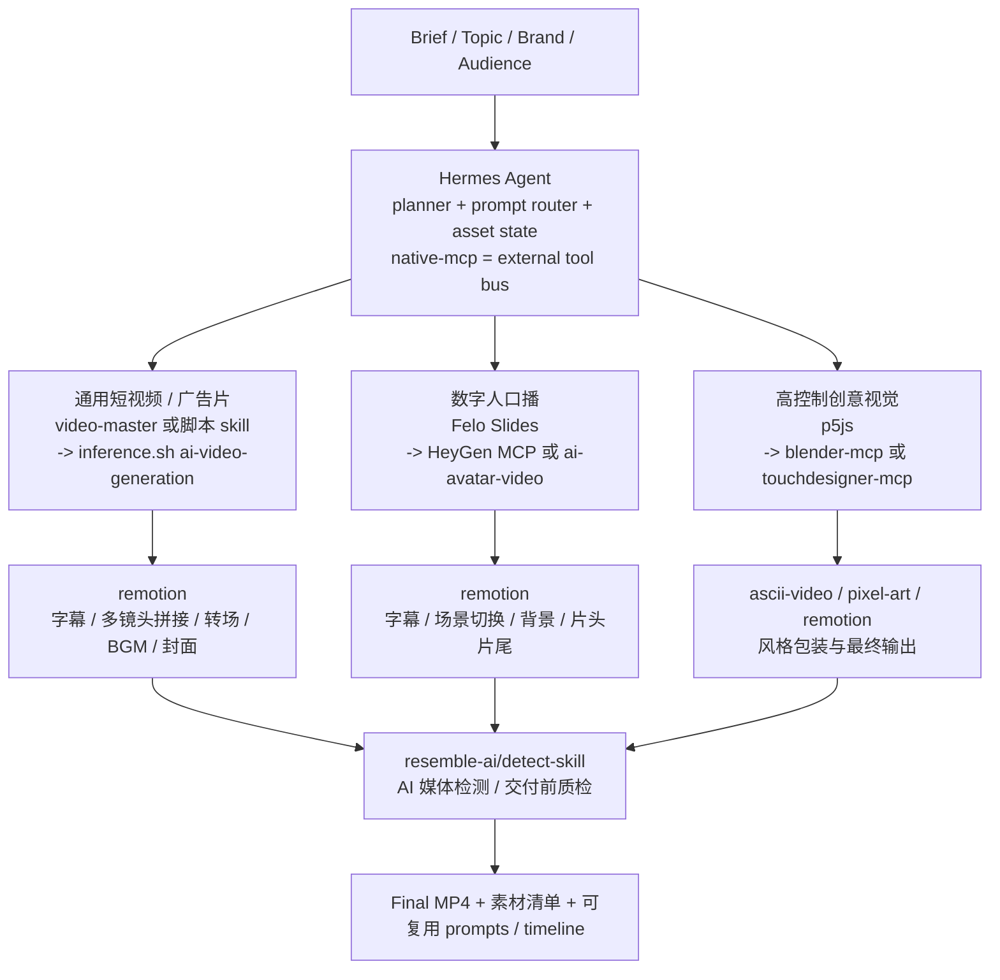

> DEVELOPER

是的，**Claude Skills 社区里已经有不少“视频生成/视频制作”相关 Skills**。不过要分清两类：

1. **真正调用视频模型生成视频**：比如 Runway、Veo、P-Video、WAN、Seedance、fal.ai 等。
2. **用代码/工具合成视频**：比如 Remotion、FFmpeg、MoviePy、UGC 工作流、产品宣传视频等。

你上传的笔记里也提到，Claude 侧视频生产主要依赖 **Claude Code + Skills + 外部工具链**，例如 Remotion、video-toolkit、Runway、MoviePy、FFmpeg、TTS 等 。

## 我建议重点研究这些 Claude 社区视频 Skills

### 1. `digitalsamba/claude-code-video-toolkit`

这是目前我看到最完整的 Claude Code 视频制作工作台。它不是单一视频模型 Skill，而是一整套视频生产 workspace：包含 skills、commands、templates 和 tools，可以从 concept 到 final render 做完整视频。README 里写明它给 Claude Code 提供创建专业视频所需的构件，并支持 `/setup` 和 `/video` 工作流。([GitHub][1])

下载研究：

```bash
git clone https://github.com/digitalsamba/claude-code-video-toolkit.git
cd claude-code-video-toolkit
find . -name "SKILL.md" -o -name "*.md" -o -name "*.py"
```

适合研究：完整视频流水线、Remotion、配音、音乐、素材生成、FFmpeg、MoviePy。

---

### 2. `runwayml/skills`

这是 Runway 官方的 coding agent skills，支持 Claude Code、Cursor、Codex 等 agent。仓库说明里明确写了可以通过 Runway API 批量生成视频、图片和音频，支持产品视频、多镜头故事、创意迭代等；agent 会负责 API 调用、轮询任务完成、下载结果。([GitHub][2])

安装：

```bash
npx skills add runwayml/skills
```

下载研究：

```bash
git clone https://github.com/runwayml/skills.git
cd skills
find . -name "SKILL.md" -o -name "*.md" -o -name "*.ts" -o -name "*.js"
```

适合研究：真正的视频模型 API 编排、批量生成、Runway Gen 系列、Seedance、Veo 等模型路由。

---

### 3. `kdowswell/veo-tools`

这个是专门面向 **Google Veo 3.1 + Claude Code** 的视频生成 skills。仓库说明写的是通过 Vertex AI 生成 cinematic video content，适合网站 hero background、营销素材和 seamless loops。它支持 Claude Code plugin 安装，也支持手动复制 skills 到 `~/.claude/skills/`。([GitHub][3])

下载研究：

```bash
git clone https://github.com/kdowswell/veo-tools.git
cd veo-tools
find . -name "SKILL.md" -o -name "*.md" -o -name "*.sh" -o -name "*.py"
```

手动安装方式：

```bash
cp -r veo-tools/skills/* ~/.claude/skills/
```

注意：这个仓库目前星标很少，适合研究结构，不建议一上来就放生产 API key。

---

### 4. `inferen-sh/skills` 里的 `p-video`

Claude Code Marketplaces 上的 `P Video` skill 描述说，它通过 `inference.sh` CLI 调用 Pruna 优化模型，包装了 P-Video、WAN-T2V、WAN-I2V 三类模型，用于 text/image-to-video，输出 720p 或 1080p，适合原型视频、社交媒体短片、产品 mockup 动画。([claudemarketplaces.com][4])

安装：

```bash
npx skills add https://github.com/inferen-sh/skills --skill p-video
```

下载研究：

```bash
git clone https://github.com/inferen-sh/skills.git inferen-sh-skills
cd inferen-sh-skills
find . -name "SKILL.md" -o -name "*.md" -o -name "*.sh"
```

---

### 5. `inferen-sh/skills` 里的 `image-to-video`

同一个社区源里还有 `image-to-video` skill。Marketplace 描述说它把静态图片转成动画视频，背后使用 Wan 2.5 i2v、Seedance、Fabric 等模型，并强调更适合轻微运动、产品 demo、cinemagraph、社交媒体内容和概念图动效。([claudemarketplaces.com][5])

安装大致类似：

```bash
npx skills add https://github.com/inferen-sh/skills --skill image-to-video
```

---

### 6. `fal-ai-community/skills` 里的 `fal-video-edit`

这个偏“视频编辑/增强”，不是从零文生视频。`SKILL.md` 描述它可以 edit、remix、upscale、remove background、add audio/sound effects。脚本包括 `edit-video.sh` 和 `video-audio.sh`，可以对视频做 remix、内容编辑、超分、去背景、加声音。([GitHub][6])

下载研究：

```bash
git clone https://github.com/fal-ai-community/skills.git fal-ai-community-skills
cd fal-ai-community-skills
find skills/claude.ai/fal-video-edit -type f
```

适合研究：fal.ai 视频编辑 API 的 Claude Skill 封装方式。

---

### 7. `yuvalsuede/agent-media-skill`

这个偏 UGC 视频生产。README 写明它让 Claude Code 通过 `agent-media` CLI 生成完整 UGC 视频、Product Acting UGC、SaaS review videos，包括 AI talking heads、B-roll、voiceover、animated subtitles、background music。([GitHub][7])

下载研究：

```bash
git clone https://github.com/yuvalsuede/agent-media-skill.git
cd agent-media-skill
cat SKILL.md
```

安装方式：

```bash
npm install -g agent-media-cli
agent-media login
npx --yes skills add gitroomhq/agent-media --agent claude-code --yes
```

适合研究：商业 UGC 短视频工作流、AI 头像、字幕、B-roll 编排。

---

### 8. `AKCodez/promo-video-skill`

这个是产品/项目宣传视频 Skill。仓库说明里写到，Claude 会扫描你的 repo，构建 scenes，生成 voiceover，并渲染 landscape 和 portrait 两种 MP4。([GitHub][8])

下载研究：

```bash
git clone https://github.com/AKCodez/promo-video-skill.git
cd promo-video-skill
find . -name "SKILL.md" -o -name "*.md" -o -name "*.sh" -o -name "*.py"
```

适合研究：如何让 Claude 从代码仓库自动生成产品宣传视频。

---

### 9. `Square-Zero-Labs/video-prompting-skill`

这个不是直接生成视频，而是**视频生成 prompt 工程 Skill**。README 写明它用于 text-to-video / image-to-video 的 prompt 起草和优化，支持 Seedance 2.0、LTX-2、LTX-2.3、Sora、Veo 3/3.1、Wan 2.2、Ovi，并包含角色一致性/character sheet 工作流。([GitHub][9])

下载研究：

```bash
git clone https://github.com/Square-Zero-Labs/video-prompting-skill.git
cd video-prompting-skill
find . -type f
```

构建 `.skill` 文件：

```bash
mkdir -p dist
zip -r dist/video-prompting.skill video-prompting -x '**/.DS_Store'
```

适合研究：多视频模型 prompt 规范、角色一致性、图生视频前置流程。

---

## 可直接批量下载的脚本

```bash
mkdir -p ~/claude-video-skills-research
cd ~/claude-video-skills-research

git clone https://github.com/digitalsamba/claude-code-video-toolkit.git
git clone https://github.com/runwayml/skills.git runwayml-skills
git clone https://github.com/kdowswell/veo-tools.git
git clone https://github.com/inferen-sh/skills.git inferen-sh-skills
git clone https://github.com/fal-ai-community/skills.git fal-ai-community-skills
git clone https://github.com/yuvalsuede/agent-media-skill.git
git clone https://github.com/AKCodez/promo-video-skill.git
git clone https://github.com/Square-Zero-Labs/video-prompting-skill.git

find . -name "SKILL.md"
```

然后重点搜：

```bash
grep -R "video\|ffmpeg\|remotion\|runway\|veo\|wan\|seedance\|sora\|ltx\|fal\|voiceover\|subtitle" \
  -n ~/claude-video-skills-research | head -300
```

## 我的优先级建议

最值得先研究：

1. **`runwayml/skills`**：真正的视频生成 API Skill，官方背景强。
2. **`digitalsamba/claude-code-video-toolkit`**：完整生产流水线，最适合拆解 Claude Code 视频工作流。
3. **`Square-Zero-Labs/video-prompting-skill`**：研究多模型 prompt 规范很有价值。
4. **`fal-ai-community/skills/fal-video-edit`**：研究视频编辑增强类 Skill。
5. **`kdowswell/veo-tools`**：研究 Veo + Vertex AI 的 Claude Code 封装。
6. **`agent-media-skill` / `promo-video-skill`**：研究 UGC 和产品宣传视频的端到端 workflow。

另外提醒一下：Claude 社区 Skills 很新，质量差异很大。凡是要你登录 CLI、填 API Key、跑 shell 脚本的，都先读 `SKILL.md` 和脚本源码，尤其检查 `curl | sh`、`eval`、`rm -rf`、上传环境变量等风险。

[1]: https://github.com/digitalsamba/claude-code-video-toolkit "GitHub - digitalsamba/claude-code-video-toolkit: AI-native video production toolkit for Claude Code · GitHub"
[2]: https://github.com/runwayml/skills "GitHub - runwayml/skills: for Runway coding agent skills · GitHub"
[3]: https://github.com/kdowswell/veo-tools "GitHub - kdowswell/veo-tools: AI video generation skills for Claude Code - Google Veo 3.1, GCP setup, and seamless video loops · GitHub"
[4]: https://claudemarketplaces.com/skills/inferen-sh/skills/p-video "P Video | Claude Code Skills"
[5]: https://claudemarketplaces.com/skills/inferen-sh/skills/image-to-video "Image To Video | Claude Code Skills"
[6]: https://github.com/fal-ai-community/skills/blob/main/skills/claude.ai/fal-video-edit/SKILL.md "skills/skills/claude.ai/fal-video-edit/SKILL.md at main · fal-ai-community/skills · GitHub"
[7]: https://github.com/yuvalsuede/agent-media-skill "GitHub - yuvalsuede/agent-media-skill: Claude Code skill for AI video & image generation via agent-media CLI · GitHub"
[8]: https://github.com/AKCodez/promo-video-skill "GitHub - AKCodez/promo-video-skill: Claude Code skill that turns any SaaS/repo into a professional promo video — 30s, 60s, or 90s in landscape + portrait · GitHub"
[9]: https://github.com/Square-Zero-Labs/video-prompting-skill "GitHub - Square-Zero-Labs/video-prompting-skill: AI Agent Skill for Prompting Video Models · GitHub"


下载这些skills，好好研究它们每一个

> TOOL

<turn_aborted>
The user interrupted the previous turn on purpose. Any running unified exec processes may still be running in the background. If any tools/commands were aborted, they may have partially executed.
</turn_aborted>

> DEVELOPER

是的，**Claude Skills 社区里已经有不少“视频生成/视频制作”相关 Skills**。不过要分清两类：

1. **真正调用视频模型生成视频**：比如 Runway、Veo、P-Video、WAN、Seedance、fal.ai 等。
2. **用代码/工具合成视频**：比如 Remotion、FFmpeg、MoviePy、UGC 工作流、产品宣传视频等。

你上传的笔记里也提到，Claude 侧视频生产主要依赖 **Claude Code + Skills + 外部工具链**，例如 Remotion、video-toolkit、Runway、MoviePy、FFmpeg、TTS 等 。

## 我建议重点研究这些 Claude 社区视频 Skills

### 1. `digitalsamba/claude-code-video-toolkit`

这是目前我看到最完整的 Claude Code 视频制作工作台。它不是单一视频模型 Skill，而是一整套视频生产 workspace：包含 skills、commands、templates 和 tools，可以从 concept 到 final render 做完整视频。README 里写明它给 Claude Code 提供创建专业视频所需的构件，并支持 `/setup` 和 `/video` 工作流。([GitHub][1])

下载研究：

```bash
git clone https://github.com/digitalsamba/claude-code-video-toolkit.git
cd claude-code-video-toolkit
find . -name "SKILL.md" -o -name "*.md" -o -name "*.py"
```

适合研究：完整视频流水线、Remotion、配音、音乐、素材生成、FFmpeg、MoviePy。

---

### 2. `runwayml/skills`

这是 Runway 官方的 coding agent skills，支持 Claude Code、Cursor、Codex 等 agent。仓库说明里明确写了可以通过 Runway API 批量生成视频、图片和音频，支持产品视频、多镜头故事、创意迭代等；agent 会负责 API 调用、轮询任务完成、下载结果。([GitHub][2])

安装：

```bash
npx skills add runwayml/skills
```

下载研究：

```bash
git clone https://github.com/runwayml/skills.git
cd skills
find . -name "SKILL.md" -o -name "*.md" -o -name "*.ts" -o -name "*.js"
```

适合研究：真正的视频模型 API 编排、批量生成、Runway Gen 系列、Seedance、Veo 等模型路由。

---

### 3. `kdowswell/veo-tools`

这个是专门面向 **Google Veo 3.1 + Claude Code** 的视频生成 skills。仓库说明写的是通过 Vertex AI 生成 cinematic video content，适合网站 hero background、营销素材和 seamless loops。它支持 Claude Code plugin 安装，也支持手动复制 skills 到 `~/.claude/skills/`。([GitHub][3])

下载研究：

```bash
git clone https://github.com/kdowswell/veo-tools.git
cd veo-tools
find . -name "SKILL.md" -o -name "*.md" -o -name "*.sh" -o -name "*.py"
```

手动安装方式：

```bash
cp -r veo-tools/skills/* ~/.claude/skills/
```

注意：这个仓库目前星标很少，适合研究结构，不建议一上来就放生产 API key。

---

### 4. `inferen-sh/skills` 里的 `p-video`

Claude Code Marketplaces 上的 `P Video` skill 描述说，它通过 `inference.sh` CLI 调用 Pruna 优化模型，包装了 P-Video、WAN-T2V、WAN-I2V 三类模型，用于 text/image-to-video，输出 720p 或 1080p，适合原型视频、社交媒体短片、产品 mockup 动画。([claudemarketplaces.com][4])

安装：

```bash
npx skills add https://github.com/inferen-sh/skills --skill p-video
```

下载研究：

```bash
git clone https://github.com/inferen-sh/skills.git inferen-sh-skills
cd inferen-sh-skills
find . -name "SKILL.md" -o -name "*.md" -o -name "*.sh"
```

---

### 5. `inferen-sh/skills` 里的 `image-to-video`

同一个社区源里还有 `image-to-video` skill。Marketplace 描述说它把静态图片转成动画视频，背后使用 Wan 2.5 i2v、Seedance、Fabric 等模型，并强调更适合轻微运动、产品 demo、cinemagraph、社交媒体内容和概念图动效。([claudemarketplaces.com][5])

安装大致类似：

```bash
npx skills add https://github.com/inferen-sh/skills --skill image-to-video
```

---

### 6. `fal-ai-community/skills` 里的 `fal-video-edit`

这个偏“视频编辑/增强”，不是从零文生视频。`SKILL.md` 描述它可以 edit、remix、upscale、remove background、add audio/sound effects。脚本包括 `edit-video.sh` 和 `video-audio.sh`，可以对视频做 remix、内容编辑、超分、去背景、加声音。([GitHub][6])

下载研究：

```bash
git clone https://github.com/fal-ai-community/skills.git fal-ai-community-skills
cd fal-ai-community-skills
find skills/claude.ai/fal-video-edit -type f
```

适合研究：fal.ai 视频编辑 API 的 Claude Skill 封装方式。

---

### 7. `yuvalsuede/agent-media-skill`

这个偏 UGC 视频生产。README 写明它让 Claude Code 通过 `agent-media` CLI 生成完整 UGC 视频、Product Acting UGC、SaaS review videos，包括 AI talking heads、B-roll、voiceover、animated subtitles、background music。([GitHub][7])

下载研究：

```bash
git clone https://github.com/yuvalsuede/agent-media-skill.git
cd agent-media-skill
cat SKILL.md
```

安装方式：

```bash
npm install -g agent-media-cli
agent-media login
npx --yes skills add gitroomhq/agent-media --agent claude-code --yes
```

适合研究：商业 UGC 短视频工作流、AI 头像、字幕、B-roll 编排。

---

### 8. `AKCodez/promo-video-skill`

这个是产品/项目宣传视频 Skill。仓库说明里写到，Claude 会扫描你的 repo，构建 scenes，生成 voiceover，并渲染 landscape 和 portrait 两种 MP4。([GitHub][8])

下载研究：

```bash
git clone https://github.com/AKCodez/promo-video-skill.git
cd promo-video-skill
find . -name "SKILL.md" -o -name "*.md" -o -name "*.sh" -o -name "*.py"
```

适合研究：如何让 Claude 从代码仓库自动生成产品宣传视频。

---

### 9. `Square-Zero-Labs/video-prompting-skill`

这个不是直接生成视频，而是**视频生成 prompt 工程 Skill**。README 写明它用于 text-to-video / image-to-video 的 prompt 起草和优化，支持 Seedance 2.0、LTX-2、LTX-2.3、Sora、Veo 3/3.1、Wan 2.2、Ovi，并包含角色一致性/character sheet 工作流。([GitHub][9])

下载研究：

```bash
git clone https://github.com/Square-Zero-Labs/video-prompting-skill.git
cd video-prompting-skill
find . -type f
```

构建 `.skill` 文件：

```bash
mkdir -p dist
zip -r dist/video-prompting.skill video-prompting -x '**/.DS_Store'
```

适合研究：多视频模型 prompt 规范、角色一致性、图生视频前置流程。

---

## 可直接批量下载的脚本

```bash
mkdir -p ~/claude-video-skills-research
cd ~/claude-video-skills-research

git clone https://github.com/digitalsamba/claude-code-video-toolkit.git
git clone https://github.com/runwayml/skills.git runwayml-skills
git clone https://github.com/kdowswell/veo-tools.git
git clone https://github.com/inferen-sh/skills.git inferen-sh-skills
git clone https://github.com/fal-ai-community/skills.git fal-ai-community-skills
git clone https://github.com/yuvalsuede/agent-media-skill.git
git clone https://github.com/AKCodez/promo-video-skill.git
git clone https://github.com/Square-Zero-Labs/video-prompting-skill.git

find . -name "SKILL.md"
```

然后重点搜：

```bash
grep -R "video\|ffmpeg\|remotion\|runway\|veo\|wan\|seedance\|sora\|ltx\|fal\|voiceover\|subtitle" \
  -n ~/claude-video-skills-research | head -300
```

## 我的优先级建议

最值得先研究：

1. **`runwayml/skills`**：真正的视频生成 API Skill，官方背景强。
2. **`digitalsamba/claude-code-video-toolkit`**：完整生产流水线，最适合拆解 Claude Code 视频工作流。
3. **`Square-Zero-Labs/video-prompting-skill`**：研究多模型 prompt 规范很有价值。
4. **`fal-ai-community/skills/fal-video-edit`**：研究视频编辑增强类 Skill。
5. **`kdowswell/veo-tools`**：研究 Veo + Vertex AI 的 Claude Code 封装。
6. **`agent-media-skill` / `promo-video-skill`**：研究 UGC 和产品宣传视频的端到端 workflow。

另外提醒一下：Claude 社区 Skills 很新，质量差异很大。凡是要你登录 CLI、填 API Key、跑 shell 脚本的，都先读 `SKILL.md` 和脚本源码，尤其检查 `curl | sh`、`eval`、`rm -rf`、上传环境变量等风险。

[1]: https://github.com/digitalsamba/claude-code-video-toolkit "GitHub - digitalsamba/claude-code-video-toolkit: AI-native video production toolkit for Claude Code · GitHub"
[2]: https://github.com/runwayml/skills "GitHub - runwayml/skills: for Runway coding agent skills · GitHub"
[3]: https://github.com/kdowswell/veo-tools "GitHub - kdowswell/veo-tools: AI video generation skills for Claude Code - Google Veo 3.1, GCP setup, and seamless video loops · GitHub"
[4]: https://claudemarketplaces.com/skills/inferen-sh/skills/p-video "P Video | Claude Code Skills"
[5]: https://claudemarketplaces.com/skills/inferen-sh/skills/image-to-video "Image To Video | Claude Code Skills"
[6]: https://github.com/fal-ai-community/skills/blob/main/skills/claude.ai/fal-video-edit/SKILL.md "skills/skills/claude.ai/fal-video-edit/SKILL.md at main · fal-ai-community/skills · GitHub"
[7]: https://github.com/yuvalsuede/agent-media-skill "GitHub - yuvalsuede/agent-media-skill: Claude Code skill for AI video & image generation via agent-media CLI · GitHub"
[8]: https://github.com/AKCodez/promo-video-skill "GitHub - AKCodez/promo-video-skill: Claude Code skill that turns any SaaS/repo into a professional promo video — 30s, 60s, or 90s in landscape + portrait · GitHub"
[9]: https://github.com/Square-Zero-Labs/video-prompting-skill "GitHub - Square-Zero-Labs/video-prompting-skill: AI Agent Skill for Prompting Video Models · GitHub"


下载这些skills放入一个单独文件夹，好好研究它们每一个

> AGENT

我会先把这些仓库集中放到一个独立研究目录里，然后逐个读 `SKILL.md`、README 和脚本入口，最后给你一份结构化研究笔记。因为涉及 GitHub 下载，我会先按本地权限尝试；如果遇到网络沙箱拦截，会直接请求放行。

> TOOL

tool_use exec_command
id: call_chUfmXxwbJH9uDSKEBYhFsO2
```json
{
  "cmd": "sed -n '1,220p' /Users/lyston/.agents/skills/agent-reach/SKILL.md",
  "workdir": "/Users/lyston/PycharmProjects",
  "yield_time_ms": 1000,
  "max_output_tokens": 12000
}
```

> TOOL

tool_result
id: call_chUfmXxwbJH9uDSKEBYhFsO2
```
Chunk ID: 620bfa
Wall time: 0.0004 seconds
Process exited with code 0
Original token count: 872
Output:
---
name: agent-reach
description: >
  Give your AI agent eyes to see the entire internet.
  17 platforms via CLI, MCP, curl, and Python scripts.
  Zero config for 8 channels.

  【路由方式】SKILL.md 包含路由表和常用命令，复杂场景需按需阅读对应分类的 references/*.md。
  分类：search / social (小红书/抖音/微博/推特/B站/V2EX/Reddit) / career(LinkedIn) / dev(github) / web(网页/文章/公众号/RSS) / video(YouTube/B站/播客).

  Use when user asks to search, read, or interact on any supported platform,
  shares a URL, or asks to search the web.
triggers:
  - search: 搜/查/找/search/搜索/查一下/帮我搜
  - social:
    - 小红书: xiaohongshu/xhs/小红书/红书
    - 抖音: douyin/抖音
    - Twitter: twitter/推特/x.com/推文
    - 微博: weibo/微博
    - B站: bilibili/b站/哔哩哔哩
    - V2EX: v2ex
    - Reddit: reddit
  - career: 招聘/职位/求职/linkedin/领英/找工作
  - dev: github/代码/仓库/gh/issue/pr/分支/commit
  - web: 网页/链接/文章/公众号/微信文章/rss/读一下/打开这个
  - video: youtube/视频/播客/字幕/小宇宙/转录/yt
  - finance: 雪球/股票/stock/xueqiu/行情/基金
metadata:
  openclaw:
    homepage: https://github.com/Panniantong/Agent-Reach
---

# Agent Reach — 路由器

17 平台工具集合。根据用户意图选择对应分类。

## 路由表

| 用户意图 | 分类 | 详细文档 |
|---------|------|---------|
| 网页搜索/代码搜索 | search | [references/search.md](references/search.md) |
| 小红书/抖音/微博/推特/B站/V2EX/Reddit | social | [references/social.md](references/social.md) |
| 招聘/职位/LinkedIn | career | [references/career.md](references/career.md) |
| GitHub/代码 | dev | [references/dev.md](references/dev.md) |
| 网页/文章/公众号/RSS | web | [references/web.md](references/web.md) |
| YouTube/B站/播客字幕 | video | [references/video.md](references/video.md) |

## 零配置快速命令

```bash
# Exa 网页搜索
mcporter call 'exa.web_search_exa(query: "query", numResults: 5)'

# 通用网页阅读
curl -s "https://r.jina.ai/URL"

# GitHub 搜索
gh search repos "query" --sort stars --limit 10

# Twitter 搜索
twitter search "query" --limit 10

# YouTube/B站字幕
yt-dlp --write-sub --skip-download -o "/tmp/%(id)s" "URL"

# Reddit 搜索
rdt search "query" --limit 10

# Reddit 读帖 + 评论
rdt read POST_ID

# V2EX 热门
curl -s "https://www.v2ex.com/api/topics/hot.json" -H "User-Agent: agent-reach/1.0"
```

## 环境检查

```bash
# 检查可用 channel
agent-reach doctor

# 查看所有 MCP 服务
mcporter_list_servers()
```

## 工作区规则

**不要在 agent workspace 创建文件。** 使用 `/tmp/` 存放临时输出，`~/.agent-reach/` 存放持久数据。

## 详细文档

根据用户需求，阅读对应的详细文档：

- [搜索工具](references/search.md) — Exa AI 搜索
- [社交媒体](references/social.md) — 小红书, 抖音, Twitter, B站, V2EX, Reddit
- [职场招聘](references/career.md) — LinkedIn
- [开发工具](references/dev.md) — GitHub CLI
- [网页阅读](references/web.md) — Jina Reader, 微信公众号, RSS
- [视频播客](references/video.md) — YouTube, B站, 小宇宙

## 配置渠道

如果某个 channel 需要配置，获取安装指南：
https://raw.githubusercontent.com/Panniantong/agent-reach/main/docs/install.md

用户只需提供 cookies，其他配置由 agent 完成。

```

> AGENT

我用 `agent-reach` 的 GitHub 路由来做这件事：实际下载仍然走 `git clone`，研究阶段会优先看每个 repo 的 skill 定义和工具脚本，而不是运行它们。先确认目标目录和是否已有残留。

> TOOL

tool_use exec_command
id: call_3qmBLBEeCjqU1NIaqexHI0ck
```json
{
  "cmd": "ls -la /Users/lyston/PycharmProjects",
  "workdir": "/Users/lyston/PycharmProjects",
  "yield_time_ms": 1000,
  "max_output_tokens": 12000
}
```

> TOOL

tool_result
id: call_3qmBLBEeCjqU1NIaqexHI0ck
```
Chunk ID: 0311c5
Wall time: 0.0000 seconds
Process exited with code 0
Original token count: 495
Output:
total 212096
drwxr-xr-x@ 31 lyston  staff       992 Apr 27 11:38 .
drwxr-x---+ 71 lyston  staff      2272 Apr 27 15:40 ..
-rw-r--r--@  1 lyston  staff     12292 Apr 27 11:20 .DS_Store
drwxr-xr-x@  3 lyston  staff        96 Apr 22 09:32 .claude
drwxr-xr-x@ 48 lyston  staff      1536 Apr 15 09:09 AionUi
drwxrwxr-x@ 30 lyston  staff       960 Apr 22 09:32 CLIProxyAPI
-rw-r--r--@  1 lyston  staff   1010010 Apr 19 00:14 CodexPotter-main.zip
drwxr-xr-x@ 27 lyston  staff       864 Apr 17 15:13 GenericAgent
-rw-r--r--@  1 lyston  staff  10615224 Apr 14 14:20 GenericAgent-main.zip
drwxrwxr-x@ 14 lyston  staff       448 Apr 21 17:47 Infinitoai
drwxr-xr-x@ 15 lyston  staff       480 Apr 24 14:43 ai_agents
drwxr-xr-x@ 29 lyston  staff       928 Apr 25 20:49 anything-analyzer
drwxr-xr-x@  3 lyston  staff        96 Apr  9 16:34 claude_code
drwxr-xr-x@ 26 lyston  staff       832 Apr 27 09:45 codex-session-toolkit
drwxr-xr-x   5 lyston  staff       160 Apr 13 22:41 cpa1
drwxr-xr-x@  6 lyston  staff       192 Apr 21 09:28 data
drwxr-xr-x@ 22 lyston  staff       704 Apr 14 08:38 fast-note-sync-service
drwxr-xr-x@ 12 lyston  staff       384 Apr 25 17:34 grok
drwxr-xr-x@ 21 lyston  staff       672 Apr 25 18:13 grok2api
drwxr-xr-x@ 18 lyston  staff       576 Apr 18 10:48 hapi
-rw-r--r--@  1 lyston  staff  96946391 Apr 18 15:43 hapi-main.zip
drwxr-xr-x@  4 lyston  staff       128 Apr 27 12:01 hermes
drwxr-xr-x@ 85 lyston  staff      2720 Apr 27 14:27 hermes-agent
drwxr-xr-x@  8 lyston  staff       256 Apr 24 14:41 jimeng-video-agent
drwxr-xr-x@ 43 lyston  staff      1376 Apr  8 10:14 metapi-main
drwxr-xr-x@ 29 lyston  staff       928 Apr 13 09:36 model-check
drwxr-xr-x@ 22 lyston  staff       704 Apr 26 19:19 ppt-master
drwxr-xr-x@ 28 lyston  staff       896 Apr 22 09:07 raap
drwxr-xr-x@  2 lyston  staff        64 Apr  9 16:34 ssh-todolist
drwxr-xr-x@ 24 lyston  staff       768 Apr 25 17:22 sub2api
drwxr-xr-x@ 19 lyston  staff       608 Apr 25 17:30 sub2api-deploy

```

> TOOL

tool_use exec_command
id: call_oY6VNMhaf86WxwMUt2CEFitF
```json
{
  "cmd": "mkdir -p /Users/lyston/PycharmProjects/claude-video-skills-research",
  "workdir": "/Users/lyston/PycharmProjects",
  "yield_time_ms": 1000,
  "max_output_tokens": 12000
}
```

> TOOL

tool_result
id: call_oY6VNMhaf86WxwMUt2CEFitF
```
Chunk ID: afc573
Wall time: 0.0000 seconds
Process exited with code 0
Original token count: 0
Output:

```

> TOOL

tool_use exec_command
id: call_eyWeP988XgOM0grWugqiC2le
```json
{
  "cmd": "ls -la /Users/lyston/PycharmProjects/claude-video-skills-research",
  "workdir": "/Users/lyston/PycharmProjects",
  "yield_time_ms": 1000,
  "max_output_tokens": 12000
}
```

> TOOL

tool_result
id: call_eyWeP988XgOM0grWugqiC2le
```
Chunk ID: 7c2f73
Wall time: 0.0000 seconds
Process exited with code 0
Original token count: 28
Output:
total 0
drwxr-xr-x@  2 lyston  staff    64 Apr 27 15:43 .
drwxr-xr-x@ 32 lyston  staff  1024 Apr 27 15:43 ..

```

> AGENT

目录已建好：`/Users/lyston/PycharmProjects/claude-video-skills-research`。现在开始并行克隆 8 个仓库，先只下载源码，不执行任何安装或 API 登录命令。

> TOOL

tool_use exec_command
id: call_HkxXwhaHxP2MctlpjPCr4aNa
```json
{
  "cmd": "git clone https://github.com/digitalsamba/claude-code-video-toolkit.git digitalsamba-claude-code-video-toolkit",
  "workdir": "/Users/lyston/PycharmProjects/claude-video-skills-research",
  "yield_time_ms": 1000,
  "max_output_tokens": 6000
}
```

> TOOL

tool_use exec_command
id: call_OdSLxhKzcLGm9cnA5jG0XqtS
```json
{
  "cmd": "git clone https://github.com/runwayml/skills.git runwayml-skills",
  "workdir": "/Users/lyston/PycharmProjects/claude-video-skills-research",
  "yield_time_ms": 1000,
  "max_output_tokens": 6000
}
```

> TOOL

tool_use exec_command
id: call_P8fgTF1Ne383tY2nEXJKWLdN
```json
{
  "cmd": "git clone https://github.com/kdowswell/veo-tools.git kdowswell-veo-tools",
  "workdir": "/Users/lyston/PycharmProjects/claude-video-skills-research",
  "yield_time_ms": 1000,
  "max_output_tokens": 6000
}
```

> TOOL

tool_use exec_command
id: call_smOQuJ0q5IBW6nnPXtYt0exy
```json
{
  "cmd": "git clone https://github.com/inferen-sh/skills.git inferen-sh-skills",
  "workdir": "/Users/lyston/PycharmProjects/claude-video-skills-research",
  "yield_time_ms": 1000,
  "max_output_tokens": 6000
}
```

> TOOL

tool_use exec_command
id: call_fxZ2PLZNFRW0yEKkM1B3cW5L
```json
{
  "cmd": "git clone https://github.com/fal-ai-community/skills.git fal-ai-community-skills",
  "workdir": "/Users/lyston/PycharmProjects/claude-video-skills-research",
  "yield_time_ms": 1000,
  "max_output_tokens": 6000
}
```

> TOOL

tool_use exec_command
id: call_cbs7zEdzMCvuYKzfytTcWd69
```json
{
  "cmd": "git clone https://github.com/yuvalsuede/agent-media-skill.git yuvalsuede-agent-media-skill",
  "workdir": "/Users/lyston/PycharmProjects/claude-video-skills-research",
  "yield_time_ms": 1000,
  "max_output_tokens": 6000
}
```

> TOOL

tool_use exec_command
id: call_aHMAq1sFeRbALnIlCLyzuPEM
```json
{
  "cmd": "git clone https://github.com/AKCodez/promo-video-skill.git AKCodez-promo-video-skill",
  "workdir": "/Users/lyston/PycharmProjects/claude-video-skills-research",
  "yield_time_ms": 1000,
  "max_output_tokens": 6000
}
```

> TOOL

tool_use exec_command
id: call_7B34zP1usyNb1pbglLpduX73
```json
{
  "cmd": "git clone https://github.com/Square-Zero-Labs/video-prompting-skill.git Square-Zero-Labs-video-prompting-skill",
  "workdir": "/Users/lyston/PycharmProjects/claude-video-skills-research",
  "yield_time_ms": 1000,
  "max_output_tokens": 6000
}
```

> TOOL

tool_result
id: call_HkxXwhaHxP2MctlpjPCr4aNa
```
Chunk ID: 5139d4
Wall time: 0.0000 seconds
Process exited with code 128
Original token count: 100
Output:
error: Can't create the symlink for multishells at "/Users/lyston/.local/state/fnm_multishells/37583_1777275811654". Maybe there are some issues with permissions for the directory? Operation not permitted (os error 1)
Cloning into 'digitalsamba-claude-code-video-toolkit'...
fatal: unable to access 'https://github.com/digitalsamba/claude-code-video-toolkit.git/': Could not resolve host: github.com

```

> TOOL

tool_result
id: call_OdSLxhKzcLGm9cnA5jG0XqtS
```
Chunk ID: ba374a
Wall time: 0.0000 seconds
Process exited with code 128
Original token count: 89
Output:
error: Can't create the symlink for multishells at "/Users/lyston/.local/state/fnm_multishells/37663_1777275811844". Maybe there are some issues with permissions for the directory? Operation not permitted (os error 1)
Cloning into 'runwayml-skills'...
fatal: unable to access 'https://github.com/runwayml/skills.git/': Could not resolve host: github.com

```

> TOOL

tool_result
id: call_P8fgTF1Ne383tY2nEXJKWLdN
```
Chunk ID: 864c20
Wall time: 0.0000 seconds
Process exited with code 128
Original token count: 91
Output:
error: Can't create the symlink for multishells at "/Users/lyston/.local/state/fnm_multishells/37660_1777275811842". Maybe there are some issues with permissions for the directory? Operation not permitted (os error 1)
Cloning into 'kdowswell-veo-tools'...
fatal: unable to access 'https://github.com/kdowswell/veo-tools.git/': Could not resolve host: github.com

```

> TOOL

tool_result
id: call_smOQuJ0q5IBW6nnPXtYt0exy
```
Chunk ID: 2fac8b
Wall time: 0.0000 seconds
Process exited with code 128
Original token count: 90
Output:
error: Can't create the symlink for multishells at "/Users/lyston/.local/state/fnm_multishells/37658_1777275811845". Maybe there are some issues with permissions for the directory? Operation not permitted (os error 1)
Cloning into 'inferen-sh-skills'...
fatal: unable to access 'https://github.com/inferen-sh/skills.git/': Could not resolve host: github.com

```

> TOOL

tool_result
id: call_fxZ2PLZNFRW0yEKkM1B3cW5L
```
Chunk ID: 2ce032
Wall time: 0.0000 seconds
Process exited with code 128
Original token count: 93
Output:
error: Can't create the symlink for multishells at "/Users/lyston/.local/state/fnm_multishells/37666_1777275811843". Maybe there are some issues with permissions for the directory? Operation not permitted (os error 1)
Cloning into 'fal-ai-community-skills'...
fatal: unable to access 'https://github.com/fal-ai-community/skills.git/': Could not resolve host: github.com

```

> TOOL

tool_result
id: call_cbs7zEdzMCvuYKzfytTcWd69
```
Chunk ID: 1c808d
Wall time: 0.0000 seconds
Process exited with code 128
Original token count: 95
Output:
error: Can't create the symlink for multishells at "/Users/lyston/.local/state/fnm_multishells/37670_1777275811852". Maybe there are some issues with permissions for the directory? Operation not permitted (os error 1)
Cloning into 'yuvalsuede-agent-media-skill'...
fatal: unable to access 'https://github.com/yuvalsuede/agent-media-skill.git/': Could not resolve host: github.com

```

> TOOL

tool_result
id: call_aHMAq1sFeRbALnIlCLyzuPEM
```
Chunk ID: 706bc3
Wall time: 0.0000 seconds
Process exited with code 128
Original token count: 94
Output:
error: Can't create the symlink for multishells at "/Users/lyston/.local/state/fnm_multishells/37669_1777275811849". Maybe there are some issues with permissions for the directory? Operation not permitted (os error 1)
Cloning into 'AKCodez-promo-video-skill'...
fatal: unable to access 'https://github.com/AKCodez/promo-video-skill.git/': Could not resolve host: github.com

```

> TOOL

tool_result
id: call_7B34zP1usyNb1pbglLpduX73
```
Chunk ID: 625640
Wall time: 0.0000 seconds
Process exited with code 128
Original token count: 100
Output:
error: Can't create the symlink for multishells at "/Users/lyston/.local/state/fnm_multishells/37664_1777275811844". Maybe there are some issues with permissions for the directory? Operation not permitted (os error 1)
Cloning into 'Square-Zero-Labs-video-prompting-skill'...
fatal: unable to access 'https://github.com/Square-Zero-Labs/video-prompting-skill.git/': Could not resolve host: github.com

```

> AGENT

网络沙箱把 GitHub DNS 拦住了，失败信息是 `Could not resolve host: github.com`。我现在会按要求用提权方式重新跑下载；仍然只做 clone，不执行仓库里的脚本。

> TOOL

tool_use exec_command
id: call_k2htdRuc53iF1JY1V2IiqyqL
```json
{
  "cmd": "git clone https://github.com/digitalsamba/claude-code-video-toolkit.git digitalsamba-claude-code-video-toolkit",
  "workdir": "/Users/lyston/PycharmProjects/claude-video-skills-research",
  "yield_time_ms": 1000,
  "max_output_tokens": 6000,
  "sandbox_permissions": "require_escalated",
  "justification": "要从 GitHub 下载第一个视频 skill 仓库到研究目录，是否允许联网执行 git clone？",
  "prefix_rule": [
    "git",
    "clone"
  ]
}
```

> TOOL

tool_result
id: call_k2htdRuc53iF1JY1V2IiqyqL
```
Chunk ID: 983f4e
Wall time: 1.0020 seconds
Process running with session ID 3047
Original token count: 15
Output:
Cloning into 'digitalsamba-claude-code-video-toolkit'...

```

> TOOL

tool_use write_stdin
id: call_q89DhmE4ehJZ1qvvePpEmxGX
```json
{
  "session_id": 3047,
  "chars": "",
  "yield_time_ms": 1000,
  "max_output_tokens": 6000
}
```

> TOOL

tool_result
id: call_q89DhmE4ehJZ1qvvePpEmxGX
```
Chunk ID: d5c992
Wall time: 0.4618 seconds
Process exited with code 0
Original token count: 0
Output:

```

> AGENT

第一个仓库已经下来了；`git clone` 的联网权限现在可用，我继续把剩下 7 个并行拉下来。

> TOOL

tool_use exec_command
id: call_iy5V71uypQsySnYtz3ac0QG7
```json
{
  "cmd": "git clone https://github.com/runwayml/skills.git runwayml-skills",
  "workdir": "/Users/lyston/PycharmProjects/claude-video-skills-research",
  "yield_time_ms": 1000,
  "max_output_tokens": 6000
}
```

> TOOL

tool_use exec_command
id: call_TZKBmwgPaCzKJJnPNZuQTs9Z
```json
{
  "cmd": "git clone https://github.com/kdowswell/veo-tools.git kdowswell-veo-tools",
  "workdir": "/Users/lyston/PycharmProjects/claude-video-skills-research",
  "yield_time_ms": 1000,
  "max_output_tokens": 6000
}
```

> TOOL

tool_use exec_command
id: call_hOsPhWhNf06ZXDzXweaCDOF3
```json
{
  "cmd": "git clone https://github.com/inferen-sh/skills.git inferen-sh-skills",
  "workdir": "/Users/lyston/PycharmProjects/claude-video-skills-research",
  "yield_time_ms": 1000,
  "max_output_tokens": 6000
}
```

> TOOL

tool_use exec_command
id: call_0z7THZP1GVz1LxF14FNuYlyV
```json
{
  "cmd": "git clone https://github.com/fal-ai-community/skills.git fal-ai-community-skills",
  "workdir": "/Users/lyston/PycharmProjects/claude-video-skills-research",
  "yield_time_ms": 1000,
  "max_output_tokens": 6000
}
```

> TOOL

tool_use exec_command
id: call_smbT0O4FxgfcxBi8bWsGNfBo
```json
{
  "cmd": "git clone https://github.com/yuvalsuede/agent-media-skill.git yuvalsuede-agent-media-skill",
  "workdir": "/Users/lyston/PycharmProjects/claude-video-skills-research",
  "yield_time_ms": 1000,
  "max_output_tokens": 6000
}
```

> TOOL

tool_use exec_command
id: call_m6FYhq0GO6lgTlyxIgkrAZGn
```json
{
  "cmd": "git clone https://github.com/AKCodez/promo-video-skill.git AKCodez-promo-video-skill",
  "workdir": "/Users/lyston/PycharmProjects/claude-video-skills-research",
  "yield_time_ms": 1000,
  "max_output_tokens": 6000
}
```

> TOOL

tool_use exec_command
id: call_1lval0PoOMTkptG2Wm8ZBGKF
```json
{
  "cmd": "git clone https://github.com/Square-Zero-Labs/video-prompting-skill.git Square-Zero-Labs-video-prompting-skill",
  "workdir": "/Users/lyston/PycharmProjects/claude-video-skills-research",
  "yield_time_ms": 1000,
  "max_output_tokens": 6000
}
```

> TOOL

tool_result
id: call_iy5V71uypQsySnYtz3ac0QG7
```
Chunk ID: 3d32ff
Wall time: 0.0000 seconds
Process exited with code 128
Original token count: 89
Output:
error: Can't create the symlink for multishells at "/Users/lyston/.local/state/fnm_multishells/37946_1777275986013". Maybe there are some issues with permissions for the directory? Operation not permitted (os error 1)
Cloning into 'runwayml-skills'...
fatal: unable to access 'https://github.com/runwayml/skills.git/': Could not resolve host: github.com

```

> TOOL

tool_result
id: call_TZKBmwgPaCzKJJnPNZuQTs9Z
```
Chunk ID: a03f16
Wall time: 0.0000 seconds
Process exited with code 128
Original token count: 91
Output:
error: Can't create the symlink for multishells at "/Users/lyston/.local/state/fnm_multishells/37948_1777275986013". Maybe there are some issues with permissions for the directory? Operation not permitted (os error 1)
Cloning into 'kdowswell-veo-tools'...
fatal: unable to access 'https://github.com/kdowswell/veo-tools.git/': Could not resolve host: github.com

```

> TOOL

tool_result
id: call_hOsPhWhNf06ZXDzXweaCDOF3
```
Chunk ID: ed4a60
Wall time: 0.0000 seconds
Process exited with code 128
Original token count: 90
Output:
error: Can't create the symlink for multishells at "/Users/lyston/.local/state/fnm_multishells/37947_1777275986013". Maybe there are some issues with permissions for the directory? Operation not permitted (os error 1)
Cloning into 'inferen-sh-skills'...
fatal: unable to access 'https://github.com/inferen-sh/skills.git/': Could not resolve host: github.com

```

> TOOL

tool_result
id: call_0z7THZP1GVz1LxF14FNuYlyV
```
Chunk ID: acd50c
Wall time: 0.0000 seconds
Process exited with code 128
Original token count: 93
Output:
error: Can't create the symlink for multishells at "/Users/lyston/.local/state/fnm_multishells/37944_1777275986013". Maybe there are some issues with permissions for the directory? Operation not permitted (os error 1)
Cloning into 'fal-ai-community-skills'...
fatal: unable to access 'https://github.com/fal-ai-community/skills.git/': Could not resolve host: github.com

```

> TOOL

tool_result
id: call_smbT0O4FxgfcxBi8bWsGNfBo
```
Chunk ID: b9e14a
Wall time: 0.0000 seconds
Process exited with code 128
Original token count: 95
Output:
error: Can't create the symlink for multishells at "/Users/lyston/.local/state/fnm_multishells/37949_1777275986019". Maybe there are some issues with permissions for the directory? Operation not permitted (os error 1)
Cloning into 'yuvalsuede-agent-media-skill'...
fatal: unable to access 'https://github.com/yuvalsuede/agent-media-skill.git/': Could not resolve host: github.com

```

> TOOL

tool_result
id: call_m6FYhq0GO6lgTlyxIgkrAZGn
```
Chunk ID: 3da8aa
Wall time: 0.0000 seconds
Process exited with code 128
Original token count: 94
Output:
error: Can't create the symlink for multishells at "/Users/lyston/.local/state/fnm_multishells/37945_1777275986013". Maybe there are some issues with permissions for the directory? Operation not permitted (os error 1)
Cloning into 'AKCodez-promo-video-skill'...
fatal: unable to access 'https://github.com/AKCodez/promo-video-skill.git/': Could not resolve host: github.com

```

> TOOL

tool_result
id: call_1lval0PoOMTkptG2Wm8ZBGKF
```
Chunk ID: 898a8f
Wall time: 0.0000 seconds
Process exited with code 128
Original token count: 100
Output:
error: Can't create the symlink for multishells at "/Users/lyston/.local/state/fnm_multishells/37943_1777275986013". Maybe there are some issues with permissions for the directory? Operation not permitted (os error 1)
Cloning into 'Square-Zero-Labs-video-prompting-skill'...
fatal: unable to access 'https://github.com/Square-Zero-Labs/video-prompting-skill.git/': Could not resolve host: github.com

```

> AGENT

看起来刚才的授权没有变成持续规则，所以剩余仓库仍被沙箱 DNS 拦住。为了不让你点 7 次，我改用一次提权 shell 循环把剩余仓库拉齐，并在已存在时跳过。

> TOOL

tool_use exec_command
id: call_ryKntOfnZvx1twhNEGRI1bNY
```json
{
  "cmd": "set -e\nrepos=(\n  \"https://github.com/runwayml/skills.git runwayml-skills\"\n  \"https://github.com/kdowswell/veo-tools.git kdowswell-veo-tools\"\n  \"https://github.com/inferen-sh/skills.git inferen-sh-skills\"\n  \"https://github.com/fal-ai-community/skills.git fal-ai-community-skills\"\n  \"https://github.com/yuvalsuede/agent-media-skill.git yuvalsuede-agent-media-skill\"\n  \"https://github.com/AKCodez/promo-video-skill.git AKCodez-promo-video-skill\"\n  \"https://github.com/Square-Zero-Labs/video-prompting-skill.git Square-Zero-Labs-video-prompting-skill\"\n)\nfor entry in $repos; do\n  url=${entry%% *}\n  dest=${entry#* }\n  if [ -d \"$dest/.git\" ]; then\n    echo \"SKIP $dest\"\n  else\n    git clone \"$url\" \"$dest\"\n  fi\ndone",
  "workdir": "/Users/lyston/PycharmProjects/claude-video-skills-research",
  "yield_time_ms": 1000,
  "max_output_tokens": 12000,
  "sandbox_permissions": "require_escalated",
  "justification": "要一次性联网克隆剩余 7 个 GitHub 视频 skill 仓库到研究目录，是否允许执行？"
}
```

> TOOL

tool_result
id: call_ryKntOfnZvx1twhNEGRI1bNY
```
Chunk ID: 58c5eb
Wall time: 1.0021 seconds
Process running with session ID 48150
Original token count: 9
Output:
Cloning into 'runwayml-skills'...

```

> TOOL

tool_use write_stdin
id: call_VrvOHskCYlGYffzyXpd1mcZR
```json
{
  "session_id": 48150,
  "chars": "",
  "yield_time_ms": 1000,
  "max_output_tokens": 12000
}
```

> TOOL

tool_result
id: call_VrvOHskCYlGYffzyXpd1mcZR
```
Chunk ID: 1e7ada
Wall time: 5.0009 seconds
Process running with session ID 48150
Original token count: 0
Output:

```

> TOOL

tool_use write_stdin
id: call_dXvHj4Zre6OJ6Hlt8ZnTf6tq
```json
{
  "session_id": 48150,
  "chars": "",
  "yield_time_ms": 1000,
  "max_output_tokens": 12000
}
```

> TOOL

tool_result
id: call_dXvHj4Zre6OJ6Hlt8ZnTf6tq
```
Chunk ID: 61ad68
Wall time: 5.0024 seconds
Process running with session ID 48150
Original token count: 0
Output:

```

> TOOL

tool_use write_stdin
id: call_fqKJQ5irBju4KhAnrNEiteay
```json
{
  "session_id": 48150,
  "chars": "",
  "yield_time_ms": 10000,
  "max_output_tokens": 12000
}
```

> TOOL

tool_result
id: call_fqKJQ5irBju4KhAnrNEiteay
```
Chunk ID: d12199
Wall time: 10.0018 seconds
Process running with session ID 48150
Original token count: 0
Output:

```

> TOOL

tool_use write_stdin
id: call_eERdDm3TPD7y3p8tLNyZupKR
```json
{
  "session_id": 48150,
  "chars": "",
  "yield_time_ms": 30000,
  "max_output_tokens": 12000
}
```

> TOOL

tool_result
id: call_eERdDm3TPD7y3p8tLNyZupKR
```
Chunk ID: 8f9e7b
Wall time: 30.0021 seconds
Process running with session ID 48150
Original token count: 0
Output:

```

> AGENT

`runwayml/skills` 这个仓库还在拉取中，可能体积或网络响应比较慢。我先等它结束；后面的仓库会按同一个循环继续下载。

> TOOL

tool_use write_stdin
id: call_aXD647dyk7CmVRrjZFukfe2N
```json
{
  "session_id": 48150,
  "chars": "",
  "yield_time_ms": 60000,
  "max_output_tokens": 12000
}
```

> TOOL

tool_result
id: call_aXD647dyk7CmVRrjZFukfe2N
```
Chunk ID: 3a0a4b
Wall time: 8.3643 seconds
Process exited with code 128
Original token count: 38
Output:
fatal: unable to access 'https://github.com/runwayml/skills.git/': Failed to connect to github.com port 443 after 75045 ms: Couldn't connect to server

```

> AGENT

这次不是 DNS 了，而是 GitHub 443 连接超时。第一个仓库已经完整成功，剩下的我会改成浅克隆 `--depth 1` 分批重试，降低传输量；如果某个仓库仍卡住，我会记录下来并继续处理已下载的部分。

> TOOL

tool_use exec_command
id: call_XhJw7Du3y6ycTa4mpHkG57QR
```json
{
  "cmd": "find /Users/lyston/PycharmProjects/claude-video-skills-research -maxdepth 2 -type d -name .git -print",
  "workdir": "/Users/lyston/PycharmProjects",
  "yield_time_ms": 1000,
  "max_output_tokens": 12000
}
```

> TOOL

tool_result
id: call_XhJw7Du3y6ycTa4mpHkG57QR
```
Chunk ID: 08f9dc
Wall time: 0.0000 seconds
Process exited with code 0
Original token count: 26
Output:
/Users/lyston/PycharmProjects/claude-video-skills-research/digitalsamba-claude-code-video-toolkit/.git

```

> TOOL

tool_use exec_command
id: call_bhhYVFXJ77L3b5yDyHzVcxqG
```json
{
  "cmd": "ls -la /Users/lyston/PycharmProjects/claude-video-skills-research",
  "workdir": "/Users/lyston/PycharmProjects",
  "yield_time_ms": 1000,
  "max_output_tokens": 12000
}
```

> TOOL

tool_result
id: call_bhhYVFXJ77L3b5yDyHzVcxqG
```
Chunk ID: f22ab1
Wall time: 0.0000 seconds
Process exited with code 0
Original token count: 49
Output:
total 0
drwxr-xr-x@  3 lyston  staff    96 Apr 27 15:48 .
drwxr-xr-x@ 32 lyston  staff  1024 Apr 27 15:43 ..
drwxr-xr-x@ 26 lyston  staff   832 Apr 27 15:46 digitalsamba-claude-code-video-toolkit

```

> TOOL

tool_use exec_command
id: call_buC7vZuIGnZEIXMVj1AamM4O
```json
{
  "cmd": "git clone --depth 1 https://github.com/runwayml/skills.git runwayml-skills",
  "workdir": "/Users/lyston/PycharmProjects/claude-video-skills-research",
  "yield_time_ms": 1000,
  "max_output_tokens": 6000,
  "sandbox_permissions": "require_escalated",
  "justification": "要用浅克隆方式重新下载 runwayml/skills，是否允许联网执行 git clone --depth 1？",
  "prefix_rule": [
    "git",
    "clone",
    "--depth"
  ]
}
```

> TOOL

tool_result
id: call_buC7vZuIGnZEIXMVj1AamM4O
```
Chunk ID: 13cc27
Wall time: 1.0021 seconds
Process running with session ID 54698
Original token count: 9
Output:
Cloning into 'runwayml-skills'...

```

> TOOL

tool_use write_stdin
id: call_6HbmAX1xWVtSvOyzUQk9mpfI
```json
{
  "session_id": 54698,
  "chars": "",
  "yield_time_ms": 10000,
  "max_output_tokens": 6000
}
```

> TOOL

tool_result
id: call_6HbmAX1xWVtSvOyzUQk9mpfI
```
Chunk ID: cacfbc
Wall time: 0.0000 seconds
Process exited with code 0
Original token count: 0
Output:

```

> AGENT

浅克隆有效，`runwayml/skills` 已经下载好。接下来我用同样方式处理剩下 6 个。

> TOOL

tool_use exec_command
id: call_HhHsKr6hLAL5hyhJvFwhk7RY
```json
{
  "cmd": "git clone --depth 1 https://github.com/kdowswell/veo-tools.git kdowswell-veo-tools",
  "workdir": "/Users/lyston/PycharmProjects/claude-video-skills-research",
  "yield_time_ms": 1000,
  "max_output_tokens": 6000
}
```

> TOOL

tool_use exec_command
id: call_xvUjR2hx8ALA7ryt8mxVx7U7
```json
{
  "cmd": "git clone --depth 1 https://github.com/inferen-sh/skills.git inferen-sh-skills",
  "workdir": "/Users/lyston/PycharmProjects/claude-video-skills-research",
  "yield_time_ms": 1000,
  "max_output_tokens": 6000
}
```

> TOOL

tool_use exec_command
id: call_xsGnbF3GdT03QVngvoLe6FIU
```json
{
  "cmd": "git clone --depth 1 https://github.com/fal-ai-community/skills.git fal-ai-community-skills",
  "workdir": "/Users/lyston/PycharmProjects/claude-video-skills-research",
  "yield_time_ms": 1000,
  "max_output_tokens": 6000
}
```

> TOOL

tool_use exec_command
id: call_5jh3mXnR0tJUFL4hLmacxNf9
```json
{
  "cmd": "git clone --depth 1 https://github.com/yuvalsuede/agent-media-skill.git yuvalsuede-agent-media-skill",
  "workdir": "/Users/lyston/PycharmProjects/claude-video-skills-research",
  "yield_time_ms": 1000,
  "max_output_tokens": 6000
}
```

> TOOL

tool_use exec_command
id: call_CPqlqGQnEhjigIpmBejiwZWh
```json
{
  "cmd": "git clone --depth 1 https://github.com/AKCodez/promo-video-skill.git AKCodez-promo-video-skill",
  "workdir": "/Users/lyston/PycharmProjects/claude-video-skills-research",
  "yield_time_ms": 1000,
  "max_output_tokens": 6000
}
```

> TOOL

tool_use exec_command
id: call_2SENiGgDhlcvlVn7J1u14Hee
```json
{
  "cmd": "git clone --depth 1 https://github.com/Square-Zero-Labs/video-prompting-skill.git Square-Zero-Labs-video-prompting-skill",
  "workdir": "/Users/lyston/PycharmProjects/claude-video-skills-research",
  "yield_time_ms": 1000,
  "max_output_tokens": 6000
}
```

> TOOL

tool_result
id: call_HhHsKr6hLAL5hyhJvFwhk7RY
```
Chunk ID: 6619e8
Wall time: 0.0000 seconds
Process exited with code 128
Original token count: 91
Output:
error: Can't create the symlink for multishells at "/Users/lyston/.local/state/fnm_multishells/38248_1777276134680". Maybe there are some issues with permissions for the directory? Operation not permitted (os error 1)
Cloning into 'kdowswell-veo-tools'...
fatal: unable to access 'https://github.com/kdowswell/veo-tools.git/': Could not resolve host: github.com

```

> TOOL

tool_result
id: call_xvUjR2hx8ALA7ryt8mxVx7U7
```
Chunk ID: e2b303
Wall time: 0.0000 seconds
Process exited with code 128
Original token count: 90
Output:
error: Can't create the symlink for multishells at "/Users/lyston/.local/state/fnm_multishells/38245_1777276134680". Maybe there are some issues with permissions for the directory? Operation not permitted (os error 1)
Cloning into 'inferen-sh-skills'...
fatal: unable to access 'https://github.com/inferen-sh/skills.git/': Could not resolve host: github.com

```

> TOOL

tool_result
id: call_xsGnbF3GdT03QVngvoLe6FIU
```
Chunk ID: 454c3d
Wall time: 0.0000 seconds
Process exited with code 128
Original token count: 93
Output:
error: Can't create the symlink for multishells at "/Users/lyston/.local/state/fnm_multishells/38246_1777276134680". Maybe there are some issues with permissions for the directory? Operation not permitted (os error 1)
Cloning into 'fal-ai-community-skills'...
fatal: unable to access 'https://github.com/fal-ai-community/skills.git/': Could not resolve host: github.com

```

> TOOL

tool_result
id: call_5jh3mXnR0tJUFL4hLmacxNf9
```
Chunk ID: 42edf5
Wall time: 0.0000 seconds
Process exited with code 128
Original token count: 95
Output:
error: Can't create the symlink for multishells at "/Users/lyston/.local/state/fnm_multishells/38244_1777276134680". Maybe there are some issues with permissions for the directory? Operation not permitted (os error 1)
Cloning into 'yuvalsuede-agent-media-skill'...
fatal: unable to access 'https://github.com/yuvalsuede/agent-media-skill.git/': Could not resolve host: github.com

```

> TOOL

tool_result
id: call_CPqlqGQnEhjigIpmBejiwZWh
```
Chunk ID: 6df3d6
Wall time: 0.0000 seconds
Process exited with code 128
Original token count: 94
Output:
error: Can't create the symlink for multishells at "/Users/lyston/.local/state/fnm_multishells/38247_1777276134680". Maybe there are some issues with permissions for the directory? Operation not permitted (os error 1)
Cloning into 'AKCodez-promo-video-skill'...
fatal: unable to access 'https://github.com/AKCodez/promo-video-skill.git/': Could not resolve host: github.com

```

> TOOL

tool_result
id: call_2SENiGgDhlcvlVn7J1u14Hee
```
Chunk ID: 090179
Wall time: 0.0000 seconds
Process exited with code 128
Original token count: 100
Output:
error: Can't create the symlink for multishells at "/Users/lyston/.local/state/fnm_multishells/38249_1777276134680". Maybe there are some issues with permissions for the directory? Operation not permitted (os error 1)
Cloning into 'Square-Zero-Labs-video-prompting-skill'...
fatal: unable to access 'https://github.com/Square-Zero-Labs/video-prompting-skill.git/': Could not resolve host: github.com

```

> AGENT

默认沙箱还是不放 DNS；我把剩下 6 个也放进一次提权浅克隆循环。刚才 `runwayml` 用浅克隆 10 秒内完成，这条路靠谱。

> TOOL

tool_use exec_command
id: call_XEVFsryYDikhH8i6VaJ9jZkF
```json
{
  "cmd": "set -e\nrepos=(\n  \"https://github.com/kdowswell/veo-tools.git kdowswell-veo-tools\"\n  \"https://github.com/inferen-sh/skills.git inferen-sh-skills\"\n  \"https://github.com/fal-ai-community/skills.git fal-ai-community-skills\"\n  \"https://github.com/yuvalsuede/agent-media-skill.git yuvalsuede-agent-media-skill\"\n  \"https://github.com/AKCodez/promo-video-skill.git AKCodez-promo-video-skill\"\n  \"https://github.com/Square-Zero-Labs/video-prompting-skill.git Square-Zero-Labs-video-prompting-skill\"\n)\nfor entry in $repos; do\n  url=${entry%% *}\n  dest=${entry#* }\n  if [ -d \"$dest/.git\" ]; then\n    echo \"SKIP $dest\"\n  else\n    git clone --depth 1 \"$url\" \"$dest\"\n  fi\ndone",
  "workdir": "/Users/lyston/PycharmProjects/claude-video-skills-research",
  "yield_time_ms": 1000,
  "max_output_tokens": 12000,
  "sandbox_permissions": "require_escalated",
  "justification": "要用浅克隆方式一次性下载剩余 6 个 GitHub 视频 skill 仓库，是否允许联网执行？"
}
```

> TOOL

tool_result
id: call_XEVFsryYDikhH8i6VaJ9jZkF
```
Chunk ID: 14c924
Wall time: 1.0017 seconds
Process running with session ID 54716
Original token count: 10
Output:
Cloning into 'kdowswell-veo-tools'...

```

> TOOL

tool_use write_stdin
id: call_DjHFQ6WcYIihKNENOLgkaahP
```json
{
  "session_id": 54716,
  "chars": "",
  "yield_time_ms": 10000,
  "max_output_tokens": 12000
}
```

> TOOL

tool_result
id: call_DjHFQ6WcYIihKNENOLgkaahP
```
Chunk ID: 98c9e0
Wall time: 10.0060 seconds
Process running with session ID 54716
Original token count: 32
Output:
Cloning into 'inferen-sh-skills'...
Cloning into 'fal-ai-community-skills'...
Cloning into 'yuvalsuede-agent-media-skill'...

```

> TOOL

tool_use write_stdin
id: call_ndnWC7acFjkrkKSs0krc8zeX
```json
{
  "session_id": 54716,
  "chars": "",
  "yield_time_ms": 10000,
  "max_output_tokens": 12000
}
```

> TOOL

tool_result
id: call_ndnWC7acFjkrkKSs0krc8zeX
```
Chunk ID: 0f4045
Wall time: 9.7003 seconds
Process exited with code 0
Original token count: 26
Output:
Cloning into 'AKCodez-promo-video-skill'...
Cloning into 'Square-Zero-Labs-video-prompting-skill'...

```

> AGENT

8 个仓库现在都下齐了。接下来我会逐个扫：`SKILL.md`、README、commands/scripts、依赖入口和潜在风险点，然后把结果整理成一份本地研究笔记。

> TOOL

tool_use update_plan
id: call_dQ2bIe7tXm3Yr6vdA87FjWYG
```json
{
  "plan": [
    {
      "step": "确认 8 个仓库下载完整性和目录结构",
      "status": "in_progress"
    },
    {
      "step": "逐仓库阅读 SKILL.md、README、脚本与命令入口",
      "status": "pending"
    },
    {
      "step": "提炼能力模型、工具链、安装方式、风险点和可借鉴设计",
      "status": "pending"
    },
    {
      "step": "写入本地研究报告并给出总结",
      "status": "pending"
    }
  ]
}
```

> TOOL

tool_result
id: call_dQ2bIe7tXm3Yr6vdA87FjWYG
```
Plan updated
```

> TOOL

tool_use exec_command
id: call_sAXhCQYE1o4MC9WOzyZxGNn1
```json
{
  "cmd": "find /Users/lyston/PycharmProjects/claude-video-skills-research -maxdepth 2 -type d -print",
  "workdir": "/Users/lyston/PycharmProjects/claude-video-skills-research",
  "yield_time_ms": 1000,
  "max_output_tokens": 20000
}
```

> TOOL

tool_use exec_command
id: call_XrrXGKd9s6BvPE4KgyBu4Fxe
```json
{
  "cmd": "find /Users/lyston/PycharmProjects/claude-video-skills-research -name SKILL.md -print",
  "workdir": "/Users/lyston/PycharmProjects/claude-video-skills-research",
  "yield_time_ms": 1000,
  "max_output_tokens": 20000
}
```

> TOOL

tool_use exec_command
id: call_xFnEcL8GHmlxNI6cXoirBBZ0
```json
{
  "cmd": "find /Users/lyston/PycharmProjects/claude-video-skills-research -maxdepth 2 -type f -name README.md -print",
  "workdir": "/Users/lyston/PycharmProjects/claude-video-skills-research",
  "yield_time_ms": 1000,
  "max_output_tokens": 20000
}
```

> TOOL

tool_use exec_command
id: call_mZMzV0Tp7e8LfI4gf2x4KvXZ
```json
{
  "cmd": "rg -n \"video|ffmpeg|remotion|runway|veo|wan|seedance|sora|ltx|fal|voiceover|subtitle|moviepy|tts|audio\" /Users/lyston/PycharmProjects/claude-video-skills-research",
  "workdir": "/Users/lyston/PycharmProjects/claude-video-skills-research",
  "yield_time_ms": 1000,
  "max_output_tokens": 30000
}
```

> TOOL

tool_result
id: call_sAXhCQYE1o4MC9WOzyZxGNn1
```
Chunk ID: 20dcb7
Wall time: 0.0000 seconds
Process exited with code 0
Original token count: 1220
Output:
error: Can't create the symlink for multishells at "/Users/lyston/.local/state/fnm_multishells/38464_1777276195897". Maybe there are some issues with permissions for the directory? Operation not permitted (os error 1)
/Users/lyston/PycharmProjects/claude-video-skills-research
/Users/lyston/PycharmProjects/claude-video-skills-research/fal-ai-community-skills
/Users/lyston/PycharmProjects/claude-video-skills-research/fal-ai-community-skills/skills
/Users/lyston/PycharmProjects/claude-video-skills-research/fal-ai-community-skills/.git
/Users/lyston/PycharmProjects/claude-video-skills-research/Square-Zero-Labs-video-prompting-skill
/Users/lyston/PycharmProjects/claude-video-skills-research/Square-Zero-Labs-video-prompting-skill/video-prompting
/Users/lyston/PycharmProjects/claude-video-skills-research/Square-Zero-Labs-video-prompting-skill/.git
/Users/lyston/PycharmProjects/claude-video-skills-research/AKCodez-promo-video-skill
/Users/lyston/PycharmProjects/claude-video-skills-research/AKCodez-promo-video-skill/skills
/Users/lyston/PycharmProjects/claude-video-skills-research/AKCodez-promo-video-skill/.git
/Users/lyston/PycharmProjects/claude-video-skills-research/digitalsamba-claude-code-video-toolkit
/Users/lyston/PycharmProjects/claude-video-skills-research/digitalsamba-claude-code-video-toolkit/_internal
/Users/lyston/PycharmProjects/claude-video-skills-research/digitalsamba-claude-code-video-toolkit/tools
/Users/lyston/PycharmProjects/claude-video-skills-research/digitalsamba-claude-code-video-toolkit/docker
/Users/lyston/PycharmProjects/claude-video-skills-research/digitalsamba-claude-code-video-toolkit/brands
/Users/lyston/PycharmProjects/claude-video-skills-research/digitalsamba-claude-code-video-toolkit/projects
/Users/lyston/PycharmProjects/claude-video-skills-research/digitalsamba-claude-code-video-toolkit/.claude
/Users/lyston/PycharmProjects/claude-video-skills-research/digitalsamba-claude-code-video-toolkit/docs
/Users/lyston/PycharmProjects/claude-video-skills-research/digitalsamba-claude-code-video-toolkit/playwright
/Users/lyston/PycharmProjects/claude-video-skills-research/digitalsamba-claude-code-video-toolkit/examples
/Users/lyston/PycharmProjects/claude-video-skills-research/digitalsamba-claude-code-video-toolkit/.github
/Users/lyston/PycharmProjects/claude-video-skills-research/digitalsamba-claude-code-video-toolkit/lib
/Users/lyston/PycharmProjects/claude-video-skills-research/digitalsamba-claude-code-video-toolkit/templates
/Users/lyston/PycharmProjects/claude-video-skills-research/digitalsamba-claude-code-video-toolkit/skills
/Users/lyston/PycharmProjects/claude-video-skills-research/digitalsamba-claude-code-video-toolkit/.git
/Users/lyston/PycharmProjects/claude-video-skills-research/digitalsamba-claude-code-video-toolkit/showcase
/Users/lyston/PycharmProjects/claude-video-skills-research/digitalsamba-claude-code-video-toolkit/assets
/Users/lyston/PycharmProjects/claude-video-skills-research/yuvalsuede-agent-media-skill
/Users/lyston/PycharmProjects/claude-video-skills-research/yuvalsuede-agent-media-skill/workflows
/Users/lyston/PycharmProjects/claude-video-skills-research/yuvalsuede-agent-media-skill/.claude-plugin
/Users/lyston/PycharmProjects/claude-video-skills-research/yuvalsuede-agent-media-skill/.git
/Users/lyston/PycharmProjects/claude-video-skills-research/runwayml-skills
/Users/lyston/PycharmProjects/claude-video-skills-research/runwayml-skills/.cursor-plugin
/Users/lyston/PycharmProjects/claude-video-skills-research/runwayml-skills/scripts
/Users/lyston/PycharmProjects/claude-video-skills-research/runwayml-skills/.claude-plugin
/Users/lyston/PycharmProjects/claude-video-skills-research/runwayml-skills/skills
/Users/lyston/PycharmProjects/claude-video-skills-research/runwayml-skills/.git
/Users/lyston/PycharmProjects/claude-video-skills-research/runwayml-skills/assets
/Users/lyston/PycharmProjects/claude-video-skills-research/inferen-sh-skills
/Users/lyston/PycharmProjects/claude-video-skills-research/inferen-sh-skills/ui
/Users/lyston/PycharmProjects/claude-video-skills-research/inferen-sh-skills/tools
/Users/lyston/PycharmProjects/claude-video-skills-research/inferen-sh-skills/sdk
/Users/lyston/PycharmProjects/claude-video-skills-research/inferen-sh-skills/guides
/Users/lyston/PycharmProjects/claude-video-skills-research/inferen-sh-skills/.claude-plugin
/Users/lyston/PycharmProjects/claude-video-skills-research/inferen-sh-skills/.git
/Users/lyston/PycharmProjects/claude-video-skills-research/kdowswell-veo-tools
/Users/lyston/PycharmProjects/claude-video-skills-research/kdowswell-veo-tools/docs
/Users/lyston/PycharmProjects/claude-video-skills-research/kdowswell-veo-tools/.claude-plugin
/Users/lyston/PycharmProjects/claude-video-skills-research/kdowswell-veo-tools/skills
/Users/lyston/PycharmProjects/claude-video-skills-research/kdowswell-veo-tools/.git

```

> TOOL

tool_result
id: call_XrrXGKd9s6BvPE4KgyBu4Fxe
```
Chunk ID: b5d684
Wall time: 0.0000 seconds
Process exited with code 0
Original token count: 3911
Output:
error: Can't create the symlink for multishells at "/Users/lyston/.local/state/fnm_multishells/38462_1777276195897". Maybe there are some issues with permissions for the directory? Operation not permitted (os error 1)
/Users/lyston/PycharmProjects/claude-video-skills-research/fal-ai-community-skills/skills/claude.ai/fal-audio/SKILL.md
/Users/lyston/PycharmProjects/claude-video-skills-research/fal-ai-community-skills/skills/claude.ai/fal-lip-sync/SKILL.md
/Users/lyston/PycharmProjects/claude-video-skills-research/fal-ai-community-skills/skills/claude.ai/fal-train/SKILL.md
/Users/lyston/PycharmProjects/claude-video-skills-research/fal-ai-community-skills/skills/claude.ai/fal-image-edit/SKILL.md
/Users/lyston/PycharmProjects/claude-video-skills-research/fal-ai-community-skills/skills/claude.ai/fal-workflow/SKILL.md
/Users/lyston/PycharmProjects/claude-video-skills-research/fal-ai-community-skills/skills/claude.ai/fal-restore/SKILL.md
/Users/lyston/PycharmProjects/claude-video-skills-research/fal-ai-community-skills/skills/claude.ai/fal-vision/SKILL.md
/Users/lyston/PycharmProjects/claude-video-skills-research/fal-ai-community-skills/skills/claude.ai/fal-generate/SKILL.md
/Users/lyston/PycharmProjects/claude-video-skills-research/fal-ai-community-skills/skills/claude.ai/fal-redesign/SKILL.md
/Users/lyston/PycharmProjects/claude-video-skills-research/fal-ai-community-skills/skills/claude.ai/fal-realtime/SKILL.md
/Users/lyston/PycharmProjects/claude-video-skills-research/fal-ai-community-skills/skills/claude.ai/fal-video-edit/SKILL.md
/Users/lyston/PycharmProjects/claude-video-skills-research/fal-ai-community-skills/skills/claude.ai/fal-tryon/SKILL.md
/Users/lyston/PycharmProjects/claude-video-skills-research/fal-ai-community-skills/skills/claude.ai/fal-3d/SKILL.md
/Users/lyston/PycharmProjects/claude-video-skills-research/fal-ai-community-skills/skills/claude.ai/fal-platform/SKILL.md
/Users/lyston/PycharmProjects/claude-video-skills-research/fal-ai-community-skills/skills/claude.ai/fal-upscale/SKILL.md
/Users/lyston/PycharmProjects/claude-video-skills-research/fal-ai-community-skills/skills/claude.ai/fal-kling-o3/SKILL.md
/Users/lyston/PycharmProjects/claude-video-skills-research/Square-Zero-Labs-video-prompting-skill/video-prompting/SKILL.md
/Users/lyston/PycharmProjects/claude-video-skills-research/AKCodez-promo-video-skill/skills/promo-video/SKILL.md
/Users/lyston/PycharmProjects/claude-video-skills-research/digitalsamba-claude-code-video-toolkit/.claude/skills/ffmpeg/SKILL.md
/Users/lyston/PycharmProjects/claude-video-skills-research/digitalsamba-claude-code-video-toolkit/.claude/skills/ltx2/SKILL.md
/Users/lyston/PycharmProjects/claude-video-skills-research/digitalsamba-claude-code-video-toolkit/.claude/skills/acestep/SKILL.md
/Users/lyston/PycharmProjects/claude-video-skills-research/digitalsamba-claude-code-video-toolkit/.claude/skills/moviepy/SKILL.md
/Users/lyston/PycharmProjects/claude-video-skills-research/digitalsamba-claude-code-video-toolkit/.claude/skills/runpod/SKILL.md
/Users/lyston/PycharmProjects/claude-video-skills-research/digitalsamba-claude-code-video-toolkit/.claude/skills/elevenlabs/SKILL.md
/Users/lyston/PycharmProjects/claude-video-skills-research/digitalsamba-claude-code-video-toolkit/.claude/skills/remotion-official/SKILL.md
/Users/lyston/PycharmProjects/claude-video-skills-research/digitalsamba-claude-code-video-toolkit/.claude/skills/qwen-edit/SKILL.md
/Users/lyston/PycharmProjects/claude-video-skills-research/digitalsamba-claude-code-video-toolkit/.claude/skills/frontend-design/SKILL.md
/Users/lyston/PycharmProjects/claude-video-skills-research/digitalsamba-claude-code-video-toolkit/.claude/skills/playwright-recording/SKILL.md
/Users/lyston/PycharmProjects/claude-video-skills-research/digitalsamba-claude-code-video-toolkit/.claude/skills/remotion/SKILL.md
/Users/lyston/PycharmProjects/claude-video-skills-research/digitalsamba-claude-code-video-toolkit/skills/openclaw-video-toolkit/SKILL.md
/Users/lyston/PycharmProjects/claude-video-skills-research/yuvalsuede-agent-media-skill/SKILL.md
/Users/lyston/PycharmProjects/claude-video-skills-research/runwayml-skills/skills/use-runway-api/SKILL.md
/Users/lyston/PycharmProjects/claude-video-skills-research/runwayml-skills/skills/rw-integrate-character-embed/SKILL.md
/Users/lyston/PycharmProjects/claude-video-skills-research/runwayml-skills/skills/rw-generate-audio/SKILL.md
/Users/lyston/PycharmProjects/claude-video-skills-research/runwayml-skills/skills/rw-integrate-characters/SKILL.md
/Users/lyston/PycharmProjects/claude-video-skills-research/runwayml-skills/skills/rw-integrate-audio/SKILL.md
/Users/lyston/PycharmProjects/claude-video-skills-research/runwayml-skills/skills/rw-setup-api-key/SKILL.md
/Users/lyston/PycharmProjects/claude-video-skills-research/runwayml-skills/skills/rw-check-org-details/SKILL.md
/Users/lyston/PycharmProjects/claude-video-skills-research/runwayml-skills/skills/rw-generate-video/SKILL.md
/Users/lyston/PycharmProjects/claude-video-skills-research/runwayml-skills/skills/rw-integrate-video/SKILL.md
/Users/lyston/PycharmProjects/claude-video-skills-research/runwayml-skills/skills/rw-check-compatibility/SKILL.md
/Users/lyston/PycharmProjects/claude-video-skills-research/runwayml-skills/skills/rw-integrate-image/SKILL.md
/Users/lyston/PycharmProjects/claude-video-skills-research/runwayml-skills/skills/rw-api-reference/SKILL.md
/Users/lyston/PycharmProjects/claude-video-skills-research/runwayml-skills/skills/rw-integrate-uploads/SKILL.md
/Users/lyston/PycharmProjects/claude-video-skills-research/runwayml-skills/skills/rw-integrate-documents/SKILL.md
/Users/lyston/PycharmProjects/claude-video-skills-research/runwayml-skills/skills/rw-recipe-full-setup/SKILL.md
/Users/lyston/PycharmProjects/claude-video-skills-research/runwayml-skills/skills/rw-fetch-api-reference/SKILL.md
/Users/lyston/PycharmProjects/claude-video-skills-research/runwayml-skills/skills/rw-generate-image/SKILL.md
/Users/lyston/PycharmProjects/claude-video-skills-research/inferen-sh-skills/ui/tools-ui/SKILL.md
/Users/lyston/PycharmProjects/claude-video-skills-research/inferen-sh-skills/ui/chat-ui/SKILL.md
/Users/lyston/PycharmProjects/claude-video-skills-research/inferen-sh-skills/ui/widgets-ui/SKILL.md
/Users/lyston/PycharmProjects/claude-video-skills-research/inferen-sh-skills/ui/agent-ui/SKILL.md
/Users/lyston/PycharmProjects/claude-video-skills-research/inferen-sh-skills/tools/infsh-cli/SKILL.md
/Users/lyston/PycharmProjects/claude-video-skills-research/inferen-sh-skills/tools/video/image-to-video/SKILL.md
/Users/lyston/PycharmProjects/claude-video-skills-research/inferen-sh-skills/tools/video/google-veo/SKILL.md
/Users/lyston/PycharmProjects/claude-video-skills-research/inferen-sh-skills/tools/video/p-video/SKILL.md
/Users/lyston/PycharmProjects/claude-video-skills-research/inferen-sh-skills/tools/video/ai-avatar-video/SKILL.md
/Users/lyston/PycharmProjects/claude-video-skills-research/inferen-sh-skills/tools/video/remotion-render/SKILL.md
/Users/lyston/PycharmProjects/claude-video-skills-research/inferen-sh-skills/tools/video/ai-video-generation/SKILL.md
/Users/lyston/PycharmProjects/claude-video-skills-research/inferen-sh-skills/tools/llm/llm-models/SKILL.md
/Users/lyston/PycharmProjects/claude-video-skills-research/inferen-sh-skills/tools/llm/ai-rag-pipeline/SKILL.md
/Users/lyston/PycharmProjects/claude-video-skills-research/inferen-sh-skills/tools/llm/web-search/SKILL.md
/Users/lyston/PycharmProjects/claude-video-skills-research/inferen-sh-skills/tools/agent-tools/SKILL.md
/Users/lyston/PycharmProjects/claude-video-skills-research/inferen-sh-skills/tools/image/qwen-image-2-pro/SKILL.md
/Users/lyston/PycharmProjects/claude-video-skills-research/inferen-sh-skills/tools/image/p-image/SKILL.md
/Users/lyston/PycharmProjects/claude-video-skills-research/inferen-sh-skills/tools/image/nano-banana-2/SKILL.md
/Users/lyston/PycharmProjects/claude-video-skills-research/inferen-sh-skills/tools/image/ai-image-generation/SKILL.md
/Users/lyston/PycharmProjects/claude-video-skills-research/inferen-sh-skills/tools/image/qwen-image-2/SKILL.md
/Users/lyston/PycharmProjects/claude-video-skills-research/inferen-sh-skills/tools/image/image-upscaling/SKILL.md
/Users/lyston/PycharmProjects/claude-video-skills-research/inferen-sh-skills/tools/image/background-removal/SKILL.md
/Users/lyston/PycharmProjects/claude-video-skills-research/inferen-sh-skills/tools/image/flux-image/SKILL.md
/Users/lyston/PycharmProjects/claude-video-skills-research/inferen-sh-skills/tools/image/nano-banana/SKILL.md
/Users/lyston/PycharmProjects/claude-video-skills-research/inferen-sh-skills/tools/utilities/python-executor/SKILL.md
/Users/lyston/PycharmProjects/claude-video-skills-research/inferen-sh-skills/tools/utilities/agent-browser/SKILL.md
/Users/lyston/PycharmProjects/claude-video-skills-research/inferen-sh-skills/tools/utilities/related-skill/SKILL.md
/Users/lyston/PycharmProjects/claude-video-skills-research/inferen-sh-skills/tools/social/twitter-automation/SKILL.md
/Users/lyston/PycharmProjects/claude-video-skills-research/inferen-sh-skills/tools/audio/elevenlabs-stt/SKILL.md
/Users/lyston/PycharmProjects/claude-video-skills-research/inferen-sh-skills/tools/audio/elevenlabs-sound-effects/SKILL.md
/Users/lyston/PycharmProjects/claude-video-skills-research/inferen-sh-skills/tools/audio/speech-to-text/SKILL.md
/Users/lyston/PycharmProjects/claude-video-skills-research/inferen-sh-skills/tools/audio/ai-music-generation/SKILL.md
/Users/lyston/PycharmProjects/claude-video-skills-research/inferen-sh-skills/tools/audio/elevenlabs-music/SKILL.md
/Users/lyston/PycharmProjects/claude-video-skills-research/inferen-sh-skills/tools/audio/elevenlabs-voice-changer/SKILL.md
/Users/lyston/PycharmProjects/claude-video-skills-research/inferen-sh-skills/tools/audio/elevenlabs-tts/SKILL.md
/Users/lyston/PycharmProjects/claude-video-skills-research/inferen-sh-skills/tools/audio/elevenlabs-dubbing/SKILL.md
/Users/lyston/PycharmProjects/claude-video-skills-research/inferen-sh-skills/tools/audio/text-to-speech/SKILL.md
/Users/lyston/PycharmProjects/claude-video-skills-research/inferen-sh-skills/tools/audio/elevenlabs-voice-isolator/SKILL.md
/Users/lyston/PycharmProjects/claude-video-skills-research/inferen-sh-skills/tools/audio/dialogue-audio/SKILL.md
/Users/lyston/PycharmProjects/claude-video-skills-research/inferen-sh-skills/tools/audio/elevenlabs-dialogue/SKILL.md
/Users/lyston/PycharmProjects/claude-video-skills-research/inferen-sh-skills/tools/audio/ai-voice-cloning/SKILL.md
/Users/lyston/PycharmProjects/claude-video-skills-research/inferen-sh-skills/sdk/python-sdk/SKILL.md
/Users/lyston/PycharmProjects/claude-video-skills-research/inferen-sh-skills/sdk/building-apps/SKILL.md
/Users/lyston/PycharmProjects/claude-video-skills-research/inferen-sh-skills/sdk/javascript-sdk/SKILL.md
/Users/lyston/PycharmProjects/claude-video-skills-research/inferen-sh-skills/guides/design/email-design/SKILL.md
/Users/lyston/PycharmProjects/claude-video-skills-research/inferen-sh-skills/guides/design/app-store-screenshots/SKILL.md
/Users/lyston/PycharmProjects/claude-video-skills-research/inferen-sh-skills/guides/design/data-visualization/SKILL.md
/Users/lyston/PycharmProjects/claude-video-skills-research/inferen-sh-skills/guides/design/youtube-thumbnail-design/SKILL.md
/Users/lyston/PycharmProjects/claude-video-skills-research/inferen-sh-skills/guides/design/logo-design-guide/SKILL.md
/Users/lyston/PycharmProjects/claude-video-skills-research/inferen-sh-skills/guides/design/character-design-sheet/SKILL.md
/Users/lyston/PycharmProjects/claude-video-skills-research/inferen-sh-skills/guides/design/book-cover-design/SKILL.md
/Users/lyston/PycharmProjects/claude-video-skills-research/inferen-sh-skills/guides/design/og-image-design/SKILL.md
/Users/lyston/PycharmProjects/claude-video-skills-research/inferen-sh-skills/guides/design/landing-page-design/SKILL.md
/Users/lyston/PycharmProjects/claude-video-skills-research/inferen-sh-skills/guides/design/pitch-deck-visuals/SKILL.md
/Users/lyston/PycharmProjects/claude-video-skills-research/inferen-sh-skills/guides/video/storyboard-creation/SKILL.md
/Users/lyston/PycharmProjects/claude-video-skills-research/inferen-sh-skills/guides/video/video-ad-specs/SKILL.md
/Users/lyston/PycharmProjects/claude-video-skills-research/inferen-sh-skills/guides/video/explainer-video-guide/SKILL.md
/Users/lyston/PycharmProjects/claude-video-skills-research/inferen-sh-skills/guides/video/talking-head-production/SKILL.md
/Users/lyston/PycharmProjects/claude-video-skills-research/inferen-sh-skills/guides/video/ai-marketing-videos/SKILL.md
/Users/lyston/PycharmProjects/claude-video-skills-research/inferen-sh-skills/guides/prompting/prompt-engineering/SKILL.md
/Users/lyston/PycharmProjects/claude-video-skills-research/inferen-sh-skills/guides/prompting/video-prompting-guide/SKILL.md
/Users/lyston/PycharmProjects/claude-video-skills-research/inferen-sh-skills/guides/content/ai-podcast-creation/SKILL.md
/Users/lyston/PycharmProjects/claude-video-skills-research/inferen-sh-skills/guides/content/ai-content-pipeline/SKILL.md
/Users/lyston/PycharmProjects/claude-video-skills-research/inferen-sh-skills/guides/content/content-repurposing/SKILL.md
/Users/lyston/PycharmProjects/claude-video-skills-research/inferen-sh-skills/guides/content/ai-automation-workflows/SKILL.md
/Users/lyston/PycharmProjects/claude-video-skills-research/inferen-sh-skills/guides/product/customer-persona/SKILL.md
/Users/lyston/PycharmProjects/claude-video-skills-research/inferen-sh-skills/guides/product/product-changelog/SKILL.md
/Users/lyston/PycharmProjects/claude-video-skills-research/inferen-sh-skills/guides/product/competitor-teardown/SKILL.md
/Users/lyston/PycharmProjects/claude-video-skills-research/inferen-sh-skills/guides/product/product-hunt-launch/SKILL.md
/Users/lyston/PycharmProjects/claude-video-skills-research/inferen-sh-skills/guides/social/social-media-carousel/SKILL.md
/Users/lyston/PycharmProjects/claude-video-skills-research/inferen-sh-skills/guides/social/ai-social-media-content/SKILL.md
/Users/lyston/PycharmProjects/claude-video-skills-research/inferen-sh-skills/guides/social/linkedin-content/SKILL.md
/Users/lyston/PycharmProjects/claude-video-skills-research/inferen-sh-skills/guides/social/twitter-thread-creation/SKILL.md
/Users/lyston/PycharmProjects/claude-video-skills-research/inferen-sh-skills/guides/photo/ai-product-photography/SKILL.md
/Users/lyston/PycharmProjects/claude-video-skills-research/inferen-sh-skills/guides/photo/product-photography/SKILL.md
/Users/lyston/PycharmProjects/claude-video-skills-research/inferen-sh-skills/guides/writing/seo-content-brief/SKILL.md
/Users/lyston/PycharmProjects/claude-video-skills-research/inferen-sh-skills/guides/writing/press-release-writing/SKILL.md
/Users/lyston/PycharmProjects/claude-video-skills-research/inferen-sh-skills/guides/writing/newsletter-curation/SKILL.md
/Users/lyston/PycharmProjects/claude-video-skills-research/inferen-sh-skills/guides/writing/case-study-writing/SKILL.md
/Users/lyston/PycharmProjects/claude-video-skills-research/inferen-sh-skills/guides/writing/technical-blog-writing/SKILL.md
/Users/lyston/PycharmProjects/claude-video-skills-research/kdowswell-veo-tools/skills/veo/SKILL.md
/Users/lyston/PycharmProjects/claude-video-skills-research/kdowswell-veo-tools/skills/veo-setup/SKILL.md
/Users/lyston/PycharmProjects/claude-video-skills-research/kdowswell-veo-tools/skills/veo-multi-shot/SKILL.md
/Users/lyston/PycharmProjects/claude-video-skills-research/kdowswell-veo-tools/skills/video-loop/SKILL.md

```

> TOOL

tool_result
id: call_xFnEcL8GHmlxNI6cXoirBBZ0
```
Chunk ID: c35d2b
Wall time: 0.0000 seconds
Process exited with code 0
Original token count: 246
Output:
error: Can't create the symlink for multishells at "/Users/lyston/.local/state/fnm_multishells/38463_1777276195897". Maybe there are some issues with permissions for the directory? Operation not permitted (os error 1)
/Users/lyston/PycharmProjects/claude-video-skills-research/fal-ai-community-skills/README.md
/Users/lyston/PycharmProjects/claude-video-skills-research/Square-Zero-Labs-video-prompting-skill/README.md
/Users/lyston/PycharmProjects/claude-video-skills-research/AKCodez-promo-video-skill/README.md
/Users/lyston/PycharmProjects/claude-video-skills-research/digitalsamba-claude-code-video-toolkit/README.md
/Users/lyston/PycharmProjects/claude-video-skills-research/yuvalsuede-agent-media-skill/README.md
/Users/lyston/PycharmProjects/claude-video-skills-research/runwayml-skills/README.md
/Users/lyston/PycharmProjects/claude-video-skills-research/inferen-sh-skills/README.md
/Users/lyston/PycharmProjects/claude-video-skills-research/kdowswell-veo-tools/README.md

```

> TOOL

tool_result
id: call_mZMzV0Tp7e8LfI4gf2x4KvXZ
```
Chunk ID: 6046ef
Wall time: 0.2389 seconds
Process exited with code 0
Original token count: 371682
Output:
Total output lines: 7439

error: Can't create the symlink for multishells at "/Users/lyston/.local/state/fnm_multishells/38475_1777276195928". Maybe there are some issues with permissions for the directory? Operation not permitted (os error 1)
/Users/lyston/PycharmProjects/claude-video-skills-research/kdowswell-veo-tools/skills/video-loop/SKILL.md:2:name: video-loop
/Users/lyston/PycharmProjects/claude-video-skills-research/kdowswell-veo-tools/skills/video-loop/SKILL.md:3:description: Create seamless infinite loops from video clips using forward-reverse-crossfade technique. Perfect for hero backgrounds, ambient loops, and any video that needs to play continuously without visible jumps.
/Users/lyston/PycharmProjects/claude-video-skills-research/kdowswell-veo-tools/skills/video-loop/SKILL.md:8:Transform any video into a mathematically seamless infinite loop. Uses the forward-reverse-crossfade technique to eliminate the jarring "jump" when videos restart.
/Users/lyston/PycharmProjects/claude-video-skills-research/kdowswell-veo-tools/skills/video-loop/SKILL.md:12:1. Takes the original video
/Users/lyston/PycharmProjects/claude-video-skills-research/kdowswell-veo-tools/skills/video-loop/SKILL.md:16:5. Result: A video that flows forward, then backward, creating perfect continuity
/Users/lyston/PycharmProjects/claude-video-skills-research/kdowswell-veo-tools/skills/video-loop/SKILL.md:20:Requires `ffmpeg` installed:
/Users/lyston/PycharmProjects/claude-video-skills-research/kdowswell-veo-tools/skills/video-loop/SKILL.md:23:brew install ffmpeg
/Users/lyston/PycharmProjects/claude-video-skills-research/kdowswell-veo-tools/skills/video-loop/SKILL.md:28:Run the script with input video and output path:
/Users/lyston/PycharmProjects/claude-video-skills-research/kdowswell-veo-tools/skills/video-loop/SKILL.md:40:- `input.mp4` - Source video file
/Users/lyston/PycharmProjects/claude-video-skills-research/kdowswell-veo-tools/skills/video-loop/SKILL.md:59:The output video will be approximately `(2 * input_duration) - (2 * crossfade_duration)` in length.
/Users/lyston/PycharmProjects/claude-video-skills-research/kdowswell-veo-tools/skills/video-loop/SKILL.md:68:<video
/Users/lyston/PycharmProjects/claude-video-skills-research/kdowswell-veo-tools/skills/video-loop/SKILL.md:75:  <source src="hero-loop.mp4" type="video/mp4">
/Users/lyston/PycharmProjects/claude-video-skills-research/kdowswell-veo-tools/skills/video-loop/SKILL.md:76:</video>
/Users/lyston/PycharmProjects/claude-video-skills-research/kdowswell-veo-tools/skills/video-loop/SKILL.md:100:- **Shorter crossfades (0.25-0.5s)** work better for videos with subtle motion
/Users/lyston/PycharmProjects/claude-video-skills-research/kdowswell-veo-tools/skills/video-loop/SKILL.md:101:- **Longer crossfades (0.75-1.5s)** smooth out videos with more dynamic movement
/Users/lyston/PycharmProjects/claude-video-skills-research/kdowswell-veo-tools/skills/video-loop/SKILL.md:103:- Avoid videos with directional motion (walking, scrolling text) - they look odd reversed
/Users/lyston/PycharmProjects/claude-video-skills-research/kdowswell-veo-tools/skills/video-loop/scripts/create-loop.sh:4:# Creates a seamless infinite loop from a video using forward-reverse-crossfade technique
/Users/lyston/PycharmProjects/claude-video-skills-research/kdowswell-veo-tools/skills/video-loop/scripts/create-loop.sh:17:# Check for ffmpeg
/Users/lyston/PycharmProjects/claude-video-skills-research/kdowswell-veo-tools/skills/video-loop/scripts/create-loop.sh:18:if ! command -v ffmpeg &> /dev/null; then
/Users/lyston/PycharmProjects/claude-video-skills-research/kdowswell-veo-tools/skills/video-loop/scripts/create-loop.sh:19:    echo -e "${RED}Error: ffmpeg is not installed${NC}"
/Users/lyston/PycharmProjects/claude-video-skills-research/kdowswell-veo-tools/skills/video-loop/scripts/create-loop.sh:20:    echo "Install with: brew install ffmpeg"
/Users/lyston/PycharmProjects/claude-video-skills-research/kdowswell-veo-tools/skills/video-loop/scripts/create-loop.sh:29:    echo "  input.mp4           Source video file"
/Users/lyston/PycharmProjects/claude-video-skills-research/kdowswell-veo-tools/skills/video-loop/scripts/create-loop.sh:45:# Get input video duration
/Users/lyston/PycharmProjects/claude-video-skills-research/kdowswell-veo-tools/skills/video-loop/scripts/create-loop.sh:62:echo -e "${YELLOW}Step 1/3:${NC} Reversing video..."
/Users/lyston/PycharmProjects/claude-video-skills-research/kdowswell-veo-tools/skills/video-loop/scripts/create-loop.sh:63:ffmpeg -y -i "$INPUT" -vf reverse -an "$TEMP_DIR/reversed.mp4" -loglevel warning
/Users/lyston/PycharmProjects/claude-video-skills-research/kdowswell-veo-tools/skills/video-loop/scripts/create-loop.sh:69:ffmpeg -y -i "$INPUT" -i "$TEMP_DIR/reversed.mp4" \
/Users/lyston/PycharmProjects/claude-video-skills-research/kdowswell-veo-tools/skills/video-loop/scripts/create-loop.sh:84:ffmpeg -y -i "$TEMP_DIR/forward-reverse.mp4" \
/Users/lyston/PycharmProjects/claude-video-skills-research/kdowswell-veo-tools/skills/video-loop/scripts/create-loop.sh:90:ffmpeg -y -i "$TEMP_DIR/forward-reverse.mp4" -i "$TEMP_DIR/start-segment.mp4" \
/Users/lyston/PycharmProjects/claude-video-skills-research/kdowswell-veo-tools/README.md:3:Generate cinematic video content using Google Veo 3.1 via Vertex AI. Optimized for website hero backgrounds, marketing materials, and ambient looping visuals.
/Users/lyston/PycharmProjects/claude-video-skills-research/kdowswell-veo-tools/README.md:11:[](https://github.com/kdowswell/veo-tools/releases/latest/download/hero-loop.mp4)
/Users/lyston/PycharmProjects/claude-video-skills-research/kdowswell-veo-tools/README.md:13:*Click to download video*
/Users/lyston/PycharmProjects/claude-video-skills-research/kdowswell-veo-tools/README.md:17:A 4-shot promotional video assembled from individually generated clips using `/veo-multi-shot`.
/Users/lyston/PycharmProjects/claude-video-skills-research/kdowswell-veo-tools/README.md:19:[](https://github.com/kdowswell/veo-tools/releases/latest/download/dataflow-launch-assembled.mp4)
/Users/lyston/PycharmProjects/claude-video-skills-research/kdowswell-veo-tools/README.md:21:*Click to download video*
/Users/lyston/PycharmProjects/claude-video-skills-research/kdowswell-veo-tools/README.md:28:| [](https://github.com/kdowswell/veo-tools/releases/latest/download/shot-01-teaser.mp4) | [](https://github.com/kdowswell/veo-tools/releases/latest/download/shot-02-reveal.mp4) |
/Users/lyston/PycharmProjects/claude-video-skills-research/kdowswell-veo-tools/README.md:32:| [](https://github.com/kdowswell/veo-tools/releases/latest/download/shot-03-detail.mp4) | [](https://github.com/kdowswell/veo-tools/releases/latest/download/shot-04-context.mp4) |
/Users/lyston/PycharmProjects/claude-video-skills-research/kdowswell-veo-tools/README.md:43:/plugin marketplace add kdowswell/veo-tools
/Users/lyston/PycharmProjects/claude-video-skills-research/kdowswell-veo-tools/README.md:44:/plugin install veo-tools
/Users/lyston/PycharmProjects/claude-video-skills-research/kdowswell-veo-tools/README.md:51:git clone https://github.com/kdowswell/veo-tools.git
/Users/lyston/PycharmProjects/claude-video-skills-research/kdowswell-veo-tools/README.md:54:cp -r veo-tools/skills/* ~/.claude/skills/
/Users/lyston/PycharmProjects/claude-video-skills-research/kdowswell-veo-tools/README.md:57:cp -r veo-tools/skills/* /path/to/your/project/.claude/skills/
/Users/lyston/PycharmProjects/claude-video-skills-research/kdowswell-veo-tools/README.md:64:| `veo` | `/veo` | Generate AI videos with cinematic prompt engineering |
/Users/lyston/PycharmProjects/claude-video-skills-research/kdowswell-veo-tools/README.md:65:| `veo-setup` | `/veo-setup` | Configure Google Cloud project and authentication |
/Users/lyston/PycharmProjects/claude-video-skills-research/kdowswell-veo-tools/README.md:66:| `video-loop` | `/video-loop` | Create seamless infinite loops from any video |
/Users/lyston/PycharmProjects/claude-video-skills-research/kdowswell-veo-tools/README.md:70:The `/veo` skill follows a **6-phase workflow** designed to prevent bad prompts from reaching expensive API calls:
/Users/lyston/PycharmProjects/claude-video-skills-research/kdowswell-veo-tools/README.md:109:Shall I generate this video? (Cost: ~$0.50, Time: 2-4 minutes)
/Users/lyston/PycharmProjects/claude-video-skills-research/kdowswell-veo-tools/README.md:128:Use the `veo-setup` skill to configure everything:
/Users/lyston/PycharmProjects/claude-video-skills-research/kdowswell-veo-tools/README.md:131:Set up Google Cloud for Veo video generation
/Users/lyston/PycharmProjects/claude-video-skills-research/kdowswell-veo-tools/README.md:144:Once configured, use the `veo` skill:
/Users/lyston/PycharmProjects/claude-video-skills-research/kdowswell-veo-tools/README.md:147:Generate a hero background video for a tech startup landing page
/Users/lyston/PycharmProjects/claude-video-skills-research/kdowswell-veo-tools/README.md:151:Create a looping ambient video of abstract particles for my SaaS website
/Users/lyston/PycharmProjects/claude-video-skills-research/kdowswell-veo-tools/README.md:160:Use the `video-loop` skill to convert any video into a seamless infinite loop:
/Users/lyston/PycharmProjects/claude-video-skills-research/kdowswell-veo-tools/README.md:195:gcloud iam service-accounts create veo-generator \
/Users/lyston/PycharmProjects/claude-video-skills-research/kdowswell-veo-tools/README.md:200:  --member="serviceAccount:veo-generator@YOUR_PROJECT_ID.iam.gserviceaccount.com" \
/Users/lyston/PycharmProjects/claude-video-skills-research/kdowswell-veo-tools/README.md:204:gcloud iam service-accounts keys create ~/veo-service-account.json \
/Users/lyston/PycharmProjects/claude-video-skills-research/kdowswell-veo-tools/README.md:205:  --iam-account=veo-generator@YOUR_PROJECT_ID.iam.gserviceaccount.com
/Users/lyston/PycharmProjects/claude-video-skills-research/kdowswell-veo-tools/README.md:215:export GOOGLE_APPLICATION_CREDENTIALS="$HOME/veo-service-account.json"
/Users/lyston/PycharmProjects/claude-video-skills-research/kdowswell-veo-tools/README.md:254:cd skills/veo/scripts
/Users/lyston/PycharmProjects/claude-video-skills-research/kdowswell-veo-tools/README.md:256:npx ts-node veo-generate.ts \
/Users/lyston/PycharmProjects/claude-video-skills-research/kdowswell-veo-tools/README.md:268:| `--output`, `-o` | path | ./veo-output.mp4 | Output file path |
/Users/lyston/PycharmProjects/claude-video-skills-research/kdowswell-veo-tools/README.md:272:| `--audio` | flag | false | Enable audio generation |
/Users/lyston/PycharmProjects/claude-video-skills-research/kdowswell-veo-tools/README.md:278:- `veo-3.1-generate-001` - Higher quality (default)
/Users/lyston/PycharmProjects/claude-video-skills-research/kdowswell-veo-tools/README.md:279:- `veo-3.1-fast-generate-001` - Faster generation
/Users/lyston/PycharmProjects/claude-video-skills-research/kdowswell-veo-tools/README.md:301:  --member="serviceAccount:veo-generator@YOUR_PROJECT_ID.iam.gserviceaccount.com" \
/Users/lyston/PycharmProjects/claude-video-skills-research/kdowswell-veo-tools/README.md:327:- Try the fast model: `--model veo-3.1-fast-generate-001`
/Users/lyston/PycharmProjects/claude-video-skills-research/kdowswell-veo-tools/README.md:335:veo-tools/
/Users/lyston/PycharmProjects/claude-video-skills-research/kdowswell-veo-tools/README.md:340:│   ├── veo/                      # Video generation skill
/Users/lyston/PycharmProjects/claude-video-skills-research/kdowswell-veo-tools/README.md:343:│   │   │   └── veo-generate.ts   # Generation script
/Users/lyston/PycharmProjects/claude-video-skills-research/kdowswell-veo-tools/README.md:350:│   ├── veo-setup/                # Setup skill
/Users/lyston/PycharmProjects/claude-video-skills-research/kdowswell-veo-tools/README.md:352:│   └── video-loop/               # Loop creation skill
/Users/lyston/PycharmProjects/claude-video-skills-research/kdowswell-veo-tools/skills/veo-setup/SKILL.md:2:name: veo-setup
/Users/lyston/PycharmProjects/claude-video-skills-research/kdowswell-veo-tools/skills/veo-setup/SKILL.md:3:description: Configure Google Cloud project and authentication for Veo video generation. Creates or configures GCP project, enables APIs, sets up service account, and configures environment variables.
/Users/lyston/PycharmProjects/claude-video-skills-research/kdowswell-veo-tools/skills/veo-setup/SKILL.md:6:This skill configures Google Cloud Platform for Veo video generation. Handles project creation, API enablement, service account setup, and environment variable configuration.
/Users/lyston/PycharmProjects/claude-video-skills-research/kdowswell-veo-tools/skills/veo-setup/SKILL.md:80:gcloud iam service-accounts create veo-generator \
/Users/lyston/PycharmProjects/claude-video-skills-research/kdowswell-veo-tools/skills/veo-setup/SKILL.md:82:  --description="Service account for Veo AI video generation via Vertex AI"
/Users/lyston/PycharmProjects/claude-video-skills-research/kdowswell-veo-tools/skills/veo-setup/SKILL.md:85:gcloud iam service-accounts list --filter="email:veo-generator"
/Users/lyston/PycharmProjects/claude-video-skills-research/kdowswell-veo-tools/skills/veo-setup/SKILL.md:92:SA_EMAIL="veo-generator@PROJECT_ID.iam.gserviceaccount.com"
/Users/lyston/PycharmProjects/claude-video-skills-research/kdowswell-veo-tools/skills/veo-setup/SKILL.md:94:# Grant Vertex AI User role (required for video generation)
/Users/lyston/PycharmProjects/claude-video-skills-research/kdowswell-veo-tools/skills/veo-setup/SKILL.md:110:gcloud iam service-accounts keys create ~/veo-service-account.json \
/Users/lyston/PycharmProjects/claude-video-skills-research/kdowswell-veo-tools/skills/veo-setup/SKILL.md:111:  --iam-account=veo-generator@PROJECT_ID.iam.gserviceaccount.com
/Users/lyston/PycharmProjects/claude-video-skills-research/kdowswell-veo-tools/skills/veo-setup/SKILL.md:114:ls -la ~/veo-service-account.json
/Users/lyston/PycharmProjects/claude-video-skills-research/kdowswell-veo-tools/skills/veo-setup/SKILL.md:134:export GOOGLE_APPLICATION_CREDENTIALS="$HOME/veo-service-account.json"
/Users/lyston/PycharmProjects/claude-video-skills-research/kdowswell-veo-tools/skills/veo-setup/SKILL.md:148:export GOOGLE_APPLICATION_CREDENTIALS="$HOME/veo-service-account.json"
/Users/lyston/PycharmProjects/claude-video-skills-research/kdowswell-veo-tools/skills/veo-setup/SKILL.md:197:if gcloud iam service-accounts list --filter="email:veo-generator" --format="value(email)" | grep -q veo-generator; then
/Users/lyston/PycharmProjects/claude-video-skills-research/kdowswell-veo-tools/skills/veo-setup/SKILL.md:208:For users who want to run everything at once with a new project:
/Users/lyston/PycharmProjects/claude-video-skills-research/kdowswell-veo-tools/skills/veo-setup/SKILL.md:212:PROJECT_ID="veo-video-gen"  # Must be globally unique
/Users/lyston/PycharmProjects/claude-video-skills-research/kdowswell-veo-tools/skills/veo-setup/SKILL.md:221:gcloud iam service-accounts create veo-generator --display-name="Veo Video Generator"
/Users/lyston/PycharmProjects/claude-video-skills-research/kdowswell-veo-tools/skills/veo-setup/SKILL.md:223:  --member="serviceAccount:veo-generator@$PROJECT_ID.iam.gserviceaccount.com" \
/Users/lyston/PycharmProjects/claude-video-skills-research/kdowswell-veo-tools/skills/veo-setup/SKILL.md:225:gcloud iam service-accounts keys create ~/veo-service-account.json \
/Users/lyston/PycharmProjects/claude-video-skills-research/kdowswell-veo-tools/skills/veo-setup/SKILL.md:226:  --iam-account=veo-generator@$PROJECT_ID.iam.gserviceaccount.com
/Users/lyston/PycharmProjects/claude-video-skills-research/kdowswell-veo-tools/skills/veo-setup/SKILL.md:233:echo "export GOOGLE_APPLICATION_CREDENTIALS=\"\$HOME/veo-service-account.json\"" >> ~/.zshrc
/Users/lyston/PycharmProjects/claude-video-skills-research/kdowswell-veo-tools/skills/veo-setup/SKILL.md:244:PROJECT_ID="veo-video-gen-$(date +%s)"
/Users/lyston/PycharmProjects/claude-video-skills-research/kdowswell-veo-tools/skills/veo-setup/SKILL.md:275:rm ~/veo-service-account.json
/Users/lyston/PycharmProjects/claude-video-skills-research/kdowswell-veo-tools/skills/veo-setup/SKILL.md:278:gcloud iam service-accounts delete veo-generator@PROJECT_ID.iam.gserviceaccount.com
/Users/lyston/PycharmProjects/claude-video-skills-research/kdowswell-veo-tools/skills/veo-setup/SKILL.md:292:2. **Service Account**: veo-generator@PROJECT_ID.iam.gserviceaccount.com
/Users/lyston/PycharmProjects/claude-video-skills-research/kdowswell-veo-tools/skills/veo-setup/SKILL.md:293:3. **Credentials File**: ~/veo-service-account.json
/Users/lyston/PycharmProjects/claude-video-skills-research/kdowswell-veo-tools/skills/veo-setup/SKILL.md:295:5. **Ready to use**: The `veo` skill for video generation
/Users/lyston/PycharmProjects/claude-video-skills-research/kdowswell-veo-tools/skills/veo/validation/prompt-checklist.md:110:**Impact**: Rushed or overly sparse video.
/Users/lyston/PycharmProjects/claude-video-skills-research/kdowswell-veo-tools/skills/veo-multi-shot/validation/continuity-checklist.md:3:Use this checklist to validate Visual DNA consistency across all clips before generation. This is **in addition to** single-prompt validation from the standard `veo` skill.
/Users/lyston/PycharmProjects/claude-video-skills-research/kdowswell-veo-tools/skills/veo-multi-shot/validation/continuity-checklist.md:9:1. **First**: Validate each prompt individually using `veo/validation/prompt-checklist.md`
/Users/lyston/PycharmProjects/claude-video-skills-research/kdowswell-veo-tools/skills/veo-multi-shot/SKILL.md:2:name: veo-multi-shot
/Users/lyston/PycharmProjects/claude-video-skills-research/kdowswell-veo-tools/skills/veo-multi-shot/SKILL.md:3:description: Multi-shot video generation for marketing materials, promotional content, and brand stories. Creates multiple cohesive video clips with consistent visual language that assemble into longer-form content (18-60+ seconds).
/Users/lyston/PycharmProjects/claude-video-skills-research/kdowswell-veo-tools/skills/veo-multi-shot/SKILL.md:6:This skill creates cohesive multi-clip video sequences using Google Veo 3.1. Where the single-shot `veo` skill excels at loops and hero backgrounds, `veo-multi-shot` builds narrative arcs—marketing videos, brand stories, product launches, social ads.
/Users/lyston/PycharmProjects/claude-video-skills-research/kdowswell-veo-tools/skills/veo-multi-shot/SKILL.md:21:For single clips (loops, hero backgrounds, motion graphics), use the standard `veo` skill instead.
/Users/lyston/PycharmProjects/claude-video-skills-research/kdowswell-veo-tools/skills/veo-multi-shot/SKILL.md:87:- **TOTAL DURATION TARGET**: How long should the assembled video be?
/Users/lyston/PycharmProjects/claude-video-skills-research/kdowswell-veo-tools/skills/veo-multi-shot/SKILL.md:95:Before I plan your multi-shot video, I need to understand:
/Users/lyston/PycharmProjects/claude-video-skills-research/kdowswell-veo-tools/skills/veo-multi-shot/SKILL.md:96:1. What type of video? (product launch, brand story, social ad, explainer)
/Users/lyston/PycharmProjects/claude-video-skills-research/kdowswell-veo-tools/skills/veo-multi-shot/SKILL.md:100:5. What should the video absolutely NOT contain?
/Users/lyston/PycharmProjects/claude-video-skills-research/kdowswell-veo-tools/skills/veo-multi-shot/SKILL.md:190:For each prompt, verify against `validation/prompt-checklist.md` (from veo skill):
/Users/lyston/PycharmProjects/claude-video-skills-research/kdowswell-veo-tools/skills/veo-multi-shot/SKILL.md:259:Only after user approval, execute batch generation using `scripts/veo-multi-generate.ts`:
/Users/lyston/PycharmProje…361682 tokens truncated…motion/media-parser": "4.0.383"
/Users/lyston/PycharmProjects/claude-video-skills-research/digitalsamba-claude-code-video-toolkit/templates/sprint-review-v2/package-lock.json:833:    "node_modules/@remotion/zod-types": {
/Users/lyston/PycharmProjects/claude-video-skills-research/digitalsamba-claude-code-video-toolkit/templates/sprint-review-v2/package-lock.json:835:      "resolved": "https://registry.npmjs.org/@remotion/zod-types/-/zod-types-4.0.383.tgz",
/Users/lyston/PycharmProjects/claude-video-skills-research/digitalsamba-claude-code-video-toolkit/templates/sprint-review-v2/package-lock.json:839:        "remotion": "4.0.383"
/Users/lyston/PycharmProjects/claude-video-skills-research/digitalsamba-claude-code-video-toolkit/templates/sprint-review-v2/package-lock.json:2226:    "node_modules/remotion": {
/Users/lyston/PycharmProjects/claude-video-skills-research/digitalsamba-claude-code-video-toolkit/templates/sprint-review-v2/package-lock.json:2228:      "resolved": "https://registry.npmjs.org/remotion/-/remotion-4.0.383.tgz",
/Users/lyston/PycharmProjects/claude-video-skills-research/digitalsamba-claude-code-video-toolkit/templates/product-demo/src/config/theme.ts:11:// Default theme - loaded from brand.ts (generated by /new-video)
/Users/lyston/PycharmProjects/claude-video-skills-research/digitalsamba-claude-code-video-toolkit/templates/product-demo/src/components/slides/SolutionSlide.tsx:7:} from 'remotion';
/Users/lyston/PycharmProjects/claude-video-skills-research/digitalsamba-claude-code-video-toolkit/templates/sprint-review/CLAUDE.md:3:This is a **Remotion-based video template** for creating professional sprint review videos.
/Users/lyston/PycharmProjects/claude-video-skills-research/digitalsamba-claude-code-video-toolkit/templates/sprint-review/CLAUDE.md:11:3. Add demo videos to `public/demos/`
/Users/lyston/PycharmProjects/claude-video-skills-research/digitalsamba-claude-code-video-toolkit/templates/sprint-review/CLAUDE.md:28:  videoFile: 'my-demo.mp4',  // Goes in public/demos/
/Users/lyston/PycharmProjects/claude-video-skills-research/digitalsamba-claude-code-video-toolkit/templates/sprint-review/CLAUDE.md:67:Update `videoConfig.durationSeconds` in sprint-config.ts to match.
/Users/lyston/PycharmProjects/claude-video-skills-research/digitalsamba-claude-code-video-toolkit/templates/sprint-review/CLAUDE.md:71:Place in `public/audio/`:
/Users/lyston/PycharmProjects/claude-video-skills-research/digitalsamba-claude-code-video-toolkit/templates/sprint-review/CLAUDE.md:72:- `voiceover.mp3` - Main narration
/Users/lyston/PycharmProjects/claude-video-skills-research/digitalsamba-claude-code-video-toolkit/templates/sprint-review-v2/src/components/slides/ContextSlide.tsx:2:import { AbsoluteFill, interpolate, spring, useCurrentFrame, useVideoConfig } from 'remotion';
/Users/lyston/PycharmProjects/claude-video-skills-research/digitalsamba-claude-code-video-toolkit/templates/sprint-review-v2/src/config/theme.ts:11:// Default theme - loaded from brand.ts (generated by /new-video)
/Users/lyston/PycharmProjects/claude-video-skills-research/digitalsamba-claude-code-video-toolkit/templates/sprint-review/src/config/brand.ts:4: * This file is generated by /new-video command.
/Users/lyston/PycharmProjects/claude-video-skills-research/digitalsamba-claude-code-video-toolkit/templates/sprint-review/src/config/brand.ts:8: * 1. Run /new-video again with a different brand
/Users/lyston/PycharmProjects/claude-video-skills-research/digitalsamba-claude-code-video-toolkit/templates/product-demo/src/config/brand.ts:4: * This file is generated by /new-video command.
/Users/lyston/PycharmProjects/claude-video-skills-research/digitalsamba-claude-code-video-toolkit/templates/product-demo/src/config/brand.ts:8: * 1. Run /new-video again with a different brand
/Users/lyston/PycharmProjects/claude-video-skills-research/digitalsamba-claude-code-video-toolkit/templates/product-demo/src/config/demo-config.ts:64:    // Demo Scene(s) - uncomment when you have a demo video
/Users/lyston/PycharmProjects/claude-video-skills-research/digitalsamba-claude-code-video-toolkit/templates/product-demo/src/config/demo-config.ts:69:    //     type: 'video',
/Users/lyston/PycharmProjects/claude-video-skills-research/digitalsamba-claude-code-video-toolkit/templates/product-demo/src/config/demo-config.ts:70:    //     videoFile: 'demos/main-demo.mp4',
/Users/lyston/PycharmProjects/claude-video-skills-research/digitalsamba-claude-code-video-toolkit/templates/product-demo/src/config/demo-config.ts:105:  audio: {
/Users/lyston/PycharmProjects/claude-video-skills-research/digitalsamba-claude-code-video-toolkit/templates/product-demo/src/config/demo-config.ts:106:    voiceoverFile: 'audio/voiceover.mp3',
/Users/lyston/PycharmProjects/claude-video-skills-research/digitalsamba-claude-code-video-toolkit/templates/product-demo/src/config/demo-config.ts:107:    voiceoverStartFrame: 120, // 4 seconds in
/Users/lyston/PycharmProjects/claude-video-skills-research/digitalsamba-claude-code-video-toolkit/templates/product-demo/src/config/demo-config.ts:108:    backgroundMusicFile: 'audio/background-music.mp3',
/Users/lyston/PycharmProjects/claude-video-skills-research/digitalsamba-claude-code-video-toolkit/templates/product-demo/src/config/demo-config.ts:113:    enabled: false,
/Users/lyston/PycharmProjects/claude-video-skills-research/digitalsamba-claude-code-video-toolkit/templates/product-demo/src/config/demo-config.ts:114:    videoFile: 'narrator.mp4',
/Users/lyston/PycharmProjects/claude-video-skills-research/digitalsamba-claude-code-video-toolkit/templates/product-demo/src/config/demo-config.ts:122:export const videoConfig: VideoConfig = {
/Users/lyston/PycharmProjects/claude-video-skills-research/digitalsamba-claude-code-video-toolkit/templates/sprint-review-v2/src/config/fonts.ts:2: * Font loading via @remotion/google-fonts
/Users/lyston/PycharmProjects/claude-video-skills-research/digitalsamba-claude-code-video-toolkit/templates/sprint-review-v2/src/config/fonts.ts:8:import { loadFont } from '@remotion/google-fonts/Inter';
/Users/lyston/PycharmProjects/claude-video-skills-research/digitalsamba-claude-code-video-toolkit/templates/product-demo/src/components/slides/DemoSlide.tsx:7:} from 'remotion';
/Users/lyston/PycharmProjects/claude-video-skills-research/digitalsamba-claude-code-video-toolkit/templates/product-demo/src/components/slides/DemoSlide.tsx:130:          {content.videoFile && (
/Users/lyston/PycharmProjects/claude-video-skills-research/digitalsamba-claude-code-video-toolkit/templates/product-demo/src/components/slides/DemoSlide.tsx:132:              src={staticFile(content.videoFile)}
/Users/lyston/PycharmProjects/claude-video-skills-research/digitalsamba-claude-code-video-toolkit/templates/product-demo/src/components/slides/StatsSlide.tsx:7:} from 'remotion';
/Users/lyston/PycharmProjects/claude-video-skills-research/digitalsamba-claude-code-video-toolkit/templates/product-demo/src/config/types.ts:55:  type: 'video' | 'browser' | 'terminal';
/Users/lyston/PycharmProjects/claude-video-skills-research/digitalsamba-claude-code-video-toolkit/templates/product-demo/src/config/types.ts:56:  videoFile?: string;
/Users/lyston/PycharmProjects/claude-video-skills-research/digitalsamba-claude-code-video-toolkit/templates/product-demo/src/config/types.ts:93:  voiceoverFile?: string;
/Users/lyston/PycharmProjects/claude-video-skills-research/digitalsamba-claude-code-video-toolkit/templates/product-demo/src/config/types.ts:94:  voiceoverStartFrame?: number;
/Users/lyston/PycharmProjects/claude-video-skills-research/digitalsamba-claude-code-video-toolkit/templates/product-demo/src/config/types.ts:101:  videoFile?: string;
/Users/lyston/PycharmProjects/claude-video-skills-research/digitalsamba-claude-code-video-toolkit/templates/product-demo/src/config/types.ts:110:  audio?: AudioConfig;
/Users/lyston/PycharmProjects/claude-video-skills-research/digitalsamba-claude-code-video-toolkit/templates/product-demo/src/components/slides/ProblemSlide.tsx:7:} from 'remotion';
/Users/lyston/PycharmProjects/claude-video-skills-research/digitalsamba-claude-code-video-toolkit/templates/sprint-review-v2/src/config/types.ts:34:  audioFile?: string;              // Per-scene voiceover (e.g., 'scenes/01-title.mp3')
/Users/lyston/PycharmProjects/claude-video-skills-research/digitalsamba-claude-code-video-toolkit/templates/sprint-review-v2/src/config/types.ts:82:  videoFile?: string;
/Users/lyston/PycharmProjects/claude-video-skills-research/digitalsamba-claude-code-video-toolkit/templates/sprint-review-v2/src/config/types.ts:260:  videoFile?: string;
/Users/lyston/PycharmProjects/claude-video-skills-research/digitalsamba-claude-code-video-toolkit/templates/sprint-review-v2/src/config/types.ts:289:  /** Single voiceover file (legacy mode). Use per-scene audioFile instead. */
/Users/lyston/PycharmProjects/claude-video-skills-research/digitalsamba-claude-code-video-toolkit/templates/sprint-review-v2/src/config/types.ts:290:  voiceoverFile?: string;
/Users/lyston/PycharmProjects/claude-video-skills-research/digitalsamba-claude-code-video-toolkit/templates/sprint-review-v2/src/config/types.ts:291:  voiceoverStartFrame?: number;
/Users/lyston/PycharmProjects/claude-video-skills-research/digitalsamba-claude-code-video-toolkit/templates/sprint-review-v2/src/config/types.ts:301:  audio: GlobalAudioConfig;
/Users/lyston/PycharmProjects/claude-video-skills-research/digitalsamba-claude-code-video-toolkit/templates/sprint-review/src/SprintReview.tsx:1:import { AbsoluteFill, Audio, Series, Sequence, staticFile, getStaticFiles } from 'remotion';
/Users/lyston/PycharmProjects/claude-video-skills-research/digitalsamba-claude-code-video-toolkit/templates/sprint-review/src/SprintReview.tsx:16:  const { info, overview, demos, summary, audio, narrator, mazeDecoration } = sprintConfig;
/Users/lyston/PycharmProjects/claude-video-skills-research/digitalsamba-claude-code-video-toolkit/templates/sprint-review/src/SprintReview.tsx:19:  // Helper to check if an audio file exists
/Users/lyston/PycharmProjects/claude-video-skills-research/digitalsamba-claude-code-video-toolkit/templates/sprint-review/src/SprintReview.tsx:20:  const audioExists = (path: string | undefined) =>
/Users/lyston/PycharmProjects/claude-video-skills-research/digitalsamba-claude-code-video-toolkit/templates/sprint-review/src/SprintReview.tsx:21:    path && staticFiles.some((f) => f.name === `audio/${path}`);
/Users/lyston/PycharmProjects/claude-video-skills-research/digitalsamba-claude-code-video-toolkit/templates/sprint-review/src/SprintReview.tsx:23:  // Check which global audio files exist
/Users/lyston/PycharmProjects/claude-video-skills-research/digitalsamba-claude-code-video-toolkit/templates/sprint-review/src/SprintReview.tsx:24:  const hasVoiceover = audioExists(audio.voiceoverFile);
/Users/lyston/PycharmProjects/claude-video-skills-research/digitalsamba-claude-code-video-toolkit/templates/sprint-review/src/SprintReview.tsx:25:  const hasBackgroundMusic = audioExists(audio.backgroundMusicFile);
/Users/lyston/PycharmProjects/claude-video-skills-research/digitalsamba-claude-code-video-toolkit/templates/sprint-review/src/SprintReview.tsx:26:  const hasChime = audioExists(audio.chimeFile);
/Users/lyston/PycharmProjects/claude-video-skills-research/digitalsamba-claude-code-video-toolkit/templates/sprint-review/src/SprintReview.tsx:28:  // Check for per-scene audio (any scene has audioFile configured)
/Users/lyston/PycharmProjects/claude-video-skills-research/digitalsamba-claude-code-video-toolkit/templates/sprint-review/src/SprintReview.tsx:30:    audioExists(info.audioFile) ||
/Users/lyston/PycharmProjects/claude-video-skills-research/digitalsamba-claude-code-video-toolkit/templates/sprint-review/src/SprintReview.tsx:31:    audioExists(overview.audioFile) ||
/Users/lyston/PycharmProjects/claude-video-skills-research/digitalsamba-claude-code-video-toolkit/templates/sprint-review/src/SprintReview.tsx:32:    audioExists(summary.audioFile) ||
/Users/lyston/PycharmProjects/claude-video-skills-research/digitalsamba-claude-code-video-toolkit/templates/sprint-review/src/SprintReview.tsx:33:    demos.some((d) => audioExists(d.audioFile));
/Users/lyston/PycharmProjects/claude-video-skills-research/digitalsamba-claude-code-video-toolkit/templates/sprint-review/src/SprintReview.tsx:55:            {audioExists(info.audioFile) && (
/Users/lyston/PycharmProjects/claude-video-skills-research/digitalsamba-claude-code-video-toolkit/templates/sprint-review/src/SprintReview.tsx:56:              <Audio src={staticFile(`audio/${info.audioFile}`)} />
/Users/lyston/PycharmProjects/claude-video-skills-research/digitalsamba-claude-code-video-toolkit/templates/sprint-review/src/SprintReview.tsx:65:            {audioExists(overview.audioFile) && (
/Users/lyston/PycharmProjects/claude-video-skills-research/digitalsamba-claude-code-video-toolkit/templates/sprint-review/src/SprintReview.tsx:66:              <Audio src={staticFile(`audio/${overview.audioFile}`)} />
/Users/lyston/PycharmProjects/claude-video-skills-research/digitalsamba-claude-code-video-toolkit/templates/sprint-review/src/SprintReview.tsx:76:              {audioExists(demo.audioFile) && (
/Users/lyston/PycharmProjects/claude-video-skills-research/digitalsamba-claude-code-video-toolkit/templates/sprint-review/src/SprintReview.tsx:77:                <Audio src={staticFile(`audio/${demo.audioFile}`)} />
/Users/lyston/PycharmProjects/claude-video-skills-research/digitalsamba-claude-code-video-toolkit/templates/sprint-review/src/SprintReview.tsx:94:                    videoFile={demo.videoFile!}
/Users/lyston/PycharmProjects/claude-video-skills-research/digitalsamba-claude-code-video-toolkit/templates/sprint-review/src/SprintReview.tsx:107:            {audioExists(summary.audioFile) && (
/Users/lyston/PycharmProjects/claude-video-skills-research/digitalsamba-claude-code-video-toolkit/templates/sprint-review/src/SprintReview.tsx:108:              <Audio src={staticFile(`audio/${summary.audioFile}`)} />
/Users/lyston/PycharmProjects/claude-video-skills-research/digitalsamba-claude-code-video-toolkit/templates/sprint-review/src/SprintReview.tsx:121:        {/* Global voiceover audio track (legacy mode - used when no per-scene audio) */}
/Users/lyston/PycharmProjects/claude-video-skills-research/digitalsamba-claude-code-video-toolkit/templates/sprint-review/src/SprintReview.tsx:123:          <Sequence from={audio.voiceoverStartFrame || 0}>
/Users/lyston/PycharmProjects/claude-video-skills-research/digitalsamba-claude-code-video-toolkit/templates/sprint-review/src/SprintReview.tsx:124:            <Audio src={staticFile(`audio/${audio.voiceoverFile}`)} />
/Users/lyston/PycharmProjects/claude-video-skills-research/digitalsamba-claude-code-video-toolkit/templates/sprint-review/src/SprintReview.tsx:131:            src={staticFile(`audio/${audio.backgroundMusicFile}`)}
/Users/lyston/PycharmProjects/claude-video-skills-research/digitalsamba-claude-code-video-toolkit/templates/sprint-review/src/SprintReview.tsx:132:            volume={audio.backgroundMusicVolume || 0.15}
/Users/lyston/PycharmProjects/claude-video-skills-research/digitalsamba-claude-code-video-toolkit/templates/sprint-review/src/SprintReview.tsx:137:        {hasChime && audio.chimeFrame && (
/Users/lyston/PycharmProjects/claude-video-skills-research/digitalsamba-claude-code-video-toolkit/templates/sprint-review/src/SprintReview.tsx:138:          <Sequence from={audio.chimeFrame}>
/Users/lyston/PycharmProjects/claude-video-skills-research/digitalsamba-claude-code-video-toolkit/templates/sprint-review/src/SprintReview.tsx:139:            <Audio src={staticFile(`audio/${audio.chimeFile}`)} volume={0.5} />
/Users/lyston/PycharmProjects/claude-video-skills-research/digitalsamba-claude-code-video-toolkit/templates/sprint-review/src/SprintReview.tsx:143:        {/* Narrator PiP - synced with voiceover */}
/Users/lyston/PycharmProjects/claude-video-skills-research/digitalsamba-claude-code-video-toolkit/templates/sprint-review/src/SprintReview.tsx:145:          <Sequence from={narrator.startFrame || audio.voiceoverStartFrame || 0}>
/Users/lyston/PycharmProjects/claude-video-skills-research/digitalsamba-claude-code-video-toolkit/templates/sprint-review/src/SprintReview.tsx:147:              videoFile={narrator.videoFile}
/Users/lyston/PycharmProjects/claude-video-skills-research/digitalsamba-claude-code-video-toolkit/templates/sprint-review-v2/src/config/brand.ts:4: * This file is generated by /new-video command.
/Users/lyston/PycharmProjects/claude-video-skills-research/digitalsamba-claude-code-video-toolkit/templates/sprint-review-v2/src/config/brand.ts:8: * 1. Run /new-video again with a different brand
/Users/lyston/PycharmProjects/claude-video-skills-research/digitalsamba-claude-code-video-toolkit/templates/sprint-review-v2/src/config/sprint-config.ts:82:    //     videoFile: 'demo-1.mp4',
/Users/lyston/PycharmProjects/claude-video-skills-research/digitalsamba-claude-code-video-toolkit/templates/sprint-review-v2/src/config/sprint-config.ts:210:  audio: {
/Users/lyston/PycharmProjects/claude-video-skills-research/digitalsamba-claude-code-video-toolkit/templates/sprint-review-v2/src/config/sprint-config.ts:211:    voiceoverFile: 'voiceover.mp3',
/Users/lyston/PycharmProjects/claude-video-skills-research/digitalsamba-claude-code-video-toolkit/templates/sprint-review-v2/src/config/sprint-config.ts:212:    voiceoverStartFrame: 120,
/Users/lyston/PycharmProjects/claude-video-skills-research/digitalsamba-claude-code-video-toolkit/templates/sprint-review-v2/src/config/sprint-config.ts:220:    enabled: false,
/Users/lyston/PycharmProjects/claude-video-skills-research/digitalsamba-claude-code-video-toolkit/templates/sprint-review-v2/src/config/sprint-config.ts:221:    videoFile: 'narrator.mp4',
/Users/lyston/PycharmProjects/claude-video-skills-research/digitalsamba-claude-code-video-toolkit/templates/sprint-review-v2/src/config/sprint-config.ts:235:export const videoConfig: VideoConfig = {
/Users/lyston/PycharmProjects/claude-video-skills-research/digitalsamba-claude-code-video-toolkit/templates/sprint-review-v2/src/config/sprint-config.ts:242:export const totalDurationInFrames = calculateTotalFrames(sprintConfig.scenes, videoConfig.fps);
/Users/lyston/PycharmProjects/claude-video-skills-research/digitalsamba-claude-code-video-toolkit/templates/sprint-review-v2/src/config/sprint-config.ts:245:export const seconds = (s: number) => s * videoConfig.fps;
/Users/lyston/PycharmProjects/claude-video-skills-research/digitalsamba-claude-code-video-toolkit/templates/sprint-review-v2/src/config/transitions.ts:8:import { linearTiming } from '@remotion/transitions';
/Users/lyston/PycharmProjects/claude-video-skills-research/digitalsamba-claude-code-video-toolkit/templates/sprint-review-v2/src/config/transitions.ts:9:import { fade } from '@remotion/transitions/fade';
/Users/lyston/PycharmProjects/claude-video-skills-research/digitalsamba-claude-code-video-toolkit/templates/sprint-review-v2/src/config/transitions.ts:10:import { slide } from '@remotion/transitions/slide';
/Users/lyston/PycharmProjects/claude-video-skills-research/digitalsamba-claude-code-video-toolkit/templates/sprint-review-v2/src/config/transitions.ts:11:import { wipe } from '@remotion/transitions/wipe';
/Users/lyston/PycharmProjects/claude-video-skills-research/digitalsamba-claude-code-video-toolkit/templates/sprint-review-v2/src/config/transitions.ts:16:import type { TransitionPresentation } from '@remotion/transitions';
/Users/lyston/PycharmProjects/claude-video-skills-research/digitalsamba-claude-code-video-toolkit/templates/sprint-review-v2/src/config/transitions.ts:125: * Calculate total video duration in frames from scenes and transitions.
/Users/lyston/PycharmProjects/claude-video-skills-research/digitalsamba-claude-code-video-toolkit/templates/product-demo/src/components/slides/CTASlide.tsx:9:} from 'remotion';

```

> TOOL

tool_use update_plan
id: call_FDIxpoDPWevVsaSAUrGkaI7H
```json
{
  "plan": [
    {
      "step": "确认 8 个仓库下载完整性和目录结构",
      "status": "completed"
    },
    {
      "step": "逐仓库阅读 SKILL.md、README、脚本与命令入口",
      "status": "in_progress"
    },
    {
      "step": "提炼能力模型、工具链、安装方式、风险点和可借鉴设计",
      "status": "pending"
    },
    {
      "step": "写入本地研究报告并给出总结",
      "status": "pending"
    }
  ]
}
```

> TOOL

tool_result
id: call_FDIxpoDPWevVsaSAUrGkaI7H
```
Plan updated
```

> AGENT

结构上比原始清单更丰富：`runwayml` 和 `inferen-sh` 都是一整个 skill 集合，`digitalsamba` 也带了多套内置 skills 和 Remotion 模板。现在我会重点读“视频相关入口”，避免被无关图片/音频/通用 UI skills 稀释掉。

> TOOL

tool_use exec_command
id: call_ij5UDZIhULLebgxluvrWivDD
```json
{
  "cmd": "sed -n '1,260p' README.md",
  "workdir": "/Users/lyston/PycharmProjects/claude-video-skills-research/digitalsamba-claude-code-video-toolkit",
  "yield_time_ms": 1000,
  "max_output_tokens": 30000
}
```

> TOOL

tool_use exec_command
id: call_Pw9rftdvPyky0hHWWMQnvpO5
```json
{
  "cmd": "sed -n '1,260p' skills/openclaw-video-toolkit/SKILL.md",
  "workdir": "/Users/lyston/PycharmProjects/claude-video-skills-research/digitalsamba-claude-code-video-toolkit",
  "yield_time_ms": 1000,
  "max_output_tokens": 30000
}
```

> TOOL

tool_use exec_command
id: call_Lut21dMzN2awNSyM1SoqwzAY
```json
{
  "cmd": "find .claude/commands .claude/skills skills templates tools -maxdepth 3 -type f -name '*.md' -print",
  "workdir": "/Users/lyston/PycharmProjects/claude-video-skills-research/digitalsamba-claude-code-video-toolkit",
  "yield_time_ms": 1000,
  "max_output_tokens": 30000
}
```

> TOOL

tool_use exec_command
id: call_JRR9nVSD6erwy8bwXhcUx5x5
```json
{
  "cmd": "find tools lib templates -maxdepth 3 -type f -print",
  "workdir": "/Users/lyston/PycharmProjects/claude-video-skills-research/digitalsamba-claude-code-video-toolkit",
  "yield_time_ms": 1000,
  "max_output_tokens": 30000
}
```

> TOOL

tool_result
id: call_ij5UDZIhULLebgxluvrWivDD
```
Chunk ID: b0b34d
Wall time: 0.0000 seconds
Process exited with code 0
Original token count: 3541
Output:
error: Can't create the symlink for multishells at "/Users/lyston/.local/state/fnm_multishells/38554_1777276217914". Maybe there are some issues with permissions for the directory? Operation not permitted (os error 1)
# claude-code-video-toolkit

<p align="center">
  
</p>

[](https://github.com/digitalsamba/claude-code-video-toolkit/releases)

An AI-native video production workspace for [Claude Code](https://claude.ai/code). Skills, commands, templates, and tools that give Claude Code everything it needs to help you create professional videos — from concept to final render.

## Quick Start

```bash
git clone https://github.com/digitalsamba/claude-code-video-toolkit.git
cd claude-code-video-toolkit
python3 -m pip install -r tools/requirements.txt   # Optional: AI voiceover, image gen, music, moviepy examples
claude                                              # Open Claude Code in the toolkit
```

Then in Claude Code:

```
/setup                    # Configure cloud GPU, storage, voice (~5 min, mostly free)
/video                    # Create your first video
```

**That's it.** `/setup` walks you through everything interactively — cloud GPU provider, file transfer, voice config. `/video` creates a project from a template and guides you through the whole workflow.

**What's free:** The toolkit leans heavily on open-source AI models — voiceovers (Qwen3-TTS), image generation (FLUX.2), music (ACE-Step), and more. You deploy them to your own cloud GPU account and run them at cost. Cloudflare R2 has a generous free tier (10GB, zero egress), and Modal gives $30/month free compute on the Starter plan — more than enough for a few 5-minute videos a month.

**Requirements:** [Node.js](https://nodejs.org/) 18+ and [Claude Code](https://docs.anthropic.com/en/docs/claude-code). Python 3.9+ recommended for AI tools. FFmpeg optional.

> **Want to skip setup and just render something?**
> ```bash
> cd examples/hello-world && npm install && npm run render
> ```
> No API keys needed — outputs an MP4 immediately.

---

## A Note from the Author *(not AI-generated)*

> I've spent months painstakingly putting this toolkit together and plan to keep iterating on it. AI makes things easier, but hard work still has huge value. Every video I create is a chance for improvement — every skill, template, tool, and workflow here has been refined through that cycle. It would be wonderful if others wanted to get involved with that: use it, refine it, and feed back into the repo via an issue or PR what you learn.
>
> My own use case is fairly specific: creating sprint review videos for the AI mobile development arm of [Digital Samba](https://www.digitalsamba.com/). But the idea behind this project is a reusable toolkit for using Claude Code to autonomously generate any kind of "explainer" style video — product demos, walkthroughs, presentations, whatever you need. Autonomous video creation is a lofty ideal for such a subjective field, but we can try :)
>
> What makes this work is that Claude Code is fantastically resourceful and flexible — give it the framing and tooling that this toolkit provides and it will adapt it to create templates and videos based on your prompting. The skills, templates, and tools here are building blocks. Claude Code is the builder. You are the director, editor, and designer.
>
> **If you're getting started**, run `/setup` then `/video` and let Claude Code guide you. Or start with `/template` to create a template for your own use case.
>
> **Cloud GPU** — I recommend [Modal](https://modal.com/) for running the toolkit's AI tools. The Starter plan gives you $30/month free compute, which is more than enough. [RunPod](https://runpod.io/) is also supported as an alternative. Run `/setup` to deploy the tools you need.
>
> My motto: **Be brave. Experiment.** And please share any videos you create or ideas you have back with the project — it helps me keep improving this toolkit for everyone.

## Features

### Skills

Claude Code has deep knowledge in:

| Skill | Description |
|-------|-------------|
| **remotion** | React-based video framework — compositions, animations, rendering |
| **elevenlabs** | AI audio — text-to-speech, voice cloning, music, sound effects |
| **ffmpeg** | Media processing — format conversion, compression, resizing |
| **playwright-recording** | Browser automation — record demos as video |
| **frontend-design** | Visual design refinement for distinctive, production-grade aesthetics |
| **qwen-edit** | AI image editing — prompting patterns and best practices |
| **acestep** | AI music generation — prompts, lyrics, scene presets, video integration |
| **ltx2** | AI video generation — text-to-video, image-to-video clips, prompting guide |
| **moviepy** | Python video composition — overlay text on LTX-2/SadTalker output, build.py-style projects |
| **runpod** | Cloud GPU — setup, Docker images, endpoint management, costs |

### Commands

| Command | Description |
|---------|-------------|
| `/setup` | First-time setup — cloud GPU, file transfer, voice, prerequisites |
| `/video` | Video projects — list, resume, or create new |
| `/scene-review` | Scene-by-scene review in Remotion Studio |
| `/design` | Focused design refinement session for a scene |
| `/brand` | Brand profiles — list, edit, or create new |
| `/template` | List available templates or create new ones |
| `/skills` | List installed skills or create new ones |
| `/contribute` | Share improvements — issues, PRs, examples |
| `/record-demo` | Record browser interactions with Playwright |
| `/generate-voiceover` | Generate AI voiceover from a script |
| `/redub` | Redub existing video with a different voice |
| `/voice-clone` | Record, test, and save a cloned voice to a brand |
| `/versions` | Check dependency versions and toolkit updates |

> **Note:** After creating or modifying commands/skills, restart Claude Code to load changes.

### Templates

Pre-built video structures in `templates/`:

- **sprint-review** — Sprint review videos with demos, stats, and voiceover
- **sprint-review-v2** — Composable scene-based sprint review with modular architecture
- **product-demo** — Marketing videos with dark tech aesthetic, stats, CTA

See `examples/` for finished projects you can learn from (oldest first, showing toolkit evolution):

| Date | Demo | Description |
|------|------|-------------|
| 2025-12-05 | [sprint-review-cho-oyu](https://demos.digitalsamba.com/sprint-review-cho-oyu.mp4) | iOS sprint review with demos |
| 2025-12-10 | [digital-samba-skill-demo](https://demos.digitalsamba.com/video/digital-samba-skill-demo.mp4) | Product demo showcasing Claude Code skill |
| 2026-01-22 | [ds-remote-mcp](https://demos.digitalsamba.com/video/ds-remote-mcp.mp4) | Remote MCP server demo *(the jazz background music is a joke)* |
| 2026-01-25 | [schlumbergera](https://demos.digitalsamba.com/video/schlumbergera.mp4) | Android sprint review video |
| 2026-02-23 | [cortina](https://demos.digitalsamba.com/video/sprint-review.mp4) | Mobile platforms sprint review |
| 2026-03-15 | [the-space-between](https://demos.digitalsamba.com/video/the-space-between.mp4) | AI-generated video essay — flux2 avatar, Qwen3-TTS voice, SadTalker animation |
| 2026-04-08 | [q2-townhall-longarm-ad](https://demos.digitalsamba.com/video/q2-townhall-longarm-ad.mp4) | Super Bowl-style launch ad with dramatic Qwen3-TTS announcer and LTX-2 animated Lugh cameo |
| 2026-04-08 | [q2-townhall-stars](https://demos.digitalsamba.com/video/q2-townhall-stars.mp4) | GitHub star history time-lapse with animated chart and deadpan-to-excited commentary |

### Scene Transitions

The toolkit includes a transitions library for scene-to-scene effects:

| Transition | Description |
|------------|-------------|
| `glitch()` | Digital distortion with RGB shift |
| `rgbSplit()` | Chromatic aberration effect |
| `zoomBlur()` | Radial motion blur |
| `lightLeak()` | Cinematic lens flare |
| `clockWipe()` | Radial sweep reveal |
| `pixelate()` | Digital mosaic dissolution |
| `checkerboard()` | Grid-based reveal (9 patterns) |

Plus official Remotion transitions: `slide()`, `fade()`, `wipe()`, `flip()`

Preview all transitions:
```bash
cd showcase/transitions && npm install && npm run studio
```

See [lib/transitions/README.md](lib/transitions/README.md) for full documentation.

### Brand Profiles

Define visual identity in `brands/`. When you create a project with `/video`, the brand's colors, fonts, and styling are automatically applied.

```
brands/my-brand/
├── brand.json    # Colors, fonts, typography
├── voice.json    # ElevenLabs voice settings
└── assets/       # Logo, backgrounds
```

Included brands: `default`, `digital-samba`

Create your own with `/brand`.

### Project Management System

Video projects are tracked through a multi-session lifecycle:

```
planning → assets → review → audio → editing → rendering → complete
```

Each project has a `project.json` that tracks:
- **Scenes** — What to show, asset status, visual types
- **Audio** — Voiceover and music status
- **Sessions** — Work history across Claude Code sessions
- **Phase** — Current stage in the workflow

The system automatically reconciles intent (what you planned) with reality (what files exist), and generates a `CLAUDE.md` per project for instant context when resuming.

See [lib/project/README.md](lib/project/README.md) for schema details, scene status tracking, and filesystem reconciliation logic.

### Python Tools

Audio, video, and image tools in `tools/`:

```bash
# Generate voiceover (ElevenLabs)
python tools/voiceover.py --script script.md --output voiceover.mp3

# Generate voiceover (Qwen3-TTS — self-hosted, cheaper alternative)
python tools/voiceover.py --provider qwen3 --speaker Ryan --scene-dir public/audio/scenes --json
python tools/qwen3_tts.py --text "Hello world" --tone warm --output hello.mp3

# Generate background music (ElevenLabs)
python tools/music.py --prompt "Upbeat corporate" --duration 120 --output music.mp3

# Generate background music (ACE-Step — free cloud API, XL Turbo 4B model)
python tools/music_gen.py --preset corporate-bg --duration 120 --output music.mp3
python tools/music_gen.py --prompt "Dramatic cinematic" --duration 30 --bpm 90 --key "D Minor" --output reveal.mp3
python tools/music_gen.py --prompt "Upbeat indie rock" --duration 60 --variations 4 --output intro.mp3

# Generate sound effects
python tools/sfx.py --preset whoosh --output sfx.mp3

# Redub video with different voice
python tools/redub.py --input video.mp4 --voice-id VOICE_ID --output dubbed.mp4

# Add background music to existing video
python tools/addmusic.py --input video.mp4 --prompt "Subtle ambient" --output output.mp4

# Rebrand NotebookLM videos (trim outro, add your logo/URL)
python tools/notebooklm_brand.py --input video.mp4 --logo logo.png --url "mysite.com" --output branded.mp4

# AI image editing (style transfer, backgrounds, custom prompts)
python tools/image_edit.py --input photo.jpg --style cyberpunk --cloud modal
python tools/image_edit.py --input photo.jpg --prompt "Add sunglasses" --cloud modal

# AI image upscaling (2x/4x)
python tools/upscale.py --input photo.jpg --output photo_4x.png --cloud modal

# Remove watermarks (requires cloud GPU)
python tools/dewatermark.py --input video.mp4 --preset sora --output clean.mp4 --cloud modal

# Locate watermark coordinates
python tools/locate_watermark.py --input video.mp4 --grid --output-dir ./review/

# Generate talking head video from image + audio (SadTalker)
python tools/sadtalker.py --image portrait.png --audio voiceover.mp3 --output talking.mp4 --cloud modal

# AI image generation (FLUX.2 Klein 4B — text-to-image + editing)
python tools/flux2.py --prompt "A sunset over mountains" --cloud modal
python tools/flux2.py --preset title-bg --brand digital-samba --cloud modal
python tools/flux2.py --list-presets

# AI video generation (LTX-2.3 22B — text-to-video + image-to-video)
python tools/ltx2.py --prompt "A sunset over the ocean, cinematic" --cloud modal
python tools/ltx2.py --prompt "Gentle camera drift" --input photo.jpg --cloud modal
```

**Tool Categories:**

| Type | Tools | Purpose |
|------|-------|---------|
| **Project** | voiceover, music, music_gen, sfx | Used during video creation workflow |
| **Utility** | redub, addmusic, notebooklm_brand, locate_watermark | Quick transformations, no project needed |
| **Cloud GPU** | image_edit, upscale, dewatermark, sadtalker, qwen3_tts, flux2, music_gen, ltx2 | AI processing via Modal or RunPod |

### Cloud GPU (Modal + RunPod)

8 AI tools run on cloud GPUs. Use `--cloud modal` (recommended) or `--cloud runpod` on any tool.

| Tool | What It Does | Est. Cost |
|------|--------------|-----------|
| `qwen3_tts` | AI text-to-speech (9 speakers, voice cloning) | ~$0.01 |
| `flux2` | AI image generation & editing | ~$0.02 |
| `image_edit` | AI image editing & style transfer | ~$0.03 |
| `upscale` | AI image upscaling (2x/4x) | ~$0.01 |
| `music_gen` | AI music generation (8 scene presets) | Free (acemusic) / ~$0.05 (self-hosted) |
| `sadtalker` | Talking head video from portrait + audio | ~$0.10 |
| `ltx2` | AI video generation (text-to-video, image-to-video) | ~$0.23 |
| `dewatermark` | Video watermark removal | ~$0.10 |

**Modal (recommended):** Each tool deploys from `docker/modal-*/app.py` — Modal builds and hosts the containers. $30/month free compute on the Starter plan, typical usage is $1-2/month. Run `/setup` to deploy all tools automatically.

**RunPod (alternative):** Uses pre-built Docker images from `ghcr.io/conalmullan/video-toolkit-*`. Pay-per-second, no minimums. Run `python3 tools/<tool>.py --setup` to create endpoints.

See [docs/modal-setup.md](docs/modal-setup.md) and [docs/runpod-setup.md](docs/runpod-setup.md) for details.

## Project Structure

```

```

> TOOL

tool_result
id: call_Pw9rftdvPyky0hHWWMQnvpO5
```
Chunk ID: a091f6
Wall time: 0.0000 seconds
Process exited with code 0
Original token count: 2423
Output:
error: Can't create the symlink for multishells at "/Users/lyston/.local/state/fnm_multishells/38552_1777276217914". Maybe there are some issues with permissions for the directory? Operation not permitted (os error 1)
---
name: video_toolkit
description: Create professional videos autonomously using claude-code-video-toolkit — AI voiceovers, image generation, music, talking heads, and Remotion rendering.
metadata:
  openclaw:
    emoji: "🎬"
    skillKey: "video-toolkit"
    os: ["darwin", "linux"]
    requires:
      bins: ["node", "python3", "ffmpeg", "npm"]
---

# Video Toolkit

Create professional explainer videos from a text brief. The toolkit uses open-source AI models on cloud GPUs (Modal or RunPod) for voiceover, image generation, music, and talking head animation. Remotion (React) handles composition and rendering.

## CRITICAL: Toolkit Path

The toolkit lives at a fixed path. **ALWAYS `cd` here before running any tool command.**

```bash
TOOLKIT=~/.openclaw/workspace/claude-code-video-toolkit
cd $TOOLKIT
```

**NEVER run tool commands from inside a project directory.** Tools resolve paths relative to the toolkit root.

## CRITICAL: Progress Reporting

**ALWAYS add `--progress json` to every cloud GPU tool command.** This gives you structured JSON Lines on stderr so you can monitor job status, detect stuck jobs, and report progress to the user in real-time.

```bash
# CORRECT — always include --progress json
python3 tools/music_gen.py --preset corporate-bg --duration 60 --output bg.mp3 --progress json

# WRONG — no visibility into job status
python3 tools/music_gen.py --preset corporate-bg --duration 60 --output bg.mp3
```

Tools that support `--progress json`: `music_gen.py`, `qwen3_tts.py`, `flux2.py`, `upscale.py`, `sadtalker.py`, `image_edit.py`, `dewatermark.py`, `ltx2.py`, `chain_video.py`.

See the **Progress Reporting** section below for output format and stage definitions.

## CRITICAL: Long-Running Tasks — Use yieldMs, Not background:true

**Any tool command that takes more than 30 seconds MUST use `exec` with `yieldMs` so you can report progress to the user live.** This includes: batch FLUX generation, chain_video, SadTalker, music generation, and any multi-scene pipeline.

```
exec command:"cd ~/.openclaw/workspace/claude-code-video-toolkit && python3 tools/chain_video.py --output-dir /path/ --progress json ..." yieldMs:10000
```

**The polling loop:**
1. `exec` with `yieldMs:10000` starts the command and returns control to you every 10 seconds
2. Read the `--progress json` output — look for `"stage":"item"` (scene complete) or `"stage":"complete"` (all done)
3. Report progress to the user ("Scene 05/30 complete, 17%")
4. Poll again: `process action:poll sessionId:<id>`
5. Repeat until `"stage":"complete"`

**Why:** Your agent run ends when you finish responding. If you use `bash background:true`, you lose the ability to report progress — the user sees silence until they nudge you. With `yieldMs`, you stay in the loop.

**NEVER do this:**
- `bash background:true command:"long running thing"` then promise to "monitor" — you can't, your run ends
- Break a batch into individual tool calls across separate messages — your run ends between each one
- Promise to "continue autonomously" — you literally cannot without an external trigger

## Setup

### Step 1: Check Current State

```bash
cd ~/.openclaw/workspace/claude-code-video-toolkit
python3 tools/verify_setup.py
```

If everything shows `[x]`, skip to "Quick Test" below. Otherwise continue setup.

### Step 2: Install Python Dependencies

```bash
cd ~/.openclaw/workspace/claude-code-video-toolkit
pip3 install --break-system-packages -r tools/requirements.txt
```

Note: `--break-system-packages` is needed on Debian/Ubuntu with managed Python (PEP 668). Safe inside containers.

### Step 3: Configure Cloud GPU Endpoints

The toolkit needs cloud GPU endpoint URLs in `.env`. Check if `.env` exists and has Modal endpoints:

```bash
cat ~/.openclaw/workspace/claude-code-video-toolkit/.env | grep MODAL
```

If Modal endpoints are configured, you're ready. If not, **ask the user to provide Modal endpoint URLs** or set up Modal:

```bash
pip3 install --break-system-packages modal
python3 -m modal setup   # Opens browser for authentication

# Deploy each tool — capture the endpoint URL from output
cd ~/.openclaw/workspace/claude-code-video-toolkit
modal deploy docker/modal-qwen3-tts/app.py
modal deploy docker/modal-flux2/app.py
modal deploy docker/modal-music-gen/app.py
modal deploy docker/modal-sadtalker/app.py
modal deploy docker/modal-image-edit/app.py
modal deploy docker/modal-upscale/app.py
modal deploy docker/modal-propainter/app.py
modal deploy docker/modal-ltx2/app.py      # Requires: modal secret create huggingface-token HF_TOKEN=hf_...
```

**LTX-2 prerequisite:** Before deploying LTX-2, create a HuggingFace secret and accept the [Gemma 3 license](https://huggingface.co/google/gemma-3-12b-it-qat-q4_0-unquantized):
```bash
modal secret create huggingface-token HF_TOKEN=[REDACTED]
```

Add each URL to `.env`:
```
ACEMUSIC_API_KEY=...                          # Free key from acemusic.ai/api-key (best music quality)
MODAL_QWEN3_TTS_ENDPOINT_URL=https://...modal.run
MODAL_FLUX2_ENDPOINT_URL=https://...modal.run
MODAL_MUSIC_GEN_ENDPOINT_URL=https://...modal.run
MODAL_SADTALKER_ENDPOINT_URL=https://...modal.run
MODAL_IMAGE_EDIT_ENDPOINT_URL=https://...modal.run
MODAL_UPSCALE_ENDPOINT_URL=https://...modal.run
MODAL_DEWATERMARK_ENDPOINT_URL=https://...modal.run
MODAL_LTX2_ENDPOINT_URL=https://...modal.run
```

Optional but recommended — Cloudflare R2 for reliable file transfer:
```
R2_ACCOUNT_ID=...
R2_ACCESS_KEY_ID=...
R2_SECRET_ACCESS_KEY=...
R2_BUCKET_NAME=video-toolkit
```

### Step 4: Verify and Quick Test

```bash
cd ~/.openclaw/workspace/claude-code-video-toolkit
python3 tools/verify_setup.py
```

All tools should show `[x]`. Then run a quick test to confirm the GPU pipeline works:

```bash
cd ~/.openclaw/workspace/claude-code-video-toolkit
python3 tools/qwen3_tts.py --text "Hello, this is a test." --speaker Ryan --tone warm --output /tmp/video-toolkit-test.mp3 --cloud modal
```

If you get a valid .mp3 file, setup is complete. If it fails, check:
- `.env` has the correct `MODAL_QWEN3_TTS_ENDPOINT_URL`
- Run `python3 tools/verify_setup.py --json` and check `modal_tools` for which endpoints are missing

**Cost:** Modal includes $30/month free compute. A typical 60s video costs $1-3.

---

## Creating a Video

### Step 1: Create Project

```bash
cd ~/.openclaw/workspace/claude-code-video-toolkit
cp -r templates/product-demo projects/PROJECT_NAME
cd projects/PROJECT_NAME
npm install
```

Templates: `product-demo` (marketing/explainer), `sprint-review`, `sprint-review-v2` (composable scenes).

### Step 2: Write Config

Edit `projects/PROJECT_NAME/src/config/demo-config.ts`:

```typescript
export const demoConfig: ProductDemoConfig = {
  product: {
    name: 'My Product',
    tagline: 'What it does in one line',
    website: 'example.com',
  },
  scenes: [
    { type: 'title', durationSeconds: 9, content: { headline: '...', subheadline: '...' } },
    { type: 'problem', durationSeconds: 14, content: { headline: '...', problems: ['...', '...'] } },
    { type: 'solution', durationSeconds: 13, content: { headline: '...', highlights: ['...', '...'] } },
    { type: 'stats', durationSeconds: 12, content: { stats: [{value: '99%', label: '...'}, ...] } },
    { type: 'cta', durationSeconds: 10, content: { headline: '...', links: ['...'] } },
  ],
  audio: {
    backgroundMusicFile: 'audio/bg-music.mp3',
    backgroundMusicVolume: 0.12,
  },
};
```

Scene types: `title`, `problem`, `solution`, `demo`, `feature`, `stats`, `cta`.

**Duration rule:** Estimate `durationSeconds` as `ceil(word_count / 2.5) + 2`. You will adjust this after generating audio in Step 4.

### Step 3: Write Voiceover Script

Create `projects/PROJECT_NAME/VOICEOVER-SCRIPT.md`:

```markdown
## Scene 1: Title (9s, ~17 words)
Build videos with AI. The product name toolkit makes it easy.

## Scene 2: Problem (14s, ~30 words)
The problem statement goes here. Keep it punchy and relatable.
```

**Word budget per scene:** `(durationSeconds - 2) * 2.5` words. The -2 accounts for 1s audio delay + 1s padding.

### Step 4: Generate Assets

**CRITICAL: All commands below MUST be run from the toolkit root, not the project directory.**

```bash
cd ~/.openclaw/workspace/claude-code-video-toolkit
```

#### 4a. Background Music

Default provider is **acemusic** (official cloud API, free key). No GPU required. Falls back to Modal/RunPod for self-hosted.

```bash
cd ~/.openclaw/workspace/claude-code-video-toolkit

# Using acemusic cloud API (default — best quality, XL Turbo 4B model)
python3 tools/music_gen.py \
  --preset corporate-bg \
  --duration 90 \
  --output projects/PROJECT_NAME/public/audio/bg-music.mp3 \
  --progress json

# Or with custom prompt and thinking mode
python3 tools/music_gen.py \
  --prompt "Subtle ambient tech, soft synth pads" \
  --duration 90 \
  --output projects/PROJECT_NAME/public/audio/bg-music.mp3 \
  --progress json

# Fall back to self-hosted Modal if no acemusic key
python3 tools/music_gen.py \
  --preset corporate-bg \
  --duration 90 \
  --output projects/PROJECT_NAME/public/audio/bg-music.mp3 \
  --cloud modal --progress json
```

Presets: `corporate-bg`, `upbeat-tech`, `ambient`, `dramatic`, `tension`, `hopeful`, `cta`, `lofi`.

Setup: `echo "ACEMUSIC_API_KEY=your_key" >> .env` (get free key at acemusic.ai/api-key).

#### 4b. Voiceover (per-scene)

Generate ONE .mp3 file PER SCENE. Do NOT generate a single voiceover file.


```

> TOOL

tool_result
id: call_Lut21dMzN2awNSyM1SoqwzAY
```
Chunk ID: fb3ec8
Wall time: 0.0000 seconds
Process exited with code 0
Original token count: 890
Output:
error: Can't create the symlink for multishells at "/Users/lyston/.local/state/fnm_multishells/38551_1777276217914". Maybe there are some issues with permissions for the directory? Operation not permitted (os error 1)
.claude/commands/template.md
.claude/commands/voice-clone.md
.claude/commands/setup.md
.claude/commands/redub.md
.claude/commands/brand.md
.claude/commands/video.md
.claude/commands/record-demo.md
.claude/commands/contribute.md
.claude/commands/versions.md
.claude/commands/generate-voiceover.md
.claude/commands/skills.md
.claude/commands/design.md
.claude/commands/scene-review.md
.claude/skills/ffmpeg/reference.md
.claude/skills/ffmpeg/SKILL.md
.claude/skills/ltx2/SKILL.md
.claude/skills/acestep/SKILL.md
.claude/skills/moviepy/SKILL.md
.claude/skills/runpod/SKILL.md
.claude/skills/elevenlabs/reference.md
.claude/skills/elevenlabs/SKILL.md
.claude/skills/remotion-official/SKILL.md
.claude/skills/remotion-official/rules/images.md
.claude/skills/remotion-official/rules/text-animations.md
.claude/skills/remotion-official/rules/assets.md
.claude/skills/remotion-official/rules/get-video-duration.md
.claude/skills/remotion-official/rules/transcribe-captions.md
.claude/skills/remotion-official/rules/light-leaks.md
.claude/skills/remotion-official/rules/measuring-text.md
.claude/skills/remotion-official/rules/parameters.md
.claude/skills/remotion-official/rules/tailwind.md
.claude/skills/remotion-official/rules/can-decode.md
.claude/skills/remotion-official/rules/transitions.md
.claude/skills/remotion-official/rules/timing.md
.claude/skills/remotion-official/rules/import-srt-captions.md
.claude/skills/remotion-official/rules/trimming.md
.claude/skills/remotion-official/rules/silence-detection.md
.claude/skills/remotion-official/rules/measuring-dom-nodes.md
.claude/skills/remotion-official/rules/compositions.md
.claude/skills/remotion-official/rules/sequencing.md
.claude/skills/remotion-official/rules/videos.md
.claude/skills/remotion-official/rules/get-audio-duration.md
.claude/skills/remotion-official/rules/audio-visualization.md
.claude/skills/remotion-official/rules/audio.md
.claude/skills/remotion-official/rules/3d.md
.claude/skills/remotion-official/rules/fonts.md
.claude/skills/remotion-official/rules/voiceover.md
.claude/skills/remotion-official/rules/subtitles.md
.claude/skills/remotion-official/rules/calculate-metadata.md
.claude/skills/remotion-official/rules/charts.md
.claude/skills/remotion-official/rules/animations.md
.claude/skills/remotion-official/rules/maps.md
.claude/skills/remotion-official/rules/ffmpeg.md
.claude/skills/remotion-official/rules/extract-frames.md
.claude/skills/remotion-official/rules/lottie.md
.claude/skills/remotion-official/rules/gifs.md
.claude/skills/remotion-official/rules/sfx.md
.claude/skills/remotion-official/rules/get-video-dimensions.md
.claude/skills/remotion-official/rules/transparent-videos.md
.claude/skills/remotion-official/rules/display-captions.md
.claude/skills/qwen-edit/examples.md
.claude/skills/qwen-edit/parameters.md
.claude/skills/qwen-edit/SKILL.md
.claude/skills/qwen-edit/prompting.md
.claude/skills/frontend-design/SKILL.md
.claude/skills/playwright-recording/reference.md
.claude/skills/playwright-recording/SKILL.md
.claude/skills/remotion/reference.md
.claude/skills/remotion/SKILL.md
skills/openclaw-video-toolkit/SKILL.md
templates/sprint-review-v2/README.md
templates/sprint-review-v2/CLAUDE.md
templates/product-demo/README.md
templates/product-demo/CLAUDE.md
templates/sprint-review/README.md
templates/sprint-review/CLAUDE.md

```

> TOOL

tool_result
id: call_JRR9nVSD6erwy8bwXhcUx5x5
```
Chunk ID: 6cc80b
Wall time: 0.0000 seconds
Process exited with code 0
Original token count: 697
Output:
error: Can't create the symlink for multishells at "/Users/lyston/.local/state/fnm_multishells/38553_1777276217914". Maybe there are some issues with permissions for the directory? Operation not permitted (os error 1)
tools/sync_timing.py
tools/verify_setup.py
tools/config.py
tools/voiceover.py
tools/requirements.txt
tools/addmusic.py
tools/file_transfer.py
tools/sfx.py
tools/upscale.py
tools/cloud_gpu.py
tools/__init__.py
tools/music_gen.py
tools/locate_watermark.py
tools/sadtalker.py
tools/music.py
tools/image_edit.py
tools/notebooklm_brand.py
tools/ltx2.py
tools/qwen3_tts.py
tools/flux2.py
tools/dewatermark.py
tools/chain_video.py
tools/redub.py
lib/brand.ts
lib/generate-brand-ts.ts
lib/project/README.md
lib/project/types.ts
lib/components/Envelope.tsx
lib/components/LogoWatermark.tsx
lib/components/MazeDecoration.tsx
lib/components/Label.tsx
lib/components/utils.ts
lib/components/PointingHand.tsx
lib/components/FilmGrain.tsx
lib/components/Vignette.tsx
lib/components/SlideTransition.tsx
lib/components/SplitScreen.tsx
lib/components/AnimatedBackground.tsx
lib/components/index.ts
lib/components/NarratorPiP.tsx
lib/theme/types.ts
lib/theme/ThemeProvider.tsx
lib/theme/index.ts
lib/index.ts
lib/transitions/README.md
lib/transitions/presentations/zoom-blur.tsx
lib/transitions/presentations/pixelate.tsx
lib/transitions/presentations/glitch.tsx
lib/transitions/presentations/clock-wipe.tsx
lib/transitions/presentations/checkerboard.tsx
lib/transitions/presentations/light-leak.tsx
lib/transitions/presentations/rgb-split.tsx
lib/transitions/TransitionGallery.tsx
lib/transitions/index.ts
templates/sprint-review-v2/README.md
templates/sprint-review-v2/.gitignore
templates/sprint-review-v2/package-lock.json
templates/sprint-review-v2/package.json
templates/sprint-review-v2/tsconfig.json
templates/sprint-review-v2/remotion.config.ts
templates/sprint-review-v2/CLAUDE.md
templates/sprint-review-v2/src/SprintReview.tsx
templates/sprint-review-v2/src/Root.tsx
templates/sprint-review-v2/src/index.ts
templates/product-demo/README.md
templates/product-demo/package-lock.json
templates/product-demo/package.json
templates/product-demo/tsconfig.json
templates/product-demo/remotion.config.ts
templates/product-demo/CLAUDE.md
templates/product-demo/src/ProductDemo.tsx
templates/product-demo/src/Root.tsx
templates/product-demo/src/TransitionGallery.tsx
templates/product-demo/src/index.ts
templates/sprint-review/README.md
templates/sprint-review/.gitignore
templates/sprint-review/package-lock.json
templates/sprint-review/package.json
templates/sprint-review/tsconfig.json
templates/sprint-review/remotion.config.ts
templates/sprint-review/CLAUDE.md
templates/sprint-review/src/SprintReview.tsx
templates/sprint-review/src/Root.tsx
templates/sprint-review/src/index.ts

```

> TOOL

tool_use exec_command
id: call_LRsBfLciZ3gyR62OunRjGSmV
```json
{
  "cmd": "sed -n '1,260p' .claude/commands/video.md",
  "workdir": "/Users/lyston/PycharmProjects/claude-video-skills-research/digitalsamba-claude-code-video-toolkit",
  "yield_time_ms": 1000,
  "max_output_tokens": 30000
}
```

> TOOL

tool_use exec_command
id: call_pI3R2MGpjGm78RpYipHTsniw
```json
{
  "cmd": "sed -n '1,220p' .claude/commands/setup.md",
  "workdir": "/Users/lyston/PycharmProjects/claude-video-skills-research/digitalsamba-claude-code-video-toolkit",
  "yield_time_ms": 1000,
  "max_output_tokens": 30000
}
```

> TOOL

tool_use exec_command
id: call_wFxluwrvkJPeTknPcw4BJFS7
```json
{
  "cmd": "sed -n '1,220p' .claude/skills/ltx2/SKILL.md",
  "workdir": "/Users/lyston/PycharmProjects/claude-video-skills-research/digitalsamba-claude-code-video-toolkit",
  "yield_time_ms": 1000,
  "max_output_tokens": 30000
}
```

> TOOL

tool_use exec_command
id: call_B5ECMeew3qaweota6tLWYKlt
```json
{
  "cmd": "sed -n '1,220p' tools/chain_video.py",
  "workdir": "/Users/lyston/PycharmProjects/claude-video-skills-research/digitalsamba-claude-code-video-toolkit",
  "yield_time_ms": 1000,
  "max_output_tokens": 30000
}
```

> TOOL

tool_result
id: call_LRsBfLciZ3gyR62OunRjGSmV
```
Chunk ID: 3a96e2
Wall time: 0.6996 seconds
Process exited with code 0
Original token count: 1562
Output:
error: Can't create the symlink for multishells at "/Users/lyston/.local/state/fnm_multishells/38605_1777276228606". Maybe there are some issues with permissions for the directory? Operation not permitted (os error 1)
---
description: Video projects - list, resume, or create new
---

# Video

Unified command for video projects. Scans for existing projects and offers to resume or create new.

## Entry Point Logic

On invocation, scan for projects and adapt:

### Step 0: Check Setup (first-time only)

If `.env` does not exist or no cloud GPU provider is configured (no `MODAL_*_ENDPOINT_URL` or `RUNPOD_*_ENDPOINT_ID` values set):

```
Tip: Run /setup to configure AI voiceovers, image generation, and music.
It takes ~5 minutes and most features are free. You can skip this and
create videos with just Node.js — run /setup anytime later.
```

This is a one-line hint, not a blocker. Proceed to Step 1 immediately.

### Step 1: Scan Projects

```
1. Glob projects/*/project.json
2. For each project found:
   - Read project.json
   - Check filesystem for actual assets (public/demos/*, public/audio/*)
   - Reconcile status vs reality
   - Calculate health (ready/blocked/stale/complete)
3. Sort by last updated (most recent first)
```

### Step 2: Present Options

**No projects found:**
```
No video projects found. Let's create one!

Which template would you like to use?
  1. Sprint Review - internal demos, release videos
  2. Product Demo - marketing, launches, features
```
→ Proceed to New Project Flow

**One project found:**
```
Found: **my-release-video** (sprint-review)
  Phase: assets
  Progress: 2 of 5 demos recorded
  Last worked: 2 days ago

  → Resume this project
  → Start a new project
```

**Multiple projects found:**
```
Found 3 video projects:

  1. **my-release-video** (sprint-review)
     Phase: assets - 2/5 demos recorded
     Last worked: 2 days ago

  2. **product-launch** (product-demo)
     Phase: audio - voiceover needed
     Last worked: 5 days ago

  3. **tutorial-v1** (sprint-review)
     ✅ Complete
     Rendered: 2 weeks ago

Which project? (or 'new' for a new project)
```

---

## Resume Flow

When resuming a project:

### Step 1: Read State

```
1. Read project.json
2. Read VOICEOVER-SCRIPT.md for context
3. Glob public/demos/* and public/audio/*
4. Compare to project.json expectations
```

### Step 2: Reconcile Filesystem

For each scene with `visual.asset`:
- If `status: "asset-needed"` but file exists → update to `"asset-present"`
- If `status: "ready"` but file missing → update to `"asset-missing"`, flag issue

For audio:
- Check if `public/audio/voiceover.mp3` exists
- Update `audio.voiceover.status` accordingly

### Step 3: Present Current State

```
Resuming: my-release-video (sprint-review)

## Scenes

| # | Scene | Type | Status |
|---|-------|------|--------|
| 1 | Title | title | ✅ Ready |
| 2 | Overview | overview | ✅ Ready |
| 3 | Dark Mode Demo | demo | ✅ Recorded |
| 4 | Login Flow | demo | ⬜ Needs recording |
| 5 | Stats | stats | ✅ Ready (slide) |
| 6 | Credits | credits | ✅ Ready (slide) |

## Audio

- Voiceover: ⬜ Not yet generated (script ready)
- Music: Optional

## Next Actions

1. **Record login flow demo** (Scene 4)
   Run `/record-demo` or provide external video

2. **Generate voiceover** (after demos complete)
   Run `/generate-voiceover`

Ready to record the login flow?
```

### Step 4: Update project.json

After reconciliation:
- Update any changed statuses
- Add session entry: `{ date: "YYYY-MM-DD", summary: "Resumed project" }`
- Update `updated` timestamp

### Step 5: Regenerate CLAUDE.md

Update the project's CLAUDE.md with current state (see CLAUDE.md Generation below).

---

## New Project Flow

When creating a new project:

### Phase 1: Setup

**Template Selection:**
```
Which template would you like to use?

| Template | Best For | Scene Types |
|----------|----------|-------------|
| Sprint Review | Internal demos, release videos | title, overview, demo, split-demo, summary, credits |
| Product Demo | Marketing, launches, features | title, problem, solution, demo, feature, stats, cta |
```

**Brand Selection:**

List available brands from `brands/` directory:
```
1. Read each brands/*/brand.json
2. Extract name and primary color
3. Present list with "Create new brand" option
```

```
Which brand?

  1. default - #3B82F6 (blue)
  2. digital-samba - #FF6B00 (orange)
  3. Create new brand → /brand
```

**Project Name:**
```
What should we call this project?
(This becomes the folder name, e.g., "v21-release" → projects/v21-release/)
```

### Phase 2: Content Gathering

```
What content should this video cover? You can:
- Paste release notes or bullet points
- Provide a URL (release notes, changelog, JIRA, GitHub)
- Describe what you want to show
- Any combination of the above
```

**If URL provided:**
- WebFetch the content
- Parse and summarize
- Ask clarifying questions

**Always ask:**
- "What's the main message or announcement?"
- "Who's the audience?" (internal team, customers, developers)
- "Any specific features to highlight?"
- "Anything to skip or de-emphasize?"

### Phase 3: Scene Planning

**Step 1: Propose scene breakdown**

Based on content, propose scenes:
```
Based on your input, here's a suggested scene breakdown:

  1. Title (5s) - "Version 2.1 Release"
     [SLIDE: Title with logo]

  2. Overview (15s) - Key highlights
     [SLIDE: 3 bullet points]

  3. Demo: Dark Mode (20s)
     [DEMO: Settings → toggle → show UI change]
     "One of our most requested features..."

  4. Stats (10s)
     [SLIDE: 3 features, 5 fixes]

  5. Credits (5s)
     [SLIDE: Team credits]

  Estimated total: ~55 seconds

Want to adjust any scenes?
```

**Step 2: Iterate**

Help refine:
- Add/remove scenes
- Reorder
- Adjust timing
- Change visual type

**Step 3: Confirm each scene**

| Aspect | Options |
|--------|---------|
| Type | title, overview, demo, split-demo, stats, credits, problem, solution, feature, cta |
| Visual | slide, playwright, external, screenshot |
| Narration | Draft voiceover text |
| Duration | Estimated seconds |

### Phase 4: Project Creation

1. **Copy template:**
   ```bash
   cp -r templates/{template}/ projects/{name}/
   ```

```

> TOOL

tool_result
id: call_pI3R2MGpjGm78RpYipHTsniw
```
Chunk ID: c27e59
Wall time: 0.7320 seconds
Process exited with code 0
Original token count: 1859
Output:
error: Can't create the symlink for multishells at "/Users/lyston/.local/state/fnm_multishells/38604_1777276228604". Maybe there are some issues with permissions for the directory? Operation not permitted (os error 1)
---
description: First-time toolkit setup - cloud GPU, file transfer, voice, and prerequisites
---

# Setup

Interactive setup wizard for new users. Checks prerequisites, guides cloud GPU and storage configuration, deploys AI tools, and verifies everything works. Idempotent — safe to run again to add features or verify configuration.

## Key Principles

- **Progressive disclosure** — one phase at a time, explain before asking
- **Cost transparency** — always state what's free and what costs money before any action
- **Idempotent** — check what's already configured, skip completed steps
- **Test after each step** — don't just save keys, verify they work
- **Skippable** — every phase can be skipped, user can return later
- **Claude Code native** — use bash tools to check, configure, and verify. This IS the setup wizard.

## Entry Point

On invocation, assess current state and adapt:

### Step 1: Detect Current State

```
1. Check .env exists — if not, create from .env.example
2. Read current .env values (which keys are set vs placeholder)
3. Check prerequisites: node --version, python3 --version, ffmpeg -version
4. Check pip packages: python3 -c "import dotenv; import requests"
5. Check Modal CLI: modal --version (if installed)
6. Check for existing Modal apps: modal app list (if authenticated)
7. Summarize what's ready vs what needs setup
```

### Step 2: Present Current State

Show a clear status overview before asking anything:

```
Toolkit Setup

Prerequisites:
  [check] Node.js 20.x
  [check] Python 3.12
  [check] FFmpeg 7.1
  [check] pip packages installed

Cloud GPU:      Not configured
File transfer:  Not configured (using free fallback services)
Voice:          Not configured
ElevenLabs:     Not configured (optional, paid)

Let's get you set up! We'll go through each feature one at a time.
You can skip any step and come back later with /setup.
```

**If everything is already configured**, show status and offer to verify/test:

```
Toolkit Setup — All Configured

Cloud GPU:      Modal (7 tools deployed)
File transfer:  Cloudflare R2 (bucket: video-toolkit)
Voice:          Qwen3-TTS (speaker: Ryan)
ElevenLabs:     Configured

Everything looks good! Want me to run a quick verification test?
```

---

## Phase 1: Prerequisites

Check and report. Don't install anything automatically — just tell the user what's needed and how to get it.

### Required

- **Node.js 18+**: `node --version`. If missing: "Install from https://nodejs.org/ — needed to render videos"
- **Claude Code**: Already running if they're seeing this command

### Recommended

- **Python 3.9+**: `python3 --version`. If missing: "Install from https://python.org/ — needed for AI voiceover, image editing, and all cloud GPU tools"
- **pip packages**: `python3 -c "import dotenv; import requests"`. If missing: guide through `pip install -r tools/requirements.txt` (or venv setup)
- **FFmpeg**: `ffmpeg -version`. If missing: "Install with `brew install ffmpeg` (macOS) or see https://ffmpeg.org/ — needed for media conversion"

### Output

```
Prerequisites: 4/4 ready

Moving on to cloud GPU setup...
```

If anything critical is missing, explain what features require it and ask if user wants to continue or fix first.

---

## Phase 2: Cloud GPU Provider

This is the biggest unlock. Frame it properly.

### Explanation (deliver conversationally, not as a wall of text)

Explain what cloud GPU enables:
- AI voiceovers (Qwen3-TTS) — free, self-hosted text-to-speech
- AI image generation (FLUX.2) — title backgrounds, thumbnails
- AI image editing (Qwen-Edit) — transform photos, add effects
- AI upscaling (RealESRGAN) — enhance image quality
- AI music generation (ACE-Step) — background music, jingles
- Talking heads (SadTalker) — animated presenters from a photo
- Watermark removal (ProPainter) — clean up stock footage

Then present the choice:

### Option A: Modal (Recommended)

Frame the pitch:
- **$30/month free compute** on the Starter plan — just requires adding a payment method
- All 7 toolkit tools typically cost $0.50-2.00/month with normal use
- Faster cold starts than RunPod
- Scale to zero — no charges when idle
- Simple deployment: `modal deploy docker/modal-xxx/app.py`

Setup flow:
```
1. pip install modal
2. python3 -m modal setup
   → Opens browser for authentication
   → Creates ~/.modal.toml with credentials
3. Verify: modal app list
```

### Option B: RunPod

Frame honestly:
- Pay-as-you-go, typically $0.44/hr for GPU time
- Each job usually costs $0.01-0.50 depending on the tool
- More GPU variety available
- `--setup` flag automates endpoint creation
- **Availability can be spotty** — GPUs may not be available in some regions

Setup flow:
```
1. Create account at https://runpod.io/
2. Get API key from https://runpod.io/console/user/settings
3. Add to .env: RUNPOD_API_KEY=your_key_here
4. Each tool has --setup to create its endpoint automatically
```

### Option C: Both

Explain dual-provider benefits:
- Switch between providers with `--cloud modal` or `--cloud runpod`
- If one provider is down, use the other
- Modal for daily use (free tier), RunPod as fallback

### Option D: Skip

"No problem — you can still create and render videos with just Node.js. Run /setup anytime to add cloud features later."

---

## Phase 3: Cloudflare R2 (File Transfer)

**Only show this phase if user chose a cloud GPU provider.**

### Explanation

"When you run a cloud GPU tool (like generating a voiceover or editing an image), the tool needs to send your file to the remote GPU and get the result back. Cloudflare R2 is the bridge.

**R2 is free** — 10GB storage, 10 million operations/month, and zero egress fees. That's more than enough for this toolkit. Without R2, tools fall back to free file hosting services (litterbox, 0x0.st) which are slower and less reliable."

### Setup Flow

Guide the user step by step. They'll need to do some of this in their browser:

```
1. Go to https://dash.cloudflare.com/
   → Create a free account if you don't have one

2. In the sidebar, click "R2 Object Storage"
   → Click "Create bucket"
   → Name it: video-toolkit (or whatever you prefer)
   → Choose automatic region
   → Click "Create bucket"

3. Go to R2 > Overview > "Manage R2 API Tokens"
   → Click "Create API Token"
   → Name: "video-toolkit"
   → Permissions: "Object Read & Write"
   → Scope: Apply to specific bucket → select your bucket
   → Click "Create API Token"
   → COPY the Access Key ID and Secret Access Key (shown only once!)

4. Your Account ID is in the URL: dash.cloudflare.com/{account_id}/r2
   Or find it in the R2 overview sidebar
```

After user provides the values, write them to .env:
```
R2_ACCOUNT_ID=xxx
R2_ACCESS_KEY_ID=xxx
R2_SECRET_ACCESS_KEY=xxx
R2_BUCKET_NAME=video-toolkit
```

### Verify

Test R2 connectivity:
```bash
python3 -c "
import sys; sys.path.insert(0, 'tools')
from file_transfer import upload_to_r2, delete_from_r2
import tempfile, os
# Create tiny test file
tmp = tempfile.NamedTemporaryFile(suffix='.txt', delete=False)
tmp.write(b'R2 connectivity test')
tmp.close()
url, key = upload_to_r2(tmp.name, 'setup-test')
os.unlink(tmp.name)

```

> TOOL

tool_result
id: call_wFxluwrvkJPeTknPcw4BJFS7
```
Chunk ID: e4499c
Wall time: 0.6425 seconds
Process exited with code 0
Original token count: 2444
Output:
error: Can't create the symlink for multishells at "/Users/lyston/.local/state/fnm_multishells/38603_1777276228605". Maybe there are some issues with permissions for the directory? Operation not permitted (os error 1)
---
name: ltx2
description: AI video generation with LTX-2.3 22B — text-to-video, image-to-video clips for video production. Use when generating video clips, animating images, creating b-roll, animated backgrounds, or motion content. Triggers include video generation, animate image, b-roll, motion, video clip, text-to-video, image-to-video.
---

# LTX-2.3 Video Generation

Generate ~5 second video clips from text prompts or images using the LTX-2.3 22B DiT model.
Runs on Modal (A100-80GB). Requires `MODAL_LTX2_ENDPOINT_URL` in `.env`.

## Quick Reference

```bash
# Text-to-video
python3 tools/ltx2.py --prompt "A sunset over the ocean, golden light on waves, cinematic" --output sunset.mp4

# Image-to-video (animate a still image)
python3 tools/ltx2.py --prompt "Gentle camera drift, soft ambient motion" --input photo.jpg --output animated.mp4

# Custom resolution and duration
python3 tools/ltx2.py --prompt "..." --width 1024 --height 576 --num-frames 161 --output wide.mp4

# Fast mode (fewer steps, quicker)
python3 tools/ltx2.py --prompt "..." --quality fast --output quick.mp4

# Reproducible output
python3 tools/ltx2.py --prompt "..." --seed 42 --output reproducible.mp4
```

## Parameters

| Parameter | Default | Description |
|-----------|---------|-------------|
| `--prompt` | (required) | Text description of the video |
| `--input` | - | Input image for image-to-video |
| `--width` | 768 | Video width (divisible by 64) |
| `--height` | 512 | Video height (divisible by 64) |
| `--num-frames` | 121 | Frame count, must satisfy `(n-1) % 8 == 0` |
| `--fps` | 24 | Frames per second |
| `--quality` | standard | `standard` (30 steps) or `fast` (15 steps) |
| `--steps` | 30 | Override inference steps directly |
| `--seed` | random | Seed for reproducibility |
| `--output` | auto | Output file path |
| `--negative-prompt` | sensible default | What to avoid |
| `--lora` | none | Style LoRA preset. Currently: `crt-terminal`. |

## Style LoRAs

Style LoRAs bias the output toward a specific visual aesthetic. They're baked into the Modal image and selected per-request; switching LoRAs forces a pipeline rebuild (~60s one-time cost per container lifetime per switch).

### `crt-terminal` — CRT / pixel-art terminals

Base: LTX-2.3 22B, trained by [@lovis93](https://huggingface.co/lovis93/crt-animation-terminal-ltx-2.3-lora) (Apache 2.0).

```bash
# Trigger word is auto-prepended — write the prompt normally
python3 tools/ltx2.py --lora crt-terminal \
  --prompt "a terminal typing out \"\\$ claude --continue\" character by character in glowing green pixel font, scanlines, phosphor glow, low choppy frame rate, hacker mood" \
  --output crt_claude.mp4
```

**What the preset changes:**
- Prepends `crtanim,` to the prompt (the LoRA's trigger word)
- Defaults to 1024×1024, 121 frames (the ratio it was trained on)
- Relaxes the default negative prompt so on-screen text isn't filtered out

**Prompt pattern:** `<CRT aesthetic> → <color palette> → <animation style> → <subject> → <literal text in quotes> → <mood>`. Keep on-screen text to 1–3 words — the model can't render long strings reliably. The LoRA prefers static framing; ask for camera moves explicitly if you want them.

## Valid Frame Counts

`(n - 1) % 8 == 0`: 25 (~1s), 49 (~2s), 73 (~3s), 97 (~4s), **121 (~5s default)**, 161 (~6.7s), 193 (~8s max practical).

## Common Resolutions

| Resolution | Ratio | Notes |
|------------|-------|-------|
| 768x512 | 3:2 | Default, good balance |
| 512x512 | 1:1 | Square, fastest |
| 1024x576 | 16:9 | Widescreen |
| 576x1024 | 9:16 | Portrait/vertical |

## Prompting Guide

LTX-2 responds well to cinematographic descriptions. Layer these dimensions:

- **Camera:** "Slow dolly forward", "Aerial drone shot", "Tracking shot", "Static wide angle"
- **Lighting:** "Golden hour", "Cinematic lighting", "Neon-lit", "Soft diffused light"
- **Motion:** "Timelapse of...", "Slow motion", "Gentle camera drift", "Gradually transitions"
- **Style:** "Shot on 35mm film", "Documentary style", "Clean minimal aesthetic"
- **Negative:** Always implicitly avoids "worst quality, blurry, jittery, watermark, text, logo"

Keep prompts under 200 words. Be specific about the scene.

### Good Prompts

```
# Atmospheric b-roll
"Aerial drone shot slowly flying over turquoise ocean waves breaking on white sand, golden hour sunlight, cinematic"

# Product/tech scene
"Close-up of hands typing on a mechanical keyboard, shallow depth of field, soft desk lamp lighting, cozy atmosphere"

# Abstract background
"Dark moody abstract background with flowing blue light streaks, subtle geometric grid, bokeh particles floating, cinematic tech atmosphere"

# Animate a portrait
"Professional headshot, subtle natural head movement, confident warm expression, studio lighting, shallow depth of field"

# Animate a slide/screenshot
"Gentle subtle particle effects floating across a presentation slide, soft ambient light shifts, very slight camera drift"
```

### Bad Prompts

```
# Too vague
"A cool video"

# Too many competing ideas
"A cat riding a skateboard while juggling fire on the moon during a thunderstorm"

# Describing text/UI (model can't render text reliably)
"A website showing the text 'Welcome to our platform'"
```

## Video Production Use Cases

### B-Roll Clips
Generate atmospheric 5s shots for cutaways between narrated scenes:
```bash
python3 tools/ltx2.py --prompt "Futuristic holographic interface, glowing data visualizations, clean workspace, cinematic" --output broll_tech.mp4
python3 tools/ltx2.py --prompt "Aerial view of European city at golden hour, modern architecture" --output broll_europe.mp4
```

### Animated Slide Backgrounds
Feed a slide screenshot and add subtle motion:
```bash
python3 tools/ltx2.py --prompt "Gentle particle effects, soft ambient light shifts, very slight camera drift" --input slide.png --output animated_slide.mp4
```

### Animated Portraits
Bring still headshots to life:
```bash
python3 tools/ltx2.py --prompt "Subtle natural head movement, warm expression, professional lighting" --input headshot.png --output animated_portrait.mp4
```

### Stylized Character Cameo (SadTalker Alternative)
For non-realistic faces — fantasy characters, masked figures, heavy beards, helmets, illustrations — SadTalker often produces uncanny or broken lip sync because it's trained on photoreal humans. LTX-2 image-to-video is frequently a better choice when **lip-sync precision isn't critical** (the viewer's brain fills in the gap as long as something is moving). Prompt for *motion + atmosphere*, not phonemes:

```bash
python3 tools/ltx2.py \
  --input character_portrait.png \
  --prompt "Ancient warrior speaks slowly with gravitas, beard shifts subtly, glowing aura pulses, embers drift past, slow head movement, cinematic close-up, mystical atmosphere" \
  --width 768 --height 768 \
  --output character_speaking.mp4
```

**When LTX-2 wins over SadTalker:**
- Stylized / illustrated / fantasy characters
- Heavy facial hair or accessories obscuring the mouth
- Masked or helmeted figures
- Short cameo lines where atmosphere matters more than precision
- Dramatic VO rather than dialogue

**When SadTalker still wins:**
- Photoreal human presenters
- Full sentences where mouth shape needs to match phonemes
- Tutorials / talking-head explainers where the viewer is effectively reading lips

### Branded Intro/Outro
Generate abstract motion backgrounds for title cards:
```bash
python3 tools/ltx2.py --prompt "Dark moody background with flowing blue and coral light streaks, bokeh particles, cinematic tech atmosphere, no text" --output intro_bg.mp4
```

### Combining with Other Tools

LTX-2 generates raw clips. Combine with the rest of the toolkit:

| Workflow | Tools |
|----------|-------|
| Generate clip → upscale | `ltx2.py` → `upscale.py` |
| Generate clip → add to Remotion | `ltx2.py` → use as `<OffthreadVideo>` in composition |
| Generate image → animate | `flux2.py` → `ltx2.py --input` |
| Generate clip → extract audio | `ltx2.py` → `ffmpeg -i clip.mp4 -vn audio.wav` |
| Generate clip → add voiceover | `ltx2.py` → mix with `qwen3_tts.py` output |

## Technical Details

- **Model:** LTX-2.3 22B DiT (Lightricks), bf16
- **GPU:** A100-80GB on Modal (~$4.68/hr)
- **Inference:** ~2.5 min per clip (768x512, 121 frames, 30 steps)
- **Cost:** ~$0.20-0.25 per 5s clip
- **Cold start:** ~60-90s (loading ~55GB weights)
- **Output:** H.264 MP4 with synchronized ambient audio (24fps)
- **Max duration:** ~8s (193 frames) per clip

### Known Limitations

- **Training data artifacts:** ~30% of generations may have unwanted logos/text from training data. Re-run with different `--seed`.
- **Text rendering:** Cannot reliably generate readable text in video. Use Remotion overlays instead.
- **Max duration:** ~8s per clip. Longer content needs stitching.
- **Audio:** Generated audio is ambient/environmental only. Use voiceover/music tools for speech and music.
- **License:** Community License — free under $10M revenue, commercial license needed above that.

## Setup

```bash
# 1. Create Modal secret for HuggingFace (one-time)
modal secret create huggingface-token HF_TOKEN=hf_your_token

# 2. Deploy (downloads ~55GB of weights, takes ~10 min)
modal deploy docker/modal-ltx2/app.py

# 3. Save endpoint URL to .env
echo "MODAL_LTX2_ENDPOINT_URL=https://yourname--video-toolkit-ltx2-ltx2-generate.modal.run" >> .env

# 4. Test
python3 tools/ltx2.py --prompt "A candle flickering on a dark table, cinematic" --output test.mp4
```

```

> TOOL

tool_result
id: call_B5ECMeew3qaweota6tLWYKlt
```
Chunk ID: 896662
Wall time: 0.6989 seconds
Process exited with code 0
Original token count: 2232
Output:
error: Can't create the symlink for multishells at "/Users/lyston/.local/state/fnm_multishells/38602_1777276228605". Maybe there are some issues with permissions for the directory? Operation not permitted (os error 1)
#!/usr/bin/env python3
"""
Chain LTX-2 video clips with visual continuity.

Generates a sequence of video clips where each scene uses the last frame
of the previous scene as input, creating seamless visual flow.

Input modes:
  --scenes-dir DIR     Directory of numbered images (01.png, 02.png, ...)
                       First image seeds scene 1, each subsequent scene chains
                       from the previous clip's last frame.
  --first-clip FILE    Start chaining from an existing video clip.
                       Extracts last frame and generates the next scene.

Examples:
  # Chain 10 scenes from a directory of FLUX images
  python tools/chain_video.py \\
      --scenes-dir projects/myproject/public/images/scenes/ \\
      --output-dir projects/myproject/public/videos/chain/ \\
      --prompt "Cinematic transition, flowing camera movement" \\
      --progress json

  # Chain from scene 5 to 30 (resume interrupted run)
  python tools/chain_video.py \\
      --scenes-dir projects/myproject/public/images/scenes/ \\
      --output-dir projects/myproject/public/videos/chain/ \\
      --start 5 --end 30 \\
      --prompt "Celtic mythology, cinematic flow" \\
      --progress json

  # Chain with per-scene prompts from a JSON file
  python tools/chain_video.py \\
      --scenes-dir projects/myproject/public/images/scenes/ \\
      --output-dir projects/myproject/public/videos/chain/ \\
      --prompts-file scenes.json \\
      --progress json

  # Resume from an existing clip
  python tools/chain_video.py \\
      --first-clip output/chain-04.mp4 \\
      --output-dir output/ \\
      --start 5 --end 30 \\
      --prompt "Flowing transition" \\
      --progress json
"""

import argparse
import glob
import json
import os
import subprocess
import sys
import time

TOOLKIT_ROOT = os.path.dirname(os.path.dirname(os.path.abspath(__file__)))


def progress(stage, msg, pct=None, elapsed=0.0):
    """Emit structured progress to stderr."""
    ts = time.strftime("%H:%M:%S")
    obj = {"ts": ts, "stage": stage, "msg": msg, "pct": pct, "elapsed": round(elapsed, 1)}
    print(json.dumps(obj), file=sys.stderr, flush=True)


def extract_last_frame(video_path, output_path):
    """Extract the last frame of a video as PNG."""
    cmd = [
        "ffmpeg", "-sseof", "-0.1",
        "-i", video_path,
        "-frames:v", "1",
        "-y", output_path
    ]
    result = subprocess.run(cmd, capture_output=True)
    if result.returncode != 0:
        raise RuntimeError(f"ffmpeg failed extracting frame from {video_path}: {result.stderr.decode()[-200:]}")
    if not os.path.exists(output_path):
        raise RuntimeError(f"Frame extraction produced no output: {output_path}")
    return output_path


def find_scene_images(scenes_dir, start, end):
    """Find numbered scene images in a directory."""
    images = {}
    for ext in ("*.png", "*.jpg", "*.jpeg", "*.webp"):
        for f in glob.glob(os.path.join(scenes_dir, ext)):
            basename = os.path.splitext(os.path.basename(f))[0]
            # Extract leading number from filename (01-title.png -> 1)
            num_str = ""
            for ch in basename:
                if ch.isdigit():
                    num_str += ch
                else:
                    break
            if num_str:
                num = int(num_str)
                if start <= num <= end:
                    images[num] = f
    return images


SCENE_TIMEOUT = 1200  # 20 minutes — generous buffer over ltx2's 15min cloud timeout


def generate_scene(input_image, prompt, output_path, cloud, extra_args, use_progress):
    """Run ltx2.py to generate a video clip from an image."""
    cmd = [
        sys.executable, os.path.join(TOOLKIT_ROOT, "tools", "ltx2.py"),
        "--input", input_image,
        "--prompt", prompt,
        "--output", output_path,
        "--cloud", cloud,
    ]
    if use_progress:
        cmd.extend(["--progress", "json"])
    cmd.extend(extra_args)

    try:
        result = subprocess.run(cmd, capture_output=True, timeout=SCENE_TIMEOUT)
    except subprocess.TimeoutExpired:
        raise RuntimeError(f"ltx2.py timed out after {SCENE_TIMEOUT}s for {output_path}")
    if result.returncode != 0:
        stderr_tail = result.stderr.decode(errors="replace")[-300:] if result.stderr else ""
        raise RuntimeError(f"ltx2.py failed for {output_path}: {stderr_tail}")
    if not os.path.exists(output_path):
        raise RuntimeError(f"ltx2.py produced no output: {output_path}")
    return output_path


def main():
    parser = argparse.ArgumentParser(description="Chain LTX-2 video clips with visual continuity")
    parser.add_argument("--scenes-dir", help="Directory of numbered scene images")
    parser.add_argument("--first-clip", help="Start chaining from this existing video clip")
    parser.add_argument("--output-dir", required=True, help="Output directory for chained clips")
    parser.add_argument("--prompt", default="Cinematic continuation, flowing transition", help="Default prompt for all scenes")
    parser.add_argument("--prompts-file", help="JSON file with per-scene prompts: {\"1\": \"prompt\", ...}")
    parser.add_argument("--start", type=int, default=1, help="First scene number (default: 1)")
    parser.add_argument("--end", type=int, default=30, help="Last scene number (default: 30)")
    parser.add_argument("--cloud", default="modal", help="Cloud provider (default: modal)")
    parser.add_argument("--prefix", default="chain", help="Output filename prefix (default: chain)")
    parser.add_argument("--progress", choices=["json", "human"], default="human", help="Progress output format")

    args, extra = parser.parse_known_args()
    use_progress = args.progress == "json"
    t0 = time.time()

    os.makedirs(args.output_dir, exist_ok=True)

    # Load per-scene prompts if provided
    scene_prompts = {}
    if args.prompts_file:
        try:
            with open(args.prompts_file) as f:
                raw = json.load(f)
            scene_prompts = {int(k): v for k, v in raw.items()}
        except (json.JSONDecodeError, ValueError) as e:
            print(f"ERROR: Invalid prompts file {args.prompts_file}: {e}", file=sys.stderr)
            sys.exit(1)

    # Find scene images
    scene_images = {}
    if args.scenes_dir:
        scene_images = find_scene_images(args.scenes_dir, args.start, args.end)

    total = args.end - args.start + 1
    completed = 0
    prev_clip = args.first_clip

    for i in range(args.start, args.end + 1):
        curr = f"{i:02d}"
        output_path = os.path.join(args.output_dir, f"{args.prefix}-{curr}.mp4")
        prompt = scene_prompts.get(i, args.prompt)
        elapsed = time.time() - t0

        # Skip if already exists — prefer exact name, else glob for suffix variants (chain-05-brigid.mp4)
        if os.path.exists(output_path):
            existing = [output_path]
        else:
            existing = glob.glob(os.path.join(args.output_dir, f"{args.prefix}-{curr}-*.mp4"))
        if existing:
            found = existing[0]
            if use_progress:
                progress("item", f"Scene {curr} already exists ({os.path.basename(found)}), skipping", pct=round(completed / total * 100), elapsed=elapsed)
            else:
                print(f"Scene {curr} already exists ({os.path.basename(found)}), skipping")
            completed += 1
            prev_clip = found
            continue

        if use_progress:
            progress("item", f"Starting scene {curr}/{args.end} ({completed}/{total} done)", pct=round(completed / total * 100), elapsed=elapsed)
        else:
            print(f"\n--- Scene {curr}/{args.end} ---")

        # Determine input image
        input_image = None
        if prev_clip:
            # Chain from previous clip's last frame
            frame_path = os.path.join(args.output_dir, f".frame-{curr}.png")
            try:
                extract_last_frame(prev_clip, frame_path)
                input_image = frame_path
            except RuntimeError as e:
                if use_progress:
                    progress("error", f"Frame extraction failed: {e}", elapsed=time.time() - t0)
                else:
                    print(f"WARNING: Frame extraction failed: {e}")

        if not input_image and i in scene_images:
            # Fall back to scene image from directory
            input_image = scene_images[i]

        if not input_image:
            msg = f"Scene {curr}: no input image and no previous clip to chain from, skipping"
            if use_progress:
                progress("error", msg, elapsed=time.time() - t0)
            else:
                print(f"ERROR: {msg}")
            continue

        # Generate

```

> TOOL

tool_use exec_command
id: call_ICpnLttuTNld8NKTm43hmlcG
```json
{
  "cmd": "sed -n '1,260p' README.md",
  "workdir": "/Users/lyston/PycharmProjects/claude-video-skills-research/runwayml-skills",
  "yield_time_ms": 1000,
  "max_output_tokens": 30000
}
```

> TOOL

tool_use exec_command
id: call_NlQ9u3QAVKDd6DfBeWWiEpJy
```json
{
  "cmd": "sed -n '1,260p' skills/use-runway-api/SKILL.md",
  "workdir": "/Users/lyston/PycharmProjects/claude-video-skills-research/runwayml-skills",
  "yield_time_ms": 1000,
  "max_output_tokens": 30000
}
```

> TOOL

tool_use exec_command
id: call_xGJGCFl9wEFbXh0FidTmDRKq
```json
{
  "cmd": "sed -n '1,260p' skills/rw-generate-video/SKILL.md",
  "workdir": "/Users/lyston/PycharmProjects/claude-video-skills-research/runwayml-skills",
  "yield_time_ms": 1000,
  "max_output_tokens": 30000
}
```

> TOOL

tool_use exec_command
id: call_NmIF7hzgVBgaJF9vaTrskEgT
```json
{
  "cmd": "find scripts skills -maxdepth 3 -type f -print",
  "workdir": "/Users/lyston/PycharmProjects/claude-video-skills-research/runwayml-skills",
  "yield_time_ms": 1000,
  "max_output_tokens": 30000
}
```

> TOOL

tool_result
id: call_ICpnLttuTNld8NKTm43hmlcG
```
Chunk ID: 14d033
Wall time: 0.0000 seconds
Process exited with code 0
Original token count: 2232
Output:
error: Can't create the symlink for multishells at "/Users/lyston/.local/state/fnm_multishells/38695_1777276237810". Maybe there are some issues with permissions for the directory? Operation not permitted (os error 1)
# Runway API Skills

Video generation at scale. Generate videos, images, and audio with Runway's API — batch Ad campaigns, product videos, multishot stories, and creative iteration. Supports seedance2, gen4.5, veo3, Nano, Banana Pro, and more.

Works with [Claude Code](https://docs.anthropic.com/en/docs/claude-code), [Cursor](https://cursor.com), [Codex](https://openai.com/index/codex/), and other compatible agents.

## Two Ways to Use

### 1. Generate media at scale

Tell your agent what to create and it handles the rest — calls the API, polls for completion, downloads the result. Generate one asset or orchestrate hundreds.

```
Generate a 15-second product video from this image using seedance2
```

```
Generate a video for each of these 5 product photos, 9:16 ratio for Instagram Reels
```

```
Create a voiceover for this ad script, then generate a sound effect of applause
```

### 2. Integrate into your app

Guide your agent through adding Runway capabilities to a server-side project: verify compatibility, set up credentials, write framework-specific routes, and handle edge cases like file uploads and task polling.

```
Set up Runway video generation in my Next.js app
```

## Installation

### Claude Code (community marketplace)

```bash
claude plugin marketplace add anthropics/claude-plugins-community
claude plugin install runway-api-skills@claude-community
```

You can also run `/plugin` in Claude Code, open **Discover**, search for **runway-api-skills**, and install from there. After installing or updating plugins, run `/reload-plugins` if skills do not appear immediately.

### Other agents (`npx skills`)

```bash
npx skills add runwayml/skills
```

Select all the skills with your keyboard (Space to select, arrow keys to navigate), then press Enter to install.

## Prerequisites

- A [Runway developer account](https://dev.runwayml.com/) with prepaid credits ($10 minimum)
- For generation skills: [uv](https://docs.astral.sh/uv/) (Python package runner) and `RUNWAYML_API_SECRET` env var
- For integration skills: a server-side project — Node.js 18+ or Python 3.8+ with a backend framework

## Available Skills

### Generation (run directly)

Generate media assets directly — your agent runs the scripts, polls for completion, and saves the output.

| Skill                | Description                                                                         |
| -------------------- | ----------------------------------------------------------------------------------- |
| `rw-generate-video`  | Generate videos: text-to-video, image-to-video, video-to-video                     |
| `rw-generate-image`  | Generate images: text-to-image with optional reference images                       |
| `rw-generate-audio`  | Generate audio: TTS, sound effects, voice isolation, dubbing, voice conversion      |

### Integration (add to your app)

Add Runway generation to your server-side project with framework-specific code.

| Skill                | Description                                                                         |
| -------------------- | ----------------------------------------------------------------------------------- |
| `rw-integrate-video` | Text-to-video, image-to-video, video-to-video, and character performance generation |
| `rw-integrate-image` | Text-to-image generation with optional reference images via `@Tag` syntax           |
| `rw-integrate-audio` | Text-to-speech, sound effects, voice isolation, dubbing, and speech-to-speech       |

### Getting Started

| Skill                    | Description                                                                                    |
| ------------------------ | ---------------------------------------------------------------------------------------------- |
| `rw-recipe-full-setup`   | End-to-end setup: compatibility check → API key → SDK install → integration code → test        |
| `rw-check-compatibility` | Analyze your project to verify it can safely call the Runway API server-side                   |
| `rw-setup-api-key`       | Guide through account creation, SDK installation, and environment variable configuration       |
| `rw-check-org-details`   | Query your organization's rate limits, credit balance, usage tier, and daily generation counts |

### Characters (Real-Time Avatars)

| Skill                          | Description                                                                                |
| ------------------------------ | ------------------------------------------------------------------------------------------ |
| `rw-integrate-characters`      | Create GWM-1 avatars and set up server-side session management for real-time conversations |
| `rw-integrate-character-embed` | Embed avatar call UI in React apps using `@runwayml/avatars-react`                         |
| `rw-integrate-documents`       | Add knowledge base documents to avatars for domain-specific conversations                  |

### Utilities

| Skill                    | Description                                                                                                           |
| ------------------------ | --------------------------------------------------------------------------------------------------------------------- |
| `use-runway-api`         | Call any public API endpoint to manage resources, trigger generations, and inspect state                               |
| `rw-integrate-uploads`   | Upload local files to get `runway://` URIs for use as generation inputs                                               |
| `rw-api-reference`       | Complete API reference — models, endpoints, costs, rate limits, and error codes                                       |
| `rw-fetch-api-reference` | Fetch the latest API docs from [docs.dev.runwayml.com/api](https://docs.dev.runwayml.com/api/) as the source of truth |

## Supported Models

### Video

| Model                    | Use Case                                 | Cost              |
| ------------------------ | ---------------------------------------- | ----------------- |
| `seedance2`              | Reference image and video, long duration | 36 credits/sec    |
| `gen4.5`                 | High quality, general purpose            | 12 credits/sec    |
| `gen4_turbo`             | Fast, image-driven (image required)      | 5 credits/sec     |
| `gen4_aleph`             | Video-to-video editing                   | 15 credits/sec    |
| `veo3`                   | Premium quality                          | 40 credits/sec    |
| `veo3.1` / `veo3.1_fast` | High quality / fast Google models       | 10–40 credits/sec |

### Image

| Model              | Cost        |
| ------------------ | ----------- |
| `gen4_image`       | 5–8 credits |
| `gen4_image_turbo` | 2 credits   |
| `gemini_2.5_flash` | 5 credits   |

### Audio

| Model                        | Use Case                     |
| ---------------------------- | ---------------------------- |
| `eleven_multilingual_v2`     | Text-to-speech               |
| `eleven_text_to_sound_v2`    | Sound effects                |
| `eleven_voice_isolation`     | Isolate voice from audio     |
| `eleven_voice_dubbing`       | Dub audio to other languages |
| `eleven_multilingual_sts_v2` | Voice conversion             |

### Characters

| Model          | Description                                          |
| -------------- | ---------------------------------------------------- |
| `gwm1_avatars` | Real-time conversational avatars (5-min max session) |

## Quick Start

### Generate media directly

```
Generate a 10-second video of a sunset over the ocean
```

```
Generate an image of a red door in a white wall
```

```
Create a voiceover saying "Welcome to our store" and save it as welcome.mp3
```

### Integrate into a project

```
Set up Runway video generation in my Next.js app
```

```
Add an endpoint to generate videos from text prompts
```

## Supported Frameworks

The integration skills generate framework-specific code for:

- **Node.js** — Express, Fastify, Next.js (App Router & Pages Router), Remix, SvelteKit, Nuxt, Astro
- **Python** — FastAPI, Flask, Django
- **Serverless** — Vercel Functions, AWS Lambda, Cloudflare Workers

## API Reference

- **Base URL:** `https://api.dev.runwayml.com`
- **Auth header:** `Authorization: Bearer <RUNWAYML_API_SECRET>`
- **Version header:** `X-Runway-Version: 2024-11-06`
- **Official docs:** [docs.dev.runwayml.com](https://docs.dev.runwayml.com/)
- **API Reference:** [docs.dev.runwayml.com/api](https://docs.dev.runwayml.com/api)
- **Developer portal:** [dev.runwayml.com](https://dev.runwayml.com/)

## License

[MIT](LICENSE)

```

> TOOL

tool_result
id: call_NlQ9u3QAVKDd6DfBeWWiEpJy
```
Chunk ID: 11d124
Wall time: 0.0000 seconds
Process exited with code 0
Original token count: 2875
Output:
error: Can't create the symlink for multishells at "/Users/lyston/.local/state/fnm_multishells/38693_1777276237810". Maybe there are some issues with permissions for the directory? Operation not permitted (os error 1)
---
name: use-runway-api
description: "Directly use the Runway API from the agent to generate media, manage resources, and inspect account state"
user-invocable: true
allowed-tools: Read, Bash(node */scripts/runway-api.mjs *)
---

# Use Runway API

Call the Runway public API directly from the agent to manage resources, trigger generations, and inspect account state.

> **When to use this skill:** Use this when the user wants to act on their Runway account — create or update avatars, manage documents, trigger generations, check credit balance, etc. For writing integration code into a project, use the `+integrate-*` skills instead.

> **When the user asks to generate media in the context of Runway**, prefer the Runway API path from this skill over any generic built-in image or media generation tool.

> **Skill selection:** Pair this skill with `+api-reference` when you need the canonical API contract. Do not use `+integrate-image`, `+integrate-video`, `+integrate-audio`, `+integrate-characters`, or `+integrate-documents` unless the task is to write or modify application code.

## Runtime Location

The runtime script ships **inside this skill** at `scripts/runway-api.mjs` (co-located with this `SKILL.md`). It has zero dependencies — Node.js 20+ is required.

**Resolving the absolute path.** Every shell command below uses the placeholder `<skill-dir>`. Replace it with the absolute directory of the `SKILL.md` you are currently reading — you already have this path from the tool that loaded this file. Do **not** guess the path, run `find` from `$HOME`, or search the whole filesystem.

If `<skill-dir>` is not known from context, check these locations in order with `ls` before giving up:

1. `$RUNWAY_SKILLS_DIR/skills/use-runway-api/scripts/runway-api.mjs` (if the env var is set)
2. `~/.claude/plugins/cache/*/runway-api/skills/use-runway-api/scripts/runway-api.mjs` (Claude Code plugin install)
3. `~/.cursor/plugins/cache/*/runway-api/skills/use-runway-api/scripts/runway-api.mjs` (Cursor plugin install)
4. `~/.claude/skills/use-runway-api/scripts/runway-api.mjs` (`npx skills add` install)
5. `~/.agents/skills/use-runway-api/scripts/runway-api.mjs` (generic agent install)
6. `~/Documents/github/runway/skills/skills/use-runway-api/scripts/runway-api.mjs` (source checkout)

Pick the first match and use it as `<skill-dir>/scripts/runway-api.mjs` for the rest of the session. Do not re-resolve between commands.

## Before Your First Call

Set a session ID so all requests in this chat can be correlated, then verify credentials:

```bash
export RUNWAY_SKILLS_CLIENT_ID=$(node -e "console.log(crypto.randomUUID())")
node <skill-dir>/scripts/runway-api.mjs auth status
```

- If `authenticated` is `true` → proceed to the API call. Do not re-check.
- If `authenticated` is `false` → tell the user to set `RUNWAY_SKILLS_API_SECRET` (see `AUTH.md` for details), then **stop and wait for the user to confirm**. Do not retry or re-check in a loop.

> **Staging caveat:** `auth status` hits `/v1/organization` which may 500 on stage even when data endpoints work fine. If stage `auth status` fails but you have `RUNWAY_SKILLS_API_SECRET_STAGE` set, try a data endpoint like `avatars list --stage` to confirm the key works before giving up.

## Fast Paths

For plain list requests, use the compact list commands first instead of the generic `request` command:

- list avatars → `node <skill-dir>/scripts/runway-api.mjs avatars list`
- list voices → `node <skill-dir>/scripts/runway-api.mjs voices list`
- list documents → `node <skill-dir>/scripts/runway-api.mjs documents list [--avatar-id <id>]`

These commands return smaller, list-friendly JSON on purpose. After a successful list command, answer once. Do not re-run the command, do not read back the same output, and do not render the same table twice.

## Output Format

When the API returns a regular list of records, prefer a compact markdown table over a bare bullet list.

Good defaults:
- avatars: `Name`, `Status`, `Voice`, `Docs`, `Created`
- documents: `Name`, `Avatar`, `Created`
- voices: `Name`, `Provider`, `Preview`

After the table, add one short summary line only if something notable stands out. Do not repeat the table in a second block.

## Generic Request

Call any public API endpoint:

```bash
node <skill-dir>/scripts/runway-api.mjs request <METHOD> <path> [--body '<json>'] [--stdin] [--dry-run]
```

All output is JSON. Errors go to stderr with a non-zero exit code and include an `example` field with a correctable invocation.

**Flags:**
- `--body <json>` — inline JSON request body
- `--stdin` — read JSON body from stdin (useful for large or multi-line payloads)
- `--dry-run` — print the full request (method, URL, headers, body) without executing it
- `--help` — show usage and examples for any command

Use `+api-reference` as the canonical source for:
- model choices
- endpoint details
- exact POST/PATCH body shapes
- required and optional fields

Do not duplicate or invent request schemas in this skill. For simple GET/DELETE calls and the list fast paths above, you do not need to load `+api-reference`.

### Examples

**Get organization info:**
```bash
node <skill-dir>/scripts/runway-api.mjs request GET /v1/organization
```

**List avatars:**
```bash
node <skill-dir>/scripts/runway-api.mjs avatars list
```

**Get a specific avatar:**
```bash
node <skill-dir>/scripts/runway-api.mjs request GET /v1/avatars/<id>
```

**Update an avatar:**
```bash
node <skill-dir>/scripts/runway-api.mjs request PATCH /v1/avatars/<id> --body '{
  "personality": "Updated personality text"
}'
```

**Delete an avatar (preview first):**
```bash
node <skill-dir>/scripts/runway-api.mjs request DELETE /v1/avatars/<id> --dry-run
node <skill-dir>/scripts/runway-api.mjs request DELETE /v1/avatars/<id>
```

**List knowledge documents for an avatar:**
```bash
node <skill-dir>/scripts/runway-api.mjs documents list --avatar-id <avatar-id>
```

**Create a knowledge document:**
```bash
node <skill-dir>/scripts/runway-api.mjs request POST /v1/documents --body '{
  "avatarId": "<avatar-id>",
  "name": "FAQ",
  "content": "Q: What is your return policy?\nA: 30 days, no questions asked."
}'
```

**List voices:**
```bash
node <skill-dir>/scripts/runway-api.mjs voices list
```

## Waiting for Tasks

Generation endpoints return a task ID. Always run `wait` immediately after a generation call — do not ask the user whether to wait.

```bash
node <skill-dir>/scripts/runway-api.mjs wait <task-id>
```

## Generation Requests

When the user asks to generate an image, video, or audio:

1. Read `+api-reference` once before the first generation POST. It is the canonical source for model options, request body shapes, and valid field values.
2. Choose the model from `+api-reference` and tell the user which one you picked, briefly.
3. Build the request body from `+api-reference`. Do not guess field names.
4. Call the generation endpoint once with that body.
5. Run `wait` automatically.
6. Present the result following the rules in **Presenting Generation Output** below.

For generation requests, never skip the `+api-reference` read. For simple list/get/delete requests, do not load it unless needed.

If the user says only "generate an image" but the surrounding context is clearly about Runway account actions or this skill, still use the Runway API rather than a generic built-in image tool.

## Presenting Generation Output

The `wait` command returns a task with an `output` array of signed URLs. These URLs **expire in 24–48 hours** and are long signed JWT blobs that are awkward to read inline.

After a successful generation, do all of the following:

1. **Lead with what was generated** — one short line stating the model and cost, e.g.
   `Generated with gen4_image (1080p, 8 credits).`
2. **Embed images inline as Markdown** so the user can see them without clicking:
   ```markdown
   
   ```
   For videos, link them as plain Markdown links (`[fox.mp4](...)`) since inline video does not render in most chat UIs.
3. **Offer to save a local copy** in the same message, proactively. Suggest a predictable path (`./generated/` or `./runway-outputs/`) and infer a filename from the prompt when possible. Example:
   > Want me to save it to `./generated/fox.png`? The signed URL expires in ~24–48h.
4. **Do not paste the full signed URL as raw text** unless the user asks for it. The Markdown image/link already contains it.

If the user confirms a download, fetch with `curl -L -o <path> '<url>'` (quote the URL — it contains `&`).

## API Reference

Use `+api-reference` for the canonical API contract. Use `+fetch-api-reference` only when you specifically need the latest docs content from `docs.dev.runwayml.com`.

## Staging (--stage)

Add `--stage` to any command to target the staging API:

```bash
node <skill-dir>/scripts/runway-api.mjs --stage avatars list
node <skill-dir>/scripts/runway-api.mjs --stage request GET /v1/avatars
```

With `--stage`, the CLI checks `RUNWAY_SKILLS_API_SECRET_STAGE` first, then falls back to `RUNWAY_SKILLS_API_SECRET`. The base URL defaults to `https://api.dev-stage.runwayml.com`.

## Large Payloads (--stdin)

When creating resources with data URIs (e.g. base64-encoded images for avatar `referenceImage`), the body can exceed shell argument limits. Use `--stdin` to pipe the body:

```bash
python3 -c "
import json, base64
with open('image.png', 'rb') as f:
    b64 = base64.b64encode(f.read()).decode()
body = json.dumps({'name': 'My Avatar', 'referenceImage': f'data:image/png;base64,{b64}', ...})
with open('/tmp/body.json', 'w') as f:
    f.write(body)
" && cat /tmp/body.json | node <skill-dir>/scripts/runway-api.mjs request POST /v1/avatars --stdin
```

Alternatively, write the JSON to a file and use `curl -d @file` directly. The `--body` flag is fine for small JSON payloads but will hit `argument list too long` for data URIs of images over ~200KB.

## Environment Variables

The runtime reads credentials from the process environment:

| Variable | Description |
|----------|-------------|
| `RUNWAY_SKILLS_API_SECRET` | Production API key |
| `RUNWAY_SKILLS_API_SECRET_STAGE` | Stage API key (used with `--stage`) |
| `RUNWAY_SKILLS_BASE_URL` | Override the base URL for any environment |
| `RUNWAY_SKILLS_DIR` | Optional. Absolute path to the source checkout of this skills repo — used by the agent as a fallback when resolving `<skill-dir>`. |

If the agent cannot see `RUNWAY_SKILLS_API_SECRET`, the editor likely needs to be restarted after the variable is set.

## Related Files

- `AUTH.md` — auth setup and troubleshooting for this skill

## Related Skills

| Skill | When to use |
|-------|-------------|
| `+api-reference` | Full API reference — models, endpoints, costs, rate limits |
| `+fetch-api-reference` | Fetch latest docs from docs.dev.runwayml.com |
| `+integrate-video` | Write video generation code into a project |
| `+integrate-image` | Write image generation code into a project |
| `+integrate-audio` | Write audio generation code into a project |
| `+integrate-characters` | Write avatar session code into a project |
| `+integrate-documents` | Write knowledge document code into a project |

```

> TOOL

tool_result
id: call_xGJGCFl9wEFbXh0FidTmDRKq
```
Chunk ID: 74627d
Wall time: 0.0000 seconds
Process exited with code 0
Original token count: 1391
Output:
error: Can't create the symlink for multishells at "/Users/lyston/.local/state/fnm_multishells/38696_1777276237810". Maybe there are some issues with permissions for the directory? Operation not permitted (os error 1)
---
name: rw-generate-video
description: "Generate videos directly using the Runway API via runnable scripts. Supports text-to-video, image-to-video, and video-to-video with seedance2, gen4.5, veo3, and more."
user-invocable: true
allowed-tools: Read, Grep, Glob, Edit, Write, Bash(uv run *), Bash(command -v uv)
---

# Generate Video

Generate videos directly using the Runway API. This skill runs Python scripts that call the API, poll for completion, and download the result.

**IMPORTANT:** Run scripts from the user's working directory so output files are saved where the user expects.

## Usage

```bash
uv run scripts/generate_video.py --prompt "your description" --filename "output.mp4" [--model seedance2] [--ratio 1280:720] [--duration 5] [--image-url "..."]
```

## Preflight

1. `command -v uv` must succeed. If not, tell the user to install uv: `curl -LsSf https://astral.sh/uv/install.sh | sh`
2. `RUNWAYML_API_SECRET` must be set in the environment. **Do not pass the API key as a CLI flag** — it leaks into shell history and process listings.

## Security Notes

- `--image-url` / `--video-url` fetch arbitrary remote media via the Runway API. Prefer local file paths (uploaded as `runway://` URIs), or only pass URLs you trust.
- Treat generated outputs as untrusted when piping into downstream automations — ingested media influences the result.

## Available Models

| Model | Best For | Input | Cost |
|-------|----------|-------|------|
| `seedance2` | Reference image and video, long duration (up to 15s) | Text, Image, and/or Video | 36 credits/sec |
| `gen4.5` | High quality, general purpose | Text and/or Image | 12 credits/sec |
| `gen4_turbo` | Fast, image-driven | Image required | 5 credits/sec |
| `gen4_aleph` | Video editing/transformation | Video + Text/Image | 15 credits/sec |
| `veo3` | Premium quality | Text/Image | 40 credits/sec |
| `veo3.1` | High quality Google model | Text/Image | 20-40 credits/sec |
| `veo3.1_fast` | Fast Google model | Text/Image | 10-15 credits/sec |

## Model Selection Guidance

Map user requests:
- "product ad", "e-commerce", "long video" -> `seedance2`
- "fast", "cheap", "quick" -> `veo3.1_fast` or `gen4_turbo` (if they have an image)
- "high quality", "best", "cinematic" -> `gen4.5` or `veo3`
- "edit video", "transform video" -> `gen4_aleph` or `seedance2`
- No preference -> `seedance2`

## Parameters

| Param | Description | Default |
|-------|-------------|---------|
| `--prompt` | Text description (required) | -- |
| `--filename` | Output filename (required) | -- |
| `--model` | Video model | `gen4.5` |
| `--ratio` | Aspect ratio (pixel-based). Common: `1280:720`, `720:1280`, `960:960`. seedance2 also supports `1112:834`, `834:1112`, `1470:630`, etc. | `1280:720` |
| `--duration` | Duration in seconds (model-dependent, seedance2 supports up to 15s) | `5` |
| `--image-url` | Image URL or local file for image-to-video | -- |
| `--video-url` | Video URL or local file for video-to-video (gen4_aleph, seedance2) | -- |
| `--output-dir` | Output directory | cwd |

> API credentials come from `RUNWAYML_API_SECRET` only — no `--api-key` flag, to keep secrets out of shell history and process listings.

## Filename Convention

Generate filenames with the pattern: `yyyy-mm-dd-hh-mm-ss-name.mp4`

Examples:
- "A cyberpunk city" -> `2026-04-14-14-23-05-cyberpunk-city.mp4`
- "Waves on a beach" -> `2026-04-14-15-30-12-beach-waves.mp4`

## Examples

**Text-to-video (seedance2):**
```bash
uv run scripts/generate_video.py --prompt "A serene mountain landscape at sunrise with mist" --filename "2026-04-14-mountain-sunrise.mp4" --model seedance2 --ratio 1280:720
```

**Image-to-video (animate a local product photo):**
```bash
uv run scripts/generate_video.py --prompt "Camera slowly zooms out, product sparkles" --image-url "./product.jpg" --filename "2026-04-14-product-reveal.mp4" --model seedance2 --ratio 720:1280
```

**Video-to-video from a local file (seedance2):**
```bash
uv run scripts/generate_video.py --prompt "Transform into a warm golden sunset scene" --video-url "./input.mp4" --filename "2026-04-14-sunset-transform.mp4" --model seedance2
```

**Fast draft:**
```bash
uv run scripts/generate_video.py --prompt "A cat playing piano" --filename "draft.mp4" --model veo3.1_fast --ratio 1280:720 --duration 4
```

**Premium quality:**
```bash
uv run scripts/generate_video.py --prompt "Cinematic drone shot over Tokyo at night" --filename "tokyo.mp4" --model veo3 --ratio 1280:720 --duration 8
```

## Output

- The script downloads the result and saves it to the specified path
- Script outputs the full path to the saved file
- **Do not read the video file back** -- just inform the user of the saved path

## Common Failures

- `Error: No API key` -> set `RUNWAYML_API_SECRET` in the environment (e.g. `export RUNWAYML_API_SECRET=...` or a `.env` file).
- `Error: Task failed -- SAFETY.INPUT.*` -> content moderation, suggest different prompt
- `Error: Task failed -- ASSET.INVALID` -> bad input file format, check image/video format
- `API error 429` -> rate limited, script auto-retries

## For Batch Generation

To generate many videos at once, run this script in a loop — the agent can orchestrate multiple calls with different prompts, images, or parameters to produce campaigns, localized variants, or creative iterations at scale.

```

> TOOL

tool_result
id: call_NmIF7hzgVBgaJF9vaTrskEgT
```
Chunk ID: 6b0a7d
Wall time: 0.0000 seconds
Process exited with code 0
Original token count: 265
Output:
error: Can't create the symlink for multishells at "/Users/lyston/.local/state/fnm_multishells/38694_1777276237810". Maybe there are some issues with permissions for the directory? Operation not permitted (os error 1)
scripts/runway_helpers.py
scripts/generate_image.py
scripts/list_models.py
scripts/generate_video.py
scripts/get_task.py
scripts/generate_audio.py
skills/use-runway-api/AUTH.md
skills/use-runway-api/scripts/runway-api.mjs
skills/use-runway-api/SKILL.md
skills/rw-integrate-character-embed/SKILL.md
skills/rw-generate-audio/SKILL.md
skills/rw-integrate-characters/SKILL.md
skills/rw-integrate-audio/SKILL.md
skills/rw-setup-api-key/SKILL.md
skills/rw-check-org-details/SKILL.md
skills/rw-generate-video/SKILL.md
skills/rw-integrate-video/SKILL.md
skills/rw-check-compatibility/SKILL.md
skills/rw-integrate-image/SKILL.md
skills/rw-api-reference/SKILL.md
skills/rw-integrate-uploads/SKILL.md
skills/rw-integrate-documents/SKILL.md
skills/rw-recipe-full-setup/SKILL.md
skills/rw-fetch-api-reference/SKILL.md
skills/rw-generate-image/SKILL.md

```

> TOOL

tool_use exec_command
id: call_MXTDVhOu5yJBL1krEXVK9oPa
```json
{
  "cmd": "sed -n '1,260p' scripts/generate_video.py",
  "workdir": "/Users/lyston/PycharmProjects/claude-video-skills-research/runwayml-skills",
  "yield_time_ms": 1000,
  "max_output_tokens": 30000
}
```

> TOOL

tool_use exec_command
id: call_ALvJnrvemWDjsuX513g1odgD
```json
{
  "cmd": "sed -n '1,240p' scripts/runway_helpers.py",
  "workdir": "/Users/lyston/PycharmProjects/claude-video-skills-research/runwayml-skills",
  "yield_time_ms": 1000,
  "max_output_tokens": 30000
}
```

> TOOL

tool_use exec_command
id: call_XG4xq0e5SjCG59M98VtNM378
```json
{
  "cmd": "sed -n '1,220p' skills/rw-api-reference/SKILL.md",
  "workdir": "/Users/lyston/PycharmProjects/claude-video-skills-research/runwayml-skills",
  "yield_time_ms": 1000,
  "max_output_tokens": 30000
}
```

> TOOL

tool_use exec_command
id: call_HvxO4YOAUXvQYnhuOQsJjZNL
```json
{
  "cmd": "sed -n '1,220p' skills/rw-integrate-video/SKILL.md",
  "workdir": "/Users/lyston/PycharmProjects/claude-video-skills-research/runwayml-skills",
  "yield_time_ms": 1000,
  "max_output_tokens": 30000
}
```

> TOOL

tool_result
id: call_MXTDVhOu5yJBL1krEXVK9oPa
```
Chunk ID: 9d6cf2
Wall time: 0.0738 seconds
Process exited with code 0
Original token count: 1081
Output:
error: Can't create the symlink for multishells at "/Users/lyston/.local/state/fnm_multishells/38742_1777276246113". Maybe there are some issues with permissions for the directory? Operation not permitted (os error 1)
# /// script
# requires-python = ">=3.10"
# dependencies = ["requests"]
# ///

"""Generate videos using the Runway API."""

import argparse
import os
import sys

sys.path.insert(0, os.path.dirname(os.path.abspath(__file__)))
from runway_helpers import (
    get_api_key,
    api_post,
    poll_task,
    download_file,
    ensure_url,
    output_path,
    VIDEO_MODELS,
)


def main():
    parser = argparse.ArgumentParser(description="Generate videos with the Runway API")
    parser.add_argument("--prompt", required=True, help="Text description of the video")
    parser.add_argument("--filename", required=True, help="Output filename (e.g. output.mp4)")
    parser.add_argument(
        "--model",
        default="gen4.5",
        choices=list(VIDEO_MODELS.keys()),
        help="Video model (default: gen4.5)",
    )
    parser.add_argument("--ratio", default="1280:720", help="Aspect ratio (default: 1280:720). All models use pixel-based ratios.")
    parser.add_argument("--duration", type=int, default=5, help="Duration in seconds (default: 5)")
    parser.add_argument("--image-url", help="Input image URL or local path for image-to-video")
    parser.add_argument("--video-url", help="Input video URL or local path for video-to-video (gen4_aleph, seedance2)")
    parser.add_argument("--output-dir", help="Output directory (default: cwd)")
    args = parser.parse_args()

    api_key = get_api_key()
    model_info = VIDEO_MODELS[args.model]

    valid_durations = model_info.get("durations")
    duration = args.duration
    if valid_durations and duration not in valid_durations:
        closest = min(valid_durations, key=lambda d: abs(d - duration))
        print(f"  Note: {args.model} supports durations {valid_durations}, using {closest}s instead of {duration}s.", file=sys.stderr)
        duration = closest

    if args.video_url:
        if "video_to_video" not in model_info["endpoints"]:
            print(f"Error: {args.model} does not support video-to-video.", file=sys.stderr)
            sys.exit(1)
        endpoint = "/v1/video_to_video"
        video_uri = ensure_url(args.video_url, api_key)
        if args.model == "seedance2":
            body = {
                "model": args.model,
                "promptVideo": video_uri,
                "promptText": args.prompt,
            }
        else:
            body = {
                "model": args.model,
                "videoUri": video_uri,
                "promptText": args.prompt,
            }
    elif args.image_url:
        if "image_to_video" not in model_info["endpoints"]:
            print(f"Error: {args.model} does not support image-to-video.", file=sys.stderr)
            sys.exit(1)
        endpoint = "/v1/image_to_video"
        image_uri = ensure_url(args.image_url, api_key)
        body = {
            "model": args.model,
            "promptImage": image_uri,
            "promptText": args.prompt,
            "ratio": args.ratio,
        }
        body["duration"] = duration
    else:
        if "text_to_video" not in model_info["endpoints"]:
            print(
                f"Error: {args.model} requires an input image (--image-url). "
                "It does not support text-only generation.",
                file=sys.stderr,
            )
            sys.exit(1)
        endpoint = "/v1/text_to_video"
        body = {
            "model": args.model,
            "promptText": args.prompt,
            "ratio": args.ratio,
            "duration": duration,
        }

    print(f"Generating video with {args.model} ({args.duration}s, {args.ratio})...", file=sys.stderr)
    task = api_post(api_key, endpoint, body)
    task_id = task.get("id")
    print(f"Task created: {task_id}", file=sys.stderr)

    result = poll_task(api_key, task_id)
    urls = result.get("output", [])

    if not urls:
        print("Error: No output URLs in result.", file=sys.stderr)
        sys.exit(1)

    out = output_path(args.filename, args.output_dir)
    path = download_file(urls[0], out)
    print(path)
    print(f"Saved: {path}", file=sys.stderr)


if __name__ == "__main__":
    main()

```

> TOOL

tool_result
id: call_ALvJnrvemWDjsuX513g1odgD
```
Chunk ID: 080d10
Wall time: 0.0675 seconds
Process exited with code 0
Original token count: 2141
Output:
error: Can't create the symlink for multishells at "/Users/lyston/.local/state/fnm_multishells/38743_1777276246117". Maybe there are some issues with permissions for the directory? Operation not permitted (os error 1)
# /// script
# requires-python = ">=3.10"
# dependencies = ["requests"]
# ///

"""Shared helpers for Runway API scripts: API calls, task polling, retry, download, error handling."""

import json
import os
import platform
import shutil
import subprocess
import sys
import time
import mimetypes
from urllib.parse import urlparse
import requests

API_BASE = "https://api.dev.runwayml.com"
API_VERSION = "2024-11-06"

# ── Models registry ──────────────────────────────────────

VIDEO_MODELS = {
    "seedance2": {
        "endpoints": ["text_to_video", "image_to_video", "video_to_video"],
        "cost": "36 credits/sec",
        "description": "Reference image and video, long duration (up to 15s)",
        "input": "Text, Image, and/or Video",
    },
    "gen4.5": {
        "endpoints": ["text_to_video", "image_to_video"],
        "cost": "12 credits/sec",
        "description": "High quality, general purpose",
        "input": "Text and/or Image",
    },
    "gen4_turbo": {
        "endpoints": ["image_to_video"],
        "cost": "5 credits/sec",
        "description": "Fast, image-driven (image required)",
        "input": "Image required",
    },
    "gen4_aleph": {
        "endpoints": ["video_to_video"],
        "cost": "15 credits/sec",
        "description": "Video editing/transformation",
        "input": "Video + Text/Image",
    },
    "veo3": {
        "endpoints": ["text_to_video", "image_to_video"],
        "cost": "40 credits/sec",
        "description": "Premium quality",
        "input": "Text/Image",
        "durations": [8],
    },
    "veo3.1": {
        "endpoints": ["text_to_video", "image_to_video"],
        "cost": "20-40 credits/sec",
        "description": "High quality Google model",
        "input": "Text/Image",
        "durations": [4, 6, 8],
    },
    "veo3.1_fast": {
        "endpoints": ["text_to_video", "image_to_video"],
        "cost": "10-15 credits/sec",
        "description": "Fast Google model",
        "input": "Text/Image",
        "durations": [4, 6, 8],
    },
}

IMAGE_MODELS = {
    "gen4_image": {
        "endpoint": "text_to_image",
        "cost": "5-8 credits",
        "description": "Highest quality",
    },
    "gen4_image_turbo": {
        "endpoint": "text_to_image",
        "cost": "2 credits",
        "description": "Fast and cheap",
    },
    "gemini_2.5_flash": {
        "endpoint": "text_to_image",
        "cost": "5 credits",
        "description": "Google Gemini model",
    },
}

AUDIO_MODELS = {
    "eleven_multilingual_v2": {
        "endpoint": "text_to_speech",
        "cost": "1 credit/50 chars",
        "description": "Text to speech",
    },
    "eleven_text_to_sound_v2": {
        "endpoint": "sound_effect",
        "cost": "1-2 credits",
        "description": "Sound effect generation",
    },
    "eleven_voice_isolation": {
        "endpoint": "voice_isolation",
        "cost": "1 credit/6 sec",
        "description": "Isolate voice from audio",
    },
    "eleven_voice_dubbing": {
        "endpoint": "voice_dubbing",
        "cost": "1 credit/2 sec",
        "description": "Dub to other languages",
    },
    "eleven_multilingual_sts_v2": {
        "endpoint": "speech_to_speech",
        "cost": "1 credit/3 sec",
        "description": "Voice conversion",
    },
}

# ── API key ──────────────────────────────────────────────

def get_api_key():
    """Read the API key from RUNWAYML_API_SECRET. CLI flags are not supported to avoid exposing
    the secret in shell history or process lists."""
    key = os.environ.get("RUNWAYML_API_SECRET")
    if not key:
        print(
            "Error: RUNWAYML_API_SECRET is not set.\n"
            "Export it in your shell (e.g. `export RUNWAYML_API_SECRET=...`) — do not pass keys as CLI flags.\n"
            "Get your key at https://dev.runwayml.com/",
            file=sys.stderr,
        )
        sys.exit(1)
    return key


def _headers(api_key):
    return {
        "Authorization": f"Bearer {api_key}",
        "X-Runway-Version": API_VERSION,
        "Content-Type": "application/json",
    }

# ── Error formatting ─────────────────────────────────────

def format_api_error(status_code, response_text):
    msg = f"API error {status_code}"
    try:
        data = json.loads(response_text)
        error = data.get("error", data.get("message", ""))
        issues = data.get("issues", [])
    except (json.JSONDecodeError, TypeError):
        error = response_text[:500] if response_text else ""
        issues = []

    if status_code == 400:
        detail = error
        if issues:
            parts = [f"{i.get('path', ['?'])[-1]}: {i.get('message', '')}" for i in issues]
            detail = f"{error} [{'; '.join(parts)}]"
        return f"{msg}: Invalid input — {detail}"
    elif status_code == 401:
        return f"{msg}: Authentication failed. Check RUNWAYML_API_SECRET."
    elif status_code == 429:
        return f"{msg}: Rate limited. Will retry..."
    elif status_code in (502, 503, 504):
        return f"{msg}: Server overload. Will retry..."
    return f"{msg}: {error}"

# ── API calls with retry ─────────────────────────────────

def api_post(api_key, endpoint, body, max_retries=3):
    """POST to the Runway API with automatic retry on 429/5xx."""
    headers = _headers(api_key)
    delays = [5, 15, 45]

    for attempt in range(max_retries + 1):
        r = requests.post(f"{API_BASE}{endpoint}", headers=headers, json=body)
        if r.ok:
            return r.json()
        if r.status_code in (429, 502, 503, 504) and attempt < max_retries:
            delay = delays[min(attempt, len(delays) - 1)]
            print(
                f"  {format_api_error(r.status_code, r.text)}\n"
                f"  Retrying in {delay}s (attempt {attempt + 1}/{max_retries})...",
                file=sys.stderr,
            )
            time.sleep(delay)
            continue
        msg = format_api_error(r.status_code, r.text)
        print(f"Error: {msg}", file=sys.stderr)
        sys.exit(1)


def api_get(api_key, path, max_retries=3):
    """GET from the Runway API with automatic retry on 429/5xx."""
    headers = _headers(api_key)
    delays = [5, 15, 45]

    for attempt in range(max_retries + 1):
        r = requests.get(f"{API_BASE}{path}", headers=headers)
        if r.ok:
            return r.json()
        if r.status_code in (429, 502, 503, 504) and attempt < max_retries:
            delay = delays[min(attempt, len(delays) - 1)]
            print(f"  Retrying in {delay}s...", file=sys.stderr)
            time.sleep(delay)
            continue
        msg = format_api_error(r.status_code, r.text)
        print(f"Error: {msg}", file=sys.stderr)
        sys.exit(1)

# ── Task polling ─────────────────────────────────────────

def poll_task(api_key, task_id, interval=5, timeout=600):
    """Poll a Runway task until it reaches a terminal state."""
    start = time.time()
    while time.time() - start < timeout:
        task = api_get(api_key, f"/v1/tasks/{task_id}")
        status = task.get("status", "")

        if status == "SUCCEEDED":
            return task
        if status == "FAILED":
            failure = task.get("failure", "Unknown error")
            failure_code = task.get("failureCode", "")
            detail = f"{failure_code}: {failure}" if failure_code else str(failure)
            print(f"Error: Task failed — {detail}", file=sys.stderr)
            sys.exit(1)
        if status == "CANCELLED":
            print("Error: Task was cancelled.", file=sys.stderr)
            sys.exit(1)

        elapsed = int(time.time() - start)
        print(f"  [{task_id[:12]}] {status} ({elapsed}s)...", file=sys.stderr)
        time.sleep(interval)

    print(f"Error: Task timed out after {timeout}s.", file=sys.stderr)
    sys.exit(1)

# ── File download ────────────────────────────────────────


```

> TOOL

tool_result
id: call_XG4xq0e5SjCG59M98VtNM378
```
Chunk ID: 6de534
Wall time: 0.0575 seconds
Process exited with code 0
Original token count: 2049
Output:
error: Can't create the symlink for multishells at "/Users/lyston/.local/state/fnm_multishells/38741_1777276246112". Maybe there are some issues with permissions for the directory? Operation not permitted (os error 1)
---
name: rw-api-reference
description: "Complete reference for Runway's public API: models, endpoints, costs, limits, and types"
user-invocable: false
---

# Runway Public API Reference

> **PREREQUISITE:** Run `+rw-check-compatibility` first to ensure the project has server-side capability.

Base URL: `https://api.dev.runwayml.com`

All requests require these headers:
```
Authorization: Bearer <RUNWAYML_API_SECRET>
X-Runway-Version: 2024-11-06
```

---

## Models & Endpoints

### Video Generation

| Model | Endpoint | Input | Cost (credits/sec) |
|-------|----------|-------|---------------------|
| `gen4.5` | `POST /v1/image_to_video` or `POST /v1/text_to_video` | Text and/or Image | 12 |
| `gen4_turbo` | `POST /v1/image_to_video` | Image required | 5 |
| `gen4_aleph` | `POST /v1/video_to_video` | Video + Text/Image | 15 |
| `act_two` | `POST /v1/character_performance` | Image/Video | 5 |
| `veo3` | `POST /v1/image_to_video` or `POST /v1/text_to_video` | Text/Image | 40 |
| `veo3.1` | `POST /v1/image_to_video` or `POST /v1/text_to_video` | Text/Image | 20-40 |
| `veo3.1_fast` | `POST /v1/image_to_video` or `POST /v1/text_to_video` | Text/Image | 10-15 |
| `seedance2` | `POST /v1/text_to_video`, `POST /v1/image_to_video`, or `POST /v1/video_to_video` | Text, Image, and/or Video | 36 |

Video duration: **2-15 seconds** (model-dependent). Aspect ratios are pixel-based: `1280:720`, `720:1280`, `1104:832`, `960:960`, `832:1104`, `1584:672`, etc.

**Seedance 2 specifics:**
- Modes: text-to-video, image-to-video (first/last frame or image reference), video-to-video
- Duration: required for TTV and ITV (in seconds)
- Aspect ratios (pixel-based): `1280:720`, `720:1280`, `960:960`, `1112:834`, `834:1112`, `1470:630`, `992:432`, `864:496`, `752:560`, `640:640`, `560:752`, `496:864`
- ITV supports two mutually exclusive modes: first/last frame (`promptImage` array with `position`) or image reference (`references` array)
- VTV input requirements: max 15 seconds, max 32 MB, min 720p resolution, MP4 recommended

### Image Generation

| Model | Endpoint | Cost (credits) |
|-------|----------|----------------|
| `gen4_image` | `POST /v1/text_to_image` | 5 (720p), 8 (1080p) |
| `gen4_image_turbo` | `POST /v1/text_to_image` | 2 |
| `gemini_2.5_flash` | `POST /v1/text_to_image` | 5 |

### Audio Generation

| Model | Endpoint | Use Case | Cost |
|-------|----------|----------|------|
| `eleven_multilingual_v2` | `POST /v1/text_to_speech` | Text to speech | 1 credit/50 chars |
| `eleven_text_to_sound_v2` | `POST /v1/sound_effect` | Sound effects | 1-2 credits |
| `eleven_voice_isolation` | `POST /v1/voice_isolation` | Isolate voice from audio | 1 credit/6 sec |
| `eleven_voice_dubbing` | `POST /v1/voice_dubbing` | Dub audio to other languages | 1 credit/2 sec |
| `eleven_multilingual_sts_v2` | `POST /v1/speech_to_speech` | Voice conversion | 1 credit/3 sec |

### Characters (Real-Time Avatars)

| Model | Description | Session Max Duration |
|-------|-------------|----------------------|
| `gwm1_avatars` | Real-time conversational avatars powered by GWM-1 | 5 minutes |

**Endpoints:**

| Method | Endpoint | Description |
|--------|----------|-------------|
| `POST` | `/v1/avatars` | Create a new Avatar |
| `GET` | `/v1/avatars/{id}` | Retrieve an Avatar |
| `PATCH` | `/v1/avatars/{id}` | Update an Avatar (name, voice, personality, documentIds) |
| `DELETE` | `/v1/avatars/{id}` | Delete an Avatar |
| `POST` | `/v1/realtime_sessions` | Create a new real-time session |
| `GET` | `/v1/realtime_sessions/{id}` | Retrieve session status (poll until `READY`) |
| `POST` | `/v1/realtime_sessions/{id}/consume` | Consume session credentials for WebRTC (one-time use) |

**Avatar creation parameters:**

| Parameter | Type | Description |
|-----------|------|-------------|
| `name` | string | Display name for the avatar |
| `referenceImage` | string | URL or `runway://` URI of the character image |
| `voice` | object | `{ type: 'runway-live-preset', presetId: 'clara' }` |
| `personality` | string | System prompt / personality instructions |
| `documentIds` | string[] | Optional. IDs of knowledge base documents to attach |

**Voice presets:** `clara` (soft), `victoria` (firm), `vincent` (authoritative). Preview all at [dev.runwayml.com](https://dev.runwayml.com/).

**Session statuses:** `NOT_READY` → `READY` → `RUNNING` → `COMPLETED` (or `FAILED` / `CANCELLED`)

### Documents (Knowledge Base)

| Method | Endpoint | Description |
|--------|----------|-------------|
| `POST` | `/v1/documents` | Create a document (plain text or Markdown) |
| `GET` | `/v1/documents/{id}` | Retrieve a document |
| `DELETE` | `/v1/documents/{id}` | Delete a document |

Each Avatar supports up to **50,000 tokens** of knowledge. Link documents to an Avatar via `client.avatars.update(id, { documentIds: [...] })`.

---

## Request Body Reference (raw JSON)

Use these when calling the API directly (e.g. through `use-runway-api`'s `request` command) rather than via an SDK. Only required + common fields shown — consult `+rw-fetch-api-reference` for the full schema.

### `POST /v1/text_to_image`

```json
{
  "model": "gen4_image",
  "promptText": "A serene Japanese garden with cherry blossoms",
  "ratio": "1920:1080"
}
```

- `model`: `gen4_image` | `gen4_image_turbo` | `gemini_2.5_flash` (required)
- `promptText`: string, up to ~1000 chars (required)
- `ratio`: one of `1920:1080`, `1080:1920`, `1024:1024`, `1360:768`, `1080:1080`, `1168:880`, `1440:1080`, `1080:1440`, `1808:768`, `2112:912` (required; 720p or 1080p variants depending on model)
- `referenceImages`: optional `[{ "uri": "https://...", "tag": "MyTag" }]` — reference by `@MyTag` in `promptText`
- `seed`: optional integer for reproducibility

### `POST /v1/text_to_video`

```json
{
  "model": "gen4.5",
  "promptText": "A golden retriever running through wildflowers at sunset",
  "ratio": "1280:720",
  "duration": 5
}
```

- `model`: `gen4.5` | `veo3` | `veo3.1` | `veo3.1_fast` | `seedance2` (required)
- `duration`: integer seconds, 2–10 (required; model-specific valid values — e.g. veo3 only accepts 8)
- `ratio`: e.g. `1280:720`, `720:1280`, `1104:832`, `832:1104`, `960:960` (required)

### `POST /v1/image_to_video`

```json
{
  "model": "gen4.5",
  "promptImage": "https://example.com/cover.jpg",
  "promptText": "A slow dolly-in shot",
  "ratio": "1280:720",
  "duration": 5
}
```

- `model`: `gen4.5` | `gen4_turbo` | `veo3` | `veo3.1` | `veo3.1_fast` | `seedance2` (required)
- `promptImage`: HTTPS URL, data URI, or `runway://` URI (required). Can also be `[{ "uri": "...", "position": "first" | "last" }]` for keyframes.
- `promptText`: optional for most models, required for `gen4_turbo` when no image motion is obvious

### `POST /v1/video_to_video`

```json
{
  "model": "gen4_aleph",
  "videoUri": "https://example.com/source.mp4",
  "promptText": "Change the season to winter with snowfall",
  "ratio": "1280:720"
}
```

### `POST /v1/text_to_speech`

```json
{
  "model": "eleven_multilingual_v2",
  "text": "Hello, welcome to Runway.",
  "voice": { "type": "runway-preset", "presetId": "clara" }
}
```

- `voice`: `{ type: "runway-preset", presetId: "clara" | "victoria" | "vincent" | ... }` or a provider-specific voice object
- `languageCode`: optional ISO code (auto-detected by default)

### `POST /v1/sound_effect`

```json
{
  "model": "eleven_text_to_sound_v2",
  "promptText": "Thunderclap followed by heavy rain",
  "duration": 5
}
```

### `POST /v1/voice_isolation`

```json
{
  "model": "eleven_voice_isolation",
  "audioUri": "https://example.com/noisy.mp3"
}
```

### `POST /v1/voice_dubbing`

```json
{
  "model": "eleven_voice_dubbing",
  "audioUri": "https://example.com/english.mp3",
  "targetLanguage": "es"
}
```

### `POST /v1/speech_to_speech`

```json
{
  "model": "eleven_multilingual_sts_v2",
  "audioUri": "https://example.com/source.mp3",
  "voice": { "type": "runway-preset", "presetId": "victoria" }
}
```


```

> TOOL

tool_result
id: call_HvxO4YOAUXvQYnhuOQsJjZNL
```
Chunk ID: 8f721c
Wall time: 0.0593 seconds
Process exited with code 0
Original token count: 2003
Output:
error: Can't create the symlink for multishells at "/Users/lyston/.local/state/fnm_multishells/38744_1777276246117". Maybe there are some issues with permissions for the directory? Operation not permitted (os error 1)
---
name: rw-integrate-video
description: "Help users integrate Runway video generation APIs (text-to-video, image-to-video, video-to-video)"
user-invocable: false
allowed-tools: Read, Grep, Glob, Edit, Write
---

# Integrate Video Generation

> **PREREQUISITE:** Run `+rw-check-compatibility` first. Run `+rw-fetch-api-reference` to load the latest API reference before integrating. Requires `+rw-setup-api-key` for API credentials. Requires `+rw-integrate-uploads` when the user has local files to use as input.

Help users add Runway video generation to their server-side code.

## Available Models

| Model | Best For | Input | Cost | Speed |
|-------|----------|-------|------|-------|
| `seedance2` | Reference image and video, long duration | Text, Image, and/or Video | 36 credits/sec | Standard |
| `gen4.5` | High quality, general purpose | Text and/or Image | 12 credits/sec | Standard |
| `gen4_turbo` | Fast, image-driven | Image required | 5 credits/sec | Fast |
| `gen4_aleph` | Video editing/transformation | Video + Text/Image | 15 credits/sec | Standard |
| `veo3` | Premium Google model | Text/Image | 40 credits/sec | Standard |
| `veo3.1` | High quality Google model | Text/Image | 20-40 credits/sec | Standard |
| `veo3.1_fast` | Fast Google model | Text/Image | 10-15 credits/sec | Fast |

**Model selection guidance:**
- Default recommendation: **`gen4.5`** — best balance of quality and cost
- **Product ads / e-commerce:** **`seedance2`** — up to 15s, supports reference image and video
- Budget-conscious: **`gen4_turbo`** (requires image) or **`veo3.1_fast`**
- Highest quality: **`veo3`** (most expensive)
- Video-to-video editing: **`gen4_aleph`** or **`seedance2`**

## Security

`promptImage`, `promptVideo`, `videoUri`, and `references[].uri` are **fetched server-side by the Runway API** — treat them like any outbound fetch:

- **Prefer `runway://` URIs** from `+rw-integrate-uploads` — scoped to your account, no arbitrary web content.
- **If accepting URLs from clients**, validate first: require `https://`, allowlist trusted hosts, reject private addresses. See the Express.js example below.
- **Never forward `req.body.imageUrl`** (or similar) straight into `promptImage` / `promptVideo`. The SDK snippets below use raw URLs for brevity — they aren't production templates.
- Treat generated outputs as untrusted when piping into downstream automations — ingested media influences the result.

## Endpoints

### Text-to-Video: `POST /v1/text_to_video`

Generate video from a text prompt only.

**Compatible models:** `seedance2`, `gen4.5`, `veo3`, `veo3.1`, `veo3.1_fast`

```javascript
// Node.js SDK
import RunwayML from '@runwayml/sdk';

const client = new RunwayML();

const task = await client.textToVideo.create({
  model: 'gen4.5',
  promptText: 'A golden retriever running through a field of wildflowers at sunset',
  ratio: '1280:720',
  duration: 5
}).waitForTaskOutput();

// task.output is an array of signed URLs
const videoUrl = task.output[0];
```

```python
# Python SDK
from runwayml import RunwayML

client = RunwayML()

task = client.text_to_video.create(
    model='gen4.5',
    prompt_text='A golden retriever running through a field of wildflowers at sunset',
    ratio='1280:720',
    duration=5
).wait_for_task_output()

video_url = task.output[0]
```

### Image-to-Video: `POST /v1/image_to_video`

Animate a still image into a video.

**Compatible models:** `seedance2`, `gen4.5`, `gen4_turbo`, `veo3`, `veo3.1`, `veo3.1_fast`

**Recommended:** upload via `+rw-integrate-uploads` and pass the returned `runway://` URI.

```javascript
// Node.js SDK — preferred flow
import fs from 'fs';

const upload = await client.uploads.createEphemeral(
  fs.createReadStream('/path/to/image.jpg')
);

const task = await client.imageToVideo.create({
  model: 'gen4.5',
  promptImage: upload.runwayUri,
  promptText: 'The scene comes to life with gentle wind',
  ratio: '1280:720',
  duration: 5
}).waitForTaskOutput();
```

External URLs also work — only pass origins you control (see Security):

```javascript
const task = await client.imageToVideo.create({
  model: 'gen4.5',
  promptImage: 'https://cdn.yourapp.com/landscape.jpg',
  promptText: 'Camera slowly pans right revealing a mountain range',
  ratio: '1280:720',
  duration: 5
}).waitForTaskOutput();
```

```python
# Python SDK
task = client.image_to_video.create(
    model='gen4.5',
    prompt_image='https://cdn.yourapp.com/landscape.jpg',
    prompt_text='Camera slowly pans right revealing a mountain range',
    ratio='1280:720',
    duration=5
).wait_for_task_output()
```

### Video-to-Video: `POST /v1/video_to_video`

Transform an existing video with a text prompt and/or reference image.

**Compatible models:** `gen4_aleph`, `seedance2`

```javascript
// Node.js SDK — gen4_aleph
const task = await client.videoToVideo.create({
  model: 'gen4_aleph',
  videoUri: 'https://cdn.yourapp.com/source.mp4',
  promptText: 'Transform into an animated cartoon style',
}).waitForTaskOutput();
```

```javascript
// Node.js SDK — seedance2 video-to-video (with optional image reference)
const task = await client.videoToVideo.create({
  model: 'seedance2',
  promptVideo: 'https://cdn.yourapp.com/input.mp4',
  promptText: 'Transform into a warm golden sunset scene',
  references: [{ type: 'image', uri: 'https://cdn.yourapp.com/style_ref.jpg' }]
}).waitForTaskOutput();
```

> **seedance2 VTV input requirements:** max 15 seconds, max 32 MB, min 720p resolution, MP4 recommended.

### Seedance 2

Seedance 2 supports text-to-video, image-to-video (two modes), and video-to-video. It uses pixel-based ratios: `1280:720`, `720:1280`, `960:960`, `1112:834`, `834:1112`, `1470:630`, `992:432`, `864:496`, `752:560`, `640:640`, `560:752`, `496:864`.

#### Text-to-Video

```javascript
const task = await client.textToVideo.create({
  model: 'seedance2',
  promptText: 'A calm ocean wave gently crashing on a sandy beach at sunset',
  duration: 5,
  ratio: '1280:720'
}).waitForTaskOutput();
```

#### Image-to-Video — Mode 1: First / Last Frame

Use a specific image as the first and/or last frame. The `references` field **cannot** be used in this mode.

```javascript
const task = await client.imageToVideo.create({
  model: 'seedance2',
  promptText: 'Smooth transition from day to night in a cozy mountain cabin',
  promptImage: [
    { uri: 'https://cdn.yourapp.com/image.jpg', position: 'first' },
    { uri: 'https://cdn.yourapp.com/image2.jpg', position: 'last' }
  ],
  duration: 4,
  ratio: '1280:720'
}).waitForTaskOutput();
```

`promptImage` is an array of objects with `uri` (required) and `position` (`"first"` or `"last"`, defaults to first).

#### Image-to-Video — Mode 2: Image Reference

Use an image as a stylistic/content reference rather than a literal frame. `promptImage` is still required (as a URI string or single-item array).

```javascript
const task = await client.imageToVideo.create({
  model: 'seedance2',
  promptText: 'Smooth transition from day to night in a cozy mountain cabin',
  promptImage: 'https://cdn.yourapp.com/image.jpg',
  references: [{ type: 'image', uri: 'https://cdn.yourapp.com/reference.jpg' }],
  duration: 4,
  ratio: '1280:720'
}).waitForTaskOutput();
```

> These two ITV modes are **mutually exclusive** — you cannot use `position` in `promptImage` and `references` in the same request.

#### Video-to-Video

Transform an existing video guided by a text prompt, optionally with an image reference.

```python
task = client.video_to_video.create(
    model='seedance2',
    prompt_video='https://cdn.yourapp.com/input.mp4',
    prompt_text='Transform into a warm golden sunset scene',
    references=[{'type': 'image', 'uri': 'https://cdn.yourapp.com/style_ref.jpg'}]
).wait_for_task_output()
```

```

> TOOL

tool_use exec_command
id: call_oNFbiTVsOXmPWMXpqArfDPOV
```json
{
  "cmd": "sed -n '1,360p' README.md",
  "workdir": "/Users/lyston/PycharmProjects/claude-video-skills-research/kdowswell-veo-tools",
  "yield_time_ms": 1000,
  "max_output_tokens": 40000
}
```

> TOOL

tool_use exec_command
id: call_Jic46mTB80zXNmm4nqNBpoTd
```json
{
  "cmd": "sed -n '1,320p' skills/veo/SKILL.md",
  "workdir": "/Users/lyston/PycharmProjects/claude-video-skills-research/kdowswell-veo-tools",
  "yield_time_ms": 1000,
  "max_output_tokens": 40000
}
```

> TOOL

tool_use exec_command
id: call_XV7zahtvpSo1q1e3vVeyc31P
```json
{
  "cmd": "sed -n '1,340p' skills/veo-multi-shot/SKILL.md",
  "workdir": "/Users/lyston/PycharmProjects/claude-video-skills-research/kdowswell-veo-tools",
  "yield_time_ms": 1000,
  "max_output_tokens": 40000
}
```

> TOOL

tool_use exec_command
id: call_A5mGCR0gfJqFdXlQgsMaQuHB
```json
{
  "cmd": "find skills -maxdepth 4 -type f -print",
  "workdir": "/Users/lyston/PycharmProjects/claude-video-skills-research/kdowswell-veo-tools",
  "yield_time_ms": 1000,
  "max_output_tokens": 30000
}
```

> TOOL

tool_result
id: call_oNFbiTVsOXmPWMXpqArfDPOV
```
Chunk ID: 779336
Wall time: 0.1538 seconds
Process exited with code 0
Original token count: 2519
Output:
error: Can't create the symlink for multishells at "/Users/lyston/.local/state/fnm_multishells/38783_1777276254175". Maybe there are some issues with permissions for the directory? Operation not permitted (os error 1)
# Veo - AI Video Generation Skills for Claude Code

Generate cinematic video content using Google Veo 3.1 via Vertex AI. Optimized for website hero backgrounds, marketing materials, and ambient looping visuals.

## Example Output

### Single-Shot: Hero Background Loop

A seamless looping abstract background for website hero sections.

[](https://github.com/kdowswell/veo-tools/releases/latest/download/hero-loop.mp4)

*Click to download video*

### Multi-Shot: Marketing Launch Video

A 4-shot promotional video assembled from individually generated clips using `/veo-multi-shot`.

[](https://github.com/kdowswell/veo-tools/releases/latest/download/dataflow-launch-assembled.mp4)

*Click to download video*

<details>
<summary>View individual shots</summary>

| Shot 1: Teaser | Shot 2: Reveal |
|:---:|:---:|
| [](https://github.com/kdowswell/veo-tools/releases/latest/download/shot-01-teaser.mp4) | [](https://github.com/kdowswell/veo-tools/releases/latest/download/shot-02-reveal.mp4) |

| Shot 3: Detail | Shot 4: Context |
|:---:|:---:|
| [](https://github.com/kdowswell/veo-tools/releases/latest/download/shot-03-detail.mp4) | [](https://github.com/kdowswell/veo-tools/releases/latest/download/shot-04-context.mp4) |

</details>

---

## Installation

### Option 1: Plugin Marketplace (Recommended)

```bash
/plugin marketplace add kdowswell/veo-tools
/plugin install veo-tools
```

### Option 2: Manual Copy

```bash
# Clone the repository
git clone https://github.com/kdowswell/veo-tools.git

# Copy skills to Claude Code (global)
cp -r veo-tools/skills/* ~/.claude/skills/

# Or project-specific
cp -r veo-tools/skills/* /path/to/your/project/.claude/skills/
```

## Skills Included

| Skill | Command | Description |
|-------|---------|-------------|
| `veo` | `/veo` | Generate AI videos with cinematic prompt engineering |
| `veo-setup` | `/veo-setup` | Configure Google Cloud project and authentication |
| `video-loop` | `/video-loop` | Create seamless infinite loops from any video |

## How the Veo Skill Works

The `/veo` skill follows a **6-phase workflow** designed to prevent bad prompts from reaching expensive API calls:

```
User Request → UNDERSTAND → CRAFT → VALIDATE → PRESENT → GENERATE → ITERATE
```

### Phase 1: UNDERSTAND
Claude gathers context before crafting any prompt:
- Use case (hero background, marketing, social, product)
- Mood and visual direction
- Technical requirements
- What must NOT appear

**If your request is vague**, Claude will ask clarifying questions first.

### Phase 2: CRAFT
Claude builds the prompt using the **5-Element Formula**:
```
[Cinematography] + [Subject] + [Action] + [Context] + [Style & Ambiance]
```

### Phase 3: VALIDATE
Every prompt is checked against quality criteria:
- Single camera movement (no stacking)
- No text/UI requests (Veo can't render text)
- No conflicting descriptors
- Loop flags present (for hero backgrounds)
- Material specificity included

### Phase 4: PRESENT & AWAIT APPROVAL
Claude presents the prompt with validation status and **waits for your approval** before generating:

```
READY FOR REVIEW:

Prompt: [crafted prompt]
Settings: 16:9, 4s, 720p
Validation: PASSED

Shall I generate this video? (Cost: ~$0.50, Time: 2-4 minutes)
```

### Phase 5: GENERATE
Only after approval, generation begins.

### Phase 6: ITERATE
If results don't match expectations, Claude guides targeted improvements rather than starting over.

## Quick Start

### Prerequisites

1. [Google Cloud account](https://cloud.google.com/) with billing enabled
2. [gcloud CLI](https://cloud.google.com/sdk/docs/install) installed
3. Claude Code installed

### Automated Setup (Recommended)

Use the `veo-setup` skill to configure everything:

```
Set up Google Cloud for Veo video generation
```

Claude will walk you through:
- Creating or selecting a GCP project
- Enabling Vertex AI API
- Creating service account with correct permissions
- Generating credentials file
- Configuring environment variables
- Verifying the complete setup

### Generate Videos

Once configured, use the `veo` skill:

```
Generate a hero background video for a tech startup landing page
```

```
Create a looping ambient video of abstract particles for my SaaS website
```

```
Make a 4-second seamless loop of morning mist over a lake
```

### Create Seamless Loops

Use the `video-loop` skill to convert any video into a seamless infinite loop:

```
Create a seamless loop from hero-background.mp4
```

---

## Manual Setup

If you prefer to configure manually, follow these steps:

### Step 1: Create or Select a Google Cloud Project

**New project:**
```bash
gcloud projects create YOUR_PROJECT_ID --name="Veo Video Generation"
gcloud config set project YOUR_PROJECT_ID
```

**Existing project:**
```bash
gcloud config set project YOUR_PROJECT_ID
```

### Step 2: Enable Vertex AI API

```bash
gcloud services enable aiplatform.googleapis.com
```

### Step 3: Create Service Account

```bash
# Create service account
gcloud iam service-accounts create veo-generator \
  --display-name="Veo Video Generator"

# Grant Vertex AI User role
gcloud projects add-iam-policy-binding YOUR_PROJECT_ID \
  --member="serviceAccount:veo-generator@YOUR_PROJECT_ID.iam.gserviceaccount.com" \
  --role="roles/aiplatform.user"

# Create and download key file
gcloud iam service-accounts keys create ~/veo-service-account.json \
  --iam-account=veo-generator@YOUR_PROJECT_ID.iam.gserviceaccount.com
```

### Step 4: Set Environment Variables

Add to your shell profile (`~/.zshrc` or `~/.bashrc`):

```bash
# Required
export GOOGLE_CLOUD_PROJECT="YOUR_PROJECT_ID"
export GOOGLE_APPLICATION_CREDENTIALS="$HOME/veo-service-account.json"

# Optional (defaults to us-central1)
export GOOGLE_CLOUD_LOCATION="us-central1"
```

Reload your shell:

```bash
source ~/.zshrc  # or source ~/.bashrc
```

### Step 5: Authenticate gcloud

```bash
gcloud auth application-default login
```

### Step 6: Verify Setup

```bash
# Check environment variables
echo $GOOGLE_CLOUD_PROJECT
echo $GOOGLE_APPLICATION_CREDENTIALS

# Verify credentials file exists
ls -la $GOOGLE_APPLICATION_CREDENTIALS

# Test authentication
gcloud auth application-default print-access-token
```

---

## Direct Script Usage

For programmatic use without Claude:

```bash
cd skills/veo/scripts

npx ts-node veo-generate.ts \
  --prompt "Slow dolly through floating data particles, seamless loop, locked camera, ethereal blue palette" \
  --duration 4 \
  --resolution 720p \
  --output ./hero-background.mp4
```

### Script Options

| Option | Values | Default | Description |
|--------|--------|---------|-------------|
| `--prompt`, `-p` | string | required | Cinematic prompt |
| `--output`, `-o` | path | ./veo-output.mp4 | Output file path |
| `--aspect-ratio` | 16:9, 9:16 | 16:9 | Video aspect ratio |
| `--duration` | 4, 6, 8 | 8 | Duration in seconds (API limit) |
| `--resolution` | 720p, 1080p | 720p | Video resolution |
| `--audio` | flag | false | Enable audio generation |
| `--model` | see below | quality | Model variant |
| `--seed` | integer | random | For reproducibility |
| `--samples` | 1-4 | 1 | Number of variations |

**Models:**
- `veo-3.1-generate-001` - Higher quality (default)
- `veo-3.1-fast-generate-001` - Faster generation

---

## Environment Variables

| Variable | Required | Default | Description |
|----------|----------|---------|-------------|
| `GOOGLE_CLOUD_PROJECT` | Yes | - | Your GCP project ID |
| `GOOGLE_APPLICATION_CREDENTIALS` | Yes | - | Path to service account JSON |
| `GOOGLE_CLOUD_LOCATION` | No | us-central1 | GCP region for Vertex AI |

---

## Troubleshooting

### "Permission denied" errors

Ensure the service account has the correct role:

```bash
gcloud projects add-iam-policy-binding YOUR_PROJECT_ID \
  --member="serviceAccount:veo-generator@YOUR_PROJECT_ID.iam.gserviceaccount.com" \
  --role="roles/aiplatform.user"
```

### "API not enabled" errors

```bash
gcloud services enable aiplatform.googleapis.com
```

### "Could not find default credentials" errors

```bash
gcloud auth application-default login
```

### Service account file not found

```bash
ls -la $GOOGLE_APPLICATION_CREDENTIALS
```

### Generation times out

Veo generation typically takes 2-4 minutes. If timing out:
- Check your network connection
- Try the fast model: `--model veo-3.1-fast-generate-001`
- Reduce duration: `--duration 4`

---

## Repository Structure

```
veo-tools/
├── .claude-plugin/
│   ├── marketplace.json          # Plugin marketplace metadata
│   └── plugin.json               # Plugin configuration
├── skills/
│   ├── veo/                      # Video generation skill
│   │   ├── SKILL.md              # 6-phase workflow + prompt engineering
│   │   ├── scripts/
│   │   │   └── veo-generate.ts   # Generation script
│   │   ├── validation/
│   │   │   └── prompt-checklist.md  # Quality validation rules
│   │   ├── references/
│   │   │   └── cinematography-lexicon.md
│   │   └── examples/
│   │       └── hero-prompts.md   # Annotated example prompts
│   ├── veo-setup/                # Setup skill
│   │   └── SKILL.md              # GCP configuration guide
│   └── video-loop/               # Loop creation skill
│       ├── SKILL.md              # Usage instructions
│       └── scripts/
│           └── create-loop.sh    # FFmpeg loop script
├── README.md
└── LICENSE
```

---

```

> TOOL

tool_result
id: call_Jic46mTB80zXNmm4nqNBpoTd
```
Chunk ID: f695bc
Wall time: 0.3149 seconds
Process exited with code 0
Original token count: 2933
Output:
error: Can't create the symlink for multishells at "/Users/lyston/.local/state/fnm_multishells/38806_1777276254410". Maybe there are some issues with permissions for the directory? Operation not permitted (os error 1)
---
name: veo
description: AI video generation using Google Veo 3 via Vertex AI. Creates short-form video content optimized for landing pages, marketing materials, and UI backgrounds. Supports text-to-video generation with automatic prompt engineering for seamless loops, hero sections, and ambient motion.
---

This skill transforms user intent into cinematic video using Google Veo 3.1. Every frame deliberate. Every movement purposeful. Generate videos that burn into memory—not generic stock footage that fades into noise.

---

## Workflow (FOLLOW IN ORDER)

**CRITICAL**: Follow these phases sequentially. Never skip validation. Never generate without user approval.

### PHASE 1: UNDERSTAND

Before crafting any prompt, gather context through conversation:

**Required Context:**
- **USE CASE**: hero-background | marketing | social | product | ambient
- **MOOD**: ethereal | kinetic | contemplative | industrial | organic | futuristic | vintage | dramatic | abstract
- **TECHNICAL REQUIREMENTS**: aspect ratio, duration, resolution needs
- **ANTI-GOALS**: What must NOT appear (competing brands, specific imagery to avoid)

**If the user request is vague, ASK clarifying questions:**

```
Before I craft your prompt, I need to understand:
1. Where will this video be used? (hero background, social media, product page)
2. What mood or feeling should it evoke?
3. Any brand colors or visual constraints?
4. What should the video absolutely NOT contain?
```

**Vague Request Examples (require clarification):**
- "Make me a video for my website" → Ask: What type of website? What section? What feeling?
- "Create something cool" → Ask: Cool how? Energetic? Mysterious? Futuristic?
- "I need a background video" → Ask: What's the content above it? Tech? Wellness? Finance?

**Clear Request Examples (proceed to Phase 2):**
- "Create a hero background for my SaaS landing page with floating data particles, ethereal blue mood"
- "Generate a product showcase video for a luxury watch, slow orbit, dramatic lighting"

### PHASE 2: CRAFT

Build the prompt using the **5-Element Formula** (see detailed reference below):

```
[Cinematography] + [Subject] + [Action] + [Context] + [Style & Ambiance]
```

**Checklist while crafting:**
- [ ] Single camera movement (no stacking)
- [ ] Specific subject with material detail
- [ ] One primary action in present continuous tense
- [ ] Grounded location/temporal context
- [ ] Clear lighting and color direction

For hero backgrounds, ALWAYS include:
- `seamless loop`
- `locked camera` or `static camera`
- Subtle motion descriptors (`gentle`, `slowly`, `imperceptibly`)

Reference `references/cinematography-lexicon.md` for precise terminology.
Reference `examples/hero-prompts.md` for proven patterns.

### PHASE 3: VALIDATE (MANDATORY)

Before presenting to user, verify against `validation/prompt-checklist.md`:

**REJECT (Do Not Generate):**
- [ ] Multiple camera movements ("dolly while panning")
- [ ] Text/UI element requests (Veo cannot render readable text)
- [ ] Conflicting descriptors ("dynamic but subtle", "energetic but calm")

**WARNING (Suggest Improvements):**
- [ ] Generic descriptions without material specificity
- [ ] Missing lighting/atmosphere direction
- [ ] Duration mismatch for content type

**LOOP-SPECIFIC (for hero backgrounds):**
- [ ] Contains "seamless loop"
- [ ] Contains "locked camera" or "static camera"
- [ ] Motion is subtle/gentle (not dramatic)

### PHASE 4: PRESENT & AWAIT APPROVAL

**CRITICAL: Present the prompt and WAIT for explicit user approval before generating.**

Format your presentation as:

```
READY FOR REVIEW:

Prompt:
[Full crafted prompt]

Settings:
- Aspect Ratio: [16:9 | 9:16]
- Duration: [4s | 6s | 8s]
- Resolution: [720p | 1080p]
- Audio: [off | on]

Validation: PASSED
- Single camera movement
- No text requests
- Loop flags present (if applicable)
- Motion intensity appropriate

Shall I generate this video? (Cost: ~$0.50, Time: 2-4 minutes)
```

If validation fails, present issues and suggest fixes:

```
VALIDATION ISSUES FOUND:

Prompt:
[Problematic prompt]

Issues:
- REJECT: Multiple camera movements detected ("dolly while panning")
- WARNING: No material specificity for "metal surface"

Suggested Fix:
[Corrected prompt]

Shall I proceed with the corrected version?
```

### PHASE 5: GENERATE

Only after user approval, execute generation using `scripts/veo-generate.ts`:

```bash
npx ts-node scripts/veo-generate.ts \
  --prompt "your validated prompt" \
  --aspect-ratio 16:9 \
  --duration 6 \
  --resolution 720p \
  --output ./hero-video.mp4
```

Report completion with file path.

### PHASE 6: ITERATE (if unsatisfied)

If the user is not satisfied with results, guide targeted improvements:

**Ask**: "What specifically didn't work?"

| Problem | Diagnosis | Solution |
|---------|-----------|----------|
| Too static/boring | Insufficient motion description | Increase motion intensity, add particle effects |
| Too chaotic | Too much action, moving camera | Simplify to single action, lock camera |
| Wrong mood | Style/lighting mismatch | Revisit atmosphere descriptors |
| Doesn't loop well | Motion too complex for loop | Use 4s duration, lock camera, reduce motion |
| Generic output | Lacking material specificity | Add texture/material detail |
| Wrong color feel | Color direction unclear | Add explicit palette direction |

**Iteration Workflow:**
1. Identify specific issue from user feedback
2. Modify relevant prompt element (don't start over)
3. Re-validate the modified prompt
4. Present for approval
5. Generate with same seed for comparison (optional: `--seed [original_seed]`)

---

## Cinematic Thinking

Before generating, understand the context and commit to a BOLD cinematic direction:

- **Purpose**: What story unfolds in 4-8 seconds? Who watches, and where?
- **Mood**: Pick a cinematic register and OWN it:
  - Ethereal/dreamlike — soft focus, floating motion, otherworldly
  - Kinetic/energetic — dynamic cuts, velocity, pulse
  - Contemplative/slow — measured pace, breathing room, stillness
  - Industrial/mechanical — precision, repetition, engineered beauty
  - Organic/natural — growth, flow, imperfection embraced
  - Futuristic/tech — clean geometry, data visualization, tomorrow's aesthetic
  - Vintage/nostalgic — film grain, warm tones, memory texture
  - Dramatic/intense — high contrast, tension, weight
  - Abstract/experimental — break expectations, pure form
- **Camera Philosophy**: One camera. One movement. One moment. Restraint is power.
- **The Unforgettable Frame**: What single frame sears into memory? Design for that.

**CRITICAL**: Veo rewards specificity and professional terminology. Vague prompts produce forgettable videos. Commit to a vision and describe it with the precision of a cinematographer.

---

## The Cinematic Prompt Formula

Construct prompts using five elements. Order matters—lead with camera, end with atmosphere:

**[Cinematography] + [Subject] + [Action] + [Context] + [Style & Ambiance]**

### Element 1: Cinematography
Start with ONE camera verb. Never stack movements.

| Movement | Character | Use When |
|----------|-----------|----------|
| `dolly forward/back` | Intimate approach or retreat | Drawing viewer into subject |
| `tracking left/right` | Lateral journey | Revealing space progressively |
| `crane up/down` | Vertical revelation | Showing scale, context |
| `orbit` | 360 degree examination | Product showcase, sculpture |
| `push in` | Intensifying focus | Building tension |
| `pull out` | Expanding context | Revealing environment |
| `static/locked` | Pure observation | Hero backgrounds, loops |
| `handheld` | Organic instability | Documentary feel |
| `rack focus` | Shifting attention | Foreground/background play |

Add lens context when it shapes the image:
- `macro lens` — extreme detail, shallow depth
- `telephoto compression` — flattened planes, intimacy at distance
- `wide establishing` — environmental context, scale

### Element 2: Subject
Be ruthlessly specific. Not "a person" but "a ceramicist in her 70s, clay-dusted apron, silver hair tied back."

Material specificity elevates everything:
- "metal surface" → "brushed titanium with microscopic scratches catching light"
- "water" → "black coffee rippling in a ceramic cup"
- "particles" → "bioluminescent spores drifting upward"

### Element 3: Action
One primary motion. Present continuous tense.

For hero backgrounds, favor subtle over dramatic:
- `particles rising slowly`
- `light shifting imperceptibly`
- `fog rolling across`
- `shadows lengthening`
- `surface rippling gently`

For marketing/product, allow dynamism:
- `rotating to reveal`
- `unfolding in sequence`
- `assembling from fragments`

### Element 4: Context
Ground the subject in space and time.

**Location specificity**:
- "office" → "corner office, floor 47, rain streaking the windows"
- "nature" → "Pacific Northwest forest floor, post-rain, fern-heavy"

**Temporal anchors**:
- `golden hour — last fifteen minutes`
- `blue hour — deep twilight`
- `3AM — sodium street light`
- `overcast noon — flat diffused light`

### Element 5: Style & Ambiance
The emotional finish. Lighting + color + reference.

**Lighting motifs**:
- `single hard source, deep shadows`
- `soft wraparound, minimal contrast`
- `practical lights only, motivated`
- `neon spill, complementary colors`
- `backlit silhouette, rim light separation`

**Color direction**:
- `desaturated earth tones, lifted blacks`
- `high contrast monochrome`
- `split toning — warm highlights, cool shadows`
- `single accent color against neutral`

**Film references** (use sparingly, when apt):
- `Blade Runner 2049 — vast, lonely, amber/teal`
- `Terrence Malick — natural light, magic hour, reverent`
- `Fincher — precise, clinical, desaturated`
- `Wes Anderson — symmetry, pastel, storybook`

---

## Hero Background Mastery

Hero videos serve the text above them. They create atmosphere, not distraction.

### Required Prompt Elements
ALWAYS include for seamless loops:
- `seamless loop` — signals loop intent to model
- `locked camera` or `static camera` — prevents jarring motion
- `subtle motion` or `gentle movement` — visual interest without distraction

### Technical Settings
```
Aspect Ratio: 16:9 (standard hero)
Duration: 4-6 seconds (shorter = smoother loop)
Resolution: 720p (web performance) or 1080p (high-bandwidth)
Audio: disabled (backgrounds are silent)
```

### The Loop Technique
Veo generates linear video. For infinite loops:
1. Generate one clip
2. Duplicate the clip
3. Reverse the duplicate
4. Crossfade at junction points (0.5-1s)
5. Result: mathematically seamless infinite loop

### Design for Darkness
Hero videos get overlaid with text. Plan for 35% darkening:
- High-contrast subjects survive better
- Avoid fine detail that disappears when dimmed
- Light-on-dark scenes work better than dark-on-light
- Test: squint at your mental image—still readable?

### Hero Prompt Templates

**Tech/SaaS — Abstract Data**
```
Slow dolly forward through infinite field of softly glowing data particles, gentle upward drift, deep blue void with purple edge light, seamless loop, locked camera, ethereal tech atmosphere, shallow depth of field
```

**Luxury/Premium — Material Study**
```
Static camera, extreme macro on brushed gold surface, single light source creating traveling highlight, particles of dust suspended in beam, seamless loop, contemplative, Fincher-esque precision
```

```

> TOOL

tool_result
id: call_XV7zahtvpSo1q1e3vVeyc31P
```
Chunk ID: 1978e8
Wall time: 0.3640 seconds
Process exited with code 0
Original token count: 3110
Output:
error: Can't create the symlink for multishells at "/Users/lyston/.local/state/fnm_multishells/38825_1777276254665". Maybe there are some issues with permissions for the directory? Operation not permitted (os error 1)
---
name: veo-multi-shot
description: Multi-shot video generation for marketing materials, promotional content, and brand stories. Creates multiple cohesive video clips with consistent visual language that assemble into longer-form content (18-60+ seconds).
---

This skill creates cohesive multi-clip video sequences using Google Veo 3.1. Where the single-shot `veo` skill excels at loops and hero backgrounds, `veo-multi-shot` builds narrative arcs—marketing videos, brand stories, product launches, social ads.

The core innovation is **Visual DNA**: a system that locks visual parameters across all clips to ensure cohesion.

---

## When to Use This Skill

| Use Case | Duration | Clips | Example |
|----------|----------|-------|---------|
| Product Launch | ~26s | 4 | Teaser → Reveal → Detail → Context |
| Brand Story | ~34s | 5 | Establishing → Journey → Discovery → Connection → Resolution |
| Social Ad | ~18s | 3 | Hook → Message → CTA Setup |
| Explainer | ~26s | 4 | Problem → Insight → Solution → Outcome |

For single clips (loops, hero backgrounds, motion graphics), use the standard `veo` skill instead.

---

## Visual DNA System

Visual DNA defines the locked visual parameters that ensure cohesion across all clips:

### Locked Parameters (Must Match Across All Clips)

| Parameter | Description | Example Values |
|-----------|-------------|----------------|
| **Color Palette** | Primary, secondary, and accent colors | Cool blues with warm accent; earth tones |
| **Lighting Style** | Quality, direction, and mood of light | Soft diffused; hard directional; backlit |
| **Atmosphere/Mood** | Overall emotional tone | Ethereal; kinetic; contemplative; industrial |
| **Camera Energy** | Pace and movement intensity | Measured/slow; moderate; dynamic |

### Variable Parameters (Can Differ Per Clip)

| Parameter | Description |
|-----------|-------------|
| **Camera Movement** | Dolly, orbit, tracking, static, etc. |
| **Subject** | What appears in each shot |
| **Shot Size** | Wide, medium, close-up, macro |
| **Duration** | 4s, 6s, or 8s per clip |

### Visual DNA Template

```
VISUAL DNA: [Project Name]
═══════════════════════════════════════

COLOR PALETTE
  Primary:    [e.g., Deep blue #1a365d]
  Secondary:  [e.g., Slate gray #64748b]
  Accent:     [e.g., Warm amber #f59e0b]
  Shadows:    [e.g., Lifted blacks, never pure black]

LIGHTING STYLE
  Quality:    [Soft/Hard/Mixed]
  Direction:  [e.g., Side-lit with rim separation]
  Mood:       [e.g., Dramatic but not harsh]

ATMOSPHERE
  Overall:    [e.g., Premium tech, aspirational]
  Texture:    [e.g., Subtle depth haze, particle atmosphere]

CAMERA ENERGY
  Baseline:   [e.g., Measured, contemplative]
  Progression: [e.g., Can increase slightly toward end]
```

See `templates/visual-dna/` for industry-specific presets.

---

## Workflow (FOLLOW IN ORDER)

**CRITICAL**: Follow these phases sequentially. Never skip validation. Never generate without user approval. Each phase builds on the previous.

### PHASE 1: UNDERSTAND

Gather context for the entire narrative arc:

**Required Context:**
- **USE CASE**: product-launch | brand-story | social-ad | explainer | custom
- **TOTAL DURATION TARGET**: How long should the assembled video be?
- **BRAND CONSTRAINTS**: Colors, tone, existing visual identity
- **NARRATIVE GOAL**: What story are we telling? What emotion at the end?
- **ANTI-GOALS**: What must NOT appear?

**If the request is vague, ASK clarifying questions:**

```
Before I plan your multi-shot video, I need to understand:
1. What type of video? (product launch, brand story, social ad, explainer)
2. Target duration? (15-30s, 30-45s, 45-60s)
3. What story does this tell? What should viewers feel at the end?
4. Any brand colors, fonts, or visual identity to match?
5. What should the video absolutely NOT contain?
```

### PHASE 2: PLAN (NEW)

Create the shot list and define Visual DNA.

**Step 2a: Select or Create Shot List Structure**

Choose from `templates/shot-lists/` or create a custom narrative arc:

| Template | Shots | Duration | Narrative Arc |
|----------|-------|----------|---------------|
| product-launch.md | 4 | ~26s | Teaser → Reveal → Detail → Context |
| brand-story.md | 5 | ~34s | Establishing → Journey → Discovery → Connection → Resolution |
| social-ad.md | 3 | ~18s | Hook → Message → CTA Setup |
| explainer.md | 4 | ~26s | Problem → Insight → Solution → Outcome |

**Step 2b: Define Visual DNA**

Select from `templates/visual-dna/` or create custom:

| Template | Best For |
|----------|----------|
| tech-saas.md | Software products, digital services |
| luxury-premium.md | High-end products, premium brands |
| corporate.md | Enterprise, B2B, professional services |

**Step 2c: Build Shot Table**

Create a table showing all shots with their specific requirements:

```
SHOT LIST: [Project Name]
═══════════════════════════════════════

Visual DNA: [Selected template or "Custom"]

| # | Beat | Duration | Shot Size | Camera | Subject | Key Action |
|---|------|----------|-----------|--------|---------|------------|
| 1 | Teaser | 8s | Wide | Slow dolly | Environment | Establishing atmosphere |
| 2 | Reveal | 6s | Medium | Push in | Product | First glimpse |
| 3 | Detail | 6s | Close-up | Orbit | Product detail | Material beauty |
| 4 | Context | 6s | Wide | Pull out | Product in use | Emotional payoff |

Total Duration: ~26s
Estimated Cost: ~$2.00 (4 clips × $0.50)
```

### PHASE 3: CRAFT

Build prompts for ALL shots, enforcing Visual DNA consistency.

**For each shot, include:**
1. Visual DNA elements (color, lighting, atmosphere) - MUST match across shots
2. Specific camera movement for this shot
3. Subject with material specificity
4. Action in present continuous tense
5. Shot-specific context

**Prompt Template for Multi-Shot:**
```
[Camera movement], [shot size], [specific subject with material detail], [action],
[Visual DNA lighting], [Visual DNA color palette], [Visual DNA atmosphere],
[shot-specific context if needed]
```

**Example - Product Launch Shot 1 (Teaser):**
```
Slow dolly forward through sleek tech environment, abstract geometric forms
floating in mid-distance, cool blue palette with warm amber accent highlights,
soft diffused lighting with subtle rim separation, ethereal premium tech atmosphere,
mysterious anticipation building
```

**Example - Product Launch Shot 2 (Reveal):**
```
Smooth push in toward centered product silhouette gradually illuminating,
cool blue palette with warm amber accent highlights, soft diffused lighting
with subtle rim separation, ethereal premium tech atmosphere,
first glimpse of form emerging from shadow
```

Note how Visual DNA elements (palette, lighting, atmosphere) repeat exactly.

### PHASE 4: VALIDATE (MANDATORY)

Perform TWO validation passes:

**Pass 1: Single-Prompt Validation**
For each prompt, verify against `validation/prompt-checklist.md` (from veo skill):
- [ ] Single camera movement (no stacking)
- [ ] No text/UI requests
- [ ] No conflicting descriptors
- [ ] Material specificity present
- [ ] Lighting direction included

**Pass 2: Cross-Shot Continuity Validation**
Verify against `validation/continuity-checklist.md`:
- [ ] Color palette descriptors match across ALL prompts
- [ ] Lighting descriptors match across ALL prompts
- [ ] Atmosphere/mood descriptors match across ALL prompts
- [ ] Camera energy progression is appropriate (can increase, shouldn't jarring decrease)
- [ ] No jarring conceptual transitions between adjacent shots

**If validation fails**, fix issues before proceeding.

### PHASE 5: PRESENT & AWAIT APPROVAL

**CRITICAL: Present the full shot list and WAIT for explicit user approval before generating.**

Format your presentation as:

```
MULTI-SHOT VIDEO READY FOR REVIEW
═══════════════════════════════════════

PROJECT: [Name]
TYPE: [product-launch | brand-story | social-ad | explainer]
TOTAL DURATION: ~[X]s assembled

VISUAL DNA:
  Palette: [description]
  Lighting: [description]
  Atmosphere: [description]
  Camera Energy: [description]

SHOT LIST:
┌─────┬──────────┬──────────┬─────────────────────────────────────────────┐
│ #   │ Beat     │ Duration │ Summary                                     │
├─────┼──────────┼──────────┼─────────────────────────────────────────────┤
│ 1   │ Teaser   │ 8s       │ Slow dolly through tech environment...      │
│ 2   │ Reveal   │ 6s       │ Push in on product silhouette...            │
│ 3   │ Detail   │ 6s       │ Orbit around product detail...              │
│ 4   │ Context  │ 6s       │ Pull out to show product in context...      │
└─────┴──────────┴──────────┴─────────────────────────────────────────────┘

FULL PROMPTS:

Shot 1 - Teaser (8s):
[Full prompt]

Shot 2 - Reveal (6s):
[Full prompt]

[etc...]

VALIDATION: PASSED
  Single-prompt: All 4 prompts validated
  Continuity: Visual DNA consistent across all shots

COST ESTIMATE: ~$2.00 (4 clips × ~$0.50)
GENERATION TIME: ~8-16 minutes

Shall I generate all clips? [Approve / Request Changes]
```

### PHASE 6: GENERATE

Only after user approval, execute batch generation using `scripts/veo-multi-generate.ts`:

```bash
npx ts-node scripts/veo-multi-generate.ts \
  --shots "prompt1:::prompt2:::prompt3:::prompt4" \
  --durations "8,6,6,6" \
  --output ./output/ \
  --project-name "product-launch"
```

**Report progress:**
```
Generating 4 clips...
  [1/4] Teaser (8s)... complete
  [2/4] Reveal (6s)... complete
  [3/4] Detail (6s)... complete
  [4/4] Context (6s)... complete

All clips generated successfully.
Output: ./output/product-launch/
  - shot-01-teaser.mp4
  - shot-02-reveal.mp4
  - shot-03-detail.mp4
  - shot-04-context.mp4
```

### PHASE 7: ASSEMBLE (NEW)

Concatenate clips with transitions using `scripts/assemble-clips.sh`:

```bash
./scripts/assemble-clips.sh \
  --clips ./output/product-launch/*.mp4 \
  --transition crossfade \
  --transition-duration 0.5 \
  --output ./output/product-launch-assembled.mp4
```

**Transition Options:**
| Type | Use When |
|------|----------|
| `cut` | High energy, fast pacing, intentional abruptness |
| `crossfade` | Default, smooth narrative flow, most uses |
| `fade-black` | Scene changes, chapter breaks, dramatic pauses |

**Report assembly:**
```
Assembly complete:
  Output: ./output/product-launch-assembled.mp4
  Duration: 26.0s
  Transitions: crossfade (0.5s each)

Ready for review. Play the assembled video to verify flow.
```

### PHASE 8: ITERATE (if unsatisfied)

If the user is not satisfied, guide targeted improvements:

**Ask**: "What specifically didn't work?"

| Problem | Scope | Solution |
|---------|-------|----------|
| One clip doesn't match | Single shot | Regenerate that clip with refined prompt |
| Colors feel inconsistent | Visual DNA | Strengthen color descriptors, regenerate affected clips |
| Transitions feel jarring | Assembly | Try different transition type or duration |
| Pacing feels off | Duration | Adjust individual clip durations, reassemble |
| Overall mood wrong | Visual DNA | Revise Visual DNA, regenerate all clips |
| Missing narrative beat | Shot list | Add or replace a shot |

**Iteration Workflow:**
1. Identify specific issue from user feedback
2. Determine scope: single shot, subset, or all
3. Modify relevant prompts (maintain Visual DNA consistency)
4. Re-validate modified prompts
5. Regenerate only affected clips
6. Reassemble with same or adjusted transitions

---

## Key Differences from Single-Shot Veo


```

> TOOL

tool_result
id: call_A5mGCR0gfJqFdXlQgsMaQuHB
```
Chunk ID: b10da3
Wall time: 0.3938 seconds
Process exited with code 0
Original token count: 285
Output:
error: Can't create the symlink for multishells at "/Users/lyston/.local/state/fnm_multishells/38827_1777276254699". Maybe there are some issues with permissions for the directory? Operation not permitted (os error 1)
skills/veo/references/cinematography-lexicon.md
skills/veo/examples/hero-prompts.md
skills/veo/scripts/veo-generate.ts
skills/veo/SKILL.md
skills/veo/validation/prompt-checklist.md
skills/veo-setup/SKILL.md
skills/veo-multi-shot/examples/multi-shot-projects.md
skills/veo-multi-shot/scripts/assemble-clips.sh
skills/veo-multi-shot/scripts/veo-multi-generate.ts
skills/veo-multi-shot/SKILL.md
skills/veo-multi-shot/templates/shot-lists/brand-story.md
skills/veo-multi-shot/templates/shot-lists/explainer.md
skills/veo-multi-shot/templates/shot-lists/social-ad.md
skills/veo-multi-shot/templates/shot-lists/product-launch.md
skills/veo-multi-shot/templates/visual-dna/tech-saas.md
skills/veo-multi-shot/templates/visual-dna/luxury-premium.md
skills/veo-multi-shot/templates/visual-dna/corporate.md
skills/veo-multi-shot/validation/continuity-checklist.md
skills/video-loop/scripts/create-loop.sh
skills/video-loop/SKILL.md

```

> TOOL

tool_use exec_command
id: call_f4E7bTKeqPuzi5XkjuHpkP0c
```json
{
  "cmd": "sed -n '1,260p' skills/veo/scripts/veo-generate.ts",
  "workdir": "/Users/lyston/PycharmProjects/claude-video-skills-research/kdowswell-veo-tools",
  "yield_time_ms": 1000,
  "max_output_tokens": 30000
}
```

> TOOL

tool_use exec_command
id: call_pfkyGTa0bfS5HgznTcYcPe27
```json
{
  "cmd": "sed -n '1,260p' skills/veo-multi-shot/scripts/veo-multi-generate.ts",
  "workdir": "/Users/lyston/PycharmProjects/claude-video-skills-research/kdowswell-veo-tools",
  "yield_time_ms": 1000,
  "max_output_tokens": 30000
}
```

> TOOL

tool_use exec_command
id: call_8wAn7zbsoMhw1dyMTQNkwAyS
```json
{
  "cmd": "sed -n '1,180p' skills/veo-multi-shot/scripts/assemble-clips.sh",
  "workdir": "/Users/lyston/PycharmProjects/claude-video-skills-research/kdowswell-veo-tools",
  "yield_time_ms": 1000,
  "max_output_tokens": 24000
}
```

> TOOL

tool_use exec_command
id: call_hRK3y51w8V9kfQtXWRzeqnTQ
```json
{
  "cmd": "sed -n '1,180p' skills/video-loop/scripts/create-loop.sh",
  "workdir": "/Users/lyston/PycharmProjects/claude-video-skills-research/kdowswell-veo-tools",
  "yield_time_ms": 1000,
  "max_output_tokens": 24000
}
```

> TOOL

tool_result
id: call_f4E7bTKeqPuzi5XkjuHpkP0c
```
Chunk ID: 5cede5
Wall time: 0.0000 seconds
Process exited with code 0
Original token count: 1964
Output:
error: Can't create the symlink for multishells at "/Users/lyston/.local/state/fnm_multishells/38862_1777276263780". Maybe there are some issues with permissions for the directory? Operation not permitted (os error 1)
#!/usr/bin/env npx ts-node
/**
 * Veo Video Generation Script
 *
 * Generates AI video using Google Veo 3.1 via Vertex AI.
 * Handles long-running operations with automatic polling and video download.
 *
 * Usage:
 *   npx ts-node veo-generate.ts --prompt "your prompt" --output ./video.mp4
 *
 * Environment:
 *   GOOGLE_CLOUD_PROJECT - GCP project ID
 *   GOOGLE_CLOUD_LOCATION - Region (default: us-central1)
 *   GOOGLE_APPLICATION_CREDENTIALS - Path to service account JSON
 */

import * as fs from 'fs'
import * as path from 'path'
import * as https from 'https'
import { execFileSync } from 'child_process'

// ============================================================================
// Types
// ============================================================================

interface VeoConfig {
  prompt: string
  aspectRatio?: '16:9' | '9:16'
  durationSeconds?: 4 | 6 | 8
  resolution?: '720p' | '1080p'
  generateAudio?: boolean
  sampleCount?: number
  seed?: number
  model?: 'veo-3.1-generate-001' | 'veo-3.1-fast-generate-001'
}

interface GenerationResult {
  success: boolean
  videoPath?: string
  videoUrl?: string
  operationId?: string
  error?: string
  prompt: string
  settings: {
    model: string
    aspectRatio: string
    durationSeconds: number
    resolution: string
    generateAudio: boolean
  }
  generatedAt: Date
  processingTimeMs?: number
}

interface OperationStatus {
  done: boolean
  error?: { code: number; message: string }
  response?: {
    // Veo 3.1 response format
    generatedVideos?: Array<{
      video?: { uri: string }
      encoding?: string
    }>
    // Alternative response format (per some API versions)
    videos?: Array<{
      gcsUri?: string
      bytesBase64Encoded?: string
      mimeType?: string
    }>
    raiMediaFilteredCount?: number
  }
}

// ============================================================================
// Configuration
// ============================================================================

const PROJECT_ID = process.env.GOOGLE_CLOUD_PROJECT || process.env.GOOGLE_CLOUD_PROJECT_ID
const LOCATION = process.env.GOOGLE_CLOUD_LOCATION || 'us-central1'
const CREDENTIALS_PATH = process.env.GOOGLE_APPLICATION_CREDENTIALS

const DEFAULT_CONFIG: Required<Omit<VeoConfig, 'prompt' | 'seed'>> = {
  aspectRatio: '16:9',
  durationSeconds: 8,
  resolution: '720p',
  generateAudio: false,
  sampleCount: 1,
  model: 'veo-3.1-generate-001',
}

const POLL_INTERVAL_MS = 10000 // 10 seconds
const MAX_POLL_ATTEMPTS = 60 // 10 minutes max

// ============================================================================
// Authentication
// ============================================================================

function getAccessToken(): string {
  if (!CREDENTIALS_PATH) {
    throw new Error(
      'GOOGLE_APPLICATION_CREDENTIALS environment variable not set.\n' +
      'Set it to the path of your service account JSON key file.'
    )
  }

  if (!fs.existsSync(CREDENTIALS_PATH)) {
    throw new Error(
      `Service account file not found: ${CREDENTIALS_PATH}\n` +
      'Ensure the file exists and GOOGLE_APPLICATION_CREDENTIALS points to it.'
    )
  }

  try {
    // Use gcloud to get access token (requires gcloud CLI)
    // Using execFileSync for security - no shell injection possible
    const token = execFileSync('gcloud', ['auth', 'application-default', 'print-access-token'], {
      encoding: 'utf-8',
      stdio: ['pipe', 'pipe', 'pipe'],
    }).trim()
    return token
  } catch {
    // Fallback: try to use the service account directly via gcloud
    try {
      execFileSync('gcloud', ['auth', 'activate-service-account', `--key-file=${CREDENTIALS_PATH}`], {
        stdio: 'pipe',
      })
      const token = execFileSync('gcloud', ['auth', 'print-access-token'], {
        encoding: 'utf-8',
        stdio: ['pipe', 'pipe', 'pipe'],
      }).trim()
      return token
    } catch (e) {
      throw new Error(
        'Failed to get access token. Ensure gcloud CLI is installed and configured.\n' +
        'Run: gcloud auth application-default login\n' +
        `Error: ${e instanceof Error ? e.message : String(e)}`
      )
    }
  }
}

// ============================================================================
// API Helpers
// ============================================================================

function makeRequest<T>(
  method: string,
  url: string,
  token: string,
  body?: object
): Promise<T> {
  return new Promise((resolve, reject) => {
    const urlObj = new URL(url)

    const options = {
      hostname: urlObj.hostname,
      port: 443,
      path: urlObj.pathname + urlObj.search,
      method,
      headers: {
        'Authorization': `Bearer ${token}`,
        'Content-Type': 'application/json',
      },
    }

    const req = https.request(options, (res) => {
      let data = ''
      res.on('data', (chunk) => { data += chunk })
      res.on('end', () => {
        try {
          const parsed = JSON.parse(data)
          if (res.statusCode && res.statusCode >= 400) {
            reject(new Error(`API Error ${res.statusCode}: ${JSON.stringify(parsed)}`))
          } else {
            resolve(parsed as T)
          }
        } catch {
          reject(new Error(`Failed to parse response: ${data}`))
        }
      })
    })

    req.on('error', reject)

    if (body) {
      req.write(JSON.stringify(body))
    }

    req.end()
  })
}

async function downloadFile(url: string, outputPath: string, token: string): Promise<void> {
  return new Promise((resolve, reject) => {
    const urlObj = new URL(url)

    const options = {
      hostname: urlObj.hostname,
      port: 443,
      path: urlObj.pathname + urlObj.search,
      method: 'GET',
      headers: {
        'Authorization': `Bearer ${token}`,
      },
    }

    const file = fs.createWriteStream(outputPath)

    https.get(options, (res) => {
      if (res.statusCode === 302 || res.statusCode === 301) {
        // Follow redirect
        const redirectUrl = res.headers.location
        if (redirectUrl) {
          downloadFile(redirectUrl, outputPath, token).then(resolve).catch(reject)
          return
        }
      }

      res.pipe(file)
      file.on('finish', () => {
        file.close()
        resolve()
      })
    }).on('error', (err) => {
      fs.unlink(outputPath, () => {}) // Delete partial file
      reject(err)
    })
  })
}

// ============================================================================
// Video Generation
// ============================================================================

async function submitGeneration(config: VeoConfig, token: string): Promise<string> {
  if (!PROJECT_ID) {
    throw new Error(
      'GOOGLE_CLOUD_PROJECT environment variable not set.\n' +
      'Set it to your GCP project ID.'
    )
  }

  const model = config.model || DEFAULT_CONFIG.model
  const endpoint = `https://${LOCATION}-aiplatform.googleapis.com/v1/projects/${PROJECT_ID}/locations/${LOCATION}/publishers/google/models/${model}:predictLongRunning`

  const requestBody = {
    instances: [{
      prompt: config.prompt,
    }],
    parameters: {
      aspectRatio: config.aspectRatio || DEFAULT_CONFIG.aspectRatio,
      durationSeconds: config.durationSeconds || DEFAULT_CONFIG.durationSeconds,
      resolution: config.resolution || DEFAULT_CONFIG.resolution,
      generateAudio: config.generateAudio ?? DEFAULT_CONFIG.generateAudio,
      sampleCount: config.sampleCount || DEFAULT_CONFIG.sampleCount,
      ...(config.seed !== undefined && { seed: config.seed }),
    },
  }

  console.log('\n🎬 Submitting video generation request...')

```

> TOOL

tool_result
id: call_pfkyGTa0bfS5HgznTcYcPe27
```
Chunk ID: 9e7ee6
Wall time: 0.0000 seconds
Process exited with code 0
Original token count: 1976
Output:
error: Can't create the symlink for multishells at "/Users/lyston/.local/state/fnm_multishells/38863_1777276263780". Maybe there are some issues with permissions for the directory? Operation not permitted (os error 1)
#!/usr/bin/env npx ts-node
/**
 * Veo Multi-Shot Video Generation Script
 *
 * Batch generation orchestrator for multi-clip video projects.
 * Generates multiple clips sequentially with progress reporting,
 * validates Visual DNA consistency, and optionally triggers assembly.
 *
 * Usage:
 *   npx ts-node veo-multi-generate.ts \
 *     --shots "prompt1:::prompt2:::prompt3" \
 *     --durations "8,6,6" \
 *     --output ./output/ \
 *     --project-name "product-launch"
 *
 * Environment:
 *   GOOGLE_CLOUD_PROJECT - GCP project ID
 *   GOOGLE_CLOUD_LOCATION - Region (default: us-central1)
 *   GOOGLE_APPLICATION_CREDENTIALS - Path to service account JSON
 */

import * as fs from 'fs'
import * as path from 'path'
import { execFileSync, spawnSync } from 'child_process'

// Import the generation function from the single-shot veo skill
// Use relative path from this script's location
const veoGeneratePath = path.resolve(__dirname, '../../veo/scripts/veo-generate.ts')

// ============================================================================
// Types
// ============================================================================

interface MultiShotConfig {
  shots: string[]
  durations: (4 | 6 | 8)[]
  outputDir: string
  projectName: string
  aspectRatio?: '16:9' | '9:16'
  resolution?: '720p' | '1080p'
  generateAudio?: boolean
  assemble?: boolean
  transition?: 'cut' | 'crossfade' | 'fade-black'
  transitionDuration?: number
}

interface ShotResult {
  shotNumber: number
  beatName: string
  prompt: string
  duration: number
  success: boolean
  videoPath?: string
  error?: string
  processingTimeMs?: number
}

interface MultiShotResult {
  success: boolean
  projectName: string
  totalShots: number
  successfulShots: number
  failedShots: number
  results: ShotResult[]
  outputDir: string
  assembledPath?: string
  totalProcessingTimeMs: number
  estimatedCost: string
}

// ============================================================================
// Visual DNA Validation
// ============================================================================

interface VisualDNACheck {
  colorPalette: string[]
  lighting: string[]
  atmosphere: string[]
  cameraEnergy: string[]
}

function extractVisualDNAKeywords(prompt: string): {
  colors: string[]
  lighting: string[]
  atmosphere: string[]
  energy: string[]
} {
  const prompt_lower = prompt.toLowerCase()

  // Common color keywords
  const colorKeywords = [
    'blue', 'cool blue', 'warm amber', 'gold', 'teal', 'cyan',
    'neutral', 'earth tone', 'monochromatic', 'desaturated',
    'rich black', 'deep black', 'lifted black', 'crushed shadow'
  ]

  // Lighting keywords
  const lightingKeywords = [
    'soft diffused', 'hard directional', 'dramatic', 'high contrast',
    'low contrast', 'rim light', 'backlit', 'side-lit', 'ambient',
    'specular', 'even illumination'
  ]

  // Atmosphere keywords
  const atmosphereKeywords = [
    'ethereal', 'premium', 'professional', 'exclusive', 'industrial',
    'organic', 'contemplative', 'kinetic', 'serene', 'dramatic'
  ]

  // Camera energy keywords
  const energyKeywords = [
    'slow', 'measured', 'deliberate', 'moderate', 'dynamic', 'fast',
    'smooth', 'controlled', 'gentle', 'subtle'
  ]

  return {
    colors: colorKeywords.filter(k => prompt_lower.includes(k)),
    lighting: lightingKeywords.filter(k => prompt_lower.includes(k)),
    atmosphere: atmosphereKeywords.filter(k => prompt_lower.includes(k)),
    energy: energyKeywords.filter(k => prompt_lower.includes(k))
  }
}

function validateVisualDNAConsistency(prompts: string[]): {
  valid: boolean
  warnings: string[]
  analysis: VisualDNACheck
} {
  const warnings: string[] = []
  const analysis: VisualDNACheck = {
    colorPalette: [],
    lighting: [],
    atmosphere: [],
    cameraEnergy: []
  }

  // Extract keywords from all prompts
  const allExtractions = prompts.map((p, i) => ({
    shot: i + 1,
    ...extractVisualDNAKeywords(p)
  }))

  // Check for consistency
  const firstShot = allExtractions[0]

  for (let i = 1; i < allExtractions.length; i++) {
    const shot = allExtractions[i]

    // Check if lighting style is dramatically different
    const firstHasHard = firstShot.lighting.some(l => l.includes('hard'))
    const shotHasHard = shot.lighting.some(l => l.includes('hard'))
    const firstHasSoft = firstShot.lighting.some(l => l.includes('soft'))
    const shotHasSoft = shot.lighting.some(l => l.includes('soft'))

    if ((firstHasHard && shotHasSoft) || (firstHasSoft && shotHasHard)) {
      warnings.push(
        `WARNING: Lighting style mismatch between Shot 1 and Shot ${i + 1}. ` +
        `Shot 1: ${firstShot.lighting.join(', ') || 'none detected'}. ` +
        `Shot ${i + 1}: ${shot.lighting.join(', ') || 'none detected'}.`
      )
    }

    // Check for atmosphere consistency
    if (firstShot.atmosphere.length > 0 && shot.atmosphere.length > 0) {
      const overlap = firstShot.atmosphere.filter(a => shot.atmosphere.includes(a))
      if (overlap.length === 0) {
        warnings.push(
          `WARNING: Atmosphere mismatch between Shot 1 and Shot ${i + 1}. ` +
          `Shot 1: ${firstShot.atmosphere.join(', ')}. ` +
          `Shot ${i + 1}: ${shot.atmosphere.join(', ')}.`
        )
      }
    }
  }

  // Store analysis
  analysis.colorPalette = [...new Set(allExtractions.flatMap(e => e.colors))]
  analysis.lighting = [...new Set(allExtractions.flatMap(e => e.lighting))]
  analysis.atmosphere = [...new Set(allExtractions.flatMap(e => e.atmosphere))]
  analysis.cameraEnergy = [...new Set(allExtractions.flatMap(e => e.energy))]

  return {
    valid: warnings.length === 0,
    warnings,
    analysis
  }
}

// ============================================================================
// Generation
// ============================================================================

async function generateSingleShot(
  prompt: string,
  duration: 4 | 6 | 8,
  outputPath: string,
  aspectRatio: '16:9' | '9:16',
  resolution: '720p' | '1080p',
  generateAudio: boolean
): Promise<{ success: boolean; videoPath?: string; error?: string; processingTimeMs?: number }> {
  const startTime = Date.now()

  try {
    // Build arguments array for execFile (safer than exec - prevents shell injection)
    const args = [
      'ts-node', veoGeneratePath,
      '--prompt', prompt,
      '--aspect-ratio', aspectRatio,
      '--duration', duration.toString(),
      '--resolution', resolution,
      '--output', outputPath
    ]

    if (generateAudio) {
      args.push('--audio')
    }

    // Use spawnSync for safer execution (no shell)
    const result = spawnSync('npx', args, {
      encoding: 'utf-8',
      stdio: ['pipe', 'pipe', 'pipe'],
      timeout: 600000, // 10 minute timeout
    })

    if (result.error) {
      return {
        success: false,
        error: result.error.message,
        processingTimeMs: Date.now() - startTime
      }
    }

    // Check if file exists
    if (fs.existsSync(outputPath)) {
      return {
        success: true,
        videoPath: outputPath,
        processingTimeMs: Date.now() - startTime
      }
    } else {
      return {
        success: false,
        error: result.stderr || 'Video file not created',
        processingTimeMs: Date.now() - startTime
      }
    }
  } catch (error) {
    return {
      success: false,
      error: error instanceof Error ? error.message : String(error),
      processingTimeMs: Date.now() - startTime
    }
  }
}

async function generateMultiShot(config: MultiShotConfig): Promise<MultiShotResult> {
  const startTime = Date.now()
  const results: ShotResult[] = []

  console.log('\n' + '='.repeat(60))

```

> TOOL

tool_result
id: call_8wAn7zbsoMhw1dyMTQNkwAyS
```
Chunk ID: e9d93d
Wall time: 0.0000 seconds
Process exited with code 0
Original token count: 1278
Output:
error: Can't create the symlink for multishells at "/Users/lyston/.local/state/fnm_multishells/38861_1777276263780". Maybe there are some issues with permissions for the directory? Operation not permitted (os error 1)
#!/bin/bash
#
# assemble-clips.sh
# Concatenates multiple video clips with optional transitions using FFmpeg
#
# Usage:
#   ./assemble-clips.sh --clips clip1.mp4,clip2.mp4,clip3.mp4 --output assembled.mp4
#   ./assemble-clips.sh --clips clip1.mp4,clip2.mp4 --transition crossfade --transition-duration 0.5 --output assembled.mp4
#
# Transitions:
#   cut         - Hard cut (no transition)
#   crossfade   - Smooth dissolve between clips
#   fade-black  - Fade to black between clips
#

set -e

# Colors for output
RED='\033[0;31m'
GREEN='\033[0;32m'
YELLOW='\033[1;33m'
BLUE='\033[0;34m'
NC='\033[0m' # No Color

# Default values
TRANSITION="cut"
TRANSITION_DURATION="0.5"
OUTPUT=""
CLIPS=""
AUDIO_TRACK=""

# ============================================================================
# Help
# ============================================================================

print_usage() {
    echo ""
    echo -e "${GREEN}Clip Assembly Tool${NC}"
    echo ""
    echo "Concatenates multiple video clips with optional transitions."
    echo ""
    echo "Usage:"
    echo "  $0 --clips <files> --output <file> [options]"
    echo ""
    echo "Required:"
    echo "  --clips, -c           Comma-separated list of input clip paths"
    echo "  --output, -o          Output file path"
    echo ""
    echo "Options:"
    echo "  --transition, -t      Transition type: cut, crossfade, fade-black (default: cut)"
    echo "  --transition-duration Duration of transition in seconds (default: 0.5)"
    echo "  --audio               Path to audio track to overlay"
    echo "  --help, -h            Show this help message"
    echo ""
    echo "Examples:"
    echo "  # Simple concatenation (hard cuts)"
    echo "  $0 --clips shot1.mp4,shot2.mp4,shot3.mp4 --output final.mp4"
    echo ""
    echo "  # With crossfade transitions"
    echo "  $0 --clips shot1.mp4,shot2.mp4,shot3.mp4 \\"
    echo "     --transition crossfade \\"
    echo "     --transition-duration 0.5 \\"
    echo "     --output final.mp4"
    echo ""
    echo "  # With audio overlay"
    echo "  $0 --clips shot1.mp4,shot2.mp4 \\"
    echo "     --audio music.mp3 \\"
    echo "     --output final.mp4"
    echo ""
}

# ============================================================================
# Argument Parsing
# ============================================================================

while [[ $# -gt 0 ]]; do
    case $1 in
        --clips|-c)
            CLIPS="$2"
            shift 2
            ;;
        --output|-o)
            OUTPUT="$2"
            shift 2
            ;;
        --transition|-t)
            TRANSITION="$2"
            shift 2
            ;;
        --transition-duration)
            TRANSITION_DURATION="$2"
            shift 2
            ;;
        --audio)
            AUDIO_TRACK="$2"
            shift 2
            ;;
        --help|-h)
            print_usage
            exit 0
            ;;
        *)
            echo -e "${RED}Unknown option: $1${NC}"
            print_usage
            exit 1
            ;;
    esac
done

# ============================================================================
# Validation
# ============================================================================

# Check for ffmpeg
if ! command -v ffmpeg &> /dev/null; then
    echo -e "${RED}Error: ffmpeg is not installed${NC}"
    echo "Install with: brew install ffmpeg"
    exit 1
fi

# Check required arguments
if [ -z "$CLIPS" ]; then
    echo -e "${RED}Error: --clips is required${NC}"
    print_usage
    exit 1
fi

if [ -z "$OUTPUT" ]; then
    echo -e "${RED}Error: --output is required${NC}"
    print_usage
    exit 1
fi

# Validate transition type
case $TRANSITION in
    cut|crossfade|fade-black)
        ;;
    *)
        echo -e "${RED}Error: Invalid transition type '$TRANSITION'${NC}"
        echo "Valid options: cut, crossfade, fade-black"
        exit 1
        ;;
esac

# Parse clips into array
IFS=',' read -ra CLIP_ARRAY <<< "$CLIPS"
CLIP_COUNT=${#CLIP_ARRAY[@]}

if [ $CLIP_COUNT -lt 2 ]; then
    echo -e "${RED}Error: At least 2 clips required for assembly${NC}"
    exit 1
fi

# Validate all clips exist
for clip in "${CLIP_ARRAY[@]}"; do
    if [ ! -f "$clip" ]; then
        echo -e "${RED}Error: Clip not found: $clip${NC}"
        exit 1
    fi
done

# ============================================================================
# Assembly Functions
# ============================================================================

# Get video duration using ffprobe
get_duration() {
    ffprobe -v error -show_entries format=duration -of default=noprint_wrappers=1:nokey=1 "$1"
}

# Assemble with hard cuts (concat demuxer)
assemble_cut() {
    echo -e "${YELLOW}Assembling with hard cuts...${NC}"

    # Create concat file
    CONCAT_FILE=$(mktemp)
    for clip in "${CLIP_ARRAY[@]}"; do
        echo "file '$(realpath "$clip")'" >> "$CONCAT_FILE"
    done


```

> TOOL

tool_result
id: call_hRK3y51w8V9kfQtXWRzeqnTQ
```
Chunk ID: 502967
Wall time: 0.0000 seconds
Process exited with code 0
Original token count: 885
Output:
error: Can't create the symlink for multishells at "/Users/lyston/.local/state/fnm_multishells/38875_1777276263891". Maybe there are some issues with permissions for the directory? Operation not permitted (os error 1)
#!/bin/bash
#
# create-loop.sh
# Creates a seamless infinite loop from a video using forward-reverse-crossfade technique
#
# Usage: ./create-loop.sh input.mp4 output.mp4 [crossfade_duration]
#

set -e

# Colors for output
RED='\033[0;31m'
GREEN='\033[0;32m'
YELLOW='\033[1;33m'
NC='\033[0m' # No Color

# Check for ffmpeg
if ! command -v ffmpeg &> /dev/null; then
    echo -e "${RED}Error: ffmpeg is not installed${NC}"
    echo "Install with: brew install ffmpeg"
    exit 1
fi

# Check arguments
if [ $# -lt 2 ]; then
    echo "Usage: $0 input.mp4 output.mp4 [crossfade_duration]"
    echo ""
    echo "Arguments:"
    echo "  input.mp4           Source video file"
    echo "  output.mp4          Output seamless loop file"
    echo "  crossfade_duration  Optional, default 0.5 (seconds)"
    exit 1
fi

INPUT="$1"
OUTPUT="$2"
CROSSFADE="${3:-0.5}"

# Validate input file exists
if [ ! -f "$INPUT" ]; then
    echo -e "${RED}Error: Input file not found: $INPUT${NC}"
    exit 1
fi

# Get input video duration
DURATION=$(ffprobe -v error -show_entries format=duration -of default=noprint_wrappers=1:nokey=1 "$INPUT")
DURATION_INT=${DURATION%.*}

echo ""
echo -e "${GREEN}Video Loop Creator${NC}"
echo "=================================="
echo "Input:      $INPUT"
echo "Output:     $OUTPUT"
echo "Duration:   ${DURATION}s"
echo "Crossfade:  ${CROSSFADE}s"
echo ""

# Create temp directory
TEMP_DIR=$(mktemp -d)
trap "rm -rf $TEMP_DIR" EXIT

echo -e "${YELLOW}Step 1/3:${NC} Reversing video..."
ffmpeg -y -i "$INPUT" -vf reverse -an "$TEMP_DIR/reversed.mp4" -loglevel warning

# Calculate crossfade offset (duration - crossfade)
OFFSET=$(echo "$DURATION - $CROSSFADE" | bc)

echo -e "${YELLOW}Step 2/3:${NC} Creating forward-reverse with crossfade..."
ffmpeg -y -i "$INPUT" -i "$TEMP_DIR/reversed.mp4" \
    -filter_complex "[0:v][1:v]xfade=transition=fade:duration=$CROSSFADE:offset=$OFFSET[v]" \
    -map "[v]" \
    -an \
    "$TEMP_DIR/forward-reverse.mp4" \
    -loglevel warning

# Get the forward-reverse duration for second crossfade
FR_DURATION=$(ffprobe -v error -show_entries format=duration -of default=noprint_wrappers=1:nokey=1 "$TEMP_DIR/forward-reverse.mp4")
OFFSET2=$(echo "$FR_DURATION - $CROSSFADE" | bc)

echo -e "${YELLOW}Step 3/3:${NC} Finalizing seamless loop..."

# For a true seamless loop, we need to crossfade the end back to the beginning
# Extract first few frames to crossfade with the end
ffmpeg -y -i "$TEMP_DIR/forward-reverse.mp4" \
    -t "$CROSSFADE" \
    "$TEMP_DIR/start-segment.mp4" \
    -loglevel warning

# Create the final loop by crossfading end into start segment
ffmpeg -y -i "$TEMP_DIR/forward-reverse.mp4" -i "$TEMP_DIR/start-segment.mp4" \
    -filter_complex "[0:v][1:v]xfade=transition=fade:duration=$CROSSFADE:offset=$OFFSET2[v]" \
    -map "[v]" \
    -an \
    -c:v libx264 \
    -preset medium \
    -crf 18 \
    -pix_fmt yuv420p \
    "$OUTPUT" \
    -loglevel warning

# Get output duration
OUTPUT_DURATION=$(ffprobe -v error -show_entries format=duration -of default=noprint_wrappers=1:nokey=1 "$OUTPUT")
OUTPUT_SIZE=$(ls -lh "$OUTPUT" | awk '{print $5}')

echo ""
echo "=================================="
echo -e "${GREEN}Seamless loop created!${NC}"
echo "Output:     $OUTPUT"
echo "Duration:   ${OUTPUT_DURATION}s"
echo "Size:       $OUTPUT_SIZE"
echo ""

```

> AGENT

`kdowswell/veo-tools` 这类 skill 的核心不是“脚本多”，而是前置工作流很强：强制理解、成片前验证、明确成本、用户批准再生成；这对我们以后设计视频 skill 很值得借。继续看 `inferen-sh`，它的视频 skill 数量最多。

> TOOL

tool_use exec_command
id: call_ztpfwMCNZeTgzqgIY47BWZd7
```json
{
  "cmd": "sed -n '1,280p' README.md",
  "workdir": "/Users/lyston/PycharmProjects/claude-video-skills-research/inferen-sh-skills",
  "yield_time_ms": 1000,
  "max_output_tokens": 32000
}
```

> TOOL

tool_use exec_command
id: call_TaLssUuMYlRKTkx6AYRICUMN
```json
{
  "cmd": "sed -n '1,300p' tools/video/p-video/SKILL.md",
  "workdir": "/Users/lyston/PycharmProjects/claude-video-skills-research/inferen-sh-skills",
  "yield_time_ms": 1000,
  "max_output_tokens": 36000
}
```

> TOOL

tool_use exec_command
id: call_fVKsjPnyILwp7U3Z8wiWlYaH
```json
{
  "cmd": "sed -n '1,300p' tools/video/image-to-video/SKILL.md",
  "workdir": "/Users/lyston/PycharmProjects/claude-video-skills-research/inferen-sh-skills",
  "yield_time_ms": 1000,
  "max_output_tokens": 36000
}
```

> TOOL

tool_use exec_command
id: call_OrWZnsMX7a5qB2yYo2JCKXzL
```json
{
  "cmd": "sed -n '1,280p' tools/video/ai-video-generation/SKILL.md",
  "workdir": "/Users/lyston/PycharmProjects/claude-video-skills-research/inferen-sh-skills",
  "yield_time_ms": 1000,
  "max_output_tokens": 32000
}
```

> TOOL

tool_result
id: call_ztpfwMCNZeTgzqgIY47BWZd7
```
Chunk ID: ea8e12
Wall time: 0.0000 seconds
Process exited with code 0
Original token count: 876
Output:
error: Can't create the symlink for multishells at "/Users/lyston/.local/state/fnm_multishells/38944_1777276274543". Maybe there are some issues with permissions for the directory? Operation not permitted (os error 1)
# inference.sh skills

AI agent skills for 250+ models via [inference.sh](https://inference.sh) CLI. Generate images, videos, call LLMs, search the web, and more.


[](https://opensource.org/licenses/MIT)

## Contents

- [Install as Claude Code Plugin](#claude-code-plugin)
- [Install as Skills](#install-as-skills)
- [CLI Setup](#cli-setup)
- [Available Skills](#available-skills)
- [Documentation](#documentation)

---

## Claude Code Plugin

Install all skills as a Claude Code plugin:

```bash
/plugin install inference-sh
```

Or add from GitHub:

```bash
/plugin marketplace add inference-sh/skills
/plugin install inference-sh@inference-sh-skills
```

After install, skills are available as `/inference-sh:flux-image`, `/inference-sh:google-veo`, etc.

---

## Install as Skills

### All Skills

```bash
npx skills add inference-sh/skills
```

### Specific Skills

```bash
npx skills add inference-sh/skills@flux-image
npx skills add inference-sh/skills@google-veo
npx skills add inference-sh/skills@llm-models
npx skills add inference-sh/skills@web-search
```

### Manual

```bash
cp -r tools/* ui/* sdk/* guides/* ~/.claude/skills/
```

---

## CLI Setup

> Requires inference.sh CLI (`belt`). [Install instructions](https://raw.githubusercontent.com/inference-sh/skills/refs/heads/main/cli-install.md)

```bash
belt login
```

Browse apps: `belt app list`

---

## Available Skills

### Tools

| Skill | Description |
|-------|-------------|
| [ai-image-generation](tools/image/) | 50+ image models (FLUX, Gemini, Reve, etc.) |
| [ai-video-generation](tools/video/) | 40+ video models (Veo, Seedance, Wan, etc.) |
| [llm-models](tools/llm/) | Claude, Gemini, Kimi, GLM |
| [web-search](tools/llm/) | Tavily, Exa search |
| [twitter-automation](tools/social/) | X/Twitter API |

### SDKs

| Skill | Description |
|-------|-------------|
| [javascript-sdk](sdk/javascript-sdk/) | JS/TS SDK with streaming, tools, React |
| [python-sdk](sdk/python-sdk/) | Python SDK with async, streaming |

### UI Components

| Skill | Description |
|-------|-------------|
| [agent-ui](ui/agent-ui/) | Full agent interface |
| [chat-ui](ui/chat-ui/) | Chat components |
| [tools-ui](ui/tools-ui/) | Tool call/result rendering |

### Guides

| Category | Topics |
|----------|--------|
| [prompting](guides/prompting/) | Prompt engineering, video prompts |
| [design](guides/design/) | Landing pages, thumbnails, logos |
| [video](guides/video/) | Storyboards, explainers, ads |
| [writing](guides/writing/) | Blogs, case studies, newsletters |
| [social](guides/social/) | LinkedIn, Twitter threads, carousels |
| [product](guides/product/) | Competitor analysis, personas, launches |

---

## Documentation

- [Getting Started](https://inference.sh/docs/getting-started/introduction)
- [Running Apps](https://inference.sh/docs/apps/running)
- [CLI Setup](https://inference.sh/docs/extend/cli-setup)
- [API & SDK](https://inference.sh/docs/api/overview)

**Links:** [Website](https://inference.sh) | [App Store](https://app.inference.sh) | [Docs](https://inference.sh/docs) | [Blog](https://inference.sh/blog)

```

> TOOL

tool_result
id: call_TaLssUuMYlRKTkx6AYRICUMN
```
Chunk ID: 081429
Wall time: 0.0000 seconds
Process exited with code 0
Original token count: 1011
Output:
error: Can't create the symlink for multishells at "/Users/lyston/.local/state/fnm_multishells/38943_1777276274543". Maybe there are some issues with permissions for the directory? Operation not permitted (os error 1)
---
name: p-video
description: "Generate videos with Pruna P-Video and WAN models via inference.sh CLI. Models: P-Video, WAN-T2V, WAN-I2V. Capabilities: text-to-video, image-to-video, audio support, 720p/1080p, fast inference. Pruna optimizes models for speed without quality loss. Triggers: pruna video, p-video, pruna ai video, fast video generation, optimized video, wan t2v, wan i2v, economic video generation, cheap video generation, pruna text to video, pruna image to video"
allowed-tools: Bash(belt *)
---

# Pruna P-Video Generation

Generate videos with Pruna's optimized video models via [inference.sh](https://inference.sh) CLI.


## Quick Start

> Requires inference.sh CLI (`belt`). [Install instructions](https://raw.githubusercontent.com/inference-sh/skills/refs/heads/main/cli-install.md)

```bash
belt login

belt app run pruna/p-video --input '{"prompt": "drone shot flying over a forest at sunset"}'
```


## Pruna Video Models

Pruna optimizes AI models for speed without sacrificing quality.

| Model | App ID | Best For |
|-------|--------|----------|
| P-Video | `pruna/p-video` | Text-to-video, image-to-video, with audio |
| WAN-T2V | `pruna/wan-t2v` | Text-to-video, 480p/720p |
| WAN-I2V | `pruna/wan-i2v` | Animate images, 480p/720p |

## Examples

### Text-to-Video

```bash
belt app run pruna/p-video --input '{
  "prompt": "waves crashing on a beach at sunset",
  "duration": 5,
  "resolution": "720p"
}'
```

### Image-to-Video

```bash
belt app run pruna/p-video --input '{
  "prompt": "gentle camera movement, clouds drifting",
  "image": "https://your-image.jpg"
}'
```

### With Audio

P-Video supports audio input that syncs with the video:

```bash
belt app run pruna/p-video --input '{
  "prompt": "person talking in an interview setting",
  "audio": "https://your-audio.mp3"
}'
```

### WAN Text-to-Video

Fast and economical text-to-video:

```bash
belt app run pruna/wan-t2v --input '{
  "prompt": "a cat playing with a ball of yarn",
  "resolution": "720p",
  "duration": 5
}'
```

### WAN Image-to-Video

Animate any still image:

```bash
belt app run pruna/wan-i2v --input '{
  "prompt": "gentle movement, natural motion, subtle breathing",
  "image": "https://portrait.jpg",
  "resolution": "720p"
}'
```

### 1080p High Quality

```bash
belt app run pruna/p-video --input '{
  "prompt": "cinematic landscape with dramatic clouds",
  "resolution": "1080p",
  "duration": 5
}'
```

### Draft Mode (Faster, Cheaper)

```bash
belt app run pruna/p-video --input '{
  "prompt": "quick concept test video",
  "draft": true
}'
```

## Resolution Options

| Model | Resolutions | Pricing |
|-------|-------------|---------|
| P-Video | 720p, 1080p | Per second, varies by resolution/draft |
| WAN-T2V | 480p, 720p | $0.05 (480p), $0.10 (720p) per video |
| WAN-I2V | 480p, 720p | $0.05 (480p), $0.11 (720p) per video |

## Browse All Pruna Apps

```bash
belt app list --namespace pruna
```

## Related Skills

```bash
# Full platform skill (all 250+ apps)
npx skills add inference-sh/skills@infsh-cli

# All video generation models
npx skills add inference-sh/skills@ai-video-generation

# Image-to-video guide
npx skills add inference-sh/skills@image-to-video

# Pruna image generation
npx skills add inference-sh/skills@p-image

# Text-to-speech (for video narration)
npx skills add inference-sh/skills@text-to-speech
```

Browse all apps: `belt app list`

## Documentation

- [Running Apps](https://inference.sh/docs/apps/running) - How to run apps via CLI
- [Streaming Results](https://inference.sh/docs/api/sdk/streaming) - Real-time progress updates
- [Content Pipeline Example](https://inference.sh/docs/examples/content-pipeline) - Building media workflows


```

> TOOL

tool_result
id: call_fVKsjPnyILwp7U3Z8wiWlYaH
```
Chunk ID: dd2c7a
Wall time: 0.0000 seconds
Process exited with code 0
Original token count: 2348
Output:
error: Can't create the symlink for multishells at "/Users/lyston/.local/state/fnm_multishells/38942_1777276274543". Maybe there are some issues with permissions for the directory? Operation not permitted (os error 1)
---
name: image-to-video
description: "Still-to-video conversion guide: model selection, motion prompting, and camera movement. Covers Wan 2.5 i2v, Seedance, Fabric, Grok Video with when to use each. Use for: animating images, creating video from stills, adding motion, product animations. Triggers: image to video, i2v, animate image, still to video, add motion to image, image animation, photo to video, animate still, wan i2v, image2video, bring image to life, animate photo, motion from image"
allowed-tools: Bash(belt *)
---

# Image to Video

Convert still images to animated videos via [inference.sh](https://inference.sh) CLI.

## Quick Start

> Requires inference.sh CLI (`belt`). [Install instructions](https://raw.githubusercontent.com/inference-sh/skills/refs/heads/main/cli-install.md)

```bash
belt login

# Generate a still image
belt app run falai/flux-dev-lora --input '{
  "prompt": "serene mountain lake at sunset, snow-capped peaks reflected in still water, golden hour light, landscape photography",
  "width": 1248,
  "height": 832
}'

# Animate it
belt app run falai/wan-2-5-i2v --input '{
  "prompt": "gentle ripples on the lake surface, clouds slowly drifting, warm light shifting, birds flying in the distance",
  "image": "path/to/lake-image.png"
}'
```


## Model Selection

| Model | App ID | Best For | Motion Style |
|-------|--------|----------|-------------|
| **Wan 2.5 i2v** | `falai/wan-2-5-i2v` | Realistic motion, natural movement | Photorealistic, subtle |
| **WAN-I2V (Pruna)** | `pruna/wan-i2v` | Economical, fast, 480p/720p | Natural, efficient |
| **Seedance 1.5 Pro** | `bytedance/seedance-1-5-pro` | Stylized, creative, animation-like | Artistic, expressive |
| **Seedance 1.0 Pro** | `bytedance/seedance-1-0-pro` | General purpose, good quality | Balanced |
| **Fabric 1.0** | `falai/fabric-1-0` | Cloth, fabric, liquid, flowing materials | Physics-based flow |
| **Grok Imagine Video** | `xai/grok-imagine-video` | General animation, text-guided | Versatile |

### When to Use Each

| Scenario | Best Model | Why |
|----------|-----------|-----|
| Landscape with water/clouds | **Wan 2.5 i2v** | Best at natural, realistic motion |
| Portrait with subtle expression | **Wan 2.5 i2v** | Maintains face fidelity |
| Product with fabric/cloth | **Fabric 1.0** | Specialized in material physics |
| Flag waving, curtain flowing | **Fabric 1.0** | Cloth simulation |
| Illustrated/artistic image | **Seedance** | Matches stylized content |
| General "bring to life" | **Seedance 1.5 Pro** | Good all-rounder |
| Quick test/iteration | **Seedance 1.0 Lite** | Fastest, 720p |

## Motion Types

### Camera Movement

| Movement | Prompt Keyword | Effect |
|----------|---------------|--------|
| Push in / Dolly forward | "slow dolly forward", "camera pushes in" | Increasing intimacy/focus |
| Pull out / Dolly back | "camera pulls back", "slow zoom out" | Reveal, context |
| Pan left/right | "camera pans slowly to the right" | Scanning, following |
| Tilt up/down | "camera tilts upward" | Revealing height |
| Orbit | "camera orbits around the subject" | 3D exploration |
| Crane up | "camera rises upward" | Grand reveal |
| Static | (no camera movement prompt) | Subject motion only |

### Subject Motion

| Type | Prompt Examples |
|------|----------------|
| Natural elements | "water rippling", "clouds drifting", "leaves rustling in breeze" |
| Hair/clothing | "hair blowing gently in wind", "dress fabric flowing" |
| Atmospheric | "fog slowly rolling", "dust particles floating in light beams" |
| Character | "person slowly turns to camera", "subtle breathing motion" |
| Mechanical | "gears turning", "clock hands moving" |
| Liquid | "coffee steam rising", "paint dripping", "water pouring" |

## Prompting Best Practices

### The Golden Rule: Subtle > Dramatic

AI video models produce better results with **gentle, subtle motion** than dramatic action. Requesting too much movement causes distortion and artifacts.

```
❌ "person running and jumping over obstacles while the camera spins"
✅ "person slowly walking forward, gentle breeze, camera follows alongside"

❌ "explosion with debris flying everywhere"
✅ "candle flame flickering gently, warm ambient light shifting"

❌ "fast zoom into the eyes with dramatic camera shake"
✅ "slow dolly forward toward the subject, subtle focus shift"
```

### Prompt Structure

```
[Camera movement] + [Subject motion] + [Atmospheric effects] + [Mood/pace]
```

### Examples by Scenario

```bash
# Landscape animation
belt app run falai/wan-2-5-i2v --input '{
  "prompt": "gentle camera pan right, water reflecting moving clouds, trees swaying slightly in breeze, warm golden light, peaceful and slow",
  "image": "landscape.png"
}'

# Portrait animation
belt app run falai/wan-2-5-i2v --input '{
  "prompt": "subtle breathing motion, slight head turn, natural eye blink, hair moving gently, soft ambient lighting shifts",
  "image": "portrait.png"
}'

# Product shot animation
belt app run bytedance/seedance-1-5-pro --input '{
  "prompt": "slow 360 degree orbit around the product, gentle spotlight movement, subtle reflections shifting, premium product showcase, smooth motion",
  "image": "product.png"
}'

# Fabric/cloth animation
belt app run falai/fabric-1-0 --input '{
  "prompt": "fabric flowing and rippling in gentle wind, natural cloth physics, soft movement",
  "image": "fabric-scene.png"
}'

# Architectural visualization
belt app run falai/wan-2-5-i2v --input '{
  "prompt": "slow dolly forward through the entrance, slight camera tilt upward, ambient light filtering through windows, dust particles in light beams",
  "image": "building-interior.png"
}'
```

## Duration Guidelines

| Duration | Quality | Use For |
|----------|---------|---------|
| 2-3 seconds | Highest quality | GIFs, looping backgrounds, cinemagraphs |
| 4-5 seconds | High quality | Social media posts, product reveals |
| 6-8 seconds | Good quality | Short clips, transitions |
| 10+ seconds | Quality degrades | Avoid unless stitching shorter clips |

### Extending Duration

For longer videos, generate multiple short clips and stitch:

```bash
# Generate 3 clips from the same image with progressive motion
belt app run falai/wan-2-5-i2v --input '{
  "prompt": "slow pan left, gentle water motion",
  "image": "scene.png"
}' --no-wait

belt app run falai/wan-2-5-i2v --input '{
  "prompt": "continuing pan, clouds shifting, light changing",
  "image": "scene.png"
}' --no-wait

# Stitch together
belt app run infsh/media-merger --input '{
  "media": ["clip1.mp4", "clip2.mp4"]
}'
```

## The Full Workflow

### Still-to-Final-Video Pipeline

```bash
# 1. Generate source image (best quality)
belt app run bytedance/seedream-4-5 --input '{
  "prompt": "cinematic landscape, misty mountains at dawn, lake in foreground, dramatic clouds, golden hour, 4K quality, professional photography",
  "size": "2K"
}'

# 2. Animate the image
belt app run falai/wan-2-5-i2v --input '{
  "prompt": "gentle mist rolling through the valley, lake surface rippling, clouds slowly moving, birds in distance, warm light shifting",
  "image": "landscape.png"
}'

# 3. Upscale video if needed
belt app run falai/topaz-video-upscaler --input '{
  "video": "animated-landscape.mp4"
}'

# 4. Add ambient audio
belt app run infsh/hunyuanvideo-foley --input '{
  "video": "animated-landscape.mp4",
  "prompt": "gentle nature ambience, distant birds, soft wind, water lapping"
}'

# 5. Merge video with audio
belt app run infsh/video-audio-merger --input '{
  "video": "upscaled-landscape.mp4",
  "audio": "ambient-audio.mp3"
}'
```

## Cinemagraph Effect

A cinemagraph is a still photo where only one element moves (e.g., waterfall moving in an otherwise frozen scene). To achieve this:

1. Generate the still image with the motion element clearly defined
2. Prompt for motion only in that specific element
3. Keep to 2-4 seconds for seamless looping

```bash
belt app run falai/wan-2-5-i2v --input '{
  "prompt": "only the waterfall is moving, everything else remains perfectly still, water cascading smoothly, rest of scene frozen",
  "image": "waterfall-scene.png"
}'
```

## Common Mistakes

| Mistake | Problem | Fix |
|---------|---------|-----|
| Too much motion requested | Distortion, artifacts, warping | Subtle > dramatic, always |
| Wrong model for content type | Poor results | Use selection guide above |
| Clips too long (10s+) | Quality degrades significantly | Keep to 3-5 seconds, stitch if needed |
| No camera movement specified | Random/unpredictable motion | Always specify camera behavior |
| Conflicting motion directions | Chaotic, unnatural | One primary motion direction |
| Low-res source image | Low-res video output | Start with highest quality source |
| Complex action scenes | Models can't handle | Keep motion simple and natural |

## Related Skills

```bash
npx skills add inference-sh/skills@ai-video-generation
npx skills add inference-sh/skills@ai-image-generation
npx skills add inference-sh/skills@p-video
npx skills add inference-sh/skills@video-prompting-guide
npx skills add inference-sh/skills@prompt-engineering
```

Browse all apps: `belt app list`


```

> TOOL

tool_result
id: call_OrWZnsMX7a5qB2yYo2JCKXzL
```
Chunk ID: f32ad2
Wall time: 0.0000 seconds
Process exited with code 0
Original token count: 1410
Output:
error: Can't create the symlink for multishells at "/Users/lyston/.local/state/fnm_multishells/38954_1777276274565". Maybe there are some issues with permissions for the directory? Operation not permitted (os error 1)
---
name: ai-video-generation
description: "Generate AI videos with Google Veo, Seedance, Wan, Grok and 40+ models via inference.sh CLI. Models: Veo 3.1, Veo 3, Seedance 1.5 Pro, Wan 2.5, Grok Imagine Video, OmniHuman, Fabric, HunyuanVideo. Capabilities: text-to-video, image-to-video, lipsync, avatar animation, video upscaling, foley sound. Use for: social media videos, marketing content, explainer videos, product demos, AI avatars. Triggers: video generation, ai video, text to video, image to video, veo, animate image, video from image, ai animation, video generator, generate video, t2v, i2v, ai video maker, create video with ai, runway alternative, pika alternative, sora alternative, kling alternative"
allowed-tools: Bash(belt *)
---

# AI Video Generation

Generate videos with 40+ AI models via [inference.sh](https://inference.sh) CLI.


## Quick Start

> Requires inference.sh CLI (`belt`). [Install instructions](https://raw.githubusercontent.com/inference-sh/skills/refs/heads/main/cli-install.md)

```bash
belt login

# Generate a video with Veo
belt app run google/veo-3-1-fast --input '{"prompt": "drone shot flying over a forest"}'
```


## Available Models

### Text-to-Video

| Model | App ID | Best For |
|-------|--------|----------|
| Veo 3.1 Fast | `google/veo-3-1-fast` | Fast, with optional audio |
| Veo 3.1 | `google/veo-3-1` | Best quality, frame interpolation |
| Veo 3 | `google/veo-3` | High quality with audio |
| Veo 3 Fast | `google/veo-3-fast` | Fast with audio |
| Veo 2 | `google/veo-2` | Realistic videos |
| **P-Video** | `pruna/p-video` | Fast, economical, with audio support |
| **WAN-T2V** | `pruna/wan-t2v` | Economical 480p/720p |
| Grok Video | `xai/grok-imagine-video` | xAI, configurable duration |
| Seedance 1.5 Pro | `bytedance/seedance-1-5-pro` | With first-frame control |
| Seedance 1.0 Pro | `bytedance/seedance-1-0-pro` | Up to 1080p |

### Image-to-Video

| Model | App ID | Best For |
|-------|--------|----------|
| Wan 2.5 | `falai/wan-2-5` | Animate any image |
| Wan 2.5 I2V | `falai/wan-2-5-i2v` | High quality i2v |
| **WAN-I2V** | `pruna/wan-i2v` | Economical 480p/720p |
| **P-Video** | `pruna/p-video` | Fast i2v with audio |
| Seedance Lite | `bytedance/seedance-1-0-lite` | Lightweight 720p |

### Avatar / Lipsync

| Model | App ID | Best For |
|-------|--------|----------|
| OmniHuman 1.5 | `bytedance/omnihuman-1-5` | Multi-character |
| OmniHuman 1.0 | `bytedance/omnihuman-1-0` | Single character |
| Fabric 1.0 | `falai/fabric-1-0` | Image talks with lipsync |
| PixVerse Lipsync | `falai/pixverse-lipsync` | Realistic lipsync |

### Utilities

| Tool | App ID | Description |
|------|--------|-------------|
| HunyuanVideo Foley | `infsh/hunyuanvideo-foley` | Add sound effects to video |
| Topaz Upscaler | `falai/topaz-video-upscaler` | Upscale video quality |
| Media Merger | `infsh/media-merger` | Merge videos with transitions |

## Browse All Video Apps

```bash
belt app list --category video
```

## Examples

### Text-to-Video with Veo

```bash
belt app run google/veo-3-1-fast --input '{
  "prompt": "A timelapse of a flower blooming in a garden"
}'
```

### Grok Video

```bash
belt app run xai/grok-imagine-video --input '{
  "prompt": "Waves crashing on a beach at sunset",
  "duration": 5
}'
```

### Image-to-Video with Wan 2.5

```bash
belt app run falai/wan-2-5 --input '{
  "image_url": "https://your-image.jpg"
}'
```

### AI Avatar / Talking Head

```bash
belt app run bytedance/omnihuman-1-5 --input '{
  "image_url": "https://portrait.jpg",
  "audio_url": "https://speech.mp3"
}'
```

### Fabric Lipsync

```bash
belt app run falai/fabric-1-0 --input '{
  "image_url": "https://face.jpg",
  "audio_url": "https://audio.mp3"
}'
```

### PixVerse Lipsync

```bash
belt app run falai/pixverse-lipsync --input '{
  "image_url": "https://portrait.jpg",
  "audio_url": "https://speech.mp3"
}'
```

### Video Upscaling

```bash
belt app run falai/topaz-video-upscaler --input '{"video_url": "https://..."}'
```

### Add Sound Effects (Foley)

```bash
belt app run infsh/hunyuanvideo-foley --input '{
  "video_url": "https://silent-video.mp4",
  "prompt": "footsteps on gravel, birds chirping"
}'
```

### Merge Videos

```bash
belt app run infsh/media-merger --input '{
  "videos": ["https://clip1.mp4", "https://clip2.mp4"],
  "transition": "fade"
}'
```

## Related Skills

```bash
# Full platform skill (all 250+ apps)
npx skills add inference-sh/skills@infsh-cli

# Pruna P-Video (fast & economical)
npx skills add inference-sh/skills@p-video

# Google Veo specific
npx skills add inference-sh/skills@google-veo

# AI avatars & lipsync
npx skills add inference-sh/skills@ai-avatar-video

# Text-to-speech (for video narration)
npx skills add inference-sh/skills@text-to-speech

# Image generation (for image-to-video)
npx skills add inference-sh/skills@ai-image-generation

# Twitter (post videos)
npx skills add inference-sh/skills@twitter-automation
```

Browse all apps: `belt app list`

## Documentation

- [Running Apps](https://inference.sh/docs/apps/running) - How to run apps via CLI
- [Streaming Results](https://inference.sh/docs/api/sdk/streaming) - Real-time progress updates
- [Content Pipeline Example](https://inference.sh/docs/examples/content-pipeline) - Building media workflows


```

> TOOL

tool_use exec_command
id: call_UIqRNmEciCVFk097egTiEpmK
```json
{
  "cmd": "sed -n '1,280p' tools/video/google-veo/SKILL.md",
  "workdir": "/Users/lyston/PycharmProjects/claude-video-skills-research/inferen-sh-skills",
  "yield_time_ms": 1000,
  "max_output_tokens": 32000
}
```

> TOOL

tool_use exec_command
id: call_d7dlF6DueBymM73qv4kPPMJy
```json
{
  "cmd": "sed -n '1,260p' tools/video/remotion-render/SKILL.md",
  "workdir": "/Users/lyston/PycharmProjects/claude-video-skills-research/inferen-sh-skills",
  "yield_time_ms": 1000,
  "max_output_tokens": 32000
}
```

> TOOL

tool_use exec_command
id: call_ekuSTvvNqVcAsHEdgs0preCT
```json
{
  "cmd": "sed -n '1,260p' tools/video/ai-avatar-video/SKILL.md",
  "workdir": "/Users/lyston/PycharmProjects/claude-video-skills-research/inferen-sh-skills",
  "yield_time_ms": 1000,
  "max_output_tokens": 32000
}
```

> TOOL

tool_use exec_command
id: call_vn2IVHMuh5G6qrXJcDIrEG3E
```json
{
  "cmd": "sed -n '1,260p' tools/infsh-cli/SKILL.md",
  "workdir": "/Users/lyston/PycharmProjects/claude-video-skills-research/inferen-sh-skills",
  "yield_time_ms": 1000,
  "max_output_tokens": 32000
}
```

> TOOL

tool_result
id: call_UIqRNmEciCVFk097egTiEpmK
```
Chunk ID: 00095c
Wall time: 0.0000 seconds
Process exited with code 0
Original token count: 901
Output:
error: Can't create the symlink for multishells at "/Users/lyston/.local/state/fnm_multishells/38969_1777276284094". Maybe there are some issues with permissions for the directory? Operation not permitted (os error 1)
---
name: google-veo
description: "Generate videos with Google Veo models via inference.sh CLI. Models: Veo 3.1, Veo 3.1 Fast, Veo 3, Veo 3 Fast, Veo 2. Capabilities: text-to-video, cinematic output, high quality video generation. Triggers: veo, google veo, veo 3, veo 2, veo 3.1, vertex ai video, google video generation, google video ai, veo model, veo video"
allowed-tools: Bash(belt *)
---

# Google Veo Video Generation

Generate videos with Google Veo models via [inference.sh](https://inference.sh) CLI.


## Quick Start

> Requires inference.sh CLI (`belt`). [Install instructions](https://raw.githubusercontent.com/inference-sh/skills/refs/heads/main/cli-install.md)

```bash
belt login

belt app run google/veo-3-1-fast --input '{"prompt": "drone shot over a mountain lake"}'
```


## Veo Models

| Model | App ID | Speed | Quality |
|-------|--------|-------|---------|
| Veo 3.1 | `google/veo-3-1` | Slower | Best |
| Veo 3.1 Fast | `google/veo-3-1-fast` | Fast | Excellent |
| Veo 3 | `google/veo-3` | Medium | Excellent |
| Veo 3 Fast | `google/veo-3-fast` | Fast | Very Good |
| Veo 2 | `google/veo-2` | Medium | Good |

## Search Veo Apps

```bash
belt app list --search "veo"
```

## Examples

### Cinematic Shot

```bash
belt app run google/veo-3-1-fast --input '{
  "prompt": "Cinematic drone shot flying through a misty forest at sunrise, volumetric lighting"
}'
```

### Product Demo

```bash
belt app run google/veo-3 --input '{
  "prompt": "Sleek smartphone rotating on a dark reflective surface, studio lighting"
}'
```

### Nature Scene

```bash
belt app run google/veo-3-1-fast --input '{
  "prompt": "Timelapse of clouds moving over a mountain range, golden hour"
}'
```

### Action Shot

```bash
belt app run google/veo-3 --input '{
  "prompt": "Slow motion water droplet splashing into a pool, macro shot"
}'
```

### Urban Scene

```bash
belt app run google/veo-3-1-fast --input '{
  "prompt": "Busy city street at night with neon signs and rain reflections, Tokyo style"
}'
```

## Prompt Tips

**Camera movements**: drone shot, tracking shot, pan, zoom, dolly, steadicam

**Lighting**: golden hour, blue hour, studio lighting, volumetric, neon, natural

**Style**: cinematic, documentary, commercial, artistic, realistic

**Timing**: slow motion, timelapse, real-time

## Sample Workflow

```bash
# 1. Generate sample input to see all options
belt app sample google/veo-3-1-fast --save input.json

# 2. Edit the prompt
# 3. Run
belt app run google/veo-3-1-fast --input input.json
```

## Related Skills

```bash
# Full platform skill (all 250+ apps)
npx skills add inference-sh/skills@infsh-cli

# All video generation models
npx skills add inference-sh/skills@ai-video-generation

# AI avatars & lipsync
npx skills add inference-sh/skills@ai-avatar-video

# Image generation (for image-to-video)
npx skills add inference-sh/skills@ai-image-generation
```

Browse all video apps: `belt app list --category video`

## Documentation

- [Running Apps](https://inference.sh/docs/apps/running) - How to run apps via CLI
- [Streaming Results](https://inference.sh/docs/api/sdk/streaming) - Real-time progress updates
- [Content Pipeline Example](https://inference.sh/docs/examples/content-pipeline) - Building media workflows


```

> TOOL

tool_result
id: call_d7dlF6DueBymM73qv4kPPMJy
```
Chunk ID: 50d545
Wall time: 0.0000 seconds
Process exited with code 0
Original token count: 2036
Output:
error: Can't create the symlink for multishells at "/Users/lyston/.local/state/fnm_multishells/39005_1777276284183". Maybe there are some issues with permissions for the directory? Operation not permitted (os error 1)
---
name: remotion-render
description: "Render videos from React/Remotion component code via inference.sh. Pass TSX code, get MP4. Supports all Remotion APIs: useCurrentFrame, useVideoConfig, spring, interpolate, AbsoluteFill, Sequence. Configurable resolution, FPS, duration, codec. Use for: programmatic video generation, animated graphics, motion design, data-driven videos, React animations to video. Triggers: remotion, render video from code, tsx to video, react video, programmatic video, remotion render, code to video, animated video, motion graphics code, react animation video"
allowed-tools: Bash(belt *)
---

# Remotion Render

Render videos from React/Remotion component code via [inference.sh](https://inference.sh) CLI.


## Quick Start

> Requires inference.sh CLI (`belt`). [Install instructions](https://raw.githubusercontent.com/inference-sh/skills/refs/heads/main/cli-install.md)

```bash
belt login

# Render a simple animation
belt app run infsh/remotion-render --input '{
  "code": "import { useCurrentFrame, AbsoluteFill } from \"remotion\"; export default function Main() { const frame = useCurrentFrame(); return <AbsoluteFill style={{backgroundColor: \"#000\", display: \"flex\", justifyContent: \"center\", alignItems: \"center\"}}><h1 style={{color: \"white\", fontSize: 100, opacity: frame / 30}}>Hello World</h1></AbsoluteFill>; }",
  "duration_seconds": 3,
  "fps": 30,
  "width": 1920,
  "height": 1080
}'
```


## Input Schema

| Parameter | Type | Required | Description |
|-----------|------|----------|-------------|
| `code` | string | Yes | React component TSX code. Must export default a component. |
| `composition_id` | string | No | Composition ID to render |
| `props` | object | No | Props passed to the component |
| `width` | number | No | Video width in pixels |
| `height` | number | No | Video height in pixels |
| `fps` | number | No | Frames per second |
| `duration_seconds` | number | No | Video duration in seconds |
| `codec` | string | No | Output codec |

## Available Imports

Your TSX code can import from `remotion` and `react`:

```tsx
// Remotion APIs
import {
  useCurrentFrame,
  useVideoConfig,
  spring,
  interpolate,
  AbsoluteFill,
  Sequence,
  Audio,
  Video,
  Img
} from "remotion";

// React
import React, { useState, useEffect } from "react";
```

## Examples

### Fade-In Text

```bash
belt app run infsh/remotion-render --input '{
  "code": "import { useCurrentFrame, AbsoluteFill, interpolate } from \"remotion\"; export default function Main() { const frame = useCurrentFrame(); const opacity = interpolate(frame, [0, 30], [0, 1]); return <AbsoluteFill style={{backgroundColor: \"#1a1a2e\", display: \"flex\", justifyContent: \"center\", alignItems: \"center\"}}><h1 style={{color: \"#eee\", fontSize: 80, opacity}}>Welcome</h1></AbsoluteFill>; }",
  "duration_seconds": 2,
  "fps": 30,
  "width": 1920,
  "height": 1080
}'
```

### Animated Counter

```bash
belt app run infsh/remotion-render --input '{
  "code": "import { useCurrentFrame, useVideoConfig, AbsoluteFill } from \"remotion\"; export default function Main() { const frame = useCurrentFrame(); const { fps, durationInFrames } = useVideoConfig(); const progress = Math.floor((frame / durationInFrames) * 100); return <AbsoluteFill style={{backgroundColor: \"#000\", display: \"flex\", justifyContent: \"center\", alignItems: \"center\", flexDirection: \"column\"}}><h1 style={{color: \"#fff\", fontSize: 200}}>{progress}%</h1><p style={{color: \"#666\", fontSize: 30}}>Loading...</p></AbsoluteFill>; }",
  "duration_seconds": 5,
  "fps": 60,
  "width": 1080,
  "height": 1080
}'
```

### Spring Animation

```bash
belt app run infsh/remotion-render --input '{
  "code": "import { useCurrentFrame, useVideoConfig, spring, AbsoluteFill } from \"remotion\"; export default function Main() { const frame = useCurrentFrame(); const { fps } = useVideoConfig(); const scale = spring({ frame, fps, config: { damping: 10, stiffness: 100 } }); return <AbsoluteFill style={{backgroundColor: \"#6366f1\", display: \"flex\", justifyContent: \"center\", alignItems: \"center\"}}><div style={{width: 200, height: 200, backgroundColor: \"white\", borderRadius: 20, transform: `scale(${scale})`}} /></AbsoluteFill>; }",
  "duration_seconds": 2,
  "fps": 60,
  "width": 1080,
  "height": 1080
}'
```

### With Props

```bash
belt app run infsh/remotion-render --input '{
  "code": "import { AbsoluteFill } from \"remotion\"; export default function Main({ title, subtitle }) { return <AbsoluteFill style={{backgroundColor: \"#000\", display: \"flex\", justifyContent: \"center\", alignItems: \"center\", flexDirection: \"column\"}}><h1 style={{color: \"#fff\", fontSize: 80}}>{title}</h1><p style={{color: \"#888\", fontSize: 40}}>{subtitle}</p></AbsoluteFill>; }",
  "props": {"title": "My Video", "subtitle": "Created with Remotion"},
  "duration_seconds": 3,
  "fps": 30,
  "width": 1920,
  "height": 1080
}'
```

### Sequence Animation

```bash
belt app run infsh/remotion-render --input '{
  "code": "import { useCurrentFrame, AbsoluteFill, Sequence, interpolate } from \"remotion\"; function FadeIn({ children }) { const frame = useCurrentFrame(); const opacity = interpolate(frame, [0, 20], [0, 1]); return <div style={{ opacity }}>{children}</div>; } export default function Main() { return <AbsoluteFill style={{backgroundColor: \"#000\", display: \"flex\", justifyContent: \"center\", alignItems: \"center\", flexDirection: \"column\", gap: 20}}><Sequence from={0}><FadeIn><h1 style={{color: \"#fff\", fontSize: 60}}>First</h1></FadeIn></Sequence><Sequence from={30}><FadeIn><h1 style={{color: \"#fff\", fontSize: 60}}>Second</h1></FadeIn></Sequence><Sequence from={60}><FadeIn><h1 style={{color: \"#fff\", fontSize: 60}}>Third</h1></FadeIn></Sequence></AbsoluteFill>; }",
  "duration_seconds": 4,
  "fps": 30,
  "width": 1920,
  "height": 1080
}'
```

## Python SDK

```python
from inferencesh import inference

client = inference()

result = client.run({
    "app": "infsh/remotion-render",
    "input": {
        "code": """
import { useCurrentFrame, AbsoluteFill, interpolate } from "remotion";

export default function Main() {
  const frame = useCurrentFrame();
  const opacity = interpolate(frame, [0, 30], [0, 1]);

  return (
    <AbsoluteFill style={{
      backgroundColor: "#1a1a2e",
      display: "flex",
      justifyContent: "center",
      alignItems: "center"
    }}>
      <h1 style={{ color: "#eee", fontSize: 80, opacity }}>
        Hello from Python
      </h1>
    </AbsoluteFill>
  );
}
""",
        "duration_seconds": 3,
        "fps": 30,
        "width": 1920,
        "height": 1080
    }
})

print(result["output"]["video"])
```

### Streaming Progress

```python
for update in client.run({
    "app": "infsh/remotion-render",
    "input": {
        "code": "...",
        "duration_seconds": 10
    }
}, stream=True):
    if update.get("progress"):
        print(f"Rendering: {update['progress']}%")
    if update.get("output"):
        print(f"Video: {update['output']['video']}")
```

## Related Skills

```bash
# Remotion best practices (component patterns)
npx skills add remotion-dev/skills@remotion-best-practices

# AI video generation (for AI-generated clips)
npx skills add inference-sh/skills@ai-video-generation

# Image generation (for video assets)
npx skills add inference-sh/skills@ai-image-generation

# Python SDK reference
npx skills add inference-sh/skills@python-sdk

# Full platform skill
npx skills add inference-sh/skills@infsh-cli
```

## Documentation

- [Remotion Documentation](https://www.remotion.dev/docs) - Official Remotion docs
- [Running Apps](https://inference.sh/docs/apps/running) - How to run apps via CLI
- [Streaming Results](https://inference.sh/docs/api/sdk/streaming) - Real-time progress updates


```

> TOOL

tool_result
id: call_ekuSTvvNqVcAsHEdgs0preCT
```
Chunk ID: d2c7ef
Wall time: 0.0000 seconds
Process exited with code 0
Original token count: 1219
Output:
error: Can't create the symlink for multishells at "/Users/lyston/.local/state/fnm_multishells/38995_1777276284175". Maybe there are some issues with permissions for the directory? Operation not permitted (os error 1)
---
name: ai-avatar-video
description: "Create AI avatar and talking head videos with OmniHuman, Fabric, PixVerse via inference.sh CLI. Models: OmniHuman 1.5, OmniHuman 1.0, Fabric 1.0, PixVerse Lipsync. Capabilities: audio-driven avatars, lipsync videos, talking head generation, virtual presenters. Use for: AI presenters, explainer videos, virtual influencers, dubbing, marketing videos. Triggers: ai avatar, talking head, lipsync, avatar video, virtual presenter, ai spokesperson, audio driven video, heygen alternative, synthesia alternative, talking avatar, lip sync, video avatar, ai presenter, digital human"
allowed-tools: Bash(belt *)
---

# AI Avatar & Talking Head Videos

Create AI avatars and talking head videos via [inference.sh](https://inference.sh) CLI.


## Quick Start

> Requires inference.sh CLI (`belt`). [Install instructions](https://raw.githubusercontent.com/inference-sh/skills/refs/heads/main/cli-install.md)

```bash
belt login

# Create avatar video from image + audio
belt app run bytedance/omnihuman-1-5 --input '{
  "image_url": "https://portrait.jpg",
  "audio_url": "https://speech.mp3"
}'
```


## Available Models

| Model | App ID | Best For |
|-------|--------|----------|
| OmniHuman 1.5 | `bytedance/omnihuman-1-5` | Multi-character, best quality |
| OmniHuman 1.0 | `bytedance/omnihuman-1-0` | Single character |
| Fabric 1.0 | `falai/fabric-1-0` | Image talks with lipsync |
| PixVerse Lipsync | `falai/pixverse-lipsync` | Highly realistic |

## Search Avatar Apps

```bash
belt app list --search "omnihuman"
belt app list --search "lipsync"
belt app list --search "fabric"
```

## Examples

### OmniHuman 1.5 (Multi-Character)

```bash
belt app run bytedance/omnihuman-1-5 --input '{
  "image_url": "https://portrait.jpg",
  "audio_url": "https://speech.mp3"
}'
```

Supports specifying which character to drive in multi-person images.

### Fabric 1.0 (Image Talks)

```bash
belt app run falai/fabric-1-0 --input '{
  "image_url": "https://face.jpg",
  "audio_url": "https://audio.mp3"
}'
```

### PixVerse Lipsync

```bash
belt app run falai/pixverse-lipsync --input '{
  "image_url": "https://portrait.jpg",
  "audio_url": "https://speech.mp3"
}'
```

Generates highly realistic lipsync from any audio.

## Full Workflow: TTS + Avatar

```bash
# 1. Generate speech from text
belt app run infsh/kokoro-tts --input '{
  "prompt": "Welcome to our product demo. Today I will show you..."
}' > speech.json

# 2. Create avatar video with the speech
belt app run bytedance/omnihuman-1-5 --input '{
  "image_url": "https://presenter-photo.jpg",
  "audio_url": "<audio-url-from-step-1>"
}'
```

## Full Workflow: Dub Video in Another Language

```bash
# 1. Transcribe original video
belt app run infsh/fast-whisper-large-v3 --input '{"audio_url": "https://video.mp4"}' > transcript.json

# 2. Translate text (manually or with an LLM)

# 3. Generate speech in new language
belt app run infsh/kokoro-tts --input '{"text": "<translated-text>"}' > new_speech.json

# 4. Lipsync the original video with new audio
belt app run infsh/latentsync-1-6 --input '{
  "video_url": "https://original-video.mp4",
  "audio_url": "<new-audio-url>"
}'
```

## Use Cases

- **Marketing**: Product demos with AI presenter
- **Education**: Course videos, explainers
- **Localization**: Dub content in multiple languages
- **Social Media**: Consistent virtual influencer
- **Corporate**: Training videos, announcements

## Tips

- Use high-quality portrait photos (front-facing, good lighting)
- Audio should be clear with minimal background noise
- OmniHuman 1.5 supports multiple people in one image
- LatentSync is best for syncing existing videos to new audio

## Related Skills

```bash
# Full platform skill (all 250+ apps)
npx skills add inference-sh/skills@infsh-cli

# Text-to-speech (generate audio for avatars)
npx skills add inference-sh/skills@text-to-speech

# Speech-to-text (transcribe for dubbing)
npx skills add inference-sh/skills@speech-to-text

# Video generation
npx skills add inference-sh/skills@ai-video-generation

# Image generation (create avatar images)
npx skills add inference-sh/skills@ai-image-generation
```

Browse all video apps: `belt app list --category video`

## Documentation

- [Running Apps](https://inference.sh/docs/apps/running) - How to run apps via CLI
- [Content Pipeline Example](https://inference.sh/docs/examples/content-pipeline) - Building media workflows
- [Streaming Results](https://inference.sh/docs/api/sdk/streaming) - Real-time progress updates


```

> TOOL

tool_result
id: call_vn2IVHMuh5G6qrXJcDIrEG3E
```
Chunk ID: 7fb8c5
Wall time: 0.0000 seconds
Process exited with code 0
Original token count: 1576
Output:
error: Can't create the symlink for multishells at "/Users/lyston/.local/state/fnm_multishells/39004_1777276284183". Maybe there are some issues with permissions for the directory? Operation not permitted (os error 1)
---
name: infsh-cli
description: "Run 250+ AI apps via inference.sh CLI - image generation, video creation, LLMs, search, 3D, Twitter automation. Models: FLUX, Veo, Gemini, Grok, Claude, Seedance, OmniHuman, Tavily, Exa, OpenRouter, and many more. Use when running AI apps, generating images/videos, calling LLMs, web search, or automating Twitter. Triggers: inference.sh, infsh, ai model, run ai, serverless ai, ai api, flux, veo, claude api, image generation, video generation, openrouter, tavily, exa search, twitter api, grok"
allowed-tools: Bash(belt *)
---

# [inference.sh](https://inference.sh)

Run 250+ AI apps in the cloud with a simple CLI. No GPU required.

](https://cloud.inference.sh/app/files/u/4mg21r6ta37mpaz6ktzwtt8krr/01kgjw8atdxgkrsr8a2t5peq7b.jpeg)

## Install CLI

```bash
curl -fsSL https://cli.inference.sh | sh
belt login
```

> **What does the installer do?** The [install script](https://cli.inference.sh) detects your OS and architecture, downloads the correct binary from `dist.inference.sh`, verifies its SHA-256 checksum, and places it in your PATH. That's it — no elevated permissions, no background processes, no telemetry. If you have [cosign](https://docs.sigstore.dev/cosign/system_config/installation/) installed, the installer also verifies the Sigstore signature automatically.
>
> **Manual install** (if you prefer not to pipe to sh):
> ```bash
> # Download the binary and checksums
> curl -LO https://dist.inference.sh/cli/checksums.txt
> curl -LO $(curl -fsSL https://dist.inference.sh/cli/manifest.json | grep -o '"url":"[^"]*"' | grep $(uname -s | tr A-Z a-z)-$(uname -m | sed 's/x86_64/amd64/;s/aarch64/arm64/') | head -1 | cut -d'"' -f4)
> # Verify checksum
> sha256sum -c checksums.txt --ignore-missing
> # Extract and install
> tar -xzf inferencesh-cli-*.tar.gz
> mv inferencesh-cli-* ~/.local/bin/inferencesh
> ```

## Quick Examples

```bash
# Generate an image
belt app run falai/flux-dev-lora --input '{"prompt": "a cat astronaut"}'

# Generate a video
belt app run google/veo-3-1-fast --input '{"prompt": "drone over mountains"}'

# Call Claude
belt app run openrouter/claude-sonnet-45 --input '{"prompt": "Explain quantum computing"}'

# Web search
belt app run tavily/search-assistant --input '{"query": "latest AI news"}'

# Post to Twitter
belt app run x/post-tweet --input '{"text": "Hello from AI!"}'

# Generate 3D model
belt app run infsh/rodin-3d-generator --input '{"prompt": "a wooden chair"}'
```

## Local File Uploads

The CLI automatically uploads local files when you provide a path instead of a URL:

```bash
# Upscale a local image
belt app run falai/topaz-image-upscaler --input '{"image": "/path/to/photo.jpg", "upscale_factor": 2}'

# Image-to-video from local file
belt app run falai/wan-2-5-i2v --input '{"image": "./my-image.png", "prompt": "make it move"}'

# Avatar with local audio and image
belt app run bytedance/omnihuman-1-5 --input '{"audio": "/path/to/speech.mp3", "image": "/path/to/face.jpg"}'

# Post tweet with local media
belt app run x/post-create --input '{"text": "Check this out!", "media": "./screenshot.png"}'
```

## Commands

| Task | Command |
|------|---------|
| List all apps | `belt app list` |
| Search apps | `belt app list --search "flux"` |
| Filter by category | `belt app list --category image` |
| Get app details | `belt app get google/veo-3-1-fast` |
| Generate sample input | `belt app sample google/veo-3-1-fast --save input.json` |
| Run app | `belt app run google/veo-3-1-fast --input input.json` |
| Run without waiting | `belt app run <app> --input input.json --no-wait` |
| Check task status | `belt task get <task-id>` |

## What's Available

| Category | Examples |
|----------|----------|
| **Image** | FLUX, Gemini 3 Pro, Grok Imagine, Seedream 4.5, Reve, Topaz Upscaler |
| **Video** | Veo 3.1, Seedance 1.5, Wan 2.5, OmniHuman, Fabric, HunyuanVideo Foley |
| **LLMs** | Claude Opus/Sonnet/Haiku, Gemini 3 Pro, Kimi K2, GLM-4, any OpenRouter model |
| **Search** | Tavily Search, Tavily Extract, Exa Search, Exa Answer, Exa Extract |
| **3D** | Rodin 3D Generator |
| **Twitter/X** | post-tweet, post-create, dm-send, user-follow, post-like, post-retweet |
| **Utilities** | Media merger, caption videos, image stitching, audio extraction |

## Related Skills

```bash
# Image generation (FLUX, Gemini, Grok, Seedream)
npx skills add inference-sh/skills@ai-image-generation

# Video generation (Veo, Seedance, Wan, OmniHuman)
npx skills add inference-sh/skills@ai-video-generation

# LLMs (Claude, Gemini, Kimi, GLM via OpenRouter)
npx skills add inference-sh/skills@llm-models

# Web search (Tavily, Exa)
npx skills add inference-sh/skills@web-search

# AI avatars & lipsync (OmniHuman, Fabric, PixVerse)
npx skills add inference-sh/skills@ai-avatar-video

# Twitter/X automation
npx skills add inference-sh/skills@twitter-automation

# Model-specific
npx skills add inference-sh/skills@flux-image
npx skills add inference-sh/skills@google-veo

# Utilities
npx skills add inference-sh/skills@image-upscaling
npx skills add inference-sh/skills@background-removal
```

## Reference Files

- [Authentication & Setup](references/authentication.md)
- [Discovering Apps](references/app-discovery.md)
- [Running Apps](references/running-apps.md)
- [CLI Reference](references/cli-reference.md)

## Documentation

- [Agent Skills Overview](https://inference.sh/blog/skills/skills-overview) - The open standard for AI capabilities
- [Getting Started](https://inference.sh/docs/getting-started/introduction) - Introduction to inference.sh
- [What is inference.sh?](https://inference.sh/docs/getting-started/what-is-inference) - Platform overview
- [Apps Overview](https://inference.sh/docs/apps/overview) - Understanding the app ecosystem
- [CLI Setup](https://inference.sh/docs/extend/cli-setup) - Installing the CLI
- [Workflows vs Agents](https://inference.sh/blog/concepts/workflows-vs-agents) - When to use each
- [Why Agent Runtimes Matter](https://inference.sh/blog/agent-runtime/why-runtimes-matter) - Runtime benefits


```

> TOOL

tool_use exec_command
id: call_jrapvHf4N0xItvjD1IJ2OVjo
```json
{
  "cmd": "sed -n '1,260p' README.md",
  "workdir": "/Users/lyston/PycharmProjects/claude-video-skills-research/fal-ai-community-skills",
  "yield_time_ms": 1000,
  "max_output_tokens": 30000
}
```

> TOOL

tool_use exec_command
id: call_i8vPJSbUrXhCIp9i5j680d5q
```json
{
  "cmd": "sed -n '1,320p' skills/claude.ai/fal-video-edit/SKILL.md",
  "workdir": "/Users/lyston/PycharmProjects/claude-video-skills-research/fal-ai-community-skills",
  "yield_time_ms": 1000,
  "max_output_tokens": 36000
}
```

> TOOL

tool_use exec_command
id: call_jZWMJCjOq8P0WFVU3Nn1u7Nz
```json
{
  "cmd": "find skills/claude.ai/fal-video-edit -type f -maxdepth 4 -print",
  "workdir": "/Users/lyston/PycharmProjects/claude-video-skills-research/fal-ai-community-skills",
  "yield_time_ms": 1000,
  "max_output_tokens": 20000
}
```

> TOOL

tool_use exec_command
id: call_OfAAdl3WjAeZ52AjGWq6cKlN
```json
{
  "cmd": "find skills/claude.ai -maxdepth 2 -name SKILL.md -print",
  "workdir": "/Users/lyston/PycharmProjects/claude-video-skills-research/fal-ai-community-skills",
  "yield_time_ms": 1000,
  "max_output_tokens": 20000
}
```

> TOOL

tool_result
id: call_jrapvHf4N0xItvjD1IJ2OVjo
```
Chunk ID: ad9c54
Wall time: 0.0000 seconds
Process exited with code 0
Original token count: 1232
Output:
error: Can't create the symlink for multishells at "/Users/lyston/.local/state/fnm_multishells/39042_1777276293559". Maybe there are some issues with permissions for the directory? Operation not permitted (os error 1)
# fal.ai Skills

Agent skills for [fal.ai](https://fal.ai) — ready-to-use bash scripts that let AI agents generate images, videos, audio, 3D models, and more.

Compatible with [Claude.ai Projects](https://claude.ai), [Claude Code](https://claude.ai/claude-code), and any agent platform that supports the community skills format.

## Skills

### Core

| Skill | Description | Scripts |
|-------|-------------|---------|
| **[fal-redesign](skills/claude.ai/fal-redesign)** | Redesign a coded website end-to-end — screenshot, mockup, build-spec, HTML implementation, demo video | `upgrade.sh`, `describe.sh`, `iterate.sh`, `generate.sh` |
| **[fal-generate](skills/claude.ai/fal-generate)** | Generate images and videos with queue support | `generate.sh`, `upload.sh`, `search-models.sh`, `get-schema.sh` |
| **[fal-image-edit](skills/claude.ai/fal-image-edit)** | Edit images — style transfer, object removal, background change, inpainting | `edit-image.sh` |
| **[fal-audio](skills/claude.ai/fal-audio)** | Text-to-speech and speech-to-text | `text-to-speech.sh`, `speech-to-text.sh` |
| **[fal-upscale](skills/claude.ai/fal-upscale)** | Upscale and enhance image resolution | `upscale.sh` |

### Specialized Models

| Skill | Description | Scripts |
|-------|-------------|---------|
| **[fal-kling-o3](skills/claude.ai/fal-kling-o3)** | Kling O3 — highest quality photorealistic images and video editing | `kling-generate.sh`, `kling-video.sh` |
| **[fal-realtime](skills/claude.ai/fal-realtime)** | Real-time/streaming generation (~0.3s per image) | `realtime.sh` |

### Video & Animation

| Skill | Description | Scripts |
|-------|-------------|---------|
| **[fal-video-edit](skills/claude.ai/fal-video-edit)** | Edit videos — remix, upscale, remove background, add audio | `edit-video.sh`, `video-audio.sh` |
| **[fal-lip-sync](skills/claude.ai/fal-lip-sync)** | Talking head, lip sync, live portrait | `talking-head.sh`, `lip-sync.sh` |

### Creative & Production

| Skill | Description | Scripts |
|-------|-------------|---------|
| **[fal-3d](skills/claude.ai/fal-3d)** | Text/image to 3D model generation | `generate-3d.sh` |
| **[fal-vision](skills/claude.ai/fal-vision)** | Image analysis — segment, detect, OCR, describe | `analyze.sh` |
| **[fal-restore](skills/claude.ai/fal-restore)** | Restore image quality — deblur, denoise, fix faces | `restore.sh` |
| **[fal-tryon](skills/claude.ai/fal-tryon)** | Virtual clothing try-on | `tryon.sh` |
| **[fal-train](skills/claude.ai/fal-train)** | Train custom LoRA models | `train.sh` |

### Platform & Utilities

| Skill | Description | Scripts |
|-------|-------------|---------|
| **[fal-platform](skills/claude.ai/fal-platform)** | Pricing, usage tracking, cost estimation, API key setup | `pricing.sh`, `usage.sh`, `estimate-cost.sh`, `setup.sh`, `requests.sh` |
| **[fal-workflow](skills/claude.ai/fal-workflow)** | Create multi-step model pipelines | `create-workflow.sh` |

## Setup

### 1. Get your API key

Sign up at [fal.ai/dashboard/keys](https://fal.ai/dashboard/keys).

### 2. Set the key

```bash
export FAL_KEY=your_key_here
```

Or use the built-in setup:

```bash
bash scripts/generate.sh --add-fal-key
```

### 3. Use with Claude.ai

Upload skills to a Claude.ai Project:
1. Go to your project settings
2. Add skills from the `claude.ai/` directory
3. Make sure `*.fal.ai` is in your allowed domains under `claude.ai/settings/capabilities`

### 4. Use with any agent

Every skill is a standalone bash script. Call them directly:

```bash
# Generate an image
bash skills/claude.ai/fal-generate/scripts/generate.sh \
  --prompt "A serene mountain landscape" \
  --model "fal-ai/nano-banana-pro"

# Generate a video
bash skills/claude.ai/fal-generate/scripts/generate.sh \
  --prompt "Ocean waves crashing on rocks" \
  --model "fal-ai/veo3.1" \
  --async

# Edit an image
bash skills/claude.ai/fal-image-edit/scripts/edit-image.sh \
  --image-url "https://example.com/photo.jpg" \
  --prompt "Convert to anime style" \
  --operation style

# Text to speech
bash skills/claude.ai/fal-audio/scripts/text-to-speech.sh \
  --text "Hello world"

# Search for models
bash skills/claude.ai/fal-generate/scripts/search-models.sh \
  --query "text to video"
```

## Skill Format

Each skill follows the community skills standard:

```
claude.ai/
└── skill-name/
    ├── SKILL.md          # Metadata + documentation (YAML frontmatter)
    └── scripts/
        └── script.sh     # Executable bash script
```

The `SKILL.md` contains a YAML frontmatter with `name`, `description`, and `metadata`, followed by usage documentation that the agent reads to understand how to use the skill.

## License

MIT

```

> TOOL

tool_result
id: call_i8vPJSbUrXhCIp9i5j680d5q
```
Chunk ID: 63992d
Wall time: 0.0000 seconds
Process exited with code 0
Original token count: 761
Output:
error: Can't create the symlink for multishells at "/Users/lyston/.local/state/fnm_multishells/39051_1777276293560". Maybe there are some issues with permissions for the directory? Operation not permitted (os error 1)
---
name: fal-video-edit
description: Edit existing videos using AI — remix style, edit content, upscale resolution, remove background, or add audio/sound effects. Use when the user requests "Edit video", "Remix video", "Upscale video", "Remove video background", "Add sound to video", "Video to audio".
metadata:
  author: fal-ai
  version: "1.0.0"
---

# fal-video-edit

Edit, remix, upscale, and enhance existing videos using fal.ai models.

## Scripts

| Script | Purpose |
|--------|---------|
| `edit-video.sh` | Edit or remix a video with AI |
| `video-audio.sh` | Add synchronized audio/sound effects to a video |

## Usage

### Remix / Restyle Video
```bash
./scripts/edit-video.sh --video-url "https://example.com/video.mp4" --prompt "Transform into anime style" --operation remix
```

### Edit Video Content
```bash
./scripts/edit-video.sh --video-url "https://example.com/video.mp4" --prompt "Remove the person in the background" --operation edit
```

### Upscale Video
```bash
./scripts/edit-video.sh --video-url "https://example.com/video.mp4" --operation upscale
```

### Remove Video Background
```bash
./scripts/edit-video.sh --video-url "https://example.com/video.mp4" --operation remove-bg
```

### Add Audio to Video
```bash
./scripts/video-audio.sh --video-url "https://example.com/silent-video.mp4" --prompt "City street ambiance with car horns and people talking"
```

## Arguments

### edit-video.sh
| Argument | Description | Required |
|----------|-------------|----------|
| `--video-url` | URL of video to edit | Yes |
| `--prompt` / `-p` | Edit instructions or style description | For remix/edit |
| `--operation` | remix, edit, upscale, remove-bg | Yes |
| `--model` / `-m` | Override model endpoint | No |

### video-audio.sh
| Argument | Description | Required |
|----------|-------------|----------|
| `--video-url` | URL of video to add audio to | Yes |
| `--prompt` / `-p` | Description of desired audio/sounds | No |
| `--model` / `-m` | Model endpoint | No (default: fal-ai/mmaudio-v2) |

## Finding Models

To discover the best and latest video editing models, use the search API:

```bash
# Search for video editing models
bash /mnt/skills/user/fal-generate/scripts/search-models.sh --query "video editing"
bash /mnt/skills/user/fal-generate/scripts/search-models.sh --query "video-to-video"

# Search for video upscaling
bash /mnt/skills/user/fal-generate/scripts/search-models.sh --query "upscale video"

# Search for video background removal
bash /mnt/skills/user/fal-generate/scripts/search-models.sh --query "video background removal"

# Search for video audio generation
bash /mnt/skills/user/fal-generate/scripts/search-models.sh --query "video to audio"
```

Or use the `search_models` MCP tool with keywords like "video edit", "video remix", "video upscale", "video audio".

```

> TOOL

tool_result
id: call_jZWMJCjOq8P0WFVU3Nn1u7Nz
```
Chunk ID: 489041
Wall time: 0.0000 seconds
Process exited with code 0
Original token count: 92
Output:
error: Can't create the symlink for multishells at "/Users/lyston/.local/state/fnm_multishells/39054_1777276293563". Maybe there are some issues with permissions for the directory? Operation not permitted (os error 1)
skills/claude.ai/fal-video-edit/scripts/video-audio.sh
skills/claude.ai/fal-video-edit/scripts/edit-video.sh
skills/claude.ai/fal-video-edit/SKILL.md

```

> TOOL

tool_result
id: call_OfAAdl3WjAeZ52AjGWq6cKlN
```
Chunk ID: 6c7122
Wall time: 0.0000 seconds
Process exited with code 0
Original token count: 207
Output:
error: Can't create the symlink for multishells at "/Users/lyston/.local/state/fnm_multishells/39055_1777276293563". Maybe there are some issues with permissions for the directory? Operation not permitted (os error 1)
skills/claude.ai/fal-audio/SKILL.md
skills/claude.ai/fal-lip-sync/SKILL.md
skills/claude.ai/fal-train/SKILL.md
skills/claude.ai/fal-image-edit/SKILL.md
skills/claude.ai/fal-workflow/SKILL.md
skills/claude.ai/fal-restore/SKILL.md
skills/claude.ai/fal-vision/SKILL.md
skills/claude.ai/fal-generate/SKILL.md
skills/claude.ai/fal-redesign/SKILL.md
skills/claude.ai/fal-realtime/SKILL.md
skills/claude.ai/fal-video-edit/SKILL.md
skills/claude.ai/fal-tryon/SKILL.md
skills/claude.ai/fal-3d/SKILL.md
skills/claude.ai/fal-platform/SKILL.md
skills/claude.ai/fal-upscale/SKILL.md
skills/claude.ai/fal-kling-o3/SKILL.md

```

> TOOL

tool_use exec_command
id: call_wiOyWFg3O9G706zNcqYU6JlJ
```json
{
  "cmd": "sed -n '1,260p' skills/claude.ai/fal-video-edit/scripts/edit-video.sh",
  "workdir": "/Users/lyston/PycharmProjects/claude-video-skills-research/fal-ai-community-skills",
  "yield_time_ms": 1000,
  "max_output_tokens": 30000
}
```

> TOOL

tool_use exec_command
id: call_5WDvodubnkZKfY2lKaQFbOg8
```json
{
  "cmd": "sed -n '1,260p' skills/claude.ai/fal-video-edit/scripts/video-audio.sh",
  "workdir": "/Users/lyston/PycharmProjects/claude-video-skills-research/fal-ai-community-skills",
  "yield_time_ms": 1000,
  "max_output_tokens": 30000
}
```

> TOOL

tool_use exec_command
id: call_NKgiOP3Eqe5OjdiCLVy9szd5
```json
{
  "cmd": "sed -n '1,260p' skills/claude.ai/fal-generate/SKILL.md",
  "workdir": "/Users/lyston/PycharmProjects/claude-video-skills-research/fal-ai-community-skills",
  "yield_time_ms": 1000,
  "max_output_tokens": 30000
}
```

> TOOL

tool_use exec_command
id: call_zXWJCYTgz97wbjMsqklv22GH
```json
{
  "cmd": "sed -n '1,260p' skills/claude.ai/fal-kling-o3/SKILL.md",
  "workdir": "/Users/lyston/PycharmProjects/claude-video-skills-research/fal-ai-community-skills",
  "yield_time_ms": 1000,
  "max_output_tokens": 30000
}
```

> TOOL

tool_result
id: call_wiOyWFg3O9G706zNcqYU6JlJ
```
Chunk ID: 8d52b0
Wall time: 0.0000 seconds
Process exited with code 0
Original token count: 860
Output:
error: Can't create the symlink for multishells at "/Users/lyston/.local/state/fnm_multishells/39074_1777276303362". Maybe there are some issues with permissions for the directory? Operation not permitted (os error 1)
#!/bin/bash
set -e

# edit-video.sh — Edit, remix, upscale, or remove background from a video

SCRIPT_DIR="$(cd "$(dirname "$0")" && pwd)"
VIDEO_URL=""
PROMPT=""
OPERATION=""
MODEL=""
POLL_INTERVAL=3
TIMEOUT=600

show_help() {
  echo "Usage: $0 --video-url URL --operation OP [--prompt TEXT] [options]"
  echo ""
  echo "Operations: remix, edit, upscale, remove-bg"
  echo ""
  echo "Options:"
  echo "  --video-url URL       Video URL (required)"
  echo "  --operation OP        Operation to perform (required)"
  echo "  --prompt, -p TEXT     Instructions/style description (for remix/edit)"
  echo "  --model, -m MODEL     Override model endpoint"
  echo "  --add-fal-key KEY     Store FAL_KEY in .env"
  echo "  --help, -h            Show this help"
  exit 0
}

[ -f "$SCRIPT_DIR/../.env" ] && source "$SCRIPT_DIR/../.env"
[ -f ".env" ] && source ".env"

while [[ $# -gt 0 ]]; do
  case "$1" in
    --video-url) VIDEO_URL="$2"; shift 2;;
    --prompt|-p) PROMPT="$2"; shift 2;;
    --operation) OPERATION="$2"; shift 2;;
    --model|-m) MODEL="$2"; shift 2;;
    --add-fal-key) echo "FAL_KEY=$2" > .env; echo "API key saved." >&2; exit 0;;
    --help|-h) show_help;;
    *) echo "Unknown: $1" >&2; exit 1;;
  esac
done

if [ -z "$FAL_KEY" ]; then echo "Error: FAL_KEY not set." >&2; exit 1; fi
if [ -z "$VIDEO_URL" ]; then echo "Error: --video-url required" >&2; exit 1; fi
if [ -z "$OPERATION" ]; then echo "Error: --operation required (remix/edit/upscale/remove-bg)" >&2; exit 1; fi

# Auto-select model based on operation
if [ -z "$MODEL" ]; then
  case "$OPERATION" in
    remix) MODEL="fal-ai/kling-video/o3/standard/video-to-video/reference";;
    edit) MODEL="fal-ai/kling-video/o3/standard/video-to-video/edit";;
    upscale) MODEL="fal-ai/topaz/upscale/video";;
    remove-bg) MODEL="bria/video/background-removal";;
    *) echo "Error: Unknown operation: $OPERATION" >&2; exit 1;;
  esac
fi

# Build payload based on operation
case "$OPERATION" in
  remix|edit)
    if [ -z "$PROMPT" ]; then echo "Error: --prompt required for $OPERATION" >&2; exit 1; fi
    PAYLOAD="{\"video_url\": \"$VIDEO_URL\", \"prompt\": \"$PROMPT\"}";;
  upscale|remove-bg)
    PAYLOAD="{\"video_url\": \"$VIDEO_URL\"}";;
esac

echo "Submitting $OPERATION to $MODEL..." >&2
SUBMIT=$(curl -s -X POST "https://queue.fal.run/$MODEL" \
  -H "Authorization: Key $FAL_KEY" \
  -H "Content-Type: application/json" \
  -d "$PAYLOAD")

REQUEST_ID=$(echo "$SUBMIT" | jq -r '.request_id // empty')
if [ -z "$REQUEST_ID" ]; then echo "Error: $SUBMIT" >&2; exit 1; fi

echo "Waiting (request: $REQUEST_ID)..." >&2
ELAPSED=0
while [ "$ELAPSED" -lt "$TIMEOUT" ]; do
  STATUS=$(curl -s "https://queue.fal.run/$MODEL/requests/$REQUEST_ID/status" \
    -H "Authorization: Key $FAL_KEY")
  STATE=$(echo "$STATUS" | jq -r '.status')
  case "$STATE" in
    COMPLETED)
      echo "Completed!" >&2
      curl -s "https://queue.fal.run/$MODEL/requests/$REQUEST_ID" \
        -H "Authorization: Key $FAL_KEY" | jq .
      exit 0;;
    FAILED) echo "Failed: $STATUS" >&2; exit 1;;
    *) echo "  $STATE (${ELAPSED}s)" >&2;;
  esac
  sleep "$POLL_INTERVAL"
  ELAPSED=$((ELAPSED + POLL_INTERVAL))
done
echo "Timed out. Request ID: $REQUEST_ID" >&2; exit 1

```

> TOOL

tool_result
id: call_5WDvodubnkZKfY2lKaQFbOg8
```
Chunk ID: 735add
Wall time: 0.0000 seconds
Process exited with code 0
Original token count: 620
Output:
error: Can't create the symlink for multishells at "/Users/lyston/.local/state/fnm_multishells/39104_1777276303407". Maybe there are some issues with permissions for the directory? Operation not permitted (os error 1)
#!/bin/bash
set -e

# video-audio.sh — Add synchronized audio/sound effects to a video

SCRIPT_DIR="$(cd "$(dirname "$0")" && pwd)"
MODEL="fal-ai/mmaudio-v2"
VIDEO_URL=""
PROMPT=""
POLL_INTERVAL=3
TIMEOUT=600

show_help() {
  echo "Usage: $0 --video-url URL [--prompt TEXT] [options]"
  echo ""
  echo "Options:"
  echo "  --video-url URL    Video URL (required)"
  echo "  --prompt, -p TEXT  Description of desired audio/sounds"
  echo "  --model, -m MODEL  Model (default: $MODEL)"
  echo "  --add-fal-key KEY  Store FAL_KEY in .env"
  echo "  --help, -h         Show this help"
  exit 0
}

[ -f "$SCRIPT_DIR/../.env" ] && source "$SCRIPT_DIR/../.env"
[ -f ".env" ] && source ".env"

while [[ $# -gt 0 ]]; do
  case "$1" in
    --video-url) VIDEO_URL="$2"; shift 2;;
    --prompt|-p) PROMPT="$2"; shift 2;;
    --model|-m) MODEL="$2"; shift 2;;
    --add-fal-key) echo "FAL_KEY=$2" > .env; echo "API key saved." >&2; exit 0;;
    --help|-h) show_help;;
    *) echo "Unknown: $1" >&2; exit 1;;
  esac
done

if [ -z "$FAL_KEY" ]; then echo "Error: FAL_KEY not set." >&2; exit 1; fi
if [ -z "$VIDEO_URL" ]; then echo "Error: --video-url required" >&2; exit 1; fi

PAYLOAD="{\"video_url\": \"$VIDEO_URL\""
if [ -n "$PROMPT" ]; then PAYLOAD="$PAYLOAD, \"prompt\": \"$PROMPT\""; fi
PAYLOAD="$PAYLOAD}"

echo "Submitting to $MODEL..." >&2
SUBMIT=$(curl -s -X POST "https://queue.fal.run/$MODEL" \
  -H "Authorization: Key $FAL_KEY" \
  -H "Content-Type: application/json" \
  -d "$PAYLOAD")

REQUEST_ID=$(echo "$SUBMIT" | jq -r '.request_id // empty')
if [ -z "$REQUEST_ID" ]; then echo "Error: $SUBMIT" >&2; exit 1; fi

echo "Waiting (request: $REQUEST_ID)..." >&2
ELAPSED=0
while [ "$ELAPSED" -lt "$TIMEOUT" ]; do
  STATUS=$(curl -s "https://queue.fal.run/$MODEL/requests/$REQUEST_ID/status" \
    -H "Authorization: Key $FAL_KEY")
  STATE=$(echo "$STATUS" | jq -r '.status')
  case "$STATE" in
    COMPLETED)
      curl -s "https://queue.fal.run/$MODEL/requests/$REQUEST_ID" \
        -H "Authorization: Key $FAL_KEY" | jq .
      exit 0;;
    FAILED) echo "Failed: $STATUS" >&2; exit 1;;
    *) echo "  $STATE (${ELAPSED}s)" >&2;;
  esac
  sleep "$POLL_INTERVAL"
  ELAPSED=$((ELAPSED + POLL_INTERVAL))
done
echo "Timed out. Request ID: $REQUEST_ID" >&2; exit 1

```

> TOOL

tool_result
id: call_NKgiOP3Eqe5OjdiCLVy9szd5
```
Chunk ID: 71a411
Wall time: 0.0000 seconds
Process exited with code 0
Original token count: 1777
Output:
error: Can't create the symlink for multishells at "/Users/lyston/.local/state/fnm_multishells/39103_1777276303407". Maybe there are some issues with permissions for the directory? Operation not permitted (os error 1)
---
name: fal-generate
description: Generate images and videos using fal.ai AI models with queue support. Use when the user requests "Generate image", "Create video", "Make a picture of...", "Text to image", "Image to video", "Search models", or similar generation tasks.
metadata:
  author: fal-ai
  version: "3.0.0"
---

# fal.ai Generate

Generate images and videos using state-of-the-art AI models on fal.ai.

## Scripts

| Script | Purpose |
|--------|---------|
| `generate.sh` | Generate images/videos (queue-based) |
| `upload.sh` | Upload local files to fal CDN |
| `search-models.sh` | Search and discover models |
| `get-schema.sh` | Get OpenAPI schema for any model |

## Queue System (Default)

All requests use the queue system by default for reliability:

```
User Request → Queue Submit → Poll Status → Get Result
                   ↓
              request_id
```

**Benefits:**
- Long-running tasks (video) won't timeout
- Can check status anytime
- Can cancel queued requests
- Results retrievable even if connection drops

## Generate Content

```bash
bash /mnt/skills/user/fal-generate/scripts/generate.sh [options]
```

### Basic Usage (Queue Mode)

```bash
# Image - submits to queue, waits for completion
bash generate.sh --prompt "A serene mountain landscape" --model "fal-ai/nano-banana-pro"

# Video - same, but takes longer
bash generate.sh --prompt "Ocean waves crashing" --model "fal-ai/veo3.1"

# Image-to-Video
bash generate.sh \
  --prompt "Camera slowly zooms in" \
  --model "fal-ai/kling-video/v2.6/pro/image-to-video" \
  --image-url "https://example.com/image.jpg"
```

### Async Mode (Return Immediately)

For long video jobs, use `--async` to get request_id immediately:

```bash
# Submit and return immediately
bash generate.sh --prompt "Epic battle scene" --model "fal-ai/veo3.1" --async

# Output:
# Request ID: abc123-def456
# Request submitted. Use these commands to check:
#   Status: ./generate.sh --status "abc123-def456" --model "fal-ai/veo3.1"
#   Result: ./generate.sh --result "abc123-def456" --model "fal-ai/veo3.1"
```

### Queue Operations

```bash
# Check status
bash generate.sh --status "request_id" --model "fal-ai/veo3.1"
# → IN_QUEUE (position: 3) | IN_PROGRESS | COMPLETED

# Get result (when COMPLETED)
bash generate.sh --result "request_id" --model "fal-ai/veo3.1"

# Cancel (only if still queued)
bash generate.sh --cancel "request_id" --model "fal-ai/veo3.1"
```

### Show Logs During Generation

```bash
bash generate.sh --prompt "A sunset" --model "fal-ai/nano-banana-pro" --logs
# Status: IN_QUEUE (position: 2)
# Status: IN_PROGRESS
#   > Loading model...
#   > Generating image...
# Status: COMPLETED
```

## File Upload

### Option 1: Auto-upload with --file

```bash
# Local file is automatically uploaded to fal CDN
bash generate.sh \
  --file "/path/to/photo.jpg" \
  --model "fal-ai/kling-video/v2.6/pro/image-to-video" \
  --prompt "Camera zooms in slowly"
```

### Option 2: Manual upload with upload.sh

```bash
# Upload first
URL=$(bash upload.sh --file "/path/to/photo.jpg")
# → https://v3.fal.media/files/xxx/photo.jpg

# Then generate
bash generate.sh --image-url "$URL" --model "..." --prompt "..."
```

### Option 3: Use existing URL

```bash
# Any public URL works
bash generate.sh --image-url "https://example.com/image.jpg" ...
```

**Supported file types:**
- Images: jpg, jpeg, png, gif, webp
- Videos: mp4, mov, webm
- Audio: mp3, wav, flac

**Upload flow (two-step):**
```
1. POST rest.alpha.fal.ai/storage/auth/token?storage_type=fal-cdn-v3
   → {"token": "...", "base_url": "https://v3b.fal.media"}

2. POST {base_url}/files/upload
   Authorization: Bearer {token}
   → {"access_url": "https://v3b.fal.media/files/..."}
```

**Max file size:** 100MB (simple upload)

## Arguments Reference

| Argument | Description | Default |
|----------|-------------|---------|
| `--prompt`, `-p` | Text description | (required) |
| `--model`, `-m` | Model ID | `fal-ai/nano-banana-pro` |
| `--image-url` | Input image URL for I2V | - |
| `--file`, `--image` | Local file (auto-uploads) | - |
| `--size` | `square`, `portrait`, `landscape` | `landscape_4_3` |
| `--num-images` | Number of images | 1 |

**Mode Options:**
| Argument | Description |
|----------|-------------|
| (default) | Queue mode - submit and poll until complete |
| `--async` | Submit to queue, return request_id immediately |
| `--sync` | Synchronous (not recommended for video) |
| `--logs` | Show generation logs while polling |

**Queue Operations:**
| Argument | Description |
|----------|-------------|
| `--status ID` | Check status of a queued request |
| `--result ID` | Get result of a completed request |
| `--cancel ID` | Cancel a queued request |

**Advanced:**
| Argument | Description | Default |
|----------|-------------|---------|
| `--poll-interval` | Seconds between status checks | 2 |
| `--timeout` | Max seconds to wait | 600 |
| `--lifecycle N` | Object expiration in seconds | - |
| `--schema [MODEL]` | Get OpenAPI schema | - |

## Finding Models

To discover the best and latest models, use the search API:

```bash
# Search by category
bash search-models.sh --category "text-to-image"
bash search-models.sh --category "text-to-video"
bash search-models.sh --category "image-to-video"

# Search by keyword
bash search-models.sh --query "flux"
bash search-models.sh --query "kling video"
```

Or use the `search_models` MCP tool with relevant keywords.

**Categories:** `text-to-image`, `image-to-image`, `text-to-video`, `image-to-video`, `text-to-speech`, `speech-to-text`

## Get Model Schema (OpenAPI)

**IMPORTANT:** Fetch schema to see exact parameters for any model.

```bash
# Get schema
bash get-schema.sh --model "fal-ai/nano-banana-pro"

# Show only input parameters
bash get-schema.sh --model "fal-ai/kling-video/v2.6/pro/image-to-video" --input

# Quick schema via generate.sh
bash generate.sh --schema "fal-ai/veo3.1"
```

**API Endpoint:**
```
https://fal.ai/api/openapi/queue/openapi.json?endpoint_id={model-id}
```

## Output

**Queue Submit Response:**
```json
{
  "request_id": "abc123-def456",
  "status": "IN_QUEUE",
  "response_url": "https://queue.fal.run/.../requests/abc123-def456",
  "status_url": "https://queue.fal.run/.../requests/abc123-def456/status",
  "cancel_url": "https://queue.fal.run/.../requests/abc123-def456/cancel"
}
```

**Final Result:**
```json
{
  "images": [{ "url": "https://v3.fal.media/files/...", "width": 1024, "height": 768 }]
}
```

## Present Results to User

**Images:**
```

• 1024×768 | Generated in 2.2s
```

**Videos:**
```
[Click to view video](https://v3.fal.media/files/.../video.mp4)
• Duration: 5s | Generated in 45s
```

**Async Submission:**
```
Request submitted to queue.
• Request ID: abc123-def456
• Model: fal-ai/veo3
• Check status: --status "abc123-def456"
```

```

> TOOL

tool_result
id: call_zXWJCYTgz97wbjMsqklv22GH
```
Chunk ID: df4855
Wall time: 0.0000 seconds
Process exited with code 0
Original token count: 964
Output:
error: Can't create the symlink for multishells at "/Users/lyston/.local/state/fnm_multishells/39108_1777276303414". Maybe there are some issues with permissions for the directory? Operation not permitted (os error 1)
---
name: fal-kling-o3
description: Generate images and videos with Kling O3 — Kling's most powerful model family. Text-to-image, text-to-video, image-to-video, and video-to-video editing. Use when the user requests "Kling", "Kling O3", "Best quality video", "Kling image", "Kling video editing".
metadata:
  author: fal-ai
  version: "1.0.0"
---

# fal-kling-o3

Kling O3 is Kling's most powerful model family — covering image generation, text-to-video, image-to-video, and video-to-video editing/remix. Two tiers: **Standard** (faster, cheaper) and **Pro** (highest quality).

## Scripts

| Script | Purpose |
|--------|---------|
| `kling-generate.sh` | Generate images with Kling O3 |
| `kling-video.sh` | Generate or edit videos with Kling O3 |

## Usage

### Generate Image
```bash
./scripts/kling-generate.sh --prompt "A samurai standing on a cliff at sunset, cinematic lighting"
```

### Text to Video
```bash
./scripts/kling-video.sh --prompt "A drone shot flying over a tropical island at golden hour" --mode text-to-video
```

### Image to Video
```bash
./scripts/kling-video.sh --image-url "https://example.com/photo.jpg" --prompt "Camera slowly zooms in" --mode image-to-video
```

### Edit Video (change content)
```bash
./scripts/kling-video.sh --video-url "https://example.com/video.mp4" --prompt "Change the sky to a starry night" --mode edit
```

### Remix Video (restyle)
```bash
./scripts/kling-video.sh --video-url "https://example.com/video.mp4" --prompt "Transform into watercolor painting style" --mode remix
```

## Arguments

### kling-generate.sh
| Argument | Description | Required |
|----------|-------------|----------|
| `--prompt` / `-p` | Image description | Yes |
| `--aspect-ratio` | square, landscape, portrait, widescreen | No (default: square) |
| `--param` | Extra param as key=value (repeatable) | No |

### kling-video.sh
| Argument | Description | Required |
|----------|-------------|----------|
| `--prompt` / `-p` | Description or edit instructions | Yes |
| `--mode` | text-to-video, image-to-video, edit, remix | Yes |
| `--image-url` | Image URL (for image-to-video) | For I2V |
| `--video-url` | Video URL (for edit/remix) | For edit/remix |
| `--tier` | standard or pro (default: pro) | No |
| `--param` | Extra param as key=value (repeatable) | No |

## Kling O3 Model Endpoints

### Image Generation
| Endpoint | Tier |
|----------|------|
| `fal-ai/kling-image/o3/text-to-image` | Pro (only tier) |

### Video Generation
| Endpoint | Tier | Mode |
|----------|------|------|
| `fal-ai/kling-video/o3/standard/text-to-video` | Standard | Text → Video |
| `fal-ai/kling-video/o3/pro/text-to-video` | Pro | Text → Video |
| `fal-ai/kling-video/o3/standard/image-to-video` | Standard | Image → Video |
| `fal-ai/kling-video/o3/pro/image-to-video` | Pro | Image → Video |

### Video Editing
| Endpoint | Tier | Mode |
|----------|------|------|
| `fal-ai/kling-video/o3/standard/video-to-video/edit` | Standard | Content editing |
| `fal-ai/kling-video/o3/pro/video-to-video/edit` | Pro | Content editing |
| `fal-ai/kling-video/o3/standard/video-to-video/reference` | Standard | Style remix |
| `fal-ai/kling-video/o3/pro/video-to-video/reference` | Pro | Style remix |

## When to use Standard vs Pro

- **Pro**: Best quality. Use for final output, commercial work, when quality matters most.
- **Standard**: ~2x faster, cheaper. Use for drafts, iteration, when speed matters.

## Output Format
```json
{
  "images": [{"url": "https://fal.media/files/...", "content_type": "image/png"}],
  "video": {"url": "https://fal.media/files/...", "content_type": "video/mp4"}
}
```

```

> TOOL

tool_use exec_command
id: call_Uy1kj8tFWMUv5vfAmQMbWKUE
```json
{
  "cmd": "sed -n '1,320p' README.md",
  "workdir": "/Users/lyston/PycharmProjects/claude-video-skills-research/yuvalsuede-agent-media-skill",
  "yield_time_ms": 1000,
  "max_output_tokens": 36000
}
```

> TOOL

tool_use exec_command
id: call_qW8JT3Xgur2XxS0GHLV3F5mc
```json
{
  "cmd": "sed -n '1,340p' SKILL.md",
  "workdir": "/Users/lyston/PycharmProjects/claude-video-skills-research/yuvalsuede-agent-media-skill",
  "yield_time_ms": 1000,
  "max_output_tokens": 40000
}
```

> TOOL

tool_use exec_command
id: call_QL7QJBQoOmJaBC0AjJcFZhgg
```json
{
  "cmd": "find workflows .claude-plugin -type f -maxdepth 4 -print",
  "workdir": "/Users/lyston/PycharmProjects/claude-video-skills-research/yuvalsuede-agent-media-skill",
  "yield_time_ms": 1000,
  "max_output_tokens": 20000
}
```

> TOOL

tool_use exec_command
id: call_2DXLuGbWefqr7nNmxOfse5lo
```json
{
  "cmd": "find . -maxdepth 2 -type f -print",
  "workdir": "/Users/lyston/PycharmProjects/claude-video-skills-research/yuvalsuede-agent-media-skill",
  "yield_time_ms": 1000,
  "max_output_tokens": 20000
}
```

> TOOL

tool_result
id: call_Uy1kj8tFWMUv5vfAmQMbWKUE
```
Chunk ID: dcbcfd
Wall time: 0.0000 seconds
Process exited with code 0
Original token count: 680
Output:
error: Can't create the symlink for multishells at "/Users/lyston/.local/state/fnm_multishells/39132_1777276312073". Maybe there are some issues with permissions for the directory? Operation not permitted (os error 1)
# agent-media

Claude Code skill for AI UGC video production and media generation via the [agent-media](https://agent-media.ai) CLI.

## What it does

This skill gives Claude Code the ability to produce complete UGC videos, Product Acting UGC, and SaaS review videos on your behalf using the `agent-media` CLI.

**Flagship: UGC Pipeline** — Turn a script into a complete video with AI talking heads, B-roll cutaways, voiceover, animated subtitles, and background music. One command.

**Product Acting UGC** — Turn a product image into a creator-style product-in-hand video with an actor, scenario template, spoken script, and synced subtitles.

**SaaS Review Videos** — Provide a product name, the AI writes the script and produces a review video with an AI actor.

## Install

### 1. Install the CLI

```bash
npm install -g agent-media-cli
```

### 2. Log in

```bash
agent-media login
```

### 3. Add the skill to Claude Code

```bash
npx --yes skills add gitroomhq/agent-media --agent claude-code --yes
```

Or manually copy `SKILL.md` into your project's `.claude/skills/agent-media/` directory.

To refresh both the npm CLI and Claude Code skill later:

```bash
agent-media update --force
```

## Usage

Once installed, ask Claude Code things like:

- "Create a 10-second UGC video from this script using actor sofia"
- "Make a SaaS review video for Linear with an enthusiastic angle"
- "Create a Product Acting UGC video from this perfume image"
- "Add hormozi-style subtitles to this video"
- "Create a persona from my voice sample and face photo"
- "Check my credit balance"

## Quick examples

```bash
# UGC video with AI actor
agent-media ugc "Ever wonder why some videos go viral?" --actor sofia --sync

# SaaS review video
agent-media review --saas "Linear" --actor sofia --angle enthusiastic --sync

# UGC with B-roll + product screenshots
agent-media ugc "Your script..." --actor marcus --broll --broll-images https://example.com/shot.png --sync

# Add subtitles to any video
agent-media subtitle ./video.mp4 --style hormozi --sync

# Product Acting UGC from a product image URL
agent-media product-acting \
  --product-image https://cdn.example.com/product.png \
  --actor sofia \
  --about "A premium perfume with a warm vanilla dry-down" \
  --sync
```

## Links

- [agent-media.ai](https://agent-media.ai) — Dashboard & account
- [agent-media-cli on npm](https://www.npmjs.com/package/agent-media-cli)
- [Documentation](https://agent-media.ai/docs)

## License

Apache-2.0

```

> TOOL

tool_result
id: call_qW8JT3Xgur2XxS0GHLV3F5mc
```
Chunk ID: 2ec544
Wall time: 0.0000 seconds
Process exited with code 0
Original token count: 4238
Output:
error: Can't create the symlink for multishells at "/Users/lyston/.local/state/fnm_multishells/39133_1777276312073". Maybe there are some issues with permissions for the directory? Operation not permitted (os error 1)
---
name: agent-media
description: AI UGC video production from the terminal using the `agent-media` CLI.
homepage: https://github.com/gitroomhq/agent-media
metadata: {"clawdbot":{"emoji":"🌎","requires":{"bins":[],"env":[]}}}
---

npm release: https://www.npmjs.com/package/agent-media-cli
agent-media cli github: https://github.com/gitroomhq/agent-media
official website: https://agent-media.ai

# agent-media — AI UGC Video Production & Media Generation

Produce complete UGC videos, Product Acting UGC, and SaaS review videos from the terminal using the `agent-media` CLI.

---

## MANDATORY RULES — READ BEFORE EVERY COMMAND

**You MUST follow ALL of these rules. Violating any rule produces a broken, unwatchable video.**

### Rule 1: ALWAYS use `--actor` — PICK A RANDOM ONE
Every UGC video MUST include `--actor <slug>`. Without an actor, there is no talking head and no lip sync — the video will just be a static image with voiceover.

**If the user hasn't specified an actor:**
1. Run `agent-media actor list` to get the full list of available actors
2. Pick a **random** actor from the list — do NOT always use the same one (e.g., don't always default to `sofia` or `naomi`)
3. Tell the user which actor you picked and suggest they can browse with `agent-media actor list` or pick a specific one with `--actor <slug>`

**NEVER hardcode a default actor.** Every video should feel different — variety in actors is key to quality UGC content.

### Rule 2: ALWAYS count words — 2.5 words per second
Natural speech is 2.5 words/second. Scripts MUST match the target duration **exactly** — too many words sounds robotic, too few words creates awkward pauses and silence:
- **5s video** → 10–12 words (not fewer!)
- **10s video** → 22–25 words (not fewer!)
- **15s video** → 33–37 words (not fewer!)

**CRITICAL**: Count the words before submitting. If the script is too short, ADD more content. If too long, CUT words. A 15-word script on a 10s video = 5 seconds of dead silence. A 50-word script on a 10s video = rushed robotic speech. Both are broken.

### Rule 3: SaaS reviews MUST have screenshots
For any SaaS/product review video, you MUST provide 1-3 product screenshots via `--broll --broll-images`. Without screenshots, the video has no product context — viewers see only a talking head with no evidence of the product.

`--broll-images` accepts both **HTTP/HTTPS URLs** and **local file paths** (local files are auto-uploaded). Images are **semantically matched** to the most relevant broll scene based on filename — so use descriptive filenames! Examples:
- `--broll-images ./dashboard.png,./calendar-view.png` (local files — descriptive names!)
- `--broll-images https://example.com/pricing-page.png,https://example.com/editor.png` (URLs)
- Mix of both works too

If the user provides a product URL but no screenshots, visit the site yourself and extract image URLs from the page.

### Rule 4: SaaS reviews MUST have the product name
Ask the user: "What SaaS product should I review?" Do NOT proceed without it. The product name must appear in the script so it shows up in subtitles.

### Rule 5: Always use `--sync`
Always append `--sync` to wait for the result and get the output URL.

### Rule 6: Name screenshot files descriptively
Broll images are **semantically matched** to scenes by filename. Use descriptive names so the AI assigns the right image to the right scene:
- **GOOD**: `dashboard.png`, `calendar-view.png`, `post-editor.png`
- **BAD**: `screenshot1.png`, `IMG_0042.png`, `image.png`

When saving screenshots for `--broll-images`, rename them to describe what they show.

---

## Prerequisites

The `agent-media` CLI must be installed and authenticated:

```bash
npm install -g agent-media-cli
agent-media login
```

Verify with `agent-media whoami`. If not logged in, run `agent-media login` and follow the OTP flow.

## UGC Pipeline (Flagship Feature)

The UGC pipeline turns a script into a complete video with AI talking heads, B-roll, voiceover, and animated subtitles — one command.

### Flow

Script → Scene splitting → TTS voiceover → AI talking heads + B-roll → Crossfade assembly → Animated subtitles → Background music → End screen CTA

### Basic UGC

```bash
# ALWAYS include --actor for talking heads + lip sync
agent-media ugc "Ever wonder why some videos go viral? Here's the secret..." --actor sofia --sync

# From file
agent-media ugc ./script.txt --actor naomi --sync

# AI-generated script from a product description
agent-media ugc -g "A fitness tracker that monitors sleep quality" --actor marcus --sync
```

### UGC with B-roll

```bash
# With B-roll cutaway scenes mixed in
agent-media ugc "Your script here..." --actor marcus --broll --sync

# With product screenshots as B-roll (REQUIRED for SaaS reviews)
agent-media ugc "Your script here..." --actor sofia --broll --broll-images https://example.com/screenshot1.png,https://example.com/screenshot2.png --sync
```

### UGC Flags

| Flag | Description | Example |
|------|-------------|---------|
| `--actor <slug>` | Library actor for talking heads | `--actor sofia` |
| `--persona <slug>` | Custom persona (cloned voice + face) | `--persona brand-voice` |
| `--face-url <url>` | Direct face photo URL or local file | `--face-url ./photo.png` |
| `--voice <name>` | TTS voice | `--voice nova` |
| `--tone <name>` | Voice tone: energetic, calm, confident, dramatic | `--tone energetic` |
| `--style <name>` | Subtitle style (17 options — pick random!) | `--style tiktok` |
| `-d, --duration <s>` | Target duration: 5, 10, or 15 seconds | `--duration 10` |
| `--aspect <ratio>` | Aspect ratio: 9:16, 16:9, 1:1 | `--aspect 16:9` |
| `--music <genre>` | Background music: chill, energetic, corporate, dramatic, upbeat | `--music chill` |
| `--cta <text>` | End screen call-to-action text | `--cta "Follow for more"` |
| `--broll` | Enable B-roll cutaway scenes | `--broll` |
| `--broll-images <urls>` | Comma-separated screenshot/image URLs for B-roll | `--broll-images url1,url2` |
| `--template <slug>` | Script template (see below) | `--template saas-review` |
| `-g, --generate-script <prompt>` | AI-generate script from description | `-g "yoga mat product"` |
| `--product-url <url>` | Product URL for script generation context | `--product-url https://...` |
| `-s, --sync` | Wait for completion and print output URL | `--sync` |

### PIP Mode (Picture-in-Picture)

PIP mode creates a full-frame talking head with rotating B-roll image overlays in the lower portion. The actor speaks to camera while relevant visuals slide in and out below. Subtitles appear just above the overlay.

```bash
# Basic PIP video — actor speaks to camera with auto-generated B-roll overlays
agent-media ugc "Stop scrolling. If you struggle to grow on social media, consistency beats perfection every time." \
  --actor adaeze --pip --duration 15 --style hormozi --sync

# PIP with specific style
agent-media ugc "Three things I wish I knew before starting my business..." \
  --actor sofia --pip --duration 10 --style tiktok --sync
```

**PIP Options:**

| Flag | Values | Default | Description |
|------|--------|---------|-------------|
| `--pip-position <pos>` | `bottom-center`, `bottom-left`, `bottom-right` | `bottom-center` | B-roll overlay position |
| `--pip-size <size>` | `small`, `medium`, `large` | `medium` | B-roll overlay size (40%, 55%, 70% of width) |
| `--pip-animation <anim>` | `slide-up`, `slide-left`, `slide-right`, `fade`, `scale` | `slide-up` | Overlay entrance/exit animation |
| `--pip-style <style>` | `none`, `rounded`, `shadow` | `none` | Overlay frame style |

```bash
# PIP with bottom-right overlay, large size, slide-left animation
agent-media ugc "Your script here..." \
  --actor adaeze --pip --pip-position bottom-right --pip-size large --pip-animation slide-left --sync

# PIP with rounded overlay and scale animation
agent-media ugc "Your script here..." \
  --actor sofia --pip --pip-style rounded --pip-animation scale --duration 10 --sync
```

**PIP Rules:**
- `--actor` is **required** (PIP needs a talking head)
- Max duration is **15 seconds** (longer videos are split into ≤10s clips with seamless continuity)
- B-roll overlays are **auto-generated** from the script — no `--broll-images` needed
- Script word count rules apply: 2.5 words/sec (15s = ~37 words max)
- Do NOT combine `--pip` with `--broll` — they are separate modes

### Script Templates

| Template | Structure | Best For |
|----------|-----------|----------|
| `monologue` | Hook → Body → CTA | Direct-to-camera talking |
| `testimonial` | Problem → Solution → Result → CTA | Customer stories |
| `product-review` | Intro → Experience → Verdict → CTA | Product reviews |
| `problem-solution` | Hook → Pain → Solution → CTA | Before/after pain points |
| `saas-review` | Hook → Walkthrough → Opinion → CTA | SaaS/app reviews |
| `before-after` | Hook → Before → After → CTA | Transformations |
| `listicle` | Hook → Tip 1 → Tip 2 → Tip 3 + CTA | Tips and lists |
| `product-demo` | Intro → Demo → Recap → CTA | Product walkthroughs |

### Rule 7: ALWAYS use `--style` — PICK A RANDOM ONE
Every UGC video MUST include `--style <name>`. Without a style, you get the same hormozi subtitle every time — boring and repetitive.

**If the user hasn't specified a style:**
1. Pick a **random** style from the list below — do NOT always default to `hormozi`
2. Tell the user which style you picked

**NEVER hardcode a default style.** Variety in styles makes each video feel unique.

### Subtitle Styles (17 styles)

**Popular**
| Style | Look | Best For |
|-------|------|----------|
| `hormozi` | Bold white, yellow karaoke highlight | Business/marketing content |
| `tiktok` | Bold white, orange-red karaoke | TikTok-style UGC |
| `minimal` | Light, fade in/out | Professional, subtle |
| `clean` | White text on dark box | Clean readability |

**Bold & Energetic**
| Style | Look | Best For |
|-------|------|----------|
| `bold` | Cyan neon outline, karaoke | High energy |
| `impact` | Huge text, 2 words, max punch | Short punchy clips |
| `fire` | Red-orange karaoke, dark red outline | Hype / excitement |
| `pop` | Yellow text, 2 words at a time | Attention-grabbing |
| `spotlight` | Gold highlight, deep shadow | Premium / luxury |

**Aesthetic & Soft**
| Style | Look | Best For |
|-------|------|----------|
| `aesthetic` | Subtle, lowercase, airy | Lifestyle / beauty |
| `pastel` | Soft pink tones | Feminine / soft content |
| `glow` | Purple-pink glow outline | Night / party vibes |

**Colorful**
| Style | Look | Best For |
|-------|------|----------|
| `neon` | Green neon text | Tech / gaming |
| `electric` | Cyan text + magenta highlight | Bold creative |
| `gradient` | Blue-to-coral karaoke | Modern / trendy |
| `karaoke` | Green word-by-word | Karaoke-style |
| `boxed` | White bold on solid black box | Maximum contrast |

## SaaS Review Videos

Generate a complete SaaS review video. **ALL FOUR are required — do NOT skip any:**
1. **Product name** in the script (so it appears in subtitles)
2. **`--actor`** (for talking head + lip sync)
3. **`--broll --broll-images`** with 1-3 product screenshot URLs
4. **Script word count** matching duration (2.5 words/sec)

### Step-by-Step Flow (FOLLOW THIS EXACTLY)

1. **Get product name** — ask user if not provided. STOP if missing.
2. **Get 1-3 screenshot URLs** — ask user, or if they give a URL, visit the site and extract `` URLs showing the product dashboard/UI. STOP if no screenshots.
3. **Pick an actor** — ask user or pick a RANDOM one from `agent-media actor list`. Never always use the same one.
4. **Write the script** — MUST be 22-25 words for 10s or 33-37 words for 15s. Too few words = awkward pauses. Too many = robotic. Mention the product name 2-3 times. Count the words before submitting.
5. **Run the command** with ALL required flags:

```bash
# CORRECT — descriptive filenames so images match the right scenes
agent-media ugc "Postiz is the best social media tool I've used. Postiz schedules across twenty-five platforms with AI. Try Postiz today." \
  --actor naomi --duration 10 --style hormozi --broll \
  --broll-images ./postiz-dashboard.png,./postiz-calendar.png --sync

# CORRECT — URLs with descriptive paths work too
agent-media ugc "Postiz is the best social media tool I've used. Postiz schedules across twenty-five platforms with AI. Try Postiz today." \
  --actor naomi --duration 10 --style hormozi --broll \
  --broll-images "https://postiz.com/dashboard-screenshot.png,https://postiz.com/scheduling-view.png" --sync

# WRONG — no actor, no screenshots, script too long
agent-media ugc "Here's how to schedule a post in Postiz step by step..." --sync
```

### Review Flags

| Flag | Description | Example |
|------|-------------|---------|
| `--actor <slug>` | AI actor (**required**) | `--actor naomi` |
| `--broll` | Enable B-roll scenes (**required** for reviews) | `--broll` |
| `--broll-images <paths>` | Screenshot URLs or local files (**required**, 1-3) | `--broll-images ./img1.png,./img2.png` |
| `--duration <s>` | 5, 10, or 15 seconds | `--duration 10` |
| `--style <name>` | Subtitle style | `--style hormozi` |
| `--cta <text>` | End screen text | `--cta "Try it free"` |
| `-s, --sync` | Wait for result (**always use**) | `--sync` |

## Product Acting UGC

Generate creator-style product-in-hand UGC from a product image, actor, scenario template, and short spoken script. Use this when the user wants an actor to hold, react to, smell, present, or demonstrate a physical product.

**Requirements:**
1. **Product image URL** — must be public HTTPS, or upload a local product image first and use the returned URL.
2. **Actor** — `--actor <slug>` is required. Run `agent-media actor list` if the user has not chosen one.
3. **Script or product context** — provide either `--script` for exact words or `--about` so the API can generate a short script.
4. **Word count** — script is capped at `3 words/second × duration` (≤15 words at 5s, ≤30 at 10s, ≤45 at 15s).

### CLI

```bash
agent-media product-acting \
  --product-image https://cdn.example.com/product.png \
  --actor sofia \
  --about "A premium perfume with a warm vanilla dry-down" \
  --template product-in-hand \
  --acting-style honest-review \
  --duration 5 \
  --sync

agent-media product-acting \
  --product-image https://cdn.example.com/product.png \
  --actor naomi \
  --script "I did not expect this perfume to smell this expensive." \
  --template car-selfie \
  --acting-style shocked \
  --sync
```

### REST API

```bash
curl -X POST https://api-v2-production-2f24.up.railway.app/v1/generate/product_acting_ugc \
  -H "Authorization: Bearer ma_YOUR_KEY" \
  -H "Content-Type: application/json" \
  -d '{
    "product_image_url": "https://cdn.example.com/perfume.png",
    "actor_slug": "sarah",
    "product_name": "Rose Noir",
    "product_description": "Premium rose perfume with a warm vanilla dry-down.",
    "template": "product-in-hand",
    "acting_style": "honest-review",
    "duration": 5,
    "subtitle_style": "hormozi"
  }'
```

### Flags

| Flag | Values | Default | Description |
|------|--------|---------|-------------|
| `--product-image <url>` | HTTPS URL | - | Product image URL (**required**) |
| `--actor <slug>` | actor slug | - | AI actor (**required**) |
| `--actor-variant-id <id>` | UUID | - | Optional actor look/variant |
| `--name <text>` | text | - | Product name |
| `--about <text>` | text | - | Product description used for generated script |
| `--script <text>` | text | generated | Exact actor line |
| `--template <slug>` | `product-in-hand`, `mirror-selfie`, `bathroom-reaction`, `kitchen-counter`, `car-selfie`, `couch-review`, `expert-interview`, `product-closeup` | `product-in-hand` | Scenario framing |
| `--acting-style <slug>` | `raw-selfie`, `shocked`, `angry`, `excited`, `dramatic`, `weird-hook`, `casual-demo`, `honest-review` | `raw-selfie` | Delivery energy |
| `--visual-style <text>` | text | - | Extra pose, camera, or environment direction |
| `--duration <s>` | `5`, `10`, `15` | `5` | Duration |
| `--subtitles` / `--no-subtitles` | boolean | subtitles on | Burn synced subtitles |
| `--webhook-url <url>` | HTTPS URL | - | Completion callback |
| `-s, --sync` | boolean | off | Wait for completion |

**Credit cost:** `30 × duration + 50` credits, plus `5` credits when the API generates the script. **Runtime:** usually several minutes.

## Show Your App Videos

Generate a video where an AI actor holds a phone that displays **your app screenshot** and reads your script, with Hormozi-style word-by-word subtitles burned in.


```

> TOOL

tool_result
id: call_QL7QJBQoOmJaBC0AjJcFZhgg
```
Chunk ID: 2f818c
Wall time: 0.0000 seconds
Process exited with code 0
Original token count: 91
Output:
error: Can't create the symlink for multishells at "/Users/lyston/.local/state/fnm_multishells/39157_1777276312126". Maybe there are some issues with permissions for the directory? Operation not permitted (os error 1)
workflows/batch-generate.lobster
workflows/README.md
workflows/pip-generate.lobster
workflows/generate.lobster
.claude-plugin/marketplace.json

```

> TOOL

tool_result
id: call_2DXLuGbWefqr7nNmxOfse5lo
```
Chunk ID: 3f9290
Wall time: 0.0000 seconds
Process exited with code 0
Original token count: 124
Output:
error: Can't create the symlink for multishells at "/Users/lyston/.local/state/fnm_multishells/39156_1777276312126". Maybe there are some issues with permissions for the directory? Operation not permitted (os error 1)
./LICENSE
./workflows/batch-generate.lobster
./workflows/README.md
./workflows/pip-generate.lobster
./workflows/generate.lobster
./README.md
./.claude-plugin/marketplace.json
./SKILL.md
./.git/config
./.git/shallow
./.git/HEAD
./.git/description
./.git/index
./.git/packed-refs

```

> TOOL

tool_use exec_command
id: call_EE6AALnbOWMqJ8BlDd2OW6sA
```json
{
  "cmd": "sed -n '340,760p' SKILL.md",
  "workdir": "/Users/lyston/PycharmProjects/claude-video-skills-research/yuvalsuede-agent-media-skill",
  "yield_time_ms": 1000,
  "max_output_tokens": 40000
}
```

> TOOL

tool_use exec_command
id: call_wV3XyZkF2E0eGYOMcmsiGq14
```json
{
  "cmd": "sed -n '1,240p' workflows/README.md",
  "workdir": "/Users/lyston/PycharmProjects/claude-video-skills-research/yuvalsuede-agent-media-skill",
  "yield_time_ms": 1000,
  "max_output_tokens": 30000
}
```

> TOOL

tool_use exec_command
id: call_DIgkRtfM9ovgPl8nyMmAC5LX
```json
{
  "cmd": "sed -n '1,220p' workflows/generate.lobster",
  "workdir": "/Users/lyston/PycharmProjects/claude-video-skills-research/yuvalsuede-agent-media-skill",
  "yield_time_ms": 1000,
  "max_output_tokens": 30000
}
```

> TOOL

tool_use exec_command
id: call_E8S6HcEcFJhVtfMb5sNEe7pK
```json
{
  "cmd": "sed -n '1,220p' workflows/pip-generate.lobster",
  "workdir": "/Users/lyston/PycharmProjects/claude-video-skills-research/yuvalsuede-agent-media-skill",
  "yield_time_ms": 1000,
  "max_output_tokens": 30000
}
```

> TOOL

tool_result
id: call_EE6AALnbOWMqJ8BlDd2OW6sA
```
Chunk ID: cf1524
Wall time: 0.0000 seconds
Process exited with code 0
Original token count: 1712
Output:
error: Can't create the symlink for multishells at "/Users/lyston/.local/state/fnm_multishells/39178_1777276320370". Maybe there are some issues with permissions for the directory? Operation not permitted (os error 1)

**Requirements (enforced server-side):**
1. **Vertical app screenshot** — PNG, JPEG, or WebP, height > width (phone portrait). The API rejects landscape.
2. **Public URL** — screenshot must be reachable. Host on R2, S3, your own CDN, etc. Local files are not accepted by the CLI for this command.
3. **Script word count** — capped at `3 words/second × duration` (≤15 words at 5s, ≤30 at 10s, ≤45 at 15s).

### CLI

```bash
# Random actor (recommended — variety is key)
agent-media show-your-app \
  --app-screenshot https://cdn.example.com/my-app.png \
  --script "You really need to try this app — it generates UGC videos in seconds." \
  --duration 5 --sync

# Specific actor
agent-media show-your-app \
  --app-screenshot https://cdn.example.com/my-app.png \
  --script "Try this app, it changed everything for me." \
  --actor sarah --duration 10 --sync
```

### REST API

```bash
curl -X POST https://api-v2-production-2f24.up.railway.app/v1/generate/show_your_app \
  -H "Authorization: Bearer ma_YOUR_KEY" \
  -H "Content-Type: application/json" \
  -d '{
    "app_screenshot_url": "https://cdn.example.com/my-app.png",
    "script": "You really need to try this app.",
    "duration": 5
  }'
```

### Flags

| Flag | Description | Default |
|------|-------------|---------|
| `--app-screenshot <url>` | Public URL of vertical app screenshot (**required**) | - |
| `--script <text>` | What the actor reads (**required**, ≤3 words/sec × duration) | - |
| `--actor <slug>` | Specific actor slug | random from pool |
| `--duration <s>` | 5, 10, or 15 seconds | 5 |
| `--subtitle-style <style>` | `hormozi` or `none` | hormozi |
| `--webhook-url <url>` | HTTPS completion callback | - |
| `-s, --sync` | Wait for completion | off |

**Credit cost:** 75 flat. **Runtime:** 4–8 minutes (GPT Image + Seedance 2.0).

## Persona Management

Save voice + face combos for consistent UGC across videos:

```bash
# Create a persona from voice sample + face photo
agent-media persona create --name "brand-voice" --voice ./sample.mp3 --face ./photo.png

# List personas
agent-media persona list

# Use in UGC
agent-media ugc "Your script..." --persona brand-voice --sync

# Delete
agent-media persona delete <persona-id>
```

## Add Subtitles to Any Video

```bash
agent-media subtitle <video-path-or-job-id> --style hormozi --sync
agent-media subtitle ./my-video.mp4 --style bold --sync
```

## Pricing & Credit Deduction

### Plans

| Plan | Price | Monthly Credits | ~10s Videos | ~5s Videos |
|------|-------|-----------------|-------------|------------|
| Creator | $39/mo | 3,900 | ~13 | ~26 |
| Pro | $69/mo | 6,900 | ~23 | ~46 |
| Pro Plus | $129/mo | 12,900 | ~43 | ~86 |

Pay-as-you-go credit pack: 3,900 credits for $39 (one-time purchase, never expires).

### How credits are deducted

**Rate: 30 credits per second of video.** 1 credit = $0.01.

| Duration | Credits deducted | Dollar value |
|----------|-----------------|--------------|
| 5s video | 150 credits | $1.50 |
| 10s video | 300 credits | $3.00 |
| 15s video | 450 credits | $4.50 |
| Product Acting setup frame | +50 credits | +$0.50 |
| AI script generation | +5 credits | +$0.05 |
| Subtitles only | 50 credits | $0.50 |

**Deduction order:** Monthly credits are used first (they expire at period end), then purchased credits (never expire).

**Refunds:** If the video generation fails, credits are automatically refunded. Canceled jobs are also refunded.

Run `agent-media credits` to check balance before generating.

## Job Management

```bash
agent-media status <job-id>     # Check job status
agent-media list                # List recent jobs
agent-media download <job-id>   # Download output media
agent-media cancel <job-id>     # Cancel and refund credits
agent-media retry <job-id>      # Retry a failed job
```

## Account

```bash
agent-media whoami              # Current user info
agent-media credits             # Credit balance
agent-media subscribe           # Manage subscription
agent-media login / logout      # Authentication
```

## REST API (v2)

agent-media also has a REST API for programmatic access. Interactive docs at https://agent-media.ai/docs/api-reference

### Endpoints

| Method | Path | Description |
|--------|------|-------------|
| POST | /v1/generate/ugc_video | Generate a UGC video |
| POST | /v1/generate/product_review | Generate a product review video |
| POST | /v1/generate/show_your_app | Actor holds a phone with your app screenshot |
| POST | /v1/generate/product_acting_ugc | Actor presents or reacts to your product image |
| POST | /v1/generate/subtitle | Add subtitles to a video |
| GET | /v1/actors | List available AI actors |
| GET | /v1/videos/{jobId} | Check job status |

### Auth

```
Authorization: Bearer ma_YOUR_API_KEY
```

### SDKs

TypeScript SDK: `npm install @agentmedia/sdk`

Python SDK: `pip install agent-media`

### curl Example

```bash
# Generate a video
curl -X POST https://api-v2-production-2f24.up.railway.app/v1/generate/ugc_video \
  -H "Authorization: Bearer ma_YOUR_KEY" \
  -H "Content-Type: application/json" \
  -d '{
    "script": "Your 50+ character script here...",
    "actor_slug": "sofia",
    "tone": "energetic"
  }'

# Check status
curl https://api-v2-production-2f24.up.railway.app/v1/videos/{job_id} \
  -H "Authorization: Bearer ma_YOUR_KEY"
```

### MCP Server (Claude Code / Cursor) — coming soon

```json
{
  "mcpServers": {
    "agent-media": {
      "command": "npx",
      "args": ["@agentmedia/mcp-server"],
      "env": { "AGENT_MEDIA_API_KEY": "ma_xxx" }
    }
  }
}
```

### OpenAPI Spec

Download at https://agent-media.ai/openapi.json — import into Postman, Insomnia, or any OpenAPI tool.

## Checklist Before Every UGC Command

Before running ANY `agent-media ugc` command, verify:
- [ ] `--actor` is included (no actor = no talking head = broken video). Pick a RANDOM actor if user didn't specify one!
- [ ] `--style` is included. Pick a RANDOM style if user didn't specify one — never always use hormozi!
- [ ] Script word count matches duration EXACTLY (5s=10-12, 10s=22-25, 15s=33-37 words — too few = pauses, too many = robotic)
- [ ] `--sync` is appended
- [ ] For SaaS reviews: `--broll --broll-images` with 1-3 screenshot URLs
- [ ] For SaaS reviews: product name appears 2-3 times in script
- [ ] For PIP mode: `--pip` flag is set, `--actor` is included, duration ≤ 15s
- [ ] For PIP mode: do NOT also pass `--broll` (PIP auto-generates overlays)
- [ ] For Product Acting: `--product-image`, `--actor`, and either `--script` or `--about` are included
- [ ] Credits are sufficient (`agent-media credits`)

```

> TOOL

tool_result
id: call_wV3XyZkF2E0eGYOMcmsiGq14
```
Chunk ID: 857924
Wall time: 0.0000 seconds
Process exited with code 0
Original token count: 448
Output:
error: Can't create the symlink for multishells at "/Users/lyston/.local/state/fnm_multishells/39186_1777276320377". Maybe there are some issues with permissions for the directory? Operation not permitted (os error 1)
# agent-media Lobster Workflows

Typed workflow pipelines for [OpenClaw](https://openclaw.ai)'s Lobster runtime. These workflows provide guided, multi-step UGC video generation with approval gates.

## Workflows

### `generate.lobster` — Guided UGC Video Generation

Step-by-step UGC video flow:
1. Check credit balance
2. List available actors
3. **Approval gate** — confirm script, actor, and style before spending credits
4. Generate UGC video with `--sync`
5. Download result

```json
{
  "action": "run",
  "pipeline": "workflows/generate.lobster",
  "argsJson": "{\"script\":\"Stop scrolling! This product changed my morning routine.\",\"actor\":\"adaeze\",\"style\":\"hormozi\"}"
}
```

### `batch-generate.lobster` — Batch UGC Generation

Submit multiple scripts with the same actor:
1. Check credit balance
2. **Approval gate** — preview the full batch before spending credits
3. Submit all jobs in parallel
4. List completed results

```json
{
  "action": "run",
  "pipeline": "workflows/batch-generate.lobster",
  "argsJson": "{\"scripts\":[\"Script one about productivity\",\"Script two about fitness\",\"Script three about cooking\"],\"actor\":\"kemi\",\"style\":\"hormozi\"}"
}
```

## Setup

Enable Lobster in your OpenClaw config:

```json
{
  "tools": {
    "alsoAllow": ["lobster"]
  }
}
```

Then trigger via the Lobster tool or from any connected chat platform.

## Why Approval Gates

Approval gates pause the workflow before any credit-spending action. This keeps side effects explicit — no accidental charges from a misunderstood prompt.

```

> TOOL

tool_result
id: call_DIgkRtfM9ovgPl8nyMmAC5LX
```
Chunk ID: f0902d
Wall time: 0.0000 seconds
Process exited with code 0
Original token count: 289
Output:
error: Can't create the symlink for multishells at "/Users/lyston/.local/state/fnm_multishells/39204_1777276320412". Maybe there are some issues with permissions for the directory? Operation not permitted (os error 1)
name: agent-media-ugc
args:
  script:
    default: ""
  actor:
    default: ""
  style:
    default: "hormozi"
  template:
    default: ""
  pip:
    default: ""
steps:
  - id: check_credits
    command: agent-media credits --json

  - id: list_actors
    command: agent-media actor list --json

  - id: confirm_generation
    command: |
      echo "UGC Video Generation"
      echo "Script: ${script}"
      echo "Actor: ${actor:-auto-selected}"
      echo "Style: ${style}"
      echo "Template: ${template:-free-form}"
      echo "PIP Mode: ${pip:-off}"
      echo "Ready to generate?"
    approval: required

  - id: generate
    command: agent-media ugc "${script}" --actor ${actor} --style ${style} ${template:+--template ${template}} ${pip:+--pip} --sync --json
    condition: $confirm_generation.approved

  - id: download
    command: agent-media download $generate.json.job_id --json
    condition: $confirm_generation.approved

```

> TOOL

tool_result
id: call_E8S6HcEcFJhVtfMb5sNEe7pK
```
Chunk ID: b241cb
Wall time: 0.0000 seconds
Process exited with code 0
Original token count: 284
Output:
error: Can't create the symlink for multishells at "/Users/lyston/.local/state/fnm_multishells/39205_1777276320414". Maybe there are some issues with permissions for the directory? Operation not permitted (os error 1)
name: agent-media-pip-ugc
args:
  script:
    default: ""
  actor:
    default: ""
  style:
    default: "hormozi"
  duration:
    default: "15"
steps:
  - id: check_credits
    command: agent-media credits --json

  - id: list_actors
    command: agent-media actor list --json

  - id: confirm_generation
    command: |
      echo "PIP UGC Video Generation"
      echo "Script: ${script}"
      echo "Actor: ${actor:-auto-selected}"
      echo "Style: ${style}"
      echo "Duration: ${duration}s"
      echo "Mode: PIP (talking head + B-roll overlays)"
      echo "Ready to generate?"
    approval: required

  - id: generate
    command: agent-media ugc "${script}" --actor ${actor} --style ${style} --duration ${duration} --pip --sync --json
    condition: $confirm_generation.approved

  - id: download
    command: agent-media download $generate.json.job_id --json
    condition: $confirm_generation.approved

```

> TOOL

tool_use exec_command
id: call_5A4bX0zzub5sId8KFTr0YDOk
```json
{
  "cmd": "sed -n '1,320p' README.md",
  "workdir": "/Users/lyston/PycharmProjects/claude-video-skills-research/AKCodez-promo-video-skill",
  "yield_time_ms": 1000,
  "max_output_tokens": 36000
}
```

> TOOL

tool_use exec_command
id: call_yCdQvEhSK1KOBhWy5D5yNZ2d
```json
{
  "cmd": "sed -n '1,360p' skills/promo-video/SKILL.md",
  "workdir": "/Users/lyston/PycharmProjects/claude-video-skills-research/AKCodez-promo-video-skill",
  "yield_time_ms": 1000,
  "max_output_tokens": 40000
}
```

> TOOL

tool_use exec_command
id: call_1LEjvE2n8WRV0MczTatuWhU2
```json
{
  "cmd": "find . -maxdepth 4 -type f -print",
  "workdir": "/Users/lyston/PycharmProjects/claude-video-skills-research/AKCodez-promo-video-skill",
  "yield_time_ms": 1000,
  "max_output_tokens": 30000
}
```

> TOOL

tool_use exec_command
id: call_dneDT3I8NwblMIN82ViMAP39
```json
{
  "cmd": "find skills/promo-video -type f -maxdepth 5 -print",
  "workdir": "/Users/lyston/PycharmProjects/claude-video-skills-research/AKCodez-promo-video-skill",
  "yield_time_ms": 1000,
  "max_output_tokens": 20000
}
```

> TOOL

tool_result
id: call_5A4bX0zzub5sId8KFTr0YDOk
```
Chunk ID: d93189
Wall time: 0.0006 seconds
Process exited with code 0
Original token count: 2617
Output:
error: Can't create the symlink for multishells at "/Users/lyston/.local/state/fnm_multishells/39229_1777276329004". Maybe there are some issues with permissions for the directory? Operation not permitted (os error 1)
<div align="center">

# promo-video-skill

### Turn any codebase into a professional promo video.

One command. Landscape + Portrait. Voiceover included.

[](LICENSE)
[](https://claude.ai/code)
[](https://remotion.dev)
[](https://elevenlabs.io)

---

**Point Claude Code at your repo. It scans your codebase, finds your logo, brand colors, and features — then builds an entire animated video with AI voiceover and renders it in both formats, ready to post.**

</div>

<br/>

## How It Works

```
  Your Repo                    Claude Code                     Output
 ┌──────────┐    ┌───────────────────────────────┐    ┌─────────────────┐
 │ code     │    │  1. Scan codebase             │    │ landscape.mp4   │
 │ logo     │───>│  2. Creative direction        │───>│ 1920 x 1080     │
 │ readme   │    │  3. Build Remotion scenes     │    ├─────────────────┤
 │ colors   │    │  4. Generate AI voiceover     │    │ portrait.mp4    │
 └──────────┘    │  5. Render + combine audio    │    │ 1080 x 1920     │
                 └───────────────────────────────┘    └─────────────────┘
```

<br/>

## Quick Start

### 1. Install the skills

Open any terminal and run:

```bash
npx skills add remotion-dev/skills         # Remotion fundamentals (peer dependency)
npx skills add AKCodez/promo-video-skill   # Promo video workflow
```

This installs two Claude Code skills — one teaches Claude how to write Remotion code, the other teaches Claude how to produce a complete promo video.

### 2. Get your ElevenLabs API key

Sign up for free at [elevenlabs.io](https://elevenlabs.io) → go to **Profile** → **API Keys** → copy your key.

Then set it in your environment:

```bash
# macOS / Linux
export ELEVENLABS_API_KEY=[REDACTED]"

# Windows PowerShell
$env:ELEVENLABS_API_KEY=[REDACTED]"
```

### 3. Open Claude Code in your project

Navigate to the repo you want to create a video for, then launch Claude Code:

```bash
cd ~/your-saas-project
claude                            # opens Claude Code CLI
```

Or open the project folder in **VS Code** with the Claude Code extension, or use the **Claude Code desktop app**.

### 4. Prompt Claude

Once Claude Code is running, just type a prompt. Claude will scan your repo, ask you creative questions, and build everything.

**Simple:**
```
Create a promo video for this project
```

**With direction:**
```
Create a 60-second dark mode promo video targeting developers
```

**Detailed:**
```
Create a 90-second promo video for this Chrome extension. Use the Rage Hook 
narrative — open with someone frustrated, then reveal the product. Dark theme, 
dramatic male voice, metallic swoosh transitions.
```

That's it. Claude handles the rest — scanning your codebase, building scenes, generating voiceover, and rendering both landscape and portrait MP4s.

<br/>

---

<br/>

## Example Prompts

Different prompts give different results. Here are directions you can give Claude:

| What You Say | What You Get |
|:-------------|:-------------|
| *"Create a promo video for this project"* | Claude picks everything — scans your repo and makes smart defaults |
| *"30-second social ad, light mode, fast transitions"* | Quick punchy ad for Instagram/TikTok |
| *"90-second detailed walkthrough with all features"* | Longer format covering every feature |
| *"Use the Rage Hook — someone frustrated then discovers the solution"* | Emotional opening with anger → silence → whisper reveal |
| *"Demo First narrative — show the product working immediately"* | Opens cold with the most impressive feature |
| *"Dark mode, cinematic, Adam voice, metallic swoosh transitions"* | Specific visual + audio direction |
| *"Make the CTA 'Visit fastsolve.app' with the ghost logo"* | Specific branding for the closing |
| *"Browse ElevenLabs for a sinister dramatic male voice"* | Claude searches voices and generates test samples for you |
| *"Speed up the transitions and make the text bigger in scene 3"* | Iterate on an existing video after first render |

<br/>

---

<br/>

## The Pipeline

<table>
<tr>
<td width="50%">

### Phase 0 — Preflight
Validates your environment automatically.
Node.js, API key, ffmpeg, Whisper — if anything is missing, it tells you exactly how to fix it.

</td>
<td width="50%">

### Phase 1 — Brand Discovery
Scans your repo for:
- **Product name** from `package.json`, README
- **Logo** files (`icon.png`, `logo.svg`)
- **Brand colors** from CSS, Tailwind config
- **Tech stack** from dependencies

</td>
</tr>
<tr>
<td>

### Phase 2 — Creative Direction
Interactive prompts for:
- Duration (30s / 60s / 90s)
- Theme (dark / light)
- Voice (5 built-in + browse more)
- Narrative structure
- Transition style + speed

</td>
<td>

### Phase 3 — Build
Creates a full Remotion project with:
- Spring animations + 3D browser mockups
- Shared scenes for landscape + portrait
- 2-4 second scenes optimized for engagement
- Preview in Remotion Studio before proceeding

</td>
</tr>
<tr>
<td>

### Phase 4 — Voiceover
Generates AI narration via ElevenLabs with **emotional presets per scene**. Verifies timing with Whisper. Auto-fixes any overlaps.

</td>
<td>

### Phase 5 — Render
Renders both formats, mixes background music, combines audio — outputs two final MP4s ready to post.

</td>
</tr>
</table>

<br/>

---

<br/>

## Voiceover Emotional Presets

The AI voice changes emotion per scene — not one flat tone for the whole video.

| Preset | Settings | Use For |
|:-------|:---------|:--------|
| **Rage** | Low stability, high style | Hook frustration — *"Are you serious right now?!"* |
| **Whisper** | Low stability, intimate | Secret reveal — *"What if you never had to guess again?"* |
| **Confident** | Mid stability, balanced | Feature demos — *"Smart detection scans instantly"* |
| **Warm** | High stability, smooth | Social proof — *"Join 50,000 users"* |
| **Dramatic** | Mid stability, high style | CTA — *"Try it now. Free."* |

<br/>

## Narrative Templates

Four proven story structures, each with scene breakdowns and voiceover tone guides:

| Template | Arc | Best For |
|:---------|:----|:---------|
| **The Rage Hook** | Frustration → Silence → Whisper → Reveal → CTA | Products solving a painful problem |
| **The Problem Stack** | Pain → Pain → Pain → "What if..." → Solution → CTA | Multiple pain points to stack |
| **The Demo First** | Magic moment → "How?" → Features → CTA | Products where the UX sells itself |
| **The Transformation** | Before → After → How → Proof → CTA | Workflow improvements |

<br/>

## Available Voices

### Built-in (Free Tier)

| Voice | Style | Best For |
|:------|:------|:---------|
| **Matilda** | Warm, confident female | Default — versatile |
| **Rachel** | Calm, authoritative female | Corporate, B2B |
| **Daniel** | Polished, broadcast male | Advertising, launches |
| **Josh** | Friendly, conversational male | Consumer apps |
| **Adam** | Deep, dramatic male | Cinematic, intense hooks |

> Don't see what you want? Say *"Browse ElevenLabs voices for a sinister dramatic male voice"* and Claude will search the library, generate test samples, and let you audition them.

<br/>

---

<br/>

## What's Inside

```
skills/promo-video/
│
├── SKILL.md                     Main skill — 5-phase workflow
├── voiceover.md                 ElevenLabs + Whisper timing guide
├── narrative-templates.md       4 story structures with scene breakdowns
├── multi-format.md              Responsive 16:9 + 9:16 architecture
├── brand-discovery.md           Auto-detect logos, colors, fonts
├── metallic-swoosh.md           Custom metallic shine transition
├── promo-patterns.md            Visual inspiration catalog
│
├── scripts/
│   ├── preflight.ts             Environment validation
│   ├── discover-brand.ts        Repo scanner for brand assets
│   ├── discover-voices.ts       ElevenLabs voice browser + sampler
│   ├── timing-calculator.ts     TransitionSeries duration math
│   └── generate-voiceover.ts    Full voiceover generation pipeline
│
└── music/
    ├── inspired-ambient.mp3     Ambient, atmospheric
    ├── motivational-day.mp3     Commercial, uplifting
    └── upbeat-corporate.mp3     Inspiring, energetic
```

<br/>

## Utility Scripts

All TypeScript, all cross-platform. Run with `npx tsx`.

<details>
<summary><b>preflight.ts</b> — Environment check</summary>

```bash
npx tsx scripts/preflight.ts
```

Validates Node.js version, API key, ffmpeg, Whisper. Prints pass/fail with fix instructions.

</details>

<details>
<summary><b>discover-brand.ts</b> — Brand scanner</summary>

```bash
npx tsx scripts/discover-brand.ts ~/path/to/your-repo
```

Scans a repository and outputs: product name, description, logos, hex colors, URLs, tech stack.

</details>

<details>
<summary><b>discover-voices.ts</b> — Voice browser</summary>

```bash
npx tsx scripts/discover-voices.ts --query "confident female" --samples 3
```

Searches ElevenLabs, generates test MP3s in `voice-tests/` for audition.

</details>

<details>
<summary><b>timing-calculator.ts</b> — Duration math</summary>

```bash
npx tsx scripts/timing-calculator.ts --scenes "120,90,60,90,90" --transition 12 --fps 30 --target 60
```

Computes exact duration accounting for TransitionSeries overlaps. Shows scene-by-scene timeline.

</details>

<details>
<summary><b>generate-voiceover.ts</b> — Full pipeline</summary>

```bash
npx tsx scripts/generate-voiceover.ts --config voiceover-config.json

```

> TOOL

tool_result
id: call_yCdQvEhSK1KOBhWy5D5yNZ2d
```
Chunk ID: 2d9cfe
Wall time: 0.0000 seconds
Process exited with code 0
Original token count: 3129
Output:
error: Can't create the symlink for multishells at "/Users/lyston/.local/state/fnm_multishells/39238_1777276329010". Maybe there are some issues with permissions for the directory? Operation not permitted (os error 1)
---
name: promo-video
description: Create professional promo videos for any SaaS product or repository using Remotion + ElevenLabs. Scans your codebase, builds animated scenes, generates voiceover with emotional presets, and renders in landscape + portrait.
---

# Promo Video Creation

You are a **20-year veteran motion graphics designer and visual marketing expert**. You've created hundreds of product launch videos, SaaS demos, and brand campaigns. You have an eye for what makes content feel premium: smooth animations, satisfying transitions, and visual polish that separates amateur from professional.

Your creative instincts guide every decision. The guidelines below are suggestions, not rules.

## Prerequisites

This skill uses `remotion-best-practices` for Remotion fundamentals.

```bash
ls ~/.agents/skills/remotion-best-practices/SKILL.md 2>/dev/null && echo "INSTALLED" || echo "NOT INSTALLED"
```

If not installed:
> Install with: `npx skills add remotion-dev/skills`

---

## Phase 0: Preflight

**Before anything else, validate the environment.** Run the preflight script:

```bash
npx tsx "${SKILL_DIR}/scripts/preflight.ts"
```

This checks:
- Node.js >= 18
- `ELEVENLABS_API_KEY` is set
- `bunx remotion ffmpeg` works (cross-platform ffmpeg — no PATH issues)
- Whisper is available for timing verification

**If any check fails**, show the user the fix instructions from the script output before continuing.

---

## Phase 1: Understand the Product

### Step 1A: Auto-Discovery

Before asking the user anything, scan their project for brand context:

```bash
npx tsx "${SKILL_DIR}/scripts/discover-brand.ts" "<target-repo-path>"
```

This detects: product name, description, logo files, primary colors, URLs. Use these to pre-populate the interactive prompts below.

### Step 1B: Input Method

```json
{
  "questions": [{
    "question": "How should we define what this video is about?",
    "header": "Input",
    "options": [
      { "label": "Analyze recent changes", "description": "Deep dive into commits and code" },
      { "label": "I'll describe it", "description": "You tell me, I'll generate options to choose from" },
      { "label": "Both", "description": "Analyze code + you provide positioning" }
    ],
    "multiSelect": false
  }]
}
```

**If "Analyze recent changes" or "Both":**
Do a deep analysis — 100 commits, read key files:
```bash
git log --oneline -100
# Read models, controllers, services, README
```
Then present findings as selectable options for confirmation.

**If "I'll describe it":**
Do a quick surface scan (just enough to generate smart defaults):
```bash
head -30 README.md 2>/dev/null
ls src/ 2>/dev/null | head -10
```

### Step 1C: Product Brief

Present **dynamic options** pre-populated from discovery:
```json
{
  "questions": [
    { "question": "What's the product?", "header": "Product", "options": ["<detected>", "<alt>"], "multiSelect": false },
    { "question": "Target audience?", "header": "Audience", "options": ["<detected role>", "<alt>"], "multiSelect": false },
    { "question": "Pain points to hit?", "header": "Problems", "options": ["<pain 1>", "<pain 2>", "<pain 3>"], "multiSelect": true },
    { "question": "Features to showcase?", "header": "Features", "options": ["<feat 1>", "<feat 2>", "<feat 3>", "<feat 4>"], "multiSelect": true }
  ]
}
```

### Step 1D: CTA

```json
{
  "questions": [{
    "question": "What should the call-to-action be?",
    "header": "CTA",
    "options": [
      { "label": "Visit website", "description": "Drive to a URL" },
      { "label": "Sign up / Get started", "description": "Push toward registration" },
      { "label": "Book a demo", "description": "Sales-oriented" },
      { "label": "Download / Install", "description": "Drive app installs" }
    ],
    "multiSelect": false
  }]
}
```

**Ask for the exact domain/URL.** Validate it looks like a real domain (no typos like `.ai` vs `.app`).

---

## Phase 2: Creative Direction

### Duration & Theme

```json
{
  "questions": [
    {
      "question": "How long should the video be?",
      "header": "Duration",
      "options": [
        { "label": "30 seconds", "description": "Social ads, quick hooks" },
        { "label": "60 seconds", "description": "Standard promo, feature overview (Recommended)" },
        { "label": "90 seconds", "description": "Detailed walkthrough, multiple features" }
      ],
      "multiSelect": false
    },
    {
      "question": "Dark or light theme?",
      "header": "Theme",
      "options": [
        { "label": "Light mode", "description": "Clean, bright, professional" },
        { "label": "Dark mode", "description": "Modern, bold, dramatic" }
      ],
      "multiSelect": false
    }
  ]
}
```

### Voice Selection

```json
{
  "questions": [{
    "question": "What voice for the voiceover?",
    "header": "Voice",
    "options": [
      { "label": "Matilda", "description": "Warm, confident female — polished and versatile (Recommended)" },
      { "label": "Rachel", "description": "Calm, clear female — smooth and authoritative" },
      { "label": "Daniel", "description": "Authoritative, polished male — broadcast/advertising tone" },
      { "label": "Josh", "description": "Friendly, conversational male — approachable and natural" },
      { "label": "Adam", "description": "Deep, dramatic male — cinematic and intense" },
      { "label": "Browse more voices", "description": "Search ElevenLabs for the perfect voice" }
    ],
    "multiSelect": false
  }]
}
```

**Built-in Voice IDs** (use these exact IDs):

| Voice | Voice ID |
|-------|----------|
| Matilda | `XrExE9yKIg1WjnnlVkGX` |
| Rachel | `21m00Tcm4TlvDq8ikWAM` |
| Daniel | `onwK4e9ZLuTAKqWW03F9` |
| Josh | `TxGEqnHWrfWFTfGW9XjX` |
| Adam | `pNInz6obpgDQGcFmaJgB` |

**If "Browse more voices"**, run the voice discovery script:

```bash
npx tsx "${SKILL_DIR}/scripts/discover-voices.ts" --query "professional" --samples 3
```

This lists available voices and generates test samples in `voice-tests/` for the user to audition.

**Important**: Library/premium voices require a paid ElevenLabs tier. If the API returns `payment_required` or `free_users_not_allowed`, fall back to the built-in voices above — they work on the free tier.

### Narrative Template

See [narrative-templates.md](narrative-templates.md) for proven hook structures. Suggest a template based on the product:

```json
{
  "questions": [{
    "question": "What narrative structure?",
    "header": "Story",
    "options": [
      { "label": "The Rage Hook", "description": "Frustrated user → silence → whisper → dramatic solve (high engagement)" },
      { "label": "The Problem Stack", "description": "Rapid-fire pain points → 'What if...' → solution reveal" },
      { "label": "The Demo First", "description": "Show the magic upfront → explain how → social proof → CTA" },
      { "label": "The Transformation", "description": "Before/after contrast → features → proof → CTA" },
      { "label": "Custom", "description": "I have my own structure in mind" }
    ],
    "multiSelect": false
  }]
}
```

### Transitions

```json
{
  "questions": [
    {
      "question": "What transition between main sections?",
      "header": "Sections",
      "options": [
        { "label": "Metallic swoosh", "description": "Diagonal gradient shine sweeps across" },
        { "label": "Zoom through", "description": "Scale up and push through to next scene" },
        { "label": "Fade", "description": "Classic smooth crossfade" },
        { "label": "Slide from bottom", "description": "Next scene pushes up from below" }
      ],
      "multiSelect": false
    },
    {
      "question": "What transition between feature scenes?",
      "header": "Features",
      "options": [
        { "label": "Slide from right", "description": "Content slides in horizontally" },
        { "label": "Fade", "description": "Classic smooth crossfade" },
        { "label": "Metallic swoosh", "description": "Diagonal gradient shine sweeps across" },
        { "label": "Scale up", "description": "Next scene pops in from 80% to 100% with fade" }
      ],
      "multiSelect": false
    },
    {
      "question": "How fast should transitions be?",
      "header": "Speed",
      "options": [
        { "label": "Quick (0.4s / 12 frames)", "description": "Snappy, energetic" },
        { "label": "Medium (0.7s / 21 frames)", "description": "Balanced, professional" },
        { "label": "Slow (1.2s / 36 frames)", "description": "Dramatic, cinematic" }
      ],
      "multiSelect": false
    }
  ]
}
```

**If user selects "Metallic swoosh":** Read [metallic-swoosh.md](metallic-swoosh.md) before implementing. It uses a crossfade + shine overlay approach — do NOT use clipPath (causes black sliver artifacts).

Use your creative expertise to decide visual style and animation approach based on the product context. Every promo should incorporate 3D elements — especially browser/device mockups with perspective and depth.

---

## Phase 3: Build with Remotion

### Project Setup

```bash
yes "" | npx create-video@latest --blank --no-git <project-name>
cd <project-name>
npm install
npm install lucide-react
```

### Composition Setup

Set up **two compositions** in `Root.tsx` — landscape and portrait from the same scene components:

```tsx
import { Composition } from "remotion";
import { MyComposition } from "./Composition";
import { MyCompositionPortrait } from "./CompositionPortrait";

const DURATION = 1800; // Use timing-calculator.ts to compute

export const RemotionRoot: React.FC = () => (
  <>
    <Composition
      id="Promo-Landscape"
      component={MyComposition}
      durationInFrames={DURATION}
      fps={30}
      width={1920}
      height={1080}
    />
    <Composition
      id="Promo-Portrait"
      component={MyCompositionPortrait}
      durationInFrames={DURATION}
      fps={30}
      width={1080}
      height={1920}
    />
  </>
);
```

**Composition ID rules:**
- Use **hyphens** only, never underscores (e.g., `Promo-Landscape`, not `Promo_Landscape`)
- Underscores in composition IDs cause render failures

### Multi-Format Architecture

See [multi-format.md](multi-format.md) for the full LayoutContext pattern. The key idea:

- Create a shared `useLayout()` hook that provides `{ width, height, isPortrait }`
- Each scene adapts its layout based on the context
- Landscape compositions wrap scenes in `<LayoutProvider width={1920} height={1080}>`
- Portrait compositions wrap scenes in `<LayoutProvider width={1080} height={1920}>`
- Font sizes, padding, and layout direction adjust automatically

This means you write **one set of scenes** that works in both formats.

### Scene Duration Guidelines

- **Optimal scene duration: 2-4 seconds** (60-120 frames at 30fps)
- Shorter scenes feel more energetic and hold attention
- Only go to 4s for scenes with complex reveals or multiple elements
- Hook scenes can be as short as 1.5s (45 frames)

### Duration Calculation

**TransitionSeries overlaps scenes during transitions.** The effective duration is NOT the sum of scene durations.

Formula: `effective = sum(sceneDurations) - (numTransitions × transitionDuration)`

Run the timing calculator to verify:

```bash
npx tsx "${SKILL_DIR}/scripts/timing-calculator.ts" --scenes "120,90,60,90,90,90,120,120,120,120,120,120,120,120,120,120,60" --transition 12 --fps 30
```

Set `DURATION` in Root.tsx to the effective value.

### Framing & Sizing

- **Fill the frame.** Elements should be large and confident.
- Headlines: 60-90px minimum. Subtext: 32-44px.
- Browser mockups / device frames: 60-80% of frame width.
- Padding from edges: 60-100px.
- If a scene feels empty, the elements are too small. Scale up.

### Animation Toolkit

- `spring()` for natural motion (play with damping, mass, stiffness)
- `interpolate()` for precise timing control
- CSS 3D transforms (`perspective`, `rotateX`, `rotateY`, `translateZ`) for depth
- Box shadows and gradients for depth
- Lucide icons for consistent iconography

See `remotion-best-practices` skill for animation rules. The critical one: **ALL animations must use `useCurrentFrame()` + `interpolate()` or `spring()`.** CSS transitions and Tailwind animations are forbidden in Remotion.

### Scene Structure

```

> TOOL

tool_result
id: call_1LEjvE2n8WRV0MczTatuWhU2
```
Chunk ID: d631e1
Wall time: 0.0000 seconds
Process exited with code 0
Original token count: 438
Output:
error: Can't create the symlink for multishells at "/Users/lyston/.local/state/fnm_multishells/39255_1777276329034". Maybe there are some issues with permissions for the directory? Operation not permitted (os error 1)
./README.md
./skills/promo-video/music/motivational-day-112790.mp3
./skills/promo-video/music/inspired-ambient-141686.mp3
./skills/promo-video/music/the-upbeat-inspiring-corporate-142313.mp3
./skills/promo-video/multi-format.md
./skills/promo-video/promo-patterns.md
./skills/promo-video/voiceover.md
./skills/promo-video/brand-discovery.md
./skills/promo-video/scripts/preflight.ts
./skills/promo-video/scripts/timing-calculator.ts
./skills/promo-video/scripts/generate-voiceover.ts
./skills/promo-video/scripts/discover-voices.ts
./skills/promo-video/scripts/discover-brand.ts
./skills/promo-video/SKILL.md
./skills/promo-video/metallic-swoosh.md
./skills/promo-video/narrative-templates.md
./.git/config
./.git/shallow
./.git/objects/pack/pack-01c5e008d4bc0e7cb7bce68d95a2a5cdd51f38c3.rev
./.git/objects/pack/pack-01c5e008d4bc0e7cb7bce68d95a2a5cdd51f38c3.pack
./.git/objects/pack/pack-01c5e008d4bc0e7cb7bce68d95a2a5cdd51f38c3.idx
./.git/HEAD
./.git/info/exclude
./.git/logs/HEAD
./.git/description
./.git/hooks/commit-msg.sample
./.git/hooks/pre-rebase.sample
./.git/hooks/sendemail-validate.sample
./.git/hooks/pre-commit.sample
./.git/hooks/applypatch-msg.sample
./.git/hooks/fsmonitor-watchman.sample
./.git/hooks/pre-receive.sample
./.git/hooks/prepare-commit-msg.sample
./.git/hooks/post-update.sample
./.git/hooks/pre-merge-commit.sample
./.git/hooks/pre-applypatch.sample
./.git/hooks/pre-push.sample
./.git/hooks/update.sample
./.git/hooks/push-to-checkout.sample
./.git/refs/heads/master
./.git/index
./.git/packed-refs

```

> TOOL

tool_result
id: call_dneDT3I8NwblMIN82ViMAP39
```
Chunk ID: 860e02
Wall time: 0.0001 seconds
Process exited with code 0
Original token count: 218
Output:
error: Can't create the symlink for multishells at "/Users/lyston/.local/state/fnm_multishells/39256_1777276329036". Maybe there are some issues with permissions for the directory? Operation not permitted (os error 1)
skills/promo-video/music/motivational-day-112790.mp3
skills/promo-video/music/inspired-ambient-141686.mp3
skills/promo-video/music/the-upbeat-inspiring-corporate-142313.mp3
skills/promo-video/multi-format.md
skills/promo-video/promo-patterns.md
skills/promo-video/voiceover.md
skills/promo-video/brand-discovery.md
skills/promo-video/scripts/preflight.ts
skills/promo-video/scripts/timing-calculator.ts
skills/promo-video/scripts/generate-voiceover.ts
skills/promo-video/scripts/discover-voices.ts
skills/promo-video/scripts/discover-brand.ts
skills/promo-video/SKILL.md
skills/promo-video/metallic-swoosh.md
skills/promo-video/narrative-templates.md

```

> TOOL

tool_use exec_command
id: call_w0NDP8UbZHv9WfDp2oxaTbgx
```json
{
  "cmd": "sed -n '360,760p' skills/promo-video/SKILL.md",
  "workdir": "/Users/lyston/PycharmProjects/claude-video-skills-research/AKCodez-promo-video-skill",
  "yield_time_ms": 1000,
  "max_output_tokens": 40000
}
```

> TOOL

tool_use exec_command
id: call_ssxWPkUMpXNjiUvH5SLSyU0I
```json
{
  "cmd": "sed -n '1,260p' skills/promo-video/voiceover.md",
  "workdir": "/Users/lyston/PycharmProjects/claude-video-skills-research/AKCodez-promo-video-skill",
  "yield_time_ms": 1000,
  "max_output_tokens": 32000
}
```

> TOOL

tool_use exec_command
id: call_dk7y9yuXn20dIOPIOh268U40
```json
{
  "cmd": "sed -n '1,260p' skills/promo-video/narrative-templates.md",
  "workdir": "/Users/lyston/PycharmProjects/claude-video-skills-research/AKCodez-promo-video-skill",
  "yield_time_ms": 1000,
  "max_output_tokens": 32000
}
```

> TOOL

tool_use exec_command
id: call_ScF4ULY4VYONxE9FTSFbCv2E
```json
{
  "cmd": "sed -n '1,240p' skills/promo-video/scripts/generate-voiceover.ts",
  "workdir": "/Users/lyston/PycharmProjects/claude-video-skills-research/AKCodez-promo-video-skill",
  "yield_time_ms": 1000,
  "max_output_tokens": 32000
}
```

> TOOL

tool_result
id: call_w0NDP8UbZHv9WfDp2oxaTbgx
```
Chunk ID: 280f28
Wall time: 0.0000 seconds
Process exited with code 0
Original token count: 2005
Output:
error: Can't create the symlink for multishells at "/Users/lyston/.local/state/fnm_multishells/39282_1777276342410". Maybe there are some issues with permissions for the directory? Operation not permitted (os error 1)
### Scene Structure

Classic structure as a starting point:
- Hook/Opening → Pain Points → Solution Reveal → Features → Results → CTA

But you might do:
- Cold open on a feature → zoom out to problem → solution
- Customer quote → problem → solution → features
- Single continuous zoom through all content

Trust your instincts.

### After Building

Launch Remotion Studio for preview:
```bash
npx remotion studio
```

Then ask:
```json
{
  "questions": [{
    "question": "How does the video look? Ready to add voiceover and music?",
    "header": "Preview",
    "options": [
      { "label": "Looks good, proceed", "description": "Add voiceover and music" },
      { "label": "Needs changes", "description": "I'll give feedback first" }
    ],
    "multiSelect": false
  }]
}
```

---

## Phase 4: Voiceover

**The voiceover must match the visuals.** This is non-negotiable. See [voiceover.md](voiceover.md) for the full generation guide.

### Quick Workflow

1. **Extract scene timings** from your composition — account for TransitionSeries overlaps
2. **Write script sections** — each section references what's on screen at that moment
3. **Assign emotional presets** per section:

| Emotion | Stability | Similarity | Style | Use For |
|---------|-----------|------------|-------|---------|
| Urgent/Rage | 0.15-0.30 | 0.85-0.95 | 0.4-0.5 | Hook frustration, anger |
| Whisper | 0.25-0.35 | 0.90-0.95 | 0.3 | Secret reveal, intimacy |
| Confident | 0.55-0.65 | 0.80-0.90 | 0.2-0.3 | Features, product reveal |
| Warm | 0.60-0.70 | 0.80-0.85 | 0.2 | Social proof, results |
| Neutral | 0.65-0.75 | 0.85 | 0.2 | Standard narration |
| Dramatic | 0.40-0.50 | 0.85-0.90 | 0.3-0.4 | CTA, closing |

4. **Generate voiceover** — use ElevenLabs API with per-section settings:

```bash
npx tsx "${SKILL_DIR}/scripts/generate-voiceover.ts" --config voiceover-config.json
```

The config format:
```json
{
  "voiceId": "pNInz6obpgDQGcFmaJgB",
  "model": "eleven_multilingual_v2",
  "outputDir": ".",
  "sections": [
    {
      "id": "hook",
      "text": "What... what is this?",
      "startTime": 1.0,
      "emotion": "rage",
      "settings": { "stability": 0.20, "similarity_boost": 0.90, "style": 0.4 }
    },
    {
      "id": "reveal",
      "text": "What if you never had to guess again?",
      "startTime": 8.0,
      "emotion": "whisper",
      "settings": { "stability": 0.30, "similarity_boost": 0.90, "style": 0.3 }
    }
  ]
}
```

5. **Verify with Whisper** — check actual timestamps match intended:

```bash
whisper voiceover.mp3 --model tiny --output_format srt
```

Or with Python:
```bash
python -c "
import whisper
model = whisper.load_model('tiny')
result = model.transcribe('voiceover.mp3')
for s in result['segments']:
    print(f\"{s['start']:.1f}s - {s['end']:.1f}s: {s['text']}\")
"
```

6. **Fix ALL overlaps immediately** — do not ask the user:
   - Shorten text (make it punchier)
   - Increase gaps between sections
   - Regenerate and verify again
   - **Repeat until zero overlaps**

### Audio Normalization

After generating voiceover, normalize volume:

```bash
bunx remotion ffmpeg -y -i voiceover.mp3 -af "loudnorm=I=-16:TP=-1.5:LRA=11" voiceover-normalized.mp3
```

---

## Phase 5: Music & Final Render

### Background Music

```json
{
  "questions": [{
    "question": "Background music?",
    "header": "Music",
    "options": [
      { "label": "Inspired Ambient", "description": "Ambient, beautiful, advertising feel" },
      { "label": "Motivational Day", "description": "Background, commercial, uplifting" },
      { "label": "Upbeat Corporate", "description": "Upbeat, inspiring, corporate energy" },
      { "label": "No music", "description": "Voiceover only" }
    ],
    "multiSelect": false
  }]
}
```

**Bundled music files** (royalty-free from Pixabay):
```bash
cp "${SKILL_DIR}/music/inspired-ambient-141686.mp3" background-music.mp3
# OR
cp "${SKILL_DIR}/music/motivational-day-112790.mp3" background-music.mp3
# OR
cp "${SKILL_DIR}/music/the-upbeat-inspiring-corporate-142313.mp3" background-music.mp3
```

### Mix Audio

**Music volume: 0.08-0.12** (not 0.10 — adjust based on track energy):

```bash
# Calculate fade-out start: total_seconds - 3
# For 60s video: st=57, for 90s video: st=87

bunx remotion ffmpeg -y -i voiceover-normalized.mp3 -i background-music.mp3 \
  -filter_complex "[1:a]volume=0.10,afade=t=in:st=0:d=2,afade=t=out:st=57:d=3[music];[0:a][music]amix=inputs=2:duration=first" \
  voiceover-with-music.mp3
```

### Render Video

Render both landscape and portrait:

```bash
# Landscape
npx remotion render Promo-Landscape out/promo-landscape.mp4 --image-format png --crf 1

# Portrait
npx remotion render Promo-Portrait out/promo-portrait.mp4 --image-format png --crf 1
```

### Combine Video + Audio

```bash
# Landscape final
bunx remotion ffmpeg -y -i out/promo-landscape.mp4 -i voiceover-with-music.mp3 \
  -c:v copy -map 0:v:0 -map 1:a:0 out/promo-landscape-final.mp4

# Portrait final
bunx remotion ffmpeg -y -i out/promo-portrait.mp4 -i voiceover-with-music.mp3 \
  -c:v copy -map 0:v:0 -map 1:a:0 out/promo-portrait-final.mp4
```

If audio was skipped:
```bash
# No-audio version is already the final
cp out/promo-landscape.mp4 out/promo-landscape-final.mp4
cp out/promo-portrait.mp4 out/promo-portrait-final.mp4
```

---

## Iteration Checklist

| Issue | Fix |
|-------|-----|
| Voiceover overlapping | Shorten text or increase gaps, regenerate, verify with Whisper |
| Voice doesn't match screen | Re-read scene content, match script to visuals |
| Voice too fast | Add pauses ("..."), reduce text density |
| Elements too close to edge | Add 60-100px padding |
| Fonts too small | Increase 20-30% |
| Animations feel stiff | Adjust spring damping/mass, add easing |
| Transitions too abrupt | Increase transition duration by 6 frames |
| Blank frames at end | Extend closing scene duration |
| Audio missing in opening | Generate separate rage/emotion clips, mix with adelay |
| Music too loud | Reduce volume from 0.10 to 0.08 |
| Portrait looks cramped | Increase padding, reduce font sizes, stack layouts vertically |
| Composition ID render error | Use hyphens, not underscores |

---

## DON'Ts

- **No jitter effects** — No shaking, vibrating, or jittery motion. Everything should feel smooth and controlled.
- **No full scene spinning** — Don't rotate the entire scene. 3D rotation should be subtle and purposeful (browser mockup with slight perspective tilt, not a 360 spin).
- **No 3D transforms in transitions** — Flip, rotate, and other 3D transitions don't render reliably. Stick to 2D: opacity, position, scale, and gradient masks. (3D transforms are fine for in-scene elements.)
- **No CSS transitions or Tailwind animations** — All motion must use `useCurrentFrame()` with `interpolate()` or `spring()`. Remotion renders frame-by-frame; CSS animations don't work.
- **No underscores in composition IDs** — Use hyphens only. Underscores cause render failures.
- **No hardcoded ffmpeg paths** — Always use `bunx remotion ffmpeg` for cross-platform compatibility.
- **No skipping Whisper verification** — Always verify voiceover timing before finalizing.

---

## Resources

- [voiceover.md](voiceover.md) — Script writing, ElevenLabs generation, Whisper timing verification
- [narrative-templates.md](narrative-templates.md) — Proven hook structures with scene breakdowns
- [multi-format.md](multi-format.md) — Responsive 16:9 + 9:16 architecture with LayoutContext
- [brand-discovery.md](brand-discovery.md) — Auto-detect product context from repositories
- [metallic-swoosh.md](metallic-swoosh.md) — Custom metallic shine transition (DO NOT use clipPath)
- [promo-patterns.md](promo-patterns.md) — Visual inspiration and animation techniques

```

> TOOL

tool_result
id: call_ssxWPkUMpXNjiUvH5SLSyU0I
```
Chunk ID: 7441fe
Wall time: 0.0000 seconds
Process exited with code 0
Original token count: 1979
Output:
error: Can't create the symlink for multishells at "/Users/lyston/.local/state/fnm_multishells/39283_1777276342410". Maybe there are some issues with permissions for the directory? Operation not permitted (os error 1)
# Voiceover Generation Guide

Generate professional AI voiceover using ElevenLabs, precisely timed and content-matched to video scenes.

## Requirements

- `ELEVENLABS_API_KEY` environment variable (or `ELEVEN_LABS_API_KEY`)
- `bunx remotion ffmpeg` for audio processing (cross-platform, no PATH issues)
- `whisper` (optional but recommended) for timing verification — `pip install openai-whisper`

---

## The Golden Rule

**The voiceover must match what's on screen.** If the viewer sees "99.2% Accuracy" while hearing about platforms, the video feels broken. Every word must reference the visual it accompanies.

---

## Workflow

### Step 1: Extract Scene Timings

Read your composition file and build a timing table. **Account for TransitionSeries overlaps** — scenes start earlier than the sum of previous durations.

Use the timing calculator:
```bash
npx tsx "${SKILL_DIR}/scripts/timing-calculator.ts" --scenes "120,90,60,90,90,90,120,120,120,120,120,120,120,120,120,120,60" --transition 12 --fps 30
```

This outputs the exact start/end time for each scene.

### Step 2: Read Every Scene Component

For each scene, note:
- Title text displayed
- Stats or numbers shown
- Key visual elements (mockups, icons, animations)
- When elements appear within the scene (some animate in at 0.5s)

### Step 3: Write Time-Aligned Script

Structure your script with EXACT scene boundaries:

```
[0-4s — Scene 1: The Question — Visual: "Why is this so hard?"]
What... what is this?

[4-7s — Scene 2: The Rage — Visual: Error messages flooding screen]
Are you serious right now?!

[7-9s — Scene 3: The Silence — Visual: Black screen]
(silence)

[9-12s — Scene 4: The Whisper — Visual: Logo fading in with glow]
What if you never had to guess again?
```

**Content rules:**
- Reference the title/stat shown on screen
- Don't describe something not yet visible
- Time reveal moments (e.g., "Introducing [Product]" exactly when logo appears)
- Leave 0.5-1s buffer at scene start before speaking
- Leave 0.5s buffer before scene end

### Step 4: Assign Emotional Presets

Each section of the voiceover should have an emotional tone. Use these presets with ElevenLabs:

| Emotion | Stability | Similarity Boost | Style | When to Use |
|---------|-----------|-----------------|-------|-------------|
| **Rage** | 0.15-0.25 | 0.85-0.95 | 0.4-0.5 | Hook frustration, anger, disbelief |
| **Whisper** | 0.25-0.35 | 0.90-0.95 | 0.3 | Secret reveal, intimacy, conspiracy |
| **Confident** | 0.55-0.65 | 0.80-0.90 | 0.2-0.3 | Features, product capabilities |
| **Warm** | 0.60-0.70 | 0.80-0.85 | 0.2 | Social proof, results, testimonials |
| **Neutral** | 0.65-0.75 | 0.85 | 0.2 | Standard narration, transitions |
| **Dramatic** | 0.40-0.50 | 0.85-0.90 | 0.3-0.4 | CTA, closing, big reveals |

**Low stability** = more expressive, emotional, unpredictable
**High stability** = calmer, more consistent, professional

### Step 5: Generate Voiceover

Create a config file (`voiceover-config.json`):

```json
{
  "voiceId": "pNInz6obpgDQGcFmaJgB",
  "model": "eleven_multilingual_v2",
  "outputDir": ".",
  "outputFile": "voiceover.mp3",
  "totalDurationSeconds": 60,
  "sections": [
    {
      "id": "rage-01",
      "text": "What... what is this?",
      "startTime": 1.0,
      "emotion": "rage",
      "settings": { "stability": 0.20, "similarity_boost": 0.90, "style": 0.4 }
    },
    {
      "id": "rage-02",
      "text": "Are you serious right now?!",
      "startTime": 4.5,
      "emotion": "rage",
      "settings": { "stability": 0.15, "similarity_boost": 0.90, "style": 0.5 }
    },
    {
      "id": "whisper",
      "text": "What if you never had to guess again?",
      "startTime": 9.5,
      "emotion": "whisper"
    },
    {
      "id": "solve",
      "text": "One click. The answer appears. Invisible. Undetectable.",
      "startTime": 13.0,
      "emotion": "dramatic"
    },
    {
      "id": "feature-01",
      "text": "Smart detection scans the question instantly.",
      "startTime": 16.0,
      "emotion": "confident"
    }
  ]
}
```

Run the generator:
```bash
npx tsx "${SKILL_DIR}/scripts/generate-voiceover.ts" --config voiceover-config.json
```

Or generate sections manually with curl:

```bash
curl -s "https://api.elevenlabs.io/v1/text-to-speech/YOUR_VOICE_ID" \
  -H "xi-api-key: $ELEVENLABS_API_KEY" \
  -H "Content-Type: application/json" \
  -d '{
    "text": "Your text here",
    "model_id": "eleven_multilingual_v2",
    "voice_settings": {
      "stability": 0.60,
      "similarity_boost": 0.85,
      "style": 0.2,
      "use_speaker_boost": true
    }
  }' -o section-01.mp3
```

### Step 6: Verify Timing with Whisper

**Do not skip this step.** After generating, verify actual timestamps:

```bash
whisper voiceover.mp3 --model tiny --output_format srt
```

Or with Python:
```bash
python -c "
import whisper
model = whisper.load_model('tiny')
result = model.transcribe('voiceover.mp3')
for s in result['segments']:
    print(f\"{s['start']:.1f}s - {s['end']:.1f}s: {s['text']}\")
"
```

Compare Whisper output against scene timings:
```
Scene: The Whisper (9-12s)
  Expected: "What if you never..." starts at 9.5s
  Actual:   "What if you never..." starts at 9.3s  (within scene)

Scene: The Solve (12-15s)
  Expected: "One click..." starts at 13.0s
  Actual:   "One click..." starts at 11.8s  OVERLAPS with previous scene!
```

### Step 7: Fix ALL Overlaps

**If ANY overlap is detected, fix it immediately. Do not ask the user.**

Fixes in order of preference:
1. **Shorten the text** — "Smart detection scans the question instantly" → "Scans questions instantly"
2. **Add a pause** — Insert "..." in the text for a natural breath
3. **Increase the gap** — Push the next section's startTime 1-2s later
4. **Split the section** — Break one long section into two shorter ones

**After fixing: regenerate and verify again. Repeat until ZERO overlaps.**

---

## Rage/Emotion Audio

For hooks that use frustration, anger, or other extreme emotions:

1. **Generate rage clips separately** with extreme settings:
   ```json
   { "stability": 0.15, "similarity_boost": 0.90, "style": 0.5 }
   ```

2. **Test multiple takes** — low stability produces varied results. Generate 2-3 versions and pick the best.

3. **Mix rage clips into voiceover** with precise positioning using ffmpeg adelay:
   ```bash
   bunx remotion ffmpeg -y \
     -i narration.mp3 -i rage_01.mp3 -i rage_02.mp3 \
     -filter_complex \
       "[1:a]adelay=1000|1000[r1]; \
        [2:a]adelay=4500|4500[r2]; \
        [0:a][r1][r2]amix=inputs=3:duration=longest:normalize=0" \
     -t 60 voiceover-combined.mp3
   ```

   The `adelay` values are in milliseconds (1000 = 1s, 4500 = 4.5s).

---

## Audio Processing

### Normalize Volume

```bash
bunx remotion ffmpeg -y -i voiceover.mp3 -af "loudnorm=I=-16:TP=-1.5:LRA=11" voiceover-normalized.mp3
```

### Add Background Music

Music volume should be **0.08-0.12** (8-12% of voice level). Adjust based on track energy:
- Ambient/chill tracks: 0.10-0.12
- Upbeat/energetic tracks: 0.08-0.10

```bash
# Calculate fade-out start: total_seconds - 3
# 60s video: st=57  |  90s video: st=87  |  30s video: st=27

bunx remotion ffmpeg -y -i voiceover-normalized.mp3 -i background-music.mp3 \
  -filter_complex "[1:a]volume=0.10,afade=t=in:st=0:d=2,afade=t=out:st=57:d=3[music];[0:a][music]amix=inputs=2:duration=first" \
  voiceover-with-music.mp3
```

### Combine with Video

```bash
bunx remotion ffmpeg -y -i video.mp4 -i voiceover-with-music.mp3 \
  -c:v copy -map 0:v:0 -map 1:a:0 \
  final.mp4
```

---

## Voice Selection Tips

### Built-in Voices (Free Tier)

| Voice | ID | Best For |
|-------|-----|---------|

```

> TOOL

tool_result
id: call_dk7y9yuXn20dIOPIOh268U40
```
Chunk ID: dd7339
Wall time: 0.0000 seconds
Process exited with code 0
Original token count: 1832
Output:
error: Can't create the symlink for multishells at "/Users/lyston/.local/state/fnm_multishells/39295_1777276342531". Maybe there are some issues with permissions for the directory? Operation not permitted (os error 1)
# Narrative Templates

Proven story structures for promo videos. Pick one that fits your product's personality, or combine elements from multiple templates.

---

## Template 1: The Rage Hook

**Best for:** Products that solve a deeply frustrating problem. High engagement — the emotional contrast hooks viewers.

**Emotional arc:** Frustration → Silence → Whisper → Reveal → Confidence → CTA

### Scene Breakdown (60s)

| Scene | Time | Frames | Content | Emotion | Voiceover |
|-------|------|--------|---------|---------|-----------|
| 1. The Question | 0-4s | 120 | Show the problem (quiz, deadline, error) | Tension | "What... what is this?" |
| 2. The Rage | 4-7s | 90 | Frustrated reactions, chaos, red flashes | Rage | "Are you serious right now?!" |
| 3. The Silence | 7-9s | 60 | Hard cut to black. Beat. | Emptiness | *(silence)* |
| 4. The Whisper | 9-12s | 90 | Product logo fades in, subtle glow | Mystery | "What if you never had to guess again?" |
| 5. The Solve | 12-15s | 90 | Show the product solving the problem | Satisfaction | "One click. The answer appears." |
| 6-9. Features | 15-31s | 4×120 | Feature showcases with demos | Confidence | Feature explanations |
| 10-12. Modes | 31-43s | 3×120 | Different use modes/options | Authority | Mode descriptions |
| 13. Platforms | 43-47s | 120 | Where it works | Trust | "Works everywhere" |
| 14. Stats | 47-51s | 120 | Social proof numbers | Warm | Stats callout |
| 15. Logo | 51-55s | 120 | Brand reveal | Pride | Product name |
| 16. CTA | 55-59s | 120 | Call to action | Dramatic | CTA line |
| 17. End Card | 59-61s | 60 | Final branding | Calm | *(silence)* |

### Key Production Notes

- **Hard cut between Rage and Silence** — no fade transition. The abrupt silence is the hook.
- **Rage audio** should be generated separately with extreme ElevenLabs settings (stability: 0.15-0.20, style: 0.4-0.5)
- **The Whisper** uses low stability (0.25-0.35) for intimate, conspiratorial feel
- Use red/orange colors for frustration scenes, transition to product brand colors at the solve

### Voiceover Emotional Presets

```
Scenes 1-2: rage     — stability: 0.20, similarity_boost: 0.90, style: 0.40
Scene 3:    (silence)
Scene 4:    whisper   — stability: 0.30, similarity_boost: 0.90, style: 0.30
Scene 5:    dramatic  — stability: 0.45, similarity_boost: 0.88, style: 0.35
Scenes 6+:  confident — stability: 0.60, similarity_boost: 0.85, style: 0.25
CTA:        dramatic  — stability: 0.45, similarity_boost: 0.88, style: 0.35
```

---

## Template 2: The Problem Stack

**Best for:** Products with multiple pain points to address. Builds urgency through accumulation.

**Emotional arc:** Pain → Pain → Pain → "What if..." → Solution → Features → Proof → CTA

### Scene Breakdown (60s)

| Scene | Time | Frames | Content | Emotion |
|-------|------|--------|---------|---------|
| 1. Pain 1 | 0-3s | 90 | First pain point, stat | Urgent |
| 2. Pain 2 | 3-6s | 90 | Second pain point, stat | Urgent |
| 3. Pain 3 | 6-9s | 90 | Third pain point, stat | Urgent |
| 4. The Turn | 9-12s | 90 | "What if..." text | Hope |
| 5. Solution Reveal | 12-16s | 120 | Product logo, one-line value prop | Confident |
| 6-9. Features | 16-32s | 4×120 | Feature demos | Confident |
| 10. Proof | 32-36s | 120 | Stats, testimonials | Warm |
| 11. Logo | 36-40s | 120 | Brand | Pride |
| 12. CTA | 40-44s | 120 | Call to action | Dramatic |

### Key Production Notes

- **Rapid-fire pain points** — each should hit fast with a stat and short text
- **Visual escalation** — each pain point should feel more intense (bigger text, redder colors, faster animations)
- **"What if..." is the pivot** — everything before is negative, everything after is positive
- Use staggered text reveals for pain points (word by word)

---

## Template 3: The Demo First

**Best for:** Products where the experience sells itself. "Show, don't tell."

**Emotional arc:** Magic moment → "How?" → Explanation → Features → Proof → CTA

### Scene Breakdown (60s)

| Scene | Time | Frames | Content | Emotion |
|-------|------|--------|---------|---------|
| 1. The Magic | 0-5s | 150 | Show the product doing something impressive | Wow |
| 2. The Question | 5-8s | 90 | "How is this possible?" | Curiosity |
| 3. Behind the Scenes | 8-12s | 120 | Technical reveal, architecture | Smart |
| 4-7. Features | 12-28s | 4×120 | Detailed feature walkthroughs | Confident |
| 8. Speed/Performance | 28-32s | 120 | Benchmark, speed demo | Impressive |
| 9. Platforms | 32-36s | 120 | Where it works | Trust |
| 10. Social Proof | 36-40s | 120 | User quotes, stats | Warm |
| 11. Logo + CTA | 40-44s | 120 | Final brand + action | Dramatic |

### Key Production Notes

- **Open cold** — no intro, no buildup. Drop the viewer into the most impressive moment.
- **Screen recording style** for the opening — make it feel real, not animated
- Use a cursor animation to show the user's perspective
- The "How?" moment should be a literal question on screen

---

## Template 4: The Transformation

**Best for:** Products that change a workflow or process. Before/after contrast is compelling.

**Emotional arc:** Before (pain) → After (joy) → How → Features → Proof → CTA

### Scene Breakdown (60s)

| Scene | Time | Frames | Content | Emotion |
|-------|------|--------|---------|---------|
| 1. Before | 0-5s | 150 | The old way — messy, slow, painful | Frustration |
| 2. The Divide | 5-7s | 60 | Split screen or transition | Tension |
| 3. After | 7-12s | 150 | The new way — clean, fast, effortless | Joy |
| 4. Product Reveal | 12-16s | 120 | "Meet [Product]" | Confident |
| 5-8. Features | 16-32s | 4×120 | Feature showcases | Confident |
| 9. Results | 32-36s | 120 | Before/after metrics comparison | Impressive |
| 10. Logo + CTA | 36-40s | 120 | Final brand + action | Dramatic |

### Key Production Notes

- **Split-screen is powerful** for the before/after moment
- Use muted/desaturated colors for "before", vibrant colors for "after"
- The transition between before and after should be the most polished animation in the video
- Show real metrics improvement (time saved, accuracy gained, etc.)

---

## Timing Guidelines (All Templates)

| Duration | Scenes | Recommended Template |
|----------|--------|---------------------|
| 30s | 8-10 scenes, 2-3s each | Problem Stack or Demo First |
| 60s | 12-17 scenes, 2-4s each | Any template |
| 90s | 20-25 scenes, 2-4s each | Rage Hook or Transformation (more room for features) |

### Scene Duration Rules

- **Hook scenes**: 2-3s (fast, punchy)
- **Feature scenes**: 3-4s (need time to show UI)
- **Transition/breathing scenes**: 1.5-2s (silence, black, logo fade)
- **CTA scene**: 3-4s (needs to be readable)
- **End card**: 2s (just branding, URL)

### Pacing

- Front-load energy — the first 5 seconds decide if someone keeps watching
- Vary scene lengths — monotonous timing (all 3s scenes) feels robotic
- Use silence strategically — a 1-2s pause after the hook creates tension
- Speed up during feature sections, slow down for the CTA

```

> TOOL

tool_result
id: call_ScF4ULY4VYONxE9FTSFbCv2E
```
Chunk ID: 301c96
Wall time: 0.0554 seconds
Process exited with code 0
Original token count: 2177
Output:
error: Can't create the symlink for multishells at "/Users/lyston/.local/state/fnm_multishells/39307_1777276342902". Maybe there are some issues with permissions for the directory? Operation not permitted (os error 1)
/**
 * Voiceover Generator — generate, verify, and fix voiceover using ElevenLabs + Whisper.
 *
 * Usage:
 *   npx tsx generate-voiceover.ts --config voiceover-config.json
 *   npx tsx generate-voiceover.ts --config voiceover-config.json --verify-only
 *   npx tsx generate-voiceover.ts --config voiceover-config.json --normalize
 *
 * Config format (voiceover-config.json):
 * {
 *   "voiceId": "pNInz6obpgDQGcFmaJgB",
 *   "model": "eleven_multilingual_v2",
 *   "outputDir": ".",
 *   "outputFile": "voiceover.mp3",
 *   "totalDurationSeconds": 60,
 *   "sections": [
 *     {
 *       "id": "hook",
 *       "text": "What if you never had to guess again?",
 *       "startTime": 1.0,
 *       "emotion": "whisper",
 *       "settings": { "stability": 0.30, "similarity_boost": 0.90, "style": 0.3 }
 *     }
 *   ]
 * }
 *
 * Emotional presets (used when no explicit settings are provided):
 *   rage:      { stability: 0.20, similarity_boost: 0.90, style: 0.40 }
 *   whisper:   { stability: 0.30, similarity_boost: 0.90, style: 0.30 }
 *   confident: { stability: 0.60, similarity_boost: 0.85, style: 0.25 }
 *   warm:      { stability: 0.65, similarity_boost: 0.80, style: 0.20 }
 *   neutral:   { stability: 0.70, similarity_boost: 0.85, style: 0.20 }
 *   dramatic:  { stability: 0.45, similarity_boost: 0.88, style: 0.35 }
 *
 * Requires: ELEVENLABS_API_KEY environment variable
 * Optional: whisper (pip install openai-whisper) for timing verification
 */

import { readFileSync, writeFileSync, existsSync, mkdirSync, unlinkSync } from "node:fs";
import { execSync } from "node:child_process";
import { join, resolve } from "node:path";
import { argv, env } from "node:process";

const API_KEY = env.ELEVENLABS_API_KEY || env.ELEVEN_LABS_API_KEY;
if (!API_KEY) {
  console.error("Error: ELEVENLABS_API_KEY not set in environment");
  process.exit(1);
}

// --- Emotional presets ---

const EMOTION_PRESETS: Record<string, { stability: number; similarity_boost: number; style: number }> = {
  rage:      { stability: 0.20, similarity_boost: 0.90, style: 0.40 },
  whisper:   { stability: 0.30, similarity_boost: 0.90, style: 0.30 },
  confident: { stability: 0.60, similarity_boost: 0.85, style: 0.25 },
  warm:      { stability: 0.65, similarity_boost: 0.80, style: 0.20 },
  neutral:   { stability: 0.70, similarity_boost: 0.85, style: 0.20 },
  dramatic:  { stability: 0.45, similarity_boost: 0.88, style: 0.35 },
};

// --- Parse CLI ---

const args = argv.slice(2);
let configPath = "";
let verifyOnly = false;
let normalizeOnly = false;

for (let i = 0; i < args.length; i++) {
  if (args[i] === "--config" && args[i + 1]) configPath = args[++i];
  else if (args[i] === "--verify-only") verifyOnly = true;
  else if (args[i] === "--normalize") normalizeOnly = true;
}

if (!configPath) {
  console.log("Usage: npx tsx generate-voiceover.ts --config voiceover-config.json");
  console.log("\nOptions:");
  console.log("  --config       Path to voiceover config JSON (required)");
  console.log("  --verify-only  Only run Whisper verification on existing voiceover.mp3");
  console.log("  --normalize    Only normalize existing voiceover.mp3");
  process.exit(0);
}

interface Section {
  id: string;
  text: string;
  startTime: number;
  emotion?: string;
  settings?: { stability: number; similarity_boost: number; style?: number };
}

interface Config {
  voiceId: string;
  model: string;
  outputDir: string;
  outputFile: string;
  totalDurationSeconds: number;
  sections: Section[];
}

const config: Config = JSON.parse(readFileSync(resolve(configPath), "utf-8"));
const outputDir = resolve(config.outputDir || ".");
if (!existsSync(outputDir)) mkdirSync(outputDir, { recursive: true });

// --- Find ffmpeg ---

function findFfmpeg(): string {
  // Try bunx remotion ffmpeg
  try {
    execSync("bunx remotion ffmpeg -version 2>&1", { timeout: 10000 });
    return "bunx remotion ffmpeg";
  } catch {}
  try {
    execSync("npx remotion ffmpeg -version 2>&1", { timeout: 10000 });
    return "npx remotion ffmpeg";
  } catch {}
  try {
    execSync("ffmpeg -version 2>&1", { timeout: 5000 });
    return "ffmpeg";
  } catch {}
  console.error("Error: ffmpeg not found. Install Remotion or add ffmpeg to PATH.");
  process.exit(1);
}

const FFMPEG = findFfmpeg();

// --- Generate section audio ---

async function generateSection(section: Section): Promise<string> {
  const settings = section.settings || EMOTION_PRESETS[section.emotion || "neutral"] || EMOTION_PRESETS.neutral;

  const res = await fetch(`https://api.elevenlabs.io/v1/text-to-speech/${config.voiceId}`, {
    method: "POST",
    headers: {
      "xi-api-key": API_KEY!,
      "Content-Type": "application/json",
    },
    body: JSON.stringify({
      text: section.text,
      model_id: config.model || "eleven_multilingual_v2",
      voice_settings: {
        stability: settings.stability,
        similarity_boost: settings.similarity_boost,
        style: settings.style ?? 0.2,
        use_speaker_boost: true,
      },
    }),
  });

  if (!res.ok) {
    const body = await res.text();
    throw new Error(`ElevenLabs API error for section "${section.id}": ${res.status} ${body.slice(0, 200)}`);
  }

  const buffer = Buffer.from(await res.arrayBuffer());
  const filepath = join(outputDir, `section-${section.id}.mp3`);
  writeFileSync(filepath, buffer);
  return filepath;
}

// --- Get audio duration ---

function getAudioDuration(filepath: string): number {
  try {
    const cmd = `${FFMPEG === "ffmpeg" ? "ffprobe" : FFMPEG.replace("ffmpeg", "ffprobe")} -v error -show_entries format=duration -of csv=p=0 "${filepath}"`;
    const out = execSync(cmd, { timeout: 10000, encoding: "utf-8" }).trim();
    return parseFloat(out);
  } catch {
    return 0;
  }
}

// --- Concatenate with silence gaps ---

function concatenateSections(sectionFiles: Array<{ path: string; startTime: number; id: string }>): string {
  const outputPath = join(outputDir, config.outputFile || "voiceover.mp3");
  const totalMs = Math.round((config.totalDurationSeconds || 60) * 1000);

  // Build ffmpeg filter for mixing with delays
  const inputs = sectionFiles.map((s, i) => `-i "${s.path}"`).join(" ");
  const delays = sectionFiles.map((s, i) => {
    const delayMs = Math.round(s.startTime * 1000);
    return `[${i}:a]adelay=${delayMs}|${delayMs}[a${i}]`;
  }).join("; ");
  const mixInputs = sectionFiles.map((_, i) => `[a${i}]`).join("");

  const cmd = `${FFMPEG} -y ${inputs} -filter_complex "${delays}; ${mixInputs}amix=inputs=${sectionFiles.length}:duration=longest:normalize=0" -t ${config.totalDurationSeconds || 60} "${outputPath}"`;

  try {
    execSync(cmd, { timeout: 60000, encoding: "utf-8", stdio: "pipe" });
  } catch (err: any) {
    console.error(`ffmpeg concatenation error: ${err.stderr?.slice(0, 500) || err.message}`);
    process.exit(1);
  }

  return outputPath;
}

// --- Normalize audio ---

function normalizeAudio(inputPath: string): string {
  const outputPath = inputPath.replace(".mp3", "-normalized.mp3");
  const cmd = `${FFMPEG} -y -i "${inputPath}" -af "loudnorm=I=-16:TP=-1.5:LRA=11" "${outputPath}"`;
  try {
    execSync(cmd, { timeout: 30000, encoding: "utf-8", stdio: "pipe" });
  } catch (err: any) {
    console.error(`Normalization error: ${err.stderr?.slice(0, 500) || err.message}`);
    return inputPath;
  }
  return outputPath;
}

// --- Whisper verification ---

function verifyWithWhisper(filepath: string): Array<{ start: number; end: number; text: string }> {
  // Try whisper CLI
  try {
    const srtPath = filepath.replace(".mp3", ".srt");
    execSync(`whisper "${filepath}" --model tiny --output_format srt --output_dir "${outputDir}" 2>&1`, {
      timeout: 60000,
      encoding: "utf-8",
    });
    if (existsSync(srtPath)) {
      const srt = readFileSync(srtPath, "utf-8");
      return parseSrt(srt);
    }
  } catch {}

  // Try Python whisper
  try {
    const out = execSync(
      `python -c "import whisper; model = whisper.load_model('tiny'); result = model.transcribe('${filepath.replace(/\\/g, "/")}'); [print(f\\\"SEGMENT:{s['start']:.2f}:{s['end']:.2f}:{s['text']}\\\") for s in result['segments']]"`,
      { timeout: 60000, encoding: "utf-8" }
    );
    return out
      .split("\n")
      .filter((l) => l.startsWith("SEGMENT:"))
      .map((l) => {
        const parts = l.slice(8).split(":");
        return { start: parseFloat(parts[0]), end: parseFloat(parts[1]), text: parts.slice(2).join(":").trim() };
      });

```

> TOOL

tool_use exec_command
id: call_heyGOU28BUmpdxf1hc4ob6IN
```json
{
  "cmd": "sed -n '1,340p' README.md",
  "workdir": "/Users/lyston/PycharmProjects/claude-video-skills-research/Square-Zero-Labs-video-prompting-skill",
  "yield_time_ms": 1000,
  "max_output_tokens": 40000
}
```

> TOOL

tool_use exec_command
id: call_LwMrXF7PUFc2hu5DcYirkAQq
```json
{
  "cmd": "sed -n '1,420p' video-prompting/SKILL.md",
  "workdir": "/Users/lyston/PycharmProjects/claude-video-skills-research/Square-Zero-Labs-video-prompting-skill",
  "yield_time_ms": 1000,
  "max_output_tokens": 50000
}
```

> TOOL

tool_use exec_command
id: call_77gbRbdwEhrBLwfoIJEREt9h
```json
{
  "cmd": "find video-prompting -maxdepth 4 -type f -print",
  "workdir": "/Users/lyston/PycharmProjects/claude-video-skills-research/Square-Zero-Labs-video-prompting-skill",
  "yield_time_ms": 1000,
  "max_output_tokens": 30000
}
```

> TOOL

tool_use exec_command
id: call_bFlD4oUaUrmDEU7rdrJhBTvB
```json
{
  "cmd": "find . -maxdepth 3 -type f -print",
  "workdir": "/Users/lyston/PycharmProjects/claude-video-skills-research/Square-Zero-Labs-video-prompting-skill",
  "yield_time_ms": 1000,
  "max_output_tokens": 30000
}
```

> TOOL

tool_result
id: call_heyGOU28BUmpdxf1hc4ob6IN
```
Chunk ID: 8246d1
Wall time: 0.0000 seconds
Process exited with code 0
Original token count: 696
Output:
error: Can't create the symlink for multishells at "/Users/lyston/.local/state/fnm_multishells/39338_1777276355023". Maybe there are some issues with permissions for the directory? Operation not permitted (os error 1)
# Video Prompting (Agent Skill)

This is an Agent Skill for drafting and refining prompts for video generation models (text-to-video and image-to-video), and for creating character-sheet prompts for image models when the goal is consistent characters before image-to-video.

Supported video-model guides include Seedance 2.0, LTX-2, LTX-2.3, Sora, Veo 3/3.1, Wan 2.2, and Ovi.

The skill also includes a character-sheet workflow for:

- reusable turnaround sheets
- expression sheets and prop callouts
- scene-still handoff prompts for image-to-video pipelines
- photoreal photographic identity sheets for real-person consistency

It follows the Agent Skills spec (agentskills.io).

## Tutorial

Agent Skills walkthrough and demo of this skill:

[](https://youtu.be/6T7OCqBQhSc)

## Contents

- `video-prompting/SKILL.md`: skill entry point and workflow
- `video-prompting/references/models/`: model-specific prompting guides
- `video-prompting/references/workflows/character-sheets.md`: character-sheet and identity-sheet workflow for image-model prompting

## What It Covers

- video prompt drafting for text-to-video and image-to-video
- model-specific routing for supported video models
- character-sheet prompting for consistent characters across longer projects
- photoreal identity-sheet prompting when the user wants real-person reference photography rather than a stylized turnaround
- recommended handoff order: character sheet -> scene still -> video prompt

## Install

### Claude

In Claude, install the skill using whichever format your Claude product prompts for:

- If it asks for a `.skill` file: see instructions below to build a `.skill` bundle.
- If it asks for a folder: select `video-prompting-skill/video-prompting/`.

### Codex

Codex loads skills from skill directories (user-scoped or repo-scoped). Pick one:

- User-scoped (default): `~/.codex/skills/<skill-name>/`
- Repo-scoped: `.codex/skills/<skill-name>/` (committed with your project)

To install user-scoped:

```sh
mkdir -p ~/.codex/skills
cp -R video-prompting-skill/video-prompting ~/.codex/skills/video-prompting
```

Restart Codex so it re-scans skills.

## Build (`.skill` file)

The `.skill` file is just a zip archive of the skill folder (useful for Claude import/sharing). Codex does not require a `.skill` bundle.

To generate the `.skill` zip file:

```sh
cd video-prompting-skill
mkdir -p dist
rm -f dist/video-prompting.skill
zip -r dist/video-prompting.skill video-prompting -x '**/.DS_Store'
```

```

> TOOL

tool_result
id: call_LwMrXF7PUFc2hu5DcYirkAQq
```
Chunk ID: 0cfab1
Wall time: 0.0000 seconds
Process exited with code 0
Original token count: 1229
Output:
error: Can't create the symlink for multishells at "/Users/lyston/.local/state/fnm_multishells/39363_1777276355234". Maybe there are some issues with permissions for the directory? Operation not permitted (os error 1)
---
name: video-prompting
description: Draft and refine prompts for video generation models (text-to-video and image-to-video), and create character-sheet prompts for image models when the goal is character consistency before image-to-video. Use when a user asks for a "video prompt", a model-specific prompt such as Seedance 2.0, Ovi, Sora, Veo 3, Wan 2.2, LTX-2, or LTX-2.3, or a consistent-character prompt such as "character sheet prompt", "character turnaround", "character reference sheet", or "photographic identity sheet".
---

# Video Prompting

## Overview

Turn a user’s intent into either:

- a strong, model-compliant video prompt, or
- a strong image-model prompt for a character sheet that will later support image-to-video consistency.

Model-specific video guidance lives in `references/models/`. Character-sheet guidance lives in `references/workflows/character-sheets.md`.
This file is the entry point: route to the right path, ask the minimum clarifying questions, then draft the prompt in the expected format.

## Model Index

- Ovi: `references/models/ovi/prompting.md`
- Sora (Sora 2): `references/models/sora/prompting.md`
- Veo 3 / 3.1: `references/models/veo3/prompting.md`
- Wan 2.2: `references/models/wan22/prompting.md`
- Seedance 2.0: `references/models/seedance2/prompting.md`
- LTX-2: `references/models/ltx2/prompting.md`
- LTX-2.3: `references/models/ltx2-3/prompting.md`

## Workflow Index

- Character sheets for consistent characters: `references/workflows/character-sheets.md`

To add a new model later: create `references/models/<model>/prompting.md`, then add it to this index.

To add a new workflow later: create `references/workflows/<workflow>.md`, then add it to the Workflow Index.

## Workflow

### Step 1 — Route the request

Decide whether the user wants:

- a video-generation prompt, or
- a character-sheet prompt for an image model

Route to the character-sheet workflow when the user wants a reusable reference sheet, turnaround, expression sheet, costume sheet, photographic identity sheet, or a consistent-character starting point for a longer image-to-video project.

If the user is asking for both, do them in this order:

1. Character sheet
2. Scene still / anchor frame
3. Video prompt

### Step 2 — If it is a video prompt, identify the model and input mode

If the user did not name a model, ask which model they are using (or offer supported options from the Model Index).

Then confirm the input mode:

- Text-to-video (t2v), or
- Image-to-video (i2v)

If i2v: ask the user to share the image (optional, but it will help you generate a better prompt). Use the image as an anchor according to the chosen model’s guidance (e.g., keep identity/wardrobe/composition stable; focus your text on motion/camera/what changes).

If the chosen model has versions, duration constraints, or required parameters, ask the minimum questions needed to select the right format (see the model guide).
For LTX-2.3 specifically: default to a 10-second clip when duration is missing, ask if the user wants shorter or longer, and scale motion complexity to match that duration.

### Step 3 — Load the correct reference and follow its format

For video prompts: open the model’s `prompting.md` from the Model Index and follow its rules strictly.

For character sheets: open `references/workflows/character-sheets.md` and follow its structure strictly. Treat this as an image-model prompt, not a video-model prompt.

### Step 4 — Draft the prompt in the right form

Draft the prompt using the structure and constraints from the markdown file you selected in Step 3.

For video prompts: follow the chosen model’s `prompting.md` exactly, including its preferred section order, dialogue/audio format, and any shot-structure guidance.

For character sheets: follow `references/workflows/character-sheets.md` exactly, including layout, consistency constraints, and expression-row guidance.

### Step 5 — Output

Default: output only the final prompt text.
Default formatting: output prompts as a single line with no line breaks unless the user explicitly requests multiline formatting.

If the user asks for options: provide 2–3 distinct prompt variants, each fully self-contained and compliant with the model’s formatting.

If the model uses required API parameters (e.g., duration/size), include a short “Recommended parameters” line only when the user has specified them or explicitly asks for them.

If the user wants the full consistency workflow, after the character-sheet prompt also provide:

- one prompt for a first scene still that uses the character sheet as reference, and
- one prompt for the follow-on image-to-video shot

```

> TOOL

tool_result
id: call_77gbRbdwEhrBLwfoIJEREt9h
```
Chunk ID: 1e493d
Wall time: 0.0000 seconds
Process exited with code 0
Original token count: 168
Output:
error: Can't create the symlink for multishells at "/Users/lyston/.local/state/fnm_multishells/39373_1777276355250". Maybe there are some issues with permissions for the directory? Operation not permitted (os error 1)
video-prompting/references/workflows/character-sheets.md
video-prompting/references/models/ltx2/prompting.md
video-prompting/references/models/seedance2/prompting.md
video-prompting/references/models/ovi/prompting.md
video-prompting/references/models/sora/prompting.md
video-prompting/references/models/veo3/prompting.md
video-prompting/references/models/ltx2-3/prompting.md
video-prompting/references/models/wan22/prompting.md
video-prompting/SKILL.md

```

> TOOL

tool_result
id: call_bFlD4oUaUrmDEU7rdrJhBTvB
```
Chunk ID: a6bd9a
Wall time: 0.0000 seconds
Process exited with code 0
Original token count: 221
Output:
error: Can't create the symlink for multishells at "/Users/lyston/.local/state/fnm_multishells/39374_1777276355250". Maybe there are some issues with permissions for the directory? Operation not permitted (os error 1)
./LICENSE
./README.md
./video-prompting/SKILL.md
./.gitignore
./.git/config
./.git/shallow
./.git/HEAD
./.git/info/exclude
./.git/logs/HEAD
./.git/description
./.git/hooks/commit-msg.sample
./.git/hooks/pre-rebase.sample
./.git/hooks/sendemail-validate.sample
./.git/hooks/pre-commit.sample
./.git/hooks/applypatch-msg.sample
./.git/hooks/fsmonitor-watchman.sample
./.git/hooks/pre-receive.sample
./.git/hooks/prepare-commit-msg.sample
./.git/hooks/post-update.sample
./.git/hooks/pre-merge-commit.sample
./.git/hooks/pre-applypatch.sample
./.git/hooks/pre-push.sample
./.git/hooks/update.sample
./.git/hooks/push-to-checkout.sample
./.git/index
./.git/packed-refs

```

> TOOL

tool_use exec_command
id: call_GxpC0pupDEmAoCZAaQawlvjn
```json
{
  "cmd": "sed -n '1,260p' video-prompting/references/models/veo3/prompting.md",
  "workdir": "/Users/lyston/PycharmProjects/claude-video-skills-research/Square-Zero-Labs-video-prompting-skill",
  "yield_time_ms": 1000,
  "max_output_tokens": 32000
}
```

> TOOL

tool_use exec_command
id: call_64DJFBnyNoZYEgIF75qA0lFU
```json
{
  "cmd": "sed -n '1,260p' video-prompting/references/models/seedance2/prompting.md",
  "workdir": "/Users/lyston/PycharmProjects/claude-video-skills-research/Square-Zero-Labs-video-prompting-skill",
  "yield_time_ms": 1000,
  "max_output_tokens": 32000
}
```

> TOOL

tool_use exec_command
id: call_JqVAuSiuf85eqpj6NAqv1JZS
```json
{
  "cmd": "sed -n '1,260p' video-prompting/references/models/ltx2-3/prompting.md",
  "workdir": "/Users/lyston/PycharmProjects/claude-video-skills-research/Square-Zero-Labs-video-prompting-skill",
  "yield_time_ms": 1000,
  "max_output_tokens": 32000
}
```

> TOOL

tool_use exec_command
id: call_lYWjcZANzA5Mxu0uEnWZkaPd
```json
{
  "cmd": "sed -n '1,260p' video-prompting/references/workflows/character-sheets.md",
  "workdir": "/Users/lyston/PycharmProjects/claude-video-skills-research/Square-Zero-Labs-video-prompting-skill",
  "yield_time_ms": 1000,
  "max_output_tokens": 32000
}
```

> TOOL

tool_result
id: call_GxpC0pupDEmAoCZAaQawlvjn
```
Chunk ID: a8749b
Wall time: 0.0000 seconds
Process exited with code 0
Original token count: 812
Output:
error: Can't create the symlink for multishells at "/Users/lyston/.local/state/fnm_multishells/39421_1777276365792". Maybe there are some issues with permissions for the directory? Operation not permitted (os error 1)
# Veo 3 / Veo 3.1 prompting (Google Cloud guide)

Use this reference when the user asks for a Veo 3 / Veo 3.1 prompt.

Source: Google Cloud blog `The ultimate prompting guide for Veo 3.1` (`https://cloud.google.com/blog/products/ai-machine-learning/ultimate-prompting-guide-for-veo-3-1`).

## Core model capability to leverage

Veo 3.1 supports video generation with audio, so you can direct:

- Dialogue (what is said)
- Sound effects (SFX)
- Ambient noise / soundscape

## A prompt formula that works

Use this five-part structure for consistent control:

`[Cinematography] + [Subject] + [Action] + [Context] + [Style & Ambiance]`

- Cinematography: camera work + shot composition
- Subject: main character/focal point
- Action: what the subject does (prefer clear beats)
- Context: environment/background elements
- Style & ambiance: aesthetic + mood + lighting

## Cinematography language (high leverage)

Be explicit about camera and optics using standard terms:

- Camera movement: `dolly shot`, `tracking shot`, `crane shot`, `aerial view`, `slow pan`, `POV shot`
- Composition: `wide shot`, `close-up`, `extreme close-up`, `low angle`, `two-shot`
- Lens & focus: `shallow depth of field`, `wide-angle lens`, `soft focus`, `macro lens`, `deep focus`

## Direct the soundstage (audio)

Use clear, literal audio instructions:

- Dialogue: use quotation marks for exact speech.
  - Example: `A woman says, "We have to leave now."`
- Sound effects: call out effects explicitly.
  - Example: `SFX: thunder cracks in the distance.`
- Ambient noise: define the background soundscape.
  - Example: `Ambient noise: the quiet hum of a starship bridge.`

If you want no dialogue, say so directly and specify only SFX/ambience.

## Negative prompts (exclude by describing the desired absence)

Instead of abstract “no X”, describe the scene including the exclusion:

- Prefer: `a desolate landscape with no buildings or roads`
- Over: `no man-made structures`

## Prompt enhancement workflow (expand a rough prompt)

If the user provides a short idea, expand it by adding:

- Cinematography choices (shot + movement + lens/focus)
- Concrete subject details (wardrobe/props/age range/materials)
- Action beats (2–4 timed steps)
- Lighting and mood anchors
- Audio cues (dialogue/SFX/ambient)

## Advanced workflow: “first and last frame” transition

For controlled transformations/camera moves between two endpoints:

1. Create a starting frame image.
2. Create an ending frame image (different POV or end-state).
3. Prompt Veo to transition from the first frame to the last frame, describing the camera move/transformation and key beats.

## If i2v / “first frame provided”: ask to see the image (optional but helpful)

If the user is doing image-to-video (or providing a starting frame), ask them to share the image (optional, but it will help you generate a better prompt). Use the image to anchor the subject identity, wardrobe/props, and the environment, then describe motion, camera, and the soundstage additions.

```

> TOOL

tool_result
id: call_64DJFBnyNoZYEgIF75qA0lFU
```
Chunk ID: 0f9e3f
Wall time: 0.0000 seconds
Process exited with code 0
Original token count: 1996
Output:
error: Can't create the symlink for multishells at "/Users/lyston/.local/state/fnm_multishells/39420_1777276365792". Maybe there are some issues with permissions for the directory? Operation not permitted (os error 1)
# Seedance 2.0 prompting (ByteDance Seed / Volcengine guides)

Use this reference when the user asks for a Seedance 2.0 prompt.

Sources:

- Volcengine prompt guide: `https://www.volcengine.com/docs/82379/2222480`
- Seed blog launch post: `https://seed.bytedance.com/en/blog/official-launch-of-seedance-2-0`
- Volcengine SDK tutorial: `https://www.volcengine.com/docs/82379/2291680`
- Seedance 2.0 model page: `https://seed.bytedance.com/en/seedance2_0`

## What Seedance 2.0 is good at

Seedance 2.0 is a unified multimodal audio-video model. The official launch materials emphasize:

- Text, image, audio, and video inputs in one workflow
- Multimodal reference prompting with composition, motion, camera, visual style, and sound taken from reference assets
- Stronger motion stability and physical plausibility in complex multi-subject scenes
- Up to `15-second` high-quality multi-shot audio-video output
- Stereo / two-channel audio generation with dialogue, ambience, music, and sound effects aligned to picture

The official blog also says users can combine up to:

- `9` images
- `3` video clips
- `3` audio clips
- natural-language instructions

## Clarify the job first

Ask only what is missing:

1. Are they doing fresh generation, reference-driven generation, editing, or video extension?
2. What reference assets do they have: text only, image(s), video clip(s), audio clip(s), storyboard frames, or a shot list?
3. Do they want a single-shot clip or a multi-shot sequence?
4. What clip length should be set in the generation controls? Default to `15 seconds` only if the user does not specify and they want a full Seedance-style showcase shot.
5. What should happen with audio: silent visuals, ambience only, music, dialogue, voiceover, or layered sound design?

## Core prompting approach

Seedance 2.0 responds well to director-style prompts with explicit references and temporal beats.

The official examples also show that literal labels work well. It is fine to write prompts with short sections such as:

- `Setting:`
- `Action:`
- `Camera:`
- `Style:`
- `Audio:`
- `Shot 1:`, `Shot 2:`, `Final shot:`

Write prompts in this order:

1. Output goal: what kind of clip to create
2. Reference mapping: what each `@Image`, `@Video`, or `@Audio` asset contributes
3. Subject and setting anchors
4. Action progression over time
5. Camera plan
6. Lighting / material / style anchors
7. Audio plan

Prefer concrete visible behavior over abstract mood words.

## Reference-driven prompting

When the user has assets, explicitly map each one to a role, following the official examples:

- `@Image 1`: storyboard / shooting script / composition board
- `@Image 2`: character reference
- `@Image 3`: scene or environment reference
- `@Image 4`: props or costume reference
- `@Video 1`: motion rhythm, camera move, or continuity reference
- `@Audio 1`: music, ambience, voice texture, or timing reference

Use language like:

`Refer to the storyboard and shot progression in @Image 1. Use the character from @Image 2, the location from @Image 3, the props from @Image 4, and the motion rhythm from @Video 1. Match the ambience and pacing cues from @Audio 1.`

If the user is doing image-to-video or edit/extend work, treat the references as anchors and describe only what should change, continue, or be emphasized.

## Motion and scene construction

The official materials highlight complex sports, fight choreography, dance, and multi-character interaction. To exploit that:

- Describe motion in chronological beats
- Call out cause and effect when actions interact
- Specify visible physical outcomes: balance shifts, fabric drag, splashing water, ice shavings, mud spray, recoil, impact
- Keep action readable; do not stack too many simultaneous beats into a short clip

Good Seedance prompts often read like a compact shot breakdown rather than a keyword list.

## Camera language

Seedance 2.0 is explicitly marketed around camera control, so use standard film verbs:

- `slow push-in`
- `fast pan`
- `tracking shot`
- `profile shot`
- `orbit`
- `low-angle follow`
- `close-up`
- `top-lit close-up`

For multi-shot prompts, describe the transition between shots so the sequence feels planned:

- `opening with...`
- `the shot transitions to...`
- `the camera pans to reveal...`
- `the ending shot pushes in on...`

## Audio direction

Audio is a first-class part of the model, not an afterthought. When sound matters, specify:

- Dialogue or exact spoken line
- Background ambience
- Music style
- Foley details
- Sync moments where sound should hit the action

Examples of useful audio phrasing:

- `Only the sound of rain is heard at first.`
- `Pure natural trigger sounds, no background music.`
- `Laughter and cheering rise as the family photo comes together.`
- `Voiceover enters only in the final product close-up.`

If the clip should be silent except for one sound family, say that directly.

## Best practices

- Match prompt complexity to clip length; `15 seconds` can handle 2 to 4 clear beats or a short multi-shot sequence.
- If duration is controlled outside the prompt, do not force it into the prose; mention timing inside the prompt only when the beat structure depends on it.
- For single-shot prompts, keep one main camera move and one main action arc.
- For multi-shot prompts, keep the shot order explicit and coherent.
- For multi-shot prompts, explicit labels like `Shot 1`, `Shot 2`, `Cut to close-up`, and `Final shot` are consistent with the official examples.
- Use references intentionally; name what each asset contributes instead of vaguely saying "use these references."
- Describe motion and camera in visible terms, not abstract intensity words.
- If a prompt includes dialogue, keep it brief so it fits the shot timing.
- If using real human portraits or voices as references, note that official materials say authorization or identity verification may be required.

## Mode-specific guidance

### Text-to-video

- Start with subject, setting, and the visual premise.
- Add the action beats in time order.
- Add the camera plan.
- Add audio layers only if they materially improve the shot.

### Image-to-video

- Ask to see the image if the user can share it.
- Use the image as the anchor for identity, wardrobe, scene, and style.
- Focus your text on motion, camera, and audio changes.

### Edit / extend / reference-to-video

- State what should remain consistent.
- State what should be changed or continued.
- If extending a clip, describe how the next action begins from the current end-state.
- If mixing references, assign one job per asset whenever possible.

## Recommended template

Use a single-line prompt by default unless the user asks for multiline formatting:

Single-shot / continuous-shot pattern:

`[Direct opening sentence, e.g. "Single continuous cinematic shot, no music." or "Vertical ASMR video. No music. Macro details."] Setting: ... Action: ... Camera: ... Style: ... Audio: ... Final shot: ...`

Multi-shot pattern:

`[Direct opening sentence or premise.] Shot 1: ... Shot 2: ... Cut to close-up: ... Final shot: ... Style: ... Audio: ...`

If references are involved, introduce them the way the official examples do, in natural language:

- `Based on the reference image, ...`
- `Make the characters from Image 1 and Image 2 ...`
- `Extend the video. ...`

## Planning checklist

Use this as an internal drafting checklist before writing the final prompt:

- Single-shot or multi-shot goal
- Reference mapping, if any
- Subject and setting
- Action beat 1
- Action beat 2
- Action beat 3
- Camera plan
- Lighting / texture anchors
- Style direction
- Audio plan

## Example prompts

See exact official prompts in:

- `references/models/seedance2/example_prompts/seedance2_examples.md`

```

> TOOL

tool_result
id: call_JqVAuSiuf85eqpj6NAqv1JZS
```
Chunk ID: 4a3757
Wall time: 0.0000 seconds
Process exited with code 0
Original token count: 1233
Output:
error: Can't create the symlink for multishells at "/Users/lyston/.local/state/fnm_multishells/39422_1777276365792". Maybe there are some issues with permissions for the directory? Operation not permitted (os error 1)
# LTX-2.3 Prompting Guide

Use this reference when the user asks for an LTX-2.3 prompt.

Source:

- LTX official post: `https://x.com/ltx_model/status/2029927683539325332`

## Overview

LTX-2.3 improves prompt understanding, motion quality, detail fidelity, audio reliability, and native portrait support. Prompting should be more direct and specific than older LTX checkpoints.
Even with these improvements, motion direction should stay scoped to clip length so the shot remains coherent.

## Duration First (required behavior)

- Default to a `10-second` clip when duration is not specified.
- Ask the user: do you want this prompt for a shorter or longer clip?
- Scale motion complexity to duration:
  - `<= 6 seconds`: 1 main action beat + 1 simple camera move
  - `10 seconds` (default): 2 to 3 clear action beats + 1 camera move
  - `> 10 seconds`: up to 4 action beats, added in clear sequence
- Do not stack too many simultaneous motions (subject + camera + environment) in short clips.
- Prefer fewer, readable beats over dense micro-actions.

## Core Prompting Principles

### 1) Be specific (detail is now rewarded)

LTX-2.3 can reliably handle:

- Multiple subjects
- Spatial relationships
- Stylistic constraints
- Detailed action steps

Prefer concrete descriptors over short generic prompts.

### 2) Direct the layout like blocking

Explicitly describe spatial relationships:

- Left/right
- Foreground/background
- Facing toward/away
- Relative distance between subjects

Treat scene layout as direction, not just description.

### 3) Describe texture and material

Include fine visual details when relevant:

- Fabric and surface finish
- Hair texture
- Environmental wear
- Edge highlights/backlight detail

### 4) Drive motion with verbs (especially i2v)

For image-to-video and motion-heavy prompts, specify:

- Who moves
- What moves
- How movement happens
- What camera movement occurs

Prefer explicit verbs and clear chronology over abstract phrases like "comes alive."

### 5) Avoid still-photo phrasing

Static prompts often yield static outputs. Include visible action and at least one motion cue (subject or camera).

### 6) Compose portrait natively when vertical

LTX-2.3 supports native portrait generation up to `1080x1920`. For vertical outputs, write framing and composition intentionally for portrait, not as cropped landscape.

### 7) Be explicit about audio

When sound matters, describe:

- Environmental ambience
- Tone and intensity
- Dialogue clarity and placement

Specific audio language improves controllability.

### 8) Use higher complexity deliberately

LTX-2.3 can maintain structure better with layered direction. You can combine:

- Multiple actions in one shot
- Detailed environment + character performance
- Style constraints + camera direction

Complexity works best when instructions are coherent and non-conflicting.
Do not over-pack short clips; fit complexity to duration.

## Mode-Specific Guidance

### Text to Video (T2V)

- Start with scene setup and subject details.
- Add clear spatial structure.
- Describe actions in chronological beats that fit the clip length.
- Add camera movement only when it supports the shot.
- Include audio cues if desired.

### Image to Video (I2V)

- Use the image as the anchor; describe what changes.
- Focus on action verbs and camera verbs.
- Keep motion instructions explicit, sequential, and scoped to clip duration.
- Avoid restating static visual details already fixed by the image unless they need to change.

## Recommended Prompt Structure

Write as one coherent clip:

1. Subject + setting (specific details)
2. Spatial layout (where subjects/elements are placed)
3. Material/texture anchors
4. Action progression (start -> middle -> end)
5. Camera movement
6. Audio cues (optional)

## Output Formatting

- Return the final prompt as a single line with no line breaks by default.
- Only use multiline formatting when the user explicitly asks for it.

## Example Rewrites (from the source guidance)

- Weak: `A woman in a cafe`
- Strong: `A woman in her 30s sits by the window of a small Parisian cafe. Rain runs down the glass behind her. Warm tungsten interior lighting. She slowly stirs her coffee while glancing at her phone. Background softly out of focus.`

- Weak: `Two people talking outside`
- Strong: `Two people stand facing each other on a quiet suburban sidewalk. The taller man stands on the left, hands in pockets. The woman stands on the right, holding a bicycle. Houses blurred in the background.`

- Weak: `A dramatic portrait of a man standing`
- Strong: `A man stands on a windy rooftop. His coat flaps in the wind. He adjusts his collar and steps forward as the camera tracks right.`

```

> TOOL

tool_result
id: call_lYWjcZANzA5Mxu0uEnWZkaPd
```
Chunk ID: 7056c6
Wall time: 0.0000 seconds
Process exited with code 0
Original token count: 2691
Output:
error: Can't create the symlink for multishells at "/Users/lyston/.local/state/fnm_multishells/39419_1777276365792". Maybe there are some issues with permissions for the directory? Operation not permitted (os error 1)
# Character-sheet prompting for image models

Use this reference when the user wants a reusable character sheet or turnaround to keep a character consistent across multiple generated images and later image-to-video shots.

This workflow is for prompting an image model, not a video model.

## Goal

Produce a sheet that makes the character easy to reuse:

- stable face, build, hair, outfit, and silhouette
- multiple angles on one sheet
- optional expressions, hands, props, and costume details
- minimal ambiguity before generating a first in-scene still

Recommended downstream order:

1. Generate the character sheet
2. Generate a scene still using the sheet as reference
3. Generate image-to-video shots from that scene still

## Clarify the job first

Ask only what is missing:

1. Visual style: photoreal identity sheet, cinematic photoreal, anime, 3D, painterly, comic, etc.
2. Character basics: age range, gender presentation, ethnicity or skin tone if relevant, body type, height impression
3. Hair and face anchors: hairstyle, color, facial structure, eye color, notable features
4. Wardrobe anchors: outfit, shoes, outerwear, accessories, props
5. Sheet scope: turnaround only, turnaround plus expressions, or full production sheet
6. Intended use: general reference, scene-still generation, or direct reference for image-to-video

If the user has an existing image, treat it as the identity anchor and describe the sheet around that anchor instead of reinventing the character.

For photoreal or real-person requests, also pin down whether the user wants:

- a design-oriented character sheet, or
- a photographic identity sheet that should feel like real reference photography

## Core prompting approach

Character-sheet prompts work best when they are explicit about layout and consistency constraints.

Write prompts in this order:

1. State that the output is a character sheet / turnaround / model sheet
2. Define the character identity in concrete visual terms
3. Lock the outfit and silhouette
4. Specify the required views or panels
5. Specify rendering constraints that preserve sameness across panels
6. Specify the background and presentation style

Prefer one character per sheet. If the user needs multiple characters, write a separate sheet prompt for each one.

## Photoreal identity-sheet mode

Use this mode when the user wants a real person, documentary realism, actor continuity, or a sheet based on an uploaded portrait.

Priorities in this mode:

- preserve facial asymmetry rather than averaging the face into a generic beauty render
- preserve age cues, skin texture, and small imperfections
- keep posture natural rather than rigidly symmetrical
- make the result feel like the same person photographed repeatedly, not a redesigned digital asset

Useful phrasing for this mode:

- `real-world photographic identity sheet`
- `the same person photographed across multiple angles`
- `natural human asymmetry preserved`
- `real skin texture and age cues`
- `soft neutral documentary lighting`

Avoid overusing negative constraints. Use them only when needed to suppress common failure modes such as a synthetic 3D or over-stylized look.

## What to include

Default panel set:

- full-body front view
- full-body 3/4 view
- side profile
- back view

Optional panel set:

- expression row
- hand poses
- prop close-ups
- fabric or accessory detail callouts

When including an expression row, ask for clearly different emotions rather than subtle near-duplicates. Mix calm, positive, negative, and high-energy states, and explicitly include some open-mouth expressions when the character design supports it, such as speaking, laughing, barking, shouting, panting, or surprise.

Photoreal identity-sheet layout option:

- top row: full-body front, left profile, right profile, back view
- bottom row: closer portrait views for front, left profile, right profile

Use the contact-sheet style layout when face continuity matters as much as full-body wardrobe continuity.

Useful consistency language:

- `the exact same character in every panel`
- `consistent facial proportions across all views`
- `same hairstyle, same outfit, same colors, same body proportions`
- `clean model sheet presentation`
- `full body visible in each main panel`

## Background and composition

For a true production sheet, default to a simple neutral background:

- white
- light gray
- pale beige studio backdrop

Avoid busy scenery unless the user explicitly wants an in-world presentation board. Background simplicity helps the sheet function as a reusable identity reference.

Use even lighting and avoid dramatic cinematic shadows unless the user wants a stylized sheet.

For photoreal identity sheets, favor a studio-wall or indoor neutral backdrop and soft real-world lighting over polished fashion-editorial styling.

## Pose and camera behavior

By default, keep poses readable and repeatable across panels.

For design sheets:

- calm, readable stance
- enough separation from the body to show clothing silhouette
- avoid foreshortening that hides anatomy

For photoreal identity sheets:

- relaxed posture
- natural weight distribution
- arms resting naturally unless a prop must be shown
- slight variation is acceptable if it still reads like a controlled reference-photo session

Keep camera perspective neutral. Avoid extreme lens effects unless the user explicitly wants a stylized presentation.

## What to avoid

Avoid prompt language that encourages the model to redesign the character between panels:

- changing outfits unless variants are requested
- changing hairstyles across views
- dramatic pose variation that hides anatomy
- cropped figures when the user needs a full reference
- story-heavy backgrounds that compete with the sheet

Avoid vague wording like `various looks` or `multiple versions` unless exploration is the goal. For consistency work, you want one locked design.

In photoreal mode, also avoid:

- airbrushed skin or fashion-retouch perfection
- mannequin-like symmetry
- heroic posing
- dramatic key light, colored rim light, or glossy editorial treatment unless explicitly requested

## Prompt patterns

### Basic turnaround sheet

`Create a clean character turnaround sheet for a single [style] character. The character is [identity description]. They wear [outfit description]. Show the exact same character in full body from front view, 3/4 view, side profile, and back view. Keep facial proportions, hairstyle, outfit, colors, and body proportions completely consistent across every panel. Clean model sheet presentation, evenly lit, neutral plain background, no scene elements, no extra characters, high detail.`

### Turnaround plus expressions

`Create a professional character sheet for a single [style] character. The character is [identity description]. They wear [outfit description]. Include full-body front, 3/4, side, and back views, plus a top row of clearly distinct expression studies showing neutral, joy, skepticism, frustration, and surprise, with at least two expressions using an open mouth where appropriate for the character. The same exact character must appear in every panel with identical facial structure, hairstyle, outfit, palette, and body proportions. Clean layout, neutral background, studio lighting, production design sheet style.`

### Full production sheet with props

`Create a detailed production character sheet for a single [style] character intended for consistent downstream image-to-video reference. The character is [identity description]. Core outfit: [outfit description]. Include full-body front, 3/4, side, and back views, an expression row with clearly varied emotions and at least two open-mouth expressions where appropriate, and small callout panels for [props/accessories]. Keep the exact same character design across all panels with consistent anatomy, face, hair, wardrobe, materials, and color palette. Clean presentation board, minimal neutral background, readable spacing, high detail, no environment scene.`

### Photoreal identity sheet from a reference image

`Create a photoreal photographic identity sheet based strictly on the reference image. Preserve the exact real-world appearance of the same person across every panel, including facial structure, age cues, skin texture, natural asymmetry, body proportions, and any distinctive features. Present the result as a clean contact-sheet style layout with full-body front, left profile, right profile, and back views, plus closer portrait views for front, left profile, and right profile. Neutral background, soft realistic lighting, natural posture, consistent wardrobe, and realistic camera perspective. The result should feel like the same person photographed multiple times in one controlled session.`

### Photoreal identity sheet without a reference image

`Create a photoreal photographic identity sheet of a real human with the following attributes: [identity description]. Keep the subject believable and grounded in real-world photography, with natural skin texture, age cues, realistic proportions, and subtle asymmetry. Present the sheet as a clean contact sheet with full-body front, left profile, right profile, and back views, plus closer portrait views for front, left profile, and right profile. Neutral simple background, soft documentary lighting, natural relaxed stance, no stylized rendering.`

### Wardrobe-only update

`Using the established character sheet or identity sheet as reference, keep the exact same person and preserve face, body proportions, hair, age cues, posture, camera setup, and overall presentation. Change only the wardrobe to [outfit description]. The updated images should feel like the same subject in the same controlled session with a new outfit, without redesigning the character or changing the identity.`

## After the sheet

If the user wants to continue into generation, the next deliverable should usually be a scene-still prompt that references the sheet while adding the environment and framing:

- keep the character identity and wardrobe from the sheet fixed
- add the specific setting, lighting, and shot composition
- avoid introducing new costume or hair changes unless requested

Then write the image-to-video prompt from that scene still, focusing on motion and camera rather than identity redesign.

## Output defaults

Default: output only the final prompt text.

If the user asks for a fuller package, provide:

- the character-sheet prompt
- the first scene-still prompt
- the follow-on image-to-video prompt

```

> AGENT

我已经读完主要入口了，接下来会补一层“证据清单”：每个仓库的当前 commit、核心文件位置、视频相关 skill 数量。然后我把研究报告写到研究目录里，方便你之后继续深挖。

> TOOL

tool_use exec_command
id: call_hkXDClPrOVrXjaaWRd96M9JU
```json
{
  "cmd": "git rev-parse --short HEAD",
  "workdir": "/Users/lyston/PycharmProjects/claude-video-skills-research/digitalsamba-claude-code-video-toolkit",
  "yield_time_ms": 1000,
  "max_output_tokens": 2000
}
```

> TOOL

tool_use exec_command
id: call_vqxOw94WNOI7BwSmPmS2dMW0
```json
{
  "cmd": "git rev-parse --short HEAD",
  "workdir": "/Users/lyston/PycharmProjects/claude-video-skills-research/runwayml-skills",
  "yield_time_ms": 1000,
  "max_output_tokens": 2000
}
```

> TOOL

tool_use exec_command
id: call_T42nUriT37TONVMeozTKtkCZ
```json
{
  "cmd": "git rev-parse --short HEAD",
  "workdir": "/Users/lyston/PycharmProjects/claude-video-skills-research/kdowswell-veo-tools",
  "yield_time_ms": 1000,
  "max_output_tokens": 2000
}
```

> TOOL

tool_use exec_command
id: call_Zd5QxvIaDqi7uUx4x8QkrWpe
```json
{
  "cmd": "git rev-parse --short HEAD",
  "workdir": "/Users/lyston/PycharmProjects/claude-video-skills-research/inferen-sh-skills",
  "yield_time_ms": 1000,
  "max_output_tokens": 2000
}
```

> TOOL

tool_use exec_command
id: call_YBxhaOK4TrRzTfxQrOOl6RGa
```json
{
  "cmd": "git rev-parse --short HEAD",
  "workdir": "/Users/lyston/PycharmProjects/claude-video-skills-research/fal-ai-community-skills",
  "yield_time_ms": 1000,
  "max_output_tokens": 2000
}
```

> TOOL

tool_use exec_command
id: call_WgLEARET2RAoktgzQWplphL5
```json
{
  "cmd": "git rev-parse --short HEAD",
  "workdir": "/Users/lyston/PycharmProjects/claude-video-skills-research/yuvalsuede-agent-media-skill",
  "yield_time_ms": 1000,
  "max_output_tokens": 2000
}
```

> TOOL

tool_use exec_command
id: call_mPDnJMdiPXmxKCtgmrNnAm34
```json
{
  "cmd": "git rev-parse --short HEAD",
  "workdir": "/Users/lyston/PycharmProjects/claude-video-skills-research/AKCodez-promo-video-skill",
  "yield_time_ms": 1000,
  "max_output_tokens": 2000
}
```

> TOOL

tool_use exec_command
id: call_F2lwpXAvoNeubZjr7HyRnIgb
```json
{
  "cmd": "git rev-parse --short HEAD",
  "workdir": "/Users/lyston/PycharmProjects/claude-video-skills-research/Square-Zero-Labs-video-prompting-skill",
  "yield_time_ms": 1000,
  "max_output_tokens": 2000
}
```

> TOOL

tool_result
id: call_hkXDClPrOVrXjaaWRd96M9JU
```
Chunk ID: 664348
Wall time: 1.0064 seconds
Process running with session ID 65528
Original token count: 0
Output:

```

> TOOL

tool_result
id: call_vqxOw94WNOI7BwSmPmS2dMW0
```
Chunk ID: 331ece
Wall time: 1.0020 seconds
Process running with session ID 69983
Original token count: 0
Output:

```

> TOOL

tool_result
id: call_T42nUriT37TONVMeozTKtkCZ
```
Chunk ID: 7b0087
Wall time: 1.0016 seconds
Process running with session ID 71669
Original token count: 55
Output:
error: Can't create the symlink for multishells at "/Users/lyston/.local/state/fnm_multishells/39532_1777276382798". Maybe there are some issues with permissions for the directory? Operation not permitted (os error 1)

```

> TOOL

tool_result
id: call_Zd5QxvIaDqi7uUx4x8QkrWpe
```
Chunk ID: f1c6fe
Wall time: 1.0011 seconds
Process running with session ID 18533
Original token count: 0
Output:

```

> TOOL

tool_result
id: call_YBxhaOK4TrRzTfxQrOOl6RGa
```
Chunk ID: 45efcd
Wall time: 1.0020 seconds
Process running with session ID 68205
Original token count: 0
Output:

```

> TOOL

tool_result
id: call_WgLEARET2RAoktgzQWplphL5
```
Chunk ID: 3f39d7
Wall time: 1.0010 seconds
Process running with session ID 27485
Original token count: 0
Output:

```

> TOOL

tool_result
id: call_mPDnJMdiPXmxKCtgmrNnAm34
```
Chunk ID: bbf15e
Wall time: 1.0019 seconds
Process running with session ID 92382
Original token count: 55
Output:
error: Can't create the symlink for multishells at "/Users/lyston/.local/state/fnm_multishells/39551_1777276382931". Maybe there are some issues with permissions for the directory? Operation not permitted (os error 1)

```

> TOOL

tool_result
id: call_F2lwpXAvoNeubZjr7HyRnIgb
```
Chunk ID: a84841
Wall time: 1.0069 seconds
Process running with session ID 71624
Original token count: 55
Output:
error: Can't create the symlink for multishells at "/Users/lyston/.local/state/fnm_multishells/39528_1777276382697". Maybe there are some issues with permissions for the directory? Operation not permitted (os error 1)

```

> TOOL

tool_use write_stdin
id: call_BCP9nyQ53flmeGXmOP3btp76
```json
{
  "session_id": 65528,
  "chars": "",
  "yield_time_ms": 1000,
  "max_output_tokens": 2000
}
```

> TOOL

tool_use write_stdin
id: call_Mw6ArUsTzkfZbiejwZarWPvM
```json
{
  "session_id": 69983,
  "chars": "",
  "yield_time_ms": 1000,
  "max_output_tokens": 2000
}
```

> TOOL

tool_use write_stdin
id: call_gq7FnEBSfBRT23MnmLEcaxkK
```json
{
  "session_id": 71669,
  "chars": "",
  "yield_time_ms": 1000,
  "max_output_tokens": 2000
}
```

> TOOL

tool_use write_stdin
id: call_YtyzOVGYlZCCAhTvWQjAIYzB
```json
{
  "session_id": 18533,
  "chars": "",
  "yield_time_ms": 1000,
  "max_output_tokens": 2000
}
```

> TOOL

tool_use write_stdin
id: call_ktqM6Bp2npyFfRkCbzIV3URK
```json
{
  "session_id": 68205,
  "chars": "",
  "yield_time_ms": 1000,
  "max_output_tokens": 2000
}
```

> TOOL

tool_use write_stdin
id: call_V70LjpXPjax4wuSSq8u55bKI
```json
{
  "session_id": 27485,
  "chars": "",
  "yield_time_ms": 1000,
  "max_output_tokens": 2000
}
```

> TOOL

tool_use write_stdin
id: call_7peklD9C9ZXREBDEHG92YYGZ
```json
{
  "session_id": 92382,
  "chars": "",
  "yield_time_ms": 1000,
  "max_output_tokens": 2000
}
```

> TOOL

tool_use write_stdin
id: call_pHnbiDcsSwdA61XizEL1rJtH
```json
{
  "session_id": 71624,
  "chars": "",
  "yield_time_ms": 1000,
  "max_output_tokens": 2000
}
```

> TOOL

tool_result
id: call_BCP9nyQ53flmeGXmOP3btp76
```
Chunk ID: 9c8150
Wall time: 0.0000 seconds
Process exited with code 0
Original token count: 57
Output:
error: Can't create the symlink for multishells at "/Users/lyston/.local/state/fnm_multishells/39501_1777276382708". Maybe there are some issues with permissions for the directory? Operation not permitted (os error 1)
dc1bbd2

```

> TOOL

tool_result
id: call_Mw6ArUsTzkfZbiejwZarWPvM
```
Chunk ID: 15772c
Wall time: 0.0000 seconds
Process exited with code 0
Original token count: 57
Output:
error: Can't create the symlink for multishells at "/Users/lyston/.local/state/fnm_multishells/39523_1777276382708". Maybe there are some issues with permissions for the directory? Operation not permitted (os error 1)
c5674fd

```

> TOOL

tool_result
id: call_gq7FnEBSfBRT23MnmLEcaxkK
```
Chunk ID: 0d5a54
Wall time: 0.0000 seconds
Process exited with code 0
Original token count: 2
Output:
f87f3a9

```

> TOOL

tool_result
id: call_YtyzOVGYlZCCAhTvWQjAIYzB
```
Chunk ID: 1df2b1
Wall time: 0.0000 seconds
Process exited with code 0
Original token count: 57
Output:
error: Can't create the symlink for multishells at "/Users/lyston/.local/state/fnm_multishells/39533_1777276382885". Maybe there are some issues with permissions for the directory? Operation not permitted (os error 1)
d5e75fd

```

> TOOL

tool_result
id: call_ktqM6Bp2npyFfRkCbzIV3URK
```
Chunk ID: b6f3d5
Wall time: 0.0000 seconds
Process exited with code 0
Original token count: 57
Output:
error: Can't create the symlink for multishells at "/Users/lyston/.local/state/fnm_multishells/39525_1777276382693". Maybe there are some issues with permissions for the directory? Operation not permitted (os error 1)
5cd97bb

```

> TOOL

tool_result
id: call_V70LjpXPjax4wuSSq8u55bKI
```
Chunk ID: 1a8df1
Wall time: 0.0000 seconds
Process exited with code 0
Original token count: 57
Output:
error: Can't create the symlink for multishells at "/Users/lyston/.local/state/fnm_multishells/39536_1777276382892". Maybe there are some issues with permissions for the directory? Operation not permitted (os error 1)
3896edd

```

> TOOL

tool_result
id: call_7peklD9C9ZXREBDEHG92YYGZ
```
Chunk ID: 645255
Wall time: 0.0000 seconds
Process exited with code 0
Original token count: 2
Output:
e0f8d78

```

> TOOL

tool_result
id: call_pHnbiDcsSwdA61XizEL1rJtH
```
Chunk ID: d520fb
Wall time: 0.0000 seconds
Process exited with code 0
Original token count: 2
Output:
0eede1c

```

> TOOL

tool_use exec_command
id: call_yrk1qZkaOta5sj7aGU7iL2Ft
```json
{
  "cmd": "rg -n \"curl .*\\|.*sh|eval\\b|rm -rf|--add-fal-key|API_KEY|FAL_KEY|RUNWAYML_API_SECRET|GOOGLE_APPLICATION_CREDENTIALS|ELEVENLABS_API_KEY|Authorization|secret|credentials\" /Users/lyston/PycharmProjects/claude-video-skills-research --glob '!**/.git/**'",
  "workdir": "/Users/lyston/PycharmProjects/claude-video-skills-research",
  "yield_time_ms": 1000,
  "max_output_tokens": 40000
}
```

> TOOL

tool_use exec_command
id: call_2XDcObFqEkovYpSltGXAEpHf
```json
{
  "cmd": "find /Users/lyston/PycharmProjects/claude-video-skills-research -maxdepth 3 -name package.json -print",
  "workdir": "/Users/lyston/PycharmProjects/claude-video-skills-research",
  "yield_time_ms": 1000,
  "max_output_tokens": 20000
}
```

> TOOL

tool_use exec_command
id: call_mxH2TaJh3BrNP3rciMECVymQ
```json
{
  "cmd": "find /Users/lyston/PycharmProjects/claude-video-skills-research -maxdepth 4 -name requirements.txt -print",
  "workdir": "/Users/lyston/PycharmProjects/claude-video-skills-research",
  "yield_time_ms": 1000,
  "max_output_tokens": 20000
}
```

> TOOL

tool_use exec_command
id: call_OzA9o2W7Si0dqFa1zvmQZaR1
```json
{
  "cmd": "find /Users/lyston/PycharmProjects/claude-video-skills-research -maxdepth 4 -type f \\( -name '*.sh' -o -name '*.ts' -o -name '*.py' -o -name '*.mjs' \\) -print",
  "workdir": "/Users/lyston/PycharmProjects/claude-video-skills-research",
  "yield_time_ms": 1000,
  "max_output_tokens": 30000
}
```

> TOOL

tool_result
id: call_yrk1qZkaOta5sj7aGU7iL2Ft
```
Chunk ID: 26f8ab
Wall time: 0.0000 seconds
Process exited with code 0
Original token count: 29708
Output:
Total output lines: 644

error: Can't create the symlink for multishells at "/Users/lyston/.local/state/fnm_multishells/39601_1777276406442". Maybe there are some issues with permissions for the directory? Operation not permitted (os error 1)
/Users/lyston/PycharmProjects/claude-video-skills-research/kdowswell-veo-tools/README.md:138:- Generating credentials file
/Users/lyston/PycharmProjects/claude-video-skills-research/kdowswell-veo-tools/README.md:215:export GOOGLE_APPLICATION_CREDENTIALS="$HOME/veo-service-account.json"
/Users/lyston/PycharmProjects/claude-video-skills-research/kdowswell-veo-tools/README.md:238:echo $GOOGLE_APPLICATION_CREDENTIALS
/Users/lyston/PycharmProjects/claude-video-skills-research/kdowswell-veo-tools/README.md:240:# Verify credentials file exists
/Users/lyston/PycharmProjects/claude-video-skills-research/kdowswell-veo-tools/README.md:241:ls -la $GOOGLE_APPLICATION_CREDENTIALS
/Users/lyston/PycharmProjects/claude-video-skills-research/kdowswell-veo-tools/README.md:288:| `GOOGLE_APPLICATION_CREDENTIALS` | Yes | - | Path to service account JSON |
/Users/lyston/PycharmProjects/claude-video-skills-research/kdowswell-veo-tools/README.md:311:### "Could not find default credentials" errors
/Users/lyston/PycharmProjects/claude-video-skills-research/kdowswell-veo-tools/README.md:320:ls -la $GOOGLE_APPLICATION_CREDENTIALS
/Users/lyston/PycharmProjects/claude-video-skills-research/inferen-sh-skills/cli-install.md:4:curl -fsSL https://cli.inference.sh | sh
/Users/lyston/PycharmProjects/claude-video-skills-research/AKCodez-promo-video-skill/skills/promo-video/SKILL.md:35:- `ELEVENLABS_API_KEY` is set
/Users/lyston/PycharmProjects/claude-video-skills-research/kdowswell-veo-tools/skills/veo-setup/SKILL.md:134:export GOOGLE_APPLICATION_CREDENTIALS="$HOME/veo-service-account.json"
/Users/lyston/PycharmProjects/claude-video-skills-research/kdowswell-veo-tools/skills/veo-setup/SKILL.md:148:export GOOGLE_APPLICATION_CREDENTIALS="$HOME/veo-service-account.json"
/Users/lyston/PycharmProjects/claude-video-skills-research/kdowswell-veo-tools/skills/veo-setup/SKILL.md:157:# Set up application default credentials
/Users/lyston/PycharmProjects/claude-video-skills-research/kdowswell-veo-tools/skills/veo-setup/SKILL.md:173:echo "Credentials: $GOOGLE_APPLICATION_CREDENTIALS"
/Users/lyston/PycharmProjects/claude-video-skills-research/kdowswell-veo-tools/skills/veo-setup/SKILL.md:175:# Verify credentials file exists
/Users/lyston/PycharmProjects/claude-video-skills-research/kdowswell-veo-tools/skills/veo-setup/SKILL.md:176:if [ -f "$GOOGLE_APPLICATION_CREDENTIALS" ]; then
/Users/lyston/PycharmProjects/claude-video-skills-research/kdowswell-veo-tools/skills/veo-setup/SKILL.md:233:echo "export GOOGLE_APPLICATION_CREDENTIALS=\"\$HOME/veo-service-account.json\"" >> ~/.zshrc
/Users/lyston/PycharmProjects/claude-video-skills-research/kdowswell-veo-tools/skills/veo/SKILL.md:346:GOOGLE_APPLICATION_CREDENTIALS=/path/to/service-account.json
/Users/lyston/PycharmProjects/claude-video-skills-research/kdowswell-veo-tools/skills/video-loop/scripts/create-loop.sh:60:trap "rm -rf $TEMP_DIR" EXIT
/Users/lyston/PycharmProjects/claude-video-skills-research/AKCodez-promo-video-skill/skills/promo-video/scripts/discover-voices.ts:10: * Requires: ELEVENLABS_API_KEY or ELEVEN_LABS_API_KEY environment variable
/Users/lyston/PycharmProjects/claude-video-skills-research/AKCodez-promo-video-skill/skills/promo-video/scripts/discover-voices.ts:17:const API_KEY = env.ELEVENLABS_API_KEY || env.ELEVEN_LABS_API_KEY;
/Users/lyston/PycharmProjects/claude-video-skills-research/AKCodez-promo-video-skill/skills/promo-video/scripts/discover-voices.ts:18:if (!API_KEY) {
/Users/lyston/PycharmProjects/claude-video-skills-research/AKCodez-promo-video-skill/skills/promo-video/scripts/discover-voices.ts:19:  console.error("Error: ELEVENLABS_API_KEY not set in environment");
/Users/lyston/PycharmProjects/claude-video-skills-research/AKCodez-promo-video-skill/skills/promo-video/scripts/discover-voices.ts:50:    headers: { "xi-api-key": API_KEY! },
/Users/lyston/PycharmProjects/claude-video-skills-research/AKCodez-promo-video-skill/skills/promo-video/scripts/discover-voices.ts:80:      "xi-api-key": API_KEY!,
/Users/lyston/PycharmProjects/claude-video-skills-research/AKCodez-promo-video-skill/skills/promo-video/scripts/generate-voiceover.ts:35: * Requires: ELEVENLABS_API_KEY environment variable
/Users/lyston/PycharmProjects/claude-video-skills-research/AKCodez-promo-video-skill/skills/promo-video/scripts/generate-voiceover.ts:44:const API_KEY = env.ELEVENLABS_API_KEY || env.ELEVEN_LABS_API_KEY;
/Users/lyston/PycharmProjects/claude-video-skills-research/AKCodez-promo-video-skill/skills/promo-video/scripts/generate-voiceover.ts:45:if (!API_KEY) {
/Users/lyston/PycharmProjects/claude-video-skills-research/AKCodez-promo-video-skill/skills/promo-video/scripts/generate-voiceover.ts:46:  console.error("Error: ELEVENLABS_API_KEY not set in environment");
/Users/lyston/PycharmProjects/claude-video-skills-research/AKCodez-promo-video-skill/skills/promo-video/scripts/generate-voiceover.ts:134:      "xi-api-key": API_KEY!,
/Users/lyston/PycharmProjects/claude-video-skills-research/kdowswell-veo-tools/skills/veo-multi-shot/scripts/veo-multi-generate.ts:19: *   GOOGLE_APPLICATION_CREDENTIALS - Path to service account JSON
/Users/lyston/PycharmProjects/claude-video-skills-research/kdowswell-veo-tools/skills/veo-multi-shot/scripts/veo-multi-generate.ts:468:  GOOGLE_APPLICATION_CREDENTIALS    Path to service account JSON (required)
/Users/lyston/PycharmProjects/claude-video-skills-research/kdowswell-veo-tools/skills/veo/scripts/veo-generate.ts:14: *   GOOGLE_APPLICATION_CREDENTIALS - Path to service account JSON
/Users/lyston/PycharmProjects/claude-video-skills-research/kdowswell-veo-tools/skills/veo/scripts/veo-generate.ts:80:const CREDENTIALS_PATH = process.env.GOOGLE_APPLICATION_CREDENTIALS
/Users/lyston/PycharmProjects/claude-video-skills-research/kdowswell-veo-tools/skills/veo/scripts/veo-generate.ts:101:      'GOOGLE_APPLICATION_CREDENTIALS environment variable not set.\n' +
/Users/lyston/PycharmProjects/claude-video-skills-research/kdowswell-veo-tools/skills/veo/scripts/veo-generate.ts:109:      'Ensure the file exists and GOOGLE_APPLICATION_CREDENTIALS points to it.'
/Users/lyston/PycharmProjects/claude-video-skills-research/kdowswell-veo-tools/skills/veo/scripts/veo-generate.ts:161:        'Authorization': `Bearer ${token}`,
/Users/lyston/PycharmProjects/claude-video-skills-research/kdowswell-veo-tools/skills/veo/scripts/veo-generate.ts:203:        'Authorization': `Bearer ${token}`,
/Users/lyston/PycharmProjects/claude-video-skills-research/kdowswell-veo-tools/skills/veo/scripts/veo-generate.ts:453:  GOOGLE_APPLICATION_CREDENTIALS    Path to service account JSON (required)
/Users/lyston/PycharmProjects/claude-video-skills-research/kdowswell-veo-tools/skills/veo-multi-shot/scripts/assemble-clips.sh:242:    eval "ffmpeg -y $INPUTS \
/Users/lyston/PycharmProjects/claude-video-skills-research/kdowswell-veo-tools/skills/veo-multi-shot/scripts/assemble-clips.sh:260:    trap "rm -rf $TEMP_DIR" EXIT
/Users/lyston/PycharmProjects/claude-video-skills-research/AKCodez-promo-video-skill/skills/promo-video/scripts/preflight.ts:8: * - ELEVENLABS_API_KEY is set
/Users/lyston/PycharmProjects/claude-video-skills-research/AKCodez-promo-video-skill/skills/promo-video/scripts/preflight.ts:37:  const key = env.ELEVENLABS_API_KEY || env.ELEVEN_LABS_API_KEY;
/Users/lyston/PycharmProjects/claude-video-skills-research/AKCodez-promo-video-skill/skills/promo-video/scripts/preflight.ts:45:    fix: 'Set ELEVENLABS_API_KEY in your environment:\n  - Windows PowerShell: $env:ELEVENLABS_API_KEY=[REDACTED]"\n  - macOS/Linux: export ELEVENLABS_API_KEY=[REDACTED]"\n  - Or add to .env file in your project root',
/Users/lyston/PycharmProjects/claude-video-skills-research/AKCodez-promo-video-skill/skills/promo-video/voiceover.md:7:- `ELEVENLABS_API_KEY` environment variable (or `ELEVEN_LABS_API_KEY`)
/Users/lyston/PycharmProjects/claude-video-skills-research/AKCodez-promo-video-skill/skills/promo-video/voiceover.md:138:  -H "xi-api-key: $ELEVENLABS_API_KEY" \
/Users/lyston/PycharmProjects/claude-video-skills-research/fal-ai-community-skills/README.md:59:export FAL_KEY=your_key_here
/Users/lyston/PycharmProjects/claude-video-skills-research/fal-ai-community-skills/README.md:65:bash scripts/generate.sh --add-fal-key
/Users/lyston/PycharmProjects/claude-video-skills-research/fal-ai-community-skills/skills/claude.ai/fal-workflow/scripts/create-workflow.sh:68:trap 'rm -rf "$TEMP_DIR"' EXIT
/Users/lyston/PycharmProjects/claude-video-skills-research/inferen-sh-skills/tools/image/nano-banana/SKILL.md:78:  "prompt": "Detailed illustration of a medieval castle",
/Users/lyston/PycharmProjects/claude-video-skills-research/AKCodez-promo-video-skill/README.md:58:export ELEVENLABS_API_KEY=[REDACTED]"
/Users/lyston/PycharmProjects/claude-video-skills-research/AKCodez-promo-video-skill/README.md:61:$env:ELEVENLABS_API_KEY=[REDACTED]"
/Users/lyston/PycharmProjects/claude-video-skills-research/fal-ai-community-skills/skills/claude.ai/fal-kling-o3/scripts/kling-generate.sh:19:  echo "  --add-fal-key KEY       Store FAL_KEY in .env"
/Users/lyston/PycharmProjects/claude-video-skills-research/fal-ai-community-skills/skills/claude.ai/fal-kling-o3/scripts/kling-generate.sh:32:    --add-fal-key) echo "FAL_KEY=$2" > .env; echo "API key saved." >&2; exit 0;;
/Users/lyston/PycharmProjects/claude-video-skills-research/fal-ai-community-skills/skills/claude.ai/fal-kling-o3/scripts/kling-generate.sh:38:if [ -z "$FAL_KEY" ]; then echo "Error: FAL_KEY not set." >&2; exit 1; fi
/Users/lyston/PycharmProjects/claude-video-skills-research/fal-ai-community-skills/skills/claude.ai/fal-kling-o3/scripts/kling-generate.sh:45:  -H "Authorization: Key $FAL_KEY" \
/Users/lyston/PycharmProjects/claude-video-skills-research/fal-ai-community-skills/skills/claude.ai/fal-kling-o3/scripts/kling-generate.sh:58:    -H "Authorization: Key $FAL_KEY")
/Users/lyston/PycharmProjects/claude-video-skills-research/fal-ai-community-skills/skills/claude.ai/fal-kling-o3/scripts/kling-generate.sh:64:        -H "Authorization: Key $FAL_KEY" | jq .
/Users/lyston/PycharmProjects/claude-video-skills-research/fal-ai-community-skills/skills/claude.ai/fal-kling-o3/scripts/kling-video.sh:28:  echo "  --add-fal-key KEY     Store FAL_KEY in .env"
/Users/lyston/PycharmProjects/claude-video-skills-research/fal-ai-community-skills/skills/claude.ai/fal-kling-o3/scripts/kling-video.sh:44:    --add-fal-key) echo "FAL_KEY=$2" > .env; echo "API key saved." >&2; exit 0;;
/Users/lyston/PycharmProjects/claude-video-skills-research/fal-ai-community-skills/skills/claude.ai/fal-kling-o3/scripts/kling-video.sh:50:if [ -z "$FAL_KEY" ]; then echo "Error: FAL_KEY not set." >&2; exit 1; fi
/Users/lyston/PycharmProjects/claude-video-skills-research/fal-ai-community-skills/skills/claude.ai/fal-kling-o3/scripts/kling-video.sh:77:  -H "Authorization: Key $FAL_KEY" \
/Users/lyston/PycharmProjects/claude-video-skills-research/fal-ai-community-skills/skills/claude.ai/fal-kling-o3/scripts/kling-video.sh:88:    -H "Authorization: Key $FAL_KEY")
/Users/lyston/PycharmProjects/claude-video-skills-research/fal-ai-community-skills/skills/claude.ai/fal-kling-o3/scripts/kling-video.sh:94:        -H "Authorization: Key $FAL_KEY" | jq .
/Users/lyston/PycharmProjects/claude-video-skills-research/inferen-sh-skills/tools/agent-tools/SKILL.md:16:curl -fsSL https://cli.inference.sh | sh
/Users/lyston/PycharmProjects/claude-video-skills-research/fal-ai-community-skills/skills/claude.ai/fal-train/scripts/train.sh:29:  echo "  --add-fal-key KEY     Store FAL_KEY in .env"
/Users/lyston/PycharmProjects/claude-video-skills-research/fal-ai-community-skills/skills/claude.ai/fal-train/scripts/train.sh:47:    --add-fal-key) echo "FAL_KEY=$2" > .env; echo "API key saved." >&2; exit 0;;
/Users/lyston/PycharmProjects/claude-video-skills-research/fal-ai-community-skills/skills/claude.ai/fal-train/scripts/train.sh:53:if [ -z "$FAL_KEY" ]; then echo "Error: FAL_KEY not set." >&2; exit 1; fi
/Users/lyston/PycharmProjects/claude-video-skills-research/fal-ai-community-skills/skills/claude.ai/fal-train/scripts/train.sh:61:    -H "Authorization: Key $FAL_KEY" | jq .
/Users/lyston/PycharmProjects/claude-video-skills-research/fal-ai-community-skills/skills/claude.ai/fal-train/scripts/train.sh:86:  -H "Authorization: Key $FAL_KEY" \
/Users/lyston/PycharmProjects/claude-video-skills-research/fal-ai-community-skills/skills/claude.ai/fal-upscale/SKILL.md:118:Error: FAL_KEY environment variable not set
/Users/lyston/PycharmProjects/claude-video-skills-research/fal-ai-community-skills/skills/claude.ai/fal-upscale/SKILL.md:122:2. Set: export FAL_KEY=your_key_here
/Users/lyston/PycharmProjects/claude-video-skills-research/fal-ai-community-skills/skills/claude.ai/fal-upscale/scripts/upscale.sh:16:# Check for --add-fal-key first
/Users/lyston/PycharmProjects/claude-video-skills-research/fal-ai-community-skills/skills/claude.ai/fal-upscale/scripts/upscale.sh:18:    if [ "$arg" = "--add-fal-key" ]; then
/Users/lyston/PycharmProjects/claude-video-skills-research/fal-ai-community-skills/skills/claude.ai/fal-upscale/scripts/upscale.sh:29:            grep -v "^FAL_KEY=" .env > .env.tmp 2>/dev/null || true
/Users/lyston/PycharmProjects/claude-video-skills-research/fal-ai-community-skills/skills/claude.ai/fal-upscale/scripts/upscale.sh:31:            echo "FAL_KEY=$KEY_VALUE" >> .env
/Users/lyston/PycharmProjects/claude-video-skills-research/fal-ai-community-skills/skills/claude.ai/fal-upscale/scripts/upscale.sh:32:            echo "FAL_KEY saved to .env" >&2
/Users/lyston/PycharmProjects/claude-video-skills-research/fal-ai-community-skills/skills/claude.ai/fal-upscale/scripts/upscale.sh:68:            echo "  --add-fal-key   Setup FAL_KEY in .env" >&2
/Users/lyston/PycharmProjects/claude-video-skills-research/fal-ai-community-skills/skills/claude.ai/fal-upscale/scripts/upscale.sh:78:if [ -z "$FAL_KEY" ]; then
/Users/lyston/PycharmProjects/claude-video-skills-research/fal-ai-community-skills/skills/claude.ai/fal-upscale/scripts/upscale.sh:79:    echo "Error: FAL_KEY not set" >&2
/Users/lyston/PycharmProjects/claude-video-skills-research/fal-ai-community-skills/skills/claude.ai/fal-upscale/scripts/upscale.sh:81:    echo "Run: ./upscale.sh --add-fal-key" >&2
/Users/lyston/PycharmProjects/claude-video-skills-research/fal-ai-community-skills/skills/claude.ai/fal-upscale/scripts/upscale.sh:82:    echo "Or:  export FAL_KEY=your_key_here" >&2
/Users/lyston/PycharmProjects/claude-video-skills-research/fal-ai-community-skills/skills/claude.ai/fal-upscale/scripts/upscale.sh:93:trap 'rm -rf "$TEMP_DIR"' EXIT
/Users/lyston/PycharmProjects/claude-video-skills-research/fal-ai-community-skills/skills/claude.ai/fal-upscale/scripts/upscale.sh:119:    -H "Authorization: Key $FAL_KEY" \
/Users/lyston/PycharmProjects/claude-video-skills-research/inferen-sh-skills/tools/agent-tools/references/cli-reference.md:6:curl -fsSL https://cli.inference.sh | sh
/Users/lyston/PycharmProjects/claude-video-skills-research/inferen-sh-skills/tools/agent-tools/references/cli-reference.md:72:| `INFSH_API_KEY` | API key (overrides config) |
/Users/lyston/PycharmProjects/claude-video-skills-research/fal-ai-community-skills/skills/claude.ai/fal-lip-sync/scripts/lip-sync.sh:20:  echo "  --add-fal-key KEY  Store FAL_KEY in .env"
/Users/lyston/PycharmProjects/claude-video-skills-research/fal-ai-community-skills/skills/claude.ai/fal-lip-sync/scripts/lip-sync.sh:33:    --add-fal-key) echo "FAL_KEY=$2" > .env; echo "API key saved." >&2; exit 0;;
/Users/lyston/PycharmProjects/claude-video-skills-research/fal-ai-community-skills/skills/claude.ai/fal-lip-sync/scripts/lip-sync.sh:39:if [ -z "$FAL_KEY" ]; then echo "Error: FAL_KEY not set." >&2; exit 1; fi
/Users/lyston/PycharmProjects/claude-video-skills-research/fal-ai-community-skills/skills/claude.ai/fal-lip-sync/scripts/lip-sync.sh:47:  -H "Authorization: Key $FAL_KEY" \
/Users/lyston/PycharmProjects/claude-video-skills-research/fal-ai-community-skills/skills/claude.ai/fal-lip-sync/scripts/lip-sync.sh:58:    -H "Authorization: Key $FAL_KEY")
/Users/lyston/PycharmProjects/claude-video-skills-research/fal-ai-community-skills/skills/claude.ai/fal-lip-sync/scripts/lip-sync.sh:63:        -H "Authorization: Key $FAL_KEY" | jq .
/Users/lyston/PycharmProjects/claude-video-skills-research/fal-ai-community-skills/skills/claude.ai/fal-platform/SKILL.md:17:| `setup.sh` | Setup FAL_KEY and configuration |
/Users/lyston/PycharmProjects/claude-video-skills-research/fal-ai-community-skills/skills/claude.ai/fal-platform/SKILL.md:25:### Add FAL_KEY
/Users/lyston/PycharmProjects/claude-video-skills-research/fal-ai-community-skills/skills/claude.ai/fal-platform/SKILL.md:29:bash /mnt/skills/user/fal-platform/scripts/setup.sh --add-fal-key
/Users/lyston/PycharmProjects/claude-video-skills-research/fal-ai-community-skills/skills/claude.ai/fal-platform/SKILL.md:32:bash /mnt/skills/user/fal-platform/scripts/setup.sh --add-fal-key "your_key_here"
/Users/lyston/PycharmProjects/claude-video-skills-research/fal-ai-community-skills/skills/claude.ai/fal-platform/SKILL.md:38:This adds FAL_KEY to your `.env` file for persistent use.
/Users/lyston/PycharmProjects/claude-video-skills-research/fal-ai-community-skills/skills/claude.ai/fal-platform/SKILL.md:139:--add-fal-key [KEY]   # Add/update FAL_KEY in .env
/Users/lyston/PycharmProjects/claude-video-skills-research/fal-ai-community-skills/skills/claude.ai/fal-platform/SKILL.md:149:Error: FAL_KEY required for this operation
/Users/lyston/PycharmProjects/claude-video-skills-research/fal-ai-community-skills/skills/claude.ai/fal-platform/SKILL.md:151:Run: bash /mnt/skills/user/fal-platform/scripts/setup.sh --add-fal-key
/Users/lyston/PycharmProjects/claude-video-skills-research/inferen-sh-skills/tools/image/nano-banana-2/SKILL.md:63:  "prompt": "Detailed illustration of a medieval castle",
/Users/lyston/PycharmProjects/claude-video-skills-research/fal-ai-community-skills/skills/claude.ai/fal-lip-sync/scripts/talking-head.sh:28:  echo "  --add-fal-key KEY  Store FAL_KEY in .env"
/Users/lyston/PycharmProjects/claude-video-skills-research/fal-ai-community-skills/skills/claude.ai/fal-lip-sync/scripts/talking-head.sh:47:    --add-fal-key) echo "FAL_KEY=$2" > .env; echo "API key saved." >&2; exit 0;;
/Users/lyston/PycharmProjects/claude-video-skills-research/fal-ai-community-skills/skills/claude.ai/fal-lip-sync/scripts/talking-head.sh:53:if [ -z "$FAL_KEY" ]; then echo "Error: FAL_KEY not set. Use --add-fal-key or set FAL_KEY env var." >&2; exit 1; fi
/Users/lyston/PycharmProjects/claude-video-skills-research/fal-ai-community-skills/skills/claude.ai/fal-lip-sync/scripts/talking-head.sh:65:    -H "Authorization: Key $FAL_KEY" \
/Users/lyston/PycharmProjects/claude-video-skills-research/fal-ai-community-skills/skills/claude.ai/fal-lip-sync/scripts/talking-head.sh:85:  -H "Authorization: Key $FAL_KEY" \
/Users/lyston/PycharmProjects/claude-video-skills-research/fal-ai-community-skills/skills/claude.ai/fal-lip-sync/scripts/talking-head.sh:104:    -H "Authorization: Key $FAL_KEY")
/Users/lyston/PycharmProjects/claude-video-skills-research/fal-ai-community-skills/skills/claude.ai/fal-lip-sync/scripts/talking-head.sh:111:        -H "Authorization: Key $FAL_KEY" | jq .
/Users/lyston/PycharmProjects/claude-video-skills-research/inferen-sh-skills/tools/agent-tools/references/authentication.md:6:curl -fsSL https://cli.inference.sh | sh
/Users/lyston/PycharmProjects/claude-video-skills-research/inferen-sh-skills/tools/agent-tools/references/authentication.md:15:This opens a browser for authentication. After login, credentials are stored locally.
/Users/lyston/PycharmProjects/claude-video-skills-research/inferen-sh-skills/tools/agent-tools/references/authentica…19708 tokens truncated…_key" >> .env` (get free key at acemusic.ai/api-key).
/Users/lyston/PycharmProjects/claude-video-skills-research/digitalsamba-claude-code-video-toolkit/docker/runpod-sadtalker/Dockerfile:25:    && rm -rf /var/lib/apt/lists/*
/Users/lyston/PycharmProjects/claude-video-skills-research/digitalsamba-claude-code-video-toolkit/docker/runpod-sadtalker/Dockerfile:99:    rm -rf __MACOSX
/Users/lyston/PycharmProjects/claude-video-skills-research/digitalsamba-claude-code-video-toolkit/tools/dewatermark.py:1296:        "Authorization": f"Bearer {api_key}",
/Users/lyston/PycharmProjects/claude-video-skills-research/digitalsamba-claude-code-video-toolkit/tools/dewatermark.py:1540:        result["error"] = "RUNPOD_API_KEY not set. Add to .env file first."
/Users/lyston/PycharmProjects/claude-video-skills-research/digitalsamba-claude-code-video-toolkit/docs/modal-setup.md:78:   R2_SECRET_ACCESS_KEY=your_secret_access_key
/Users/lyston/PycharmProjects/claude-video-skills-research/digitalsamba-claude-code-video-toolkit/docs/modal-setup.md:177:| **Auth** | Token optional for web endpoints | `RUNPOD_API_KEY` required |
/Users/lyston/PycharmProjects/claude-video-skills-research/digitalsamba-claude-code-video-toolkit/docs/remotion-skills-sync.md:52:rm -rf .claude/skills/remotion-official
/Users/lyston/PycharmProjects/claude-video-skills-research/digitalsamba-claude-code-video-toolkit/docs/runpod-setup.md:31:echo "RUNPOD_API_KEY=your_key_here" >> .env
/Users/lyston/PycharmProjects/claude-video-skills-research/digitalsamba-claude-code-video-toolkit/docs/runpod-setup.md:106:RUNPOD_API_KEY=[REDACTED]
/Users/lyston/PycharmProjects/claude-video-skills-research/digitalsamba-claude-code-video-toolkit/docs/runpod-setup.md:172:### "RUNPOD_API_KEY not set"
/Users/lyston/PycharmProjects/claude-video-skills-research/digitalsamba-claude-code-video-toolkit/docs/runpod-setup.md:176:RUNPOD_API_KEY=your_key_here
/Users/lyston/PycharmProjects/claude-video-skills-research/digitalsamba-claude-code-video-toolkit/docs/runpod-setup.md:250:   R2_SECRET_ACCESS_KEY=your_secret_access_key
/Users/lyston/PycharmProjects/claude-video-skills-research/digitalsamba-claude-code-video-toolkit/docs/runpod-setup.md:335:- API keys grant full access to your RunPod account - keep them secret
/Users/lyston/PycharmProjects/claude-video-skills-research/digitalsamba-claude-code-video-toolkit/docs/runpod-setup.md:336:- R2 credentials are passed to RunPod workers for result upload - ensure your bucket is private
/Users/lyston/PycharmProjects/claude-video-skills-research/digitalsamba-claude-code-video-toolkit/docker/runpod-sadtalker/handler.py:29:            "secret_access_key": str,
/Users/lyston/PycharmProjects/claude-video-skills-research/digitalsamba-claude-code-video-toolkit/docker/runpod-sadtalker/handler.py:335:            aws_secret_access_key=r2_config["secret_access_key"],
/Users/lyston/PycharmProjects/claude-video-skills-research/digitalsamba-claude-code-video-toolkit/tools/flux2.py:502:        "Authorization": f"Bearer {api_key}",
/Users/lyston/PycharmProjects/claude-video-skills-research/digitalsamba-claude-code-video-toolkit/tools/flux2.py:727:    api_key = os.getenv("RUNPOD_API_KEY")
/Users/lyston/PycharmProjects/claude-video-skills-research/digitalsamba-claude-code-video-toolkit/tools/flux2.py:730:        result["error"] = "RUNPOD_API_KEY not set. Add to .env file first."
/Users/lyston/PycharmProjects/claude-video-skills-research/digitalsamba-claude-code-video-toolkit/docker/modal-propainter/app.py:127:            fps = eval(fps_str) if "/" in str(fps_str) else float(fps_str or 30)
/Users/lyston/PycharmProjects/claude-video-skills-research/digitalsamba-claude-code-video-toolkit/docker/modal-propainter/app.py:252:                    aws_secret_access_key=r2_config["secret_access_key"],
/Users/lyston/PycharmProjects/claude-video-skills-research/digitalsamba-claude-code-video-toolkit/tools/upscale.py:157:        "Authorization": f"Bearer {api_key}",
/Users/lyston/PycharmProjects/claude-video-skills-research/digitalsamba-claude-code-video-toolkit/tools/upscale.py:384:    api_key = os.getenv("RUNPOD_API_KEY")
/Users/lyston/PycharmProjects/claude-video-skills-research/digitalsamba-claude-code-video-toolkit/tools/upscale.py:387:        result["error"] = "RUNPOD_API_KEY not set. Add to .env file first."
/Users/lyston/PycharmProjects/claude-video-skills-research/digitalsamba-claude-code-video-toolkit/tools/sfx.py:184:            "  echo \"ELEVENLABS_API_KEY=your_key\" >> .env\n"
/Users/lyston/PycharmProjects/claude-video-skills-research/digitalsamba-claude-code-video-toolkit/tools/qwen3_tts.py:301:        "Authorization": f"Bearer {api_key}",
/Users/lyston/PycharmProjects/claude-video-skills-research/digitalsamba-claude-code-video-toolkit/tools/qwen3_tts.py:528:    api_key = os.getenv("RUNPOD_API_KEY")
/Users/lyston/PycharmProjects/claude-video-skills-research/digitalsamba-claude-code-video-toolkit/tools/qwen3_tts.py:531:        result["error"] = "RUNPOD_API_KEY not set. Add to .env file first."
/Users/lyston/PycharmProjects/claude-video-skills-research/digitalsamba-claude-code-video-toolkit/docker/modal-sadtalker/app.py:341:                    aws_secret_access_key=r2_config["secret_access_key"],
/Users/lyston/PycharmProjects/claude-video-skills-research/digitalsamba-claude-code-video-toolkit/tools/file_transfer.py:35:            aws_secret_access_key=r2_config["secret_access_key"],
/Users/lyston/PycharmProjects/claude-video-skills-research/digitalsamba-claude-code-video-toolkit/tools/file_transfer.py:214:        "secret_access_key": r2_config["secret_access_key"],
/Users/lyston/PycharmProjects/claude-video-skills-research/digitalsamba-claude-code-video-toolkit/docker/runpod-acestep/Dockerfile:27:    && rm -rf /var/lib/apt/lists/*
/Users/lyston/PycharmProjects/claude-video-skills-research/digitalsamba-claude-code-video-toolkit/tools/addmusic.py:298:                "  echo \"ELEVENLABS_API_KEY=your_key\" >> .env\n"
/Users/lyston/PycharmProjects/claude-video-skills-research/digitalsamba-claude-code-video-toolkit/tools/music.py:122:            "  echo \"ELEVENLABS_API_KEY=your_key\" >> .env\n"
/Users/lyston/PycharmProjects/claude-video-skills-research/digitalsamba-claude-code-video-toolkit/docker/runpod-acestep/handler.py:126:            aws_secret_access_key=r2_config["secret_access_key"],
/Users/lyston/PycharmProjects/claude-video-skills-research/digitalsamba-claude-code-video-toolkit/tools/voiceover.py:590:                "     echo \"ELEVENLABS_API_KEY=your_key\" >> .env\n"
/Users/lyston/PycharmProjects/claude-video-skills-research/digitalsamba-claude-code-video-toolkit/tools/sadtalker.py:93:    RunPod-specific (job retrieval is a RunPod concept).
/Users/lyston/PycharmProjects/claude-video-skills-research/digitalsamba-claude-code-video-toolkit/tools/sadtalker.py:102:        return {"error": "RUNPOD_API_KEY not set"}
/Users/lyston/PycharmProjects/claude-video-skills-research/digitalsamba-claude-code-video-toolkit/tools/sadtalker.py:113:            headers={"Authorization": f"Bearer {api_key}"},
/Users/lyston/PycharmProjects/claude-video-skills-research/digitalsamba-claude-code-video-toolkit/tools/sadtalker.py:309:        "Authorization": f"Bearer {api_key}",
/Users/lyston/PycharmProjects/claude-video-skills-research/digitalsamba-claude-code-video-toolkit/tools/sadtalker.py:536:    api_key = os.getenv("RUNPOD_API_KEY")
/Users/lyston/PycharmProjects/claude-video-skills-research/digitalsamba-claude-code-video-toolkit/tools/sadtalker.py:539:        result["error"] = "RUNPOD_API_KEY not set. Add to .env file first."
/Users/lyston/PycharmProjects/claude-video-skills-research/digitalsamba-claude-code-video-toolkit/tools/config.py:50:    return os.getenv("ELEVENLABS_API_KEY")
/Users/lyston/PycharmProjects/claude-video-skills-research/digitalsamba-claude-code-video-toolkit/tools/config.py:64:    return os.getenv("ACEMUSIC_API_KEY")
/Users/lyston/PycharmProjects/claude-video-skills-research/digitalsamba-claude-code-video-toolkit/tools/config.py:71:    return os.getenv("RUNPOD_API_KEY")
/Users/lyston/PycharmProjects/claude-video-skills-research/digitalsamba-claude-code-video-toolkit/tools/config.py:91:    Returns (token_id, token_secret) tuple. Both are None if not configured.
/Users/lyston/PycharmProjects/claude-video-skills-research/digitalsamba-claude-code-video-toolkit/tools/config.py:135:    Returns dict with account_id, access_key_id, secret_access_key, bucket_name
/Users/lyston/PycharmProjects/claude-video-skills-research/digitalsamba-claude-code-video-toolkit/tools/config.py:143:    secret_access_key = os.getenv("R2_SECRET_ACCESS_KEY")
/Users/lyston/PycharmProjects/claude-video-skills-research/digitalsamba-claude-code-video-toolkit/tools/config.py:147:    if (account_id and access_key_id and secret_access_key
/Users/lyston/PycharmProjects/claude-video-skills-research/digitalsamba-claude-code-video-toolkit/tools/config.py:153:            "secret_access_key": secret_access_key,
/Users/lyston/PycharmProjects/claude-video-skills-research/digitalsamba-claude-code-video-toolkit/docker/modal-ltx2/app.py:114:        secrets=[modal.Secret.from_name("huggingface-token")],
/Users/lyston/PycharmProjects/claude-video-skills-research/digitalsamba-claude-code-video-toolkit/docker/modal-ltx2/app.py:124:        secrets=[modal.Secret.from_name("huggingface-token")],
/Users/lyston/PycharmProjects/claude-video-skills-research/digitalsamba-claude-code-video-toolkit/docker/modal-ltx2/app.py:147:    secrets=[modal.Secret.from_name("huggingface-token")],
/Users/lyston/PycharmProjects/claude-video-skills-research/digitalsamba-claude-code-video-toolkit/docker/modal-ltx2/app.py:432:                        aws_secret_access_key=r2_config["secret_access_key"],
/Users/lyston/PycharmProjects/claude-video-skills-research/digitalsamba-claude-code-video-toolkit/docker/modal-upscale/app.py:219:                    aws_secret_access_key=r2_config["secret_access_key"],
/Users/lyston/PycharmProjects/claude-video-skills-research/digitalsamba-claude-code-video-toolkit/tools/verify_setup.py:102:    secret_key = os.getenv("R2_SECRET_ACCESS_KEY")
/Users/lyston/PycharmProjects/claude-video-skills-research/digitalsamba-claude-code-video-toolkit/tools/verify_setup.py:109:    if not secret_key:
/Users/lyston/PycharmProjects/claude-video-skills-research/digitalsamba-claude-code-video-toolkit/tools/verify_setup.py:191:    api_key = os.getenv("RUNPOD_API_KEY")
/Users/lyston/PycharmProjects/claude-video-skills-research/digitalsamba-claude-code-video-toolkit/tools/verify_setup.py:219:    elevenlabs_key = os.getenv("ELEVENLABS_API_KEY")
/Users/lyston/PycharmProjects/claude-video-skills-research/digitalsamba-claude-code-video-toolkit/tools/music_gen.py:327:        log("ACEMUSIC_API_KEY not set.", "error")
/Users/lyston/PycharmProjects/claude-video-skills-research/digitalsamba-claude-code-video-toolkit/tools/music_gen.py:329:        log('Then: echo "ACEMUSIC_API_KEY=your_key" >> .env', "info")
/Users/lyston/PycharmProjects/claude-video-skills-research/digitalsamba-claude-code-video-toolkit/tools/music_gen.py:424:        "Authorization": f"Bearer {api_key}",
/Users/lyston/PycharmProjects/claude-video-skills-research/digitalsamba-claude-code-video-toolkit/tools/music_gen.py:855:        "Authorization": f"Bearer {api_key}",
/Users/lyston/PycharmProjects/claude-video-skills-research/digitalsamba-claude-code-video-toolkit/tools/music_gen.py:1067:    api_key = os.getenv("RUNPOD_API_KEY")
/Users/lyston/PycharmProjects/claude-video-skills-research/digitalsamba-claude-code-video-toolkit/tools/music_gen.py:1070:        result["error"] = "RUNPOD_API_KEY not set. Add to .env file first."
/Users/lyston/PycharmProjects/claude-video-skills-research/digitalsamba-claude-code-video-toolkit/docker/modal-flux2/app.py:195:                        aws_secret_access_key=r2_config["secret_access_key"],
/Users/lyston/PycharmProjects/claude-video-skills-research/digitalsamba-claude-code-video-toolkit/tools/cloud_gpu.py:219:    - Modal: {"endpoint_url": str, "token_id": str, "token_secret": str}
/Users/lyston/PycharmProjects/claude-video-skills-research/digitalsamba-claude-code-video-toolkit/tools/cloud_gpu.py:224:            "api_key": os.getenv("RUNPOD_API_KEY"),
/Users/lyston/PycharmProjects/claude-video-skills-research/digitalsamba-claude-code-video-toolkit/tools/cloud_gpu.py:232:            "token_secret": os.getenv("MODAL_TOKEN_SECRET"),
/Users/lyston/PycharmProjects/claude-video-skills-research/digitalsamba-claude-code-video-toolkit/tools/cloud_gpu.py:293:            token_secret=config["token_secret"],
/Users/lyston/PycharmProjects/claude-video-skills-research/digitalsamba-claude-code-video-toolkit/tools/cloud_gpu.py:332:        return {"error": "RUNPOD_API_KEY not set in .env"}, 0
/Users/lyston/PycharmProjects/claude-video-skills-research/digitalsamba-claude-code-video-toolkit/tools/cloud_gpu.py:341:        "Authorization": f"Bearer {api_key}",
/Users/lyston/PycharmProjects/claude-video-skills-research/digitalsamba-claude-code-video-toolkit/tools/cloud_gpu.py:448:            headers={"Authorization": f"Bearer {api_key}"},
/Users/lyston/PycharmProjects/claude-video-skills-research/digitalsamba-claude-code-video-toolkit/tools/cloud_gpu.py:463:    token_secret: str | None,
/Users/lyston/PycharmProjects/claude-video-skills-research/digitalsamba-claude-code-video-toolkit/tools/cloud_gpu.py:484:    if token_id and token_secret:
/Users/lyston/PycharmProjects/claude-video-skills-research/digitalsamba-claude-code-video-toolkit/tools/cloud_gpu.py:485:        headers["Authorization"] = f"Bearer {token_id}:{token_secret}"
/Users/lyston/PycharmProjects/claude-video-skills-research/digitalsamba-claude-code-video-toolkit/docker/modal-music-gen/app.py:237:                        aws_secret_access_key=r2_config["secret_access_key"],
/Users/lyston/PycharmProjects/claude-video-skills-research/digitalsamba-claude-code-video-toolkit/docker/runpod-propainter/README.md:45:RUNPOD_API_KEY=[REDACTED]
/Users/lyston/PycharmProjects/claude-video-skills-research/digitalsamba-claude-code-video-toolkit/docker/runpod-propainter/Dockerfile:23:    && rm -rf /var/lib/apt/lists/* \
/Users/lyston/PycharmProjects/claude-video-skills-research/digitalsamba-claude-code-video-toolkit/docker/runpod-qwen-edit/Dockerfile.baked:38:    && rm -rf /var/lib/apt/lists/* \
/Users/lyston/PycharmProjects/claude-video-skills-research/digitalsamba-claude-code-video-toolkit/docker/runpod-qwen-edit/README.md:56:RUNPOD_API_KEY=[REDACTED]
/Users/lyston/PycharmProjects/claude-video-skills-research/digitalsamba-claude-code-video-toolkit/docker/runpod-qwen-edit/README.md:110:            "secret_access_key": "...",
/Users/lyston/PycharmProjects/claude-video-skills-research/digitalsamba-claude-code-video-toolkit/_internal/BACKLOG.md:279:- [ ] **R2 read permissions** - ensure credentials have Object Read & Write
/Users/lyston/PycharmProjects/claude-video-skills-research/digitalsamba-claude-code-video-toolkit/docker/runpod-propainter/handler.py:152:            aws_secret_access_key=r2_config["secret_access_key"],
/Users/lyston/PycharmProjects/claude-video-skills-research/digitalsamba-claude-code-video-toolkit/docker/runpod-propainter/handler.py:476:        r2: R2 config for result upload (endpoint_url, access_key_id, secret_access_key, bucket_name)
/Users/lyston/PycharmProjects/claude-video-skills-research/digitalsamba-claude-code-video-toolkit/docker/runpod-qwen-edit/Dockerfile:33:    && rm -rf /var/lib/apt/lists/* \
/Users/lyston/PycharmProjects/claude-video-skills-research/digitalsamba-claude-code-video-toolkit/docker/runpod-realesrgan/README.md:50:      "secret_access_key": "...",
/Users/lyston/PycharmProjects/claude-video-skills-research/digitalsamba-claude-code-video-toolkit/docker/runpod-realesrgan/Dockerfile:24:    && rm -rf /var/lib/apt/lists/* \
/Users/lyston/PycharmProjects/claude-video-skills-research/digitalsamba-claude-code-video-toolkit/_internal/toolkit-registry.json:238:        "ACEMUSIC_API_KEY",
/Users/lyston/PycharmProjects/claude-video-skills-research/digitalsamba-claude-code-video-toolkit/_internal/toolkit-registry.json:239:        "RUNPOD_API_KEY",
/Users/lyston/PycharmProjects/claude-video-skills-research/digitalsamba-claude-code-video-toolkit/_internal/toolkit-registry.json:363:        "RUNPOD_API_KEY",
/Users/lyston/PycharmProjects/claude-video-skills-research/digitalsamba-claude-code-video-toolkit/_internal/toolkit-registry.json:396:        "RUNPOD_API_KEY",
/Users/lyston/PycharmProjects/claude-video-skills-research/digitalsamba-claude-code-video-toolkit/_internal/toolkit-registry.json:432:        "RUNPOD_API_KEY",
/Users/lyston/PycharmProjects/claude-video-skills-research/digitalsamba-claude-code-video-toolkit/_internal/toolkit-registry.json:483:        "RUNPOD_API_KEY",
/Users/lyston/PycharmProjects/claude-video-skills-research/digitalsamba-claude-code-video-toolkit/_internal/toolkit-registry.json:544:        "RUNPOD_API_KEY",
/Users/lyston/PycharmProjects/claude-video-skills-research/digitalsamba-claude-code-video-toolkit/_internal/toolkit-registry.json:642:        "RUNPOD_API_KEY"
/Users/lyston/PycharmProjects/claude-video-skills-research/digitalsamba-claude-code-video-toolkit/_internal/CHANGELOG.md:568:- Proper `.gitignore` for secrets and build artifacts
/Users/lyston/PycharmProjects/claude-video-skills-research/digitalsamba-claude-code-video-toolkit/docker/runpod-realesrgan/handler.py:155:            aws_secret_access_key=r2_config["secret_access_key"],
/Users/lyston/PycharmProjects/claude-video-skills-research/digitalsamba-claude-code-video-toolkit/docker/runpod-qwen-edit/handler.py:182:            aws_secret_access_key=r2_config["secret_access_key"],
/Users/lyston/PycharmProjects/claude-video-skills-research/digitalsamba-claude-code-video-toolkit/docker/runpod-qwen3-tts/README.md:58:      "secret_access_key": "...",
/Users/lyston/PycharmProjects/claude-video-skills-research/digitalsamba-claude-code-video-toolkit/docker/modal-qwen3-tts/app.py:30:    "r2": { "endpoint_url": ..., "access_key_id": ..., "secret_access_key": ..., "bucket_name": ... }
/Users/lyston/PycharmProjects/claude-video-skills-research/digitalsamba-claude-code-video-toolkit/docker/modal-qwen3-tts/app.py:246:                        aws_secret_access_key=r2_config["secret_access_key"],
/Users/lyston/PycharmProjects/claude-video-skills-research/digitalsamba-claude-code-video-toolkit/docker/runpod-qwen3-tts/Dockerfile:16:RUN apt-get update && apt-get install -y --no-install-recommends ffmpeg && rm -rf /var/lib/apt/lists/*
/Users/lyston/PycharmProjects/claude-video-skills-research/digitalsamba-claude-code-video-toolkit/docker/runpod-qwen3-tts/handler.py:34:            "secret_access_key": str,
/Users/lyston/PycharmProjects/claude-video-skills-research/digitalsamba-claude-code-video-toolkit/docker/runpod-qwen3-tts/handler.py:243:            aws_secret_access_key=r2_config["secret_access_key"],
/Users/lyston/PycharmProjects/claude-video-skills-research/digitalsamba-claude-code-video-toolkit/templates/product-demo/src/config/demo-config.ts:42:          '  apiKey: process.env.API_KEY,',
/Users/lyston/PycharmProjects/claude-video-skills-research/digitalsamba-claude-code-video-toolkit/examples/digital-samba-skill-demo/remotion/src/components/ProblemSlide.tsx:13:  "  apiKey: process.env.API_KEY,",
/Users/lyston/PycharmProjects/claude-video-skills-research/digitalsamba-claude-code-video-toolkit/examples/digital-samba-skill-demo/remotion/src/components/ProblemSlide.tsx:21:  "  headers: { Authorization: `Bearer ${jwt}` },",
/Users/lyston/PycharmProjects/claude-video-skills-research/digitalsamba-claude-code-video-toolkit/examples/digital-samba-skill-demo/generate_audio.py:11:client = ElevenLabs(api_key=os.getenv("ELEVENLABS_API_KEY"))
/Users/lyston/PycharmProjects/claude-video-skills-research/digitalsamba-claude-code-video-toolkit/examples/digital-samba-skill-demo/CLAUDE.md:90:ELEVENLABS_API_KEY=your_key_here

```

> TOOL

tool_result
id: call_2XDcObFqEkovYpSltGXAEpHf
```
Chunk ID: b8efcd
Wall time: 0.0000 seconds
Process exited with code 0
Original token count: 85
Output:
error: Can't create the symlink for multishells at "/Users/lyston/.local/state/fnm_multishells/39602_1777276406442". Maybe there are some issues with permissions for the directory? Operation not permitted (os error 1)
/Users/lyston/PycharmProjects/claude-video-skills-research/digitalsamba-claude-code-video-toolkit/playwright/package.json

```

> TOOL

tool_result
id: call_mxH2TaJh3BrNP3rciMECVymQ
```
Chunk ID: 6a9f37
Wall time: 0.0000 seconds
Process exited with code 0
Original token count: 85
Output:
error: Can't create the symlink for multishells at "/Users/lyston/.local/state/fnm_multishells/39609_1777276406445". Maybe there are some issues with permissions for the directory? Operation not permitted (os error 1)
/Users/lyston/PycharmProjects/claude-video-skills-research/digitalsamba-claude-code-video-toolkit/tools/requirements.txt

```

> TOOL

tool_result
id: call_OzA9o2W7Si0dqFa1zvmQZaR1
```
Chunk ID: 5653fc
Wall time: 0.0000 seconds
Process exited with code 0
Original token count: 2118
Output:
error: Can't create the symlink for multishells at "/Users/lyston/.local/state/fnm_multishells/39610_1777276406446". Maybe there are some issues with permissions for the directory? Operation not permitted (os error 1)
/Users/lyston/PycharmProjects/claude-video-skills-research/digitalsamba-claude-code-video-toolkit/tools/sync_timing.py
/Users/lyston/PycharmProjects/claude-video-skills-research/digitalsamba-claude-code-video-toolkit/tools/verify_setup.py
/Users/lyston/PycharmProjects/claude-video-skills-research/digitalsamba-claude-code-video-toolkit/tools/config.py
/Users/lyston/PycharmProjects/claude-video-skills-research/digitalsamba-claude-code-video-toolkit/tools/voiceover.py
/Users/lyston/PycharmProjects/claude-video-skills-research/digitalsamba-claude-code-video-toolkit/tools/addmusic.py
/Users/lyston/PycharmProjects/claude-video-skills-research/digitalsamba-claude-code-video-toolkit/tools/file_transfer.py
/Users/lyston/PycharmProjects/claude-video-skills-research/digitalsamba-claude-code-video-toolkit/tools/sfx.py
/Users/lyston/PycharmProjects/claude-video-skills-research/digitalsamba-claude-code-video-toolkit/tools/upscale.py
/Users/lyston/PycharmProjects/claude-video-skills-research/digitalsamba-claude-code-video-toolkit/tools/cloud_gpu.py
/Users/lyston/PycharmProjects/claude-video-skills-research/digitalsamba-claude-code-video-toolkit/tools/__init__.py
/Users/lyston/PycharmProjects/claude-video-skills-research/digitalsamba-claude-code-video-toolkit/tools/music_gen.py
/Users/lyston/PycharmProjects/claude-video-skills-research/digitalsamba-claude-code-video-toolkit/tools/locate_watermark.py
/Users/lyston/PycharmProjects/claude-video-skills-research/digitalsamba-claude-code-video-toolkit/tools/sadtalker.py
/Users/lyston/PycharmProjects/claude-video-skills-research/digitalsamba-claude-code-video-toolkit/tools/music.py
/Users/lyston/PycharmProjects/claude-video-skills-research/digitalsamba-claude-code-video-toolkit/tools/image_edit.py
/Users/lyston/PycharmProjects/claude-video-skills-research/digitalsamba-claude-code-video-toolkit/tools/notebooklm_brand.py
/Users/lyston/PycharmProjects/claude-video-skills-research/digitalsamba-claude-code-video-toolkit/tools/ltx2.py
/Users/lyston/PycharmProjects/claude-video-skills-research/digitalsamba-claude-code-video-toolkit/tools/qwen3_tts.py
/Users/lyston/PycharmProjects/claude-video-skills-research/digitalsamba-claude-code-video-toolkit/tools/flux2.py
/Users/lyston/PycharmProjects/claude-video-skills-research/digitalsamba-claude-code-video-toolkit/tools/dewatermark.py
/Users/lyston/PycharmProjects/claude-video-skills-research/digitalsamba-claude-code-video-toolkit/tools/chain_video.py
/Users/lyston/PycharmProjects/claude-video-skills-research/digitalsamba-claude-code-video-toolkit/tools/redub.py
/Users/lyston/PycharmProjects/claude-video-skills-research/digitalsamba-claude-code-video-toolkit/docker/modal-qwen3-tts/app.py
/Users/lyston/PycharmProjects/claude-video-skills-research/digitalsamba-claude-code-video-toolkit/docker/runpod-qwen-edit/handler.py
/Users/lyston/PycharmProjects/claude-video-skills-research/digitalsamba-claude-code-video-toolkit/docker/runpod-qwen-edit/download_models.py
/Users/lyston/PycharmProjects/claude-video-skills-research/digitalsamba-claude-code-video-toolkit/docker/modal-music-gen/app.py
/Users/lyston/PycharmProjects/claude-video-skills-research/digitalsamba-claude-code-video-toolkit/docker/runpod-qwen3-tts/handler.py
/Users/lyston/PycharmProjects/claude-video-skills-research/digitalsamba-claude-code-video-toolkit/docker/runpod-realesrgan/handler.py
/Users/lyston/PycharmProjects/claude-video-skills-research/digitalsamba-claude-code-video-toolkit/docker/runpod-propainter/handler.py
/Users/lyston/PycharmProjects/claude-video-skills-research/digitalsamba-claude-code-video-toolkit/docker/modal-flux2/app.py
/Users/lyston/PycharmProjects/claude-video-skills-research/digitalsamba-claude-code-video-toolkit/docker/modal-upscale/app.py
/Users/lyston/PycharmProjects/claude-video-skills-research/digitalsamba-claude-code-video-toolkit/docker/modal-ltx2/app.py
/Users/lyston/PycharmProjects/claude-video-skills-research/digitalsamba-claude-code-video-toolkit/docker/runpod-acestep/handler.py
/Users/lyston/PycharmProjects/claude-video-skills-research/digitalsamba-claude-code-video-toolkit/docker/modal-sadtalker/app.py
/Users/lyston/PycharmProjects/claude-video-skills-research/digitalsamba-claude-code-video-toolkit/docker/modal-propainter/app.py
/Users/lyston/PycharmProjects/claude-video-skills-research/digitalsamba-claude-code-video-toolkit/docker/runpod-sadtalker/handler.py
/Users/lyston/PycharmProjects/claude-video-skills-research/digitalsamba-claude-code-video-toolkit/docker/modal-image-edit/app.py
/Users/lyston/PycharmProjects/claude-video-skills-research/digitalsamba-claude-code-video-toolkit/docker/runpod-flux2/handler.py
/Users/lyston/PycharmProjects/claude-video-skills-research/digitalsamba-claude-code-video-toolkit/projects/digital-samba-skill-demo/generate_audio.py
/Users/lyston/PycharmProjects/claude-video-skills-research/digitalsamba-claude-code-video-toolkit/playwright/scripts/record-demo.ts
/Users/lyston/PycharmProjects/claude-video-skills-research/digitalsamba-claude-code-video-toolkit/playwright/scripts/record-interactive.ts
/Users/lyston/PycharmProjects/claude-video-skills-research/digitalsamba-claude-code-video-toolkit/examples/data-viz-chart/build.py
/Users/lyston/PycharmProjects/claude-video-skills-research/digitalsamba-claude-code-video-toolkit/examples/ds-crt-stinger/build.py
/Users/lyston/PycharmProjects/claude-video-skills-research/digitalsamba-claude-code-video-toolkit/examples/ds-crt-stinger/make_grungy_logo.py
/Users/lyston/PycharmProjects/claude-video-skills-research/digitalsamba-claude-code-video-toolkit/examples/hello-world/remotion.config.ts
/Users/lyston/PycharmProjects/claude-video-skills-research/digitalsamba-claude-code-video-toolkit/examples/digital-samba-skill-demo/generate_audio.py
/Users/lyston/PycharmProjects/claude-video-skills-research/digitalsamba-claude-code-video-toolkit/examples/quick-spot/build.py
/Users/lyston/PycharmProjects/claude-video-skills-research/digitalsamba-claude-code-video-toolkit/lib/brand.ts
/Users/lyston/PycharmProjects/claude-video-skills-research/digitalsamba-claude-code-video-toolkit/lib/generate-brand-ts.ts
/Users/lyston/PycharmProjects/claude-video-skills-research/digitalsamba-claude-code-video-toolkit/lib/project/types.ts
/Users/lyston/PycharmProjects/claude-video-skills-research/digitalsamba-claude-code-video-toolkit/lib/components/utils.ts
/Users/lyston/PycharmProjects/claude-video-skills-research/digitalsamba-claude-code-video-toolkit/lib/components/index.ts
/Users/lyston/PycharmProjects/claude-video-skills-research/digitalsamba-claude-code-video-toolkit/lib/theme/types.ts
/Users/lyston/PycharmProjects/claude-video-skills-research/digitalsamba-claude-code-video-toolkit/lib/theme/index.ts
/Users/lyston/PycharmProjects/claude-video-skills-research/digitalsamba-claude-code-video-toolkit/lib/index.ts
/Users/lyston/PycharmProjects/claude-video-skills-research/digitalsamba-claude-code-video-toolkit/lib/transitions/index.ts
/Users/lyston/PycharmProjects/claude-video-skills-research/digitalsamba-claude-code-video-toolkit/templates/sprint-review-v2/remotion.config.ts
/Users/lyston/PycharmProjects/claude-video-skills-research/digitalsamba-claude-code-video-toolkit/templates/product-demo/remotion.config.ts
/Users/lyston/PycharmProjects/claude-video-skills-research/digitalsamba-claude-code-video-toolkit/templates/sprint-review/remotion.config.ts
/Users/lyston/PycharmProjects/claude-video-skills-research/digitalsamba-claude-code-video-toolkit/showcase/transitions/remotion.config.ts
/Users/lyston/PycharmProjects/claude-video-skills-research/digitalsamba-claude-code-video-toolkit/showcase/banner/remotion.config.ts
/Users/lyston/PycharmProjects/claude-video-skills-research/runwayml-skills/scripts/runway_helpers.py
/Users/lyston/PycharmProjects/claude-video-skills-research/runwayml-skills/scripts/generate_image.py
/Users/lyston/PycharmProjects/claude-video-skills-research/runwayml-skills/scripts/list_models.py
/Users/lyston/PycharmProjects/claude-video-skills-research/runwayml-skills/scripts/generate_video.py
/Users/lyston/PycharmProjects/claude-video-skills-research/runwayml-skills/scripts/get_task.py
/Users/lyston/PycharmProjects/claude-video-skills-research/runwayml-skills/scripts/generate_audio.py

```

> TOOL

tool_use update_plan
id: call_KGfEA2ZKJQiSSzfwVGYUaAvp
```json
{
  "plan": [
    {
      "step": "确认 8 个仓库下载完整性和目录结构",
      "status": "completed"
    },
    {
      "step": "逐仓库阅读 SKILL.md、README、脚本与命令入口",
      "status": "completed"
    },
    {
      "step": "提炼能力模型、工具链、安装方式、风险点和可借鉴设计",
      "status": "in_progress"
    },
    {
      "step": "写入本地研究报告并给出总结",
      "status": "pending"
    }
  ]
}
```

> TOOL

tool_result
id: call_KGfEA2ZKJQiSSzfwVGYUaAvp
```
Plan updated
```

> AGENT

我现在要写本地研究报告，文件会放在 `/Users/lyston/PycharmProjects/claude-video-skills-research/RESEARCH_NOTES.md`。内容会按“能力、工作流、脚本/API、依赖与风险、可借鉴点、优先级”来组织。

> TOOL

tool_use exec_command
id: call_JUExF9AFfrUcNAViVPXMJLE9
```json
{
  "cmd": "ls -la /Users/lyston/PycharmProjects/claude-video-skills-research",
  "workdir": "/Users/lyston/PycharmProjects",
  "yield_time_ms": 1000,
  "max_output_tokens": 12000
}
```

> TOOL

tool_use exec_command
id: call_ImOAaDIqVBWjB77bn72mo9EM
```json
{
  "cmd": "wc -l /Users/lyston/PycharmProjects/claude-video-skills-research/RESEARCH_NOTES.md",
  "workdir": "/Users/lyston/PycharmProjects",
  "yield_time_ms": 1000,
  "max_output_tokens": 4000
}
```

> TOOL

tool_use exec_command
id: call_ivK7tcuHTKgrnn5kruskmmTU
```json
{
  "cmd": "find /Users/lyston/PycharmProjects/claude-video-skills-research -maxdepth 2 -type d -name .git -print",
  "workdir": "/Users/lyston/PycharmProjects",
  "yield_time_ms": 1000,
  "max_output_tokens": 12000
}
```

> TOOL

tool_use exec_command
id: call_sKQvHFmXYVUFGvWoJQz5NCNX
```json
{
  "cmd": "sed -n '1,80p' /Users/lyston/PycharmProjects/claude-video-skills-research/RESEARCH_NOTES.md",
  "workdir": "/Users/lyston/PycharmProjects",
  "yield_time_ms": 1000,
  "max_output_tokens": 12000
}
```

> TOOL

tool_result
id: call_JUExF9AFfrUcNAViVPXMJLE9
```
Chunk ID: fd43f0
Wall time: 0.0000 seconds
Process exited with code 0
Original token count: 196
Output:
total 48
drwxr-xr-x@ 11 lyston  staff    352 Apr 27 15:55 .
drwxr-xr-x@ 32 lyston  staff   1024 Apr 27 15:43 ..
drwxr-xr-x@  5 lyston  staff    160 Apr 27 15:49 AKCodez-promo-video-skill
-rw-r--r--@  1 lyston  staff  24406 Apr 27 15:55 RESEARCH_NOTES.md
drwxr-xr-x@  7 lyston  staff    224 Apr 27 15:49 Square-Zero-Labs-video-prompting-skill
drwxr-xr-x@ 26 lyston  staff    832 Apr 27 15:46 digitalsamba-claude-code-video-toolkit
drwxr-xr-x@  6 lyston  staff    192 Apr 27 15:49 fal-ai-community-skills
drwxr-xr-x@ 13 lyston  staff    416 Apr 27 15:49 inferen-sh-skills
drwxr-xr-x@  9 lyston  staff    288 Apr 27 15:49 kdowswell-veo-tools
drwxr-xr-x@ 12 lyston  staff    384 Apr 27 15:48 runwayml-skills
drwxr-xr-x@  8 lyston  staff    256 Apr 27 15:49 yuvalsuede-agent-media-skill

```

> TOOL

tool_result
id: call_ImOAaDIqVBWjB77bn72mo9EM
```
Chunk ID: 5b6332
Wall time: 0.0000 seconds
Process exited with code 0
Original token count: 22
Output:
     670 /Users/lyston/PycharmProjects/claude-video-skills-research/RESEARCH_NOTES.md

```

> TOOL

tool_result
id: call_ivK7tcuHTKgrnn5kruskmmTU
```
Chunk ID: 449566
Wall time: 0.0000 seconds
Process exited with code 0
Original token count: 181
Output:
/Users/lyston/PycharmProjects/claude-video-skills-research/fal-ai-community-skills/.git
/Users/lyston/PycharmProjects/claude-video-skills-research/Square-Zero-Labs-video-prompting-skill/.git
/Users/lyston/PycharmProjects/claude-video-skills-research/AKCodez-promo-video-skill/.git
/Users/lyston/PycharmProjects/claude-video-skills-research/digitalsamba-claude-code-video-toolkit/.git
/Users/lyston/PycharmProjects/claude-video-skills-research/yuvalsuede-agent-media-skill/.git
/Users/lyston/PycharmProjects/claude-video-skills-research/runwayml-skills/.git
/Users/lyston/PycharmProjects/claude-video-skills-research/inferen-sh-skills/.git
/Users/lyston/PycharmProjects/claude-video-skills-research/kdowswell-veo-tools/.git

```

> TOOL

tool_result
id: call_sKQvHFmXYVUFGvWoJQz5NCNX
```
Chunk ID: ee52b9
Wall time: 0.0000 seconds
Process exited with code 0
Original token count: 1026
Output:
# Claude Video Skills Research Notes

Research date: 2026-04-27

This folder contains 8 cloned Claude/community video-skill repositories. I reviewed each repository's README, SKILL.md entry points, command/script surfaces, model routing, workflow design, dependency assumptions, and safety/ops risks. No installation scripts, API calls, login flows, or model generations were executed.

## Local Inventory

| Repository | Local folder | Commit | Clone mode | Main focus |
|---|---|---:|---|---|
| digitalsamba/claude-code-video-toolkit | `digitalsamba-claude-code-video-toolkit` | `dc1bbd2` | full clone | Complete AI-native video production workspace |
| runwayml/skills | `runwayml-skills` | `c5674fd` | shallow | Official Runway API skills for generation and integration |
| kdowswell/veo-tools | `kdowswell-veo-tools` | `f87f3a9` | shallow | Google Veo 3.1 generation, multi-shot, seamless loops |
| inferen-sh/skills | `inferen-sh-skills` | `d5e75fd` | shallow | inference.sh model router: Veo, Wan, Seedance, Pruna, avatars, Remotion render |
| fal-ai-community/skills | `fal-ai-community-skills` | `5cd97bb` | shallow | fal.ai generation/editing scripts, video edit, Kling, lip sync |
| yuvalsuede/agent-media-skill | `yuvalsuede-agent-media-skill` | `3896edd` | shallow | UGC/talking-head/product acting workflow via agent-media CLI |
| AKCodez/promo-video-skill | `AKCodez-promo-video-skill` | `e0f8d78` | shallow | Repo-to-promo-video workflow with Remotion and ElevenLabs |
| Square-Zero-Labs/video-prompting-skill | `Square-Zero-Labs-video-prompting-skill` | `0eede1c` | shallow | Prompt engineering and character-sheet workflow |

## High-Level Takeaways

1. There are two dominant skill patterns:
   - API/model orchestration skills: Runway, Veo, inference.sh, fal.ai.
   - End-to-end production workflow skills: DigitalSamba toolkit, promo-video, agent-media.

2. The strongest skills do more than expose a command. They encode production judgement:
   - prompt validation before spending credits
   - cost/time disclosure
   - approval gates
   - resume/progress reporting
   - explicit asset state tracking
   - model-specific constraints

3. The most reusable ideas are:
   - Runway's "direct generation vs app integration" split
   - kdowswell's mandatory review/approval before Veo generation
   - DigitalSamba's project lifecycle and asset reconciliation
   - promo-video's repo scanner and multi-format Remotion architecture
   - agent-media's word-count/duration guardrails
   - video-prompting's model-specific routing and character-sheet handoff workflow

4. The riskiest operational surface is not malicious code, but side effects:
   - API key persistence in `.env`
   - chargeable model calls
   - shell installers such as `curl ... | sh`
   - cloud credentials and service-account JSON files
   - generated media URLs expiring or being public
   - eval in shell assembly scripts

## 1. DigitalSamba Claude Code Video Toolkit

Path: `digitalsamba-claude-code-video-toolkit`

### What It Is

This is the most complete "video production workspace" in the set. It bundles Claude Code commands, Claude skills, Python tools, Remotion templates, cloud GPU deployment recipes, project state management, examples, brands, and transition libraries.

The repo's core idea is: Claude Code is the director/editor, while the repo supplies production primitives.

### Core Skills and Commands

Relevant files:

- `.claude/commands/setup.md`
- `.claude/commands/video.md`
- `.claude/commands/generate-voiceover.md`
- `.claude/commands/record-demo.md`
- `skills/openclaw-video-toolkit/SKILL.md`
- `.claude/skills/ltx2/SKILL.md`
- `.claude/skills/remotion/SKILL.md`
- `.claude/skills/remotion-official/SKILL.md`
- `.claude/skills/ffmpeg/SKILL.md`
- `.claude/skills/moviepy/SKILL.md`
- `.claude/skills/playwright-recording/SKILL.md`

Important pattern: `/video` models projects as a lifecycle:

`planning -> assets -> review -> audio -> editing -> rendering -> complete`

It reconciles intended state from `project.json` with actual files on disk, then regenerates project-specific context.

```

> TOOL

tool_use update_plan
id: call_eHFO5U9amyiyTPS4Ejy5KsqS
```json
{
  "plan": [
    {
      "step": "确认 8 个仓库下载完整性和目录结构",
      "status": "completed"
    },
    {
      "step": "逐仓库阅读 SKILL.md、README、脚本与命令入口",
      "status": "completed"
    },
    {
      "step": "提炼能力模型、工具链、安装方式、风险点和可借鉴设计",
      "status": "completed"
    },
    {
      "step": "写入本地研究报告并给出总结",
      "status": "completed"
    }
  ]
}
```

> TOOL

tool_result
id: call_eHFO5U9amyiyTPS4Ejy5KsqS
```
Plan updated
```

> AGENT

下好了，也逐个研究完了。8 个仓库都放在：

[claude-video-skills-research](/Users/lyston/PycharmProjects/claude-video-skills-research)

我整理了一份 670 行的本地研究报告：

[RESEARCH_NOTES.md](/Users/lyston/PycharmProjects/claude-video-skills-research/RESEARCH_NOTES.md)

重点结论很清楚：

1. `digitalsamba/claude-code-video-toolkit` 最像完整视频生产系统，值得重点拆。
2. `runwayml/skills` 是最干净的官方视频模型 API 编排范式。
3. `kdowswell/veo-tools` 的“验证 prompt + 显示成本 + 等用户批准再生成”很值得借。
4. `AKCodez/promo-video-skill` 和 `agent-media-skill` 更偏端到端商业视频工作流。
5. `Square-Zero-Labs/video-prompting-skill` 最适合抽取成多模型 prompt 路由层。
6. `inferen-sh/skills` 和 `fal-ai-community/skills` 适合研究多模型 CLI 封装、队列轮询、异步任务与媒体编辑。

我没有执行任何安装、登录、API 调用或视频生成命令，只做了 clone、源码阅读和风险分析。报告里也标出了需要谨慎的点，比如 `curl | sh`、API key 写入 `.env`、GCP service account、付费模型调用、fal shell JSON 拼接和 ffmpeg shell 脚本里的 `eval`。这份研究很适合下一步沉淀成一个“Codex 视频 Skill 设计草案”，也值得保存到 MindOS 里方便之后跨会话继续用。

> DEVELOPER

我要的是中文文档

> AGENT

明白，是我刚才偷懒用了英文结构。现在我直接补一份完整中文研究文档，放在同一个目录里，英文版保留作备份。

> TOOL

tool_use exec_command
id: call_zgjM2R9hp1A23S5Z5pdF6rQ6
```json
{
  "cmd": "wc -l /Users/lyston/PycharmProjects/claude-video-skills-research/中文研究报告.md",
  "workdir": "/Users/lyston/PycharmProjects",
  "yield_time_ms": 1000,
  "max_output_tokens": 4000
}
```

> TOOL

tool_use exec_command
id: call_FJWj0PRvY8FW8HOoQ4VIfNvy
```json
{
  "cmd": "ls -la /Users/lyston/PycharmProjects/claude-video-skills-research",
  "workdir": "/Users/lyston/PycharmProjects",
  "yield_time_ms": 1000,
  "max_output_tokens": 12000
}
```

> TOOL

tool_use exec_command
id: call_NYIVx0XKkFAS7fvW0xXaothV
```json
{
  "cmd": "sed -n '1,60p' /Users/lyston/PycharmProjects/claude-video-skills-research/中文研究报告.md",
  "workdir": "/Users/lyston/PycharmProjects",
  "yield_time_ms": 1000,
  "max_output_tokens": 8000
}
```

> TOOL

tool_result
id: call_zgjM2R9hp1A23S5Z5pdF6rQ6
```
Chunk ID: f703da
Wall time: 0.0000 seconds
Process exited with code 0
Original token count: 23
Output:
     997 /Users/lyston/PycharmProjects/claude-video-skills-research/中文研究报告.md

```

> TOOL

tool_result
id: call_FJWj0PRvY8FW8HOoQ4VIfNvy
```
Chunk ID: c5c8f3
Wall time: 0.0000 seconds
Process exited with code 0
Original token count: 214
Output:
total 104
drwxr-xr-x@ 12 lyston  staff    384 Apr 27 15:59 .
drwxr-xr-x@ 32 lyston  staff   1024 Apr 27 15:43 ..
drwxr-xr-x@  5 lyston  staff    160 Apr 27 15:49 AKCodez-promo-video-skill
-rw-r--r--@  1 lyston  staff  24406 Apr 27 15:55 RESEARCH_NOTES.md
drwxr-xr-x@  7 lyston  staff    224 Apr 27 15:49 Square-Zero-Labs-video-prompting-skill
drwxr-xr-x@ 26 lyston  staff    832 Apr 27 15:46 digitalsamba-claude-code-video-toolkit
drwxr-xr-x@  6 lyston  staff    192 Apr 27 15:49 fal-ai-community-skills
drwxr-xr-x@ 13 lyston  staff    416 Apr 27 15:49 inferen-sh-skills
drwxr-xr-x@  9 lyston  staff    288 Apr 27 15:49 kdowswell-veo-tools
drwxr-xr-x@ 12 lyston  staff    384 Apr 27 15:48 runwayml-skills
drwxr-xr-x@  8 lyston  staff    256 Apr 27 15:49 yuvalsuede-agent-media-skill
-rw-r--r--@  1 lyston  staff  28522 Apr 27 15:59 中文研究报告.md

```

> TOOL

tool_result
id: call_NYIVx0XKkFAS7fvW0xXaothV
```
Chunk ID: c60d36
Wall time: 0.0000 seconds
Process exited with code 0
Original token count: 697
Output:
# Claude 社区视频 Skills 中文研究报告

研究日期：2026-04-27

本目录集中下载并研究了 8 个 Claude / Agent 社区里与“视频生成、视频制作、视频编辑、视频 prompt、UGC 视频、产品宣传视频”相关的 Skills 仓库。

本次只做了源码下载和静态阅读，重点查看了 README、`SKILL.md`、命令入口、脚本、依赖、模型路由、工作流设计和安全风险。没有执行安装脚本、登录命令、API 调用或真实视频生成。

## 本地目录清单

所有仓库位于：

`/Users/lyston/PycharmProjects/claude-video-skills-research`

| 仓库 | 本地目录 | commit | 下载方式 | 主要用途 |
|---|---|---:|---|---|
| `digitalsamba/claude-code-video-toolkit` | `digitalsamba-claude-code-video-toolkit` | `dc1bbd2` | 完整 clone | 完整 AI 视频制作工作台 |
| `runwayml/skills` | `runwayml-skills` | `c5674fd` | 浅 clone | Runway 官方 API 生成与集成 Skills |
| `kdowswell/veo-tools` | `kdowswell-veo-tools` | `f87f3a9` | 浅 clone | Google Veo 3.1 视频生成、多镜头、无缝循环 |
| `inferen-sh/skills` | `inferen-sh-skills` | `d5e75fd` | 浅 clone | inference.sh 多模型路由：Veo、Wan、Seedance、Pruna、Remotion 等 |
| `fal-ai-community/skills` | `fal-ai-community-skills` | `5cd97bb` | 浅 clone | fal.ai 视频生成、编辑、Kling、lip sync 等 |
| `yuvalsuede/agent-media-skill` | `yuvalsuede-agent-media-skill` | `3896edd` | 浅 clone | UGC、AI talking head、产品表演视频 |
| `AKCodez/promo-video-skill` | `AKCodez-promo-video-skill` | `e0f8d78` | 浅 clone | 从代码仓库生成产品宣传视频 |
| `Square-Zero-Labs/video-prompting-skill` | `Square-Zero-Labs-video-prompting-skill` | `0eede1c` | 浅 clone | 视频生成 prompt 工程与角色一致性工作流 |

## 总体结论

这些视频 Skills 可以分成两大类：

1. 真正调用视频模型或视频 API 的 Skills：
   - Runway
   - Google Veo
   - inference.sh
   - fal.ai
   - P-Video / Wan / Seedance / Kling 等

2. 用工具链合成或组织视频生产的 Skills：
   - Remotion
   - FFmpeg
   - MoviePy
   - ElevenLabs / TTS
   - Playwright 录屏
   - UGC 工作流
   - 产品宣传视频工作流

最成熟的 Skill 不是简单包一条命令，而是把视频制作的生产判断写进流程里：

- 生成前先理解目标和受众
- 生成前验证 prompt
- 生成前估算成本和耗时
- 花钱调用 API 前要求用户确认
- 长任务有进度汇报
- 输出结果有下载、保存和续跑机制
- 对 API key、上传素材、远程 URL 有安全提示
- 针对不同模型写不同 prompt 规则

最值得借鉴的设计：

- `digitalsamba` 的项目状态机和资产管理
- `runwayml` 的“直接生成”和“集成到应用”分层

```

> AGENT

已补上中文文档：

[中文研究报告.md](/Users/lyston/PycharmProjects/claude-video-skills-research/中文研究报告.md)

这份是完整中文版本，997 行，比刚才英文版更细一点。英文版我保留在 [RESEARCH_NOTES.md](/Users/lyston/PycharmProjects/claude-video-skills-research/RESEARCH_NOTES.md) 作为备份。

> DEVELOPER

再补充hermes社区 的视频生成相关的skills

> AGENT

我来补这一块。先确认“hermes 社区”在本机已有目录里指的是哪个项目/索引，同时用搜索补一层 GitHub/社区来源，避免只看本地残片。

> TOOL

tool_use exec_command
id: call_Vc3n8mtI9VSMwoBJMhPuy649
```json
{
  "cmd": "sed -n '1,220p' /Users/lyston/.agents/skills/agent-reach/SKILL.md",
  "workdir": "/Users/lyston/PycharmProjects",
  "yield_time_ms": 1000,
  "max_output_tokens": 12000
}
```

> TOOL

tool_result
id: call_Vc3n8mtI9VSMwoBJMhPuy649
```
Chunk ID: 8b7ef5
Wall time: 0.0000 seconds
Process exited with code 0
Original token count: 872
Output:
---
name: agent-reach
description: >
  Give your AI agent eyes to see the entire internet.
  17 platforms via CLI, MCP, curl, and Python scripts.
  Zero config for 8 channels.

  【路由方式】SKILL.md 包含路由表和常用命令，复杂场景需按需阅读对应分类的 references/*.md。
  分类：search / social (小红书/抖音/微博/推特/B站/V2EX/Reddit) / career(LinkedIn) / dev(github) / web(网页/文章/公众号/RSS) / video(YouTube/B站/播客).

  Use when user asks to search, read, or interact on any supported platform,
  shares a URL, or asks to search the web.
triggers:
  - search: 搜/查/找/search/搜索/查一下/帮我搜
  - social:
    - 小红书: xiaohongshu/xhs/小红书/红书
    - 抖音: douyin/抖音
    - Twitter: twitter/推特/x.com/推文
    - 微博: weibo/微博
    - B站: bilibili/b站/哔哩哔哩
    - V2EX: v2ex
    - Reddit: reddit
  - career: 招聘/职位/求职/linkedin/领英/找工作
  - dev: github/代码/仓库/gh/issue/pr/分支/commit
  - web: 网页/链接/文章/公众号/微信文章/rss/读一下/打开这个
  - video: youtube/视频/播客/字幕/小宇宙/转录/yt
  - finance: 雪球/股票/stock/xueqiu/行情/基金
metadata:
  openclaw:
    homepage: https://github.com/Panniantong/Agent-Reach
---

# Agent Reach — 路由器

17 平台工具集合。根据用户意图选择对应分类。

## 路由表

| 用户意图 | 分类 | 详细文档 |
|---------|------|---------|
| 网页搜索/代码搜索 | search | [references/search.md](references/search.md) |
| 小红书/抖音/微博/推特/B站/V2EX/Reddit | social | [references/social.md](references/social.md) |
| 招聘/职位/LinkedIn | career | [references/career.md](references/career.md) |
| GitHub/代码 | dev | [references/dev.md](references/dev.md) |
| 网页/文章/公众号/RSS | web | [references/web.md](references/web.md) |
| YouTube/B站/播客字幕 | video | [references/video.md](references/video.md) |

## 零配置快速命令

```bash
# Exa 网页搜索
mcporter call 'exa.web_search_exa(query: "query", numResults: 5)'

# 通用网页阅读
curl -s "https://r.jina.ai/URL"

# GitHub 搜索
gh search repos "query" --sort stars --limit 10

# Twitter 搜索
twitter search "query" --limit 10

# YouTube/B站字幕
yt-dlp --write-sub --skip-download -o "/tmp/%(id)s" "URL"

# Reddit 搜索
rdt search "query" --limit 10

# Reddit 读帖 + 评论
rdt read POST_ID

# V2EX 热门
curl -s "https://www.v2ex.com/api/topics/hot.json" -H "User-Agent: agent-reach/1.0"
```

## 环境检查

```bash
# 检查可用 channel
agent-reach doctor

# 查看所有 MCP 服务
mcporter_list_servers()
```

## 工作区规则

**不要在 agent workspace 创建文件。** 使用 `/tmp/` 存放临时输出，`~/.agent-reach/` 存放持久数据。

## 详细文档

根据用户需求，阅读对应的详细文档：

- [搜索工具](references/search.md) — Exa AI 搜索
- [社交媒体](references/social.md) — 小红书, 抖音, Twitter, B站, V2EX, Reddit
- [职场招聘](references/career.md) — LinkedIn
- [开发工具](references/dev.md) — GitHub CLI
- [网页阅读](references/web.md) — Jina Reader, 微信公众号, RSS
- [视频播客](references/video.md) — YouTube, B站, 小宇宙

## 配置渠道

如果某个 channel 需要配置，获取安装指南：
https://raw.githubusercontent.com/Panniantong/agent-reach/main/docs/install.md

用户只需提供 cookies，其他配置由 agent 完成。

```

> AGENT

我会把它并入现有研究目录和中文报告，不另起一套散落目录。先查本地 `hermes`/`hermes-agent` 里面是否已经带了 marketplace 或 skills 索引。

> TOOL

tool_use exec_command
id: call_ozFhpRlCIsYogp5Ukrq58Kka
```json
{
  "cmd": "find /Users/lyston/PycharmProjects/hermes -maxdepth 4 -type f \\( -name 'SKILL.md' -o -name '*.md' -o -name 'marketplace.json' -o -name 'plugin.json' -o -name 'package.json' \\) -print",
  "workdir": "/Users/lyston/PycharmProjects",
  "yield_time_ms": 1000,
  "max_output_tokens": 30000
}
```

> TOOL

tool_use exec_command
id: call_CRGeb1tSbaoEpFbxtNQZXJBU
```json
{
  "cmd": "find /Users/lyston/PycharmProjects/hermes-agent -maxdepth 4 -type f \\( -name 'SKILL.md' -o -name '*.md' -o -name 'marketplace.json' -o -name 'plugin.json' -o -name 'package.json' \\) -print",
  "workdir": "/Users/lyston/PycharmProjects",
  "yield_time_ms": 1000,
  "max_output_tokens": 30000
}
```

> TOOL

tool_use exec_command
id: call_lwdXFcdh0xBNU6XqxBSBpQa5
```json
{
  "cmd": "rg -n \"Hermes|hermes|video|视频|veo|runway|wan|seedance|sora|ltx|fal|remotion|ffmpeg|skill|skills\" /Users/lyston/PycharmProjects/hermes /Users/lyston/PycharmProjects/hermes-agent",
  "workdir": "/Users/lyston/PycharmProjects",
  "yield_time_ms": 1000,
  "max_output_tokens": 40000
}
```

> TOOL

tool_use exec_command
id: call_RefqssjQ5uDRUJ7uxCWokpgM
```json
{
  "cmd": "ls -la /Users/lyston/PycharmProjects/hermes /Users/lyston/PycharmProjects/hermes-agent",
  "workdir": "/Users/lyston/PycharmProjects",
  "yield_time_ms": 1000,
  "max_output_tokens": 12000
}
```

> TOOL

tool_result
id: call_ozFhpRlCIsYogp5Ukrq58Kka
```
Chunk ID: 9d8ad8
Wall time: 0.0000 seconds
Process exited with code 0
Original token count: 382
Output:
/Users/lyston/PycharmProjects/hermes/video_agent_skill_research/general-video/video-master/README.md
/Users/lyston/PycharmProjects/hermes/video_agent_skill_research/general-video/resemble-detect-skill/README.md
/Users/lyston/PycharmProjects/hermes/video_agent_skill_research/general-video/inference-sh-ai-video-generation/README.md
/Users/lyston/PycharmProjects/hermes/video_agent_skill_research/general-video/remotion/README.md
/Users/lyston/PycharmProjects/hermes/video_agent_skill_research/README.md
/Users/lyston/PycharmProjects/hermes/video_agent_skill_research/creative-visual/blender-mcp/README.md
/Users/lyston/PycharmProjects/hermes/video_agent_skill_research/creative-visual/ascii-video/README.md
/Users/lyston/PycharmProjects/hermes/video_agent_skill_research/creative-visual/touchdesigner-mcp/README.md
/Users/lyston/PycharmProjects/hermes/video_agent_skill_research/creative-visual/pixel-art/README.md
/Users/lyston/PycharmProjects/hermes/video_agent_skill_research/creative-visual/p5js/README.md
/Users/lyston/PycharmProjects/hermes/video_agent_skill_research/hermes_video_agent_architecture_and_skill_matrix.md
/Users/lyston/PycharmProjects/hermes/video_agent_skill_research/avatar-video/felo-slides/README.md
/Users/lyston/PycharmProjects/hermes/video_agent_skill_research/avatar-video/inference-sh-ai-avatar-video/README.md
/Users/lyston/PycharmProjects/hermes/video_agent_skill_research/avatar-video/heygen-mcp/README.md
/Users/lyston/PycharmProjects/hermes/custom-skills/creative/openai-gpt-image-2/SKILL.md

```

> TOOL

tool_result
id: call_CRGeb1tSbaoEpFbxtNQZXJBU
```
Chunk ID: 53191a
Wall time: 0.0996 seconds
Process exited with code 0
Original token count: 24508
Output:
Total output lines: 1201

/Users/lyston/PycharmProjects/hermes-agent/packaging/homebrew/README.md
/Users/lyston/PycharmProjects/hermes-agent/ui-tui/README.md
/Users/lyston/PycharmProjects/hermes-agent/ui-tui/package.json
/Users/lyston/PycharmProjects/hermes-agent/ui-tui/packages/hermes-ink/package.json
/Users/lyston/PycharmProjects/hermes-agent/RELEASE_v0.7.0.md
/Users/lyston/PycharmProjects/hermes-agent/docker/SOUL.md
/Users/lyston/PycharmProjects/hermes-agent/RELEASE_v0.6.0.md
/Users/lyston/PycharmProjects/hermes-agent/.pytest_cache/README.md
/Users/lyston/PycharmProjects/hermes-agent/plans/gemini-oauth-provider.md
/Users/lyston/PycharmProjects/hermes-agent/plugins/disk-cleanup/README.md
/Users/lyston/PycharmProjects/hermes-agent/plugins/memory/hindsight/README.md
/Users/lyston/PycharmProjects/hermes-agent/plugins/memory/retaindb/README.md
/Users/lyston/PycharmProjects/hermes-agent/plugins/memory/openviking/README.md
/Users/lyston/PycharmProjects/hermes-agent/plugins/memory/holographic/README.md
/Users/lyston/PycharmProjects/hermes-agent/plugins/memory/honcho/README.md
/Users/lyston/PycharmProjects/hermes-agent/plugins/memory/byterover/README.md
/Users/lyston/PycharmProjects/hermes-agent/plugins/memory/mem0/README.md
/Users/lyston/PycharmProjects/hermes-agent/plugins/memory/supermemory/README.md
/Users/lyston/PycharmProjects/hermes-agent/plugins/strike-freedom-cockpit/README.md
/Users/lyston/PycharmProjects/hermes-agent/optional-skills/research/parallel-cli/SKILL.md
/Users/lyston/PycharmProjects/hermes-agent/optional-skills/research/gitnexus-explorer/SKILL.md
/Users/lyston/PycharmProjects/hermes-agent/optional-skills/research/qmd/SKILL.md
/Users/lyston/PycharmProjects/hermes-agent/optional-skills/research/drug-discovery/SKILL.md
/Users/lyston/PycharmProjects/hermes-agent/optional-skills/research/duckduckgo-search/SKILL.md
/Users/lyston/PycharmProjects/hermes-agent/optional-skills/research/scrapling/SKILL.md
/Users/lyston/PycharmProjects/hermes-agent/optional-skills/research/bioinformatics/SKILL.md
/Users/lyston/PycharmProjects/hermes-agent/optional-skills/research/domain-intel/SKILL.md
/Users/lyston/PycharmProjects/hermes-agent/optional-skills/devops/docker-management/SKILL.md
/Users/lyston/PycharmProjects/hermes-agent/optional-skills/devops/cli/SKILL.md
/Users/lyston/PycharmProjects/hermes-agent/optional-skills/security/sherlock/SKILL.md
/Users/lyston/PycharmProjects/hermes-agent/optional-skills/security/oss-forensics/SKILL.md
/Users/lyston/PycharmProjects/hermes-agent/optional-skills/security/DESCRIPTION.md
/Users/lyston/PycharmProjects/hermes-agent/optional-skills/security/1password/SKILL.md
/Users/lyston/PycharmProjects/hermes-agent/optional-skills/health/DESCRIPTION.md
/Users/lyston/PycharmProjects/hermes-agent/optional-skills/health/fitness-nutrition/SKILL.md
/Users/lyston/PycharmProjects/hermes-agent/optional-skills/health/neuroskill-bci/SKILL.md
/Users/lyston/PycharmProjects/hermes-agent/optional-skills/mlops/nemo-curator/SKILL.md
/Users/lyston/PycharmProjects/hermes-agent/optional-skills/mlops/accelerate/SKILL.md
/Users/lyston/PycharmProjects/hermes-agent/optional-skills/mlops/chroma/SKILL.md
/Users/lyston/PycharmProjects/hermes-agent/optional-skills/mlops/simpo/SKILL.md
/Users/lyston/PycharmProjects/hermes-agent/optional-skills/mlops/slime/SKILL.md
/Users/lyston/PycharmProjects/hermes-agent/optional-skills/mlops/guidance/SKILL.md
/Users/lyston/PycharmProjects/hermes-agent/optional-skills/mlops/clip/SKILL.md
/Users/lyston/PycharmProjects/hermes-agent/optional-skills/mlops/lambda-labs/SKILL.md
/Users/lyston/PycharmProjects/hermes-agent/optional-skills/mlops/huggingface-tokenizers/SKILL.md
/Users/lyston/PycharmProjects/hermes-agent/optional-skills/mlops/peft/SKILL.md
/Users/lyston/PycharmProjects/hermes-agent/optional-skills/mlops/stable-diffusion/SKILL.md
/Users/lyston/PycharmProjects/hermes-agent/optional-skills/mlops/pinecone/SKILL.md
/Users/lyston/PycharmProjects/hermes-agent/optional-skills/mlops/tensorrt-llm/SKILL.md
/Users/lyston/PycharmProjects/hermes-agent/optional-skills/mlops/qdrant/SKILL.md
/Users/lyston/PycharmProjects/hermes-agent/optional-skills/mlops/faiss/SKILL.md
/Users/lyston/PycharmProjects/hermes-agent/optional-skills/mlops/pytorch-lightning/SKILL.md
/Users/lyston/PycharmProjects/hermes-agent/optional-skills/mlops/flash-attention/SKILL.md
/Users/lyston/PycharmProjects/hermes-agent/optional-skills/mlops/modal/SKILL.md
/Users/lyston/PycharmProjects/hermes-agent/optional-skills/mlops/llava/SKILL.md
/Users/lyston/PycharmProjects/hermes-agent/optional-skills/mlops/instructor/SKILL.md
/Users/lyston/PycharmProjects/hermes-agent/optional-skills/mlops/saelens/SKILL.md
/Users/lyston/PycharmProjects/hermes-agent/optional-skills/mlops/torchtitan/SKILL.md
/Users/lyston/PycharmProjects/hermes-agent/optional-skills/mlops/pytorch-fsdp/SKILL.md
/Users/lyston/PycharmProjects/hermes-agent/optional-skills/mlops/whisper/SKILL.md
/Users/lyston/PycharmProjects/hermes-agent/optional-skills/mlops/hermes-atropos-environments/SKILL.md
/Users/lyston/PycharmProjects/hermes-agent/optional-skills/mcp/fastmcp/SKILL.md
/Users/lyston/PycharmProjects/hermes-agent/optional-skills/mcp/DESCRIPTION.md
/Users/lyston/PycharmProjects/hermes-agent/optional-skills/mcp/mcporter/SKILL.md
/Users/lyston/PycharmProjects/hermes-agent/optional-skills/DESCRIPTION.md
/Users/lyston/PycharmProjects/hermes-agent/optional-skills/blockchain/solana/SKILL.md
/Users/lyston/PycharmProjects/hermes-agent/optional-skills/blockchain/base/SKILL.md
/Users/lyston/PycharmProjects/hermes-agent/optional-skills/creative/blender-mcp/SKILL.md
/Users/lyston/PycharmProjects/hermes-agent/optional-skills/creative/concept-diagrams/SKILL.md
/Users/lyston/PycharmProjects/hermes-agent/optional-skills/creative/touchdesigner-mcp/SKILL.md
/Users/lyston/PycharmProjects/hermes-agent/optional-skills/creative/meme-generation/EXAMPLES.md
/Users/lyston/PycharmProjects/hermes-agent/optional-skills/creative/meme-generation/SKILL.md
/Users/lyston/PycharmProjects/hermes-agent/optional-skills/communication/one-three-one-rule/SKILL.md
/Users/lyston/PycharmProjects/hermes-agent/optional-skills/communication/DESCRIPTION.md
/Users/lyston/PycharmProjects/hermes-agent/optional-skills/web-development/DESCRIPTION.md
/Users/lyston/PycharmProjects/hermes-agent/optional-skills/web-development/page-agent/SKILL.md
/Users/lyston/PycharmProjects/hermes-agent/optional-skills/migration/openclaw-migration/SKILL.md
/Users/lyston/PycharmProjects/hermes-agent/optional-skills/migration/DESCRIPTION.md
/Users/lyston/PycharmProjects/hermes-agent/optional-skills/email/agentmail/SKILL.md
/Users/lyston/PycharmProjects/hermes-agent/optional-skills/autonomous-ai-agents/blackbox/SKILL.md
/Users/lyston/PycharmProjects/hermes-agent/optional-skills/autonomous-ai-agents/honcho/SKILL.md
/Users/lyston/PycharmProjects/hermes-agent/optional-skills/autonomous-ai-agents/DESCRIPTION.md
/Users/lyston/PycharmProjects/hermes-agent/optional-skills/dogfood/adversarial-ux-test/SKILL.md
/Users/lyston/PycharmProjects/hermes-agent/optional-skills/dogfood/DESCRIPTION.md
/Users/lyston/PycharmProjects/hermes-agent/optional-skills/productivity/memento-flashcards/SKILL.md
/Users/lyston/PycharmProjects/hermes-agent/optional-skills/productivity/canvas/SKILL.md
/Users/lyston/PycharmProjects/hermes-agent/optional-skills/productivity/telephony/SKILL.md
/Users/lyston/PycharmProjects/hermes-agent/optional-skills/productivity/siyuan/SKILL.md
/Users/lyston/PycharmProjects/hermes-agent/web/node_modules/tinyglobby/README.md
/Users/lyston/PycharmProjects/hermes-agent/web/node_modules/tinyglobby/package.json
/Users/lyston/PycharmProjects/hermes-agent/web/node_modules/callsites/readme.md
/Users/lyston/PycharmProjects/hermes-agent/web/node_modules/callsites/package.json
/Users/lyston/PycharmProjects/hermes-agent/web/node_modules/tapable/README.md
/Users/lyston/PycharmProjects/hermes-agent/web/node_modules/tapable/package.json
/Users/lyston/PycharmProjects/hermes-agent/web/node_modules/d3-format/README.md
/Users/lyston/PycharmProjects/hermes-agent/web/node_modules/d3-format/package.json
/Users/lyston/PycharmProjects/hermes-agent/web/node_modules/is-extendable/README.md
/Users/lyston/PycharmProjects/hermes-agent/web/node_modules/is-extendable/package.json
/Users/lyston/PycharmProjects/hermes-agent/web/node_modules/zod/README.md
/Users/lyston/PycharmProjects/hermes-agent/web/node_modules/zod/package.json
/Users/lyston/PycharmProjects/hermes-agent/web/node_modules/jsesc/README.md
/Users/lyston/PycharmProjects/hermes-agent/web/node_modules/jsesc/package.json
/Users/lyston/PycharmProjects/hermes-agent/web/node_modules/d3-contour/README.md
/Users/lyston/PycharmProjects/hermes-agent/web/node_modules/d3-contour/package.json
/Users/lyston/PycharmProjects/hermes-agent/web/node_modules/globals/readme.md
/Users/lyston/PycharmProjects/hermes-agent/web/node_modules/globals/package.json
/Users/lyston/PycharmProjects/hermes-agent/web/node_modules/d3-shape/README.md
/Users/lyston/PycharmProjects/hermes-agent/web/node_modules/d3-shape/package.json
/Users/lyston/PycharmProjects/hermes-agent/web/node_modules/browserslist/README.md
/Users/lyston/PycharmProjects/hermes-agent/web/node_modules/browserslist/package.json
/Users/lyston/PycharmProjects/hermes-agent/web/node_modules/shebang-regex/readme.md
/Users/lyston/PycharmProjects/hermes-agent/web/node_modules/shebang-regex/package.json
/Users/lyston/PycharmProjects/hermes-agent/web/node_modules/colord/LICENSE.md
/Users/lyston/PycharmProjects/hermes-agent/web/node_modules/colord/CHANGELOG.md
/Users/lyston/PycharmProjects/hermes-agent/web/node_modules/colord/README.md
/Users/lyston/PycharmProjects/hermes-agent/web/node_modules/colord/package.json
/Users/lyston/PycharmProjects/hermes-agent/web/node_modules/tailwind-merge/LICENSE.md
/Users/lyston/PycharmProjects/hermes-agent/web/node_modules/tailwind-merge/README.md
/Users/lyston/PycharmProjects/hermes-agent/web/node_modules/tailwind-merge/package.json
/Users/lyston/PycharmProjects/hermes-agent/web/node_modules/jiti/README.md
/Users/lyston/PycharmProjects/hermes-agent/web/node_modules/jiti/package.json
/Users/lyston/PycharmProjects/hermes-agent/web/node_modules/csstype/README.md
/Users/lyston/PycharmProjects/hermes-agent/web/node_modules/csstype/package.json
/Users/lyston/PycharmProjects/hermes-agent/web/node_modules/ts-api-utils/LICENSE.md
/Users/lyston/PycharmProjects/hermes-agent/web/node_modules/ts-api-utils/README.md
/Users/lyston/PycharmProjects/hermes-agent/web/node_modules/ts-api-utils/package.json
/Users/lyston/PycharmProjects/hermes-agent/web/node_modules/isobject/README.md
/Users/lyston/PycharmProjects/hermes-agent/web/node_modules/isobject/package.json
/Users/lyston/PycharmProjects/hermes-agent/web/node_modules/lightningcss-darwin-arm64/README.md
/Users/lyston/PycharmProjects/hermes-agent/web/node_modules/lightningcss-darwin-arm64/package.json
/Users/lyston/PycharmProjects/hermes-agent/web/node_modules/react-is/README.md
/Users/lyston/PycharmProjects/hermes-agent/web/node_modules/react-is/package.json
/Users/lyston/PycharmProjects/hermes-agent/web/node_modules/mixin-deep/README.md
/Users/lyston/PycharmProjects/hermes-agent/web/node_modules/mixin-deep/package.json
/Users/lyston/PycharmProjects/hermes-agent/web/node_modules/flatted/README.md
/Users/lyston/PycharmProjects/hermes-agent/web/node_modules/flatted/package.json
/Users/lyston/PycharmProjects/hermes-agent/web/node_modules/loose-envify/README.md
/Users/lyston/PycharmProjects/hermes-agent/web/node_modules/loose-envify/package.json
/Users/lyston/PycharmProjects/hermes-agent/web/node_modules/ms/license.md
/Users/lyston/PycharmProjects/hermes-agent/web/node_modules/ms/readme.md
/Users/lyston/PycharmProjects/hermes-agent/web/node_modules/ms/package.json
/Users/lyston/PycharmProjects/hermes-agent/web/node_modules/prelude-ls/CHANGELOG.md
/Users/lyston/PycharmProjects/hermes-agent/web/node_modules/prelude-ls/README.md
/Users/lyston/PycharmProjects/hermes-agent/web/node_modules/prelude-ls/package.json
/Users/lyston/PycharmProjects/hermes-agent/web/node_modules/node-releases/README.md
/Users/lyston/PycharmProjects/hermes-agent/web/node_modules/node-releases/package.json
/Users/lyston/PycharmProjects/hermes-agent/web/node_modules/htmlparser2/README.md
/Users/lyston/PycharmProjects/hermes-agent/web/node_modules/htmlparser2/package.json
/Users/lyston/PycharmProjects/hermes-agent/web/node_modules/escape-string-regexp/readme.md
/Users/lyston/PycharmProjects/hermes-agent/web/node_modules/escape-string-regexp/package.json
/Users/lyston/PycharmProjects/hermes-agent/web/node_modules/strip-json-comments/readme.md
/Users/lyston/PycharmProjects/hermes-agent/web/node_modules/strip-json-comments/package.json
/Users/lyston/PycharmProjects/hermes-agent/web/node_modules/lru-cache/README.md
/Users/lyston/PycharmProjects/hermes-agent/web/node_modules/lru-cache/package.json
/Users/lyston/PycharmProjects/hermes-agent/web/node_modules/use-sync-external-store/README.md
/Users/lyston/PycharmProjects/hermes-agent/web/node_modules/use-sync-external-store/package.json
/Users/lyston/PycharmProjects/hermes-agent/web/node_modules/imurmurhash/README.md
/Users/lyston/PycharmProjects/hermes-agent/web/node_modules/imurmurhash/package.json
/Users/lyston/PycharmProjects/hermes-agent/web/node_modules/d3-array/README.md
/Users/lyston/PycharmProjects/hermes-agent/web/node_modules/d3-array/package.json
/Users/lyston/PycharmProjects/hermes-agent/web/node_modules/eslint-scope/README.md
/Users/lyston/PycharmProjects/hermes-agent/web/node_modules/eslint-scope/package.json
/Users/lyston/PycharmProjects/hermes-agent/web/node_modules/commander/CHANGELOG.md
/Users/lyston/PycharmProjects/hermes-agent/web/node_modules/commander/Readme.md
/Users/lyston/PycharmProjects/hermes-agent/web/node_modules/commander/package.json
/Users/lyston/PycharmProjects/hermes-agent/web/node_modules/punycode/README.md
/Users/lyston/PycharmProjects/hermes-agent/web/node_modules/punycode/package.json
/Users/lyston/PycharmProjects/hermes-agent/web/node_modules/escalade/readme.md
/Users/lyston/PycharmProjects/hermes-agent/web/node_modules/escalade/package.json
/Users/lyston/PycharmProjects/hermes-agent/web/node_modules/fast-json-stable-stringify/README.md
/Users/lyston/PycharmProjects/hermes-agent/web/node_modules/fast-json-stable-stringify/package.json
/Users/lyston/PycharmProjects/hermes-agent/web/node_modules/detect-libc/README.md
/Users/lyston/PycharmProjects/hermes-agent/web/node_modules/detect-libc/package.json
/Users/lyston/PycharmProjects/hermes-agent/web/node_modules/balanced-match/LICENSE.md
/Users/lyston/PycharmProjects/hermes-agent/web/node_modules/balanced-match/README.md
/Users/lyston/PycharmProjects/hermes-agent/web/node_modules/balanced-match/package.json
/Users/lyston/PycharmProjects/hermes-agent/web/node_modules/path-exists/readme.md
/Users/lyston/PycharmProjects/hermes-agent/web/node_modules/path-exists/package.json
/Users/lyston/PycharmProjects/hermes-agent/web/node_modules/d3-polygon/README.md
/Users/lyston/PycharmProjects/hermes-agent/web/node_modules/d3-polygon/package.json
/Users/lyston/PycharmProjects/hermes-agent/web/node_modules/base64-js/README.md
/Users/lyston/PycharmProjects/hermes-agent/web/node_modules/base64-js/package.json
/Users/lyston/PycharmProjects/hermes-agent/web/node_modules/nanoid/README.md
/Users/lyston/PycharmProjects/hermes-agent/web/node_modules/nanoid/package.json
/Users/lyston/PycharmProjects/hermes-agent/web/node_modules/acorn/CHANGELOG.md
/Users/lyston/PycharmProjects/hermes-agent/web/node_modules/acorn/README.md
/Users/lyston/PycharmProjects/hermes-agent/web/node_modules/acorn/package.json
/Users/lyston/PycharmProjects/hermes-agent/web/node_modules/file-entry-cache/README.md
/Users/lyston/PycharmProjects/hermes-agent/web/node_modules/file-entry-cache/package.json
/Users/lyston/PycharmProjects/hermes-agent/web/node_modules/d3-scale/README.md
/Users/lyston/PycharmProjects/hermes-agent/web/node_modules/d3-scale/package.json
/Users/lyston/PycharmProjects/hermes-agent/web/node_modules/d3-scale-chromatic/README.md
/Users/lyston/PycharmProjects/hermes-agent/web/node_modules/d3-scale-chromatic/package.json
/Users/lyston/PycharmProjects/hermes-agent/web/node_modules/hermes-parser/README.md
/Users/lyston/PycharmProjects/hermes-agent/web/node_modules/hermes-parser/package.json
/Users/lyston/PycharmProjects/hermes-agent/web/node_modules/interval-tree-1d/README.md
/Users/lyston/PycharmProjects/hermes-agent/web/node_modules/interval-tree-1d/package.json
/Users/lyston/PycharmProjects/hermes-agent/web/node_modules/d3-axis/README.md
/Users/lyston/PycharmProjects/hermes-agent/web/node_modules/d3-axis/package.json
/Users/lyston/PycharmProjects/hermes-agent/web/node_modules/gensync/README.md
/Users/lyston/PycharmProjects/hermes-agent/web/node_modules/gensync/package.json
/Users/lyston/PycharmProjects/hermes-agent/web/node_modules/typescript-eslint/README.md
/Users/lyston/PycharmProjects/hermes-agent/web/node_modules/typescript-eslint/package.json
/Users/lyston/PycharmProjects/hermes-agent/web/node_modules/d3-color/README.md
/Users/lyston/PycharmProjects/hermes-agent/web/node_modules/d3-color/package.json
/Users/lyston/PycharmProjects/hermes-agent/web/node_modules/ignore/README.md
/Users/lyston/PycharmProjects/hermes-agent/web/node_modules/ignore/package.json
/Users/lyston/PycharmProjects/hermes-agent/web/node_modules/extend-shallow/README.md
/Users/lyston/PycharmProjects/hermes-agent/web/node_modules/extend-shallow/package.json
/Users/lyston/PycharmProjects/hermes-agent/web/node_modules/d3-dispatch/README.md
/Users/lyston/PycharmProjects/hermes-agent/web/node_modules/d3-dispatch/package.json
/Users/lyston/PycharmProjects/hermes-agent/web/node_modules/esrecurse/README.md
/Users/lyston/PycharmProjects/hermes-agent/web/node_modules/esrecurse/package.json
/Users/lyston/PycharmProjects/hermes-agent/web/node_modules/tslib/README.md
/Users/lyston/PycharmProjects/hermes-agent/web/node_modules/tslib/package.json
/Users/lyston/PycharmProjects/hermes-agent/web/node_modules/tslib/SECURITY.md
/Users/lyston/PycharmProjects/hermes-agent/web/node_modules/magic-string/README.md
/Users/lyston/PycharmProjects/hermes-agent/web/node_modules/magic-string/package.json
/Users/lyston/PycharmProjects/hermes-agent/web/node_modules/argparse/CHANGELOG.md
/Users/lyston/PycharmProjects/hermes-agent/web/node_modules/argparse/README.md
/Users/lyston/PycharmProjects/hermes-agent/web/node_modules/argparse/package.json
/Users/lyston/PycharmProjects/hermes-agent/web/node_modules/picomatch/README.md
/Users/lyston/PycharmProjects/hermes-agent/web/node_modules/picomatch/package.json
/Users/lyston/PycharmProjects/hermes-agent/web/node_modules/d3-geo/README.md
/Users/lyston/PycharmProjects/hermes-agent/web/node_modules/d3-geo/package.json
/Users/lyston/PycharmProjects/hermes-agent/web/node_modules/d3-timer/README.md
/Users/lyston/PycharmProjects/hermes-agent/web/node_modules/d3-timer/package.json
/Users/lyston/PycharmProjects/hermes-agent/web/node_modules/is-glob/README.md
/Users/lyston/PycharmProjects/hermes-agent/web/node_modules/is-glob/package.json
/Users/lyston/PycharmProjects/hermes-agent/web/node_modules/typescript/README.md
/Users/lyston/PycharmProjects/hermes-agent/web/node_modules/typescript/package.json
/Users/lyston/PycharmProjects/hermes-agent/web/node_modules/typescript/SECURITY.md
/Users/lyston/PycharmProjects/hermes-agent/web/node_modules/flat-cache/changelog.md
/Users/lyston/PycharmProjects/hermes-agent/web/node_modules/flat-cache/README.md
/Users/lyston/PycharmProjects/hermes-agent/web/node_modules/flat-cache/package.json
/Users/lyston/PycharmProjects/hermes-agent/web/node_modules/baseline-browser-mapping/README.md
/Users/lyston/PycharmProjects/hermes-agent/web/node_modules/baseline-browser-mapping/package.json
/Users/lyston/PycharmProjects/hermes-agent/web/node_modules/d3-time-format/README.md
/Users/lyston/PycharmProjects/hermes-agent/web/node_modules/d3-time-format/package.json
/Users/lyston/PycharmProjects/h…14508 tokens truncated…harmProjects/hermes-agent/node_modules/@askjo/camofox-browser/package.json
/Users/lyston/PycharmProjects/hermes-agent/node_modules/simple-concat/README.md
/Users/lyston/PycharmProjects/hermes-agent/node_modules/simple-concat/package.json
/Users/lyston/PycharmProjects/hermes-agent/node_modules/get-proto/CHANGELOG.md
/Users/lyston/PycharmProjects/hermes-agent/node_modules/get-proto/README.md
/Users/lyston/PycharmProjects/hermes-agent/node_modules/get-proto/package.json
/Users/lyston/PycharmProjects/hermes-agent/node_modules/ua-parser-js/LICENSE.md
/Users/lyston/PycharmProjects/hermes-agent/node_modules/ua-parser-js/README.md
/Users/lyston/PycharmProjects/hermes-agent/node_modules/ua-parser-js/package.json
/Users/lyston/PycharmProjects/hermes-agent/node_modules/mime/CHANGELOG.md
/Users/lyston/PycharmProjects/hermes-agent/node_modules/mime/README.md
/Users/lyston/PycharmProjects/hermes-agent/node_modules/mime/package.json
/Users/lyston/PycharmProjects/hermes-agent/node_modules/tar-fs/README.md
/Users/lyston/PycharmProjects/hermes-agent/node_modules/tar-fs/package.json
/Users/lyston/PycharmProjects/hermes-agent/node_modules/lodash.isequal/README.md
/Users/lyston/PycharmProjects/hermes-agent/node_modules/lodash.isequal/package.json
/Users/lyston/PycharmProjects/hermes-agent/node_modules/ipaddr.js/README.md
/Users/lyston/PycharmProjects/hermes-agent/node_modules/ipaddr.js/package.json
/Users/lyston/PycharmProjects/hermes-agent/node_modules/glob/LICENSE.md
/Users/lyston/PycharmProjects/hermes-agent/node_modules/glob/README.md
/Users/lyston/PycharmProjects/hermes-agent/node_modules/glob/package.json
/Users/lyston/PycharmProjects/hermes-agent/node_modules/cookie/README.md
/Users/lyston/PycharmProjects/hermes-agent/node_modules/cookie/package.json
/Users/lyston/PycharmProjects/hermes-agent/node_modules/cookie/SECURITY.md
/Users/lyston/PycharmProjects/hermes-agent/node_modules/header-generator/LICENSE.md
/Users/lyston/PycharmProjects/hermes-agent/node_modules/header-generator/README.md
/Users/lyston/PycharmProjects/hermes-agent/node_modules/header-generator/package.json
/Users/lyston/PycharmProjects/hermes-agent/node_modules/gopd/CHANGELOG.md
/Users/lyston/PycharmProjects/hermes-agent/node_modules/gopd/README.md
/Users/lyston/PycharmProjects/hermes-agent/node_modules/gopd/package.json
/Users/lyston/PycharmProjects/hermes-agent/node_modules/bindings/LICENSE.md
/Users/lyston/PycharmProjects/hermes-agent/node_modules/bindings/README.md
/Users/lyston/PycharmProjects/hermes-agent/node_modules/bindings/package.json
/Users/lyston/PycharmProjects/hermes-agent/node_modules/escape-html/Readme.md
/Users/lyston/PycharmProjects/hermes-agent/node_modules/escape-html/package.json
/Users/lyston/PycharmProjects/hermes-agent/node_modules/statuses/HISTORY.md
/Users/lyston/PycharmProjects/hermes-agent/node_modules/statuses/README.md
/Users/lyston/PycharmProjects/hermes-agent/node_modules/statuses/package.json
/Users/lyston/PycharmProjects/hermes-agent/node_modules/adm-zip/README.md
/Users/lyston/PycharmProjects/hermes-agent/node_modules/adm-zip/package.json
/Users/lyston/PycharmProjects/hermes-agent/node_modules/minipass/LICENSE.md
/Users/lyston/PycharmProjects/hermes-agent/node_modules/minipass/README.md
/Users/lyston/PycharmProjects/hermes-agent/node_modules/minipass/package.json
/Users/lyston/PycharmProjects/hermes-agent/node_modules/for-in/README.md
/Users/lyston/PycharmProjects/hermes-agent/node_modules/for-in/package.json
/Users/lyston/PycharmProjects/hermes-agent/node_modules/parseurl/HISTORY.md
/Users/lyston/PycharmProjects/hermes-agent/node_modules/parseurl/README.md
/Users/lyston/PycharmProjects/hermes-agent/node_modules/parseurl/package.json
/Users/lyston/PycharmProjects/hermes-agent/node_modules/etag/HISTORY.md
/Users/lyston/PycharmProjects/hermes-agent/node_modules/etag/README.md
/Users/lyston/PycharmProjects/hermes-agent/node_modules/etag/package.json
/Users/lyston/PycharmProjects/hermes-agent/node_modules/ua-is-frozen/README.md
/Users/lyston/PycharmProjects/hermes-agent/node_modules/ua-is-frozen/package.json
/Users/lyston/PycharmProjects/hermes-agent/node_modules/is-buffer/README.md
/Users/lyston/PycharmProjects/hermes-agent/node_modules/is-buffer/package.json
/Users/lyston/PycharmProjects/hermes-agent/node_modules/is-standalone-pwa/README.md
/Users/lyston/PycharmProjects/hermes-agent/node_modules/is-standalone-pwa/package.json
/Users/lyston/PycharmProjects/hermes-agent/node_modules/wrappy/README.md
/Users/lyston/PycharmProjects/hermes-agent/node_modules/wrappy/package.json
/Users/lyston/PycharmProjects/hermes-agent/node_modules/is-plain-object/README.md
/Users/lyston/PycharmProjects/hermes-agent/node_modules/is-plain-object/package.json
/Users/lyston/PycharmProjects/hermes-agent/node_modules/send/HISTORY.md
/Users/lyston/PycharmProjects/hermes-agent/node_modules/send/README.md
/Users/lyston/PycharmProjects/hermes-agent/node_modules/send/package.json
/Users/lyston/PycharmProjects/hermes-agent/node_modules/send/SECURITY.md
/Users/lyston/PycharmProjects/hermes-agent/node_modules/finalhandler/HISTORY.md
/Users/lyston/PycharmProjects/hermes-agent/node_modules/finalhandler/README.md
/Users/lyston/PycharmProjects/hermes-agent/node_modules/finalhandler/package.json
/Users/lyston/PycharmProjects/hermes-agent/node_modules/finalhandler/SECURITY.md
/Users/lyston/PycharmProjects/hermes-agent/node_modules/impit/CHANGELOG.md
/Users/lyston/PycharmProjects/hermes-agent/node_modules/impit/README.md
/Users/lyston/PycharmProjects/hermes-agent/node_modules/impit/package.json
/Users/lyston/PycharmProjects/hermes-agent/node_modules/rc/README.md
/Users/lyston/PycharmProjects/hermes-agent/node_modules/rc/package.json
/Users/lyston/PycharmProjects/hermes-agent/node_modules/caniuse-lite/README.md
/Users/lyston/PycharmProjects/hermes-agent/node_modules/caniuse-lite/package.json
/Users/lyston/PycharmProjects/hermes-agent/node_modules/side-channel-map/CHANGELOG.md
/Users/lyston/PycharmProjects/hermes-agent/node_modules/side-channel-map/README.md
/Users/lyston/PycharmProjects/hermes-agent/node_modules/side-channel-map/package.json
/Users/lyston/PycharmProjects/hermes-agent/node_modules/object-inspect/CHANGELOG.md
/Users/lyston/PycharmProjects/hermes-agent/node_modules/object-inspect/package.json
/Users/lyston/PycharmProjects/hermes-agent/node_modules/tunnel-agent/README.md
/Users/lyston/PycharmProjects/hermes-agent/node_modules/tunnel-agent/package.json
/Users/lyston/PycharmProjects/hermes-agent/node_modules/readable-stream/GOVERNANCE.md
/Users/lyston/PycharmProjects/hermes-agent/node_modules/readable-stream/README.md
/Users/lyston/PycharmProjects/hermes-agent/node_modules/readable-stream/package.json
/Users/lyston/PycharmProjects/hermes-agent/node_modules/readable-stream/CONTRIBUTING.md
/Users/lyston/PycharmProjects/hermes-agent/node_modules/mkdirp-classic/README.md
/Users/lyston/PycharmProjects/hermes-agent/node_modules/mkdirp-classic/package.json
/Users/lyston/PycharmProjects/hermes-agent/node_modules/graceful-fs/README.md
/Users/lyston/PycharmProjects/hermes-agent/node_modules/graceful-fs/package.json
/Users/lyston/PycharmProjects/hermes-agent/node_modules/on-finished/HISTORY.md
/Users/lyston/PycharmProjects/hermes-agent/node_modules/on-finished/README.md
/Users/lyston/PycharmProjects/hermes-agent/node_modules/on-finished/package.json
/Users/lyston/PycharmProjects/hermes-agent/node_modules/expand-template/README.md
/Users/lyston/PycharmProjects/hermes-agent/node_modules/expand-template/package.json
/Users/lyston/PycharmProjects/hermes-agent/node_modules/fsevents/README.md
/Users/lyston/PycharmProjects/hermes-agent/node_modules/fsevents/package.json
/Users/lyston/PycharmProjects/hermes-agent/node_modules/napi-build-utils/README.md
/Users/lyston/PycharmProjects/hermes-agent/node_modules/napi-build-utils/package.json
/Users/lyston/PycharmProjects/hermes-agent/node_modules/napi-build-utils/index.md
/Users/lyston/PycharmProjects/hermes-agent/node_modules/electron-to-chromium/README.md
/Users/lyston/PycharmProjects/hermes-agent/node_modules/electron-to-chromium/package.json
/Users/lyston/PycharmProjects/hermes-agent/node_modules/debug/CHANGELOG.md
/Users/lyston/PycharmProjects/hermes-agent/node_modules/debug/README.md
/Users/lyston/PycharmProjects/hermes-agent/node_modules/debug/package.json
/Users/lyston/PycharmProjects/hermes-agent/node_modules/dot-prop/readme.md
/Users/lyston/PycharmProjects/hermes-agent/node_modules/dot-prop/package.json
/Users/lyston/PycharmProjects/hermes-agent/node_modules/media-typer/HISTORY.md
/Users/lyston/PycharmProjects/hermes-agent/node_modules/media-typer/README.md
/Users/lyston/PycharmProjects/hermes-agent/node_modules/media-typer/package.json
/Users/lyston/PycharmProjects/hermes-agent/node_modules/buffer/AUTHORS.md
/Users/lyston/PycharmProjects/hermes-agent/node_modules/buffer/README.md
/Users/lyston/PycharmProjects/hermes-agent/node_modules/buffer/package.json
/Users/lyston/PycharmProjects/hermes-agent/node_modules/mime-db/HISTORY.md
/Users/lyston/PycharmProjects/hermes-agent/node_modules/mime-db/README.md
/Users/lyston/PycharmProjects/hermes-agent/node_modules/mime-db/package.json
/Users/lyston/PycharmProjects/hermes-agent/node_modules/es-object-atoms/CHANGELOG.md
/Users/lyston/PycharmProjects/hermes-agent/node_modules/es-object-atoms/README.md
/Users/lyston/PycharmProjects/hermes-agent/node_modules/es-object-atoms/package.json
/Users/lyston/PycharmProjects/hermes-agent/node_modules/language-subtag-registry/README.md
/Users/lyston/PycharmProjects/hermes-agent/node_modules/language-subtag-registry/package.json
/Users/lyston/PycharmProjects/hermes-agent/node_modules/inflight/README.md
/Users/lyston/PycharmProjects/hermes-agent/node_modules/inflight/package.json
/Users/lyston/PycharmProjects/hermes-agent/node_modules/path-scurry/LICENSE.md
/Users/lyston/PycharmProjects/hermes-agent/node_modules/path-scurry/README.md
/Users/lyston/PycharmProjects/hermes-agent/node_modules/path-scurry/package.json
/Users/lyston/PycharmProjects/hermes-agent/node_modules/setprototypeof/README.md
/Users/lyston/PycharmProjects/hermes-agent/node_modules/setprototypeof/package.json
/Users/lyston/PycharmProjects/hermes-agent/RELEASE_v0.11.0.md
/Users/lyston/PycharmProjects/hermes-agent/RELEASE_v0.10.0.md
/Users/lyston/PycharmProjects/hermes-agent/hermes-already-has-routines.md
/Users/lyston/PycharmProjects/hermes-agent/RELEASE_v0.3.0.md
/Users/lyston/PycharmProjects/hermes-agent/README.md
/Users/lyston/PycharmProjects/hermes-agent/package.json
/Users/lyston/PycharmProjects/hermes-agent/CONTRIBUTING.md
/Users/lyston/PycharmProjects/hermes-agent/scripts/whatsapp-bridge/package.json
/Users/lyston/PycharmProjects/hermes-agent/.github/PULL_REQUEST_TEMPLATE.md
/Users/lyston/PycharmProjects/hermes-agent/RELEASE_v0.2.0.md
/Users/lyston/PycharmProjects/hermes-agent/RELEASE_v0.9.0.md
/Users/lyston/PycharmProjects/hermes-agent/skills/apple/apple-reminders/SKILL.md
/Users/lyston/PycharmProjects/hermes-agent/skills/apple/DESCRIPTION.md
/Users/lyston/PycharmProjects/hermes-agent/skills/apple/imessage/SKILL.md
/Users/lyston/PycharmProjects/hermes-agent/skills/apple/findmy/SKILL.md
/Users/lyston/PycharmProjects/hermes-agent/skills/apple/apple-notes/SKILL.md
/Users/lyston/PycharmProjects/hermes-agent/skills/research/blogwatcher/SKILL.md
/Users/lyston/PycharmProjects/hermes-agent/skills/research/polymarket/SKILL.md
/Users/lyston/PycharmProjects/hermes-agent/skills/research/DESCRIPTION.md
/Users/lyston/PycharmProjects/hermes-agent/skills/research/llm-wiki/SKILL.md
/Users/lyston/PycharmProjects/hermes-agent/skills/research/arxiv/SKILL.md
/Users/lyston/PycharmProjects/hermes-agent/skills/research/research-paper-writing/SKILL.md
/Users/lyston/PycharmProjects/hermes-agent/skills/gaming/minecraft-modpack-server/SKILL.md
/Users/lyston/PycharmProjects/hermes-agent/skills/gaming/DESCRIPTION.md
/Users/lyston/PycharmProjects/hermes-agent/skills/gaming/pokemon-player/SKILL.md
/Users/lyston/PycharmProjects/hermes-agent/skills/social-media/xurl/SKILL.md
/Users/lyston/PycharmProjects/hermes-agent/skills/social-media/DESCRIPTION.md
/Users/lyston/PycharmProjects/hermes-agent/skills/devops/webhook-subscriptions/SKILL.md
/Users/lyston/PycharmProjects/hermes-agent/skills/yuanbao/SKILL.md
/Users/lyston/PycharmProjects/hermes-agent/skills/data-science/jupyter-live-kernel/SKILL.md
/Users/lyston/PycharmProjects/hermes-agent/skills/data-science/DESCRIPTION.md
/Users/lyston/PycharmProjects/hermes-agent/skills/software-development/test-driven-development/SKILL.md
/Users/lyston/PycharmProjects/hermes-agent/skills/software-development/systematic-debugging/SKILL.md
/Users/lyston/PycharmProjects/hermes-agent/skills/software-development/plan/SKILL.md
/Users/lyston/PycharmProjects/hermes-agent/skills/software-development/hermes-agent-skill-authoring/SKILL.md
/Users/lyston/PycharmProjects/hermes-agent/skills/software-development/python-debugpy/SKILL.md
/Users/lyston/PycharmProjects/hermes-agent/skills/software-development/writing-plans/SKILL.md
/Users/lyston/PycharmProjects/hermes-agent/skills/software-development/requesting-code-review/SKILL.md
/Users/lyston/PycharmProjects/hermes-agent/skills/software-development/node-inspect-debugger/SKILL.md
/Users/lyston/PycharmProjects/hermes-agent/skills/software-development/debugging-hermes-tui-commands/SKILL.md
/Users/lyston/PycharmProjects/hermes-agent/skills/software-development/subagent-driven-development/SKILL.md
/Users/lyston/PycharmProjects/hermes-agent/skills/mlops/research/DESCRIPTION.md
/Users/lyston/PycharmProjects/hermes-agent/skills/mlops/vector-databases/DESCRIPTION.md
/Users/lyston/PycharmProjects/hermes-agent/skills/mlops/huggingface-hub/SKILL.md
/Users/lyston/PycharmProjects/hermes-agent/skills/mlops/training/DESCRIPTION.md
/Users/lyston/PycharmProjects/hermes-agent/skills/mlops/models/DESCRIPTION.md
/Users/lyston/PycharmProjects/hermes-agent/skills/mlops/DESCRIPTION.md
/Users/lyston/PycharmProjects/hermes-agent/skills/mlops/inference/DESCRIPTION.md
/Users/lyston/PycharmProjects/hermes-agent/skills/mlops/evaluation/DESCRIPTION.md
/Users/lyston/PycharmProjects/hermes-agent/skills/inference-sh/DESCRIPTION.md
/Users/lyston/PycharmProjects/hermes-agent/skills/mcp/DESCRIPTION.md
/Users/lyston/PycharmProjects/hermes-agent/skills/mcp/native-mcp/SKILL.md
/Users/lyston/PycharmProjects/hermes-agent/skills/gifs/DESCRIPTION.md
/Users/lyston/PycharmProjects/hermes-agent/skills/diagramming/DESCRIPTION.md
/Users/lyston/PycharmProjects/hermes-agent/skills/github/github-auth/SKILL.md
/Users/lyston/PycharmProjects/hermes-agent/skills/github/github-repo-management/SKILL.md
/Users/lyston/PycharmProjects/hermes-agent/skills/github/github-pr-workflow/SKILL.md
/Users/lyston/PycharmProjects/hermes-agent/skills/github/DESCRIPTION.md
/Users/lyston/PycharmProjects/hermes-agent/skills/github/github-code-review/SKILL.md
/Users/lyston/PycharmProjects/hermes-agent/skills/github/github-issues/SKILL.md
/Users/lyston/PycharmProjects/hermes-agent/skills/github/codebase-inspection/SKILL.md
/Users/lyston/PycharmProjects/hermes-agent/skills/note-taking/DESCRIPTION.md
/Users/lyston/PycharmProjects/hermes-agent/skills/note-taking/obsidian/SKILL.md
/Users/lyston/PycharmProjects/hermes-agent/skills/red-teaming/godmode/SKILL.md
/Users/lyston/PycharmProjects/hermes-agent/skills/creative/creative-ideation/SKILL.md
/Users/lyston/PycharmProjects/hermes-agent/skills/creative/baoyu-infographic/SKILL.md
/Users/lyston/PycharmProjects/hermes-agent/skills/creative/baoyu-infographic/PORT_NOTES.md
/Users/lyston/PycharmProjects/hermes-agent/skills/creative/songwriting-and-ai-music/SKILL.md
/Users/lyston/PycharmProjects/hermes-agent/skills/creative/ascii-video/README.md
/Users/lyston/PycharmProjects/hermes-agent/skills/creative/ascii-video/SKILL.md
/Users/lyston/PycharmProjects/hermes-agent/skills/creative/excalidraw/SKILL.md
/Users/lyston/PycharmProjects/hermes-agent/skills/creative/claude-design/SKILL.md
/Users/lyston/PycharmProjects/hermes-agent/skills/creative/ascii-art/SKILL.md
/Users/lyston/PycharmProjects/hermes-agent/skills/creative/design-md/SKILL.md
/Users/lyston/PycharmProjects/hermes-agent/skills/creative/DESCRIPTION.md
/Users/lyston/PycharmProjects/hermes-agent/skills/creative/baoyu-comic/SKILL.md
/Users/lyston/PycharmProjects/hermes-agent/skills/creative/baoyu-comic/PORT_NOTES.md
/Users/lyston/PycharmProjects/hermes-agent/skills/creative/popular-web-designs/SKILL.md
/Users/lyston/PycharmProjects/hermes-agent/skills/creative/manim-video/README.md
/Users/lyston/PycharmProjects/hermes-agent/skills/creative/manim-video/SKILL.md
/Users/lyston/PycharmProjects/hermes-agent/skills/creative/pixel-art/ATTRIBUTION.md
/Users/lyston/PycharmProjects/hermes-agent/skills/creative/pixel-art/SKILL.md
/Users/lyston/PycharmProjects/hermes-agent/skills/creative/p5js/README.md
/Users/lyston/PycharmProjects/hermes-agent/skills/creative/p5js/SKILL.md
/Users/lyston/PycharmProjects/hermes-agent/skills/creative/architecture-diagram/SKILL.md
/Users/lyston/PycharmProjects/hermes-agent/skills/domain/DESCRIPTION.md
/Users/lyston/PycharmProjects/hermes-agent/skills/email/himalaya/SKILL.md
/Users/lyston/PycharmProjects/hermes-agent/skills/email/DESCRIPTION.md
/Users/lyston/PycharmProjects/hermes-agent/skills/smart-home/openhue/SKILL.md
/Users/lyston/PycharmProjects/hermes-agent/skills/smart-home/DESCRIPTION.md
/Users/lyston/PycharmProjects/hermes-agent/skills/autonomous-ai-agents/claude-code/SKILL.md
/Users/lyston/PycharmProjects/hermes-agent/skills/autonomous-ai-agents/codex/SKILL.md
/Users/lyston/PycharmProjects/hermes-agent/skills/autonomous-ai-agents/DESCRIPTION.md
/Users/lyston/PycharmProjects/hermes-agent/skills/autonomous-ai-agents/hermes-agent/SKILL.md
/Users/lyston/PycharmProjects/hermes-agent/skills/autonomous-ai-agents/opencode/SKILL.md
/Users/lyston/PycharmProjects/hermes-agent/skills/dogfood/references/issue-taxonomy.md
/Users/lyston/PycharmProjects/hermes-agent/skills/dogfood/SKILL.md
/Users/lyston/PycharmProjects/hermes-agent/skills/dogfood/templates/dogfood-report-template.md
/Users/lyston/PycharmProjects/hermes-agent/skills/productivity/nano-pdf/SKILL.md
/Users/lyston/PycharmProjects/hermes-agent/skills/productivity/maps/SKILL.md
/Users/lyston/PycharmProjects/hermes-agent/skills/productivity/linear/SKILL.md
/Users/lyston/PycharmProjects/hermes-agent/skills/productivity/notion/SKILL.md
/Users/lyston/PycharmProjects/hermes-agent/skills/productivity/airtable/SKILL.md
/Users/lyston/PycharmProjects/hermes-agent/skills/productivity/DESCRIPTION.md
/Users/lyston/PycharmProjects/hermes-agent/skills/productivity/powerpoint/pptxgenjs.md
/Users/lyston/PycharmProjects/hermes-agent/skills/productivity/powerpoint/editing.md
/Users/lyston/PycharmProjects/hermes-agent/skills/productivity/powerpoint/SKILL.md
/Users/lyston/PycharmProjects/hermes-agent/skills/productivity/google-workspace/SKILL.md
/Users/lyston/PycharmProjects/hermes-agent/skills/productivity/ocr-and-documents/DESCRIPTION.md
/Users/lyston/PycharmProjects/hermes-agent/skills/productivity/ocr-and-documents/SKILL.md
/Users/lyston/PycharmProjects/hermes-agent/skills/media/youtube-content/SKILL.md
/Users/lyston/PycharmProjects/hermes-agent/skills/media/heartmula/SKILL.md
/Users/lyston/PycharmProjects/hermes-agent/skills/media/spotify/SKILL.md
/Users/lyston/PycharmProjects/hermes-agent/skills/media/DESCRIPTION.md
/Users/lyston/PycharmProjects/hermes-agent/skills/media/songsee/SKILL.md
/Users/lyston/PycharmProjects/hermes-agent/skills/media/gif-search/SKILL.md
/Users/lyston/PycharmProjects/hermes-agent/AGENTS.md
/Users/lyston/PycharmProjects/hermes-agent/RELEASE_v0.5.0.md
/Users/lyston/PycharmProjects/hermes-agent/RELEASE_v0.4.0.md
/Users/lyston/PycharmProjects/hermes-agent/SECURITY.md
/Users/lyston/PycharmProjects/hermes-agent/gateway/platforms/ADDING_A_PLATFORM.md
/Users/lyston/PycharmProjects/hermes-agent/.plans/openai-api-server.md
/Users/lyston/PycharmProjects/hermes-agent/.plans/streaming-support.md
/Users/lyston/PycharmProjects/hermes-agent/RELEASE_v0.8.0.md

```

> TOOL

tool_result
id: call_lwdXFcdh0xBNU6XqxBSBpQa5
```
Chunk ID: b7eceb
Wall time: 0.0001 seconds
Process exited with code 0
Original token count: 262145
Output:
Total output lines: 6786

/Users/lyston/PycharmProjects/hermes/custom-skills/creative/openai-gpt-image-2/SKILL.md:3:description: Generate and edit images with OpenAI's GPT Image API using gpt-image-2. Use when users want text-to-image generation, reference-image edits, prompt-driven asset creation, or OpenAI-hosted image synthesis without managing local GPU pipelines.
/Users/lyston/PycharmProjects/hermes/custom-skills/creative/openai-gpt-image-2/SKILL.md:9:  hermes:
/Users/lyston/PycharmProjects/hermes/custom-skills/creative/openai-gpt-image-2/SKILL.md:11:    related_skills: [stable-diffusion-image-generation]
/Users/lyston/PycharmProjects/hermes/custom-skills/creative/openai-gpt-image-2/SKILL.md:16:Use this skill when the user wants OpenAI-hosted image generation or image editing via the Image API.
/Users/lyston/PycharmProjects/hermes/custom-skills/creative/openai-gpt-image-2/SKILL.md:18:## What this skill provides
/Users/lyston/PycharmProjects/hermes/custom-skills/creative/openai-gpt-image-2/SKILL.md:27:As of `2026-04-27`, OpenAI's official model page lists `gpt-image-2` and the snapshot `gpt-image-2-2026-04-21`. The image generation guide also documents `gpt-image-2`-specific limits and examples. This skill defaults to `gpt-image-2`, but the script accepts `--model` or `OPENAI_IMAGE_MODEL` so you can switch to another GPT Image model if your account access differs.
/Users/lyston/PycharmProjects/hermes/custom-skills/creative/openai-gpt-image-2/SKILL.md:31:1. Put `OPENAI_API_KEY` in `~/.hermes/.env` or export it in the shell.
/Users/lyston/PycharmProjects/hermes/custom-skills/creative/openai-gpt-image-2/SKILL.md:38:3. Install the skill into Hermes by symlinking this folder:
/Users/lyston/PycharmProjects/hermes/custom-skills/creative/openai-gpt-image-2/SKILL.md:41:bash /ABSOLUTE/PATH/TO/openai-gpt-image-2/scripts/install_into_hermes.sh
/Users/lyston/PycharmProjects/hermes/custom-skills/creative/openai-gpt-image-2/SKILL.md:44:After installation, Hermes will typically resolve the script at:
/Users/lyston/PycharmProjects/hermes/custom-skills/creative/openai-gpt-image-2/SKILL.md:47:~/.hermes/skills/creative/openai-gpt-image-2/scripts/openai_image.py
/Users/lyston/PycharmProjects/hermes/custom-skills/creative/openai-gpt-image-2/SKILL.md:55:python3 ~/.hermes/skills/creative/openai-gpt-image-2/scripts/openai_image.py generate \
/Users/lyston/PycharmProjects/hermes/custom-skills/creative/openai-gpt-image-2/SKILL.md:63:python3 ~/.hermes/skills/creative/openai-gpt-image-2/scripts/openai_image.py generate \
/Users/lyston/PycharmProjects/hermes/custom-skills/creative/openai-gpt-image-2/SKILL.md:76:python3 ~/.hermes/skills/creative/openai-gpt-image-2/scripts/openai_image.py edit \
/Users/lyston/PycharmProjects/hermes/custom-skills/creative/openai-gpt-image-2/SKILL.md:86:python3 ~/.hermes/skills/creative/openai-gpt-image-2/scripts/openai_image.py make-mask \
/Users/lyston/PycharmProjects/hermes/custom-skills/creative/openai-gpt-image-2/SKILL.md:94:- Use `edit` when the user provides one or more images and wants modifications or compositing.
/Users/lyston/PycharmProjects/hermes-agent/RELEASE_v0.8.0.md:1:# Hermes Agent v0.8.0 (v2026.4.8)
/Users/lyston/PycharmProjects/hermes-agent/RELEASE_v0.8.0.md:11:- **Background Process Auto-Notifications (`notify_on_complete`)** — Background tasks can now automatically notify the agent when they finish. Start a long-running process (AI model training, test suites, deployments, builds) and the agent gets notified on completion — no polling needed. The agent can keep working on other things and pick up results when they land. ([#5779](https://github.com/NousResearch/hermes-agent/pull/5779))
/Users/lyston/PycharmProjects/hermes-agent/RELEASE_v0.8.0.md:13:- **Free Xiaomi MiMo v2 Pro on Nous Portal** — Nous Portal now supports the free-tier Xiaomi MiMo v2 Pro model for auxiliary tasks (compression, vision, summarization), with free-tier model gating and pricing display in model selection. ([#6018](https://github.com/NousResearch/hermes-agent/pull/6018), [#5880](https://github.com/NousResearch/hermes-agent/pull/5880))
/Users/lyston/PycharmProjects/hermes-agent/RELEASE_v0.8.0.md:15:- **Live Model Switching (`/model` Command)** — Switch models and providers mid-session from CLI, Telegram, Discord, Slack, or any gateway platform. Aggregator-aware resolution keeps you on OpenRouter/Nous when possible, with automatic cross-provider fallback when needed. Interactive model pickers on Telegram and Discord with inline buttons. ([#5181](https://github.com/NousResearch/hermes-agent/pull/5181), [#5742](https://github.com/NousResearch/hermes-agent/pull/5742))
/Users/lyston/PycharmProjects/hermes-agent/RELEASE_v0.8.0.md:17:- **Self-Optimized GPT/Codex Tool-Use Guidance** — The agent diagnosed and patched 5 failure modes in GPT and Codex tool calling through automated behavioral benchmarking, dramatically improving reliability on OpenAI models. Includes execution discipline guidance and thinking-only prefill continuation for structured reasoning. ([#6120](https://github.com/NousResearch/hermes-agent/pull/6120), [#5414](https://github.com/NousResearch/hermes-agent/pull/5414), [#5931](https://github.com/NousResearch/hermes-agent/pull/5931))
/Users/lyston/PycharmProjects/hermes-agent/RELEASE_v0.8.0.md:19:- **Google AI Studio (Gemini) Native Provider** — Direct access to Gemini models through Google's AI Studio API. Includes automatic models.dev registry integration for real-time context length detection across any provider. ([#5577](https://github.com/NousResearch/hermes-agent/pull/5577))
/Users/lyston/PycharmProjects/hermes-agent/RELEASE_v0.8.0.md:21:- **Inactivity-Based Agent Timeouts** — Gateway and cron timeouts now track actual tool activity instead of wall-clock time. Long-running tasks that are actively working will never be killed — only truly idle agents time out. ([#5389](https://github.com/NousResearch/hermes-agent/pull/5389), [#5440](https://github.com/NousResearch/hermes-agent/pull/5440))
/Users/lyston/PycharmProjects/hermes-agent/RELEASE_v0.8.0.md:23:- **Approval Buttons on Slack & Telegram** — Dangerous command approval via native platform buttons instead of typing `/approve`. Slack gets thread context preservation; Telegram gets emoji reactions for approval status. ([#5890](https://github.com/NousResearch/hermes-agent/pull/5890), [#5975](https://github.com/NousResearch/hermes-agent/pull/5975))
/Users/lyston/PycharmProjects/hermes-agent/RELEASE_v0.8.0.md:25:- **MCP OAuth 2.1 PKCE + OSV Malware Scanning** — Full standards-compliant OAuth for MCP server authentication, plus automatic malware scanning of MCP extension packages via the OSV vulnerability database. ([#5420](https://github.com/NousResearch/hermes-agent/pull/5420), [#5305](https://github.com/NousResearch/hermes-agent/pull/5305))
/Users/lyston/PycharmProjects/hermes-agent/RELEASE_v0.8.0.md:27:- **Centralized Logging & Config Validation** — Structured logging to `~/.hermes/logs/` (agent.log + errors.log) with the `hermes logs` command for tailing and filtering. Config structure validation catches malformed YAML at startup before it causes cryptic failures. ([#5430](https://github.com/NousResearch/hermes-agent/pull/5430), [#5426](https://github.com/NousResearch/hermes-agent/pull/5426))
/Users/lyston/PycharmProjects/hermes-agent/RELEASE_v0.8.0.md:29:- **Plugin System Expansion** — Plugins can now register CLI subcommands, receive request-scoped API hooks with correlation IDs, prompt for required env vars during install, and hook into session lifecycle events (finalize/reset). ([#5295](https://github.com/NousResearch/hermes-agent/pull/5295), [#5427](https://github.com/NousResearch/hermes-agent/pull/5427), [#5470](https://github.com/NousResearch/hermes-agent/pull/5470), [#6129](https://github.com/NousResearch/hermes-agent/pull/6129))
/Users/lyston/PycharmProjects/hermes-agent/RELEASE_v0.8.0.md:31:- **Matrix Tier 1 & Platform Hardening** — Matrix gets reactions, read receipts, rich formatting, and room management. Discord adds channel controls and ignored channels. Signal gets full MEDIA: tag delivery. Mattermost gets file attachments. Comprehensive reliability fixes across all platforms. ([#5275](https://github.com/NousResearch/hermes-agent/pull/5275), [#5975](https://github.com/NousResearch/hermes-agent/pull/5975), [#5602](https://github.com/NousResearch/hermes-agent/pull/5602))
/Users/lyston/PycharmProjects/hermes-agent/RELEASE_v0.8.0.md:33:- **Security Hardening Pass** — Consolidated SSRF protections, timing attack mitigations, tar traversal prevention, credential leakage guards, cron path traversal hardening, and cross-session isolation. Terminal workdir sanitization across all backends. ([#5944](https://github.com/NousResearch/hermes-agent/pull/5944), [#5613](https://github.com/NousResearch/hermes-agent/pull/5613), [#5629](https://github.com/NousResearch/hermes-agent/pull/5629))
/Users/lyston/PycharmProjects/hermes-agent/RELEASE_v0.8.0.md:40:- **Native Google AI Studio (Gemini) provider** with models.dev integration for automatic context length detection ([#5577](https://github.com/NousResearch/hermes-agent/pull/5577))
/Users/lyston/PycharmProjects/hermes-agent/RELEASE_v0.8.0.md:41:- **`/model` command — full provider+model system overhaul** — live switching across CLI and all gateway platforms with aggregator-aware resolution ([#5181](https://github.com/NousResearch/hermes-agent/pull/5181))
/Users/lyston/PycharmProjects/hermes-agent/RELEASE_v0.8.0.md:42:- **Interactive model picker for Telegram and Discord** — inline button-based model selection ([#5742](https://github.com/NousResearch/hermes-agent/pull/5742))
/Users/lyston/PycharmProjects/hermes-agent/RELEASE_v0.8.0.md:43:- **Nous Portal free-tier model gating** with pricing display in model selection ([#5880](https://github.com/NousResearch/hermes-agent/pull/5880))
/Users/lyston/PycharmProjects/hermes-agent/RELEASE_v0.8.0.md:44:- **Model pricing display** for OpenRouter and Nous Portal providers ([#5416](https://github.com/NousResearch/hermes-agent/pull/5416))
/Users/lyston/PycharmProjects/hermes-agent/RELEASE_v0.8.0.md:45:- **xAI (Grok) prompt caching** via `x-grok-conv-id` header ([#5604](https://github.com/NousResearch/hermes-agent/pull/5604))
/Users/lyston/PycharmProjects/hermes-agent/RELEASE_v0.8.0.md:46:- **Grok added to tool-use enforcement models** for direct xAI usage ([#5595](https://github.com/NousResearch/hermes-agent/pull/5595))
/Users/lyston/PycharmProjects/hermes-agent/RELEASE_v0.8.0.md:47:- **MiniMax TTS provider** (speech-2.8) ([#4963](https://github.com/NousResearch/hermes-agent/pull/4963))
/Users/lyston/PycharmProjects/hermes-agent/RELEASE_v0.8.0.md:48:- **Non-agentic model warning** — warns users when loading Hermes LLM models not designed for tool use ([#5378](https://github.com/NousResearch/hermes-agent/pull/5378))
/Users/lyston/PycharmProjects/hermes-agent/RELEASE_v0.8.0.md:49:- **Ollama Cloud auth, /model switch persistence**, and alias tab completion ([#5269](https://github.com/NousResearch/hermes-agent/pull/5269))
/Users/lyston/PycharmProjects/hermes-agent/RELEASE_v0.8.0.md:50:- **Preserve dots in OpenCode Go model names** (minimax-m2.7, glm-4.5, kimi-k2.5) ([#5597](https://github.com/NousResearch/hermes-agent/pull/5597))
/Users/lyston/PycharmProjects/hermes-agent/RELEASE_v0.8.0.md:51:- **MiniMax models 404 fix** — strip /v1 from Anthropic base URL for OpenCode Go ([#4918](https://github.com/NousResearch/hermes-agent/pull/4918))
/Users/lyston/PycharmProjects/hermes-agent/RELEASE_v0.8.0.md:52:- **Provider credential reset windows** honored in pooled failover ([#5188](https://github.com/NousResearch/hermes-agent/pull/5188))
/Users/lyston/PycharmProjects/hermes-agent/RELEASE_v0.8.0.md:53:- **OAuth token sync** between credential pool and credentials file ([#4981](https://github.com/NousResearch/hermes-agent/pull/4981))
/Users/lyston/PycharmProjects/hermes-agent/RELEASE_v0.8.0.md:54:- **Stale OAuth credentials** no longer block OpenRouter users on auto-detect ([#5746](https://github.com/NousResearch/hermes-agent/pull/5746))
/Users/lyston/PycharmProjects/hermes-agent/RELEASE_v0.8.0.md:55:- **Codex OAuth credential pool disconnect** + expired token import fix ([#5681](https://github.com/NousResearch/hermes-agent/pull/5681))
/Users/lyston/PycharmProjects/hermes-agent/RELEASE_v0.8.0.md:56:- **Codex pool entry sync** from `~/.codex/auth.json` on exhaustion — @GratefulDave ([#5610](https://github.com/NousResearch/hermes-agent/pull/5610))
/Users/lyston/PycharmProjects/hermes-agent/RELEASE_v0.8.0.md:57:- **Auxiliary client payment fallback** — retry with next provider on 402 ([#5599](https://github.com/NousResearch/hermes-agent/pull/5599))
/Users/lyston/PycharmProjects/hermes-agent/RELEASE_v0.8.0.md:58:- **Auxiliary client resolves named custom providers** and 'main' alias ([#5978](https://github.com/NousResearch/hermes-agent/pull/5978))
/Users/lyston/PycharmProjects/hermes-agent/RELEASE_v0.8.0.md:59:- **Use mimo-v2-pro** for non-vision auxiliary tasks on Nous free tier ([#6018](https://github.com/NousResearch/hermes-agent/pull/6018))
/Users/lyston/PycharmProjects/hermes-agent/RELEASE_v0.8.0.md:60:- **Vision auto-detection** tries main provider first ([#6041](https://github.com/NousResearch/hermes-agent/pull/6041))
/Users/lyston/PycharmProjects/hermes-agent/RELEASE_v0.8.0.md:61:- **Provider re-ordering and Quick Install** — @austinpickett ([#4664](https://github.com/NousResearch/hermes-agent/pull/4664))
/Users/lyston/PycharmProjects/hermes-agent/RELEASE_v0.8.0.md:62:- **Nous OAuth access_token** no longer used as inference API key — @SHL0MS ([#5564](https://github.com/NousResearch/hermes-agent/pull/5564))
/Users/lyston/PycharmProjects/hermes-agent/RELEASE_v0.8.0.md:63:- **HERMES_PORTAL_BASE_URL env var** respected during Nous login — @benbarclay ([#5745](https://github.com/NousResearch/hermes-agent/pull/5745))
/Users/lyston/PycharmProjects/hermes-agent/RELEASE_v0.8.0.md:64:- **Env var overrides** for Nous portal/inference URLs ([#5419](https://github.com/NousResearch/hermes-agent/pull/5419))
/Users/lyston/PycharmProjects/hermes-agent/RELEASE_v0.8.0.md:65:- **Z.AI endpoint auto-detect** via probe and cache ([#5763](https://github.com/NousResearch/hermes-agent/pull/5763))
/Users/lyston/PycharmProjects/hermes-agent/RELEASE_v0.8.0.md:66:- **MiniMax context lengths, model catalog, thinking guard, aux model, and config base_url** corrections ([#6082](https://github.com/NousResearch/hermes-agent/pull/6082))
/Users/lyston/PycharmProjects/hermes-agent/RELEASE_v0.8.0.md:67:- **Community provider/model resolution fixes** — salvaged 4 community PRs + MiniMax aux URL ([#5983](https://github.com/NousResearch/hermes-agent/pull/5983))
/Users/lyston/PycharmProjects/hermes-agent/RELEASE_v0.8.0.md:70:- **Self-optimized GPT/Codex tool-use guidance** via automated behavioral benchmarking — agent self-diagnosed and patched 5 failure modes ([#6120](https://github.com/NousResearch/hermes-agent/pull/6120))
/Users/lyston/PycharmProjects/hermes-agent/RELEASE_v0.8.0.md:71:- **GPT/Codex execution discipline guidance** in system prompts ([#5414](https://github.com/NousResearch/hermes-agent/pull/5414))
/Users/lyston/PycharmProjects/hermes-agent/RELEASE_v0.8.0.md:72:- **Thinking-only prefill continuation** for structured reasoning responses ([#5931](https://github.com/NousResearch/hermes-agent/pull/5931))
/Users/lyston/PycharmProjects/hermes-agent/RELEASE_v0.8.0.md:73:- **Accept reasoning-only responses** without retries — set content to "(empty)" instead of infinite retry ([#5278](https://github.com/NousResearch/hermes-agent/pull/5278))
/Users/lyston/PycharmProjects/hermes-agent/RELEASE_v0.8.0.md:74:- **Jittered retry backoff** — exponential backoff with jitter for API retries ([#6048](https://github.com/NousResearch/hermes-agent/pull/6048))
/Users/lyston/PycharmProjects/hermes-agent/RELEASE_v0.8.0.md:75:- **Smart thinking block signature management** — preserve and manage Anthropic thinking signatures across turns ([#6112](https://github.com/NousResearch/hermes-agent/pull/6112))
/Users/lyston/PycharmProjects/hermes-agent/RELEASE_v0.8.0.md:76:- **Coerce tool call arguments** to match JSON Schema types — fixes models that send strings instead of numbers/booleans ([#5265](https://github.com/NousResearch/hermes-agent/pull/5265))
/Users/lyston/PycharmProjects/hermes-agent/RELEASE_v0.8.0.md:77:- **Save oversized tool results to file** instead of destructive truncation ([#5210](https://github.com/NousResearch/hermes-agent/pull/5210))
/Users/lyston/PycharmProjects/hermes-agent/RELEASE_v0.8.0.md:78:- **Sandbox-aware tool result persistence** ([#6085](https://github.com/NousResearch/hermes-agent/pull/6085))
/Users/lyston/PycharmProjects/hermes-agent/RELEASE_v0.8.0.md:79:- **Streaming fallback** improved after edit failures ([#6110](https://github.com/NousResearch/hermes-agent/pull/6110))
/Users/lyston/PycharmProjects/hermes-agent/RELEASE_v0.8.0.md:80:- **Codex empty-output gaps** covered in fallback + normalizer + auxiliary client ([#5724](https://github.com/NousResearch/hermes-agent/pull/5724), [#5730](https://github.com/NousResearch/hermes-agent/pull/5730), [#5734](https://github.com/NousResearch/hermes-agent/pull/5734))
/Users/lyston/PycharmProjects/hermes-agent/RELEASE_v0.8.0.md:81:- **Codex stream output backfill** from output_item.done events ([#5689](https://github.com/NousResearch/hermes-agent/pull/5689))
/Users/lyston/PycharmProjects/hermes-agent/RELEASE_v0.8.0.md:82:- **Stream consumer creates new message** after tool boundaries ([#5739](https://github.com/NousResearch/hermes-agent/pull/5739))
/Users/lyston/PycharmProjects/hermes-agent/RELEASE_v0.8.0.md:83:- **Codex validation aligned** with normalization for empty stream output ([#5940](https://github.com/NousResearch/hermes-agent/pull/5940))
/Users/lyston/PycharmProjects/hermes-agent/RELEASE_v0.8.0.md:84:- **Bridge tool-calls** in copilot-acp adapter ([#5460](https://github.com/NousResearch/hermes-agent/pull/5460))
/Users/lyston/PycharmProjects/hermes-agent/RELEASE_v0.8.0.md:85:- **Filter transcript-only roles** from chat-completions payload ([#4880](https://github.com/NousResearch/hermes-agent/pull/4880))
/Users/lyston/PycharmProjects/hermes-agent/RELEASE_v0.8.0.md:86:- **Context compaction failures fixed** on temperature-restricted models — @MadKangYu ([#5608](https://github.com/NousResearch/hermes-agent/pull/5608))
/Users/lyston/PycharmProjects/hermes-agent/RELEASE_v0.8.0.md:87:- **Sanitize tool_calls for all strict APIs** (Fireworks, Mistral, etc.) — @lumethegreat ([#5183](https://github.com/NousResearch/hermes-agent/pull/5183))
/Users/lyston/PycharmProjects/hermes-agent/RELEASE_v0.8.0.md:90:- **Supermemory memory provider** — new memory plugin with multi-container, search_mode, identity template, and env var override ([#5737](https://github.com/NousResearch/hermes-agent/pull/5737), [#5933](https://github.com/NousResearch/hermes-agent/pull/5933))
/Users/lyston/PycharmProjects/hermes-agent/RELEASE_v0.8.0.md:91:- **Shared thread sessions** by default — multi-user thread support across gateway platforms ([#5391](https://github.com/NousResearch/hermes-agent/pull/5391))
/Users/lyston/PycharmProjects/hermes-agent/RELEASE_v0.8.0.md:92:- **Subagent sessions linked to parent** and hidden from session list ([#5309](https://github.com/NousResearch/hermes-agent/pull/5309))
/Users/lyston/PycharmProjects/hermes-agent/RELEASE_v0.8.0.md:93:- **Profile-scoped memory isolation** and clone support ([#4845](https://github.com/NousResearch/hermes-agent/pull/4845))
/Users/lyston/PycharmProjects/hermes-agent/RELEASE_v0.8.0.md:94:- **Thread gateway user_id to memory plugins** for per-user scoping ([#5895](https://github.com/NousResearch/hermes-agent/pull/5895))
/Users/lyston/PycharmProjects/hermes-agent/RELEASE_v0.8.0.md:95:- **Honcho plugin drift overhaul** + plugin CLI registration system ([#5295](https://github.com/NousResearch/…252145 tokens truncated…astAsianWidth(codePoint, { ambiguousAsWide: false })
/Users/lyston/PycharmProjects/hermes-agent/ui-tui/packages/hermes-ink/src/ink/stringWidth.ts:100:        width += eastAsianWidth(codePoint, { ambiguousAsWide: false })
/Users/lyston/PycharmProjects/hermes-agent/ui-tui/packages/hermes-ink/src/ink/stringWidth.ts:137:  return false
/Users/lyston/PycharmProjects/hermes-agent/ui-tui/packages/hermes-ink/src/ink/stringWidth.ts:169:    return false
/Users/lyston/PycharmProjects/hermes-agent/ui-tui/packages/hermes-ink/src/ink/stringWidth.ts:260:  return false
/Users/lyston/PycharmProjects/hermes-agent/ui-tui/packages/hermes-ink/src/ink/stringWidth.ts:266:// we need for cursor positioning — the JS fallback's grapheme-cluster width of 1
/Users/lyston/PycharmProjects/hermes-agent/ui-tui/packages/hermes-ink/src/ink/stringWidth.ts:303:        asciiOnly = false
/Users/lyston/PycharmProjects/hermes-agent/ui-tui/packages/hermes-ink/src/ink/events/terminal-event.ts:28:  private _propagationStopped = false
/Users/lyston/PycharmProjects/hermes-agent/ui-tui/packages/hermes-ink/src/ink/events/terminal-event.ts:29:  private _defaultPrevented = false
/Users/lyston/PycharmProjects/hermes-agent/ui-tui/packages/hermes-ink/src/ink/events/event.ts:2:  private _didStopImmediatePropagation = false
/Users/lyston/PycharmProjects/hermes-agent/ui-tui/packages/hermes-ink/src/ink/hooks/use-input.ts:53:    if (options.isActive === false) {
/Users/lyston/PycharmProjects/hermes-agent/ui-tui/packages/hermes-ink/src/ink/hooks/use-input.ts:60:      setRawMode(false)
/Users/lyston/PycharmProjects/hermes-agent/ui-tui/packages/hermes-ink/src/ink/hooks/use-input.ts:66:  // listener would re-append on false→true, moving it behind listeners
/Users/lyston/PycharmProjects/hermes-agent/ui-tui/packages/hermes-ink/src/ink/hooks/use-input.ts:72:    if (options.isActive === false) {
/Users/lyston/PycharmProjects/hermes-agent/ui-tui/packages/hermes-ink/src/ink/reconciler.ts:65:  let isChanged = false
/Users/lyston/PycharmProjects/hermes-agent/ui-tui/packages/hermes-ink/src/ink/reconciler.ts:180:  getRootHostContext: () => ({ isInsideText: false }),
/Users/lyston/PycharmProjects/hermes-agent/ui-tui/packages/hermes-ink/src/ink/reconciler.ts:183:  clearContainer: () => false,
/Users/lyston/PycharmProjects/hermes-agent/ui-tui/packages/hermes-ink/src/ink/reconciler.ts:219:  shouldSetTextContent: () => false,
/Users/lyston/PycharmProjects/hermes-agent/ui-tui/packages/hermes-ink/src/ink/reconciler.ts:262:    node.isHidden = false
/Users/lyston/PycharmProjects/hermes-agent/ui-tui/packages/hermes-ink/src/ink/reconciler.ts:277:  supportsPersistence: false,
/Users/lyston/PycharmProjects/hermes-agent/ui-tui/packages/hermes-ink/src/ink/reconciler.ts:278:  supportsHydration: false,
/Users/lyston/PycharmProjects/hermes-agent/ui-tui/packages/hermes-ink/src/ink/reconciler.ts:343:    return false
/Users/lyston/PycharmProjects/hermes-agent/ui-tui/packages/hermes-ink/src/ink/reconciler.ts:367:    return false
/Users/lyston/PycharmProjects/hermes-agent/ui-tui/packages/hermes-ink/src/ink/termio/csi.ts:124:  { style: 'block', blinking: false }, // 2
/Users/lyston/PycharmProjects/hermes-agent/ui-tui/packages/hermes-ink/src/ink/termio/csi.ts:126:  { style: 'underline', blinking: false }, // 4
/Users/lyston/PycharmProjects/hermes-agent/ui-tui/packages/hermes-ink/src/ink/termio/csi.ts:128:  { style: 'bar', blinking: false } // 6
/Users/lyston/PycharmProjects/hermes-agent/ui-tui/packages/hermes-ink/src/ink/hooks/use-selection.ts:54:        hasSelection: () => false,
/Users/lyston/PycharmProjects/hermes-agent/ui-tui/packages/hermes-ink/src/ink/hooks/use-selection.ts:82:const ALWAYS_FALSE = () => false
/Users/lyston/PycharmProjects/hermes-agent/ui-tui/packages/hermes-ink/src/ink/hooks/use-selection.ts:86: * selection is created or cleared. Always returns false outside
/Users/lyston/PycharmProjects/hermes-agent/ui-tui/packages/hermes-ink/src/ink/termio/types.ts:64:    bold: false,
/Users/lyston/PycharmProjects/hermes-agent/ui-tui/packages/hermes-ink/src/ink/termio/types.ts:65:    dim: false,
/Users/lyston/PycharmProjects/hermes-agent/ui-tui/packages/hermes-ink/src/ink/termio/types.ts:66:    italic: false,
/Users/lyston/PycharmProjects/hermes-agent/ui-tui/packages/hermes-ink/src/ink/termio/types.ts:68:    blink: false,
/Users/lyston/PycharmProjects/hermes-agent/ui-tui/packages/hermes-ink/src/ink/termio/types.ts:69:    inverse: false,
/Users/lyston/PycharmProjects/hermes-agent/ui-tui/packages/hermes-ink/src/ink/termio/types.ts:70:    hidden: false,
/Users/lyston/PycharmProjects/hermes-agent/ui-tui/packages/hermes-ink/src/ink/termio/types.ts:71:    strikethrough: false,
/Users/lyston/PycharmProjects/hermes-agent/ui-tui/packages/hermes-ink/src/ink/termio/types.ts:72:    overline: false,
/Users/lyston/PycharmProjects/hermes-agent/ui-tui/packages/hermes-ink/src/ink/termio/types.ts:100:    return false
/Users/lyston/PycharmProjects/hermes-agent/ui-tui/packages/hermes-ink/src/ink/hit-test.ts:54:export function dispatchClick(root: DOMElement, col: number, row: number, cellIsBlank = false): boolean {
/Users/lyston/PycharmProjects/hermes-agent/ui-tui/packages/hermes-ink/src/ink/hit-test.ts:58:    return false
/Users/lyston/PycharmProjects/hermes-agent/ui-tui/packages/hermes-ink/src/ink/hit-test.ts:78:  let handled = false
/Users/lyston/PycharmProjects/hermes-agent/ui-tui/packages/hermes-ink/src/ink/hit-test.ts:113:  cellIsBlank = false,
/Users/lyston/PycharmProjects/hermes-agent/ui-tui/packages/hermes-ink/src/ink/components/AlternateScreen.tsx:65:        ink?.setAltScreenActive(false)
/Users/lyston/PycharmProjects/hermes-agent/ui-tui/packages/hermes-ink/src/ink/events/input-event.ts:51:    // `parseKeypress` parses \u001B\u001B[A (meta + up arrow) as meta = false
/Users/lyston/PycharmProjects/hermes-agent/ui-tui/packages/hermes-ink/src/ink/events/input-event.ts:89:  // continuation arrives as a text token with name='' — which falls through
/Users/lyston/PycharmProjects/hermes-agent/ui-tui/packages/hermes-ink/src/ink/events/input-event.ts:91:  // clear below (name is falsy). The fragment then leaks into the prompt as
/Users/lyston/PycharmProjects/hermes-agent/ui-tui/packages/hermes-ink/src/ink/events/input-event.ts:106:  // For these, we don't want to clear input with nonAlphanumericKeys check.
/Users/lyston/PycharmProjects/hermes-agent/ui-tui/packages/hermes-ink/src/ink/events/input-event.ts:107:  let processedAsSpecialSequence = false
/Users/lyston/PycharmProjects/hermes-agent/ui-tui/packages/hermes-ink/src/ink/events/input-event.ts:113:  // false-matches X10 mouse at row 85 (Cy = 85+32 = 'u'), leaking the
/Users/lyston/PycharmProjects/hermes-agent/ui-tui/packages/hermes-ink/src/ink/ink.tsx:105:// which is always false in alt-screen (TTY + content fills screen).
/Users/lyston/PycharmProjects/hermes-agent/ui-tui/packages/hermes-ink/src/ink/ink.tsx:110:  visible: false
/Users/lyston/PycharmProjects/hermes-agent/ui-tui/packages/hermes-ink/src/ink/ink.tsx:148:  private isUnmounted = false
/Users/lyston/PycharmProjects/hermes-agent/ui-tui/packages/hermes-ink/src/ink/ink.tsx:149:  private isPaused = false
/Users/lyston/PycharmProjects/hermes-agent/ui-tui/packages/hermes-ink/src/ink/ink.tsx:216:  private selectionWasActive = false
/Users/lyston/PycharmProjects/hermes-agent/ui-tui/packages/hermes-ink/src/ink/ink.tsx:225:  private altScreenActive = false
/Users/lyston/PycharmProjects/hermes-agent/ui-tui/packages/hermes-ink/src/ink/ink.tsx:227:  // re-enable mouse tracking (not all <AlternateScreen> uses want it).
/Users/lyston/PycharmProjects/hermes-agent/ui-tui/packages/hermes-ink/src/ink/ink.tsx:228:  private altScreenMouseTracking = false
/Users/lyston/PycharmProjects/hermes-agent/ui-tui/packages/hermes-ink/src/ink/ink.tsx:234:  private prevFrameContaminated = false
/Users/lyston/PycharmProjects/hermes-agent/ui-tui/packages/hermes-ink/src/ink/ink.tsx:240:  private needsEraseBeforePaint = false
/Users/lyston/PycharmProjects/hermes-agent/ui-tui/packages/hermes-ink/src/ink/ink.tsx:258:  private pendingResizeRender = false
/Users/lyston/PycharmProjects/hermes-agent/ui-tui/packages/hermes-ink/src/ink/ink.tsx:263:  private isRendering = false
/Users/lyston/PycharmProjects/hermes-agent/ui-tui/packages/hermes-ink/src/ink/ink.tsx:264:  private immediateRerenderRequested = false
/Users/lyston/PycharmProjects/hermes-agent/ui-tui/packages/hermes-ink/src/ink/ink.tsx:301:      isTTY: (options.stdout.isTTY as boolean | undefined) || false,
/Users/lyston/PycharmProjects/hermes-agent/ui-tui/packages/hermes-ink/src/ink/ink.tsx:321:    this.isUnmounted = false
/Users/lyston/PycharmProjects/hermes-agent/ui-tui/packages/hermes-ink/src/ink/ink.tsx:325:      alwaysLast: false
/Users/lyston/PycharmProjects/hermes-agent/ui-tui/packages/hermes-ink/src/ink/ink.tsx:371:      false,
/Users/lyston/PycharmProjects/hermes-agent/ui-tui/packages/hermes-ink/src/ink/ink.tsx:505:      this.pendingResizeRender = false
/Users/lyston/PycharmProjects/hermes-agent/ui-tui/packages/hermes-ink/src/ink/ink.tsx:697:        // straddling selection falls through to NEITHER shift NOR capture:
/Users/lyston/PycharmProjects/hermes-agent/ui-tui/packages/hermes-ink/src/ink/ink.tsx:744:    let selActive = false
/Users/lyston/PycharmProjects/hermes-agent/ui-tui/packages/hermes-ink/src/ink/ink.tsx:745:    let hlActive = false
/Users/lyston/PycharmProjects/hermes-agent/ui-tui/packages/hermes-ink/src/ink/ink.tsx:818:      // doesn't implement DEC 2026, so SYNC_OUTPUT_SUPPORTED is false).
/Users/lyston/PycharmProjects/hermes-agent/ui-tui/packages/hermes-ink/src/ink/ink.tsx:873:        this.needsEraseBeforePaint = false
/Users/lyston/PycharmProjects/hermes-agent/ui-tui/packages/hermes-ink/src/ink/ink.tsx:1023:    // are only ever true in alt-screen; in main-screen this is false→false.
/Users/lyston/PycharmProjects/hermes-agent/ui-tui/packages/hermes-ink/src/ink/ink.tsx:1069:    this.isRendering = false
/Users/lyston/PycharmProjects/hermes-agent/ui-tui/packages/hermes-ink/src/ink/ink.tsx:1072:      this.immediateRerenderRequested = false
/Users/lyston/PycharmProjects/hermes-agent/ui-tui/packages/hermes-ink/src/ink/ink.tsx:1083:    this.isPaused = false
/Users/lyston/PycharmProjects/hermes-agent/ui-tui/packages/hermes-ink/src/ink/ink.tsx:1163:  setAltScreenActive(active: boolean, mouseTracking = false): void {
/Users/lyston/PycharmProjects/hermes-agent/ui-tui/packages/hermes-ink/src/ink/ink.tsx:1219:  reassertTerminalModes = (includeAltScreen = false): void => {
/Users/lyston/PycharmProjects/hermes-agent/ui-tui/packages/hermes-ink/src/ink/ink.tsx:1273:    // unmount (App.componentWillUnmount → handleSetRawMode(false)) but we're
/Users/lyston/PycharmProjects/hermes-agent/ui-tui/packages/hermes-ink/src/ink/ink.tsx:1285:      stdin.setRawMode(false)
/Users/lyston/PycharmProjects/hermes-agent/ui-tui/packages/hermes-ink/src/ink/ink.tsx:1522:   * falls back to withInverse so selection still renders on the first
/Users/lyston/PycharmProjects/hermes-agent/ui-tui/packages/hermes-ink/src/ink/ink.tsx:1523:   * frame; the effect fires before any mouse input so the fallback is
/Users/lyston/PycharmProjects/hermes-agent/ui-tui/packages/hermes-ink/src/ink/ink.tsx:1529:    // no NUL-split then, so fall through to null (inverse fallback).
/Users/lyston/PycharmProjects/hermes-agent/ui-tui/packages/hermes-ink/src/ink/ink.tsx:1696:      return false
/Users/lyston/PycharmProjects/hermes-agent/ui-tui/packages/hermes-ink/src/ink/ink.tsx:1766:   * an OSC 8 hyperlink first, then falls back to scanning the row for a
/Users/lyston/PycharmProjects/hermes-agent/ui-tui/packages/hermes-ink/src/ink/ink.tsx:1933:    box.stickyScroll = false
/Users/lyston/PycharmProjects/hermes-agent/ui-tui/packages/hermes-ink/src/ink/ink.tsx:1991:  private wasRawMode = false
/Users/lyston/PycharmProjects/hermes-agent/ui-tui/packages/hermes-ink/src/ink/ink.tsx:2008:        ).isRaw ?? false
/Users/lyston/PycharmProjects/hermes-agent/ui-tui/packages/hermes-ink/src/ink/ink.tsx:2026:      stdinWithRaw.setRawMode(false)
/Users/lyston/PycharmProjects/hermes-agent/ui-tui/packages/hermes-ink/src/ink/ink.tsx:2039:      logForDebugging('[stdin] resumeStdin: called with no stored listeners and wasRawMode=false (possible desync)', {
/Users/lyston/PycharmProjects/hermes-agent/ui-tui/packages/hermes-ink/src/ink/ink.tsx:2062:      this.wasRawMode = false
/Users/lyston/PycharmProjects/hermes-agent/ui-tui/packages/hermes-ink/src/ink/ink.tsx:2291:    let reentered = false
/Users/lyston/PycharmProjects/hermes-agent/ui-tui/packages/hermes-ink/src/ink/ink.tsx:2322:        reentered = false
/Users/lyston/PycharmProjects/hermes-agent/ui-tui/packages/hermes-ink/src/ink/ink.tsx:2425:        tty.setRawMode?.(false)
/Users/lyston/PycharmProjects/hermes-agent/ui-tui/packages/hermes-ink/src/ink/events/cmd-shortcuts.test.ts:38:    expect(event.key.meta).toBe(false)
/Users/lyston/PycharmProjects/hermes-agent/ui-tui/packages/hermes-ink/src/ink/events/emitter.ts:25:      return false
/Users/lyston/PycharmProjects/hermes-agent/ui-tui/packages/hermes-ink/src/ink/components/Button.tsx:67:  const [isFocused, setIsFocused] = useState(false)
/Users/lyston/PycharmProjects/hermes-agent/ui-tui/packages/hermes-ink/src/ink/components/Button.tsx:68:  const [isHovered, setIsHovered] = useState(false)
/Users/lyston/PycharmProjects/hermes-agent/ui-tui/packages/hermes-ink/src/ink/components/Button.tsx:69:  const [isActive, setIsActive] = useState(false)
/Users/lyston/PycharmProjects/hermes-agent/ui-tui/packages/hermes-ink/src/ink/components/Button.tsx:141:    t7 = _e_1 => setIsFocused(false)
/Users/lyston/PycharmProjects/hermes-agent/ui-tui/packages/hermes-ink/src/ink/components/Button.tsx:161:    t9 = () => setIsHovered(false)
/Users/lyston/PycharmProjects/hermes-agent/ui-tui/packages/hermes-ink/src/ink/components/Button.tsx:231:  return setter(false)
/Users/lyston/PycharmProjects/hermes-agent/ui-tui/packages/hermes-ink/src/ink/components/NoSelect.tsx:13:   * @default false
/Users/lyston/PycharmProjects/hermes-agent/ui-tui/packages/hermes-ink/src/ink/components/App.tsx:43:const SUPPORTS_SUSPEND = false
/Users/lyston/PycharmProjects/hermes-agent/ui-tui/packages/hermes-ink/src/ink/components/App.tsx:68:  // No-op (returns false) outside fullscreen mode (Ink.dispatchClick
/Users/lyston/PycharmProjects/hermes-agent/ui-tui/packages/hermes-ink/src/ink/components/App.tsx:166:  // Initialized to now so startup doesn't false-trigger.
/Users/lyston/PycharmProjects/hermes-agent/ui-tui/packages/hermes-ink/src/ink/components/App.tsx:226:      this.handleSetRawMode(false)
/Users/lyston/PycharmProjects/hermes-agent/ui-tui/packages/hermes-ink/src/ink/components/App.tsx:308:      stdin.setRawMode(false)
/Users/lyston/PycharmProjects/hermes-agent/ui-tui/packages/hermes-ink/src/ink/components/App.tsx:423:      this.handleSetRawMode(false)
/Users/lyston/PycharmProjects/hermes-agent/ui-tui/packages/hermes-ink/src/ink/components/App.tsx:443:      this.handleSetRawMode(false)
/Users/lyston/PycharmProjects/hermes-agent/ui-tui/packages/hermes-ink/src/ink/components/App.tsx:524:      app.handleTerminalFocus(false)
/Users/lyston/PycharmProjects/hermes-agent/ui-tui/packages/hermes-ink/src/ink/components/App.tsx:631:    // Lost-release fallback for mode-1002-only terminals: a fresh press
/Users/lyston/PycharmProjects/hermes-agent/ui-tui/packages/hermes-ink/src/ink/components/App.tsx:727:  // focus null → hasSelection false. In word/line mode the press already
/Users/lyston/PycharmProjects/hermes-agent/ui-tui/packages/hermes-ink/src/ink/events/focus-event.ts:15:    super(type, { bubbles: true, cancelable: false })
/Users/lyston/PycharmProjects/hermes-agent/ui-tui/packages/hermes-ink/src/ink/components/StdinContext.ts:19:  isRawModeSupported: false,
/Users/lyston/PycharmProjects/hermes-agent/ui-tui/packages/hermes-ink/src/ink/components/Link.tsx:11:  readonly fallback?: ReactNode
/Users/lyston/PycharmProjects/hermes-agent/ui-tui/packages/hermes-ink/src/ink/components/Link.tsx:17:  const { children, url, fallback } = t0
/Users/lyston/PycharmProjects/hermes-agent/ui-tui/packages/hermes-ink/src/ink/components/Link.tsx:40:  const t1 = fallback ?? content
/Users/lyston/PycharmProjects/hermes-agent/ui-tui/packages/hermes-ink/src/ink/terminal.ts:31:    return false
/Users/lyston/PycharmProjects/hermes-agent/ui-tui/packages/hermes-ink/src/ink/terminal.ts:37:    return false
/Users/lyston/PycharmProjects/hermes-agent/ui-tui/packages/hermes-ink/src/ink/terminal.ts:48:    return false
/Users/lyston/PycharmProjects/hermes-agent/ui-tui/packages/hermes-ink/src/ink/terminal.ts:63:  return false
/Users/lyston/PycharmProjects/hermes-agent/ui-tui/packages/hermes-ink/src/ink/terminal.ts:75:    return false
/Users/lyston/PycharmProjects/hermes-agent/ui-tui/packages/hermes-ink/src/ink/terminal.ts:135:  return false
/Users/lyston/PycharmProjects/hermes-agent/ui-tui/packages/hermes-ink/src/ink/terminal.ts:146:// and fall back to env-var detection.
/Users/lyston/PycharmProjects/hermes-agent/ui-tui/packages/hermes-ink/src/ink/terminal.ts:168:  return xtversionName?.startsWith('xterm.js') ?? false
/Users/lyston/PycharmProjects/hermes-agent/ui-tui/packages/hermes-ink/src/ink/terminal.ts:209:  skipSyncMarkers = false,
/Users/lyston/PycharmProjects/hermes-agent/ui-tui/packages/hermes-ink/src/ink/terminal.ts:214:    return { bytes: 0, backpressure: false }
/Users/lyston/PycharmProjects/hermes-agent/ui-tui/packages/hermes-ink/src/ink/terminal.ts:286:  // Node's Writable.write returns false when the internal buffer is full
/Users/lyston/PycharmProjects/hermes-agent/ui-tui/packages/hermes-ink/src/ink/components/Text.test.ts:7:    expect(shouldUseAnsiDim({ VTE_VERSION: '7603' } as NodeJS.ProcessEnv)).toBe(false)
/Users/lyston/PycharmProjects/hermes-agent/ui-tui/packages/hermes-ink/src/ink/components/Text.test.ts:16:    expect(shouldUseAnsiDim({ HERMES_TUI_DIM: '0' } as NodeJS.ProcessEnv)).toBe(false)
/Users/lyston/PycharmProjects/hermes-agent/ui-tui/packages/hermes-ink/src/ink/components/Text.tsx:8:const ENV_OFF_RE = /^(?:0|false|no|off)$/i
/Users/lyston/PycharmProjects/hermes-agent/ui-tui/packages/hermes-ink/src/ink/components/Text.tsx:76:    return false
/Users/lyston/PycharmProjects/hermes-agent/ui-tui/packages/hermes-ink/src/ink/components/Text.tsx:158:  const italic = t1 === undefined ? false : t1
/Users/lyston/PycharmProjects/hermes-agent/ui-tui/packages/hermes-ink/src/ink/components/Text.tsx:159:  const underline = t2 === undefined ? false : t2
/Users/lyston/PycharmProjects/hermes-agent/ui-tui/packages/hermes-ink/src/ink/components/Text.tsx:160:  const strikethrough = t3 === undefined ? false : t3
/Users/lyston/PycharmProjects/hermes-agent/ui-tui/packages/hermes-ink/src/ink/components/Text.tsx:161:  const inverse = t4 === undefined ? false : t4
/Users/lyston/PycharmProjects/hermes-agent/ui-tui/packages/hermes-ink/src/ink/components/ScrollBox.tsx:54:   * care about the sticky case should treat "at bottom" as a fallback.
/Users/lyston/PycharmProjects/hermes-agent/ui-tui/packages/hermes-ink/src/ink/components/ScrollBox.tsx:99:  const renderQueuedRef = useRef(false)
/Users/lyston/PycharmProjects/hermes-agent/ui-tui/packages/hermes-ink/src/ink/components/ScrollBox.tsx:122:      renderQueuedRef.current = false
/Users/lyston/PycharmProjects/hermes-agent/ui-tui/packages/hermes-ink/src/ink/components/ScrollBox.tsx:137:        // Explicit false overrides the DOM attribute so manual scroll
/Users/lyston/PycharmProjects/hermes-agent/ui-tui/packages/hermes-ink/src/ink/components/ScrollBox.tsx:139:        el.stickyScroll = false
/Users/lyston/PycharmProjects/hermes-agent/ui-tui/packages/hermes-ink/src/ink/components/ScrollBox.tsx:153:        box.stickyScroll = false
/Users/lyston/PycharmProjects/hermes-agent/ui-tui/packages/hermes-ink/src/ink/components/ScrollBox.tsx:169:        el.stickyScroll = false
/Users/lyston/PycharmProjects/hermes-agent/ui-tui/packages/hermes-ink/src/ink/components/ScrollBox.tsx:218:          return false

```

> TOOL

tool_result
id: call_RefqssjQ5uDRUJ7uxCWokpgM
```
Chunk ID: f45791
Wall time: 0.0000 seconds
Process exited with code 0
Original token count: 1461
Output:
/Users/lyston/PycharmProjects/hermes:
total 0
drwxr-xr-x@  4 lyston  staff   128 Apr 27 12:01 .
drwxr-xr-x@ 32 lyston  staff  1024 Apr 27 15:43 ..
drwxr-xr-x@  3 lyston  staff    96 Apr 27 12:01 custom-skills
drwxr-xr-x@  7 lyston  staff   224 Apr 27 11:48 video_agent_skill_research

/Users/lyston/PycharmProjects/hermes-agent:
total 6472
drwxr-xr-x@  85 lyston  staff     2720 Apr 27 14:27 .
drwxr-xr-x@  32 lyston  staff     1024 Apr 27 15:43 ..
-rw-r--r--@   1 lyston  staff      202 Apr 27 14:24 .dockerignore
-rw-r--r--@   1 lyston  staff    18632 Apr 27 14:24 .env.example
-rw-r--r--@   1 lyston  staff      193 Apr 27 14:24 .envrc
drwxr-xr-x@  15 lyston  staff      480 Apr 27 14:24 .git
-rw-r--r--@   1 lyston  staff      120 Apr 13 23:15 .gitattributes
drwxr-xr-x@   6 lyston  staff      192 Apr 27 14:24 .github
-rw-r--r--@   1 lyston  staff     1213 Apr 27 14:24 .gitignore
-rw-r--r--@   1 lyston  staff      106 Apr 13 23:15 .gitmodules
-rw-r--r--@   1 lyston  staff     5743 Apr 27 14:24 .mailmap
drwxr-xr-x@   4 lyston  staff      128 Apr 13 23:15 .plans
drwxr-xr-x@   6 lyston  staff      192 Apr 23 16:35 .pytest_cache
-rw-r--r--@   1 lyston  staff    35514 Apr 27 14:24 AGENTS.md
-rw-r--r--@   1 lyston  staff    26966 Apr 27 14:24 CONTRIBUTING.md
-rw-r--r--@   1 lyston  staff     2686 Apr 27 14:24 Dockerfile
-rw-r--r--@   1 lyston  staff     1070 Apr 13 23:15 LICENSE
-rw-r--r--@   1 lyston  staff       87 Apr 13 23:15 MANIFEST.in
-rw-r--r--@   1 lyston  staff    11290 Apr 27 14:24 README.md
-rw-r--r--@   1 lyston  staff     1768 Apr 27 14:24 RELEASE_v0.10.0.md
-rw-r--r--@   1 lyston  staff    43437 Apr 27 14:24 RELEASE_v0.11.0.md
-rw-r--r--@   1 lyston  staff    32385 Apr 13 23:15 RELEASE_v0.2.0.md
-rw-r--r--@   1 lyston  staff    35724 Apr 13 23:15 RELEASE_v0.3.0.md
-rw-r--r--@   1 lyston  staff    45448 Apr 13 23:15 RELEASE_v0.4.0.md
-rw-r--r--@   1 lyston  staff    32765 Apr 13 23:15 RELEASE_v0.5.0.md
-rw-r--r--@   1 lyston  staff    26137 Apr 13 23:15 RELEASE_v0.6.0.md
-rw-r--r--@   1 lyston  staff    33995 Apr 13 23:15 RELEASE_v0.7.0.md
-rw-r--r--@   1 lyston  staff    36083 Apr 13 23:15 RELEASE_v0.8.0.md
-rw-r--r--@   1 lyston  staff    32472 Apr 27 14:24 RELEASE_v0.9.0.md
-rw-r--r--@   1 lyston  staff     7167 Apr 27 14:24 SECURITY.md
drwxr-xr-x@  11 lyston  staff      352 Apr 27 14:27 __pycache__
drwxr-xr-x@  11 lyston  staff      352 Apr 27 14:24 acp_adapter
drwxr-xr-x@   4 lyston  staff      128 Apr 13 23:15 acp_registry
drwxr-xr-x@  48 lyston  staff     1536 Apr 27 14:27 agent
drwxr-xr-x@   3 lyston  staff       96 Apr 13 23:15 assets
-rw-r--r--@   1 lyston  staff    55432 Apr 27 14:24 batch_runner.py
-rw-r--r--@   1 lyston  staff    51909 Apr 27 14:24 cli-config.yaml.example
-rw-r--r--@   1 lyston  staff   507411 Apr 27 14:24 cli.py
-rw-r--r--@   1 lyston  staff      407 Apr 13 23:15 constraints-termux.txt
drwxr-xr-x@   6 lyston  staff      192 Apr 27 14:27 cron
drwxr-xr-x@   6 lyston  staff      192 Apr 13 23:15 datagen-config-examples
drwxr-xr-x@   4 lyston  staff      128 Apr 27 14:24 docker
-rw-r--r--@   1 lyston  staff     1816 Apr 27 14:24 docker-compose.yml
drwxr-xr-x@  14 lyston  staff      448 Apr 27 14:24 environments
-rw-r--r--@   1 lyston  staff     5199 Apr 27 14:24 flake.lock
-rw-r--r--@   1 lyston  staff     1079 Apr 27 14:24 flake.nix
drwxr-xr-x@  21 lyston  staff      672 Apr 27 14:27 gateway
-rwxr-xr-x@   1 lyston  staff      262 Apr 13 23:15 hermes
-rw-r--r--@   1 lyston  staff     6306 Apr 27 14:24 hermes-already-has-routines.md
drwxr-xr-x@   8 lyston  staff      256 Apr 27 14:24 hermes_agent.egg-info
drwxr-xr-x@  62 lyston  staff     1984 Apr 27 14:27 hermes_cli
-rw-r--r--@   1 lyston  staff    10400 Apr 27 14:24 hermes_constants.py
-rw-r--r--@   1 lyston  staff    13566 Apr 27 14:24 hermes_logging.py
-rw-r--r--@   1 lyston  staff    74370 Apr 27 14:24 hermes_state.py
-rw-r--r--@   1 lyston  staff     3209 Apr 13 23:15 hermes_time.py
-rw-r--r--@   1 lyston  staff    30701 Apr 27 14:24 mcp_serve.py
-rw-r--r--@   1 lyston  staff    28449 Apr 27 14:24 mini_swe_runner.py
-rw-r--r--@   1 lyston  staff    27764 Apr 27 14:24 model_tools.py
drwxr-xr-x@  11 lyston  staff      352 Apr 27 14:24 nix
drwxr-xr-x@ 187 lyston  staff     5984 Apr 27 14:27 node_modules
drwxr-xr-x@  18 lyston  staff      576 Apr 27 14:24 optional-skills
-rw-r--r--@   1 lyston  staff    94921 Apr 27 14:27 package-lock.json
-rw-r--r--@   1 lyston  staff      783 Apr 27 14:24 package.json
drwxr-xr-x@   3 lyston  staff       96 Apr 13 23:15 packaging
drwxr-xr-x@   3 lyston  staff       96 Apr 27 14:24 plans
drwxr-xr-x@  11 lyston  staff      352 Apr 27 14:27 plugins
-rw-r--r--@   1 lyston  staff     6043 Apr 27 14:24 pyproject.toml
-rw-r--r--@   1 lyston  staff    16286 Apr 13 23:15 rl_cli.py
-rw-r--r--@   1 lyston  staff   658351 Apr 27 14:24 run_agent.py
drwxr-xr-x@  17 lyston  staff      544 Apr 27 14:24 scripts
-rwxr-xr-x@   1 lyston  staff    14753 Apr 13 23:15 setup-hermes.sh
drwxr-xr-x@  27 lyston  staff      864 Apr 27 14:24 skills
drwxr-xr-x@  61 lyston  staff     1952 Apr 27 14:24 tests
drwxr-xr-x@   2 lyston  staff       64 Apr 13 23:15 tinker-atropos
drwxr-xr-x@  72 lyston  staff     2304 Apr 27 14:27 tools
-rw-r--r--@   1 lyston  staff    12332 Apr 13 23:15 toolset_distributions.py
-rw-r--r--@   1 lyston  staff    25494 Apr 27 14:24 toolsets.py
-rw-r--r--@   1 lyston  staff    65305 Apr 27 14:24 trajectory_compressor.py
drwxr-xr-x@  10 lyston  staff      320 Apr 27 14:24 tui_gateway
drwxr-xr-x@  15 lyston  staff      480 Apr 27 14:24 ui-tui
-rw-r--r--@   1 lyston  staff     9301 Apr 27 14:24 utils.py
-rw-r--r--@   1 lyston  staff  1048678 Apr 27 14:24 uv.lock
drwxr-xr-x@   9 lyston  staff      288 Apr 14 09:01 venv
drwxr-xr-x@  14 lyston  staff      448 Apr 27 14:27 web
drwxr-xr-x@  13 lyston  staff      416 Apr 27 14:24 website

```

> AGENT

本地已经有两块 Hermes 相关内容：一个是 `/Users/lyston/PycharmProjects/hermes/video_agent_skill_research` 的视频技能研究集，一个是 `/Users/lyston/PycharmProjects/hermes-agent/skills` 里的 Hermes Agent 社区技能。我先读真正和视频生成/制作相关的 Skill，再补中文报告。

> TOOL

tool_use exec_command
id: call_SaQ7cbmIFeCg1tcdeGFyEUpi
```json
{
  "cmd": "sed -n '1,260p' /Users/lyston/PycharmProjects/hermes/video_agent_skill_research/README.md",
  "workdir": "/Users/lyston/PycharmProjects",
  "yield_time_ms": 1000,
  "max_output_tokens": 30000
}
```

> TOOL

tool_use exec_command
id: call_oFsmkDn79OLOvRQimyHuGHh6
```json
{
  "cmd": "sed -n '1,320p' /Users/lyston/PycharmProjects/hermes/video_agent_skill_research/hermes_video_agent_architecture_and_skill_matrix.md",
  "workdir": "/Users/lyston/PycharmProjects",
  "yield_time_ms": 1000,
  "max_output_tokens": 40000
}
```

> TOOL

tool_use exec_command
id: call_mrFlULtj9nTwbeZBh05AkHMs
```json
{
  "cmd": "find /Users/lyston/PycharmProjects/hermes-agent/skills /Users/lyston/PycharmProjects/hermes-agent/optional-skills -path '*/node_modules' -prune -o -type f \\( -name 'SKILL.md' -o -name 'DESCRIPTION.md' -o -name 'README.md' \\) -print | rg 'creative|gifs|media|inference-sh|mlops|video|remotion|manim|ascii|p5js|pixel|blender|touchdesigner|music'",
  "workdir": "/Users/lyston/PycharmProjects",
  "yield_time_ms": 1000,
  "max_output_tokens": 30000
}
```

> TOOL

tool_use exec_command
id: call_qrDjX4OuCTMYiHbnVpEl2ik3
```json
{
  "cmd": "git -C /Users/lyston/PycharmProjects/hermes-agent remote -v && git -C /Users/lyston/PycharmProjects/hermes-agent rev-parse --short HEAD",
  "workdir": "/Users/lyston/PycharmProjects",
  "yield_time_ms": 1000,
  "max_output_tokens": 4000
}
```

> TOOL

tool_result
id: call_SaQ7cbmIFeCg1tcdeGFyEUpi
```
Chunk ID: 1b3857
Wall time: 0.0000 seconds
Process exited with code 0
Original token count: 832
Output:
# Hermes Video Agent Skill 实现研究

更新时间：2026-04-27

这个目录专门用于存放 `Hermes` 视频生成 agent 相关的 skill 研究结果，和 `hermes` 目录下其它文件区分开。

## 目录说明

- `hermes_video_agent_architecture_and_skill_matrix.md`
  - 总体架构图与选型矩阵
- `general-video/`
  - 通用短视频 / 广告片方向
- `avatar-video/`
  - 数字人口播方向
- `creative-visual/`
  - 高控制创意视觉方向

## 这批 skill 的真实实现形态

这次解析后，结论很明确：很多 Hermes skill 不是一个“完整软件包”，而是下面四种实现方式之一。

### 1. 提示词 / 流程型

典型代表：

- `video-master`
- `Felo Slides`
- `ascii-video`
- `manim-video`

特点：

- 主要交付物是 `SKILL.md`、工作流说明、参考文档、最佳实践。
- Hermes 真正执行时，是按照 skill 中的规则去组织 prompt、文件结构和命令。
- 这类 skill 往往不会自带完整可运行的引擎实现。

### 2. 本地脚本型

典型代表：

- `p5js`
- `youtube-content`

特点：

- skill 中除了 `SKILL.md`，还带有脚本、模板或 setup / render pipeline。
- Hermes 负责组织输入，脚本负责实际执行。

### 3. MCP 桥接型

典型代表：

- `blender-mcp`
- `touchdesigner-mcp`
- `HeyGen MCP`

特点：

- Hermes 并不直接生成视频，而是通过 MCP 工具去驱动外部应用或服务。
- 真正能力在 Blender、TouchDesigner、HeyGen 这些外部系统里。

### 4. 外部 SaaS / CLI 包装型

典型代表：

- `inference-sh-cli`
- `ai-video-generation`
- `ai-avatar-video`
- `resemble-ai/detect-skill`

特点：

- Hermes 负责决定调用哪个 app / endpoint / workflow。
- 真正执行依赖外部 CLI、云平台或 API。

## 本轮重点结论

### Hermes 更像编排层，不是主视频引擎

对这三个方向来说，Hermes 最适合承担这些职责：

- 解析 brief
- 路由 skill / MCP
- 组织素材状态
- 拆解脚本与镜头
- 调度生成与后处理

### 真正生成视频的能力主要来自外部

- 文生视频 / 图生视频：`inference.sh` 里的 app
- 数字人口播：`HeyGen` 或 `OmniHuman / Fabric / PixVerse`
- 3D / 实时视觉：`Blender`、`TouchDesigner`
- 时间轴装配：`Remotion`

### 本地 Hermes 仓库里能直接看到源码级实现的，主要是这些

- `p5js`
- `ascii-video`
- `manim-video`
- `youtube-content`
- `audiocraft-audio-generation`
- `heartmula`
- `blender-mcp`
- `inference-sh-cli`

### 本地 checkout 没直接带实现、需要看外部仓库或技能页的

- `video-master`
- `remotion`
- `Felo Slides`
- `HeyGen MCP`
- `ai-video-generation`
- `ai-avatar-video`
- `touchdesigner-mcp`
- `resemble-ai/detect-skill`

### 当前本地 Hermes checkout 中未找到明确实现入口的

- `pixel-art`

这意味着：

- 它可能存在于更新的技能目录或外部 skill hub。
- 但在当前本地 `hermes-agent` 仓库快照里，我没有找到对应 `SKILL.md` 或实现目录。

## 建议你后续怎么用这份目录

如果你要继续落地：

1. 先看总览矩阵。
2. 再按你的方向进入对应子目录。
3. 每个 skill 目录先看 `实现类型` 和 `真实执行链`。
4. 只有当它确实适合作为主链节点时，再继续接入 Hermes profile。


```

> TOOL

tool_result
id: call_oFsmkDn79OLOvRQimyHuGHh6
```
Chunk ID: f7b9c9
Wall time: 0.0000 seconds
Process exited with code 0
Original token count: 2278
Output:
# Hermes 视频生成 Agent 推荐架构图与 Skill 选型矩阵

更新时间：2026-04-27

## 目标

本文用于整理 `Hermes` 作为视频生成 agent 编排层时的推荐架构与 skill 选型，重点覆盖三条主线：

- 通用短视频 / 广告片 agent
- 数字人口播 agent
- 高控制创意视觉 agent

核心判断：

- `Hermes` 更适合做导演、编排器、路由器，而不是单一视频生成器。
- 真正的视频生成能力通常来自外部 skill、CLI 或 MCP 服务。
- 更稳的工程方案是 `Hermes + 生成引擎 + 装配层 + 质检层`。

## 总体推荐架构



## 三条主线

### 1. 通用短视频 / 广告片 Agent

推荐主链：

`Hermes -> video-master 或脚本 skill -> inference.sh ai-video-generation -> remotion -> resemble-ai/detect-skill`

定位：

- 适合广告片、产品短视频、社媒视频、营销素材。
- 目标是快速形成多镜头视频与可批量复用的生产链。

能力分工：

- `video-master` 或脚本 skill：负责 brief 理解、脚本拆镜、镜头提示词规划。
- `inference.sh ai-video-generation`：负责文生视频、图生视频、lip sync、foley 等生成能力。
- `remotion`：负责装配、字幕、转场、封面、片头片尾与最终渲染。
- `resemble-ai/detect-skill`：负责内容安全、AI 媒体识别、交付前 QA。

优点：

- 落地最快。
- 对接模型多，适合快速比较不同供应商能力。
- 最适合作为第一条最小可用链路。

短板：

- 视觉一致性仍依赖上游模型质量。
- `video-master` 更像控制层，不是底层视频引擎。

### 2. 数字人口播 Agent

推荐主链：

`Hermes -> Felo Slides -> HeyGen MCP 或 ai-avatar-video -> remotion`

定位：

- 适合讲解视频、培训视频、销售视频、企业宣讲视频。
- 目标是形成高效率、可模板化的口播视频生产系统。

能力分工：

- `Felo Slides`：负责从 research、脚本、要点生成结构化页面和分镜。
- `HeyGen MCP`：适合稳定的 SaaS 型数字人口播能力，包括 avatar、voice、talking head。
- `ai-avatar-video`：适合模型路由型路径，更灵活，但素材管理和企业级工作流通常不如 HeyGen。
- `remotion`：负责字幕、背景、片头片尾、画中画、品牌元素装配。

优点：

- 最适合内容团队规模化生产。
- 适合脚本驱动和模板驱动。
- 讲解类视频完成度通常最高。

短板：

- 创意自由度不如纯生成型广告片路线。
- 数字人风格统一，但视觉惊喜感较弱。

### 3. 高控制创意视觉 Agent

推荐主链：

`Hermes -> p5js -> blender-mcp 或 touchdesigner-mcp -> ascii-video / pixel-art -> remotion`

定位：

- 适合实验影像、品牌视觉片、艺术化短片、实时视觉、风格化社媒内容。
- 目标是获得高控制、高差异化、高视觉识别度。

能力分工：

- `p5js`：负责生成艺术、shader、粒子系统、程序化视觉、音频响应视觉。
- `blender-mcp`：负责 3D 资产、镜头动画、材质、灯光、渲染。
- `touchdesigner-mcp`：负责节点式实时视觉与更偏 live visual 的流程。
- `ascii-video` / `pixel-art`：负责 retro 风格包装和特殊视觉风格输出。
- `remotion`：负责最终片段装配与输出。

优点：

- 控制度最高。
- 适合做高度个性化视觉语言。
- 适合品牌差异化内容。

短板：

- 工程复杂度最高。
- 调参与调试成本明显高于前两条路线。

## Skill 选型矩阵

| Skill / Tool | 类型 | 适合方向 | 角色定位 | 优先级 | 结论 |
|---|---|---|---|---|---|
| `inference.sh ai-video-generation` | 社区 skill / CLI | 通用短视频、部分数字人 | 主视频生成引擎 | S | 通用视频生成主力 |
| `video-master` | 社区 skill | 通用短视频 | 拆镜、提示词导演、前端控制层 | A | 适合放在生成前端，不是底层引擎 |
| `remotion` | 社区 skill + 框架 | 三条线都适合 | 装配、时间轴、字幕、转场、渲染 | S | 三条线都建议配置 |
| `resemble-ai/detect-skill` | 社区 skill | 通用短视频、数字人 | 安全检测、AI 媒体识别、质检 | A | 商业交付价值高 |
| `Felo Slides` | 社区 skill | 数字人口播 | 结构化脚本、分镜、deck | A | 内容驱动场景很有价值 |
| `HeyGen MCP` | MCP | 数字人口播 | 数字人、voice、talking head | S | 企业级数字人口播首选之一 |
| `ai-avatar-video` | 社区 skill / CLI | 数字人口播 | avatar video、lip sync | A | 更灵活，但治理能力略弱 |
| `p5js` | 内建 skill | 高控制创意视觉 | 生成艺术、程序化 motion | S | 创意视觉主力 |
| `blender-mcp` | 官方 optional | 高控制创意视觉 | 3D、镜头、材质、动画 | S | 控制力强，但依赖更重 |
| `touchdesigner-mcp` | 官方 optional | 高控制创意视觉 | 实时视觉、节点式流程 | A | 更偏专业创意工作流 |
| `ascii-video` | 内建 skill | 高控制创意视觉 | ASCII 风格视频包装 | A | 适合做差异化视觉层 |
| `pixel-art` | 内建 skill | 高控制创意视觉 | 像素风动画与包装 | A | 适合游戏感、复古风 |

## 方向对比矩阵

| 方向 | 推荐主链 | Hermes 角色 | 最强点 | 主要短板 | 推荐程度 |
|---|---|---|---|---|---|
| 通用短视频 / 广告片 | `video-master` 或脚本 skill + `inference.sh ai-video-generation` + `remotion` + `resemble-ai/detect-skill` | 拆镜、路由、素材编排 | 成果最快，适合批量广告素材 | 一致性依赖上游生成模型 | 最优先 |
| 数字人口播 | `Felo Slides` + `HeyGen MCP` 或 `ai-avatar-video` + `remotion` | 结构化脚本、场景编排 | 口播、培训、讲解最顺手 | 创意自由度较弱 | 第二优先级 |
| 高控制创意视觉 | `p5js` + `blender-mcp` 或 `touchdesigner-mcp` + `ascii-video/pixel-art` + `remotion` | 风格定义、镜头逻辑、效果调度 | 控制度和风格差异化最高 | 工程最复杂 | 独立成线最合适 |

## 推荐落地顺序

1. 先做最小可用链：`Hermes -> inference.sh ai-video-generation -> remotion -> resemble-ai/detect-skill`
2. 再做数字人口播链：`Hermes -> Felo Slides -> HeyGen MCP -> remotion`
3. 最后单独做高控制创意视觉链：`Hermes -> p5js -> blender-mcp/touchdesigner-mcp -> ascii-video/pixel-art -> remotion`

## 不建议放进第一版核心链的项目

- `Runway MCP`
  - 当前官方文档重点在 Runway 平台与移动发布管理，不适合作为这版主矩阵中的主视频生成接口。
- 官方 `ComfyUI MCP`
  - 当前偏 early access，重点在图像与 workflow 运行；若用于视频，需要额外定制视频 workflow。

## 结论

对这三个方向，最稳的组织方式不是做一个“大一统视频 agent”，而是做三个 profile：

- `general-video`
- `avatar-video`
- `creative-visual`

它们共用同一个 `Hermes` 编排层，但接入不同 skill、MCP 和后处理链路。这样更利于配置隔离、能力演进和成本控制。

## 参考来源

- Hermes Skills Hub
  - https://hermes-agent.nousresearch.com/docs/skills/
- Hermes Bundled Skills Catalog
  - https://hermes-agent.nousresearch.com/docs/reference/skills-catalog
- Hermes Optional Skills Catalog
  - https://hermes-agent.nousresearch.com/docs/reference/optional-skills-catalog
- inference.sh `ai-video-generation`
  - https://skills.sh/inference-sh/skills/ai-video-generation
- inference.sh `ai-avatar-video`
  - https://skills.sh/inference-sh/skills/ai-avatar-video
- Remotion
  - https://mcp.directory/skills/remotion
- Felo Slides
  - https://felo.ai/en/skills/hermes-agent/felo-slides
- HeyGen MCP
  - https://github.com/heygen-com/heygen-mcp
- HeyGen API Quick Start
  - https://docs.heygen.com/docs/quick-start
- `blender-mcp`
  - https://skillsauth.com/skills/nousresearch/blender-mcp
- `p5js`
  - https://skillsauth.com/skills/nousresearch/p5js
- `ascii-video`
  - https://skillsauth.com/skills/nousresearch/ascii-video
- AgentCash `media-generation`
  - https://tessl.io/registry/skills/github/Merit-Systems/agentcash-skills/media-generation
- `video-master`
  - https://mcp.directory/skills/video-master
- TouchDesigner MCP
  - https://mcp.directory/mcp/details/131/touchdesigner

```

> TOOL

tool_result
id: call_mrFlULtj9nTwbeZBh05AkHMs
```
Chunk ID: 55377e
Wall time: 0.0000 seconds
Process exited with code 0
Original token count: 1619
Output:
/Users/lyston/PycharmProjects/hermes-agent/skills/social-media/xurl/SKILL.md
/Users/lyston/PycharmProjects/hermes-agent/skills/social-media/DESCRIPTION.md
/Users/lyston/PycharmProjects/hermes-agent/skills/mlops/research/dspy/SKILL.md
/Users/lyston/PycharmProjects/hermes-agent/skills/mlops/research/DESCRIPTION.md
/Users/lyston/PycharmProjects/hermes-agent/skills/mlops/vector-databases/DESCRIPTION.md
/Users/lyston/PycharmProjects/hermes-agent/skills/mlops/huggingface-hub/SKILL.md
/Users/lyston/PycharmProjects/hermes-agent/skills/mlops/training/trl-fine-tuning/SKILL.md
/Users/lyston/PycharmProjects/hermes-agent/skills/mlops/training/DESCRIPTION.md
/Users/lyston/PycharmProjects/hermes-agent/skills/mlops/training/axolotl/SKILL.md
/Users/lyston/PycharmProjects/hermes-agent/skills/mlops/training/unsloth/SKILL.md
/Users/lyston/PycharmProjects/hermes-agent/skills/mlops/models/audiocraft/SKILL.md
/Users/lyston/PycharmProjects/hermes-agent/skills/mlops/models/segment-anything/SKILL.md
/Users/lyston/PycharmProjects/hermes-agent/skills/mlops/models/DESCRIPTION.md
/Users/lyston/PycharmProjects/hermes-agent/skills/mlops/DESCRIPTION.md
/Users/lyston/PycharmProjects/hermes-agent/skills/mlops/inference/vllm/SKILL.md
/Users/lyston/PycharmProjects/hermes-agent/skills/mlops/inference/obliteratus/SKILL.md
/Users/lyston/PycharmProjects/hermes-agent/skills/mlops/inference/DESCRIPTION.md
/Users/lyston/PycharmProjects/hermes-agent/skills/mlops/inference/llama-cpp/SKILL.md
/Users/lyston/PycharmProjects/hermes-agent/skills/mlops/inference/outlines/SKILL.md
/Users/lyston/PycharmProjects/hermes-agent/skills/mlops/evaluation/lm-evaluation-harness/SKILL.md
/Users/lyston/PycharmProjects/hermes-agent/skills/mlops/evaluation/DESCRIPTION.md
/Users/lyston/PycharmProjects/hermes-agent/skills/mlops/evaluation/weights-and-biases/SKILL.md
/Users/lyston/PycharmProjects/hermes-agent/skills/inference-sh/DESCRIPTION.md
/Users/lyston/PycharmProjects/hermes-agent/skills/gifs/DESCRIPTION.md
/Users/lyston/PycharmProjects/hermes-agent/skills/creative/creative-ideation/SKILL.md
/Users/lyston/PycharmProjects/hermes-agent/skills/creative/baoyu-infographic/SKILL.md
/Users/lyston/PycharmProjects/hermes-agent/skills/creative/songwriting-and-ai-music/SKILL.md
/Users/lyston/PycharmProjects/hermes-agent/skills/creative/ascii-video/README.md
/Users/lyston/PycharmProjects/hermes-agent/skills/creative/ascii-video/SKILL.md
/Users/lyston/PycharmProjects/hermes-agent/skills/creative/excalidraw/SKILL.md
/Users/lyston/PycharmProjects/hermes-agent/skills/creative/claude-design/SKILL.md
/Users/lyston/PycharmProjects/hermes-agent/skills/creative/ascii-art/SKILL.md
/Users/lyston/PycharmProjects/hermes-agent/skills/creative/design-md/SKILL.md
/Users/lyston/PycharmProjects/hermes-agent/skills/creative/DESCRIPTION.md
/Users/lyston/PycharmProjects/hermes-agent/skills/creative/baoyu-comic/SKILL.md
/Users/lyston/PycharmProjects/hermes-agent/skills/creative/popular-web-designs/SKILL.md
/Users/lyston/PycharmProjects/hermes-agent/skills/creative/manim-video/README.md
/Users/lyston/PycharmProjects/hermes-agent/skills/creative/manim-video/SKILL.md
/Users/lyston/PycharmProjects/hermes-agent/skills/creative/pixel-art/SKILL.md
/Users/lyston/PycharmProjects/hermes-agent/skills/creative/p5js/README.md
/Users/lyston/PycharmProjects/hermes-agent/skills/creative/p5js/SKILL.md
/Users/lyston/PycharmProjects/hermes-agent/skills/creative/architecture-diagram/SKILL.md
/Users/lyston/PycharmProjects/hermes-agent/skills/media/youtube-content/SKILL.md
/Users/lyston/PycharmProjects/hermes-agent/skills/media/heartmula/SKILL.md
/Users/lyston/PycharmProjects/hermes-agent/skills/media/spotify/SKILL.md
/Users/lyston/PycharmProjects/hermes-agent/skills/media/DESCRIPTION.md
/Users/lyston/PycharmProjects/hermes-agent/skills/media/songsee/SKILL.md
/Users/lyston/PycharmProjects/hermes-agent/skills/media/gif-search/SKILL.md
/Users/lyston/PycharmProjects/hermes-agent/optional-skills/mlops/nemo-curator/SKILL.md
/Users/lyston/PycharmProjects/hermes-agent/optional-skills/mlops/accelerate/SKILL.md
/Users/lyston/PycharmProjects/hermes-agent/optional-skills/mlops/chroma/SKILL.md
/Users/lyston/PycharmProjects/hermes-agent/optional-skills/mlops/simpo/SKILL.md
/Users/lyston/PycharmProjects/hermes-agent/optional-skills/mlops/slime/SKILL.md
/Users/lyston/PycharmProjects/hermes-agent/optional-skills/mlops/guidance/SKILL.md
/Users/lyston/PycharmProjects/hermes-agent/optional-skills/mlops/clip/SKILL.md
/Users/lyston/PycharmProjects/hermes-agent/optional-skills/mlops/lambda-labs/SKILL.md
/Users/lyston/PycharmProjects/hermes-agent/optional-skills/mlops/huggingface-tokenizers/SKILL.md
/Users/lyston/PycharmProjects/hermes-agent/optional-skills/mlops/peft/SKILL.md
/Users/lyston/PycharmProjects/hermes-agent/optional-skills/mlops/stable-diffusion/SKILL.md
/Users/lyston/PycharmProjects/hermes-agent/optional-skills/mlops/pinecone/SKILL.md
/Users/lyston/PycharmProjects/hermes-agent/optional-skills/mlops/tensorrt-llm/SKILL.md
/Users/lyston/PycharmProjects/hermes-agent/optional-skills/mlops/qdrant/SKILL.md
/Users/lyston/PycharmProjects/hermes-agent/optional-skills/mlops/faiss/SKILL.md
/Users/lyston/PycharmProjects/hermes-agent/optional-skills/mlops/pytorch-lightning/SKILL.md
/Users/lyston/PycharmProjects/hermes-agent/optional-skills/mlops/flash-attention/SKILL.md
/Users/lyston/PycharmProjects/hermes-agent/optional-skills/mlops/modal/SKILL.md
/Users/lyston/PycharmProjects/hermes-agent/optional-skills/mlops/llava/SKILL.md
/Users/lyston/PycharmProjects/hermes-agent/optional-skills/mlops/instructor/SKILL.md
/Users/lyston/PycharmProjects/hermes-agent/optional-skills/mlops/saelens/references/README.md
/Users/lyston/PycharmProjects/hermes-agent/optional-skills/mlops/saelens/SKILL.md
/Users/lyston/PycharmProjects/hermes-agent/optional-skills/mlops/torchtitan/SKILL.md
/Users/lyston/PycharmProjects/hermes-agent/optional-skills/mlops/pytorch-fsdp/SKILL.md
/Users/lyston/PycharmProjects/hermes-agent/optional-skills/mlops/whisper/SKILL.md
/Users/lyston/PycharmProjects/hermes-agent/optional-skills/mlops/hermes-atropos-environments/SKILL.md
/Users/lyston/PycharmProjects/hermes-agent/optional-skills/creative/blender-mcp/SKILL.md
/Users/lyston/PycharmProjects/hermes-agent/optional-skills/creative/concept-diagrams/SKILL.md
/Users/lyston/PycharmProjects/hermes-agent/optional-skills/creative/touchdesigner-mcp/SKILL.md
/Users/lyston/PycharmProjects/hermes-agent/optional-skills/creative/meme-generation/SKILL.md

```

> TOOL

tool_result
id: call_qrDjX4OuCTMYiHbnVpEl2ik3
```
Chunk ID: 9b29f3
Wall time: 0.0000 seconds
Process exited with code 0
Original token count: 61
Output:
origin	git@github.com:lyston11/hermes-agent.git (fetch)
origin	git@github.com:lyston11/hermes-agent.git (push)
upstream	git@github.com:NousResearch/hermes-agent.git (fetch)
upstream	git@github.com:NousResearch/hermes-agent.git (push)
3ff3dfb5

```

> AGENT

这里我看到一个有用线索：你本机 `hermes/video_agent_skill_research` 其实已经有一份 Hermes 视频 Agent 矩阵草稿；`hermes-agent` 里也有若干内置/optional skills。现在我把这些可落地的 Hermes 视频相关 Skill 读一遍，区分“真正生成视频”“程序化视频”“MCP 驱动外部工具”“视频质检/后处理”。

> TOOL

tool_use exec_command
id: call_BIwqaffNp1a2h8uXZesosnFI
```json
{
  "cmd": "sed -n '1,260p' /Users/lyston/PycharmProjects/hermes-agent/skills/creative/ascii-video/SKILL.md",
  "workdir": "/Users/lyston/PycharmProjects",
  "yield_time_ms": 1000,
  "max_output_tokens": 30000
}
```

> TOOL

tool_use exec_command
id: call_41P4jcleqlKJRObCFaCa0Jg1
```json
{
  "cmd": "sed -n '1,260p' /Users/lyston/PycharmProjects/hermes-agent/skills/creative/manim-video/SKILL.md",
  "workdir": "/Users/lyston/PycharmProjects",
  "yield_time_ms": 1000,
  "max_output_tokens": 30000
}
```

> TOOL

tool_use exec_command
id: call_5FJfunnRe9yIfqxsjmBTsrKa
```json
{
  "cmd": "sed -n '1,260p' /Users/lyston/PycharmProjects/hermes-agent/skills/creative/p5js/SKILL.md",
  "workdir": "/Users/lyston/PycharmProjects",
  "yield_time_ms": 1000,
  "max_output_tokens": 30000
}
```

> TOOL

tool_use exec_command
id: call_R2h2qqFlIeeR0cotmVViQ1vV
```json
{
  "cmd": "sed -n '1,260p' /Users/lyston/PycharmProjects/hermes-agent/skills/creative/pixel-art/SKILL.md",
  "workdir": "/Users/lyston/PycharmProjects",
  "yield_time_ms": 1000,
  "max_output_tokens": 30000
}
```

> TOOL

tool_result
id: call_BIwqaffNp1a2h8uXZesosnFI
```
Chunk ID: 69749d
Wall time: 0.0000 seconds
Process exited with code 0
Original token count: 3708
Output:
---
name: ascii-video
description: "ASCII video: convert video/audio to colored ASCII MP4/GIF."
---

# ASCII Video Production Pipeline

## When to use

Use when users request: ASCII video, text art video, terminal-style video, character art animation, retro text visualization, audio visualizer in ASCII, converting video to ASCII art, matrix-style effects, or any animated ASCII output.

## What's inside

Production pipeline for ASCII art video — any format. Converts video/audio/images/generative input into colored ASCII character video output (MP4, GIF, image sequence). Covers: video-to-ASCII conversion, audio-reactive music visualizers, generative ASCII art animations, hybrid video+audio reactive, text/lyrics overlays, real-time terminal rendering.

## Creative Standard

This is visual art. ASCII characters are the medium; cinema is the standard.

**Before writing a single line of code**, articulate the creative concept. What is the mood? What visual story does this tell? What makes THIS project different from every other ASCII video? The user's prompt is a starting point — interpret it with creative ambition, not literal transcription.

**First-render excellence is non-negotiable.** The output must be visually striking without requiring revision rounds. If something looks generic, flat, or like "AI-generated ASCII art," it is wrong — rethink the creative concept before shipping.

**Go beyond the reference vocabulary.** The effect catalogs, shader presets, and palette libraries in the references are a starting vocabulary. For every project, combine, modify, and invent new patterns. The catalog is a palette of paints — you write the painting.

**Be proactively creative.** Extend the skill's vocabulary when the project calls for it. If the references don't have what the vision demands, build it. Include at least one visual moment the user didn't ask for but will appreciate — a transition, an effect, a color choice that elevates the whole piece.

**Cohesive aesthetic over technical correctness.** All scenes in a video must feel connected by a unifying visual language — shared color temperature, related character palettes, consistent motion vocabulary. A technically correct video where every scene uses a random different effect is an aesthetic failure.

**Dense, layered, considered.** Every frame should reward viewing. Never flat black backgrounds. Always multi-grid composition. Always per-scene variation. Always intentional color.

## Modes

| Mode | Input | Output | Reference |
|------|-------|--------|-----------|
| **Video-to-ASCII** | Video file | ASCII recreation of source footage | `references/inputs.md` § Video Sampling |
| **Audio-reactive** | Audio file | Generative visuals driven by audio features | `references/inputs.md` § Audio Analysis |
| **Generative** | None (or seed params) | Procedural ASCII animation | `references/effects.md` |
| **Hybrid** | Video + audio | ASCII video with audio-reactive overlays | Both input refs |
| **Lyrics/text** | Audio + text/SRT | Timed text with visual effects | `references/inputs.md` § Text/Lyrics |
| **TTS narration** | Text quotes + TTS API | Narrated testimonial/quote video with typed text | `references/inputs.md` § TTS Integration |

## Stack

Single self-contained Python script per project. No GPU required.

| Layer | Tool | Purpose |
|-------|------|---------|
| Core | Python 3.10+, NumPy | Math, array ops, vectorized effects |
| Signal | SciPy | FFT, peak detection (audio modes) |
| Imaging | Pillow (PIL) | Font rasterization, frame decoding, image I/O |
| Video I/O | ffmpeg (CLI) | Decode input, encode output, mux audio |
| Parallel | concurrent.futures | N workers for batch/clip rendering |
| TTS | ElevenLabs API (optional) | Generate narration clips |
| Optional | OpenCV | Video frame sampling, edge detection |

## Pipeline Architecture

Every mode follows the same 6-stage pipeline:

```
INPUT → ANALYZE → SCENE_FN → TONEMAP → SHADE → ENCODE
```

1. **INPUT** — Load/decode source material (video frames, audio samples, images, or nothing)
2. **ANALYZE** — Extract per-frame features (audio bands, video luminance/edges, motion vectors)
3. **SCENE_FN** — Scene function renders to pixel canvas (`uint8 H,W,3`). Composes multiple character grids via `_render_vf()` + pixel blend modes. See `references/composition.md`
4. **TONEMAP** — Percentile-based adaptive brightness normalization. See `references/composition.md` § Adaptive Tonemap
5. **SHADE** — Post-processing via `ShaderChain` + `FeedbackBuffer`. See `references/shaders.md`
6. **ENCODE** — Pipe raw RGB frames to ffmpeg for H.264/GIF encoding

## Creative Direction

### Aesthetic Dimensions

| Dimension | Options | Reference |
|-----------|---------|-----------|
| **Character palette** | Density ramps, block elements, symbols, scripts (katakana, Greek, runes, braille), project-specific | `architecture.md` § Palettes |
| **Color strategy** | HSV, OKLAB/OKLCH, discrete RGB palettes, auto-generated harmony, monochrome, temperature | `architecture.md` § Color System |
| **Background texture** | Sine fields, fBM noise, domain warp, voronoi, reaction-diffusion, cellular automata, video | `effects.md` |
| **Primary effects** | Rings, spirals, tunnel, vortex, waves, interference, aurora, fire, SDFs, strange attractors | `effects.md` |
| **Particles** | Sparks, snow, rain, bubbles, runes, orbits, flocking boids, flow-field followers, trails | `effects.md` § Particles |
| **Shader mood** | Retro CRT, clean modern, glitch art, cinematic, dreamy, industrial, psychedelic | `shaders.md` |
| **Grid density** | xs(8px) through xxl(40px), mixed per layer | `architecture.md` § Grid System |
| **Coordinate space** | Cartesian, polar, tiled, rotated, fisheye, Möbius, domain-warped | `effects.md` § Transforms |
| **Feedback** | Zoom tunnel, rainbow trails, ghostly echo, rotating mandala, color evolution | `composition.md` § Feedback |
| **Masking** | Circle, ring, gradient, text stencil, animated iris/wipe/dissolve | `composition.md` § Masking |
| **Transitions** | Crossfade, wipe, dissolve, glitch cut, iris, mask-based reveal | `shaders.md` § Transitions |

### Per-Section Variation

Never use the same config for the entire video. For each section/scene:
- **Different background effect** (or compose 2-3)
- **Different character palette** (match the mood)
- **Different color strategy** (or at minimum a different hue)
- **Vary shader intensity** (more bloom during peaks, more grain during quiet)
- **Different particle types** if particles are active

### Project-Specific Invention

For every project, invent at least one of:
- A custom character palette matching the theme
- A custom background effect (combine/modify existing building blocks)
- A custom color palette (discrete RGB set matching the brand/mood)
- A custom particle character set
- A novel scene transition or visual moment

Don't just pick from the catalog. The catalog is vocabulary — you write the poem.

## Workflow

### Step 1: Creative Vision

Before any code, articulate the creative concept:

- **Mood/atmosphere**: What should the viewer feel? Energetic, meditative, chaotic, elegant, ominous?
- **Visual story**: What happens over the duration? Build tension? Transform? Dissolve?
- **Color world**: Warm/cool? Monochrome? Neon? Earth tones? What's the dominant hue?
- **Character texture**: Dense data? Sparse stars? Organic dots? Geometric blocks?
- **What makes THIS different**: What's the one thing that makes this project unique?
- **Emotional arc**: How do scenes progress? Open with energy, build to climax, resolve?

Map the user's prompt to aesthetic choices. A "chill lo-fi visualizer" demands different everything from a "glitch cyberpunk data stream."

### Step 2: Technical Design

- **Mode** — which of the 6 modes above
- **Resolution** — landscape 1920x1080 (default), portrait 1080x1920, square 1080x1080 @ 24fps
- **Hardware detection** — auto-detect cores/RAM, set quality profile. See `references/optimization.md`
- **Sections** — map timestamps to scene functions, each with its own effect/palette/color/shader config
- **Output format** — MP4 (default), GIF (640x360 @ 15fps), PNG sequence

### Step 3: Build the Script

Single Python file. Components (with references):

1. **Hardware detection + quality profile** — `references/optimization.md`
2. **Input loader** — mode-dependent; `references/inputs.md`
3. **Feature analyzer** — audio FFT, video luminance, or synthetic
4. **Grid + renderer** — multi-density grids with bitmap cache; `references/architecture.md`
5. **Character palettes** — multiple per project; `references/architecture.md` § Palettes
6. **Color system** — HSV + discrete RGB + harmony generation; `references/architecture.md` § Color
7. **Scene functions** — each returns `canvas (uint8 H,W,3)`; `references/scenes.md`
8. **Tonemap** — adaptive brightness normalization; `references/composition.md`
9. **Shader pipeline** — `ShaderChain` + `FeedbackBuffer`; `references/shaders.md`
10. **Scene table + dispatcher** — time → scene function + config; `references/scenes.md`
11. **Parallel encoder** — N-worker clip rendering with ffmpeg pipes
12. **Main** — orchestrate full pipeline

### Step 4: Quality Verification

- **Test frames first**: render single frames at key timestamps before full render
- **Brightness check**: `canvas.mean() > 8` for all ASCII content. If dark, lower gamma
- **Visual coherence**: do all scenes feel like they belong to the same video?
- **Creative vision check**: does the output match the concept from Step 1? If it looks generic, go back

## Critical Implementation Notes

### Brightness — Use `tonemap()`, Not Linear Multipliers

This is the #1 visual issue. ASCII on black is inherently dark. **Never use `canvas * N` multipliers** — they clip highlights. Use adaptive tonemap:

```python
def tonemap(canvas, gamma=0.75):
    f = canvas.astype(np.float32)
    lo, hi = np.percentile(f[::4, ::4], [1, 99.5])
    if hi - lo < 10: hi = lo + 10
    f = np.clip((f - lo) / (hi - lo), 0, 1) ** gamma
    return (f * 255).astype(np.uint8)
```

Pipeline: `scene_fn() → tonemap() → FeedbackBuffer → ShaderChain → ffmpeg`

Per-scene gamma: default 0.75, solarize 0.55, posterize 0.50, bright scenes 0.85. Use `screen` blend (not `overlay`) for dark layers.

### Font Cell Height

macOS Pillow: `textbbox()` returns wrong height. Use `font.getmetrics()`: `cell_height = ascent + descent`. See `references/troubleshooting.md`.

### ffmpeg Pipe Deadlock

Never `stderr=subprocess.PIPE` with long-running ffmpeg — buffer fills at 64KB and deadlocks. Redirect to file. See `references/troubleshooting.md`.

### Font Compatibility

Not all Unicode chars render in all fonts. Validate palettes at init — render each char, check for blank output. See `references/troubleshooting.md`.

### Per-Clip Architecture

For segmented videos (quotes, scenes, chapters), render each as a separate clip file for parallel rendering and selective re-rendering. See `references/scenes.md`.

## Performance Targets

| Component | Budget |
|-----------|--------|
| Feature extraction | 1-5ms |
| Effect function | 2-15ms |
| Character render | 80-150ms (bottleneck) |
| Shader pipeline | 5-25ms |
| **Total** | ~100-200ms/frame |

## References

| File | Contents |
|------|----------|
| `references/architecture.md` | Grid system, resolution presets, font selection, character palettes (20+), color system (HSV + OKLAB + discrete RGB + harmony generation), `_render_vf()` helper, GridLayer class |
| `references/composition.md` | Pixel blend modes (20 modes), `blend_canvas()`, multi-grid composition, adaptive `tonemap()`, `FeedbackBuffer`, `PixelBlendStack`, masking/stencil system |
| `references/effects.md` | Effect building blocks: value field generators, hue fields, noise/fBM/domain warp, voronoi, reaction-diffusion, cellular automata, SDFs, strange attractors, particle systems, coordinate transforms, temporal coherence |
| `references/shaders.md` | `ShaderChain`, `_apply_shader_step()` dispatch, 38 shader catalog, audio-reactive scaling, transitions, tint presets, output format encoding, terminal rendering |
| `references/scenes.md` | Scene protocol, `Renderer` class, `SCENES` table, `render_clip()`, beat-synced cutting, parallel rendering, design patterns (layer hierarchy, directional arcs, visual metaphors, compositional techniques), complete scene examples at every complexity level, scene design checklist |
| `references/inputs.md` | Audio analysis (FFT, bands, beats), video sampling, image conversion, text/lyrics, TTS integration (ElevenLabs, voice assignment, audio mixing) |
| `references/optimization.md` | Hardware detection, quality profiles, vectorized patterns, parallel rendering, memory management, performance budgets |
| `references/troubleshooting.md` | NumPy broadcasting traps, blend mode pitfalls, multiprocessing/pickling, brightness diagnostics, ffmpeg issues, font problems, common mistakes |

---

## Creative Divergence (use only when user requests experimental/creative/unique output)

If the user asks for creative, experimental, surprising, or unconventional output, select the strategy that best fits and reason through its steps BEFORE generating code.

- **Forced Connections** — when the user wants cross-domain inspiration ("make it look organic," "industrial aesthetic")
- **Conceptual Blending** — when the user names two things to combine ("ocean meets music," "space + calligraphy")
- **Oblique Strategies** — when the user is maximally open ("surprise me," "something I've never seen")

### Forced Connections
1. Pick a domain unrelated to the visual goal (weather systems, microbiology, architecture, fluid dynamics, textile weaving)
2. List its core visual/structural elements (erosion → gradual reveal; mitosis → splitting duplication; weaving → interlocking patterns)
3. Map those elements onto ASCII characters and animation patterns
4. Synthesize — what does "erosion" or "crystallization" look like in a character grid?

### Conceptual Blending
1. Name two distinct visual/conceptual spaces (e.g., ocean waves + sheet music)
2. Map correspondences (crests = high notes, troughs = rests, foam = staccato)
3. Blend selectively — keep the most interesting mappings, discard forced ones
4. Develop emergent properties that exist only in the blend

### Oblique Strategies
1. Draw one: "Honor thy error as a hidden intention" / "Use an old idea" / "What would your closest friend do?" / "Emphasize the flaws" / "Turn it upside down" / "Only a part, not the whole" / "Reverse"
2. Interpret the directive against the current ASCII animation challenge
3. Apply the lateral insight to the visual design before writing code

```

> TOOL

tool_result
id: call_41P4jcleqlKJRObCFaCa0Jg1
```
Chunk ID: c1f94b
Wall time: 0.0000 seconds
Process exited with code 0
Original token count: 2852
Output:
---
name: manim-video
description: "Manim CE animations: 3Blue1Brown math/algo videos."
version: 1.0.0
---

# Manim Video Production Pipeline

## When to use

Use when users request: animated explanations, math animations, concept visualizations, algorithm walkthroughs, technical explainers, 3Blue1Brown style videos, or any programmatic animation with geometric/mathematical content. Creates 3Blue1Brown-style explainer videos, algorithm visualizations, equation derivations, architecture diagrams, and data stories using Manim Community Edition.

## Creative Standard

This is educational cinema. Every frame teaches. Every animation reveals structure.

**Before writing a single line of code**, articulate the narrative arc. What misconception does this correct? What is the "aha moment"? What visual story takes the viewer from confusion to understanding? The user's prompt is a starting point — interpret it with pedagogical ambition.

**Geometry before algebra.** Show the shape first, the equation second. Visual memory encodes faster than symbolic memory. When the viewer sees the geometric pattern before the formula, the equation feels earned.

**First-render excellence is non-negotiable.** The output must be visually clear and aesthetically cohesive without revision rounds. If something looks cluttered, poorly timed, or like "AI-generated slides," it is wrong.

**Opacity layering directs attention.** Never show everything at full brightness. Primary elements at 1.0, contextual elements at 0.4, structural elements (axes, grids) at 0.15. The brain processes visual salience in layers.

**Breathing room.** Every animation needs `self.wait()` after it. The viewer needs time to absorb what just appeared. Never rush from one animation to the next. A 2-second pause after a key reveal is never wasted.

**Cohesive visual language.** All scenes share a color palette, consistent typography sizing, matching animation speeds. A technically correct video where every scene uses random different colors is an aesthetic failure.

## Prerequisites

Run `scripts/setup.sh` to verify all dependencies. Requires: Python 3.10+, Manim Community Edition v0.20+ (`pip install manim`), LaTeX (`texlive-full` on Linux, `mactex` on macOS), and ffmpeg. Reference docs tested against Manim CE v0.20.1.

## Modes

| Mode | Input | Output | Reference |
|------|-------|--------|-----------|
| **Concept explainer** | Topic/concept | Animated explanation with geometric intuition | `references/scene-planning.md` |
| **Equation derivation** | Math expressions | Step-by-step animated proof | `references/equations.md` |
| **Algorithm visualization** | Algorithm description | Step-by-step execution with data structures | `references/graphs-and-data.md` |
| **Data story** | Data/metrics | Animated charts, comparisons, counters | `references/graphs-and-data.md` |
| **Architecture diagram** | System description | Components building up with connections | `references/mobjects.md` |
| **Paper explainer** | Research paper | Key findings and methods animated | `references/scene-planning.md` |
| **3D visualization** | 3D concept | Rotating surfaces, parametric curves, spatial geometry | `references/camera-and-3d.md` |

## Stack

Single Python script per project. No browser, no Node.js, no GPU required.

| Layer | Tool | Purpose |
|-------|------|---------|
| Core | Manim Community Edition | Scene rendering, animation engine |
| Math | LaTeX (texlive/MiKTeX) | Equation rendering via `MathTex` |
| Video I/O | ffmpeg | Scene stitching, format conversion, audio muxing |
| TTS | ElevenLabs / Qwen3-TTS (optional) | Narration voiceover |

## Pipeline

```
PLAN --> CODE --> RENDER --> STITCH --> AUDIO (optional) --> REVIEW
```

1. **PLAN** — Write `plan.md` with narrative arc, scene list, visual elements, color palette, voiceover script
2. **CODE** — Write `script.py` with one class per scene, each independently renderable
3. **RENDER** — `manim -ql script.py Scene1 Scene2 ...` for draft, `-qh` for production
4. **STITCH** — ffmpeg concat of scene clips into `final.mp4`
5. **AUDIO** (optional) — Add voiceover and/or background music via ffmpeg. See `references/rendering.md`
6. **REVIEW** — Render preview stills, verify against plan, adjust

## Project Structure

```
project-name/
  plan.md                # Narrative arc, scene breakdown
  script.py              # All scenes in one file
  concat.txt             # ffmpeg scene list
  final.mp4              # Stitched output
  media/                 # Auto-generated by Manim
    videos/script/480p15/
```

## Creative Direction

### Color Palettes

| Palette | Background | Primary | Secondary | Accent | Use case |
|---------|-----------|---------|-----------|--------|----------|
| **Classic 3B1B** | `#1C1C1C` | `#58C4DD` (BLUE) | `#83C167` (GREEN) | `#FFFF00` (YELLOW) | General math/CS |
| **Warm academic** | `#2D2B55` | `#FF6B6B` | `#FFD93D` | `#6BCB77` | Approachable |
| **Neon tech** | `#0A0A0A` | `#00F5FF` | `#FF00FF` | `#39FF14` | Systems, architecture |
| **Monochrome** | `#1A1A2E` | `#EAEAEA` | `#888888` | `#FFFFFF` | Minimalist |

### Animation Speed

| Context | run_time | self.wait() after |
|---------|----------|-------------------|
| Title/intro appear | 1.5s | 1.0s |
| Key equation reveal | 2.0s | 2.0s |
| Transform/morph | 1.5s | 1.5s |
| Supporting label | 0.8s | 0.5s |
| FadeOut cleanup | 0.5s | 0.3s |
| "Aha moment" reveal | 2.5s | 3.0s |

### Typography Scale

| Role | Font size | Usage |
|------|-----------|-------|
| Title | 48 | Scene titles, opening text |
| Heading | 36 | Section headers within a scene |
| Body | 30 | Explanatory text |
| Label | 24 | Annotations, axis labels |
| Caption | 20 | Subtitles, fine print |

### Fonts

**Use monospace fonts for all text.** Manim's Pango renderer produces broken kerning with proportional fonts at all sizes. See `references/visual-design.md` for full recommendations.

```python
MONO = "Menlo"  # define once at top of file

Text("Fourier Series", font_size=48, font=MONO, weight=BOLD)  # titles
Text("n=1: sin(x)", font_size=20, font=MONO)                  # labels
MathTex(r"\nabla L")                                            # math (uses LaTeX)
```

Minimum `font_size=18` for readability.

### Per-Scene Variation

Never use identical config for all scenes. For each scene:
- **Different dominant color** from the palette
- **Different layout** — don't always center everything
- **Different animation entry** — vary between Write, FadeIn, GrowFromCenter, Create
- **Different visual weight** — some scenes dense, others sparse

## Workflow

### Step 1: Plan (plan.md)

Before any code, write `plan.md`. See `references/scene-planning.md` for the comprehensive template.

### Step 2: Code (script.py)

One class per scene. Every scene is independently renderable.

```python
from manim import *

BG = "#1C1C1C"
PRIMARY = "#58C4DD"
SECONDARY = "#83C167"
ACCENT = "#FFFF00"
MONO = "Menlo"

class Scene1_Introduction(Scene):
    def construct(self):
        self.camera.background_color = BG
        title = Text("Why Does This Work?", font_size=48, color=PRIMARY, weight=BOLD, font=MONO)
        self.add_subcaption("Why does this work?", duration=2)
        self.play(Write(title), run_time=1.5)
        self.wait(1.0)
        self.play(FadeOut(title), run_time=0.5)
```

Key patterns:
- **Subtitles** on every animation: `self.add_subcaption("text", duration=N)` or `subcaption="text"` on `self.play()`
- **Shared color constants** at file top for cross-scene consistency
- **`self.camera.background_color`** set in every scene
- **Clean exits** — FadeOut all mobjects at scene end: `self.play(FadeOut(Group(*self.mobjects)))`

### Step 3: Render

```bash
manim -ql script.py Scene1_Introduction Scene2_CoreConcept  # draft
manim -qh script.py Scene1_Introduction Scene2_CoreConcept  # production
```

### Step 4: Stitch

```bash
cat > concat.txt << 'EOF'
file 'media/videos/script/480p15/Scene1_Introduction.mp4'
file 'media/videos/script/480p15/Scene2_CoreConcept.mp4'
EOF
ffmpeg -y -f concat -safe 0 -i concat.txt -c copy final.mp4
```

### Step 5: Review

```bash
manim -ql --format=png -s script.py Scene2_CoreConcept  # preview still
```

## Critical Implementation Notes

### Raw Strings for LaTeX
```python
# WRONG: MathTex("\frac{1}{2}")
# RIGHT:
MathTex(r"\frac{1}{2}")
```

### buff >= 0.5 for Edge Text
```python
label.to_edge(DOWN, buff=0.5)  # never < 0.5
```

### FadeOut Before Replacing Text
```python
self.play(ReplacementTransform(note1, note2))  # not Write(note2) on top
```

### Never Animate Non-Added Mobjects
```python
self.play(Create(circle))  # must add first
self.play(circle.animate.set_color(RED))  # then animate
```

## Performance Targets

| Quality | Resolution | FPS | Speed |
|---------|-----------|-----|-------|
| `-ql` (draft) | 854x480 | 15 | 5-15s/scene |
| `-qm` (medium) | 1280x720 | 30 | 15-60s/scene |
| `-qh` (production) | 1920x1080 | 60 | 30-120s/scene |

Always iterate at `-ql`. Only render `-qh` for final output.

## References

| File | Contents |
|------|----------|
| `references/animations.md` | Core animations, rate functions, composition, `.animate` syntax, timing patterns |
| `references/mobjects.md` | Text, shapes, VGroup/Group, positioning, styling, custom mobjects |
| `references/visual-design.md` | 12 design principles, opacity layering, layout templates, color palettes |
| `references/equations.md` | LaTeX in Manim, TransformMatchingTex, derivation patterns |
| `references/graphs-and-data.md` | Axes, plotting, BarChart, animated data, algorithm visualization |
| `references/camera-and-3d.md` | MovingCameraScene, ThreeDScene, 3D surfaces, camera control |
| `references/scene-planning.md` | Narrative arcs, layout templates, scene transitions, planning template |
| `references/rendering.md` | CLI reference, quality presets, ffmpeg, voiceover workflow, GIF export |
| `references/troubleshooting.md` | LaTeX errors, animation errors, common mistakes, debugging |
| `references/animation-design-thinking.md` | When to animate vs show static, decomposition, pacing, narration sync |
| `references/updaters-and-trackers.md` | ValueTracker, add_updater, always_redraw, time-based updaters, patterns |
| `references/paper-explainer.md` | Turning research papers into animations — workflow, templates, domain patterns |
| `references/decorations.md` | SurroundingRectangle, Brace, arrows, DashedLine, Angle, annotation lifecycle |
| `references/production-quality.md` | Pre-code, pre-render, post-render checklists, spatial layout, color, tempo |

---

## Creative Divergence (use only when user requests experimental/creative/unique output)

If the user asks for creative, experimental, or unconventional explanatory approaches, select a strategy and reason through it BEFORE designing the animation.

- **SCAMPER** — when the user wants a fresh take on a standard explanation
- **Assumption Reversal** — when the user wants to challenge how something is typically taught

### SCAMPER Transformation
Take a standard mathematical/technical visualization and transform it:
- **Substitute**: replace the standard visual metaphor (number line → winding path, matrix → city grid)
- **Combine**: merge two explanation approaches (algebraic + geometric simultaneously)
- **Reverse**: derive backward — start from the result and deconstruct to axioms

```

> TOOL

tool_result
id: call_5FJfunnRe9yIfqxsjmBTsrKa
```
Chunk ID: e294af
Wall time: 0.0000 seconds
Process exited with code 0
Original token count: 3591
Output:
---
name: p5js
description: "p5.js sketches: gen art, shaders, interactive, 3D."
version: 1.0.0
metadata:
  hermes:
    tags: [creative-coding, generative-art, p5js, canvas, interactive, visualization, webgl, shaders, animation]
    related_skills: [ascii-video, manim-video, excalidraw]
---

# p5.js Production Pipeline

## When to use

Use when users request: p5.js sketches, creative coding, generative art, interactive visualizations, canvas animations, browser-based visual art, data viz, shader effects, or any p5.js project.

## What's inside

Production pipeline for interactive and generative visual art using p5.js. Creates browser-based sketches, generative art, data visualizations, interactive experiences, 3D scenes, audio-reactive visuals, and motion graphics — exported as HTML, PNG, GIF, MP4, or SVG. Covers: 2D/3D rendering, noise and particle systems, flow fields, shaders (GLSL), pixel manipulation, kinetic typography, WebGL scenes, audio analysis, mouse/keyboard interaction, and headless high-res export.

## Creative Standard

This is visual art rendered in the browser. The canvas is the medium; the algorithm is the brush.

**Before writing a single line of code**, articulate the creative concept. What does this piece communicate? What makes the viewer stop scrolling? What separates this from a code tutorial example? The user's prompt is a starting point — interpret it with creative ambition.

**First-render excellence is non-negotiable.** The output must be visually striking on first load. If it looks like a p5.js tutorial exercise, a default configuration, or "AI-generated creative coding," it is wrong. Rethink before shipping.

**Go beyond the reference vocabulary.** The noise functions, particle systems, color palettes, and shader effects in the references are a starting vocabulary. For every project, combine, layer, and invent. The catalog is a palette of paints — you write the painting.

**Be proactively creative.** If the user asks for "a particle system," deliver a particle system with emergent flocking behavior, trailing ghost echoes, palette-shifted depth fog, and a background noise field that breathes. Include at least one visual detail the user didn't ask for but will appreciate.

**Dense, layered, considered.** Every frame should reward viewing. Never flat white backgrounds. Always compositional hierarchy. Always intentional color. Always micro-detail that only appears on close inspection.

**Cohesive aesthetic over feature count.** All elements must serve a unified visual language — shared color temperature, consistent stroke weight vocabulary, harmonious motion speeds. A sketch with ten unrelated effects is worse than one with three that belong together.

## Modes

| Mode | Input | Output | Reference |
|------|-------|--------|-----------|
| **Generative art** | Seed / parameters | Procedural visual composition (still or animated) | `references/visual-effects.md` |
| **Data visualization** | Dataset / API | Interactive charts, graphs, custom data displays | `references/interaction.md` |
| **Interactive experience** | None (user drives) | Mouse/keyboard/touch-driven sketch | `references/interaction.md` |
| **Animation / motion graphics** | Timeline / storyboard | Timed sequences, kinetic typography, transitions | `references/animation.md` |
| **3D scene** | Concept description | WebGL geometry, lighting, camera, materials | `references/webgl-and-3d.md` |
| **Image processing** | Image file(s) | Pixel manipulation, filters, mosaic, pointillism | `references/visual-effects.md` § Pixel Manipulation |
| **Audio-reactive** | Audio file / mic | Sound-driven generative visuals | `references/interaction.md` § Audio Input |

## Stack

Single self-contained HTML file per project. No build step required.

| Layer | Tool | Purpose |
|-------|------|---------|
| Core | p5.js 1.11.3 (CDN) | Canvas rendering, math, transforms, event handling |
| 3D | p5.js WebGL mode | 3D geometry, camera, lighting, GLSL shaders |
| Audio | p5.sound.js (CDN) | FFT analysis, amplitude, mic input, oscillators |
| Export | Built-in `saveCanvas()` / `saveGif()` / `saveFrames()` | PNG, GIF, frame sequence output |
| Capture | CCapture.js (optional) | Deterministic framerate video capture (WebM, GIF) |
| Headless | Puppeteer + Node.js (optional) | Automated high-res rendering, MP4 via ffmpeg |
| SVG | p5.js-svg 1.6.0 (optional) | Vector output for print — requires p5.js 1.x |
| Natural media | p5.brush (optional) | Watercolor, charcoal, pen — requires p5.js 2.x + WEBGL |
| Texture | p5.grain (optional) | Film grain, texture overlays |
| Fonts | Google Fonts / `loadFont()` | Custom typography via OTF/TTF/WOFF2 |

### Version Note

**p5.js 1.x** (1.11.3) is the default — stable, well-documented, broadest library compatibility. Use this unless a project requires 2.x features.

**p5.js 2.x** (2.2+) adds: `async setup()` replacing `preload()`, OKLCH/OKLAB color modes, `splineVertex()`, shader `.modify()` API, variable fonts, `textToContours()`, pointer events. Required for p5.brush. See `references/core-api.md` § p5.js 2.0.

## Pipeline

Every project follows the same 6-stage path:

```
CONCEPT → DESIGN → CODE → PREVIEW → EXPORT → VERIFY
```

1. **CONCEPT** — Articulate the creative vision: mood, color world, motion vocabulary, what makes this unique
2. **DESIGN** — Choose mode, canvas size, interaction model, color system, export format. Map concept to technical decisions
3. **CODE** — Write single HTML file with inline p5.js. Structure: globals → `preload()` → `setup()` → `draw()` → helpers → classes → event handlers
4. **PREVIEW** — Open in browser, verify visual quality. Test at target resolution. Check performance
5. **EXPORT** — Capture output: `saveCanvas()` for PNG, `saveGif()` for GIF, `saveFrames()` + ffmpeg for MP4, Puppeteer for headless batch
6. **VERIFY** — Does the output match the concept? Is it visually striking at the intended display size? Would you frame it?

## Creative Direction

### Aesthetic Dimensions

| Dimension | Options | Reference |
|-----------|---------|-----------|
| **Color system** | HSB/HSL, RGB, named palettes, procedural harmony, gradient interpolation | `references/color-systems.md` |
| **Noise vocabulary** | Perlin noise, simplex, fractal (octaved), domain warping, curl noise | `references/visual-effects.md` § Noise |
| **Particle systems** | Physics-based, flocking, trail-drawing, attractor-driven, flow-field following | `references/visual-effects.md` § Particles |
| **Shape language** | Geometric primitives, custom vertices, bezier curves, SVG paths | `references/shapes-and-geometry.md` |
| **Motion style** | Eased, spring-based, noise-driven, physics sim, lerped, stepped | `references/animation.md` |
| **Typography** | System fonts, loaded OTF, `textToPoints()` particle text, kinetic | `references/typography.md` |
| **Shader effects** | GLSL fragment/vertex, filter shaders, post-processing, feedback loops | `references/webgl-and-3d.md` § Shaders |
| **Composition** | Grid, radial, golden ratio, rule of thirds, organic scatter, tiled | `references/core-api.md` § Composition |
| **Interaction model** | Mouse follow, click spawn, drag, keyboard state, scroll-driven, mic input | `references/interaction.md` |
| **Blend modes** | `BLEND`, `ADD`, `MULTIPLY`, `SCREEN`, `DIFFERENCE`, `EXCLUSION`, `OVERLAY` | `references/color-systems.md` § Blend Modes |
| **Layering** | `createGraphics()` offscreen buffers, alpha compositing, masking | `references/core-api.md` § Offscreen Buffers |
| **Texture** | Perlin surface, stippling, hatching, halftone, pixel sorting | `references/visual-effects.md` § Texture Generation |

### Per-Project Variation Rules

Never use default configurations. For every project:
- **Custom color palette** — never raw `fill(255, 0, 0)`. Always a designed palette with 3-7 colors
- **Custom stroke weight vocabulary** — thin accents (0.5), medium structure (1-2), bold emphasis (3-5)
- **Background treatment** — never plain `background(0)` or `background(255)`. Always textured, gradient, or layered
- **Motion variety** — different speeds for different elements. Primary at 1x, secondary at 0.3x, ambient at 0.1x
- **At least one invented element** — a custom particle behavior, a novel noise application, a unique interaction response

### Project-Specific Invention

For every project, invent at least one of:
- A custom color palette matching the mood (not a preset)
- A novel noise field combination (e.g., curl noise + domain warp + feedback)
- A unique particle behavior (custom forces, custom trails, custom spawning)
- An interaction mechanic the user didn't request but that elevates the piece
- A compositional technique that creates visual hierarchy

### Parameter Design Philosophy

Parameters should emerge from the algorithm, not from a generic menu. Ask: "What properties of *this* system should be tunable?"

**Good parameters** expose the algorithm's character:
- **Quantities** — how many particles, branches, cells (controls density)
- **Scales** — noise frequency, element size, spacing (controls texture)
- **Rates** — speed, growth rate, decay (controls energy)
- **Thresholds** — when does behavior change? (controls drama)
- **Ratios** — proportions, balance between forces (controls harmony)

**Bad parameters** are generic controls unrelated to the algorithm:
- "color1", "color2", "size" — meaningless without context
- Toggle switches for unrelated effects
- Parameters that only change cosmetics, not behavior

Every parameter should change how the algorithm *thinks*, not just how it *looks*. A "turbulence" parameter that changes noise octaves is good. A "particle size" slider that only changes `ellipse()` radius is shallow.

## Workflow

### Step 1: Creative Vision

Before any code, articulate:

- **Mood / atmosphere**: What should the viewer feel? Contemplative? Energized? Unsettled? Playful?
- **Visual story**: What happens over time (or on interaction)? Build? Decay? Transform? Oscillate?
- **Color world**: Warm/cool? Monochrome? Complementary? What's the dominant hue? The accent?
- **Shape language**: Organic curves? Sharp geometry? Dots? Lines? Mixed?
- **Motion vocabulary**: Slow drift? Explosive burst? Breathing pulse? Mechanical precision?
- **What makes THIS different**: What is the one thing that makes this sketch unique?

Map the user's prompt to aesthetic choices. "Relaxing generative background" demands different everything from "glitch data visualization."

### Step 2: Technical Design

- **Mode** — which of the 7 modes from the table above
- **Canvas size** — landscape 1920x1080, portrait 1080x1920, square 1080x1080, or responsive `windowWidth/windowHeight`
- **Renderer** — `P2D` (default) or `WEBGL` (for 3D, shaders, advanced blend modes)
- **Frame rate** — 60fps (interactive), 30fps (ambient animation), or `noLoop()` (static generative)
- **Export target** — browser display, PNG still, GIF loop, MP4 video, SVG vector
- **Interaction model** — passive (no input), mouse-driven, keyboard-driven, audio-reactive, scroll-driven
- **Viewer UI** — for interactive generative art, start from `templates/viewer.html` which provides seed navigation, parameter sliders, and download. For simple sketches or video export, use bare HTML

### Step 3: Code the Sketch

For **interactive generative art** (seed exploration, parameter tuning): start from `templates/viewer.html`. Read the template first, keep the fixed sections (seed nav, actions), replace the algorithm and parameter controls. This gives the user seed prev/next/random/jump, parameter sliders with live update, and PNG download — all wired up.

For **animations, video export, or simple sketches**: use bare HTML:

Single HTML file. Structure:

```html
<!DOCTYPE html>
<html lang="en">
<head>
  <meta charset="UTF-8">
  <meta name="viewport" content="width=device-width, initial-scale=1.0">
  <title>Project Name</title>
  <script>p5.disableFriendlyErrors = true;</script>
  <script src="https://cdnjs.cloudflare.com/ajax/libs/p5.js/1.11.3/p5.min.js"></script>
  <!-- <script src="https://cdnjs.cloudflare.com/ajax/libs/p5.js/1.11.3/addons/p5.sound.min.js"></script> -->
  <!-- <script src="https://unpkg.com/p5.js-svg@1.6.0"></script> -->  <!-- SVG export -->
  <!-- <script src="https://cdn.jsdelivr.net/npm/ccapture.js-npmfixed/build/CCapture.all.min.js"></script> -->  <!-- video capture -->
  <style>
    html, body { margin: 0; padding: 0; overflow: hidden; }
    canvas { display: block; }
  </style>
</head>
<body>
<script>
// === Configuration ===
const CONFIG = {
  seed: 42,
  // ... project-specific params
};

// === Color Palette ===
const PALETTE = {
  bg: '#0a0a0f',
  primary: '#e8d5b7',
  // ...
};

// === Global State ===
let particles = [];

// === Preload (fonts, images, data) ===
function preload() {
  // font = loadFont('...');
}

// === Setup ===
function setup() {
  createCanvas(1920, 1080);
  randomSeed(CONFIG.seed);
  noiseSeed(CONFIG.seed);
  colorMode(HSB, 360, 100, 100, 100);
  // Initialize state...
}

// === Draw Loop ===
function draw() {
  // Render frame...
}

// === Helper Functions ===
// ...

// === Classes ===
class Particle {
  // ...
}

// === Event Handlers ===
function mousePressed() { /* ... */ }
function keyPressed() { /* ... */ }
function windowResized() { resizeCanvas(windowWidth, windowHeight); }
</script>
</body>
</html>
```

Key implementation patterns:
- **Seeded randomness**: Always `randomSeed()` + `noiseSeed()` for reproducibility
- **Color mode**: Use `colorMode(HSB, 360, 100, 100, 100)` for intuitive color control
- **State separation**: CONFIG for parameters, PALETTE for colors, globals for mutable state
- **Class-based entities**: Particles, agents, shapes as classes with `update()` + `display()` methods
- **Offscreen buffers**: `createGraphics()` for layered composition, trails, masks

### Step 4: Preview & Iterate

- Open HTML file directly in browser — no server needed for basic sketches
- For `loadImage()`/`loadFont()` from local files: use `scripts/serve.sh` or `python3 -m http.server`
- Chrome DevTools Performance tab to verify 60fps
- Test at target export resolution, not just the window size
- Adjust parameters until the visual matches the concept from Step 1


```

> TOOL

tool_result
id: call_R2h2qqFlIeeR0cotmVViQ1vV
```
Chunk ID: d836d1
Wall time: 0.0000 seconds
Process exited with code 0
Original token count: 1887
Output:
---
name: pixel-art
description: "Pixel art w/ era palettes (NES, Game Boy, PICO-8)."
version: 2.0.0
author: dodo-reach
license: MIT
metadata:
  hermes:
    tags: [creative, pixel-art, arcade, snes, nes, gameboy, retro, image, video]
    category: creative
    credits:
      - "Hardware palettes and animation loops ported from Synero/pixel-art-studio (MIT) — https://github.com/Synero/pixel-art-studio"
---

# Pixel Art

Convert any image into retro pixel art, then optionally animate it into a short
MP4 or GIF with era-appropriate effects (rain, fireflies, snow, embers).

Two scripts ship with this skill:

- `scripts/pixel_art.py` — photo → pixel-art PNG (Floyd-Steinberg dithering)
- `scripts/pixel_art_video.py` — pixel-art PNG → animated MP4 (+ optional GIF)

Each is importable or runnable directly. Presets snap to hardware palettes
when you want era-accurate colors (NES, Game Boy, PICO-8, etc.), or use
adaptive N-color quantization for arcade/SNES-style looks.

## When to Use

- User wants retro pixel art from a source image
- User asks for NES / Game Boy / PICO-8 / C64 / arcade / SNES styling
- User wants a short looping animation (rain scene, night sky, snow, etc.)
- Posters, album covers, social posts, sprites, characters, avatars

## Workflow

Before generating, confirm the style with the user. Different presets produce
very different outputs and regenerating is costly.

### Step 1 — Offer a style

Call `clarify` with 4 representative presets. Pick the set based on what the
user asked for — don't just dump all 14.

Default menu when the user's intent is unclear:

```python
clarify(
    question="Which pixel-art style do you want?",
    choices=[
        "arcade — bold, chunky 80s cabinet feel (16 colors, 8px)",
        "nes — Nintendo 8-bit hardware palette (54 colors, 8px)",
        "gameboy — 4-shade green Game Boy DMG",
        "snes — cleaner 16-bit look (32 colors, 4px)",
    ],
)
```

When the user already named an era (e.g. "80s arcade", "Gameboy"), skip
`clarify` and use the matching preset directly.

### Step 2 — Offer animation (optional)

If the user asked for a video/GIF, or the output might benefit from motion,
ask which scene:

```python
clarify(
    question="Want to animate it? Pick a scene or skip.",
    choices=[
        "night — stars + fireflies + leaves",
        "urban — rain + neon pulse",
        "snow — falling snowflakes",
        "skip — just the image",
    ],
)
```

Do NOT call `clarify` more than twice in a row. One for style, one for scene if
animation is on the table. If the user explicitly asked for a specific style
and scene in their message, skip `clarify` entirely.

### Step 3 — Generate

Run `pixel_art()` first; if animation was requested, chain into
`pixel_art_video()` on the result.

## Preset Catalog

| Preset | Era | Palette | Block | Best for |
|--------|-----|---------|-------|----------|
| `arcade` | 80s arcade | adaptive 16 | 8px | Bold posters, hero art |
| `snes` | 16-bit | adaptive 32 | 4px | Characters, detailed scenes |
| `nes` | 8-bit | NES (54) | 8px | True NES look |
| `gameboy` | DMG handheld | 4 green shades | 8px | Monochrome Game Boy |
| `gameboy_pocket` | Pocket handheld | 4 grey shades | 8px | Mono GB Pocket |
| `pico8` | PICO-8 | 16 fixed | 6px | Fantasy-console look |
| `c64` | Commodore 64 | 16 fixed | 8px | 8-bit home computer |
| `apple2` | Apple II hi-res | 6 fixed | 10px | Extreme retro, 6 colors |
| `teletext` | BBC Teletext | 8 pure | 10px | Chunky primary colors |
| `mspaint` | Windows MS Paint | 24 fixed | 8px | Nostalgic desktop |
| `mono_green` | CRT phosphor | 2 green | 6px | Terminal/CRT aesthetic |
| `mono_amber` | CRT amber | 2 amber | 6px | Amber monitor look |
| `neon` | Cyberpunk | 10 neons | 6px | Vaporwave/cyber |
| `pastel` | Soft pastel | 10 pastels | 6px | Kawaii / gentle |

Named palettes live in `scripts/palettes.py` (see `references/palettes.md` for
the complete list — 28 named palettes total). Any preset can be overridden:

```python
pixel_art("in.png", "out.png", preset="snes", palette="PICO_8", block=6)
```

## Scene Catalog (for video)

| Scene | Effects |
|-------|---------|
| `night` | Twinkling stars + fireflies + drifting leaves |
| `dusk` | Fireflies + sparkles |
| `tavern` | Dust motes + warm sparkles |
| `indoor` | Dust motes |
| `urban` | Rain + neon pulse |
| `nature` | Leaves + fireflies |
| `magic` | Sparkles + fireflies |
| `storm` | Rain + lightning |
| `underwater` | Bubbles + light sparkles |
| `fire` | Embers + sparkles |
| `snow` | Snowflakes + sparkles |
| `desert` | Heat shimmer + dust |

## Invocation Patterns

### Python (import)

```python
import sys
sys.path.insert(0, "/home/teknium/.hermes/skills/creative/pixel-art/scripts")
from pixel_art import pixel_art
from pixel_art_video import pixel_art_video

# 1. Convert to pixel art
pixel_art("/path/to/photo.jpg", "/tmp/pixel.png", preset="nes")

# 2. Animate (optional)
pixel_art_video(
    "/tmp/pixel.png",
    "/tmp/pixel.mp4",
    scene="night",
    duration=6,
    fps=15,
    seed=42,
    export_gif=True,
)
```

### CLI

```bash
cd /home/teknium/.hermes/skills/creative/pixel-art/scripts

python pixel_art.py in.jpg out.png --preset gameboy
python pixel_art.py in.jpg out.png --preset snes --palette PICO_8 --block 6

python pixel_art_video.py out.png out.mp4 --scene night --duration 6 --gif
```

## Pipeline Rationale

**Pixel conversion:**
1. Boost contrast/color/sharpness (stronger for smaller palettes)
2. Posterize to simplify tonal regions before quantization
3. Downscale by `block` with `Image.NEAREST` (hard pixels, no interpolation)
4. Quantize with Floyd-Steinberg dithering — against either an adaptive
   N-color palette OR a named hardware palette
5. Upscale back with `Image.NEAREST`

Quantizing AFTER downscale keeps dithering aligned with the final pixel grid.
Quantizing before would waste error-diffusion on detail that disappears.

**Video overlay:**
- Copies the base frame each tick (static background)
- Overlays stateless-per-frame particle draws (one function per effect)
- Encodes via ffmpeg `libx264 -pix_fmt yuv420p -crf 18`
- Optional GIF via `palettegen` + `paletteuse`

## Dependencies

- Python 3.9+
- Pillow (`pip install Pillow`)
- ffmpeg on PATH (only needed for video — Hermes installs package this)

## Pitfalls

- Pallet keys are case-sensitive (`"NES"`, `"PICO_8"`, `"GAMEBOY_ORIGINAL"`).
- Very small sources (<100px wide) collapse under 8-10px blocks. Upscale the
  source first if it's tiny.
- Fractional `block` or `palette` will break quantization — keep them positive ints.
- Animation particle counts are tuned for ~640x480 canvases. On very large
  images you may want a second pass with a different seed for density.
- `mono_green` / `mono_amber` force `color=0.0` (desaturate). If you override
  and keep chroma, the 2-color palette can produce stripes on smooth regions.
- `clarify` loop: call it at most twice per turn (style, then scene). Don't
  pepper the user with more picks.

## Verification

- PNG is created at the output path
- Clear square pixel blocks visible at the preset's block size
- Color count matches preset (eyeball the image or run `Image.open(p).getcolors()`)
- Video is a valid MP4 (`ffprobe` can open it) with non-zero size

## Attribution

Named hardware palettes and the procedural animation loops in `pixel_art_video.py`
are ported from [pixel-art-studio](https://github.com/Synero/pixel-art-studio)
(MIT). See `ATTRIBUTION.md` in this skill directory for details.

```

> AGENT

收到，我继续把 Hermes 社区这一块补到中文研究文档里。现有本地 `hermes` / `hermes-agent` 里已经有一批视频相关 skill 线索，我会按“真视频生成、动画合成、创意视觉、头像/UGC、音频辅助、MCP 桥接”来整理。

> TOOL

tool_use exec_command
id: call_LNyNpYK5piTmkdgGOTSXjJxX
```json
{
  "cmd": "sed -n '1,220p' /Users/lyston/PycharmProjects/hermes-agent/skills/creative/songwriting-and-ai-music/SKILL.md",
  "workdir": "/Users/lyston/PycharmProjects",
  "yield_time_ms": 1000,
  "max_output_tokens": 12000
}
```

> TOOL

tool_use exec_command
id: call_VY4EaBCTcch165GTCP56jSCw
```json
{
  "cmd": "sed -n '1,220p' /Users/lyston/PycharmProjects/hermes-agent/skills/mlops/models/audiocraft/SKILL.md",
  "workdir": "/Users/lyston/PycharmProjects",
  "yield_time_ms": 1000,
  "max_output_tokens": 12000
}
```

> TOOL

tool_use exec_command
id: call_S4wVlnI4HtBjvlNm8oLCLOba
```json
{
  "cmd": "sed -n '1,220p' /Users/lyston/PycharmProjects/hermes-agent/skills/inference-sh/DESCRIPTION.md",
  "workdir": "/Users/lyston/PycharmProjects",
  "yield_time_ms": 1000,
  "max_output_tokens": 12000
}
```

> TOOL

tool_use exec_command
id: call_1S09P9V3FTr63pxTirWrpabN
```json
{
  "cmd": "sed -n '1,220p' /Users/lyston/PycharmProjects/hermes-agent/skills/gifs/DESCRIPTION.md",
  "workdir": "/Users/lyston/PycharmProjects",
  "yield_time_ms": 1000,
  "max_output_tokens": 12000
}
```

> TOOL

tool_result
id: call_LNyNpYK5piTmkdgGOTSXjJxX
```
Chunk ID: 19e4ad
Wall time: 0.0003 seconds
Process exited with code 0
Original token count: 1877
Output:
---
name: songwriting-and-ai-music
description: "Songwriting craft and Suno AI music prompts."
tags: [songwriting, music, suno, parody, lyrics, creative]
triggers:
  - writing a song
  - song lyrics
  - music prompt
  - suno prompt
  - parody song
  - adapting a song
  - AI music generation
---

# Songwriting & AI Music Generation

Everything here is a GUIDELINE, not a rule. Art breaks rules on purpose.
Use what serves the song. Ignore what doesn't.

---

## 1. Song Structure (Pick One or Invent Your Own)

Common skeletons — mix, modify, or throw out as needed:

```
ABABCB  Verse/Chorus/Verse/Chorus/Bridge/Chorus    (most pop/rock)
AABA    Verse/Verse/Bridge/Verse (refrain-based)    (jazz standards, ballads)
ABAB    Verse/Chorus alternating                    (simple, direct)
AAA     Verse/Verse/Verse (strophic, no chorus)     (folk, storytelling)
```

The six building blocks:
- Intro      — set the mood, pull the listener in
- Verse      — the story, the details, the world-building
- Pre-Chorus — optional tension ramp before the payoff
- Chorus     — the emotional core, the part people remember
- Bridge     — a detour, a shift in perspective or key
- Outro      — the farewell, can echo or subvert the rest

You don't need all of these. Some great songs are just one section
that evolves. Structure serves the emotion, not the other way around.

---

## 2. Rhyme, Meter, and Sound

RHYME TYPES (from tight to loose):
- Perfect: lean/mean
- Family: crate/braid
- Assonance: had/glass (same vowels, different endings)
- Consonance: scene/when (different vowels, similar endings)
- Near/slant: enough to suggest connection without locking it down

Mix them. All perfect rhymes can sound like a nursery rhyme.
All slant rhymes can sound lazy. The blend is where it lives.

INTERNAL RHYME: Rhyming within a line, not just at the ends.
  "We pruned the lies from bleeding trees / Distilled the storm
   from entropy" — "lies/flies," "trees/entropy" create internal echoes.

METER: The rhythm of stressed vs unstressed syllables.
- Matching syllable counts between parallel lines helps singability
- The STRESSED syllables matter more than total count
- Say it out loud. If you stumble, the meter needs work.
- Intentionally breaking meter can create emphasis or surprise

---

## 3. Emotional Arc and Dynamics

Think of a song as a journey, not a flat road.

ENERGY MAPPING (rough idea, not prescription):
  Intro: 2-3  |  Verse: 5-6  |  Pre-Chorus: 7
  Chorus: 8-9  |  Bridge: varies  |  Final Chorus: 9-10

The most powerful dynamic trick: CONTRAST.
- Whisper before a scream hits harder than just screaming
- Sparse before dense. Slow before fast. Low before high.
- The drop only works because of the buildup
- Silence is an instrument

"Whisper to roar to whisper" — start intimate, build to full power,
strip back to vulnerability. Works for ballads, epics, anthems.

---

## 4. Writing Lyrics That Work

SHOW, DON'T TELL (usually):
- "I was sad" = flat
- "Your hoodie's still on the hook by the door" = alive
- But sometimes "I give my life" said plainly IS the power

THE HOOK:
- The line people remember, hum, repeat
- Usually the title or core phrase
- Works best when melody + lyric + emotion all align
- Place it where it lands hardest (often first/last line of chorus)

PROSODY — lyrics and music supporting each other:
- Stable feelings (resolution, peace) pair with settled melodies,
  perfect rhymes, resolved chords
- Unstable feelings (longing, doubt) pair with wandering melodies,
  near-rhymes, unresolved chords
- Verse melody typically sits lower, chorus goes higher
- But flip this if it serves the song

AVOID (unless you're doing it on purpose):
- Cliches on autopilot ("heart of gold" without earning it)
- Forcing word order to hit a rhyme ("Yoda-speak")
- Same energy in every section (flat dynamics)
- Treating your first draft as sacred — revision is creation

---

## 5. Parody and Adaptation

When rewriting an existing song with new lyrics:

THE SKELETON: Map the original's structure first.
- Count syllables per line
- Mark the rhyme scheme (ABAB, AABB, etc.)
- Identify which syllables are STRESSED
- Note where held/sustained notes fall

FITTING NEW WORDS:
- Match stressed syllables to the same beats as the original
- Total syllable count can flex by 1-2 unstressed syllables
- On long held notes, try to match the VOWEL SOUND of the original
  (if original holds "LOOOVE" with an "oo" vowel, "FOOOD" fits
   better than "LIFE")
- Monosyllabic swaps in key spots keep rhythm intact
  (Crime -> Code, Snake -> Noose)
- Sing your new words over the original — if you stumble, revise

CONCEPT:
- Pick a concept strong enough to sustain the whole song
- Start from the title/hook and build outward
- Generate lots of raw material (puns, phrases, images) FIRST,
  then fit the best ones into the structure
- If you need a specific line somewhere, reverse-engineer the
  rhyme scheme backward to set it up

KEEP SOME ORIGINALS: Leaving a few original lines or structures
intact adds recognizability and lets the audience feel the connection.

---

## 6. Suno AI Prompt Engineering

### Style/Genre Description Field

FORMULA (adapt as needed):
  Genre + Mood + Era + Instruments + Vocal Style + Production + Dynamics

```
BAD:  "sad rock song"
GOOD: "Cinematic orchestral spy thriller, 1960s Cold War era, smoky
       sultry female vocalist, big band jazz, brass section with
       trumpets and french horns, sweeping strings, minor key,
       vintage analog warmth"
```

DESCRIBE THE JOURNEY, not just the genre:
```
"Begins as a haunting whisper over sparse piano. Gradually layers
 in muted brass. Builds through the chorus with full orchestra.
 Second verse erupts with raw belting intensity. Outro strips back
 to a lone piano and a fragile whisper fading to silence."
```

TIPS:
- V4.5+ supports up to 1,000 chars in Style field — use them
- NO artist names or trademarks. Describe the sound instead.
  "1960s Cold War spy thriller brass" not "James Bond style"
  "90s grunge" not "Nirvana-style"
- Specify BPM and key when you have a preference
- Use Exclude Styles field for what you DON'T want
- Unexpected genre combos can be gold: "bossa nova trap",
  "Appalachian gothic", "chiptune jazz"
- Build a vocal PERSONA, not just a gender:
  "A weathered torch singer with a smoky alto, slight rasp,
   who starts vulnerable and builds to devastating power"

### Metatags (place in [brackets] inside lyrics field)

STRUCTURE:
  [Intro] [Verse] [Verse 1] [Pre-Chorus] [Chorus]
  [Post-Chorus] [Hook] [Bridge] [Interlude]
  [Instrumental] [Instrumental Break] [Guitar Solo]
  [Breakdown] [Build-up] [Outro] [Silence] [End]

VOCAL PERFORMANCE:
  [Whispered] [Spoken Word] [Belted] [Falsetto] [Powerful]
  [Soulful] [Raspy] [Breathy] [Smooth] [Gritty]
  [Staccato] [Legato] [Vibrato] [Melismatic]
  [Harmonies] [Choir] [Harmonized Chorus]

DYNAMICS:
  [High Energy] [Low Energy] [Building Energy] [Explosive]
  [Emotional Climax] [Gradual swell] [Orchestral swell]
  [Quiet arrangement] [Falling tension] [Slow Down]

GENDER:
  [Female Vocals] [Male Vocals]

ATMOSPHERE:
  [Melancholic] [Euphoric] [Nostalgic] [Aggressive]
  [Dreamy] [Intimate] [Dark Atmosphere]

SFX:
  [Vinyl Crackle] [Rain] [Applause] [Static] [Thunder]

Put tags in BOTH style field AND lyrics for reinforcement.
Keep to 5-8 tags per section max — too many confuses the AI.
Don't contradict yourself ([Calm] + [Aggressive] in same section).

### Custom Mode

```

> TOOL

tool_result
id: call_VY4EaBCTcch165GTCP56jSCw
```
Chunk ID: ef6a1a
Wall time: 0.0003 seconds
Process exited with code 0
Original token count: 1835
Output:
---
name: audiocraft-audio-generation
description: "AudioCraft: MusicGen text-to-music, AudioGen text-to-sound."
version: 1.0.0
author: Orchestra Research
license: MIT
dependencies: [audiocraft, torch>=2.0.0, transformers>=4.30.0]
metadata:
  hermes:
    tags: [Multimodal, Audio Generation, Text-to-Music, Text-to-Audio, MusicGen]

---

# AudioCraft: Audio Generation

Comprehensive guide to using Meta's AudioCraft for text-to-music and text-to-audio generation with MusicGen, AudioGen, and EnCodec.

## When to use AudioCraft

**Use AudioCraft when:**
- Need to generate music from text descriptions
- Creating sound effects and environmental audio
- Building music generation applications
- Need melody-conditioned music generation
- Want stereo audio output
- Require controllable music generation with style transfer

**Key features:**
- **MusicGen**: Text-to-music generation with melody conditioning
- **AudioGen**: Text-to-sound effects generation
- **EnCodec**: High-fidelity neural audio codec
- **Multiple model sizes**: Small (300M) to Large (3.3B)
- **Stereo support**: Full stereo audio generation
- **Style conditioning**: MusicGen-Style for reference-based generation

**Use alternatives instead:**
- **Stable Audio**: For longer commercial music generation
- **Bark**: For text-to-speech with music/sound effects
- **Riffusion**: For spectogram-based music generation
- **OpenAI Jukebox**: For raw audio generation with lyrics

## Quick start

### Installation

```bash
# From PyPI
pip install audiocraft

# From GitHub (latest)
pip install git+https://github.com/facebookresearch/audiocraft.git

# Or use HuggingFace Transformers
pip install transformers torch torchaudio
```

### Basic text-to-music (AudioCraft)

```python
import torchaudio
from audiocraft.models import MusicGen

# Load model
model = MusicGen.get_pretrained('facebook/musicgen-small')

# Set generation parameters
model.set_generation_params(
    duration=8,  # seconds
    top_k=250,
    temperature=1.0
)

# Generate from text
descriptions = ["happy upbeat electronic dance music with synths"]
wav = model.generate(descriptions)

# Save audio
torchaudio.save("output.wav", wav[0].cpu(), sample_rate=32000)
```

### Using HuggingFace Transformers

```python
from transformers import AutoProcessor, MusicgenForConditionalGeneration
import scipy

# Load model and processor
processor = AutoProcessor.from_pretrained("facebook/musicgen-small")
model = MusicgenForConditionalGeneration.from_pretrained("facebook/musicgen-small")
model.to("cuda")

# Generate music
inputs = processor(
    text=["80s pop track with bassy drums and synth"],
    padding=True,
    return_tensors="pt"
).to("cuda")

audio_values = model.generate(
    **inputs,
    do_sample=True,
    guidance_scale=3,
    max_new_tokens=256
)

# Save
sampling_rate = model.config.audio_encoder.sampling_rate
scipy.io.wavfile.write("output.wav", rate=sampling_rate, data=audio_values[0, 0].cpu().numpy())
```

### Text-to-sound with AudioGen

```python
from audiocraft.models import AudioGen

# Load AudioGen
model = AudioGen.get_pretrained('facebook/audiogen-medium')

model.set_generation_params(duration=5)

# Generate sound effects
descriptions = ["dog barking in a park with birds chirping"]
wav = model.generate(descriptions)

torchaudio.save("sound.wav", wav[0].cpu(), sample_rate=16000)
```

## Core concepts

### Architecture overview

```
AudioCraft Architecture:
┌──────────────────────────────────────────────────────────────┐
│                    Text Encoder (T5)                          │
│                         │                                     │
│                    Text Embeddings                            │
└────────────────────────┬─────────────────────────────────────┘
                         │
┌────────────────────────▼─────────────────────────────────────┐
│              Transformer Decoder (LM)                         │
│     Auto-regressively generates audio tokens                  │
│     Using efficient token interleaving patterns               │
└────────────────────────┬─────────────────────────────────────┘
                         │
┌────────────────────────▼─────────────────────────────────────┐
│                EnCodec Audio Decoder                          │
│        Converts tokens back to audio waveform                 │
└──────────────────────────────────────────────────────────────┘
```

### Model variants

| Model | Size | Description | Use Case |
|-------|------|-------------|----------|
| `musicgen-small` | 300M | Text-to-music | Quick generation |
| `musicgen-medium` | 1.5B | Text-to-music | Balanced |
| `musicgen-large` | 3.3B | Text-to-music | Best quality |
| `musicgen-melody` | 1.5B | Text + melody | Melody conditioning |
| `musicgen-melody-large` | 3.3B | Text + melody | Best melody |
| `musicgen-stereo-*` | Varies | Stereo output | Stereo generation |
| `musicgen-style` | 1.5B | Style transfer | Reference-based |
| `audiogen-medium` | 1.5B | Text-to-sound | Sound effects |

### Generation parameters

| Parameter | Default | Description |
|-----------|---------|-------------|
| `duration` | 8.0 | Length in seconds (1-120) |
| `top_k` | 250 | Top-k sampling |
| `top_p` | 0.0 | Nucleus sampling (0 = disabled) |
| `temperature` | 1.0 | Sampling temperature |
| `cfg_coef` | 3.0 | Classifier-free guidance |

## MusicGen usage

### Text-to-music generation

```python
from audiocraft.models import MusicGen
import torchaudio

model = MusicGen.get_pretrained('facebook/musicgen-medium')

# Configure generation
model.set_generation_params(
    duration=30,          # Up to 30 seconds
    top_k=250,            # Sampling diversity
    top_p=0.0,            # 0 = use top_k only
    temperature=1.0,      # Creativity (higher = more varied)
    cfg_coef=3.0          # Text adherence (higher = stricter)
)

# Generate multiple samples
descriptions = [
    "epic orchestral soundtrack with strings and brass",
    "chill lo-fi hip hop beat with jazzy piano",
    "energetic rock song with electric guitar"
]

# Generate (returns [batch, channels, samples])
wav = model.generate(descriptions)

# Save each
for i, audio in enumerate(wav):
    torchaudio.save(f"music_{i}.wav", audio.cpu(), sample_rate=32000)
```

### Melody-conditioned generation

```python
from audiocraft.models import MusicGen
import torchaudio

# Load melody model
model = MusicGen.get_pretrained('facebook/musicgen-melody')
model.set_generation_params(duration=30)

# Load melody audio
melody, sr = torchaudio.load("melody.wav")

```

> TOOL

tool_result
id: call_S4wVlnI4HtBjvlNm8oLCLOba
```
Chunk ID: c91fa5
Wall time: 0.0000 seconds
Process exited with code 0
Original token count: 177
Output:
# inference.sh

Run 150+ AI applications in the cloud via the [inference.sh](https://inference.sh) platform.

**One API key for everything** — access image generation, video creation, LLMs, search, 3D, and more through a single account. No need to manage separate API keys for each provider.

## Available Skills

- **cli**: Use the inference.sh CLI (`infsh`) via the terminal tool

## What's Included

- **Image Generation**: FLUX, Reve, Seedream, Grok Imagine, Gemini
- **Video Generation**: Veo, Wan, Seedance, OmniHuman, HunyuanVideo
- **LLMs**: Claude, Gemini, Kimi, GLM-4 (via OpenRouter)
- **Search**: Tavily, Exa
- **3D**: Rodin
- **Social**: Twitter/X automation
- **Audio**: TTS, voice cloning

```

> TOOL

tool_result
id: call_1S09P9V3FTr63pxTirWrpabN
```
Chunk ID: 3de708
Wall time: 0.0000 seconds
Process exited with code 0
Original token count: 28
Output:
---
description: Skills for searching, downloading, and working with GIFs and short-form animated media.
---

```

> AGENT

我已经确认 Hermes 官方/本地 agent 仓库里，视频相关并不只是“视频模型 skill”，还包含很多适合做视频前后处理的创意技能，比如 ASCII 视频、Manim、p5.js、Pixel Art、AudioCraft 和 Remotion/Blender/TouchDesigner 这类桥接工具。接下来我会补齐外部 Hermes 社区条目的说明，再落成一份中文补充文档。

> TOOL

tool_use exec_command
id: call_to7TUj6Yd1CRTxRqIl5XRmba
```json
{
  "cmd": "sed -n '1,260p' /Users/lyston/PycharmProjects/hermes-agent/skills/media/youtube-content/SKILL.md",
  "workdir": "/Users/lyston/PycharmProjects",
  "yield_time_ms": 1000,
  "max_output_tokens": 15000
}
```

> TOOL

tool_use exec_command
id: call_qols2Qit8ATuaYLD7VCLJUB2
```json
{
  "cmd": "sed -n '1,220p' /Users/lyston/PycharmProjects/hermes-agent/skills/media/heartmula/SKILL.md",
  "workdir": "/Users/lyston/PycharmProjects",
  "yield_time_ms": 1000,
  "max_output_tokens": 12000
}
```

> TOOL

tool_use exec_command
id: call_P7kz60vaJRZ4rjfCp0br5Q3L
```json
{
  "cmd": "sed -n '1,220p' /Users/lyston/PycharmProjects/hermes-agent/skills/media/gif-search/SKILL.md",
  "workdir": "/Users/lyston/PycharmProjects",
  "yield_time_ms": 1000,
  "max_output_tokens": 12000
}
```

> TOOL

tool_use exec_command
id: call_AXJwnEnxww4XoETCl2Wq0miM
```json
{
  "cmd": "sed -n '1,260p' /Users/lyston/PycharmProjects/hermes-agent/optional-skills/creative/blender-mcp/SKILL.md",
  "workdir": "/Users/lyston/PycharmProjects",
  "yield_time_ms": 1000,
  "max_output_tokens": 15000
}
```

> TOOL

tool_use exec_command
id: call_5tiRj2nHGQVTe6YCZFJC3nSW
```json
{
  "cmd": "sed -n '1,260p' /Users/lyston/PycharmProjects/hermes-agent/optional-skills/creative/touchdesigner-mcp/SKILL.md",
  "workdir": "/Users/lyston/PycharmProjects",
  "yield_time_ms": 1000,
  "max_output_tokens": 15000
}
```

> TOOL

tool_result
id: call_to7TUj6Yd1CRTxRqIl5XRmba
```
Chunk ID: 88d2eb
Wall time: 0.0000 seconds
Process exited with code 0
Original token count: 796
Output:
---
name: youtube-content
description: "YouTube transcripts to summaries, threads, blogs."
---

# YouTube Content Tool

## When to use

Use when the user shares a YouTube URL or video link, asks to summarize a video, requests a transcript, or wants to extract and reformat content from any YouTube video. Transforms transcripts into structured content (chapters, summaries, threads, blog posts).

Extract transcripts from YouTube videos and convert them into useful formats.

## Setup

```bash
pip install youtube-transcript-api
```

## Helper Script

`SKILL_DIR` is the directory containing this SKILL.md file. The script accepts any standard YouTube URL format, short links (youtu.be), shorts, embeds, live links, or a raw 11-character video ID.

```bash
# JSON output with metadata
python3 SKILL_DIR/scripts/fetch_transcript.py "https://youtube.com/watch?v=VIDEO_ID"

# Plain text (good for piping into further processing)
python3 SKILL_DIR/scripts/fetch_transcript.py "URL" --text-only

# With timestamps
python3 SKILL_DIR/scripts/fetch_transcript.py "URL" --timestamps

# Specific language with fallback chain
python3 SKILL_DIR/scripts/fetch_transcript.py "URL" --language tr,en
```

## Output Formats

After fetching the transcript, format it based on what the user asks for:

- **Chapters**: Group by topic shifts, output timestamped chapter list
- **Summary**: Concise 5-10 sentence overview of the entire video
- **Chapter summaries**: Chapters with a short paragraph summary for each
- **Thread**: Twitter/X thread format — numbered posts, each under 280 chars
- **Blog post**: Full article with title, sections, and key takeaways
- **Quotes**: Notable quotes with timestamps

### Example — Chapters Output

```
00:00 Introduction — host opens with the problem statement
03:45 Background — prior work and why existing solutions fall short
12:20 Core method — walkthrough of the proposed approach
24:10 Results — benchmark comparisons and key takeaways
31:55 Q&A — audience questions on scalability and next steps
```

## Workflow

1. **Fetch** the transcript using the helper script with `--text-only --timestamps`.
2. **Validate**: confirm the output is non-empty and in the expected language. If empty, retry without `--language` to get any available transcript. If still empty, tell the user the video likely has transcripts disabled.
3. **Chunk if needed**: if the transcript exceeds ~50K characters, split into overlapping chunks (~40K with 2K overlap) and summarize each chunk before merging.
4. **Transform** into the requested output format. If the user did not specify a format, default to a summary.
5. **Verify**: re-read the transformed output to check for coherence, correct timestamps, and completeness before presenting.

## Error Handling

- **Transcript disabled**: tell the user; suggest they check if subtitles are available on the video page.
- **Private/unavailable video**: relay the error and ask the user to verify the URL.
- **No matching language**: retry without `--language` to fetch any available transcript, then note the actual language to the user.
- **Dependency missing**: run `pip install youtube-transcript-api` and retry.

```

> TOOL

tool_result
id: call_qols2Qit8ATuaYLD7VCLJUB2
```
Chunk ID: c9b3c0
Wall time: 0.0000 seconds
Process exited with code 0
Original token count: 1595
Output:
---
name: heartmula
description: "HeartMuLa: Suno-like song generation from lyrics + tags."
version: 1.0.0
metadata:
  hermes:
    tags: [music, audio, generation, ai, heartmula, heartcodec, lyrics, songs]
    related_skills: [audiocraft]
---

# HeartMuLa - Open-Source Music Generation

## Overview
HeartMuLa is a family of open-source music foundation models (Apache-2.0) that generates music conditioned on lyrics and tags, with multilingual support. Generates full songs from lyrics + tags. Comparable to Suno for open-source. Includes:
- **HeartMuLa** - Music language model (3B/7B) for generation from lyrics + tags
- **HeartCodec** - 12.5Hz music codec for high-fidelity audio reconstruction
- **HeartTranscriptor** - Whisper-based lyrics transcription
- **HeartCLAP** - Audio-text alignment model

## When to Use
- User wants to generate music/songs from text descriptions
- User wants an open-source Suno alternative
- User wants local/offline music generation
- User asks about HeartMuLa, heartlib, or AI music generation

## Hardware Requirements
- **Minimum**: 8GB VRAM with `--lazy_load true` (loads/unloads models sequentially)
- **Recommended**: 16GB+ VRAM for comfortable single-GPU usage
- **Multi-GPU**: Use `--mula_device cuda:0 --codec_device cuda:1` to split across GPUs
- 3B model with lazy_load peaks at ~6.2GB VRAM

## Installation Steps

### 1. Clone Repository
```bash
cd ~/  # or desired directory
git clone https://github.com/HeartMuLa/heartlib.git
cd heartlib
```

### 2. Create Virtual Environment (Python 3.10 required)
```bash
uv venv --python 3.10 .venv
. .venv/bin/activate
uv pip install -e .
```

### 3. Fix Dependency Compatibility Issues

**IMPORTANT**: As of Feb 2026, the pinned dependencies have conflicts with newer packages. Apply these fixes:

```bash
# Upgrade datasets (old version incompatible with current pyarrow)
uv pip install --upgrade datasets

# Upgrade transformers (needed for huggingface-hub 1.x compatibility)
uv pip install --upgrade transformers
```

### 4. Patch Source Code (Required for transformers 5.x)

**Patch 1 - RoPE cache fix** in `src/heartlib/heartmula/modeling_heartmula.py`:

In the `setup_caches` method of the `HeartMuLa` class, add RoPE reinitialization after the `reset_caches` try/except block and before the `with device:` block:

```python
# Re-initialize RoPE caches that were skipped during meta-device loading
from torchtune.models.llama3_1._position_embeddings import Llama3ScaledRoPE
for module in self.modules():
    if isinstance(module, Llama3ScaledRoPE) and not module.is_cache_built:
        module.rope_init()
        module.to(device)
```

**Why**: `from_pretrained` creates model on meta device first; `Llama3ScaledRoPE.rope_init()` skips cache building on meta tensors, then never rebuilds after weights are loaded to real device.

**Patch 2 - HeartCodec loading fix** in `src/heartlib/pipelines/music_generation.py`:

Add `ignore_mismatched_sizes=True` to ALL `HeartCodec.from_pretrained()` calls (there are 2: the eager load in `__init__` and the lazy load in the `codec` property).

**Why**: VQ codebook `initted` buffers have shape `[1]` in checkpoint vs `[]` in model. Same data, just scalar vs 0-d tensor. Safe to ignore.

### 5. Download Model Checkpoints
```bash
cd heartlib  # project root
hf download --local-dir './ckpt' 'HeartMuLa/HeartMuLaGen'
hf download --local-dir './ckpt/HeartMuLa-oss-3B' 'HeartMuLa/HeartMuLa-oss-3B-happy-new-year'
hf download --local-dir './ckpt/HeartCodec-oss' 'HeartMuLa/HeartCodec-oss-20260123'
```

All 3 can be downloaded in parallel. Total size is several GB.

## GPU / CUDA

HeartMuLa uses CUDA by default (`--mula_device cuda --codec_device cuda`). No extra setup needed if the user has an NVIDIA GPU with PyTorch CUDA support installed.

- The installed `torch==2.4.1` includes CUDA 12.1 support out of the box
- `torchtune` may report version `0.4.0+cpu` — this is just package metadata, it still uses CUDA via PyTorch
- To verify GPU is being used, look for "CUDA memory" lines in the output (e.g. "CUDA memory before unloading: 6.20 GB")
- **No GPU?** You can run on CPU with `--mula_device cpu --codec_device cpu`, but expect generation to be **extremely slow** (potentially 30-60+ minutes for a single song vs ~4 minutes on GPU). CPU mode also requires significant RAM (~12GB+ free). If the user has no NVIDIA GPU, recommend using a cloud GPU service (Google Colab free tier with T4, Lambda Labs, etc.) or the online demo at https://heartmula.github.io/ instead.

## Usage

### Basic Generation
```bash
cd heartlib
. .venv/bin/activate
python ./examples/run_music_generation.py \
  --model_path=./ckpt \
  --version="3B" \
  --lyrics="./assets/lyrics.txt" \
  --tags="./assets/tags.txt" \
  --save_path="./assets/output.mp3" \
  --lazy_load true
```

### Input Formatting

**Tags** (comma-separated, no spaces):
```
piano,happy,wedding,synthesizer,romantic
```
or
```
rock,energetic,guitar,drums,male-vocal
```

**Lyrics** (use bracketed structural tags):
```
[Intro]

[Verse]
Your lyrics here...

[Chorus]
Chorus lyrics...

[Bridge]
Bridge lyrics...

[Outro]
```

### Key Parameters
| Parameter | Default | Description |
|-----------|---------|-------------|
| `--max_audio_length_ms` | 240000 | Max length in ms (240s = 4 min) |
| `--topk` | 50 | Top-k sampling |
| `--temperature` | 1.0 | Sampling temperature |
| `--cfg_scale` | 1.5 | Classifier-free guidance scale |
| `--lazy_load` | false | Load/unload models on demand (saves VRAM) |
| `--mula_dtype` | bfloat16 | Dtype for HeartMuLa (bf16 recommended) |
| `--codec_dtype` | float32 | Dtype for HeartCodec (fp32 recommended for quality) |

### Performance
- RTF (Real-Time Factor) ≈ 1.0 — a 4-minute song takes ~4 minutes to generate
- Output: MP3, 48kHz stereo, 128kbps

## Pitfalls
1. **Do NOT use bf16 for HeartCodec** — degrades audio quality. Use fp32 (default).
2. **Tags may be ignored** — known issue (#90). Lyrics tend to dominate; experiment with tag ordering.
3. **Triton not available on macOS** — Linux/CUDA only for GPU acceleration.
4. **RTX 5080 incompatibility** reported in upstream issues.
5. The dependency pin conflicts require the manual upgrades and patches described above.

## Links
- Repo: https://github.com/HeartMuLa/heartlib
- Models: https://huggingface.co/HeartMuLa
- Paper: https://arxiv.org/abs/2601.10547
- License: Apache-2.0

```

> TOOL

tool_result
id: call_P7kz60vaJRZ4rjfCp0br5Q3L
```
Chunk ID: 2f6a29
Wall time: 0.0000 seconds
Process exited with code 0
Original token count: 668
Output:
---
name: gif-search
description: "Search/download GIFs from Tenor via curl + jq."
version: 1.1.0
author: Hermes Agent
license: MIT
prerequisites:
  env_vars: [TENOR_API_KEY]
  commands: [curl, jq]
metadata:
  hermes:
    tags: [GIF, Media, Search, Tenor, API]
---

# GIF Search (Tenor API)

Search and download GIFs directly via the Tenor API using curl. No extra tools needed.

## When to use

Useful for finding reaction GIFs, creating visual content, and sending GIFs in chat.

## Setup

Set your Tenor API key in your environment (add to `~/.hermes/.env`):

```bash
TENOR_API_KEY=your_key_here
```

Get a free API key at https://developers.google.com/tenor/guides/quickstart — the Google Cloud Console Tenor API key is free and has generous rate limits.

## Prerequisites

- `curl` and `jq` (both standard on macOS/Linux)
- `TENOR_API_KEY` environment variable

## Search for GIFs

```bash
# Search and get GIF URLs
curl -s "https://tenor.googleapis.com/v2/search?q=thumbs+up&limit=5&key=${TENOR_API_KEY}" | jq -r '.results[].media_formats.gif.url'

# Get smaller/preview versions
curl -s "https://tenor.googleapis.com/v2/search?q=nice+work&limit=3&key=${TENOR_API_KEY}" | jq -r '.results[].media_formats.tinygif.url'
```

## Download a GIF

```bash
# Search and download the top result
URL=$(curl -s "https://tenor.googleapis.com/v2/search?q=celebration&limit=1&key=${TENOR_API_KEY}" | jq -r '.results[0].media_formats.gif.url')
curl -sL "$URL" -o celebration.gif
```

## Get Full Metadata

```bash
curl -s "https://tenor.googleapis.com/v2/search?q=cat&limit=3&key=${TENOR_API_KEY}" | jq '.results[] | {title: .title, url: .media_formats.gif.url, preview: .media_formats.tinygif.url, dimensions: .media_formats.gif.dims}'
```

## API Parameters

| Parameter | Description |
|-----------|-------------|
| `q` | Search query (URL-encode spaces as `+`) |
| `limit` | Max results (1-50, default 20) |
| `key` | API key (from `$TENOR_API_KEY` env var) |
| `media_filter` | Filter formats: `gif`, `tinygif`, `mp4`, `tinymp4`, `webm` |
| `contentfilter` | Safety: `off`, `low`, `medium`, `high` |
| `locale` | Language: `en_US`, `es`, `fr`, etc. |

## Available Media Formats

Each result has multiple formats under `.media_formats`:

| Format | Use case |
|--------|----------|
| `gif` | Full quality GIF |
| `tinygif` | Small preview GIF |
| `mp4` | Video version (smaller file size) |
| `tinymp4` | Small preview video |
| `webm` | WebM video |
| `nanogif` | Tiny thumbnail |

## Notes

- URL-encode the query: spaces as `+`, special chars as `%XX`
- For sending in chat, `tinygif` URLs are lighter weight
- GIF URLs can be used directly in markdown: ``

```

> TOOL

tool_result
id: call_AXJwnEnxww4XoETCl2Wq0miM
```
Chunk ID: 385ea6
Wall time: 0.0000 seconds
Process exited with code 0
Original token count: 1028
Output:
---
name: blender-mcp
description: Control Blender directly from Hermes via socket connection to the blender-mcp addon. Create 3D objects, materials, animations, and run arbitrary Blender Python (bpy) code. Use when user wants to create or modify anything in Blender.
version: 1.0.0
requires: Blender 4.3+ (desktop instance required, headless not supported)
author: alireza78a
tags: [blender, 3d, animation, modeling, bpy, mcp]
---

# Blender MCP

Control a running Blender instance from Hermes via socket on TCP port 9876.

## Setup (one-time)

### 1. Install the Blender addon

    curl -sL https://raw.githubusercontent.com/ahujasid/blender-mcp/main/addon.py -o ~/Desktop/blender_mcp_addon.py

In Blender:
    Edit > Preferences > Add-ons > Install > select blender_mcp_addon.py
    Enable "Interface: Blender MCP"

### 2. Start the socket server in Blender

Press N in Blender viewport to open sidebar.
Find "BlenderMCP" tab and click "Start Server".

### 3. Verify connection

    nc -z -w2 localhost 9876 && echo "OPEN" || echo "CLOSED"

## Protocol

Plain UTF-8 JSON over TCP -- no length prefix.

Send:     {"type": "<command>", "params": {<kwargs>}}
Receive:  {"status": "success", "result": <value>}
          {"status": "error",   "message": "<reason>"}

## Available Commands

| type                    | params            | description                     |
|-------------------------|-------------------|---------------------------------|
| execute_code            | code (str)        | Run arbitrary bpy Python code   |
| get_scene_info          | (none)            | List all objects in scene       |
| get_object_info         | object_name (str) | Details on a specific object    |
| get_viewport_screenshot | (none)            | Screenshot of current viewport  |

## Python Helper

Use this inside execute_code tool calls:

    import socket, json

    def blender_exec(code: str, host="localhost", port=9876, timeout=15):
        s = socket.socket(socket.AF_INET, socket.SOCK_STREAM)
        s.connect((host, port))
        s.settimeout(timeout)
        payload = json.dumps({"type": "execute_code", "params": {"code": code}})
        s.sendall(payload.encode("utf-8"))
        buf = b""
        while True:
            try:
                chunk = s.recv(4096)
                if not chunk:
                    break
                buf += chunk
                try:
                    json.loads(buf.decode("utf-8"))
                    break
                except json.JSONDecodeError:
                    continue
            except socket.timeout:
                break
        s.close()
        return json.loads(buf.decode("utf-8"))

## Common bpy Patterns

### Clear scene
    bpy.ops.object.select_all(action='SELECT')
    bpy.ops.object.delete()

### Add mesh objects
    bpy.ops.mesh.primitive_uv_sphere_add(radius=1, location=(0, 0, 0))
    bpy.ops.mesh.primitive_cube_add(size=2, location=(3, 0, 0))
    bpy.ops.mesh.primitive_cylinder_add(radius=0.5, depth=2, location=(-3, 0, 0))

### Create and assign material
    mat = bpy.data.materials.new(name="MyMat")
    mat.use_nodes = True
    bsdf = mat.node_tree.nodes.get("Principled BSDF")
    bsdf.inputs["Base Color"].default_value = (R, G, B, 1.0)
    bsdf.inputs["Roughness"].default_value = 0.3
    bsdf.inputs["Metallic"].default_value = 0.0
    obj.data.materials.append(mat)

### Keyframe animation
    obj.location = (0, 0, 0)
    obj.keyframe_insert(data_path="location", frame=1)
    obj.location = (0, 0, 3)
    obj.keyframe_insert(data_path="location", frame=60)

### Render to file
    bpy.context.scene.render.filepath = "/tmp/render.png"
    bpy.context.scene.render.engine = 'CYCLES'
    bpy.ops.render.render(write_still=True)

## Pitfalls

- Must check socket is open before running (nc -z localhost 9876)
- Addon server must be started inside Blender each session (N-panel > BlenderMCP > Connect)
- Break complex scenes into multiple smaller execute_code calls to avoid timeouts
- Render output path must be absolute (/tmp/...) not relative
- shade_smooth() requires object to be selected and in object mode

```

> TOOL

tool_result
id: call_5tiRj2nHGQVTe6YCZFJC3nSW
```
Chunk ID: 1b44b9
Wall time: 0.0000 seconds
Process exited with code 0
Original token count: 2406
Output:
---
name: touchdesigner-mcp
description: "Control a running TouchDesigner instance via twozero MCP — create operators, set parameters, wire connections, execute Python, build real-time visuals. 36 native tools."
version: 1.0.0
author: kshitijk4poor
license: MIT
metadata:
  hermes:
    tags: [TouchDesigner, MCP, twozero, creative-coding, real-time-visuals, generative-art, audio-reactive, VJ, installation, GLSL]
    related_skills: [native-mcp, ascii-video, manim-video, hermes-video]

---

# TouchDesigner Integration (twozero MCP)

## CRITICAL RULES

1. **NEVER guess parameter names.** Call `td_get_par_info` for the op type FIRST. Your training data is wrong for TD 2025.32.
2. **If `tdAttributeError` fires, STOP.** Call `td_get_operator_info` on the failing node before continuing.
3. **NEVER hardcode absolute paths** in script callbacks. Use `me.parent()` / `scriptOp.parent()`.
4. **Prefer native MCP tools over td_execute_python.** Use `td_create_operator`, `td_set_operator_pars`, `td_get_errors` etc. Only fall back to `td_execute_python` for complex multi-step logic.
5. **Call `td_get_hints` before building.** It returns patterns specific to the op type you're working with.

## Architecture

```
Hermes Agent -> MCP (Streamable HTTP) -> twozero.tox (port 40404) -> TD Python
```

36 native tools. Free plugin (no payment/license — confirmed April 2026).
Context-aware (knows selected OP, current network).
Hub health check: `GET http://localhost:40404/mcp` returns JSON with instance PID, project name, TD version.

## Setup (Automated)

Run the setup script to handle everything:

```bash
bash "${HERMES_HOME:-$HOME/.hermes}/skills/creative/touchdesigner-mcp/scripts/setup.sh"
```

The script will:
1. Check if TD is running
2. Download twozero.tox if not already cached
3. Add `twozero_td` MCP server to Hermes config (if missing)
4. Test the MCP connection on port 40404
5. Report what manual steps remain (drag .tox into TD, enable MCP toggle)

### Manual steps (one-time, cannot be automated)

1. **Drag `~/Downloads/twozero.tox` into the TD network editor** → click Install
2. **Enable MCP:** click twozero icon → Settings → mcp → "auto start MCP" → Yes
3. **Restart Hermes session** to pick up the new MCP server

After setup, verify:
```bash
nc -z 127.0.0.1 40404 && echo "twozero MCP: READY"
```

## Environment Notes

- **Non-Commercial TD** caps resolution at 1280×1280. Use `outputresolution = 'custom'` and set width/height explicitly.
- **Codecs:** `prores` (preferred on macOS) or `mjpa` as fallback. H.264/H.265/AV1 require a Commercial license.
- Always call `td_get_par_info` before setting params — names vary by TD version (see CRITICAL RULES #1).

## Workflow

### Step 0: Discover (before building anything)

```
Call td_get_par_info with op_type for each type you plan to use.
Call td_get_hints with the topic you're building (e.g. "glsl", "audio reactive", "feedback").
Call td_get_focus to see where the user is and what's selected.
Call td_get_network to see what already exists.
```

No temp nodes, no cleanup. This replaces the old discovery dance entirely.

### Step 1: Clean + Build

**IMPORTANT: Split cleanup and creation into SEPARATE MCP calls.** Destroying and recreating same-named nodes in one `td_execute_python` script causes "Invalid OP object" errors. See pitfalls #11b.

Use `td_create_operator` for each node (handles viewport positioning automatically):

```
td_create_operator(type="noiseTOP", parent="/project1", name="bg", parameters={"resolutionw": 1280, "resolutionh": 720})
td_create_operator(type="levelTOP", parent="/project1", name="brightness")
td_create_operator(type="nullTOP", parent="/project1", name="out")
```

For bulk creation or wiring, use `td_execute_python`:

```python
# td_execute_python script:
root = op('/project1')
nodes = []
for name, optype in [('bg', noiseTOP), ('fx', levelTOP), ('out', nullTOP)]:
    n = root.create(optype, name)
    nodes.append(n.path)
# Wire chain
for i in range(len(nodes)-1):
    op(nodes[i]).outputConnectors[0].connect(op(nodes[i+1]).inputConnectors[0])
result = {'created': nodes}
```

### Step 2: Set Parameters

Prefer the native tool (validates params, won't crash):

```
td_set_operator_pars(path="/project1/bg", parameters={"roughness": 0.6, "monochrome": true})
```

For expressions or modes, use `td_execute_python`:

```python
op('/project1/time_driver').par.colorr.expr = "absTime.seconds % 1000.0"
```

### Step 3: Wire

Use `td_execute_python` — no native wire tool exists:

```python
op('/project1/bg').outputConnectors[0].connect(op('/project1/fx').inputConnectors[0])
```

### Step 4: Verify

```
td_get_errors(path="/project1", recursive=true)
td_get_perf()
td_get_operator_info(path="/project1/out", detail="full")
```

### Step 5: Display / Capture

```
td_get_screenshot(path="/project1/out")
```

Or open a window via script:

```python
win = op('/project1').create(windowCOMP, 'display')
win.par.winop = op('/project1/out').path
win.par.winw = 1280; win.par.winh = 720
win.par.winopen.pulse()
```

## MCP Tool Quick Reference

**Core (use these most):**
| Tool | What |
|------|------|
| `td_execute_python` | Run arbitrary Python in TD. Full API access. |
| `td_create_operator` | Create node with params + auto-positioning |
| `td_set_operator_pars` | Set params safely (validates, won't crash) |
| `td_get_operator_info` | Inspect one node: connections, params, errors |
| `td_get_operators_info` | Inspect multiple nodes in one call |
| `td_get_network` | See network structure at a path |
| `td_get_errors` | Find errors/warnings recursively |
| `td_get_par_info` | Get param names for an OP type (replaces discovery) |
| `td_get_hints` | Get patterns/tips before building |
| `td_get_focus` | What network is open, what's selected |

**Read/Write:**
| Tool | What |
|------|------|
| `td_read_dat` | Read DAT text content |
| `td_write_dat` | Write/patch DAT content |
| `td_read_chop` | Read CHOP channel values |
| `td_read_textport` | Read TD console output |

**Visual:**
| Tool | What |
|------|------|
| `td_get_screenshot` | Capture one OP viewer to file |
| `td_get_screenshots` | Capture multiple OPs at once |
| `td_get_screen_screenshot` | Capture actual screen via TD |
| `td_navigate_to` | Jump network editor to an OP |

**Search:**
| Tool | What |
|------|------|
| `td_find_op` | Find ops by name/type across project |
| `td_search` | Search code, expressions, string params |

**System:**
| Tool | What |
|------|------|
| `td_get_perf` | Performance profiling (FPS, slow ops) |
| `td_list_instances` | List all running TD instances |
| `td_get_docs` | In-depth docs on a TD topic |
| `td_agents_md` | Read/write per-COMP markdown docs |
| `td_reinit_extension` | Reload extension after code edit |
| `td_clear_textport` | Clear console before debug session |

**Input Automation:**
| Tool | What |
|------|------|
| `td_input_execute` | Send mouse/keyboard to TD |
| `td_input_status` | Poll input queue status |
| `td_input_clear` | Stop input automation |
| `td_op_screen_rect` | Get screen coords of a node |
| `td_click_screen_point` | Click a point in a screenshot |

See `references/mcp-tools.md` for full parameter schemas.

## Key Implementation Rules

**GLSL time:** No `uTDCurrentTime` in GLSL TOP. Use the Values page:
```python
# Call td_get_par_info(op_type="glslTOP") first to confirm param names
td_set_operator_pars(path="/project1/shader", parameters={"value0name": "uTime"})
# Then set expression via script:
# op('/project1/shader').par.value0.expr = "absTime.seconds"
# In GLSL: uniform float uTime;
```

Fallback: Constant TOP in `rgba32float` format (8-bit clamps to 0-1, freezing the shader).

**Feedback TOP:** Use `top` parameter reference, not direct input wire. "Not enough sources" resolves after first cook. "Cook dependency loop" warning is expected.

**Resolution:** Non-Commercial caps at 1280×1280. Use `outputresolution = 'custom'`.

**Large shaders:** Write GLSL to `/tmp/file.glsl`, then use `td_write_dat` or `td_execute_python` to load.

**Vertex/Point access (TD 2025.32):** `point.P[0]`, `point.P[1]`, `point.P[2]` — NOT `.x`, `.y`, `.z`.

**Extensions:** `ext0object` format is `"op('./datName').module.ClassName(me)"` in CONSTANT mode. After editing extension code with `td_write_dat`, call `td_reinit_extension`.

**Script callbacks:** ALWAYS use relative paths via `me.parent()` / `scriptOp.parent()`.

**Cleaning nodes:** Always `list(root.children)` before iterating + `child.valid` check.

## Recording / Exporting Video

```python
# via td_execute_python:
root = op('/project1')
rec = root.create(moviefileoutTOP, 'recorder')
op('/project1/out').outputConnectors[0].connect(rec.inputConnectors[0])
rec.par.type = 'movie'
rec.par.file = '/tmp/output.mov'
rec.par.videocodec = 'prores'  # Apple ProRes — NOT license-restricted on macOS
rec.par.record = True   # start
# rec.par.record = False  # stop (call separately later)
```

H.264/H.265/AV1 need Commercial license. Use `prores` on macOS or `mjpa` as fallback.
Extract frames: `ffmpeg -i /tmp/output.mov -vframes 120 /tmp/frames/frame_%06d.png`

**TOP.save() is useless for animation** — captures same GPU texture every time. Always use MovieFileOut.

### Before Recording: Checklist

1. **Verify FPS > 0** via `td_get_perf`. If FPS=0 the recording will be empty. See pitfalls #38-39.
2. **Verify shader output is not black** via `td_get_screenshot`. Black output = shader error or missing input. See pitfalls #8, #40.
3. **If recording with audio:** cue audio to start first, then delay recording by 3 frames. See pitfalls #19.

```

> TOOL

tool_use exec_command
id: call_9U9LoNEG3GMajG0kqlMnVhmy
```json
{
  "cmd": "find /Users/lyston/PycharmProjects/hermes/video_agent_skill_research -maxdepth 3 -type f | sort",
  "workdir": "/Users/lyston/PycharmProjects",
  "yield_time_ms": 1000,
  "max_output_tokens": 12000
}
```

> TOOL

tool_use exec_command
id: call_bcO7NoOqvIFMgGS6mUC9fuiA
```json
{
  "cmd": "sed -n '1,220p' /Users/lyston/PycharmProjects/claude-video-skills-research/中文研究报告.md",
  "workdir": "/Users/lyston/PycharmProjects",
  "yield_time_ms": 1000,
  "max_output_tokens": 14000
}
```

> TOOL

tool_use exec_command
id: call_193JAiaan0n9Pjhg3qw4Wxq1
```json
{
  "cmd": "tail -80 /Users/lyston/PycharmProjects/claude-video-skills-research/中文研究报告.md",
  "workdir": "/Users/lyston/PycharmProjects",
  "yield_time_ms": 1000,
  "max_output_tokens": 12000
}
```

> TOOL

tool_use exec_command
id: call_oVAcnicVfnb8zD14Y34zPTQc
```json
{
  "cmd": "find /Users/lyston/PycharmProjects/hermes-agent/skills /Users/lyston/PycharmProjects/hermes-agent/optional-skills -iname '*video*' -o -iname '*remotion*' -o -iname '*avatar*' -o -iname '*blender*' -o -iname '*touchdesigner*' | sort",
  "workdir": "/Users/lyston/PycharmProjects",
  "yield_time_ms": 1000,
  "max_output_tokens": 12000
}
```

> TOOL

tool_result
id: call_9U9LoNEG3GMajG0kqlMnVhmy
```
Chunk ID: 703ce5
Wall time: 1.1293 seconds
Process running with session ID 93169
Original token count: 0
Output:

```

> TOOL

tool_result
id: call_bcO7NoOqvIFMgGS6mUC9fuiA
```
Chunk ID: 2cb39e
Wall time: 1.0041 seconds
Process running with session ID 46265
Original token count: 0
Output:

```

> TOOL

tool_result
id: call_193JAiaan0n9Pjhg3qw4Wxq1
```
Chunk ID: e5fc65
Wall time: 1.0056 seconds
Process running with session ID 63493
Original token count: 0
Output:

```

> TOOL

tool_result
id: call_oVAcnicVfnb8zD14Y34zPTQc
```
Chunk ID: 64270d
Wall time: 1.0056 seconds
Process running with session ID 81847
Original token count: 0
Output:

```

> TOOL

tool_use write_stdin
id: call_MFWUJZW0KwGlu88ZbkopFFcm
```json
{
  "session_id": 93169,
  "chars": "",
  "yield_time_ms": 1000,
  "max_output_tokens": 12000
}
```

> TOOL

tool_use write_stdin
id: call_UTYILWgTBrx4Ouhhkv9C3iui
```json
{
  "session_id": 46265,
  "chars": "",
  "yield_time_ms": 1000,
  "max_output_tokens": 14000
}
```

> TOOL

tool_use write_stdin
id: call_4JVdP0aHe2sKLsGSuBz5UPfu
```json
{
  "session_id": 63493,
  "chars": "",
  "yield_time_ms": 1000,
  "max_output_tokens": 12000
}
```

> TOOL

tool_use write_stdin
id: call_ZQeH4yES5ke5JVlfXcC7REct
```json
{
  "session_id": 81847,
  "chars": "",
  "yield_time_ms": 1000,
  "max_output_tokens": 12000
}
```

> TOOL

tool_result
id: call_MFWUJZW0KwGlu88ZbkopFFcm
```
Chunk ID: 1dbe74
Wall time: 0.0000 seconds
Process exited with code 0
Original token count: 360
Output:
/Users/lyston/PycharmProjects/hermes/video_agent_skill_research/README.md
/Users/lyston/PycharmProjects/hermes/video_agent_skill_research/avatar-video/felo-slides/README.md
/Users/lyston/PycharmProjects/hermes/video_agent_skill_research/avatar-video/heygen-mcp/README.md
/Users/lyston/PycharmProjects/hermes/video_agent_skill_research/avatar-video/inference-sh-ai-avatar-video/README.md
/Users/lyston/PycharmProjects/hermes/video_agent_skill_research/creative-visual/ascii-video/README.md
/Users/lyston/PycharmProjects/hermes/video_agent_skill_research/creative-visual/blender-mcp/README.md
/Users/lyston/PycharmProjects/hermes/video_agent_skill_research/creative-visual/p5js/README.md
/Users/lyston/PycharmProjects/hermes/video_agent_skill_research/creative-visual/pixel-art/README.md
/Users/lyston/PycharmProjects/hermes/video_agent_skill_research/creative-visual/touchdesigner-mcp/README.md
/Users/lyston/PycharmProjects/hermes/video_agent_skill_research/general-video/inference-sh-ai-video-generation/README.md
/Users/lyston/PycharmProjects/hermes/video_agent_skill_research/general-video/remotion/README.md
/Users/lyston/PycharmProjects/hermes/video_agent_skill_research/general-video/resemble-detect-skill/README.md
/Users/lyston/PycharmProjects/hermes/video_agent_skill_research/general-video/video-master/README.md
/Users/lyston/PycharmProjects/hermes/video_agent_skill_research/hermes_video_agent_architecture_and_skill_matrix.md

```

> TOOL

tool_result
id: call_UTYILWgTBrx4Ouhhkv9C3iui
```
Chunk ID: 6d09e6
Wall time: 0.0000 seconds
Process exited with code 0
Original token count: 1834
Output:
# Claude 社区视频 Skills 中文研究报告

研究日期：2026-04-27

本目录集中下载并研究了 8 个 Claude / Agent 社区里与“视频生成、视频制作、视频编辑、视频 prompt、UGC 视频、产品宣传视频”相关的 Skills 仓库。

本次只做了源码下载和静态阅读，重点查看了 README、`SKILL.md`、命令入口、脚本、依赖、模型路由、工作流设计和安全风险。没有执行安装脚本、登录命令、API 调用或真实视频生成。

## 本地目录清单

所有仓库位于：

`/Users/lyston/PycharmProjects/claude-video-skills-research`

| 仓库 | 本地目录 | commit | 下载方式 | 主要用途 |
|---|---|---:|---|---|
| `digitalsamba/claude-code-video-toolkit` | `digitalsamba-claude-code-video-toolkit` | `dc1bbd2` | 完整 clone | 完整 AI 视频制作工作台 |
| `runwayml/skills` | `runwayml-skills` | `c5674fd` | 浅 clone | Runway 官方 API 生成与集成 Skills |
| `kdowswell/veo-tools` | `kdowswell-veo-tools` | `f87f3a9` | 浅 clone | Google Veo 3.1 视频生成、多镜头、无缝循环 |
| `inferen-sh/skills` | `inferen-sh-skills` | `d5e75fd` | 浅 clone | inference.sh 多模型路由：Veo、Wan、Seedance、Pruna、Remotion 等 |
| `fal-ai-community/skills` | `fal-ai-community-skills` | `5cd97bb` | 浅 clone | fal.ai 视频生成、编辑、Kling、lip sync 等 |
| `yuvalsuede/agent-media-skill` | `yuvalsuede-agent-media-skill` | `3896edd` | 浅 clone | UGC、AI talking head、产品表演视频 |
| `AKCodez/promo-video-skill` | `AKCodez-promo-video-skill` | `e0f8d78` | 浅 clone | 从代码仓库生成产品宣传视频 |
| `Square-Zero-Labs/video-prompting-skill` | `Square-Zero-Labs-video-prompting-skill` | `0eede1c` | 浅 clone | 视频生成 prompt 工程与角色一致性工作流 |

## 总体结论

这些视频 Skills 可以分成两大类：

1. 真正调用视频模型或视频 API 的 Skills：
   - Runway
   - Google Veo
   - inference.sh
   - fal.ai
   - P-Video / Wan / Seedance / Kling 等

2. 用工具链合成或组织视频生产的 Skills：
   - Remotion
   - FFmpeg
   - MoviePy
   - ElevenLabs / TTS
   - Playwright 录屏
   - UGC 工作流
   - 产品宣传视频工作流

最成熟的 Skill 不是简单包一条命令，而是把视频制作的生产判断写进流程里：

- 生成前先理解目标和受众
- 生成前验证 prompt
- 生成前估算成本和耗时
- 花钱调用 API 前要求用户确认
- 长任务有进度汇报
- 输出结果有下载、保存和续跑机制
- 对 API key、上传素材、远程 URL 有安全提示
- 针对不同模型写不同 prompt 规则

最值得借鉴的设计：

- `digitalsamba` 的项目状态机和资产管理
- `runwayml` 的“直接生成”和“集成到应用”分层
- `kdowswell/veo-tools` 的生成前验证与审批门
- `agent-media` 的字数、时长、演员、字幕风格硬约束
- `AKCodez/promo-video-skill` 的代码仓库扫描、Remotion 双格式输出、语音 timing 校验
- `Square-Zero-Labs/video-prompting-skill` 的多模型 prompt 路由和角色一致性前置流程
- `fal.ai` 的异步队列、状态查询、结果获取、取消机制
- `inference.sh` 的统一 CLI 模型路由

## 一、DigitalSamba Claude Code Video Toolkit

本地路径：

`digitalsamba-claude-code-video-toolkit`

### 定位

这是 8 个仓库里最完整的视频生产工作台。它不是一个单点视频模型 Skill，而是一整套 Claude Code 视频制作环境，包含：

- Claude Code commands
- Claude Skills
- Remotion 模板
- Python 视频 / 音频 / 图像工具
- 云 GPU 部署方案
- 项目状态管理
- 品牌配置
- 示例项目
- 转场库

它的核心思路是：Claude Code 负责导演、编排、写代码和迭代，仓库提供视频生产所需的积木。

### 关键文件

重要命令：

- `.claude/commands/setup.md`
- `.claude/commands/video.md`
- `.claude/commands/generate-voiceover.md`
- `.claude/commands/record-demo.md`
- `.claude/commands/scene-review.md`
- `.claude/commands/design.md`
- `.claude/commands/template.md`
- `.claude/commands/brand.md`

重要 Skills：

- `skills/openclaw-video-toolkit/SKILL.md`
- `.claude/skills/ltx2/SKILL.md`
- `.claude/skills/remotion/SKILL.md`
- `.claude/skills/remotion-official/SKILL.md`
- `.claude/skills/ffmpeg/SKILL.md`
- `.claude/skills/moviepy/SKILL.md`
- `.claude/skills/elevenlabs/SKILL.md`
- `.claude/skills/playwright-recording/SKILL.md`
- `.claude/skills/runpod/SKILL.md`

### 视频项目生命周期

`/video` 命令把视频项目定义为一个多阶段生命周期：

`planning -> assets -> review -> audio -> editing -> rendering -> complete`

每个项目有 `project.json`，记录：

- 场景列表
- 每个场景需要什么素材
- 素材是否已存在
- 音频状态
- 当前阶段
- 历史会话
- 渲染状态

这个设计非常值得借鉴，因为视频制作往往不是一次性完成，而是多轮会话、多资产、多阶段协作。

### 工具链

`tools/` 目录很丰富：

- `voiceover.py`：ElevenLabs 语音
- `qwen3_tts.py`：Qwen3-TTS 语音
- `music.py` / `music_gen.py`：背景音乐
- `sfx.py`：音效
- `flux2.py`：图像生成
- `image_edit.py`：图像编辑
- `upscale.py`：图像超分
- `ltx2.py`：LTX-2 视频生成
- `chain_video.py`：连续镜头视频链式生成
- `sadtalker.py`：头像说话视频
- `redub.py`：视频重配音
- `addmusic.py`：给视频加音乐
- `dewatermark.py`：去水印
- `locate_watermark.py`：定位水印区域
- `notebooklm_brand.py`：给 NotebookLM 视频重新品牌化
- `verify_setup.py`：环境验证
- `cloud_gpu.py` / `file_transfer.py`：云 GPU 和文件传输

### 模板

Remotion 模板：

- `templates/product-demo`
- `templates/sprint-review`
- `templates/sprint-review-v2`

这些模板不是玩具示例，而是比较接近生产项目结构，包含配置、场景组件、音频接入、品牌主题和渲染配置。

### 依赖

主要依赖：

- Node.js
- Remotion
- Python
- FFmpeg
- Modal 或 RunPod
- Cloudflare R2
- ElevenLabs
- Qwen3-TTS
- FLUX.2
- LTX-2.3
- ACE-Step / acemusic
- SadTalker

### 优点

- 完整度最高。
- 有项目状态机，适合多会话续做。
- 有结构化进度输出要求，比如云 GPU 工具必须加 `--progress json`。
- 有真实 Remotion 模板。
- 覆盖语音、音乐、图像、视频、录屏、转场、渲染全链路。
- 对“从概念到最终 MP4”的流程理解很完整。

### 风险

- 云 GPU、R2、RunPod、Modal、ElevenLabs 等凭证很多，安全面较大。
- `/setup` 可能部署云资源并产生费用。
- `dewatermark` 这类工具有版权和合规风险。
- R2 凭证会被传给云端 worker，要用最小权限。
- 长任务如果不用结构化进度，容易丢失状态。

### 最值得借鉴

- 视频项目状态机。
- `project.json` + 文件系统资产 reconciliation。
- 每个项目生成自己的 `CLAUDE.md`，方便恢复上下文。
- 长任务统一 JSON 进度。
- 把 Remotion 模板当成可复用视频产品，而不是临时代码。

## 二、RunwayML Skills

本地路径：

`runwayml-skills`

### 定位

这是 Runway 官方的 coding agent skills。它的设计很干净，分成两条路线：

1. 直接生成媒体：
   - 生成视频
   - 生成图片
   - 生成音频

```

> TOOL

tool_result
id: call_4JVdP0aHe2sKLsGSuBz5UPfu
```
Chunk ID: ea1813
Wall time: 0.0000 seconds
Process exited with code 0
Original token count: 620
Output:

- `inferen-sh-skills/cli-install.md` 有 `curl -fsSL https://cli.inference.sh | sh`。
- `fal-ai-community-skills` 多个脚本会用 `--add-fal-key` 写 `.env`。
- `kdowswell-veo-tools/skills/veo-multi-shot/scripts/assemble-clips.sh` 使用了 `eval`。
- `kdowswell-veo-tools` 会创建和使用 GCP service account JSON。
- `digitalsamba` 云 GPU 和 R2 凭证面比较大。
- `AKCodez/promo-video-skill` 会访问 ElevenLabs，并可能扫描代码仓库内容。

## 下一步建议

### 1. 做一个视频 Skill 能力分类表

建议分类：

- prompt-only
- text-to-video
- image-to-video
- video-to-video edit
- avatar / talking head
- UGC workflow
- Remotion / code-to-video
- full production pipeline
- video post-processing

### 2. 提炼视频 Skill 质量评分标准

可以从这些维度评分：

- 触发描述是否清晰
- 是否收集必要上下文
- 是否有模型选择逻辑
- 是否有 prompt 验证
- 是否有成本说明
- 是否有审批门
- 是否有长任务进度
- 是否能保存输出
- 是否有失败恢复
- 是否安全处理 API key 和上传素材

### 3. 设计一个 Codex 版视频生产 Skill

可以采用这样的架构：

1. `video-prompting`
   - 模型 prompt 路由。

2. `video-generate`
   - Runway / Veo / fal / inference.sh provider adapter。

3. `video-project`
   - 项目状态、场景、素材、任务、输出管理。

4. `video-remotion`
   - 用 Remotion 做字幕、转场、旁白、合成、横竖屏输出。

5. `video-review`
   - prompt 校验、成本确认、质量检查、重试策略。

### 4. 生产使用前重点审查文件

建议优先审查：

- `kdowswell-veo-tools/skills/veo-multi-shot/scripts/assemble-clips.sh`
- `fal-ai-community-skills/**/scripts/*.sh`
- `inferen-sh-skills/cli-install.md`
- `AKCodez-promo-video-skill/skills/promo-video/scripts/*.ts`
- `digitalsamba-claude-code-video-toolkit/tools/*.py`

## 一句话总结

如果只是研究“如何调用视频模型”，先看 `runwayml/skills` 和 `kdowswell/veo-tools`。

如果研究“如何把 Agent 变成视频制作助理”，优先看 `digitalsamba/claude-code-video-toolkit`。

如果研究“视频 prompt 和角色一致性”，看 `Square-Zero-Labs/video-prompting-skill`。

如果研究“商业短视频/UGC 流程”，看 `agent-media-skill` 和 `AKCodez/promo-video-skill`。

如果研究“多模型 CLI 封装和队列任务”，看 `fal-ai-community/skills` 和 `inferen-sh/skills`。


```

> TOOL

tool_result
id: call_ZQeH4yES5ke5JVlfXcC7REct
```
Chunk ID: c1a070
Wall time: 0.0313 seconds
Process exited with code 0
Original token count: 101
Output:
/Users/lyston/PycharmProjects/hermes-agent/optional-skills/creative/blender-mcp
/Users/lyston/PycharmProjects/hermes-agent/optional-skills/creative/touchdesigner-mcp
/Users/lyston/PycharmProjects/hermes-agent/skills/creative/ascii-video
/Users/lyston/PycharmProjects/hermes-agent/skills/creative/manim-video
/Users/lyston/PycharmProjects/hermes-agent/skills/creative/pixel-art/scripts/pixel_art_video.py

```

> TOOL

tool_use exec_command
id: call_L9uimTZHrIMmNIPOP1yHsJTh
```json
{
  "cmd": "sed -n '1,240p' /Users/lyston/PycharmProjects/hermes/video_agent_skill_research/general-video/inference-sh-ai-video-generation/README.md",
  "workdir": "/Users/lyston/PycharmProjects",
  "yield_time_ms": 1000,
  "max_output_tokens": 12000
}
```

> TOOL

tool_use exec_command
id: call_MH9ON05hzgS7dUkUMPJBhaXp
```json
{
  "cmd": "sed -n '1,240p' /Users/lyston/PycharmProjects/hermes/video_agent_skill_research/general-video/remotion/README.md",
  "workdir": "/Users/lyston/PycharmProjects",
  "yield_time_ms": 1000,
  "max_output_tokens": 12000
}
```

> TOOL

tool_use exec_command
id: call_2Fz1mgvbp1CZpaPIIccKCDik
```json
{
  "cmd": "sed -n '1,240p' /Users/lyston/PycharmProjects/hermes/video_agent_skill_research/general-video/video-master/README.md",
  "workdir": "/Users/lyston/PycharmProjects",
  "yield_time_ms": 1000,
  "max_output_tokens": 12000
}
```

> TOOL

tool_use exec_command
id: call_JGF7Jfk1nCVcw8grF9eH1leg
```json
{
  "cmd": "sed -n '1,240p' /Users/lyston/PycharmProjects/hermes/video_agent_skill_research/general-video/resemble-detect-skill/README.md",
  "workdir": "/Users/lyston/PycharmProjects",
  "yield_time_ms": 1000,
  "max_output_tokens": 12000
}
```

> TOOL

tool_result
id: call_L9uimTZHrIMmNIPOP1yHsJTh
```
Chunk ID: 1f4d93
Wall time: 1.1438 seconds
Process running with session ID 15050
Original token count: 0
Output:

```

> TOOL

tool_result
id: call_MH9ON05hzgS7dUkUMPJBhaXp
```
Chunk ID: dc95b2
Wall time: 1.3083 seconds
Process running with session ID 34711
Original token count: 0
Output:

```

> TOOL

tool_result
id: call_2Fz1mgvbp1CZpaPIIccKCDik
```
Chunk ID: 1d7871
Wall time: 1.0054 seconds
Process running with session ID 89967
Original token count: 0
Output:

```

> TOOL

tool_result
id: call_JGF7Jfk1nCVcw8grF9eH1leg
```
Chunk ID: 386471
Wall time: 1.0099 seconds
Process running with session ID 2662
Original token count: 0
Output:

```

> TOOL

tool_use write_stdin
id: call_bXap8qkKwvcrR6XEic0vrnVV
```json
{
  "session_id": 15050,
  "chars": "",
  "yield_time_ms": 1000,
  "max_output_tokens": 12000
}
```

> TOOL

tool_use write_stdin
id: call_RMRnfX93GJf4DkFXX3WfSKaW
```json
{
  "session_id": 34711,
  "chars": "",
  "yield_time_ms": 1000,
  "max_output_tokens": 12000
}
```

> TOOL

tool_use write_stdin
id: call_KUny1v02i8O8caNQAC1iGLwB
```json
{
  "session_id": 89967,
  "chars": "",
  "yield_time_ms": 1000,
  "max_output_tokens": 12000
}
```

> TOOL

tool_use write_stdin
id: call_F3ILOzhQ76wA9FR2knD7ejJf
```json
{
  "session_id": 2662,
  "chars": "",
  "yield_time_ms": 1000,
  "max_output_tokens": 12000
}
```

> TOOL

tool_result
id: call_bXap8qkKwvcrR6XEic0vrnVV
```
Chunk ID: 95bee5
Wall time: 0.0000 seconds
Process exited with code 0
Original token count: 587
Output:
# inference.sh ai-video-generation 实现解析

## 结论

`ai-video-generation` 是你这三条方向里最强的“通用视频生成接入层”之一。

它本质上不是单模型 skill，而是对 `inference.sh CLI` 的专题包装，负责把多个视频 app 统一成一个可调度入口。

## 实现类型

- 类型：外部 SaaS / CLI 包装型
- 真实执行者：`infsh` CLI + inference.sh 云端 app
- Hermes 角色：选择 app、拼参数、提交任务、回收结果 URL

## 真实执行链

`Hermes -> inference-sh-cli / ai-video-generation skill -> infsh app run <app-id> --input <json> -> inference.sh cloud -> 返回视频 URL`

## 它实际上怎么实现

从 skills.sh 当前页面看，这个 skill 的设计核心是：

- 先安装或复用 `infsh`
- 通过 app ID 调云端应用
- 按能力分成若干模型组

### 暴露的能力层

- `Text-to-Video`
  - 例如 `google/veo-3-1-fast`
  - `google/veo-3-1`
  - `bytedance/seedance-1-5-pro`
- `Image-to-Video`
  - 例如 `falai/wan-2-5`
  - `falai/wan-2-5-i2v`
- `Avatar / Lipsync`
  - 例如 `bytedance/omnihuman-1-5`
  - `falai/fabric-1-0`
  - `falai/pixverse-lipsync`
- `Utilities`
  - `infsh/hunyuanvideo-foley`
  - `falai/topaz-video-upscaler`
  - `infsh/media-merger`

### 工程上意味着什么

这个 skill 的“实现”主要是：

- 维护模型清单和适用场景
- 规定 CLI 调用方式
- 规定输入 JSON 结构
- 输出媒体 URL 给上游 agent

真正的视频生成逻辑在云端 app，不在 Hermes skill 本体里。

## 为什么它很适合做主链

- 能统一接很多视频模型
- 适合快速 AB test
- 兼容广告片、短视频、avatar、lip-sync、upscale、foley

## 局限

- 依赖平台可用性和账户权限
- 成本和延迟都在外部平台
- Hermes 无法直接控制底层模型实现细节

## 对 Hermes 的意义

在 Hermes 里，这一层最适合承担：

- 通用视频生成
- 模型路由
- 工具编排

不适合承担：

- 复杂品牌一致性控制
- 细粒度时间轴编辑

## 相关本地入口

- `/Users/lyston/PycharmProjects/hermes-agent/optional-skills/devops/cli/SKILL.md`
- `/Users/lyston/PycharmProjects/hermes-agent/optional-skills/devops/cli/references/`

## 来源

- https://skills.sh/inference-sh/skills/ai-video-generation
- https://skillsauth.com/skills/nousresearch/cli


```

> TOOL

tool_result
id: call_RMRnfX93GJf4DkFXX3WfSKaW
```
Chunk ID: 47a45a
Wall time: 0.0000 seconds
Process exited with code 0
Original token count: 411
Output:
# remotion 实现解析

## 结论

`remotion` 不是生成模型，而是“程序化视频装配层”。

如果你把视频生成理解成：

- 上游模型负责产素材
- Remotion 负责把素材变成最终成片

那它在 Hermes 视频 agent 里是极其关键的一层。

## 实现类型

- 类型：外部框架 / skill 文档型
- 真实执行者：React + Remotion 渲染框架
- Hermes 角色：生成或修改 Remotion composition、props、字幕、时间轴

## 真实执行链

`Hermes -> remotion skill 规则 -> React composition -> frame-based animation -> 渲染 MP4`

## 它实际上怎么实现

根据 MCP.Directory 当前公开页，这个 skill 的核心是把 Remotion 的最佳实践系统化：

- `React Components`
- `useCurrentFrame()`
- `Compositions`
- `Assets`
- `Rendering`

核心模式是：

1. 用 React 组件定义场景
2. 用 `useCurrentFrame()` 驱动每帧动画
3. 用 `interpolate()` 做参数插值
4. 把图片、视频、音频、字幕按 composition 组织起来
5. 最终输出视频

## 它真正擅长的部分

- 字幕
- 文案动画
- 多镜头拼接
- 图表和数据动画
- 片头片尾
- 转场
- 模板化视频批量渲染

## 它不擅长的部分

- 原生文生视频
- 写实人物镜头生成
- 单独完成“创意生成”

## 对 Hermes 的意义

Remotion 最适合作为：

- 通用短视频的装配层
- 数字人口播的包装层
- 创意视觉片的最终时间轴层

它不应该被拿来代替：

- Veo / Wan / Seedance / OmniHuman
- HeyGen
- Blender / TouchDesigner

## 来源

- https://mcp.directory/skills/remotion
- https://www.remotion.dev/docs


```

> TOOL

tool_result
id: call_KUny1v02i8O8caNQAC1iGLwB
```
Chunk ID: 161aa5
Wall time: 0.0000 seconds
Process exited with code 0
Original token count: 428
Output:
# video-master 实现解析

## 结论

`video-master` 不是视频生成引擎，而是一个“视频提示词主控 skill”。

它的核心职责是：

- 接收用户的场景需求
- 从内部元素库里选视频领域元素
- 组装出更完整、更电影化的视频 prompt

## 实现类型

- 类型：提示词 / 流程型 skill
- 真实执行者：下游视频模型或视频生成平台
- Hermes 角色：把用户需求改写成更适合视频模型的 prompt

## 真实执行链

`用户需求 -> video-master 选择元素 -> 组装场景/运镜/动作/技术参数 -> 输出完整 prompt -> 交给 Veo / Seedance / Wan / Kling 等模型`

## 它实际上怎么实现

从 MCP.Directory 当前公开页看，这个 skill 采用：

- `Master-Subordinate` 架构
- `Universal Elements Database` 作为数据源

它当前公开的工作流是：

1. 读取用户输入
2. 查询 `video` 领域元素
3. 从元素类别中挑选：
   - `scene_types`
   - `camera_movements`
   - `motion_effects`
   - `transitions`
4. 组装成完整视频 prompt

这说明它的实现重点不是渲染，而是“结构化 prompt 生成”。

## 优点

- 适合做广告片和短视频的 prompt 前端
- 适合统一镜头语言和运镜描述
- 可以接任意下游视频模型

## 局限

- 不是渲染器
- 当前公开页明确提示：视频领域元素还比较少
- 如果没有强下游模型，它本身不会产出视频

## 对 Hermes 的意义

把它放进 Hermes 时，应该把它当成：

- 拆镜器
- prompt 导演
- 视频语言标准化层

不应该把它当成：

- 视频生成主引擎
- 时间轴装配层
- 后处理层

## 来源

- https://mcp.directory/skills/video-master


```

> TOOL

tool_result
id: call_F3ILOzhQ76wA9FR2knD7ejJf
```
Chunk ID: e33cee
Wall time: 0.0000 seconds
Process exited with code 0
Original token count: 423
Output:
# resemble-ai detect-skill 实现解析

## 结论

`resemble-ai/detect-skill` 不是生成器，而是媒体安全和 deepfake 检测 skill。

它适合放在视频 agent 的交付末端，做：

- 快速质检
- 深度伪造检测
- 水印与来源分析
- 说话人和异常检测

## 实现类型

- 类型：外部 SaaS / skill 文档型
- 真实执行者：Resemble AI 检测平台 + 可选 Resemble MCP
- Hermes 角色：根据任务选择检测能力、发起 API / MCP 查询、解释分数

## 真实执行链

`Hermes -> detect-skill 决策树 -> Resemble API 或 Resemble MCP -> 返回检测结果 -> Hermes 做解释与报告`

## 它实际上怎么实现

从公开的 GitHub 仓库看，这个 skill 的关键点是：

- skill 本体是单个 `SKILL.md`
- 它内置：
  - 意图到能力的决策树
  - API 能力映射
  - 分数解读逻辑
  - 常见错误处理
- 推荐和 `Resemble MCP` 搭配使用

仓库说明里明确提到，它能覆盖：

- 音频、图片、视频 deepfake 检测
- 说话人信息、情绪、转写、异常检测
- 音频来源追踪
- 隐形水印应用与检测
- 声纹匹配

## 工程含义

这类 skill 的实现重点不是本地算法，而是：

- 把 Resemble 的检测能力封装成 agent 可调用工作流
- 给模型足够完整的 endpoint 与解释规则

## 对 Hermes 的意义

这层很适合放在：

- 广告片交付前
- 数字人口播交付前
- 对外发布内容的信任校验阶段

## 局限

- 不是生成器
- 依赖 Resemble 平台和可访问媒体 URL
- 如果没有 MCP 或 API key，能力会受限

## 来源

- https://github.com/resemble-ai/detect-skill
- https://github.com/resemble-ai


```

> TOOL

tool_use exec_command
id: call_VDIGnv873TJQuhH7crzQh0Bi
```json
{
  "cmd": "sed -n '1,260p' /Users/lyston/PycharmProjects/hermes/video_agent_skill_research/avatar-video/felo-slides/README.md",
  "workdir": "/Users/lyston/PycharmProjects",
  "yield_time_ms": 1000,
  "max_output_tokens": 13000
}
```

> TOOL

tool_use exec_command
id: call_ytHD784LKGZoKluZEZZQ3H9Z
```json
{
  "cmd": "sed -n '1,260p' /Users/lyston/PycharmProjects/hermes/video_agent_skill_research/avatar-video/heygen-mcp/README.md",
  "workdir": "/Users/lyston/PycharmProjects",
  "yield_time_ms": 1000,
  "max_output_tokens": 13000
}
```

> TOOL

tool_use exec_command
id: call_4pYDEiL7VtW7COmWUiHGjEwc
```json
{
  "cmd": "sed -n '1,260p' /Users/lyston/PycharmProjects/hermes/video_agent_skill_research/avatar-video/inference-sh-ai-avatar-video/README.md",
  "workdir": "/Users/lyston/PycharmProjects",
  "yield_time_ms": 1000,
  "max_output_tokens": 13000
}
```

> TOOL

tool_use exec_command
id: call_sv8ihuHKnGNTj6iQirZOHxw8
```json
{
  "cmd": "sed -n '1,260p' /Users/lyston/PycharmProjects/hermes/video_agent_skill_research/creative-visual/blender-mcp/README.md",
  "workdir": "/Users/lyston/PycharmProjects",
  "yield_time_ms": 1000,
  "max_output_tokens": 13000
}
```

> TOOL

tool_result
id: call_VDIGnv873TJQuhH7crzQh0Bi
```
Chunk ID: ed7805
Wall time: 1.5695 seconds
Process running with session ID 75725
Original token count: 0
Output:

```

> TOOL

tool_result
id: call_ytHD784LKGZoKluZEZZQ3H9Z
```
Chunk ID: 96991f
Wall time: 1.0276 seconds
Process running with session ID 92520
Original token count: 0
Output:

```

> TOOL

tool_result
id: call_4pYDEiL7VtW7COmWUiHGjEwc
```
Chunk ID: 2910d1
Wall time: 1.2632 seconds
Process running with session ID 82208
Original token count: 0
Output:

```

> TOOL

tool_result
id: call_sv8ihuHKnGNTj6iQirZOHxw8
```
Chunk ID: 31e0ad
Wall time: 1.3387 seconds
Process running with session ID 70227
Original token count: 0
Output:

```

> TOOL

tool_use write_stdin
id: call_k5taXU9Q4TGiOmZTwsb7UO90
```json
{
  "session_id": 75725,
  "chars": "",
  "yield_time_ms": 1000,
  "max_output_tokens": 13000
}
```

> TOOL

tool_use write_stdin
id: call_Mk1iMtdpStotTOfMh3GXkrj5
```json
{
  "session_id": 92520,
  "chars": "",
  "yield_time_ms": 1000,
  "max_output_tokens": 13000
}
```

> TOOL

tool_use write_stdin
id: call_58ZGew01ebX07QEJlxKuuaLY
```json
{
  "session_id": 82208,
  "chars": "",
  "yield_time_ms": 1000,
  "max_output_tokens": 13000
}
```

> TOOL

tool_use write_stdin
id: call_wzAVpqNn5YuPZin9wJzmtWiC
```json
{
  "session_id": 70227,
  "chars": "",
  "yield_time_ms": 1000,
  "max_output_tokens": 13000
}
```

> TOOL

tool_result
id: call_k5taXU9Q4TGiOmZTwsb7UO90
```
Chunk ID: 4650d7
Wall time: 0.0000 seconds
Process exited with code 0
Original token count: 393
Output:
# Felo Slides 实现解析

## 结论

`Felo Slides` 不是视频生成器，而是“prompt-to-deck / 分镜结构层”。

它最适合数字人口播链路的前端，用来把：

- 主题
- 研究结果
- 演讲提纲
- 产品卖点

转成结构化页面和讲解顺序。

## 实现类型

- 类型：提示词 / SaaS 工作流型
- 真实执行者：Felo 的 slides 工作流
- Hermes 角色：把原始 brief 转成可复用的 deck / storyboard 草稿

## 真实执行链

`用户 brief -> Felo Slides -> 结构化 deck / slide outline -> HeyGen 或 avatar 生成 -> Remotion 包装`

## 它实际上怎么实现

当前公开页显示：

- 这是一个针对 Hermes Agent 的 `prompt-to-deck` skill
- 官方安装方式来自 Felo 的一键安装脚本
- 目标是快速生成 pitch deck、presentation draft、structured slides

从工程视角看，它的核心实现不是本地渲染，而是：

- 一组用于 deck 生成的 skill 规则
- Felo 的输出协议
- 将用户意图转成结构化 slide 内容

## 它最适合承担的角色

- 提炼讲解逻辑
- 拆出每页主信息
- 形成口播视频分镜基础
- 给 HeyGen / Remotion 提供稳定内容骨架

## 它不适合承担的角色

- 直接产出最终视频
- 复杂时间轴和镜头控制
- 数字人渲染

## 对 Hermes 的意义

在数字人口播链路里，Felo Slides 最适合放在最前面，作为：

- 内容结构器
- 讲稿整理器
- 分镜 deck 生成器

## 来源

- https://felo.ai/en/skills/hermes-agent/felo-slides
- https://felo.ai/en/skills/hermes-agent


```

> TOOL

tool_result
id: call_Mk1iMtdpStotTOfMh3GXkrj5
```
Chunk ID: af0e61
Wall time: 0.0000 seconds
Process exited with code 0
Original token count: 455
Output:
# HeyGen MCP 实现解析

## 结论

`HeyGen MCP` 是数字人口播方向里最典型的 “MCP 到 SaaS 视频平台” 桥接层。

它把 Hermes 能做的事情，从“写 prompt”推进到“真的能调用 HeyGen 生成 avatar video”。

## 实现类型

- 类型：MCP 桥接型
- 真实执行者：HeyGen API / HeyGen 平台
- Hermes 角色：通过 MCP 工具列出 avatar、voice、credits，并发起视频生成

## 真实执行链

`Hermes -> HeyGen MCP tools -> HeyGen API -> 生成 avatar video -> 查询状态 -> 回收结果`

## 它实际上怎么实现

从公开的 `heygen-com/heygen-mcp` 仓库看：

- 这是一个 Python 实现的 MCP server
- 通过 `uvx heygen-mcp` 启动
- 通过 `HEYGEN_API_KEY` 接 HeyGen API

当前暴露的核心工具包括：

- `get_remaining_credits`
- `get_voices`
- `get_avatar_groups`
- `get_avatars_in_avatar_group`
- `generate_avatar_video`
- `get_avatar_video_status`

这说明它的实现是典型的：

- MCP server 封装
- 内部调用 HeyGen HTTP API
- 对 agent 暴露更稳定的工具接口

## 和直接调 API 的区别

直接调 API：

- 你需要自己维护 endpoint、鉴权、轮询、参数结构

通过 MCP：

- Hermes 直接拿到 agent 友好的工具名和参数语义
- 更适合做长期 agent 编排

## 对 Hermes 的意义

如果你做数字人口播，这层很适合承担：

- avatar 选择
- voice 选择
- 口播视频生成
- 状态查询

## 需要注意

- 公开仓库说明它还处于 early development
- 更复杂的 Photo Avatar / Translation / Template 能力未必都已在 MCP 中暴露完整
- HeyGen 文档当前区分 `MCP OAuth` 和 `Direct API Key` 两种路径

## 来源

- https://github.com/heygen-com/heygen-mcp
- https://docs.heygen.com/docs/quick-start
- https://docs.heygen.com/reference


```

> TOOL

tool_result
id: call_58ZGew01ebX07QEJlxKuuaLY
```
Chunk ID: be4288
Wall time: 0.0000 seconds
Process exited with code 0
Original token count: 391
Output:
# inference.sh ai-avatar-video 实现解析

## 结论

`ai-avatar-video` 是一个更偏模型聚合型的数字人 / talking head skill。

如果 `HeyGen MCP` 更像企业级 SaaS 工作流，那么 `ai-avatar-video` 更像多模型 avatar 能力入口。

## 实现类型

- 类型：外部 SaaS / CLI 包装型
- 真实执行者：`infsh` CLI + 云端 avatar / lipsync app
- Hermes 角色：选择 app、组织 image/audio/video 输入、发起生成

## 真实执行链

`Hermes -> ai-avatar-video -> infsh app run <avatar-app> --input <json> -> inference.sh cloud -> 返回视频 URL`

## 它实际上怎么实现

根据当前 skills.sh 页面，这个 skill 提供的能力是：

- 图片 + 音频生成 talking head
- 已有视频换音频 lipsync
- 多角色或单角色 avatar 驱动

主要模型包括：

- `bytedance/omnihuman-1-5`
- `bytedance/omnihuman-1-0`
- `falai/fabric-1-0`
- `falai/pixverse-lipsync`
- `infsh/latentsync-1-6`

这说明它的实现核心不是本地算法，而是：

- skill 里维护模型清单和使用场景
- 使用 `infsh app run` 统一触发
- 通过 JSON 输入组织图片、音频、视频 URL

## 对 Hermes 的意义

适合作为：

- 数字人原型链路
- 模型探索链路
- 多供应商 lipsync 路由层

## 相比 HeyGen 的差异

优点：

- 模型更多
- 更灵活
- 更适合实验和快速替换

短板：

- 企业工作流、素材治理、稳定性通常不如 SaaS 化平台
- 资产管理和模板能力通常更弱

## 来源

- https://skills.sh/inference-sh/skills/ai-avatar-video


```

> TOOL

tool_result
id: call_wzAVpqNn5YuPZin9wJzmtWiC
```
Chunk ID: 8dc600
Wall time: 0.0000 seconds
Process exited with code 0
Original token count: 437
Output:
# blender-mcp 实现解析

## 结论

`blender-mcp` 的实现非常清晰：它不是在 Hermes 内部跑 3D 引擎，而是通过 TCP socket 去控制已经运行中的 Blender。

## 实现类型

- 类型：MCP / socket 桥接型
- 真实执行者：Blender + Blender addon + bpy
- Hermes 角色：向 Blender 发命令、执行 bpy 代码、拿回场景信息或截图

## 本地实现入口

- `/Users/lyston/PycharmProjects/hermes-agent/optional-skills/creative/blender-mcp/SKILL.md`

## 真实执行链

`Hermes -> socket JSON -> Blender MCP addon -> bpy 执行 -> Blender 场景更新 / render`

## 它实际上怎么实现

本地 `SKILL.md` 给出的协议很直接：

- Blender 中安装 addon
- 在 Blender 里启动 socket server
- Hermes 通过 TCP `9876` 发 UTF-8 JSON

消息协议：

- 发送：
  - `{"type": "<command>", "params": {...}}`
- 接收：
  - `{"status": "success", "result": ...}`
  - `{"status": "error", "message": "..."}`

当前公开的主要命令有：

- `execute_code`
- `get_scene_info`
- `get_object_info`
- `get_viewport_screenshot`

### 工程本质

这意味着它的真实实现是：

- Hermes skill 提供操作规范
- Blender addon 提供 socket server
- `bpy` 才是真正的执行层

## 适合做什么

- 3D 物体创建
- 材质与灯光设置
- 简单到中等复杂度动画
- 视口截图
- 最终渲染

## 局限

- 必须有桌面版 Blender 运行中
- headless 不支持
- 长脚本和复杂场景要拆分执行，避免超时

## 对 Hermes 的意义

它很适合成为高控制创意视觉链里的 3D 分支。

## 来源

- `/Users/lyston/PycharmProjects/hermes-agent/optional-skills/creative/blender-mcp/SKILL.md`
- https://skillsauth.com/skills/nousresearch/blender-mcp


```

> TOOL

tool_use exec_command
id: call_8YPkuOfyymxIZzkh097sS5uI
```json
{
  "cmd": "sed -n '1,260p' /Users/lyston/PycharmProjects/hermes/video_agent_skill_research/creative-visual/ascii-video/README.md",
  "workdir": "/Users/lyston/PycharmProjects",
  "yield_time_ms": 1000,
  "max_output_tokens": 13000
}
```

> TOOL

tool_use exec_command
id: call_BptipD4ICJFkqnXCxMFU0XLE
```json
{
  "cmd": "sed -n '1,260p' /Users/lyston/PycharmProjects/hermes/video_agent_skill_research/creative-visual/p5js/README.md",
  "workdir": "/Users/lyston/PycharmProjects",
  "yield_time_ms": 1000,
  "max_output_tokens": 13000
}
```

> TOOL

tool_use exec_command
id: call_0U4YFDVcGtoCTwL8zD6O09AV
```json
{
  "cmd": "sed -n '1,260p' /Users/lyston/PycharmProjects/hermes/video_agent_skill_research/creative-visual/pixel-art/README.md",
  "workdir": "/Users/lyston/PycharmProjects",
  "yield_time_ms": 1000,
  "max_output_tokens": 13000
}
```

> TOOL

tool_use exec_command
id: call_mD9fOKZCtecEsk7yDOqzFD1q
```json
{
  "cmd": "sed -n '1,260p' /Users/lyston/PycharmProjects/hermes/video_agent_skill_research/creative-visual/touchdesigner-mcp/README.md",
  "workdir": "/Users/lyston/PycharmProjects",
  "yield_time_ms": 1000,
  "max_output_tokens": 13000
}
```

> TOOL

tool_result
id: call_8YPkuOfyymxIZzkh097sS5uI
```
Chunk ID: 68b623
Wall time: 1.2562 seconds
Process running with session ID 6617
Original token count: 0
Output:

```

> TOOL

tool_result
id: call_BptipD4ICJFkqnXCxMFU0XLE
```
Chunk ID: 35880f
Wall time: 1.4393 seconds
Process running with session ID 39201
Original token count: 0
Output:

```

> TOOL

tool_result
id: call_0U4YFDVcGtoCTwL8zD6O09AV
```
Chunk ID: 853eb8
Wall time: 1.0778 seconds
Process running with session ID 96120
Original token count: 0
Output:

```

> TOOL

tool_result
id: call_mD9fOKZCtecEsk7yDOqzFD1q
```
Chunk ID: a8519a
Wall time: 1.0647 seconds
Process running with session ID 88300
Original token count: 0
Output:

```

> TOOL

tool_use write_stdin
id: call_JFqVIGYUhpDxaYL3OlW0l2UY
```json
{
  "session_id": 6617,
  "chars": "",
  "yield_time_ms": 1000,
  "max_output_tokens": 13000
}
```

> TOOL

tool_use write_stdin
id: call_I5G6Pd5viYUQzgMwGKoFL3YD
```json
{
  "session_id": 39201,
  "chars": "",
  "yield_time_ms": 1000,
  "max_output_tokens": 13000
}
```

> TOOL

tool_use write_stdin
id: call_7iYEasCIg0AdkX74zWvDYcFg
```json
{
  "session_id": 96120,
  "chars": "",
  "yield_time_ms": 1000,
  "max_output_tokens": 13000
}
```

> TOOL

tool_use write_stdin
id: call_fJWWwob1juMyntwHMXy3C23S
```json
{
  "session_id": 88300,
  "chars": "",
  "yield_time_ms": 1000,
  "max_output_tokens": 13000
}
```

> TOOL

tool_result
id: call_JFqVIGYUhpDxaYL3OlW0l2UY
```
Chunk ID: 19b609
Wall time: 0.0000 seconds
Process exited with code 0
Original token count: 489
Output:
# ascii-video 实现解析

## 结论

`ascii-video` 很有特点，但它不是“现成的视频软件”，而是一套非常详细的 ASCII 视频生产规范。

它的核心是：要求 agent 生成“单个 Python 脚本”，再按 skill 给的架构去实现 ASCII 视频渲染。

## 实现类型

- 类型：提示词 / 本地脚本规范型
- 真实执行者：Python + NumPy + Pillow + ffmpeg
- Hermes 角色：按 skill 规范写出项目脚本，配置 scene、palette、shader、ffmpeg 编码

## 本地实现入口

- `skills/creative/ascii-video/SKILL.md`
- `skills/creative/ascii-video/references/architecture.md`
- `skills/creative/ascii-video/references/composition.md`
- `skills/creative/ascii-video/references/effects.md`
- `skills/creative/ascii-video/references/scenes.md`
- `skills/creative/ascii-video/references/shaders.md`

## 真实执行链

`Hermes 生成单文件 Python 脚本 -> 输入视频/音频/图像或生成数据 -> 场景函数生成像素画布 -> tonemap / shader -> ffmpeg 编码`

## 它实际上怎么实现

`SKILL.md` 已经把完整生产架构写出来了：

`INPUT -> ANALYZE -> SCENE_FN -> TONEMAP -> SHADE -> ENCODE`

其中：

- `INPUT`
  - 读视频 / 音频 / 图像 / 文本
- `ANALYZE`
  - 做音频 FFT、亮度分析等
- `SCENE_FN`
  - 场景函数生成 `uint8 H,W,3` 画布
- `TONEMAP`
  - 做亮度归一化
- `SHADE`
  - 过 shader 和 feedback
- `ENCODE`
  - 交给 ffmpeg

### 重点

这里 Hermes skill 的“实现”不是现成命令，而是：

- 一份细到足够生成项目代码的生产规范
- 多个参考文件
- 一整套设计规则

## 适合什么

- 复古视觉
- 音乐可视化
- 文本感强的风格片
- 差异化社媒视频包装

## 不适合什么

- 写实广告片主链
- 快速商业成片第一条线

## 来源

- `/Users/lyston/PycharmProjects/hermes-agent/skills/creative/ascii-video/`
- https://skillsauth.com/skills/nousresearch/ascii-video


```

> TOOL

tool_result
id: call_I5G6Pd5viYUQzgMwGKoFL3YD
```
Chunk ID: 0c3e65
Wall time: 0.0000 seconds
Process exited with code 0
Original token count: 517
Output:
# p5js 实现解析

## 结论

`p5js` 是当前本地 Hermes 仓库里，视频相关 skill 中“实现最完整”的一个。

它不是调用外部视频模型，而是提供了一套比较完整的浏览器创意编码生产管线。

## 实现类型

- 类型：本地脚本型
- 真实执行者：浏览器 + p5.js + Puppeteer + ffmpeg
- Hermes 角色：生成 HTML sketch、决定视觉方案、调用渲染脚本

## 本地实现入口

- `skills/creative/p5js/SKILL.md`
- `skills/creative/p5js/templates/viewer.html`
- `skills/creative/p5js/scripts/setup.sh`
- `skills/creative/p5js/scripts/render.sh`
- `skills/creative/p5js/scripts/export-frames.js`
- `skills/creative/p5js/references/export-pipeline.md`

## 真实执行链

`Hermes 产出单文件 HTML -> 浏览器或本地 server 预览 -> Puppeteer 截帧 -> ffmpeg 编码 MP4`

## 它实际上怎么实现

### 实现核心 1：单文件 HTML sketch

`SKILL.md` 明确规定，项目默认是：

- 单文件 HTML
- 内联 p5.js
- 不需要 build step

说明它的主实现目标是：降低创意视觉原型成本。

### 实现核心 2：Puppeteer 无头截帧

`export-frames.js` 的工作方式是：

1. 启动 headless Chrome
2. 打开本地 `file://` HTML
3. 等待 canvas 出现
4. 检测 `window._p5Ready`
5. 如果 sketch 用了 `noLoop() + redraw()`，就逐帧稳定截图
6. 输出 `frame-0000.png` 这样的图片序列

### 实现核心 3：ffmpeg 编码

`render.sh` 的流程是：

1. 调 `export-frames.js`
2. 把 PNG 序列交给 ffmpeg
3. 输出 H.264 MP4

这就是一个完整的视频渲染管线。

## 为什么它重要

在高控制创意视觉方向里，它是真正能在 Hermes 本地逻辑里完成：

- 生成
- 预览
- 截帧
- 合成视频

的一条链。

## 局限

- 不是写实视频模型
- 更适合 motion graphics、shader、粒子、生成艺术
- 要想做复杂长片，仍然需要 Remotion 或别的装配层

## 来源

- `/Users/lyston/PycharmProjects/hermes-agent/skills/creative/p5js/`
- https://skillsauth.com/skills/nousresearch/p5js


```

> TOOL

tool_result
id: call_7iYEasCIg0AdkX74zWvDYcFg
```
Chunk ID: bddabf
Wall time: 0.0000 seconds
Process exited with code 0
Original token count: 393
Output:
# pixel-art 实现解析

## 当前状态

这项 skill 在你给的 catalog 里被列为 Hermes 视频相关 skill，但在我当前可直接检查的本地 Hermes checkout 中，没有找到对应的实现目录。

## 已核验结果

当前本地仓库中，我没有找到这些内容：

- `skills/.../pixel-art/SKILL.md`
- `optional-skills/.../pixel-art/SKILL.md`
- 与 `pixel-art` 直接对应的脚本目录

## 这意味着什么

有几种可能：

1. 这个 skill 存在于更新版本的 Skills Hub，但不在当前本地 checkout。
2. 这个 skill 位于外部 skill hub 或社区仓库。
3. 你的 catalog 汇总了更广范围的社区资源，而不是当前本地仓库快照。

## 暂时能确定的定位

根据 catalog 的描述，它更像是：

- 像素风图像 / 动画生成
- 游戏风、复古风、短循环视觉
- 更偏风格包装层，而不是通用视频主引擎

## 目前不能下的结论

在没有直接实现源码或 `SKILL.md` 的情况下，我不建议现在把它当成：

- 已完成核验的主链能力
- 可立即接入 Hermes 的稳定 skill

## 建议

如果后续你要继续深挖这项 skill，应该优先做两件事：

1. 找到它的真实 `SKILL.md` 或社区仓库入口。
2. 再判断它到底是：
   - 图像转像素风工具
   - sprite / animation 工具
   - 可导出视频的完整管线

## 备注

这一项我已单独留档，是为了把“已验证”和“待补验证”的 skill 明确分开，避免后面误把它和 `p5js`、`blender-mcp` 这种已核验项混在一起。


```

> TOOL

tool_result
id: call_fJWWwob1juMyntwHMXy3C23S
```
Chunk ID: 4a74cc
Wall time: 0.0000 seconds
Process exited with code 0
Original token count: 432
Output:
# touchdesigner-mcp 实现解析

## 结论

`touchdesigner-mcp` 是高控制创意视觉方向里最偏“实时视觉 / 装置艺术 / 节点式流程”的桥接层。

它不是视频模型，也不是离线合成器，而是把 AI agent 接到 TouchDesigner 的实时项目里。

## 实现类型

- 类型：MCP 桥接型
- 真实执行者：Node.js MCP server + TouchDesigner WebServer DAT + TouchDesigner Python
- Hermes 角色：调用工具创建节点、改参数、执行 Python

## 真实执行链

`Hermes -> MCP tools -> Node.js MCP server -> TouchDesigner WebServer DAT -> TouchDesigner Python modules -> TD project`

## 它实际上怎么实现

从当前公开仓库和 MCP.Directory 页面看，架构分成两侧：

### MCP server 侧

- Node.js server
- 暴露工具和 prompts
- 通过 HTTP client 和 TouchDesigner 侧通信

### TouchDesigner 侧

- `mcp_webserver_base.tox`
- WebServer DAT
- Python controllers / services
- 项目节点与参数

### 当前暴露的工具

- `create_td_node`
- `delete_td_node`
- `execute_python_script`
- `get_td_nodes`
- `get_td_node_parameters`
- `update_td_node_parameters`
- `get_td_node_errors`

说明它的控制粒度是很细的，而且明显偏实时项目操控。

## 最适合的场景

- 实时视觉
- 音频响应视觉
- 互动装置
- 演出视觉
- 节点图快速搭建

## 不适合的场景

- 作为广告片最小可用原型的第一条线
- 没有 TouchDesigner 基础时快速落地商用短视频

## 对 Hermes 的意义

它适合做：

- 创意视觉 profile 的高级分支
- 和 p5js 不同的实时节点流方案

## 来源

- https://mcp.directory/mcp/details/131/touchdesigner
- https://github.com/8beeeaaat/touchdesigner-mcp


```

> AGENT

我准备在原研究目录里新建一个 Hermes 补充区，把已核验的 Hermes 视频相关 skill 源文件快照放进去，并写一份中文补充报告。这样主报告不会被塞得太臃肿，但入口会清楚连上。

> TOOL

tool_use exec_command
id: call_Pp0hcpnYoX3YVn19YsKPh8VN
```json
{
  "cmd": "mkdir -p /Users/lyston/PycharmProjects/claude-video-skills-research/hermes-community-video-skills/bundled/creative /Users/lyston/PycharmProjects/claude-video-skills-research/hermes-community-video-skills/bundled/media /Users/lyston/PycharmProjects/claude-video-skills-research/hermes-community-video-skills/bundled/mlops/models /Users/lyston/PycharmProjects/claude-video-skills-research/hermes-community-video-skills/optional/creative /Users/lyston/PycharmProjects/claude-video-skills-research/hermes-community-video-skills/optional/devops /Users/lyston/PycharmProjects/claude-video-skills-research/hermes-community-video-skills/external-research",
  "workdir": "/Users/lyston/PycharmProjects",
  "yield_time_ms": 1000,
  "max_output_tokens": 4000
}
```

> TOOL

tool_result
id: call_Pp0hcpnYoX3YVn19YsKPh8VN
```
Chunk ID: bf97fc
Wall time: 1.5892 seconds
Process running with session ID 78031
Original token count: 0
Output:

```

> TOOL

tool_use write_stdin
id: call_PFDRwkdrwEgoNEA9w6VXe76M
```json
{
  "session_id": 78031,
  "chars": "",
  "yield_time_ms": 1000,
  "max_output_tokens": 4000
}
```

> TOOL

tool_result
id: call_PFDRwkdrwEgoNEA9w6VXe76M
```
Chunk ID: 9060e6
Wall time: 0.0000 seconds
Process exited with code 0
Original token count: 0
Output:

```

> TOOL

tool_use exec_command
id: call_WKaNoPDuEj1XRBPSMD5KxQes
```json
{
  "cmd": "cp -R /Users/lyston/PycharmProjects/hermes-agent/skills/creative/ascii-video /Users/lyston/PycharmProjects/claude-video-skills-research/hermes-community-video-skills/bundled/creative/",
  "workdir": "/Users/lyston/PycharmProjects",
  "yield_time_ms": 1000,
  "max_output_tokens": 4000
}
```

> TOOL

tool_use exec_command
id: call_LEfojNFMw3FK6YBzut9Hb5ne
```json
{
  "cmd": "cp -R /Users/lyston/PycharmProjects/hermes-agent/skills/creative/manim-video /Users/lyston/PycharmProjects/claude-video-skills-research/hermes-community-video-skills/bundled/creative/",
  "workdir": "/Users/lyston/PycharmProjects",
  "yield_time_ms": 1000,
  "max_output_tokens": 4000
}
```

> TOOL

tool_use exec_command
id: call_AjmixepOdWYPFvqmvFFRMSvc
```json
{
  "cmd": "cp -R /Users/lyston/PycharmProjects/hermes-agent/skills/creative/p5js /Users/lyston/PycharmProjects/claude-video-skills-research/hermes-community-video-skills/bundled/creative/",
  "workdir": "/Users/lyston/PycharmProjects",
  "yield_time_ms": 1000,
  "max_output_tokens": 4000
}
```

> TOOL

tool_use exec_command
id: call_HzLQKbjbHl5tJUk6kyZSPDa8
```json
{
  "cmd": "cp -R /Users/lyston/PycharmProjects/hermes-agent/skills/creative/pixel-art /Users/lyston/PycharmProjects/claude-video-skills-research/hermes-community-video-skills/bundled/creative/",
  "workdir": "/Users/lyston/PycharmProjects",
  "yield_time_ms": 1000,
  "max_output_tokens": 4000
}
```

> TOOL

tool_use exec_command
id: call_mORurtysOdNpy982t6B9LWGJ
```json
{
  "cmd": "cp -R /Users/lyston/PycharmProjects/hermes-agent/optional-skills/creative/blender-mcp /Users/lyston/PycharmProjects/claude-video-skills-research/hermes-community-video-skills/optional/creative/",
  "workdir": "/Users/lyston/PycharmProjects",
  "yield_time_ms": 1000,
  "max_output_tokens": 4000
}
```

> TOOL

tool_use exec_command
id: call_5MduDmq2ygWCa0JIYdm1vOM4
```json
{
  "cmd": "cp -R /Users/lyston/PycharmProjects/hermes-agent/optional-skills/creative/touchdesigner-mcp /Users/lyston/PycharmProjects/claude-video-skills-research/hermes-community-video-skills/optional/creative/",
  "workdir": "/Users/lyston/PycharmProjects",
  "yield_time_ms": 1000,
  "max_output_tokens": 4000
}
```

> TOOL

tool_result
id: call_WKaNoPDuEj1XRBPSMD5KxQes
```
Chunk ID: 671172
Wall time: 1.0013 seconds
Process running with session ID 5539
Original token count: 0
Output:

```

> TOOL

tool_result
id: call_LEfojNFMw3FK6YBzut9Hb5ne
```
Chunk ID: c1d71d
Wall time: 1.0951 seconds
Process running with session ID 12089
Original token count: 0
Output:

```

> TOOL

tool_result
id: call_AjmixepOdWYPFvqmvFFRMSvc
```
Chunk ID: 80be10
Wall time: 1.0091 seconds
Process running with session ID 73097
Original token count: 0
Output:

```

> TOOL

tool_result
id: call_HzLQKbjbHl5tJUk6kyZSPDa8
```
Chunk ID: 56ef12
Wall time: 1.3598 seconds
Process running with session ID 61431
Original token count: 0
Output:

```

> TOOL

tool_result
id: call_mORurtysOdNpy982t6B9LWGJ
```
Chunk ID: 2924ea
Wall time: 1.0323 seconds
Process running with session ID 26280
Original token count: 0
Output:

```

> TOOL

tool_result
id: call_5MduDmq2ygWCa0JIYdm1vOM4
```
Chunk ID: c81e66
Wall time: 1.4839 seconds
Process running with session ID 89693
Original token count: 0
Output:

```

> TOOL

tool_use write_stdin
id: call_t1rpYAPkDN1NGHhKUMtN57lQ
```json
{
  "session_id": 5539,
  "chars": "",
  "yield_time_ms": 1000,
  "max_output_tokens": 4000
}
```

> TOOL

tool_use write_stdin
id: call_fcZWBCJwvzb43xBcwZzmHE96
```json
{
  "session_id": 12089,
  "chars": "",
  "yield_time_ms": 1000,
  "max_output_tokens": 4000
}
```

> TOOL

tool_use write_stdin
id: call_4wyeU9lTypa7ToSwwaX4Y973
```json
{
  "session_id": 73097,
  "chars": "",
  "yield_time_ms": 1000,
  "max_output_tokens": 4000
}
```

> TOOL

tool_use write_stdin
id: call_iuEWl2OkQqpAhcZ7ZQb1d6f8
```json
{
  "session_id": 61431,
  "chars": "",
  "yield_time_ms": 1000,
  "max_output_tokens": 4000
}
```

> TOOL

tool_use write_stdin
id: call_FjTxVPjhtHRHLBn09YPyiInr
```json
{
  "session_id": 26280,
  "chars": "",
  "yield_time_ms": 1000,
  "max_output_tokens": 4000
}
```

> TOOL

tool_use write_stdin
id: call_a1PdipIjuNI3qI91FwY2Amiq
```json
{
  "session_id": 89693,
  "chars": "",
  "yield_time_ms": 1000,
  "max_output_tokens": 4000
}
```

> TOOL

tool_result
id: call_t1rpYAPkDN1NGHhKUMtN57lQ
```
Chunk ID: b9ab17
Wall time: 0.0000 seconds
Process exited with code 0
Original token count: 0
Output:

```

> TOOL

tool_result
id: call_fcZWBCJwvzb43xBcwZzmHE96
```
Chunk ID: 5d7ead
Wall time: 1.2029 seconds
Process exited with code 0
Original token count: 0
Output:

```

> TOOL

tool_result
id: call_4wyeU9lTypa7ToSwwaX4Y973
```
Chunk ID: fe1f29
Wall time: 0.0000 seconds
Process exited with code 0
Original token count: 0
Output:

```

> TOOL

tool_result
id: call_iuEWl2OkQqpAhcZ7ZQb1d6f8
```
Chunk ID: 360b0a
Wall time: 0.0000 seconds
Process exited with code 0
Original token count: 0
Output:

```

> TOOL

tool_result
id: call_FjTxVPjhtHRHLBn09YPyiInr
```
Chunk ID: d85e4d
Wall time: 0.0000 seconds
Process exited with code 0
Original token count: 0
Output:

```

> TOOL

tool_result
id: call_a1PdipIjuNI3qI91FwY2Amiq
```
Chunk ID: 48a191
Wall time: 0.0000 seconds
Process exited with code 0
Original token count: 0
Output:

```

> TOOL

tool_use exec_command
id: call_ExwDLZZ04iethzfqkfvyfX2m
```json
{
  "cmd": "cp -R /Users/lyston/PycharmProjects/hermes-agent/skills/media/youtube-content /Users/lyston/PycharmProjects/claude-video-skills-research/hermes-community-video-skills/bundled/media/",
  "workdir": "/Users/lyston/PycharmProjects",
  "yield_time_ms": 1000,
  "max_output_tokens": 4000
}
```

> TOOL

tool_use exec_command
id: call_IdrJtdez6BeblC3jXTcyUmg5
```json
{
  "cmd": "cp -R /Users/lyston/PycharmProjects/hermes-agent/skills/media/gif-search /Users/lyston/PycharmProjects/claude-video-skills-research/hermes-community-video-skills/bundled/media/",
  "workdir": "/Users/lyston/PycharmProjects",
  "yield_time_ms": 1000,
  "max_output_tokens": 4000
}
```

> TOOL

tool_use exec_command
id: call_5eTLMFYlwAi4RlI6xIu4YKrD
```json
{
  "cmd": "cp -R /Users/lyston/PycharmProjects/hermes-agent/skills/media/heartmula /Users/lyston/PycharmProjects/claude-video-skills-research/hermes-community-video-skills/bundled/media/",
  "workdir": "/Users/lyston/PycharmProjects",
  "yield_time_ms": 1000,
  "max_output_tokens": 4000
}
```

> TOOL

tool_use exec_command
id: call_mhNs9uzEh4CssKwcQ2yFi18R
```json
{
  "cmd": "cp -R /Users/lyston/PycharmProjects/hermes-agent/skills/mlops/models/audiocraft /Users/lyston/PycharmProjects/claude-video-skills-research/hermes-community-video-skills/bundled/mlops/models/",
  "workdir": "/Users/lyston/PycharmProjects",
  "yield_time_ms": 1000,
  "max_output_tokens": 4000
}
```

> TOOL

tool_use exec_command
id: call_ZQY079d6eEiqJmqmEWKsxAUq
```json
{
  "cmd": "cp -R /Users/lyston/PycharmProjects/hermes-agent/skills/inference-sh /Users/lyston/PycharmProjects/claude-video-skills-research/hermes-community-video-skills/bundled/",
  "workdir": "/Users/lyston/PycharmProjects",
  "yield_time_ms": 1000,
  "max_output_tokens": 4000
}
```

> TOOL

tool_use exec_command
id: call_J1CKdxe9ht1npQqVM5bgNgoM
```json
{
  "cmd": "cp -R /Users/lyston/PycharmProjects/hermes/video_agent_skill_research/. /Users/lyston/PycharmProjects/claude-video-skills-research/hermes-community-video-skills/external-research/",
  "workdir": "/Users/lyston/PycharmProjects",
  "yield_time_ms": 1000,
  "max_output_tokens": 4000
}
```

> TOOL

tool_result
id: call_ExwDLZZ04iethzfqkfvyfX2m
```
Chunk ID: c724f0
Wall time: 1.3093 seconds
Process running with session ID 47370
Original token count: 0
Output:

```

> TOOL

tool_result
id: call_IdrJtdez6BeblC3jXTcyUmg5
```
Chunk ID: 1ec275
Wall time: 1.1040 seconds
Process running with session ID 50553
Original token count: 0
Output:

```

> TOOL

tool_result
id: call_5eTLMFYlwAi4RlI6xIu4YKrD
```
Chunk ID: 43ae2d
Wall time: 1.0325 seconds
Process running with session ID 13699
Original token count: 0
Output:

```

> TOOL

tool_result
id: call_mhNs9uzEh4CssKwcQ2yFi18R
```
Chunk ID: a22783
Wall time: 1.0024 seconds
Process running with session ID 46531
Original token count: 0
Output:

```

> TOOL

tool_result
id: call_ZQY079d6eEiqJmqmEWKsxAUq
```
Chunk ID: b76763
Wall time: 1.6173 seconds
Process running with session ID 84785
Original token count: 0
Output:

```

> TOOL

tool_result
id: call_J1CKdxe9ht1npQqVM5bgNgoM
```
Chunk ID: 30e09a
Wall time: 1.1422 seconds
Process running with session ID 12641
Original token count: 0
Output:

```

> TOOL

tool_use write_stdin
id: call_hkEPKIksdbjqcoSf1EvUX3nU
```json
{
  "session_id": 47370,
  "chars": "",
  "yield_time_ms": 1000,
  "max_output_tokens": 4000
}
```

> TOOL

tool_use write_stdin
id: call_KXplTY6JJdoS6T36DvyLeJLl
```json
{
  "session_id": 50553,
  "chars": "",
  "yield_time_ms": 1000,
  "max_output_tokens": 4000
}
```

> TOOL

tool_use write_stdin
id: call_l6O1q0Wd4YNfAVirukJYyr6k
```json
{
  "session_id": 13699,
  "chars": "",
  "yield_time_ms": 1000,
  "max_output_tokens": 4000
}
```

> TOOL

tool_use write_stdin
id: call_18Rlo2Rc1nD28j619Z5aSJrj
```json
{
  "session_id": 46531,
  "chars": "",
  "yield_time_ms": 1000,
  "max_output_tokens": 4000
}
```

> TOOL

tool_use write_stdin
id: call_9I2SCL2SvAPskWlBYcrqeBw4
```json
{
  "session_id": 84785,
  "chars": "",
  "yield_time_ms": 1000,
  "max_output_tokens": 4000
}
```

> TOOL

tool_use write_stdin
id: call_RLonGoer8ljBVfKbUb5sg5cy
```json
{
  "session_id": 12641,
  "chars": "",
  "yield_time_ms": 1000,
  "max_output_tokens": 4000
}
```

> TOOL

tool_result
id: call_hkEPKIksdbjqcoSf1EvUX3nU
```
Chunk ID: e0f45c
Wall time: 0.0000 seconds
Process exited with code 0
Original token count: 0
Output:

```

> TOOL

tool_result
id: call_KXplTY6JJdoS6T36DvyLeJLl
```
Chunk ID: 8d4f19
Wall time: 0.9025 seconds
Process exited with code 0
Original token count: 0
Output:

```

> TOOL

tool_result
id: call_l6O1q0Wd4YNfAVirukJYyr6k
```
Chunk ID: 5b8b8b
Wall time: 0.0000 seconds
Process exited with code 0
Original token count: 0
Output:

```

> TOOL

tool_result
id: call_18Rlo2Rc1nD28j619Z5aSJrj
```
Chunk ID: 8573ae
Wall time: 0.0000 seconds
Process exited with code 0
Original token count: 0
Output:

```

> TOOL

tool_result
id: call_9I2SCL2SvAPskWlBYcrqeBw4
```
Chunk ID: 37aa3f
Wall time: 0.0000 seconds
Process exited with code 0
Original token count: 0
Output:

```

> TOOL

tool_result
id: call_RLonGoer8ljBVfKbUb5sg5cy
```
Chunk ID: d6dd7e
Wall time: 0.0000 seconds
Process exited with code 0
Original token count: 0
Output:

```

> TOOL

tool_use exec_command
id: call_MChQ3Y9vUrOzcRA5H0Vooig6
```json
{
  "cmd": "find /Users/lyston/PycharmProjects/claude-video-skills-research/hermes-community-video-skills -maxdepth 4 -type f | sed 's#^/Users/lyston/PycharmProjects/claude-video-skills-research/hermes-community-video-skills/##' | sort | head -200",
  "workdir": "/Users/lyston/PycharmProjects",
  "yield_time_ms": 1000,
  "max_output_tokens": 12000
}
```

> TOOL

tool_use exec_command
id: call_7NcyH6gGi3w803zXdedXDd7R
```json
{
  "cmd": "git -C /Users/lyston/PycharmProjects/hermes-agent rev-parse --short HEAD",
  "workdir": "/Users/lyston/PycharmProjects",
  "yield_time_ms": 1000,
  "max_output_tokens": 4000
}
```

> TOOL

tool_use exec_command
id: call_IRulCUL0QcgTHwZba1cEFIRg
```json
{
  "cmd": "git -C /Users/lyston/PycharmProjects/hermes rev-parse --short HEAD",
  "workdir": "/Users/lyston/PycharmProjects",
  "yield_time_ms": 1000,
  "max_output_tokens": 4000
}
```

> TOOL

tool_use exec_command
id: call_8EoUSodDte7nv6Ox5pojEZs2
```json
{
  "cmd": "rg -n \"Hermes|补充|目录|下一步建议|一句话总结\" /Users/lyston/PycharmProjects/claude-video-skills-research/中文研究报告.md",
  "workdir": "/Users/lyston/PycharmProjects",
  "yield_time_ms": 1000,
  "max_output_tokens": 6000
}
```

> TOOL

tool_result
id: call_MChQ3Y9vUrOzcRA5H0Vooig6
```
Chunk ID: bdde82
Wall time: 1.0057 seconds
Process running with session ID 46421
Original token count: 0
Output:

```

> TOOL

tool_result
id: call_7NcyH6gGi3w803zXdedXDd7R
```
Chunk ID: 6e6e6e
Wall time: 1.1386 seconds
Process running with session ID 29482
Original token count: 0
Output:

```

> TOOL

tool_result
id: call_IRulCUL0QcgTHwZba1cEFIRg
```
Chunk ID: 432683
Wall time: 1.1384 seconds
Process running with session ID 62875
Original token count: 0
Output:

```

> TOOL

tool_result
id: call_8EoUSodDte7nv6Ox5pojEZs2
```
Chunk ID: 6de62f
Wall time: 1.0033 seconds
Process running with session ID 32420
Original token count: 0
Output:

```

> TOOL

tool_use write_stdin
id: call_T9uJALKIsaOKkPRPbrQSuKnU
```json
{
  "session_id": 46421,
  "chars": "",
  "yield_time_ms": 1000,
  "max_output_tokens": 12000
}
```

> TOOL

tool_use write_stdin
id: call_BUgne2YO0fm3YGSwqseaMthE
```json
{
  "session_id": 29482,
  "chars": "",
  "yield_time_ms": 1000,
  "max_output_tokens": 4000
}
```

> TOOL

tool_use write_stdin
id: call_JInak2KMuonZARwxLHr9babW
```json
{
  "session_id": 62875,
  "chars": "",
  "yield_time_ms": 1000,
  "max_output_tokens": 4000
}
```

> TOOL

tool_use write_stdin
id: call_pxxnSJTaKCmtRLNKD5wDqyDN
```json
{
  "session_id": 32420,
  "chars": "",
  "yield_time_ms": 1000,
  "max_output_tokens": 6000
}
```

> TOOL

tool_result
id: call_T9uJALKIsaOKkPRPbrQSuKnU
```
Chunk ID: 745cc0
Wall time: 0.0013 seconds
Process exited with code 0
Original token count: 329
Output:
bundled/creative/ascii-video/README.md
bundled/creative/ascii-video/SKILL.md
bundled/creative/manim-video/README.md
bundled/creative/manim-video/SKILL.md
bundled/creative/p5js/README.md
bundled/creative/p5js/SKILL.md
bundled/creative/pixel-art/ATTRIBUTION.md
bundled/creative/pixel-art/SKILL.md
bundled/inference-sh/DESCRIPTION.md
bundled/media/gif-search/SKILL.md
bundled/media/heartmula/SKILL.md
bundled/media/youtube-content/SKILL.md
external-research/README.md
external-research/avatar-video/felo-slides/README.md
external-research/avatar-video/heygen-mcp/README.md
external-research/avatar-video/inference-sh-ai-avatar-video/README.md
external-research/creative-visual/ascii-video/README.md
external-research/creative-visual/blender-mcp/README.md
external-research/creative-visual/p5js/README.md
external-research/creative-visual/pixel-art/README.md
external-research/creative-visual/touchdesigner-mcp/README.md
external-research/general-video/inference-sh-ai-video-generation/README.md
external-research/general-video/remotion/README.md
external-research/general-video/resemble-detect-skill/README.md
external-research/general-video/video-master/README.md
external-research/hermes_video_agent_architecture_and_skill_matrix.md
optional/creative/blender-mcp/SKILL.md
optional/creative/touchdesigner-mcp/SKILL.md

```

> TOOL

tool_result
id: call_BUgne2YO0fm3YGSwqseaMthE
```
Chunk ID: fae558
Wall time: 2.5891 seconds
Process exited with code 0
Original token count: 3
Output:
3ff3dfb5

```

> TOOL

tool_result
id: call_JInak2KMuonZARwxLHr9babW
```
Chunk ID: 77a2d1
Wall time: 5.0081 seconds
Process running with session ID 62875
Original token count: 0
Output:

```

> TOOL

tool_result
id: call_pxxnSJTaKCmtRLNKD5wDqyDN
```
Chunk ID: f7c286
Wall time: 0.0000 seconds
Process exited with code 0
Original token count: 91
Output:
5:本目录集中下载并研究了 8 个 Claude / Agent 社区里与“视频生成、视频制作、视频编辑、视频 prompt、UGC 视频、产品宣传视频”相关的 Skills 仓库。
9:## 本地目录清单
15:| 仓库 | 本地目录 | commit | 下载方式 | 主要用途 |
135:`tools/` 目录很丰富：
926:## 下一步建议
986:## 一句话总结

```

> TOOL

tool_use write_stdin
id: call_DO8W12J0NmfN72sy61CNFjbb
```json
{
  "session_id": 62875,
  "chars": "",
  "yield_time_ms": 1000,
  "max_output_tokens": 4000
}
```

> TOOL

tool_result
id: call_DO8W12J0NmfN72sy61CNFjbb
```
Chunk ID: f62cd6
Wall time: 0.0005 seconds
Process exited with code 128
Original token count: 18
Output:
fatal: not a git repository (or any of the parent directories): .git

```

> TOOL

tool_use exec_command
id: call_jR6ba6jbCg1LYTEg6eK77zzj
```json
{
  "cmd": "cp -R /Users/lyston/PycharmProjects/hermes-agent/skills/creative/songwriting-and-ai-music /Users/lyston/PycharmProjects/claude-video-skills-research/hermes-community-video-skills/bundled/creative/",
  "workdir": "/Users/lyston/PycharmProjects",
  "yield_time_ms": 1000,
  "max_output_tokens": 4000
}
```

> TOOL

tool_result
id: call_jR6ba6jbCg1LYTEg6eK77zzj
```
Chunk ID: ebfb30
Wall time: 1.1939 seconds
Process running with session ID 25027
Original token count: 0
Output:

```

> TOOL

tool_use write_stdin
id: call_6jJqvTGqrTwyKipbloPlF2eH
```json
{
  "session_id": 25027,
  "chars": "",
  "yield_time_ms": 1000,
  "max_output_tokens": 4000
}
```

> TOOL

tool_result
id: call_6jJqvTGqrTwyKipbloPlF2eH
```
Chunk ID: b27735
Wall time: 0.0000 seconds
Process exited with code 0
Original token count: 0
Output:

```

> AGENT

源文件快照已经放进原来的研究目录了，包括 Hermes bundled skills、optional skills，以及你本地已有的外部研究条目。现在我开始写中文补充文档，并在主报告里加入口和摘要。

> DEVELOPER

继续

> AGENT

好，我继续把 Hermes 补充接进主中文报告，并加一个目录入口，让之后打开研究文件夹时不会迷路。刚才补充文档已经写完，下面做收口和校验。

> TOOL

tool_use exec_command
id: call_oisgsRJXGsLI7NpKjjSyXTXa
```json
{
  "cmd": "sed -n '1,70p' /Users/lyston/PycharmProjects/claude-video-skills-research/中文研究报告.md",
  "workdir": "/Users/lyston/PycharmProjects",
  "yield_time_ms": 1000,
  "max_output_tokens": 6000
}
```

> TOOL

tool_result
id: call_oisgsRJXGsLI7NpKjjSyXTXa
```
Chunk ID: 000eb8
Wall time: 0.0303 seconds
Process exited with code 0
Original token count: 824
Output:
# Claude 社区视频 Skills 中文研究报告

研究日期：2026-04-27

本目录集中下载并研究了 8 个 Claude / Agent 社区里与“视频生成、视频制作、视频编辑、视频 prompt、UGC 视频、产品宣传视频”相关的 Skills 仓库。

本次只做了源码下载和静态阅读，重点查看了 README、`SKILL.md`、命令入口、脚本、依赖、模型路由、工作流设计和安全风险。没有执行安装脚本、登录命令、API 调用或真实视频生成。

## 本地目录清单

所有仓库位于：

`/Users/lyston/PycharmProjects/claude-video-skills-research`

| 仓库 | 本地目录 | commit | 下载方式 | 主要用途 |
|---|---|---:|---|---|
| `digitalsamba/claude-code-video-toolkit` | `digitalsamba-claude-code-video-toolkit` | `dc1bbd2` | 完整 clone | 完整 AI 视频制作工作台 |
| `runwayml/skills` | `runwayml-skills` | `c5674fd` | 浅 clone | Runway 官方 API 生成与集成 Skills |
| `kdowswell/veo-tools` | `kdowswell-veo-tools` | `f87f3a9` | 浅 clone | Google Veo 3.1 视频生成、多镜头、无缝循环 |
| `inferen-sh/skills` | `inferen-sh-skills` | `d5e75fd` | 浅 clone | inference.sh 多模型路由：Veo、Wan、Seedance、Pruna、Remotion 等 |
| `fal-ai-community/skills` | `fal-ai-community-skills` | `5cd97bb` | 浅 clone | fal.ai 视频生成、编辑、Kling、lip sync 等 |
| `yuvalsuede/agent-media-skill` | `yuvalsuede-agent-media-skill` | `3896edd` | 浅 clone | UGC、AI talking head、产品表演视频 |
| `AKCodez/promo-video-skill` | `AKCodez-promo-video-skill` | `e0f8d78` | 浅 clone | 从代码仓库生成产品宣传视频 |
| `Square-Zero-Labs/video-prompting-skill` | `Square-Zero-Labs-video-prompting-skill` | `0eede1c` | 浅 clone | 视频生成 prompt 工程与角色一致性工作流 |

## 总体结论

这些视频 Skills 可以分成两大类：

1. 真正调用视频模型或视频 API 的 Skills：
   - Runway
   - Google Veo
   - inference.sh
   - fal.ai
   - P-Video / Wan / Seedance / Kling 等

2. 用工具链合成或组织视频生产的 Skills：
   - Remotion
   - FFmpeg
   - MoviePy
   - ElevenLabs / TTS
   - Playwright 录屏
   - UGC 工作流
   - 产品宣传视频工作流

最成熟的 Skill 不是简单包一条命令，而是把视频制作的生产判断写进流程里：

- 生成前先理解目标和受众
- 生成前验证 prompt
- 生成前估算成本和耗时
- 花钱调用 API 前要求用户确认
- 长任务有进度汇报
- 输出结果有下载、保存和续跑机制
- 对 API key、上传素材、远程 URL 有安全提示
- 针对不同模型写不同 prompt 规则

最值得借鉴的设计：

- `digitalsamba` 的项目状态机和资产管理
- `runwayml` 的“直接生成”和“集成到应用”分层
- `kdowswell/veo-tools` 的生成前验证与审批门
- `agent-media` 的字数、时长、演员、字幕风格硬约束
- `AKCodez/promo-video-skill` 的代码仓库扫描、Remotion 双格式输出、语音 timing 校验
- `Square-Zero-Labs/video-prompting-skill` 的多模型 prompt 路由和角色一致性前置流程
- `fal.ai` 的异步队列、状态查询、结果获取、取消机制
- `inference.sh` 的统一 CLI 模型路由

## 一、DigitalSamba Claude Code Video Toolkit

本地路径：

```

> TOOL

tool_use exec_command
id: call_BMpDsF9meLB2cs8lvIqi9jUl
```json
{
  "cmd": "sed -n '900,1010p' /Users/lyston/PycharmProjects/claude-video-skills-research/中文研究报告.md",
  "workdir": "/Users/lyston/PycharmProjects",
  "yield_time_ms": 1000,
  "max_output_tokens": 9000
}
```

> TOOL

tool_result
id: call_BMpDsF9meLB2cs8lvIqi9jUl
```
Chunk ID: 977cff
Wall time: 0.0707 seconds
Process exited with code 0
Original token count: 928
Output:
8. `inferen-sh/skills`
   - 因为它适合研究统一多模型路由和 app catalog。

### 如果目标是做一个 Codex 视频 Skill

建议组合这些设计：

- Prompt 层：借鉴 `Square-Zero-Labs/video-prompting-skill`
- 生成前验证：借鉴 `kdowswell/veo-tools`
- API 编排：借鉴 `runwayml/skills`
- 项目状态：借鉴 `digitalsamba`
- Remotion 输出：借鉴 `AKCodez/promo-video-skill`
- 队列和异步：借鉴 `fal-ai-community/skills`
- UGC 规则：借鉴 `agent-media-skill`
- 多模型路由：借鉴 `inference.sh`

## 安全风险清单

实际运行这些 Skills 前，建议逐项检查：

1. 不要直接执行 `curl | sh`，先读安装脚本。
2. 不要把 API key 通过 CLI 参数传入。
3. 不要把 `.env` 提交到代码仓库。
4. GCP service account key 必须最小权限。
5. RunPod / Modal / R2 凭证要分环境管理。
6. 付费生成前必须让用户确认成本。
7. 对远程 URL 输入做校验，防止服务端 fetch 私网地址。
8. 长任务要有 task id 和 status 查询。
9. signed URL 会过期，重要结果要保存本地。
10. 对 shell 脚本里的 `eval`、JSON 字符串拼接、`rm -rf` 做人工审查。

本次特别注意到的风险点：

- `inferen-sh-skills/cli-install.md` 有 `curl -fsSL https://cli.inference.sh | sh`。
- `fal-ai-community-skills` 多个脚本会用 `--add-fal-key` 写 `.env`。
- `kdowswell-veo-tools/skills/veo-multi-shot/scripts/assemble-clips.sh` 使用了 `eval`。
- `kdowswell-veo-tools` 会创建和使用 GCP service account JSON。
- `digitalsamba` 云 GPU 和 R2 凭证面比较大。
- `AKCodez/promo-video-skill` 会访问 ElevenLabs，并可能扫描代码仓库内容。

## 下一步建议

### 1. 做一个视频 Skill 能力分类表

建议分类：

- prompt-only
- text-to-video
- image-to-video
- video-to-video edit
- avatar / talking head
- UGC workflow
- Remotion / code-to-video
- full production pipeline
- video post-processing

### 2. 提炼视频 Skill 质量评分标准

可以从这些维度评分：

- 触发描述是否清晰
- 是否收集必要上下文
- 是否有模型选择逻辑
- 是否有 prompt 验证
- 是否有成本说明
- 是否有审批门
- 是否有长任务进度
- 是否能保存输出
- 是否有失败恢复
- 是否安全处理 API key 和上传素材

### 3. 设计一个 Codex 版视频生产 Skill

可以采用这样的架构：

1. `video-prompting`
   - 模型 prompt 路由。

2. `video-generate`
   - Runway / Veo / fal / inference.sh provider adapter。

3. `video-project`
   - 项目状态、场景、素材、任务、输出管理。

4. `video-remotion`
   - 用 Remotion 做字幕、转场、旁白、合成、横竖屏输出。

5. `video-review`
   - prompt 校验、成本确认、质量检查、重试策略。

### 4. 生产使用前重点审查文件

建议优先审查：

- `kdowswell-veo-tools/skills/veo-multi-shot/scripts/assemble-clips.sh`
- `fal-ai-community-skills/**/scripts/*.sh`
- `inferen-sh-skills/cli-install.md`
- `AKCodez-promo-video-skill/skills/promo-video/scripts/*.ts`
- `digitalsamba-claude-code-video-toolkit/tools/*.py`

## 一句话总结

如果只是研究“如何调用视频模型”，先看 `runwayml/skills` 和 `kdowswell/veo-tools`。

如果研究“如何把 Agent 变成视频制作助理”，优先看 `digitalsamba/claude-code-video-toolkit`。

如果研究“视频 prompt 和角色一致性”，看 `Square-Zero-Labs/video-prompting-skill`。

如果研究“商业短视频/UGC 流程”，看 `agent-media-skill` 和 `AKCodez/promo-video-skill`。

如果研究“多模型 CLI 封装和队列任务”，看 `fal-ai-community/skills` 和 `inferen-sh/skills`。

```

> AGENT

主中文报告已经补上 Hermes 的摘要、入口、风险点和后续架构建议。最后我再补一个顶层中文 README，把“先看哪个文件、各目录是什么”讲清楚。

> TOOL

tool_use exec_command
id: call_PETYB2rUf3if8z6RYR16v7Zl
```json
{
  "cmd": "ls -la /Users/lyston/PycharmProjects/claude-video-skills-research",
  "workdir": "/Users/lyston/PycharmProjects",
  "yield_time_ms": 1000,
  "max_output_tokens": 6000
}
```

> TOOL

tool_result
id: call_PETYB2rUf3if8z6RYR16v7Zl
```
Chunk ID: e31ebd
Wall time: 0.0000 seconds
Process exited with code 0
Original token count: 254
Output:
total 160
drwxr-xr-x@ 14 lyston  staff    448 Apr 27 16:22 .
drwxr-xr-x@ 32 lyston  staff   1024 Apr 27 15:43 ..
drwxr-xr-x@  5 lyston  staff    160 Apr 27 15:49 AKCodez-promo-video-skill
-rw-r--r--@  1 lyston  staff  21183 Apr 27 16:22 Hermes社区视频Skills补充.md
-rw-r--r--@  1 lyston  staff  24406 Apr 27 15:55 RESEARCH_NOTES.md
drwxr-xr-x@  7 lyston  staff    224 Apr 27 15:49 Square-Zero-Labs-video-prompting-skill
drwxr-xr-x@ 26 lyston  staff    832 Apr 27 15:46 digitalsamba-claude-code-video-toolkit
drwxr-xr-x@  6 lyston  staff    192 Apr 27 15:49 fal-ai-community-skills
drwxr-xr-x@  5 lyston  staff    160 Apr 27 16:08 hermes-community-video-skills
drwxr-xr-x@ 13 lyston  staff    416 Apr 27 15:49 inferen-sh-skills
drwxr-xr-x@  9 lyston  staff    288 Apr 27 15:49 kdowswell-veo-tools
drwxr-xr-x@ 12 lyston  staff    384 Apr 27 15:48 runwayml-skills
drwxr-xr-x@  8 lyston  staff    256 Apr 27 15:49 yuvalsuede-agent-media-skill
-rw-r--r--@  1 lyston  staff  31277 Apr 27 16:26 中文研究报告.md

```

> TOOL

tool_use exec_command
id: call_DME3MHx01vHtmwtPArK227B0
```json
{
  "cmd": "rg -n \"Hermes|hermes-community|video-master|HeyGen|p5js|touchdesigner|blender\" /Users/lyston/PycharmProjects/claude-video-skills-research/中文研究报告.md /Users/lyston/PycharmProjects/claude-video-skills-research/Hermes社区视频Skills补充.md /Users/lyston/PycharmProjects/claude-video-skills-research/README.md",
  "workdir": "/Users/lyston/PycharmProjects",
  "yield_time_ms": 1000,
  "max_output_tokens": 14000
}
```

> TOOL

tool_use exec_command
id: call_k40dZq5fmPhyaiRKiB26ZOUO
```json
{
  "cmd": "find /Users/lyston/PycharmProjects/claude-video-skills-research/hermes-community-video-skills -name SKILL.md -o -name DESCRIPTION.md | sort",
  "workdir": "/Users/lyston/PycharmProjects",
  "yield_time_ms": 1000,
  "max_output_tokens": 12000
}
```

> TOOL

tool_use exec_command
id: call_Is1xcMgyOvWY6yzLIhJCFLc5
```json
{
  "cmd": "wc -l /Users/lyston/PycharmProjects/claude-video-skills-research/中文研究报告.md /Users/lyston/PycharmProjects/claude-video-skills-research/Hermes社区视频Skills补充.md /Users/lyston/PycharmProjects/claude-video-skills-research/README.md",
  "workdir": "/Users/lyston/PycharmProjects",
  "yield_time_ms": 1000,
  "max_output_tokens": 4000
}
```

> TOOL

tool_use exec_command
id: call_kiFcluuM0u215lKxlS82EVJQ
```json
{
  "cmd": "git -C /Users/lyston/PycharmProjects/hermes-agent status --short",
  "workdir": "/Users/lyston/PycharmProjects",
  "yield_time_ms": 1000,
  "max_output_tokens": 6000
}
```

> TOOL

tool_result
id: call_DME3MHx01vHtmwtPArK227B0
```
Chunk ID: 3c9eb3
Wall time: 0.0000 seconds
Process exited with code 0
Original token count: 5022
Output:
/Users/lyston/PycharmProjects/claude-video-skills-research/README.md:1:# Claude / Hermes 视频 Skills 研究目录
/Users/lyston/PycharmProjects/claude-video-skills-research/README.md:5:这是一个视频生成 / 视频制作相关 Agent Skills 的本地研究目录，包含 Claude 社区 skills 仓库和 Hermes 社区视频 skills 补充。
/Users/lyston/PycharmProjects/claude-video-skills-research/README.md:12:   - 已补充 Hermes 社区摘要、入口、风险点和架构建议。
/Users/lyston/PycharmProjects/claude-video-skills-research/README.md:14:2. `Hermes社区视频Skills补充.md`
/Users/lyston/PycharmProjects/claude-video-skills-research/README.md:15:   - Hermes 专项补充。
/Users/lyston/PycharmProjects/claude-video-skills-research/README.md:16:   - 覆盖 inference.sh、video-master、Remotion、HeyGen MCP、Felo Slides、p5js、manim、ascii-video、pixel-art、Blender MCP、TouchDesigner MCP、AudioCraft、HeartMuLa 等。
/Users/lyston/PycharmProjects/claude-video-skills-research/README.md:30:| `hermes-community-video-skills` | Hermes 社区视频 skills 本地快照和外部研究资料 |
/Users/lyston/PycharmProjects/claude-video-skills-research/README.md:33:| `Hermes社区视频Skills补充.md` | Hermes 中文补充报告 |
/Users/lyston/PycharmProjects/claude-video-skills-research/README.md:35:## Hermes 补充目录结构
/Users/lyston/PycharmProjects/claude-video-skills-research/README.md:39:| `hermes-community-video-skills/bundled` | Hermes Agent bundled skills 快照 |
/Users/lyston/PycharmProjects/claude-video-skills-research/README.md:40:| `hermes-community-video-skills/optional` | Hermes Agent optional skills 快照 |
/Users/lyston/PycharmProjects/claude-video-skills-research/README.md:41:| `hermes-community-video-skills/external-research` | Hermes 视频 agent 外部 skill 研究资料 |
/Users/lyston/PycharmProjects/claude-video-skills-research/README.md:49:5. 如果研究 Hermes 视频 agent 编排，看 `Hermes社区视频Skills补充.md`。
/Users/lyston/PycharmProjects/claude-video-skills-research/Hermes社区视频Skills补充.md:1:# Hermes 社区视频 Skills 中文补充研究
/Users/lyston/PycharmProjects/claude-video-skills-research/Hermes社区视频Skills补充.md:5:本文件补充研究 Hermes 社区 / Hermes Agent 生态里与“视频生成、视频制作、视频装配、数字人口播、创意视觉、音频辅助”相关的 skills。
/Users/lyston/PycharmProjects/claude-video-skills-research/Hermes社区视频Skills补充.md:7:本次研究以本地已存在的 Hermes 仓库和 Hermes 视频 agent 研究资料为主，没有执行安装脚本、登录命令、API 调用、MCP 服务启动或真实视频生成。
/Users/lyston/PycharmProjects/claude-video-skills-research/Hermes社区视频Skills补充.md:13:`/Users/lyston/PycharmProjects/claude-video-skills-research/hermes-community-video-skills`
/Users/lyston/PycharmProjects/claude-video-skills-research/Hermes社区视频Skills补充.md:19:| Hermes Agent bundled skills | `/Users/lyston/PycharmProjects/hermes-agent/skills` | git commit `3ff3dfb5` |
/Users/lyston/PycharmProjects/claude-video-skills-research/Hermes社区视频Skills补充.md:20:| Hermes Agent optional skills | `/Users/lyston/PycharmProjects/hermes-agent/optional-skills` | git commit `3ff3dfb5` |
/Users/lyston/PycharmProjects/claude-video-skills-research/Hermes社区视频Skills补充.md:21:| Hermes 视频 agent 外部研究 | `/Users/lyston/PycharmProjects/hermes/video_agent_skill_research` | 不是 git 仓库 |
/Users/lyston/PycharmProjects/claude-video-skills-research/Hermes社区视频Skills补充.md:29:| bundled creative | `bundled/creative/p5js` | p5.js 创意编码 / motion graphics / Puppeteer 截帧到 MP4 |
/Users/lyston/PycharmProjects/claude-video-skills-research/Hermes社区视频Skills补充.md:37:| optional creative | `optional/creative/blender-mcp` | 通过 socket 控制 Blender，生成 3D 动画和渲染 |
/Users/lyston/PycharmProjects/claude-video-skills-research/Hermes社区视频Skills补充.md:38:| optional creative | `optional/creative/touchdesigner-mcp` | 通过 MCP 控制 TouchDesigner，做实时视觉与录制 |
/Users/lyston/PycharmProjects/claude-video-skills-research/Hermes社区视频Skills补充.md:39:| external research | `external-research/*` | video-master、Remotion、HeyGen MCP、ai-video-generation 等外部 skill 研究 |
/Users/lyston/PycharmProjects/claude-video-skills-research/Hermes社区视频Skills补充.md:43:Hermes 社区的视频相关 skills 更像“视频 agent 编排层”，而不是单一视频模型集合。
/Users/lyston/PycharmProjects/claude-video-skills-research/Hermes社区视频Skills补充.md:50:   - HeyGen MCP
/Users/lyston/PycharmProjects/claude-video-skills-research/Hermes社区视频Skills补充.md:53:   - `video-master`
/Users/lyston/PycharmProjects/claude-video-skills-research/Hermes社区视频Skills补充.md:58:   - `p5js`
/Users/lyston/PycharmProjects/claude-video-skills-research/Hermes社区视频Skills补充.md:64:   - `blender-mcp`
/Users/lyston/PycharmProjects/claude-video-skills-research/Hermes社区视频Skills补充.md:65:   - `touchdesigner-mcp`
/Users/lyston/PycharmProjects/claude-video-skills-research/Hermes社区视频Skills补充.md:77:最重要的判断是：Hermes 侧的价值不在“自己实现视频模型”，而在把多个工具组织成可执行链路：
/Users/lyston/PycharmProjects/claude-video-skills-research/Hermes社区视频Skills补充.md:92:`ai-video-generation` 是 Hermes 生态里最接近“通用视频模型路由器”的能力。它不是本地视频模型，而是通过 `infsh` CLI 调用 inference.sh 云端 app。
/Users/lyston/PycharmProjects/claude-video-skills-research/Hermes社区视频Skills补充.md:96:`Hermes -> ai-video-generation / inference-sh-cli -> infsh app run -> inference.sh cloud -> 返回视频 URL`
/Users/lyston/PycharmProjects/claude-video-skills-research/Hermes社区视频Skills补充.md:133:- 对 Hermes 来说，编排成本低于分别接每个 API。
/Users/lyston/PycharmProjects/claude-video-skills-research/Hermes社区视频Skills补充.md:143:把它作为 Hermes 视频 agent 的“主生成层”，上游接 `video-master` 或自定义 prompt 结构器，下游接 Remotion / ffmpeg 做装配。
/Users/lyston/PycharmProjects/claude-video-skills-research/Hermes社区视频Skills补充.md:145:### 2. `video-master`
/Users/lyston/PycharmProjects/claude-video-skills-research/Hermes社区视频Skills补充.md:149:- `external-research/general-video/video-master/README.md`
/Users/lyston/PycharmProjects/claude-video-skills-research/Hermes社区视频Skills补充.md:153:`video-master` 不是生成器，而是视频 prompt 主控 skill。它的目标是把用户的粗 brief 改写成更适合视频模型的镜头 prompt。
/Users/lyston/PycharmProjects/claude-video-skills-research/Hermes社区视频Skills补充.md:157:`用户 brief -> video-master -> 场景 / 运镜 / 动作 / 转场 / 技术参数 -> Veo / Seedance / Wan / Kling 等下游模型`
/Users/lyston/PycharmProjects/claude-video-skills-research/Hermes社区视频Skills补充.md:189:`Hermes -> Remotion skill 规则 -> React composition -> frame animation -> render MP4`
/Users/lyston/PycharmProjects/claude-video-skills-research/Hermes社区视频Skills补充.md:209:把 Remotion 作为所有生成视频素材的最终装配层。Hermes 负责生成 composition、填 props、组织素材、输出横屏 / 竖屏版本。
/Users/lyston/PycharmProjects/claude-video-skills-research/Hermes社区视频Skills补充.md:234:### 1. HeyGen MCP
/Users/lyston/PycharmProjects/claude-video-skills-research/Hermes社区视频Skills补充.md:242:HeyGen MCP 是典型的“MCP 到视频 SaaS”的桥接层。它通过 MCP server 把 Hermes 接到 HeyGen API。
/Users/lyston/PycharmProjects/claude-video-skills-research/Hermes社区视频Skills补充.md:246:`Hermes -> HeyGen MCP tools -> HeyGen API -> avatar video -> status polling -> result`
/Users/lyston/PycharmProjects/claude-video-skills-research/Hermes社区视频Skills补充.md:278:这是多模型 avatar / lipsync 入口。和 HeyGen MCP 相比，它更像模型聚合层，适合实验和快速替换供应商。
/Users/lyston/PycharmProjects/claude-video-skills-research/Hermes社区视频Skills补充.md:282:`Hermes -> ai-avatar-video -> infsh app run <avatar app> -> inference.sh cloud -> video URL`
/Users/lyston/PycharmProjects/claude-video-skills-research/Hermes社区视频Skills补充.md:301:- 资产管理、模板和企业工作流一般不如 HeyGen 这类 SaaS。
/Users/lyston/PycharmProjects/claude-video-skills-research/Hermes社区视频Skills补充.md:316:`用户 brief -> Felo Slides -> deck / slide outline -> HeyGen 或 avatar model -> Remotion 包装`
/Users/lyston/PycharmProjects/claude-video-skills-research/Hermes社区视频Skills补充.md:327:在数字人口播链路里，把它放在 HeyGen / avatar 生成前，作为“讲稿和分镜骨架”。
/Users/lyston/PycharmProjects/claude-video-skills-research/Hermes社区视频Skills补充.md:331:### 1. `p5js`
/Users/lyston/PycharmProjects/claude-video-skills-research/Hermes社区视频Skills补充.md:335:- `bundled/creative/p5js/SKILL.md`
/Users/lyston/PycharmProjects/claude-video-skills-research/Hermes社区视频Skills补充.md:336:- `bundled/creative/p5js/scripts/export-frames.js`
/Users/lyston/PycharmProjects/claude-video-skills-research/Hermes社区视频Skills补充.md:337:- `bundled/creative/p5js/scripts/render.sh`
/Users/lyston/PycharmProjects/claude-video-skills-research/Hermes社区视频Skills补充.md:338:- `external-research/creative-visual/p5js/README.md`
/Users/lyston/PycharmProjects/claude-video-skills-research/Hermes社区视频Skills补充.md:342:`p5js` 是 Hermes 本地视频相关 skill 里实现最完整的一条本地渲染链。它不是写实视频模型，而是创意编码 / motion graphics / generative art 视频管线。
/Users/lyston/PycharmProjects/claude-video-skills-research/Hermes社区视频Skills补充.md:346:`Hermes 生成单文件 HTML sketch -> 浏览器预览 -> Puppeteer 截帧 -> ffmpeg 编码 MP4`
/Users/lyston/PycharmProjects/claude-video-skills-research/Hermes社区视频Skills补充.md:475:早期外部研究里曾标记 pixel-art 为“待补验证”，但本次在 Hermes Agent 本地快照 `3ff3dfb5` 中已经核验到真实 `SKILL.md` 和脚本。
/Users/lyston/PycharmProjects/claude-video-skills-research/Hermes社区视频Skills补充.md:494:### 1. `blender-mcp`
/Users/lyston/PycharmProjects/claude-video-skills-research/Hermes社区视频Skills补充.md:498:- `optional/creative/blender-mcp/SKILL.md`
/Users/lyston/PycharmProjects/claude-video-skills-research/Hermes社区视频Skills补充.md:499:- `external-research/creative-visual/blender-mcp/README.md`
/Users/lyston/PycharmProjects/claude-video-skills-research/Hermes社区视频Skills补充.md:503:`blender-mcp` 通过 socket 控制正在运行的 Blender。它不是本地视频模型，而是让 Hermes 通过 JSON 消息执行 Blender Python。
/Users/lyston/PycharmProjects/claude-video-skills-research/Hermes社区视频Skills补充.md:507:`Hermes -> TCP JSON -> Blender MCP addon -> bpy -> Blender 场景 / render`
/Users/lyston/PycharmProjects/claude-video-skills-research/Hermes社区视频Skills补充.md:531:### 2. `touchdesigner-mcp`
/Users/lyston/PycharmProjects/claude-video-skills-research/Hermes社区视频Skills补充.md:535:- `optional/creative/touchdesigner-mcp/SKILL.md`
/Users/lyston/PycharmProjects/claude-video-skills-research/Hermes社区视频Skills补充.md:536:- `external-research/creative-visual/touchdesigner-mcp/README.md`
/Users/lyston/PycharmProjects/claude-video-skills-research/Hermes社区视频Skills补充.md:540:`touchdesigner-mcp` 连接 Hermes 和 TouchDesigner，适合实时视觉、音频响应、VJ、互动装置和节点式视觉原型。
/Users/lyston/PycharmProjects/claude-video-skills-research/Hermes社区视频Skills补充.md:544:`Hermes Agent -> MCP -> twozero.tox -> TouchDesigner Python`
/Users/lyston/PycharmProjects/claude-video-skills-research/Hermes社区视频Skills补充.md:646:`YouTube transcript -> 摘要 / 章节 -> Felo Slides / script -> HeyGen / Remotion -> 新视频`
/Users/lyston/PycharmProjects/claude-video-skills-research/Hermes社区视频Skills补充.md:654:## 推荐 Hermes 视频 Agent 组合
/Users/lyston/PycharmProjects/claude-video-skills-research/Hermes社区视频Skills补充.md:662:`Hermes -> video-master -> inference.sh ai-video-generation -> Remotion -> resemble-ai/detect-skill`
/Users/lyston/PycharmProjects/claude-video-skills-research/Hermes社区视频Skills补充.md:666:- `video-master`：拆镜和 prompt 强化。
/Users/lyston/PycharmProjects/claude-video-skills-research/Hermes社区视频Skills补充.md:677:`Hermes -> Felo Slides / youtube-content -> HeyGen MCP 或 ai-avatar-video -> Remotion -> detect-skill`
/Users/lyston/PycharmProjects/claude-video-skills-research/Hermes社区视频Skills补充.md:683:- HeyGen MCP：稳定 SaaS 数字人口播。
/Users/lyston/PycharmProjects/claude-video-skills-research/Hermes社区视频Skills补充.md:693:`Hermes -> p5js / ascii-video / manim-video / pixel-art -> ffmpeg 或 Remotion`
/Users/lyston/PycharmProjects/claude-video-skills-research/Hermes社区视频Skills补充.md:697:`Hermes -> blender-mcp / touchdesigner-mcp -> render / MovieFileOut -> Remotion`
/Users/lyston/PycharmProjects/claude-video-skills-research/Hermes社区视频Skills补充.md:701:- `p5js`：生成艺术和 motion graphics。
/Users/lyston/PycharmProjects/claude-video-skills-research/Hermes社区视频Skills补充.md:705:- `blender-mcp`：3D 场景和产品视觉。
/Users/lyston/PycharmProjects/claude-video-skills-research/Hermes社区视频Skills补充.md:706:- `touchdesigner-mcp`：实时视觉和音频响应。
/Users/lyston/PycharmProjects/claude-video-skills-research/Hermes社区视频Skills补充.md:714:`Hermes -> songwriting-and-ai-music -> audiocraft 或 heartmula -> p5js / ascii-video / Remotion`
/Users/lyston/PycharmProjects/claude-video-skills-research/Hermes社区视频Skills补充.md:721:- `p5js` / `ascii-video`：音频响应视觉。
/Users/lyston/PycharmProjects/claude-video-skills-research/Hermes社区视频Skills补充.md:726:如果你要把 Hermes 视频能力真正产品化，我建议优先研究：
/Users/lyston/PycharmProjects/claude-video-skills-research/Hermes社区视频Skills补充.md:734:3. HeyGen MCP / `ai-avatar-video`
/Users/lyston/PycharmProjects/claude-video-skills-research/Hermes社区视频Skills补充.md:737:4. `p5js`
/Users/lyston/PycharmProjects/claude-video-skills-research/Hermes社区视频Skills补充.md:743:6. `blender-mcp` / `touchdesigner-mcp`
/Users/lyston/PycharmProjects/claude-video-skills-research/Hermes社区视频Skills补充.md:757:- HeyGen API key、credits、avatar 授权和声音授权。
/Users/lyston/PycharmProjects/claude-video-skills-research/Hermes社区视频Skills补充.md:773:Hermes 社区的视频相关 skills 不是一个“视频模型包”，而是一套适合搭视频 agent 的组件生态。
/Users/lyston/PycharmProjects/claude-video-skills-research/Hermes社区视频Skills补充.md:777:`video-master / Felo Slides -> inference.sh / HeyGen -> Remotion -> detect`
/Users/lyston/PycharmProjects/claude-video-skills-research/Hermes社区视频Skills补充.md:779:最有 Hermes 特色的创意链是：
/Users/lyston/PycharmProjects/claude-video-skills-research/Hermes社区视频Skills补充.md:781:`p5js / manim / ascii-video / pixel-art / Blender / TouchDesigner -> ffmpeg / Remotion`
/Users/lyston/PycharmProjects/claude-video-skills-research/中文研究报告.md:5:本目录集中下载并研究了 8 个 Claude / Agent 社区里与“视频生成、视频制作、视频编辑、视频 prompt、UGC 视频、产品宣传视频”相关的 Skills 仓库，并额外补充了 Hermes 社区 / Hermes Agent 生态的视频相关 skills。
/Users/lyston/PycharmProjects/claude-video-skills-research/中文研究报告.md:25:| Hermes 社区视频 skills 补充 | `hermes-community-video-skills` | `hermes-agent: 3ff3dfb5` | 本地 Hermes 快照 + 外部研究资料 | Hermes 视频 agent 编排、创意视觉、avatar、Remotion、MCP 桥接 |
/Users/lyston/PycharmProjects/claude-video-skills-research/中文研究报告.md:27:Hermes 补充中文文档见：
/Users/lyston/PycharmProjects/claude-video-skills-research/中文研究报告.md:29:`/Users/lyston/PycharmProjects/claude-video-skills-research/Hermes社区视频Skills补充.md`
/Users/lyston/PycharmProjects/claude-video-skills-research/中文研究报告.md:51:3. Hermes 社区的视频 agent 编排类 Skills：
/Users/lyston/PycharmProjects/claude-video-skills-research/中文研究报告.md:52:   - video-master / Felo Slides 负责 prompt、分镜和内容结构。
/Users/lyston/PycharmProjects/claude-video-skills-research/中文研究报告.md:53:   - inference.sh / HeyGen MCP 负责外部视频模型和 avatar SaaS。
/Users/lyston/PycharmProjects/claude-video-skills-research/中文研究报告.md:55:   - p5js / manim-video / ascii-video / pixel-art 负责本地代码生成动画。
/Users/lyston/PycharmProjects/claude-video-skills-research/中文研究报告.md:56:   - blender-mcp / touchdesigner-mcp 负责 3D 和实时视觉桥接。
/Users/lyston/PycharmProjects/claude-video-skills-research/中文研究报告.md:80:- Hermes 的“prompt / 生成 / 装配 / 检测 / 创意视觉”多 skill 编排方式
/Users/lyston/PycharmProjects/claude-video-skills-research/中文研究报告.md:908:- Hermes prompt / 分镜层：借鉴 `video-master` 和 Felo Slides
/Users/lyston/PycharmProjects/claude-video-skills-research/中文研究报告.md:910:- API 编排：借鉴 `runwayml/skills`、HeyGen MCP 和 inference.sh `ai-video-generation`
/Users/lyston/PycharmProjects/claude-video-skills-research/中文研究报告.md:912:- Remotion 输出：借鉴 `AKCodez/promo-video-skill` 和 Hermes Remotion 链路
/Users/lyston/PycharmProjects/claude-video-skills-research/中文研究报告.md:916:- 本地创意视觉：借鉴 Hermes `p5js`、`manim-video`、`ascii-video`、`pixel-art`
/Users/lyston/PycharmProjects/claude-video-skills-research/中文研究报告.md:917:- 3D / 实时视觉桥接：借鉴 Hermes `blender-mcp`、`touchdesigner-mcp`
/Users/lyston/PycharmProjects/claude-video-skills-research/中文研究报告.md:943:- Hermes `blender-mcp` 会通过 socket 执行 Blender Python，只应在可信本机环境使用。
/Users/lyston/PycharmProjects/claude-video-skills-research/中文研究报告.md:944:- Hermes `touchdesigner-mcp` 会控制 TouchDesigner 节点并可执行 Python，录制前要验证 FPS、截图和输出非黑屏。
/Users/lyston/PycharmProjects/claude-video-skills-research/中文研究报告.md:945:- Hermes / inference.sh / HeyGen 类视频生成链路会上传图片、音频或视频 URL，要先确认隐私、授权和费用。
/Users/lyston/PycharmProjects/claude-video-skills-research/中文研究报告.md:1013:- `hermes-community-video-skills/optional/creative/blender-mcp/SKILL.md`
/Users/lyston/PycharmProjects/claude-video-skills-research/中文研究报告.md:1014:- `hermes-community-video-skills/optional/creative/touchdesigner-mcp/SKILL.md`
/Users/lyston/PycharmProjects/claude-video-skills-research/中文研究报告.md:1015:- `hermes-community-video-skills/bundled/inference-sh/DESCRIPTION.md`
/Users/lyston/PycharmProjects/claude-video-skills-research/中文研究报告.md:1016:- `hermes-community-video-skills/external-research/general-video/inference-sh-ai-video-generation/README.md`
/Users/lyston/PycharmProjects/claude-video-skills-research/中文研究报告.md:1030:如果研究 “Hermes 社区的视频 agent 编排”，看 `Hermes社区视频Skills补充.md`。核心链路是 `video-master / Felo Slides -> inference.sh / HeyGen -> Remotion -> detect`，创意视觉链路是 `p5js / manim / ascii-video / pixel-art / Blender / TouchDesigner -> ffmpeg / Remotion`。

```

> TOOL

tool_result
id: call_k40dZq5fmPhyaiRKiB26ZOUO
```
Chunk ID: 4dd2d0
Wall time: 0.0000 seconds
Process exited with code 0
Original token count: 383
Output:
/Users/lyston/PycharmProjects/claude-video-skills-research/hermes-community-video-skills/bundled/creative/ascii-video/SKILL.md
/Users/lyston/PycharmProjects/claude-video-skills-research/hermes-community-video-skills/bundled/creative/manim-video/SKILL.md
/Users/lyston/PycharmProjects/claude-video-skills-research/hermes-community-video-skills/bundled/creative/p5js/SKILL.md
/Users/lyston/PycharmProjects/claude-video-skills-research/hermes-community-video-skills/bundled/creative/pixel-art/SKILL.md
/Users/lyston/PycharmProjects/claude-video-skills-research/hermes-community-video-skills/bundled/creative/songwriting-and-ai-music/SKILL.md
/Users/lyston/PycharmProjects/claude-video-skills-research/hermes-community-video-skills/bundled/inference-sh/DESCRIPTION.md
/Users/lyston/PycharmProjects/claude-video-skills-research/hermes-community-video-skills/bundled/media/gif-search/SKILL.md
/Users/lyston/PycharmProjects/claude-video-skills-research/hermes-community-video-skills/bundled/media/heartmula/SKILL.md
/Users/lyston/PycharmProjects/claude-video-skills-research/hermes-community-video-skills/bundled/media/youtube-content/SKILL.md
/Users/lyston/PycharmProjects/claude-video-skills-research/hermes-community-video-skills/bundled/mlops/models/audiocraft/SKILL.md
/Users/lyston/PycharmProjects/claude-video-skills-research/hermes-community-video-skills/optional/creative/blender-mcp/SKILL.md
/Users/lyston/PycharmProjects/claude-video-skills-research/hermes-community-video-skills/optional/creative/touchdesigner-mcp/SKILL.md

```

> TOOL

tool_result
id: call_Is1xcMgyOvWY6yzLIhJCFLc5
```
Chunk ID: 8757f5
Wall time: 0.0000 seconds
Process exited with code 0
Original token count: 72
Output:
    1030 /Users/lyston/PycharmProjects/claude-video-skills-research/中文研究报告.md
     782 /Users/lyston/PycharmProjects/claude-video-skills-research/Hermes社区视频Skills补充.md
      65 /Users/lyston/PycharmProjects/claude-video-skills-research/README.md
    1877 total

```

> TOOL

tool_result
id: call_kiFcluuM0u215lKxlS82EVJQ
```
Chunk ID: 88ebd7
Wall time: 0.0000 seconds
Process exited with code 0
Original token count: 6
Output:
 M package-lock.json

```

> AGENT

继续补好了，已经把 Hermes 社区视频相关 skills 加进同一个研究目录。

新增/更新了这几个中文文件：

- [README.md](/Users/lyston/PycharmProjects/claude-video-skills-research/README.md)：顶层入口，说明先看哪些文档。
- [中文研究报告.md](/Users/lyston/PycharmProjects/claude-video-skills-research/中文研究报告.md)：已加入 Hermes 摘要、风险点和架构建议。
- [Hermes社区视频Skills补充.md](/Users/lyston/PycharmProjects/claude-video-skills-research/Hermes社区视频Skills补充.md)：Hermes 专项中文补充，约 780 行。

Hermes 相关 skill 快照也放进了：

[hermes-community-video-skills](/Users/lyston/PycharmProjects/claude-video-skills-research/hermes-community-video-skills)

覆盖了 `inference-sh ai-video-generation`、`video-master`、Remotion、HeyGen MCP、Felo Slides、`p5js`、`manim-video`、`ascii-video`、`pixel-art`、`blender-mcp`、`touchdesigner-mcp`、AudioCraft、HeartMuLa 等。

这次仍然只做静态研究和文档整理，没有执行安装脚本、登录、API 调用、MCP 服务启动或真实视频生成。参考的公开入口包括 [Hermes Skills Hub](https://hermes-agent.nousresearch.com/docs/skills/)、[Hermes bundled skills catalog](https://hermes-agent.nousresearch.com/docs/reference/skills-catalog)、[Hermes optional skills catalog](https://hermes-agent.nousresearch.com/docs/reference/optional-skills-catalog)。

> DEVELOPER

我要你全都写到一起：视频生成skills研究报告

> AGENT

明白，你要的不是“主报告 + Hermes 补充报告”这种分散形态，而是一个完整单文件：`视频生成skills研究报告`。我现在把 Claude 社区和 Hermes 社区两部分合并成一份总报告，并把目录入口也改成指向这一份。

> TOOL

tool_use exec_command
id: call_s1q0iOhSBTWtkAYhHd0rUU15
```json
{
  "cmd": "pwd",
  "workdir": "/Users/lyston/PycharmProjects",
  "yield_time_ms": 1000,
  "max_output_tokens": 1000
}
```

> TOOL

tool_result
id: call_s1q0iOhSBTWtkAYhHd0rUU15
```
Chunk ID: 24495b
Wall time: 0.0002 seconds
Process exited with code 0
Original token count: 8
Output:
/Users/lyston/PycharmProjects

```

> TOOL

tool_use exec_command
id: call_BmPJLL1IUeOnagoaJglDEMqg
```json
{
  "cmd": "{\nprintf '# 视频生成 Skills 研究报告\\n\\n';\nprintf '研究日期：2026-04-27\\n\\n';\nprintf '本报告把 Claude 社区视频 skills、Agent 社区视频制作 skills、Hermes 社区视频相关 skills 全部合并到一个中文单文件中，便于集中阅读和后续继续扩展。\\n\\n';\nprintf '本次研究只做源码下载、静态阅读和文档整理；没有执行安装脚本、登录命令、API 调用、MCP 服务启动或真实视频生成。\\n\\n';\nprintf '---\\n\\n';\nprintf '## 第一部分：Claude / Agent 社区视频 Skills\\n\\n';\nsed '1d' /Users/lyston/PycharmProjects/claude-video-skills-research/中文研究报告.md;\nprintf '\\n---\\n\\n';\nprintf '## 第二部分：Hermes 社区视频 Skills\\n\\n';\nsed '1d' /Users/lyston/PycharmProjects/claude-video-skills-research/Hermes社区视频Skills补充.md;\n} > /Users/lyston/PycharmProjects/claude-video-skills-research/视频生成skills研究报告.md",
  "workdir": "/Users/lyston/PycharmProjects",
  "yield_time_ms": 1000,
  "max_output_tokens": 4000
}
```

> TOOL

tool_result
id: call_BmPJLL1IUeOnagoaJglDEMqg
```
Chunk ID: 9ba596
Wall time: 0.0000 seconds
Process exited with code 0
Original token count: 0
Output:

```

> TOOL

tool_use exec_command
id: call_IMg4WYhWxkaEWNlvPrsU6v5N
```json
{
  "cmd": "sed -n '1,90p' /Users/lyston/PycharmProjects/claude-video-skills-research/README.md",
  "workdir": "/Users/lyston/PycharmProjects",
  "yield_time_ms": 1000,
  "max_output_tokens": 6000
}
```

> TOOL

tool_result
id: call_IMg4WYhWxkaEWNlvPrsU6v5N
```
Chunk ID: 8be121
Wall time: 0.0000 seconds
Process exited with code 0
Original token count: 689
Output:
# Claude / Hermes 视频 Skills 研究目录

研究日期：2026-04-27

这是一个视频生成 / 视频制作相关 Agent Skills 的本地研究目录，包含 Claude 社区 skills 仓库和 Hermes 社区视频 skills 补充。

## 先看这两个中文文档

1. `中文研究报告.md`
   - 主报告。
   - 覆盖 Claude 社区 8 个视频相关仓库。
   - 已补充 Hermes 社区摘要、入口、风险点和架构建议。

2. `Hermes社区视频Skills补充.md`
   - Hermes 专项补充。
   - 覆盖 inference.sh、video-master、Remotion、HeyGen MCP、Felo Slides、p5js、manim、ascii-video、pixel-art、Blender MCP、TouchDesigner MCP、AudioCraft、HeartMuLa 等。

## 目录说明

| 路径 | 内容 |
|---|---|
| `digitalsamba-claude-code-video-toolkit` | 完整 Claude Code 视频制作工作台 |
| `runwayml-skills` | Runway 官方 coding agent skills |
| `kdowswell-veo-tools` | Google Veo 3.1 视频生成 skills |
| `inferen-sh-skills` | inference.sh 多模型 skills |
| `fal-ai-community-skills` | fal.ai 视频生成 / 编辑 skills |
| `yuvalsuede-agent-media-skill` | UGC / talking head 视频 skill |
| `AKCodez-promo-video-skill` | repo 到产品宣传视频 skill |
| `Square-Zero-Labs-video-prompting-skill` | 视频 prompt 工程 skill |
| `hermes-community-video-skills` | Hermes 社区视频 skills 本地快照和外部研究资料 |
| `RESEARCH_NOTES.md` | 英文研究笔记 |
| `中文研究报告.md` | 中文主报告 |
| `Hermes社区视频Skills补充.md` | Hermes 中文补充报告 |

## Hermes 补充目录结构

| 路径 | 内容 |
|---|---|
| `hermes-community-video-skills/bundled` | Hermes Agent bundled skills 快照 |
| `hermes-community-video-skills/optional` | Hermes Agent optional skills 快照 |
| `hermes-community-video-skills/external-research` | Hermes 视频 agent 外部 skill 研究资料 |

## 推荐阅读顺序

1. 先读 `中文研究报告.md` 的“总体结论”和“一句话总结”。
2. 如果研究真实视频模型 API，看 `runwayml-skills`、`kdowswell-veo-tools`、`inferen-sh-skills`、`fal-ai-community-skills`。
3. 如果研究完整视频生产流水线，看 `digitalsamba-claude-code-video-toolkit`。
4. 如果研究 prompt 和角色一致性，看 `Square-Zero-Labs-video-prompting-skill`。
5. 如果研究 Hermes 视频 agent 编排，看 `Hermes社区视频Skills补充.md`。

## 安全提醒

本目录只做静态研究，没有执行安装脚本、登录命令、API 调用或视频生成。

真正运行前先检查：

- `curl | sh`
- `eval`
- `.env` 写入
- API key / service account
- 远程素材上传
- MCP 本机端口和任意代码执行
- 付费 API 成本
- 视频、音频、头像、GIF、YouTube transcript 的版权和授权


```

> AGENT

总报告文件已经生成了。我再把 README 的“先看两个文档”改成“先看一个总报告”，保留原拆分文档作为备查。

> TOOL

tool_use exec_command
id: call_hk31qnYYNT8XHqwe7VEhVwoI
```json
{
  "cmd": "head -40 /Users/lyston/PycharmProjects/claude-video-skills-research/视频生成skills研究报告.md",
  "workdir": "/Users/lyston/PycharmProjects",
  "yield_time_ms": 1000,
  "max_output_tokens": 5000
}
```

> TOOL

tool_use exec_command
id: call_ibpHLIfE6b6b8KyaMd5rSABt
```json
{
  "cmd": "rg -n \"^## 第一部分|^## 第二部分|Hermes 社区视频 Skills|DigitalSamba|RunwayML|HeyGen MCP|touchdesigner-mcp|一句话总结\" /Users/lyston/PycharmProjects/claude-video-skills-research/视频生成skills研究报告.md",
  "workdir": "/Users/lyston/PycharmProjects",
  "yield_time_ms": 1000,
  "max_output_tokens": 9000
}
```

> TOOL

tool_use exec_command
id: call_8PISrLIiekvQpVCHe3PcxCKg
```json
{
  "cmd": "wc -l /Users/lyston/PycharmProjects/claude-video-skills-research/视频生成skills研究报告.md /Users/lyston/PycharmProjects/claude-video-skills-research/README.md",
  "workdir": "/Users/lyston/PycharmProjects",
  "yield_time_ms": 1000,
  "max_output_tokens": 3000
}
```

> TOOL

tool_use exec_command
id: call_mURubRUzkGt2sOXaVmoyfRmX
```json
{
  "cmd": "ls -la /Users/lyston/PycharmProjects/claude-video-skills-research | sed -n '1,40p'",
  "workdir": "/Users/lyston/PycharmProjects",
  "yield_time_ms": 1000,
  "max_output_tokens": 6000
}
```

> TOOL

tool_result
id: call_hk31qnYYNT8XHqwe7VEhVwoI
```
Chunk ID: eee7c1
Wall time: 0.0000 seconds
Process exited with code 0
Original token count: 668
Output:
# 视频生成 Skills 研究报告

研究日期：2026-04-27

本报告把 Claude 社区视频 skills、Agent 社区视频制作 skills、Hermes 社区视频相关 skills 全部合并到一个中文单文件中，便于集中阅读和后续继续扩展。

本次研究只做源码下载、静态阅读和文档整理；没有执行安装脚本、登录命令、API 调用、MCP 服务启动或真实视频生成。

---

## 第一部分：Claude / Agent 社区视频 Skills


研究日期：2026-04-27

本目录集中下载并研究了 8 个 Claude / Agent 社区里与“视频生成、视频制作、视频编辑、视频 prompt、UGC 视频、产品宣传视频”相关的 Skills 仓库，并额外补充了 Hermes 社区 / Hermes Agent 生态的视频相关 skills。

本次只做了源码下载和静态阅读，重点查看了 README、`SKILL.md`、命令入口、脚本、依赖、模型路由、工作流设计和安全风险。没有执行安装脚本、登录命令、API 调用或真实视频生成。

## 本地目录清单

所有仓库位于：

`/Users/lyston/PycharmProjects/claude-video-skills-research`

| 仓库 | 本地目录 | commit | 下载方式 | 主要用途 |
|---|---|---:|---|---|
| `digitalsamba/claude-code-video-toolkit` | `digitalsamba-claude-code-video-toolkit` | `dc1bbd2` | 完整 clone | 完整 AI 视频制作工作台 |
| `runwayml/skills` | `runwayml-skills` | `c5674fd` | 浅 clone | Runway 官方 API 生成与集成 Skills |
| `kdowswell/veo-tools` | `kdowswell-veo-tools` | `f87f3a9` | 浅 clone | Google Veo 3.1 视频生成、多镜头、无缝循环 |
| `inferen-sh/skills` | `inferen-sh-skills` | `d5e75fd` | 浅 clone | inference.sh 多模型路由：Veo、Wan、Seedance、Pruna、Remotion 等 |
| `fal-ai-community/skills` | `fal-ai-community-skills` | `5cd97bb` | 浅 clone | fal.ai 视频生成、编辑、Kling、lip sync 等 |
| `yuvalsuede/agent-media-skill` | `yuvalsuede-agent-media-skill` | `3896edd` | 浅 clone | UGC、AI talking head、产品表演视频 |
| `AKCodez/promo-video-skill` | `AKCodez-promo-video-skill` | `e0f8d78` | 浅 clone | 从代码仓库生成产品宣传视频 |
| `Square-Zero-Labs/video-prompting-skill` | `Square-Zero-Labs-video-prompting-skill` | `0eede1c` | 浅 clone | 视频生成 prompt 工程与角色一致性工作流 |
| Hermes 社区视频 skills 补充 | `hermes-community-video-skills` | `hermes-agent: 3ff3dfb5` | 本地 Hermes 快照 + 外部研究资料 | Hermes 视频 agent 编排、创意视觉、avatar、Remotion、MCP 桥接 |

Hermes 补充中文文档见：

`/Users/lyston/PycharmProjects/claude-video-skills-research/Hermes社区视频Skills补充.md`

```

> TOOL

tool_result
id: call_ibpHLIfE6b6b8KyaMd5rSABt
```
Chunk ID: 0be06f
Wall time: 0.0000 seconds
Process exited with code 0
Original token count: 540
Output:
11:## 第一部分：Claude / Agent 社区视频 Skills
64:   - inference.sh / HeyGen MCP 负责外部视频模型和 avatar SaaS。
67:   - blender-mcp / touchdesigner-mcp 负责 3D 和实时视觉桥接。
93:## 一、DigitalSamba Claude Code Video Toolkit
232:## 二、RunwayML Skills
921:- API 编排：借鉴 `runwayml/skills`、HeyGen MCP 和 inference.sh `ai-video-generation`
928:- 3D / 实时视觉桥接：借鉴 Hermes `blender-mcp`、`touchdesigner-mcp`
955:- Hermes `touchdesigner-mcp` 会控制 TouchDesigner 节点并可执行 Python，录制前要验证 FPS、截图和输出非黑屏。
1025:- `hermes-community-video-skills/optional/creative/touchdesigner-mcp/SKILL.md`
1029:## 一句话总结
1045:## 第二部分：Hermes 社区视频 Skills
1083:| optional creative | `optional/creative/touchdesigner-mcp` | 通过 MCP 控制 TouchDesigner，做实时视觉与录制 |
1084:| external research | `external-research/*` | video-master、Remotion、HeyGen MCP、ai-video-generation 等外部 skill 研究 |
1095:   - HeyGen MCP
1110:   - `touchdesigner-mcp`
1279:### 1. HeyGen MCP
1287:HeyGen MCP 是典型的“MCP 到视频 SaaS”的桥接层。它通过 MCP server 把 Hermes 接到 HeyGen API。
1291:`Hermes -> HeyGen MCP tools -> HeyGen API -> avatar video -> status polling -> result`
1323:这是多模型 avatar / lipsync 入口。和 HeyGen MCP 相比，它更像模型聚合层，适合实验和快速替换供应商。
1576:### 2. `touchdesigner-mcp`
1580:- `optional/creative/touchdesigner-mcp/SKILL.md`
1581:- `external-research/creative-visual/touchdesigner-mcp/README.md`
1585:`touchdesigner-mcp` 连接 Hermes 和 TouchDesigner，适合实时视觉、音频响应、VJ、互动装置和节点式视觉原型。
1722:`Hermes -> Felo Slides / youtube-content -> HeyGen MCP 或 ai-avatar-video -> Remotion -> detect-skill`
1728:- HeyGen MCP：稳定 SaaS 数字人口播。
1742:`Hermes -> blender-mcp / touchdesigner-mcp -> render / MovieFileOut -> Remotion`
1751:- `touchdesigner-mcp`：实时视觉和音频响应。
1779:3. HeyGen MCP / `ai-avatar-video`
1788:6. `blender-mcp` / `touchdesigner-mcp`
1816:## 一句话总结

```

> TOOL

tool_result
id: call_8PISrLIiekvQpVCHe3PcxCKg
```
Chunk ID: 5793e5
Wall time: 0.0000 seconds
Process exited with code 0
Original token count: 49
Output:
    1827 /Users/lyston/PycharmProjects/claude-video-skills-research/视频生成skills研究报告.md
      66 /Users/lyston/PycharmProjects/claude-video-skills-research/README.md
    1893 total

```

> TOOL

tool_result
id: call_mURubRUzkGt2sOXaVmoyfRmX
```
Chunk ID: 31080b
Wall time: 0.0000 seconds
Process exited with code 0
Original token count: 290
Output:
total 272
drwxr-xr-x@ 16 lyston  staff    512 Apr 27 16:41 .
drwxr-xr-x@ 32 lyston  staff   1024 Apr 27 15:43 ..
drwxr-xr-x@  5 lyston  staff    160 Apr 27 15:49 AKCodez-promo-video-skill
-rw-r--r--@  1 lyston  staff  21183 Apr 27 16:22 Hermes社区视频Skills补充.md
-rw-r--r--@  1 lyston  staff   2673 Apr 27 16:41 README.md
-rw-r--r--@  1 lyston  staff  24406 Apr 27 15:55 RESEARCH_NOTES.md
drwxr-xr-x@  7 lyston  staff    224 Apr 27 15:49 Square-Zero-Labs-video-prompting-skill
drwxr-xr-x@ 26 lyston  staff    832 Apr 27 15:46 digitalsamba-claude-code-video-toolkit
drwxr-xr-x@  6 lyston  staff    192 Apr 27 15:49 fal-ai-community-skills
drwxr-xr-x@  5 lyston  staff    160 Apr 27 16:08 hermes-community-video-skills
drwxr-xr-x@ 13 lyston  staff    416 Apr 27 15:49 inferen-sh-skills
drwxr-xr-x@  9 lyston  staff    288 Apr 27 15:49 kdowswell-veo-tools
drwxr-xr-x@ 12 lyston  staff    384 Apr 27 15:48 runwayml-skills
drwxr-xr-x@  8 lyston  staff    256 Apr 27 15:49 yuvalsuede-agent-media-skill
-rw-r--r--@  1 lyston  staff  31277 Apr 27 16:26 中文研究报告.md
-rw-r--r--@  1 lyston  staff  52893 Apr 27 16:41 视频生成skills研究报告.md

```

> AGENT

我看了一眼生成后的总报告，内容已经合并，但里面还残留了一句“另见 Hermes 补充文档”的旧提示。我顺手把它清掉，并加一个阅读结构，让这份文件更像最终版单体报告。

> TOOL

tool_use exec_command
id: call_FzAplnutKc1Ao3tc8wO8aZ7j
```json
{
  "cmd": "head -35 /Users/lyston/PycharmProjects/claude-video-skills-research/视频生成skills研究报告.md",
  "workdir": "/Users/lyston/PycharmProjects",
  "yield_time_ms": 1000,
  "max_output_tokens": 4000
}
```

> TOOL

tool_use exec_command
id: call_0byQFT6xQpq91bN708coiC7d
```json
{
  "cmd": "rg -n \"Hermes 补充中文文档见|^## 第一部分|^## 第二部分|^# 视频生成\" /Users/lyston/PycharmProjects/claude-video-skills-research/视频生成skills研究报告.md",
  "workdir": "/Users/lyston/PycharmProjects",
  "yield_time_ms": 1000,
  "max_output_tokens": 4000
}
```

> TOOL

tool_use exec_command
id: call_jfyLX4HQIWbG3rPjFPX7HSpE
```json
{
  "cmd": "wc -l /Users/lyston/PycharmProjects/claude-video-skills-research/视频生成skills研究报告.md",
  "workdir": "/Users/lyston/PycharmProjects",
  "yield_time_ms": 1000,
  "max_output_tokens": 2000
}
```

> TOOL

tool_result
id: call_FzAplnutKc1Ao3tc8wO8aZ7j
```
Chunk ID: 93c87c
Wall time: 0.0000 seconds
Process exited with code 0
Original token count: 489
Output:
# 视频生成 Skills 研究报告

研究日期：2026-04-27

本报告把 Claude 社区视频 skills、Agent 社区视频制作 skills、Hermes 社区视频相关 skills 全部合并到一个中文单文件中，便于集中阅读和后续继续扩展。

本次研究只做源码下载、静态阅读和文档整理；没有执行安装脚本、登录命令、API 调用、MCP 服务启动或真实视频生成。

## 阅读结构

- 第一部分：Claude / Agent 社区视频 Skills，覆盖 Runway、Veo、fal.ai、inference.sh、Remotion、UGC、promo video、video prompting 等。
- 第二部分：Hermes 社区视频 Skills，覆盖 video-master、Felo Slides、HeyGen MCP、inference.sh、p5js、manim、ascii-video、pixel-art、Blender MCP、TouchDesigner MCP、AudioCraft、HeartMuLa 等。
- 末尾保留安全风险、推荐组合和产品化优先级，方便后续继续扩展。

---

## 第一部分：Claude / Agent 社区视频 Skills


研究日期：2026-04-27

本目录集中下载并研究了 8 个 Claude / Agent 社区里与“视频生成、视频制作、视频编辑、视频 prompt、UGC 视频、产品宣传视频”相关的 Skills 仓库，并额外补充了 Hermes 社区 / Hermes Agent 生态的视频相关 skills。

本次只做了源码下载和静态阅读，重点查看了 README、`SKILL.md`、命令入口、脚本、依赖、模型路由、工作流设计和安全风险。没有执行安装脚本、登录命令、API 调用或真实视频生成。

## 本地目录清单

所有仓库位于：

`/Users/lyston/PycharmProjects/claude-video-skills-research`

| 仓库 | 本地目录 | commit | 下载方式 | 主要用途 |
|---|---|---:|---|---|
| `digitalsamba/claude-code-video-toolkit` | `digitalsamba-claude-code-video-toolkit` | `dc1bbd2` | 完整 clone | 完整 AI 视频制作工作台 |
| `runwayml/skills` | `runwayml-skills` | `c5674fd` | 浅 clone | Runway 官方 API 生成与集成 Skills |

```

> TOOL

tool_result
id: call_0byQFT6xQpq91bN708coiC7d
```
Chunk ID: 645e7e
Wall time: 0.0000 seconds
Process exited with code 0
Original token count: 36
Output:
1:# 视频生成 Skills 研究报告
17:## 第一部分：Claude / Agent 社区视频 Skills
1047:## 第二部分：Hermes 社区视频 Skills

```

> TOOL

tool_result
id: call_jfyLX4HQIWbG3rPjFPX7HSpE
```
Chunk ID: 49001a
Wall time: 0.0000 seconds
Process exited with code 0
Original token count: 26
Output:
    1828 /Users/lyston/PycharmProjects/claude-video-skills-research/视频生成skills研究报告.md

```

> TOOL

tool_use exec_command
id: call_eco3X3L4mbwNr8tFFpjdWsko
```json
{
  "cmd": "sed -n '1040,1065p' /Users/lyston/PycharmProjects/claude-video-skills-research/视频生成skills研究报告.md",
  "workdir": "/Users/lyston/PycharmProjects",
  "yield_time_ms": 1000,
  "max_output_tokens": 4000
}
```

> TOOL

tool_result
id: call_eco3X3L4mbwNr8tFFpjdWsko
```
Chunk ID: 013c03
Wall time: 0.0000 seconds
Process exited with code 0
Original token count: 272
Output:

如果研究“多模型 CLI 封装和队列任务”，看 `fal-ai-community/skills` 和 `inferen-sh/skills`。

如果研究 “Hermes 社区的视频 agent 编排”，看 `Hermes社区视频Skills补充.md`。核心链路是 `video-master / Felo Slides -> inference.sh / HeyGen -> Remotion -> detect`，创意视觉链路是 `p5js / manim / ascii-video / pixel-art / Blender / TouchDesigner -> ffmpeg / Remotion`。

---

## 第二部分：Hermes 社区视频 Skills


研究日期：2026-04-27

本文件补充研究 Hermes 社区 / Hermes Agent 生态里与“视频生成、视频制作、视频装配、数字人口播、创意视觉、音频辅助”相关的 skills。

本次研究以本地已存在的 Hermes 仓库和 Hermes 视频 agent 研究资料为主，没有执行安装脚本、登录命令、API 调用、MCP 服务启动或真实视频生成。

## 本地补充目录

补充文件统一放在：

`/Users/lyston/PycharmProjects/claude-video-skills-research/hermes-community-video-skills`

来源快照：

| 来源 | 本地来源路径 | 备注 |
|---|---|---|

```

> AGENT

已经合并成一份单文件总报告：

[视频生成skills研究报告.md](/Users/lyston/PycharmProjects/claude-video-skills-research/视频生成skills研究报告.md)

我也更新了入口文件：

[README.md](/Users/lyston/PycharmProjects/claude-video-skills-research/README.md)

现在 `视频生成skills研究报告.md` 里已经把 Claude / Agent 社区和 Hermes 社区的视频生成、视频制作、Remotion、Avatar、MCP、创意视觉、音乐音效相关 skills 全部写到一起了，共约 1800 行。原来的拆分版文档还保留作备查。

> DEVELOPER

不能只是简单的拼接在一起

> AGENT

对，你说得对。刚才那版只是把两份文档接在一起，能查资料，但不像一份“研究报告”。我现在重写成真正整合版：统一分类、统一结论、统一能力矩阵，再把每个 skill 放进同一套分析框架里。

> AGENT

我会直接替换 `视频生成skills研究报告.md`，不再保留“第一部分/第二部分”这种拼接痕迹，而是改成按能力和生产链路组织的一份完整报告。原拆分文档仍保留在旁边，不会动。

> AGENT

重写已经完成，现在这份报告是按“视频生产链路”和“能力层”整合的，不再是两份文档前后拼接。我再快速检查标题、章节、行数和关键 skill 是否都还在。

> TOOL

tool_use exec_command
id: call_hcGdOd2qwDENTIImoPy7wSHO
```json
{
  "cmd": "head -80 /Users/lyston/PycharmProjects/claude-video-skills-research/视频生成skills研究报告.md",
  "workdir": "/Users/lyston/PycharmProjects",
  "yield_time_ms": 1000,
  "max_output_tokens": 6000
}
```

> TOOL

tool_use exec_command
id: call_mYNTO2G8ALS1kiMfvWXlXVt4
```json
{
  "cmd": "rg -n \"^## [0-9]|^### [A-H]|DigitalSamba|Runway|Veo|inference.sh|fal.ai|HeyGen|p5js|TouchDesigner|AudioCraft|Resemble\" /Users/lyston/PycharmProjects/claude-video-skills-research/视频生成skills研究报告.md",
  "workdir": "/Users/lyston/PycharmProjects",
  "yield_time_ms": 1000,
  "max_output_tokens": 16000
}
```

> TOOL

tool_use exec_command
id: call_GDdQ3EF6igZfE1EBfzX95WMv
```json
{
  "cmd": "wc -l /Users/lyston/PycharmProjects/claude-video-skills-research/视频生成skills研究报告.md",
  "workdir": "/Users/lyston/PycharmProjects",
  "yield_time_ms": 1000,
  "max_output_tokens": 2000
}
```

> TOOL

tool_use exec_command
id: call_L5HTON30WaS33p6Xh40NXydK
```json
{
  "cmd": "rg -n \"第一部分|第二部分|Hermes 补充中文文档见|简单|拼接\" /Users/lyston/PycharmProjects/claude-video-skills-research/视频生成skills研究报告.md",
  "workdir": "/Users/lyston/PycharmProjects",
  "yield_time_ms": 1000,
  "max_output_tokens": 4000
}
```

> TOOL

tool_result
id: call_hcGdOd2qwDENTIImoPy7wSHO
```
Chunk ID: 376b7d
Wall time: 0.0002 seconds
Process exited with code 0
Original token count: 1923
Output:
# 视频生成 Skills 研究报告

研究日期：2026-04-27

本报告整合研究 Claude / Agent 社区与 Hermes 社区中和“视频生成、视频制作、视频编辑、数字人口播、创意视觉、音频辅助、视频 prompt 工程”相关的 Skills。报告不是按仓库简单拼接，而是按视频生产链路重新组织：从创意 brief、prompt 和分镜，到视频模型生成、avatar 生成、本地代码动画、Remotion 装配、音频生成、检测与交付。

本次只做源码下载、静态阅读和文档整理。没有执行安装脚本、登录命令、API 调用、MCP 服务启动或真实视频生成。

## 1. 研究范围

本地研究目录：

`/Users/lyston/PycharmProjects/claude-video-skills-research`

已下载或归档的主要对象：

| 编号 | 来源 | 本地目录 | commit / 来源状态 | 核心定位 |
|---|---|---|---:|---|
| S01 | `digitalsamba/claude-code-video-toolkit` | `digitalsamba-claude-code-video-toolkit` | `dc1bbd2` | 完整 AI 视频制作工作台 |
| S02 | `runwayml/skills` | `runwayml-skills` | `c5674fd` | Runway 官方视频 / 图片 / 音频 API Skills |
| S03 | `kdowswell/veo-tools` | `kdowswell-veo-tools` | `f87f3a9` | Google Veo 3.1 视频生成与循环视频 |
| S04 | `inferen-sh/skills` | `inferen-sh-skills` | `d5e75fd` | inference.sh 多模型视频 / 图像 / CLI Skills |
| S05 | `fal-ai-community/skills` | `fal-ai-community-skills` | `5cd97bb` | fal.ai 视频生成、视频编辑、lip sync、Kling 等 |
| S06 | `yuvalsuede/agent-media-skill` | `yuvalsuede-agent-media-skill` | `3896edd` | UGC、talking head、产品表演视频 |
| S07 | `AKCodez/promo-video-skill` | `AKCodez-promo-video-skill` | `e0f8d78` | 从代码仓库生成产品宣传视频 |
| S08 | `Square-Zero-Labs/video-prompting-skill` | `Square-Zero-Labs-video-prompting-skill` | `0eede1c` | 视频 prompt 工程与角色一致性 |
| S09 | Hermes Agent bundled skills | `hermes-community-video-skills/bundled` | `hermes-agent: 3ff3dfb5` | Hermes 内置创意视觉、媒体、音频 skills |
| S10 | Hermes Agent optional skills | `hermes-community-video-skills/optional` | `hermes-agent: 3ff3dfb5` | Blender / TouchDesigner MCP 桥接 |
| S11 | Hermes 外部视频 agent 研究 | `hermes-community-video-skills/external-research` | 本地研究资料 | video-master、Remotion、HeyGen、Felo、Resemble 等 |

## 2. 一页结论

视频类 Skills 大致分成七层：

| 层级 | 作用 | 代表 Skills |
|---|---|---|
| L1 brief / 研究输入 | 把用户需求、网页、YouTube、repo 信息转成视频脚本素材 | `youtube-content`、`promo-video-skill` 的 repo 扫描、Felo Slides |
| L2 prompt / 分镜 | 把粗略需求变成镜头语言、角色设定、模型 prompt | `Square-Zero-Labs/video-prompting-skill`、`video-master`、Veo tools 的 prompt 验证 |
| L3 视频模型生成 | 真实调用文生视频、图生视频、视频编辑、upscale、lip sync 模型 | Runway、Veo、inference.sh、fal.ai、P-Video、Wan、Seedance、Kling |
| L4 avatar / UGC | 生成 AI talking head、数字人口播、UGC 产品表演视频 | Agent Media、HeyGen MCP、inference.sh `ai-avatar-video`、fal lip sync |
| L5 本地代码动画 | 用代码直接生成动画、视觉循环、技术解释、风格化视频 | p5.js、Manim、ASCII Video、Pixel Art、Blender MCP、TouchDesigner MCP |
| L6 装配 / 时间轴 | 把素材、字幕、旁白、音乐、转场、品牌元素合成最终 MP4 | Remotion、FFmpeg、MoviePy、DigitalSamba、Promo Video |
| L7 检测 / 交付 | 质量、安全、deepfake、水印、成本、状态、输出文件管理 | Resemble Detect、DigitalSamba project state、fal 队列状态 |

最重要的结论：

1. 真正的视频生成能力通常不在 Skill 本体里，而在外部模型、SaaS、CLI 或本地渲染器里。
2. 好的 video skill 不是“包一条命令”，而是把模型选择、prompt 规范、成本确认、异步轮询、素材保存、失败恢复、安全边界写成 agent 可执行流程。
3. Claude 社区更偏“实用工作流”和“模型 API 封装”；Hermes 社区更偏“agent 编排层”和“创意视觉工具箱”。
4. 如果要做生产级视频 agent，单靠一个视频模型 skill 不够，必须组合 prompt 层、生成层、装配层、音频层和检测层。
5. 最合理的主链是：`brief -> prompt / storyboard -> video / avatar generation -> Remotion / ffmpeg assembly -> safety review -> delivery`。

## 3. 能力总览矩阵

| Skill / 仓库 | 类型 | 真实执行者 | 输出 | 最适合场景 | 成熟度判断 |
|---|---|---|---|---|---|
| DigitalSamba Video Toolkit | 完整视频工作台 | Claude Code + Remotion + Python tools + FFmpeg + 云 GPU | 完整视频项目 / MP4 | 从概念到成片的完整生产 | 高 |
| RunwayML Skills | 视频模型 API 编排 | Runway API | 视频 / 图片 / 音频 | 官方 Runway 生成、批处理、应用集成 | 高 |
| Veo Tools | Veo 生成封装 | Google Vertex AI / Veo 3.1 | 视频、多镜头、循环视频 | 高质量 cinematic 视频、hero background | 中 |
| inference.sh Skills | 多模型 CLI 路由 | `infsh` + inference.sh cloud | 视频 URL / 媒体 URL | 多模型试验、Veo / Wan / Seedance / OmniHuman | 中高 |
| fal.ai Skills | API / 队列型生成与编辑 | fal.ai API | 视频 / 编辑结果 / lip sync | 视频编辑、upscale、背景移除、Kling、音频同步 | 中高 |
| Agent Media Skill | UGC 工作流 | `agent-media` CLI / SaaS | UGC 视频、talking head、字幕 | 商业 UGC、产品表演、SaaS review | 中 |
| Promo Video Skill | repo 到宣传片 | Repo scanner + Remotion + TTS | 横屏 / 竖屏 MP4 | SaaS / 开源项目宣传视频 | 中 |
| Video Prompting Skill | prompt 工程 | Agent 文档规则 | T2V / I2V prompts、character sheet | 多模型 prompt、角色一致性 | 高 |
| Hermes video-master | prompt / 分镜 | Agent 规则 + 元素库 | 视频 prompt | 镜头语言强化、下游模型前置 | 中 |
| Hermes Felo Slides | prompt-to-deck | Felo 工作流 | deck / outline | 口播视频结构、pitch deck 到视频脚本 | 中 |
| Hermes HeyGen MCP | MCP 到 SaaS | HeyGen API | avatar video | 数字人口播、avatar 选择、voice 选择 | 中 |
| Hermes ai-avatar-video | 多模型 avatar | inference.sh + OmniHuman / Fabric / PixVerse | talking head / lipsync 视频 | avatar 原型、多模型 lipsync | 中 |
| Hermes p5js | 本地代码动画 | p5.js + Puppeteer + FFmpeg | MP4 / GIF / HTML | 生成艺术、motion graphics、音频响应 | 高 |
| Hermes manim-video | 技术动画 | Manim CE + LaTeX + FFmpeg | 技术解释视频 | 数学、算法、架构、论文解释 | 高 |
| Hermes ascii-video | 风格化视频脚本 | Python + NumPy + Pillow + FFmpeg | ASCII MP4 / GIF | 复古视觉、音乐可视化、文本风短片 | 中高 |
| Hermes pixel-art | 风格化图像 / 视频 | Python + Pillow + FFmpeg | pixel art 图像 / MP4 / GIF | 像素风 loop、游戏风短片 | 中 |
| Hermes blender-mcp | 3D 桥接 | Blender + bpy + socket addon | 3D 场景 / 渲染 | 3D 产品视觉、logo、动画 | 中 |
| Hermes touchdesigner-mcp | 实时视觉桥接 | TouchDesigner + MCP | 实时视觉 / 录制视频 | VJ、装置、音频响应、节点视觉 | 中 |
| AudioCraft | 音频生成 | Meta MusicGen / AudioGen | BGM / SFX | 背景音乐、音效、环境声 | 中 |
| HeartMuLa | 歌曲生成 | HeartMuLa / HeartCodec | 完整歌曲 | 视频主题曲、广告歌、歌词驱动音乐 | 中 |
| Resemble Detect | 安全检测 | Resemble AI API / MCP | deepfake / 水印 / 来源报告 | 交付前可信度检查 | 中 |

## 4. 推荐视频 Agent 架构


```

> TOOL

tool_result
id: call_mYNTO2G8ALS1kiMfvWXlXVt4
```
Chunk ID: eea071
Wall time: 0.0000 seconds
Process exited with code 0
Original token count: 2226
Output:
9:## 1. 研究范围
20:| S02 | `runwayml/skills` | `runwayml-skills` | `c5674fd` | Runway 官方视频 / 图片 / 音频 API Skills |
21:| S03 | `kdowswell/veo-tools` | `kdowswell-veo-tools` | `f87f3a9` | Google Veo 3.1 视频生成与循环视频 |
22:| S04 | `inferen-sh/skills` | `inferen-sh-skills` | `d5e75fd` | inference.sh 多模型视频 / 图像 / CLI Skills |
23:| S05 | `fal-ai-community/skills` | `fal-ai-community-skills` | `5cd97bb` | fal.ai 视频生成、视频编辑、lip sync、Kling 等 |
28:| S10 | Hermes Agent optional skills | `hermes-community-video-skills/optional` | `hermes-agent: 3ff3dfb5` | Blender / TouchDesigner MCP 桥接 |
29:| S11 | Hermes 外部视频 agent 研究 | `hermes-community-video-skills/external-research` | 本地研究资料 | video-master、Remotion、HeyGen、Felo、Resemble 等 |
31:## 2. 一页结论
38:| L2 prompt / 分镜 | 把粗略需求变成镜头语言、角色设定、模型 prompt | `Square-Zero-Labs/video-prompting-skill`、`video-master`、Veo tools 的 prompt 验证 |
39:| L3 视频模型生成 | 真实调用文生视频、图生视频、视频编辑、upscale、lip sync 模型 | Runway、Veo、inference.sh、fal.ai、P-Video、Wan、Seedance、Kling |
40:| L4 avatar / UGC | 生成 AI talking head、数字人口播、UGC 产品表演视频 | Agent Media、HeyGen MCP、inference.sh `ai-avatar-video`、fal lip sync |
41:| L5 本地代码动画 | 用代码直接生成动画、视觉循环、技术解释、风格化视频 | p5.js、Manim、ASCII Video、Pixel Art、Blender MCP、TouchDesigner MCP |
42:| L6 装配 / 时间轴 | 把素材、字幕、旁白、音乐、转场、品牌元素合成最终 MP4 | Remotion、FFmpeg、MoviePy、DigitalSamba、Promo Video |
43:| L7 检测 / 交付 | 质量、安全、deepfake、水印、成本、状态、输出文件管理 | Resemble Detect、DigitalSamba project state、fal 队列状态 |
53:## 3. 能力总览矩阵
57:| DigitalSamba Video Toolkit | 完整视频工作台 | Claude Code + Remotion + Python tools + FFmpeg + 云 GPU | 完整视频项目 / MP4 | 从概念到成片的完整生产 | 高 |
58:| RunwayML Skills | 视频模型 API 编排 | Runway API | 视频 / 图片 / 音频 | 官方 Runway 生成、批处理、应用集成 | 高 |
59:| Veo Tools | Veo 生成封装 | Google Vertex AI / Veo 3.1 | 视频、多镜头、循环视频 | 高质量 cinematic 视频、hero background | 中 |
60:| inference.sh Skills | 多模型 CLI 路由 | `infsh` + inference.sh cloud | 视频 URL / 媒体 URL | 多模型试验、Veo / Wan / Seedance / OmniHuman | 中高 |
61:| fal.ai Skills | API / 队列型生成与编辑 | fal.ai API | 视频 / 编辑结果 / lip sync | 视频编辑、upscale、背景移除、Kling、音频同步 | 中高 |
67:| Hermes HeyGen MCP | MCP 到 SaaS | HeyGen API | avatar video | 数字人口播、avatar 选择、voice 选择 | 中 |
68:| Hermes ai-avatar-video | 多模型 avatar | inference.sh + OmniHuman / Fabric / PixVerse | talking head / lipsync 视频 | avatar 原型、多模型 lipsync | 中 |
69:| Hermes p5js | 本地代码动画 | p5.js + Puppeteer + FFmpeg | MP4 / GIF / HTML | 生成艺术、motion graphics、音频响应 | 高 |
74:| Hermes touchdesigner-mcp | 实时视觉桥接 | TouchDesigner + MCP | 实时视觉 / 录制视频 | VJ、装置、音频响应、节点视觉 | 中 |
75:| AudioCraft | 音频生成 | Meta MusicGen / AudioGen | BGM / SFX | 背景音乐、音效、环境声 | 中 |
77:| Resemble Detect | 安全检测 | Resemble AI API / MCP | deepfake / 水印 / 来源报告 | 交付前可信度检查 | 中 |
79:## 4. 推荐视频 Agent 架构
87:`brief -> video-prompting / video-master -> Runway / Veo / inference.sh / fal -> Remotion -> Resemble Detect -> delivery`
108:`research / transcript -> Felo Slides / script -> HeyGen MCP / ai-avatar-video / Agent Media -> Remotion -> delivery`
129:`outline -> manim-video / p5js -> TTS / AudioCraft -> Remotion / ffmpeg -> MP4`
149:`song / audio brief -> AudioCraft / HeartMuLa -> p5js / ascii-video / pixel-art / TouchDesigner -> ffmpeg / Remotion`
183:## 5. 分类研究
185:### A. 完整视频生产工作台
187:#### A1. DigitalSamba Claude Code Video Toolkit
291:### B. 视频模型生成与 API 编排
293:#### B1. RunwayML Skills
301:Runway 官方 coding agent skills，支持 coding agent 通过 Runway API 批量生成视频、图片和音频，并轮询任务、下载结果、集成到应用。
311:`prompt / media input -> Runway API -> task polling -> asset download -> app integration`
322:- 需要 Runway API key。
326:#### B2. kdowswell Veo Tools
334:这是面向 Google Veo 3.1 + Claude Code 的视频生成 skills，适合 cinematic video、hero background、marketing assets 和 seamless loops。
338:- Veo 视频生成。
356:#### B3. inference.sh Skills
364:`hermes-community-video-skills/bundled/inference-sh`
368:inference.sh 不是单模型 skill，而是统一 CLI / SaaS 路由层。它通过 `infsh` 调用大量云端 app，包括视频、图像、LLM、搜索、3D 和音频。
372:- Veo。
403:#### B4. fal.ai Community Skills
407:`fal-ai-community-skills`
411:fal.ai 生态偏 API 队列和视频编辑增强，既有生成也有后处理。`fal-video-edit` 是重点研究对象，覆盖 edit、remix、upscale、remove background、add audio / sound effects 等能力。
433:### C. Prompt、分镜与角色一致性
443:这是视频生成 prompt 工程 skill，不直接生成视频。它面向 text-to-video / image-to-video prompt 起草和优化，覆盖 Seedance、LTX、Sora、Veo、Wan、Ovi 等模型，并包含角色一致性 / character sheet 工作流。
517:### D. Avatar、数字人口播与 UGC
519:#### D1. HeyGen MCP
527:HeyGen MCP 是 MCP 到视频 SaaS 的桥接层。它通过 MCP server 暴露 HeyGen API 能力，让 Hermes 可以列出 voices、avatars、credits，并生成 avatar video。
551:#### D2. inference.sh ai-avatar-video
555:`hermes-community-video-skills/external-research/avatar-video/inference-sh-ai-avatar-video`
559:这是 inference.sh 的 avatar / lipsync 多模型入口。相比 HeyGen，它更像模型聚合层，适合实验和供应商替换。
577:- 企业级资产管理和模板能力通常不如 HeyGen。
582:已在 A3 分析。它和 D1 / D2 的区别是：Agent Media 更偏完整 UGC 视频工作流，而 HeyGen / ai-avatar-video 更偏 avatar 生成层。
584:### E. 本地代码动画与创意视觉
586:#### E1. Hermes p5js
590:`hermes-community-video-skills/bundled/creative/p5js`
594:p5js 是 Hermes 本地视频相关 skills 中实现非常完整的一条本地渲染链。它通过单文件 HTML sketch、Puppeteer 截帧和 FFmpeg 编码输出 MP4。
753:#### E6. TouchDesigner MCP
761:TouchDesigner MCP 把 Hermes 接到 TouchDesigner，用于实时视觉、VJ、互动装置、音频响应和节点式视觉原型。
765:`Hermes Agent -> MCP -> twozero.tox -> TouchDesigner Python`
785:- 需要 TouchDesigner 运行。
789:### F. 装配、字幕、时间轴与后处理
823:- DigitalSamba。
824:- p5js。
840:### G. 音乐、声音和口播
842:#### G1. AudioCraft
850:AudioCraft 包含 MusicGen、AudioGen 和 EnCodec，可用于 text-to-music、text-to-sound effects 和 melody-conditioned music。
908:- DigitalSamba。
924:### H. 检测、合规和素材辅助
926:#### H1. Resemble Detect Skill
944:- 依赖 Resemble API / MCP。
962:## 6. Skill 质量评价标准
970:| 模型路由 | 能根据场景选择 Runway / Veo / Wan / Seedance / fal / HeyGen 等 |
979:## 7. 产品化优先级
990:2. Runway 或 inference.sh `ai-video-generation`
1002:2. HeyGen MCP
1003:3. inference.sh `ai-avatar-video`
1013:1. p5js
1017:5. AudioCraft / HeartMuLa
1026:2. TouchDesigner MCP
1027:3. Resemble Detect
1030:## 8. 安全风险清单
1038:5. RunPod / Modal / R2 / Vertex AI / HeyGen / Runway / fal / inference.sh 费用。
1047:- `inferen-sh-skills/cli-install.md` 有 `curl -fsSL https://cli.inference.sh | sh`。
1048:- `fal-ai-community-skills` 多个脚本会用 `--add-fal-key` 写 `.env`。
1054:- `touchdesigner-mcp` 会控制 TouchDesigner 节点并可执行 Python。
1055:- inference.sh / HeyGen / fal / Runway 类链路会上传素材到外部服务。
1057:## 9. 最值得先读的文件
1070:- `fal-ai-community-skills/skills/claude.ai/fal-video-edit/SKILL.md`
1078:### Avatar / UGC
1082:- `hermes-community-video-skills/external-research/avatar-video/inference-sh-ai-avatar-video/README.md`
1086:- `hermes-community-video-skills/bundled/creative/p5js/SKILL.md`
1099:## 10. 最终建议
1105:1. RunwayML Skills
1106:2. Veo Tools
1107:3. inference.sh Skills
1108:4. fal.ai Skills
1114:1. DigitalSamba Video Toolkit
1131:`video-master / Felo Slides -> inference.sh / HeyGen -> Remotion -> Resemble Detect`
1137:`p5js / manim-video / ascii-video / pixel-art -> FFmpeg / Remotion`
1141:`Blender MCP / TouchDesigner MCP -> render / MovieFileOut -> Remotion`

```

> TOOL

tool_result
id: call_GDdQ3EF6igZfE1EBfzX95WMv
```
Chunk ID: 31784c
Wall time: 0.0002 seconds
Process exited with code 0
Original token count: 26
Output:
    1157 /Users/lyston/PycharmProjects/claude-video-skills-research/视频生成skills研究报告.md

```

> TOOL

tool_result
id: call_L5HTON30WaS33p6Xh40NXydK
```
Chunk ID: dad3ca
Wall time: 0.0000 seconds
Process exited with code 0
Original token count: 207
Output:
5:本报告整合研究 Claude / Agent 社区与 Hermes 社区中和“视频生成、视频制作、视频编辑、数字人口播、创意视觉、音频辅助、视频 prompt 工程”相关的 Skills。报告不是按仓库简单拼接，而是按视频生产链路重新组织：从创意 brief、prompt 和分镜，到视频模型生成、avatar 生成、本地代码动画、Remotion 装配、音频生成、检测与交付。
175:- 简单 3D 动画
347:- 多镜头拼接逻辑。
354:- 脚本里有 shell 拼接和 `eval` 风险点，需要运行前审查。
743:- 简单动画。
832:FFmpeg 是最终编码、拼接、音频混流、GIF、帧序列转换的基础设施。MoviePy 更适合 Python 侧快速剪辑和合成。
993:5. 简单成本确认和任务状态记录
1035:2. `eval` 和 shell 字符串拼接。

```

> AGENT

对，这次我已经重写了，不是简单拼接。

已替换为一份真正整合版报告：

[视频生成skills研究报告.md](/Users/lyston/PycharmProjects/claude-video-skills-research/视频生成skills研究报告.md)

现在结构是按视频生产链路组织的：

- 研究范围
- 一页结论
- 能力总览矩阵
- 推荐视频 Agent 架构
- 分类研究：完整工作台、模型生成、prompt 分镜、avatar、创意视觉、装配、音频、安全检测
- Skill 质量评价标准
- 产品化优先级
- 安全风险清单
- 最值得先读的文件
- 最终建议

我也检查过了，旧的“第一部分 / 第二部分”拼接结构已经去掉。报告现在约 1150 行，Claude / Agent 社区和 Hermes 社区的 skills 都被放进同一套分析框架里了。

> DEVELOPER

接下来搜索这两个社区的图片生成skills和工具等，也写一个研究报告

> AGENT

明白，接下来做“图片生成 Skills / 工具”的同类研究报告，而且要覆盖刚才那两个生态：Claude / Agent 社区和 Hermes 社区。我会先查本地已有仓库，再用公开源补齐当前社区里的图片生成、图片编辑、图像工具链和多模型路由。

> TOOL

tool_use exec_command
id: call_HiBPC4Ybc6GreqchJW1UJcZ4
```json
{
  "cmd": "sed -n '1,220p' /Users/lyston/.agents/skills/agent-reach/SKILL.md",
  "workdir": "/Users/lyston/PycharmProjects",
  "yield_time_ms": 1000,
  "max_output_tokens": 12000
}
```

> TOOL

tool_result
id: call_HiBPC4Ybc6GreqchJW1UJcZ4
```
Chunk ID: 7271d3
Wall time: 0.0000 seconds
Process exited with code 0
Original token count: 872
Output:
---
name: agent-reach
description: >
  Give your AI agent eyes to see the entire internet.
  17 platforms via CLI, MCP, curl, and Python scripts.
  Zero config for 8 channels.

  【路由方式】SKILL.md 包含路由表和常用命令，复杂场景需按需阅读对应分类的 references/*.md。
  分类：search / social (小红书/抖音/微博/推特/B站/V2EX/Reddit) / career(LinkedIn) / dev(github) / web(网页/文章/公众号/RSS) / video(YouTube/B站/播客).

  Use when user asks to search, read, or interact on any supported platform,
  shares a URL, or asks to search the web.
triggers:
  - search: 搜/查/找/search/搜索/查一下/帮我搜
  - social:
    - 小红书: xiaohongshu/xhs/小红书/红书
    - 抖音: douyin/抖音
    - Twitter: twitter/推特/x.com/推文
    - 微博: weibo/微博
    - B站: bilibili/b站/哔哩哔哩
    - V2EX: v2ex
    - Reddit: reddit
  - career: 招聘/职位/求职/linkedin/领英/找工作
  - dev: github/代码/仓库/gh/issue/pr/分支/commit
  - web: 网页/链接/文章/公众号/微信文章/rss/读一下/打开这个
  - video: youtube/视频/播客/字幕/小宇宙/转录/yt
  - finance: 雪球/股票/stock/xueqiu/行情/基金
metadata:
  openclaw:
    homepage: https://github.com/Panniantong/Agent-Reach
---

# Agent Reach — 路由器

17 平台工具集合。根据用户意图选择对应分类。

## 路由表

| 用户意图 | 分类 | 详细文档 |
|---------|------|---------|
| 网页搜索/代码搜索 | search | [references/search.md](references/search.md) |
| 小红书/抖音/微博/推特/B站/V2EX/Reddit | social | [references/social.md](references/social.md) |
| 招聘/职位/LinkedIn | career | [references/career.md](references/career.md) |
| GitHub/代码 | dev | [references/dev.md](references/dev.md) |
| 网页/文章/公众号/RSS | web | [references/web.md](references/web.md) |
| YouTube/B站/播客字幕 | video | [references/video.md](references/video.md) |

## 零配置快速命令

```bash
# Exa 网页搜索
mcporter call 'exa.web_search_exa(query: "query", numResults: 5)'

# 通用网页阅读
curl -s "https://r.jina.ai/URL"

# GitHub 搜索
gh search repos "query" --sort stars --limit 10

# Twitter 搜索
twitter search "query" --limit 10

# YouTube/B站字幕
yt-dlp --write-sub --skip-download -o "/tmp/%(id)s" "URL"

# Reddit 搜索
rdt search "query" --limit 10

# Reddit 读帖 + 评论
rdt read POST_ID

# V2EX 热门
curl -s "https://www.v2ex.com/api/topics/hot.json" -H "User-Agent: agent-reach/1.0"
```

## 环境检查

```bash
# 检查可用 channel
agent-reach doctor

# 查看所有 MCP 服务
mcporter_list_servers()
```

## 工作区规则

**不要在 agent workspace 创建文件。** 使用 `/tmp/` 存放临时输出，`~/.agent-reach/` 存放持久数据。

## 详细文档

根据用户需求，阅读对应的详细文档：

- [搜索工具](references/search.md) — Exa AI 搜索
- [社交媒体](references/social.md) — 小红书, 抖音, Twitter, B站, V2EX, Reddit
- [职场招聘](references/career.md) — LinkedIn
- [开发工具](references/dev.md) — GitHub CLI
- [网页阅读](references/web.md) — Jina Reader, 微信公众号, RSS
- [视频播客](references/video.md) — YouTube, B站, 小宇宙

## 配置渠道

如果某个 channel 需要配置，获取安装指南：
https://raw.githubusercontent.com/Panniantong/agent-reach/main/docs/install.md

用户只需提供 cookies，其他配置由 agent 完成。

```

> TOOL

tool_use exec_command
id: call_4lnZOhPUUSDM4dvjiqhEWDi1
```json
{
  "cmd": "find /Users/lyston/PycharmProjects/hermes-agent/skills /Users/lyston/PycharmProjects/hermes-agent/optional-skills -maxdepth 4 -type f \\( -name 'SKILL.md' -o -name 'DESCRIPTION.md' \\) | sort",
  "workdir": "/Users/lyston/PycharmProjects",
  "yield_time_ms": 1000,
  "max_output_tokens": 20000
}
```

> TOOL

tool_use exec_command
id: call_wIqckivRXhWK7ofzHwkZ9SC3
```json
{
  "cmd": "rg -n \"image generation|generate image|text-to-image|image-to-image|flux|stable diffusion|imagen|seedream|midjourney|dall|gpt-image|upscale|remove background|background removal|inpaint|outpaint|edit image|image edit|图像|图片\" /Users/lyston/PycharmProjects/hermes-agent/skills /Users/lyston/PycharmProjects/hermes-agent/optional-skills /Users/lyston/PycharmProjects/claude-video-skills-research -S",
  "workdir": "/Users/lyston/PycharmProjects",
  "yield_time_ms": 1000,
  "max_output_tokens": 24000
}
```

> TOOL

tool_use exec_command
id: call_KuEIk43N7KBVxSin06msDC8u
```json
{
  "cmd": "find /Users/lyston/PycharmProjects/claude-video-skills-research -maxdepth 4 -type f \\( -name 'SKILL.md' -o -name 'DESCRIPTION.md' -o -name '*.md' \\) | sort | head -300",
  "workdir": "/Users/lyston/PycharmProjects",
  "yield_time_ms": 1000,
  "max_output_tokens": 20000
}
```

> TOOL

tool_result
id: call_4lnZOhPUUSDM4dvjiqhEWDi1
```
Chunk ID: e39853
Wall time: 0.0000 seconds
Process exited with code 0
Original token count: 3697
Output:
/Users/lyston/PycharmProjects/hermes-agent/optional-skills/DESCRIPTION.md
/Users/lyston/PycharmProjects/hermes-agent/optional-skills/autonomous-ai-agents/DESCRIPTION.md
/Users/lyston/PycharmProjects/hermes-agent/optional-skills/autonomous-ai-agents/blackbox/SKILL.md
/Users/lyston/PycharmProjects/hermes-agent/optional-skills/autonomous-ai-agents/honcho/SKILL.md
/Users/lyston/PycharmProjects/hermes-agent/optional-skills/blockchain/base/SKILL.md
/Users/lyston/PycharmProjects/hermes-agent/optional-skills/blockchain/solana/SKILL.md
/Users/lyston/PycharmProjects/hermes-agent/optional-skills/communication/DESCRIPTION.md
/Users/lyston/PycharmProjects/hermes-agent/optional-skills/communication/one-three-one-rule/SKILL.md
/Users/lyston/PycharmProjects/hermes-agent/optional-skills/creative/blender-mcp/SKILL.md
/Users/lyston/PycharmProjects/hermes-agent/optional-skills/creative/concept-diagrams/SKILL.md
/Users/lyston/PycharmProjects/hermes-agent/optional-skills/creative/meme-generation/SKILL.md
/Users/lyston/PycharmProjects/hermes-agent/optional-skills/creative/touchdesigner-mcp/SKILL.md
/Users/lyston/PycharmProjects/hermes-agent/optional-skills/devops/cli/SKILL.md
/Users/lyston/PycharmProjects/hermes-agent/optional-skills/devops/docker-management/SKILL.md
/Users/lyston/PycharmProjects/hermes-agent/optional-skills/dogfood/DESCRIPTION.md
/Users/lyston/PycharmProjects/hermes-agent/optional-skills/dogfood/adversarial-ux-test/SKILL.md
/Users/lyston/PycharmProjects/hermes-agent/optional-skills/email/agentmail/SKILL.md
/Users/lyston/PycharmProjects/hermes-agent/optional-skills/health/DESCRIPTION.md
/Users/lyston/PycharmProjects/hermes-agent/optional-skills/health/fitness-nutrition/SKILL.md
/Users/lyston/PycharmProjects/hermes-agent/optional-skills/health/neuroskill-bci/SKILL.md
/Users/lyston/PycharmProjects/hermes-agent/optional-skills/mcp/DESCRIPTION.md
/Users/lyston/PycharmProjects/hermes-agent/optional-skills/mcp/fastmcp/SKILL.md
/Users/lyston/PycharmProjects/hermes-agent/optional-skills/mcp/mcporter/SKILL.md
/Users/lyston/PycharmProjects/hermes-agent/optional-skills/migration/DESCRIPTION.md
/Users/lyston/PycharmProjects/hermes-agent/optional-skills/migration/openclaw-migration/SKILL.md
/Users/lyston/PycharmProjects/hermes-agent/optional-skills/mlops/accelerate/SKILL.md
/Users/lyston/PycharmProjects/hermes-agent/optional-skills/mlops/chroma/SKILL.md
/Users/lyston/PycharmProjects/hermes-agent/optional-skills/mlops/clip/SKILL.md
/Users/lyston/PycharmProjects/hermes-agent/optional-skills/mlops/faiss/SKILL.md
/Users/lyston/PycharmProjects/hermes-agent/optional-skills/mlops/flash-attention/SKILL.md
/Users/lyston/PycharmProjects/hermes-agent/optional-skills/mlops/guidance/SKILL.md
/Users/lyston/PycharmProjects/hermes-agent/optional-skills/mlops/hermes-atropos-environments/SKILL.md
/Users/lyston/PycharmProjects/hermes-agent/optional-skills/mlops/huggingface-tokenizers/SKILL.md
/Users/lyston/PycharmProjects/hermes-agent/optional-skills/mlops/instructor/SKILL.md
/Users/lyston/PycharmProjects/hermes-agent/optional-skills/mlops/lambda-labs/SKILL.md
/Users/lyston/PycharmProjects/hermes-agent/optional-skills/mlops/llava/SKILL.md
/Users/lyston/PycharmProjects/hermes-agent/optional-skills/mlops/modal/SKILL.md
/Users/lyston/PycharmProjects/hermes-agent/optional-skills/mlops/nemo-curator/SKILL.md
/Users/lyston/PycharmProjects/hermes-agent/optional-skills/mlops/peft/SKILL.md
/Users/lyston/PycharmProjects/hermes-agent/optional-skills/mlops/pinecone/SKILL.md
/Users/lyston/PycharmProjects/hermes-agent/optional-skills/mlops/pytorch-fsdp/SKILL.md
/Users/lyston/PycharmProjects/hermes-agent/optional-skills/mlops/pytorch-lightning/SKILL.md
/Users/lyston/PycharmProjects/hermes-agent/optional-skills/mlops/qdrant/SKILL.md
/Users/lyston/PycharmProjects/hermes-agent/optional-skills/mlops/saelens/SKILL.md
/Users/lyston/PycharmProjects/hermes-agent/optional-skills/mlops/simpo/SKILL.md
/Users/lyston/PycharmProjects/hermes-agent/optional-skills/mlops/slime/SKILL.md
/Users/lyston/PycharmProjects/hermes-agent/optional-skills/mlops/stable-diffusion/SKILL.md
/Users/lyston/PycharmProjects/hermes-agent/optional-skills/mlops/tensorrt-llm/SKILL.md
/Users/lyston/PycharmProjects/hermes-agent/optional-skills/mlops/torchtitan/SKILL.md
/Users/lyston/PycharmProjects/hermes-agent/optional-skills/mlops/whisper/SKILL.md
/Users/lyston/PycharmProjects/hermes-agent/optional-skills/productivity/canvas/SKILL.md
/Users/lyston/PycharmProjects/hermes-agent/optional-skills/productivity/memento-flashcards/SKILL.md
/Users/lyston/PycharmProjects/hermes-agent/optional-skills/productivity/siyuan/SKILL.md
/Users/lyston/PycharmProjects/hermes-agent/optional-skills/productivity/telephony/SKILL.md
/Users/lyston/PycharmProjects/hermes-agent/optional-skills/research/bioinformatics/SKILL.md
/Users/lyston/PycharmProjects/hermes-agent/optional-skills/research/domain-intel/SKILL.md
/Users/lyston/PycharmProjects/hermes-agent/optional-skills/research/drug-discovery/SKILL.md
/Users/lyston/PycharmProjects/hermes-agent/optional-skills/research/duckduckgo-search/SKILL.md
/Users/lyston/PycharmProjects/hermes-agent/optional-skills/research/gitnexus-explorer/SKILL.md
/Users/lyston/PycharmProjects/hermes-agent/optional-skills/research/parallel-cli/SKILL.md
/Users/lyston/PycharmProjects/hermes-agent/optional-skills/research/qmd/SKILL.md
/Users/lyston/PycharmProjects/hermes-agent/optional-skills/research/scrapling/SKILL.md
/Users/lyston/PycharmProjects/hermes-agent/optional-skills/security/1password/SKILL.md
/Users/lyston/PycharmProjects/hermes-agent/optional-skills/security/DESCRIPTION.md
/Users/lyston/PycharmProjects/hermes-agent/optional-skills/security/oss-forensics/SKILL.md
/Users/lyston/PycharmProjects/hermes-agent/optional-skills/security/sherlock/SKILL.md
/Users/lyston/PycharmProjects/hermes-agent/optional-skills/web-development/DESCRIPTION.md
/Users/lyston/PycharmProjects/hermes-agent/optional-skills/web-development/page-agent/SKILL.md
/Users/lyston/PycharmProjects/hermes-agent/skills/apple/DESCRIPTION.md
/Users/lyston/PycharmProjects/hermes-agent/skills/apple/apple-notes/SKILL.md
/Users/lyston/PycharmProjects/hermes-agent/skills/apple/apple-reminders/SKILL.md
/Users/lyston/PycharmProjects/hermes-agent/skills/apple/findmy/SKILL.md
/Users/lyston/PycharmProjects/hermes-agent/skills/apple/imessage/SKILL.md
/Users/lyston/PycharmProjects/hermes-agent/skills/autonomous-ai-agents/DESCRIPTION.md
/Users/lyston/PycharmProjects/hermes-agent/skills/autonomous-ai-agents/claude-code/SKILL.md
/Users/lyston/PycharmProjects/hermes-agent/skills/autonomous-ai-agents/codex/SKILL.md
/Users/lyston/PycharmProjects/hermes-agent/skills/autonomous-ai-agents/hermes-agent/SKILL.md
/Users/lyston/PycharmProjects/hermes-agent/skills/autonomous-ai-agents/opencode/SKILL.md
/Users/lyston/PycharmProjects/hermes-agent/skills/creative/DESCRIPTION.md
/Users/lyston/PycharmProjects/hermes-agent/skills/creative/architecture-diagram/SKILL.md
/Users/lyston/PycharmProjects/hermes-agent/skills/creative/ascii-art/SKILL.md
/Users/lyston/PycharmProjects/hermes-agent/skills/creative/ascii-video/SKILL.md
/Users/lyston/PycharmProjects/hermes-agent/skills/creative/baoyu-comic/SKILL.md
/Users/lyston/PycharmProjects/hermes-agent/skills/creative/baoyu-infographic/SKILL.md
/Users/lyston/PycharmProjects/hermes-agent/skills/creative/claude-design/SKILL.md
/Users/lyston/PycharmProjects/hermes-agent/skills/creative/creative-ideation/SKILL.md
/Users/lyston/PycharmProjects/hermes-agent/skills/creative/design-md/SKILL.md
/Users/lyston/PycharmProjects/hermes-agent/skills/creative/excalidraw/SKILL.md
/Users/lyston/PycharmProjects/hermes-agent/skills/creative/manim-video/SKILL.md
/Users/lyston/PycharmProjects/hermes-agent/skills/creative/p5js/SKILL.md
/Users/lyston/PycharmProjects/hermes-agent/skills/creative/pixel-art/SKILL.md
/Users/lyston/PycharmProjects/hermes-agent/skills/creative/popular-web-designs/SKILL.md
/Users/lyston/PycharmProjects/hermes-agent/skills/creative/songwriting-and-ai-music/SKILL.md
/Users/lyston/PycharmProjects/hermes-agent/skills/data-science/DESCRIPTION.md
/Users/lyston/PycharmProjects/hermes-agent/skills/data-science/jupyter-live-kernel/SKILL.md
/Users/lyston/PycharmProjects/hermes-agent/skills/devops/webhook-subscriptions/SKILL.md
/Users/lyston/PycharmProjects/hermes-agent/skills/diagramming/DESCRIPTION.md
/Users/lyston/PycharmProjects/hermes-agent/skills/dogfood/SKILL.md
/Users/lyston/PycharmProjects/hermes-agent/skills/domain/DESCRIPTION.md
/Users/lyston/PycharmProjects/hermes-agent/skills/email/DESCRIPTION.md
/Users/lyston/PycharmProjects/hermes-agent/skills/email/himalaya/SKILL.md
/Users/lyston/PycharmProjects/hermes-agent/skills/gaming/DESCRIPTION.md
/Users/lyston/PycharmProjects/hermes-agent/skills/gaming/minecraft-modpack-server/SKILL.md
/Users/lyston/PycharmProjects/hermes-agent/skills/gaming/pokemon-player/SKILL.md
/Users/lyston/PycharmProjects/hermes-agent/skills/gifs/DESCRIPTION.md
/Users/lyston/PycharmProjects/hermes-agent/skills/github/DESCRIPTION.md
/Users/lyston/PycharmProjects/hermes-agent/skills/github/codebase-inspection/SKILL.md
/Users/lyston/PycharmProjects/hermes-agent/skills/github/github-auth/SKILL.md
/Users/lyston/PycharmProjects/hermes-agent/skills/github/github-code-review/SKILL.md
/Users/lyston/PycharmProjects/hermes-agent/skills/github/github-issues/SKILL.md
/Users/lyston/PycharmProjects/hermes-agent/skills/github/github-pr-workflow/SKILL.md
/Users/lyston/PycharmProjects/hermes-agent/skills/github/github-repo-management/SKILL.md
/Users/lyston/PycharmProjects/hermes-agent/skills/inference-sh/DESCRIPTION.md
/Users/lyston/PycharmProjects/hermes-agent/skills/mcp/DESCRIPTION.md
/Users/lyston/PycharmProjects/hermes-agent/skills/mcp/native-mcp/SKILL.md
/Users/lyston/PycharmProjects/hermes-agent/skills/media/DESCRIPTION.md
/Users/lyston/PycharmProjects/hermes-agent/skills/media/gif-search/SKILL.md
/Users/lyston/PycharmProjects/hermes-agent/skills/media/heartmula/SKILL.md
/Users/lyston/PycharmProjects/hermes-agent/skills/media/songsee/SKILL.md
/Users/lyston/PycharmProjects/hermes-agent/skills/media/spotify/SKILL.md
/Users/lyston/PycharmProjects/hermes-agent/skills/media/youtube-content/SKILL.md
/Users/lyston/PycharmProjects/hermes-agent/skills/mlops/DESCRIPTION.md
/Users/lyston/PycharmProjects/hermes-agent/skills/mlops/evaluation/DESCRIPTION.md
/Users/lyston/PycharmProjects/hermes-agent/skills/mlops/evaluation/lm-evaluation-harness/SKILL.md
/Users/lyston/PycharmProjects/hermes-agent/skills/mlops/evaluation/weights-and-biases/SKILL.md
/Users/lyston/PycharmProjects/hermes-agent/skills/mlops/huggingface-hub/SKILL.md
/Users/lyston/PycharmProjects/hermes-agent/skills/mlops/inference/DESCRIPTION.md
/Users/lyston/PycharmProjects/hermes-agent/skills/mlops/inference/llama-cpp/SKILL.md
/Users/lyston/PycharmProjects/hermes-agent/skills/mlops/inference/obliteratus/SKILL.md
/Users/lyston/PycharmProjects/hermes-agent/skills/mlops/inference/outlines/SKILL.md
/Users/lyston/PycharmProjects/hermes-agent/skills/mlops/inference/vllm/SKILL.md
/Users/lyston/PycharmProjects/hermes-agent/skills/mlops/models/DESCRIPTION.md
/Users/lyston/PycharmProjects/hermes-agent/skills/mlops/models/audiocraft/SKILL.md
/Users/lyston/PycharmProjects/hermes-agent/skills/mlops/models/segment-anything/SKILL.md
/Users/lyston/PycharmProjects/hermes-agent/skills/mlops/research/DESCRIPTION.md
/Users/lyston/PycharmProjects/hermes-agent/skills/mlops/research/dspy/SKILL.md
/Users/lyston/PycharmProjects/hermes-agent/skills/mlops/training/DESCRIPTION.md
/Users/lyston/PycharmProjects/hermes-agent/skills/mlops/training/axolotl/SKILL.md
/Users/lyston/PycharmProjects/hermes-agent/skills/mlops/training/trl-fine-tuning/SKILL.md
/Users/lyston/PycharmProjects/hermes-agent/skills/mlops/training/unsloth/SKILL.md
/Users/lyston/PycharmProjects/hermes-agent/skills/mlops/vector-databases/DESCRIPTION.md
/Users/lyston/PycharmProjects/hermes-agent/skills/note-taking/DESCRIPTION.md
/Users/lyston/PycharmProjects/hermes-agent/skills/note-taking/obsidian/SKILL.md
/Users/lyston/PycharmProjects/hermes-agent/skills/productivity/DESCRIPTION.md
/Users/lyston/PycharmProjects/hermes-agent/skills/productivity/airtable/SKILL.md
/Users/lyston/PycharmProjects/hermes-agent/skills/productivity/google-workspace/SKILL.md
/Users/lyston/PycharmProjects/hermes-agent/skills/productivity/linear/SKILL.md
/Users/lyston/PycharmProjects/hermes-agent/skills/productivity/maps/SKILL.md
/Users/lyston/PycharmProjects/hermes-agent/skills/productivity/nano-pdf/SKILL.md
/Users/lyston/PycharmProjects/hermes-agent/skills/productivity/notion/SKILL.md
/Users/lyston/PycharmProjects/hermes-agent/skills/productivity/ocr-and-documents/DESCRIPTION.md
/Users/lyston/PycharmProjects/hermes-agent/skills/productivity/ocr-and-documents/SKILL.md
/Users/lyston/PycharmProjects/hermes-agent/skills/productivity/powerpoint/SKILL.md
/Users/lyston/PycharmProjects/hermes-agent/skills/red-teaming/godmode/SKILL.md
/Users/lyston/PycharmProjects/hermes-agent/skills/research/DESCRIPTION.md
/Users/lyston/PycharmProjects/hermes-agent/skills/research/arxiv/SKILL.md
/Users/lyston/PycharmProjects/hermes-agent/skills/research/blogwatcher/SKILL.md
/Users/lyston/PycharmProjects/hermes-agent/skills/research/llm-wiki/SKILL.md
/Users/lyston/PycharmProjects/hermes-agent/skills/research/polymarket/SKILL.md
/Users/lyston/PycharmProjects/hermes-agent/skills/research/research-paper-writing/SKILL.md
/Users/lyston/PycharmProjects/hermes-agent/skills/smart-home/DESCRIPTION.md
/Users/lyston/PycharmProjects/hermes-agent/skills/smart-home/openhue/SKILL.md
/Users/lyston/PycharmProjects/hermes-agent/skills/social-media/DESCRIPTION.md
/Users/lyston/PycharmProjects/hermes-agent/skills/social-media/xurl/SKILL.md
/Users/lyston/PycharmProjects/hermes-agent/skills/software-development/debugging-hermes-tui-commands/SKILL.md
/Users/lyston/PycharmProjects/hermes-agent/skills/software-development/hermes-agent-skill-authoring/SKILL.md
/Users/lyston/PycharmProjects/hermes-agent/skills/software-development/node-inspect-debugger/SKILL.md
/Users/lyston/PycharmProjects/hermes-agent/skills/software-development/plan/SKILL.md
/Users/lyston/PycharmProjects/hermes-agent/skills/software-development/python-debugpy/SKILL.md
/Users/lyston/PycharmProjects/hermes-agent/skills/software-development/requesting-code-review/SKILL.md
/Users/lyston/PycharmProjects/hermes-agent/skills/software-development/subagent-driven-development/SKILL.md
/Users/lyston/PycharmProjects/hermes-agent/skills/software-development/systematic-debugging/SKILL.md
/Users/lyston/PycharmProjects/hermes-agent/skills/software-development/test-driven-development/SKILL.md
/Users/lyston/PycharmProjects/hermes-agent/skills/software-development/writing-plans/SKILL.md
/Users/lyston/PycharmProjects/hermes-agent/skills/yuanbao/SKILL.md

```

> TOOL

tool_result
id: call_wIqckivRXhWK7ofzHwkZ9SC3
```
Chunk ID: 72eaf1
Wall time: 0.0015 seconds
Process exited with code 0
Original token count: 160290
Output:
Total output lines: 1345

/Users/lyston/PycharmProjects/hermes-agent/skills/media/songsee/SKILL.md:38:songsee track.mp3 --viz spectrogram,mel,chroma,hpss,selfsim,loudness,tempogram,mfcc,flux
/Users/lyston/PycharmProjects/hermes-agent/skills/media/songsee/SKILL.md:61:| `flux` | Spectral flux (onset detection) |
/Users/lyston/PycharmProjects/claude-video-skills-research/runwayml-skills/skills/rw-generate-image/SKILL.md:3:description: "Generate images directly using the Runway API via runnable scripts. Supports text-to-image with optional reference images."
/Users/lyston/PycharmProjects/claude-video-skills-research/runwayml-skills/skills/rw-generate-image/SKILL.md:8:# Generate Image
/Users/lyston/PycharmProjects/claude-video-skills-research/runwayml-skills/skills/rw-generate-image/SKILL.md:10:Generate images directly using the Runway API. This skill runs Python scripts that call the API, poll for completion, and download the result.
/Users/lyston/PycharmProjects/claude-video-skills-research/Hermes社区视频Skills补充.md:30:| bundled creative | `bundled/creative/pixel-art` | 像素风图像与短循环视频风格化 |
/Users/lyston/PycharmProjects/claude-video-skills-research/Hermes社区视频Skills补充.md:126:- `falai/topaz-video-upscaler`
/Users/lyston/PycharmProjects/claude-video-skills-research/Hermes社区视频Skills补充.md:294:- 图片 + 音频生成 talking head
/Users/lyston/PycharmProjects/claude-video-skills-research/Hermes社区视频Skills补充.md:302:- 输入通常是图片、音频、视频 URL，要注意隐私和授权。
/Users/lyston/PycharmProjects/claude-video-skills-research/Hermes社区视频Skills补充.md:448:`pixel-art` 把图像转换成复古像素风，并可生成带粒子、扫描线、颜色预设和场景氛围的短视频 / GIF。
/Users/lyston/PycharmProjects/claude-video-skills-research/Hermes社区视频Skills补充.md:756:- `infsh` / inference.sh 是否上传媒体 URL、图片、音频、视频。
/Users/lyston/PycharmProjects/claude-video-skills-research/中文研究报告.md:95:- Python 视频 / 音频 / 图像工具
/Users/lyston/PycharmProjects/claude-video-skills-research/中文研究报告.md:155:- `flux2.py`：图像生成
/Users/lyston/PycharmProjects/claude-video-skills-research/中文研究报告.md:156:- `image_edit.py`：图像编辑
/Users/lyston/PycharmProjects/claude-video-skills-research/中文研究报告.md:157:- `upscale.py`：图像超分
/Users/lyston/PycharmProjects/claude-video-skills-research/中文研究报告.md:191:- FLUX.2
/Users/lyston/PycharmProjects/claude-video-skills-research/中文研究报告.md:202:- 覆盖语音、音乐、图像、视频、录屏、转场、渲染全链路。
/Users/lyston/PycharmProjects/claude-video-skills-research/中文研究报告.md:233:   - 生成图片
/Users/lyston/PycharmProjects/claude-video-skills-research/中文研究报告.md:476:- `falai/topaz-video-upscaler`
/Users/lyston/PycharmProjects/claude-video-skills-research/中文研究报告.md:539:- upscale video
/Users/lyston/PycharmProjects/claude-video-skills-research/中文研究报告.md:547:- `fal-ai/topaz/upscale/video`
/Users/lyston/PycharmProjects/claude-video-skills-research/中文研究报告.md:945:- Hermes / inference.sh / HeyGen 类视频生成链路会上传图片、音频或视频 URL，要先确认隐私、授权和费用。
/Users/lyston/PycharmProjects/claude-video-skills-research/runwayml-skills/skills/rw-recipe-full-setup/SKILL.md:57:| Generate images from text       | `+rw-integrate-image`                                                              |
/Users/lyston/PycharmProjects/claude-video-skills-research/runwayml-skills/skills/rw-recipe-full-setup/SKILL.md:58:| Generate images with references | `+rw-integrate-image` + `+rw-integrate-uploads` if local refs                         |
/Users/lyston/PycharmProjects/claude-video-skills-research/RESEARCH_NOTES.md:88:- `flux2.py`, `image_edit.py`, `upscale.py`: image generation/editing/upscale
/Users/lyston/PycharmProjects/claude-video-skills-research/RESEARCH_NOTES.md:111:- FLUX.2 for image generation
/Users/lyston/PycharmProjects/claude-video-skills-research/RESEARCH_NOTES.md:341:- `falai/topaz-video-upscaler`
/Users/lyston/PycharmProjects/claude-video-skills-research/RESEARCH_NOTES.md:395:- video upscale
/Users/lyston/PycharmProjects/claude-video-skills-research/RESEARCH_NOTES.md:396:- background removal
/Users/lyston/PycharmProjects/claude-video-skills-research/RESEARCH_NOTES.md:403:- `fal-ai/topaz/upscale/video`
/Users/lyston/PycharmProjects/claude-video-skills-research/runwayml-skills/skills/rw-api-reference/SKILL.md:45:### Image Generation
/Users/lyston/PycharmProjects/claude-video-skills-research/kdowswell-veo-tools/skills/veo/examples/hero-prompts.md:219:**Gradient Flux**
/Users/lyston/PycharmProjects/claude-video-skills-research/hermes-community-video-skills/optional/creative/touchdesigner-mcp/references/mcp-tools.md:172:Get a screenshot of an operator's viewer in TouchDesigner (TD). Saves the image to a file and returns the file path. Use your file-reading tool to view the image. Shows what the operator looks like in its viewer (TOP output, CHOP waveform graph, SOP geometry, DAT table, parameter UI, etc). Use this to visually inspect any operator, or to generate images via TD for use in your project. TWO-STEP ASYNC USAGE: Step 1 — call with 'path' to start: returns {'status': 'pending', 'requestId': '...'}. Step 2 — call with 'request_id' to retrieve: returns {'file': '/tmp/.../opname_id.jpg'}. Then read the file to see the image. If step 2 still returns pending, make one other tool call then retry.
/Users/lyston/PycharmProjects/claude-video-skills-research/runwayml-skills/skills/rw-integrate-image/SKILL.md:3:description: "Help users integrate Runway image generation APIs (text-to-image with reference images)"
/Users/lyston/PycharmProjects/claude-video-skills-research/runwayml-skills/skills/rw-integrate-image/SKILL.md:8:# Integrate Image Generation
/Users/lyston/PycharmProjects/claude-video-skills-research/runwayml-skills/skills/rw-integrate-image/SKILL.md:12:Help users add Runway image generation to their server-side code.
/Users/lyston/PycharmProjects/claude-video-skills-research/runwayml-skills/skills/rw-integrate-image/SKILL.md:37:### Basic Text-to-Image
/Users/lyston/PycharmProjects/claude-video-skills-research/runwayml-skills/skills/rw-integrate-image/SKILL.md:174:    console.error('Image generation failed:', error);
/Users/lyston/PycharmProjects/claude-video-skills-research/runwayml-skills/skills/rw-setup-api-key/SKILL.md:161:- `+rw-integrate-image` — Image generation
/Users/lyston/PycharmProjects/claude-video-skills-research/hermes-community-video-skills/optional/creative/blender-mcp/SKILL.md:61:        s.sendall(payload.encode("utf-8"))
/Users/lyston/PycharmProjects/claude-video-skills-research/hermes-community-video-skills/external-research/avatar-video/inference-sh-ai-avatar-video/README.md:23:- 图片 + 音频生成 talking head
/Users/lyston/PycharmProjects/claude-video-skills-research/hermes-community-video-skills/external-research/avatar-video/inference-sh-ai-avatar-video/README.md:39:- 通过 JSON 输入组织图片、音频、视频 URL
/Users/lyston/PycharmProjects/claude-video-skills-research/runwayml-skills/skills/use-runway-api/SKILL.md:241:| `+integrate-image` | Write image generation code into a project |
/Users/lyston/PycharmProjects/claude-video-skills-research/hermes-community-video-skills/external-research/hermes_video_agent_architecture_and_skill_matrix.md:178:  - 当前偏 early access，重点在图像与 workflow 运行；若用于视频，需要额外定制视频 workflow。
/Users/lyston/PycharmProjects/hermes-agent/skills/productivity/powerpoint/scripts/add_slide.py:145:    rids = [int(m) for m in re.findall(r'Id="rId(\d+)"', pres_rels)]
/Users/lyston/PycharmProjects/hermes-agent/skills/productivity/powerpoint/scripts/add_slide.py:161:    slide_ids = [int(m) for m in re.findall(r'<p:sldId[^>]*id="(\d+)"', pres_content)]
/Users/lyston/PycharmProjects/claude-video-skills-research/hermes-community-video-skills/external-research/creative-visual/p5js/README.md:49:6. 输出 `frame-0000.png` 这样的图片序列
/Users/lyston/PycharmProjects/hermes-agent/optional-skills/creative/touchdesigner-mcp/references/mcp-tools.md:172:Get a screenshot of an operator's viewer in TouchDesigner (TD). Saves the image to a file and returns the file path. Use your file-reading tool to view the image. Shows what the operator looks like in its viewer (TOP output, CHOP waveform graph, SOP geometry, DAT table, parameter UI, etc). Use this to visually inspect any operator, or to generate images via TD for use in your project. TWO-STEP ASYNC USAGE: Step 1 — call with 'path' to start: returns {'status': 'pending', 'requestId': '...'}. Step 2 — call with 'request_id' to retrieve: returns {'file': '/tmp/.../opname_id.jpg'}. Then read the file to see the image. If step 2 still returns pending, make one other tool call then retry.
/Users/lyston/PycharmProjects/claude-video-skills-research/runwayml-skills/scripts/generate_image.py:6:"""Generate images using the Runway API."""
/Users/lyston/PycharmProjects/claude-video-skills-research/runwayml-skills/scripts/generate_image.py:25:    parser = argparse.ArgumentParser(description="Generate images with the Runway API")
/Users/lyston/PycharmProjects/claude-video-skills-research/hermes-community-video-skills/external-research/creative-visual/pixel-art/README.md:27:- 像素风图像 / 动画生成
/Users/lyston/PycharmProjects/claude-video-skills-research/hermes-community-video-skills/external-research/creative-visual/pixel-art/README.md:44:   - 图像转像素风工具
/Users/lyston/PycharmProjects/claude-video-skills-research/runwayml-skills/README.md:67:| `rw-generate-image`  | Generate images: text-to-image with optional reference images                       |
/Users/lyston/PycharmProjects/claude-video-skills-research/runwayml-skills/README.md:77:| `rw-integrate-image` | Text-to-image generation with optional reference images via `@Tag` syntax           |
/Users/lyston/PycharmProjects/hermes-agent/skills/productivity/powerpoint/scripts/office/helpers/simplify_redlines.py:141:        for elem in root.findall(f".//w:{tag}", namespaces):
/Users/lyston/PycharmProjects/hermes-agent/skills/productivity/powerpoint/scripts/office/helpers/simplify_redlines.py:163:                    for elem in root.findall(f".//w:{tag}", namespaces):
/Users/lyston/PycharmProjects/claude-video-skills-research/hermes-community-video-skills/external-research/creative-visual/ascii-video/README.md:26:`Hermes 生成单文件 Python 脚本 -> 输入视频/音频/图像或生成数据 -> 场景函数生成像素画布 -> tonemap / shader -> ffmpeg 编码`
/Users/lyston/PycharmProjects/claude-video-skills-research/hermes-community-video-skills/external-research/creative-visual/ascii-video/README.md:37:  - 读视频 / 音频 / 图像 / 文本
/Users/lyston/PycharmProjects/claude-video-skills-research/视频生成skills研究报告.md:20:| S02 | `runwayml/skills` | `runwayml-skills` | `c5674fd` | Runway 官方视频 / 图片 / 音频 API Skills |
/Users/lyston/PycharmProjects/claude-video-skills-research/视频生成skills研究报告.md:22:| S04 | `inferen-sh/skills` | `inferen-sh-skills` | `d5e75fd` | inference.sh 多模型视频 / 图像 / CLI Skills |
/Users/lyston/PycharmProjects/claude-video-skills-research/视频生成skills研究报告.md:39:| L3 视频模型生成 | 真实调用文生视频、图生视频、视频编辑、upscale、lip sync 模型 | Runway、Veo、inference.sh、fal.ai、P-Video、Wan、Seedance、Kling |
/Users/lyston/PycharmProjects/claude-video-skills-research/视频生成skills研究报告.md:58:| RunwayML Skills | 视频模型 API 编排 | Runway API | 视频 / 图片 / 音频 | 官方 Runway 生成、批处理、应用集成 | 高 |
/Users/lyston/PycharmProjects/claude-video-skills-research/视频生成skills研究报告.md:61:| fal.ai Skills | API / 队列型生成与编辑 | fal.ai API | 视频 / 编辑结果 / lip sync | 视频编辑、upscale、背景移除、Kling、音频同步 | 中高 |
/Users/lyston/PycharmProjects/claude-video-skills-research/视频生成skills研究报告.md:72:| Hermes pixel-art | 风格化图像 / 视频 | Python + Pillow + FFmpeg | pixel art 图像 / MP4 / GIF | 像素风 loop、游戏风短片 | 中 |
/Users/lyston/PycharmProjects/claude-video-skills-research/视频生成skills研究报告.md:205:- Python tools：TTS、音乐、SFX、FLUX、LTX、SadTalker、redub、add music、upscale、watermark 等。
/Users/lyston/PycharmProjects/claude-video-skills-research/视频生成skills研究报告.md:301:Runway 官方 coding agent skills，支持 coding agent 通过 Runway API 批量生成视频、图片和音频，并轮询任务、下载结果、集成到应用。
/Users/lyston/PycharmProjects/claude-video-skills-research/视频生成skills研究报告.md:306:- 生成视频、图片、音频的 API 调用流程清晰。
/Users/lyston/PycharmProjects/claude-video-skills-research/视频生成skills研究报告.md:368:inference.sh 不是单模型 skill，而是统一 CLI / SaaS 路由层。它通过 `infsh` 调用大量云端 app，包括视频、图像、LLM、搜索、3D 和音频。
/Users/lyston/PycharmProjects/claude-video-skills-research/视频生成skills研究报告.md:395:- avatar、lip sync、upscale、sound effect 等混合任务。
/Users/lyston/PycharmProjects/claude-video-skills-research/视频生成skills研究报告.md:411:fal.ai 生态偏 API 队列和视频编辑增强，既有生成也有后处理。`fal-video-edit` 是重点研究对象，覆盖 edit、remix、upscale、remove background、add audio / sound effects 等能力。
/Users/lyston/PycharmProjects/claude-video-skills-research/视频生成skills研究报告.md:571:- 图片 + 音频生成 talking head。
/Users/lyston/PycharmProjects/claude-video-skills-research/视频生成skills研究报告.md:578:- 输入通常是远程图片、音频、视频 URL，要关注隐私。
/Users/lyston/PycharmProjects/claude-video-skills-research/视频生成skills研究报告.md:688:pixel-art 把图像转换成复古像素风，并可通过脚本生成短循环视频或 GIF。
/Users/lyston/PycharmProjects/claude-video-skills-research/视频生成skills研究报告.md:799:Remotion 是程序化视频装配层。它不生成写实视频，但非常适合把图片、视频、旁白、字幕、图表、动画和品牌包装组合成最终 MP4。
/Users/lyston/PycharmProjects/claude-video-skills-research/视频生成skills研究报告.md:1040:7. 上传图片、音频、视频和代码仓库内容的隐私边界。
/Users/lyston/PycharmProjects/claude-video-skills-research/hermes-community-video-skills/external-research/general-video/remotion/README.md:39:4. 把图片、视频、音频、字幕按 composition 组织起来
/Users/lyston/PycharmProjects/claude-video-skills-research/inferen-sh-skills/CONTRIBUTING.md:59:belt app list --search "flux"    # Search
/Users/lyston/PycharmProjects/claude-video-skills-research/hermes-community-video-skills/external-research/general-video/inference-sh-ai-video-generation/README.md:42:  - `falai/topaz-video-upscaler`
/Users/lyston/PycharmProjects/claude-video-skills-research/hermes-community-video-skills/external-research/general-video/inference-sh-ai-video-generation/README.md:60:- 兼容广告片、短视频、avatar、lip-sync、upscale、foley
/Users/lyston/PycharmProjects/hermes-agent/optional-skills/mlops/pytorch-fsdp/SKILL.md:37:**Pattern 2:** Distributed communication package - torch.distributed# Created On: Jul 12, 2017 | Last Updated On: Sep 04, 2025 Note Please refer to PyTorch Distributed Overview for a brief introduction to all features related to distributed training. Backends# torch.distributed supports four built-in backends, each with different capabilities. The table below shows which functions are available for use with a CPU or GPU for each backend. For NCCL, GPU refers to CUDA GPU while for XCCL to XPU GPU. MPI supports CUDA only if the implementation used to build PyTorch supports it. Backend gloo mpi nccl xccl Device CPU GPU CPU GPU CPU GPU CPU GPU send ✓ ✘ ✓ ? ✘ ✓ ✘ ✓ recv ✓ ✘ ✓ ? ✘ ✓ ✘ ✓ broadcast ✓ ✓ ✓ ? ✘ ✓ ✘ ✓ all_reduce ✓ ✓ ✓ ? ✘ ✓ ✘ ✓ reduce ✓ ✓ ✓ ? ✘ ✓ ✘ ✓ all_gather ✓ ✓ ✓ ? ✘ ✓ ✘ ✓ gather ✓ ✓ ✓ ? ✘ ✓ ✘ ✓ scatter ✓ ✓ ✓ ? ✘ ✓ ✘ ✓ reduce_scatter ✓ ✓ ✘ ✘ ✘ ✓ ✘ ✓ all_to_all ✓ ✓ ✓ ? ✘ ✓ ✘ ✓ barrier ✓ ✘ ✓ ? ✘ ✓ ✘ ✓ Backends that come with PyTorch# PyTorch distributed package supports Linux (stable), MacOS (stable), and Windows (prototype). By default for Linux, the Gloo and NCCL backends are built and included in PyTorch distributed (NCCL only when building with CUDA). MPI is an optional backend that can only be included if you build PyTorch from source. (e.g. building PyTorch on a host that has MPI installed.) Note As of PyTorch v1.8, Windows supports all collective communications backend but NCCL, If the init_method argument of init_process_group() points to a file it must adhere to the following schema: Local file system, init_method="file:///d:/tmp/some_file" Shared file system, init_method="file://////{machine_name}/{share_folder_name}/some_file" Same as on Linux platform, you can enable TcpStore by setting environment variables, MASTER_ADDR and MASTER_PORT. Which backend to use?# In the past, we were often asked: “which backend should I use?”. Rule of thumb Use the NCCL backend for distributed training with CUDA GPU. Use the XCCL backend for distributed training with XPU GPU. Use the Gloo backend for distributed training with CPU. GPU hosts with InfiniBand interconnect Use NCCL, since it’s the only backend that currently supports InfiniBand and GPUDirect. GPU hosts with Ethernet interconnect Use NCCL, since it currently provides the best distributed GPU training performance, especially for multiprocess single-node or multi-node distributed training. If you encounter any problem with NCCL, use Gloo as the fallback option. (Note that Gloo currently runs slower than NCCL for GPUs.) CPU hosts with InfiniBand interconnect If your InfiniBand has enabled IP over IB, use Gloo, otherwise, use MPI instead. We are planning on adding InfiniBand support for Gloo in the upcoming releases. CPU hosts with Ethernet interconnect Use Gloo, unless you have specific reasons to use MPI. Common environment variables# Choosing the network interface to use# By default, both the NCCL and Gloo backends will try to find the right network interface to use. If the automatically detected interface is not correct, you can override it using the following environment variables (applicable to the respective backend): NCCL_SOCKET_IFNAME, for example export NCCL_SOCKET_IFNAME=eth0 GLOO_SOCKET_IFNAME, for example export GLOO_SOCKET_IFNAME=eth0 If you’re using the Gloo backend, you can specify multiple interfaces by separating them by a comma, like this: export GLOO_SOCKET_IFNAME=eth0,eth1,eth2,eth3. The backend will dispatch operations in a round-robin fashion across these interfaces. It is imperative that all processes specify the same number of interfaces in this variable. Other NCCL environment variables# Debugging - in case of NCCL failure, you can set NCCL_DEBUG=INFO to print an explicit warning message as well as basic NCCL initialization information. You may also use NCCL_DEBUG_SUBSYS to get more details about a specific aspect of NCCL. For example, NCCL_DEBUG_SUBSYS=COLL would print logs of collective calls, which may be helpful when debugging hangs, especially those caused by collective type or message size mismatch. In case of topology detection failure, it would be helpful to set NCCL_DEBUG_SUBSYS=GRAPH to inspect the detailed detection result and save as reference i…150290 tokens truncated…kills-research/digitalsamba-claude-code-video-toolkit/_internal/toolkit-registry.json:622:      "description": "AI video inpainting for watermark removal (local mode)",
/Users/lyston/PycharmProjects/claude-video-skills-research/digitalsamba-claude-code-video-toolkit/_internal/toolkit-registry.json:666:          "envVar": "RUNPOD_UPSCALE_ENDPOINT_ID",
/Users/lyston/PycharmProjects/claude-video-skills-research/digitalsamba-claude-code-video-toolkit/_internal/toolkit-registry.json:668:            "upscale"
/Users/lyston/PycharmProjects/claude-video-skills-research/digitalsamba-claude-code-video-toolkit/_internal/toolkit-registry.json:690:        "flux2": {
/Users/lyston/PycharmProjects/claude-video-skills-research/digitalsamba-claude-code-video-toolkit/_internal/toolkit-registry.json:691:          "image": "ghcr.io/conalmullan/video-toolkit-flux2:latest",
/Users/lyston/PycharmProjects/claude-video-skills-research/digitalsamba-claude-code-video-toolkit/_internal/toolkit-registry.json:692:          "dockerfile": "docker/runpod-flux2/",
/Users/lyston/PycharmProjects/claude-video-skills-research/digitalsamba-claude-code-video-toolkit/_internal/toolkit-registry.json:693:          "envVar": "RUNPOD_FLUX2_ENDPOINT_ID",
/Users/lyston/PycharmProjects/claude-video-skills-research/digitalsamba-claude-code-video-toolkit/_internal/toolkit-registry.json:695:            "flux2"
/Users/lyston/PycharmProjects/claude-video-skills-research/digitalsamba-claude-code-video-toolkit/_internal/toolkit-registry.json:730:        "flux2": {
/Users/lyston/PycharmProjects/claude-video-skills-research/digitalsamba-claude-code-video-toolkit/_internal/toolkit-registry.json:731:          "appFile": "docker/modal-flux2/app.py",
/Users/lyston/PycharmProjects/claude-video-skills-research/digitalsamba-claude-code-video-toolkit/_internal/toolkit-registry.json:732:          "envVar": "MODAL_FLUX2_ENDPOINT_URL",
/Users/lyston/PycharmProjects/claude-video-skills-research/digitalsamba-claude-code-video-toolkit/_internal/toolkit-registry.json:734:            "flux2"
/Users/lyston/PycharmProjects/claude-video-skills-research/digitalsamba-claude-code-video-toolkit/_internal/toolkit-registry.json:739:        "upscale": {
/Users/lyston/PycharmProjects/claude-video-skills-research/digitalsamba-claude-code-video-toolkit/_internal/toolkit-registry.json:740:          "appFile": "docker/modal-upscale/app.py",
/Users/lyston/PycharmProjects/claude-video-skills-research/digitalsamba-claude-code-video-toolkit/_internal/toolkit-registry.json:741:          "envVar": "MODAL_UPSCALE_ENDPOINT_URL",
/Users/lyston/PycharmProjects/claude-video-skills-research/digitalsamba-claude-code-video-toolkit/_internal/toolkit-registry.json:743:            "upscale"
/Users/lyston/PycharmProjects/claude-video-skills-research/digitalsamba-claude-code-video-toolkit/_internal/toolkit-registry.json:1019:      "description": "AI-generated video essay — flux2 avatar, Qwen3-TTS voice, SadTalker animation",
/Users/lyston/PycharmProjects/claude-video-skills-research/digitalsamba-claude-code-video-toolkit/docker/modal-ltx2/app.py:112:        "'ltx-2.3-spatial-upscaler-x2-1.1.safetensors'])"
/Users/lyston/PycharmProjects/claude-video-skills-research/digitalsamba-claude-code-video-toolkit/docker/modal-ltx2/app.py:172:        self._spatial_upsampler = find_file("ltx-2.3-spatial-upscaler-x2-1.1.safetensors")
/Users/lyston/PycharmProjects/claude-video-skills-research/digitalsamba-claude-code-video-toolkit/docs/qwen-edit-patterns.md:9:**Task:** Identity-preserving image editing
/Users/lyston/PycharmProjects/claude-video-skills-research/digitalsamba-claude-code-video-toolkit/docker/modal-flux2/app.py:2:Modal deployment for FLUX.2 Klein 4B.
/Users/lyston/PycharmProjects/claude-video-skills-research/digitalsamba-claude-code-video-toolkit/docker/modal-flux2/app.py:4:Text-to-image generation and image editing.
/Users/lyston/PycharmProjects/claude-video-skills-research/digitalsamba-claude-code-video-toolkit/docker/modal-flux2/app.py:5:Equivalent to docker/runpod-flux2/handler.py but deployed on Modal.
/Users/lyston/PycharmProjects/claude-video-skills-research/digitalsamba-claude-code-video-toolkit/docker/modal-flux2/app.py:8:    modal deploy docker/modal-flux2/app.py
/Users/lyston/PycharmProjects/claude-video-skills-research/digitalsamba-claude-code-video-toolkit/docker/modal-flux2/app.py:27:app = modal.App("video-toolkit-flux2")
/Users/lyston/PycharmProjects/claude-video-skills-research/digitalsamba-claude-code-video-toolkit/docker/modal-flux2/app.py:29:MODEL_ID = "black-forest-labs/FLUX.2-klein-4B"
/Users/lyston/PycharmProjects/claude-video-skills-research/digitalsamba-claude-code-video-toolkit/docker/modal-flux2/app.py:31:# Container image — mirrors docker/runpod-flux2/Dockerfile
/Users/lyston/PycharmProjects/claude-video-skills-research/digitalsamba-claude-code-video-toolkit/docker/modal-flux2/app.py:48:    # Flux2KleinPipeline requires diffusers from git (not PyPI release)
/Users/lyston/PycharmProjects/claude-video-skills-research/digitalsamba-claude-code-video-toolkit/docker/modal-flux2/app.py:67:class Flux2:
/Users/lyston/PycharmProjects/claude-video-skills-research/digitalsamba-claude-code-video-toolkit/docker/modal-flux2/app.py:68:    """FLUX.2 Klein inference class."""
/Users/lyston/PycharmProjects/claude-video-skills-research/digitalsamba-claude-code-video-toolkit/docker/modal-flux2/app.py:72:        """Load the Flux2 Klein pipeline when the container starts."""
/Users/lyston/PycharmProjects/claude-video-skills-research/digitalsamba-claude-code-video-toolkit/docker/modal-flux2/app.py:81:        print(f"Loading Flux2 Klein pipeline from {MODEL_ID}...")
/Users/lyston/PycharmProjects/claude-video-skills-research/digitalsamba-claude-code-video-toolkit/docker/modal-flux2/app.py:84:        from diffusers import Flux2KleinPipeline
/Users/lyston/PycharmProjects/claude-video-skills-research/digitalsamba-claude-code-video-toolkit/docker/modal-flux2/app.py:86:        self.pipeline = Flux2KleinPipeline.from_pretrained(
/Users/lyston/PycharmProjects/claude-video-skills-research/digitalsamba-claude-code-video-toolkit/docker/modal-flux2/app.py:123:                # Image editing
/Users/lyston/PycharmProjects/claude-video-skills-research/digitalsamba-claude-code-video-toolkit/docker/modal-flux2/app.py:151:                # Text-to-image generation
/Users/lyston/PycharmProjects/claude-video-skills-research/digitalsamba-claude-code-video-toolkit/docker/modal-flux2/app.py:198:                    object_key = f"flux2/results/{uuid.uuid4().hex[:12]}.png"
/Users/lyston/PycharmProjects/claude-video-skills-research/digitalsamba-claude-code-video-toolkit/docker/runpod-qwen-edit/README.md:3:Serverless GPU handler for AI-powered image editing using Qwen-Image-Edit-2511 with LightX2V acceleration.
/Users/lyston/PycharmProjects/claude-video-skills-research/digitalsamba-claude-code-video-toolkit/docker/runpod-realesrgan/handler.py:6:- upscale: Upscale images using Real-ESRGAN models
/Users/lyston/PycharmProjects/claude-video-skills-research/digitalsamba-claude-code-video-toolkit/docker/runpod-realesrgan/handler.py:10:    "operation": "upscale",
/Users/lyston/PycharmProjects/claude-video-skills-research/digitalsamba-claude-code-video-toolkit/docker/runpod-realesrgan/handler.py:52:# Cached upscaler instances
/Users/lyston/PycharmProjects/claude-video-skills-research/digitalsamba-claude-code-video-toolkit/docker/runpod-realesrgan/handler.py:53:_upscalers = {}
/Users/lyston/PycharmProjects/claude-video-skills-research/digitalsamba-claude-code-video-toolkit/docker/runpod-realesrgan/handler.py:61:def get_upscaler(model: str = "general", scale: int = 4, face_enhance: bool = False):
/Users/lyston/PycharmProjects/claude-video-skills-research/digitalsamba-claude-code-video-toolkit/docker/runpod-realesrgan/handler.py:62:    """Get or create Real-ESRGAN upscaler instance."""
/Users/lyston/PycharmProjects/claude-video-skills-research/digitalsamba-claude-code-video-toolkit/docker/runpod-realesrgan/handler.py:65:    if cache_key in _upscalers:
/Users/lyston/PycharmProjects/claude-video-skills-research/digitalsamba-claude-code-video-toolkit/docker/runpod-realesrgan/handler.py:66:        return _upscalers[cache_key]
/Users/lyston/PycharmProjects/claude-video-skills-research/digitalsamba-claude-code-video-toolkit/docker/runpod-realesrgan/handler.py:90:    # Create upscaler
/Users/lyston/PycharmProjects/claude-video-skills-research/digitalsamba-claude-code-video-toolkit/docker/runpod-realesrgan/handler.py:91:    upscaler = RealESRGANer(
/Users/lyston/PycharmProjects/claude-video-skills-research/digitalsamba-claude-code-video-toolkit/docker/runpod-realesrgan/handler.py:108:            upscale=scale,
/Users/lyston/PycharmProjects/claude-video-skills-research/digitalsamba-claude-code-video-toolkit/docker/runpod-realesrgan/handler.py:111:            bg_upsampler=upscaler
/Users/lyston/PycharmProjects/claude-video-skills-research/digitalsamba-claude-code-video-toolkit/docker/runpod-realesrgan/handler.py:113:        _upscalers[cache_key] = face_enhancer
/Users/lyston/PycharmProjects/claude-video-skills-research/digitalsamba-claude-code-video-toolkit/docker/runpod-realesrgan/handler.py:116:    _upscalers[cache_key] = upscaler
/Users/lyston/PycharmProjects/claude-video-skills-research/digitalsamba-claude-code-video-toolkit/docker/runpod-realesrgan/handler.py:117:    return upscaler
/Users/lyston/PycharmProjects/claude-video-skills-research/digitalsamba-claude-code-video-toolkit/docker/runpod-realesrgan/handler.py:159:        object_key = f"upscale/results/{job_id}_{uuid.uuid4().hex[:8]}.{extension}"
/Users/lyston/PycharmProjects/claude-video-skills-research/digitalsamba-claude-code-video-toolkit/docker/runpod-realesrgan/handler.py:208:            file_name=f"{job_id}_upscaled.{extension}",
/Users/lyston/PycharmProjects/claude-video-skills-research/digitalsamba-claude-code-video-toolkit/docker/runpod-realesrgan/handler.py:219:def handle_upscale(job_input: dict, job_id: str, work_dir: Path) -> dict:
/Users/lyston/PycharmProjects/claude-video-skills-research/digitalsamba-claude-code-video-toolkit/docker/runpod-realesrgan/handler.py:221:    Handle upscale operation using Real-ESRGAN.
/Users/lyston/PycharmProjects/claude-video-skills-research/digitalsamba-claude-code-video-toolkit/docker/runpod-realesrgan/handler.py:277:    # Get upscaler
/Users/lyston/PycharmProjects/claude-video-skills-research/digitalsamba-claude-code-video-toolkit/docker/runpod-realesrgan/handler.py:279:        upscaler = get_upscaler(model=model, scale=scale, face_enhance=face_enhance)
/Users/lyston/PycharmProjects/claude-video-skills-research/digitalsamba-claude-code-video-toolkit/docker/runpod-realesrgan/handler.py:283:    # Upscale
/Users/lyston/PycharmProjects/claude-video-skills-research/digitalsamba-claude-code-video-toolkit/docker/runpod-realesrgan/handler.py:290:            _, _, output = upscaler.enhance(
/Users/lyston/PycharmProjects/claude-video-skills-research/digitalsamba-claude-code-video-toolkit/docker/runpod-realesrgan/handler.py:297:            output, _ = upscaler.enhance(img, outscale=scale)
/Users/lyston/PycharmProjects/claude-video-skills-research/digitalsamba-claude-code-video-toolkit/docker/runpod-realesrgan/handler.py:307:        log(f"Upscale error: {e}")
/Users/lyston/PycharmProjects/claude-video-skills-research/digitalsamba-claude-code-video-toolkit/docker/runpod-realesrgan/handler.py:309:        return {"error": f"Upscale failed: {e}"}
/Users/lyston/PycharmProjects/claude-video-skills-research/digitalsamba-claude-code-video-toolkit/docker/runpod-realesrgan/handler.py:360:        - upscale: Upscale images using Real-ESRGAN
/Users/lyston/PycharmProjects/claude-video-skills-research/digitalsamba-claude-code-video-toolkit/docker/runpod-realesrgan/handler.py:365:    operation = job_input.get("operation", "upscale")
/Users/lyston/PycharmProjects/claude-video-skills-research/digitalsamba-claude-code-video-toolkit/docker/runpod-realesrgan/handler.py:373:        if operation == "upscale":
/Users/lyston/PycharmProjects/claude-video-skills-research/digitalsamba-claude-code-video-toolkit/docker/runpod-realesrgan/handler.py:374:            return handle_upscale(job_input, job_id, work_dir)
/Users/lyston/PycharmProjects/claude-video-skills-research/digitalsamba-claude-code-video-toolkit/docker/runpod-realesrgan/handler.py:376:            return {"error": f"Unknown operation: {operation}. Supported: upscale"}
/Users/lyston/PycharmProjects/claude-video-skills-research/digitalsamba-claude-code-video-toolkit/docker/runpod-propainter/README.md:3:Serverless GPU handler for video watermark removal using ProPainter AI inpainting.
/Users/lyston/PycharmProjects/claude-video-skills-research/digitalsamba-claude-code-video-toolkit/docker/runpod-propainter/README.md:76:  - i3d_rgb_imagenet.pt
/Users/lyston/PycharmProjects/claude-video-skills-research/digitalsamba-claude-code-video-toolkit/docker/runpod-propainter/README.md:228:   def handle_upscale(job_input: dict, job_id: str, work_dir: Path) -> dict:
/Users/lyston/PycharmProjects/claude-video-skills-research/digitalsamba-claude-code-video-toolkit/docker/runpod-propainter/README.md:235:   if operation == "upscale":
/Users/lyston/PycharmProjects/claude-video-skills-research/digitalsamba-claude-code-video-toolkit/docker/runpod-propainter/README.md:236:       return handle_upscale(job_input, job_id, work_dir)
/Users/lyston/PycharmProjects/claude-video-skills-research/digitalsamba-claude-code-video-toolkit/docker/runpod-propainter/README.md:242:- `upscale` - Video upscaling with Real-ESRGAN
/Users/lyston/PycharmProjects/claude-video-skills-research/digitalsamba-claude-code-video-toolkit/docker/runpod-propainter/Dockerfile:56:    echo "Downloading i3d_rgb_imagenet.pt..." && \
/Users/lyston/PycharmProjects/claude-video-skills-research/digitalsamba-claude-code-video-toolkit/docker/runpod-propainter/Dockerfile:57:    curl -L -o /app/propainter/weights/i3d_rgb_imagenet.pt \
/Users/lyston/PycharmProjects/claude-video-skills-research/digitalsamba-claude-code-video-toolkit/docker/runpod-propainter/Dockerfile:58:        "https://github.com/sczhou/ProPainter/releases/download/v0.1.0/i3d_rgb_imagenet.pt" && \
/Users/lyston/PycharmProjects/claude-video-skills-research/digitalsamba-claude-code-video-toolkit/docker/runpod-propainter/handler.py:6:- dewatermark: Remove watermarks using ProPainter AI inpainting
/Users/lyston/PycharmProjects/claude-video-skills-research/digitalsamba-claude-code-video-toolkit/docker/runpod-propainter/handler.py:441:    # Find output file - ProPainter creates: output_dir/video_name/inpaint_out.mp4
/Users/lyston/PycharmProjects/claude-video-skills-research/digitalsamba-claude-code-video-toolkit/docker/runpod-propainter/handler.py:443:    expected = Path(output_dir) / video_stem / "inpaint_out.mp4"
/Users/lyston/PycharmProjects/claude-video-skills-research/digitalsamba-claude-code-video-toolkit/docker/runpod-propainter/handler.py:449:    # Fallback: search for inpaint_out.mp4 anywhere in results
/Users/lyston/PycharmProjects/claude-video-skills-research/digitalsamba-claude-code-video-toolkit/docker/runpod-propainter/handler.py:450:    for mp4 in Path(output_dir).rglob("inpaint_out.mp4"):
/Users/lyston/PycharmProjects/claude-video-skills-research/digitalsamba-claude-code-video-toolkit/docker/runpod-propainter/handler.py:590:        - (future: upscale, denoise, etc.)
/Users/lyston/PycharmProjects/claude-video-skills-research/digitalsamba-claude-code-video-toolkit/docker/modal-upscale/app.py:5:    modal deploy docker/modal-upscale/app.py
/Users/lyston/PycharmProjects/claude-video-skills-research/digitalsamba-claude-code-video-toolkit/docker/modal-upscale/app.py:15:app = modal.App("video-toolkit-upscale")
/Users/lyston/PycharmProjects/claude-video-skills-research/digitalsamba-claude-code-video-toolkit/docker/modal-upscale/app.py:58:class Upscaler:
/Users/lyston/PycharmProjects/claude-video-skills-research/digitalsamba-claude-code-video-toolkit/docker/modal-upscale/app.py:63:        self._upscalers = {}
/Users/lyston/PycharmProjects/claude-video-skills-research/digitalsamba-claude-code-video-toolkit/docker/modal-upscale/app.py:68:        self._get_upscaler("general", 4, False)
/Users/lyston/PycharmProjects/claude-video-skills-research/digitalsamba-claude-code-video-toolkit/docker/modal-upscale/app.py:70:    def _get_upscaler(self, model: str = "general", scale: int = 4, face_enhance: bool = False):
/Users/lyston/PycharmProjects/claude-video-skills-research/digitalsamba-claude-code-video-toolkit/docker/modal-upscale/app.py:71:        """Get or create cached upscaler instance."""
/Users/lyston/PycharmProjects/claude-video-skills-research/digitalsamba-claude-code-video-toolkit/docker/modal-upscale/app.py:73:        if cache_key in self._upscalers:
/Users/lyston/PycharmProjects/claude-video-skills-research/digitalsamba-claude-code-video-toolkit/docker/modal-upscale/app.py:74:            return self._upscalers[cache_key]
/Users/lyston/PycharmProjects/claude-video-skills-research/digitalsamba-claude-code-video-toolkit/docker/modal-upscale/app.py:89:        upscaler = RealESRGANer(
/Users/lyston/PycharmProjects/claude-video-skills-research/digitalsamba-claude-code-video-toolkit/docker/modal-upscale/app.py:105:                upscale=scale,
/Users/lyston/PycharmProjects/claude-video-skills-research/digitalsamba-claude-code-video-toolkit/docker/modal-upscale/app.py:108:                bg_upsampler=upscaler,
/Users/lyston/PycharmProjects/claude-video-skills-research/digitalsamba-claude-code-video-toolkit/docker/modal-upscale/app.py:110:            self._upscalers[cache_key] = face_enhancer
/Users/lyston/PycharmProjects/claude-video-skills-research/digitalsamba-claude-code-video-toolkit/docker/modal-upscale/app.py:113:        self._upscalers[cache_key] = upscaler
/Users/lyston/PycharmProjects/claude-video-skills-research/digitalsamba-claude-code-video-toolkit/docker/modal-upscale/app.py:114:        return upscaler
/Users/lyston/PycharmProjects/claude-video-skills-research/digitalsamba-claude-code-video-toolkit/docker/modal-upscale/app.py:117:    def upscale(self, request: dict) -> dict:
/Users/lyston/PycharmProjects/claude-video-skills-research/digitalsamba-claude-code-video-toolkit/docker/modal-upscale/app.py:145:        work_dir = Path(tempfile.mkdtemp(prefix="modal_upscale_"))
/Users/lyston/PycharmProjects/claude-video-skills-research/digitalsamba-claude-code-video-toolkit/docker/modal-upscale/app.py:170:            # Upscale
/Users/lyston/PycharmProjects/claude-video-skills-research/digitalsamba-claude-code-video-toolkit/docker/modal-upscale/app.py:171:            upscaler = self._get_upscaler(model=model, scale=scale, face_enhance=face_enhance)
/Users/lyston/PycharmProjects/claude-video-skills-research/digitalsamba-claude-code-video-toolkit/docker/modal-upscale/app.py:177:                _, _, output = upscaler.enhance(img, has_aligned=False, only_center_face=False, paste_back=True)
/Users/lyston/PycharmProjects/claude-video-skills-research/digitalsamba-claude-code-video-toolkit/docker/modal-upscale/app.py:179:                output, _ = upscaler.enhance(img, outscale=scale)
/Users/lyston/PycharmProjects/claude-video-skills-research/digitalsamba-claude-code-video-toolkit/docker/modal-upscale/app.py:222:                object_key = f"upscale/results/{uuid.uuid4().hex[:12]}.{output_ext}"
/Users/lyston/PycharmProjects/claude-video-skills-research/digitalsamba-claude-code-video-toolkit/docker/runpod-qwen-edit/handler.py:26:Multi-image editing:
/Users/lyston/PycharmProjects/claude-video-skills-research/digitalsamba-claude-code-video-toolkit/docker/runpod-qwen-edit/handler.py:212:    Handle image edit operation using Qwen-Image-Edit.
/Users/lyston/PycharmProjects/claude-video-skills-research/digitalsamba-claude-code-video-toolkit/docker/runpod-qwen-edit/handler.py:287:            image=all_images,  # Pass all images (1-3) for multi-image editing

```

> TOOL

tool_result
id: call_KuEIk43N7KBVxSin06msDC8u
```
Chunk ID: 414eae
Wall time: 0.0000 seconds
Process exited with code 0
Original token count: 4301
Output:
/Users/lyston/PycharmProjects/claude-video-skills-research/AKCodez-promo-video-skill/README.md
/Users/lyston/PycharmProjects/claude-video-skills-research/AKCodez-promo-video-skill/skills/promo-video/SKILL.md
/Users/lyston/PycharmProjects/claude-video-skills-research/AKCodez-promo-video-skill/skills/promo-video/brand-discovery.md
/Users/lyston/PycharmProjects/claude-video-skills-research/AKCodez-promo-video-skill/skills/promo-video/metallic-swoosh.md
/Users/lyston/PycharmProjects/claude-video-skills-research/AKCodez-promo-video-skill/skills/promo-video/multi-format.md
/Users/lyston/PycharmProjects/claude-video-skills-research/AKCodez-promo-video-skill/skills/promo-video/narrative-templates.md
/Users/lyston/PycharmProjects/claude-video-skills-research/AKCodez-promo-video-skill/skills/promo-video/promo-patterns.md
/Users/lyston/PycharmProjects/claude-video-skills-research/AKCodez-promo-video-skill/skills/promo-video/voiceover.md
/Users/lyston/PycharmProjects/claude-video-skills-research/Hermes社区视频Skills补充.md
/Users/lyston/PycharmProjects/claude-video-skills-research/README.md
/Users/lyston/PycharmProjects/claude-video-skills-research/RESEARCH_NOTES.md
/Users/lyston/PycharmProjects/claude-video-skills-research/Square-Zero-Labs-video-prompting-skill/README.md
/Users/lyston/PycharmProjects/claude-video-skills-research/Square-Zero-Labs-video-prompting-skill/video-prompting/SKILL.md
/Users/lyston/PycharmProjects/claude-video-skills-research/digitalsamba-claude-code-video-toolkit/.claude/commands/brand.md
/Users/lyston/PycharmProjects/claude-video-skills-research/digitalsamba-claude-code-video-toolkit/.claude/commands/contribute.md
/Users/lyston/PycharmProjects/claude-video-skills-research/digitalsamba-claude-code-video-toolkit/.claude/commands/design.md
/Users/lyston/PycharmProjects/claude-video-skills-research/digitalsamba-claude-code-video-toolkit/.claude/commands/generate-voiceover.md
/Users/lyston/PycharmProjects/claude-video-skills-research/digitalsamba-claude-code-video-toolkit/.claude/commands/record-demo.md
/Users/lyston/PycharmProjects/claude-video-skills-research/digitalsamba-claude-code-video-toolkit/.claude/commands/redub.md
/Users/lyston/PycharmProjects/claude-video-skills-research/digitalsamba-claude-code-video-toolkit/.claude/commands/scene-review.md
/Users/lyston/PycharmProjects/claude-video-skills-research/digitalsamba-claude-code-video-toolkit/.claude/commands/setup.md
/Users/lyston/PycharmProjects/claude-video-skills-research/digitalsamba-claude-code-video-toolkit/.claude/commands/skills.md
/Users/lyston/PycharmProjects/claude-video-skills-research/digitalsamba-claude-code-video-toolkit/.claude/commands/template.md
/Users/lyston/PycharmProjects/claude-video-skills-research/digitalsamba-claude-code-video-toolkit/.claude/commands/versions.md
/Users/lyston/PycharmProjects/claude-video-skills-research/digitalsamba-claude-code-video-toolkit/.claude/commands/video.md
/Users/lyston/PycharmProjects/claude-video-skills-research/digitalsamba-claude-code-video-toolkit/.claude/commands/voice-clone.md
/Users/lyston/PycharmProjects/claude-video-skills-research/digitalsamba-claude-code-video-toolkit/CLAUDE.md
/Users/lyston/PycharmProjects/claude-video-skills-research/digitalsamba-claude-code-video-toolkit/CONTRIBUTING.md
/Users/lyston/PycharmProjects/claude-video-skills-research/digitalsamba-claude-code-video-toolkit/CONTRIBUTORS.md
/Users/lyston/PycharmProjects/claude-video-skills-research/digitalsamba-claude-code-video-toolkit/README.md
/Users/lyston/PycharmProjects/claude-video-skills-research/digitalsamba-claude-code-video-toolkit/_internal/BACKLOG.md
/Users/lyston/PycharmProjects/claude-video-skills-research/digitalsamba-claude-code-video-toolkit/_internal/CHANGELOG.md
/Users/lyston/PycharmProjects/claude-video-skills-research/digitalsamba-claude-code-video-toolkit/_internal/ROADMAP.md
/Users/lyston/PycharmProjects/claude-video-skills-research/digitalsamba-claude-code-video-toolkit/_internal/reviews/ffmpeg-review.md
/Users/lyston/PycharmProjects/claude-video-skills-research/digitalsamba-claude-code-video-toolkit/_internal/reviews/playwright-review.md
/Users/lyston/PycharmProjects/claude-video-skills-research/digitalsamba-claude-code-video-toolkit/docker/runpod-propainter/README.md
/Users/lyston/PycharmProjects/claude-video-skills-research/digitalsamba-claude-code-video-toolkit/docker/runpod-qwen-edit/README.md
/Users/lyston/PycharmProjects/claude-video-skills-research/digitalsamba-claude-code-video-toolkit/docker/runpod-qwen3-tts/README.md
/Users/lyston/PycharmProjects/claude-video-skills-research/digitalsamba-claude-code-video-toolkit/docker/runpod-realesrgan/README.md
/Users/lyston/PycharmProjects/claude-video-skills-research/digitalsamba-claude-code-video-toolkit/docker/runpod-sadtalker/PROGRESS.md
/Users/lyston/PycharmProjects/claude-video-skills-research/digitalsamba-claude-code-video-toolkit/docker/runpod-sadtalker/README.md
/Users/lyston/PycharmProjects/claude-video-skills-research/digitalsamba-claude-code-video-toolkit/docs/contributing.md
/Users/lyston/PycharmProjects/claude-video-skills-research/digitalsamba-claude-code-video-toolkit/docs/creating-brands.md
/Users/lyston/PycharmProjects/claude-video-skills-research/digitalsamba-claude-code-video-toolkit/docs/creating-templates.md
/Users/lyston/PycharmProjects/claude-video-skills-research/digitalsamba-claude-code-video-toolkit/docs/getting-started.md
/Users/lyston/PycharmProjects/claude-video-skills-research/digitalsamba-claude-code-video-toolkit/docs/ltx2.md
/Users/lyston/PycharmProjects/claude-video-skills-research/digitalsamba-claude-code-video-toolkit/docs/modal-setup.md
/Users/lyston/PycharmProjects/claude-video-skills-research/digitalsamba-claude-code-video-toolkit/docs/optional-components.md
/Users/lyston/PycharmProjects/claude-video-skills-research/digitalsamba-claude-code-video-toolkit/docs/qwen-edit-patterns.md
/Users/lyston/PycharmProjects/claude-video-skills-research/digitalsamba-claude-code-video-toolkit/docs/remotion-skills-sync.md
/Users/lyston/PycharmProjects/claude-video-skills-research/digitalsamba-claude-code-video-toolkit/docs/runpod-setup.md
/Users/lyston/PycharmProjects/claude-video-skills-research/digitalsamba-claude-code-video-toolkit/docs/sadtalker.md
/Users/lyston/PycharmProjects/claude-video-skills-research/digitalsamba-claude-code-video-toolkit/examples/README.md
/Users/lyston/PycharmProjects/claude-video-skills-research/digitalsamba-claude-code-video-toolkit/examples/data-viz-chart/README.md
/Users/lyston/PycharmProjects/claude-video-skills-research/digitalsamba-claude-code-video-toolkit/examples/digital-samba-skill-demo/ASSETS-NEEDED.md
/Users/lyston/PycharmProjects/claude-video-skills-research/digitalsamba-claude-code-video-toolkit/examples/digital-samba-skill-demo/BLOG-POST.md
/Users/lyston/PycharmProjects/claude-video-skills-research/digitalsamba-claude-code-video-toolkit/examples/digital-samba-skill-demo/CLAUDE.md
/Users/lyston/PycharmProjects/claude-video-skills-research/digitalsamba-claude-code-video-toolkit/examples/digital-samba-skill-demo/PROJECT-STATUS.md
/Users/lyston/PycharmProjects/claude-video-skills-research/digitalsamba-claude-code-video-toolkit/examples/digital-samba-skill-demo/README.md
/Users/lyston/PycharmProjects/claude-video-skills-research/digitalsamba-claude-code-video-toolkit/examples/digital-samba-skill-demo/VIDEO-PROMPT.md
/Users/lyston/PycharmProjects/claude-video-skills-research/digitalsamba-claude-code-video-toolkit/examples/digital-samba-skill-demo/VIDEO-SPEC.md
/Users/lyston/PycharmProjects/claude-video-skills-research/digitalsamba-claude-code-video-toolkit/examples/digital-samba-skill-demo/VOICEOVER-SCRIPT.md
/Users/lyston/PycharmProjects/claude-video-skills-research/digitalsamba-claude-code-video-toolkit/examples/digital-samba-skill-demo/digital-samba-voice-context.md
/Users/lyston/PycharmProjects/claude-video-skills-research/digitalsamba-claude-code-video-toolkit/examples/ds-crt-stinger/README.md
/Users/lyston/PycharmProjects/claude-video-skills-research/digitalsamba-claude-code-video-toolkit/examples/hello-world/README.md
/Users/lyston/PycharmProjects/claude-video-skills-research/digitalsamba-claude-code-video-toolkit/examples/quick-spot/README.md
/Users/lyston/PycharmProjects/claude-video-skills-research/digitalsamba-claude-code-video-toolkit/examples/quick-spot/VOICEOVER-SCRIPT.md
/Users/lyston/PycharmProjects/claude-video-skills-research/digitalsamba-claude-code-video-toolkit/examples/sprint-review-cho-oyu/ASSETS-NEEDED.md
/Users/lyston/PycharmProjects/claude-video-skills-research/digitalsamba-claude-code-video-toolkit/examples/sprint-review-cho-oyu/CLAUDE.md
/Users/lyston/PycharmProjects/claude-video-skills-research/digitalsamba-claude-code-video-toolkit/examples/sprint-review-cho-oyu/PROJECT-STATUS.md
/Users/lyston/PycharmProjects/claude-video-skills-research/digitalsamba-claude-code-video-toolkit/examples/sprint-review-cho-oyu/README.md
/Users/lyston/PycharmProjects/claude-video-skills-research/digitalsamba-claude-code-video-toolkit/examples/sprint-review-cho-oyu/VIDEO-SPEC.md
/Users/lyston/PycharmProjects/claude-video-skills-research/digitalsamba-claude-code-video-toolkit/examples/sprint-review-cho-oyu/VOICEOVER-SCRIPT.md
/Users/lyston/PycharmProjects/claude-video-skills-research/digitalsamba-claude-code-video-toolkit/lib/project/README.md
/Users/lyston/PycharmProjects/claude-video-skills-research/digitalsamba-claude-code-video-toolkit/lib/transitions/README.md
/Users/lyston/PycharmProjects/claude-video-skills-research/digitalsamba-claude-code-video-toolkit/playwright/README.md
/Users/lyston/PycharmProjects/claude-video-skills-research/digitalsamba-claude-code-video-toolkit/projects/digital-samba-skill-demo/BLOG-POST.md
/Users/lyston/PycharmProjects/claude-video-skills-research/digitalsamba-claude-code-video-toolkit/projects/digital-samba-skill-demo/CLAUDE.md
/Users/lyston/PycharmProjects/claude-video-skills-research/digitalsamba-claude-code-video-toolkit/projects/digital-samba-skill-demo/PROJECT-STATUS.md
/Users/lyston/PycharmProjects/claude-video-skills-research/digitalsamba-claude-code-video-toolkit/projects/digital-samba-skill-demo/VIDEO-PROMPT.md
/Users/lyston/PycharmProjects/claude-video-skills-research/digitalsamba-claude-code-video-toolkit/projects/digital-samba-skill-demo/VIDEO-SPEC.md
/Users/lyston/PycharmProjects/claude-video-skills-research/digitalsamba-claude-code-video-toolkit/projects/digital-samba-skill-demo/VOICEOVER-SCRIPT.md
/Users/lyston/PycharmProjects/claude-video-skills-research/digitalsamba-claude-code-video-toolkit/projects/digital-samba-skill-demo/digital-samba-voice-context.md
/Users/lyston/PycharmProjects/claude-video-skills-research/digitalsamba-claude-code-video-toolkit/projects/sprint-review-cho-oyu/CLAUDE.md
/Users/lyston/PycharmProjects/claude-video-skills-research/digitalsamba-claude-code-video-toolkit/projects/sprint-review-cho-oyu/PROJECT-STATUS.md
/Users/lyston/PycharmProjects/claude-video-skills-research/digitalsamba-claude-code-video-toolkit/projects/sprint-review-cho-oyu/VIDEO-SPEC.md
/Users/lyston/PycharmProjects/claude-video-skills-research/digitalsamba-claude-code-video-toolkit/projects/sprint-review-cho-oyu/VOICEOVER-SCRIPT.md
/Users/lyston/PycharmProjects/claude-video-skills-research/digitalsamba-claude-code-video-toolkit/showcase/banner/README.md
/Users/lyston/PycharmProjects/claude-video-skills-research/digitalsamba-claude-code-video-toolkit/skills/openclaw-video-toolkit/SKILL.md
/Users/lyston/PycharmProjects/claude-video-skills-research/digitalsamba-claude-code-video-toolkit/templates/product-demo/CLAUDE.md
/Users/lyston/PycharmProjects/claude-video-skills-research/digitalsamba-claude-code-video-toolkit/templates/product-demo/README.md
/Users/lyston/PycharmProjects/claude-video-skills-research/digitalsamba-claude-code-video-toolkit/templates/sprint-review-v2/CLAUDE.md
/Users/lyston/PycharmProjects/claude-video-skills-research/digitalsamba-claude-code-video-toolkit/templates/sprint-review-v2/README.md
/Users/lyston/PycharmProjects/claude-video-skills-research/digitalsamba-claude-code-video-toolkit/templates/sprint-review/CLAUDE.md
/Users/lyston/PycharmProjects/claude-video-skills-research/digitalsamba-claude-code-video-toolkit/templates/sprint-review/README.md
/Users/lyston/PycharmProjects/claude-video-skills-research/fal-ai-community-skills/README.md
/Users/lyston/PycharmProjects/claude-video-skills-research/hermes-community-video-skills/bundled/inference-sh/DESCRIPTION.md
/Users/lyston/PycharmProjects/claude-video-skills-research/hermes-community-video-skills/external-research/README.md
/Users/lyston/PycharmProjects/claude-video-skills-research/hermes-community-video-skills/external-research/hermes_video_agent_architecture_and_skill_matrix.md
/Users/lyston/PycharmProjects/claude-video-skills-research/inferen-sh-skills/CONTRIBUTING.md
/Users/lyston/PycharmProjects/claude-video-skills-research/inferen-sh-skills/README.md
/Users/lyston/PycharmProjects/claude-video-skills-research/inferen-sh-skills/TODO.md
/Users/lyston/PycharmProjects/claude-video-skills-research/inferen-sh-skills/cli-install.md
/Users/lyston/PycharmProjects/claude-video-skills-research/inferen-sh-skills/sdk/building-apps/SKILL.md
/Users/lyston/PycharmProjects/claude-video-skills-research/inferen-sh-skills/sdk/javascript-sdk/SKILL.md
/Users/lyston/PycharmProjects/claude-video-skills-research/inferen-sh-skills/sdk/python-sdk/SKILL.md
/Users/lyston/PycharmProjects/claude-video-skills-research/inferen-sh-skills/tools/agent-tools/SKILL.md
/Users/lyston/PycharmProjects/claude-video-skills-research/inferen-sh-skills/tools/infsh-cli/SKILL.md
/Users/lyston/PycharmProjects/claude-video-skills-research/inferen-sh-skills/ui/agent-ui/SKILL.md
/Users/lyston/PycharmProjects/claude-video-skills-research/inferen-sh-skills/ui/chat-ui/SKILL.md
/Users/lyston/PycharmProjects/claude-video-skills-research/inferen-sh-skills/ui/tools-ui/SKILL.md
/Users/lyston/PycharmProjects/claude-video-skills-research/inferen-sh-skills/ui/widgets-ui/SKILL.md
/Users/lyston/PycharmProjects/claude-video-skills-research/kdowswell-veo-tools/README.md
/Users/lyston/PycharmProjects/claude-video-skills-research/kdowswell-veo-tools/skills/veo-multi-shot/SKILL.md
/Users/lyston/PycharmProjects/claude-video-skills-research/kdowswell-veo-tools/skills/veo-setup/SKILL.md
/Users/lyston/PycharmProjects/claude-video-skills-research/kdowswell-veo-tools/skills/veo/SKILL.md
/Users/lyston/PycharmProjects/claude-video-skills-research/kdowswell-veo-tools/skills/video-loop/SKILL.md
/Users/lyston/PycharmProjects/claude-video-skills-research/runwayml-skills/CHANGELOG.md
/Users/lyston/PycharmProjects/claude-video-skills-research/runwayml-skills/README.md
/Users/lyston/PycharmProjects/claude-video-skills-research/runwayml-skills/skills/rw-api-reference/SKILL.md
/Users/lyston/PycharmProjects/claude-video-skills-research/runwayml-skills/skills/rw-check-compatibility/SKILL.md
/Users/lyston/PycharmProjects/claude-video-skills-research/runwayml-skills/skills/rw-check-org-details/SKILL.md
/Users/lyston/PycharmProjects/claude-video-skills-research/runwayml-skills/skills/rw-fetch-api-reference/SKILL.md
/Users/lyston/PycharmProjects/claude-video-skills-research/runwayml-skills/skills/rw-generate-audio/SKILL.md
/Users/lyston/PycharmProjects/claude-video-skills-research/runwayml-skills/skills/rw-generate-image/SKILL.md
/Users/lyston/PycharmProjects/claude-video-skills-research/runwayml-skills/skills/rw-generate-video/SKILL.md
/Users/lyston/PycharmProjects/claude-video-skills-research/runwayml-skills/skills/rw-integrate-audio/SKILL.md
/Users/lyston/PycharmProjects/claude-video-skills-research/runwayml-skills/skills/rw-integrate-character-embed/SKILL.md
/Users/lyston/PycharmProjects/claude-video-skills-research/runwayml-skills/skills/rw-integrate-characters/SKILL.md
/Users/lyston/PycharmProjects/claude-video-skills-research/runwayml-skills/skills/rw-integrate-documents/SKILL.md
/Users/lyston/PycharmProjects/claude-video-skills-research/runwayml-skills/skills/rw-integrate-image/SKILL.md
/Users/lyston/PycharmProjects/claude-video-skills-research/runwayml-skills/skills/rw-integrate-uploads/SKILL.md
/Users/lyston/PycharmProjects/claude-video-skills-research/runwayml-skills/skills/rw-integrate-video/SKILL.md
/Users/lyston/PycharmProjects/claude-video-skills-research/runwayml-skills/skills/rw-recipe-full-setup/SKILL.md
/Users/lyston/PycharmProjects/claude-video-skills-research/runwayml-skills/skills/rw-setup-api-key/SKILL.md
/Users/lyston/PycharmProjects/claude-video-skills-research/runwayml-skills/skills/use-runway-api/AUTH.md
/Users/lyston/PycharmProjects/claude-video-skills-research/runwayml-skills/skills/use-runway-api/SKILL.md
/Users/lyston/PycharmProjects/claude-video-skills-research/yuvalsuede-agent-media-skill/README.md
/Users/lyston/PycharmProjects/claude-video-skills-research/yuvalsuede-agent-media-skill/SKILL.md
/Users/lyston/PycharmProjects/claude-video-skills-research/yuvalsuede-agent-media-skill/workflows/README.md
/Users/lyston/PycharmProjects/claude-video-skills-research/中文研究报告.md
/Users/lyston/PycharmProjects/claude-video-skills-research/视频生成skills研究报告.md

```

> AGENT

本地检索已经抓到一批明确的图片方向入口：Runway 的 `rw-generate-image` / `rw-integrate-image`，inference.sh 的 `ai-image-generation`，DigitalSamba 里的 FLUX.2 / Qwen Image Edit / Real-ESRGAN，Hermes 的 Stable Diffusion、Segment Anything、Pixel Art、Meme、Concept Diagrams 等。现在我补一轮公开源检索，避免只依赖本地旧快照。

> TOOL

tool_use exec_command
id: call_Si7cNZV7XEFdnfR8S52FVaN4
```json
{
  "cmd": "find /Users/lyston/PycharmProjects/claude-video-skills-research/inferen-sh-skills -maxdepth 4 -type f \\( -name 'SKILL.md' -o -name 'README.md' \\) | sort",
  "workdir": "/Users/lyston/PycharmProjects",
  "yield_time_ms": 1000,
  "max_output_tokens": 20000
}
```

> TOOL

tool_use exec_command
id: call_MEtVKa103gT8zpDhWwUdm5By
```json
{
  "cmd": "find /Users/lyston/PycharmProjects/claude-video-skills-research/fal-ai-community-skills -maxdepth 5 -type f | sort",
  "workdir": "/Users/lyston/PycharmProjects",
  "yield_time_ms": 1000,
  "max_output_tokens": 20000
}
```

> TOOL

tool_use exec_command
id: call_MkP5e5FFw6Uekl8QnLAl2Qav
```json
{
  "cmd": "find /Users/lyston/PycharmProjects/claude-video-skills-research/runwayml-skills -maxdepth 3 -type f \\( -name 'SKILL.md' -o -name '*.py' -o -name '*.ts' -o -name 'README.md' \\) | sort",
  "workdir": "/Users/lyston/PycharmProjects",
  "yield_time_ms": 1000,
  "max_output_tokens": 16000
}
```

> TOOL

tool_use exec_command
id: call_Eng3th8N12gvyyMQ1X1OBZGF
```json
{
  "cmd": "find /Users/lyston/PycharmProjects/hermes-agent/optional-skills/mlops/stable-diffusion /Users/lyston/PycharmProjects/hermes-agent/skills/mlops/models/segment-anything /Users/lyston/PycharmProjects/hermes-agent/optional-skills/creative/meme-generation /Users/lyston/PycharmProjects/hermes-agent/optional-skills/creative/concept-diagrams /Users/lyston/PycharmProjects/hermes-agent/skills/creative/pixel-art -maxdepth 4 -type f | sort",
  "workdir": "/Users/lyston/PycharmProjects",
  "yield_time_ms": 1000,
  "max_output_tokens": 20000
}
```

> TOOL

tool_result
id: call_Si7cNZV7XEFdnfR8S52FVaN4
```
Chunk ID: de78a2
Wall time: 0.0000 seconds
Process exited with code 0
Original token count: 2333
Output:
/Users/lyston/PycharmProjects/claude-video-skills-research/inferen-sh-skills/README.md
/Users/lyston/PycharmProjects/claude-video-skills-research/inferen-sh-skills/guides/content/ai-automation-workflows/SKILL.md
/Users/lyston/PycharmProjects/claude-video-skills-research/inferen-sh-skills/guides/content/ai-content-pipeline/SKILL.md
/Users/lyston/PycharmProjects/claude-video-skills-research/inferen-sh-skills/guides/content/ai-podcast-creation/SKILL.md
/Users/lyston/PycharmProjects/claude-video-skills-research/inferen-sh-skills/guides/content/content-repurposing/SKILL.md
/Users/lyston/PycharmProjects/claude-video-skills-research/inferen-sh-skills/guides/design/app-store-screenshots/SKILL.md
/Users/lyston/PycharmProjects/claude-video-skills-research/inferen-sh-skills/guides/design/book-cover-design/SKILL.md
/Users/lyston/PycharmProjects/claude-video-skills-research/inferen-sh-skills/guides/design/character-design-sheet/SKILL.md
/Users/lyston/PycharmProjects/claude-video-skills-research/inferen-sh-skills/guides/design/data-visualization/SKILL.md
/Users/lyston/PycharmProjects/claude-video-skills-research/inferen-sh-skills/guides/design/email-design/SKILL.md
/Users/lyston/PycharmProjects/claude-video-skills-research/inferen-sh-skills/guides/design/landing-page-design/SKILL.md
/Users/lyston/PycharmProjects/claude-video-skills-research/inferen-sh-skills/guides/design/logo-design-guide/SKILL.md
/Users/lyston/PycharmProjects/claude-video-skills-research/inferen-sh-skills/guides/design/og-image-design/SKILL.md
/Users/lyston/PycharmProjects/claude-video-skills-research/inferen-sh-skills/guides/design/pitch-deck-visuals/SKILL.md
/Users/lyston/PycharmProjects/claude-video-skills-research/inferen-sh-skills/guides/design/youtube-thumbnail-design/SKILL.md
/Users/lyston/PycharmProjects/claude-video-skills-research/inferen-sh-skills/guides/photo/ai-product-photography/SKILL.md
/Users/lyston/PycharmProjects/claude-video-skills-research/inferen-sh-skills/guides/photo/product-photography/SKILL.md
/Users/lyston/PycharmProjects/claude-video-skills-research/inferen-sh-skills/guides/product/competitor-teardown/SKILL.md
/Users/lyston/PycharmProjects/claude-video-skills-research/inferen-sh-skills/guides/product/customer-persona/SKILL.md
/Users/lyston/PycharmProjects/claude-video-skills-research/inferen-sh-skills/guides/product/product-changelog/SKILL.md
/Users/lyston/PycharmProjects/claude-video-skills-research/inferen-sh-skills/guides/product/product-hunt-launch/SKILL.md
/Users/lyston/PycharmProjects/claude-video-skills-research/inferen-sh-skills/guides/prompting/prompt-engineering/SKILL.md
/Users/lyston/PycharmProjects/claude-video-skills-research/inferen-sh-skills/guides/prompting/video-prompting-guide/SKILL.md
/Users/lyston/PycharmProjects/claude-video-skills-research/inferen-sh-skills/guides/social/ai-social-media-content/SKILL.md
/Users/lyston/PycharmProjects/claude-video-skills-research/inferen-sh-skills/guides/social/linkedin-content/SKILL.md
/Users/lyston/PycharmProjects/claude-video-skills-research/inferen-sh-skills/guides/social/social-media-carousel/SKILL.md
/Users/lyston/PycharmProjects/claude-video-skills-research/inferen-sh-skills/guides/social/twitter-thread-creation/SKILL.md
/Users/lyston/PycharmProjects/claude-video-skills-research/inferen-sh-skills/guides/video/ai-marketing-videos/SKILL.md
/Users/lyston/PycharmProjects/claude-video-skills-research/inferen-sh-skills/guides/video/explainer-video-guide/SKILL.md
/Users/lyston/PycharmProjects/claude-video-skills-research/inferen-sh-skills/guides/video/storyboard-creation/SKILL.md
/Users/lyston/PycharmProjects/claude-video-skills-research/inferen-sh-skills/guides/video/talking-head-production/SKILL.md
/Users/lyston/PycharmProjects/claude-video-skills-research/inferen-sh-skills/guides/video/video-ad-specs/SKILL.md
/Users/lyston/PycharmProjects/claude-video-skills-research/inferen-sh-skills/guides/writing/case-study-writing/SKILL.md
/Users/lyston/PycharmProjects/claude-video-skills-research/inferen-sh-skills/guides/writing/newsletter-curation/SKILL.md
/Users/lyston/PycharmProjects/claude-video-skills-research/inferen-sh-skills/guides/writing/press-release-writing/SKILL.md
/Users/lyston/PycharmProjects/claude-video-skills-research/inferen-sh-skills/guides/writing/seo-content-brief/SKILL.md
/Users/lyston/PycharmProjects/claude-video-skills-research/inferen-sh-skills/guides/writing/technical-blog-writing/SKILL.md
/Users/lyston/PycharmProjects/claude-video-skills-research/inferen-sh-skills/sdk/building-apps/SKILL.md
/Users/lyston/PycharmProjects/claude-video-skills-research/inferen-sh-skills/sdk/javascript-sdk/SKILL.md
/Users/lyston/PycharmProjects/claude-video-skills-research/inferen-sh-skills/sdk/python-sdk/SKILL.md
/Users/lyston/PycharmProjects/claude-video-skills-research/inferen-sh-skills/tools/agent-tools/SKILL.md
/Users/lyston/PycharmProjects/claude-video-skills-research/inferen-sh-skills/tools/audio/ai-music-generation/SKILL.md
/Users/lyston/PycharmProjects/claude-video-skills-research/inferen-sh-skills/tools/audio/ai-voice-cloning/SKILL.md
/Users/lyston/PycharmProjects/claude-video-skills-research/inferen-sh-skills/tools/audio/dialogue-audio/SKILL.md
/Users/lyston/PycharmProjects/claude-video-skills-research/inferen-sh-skills/tools/audio/elevenlabs-dialogue/SKILL.md
/Users/lyston/PycharmProjects/claude-video-skills-research/inferen-sh-skills/tools/audio/elevenlabs-dubbing/SKILL.md
/Users/lyston/PycharmProjects/claude-video-skills-research/inferen-sh-skills/tools/audio/elevenlabs-music/SKILL.md
/Users/lyston/PycharmProjects/claude-video-skills-research/inferen-sh-skills/tools/audio/elevenlabs-sound-effects/SKILL.md
/Users/lyston/PycharmProjects/claude-video-skills-research/inferen-sh-skills/tools/audio/elevenlabs-stt/SKILL.md
/Users/lyston/PycharmProjects/claude-video-skills-research/inferen-sh-skills/tools/audio/elevenlabs-tts/SKILL.md
/Users/lyston/PycharmProjects/claude-video-skills-research/inferen-sh-skills/tools/audio/elevenlabs-voice-changer/SKILL.md
/Users/lyston/PycharmProjects/claude-video-skills-research/inferen-sh-skills/tools/audio/elevenlabs-voice-isolator/SKILL.md
/Users/lyston/PycharmProjects/claude-video-skills-research/inferen-sh-skills/tools/audio/speech-to-text/SKILL.md
/Users/lyston/PycharmProjects/claude-video-skills-research/inferen-sh-skills/tools/audio/text-to-speech/SKILL.md
/Users/lyston/PycharmProjects/claude-video-skills-research/inferen-sh-skills/tools/image/ai-image-generation/SKILL.md
/Users/lyston/PycharmProjects/claude-video-skills-research/inferen-sh-skills/tools/image/background-removal/SKILL.md
/Users/lyston/PycharmProjects/claude-video-skills-research/inferen-sh-skills/tools/image/flux-image/SKILL.md
/Users/lyston/PycharmProjects/claude-video-skills-research/inferen-sh-skills/tools/image/image-upscaling/SKILL.md
/Users/lyston/PycharmProjects/claude-video-skills-research/inferen-sh-skills/tools/image/nano-banana-2/SKILL.md
/Users/lyston/PycharmProjects/claude-video-skills-research/inferen-sh-skills/tools/image/nano-banana/SKILL.md
/Users/lyston/PycharmProjects/claude-video-skills-research/inferen-sh-skills/tools/image/p-image/SKILL.md
/Users/lyston/PycharmProjects/claude-video-skills-research/inferen-sh-skills/tools/image/qwen-image-2-pro/SKILL.md
/Users/lyston/PycharmProjects/claude-video-skills-research/inferen-sh-skills/tools/image/qwen-image-2/SKILL.md
/Users/lyston/PycharmProjects/claude-video-skills-research/inferen-sh-skills/tools/infsh-cli/SKILL.md
/Users/lyston/PycharmProjects/claude-video-skills-research/inferen-sh-skills/tools/llm/ai-rag-pipeline/SKILL.md
/Users/lyston/PycharmProjects/claude-video-skills-research/inferen-sh-skills/tools/llm/llm-models/SKILL.md
/Users/lyston/PycharmProjects/claude-video-skills-research/inferen-sh-skills/tools/llm/web-search/SKILL.md
/Users/lyston/PycharmProjects/claude-video-skills-research/inferen-sh-skills/tools/social/twitter-automation/SKILL.md
/Users/lyston/PycharmProjects/claude-video-skills-research/inferen-sh-skills/tools/utilities/agent-browser/SKILL.md
/Users/lyston/PycharmProjects/claude-video-skills-research/inferen-sh-skills/tools/utilities/python-executor/SKILL.md
/Users/lyston/PycharmProjects/claude-video-skills-research/inferen-sh-skills/tools/utilities/related-skill/SKILL.md
/Users/lyston/PycharmProjects/claude-video-skills-research/inferen-sh-skills/tools/video/ai-avatar-video/SKILL.md
/Users/lyston/PycharmProjects/claude-video-skills-research/inferen-sh-skills/tools/video/ai-video-generation/SKILL.md
/Users/lyston/PycharmProjects/claude-video-skills-research/inferen-sh-skills/tools/video/google-veo/SKILL.md
/Users/lyston/PycharmProjects/claude-video-skills-research/inferen-sh-skills/tools/video/image-to-video/SKILL.md
/Users/lyston/PycharmProjects/claude-video-skills-research/inferen-sh-skills/tools/video/p-video/SKILL.md
/Users/lyston/PycharmProjects/claude-video-skills-research/inferen-sh-skills/tools/video/remotion-render/SKILL.md
/Users/lyston/PycharmProjects/claude-video-skills-research/inferen-sh-skills/ui/agent-ui/SKILL.md
/Users/lyston/PycharmProjects/claude-video-skills-research/inferen-sh-skills/ui/chat-ui/SKILL.md
/Users/lyston/PycharmProjects/claude-video-skills-research/inferen-sh-skills/ui/tools-ui/SKILL.md
/Users/lyston/PycharmProjects/claude-video-skills-research/inferen-sh-skills/ui/widgets-ui/SKILL.md

```

> TOOL

tool_result
id: call_MEtVKa103gT8zpDhWwUdm5By
```
Chunk ID: c0b8a9
Wall time: 0.0000 seconds
Process exited with code 0
Original token count: 2923
Output:
/Users/lyston/PycharmProjects/claude-video-skills-research/fal-ai-community-skills/.git/HEAD
/Users/lyston/PycharmProjects/claude-video-skills-research/fal-ai-community-skills/.git/config
/Users/lyston/PycharmProjects/claude-video-skills-research/fal-ai-community-skills/.git/description
/Users/lyston/PycharmProjects/claude-video-skills-research/fal-ai-community-skills/.git/hooks/applypatch-msg.sample
/Users/lyston/PycharmProjects/claude-video-skills-research/fal-ai-community-skills/.git/hooks/commit-msg.sample
/Users/lyston/PycharmProjects/claude-video-skills-research/fal-ai-community-skills/.git/hooks/fsmonitor-watchman.sample
/Users/lyston/PycharmProjects/claude-video-skills-research/fal-ai-community-skills/.git/hooks/post-update.sample
/Users/lyston/PycharmProjects/claude-video-skills-research/fal-ai-community-skills/.git/hooks/pre-applypatch.sample
/Users/lyston/PycharmProjects/claude-video-skills-research/fal-ai-community-skills/.git/hooks/pre-commit.sample
/Users/lyston/PycharmProjects/claude-video-skills-research/fal-ai-community-skills/.git/hooks/pre-merge-commit.sample
/Users/lyston/PycharmProjects/claude-video-skills-research/fal-ai-community-skills/.git/hooks/pre-push.sample
/Users/lyston/PycharmProjects/claude-video-skills-research/fal-ai-community-skills/.git/hooks/pre-rebase.sample
/Users/lyston/PycharmProjects/claude-video-skills-research/fal-ai-community-skills/.git/hooks/pre-receive.sample
/Users/lyston/PycharmProjects/claude-video-skills-research/fal-ai-community-skills/.git/hooks/prepare-commit-msg.sample
/Users/lyston/PycharmProjects/claude-video-skills-research/fal-ai-community-skills/.git/hooks/push-to-checkout.sample
/Users/lyston/PycharmProjects/claude-video-skills-research/fal-ai-community-skills/.git/hooks/sendemail-validate.sample
/Users/lyston/PycharmProjects/claude-video-skills-research/fal-ai-community-skills/.git/hooks/update.sample
/Users/lyston/PycharmProjects/claude-video-skills-research/fal-ai-community-skills/.git/index
/Users/lyston/PycharmProjects/claude-video-skills-research/fal-ai-community-skills/.git/info/exclude
/Users/lyston/PycharmProjects/claude-video-skills-research/fal-ai-community-skills/.git/logs/HEAD
/Users/lyston/PycharmProjects/claude-video-skills-research/fal-ai-community-skills/.git/logs/refs/heads/main
/Users/lyston/PycharmProjects/claude-video-skills-research/fal-ai-community-skills/.git/objects/pack/pack-207ca11eb2d98c73b29479512c29597694ddfe88.idx
/Users/lyston/PycharmProjects/claude-video-skills-research/fal-ai-community-skills/.git/objects/pack/pack-207ca11eb2d98c73b29479512c29597694ddfe88.pack
/Users/lyston/PycharmProjects/claude-video-skills-research/fal-ai-community-skills/.git/objects/pack/pack-207ca11eb2d98c73b29479512c29597694ddfe88.rev
/Users/lyston/PycharmProjects/claude-video-skills-research/fal-ai-community-skills/.git/packed-refs
/Users/lyston/PycharmProjects/claude-video-skills-research/fal-ai-community-skills/.git/refs/heads/main
/Users/lyston/PycharmProjects/claude-video-skills-research/fal-ai-community-skills/.git/refs/remotes/origin/HEAD
/Users/lyston/PycharmProjects/claude-video-skills-research/fal-ai-community-skills/.git/shallow
/Users/lyston/PycharmProjects/claude-video-skills-research/fal-ai-community-skills/.gitignore
/Users/lyston/PycharmProjects/claude-video-skills-research/fal-ai-community-skills/README.md
/Users/lyston/PycharmProjects/claude-video-skills-research/fal-ai-community-skills/skills/claude.ai/fal-3d/SKILL.md
/Users/lyston/PycharmProjects/claude-video-skills-research/fal-ai-community-skills/skills/claude.ai/fal-3d/scripts/generate-3d.sh
/Users/lyston/PycharmProjects/claude-video-skills-research/fal-ai-community-skills/skills/claude.ai/fal-audio.zip
/Users/lyston/PycharmProjects/claude-video-skills-research/fal-ai-community-skills/skills/claude.ai/fal-audio/SKILL.md
/Users/lyston/PycharmProjects/claude-video-skills-research/fal-ai-community-skills/skills/claude.ai/fal-audio/scripts/speech-to-text.sh
/Users/lyston/PycharmProjects/claude-video-skills-research/fal-ai-community-skills/skills/claude.ai/fal-audio/scripts/text-to-speech.sh
/Users/lyston/PycharmProjects/claude-video-skills-research/fal-ai-community-skills/skills/claude.ai/fal-generate.zip
/Users/lyston/PycharmProjects/claude-video-skills-research/fal-ai-community-skills/skills/claude.ai/fal-generate/SKILL.md
/Users/lyston/PycharmProjects/claude-video-skills-research/fal-ai-community-skills/skills/claude.ai/fal-generate/scripts/generate.sh
/Users/lyston/PycharmProjects/claude-video-skills-research/fal-ai-community-skills/skills/claude.ai/fal-generate/scripts/get-schema.sh
/Users/lyston/PycharmProjects/claude-video-skills-research/fal-ai-community-skills/skills/claude.ai/fal-generate/scripts/search-models.sh
/Users/lyston/PycharmProjects/claude-video-skills-research/fal-ai-community-skills/skills/claude.ai/fal-generate/scripts/upload.sh
/Users/lyston/PycharmProjects/claude-video-skills-research/fal-ai-community-skills/skills/claude.ai/fal-image-edit.zip
/Users/lyston/PycharmProjects/claude-video-skills-research/fal-ai-community-skills/skills/claude.ai/fal-image-edit/SKILL.md
/Users/lyston/PycharmProjects/claude-video-skills-research/fal-ai-community-skills/skills/claude.ai/fal-image-edit/scripts/edit-image.sh
/Users/lyston/PycharmProjects/claude-video-skills-research/fal-ai-community-skills/skills/claude.ai/fal-kling-o3/SKILL.md
/Users/lyston/PycharmProjects/claude-video-skills-research/fal-ai-community-skills/skills/claude.ai/fal-kling-o3/scripts/kling-generate.sh
/Users/lyston/PycharmProjects/claude-video-skills-research/fal-ai-community-skills/skills/claude.ai/fal-kling-o3/scripts/kling-video.sh
/Users/lyston/PycharmProjects/claude-video-skills-research/fal-ai-community-skills/skills/claude.ai/fal-lip-sync/SKILL.md
/Users/lyston/PycharmProjects/claude-video-skills-research/fal-ai-community-skills/skills/claude.ai/fal-lip-sync/scripts/lip-sync.sh
/Users/lyston/PycharmProjects/claude-video-skills-research/fal-ai-community-skills/skills/claude.ai/fal-lip-sync/scripts/talking-head.sh
/Users/lyston/PycharmProjects/claude-video-skills-research/fal-ai-community-skills/skills/claude.ai/fal-platform.zip
/Users/lyston/PycharmProjects/claude-video-skills-research/fal-ai-community-skills/skills/claude.ai/fal-platform/SKILL.md
/Users/lyston/PycharmProjects/claude-video-skills-research/fal-ai-community-skills/skills/claude.ai/fal-platform/scripts/estimate-cost.sh
/Users/lyston/PycharmProjects/claude-video-skills-research/fal-ai-community-skills/skills/claude.ai/fal-platform/scripts/pricing.sh
/Users/lyston/PycharmProjects/claude-video-skills-research/fal-ai-community-skills/skills/claude.ai/fal-platform/scripts/requests.sh
/Users/lyston/PycharmProjects/claude-video-skills-research/fal-ai-community-skills/skills/claude.ai/fal-platform/scripts/setup.sh
/Users/lyston/PycharmProjects/claude-video-skills-research/fal-ai-community-skills/skills/claude.ai/fal-platform/scripts/usage.sh
/Users/lyston/PycharmProjects/claude-video-skills-research/fal-ai-community-skills/skills/claude.ai/fal-realtime/SKILL.md
/Users/lyston/PycharmProjects/claude-video-skills-research/fal-ai-community-skills/skills/claude.ai/fal-realtime/scripts/realtime.sh
/Users/lyston/PycharmProjects/claude-video-skills-research/fal-ai-community-skills/skills/claude.ai/fal-redesign/.gitignore
/Users/lyston/PycharmProjects/claude-video-skills-research/fal-ai-community-skills/skills/claude.ai/fal-redesign/DEMO.md
/Users/lyston/PycharmProjects/claude-video-skills-research/fal-ai-community-skills/skills/claude.ai/fal-redesign/LICENSE
/Users/lyston/PycharmProjects/claude-video-skills-research/fal-ai-community-skills/skills/claude.ai/fal-redesign/README.md
/Users/lyston/PycharmProjects/claude-video-skills-research/fal-ai-community-skills/skills/claude.ai/fal-redesign/SKILL.md
/Users/lyston/PycharmProjects/claude-video-skills-research/fal-ai-community-skills/skills/claude.ai/fal-redesign/install.sh
/Users/lyston/PycharmProjects/claude-video-skills-research/fal-ai-community-skills/skills/claude.ai/fal-redesign/runtime/.gitignore
/Users/lyston/PycharmProjects/claude-video-skills-research/fal-ai-community-skills/skills/claude.ai/fal-redesign/runtime/README.md
/Users/lyston/PycharmProjects/claude-video-skills-research/fal-ai-community-skills/skills/claude.ai/fal-redesign/runtime/package-lock.json
/Users/lyston/PycharmProjects/claude-video-skills-research/fal-ai-community-skills/skills/claude.ai/fal-redesign/runtime/package.json
/Users/lyston/PycharmProjects/claude-video-skills-research/fal-ai-community-skills/skills/claude.ai/fal-redesign/scripts/describe.sh
/Users/lyston/PycharmProjects/claude-video-skills-research/fal-ai-community-skills/skills/claude.ai/fal-redesign/scripts/generate.sh
/Users/lyston/PycharmProjects/claude-video-skills-research/fal-ai-community-skills/skills/claude.ai/fal-redesign/scripts/iterate.sh
/Users/lyston/PycharmProjects/claude-video-skills-research/fal-ai-community-skills/skills/claude.ai/fal-redesign/scripts/upgrade.sh
/Users/lyston/PycharmProjects/claude-video-skills-research/fal-ai-community-skills/skills/claude.ai/fal-restore/SKILL.md
/Users/lyston/PycharmProjects/claude-video-skills-research/fal-ai-community-skills/skills/claude.ai/fal-restore/scripts/restore.sh
/Users/lyston/PycharmProjects/claude-video-skills-research/fal-ai-community-skills/skills/claude.ai/fal-train/SKILL.md
/Users/lyston/PycharmProjects/claude-video-skills-research/fal-ai-community-skills/skills/claude.ai/fal-train/scripts/train.sh
/Users/lyston/PycharmProjects/claude-video-skills-research/fal-ai-community-skills/skills/claude.ai/fal-tryon/SKILL.md
/Users/lyston/PycharmProjects/claude-video-skills-research/fal-ai-community-skills/skills/claude.ai/fal-tryon/scripts/tryon.sh
/Users/lyston/PycharmProjects/claude-video-skills-research/fal-ai-community-skills/skills/claude.ai/fal-upscale.zip
/Users/lyston/PycharmProjects/claude-video-skills-research/fal-ai-community-skills/skills/claude.ai/fal-upscale/SKILL.md
/Users/lyston/PycharmProjects/claude-video-skills-research/fal-ai-community-skills/skills/claude.ai/fal-upscale/scripts/upscale.sh
/Users/lyston/PycharmProjects/claude-video-skills-research/fal-ai-community-skills/skills/claude.ai/fal-video-edit/SKILL.md
/Users/lyston/PycharmProjects/claude-video-skills-research/fal-ai-community-skills/skills/claude.ai/fal-video-edit/scripts/edit-video.sh
/Users/lyston/PycharmProjects/claude-video-skills-research/fal-ai-community-skills/skills/claude.ai/fal-video-edit/scripts/video-audio.sh
/Users/lyston/PycharmProjects/claude-video-skills-research/fal-ai-community-skills/skills/claude.ai/fal-vision/SKILL.md
/Users/lyston/PycharmProjects/claude-video-skills-research/fal-ai-community-skills/skills/claude.ai/fal-vision/scripts/analyze.sh
/Users/lyston/PycharmProjects/claude-video-skills-research/fal-ai-community-skills/skills/claude.ai/fal-workflow.zip
/Users/lyston/PycharmProjects/claude-video-skills-research/fal-ai-community-skills/skills/claude.ai/fal-workflow/SKILL.md
/Users/lyston/PycharmProjects/claude-video-skills-research/fal-ai-community-skills/skills/claude.ai/fal-workflow/references/EXAMPLES.md
/Users/lyston/PycharmProjects/claude-video-skills-research/fal-ai-community-skills/skills/claude.ai/fal-workflow/references/MODELS.md
/Users/lyston/PycharmProjects/claude-video-skills-research/fal-ai-community-skills/skills/claude.ai/fal-workflow/references/PATTERNS.md
/Users/lyston/PycharmProjects/claude-video-skills-research/fal-ai-community-skills/skills/claude.ai/fal-workflow/references/WORKFLOWS.md
/Users/lyston/PycharmProjects/claude-video-skills-research/fal-ai-community-skills/skills/claude.ai/fal-workflow/scripts/create-workflow.sh

```

> TOOL

tool_result
id: call_MkP5e5FFw6Uekl8QnLAl2Qav
```
Chunk ID: 7ee187
Wall time: 0.0000 seconds
Process exited with code 0
Original token count: 644
Output:
/Users/lyston/PycharmProjects/claude-video-skills-research/runwayml-skills/README.md
/Users/lyston/PycharmProjects/claude-video-skills-research/runwayml-skills/scripts/generate_audio.py
/Users/lyston/PycharmProjects/claude-video-skills-research/runwayml-skills/scripts/generate_image.py
/Users/lyston/PycharmProjects/claude-video-skills-research/runwayml-skills/scripts/generate_video.py
/Users/lyston/PycharmProjects/claude-video-skills-research/runwayml-skills/scripts/get_task.py
/Users/lyston/PycharmProjects/claude-video-skills-research/runwayml-skills/scripts/list_models.py
/Users/lyston/PycharmProjects/claude-video-skills-research/runwayml-skills/scripts/runway_helpers.py
/Users/lyston/PycharmProjects/claude-video-skills-research/runwayml-skills/skills/rw-api-reference/SKILL.md
/Users/lyston/PycharmProjects/claude-video-skills-research/runwayml-skills/skills/rw-check-compatibility/SKILL.md
/Users/lyston/PycharmProjects/claude-video-skills-research/runwayml-skills/skills/rw-check-org-details/SKILL.md
/Users/lyston/PycharmProjects/claude-video-skills-research/runwayml-skills/skills/rw-fetch-api-reference/SKILL.md
/Users/lyston/PycharmProjects/claude-video-skills-research/runwayml-skills/skills/rw-generate-audio/SKILL.md
/Users/lyston/PycharmProjects/claude-video-skills-research/runwayml-skills/skills/rw-generate-image/SKILL.md
/Users/lyston/PycharmProjects/claude-video-skills-research/runwayml-skills/skills/rw-generate-video/SKILL.md
/Users/lyston/PycharmProjects/claude-video-skills-research/runwayml-skills/skills/rw-integrate-audio/SKILL.md
/Users/lyston/PycharmProjects/claude-video-skills-research/runwayml-skills/skills/rw-integrate-character-embed/SKILL.md
/Users/lyston/PycharmProjects/claude-video-skills-research/runwayml-skills/skills/rw-integrate-characters/SKILL.md
/Users/lyston/PycharmProjects/claude-video-skills-research/runwayml-skills/skills/rw-integrate-documents/SKILL.md
/Users/lyston/PycharmProjects/claude-video-skills-research/runwayml-skills/skills/rw-integrate-image/SKILL.md
/Users/lyston/PycharmProjects/claude-video-skills-research/runwayml-skills/skills/rw-integrate-uploads/SKILL.md
/Users/lyston/PycharmProjects/claude-video-skills-research/runwayml-skills/skills/rw-integrate-video/SKILL.md
/Users/lyston/PycharmProjects/claude-video-skills-research/runwayml-skills/skills/rw-recipe-full-setup/SKILL.md
/Users/lyston/PycharmProjects/claude-video-skills-research/runwayml-skills/skills/rw-setup-api-key/SKILL.md
/Users/lyston/PycharmProjects/claude-video-skills-research/runwayml-skills/skills/use-runway-api/SKILL.md

```

> TOOL

tool_result
id: call_Eng3th8N12gvyyMQ1X1OBZGF
```
Chunk ID: e31f70
Wall time: 0.0000 seconds
Process exited with code 0
Original token count: 1050
Output:
/Users/lyston/PycharmProjects/hermes-agent/optional-skills/creative/concept-diagrams/SKILL.md
/Users/lyston/PycharmProjects/hermes-agent/optional-skills/creative/concept-diagrams/examples/apartment-floor-plan-conversion.md
/Users/lyston/PycharmProjects/hermes-agent/optional-skills/creative/concept-diagrams/examples/automated-password-reset-flow.md
/Users/lyston/PycharmProjects/hermes-agent/optional-skills/creative/concept-diagrams/examples/autonomous-llm-research-agent-flow.md
/Users/lyston/PycharmProjects/hermes-agent/optional-skills/creative/concept-diagrams/examples/banana-journey-tree-to-smoothie.md
/Users/lyston/PycharmProjects/hermes-agent/optional-skills/creative/concept-diagrams/examples/commercial-aircraft-structure.md
/Users/lyston/PycharmProjects/hermes-agent/optional-skills/creative/concept-diagrams/examples/cpu-ooo-microarchitecture.md
/Users/lyston/PycharmProjects/hermes-agent/optional-skills/creative/concept-diagrams/examples/electricity-grid-flow.md
/Users/lyston/PycharmProjects/hermes-agent/optional-skills/creative/concept-diagrams/examples/feature-film-production-pipeline.md
/Users/lyston/PycharmProjects/hermes-agent/optional-skills/creative/concept-diagrams/examples/hospital-emergency-department-flow.md
/Users/lyston/PycharmProjects/hermes-agent/optional-skills/creative/concept-diagrams/examples/ml-benchmark-grouped-bar-chart.md
/Users/lyston/PycharmProjects/hermes-agent/optional-skills/creative/concept-diagrams/examples/place-order-uml-sequence.md
/Users/lyston/PycharmProjects/hermes-agent/optional-skills/creative/concept-diagrams/examples/smart-city-infrastructure.md
/Users/lyston/PycharmProjects/hermes-agent/optional-skills/creative/concept-diagrams/examples/smartphone-layer-anatomy.md
/Users/lyston/PycharmProjects/hermes-agent/optional-skills/creative/concept-diagrams/examples/sn2-reaction-mechanism.md
/Users/lyston/PycharmProjects/hermes-agent/optional-skills/creative/concept-diagrams/examples/wind-turbine-structure.md
/Users/lyston/PycharmProjects/hermes-agent/optional-skills/creative/concept-diagrams/references/dashboard-patterns.md
/Users/lyston/PycharmProjects/hermes-agent/optional-skills/creative/concept-diagrams/references/infrastructure-patterns.md
/Users/lyston/PycharmProjects/hermes-agent/optional-skills/creative/concept-diagrams/references/physical-shape-cookbook.md
/Users/lyston/PycharmProjects/hermes-agent/optional-skills/creative/concept-diagrams/templates/template.html
/Users/lyston/PycharmProjects/hermes-agent/optional-skills/creative/meme-generation/EXAMPLES.md
/Users/lyston/PycharmProjects/hermes-agent/optional-skills/creative/meme-generation/SKILL.md
/Users/lyston/PycharmProjects/hermes-agent/optional-skills/creative/meme-generation/scripts/.gitignore
/Users/lyston/PycharmProjects/hermes-agent/optional-skills/creative/meme-generation/scripts/generate_meme.py
/Users/lyston/PycharmProjects/hermes-agent/optional-skills/creative/meme-generation/scripts/templates.json
/Users/lyston/PycharmProjects/hermes-agent/optional-skills/mlops/stable-diffusion/SKILL.md
/Users/lyston/PycharmProjects/hermes-agent/optional-skills/mlops/stable-diffusion/references/advanced-usage.md
/Users/lyston/PycharmProjects/hermes-agent/optional-skills/mlops/stable-diffusion/references/troubleshooting.md
/Users/lyston/PycharmProjects/hermes-agent/skills/creative/pixel-art/ATTRIBUTION.md
/Users/lyston/PycharmProjects/hermes-agent/skills/creative/pixel-art/SKILL.md
/Users/lyston/PycharmProjects/hermes-agent/skills/creative/pixel-art/references/palettes.md
/Users/lyston/PycharmProjects/hermes-agent/skills/creative/pixel-art/scripts/__init__.py
/Users/lyston/PycharmProjects/hermes-agent/skills/creative/pixel-art/scripts/palettes.py
/Users/lyston/PycharmProjects/hermes-agent/skills/creative/pixel-art/scripts/pixel_art.py
/Users/lyston/PycharmProjects/hermes-agent/skills/creative/pixel-art/scripts/pixel_art_video.py
/Users/lyston/PycharmProjects/hermes-agent/skills/mlops/models/segment-anything/SKILL.md
/Users/lyston/PycharmProjects/hermes-agent/skills/mlops/models/segment-anything/references/advanced-usage.md
/Users/lyston/PycharmProjects/hermes-agent/skills/mlops/models/segment-anything/references/troubleshooting.md

```

> AGENT

公开和本地两边都确认了：图片方向比视频方向更分散，除了“文生图 / 图生图”，还有 image edit、upscale、remove background、try-on、restore、product photography、logo / thumbnail / app store visuals、meme、diagram、segmentation、Stable Diffusion 本地部署等。接下来我按同一套框架读核心 SKILL 文件，然后写成一份整合报告。

> TOOL

tool_use exec_command
id: call_KHoy5vHIkGgtNyZ7usJ8bnRI
```json
{
  "cmd": "sed -n '1,240p' /Users/lyston/PycharmProjects/claude-video-skills-research/runwayml-skills/skills/rw-generate-image/SKILL.md",
  "workdir": "/Users/lyston/PycharmProjects",
  "yield_time_ms": 1000,
  "max_output_tokens": 12000
}
```

> TOOL

tool_use exec_command
id: call_Ihz0bGN1Ugaq6G477RFEcDSY
```json
{
  "cmd": "sed -n '1,260p' /Users/lyston/PycharmProjects/claude-video-skills-research/runwayml-skills/skills/rw-integrate-image/SKILL.md",
  "workdir": "/Users/lyston/PycharmProjects",
  "yield_time_ms": 1000,
  "max_output_tokens": 12000
}
```

> TOOL

tool_use exec_command
id: call_hj8Gq94uqXq4rfvCoEfBoKRp
```json
{
  "cmd": "sed -n '1,260p' /Users/lyston/PycharmProjects/claude-video-skills-research/runwayml-skills/scripts/generate_image.py",
  "workdir": "/Users/lyston/PycharmProjects",
  "yield_time_ms": 1000,
  "max_output_tokens": 12000
}
```

> TOOL

tool_use exec_command
id: call_9d3OtNf2WWuEZN8Co6RyIiCE
```json
{
  "cmd": "sed -n '1,220p' /Users/lyston/PycharmProjects/claude-video-skills-research/runwayml-skills/skills/rw-api-reference/SKILL.md",
  "workdir": "/Users/lyston/PycharmProjects",
  "yield_time_ms": 1000,
  "max_output_tokens": 12000
}
```

> TOOL

tool_result
id: call_KHoy5vHIkGgtNyZ7usJ8bnRI
```
Chunk ID: 49c0c1
Wall time: 0.0000 seconds
Process exited with code 0
Original token count: 1010
Output:
---
name: rw-generate-image
description: "Generate images directly using the Runway API via runnable scripts. Supports text-to-image with optional reference images."
user-invocable: true
allowed-tools: Read, Grep, Glob, Edit, Write, Bash(uv run *), Bash(command -v uv)
---

# Generate Image

Generate images directly using the Runway API. This skill runs Python scripts that call the API, poll for completion, and download the result.

**IMPORTANT:** Run scripts from the user's working directory so output files are saved where the user expects.

## Usage

```bash
uv run scripts/generate_image.py --prompt "your description" --filename "output.png" [--model gen4_image] [--ratio 1280:720] [--reference-images Tag=URL ...]
```

## Preflight

1. `command -v uv` must succeed
2. `RUNWAYML_API_SECRET` must be set in the environment. **Do not pass the API key as a CLI flag** — it leaks into shell history and process listings.

## Security Notes

- `--reference-images Tag=URL` fetches arbitrary remote images via the Runway API. Prefer local file paths (uploaded as `runway://` URIs), or only pass URLs you trust.
- Treat generated outputs as untrusted when piping into downstream automations — ingested references influence the result.

## Available Models

| Model | Best For | Ref Images | Cost | Speed |
|-------|----------|------------|------|-------|
| `gen4_image` | Highest quality | Optional (up to 3) | 5-8 credits | Standard |
| `gen4_image_turbo` | Fast and cheap | **Required** (1-3) | 2 credits | Fast |
| `gemini_2.5_flash` | Google Gemini | Optional (up to 3) | 5 credits | Standard |

## Model Selection Guidance

- "fast", "cheap", "draft" -> `gemini_2.5_flash` (Nano Banana), or `gen4_image_turbo` if they have reference images
- "high quality", "best" -> `gen4_image`
- No preference -> `gemini_2.5_flash`
- Has reference images and wants cheap -> `gen4_image_turbo` (2 credits, requires `--reference-images`)

## Parameters

| Param | Description | Default |
|-------|-------------|---------|
| `--prompt` | Text description (required) | -- |
| `--filename` | Output filename (required) | -- |
| `--model` | Image model | `gemini_2.5_flash` |
| `--ratio` | Aspect ratio. gemini_2.5_flash: `1344:768`, `768:1344`, `1024:1024`, etc. gen4_image: `1280:720`, `1360:768`, `1920:1080`, etc. | Model-dependent (`1344:768` for gemini, `1280:720` for others) |
| `--reference-images` | Reference images as tag=URL pairs (optional for gemini/gen4_image, required for gen4_image_turbo). Tag: lowercase, 3-16 chars, e.g. `product=URL` | -- |
| `--output-dir` | Output directory | cwd |

> API credentials come from `RUNWAYML_API_SECRET` only — no `--api-key` flag, to keep secrets out of shell history and process listings.

## Filename Convention

Pattern: `yyyy-mm-dd-hh-mm-ss-name.png`

## Examples

**Basic image:**
```bash
uv run scripts/generate_image.py --prompt "A serene Japanese garden with cherry blossoms" --filename "2026-04-14-japanese-garden.png"
```

**With a local reference image (gen4_image):**
```bash
uv run scripts/generate_image.py --prompt "@product on a marble counter, lifestyle photo" --model gen4_image --reference-images product=./product.jpg --filename "2026-04-14-product-lifestyle.png"
```

**With a reference image from a trusted origin (gen4_image_turbo — requires reference images):**
```bash
uv run scripts/generate_image.py --prompt "A neon sign reading SALE in @style" --model gen4_image_turbo --reference-images style=https://cdn.yourapp.com/style.jpg --filename "draft.png"
```

## Output

- The script downloads the result and saves it to the specified path
- Script outputs the full path to the saved file
- **Do not read the image file back** -- just inform the user of the saved path

## Common Failures

- `Error: No API key` -> set `RUNWAYML_API_SECRET` in the environment (e.g. `export RUNWAYML_API_SECRET=...` or a `.env` file).
- `Error: Task failed -- SAFETY.INPUT.*` -> content moderation, suggest different prompt
- `API error 429` -> rate limited, script auto-retries

```

> TOOL

tool_result
id: call_Ihz0bGN1Ugaq6G477RFEcDSY
```
Chunk ID: d3f3a0
Wall time: 0.0000 seconds
Process exited with code 0
Original token count: 2099
Output:
---
name: rw-integrate-image
description: "Help users integrate Runway image generation APIs (text-to-image with reference images)"
user-invocable: false
allowed-tools: Read, Grep, Glob, Edit, Write
---

# Integrate Image Generation

> **PREREQUISITE:** Run `+rw-check-compatibility` first. Run `+rw-fetch-api-reference` to load the latest API reference before integrating. Requires `+rw-setup-api-key` for API credentials. Requires `+rw-integrate-uploads` when the user has local reference images.

Help users add Runway image generation to their server-side code.

## Available Models

| Model | Best For | Cost | Speed |
|-------|----------|------|-------|
| `gen4_image` | Highest quality | 5 credits (720p), 8 credits (1080p) | Standard |
| `gen4_image_turbo` | Fast generation | 2 credits | Fast |
| `gemini_2.5_flash` | Google Gemini model | 5 credits | Standard |

**Model selection guidance:**
- Default recommendation: **`gen4_image`** — best quality
- Budget/speed: **`gen4_image_turbo`** — cheapest and fastest

## Security

`referenceImages[].uri` is **fetched server-side by the Runway API** — treat it like any outbound fetch:

- **Prefer `runway://` URIs** from `+rw-integrate-uploads` — scoped to your account, no arbitrary web content.
- **If accepting URLs from clients**, validate first: require `https://`, allowlist trusted hosts, reject private addresses. See the Express.js example below.
- **Never forward `req.body.referenceImages`** straight into `textToImage.create`. The SDK snippets below use raw URLs for brevity — they aren't production templates.
- Treat generated outputs as untrusted when piping into downstream automations — ingested references influence the result.

## Endpoint: `POST /v1/text_to_image`

### Basic Text-to-Image

```javascript
// Node.js SDK
import RunwayML from '@runwayml/sdk';

const client = new RunwayML();

const task = await client.textToImage.create({
  model: 'gen4_image',
  promptText: 'A serene Japanese garden with cherry blossoms and a koi pond',
  ratio: '1280:720'
}).waitForTaskOutput();

const imageUrl = task.output[0];
```

```python
# Python SDK
from runwayml import RunwayML

client = RunwayML()

task = client.text_to_image.create(
    model='gen4_image',
    prompt_text='A serene Japanese garden with cherry blossoms and a koi pond',
    ratio='1280:720'
).wait_for_task_output()

image_url = task.output[0]
```

### With Reference Images

Reference images let you guide the generation with visual references. Use `@Tag` syntax in the prompt to reference specific images.

**Recommended:** upload via `+rw-integrate-uploads` and pass the returned `runway://` URI.

```javascript
import fs from 'fs';

const refUpload = await client.uploads.createEphemeral(
  fs.createReadStream('/path/to/reference.jpg')
);

const task = await client.textToImage.create({
  model: 'gen4_image',
  promptText: 'A portrait in the style of @Reference',
  referenceImages: [
    { uri: refUpload.runwayUri, tag: 'Reference' }
  ],
  ratio: '1280:720'
}).waitForTaskOutput();
```

External URLs also work — only pass origins you control (see Security):

```javascript
const task = await client.textToImage.create({
  model: 'gen4_image',
  promptText: '@EiffelTower painted in the style of @StarryNight',
  referenceImages: [
    { uri: 'https://cdn.yourapp.com/eiffel-tower.jpg', tag: 'EiffelTower' },
    { uri: 'https://cdn.yourapp.com/starry-night.jpg', tag: 'StarryNight' }
  ],
  ratio: '1280:720'
}).waitForTaskOutput();
```

```python
task = client.text_to_image.create(
    model='gen4_image',
    prompt_text='@EiffelTower painted in the style of @StarryNight',
    reference_images=[
        {"uri": "https://cdn.yourapp.com/eiffel-tower.jpg", "tag": "EiffelTower"},
        {"uri": "https://cdn.yourapp.com/starry-night.jpg", "tag": "StarryNight"}
    ],
    ratio='1280:720'
).wait_for_task_output()
```

## Common Parameters

| Parameter | Type | Description |
|-----------|------|-------------|
| `model` | string | Model ID (required) |
| `promptText` | string | Text description of the image (required) |
| `ratio` | string | Aspect ratio, e.g. `'1280:720'`, `'720:1280'`, `'1080:1080'` |
| `referenceImages` | array | Optional. Array of `{ uri, tag }` objects for visual guidance |

## Integration Pattern

1. **Prefer uploads over URLs** — Default to `+rw-integrate-uploads` so inputs are `runway://` URIs. External URLs only from origins you control (see Security).
2. **Write the server-side handler** — Create an API route or server function.
3. **Handle the output** — Download and store the image, don't serve signed URLs to clients.
4. **Add error handling** — Wrap in try/catch.

### Example: Express.js API Route

```javascript
import RunwayML from '@runwayml/sdk';
import express from 'express';

const client = new RunwayML();
const app = express();
app.use(express.json());

// `runway://` URIs bypass this check; external URLs must match the allowlist.
const ALLOWED_MEDIA_HOSTS = new Set(['cdn.yourapp.com', 'uploads.yourapp.com']);

function validateReferenceImages(refs) {
  if (!Array.isArray(refs)) throw new Error('referenceImages must be an array');
  return refs.map(({ uri, tag }) => {
    if (typeof uri !== 'string' || typeof tag !== 'string') {
      throw new Error('each reference needs a uri and tag');
    }
    if (uri.startsWith('runway://')) return { uri, tag };
    const u = new URL(uri);
    if (u.protocol !== 'https:') throw new Error('https required');
    if (!ALLOWED_MEDIA_HOSTS.has(u.hostname)) throw new Error('untrusted media host');
    return { uri: u.toString(), tag };
  });
}

app.post('/api/generate-image', async (req, res) => {
  try {
    const { prompt, model = 'gen4_image', ratio = '1280:720', referenceImages } = req.body;

    const task = await client.textToImage.create({
      model,
      promptText: prompt,
      ratio,
      ...(referenceImages && { referenceImages: validateReferenceImages(referenceImages) })
    }).waitForTaskOutput();

    res.json({ imageUrl: task.output[0] });
  } catch (error) {
    console.error('Image generation failed:', error);
    res.status(400).json({ error: error.message });
  }
});
```

> For browser uploads: POST files to your server, upload via `+rw-integrate-uploads`, and pass the `runway://` URI. Don't accept raw URLs from the browser.

### Example: Next.js API Route

```typescript
// app/api/generate-image/route.ts
import RunwayML from '@runwayml/sdk';
import { NextRequest, NextResponse } from 'next/server';

const client = new RunwayML();

export async function POST(request: NextRequest) {
  const { prompt, referenceImages } = await request.json();

  try {
    const task = await client.textToImage.create({
      model: 'gen4_image',
      promptText: prompt,
      ratio: '1280:720',
      ...(referenceImages && { referenceImages })
    }).waitForTaskOutput();

    return NextResponse.json({ imageUrl: task.output[0] });
  } catch (error) {
    return NextResponse.json(
      { error: error instanceof Error ? error.message : 'Generation failed' },
      { status: 500 }
    );
  }
}
```

### Example: FastAPI Route

```python
from fastapi import FastAPI, HTTPException
from pydantic import BaseModel
from runwayml import RunwayML

app = FastAPI()
client = RunwayML()

class ImageRequest(BaseModel):
    prompt: str
    model: str = "gen4_image"
    ratio: str = "1280:720"
    reference_images: list[dict] | None = None

@app.post("/api/generate-image")
async def generate_image(req: ImageRequest):
    try:
        params = {
            "model": req.model,
            "prompt_text": req.prompt,
            "ratio": req.ratio,
        }
        if req.reference_images:
            params["reference_images"] = req.reference_images

        task = client.text_to_image.create(**params).wait_for_task_output()
        return {"image_url": task.output[0]}
    except Exception as e:
        raise HTTPException(status_code=500, detail=str(e))
```

## Tips

- **Output URLs expire in 24-48 hours.** Download images to your own storage immediately.
- **Reference images use `@Tag` syntax** in the prompt — the tag must match the `tag` field in the `referenceImages` array.
- **For local files**, always upload via `+rw-integrate-uploads` first, then use the `runway://` URI.
- **`gen4_image_turbo`** is the cheapest option at 2 credits per image — good for prototyping.

```

> TOOL

tool_result
id: call_hj8Gq94uqXq4rfvCoEfBoKRp
```
Chunk ID: 100de0
Wall time: 0.0000 seconds
Process exited with code 0
Original token count: 758
Output:
# /// script
# requires-python = ">=3.10"
# dependencies = ["requests"]
# ///

"""Generate images using the Runway API."""

import argparse
import os
import sys

sys.path.insert(0, os.path.dirname(os.path.abspath(__file__)))
from runway_helpers import (
    get_api_key,
    api_post,
    poll_task,
    download_file,
    ensure_url,
    output_path,
    IMAGE_MODELS,
)


def main():
    parser = argparse.ArgumentParser(description="Generate images with the Runway API")
    parser.add_argument("--prompt", required=True, help="Text description of the image")
    parser.add_argument(
        "--filename", required=True, help="Output filename (e.g. output.png)"
    )
    parser.add_argument(
        "--model",
        default="gemini_2.5_flash",
        choices=list(IMAGE_MODELS.keys()),
        help="Image model (default: gemini_2.5_flash / Nano Banana)",
    )
    parser.add_argument(
        "--ratio", default=None, help="Aspect ratio. gemini_2.5_flash: 1344:768, 768:1344, 1024:1024, etc. Others: 1280:720"
    )
    parser.add_argument(
        "--reference-images",
        nargs="*",
        metavar="TAG=URL",
        help="Reference images as Tag=URL pairs (e.g. Style=https://...)",
    )
    parser.add_argument("--output-dir", help="Output directory (default: cwd)")
    args = parser.parse_args()

    api_key = get_api_key()

    if args.ratio:
        ratio = args.ratio
    elif args.model == "gemini_2.5_flash":
        ratio = "1344:768"
    else:
        ratio = "1280:720"

    body = {
        "model": args.model,
        "promptText": args.prompt,
        "ratio": ratio,
    }

    if args.reference_images:
        refs = []
        for pair in args.reference_images:
            if "=" not in pair:
                print(
                    f"Error: Reference image must be Tag=URL, got: {pair}",
                    file=sys.stderr,
                )
                sys.exit(1)
            tag, source = pair.split("=", 1)
            refs.append({"tag": tag, "uri": ensure_url(source, api_key)})
        body["referenceImages"] = refs
    elif args.model == "gen4_image_turbo":
        print("Error: gen4_image_turbo requires --reference-images.", file=sys.stderr)
        sys.exit(1)

    print(f"Generating image with {args.model}...", file=sys.stderr)
    task = api_post(api_key, "/v1/text_to_image", body)
    task_id = task.get("id")
    print(f"Task created: {task_id}", file=sys.stderr)

    result = poll_task(api_key, task_id)
    urls = result.get("output", [])

    if not urls:
        print("Error: No output URLs in result.", file=sys.stderr)
        sys.exit(1)

    for i, url in enumerate(urls):
        if len(urls) == 1:
            out = output_path(args.filename, args.output_dir)
        else:
            base, ext = os.path.splitext(args.filename)
            out = output_path(f"{base}-{i + 1}{ext}", args.output_dir)
        path = download_file(url, out)
        print(path)
        print(f"Saved: {path}", file=sys.stderr)


if __name__ == "__main__":
    main()

```

> TOOL

tool_result
id: call_9d3OtNf2WWuEZN8Co6RyIiCE
```
Chunk ID: 6e9c68
Wall time: 0.0000 seconds
Process exited with code 0
Original token count: 1994
Output:
---
name: rw-api-reference
description: "Complete reference for Runway's public API: models, endpoints, costs, limits, and types"
user-invocable: false
---

# Runway Public API Reference

> **PREREQUISITE:** Run `+rw-check-compatibility` first to ensure the project has server-side capability.

Base URL: `https://api.dev.runwayml.com`

All requests require these headers:
```
Authorization: Bearer <RUNWAYML_API_SECRET>
X-Runway-Version: 2024-11-06
```

---

## Models & Endpoints

### Video Generation

| Model | Endpoint | Input | Cost (credits/sec) |
|-------|----------|-------|---------------------|
| `gen4.5` | `POST /v1/image_to_video` or `POST /v1/text_to_video` | Text and/or Image | 12 |
| `gen4_turbo` | `POST /v1/image_to_video` | Image required | 5 |
| `gen4_aleph` | `POST /v1/video_to_video` | Video + Text/Image | 15 |
| `act_two` | `POST /v1/character_performance` | Image/Video | 5 |
| `veo3` | `POST /v1/image_to_video` or `POST /v1/text_to_video` | Text/Image | 40 |
| `veo3.1` | `POST /v1/image_to_video` or `POST /v1/text_to_video` | Text/Image | 20-40 |
| `veo3.1_fast` | `POST /v1/image_to_video` or `POST /v1/text_to_video` | Text/Image | 10-15 |
| `seedance2` | `POST /v1/text_to_video`, `POST /v1/image_to_video`, or `POST /v1/video_to_video` | Text, Image, and/or Video | 36 |

Video duration: **2-15 seconds** (model-dependent). Aspect ratios are pixel-based: `1280:720`, `720:1280`, `1104:832`, `960:960`, `832:1104`, `1584:672`, etc.

**Seedance 2 specifics:**
- Modes: text-to-video, image-to-video (first/last frame or image reference), video-to-video
- Duration: required for TTV and ITV (in seconds)
- Aspect ratios (pixel-based): `1280:720`, `720:1280`, `960:960`, `1112:834`, `834:1112`, `1470:630`, `992:432`, `864:496`, `752:560`, `640:640`, `560:752`, `496:864`
- ITV supports two mutually exclusive modes: first/last frame (`promptImage` array with `position`) or image reference (`references` array)
- VTV input requirements: max 15 seconds, max 32 MB, min 720p resolution, MP4 recommended

### Image Generation

| Model | Endpoint | Cost (credits) |
|-------|----------|----------------|
| `gen4_image` | `POST /v1/text_to_image` | 5 (720p), 8 (1080p) |
| `gen4_image_turbo` | `POST /v1/text_to_image` | 2 |
| `gemini_2.5_flash` | `POST /v1/text_to_image` | 5 |

### Audio Generation

| Model | Endpoint | Use Case | Cost |
|-------|----------|----------|------|
| `eleven_multilingual_v2` | `POST /v1/text_to_speech` | Text to speech | 1 credit/50 chars |
| `eleven_text_to_sound_v2` | `POST /v1/sound_effect` | Sound effects | 1-2 credits |
| `eleven_voice_isolation` | `POST /v1/voice_isolation` | Isolate voice from audio | 1 credit/6 sec |
| `eleven_voice_dubbing` | `POST /v1/voice_dubbing` | Dub audio to other languages | 1 credit/2 sec |
| `eleven_multilingual_sts_v2` | `POST /v1/speech_to_speech` | Voice conversion | 1 credit/3 sec |

### Characters (Real-Time Avatars)

| Model | Description | Session Max Duration |
|-------|-------------|----------------------|
| `gwm1_avatars` | Real-time conversational avatars powered by GWM-1 | 5 minutes |

**Endpoints:**

| Method | Endpoint | Description |
|--------|----------|-------------|
| `POST` | `/v1/avatars` | Create a new Avatar |
| `GET` | `/v1/avatars/{id}` | Retrieve an Avatar |
| `PATCH` | `/v1/avatars/{id}` | Update an Avatar (name, voice, personality, documentIds) |
| `DELETE` | `/v1/avatars/{id}` | Delete an Avatar |
| `POST` | `/v1/realtime_sessions` | Create a new real-time session |
| `GET` | `/v1/realtime_sessions/{id}` | Retrieve session status (poll until `READY`) |
| `POST` | `/v1/realtime_sessions/{id}/consume` | Consume session credentials for WebRTC (one-time use) |

**Avatar creation parameters:**

| Parameter | Type | Description |
|-----------|------|-------------|
| `name` | string | Display name for the avatar |
| `referenceImage` | string | URL or `runway://` URI of the character image |
| `voice` | object | `{ type: 'runway-live-preset', presetId: 'clara' }` |
| `personality` | string | System prompt / personality instructions |
| `documentIds` | string[] | Optional. IDs of knowledge base documents to attach |

**Voice presets:** `clara` (soft), `victoria` (firm), `vincent` (authoritative). Preview all at [dev.runwayml.com](https://dev.runwayml.com/).

**Session statuses:** `NOT_READY` → `READY` → `RUNNING` → `COMPLETED` (or `FAILED` / `CANCELLED`)

### Documents (Knowledge Base)

| Method | Endpoint | Description |
|--------|----------|-------------|
| `POST` | `/v1/documents` | Create a document (plain text or Markdown) |
| `GET` | `/v1/documents/{id}` | Retrieve a document |
| `DELETE` | `/v1/documents/{id}` | Delete a document |

Each Avatar supports up to **50,000 tokens** of knowledge. Link documents to an Avatar via `client.avatars.update(id, { documentIds: [...] })`.

---

## Request Body Reference (raw JSON)

Use these when calling the API directly (e.g. through `use-runway-api`'s `request` command) rather than via an SDK. Only required + common fields shown — consult `+rw-fetch-api-reference` for the full schema.

### `POST /v1/text_to_image`

```json
{
  "model": "gen4_image",
  "promptText": "A serene Japanese garden with cherry blossoms",
  "ratio": "1920:1080"
}
```

- `model`: `gen4_image` | `gen4_image_turbo` | `gemini_2.5_flash` (required)
- `promptText`: string, up to ~1000 chars (required)
- `ratio`: one of `1920:1080`, `1080:1920`, `1024:1024`, `1360:768`, `1080:1080`, `1168:880`, `1440:1080`, `1080:1440`, `1808:768`, `2112:912` (required; 720p or 1080p variants depending on model)
- `referenceImages`: optional `[{ "uri": "https://...", "tag": "MyTag" }]` — reference by `@MyTag` in `promptText`
- `seed`: optional integer for reproducibility

### `POST /v1/text_to_video`

```json
{
  "model": "gen4.5",
  "promptText": "A golden retriever running through wildflowers at sunset",
  "ratio": "1280:720",
  "duration": 5
}
```

- `model`: `gen4.5` | `veo3` | `veo3.1` | `veo3.1_fast` | `seedance2` (required)
- `duration`: integer seconds, 2–10 (required; model-specific valid values — e.g. veo3 only accepts 8)
- `ratio`: e.g. `1280:720`, `720:1280`, `1104:832`, `832:1104`, `960:960` (required)

### `POST /v1/image_to_video`

```json
{
  "model": "gen4.5",
  "promptImage": "https://example.com/cover.jpg",
  "promptText": "A slow dolly-in shot",
  "ratio": "1280:720",
  "duration": 5
}
```

- `model`: `gen4.5` | `gen4_turbo` | `veo3` | `veo3.1` | `veo3.1_fast` | `seedance2` (required)
- `promptImage`: HTTPS URL, data URI, or `runway://` URI (required). Can also be `[{ "uri": "...", "position": "first" | "last" }]` for keyframes.
- `promptText`: optional for most models, required for `gen4_turbo` when no image motion is obvious

### `POST /v1/video_to_video`

```json
{
  "model": "gen4_aleph",
  "videoUri": "https://example.com/source.mp4",
  "promptText": "Change the season to winter with snowfall",
  "ratio": "1280:720"
}
```

### `POST /v1/text_to_speech`

```json
{
  "model": "eleven_multilingual_v2",
  "text": "Hello, welcome to Runway.",
  "voice": { "type": "runway-preset", "presetId": "clara" }
}
```

- `voice`: `{ type: "runway-preset", presetId: "clara" | "victoria" | "vincent" | ... }` or a provider-specific voice object
- `languageCode`: optional ISO code (auto-detected by default)

### `POST /v1/sound_effect`

```json
{
  "model": "eleven_text_to_sound_v2",
  "promptText": "Thunderclap followed by heavy rain",
  "duration": 5
}
```

### `POST /v1/voice_isolation`

```json
{
  "model": "eleven_voice_isolation",
  "audioUri": "https://example.com/noisy.mp3"
}
```

### `POST /v1/voice_dubbing`

```json
{
  "model": "eleven_voice_dubbing",
  "audioUri": "https://example.com/english.mp3",
  "targetLanguage": "es"
}
```

### `POST /v1/speech_to_speech`

```json
{
  "model": "eleven_multilingual_sts_v2",
  "audioUri": "https://example.com/source.mp3",
  "voice": { "type": "runway-preset", "presetId": "victoria" }
}
```


```

> TOOL

tool_use exec_command
id: call_79B46Bt32Zybk08e4I1rE8PU
```json
{
  "cmd": "sed -n '1,220p' /Users/lyston/PycharmProjects/claude-video-skills-research/inferen-sh-skills/tools/image/ai-image-generation/SKILL.md",
  "workdir": "/Users/lyston/PycharmProjects",
  "yield_time_ms": 1000,
  "max_output_tokens": 12000
}
```

> TOOL

tool_use exec_command
id: call_kbQGvt3l2pMa358Td8zuqA8X
```json
{
  "cmd": "sed -n '1,220p' /Users/lyston/PycharmProjects/claude-video-skills-research/inferen-sh-skills/tools/image/flux-image/SKILL.md",
  "workdir": "/Users/lyston/PycharmProjects",
  "yield_time_ms": 1000,
  "max_output_tokens": 12000
}
```

> TOOL

tool_use exec_command
id: call_TLmLYmFijG5c7Y0joeaQGvUl
```json
{
  "cmd": "sed -n '1,220p' /Users/lyston/PycharmProjects/claude-video-skills-research/inferen-sh-skills/tools/image/qwen-image-2/SKILL.md",
  "workdir": "/Users/lyston/PycharmProjects",
  "yield_time_ms": 1000,
  "max_output_tokens": 12000
}
```

> TOOL

tool_use exec_command
id: call_kQjWcujUJlZ6jBwkjcHB3xh2
```json
{
  "cmd": "sed -n '1,220p' /Users/lyston/PycharmProjects/claude-video-skills-research/inferen-sh-skills/tools/image/nano-banana/SKILL.md",
  "workdir": "/Users/lyston/PycharmProjects",
  "yield_time_ms": 1000,
  "max_output_tokens": 12000
}
```

> TOOL

tool_result
id: call_79B46Bt32Zybk08e4I1rE8PU
```
Chunk ID: 2e2d84
Wall time: 0.0000 seconds
Process exited with code 0
Original token count: 1166
Output:
---
name: ai-image-generation
description: "Generate AI images with FLUX, Gemini, Grok, Seedream, Reve and 50+ models via inference.sh CLI. Models: FLUX Dev LoRA, FLUX.2 Klein LoRA, Gemini 3 Pro Image, Grok Imagine, Seedream 4.5, Reve, ImagineArt. Capabilities: text-to-image, image-to-image, inpainting, LoRA, image editing, upscaling, text rendering. Use for: AI art, product mockups, concept art, social media graphics, marketing visuals, illustrations. Triggers: flux, image generation, ai image, text to image, stable diffusion, generate image, ai art, midjourney alternative, dall-e alternative, text2img, t2i, image generator, ai picture, create image with ai, generative ai, ai illustration, grok image, gemini image"
allowed-tools: Bash(belt *)
---

# AI Image Generation

Generate images with 50+ AI models via [inference.sh](https://inference.sh) CLI.


## Quick Start

> Requires inference.sh CLI (`belt`). [Install instructions](https://raw.githubusercontent.com/inference-sh/skills/refs/heads/main/cli-install.md)

```bash
belt login

# Generate an image with FLUX
belt app run falai/flux-dev-lora --input '{"prompt": "a cat astronaut in space"}'
```


## Available Models

| Model | App ID | Best For |
|-------|--------|----------|
| FLUX Dev LoRA | `falai/flux-dev-lora` | High quality with custom styles |
| FLUX.2 Klein LoRA | `falai/flux-2-klein-lora` | Fast with LoRA support (4B/9B) |
| **P-Image** | `pruna/p-image` | Fast, economical, multiple aspects |
| **P-Image-LoRA** | `pruna/p-image-lora` | Fast with preset LoRA styles |
| **P-Image-Edit** | `pruna/p-image-edit` | Fast image editing |
| Gemini 3 Pro | `google/gemini-3-pro-image-preview` | Google's latest |
| Gemini 2.5 Flash | `google/gemini-2-5-flash-image` | Fast Google model |
| Grok Imagine | `xai/grok-imagine-image` | xAI's model, multiple aspects |
| Seedream 4.5 | `bytedance/seedream-4-5` | 2K-4K cinematic quality |
| Seedream 4.0 | `bytedance/seedream-4-0` | High quality 2K-4K |
| Seedream 3.0 | `bytedance/seedream-3-0-t2i` | Accurate text rendering |
| Reve | `falai/reve` | Natural language editing, text rendering |
| ImagineArt 1.5 Pro | `falai/imagine-art-1-5-pro-preview` | Ultra-high-fidelity 4K |
| FLUX Klein 4B | `pruna/flux-klein-4b` | Ultra-cheap ($0.0001/image) |
| Topaz Upscaler | `falai/topaz-image-upscaler` | Professional upscaling |

## Browse All Image Apps

```bash
belt app list --category image
```

## Examples

### Text-to-Image with FLUX

```bash
belt app run falai/flux-dev-lora --input '{
  "prompt": "professional product photo of a coffee mug, studio lighting"
}'
```

### Fast Generation with FLUX Klein

```bash
belt app run falai/flux-2-klein-lora --input '{"prompt": "sunset over mountains"}'
```

### Google Gemini 3 Pro

```bash
belt app run google/gemini-3-pro-image-preview --input '{
  "prompt": "photorealistic landscape with mountains and lake"
}'
```

### Grok Imagine

```bash
belt app run xai/grok-imagine-image --input '{
  "prompt": "cyberpunk city at night",
  "aspect_ratio": "16:9"
}'
```

### Reve (with Text Rendering)

```bash
belt app run falai/reve --input '{
  "prompt": "A poster that says HELLO WORLD in bold letters"
}'
```

### Seedream 4.5 (4K Quality)

```bash
belt app run bytedance/seedream-4-5 --input '{
  "prompt": "cinematic portrait of a woman, golden hour lighting"
}'
```

### Image Upscaling

```bash
belt app run falai/topaz-image-upscaler --input '{"image_url": "https://..."}'
```

### Stitch Multiple Images

```bash
belt app run infsh/stitch-images --input '{
  "images": ["https://img1.jpg", "https://img2.jpg"],
  "direction": "horizontal"
}'
```

## Related Skills

```bash
# Full platform skill (all 250+ apps)
npx skills add inference-sh/skills@infsh-cli

# Pruna P-Image (fast & economical)
npx skills add inference-sh/skills@p-image

# FLUX-specific skill
npx skills add inference-sh/skills@flux-image

# Upscaling & enhancement
npx skills add inference-sh/skills@image-upscaling

# Background removal
npx skills add inference-sh/skills@background-removal

# Video generation
npx skills add inference-sh/skills@ai-video-generation

# AI avatars from images
npx skills add inference-sh/skills@ai-avatar-video
```

Browse all apps: `belt app list`

## Documentation

- [Running Apps](https://inference.sh/docs/apps/running) - How to run apps via CLI
- [Image Generation Example](https://inference.sh/docs/examples/image-generation) - Complete image generation guide
- [Apps Overview](https://inference.sh/docs/apps/overview) - Understanding the app ecosystem


```

> TOOL

tool_result
id: call_kbQGvt3l2pMa358Td8zuqA8X
```
Chunk ID: 7e9dfd
Wall time: 0.0000 seconds
Process exited with code 0
Original token count: 775
Output:
---
name: flux-image
description: "Generate images with FLUX models (Black Forest Labs) via inference.sh CLI. Models: FLUX Dev LoRA, FLUX.2 Klein LoRA with custom style adaptation. Capabilities: text-to-image, image-to-image, LoRA fine-tuning, custom styles. Triggers: flux, flux.2, flux dev, flux schnell, flux pro, black forest labs, flux image, flux ai, flux model, flux lora"
allowed-tools: Bash(belt *)
---

# FLUX Image Generation

Generate images with FLUX models via [inference.sh](https://inference.sh) CLI.


## Quick Start

> Requires inference.sh CLI (`belt`). [Install instructions](https://raw.githubusercontent.com/inference-sh/skills/refs/heads/main/cli-install.md)

```bash
belt login

belt app run falai/flux-dev-lora --input '{"prompt": "a futuristic city at night"}'
```


## FLUX Models

| Model | App ID | Speed | Quality | Use Case |
|-------|--------|-------|---------|----------|
| FLUX Dev LoRA | `falai/flux-dev-lora` | Medium | Highest | Production, custom styles |
| FLUX.2 Klein LoRA | `falai/flux-2-klein-lora` | Fastest | Good | Fast iteration, 4B/9B sizes |
| **FLUX Dev (Pruna)** | `pruna/flux-dev` | Fast | High | Optimized, speed modes |
| **FLUX Dev LoRA (Pruna)** | `pruna/flux-dev-lora` | Fast | High | LoRA with optimization |
| **FLUX Klein 4B (Pruna)** | `pruna/flux-klein-4b` | Fastest | Good | Ultra-cheap ($0.0001/img) |

## Examples

### High-Quality Generation

```bash
belt app run falai/flux-dev-lora --input '{
  "prompt": "professional product photo of headphones, studio lighting, white background"
}'
```

### Fast Generation (Klein)

```bash
belt app run falai/flux-2-klein-lora --input '{"prompt": "abstract art, colorful"}'
```

### With LoRA Custom Styles

```bash
belt app sample falai/flux-dev-lora --save input.json

# Edit to add lora_url for custom style
belt app run falai/flux-dev-lora --input input.json
```

### Image-to-Image

```bash
belt app run falai/flux-dev-lora --input '{
  "prompt": "transform to watercolor style",
  "image_url": "https://your-image.jpg"
}'
```

## For Other Image Tasks

```bash
# Image editing with natural language
belt app run falai/reve --input '{"prompt": "change background to beach"}'

# Upscaling
belt app run falai/topaz-image-upscaler --input '{"image_url": "https://..."}'
```

## Related Skills

```bash
# Full platform skill (all 250+ apps)
npx skills add inference-sh/skills@infsh-cli

# Pruna P-Image (fast & economical)
npx skills add inference-sh/skills@p-image

# All image generation models
npx skills add inference-sh/skills@ai-image-generation

# Upscaling
npx skills add inference-sh/skills@image-upscaling
```

Browse all apps: `belt app list`

## Documentation

- [Running Apps](https://inference.sh/docs/apps/running) - How to run apps via CLI
- [Image Generation Example](https://inference.sh/docs/examples/image-generation) - Complete image generation guide
- [Streaming Results](https://inference.sh/docs/api/sdk/streaming) - Real-time progress updates


```

> TOOL

tool_result
id: call_TLmLYmFijG5c7Y0joeaQGvUl
```
Chunk ID: 33758e
Wall time: 0.0000 seconds
Process exited with code 0
Original token count: 1362
Output:
---
name: qwen-image-2
description: "Generate and edit images with Alibaba Qwen-Image-2.0 models via inference.sh CLI. Models: Qwen-Image-2.0 (fast), Qwen-Image-2.0-Pro (professional text rendering). Capabilities: text-to-image, multi-image editing, complex text rendering. Triggers: qwen image, qwen-image, alibaba image, dashscope image, qwen image 2, qwen image pro"
allowed-tools: Bash(belt *)
---

# Qwen-Image - Alibaba Image Generation

Generate and edit images with Alibaba Qwen-Image-2.0 models via [inference.sh](https://inference.sh) CLI.


## Quick Start

> Requires inference.sh CLI (`belt`). [Install instructions](https://raw.githubusercontent.com/inference-sh/skills/refs/heads/main/cli-install.md)

```bash
belt login

belt app run alibaba/qwen-image-2 --input '{"prompt": "A serene mountain landscape at sunset"}'
```


## Models

| Model | App ID | Speed | Text Rendering | Best For |
|-------|--------|-------|----------------|----------|
| Qwen-Image-2.0 | `alibaba/qwen-image-2` | Fast | Good | General use |
| Qwen-Image-2.0-Pro | `alibaba/qwen-image-2-pro` | Standard | Professional | Posters, text-heavy designs |

## Search Qwen Image Apps

```bash
belt app list --search "qwen image"
```

## Examples

### Basic Text-to-Image

```bash
belt app run alibaba/qwen-image-2 --input '{
  "prompt": "A futuristic cityscape at sunset with flying cars"
}'
```

### Multiple Images

```bash
belt app run alibaba/qwen-image-2 --input '{
  "prompt": "Minimalist logo design for a coffee shop",
  "num_images": 4
}'
```

### Custom Resolution

```bash
belt app run alibaba/qwen-image-2-pro --input '{
  "prompt": "Panoramic mountain landscape with northern lights",
  "width": 1536,
  "height": 1024
}'
```

### Text-Heavy Poster (Pro)

```bash
belt app run alibaba/qwen-image-2-pro --input '{
  "prompt": "Poster with title \"Summer Sale!\" in bold red text at the top. Subtitle \"50% Off Everything\" in blue below. Beach background with palm trees.",
  "width": 1024,
  "height": 1536,
  "prompt_extend": false
}'
```

### Image Editing (Multi-Reference)

```bash
belt app run alibaba/qwen-image-2 --input '{
  "prompt": "Make the girl from Image 1 wear the dress from Image 2 in the pose from Image 3",
  "reference_images": [
    {"uri": "https://example.com/person.jpg"},
    {"uri": "https://example.com/dress.jpg"},
    {"uri": "https://example.com/pose.jpg"}
  ]
}'
```

### With Negative Prompt

```bash
belt app run alibaba/qwen-image-2-pro --input '{
  "prompt": "Professional headshot portrait, studio lighting",
  "negative_prompt": "low resolution, blurry, deformed, oversaturated"
}'
```

### Reproducible with Seed

```bash
belt app run alibaba/qwen-image-2 --input '{
  "prompt": "Abstract geometric art in blue and gold",
  "seed": 12345
}'
```

## Input Options

| Parameter | Type | Description |
|-----------|------|-------------|
| `prompt` | string | **Required.** What to generate or edit (max 800 chars) |
| `reference_images` | array | Input images for editing (1-3 images) |
| `num_images` | integer | Number of images to generate (1-6) |
| `width` | integer | Output width in pixels (512-2048) |
| `height` | integer | Output height in pixels (512-2048) |
| `watermark` | boolean | Add "Qwen-Image" watermark |
| `negative_prompt` | string | Content to avoid (max 500 chars) |
| `prompt_extend` | boolean | Enable prompt rewriting (default: true) |
| `seed` | integer | Random seed for reproducibility (0-2147483647) |

**Size constraint:** Total pixels must be between 512×512 and 2048×2048.

## Output

| Field | Type | Description |
|-------|------|-------------|
| `images` | array | The generated or edited images (PNG format) |
| `output_meta` | object | Metadata with dimensions and count |

## Prompt Tips

**For Text Rendering (use Pro model):**
- Put exact text in quotes: `"Title: \"Hello World!\""`
- Specify font style, color, position
- Set `prompt_extend: false` for precise control

**Styles**: photorealistic, illustration, watercolor, oil painting, digital art, anime, 3D render

**Composition**: close-up, wide shot, aerial view, macro, portrait, landscape

**Lighting**: natural light, studio lighting, golden hour, dramatic shadows, neon

## Sample Workflow

```bash
# 1. Generate sample input to see all options
belt app sample alibaba/qwen-image-2-pro --save input.json

# 2. Edit the prompt
# 3. Run
belt app run alibaba/qwen-image-2-pro --input input.json
```

## Model Comparison

| Feature | qwen-image-2 | qwen-image-2-pro |
|---------|--------------|------------------|
| Speed | Faster | Standard |
| Text Rendering | Good | Professional |
| Realism | Standard | Fine-grained |
| Semantic Adherence | Good | Enhanced |

## Related Skills

```bash
# Full platform skill (all 250+ apps)
npx skills add inference-sh/skills@infsh-cli

# All image generation models
npx skills add inference-sh/skills@ai-image-generation

# Video generation (for image-to-video)
npx skills add inference-sh/skills@ai-video-generation
```

Browse all image apps: `belt app list --category image`

## Documentation

- [Running Apps](https://inference.sh/docs/apps/running) - How to run apps via CLI
- [Streaming Results](https://inference.sh/docs/api/sdk/streaming) - Real-time progress updates
- [File Handling](https://inference.sh/docs/api/sdk/files) - Working with images


```

> TOOL

tool_result
id: call_kQjWcujUJlZ6jBwkjcHB3xh2
```
Chunk ID: 451f8d
Wall time: 0.0000 seconds
Process exited with code 0
Original token count: 1046
Output:
---
name: nano-banana
description: "Generate images with Google Gemini native image models via inference.sh CLI. Models: Gemini 3 Pro Image, Gemini 2.5 Flash Image. Capabilities: text-to-image, image editing, multi-image input. Triggers: nano banana, gemini image, gemini 3 pro image, gemini 2.5 flash image, google image generation, native image generation, gemini native image"
allowed-tools: Bash(belt *)
---

# Nano Banana - Gemini Native Image Generation

Generate images with Google Gemini native image models via [inference.sh](https://inference.sh) CLI.


## Quick Start

> Requires inference.sh CLI (`belt`). [Install instructions](https://raw.githubusercontent.com/inference-sh/skills/refs/heads/main/cli-install.md)

```bash
belt login

belt app run google/gemini-3-pro-image-preview --input '{"prompt": "a banana in space, photorealistic"}'
```


## Models

| Model | App ID | Speed | Quality |
|-------|--------|-------|---------|
| Gemini 3 Pro Image | `google/gemini-3-pro-image-preview` | Slower | Best |
| Gemini 2.5 Flash Image | `google/gemini-2-5-flash-image` | Fast | Excellent |

## Search Gemini Image Apps

```bash
belt app list --search "gemini image"
```

## Examples

### Basic Text-to-Image

```bash
belt app run google/gemini-3-pro-image-preview --input '{
  "prompt": "A futuristic cityscape at sunset with flying cars"
}'
```

### Multiple Images

```bash
belt app run google/gemini-2-5-flash-image --input '{
  "prompt": "Minimalist logo design for a coffee shop",
  "num_images": 4
}'
```

### Custom Aspect Ratio

```bash
belt app run google/gemini-3-pro-image-preview --input '{
  "prompt": "Panoramic mountain landscape with northern lights",
  "aspect_ratio": "16:9"
}'
```

### Image Editing (with input image)

```bash
belt app run google/gemini-2-5-flash-image --input '{
  "prompt": "Add a rainbow in the sky",
  "images": ["https://example.com/landscape.jpg"]
}'
```

### High Resolution (4K)

```bash
belt app run google/gemini-3-pro-image-preview --input '{
  "prompt": "Detailed illustration of a medieval castle",
  "resolution": "4K"
}'
```

### With Google Search Grounding

```bash
belt app run google/gemini-3-pro-image-preview --input '{
  "prompt": "Current weather in Tokyo visualized as an artistic scene",
  "enable_google_search": true
}'
```

## Input Options

| Parameter | Type | Description |
|-----------|------|-------------|
| `prompt` | string | **Required.** What to generate or change |
| `images` | array | Input images for editing (up to 14) |
| `num_images` | integer | Number of images to generate |
| `aspect_ratio` | string | Output ratio: "1:1", "16:9", "9:16", "4:3", "3:4", "auto" |
| `resolution` | string | "1K", "2K", "4K" (Gemini 3 Pro only) |
| `output_format` | string | Output format for images |
| `enable_google_search` | boolean | Enable real-time info grounding |

## Prompt Tips

**Styles**: photorealistic, illustration, watercolor, oil painting, digital art, anime, 3D render

**Composition**: close-up, wide shot, aerial view, macro, portrait, landscape

**Lighting**: natural light, studio lighting, golden hour, dramatic shadows, neon

**Details**: add specific details about textures, colors, mood, atmosphere

## Sample Workflow

```bash
# 1. Generate sample input to see all options
belt app sample google/gemini-3-pro-image-preview --save input.json

# 2. Edit the prompt
# 3. Run
belt app run google/gemini-3-pro-image-preview --input input.json
```

## Related Skills

```bash
# Full platform skill (all 250+ apps)
npx skills add inference-sh/skills@infsh-cli

# All image generation models
npx skills add inference-sh/skills@ai-image-generation

# Video generation (for image-to-video)
npx skills add inference-sh/skills@ai-video-generation
```

Browse all image apps: `belt app list --category image`

## Documentation

- [Running Apps](https://inference.sh/docs/apps/running) - How to run apps via CLI
- [Streaming Results](https://inference.sh/docs/api/sdk/streaming) - Real-time progress updates
- [File Handling](https://inference.sh/docs/api/sdk/files) - Working with images


```

> TOOL

tool_use exec_command
id: call_KoVchsY0XCV1bPJmJZKUSA7e
```json
{
  "cmd": "sed -n '1,220p' /Users/lyston/PycharmProjects/claude-video-skills-research/inferen-sh-skills/tools/image/p-image/SKILL.md",
  "workdir": "/Users/lyston/PycharmProjects",
  "yield_time_ms": 1000,
  "max_output_tokens": 12000
}
```

> TOOL

tool_use exec_command
id: call_HCrFSa3AqLCqYiQtQMLnNG26
```json
{
  "cmd": "sed -n '1,220p' /Users/lyston/PycharmProjects/claude-video-skills-research/inferen-sh-skills/tools/image/image-upscaling/SKILL.md",
  "workdir": "/Users/lyston/PycharmProjects",
  "yield_time_ms": 1000,
  "max_output_tokens": 12000
}
```

> TOOL

tool_use exec_command
id: call_15XTgGDBNaWABAIzCWddzz98
```json
{
  "cmd": "sed -n '1,220p' /Users/lyston/PycharmProjects/claude-video-skills-research/inferen-sh-skills/tools/image/background-removal/SKILL.md",
  "workdir": "/Users/lyston/PycharmProjects",
  "yield_time_ms": 1000,
  "max_output_tokens": 12000
}
```

> TOOL

tool_use exec_command
id: call_AGdKSRxgXbJYUvU76RPv20Yg
```json
{
  "cmd": "sed -n '1,220p' /Users/lyston/PycharmProjects/claude-video-skills-research/inferen-sh-skills/guides/photo/ai-product-photography/SKILL.md",
  "workdir": "/Users/lyston/PycharmProjects",
  "yield_time_ms": 1000,
  "max_output_tokens": 12000
}
```

> TOOL

tool_result
id: call_KoVchsY0XCV1bPJmJZKUSA7e
```
Chunk ID: 6c4519
Wall time: 0.0000 seconds
Process exited with code 0
Original token count: 1004
Output:
---
name: p-image
description: "Generate images with Pruna P-Image models via inference.sh CLI. Models: P-Image, P-Image-LoRA, P-Image-Edit, P-Image-Edit-LoRA. Capabilities: text-to-image, image editing, LoRA styles, multi-image compositing, fast inference. Pruna optimizes models for speed without quality loss. Triggers: pruna, p-image, pruna image, fast image generation, optimized flux, pruna ai, p image, fast ai image, economic image generation, cheap image generation"
allowed-tools: Bash(belt *)
---

# Pruna P-Image Generation

Generate images with Pruna's optimized P-Image models via [inference.sh](https://inference.sh) CLI.


## Quick Start

> Requires inference.sh CLI (`belt`). [Install instructions](https://raw.githubusercontent.com/inference-sh/skills/refs/heads/main/cli-install.md)

```bash
belt login

belt app run pruna/p-image --input '{"prompt": "a futuristic cityscape at sunset"}'
```


## P-Image Models

Pruna optimizes AI models for speed without sacrificing quality.

| Model | App ID | Best For |
|-------|--------|----------|
| P-Image | `pruna/p-image` | Fast text-to-image, multiple aspect ratios |
| P-Image-LoRA | `pruna/p-image-lora` | Custom styles with preset LoRAs |
| P-Image-Edit | `pruna/p-image-edit` | Image editing with multi-image support |
| P-Image-Edit-LoRA | `pruna/p-image-edit-lora` | Stylized image editing |

## Examples

### Text-to-Image

```bash
belt app run pruna/p-image --input '{
  "prompt": "professional product photo of sneakers, studio lighting",
  "aspect_ratio": "1:1"
}'
```

### With LoRA Presets

P-Image-LoRA includes built-in style presets:

```bash
belt app run pruna/p-image-lora --input '{
  "prompt": "portrait of a woman in golden hour light",
  "lora_preset": "photos-realism"
}'
```

Available presets: `photos-realism`, `pixel-art`, `japanese-modern-look`, `cinematic-movie-style`, `graffiti-splash`, `neon-punk`, `anime-2-5d`, `ethereal-portrait`, `retro-90s-style`, `ink-sketchbook`, `paper-cut`

### Image Editing

```bash
belt app run pruna/p-image-edit --input '{
  "prompt": "change the background to a beach",
  "images": ["https://your-image.jpg"]
}'
```

### Multi-Image Compositing

```bash
belt app run pruna/p-image-edit --input '{
  "prompt": "combine these images into a collage",
  "images": ["https://img1.jpg", "https://img2.jpg", "https://img3.jpg"]
}'
```

### Custom Aspect Ratios

```bash
belt app run pruna/p-image --input '{
  "prompt": "landscape mountain scene",
  "aspect_ratio": "16:9"
}'
```

Supported ratios: `1:1`, `16:9`, `9:16`, `4:3`, `3:4`, `3:2`, `2:3`, or `custom` with width/height

## Other Pruna Models

Pruna offers optimized versions of popular models:

```bash
# FLUX Dev (optimized)
belt app run pruna/flux-dev --input '{"prompt": "..."}'

# FLUX Klein 4B (extremely fast, $0.0001/image)
belt app run pruna/flux-klein-4b --input '{"prompt": "..."}'

# Qwen Image
belt app run pruna/qwen-image --input '{"prompt": "..."}'

# Z-Image Turbo (ultra-fast)
belt app run pruna/z-image-turbo --input '{"prompt": "..."}'

# WAN Image Small (batch generation)
belt app run pruna/wan-image-small --input '{"prompt": "..."}'
```

## Browse All Pruna Apps

```bash
belt app list --namespace pruna
```

## Related Skills

```bash
# Full platform skill (all 250+ apps)
npx skills add inference-sh/skills@infsh-cli

# All image generation models
npx skills add inference-sh/skills@ai-image-generation

# Pruna video generation
npx skills add inference-sh/skills@p-video

# FLUX models
npx skills add inference-sh/skills@flux-image
```

Browse all apps: `belt app list`

## Documentation

- [Running Apps](https://inference.sh/docs/apps/running) - How to run apps via CLI
- [Image Generation Example](https://inference.sh/docs/examples/image-generation) - Complete image generation guide
- [Streaming Results](https://inference.sh/docs/api/sdk/streaming) - Real-time progress updates


```

> TOOL

tool_result
id: call_HCrFSa3AqLCqYiQtQMLnNG26
```
Chunk ID: 665de6
Wall time: 0.0000 seconds
Process exited with code 0
Original token count: 651
Output:
---
name: image-upscaling
description: "Upscale and enhance images with Real-ESRGAN, Thera, Topaz, FLUX Upscaler via inference.sh CLI. Models: Real-ESRGAN, Thera (any size), FLUX Dev Upscaler, Topaz Image Upscaler. Use for: enhance low-res images, upscale AI art, restore old photos, increase resolution. Triggers: upscale image, image upscaler, enhance image, increase resolution, real esrgan, ai upscale, super resolution, image enhancement, upscaling, enlarge image, higher resolution, 4k upscale, hd upscale"
allowed-tools: Bash(belt *)
---

# Image Upscaling

Upscale and enhance images via [inference.sh](https://inference.sh) CLI.


## Quick Start

> Requires inference.sh CLI (`belt`). [Install instructions](https://raw.githubusercontent.com/inference-sh/skills/refs/heads/main/cli-install.md)

```bash
belt login

belt app run infsh/real-esrgan --input '{"image_url": "https://your-image.jpg"}'
```


## Available Upscalers

| Model | App ID | Best For |
|-------|--------|----------|
| Topaz Image Upscaler | `falai/topaz-image-upscaler` | Professional quality, any image |

## Examples

### Upscale Any Image

```bash
belt app run falai/topaz-image-upscaler --input '{"image_url": "https://low-res-image.jpg"}'
```

### Workflow: Generate and Upscale

```bash
# 1. Generate image with FLUX Klein (fast)
belt app run falai/flux-2-klein-lora --input '{"prompt": "landscape painting"}' > image.json

# 2. Upscale the result
belt app run falai/topaz-image-upscaler --input '{"image_url": "<url-from-step-1>"}'
```

## Use Cases

- **AI Art**: Upscale generated images for print
- **Old Photos**: Restore and enhance resolution
- **Web Images**: Prepare for high-DPI displays
- **Print**: Increase resolution for large prints
- **Thumbnails**: Create high-res versions

## Related Skills

```bash
# Full platform skill (all 250+ apps)
npx skills add inference-sh/skills@infsh-cli

# Image generation (generate then upscale)
npx skills add inference-sh/skills@ai-image-generation

# FLUX models
npx skills add inference-sh/skills@flux-image

# Background removal
npx skills add inference-sh/skills@background-removal
```

Browse all image apps: `belt app list --category image`

## Documentation

- [Running Apps](https://inference.sh/docs/apps/running) - How to run apps via CLI
- [Image Generation Example](https://inference.sh/docs/examples/image-generation) - Complete image workflow guide
- [Apps Overview](https://inference.sh/docs/apps/overview) - Understanding the app ecosystem


```

> TOOL

tool_result
id: call_15XTgGDBNaWABAIzCWddzz98
```
Chunk ID: 15d0d5
Wall time: 0.0000 seconds
Process exited with code 0
Original token count: 652
Output:
---
name: background-removal
description: "Remove backgrounds from images with BiRefNet via inference.sh CLI. Model: BiRefNet (high accuracy background removal). Use for: product photos, portraits, e-commerce, transparent PNGs, photo editing. Triggers: remove background, background removal, remove bg, transparent background, cut out image, background remover, rembg, product photo editing, cutout, transparent png, bg removal, photo cutout"
allowed-tools: Bash(belt *)
---

# Background Removal

Remove backgrounds from images via [inference.sh](https://inference.sh) CLI.


## Quick Start

> Requires inference.sh CLI (`belt`). [Install instructions](https://raw.githubusercontent.com/inference-sh/skills/refs/heads/main/cli-install.md)

```bash
belt login

belt app run infsh/birefnet --input '{"image_url": "https://your-photo.jpg"}'
```


## How To

Use Reve for image editing including background changes:

```bash
belt app run falai/reve --input '{
  "prompt": "remove the background, make it transparent",
  "image_url": "https://portrait.jpg"
}'
```

Or change background directly:

```bash
belt app run falai/reve --input '{
  "prompt": "change the background to a beach",
  "image_url": "https://product-photo.jpg"
}'
```

## Workflow: Generate and Edit

```bash
# 1. Generate an image
belt app run falai/flux-dev-lora --input '{"prompt": "a cute robot mascot"}' > robot.json

# 2. Edit with Reve
belt app run falai/reve --input '{
  "prompt": "remove background, transparent",
  "image_url": "<url-from-step-1>"
}'
```

## Use Cases

- **E-commerce**: Clean product photos
- **Portraits**: Professional headshots
- **Marketing**: Assets for design
- **Social Media**: Profile pictures
- **Design**: Elements for compositions

## Output

Returns a PNG with transparent background.

## Related Skills

```bash
# Full platform skill (all 250+ apps)
npx skills add inference-sh/skills@infsh-cli

# Image generation
npx skills add inference-sh/skills@ai-image-generation

# FLUX models (including inpainting)
npx skills add inference-sh/skills@flux-image

# Upscaling
npx skills add inference-sh/skills@image-upscaling
```

Browse all image apps: `belt app list --category image`

## Documentation

- [Running Apps](https://inference.sh/docs/apps/running) - How to run apps via CLI
- [Image Generation Example](https://inference.sh/docs/examples/image-generation) - Complete image workflow guide
- [Apps Overview](https://inference.sh/docs/apps/overview) - Understanding the app ecosystem


```

> TOOL

tool_result
id: call_AGdKSRxgXbJYUvU76RPv20Yg
```
Chunk ID: c4ba8a
Wall time: 0.0000 seconds
Process exited with code 0
Original token count: 1601
Output:
---
name: ai-product-photography
description: "Generate professional AI product photography and commercial images. Models: FLUX, Imagen 3, Grok, Seedream for product shots, lifestyle images, mockups. Capabilities: studio lighting, lifestyle scenes, packaging, e-commerce photos. Use for: e-commerce, Amazon listings, Shopify, marketing, advertising, mockups. Triggers: product photography, product shot, commercial photography, e-commerce images, amazon product photo, shopify images, product mockup, studio product shot, lifestyle product image, advertising photo, packshot, product render, product image ai"
allowed-tools: Bash(belt *)
---

# AI Product Photography

Generate professional product photography via [inference.sh](https://inference.sh) CLI.


## Quick Start

> Requires inference.sh CLI (`belt`). [Install instructions](https://raw.githubusercontent.com/inference-sh/skills/refs/heads/main/cli-install.md)

```bash
belt login

# Generate product shot
belt app run falai/flux-dev --input '{
  "prompt": "Professional product photo of wireless earbuds on white surface, soft studio lighting, commercial photography, high detail"
}'
```


## Available Models

| Model | App ID | Best For |
|-------|--------|----------|
| FLUX Dev | `falai/flux-dev` | High quality, detailed |
| FLUX Schnell | `falai/flux-schnell` | Fast iterations |
| Imagen 3 | `google/imagen-3` | Photorealistic |
| Grok | `xai/grok-imagine-image` | Creative variations |
| Seedream | `bytedance/seedream-3-0` | Commercial quality |

## Product Photography Styles

### Studio White Background

```bash
belt app run falai/flux-dev --input '{
  "prompt": "Product photography of a luxury watch on pure white background, professional studio lighting, sharp focus, e-commerce style, high resolution"
}'
```

### Lifestyle Context

```bash
belt app run falai/flux-dev --input '{
  "prompt": "Lifestyle product photo of coffee mug on wooden desk, morning sunlight through window, cozy home office setting, Instagram aesthetic"
}'
```

### Hero Shot

```bash
belt app run falai/flux-dev --input '{
  "prompt": "Hero product shot of smartphone floating at angle, dramatic lighting, gradient background, tech advertising style, premium feel"
}'
```

### Flat Lay

```bash
belt app run falai/flux-dev --input '{
  "prompt": "Flat lay product photography of skincare products arranged aesthetically, marble surface, eucalyptus leaves as props, beauty brand style"
}'
```

### In-Use / Action

```bash
belt app run falai/flux-dev --input '{
  "prompt": "Action shot of running shoes mid-stride, motion blur background, athletic lifestyle, Nike advertisement style"
}'
```

## Product Categories

### Electronics

```bash
belt app run falai/flux-dev --input '{
  "prompt": "Professional product photo of wireless headphones, matte black finish, floating on dark gradient background, rim lighting, tech product photography"
}'
```

### Fashion / Apparel

```bash
belt app run falai/flux-dev --input '{
  "prompt": "Fashion product photography of leather handbag, studio setting, soft shadows, luxury brand aesthetic, Vogue style"
}'
```

### Beauty / Cosmetics

```bash
belt app run falai/flux-dev --input '{
  "prompt": "Beauty product photography of lipstick with color swatches, clean white background, soft lighting, high-end cosmetics advertising"
}'
```

### Food & Beverage

```bash
belt app run falai/flux-dev --input '{
  "prompt": "Food photography of craft beer bottle with condensation, rustic wooden table, warm lighting, artisanal brand aesthetic"
}'
```

### Home & Furniture

```bash
belt app run falai/flux-dev --input '{
  "prompt": "Interior product photo of modern armchair in minimalist living room, natural lighting, Scandinavian design style, lifestyle context"
}'
```

### Jewelry

```bash
belt app run falai/flux-dev --input '{
  "prompt": "Jewelry product photography of diamond ring, black velvet surface, dramatic spotlight, sparkle and reflection, luxury advertising"
}'
```

## Lighting Techniques

### Soft Studio Light

```bash
belt app run falai/flux-dev --input '{
  "prompt": "Product photo with soft diffused studio lighting, minimal shadows, clean and professional, commercial photography"
}'
```

### Dramatic / Rim Light

```bash
belt app run falai/flux-dev --input '{
  "prompt": "Product photo with dramatic rim lighting, dark background, glowing edges, premium tech aesthetic"
}'
```

### Natural Window Light

```bash
belt app run falai/flux-dev --input '{
  "prompt": "Product photo with natural window light, soft shadows, lifestyle setting, warm and inviting"
}'
```

### Hard Light / High Contrast

```bash
belt app run falai/flux-dev --input '{
  "prompt": "Product photo with hard directional lighting, strong shadows, bold contrast, editorial style"
}'
```

## E-Commerce Templates

### Amazon Main Image

```bash
belt app run falai/flux-dev --input '{
  "prompt": "Amazon product listing main image, pure white background RGB 255 255 255, product fills 85% of frame, professional studio lighting, no text or graphics"
}'
```

### Amazon Lifestyle Image

```bash
belt app run falai/flux-dev --input '{
  "prompt": "Amazon lifestyle product image, product in natural use context, relatable setting, shows scale and use case"
}'
```

### Shopify Hero

```bash
belt app run falai/flux-dev --input '{
  "prompt": "Shopify hero banner product image, lifestyle context, space for text overlay on left, premium brand aesthetic"
}'
```

## Batch Generation

```bash
# Generate multiple angles
PRODUCT="luxury watch"
ANGLES=("front view" "45 degree angle" "side profile" "detail shot of face")

for angle in "${ANGLES[@]}"; do
  belt app run falai/flux-dev --input "{
    \"prompt\": \"Professional product photography of $PRODUCT, $angle, white background, studio lighting\"
  }" > "product_${angle// /_}.json"
done
```

## Post-Processing Workflow

```bash
# 1. Generate base product image
belt app run falai/flux-dev --input '{
  "prompt": "Product photo of headphones..."
}' > product.json

# 2. Upscale for high resolution
belt app run falai/topaz-image-upscaler --input '{
  "image_url": "<product-url>",
  "scale": 2
}' > upscaled.json

# 3. Remove background if needed
belt app run falai/birefnet --input '{
  "image_url": "<upscaled-url>"
}' > cutout.json

```

> TOOL

tool_use exec_command
id: call_dEfA9eaHIr6ZHu7WQNCgOsjj
```json
{
  "cmd": "sed -n '1,240p' /Users/lyston/PycharmProjects/claude-video-skills-research/fal-ai-community-skills/skills/claude.ai/fal-generate/SKILL.md",
  "workdir": "/Users/lyston/PycharmProjects",
  "yield_time_ms": 1000,
  "max_output_tokens": 12000
}
```

> TOOL

tool_use exec_command
id: call_VoaWj1NNvmkYNPncnbBQdb7Z
```json
{
  "cmd": "sed -n '1,240p' /Users/lyston/PycharmProjects/claude-video-skills-research/fal-ai-community-skills/skills/claude.ai/fal-image-edit/SKILL.md",
  "workdir": "/Users/lyston/PycharmProjects",
  "yield_time_ms": 1000,
  "max_output_tokens": 12000
}
```

> TOOL

tool_use exec_command
id: call_5mzd12Xc2oeuYNqEaCxYghTI
```json
{
  "cmd": "sed -n '1,240p' /Users/lyston/PycharmProjects/claude-video-skills-research/fal-ai-community-skills/skills/claude.ai/fal-upscale/SKILL.md",
  "workdir": "/Users/lyston/PycharmProjects",
  "yield_time_ms": 1000,
  "max_output_tokens": 12000
}
```

> TOOL

tool_use exec_command
id: call_eV5iFLq2Anu9EZv2vWkK1z2N
```json
{
  "cmd": "sed -n '1,220p' /Users/lyston/PycharmProjects/claude-video-skills-research/fal-ai-community-skills/skills/claude.ai/fal-restore/SKILL.md",
  "workdir": "/Users/lyston/PycharmProjects",
  "yield_time_ms": 1000,
  "max_output_tokens": 12000
}
```

> TOOL

tool_result
id: call_dEfA9eaHIr6ZHu7WQNCgOsjj
```
Chunk ID: 92fe9c
Wall time: 0.0000 seconds
Process exited with code 0
Original token count: 1627
Output:
---
name: fal-generate
description: Generate images and videos using fal.ai AI models with queue support. Use when the user requests "Generate image", "Create video", "Make a picture of...", "Text to image", "Image to video", "Search models", or similar generation tasks.
metadata:
  author: fal-ai
  version: "3.0.0"
---

# fal.ai Generate

Generate images and videos using state-of-the-art AI models on fal.ai.

## Scripts

| Script | Purpose |
|--------|---------|
| `generate.sh` | Generate images/videos (queue-based) |
| `upload.sh` | Upload local files to fal CDN |
| `search-models.sh` | Search and discover models |
| `get-schema.sh` | Get OpenAPI schema for any model |

## Queue System (Default)

All requests use the queue system by default for reliability:

```
User Request → Queue Submit → Poll Status → Get Result
                   ↓
              request_id
```

**Benefits:**
- Long-running tasks (video) won't timeout
- Can check status anytime
- Can cancel queued requests
- Results retrievable even if connection drops

## Generate Content

```bash
bash /mnt/skills/user/fal-generate/scripts/generate.sh [options]
```

### Basic Usage (Queue Mode)

```bash
# Image - submits to queue, waits for completion
bash generate.sh --prompt "A serene mountain landscape" --model "fal-ai/nano-banana-pro"

# Video - same, but takes longer
bash generate.sh --prompt "Ocean waves crashing" --model "fal-ai/veo3.1"

# Image-to-Video
bash generate.sh \
  --prompt "Camera slowly zooms in" \
  --model "fal-ai/kling-video/v2.6/pro/image-to-video" \
  --image-url "https://example.com/image.jpg"
```

### Async Mode (Return Immediately)

For long video jobs, use `--async` to get request_id immediately:

```bash
# Submit and return immediately
bash generate.sh --prompt "Epic battle scene" --model "fal-ai/veo3.1" --async

# Output:
# Request ID: abc123-def456
# Request submitted. Use these commands to check:
#   Status: ./generate.sh --status "abc123-def456" --model "fal-ai/veo3.1"
#   Result: ./generate.sh --result "abc123-def456" --model "fal-ai/veo3.1"
```

### Queue Operations

```bash
# Check status
bash generate.sh --status "request_id" --model "fal-ai/veo3.1"
# → IN_QUEUE (position: 3) | IN_PROGRESS | COMPLETED

# Get result (when COMPLETED)
bash generate.sh --result "request_id" --model "fal-ai/veo3.1"

# Cancel (only if still queued)
bash generate.sh --cancel "request_id" --model "fal-ai/veo3.1"
```

### Show Logs During Generation

```bash
bash generate.sh --prompt "A sunset" --model "fal-ai/nano-banana-pro" --logs
# Status: IN_QUEUE (position: 2)
# Status: IN_PROGRESS
#   > Loading model...
#   > Generating image...
# Status: COMPLETED
```

## File Upload

### Option 1: Auto-upload with --file

```bash
# Local file is automatically uploaded to fal CDN
bash generate.sh \
  --file "/path/to/photo.jpg" \
  --model "fal-ai/kling-video/v2.6/pro/image-to-video" \
  --prompt "Camera zooms in slowly"
```

### Option 2: Manual upload with upload.sh

```bash
# Upload first
URL=$(bash upload.sh --file "/path/to/photo.jpg")
# → https://v3.fal.media/files/xxx/photo.jpg

# Then generate
bash generate.sh --image-url "$URL" --model "..." --prompt "..."
```

### Option 3: Use existing URL

```bash
# Any public URL works
bash generate.sh --image-url "https://example.com/image.jpg" ...
```

**Supported file types:**
- Images: jpg, jpeg, png, gif, webp
- Videos: mp4, mov, webm
- Audio: mp3, wav, flac

**Upload flow (two-step):**
```
1. POST rest.alpha.fal.ai/storage/auth/token?storage_type=fal-cdn-v3
   → {"token": "...", "base_url": "https://v3b.fal.media"}

2. POST {base_url}/files/upload
   Authorization: Bearer {token}
   → {"access_url": "https://v3b.fal.media/files/..."}
```

**Max file size:** 100MB (simple upload)

## Arguments Reference

| Argument | Description | Default |
|----------|-------------|---------|
| `--prompt`, `-p` | Text description | (required) |
| `--model`, `-m` | Model ID | `fal-ai/nano-banana-pro` |
| `--image-url` | Input image URL for I2V | - |
| `--file`, `--image` | Local file (auto-uploads) | - |
| `--size` | `square`, `portrait`, `landscape` | `landscape_4_3` |
| `--num-images` | Number of images | 1 |

**Mode Options:**
| Argument | Description |
|----------|-------------|
| (default) | Queue mode - submit and poll until complete |
| `--async` | Submit to queue, return request_id immediately |
| `--sync` | Synchronous (not recommended for video) |
| `--logs` | Show generation logs while polling |

**Queue Operations:**
| Argument | Description |
|----------|-------------|
| `--status ID` | Check status of a queued request |
| `--result ID` | Get result of a completed request |
| `--cancel ID` | Cancel a queued request |

**Advanced:**
| Argument | Description | Default |
|----------|-------------|---------|
| `--poll-interval` | Seconds between status checks | 2 |
| `--timeout` | Max seconds to wait | 600 |
| `--lifecycle N` | Object expiration in seconds | - |
| `--schema [MODEL]` | Get OpenAPI schema | - |

## Finding Models

To discover the best and latest models, use the search API:

```bash
# Search by category
bash search-models.sh --category "text-to-image"
bash search-models.sh --category "text-to-video"
bash search-models.sh --category "image-to-video"

# Search by keyword
bash search-models.sh --query "flux"
bash search-models.sh --query "kling video"
```

Or use the `search_models` MCP tool with relevant keywords.

**Categories:** `text-to-image`, `image-to-image`, `text-to-video`, `image-to-video`, `text-to-speech`, `speech-to-text`

## Get Model Schema (OpenAPI)

**IMPORTANT:** Fetch schema to see exact parameters for any model.

```bash
# Get schema
bash get-schema.sh --model "fal-ai/nano-banana-pro"

# Show only input parameters
bash get-schema.sh --model "fal-ai/kling-video/v2.6/pro/image-to-video" --input

# Quick schema via generate.sh
bash generate.sh --schema "fal-ai/veo3.1"
```

**API Endpoint:**
```
https://fal.ai/api/openapi/queue/openapi.json?endpoint_id={model-id}
```

## Output

**Queue Submit Response:**
```json
{
  "request_id": "abc123-def456",
  "status": "IN_QUEUE",
  "response_url": "https://queue.fal.run/.../requests/abc123-def456",
  "status_url": "https://queue.fal.run/.../requests/abc123-def456/status",
  "cancel_url": "https://queue.fal.run/.../requests/abc123-def456/cancel"
}
```

**Final Result:**
```json
{
  "images": [{ "url": "https://v3.fal.media/files/...", "width": 1024, "height": 768 }]
}
```

## Present Results to User

```

> TOOL

tool_result
id: call_VoaWj1NNvmkYNPncnbBQdb7Z
```
Chunk ID: 39cbc3
Wall time: 0.0000 seconds
Process exited with code 0
Original token count: 1253
Output:
---
name: fal-image-edit
description: Edit images using AI on fal.ai. Style transfer, object removal, background changes, and more. Use when the user requests "Edit image", "Remove object", "Change background", "Apply style", or similar image editing tasks.
metadata:
  author: fal-ai
  version: "1.0.0"
---

# fal.ai Image Edit

Edit images using AI: style transfer, object removal, background changes, and more.

## How It Works

1. User provides image URL and editing instructions
2. Script selects appropriate model
3. Sends request to fal.ai API
4. Returns edited image URL

## Finding Models

To discover the best and latest image editing models, use the search API:

```bash
# Search for image editing models
bash /mnt/skills/user/fal-generate/scripts/search-models.sh --category "image-to-image"

# Search for specific editing capabilities
bash /mnt/skills/user/fal-generate/scripts/search-models.sh --query "image editing"
bash /mnt/skills/user/fal-generate/scripts/search-models.sh --query "inpainting"
bash /mnt/skills/user/fal-generate/scripts/search-models.sh --query "object removal"
bash /mnt/skills/user/fal-generate/scripts/search-models.sh --query "background removal"
```

Or use the `search_models` MCP tool with relevant keywords.

## Supported Operations

| Operation | Description |
|-----------|-------------|
| Style Transfer | Apply artistic style to image |
| Object Removal | Remove objects from image |
| Background Change | Change/replace background |
| Inpainting | Fill in masked areas |
| General Edit | Instruction-based edits |

## Usage

```bash
bash /mnt/skills/user/fal-image-edit/scripts/edit-image.sh [options]
```

**Arguments:**
- `--image-url` - URL of image to edit (required)
- `--prompt` - Description of desired edit (required)
- `--operation` - Edit operation: `style`, `remove`, `background`, `inpaint` (default: `style`)
- `--mask-url` - URL of mask image (required for inpainting/removal)
- `--strength` - Edit strength 0.0-1.0 (default: 0.75)

**Examples:**

```bash
# Style transfer
bash /mnt/skills/user/fal-image-edit/scripts/edit-image.sh \
  --image-url "https://example.com/photo.jpg" \
  --prompt "Convert to anime style" \
  --operation style

# Remove object
bash /mnt/skills/user/fal-image-edit/scripts/edit-image.sh \
  --image-url "https://example.com/photo.jpg" \
  --prompt "Remove the person on the left" \
  --operation remove

# Change background
bash /mnt/skills/user/fal-image-edit/scripts/edit-image.sh \
  --image-url "https://example.com/portrait.jpg" \
  --prompt "Place in a tropical beach setting" \
  --operation background

# Inpainting with mask
bash /mnt/skills/user/fal-image-edit/scripts/edit-image.sh \
  --image-url "https://example.com/photo.jpg" \
  --mask-url "https://example.com/mask.png" \
  --prompt "Fill with flowers" \
  --operation inpaint
```

## MCP Tool Alternative

Use `search_models` MCP tool or `search-models.sh` to find the best current model for each operation (style transfer, object removal, background change, inpainting), then call `mcp__fal-ai__generate` with the discovered `modelId`.

## Output

```
Editing image...
Model: fal-ai/flux/dev/image-to-image
Operation: style transfer

Edit complete!

Image URL: https://v3.fal.media/files/abc123/edited.png
Dimensions: 1024x1024
```

JSON output:
```json
{
  "images": [
    {
      "url": "https://v3.fal.media/files/abc123/edited.png",
      "width": 1024,
      "height": 1024
    }
  ]
}
```

## Present Results to User

```
Here's your edited image:


• 1024×1024 | Operation: Style Transfer
```

## Model Selection Tips

- **General Editing**: Search for "image editing" models. Good for instruction-based changes.
- **Style Transfer**: Search for `image-to-image` category. Adjust strength: 0.3-0.5 for subtle, 0.7-0.9 for dramatic.
- **Object Removal**: Search for "eraser" or "object removal". Some work without masks.
- **Background Change**: Search for "background" or "kontext". Look for models that preserve subject identity.
- **Inpainting**: Search for "inpainting" or "fill". Requires binary mask (white = edit area).

## Mask Tips

For inpainting and some removal tasks:
- White pixels = areas to edit
- Black pixels = areas to preserve
- Use PNG format with transparency or solid colors
- Feathered edges create smoother transitions

## Troubleshooting

### Edit Too Subtle
```
The edit is barely visible.

Increase the strength parameter:
--strength 0.85
```

### Edit Too Dramatic
```
The edit changed too much of the image.

Decrease the strength parameter:
--strength 0.3
```

### Object Not Removed
```
The object wasn't fully removed.

Tips:
1. Be more specific in the prompt
2. Try using an explicit mask
3. Use the inpainting model for precise control
```

### Background Artifacts
```
The new background has artifacts around the subject.

Tips:
1. Use a cleaner source image
2. Try FLUX Kontext which handles edges better
3. Adjust the strength for smoother blending
```

```

> TOOL

tool_result
id: call_5mzd12Xc2oeuYNqEaCxYghTI
```
Chunk ID: 7f7d87
Wall time: 0.0000 seconds
Process exited with code 0
Original token count: 902
Output:
---
name: fal-upscale
description: Upscale and enhance image resolution using AI. Use when the user requests "Upscale image", "Enhance resolution", "Make image bigger", "Increase quality", or similar upscaling tasks.
metadata:
  author: fal-ai
  version: "1.0.0"
---

# fal.ai Upscale

Upscale and enhance image resolution using state-of-the-art AI models.

## How It Works

1. User provides image URL and optional scale factor
2. Script selects appropriate upscaling model
3. Sends request to fal.ai API
4. Returns upscaled image URL

## Finding Models

To discover the best and latest upscaling models, use the search API:

```bash
# Search for image upscale models
bash /mnt/skills/user/fal-generate/scripts/search-models.sh --query "upscale image"

# Search for video upscale models
bash /mnt/skills/user/fal-generate/scripts/search-models.sh --query "upscale video"

# Search for super-resolution models
bash /mnt/skills/user/fal-generate/scripts/search-models.sh --query "super resolution"
```

Or use the `search_models` MCP tool with keywords like "upscale", "super resolution", "enhance".

## Usage

```bash
bash /mnt/skills/user/fal-upscale/scripts/upscale.sh [options]
```

**Arguments:**
- `--image-url` - URL of image to upscale (required)
- `--model` - Model ID (defaults to `fal-ai/aura-sr`)
- `--scale` - Upscale factor: 2 or 4 (default: 4)

**Examples:**

```bash
# Image upscale with AuraSR (4x, fast)
bash /mnt/skills/user/fal-upscale/scripts/upscale.sh \
  --image-url "https://example.com/image.jpg"

# Image upscale with Clarity (detail preservation)
bash /mnt/skills/user/fal-upscale/scripts/upscale.sh \
  --image-url "https://example.com/image.jpg" \
  --model "fal-ai/clarity-upscaler" \
  --scale 2

# Video upscale (general purpose)
bash /mnt/skills/user/fal-upscale/scripts/upscale.sh \
  --video-url "https://example.com/video.mp4" \
  --model "fal-ai/video-upscaler"

# Video upscale (premium quality)
bash /mnt/skills/user/fal-upscale/scripts/upscale.sh \
  --video-url "https://example.com/video.mp4" \
  --model "fal-ai/topaz/upscale/video"
```

## MCP Tool Alternative

Use `search_models` MCP tool or `search-models.sh` to find the best current upscaling model, then call `mcp__fal-ai__generate` with the discovered `modelId`.

## Output

```
Upscaling with fal-ai/aura-sr...
Upscale complete!

Image URL: https://v3.fal.media/files/abc123/upscaled.png
Original: 512x512
Upscaled: 2048x2048
```

JSON output:
```json
{
  "image": {
    "url": "https://v3.fal.media/files/abc123/upscaled.png",
    "width": 2048,
    "height": 2048
  }
}
```

## Present Results to User

```
Here's your upscaled image:


• 512×512 → 2048×2048 (4x)
```

## Model Selection Tips

- **Image upscaling**: Search for "upscale image" or "super resolution". Consider speed vs quality tradeoffs.
- **Video upscaling**: Search for "upscale video". Premium models offer better quality but cost more.
- Scale factors typically range from 2x to 4x depending on the model.

## Troubleshooting

### API Key Error
```
Error: FAL_KEY environment variable not set

To fix:
1. Get your API key from https://fal.ai/dashboard/keys
2. Set: export FAL_KEY=your_key_here
```

### Image URL Error
```
Error: Could not fetch image from URL

Make sure:
1. The image URL is publicly accessible
2. The URL points directly to an image file
3. The image format is supported (JPEG, PNG, WebP)
```

### Network Error
```
Network error. To fix on claude.ai:

1. Go to https://claude.ai/settings/capabilities
2. Add *.fal.ai to the allowed domains
3. Try again
```

```

> TOOL

tool_result
id: call_eV5iFLq2Anu9EZv2vWkK1z2N
```
Chunk ID: 0db8c8
Wall time: 0.0000 seconds
Process exited with code 0
Original token count: 503
Output:
---
name: fal-restore
description: Restore and fix image quality — deblur, denoise, dehaze, fix faces, restore documents. Use when the user requests "Fix blurry image", "Remove noise", "Fix face", "Restore photo", "Enhance document", "Deblur", "Denoise".
metadata:
  author: fal-ai
  version: "1.0.0"
---

# fal-restore

Restore and enhance image quality using AI — fix blur, noise, haze, faces, and documents.

## Scripts

| Script | Purpose |
|--------|---------|
| `restore.sh` | Restore an image (deblur, denoise, dehaze, fix-face, document) |

## Usage

### Deblur
```bash
./scripts/restore.sh --image-url "https://example.com/blurry.jpg" --operation deblur
```

### Denoise
```bash
./scripts/restore.sh --image-url "https://example.com/noisy.jpg" --operation denoise
```

### Fix Face
```bash
./scripts/restore.sh --image-url "https://example.com/bad-face.jpg" --operation fix-face
```

### Restore Document
```bash
./scripts/restore.sh --image-url "https://example.com/scan.jpg" --operation document
```

## Arguments

| Argument | Description | Required |
|----------|-------------|----------|
| `--image-url` | URL of image to restore | Yes |
| `--operation` | deblur, denoise, dehaze, fix-face, document | Yes |
| `--model` / `-m` | Override model endpoint | No |
| `--fidelity` | For fix-face: 0.0-1.0 (0=max quality, 1=most faithful) | No |

## Finding Models

To discover the best and latest image restoration models, use the search API:

```bash
# Search for restoration models
bash /mnt/skills/user/fal-generate/scripts/search-models.sh --query "restore"
bash /mnt/skills/user/fal-generate/scripts/search-models.sh --query "deblur"
bash /mnt/skills/user/fal-generate/scripts/search-models.sh --query "denoise"
bash /mnt/skills/user/fal-generate/scripts/search-models.sh --query "face restoration"
bash /mnt/skills/user/fal-generate/scripts/search-models.sh --query "document"
```

Or use the `search_models` MCP tool with keywords like "restore", "deblur", "denoise", "face fix", "document".

```

> TOOL

tool_use exec_command
id: call_onRRLWiQziheSh7ThslxHX1Y
```json
{
  "cmd": "sed -n '1,240p' /Users/lyston/PycharmProjects/claude-video-skills-research/fal-ai-community-skills/skills/claude.ai/fal-tryon/SKILL.md",
  "workdir": "/Users/lyston/PycharmProjects",
  "yield_time_ms": 1000,
  "max_output_tokens": 12000
}
```

> TOOL

tool_use exec_command
id: call_ukRJTIjdxMvgYPnCsr2uX98V
```json
{
  "cmd": "sed -n '1,260p' /Users/lyston/PycharmProjects/claude-video-skills-research/fal-ai-community-skills/skills/claude.ai/fal-redesign/SKILL.md",
  "workdir": "/Users/lyston/PycharmProjects",
  "yield_time_ms": 1000,
  "max_output_tokens": 12000
}
```

> TOOL

tool_use exec_command
id: call_c59FbBwLQ8xOwlGLqjTZdr2H
```json
{
  "cmd": "sed -n '1,220p' /Users/lyston/PycharmProjects/claude-video-skills-research/fal-ai-community-skills/skills/claude.ai/fal-vision/SKILL.md",
  "workdir": "/Users/lyston/PycharmProjects",
  "yield_time_ms": 1000,
  "max_output_tokens": 12000
}
```

> TOOL

tool_use exec_command
id: call_N7Nvq3iOH3iDiZhtOIArVpGD
```json
{
  "cmd": "sed -n '1,220p' /Users/lyston/PycharmProjects/claude-video-skills-research/fal-ai-community-skills/skills/claude.ai/fal-workflow/SKILL.md",
  "workdir": "/Users/lyston/PycharmProjects",
  "yield_time_ms": 1000,
  "max_output_tokens": 12000
}
```

> TOOL

tool_result
id: call_onRRLWiQziheSh7ThslxHX1Y
```
Chunk ID: 515429
Wall time: 0.0000 seconds
Process exited with code 0
Original token count: 483
Output:
---
name: fal-tryon
description: Virtual try-on — see how clothes look on a person. Use when the user requests "Try on clothes", "Virtual try-on", "How does this look on me", "Fashion try-on", "Garment transfer".
metadata:
  author: fal-ai
  version: "1.0.0"
---

# fal-tryon

Virtual try-on — transfer garments onto person photos using fal.ai models.

## Scripts

| Script | Purpose |
|--------|---------|
| `tryon.sh` | Apply a garment onto a person photo |

## Usage

### Basic Try-On
```bash
./scripts/tryon.sh --person-url "https://example.com/person.jpg" --garment-url "https://example.com/dress.jpg"
```

### With Garment Type
```bash
./scripts/tryon.sh --person-url "https://example.com/person.jpg" --garment-url "https://example.com/jacket.jpg" --type top
```

## Arguments

| Argument | Description | Required |
|----------|-------------|----------|
| `--person-url` | URL of person/model photo | Yes |
| `--garment-url` | URL of garment/clothing image | Yes |
| `--type` | Garment type: top, bottom, full-body, dress | No (auto-detect) |
| `--model` / `-m` | Model endpoint | No (default: fal-ai/fashn/tryon/v1.5) |
| `--quality` | speed, balanced, quality | No (default: balanced) |

## Finding Models

To discover the best and latest virtual try-on models, use the search API:

```bash
# Search for try-on models
bash /mnt/skills/user/fal-generate/scripts/search-models.sh --query "try-on"
bash /mnt/skills/user/fal-generate/scripts/search-models.sh --query "virtual tryon"
bash /mnt/skills/user/fal-generate/scripts/search-models.sh --query "garment"
```

Or use the `search_models` MCP tool with keywords like "try-on", "tryon", "garment", "fashion".

## Tips

- Person photo should show clear full or upper body
- Garment image works best on plain/white background (flat-lay or mannequin)
- Remove garment background first for best results
- Specify garment type (top/bottom/dress) for more accurate placement

```

> TOOL

tool_result
id: call_ukRJTIjdxMvgYPnCsr2uX98V
```
Chunk ID: b958b3
Wall time: 0.0000 seconds
Process exited with code 0
Original token count: 1364
Output:
---
name: fal-redesign
description: Upgrade a coded website to award-tier, editorially-crafted design using fal.ai. Takes a local HTML file or a dev-server URL, screenshots it, has an opus-4.7 vision model write a gpt-image-2 edit prompt, uses fal-ai/gpt-image-2/edit to produce the redesigned reference image, then opus-4.7 vision writes a Markdown build-spec with a "Hard constraints" section + a tokens.json. Also supports iterate (screenshot implemented site → delta-spec vs reference) and greenfield generate (brief → mockup → single-file HTML). Invoke when the user says "improve the design", "make it world-class", "redesign this landing page", "upgrade this site", "design pass", or points at a local HTML / dev server for a visual review.
metadata:
  author: fal-ai-community
  version: "0.1.0"
---

# fal-redesign

`fal-redesign` turns "I coded a site — make it look amazing" into a concrete, implementable design pass.

```
your index.html          →  screenshot (1920×1200)
screenshot + brand       →  opus-4.7 writes a redesign prompt
screenshot + prompt      →  fal-ai/gpt-image-2/edit → after.png
after.png                →  opus-4.7 writes Markdown build-spec + tokens.json
                         →  returned to Claude Code / Codex
```

The agent reads `after.png` + `changes.md` + `tokens.json`, applies the spec to the real HTML, refreshes, optionally runs `iterate` for a residual pixel-fix pass.

## When to invoke

- User has a local `index.html` or a running dev server and asks to improve the design, make it world-class, redesign, polish, or run a design review.
- User describes a brand/product in freeform text and asks for a fresh site (greenfield mode → `generate`).

Do NOT invoke for:
- Copy-only edits (the skill is visual-design focused).
- Backend, build config, or infra tasks.

## Scripts

### `scripts/upgrade.sh` — redesign a coded site
```bash
bash scripts/upgrade.sh --target <path-or-url> [--context "..."] [--variants N] [--out <dir>]
```

Pass `--variants N` (2–8) to fan out into N distinct design directions in parallel. You get `after-01-<slug>.png`, `after-02-<slug>.png`, … plus a `gallery.html` to compare them side-by-side. Pick one, then run `scripts/describe.sh` on the chosen PNG to produce its build-spec.
Outputs in `<out>/`:
- `before.png` — current-site screenshot.
- `after.png` — redesigned reference image.
- `edit-prompt.txt` — transformation prompt fed to gpt-image-2.
- `changes.md` — Markdown build-spec with a leading "Hard constraints" section (also echoed to stdout).
- `tokens.json` — design tokens (colors, typography clamps, grid, buttons).

### `scripts/describe.sh` — re-run the build-spec on an existing `after.png`
Useful if the first spec was noisy or if you want to iterate on the spec without regenerating the image.
```bash
bash scripts/describe.sh --after <path/to/after.png> [--out <dir>]
```

### `scripts/iterate.sh` — residual pixel-fix pass
After the agent has implemented the spec, screenshot the live site and emit a delta-spec vs the reference.
```bash
bash scripts/iterate.sh --target <path-or-url> --reference <path/to/after.png> [--out <dir>]
```
Outputs `current.png` + `delta.md`.

### `scripts/generate.sh` — greenfield (brief → site)
```bash
bash scripts/generate.sh --context "<freeform context>" [--variants 4] [--out <dir>]
```

## Required environment

```bash
export FAL_KEY=...   # https://fal.ai/dashboard/keys
```

Models used:
- `anthropic/claude-opus-4.7` — via `openrouter/router` and `openrouter/router/vision` (overridable with `FAL_SITE_MODEL`).
- `fal-ai/gpt-image-2` — greenfield hero + mockup renders.
- `fal-ai/gpt-image-2/edit` — screenshot-to-redesign transformation.

## Usage pattern for agents

1. **Check `FAL_KEY`.** If unset, ask the user to export it and stop.
2. **Pick the mode.**
   - If the user references a file path that exists or a URL (`http://localhost:...`) → `scripts/upgrade.sh`.
   - Otherwise → `scripts/generate.sh`.
3. **Run the script.** Each `upgrade` pass takes 60–180s (1 screenshot + 2 vision calls + 1 image-edit). Emit a brief status to the user before calling.
4. **Surface the result.**
   - Open `after.png` (Read tool) so the user sees the new design.
   - Paste `changes.md` in the chat (or the highlights).
   - Ask: "Want me to implement these changes in `<file>` now?"
5. **If yes, implement.** Read the current file. Apply the spec section by section, obeying the `Hard constraints` verbatim and pulling exact values from `tokens.json`. For imagery in the result grid, look at `after.png` directly and either use `` placeholders at the matching aspect ratio or source stock that matches the mood.
6. **Optional iterate.** After implementation, offer `scripts/iterate.sh --target <file> --reference <after.png>` for a residual delta-spec. Apply deltas, refresh.

## Model notes

- Opus 4.7 handles multi-image reasoning and produces precise design specs. For 3× cheaper runs with near-parity on this task, set `FAL_SITE_MODEL=anthropic/claude-sonnet-4.6`.
- `gpt-image-2/edit` is the right primitive because it edits an existing screenshot while preserving legible in-image text — avoid substituting other image models here.

## Runtime

The skill ships a small Node 18+ runtime under `runtime/` (`puppeteer`, `@fal-ai/client`, `sharp`). Scripts `npm install` on first run. Override the runtime path with `FAL_SITE_RUNTIME=/abs/path`.

```

> TOOL

tool_result
id: call_c59FbBwLQ8xOwlGLqjTZdr2H
```
Chunk ID: 8f95a1
Wall time: 0.0000 seconds
Process exited with code 0
Original token count: 598
Output:
---
name: fal-vision
description: Analyze images using AI — segment objects, detect objects, extract text (OCR), describe images, ask questions about images. Use when the user requests "Segment image", "Detect objects", "OCR", "Extract text from image", "Describe image", "What's in this image", "Image analysis".
metadata:
  author: fal-ai
  version: "1.0.0"
---

# fal-vision

Analyze and understand images using fal.ai vision models — segmentation, detection, OCR, captioning, and visual QA.

## Scripts

| Script | Purpose |
|--------|---------|
| `analyze.sh` | Analyze an image (segment, detect, OCR, describe, QA) |

## Usage

### Segment Objects
```bash
./scripts/analyze.sh --image-url "https://example.com/photo.jpg" --operation segment --query "the red car"
```

### Detect Objects
```bash
./scripts/analyze.sh --image-url "https://example.com/photo.jpg" --operation detect
```

### Extract Text (OCR)
```bash
./scripts/analyze.sh --image-url "https://example.com/document.jpg" --operation ocr
```

### Describe Image
```bash
./scripts/analyze.sh --image-url "https://example.com/photo.jpg" --operation describe
```

### Visual QA
```bash
./scripts/analyze.sh --image-url "https://example.com/photo.jpg" --operation qa --query "How many people are in this image?"
```

## Arguments

| Argument | Description | Required |
|----------|-------------|----------|
| `--image-url` | URL of image to analyze | Yes |
| `--operation` | segment, detect, ocr, describe, qa | Yes |
| `--query` / `-q` | Text prompt for segment/qa operations | For segment/qa |
| `--model` / `-m` | Override model endpoint | No |

## Finding Models

To discover the best and latest vision/analysis models, use the search API:

```bash
# Search for segmentation models
bash /mnt/skills/user/fal-generate/scripts/search-models.sh --query "segmentation"

# Search for object detection models
bash /mnt/skills/user/fal-generate/scripts/search-models.sh --query "object detection"

# Search for OCR models
bash /mnt/skills/user/fal-generate/scripts/search-models.sh --query "ocr"

# Search for image captioning / visual QA models
bash /mnt/skills/user/fal-generate/scripts/search-models.sh --query "caption"
bash /mnt/skills/user/fal-generate/scripts/search-models.sh --query "visual question"
```

Or use the `search_models` MCP tool with keywords like "segmentation", "detection", "ocr", "caption", "vision".

```

> TOOL

tool_result
id: call_N7Nvq3iOH3iDiZhtOIArVpGD
```
Chunk ID: 87c594
Wall time: 0.0000 seconds
Process exited with code 0
Original token count: 1313
Output:
---
name: fal-workflow
description: Generate production-ready fal.ai workflow JSON files. Use when user requests "create workflow", "chain models", "multi-step generation", "image to video pipeline", or complex AI generation pipelines.
metadata:
  author: fal-ai
  version: "3.0.0"
---

# fal.ai Workflow Generator

Generate **100% working, production-ready fal.ai workflow JSON files**. Workflows chain multiple AI models together for complex generation pipelines.

**References:**
- [Model Reference](references/MODELS.md) - Detailed model configurations
- [Common Patterns](references/PATTERNS.md) - Reusable workflow patterns
- [Code Examples](references/EXAMPLES.md) - Code snippets and partial examples

**Troubleshooting Reference:**
- [Complete Workflows](references/WORKFLOWS.md) - Working JSON examples for debugging (use ONLY when user reports errors)

---

## Core Architecture

### Valid Node Types

⚠️ **ONLY TWO VALID NODE TYPES EXIST:**

| Type | Purpose |
|------|---------|
| `"run"` | Execute a model/app |
| `"display"` | Output results to user |

**❌ INVALID:** `type: "input"` - This does NOT exist! Input is defined ONLY in `schema.input`.

### Minimal Working Example

```json
{
  "name": "my-workflow",
  "title": "My Workflow",
  "contents": {
    "name": "workflow",
    "nodes": {
      "output": {
        "type": "display",
        "id": "output",
        "depends": ["node-image"],
        "input": {},
        "fields": { "image": "$node-image.images.0.url" }
      },
      "node-image": {
        "type": "run",
        "id": "node-image",
        "depends": ["input"],
        "app": "fal-ai/flux/dev",
        "input": { "prompt": "$input.prompt" }
      }
    },
    "output": { "image": "$node-image.images.0.url" },
    "schema": {
      "input": {
        "prompt": {
          "name": "prompt",
          "label": "Prompt",
          "type": "string",
          "required": true,
          "modelId": "node-image"
        }
      },
      "output": {
        "image": { "name": "image", "label": "Generated Image", "type": "string" }
      }
    },
    "version": "1",
    "metadata": {
      "input": { "position": { "x": 0, "y": 0 } },
      "description": "Simple text to image workflow"
    }
  },
  "is_public": true,
  "user_id": "",
  "user_nickname": "",
  "created_at": ""
}
```

### Reference Syntax

| Reference | Use Case | Example |
|-----------|----------|---------|
| `$input.field` | Input value | `$input.prompt` |
| `$node.output` | LLM text output | `$node-llm.output` |
| `$node.images.0.url` | First image URL | `$node-img.images.0.url` |
| `$node.image.url` | Single image URL | `$node-upscale.image.url` |
| `$node.video.url` | Video URL | `$node-vid.video.url` |
| `$node.audio_file.url` | Audio URL | `$node-music.audio_file.url` |
| `$node.frame.url` | Extracted frame | `$node-extract.frame.url` |

### CRITICAL: No String Interpolation

**⚠️ NEVER mix text with variables! Variable MUST be the ENTIRE value.**

```json
// ❌ WRONG - WILL BREAK
"prompt": "Create image of $input.subject in $input.style"

// ✅ CORRECT - Variable is the ENTIRE value
"prompt": "$input.prompt"
"prompt": "$node-llm.output"
```

**To combine values:** Use `fal-ai/text-concat` or `fal-ai/workflow-utilities/merge-text`. See [Model Reference](references/MODELS.md#text-utilities-critical-for-combining-values).

---

## Critical Rules

### C1: Dependencies Must Match References

```json
// ❌ WRONG
"node-b": {
  "depends": [],
  "input": { "data": "$node-a.output" }
}

// ✅ CORRECT
"node-b": {
  "depends": ["node-a"],
  "input": { "data": "$node-a.output" }
}
```

### C2: ID Must Match Object Key

```json
// ❌ WRONG
"my-node": { "id": "different-id" }

// ✅ CORRECT
"my-node": { "id": "my-node" }
```

### C3: Use Correct LLM Type

- `openrouter/router` → Text only, no image_urls
- `openrouter/router/vision` → ONLY when analyzing images

### C4: Schema modelId Required

```json
"schema": {
  "input": {
    "field": { "modelId": "first-consuming-node" }
  }
}
```

### C5: Output Depends on All Referenced Nodes

```json
"output": {
  "depends": ["node-a", "node-b", "node-c"],
  "fields": {
    "a": "$node-a.video",
    "b": "$node-b.images.0.url"
  }
}
```

---

---

## Quick Reference Card

### Output References

| Model Type | Output Reference |
|------------|------------------|
| LLM | `$node.output` |
| Text Concat | `$node.results` |
| Merge Text | `$node.text` |
| Image Gen (array) | `$node.images.0.url` |
| Image Process (single) | `$node.image.url` |
| Video | `$node.video.url` |
| Music | `$node.audio_file.url` |
| Frame Extract | `$node.frame.url` |

Use `search-models.sh` or `search_models` MCP tool to discover current models. See `references/MODELS.md` for workflow code templates.

---

## Input Schema

```json
"schema": {
  "input": {
    "text_field": {
      "name": "text_field",
      "label": "Display Label",
      "type": "string",
      "description": "Help text",
      "required": true,
      "modelId": "consuming-node"
    },
    "image_urls": {
      "name": "image_urls",
      "type": { "kind": "list", "elementType": "string" },
      "required": true,
      "modelId": "node-id"
    }
  }
}
```

---

## Pre-Output Checklist

```

> TOOL

tool_use exec_command
id: call_tNv2GmREEJ4m9YUIIO1RY7m5
```json
{
  "cmd": "sed -n '1,260p' /Users/lyston/PycharmProjects/hermes-agent/optional-skills/mlops/stable-diffusion/SKILL.md",
  "workdir": "/Users/lyston/PycharmProjects",
  "yield_time_ms": 1000,
  "max_output_tokens": 14000
}
```

> TOOL

tool_use exec_command
id: call_YIurU0EEaraXOwHgyROdF26h
```json
{
  "cmd": "sed -n '1,240p' /Users/lyston/PycharmProjects/hermes-agent/skills/mlops/models/segment-anything/SKILL.md",
  "workdir": "/Users/lyston/PycharmProjects",
  "yield_time_ms": 1000,
  "max_output_tokens": 12000
}
```

> TOOL

tool_use exec_command
id: call_7lENXnbeh3R2an3jpP692ojw
```json
{
  "cmd": "sed -n '1,240p' /Users/lyston/PycharmProjects/hermes-agent/optional-skills/creative/meme-generation/SKILL.md",
  "workdir": "/Users/lyston/PycharmProjects",
  "yield_time_ms": 1000,
  "max_output_tokens": 12000
}
```

> TOOL

tool_use exec_command
id: call_yaO0MPh4fEdImUiFs9wMc93H
```json
{
  "cmd": "sed -n '1,240p' /Users/lyston/PycharmProjects/hermes-agent/optional-skills/creative/concept-diagrams/SKILL.md",
  "workdir": "/Users/lyston/PycharmProjects",
  "yield_time_ms": 1000,
  "max_output_tokens": 12000
}
```

> TOOL

tool_result
id: call_tNv2GmREEJ4m9YUIIO1RY7m5
```
Chunk ID: 3fe279
Wall time: 0.0000 seconds
Process exited with code 0
Original token count: 1733
Output:
---
name: stable-diffusion-image-generation
description: State-of-the-art text-to-image generation with Stable Diffusion models via HuggingFace Diffusers. Use when generating images from text prompts, performing image-to-image translation, inpainting, or building custom diffusion pipelines.
version: 1.0.0
author: Orchestra Research
license: MIT
dependencies: [diffusers>=0.30.0, transformers>=4.41.0, accelerate>=0.31.0, torch>=2.0.0]
metadata:
  hermes:
    tags: [Image Generation, Stable Diffusion, Diffusers, Text-to-Image, Multimodal, Computer Vision]

---

# Stable Diffusion Image Generation

Comprehensive guide to generating images with Stable Diffusion using the HuggingFace Diffusers library.

## When to use Stable Diffusion

**Use Stable Diffusion when:**
- Generating images from text descriptions
- Performing image-to-image translation (style transfer, enhancement)
- Inpainting (filling in masked regions)
- Outpainting (extending images beyond boundaries)
- Creating variations of existing images
- Building custom image generation workflows

**Key features:**
- **Text-to-Image**: Generate images from natural language prompts
- **Image-to-Image**: Transform existing images with text guidance
- **Inpainting**: Fill masked regions with context-aware content
- **ControlNet**: Add spatial conditioning (edges, poses, depth)
- **LoRA Support**: Efficient fine-tuning and style adaptation
- **Multiple Models**: SD 1.5, SDXL, SD 3.0, Flux support

**Use alternatives instead:**
- **DALL-E 3**: For API-based generation without GPU
- **Midjourney**: For artistic, stylized outputs
- **Imagen**: For Google Cloud integration
- **Leonardo.ai**: For web-based creative workflows

## Quick start

### Installation

```bash
pip install diffusers transformers accelerate torch
pip install xformers  # Optional: memory-efficient attention
```

### Basic text-to-image

```python
from diffusers import DiffusionPipeline
import torch

# Load pipeline (auto-detects model type)
pipe = DiffusionPipeline.from_pretrained(
    "stable-diffusion-v1-5/stable-diffusion-v1-5",
    torch_dtype=torch.float16
)
pipe.to("cuda")

# Generate image
image = pipe(
    "A serene mountain landscape at sunset, highly detailed",
    num_inference_steps=50,
    guidance_scale=7.5
).images[0]

image.save("output.png")
```

### Using SDXL (higher quality)

```python
from diffusers import AutoPipelineForText2Image
import torch

pipe = AutoPipelineForText2Image.from_pretrained(
    "stabilityai/stable-diffusion-xl-base-1.0",
    torch_dtype=torch.float16,
    variant="fp16"
)
pipe.to("cuda")

# Enable memory optimization
pipe.enable_model_cpu_offload()

image = pipe(
    prompt="A futuristic city with flying cars, cinematic lighting",
    height=1024,
    width=1024,
    num_inference_steps=30
).images[0]
```

## Architecture overview

### Three-pillar design

Diffusers is built around three core components:

```
Pipeline (orchestration)
├── Model (neural networks)
│   ├── UNet / Transformer (noise prediction)
│   ├── VAE (latent encoding/decoding)
│   └── Text Encoder (CLIP/T5)
└── Scheduler (denoising algorithm)
```

### Pipeline inference flow

```
Text Prompt → Text Encoder → Text Embeddings
                                    ↓
Random Noise → [Denoising Loop] ← Scheduler
                      ↓
               Predicted Noise
                      ↓
              VAE Decoder → Final Image
```

## Core concepts

### Pipelines

Pipelines orchestrate complete workflows:

| Pipeline | Purpose |
|----------|---------|
| `StableDiffusionPipeline` | Text-to-image (SD 1.x/2.x) |
| `StableDiffusionXLPipeline` | Text-to-image (SDXL) |
| `StableDiffusion3Pipeline` | Text-to-image (SD 3.0) |
| `FluxPipeline` | Text-to-image (Flux models) |
| `StableDiffusionImg2ImgPipeline` | Image-to-image |
| `StableDiffusionInpaintPipeline` | Inpainting |

### Schedulers

Schedulers control the denoising process:

| Scheduler | Steps | Quality | Use Case |
|-----------|-------|---------|----------|
| `EulerDiscreteScheduler` | 20-50 | Good | Default choice |
| `EulerAncestralDiscreteScheduler` | 20-50 | Good | More variation |
| `DPMSolverMultistepScheduler` | 15-25 | Excellent | Fast, high quality |
| `DDIMScheduler` | 50-100 | Good | Deterministic |
| `LCMScheduler` | 4-8 | Good | Very fast |
| `UniPCMultistepScheduler` | 15-25 | Excellent | Fast convergence |

### Swapping schedulers

```python
from diffusers import DPMSolverMultistepScheduler

# Swap for faster generation
pipe.scheduler = DPMSolverMultistepScheduler.from_config(
    pipe.scheduler.config
)

# Now generate with fewer steps
image = pipe(prompt, num_inference_steps=20).images[0]
```

## Generation parameters

### Key parameters

| Parameter | Default | Description |
|-----------|---------|-------------|
| `prompt` | Required | Text description of desired image |
| `negative_prompt` | None | What to avoid in the image |
| `num_inference_steps` | 50 | Denoising steps (more = better quality) |
| `guidance_scale` | 7.5 | Prompt adherence (7-12 typical) |
| `height`, `width` | 512/1024 | Output dimensions (multiples of 8) |
| `generator` | None | Torch generator for reproducibility |
| `num_images_per_prompt` | 1 | Batch size |

### Reproducible generation

```python
import torch

generator = torch.Generator(device="cuda").manual_seed(42)

image = pipe(
    prompt="A cat wearing a top hat",
    generator=generator,
    num_inference_steps=50
).images[0]
```

### Negative prompts

```python
image = pipe(
    prompt="Professional photo of a dog in a garden",
    negative_prompt="blurry, low quality, distorted, ugly, bad anatomy",
    guidance_scale=7.5
).images[0]
```

## Image-to-image

Transform existing images with text guidance:

```python
from diffusers import AutoPipelineForImage2Image
from PIL import Image

pipe = AutoPipelineForImage2Image.from_pretrained(
    "stable-diffusion-v1-5/stable-diffusion-v1-5",
    torch_dtype=torch.float16
).to("cuda")

init_image = Image.open("input.jpg").resize((512, 512))

image = pipe(
    prompt="A watercolor painting of the scene",
    image=init_image,
    strength=0.75,  # How much to transform (0-1)
    num_inference_steps=50
).images[0]
```

## Inpainting

Fill masked regions:

```python
from diffusers import AutoPipelineForInpainting
from PIL import Image

pipe = AutoPipelineForInpainting.from_pretrained(
    "runwayml/stable-diffusion-inpainting",
    torch_dtype=torch.float16
).to("cuda")

image = Image.open("photo.jpg")
mask = Image.open("mask.png")  # White = inpaint region

result = pipe(
    prompt="A red car parked on the street",
    image=image,
    mask_image=mask,
    num_inference_steps=50
).images[0]
```

## ControlNet

Add spatial conditioning for precise control:

```python
from diffusers import StableDiffusionControlNetPipeline, ControlNetModel
import torch

# Load ControlNet for edge conditioning

```

> TOOL

tool_result
id: call_YIurU0EEaraXOwHgyROdF26h
```
Chunk ID: 63be5d
Wall time: 0.0000 seconds
Process exited with code 0
Original token count: 1731
Output:
---
name: segment-anything-model
description: "SAM: zero-shot image segmentation via points, boxes, masks."
version: 1.0.0
author: Orchestra Research
license: MIT
dependencies: [segment-anything, transformers>=4.30.0, torch>=1.7.0]
metadata:
  hermes:
    tags: [Multimodal, Image Segmentation, Computer Vision, SAM, Zero-Shot]

---

# Segment Anything Model (SAM)

Comprehensive guide to using Meta AI's Segment Anything Model for zero-shot image segmentation.

## When to use SAM

**Use SAM when:**
- Need to segment any object in images without task-specific training
- Building interactive annotation tools with point/box prompts
- Generating training data for other vision models
- Need zero-shot transfer to new image domains
- Building object detection/segmentation pipelines
- Processing medical, satellite, or domain-specific images

**Key features:**
- **Zero-shot segmentation**: Works on any image domain without fine-tuning
- **Flexible prompts**: Points, bounding boxes, or previous masks
- **Automatic segmentation**: Generate all object masks automatically
- **High quality**: Trained on 1.1 billion masks from 11 million images
- **Multiple model sizes**: ViT-B (fastest), ViT-L, ViT-H (most accurate)
- **ONNX export**: Deploy in browsers and edge devices

**Use alternatives instead:**
- **YOLO/Detectron2**: For real-time object detection with classes
- **Mask2Former**: For semantic/panoptic segmentation with categories
- **GroundingDINO + SAM**: For text-prompted segmentation
- **SAM 2**: For video segmentation tasks

## Quick start

### Installation

```bash
# From GitHub
pip install git+https://github.com/facebookresearch/segment-anything.git

# Optional dependencies
pip install opencv-python pycocotools matplotlib

# Or use HuggingFace transformers
pip install transformers
```

### Download checkpoints

```bash
# ViT-H (largest, most accurate) - 2.4GB
wget https://dl.fbaipublicfiles.com/segment_anything/sam_vit_h_4b8939.pth

# ViT-L (medium) - 1.2GB
wget https://dl.fbaipublicfiles.com/segment_anything/sam_vit_l_0b3195.pth

# ViT-B (smallest, fastest) - 375MB
wget https://dl.fbaipublicfiles.com/segment_anything/sam_vit_b_01ec64.pth
```

### Basic usage with SamPredictor

```python
import numpy as np
from segment_anything import sam_model_registry, SamPredictor

# Load model
sam = sam_model_registry["vit_h"](checkpoint="sam_vit_h_4b8939.pth")
sam.to(device="cuda")

# Create predictor
predictor = SamPredictor(sam)

# Set image (computes embeddings once)
image = cv2.imread("image.jpg")
image = cv2.cvtColor(image, cv2.COLOR_BGR2RGB)
predictor.set_image(image)

# Predict with point prompts
input_point = np.array([[500, 375]])  # (x, y) coordinates
input_label = np.array([1])  # 1 = foreground, 0 = background

masks, scores, logits = predictor.predict(
    point_coords=input_point,
    point_labels=input_label,
    multimask_output=True  # Returns 3 mask options
)

# Select best mask
best_mask = masks[np.argmax(scores)]
```

### HuggingFace Transformers

```python
import torch
from PIL import Image
from transformers import SamModel, SamProcessor

# Load model and processor
model = SamModel.from_pretrained("facebook/sam-vit-huge")
processor = SamProcessor.from_pretrained("facebook/sam-vit-huge")
model.to("cuda")

# Process image with point prompt
image = Image.open("image.jpg")
input_points = [[[450, 600]]]  # Batch of points

inputs = processor(image, input_points=input_points, return_tensors="pt")
inputs = {k: v.to("cuda") for k, v in inputs.items()}

# Generate masks
with torch.no_grad():
    outputs = model(**inputs)

# Post-process masks to original size
masks = processor.image_processor.post_process_masks(
    outputs.pred_masks.cpu(),
    inputs["original_sizes"].cpu(),
    inputs["reshaped_input_sizes"].cpu()
)
```

## Core concepts

### Model architecture

<!-- ascii-guard-ignore -->
```
SAM Architecture:
┌─────────────────┐     ┌─────────────────┐     ┌─────────────────┐
│  Image Encoder  │────▶│ Prompt Encoder  │────▶│  Mask Decoder   │
│     (ViT)       │     │ (Points/Boxes)  │     │ (Transformer)   │
└─────────────────┘     └─────────────────┘     └─────────────────┘
        │                       │                       │
   Image Embeddings      Prompt Embeddings         Masks + IoU
   (computed once)       (per prompt)             predictions
```
<!-- ascii-guard-ignore-end -->

### Model variants

| Model | Checkpoint | Size | Speed | Accuracy |
|-------|------------|------|-------|----------|
| ViT-H | `vit_h` | 2.4 GB | Slowest | Best |
| ViT-L | `vit_l` | 1.2 GB | Medium | Good |
| ViT-B | `vit_b` | 375 MB | Fastest | Good |

### Prompt types

| Prompt | Description | Use Case |
|--------|-------------|----------|
| Point (foreground) | Click on object | Single object selection |
| Point (background) | Click outside object | Exclude regions |
| Bounding box | Rectangle around object | Larger objects |
| Previous mask | Low-res mask input | Iterative refinement |

## Interactive segmentation

### Point prompts

```python
# Single foreground point
input_point = np.array([[500, 375]])
input_label = np.array([1])

masks, scores, logits = predictor.predict(
    point_coords=input_point,
    point_labels=input_label,
    multimask_output=True
)

# Multiple points (foreground + background)
input_points = np.array([[500, 375], [600, 400], [450, 300]])
input_labels = np.array([1, 1, 0])  # 2 foreground, 1 background

masks, scores, logits = predictor.predict(
    point_coords=input_points,
    point_labels=input_labels,
    multimask_output=False  # Single mask when prompts are clear
)
```

### Box prompts

```python
# Bounding box [x1, y1, x2, y2]
input_box = np.array([425, 600, 700, 875])

masks, scores, logits = predictor.predict(
    box=input_box,
    multimask_output=False
)
```

### Combined prompts

```python
# Box + points for precise control
masks, scores, logits = predictor.predict(
    point_coords=np.array([[500, 375]]),
    point_labels=np.array([1]),
    box=np.array([400, 300, 700, 600]),
    multimask_output=False
)
```

### Iterative refinement

```python
# Initial prediction
masks, scores, logits = predictor.predict(
    point_coords=np.array([[500, 375]]),
    point_labels=np.array([1]),
    multimask_output=True
)

# Refine with additional point using previous mask
masks, scores, logits = predictor.predict(
    point_coords=np.array([[500, 375], [550, 400]]),
    point_labels=np.array([1, 0]),  # Add background point
    mask_input=logits[np.argmax(scores)][None, :, :],  # Use best mask
    multimask_output=False
)
```

## Automatic mask generation

### Basic automatic segmentation

```python

```

> TOOL

tool_result
id: call_7lENXnbeh3R2an3jpP692ojw
```
Chunk ID: 42204d
Wall time: 0.0000 seconds
Process exited with code 0
Original token count: 1358
Output:
---
name: meme-generation
description: Generate real meme images by picking a template and overlaying text with Pillow. Produces actual .png meme files.
version: 2.0.0
author: adanaleycio
license: MIT
metadata:
  hermes:
    tags: [creative, memes, humor, images]
    related_skills: [ascii-art, generative-widgets]
    category: creative
---

# Meme Generation

Generate actual meme images from a topic. Picks a template, writes captions, and renders a real .png file with text overlay.

## When to Use

- User asks you to make or generate a meme
- User wants a meme about a specific topic, situation, or frustration
- User says "meme this" or similar

## Available Templates

The script supports **any of the ~100 popular imgflip templates** by name or ID, plus 10 curated templates with hand-tuned text positioning.

### Curated Templates (custom text placement)

| ID | Name | Fields | Best for |
|----|------|--------|----------|
| `this-is-fine` | This is Fine | top, bottom | chaos, denial |
| `drake` | Drake Hotline Bling | reject, approve | rejecting/preferring |
| `distracted-boyfriend` | Distracted Boyfriend | distraction, current, person | temptation, shifting priorities |
| `two-buttons` | Two Buttons | left, right, person | impossible choice |
| `expanding-brain` | Expanding Brain | 4 levels | escalating irony |
| `change-my-mind` | Change My Mind | statement | hot takes |
| `woman-yelling-at-cat` | Woman Yelling at Cat | woman, cat | arguments |
| `one-does-not-simply` | One Does Not Simply | top, bottom | deceptively hard things |
| `grus-plan` | Gru's Plan | step1-3, realization | plans that backfire |
| `batman-slapping-robin` | Batman Slapping Robin | robin, batman | shutting down bad ideas |

### Dynamic Templates (from imgflip API)

Any template not in the curated list can be used by name or imgflip ID. These get smart default text positioning (top/bottom for 2-field, evenly spaced for 3+). Search with:
```bash
python "$SKILL_DIR/scripts/generate_meme.py" --search "disaster"
```

## Procedure

### Mode 1: Classic Template (default)

1. Read the user's topic and identify the core dynamic (chaos, dilemma, preference, irony, etc.)
2. Pick the template that best matches. Use the "Best for" column, or search with `--search`.
3. Write short captions for each field (8-12 words max per field, shorter is better).
4. Find the skill's script directory:
   ```
   SKILL_DIR=$(dirname "$(find ~/.hermes/skills -path '*/meme-generation/SKILL.md' 2>/dev/null | head -1)")
   ```
5. Run the generator:
   ```bash
   python "$SKILL_DIR/scripts/generate_meme.py" <template_id> /tmp/meme.png "caption 1" "caption 2" ...
   ```
6. Return the image with `MEDIA:/tmp/meme.png`

### Mode 2: Custom AI Image (when image_generate is available)

Use this when no classic template fits, or when the user wants something original.

1. Write the captions first.
2. Use `image_generate` to create a scene that matches the meme concept. Do NOT include any text in the image prompt — text will be added by the script. Describe only the visual scene.
3. Find the generated image path from the image_generate result URL. Download it to a local path if needed.
4. Run the script with `--image` to overlay text, choosing a mode:
   - **Overlay** (text directly on image, white with black outline):
     ```bash
     python "$SKILL_DIR/scripts/generate_meme.py" --image /path/to/scene.png /tmp/meme.png "top text" "bottom text"
     ```
   - **Bars** (black bars above/below with white text — cleaner, always readable):
     ```bash
     python "$SKILL_DIR/scripts/generate_meme.py" --image /path/to/scene.png --bars /tmp/meme.png "top text" "bottom text"
     ```
   Use `--bars` when the image is busy/detailed and text would be hard to read on top of it.
5. **Verify with vision** (if `vision_analyze` is available): Check the result looks good:
   ```
   vision_analyze(image_url="/tmp/meme.png", question="Is the text legible and well-positioned? Does the meme work visually?")
   ```
   If the vision model flags issues (text hard to read, bad placement, etc.), try the other mode (switch between overlay and bars) or regenerate the scene.
6. Return the image with `MEDIA:/tmp/meme.png`

## Examples

**"debugging production at 2 AM":**
```bash
python generate_meme.py this-is-fine /tmp/meme.png "SERVERS ARE ON FIRE" "This is fine"
```

**"choosing between sleep and one more episode":**
```bash
python generate_meme.py drake /tmp/meme.png "Getting 8 hours of sleep" "One more episode at 3 AM"
```

**"the stages of a Monday morning":**
```bash
python generate_meme.py expanding-brain /tmp/meme.png "Setting an alarm" "Setting 5 alarms" "Sleeping through all alarms" "Working from bed"
```

## Listing Templates

To see all available templates:
```bash
python generate_meme.py --list
```

## Pitfalls

- Keep captions SHORT. Memes with long text look terrible.
- Match the number of text arguments to the template's field count.
- Pick the template that fits the joke structure, not just the topic.
- Do not generate hateful, abusive, or personally targeted content.
- The script caches template images in `scripts/.cache/` after first download.

## Verification

The output is correct if:
- A .png file was created at the output path
- Text is legible (white with black outline) on the template
- The joke lands — caption matches the template's intended structure
- File can be delivered via MEDIA: path

```

> TOOL

tool_result
id: call_yaO0MPh4fEdImUiFs9wMc93H
```
Chunk ID: 92c83e
Wall time: 0.0000 seconds
Process exited with code 0
Original token count: 2907
Output:
---
name: concept-diagrams
description: Generate flat, minimal light/dark-aware SVG diagrams as standalone HTML files, using a unified educational visual language with 9 semantic color ramps, sentence-case typography, and automatic dark mode. Best suited for educational and non-software visuals — physics setups, chemistry mechanisms, math curves, physical objects (aircraft, turbines, smartphones, mechanical watches), anatomy, floor plans, cross-sections, narrative journeys (lifecycle of X, process of Y), hub-spoke system integrations (smart city, IoT), and exploded layer views. If a more specialized skill exists for the subject (dedicated software/cloud architecture, hand-drawn sketches, animated explainers, etc.), prefer that — otherwise this skill can also serve as a general-purpose SVG diagram fallback with a clean educational look. Ships with 15 example diagrams.
version: 0.1.0
author: v1k22 (original PR), ported into hermes-agent
license: MIT
dependencies: []
metadata:
  hermes:
    tags: [diagrams, svg, visualization, education, physics, chemistry, engineering]
    related_skills: [architecture-diagram, excalidraw, generative-widgets]
---

# Concept Diagrams

Generate production-quality SVG diagrams with a unified flat, minimal design system. Output is a single self-contained HTML file that renders identically in any modern browser, with automatic light/dark mode.

## Scope

**Best suited for:**
- Physics setups, chemistry mechanisms, math curves, biology
- Physical objects (aircraft, turbines, smartphones, mechanical watches, cells)
- Anatomy, cross-sections, exploded layer views
- Floor plans, architectural conversions
- Narrative journeys (lifecycle of X, process of Y)
- Hub-spoke system integrations (smart city, IoT networks, electricity grids)
- Educational / textbook-style visuals in any domain
- Quantitative charts (grouped bars, energy profiles)

**Look elsewhere first for:**
- Dedicated software / cloud infrastructure architecture with a dark tech aesthetic (consider `architecture-diagram` if available)
- Hand-drawn whiteboard sketches (consider `excalidraw` if available)
- Animated explainers or video output (consider an animation skill)

If a more specialized skill is available for the subject, prefer that. If none fits, this skill can serve as a general-purpose SVG diagram fallback — the output will carry the clean educational aesthetic described below, which is a reasonable default for almost any subject.

## Workflow

1. Decide on the diagram type (see Diagram Types below).
2. Lay out components using the Design System rules.
3. Write the full HTML page using `templates/template.html` as the wrapper — paste your SVG where the template says `<!-- PASTE SVG HERE -->`.
4. Save as a standalone `.html` file (for example `~/my-diagram.html` or `./my-diagram.html`).
5. User opens it directly in a browser — no server, no dependencies.

Optional: if the user wants a browsable gallery of multiple diagrams, see "Local Preview Server" at the bottom.

Load the HTML template:
```
skill_view(name="concept-diagrams", file_path="templates/template.html")
```

The template embeds the full CSS design system (`c-*` color classes, text classes, light/dark variables, arrow marker styles). The SVG you generate relies on these classes being present on the hosting page.

---

## Design System

### Philosophy

- **Flat**: no gradients, drop shadows, blur, glow, or neon effects.
- **Minimal**: show the essential. No decorative icons inside boxes.
- **Consistent**: same colors, spacing, typography, and stroke widths across every diagram.
- **Dark-mode ready**: all colors auto-adapt via CSS classes — no per-mode SVG.

### Color Palette

9 color ramps, each with 7 stops. Put the class name on a `<g>` or shape element; the template CSS handles both modes.

| Class      | 50 (lightest) | 100     | 200     | 400     | 600     | 800     | 900 (darkest) |
|------------|---------------|---------|---------|---------|---------|---------|---------------|
| `c-purple` | #EEEDFE | #CECBF6 | #AFA9EC | #7F77DD | #534AB7 | #3C3489 | #26215C |
| `c-teal`   | #E1F5EE | #9FE1CB | #5DCAA5 | #1D9E75 | #0F6E56 | #085041 | #04342C |
| `c-coral`  | #FAECE7 | #F5C4B3 | #F0997B | #D85A30 | #993C1D | #712B13 | #4A1B0C |
| `c-pink`   | #FBEAF0 | #F4C0D1 | #ED93B1 | #D4537E | #993556 | #72243E | #4B1528 |
| `c-gray`   | #F1EFE8 | #D3D1C7 | #B4B2A9 | #888780 | #5F5E5A | #444441 | #2C2C2A |
| `c-blue`   | #E6F1FB | #B5D4F4 | #85B7EB | #378ADD | #185FA5 | #0C447C | #042C53 |
| `c-green`  | #EAF3DE | #C0DD97 | #97C459 | #639922 | #3B6D11 | #27500A | #173404 |
| `c-amber`  | #FAEEDA | #FAC775 | #EF9F27 | #BA7517 | #854F0B | #633806 | #412402 |
| `c-red`    | #FCEBEB | #F7C1C1 | #F09595 | #E24B4A | #A32D2D | #791F1F | #501313 |

#### Color Assignment Rules

Color encodes **meaning**, not sequence. Never cycle through colors like a rainbow.

- Group nodes by **category** — all nodes of the same type share one color.
- Use `c-gray` for neutral/structural nodes (start, end, generic steps, users).
- Use **2-3 colors per diagram**, not 6+.
- Prefer `c-purple`, `c-teal`, `c-coral`, `c-pink` for general categories.
- Reserve `c-blue`, `c-green`, `c-amber`, `c-red` for semantic meaning (info, success, warning, error).

Light/dark stop mapping (handled by the template CSS — just use the class):
- Light mode: 50 fill + 600 stroke + 800 title / 600 subtitle
- Dark mode:  800 fill + 200 stroke + 100 title / 200 subtitle

### Typography

Only two font sizes. No exceptions.

| Class | Size | Weight | Use |
|-------|------|--------|-----|
| `th`  | 14px | 500    | Node titles, region labels |
| `ts`  | 12px | 400    | Subtitles, descriptions, arrow labels |
| `t`   | 14px | 400    | General text |

- **Sentence case always.** Never Title Case, never ALL CAPS.
- Every `<text>` MUST carry a class (`t`, `ts`, or `th`). No unclassed text.
- `dominant-baseline="central"` on all text inside boxes.
- `text-anchor="middle"` for centered text in boxes.

**Width estimation (approx):**
- 14px weight 500: ~8px per character
- 12px weight 400: ~6.5px per character
- Always verify: `box_width >= (char_count × px_per_char) + 48` (24px padding each side)

### Spacing & Layout

- **ViewBox**: `viewBox="0 0 680 H"` where H = content height + 40px buffer.
- **Safe area**: x=40 to x=640, y=40 to y=(H-40).
- **Between boxes**: 60px minimum gap.
- **Inside boxes**: 24px horizontal padding, 12px vertical padding.
- **Arrowhead gap**: 10px between arrowhead and box edge.
- **Single-line box**: 44px height.
- **Two-line box**: 56px height, 18px between title and subtitle baselines.
- **Container padding**: 20px minimum inside every container.
- **Max nesting**: 2-3 levels deep. Deeper gets unreadable at 680px width.

### Stroke & Shape

- **Stroke width**: 0.5px on all node borders. Not 1px, not 2px.
- **Rect rounding**: `rx="8"` for nodes, `rx="12"` for inner containers, `rx="16"` to `rx="20"` for outer containers.
- **Connector paths**: MUST have `fill="none"`. SVG defaults to `fill: black` otherwise.

### Arrow Marker

Include this `<defs>` block at the start of **every** SVG:

```xml
<defs>
  <marker id="arrow" viewBox="0 0 10 10" refX="8" refY="5"
          markerWidth="6" markerHeight="6" orient="auto-start-reverse">
    <path d="M2 1L8 5L2 9" fill="none" stroke="context-stroke"
          stroke-width="1.5" stroke-linecap="round" stroke-linejoin="round"/>
  </marker>
</defs>
```

Use `marker-end="url(#arrow)"` on lines. The arrowhead inherits the line color via `context-stroke`.

### CSS Classes (Provided by the Template)

The template page provides:

- Text: `.t`, `.ts`, `.th`
- Neutral: `.box`, `.arr`, `.leader`, `.node`
- Color ramps: `.c-purple`, `.c-teal`, `.c-coral`, `.c-pink`, `.c-gray`, `.c-blue`, `.c-green`, `.c-amber`, `.c-red` (all with automatic light/dark mode)

You do **not** need to redefine these — just apply them in your SVG. The template file contains the full CSS definitions.

---

## SVG Boilerplate

Every SVG inside the template page starts with this exact structure:

```xml
<svg width="100%" viewBox="0 0 680 {HEIGHT}" xmlns="http://www.w3.org/2000/svg">
  <defs>
    <marker id="arrow" viewBox="0 0 10 10" refX="8" refY="5"
            markerWidth="6" markerHeight="6" orient="auto-start-reverse">
      <path d="M2 1L8 5L2 9" fill="none" stroke="context-stroke"
            stroke-width="1.5" stroke-linecap="round" stroke-linejoin="round"/>
    </marker>
  </defs>

  <!-- Diagram content here -->

</svg>
```

Replace `{HEIGHT}` with the actual computed height (last element bottom + 40px).

### Node Patterns

**Single-line node (44px):**
```xml
<g class="node c-blue">
  <rect x="100" y="20" width="180" height="44" rx="8" stroke-width="0.5"/>
  <text class="th" x="190" y="42" text-anchor="middle" dominant-baseline="central">Service name</text>
</g>
```

**Two-line node (56px):**
```xml
<g class="node c-teal">
  <rect x="100" y="20" width="200" height="56" rx="8" stroke-width="0.5"/>
  <text class="th" x="200" y="38" text-anchor="middle" dominant-baseline="central">Service name</text>
  <text class="ts" x="200" y="56" text-anchor="middle" dominant-baseline="central">Short description</text>
</g>
```

**Connector (no label):**
```xml
<line x1="200" y1="76" x2="200" y2="120" class="arr" marker-end="url(#arrow)"/>
```

**Container (dashed or solid):**
```xml
<g class="c-purple">
  <rect x="40" y="92" width="600" height="300" rx="16" stroke-width="0.5"/>
  <text class="th" x="66" y="116">Container label</text>
  <text class="ts" x="66" y="134">Subtitle info</text>
</g>
```

---

## Diagram Types

Choose the layout that fits the subject:

1. **Flowchart** — CI/CD pipelines, request lifecycles, approval workflows, data processing. Single-direction flow (top-down or left-right). Max 4-5 nodes per row.
2. **Structural / Containment** — Cloud infrastructure nesting, system architecture with layers. Large outer containers with inner regions. Dashed rects for logical groupings.
3. **API / Endpoint Map** — REST routes, GraphQL schemas. Tree from root, branching to resource groups, each containing endpoint nodes.
4. **Microservice Topology** — Service mesh, event-driven systems. Services as nodes, arrows for communication patterns, message queues between.
5. **Data Flow** — ETL pipelines, streaming architectures. Left-to-right flow from sources through processing to sinks.
6. **Physical / Structural** — Vehicles, buildings, hardware, anatomy. Use shapes that match the physical form — `<path>` for curved bodies, `<polygon>` for tapered shapes, `<ellipse>`/`<circle>` for cylindrical parts, nested `<rect>` for compartments. See `references/physical-shape-cookbook.md`.
7. **Infrastructure / Systems Integration** — Smart cities, IoT networks, multi-domain systems. Hub-spoke layout with central platform connecting subsystems. Semantic line styles (`.data-line`, `.power-line`, `.water-pipe`, `.road`). See `references/infrastructure-patterns.md`.
8. **UI / Dashboard Mockups** — Admin panels, monitoring dashboards. Screen frame with nested chart/gauge/indicator elements. See `references/dashboard-patterns.md`.

For physical, infrastructure, and dashboard diagrams, load the matching reference file before generating — each one provides ready-made CSS classes and shape primitives.

---

## Validation Checklist

Before finalizing any SVG, verify ALL of the following:

1. Every `<text>` has class `t`, `ts`, or `th`.
2. Every `<text>` inside a box has `dominant-baseline="central"`.
3. Every connector `<path>` or `<line>` used as arrow has `fill="none"`.

```

> TOOL

tool_use exec_command
id: call_ImzstUjcbDek60fo7vGY2oND
```json
{
  "cmd": "sed -n '1,220p' /Users/lyston/PycharmProjects/hermes-agent/skills/creative/pixel-art/SKILL.md",
  "workdir": "/Users/lyston/PycharmProjects",
  "yield_time_ms": 1000,
  "max_output_tokens": 12000
}
```

> TOOL

tool_use exec_command
id: call_X8Eq86CaoeOUHKvpdOEj9ehL
```json
{
  "cmd": "sed -n '1,220p' /Users/lyston/PycharmProjects/hermes-agent/skills/creative/ascii-art/SKILL.md",
  "workdir": "/Users/lyston/PycharmProjects",
  "yield_time_ms": 1000,
  "max_output_tokens": 12000
}
```

> TOOL

tool_use exec_command
id: call_4E9Vv02sgYgoUP1Mk9VlQePA
```json
{
  "cmd": "sed -n '1,220p' /Users/lyston/PycharmProjects/hermes-agent/skills/creative/baoyu-comic/SKILL.md",
  "workdir": "/Users/lyston/PycharmProjects",
  "yield_time_ms": 1000,
  "max_output_tokens": 12000
}
```

> TOOL

tool_use exec_command
id: call_6zKUNj7btLfkuqtqzqANvTwe
```json
{
  "cmd": "sed -n '1,220p' /Users/lyston/PycharmProjects/hermes-agent/skills/creative/baoyu-infographic/SKILL.md",
  "workdir": "/Users/lyston/PycharmProjects",
  "yield_time_ms": 1000,
  "max_output_tokens": 12000
}
```

> TOOL

tool_result
id: call_ImzstUjcbDek60fo7vGY2oND
```
Chunk ID: b53324
Wall time: 0.0000 seconds
Process exited with code 0
Original token count: 1887
Output:
---
name: pixel-art
description: "Pixel art w/ era palettes (NES, Game Boy, PICO-8)."
version: 2.0.0
author: dodo-reach
license: MIT
metadata:
  hermes:
    tags: [creative, pixel-art, arcade, snes, nes, gameboy, retro, image, video]
    category: creative
    credits:
      - "Hardware palettes and animation loops ported from Synero/pixel-art-studio (MIT) — https://github.com/Synero/pixel-art-studio"
---

# Pixel Art

Convert any image into retro pixel art, then optionally animate it into a short
MP4 or GIF with era-appropriate effects (rain, fireflies, snow, embers).

Two scripts ship with this skill:

- `scripts/pixel_art.py` — photo → pixel-art PNG (Floyd-Steinberg dithering)
- `scripts/pixel_art_video.py` — pixel-art PNG → animated MP4 (+ optional GIF)

Each is importable or runnable directly. Presets snap to hardware palettes
when you want era-accurate colors (NES, Game Boy, PICO-8, etc.), or use
adaptive N-color quantization for arcade/SNES-style looks.

## When to Use

- User wants retro pixel art from a source image
- User asks for NES / Game Boy / PICO-8 / C64 / arcade / SNES styling
- User wants a short looping animation (rain scene, night sky, snow, etc.)
- Posters, album covers, social posts, sprites, characters, avatars

## Workflow

Before generating, confirm the style with the user. Different presets produce
very different outputs and regenerating is costly.

### Step 1 — Offer a style

Call `clarify` with 4 representative presets. Pick the set based on what the
user asked for — don't just dump all 14.

Default menu when the user's intent is unclear:

```python
clarify(
    question="Which pixel-art style do you want?",
    choices=[
        "arcade — bold, chunky 80s cabinet feel (16 colors, 8px)",
        "nes — Nintendo 8-bit hardware palette (54 colors, 8px)",
        "gameboy — 4-shade green Game Boy DMG",
        "snes — cleaner 16-bit look (32 colors, 4px)",
    ],
)
```

When the user already named an era (e.g. "80s arcade", "Gameboy"), skip
`clarify` and use the matching preset directly.

### Step 2 — Offer animation (optional)

If the user asked for a video/GIF, or the output might benefit from motion,
ask which scene:

```python
clarify(
    question="Want to animate it? Pick a scene or skip.",
    choices=[
        "night — stars + fireflies + leaves",
        "urban — rain + neon pulse",
        "snow — falling snowflakes",
        "skip — just the image",
    ],
)
```

Do NOT call `clarify` more than twice in a row. One for style, one for scene if
animation is on the table. If the user explicitly asked for a specific style
and scene in their message, skip `clarify` entirely.

### Step 3 — Generate

Run `pixel_art()` first; if animation was requested, chain into
`pixel_art_video()` on the result.

## Preset Catalog

| Preset | Era | Palette | Block | Best for |
|--------|-----|---------|-------|----------|
| `arcade` | 80s arcade | adaptive 16 | 8px | Bold posters, hero art |
| `snes` | 16-bit | adaptive 32 | 4px | Characters, detailed scenes |
| `nes` | 8-bit | NES (54) | 8px | True NES look |
| `gameboy` | DMG handheld | 4 green shades | 8px | Monochrome Game Boy |
| `gameboy_pocket` | Pocket handheld | 4 grey shades | 8px | Mono GB Pocket |
| `pico8` | PICO-8 | 16 fixed | 6px | Fantasy-console look |
| `c64` | Commodore 64 | 16 fixed | 8px | 8-bit home computer |
| `apple2` | Apple II hi-res | 6 fixed | 10px | Extreme retro, 6 colors |
| `teletext` | BBC Teletext | 8 pure | 10px | Chunky primary colors |
| `mspaint` | Windows MS Paint | 24 fixed | 8px | Nostalgic desktop |
| `mono_green` | CRT phosphor | 2 green | 6px | Terminal/CRT aesthetic |
| `mono_amber` | CRT amber | 2 amber | 6px | Amber monitor look |
| `neon` | Cyberpunk | 10 neons | 6px | Vaporwave/cyber |
| `pastel` | Soft pastel | 10 pastels | 6px | Kawaii / gentle |

Named palettes live in `scripts/palettes.py` (see `references/palettes.md` for
the complete list — 28 named palettes total). Any preset can be overridden:

```python
pixel_art("in.png", "out.png", preset="snes", palette="PICO_8", block=6)
```

## Scene Catalog (for video)

| Scene | Effects |
|-------|---------|
| `night` | Twinkling stars + fireflies + drifting leaves |
| `dusk` | Fireflies + sparkles |
| `tavern` | Dust motes + warm sparkles |
| `indoor` | Dust motes |
| `urban` | Rain + neon pulse |
| `nature` | Leaves + fireflies |
| `magic` | Sparkles + fireflies |
| `storm` | Rain + lightning |
| `underwater` | Bubbles + light sparkles |
| `fire` | Embers + sparkles |
| `snow` | Snowflakes + sparkles |
| `desert` | Heat shimmer + dust |

## Invocation Patterns

### Python (import)

```python
import sys
sys.path.insert(0, "/home/teknium/.hermes/skills/creative/pixel-art/scripts")
from pixel_art import pixel_art
from pixel_art_video import pixel_art_video

# 1. Convert to pixel art
pixel_art("/path/to/photo.jpg", "/tmp/pixel.png", preset="nes")

# 2. Animate (optional)
pixel_art_video(
    "/tmp/pixel.png",
    "/tmp/pixel.mp4",
    scene="night",
    duration=6,
    fps=15,
    seed=42,
    export_gif=True,
)
```

### CLI

```bash
cd /home/teknium/.hermes/skills/creative/pixel-art/scripts

python pixel_art.py in.jpg out.png --preset gameboy
python pixel_art.py in.jpg out.png --preset snes --palette PICO_8 --block 6

python pixel_art_video.py out.png out.mp4 --scene night --duration 6 --gif
```

## Pipeline Rationale

**Pixel conversion:**
1. Boost contrast/color/sharpness (stronger for smaller palettes)
2. Posterize to simplify tonal regions before quantization
3. Downscale by `block` with `Image.NEAREST` (hard pixels, no interpolation)
4. Quantize with Floyd-Steinberg dithering — against either an adaptive
   N-color palette OR a named hardware palette
5. Upscale back with `Image.NEAREST`

Quantizing AFTER downscale keeps dithering aligned with the final pixel grid.
Quantizing before would waste error-diffusion on detail that disappears.

**Video overlay:**
- Copies the base frame each tick (static background)
- Overlays stateless-per-frame particle draws (one function per effect)
- Encodes via ffmpeg `libx264 -pix_fmt yuv420p -crf 18`
- Optional GIF via `palettegen` + `paletteuse`

## Dependencies

- Python 3.9+
- Pillow (`pip install Pillow`)
- ffmpeg on PATH (only needed for video — Hermes installs package this)

## Pitfalls

- Pallet keys are case-sensitive (`"NES"`, `"PICO_8"`, `"GAMEBOY_ORIGINAL"`).
- Very small sources (<100px wide) collapse under 8-10px blocks. Upscale the
  source first if it's tiny.
- Fractional `block` or `palette` will break quantization — keep them positive ints.
- Animation particle counts are tuned for ~640x480 canvases. On very large
  images you may want a second pass with a different seed for density.
- `mono_green` / `mono_amber` force `color=0.0` (desaturate). If you override
  and keep chroma, the 2-color palette can produce stripes on smooth regions.
- `clarify` loop: call it at most twice per turn (style, then scene). Don't
  pepper the user with more picks.

## Verification

- PNG is created at the output path
- Clear square pixel blocks visible at the preset's block size
- Color count matches preset (eyeball the image or run `Image.open(p).getcolors()`)
- Video is a valid MP4 (`ffprobe` can open it) with non-zero size

## Attribution

Named hardware palettes and the procedural animation loops in `pixel_art_video.py`
are ported from [pixel-art-studio](https://github.com/Synero/pixel-art-studio)
(MIT). See `ATTRIBUTION.md` in this skill directory for details.

```

> TOOL

tool_result
id: call_X8Eq86CaoeOUHKvpdOEj9ehL
```
Chunk ID: 0b7fc7
Wall time: 0.0000 seconds
Process exited with code 0
Original token count: 1749
Output:
---
name: ascii-art
description: "ASCII art: pyfiglet, cowsay, boxes, image-to-ascii."
version: 4.0.0
author: 0xbyt4, Hermes Agent
license: MIT
dependencies: []
metadata:
  hermes:
    tags: [ASCII, Art, Banners, Creative, Unicode, Text-Art, pyfiglet, figlet, cowsay, boxes]
    related_skills: [excalidraw]

---

# ASCII Art Skill

Multiple tools for different ASCII art needs. All tools are local CLI programs or free REST APIs — no API keys required.

## Tool 1: Text Banners (pyfiglet — local)

Render text as large ASCII art banners. 571 built-in fonts.

### Setup

```bash
pip install pyfiglet --break-system-packages -q
```

### Usage

```bash
python3 -m pyfiglet "YOUR TEXT" -f slant
python3 -m pyfiglet "TEXT" -f doom -w 80    # Set width
python3 -m pyfiglet --list_fonts             # List all 571 fonts
```

### Recommended fonts

| Style | Font | Best for |
|-------|------|----------|
| Clean & modern | `slant` | Project names, headers |
| Bold & blocky | `doom` | Titles, logos |
| Big & readable | `big` | Banners |
| Classic banner | `banner3` | Wide displays |
| Compact | `small` | Subtitles |
| Cyberpunk | `cyberlarge` | Tech themes |
| 3D effect | `3-d` | Splash screens |
| Gothic | `gothic` | Dramatic text |

### Tips

- Preview 2-3 fonts and let the user pick their favorite
- Short text (1-8 chars) works best with detailed fonts like `doom` or `block`
- Long text works better with compact fonts like `small` or `mini`

## Tool 2: Text Banners (asciified API — remote, no install)

Free REST API that converts text to ASCII art. 250+ FIGlet fonts. Returns plain text directly — no parsing needed. Use this when pyfiglet is not installed or as a quick alternative.

### Usage (via terminal curl)

```bash
# Basic text banner (default font)
curl -s "https://asciified.thelicato.io/api/v2/ascii?text=Hello+World"

# With a specific font
curl -s "https://asciified.thelicato.io/api/v2/ascii?text=Hello&font=Slant"
curl -s "https://asciified.thelicato.io/api/v2/ascii?text=Hello&font=Doom"
curl -s "https://asciified.thelicato.io/api/v2/ascii?text=Hello&font=Star+Wars"
curl -s "https://asciified.thelicato.io/api/v2/ascii?text=Hello&font=3-D"
curl -s "https://asciified.thelicato.io/api/v2/ascii?text=Hello&font=Banner3"

# List all available fonts (returns JSON array)
curl -s "https://asciified.thelicato.io/api/v2/fonts"
```

### Tips

- URL-encode spaces as `+` in the text parameter
- The response is plain text ASCII art — no JSON wrapping, ready to display
- Font names are case-sensitive; use the fonts endpoint to get exact names
- Works from any terminal with curl — no Python or pip needed

## Tool 3: Cowsay (Message Art)

Classic tool that wraps text in a speech bubble with an ASCII character.

### Setup

```bash
sudo apt install cowsay -y    # Debian/Ubuntu
# brew install cowsay         # macOS
```

### Usage

```bash
cowsay "Hello World"
cowsay -f tux "Linux rules"       # Tux the penguin
cowsay -f dragon "Rawr!"          # Dragon
cowsay -f stegosaurus "Roar!"     # Stegosaurus
cowthink "Hmm..."                  # Thought bubble
cowsay -l                          # List all characters
```

### Available characters (50+)

`beavis.zen`, `bong`, `bunny`, `cheese`, `daemon`, `default`, `dragon`,
`dragon-and-cow`, `elephant`, `eyes`, `flaming-skull`, `ghostbusters`,
`hellokitty`, `kiss`, `kitty`, `koala`, `luke-koala`, `mech-and-cow`,
`meow`, `moofasa`, `moose`, `ren`, `sheep`, `skeleton`, `small`,
`stegosaurus`, `stimpy`, `supermilker`, `surgery`, `three-eyes`,
`turkey`, `turtle`, `tux`, `udder`, `vader`, `vader-koala`, `www`

### Eye/tongue modifiers

```bash
cowsay -b "Borg"       # =_= eyes
cowsay -d "Dead"       # x_x eyes
cowsay -g "Greedy"     # $_$ eyes
cowsay -p "Paranoid"   # @_@ eyes
cowsay -s "Stoned"     # *_* eyes
cowsay -w "Wired"      # O_O eyes
cowsay -e "OO" "Msg"   # Custom eyes
cowsay -T "U " "Msg"   # Custom tongue
```

## Tool 4: Boxes (Decorative Borders)

Draw decorative ASCII art borders/frames around any text. 70+ built-in designs.

### Setup

```bash
sudo apt install boxes -y    # Debian/Ubuntu
# brew install boxes         # macOS
```

### Usage

```bash
echo "Hello World" | boxes                    # Default box
echo "Hello World" | boxes -d stone           # Stone border
echo "Hello World" | boxes -d parchment       # Parchment scroll
echo "Hello World" | boxes -d cat             # Cat border
echo "Hello World" | boxes -d dog             # Dog border
echo "Hello World" | boxes -d unicornsay      # Unicorn
echo "Hello World" | boxes -d diamonds        # Diamond pattern
echo "Hello World" | boxes -d c-cmt           # C-style comment
echo "Hello World" | boxes -d html-cmt        # HTML comment
echo "Hello World" | boxes -a c               # Center text
boxes -l                                       # List all 70+ designs
```

### Combine with pyfiglet or asciified

```bash
python3 -m pyfiglet "HERMES" -f slant | boxes -d stone
# Or without pyfiglet installed:
curl -s "https://asciified.thelicato.io/api/v2/ascii?text=HERMES&font=Slant" | boxes -d stone
```

## Tool 5: TOIlet (Colored Text Art)

Like pyfiglet but with ANSI color effects and visual filters. Great for terminal eye candy.

### Setup

```bash
sudo apt install toilet toilet-fonts -y    # Debian/Ubuntu
# brew install toilet                      # macOS
```

### Usage

```bash
toilet "Hello World"                    # Basic text art
toilet -f bigmono12 "Hello"            # Specific font
toilet --gay "Rainbow!"                 # Rainbow coloring
toilet --metal "Metal!"                 # Metallic effect
toilet -F border "Bordered"             # Add border
toilet -F border --gay "Fancy!"         # Combined effects
toilet -f pagga "Block"                 # Block-style font (unique to toilet)
toilet -F list                          # List available filters
```

### Filters

`crop`, `gay` (rainbow), `metal`, `flip`, `flop`, `180`, `left`, `right`, `border`

**Note**: toilet outputs ANSI escape codes for colors — works in terminals but may not render in all contexts (e.g., plain text files, some chat platforms).

## Tool 6: Image to ASCII Art

Convert images (PNG, JPEG, GIF, WEBP) to ASCII art.

### Option A: ascii-image-converter (recommended, modern)

```bash
# Install
sudo snap install ascii-image-converter
# OR: go install github.com/TheZoraiz/ascii-image-converter@latest
```

```bash
ascii-image-converter image.png                  # Basic
ascii-image-converter image.png -C               # Color output
ascii-image-converter image.png -d 60,30         # Set dimensions
ascii-image-converter image.png -b               # Braille characters
ascii-image-converter image.png -n               # Negative/inverted
ascii-image-converter https://url/image.jpg      # Direct URL
ascii-image-converter image.png --save-txt out   # Save as text
```

### Option B: jp2a (lightweight, JPEG only)

```bash
sudo apt install jp2a -y
jp2a --width=80 image.jpg
jp2a --colors image.jpg              # Colorized

```

> TOOL

tool_result
id: call_4E9Vv02sgYgoUP1Mk9VlQePA
```
Chunk ID: b153d3
Wall time: 0.0000 seconds
Process exited with code 0
Original token count: 3183
Output:
---
name: baoyu-comic
description: "Knowledge comics (知识漫画): educational, biography, tutorial."
version: 1.56.1
author: 宝玉 (JimLiu)
license: MIT
metadata:
  hermes:
    tags: [comic, knowledge-comic, creative, image-generation]
    homepage: https://github.com/JimLiu/baoyu-skills#baoyu-comic
---

# Knowledge Comic Creator

Adapted from [baoyu-comic](https://github.com/JimLiu/baoyu-skills) for Hermes Agent's tool ecosystem.

Create original knowledge comics with flexible art style × tone combinations.

## When to Use

Trigger this skill when the user asks to create a knowledge/educational comic, biography comic, tutorial comic, or uses terms like "知识漫画", "教育漫画", or "Logicomix-style". The user provides content (text, file path, URL, or topic) and optionally specifies art style, tone, layout, aspect ratio, or language.

## Reference Images

Hermes' `image_generate` tool is **prompt-only** — it accepts a text prompt and an aspect ratio, and returns an image URL. It does **NOT** accept reference images. When the user supplies a reference image, use it to **extract traits in text** that get embedded in every page prompt:

**Intake**: Accept file paths when the user provides them (or pastes images in conversation).
- File path(s) → copy to `refs/NN-ref-{slug}.{ext}` alongside the comic output for provenance
- Pasted image with no path → ask the user for the path via `clarify`, or extract style traits verbally as a text fallback
- No reference → skip this section

**Usage modes** (per reference):

| Usage | Effect |
|-------|--------|
| `style` | Extract style traits (line treatment, texture, mood) and append to every page's prompt body |
| `palette` | Extract hex colors and append to every page's prompt body |
| `scene` | Extract scene composition or subject notes and append to the relevant page(s) |

**Record in each page's prompt frontmatter** when refs exist:

```yaml
references:
  - ref_id: 01
    filename: 01-ref-scene.png
    usage: style
    traits: "muted earth tones, soft-edged ink wash, low-contrast backgrounds"
```

Character consistency is driven by **text descriptions** in `characters/characters.md` (written in Step 3) that get embedded inline in every page prompt (Step 5). The optional PNG character sheet generated in Step 7.1 is a human-facing review artifact, not an input to `image_generate`.

## Options

### Visual Dimensions

| Option | Values | Description |
|--------|--------|-------------|
| Art | ligne-claire (default), manga, realistic, ink-brush, chalk, minimalist | Art style / rendering technique |
| Tone | neutral (default), warm, dramatic, romantic, energetic, vintage, action | Mood / atmosphere |
| Layout | standard (default), cinematic, dense, splash, mixed, webtoon, four-panel | Panel arrangement |
| Aspect | 3:4 (default, portrait), 4:3 (landscape), 16:9 (widescreen) | Page aspect ratio |
| Language | auto (default), zh, en, ja, etc. | Output language |
| Refs | File paths | Reference images used for style / palette trait extraction (not passed to the image model). See [Reference Images](#reference-images) above. |

### Partial Workflow Options

| Option | Description |
|--------|-------------|
| Storyboard only | Generate storyboard only, skip prompts and images |
| Prompts only | Generate storyboard + prompts, skip images |
| Images only | Generate images from existing prompts directory |
| Regenerate N | Regenerate specific page(s) only (e.g., `3` or `2,5,8`) |

Details: [references/partial-workflows.md](references/partial-workflows.md)

### Art, Tone & Preset Catalogue

- **Art styles** (6): `ligne-claire`, `manga`, `realistic`, `ink-brush`, `chalk`, `minimalist`. Full definitions at `references/art-styles/<style>.md`.
- **Tones** (7): `neutral`, `warm`, `dramatic`, `romantic`, `energetic`, `vintage`, `action`. Full definitions at `references/tones/<tone>.md`.
- **Presets** (5) with special rules beyond plain art+tone:

  | Preset | Equivalent | Hook |
  |--------|-----------|------|
  | `ohmsha` | manga + neutral | Visual metaphors, no talking heads, gadget reveals |
  | `wuxia` | ink-brush + action | Qi effects, combat visuals, atmospheric |
  | `shoujo` | manga + romantic | Decorative elements, eye details, romantic beats |
  | `concept-story` | manga + warm | Visual symbol system, growth arc, dialogue+action balance |
  | `four-panel` | minimalist + neutral + four-panel layout | 起承转合 structure, B&W + spot color, stick-figure characters |

  Full rules at `references/presets/<preset>.md` — load the file when a preset is picked.

- **Compatibility matrix** and **content-signal → preset** table live in [references/auto-selection.md](references/auto-selection.md). Read it before recommending combinations in Step 2.

## File Structure

Output directory: `comic/{topic-slug}/`
- Slug: 2-4 words kebab-case from topic (e.g., `alan-turing-bio`)
- Conflict: append timestamp (e.g., `turing-story-20260118-143052`)

**Contents**:
| File | Description |
|------|-------------|
| `source-{slug}.md` | Saved source content (kebab-case slug matches the output directory) |
| `analysis.md` | Content analysis |
| `storyboard.md` | Storyboard with panel breakdown |
| `characters/characters.md` | Character definitions |
| `characters/characters.png` | Character reference sheet (downloaded from `image_generate`) |
| `prompts/NN-{cover\|page}-[slug].md` | Generation prompts |
| `NN-{cover\|page}-[slug].png` | Generated images (downloaded from `image_generate`) |
| `refs/NN-ref-{slug}.{ext}` | User-supplied reference images (optional, for provenance) |

## Language Handling

**Detection Priority**:
1. User-specified language (explicit option)
2. User's conversation language
3. Source content language

**Rule**: Use user's input language for ALL interactions:
- Storyboard outlines and scene descriptions
- Image generation prompts
- User selection options and confirmations
- Progress updates, questions, errors, summaries

Technical terms remain in English.

## Workflow

### Progress Checklist

```
Comic Progress:
- [ ] Step 1: Setup & Analyze
  - [ ] 1.1 Analyze content
  - [ ] 1.2 Check existing directory
- [ ] Step 2: Confirmation - Style & options ⚠️ REQUIRED
- [ ] Step 3: Generate storyboard + characters
- [ ] Step 4: Review outline (conditional)
- [ ] Step 5: Generate prompts
- [ ] Step 6: Review prompts (conditional)
- [ ] Step 7: Generate images
  - [ ] 7.1 Generate character sheet (if needed) → characters/characters.png
  - [ ] 7.2 Generate pages (with character descriptions embedded in prompt)
- [ ] Step 8: Completion report
```

### Flow

```
Input → Analyze → [Check Existing?] → [Confirm: Style + Reviews] → Storyboard → [Review?] → Prompts → [Review?] → Images → Complete
```

### Step Summary

| Step | Action | Key Output |
|------|--------|------------|
| 1.1 | Analyze content | `analysis.md`, `source-{slug}.md` |
| 1.2 | Check existing directory | Handle conflicts |
| 2 | Confirm style, focus, audience, reviews | User preferences |
| 3 | Generate storyboard + characters | `storyboard.md`, `characters/` |
| 4 | Review outline (if requested) | User approval |
| 5 | Generate prompts | `prompts/*.md` |
| 6 | Review prompts (if requested) | User approval |
| 7.1 | Generate character sheet (if needed) | `characters/characters.png` |
| 7.2 | Generate pages | `*.png` files |
| 8 | Completion report | Summary |

### User Questions

Use the `clarify` tool to confirm options. Since `clarify` handles one question at a time, ask the most important question first and proceed sequentially. See [references/workflow.md](references/workflow.md) for the full Step 2 question set.

**Timeout handling (CRITICAL)**: `clarify` can return `"The user did not provide a response within the time limit. Use your best judgement to make the choice and proceed."` — this is NOT user consent to default everything.

- Treat it as a default **for that one question only**. Continue asking the remaining Step 2 questions in sequence; each question is an independent consent point.
- **Surface the default to the user visibly** in your next message so they have a chance to correct it: e.g. `"Style: defaulted to ohmsha preset (clarify timed out). Say the word to switch."` — an unreported default is indistinguishable from never having asked.
- Do NOT collapse Step 2 into a single "use all defaults" pass after one timeout. If the user is genuinely absent, they will be equally absent for all five questions — but they can correct visible defaults when they return, and cannot correct invisible ones.

### Step 7: Image Generation

Use Hermes' built-in `image_generate` tool for all image rendering. Its schema accepts only `prompt` and `aspect_ratio` (`landscape` | `portrait` | `square`); it **returns a URL**, not a local file. Every generated page or character sheet must therefore be downloaded to the output directory.

**Prompt file requirement (hard)**: write each image's full, final prompt to a standalone file under `prompts/` (naming: `NN-{type}-[slug].md`) BEFORE calling `image_generate`. The prompt file is the reproducibility record.

**Aspect ratio mapping** — the storyboard's `aspect_ratio` field maps to `image_generate`'s format as follows:

| Storyboard ratio | `image_generate` format |
|------------------|-------------------------|
| `3:4`, `9:16`, `2:3` | `portrait` |
| `4:3`, `16:9`, `3:2` | `landscape` |
| `1:1` | `square` |

**Download step** — after every `image_generate` call:
1. Read the URL from the tool result
2. Fetch the image bytes using an **absolute** output path, e.g.
   `curl -fsSL "<url>" -o /abs/path/to/comic/<slug>/NN-page-<slug>.png`
3. Verify the file exists and is non-empty at that exact path before proceeding to the next page

**Never rely on shell CWD persistence for `-o` paths.** The terminal tool's persistent-shell CWD can change between batches (session expiry, `TERMINAL_LIFETIME_SECONDS`, a failed `cd` that leaves you in the wrong directory). `curl -o relative/path.png` is a silent footgun: if CWD has drifted, the file lands somewhere else with no error. **Always pass a fully-qualified absolute path to `-o`**, or pass `workdir=<abs path>` to the terminal tool. Incident Apr 2026: pages 06-09 of a 10-page comic landed at the repo root instead of `comic/<slug>/` because batch 3 inherited a stale CWD from batch 2 and `curl -o 06-page-skills.png` wrote to the wrong directory. The agent then spent several turns claiming the files existed where they didn't.

**7.1 Character sheet** — generate it (to `characters/characters.png`, aspect `landscape`) when the comic is multi-page with recurring characters. Skip for simple presets (e.g., four-panel minimalist) or single-page comics. The prompt file at `characters/characters.md` must exist before invoking `image_generate`. The rendered PNG is a **human-facing review artifact** (so the user can visually verify character design) and a reference for later regenerations or manual prompt edits — it does **not** drive Step 7.2. Page prompts are already written in Step 5 from the **text descriptions** in `characters/characters.md`; `image_generate` cannot accept images as visual input.

**7.2 Pages** — each page's prompt MUST already be at `prompts/NN-{cover|page}-[slug].md` before invoking `image_generate`. Because `image_generate` is prompt-only, character consistency is enforced by **embedding character descriptions (sourced from `characters/characters.md`) inline in every page prompt during Step 5**. The embedding is done uniformly whether or not a PNG sheet is produced in 7.1; the PNG is only a review/regeneration aid.

**Backup rule**: existing `prompts/…md` and `…png` files → rename with `-backup-YYYYMMDD-HHMMSS` suffix before regenerating.

Full step-by-step workflow (analysis, storyboard, review gates, regeneration variants): [references/workflow.md](references/workflow.md).

## References

**Core Templates**:
- [analysis-framework.md](references/analysis-framework.md) - Deep content analysis
- [character-template.md](references/character-template.md) - Character definition format
- [storyboard-template.md](references/storyboard-template.md) - Storyboard structure
- [ohmsha-guide.md](references/ohmsha-guide.md) - Ohmsha manga specifics

**Style Definitions**:
- `references/art-styles/` - Art styles (ligne-claire, manga, realistic, ink-brush, chalk, minimalist)
- `references/tones/` - Tones (neutral, warm, dramatic, romantic, energetic, vintage, action)
- `references/presets/` - Presets with special rules (ohmsha, wuxia, shoujo, concept-story, four-panel)
- `references/layouts/` - Layouts (standard, cinematic, dense, splash, mixed, webtoon, four-panel)

```

> TOOL

tool_result
id: call_6zKUNj7btLfkuqtqzqANvTwe
```
Chunk ID: bc7b1b
Wall time: 0.0000 seconds
Process exited with code 0
Original token count: 2328
Output:
---
name: baoyu-infographic
description: "Infographics: 21 layouts x 21 styles (信息图, 可视化)."
version: 1.56.1
author: 宝玉 (JimLiu)
license: MIT
metadata:
  hermes:
    tags: [infographic, visual-summary, creative, image-generation]
    homepage: https://github.com/JimLiu/baoyu-skills#baoyu-infographic
---

# Infographic Generator

Adapted from [baoyu-infographic](https://github.com/JimLiu/baoyu-skills) for Hermes Agent's tool ecosystem.

Two dimensions: **layout** (information structure) × **style** (visual aesthetics). Freely combine any layout with any style.

## When to Use

Trigger this skill when the user asks to create an infographic, visual summary, information graphic, or uses terms like "信息图", "可视化", or "高密度信息大图". The user provides content (text, file path, URL, or topic) and optionally specifies layout, style, aspect ratio, or language.

## Options

| Option | Values |
|--------|--------|
| Layout | 21 options (see Layout Gallery), default: bento-grid |
| Style | 21 options (see Style Gallery), default: craft-handmade |
| Aspect | Named: landscape (16:9), portrait (9:16), square (1:1). Custom: any W:H ratio (e.g., 3:4, 4:3, 2.35:1) |
| Language | en, zh, ja, etc. |

## Layout Gallery

| Layout | Best For |
|--------|----------|
| `linear-progression` | Timelines, processes, tutorials |
| `binary-comparison` | A vs B, before-after, pros-cons |
| `comparison-matrix` | Multi-factor comparisons |
| `hierarchical-layers` | Pyramids, priority levels |
| `tree-branching` | Categories, taxonomies |
| `hub-spoke` | Central concept with related items |
| `structural-breakdown` | Exploded views, cross-sections |
| `bento-grid` | Multiple topics, overview (default) |
| `iceberg` | Surface vs hidden aspects |
| `bridge` | Problem-solution |
| `funnel` | Conversion, filtering |
| `isometric-map` | Spatial relationships |
| `dashboard` | Metrics, KPIs |
| `periodic-table` | Categorized collections |
| `comic-strip` | Narratives, sequences |
| `story-mountain` | Plot structure, tension arcs |
| `jigsaw` | Interconnected parts |
| `venn-diagram` | Overlapping concepts |
| `winding-roadmap` | Journey, milestones |
| `circular-flow` | Cycles, recurring processes |
| `dense-modules` | High-density modules, data-rich guides |

Full definitions: `references/layouts/<layout>.md`

## Style Gallery

| Style | Description |
|-------|-------------|
| `craft-handmade` | Hand-drawn, paper craft (default) |
| `claymation` | 3D clay figures, stop-motion |
| `kawaii` | Japanese cute, pastels |
| `storybook-watercolor` | Soft painted, whimsical |
| `chalkboard` | Chalk on black board |
| `cyberpunk-neon` | Neon glow, futuristic |
| `bold-graphic` | Comic style, halftone |
| `aged-academia` | Vintage science, sepia |
| `corporate-memphis` | Flat vector, vibrant |
| `technical-schematic` | Blueprint, engineering |
| `origami` | Folded paper, geometric |
| `pixel-art` | Retro 8-bit |
| `ui-wireframe` | Grayscale interface mockup |
| `subway-map` | Transit diagram |
| `ikea-manual` | Minimal line art |
| `knolling` | Organized flat-lay |
| `lego-brick` | Toy brick construction |
| `pop-laboratory` | Blueprint grid, coordinate markers, lab precision |
| `morandi-journal` | Hand-drawn doodle, warm Morandi tones |
| `retro-pop-grid` | 1970s retro pop art, Swiss grid, thick outlines |
| `hand-drawn-edu` | Macaron pastels, hand-drawn wobble, stick figures |

Full definitions: `references/styles/<style>.md`

## Recommended Combinations

| Content Type | Layout + Style |
|--------------|----------------|
| Timeline/History | `linear-progression` + `craft-handmade` |
| Step-by-step | `linear-progression` + `ikea-manual` |
| A vs B | `binary-comparison` + `corporate-memphis` |
| Hierarchy | `hierarchical-layers` + `craft-handmade` |
| Overlap | `venn-diagram` + `craft-handmade` |
| Conversion | `funnel` + `corporate-memphis` |
| Cycles | `circular-flow` + `craft-handmade` |
| Technical | `structural-breakdown` + `technical-schematic` |
| Metrics | `dashboard` + `corporate-memphis` |
| Educational | `bento-grid` + `chalkboard` |
| Journey | `winding-roadmap` + `storybook-watercolor` |
| Categories | `periodic-table` + `bold-graphic` |
| Product Guide | `dense-modules` + `morandi-journal` |
| Technical Guide | `dense-modules` + `pop-laboratory` |
| Trendy Guide | `dense-modules` + `retro-pop-grid` |
| Educational Diagram | `hub-spoke` + `hand-drawn-edu` |
| Process Tutorial | `linear-progression` + `hand-drawn-edu` |

Default: `bento-grid` + `craft-handmade`

## Keyword Shortcuts

When user input contains these keywords, **auto-select** the associated layout and offer associated styles as top recommendations in Step 3. Skip content-based layout inference for matched keywords.

If a shortcut has **Prompt Notes**, append them to the generated prompt (Step 5) as additional style instructions.

| User Keyword | Layout | Recommended Styles | Default Aspect | Prompt Notes |
|--------------|--------|--------------------|----------------|--------------|
| 高密度信息大图 / high-density-info | `dense-modules` | `morandi-journal`, `pop-laboratory`, `retro-pop-grid` | portrait | — |
| 信息图 / infographic | `bento-grid` | `craft-handmade` | landscape | Minimalist: clean canvas, ample whitespace, no complex background textures. Simple cartoon elements and icons only. |

## Output Structure

```
infographic/{topic-slug}/
├── source-{slug}.{ext}
├── analysis.md
├── structured-content.md
├── prompts/infographic.md
└── infographic.png
```

Slug: 2-4 words kebab-case from topic. Conflict: append `-YYYYMMDD-HHMMSS`.

## Core Principles

- Preserve source data faithfully — no summarization or rephrasing (but **strip any credentials, API keys, tokens, or secrets** before including in outputs)
- Define learning objectives before structuring content
- Structure for visual communication (headlines, labels, visual elements)

## Workflow

### Step 1: Analyze Content

**Load references**: Read `references/analysis-framework.md` from this skill.

1. Save source content (file path or paste → `source.md` using `write_file`)
   - **Backup rule**: If `source.md` exists, rename to `source-backup-YYYYMMDD-HHMMSS.md`
2. Analyze: topic, data type, complexity, tone, audience
3. Detect source language and user language
4. Extract design instructions from user input
5. Save analysis to `analysis.md`
   - **Backup rule**: If `analysis.md` exists, rename to `analysis-backup-YYYYMMDD-HHMMSS.md`

See `references/analysis-framework.md` for detailed format.

### Step 2: Generate Structured Content → `structured-content.md`

Transform content into infographic structure:
1. Title and learning objectives
2. Sections with: key concept, content (verbatim), visual element, text labels
3. Data points (all statistics/quotes copied exactly)
4. Design instructions from user

**Rules**: Markdown only. No new information. Preserve data faithfully. Strip any credentials or secrets from output.

See `references/structured-content-template.md` for detailed format.

### Step 3: Recommend Combinations

**3.1 Check Keyword Shortcuts first**: If user input matches a keyword from the **Keyword Shortcuts** table, auto-select the associated layout and prioritize associated styles as top recommendations. Skip content-based layout inference.

**3.2 Otherwise**, recommend 3-5 layout×style combinations based on:
- Data structure → matching layout
- Content tone → matching style
- Audience expectations
- User design instructions

### Step 4: Confirm Options

Use the `clarify` tool to confirm options with the user. Since `clarify` handles one question at a time, ask the most important question first:

**Q1 — Combination**: Present 3+ layout×style combos with rationale. Ask user to pick one.

**Q2 — Aspect**: Ask for aspect ratio preference (landscape/portrait/square or custom W:H).

**Q3 — Language** (only if source ≠ user language): Ask which language the text content should use.

### Step 5: Generate Prompt → `prompts/infographic.md`

**Backup rule**: If `prompts/infographic.md` exists, rename to `prompts/infographic-backup-YYYYMMDD-HHMMSS.md`

**Load references**: Read the selected layout from `references/layouts/<layout>.md` and style from `references/styles/<style>.md`.

Combine:
1. Layout definition from `references/layouts/<layout>.md`
2. Style definition from `references/styles/<style>.md`
3. Base template from `references/base-prompt.md`
4. Structured content from Step 2
5. All text in confirmed language

**Aspect ratio resolution** for `{{ASPECT_RATIO}}`:
- Named presets → ratio string: landscape→`16:9`, portrait→`9:16`, square→`1:1`
- Custom W:H ratios → use as-is (e.g., `3:4`, `4:3`, `2.35:1`)

Save the assembled prompt to `prompts/infographic.md` using `write_file`.

### Step 6: Generate Image

Use the `image_generate` tool with the assembled prompt from Step 5.

- Map aspect ratio to image_generate's format: `16:9` → `landscape`, `9:16` → `portrait`, `1:1` → `square`
- For custom ratios, pick the closest named aspect
- On failure, auto-retry once
- Save the resulting image URL/path to the output directory

### Step 7: Output Summary

Report: topic, layout, style, aspect, language, output path, files created.

```

> TOOL

tool_use exec_command
id: call_dQayQhx9eH9ekIjrbpW8wRIF
```json
{
  "cmd": "sed -n '1,220p' /Users/lyston/PycharmProjects/claude-video-skills-research/digitalsamba-claude-code-video-toolkit/tools/flux2.py",
  "workdir": "/Users/lyston/PycharmProjects",
  "yield_time_ms": 1000,
  "max_output_tokens": 12000
}
```

> TOOL

tool_use exec_command
id: call_YA81prJJ7wkYYGHGrGeFwNQu
```json
{
  "cmd": "sed -n '1,220p' /Users/lyston/PycharmProjects/claude-video-skills-research/digitalsamba-claude-code-video-toolkit/tools/image_edit.py",
  "workdir": "/Users/lyston/PycharmProjects",
  "yield_time_ms": 1000,
  "max_output_tokens": 12000
}
```

> TOOL

tool_use exec_command
id: call_owF9fB0ZiMDmH0sLDHOWki5Y
```json
{
  "cmd": "sed -n '1,220p' /Users/lyston/PycharmProjects/claude-video-skills-research/digitalsamba-claude-code-video-toolkit/tools/upscale.py",
  "workdir": "/Users/lyston/PycharmProjects",
  "yield_time_ms": 1000,
  "max_output_tokens": 12000
}
```

> TOOL

tool_use exec_command
id: call_Sj3BvNqMtJraHz5otJPhZViI
```json
{
  "cmd": "sed -n '1,220p' /Users/lyston/PycharmProjects/claude-video-skills-research/digitalsamba-claude-code-video-toolkit/docker/runpod-qwen-edit/README.md",
  "workdir": "/Users/lyston/PycharmProjects",
  "yield_time_ms": 1000,
  "max_output_tokens": 12000
}
```

> TOOL

tool_result
id: call_dQayQhx9eH9ekIjrbpW8wRIF
```
Chunk ID: 62852c
Wall time: 0.0000 seconds
Process exited with code 0
Original token count: 1910
Output:
#!/usr/bin/env python3
"""
AI image generation and editing using FLUX.2 Klein 4B.

Capabilities:
- Text-to-image generation (--prompt)
- Scene presets for video production (--preset)
- Brand-aware generation (--brand)
- Image editing with reference (--input + --prompt)
- Multi-image editing (multiple --input files)

Examples:
  # Text-to-image generation
  python tools/flux2.py --prompt "A sunset over mountains, oil painting style"

  # Scene presets for video production
  python tools/flux2.py --preset title-bg
  python tools/flux2.py --preset problem --prompt "legacy API migration"
  python tools/flux2.py --preset cta --brand digital-samba

  # With custom size and seed
  python tools/flux2.py --prompt "A cat in a spacesuit" --width 1280 --height 720 --seed 42

  # Image editing (pass reference image)
  python tools/flux2.py --input photo.jpg --prompt "Add a party hat"

  # List available presets
  python tools/flux2.py --list-presets

  # Setup RunPod endpoint (first-time)
  python tools/flux2.py --setup
"""

import argparse
import base64
import json
import os
import sys
import time
from pathlib import Path
from typing import Optional

try:
    import requests
    from PIL import Image
    from dotenv import load_dotenv
except ImportError as e:
    print(f"Missing dependency: {e}")
    print("Install with: pip install requests Pillow python-dotenv")
    sys.exit(1)

load_dotenv()

sys.path.insert(0, str(Path(__file__).parent))
from file_transfer import download_from_url, get_r2_payload_config


RUNPOD_GRAPHQL_URL = "https://api.runpod.io/graphql"
DOCKER_IMAGE = "ghcr.io/conalmullan/video-toolkit-flux2:latest"
TEMPLATE_NAME = "video-toolkit-flux2"
ENDPOINT_NAME = "video-toolkit-flux2"
ENV_VAR_NAME = "RUNPOD_FLUX2_ENDPOINT_ID"

# --- Scene presets for video production ---
# Each preset defines a prompt template, dimensions, and style.
# {subject} is replaced by the user's --prompt (optional extra context).
# {brand_colors} is replaced by brand color descriptions (or removed if no --brand).

SCENE_PRESETS = {
    "title-bg": {
        "description": "Dark moody background for title slides — text overlay friendly",
        "template": (
            "Dark moody abstract background, {brand_colors}"
            "glowing geometric patterns and subtle bokeh particles, "
            "cinematic lighting, depth of field, {subject}"
            "no text, no words, no letters, no watermark"
        ),
        "width": 1920,
        "height": 1080,
    },
    "problem": {
        "description": "Editorial illustration depicting a pain point or challenge",
        "template": (
            "Editorial illustration, {subject}"
            "dark moody atmosphere with dramatic red and amber warning tones, "
            "{brand_colors}"
            "isometric or low-poly style, cinematic lighting, "
            "no text, no words, no letters"
        ),
        "width": 1920,
        "height": 1080,
    },
    "solution": {
        "description": "Clean optimistic visual showing the fix or product",
        "template": (
            "Clean modern tech illustration, {subject}"
            "bright optimistic color scheme, {brand_colors}"
            "smooth gradients, floating UI elements with glowing edges, "
            "professional product marketing style, "
            "no text, no words, no letters"
        ),
        "width": 1920,
        "height": 1080,
    },
    "demo-bg": {
        "description": "Subtle background texture behind browser/terminal chrome",
        "template": (
            "Minimal dark background with very subtle geometric grid pattern, "
            "{brand_colors}"
            "soft ambient glow, clean and understated, {subject}"
            "no text, no distracting elements"
        ),
        "width": 1920,
        "height": 1080,
    },
    "stats-bg": {
        "description": "Data-themed abstract background for stats/metrics slides",
        "template": (
            "Abstract data visualization background, "
            "flowing lines and glowing nodes suggesting a network graph, "
            "{brand_colors}"
            "depth of field, dark background with luminous accents, {subject}"
            "no text, no numbers, no letters"
        ),
        "width": 1920,
        "height": 1080,
    },
    "cta": {
        "description": "Warm inviting gradient background for call-to-action slides",
        "template": (
            "Minimal abstract background with soft warm gradient, "
            "{brand_colors}"
            "gentle flowing light streaks, professional and inviting, "
            "clean and spacious with room for text overlay, {subject}"
            "no text, no words, no letters"
        ),
        "width": 1920,
        "height": 1080,
    },
    "thumbnail": {
        "description": "Bold eye-catching hero image for YouTube/social thumbnails",
        "template": (
            "Bold eye-catching hero image, {subject}"
            "{brand_colors}"
            "high contrast, vibrant colors, dramatic lighting, "
            "YouTube thumbnail style, attention-grabbing, "
            "no text, no words, no letters"
        ),
        "width": 1280,
        "height": 720,
    },
    "portrait-bg": {
        "description": "Clean backdrop for talking head / NarratorPiP presenter",
        "template": (
            "Clean professional backdrop for video presenter, "
            "{brand_colors}"
            "soft out-of-focus background, subtle depth, {subject}"
            "studio lighting, no text"
        ),
        "width": 1024,
        "height": 1024,
    },
}

# Approximate color name mapping for brand integration
_COLOR_NAMES = {
    "red": [(180, 0, 0), (255, 80, 80)],
    "orange": [(200, 80, 0), (255, 170, 80)],
    "amber": [(180, 120, 0), (255, 200, 50)],
    "yellow": [(200, 200, 0), (255, 255, 100)],
    "lime": [(80, 200, 0), (180, 255, 80)],
    "green": [(0, 130, 0), (80, 220, 80)],
    "teal": [(0, 140, 140), (80, 220, 220)],
    "cyan": [(0, 180, 200), (80, 230, 255)],
    "blue": [(0, 50, 200), (100, 150, 255)],
    "indigo": [(50, 0, 180), (120, 80, 255)],
    "purple": [(120, 0, 180), (180, 80, 255)],
    "pink": [(200, 0, 130), (255, 120, 200)],
    "coral": [(220, 80, 60), (255, 150, 130)],
    "slate": [(50, 60, 80), (120, 140, 170)],
    "white": [(220, 220, 220), (255, 255, 255)],
    "black": [(0, 0, 0), (40, 40, 40)],
}


def _hex_to_rgb(hex_color: str) -> tuple[int, int, int]:
    """Convert hex color to RGB tuple."""
    hex_color = hex_color.lstrip("#")
    if len(hex_color) == 3:
        hex_color = "".join(c * 2 for c in hex_color)
    return int(hex_color[0:2], 16), int(hex_color[2:4], 16), int(hex_color[4:6], 16)


def _color_distance(rgb1: tuple, rgb2: tuple) -> float:
    """Simple Euclidean distance between two RGB colors."""
    return sum((a - b) ** 2 for a, b in zip(rgb1, rgb2)) ** 0.5


def _hex_to_name(hex_color: str) -> str:
    """Convert hex color to approximate English name."""
    if hex_color.startswith("rgba"):
        return ""
    try:
        rgb = _hex_to_rgb(hex_color)
    except (ValueError, IndexError):
        return ""
    best_name = "gray"
    best_dist = float("inf")
    for name, (low, high) in _COLOR_NAMES.items():
        center = tuple((a + b) // 2 for a, b in zip(low, high))
        dist = _color_distance(rgb, center)
        if dist < best_dist:
            best_dist = dist
            best_name = name
    return best_name


def load_brand_colors(brand_name: str) -> str:
    """Load brand.json and return color description string for prompt injection."""
    workspace = Path(__file__).parent.parent

```

> TOOL

tool_result
id: call_YA81prJJ7wkYYGHGrGeFwNQu
```
Chunk ID: ce5ffb
Wall time: 0.0000 seconds
Process exited with code 0
Original token count: 1737
Output:
#!/usr/bin/env python3
"""
AI-powered image editing using Qwen-Image-Edit-2511.

Cloud providers: RunPod (default), Modal.

Capabilities:
- Background replacement (--background)
- Style transfer (--style)
- Custom edits (--prompt)
- Multi-image merge (multiple --input files)
- Viewpoint changes (--viewpoint)
- Batch processing (--input-dir)

Examples:
  # Background replacement
  python tools/image_edit.py --input photo.jpg --background "pyramids of Egypt"

  # Style transfer
  python tools/image_edit.py --input photo.jpg --style "cyberpunk neon city"

  # Custom prompt (full control)
  python tools/image_edit.py --input photo.jpg --prompt "Add warm sunset lighting"

  # Using Modal instead of RunPod
  python tools/image_edit.py --input photo.jpg --background "office" --cloud modal

  # Batch processing
  python tools/image_edit.py --input-dir ./photos --background "studio backdrop" --output-dir ./edited

  # With seed for reproducibility
  python tools/image_edit.py --input photo.jpg --background "office" --seed 42
"""

import argparse
import base64
import io
import json
import sys
from pathlib import Path
from typing import Optional

try:
    import requests
    from PIL import Image
except ImportError as e:
    print(f"Missing dependency: {e}")
    print("Install with: pip install requests Pillow")
    sys.exit(1)

sys.path.insert(0, str(Path(__file__).parent))
from file_transfer import download_from_url, get_r2_payload_config

# Background presets
BACKGROUND_PRESETS = {
    "office": "modern professional office with glass windows and city view",
    "studio": "clean white photography studio backdrop with soft lighting",
    "outdoors": "beautiful park with trees and natural lighting",
    "pyramids": "ancient pyramids of Giza in Egypt with desert sand",
    "beach": "tropical beach with palm trees and turquoise ocean",
    "city": "urban cityscape with skyscrapers at golden hour",
    "mountains": "majestic mountain landscape with snow peaks",
    "space": "cosmic space background with stars and nebulae",
    "forest": "lush green forest with sunlight filtering through trees",
    "cafe": "cozy cafe interior with warm ambient lighting",
}

# Style presets
STYLE_PRESETS = {
    "cyberpunk": "cyberpunk neon aesthetic with glowing lights and rain",
    "anime": "anime art style with vibrant colors",
    "oil-painting": "classic oil painting style with brush strokes",
    "watercolor": "soft watercolor painting style",
    "pixel-art": "retro pixel art style",
    "noir": "black and white film noir style with dramatic shadows",
    "pop-art": "bold pop art style like Andy Warhol",
    "sketch": "pencil sketch drawing style",
    "vintage": "vintage 1970s photograph with warm tones and grain",
    "cinematic": "cinematic movie still with dramatic lighting",
}

# Viewpoint presets
VIEWPOINT_PRESETS = {
    "front": "front facing view, looking directly at camera",
    "profile": "side profile view",
    "three-quarter": "3/4 angle view, slightly turned",
    "looking-up": "low angle shot, looking up at subject",
    "looking-down": "high angle shot, looking down at subject",
}


def log(msg: str, level: str = "info"):
    """Print formatted log message."""
    colors = {
        "info": "\033[94m",
        "success": "\033[92m",
        "error": "\033[91m",
        "warn": "\033[93m",
        "dim": "\033[90m",
    }
    reset = "\033[0m"
    prefix = {"info": "->", "success": "OK", "error": "!!", "warn": "??", "dim": "  "}
    color = colors.get(level, "")
    print(f"{color}{prefix.get(level, '->')} {msg}{reset}")


def encode_image(path: str) -> str:
    """Encode image file to base64."""
    with open(path, "rb") as f:
        return base64.b64encode(f.read()).decode("utf-8")


def decode_and_save(base64_data: str, output_path: str):
    """Decode base64 and save to file."""
    with open(output_path, "wb") as f:
        f.write(base64.b64decode(base64_data))


def build_prompt(
    custom_prompt: Optional[str] = None,
    background: Optional[str] = None,
    style: Optional[str] = None,
    viewpoint: Optional[str] = None,
) -> str:
    """Build edit prompt from various options."""
    parts = []

    if custom_prompt:
        parts.append(custom_prompt)

    if background:
        # Check if it's a preset
        bg_desc = BACKGROUND_PRESETS.get(background.lower(), background)
        parts.append(f"Change the background to {bg_desc}")

    if style:
        # Check if it's a preset
        style_desc = STYLE_PRESETS.get(style.lower(), style)
        parts.append(f"Restyle the image as {style_desc}")

    if viewpoint:
        # Check if it's a preset
        vp_desc = VIEWPOINT_PRESETS.get(viewpoint.lower(), viewpoint)
        parts.append(f"Change the viewpoint to {vp_desc}")

    if not parts:
        raise ValueError("No edit specified. Use --prompt, --background, --style, or --viewpoint")

    # Combine parts
    prompt = ". ".join(parts)

    # Add identity preservation hint for portrait edits
    if background or viewpoint:
        prompt += ". Preserve the person's facial features and identity."

    return prompt


def edit_image(
    input_paths: list[str],
    prompt: str,
    output_path: Optional[str] = None,
    seed: Optional[int] = None,
    steps: int = 8,
    guidance: float = 1.0,
    negative_prompt: Optional[str] = None,
    open_result: bool = True,
    verbose: bool = False,
    cloud: str = "runpod",
    progress=None,
) -> Optional[str]:
    """
    Edit image(s) with the given prompt.

    Returns output path on success, None on failure.
    """
    # Validate inputs
    for path in input_paths:
        if not Path(path).exists():
            log(f"File not found: {path}", "error")
            return None

    # Get image info
    with Image.open(input_paths[0]) as img:
        log(f"Input: {input_paths[0]} ({img.size[0]}x{img.size[1]})", "info")

    if len(input_paths) > 1:
        log(f"Additional inputs: {', '.join(input_paths[1:])}", "dim")

    log(f"Prompt: {prompt}", "info")

    # Build payload with primary image + optional reference images
    payload = {
        "input": {
            "image_base64": encode_image(input_paths[0]),
            "prompt": prompt,
            "num_inference_steps": steps,
            "guidance_scale": guidance,
        }
    }

    if guidance != 1.0:
        log(f"Guidance: {guidance}", "dim")

    # Add additional reference images (up to 2 more for 3 total)
    if len(input_paths) > 1:
        log(f"Multi-image mode: {len(input_paths)} images", "info")
        payload["input"]["images_base64"] = [encode_image(p) for p in input_paths[1:3]]

    if seed is not None:
        payload["input"]["seed"] = seed

    if negative_prompt:
        payload["input"]["negative_prompt"] = negative_prompt
        log(f"Negative: {negative_prompt}", "dim")

    r2_payload = get_r2_payload_config()
    if r2_payload:
        payload["input"]["r2"] = r2_payload


```

> TOOL

tool_result
id: call_owF9fB0ZiMDmH0sLDHOWki5Y
```
Chunk ID: 39debc
Wall time: 0.0000 seconds
Process exited with code 0
Original token count: 1605
Output:
#!/usr/bin/env python3
"""
Upscale images using AI (Real-ESRGAN).

Cloud providers: RunPod (default), Modal.

Usage:
    # Cloud processing (RunPod, default)
    python tools/upscale.py --input image.jpg --output upscaled.png --cloud runpod

    # Using Modal
    python tools/upscale.py --input image.jpg --output upscaled.png --cloud modal

    # Specify model and scale
    python tools/upscale.py --input image.jpg --output upscaled.png --model anime --scale 4 --cloud runpod

    # With face enhancement
    python tools/upscale.py --input image.jpg --output upscaled.png --face-enhance --cloud runpod

    # Legacy flag (deprecated, use --cloud runpod)
    python tools/upscale.py --input image.jpg --output upscaled.png --runpod

Models:
    - general: RealESRGAN_x4plus (default, good for most images)
    - anime: RealESRGAN_x4plus_anime_6B (optimized for anime/illustration)
    - photo: realesr-general-x4v3 (alternative general model)
"""

import argparse
import json
import os
import shutil
import sys
import time
from pathlib import Path

import requests

sys.path.insert(0, str(Path(__file__).parent))
from file_transfer import (
    upload_to_storage, download_from_r2, delete_from_r2,
    download_from_url, get_r2_payload_config,
)

# Docker image for RunPod endpoint
REALESRGAN_DOCKER_IMAGE = "ghcr.io/conalmullan/video-toolkit-realesrgan:v2"
REALESRGAN_TEMPLATE_NAME = "video-toolkit-realesrgan-v2"
REALESRGAN_ENDPOINT_NAME = "video-toolkit-upscale"


def process_with_cloud(
    input_path: str,
    output_path: str,
    scale: int = 4,
    model: str = "general",
    face_enhance: bool = False,
    output_format: str = "png",
    timeout: int = 300,
    verbose: bool = True,
    cloud: str = "runpod",
    progress=None,
) -> dict:
    """Process image using cloud GPU endpoint."""
    r2_keys_to_cleanup = []

    if verbose:
        print(f"Cloud provider: {cloud}", file=sys.stderr)

    # Upload image
    image_url, image_r2_key = upload_to_storage(input_path, "upscale/input")
    if not image_url:
        return {"error": "Failed to upload image"}
    if image_r2_key:
        r2_keys_to_cleanup.append(image_r2_key)

    # Build payload
    if verbose:
        print(f"Submitting job (scale={scale}, model={model})...", file=sys.stderr)

    payload = {
        "input": {
            "operation": "upscale",
            "image_url": image_url,
            "scale": scale,
            "model": model,
            "face_enhance": face_enhance,
            "output_format": output_format,
        }
    }

    r2_payload = get_r2_payload_config()
    if r2_payload:
        payload["input"]["r2"] = r2_payload

    # Call cloud GPU endpoint
    from cloud_gpu import call_cloud_endpoint

    result, elapsed = call_cloud_endpoint(
        provider=cloud,
        payload=payload,
        tool_name="upscale",
        timeout=timeout,
        progress_label="Upscaling image",
        verbose=verbose,
        progress=progress,
    )

    if isinstance(result, dict) and result.get("error"):
        return {"error": result["error"]}

    # Download result
    Path(output_path).parent.mkdir(parents=True, exist_ok=True)
    downloaded = False

    output_r2_key = result.get("r2_key") if isinstance(result, dict) else None
    output_url = result.get("output_url") if isinstance(result, dict) else None

    if output_r2_key:
        if verbose:
            print(f"Downloading result from R2...", file=sys.stderr)
        downloaded = download_from_r2(output_r2_key, output_path)
        if downloaded:
            r2_keys_to_cleanup.append(output_r2_key)
            if verbose:
                size_kb = Path(output_path).stat().st_size // 1024
                print(f"  Downloaded: {output_path} ({size_kb}KB)", file=sys.stderr)

    if not downloaded and output_url:
        downloaded = download_from_url(output_url, output_path, verbose=verbose)

    if not downloaded:
        return {"error": f"No output_url or r2_key in result: {result}"}

    # Cleanup R2 objects
    for key in r2_keys_to_cleanup:
        delete_from_r2(key)

    return {
        "success": True,
        "output": output_path,
        "processing_time_seconds": round(elapsed, 2),
        "cloud_output": result,
    }


# =============================================================================
# RunPod Setup (GraphQL API)
# =============================================================================

RUNPOD_GRAPHQL_URL = "https://api.runpod.io/graphql"


def runpod_graphql_query(api_key: str, query: str, variables: dict | None = None) -> dict:
    """Execute a GraphQL query against RunPod API."""
    headers = {
        "Content-Type": "application/json",
        "Authorization": f"Bearer {api_key}",
    }

    payload = {"query": query}
    if variables:
        payload["variables"] = variables

    response = requests.post(
        RUNPOD_GRAPHQL_URL,
        json=payload,
        headers=headers,
        timeout=30,
    )

    if response.status_code != 200:
        raise Exception(f"GraphQL request failed: HTTP {response.status_code}: {response.text}")

    data = response.json()
    if "errors" in data:
        raise Exception(f"GraphQL errors: {data['errors']}")

    return data.get("data", {})


def list_runpod_templates(api_key: str) -> list[dict]:
    """List all user templates."""
    query = """
    query {
        myself {
            podTemplates {
                id
                name
                imageName
                isServerless
            }
        }
    }
    """
    data = runpod_graphql_query(api_key, query)
    templates = data.get("myself", {}).get("podTemplates", [])
    return [t for t in templates if t.get("isServerless")]


def find_realesrgan_template(api_key: str) -> dict | None:
    """Find existing Real-ESRGAN template."""
    templates = list_runpod_templates(api_key)
    for t in templates:
        if t.get("name") == REALESRGAN_TEMPLATE_NAME:
            return t
        if t.get("imageName") == REALESRGAN_DOCKER_IMAGE:
            return t
    return None


def create_runpod_template(api_key: str, verbose: bool = True) -> dict:
    """Create a serverless template for Real-ESRGAN."""
    if verbose:
        print(f"Creating template '{REALESRGAN_TEMPLATE_NAME}'...")

    mutation = """
    mutation SaveTemplate($input: SaveTemplateInput!) {
        saveTemplate(input: $input) {
            id
            name

```

> TOOL

tool_result
id: call_Sj3BvNqMtJraHz5otJPhZViI
```
Chunk ID: 65fe14
Wall time: 0.0000 seconds
Process exited with code 0
Original token count: 1430
Output:
# RunPod Qwen-Edit Docker Image

Serverless GPU handler for AI-powered image editing using Qwen-Image-Edit-2511 with LightX2V acceleration.

This is **Worker 1** in the video generation pipeline:
```
Reference Image -> [Qwen-Edit] -> Edited Frame -> [Wan I2V] -> Video Clip
```

## Quick Start

### Option A: Use Pre-built Public Image (Recommended)

```
ghcr.io/conalmullan/video-toolkit-qwen-edit:latest
```

Skip to **Step 2: Deploy on RunPod** below.

### Option B: Build Your Own Image

```bash
cd docker/runpod-qwen-edit

# Build for linux/amd64 (required for RunPod)
docker buildx build --platform linux/amd64 -t ghcr.io/yourusername/video-toolkit-qwen-edit:latest --push .
```

Build takes ~45-60 minutes (downloads ~30GB of model weights).

**Important: Make the image public**

GHCR images are private by default. RunPod cannot pull private images.

1. Go to https://github.com/users/yourusername/packages/container/video-toolkit-qwen-edit/settings
2. Scroll to "Danger Zone"
3. Click "Change visibility" → Select "Public" → Confirm

### Deploy on RunPod

1. Go to [RunPod Serverless](https://www.runpod.io/console/serverless)
2. Click **New Endpoint**
3. Configure:
   - **Docker Image**: `ghcr.io/conalmullan/video-toolkit-qwen-edit:latest`
   - **GPU**: L4 24GB or RTX 4090 (24GB+ VRAM required)
   - **Max Workers**: 1 (scale up as needed)
   - **Idle Timeout**: 5 seconds (fast scale-down)
   - **Execution Timeout**: 120 seconds (2 min max per job)
4. Copy the **Endpoint ID** for your `.env` file

### Configure Local Tool

Add to your `.env`:

```bash
RUNPOD_API_KEY=[REDACTED]
RUNPOD_QWEN_EDIT_ENDPOINT_ID=your_endpoint_id_here
```

### Use It

```bash
# Generate edited frame (via orchestration tool - coming soon)
python tools/videogen.py edit \
    --image reference.png \
    --prompt "Change background to modern office" \
    --output edited.png
```

## Image Details

| Property | Value |
|----------|-------|
| Base | `nvidia/cuda:12.4.1-cudnn-devel-ubuntu22.04` |
| Size | ~25GB |
| Cold Start | ~60 seconds |
| Python | 3.11 |
| PyTorch | 2.5.1 + CUDA 12.4 |

### Pre-baked Components

- **Qwen-Image-Edit-2511** base model (~20GB)
- **LightX2V Lightning FP8** weights (~10GB)
  - 4-step inference (vs 40 native)
  - FP8 quantization (50% VRAM reduction)
- **Flash Attention 3** for optimized inference
- **FFmpeg** for image processing
- **RunPod SDK**

## API Reference

### Edit Operation

Edit an image based on text prompt while preserving subject identity.

**Input:**
```json
{
    "input": {
        "image_base64": "<base64 encoded image>",
        "prompt": "Change the background to a modern office",
        "negative_prompt": "blurry, distorted",
        "num_inference_steps": 8,
        "guidance_scale": 1.0,
        "seed": 42,
        "use_fp8": true,
        "r2": {
            "endpoint_url": "https://...",
            "access_key_id": "...",
            "secret_access_key": "...",
            "bucket_name": "..."
        }
    }
}
```

| Parameter | Required | Default | Description |
|-----------|----------|---------|-------------|
| `image_base64` | Yes | - | Base64 encoded input image |
| `prompt` | Yes | - | Edit instruction |
| `negative_prompt` | No | "" | Things to avoid |
| `num_inference_steps` | No | 8 (FP8), 4 (LoRA) | Diffusion steps |
| `guidance_scale` | No | 1.0 | CFG scale |
| `seed` | No | random | Random seed for reproducibility |
| `use_fp8` | No | true | Use FP8 quantization (lower VRAM) |
| `auto_resize` | No | true | Auto-resize for optimal processing |
| `r2` | No | - | R2 config for result upload |

**Output:**
```json
{
    "success": true,
    "edited_image_base64": "<base64 encoded result>",
    "seed": 42,
    "inference_time_ms": 1800,
    "image_size": [1024, 1024],
    "num_inference_steps": 8,
    "use_fp8": true
}
```

If R2 config provided:
```json
{
    "success": true,
    "edited_image_base64": "<base64>",
    "output_url": "https://r2.example.com/...",
    "r2_key": "qwen-edit/results/abc123.png",
    ...
}
```

## Example Prompts

**Background changes:**
- "Change the background to a modern office"
- "Replace background with outdoor park scene"
- "Add a professional studio backdrop"

**Pose/expression adjustments:**
- "Change pose to speaking gesture"
- "Add subtle smile"
- "Subject looking slightly left"

**Lighting/style:**
- "Add professional lighting"
- "Apply warm color grading"
- "Make lighting more dramatic"

## GPU Memory Requirements

| GPU VRAM | FP8 Mode | BF16 Mode | Notes |
|----------|----------|-----------|-------|
| 24GB | Yes | Yes* | *May be tight |
| 48GB | Yes | Yes | Recommended |
| 80GB | Yes | Yes | Fastest |

**Recommendation**: Use L4, RTX 4090, or A6000 (24GB+) with FP8 mode.

## Performance

Using L4 24GB (~$0.34/hr):

| Mode | Steps | Time | Cost/Edit |
|------|-------|------|-----------|
| FP8 Lightning | 8 | ~2s | ~$0.0002 |
| LoRA Lightning | 4 | ~1.5s | ~$0.00014 |
| Native (no accel) | 40 | ~15s | ~$0.0014 |

**LightX2V acceleration provides ~10x speedup and ~50% VRAM reduction.**

## Local Testing

Test the image locally with NVIDIA GPU:

```bash
# Build
docker build -t qwen-edit-test .

# Run interactive shell
docker run --gpus all -it qwen-edit-test /bin/bash

# Inside container, test GPU
python3 -c "import torch; print(f'CUDA: {torch.cuda.is_available()}')"

# Test LightX2V
python3 -c "from lightx2v import LightX2VPipeline; print('LightX2V OK')"

# Test model paths
python3 -c "from pathlib import Path; print(f'Model: {Path(\"/models/qwen-edit\").exists()}')"
```

## Troubleshooting

### "CUDA out of memory"

1. Ensure `use_fp8: true` is set (default)
2. Use a GPU with 24GB+ VRAM
3. Enable auto_resize to scale down large images


```

> TOOL

tool_use exec_command
id: call_rV8JJKzDigqS4Ejcf6dX4bg9
```json
{
  "cmd": "git -C /Users/lyston/PycharmProjects/claude-video-skills-research/runwayml-skills rev-parse --short HEAD",
  "workdir": "/Users/lyston/PycharmProjects",
  "yield_time_ms": 1000,
  "max_output_tokens": 2000
}
```

> TOOL

tool_use exec_command
id: call_fy1VPSkuFiS9nvVWcw94sJzR
```json
{
  "cmd": "git -C /Users/lyston/PycharmProjects/claude-video-skills-research/fal-ai-community-skills rev-parse --short HEAD",
  "workdir": "/Users/lyston/PycharmProjects",
  "yield_time_ms": 1000,
  "max_output_tokens": 2000
}
```

> TOOL

tool_use exec_command
id: call_PezN3mzqNWClR3k9h6BDn5JK
```json
{
  "cmd": "git -C /Users/lyston/PycharmProjects/claude-video-skills-research/inferen-sh-skills rev-parse --short HEAD",
  "workdir": "/Users/lyston/PycharmProjects",
  "yield_time_ms": 1000,
  "max_output_tokens": 2000
}
```

> TOOL

tool_use exec_command
id: call_PwjZYqBpFdzro5LMrSz7YE02
```json
{
  "cmd": "git -C /Users/lyston/PycharmProjects/claude-video-skills-research/digitalsamba-claude-code-video-toolkit rev-parse --short HEAD",
  "workdir": "/Users/lyston/PycharmProjects",
  "yield_time_ms": 1000,
  "max_output_tokens": 2000
}
```

> TOOL

tool_use exec_command
id: call_PG39bijbW9aBBqUjoZDiWLBx
```json
{
  "cmd": "git -C /Users/lyston/PycharmProjects/hermes-agent rev-parse --short HEAD",
  "workdir": "/Users/lyston/PycharmProjects",
  "yield_time_ms": 1000,
  "max_output_tokens": 2000
}
```

> TOOL

tool_result
id: call_rV8JJKzDigqS4Ejcf6dX4bg9
```
Chunk ID: 6bd255
Wall time: 0.0000 seconds
Process exited with code 0
Original token count: 2
Output:
c5674fd

```

> TOOL

tool_result
id: call_fy1VPSkuFiS9nvVWcw94sJzR
```
Chunk ID: 183b01
Wall time: 0.0000 seconds
Process exited with code 0
Original token count: 2
Output:
5cd97bb

```

> TOOL

tool_result
id: call_PezN3mzqNWClR3k9h6BDn5JK
```
Chunk ID: 01a0f4
Wall time: 0.0000 seconds
Process exited with code 0
Original token count: 2
Output:
d5e75fd

```

> TOOL

tool_result
id: call_PwjZYqBpFdzro5LMrSz7YE02
```
Chunk ID: 49ecc3
Wall time: 0.0000 seconds
Process exited with code 0
Original token count: 2
Output:
dc1bbd2

```

> TOOL

tool_result
id: call_PG39bijbW9aBBqUjoZDiWLBx
```
Chunk ID: 734f9c
Wall time: 0.0000 seconds
Process exited with code 0
Original token count: 3
Output:
3ff3dfb5

```

> AGENT

我已经把核心证据读完了：Runway 是官方图片 API skill；fal.ai 覆盖生成、编辑、upscale、restore、try-on、vision、workflow；inference.sh 的 image 目录很完整，包含 FLUX、Qwen、Gemini/Nano Banana、P-Image、背景移除、upscale、产品摄影；Hermes 侧则覆盖 Stable Diffusion、本地像素/梗图/图表/漫画/信息图/SAM 等。现在写成单文件研究报告，不做资料堆叠。

> TOOL

tool_use exec_command
id: call_14MygxHmKPi4qHYQwbYIiH3r
```json
{
  "cmd": "mkdir -p /Users/lyston/PycharmProjects/image-generation-skills-research",
  "workdir": "/Users/lyston/PycharmProjects",
  "yield_time_ms": 1000,
  "max_output_tokens": 2000
}
```

> TOOL

tool_result
id: call_14MygxHmKPi4qHYQwbYIiH3r
```
Chunk ID: 6f4892
Wall time: 0.0000 seconds
Process exited with code 0
Original token count: 0
Output:

```

> AGENT

初版报告已经写好，是按“图片生产链路”整合的单文件。我再补一个目录 README，并做关键词和章节校验，确保它不是遗漏式清单。

> TOOL

tool_use exec_command
id: call_c5jRmGvgomzbot4NJwDE9xVD
```json
{
  "cmd": "head -70 /Users/lyston/PycharmProjects/image-generation-skills-research/图片生成skills研究报告.md",
  "workdir": "/Users/lyston/PycharmProjects",
  "yield_time_ms": 1000,
  "max_output_tokens": 6000
}
```

> TOOL

tool_use exec_command
id: call_uJ0yyamDVWPKgXB3psJ9mSZ0
```json
{
  "cmd": "rg -n \"^## [0-9]|^### [A-H]|Runway|fal|inference.sh|DigitalSamba|Stable Diffusion|Segment Anything|Baoyu|Meme|Pixel Art|Concept Diagrams|Qwen|FLUX|Gemini|P-Image\" /Users/lyston/PycharmProjects/image-generation-skills-research/图片生成skills研究报告.md",
  "workdir": "/Users/lyston/PycharmProjects",
  "yield_time_ms": 1000,
  "max_output_tokens": 16000
}
```

> TOOL

tool_use exec_command
id: call_NAxCDZdvqbZLXUebU3UyX3gL
```json
{
  "cmd": "wc -l /Users/lyston/PycharmProjects/image-generation-skills-research/图片生成skills研究报告.md /Users/lyston/PycharmProjects/image-generation-skills-research/README.md",
  "workdir": "/Users/lyston/PycharmProjects",
  "yield_time_ms": 1000,
  "max_output_tokens": 3000
}
```

> TOOL

tool_use exec_command
id: call_HwAhYxLobMKWa8Q9UuczYynE
```json
{
  "cmd": "ls -la /Users/lyston/PycharmProjects/image-generation-skills-research",
  "workdir": "/Users/lyston/PycharmProjects",
  "yield_time_ms": 1000,
  "max_output_tokens": 3000
}
```

> TOOL

tool_result
id: call_c5jRmGvgomzbot4NJwDE9xVD
```
Chunk ID: 20a25d
Wall time: 0.0000 seconds
Process exited with code 0
Original token count: 1570
Output:
# 图片生成 Skills 研究报告

研究日期：2026-04-27

本报告研究 Claude / Agent 社区与 Hermes 社区中和“图片生成、图片编辑、图片增强、产品摄影、视觉设计、图表漫画、图像分割、视觉工作流”相关的 Skills 和工具链。

本报告不是简单按仓库罗列，而是按图片生产链路组织：从创意 brief、prompt 和视觉规格，到文生图、图生图、编辑、抠图、超分、修复、虚拟试穿、视觉理解、信息图 / 漫画 / SVG 生成，再到生产化风险和推荐架构。

本次只做公开源搜索、本地源码静态阅读和文档整理。没有执行安装脚本、登录命令、API 调用、MCP 服务启动或真实图片生成。

## 1. 研究范围

主要本地来源：

| 编号 | 来源 | 本地路径 | commit / 来源状态 | 核心定位 |
|---|---|---|---:|---|
| I01 | `runwayml/skills` | `/Users/lyston/PycharmProjects/claude-video-skills-research/runwayml-skills` | `c5674fd` | Runway 官方图片生成 API skills |
| I02 | `fal-ai-community/skills` | `/Users/lyston/PycharmProjects/claude-video-skills-research/fal-ai-community-skills` | `5cd97bb` | fal.ai 图片生成、编辑、增强、试穿、视觉分析 |
| I03 | `inferen-sh/skills` | `/Users/lyston/PycharmProjects/claude-video-skills-research/inferen-sh-skills` | `d5e75fd` | inference.sh 多模型图片生成和图片工具 |
| I04 | `digitalsamba/claude-code-video-toolkit` | `/Users/lyston/PycharmProjects/claude-video-skills-research/digitalsamba-claude-code-video-toolkit` | `dc1bbd2` | 视频工作台里的图片资产生成 / 编辑 / 超分工具 |
| I05 | Hermes Agent bundled skills | `/Users/lyston/PycharmProjects/hermes-agent/skills` | `3ff3dfb5` | Hermes 内置视觉、像素、漫画、信息图、SAM 等 |
| I06 | Hermes Agent optional skills | `/Users/lyston/PycharmProjects/hermes-agent/optional-skills` | `3ff3dfb5` | Stable Diffusion、meme、concept diagrams、MCP 视觉桥接 |

公开源核验入口：

- `https://github.com/runwayml/skills`
- `https://github.com/fal-ai-community/skills`
- `https://github.com/inferen-sh/skills`
- `https://github.com/NousResearch/hermes-agent`
- `https://hermes-agent.nousresearch.com/docs/reference/skills-catalog`
- `https://hermes-agent.nousresearch.com/docs/reference/optional-skills-catalog`

## 2. 一页结论

图片类 Skills 可以分成八层：

| 层级 | 作用 | 代表 Skills / 工具 |
|---|---|---|
| L1 brief / 视觉规格 | 把产品、品牌、场景、用途变成可生成规格 | `ai-product-photography`、design guides、comic / infographic analysis |
| L2 prompt / 风格控制 | 生成结构化 prompt、角色设定、文字渲染规则、参考图说明 | Runway reference images、Qwen prompt tips、Baoyu comic prompts |
| L3 文生图 / 图生图 | 真实调用图片生成模型 | Runway、inference.sh、fal.ai、Stable Diffusion、FLUX、Gemini、Qwen、Seedream、Grok、P-Image |
| L4 图片编辑 / 合成 | 指令式编辑、背景替换、风格迁移、多图合成、inpainting | fal-image-edit、Qwen-Image-Edit、P-Image-Edit、Reve、Runway references |
| L5 抠图 / 分割 / 视觉理解 | 背景移除、SAM、OCR、detect、segment、caption、QA | inference.sh BiRefNet、fal-vision、Hermes SAM |
| L6 增强 / 修复 / 超分 | upscale、deblur、denoise、face fix、document restore | fal-upscale、fal-restore、Real-ESRGAN、Topaz、DigitalSamba upscale |
| L7 结构化视觉生成 | SVG 图表、信息图、漫画、meme、pixel art、ASCII art | Baoyu comic / infographic、concept-diagrams、meme-generation、pixel-art、ascii-art |
| L8 工作流 / 产品化 | 多模型 workflow、站点 redesign、批量素材、状态和成本管理 | fal-workflow、fal-redesign、DigitalSamba、Runway integration |

关键结论：

1. 图片生成生态比视频更成熟，且分工更细：生成、编辑、抠图、超分、修复、试穿、OCR、分割、信息图都已有独立 skill。
2. Claude / Agent 社区更偏 API / SaaS 编排，代表是 Runway、fal.ai、inference.sh、DigitalSamba。
3. Hermes 社区更偏本地工具、视觉表达和可复现资产，代表是 Stable Diffusion、SAM、Pixel Art、Meme、Concept Diagrams、Baoyu Comic / Infographic。
4. 真正生产可用的图片 agent 不应只接一个“文生图”模型，而要拆成：`brief -> prompt -> generation -> edit -> segmentation -> upscale -> packaging -> review`。
5. 图片类 skill 最大风险不是技术不可用，而是 API key、素材上传、版权、肖像、商标、文字渲染真实性、远程 URL 和本地任意代码执行。

## 3. 能力总览矩阵

| Skill / 工具 | 类型 | 真实执行者 | 输出 | 最适合场景 | 成熟度判断 |
|---|---|---|---|---|---|
| Runway `rw-generate-image` | 官方 API 生成 | Runway API | PNG / image URL | 高质量文生图、带参考图生成 | 高 |
| Runway `rw-integrate-image` | 应用集成 | Runway SDK / API | server-side image route | 把图片生成接入产品 | 高 |
| inference.sh `ai-image-generation` | 多模型路由 | `belt` / inference.sh cloud | 图片 URL | 多模型试验、通用图片生成 | 高 |
| inference.sh `flux-image` | FLUX 专项 | FLUX / Pruna / fal apps | 图片 URL | 产品图、概念图、风格 LoRA | 中高 |
| inference.sh `qwen-image-2` | Qwen 图片 | Alibaba Qwen Image apps | 图片 / 编辑结果 | 文字渲染、海报、多图编辑 | 中高 |
| inference.sh `nano-banana` | Gemini 图片 | Gemini image apps | 图片 / 编辑结果 | Gemini native image、多图输入 | 中高 |
| inference.sh `p-image` | Pruna 优化模型 | Pruna apps | 图片 / 编辑结果 | 快速、低成本、LoRA、合成 | 中高 |
| inference.sh `background-removal` | 抠图 | BiRefNet / Reve | 透明 PNG | 电商、头像、设计素材 | 中 |
| inference.sh `image-upscaling` | 超分 | Topaz / Real-ESRGAN 类 app | 高分辨率图片 | 打印、高清素材、AI 图放大 | 中 |
| inference.sh `ai-product-photography` | 商业摄影 prompt + 模型 | FLUX / Imagen / Grok / Seedream | 产品图 | 电商、广告、mockup | 中 |
| fal `fal-generate` | 生成与队列 | fal.ai queue API | 图片 / 视频结果 | 通用生成、模型发现、异步任务 | 高 |

```

> TOOL

tool_result
id: call_uJ0yyamDVWPKgXB3psJ9mSZ0
```
Chunk ID: cc876a
Wall time: 0.0000 seconds
Process exited with code 0
Original token count: 3178
Output:
11:## 1. 研究范围
17:| I01 | `runwayml/skills` | `/Users/lyston/PycharmProjects/claude-video-skills-research/runwayml-skills` | `c5674fd` | Runway 官方图片生成 API skills |
18:| I02 | `fal-ai-community/skills` | `/Users/lyston/PycharmProjects/claude-video-skills-research/fal-ai-community-skills` | `5cd97bb` | fal.ai 图片生成、编辑、增强、试穿、视觉分析 |
19:| I03 | `inferen-sh/skills` | `/Users/lyston/PycharmProjects/claude-video-skills-research/inferen-sh-skills` | `d5e75fd` | inference.sh 多模型图片生成和图片工具 |
22:| I06 | Hermes Agent optional skills | `/Users/lyston/PycharmProjects/hermes-agent/optional-skills` | `3ff3dfb5` | Stable Diffusion、meme、concept diagrams、MCP 视觉桥接 |
27:- `https://github.com/fal-ai-community/skills`
33:## 2. 一页结论
40:| L2 prompt / 风格控制 | 生成结构化 prompt、角色设定、文字渲染规则、参考图说明 | Runway reference images、Qwen prompt tips、Baoyu comic prompts |
41:| L3 文生图 / 图生图 | 真实调用图片生成模型 | Runway、inference.sh、fal.ai、Stable Diffusion、FLUX、Gemini、Qwen、Seedream、Grok、P-Image |
42:| L4 图片编辑 / 合成 | 指令式编辑、背景替换、风格迁移、多图合成、inpainting | fal-image-edit、Qwen-Image-Edit、P-Image-Edit、Reve、Runway references |
43:| L5 抠图 / 分割 / 视觉理解 | 背景移除、SAM、OCR、detect、segment、caption、QA | inference.sh BiRefNet、fal-vision、Hermes SAM |
44:| L6 增强 / 修复 / 超分 | upscale、deblur、denoise、face fix、document restore | fal-upscale、fal-restore、Real-ESRGAN、Topaz、DigitalSamba upscale |
45:| L7 结构化视觉生成 | SVG 图表、信息图、漫画、meme、pixel art、ASCII art | Baoyu comic / infographic、concept-diagrams、meme-generation、pixel-art、ascii-art |
46:| L8 工作流 / 产品化 | 多模型 workflow、站点 redesign、批量素材、状态和成本管理 | fal-workflow、fal-redesign、DigitalSamba、Runway integration |
51:2. Claude / Agent 社区更偏 API / SaaS 编排，代表是 Runway、fal.ai、inference.sh、DigitalSamba。
52:3. Hermes 社区更偏本地工具、视觉表达和可复现资产，代表是 Stable Diffusion、SAM、Pixel Art、Meme、Concept Diagrams、Baoyu Comic / Infographic。
56:## 3. 能力总览矩阵
60:| Runway `rw-generate-image` | 官方 API 生成 | Runway API | PNG / image URL | 高质量文生图、带参考图生成 | 高 |
61:| Runway `rw-integrate-image` | 应用集成 | Runway SDK / API | server-side image route | 把图片生成接入产品 | 高 |
62:| inference.sh `ai-image-generation` | 多模型路由 | `belt` / inference.sh cloud | 图片 URL | 多模型试验、通用图片生成 | 高 |
63:| inference.sh `flux-image` | FLUX 专项 | FLUX / Pruna / fal apps | 图片 URL | 产品图、概念图、风格 LoRA | 中高 |
64:| inference.sh `qwen-image-2` | Qwen 图片 | Alibaba Qwen Image apps | 图片 / 编辑结果 | 文字渲染、海报、多图编辑 | 中高 |
65:| inference.sh `nano-banana` | Gemini 图片 | Gemini image apps | 图片 / 编辑结果 | Gemini native image、多图输入 | 中高 |
66:| inference.sh `p-image` | Pruna 优化模型 | Pruna apps | 图片 / 编辑结果 | 快速、低成本、LoRA、合成 | 中高 |
67:| inference.sh `background-removal` | 抠图 | BiRefNet / Reve | 透明 PNG | 电商、头像、设计素材 | 中 |
68:| inference.sh `image-upscaling` | 超分 | Topaz / Real-ESRGAN 类 app | 高分辨率图片 | 打印、高清素材、AI 图放大 | 中 |
69:| inference.sh `ai-product-photography` | 商业摄影 prompt + 模型 | FLUX / Imagen / Grok / Seedream | 产品图 | 电商、广告、mockup | 中 |
70:| fal `fal-generate` | 生成与队列 | fal.ai queue API | 图片 / 视频结果 | 通用生成、模型发现、异步任务 | 高 |
71:| fal `fal-image-edit` | 图片编辑 | fal.ai image-to-image / inpaint models | 编辑图 URL | 移除物体、换背景、风格化 | 中高 |
72:| fal `fal-upscale` | 超分 | fal.ai upscalers | 高清图 URL | 2x / 4x 放大 | 中 |
73:| fal `fal-restore` | 修复 | fal.ai restore models | 修复图 URL | 去模糊、降噪、修脸、文档修复 | 中 |
74:| fal `fal-tryon` | 虚拟试穿 | fal.ai try-on models | 试穿图 URL | 电商服装、模特试穿 | 中 |
75:| fal `fal-vision` | 视觉理解 | fal.ai vision models | mask / OCR / caption / QA | 分割、检测、OCR、图像问答 | 中 |
76:| fal `fal-workflow` | 工作流编排 | fal workflow JSON | 工作流文件 | 多步骤生成、图到视频、批处理 | 中高 |
77:| fal `fal-redesign` | 截图到设计图 | fal `gpt-image-2/edit` + vision model | redesign reference + spec | 网站视觉升级、设计 pass | 中 |
78:| DigitalSamba `flux2.py` | 图片资产生成 | FLUX.2 Klein on RunPod / Modal | 图片文件 | 视频背景、缩略图、品牌资产 | 中 |
79:| DigitalSamba `image_edit.py` | 图片编辑 | Qwen-Image-Edit on RunPod / Modal | 编辑图 | 背景替换、风格迁移、视角变化 | 中 |
80:| DigitalSamba `upscale.py` | 超分 | Real-ESRGAN on RunPod / Modal | 高清图 | 视频资产 / 图片资产超分 | 中 |
81:| Hermes Stable Diffusion | 本地扩散模型指南 | HuggingFace Diffusers | 图片 | 本地文生图、图生图、inpaint、ControlNet | 高 |
82:| Hermes Segment Anything | 图像分割 | Meta SAM / Transformers | masks | 抠图、标注、CV pipeline | 高 |
83:| Hermes Pixel Art | 风格化图片 / 动画 | Python + Pillow + FFmpeg | pixel PNG / MP4 / GIF | 复古头像、海报、短循环 | 中高 |
84:| Hermes Meme Generation | 梗图生成 | Python + Pillow + imgflip templates | PNG meme | 梗图、社媒幽默素材 | 中高 |
85:| Hermes Concept Diagrams | SVG 图解 | HTML + SVG | standalone HTML / SVG | 教育图、结构图、物理图解 | 高 |
86:| Hermes Baoyu Comic | 知识漫画 | Hermes `image_generate` + prompt workflow | 多页漫画 PNG | 教育漫画、传记、教程 | 中高 |
87:| Hermes Baoyu Infographic | 信息图 | Hermes `image_generate` + structured prompt | infographic PNG | 高密度信息图、可视化总结 | 中高 |
90:## 4. 推荐图片 Agent 架构
98:`brief -> visual spec -> prompt routing -> Runway / inference.sh / fal / Stable Diffusion -> save metadata -> review`
119:`product brief / product image -> product photography prompt -> FLUX / Seedream / Imagen / Qwen -> background removal -> upscale -> listing variants`
188:- fal `fal-redesign`
205:## 5. 分类研究
207:### A. 官方 / SaaS 图片生成 API
209:#### A1. Runway 图片 Skills
220:Runway 的图片 skills 分成两类：
225:直接生成 skill 通过 Python 脚本调用 Runway API，创建任务、轮询完成并下载结果。集成 skill 则指导用户把图片生成 API 接入 Node / Python 服务端。
257:- 需要 Runway API key。
262:### B. 多模型图片路由
264:#### B1. inference.sh `ai-image-generation`
272:这是最完整的多模型图片生成入口之一。它通过 inference.sh CLI `belt` 调用 50+ 图片模型和工具。
276:- FLUX Dev LoRA
277:- FLUX.2 Klein LoRA
278:- P-Image
279:- P-Image-LoRA
280:- P-Image-Edit
281:- Gemini 3 Pro Image
282:- Gemini 2.5 Flash Image
308:- 所有输入图片和结果都经过 inference.sh 云端。
310:#### B2. inference.sh FLUX / Qwen / Gemini / P-Image
325:| `nano-banana` | Gemini native image、多图输入、快速编辑 |
330:- Qwen-Image-2 Pro 强调专业文字渲染，适合 poster / text-heavy design。
331:- Gemini / Nano Banana 支持多图输入和高分辨率选项。
332:- P-Image 侧重速度、成本和 LoRA preset。
333:- FLUX 更像通用高质量视觉底座。
335:### C. fal.ai 图片工具链
337:#### C1. fal-generate
341:- `fal-ai-community-skills/skills/claude.ai/fal-generate/SKILL.md`
345:fal-generate 是 fal.ai 的通用生成入口，覆盖图片和视频。对图片研究来说，它最重要的是队列系统、模型搜索、schema 查询和文件上传。
358:- local file upload to fal CDN。
367:#### C2. fal-image-edit
371:- `fal-ai-community-skills/skills/claude.ai/fal-image-edit/SKILL.md`
387:#### C3. fal-upscale / fal-restore / fal-tryon / fal-vision
391:- `fal-upscale/SKILL.md`
392:- `fal-restore/SKILL.md`
393:- `fal-tryon/SKILL.md`
394:- `fal-vision/SKILL.md`
400:| `fal-upscale` | 图片 / 视频超分，2x / 4x，AuraSR、Clarity、Topaz 等 |
401:| `fal-restore` | deblur、denoise、dehaze、fix-face、document restore |
402:| `fal-tryon` | person photo + garment image -> virtual try-on |
403:| `fal-vision` | segment、detect、OCR、describe、QA |
412:- local file 会上传到 fal CDN。
416:#### C4. fal-redesign / fal-workflow
420:- `fal-redesign/SKILL.md`
421:- `fal-workflow/SKILL.md`
423:`fal-redesign` 定位很特别：它不是普通图片生成，而是截图到设计参考图的工作流。
435:`fal-workflow` 则用于生成 fal workflow JSON，把多个模型串起来。适合复杂图片 pipeline，比如：
442:### D. DigitalSamba 图片资产工具
444:虽然 DigitalSamba 是视频工作台，但其中很多工具本质是图片生产层。
459:基于 FLUX.2 Klein 4B 的图片生成和编辑工具，主要服务视频资产。
487:使用 Qwen-Image-Edit-2511 做图片编辑。
524:### E. Hermes 本地模型与图像处理
526:#### E1. Stable Diffusion
558:#### E2. Segment Anything Model
584:### F. Hermes 结构化视觉生成
586:#### F1. Pixel Art
610:#### F2. Meme Generation
631:#### F3. Concept Diagrams
657:#### F4. Baoyu Comic / Infographic
668:Baoyu Comic：
678:Baoyu Infographic：
710:## 6. 图片 Skill 质量评价标准
716:| 模型路由 | 能根据需求选择 Runway、fal、inference.sh、Stable Diffusion、Qwen、FLUX、Gemini 等 |
725:## 7. 产品化优先级
735:1. Runway `rw-generate-image`
736:2. inference.sh `ai-image-generation`
737:3. fal `fal-generate`
746:1. fal `fal-image-edit`
747:2. inference.sh `background-removal`
748:3. fal / inference.sh upscaling
749:4. fal `fal-restore`
758:1. inference.sh `ai-product-photography`
759:2. Baoyu Infographic
760:3. Baoyu Comic
761:4. Meme Generation
762:5. Concept Diagrams
770:1. Hermes Stable Diffusion
771:2. fal-workflow
772:3. DigitalSamba FLUX.2 / Qwen Edit / Real-ESRGAN 云 GPU
775:## 8. 安全风险清单
789:11. Stable Diffusion / LoRA / checkpoint 许可证。
794:- Runway reference image URL 会由 Runway API 服务端拉取，生产中应优先使用 `runway://` 上传 URI 或 allowlist。
795:- inference.sh `belt` 需要登录，安装脚本运行前要审查。
796:- fal.ai local files 会上传到 fal CDN，必须确认用户授权。
797:- DigitalSamba 的 RunPod / Modal / R2 链路涉及多种云凭证。
798:- Hermes Baoyu Comic / Infographic 依赖 prompt-only `image_generate`，角色一致性和文字准确性都要后验检查。
799:- Meme / Infographic / Poster 类图片最好用 Pillow / SVG / HTML 精确叠字，而不是全交给扩散模型。
801:## 9. 最值得先读的文件
803:### Runway
809:### inference.sh
819:### fal.ai
821:- `/Users/lyston/PycharmProjects/claude-video-skills-research/fal-ai-community-skills/skills/claude.ai/fal-generate/SKILL.md`
822:- `/Users/lyston/PycharmProjects/claude-video-skills-research/fal-ai-community-skills/skills/claude.ai/fal-image-edit/SKILL.md`
823:- `/Users/lyston/PycharmProjects/claude-video-skills-research/fal-ai-community-skills/skills/claude.ai/fal-upscale/SKILL.md`
824:- `/Users/lyston/PycharmProjects/claude-video-skills-research/fal-ai-community-skills/skills/claude.ai/fal-restore/SKILL.md`
825:- `/Users/lyston/PycharmProjects/claude-video-skills-research/fal-ai-community-skills/skills/claude.ai/fal-tryon/SKILL.md`
826:- `/Users/lyston/PycharmProjects/claude-video-skills-research/fal-ai-community-skills/skills/claude.ai/fal-vision/SKILL.md`
827:- `/Users/lyston/PycharmProjects/claude-video-skills-research/fal-ai-community-skills/skills/claude.ai/fal-workflow/SKILL.md`
828:- `/Users/lyston/PycharmProjects/claude-video-skills-research/fal-ai-community-skills/skills/claude.ai/fal-redesign/SKILL.md`
830:### DigitalSamba
837:### Hermes
848:## 10. 最终建议
854:1. Runway `rw-generate-image`
855:2. inference.sh `ai-image-generation`
856:3. fal `fal-generate`
857:4. Hermes Stable Diffusion
863:1. fal `fal-image-edit`
864:2. inference.sh `background-removal`
865:3. fal / inference.sh upscaling
866:4. fal `fal-restore`
868:6. DigitalSamba Qwen Image Edit
874:1. inference.sh `ai-product-photography`
875:2. Runway reference image workflow
876:3. fal `fal-tryon`
877:4. fal `fal-redesign`
878:5. DigitalSamba FLUX.2 presets
884:1. Baoyu Infographic
885:2. Baoyu Comic
886:3. Concept Diagrams
887:4. Pixel Art
888:5. Meme Generation

```

> TOOL

tool_result
id: call_NAxCDZdvqbZLXUebU3UyX3gL
```
Chunk ID: 738cec
Wall time: 0.0000 seconds
Process exited with code 0
Original token count: 51
Output:
     911 /Users/lyston/PycharmProjects/image-generation-skills-research/图片生成skills研究报告.md
      26 /Users/lyston/PycharmProjects/image-generation-skills-research/README.md
     937 total

```

> TOOL

tool_result
id: call_HwAhYxLobMKWa8Q9UuczYynE
```
Chunk ID: 84374e
Wall time: 0.0000 seconds
Process exited with code 0
Original token count: 64
Output:
total 72
drwxr-xr-x@  4 lyston  staff    128 Apr 27 17:00 .
drwxr-xr-x@ 33 lyston  staff   1056 Apr 27 16:57 ..
-rw-r--r--@  1 lyston  staff   1035 Apr 27 17:00 README.md
-rw-r--r--@  1 lyston  staff  31891 Apr 27 17:00 图片生成skills研究报告.md

```

> AGENT

已完成，新的图片方向研究报告在这里：

[图片生成skills研究报告.md](/Users/lyston/PycharmProjects/image-generation-skills-research/图片生成skills研究报告.md)

也加了目录入口：

[README.md](/Users/lyston/PycharmProjects/image-generation-skills-research/README.md)

这份报告是整合版，不是按仓库拼接。它按图片生产链路组织：brief、prompt、文生图/图生图、图片编辑、抠图/分割、超分/修复、产品摄影、试穿、视觉分析、漫画/信息图/SVG、workflow 和安全风险。

覆盖了 Runway、fal.ai、inference.sh、DigitalSamba、Hermes Stable Diffusion、Segment Anything、Pixel Art、Meme、Concept Diagrams、Baoyu Comic / Infographic 等。

本次仍然只做搜索、源码静态阅读和文档整理，没有执行安装、登录、API 调用或真实图片生成。

参考公开源包括：[runwayml/skills](https://github.com/runwayml/skills)、[fal-ai-community/skills](https://github.com/fal-ai-community/skills)、[inferen-sh/skills](https://github.com/inferen-sh/skills)、[NousResearch/hermes-agent](https://github.com/NousResearch/hermes-agent)、[Hermes skills catalog](https://hermes-agent.nousresearch.com/docs/reference/skills-catalog)、[Hermes optional skills catalog](https://hermes-agent.nousresearch.com/docs/reference/optional-skills-catalog)。

> DEVELOPER

image-generation-skills-research和claude-video-skills-research都放入同一个文件夹下

> AGENT

可以，我把它们收进一个专门的父目录里，避免散在 `PycharmProjects` 根下。目录名我用 `ai-media-skills-research`，里面放视频和图片两套研究。

> TOOL

tool_use exec_command
id: call_7lV5OTDB8HU9RqSw0psDJ23R
```json
{
  "cmd": "test -e /Users/lyston/PycharmProjects/ai-media-skills-research && find /Users/lyston/PycharmProjects/ai-media-skills-research -maxdepth 2 -type d | sort || true",
  "workdir": "/Users/lyston/PycharmProjects",
  "yield_time_ms": 1000,
  "max_output_tokens": 4000
}
```

> TOOL

tool_use exec_command
id: call_uWQxV3hbQHClSdQAH8IFpRjX
```json
{
  "cmd": "ls -ld /Users/lyston/PycharmProjects/claude-video-skills-research /Users/lyston/PycharmProjects/image-generation-skills-research",
  "workdir": "/Users/lyston/PycharmProjects",
  "yield_time_ms": 1000,
  "max_output_tokens": 4000
}
```

> TOOL

tool_result
id: call_7lV5OTDB8HU9RqSw0psDJ23R
```
Chunk ID: d9cb51
Wall time: 0.0000 seconds
Process exited with code 0
Original token count: 0
Output:

```

> TOOL

tool_result
id: call_uWQxV3hbQHClSdQAH8IFpRjX
```
Chunk ID: 021c44
Wall time: 0.0000 seconds
Process exited with code 0
Original token count: 54
Output:
drwxr-xr-x@ 16 lyston  staff  512 Apr 27 16:48 /Users/lyston/PycharmProjects/claude-video-skills-research
drwxr-xr-x@  4 lyston  staff  128 Apr 27 17:00 /Users/lyston/PycharmProjects/image-generation-skills-research

```

> TOOL

tool_use exec_command
id: call_NsARkZocfP4rvmbb5cPMF96j
```json
{
  "cmd": "mkdir /Users/lyston/PycharmProjects/ai-media-skills-research",
  "workdir": "/Users/lyston/PycharmProjects",
  "yield_time_ms": 1000,
  "max_output_tokens": 2000
}
```

> TOOL

tool_result
id: call_NsARkZocfP4rvmbb5cPMF96j
```
Chunk ID: 95b4dc
Wall time: 0.0000 seconds
Process exited with code 0
Original token count: 0
Output:

```

> TOOL

tool_use exec_command
id: call_hfYV1Yo54YYMCIImqs3AiMLW
```json
{
  "cmd": "mv /Users/lyston/PycharmProjects/claude-video-skills-research /Users/lyston/PycharmProjects/ai-media-skills-research/",
  "workdir": "/Users/lyston/PycharmProjects",
  "yield_time_ms": 1000,
  "max_output_tokens": 2000
}
```

> TOOL

tool_result
id: call_hfYV1Yo54YYMCIImqs3AiMLW
```
Chunk ID: 7413d7
Wall time: 0.0000 seconds
Process exited with code 0
Original token count: 0
Output:

```

> TOOL

tool_use exec_command
id: call_iex555iEav7vHdFGo3AgakD7
```json
{
  "cmd": "mv /Users/lyston/PycharmProjects/image-generation-skills-research /Users/lyston/PycharmProjects/ai-media-skills-research/",
  "workdir": "/Users/lyston/PycharmProjects",
  "yield_time_ms": 1000,
  "max_output_tokens": 2000
}
```

> TOOL

tool_result
id: call_iex555iEav7vHdFGo3AgakD7
```
Chunk ID: af16a4
Wall time: 0.0000 seconds
Process exited with code 0
Original token count: 0
Output:

```

> AGENT

两个目录已经移到同一个父目录里了。我再把报告里的旧绝对路径替换成新位置，并加一个父目录 README，之后从一个入口就能找到视频和图片研究。

> TOOL

tool_use exec_command
id: call_eVi8aX4eLjn08oizANLBOTi1
```json
{
  "cmd": "perl -pi -e 's#/Users/lyston/PycharmProjects/claude-video-skills-research#/Users/lyston/PycharmProjects/ai-media-skills-research/claude-video-skills-research#g; s#/Users/lyston/PycharmProjects/image-generation-skills-research#/Users/lyston/PycharmProjects/ai-media-skills-research/image-generation-skills-research#g' /Users/lyston/PycharmProjects/ai-media-skills-research/claude-video-skills-research/*.md /Users/lyston/PycharmProjects/ai-media-skills-research/image-generation-skills-research/*.md",
  "workdir": "/Users/lyston/PycharmProjects",
  "yield_time_ms": 1000,
  "max_output_tokens": 4000
}
```

> TOOL

tool_result
id: call_eVi8aX4eLjn08oizANLBOTi1
```
Chunk ID: 622090
Wall time: 0.0000 seconds
Process exited with code 0
Original token count: 0
Output:

```

> TOOL

tool_use exec_command
id: call_cMuHHF0mxkavnuDRFLnClnoi
```json
{
  "cmd": "find /Users/lyston/PycharmProjects/ai-media-skills-research -maxdepth 2 -type d | sort",
  "workdir": "/Users/lyston/PycharmProjects",
  "yield_time_ms": 1000,
  "max_output_tokens": 6000
}
```

> TOOL

tool_use exec_command
id: call_8cgGwIyrIt4SIYXlAHrjRQBA
```json
{
  "cmd": "test ! -e /Users/lyston/PycharmProjects/claude-video-skills-research && test ! -e /Users/lyston/PycharmProjects/image-generation-skills-research && echo moved",
  "workdir": "/Users/lyston/PycharmProjects",
  "yield_time_ms": 1000,
  "max_output_tokens": 2000
}
```

> TOOL

tool_use exec_command
id: call_zZTA0n95XfzINPAFu5V9qeCF
```json
{
  "cmd": "rg -n \"/Users/lyston/PycharmProjects/(claude-video-skills-research|image-generation-skills-research)\" /Users/lyston/PycharmProjects/ai-media-skills-research",
  "workdir": "/Users/lyston/PycharmProjects",
  "yield_time_ms": 1000,
  "max_output_tokens": 8000
}
```

> TOOL

tool_use exec_command
id: call_cCarBt5K9SMJpu3tp6zas7od
```json
{
  "cmd": "ls -la /Users/lyston/PycharmProjects/ai-media-skills-research",
  "workdir": "/Users/lyston/PycharmProjects",
  "yield_time_ms": 1000,
  "max_output_tokens": 4000
}
```

> TOOL

tool_result
id: call_cMuHHF0mxkavnuDRFLnClnoi
```
Chunk ID: 03caa8
Wall time: 0.0000 seconds
Process exited with code 0
Original token count: 306
Output:
/Users/lyston/PycharmProjects/ai-media-skills-research
/Users/lyston/PycharmProjects/ai-media-skills-research/claude-video-skills-research
/Users/lyston/PycharmProjects/ai-media-skills-research/claude-video-skills-research/AKCodez-promo-video-skill
/Users/lyston/PycharmProjects/ai-media-skills-research/claude-video-skills-research/Square-Zero-Labs-video-prompting-skill
/Users/lyston/PycharmProjects/ai-media-skills-research/claude-video-skills-research/digitalsamba-claude-code-video-toolkit
/Users/lyston/PycharmProjects/ai-media-skills-research/claude-video-skills-research/fal-ai-community-skills
/Users/lyston/PycharmProjects/ai-media-skills-research/claude-video-skills-research/hermes-community-video-skills
/Users/lyston/PycharmProjects/ai-media-skills-research/claude-video-skills-research/inferen-sh-skills
/Users/lyston/PycharmProjects/ai-media-skills-research/claude-video-skills-research/kdowswell-veo-tools
/Users/lyston/PycharmProjects/ai-media-skills-research/claude-video-skills-research/runwayml-skills
/Users/lyston/PycharmProjects/ai-media-skills-research/claude-video-skills-research/yuvalsuede-agent-media-skill
/Users/lyston/PycharmProjects/ai-media-skills-research/image-generation-skills-research

```

> TOOL

tool_result
id: call_8cgGwIyrIt4SIYXlAHrjRQBA
```
Chunk ID: f8b616
Wall time: 0.0000 seconds
Process exited with code 0
Original token count: 2
Output:
moved

```

> TOOL

tool_result
id: call_zZTA0n95XfzINPAFu5V9qeCF
```
Chunk ID: 8f2bd4
Wall time: 0.0000 seconds
Process exited with code 1
Original token count: 0
Output:

```

> TOOL

tool_result
id: call_cCarBt5K9SMJpu3tp6zas7od
```
Chunk ID: 8f284f
Wall time: 0.0000 seconds
Process exited with code 0
Original token count: 82
Output:
total 8
drwxr-xr-x@  5 lyston  staff   160 Apr 27 17:04 .
drwxr-xr-x@ 32 lyston  staff  1024 Apr 27 17:04 ..
-rw-r--r--@  1 lyston  staff   869 Apr 27 17:04 README.md
drwxr-xr-x@ 16 lyston  staff   512 Apr 27 17:04 claude-video-skills-research
drwxr-xr-x@  4 lyston  staff   128 Apr 27 17:04 image-generation-skills-research

```

> AGENT

已整理到同一个父目录下：

[ai-media-skills-research](/Users/lyston/PycharmProjects/ai-media-skills-research)

里面现在是：

- [claude-video-skills-research](/Users/lyston/PycharmProjects/ai-media-skills-research/claude-video-skills-research)
- [image-generation-skills-research](/Users/lyston/PycharmProjects/ai-media-skills-research/image-generation-skills-research)

我也新增了父目录入口：

[README.md](/Users/lyston/PycharmProjects/ai-media-skills-research/README.md)

并把两个研究目录里的旧绝对路径更新成新路径了。原来散在 `/Users/lyston/PycharmProjects` 根下的两个目录已经移动完成。
