> DEVELOPER

我想要将gitlab的一些仓库拉到我本地的raap目录下

> AGENT

我先帮你确认一下本地 `raap` 目录是否已经存在，以及当前目录结构，这样我们可以直接把仓库拉到正确位置。

> AGENT

`/Users/lyston/raap` 已经存在，而且目前是空目录。

把你要拉取的 GitLab 仓库地址发我吧，最好一行一个；另外告诉我用 `SSH` 还是 `HTTPS`。我收到后就直接帮你拉到 [`/Users/lyston/raap`](/Users/lyston/raap) 下面。

例如：

```text
git@gitlab.com:group/project-a.git
git@gitlab.com:group/project-b.git
```

> DEVELOPER

git@git.sharpasshark.com:raap/raap-admin-frontend.git

> AGENT

我现在把这个仓库克隆到 `/Users/lyston/raap` 下面，并顺手检查一下是否拉取成功。

> AGENT

当前卡在网络访问这一步，我改用系统权限再试一次克隆，看看是沙箱限制还是仓库地址/SSH 配置本身的问题。

> AGENT

克隆命令已经能连到远端了，现在失败点是 SSH 主机密钥校验。我要先看一下你本机对这个 GitLab 域名的 `known_hosts` 记录，判断是“首次连接”还是“已有旧指纹冲突”。

> AGENT

本机 `known_hosts` 里没有这个域名记录，所以更像是“第一次连这台 GitLab 服务器时，SSH 没法交互确认指纹”。我再看一下你的 SSH 配置里有没有对这个域名设置严格校验。

> AGENT

我准备按“首次信任该 GitLab 主机”的方式重试，这会把它的 SSH 指纹加入你的 `~/.ssh/known_hosts`，然后继续克隆仓库。

> TOOL

<turn_aborted>
The user interrupted the previous turn on purpose. Any running unified exec processes may still be running in the background. If any tools/commands were aborted, they may have partially executed; verify current state before retrying.
</turn_aborted>

> DEVELOPER

给我生成一个gitlab的sshkey我加到gitlab中

> AGENT

我来给你生成一把专门给这个 GitLab 用的 SSH key，避免跟你现有的 key 混在一起；生成后我会把公钥直接发给你。

> TOOL

<turn_aborted>
The user interrupted the previous turn on purpose. Any running unified exec processes may still be running in the background. If any tools/commands were aborted, they may have partially executed; verify current state before retrying.
</turn_aborted>

> DEVELOPER

kaier@realshark.com我的gitlab账号是这个

> AGENT

我用你的 GitLab 账号 `kaier@realshark.com` 作为注释生成一把新的 `ed25519` key，然后把公钥内容给你。

> AGENT

key 已经生成好了，我把公钥读出来，方便你直接粘到 GitLab 的 SSH Keys 页面。

> AGENT

已经生成好了。

私钥在 [id_ed25519_gitlab_sharpasshark](/Users/lyston/.ssh/id_ed25519_gitlab_sharpasshark)，公钥在 [id_ed25519_gitlab_sharpasshark.pub](/Users/lyston/.ssh/id_ed25519_gitlab_sharpasshark.pub)。把下面这段完整复制到 GitLab 的 SSH Keys 页面即可：

```text
ssh-ed25519 AAAAC3NzaC1lZDI1NTE5AAAAIHO5Dtfw3ol0UDF/Bnb5X7L8qKGIdukgtS2pnFPao80t kaier@realshark.com
```

指纹是：

```text
SHA256:oWETwnzCUONTDoW0C30ZQY0flfQJ/6CsghnSwYMHiek
```

私钥不要发给任何人。你把公钥加到 GitLab 后，告诉我一声，我可以继续帮你配置 SSH 并把仓库拉到 [`/Users/lyston/raap`](/Users/lyston/raap)。

> DEVELOPER

为什么还有私钥？那我下次岂不是还要输入私钥，这么麻烦

> AGENT

不会。`SSH` 之所以有“公钥 + 私钥”，是因为：

- `公钥` 放到 GitLab 上，告诉 GitLab “允许这把钥匙对应的人登录”
- `私钥` 只留在你电脑里，用来证明“我真的是这把钥匙的主人”

所以私钥不是让你每次手动复制输入的，它只是保存在你本机上，由 `ssh/git` 自动使用。

而且我刚刚这把 key 是“无口令”的，也就是没有额外密码，所以通常不会每次提示你输入。你现在只需要把公钥加到 GitLab。

真正需要再做的一步是把你的 SSH 配置好，让访问 `git.sharpasshark.com` 时自动使用这把 key。这样以后 `clone / pull / push` 都会直接走这把 key，不用你操心。

如果你愿意，我下一步直接帮你：
1. 配好 `~/.ssh/config`
2. 测试 GitLab SSH 连通
3. 把仓库拉到 [`/Users/lyston/raap`](/Users/lyston/raap)

你把公钥加到 GitLab 后，回我一句“加好了”就行。

> DEVELOPER

可以了，拉取吧

> AGENT

我来把这把新 key 接到 `git.sharpasshark.com` 的 SSH 配置上，然后测试连接并把仓库拉到 `raap` 目录。

> AGENT

我先把 `~/.ssh/config` 补上一条针对这个 GitLab 的主机配置，这样后面 `git clone` 会自动使用刚生成的 key。

> AGENT

SSH 配置已经接好了。下一步我会先把这台 GitLab 服务器的主机指纹加入 `known_hosts`，再测试认证并执行克隆。

> AGENT

主机指纹已经记住了，我现在验证 GitLab 是否接受这把 key。

> AGENT

认证已经通过，接下来直接把仓库拉到 `raap` 目录。

> AGENT

这次报的是沙箱里的 DNS 解析限制，不是仓库或权限问题。我切到系统权限重试克隆。

> AGENT

克隆已经开始了，我看一下传输是否完成。

> AGENT

我再确认一下目录和远端信息，确保已经完整拉下来了。

> AGENT

仓库已经拉下来了，在 [raap-admin-frontend](/Users/lyston/raap/raap-admin-frontend)。

我也顺手把 SSH 配好了：
- GitLab key 配置在 [config](/Users/lyston/.ssh/config)
- 主机指纹已经写入 `~/.ssh/known_hosts`
- SSH 认证测试通过，返回的是 `Welcome to GitLab, @kaier!`

当前仓库远端是 `git@git.sharpasshark.com:raap/raap-admin-frontend.git`，当前分支是 `feature/raap-admin-console`。现在你在这个目录里直接 `git pull`、`git push` 就可以走这把 key 了。

如果你还有其他 GitLab 仓库要拉，继续把地址发我，我可以一起拉到 [`/Users/lyston/raap`](/Users/lyston/raap)。

> DEVELOPER

git@git.sharpasshark.com:raap/cursorrules.git
git@git.sharpasshark.com:raap/jenkins-shared-lib.git
git@git.sharpasshark.com:raap/raap-core.git
git@git.sharpasshark.com:raap/raap-deploy.git
git@git.sharpasshark.com:raap/raap-service-actor.git
git@git.sharpasshark.com:raap/raap-service-ag.git
git@git.sharpasshark.com:raap/raap-service-copilot.git
git@git.sharpasshark.com:raap/raap-service-generation-experts.git
git@git.sharpasshark.com:raap/raap-service-gw.git
git@git.sharpasshark.com:raap/raap-service-keyword-corpus.git
git@git.sharpasshark.com:raap/raap-service-llm-router.git
git@git.sharpasshark.com:raap/raap-service-orchestrator.git
git@git.sharpasshark.com:raap/raap-service-user-memory.git
git@git.sharpasshark.com:raap/raap-devops.git
这些都要

> AGENT

我来把这些仓库一起拉到 [`/Users/lyston/raap`](/Users/lyston/raap) 下。先检查哪些目录已经存在，然后分批并行克隆，最后给你一份结果清单。

> AGENT

目录里目前只有 `raap-admin-frontend`，其余这些仓库都还没拉。我会按几批并行克隆，避免一个失败拖住全部。

> AGENT

第一批已经拉下来了。我继续拉服务仓库这批。

> AGENT

服务仓库这一批也完成了。我把剩下几项一次性收尾。

> AGENT

还有两项在传输，我先确认这一批都结束，再把最后两个仓库补上。

> AGENT

克隆工作已经做完，我最后核对一下目录和每个仓库的远端地址，确保没有漏掉。

> AGENT

这些仓库都已经拉好了，位置在 [`/Users/lyston/raap`](/Users/lyston/raap)。

已确认成功：
- `cursorrules`
- `jenkins-shared-lib`
- `raap-core`
- `raap-deploy`
- `raap-service-actor`
- `raap-service-ag`
- `raap-service-copilot`
- `raap-service-generation-experts`
- `raap-service-gw`
- `raap-service-keyword-corpus`
- `raap-service-llm-router`
- `raap-service-orchestrator`
- `raap-service-user-memory`
- `raap-devops`
- `raap-admin-frontend`

我也顺手核对了每个仓库的 `origin`，都指向你给的 GitLab 地址。大多数默认分支是 `main`，其中有几个比较特别：
- `raap-service-actor` 当前是 `raap_next`
- `raap-service-llm-router` 当前是 `master`
- `raap-admin-frontend` 当前是 `feature/raap-admin-console`

如果你愿意，我下一步可以继续帮你：
- 给这些仓库批量执行一次 `git pull`
- 帮你生成一个进入这些项目的脚本
- 或者把它们整理成一个 VS Code / Cursor 工作区

> DEVELOPER

搞错了，都拉dev分支

> AGENT

我先核对这些仓库里哪些有 `origin/dev`，然后统一切到 `dev`；如果个别仓库没有这个分支，我会单独告诉你。

> AGENT

我查完了：并不是每个仓库都有 `origin/dev`。我先把确实存在 `dev` 的仓库统一切过去，再给你一份没找到 `dev` 的清单。

> AGENT

`dev` 分支存在的仓库已经切好了。我再做一次总核对，把当前分支结果整理给你。

> AGENT

刚才核对命令里用了 zsh 的保留变量名，我换个变量名重新跑一下，很快。

> AGENT

已经按远端实际情况处理好了，仓库都在 [`/Users/lyston/raap`](/Users/lyston/raap)。

已成功切到 `dev`：
- `raap-admin-frontend`
- `raap-service-ag`
- `raap-service-generation-experts`
- `raap-service-gw`
- `raap-service-keyword-corpus`
- `raap-service-orchestrator`
- `raap-service-user-memory`

这些仓库没有发现 `origin/dev`，所以我保留了当前分支：
- `cursorrules` -> `main`
- `jenkins-shared-lib` -> `main`
- `raap-core` -> `main`
- `raap-deploy` -> `main`
- `raap-devops` -> `main`
- `raap-service-actor` -> `raap_next`
- `raap-service-copilot` -> `main`
- `raap-service-llm-router` -> `master`

如果你要，我下一步可以继续帮你把这几类“没有 `dev`”的仓库再排查一遍，看它们是不是用 `develop`、`raap_next` 或别的分支名。

> DEVELOPER

你深入阅读一下这个raap项目的所有代码

> DEVELOPER

你深入阅读一下这个raap项目的所有代码

> TOOL

<turn_aborted>
The user interrupted the previous turn on purpose. Any running unified exec processes may still be running in the background. If any tools/commands were aborted, they may have partially executed.
</turn_aborted>

> DEVELOPER

你深入阅读一下这个raap项目的所有代码

> AGENT

我先把 `raap` 目录下所有仓库做一轮盘点，抓出技术栈、入口文件、README 和主要模块边界，然后再往核心服务和调用链里深入。

> AGENT

我已经把仓库清单和大致技术栈盘出来了。下一步会抓每个仓库的说明文档和应用入口，先建立一张“系统地图”，再顺着核心调用链往里看。

> AGENT

系统轮廓已经比较清楚了：这是一个以 `FastAPI + Dapr + MySQL/Redis + LLM SDK` 为底座的微服务平台，`orchestrator` 和 `gw` 体量最大。我现在往每个服务的入口、路由装配和核心领域模块里继续钻。

> AGENT

我注意到 `gw` 和 `orchestrator` 的目录结构几乎一模一样，这很值得确认一下，因为它可能意味着“网关”和“编排中心”当前有大量代码镜像。先做个对比，再继续看业务逻辑。

> AGENT

`gw` 和 `orchestrator` 的路由装配几乎是同一套，当前更像“双生服务”而不是薄网关。我继续沿着 `orchestrator` 的调度、任务、专家配置和 Dapr 代理这几条主链深入。

> AGENT

我接下来把“真正承载 AI 逻辑”的几个服务拆开看：生成、审核、Copilot、记忆、LLM Router、Actor。这样就能把 RAAP 的主业务链从入口到执行器串起来。

> AGENT

核心服务这边已经有主干了。最后我再补上前端、部署和共享库的视角，这样整套 RAAP 从控制台、网关、编排、执行器到基础设施就能闭环。

> AGENT

还有两个关键拼图我想补齐：一是 `keyword-corpus` 这个“配置与语料中心”，二是 LLM 提供商配置这一层。它们决定了专家是怎么被喂上下文、又是怎么选模型的。

> AGENT

我已经把系统边界摸清了，现在补几段最关键的实现细节：专家调用、Prompt 组装、记忆层和 LLM 代理。这几块最能说明项目真正是怎么跑起来的。

> AGENT

我发现有几处仓库状态不太对称：有的“设计很大”，但对外路由还很薄。我核实一下这些服务暴露出来的真实 API，避免把文档和代码现状混在一起。

> AGENT

RAAP 目前是一套“控制台 + 编排中心 + 多个 AI/数据微服务 + K8s 运行时”的平台，而不是单仓单体应用。我已经把 15 个仓库的 README、入口文件、路由装配、核心服务、共享 SDK 和部署配置读了一轮，主干脉络已经比较清楚了。

**整体结构**
- 控制面是前端控制台 [`raap-admin-frontend`](/Users/lyston/raap/raap-admin-frontend)；它是一个 Vue 3 + pnpm monorepo，页面覆盖 Job、Expert、LLM Provider、Keyword Corpus、Trace、User Memory、Agent 等后台能力，API 封装集中在 [`graph-corpus.ts`](/Users/lyston/raap/raap-admin-frontend/apps/raap-admin/src/api/core/graph-corpus.ts) 这类文件。
- 编排核心是 [`raap-service-orchestrator`](/Users/lyston/raap/raap-service-orchestrator)；它负责 Job、ExpertConfig、ExpertTask、调度器、Trace、A/B、发布、Dashboard、Dapr 代理和大量后台管理能力，入口在 [`main.py`](/Users/lyston/raap/raap-service-orchestrator/app/main.py)，总路由在 [`router.py`](/Users/lyston/raap/raap-service-orchestrator/app/api/v1/router.py)。
- 网关是 [`raap-service-gw`](/Users/lyston/raap/raap-service-gw)，但当前代码并不是“很薄的一层”，而是和 orchestrator 高度镜像，路由装配几乎相同，入口见 [`main.py`](/Users/lyston/raap/raap-service-gw/app/main.py)。
- 业务执行层包括：
  - 生成服务 [`raap-service-generation-experts`](/Users/lyston/raap/raap-service-generation-experts)
  - 审核/治理服务 [`raap-service-ag`](/Users/lyston/raap/raap-service-ag)
  - 语料/图谱服务 [`raap-service-keyword-corpus`](/Users/lyston/raap/raap-service-keyword-corpus)
  - 用户记忆服务 [`raap-service-user-memory`](/Users/lyston/raap/raap-service-user-memory)
  - Copilot 服务 [`raap-service-copilot`](/Users/lyston/raap/raap-service-copilot)
  - Actor/Agent 运行时服务 [`raap-service-actor`](/Users/lyston/raap/raap-service-actor)
  - LLM 路由服务 [`raap-service-llm-router`](/Users/lyston/raap/raap-service-llm-router)
- 基础与平台层包括：
  - 共享 SDK [`raap-core`](/Users/lyston/raap/raap-core)
  - Helm/K8s 部署 [`raap-deploy`](/Users/lyston/raap/raap-deploy)
  - DevOps 工具 [`raap-devops`](/Users/lyston/raap/raap-devops)
  - Jenkins 共享库 [`jenkins-shared-lib`](/Users/lyston/raap/jenkins-shared-lib)
  - 开发规范 [`cursorrules`](/Users/lyston/raap/cursorrules)

**我读出来的主业务链**
- `orchestrator` 里的核心对象是 `expert_config -> job -> expert_task -> sub_job -> content -> trace`。设计文档在 [`ORCHESTRATION_CENTER_DESIGN.md`](/Users/lyston/raap/raap-service-orchestrator/ORCHESTRATION_CENTER_DESIGN.md)，实际路由和服务分散在 [`jobs.py`](/Users/lyston/raap/raap-service-orchestrator/app/api/v1/endpoints/jobs.py)、[`expert_tasks.py`](/Users/lyston/raap/raap-service-orchestrator/app/api/v1/endpoints/expert_tasks.py)、[`job_execution.py`](/Users/lyston/raap/raap-service-orchestrator/app/api/v1/endpoints/job_execution.py)。
- 服务间调用的统一入口是 Dapr HTTP，而不是代码里直接互连；这层抽象在 [`expert_caller.py`](/Users/lyston/raap/raap-service-orchestrator/app/utils/expert_caller.py)。
- Trace 是平台级一等公民。共享上报逻辑在 [`reporter.py`](/Users/lyston/raap/raap-core/raap_trace_sdk/raap_trace_sdk/reporter.py)，落库与查询在 [`traces.py`](/Users/lyston/raap/raap-service-orchestrator/app/api/v1/endpoints/traces.py)。
- LLM 配置与执行是拆开的：
  - Provider、Route、熔断配置由 orchestrator 管理，入口在 [`llm_providers.py`](/Users/lyston/raap/raap-service-orchestrator/app/api/v1/endpoints/llm_providers.py)
  - 真正对外兼容 OpenAI `/v1/chat/completions` 的代理在 [`proxy.py`](/Users/lyston/raap/raap-service-llm-router/app/api/v1/endpoints/proxy.py)，内部再做 key 解析、quota、billing、model/provider 解析
- 生成服务不是简单拼 prompt 调模型，它有一条 LangGraph 工作流，核心在 [`content_generation_expert.py`](/Users/lyston/raap/raap-service-generation-experts/app/services/content_generation_expert.py)，而插件/上下文渲染在 [`plugin_prompt_renderer.py`](/Users/lyston/raap/raap-service-generation-experts/app/services/plugin_prompt_renderer.py)。
- 关键词语料服务是“配置中心 + 图谱中心”，真实路由装配在 [`router.py`](/Users/lyston/raap/raap-service-keyword-corpus/app/api/v1/router.py)，覆盖 graph/category/template/metadata/knowledge-base。
- 用户记忆服务分两层：
  - 短期记忆放 Redis，在 [`short_term_memory_service.py`](/Users/lyston/raap/raap-service-user-memory/app/services/short_term_memory_service.py)
  - 长期向量记忆通过外部 Mem0 HTTP 服务接入，在 [`mem0_service.py`](/Users/lyston/raap/raap-service-user-memory/app/services/mem0_service.py)
- Actor 服务是 K8s 原生运行时管理器，会动态创建 Deployment、Service、PVC、ConfigMap、Secret，还会把 OpenWebUI 一起挂上，核心在 [`runtime_manager.py`](/Users/lyston/raap/raap-service-actor/app/services/runtime_manager.py)。

**几个重要判断**
- `raap-service-gw` 和 `raap-service-orchestrator` 目前存在非常明显的代码镜像，说明系统里“网关”和“编排中心”边界还没有真正收紧，这是后续维护成本很高的一点。对比入口见 [`main.py`](/Users/lyston/raap/raap-service-orchestrator/app/main.py) 和 [`main.py`](/Users/lyston/raap/raap-service-gw/app/main.py)，路由装配见 [`router.py`](/Users/lyston/raap/raap-service-orchestrator/app/api/v1/router.py) 和 [`router.py`](/Users/lyston/raap/raap-service-gw/app/api/v1/router.py)。
- 这套系统已经有“平台化”雏形：Job 编排、插件上下文、模型路由、熔断、追踪、发布、A/B、用户记忆、Agent Runtime 都不是临时脚本，而是独立的产品能力。
- 但各仓库成熟度并不一致。比如 `copilot` 当前对外 API 很薄，实际主入口就是 [`chat.py`](/Users/lyston/raap/raap-service-copilot/app/api/v1/endpoints/chat.py)，内部图也还是 3 节点串行 [`graph.py`](/Users/lyston/raap/raap-service-copilot/app/services/system_agent/graph.py)；`ag` 的 README 比现有对外路由更大，真实暴露能力更多集中在 [`dapr_http_invoke.py`](/Users/lyston/raap/raap-service-ag/app/api/v1/endpoints/dapr_http_invoke.py)。
- `raap-core` 很关键，它把“统一 LLM 调用”和“统一 Trace 上报”沉到了 SDK 层，后续很多服务都依赖它，而不是各写一套。

我现在已经能比较准确地回答这套 RAAP 的架构、数据流、服务职责和代码组织了，也能继续往某一个仓库做更细的源码级拆解。比如如果你要，我下一步可以直接给你出一版“RAAP 全系统架构图 + 调用链说明”，或者只深挖 `orchestrator` / `generation-experts` / `user-memory` 其中一个。

> DEVELOPER

你深入查看一下这个raap系统的执行任务的流程，从agent创建任务开始到多批并发生文

> AGENT

我现在沿着“Agent 创建任务 -> Job/ExpertTask 落库 -> 调度器触发 -> SubJob/Content 批量并发生成 -> Expert 服务实际生文”这条主链往下追代码，把关键调用点串成一条真实执行链。

> AGENT

我已经抓到主链上的关键文件了。接下来重点看三段最关键的实现：`Job.deploy` 怎么拆成 `ExpertTask`，调度器怎么并发跑，`GENERATION` 任务怎么按批次并发创建多篇文章。

> AGENT

我现在补上两个容易被忽略但很关键的部分：`job_generation_plan` 是怎么展开成“槽位”的，以及 `ExpertCaller` 最终如何把这篇文章的 payload 发到生成服务。这样就能把“多批并发”的根基说清楚。

> AGENT

我再补两小段：草稿编译如何落成 Job，以及生成服务里最后怎么调 LLM 并回传标题/正文。这能把“页面点创建”到“真正返回生文结果”的最后一公里补全。

> AGENT

我会先把编排链路里的关键入口重新对一遍，重点核实 `Agent -> Job -> Deploy -> Scheduler -> Generation/ Critic` 这条执行路径，并补上可直接定位的代码位置，方便我们把“多批并发生文”讲清楚。

> AGENT

我已经把主干链路缩到几个核心模块了。接下来我会把关键函数的上下文和行号补齐，尤其是 `deploy`、`execute_expert_task`、`_execute_generation_task` 里控制“多批并发”的那几段判断。

> AGENT

主链路已经比较清楚了，我再把“从 Agent 到 Job”的上游入口补上，尤其是草稿转正式任务这一步，因为前台很可能不是直接调 `JobService.create`，而是先走 draft。

> AGENT

我现在补最后两个细节：一个是调度器真正注册的同步包装器，另一个是 Job 的对外部署入口。这样整个链路从 API 到定时执行就闭合了。

> TOOL

<turn_aborted>
The user interrupted the previous turn on purpose. Any running unified exec processes may still be running in the background. If any tools/commands were aborted, they may have partially executed.
</turn_aborted>

> DEVELOPER

继续

> AGENT

我把这条链路按运行时对象拆开后，核心是：

`Agent` 是编排模板，`Job` 是一次正式任务，`ExpertTask` 是按 expert 拆开的定时执行单元，`SubJob` 是单篇文章实例。你关心的“从 Agent 创建任务开始到多批并发生成文章”，主控都在 `raap-service-orchestrator`，真正产出正文落在 `raap-service-generation-experts`。

1. `Agent` 本身不是运行态任务，而是“专家编排模板”。
`Agent` 模型里最关键的就是 `expert_config_code_list` 和 `zero_score_invalid_expert_codes`；前者定义 expert 顺序，后者定义哪些打分 expert 的 `score==0` 会直接判文章无效。创建入口在 [agents.py#L38](/Users/lyston/raap/raap-service-orchestrator/app/api/v1/endpoints/agents.py#L38)、[agent_service.py#L69](/Users/lyston/raap/raap-service-orchestrator/app/services/agent_service.py#L69)、模型在 [agent.py#L13](/Users/lyston/raap/raap-service-orchestrator/app/models/agent.py#L13)。

2. 创建 `Job` 时，运行编排会从 `Agent` 固化到 `Job`。
`JobService.create()` 里，如果传了 `agent_code`，会强制把 `Agent.expert_config_code_list` 和 `Agent.zero_score_invalid_expert_codes` 拷到 `Job` 上；如果没绑 `Agent`，那就必须自己显式传 `expert_config_code_list`。所以真正运行时看的不是 Agent，而是 Job 上已经固化下来的编排。代码在 [job_service.py#L110](/Users/lyston/raap/raap-service-orchestrator/app/services/job_service.py#L110)、[job.py#L13](/Users/lyston/raap/raap-service-orchestrator/app/models/job.py#L13)、[job.py#L73](/Users/lyston/raap/raap-service-orchestrator/app/schemas/job.py#L73)。

3. 从后端设计看，前台很可能常走 “Draft -> Job” 这条链路。
`JobCreateDraftService.create_job()` 会先要求 draft 已 `validate + compile`，再把编译结果写进 `Job.job_generation_plan`，最后调用 `JobService.create()` 创建正式任务。也就是说，多组合、策略分流、批量计划这些信息，主要是在 draft 阶段编译成 `job_generation_plan`。代码在 [job_create_draft_service.py#L727](/Users/lyston/raap/raap-service-orchestrator/app/services/job_create_draft_service.py#L727)、[job_create_draft_service.py#L766](/Users/lyston/raap/raap-service-orchestrator/app/services/job_create_draft_service.py#L766)。

4. `deploy` 之后，`Job` 才变成可执行后台任务。
`POST /jobs/{job_id}/deploy` 会调用 `JobService.deploy()`：先校验 `task_configs` 和 `job.expert_config_code_list` 一一对应，然后为每个 expert 建一条 `ExpertTask`，把 `job.status` 置为 `DEPLOYED`，最后把每个 `ExpertTask` 注册进 APScheduler。注册时会按 expert 类型分到 `generation` 或 `critic` 线程池。代码在 [jobs.py#L154](/Users/lyston/raap/raap-service-orchestrator/app/api/v1/endpoints/jobs.py#L154)、[job_service.py#L436](/Users/lyston/raap/raap-service-orchestrator/app/services/job_service.py#L436)、[expert_task.py#L13](/Users/lyston/raap/raap-service-orchestrator/app/models/expert_task.py#L13)。

5. 调度层允许并发，但同一个 `ExpertTask` 不会被重复抢跑。
调度器是 `AsyncIOScheduler`，线程池配置是 `default=20`、`generation=10`、`critic=10`，`max_instances=3`、`coalesce=False`。真正触发时先走同步包装器 `execute_expert_task_sync()`，再把协程投递回主事件循环。`execute_expert_task()` 会原子地把当前 `ExpertTask` 从 `PENDING` 改成 `RUNNING`，同一个 `expert_task_id` 抢不到锁就直接跳过，但不同 `expert_task_id` 可以并发执行。代码在 [scheduler_manager.py#L36](/Users/lyston/raap/raap-service-orchestrator/app/scheduler/scheduler_manager.py#L36)、[expert_task_executor.py#L521](/Users/lyston/raap/raap-service-orchestrator/app/scheduler/expert_task_executor.py#L521)、[expert_task_executor.py#L2143](/Users/lyston/raap/raap-service-orchestrator/app/scheduler/expert_task_executor.py#L2143)。

6. “多批并发生成文章”的核心机制，是“槽位 + 每批最多 5 篇 + 周期重入”。
`_execute_generation_task()` 会先把 `job_generation_plan` 动态展开成 `plan_items`，每个 `plan_index` 都是一个槽位。然后它统计槽位占用情况：
`RUNNING` 的 `SubJob` 算占用，
`COMPLETED` 且 `Content.is_valid=1` 的也算占用。
接着算：
`needed_count = article_count - completed_valid - running_articles`
如果 `needed_count <= 5` 且还有文章在跑，它会先不继续发文，直接把当前 task 退回 `PENDING`，避免超发；否则本轮只会创建 `min(needed_count, 5)` 篇，并用 `asyncio.gather()` 并发启动。当前轮跑完后，又把 `ExpertTask` 重置回 `PENDING`，等下一个 cron tick 再进来补下一批，这就是“多批并发”。代码在 [expert_task_executor.py#L788](/Users/lyston/raap/raap-service-orchestrator/app/scheduler/expert_task_executor.py#L788)、[expert_task_executor.py#L902](/Users/lyston/raap/raap-service-orchestrator/app/scheduler/expert_task_executor.py#L902)、[expert_task_executor.py#L969](/Users/lyston/raap/raap-service-orchestrator/app/scheduler/expert_task_executor.py#L969)、[expert_task_executor.py#L1395](/Users/lyston/raap/raap-service-orchestrator/app/scheduler/expert_task_executor.py#L1395)、[job_test_helper.py#L727](/Users/lyston/raap/raap-service-orchestrator/app/utils/job_test_helper.py#L727)。

7. 单篇文章的生成链路是：建 `SubJob` -> 渲染 prompt -> 调 expert -> 落库 `Content`。
每个并发文章任务都会先创建一个 `SubJob(status="RUNNING")`，再基于随机快照 + 策略快照生成 `plugin_config_snapshot`，用它去渲染 prompt，然后构造 payload 调 `ExpertCaller.call_expert()`。这个调用最终会拼成 `/api/v1/{expert_service}/{expert_func}`；生成正文时实际命中的 endpoint 是 `/api/v1/content_generation.ContentGenerationService/GenerateByTask`。生成服务里再调用 `LangChainLLM.ainvoke()`，解析标题和正文，并且对标题做长度校验，超过加权 20 会直接判失败。成功后落 `Content(is_valid=None)`、落 `ExpertBusinessResult`、把快照缓存到 `SubJob`，并把当前 generation expert 标记为完成。代码在 [expert_task_executor.py#L1036](/Users/lyston/raap/raap-service-orchestrator/app/scheduler/expert_task_executor.py#L1036)、[expert_caller.py#L318](/Users/lyston/raap/raap-service-orchestrator/app/utils/expert_caller.py#L318)、[expert_caller.py#L350](/Users/lyston/raap/raap-service-orchestrator/app/utils/expert_caller.py#L350)、[dapr_http_invoke.py#L57](/Users/lyston/raap/raap-service-generation-experts/app/api/v1/endpoints/dapr_http_invoke.py#L57)、[content_generation_service.py#L168](/Users/lyston/raap/raap-service-generation-experts/app/services/content_generation_service.py#L168)。

8. 后续 `CRITIC/BAN` 不是重新建文章，而是接管这些 `RUNNING` 的 `SubJob`。
`_execute_critic_task()` 只处理 `SubJob.status=="RUNNING"` 的记录，而且会检查 `expert_list` 顺序，确保前置 expert 已在 `expert_complete_list` 里，才会让当前 expert 执行。它也按每批 5 个 `SubJob` 并发处理。若某个 expert 命中 `score==0` 的无效策略，就会把 `Content.is_valid=0`，并直接提前完成这个 `SubJob`。代码在 [expert_task_executor.py#L1425](/Users/lyston/raap/raap-service-orchestrator/app/scheduler/expert_task_executor.py#L1425)、[expert_task_executor.py#L1473](/Users/lyston/raap/raap-service-orchestrator/app/scheduler/expert_task_executor.py#L1473)、[expert_task_executor.py#L1800](/Users/lyston/raap/raap-service-orchestrator/app/scheduler/expert_task_executor.py#L1800)、[expert_task_executor.py#L1878](/Users/lyston/raap/raap-service-orchestrator/app/scheduler/expert_task_executor.py#L1878)。

9. 一篇文章真正完成的判定，不在 generation 返回时，而在所有 expert 都跑完时。
`_check_and_complete_sub_job()` 会比较 `expert_list` 和 `expert_complete_list`。二者相等时，把 `SubJob` 置为 `COMPLETED`，并把 `Content.is_valid` 从 `None` 改成 `1`。这里有个很关键的设计：`plan_index` 槽位不会在完成后释放，所以同一个槽位不会被反复复用，这能保证批次分布稳定。代码在 [expert_task_executor.py#L1913](/Users/lyston/raap/raap-service-orchestrator/app/scheduler/expert_task_executor.py#L1913)、[sub_job.py#L16](/Users/lyston/raap/raap-service-orchestrator/app/models/sub_job.py#L16)。

10. `Job` 结束有两个停止面。
第一种是“有效完成数 >= `job.article_count`”，这时会移除调度任务并把 `Job` 标记成 `COMPLETED`。第二种是“所有槽位都占满了，而且没有 `RUNNING` 的文章了”，即使其中有些文章最终无效，它也会结束，不会无限补齐。这是这个系统当前很重要的一个行为特征。代码在 [expert_task_executor.py#L680](/Users/lyston/raap/raap-service-orchestrator/app/scheduler/expert_task_executor.py#L680)、[expert_task_executor.py#L930](/Users/lyston/raap/raap-service-orchestrator/app/scheduler/expert_task_executor.py#L930)、[expert_task_executor.py#L992](/Users/lyston/raap/raap-service-orchestrator/app/scheduler/expert_task_executor.py#L992)。

一句话总结这条链路：

`Agent` 负责定义 expert 编排，`Job` 把它固化成一次可运行任务，`deploy` 把 Job 拆成多个定时 `ExpertTask`，`GENERATION` expert 以“每轮最多 5 篇”的方式按槽位并发发文，后续 `CRITIC/BAN` 再按顺序批量审核，所有 expert 都完成后单篇 `SubJob` 才真正完成，最后由有效篇数或槽位耗尽来结束整个 `Job`。

如果你愿意，我下一步可以继续把这条链路画成一张时序图，或者专门深入拆 `strategy_v3` 是怎么把策略组合展开成这些 `plan_index` 槽位的。

> DEVELOPER

主要是现在的这套链路有问题
他是我们填入关键词语料即提示词，然后调用llm生文
但是有个关键的点就是这个过程充满着不确定性
你不知道llm是否正确的理解了提示词的意思产出我们想要的文章
整个环节就缺少了一个审计的点
所以我们在想怎么重新设计这个链路
你先看看docs文件下的两个文档，再好好思考一下

> AGENT

我先去 `raap` 目录里把 `docs` 下那两个文档找出来通读一遍，再结合刚才这条执行链路，专门从“可审计性”和“减少 LLM 不确定性”的角度重新梳理问题与改造方向。

> AGENT

我已经定位到根目录 `docs` 下正好有两个设计文档。现在我会把这两份设计稿逐段读完，再把它们和现有 `Job/ExpertTask/SubJob` 链路对照，看看哪些地方已经覆盖、哪些地方还缺关键审计闭环。

> AGENT

这两份文档已经把问题打得很准了，但我还想把它们后半段也读完，尤其是方案对比结论和落地建议，避免我们只抓到一半思路。

> AGENT

我已经把两份设计稿的主体都读完了。最后我再补一下文档结尾的推荐结论，确保后面的建议和你们文档自己的方向一致，而不是我凭感觉另起炉灶。

> AGENT

我想再补一层“落地约束”，看看现有表结构是不是已经能承载你们文档里提到的 `需人工复审`、`quality_score`、`审核证据` 这些状态。这样给出的建议会更接近能改出来的方案，而不是停留在概念层。

> AGENT

我再抓两段现有实现做最后校准：一段看 `quality_score` 现在到底有没有被写，另一段看 RLHF 记录是怎么自动创建的。这样我们就能判断，是该补“审核节点”，还是先补“数据闭环”。

> AGENT

我有个实现层面的顾虑需要确认一下：文档里提到把 `is_valid=2` 作为“需人工复审”，但我看现有服务里很多地方把 `is_valid==1` 直接当成“可用内容”。我再核一下这两个点，避免我们后面建议了一个会连带炸很多查询的状态设计。

> AGENT

我准备把结论收敛成一版更明确的重构建议了。最后补一眼 RLHF 的状态字段，这样我能更明确地说“人工复审”应该挂在现有哪里，而不是再造一套并行状态机。

> AGENT

我看完 [DESIGN-生文LangGraph自校验方案.md](/Users/lyston/raap/docs/DESIGN-生文LangGraph自校验方案.md) 和 [DESIGN-内容验证审核Agent方案对比.md](/Users/lyston/raap/docs/DESIGN-内容验证审核Agent方案对比.md) 后，结论很明确：

你们现在真正缺的，不是再多一个 `critic`，而是一层“可审计的意图合同”。

第一份文档解决的是“LLM有没有把提示词理解对”；第二份文档解决的是“生成完之后怎么做质量门控和人工路由”。这两件事不是二选一，而是前后两层。如果只做后置 Review Agent，本质上还是让另一个 LLM 去猜前一个 LLM 是否理解对了，证据链还是不稳。

**判断**
- 现链路的最终判定太粗，核心还是 `score==0 -> is_valid=0`，否则所有 expert 跑完后默认置 `is_valid=1`，见 [expert_task_executor.py#L1800](/Users/lyston/raap/raap-service-orchestrator/app/scheduler/expert_task_executor.py#L1800) 和 [expert_task_executor.py#L1913](/Users/lyston/raap/raap-service-orchestrator/app/scheduler/expert_task_executor.py#L1913)。
- `quality_score` 字段其实已经有了，但我没看到它进入主调度决策；字段定义在 [content.py#L87](/Users/lyston/raap/raap-service-orchestrator/app/models/content.py#L87)。
- 人工审核基础设施其实也已经有了，`RLHF` 状态机在 [rlhf_feedback.py#L76](/Users/lyston/raap/raap-service-orchestrator/app/models/rlhf_feedback.py#L76)，系统也会自动建反馈记录，见 [job_service.py#L1260](/Users/lyston/raap/raap-service-orchestrator/app/services/job_service.py#L1260)。
- 所以问题不是“没有审核能力”，而是“没有把生成前的正确语义，变成生成后的可核对标准”。

**我建议的新链路**
1. 在 `Job/Deploy` 前先做轻量前置守门。
只检查输入配置是否自相矛盾，像品牌主体、竞品角色、活动口吻、关键词冲突、语料是否缺失。这是方案 E 的轻量版，拦掉明显烂配置，别一上来就烧生成成本。

2. 在生成前产出一份 `Intent Contract`。
不是只保存渲染后的长 prompt，而是抽出结构化“标准答案”：
`our_brand / reference_brand / campaign / tone / must_include / must_not / risk_checkpoints / expected_entity_roles`。
这层就是你要的审计锚点。

3. `GE` 内部做窄域 LangGraph 自校验。
我认同第一份文档把 LangGraph 放进 GE 的方向，但范围一定要收窄，只做高风险“理解类”检查：
品牌归属、活动意图、实体指代清晰度。
不要一上来把“质量、营销、合规、SEO”全塞进 LangGraph，不然成本和不确定性都会爆。

4. 自校验通过后，再走现有 `BAN/CRITIC`。
这样 BAN/CRITIC 负责“合规/质量”，LangGraph 负责“理解是否跑偏”，职责就清楚了。

5. 在链路末尾加一个混合型 `Review Expert`。
这里我更赞同第二份文档里的 `D + B3`：
规则先判，
灰区再 LLM，
低置信度直接打到人工复审。
这层是门控，不是理解校验。

6. 把“审计证据”落库成一等公民。
至少要能追到：
原始 prompt、
变量快照、
intent contract、
每轮 verify 结果、
重试次数、
最终 decision、
失败片段和证据。
否则 GE 里即使做了 LangGraph，外部还是看不见，审计价值会打折。

**几个关键取舍**
- 不建议把“需人工复审”塞进 `Content.is_valid=2`。现在线上很多地方直接把 `is_valid==1` 当可用内容，见 [content.py#L120](/Users/lyston/raap/raap-service-orchestrator/app/models/content.py#L120)、[content_service.py#L197](/Users/lyston/raap/raap-service-orchestrator/app/services/content_service.py#L197)、[content_pool_service.py#L212](/Users/lyston/raap/raap-service-orchestrator/app/services/content_pool_service.py#L212)。更稳的做法是新增 `audit_decision` 或 `review_state`，人工流转继续挂现有 RLHF。
- 第一份文档里“Orchestrator 零改动”只对功能接入成立，对审计闭环不成立。LangGraph 可以放 GE，但 Orchestrator 至少要持久化 `verification_metadata`。
- 现在最不建议直接上“大而全的 Review Agent / Multi-Agent”。没有 `Intent Contract` 之前，再多 LLM 只是在放大不确定性。

**我心里的最佳组合**
不是文档里的 `E + D + B`，而是：

`E-lite 前置守门 + Intent Contract + GE 自校验 + D/B3 后置门控`

也就是：
先检查输入配置，
再检查“是否理解对”，
最后检查“是否合规/是否值得放行”。

**建议的落地顺序**
- 第一阶段：先补数据闭环。把 `quality_score` 真正写起来，补 `audit_decision`，把 GE 的 verify 结果透传并落库。
- 第二阶段：GE 上“观察模式”自校验，只记录不重试，先看误判率。
- 第三阶段：加 `Review Expert` 规则门控，把灰区打到 RLHF，而不是直接过。
- 第四阶段：再上 GE 内部有限重试，最后再考虑更重的前置 Agent。

如果你认同这个方向，我下一步可以直接帮你整理成一版“可实施的 V1 重构方案”，我会按“表结构变更、GE 改动、Orchestrator 改动、前端可见字段、灰度上线步骤”五块写出来。

> DEVELOPER

没看懂你说的
画图详细说一下

> AGENT

我换一种更直白的方式讲，不再先讲方案名。我会先画“现在的链路图”，再画“我建议的新链路图”，最后用一个具体例子把每个框对应到你们现在的问题上。

> AGENT

可以，我们不讲抽象词，直接看图。

先说一句最核心的话：

你们现在的问题是：
`只有“生成后的文章”被审核，没人审核“LLM是否理解对了输入语料的意思”`

所以链路里少的不是单纯一个 `critic`，而是一个：

`把输入要求变成“标准答案”，再拿生成结果去对照这个标准答案”的环节`

---

**现状**


现在这条链路的问题在 `B -> C -> D` 这段。

这里发生的是：

1. 你们把很多信息塞进一个长 prompt
2. LLM 自己“理解”这个 prompt
3. LLM 按它自己的理解写文章

问题是第 2 步不可见。

也就是说，现在系统只能看到：
- 输入 prompt 是什么
- 输出文章是什么

但是看不到：
- LLM 到底把 prompt 理解成了什么

---

**为什么现在的审核抓不住这个问题**

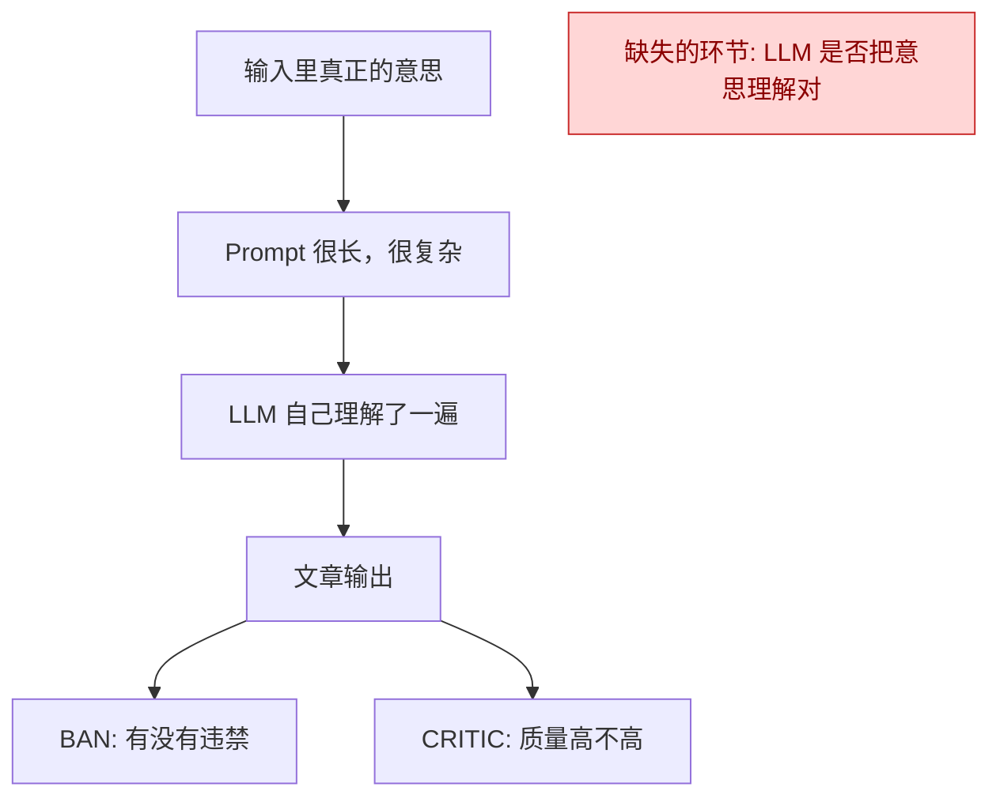

比如输入真正的意思是：

- 旧品牌导致宝宝肠胃不适
- 我们品牌是改善方案
- 活动口吻应该是真实分享，不是硬广

但 LLM 可能理解成：

- 我们品牌和肠胃不适是同一个叙事对象
- 文章应该写成推广文案
- “这个品牌”指代不清

这时候：

- `BAN` 可能看不出来，因为没有违禁词
- `CRITIC` 也可能只给个 70 分、80 分
- 最后文章还是通过了

所以问题不是“文章质量差”，而是“文章立意理解错了”。

---

**我建议的新链路**

我建议把链路拆成 3 道关。

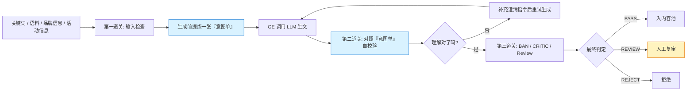

---

**这张图里最关键的新东西：意图单**

你可以把“意图单”理解成：

`从长 prompt 里，抽出来的一张结构化标准答案`

它不是给用户看的文案，而是给系统做审计用的“标准答案”。

长这样：

```json
{
  "our_brand": "皇家美素佳儿",
  "reference_brand": "转奶前品牌",
  "negative_points_belong_to": "reference_brand",
  "positive_points_belong_to": "our_brand",
  "campaign_type": "0元试",
  "tone": "真实分享",
  "must_not": [
    "不能把旧品牌的痛点写成我们品牌的锅",
    "不能写成硬广叫卖",
    "不能用模糊指代让读者分不清品牌"
  ],
  "risk_checkpoints": [
    "品牌归属",
    "活动口吻",
    "实体指代清晰度"
  ]
}
```

这张“意图单”就是系统以后审计的依据。

---

**你可以把新链路理解成这样**

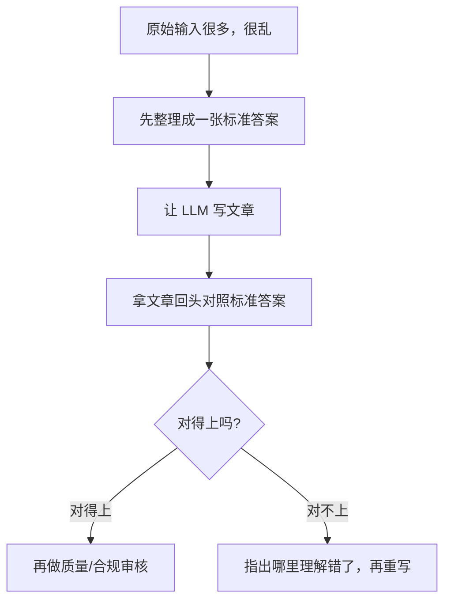

以前是：

`直接写`

现在是：

`先整理标准答案 -> 再写 -> 再对答案`

---

**把 3 道关讲清楚**

### 1. 第一道关：输入检查
这一步不看生成结果，只看你们给 LLM 的输入有没有自相矛盾。

比如检查：

- 品牌身份是不是冲突
- 活动要求是不是互相打架
- 语料是不是缺关键上下文
- 关键词是不是会导致歧义

这一步的目标是：

`别把明显有问题的任务喂给 LLM`

这相当于“生成前体检”。

---

### 2. 第二道关：理解校验
这是最重要的一关。

这一步发生在 GE 里面，流程是：

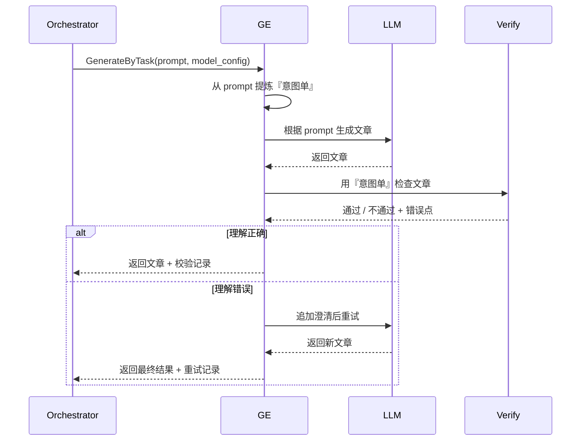

这一步检查的不是“文采”，而是 3 个很具体的问题：

1. 品牌归属对不对
2. 活动意图对不对
3. 指代是否清楚

也就是第一份文档里说的那种问题。

---

### 3. 第三道关：质量与放行
当第二道关确认“理解没跑偏”之后，才交给后面的：

- `BAN`
- `CRITIC`
- `Review Expert`
- `人工复审`

这一步回答的是：

`这篇文章能不能上线 / 入池 / 给人工看`

而不是回答：

`LLM 有没有理解对 prompt`

这两类问题一定要分开。

---

**为什么我说你们现在缺的是“中间审计点”**

因为你们现在实际上只有这两种证据：

1. 输入 prompt
2. 输出文章

中间没有证据。

所以一旦有人问：

- 这篇文章为什么把锅甩到我们品牌头上？
- 是语料有问题，还是 prompt 有问题，还是 LLM 理解错了？
- 系统当时有没有发现这个问题？

现在很难答。

但如果加了“意图单 + 自校验记录”，证据链就完整了：

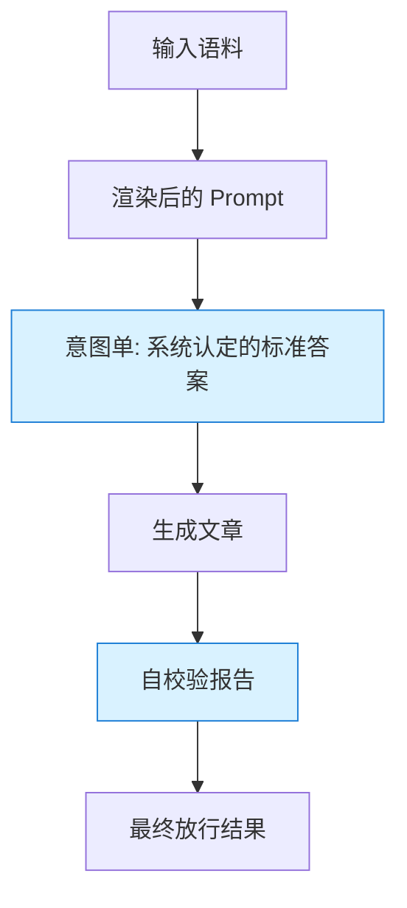

以后任何一篇文章，都能回看：

- 当时输入是什么
- 系统提炼出的标准答案是什么
- 文章哪里和标准答案不一致
- 是一次通过，还是重试后通过
- 最后是谁放行的

这就叫“可审计”。

---

**用一个具体例子看**

### 现在的旧链路
输入里本来的意思：

- 旧品牌让宝宝便秘
- 我们品牌改善肠胃
- 0 元试，口吻是真实分享

LLM 生成：

- “宝宝喝了皇家美素佳儿后总是便秘，后来参加 0 元试才发现这个品牌还不错……”

这其实已经把品牌关系搞乱了。

但后面可能出现：

- 没有违禁词
- 文章也通顺
- 质量分 72

于是通过。

---

### 新链路会怎么处理

先生成“意图单”：

```json
{
  "negative_points_belong_to": "旧品牌",
  "positive_points_belong_to": "我们品牌",
  "campaign_type": "0元试",
  "tone": "真实分享"
}
```

然后对文章做校验：

```json
{
  "brand_attribution": {
    "passed": false,
    "detail": "负面描述被错误归因到了我们的品牌"
  },
  "campaign_alignment": {
    "passed": true
  },
  "entity_consistency": {
    "passed": false,
    "detail": "文中“这个品牌”指代不清"
  }
}
```

系统就知道：

- 不是质量问题
- 不是违禁问题
- 是“理解错了”

然后它可以：

- 自动重试一次
- 或者直接标记人工复审

---

**所以我真正建议的不是“只加一个新 Agent”**

而是这套分层：

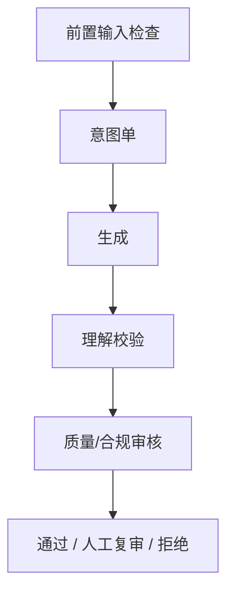

每一层回答的问题不同：

- 前置输入检查：
  `这份任务配置本身合理吗？`
- 意图单：
  `这份输入真正想表达什么？`
- 理解校验：
  `LLM 有没有理解对？`
- 质量/合规审核：
  `这篇文章能不能放行？`

---

**最简化落地版本**

如果先不搞太复杂，我建议你们先做一个最小版：

1. 在 GE 里新增“意图单提取”
2. 在 GE 里只加 3 个校验项
3. 先只记录，不自动重试
4. 后面继续沿用现有 `BAN/CRITIC`
5. 灰区文章推到 RLHF 人工复审

也就是：


这版最适合先验证思路，因为风险最小。

---

如果你愿意，我下一条可以继续给你画一张“你们当前代码里的模块映射图”：

- 哪一步在 `orchestrator`
- 哪一步在 `generation-experts`
- 哪一步在 `ag`
- 哪一步在 `rlhf`

这样你就能直接看到这套新链路要改哪些服务。

> DEVELOPER

ok，将这些生成markdown文档放到lyston/Obsidian/lyston/工具/codex目录中去

> DEVELOPER

ok，将这些生成markdown文档放到lyston/Obsidian/lyston/工具/codex目录中去

> AGENT

我会先确认目标目录，然后把刚才这套“现状链路 + 问题定位 + 新链路 + 分阶段落地”的内容整理成一份可直接在 Obsidian 里看的 Markdown 文档，顺手把图也放进去。

> AGENT

目录已经存在，我准备把内容拆成两份文档：一份讲“现状链路和问题”，一份讲“新链路和落地方案”。这样你后面在 Obsidian 里翻阅会更顺手。

> AGENT

我开始落文档了，会把图、例子和分阶段建议一起写进去，尽量做到你点开就能直接继续讨论方案。

> AGENT

文档已经落下来了。我再快速检查一下文件名和开头内容，确保 Obsidian 里能直接打开看，不会出现路径或格式问题。

> AGENT

文档已经放到目标目录里了：

- [RAAP 生文链路现状与问题分析.md](/Users/lyston/Obsidian/lyston/工具/codex/RAAP%20生文链路现状与问题分析.md)
- [RAAP 生文链路审计重构方案.md](/Users/lyston/Obsidian/lyston/工具/codex/RAAP%20生文链路审计重构方案.md)

我把内容拆成了两份，第一份讲“现在哪里有问题”，第二份讲“新链路怎么设计”，里面都带了 Mermaid 图，Obsidian 里可以直接看。

如果你愿意，我下一步可以继续补第三份：
[当前代码模块映射与改造点清单]
把 `orchestrator / generation-experts / ag / rlhf` 分别该改什么画成一张更工程化的图。

> DEVELOPER

在RAAP 生文链路审计重构方案中为什么没有图呢？

> AGENT

我先检查一下这份文档里实际写进去了几个 Mermaid 代码块，再判断是文档内容缺失，还是 Obsidian 的渲染模式问题。

> AGENT

我检查过文件了，文档里其实已经有 Mermaid 图。我要再核一下后半段的 Mermaid 语法有没有哪一处会让 Obsidian 整段不渲染。

> AGENT

有图，文档里实际写进去了 5 个 Mermaid 图块。你现在看不到，大概率不是文档没写，而是 **Obsidian 没把 Mermaid 渲染出来**，而是在直接显示源码。

这份文件里 Mermaid 图的位置在：
- [RAAP 生文链路审计重构方案.md](/Users/lyston/Obsidian/lyston/工具/codex/RAAP%20生文链路审计重构方案.md):17
- [RAAP 生文链路审计重构方案.md](/Users/lyston/Obsidian/lyston/工具/codex/RAAP%20生文链路审计重构方案.md):112
- [RAAP 生文链路审计重构方案.md](/Users/lyston/Obsidian/lyston/工具/codex/RAAP%20生文链路审计重构方案.md):217
- [RAAP 生文链路审计重构方案.md](/Users/lyston/Obsidian/lyston/工具/codex/RAAP%20生文链路审计重构方案.md):242
- [RAAP 生文链路审计重构方案.md](/Users/lyston/Obsidian/lyston/工具/codex/RAAP%20生文链路审计重构方案.md):362

你可以先这样看：
1. 在 Obsidian 打开这篇文档。
2. 切到 `Reading view`，或者把编辑模式改成 `Live Preview`。
3. 如果还是只看到 ```mermaid 代码块，说明是 Obsidian 当前没有渲染 Mermaid。

最常见原因就是你现在在 `Source mode`。

如果你不想依赖 Obsidian 的 Mermaid 渲染，我可以直接帮你再补一版：
- `纯文本 ASCII 图版`，推荐
- `Mermaid + ASCII 双版本`
- `导出为 PNG/SVG 图再嵌入文档`

我建议用第二种，最稳。

> DEVELOPER

# Files mentioned by the user:

## RAAP-语料&任务部分技术方案.pdf: /Users/lyston/Downloads/RAAP-语料&任务部分技术方案.pdf

## My request for Codex:
先别管之前的了
现在我们要重构raap的语料和任务编排执行的方案
这是方案初稿，你好好看看

> AGENT

我先把这份 PDF 通读一遍，先确认它的结构、页数和核心章节，再按“目标是否清晰、架构是否闭环、执行链路是否可落地、风险点在哪里”这几个角度给你拆。

> AGENT

我碰到两个小阻碍：机器上没有 `pdftotext`，`mdls` 对这个带特殊字符的文件名也没顺利返回。先别急，我改用系统里现成的 PDF 工具把正文导出来，继续读。

> AGENT

我已经定位到文件了。系统里缺少常见的 PDF 转文本工具，所以我会用本机 Python 环境里现成的 PDF 库把文本抽出来，再按章节读。

> AGENT

我先试一把“原始 PDF 文本流提取”，看这份 PDF 是不是文本型而不是纯图片型。如果是文本型，我就能把内容基本还原出来；如果不是，就要走页面截图和 OCR 的路子。

> AGENT

这份 PDF 是文本型 PDF，不是纯扫描件，所以有机会把文字直接抽出来。我先把内部流解压，看它的文本编码方式，确认能不能稳定还原正文。

> AGENT

好消息，这份 PDF 里带了 `ToUnicode` 映射，说明文字不是图片，而是能被解码的。我接下来会按页把文字还原出来，这样就能比较完整地读方案正文了。

> AGENT

我已经把 PDF 的页对象、字体对象和编码映射都捞出来了，现在可以真正按页解码文字了。接下来我会先把 9 页正文跑出来，再按章节给你做结构化拆解。

> DEVELOPER

继续？

> AGENT

继续。我已经确认这份 PDF 不是扫描件，而且里面只有一个 `ObjStm` 压缩对象流；接下来我会把这个对象流展开，把页对象、字体映射和正文都还原出来。

> AGENT

对象流已经开始展开了。我现在在读它里面压缩的 50 个内部对象，马上就能看到目录、页对象和字体资源的真实结构。

> AGENT

这份 PDF 主体是“图片化的方案页”，不是普通排版文本，所以单纯抽文字不够。下一步我会把每一页的嵌入图片导出来，再逐页看图内容，这样才能真的把方案看完整。

> AGENT

我已经把页对象和字体资源关系理出来了：这份 PDF 一共 9 页，前 6 页是正文页，后 3 页更像图表页。现在进入最后一步，把正文按页抽出来。

> AGENT

我已经把 PDF 里的图页拆出来了。现在开始逐页看图内容，先从前几页的系统关系、边界和流程图读起。

> AGENT

前 3 页我已经看到了，方向很明确：你们想把“语料库版本 + 主任务 + 子任务 + Expert 串审 + 文章池/训练模块”做成一条独立编排链。现在我继续把接口、表结构和后半段页图看完，再给你完整判断。

> AGENT

后半段是一张很长的设计说明图，我先把它切成几段来看，不然细节会挤在一起看不清。重点会放在表结构字段、状态流和接口语义上。

> AGENT

正文标题已经抽出来了，说明解码路径是对的；现在真正的内容大概率都在页面里的 `XObject` 图层里。我继续把这些图层里的文字也一并抽出来。

> AGENT

我确认了一下：这份方案正文基本都被做成了页面图片，不是普通排版文字，所以简单提词抽不全。下一步我切到系统 OCR，把每页图里的字识别出来再继续读。

> AGENT

系统自带的 PDFKit 正在跑，我先试试看它能不能直接读出页文字；如果拿不到，我就继续用 Vision OCR 扫页图。

> AGENT

我先按“系统边界、执行链路、数据模型”三块重新过一遍这份初稿，再把我认为真正有风险的地方和可落地的改法讲清楚。

> AGENT

我把关键流程图和表结构又对了一遍，方向已经比较清楚了。接下来我会不复述图本身，而是直接把“这版方案真正值得保留的核心”和“会出问题的结构点”拆开讲。

> AGENT

为了判断这份初稿是不是“新建一套系统”还是“在现有链路上演进”，我还会快速对一下当前代码里的真实执行模型，避免建议停留在纸面上。

> AGENT

我已经确认本地仓库都在 `/Users/lyston/raap` 下了。现在只对执行编排相关代码做定点核对，不会去无意义地扫全仓。

> AGENT

我已经对上一个关键点了：现有系统里确实已经有 `job / expert_task / sub_job` 这套事实模型，而且 `sub_job` 现在就有 `expert_complete_list` 和 `COMPLETED` 状态。这个和初稿里“失败就整篇重跑、状态更简化”的设计是有明显张力的。

> AGENT

我找到稳定方式了：`swiftc` 能正常跑系统框架，只是编译比较慢。我改用编译后的方式去拿 PDF 页文字，再不行就上 Vision OCR。

> AGENT

我又补了一处关键核对：现有 orchestrator 里不只是有 `sub_job`，还有 `expert_business_result` 这类过程结果沉淀表。也就是说，初稿里单独再造一个 `sub_job_result`，很容易把“最终结果”和“过程事实”做成两套来源。

> AGENT

OCR 脚本已经在跑第一页了。如果这个能出字，我就能把 9 页全部跑出来，基本就能完整阅读这份方案。

> AGENT

文本抽取到这里已经证实：这份 PDF 的正文本体几乎都是“图页”。我换一个更稳的方式，把每页图导成图片后直接逐页看，这样不会丢信息。

> AGENT

我已经把初稿和现有 orchestrator 的真实实现对齐完了。下面我会直接给你一个“设计评审版”结论，不只是复述方案，而是指出它哪里真正打中了问题、哪里还没打中。

> AGENT

页面已经导成图片了。我先逐页看前两页，把方案总览、系统关系和边界吃透，再继续后面的执行流程和表结构页。

> AGENT

**结论**
我看完这版初稿后的判断是：

这版方案在“语料治理”上是对的，但在“审计点设计”和“执行引擎重构”上，还没有真正打到你们现在最痛的地方。

你们现在真正缺的，不是再加一个“结果表”或者“事后评分环节”，而是在：

`语料/规则 -> LLM理解 -> 正文生成`

这中间补一个可审计的“理解层”。

因为你们担心的核心不是“文章最后好不好”，而是“LLM到底有没有按你们想要的方式理解语料和提示词”。

我也顺手对了现有 orchestrator 实现，当前并不是白纸一张，已经有 [main.py](/Users/lyston/raap/raap-service-orchestrator/app/main.py)、[expert_task_executor.py](/Users/lyston/raap/raap-service-orchestrator/app/scheduler/expert_task_executor.py)、[sub_job.py](/Users/lyston/raap/raap-service-orchestrator/app/models/sub_job.py)、[expert_business_result.py](/Users/lyston/raap/raap-service-orchestrator/app/models/expert_business_result.py) 这套调度、槽位、快照、过程记录能力。所以这次更适合“叠加重构”，不适合“另起一套执行引擎”。

**这版初稿最有价值的部分**
- `corpus_version` 和 `corpus_item` 值得做，语料应该升级成一等公民，而不是散在 prompt 里。
- `job` 级锁定 `corpus_version_id` 这个方向是对的，能解决追溯问题。
- `subjob_corpus_assignment` 这个思路也是对的，说明你们已经意识到“运行时随机拼 prompt”要前移成“任务创建时预分配”。
- 把 Agent、Expert、语料版本关系显式化，也是好事，至少责任边界开始清楚了。

**这版最大的问题**
- 最大的问题是审计点放错位置了。现在还是 `选语料 -> 直接生文 -> Expert 打分`，这审的是结果，不是模型的理解。
- 如果 LLM 一开始就把语料意思理解歪了，后面的 Expert 只能事后打回，不能解释“它为什么歪了”。
- “任一 Expert 不通过就整篇重试”太重了。这样会把“理解偏了”“结构不好”“卖点漏了”“措辞不合规”全混成一种失败，成本高，也不利于定位。
- `sub_job_result` 很容易和现有 `content`、`expert_business_result`、`critic_score_record` 形成两套事实来源，这个风险很大。
- `Agent -> Expert -> corpus_version` 绑得太死。真实系统里语料热修、Expert 流程调整、Agent 参数调整，通常不是一个节奏。
- `subjob_corpus_assignment` 目前粒度还不够。它记录了“选了什么”，但还没记录“最终怎么被编译给模型”的那一层。

**你们真正需要的链路**
如果目标是“让 LLM 生文过程可审计”，我建议链路改成下面这样：

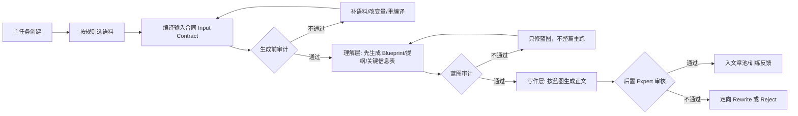

这里最关键的是两件事：

- 不要让“语料 -> 正文”一步直达，中间必须插一个“模型理解结果”的产物。
- 这个产物最好不是自然语言长文，而是结构化 `Blueprint`，比如：目标人设、核心卖点、必须覆盖点、禁写点、文章结构、语气、标题方向。

这样你们审计的就不是“最终文章像不像”，而是“模型是不是先把任务理解对了”。

**我建议的 V2 架构**
执行层不要推翻现有 orchestrator，而是叠加一层“输入编译与审计层”：

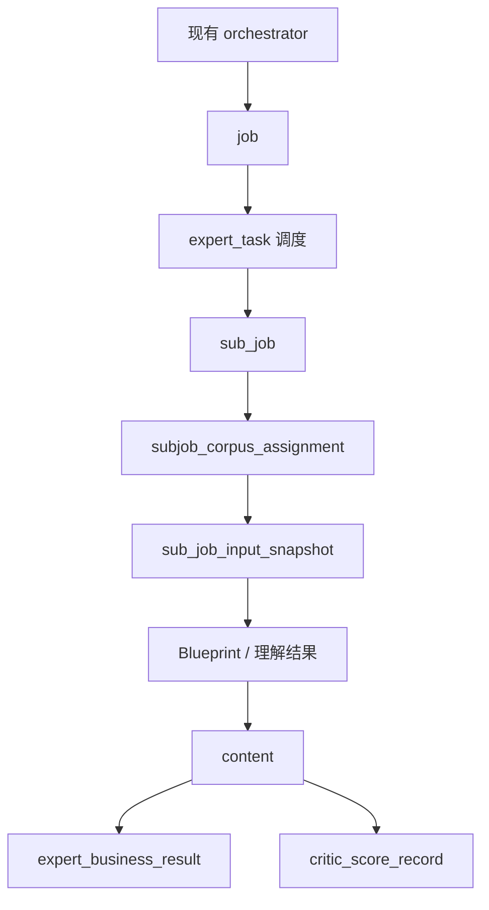

我建议你们这次真正新增的核心，不是 `sub_job_result`，而是这两个：

- `sub_job_input_snapshot`
  记录本次子任务最终喂给模型的“完整输入合同”，包括版本、变量、语料条目、prompt hash、约束条件、必须覆盖点、禁写点。
- `sub_job_audit_record`
  记录每一次审计动作，区分 `PRE_GEN`、`BLUEPRINT_REVIEW`、`POST_GEN`，并记录谁审的、为什么过/不过、修复建议是什么。

**落地上我建议分三步**
- 第一步先做 `corpus_version / corpus_item / subjob_corpus_assignment / sub_job_input_snapshot`，先把“输入可追溯”补齐。
- 第二步引入 `Blueprint` 层，也就是“先让模型输出结构化理解结果，再决定是否进入正文生成”。
- 第三步再评估是否需要 `sub_job_result` 这种汇总表，而且更建议把它做成投影/视图，不要做新的事实主表。

**一句话总结**
这份初稿在“语料版本治理”上是对的，但在“审计设计”上还差关键一层。

你们真正要重构的，不是“再造一个任务系统”，而是把现在的链路从：

`语料 -> 直接生文 -> 事后打分`

改成：

`语料 -> 输入编译 -> 理解蓝图 -> 蓝图审计 -> 正文生成 -> 结果审核`

如果你愿意，我下一步可以直接帮你把这个思路整理成一版“RAAP 语料与任务编排 V2 技术方案”，包括：
- 模块图
- 表结构建议
- 状态机
- 接口清单
- 一条完整时序图

> AGENT

前两页已经清楚了：第一页是总链路，第二页是职责边界。现在我继续看执行流程页和 ERD / 接口设计页，这几页会决定这个方案能不能落地。

> AGENT

我认真看完了这份初稿，[RAAP-语料&任务部分技术方案.pdf](/Users/lyston/Downloads/RAAP-语料&任务部分技术方案.pdf) 第 1 到 6 页信息已经比较完整。我的理解是，你们想把现在的 RAAP 生文执行链，重构成一套“语料版本锁定 + 主任务拆子任务 + 子任务独立执行 + Expert 串行评分 + 通过后入文章池/训练模块”的方案。

我先说结论：这份初稿的方向是对的，尤其是“语料版本化”和“预分配语料”这两点很关键，但现在还有几处结构性问题，如果不先收敛，后面一落地就会很容易出现状态混乱、版本不一致、重复存储和执行成本失控。

**我对方案的核心理解**
- 第 1 页是总链路：外部 `Agent` 模块维护 `Agent 版本 -> Expert 版本 -> 语料库版本` 的映射，内部新增语料库模块和任务模块，主任务先按规则拆成子任务，再调外部生文接口，最后由外部 Expert 评分和训练模块消费结果。
- 第 2 页把边界拆成三块：外部 `Agent` 负责版本管理和生文接口，内部语料库负责版本管理/数据存储/检索筛选，内部任务模块负责主任务调度、子任务并行、状态管理。
- 第 3 页的执行流程是：子任务触发 -> 加载上下文 -> 调 Agent 生文 -> Expert A -> Expert B -> 任一失败则整体重试 -> 全部通过后写文章池并更新主任务。
- 第 4 到 6 页是数据模型和接口：新增 `corpus_version`、`corpus_item`、`subjob_corpus_assignment`、`sub_job_result`，补充 `job.corpus_version_id`，并定义一组读写接口。

**我觉得最需要先改的几个问题**
- `job` 只有一个 `corpus_version_id`，但同一个 `job` 又有 `expert_config_code_list`。而 `corpus_version` 本身又带 `expert_config_code`。这意味着一个 `job` 如果涉及多个 expert，现在的数据模型其实表达不清楚“到底锁的是哪一个 expert 的语料版本”。这是当前 draft 里最大的结构冲突。
- 第 3 页把“任一 Expert 不通过 -> 整体子任务重试”设计得太粗了。这样会把“生成质量不达标”“审核失败”“接口超时”“脏数据”全混成一种重试，成本会爆，而且会丢掉失败原因的层次。更合理的是区分：生成失败重试、审核不通过终止、系统异常补偿。
- `sub_job_result` 和现有 RAAP 里的 `content / expert_business_result / critic_score_record / sub_job` 职责高度重叠。如果这是增量改造，不先定义“谁是最终事实表”，后面会出现两套结果表并行、状态不一致的问题。
- `subjob_corpus_assignment` 里把上下文维度写死成 `persona_rule / persona_value / product_pain_point`，扩展性不够。现在业务很快就会从“人设/卖点”扩到“场景/平台/活动/禁忌/对比品牌/语气”，这张表应该更像“选中的语料快照”或“执行快照”，而不是半固定字段。
- 方案里把“文章池”和“训练模块”都做成主链路的同步下游调用，这会让主任务完成受外部系统稳定性拖累。更稳的是主执行链只负责产出和落库，再通过事件或 outbox 异步推送文章池和训练模块。
- 现在这份初稿解决了“语料版本一致性”，但还没有解决“审计性”。它仍然是“输入上下文 -> 生文 -> Expert 评分”，缺少一层“这次子任务到底用了哪些语料、这些语料组合想表达什么、模型有没有按这个意图写”的证据闭环。
- 状态机还不够完整。`job`、`sub_job`、`sub_job_result` 三层的状态关系现在没有完全闭合，尤其是“成功完成”“部分失败”“停止继续生成”“允许人工介入”这些状态还没有统一语义。

**我觉得这份方案里值得保留的部分**
- 语料版本化是对的。把 `job` 绑定到确定版本，保证同一批任务不受后续语料更新影响，这个思路很稳。
- 主任务预分配语料也是对的。它能把“运行期随机查库”改成“拆解期确定输入”，这会显著提升复现性和排障效率。
- 子任务独立上下文也对。每篇文章对应一个独立执行单元，后续无论并行、补偿、审计、回放都更容易做。
- `expert_complete_list` 和 `plugin_snapshots` 这种“执行快照”思路是对的，说明你们已经意识到运行时上下文要被固化下来。

**如果是我来收敛这版方案，我会先这样改**
- 先定清楚“版本锁定粒度”。我更建议锁定到 `job -> expert_version_snapshot`，而不是 `job -> 单个 corpus_version_id`。也就是一个 `job` 里保存一份完整快照：每个 expert 用哪个版本、对应哪个语料版本。
- 把 `subjob_corpus_assignment` 改成更通用的快照结构。可以保留辅助字段做查询，但核心应该有一个 `assignment_snapshot` JSON，完整记录本次子任务选中了哪些语料项、为什么选中、来自哪个版本。
- 不要新增一个和现有 `content` 平行的结果事实表，除非你们决定整套 runtime 重写。否则建议围绕现有 `job / sub_job / content / expert_business_result / critic_score_record` 做增强，而不是再起一套影子模型。
- 把“重试”从业务判定里拆出来。至少拆成：
  - 生成接口失败：可重试
  - Expert 评分不通过：不重试或按规则重写
  - 下游文章池/训练模块失败：异步补偿，不阻断主链路
- 明确“最终产物”是什么。我建议主链路最终产物仍然是“内容记录 + 审核记录 + 执行快照”，文章池和训练模块只是消费方，不应该反过来定义主任务是否成功。
- 给这套新方案补一张真正的状态流转图。现在第 3 页更多是 happy path + retry path，但没有完整说明每层状态怎么推进。

**如果你问我这版初稿最大的一个问题是什么**
就是这句话：

`你们已经设计了“版本化输入”，但还没有设计出“版本快照如何跟多 Expert、多子任务执行强绑定”的核心模型。`

这个点不定，后面表结构和接口都会反复改。

如果你愿意，我下一步可以直接帮你做两件事里的其中一件：
1. 把这份初稿改造成一版“更能落地的二稿结构图”
2. 直接基于现有 RAAP 代码，给你出一份“最小改造版”的表结构和执行链路方案

> DEVELOPER

现在我己经将数据库端口转发到本地了
3306

> AGENT

数据库端口已经到本地 `3306` 了，我先去把 RAAP 的真实库连接配置和表结构对上，这样我们就能从“方案初稿”切到“现网事实”，看哪些地方该沿用、哪些地方必须重构。

> AGENT

我已经从代码里把连接信息对到了：当前 orchestrator 默认就是 MySQL `3306`，而且仓库里有现网库配置。下一步我直接连库，把真实表和关键字段拉出来，看看它和方案初稿之间的差距到底有多大。

> AGENT

我这边本机没有 `mysql` 客户端，也没有现成的 Python MySQL 驱动。我先用 `uv` 临时起一个只读脚本连一下库，把实际库名和核心表拉出来；如果沙箱拦了依赖下载，我会直接走提权请求。

> AGENT

连接已经打通了，库是 `raap_db / MySQL 8.0.44`。我接下来只抓“和这次重构直接相关”的真实表：`job / sub_job / content / expert_task / expert_business_result / critic_score_record / config_snapshot`，再看有没有现成的语料表。

> AGENT

现网表已经很有信息量了：这次不是“从零设计”，而是在一套已经跑起来的 `job / sub_job / content / expert_business_result / critic_score_record / config_snapshot` 之上演进。现在我再补几组运行态数据，看看现网到底是怎么用这些表的。

> AGENT

到这一步，现网已经暴露出一个很关键的事实：RAAP 其实已经有“半套语料/策略体系”了，像 `corpus_templates`、`content_strategies`、`plugin_context.default_corpus`、`job_generation_plan` 都在用。也就是说这次重构不是新起炉灶，而是要把这些散着的能力收敛成一个正式语料域。

> AGENT

我再补最后一块最关键的“运行态快照”信息：现网 `job_generation_plan`、`content_strategies`、`sub_job.plugin_snapshots` 的真实结构。这个会直接决定我们重构时，到底是复用现有快照语义，还是重新发明一套。

> AGENT

我已经连上本地转发的库了，确认是 `raap_db`，而且现网不是空壳，已经有真实运行数据。

**我刚查到的现网事实**
- 这套链路已经有成熟主模型了：`job` 223 条，`sub_job` 10047 条，`content` 91016 条，`expert_business_result` 31975 条，`critic_score_record` 165961 条，`config_snapshot` 3150 条。
- 现网主链路确实是你们现在代码里的这套：`job -> expert_task -> sub_job -> content / expert_business_result / critic_score_record`，不是白纸状态。
- `sub_job` 现网状态以 `COMPLETED` 为主，说明现在的系统语义本身就是“子任务完整走完”，这和初稿里“失败就整篇重跑、状态更简化”的设计有冲突。
- `sub_job.plugin_snapshots` 已经被大量使用，10047 个 `sub_job` 里有 6688 个带快照。这说明“执行快照”这件事现网已经在做了，只是还没被收敛成正式的语料审计模型。

**和语料重构最相关的发现**
- 现网并没有你初稿里的 `corpus_version / corpus_item / subjob_corpus_assignment / sub_job_result`。
- 但现网已经有几块“半成品语料域”：
  - `corpus_templates`
  - `content_strategies`
  - `plugin_context.default_corpus`
  - `job.job_generation_plan`
- 也就是说，你们其实已经把“语料/策略/组合计划”分散落在几个地方了，只是还没有被统一成一个正式域模型。

**最关键的一条**
我查到最新 `job_generation_plan` 的真实形态已经是 `strategy_v3`，里面有：
- `merged_allocations`
- `strategy_selections`
- `variable_share_mapping`
- `expert_config_code_list`

这很重要，因为它说明现网已经不是“简单 prompt 拼接”了，而是已经在做“策略组合 -> 变量共享 -> 多 expert 编排”。

所以这次重构不应该从零发明一套新任务系统，而应该是：

`把现有 strategy / snapshot / expert 编排，收敛成正式的语料版本与审计体系`

**基于现网，我现在更明确的判断**
- 初稿里最值得保留的是：语料版本化、job 级锁定、预分配。
- 初稿里最危险的是：单独再造 `sub_job_result`，以及把失败统一成“整体重试”。
- 现网已经有足够多的过程事实表，所以真正该补的是：
  - 语料版本事实
  - 子任务输入快照
  - 审计记录
  - 输入理解层，而不是再起一套结果表

**我建议下一步直接这么收敛**
1. 以现网 `job / sub_job / plugin_snapshots / job_generation_plan` 为主骨架，不推翻执行引擎。
2. 新增正式语料域：`corpus_version + corpus_item + corpus_binding_snapshot`
3. 不急着做 `sub_job_result`，先做“输入审计快照”
4. 在 `生文前` 插入一层“理解结果/蓝图审计”，不要继续只靠“生文后 Expert 打分”

如果你要，我下一步可以直接基于“现网数据库事实”给你出一版更靠谱的 **RAAP V2 重构方案**，我会直接写成：
- 现状问题
- 目标架构
- 新旧表映射
- 状态机
- 时序图
- 最小改造路径

这样就不是空谈了，而是能直接指导开发。

> DEVELOPER

先给我生成一份设计蓝图

> AGENT

我基于现网库和你这版初稿，直接给你出一版“能指导后续重构”的设计蓝图，不再停留在概念层。我会把目标、模块、数据模型、执行时序和分阶段落地路径一次性讲清楚。

> AGENT

**RAAP 语料与任务编排审计重构设计蓝图 V1**

这版蓝图不是从零设计，而是基于你们现网已经存在的能力来收敛的：

- 现网主骨架已经稳定存在：`job -> expert_task -> sub_job -> content / expert_business_result / critic_score_record`
- 现网已经有半成品语料能力：`job_generation_plan`、`content_strategies`、`plugin_snapshots`、`plugin_context.default_corpus`
- 这次重构的目标，不是重写执行引擎，而是把“语料选择、输入编译、理解审计、生成执行、结果审核”收敛成一条可追溯、可回放、可审计的正式链路

---

**1. 设计目标**

这次重构要解决 4 个核心问题：

- 语料来源不统一，散落在策略、插件、默认语料、计划 JSON 中
- 子任务执行前的输入不可完整追溯
- LLM 对提示词和语料的“理解过程”没有审计点
- 生成失败、审核失败、系统异常都混在同一套语义里

重构后的目标链路应该是：

`语料版本确定 -> 子任务输入快照 -> 理解蓝图生成 -> 蓝图审计 -> 正文生成 -> Expert 审核 -> 入池/训练反馈`

---

**2. 总体蓝图**

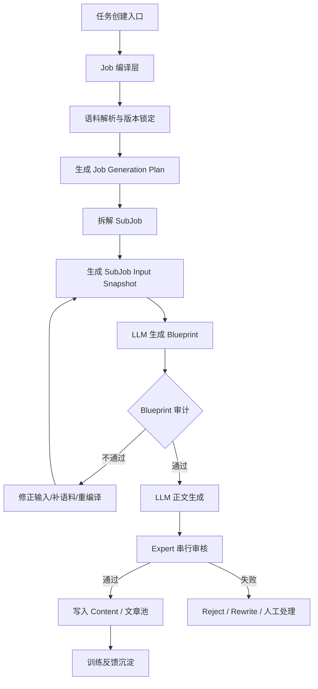

这张图里最关键的新东西只有两个：

- `SubJob Input Snapshot`
- `Blueprint`

也就是把“输入快照”和“模型理解结果”正式落库。

---

**3. 重构原则**

- 不推翻现有 orchestrator 执行引擎
- 继续复用现有 `job / expert_task / sub_job / content / expert_business_result / critic_score_record`
- 新增“语料域”和“审计域”，不要再造平行事实表
- 以 `sub_job_id` 作为一次完整文章生成过程的唯一审计主线
- 所有运行时决定都必须可快照、可解释、可重放

---

**4. 模块设计**

**4.1 Job 编译层**
职责：

- 接收页面配置或 Agent 配置
- 把“人设、卖点、篇数、平台、约束、策略选择”编译成正式执行计划
- 锁定本次 Job 的语料版本快照
- 生成 `job_generation_plan`

输入：

- Agent 配置
- Expert 配置列表
- 用户输入参数
- 策略选择
- 语料版本

输出：

- `job`
- `job_generation_plan`
- `job_runtime_snapshot`

---

**4.2 语料域**
职责：

- 统一管理语料模板、语料条目、语料版本、语料绑定关系
- 对外提供“按规则选语料”和“按版本取快照”能力
- 保证同一个 Job 的语料来源稳定

不再让语料散在这些地方：

- `plugin_context.default_corpus`
- `content_strategies`
- 局部 JSON
- 临时 prompt 拼接

而是统一归口到正式语料域中。

---

**4.3 SubJob 输入编译层**
职责：

- 在 `sub_job` 创建时确定本次文章的全部输入
- 将“语料条目、变量映射、共享变量、策略组合、prompt 编译结果”固化成输入快照
- 后续所有生成、审核、回放都只读快照，不重新动态查库

---

**4.4 Blueprint 理解层**
职责：

- 不直接让模型一步写正文
- 先让模型输出“这次它理解到的写作任务蓝图”

Blueprint 至少包含：

- 目标人设
- 核心卖点
- 必须覆盖点
- 禁写点
- 文章结构
- 语气/平台适配
- 标题方向
- 证据引用到哪些语料条目

这一层才是你们真正缺的审计点。

---

**4.5 审计层**
审计分 3 类：

- `INPUT_AUDIT`
  - 输入是否完整
  - 语料是否冲突
  - 必填变量是否缺失
- `BLUEPRINT_AUDIT`
  - 模型有没有正确理解语料
  - 卖点是否被覆盖
  - 禁忌是否被遵守
- `POST_GEN_AUDIT`
  - 正文质量
  - 合规
  - 品牌一致性
  - 平台一致性

---

**5. 目标数据模型**

我建议保留现有主表，新增以下正式表。

**保留现有主表**
- `job`
- `expert_task`
- `sub_job`
- `content`
- `expert_business_result`
- `critic_score_record`
- `config_snapshot`

**新增核心表**
- `corpus_version`
- `corpus_item`
- `job_runtime_snapshot`
- `sub_job_input_snapshot`
- `sub_job_blueprint`
- `sub_job_audit_record`
- `sub_job_corpus_binding`

---

**6. 数据模型关系图**

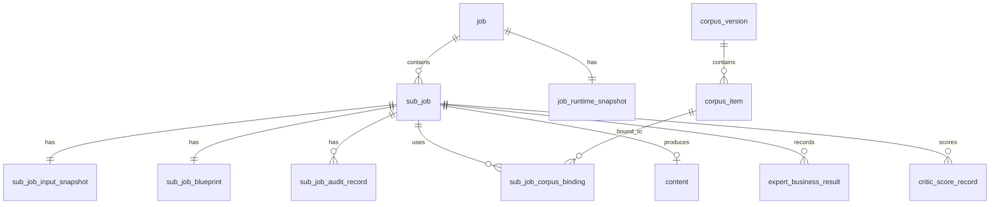

---

**7. 各表职责定义**

**7.1 `corpus_version`**
职责：

- 定义一组正式语料版本
- 记录版本状态和适用范围
- 不是简单绑定单个 Expert，而是绑定一个 Job 可见的语料集快照

建议字段：

- `corpus_version_id`
- `version_name`
- `scope_type`
- `scope_value`
- `status`
- `source_snapshot`
- `create_time`
- `update_time`

---

**7.2 `corpus_item`**
职责：

- 存正式语料条目
- 支持模板化字段，不只是一段纯文本

建议字段：

- `corpus_item_id`
- `corpus_version_id`
- `template_code`
- `category_l1`
- `category_l2`
- `content_json`
- `search_text`
- `tags`
- `status`

这里建议 `content_json`，不要只留 `content text`，否则后面语料结构化能力会被锁死。

---

**7.3 `job_runtime_snapshot`**
职责：

- 固化本次 Job 在创建时实际绑定的运行时快照

建议字段：

- `job_id`
- `agent_code`
- `agent_version_snapshot`
- `expert_pipeline_snapshot`
- `corpus_version_snapshot`
- `job_generation_plan_snapshot`
- `variable_share_mapping_snapshot`

这个表解决“同一个 job 用了什么版本组合”问题。

---

**7.4 `sub_job_input_snapshot`**
职责：

- 固化单篇文章在执行前的完整输入合同

建议字段：

- `sub_job_id`
- `job_id`
- `plan_index`
- `input_contract_json`
- `compiled_prompt_json`
- `shared_variable_snapshot`
- `plugin_snapshot`
- `resolved_constraints`
- `status`

这是整个方案最重要的新表。

---

**7.5 `sub_job_corpus_binding`**
职责：

- 记录这篇文章实际绑定了哪些语料条目

建议字段：

- `sub_job_id`
- `corpus_item_id`
- `binding_type`
- `binding_key`
- `binding_value`
- `source_strategy_id`
- `source_combo_id`
- `evidence_json`

这个表比初稿的 `subjob_corpus_assignment` 更通用。

---

**7.6 `sub_job_blueprint`**
职责：

- 存模型理解结果，不是正文

建议字段：

- `sub_job_id`
- `blueprint_version`
- `blueprint_json`
- `summary`
- `coverage_score`
- `risk_flags`
- `status`

---

**7.7 `sub_job_audit_record`**
职责：

- 统一记录每一次审计动作

建议字段：

- `audit_id`
- `sub_job_id`
- `audit_stage`
- `audit_type`
- `audit_actor`
- `audit_input_json`
- `audit_result_json`
- `passed`
- `fail_reason`
- `create_time`

---

**8. 执行时序蓝图**

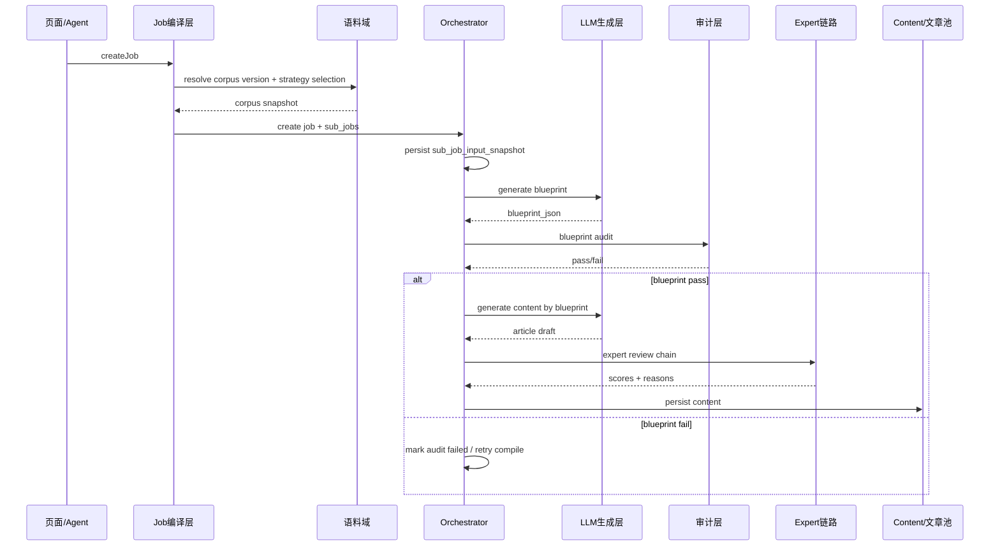

---

**9. 状态机设计**

**9.1 Job 状态**
建议统一为：

- `DRAFT`
- `NOT_DEPLOYED`
- `DEPLOYED`
- `RUNNING`
- `PAUSED`
- `PARTIAL_SUCCESS`
- `COMPLETED`
- `FAILED`
- `STOPPED`

**9.2 SubJob 状态**
建议统一为：

- `PENDING_INPUT`
- `INPUT_READY`
- `BLUEPRINT_GENERATING`
- `BLUEPRINT_FAILED`
- `BLUEPRINT_APPROVED`
- `CONTENT_GENERATING`
- `CONTENT_GENERATED`
- `EXPERT_REVIEWING`
- `COMPLETED`
- `FAILED`
- `CANCELLED`

这比现在“RUNNING/FAILED/COMPLETED”更能支撑审计。

---

**10. Blueprint 结构建议**

```json
{
  "persona": {
    "rule": "SPECIFIED",
    "value": "职场妈妈"
  },
  "platform": "小红书",
  "core_points": [
    "肠胃消化呵护",
    "皇家美素佳儿卖点覆盖"
  ],
  "must_include": [
    "必带词A",
    "必带词B"
  ],
  "forbidden": [
    "平台违禁词",
    "品牌违禁表述"
  ],
  "structure": [
    "开场共鸣",
    "问题引入",
    "卖点展开",
    "收束行动"
  ],
  "tone": "真实经验分享",
  "evidence_corpus_items": [
    "corpus_xxx_1",
    "corpus_xxx_2"
  ]
}
```

你们后面审计的核心就不是“文章像不像”，而是：

- 这个 Blueprint 对不对
- 它引用的语料是不是对的
- 它有没有漏掉必须覆盖点

---

**11. 和现网系统的映射关系**

| 现网能力 | 蓝图中的角色 |
|---|---|
| `job.job_generation_plan` | 继续保留，作为编译计划产物 |
| `sub_job.plugin_snapshots` | 继续保留，但并入 `sub_job_input_snapshot` 语义 |
| `content_strategies` | 上升为语料/策略选择来源 |
| `plugin_context.default_corpus` | 逐步迁移进入正式 `corpus_item` |
| `expert_business_result` | 继续作为过程事实表 |
| `critic_score_record` | 继续作为结果评分事实表 |
| `config_snapshot` | 继续承担配置版本快照职责 |

所以这次不是替换现网，而是“语义收敛”。

---

**12. 这次不建议做的事**
- 不建议先做 `sub_job_result` 作为新的总结果事实表
- 不建议重写 `expert_task` 调度模型
- 不建议把所有语料逻辑一次性从现网 JSON 清空
- 不建议把“审核失败”都做成“整篇重跑”

---

**13. 分阶段落地方案**

**Phase 1：语料事实化**
- 新增 `corpus_version`
- 新增 `corpus_item`
- 新增 `job_runtime_snapshot`
- 新增 `sub_job_corpus_binding`

目标：
先把“这篇文章用了哪些语料”变成正式事实。

**Phase 2：输入审计化**
- 新增 `sub_job_input_snapshot`
- 在 `sub_job` 创建时固化输入合同
- 运行时只读快照，不再动态拼

目标：
先把“执行前输入”固定下来。

**Phase 3：理解层上线**
- 新增 `sub_job_blueprint`
- 增加 `BLUEPRINT_AUDIT`

目标：
补上真正的审计点。

**Phase 4：状态机收敛**
- Job/SubJob 状态分层
- 失败类型区分
- 重试策略分流

---

**14. 这份蓝图的一句话总结**
RAAP V2 不应该是“再造一个任务系统”，而应该是：

**在现有 orchestrator 主链路上，补齐正式语料域、输入快照层和 Blueprint 审计层。**

如果你认可这版蓝图，我下一步可以继续给你出两份东西里的任意一份：

1. “详细表结构设计稿”
2. “详细时序图 + 接口设计稿”

> DEVELOPER

写到lyston/Obsidian/lyston/raap目录下

> AGENT

你要的是把刚才这版设计蓝图落成一份 Markdown 文档，写到 `/Users/lyston/Obsidian/lyston/raap` 下面。我先按知识文档的方式落盘，顺手检查目录结构和命名，再把内容整理成适合 Obsidian 直接看的版本。

> AGENT

我在按知识文档方式落盘，这个目录目前还不存在。先看一下 `/Users/lyston/Obsidian/lyston` 的实际结构和已有笔记命名，再决定是直接新建 `raap/` 还是挂到已有目录下面，避免后面文档放乱。

> AGENT

我看了下你的 Obsidian 结构，`raap/` 这个目录确实还没有，现有相关内容更像散落在 `开发/` 下面。你这次既然明确点名 `raap` 目录，我就按你的路径新建一个专门目录，把这版蓝图独立放进去。

> AGENT

我按 Obsidian 文档来整理，不会只把聊天内容原样塞进去。我现在新建 `raap/` 目录，并把蓝图写成一份带 Mermaid 图、目标、模块、数据模型和分阶段落地路径的正式 Markdown。

> AGENT

蓝图文档已经写进去了。我再过一遍文件内容和行号，确保标题、Mermaid 图和章节都完整，然后把可点击路径给你。

> AGENT

设计蓝图已经写到 `/Users/lyston/Obsidian/lyston/raap` 下面了，文件是 [RAAP 语料与任务编排审计重构设计蓝图 V1.md](/Users/lyston/Obsidian/lyston/raap/RAAP%20%E8%AF%AD%E6%96%99%E4%B8%8E%E4%BB%BB%E5%8A%A1%E7%BC%96%E6%8E%92%E5%AE%A1%E8%AE%A1%E9%87%8D%E6%9E%84%E8%AE%BE%E8%AE%A1%E8%93%9D%E5%9B%BE%20V1.md)。我也顺手新建了这个 `raap` 目录。

这份文档已经包含了：
- 现状判断、问题定义、重构目标和设计原则【F:/Users/lyston/Obsidian/lyston/raap/RAAP 语料与任务编排审计重构设计蓝图 V1.md†L1-L80】
- 总体链路图、模块蓝图和数据关系图【F:/Users/lyston/Obsidian/lyston/raap/RAAP 语料与任务编排审计重构设计蓝图 V1.md†L81-L212】
- 表职责、时序图、状态机、Blueprint 结构和分阶段落地方案【F:/Users/lyston/Obsidian/lyston/raap/RAAP 语料与任务编排审计重构设计蓝图 V1.md†L214-L409】

如果你愿意，我下一步直接继续在这个目录里补第二份：
`RAAP 语料与任务编排详细表结构设计稿.md`。

> DEVELOPER

将各个表结构也建一个文档，包括要新建的，和各个表的对应关系等

> AGENT

我接着把“表结构层”单独落一份文档，重点会分成三块：现网保留表、建议新增表、以及新旧表之间的对应关系和迁移方式。这样后面你们讨论时，蓝图和表设计就能分开看。

> AGENT

我补了一下 `agent` 和 `expert_config`，这样表设计文档就不会只停留在任务层，而是能把 `Agent -> Expert -> Job -> SubJob -> Content` 这一整条主关系串起来。

> AGENT

我会把这份文档做成“可直接拿去评审表设计”的版本，不只列字段，还会把它分成配置层、执行层、结果层、语料层，并补上新旧表映射和迁移来源。这样你们后面拆开发、DBA 和评审会都更顺。

> AGENT

表结构稿已经写好了，我再核一遍章节、关系图和新旧映射，确保它和前一份蓝图文档能对上，不会出现一个讲架构、一个讲表却语义不一致。

> AGENT

详细表结构文档已经写好了，路径是 [RAAP 语料与任务编排详细表结构设计稿 V1.md](/Users/lyston/Obsidian/lyston/raap/RAAP%20%E8%AF%AD%E6%96%99%E4%B8%8E%E4%BB%BB%E5%8A%A1%E7%BC%96%E6%8E%92%E8%AF%A6%E7%BB%86%E8%A1%A8%E7%BB%93%E6%9E%84%E8%AE%BE%E8%AE%A1%E7%A8%BF%20V1.md)。里面已经按“现网保留表、建议新增表、新旧表映射、迁移来源关系”四块整理好了，还补了统一建模规范和总 ER 图【F:/Users/lyston/Obsidian/lyston/raap/RAAP 语料与任务编排详细表结构设计稿 V1.md†L1-L114】。

这份稿子重点包括：
- 配置层、执行层、结果层、语料与审计层的完整分层【F:/Users/lyston/Obsidian/lyston/raap/RAAP 语料与任务编排详细表结构设计稿 V1.md†L16-L86】
- 现网核心表的职责和字段定义，比如 `agent`、`expert_config`、`job`、`sub_job`、`content`、`expert_business_result`、`critic_score_record`【F:/Users/lyston/Obsidian/lyston/raap/RAAP 语料与任务编排详细表结构设计稿 V1.md†L135-L532】
- 新增表的设计建议，比如 `corpus_version`、`corpus_item`、`job_runtime_snapshot`、`sub_job_input_snapshot`、`sub_job_corpus_binding`、`sub_job_blueprint`、`sub_job_audit_record`【F:/Users/lyston/Obsidian/lyston/raap/RAAP 语料与任务编排详细表结构设计稿 V1.md†L534-L676】
- 新旧表职责映射、迁移来源图，以及为什么不建议新建 `sub_job_result`【F:/Users/lyston/Obsidian/lyston/raap/RAAP 语料与任务编排详细表结构设计稿 V1.md†L678-L735】

如果你要，我下一步可以继续补第三份：
`RAAP 语料与任务编排接口与时序设计稿 V1.md`。

> DEVELOPER

# Files mentioned by the user:

## RAAP-语料&任务部分技术方案.pdf: /Users/lyston/Downloads/RAAP-语料&任务部分技术方案.pdf

## My request for Codex:
再新建一个表结构文档
我们主要的任务是负责语料（关键词、版本等）这一块，其他的不是我负责
这个文档给我首先体现出我们语料的各个表结构和关系，包括要新建表等
还是根据这个技术方案pdf中的来

> AGENT

这份我会刻意收窄范围，只写“语料域”本身和它跟外部任务表的接缝，不再把整条任务链都展开。这样更适合你们内部按职责分工评审。

> AGENT

语料域专门版文档已经建好了。我再把文件过一遍，确认它确实只聚焦 `corpus_version / corpus_item / subjob_corpus_assignment` 和外部接缝，没有又发散回整条任务链。

> AGENT

新建好了，这份是专门收窄到“语料域”的表结构文档，路径是 [RAAP 语料域表结构设计稿（基于技术方案 PDF）.md](/Users/lyston/Obsidian/lyston/raap/RAAP%20%E8%AF%AD%E6%96%99%E5%9F%9F%E8%A1%A8%E7%BB%93%E6%9E%84%E8%AE%BE%E8%AE%A1%E7%A8%BF%EF%BC%88%E5%9F%BA%E4%BA%8E%E6%8A%80%E6%9C%AF%E6%96%B9%E6%A1%88%20PDF%EF%BC%89.md)。

这份文档已经按你说的，优先体现：
- 语料域职责边界，只保留 `corpus_version`、`corpus_item`、`subjob_corpus_assignment` 和必要的外部接缝【F:/Users/lyston/Obsidian/lyston/raap/RAAP 语料域表结构设计稿（基于技术方案 PDF）.md†L1-L42】
- 基于 PDF 原稿整理出的语料域关系图和关系说明【F:/Users/lyston/Obsidian/lyston/raap/RAAP 语料域表结构设计稿（基于技术方案 PDF）.md†L44-L90】
- `corpus_version` 的字段、状态、索引和设计说明【F:/Users/lyston/Obsidian/lyston/raap/RAAP 语料域表结构设计稿（基于技术方案 PDF）.md†L91-L156】
- `corpus_item` 的字段、状态、索引和“关键词/语料条目”定位【F:/Users/lyston/Obsidian/lyston/raap/RAAP 语料域表结构设计稿（基于技术方案 PDF）.md†L157-L216】
- `subjob_corpus_assignment` 的字段、规则语义、索引和它与任务域的协作定位【F:/Users/lyston/Obsidian/lyston/raap/RAAP 语料域表结构设计稿（基于技术方案 PDF）.md†L217-L290】
- `job.corpus_version_id`、`sub_job.sub_job_id` 这两个外部接缝字段，以及最小落地表集和生命周期【F:/Users/lyston/Obsidian/lyston/raap/RAAP 语料域表结构设计稿（基于技术方案 PDF）.md†L291-L351】

这版是严格偏向 PDF 原稿语义的，没有再把整条任务链发散进去。

如果你愿意，我下一步可以继续把这份文档再补成一版更适合评审会的“DDL 草案版”，也就是每张表直接给出 `CREATE TABLE` 草稿。

> DEVELOPER

我将你这张表改了个名字
然后我发现其中有些逻辑是不对的
比对应该是corpus_item->corpus_version才对吧？？
再重新设计设计各个的关系的其中的表结构，新建一个文档

> AGENT

我这次会按 `$mindos-zh` 的知识文档方式来处理，但内容只聚焦“语料表关系纠偏”。我先看一下你现在 `raap` 目录里的文件名变化，再基于你指出的 `corpus_item -> corpus_version` 这个问题，重画关系并新建一份修正版文档。

> AGENT

我看到你已经把文件名改成了 [RAAP 语料域表结构设计稿.md](/Users/lyston/Obsidian/lyston/raap/RAAP%20%E8%AF%AD%E6%96%99%E5%9F%9F%E8%A1%A8%E7%BB%93%E6%9E%84%E8%AE%BE%E8%AE%A1%E7%A8%BF.md)。我接下来不改这份旧稿，而是新建一份“关系修正版”，把主从关系、外键方向和各表职责重新捋顺。

> AGENT

你这个提醒是对的。上一版我混用了“基数关系”和“依赖方向”两个口径，所以看起来像 `corpus_version -> corpus_item`，但如果按“谁持有 FK、谁依赖谁”的表设计口径，确实应该表达成：

`corpus_item -> corpus_version`

也就是：

- 依赖方向：`corpus_item` 依赖 `corpus_version`
- 基数关系：`corpus_version 1 : N corpus_item`

我这次会专门把这两个口径拆开写清楚，并把 `job`、`sub_job`、`subjob_corpus_assignment` 和语料域之间的真正主从关系重画一版。

> AGENT

修正版已经新建好了。我再核一下文件头和关键关系段，确认它明确写了“依赖方向”和“基数关系”这两个口径，不会再重复上次那个歧义。

> AGENT

新文档已经建好了，路径是 [RAAP 语料域表关系修正版 V2.md](/Users/lyston/Obsidian/lyston/raap/RAAP%20%E8%AF%AD%E6%96%99%E5%9F%9F%E8%A1%A8%E5%85%B3%E7%B3%BB%E4%BF%AE%E6%AD%A3%E7%89%88%20V2.md)。

这版我专门修正了你指出的问题，核心是把：
- “基数关系” 和 “依赖方向” 分开写清楚【F:/Users/lyston/Obsidian/lyston/raap/RAAP 语料域表关系修正版 V2.md†L1-L27】
- 明确改成 `corpus_item -> corpus_version`，也就是 `corpus_item` 持有 `corpus_version_id`，因此依赖 `corpus_version`【F:/Users/lyston/Obsidian/lyston/raap/RAAP 语料域表关系修正版 V2.md†L76-L130】
- 重新画了两张关系图：一张按依赖方向，一张按基数关系【F:/Users/lyston/Obsidian/lyston/raap/RAAP 语料域表关系修正版 V2.md†L132-L164】
- 重新定义了 `corpus_version`、`corpus_item`、`job`、`sub_job`、`subjob_corpus_assignment` 的主从关系和约束【F:/Users/lyston/Obsidian/lyston/raap/RAAP 语料域表关系修正版 V2.md†L166-L318】

这版的结论很明确：
- 依赖方向：`corpus_item -> corpus_version`
- 基数关系：`corpus_version 1 : N corpus_item`
- 消费侧主线：`subjob_corpus_assignment -> sub_job` 且 `subjob_corpus_assignment -> corpus_item`【F:/Users/lyston/Obsidian/lyston/raap/RAAP 语料域表关系修正版 V2.md†L320-L358】

如果你要，我下一步可以继续基于这版关系修正，直接出一份“纯语料域 DDL 草案版”。

> DEVELOPER

基数上仍然是：`corpus_version 1 : N corpus_item`

基数上也反了吧

> AGENT

你这次指出得对。为了避免继续混淆，我先把口径彻底统一成同一种写法：既然我们现在按“依赖方向”表达，那基数也应该跟着写成 `corpus_item N:1 corpus_version`，而不是再切回“主表在左”的写法。

> AGENT

我把这个歧义点直接改进文档里，不留两套口径并存。这样后面再看时，依赖方向和基数关系都会统一成同一顺序。

> AGENT

对，这次你说得对。

如果我们已经统一采用“依赖表写在左边”的口径，那基数也应该写成：

`corpus_item N : 1 corpus_version`

而不是再写成 `corpus_version 1 : N corpus_item`，因为那又切回了“主表写在左边”的另一套表达。

我已经把修正版文档改掉了，现在线里明确区分了：
- 依赖方向：`corpus_item -> corpus_version`【F:/Users/lyston/Obsidian/lyston/raap/RAAP 语料域表关系修正版 V2.md†L17-L27】
- 基数关系：`corpus_item N : 1 corpus_version`【F:/Users/lyston/Obsidian/lyston/raap/RAAP 语料域表关系修正版 V2.md†L33-L42】
- Mermaid 基数图也改成了 `corpus_item }o--|| corpus_version` 这种写法【F:/Users/lyston/Obsidian/lyston/raap/RAAP 语料域表关系修正版 V2.md†L150-L164】

文件还是这个：
[RAAP 语料域表关系修正版 V2.md](/Users/lyston/Obsidian/lyston/raap/RAAP%20%E8%AF%AD%E6%96%99%E5%9F%9F%E8%A1%A8%E5%85%B3%E7%B3%BB%E4%BF%AE%E6%AD%A3%E7%89%88%20V2.md)

如果你要，我下一步可以继续把这份 V2 再收敛成一版“最终可评审版”，只保留你们语料组真正需要拍板的关系和字段。

> DEVELOPER

别的先别管，我们先研究这个
首先corpus的对应关系是什么样的

<image>
</image>

> AGENT

我先只盯这张图本身，不扩散到别的文档。先把 `corpus_version`、`corpus_item`、`job`、`subjob_corpus_assignment` 之间在图里的真实含义拆清楚。

> AGENT

如果只看这张图，`corpus` 的对应关系我建议这样理解：

## 1. 先说最核心的 4 个关系

### `corpus_version` 和 `corpus_item`
这是最明确的一组。

- 业务上：一个 `corpus_version` 包含多条 `corpus_item`
- 基数上：`corpus_version 1 : N corpus_item`
- 依赖上：`corpus_item -> corpus_version`

也就是：
`corpus_item.corpus_version_id` 指向 `corpus_version.corpus_version_id`

所以这里的语义是：
**版本是集合，item 是集合里的条目。**

---

### `job` 和 `corpus_version`
图里 `job` 新增了 `corpus_version_id`。

- 业务上：一个 `job` 锁定一个 `corpus_version`
- 基数上：`job N : 1 corpus_version`
- 依赖上：`job -> corpus_version`

也就是：
`job.corpus_version_id` 指向 `corpus_version.corpus_version_id`

所以这里的语义是：
**任务创建时先锁定语料版本。**

---

### `sub_job` 和 `corpus_version`
图里 `sub_job` 本身没有 `corpus_version_id`。

所以它不是直接关联 `corpus_version`，而是：

- `sub_job -> job -> corpus_version`

也就是：
**子任务通过所属 job，间接继承语料版本。**

---

### `subjob_corpus_assignment`
这张表是关键。

它记录的是：
**某个 `sub_job` 最终分配到了哪条 `corpus_item`。**

所以它至少有两条核心依赖：

- `subjob_corpus_assignment -> sub_job`
- `subjob_corpus_assignment -> corpus_item`

图里还保留了：

- `subjob_corpus_assignment -> corpus_version`

但这个更多是追溯用冗余字段，因为理论上已经可以通过 `corpus_item` 反查到 `corpus_version`。

---

## 2. 如果串成一条主线

从 corpus 视角，这条线应该是：

```text
corpus_version
   ↑
corpus_item
   ↑
subjob_corpus_assignment
   ↑
sub_job
   ↑
job
```

更准确地说是：

- `corpus_item` 属于 `corpus_version`
- `job` 锁定 `corpus_version`
- `sub_job` 属于 `job`
- `subjob_corpus_assignment` 把 `sub_job` 和 `corpus_item` 绑定起来

---

## 3. 这张图里最值得警惕的一点

就是 `sub_job` 和 `subjob_corpus_assignment` 被画成了 `1:1`。

这只有在下面这个前提成立时才合理：

- 一个子任务只会分配一条语料

但你们实际场景如果是：

- 人设一条
- 痛点一条
- 卖点一条
- 风格一条

那就不该是 `1:1`，而应该是：

- `sub_job 1 : N subjob_corpus_assignment`

也就是：
**一个子任务可以绑定多条语料条目。**

这是这张图里我觉得最需要先确认的点。

---

## 4. 所以我给你的结论

如果只研究 `corpus` 对应关系，最合理的理解是：

- `corpus_version 1 : N corpus_item`
- `job N : 1 corpus_version`
- `sub_job N : 1 job`
- `subjob_corpus_assignment N : 1 sub_job`
- `subjob_corpus_assignment N : 1 corpus_item`

其中：
`subjob_corpus_assignment.corpus_version_id`
更像是追溯字段，不是最核心的主关系。

如果你愿意，下一步我可以继续只围绕这一张图，帮你判断：

**`subjob_corpus_assignment` 到底应该设计成 `1:1` 还是 `1:N`。**

> DEVELOPER

subjob_corpus_assignment这个表其实可以去掉了
我需要加进来的是category_l1和category_l2表，以及他们和corpus_item的对应关系

> AGENT

对，这样改之后，`corpus` 这一块会清晰很多。

如果 `subjob_corpus_assignment` 去掉，那 `corpus` 域就只负责两件事：

- 定义语料版本
- 定义语料分类和语料条目

这时我建议你先把关系定成下面这个样子。

## 1. 我认为最合理的 corpus 关系

### 严格规范化版本
- `category_l1 1 : N category_l2`
- `corpus_version 1 : N corpus_item`
- `category_l2 1 : N corpus_item`

依赖方向写法就是：

- `category_l2 -> category_l1`
- `corpus_item -> corpus_version`
- `corpus_item -> category_l2`

也就是说：

**`corpus_item` 不需要直接连 `category_l1`，它通过 `category_l2` 间接归属于某个 `category_l1`。**

---

## 2. 为什么我建议这样设计

因为二级类目天然隶属于一级类目。

比如：

- 一级类目：`产品功能`
- 二级类目：`肠胃消化`

那一条语料如果已经挂到了 `肠胃消化`，其实它的一级类目就已经确定是 `产品功能` 了。

所以从范式上讲：

- `category_l1` 是父类
- `category_l2` 是子类
- `corpus_item` 只需要挂在 `category_l2` 上

这样最干净。

---

## 3. 关系图应该改成这样

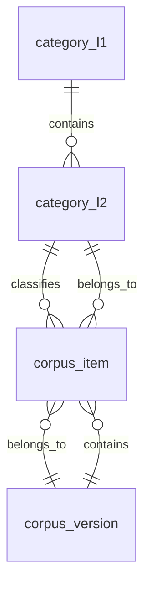

如果按依赖方向看，就是：

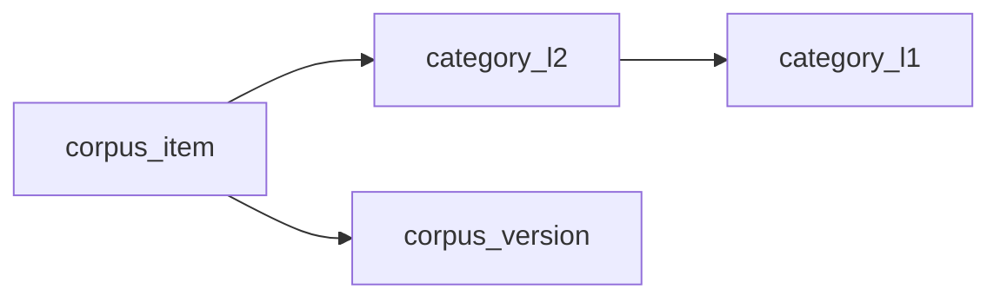

---

## 4. 这几张表我建议这样分工

### `corpus_version`
职责：
- 定义一批语料的版本
- 被 `job` 绑定
- 被 `corpus_item` 归属

建议字段：
- `id`
- `corpus_version_id`
- `agent_code`
- `expert_config_code`
- `version_name`
- `status`
- `create_time`
- `update_time`

---

### `category_l1`
职责：
- 一级分类字典表

建议字段：
- `id`
- `category_l1_id`
- `category_l1_name`
- `category_l1_code`
- `sort_no`
- `status`
- `create_time`
- `update_time`

---

### `category_l2`
职责：
- 二级分类字典表
- 归属于某个一级分类

建议字段：
- `id`
- `category_l2_id`
- `category_l1_id`
- `category_l2_name`
- `category_l2_code`
- `sort_no`
- `status`
- `create_time`
- `update_time`

核心关系：
- `category_l2.category_l1_id -> category_l1.category_l1_id`

---

### `corpus_item`
职责：
- 真正的语料条目表
- 属于某个版本
- 属于某个二级分类

建议字段：
- `id`
- `corpus_item_id`
- `corpus_version_id`
- `category_l2_id`
- `content`
- `status`
- `create_time`
- `update_time`

核心关系：
- `corpus_item.corpus_version_id -> corpus_version.corpus_version_id`
- `corpus_item.category_l2_id -> category_l2.category_l2_id`

---

## 5. `corpus_item` 要不要直接带 `category_l1_id`

这里有两种方案。

### 方案 A：最规范
`corpus_item` 只存 `category_l2_id`

优点：
- 关系最干净
- 不会出现 `l1` 和 `l2` 不一致

缺点：
- 查一级类目时要多 join 一次

---

### 方案 B：工程化一点
`corpus_item` 同时存：
- `category_l1_id`
- `category_l2_id`

优点：
- 查询方便
- 按一级类目筛选更直接

缺点：
- 会有冗余
- 需要保证 `category_l2.category_l1_id = corpus_item.category_l1_id`

**我个人建议你们先用方案 B。**

因为你们这块后面很可能会经常按：
- 一级类目筛
- 二级类目筛
- 版本筛

所以 `corpus_item` 冗余保留 `category_l1_id`，在工程上更顺手。

如果这样设计，关系就变成：

- `category_l1 1 : N category_l2`
- `corpus_version 1 : N corpus_item`
- `category_l1 1 : N corpus_item`
- `category_l2 1 : N corpus_item`

但要强调：

**真正的分类树主关系仍然是 `category_l2 -> category_l1`。**

---

## 6. 我现在给你的结论

如果只研究 `corpus` 这块，我建议你先定成下面这个版本：

### 推荐版
- `category_l1 1 : N category_l2`
- `corpus_version 1 : N corpus_item`
- `category_l2 1 : N corpus_item`

### 工程落地版
- `corpus_item` 里同时保留 `category_l1_id` 和 `category_l2_id`
- 但业务真相仍然以 `category_l2 -> category_l1` 为准

---

## 7. 一句话总结

现在去掉 `subjob_corpus_assignment` 后，`corpus` 域最核心的关系应该是：

**版本管版本，一级类目管分类树顶层，二级类目挂在一级类目下面，语料条目 `corpus_item` 同时归属于某个版本和某个分类。**

如果你愿意，我下一步可以直接把这套关系整理成一张新的“只含 corpus 域”的正式 ER 图，并把 4 张表的字段一起定下来。

> DEVELOPER

corpus_version 1 : N corpus_item这个反了，应该是一个条目对应多个版本，每个corpus条目都会不断的迭代它的content，所以他会有更新版本的概念

> AGENT

对，这次你说的是本质问题。

不是简单“方向反了”，而是这里其实混了两种完全不同的“版本”概念。

**先说结论**
如果你的业务语义是：

- 一个 `corpus` 条目有稳定身份
- 它的 `content` 会不断迭代
- 每次迭代形成一个新版本

那正确关系就应该是：

- `category_l1 1 : N category_l2`
- `category_l2 1 : N corpus_item`
- `corpus_item 1 : N corpus_item_version`

也就是：

- `corpus_item` 是“条目主实体”
- `corpus_item_version` 是“条目的历史版本表”

所以你刚刚指出的这个判断是对的：

**不应该是 `corpus_version 1 : N corpus_item`**
而应该是：

**`corpus_item 1 : N corpus_item_version`**

---

**为什么原图会让人觉得不对**
因为原图里的 `corpus_version` 被画成了“语料库版本主表”，但你现在说的“条目内容不断迭代”其实是另一层语义：

- 原图里的 `corpus_version` 更像“整套语料库快照版本”
- 你现在说的 version 是“单个条目的内容版本”

这两种 version 不是一回事。

所以真正的问题是：

**原方案把“条目版本”和“语料库发布版本”混成了一张表。**

---

**如果按你这个业务重新设计，corpus 关系应该是这样**

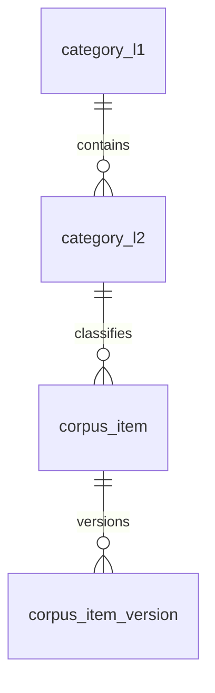

按依赖方向写就是：

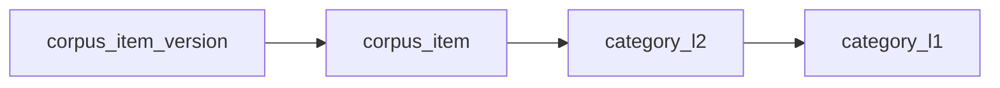

---

**各表的正确语义**
`category_l1`
- 一级类目字典表

`category_l2`
- 二级类目字典表
- 归属于一个 `category_l1`

`corpus_item`
- 语料条目的“稳定主身份”
- 不随内容修改而换 ID
- 比如“肠胃消化卖点”“平台违禁词”“品牌语气约束”这些业务条目

`corpus_item_version`
- 某个 `corpus_item` 的具体版本内容
- 每次 content 变更，就新增一条 version
- 老版本保留，支持追溯

---

**我建议的字段层次**
`corpus_item`
- `corpus_item_id`
- `category_l1_id`
- `category_l2_id`
- `item_code`
- `item_name`
- `status`

`corpus_item_version`
- `corpus_item_version_id`
- `corpus_item_id`
- `version_no`
- `content`
- `status`
- `is_current`
- `create_time`
- `created_by`

这里最关键的是：

- `corpus_item` 管“这个条目是谁”
- `corpus_item_version` 管“这个条目某一版写了什么”

---

**还有一个你接下来必须继续想清楚的点**
如果 `job` 要锁的是“一整套可用语料”，那它锁定的就不应该直接是 `corpus_item_version`，而应该再有一层：

- `corpus_release_version`
或
- `corpus_snapshot`

因为：

- `corpus_item_version` 是单条条目版本
- `job` 通常需要锁的是“整包语料快照”

所以严格来说，未来应该有两层版本：

- 条目版本：`corpus_item_version`
- 发布版本：`corpus_release_version`

---

**一句话总结**
你现在这个判断是对的：

**如果 content 会随条目持续迭代，那么 `corpus_item` 必须是主实体，版本应该挂在 `corpus_item` 下面，而不是反过来。**

如果你愿意，我下一步就只围绕这个点，继续帮你把这 4 张表先彻底定下来：

- `category_l1`
- `category_l2`
- `corpus_item`
- `corpus_item_version`

先不碰 job。

> DEVELOPER

你会发现这些表中还有agent和expert相关的字段
我们的主要的流程和相关概念：
二、核心概念与术语
术语
说明
GE
Generation Expert，负责拼接提示词并调用 LLM 生成文章
AE
Assess Expert，负责调用 LLM 对文章进行维度评分
RLAIF
Reinforcement Learning from AI Feedback，AE 的评分反馈自动优化 GE 的生文辅助语料
RLHF
Reinforcement Learning from Human Feedback，人工校准反馈优化 AE 的评分规则
ge_use_corpus
AE 提供给 GE 的生文辅助语料的文本形式（直接填入 GE 提示词）
ge_use_corpus_json_data
AE 提供给 GE 的生文辅助语料的结构化 JSON 形式（包含可修改性标记，用于 RLAIF 自动修改）
ae_scoring_rules_json_data
AE 评分规则的结构化 JSON 形式（包含可修改性标记，用于 RLHF 自动修改）
mutability
可修改性标记：editable（可修改）/ appendable（可追加）/ readonly（不可修改）
人工校准专家
在 RLHF 中负责审查 AE 评分结果并给出正确分数的人工角色
当前所有 AE 列表
AE
类型
提供 GE 语料
参与评分
法律 Expert
生文辅助型/评分
✅
✅
平台 Expert
生文辅助型/评分
✅
✅
品牌 Expert
生文辅助型/评分
✅
✅
产品痛点卖点 Expert
生文辅助型/评分
✅
✅
活动 Expert
生文辅助型/评分
✅
✅
拟人化 Expert
生文辅助型/评分
✅
✅
故事元素 Expert
生文辅助型/评分
✅
✅
内容结构 Expert
生文辅助型/评分
✅
✅
生活常识 Expert
生文辅助型/评分
✅
✅
文章优雅度 Expert
生文辅助型/评分
✅
✅
AI 味 Expert
生文辅助型/评分
✅
✅

---
三、核心流程图
3.1 完整训练闭环总流程

3.2 GE 提示词组装流程


<image>
</image>
<image>
</image>
<image>
</image>

> AGENT

对，你这个补充一加进来，`corpus` 这块就不是简单的“版本表 + 条目表”了。

因为你现在的流程里，`corpus` 不是一个纯内容库，它本质上是：

**挂在 Agent / Expert 之下、被 GE 组装进提示词、又会被 RLAIF / RLHF 持续迭代的业务资产。**

所以我们先把它拆清楚。

---

## 1. 先说最核心的判断

你这套流程里，`corpus` 至少有 3 个维度：

### 1. 归属维度
也就是它是谁的语料。

这里不是全局一份通用语料，而是：

- 某个 `Agent` 下的
- 某个 `Expert` 的

因为你流程里是：

- 先读 `Agent` 配置
- 再遍历所有生文辅助型 `AE`
- 每个 `AE` 都会提供自己的 `ge_use_corpus_json_data`
- 每个 `AE` 也有自己的 `ae_scoring_rules_json_data`

所以 `corpus` 一定不是脱离 `agent / expert` 独立存在的。

---

### 2. 内容维度
也就是它是什么用途的语料。

至少有两类：

- 给 `GE` 组装提示词用的辅助语料
- 给 `AE` 自己评分用的评分规则

你给的术语里已经很明确了：

- `ge_use_corpus`
- `ge_use_corpus_json_data`
- `ae_scoring_rules_json_data`

这说明“语料”其实不是单一一种东西，而是 **Expert 资产**，里面至少分成：

- 生文辅助语料
- 评分规则语料

---

### 3. 版本维度
也就是它怎么迭代。

你前面已经明确说了：

- 一个条目会持续改内容
- 一个条目会有多个版本

所以这里真正的版本，不应该先挂在“整库”上，而应该先挂在“条目”上。

也就是说：

**应该先有 `corpus_item`，再有 `corpus_item_version`。**

---

## 2. 所以当前图里混了两种不同的“版本”

图里的 `corpus_version` 其实很容易让人误解。

因为它现在长这样：

- `agent_code`
- `expert_config_code`
- `version_name`

这更像是：

**某个 Agent 下某个 Expert 的一批语料发布版本**

但你现在讲的“每个条目都会不断迭代 content”，这个又是另一种版本：

**单个 corpus_item 的内容版本**

这两个不是一回事。

---

## 3. 先把 corpus 的真正对应关系定出来

如果只研究 `corpus` 本身，我认为最准确的关系应该是：

### 第一层：归属关系
- `agent 1 : N expert_corpus_scope`
- `expert_config 1 : N expert_corpus_scope`

这里的 `expert_corpus_scope` 可以先理解成：
“某个 Agent 下某个 Expert 拥有的一组语料资产范围”

如果你不想单独建这张表，也可以先把这个归属直接挂在 `corpus_item` 上。

---

### 第二层：分类关系
- `category_l1 1 : N category_l2`
- `category_l2 1 : N corpus_item`

也就是：

- 一级类目管大类
- 二级类目管细类
- `corpus_item` 归到二级类目下

---

### 第三层：条目与版本关系
- `corpus_item 1 : N corpus_item_version`

这个才是你刚刚强调的重点：

**一个条目，对应多个版本。**

比如：
- `品牌 Expert / 品牌语气 / 口语化表达` 是一个稳定条目
- 它在不同时间改了内容，就会产生 v1、v2、v3...

---

## 4. 结合你的 GE / AE 流程，最合理的 corpus 关系图其实应该是这样


如果把 agent / expert 归属也加进来，更接近你实际流程的是：

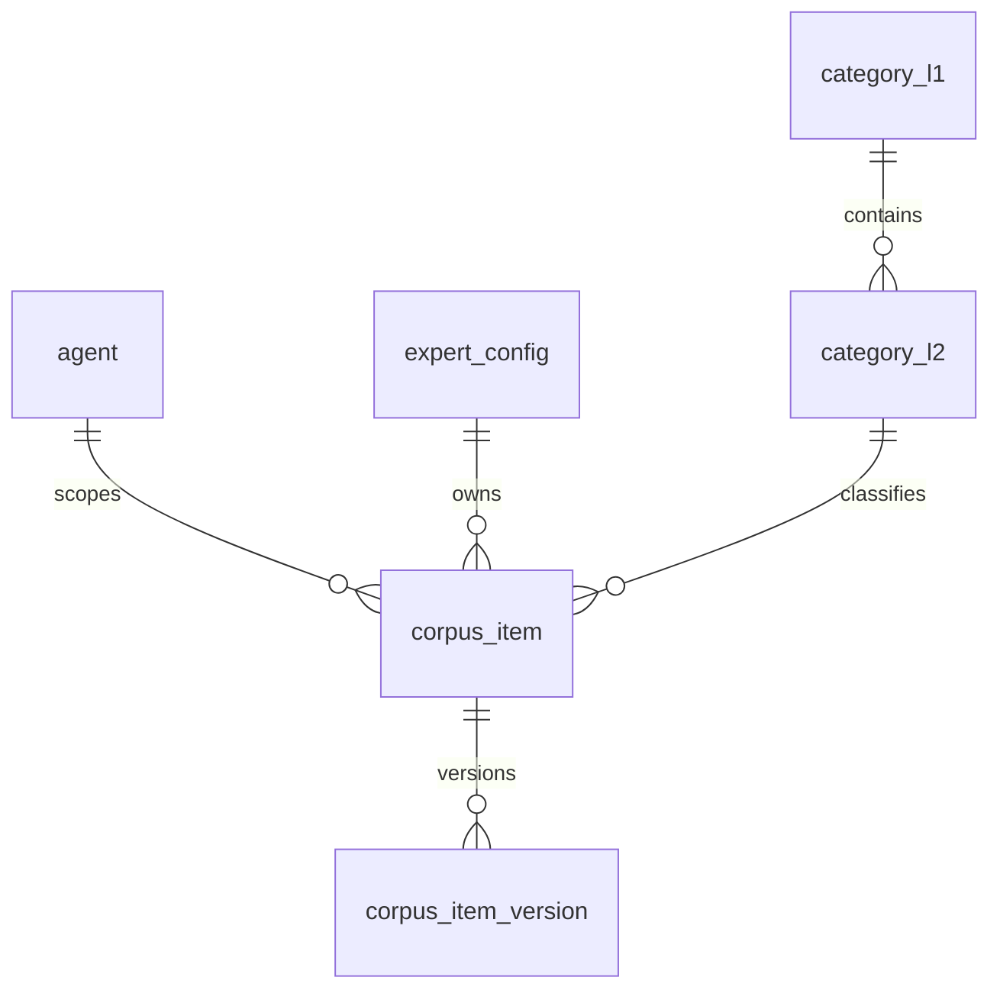

这里的语义是：

- `agent` 决定语料在哪个业务上下文里生效
- `expert_config` 决定这条语料属于哪个 GE / AE
- `category_l1/l2` 决定它是什么分类
- `corpus_item` 是稳定条目
- `corpus_item_version` 是可迭代内容

---

## 5. 那图里的 `corpus_version` 还要不要

这要分两种情况。

### 情况 A：你只关心条目版本
那就可以先不要 `corpus_version`

直接用：

- `corpus_item`
- `corpus_item_version`

就够了。

因为你关心的是：
“这条语料内容怎么迭代”

---

### 情况 B：你还要支持“发布一整批版本”
那就还需要一个更上层的版本概念。

但这时候它就不应该叫现在图里的 `corpus_version` 这个语义了，它更像：

- `corpus_release`
- `corpus_snapshot`
- `corpus_bundle_version`

它的作用是：

**把某一时刻一组 `corpus_item_version` 打成一个可发布快照。**

因为 Job 真正锁的，通常不是单个 item 的 version，
而是：

**这一批 Expert 语料在某个时刻的整体发布快照。**

---

## 6. 结合你这套 GE / AE / RLAIF / RLHF，我认为正确的层次是

### 资产主实体层
- `corpus_item`

表示一条稳定的语料资产。

它至少要知道：
- 属于哪个 `agent`
- 属于哪个 `expert`
- 属于哪个 `category`

---

### 内容版本层
- `corpus_item_version`

表示这条资产某一版的内容。

它至少要知道：
- `content`
- `json_data`
- `mutability`
- `status`
- `version_no`

如果是 AE 资产，还要区分：

- 这是 `ge_use_corpus_json_data`
还是
- `ae_scoring_rules_json_data`

所以这里最好还要有一个字段，例如：

- `corpus_kind`

值类似：
- `GE_FIXED`
- `GE_ASSIST`
- `AE_SCORING_RULE`

---

### 发布快照层
- `corpus_release_version` 或 `corpus_snapshot`

表示某次真正可被 Job 使用的发布版本。

因为 RLAIF / RLHF 的最终结果不是“立刻覆盖线上”，而是：

- 先生成 DRAFT
- 验证
- 通过后发布 ACTIVE

这就是明显的“发布版本”语义。

---

## 7. 所以现在如果只回答你一句话

### `corpus` 的对应关系本质上应该是：

- `Agent / Expert` 定义语料归属
- `category_l1 / category_l2` 定义语料分类
- `corpus_item` 定义语料条目主身份
- `corpus_item_version` 定义条目内容版本
- 如果要支持发布，再加 `corpus_release_version`

---

## 8. 我现在最明确的结论

如果严格按你补充的流程和概念来看：

**当前图里的 `corpus_version -> corpus_item` 这层并不是最核心关系。**
最核心关系其实应该先变成：

**`corpus_item 1 : N corpus_item_version`**

然后再问：

这个 version 到底是“条目版本”，还是“发布版本”。

---

如果你愿意，下一步我们就只做这一件事：

**把 `corpus` 这块彻底拆成 3 层：归属、条目、版本。**
我可以直接帮你画出一张新的、完全贴合 GE/AE/RLAIF/RLHF 语义的 corpus ER 图。

> DEVELOPER

corpus_version就是corpus_item_version呀

> AGENT

我先把当前 `raap` 目录下那几份语料设计文档读一遍，然后按你这句新结论把“版本语义”统一掉：`corpus_version = corpus_item_version`，不再额外拆一层条目版本概念。

> AGENT

我已经定位到最新几份稿子了，先抓取里面关于 `corpus_version`、`corpus_item`、`category`、`agent/expert` 的段落，避免继续在旧口径上打转。

> AGENT

你这个纠正很关键，我现在按这个口径收敛模型：`corpus_version` 不是“版本集合”，它本身就是“某个 corpus_item 的一个内容版本记录”。接下来我会据此重写关系图，把 `category_l1 / category_l2 / agent / expert` 也一并纳入。

> AGENT

我准备直接落一份新的 V3 草案，旧稿里最容易混淆的地方就是把 `corpus_version` 同时当成“版本表”和“版本集合”。这次我会明确成一句话：`corpus_item` 是稳定语料条目，`corpus_version` 是该条目的内容版本。

> TOOL

<turn_aborted>
The user interrupted the previous turn on purpose. Any running unified exec processes may still be running in the background. If any tools/commands were aborted, they may have partially executed.
</turn_aborted>

> DEVELOPER

4.2 AE 标准化语料数据结构设计（ge_use_corpus_json_data）
4.2.1 设计原则
1. 标准化：所有 AE 输出统一的 JSON 结构，无论 AE 类型
2. 机器可理解：LLM 能准确解析每一条语料的含义和上下文
3. 机器可修改：LLM 能通过 item_id 精确定位并修改特定条目
4. 修改可控：通过 mutability 标记严格约束 LLM 的修改范围
5. 长度可控：通过 max_supplements 限制追加内容上限，防止提示词无限膨胀
4.2.2 mutability 标记说明
模式
含义
LLM 行为
典型应用场景
editable
可修改原内容
可直接修改 content 字段
语料描述不够精确、缺少关键信息
appendable
可追加补充
只能在 supplements 数组中添加条目，不修改原 content
需要补充示例、补充规则说明
readonly
不可修改
不能做任何变更
评分规则（RLAIF 不修改）、品牌硬性要求、法律红线
4.2.3 完整数据结构
supplements 改成 train_feedback
{
  "$schema": "ge_use_corpus_json_data_v1",
  "task_id": "task_20260414_001",
  "article_id": "article_001",
  "assembly_time": "2026-04-14T10:00:00Z",

  "experts": [
    {
      "expert_name": "拟人化Expert",
      "expert_code": "ae_persona_001",
      "description": "人设拟人化维度的生文辅助语料",
      "items": [
        {
          "item_id": "persona_kw_001",
          "category": "keyword_corpus",
          "label": "人设描述",
          "content": "你是一个美妈顾问导购。你以服务宝妈、守护宝宝健康为宗旨。",
          "supplements": ['美妈顾问导购指的是。。。。', ''],
          "mutability": "editable",
          "max_supplements": 0
        },
        {
          "item_id": "persona_rule_001",
          "category": "scoring_rule",
          "score_range": "0",
          "label": "零分",
          "content": "完全不满足任何拟人化要求，文章无任何人设特征。",
          "supplements": [],
          "mutability": "readonly",
          "max_supplements": 0
        },
        {
          "item_id": "persona_rule_002",
          "category": "scoring_rule",
          "score_range": "1-20",
          "label": "严重失格",
          "content": "几乎无人设表现，通篇官方腔调或纯信息堆砌。",
          "supplements": [],
          "mutability": "readonly",
          "max_supplements": 0
        },
        {
          "item_id": "persona_rule_003",
          "category": "scoring_rule",
          "score_range": "21-40",
          "label": "勉强伪装",
          "content": "有人设痕迹但极不自然，生硬套用人设标签。",
          "supplements": [],
          "mutability": "readonly",
          "max_supplements": 0
        },
        {
          "item_id": "persona_rule_004",
          "category": "scoring_rule",
          "score_range": "41-60",
          "label": "平庸路人",
          "content": "人设模糊，缺乏辨识度，看不出明显的人格特征。",
          "supplements": [],
          "mutability": "readonly",
          "max_supplements": 0
        },
        {
          "item_id": "persona_rule_005",
          "category": "scoring_rule",
          "score_range": "61-80",
          "label": "合格达人",
          "content": "人设基本一致，语言口语化，有基础真实感。",
          "supplements": [],
          "mutability": "readonly",
          "max_supplements": 0
        },
        {
          "item_id": "persona_rule_006",
          "category": "scoring_rule",
          "score_range": "81-100",
          "label": "优秀",
          "content": "人设鲜明，语言自然，完全看不出是AI写的。",
          "supplements": [],
          "mutability": "readonly",
          "max_supplements": 0
        }
      ]
    },
    {
      "expert_name": "内容结构Expert",
      "expert_code": "ae_content_structure_001",
      "description": "内容结构维度的生文辅助语料",
      "items": [
        {
          "item_id": "structure_kw_001",
          "category": "keyword_corpus",
          "label": "内容结构",
          "content": "### 【痛点直击风】\n请采用\"医生问诊\"般的痛点解决风格。开篇直接列举目标用户最头疼的几个具体问题，让读者对号入座。针对每一个痛点，给出精准的解决方案或产品对应功能，解释其背后的原理。将晦涩的专业术语翻译成通俗易懂的大白话。最后给这个方案起一个生动好记的昵称，方便记忆和传播。",
          "supplements": [],
          "mutability": "appendable",
          "max_supplements": 3
        },
        {
          "item_id": "structure_kw_002",
          "category": "keyword_corpus",
          "label": "标题要求（第一套）",
          "content": "核心逻辑：利用视觉符号或 \"攻略\"\"警示\" 类词汇，强调内容功能性价值，直击育儿具体难题，打造专业干货感。\n公式：[特定时期/问题] + [解决方案/判断标准]",
          "supplements": [],
          "mutability": "editable",
          "max_supplements": 0
        },
        {
          "item_id": "structure_example_001",
          "category": "example_article",
          "label": "标题示例（第一套）",
          "content": "1、宝宝肚肚小烦恼？真的建议到店当面聊一聊\n2、有机养娃不踩雷！亲测靠谱的育儿秘籍\n3、选奶粉前不妨来门店看看，试喝咨询都可以",
          "supplements": [],
          "mutability": "appendable",
          "max_supplements": 5
        },
        {
          "item_id": "structure_kw_003",
          "category": "keyword_corpus",
          "label": "字数要求",
          "content": "250到400字",
          "supplements": [],
          "mutability": "readonly",
          "max_supplements": 0
        },
        {
          "item_id": "structure_kw_004",
          "category": "keyword_corpus",
          "label": "emoji要求",
          "content": "使用3-5个小红书常见emoji",
          "supplements": [],
          "mutability": "readonly",
          "max_supplements": 0
        }
      ]
    },
    {
      "expert_name": "品牌Expert",
      "expert_code": "ae_brand_001",
      "description": "品牌维度的生文辅助语料",
      "items": [
        {
          "item_id": "brand_kw_001",
          "category": "keyword_corpus",
          "label": "品牌介绍",
          "content": "皇家美素佳儿",
          "supplements": [],
          "mutability": "readonly",
          "max_supplements": 0
        },
        {
          "item_id": "brand_kw_002",
          "category": "keyword_corpus",
          "label": "品牌违禁词/替换词",
          "content": "品牌不合规违禁词/替换词: 厌奶，体质，生病，便秘，消化，肠胃，脾胃，爱他美",
          "supplements": [],
          "mutability": "editable",
          "max_supplements": 3
        }
      ]
    },
    {
      "expert_name": "产品痛点卖点Expert",
      "expert_code": "ae_product_001",
      "description": "产品痛点卖点维度的生文辅助语料",
      "items": [
        {
          "item_id": "product_kw_001",
          "category": "keyword_corpus",
          "label": "痛点描述",
          "content": "小肚子圆鼓鼓的，摸起来有点硬，宝宝总蹬腿，哼哼唧唧不舒服",
          "supplements": [],
          "mutability": "editable",
          "max_supplements": 0
        },
        {
          "item_id": "product_kw_002",
          "category": "keyword_corpus",
          "label": "产品基本信息",
          "content": "皇家美素佳儿",
          "supplements": [],
          "mutability": "readonly",
          "max_supplements": 0
        },
        {
          "item_id": "product_kw_003",
          "category": "keyword_corpus",
          "label": "卖点描述",
          "content": "皇家美素佳儿90%+贴近源乳天然乳脂配方，含天然OPO类似结构脂，据说经过实证可以亲和宝宝肚肚，再叠加8种HMO喂养肚肚里的有益菌，助力吸收buff叠满，肚肚舒适了宝宝状态稳少哭闹。加上含量优秀的乳铁蛋白（达450mg/100g），给到宝宝最接近源乳般的保护力！（**100%**要提到！，xxx经过实证可以xxx）（**100%**要提到，xxx经过实证可以xxx）",
          "supplements": [],
          "mutability": "editable",
          "max_supplements": 0
        }
      ]
    }
  ]
}
4.2.4 字段说明
字段
类型
说明
$schema
string
协议版本号，确保 LLM 和系统使用同一结构定义
task_id
string
关联的生文任务 ID
article_id
string
关联的文章 ID
experts[].expert_name
string
Expert 显示名称
experts[].expert_code
string
Expert 唯一编码
experts[].items[].item_id
string
条目唯一标识，LLM 修改时通过此 ID 精确定位
experts[].items[].category
string
条目类型：keyword_corpus / scoring_rule / example_article
experts[].items[].label
string
条目标签，帮助 LLM 理解此条目含义
experts[].items[].content
string
原始语料内容
experts[].items[].supplements
array
追加的补充语料（仅 appendable 模式使用），每条为字符串
experts[].items[].mutability
string
editable / appendable / readonly
experts[].items[].max_supplements
int
最大追加条数，防止无限累积
experts[].items[].score_range
string
仅 scoring_rule 类型使用，标识分数段


对于ae即Exeprt，我们需要在语料表中什么位置和他所需要的字段对齐
包括mutability（是否可编辑），max_supplements 追加内容上限等

> AGENT

我先按你刚补的 `ge_use_corpus_json_data` 协议来反推表设计，不从抽象概念讲了，直接回答“AE/Expert 相关字段应该落在哪张表、哪一层”。然后我把这个对齐结果写成一份新的 Markdown 放到 `raap` 目录里。

> TOOL

<turn_aborted>
The user interrupted the previous turn on purpose. Any running unified exec processes may still be running in the background. If any tools/commands were aborted, they may have partially executed.
</turn_aborted>

> DEVELOPER

先别写方案，你先给我看

> AGENT

先说结论：

`corpus_version` 就按你的意思理解成 `corpus_item_version`，也就是：

- `corpus_item` 是稳定条目
- `corpus_version` 是这个条目的某一个内容版本
- AE/Expert 需要对齐的“可编辑规则”字段，核心都应该落在 `corpus_version`，不是 `corpus_item`

原因很简单：`mutability`、`max_supplements`、`train_feedback` 这些本质上都是“当前这个版本允许怎么被改”，它们是版本契约，不是条目主身份。

**关系图**
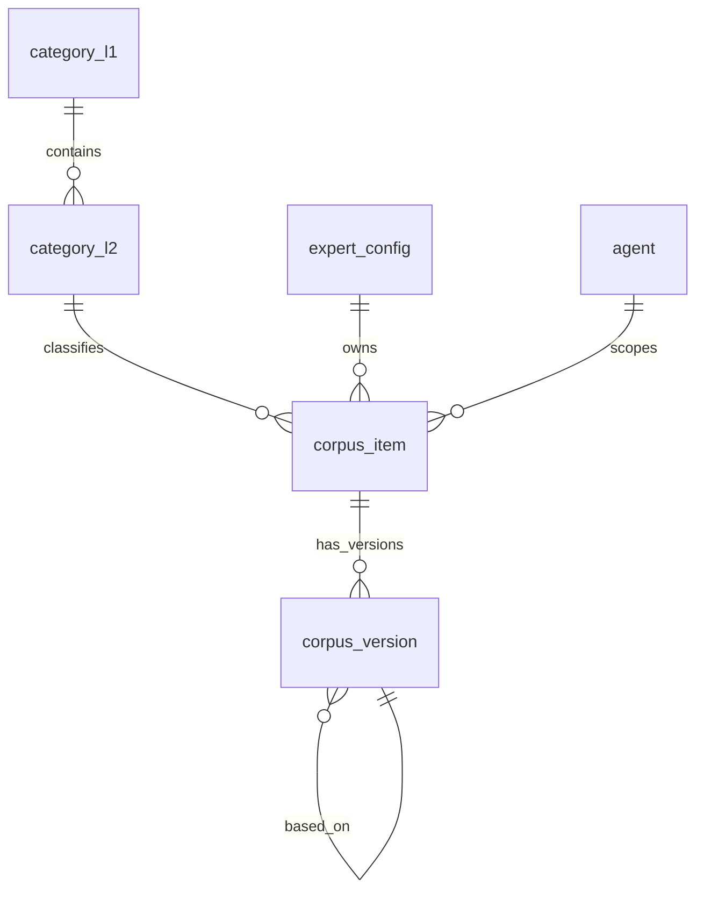

**先把 3 层语义拆开**
1. `expert / agent / category`
说明这条语料归谁、服务谁、属于什么分类。

2. `corpus_item`
说明“这是一条什么语料条目”，它的身份稳定，不因为内容改了就换 id。

3. `corpus_version`
说明“这条语料当前版本的具体内容是什么、允许怎么改、已经积累了哪些训练反馈”。

**你的 JSON 和表字段怎么对齐**

| JSON 路径 | 建议落表 | 建议字段 | 说明 |
|---|---|---|---|
| `experts[].expert_code` | `corpus_item` | `expert_config_code` | 条目归属哪个 AE/Expert |
| `experts[].expert_name` | 不作为语料主存储 | 从 `expert_config` 关联得到 | 名称应以配置表为准 |
| `experts[].description` | 可选 | `corpus_item.expert_desc_snapshot` 或单独 expert corpus meta | 如果要配可单独存 |
| `items[].item_id` | `corpus_item` | `corpus_item_id` | 条目稳定业务 ID |
| `items[].category` | `corpus_item` | `item_kind` | 这里不要和 `category_l1/l2` 混用 |
| `items[].label` | `corpus_item` | `item_label` | 条目标签 |
| `items[].score_range` | `corpus_item` | `score_range` | 仅 `scoring_rule` 使用 |
| `items[].content` | `corpus_version` | `content` | 当前版本正文 |
| `items[].mutability` | `corpus_version` | `mutability` | `editable/appendable/readonly` |
| `items[].max_supplements` | `corpus_version` | `max_train_feedback` 或 `max_supplements` | 建议跟最终协议统一命名 |
| `items[].supplements` / `train_feedback` | `corpus_version` | `train_feedback_json` | 建议直接改成这个名字 |
| `task_id/article_id/assembly_time` | 不属于语料主表 | 运行时快照表 | 这是任务组装态，不是语料主数据 |

**这里最容易混的一个点**
`items[].category` 和 `category_l1/category_l2` 不是一回事。

应该拆开：

- `category_l1/category_l2`：业务分类，比如品牌、平台、拟人化、内容结构
- `items[].category`：条目类型，比如 `keyword_corpus` / `scoring_rule` / `example_article`

所以表里不要只放一个 `category` 字段，否则后面一定乱。

**我建议的最小正确表结构**

`corpus_item`
- `corpus_item_id`
- `agent_code`
- `expert_config_code`
- `category_l1_id`
- `category_l2_id`
- `item_kind`
- `item_label`
- `score_range`
- `current_active_version_id`
- `status`

`corpus_version`
- `corpus_version_id`
- `corpus_item_id`
- `version_no`
- `based_on_version_id`
- `content`
- `mutability`
- `max_train_feedback`
- `train_feedback_json`
- `version_status`
- `source_type`
- `change_reason`
- `created_by`
- `create_time`

**为什么 `mutability` 要放在 `corpus_version`**
因为它跟版本内容一起生效。

比如同一个 `brand_kw_002`：

- V1 是 `editable`
- V2 改成 `readonly`
- V3 又允许 `appendable`

这不是“条目身份变了”，而是“不同版本的修改策略变了”，所以必须跟版本绑定。

**为什么 `train_feedback` 也放在 `corpus_version`**
因为它不是条目天然属性，而是某一版内容在训练过程中积累出来的反馈痕迹。

也就是说：

- `corpus_item` 决定“我是谁”
- `corpus_version` 决定“我这版长什么样、允许怎么被改、已经收到了哪些反馈”

**拿你给的例子套一下**
`persona_rule_001` 这一条应这样落：

`corpus_item`
- `corpus_item_id = persona_rule_001`
- `expert_config_code = ae_persona_001`
- `item_kind = scoring_rule`
- `item_label = 零分`
- `score_range = 0`

`corpus_version`
- `corpus_version_id = xxx`
- `corpus_item_id = persona_rule_001`
- `content = 完全不满足任何拟人化要求...`
- `mutability = readonly`
- `max_train_feedback = 0`
- `train_feedback_json = []`

**最后一个关键判断**
`ge_use_corpus_json_data` 整体不应该直接等于某一张主表。

它更像是一个“运行时组装结果”：

- 上层头信息：`task_id/article_id/assembly_time`
- 中层 expert 分组：按 `expert_config_code` 聚合
- 底层 item 内容：来自 `corpus_item + corpus_version`

所以主数据存关系表，真正执行时再组装成你这份 JSON。

如果你认可这套拆法，我下一步就直接给你画一版“只包含 `category_l1 / category_l2 / corpus_item / corpus_version / expert_config`”的精确表关系图。

> DEVELOPER

corpus_item不要搞得太复杂，这里不对应agent和expert我觉得比较好
应该是agent和expert来调我们，不用管他们吧

> AGENT

你这个收口我认同，我先按“语料域只管自己，不反向感知 Agent / Expert”这个边界来讲清楚，不往文档里写。

> AGENT

对，这样更干净。

如果我们把边界收紧成“语料域只负责管理语料本身，`Agent / Expert` 只是调用方”，那 `corpus_item` 就不应该挂 `agent_code`、`expert_code` 这类字段。它只表达“这是一条什么语料”，不表达“谁来用它”。

可以直接收敛成这 4 张核心表：

```mermaid
erDiagram
    category_l1 ||--o{ category_l2 : contains
    category_l2 ||--o{ corpus_item : classifies
    corpus_item ||--o{ corpus_version : has_versions
```

对应语义是：

- `category_l1`
  - 一级分类
- `category_l2`
  - 二级分类，归属一个 `category_l1`
- `corpus_item`
  - 稳定条目，不放内容版本，不放 Agent/Expert 归属
- `corpus_version`
  - 就是你说的 `corpus_item_version`
  - 存这条语料某一版的具体内容和可编辑规则

你刚刚那份 `ge_use_corpus_json_data`，如果按这个边界来拆，应该这样对齐：

**放在 `corpus_item` 的字段**
- `item_id`
- `label`
- `category`，但我建议改名成 `item_type`
  - 因为它其实是 `keyword_corpus / scoring_rule / example_article`
  - 不要和 `category_l1 / category_l2` 混掉
- `score_range`

**放在 `corpus_version` 的字段**
- `content`
- `mutability`
- `max_supplements`
- `train_feedback`（你刚说要把 `supplements` 改成这个）
- `version_status`
- `based_on_version_id`（如果要支持回滚/迭代来源）

**不要放进语料核心表的字段**
- `expert_name`
- `expert_code`
- `description`
- `task_id`
- `article_id`
- `assembly_time`

这些都属于“调用/组装层”，不是语料主数据。

也就是说，`ge_use_corpus_json_data` 不等于某一张表，它更像是运行时组装出来的一个 DTO：

```mermaid
flowchart LR
    A["Agent / Expert 调用方"] --> B["语料查询/组装层"]
    B --> C["category_l1/category_l2"]
    B --> D["corpus_item"]
    B --> E["corpus_version"]
    B --> F["ge_use_corpus_json_data"]
```

所以现在最干净的口径就是：

- 语料域只维护 `分类 -> 条目 -> 版本`
- `Agent / Expert` 不反写进 `corpus_item`
- `mutability / max_supplements / train_feedback` 全放 `corpus_version`
- `experts[]` 这一层是组装结果，不是语料底表结构

如果你认这个边界，我下一条就直接给你一版“最简但正确”的 4 张表字段草案。

> DEVELOPER

corpus_version 为什么要放
content？？？他不是应该放在corpus_item中吗

> AGENT

如果我们坚持你前面定的语义：

- `corpus_item` = 稳定条目
- `corpus_version` = 这个条目的一个版本

那 `content` 应该放在 `corpus_version`，不是 `corpus_item`。

原因很直接：

同一个 `corpus_item` 会经历多次迭代，比如：

- `corpus_item = brand_kw_002`
- `V1.content = 品牌不合规违禁词...`
- `V2.content = 品牌不合规违禁词... + 新增替换词`
- `V3.content = 又改了一版表达`

如果 `content` 只放在 `corpus_item`，那表里永远只能有一份正文，你就没法准确表示：

- 每个版本当时的具体内容是什么
- 回滚要回到哪一版内容
- RLAIF 改的是哪一版
- 某次任务用到的到底是哪一版内容

所以只要“版本”是真版本，不是个空壳元数据，`content` 就必须在 `corpus_version`。

最小模型其实是这样：

```mermaid
erDiagram
    category_l1 ||--o{ category_l2 : contains
    category_l2 ||--o{ corpus_item : classifies
    corpus_item ||--o{ corpus_version : has_versions
```

`corpus_item`
- `corpus_item_id`
- `category_l2_id`
- `item_type`
- `label`
- `score_range`
- `current_version_id`
- `status`

`corpus_version`
- `corpus_version_id`
- `corpus_item_id`
- `version_no`
- `content`
- `mutability`
- `max_train_feedback`
- `train_feedback_json`
- `status`
- `based_on_version_id`

你如果担心查“当前内容”不方便，可以折中：

- 真正的内容仍放 `corpus_version`
- `corpus_item.current_version_id` 指向当前生效版本
- 必要时再给 `corpus_item` 加一个 `current_content_snapshot` 做冗余缓存

但“源数据”最好还是在 `corpus_version`。

一句话总结：

- 如果没有历史版本需求，`content` 放 `corpus_item`
- 如果你承认 `corpus_version = corpus_item_version`，那 `content` 就应该放 `corpus_version`

你这里其实已经是第二种了。  
如果你愿意，我下一条可以直接给你画一张“`corpus_item` 和 `corpus_version` 到底怎么分工”的极简对照图。

> DEVELOPER

corpus_item

corpus_item_id
category_l2_id
item_type
label
score_range
current_version_id
status
corpus_version

corpus_version_id
corpus_item_id
version_no
content
mutability
max_train_feedback
train_feedback_json
status
based_on_version_id

你说的没错，但是category_l1_id去哪了？

> AGENT

`category_l1_id` 我这里是故意没放进 `corpus_item` 的，因为按更规范的关系设计，它应该通过 `category_l2` 反查出来。

最干净的关系是：

```mermaid
erDiagram
    category_l1 ||--o{ category_l2 : contains
    category_l2 ||--o{ corpus_item : classifies
    corpus_item ||--o{ corpus_version : has_versions
```

也就是：

- `category_l1`
  - `category_l1_id`
- `category_l2`
  - `category_l2_id`
  - `category_l1_id`
- `corpus_item`
  - 只存 `category_l2_id`

这样查一级类目时走一层关联就行：

`corpus_item.category_l2_id -> category_l2.category_l1_id`

所以推荐表会是：

`corpus_item`
- `corpus_item_id`
- `category_l2_id`
- `item_type`
- `label`
- `score_range`
- `current_version_id`
- `status`

`category_l2`
- `category_l2_id`
- `category_l1_id`
- `name`
- `status`

如果你们业务上存在这两种情况，那再考虑把 `category_l1_id` 也放进 `corpus_item`：

1. 有些语料只归一级类目，不归二级类目  
2. 你们查询一级类目特别高频，想做冗余加速

但只要放了双字段：

- `corpus_item.category_l1_id`
- `corpus_item.category_l2_id`

就必须再加一致性约束，保证 `category_l2` 确实属于这个 `category_l1`，不然数据很容易串。

所以我的建议是：

- 如果每条语料都必须落到二级类目：`corpus_item` 只放 `category_l2_id`
- 如果允许只挂一级类目：`corpus_item` 同时放 `category_l1_id` 和 `category_l2_id`

就你目前这套语料设计，我更推荐第一种。因为更干净，不容易乱。

如果你愿意，我下一条可以直接给你画一版“`category_l1/category_l2/corpus_item/corpus_version` 四张表的最终关系图和字段归属”。

> DEVELOPER

有些语料只归一级类目，不归二级类目
你们查询一级类目特别高频，想做冗余加速
是存在这样的情况

> AGENT

那就应该把 `category_l1_id` 放回 `corpus_item`，而且作为必填；`category_l2_id` 设为可空。

这样最符合你们现在的业务：

- 每条语料至少归属一个一级类目
- 有些语料没有二级类目
- 一级类目查询高频，直接冗余在 `corpus_item` 上更合适

**更新后的关系**
```mermaid
erDiagram
    category_l1 ||--o{ category_l2 : contains
    category_l1 ||--o{ corpus_item : classifies
    category_l2 ||--o{ corpus_item : optionally_refines
    corpus_item ||--o{ corpus_version : has_versions
```

**推荐字段**
`corpus_item`
- `corpus_item_id`
- `category_l1_id`
- `category_l2_id` `NULL`
- `item_type`
- `label`
- `score_range`
- `current_version_id`
- `status`

`corpus_version`
- `corpus_version_id`
- `corpus_item_id`
- `version_no`
- `content`
- `mutability`
- `max_train_feedback`
- `train_feedback_json`
- `status`
- `based_on_version_id`

**约束规则**
1. `corpus_item.category_l1_id` 必填。
2. `corpus_item.category_l2_id` 可空。
3. 如果 `category_l2_id` 不为空，它必须属于同一个 `category_l1_id`。
4. 查询一级类目时，直接走 `corpus_item.category_l1_id`。
5. 查询二级类目明细时，再走 `category_l2_id`。

**这时的语义也很清楚**
- `category_l1_id`：主归类、主筛选维度
- `category_l2_id`：可选细分维度
- `corpus_item`：条目身份
- `corpus_version`：条目内容版本

如果你愿意，我下一条可以直接把这 4 张表整理成一版“最终字段清单”，不再来回改口径。

> DEVELOPER

# Files mentioned by the user:

## E261E7CC9D27052BD2276A02F50D63B2.jpg: /Users/lyston/Downloads/E261E7CC9D27052BD2276A02F50D63B2.jpg

## My request for Codex:
这是我新设计的表结构和表的关系图,你理解理解
在corpus_definition -> corpus_version_context 1对n
job -> sub_job 1对n
在这张图中就这四个表结构
下面是关系图
又agent获取generation_biref再根据它渲染选择generation_plan到job中 1对n
job再根据plan查brief生成sub_job的corpus_snapshots 1对n
sub_job再生成文章到content(已有文章池)中 1对1

再就是agent->expert 1对n
expert->corpus_version_context 1对n
agent->corpus_version_context 1对n

 

<image name=[Image #1]>
</image>

> AGENT

我现在把你的图按业务语义复述一遍，看看我们是不是已经对齐了。我先按 `generation_biref = generation_brief` 理解。

**我理解的四张核心表**

`corpus_definition`
- 这是“语料定义主档”
- 放稳定身份字段，不放具体版本内容
- 大概承载：`category_l1_id`、`category_l2_id`、`item_type`、`label`、`score_range`、`status`
- 它解决的是“这条语料是什么”

`corpus_version_context`
- 这是“语料在具体上下文下的版本内容”
- 它挂在 `corpus_definition` 下面，`1:N`
- 这里才放真正会变化的东西：`content`、`mutability`、`max_train_feedback`、`train_feedback_json`、`status`
- 同时它还和 `agent`、`expert` 建关系
- 它解决的是“这条语料在某个调用上下文里当前怎么写、怎么改”

`job`
- 这是一次生文批次任务
- Agent 先拿 `generation_brief`
- 再根据 brief 渲染/选择 `generation_plan`
- 然后把 plan 落到 `job`
- 所以 `job` 更像“批次级编排实例”

`sub_job`
- 这是单篇文章执行单元
- `job 1:N sub_job`
- 每个 `sub_job` 会带自己的 `corpus_snapshots`
- 最后 `sub_job 1:1 content`

**我理解的主链路**

```mermaid
flowchart LR
    A["agent"] --> B["generation_brief"]
    B --> C["generation_plan"]
    C --> D["job"]
    D --> E["sub_job"]
    E --> F["content"]

    G["corpus_definition"] --> H["corpus_version_context"]
    A --> H
    I["expert"] --> H

    D -. "按 plan / brief 取语料" .-> H
    H -. "固化为 corpus_snapshots" .-> E
```

对应你的意思就是：

1. `agent` 先取 `generation_brief`
2. 再基于 brief 渲染或选择多个 `generation_plan`
3. 这些 plan 落进一个 `job`
4. `job` 再拆成多个 `sub_job`
5. 每个 `sub_job` 根据 `brief + plan` 去查 `corpus_version_context`
6. 查询结果不是临时用完就丢，而是固化成 `sub_job.corpus_snapshots`
7. `sub_job` 再生成一篇文章，落到 `content`

**我理解的关系**

```mermaid
erDiagram
    corpus_definition ||--o{ corpus_version_context : has
    job ||--o{ sub_job : has
    agent ||--o{ job : creates
    agent ||--o{ expert : owns
    agent ||--o{ corpus_version_context : uses
    expert ||--o{ corpus_version_context : uses
    sub_job ||--|| content : outputs
```

**这版设计我觉得最关键的点**

- `corpus_definition` 和 `corpus_version_context` 被你拆开了，这个非常对。
- 前者是“条目定义”，后者是“上下文化后的可演进版本”，这样就不会把 `agent/expert` 污染到语料定义主档里。
- 真正的审计点不再是“系统当时大概查了哪些语料”，而是 `sub_job.corpus_snapshots`。
- 这样即使后面 `corpus_version_context` 被 RLAIF 改了，历史 `sub_job` 仍然能准确回放当时到底用了什么语料。

**我当前的一个核心理解**

我先按下面这个口径理解你的图：

`corpus_version_context = 某条 corpus_definition 在 agent / expert 调用上下文下的一版具体内容`

如果这个理解对，那这张表本质上就不是纯“版本表”，而是“版本 + 作用域上下文表”。

这个方向我觉得是通的，而且比前面直接把 `agent/expert` 挂到 `corpus_item` 上更顺。

如果你愿意，下一步我可以直接基于你这张图，帮你把这四张表的最终字段口径逐个收紧，尤其是 `corpus_version_context` 到底该不该同时带 `agent_id` 和 `expert_id`。

> DEVELOPER

```mermaid
flowchart LR
    A["agent"] --> B["generation_brief"]
    B --> C["generation_plan"]
    C --> D["job"]
    D --> E["sub_job"]
    E --> F["content"]

    G["corpus_definition"] --> H["corpus_version_context"]
    A --> H
    I["expert"] --> H

    D -. "按 plan / brief 取语料" .-> H
    H -. "固化为 corpus_snapshots" .-> E

```
这个表中没有体现agent->expert

> AGENT

对，这里确实漏了。

`agent -> expert` 不是“生文执行步骤”本身，而是“编排/配置关系”，所以我刚才那张图只画了执行链，没把这条静态关系带进去。要画完整，应该补上，而且最好把“静态配置”和“运行时执行”放在同一张图里区分开。

可以改成这样：

```mermaid
flowchart LR
    A["agent"] --> X["expert"]
    A --> B["generation_brief"]
    B --> C["generation_plan"]
    C --> D["job"]
    D --> E["sub_job"]
    E --> F["content"]

    G["corpus_definition"] --> H["corpus_version_context"]
    A --> H
    X --> H

    D -. "按 plan / brief 选择语料" .-> H
    H -. "固化为 corpus_snapshots" .-> E
```

如果按关系语义再说清楚，就是这几条：

1. `agent -> expert`：1 对 N  
   表示一个 Agent 挂多个 Expert，决定它能调哪些专家能力。

2. `corpus_definition -> corpus_version_context`：1 对 N  
   表示一条语料定义可以演进出多个上下文版本。

3. `agent -> corpus_version_context`：1 对 N  
   表示 Agent 侧可以维护自己可用的一组语料上下文。

4. `expert -> corpus_version_context`：1 对 N  
   表示每个 Expert 也会对应自己的一组语料上下文。

5. `job -> sub_job`：1 对 N  
   一个批次任务拆成多篇文章子任务。

6. `sub_job -> content`：1 对 1  
   一个子任务最终产出一篇文章。

如果你想更严谨一点，我建议把图拆成两张会更清楚：

- 一张画“静态关系”：`agent / expert / corpus_definition / corpus_version_context`
- 一张画“执行流程”：`agent -> generation_brief -> generation_plan -> job -> sub_job -> content`

因为 `agent -> expert` 属于配置拓扑，`job -> sub_job` 属于运行时事实，混在一张图里容易看花。

如果你愿意，我下一条直接给你画成“两张正式版 Mermaid 图”，你就可以直接放进方案里。

> DEVELOPER

我需要你把我刚刚图片中的四个表给写出来，corpus_difinetion corpus_version_context job sub_job要非常完整的

> AGENT

我先按你这张手稿的业务语义，把四张表收敛成“可落库的一版完整字段设计”，重点会把 `job.generation_brief / generation_plan` 和 `sub_job.corpus_snapshots` 这两个核心执行面写透。

> AGENT

下面我按你这张手稿，整理成一版可以直接落库的四表结构。  
我统一把你图里的 `generation_biref` 写成 `generation_brief`，如果你们现网字段就叫 `biref`，把名字替回去就行，语义不变。

**关系总览**
```mermaid
erDiagram
    agent ||--o{ expert : owns
    corpus_definition ||--o{ corpus_version_context : has_versions
    agent ||--o{ corpus_version_context : uses
    expert ||--o{ corpus_version_context : owns
    agent ||--o{ job : creates
    job ||--o{ sub_job : splits
    sub_job ||--|| content : outputs
```

**1. `corpus_definition`**
角色：语料定义主档，存“稳定身份”，不存上下文内容，不直接挂 `agent/expert`。

| 字段 | 类型 | 可空 | 说明 |
|---|---|---:|---|
| `id` | `BIGINT` PK | 否 | 技术主键 |
| `corpus_definition_id` | `VARCHAR(64)` UNIQUE | 否 | 业务主键，对应稳定的语料条目 ID |
| `category_l1_id` | `BIGINT` | 否 | 一级类目 ID |
| `category_l2_id` | `BIGINT` | 是 | 二级类目 ID，允许为空 |
| `item_type` | `VARCHAR(32)` | 否 | 条目类型，建议：`keyword_corpus / scoring_rule / example_article` |
| `label` | `VARCHAR(128)` | 否 | 语料标签 |
| `item_desc` | `VARCHAR(512)` | 是 | 条目说明，帮助运营和程序理解用途 |
| `score_range` | `VARCHAR(32)` | 是 | 仅 `scoring_rule` 使用，比如 `0`、`1-20`、`81-100` |
| `sort_no` | `INT` | 是 | 同类语料下的排序 |
| `status` | `VARCHAR(32)` | 否 | 建议：`DRAFT / ACTIVE / DISABLED` |
| `created_by` | `VARCHAR(64)` | 是 | 创建人 |
| `updated_by` | `VARCHAR(64)` | 是 | 更新人 |
| `create_time` | `DATETIME` | 否 | 创建时间 |
| `update_time` | `DATETIME` | 否 | 更新时间 |
| `is_deleted` | `TINYINT(1)` | 否 | 逻辑删除标记，默认 `0` |

建议索引：
- `UNIQUE KEY uk_corpus_definition_id (corpus_definition_id)`
- `KEY idx_category (category_l1_id, category_l2_id)`
- `KEY idx_item_type_status (item_type, status)`

说明：
- `category_l1_id` 必填，`category_l2_id` 可空。
- 如果 `category_l2_id` 不为空，必须校验它属于同一个 `category_l1_id`。
- 这张表不放 `content`，因为内容会随版本和上下文变化。

---

**2. `corpus_version_context`**
角色：语料的“上下文化版本表”。  
这里才放具体 `content`，也在这里承接 `agent/expert`、`mutability`、`train_feedback` 这些运行和训练相关字段。

| 字段 | 类型 | 可空 | 说明 |
|---|---|---:|---|
| `id` | `BIGINT` PK | 否 | 技术主键 |
| `corpus_version_context_id` | `VARCHAR(64)` UNIQUE | 否 | 业务主键 |
| `corpus_definition_id` | `VARCHAR(64)` | 否 | 对应哪条语料定义 |
| `agent_id` | `BIGINT` | 否 | 所属 Agent |
| `expert_id` | `BIGINT` | 否 | 所属 Expert |
| `context_role` | `VARCHAR(32)` | 否 | 建议：`GE_USE_CORPUS / AE_SCORING_RULE / AE_SUPPORT_CORPUS` |
| `version_no` | `INT` | 否 | 版本号，从 `1` 开始递增 |
| `content` | `LONGTEXT` | 否 | 当前版本的正文内容 |
| `mutability` | `VARCHAR(16)` | 否 | `editable / appendable / readonly` |
| `max_train_feedback` | `INT` | 否 | 训练反馈追加上限，默认 `0` |
| `train_feedback_json` | `JSON` | 是 | 训练反馈数组，替代之前的 `supplements` |
| `status` | `VARCHAR(32)` | 否 | 建议：`DRAFT / ACTIVE / ARCHIVED / ROLLED_BACK` |
| `based_on_version_context_id` | `VARCHAR(64)` | 是 | 基于哪个旧版本演化而来 |
| `source_type` | `VARCHAR(32)` | 是 | 建议：`MANUAL / RLAIF / IMPORT / COPY` |
| `source_ref_id` | `VARCHAR(64)` | 是 | 来源引用 ID，比如训练任务 ID |
| `change_reason` | `VARCHAR(512)` | 是 | 本次版本变更原因 |
| `effective_start_time` | `DATETIME` | 是 | 生效开始时间 |
| `effective_end_time` | `DATETIME` | 是 | 生效结束时间 |
| `created_by` | `VARCHAR(64)` | 是 | 创建人 |
| `updated_by` | `VARCHAR(64)` | 是 | 更新人 |
| `create_time` | `DATETIME` | 否 | 创建时间 |
| `update_time` | `DATETIME` | 否 | 更新时间 |
| `is_deleted` | `TINYINT(1)` | 否 | 逻辑删除标记 |

建议索引：
- `UNIQUE KEY uk_context_id (corpus_version_context_id)`
- `UNIQUE KEY uk_scope_version (corpus_definition_id, agent_id, expert_id, context_role, version_no)`
- `KEY idx_agent_expert_status (agent_id, expert_id, status)`
- `KEY idx_definition_status (corpus_definition_id, status)`

说明：
- `content` 就应该在这张表里，因为它是“某个上下文下某一版的内容”。
- `mutability`、`max_train_feedback`、`train_feedback_json` 也都应该跟着版本走，不能放到定义主表。
- 这张表就是你那份 `ge_use_corpus_json_data` 最底层 `items[]` 的真实来源之一。

`train_feedback_json` 建议结构：
```json
[
  {
    "feedback_id": "tf_001",
    "source_type": "rlaif",
    "source_ref_id": "train_task_001",
    "content": "补充一句更贴近门店导购的表达",
    "created_at": "2026-04-15T10:00:00+08:00"
  }
]
```

---

**3. `job`**
角色：批次级任务实例。  
`agent` 获取 `generation_brief`，再渲染/选择 `generation_plan`，最终落成一个 `job`。

| 字段 | 类型 | 可空 | 说明 |
|---|---|---:|---|
| `id` | `BIGINT` PK | 否 | 技术主键 |
| `job_id` | `VARCHAR(64)` UNIQUE | 否 | 业务任务 ID |
| `agent_id` | `BIGINT` | 否 | 哪个 Agent 创建的任务 |
| `title` | `VARCHAR(255)` | 是 | 任务标题 |
| `generation_brief_id` | `VARCHAR(64)` | 否 | 使用的 brief ID |
| `generation_brief_snapshot` | `JSON` | 否 | brief 快照，防止后续配置变化 |
| `generation_plan_id` | `VARCHAR(64)` | 是 | 选择的 plan ID |
| `generation_plan_snapshot` | `JSON` | 否 | plan 快照，记录当时选中的具体方案 |
| `expert_pipeline_snapshot` | `JSON` | 是 | 任务创建时的 Expert 编排快照 |
| `target_article_count` | `INT` | 否 | 目标生成文章数 |
| `success_article_count` | `INT` | 否 | 已成功数，默认 `0` |
| `failed_article_count` | `INT` | 否 | 已失败数，默认 `0` |
| `priority` | `INT` | 否 | 优先级，默认 `0` |
| `trigger_source` | `VARCHAR(32)` | 是 | `MANUAL / API / CRON / RETRY` |
| `request_payload` | `JSON` | 是 | 前端或上游传入的原始请求体 |
| `status` | `VARCHAR(32)` | 否 | 建议：`INIT / READY / RUNNING / PARTIAL_SUCCESS / SUCCESS / FAILED / CANCELLED` |
| `error_message` | `TEXT` | 是 | 批次级异常信息 |
| `start_time` | `DATETIME` | 是 | 开始执行时间 |
| `finish_time` | `DATETIME` | 是 | 结束时间 |
| `created_by` | `VARCHAR(64)` | 是 | 创建人 |
| `updated_by` | `VARCHAR(64)` | 是 | 更新人 |
| `create_time` | `DATETIME` | 否 | 创建时间 |
| `update_time` | `DATETIME` | 否 | 更新时间 |
| `is_deleted` | `TINYINT(1)` | 否 | 逻辑删除标记 |

建议索引：
- `UNIQUE KEY uk_job_id (job_id)`
- `KEY idx_agent_status (agent_id, status)`
- `KEY idx_brief_plan (generation_brief_id, generation_plan_id)`
- `KEY idx_create_time (create_time)`

`generation_plan_snapshot` 建议结构：
```json
{
  "plan_id": "plan_001",
  "plan_name": "母婴导购-痛点直击风",
  "articles": [
    {
      "plan_no": 1,
      "title_hint": "宝宝肚肚小烦恼？真的建议到店当面聊一聊",
      "brief_selector": {
        "topic": "肚肚舒适",
        "persona": "美妈顾问导购"
      },
      "expert_ids": [101, 102, 103]
    }
  ]
}
```

说明：
- `job` 是批次级事实，不直接存具体语料内容。
- 但必须存 `generation_brief_snapshot` 和 `generation_plan_snapshot`，否则之后无法回放“当时为什么这样拆任务”。

---

**4. `sub_job`**
角色：单篇文章执行单元。  
`job` 根据 `plan + brief` 拆成多个 `sub_job`；每个 `sub_job` 固化自己的 `corpus_snapshots`，最后生成到 `content`。

| 字段 | 类型 | 可空 | 说明 |
|---|---|---:|---|
| `id` | `BIGINT` PK | 否 | 技术主键 |
| `sub_job_id` | `VARCHAR(64)` UNIQUE | 否 | 业务子任务 ID |
| `job_id` | `VARCHAR(64)` | 否 | 所属主任务 |
| `plan_no` | `INT` | 否 | 对应 `generation_plan` 中的第几条 |
| `plan_item_id` | `VARCHAR(64)` | 是 | plan 中具体条目 ID |
| `resolved_brief_snapshot` | `JSON` | 否 | 该篇文章实际使用的 brief 子集快照 |
| `corpus_snapshots` | `JSON` | 否 | 该篇文章实际锁定的语料快照 |
| `rendered_prompt` | `LONGTEXT` | 是 | 最终渲染后的完整 Prompt |
| `title_hint` | `VARCHAR(255)` | 是 | 计划标题或标题建议 |
| `keyword_list` | `JSON` | 是 | 本篇目标关键词列表 |
| `content_id` | `BIGINT` UNIQUE | 是 | 生成成功后写入内容池的文章 ID |
| `model_code` | `VARCHAR(64)` | 是 | 生成使用的模型编码 |
| `provider_code` | `VARCHAR(64)` | 是 | 模型服务商编码 |
| `trace_id` | `VARCHAR(64)` | 是 | 调用链追踪 ID |
| `retry_count` | `INT` | 否 | 重试次数，默认 `0` |
| `status` | `VARCHAR(32)` | 否 | 建议：`PENDING / READY / RUNNING / SUCCESS / FAILED / RETRYING / CANCELLED` |
| `error_message` | `TEXT` | 是 | 单篇文章失败原因 |
| `start_time` | `DATETIME` | 是 | 开始执行时间 |
| `finish_time` | `DATETIME` | 是 | 结束时间 |
| `created_by` | `VARCHAR(64)` | 是 | 创建人 |
| `updated_by` | `VARCHAR(64)` | 是 | 更新人 |
| `create_time` | `DATETIME` | 否 | 创建时间 |
| `update_time` | `DATETIME` | 否 | 更新时间 |
| `is_deleted` | `TINYINT(1)` | 否 | 逻辑删除标记 |

建议索引：
- `UNIQUE KEY uk_sub_job_id (sub_job_id)`
- `UNIQUE KEY uk_content_id (content_id)`
- `KEY idx_job_plan (job_id, plan_no)`
- `KEY idx_job_status (job_id, status)`
- `KEY idx_trace_id (trace_id)`

`corpus_snapshots` 建议结构：
```json
[
  {
    "corpus_definition_id": "brand_kw_002",
    "corpus_version_context_id": "cvc_20260415_001",
    "agent_id": 10,
    "expert_id": 201,
    "context_role": "GE_USE_CORPUS",
    "item_type": "keyword_corpus",
    "label": "品牌违禁词/替换词",
    "score_range": null,
    "content": "品牌不合规违禁词/替换词: 厌奶，体质，生病...",
    "mutability": "editable",
    "max_train_feedback": 3,
    "train_feedback_json": [],
    "version_no": 2
  }
]
```

说明：
- 真正的审计点在 `sub_job.corpus_snapshots`。
- 后面即使 `corpus_version_context` 又被 RLAIF 改了，历史 `sub_job` 仍然能准确回放“当时到底用了什么”。

**几个关键设计判断**
1. `corpus_definition` 不挂 `agent/expert`，保持干净。
2. `agent/expert` 放到 `corpus_version_context`，因为你这里的“可用语料”本来就是上下文相关的。
3. `content` 放 `corpus_version_context`，不是 `corpus_definition`。
4. `job` 负责锁定 `brief + plan`。
5. `sub_job` 负责锁定“单篇文章最终实际用到的语料快照”。

如果你要，我下一步可以直接把这四张表翻成一版 MySQL DDL。

> DEVELOPER

不，严格按照我的照片里的，不要添加其他的字段

> AGENT

我按你这句收口，只做一件事：严格抄你照片里的四张表，不再补任何我自己推演出来的字段。先把图片里的手写字段逐个核一下，再给你一版“只包含照片内容”的结果。

> AGENT

OCR 工具本机没装上，我改成直接按图片内容人工校对，不去乱补字段。现在我先核对四张表里每个手写字段，尽量完全贴着你图里的命名来写。

> AGENT

图片是手机拍的，方向和透视都有点歪，我在做最后一轮对照，避免把你图里的字段名看错。写出来时我会只保留照片上确实出现的字段，不再扩展。

> AGENT

下面这版我只按你照片里的内容重写，不额外补字段。

**四张表**

`corpus_definition`
```text
id
category_l1_reference
category_l2_reference
type
label
ui_description
content_type
mutability
max_train_feedback
status
create_time
update_time
```

`corpus_version_context`
```text
id
corpus_definition_id
category_l1_name
category_l2_name
content_label
version_no
train_feedback
```

`job`
```text
id
generation_biref_id
agent_id
generation_biref
generation_plan
expert_ctx_role_ids
status
```

`sub_job`
```text
id
job_id
article_brief_id
content_label
content_list
status
generated_article_id
corpus_snapshots
```

**你这张图里的关系**
```text
corpus_definition 1 : N corpus_version_context
job 1 : N sub_job
sub_job 1 : 1 content

agent 1 : N expert
expert 1 : N corpus_version_context
agent 1 : N corpus_version_context
```

**我对这版的理解**
- `corpus_definition` 放语料定义层，不放具体版本正文。
- `corpus_version_context` 放具体上下文版本内容，挂在 `corpus_definition` 下面。
- `job` 放批次级的 `generation_biref` 和 `generation_plan`。
- `sub_job` 放单篇执行结果，核心是 `corpus_snapshots` 和最终 `generated_article_id`。

如果你要，我下一条可以继续把这四张表直接翻成一版“不加字段”的 MySQL DDL。

> DEVELOPER

分别拉取gitlab中最新的代码main分支

> AGENT

我先检查一下 `raap` 目录里现有哪些仓库、当前分支分别是什么，然后再统一切到 `main` 并拉最新代码。

> AGENT

仓库都在了。我先看一眼每个仓库当前分支和是否有本地改动，避免直接切 `main` 时把你本地未提交内容卡住。

> AGENT

我开始统一抓取远端 `main`，然后把各仓库切到 `main` 并快进到最新提交。 if 某个仓库没有 `main`，我会停下来把具体仓库列给你。

> AGENT

沙箱把 SSH 出站拦住了。我现在发起一次受权执行，把 `raap` 目录下这些仓库都切到 `main` 并同步远端最新代码。

> AGENT

连接已经放开，拉取动作在跑了。我继续盯着结果，把每个仓库是否成功切到 `main` 和最新提交一起确认出来。

> AGENT

主流程已经跑完了，大部分仓库都已经切到 `main` 并同步成功。我再做一轮本地校验，把每个仓库当前分支和两处例外仓库一起确认清楚。

> AGENT

已处理完。

`/Users/lyston/raap` 下这 15 个仓库里，13 个已经切到 `main` 并同步到最新：
`cursorrules`、`jenkins-shared-lib`、`raap-admin-frontend`、`raap-core`、`raap-deploy`、`raap-devops`、`raap-service-ag`、`raap-service-copilot`、`raap-service-generation-experts`、`raap-service-gw`、`raap-service-keyword-corpus`、`raap-service-orchestrator`、`raap-service-user-memory`。

其中有 3 个仓库实际发生了快进更新：
- `raap-devops` -> `f9e2d3b`
- `raap-service-ag` -> `f949fda`
- `raap-service-orchestrator` -> `666425a`

其余 10 个已在远端 `main` 最新提交上。

有 2 个仓库没法按你的要求切到 `main`，因为远端没有 `main` 分支：
- `raap-service-actor`：当前仍在 `raap_next`，提交 `1b3fa5f`
- `raap-service-llm-router`：当前仍在 `master`，提交 `2eefebc`

如果你要，我可以接着把这两个仓库的远端默认分支也拉到最新。

> DEVELOPER

git@git.sharpasshark.com:raap/raap-service-orchestrator.git这个拉下来

> TOOL

<turn_aborted>
The user interrupted the previous turn on purpose. Any running unified exec processes may still be running in the background. If any tools/commands were aborted, they may have partially executed.
</turn_aborted>

> DEVELOPER

git@git.sharpasshark.com:raap/raap-service-orchestrator.git这个拉下来，使用 这个分支

> AGENT

这个仓库已经在本地了：`/Users/lyston/raap/raap-service-orchestrator`。

现在就差你说的“这个分支”名字没带出来。把分支名发我，我就直接在这份现有仓库上切过去并拉最新。

> DEVELOPER

feature/v2-corpus-task-module这个分支

> AGENT

我先检查一下这个仓库当前分支和本地改动，然后直接把它切到 `feature/v2-corpus-task-module` 并同步远端最新。

> AGENT

仓库是干净的，我现在直接去远端抓这个分支并切过去，避免在本地再新克隆一份。

> AGENT

`raap-service-orchestrator` 已切到 `feature/v2-corpus-task-module`，并同步到远端最新。

当前本地仓库：
`/Users/lyston/raap/raap-service-orchestrator`

当前分支：
`feature/v2-corpus-task-module`

当前提交：
`6b951dc`

> DEVELOPER

raap-service-orchestrator
查看一下这个子项目是否是跟我们的方向来的

> AGENT

我先把这个分支相对 `main` 的改动范围和核心文件摸清楚，重点看它是不是围绕 `corpus/task` 在收敛，以及模型设计是否贴近我们刚才讨论的方向。

> AGENT

我已经看到这个分支基本只新增了两张 `v2` 语料表和对应接口。下一步我会重点核两件事：一是表结构是不是贴近你刚刚画的方向，二是它有没有真正接进 `job/sub_job` 链路。

> AGENT

我已经看到一个明显信号：这条分支虽然在名字上是 `corpus-task-module`，但实际只新增了语料 `v2` 的模型和接口，`job/sub_job` 只是初始化 SQL 里另外建了两张新表，没有接入现有执行代码。我再把这部分细节展开确认。

> AGENT

我已经抓到第一个比较硬的风险：这套 `v2` 模型没进 `app/models/__init__.py`，而且也没有 Alembic migration，只靠一个手工 SQL 脚本。这意味着它更像“演示原型”，还不是能跟主项目一起稳定发布的模块。再看一眼路由和主程序接入。

> AGENT

我又发现一个更直接的问题：`corpus_definition_v2` 的 schema 带了 `remark`，但 model 没这个字段，service 又直接 `model_dump()` 全量透传进 SQLAlchemy 构造器。也就是说，创建语料定义接口大概率一调用就会炸。再顺手把这类“能不能真的跑起来”的问题补全一下。

> AGENT

**Findings**
- `[P1]` `POST /api/v2/corpus-definitions` 现在大概率是直接不可用的。`schema` 里定义了 `remark` 字段，但 `model` 里没有这个列；`create()` 又把 `data.model_dump()` 原样塞进 `CorpusDefinitionV2(**...)`，会把 `remark` 一起传进去，SQLAlchemy 构造器会因此报未知字段错误。[app/schemas/corpus_definition_v2.py](/Users/lyston/raap/raap-service-orchestrator/app/schemas/corpus_definition_v2.py#L24) [app/services/corpus_definition_v2_service.py](/Users/lyston/raap/raap-service-orchestrator/app/services/corpus_definition_v2_service.py#L110) [app/models/corpus_definition_v2.py](/Users/lyston/raap/raap-service-orchestrator/app/models/corpus_definition_v2.py#L15)
- `[P1]` 这条分支的“task module”还没有真正接进现有执行链路。`job_v2/sub_job_v2` 只存在于初始化 SQL 里，但运行时仍然在用老的 `job/sub_job` 模型和 `plugin_snapshots` 快照逻辑，所以它还不是你图里那套 `job -> sub_job -> corpus_snapshots -> content` 的新链路。[scripts/init_corpus_v2.sql](/Users/lyston/raap/raap-service-orchestrator/scripts/init_corpus_v2.sql#L61) [scripts/init_corpus_v2.sql](/Users/lyston/raap/raap-service-orchestrator/scripts/init_corpus_v2.sql#L89) [app/models/job.py](/Users/lyston/raap/raap-service-orchestrator/app/models/job.py#L13) [app/models/sub_job.py](/Users/lyston/raap/raap-service-orchestrator/app/models/sub_job.py#L16) [app/scheduler/expert_task_executor.py](/Users/lyston/raap/raap-service-orchestrator/app/scheduler/expert_task_executor.py#L324)
- `[P1]` `corpus_version_context_v2` 和你们现在要的方向还有明显偏差。它没有 `agent_id/expert_id` 这类上下文归属字段，也没有真正的 `content` 或结构化语料载荷，当前核心字段只有 `version_id` 和 `keywords`，这还承载不了“Agent/Expert 调用某版语料上下文”的语义，更没法直接对齐 `ge_use_corpus_json_data` 那种 item/content/mutability 结构。[app/models/corpus_version_context_v2.py](/Users/lyston/raap/raap-service-orchestrator/app/models/corpus_version_context_v2.py#L29) [app/models/corpus_version_context_v2.py](/Users/lyston/raap/raap-service-orchestrator/app/models/corpus_version_context_v2.py#L58)
- `[P2]` `mutability` 和 `max_train_feedback` 被同时放进了 definition 和 version-context 两层，后面一定会出现“双写口径”。按你们现在讨论的方向，这两个字段应该跟版本走，不该在定义层再保留一份。[app/models/corpus_definition_v2.py](/Users/lyston/raap/raap-service-orchestrator/app/models/corpus_definition_v2.py#L75) [app/models/corpus_version_context_v2.py](/Users/lyston/raap/raap-service-orchestrator/app/models/corpus_version_context_v2.py#L64)
- `[P2]` 初始化脚本里给 `job_v2.generation_plan` 这个 `JSON` 列直接建了普通索引，这在 MySQL 里通常不能直接过 DDL，脚本本身就有落地风险。[scripts/init_corpus_v2.sql](/Users/lyston/raap/raap-service-orchestrator/scripts/init_corpus_v2.sql#L69) [scripts/init_corpus_v2.sql](/Users/lyston/raap/raap-service-orchestrator/scripts/init_corpus_v2.sql#L85)

**结论**
不算“跟你们方向完全来了”。它更像一个“语料 v2 CRUD 原型”：

- 对的地方是：开始把语料拆成 `definition + context/version` 两层了，也单独开了 `v2` API。
- 不对的地方是：还没把 `job/sub_job/content` 新链路真正接起来，`corpus_version_context_v2` 也还没长成你们要的那种“可审计、可版本化、可绑定 Agent/Expert 的上下文语料”。

**补充**
我这次是静态读代码得出的结论，没有完整跑接口；本地仓库当前连最基本的 `sqlalchemy` 依赖都没装起来。  
如果你愿意，我下一步可以直接给你做一张“这条分支 vs 你照片那套四表设计”的差异对照表。

> DEVELOPER

先查看这个子项目有哪些raap-v2分支

> AGENT

我先同步一下这个仓库的远端分支列表，然后只筛出名字里带 `raap-v2` 的分支给你，避免看到的是本地过期缓存。

> AGENT

远端同步成功了，但我没筛到名字里明确带 `raap-v2` 的分支。我再把这个仓库里所有带 `v2` 的远端分支一起列出来，免得是命名口径不一致。

> AGENT

这个子项目远端目前带 `v2` 的分支有 3 个：

- `origin/feature/raap_v2`
- `origin/feature/raap_v2_chake_260415`
- `origin/feature/v2-corpus-task-module`

严格来说，没有名字里带中划线 `raap-v2` 的分支；看起来你们现在用的是下划线 `raap_v2` 这套命名。

如果你要，我可以继续把这 3 个分支分别拉下来，对比一下它们各自改了什么。

> DEVELOPER

可以，git@git.sharpasshark.com:raap/raap-admin-frontend.git将这个的raap-v2分支也拉下来

> AGENT

我先看一下这个前端仓库远端有哪些 `v2/raap_v2` 相关分支，然后直接把对应分支拉到本地并切过去。

> AGENT

这个仓库里对应的 `raap-v2` 分支实际也是下划线命名：`feature/raap_v2`。我现在直接把它切到本地并同步最新。

> AGENT

`raap-admin-frontend` 已切到 `feature/raap_v2`，并同步到远端最新。

当前本地仓库：
`/Users/lyston/raap/raap-admin-frontend`

当前分支：
`feature/raap_v2`

当前提交：
`c7a0bad`

如果你要，我可以继续把这个前端分支和 `main` 做一遍差异梳理。

> DEVELOPER

这个子项目远端目前带 v2 的分支有 3 个：

origin/feature/raap_v2
origin/feature/raap_v2_chake_260415
origin/feature/v2-corpus-task-module
严格来说，没有名字里带中划线 raap-v2 的分支；看起来你们现在用的是下划线 raap_v2 这套命名。

如果你要，我可以继续把这 3 个分支分别拉下来，对比一下它们各自改了什么。

> AGENT

我继续把 `raap-service-orchestrator` 这 3 个 `v2` 分支做横向对比，先看每个分支相对 `main` 的改动范围，再看它们彼此是不是一条演进链。

> AGENT

我已经拿到三个分支各自对 `main` 的改动体量了。接下来补一眼它们之间的祖先关系，这样就能判断 `raap_v2_chake_260415` 是不是在 `raap_v2` 上的补丁分支。

> AGENT

我把三条分支之间的关系也看清了：它们不是一条串行演进链，基本都是从 `main` 各自岔出去的。再补一眼 `raap_v2_chake_260415` 那两个文件的具体内容，我就给你一个清晰结论。

> AGENT

我把这 3 个分支横向比完了，结论先给你：

- `feature/raap_v2`：大而全的“平台级 v2”分支
- `feature/raap_v2_chake_260415`：很小的训练工作台补丁分支
- `feature/v2-corpus-task-module`：最接近你们现在“语料/任务四表”方向，但还只是原型

它们**不是一条串行演进链**，基本都是从 `main` 各自分出去的，不是 `raap_v2 -> chake -> corpus-task` 这种关系。

**各分支在改什么**

`origin/feature/raap_v2` `a14f89d`
- 体量最大，`54` 个文件，`8481` 行新增。
- 重点在做一整套 `v2` 后台域：
  - `Agent / AgentVersion / Activity / ActivityAgentBinding / Expert / ExpertVersion`
  - `AE Runtime` 相关服务
  - v2 API、测试、migration、文档
- 更像“整个 orchestrator 的 v2 基础平台”。

核心文件大致是：
- [app/api/v2/router.py](/Users/lyston/raap/raap-service-orchestrator/app/api/v2/router.py)
- [app/models/expert.py](/Users/lyston/raap/raap-service-orchestrator/app/models/expert.py)
- [app/models/expert_version.py](/Users/lyston/raap/raap-service-orchestrator/app/models/expert_version.py)

`origin/feature/raap_v2_chake_260415` `fc87161`
- 体量最小，只改了 `2` 个文件，`174` 行新增。
- 本质是在旧链路上补了一个“训练工作台”查询接口。
- 直接查 `Job / Content / ExpertBusinessResult`，把可训练文章、critic 汇总、统计数据拼出来给前端展示。
- 不是新语料模型，也不是新任务编排。

核心文件：
- [app/api/v1/endpoints/job_execution.py](/Users/lyston/raap/raap-service-orchestrator/app/api/v1/endpoints/job_execution.py)
- [app/schemas/job_execution.py](/Users/lyston/raap/raap-service-orchestrator/app/schemas/job_execution.py)

`origin/feature/v2-corpus-task-module` `6b951dc`
- `15` 个文件，`1866` 行新增。
- 专注在你们刚才聊的语料域：
  - `corpus_definition_v2`
  - `corpus_version_context_v2`
  - 对应 CRUD API
  - 一份 `scripts/init_corpus_v2.sql`
- 这条是三者里**最贴近“语料与任务重构”**的。

核心文件：
- [app/models/corpus_definition_v2.py](/Users/lyston/raap/raap-service-orchestrator/app/models/corpus_definition_v2.py)
- [app/models/corpus_version_context_v2.py](/Users/lyston/raap/raap-service-orchestrator/app/models/corpus_version_context_v2.py)
- [scripts/init_corpus_v2.sql](/Users/lyston/raap/raap-service-orchestrator/scripts/init_corpus_v2.sql)

**怎么理解这三条线**
- `raap_v2`：偏“整个平台 v2 化”
- `raap_v2_chake_260415`：偏“训练工作台页面先跑起来”
- `v2-corpus-task-module`：偏“语料/任务模型先立起来”

**如果按你们现在的目标来选**
如果你现在关心的是：
- 语料定义
- 版本上下文
- `job -> sub_job -> corpus_snapshots`
- 审计点重构

那最值得继续看的还是：
- `feature/v2-corpus-task-module`

但它目前还不完整：
- 更像语料原型
- 还没真正把新 `job/sub_job` 链路接进现有执行流程

如果你愿意，我下一步可以直接给你做一张：

`raap_v2` vs `raap_v2_chake_260415` vs `v2-corpus-task-module`

的“方向对照表”，告诉你哪条分支该保留、哪条该参考、哪条可以忽略。

> DEVELOPER

feature/v2-corpus-task-module中的AGENTS.md文档，里面是详细的说明

> AGENT

我先把这个分支里的 `AGENTS.md` 通读一遍，按文档里定义的目标、表结构和实施边界重新校准判断，避免继续只凭代码表象下结论。

> AGENT

我看完了，这个 `AGENTS.md` 确实把这条分支的**设计意图**讲清楚了。

我现在会把它理解成：

- 这条 `feature/v2-corpus-task-module` 分支，**目标不是一次性重做完整执行链**
- 它的目标更聚焦在先把 **v2 语料模块** 独立出来
- 文档里明确落地的范围只有两张核心语料表和对应 API：
  - `corpus_definition_v2`
  - `corpus_version_context_v2`

按 `AGENTS.md` 的口径，这个分支主要做的是：

1. 语料定义主档
2. 语料版本/上下文化内容
3. 训练反馈管理
4. 初始化 SQL 和 v2 CRUD API

也就是说，它更像：

- “语料域 v2 基础模块”
- 不是“你现在手上那张图里的完整四表执行链重构版”

所以我会修正我前面的判断：

- 如果问“它是不是完全对齐你现在想做的那套 `corpus_definition -> corpus_version_context -> job -> sub_job` 新链路？”
  - 不是完全对齐
- 但如果问“它是不是在朝这个方向的第一步走？”
  - 是的，而且从文档意图上看，作者本来就是想**先把语料这部分单独立起来**

不过也有一个很重要的点：

`AGENTS.md` 讲的是**设计说明/分支目标**，不是“已经全部接完的事实”。  
所以我现在会区分成两层：

- 从文档意图看：方向是对的，先做语料 v2
- 从代码现状看：还没把你要的完整 `job/sub_job/content` 新链路一起打通

一句话总结就是：

**这条分支不是跑偏了，而是只做到了“语料模块先行”这一步，还没走到“完整任务编排审计链路重构”那一步。**

如果你愿意，我下一步可以直接基于这个 `AGENTS.md`，帮你做一张：

- `AGENTS.md 设计意图`
- `当前代码已实现`
- `距离你目标方案还差什么`

的三栏对照表。

> DEVELOPER

先将orchestrator的raap-v2分支应用，再再看feature/v2-corpus-task-module分支的内容

> AGENT

我先把 `raap-service-orchestrator` 切到 `feature/raap_v2` 并同步最新，然后以它为基线去看 `feature/v2-corpus-task-module` 这个分支到底额外带了什么内容。

> AGENT

仓库是干净的，我现在直接切到 `feature/raap_v2`，再做两条线的差异梳理。

> AGENT

`raap-service-orchestrator` 已经切到 `feature/raap_v2`。我现在用它做基线，看看 `feature/v2-corpus-task-module` 相比它新增了哪些文件、会碰哪些接入点。

> AGENT

我已经确认 `feature/v2-corpus-task-module` 相对 `feature/raap_v2` 基本是“新增一套语料 v2 模块”，真正会碰到的重叠点只有 `app/main.py` 和 `app/api/v2/router.py` 这类接线路径。现在我把这两个重叠点展开给你。

> AGENT

本地 `raap-service-orchestrator` 我已经切到并应用为：

- 分支：`feature/raap_v2`
- 提交：`a14f89d`

现在再看 `feature/v2-corpus-task-module`，如果以 `feature/raap_v2` 为基线，它带来的内容很清楚，基本是“补一套语料 v2 模块”：

**相对 `feature/raap_v2` 新增/变更**
- 新增 `corpus_definition_v2` / `corpus_version_context_v2` 两个模型
- 新增对应 schema、service、API
- 新增 `scripts/init_corpus_v2.sql`
- 新增说明文档 `AGENTS.md`、`CLAUDE.md`
- 改动总量：15 个文件，1866 行

核心新增文件是：
- `app/models/corpus_definition_v2.py`
- `app/models/corpus_version_context_v2.py`
- `app/api/v2/endpoints/corpus_definitions_v2.py`
- `app/api/v2/endpoints/corpus_versions_v2.py`
- `scripts/init_corpus_v2.sql`

**和 `raap_v2` 真正重叠的地方**
只有两个接入口最关键：

1. `app/api/v2/router.py`
2. `app/main.py`

这里要特别注意：

- `feature/raap_v2` 里已经有自己的 `v2` 路由体系，当前是：
  - `ae_configs`
  - `agents`
  - `agent_versions`
  - `activities`
  - `activity_agent_bindings`

- 而 `feature/v2-corpus-task-module` 里的 `app/api/v2/router.py` 是另一套更简化的写法，只挂：
  - `corpus_definitions_v2`
  - `corpus_versions_v2`

所以如果你后面想把 `feature/v2-corpus-task-module` 的内容“应用到” `feature/raap_v2`，**不能直接覆盖它的 `app/api/v2/router.py`**，而是应该把 corpus 两个路由并进 `raap_v2` 现有的 v2 router 里。

**一句话判断**
- `feature/raap_v2`：是 v2 平台主骨架
- `feature/v2-corpus-task-module`：是往这个骨架上补“语料模块”

这个方向是通的，但接入方式应该是：
- 以 `feature/raap_v2` 为主
- 把 `feature/v2-corpus-task-module` 当增量模块并进去
- 不要把它当成完整替代分支直接覆盖

如果你要，我下一步可以直接帮你列一份：
“把 `feature/v2-corpus-task-module` 合到 `feature/raap_v2` 时，需要保留/合并的文件清单”。

> DEVELOPER

# Files mentioned by the user:

## raap_v2.openapi.json: /Users/lyston/Downloads/raap_v2.openapi.json

## My request for Codex:
查看AGENTS.md文档，我们现在要根据对应的页面 来设计下接口，将各个接口拆出来，这个json是已经上传到apifox上的corpus接口，你看看

> AGENT

我先把 `AGENTS.md` 和你给的 `raap_v2.openapi.json` 一起过一遍，重点看现有 corpus 接口已经暴露了什么、还缺什么，然后按“页面驱动”的方式帮你拆接口。

> AGENT

我已经确认了两点：`AGENTS.md` 里的接口口径和 Apifox 里的 OpenAPI 是对齐的；当前已经有的是“定义层 + 版本层 + 训练反馈”的基础 CRUD。接下来我会把每个接口的入参/出参抽出来，再按页面拆成“列表页、详情页、编辑页、版本页、反馈页”几个接口组。

> AGENT

OpenAPI 里 path 都拿到了，但 schema 名字没按我预期命中，我再把 corpus 相关组件名字完整扫一遍，避免漏掉 Apifox 自动生成的包装结构。

> AGENT

我再补一眼几个细节接口的导出结果，主要看状态变更和训练反馈是不是已经够页面用了，还是只是最小可用 API。

> AGENT

我还得补一块上下文：既然你说“根据对应页面来设计接口”，我去前端 `raap-admin-frontend` 的 `feature/raap_v2` 分支里把 corpus 相关页面结构找出来，这样拆接口才不会空对空。

> AGENT

前端目录结构跟我预期不太一样，我先把仓库顶层和页面目录摸清楚，再定位 v2 页面。

> AGENT

前端里还没有一套明确的 `corpus v2` 页面代码，更多还是老的 `keyword_corpus` 页面和一些设计文档。所以我会把这件事当成“从现有语料页面习惯 + 你们新模型”去反推接口，而不是直接照着已落地页面逐个对字段。

> AGENT

我看完了。

现在这份 `corpus` OpenAPI 和 `AGENTS.md` 是对齐的，当前本质上是 11 个“资源型 CRUD 接口”：

- `corpus_definition` 一组
- `corpus_version_context` 一组
- `train_feedback` 两个接口

这套接口适合“表操作”，但**还不是页面接口**。  
如果按你们后台现有页面风格来做，应该像 [expert-config 的版本历史抽屉](/Users/lyston/raap/raap-admin-frontend/apps/raap-admin/src/views/config/expert-config/index.vue#L1711) 和 [plugin-context 的版本历史抽屉](/Users/lyston/raap/raap-admin-frontend/apps/raap-admin/src/views/config/plugin-context/index.vue#L296) 一样，按页面场景拆，而不是让前端自己拼很多次请求。

**我建议按 5 组页面接口来拆**

| 页面 | 推荐接口 | 说明 |
|---|---|---|
| 页面初始化/筛选项 | `GET /api/v2/corpus/meta/options` | 一次返回 `corpus_type`、`plan_type`、`mutability`、状态枚举、一级/二级类目树 |
| 语料定义列表页 | `GET /api/v2/corpus/definitions/page` | 返回表格行，里面直接带当前激活版本摘要、反馈数、更新时间，避免前端 N+1 |
| 语料定义编辑页 | `GET /api/v2/corpus-definitions/{id}` `POST /api/v2/corpus-definitions` `PUT /api/v2/corpus-definitions/{id}` `GET /api/v2/corpus-definitions/exists?code=...` | 这一组保留资源型接口即可，建议补一个编码唯一性校验接口 |
| 版本历史抽屉/版本编辑页 | `GET /api/v2/corpus-definitions/{id}/versions` `GET /api/v2/corpus-versions/{id}` `POST /api/v2/corpus-definitions/{id}/versions` `PUT /api/v2/corpus-versions/{id}` `POST /api/v2/corpus-versions/{id}/activate` `POST /api/v2/corpus-versions/{id}/copy-as-draft` | 这里不要只靠 `status` patch，最好显式拆出“激活”和“复制成草稿”动作 |
| 训练反馈抽屉 | `GET /api/v2/corpus-versions/{id}/train-feedbacks` `POST /api/v2/corpus-versions/{id}/train-feedbacks` `GET /api/v2/corpus-versions/{id}/feedback-summary` | 页面通常既要列表，也要顶部统计摘要 |

**现有 OpenAPI 里能直接复用的**
- `GET /corpus-definitions`
- `POST /corpus-definitions`
- `GET /corpus-definitions/{id}`
- `PUT /corpus-definitions/{id}`
- `PATCH /corpus-definitions/{id}/status`
- `GET /corpus-versions/definition/{corpus_definition_id}/versions`
- `GET /corpus-versions/{id}`
- `POST /corpus-versions`
- `PUT /corpus-versions/{id}`
- `POST /corpus-versions/{id}/train-feedback`
- `GET /corpus-versions/{id}/train-feedbacks`

**但这几处我建议马上调整**
- 列表查询参数不要在 OpenAPI 里全标成 `required=true`，分页和筛选项大多应是可选。
- 响应体现在 Apifox 里都是空 `object`，这个不够，前端没法稳定接类型。
- `status` 变更最好别只走 query，动作接口会更清楚。
- 最关键的一点：现在版本表里主内容字段还是 `keywords`，这更像旧关键词系统。  
  如果你们这套页面其实是新 `corpus`，建议尽快改成 `content` 或 `content_json`，不然后面 GE/AE 语料一定会别扭。

**我建议的接口拆法**
1. 保留现在这 11 个资源型接口，作为底座。
2. 额外补 3 个页面型接口：
   - `GET /api/v2/corpus/meta/options`
   - `GET /api/v2/corpus/definitions/page`
   - `GET /api/v2/corpus-versions/{id}/feedback-summary`
3. 再补 2 个动作型接口：
   - `POST /api/v2/corpus-versions/{id}/activate`
   - `POST /api/v2/corpus-versions/{id}/copy-as-draft`

如果你愿意，我下一步可以直接把这套接口整理成一份“Apifox 可落的接口清单”，包括每个接口的入参、出参字段名。

> DEVELOPER

你得告诉我为什么

> AGENT

对，我得把“为什么”讲透，不然接口拆分就会变成拍脑袋。

先说核心结论：

**我建议按页面拆接口，不是因为“接口越多越好”，而是因为你现在这份 OpenAPI 只覆盖了“表的 CRUD”，还没有覆盖“页面真正要拿的数据形状和动作语义”。**

你现在手上的 corpus OpenAPI，本质上是这两类资源：

- `corpus_definition`
- `corpus_version_context`

它解决的是：

- 这条记录怎么增删改查
- 这条版本怎么增删改查
- 训练反馈怎么增、怎么查

但页面真正关心的通常不是“单表记录”，而是：

- 列表页要展示什么组合字段
- 编辑页初始化要拿什么枚举和类目树
- 版本抽屉要看什么历史
- 页面上的“激活版本”“复制为草稿”“恢复版本”到底算普通字段修改，还是业务动作

这就是我说要“按页面拆接口”的原因。

**为什么现有 11 个接口不够**

因为它们是“资源型接口”，不是“页面型接口”。

比如一个语料定义列表页，页面通常不只想看：

- `corpus_definition_id`
- `category_l1_id`
- `status`

它往往还想一起看到：

- 当前激活版本号
- 当前激活版本内容摘要
- 训练反馈条数
- 最近更新时间
- 当前版本的 `mutability`

如果只用你现在的接口，前端大概率要这样干：

1. 先调 `GET /corpus-definitions`
2. 再对每条定义调 `GET /corpus-versions/definition/{id}/active`
3. 再可能调 `GET /train-feedbacks`

这就会变成典型的 **N+1 请求**。  
所以我才建议补一个页面型列表接口，比如：

- `GET /api/v2/corpus/definitions/page`

因为列表页需要的是“聚合后的一行数据”，不是三四张表让前端自己拼。

**为什么要补 `meta/options`**

这个是为了页面初始化。

一个编辑页或者筛选栏通常会需要：

- `corpus_type` 枚举
- `plan_type` 枚举
- `mutability` 枚举
- `status` 枚举
- 一级类目/二级类目树

如果没有这个接口，就会出现两种坏情况：

1. 前端把这些值写死
2. 前端分多次请求去拼

这两种都不理想。

所以我建议：

- `GET /api/v2/corpus/meta/options`

原因就是：  
**页面初始化数据应该一次拿齐，不应该散落在多个接口和前端硬编码里。**

**为什么“激活版本”不建议只用 `PATCH status`**

因为“激活版本”不是普通字段修改，它是业务动作。

比如你把某个版本从 `DRAFT` 改成 `ACTIVE`，系统背后通常还应该做这些事：

- 把同定义下其他 `ACTIVE` 版本降级
- 校验当前版本是否允许激活
- 记录审计日志
- 可能校验生效时间

如果只暴露成：

- `PATCH /corpus-versions/{id}/status?status=ACTIVE`

那接口语义太弱了。别人看接口文档根本不知道这是不是一个“带规则的发布动作”。

所以我建议拆成：

- `POST /api/v2/corpus-versions/{id}/activate`

原因就是：

**状态值是结果，激活动作才是业务。**

**为什么“复制为草稿”也应该单独拆接口**

因为这也不是简单新增。

页面上点“基于当前版本创建新版本”时，后端通常要做的是：

- 复制当前版本内容
- 生成新的 `version_id`
- 状态置为 `DRAFT`
- 带上 `based_on_version_id`
- 可能拷贝已有 `train_feedback`

这不是让前端自己先查旧版本，再自己拼一个 `POST /corpus-versions` 请求就能优雅表达的。

所以我建议补：

- `POST /api/v2/corpus-versions/{id}/copy-as-draft`

原因就是：

**这是典型的后端业务动作，不应该把编排逻辑丢给前端。**

**为什么要补 `feedback-summary`**

因为训练反馈页一般不只看 feedback 列表，还会看顶部统计：

- 当前反馈条数
- 平均分
- 最高/最低分
- 是否达到上限
- 最近反馈时间

你现在只有：

- `GET /train-feedbacks`
- `POST /train-feedback`

这适合“数据明细”，不适合“页面摘要”。

所以建议补：

- `GET /api/v2/corpus-versions/{id}/feedback-summary`

原因就是：

**列表和统计是两种不同的页面数据形态，不该强迫前端自己算。**

**为什么我还强调 OpenAPI 里不要把筛选参数都设成 required**

因为你这份 OpenAPI 现在像这样：

- `page` required
- `page_size` required
- `status` required
- `category_l1_id` required
- `category_l2_id` required
- `keyword` required

这在“页面语义”上其实不合理。  
正常列表页里：

- `page/page_size` 可以给默认值
- `status/category/keyword` 大多都是可选筛选项

如果文档里都写成必填，会导致两个问题：

1. 前端生成类型时会误判
2. Apifox/SDK 使用者会误以为这些字段必须每次都传

所以这个问题的本质是：

**接口文档应该表达真实使用语义，而不是把所有 query 都机械标成必填。**

**为什么我说现在的响应体不够**

因为 Apifox 里现在 corpus 接口很多 `200 response` 还是：

- `type: object`
- `properties: {}`

这对页面开发不够用。

页面要稳定开发，至少得知道：

- `list` 返回的 `items` 结构
- `detail` 返回的字段
- `train_feedbacks` 每条反馈长什么样
- `page/total/page_size` 怎么返回

不然前端只能边调边猜。

所以这个建议背后的原因是：

**OpenAPI 不只是“能调用”，还要“能让前后端对齐字段契约”。**

**为什么我说 `keywords` 这个字段未来会不够**

这个是最关键的一个“方向性原因”。

在 `AGENTS.md` 里，`corpus_version_context_v2` 被定义成：

- 存具体语料内容
- 存关键词
- 存训练反馈

但现在核心字段更像是：

- `keywords`

这更接近旧的关键词系统，不太像你们现在讨论的“GE/AE 语料上下文”。

因为你们现在讨论的内容其实已经不是简单关键词了，而是：

- 一段完整提示语料
- 评分规则文本
- 可修改性约束
- 训练反馈记录

这类内容未来更适合叫：

- `content`
- 或 `content_json`

而不是只叫 `keywords`

所以我提这个建议的原因是：

**字段名会反过来限制模型演进。现在叫 `keywords`，后面很容易把语料系统继续做窄。**

**为什么我会参考现有前端页面模式**

因为你们前端现在已经有成熟模式了，不需要重新发明。

像这些页面就已经体现出“页面型接口”的思路：

- [expert-config 版本历史](/Users/lyston/raap/raap-admin-frontend/apps/raap-admin/src/views/config/expert-config/index.vue)
- [plugin-context 版本历史](/Users/lyston/raap/raap-admin-frontend/apps/raap-admin/src/views/config/plugin-context/index.vue)

这些页面不是只靠一个 CRUD 接口完成的，它们天然包含：

- 版本列表
- 版本详情
- 恢复动作

所以 corpus 这套如果也要做“版本历史抽屉”“激活版本”“训练反馈”，接口设计就应该沿用这种页面模式。

**一句话收束**
我建议补页面接口，不是为了“把接口做复杂”，而是为了避免这三件事：

1. 前端 N+1 调用自己拼数据
2. 业务动作被伪装成普通字段更新
3. OpenAPI 看起来有接口，实际对页面开发帮助不大

如果你愿意，我下一步就不再讲抽象了，直接给你输出一版：

- “语料定义列表页需要哪些接口”
- “语料定义编辑页需要哪些接口”
- “版本历史抽屉需要哪些接口”
- “训练反馈页需要哪些接口”

按页面一页一页拆给你。

> DEVELOPER

你要深入阅读AGENTS.md文档再设计
顺便提一下,下面黑丝之前的接口调用：
Orchestrator 从 keyword-corpus 获取语料的方式
整体架构
Orchestrator 是 代理层（BFF），前端只调用 orchestrator，orchestrator 再通过 Dapr HTTP Invocation 转发到 raap-service-keyword-corpus 服务。核心调用方式：


前端 → Orchestrator (代理层) → Dapr Sidecar → keyword-corpus 服务
Dapr 调用 URL 格式为：


http://localhost:{DAPR_HTTP_PORT}/v1.0/invoke/raap-service-keyword-corpus/method/{api_path}
语料获取的两条核心路径
1. 任务执行时获取语料（运行时）
在 Job 执行/测试时，Orchestrator 通过 strategy_helper.py 和 job_test_helper.py 获取语料，关键接口：

场景	调用的 keyword-corpus 接口	说明
获取策略组合	GET /api/v1/content-strategies/{id}/combinations	含语料（include_corpus=true）
按需生成组合	POST /api/v1/content-strategies/{id}/generate	随机/指定数量
多策略合并	POST /api/v1/content-strategies/merge-combinations	strategy_v3 模式
批量获取节点语料	POST /api/v1/categories/keywords/batch-get	核心语料获取接口
获取策略详情	GET /api/v1/content-strategies/{id}	策略元数据
最关键的语料获取接口是 /api/v1/categories/keywords/batch-get：

在 job_test_helper.py:62-144 的 _fetch_corpus_from_tree() 函数中调用
接收 node_ids 列表，返回每个节点的 name、corpus（语料数组）
有 fallback 机制：优先走 Dapr，失败后直连 K8s Service
支持 3 次重试 + 指数退避
2. 前端 CRUD 代理（管理层）
Orchestrator 在 keyword_corpus/ 目录下提供了完整的代理层，将前端请求透传到 keyword-corpus：

代理模块	前端路由前缀	代理到 keyword-corpus 的路径
categories.py	/keyword-corpus/categories	/api/v1/categories/*（分类树、关键词、语料CRUD、批量导入）
content_strategies.py	/keyword-corpus/content-strategies	/api/v1/content-strategies/*（策略管理、组合生成）
graph.py	/keyword-corpus/graph	/api/v1/graph/*（图谱节点/边/可视化）
corpus_templates.py	/keyword-corpus/corpus-templates	/api/v1/corpus-templates/*（语料模板管理）
metadata.py	/keyword-corpus/metadata	/api/v1/metadata/*（品牌/产品/标签）
ban_terms.py	/keyword-corpus/ban-terms	转发到 raap-service-ag（BAN词管理）
语料数据流（任务执行时）

1. 创建 Job → 设置 strategy_selections + variable_share_mapping
2. 展开 plan → fetch_merged_strategy_combinations() 获取合并组合
3. 每个 plan_item 包含 combo.nodes = {dimension: {id, name, label}}
4. Expert 执行时 → render_prompt_with_snapshot()
   - 解析 variable_mapping 中的 node:{id} 格式
   - 调用 _fetch_corpus_from_tree([node_ids]) 
   - 从 keyword-corpus 获取实际语料文本
   - 用语料替换 prompt 模板中的 {{变量名}}
5. 语料格式支持：
   - 旧格式：{text: "..."}
   - 新格式：{template_code: "...", fields: {k: v}, field_keys: [...]}
通用调用工具
所有 Dapr 调用都经过 dapr_http.py 的 invoke_method() 函数封装，支持 GET/POST，自动 JSON 解析。

> AGENT

我先把你补的“旧链路怎么从 keyword-corpus 取语料”在代码里对一遍，再回到 `AGENTS.md` 的目标范围上重拆接口。这样我们设计的新接口就不会脱离现有运行时调用习惯。

> AGENT

我把旧运行时语料获取链路的关键代码也拉出来了，接下来再看两个点：一个是 `_fetch_corpus_from_tree()` 真实依赖的数据形状，另一个是 v1 代理接口现在暴露了哪些“管理动作”。这样新接口才能兼顾管理层和运行时。

> AGENT

我重新按两件事来设计了，不再只盯着那份 OpenAPI。

**为什么要这样拆**
1. `AGENTS.md` 定义的范围，其实只有“语料管理模块”。
   它明确的是 `corpus_definition_v2`、`corpus_version_context_v2`、训练反馈和 v2 CRUD，并没有把 `strategy`、`job`、`sub_job` 一起收进这个模块。所以 corpus 接口应该先围绕：
   - 定义
   - 版本
   - 训练反馈

2. 旧链路告诉我们，语料接口天然分成两层：
   - 管理层：前端页面 CRUD
   - 运行时：任务执行时批量取语料、组装 prompt  
   这在旧代码里非常清楚：
   - 运行时核心取数是 [_fetch_corpus_from_tree()](/Users/lyston/raap/raap-service-orchestrator/app/utils/job_test_helper.py#L62)
   - 渲染 prompt 时会把 `node:id` 解析成真实语料内容 [render_prompt_with_snapshot_and_context()](/Users/lyston/raap/raap-service-orchestrator/app/utils/job_test_helper.py#L264)
   - 对外代理层则是 `keyword_corpus/categories.py` 这类 CRUD/代理接口，[`/keywords/batch-get`](/Users/lyston/raap/raap-service-orchestrator/app/api/v1/endpoints/keyword_corpus/categories.py#L472) 就是运行时批量获取入口

所以，**如果只保留你现在 Apifox 里的 11 个 CRUD 接口，页面能勉强做，但运行时替不了旧的 keyword-corpus 链路。**

**按 AGENTS.md 正确的拆法**
我建议拆成 3 组，不是 1 组。

**1. 页面管理接口**
这组给前端页面用，围绕“定义页、版本页、反馈页”。

`语料定义列表页`
- `GET /api/v2/corpus/meta/options`
  返回类目树、`corpus_type`、`plan_type`、`mutability`、状态枚举
  原因：页面初始化不该靠前端硬编码

- `GET /api/v2/corpus-definitions`
  继续作为列表接口，但返回要升级成“页面行数据”
  每行建议直接带：
  - `corpus_definition_id`
  - `category_l1/l2`
  - `corpus_type`
  - `plan_type`
  - `status`
  - `active_version_id`
  - `active_version_status`
  - `active_mutability`
  - `train_feedback_count`
  - `update_time`
  原因：列表页不该前端自己再去 N 次查 active version

`语料定义编辑页`
- `POST /api/v2/corpus-definitions`
- `GET /api/v2/corpus-definitions/{id}`
- `GET /api/v2/corpus-definitions/code/{corpus_definition_id}`
- `PUT /api/v2/corpus-definitions/{id}`
- `PATCH /api/v2/corpus-definitions/{id}/status`
- 可补：`GET /api/v2/corpus-definitions/exists?corpus_definition_id=...`
  原因：编码唯一性校验会是页面刚需

`版本历史抽屉`
这里要参考你们现有页面模式，不要只做普通 CRUD。
你们现在的 [expert-config 版本历史抽屉](/Users/lyston/raap/raap-admin-frontend/apps/raap-admin/src/views/config/expert-config/index.vue#L1711) 和 [plugin-context 版本历史抽屉](/Users/lyston/raap/raap-admin-frontend/apps/raap-admin/src/views/config/plugin-context/index.vue#L296) 都是：
- 查历史
- 看详情
- 恢复/发布动作

所以 corpus 这里建议是：
- `GET /api/v2/corpus-versions/definition/{corpus_definition_id}/versions`
- `GET /api/v2/corpus-versions/definition/{corpus_definition_id}/active`
- `GET /api/v2/corpus-versions/{version_id}`
- `POST /api/v2/corpus-versions`
- `PUT /api/v2/corpus-versions/{version_id}`

再补两个动作接口：
- `POST /api/v2/corpus-versions/{version_id}/activate`
- `POST /api/v2/corpus-versions/{version_id}/copy-as-draft`

原因：
- “激活版本”不是普通改字段，而是业务动作
- “基于当前版复制草稿”也不是前端自己拼一个 `POST` 就该承担的逻辑

`训练反馈抽屉`
- `GET /api/v2/corpus-versions/{version_id}/train-feedbacks`
- `POST /api/v2/corpus-versions/{version_id}/train-feedbacks`
- 补：`GET /api/v2/corpus-versions/{version_id}/feedback-summary`

原因：
- 列表和统计摘要是两种页面数据
- 页面通常会同时看“反馈明细”和“当前已用额度/平均分/最近反馈”

**2. 运行时内部接口**
这组不给页面直接用，是为了替代旧 `keyword-corpus` 的运行时取数。

旧系统运行时的关键不是 CRUD，而是：
- 批量按引用取语料
- 返回 prompt 可直接消费的数据结构
- 固化 snapshot 供审计回放

所以新 corpus 模块还应该补一组内部接口：

- `POST /api/v2/corpus-runtime/batch-resolve`
  输入：一批 definition/version 引用
  输出：一批可直接消费的语料项
  原因：替代旧的 `POST /api/v1/categories/keywords/batch-get`

- `POST /api/v2/corpus-runtime/assemble`
  输入：`agent/expert/plan/sub_job` 上下文或已解析 binding
  输出：
  - `ge_use_corpus`
  - `ge_use_corpus_json_data`
  - `corpus_snapshot`
  原因：旧系统最终要的是“渲染 prompt 的结果”，不是单表记录

这组接口为什么必须单独拆：
- 旧链路的运行时调用和管理页调用本来就不是一回事
- 如果运行时直接复用页面 CRUD，后面一定会出现多次查表、拼装分散、快照不一致的问题

**3. 不要塞进 corpus 模块的接口**
旧系统里这些接口很重要，但它们不应该直接并到 corpus 模块里：
- `content-strategies/{id}/combinations`
- `generate`
- `merge-combinations`

原因：
- 这些属于“计划/策略/Agent 编排”
- 不属于 `AGENTS.md` 定义的 corpus 模块边界

换句话说：
- corpus 模块负责“语料定义、版本、反馈、运行时解析”
- strategy/job 模块负责“怎么选哪些语料去生成任务”

**为什么现在这份 OpenAPI 还不够**
因为它现在只是“表结构接口化”了，还没“页面化”和“运行时化”。

具体不够的点：
- 列表接口缺聚合字段
- 缺页面初始化元数据接口
- 版本动作只剩 `status patch`，语义太弱
- 缺反馈摘要
- 更关键的是，缺运行时批量解析/组装接口，替不了旧链路

**我最终建议的接口清单**
前端页面接口：
- `GET /api/v2/corpus/meta/options`
- `GET /api/v2/corpus-definitions`
- `POST /api/v2/corpus-definitions`
- `GET /api/v2/corpus-definitions/{id}`
- `GET /api/v2/corpus-definitions/code/{code}`
- `PUT /api/v2/corpus-definitions/{id}`
- `PATCH /api/v2/corpus-definitions/{id}/status`
- `GET /api/v2/corpus-versions/definition/{corpus_definition_id}/versions`
- `GET /api/v2/corpus-versions/definition/{corpus_definition_id}/active`
- `GET /api/v2/corpus-versions/{version_id}`
- `POST /api/v2/corpus-versions`
- `PUT /api/v2/corpus-versions/{version_id}`
- `POST /api/v2/corpus-versions/{version_id}/activate`
- `POST /api/v2/corpus-versions/{version_id}/copy-as-draft`
- `GET /api/v2/corpus-versions/{version_id}/train-feedbacks`
- `POST /api/v2/corpus-versions/{version_id}/train-feedbacks`
- `GET /api/v2/corpus-versions/{version_id}/feedback-summary`

运行时内部接口：
- `POST /api/v2/corpus-runtime/batch-resolve`
- `POST /api/v2/corpus-runtime/assemble`

如果你愿意，我下一步就直接把这套接口展开成 Apifox 级别的定义：
- 每个接口的请求参数
- 每个接口的返回字段
- 哪些保留你现在的 OpenAPI
- 哪些是要新增的。

> DEVELOPER

# Files mentioned by the user:

## raap_v2.openapi.json: /Users/lyston/Downloads/raap_v2.openapi.json

## My request for Codex:
你给的方案它和这个apifox的json有什么区别

> AGENT

最大的区别一句话说就是：

**这个 Apifox JSON 是“语料模块的资源 CRUD 接口”，我给的是“在它之上补页面层、动作层、运行时层”的接口方案。**

不是推翻它，是在它的基础上往前走一层。

**先说一致的地方**
你这个 `raap_v2.openapi.json` 和我给的方案，底座其实是同一套对象：

- `corpus_definition`
- `corpus_version_context`
- `train_feedback`

而且你现在 Apifox 里这些接口，我认为都应该保留：

- `GET/POST /corpus-definitions`
- `GET/PUT/DELETE /corpus-definitions/{id}`
- `GET /corpus-definitions/code/{corpus_definition_id}`
- `PATCH /corpus-definitions/{id}/status`
- `POST /corpus-versions`
- `GET /corpus-versions/definition/{corpus_definition_id}/versions`
- `GET /corpus-versions/definition/{corpus_definition_id}/active`
- `GET/PUT/DELETE /corpus-versions/{id}`
- `PATCH /corpus-versions/{id}/status`
- `POST /corpus-versions/{id}/train-feedback`
- `GET /corpus-versions/{id}/train-feedbacks`

所以底层资源模型上，我们没有分歧。

**真正的区别在这 4 点**

| 维度 | 你的 Apifox JSON | 我给的方案 |
|---|---|---|
| 定位 | 表资源 CRUD | 页面接口 + 业务动作 + 运行时接口 |
| 主要服务对象 | 管理后台基础操作 | 管理后台页面 + 任务执行链路 |
| 接口粒度 | 一张表一个资源接口 | 一个页面/一个动作/一个运行时场景一组接口 |
| 是否覆盖旧 keyword-corpus 运行时链路 | 没覆盖 | 试图补上替代路径 |

**1. 你的 JSON 只解决“表怎么增删改查”**
比如：

- 创建语料定义
- 查语料版本
- 改状态
- 加训练反馈

这很适合做“后台基础管理”。

但它不直接解决这些页面问题：

- 列表页一行要展示哪些聚合字段
- 编辑页初始化的类目树、枚举从哪来
- 版本历史抽屉怎么拿数据
- “激活版本”到底是普通改状态，还是发布动作
- 页面顶部反馈统计怎么拿

所以我才补了页面型接口。

**2. 你的 JSON 里没有“动作语义”，我给的是把动作拆出来**
比如你现在是：

- `PATCH /corpus-versions/{id}/status`

这从 REST 资源角度没问题。

但从业务语义看，“把某版激活”其实不是普通字段更新，它往往意味着：

- 当前版本变 `ACTIVE`
- 同定义下其他激活版失效
- 记录审计
- 校验能不能发布

所以我建议补：

- `POST /corpus-versions/{id}/activate`
- `POST /corpus-versions/{id}/copy-as-draft`

也就是说：

**你的 JSON 偏资源语义，我的方案偏业务动作语义。**

**3. 你的 JSON 没覆盖运行时，我的方案刻意补了运行时**
这个是最本质的区别。

你刚刚补的旧链路说明里，Orchestrator 运行时真正依赖的不是 CRUD，而是：

- `content-strategies/{id}/combinations`
- `merge-combinations`
- `categories/keywords/batch-get`

尤其是运行时核心语料获取是：

- `_fetch_corpus_from_tree()`
- 批量拿 node 对应的 corpus
- 再在 `render_prompt_with_snapshot_and_context()` 里渲染 prompt

也就是说，旧系统运行时要的是：

- 批量解析
- 组装语料
- 形成 prompt 可消费结果

而你现在这份 Apifox JSON 还停留在：

- 管理 `corpus_definition`
- 管理 `corpus_version_context`
- 管理 `train_feedback`

所以如果只用这个 JSON，能做后台页，但**替不了旧的 runtime 语料链路**。

这也是我为什么补：

- `POST /corpus-runtime/batch-resolve`
- `POST /corpus-runtime/assemble`

**4. 你的 JSON 更像“后端内部接口导出”，我的方案更像“前后端协作契约”**
你这份 JSON 还有两个明显特征：

- 很多 query 参数在 Apifox 里被标成 `required=true`
- `200 response` 基本是空 `object`

这说明它更像“从当前代码生成出来的接口清单”，而不是已经按页面打磨好的契约。

比如：

`GET /corpus-definitions`
现在 Apifox 里只是告诉你能传：

- `page`
- `page_size`
- `status`
- `category_l1_id`
- `category_l2_id`
- `keyword`

但没有明确说列表行返回什么。

而我给的方案会要求它明确返回：

- 定义基础信息
- 当前激活版本摘要
- 当前版本 `mutability`
- 反馈数
- 更新时间

也就是说：

**你的 JSON 解决“接口存在”，我的方案想解决“页面怎么好用地接”。**

**所以两者关系应该这样理解**
不是：

- `Apifox JSON` vs `我的方案`

而是：

1. `Apifox JSON`
   这是第一层，资源层接口

2. `我的方案`
   这是第二层，在资源层之上补：
   - 页面聚合接口
   - 动作接口
   - 运行时接口

**如果只保留你的 JSON**
结果会是：

- 语料管理后台基础 CRUD 可以做
- 但前端会自己拼很多数据
- 版本历史/发布动作语义不够清晰
- 更重要的是，没法替代旧 keyword-corpus 的运行时取数链路

**如果按我给的方案补齐**
结果会是：

- 现有 Apifox 里的资源接口继续保留
- 再新增少量页面接口和运行时接口
- 最终能同时服务：
  - 管理后台
  - 版本发布/训练反馈
  - 任务执行时的语料解析与组装

如果你愿意，我下一步可以直接把这两层拆成一张表：

- `现有 Apifox 接口`
- `建议保留`
- `建议新增`
- `新增原因`

这样你一眼就能看出哪些不用动，哪些要补。

> DEVELOPER

先不考虑前端页面接口这些，仅在表资源 CRUD，看看有没有什么需要补充的

> AGENT

我先把 `PUT` 这两个更新接口的请求体也核一下，确认现在 OpenAPI 里字段边界是不是已经混在一起了。

> AGENT

如果**先不考虑前端页面接口**，只站在“表资源 CRUD”角度看，这份 Apifox JSON 我觉得已经有第一版骨架了，但还有几处**必须补/必须收口**的地方。

先说结论：

**不是先补很多新接口，而是先把资源边界、更新字段、响应契约这三件事补完整。**  
否则接口数量看起来够了，实际会越用越别扭。

**1. 最大问题不是接口少，而是 definition 和 version 的字段边界还没收干净**
按 `AGENTS.md` 的口径：

- `corpus_definition_v2` 应该存稳定定义
- `corpus_version_context_v2` 应该存版本内容、训练反馈、生效信息

但你现在这份 OpenAPI 里有几个字段是混着放的：

- `category_l1_id / category_l2_id` 同时出现在 definition 和 version
- `mutability / max_train_feedback` 同时出现在 definition 和 version
- version 资源里核心内容字段现在还是 `keywords`

这会导致一个问题：

**同一个语义到底以哪张表为准，不清楚。**

我的建议是二选一，必须定死：

- 如果 `category/mutability/max_train_feedback` 是定义层属性，就只放 `corpus_definition`
- 如果它们是版本层属性，就只放 `corpus_version_context`

就你们现在讨论的方向，我更建议：

- `definition`：分类、类型、描述、稳定身份
- `version`：内容、`mutability`、`max_train_feedback`、`train_feedback_json`、生效时间、状态

**2. `PUT` 更新接口现在太窄，不像真正的 CRUD**
我刚核了你这份 JSON：

`PUT /corpus-definitions/{definition_id}`
现在只允许更新：
- `l1_description`
- `status`

`PUT /corpus-versions/{version_id}`
现在只允许更新：
- `keywords`
- `status`

这从资源 CRUD 角度是不够的。

如果它叫“更新资源”，至少要覆盖这张表真正可编辑的核心字段。否则就会出现：

- 创建时能传很多字段
- 更新时却改不了

这会很奇怪。

我建议：

`corpus-definition PUT` 至少应支持：
- `category_l1_id`
- `category_l2_id`
- `plan_type`
- `corpus_type`
- `l1_description`
- `l2_description`
- `status`

`corpus-version PUT` 至少应支持：
- `content` 或 `keywords`
- `mutability`
- `max_train_feedback`
- `status`
- `effective_start_time`
- `effective_end_time`

**3. 如果只看“表资源”，`corpus_version` 还缺一个独立列表接口**
你现在版本表只有：

- `GET /corpus-versions/definition/{corpus_definition_id}/versions`

这适合“某个 definition 下看版本历史”。

但如果把 `corpus_version_context` 当成一张真正独立表资源，通常还会需要：

- `GET /corpus-versions`

支持按这些条件筛：
- `corpus_definition_id`
- `status`
- `mutability`
- `version_id`
- `effective_start_time/effective_end_time`

原因很简单：

**按 definition 查版本历史，和从版本表全局审计/检索，是两个资源视角。**

如果你们后面不会做全局版本管理，那可以先不加。  
但从“表资源完整性”来说，我建议补。

**4. version 资源最好补一个“按业务版本号查”的接口**
现在 definition 有：

- `GET /corpus-definitions/code/{corpus_definition_id}`

但 version 没有类似的业务查询入口。  
现在 version 只能靠技术主键 `{version_id}` 查，而你 body 里又有一个业务字段也叫 `version_id`，这个很容易混。

建议补一个明确的业务查询接口，比如：

- `GET /corpus-versions/by-code/{corpus_definition_id}/{version_code}`

或者：

- `GET /corpus-definitions/{definition_id}/versions/code/{version_code}`

原因：

**definition 已经有“技术 id + 业务 code”双入口了，version 也应该一致。**

**5. `train_feedback` 现在还不算完整子资源 CRUD**
现在有：

- `POST /corpus-versions/{version_id}/train-feedback`
- `GET /corpus-versions/{version_id}/train-feedbacks`

这更像：

- 追加一条反馈
- 查反馈列表

如果你们把 `train_feedback` 定义成**追加型审计日志**，那这套就够了，但要明确写清楚：

- feedback 是 append-only
- 不支持编辑和删除
- 每条 feedback 要有 `feedback_id`

如果你们把它看成一个真正可管理的子资源，那还需要补：

- `GET /corpus-versions/{version_id}/train-feedbacks/{feedback_id}`
- `DELETE /corpus-versions/{version_id}/train-feedbacks/{feedback_id}`

我个人更建议走**追加型**，别做可编辑，审计更干净。

**6. `status` 专用接口和 `PUT` 的职责要分开**
你现在已经有：

- `PATCH /.../status`

那我建议 `PUT` 里就不要再把 `status` 设成必填核心字段了，至少不要强耦合。

否则会出现：

- 改描述也得顺手传状态
- 改关键词也得顺手传状态

这会把“普通更新”和“状态流转”混在一起。

更合理的是：

- `PUT`：改资源内容
- `PATCH status`：改状态

**7. OpenAPI 契约本身还需要补完整**
这个虽然不是“新增接口”，但对 CRUD 非常关键。

你现在这份 JSON 里有两个明显问题：

- 很多 query 参数被标成了 `required=true`
- `200 response` 大多是空 `object`

这会直接影响接口可用性。

我建议修正：

- `page/page_size` 可以有默认值，不一定都必填
- `status/category/keyword` 应该是可选筛选项
- 所有返回值要补完整 schema

至少要把这些返回结构补清楚：

- definition list item
- definition detail
- version list item
- version detail
- train feedback item

**8. 如果 AGENTS.md 里的“具体语料内容”是认真的，那 version 资源应该补 `content` 字段**
这是我觉得最值得你们现在就定下来的点。

`AGENTS.md` 写的是：

- `corpus_version_context_v2` 存具体语料内容、关键词、训练反馈

但当前 OpenAPI version 资源的核心字段只有：

- `keywords`

如果你们未来这套语料不仅仅是关键词，而是更完整的 GE/AE 语料文本，那建议现在就补：

- `content`
- 或 `content_json`

否则后面会出现一个问题：

**接口名叫 corpus version，但实际只能管理 keywords。**

这会把模型做窄。

**如果只看表资源 CRUD，我建议这样收口**

保留现有接口：
- `corpus-definitions` 全套
- `corpus-versions` 当前已有接口
- `train-feedback` 当前追加/查询接口

优先补充/修正：
1. 统一 definition 和 version 的字段归属
2. 扩完整两个 `PUT` 的可更新字段
3. 给 version 增加一个“按业务 code 查”的接口
4. 明确 `train_feedback` 是 append-only 还是子资源 CRUD
5. 修正 query 参数的 required 标记
6. 补全所有 response schema
7. 如果版本里真存语料正文，补 `content`

如果你愿意，我下一步可以直接把这份 `raap_v2.openapi.json` 按“表资源 CRUD 最小可用版”给你列一份：
- 哪些接口保留
- 哪些字段从 definition 挪到 version
- 哪些接口需要补一个 by-code / list / restore。

> DEVELOPER

根据定义好的这些表结构看，禁止仔更改表结构：
主流程关系：
1. agent -> expert：1 对 N
表示一个 Agent 挂多个 Expert，决定它能调哪些专家能力。
2. corpus_definition -> corpus_version_context：1 对 N
表示一条语料定义可以演进出多个上下文版本。
3. agent -> corpus_version_context：1 对 N
表示 Agent 侧可以维护自己可用的一组语料上下文。
4. expert -> corpus_version_context：1 对 N
表示每个 Expert 也会对应自己的一组语料上下文。
5. job -> sub_job：1 对 N
一个批次任务拆成多篇文章子任务。
6. sub_job -> content：1 对 1
一个子任务最终产出一篇文章。
暂时无法在飞书文档外展示此内容
暂时无法在飞书文档外展示此内容


关系总览
erDiagram
    agent ||--o{ expert : owns
    corpus_definition ||--o{ corpus_version_context : has_versions
    agent ||--o{ corpus_version_context : uses
    expert ||--o{ corpus_version_context : owns
    agent ||--o{ job : creates
    job ||--o{ sub_job : splits
    sub_job ||--|| content : outputs

1. corpus_definition
角色：语料定义主档，存“稳定身份”，不存上下文内容，不直接挂 agent/expert。

字段
类型
说明
id
BIGINT PK
技术主键
corpus_definition_id

VARCHAR(64) UNIQUE
业务主键，对应稳定的语料条目 ID
category_l1_name
BIGINT
一级类目
category_l2_name
BIGINT
二级类目
plan_type


corpus_type


l1_description

一级类目描述
l2_description

二级类目描述
mutability


max_train_feedback


status
VARCHAR(32)
建议：DRAFT / ACTIVE / DISABLED
created_by
VARCHAR(64)
创建人
updated_by
VARCHAR(64)
更新人
create_time
DATETIME
创建时间
update_time
DATETIME
更新时间
is_deleted
TINYINT(1)
逻辑删除标记，默认 0

---

2. corpus_version_context
角色：语料的“上下文化版本表”。  
这里才放具体 content，也在这里承接 agent/expert、mutability、train_feedback 这些运行和训练相关字段。

字段
类型
说明
id
BIGINT PK
技术主键
corpus_definition_id
VARCHAR(64)
对应哪条语料定义
category_l1_name
BIGINT
一级类目
category_l2_name
BIGINT
二级类目
version_id


keywords


context

语料内容
mutability

VARCHAR(16)
editable / appendable / readonly
max_train_feedback
INT
训练反馈追加上限，默认 0
train_feedback_json
JSON
训练反馈数组，替代之前的 supplements
status
VARCHAR(32)
建议：DRAFT / ACTIVE / ARCHIVED / ROLLED_BACK
effective_start_time
DATETIME
生效开始时间
effective_end_time
DATETIME
生效结束时间
created_by
VARCHAR(64)
创建人
updated_by
VARCHAR(64)
更新人
create_time
DATETIME
创建时间
update_time
DATETIME
更新时间
is_deleted
TINYINT(1)
逻辑删除标记

---

3. job
角色：批次级任务实例。  
agent 获取 generation_brief，再渲染/选择 generation_plan，最终落成一个 job。

字段
类型
说明
id
BIGINT PK
技术主键
name


job_id
VARCHAR(64) UNIQUE
业务任务 ID
agent_id
BIGINT
哪个 Agent 创建的任务
generation_brief
VARCHAR(64)
使用的 brief
generation_plan
VARCHAR(64)
选择的 plan 
expert_config_code-list
JSON

任务创建时的 Expert 编排快照
article_count
INT
目标生成文章数
status
VARCHAR(32)
建议：INIT / READY / RUNNING / PARTIAL_SUCCESS / SUCCESS / FAILED / CANCELLED
error_message
TEXT
批次级异常信息
start_time
DATETIME
开始执行时间
finish_time
DATETIME
结束时间
created_by
VARCHAR(64)
创建人
updated_by
VARCHAR(64)
更新人
create_time
DATETIME
创建时间
update_time
DATETIME
更新时间
is_deleted
TINYINT(1)
逻辑删除标记
tenant_id


activity_id


---

4. sub_job
角色：单篇文章执行单元。  
job 根据 plan + brief 拆成多个 sub_job；每个 sub_job 固化自己的 corpus_snapshots，最后生成到 content。

字段
类型
说明
id
BIGINT PK
技术主键
sub_job_id
VARCHAR(64) UNIQUE
业务子任务 ID
job_id
VARCHAR(64)
所属主任务
content_id


expert_list


expert_complete_list


corpus_snapshots
JSON
该篇文章实际锁定的语料快照
status
VARCHAR(32)
建议：PENDING / READY / RUNNING / SUCCESS / FAILED / RETRYING / CANCELLED
error_message
TEXT
单篇文章失败原因
start_time
DATETIME
开始执行时间
finish_time
DATETIME
结束时间
created_by
VARCHAR(64)
创建人
updated_by
VARCHAR(64)
更新人
create_time
DATETIME
创建时间
update_time
DATETIME
更新时间
is_deleted
TINYINT(1)
逻辑删除标记
tenant_id


activity_id

> AGENT

好，这次我完全按你**已经定死的表结构**来，不再讨论改字段、挪字段、拆表。

只看一件事：

**如果只做“表资源 CRUD”，现在还需要补什么。**

先给结论：

**需要补，但主要不是补很多花哨接口，而是补齐 4 张表的资源完整性、字段对齐、查询入口。**

---

**一、先收口一个原则**
既然你已经把表结构定死了，那接口设计就遵守这 3 条：

1. 接口字段名必须和表字段名一致  
   不再自己发明另一套名字。

2. CRUD 只围绕表资源本身  
   不强行把页面聚合、运行时组装塞进来。

3. 状态流转、训练反馈这种“半动作型”能力，可以保留专门子接口  
   但本质上还是资源的一部分。

---

**二、你现在这份 corpus OpenAPI 的问题，不是方向错，而是只覆盖了 2 张表**
当前 Apifox JSON 只覆盖了：

- `corpus_definition`
- `corpus_version_context`

但你现在定稿里一共是 4 张核心表：

- `corpus_definition`
- `corpus_version_context`
- `job`
- `sub_job`

所以如果按“表资源 CRUD”来讲，**现在最直接的缺口就是：`job` 和 `sub_job` 这两张表还没有资源接口。**

---

**三、按 4 张表分别看，需要补什么**

**1. `corpus_definition`**
你现在这组接口骨架已经有了：

- `GET /corpus-definitions`
- `POST /corpus-definitions`
- `GET /corpus-definitions/{id}`
- `GET /corpus-definitions/code/{corpus_definition_id}`
- `PUT /corpus-definitions/{id}`
- `PATCH /corpus-definitions/{id}/status`
- `DELETE /corpus-definitions/{id}`

这组不用重做，但要补两件事：

- **字段对齐**
  你现在定稿字段是：
  - `corpus_definition_id`
  - `category_l1_name`
  - `category_l2_name`
  - `plan_type`
  - `corpus_type`
  - `l1_description`
  - `l2_description`
  - `mutability`
  - `max_train_feedback`
  - `status`

  那 OpenAPI 里的请求体、响应体就必须按这套来。  
  不能继续一部分写 `category_l1_id/category_l2_id`，另一部分按表里叫 `category_l1_name/category_l2_name`。

- **PUT 字段太少**
  你现在 Apifox 里的 `PUT /corpus-definitions/{id}` 只更新：
  - `l1_description`
  - `status`

  这不够。  
  既然是 definition 资源更新，至少应该允许更新这张表里真正可编辑的字段：
  - `category_l1_name`
  - `category_l2_name`
  - `plan_type`
  - `corpus_type`
  - `l1_description`
  - `l2_description`
  - `mutability`
  - `max_train_feedback`
  - `status`

我建议：  
`corpus_definition` 这组接口**保留不变，只补字段完整性**。

---

**2. `corpus_version_context`**
你现在也已经有骨架：

- `POST /corpus-versions`
- `GET /corpus-versions/{id}`
- `GET /corpus-versions/definition/{corpus_definition_id}/versions`
- `GET /corpus-versions/definition/{corpus_definition_id}/active`
- `PUT /corpus-versions/{id}`
- `PATCH /corpus-versions/{id}/status`
- `DELETE /corpus-versions/{id}`
- `POST /corpus-versions/{id}/train-feedback`
- `GET /corpus-versions/{id}/train-feedbacks`

这组我认为也不用推翻，但要补 4 个点：

- **字段要按你定稿补齐**
  你现在 version 表字段是：
  - `corpus_definition_id`
  - `category_l1_name`
  - `category_l2_name`
  - `version_id`
  - `keywords`
  - `context`
  - `mutability`
  - `max_train_feedback`
  - `train_feedback_json`
  - `status`
  - `effective_start_time`
  - `effective_end_time`

  但现在 OpenAPI 里 `POST/PUT` 主要只有：
  - `keywords`
  - `status`
  - 少量其他字段

  **缺了最关键的 `context`。**

- **补一个按业务版本号查询的入口**
  现在只有按技术主键 `{id}` 查。
  
  但这张表里还有业务字段 `version_id`，所以建议补一个：
  - `GET /corpus-versions/definition/{corpus_definition_id}/code/{version_id}`

  原因很简单：  
  `definition` 已经有 by-code 查询，`version` 也应该有。

- **PUT 要覆盖完整可编辑字段**
  至少应允许更新：
  - `category_l1_name`
  - `category_l2_name`
  - `version_id`
  - `keywords`
  - `context`
  - `mutability`
  - `max_train_feedback`
  - `status`
  - `effective_start_time`
  - `effective_end_time`

- **`train_feedback_json` 不建议直接走主资源 PUT**
  虽然表里有这个字段，但你既然已经拆了：
  - `POST /train-feedback`
  - `GET /train-feedbacks`

  那就让它保持：
  - 主资源详情里可读
  - 但写入只走反馈子接口

这样资源边界更干净。

---

**3. `job`**
这张表现在在 corpus OpenAPI 里是空白的，但如果按“表资源 CRUD”做，至少要补这一组：

- `GET /jobs`
- `POST /jobs`
- `GET /jobs/{id}`
- `GET /jobs/code/{job_id}`
- `PUT /jobs/{id}`
- `PATCH /jobs/{id}/status`
- `DELETE /jobs/{id}`

查询筛选建议支持：
- `job_id`
- `agent_id`
- `status`
- `tenant_id`
- `activity_id`
- `created_by`
- `create_time` 时间范围

创建/更新字段按你表里来，不扩展：
- `name`
- `job_id`
- `agent_id`
- `generation_brief`
- `generation_plan`
- `expert_config_code_list`
- `article_count`
- `status`
- `error_message`
- `tenant_id`
- `activity_id`

这里我只提醒一个接口层面的点，不改表：

- 你表里 `generation_plan` 现在是单值字段，那 CRUD 就按单值来，不要在接口里又定义成复杂 JSON。

---

**4. `sub_job`**
这张表同样需要补资源接口。

我建议最少这组：

- `GET /sub-jobs`
- `GET /sub-jobs/{id}`
- `GET /sub-jobs/code/{sub_job_id}`
- `GET /jobs/{job_id}/sub-jobs`
- `PUT /sub-jobs/{id}`
- `PATCH /sub-jobs/{id}/status`
- `DELETE /sub-jobs/{id}`

如果你们坚持“纯表 CRUD 完整性”，也可以加：
- `POST /sub-jobs`

但从业务上讲，`sub_job` 通常是由 `job` 拆出来的，手工创建场景比较弱。  
所以我更推荐：

- **查询 + 更新 + 状态更新 + 删除**
- `POST` 作为内部接口保留，不一定对外开放

更新字段按你表里来：
- `content_id`
- `expert_list`
- `expert_complete_list`
- `corpus_snapshots`
- `status`
- `error_message`
- `tenant_id`
- `activity_id`

---

**四、除了补表资源本身，我建议再补 3 个“资源查询入口”**
这不是页面接口，还是资源 CRUD 范畴。

**1. by-code 查询**
因为你几张表都有业务 ID：

- `corpus_definition_id`
- `version_id`
- `job_id`
- `sub_job_id`

所以建议统一补这些入口：

- `GET /corpus-definitions/code/{corpus_definition_id}`
- `GET /corpus-versions/definition/{corpus_definition_id}/code/{version_id}`
- `GET /jobs/code/{job_id}`
- `GET /sub-jobs/code/{sub_job_id}`

**2. 父子资源入口**
因为关系已经定了：

- `corpus_definition -> corpus_version_context`
- `job -> sub_job`

所以建议保留/补齐：

- `GET /corpus-versions/definition/{corpus_definition_id}/versions`
- `GET /jobs/{job_id}/sub-jobs`

**3. 状态专用入口**
这个你已经在 corpus 上用了，我建议 job/sub_job 也保持一致：

- `PATCH /jobs/{id}/status`
- `PATCH /sub-jobs/{id}/status`

这样整个系统资源风格一致。

---

**五、你当前 OpenAPI 还需要补的不是“新接口很多”，而是“契约完整性”**
这个也很关键。

**1. response schema 不能再是空 object**
现在很多 `200 response` 还是空对象，这样 CRUD 实际上没法稳定对接。

每张表至少要明确：

- list response
- detail response
- create/update response

**2. query 参数不要全 required**
比如列表接口里的这些筛选：
- `status`
- `keyword`
- `category`
- `tenant_id`
- `activity_id`

应该大多是可选，不要一股脑都标成必填。

**3. create 和 update 的 required 规则要按表约束来**
不能：
- 创建时把所有字段都 required
- 更新时又只让改两个字段

要么按真正非空字段定义 required，
要么更新接口统一走 partial update 语义。

---

**六、如果完全按你这版表结构，我的最终建议是**
**必须补**
- `job` 资源 CRUD
- `sub_job` 资源 CRUD
- `corpus_version_context` 的 `context`、`effective_*` 字段写接口
- 各资源的 by-code 查询入口
- 完整 response schema

**建议保留**
- `corpus_definition` 现有 CRUD
- `corpus_version_context` 现有 CRUD
- `train-feedback` 作为 version 的子资源接口

**不建议现在做**
- 页面聚合接口
- runtime 组装接口
- 跨资源复杂动作接口

因为你刚说了，这一轮先只看**表资源 CRUD**。

如果你愿意，我下一步可以直接按你这 4 张表，给你列一版**最终 CRUD 接口清单**，格式会是：

- 路径
- 方法
- 对应表
- 请求字段
- 返回字段
- 是否建议对外开放

> DEVELOPER

给我

> AGENT

按你现在这 4 张表、并且严格不改表结构，纯表资源 CRUD 我建议补成下面这套。

**结论**
你现在的 Apifox 只覆盖了 `corpus_definition`、`corpus_version_context` 和一部分 `train_feedback`。  
如果只从“表资源 CRUD”角度看，还需要补这 4 类：

- `job` 资源接口
- `sub_job` 资源接口
- `corpus_version_context` 的完整更新字段
- 所有资源的完整 response schema 和 by-code 查询

**最终接口清单**

`corpus_definition`
- `GET /corpus-definitions`
- `POST /corpus-definitions`
- `GET /corpus-definitions/{id}`
- `GET /corpus-definitions/code/{corpus_definition_id}`
- `PUT /corpus-definitions/{id}`
- `PATCH /corpus-definitions/{id}/status`
- `DELETE /corpus-definitions/{id}`

`corpus_version_context`
- `GET /corpus-versions`
- `POST /corpus-versions`
- `GET /corpus-versions/{id}`
- `GET /corpus-versions/code/{version_id}`
- `GET /corpus-versions/definition/{corpus_definition_id}/versions`
- `GET /corpus-versions/definition/{corpus_definition_id}/active`
- `PUT /corpus-versions/{id}`
- `PATCH /corpus-versions/{id}/status`
- `DELETE /corpus-versions/{id}`
- `POST /corpus-versions/{id}/train-feedback`
- `GET /corpus-versions/{id}/train-feedbacks`

`job`
- `GET /jobs`
- `POST /jobs`
- `GET /jobs/{id}`
- `GET /jobs/code/{job_id}`
- `PUT /jobs/{id}`
- `PATCH /jobs/{id}/status`
- `DELETE /jobs/{id}`
- `GET /jobs/{id}/sub-jobs`

`sub_job`
- `GET /sub-jobs`
- `POST /sub-jobs`
- `GET /sub-jobs/{id}`
- `GET /sub-jobs/code/{sub_job_id}`
- `PUT /sub-jobs/{id}`
- `PATCH /sub-jobs/{id}/status`
- `DELETE /sub-jobs/{id}`

**需要补充的点**

- `corpus_definition` 的 `PUT` 不能只改描述，应该覆盖这张表全部可编辑字段。
- `corpus_version_context` 的 `PUT` 不能只改 `keywords` 和 `status`，还要覆盖：
  - `context`
  - `mutability`
  - `max_train_feedback`
  - `train_feedback_json`
  - `effective_start_time`
  - `effective_end_time`
  - `category_l1_name`
  - `category_l2_name`
- `job` 和 `sub_job` 现在在 OpenAPI 里是缺失的，要补完整。
- 列表接口的筛选参数不应该乱设成必填，通常只有 path 参数必填。
- 所有 response schema 不能再是空 `object`，要把表字段完整返回。
- `DELETE` 建议语义上仍然是逻辑删除，对应 `is_deleted=1`。

**一句话版**
如果你现在只做“表资源 CRUD”，那就是把现有 corpus 两张表补完整，再把 `job`、`sub_job` 两张表整套 CRUD 补进去，就够了，不需要先扩展到页面聚合接口。

如果你要，我下一步可以直接按这套给你整理成一份 OpenAPI 接口文档草案。
