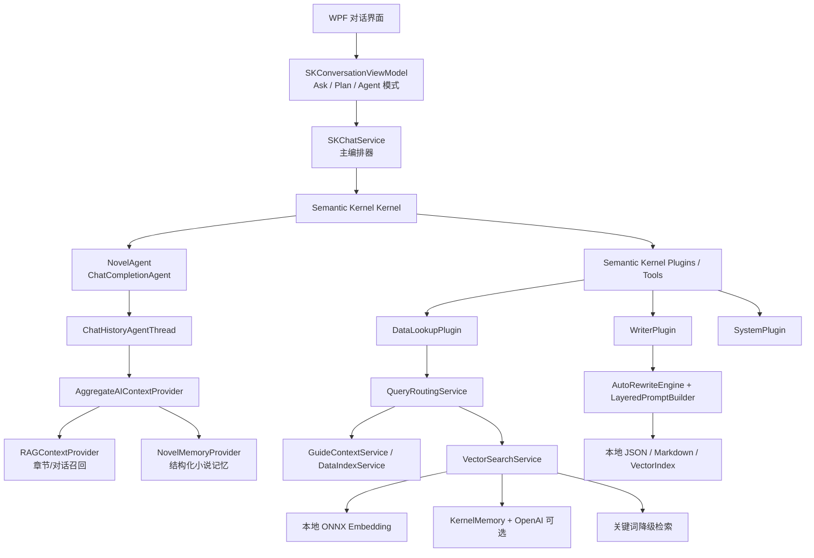
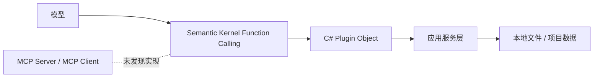
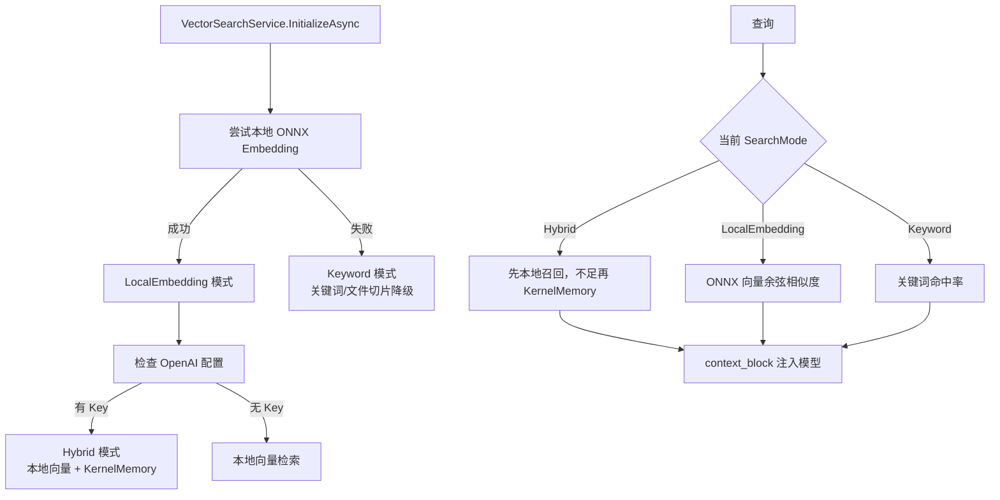
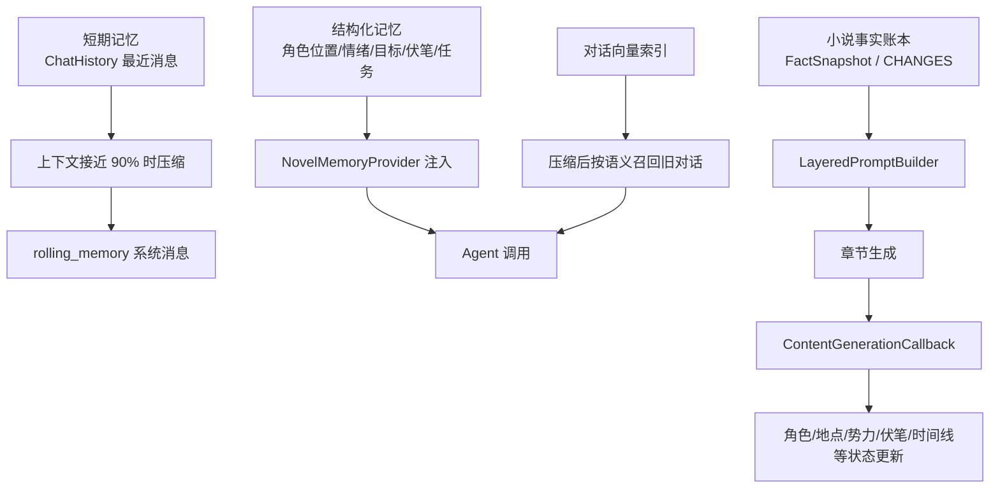
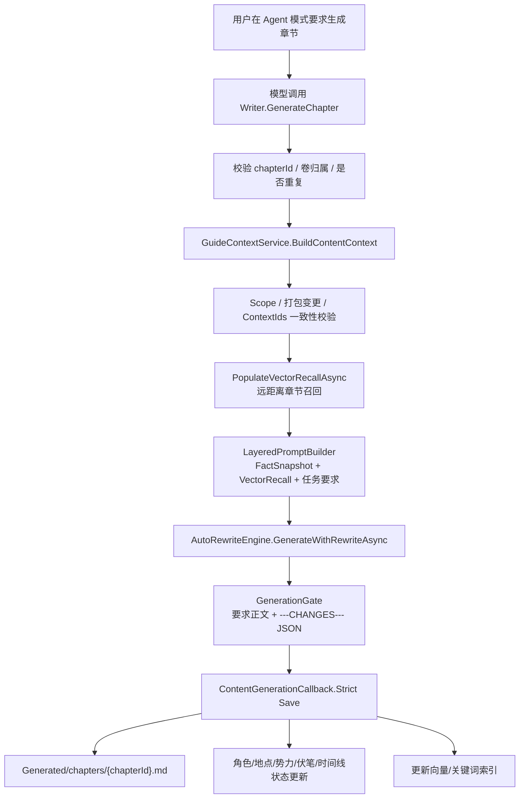

> DEVELOPER

https://github.com/zy-zmc/tianming-novel-ai-writer.git把这个项目拉下来看看

> AGENT

我会先按 `agent-reach` 的路由看一下 GitHub 获取方式，然后把仓库克隆到当前工作区里，接着快速扫项目结构和入口文件。

> AGENT

仓库已经开始克隆了。我先确认它拉完整，再看 README、依赖和主要目录，给你一个“这项目是干嘛的、怎么跑、有没有明显坑”的快速体检。

> AGENT

这个仓库不是常见的前端/后端脚手架，目录像是一个 Windows 桌面应用项目：有 `Core`、`Modules`、`Services`、`Storage`，还带了 `.bat` 启动/编译脚本和两份 PPT 介绍。我继续往下看工程文件和启动说明。

> AGENT

README 明确写了技术栈：`.NET 8.0 + WPF + MVVM + 依赖注入 + Semantic Kernel + ONNX Runtime`，运行目标是 Windows 10+。我再扫一下工程文件和本地部署文档，判断在你这台机器上能不能直接编译运行。

> AGENT

开源说明里有一段很关键：仓库说明“开源后已移除加密 DLL”，本地跑可能要手动跳过保护/登录/授权相关逻辑。我查一下这些引用实际还在不在，顺便看当前机器的 .NET 环境，避免给你一个跑不起来的结论。

> AGENT

这台环境里没有 `dotnet` 命令，而且项目目标是 `net8.0-windows10.0.19041.0` 的 WPF，所以在当前 macOS 工作区里基本不能直接跑 UI。下面我把依赖和几个会影响本地运行的点再收一下，最后给你结论和建议。

> AGENT

我发现一个小矛盾：README 和升级说明都在讲 v2.8.7，但工程文件里的 `<Version>` 还是 `1.4.6`。这类版本号不同步不一定致命，不过如果后面要打包发布或排查问题，得把它记在案。

> AGENT

已拉下来并快速体检了一遍，仓库在：

[tianming-novel-ai-writer](/Users/lyston/PycharmProjects/tianming-novel-ai-writer)

这是一个 **.NET 8 + WPF 的 Windows 桌面应用**，主打 AI 网文长篇创作闭环：设计数据、章节生成、事实追踪、门禁校验、版本对比、AI 助手等。代码量不小，约 `1093` 个文件，其中 `761` 个 C# 文件、`155` 个 XAML 文件。

几个关键结论：

- 入口工程是 [Core/App/天命.csproj](/Users/lyston/PycharmProjects/tianming-novel-ai-writer/Core/App/天命.csproj)，目标框架是 `net8.0-windows10.0.19041.0`，只能在 Windows/WPF 环境正常跑。
- 当前 macOS 环境里没有 `dotnet` 命令，所以这里没法直接编译；即使装了 SDK，WPF UI 也不适合在 macOS 直接运行。
- README 写的是 v2.8.7，但 `.csproj` 里的 `<Version>` 还是 `1.4.6`，版本号明显没同步。
- [Docs/本地部署/开源说明.md](/Users/lyston/PycharmProjects/tianming-novel-ai-writer/Docs/本地部署/开源说明.md) 说明开源后移除了加密 DLL，本地跑需要处理保护系统、登录授权、SSL pinning 等逻辑。
- ONNX 嵌入模型没随仓库带，当前只有 `vocab.txt`，向量搜索要手动放 `model.onnx`。
- 最新提交是 `ed2aabb`，时间 `2026-05-09 12:56:36 +0800`，提交信息 `Update README.md`。

我没有改动仓库文件，当前工作区是干净的。下一步比较实际的是：在 Windows 机器或 Windows VM 里装 `.NET 8 SDK`，按开源说明先做本地模式补丁，再跑 `dotnet build Core/App/天命.csproj -c Release` 看第一轮编译错误。

> DEVELOPER

深入研究一下这个项目，他是怎么处理ai遗忘的，他的记忆是怎么设计的等，深入研究

> AGENT

我会把重点放在“AI 遗忘”的工程解法上：上下文如何组装、长期记忆怎么落盘、章节事实如何回写、召回如何做，以及生成门禁如何防止错误进入后续章节。先扫相关模块，再沿着一次章节生成链路把数据流串起来。

> AGENT

已经定位到核心代码了：它不是简单“把前文塞进 prompt”，而是把记忆拆成几层：设计规则、章节蓝图、事实快照、摘要链、里程碑、卷级归档、向量召回、会话记忆。现在我沿着“生成一章”的调用链读代码。

> AGENT

从生成链路看，正式生成前它会强制要求 `FactSnapshot` 存在；也就是说“记忆”不是可选增强，而是门禁的一部分。接下来我看 `FactSnapshotExtractor`、`GenerationGate`、`ContentGenerationCallback`，这是防遗忘设计里最关键的闭环。

> AGENT

闭环已经比较清楚：AI 输出必须带 `---CHANGES---` 和 9 类 JSON 变更，落盘前用事实账本校验，通过后才把正文保存，并把变更写回各类 guide。现在我继续看这些 guide 的存储结构和长期召回索引，看看它如何撑到很长篇幅。

> AGENT

状态账本是分卷文件，角色/冲突/地点/势力/时间线这些都有各自 guide；章节被重写或删除时还会级联清理对应追踪记录。长篇稳定性靠三件事叠加：分卷摘要、卷末事实归档、向量/关键词召回，我接着拆这一层。

> AGENT

对话记忆和写作记忆是两套系统：章节生成走“事实账本+打包上下文”，聊天助手另有滚动压缩、结构化记忆和会话向量召回。这个分离设计挺聪明：正文一致性不依赖聊天历史，聊天只是辅助层。

> AGENT

我把它按“生成一章时，系统到底给 AI 喂什么、AI 写完后又回写什么”这条链路读了一遍。核心结论是：**它解决 AI 遗忘的方式，不是指望模型记住，而是把小说变成一组外部状态账本。AI 每章只是临时执行器，真正的记忆在本地结构化数据里。**

**核心闭环**
```text
打包生成 ContentGuide
  -> 按章节 ContextIds 精确取数据
  -> 构造 FactSnapshot 事实快照
  -> 拼装分层 Prompt
  -> AI 输出正文 + ---CHANGES--- JSON
  -> GenerationGate 校验
  -> 通过后正文落盘
  -> CHANGES 回写各类状态账本
  -> 摘要/向量/里程碑/卷末归档更新
  -> 下一章读取更新后的事实快照
```

**1. 它的“记忆”不是聊天上下文，而是事实账本**

最重要的类是 [FactSnapshot.cs](/Users/lyston/PycharmProjects/tianming-novel-ai-writer/Services/Modules/ProjectData/Models/Tracking/FactSnapshot.cs:6)。里面维护了小说当前状态的多个维度：

- 角色状态：境界、能力、关系
- 冲突进度
- 伏笔状态
- 关键剧情点
- 角色外貌/地点描述
- 世界观硬规则
- 地点状态、势力状态
- 时间线
- 角色当前位置
- 物品持有者和状态

这套东西相当于“小说数据库的当前视图”。章节生成时，系统不会让 AI 自己回忆“张三现在在哪、伏笔收了没”，而是把这些字段作为硬约束注入 prompt。

负责抽取快照的是 [FactSnapshotExtractor.cs](/Users/lyston/PycharmProjects/tianming-novel-ai-writer/Services/Modules/ProjectData/Implementations/Tracking/FactSnapshotExtractor.cs:36)。它根据本章 `ContextIds` 只抽本章相关角色、地点、冲突、伏笔，同时补入近期活跃实体和跨卷归档基线。

**2. 每章生成前先通过 ContentGuide 精确选上下文**

打包阶段会生成每章的 `ContentGuide`，每个章节都有一组 `ContextIds`，定义这一章需要哪些角色、地点、势力、世界规则、蓝图、上一章等。模型不会看到全书全部数据，而是看到“本章该看的切片”。

相关结构在 [ContextIdCollection.cs](/Users/lyston/PycharmProjects/tianming-novel-ai-writer/Services/Modules/ProjectData/Models/Guides/ContextIdCollection.cs:5)，上下文装配在 [GuideContextService.cs](/Users/lyston/PycharmProjects/tianming-novel-ai-writer/Services/Modules/ProjectData/Implementations/Guides/GuideContextService.cs:1302)。

`BuildContentContextAsync` 会组装：

- 本章任务：标题、概要、节奏、蓝图、场景
- 设计层：角色、地点、势力、世界观规则、剧情规则、创作模板
- 上文层：上一章摘要、前 N 章摘要、上一章尾段
- 长程层：历史里程碑、卷末事实归档、向量召回片段
- 状态层：`FactSnapshot`
- 风险层：状态漂移警告、追踪空洞警告

这个容器是 [ContentTaskContext.cs](/Users/lyston/PycharmProjects/tianming-novel-ai-writer/Services/Modules/ProjectData/Models/TaskContexts/ContentTaskContext.cs:23)。

**3. Prompt 是分层的，事实账本优先级最高**

真正拼 prompt 的地方是 [LayeredPromptBuilder.cs](/Users/lyston/PycharmProjects/tianming-novel-ai-writer/Services/Framework/AI/SemanticKernel/Plugins/LayeredPromptBuilder.cs:26)。

它第一层就放 `<fact_ledger immutable="true" override="never">`，告诉 AI 这些事实不可推翻。后面才是向量召回、章节任务、蓝图、角色设定、创作风格等。

也就是说它有明确优先级：

1. **Fact ledger**：最高，不能违背
2. **蓝图/章节计划**：本章必须完成什么
3. **上一章尾段**：自然衔接
4. **摘要/里程碑/卷末归档**：长程背景
5. **向量召回**：相关历史片段
6. **风格和模板**：文风层

这个设计很对。很多 AI 写作工具失败，是因为把“事实、风格、任务、历史片段”混在一个 prompt 里，模型不知道哪个更硬。这里用分层标签和硬约束降低了混淆。

**4. 它要求 AI 每章输出 CHANGES，作为状态回写协议**

AI 不能只写正文。正文末尾必须输出：

```text
---CHANGES---
{ ... 9类变更JSON ... }
```

9 类变更定义在 [TrackingChangeModels.cs](/Users/lyston/PycharmProjects/tianming-novel-ai-writer/Services/Modules/ProjectData/Models/Tracking/TrackingChangeModels.cs:86)：

- `CharacterStateChanges`
- `ConflictProgress`
- `NewPlotPoints`
- `ForeshadowingActions`
- `LocationStateChanges`
- `FactionStateChanges`
- `TimeProgression`
- `CharacterMovements`
- `ItemTransfers`

这是它抗遗忘的关键：**每章写完后，AI 必须声明“本章造成了哪些世界状态变化”。系统再把这些变化写入账本。**

所以第 N+1 章看到的不是第 N 章正文的模糊摘要，而是第 N 章落地后的结构化状态。

**5. 落盘前有 GenerationGate，错误章节不能进入记忆**

校验在 [GenerationGate.cs](/Users/lyston/PycharmProjects/tianming-novel-ai-writer/Services/Modules/ProjectData/Implementations/Generation/GenerationGate.cs:66)。

它检查：

- 是否有合法 `---CHANGES---`
- JSON 是否能解析、是否含 9 个字段
- ID 是否使用合法 ShortId，不能写角色名/拼音/自造 ID
- 伏笔是否“未埋先收”或“已收再埋”
- 冲突状态是否回退
- 角色等级是否无理由倒退
- 角色移动路径是否断裂
- 物品转移持有者是否不符
- 正文是否引入太多未登记实体
- 外貌/地点描写是否和设定冲突
- 世界观硬规则是否被破坏
- 蓝图指定角色/地点/势力是否实际出场

如果失败，走 [AutoRewriteEngine.cs](/Users/lyston/PycharmProjects/tianming-novel-ai-writer/Services/Framework/AI/SemanticKernel/Plugins/AutoRewriteEngine.cs:39) 自动重写。它会把失败原因、合法 ID、当前伏笔状态、角色当前位置等反馈给模型，最多重试 2 次。仍失败就人工介入。

**6. 回写是原子化的，并且会级联更新多套索引**

落盘与回写在 [ContentGenerationCallback.cs](/Users/lyston/PycharmProjects/tianming-novel-ai-writer/Services/Modules/ProjectData/Implementations/Generation/ContentGenerationCallback.cs:87)。

通过门禁后，它会：

- 正文写到 `.staging`
- 旧文件备份 `.bak`
- 正式替换章节 Markdown
- 用 CHANGES 更新角色/冲突/伏笔/地点/势力/时间线/物品账本
- 更新章节摘要
- 裁剪过长账本
- 更新关键词索引
- 更新向量索引
- 更新卷里程碑
- 如果到卷末，生成卷末事实归档

如果中途失败，会回滚正文和未刷盘 guide。这点说明作者确实在考虑“记忆写坏了怎么办”。

**7. 长篇记忆分四层，不只靠向量库**

它的长程记忆不是单一 RAG，而是四层组合：

- **章节摘要**：按卷存储，见 [ChapterSummaryStore.cs](/Users/lyston/PycharmProjects/tianming-novel-ai-writer/Services/Modules/ProjectData/Implementations/Guides/ChapterSummaryStore.cs:12)
- **卷里程碑**：每卷压缩成历史摘要，见 [ChapterMilestoneStore.cs](/Users/lyston/PycharmProjects/tianming-novel-ai-writer/Services/Modules/ProjectData/Implementations/Guides/ChapterMilestoneStore.cs:12)
- **卷末事实归档**：每卷结束时保存完整状态快照，见 [VolumeFactArchiveStore.cs](/Users/lyston/PycharmProjects/tianming-novel-ai-writer/Services/Modules/ProjectData/Implementations/Guides/VolumeFactArchiveStore.cs:14)
- **向量/关键词召回**：查相关历史片段，见 [VectorSearchService.cs](/Users/lyston/PycharmProjects/tianming-novel-ai-writer/Services/Framework/AI/SemanticKernel/VectorSearchService.cs:13)

尤其卷末归档很关键。它解决的是“第 8 卷还要知道第 1 卷结束时角色/势力/伏笔是什么状态”。如果只靠最近 30 章摘要，长篇一定会断。

**8. 对话记忆和正文记忆是分离的**

聊天助手还有另一套记忆：

- 对话超过 90% 上下文触发压缩，保留最近 12 轮，生成 `<rolling_memory>`，见 [ChatHistoryCompressionService.cs](/Users/lyston/PycharmProjects/tianming-novel-ai-writer/Services/Framework/AI/SemanticKernel/ChatHistoryCompressionService.cs:7)
- 结构化抽取角色位置、剧情进展、伏笔、任务，见 [StructuredMemoryExtractor.cs](/Users/lyston/PycharmProjects/tianming-novel-ai-writer/Services/Framework/AI/SemanticKernel/StructuredMemoryExtractor.cs:7)
- 会话 turn 也会建本地向量索引，压缩后可语义召回

但这个聊天记忆只是助手体验层。**正式章节生成不依赖聊天历史，而依赖 FactSnapshot 和 ContentGuide。** 这是很重要的架构边界。

**我的判断**

这个项目处理 AI 遗忘的核心思想可以概括成一句话：

**把“记忆”从模型上下文里拿出来，变成可查询、可校验、可回滚、可归档的本地状态系统。**

它更像一个“小说状态机 + AI 渲染器”，不是普通 AI 写作壳子。模型负责写自然语言，系统负责事实连续性。

优点很明显：

- 长篇一致性设计扎实
- 事实和正文分离，避免只靠 prompt 祈祷
- 每章有状态回写，下一章能读到真实变化
- 门禁能阻止坏状态进入后续章节
- 支持跨卷归档，适合超长篇
- 重写/删除会清理追踪数据，避免旧账本污染

风险也有：

- 过度依赖 AI 正确输出 `CHANGES`，语义漏报仍可能发生
- 漂移检测有一部分是启发式，比如“摘要里出现角色名但 CHANGES 没写”
- 向量模型缺失时会退化到关键词召回，长距召回质量会下降
- 跨卷稳定性依赖分卷 `EndChapter` 和卷末归档正确触发
- 代码里很多规则是中文网文场景特化，迁移到其他类型需要改规则和 prompt
- 校验能拦很多硬错误，但文学层面的“角色气质漂移”仍很难完全自动判断

如果你想借鉴它，最值得抄的不是 WPF 或 Semantic Kernel，而是这四个模式：

1. **ContextIds 精确取上下文**
2. **FactSnapshot 作为硬状态基线**
3. **CHANGES 协议驱动状态回写**
4. **Gate 校验失败自动重写，成功才落盘**

这套东西比“加大上下文窗口”靠谱得多。

> DEVELOPER

深入研究分析这个项目，他的这些都是怎么设计的，给我一个详细的分析报告，要有详细的流程图

> AGENT

我会把这次做成一份真正可阅读的分析报告，而不是只在聊天里塞一大坨结论。因为你要“详细报告 + 流程图”，我先按本地文档技能确认存放规则，然后补几处代码链路细节，最后生成一份 Markdown 报告并在这里给你索引和重点结论。

> AGENT

我会遵循 `codex-md-docs`：把报告放到你的 Codex Obsidian 空间里，而不是写进源码仓库。先确认本机设备目录和是否已有相关项目笔记，然后再落文档。

> AGENT

我已经找到合适位置：`lystonmacbook-pro.local` 下面还没有这个项目的笔记，所以会新建一个“天命AI写作”分类。报告会包含多张 Mermaid 流程图，重点讲：打包索引、生成链路、FactSnapshot、CHANGES 回写、门禁重写、长程记忆、会话记忆，以及这套设计的优缺点。

> AGENT

我已经补完打包和 guide 管理部分：打包会生成 `outline/planning/blueprint/content guide`，`content_guide` 按卷分片；运行期追踪 guide 则独立维护，写入时有 staging/commit 机制和恢复逻辑。接下来我会写报告文件。

> AGENT

我先做个快速交接校验：确认项目和报告文件都在预期位置，然后把结论和报告位置干净地交给你。

> AGENT

搞定，项目已经拉到：

`/Users/lyston/PycharmProjects/tianming-novel-ai-writer`

我也已经写了一份详细分析报告，放在这里：

[天命 AI 网文创作系统记忆与防遗忘架构分析报告.md](</Users/lyston/Obsidian/lyston/Codex/lystonmacbook-pro.local/天命AI写作/天命 AI 网文创作系统记忆与防遗忘架构分析报告.md:1>)

报告大约 `1185` 行，里面包含详细流程图和代码入口分析，重点研究了这些部分：

- 它如何处理 AI 遗忘
- `FactSnapshot` 事实快照怎么抽取
- `CHANGES` 协议如何让 AI 声明状态变化
- `GenerationGate` 如何做生成门禁校验
- `TrackingGuides`、章节摘要、卷里程碑、卷末事实归档如何组成长期记忆
- 向量检索、关键词兜底、对话压缩记忆如何工作
- 从“打包 guide”到“生成章节”再到“状态写回”的完整链路
- 多张 Mermaid 流程图：总体架构、章节生成、记忆抽取、校验回写、长程记忆金字塔等

核心结论是：这个项目不是单纯靠上下文窗口防遗忘，而是把“模型记忆”外部化成一套本地结构化状态系统。它的主链路大致是：

`ContentGuide / ContextIds -> FactSnapshot -> 分层 Prompt -> 正文 + CHANGES -> GenerationGate -> 状态写回 -> 下一章继续读取`

也就是说，它把长篇写作问题从“让 AI 记住所有东西”改造成“本地事实账本持续维护，AI 每次只按当前事实渲染正文”。

有一点我也在报告里标注了：这是 `.NET 8 + WPF` Windows 桌面项目，当前 macOS 环境里没有可用的 `dotnet`，所以我做的是源码级静态深度分析，没有进行本地编译运行验证。

> DEVELOPER

再深入研究这个项目是怎么一步步搭建的

> AGENT

我会在现有源码基础上继续往下拆：这次重点不只看“记忆如何工作”，而是反推项目从空工程到现在这套系统的搭建顺序、模块边界、数据流和演进路线。先确认仓库状态和文档写入规范，再开始读结构。

> AGENT

仓库和上一份报告都确认在位；接下来我会把“搭建顺序”拆成两条线：一条看真实仓库结构和提交历史，另一条看代码里的依赖方向，最后还原成可复刻的工程路线图。

> AGENT

我先抓“骨架层”的文件：项目文件、构建 props、启动入口和依赖注入。这里能看出作者最先搭了什么地基，以及后面的模块是怎么被挂进来的。

> AGENT

真实提交历史很短，主要是几次整包上传，所以不能完全按 commit 复原开发过程。我会改用“代码考古”的办法：从启动入口、模块目录、服务依赖、数据模型、内置存储和 UI 层反推作者的搭建路径。

> AGENT

文档里已经明确说了“从零到第一章”的用户流程，但你问的是项目怎么一步步搭出来。我会继续读构建配置和通用基类，因为这些通常暴露了作者先做“模板化组件”，再批量扩展业务模块的轨迹。

> AGENT

我已经看到一个很关键的搭建痕迹：`Core/App` 是唯一 csproj，其他 `Framework/Services/Modules` 都通过 props 链接进同一个 WPF 程序。这说明它不是多项目解决方案，而是“单宿主 + 分层目录 + 模块化 MSBuild 包含”的工程组织。

> AGENT

还有个有趣但重要的发现：`1.4.6版本` 这个提交一次性引入了 1060 个文件、约 23.7 万行，所以 Git 历史更像“发布快照”，不是日常开发流水账。报告里我会明确区分“可证实的提交事实”和“从代码依赖反推的搭建顺序”。

> AGENT

现在我要补一层“版本演进考古”：虽然提交很少，但仍能看出哪些是代码快照、哪些是 README/PPT/升级说明。这个会影响我们判断“真实搭建顺序”有多少来自历史证据、有多少来自架构反推。

> AGENT

我会继续看“业务模块模板”的落点：一个典型数据模块如何从 Model、Service、ViewModel、View、Storage、导航、DI 这几步拼起来。这个能还原作者后续批量扩展世界观/角色/地点/章节/蓝图模块的实际方法。

> AGENT

我会把报告单独成篇，放在同一个 `天命AI写作` 文件夹里，避免把“记忆机制报告”和“工程搭建路线报告”混在一起。接下来重点看三块：通用模块模板、AI 服务底座、项目数据/打包/生成闭环是如何一步步接上去的。

> AGENT

我先补一点静态画像：哪些模块复用了同一套 `ModuleServiceBase + DataManagementViewModelBase` 模板，哪些模块是特殊大模块。这个能把“作者如何扩展功能”的套路看得很清楚。

> AGENT

数据很清楚：13 个业务服务继承同一套模块存储基类，15 个 ViewModel 继承同一套数据管理基类。这基本说明项目的搭建方式是先造“可批量复制的功能工厂”，再把小说设计与生成模块填进去。

> AGENT

接下来我看 AI 底座的拼装顺序：先是 Provider/模型/Key 管理，再接 Semantic Kernel，再挂 Prompt 仓库和对话模式。这个层次决定了后面章节生成和智能助手为什么能复用同一套 AI 通道。

> AGENT

AI 层的搭建也很像阶梯：模型库/Key 池是数据层，`AIService` 是业务调用口，`SKChatService` 是协议适配和会话引擎，PromptService 再把“可编辑提示词”接入进来。后面的章节生成其实是在这个底座上加了小说专用插件。

> AGENT

我现在转到“生成闭环”的搭建顺序：UI 怎么触发章节生成、生成插件怎么拿 guide、怎么生成、怎么校验、怎么写回。这个部分会和上一份记忆报告有重叠，但这次我会从工程搭建角度讲。

> AGENT

这里能看出正式生成链路是后来“硬化”过的：生成前要验证打包、Scope、ContextIds、FactSnapshot；生成后是 staging 写正文、刷新 tracking guide、flush、摘要、索引、卷末归档。这已经不是 demo，而是按故障恢复和长篇一致性去搭的。

> AGENT

我还要看项目里专门记录的升级说明，尤其 v2.8.7 提到的功能通常代表最后一轮架构强化。这个可以帮助报告把“初始骨架”和“后期增强”分开。

> AGENT

升级说明很有信息量：v1.4.6 是“能写长篇且不乱”的主快照，v2.8.7 的叙述则说明后续重心转向自动化、漂移修复、WAL、分层上下文、AI 调度中间件和 Agent 操作能力。报告会把这部分作为“演进路线”而不是硬把它当成当前仓库完全拆分后的代码状态。

> AGENT

我已经拿到足够多的“搭建轨迹”证据了：组件文档的版本线也显示，作者先把 DataTreeView、TwoColumnEditorLayout、ViewModel 基类这些通用工具做成标准件，再用它们快速铺开业务页面。下一步我会把这些发现整理成独立报告。

> AGENT

我准备把报告写到 Obsidian 的同一目录下：`lystonmacbook-pro.local/天命AI写作`。因为这个目录在当前可写沙箱之外，先在项目工作区生成草稿，再复制到知识库目标位置。

> AGENT

我现在开始落报告正文。内容会按“证据、阶段、工程套路、复刻路线”组织，流程图会用 Mermaid 放进去，方便你后面直接在 Obsidian 里看结构。

> AGENT

草稿已经生成在项目目录。我会快速检查 Mermaid 和标题结构，然后复制到 Obsidian 目标目录，最后再确认字数和路径。

> AGENT

小插曲：`apply_patch` 把草稿落在了当前会话默认目录，而不是仓库子目录。我先定位文件位置，再做校验和归档。

> AGENT

定位到了，草稿在 `/Users/lyston/PycharmProjects/tianming-build-analysis-draft.md`，仓库本身没有被改动。接下来我先校验草稿内容，再把它归档到 Obsidian 的天命报告目录。

> AGENT

报告结构看起来正常，共 1454 行，包含 14 组左右的 Mermaid 图和完整复刻路线。现在我把它放进 Obsidian 目录，作为一份独立报告。

> AGENT

报告已经复制到目标目录。我会清理刚才用于中转的工作区草稿，避免项目目录里留下重复文档，然后做最后校验。

> AGENT

我清理了中转草稿，保留正式 Obsidian 报告。最后确认一下目标文件、行数和仓库状态，确保没有把分析文件留进源码项目里。

> AGENT

校验完成：正式报告 1454 行，仓库状态没有变更输出。这个报告和上一份“记忆/防遗忘机制”报告分开保存，刚好一份讲原理，一份讲工程搭建路线。

> AGENT

已继续深入研究，并新增了一份独立报告，专门分析“这个项目是怎么一步步搭建起来的”。

报告位置：

[天命 AI 网文创作系统工程搭建路径深度分析报告.md](</Users/lyston/Obsidian/lyston/Codex/lystonmacbook-pro.local/天命AI写作/天命 AI 网文创作系统工程搭建路径深度分析报告.md:1>)

这份报告共 `1454` 行，和上一份“记忆与防遗忘架构报告”分开保存。它重点拆了：

- 真实 Git 历史和发布快照边界
- 单宿主 WPF 工程如何通过 `Build/*.props` 组织 `Framework / Services / Modules`
- 作者为什么先做通用组件和 ViewModel 基类，再批量铺业务模块
- `ModuleServiceBase + DataManagementViewModelBase + built_in_categories.json` 的标准业务页搭建套路
- 设计模块、生成模块、AI 助手、校验模块是如何逐步接上的
- `AIService / ModelService / PromptService / SKChatService` 的 AI 底座搭建顺序
- `PublishService / GuideIndexBuilder / GuideManager` 的数据打包系统如何形成
- 从 `WriterPlugin` 到 `AutoRewriteEngine`、`GenerationGate`、`ContentGenerationCallback` 的正式章节生成闭环
- 如何从零复刻一个同类系统的 15 步路线
- 多张 Mermaid 流程图：工程分层、构建装配、启动流程、业务模块模板、AI 底座、打包、生成闭环、状态回写、复刻路线等

核心结论是：它最可能的搭建路径不是先做 AI 聊天，而是先把 WPF 工作台、标准化业务模块、结构化数据、打包索引这些“地基”打好，再把 AI 生成接进去，最后围绕长篇一致性逐步加上 `FactSnapshot / CHANGES / GenerationGate / TrackingGuides / 向量召回`。这套东西的真正工程心法是：

```text
UI 标准化
→ 数据标准化
→ 业务模块标准化
→ AI 调用标准化
→ 上下文标准化
→ 生成协议标准化
→ 状态回写标准化
→ 长篇记忆标准化
```

另外我确认了：源码仓库本身没有被改动，报告只保存到了 Obsidian 的 `lystonmacbook-pro.local/天命AI写作` 目录。

> DEVELOPER

这个项目采用了怎样的agent架构，包括他的tools、mcp、rag、数据库等

> AGENT

我会沿着 `SemanticKernel/Agents`、`Plugins`、`VectorSearchService`、存储服务和依赖包几条线查。重点确认它到底有没有 MCP、有哪些 tools、RAG 怎么做、有没有真正数据库。

> AGENT

我会基于本地已拉下来的源码继续做静态架构解剖，重点看 Semantic Kernel agent、插件工具、RAG/向量索引、存储层，以及是否真的有 MCP。先把关键文件和注册入口核一遍，避免只凭前面印象下结论。

> AGENT

目前可以先确认一条主线：它不是 LangChain 那种多 agent 编排，也没有明显 MCP Server/Client；更像是 WPF 应用里嵌入 Semantic Kernel，把插件函数、RAG 上下文、结构化小说记忆和本地文件存储接成一个“写作代理”。我现在把关键入口和工具函数逐段核实。

> AGENT

工具注册入口已经很清楚：`SKChatService` 构建 Kernel 后注册 `Writer/System/DataLookup` 三个 plugin，Agent/Plan 模式打开 `FunctionChoiceBehavior.Auto()`，Plan 模式额外启用函数确认过滤。接下来我会把每个 plugin 的 KernelFunction、RAG 的索引/召回实现和“数据库”实际落盘结构对齐起来。

> AGENT

RAG 这一层比“简单向量库”更有层次：本地 ONNX 向量是优先路径，OpenAI KernelMemory 是可选增强，最后降级到关键词/文件切片；对话历史也会被向量化保存，用于压缩后召回。下面我再核对 QueryRouting、会话压缩和本地存储抽象，形成完整结论。

> AGENT

我把会话、结构化记忆、压缩、向量索引和文件存储也对上了。最终结论会偏“工程架构图谱”：这套系统的 agent 是 SK ChatCompletionAgent + 插件函数 + 双 AIContextProvider，不是 MCP；数据库层实际是本地 JSON/Markdown/向量 JSON，而不是独立数据库服务。

> AGENT

我把源码里 agent、tools、MCP、RAG、存储层都核了一遍。结论很明确：这个项目不是 MCP 架构，也不是多 agent 分工架构，而是 **WPF 应用内嵌 Semantic Kernel 的单 Agent + 插件工具 + RAG/记忆提供器 + 本地文件数据库** 架构。

**总体架构**


**Agent 核心**
它的 agent 核心在 [NovelAgent.cs](/Users/lyston/PycharmProjects/tianming-novel-ai-writer/Services/Framework/AI/SemanticKernel/Agents/NovelAgent.cs:19)。实现非常薄：内部包了一层 `ChatCompletionAgent`，名字叫 `NovelAssistant`，执行时把当前 `ChatHistory` 包成 `ChatHistoryAgentThread`，再挂上 `AggregateAIContextProvider`。真正的能力不是写在 Agent 类里，而是由 `SKChatService`、插件工具、RAG、记忆和项目服务共同提供。

`SKChatService` 是总控层：构建 Kernel、接入模型、注册插件、管理模式、流式输出、上下文压缩、会话保存。Kernel 构建和 provider 接入在 [SKChatService.cs](/Users/lyston/PycharmProjects/tianming-novel-ai-writer/Services/Framework/AI/SemanticKernel/SKChatService.cs:1369)，插件注册在 [SKChatService.cs](/Users/lyston/PycharmProjects/tianming-novel-ai-writer/Services/Framework/AI/SemanticKernel/SKChatService.cs:1486)。

模式设计是：

| 模式 | Tool Call | 特点 |
|---|---:|---|
| Ask | 关闭 | 普通问答 |
| Agent | 自动 | 允许模型自动调用工具 |
| Plan | 自动 + 确认过滤 | 计划模式下工具调用需要过滤/确认 |

对应逻辑在 [ChatModeSettings.cs](/Users/lyston/PycharmProjects/tianming-novel-ai-writer/Services/Framework/AI/SemanticKernel/ChatModeSettings.cs:88)。所以它的“Agent 模式”本质是 **Semantic Kernel Function Calling Agent**，不是独立 agent swarm。

**Tools / Plugins**
项目注册了 3 个 Semantic Kernel Plugin：

| Plugin | 对模型暴露的工具 | 作用 |
|---|---|---|
| `Writer` | `GenerateChapter` | 生成章节并落盘 |
| `DataLookup` | 22 个查询/检索工具 | 查角色、地点、势力、世界观、剧情规则、章节上下文、正文语义检索 |
| `System` | 6 个系统工具 | 时间、项目信息、安全读写文件、通知、刷新章节列表 |

`WriterPlugin` 里真正带 `[KernelFunction]` 的是 `GenerateChapter`，在 [WriterPlugin.cs](/Users/lyston/PycharmProjects/tianming-novel-ai-writer/Services/Framework/AI/SemanticKernel/Plugins/WriterPlugin.cs:330)。类里还有重写、续写等 public 方法，但没有 `[KernelFunction]` 标记，更像应用侧调用入口，不是模型直接可见的 tool schema。

`DataLookupPlugin` 是最完整的工具层，入口从 [DataLookupPlugin.cs](/Users/lyston/PycharmProjects/tianming-novel-ai-writer/Services/Framework/AI/SemanticKernel/Plugins/DataLookupPlugin.cs:15) 开始。它自己不查文件，而是全部转发到 `QueryRoutingService`。`SmartSearch` 会根据章节 ID、GUID、已知实体名、问题语义走精准检索、语义检索或混合检索，路由器在 [QueryRouter.cs](/Users/lyston/PycharmProjects/tianming-novel-ai-writer/Services/Framework/AI/QueryRouting/QueryRouter.cs:31)。

`SystemPlugin` 提供安全文件读写，限制只能在项目根目录内操作，见 [SystemPlugin.cs](/Users/lyston/PycharmProjects/tianming-novel-ai-writer/Services/Framework/AI/SemanticKernel/Plugins/SystemPlugin.cs:38)。

**MCP**
没有采用 MCP。

我在依赖和源码里没有看到 MCP server/client、Model Context Protocol SDK、stdio/http MCP transport、tool manifest 等实现。依赖里主要是 Semantic Kernel、Semantic Kernel Agents、KernelMemory、OpenAI/Google connector，见 [Dependencies.props](/Users/lyston/PycharmProjects/tianming-novel-ai-writer/Core/App/Build/Dependencies.props:19)。

所以它的 tool 架构是：



**RAG 架构**
RAG 是这个项目最关键的部分，有两条线：

1. 对话 Agent RAG：每次模型调用前，`RAGContextProvider` 根据用户输入召回章节片段；如果会话已压缩，还会召回旧对话轮次。入口在 [RAGContextProvider.cs](/Users/lyston/PycharmProjects/tianming-novel-ai-writer/Services/Framework/AI/SemanticKernel/Agents/Providers/RAGContextProvider.cs:28)。

2. 章节生成 RAG：`WriterPlugin.GenerateChapter` 生成章节前，会从当前章节计划、角色、剧情规则、未回收伏笔里拼查询词，然后召回远距离章节片段，注入 `ContentTaskContext.VectorRecallFragments`。实现见 [WriterPlugin.cs](/Users/lyston/PycharmProjects/tianming-novel-ai-writer/Services/Framework/AI/SemanticKernel/Plugins/WriterPlugin.cs:1282)，Prompt 注入在 [LayeredPromptBuilder.cs](/Users/lyston/PycharmProjects/tianming-novel-ai-writer/Services/Framework/AI/SemanticKernel/Plugins/LayeredPromptBuilder.cs:37)。

RAG 检索模式如下：



本地向量用 `bge-small-zh` ONNX 模型，路径固定为 `Storage/Services/Framework/AI/EmbeddingModels/bge-small-zh/model.onnx`，代码在 [LocalEmbeddingService.cs](/Users/lyston/PycharmProjects/tianming-novel-ai-writer/Services/Framework/AI/SemanticKernel/LocalEmbeddingService.cs:208)。章节会按约 500 字切片、50 字 overlap，向量持久化到当前项目的 `VectorIndex/local_embeddings.json`，见 [LocalEmbeddingService.cs](/Users/lyston/PycharmProjects/tianming-novel-ai-writer/Services/Framework/AI/SemanticKernel/LocalEmbeddingService.cs:397)。

对话 RAG 是另一套：每轮回复后异步把 user/assistant 合并向量化，见 [SKChatService.cs](/Users/lyston/PycharmProjects/tianming-novel-ai-writer/Services/Framework/AI/SemanticKernel/SKChatService.cs:833) 和 [LocalEmbeddingService.cs](/Users/lyston/PycharmProjects/tianming-novel-ai-writer/Services/Framework/AI/SemanticKernel/LocalEmbeddingService.cs:593)。会话切换时保存/加载 `Sessions/{sessionId}.conversation_turns.json`，见 [SKChatService.cs](/Users/lyston/PycharmProjects/tianming-novel-ai-writer/Services/Framework/AI/SemanticKernel/SKChatService.cs:1822)。

**记忆设计**
它有三层记忆，不是单一“聊天历史”。



`StructuredMemoryExtractor` 会从助手回复里抽角色状态、章节进展、伏笔等，规则抽取入口在 [StructuredMemoryExtractor.cs](/Users/lyston/PycharmProjects/tianming-novel-ai-writer/Services/Framework/AI/SemanticKernel/StructuredMemoryExtractor.cs:74)，文本注入格式在 [StructuredMemoryExtractor.cs](/Users/lyston/PycharmProjects/tianming-novel-ai-writer/Services/Framework/AI/SemanticKernel/StructuredMemoryExtractor.cs:119)。它也支持 LLM 抽取，后台预抽取逻辑在 [SKChatService.cs](/Users/lyston/PycharmProjects/tianming-novel-ai-writer/Services/Framework/AI/SemanticKernel/SKChatService.cs:1625)。

上下文压缩由 `ChatHistoryCompressionService` 做，触发阈值是 90%，压缩后保留最近 12 轮，并生成 `<rolling_memory>`，见 [ChatHistoryCompressionService.cs](/Users/lyston/PycharmProjects/tianming-novel-ai-writer/Services/Framework/AI/SemanticKernel/ChatHistoryCompressionService.cs:60)。

**数据库 / 存储**
没有传统数据库。没有看到 SQLite、MySQL、Postgres、Mongo、Redis、Qdrant、Chroma、Milvus、EF Core 这类数据库或向量库服务。它采用的是 **本地文件即数据库**：

| 数据类型 | 存储位置/形式 |
|---|---|
| 模块数据 | `Storage/Modules/.../*.json` |
| 项目配置 | `Storage/Projects/{project}/Config/...` |
| 生成章节 | `Storage/Projects/{project}/Generated/chapters/*.md` |
| 会话消息 | `Storage/Projects/{project}/Sessions/{id}.messages.json` |
| 会话索引 | `Storage/Projects/{project}/Sessions/_index.json` |
| 结构化记忆 | `Storage/Projects/{project}/Sessions/{id}.memory.json` |
| 对话向量索引 | `Storage/Projects/{project}/Sessions/{id}.conversation_turns.json` |
| 章节向量索引 | `Storage/Projects/{project}/VectorIndex/local_embeddings.json` |
| KernelMemory 章节记录 | `Storage/Projects/{project}/VectorIndex/indexed_chapters.json` |

路径体系由 [StoragePathHelper.cs](/Users/lyston/PycharmProjects/tianming-novel-ai-writer/Framework/Common/Helpers/Storage/StoragePathHelper.cs:49) 管。模块数据通过 `SingleFileStorage<T>` 和 `DirectoryStorage<T>` 读写 JSON，见 [SingleFileStorage.cs](/Users/lyston/PycharmProjects/tianming-novel-ai-writer/Framework/Common/Services/SingleFileStorage.cs:36) 和 [DirectoryStorage.cs](/Users/lyston/PycharmProjects/tianming-novel-ai-writer/Framework/Common/Services/DirectoryStorage.cs:25)。会话管理在 [SessionManager.cs](/Users/lyston/PycharmProjects/tianming-novel-ai-writer/Services/Framework/AI/SemanticKernel/SessionManager.cs:36)。

一个值得注意的工程点：KernelMemory 只看到章节 ID 记录持久化，未看到外部向量数据库或明确的 KernelMemory 持久化后端配置；真正稳定落盘的是本地 ONNX 向量 JSON。也就是说，这套 RAG 的可靠核心是本地 `local_embeddings.json`，不是外部向量数据库。

**生成章节主流程**


**最终判断**
这个项目的 agent 架构可以概括为：

> **单 Semantic Kernel ChatCompletionAgent 作为模型执行核心，`SKChatService` 作为总编排器，三个 Plugin 作为 tools，`RAGContextProvider + NovelMemoryProvider` 作为上下文增强层，`VectorSearchService` 作为本地/混合 RAG 层，本地 JSON/Markdown 作为数据库。**

它的优势是工程闭环很完整：写作资料、章节生成、事实账本、记忆压缩、RAG 召回、会话持久化都打通了。它的边界也很清楚：没有 MCP 协议层，没有外部向量数据库，没有真正的多 agent 协作网络，更多是一个“本地写作系统里的工具型 Agent”。

> DEVELOPER

[$codex-md-docs](/Users/lyston/.codex/skills/codex-md-docs/SKILL.md) 写成文档

> SYSTEM

<skill>
<name>codex-md-docs</name>
<path>/Users/lyston/.codex/skills/codex-md-docs/SKILL.md</path>
---
name: codex-md-docs
description: Route Markdown documentation work into the user's Codex Obsidian space, including choosing or creating device/category folders, deciding whether to create/append/update notes, and keeping operational records separated by device/environment. Use when the user asks Codex to create, write, update, append, record, summarize, save, organize, archive, or maintain any Markdown document, md note, deployment record, operation guide, SOP, troubleshooting note, decision record, or session handoff unless the user explicitly gives a different destination.
---

# Codex Markdown Docs

## Default Root

Use this Markdown documentation root by default:

```text
/Users/lyston/Obsidian/lyston/Codex
```

Prefer this root even if older notes exist elsewhere, unless the user explicitly names another path. Create it if it is missing. Do not write documentation into project source trees, `/tmp`, `/root`, downloads, or ad hoc scratch folders unless the user explicitly asks.

## Placement Model

Use the existing vault structure as the source of truth. The active Codex vault structure is device-first:

```text
Codex/
  lystonmacbook-pro.local/
  lyston11.qzz.io/
```

Top-level folders under `/Users/lyston/Obsidian/lyston/Codex` must be device, host, or environment names. Under each device directory, classify documents by service, project, or content type, such as:

```text
Hermes
Fast Note Sync
Sub2API
基础设施
DBX
GenericAgent
HAPI
MindOS
Codex工具与文档系统
LDStatus Pro
锐鲨
```

Do not put service or project folders directly under the Codex root. Do not create or maintain `README.md`, separate catalog folders, summary entry pages, or original archive folders. Use device directories, category directories, clear filenames, headings, and search for discoverability.

When a split is complete, day-to-day entry points are the device folders, category folders, and focused Markdown files only.

## Before Writing

1. If the user gives an exact file path, use that path.
2. If the user gives a folder path, choose or create the `.md` file inside that folder.
3. If the user gives only a title or topic, inspect likely matching device folders and Markdown files under `/Users/lyston/Obsidian/lyston/Codex`.
4. Search device directories, category directories, filenames, and headings for the topic, service name, date, project, domain, path, hostname, device name, or keywords from the request.
5. Identify the device/environment before choosing the directory, appending, or updating. Compare hostname/device name, OS, cloud provider, public domain/IP, deployment root, path style, container runtime, and tunnel/reverse-proxy endpoint when available.
6. Use clear filenames and headings because there are no folder entry pages.
7. Hard rule: never merge records across different devices or environments only because the service name matches.
8. Prefer an existing note only when both the device/environment and topic/service match.
9. Preserve existing Markdown structure, frontmatter, headings, Obsidian links, and unrelated content.
10. Do not create database backups, code backups, or duplicate archival files unless the user explicitly asks.

## Create, Append, Or Update

Choose the smallest durable change that fits the request:

- **Create** a new file when no strong match exists, the topic is new, the environment differs, or the user asks for a standalone document.
- **Append** for deployment logs, operational history, incident notes, progress records, meeting notes, dated observations, command outputs, session handoffs, and continuing timelines.
- **Update** an existing section for living guides, SOPs, runbooks, architecture notes, checklists, policies, configuration records, or summaries whose current content should be refined.

For dated append entries, prefer:

```markdown
## 2026-05-06
```

If updating risks overwriting important history, append a dated section instead. If environment cues are missing and multiple notes could match, ask one concise clarifying question.

## Discoverability

When creating, moving, splitting, or materially updating a document, keep it discoverable:

- Do not add or update folder `README.md` files.
- Do not create or update separate catalog folders or summary entry pages.
- Use clear device directories, category directories, filenames, headings, and related-document links inside the actual notes.
- For sensitive content, record the sensitive boundary inside the relevant document itself without copying secrets or credentials elsewhere.
- Prefer Obsidian wiki links for vault-internal references. Use relative Markdown links only when they are clearer than wiki links for a specific path.

## Organization And Cleanup

If the user asks to organize, archive, split, clean up, or says the vault/folder is confusing:

1. Inventory Markdown files, directories, headings, and large mixed documents.
2. Classify by device/environment first, then by service/topic, sensitivity, and document type.
3. Split unrelated sections from large mixed documents into focused topic documents when useful.
4. Do not keep original mixed documents in original archive folders; remove old original archives after confirming the focused documents exist.
5. Create missing service/topic folders inside the appropriate device directory only when the content is likely to recur or when several documents belong together.
6. Do not create summary entry pages; keep discoverability in the folder structure, filenames, headings, and related-document links.
7. Verify final tree shape, no `README.md` files, no separate catalog folders, no original archive folders, and no stale links.

Do not keep appending unrelated operational details to a large deployment note just because it mentions the same machine. A server overview can link to service, network, and incident documents; it should not absorb them all.

## Naming

Use Chinese filenames and headings when the user writes in Chinese or the document is mainly Chinese. Use clear, short Markdown filenames.

For operational, deployment, access, tunnel, proxy, or troubleshooting records, include an environment marker in the filename when it prevents cross-device confusion:

```text
Sub2API Docker（OrbStack）部署记录.md
Sub2API Docker（Ubuntu srv-projects）部署记录.md
Cloudflare Tunnel 外网访问配置记录.md
Codex 会话同步与迁移指南.md
```

If the document belongs clearly to a service/topic folder, the environment marker can be in the document metadata instead of the filename.

## Environment Metadata

For operational documents, include ownership/context near the top when relevant:

- Hostname or device name.
- OS/cloud/provider when known.
- Main domain/IP, if public.
- Deployment root path.
- Container/runtime context, if relevant.
- Whether the record is local desktop, server-side, container-only, or tunnel/reverse-proxy related.

## Content Style

Write concise Markdown that is useful when reopened later:

- Include concrete paths, commands, service names, ports, config files, dates, and verification results when relevant.
- Keep facts separate from assumptions.
- Use fenced code blocks for commands, config, logs, and structured output.
- Redact secrets, API keys, passwords, SSH private keys, bearer tokens, and full cookies.
- For operational records, include what changed, where it lives, how to verify it, and rollback or next steps when relevant.

## Reporting Back

After writing, briefly report:

- The exact file path.
- Whether content was created, appended, moved, split, or updated.
- Which device and category folder was selected, created, or updated.
- The device/environment used to choose or separate the document when relevant.
- Any important status or caveat discovered while writing.

</skill>

> AGENT

我会用 `codex-md-docs` 规则把这份架构分析落到 Obsidian 的 Codex 文档区。因为这是本机源码分析，目标会放在 `lystonmacbook-pro.local/天命AI写作` 这个已有项目目录里。

> AGENT

我会新建一份独立报告，而不是塞进前两份记忆/搭建路径报告里；这样以后搜索“Agent / MCP / RAG / 数据库”能直接命中。文件名会明确标出主题，放在本机的 `天命AI写作` 分类下。

> AGENT

文档已经写入 Obsidian 目录。现在我做个轻量校验：确认文件存在、标题和 Mermaid 块都落进去了。

> AGENT

已按 `codex-md-docs` 规则写成独立 Markdown 文档，放在本机设备目录下的天命项目分类里：

[天命 AI 网文创作系统 Agent 架构、Tools、MCP、RAG 与数据库分析报告.md](</Users/lyston/Obsidian/lyston/Codex/lystonmacbook-pro.local/天命AI写作/天命 AI 网文创作系统 Agent 架构、Tools、MCP、RAG 与数据库分析报告.md>)

本次是新建文档，位置选择依据是：源码在本机 `/Users/lyston/PycharmProjects/tianming-novel-ai-writer`，已有同主题目录为 `lystonmacbook-pro.local/天命AI写作`。已校验文件存在，共 1007 行，包含多张 Mermaid 流程图和完整的 Agent / Tools / MCP / RAG / 存储分析。
