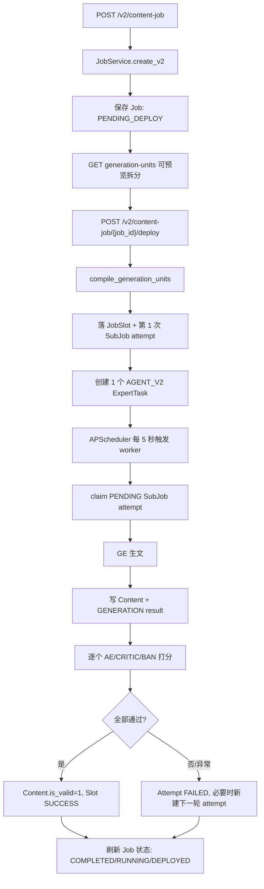

> DEVELOPER

深入研究一下这个项目，每一个都拉一下最新的v2分支代码

> AGENT

我先摸清这个目录是不是一个单仓库、多个子仓库，或者带 submodule/工作树的项目；然后再逐个处理 `v2` 分支。

> AGENT

这里是一个父目录，里面有 15 个独立 Git 仓库，不是单个顶层仓库。下一步我会先检查每个仓库当前分支、是否有未提交改动、以及远端是否有 `v2`，避免把本地改动踩掉。

> AGENT

我确认到所有仓库当前都是干净工作区，这样可以安全切分支/快进更新。现在需要访问远端 Git 服务器抓取最新分支信息，我会一次性对这些仓库做 fetch，再根据远端实际存在的 `v2` 分支名逐个更新。

> AGENT

远端信息已经刷新完了；有两个仓库明确更新了 `feature/raap_v2`，另一个运维仓库更新的是 `main`。我继续枚举每个仓库远端里含 `v2` 的分支，优先找实际存在的 v2 线，而不是按名字硬猜。

> AGENT

我准备把存在主线 `origin/feature/raap_v2` 的仓库切到本地跟踪分支并做 `pull --ff-only`：`raap-admin-frontend`、`raap-core`、`raap-service-orchestrator`。其他仓库目前远端没有匹配 `v2` 的分支，我先不动它们的当前分支，最后给你一张清单。

> AGENT

三个明确的 `feature/raap_v2` 仓库已经更新完毕，而且工作区保持干净。为了更符合“最新的 v2 分支”这个说法，我再按提交时间核对所有含 `v2` 的远端分支，看看有没有比主线 `feature/raap_v2` 更新的 v2 变体需要额外处理。

> AGENT

我已经确认 `feature/raap_v2` 是这两个活跃仓库里的最新 v2 主线，变体分支都更旧；`raap-core` 也只有这条 v2 分支。接下来我补一轮项目结构梳理，看看这些仓库各自承担什么角色，方便后续继续开发/排障。

> AGENT

我已经完成“拉代码”这半件事；现在把“研究项目”也做扎实一点：读每个仓库的 README、依赖清单和入口结构，整理出这个 v2 体系里前端、编排服务、SDK、周边服务的关系。

> AGENT

顺手发现一个值得注意的小信号：`raap-service-orchestrator/AGENTS.md` 里带有已提交的冲突标记文本，但 Git 状态是干净的，说明它不是当前拉取造成的冲突，而是分支里已有内容。我会把它作为风险点记录，不在这次“拉最新 v2”里擅自改。

> AGENT

我再做一个最终校验：确认没有意外脏文件、把 v2 API/前端菜单入口和文档地图定位出来，并检查一下有没有仓库里已经存在的冲突标记这类隐患。

> AGENT

已完成。这个目录是 15 个独立 Git 仓库，不是一个顶层 mono-repo。我已全部 `fetch --prune`，并把存在主线 v2 分支的仓库切到/更新到最新 `origin/feature/raap_v2`：

- [raap-admin-frontend](/Users/lyston/raap/raap-admin-frontend)：`feature/raap_v2`，已快进到 `77dced9`，最新提交 2026-04-28
- [raap-core](/Users/lyston/raap/raap-core)：`feature/raap_v2`，已是最新，`c859eeb`，2026-04-17
- [raap-service-orchestrator](/Users/lyston/raap/raap-service-orchestrator)：`feature/raap_v2`，已快进到 `5a162cd`，最新提交 2026-04-28

其他仓库远端目前没有 `feature/raap_v2` 或更新的 v2 主线分支，所以我没有强行切分支。所有 15 个仓库当前工作区都是干净的，没有未提交改动。

我也顺手做了一轮项目梳理：RAAP 现在的 v2 核心主要落在 Orchestrator + Admin Frontend + Core SDK。Orchestrator 是 FastAPI 编排/调度中心，v2 覆盖 Agent、AgentVersion、Activity、AE/GE runtime、corpus v2、content job、job execution；Admin Frontend 是 Vue 3/Vben 控制台，已经有 v2 Agent 工作台、内容 Job、训练、执行追踪等页面；Core 提供 `raap_llm_sdk`、`raap_trace_sdk`、gRPC 工具，被各后端服务通过 Docker build context 引入。

一个风险点：我发现 [raap-service-orchestrator/AGENTS.md](/Users/lyston/raap/raap-service-orchestrator/AGENTS.md:210) 里已经存在提交进仓库的冲突标记 `<<<<<<< / ======= / >>>>>>>`。这不是本次 pull 产生的冲突，Git 状态仍然干净；我没有擅自修它，但后续最好清掉。

> DEVELOPER

查看一下orchestrator任务创建编排执行运行是怎么样的

> AGENT

我会沿着 Orchestrator 里的“任务创建入口 → 服务落库 → 调度/执行器 → AE/GE runtime → 状态回写/API 查询”这条链路往下看，先把真实代码路径串起来。

> AGENT

初步看下来，这里同时有旧版 Job 链路和 V2 Content Job 链路；V2 文档里说明“目标设计”和“当前实现”有差异。我继续以代码为准，把当前实际运行链路拆出来，同时标注哪些是新版设计已经落地、哪些还是过渡态。

> AGENT

我已经定位到 V2 任务创建用 `JobService.create_v2`，部署用 `deploy_v2`，而执行入口在 `ExpertTaskExecutor.execute_expert_task` 下的 AGENT_V2 分支。现在我继续读部署和执行器的关键段落，这部分决定“编排怎么落成 slot/subjob，以及跑起来时怎么领取和重试”。

> AGENT

部署链路已经很清楚了：`deploy_v2` 会把目标篇数编译成 `JobSlot`，每个 slot 预建第 1 次 `SubJob attempt`，然后只注册一个 `AGENT_V2` 定时 worker。下面我读 worker 的执行细节：它怎么 claim pending attempt、调用 GE、逐个 AE 打分、成功/失败、补 attempt、最终完成 Job。

> AGENT

还差一块“服务重启后怎么恢复运行”的上下文：APScheduler 用的是内存 jobstore，部署时注册定时任务，所以我要再确认启动流程里有没有从数据库重建调度任务。这个点会影响你判断“部署后是否真的长期自动跑”。

> AGENT

我现在把关键文件的行号定位一下，方便你后面直接跳过去看代码；最终会给你一张流程图和每一步对应的入口/状态表。

> AGENT

我看完了，Orchestrator 当前 V2 内容任务主链已经是“Job -> JobSlot -> SubJob attempt”的新版结构，不是单纯一个 Job 直接跑到底。

**主流程**


**创建阶段**
入口是 [content_job.py](/Users/lyston/raap/raap-service-orchestrator/app/api/v2/endpoints/content_job.py:91)，真正逻辑在 [job_service.py](/Users/lyston/raap/raap-service-orchestrator/app/services/job_service.py:448)。

创建时会做这些事：

- 校验 `article_count <= 100`、`max_attempt_per_slot >= 1`
- 加载 `V2AgentVersion`，如果是 `DRAFT` 会先改成 `TRAINING`
- 只允许 `ACTIVE` 或 `TRAINING` 版本创建任务
- 根据版本状态写 `job.v2_task_kind`：`ACTIVE -> ACTIVITY`，`TRAINING -> TRAINING`
- 从 `V2Agent` 和 `V2Activity` 补一些上下文字段到 `task_context`
- 校验 `job_generation_plan.plan_items[0].task_context.selected_strategies`
- 快照 `agent_version.expert_config_list` 到 `job.expert_config_list`
- 只创建 `Job`，状态是 `PENDING_DEPLOY`，不会创建 `SubJob` 或文章

**编排拆分**
拆分器在 [v2_generation_unit_compiler.py](/Users/lyston/raap/raap-service-orchestrator/app/services/v2_generation_unit_compiler.py:51)。

它只认一种模式：`selected_strategies_v1`。核心规则是读取：

`job_generation_plan.plan_items[0].task_context.selected_strategies`

然后按 `article_count` 生成同样数量的 generation units。每个 unit 会按 expert 分组，并在每个 expert 的多条 strategy 里按 `ratio` 加权随机抽一条。随机种子来自 `job.compile_seed`，没有的话用 `job_id + article_count + create_time` 算稳定 seed。预览接口在 [content_job_generation_units_service.py](/Users/lyston/raap/raap-service-orchestrator/app/services/content_job_generation_units_service.py:24)，部署前返回 preview，部署后返回已落库的 `JobSlot`。

**部署阶段**
入口是 [content_job.py](/Users/lyston/raap/raap-service-orchestrator/app/api/v2/endpoints/content_job.py:142)，核心在 [job_service.py](/Users/lyston/raap/raap-service-orchestrator/app/services/job_service.py:969)。

部署会：

- 再次编译 generation units
- 每个 unit 创建一个 [JobSlot](/Users/lyston/raap/raap-service-orchestrator/app/models/job_slot.py:13)
- 每个 slot 预建第 1 次 [SubJob attempt](/Users/lyston/raap/raap-service-orchestrator/app/models/sub_job.py:16)
- 只创建一个 `task_type=AGENT_V2` 的 [ExpertTask](/Users/lyston/raap/raap-service-orchestrator/app/models/expert_task.py:13)
- 注册 APScheduler job，默认 `*/5 * * * * *`，也就是 5 秒一次
- Job 状态变成 `DEPLOYED`

这里新版设计已经落地了：不会再为每个 AE 单独创建 `CRITIC_V2` ExpertTask，AE 打分是在同一个 SubJob attempt 里串行完成。

**运行阶段**
调度入口在 [expert_task_executor.py](/Users/lyston/raap/raap-service-orchestrator/app/scheduler/expert_task_executor.py:984)。如果 Job 已经有 `JobSlot`，会走新版 attempt 链路：[expert_task_executor.py](/Users/lyston/raap/raap-service-orchestrator/app/scheduler/expert_task_executor.py:1142)。

运行方式是：

- 每次 tick 先 `_reconcile_v2_pending_slots`，补救“slot 是 PENDING 但没有 active attempt”的异常窗口
- `_claim_v2_sub_job_attempts` 用 `SELECT ... FOR UPDATE SKIP LOCKED` 抢占 `PENDING` attempt，并写 `lease_owner / lease_token / lease_expire_at`
- 默认 lease 10 分钟，不做心跳续期
- 每批最多 claim 一批 attempt，再用内部 semaphore 控制并发
- 每个 attempt 独立开新 DB session 跑，避免一个 attempt 事务拖住全部

真正执行一个 attempt 在 [expert_task_executor.py](/Users/lyston/raap/raap-service-orchestrator/app/scheduler/expert_task_executor.py:1291)：

- 先把 `SubJob.generation_status=RUNNING`，`JobSlot.status=RUNNING`
- 调 [GERuntimeService.execute_generation](/Users/lyston/raap/raap-service-orchestrator/app/services/ge_runtime/service.py:55)
- GE 会先基于 AgentVersion 的 AE refs 生成 brief，再渲染 GE prompt，再调用 GE client 生文
- 写入 `Content`，并写一条 `ExpertBusinessResult`，类型为 `GENERATION`
- 遍历 `sub_job.expert_config_list` 里 `expert_type in CRITIC/BAN` 的 expert
- 每个 AE 调 [AERuntimeService.execute_score](/Users/lyston/raap/raap-service-orchestrator/app/services/ae_runtime_service.py:86)
- 写 `ExpertBusinessResult` 和 `CriticScoreRecord`
- 任一 AE 不通过或 `score == 0`，当前 attempt 失败，`Content.is_valid=0`，并按 `max_attempt_per_slot` 创建下一轮 attempt
- 全部通过则 `Content.is_valid=1`，`SubJob.status=SUCCESS`，`JobSlot.status=SUCCESS`

**状态收敛**
最终状态刷新在 [expert_task_executor.py](/Users/lyston/raap/raap-service-orchestrator/app/scheduler/expert_task_executor.py:1714)：

- 成功 slot 数达到 `article_count`：`Job.status=COMPLETED`，停掉调度任务
- 没有 pending/running，且存在 failed slot：`FAILED` 或 `PARTIAL_FAILED`
- 有 running slot：`RUNNING`
- 有 pending slot：`DEPLOYED`

有个实现细节值得注意：服务启动时会从 DB 恢复调度任务，入口在 [main.py](/Users/lyston/raap/raap-service-orchestrator/app/main.py:158)，但它只加载 `Job.status == "DEPLOYED"` 的 Job。也就是说，如果服务重启时某个 V2 Job 正好处于 `RUNNING`，按当前代码看可能不会自动重新注册调度器，这是一个需要重点确认/修的运行风险。

> DEVELOPER

怎么把这个打包成一个工作流，补充到我的简历中

> AGENT

可以把它包装成一个“AI 内容生产工作流编排引擎”项目，重点不是说你写了几个接口，而是说你把“配置型任务”变成了“可调度、可重试、可追踪的生产流水线”。

**简历项目名**
RAAP V2 内容生产任务编排工作流

**一句话描述**
设计并落地 AI 内容生产任务编排链路，将任务配置、策略拆分、定时调度、并发执行、GE 生文、AE 审核、失败重试与内容入池串成完整工作流，提升内容生成链路的稳定性和可观测性。

**技术栈**
`FastAPI`、`SQLAlchemy Async`、`MySQL`、`APScheduler`、`Pydantic`、`AsyncIO`、`行级锁 / SKIP LOCKED`、`Lease`、`状态机`

**简历 bullet 可以这样写**

- 负责 RAAP V2 内容任务编排链路设计与实现，抽象 `Job -> JobSlot -> SubJob Attempt` 三层模型，将目标文章数、执行尝试、生成结果解耦，支持任务级生命周期管理。
- 实现任务创建与部署流程：创建阶段保存 AgentVersion、Expert 配置与策略快照；部署阶段通过统一 compiler 将 `selected_strategies` 编译为稳定 generation units，并批量落库为可调度槽位。
- 基于 APScheduler 构建近实时任务调度机制，通过 MySQL `SELECT FOR UPDATE SKIP LOCKED` 与 lease 机制实现多 worker 并发领取，避免重复执行同一 SubJob attempt。
- 打通 GE 生文与 AE 审核闭环：单个 attempt 内串行完成 GE 内容生成、AE/CRITIC/BAN 打分、结果入池与状态回写，并沉淀 prompt、score、business result 等执行追踪数据。
- 设计失败重试与状态收敛机制：当 GE 异常或 AE 判定无效时自动创建下一轮 attempt，按 `max_attempt_per_slot` 控制重试上限，最终将 Job 收敛为 `COMPLETED / FAILED / PARTIAL_FAILED`。
- 建设执行可观测接口，支持按 Job 查询 generation units、SubJob attempts、Content、AE 评分与执行详情，方便排查生成质量和链路异常。

**面试讲法**
我做的不是一个普通 CRUD 任务系统，而是一个 AI 内容生产工作流。用户创建任务时只提交业务目标和策略配置，系统部署时会把目标拆成固定的生成槽位，每个槽位可以多次尝试。调度器定期扫描待执行 attempt，通过数据库行锁和 lease 做并发领取。每个 attempt 内先调用 GE 生成内容，再调用多个 AE 做审核评分，成功就入池，失败就按规则重试。最终 Job 状态由所有 slot 的状态自动收敛。

**更短的简历版**
如果简历空间紧，可以压成一条：

> 设计并实现 RAAP V2 AI 内容生产编排工作流，基于 `Job -> JobSlot -> SubJob Attempt` 状态机打通任务创建、策略编译、APScheduler 调度、并发领取、GE 生文、AE 审核、失败重试与内容入池闭环，支持多 worker 防重执行和全链路执行追踪。

这个包装角度很适合放在“AI 平台 / 后端架构 / 工作流引擎 / 内容生产平台”相关经历里。

> DEVELOPER

重点是这个工作流的每个步骤，怎么部署的，怎么构思的，怎么搭建的，怎么想出来的，是怎么样一个流程，你要给我讲清楚，然后我要完全明白懂，才能写到我简历中

> AGENT

我按“你要能讲给面试官听”的方式拆。这个工作流的核心不是“调用大模型生成文章”，而是把一个不稳定的 AI 生成过程，包装成一个可部署、可调度、可重试、可追踪的生产工作流。

**先说设计动机**
原始问题是：用户不是只想生成一篇文章，而是想说：

“我要基于某个 Agent 版本，按这些策略，给某个活动生成 N 篇可用内容。”

这里面有几个工程难点：

1. 一次生成不一定成功，GE 可能失败，AE 审核也可能判无效。
2. 用户要的是“最终 N 篇有效文章”，不是“调用 N 次模型”。
3. 多台机器同时跑时，不能重复生成同一个任务。
4. 任务执行后要能追踪：当时用了什么策略、什么 prompt、哪个 AE 打了多少分、为什么失败。
5. 创建任务和真正执行任务要分开，否则用户刚点保存就开始乱跑，很难控制。

所以就抽象出了三层：

```text
Job        = 业务任务：我要生成 N 篇文章
JobSlot    = 目标槽位：第 1 篇、第 2 篇、第 3 篇……
SubJob     = 某个槽位的一次尝试 attempt
```

这个设计的关键是：`article_count = N` 不等于执行 N 次，而是创建 N 个 `JobSlot`。每个 slot 可以失败重试多次，直到成功或达到上限。

**完整流程**
```text
创建 Job
  ↓
预览 generation units
  ↓
部署 Job
  ↓
生成 JobSlot + 第一次 SubJob attempt
  ↓
注册定时 worker
  ↓
worker 抢占待执行 attempt
  ↓
GE 生文
  ↓
AE / BAN / CRITIC 审核
  ↓
成功入池，失败重试
  ↓
所有 slot 收敛后 Job 完成
```

**1. 创建阶段**
用户调用：

```http
POST /api/v2/content-job
```

代码入口在 [content_job.py](/Users/lyston/raap/raap-service-orchestrator/app/api/v2/endpoints/content_job.py:91)，核心逻辑在 [job_service.py](/Users/lyston/raap/raap-service-orchestrator/app/services/job_service.py:448)。

这个阶段只做“保存配置”，不真正执行。

系统会校验：

- `article_count` 不能超过 100
- `max_attempt_per_slot` 至少为 1
- AgentVersion 必须存在
- AgentVersion 必须是 `ACTIVE` 或 `TRAINING`
- `job_generation_plan.plan_items[0].task_context.selected_strategies` 必须存在

然后系统会快照保存：

- Agent 编码
- Agent 版本
- Expert 配置列表
- 用户选择的策略
- 活动上下文
- 目标生成篇数

最后 Job 状态是：

```text
PENDING_DEPLOY
```

这一步的设计思想是：创建只是“定义工作流”，不是“启动工作流”。

**2. 编排拆分阶段**
拆分器在 [v2_generation_unit_compiler.py](/Users/lyston/raap/raap-service-orchestrator/app/services/v2_generation_unit_compiler.py:51)。

它读取用户配置里的：

```text
selected_strategies
```

比如用户给不同 Expert 配了不同策略和比例：

```text
品牌专家：策略 A 70%，策略 B 30%
人设专家：策略 C 50%，策略 D 50%
平台专家：策略 E 100%
```

如果 `article_count = 10`，compiler 就会生成 10 个 generation units。每个 unit 代表“一篇目标文章的输入快照”。

每个 unit 会包含：

- 第几篇：`unit_index`
- 这篇文章每个 expert 选中的策略
- task context
- expert context list
- strategy snapshot

这里有一个很重要的点：使用 `compile_seed` 固化随机结果。

否则用户预览看到的是一组策略，部署后实际执行又随机出另一组策略，前后就对不上。这个 seed 的意义就是让“预览”和“执行”使用同一份拆分结果。

**3. 部署阶段**
用户调用：

```http
POST /api/v2/content-job/{job_id}/deploy
```

入口在 [content_job.py](/Users/lyston/raap/raap-service-orchestrator/app/api/v2/endpoints/content_job.py:142)，核心在 [job_service.py](/Users/lyston/raap/raap-service-orchestrator/app/services/job_service.py:969)。

这里的“部署”不是 Kubernetes 部署，而是“把一个配置态 Job 发布成可执行工作流”。

部署会做几件事：

1. 再次调用 compiler，生成固定 generation units。
2. 每个 unit 创建一个 [JobSlot](/Users/lyston/raap/raap-service-orchestrator/app/models/job_slot.py:13)。
3. 每个 JobSlot 创建第 1 次 [SubJob attempt](/Users/lyston/raap/raap-service-orchestrator/app/models/sub_job.py:16)。
4. 创建一个 `AGENT_V2` 类型的 [ExpertTask](/Users/lyston/raap/raap-service-orchestrator/app/models/expert_task.py:13)。
5. 把这个 ExpertTask 注册进 APScheduler。
6. Job 状态改成 `DEPLOYED`。

也就是说，部署之后数据库里会变成这样：

```text
Job
  ├─ JobSlot 0
  │    └─ SubJob attempt 1
  ├─ JobSlot 1
  │    └─ SubJob attempt 1
  ├─ JobSlot 2
  │    └─ SubJob attempt 1
  └─ ExpertTask AGENT_V2 worker
```

这个设计的重点是：`ExpertTask` 不再代表一篇文章，它只是 worker 入口。真正的一篇文章目标在 `JobSlot`，真正的一次执行在 `SubJob attempt`。

**4. 调度阶段**
APScheduler 在服务启动时初始化，代码在 [main.py](/Users/lyston/raap/raap-service-orchestrator/app/main.py:64)。

部署时会注册一个定时任务，默认类似：

```text
*/5 * * * * *
```

也就是每 5 秒触发一次。

服务启动时还会调用 [main.py](/Users/lyston/raap/raap-service-orchestrator/app/main.py:158) 里的 `_load_deployed_tasks`，把数据库里已部署的任务重新加载到内存调度器中。

这里的思想是：APScheduler 用的是内存调度器，真正的任务配置存在 MySQL。服务重启后，要从数据库恢复调度任务。

**5. Worker 抢任务阶段**
调度器触发后，会进入 [expert_task_executor.py](/Users/lyston/raap/raap-service-orchestrator/app/scheduler/expert_task_executor.py:984)。

新版 V2 链路会走：

[expert_task_executor.py](/Users/lyston/raap/raap-service-orchestrator/app/scheduler/expert_task_executor.py:1142)

worker 会先找：

```text
status = PENDING
generation_status = PENDING
lease 已过期或为空
```

的 SubJob attempt。

然后用：

```sql
SELECT ... FOR UPDATE SKIP LOCKED
```

抢占一批 attempt。

这个设计是为了解决多 worker 并发问题。多台机器同时扫描任务时，谁先锁住谁执行，其他机器会跳过已锁行，不会重复生成同一篇。

抢到后会写入：

```text
lease_owner
lease_token
lease_expire_at
picked_at
```

lease 默认 10 分钟。机器崩了也没关系，lease 过期后其他 worker 可以重新接手。

**6. 单个 Attempt 执行阶段**
真正执行一篇文章的代码在：

[expert_task_executor.py](/Users/lyston/raap/raap-service-orchestrator/app/scheduler/expert_task_executor.py:1291)

一个 attempt 内部是串行流程：

```text
标记 RUNNING
  ↓
调用 GE runtime 生成文章
  ↓
写 Content
  ↓
写 GENERATION 类型的 business result
  ↓
逐个调用 AE / CRITIC / BAN
  ↓
写评分记录
  ↓
判断内容是否有效
```

GE 逻辑在 [ge_runtime/service.py](/Users/lyston/raap/raap-service-orchestrator/app/services/ge_runtime/service.py:55)。

GE 会做：

1. 读取 AgentVersion 配置。
2. 根据 Agent 的 AE refs 生成 brief。
3. 把 task context、AE brief、GE config 渲染成生成 prompt。
4. 调用 GE client 生成文章。
5. 返回 `generation_prompt`、`generation_result`、`ae_outputs`。

AE 打分逻辑在 [ae_runtime_service.py](/Users/lyston/raap/raap-service-orchestrator/app/services/ae_runtime_service.py:86)。

每个 AE 会：

1. 构建 score prompt。
2. 调用对应 handler。
3. 返回 score、passed、reason、findings。
4. 写入 `CriticScoreRecord` 和 `ExpertBusinessResult`。

**7. 成功与失败处理**
如果 GE 失败：

```text
SubJob FAILED
generation_status FAILED
retry_reason = GE_FAILED
```

然后系统会判断是否还没超过 `max_attempt_per_slot`。如果没超过，就给同一个 slot 创建下一次 attempt。

如果 GE 成功，但 AE 判定不通过：

```text
Content.is_valid = 0
SubJob FAILED
retry_reason = INVALID_BY_CRITIC
```

然后也会创建下一次 attempt。

如果全部 AE 通过：

```text
Content.is_valid = 1
SubJob SUCCESS
JobSlot SUCCESS
```

这里的核心思想是：失败不覆盖原 attempt，而是新建下一轮 attempt。这样每次失败都有审计记录，能看到第几次失败、为什么失败、哪个 expert 判定失败。

**8. 状态收敛阶段**
状态刷新在 [expert_task_executor.py](/Users/lyston/raap/raap-service-orchestrator/app/scheduler/expert_task_executor.py:1714)。

系统会统计所有 JobSlot：

```text
SUCCESS 数
PENDING 数
RUNNING 数
FAILED 数
```

然后决定 Job 状态：

```text
成功数 >= article_count       -> COMPLETED
没有待执行/运行，且有失败   -> FAILED 或 PARTIAL_FAILED
有运行中 slot                -> RUNNING
还有待执行 slot              -> DEPLOYED
```

所以 Job 的完成不是靠某个函数直接说“我完成了”，而是由所有 slot 的状态自动收敛出来。

**你在简历里真正要表达的能力**
这套东西体现的是后端工作流设计能力：

```text
业务目标建模
  -> 状态机设计
  -> 任务拆分
  -> 调度执行
  -> 并发防重
  -> 失败重试
  -> 结果追踪
  -> 状态收敛
```

你可以这样理解并讲：

“我把 AI 内容生成任务抽象成 Job、JobSlot、SubJob Attempt 三层。Job 表示业务任务，JobSlot 表示目标有效文章槽位，SubJob Attempt 表示一次具体生成尝试。创建任务时只保存配置和快照；部署时通过 compiler 把用户选择的策略编译成固定 generation units，并落库为 JobSlot 和首轮 SubJob。调度器每 5 秒扫描待执行 attempt，通过 MySQL 行锁和 lease 实现多 worker 防重领取。每个 attempt 内部完成 GE 生文、AE 审核、结果入池和状态回写；失败时创建下一轮 attempt，成功时标记 slot 完成。最终 Job 状态由所有 slot 自动收敛。”

这段讲清楚，面试官基本就能听出来：你做的是一个生产级 AI 工作流引擎，而不是普通接口开发。

> DEVELOPER

GE 逻辑在 ge_runtime/service.py (line 55)
不要给我写这种东西，我不会去看源码

> AGENT

对，你说得对。你不是要源码定位，你要的是“我能不能把这套东西当成自己的项目讲明白”。我换成完全不依赖源码的讲法。

**一句话理解**
这个工作流本质是：把“我要生成 N 篇高质量内容”拆成一个可执行、可重试、可追踪的后台生产流水线。

不是简单地调用大模型 N 次，而是：

```text
任务配置 -> 策略拆分 -> 部署成可执行单元 -> 定时调度 -> 抢任务执行 -> GE 生成 -> AE 审核 -> 成功入池 / 失败重试 -> 任务完成
```

**一开始怎么构思的**
先从业务问题倒推。

用户真正要的不是“调用一次模型”，而是：

```text
基于某个 Agent 版本
按照一组内容策略
为某个活动
生成指定数量的有效文章
```

这里面有几个天然问题：

1. 大模型生成不稳定，可能失败。
2. 生成出来的文章不一定合格，需要审核。
3. 用户要的是“有效文章数”，不是“模型调用次数”。
4. 多台服务一起跑，不能重复生成同一篇。
5. 出问题后要能追踪：用了什么策略、什么 prompt、哪个审核专家判失败。
6. 创建任务和执行任务要分开，否则用户刚保存任务就直接开跑，不可控。

所以设计时不是从“接口怎么写”开始，而是先抽象状态机。

**核心抽象**
我会把这套系统讲成三层：

```text
Job
代表整个业务任务：我要生成 10 篇文章。

JobSlot
代表目标文章槽位：第 1 篇、第 2 篇、第 3 篇……直到第 10 篇。

SubJob Attempt
代表某个槽位的一次执行尝试：这次生成成功还是失败。
```

为什么这样设计？

因为一篇目标文章可能不是一次就成功。比如第 3 篇第一次 GE 生成失败，第二次 AE 审核没过，第三次才成功。那它应该仍然算“第 3 个目标槽位”，只是下面挂了多个 attempt。

所以关系是：

```text
1 个 Job
  -> N 个 JobSlot
      -> 每个 JobSlot 可以有多次 SubJob Attempt
```

这个设计的亮点是：业务目标和执行次数解耦了。

**完整工作流**
**1. 创建任务**
用户先创建一个内容任务，输入：

```text
任务名称
Agent 编码
Agent 版本
活动 ID
目标文章数 article_count
每篇最多重试次数 max_attempt_per_slot
用户选择的策略 selected_strategies
```

这一步只保存配置，不执行。

系统会校验：

```text
Agent 版本是否存在
Agent 版本是否可用
目标文章数是否超过上限
策略配置是否完整
```

然后把当时的 Agent 版本、Expert 配置、策略配置都保存成快照。

为什么要保存快照？

因为任务执行可能是几分钟甚至更久之后。如果执行时再去读最新配置，可能 Agent 已经被别人改过了。这样就无法解释“当时到底按什么配置生成的”。所以创建时就要固化一份执行快照。

**2. 编译策略**
用户配置的是“策略”，但机器执行需要的是“一篇篇文章的具体输入”。

比如用户配置：

```text
品牌专家：策略 A 70%，策略 B 30%
人设专家：策略 C 50%，策略 D 50%
平台专家：策略 E 100%
```

如果要生成 10 篇，系统会把它编译成 10 个 generation units。

每个 generation unit 代表一篇文章的生成输入：

```text
第 1 篇用哪些策略
第 2 篇用哪些策略
第 3 篇用哪些策略
……
```

这里会用一个固定随机种子 `compile_seed`。

这个种子的作用是：让预览和实际执行保持一致。

不然用户预览时看到第 1 篇用策略 A，部署后真正执行时又随机成策略 B，就会对不上。

**3. 部署任务**
这里的“部署”不是发版到服务器，而是把一个配置态任务变成可执行任务。

部署时系统会做：

```text
把 Job 编译成 N 个 JobSlot
每个 JobSlot 创建第 1 次 SubJob Attempt
创建一个后台 worker 任务
把 worker 注册到定时调度器
Job 状态改成 DEPLOYED
```

部署后的结构是：

```text
Job：生成 10 篇文章
  Slot 0 -> Attempt 1
  Slot 1 -> Attempt 1
  Slot 2 -> Attempt 1
  ...
  Slot 9 -> Attempt 1
```

这里的关键设计是：部署时先把目标槽位全部固化下来。

这样后面执行时不是临时决定“我要生成哪篇”，而是从数据库里领取明确的待执行 attempt。

**4. 调度执行**
系统用定时调度器，比如每 5 秒触发一次 worker。

worker 不直接生成文章，而是先去数据库里找待执行的 attempt：

```text
状态是 PENDING
还没有被其他 worker 占用
或者之前的占用已经超时
```

然后 worker 会抢占一批 attempt。

**5. 并发防重**
这是整个工作流比较工程化的地方。

如果线上有多台机器，同时都在跑 worker，就可能出现：

```text
机器 A 看到了 Slot 1 待执行
机器 B 也看到了 Slot 1 待执行
然后两台机器都生成了同一篇
```

为了解决这个问题，系统用了数据库行锁和 lease。

可以理解为：

```text
worker 领取任务时，先给这条 SubJob Attempt 上锁
抢到锁的 worker 才能执行
其他 worker 会跳过这条
```

同时写入：

```text
谁领取的
领取时间
过期时间
执行 token
```

如果 worker 崩了，lease 到期后，别的 worker 可以重新接手。

这就是多 worker 并发执行时的防重机制。

**6. GE 生文**
worker 抢到 attempt 后，开始真正执行。

第一步是 GE，也就是生成专家。

GE 做的事可以理解为：

```text
读取这个 attempt 的 task context
读取这个 Agent 版本对应的 GE 配置
读取相关 AE 生成的 brief
组装最终 generation prompt
调用大模型生成文章
返回标题、正文、prompt、brief 等结果
```

这里 GE 不是裸调用模型，而是把：

```text
活动信息
品牌信息
平台信息
人设策略
内容策略
AE brief
GE 模板
```

组合成一个完整 prompt，再生成内容。

生成成功后，会写入内容表，先标记为：

```text
是否有效：未知
上线状态：未上线
```

因为它还没经过审核。

**7. AE 审核**
GE 生成完文章后，系统不会马上认为它成功。

接下来会依次调用多个 AE，也就是审核/评价专家。

比如：

```text
品牌一致性审核
平台风格审核
内容结构审核
法律风险审核
AI 味检测
常识审核
```

每个 AE 会返回：

```text
分数
是否通过
原因
问题标签
审核 prompt
```

系统会把每个 AE 的审核结果都保存下来。

这样以后如果一篇文章失败，可以追踪：

```text
是哪一个 AE 判失败
当时的分数是多少
失败原因是什么
审核 prompt 是什么
```

**8. 成功或失败**
如果所有 AE 都通过：

```text
Content.is_valid = 1
SubJob Attempt = SUCCESS
JobSlot = SUCCESS
```

这代表这个槽位已经产出了一篇有效文章。

如果 GE 调用失败：

```text
Attempt = FAILED
失败原因 = GE_FAILED
```

如果 GE 成功但 AE 审核不通过：

```text
Content.is_valid = 0
Attempt = FAILED
失败原因 = INVALID_BY_CRITIC
```

然后系统会看这个 slot 是否还能重试。

比如配置是最多 5 次 attempt，如果当前才第 2 次失败，就会自动创建：

```text
同一个 JobSlot 的 Attempt 3
```

注意，不是覆盖原来的失败记录，而是新增一次 attempt。

这样失败过程完整保留下来，方便审计和复盘。

**9. 状态收敛**
每轮执行后，系统会统计这个 Job 下面所有 JobSlot 的状态：

```text
多少个成功
多少个待执行
多少个运行中
多少个失败
```

然后自动决定 Job 状态：

```text
所有目标 slot 都成功 -> COMPLETED
还有待执行 slot -> DEPLOYED
有运行中 slot -> RUNNING
没有可执行 slot，但有失败 -> FAILED 或 PARTIAL_FAILED
```

这叫状态收敛。

它的好处是：Job 不是靠某个接口随便改成完成，而是根据所有子任务的真实状态计算出来。

**你可以怎么讲“我是怎么搭建的”**
你可以按这个顺序说：

```text
第一步，我先把业务目标抽象成 Job、JobSlot、SubJob Attempt 三层模型。
第二步，我把用户选择的策略编译成固定 generation units，保证预览和执行一致。
第三步，我在部署阶段把 generation units 落库成 JobSlot 和首轮 SubJob。
第四步，我用 APScheduler 做定时调度，让 worker 周期性扫描待执行 attempt。
第五步，我用数据库行锁和 lease 机制支持多 worker 并发领取，避免重复执行。
第六步，每个 attempt 内串行执行 GE 生文和 AE 审核。
第七步，我设计了失败重试机制，失败不会覆盖原记录，而是创建下一轮 attempt。
第八步，我通过 JobSlot 状态统计让整个 Job 自动收敛到完成、失败或部分失败。
```

**简历里可以写成这样**
> 设计并实现 RAAP V2 AI 内容生产工作流，将内容生成任务抽象为 `Job -> JobSlot -> SubJob Attempt` 三层状态机，支持任务创建、策略编译、部署调度、并发领取、GE 生文、AE 审核、失败重试、结果入池与状态自动收敛。

再写一条更具体的：

> 基于 APScheduler、MySQL 行级锁与 lease 机制构建多 worker 调度执行模型，实现 SubJob Attempt 防重领取、异常恢复和重试控制，保证目标文章槽位最终产出指定数量的有效内容。

**面试时你可以这样完整讲**
我做的是一个 AI 内容生成工作流，不是简单调用大模型。用户创建任务时，只定义目标和策略，比如基于某个 Agent 版本生成 10 篇文章。系统会先保存配置快照，然后在部署阶段把任务编译成 10 个固定的文章槽位，每个槽位都有自己的执行 attempt。后台 worker 定时扫描待执行 attempt，通过数据库锁和 lease 防止多机器重复执行。每个 attempt 里先调用 GE 生成文章，再调用多个 AE 做审核评分。如果审核通过，就把文章标记为有效并完成该槽位；如果 GE 失败或 AE 不通过，就记录失败原因并为同一个槽位创建下一次 attempt。最终 Job 状态由所有槽位的状态自动收敛出来。这样就把不稳定的大模型生成过程，包装成了一个可控、可重试、可追踪的生产级工作流。

> DEVELOPER

你先别管简历中怎么写，面试中怎么说
你先写清楚整个工作流的实现，你这写的太简陋了，这让我怎么学会这个工作流项目，我学不会我怎么和面试官讲？

> AGENT

对，这次我们先不管简历、不管面试话术。我把它当成一个“你要真正学会并能复现的后端工作流项目”来讲。你要先理解它为什么这么拆、每一层怎么实现、数据怎么流、状态怎么变、失败怎么处理。

**0. 这个项目到底在做什么**
它不是“用户点一下，后端调用大模型生成文章”。

它做的是一个后台生产系统：

```text
用户配置一个内容生产任务
系统把任务拆成多个可执行单元
后台调度器定时扫描任务
worker 并发领取任务
每个任务先生成内容，再审核内容
审核通过就入池
审核失败就重试
最终自动判断整个任务是否完成
```

所以它本质上是一个 **AI 内容生产工作流引擎**。

---

**1. 先定义业务目标**
用户的需求不是：

```text
调用大模型 10 次
```

而是：

```text
给某个活动，基于某个 Agent 版本，生成 10 篇有效文章
```

这里“有效文章”很关键。

因为大模型生成出来的文章可能：

```text
生成失败
格式不对
不符合品牌要求
不符合平台风格
有风险内容
AI 味太重
常识错误
```

所以系统不能把“大模型调用成功”当成“任务成功”。

真正的成功标准应该是：

```text
生成文章
通过审核
进入内容池
```

这就是整个工作流设计的出发点。

---

**2. 核心数据模型**
这个工作流最重要的是三层模型：

```text
Job
JobSlot
SubJob Attempt
```

可以这样理解：

```text
Job = 一整个业务任务
例如：我要生成 10 篇文章

JobSlot = 一个目标文章槽位
例如：第 1 篇、第 2 篇、第 3 篇

SubJob Attempt = 某个槽位的一次执行尝试
例如：第 3 篇第一次生成失败，第二次审核失败，第三次成功
```

关系是：

```text
一个 Job 有多个 JobSlot
一个 JobSlot 可以有多个 SubJob Attempt
一个成功的 JobSlot 最终对应一篇有效 Content
```

举个例子：

```text
Job：生成 3 篇文章

Slot 0
  Attempt 1：成功

Slot 1
  Attempt 1：GE 生成失败
  Attempt 2：成功

Slot 2
  Attempt 1：AE 审核失败
  Attempt 2：AE 审核失败
  Attempt 3：成功
```

最后这个 Job 仍然是成功的，因为 3 个 Slot 都产出了有效文章。

这就是为什么不能简单设计成：

```text
Job -> SubJob
```

必须多一层 `JobSlot`，用来表达“目标文章位”。

---

**3. Job 里保存什么**
Job 是业务任务，保存的是用户配置和执行快照。

它大概包含：

```text
job_id
job_name
tenant_id
activity_id
agent_code
agent_version_id
article_count
max_attempt_per_slot
job_generation_plan
expert_config_list
compile_seed
compile_version
status
```

这些字段各自的意义是：

```text
article_count
目标有效文章数，比如 10。

max_attempt_per_slot
每个槽位最多尝试几次，比如最多 5 次。

job_generation_plan
用户选择的策略、上下文、生成配置。

expert_config_list
创建任务时，从 AgentVersion 上复制下来的 Expert 快照。

compile_seed
策略拆分时用的随机种子，保证预览和执行一致。

status
Job 当前状态，比如 PENDING_DEPLOY、DEPLOYED、RUNNING、COMPLETED。
```

为什么要保存 `expert_config_list` 快照？

因为 AgentVersion 未来可能被别人改掉。如果任务执行时才读取最新配置，就会出现一个问题：

```text
任务是昨天创建的
今天 Agent 配置被改了
任务今天执行时用了新配置
但用户以为用的是昨天配置
```

这样不可追踪，也不可复盘。

所以创建 Job 时要把当时的配置复制一份，后续执行都用这份快照。

---

**4. 创建任务阶段**
创建任务的接口做的事情很克制：只创建 Job，不执行。

流程是：

```text
接收用户参数
校验 AgentVersion 是否存在
校验 AgentVersion 是否可执行
校验 article_count 是否合理
校验 selected_strategies 是否存在
补充活动、品牌、平台等上下文
复制 Expert 配置快照
保存 Job
状态设为 PENDING_DEPLOY
```

这个阶段不会创建文章，也不会创建 SubJob。

为什么？

因为“创建”只是保存草稿式的业务定义。

真正要跑，必须再经过“部署”。

这就把两个动作分开了：

```text
创建 = 定义任务
部署 = 发布任务，让后台 worker 可以执行
```

这在工程上很重要，因为用户可以先创建、检查、预览，再决定是否部署。

---

**5. 策略编译阶段**
用户配置的是策略，不是具体每一篇文章。

比如用户配置：

```text
品牌专家：
策略 A，占比 70
策略 B，占比 30

人设专家：
策略 C，占比 50
策略 D，占比 50

平台专家：
策略 E，占比 100
```

如果用户要生成 5 篇文章，系统要把这个配置编译成 5 个具体输入：

```text
Unit 0：品牌策略 A，人设策略 C，平台策略 E
Unit 1：品牌策略 B，人设策略 D，平台策略 E
Unit 2：品牌策略 A，人设策略 D，平台策略 E
Unit 3：品牌策略 A，人设策略 C，平台策略 E
Unit 4：品牌策略 B，人设策略 C，平台策略 E
```

每个 Unit 就是一篇文章的生成输入。

这个编译结果叫：

```text
generation units
```

每个 generation unit 里包含：

```text
unit_index
task_context
generation_input
expert_context_list
strategy_snapshot
```

含义是：

```text
unit_index
第几篇，从 0 开始。

task_context
这篇文章的通用上下文，比如活动、品牌、平台、用户策略。

generation_input
编译后每个 expert 选中的策略。

expert_context_list
传给 AE/GE runtime 的 expert 级上下文。

strategy_snapshot
本次策略选择的快照，用于追踪。
```

这里有一个关键点：`compile_seed`。

策略是按比例随机抽的，但系统不能每次都随机出不同结果。

所以要用固定随机种子：

```text
同一个 Job + 同一个 seed = 同样的 generation units
```

这样用户预览看到什么，部署后执行就是什么。

---

**6. 部署阶段**
部署是把配置态 Job 变成可执行工作流。

部署时做这些事：

```text
读取 Job
调用策略 compiler
生成 N 个 generation units
每个 generation unit 创建一个 JobSlot
每个 JobSlot 创建第一个 SubJob Attempt
创建一个 AGENT_V2 类型的后台 worker 任务
注册到调度器
Job 状态改为 DEPLOYED
```

假设 `article_count = 3`，部署后数据结构变成：

```text
Job：job-001

JobSlot 0
  status = PENDING
  attempt_count = 1
  generation_unit = Unit 0

SubJob Attempt 1
  slot_index = 0
  status = PENDING
  generation_status = PENDING

JobSlot 1
  status = PENDING
  attempt_count = 1
  generation_unit = Unit 1

SubJob Attempt 1
  slot_index = 1
  status = PENDING
  generation_status = PENDING

JobSlot 2
  status = PENDING
  attempt_count = 1
  generation_unit = Unit 2

SubJob Attempt 1
  slot_index = 2
  status = PENDING
  generation_status = PENDING
```

同时会创建一个调度任务：

```text
ExpertTask
task_type = AGENT_V2
cron = 每 5 秒执行一次
```

这里 `ExpertTask` 不是文章任务。

它只是 worker 入口，负责周期性扫描待执行的 SubJob Attempt。

---

**7. 调度器怎么工作**
系统使用 APScheduler。

你可以理解为后端服务启动后，会有一个内存里的定时器：

```text
每 5 秒调用一次 worker
```

worker 做的不是“执行某一篇固定文章”，而是：

```text
去数据库里找可以执行的 SubJob Attempt
抢到就执行
抢不到就结束本轮
```

为什么要这样设计？

因为线上可能有多个服务实例。

如果每台机器都有调度器，它们都会每 5 秒扫描数据库。这样可以提高吞吐，但必须解决重复执行问题。

---

**8. 多 worker 怎么防止重复执行**
这是整个工作流里最关键的工程点之一。

假设有两台机器：

```text
Worker A
Worker B
```

它们同时看到：

```text
SubJob 100 是 PENDING
```

如果没有锁，两台机器都会执行它，导致重复生成。

所以领取任务时必须加控制。

实现方式是：

```text
查询 PENDING 的 SubJob Attempt
使用数据库行锁锁住记录
其他 worker 跳过被锁住的记录
领取成功后写入 lease 信息
提交事务
```

可以理解成伪 SQL：

```sql
select *
from sub_job
where status = 'PENDING'
  and generation_status = 'PENDING'
  and lease_expire_at is null or lease 已过期
order by slot_index, attempt_no
limit batch_size
for update skip locked
```

`skip locked` 的意思是：

```text
如果这行已经被别的事务锁了，我不等它，直接跳过。
```

领取成功后，会写：

```text
status = RUNNING
lease_owner = 当前 worker
lease_token = 随机 token
lease_expire_at = 当前时间 + 10 分钟
picked_at = 当前时间
```

lease 的作用是防止 worker 崩溃。

如果 worker 领取任务后进程挂了，这条任务不会永远卡死。等 lease 过期，其他 worker 可以重新领取。

---

**9. 执行一个 Attempt**
一个 SubJob Attempt 的执行流程是：

```text
标记 attempt 为 RUNNING
标记 slot 为 RUNNING
调用 GE 生成文章
写入 Content
写入生成结果
调用多个 AE 审核
根据审核结果决定成功或失败
更新 slot 和 job 状态
```

拆开讲。

**第一步：准备执行上下文**

attempt 里已经保存了这次执行需要的所有输入：

```text
task_context
expert_context_list
generation_input
expert_config_list
generation_context_snapshot
```

这意味着 worker 不需要重新随机、不需要重新解释用户策略。

它只执行这个 attempt 已经固化好的输入。

**第二步：调用 GE**

GE 是 Generation Expert，也就是生成专家。

GE 的职责不是简单调用大模型，而是组装完整生成上下文：

```text
Agent 类型
Agent 版本
活动信息
品牌信息
平台信息
用户选中的策略
AE brief
GE 模板
```

然后生成最终 prompt。

简化后流程是：

```text
读取 AgentVersion 配置
读取 GE 配置
读取 AE 引用
让相关 AE 先产出 brief
把 task_context + AE brief + GE 模板拼成 generation prompt
调用大模型
拿到标题和正文
```

GE 返回的东西包括：

```text
generation_prompt
generation_result
generation_brief
ae_outputs
ge_type
```

系统会把这些东西保存下来，方便以后追踪：

```text
这篇文章到底是用什么 prompt 生成的
当时 AE brief 是什么
模型返回了什么
```

**第三步：写 Content**

GE 成功后，会创建或更新 Content。

刚写入时：

```text
is_valid = 未知
online_status = OFFLINE
```

因为它还没通过审核。

Content 大概保存：

```text
content_id
job_id
sub_job_id
activity_id
agent_code
agent_version_id
title
content
prompt
context_list
plan_index
is_valid
online_status
```

这里 `sub_job_id` 很重要，因为它把文章和那一次 attempt 绑定起来。

**第四步：写生成结果记录**

除了 Content，系统还会写一条业务结果记录。

这条记录表示：

```text
这个 attempt 的 GE 阶段成功了
生成 prompt 是什么
生成结果是什么
```

这样后面查执行详情时，不只是看到一篇文章，还能看到生成过程。

---

**10. AE 审核怎么接上**
GE 生成文章后，系统会遍历这个 attempt 的 expert 配置列表。

只挑出审核类 expert：

```text
CRITIC
BAN
```

每个 AE 审核逻辑大概是：

```text
拿到文章内容
根据 expert_code 和 expert_version_id 找到审核规则
生成审核 prompt
调用模型或规则引擎
得到 score、passed、reason、findings
保存审核结果
```

每个 AE 会产出：

```text
score
passed
reason
findings
judge_prompt
expert_name
expert_type
```

系统会保存两类记录：

```text
CriticScoreRecord
保存分数、是否通过、原因、问题标签。

ExpertBusinessResult
保存更完整的业务调用结果，包括 prompt 和模型返回。
```

这一步的目的不是只判断通过/失败，而是让失败可解释。

比如一篇文章失败后，可以知道：

```text
品牌专家打了 0 分
原因：没有体现品牌核心卖点
平台专家通过
法律风险专家通过
AI 味检测不通过
```

---

**11. 成功路径**
如果 GE 成功，并且所有 AE 都通过：

```text
Content.is_valid = 1
SubJob Attempt.status = SUCCESS
SubJob.generation_status = SUCCESS
JobSlot.status = SUCCESS
JobSlot.success_sub_job_id = 当前 sub_job_id
```

这代表：

```text
这个槽位已经产出一篇有效文章
```

注意，真正代表目标完成的是 `JobSlot.status = SUCCESS`。

因为 JobSlot 才是“目标文章位”。

---

**12. 失败路径：GE 失败**
如果 GE 调用失败，比如模型服务异常、prompt 失败、网络错误：

```text
SubJob Attempt.status = FAILED
generation_status = FAILED
retry_reason = GE_FAILED
failure 写入 generation_context_snapshot
```

这时不会写有效 Content。

然后系统检查：

```text
这个 slot 的 attempt_count 是否小于 max_attempt_per_slot
```

如果还能重试，就创建下一次 attempt：

```text
Slot 1
  Attempt 1：GE_FAILED
  Attempt 2：PENDING
```

新 attempt 会复用同一个 slot 的输入上下文。

---

**13. 失败路径：AE 不通过**
如果 GE 成功，但 AE 审核不通过：

```text
Content.is_valid = 0
SubJob Attempt.status = FAILED
retry_reason = INVALID_BY_CRITIC
failed_experts = 失败的 expert
invalid_reasons = 失败原因
```

然后也会判断是否还能重试。

如果还能重试：

```text
创建下一次 SubJob Attempt
status = PENDING
generation_status = PENDING
parent_sub_job_id = 上一次失败 attempt
attempt_no = 上一次 + 1
```

为什么失败不覆盖，而是新增 attempt？

因为覆盖会丢失历史。

生产系统里你需要知道：

```text
第一次为什么失败
第二次为什么失败
第三次为什么成功
```

这对调试模型、调整 prompt、做质量分析都很重要。

---

**14. JobSlot 怎么控制重试**
JobSlot 负责控制目标槽位的生命周期。

它有几个关键字段：

```text
status
attempt_count
last_sub_job_id
success_sub_job_id
generation_unit
```

状态变化大概是：

```text
PENDING
  -> RUNNING
  -> SUCCESS

PENDING
  -> RUNNING
  -> FAILED
  -> PENDING
  -> RUNNING
  -> SUCCESS

PENDING
  -> RUNNING
  -> FAILED
  -> PENDING
  -> RUNNING
  -> FAILED
  -> FAILED
```

最后一种情况表示：

```text
重试次数用完了，这个槽位彻底失败
```

这时 Job 可能会变成：

```text
FAILED
PARTIAL_FAILED
```

取决于是否还有其他槽位成功。

---

**15. Job 怎么判断完成**
Job 不应该由某个 worker 随便改成完成。

正确方式是统计下面所有 JobSlot 的状态。

每轮 worker 执行结束后，系统会统计：

```text
SUCCESS 有多少
PENDING 有多少
RUNNING 有多少
FAILED 有多少
```

然后收敛 Job 状态：

```text
SUCCESS 数 >= article_count
=> COMPLETED

还有 RUNNING
=> RUNNING

还有 PENDING
=> DEPLOYED

没有 PENDING/RUNNING，但有 FAILED，且也有部分 SUCCESS
=> PARTIAL_FAILED

没有 PENDING/RUNNING，全部失败
=> FAILED
```

这就是状态收敛。

它的好处是：

```text
Job 状态由子任务真实状态推导出来
不是靠人为猜
```

---

**16. 为什么需要部署阶段，而不是创建后直接跑**
这是个很重要的设计点。

如果创建后直接执行，会有几个问题：

```text
用户无法预览拆分结果
任务配置还没确认就开始跑
失败后难以重放
策略随机结果不固定
任务无法清楚地区分配置态和执行态
```

所以拆成：

```text
创建：保存配置
预览：看 generation units
部署：固化 generation units，创建执行单元
运行：worker 扫描并执行
```

这个流程更适合生产系统。

---

**17. 为什么 GE 和 AE 放在同一个 Attempt 里**
以前一种设计可能是：

```text
GE 是一个任务
AE 是另一个任务
```

这样看起来解耦，但状态会很复杂：

```text
GE 生成了文章
AE 什么时候开始？
多个 AE 谁先谁后？
某个 AE 失败后谁负责重试？
文章是否有效由谁最终判断？
```

现在设计成：

```text
一个 attempt 内串行执行 GE -> AE -> 判定
```

好处是：

```text
一次 attempt 就是一条完整生产链路
状态更清楚
失败重试更简单
审计更完整
```

也就是说：

```text
SubJob Attempt = 一次完整的文章生产尝试
```

不是只代表生成，也不是只代表审核。

---

**18. 这个工作流从零怎么搭建**
如果你要自己复现，可以按这个顺序搭：

```text
第一步：建 Job 表
保存任务配置、目标数量、状态。

第二步：建 JobSlot 表
每个目标文章一个 slot。

第三步：建 SubJob 表
每个 slot 的一次执行 attempt。

第四步：写策略 compiler
把 selected_strategies + article_count 编译成 generation units。

第五步：写创建接口
只保存 Job，不执行。

第六步：写预览接口
调用 compiler 返回 generation units。

第七步：写部署接口
生成 JobSlot、首轮 SubJob、调度任务。

第八步：接 APScheduler
每隔几秒触发 worker。

第九步：写 claim 逻辑
用行锁 + skip locked + lease 领取待执行 attempt。

第十步：写 attempt 执行逻辑
GE 生文，写 Content，再 AE 审核。

第十一步：写重试逻辑
失败后创建下一轮 attempt。

第十二步：写状态收敛逻辑
根据所有 slot 状态更新 Job。
```

---

**19. 最终你要真正理解的核心**
这套项目最核心的思想是：

```text
不要把 AI 调用当成一次普通函数调用。
要把 AI 生成包装成一个可靠的生产工作流。
```

它通过这些机制实现可靠性：

```text
Job / JobSlot / Attempt 三层拆分
解决业务目标和执行次数解耦。

配置快照
解决执行可追踪和可复盘。

compiler + compile_seed
解决预览和执行一致。

部署阶段
解决配置态到执行态的发布。

APScheduler
解决后台定时调度。

行锁 + lease
解决多 worker 并发防重和异常恢复。

GE + AE 串行执行
解决生成和审核闭环。

失败新增 attempt
解决重试和审计。

状态收敛
解决 Job 最终完成判断。
```

如果你把这 9 个点真正理解了，这个工作流你就学会了。

> DEVELOPER

还是写的太简陋了

> TOOL

<turn_aborted>
The user interrupted the previous turn on purpose. Any running unified exec processes may still be running in the background. If any tools/commands were aborted, they may have partially executed.
</turn_aborted>

> DEVELOPER

还是写的太简陋了，工作流的流程、构思、搭建、具体的实施步骤等都需要

> AGENT

你这个要求对，我前面讲得像“概要说明”，不是“项目学习材料”。这版我按**从构思到搭建到执行**完整讲，先让你真正理解这个工作流。

**一、先从业务问题倒推**
这个系统要解决的不是“调用大模型生成文章”，而是：

用户创建一个内容生产任务，指定 Agent、活动、策略和目标篇数，系统要稳定地产出 N 篇“审核通过的有效内容”。

所以一开始要识别几个核心矛盾：

1. 大模型生成不稳定，可能失败。
2. 生成成功不代表内容可用，还要经过多个审核专家。
3. 用户要的是 N 篇有效文章，不是调用模型 N 次。
4. 后台可能多实例部署，不能重复执行同一个生成任务。
5. 每篇内容必须能追溯生成策略、prompt、审核结果、失败原因。
6. 创建任务、确认策略、真正执行，应该拆开，否则不可控。

于是这个系统的设计目标就出来了：

```text
把不稳定的 AI 生成过程，包装成一个可调度、可重试、可追踪、可并发执行的生产工作流。
```

**二、核心建模**
第一个关键设计是三层模型：

```text
Job
代表一个业务任务，比如：给某活动生成 10 篇文章。

JobSlot
代表一个目标文章槽位，比如：第 1 篇、第 2 篇……第 10 篇。

SubJob Attempt
代表某个槽位的一次执行尝试，比如：第 3 篇第一次失败、第二次成功。
```

为什么要多一层 `JobSlot`？

因为目标是“10 篇有效文章”，而不是“执行 10 次”。如果第 3 篇第一次生成失败，它不应该占掉目标数量，而应该继续为第 3 个槽位重试。

最终关系是：

```text
Job 1 个
  -> JobSlot N 个
      -> SubJob Attempt 1 到多次
          -> Content 0 或 1 篇
          -> AE 审核记录多条
          -> 执行日志多条
```

这个模型把“业务目标”和“执行尝试”解耦了，这是整个工作流的地基。

**三、整体流程**
完整流程可以分成 8 个阶段：

```text
1. 创建任务
2. 编译策略
3. 预览生成单元
4. 部署任务
5. 调度器触发
6. worker 领取 attempt
7. 执行 GE + AE
8. 重试或完成状态收敛
```

你可以把它理解成：

```text
配置态 Job
  -> 编译成可执行单元
  -> 部署成数据库里的任务槽位
  -> worker 后台扫描执行
  -> 每个槽位直到成功或失败封顶
  -> Job 自动收敛最终状态
```

**四、创建任务怎么实现**
创建阶段只做一件事：保存业务配置，不执行。

用户提交：

```text
job_name
activity_id
agent_code
agent_version_id
article_count
max_attempt_per_slot
job_generation_plan
selected_strategies
```

后端要做：

```text
校验 Agent 是否存在
校验 AgentVersion 是否可执行
校验 article_count 是否在上限内
校验 selected_strategies 是否完整
补充活动、品牌、平台等上下文
快照 AgentVersion 上的 Expert 配置
保存 Job
状态置为 PENDING_DEPLOY
```

为什么要快照？

因为任务创建时的 Agent 配置，和任务真正执行时的 Agent 配置可能不一样。生产系统必须保证“这个任务当时用的是什么配置”可以被复盘，所以 Job 里要保存一份 `expert_config_list` 快照。

创建完成后，系统里只有：

```text
Job(status=PENDING_DEPLOY)
```

还没有 Slot、SubJob、Content。

**五、策略编译怎么构思**
用户选的是策略，不是具体每篇文章的输入。

比如：

```text
品牌专家：策略 A 70%，策略 B 30%
人设专家：策略 C 50%，策略 D 50%
平台专家：策略 E 100%
```

如果目标是 10 篇，系统要把它编译成 10 个 `generation unit`。

每个 unit 表示“一篇文章的固定生成输入”：

```text
unit_index: 第几篇
task_context: 文章上下文
generation_input: 每个 expert 选中的策略
expert_context_list: 传给运行时的 expert 上下文
strategy_snapshot: 策略快照
```

这里最关键的是 `compile_seed`。

策略按比例随机，如果每次随机结果都不同，用户预览和实际执行会对不上。所以 compiler 必须支持固定随机种子：

```text
同一个 Job + 同一个 compile_seed = 同一批 generation units
```

这一步的设计目的：

```text
把“用户配置的策略比例”变成“系统可以执行的固定文章单元”。
```

**六、预览阶段**
预览就是在不部署、不执行的情况下，先把 generation units 展示出来。

这一步解决的是产品体验问题：

```text
用户可以先看到系统准备怎么拆分这 10 篇文章。
```

如果用户发现策略分布不对，可以修改配置后再部署。

预览不会创建 JobSlot，也不会创建 SubJob。

**七、部署任务怎么实现**
部署不是服务上线，而是把一个配置态 Job 变成可执行工作流。

部署阶段做：

```text
读取 Job
调用 compiler
生成 N 个 generation units
每个 unit 创建一个 JobSlot
每个 JobSlot 创建第 1 次 SubJob Attempt
创建一个 AGENT_V2 类型的 worker 任务
注册到 APScheduler
Job 状态改为 DEPLOYED
```

如果 `article_count = 3`，部署后结构是：

```text
Job
  Slot 0: PENDING
    Attempt 1: PENDING

  Slot 1: PENDING
    Attempt 1: PENDING

  Slot 2: PENDING
    Attempt 1: PENDING
```

为什么部署时就把 Slot 和首轮 Attempt 全部落库？

因为执行时 worker 不应该临时决定“我要生成第几篇”。执行层只负责从数据库里领取明确的 attempt。这样更稳定，也更容易追踪。

**八、调度器怎么搭建**
系统用 APScheduler 做后台定时器。

部署时创建一个 worker 任务：

```text
task_type = AGENT_V2
cron = 每 5 秒执行一次
```

调度器每 5 秒触发一次 worker，worker 不绑定某一篇文章，而是扫描数据库：

```text
有没有 PENDING 的 SubJob Attempt？
有就领取一批执行。
没有就结束本轮。
```

如果服务重启，由于 APScheduler 是内存调度器，所以启动时要从数据库重新加载已部署的 ExpertTask，把它们重新注册进调度器。

这就是“数据库保存任务状态，调度器只负责触发”的设计。

**九、多 worker 并发怎么处理**
线上可能有多个服务实例，每个实例都有 worker。问题是：多个 worker 可能同时看到同一条 PENDING attempt。

解决方案是：

```text
数据库行锁 + skip locked + lease
```

领取逻辑是：

```text
查找 PENDING attempt
只查 lease 为空或 lease 已过期的
对记录加行锁
被锁住的记录其他 worker 跳过
领取成功后写 lease_owner、lease_token、lease_expire_at
把 attempt 改成 RUNNING
提交事务
```

可以理解为：

```text
谁抢到锁，谁执行。
没抢到的 worker 不等待，继续找下一条。
```

lease 的作用是兜底：

```text
如果 worker 抢到任务后挂了，lease 过期后其他 worker 可以重新领取。
```

这一步解决的是生产环境并发防重和异常恢复。

**十、执行一个 Attempt**
worker 领取到 attempt 后，开始执行完整生产链：

```text
Attempt RUNNING
Slot RUNNING
调用 GE
写 Content
写生成结果
调用多个 AE
写审核结果
判断成功或失败
```

GE 阶段做的是：

```text
读取 attempt 的 task_context
读取 Agent 的 GE 配置
读取相关 AE brief
拼装 generation prompt
调用模型生成标题和正文
返回生成结果
```

GE 成功后会写 Content，但此时：

```text
is_valid = 未知
online_status = OFFLINE
```

因为它还没审核。

然后进入 AE 阶段。

AE 会逐个审核这篇文章，比如：

```text
品牌一致性
平台风格
内容结构
法律风险
AI 味
常识问题
```

每个 AE 返回：

```text
score
passed
reason
findings
judge_prompt
```

系统保存两类东西：

```text
评分记录：方便看分数和是否通过
业务结果：方便追踪 prompt、模型返回、完整上下文
```

**十一、成功路径**
如果 GE 成功，并且所有 AE 都通过：

```text
Content.is_valid = 1
Attempt.status = SUCCESS
Attempt.generation_status = SUCCESS
Slot.status = SUCCESS
Slot.success_sub_job_id = 当前 attempt
```

这表示：

```text
这个目标槽位已经产出了一篇有效文章。
```

**十二、失败路径和重试**
失败分两类。

GE 失败：

```text
Attempt FAILED
generation_status FAILED
retry_reason = GE_FAILED
不产生有效 Content
```

AE 不通过：

```text
Content.is_valid = 0
Attempt FAILED
retry_reason = INVALID_BY_CRITIC
记录 failed_experts 和 invalid_reasons
```

然后系统检查：

```text
slot.attempt_count < job.max_attempt_per_slot ?
```

如果还能重试，就创建下一次 attempt：

```text
同一个 Slot
  Attempt 1: FAILED
  Attempt 2: PENDING
```

注意：失败不会覆盖原记录，而是新建 attempt。

这样可以完整追踪：

```text
第 1 次为什么失败
第 2 次为什么失败
第 3 次为什么成功
```

这对 AI 系统非常重要，因为失败原因本身就是后续调 prompt、调策略、调审核规则的数据资产。

**十三、状态机怎么设计**
JobSlot 状态：

```text
PENDING -> RUNNING -> SUCCESS
PENDING -> RUNNING -> FAILED -> PENDING -> RUNNING -> SUCCESS
PENDING -> RUNNING -> FAILED，重试耗尽 -> FAILED
```

SubJob Attempt 状态：

```text
PENDING -> RUNNING -> SUCCESS
PENDING -> RUNNING -> FAILED
```

Job 状态：

```text
PENDING_DEPLOY
DEPLOYED
RUNNING
COMPLETED
FAILED
PARTIAL_FAILED
PAUSED
```

Job 最终状态不是随便改的，而是统计 Slot 得到：

```text
SUCCESS 数达到 article_count -> COMPLETED
还有 RUNNING -> RUNNING
还有 PENDING -> DEPLOYED
没有 PENDING/RUNNING，但有失败 -> FAILED 或 PARTIAL_FAILED
```

这个叫状态收敛。

**十四、如果从零搭建，实施步骤应该这样排**
第一阶段：数据表设计

```text
建 Job 表：保存任务配置和状态
建 JobSlot 表：保存目标文章槽位
建 SubJob 表：保存执行 attempt
建 Content 表：保存生成文章
建 Score/Result 表：保存审核和执行记录
```

第二阶段：创建接口

```text
实现 create job
做参数校验
加载 AgentVersion
保存配置快照
状态设为 PENDING_DEPLOY
```

第三阶段：compiler

```text
读取 selected_strategies
按 article_count 生成 units
实现 ratio 加权选择
引入 compile_seed
保证结果稳定
```

第四阶段：预览接口

```text
调用 compiler
返回 generation units
不落库 Slot
```

第五阶段：部署接口

```text
调用 compiler
创建 JobSlot
创建首轮 SubJob Attempt
创建 AGENT_V2 worker task
注册 APScheduler
更新 Job 状态
```

第六阶段：worker 领取

```text
定时扫描 PENDING attempt
使用行锁和 skip locked
写 lease
改 RUNNING
```

第七阶段：attempt 执行

```text
调用 GE
写 Content
调用 AE
写审核结果
判断通过或失败
```

第八阶段：重试机制

```text
失败时检查 attempt_count
未超限则创建下一轮 attempt
超限则 Slot FAILED
```

第九阶段：状态收敛

```text
统计所有 Slot
更新 Job 状态
完成后停止调度任务
```

第十阶段：可观测性

```text
提供 Job 列表
提供 generation units 查询
提供 SubJob attempts 查询
提供 Content 查询
提供 AE 分数和失败原因查询
```

**十五、这个项目最核心的设计思想**
你真正要学会的是这套推理：

```text
AI 生成不可靠
所以不能直接把一次模型调用当作业务成功

用户要的是目标有效内容数
所以需要 JobSlot 表达目标槽位

一次槽位可能多次尝试
所以需要 SubJob Attempt 表达执行历史

多实例会重复抢任务
所以需要行锁和 lease

生成后还要审核
所以 attempt 内部要包含 GE -> AE -> 判定

失败要可追踪
所以不能覆盖失败 attempt，而要新增下一次 attempt

Job 完成要可靠
所以最终状态由 Slot 统计收敛
```

这套逻辑你吃透以后，就不是背项目了。你会明白它为什么这样设计、每一步解决什么问题、如果让你重做该怎么搭。

> DEVELOPER

[$codex-md-docs](/Users/lyston/.codex/skills/codex-md-docs/SKILL.md) 完整详细的全部写下来

> SYSTEM

<skill>
<name>codex-md-docs</name>
<path>/Users/lyston/.codex/skills/codex-md-docs/SKILL.md</path>
---
name: codex-md-docs
description: Route Markdown documentation work into the user's Codex Obsidian space, including choosing or creating device/category folders, deciding whether to create/append/update notes, and keeping operational records separated by device/environment. Use when the user asks Codex to create, write, update, append, record, summarize, save, organize, archive, or maintain any Markdown document, md note, deployment record, operation guide, SOP, troubleshooting note, decision record, or session handoff unless the user explicitly gives a different destination.
---

# Codex Markdown Docs

## Default Root

Use this Markdown documentation root by default:

```text
/Users/lyston/Obsidian/lyston/Codex
```

Prefer this root even if older notes exist elsewhere, unless the user explicitly names another path. Create it if it is missing. Do not write documentation into project source trees, `/tmp`, `/root`, downloads, or ad hoc scratch folders unless the user explicitly asks.

## Placement Model

Use the existing vault structure as the source of truth. The active Codex vault structure is device-first:

```text
Codex/
  lystonmacbook-pro.local/
  lyston11.qzz.io/
```

Top-level folders under `/Users/lyston/Obsidian/lyston/Codex` must be device, host, or environment names. Under each device directory, classify documents by service, project, or content type, such as:

```text
Hermes
Fast Note Sync
Sub2API
基础设施
DBX
GenericAgent
HAPI
MindOS
Codex工具与文档系统
LDStatus Pro
锐鲨
```

Do not put service or project folders directly under the Codex root. Do not create or maintain `README.md`, separate catalog folders, summary entry pages, or original archive folders. Use device directories, category directories, clear filenames, headings, and search for discoverability.

When a split is complete, day-to-day entry points are the device folders, category folders, and focused Markdown files only.

## Before Writing

1. If the user gives an exact file path, use that path.
2. If the user gives a folder path, choose or create the `.md` file inside that folder.
3. If the user gives only a title or topic, inspect likely matching device folders and Markdown files under `/Users/lyston/Obsidian/lyston/Codex`.
4. Search device directories, category directories, filenames, and headings for the topic, service name, date, project, domain, path, hostname, device name, or keywords from the request.
5. Identify the device/environment before choosing the directory, appending, or updating. Compare hostname/device name, OS, cloud provider, public domain/IP, deployment root, path style, container runtime, and tunnel/reverse-proxy endpoint when available.
6. Use clear filenames and headings because there are no folder entry pages.
7. Hard rule: never merge records across different devices or environments only because the service name matches.
8. Prefer an existing note only when both the device/environment and topic/service match.
9. Preserve existing Markdown structure, frontmatter, headings, Obsidian links, and unrelated content.
10. Do not create database backups, code backups, or duplicate archival files unless the user explicitly asks.

## Create, Append, Or Update

Choose the smallest durable change that fits the request:

- **Create** a new file when no strong match exists, the topic is new, the environment differs, or the user asks for a standalone document.
- **Append** for deployment logs, operational history, incident notes, progress records, meeting notes, dated observations, command outputs, session handoffs, and continuing timelines.
- **Update** an existing section for living guides, SOPs, runbooks, architecture notes, checklists, policies, configuration records, or summaries whose current content should be refined.

For dated append entries, prefer:

```markdown
## 2026-05-06
```

If updating risks overwriting important history, append a dated section instead. If environment cues are missing and multiple notes could match, ask one concise clarifying question.

## Discoverability

When creating, moving, splitting, or materially updating a document, keep it discoverable:

- Do not add or update folder `README.md` files.
- Do not create or update separate catalog folders or summary entry pages.
- Use clear device directories, category directories, filenames, headings, and related-document links inside the actual notes.
- For sensitive content, record the sensitive boundary inside the relevant document itself without copying secrets or credentials elsewhere.
- Prefer Obsidian wiki links for vault-internal references. Use relative Markdown links only when they are clearer than wiki links for a specific path.

## Organization And Cleanup

If the user asks to organize, archive, split, clean up, or says the vault/folder is confusing:

1. Inventory Markdown files, directories, headings, and large mixed documents.
2. Classify by device/environment first, then by service/topic, sensitivity, and document type.
3. Split unrelated sections from large mixed documents into focused topic documents when useful.
4. Do not keep original mixed documents in original archive folders; remove old original archives after confirming the focused documents exist.
5. Create missing service/topic folders inside the appropriate device directory only when the content is likely to recur or when several documents belong together.
6. Do not create summary entry pages; keep discoverability in the folder structure, filenames, headings, and related-document links.
7. Verify final tree shape, no `README.md` files, no separate catalog folders, no original archive folders, and no stale links.

Do not keep appending unrelated operational details to a large deployment note just because it mentions the same machine. A server overview can link to service, network, and incident documents; it should not absorb them all.

## Naming

Use Chinese filenames and headings when the user writes in Chinese or the document is mainly Chinese. Use clear, short Markdown filenames.

For operational, deployment, access, tunnel, proxy, or troubleshooting records, include an environment marker in the filename when it prevents cross-device confusion:

```text
Sub2API Docker（OrbStack）部署记录.md
Sub2API Docker（Ubuntu srv-projects）部署记录.md
Cloudflare Tunnel 外网访问配置记录.md
Codex 会话同步与迁移指南.md
```

If the document belongs clearly to a service/topic folder, the environment marker can be in the document metadata instead of the filename.

## Environment Metadata

For operational documents, include ownership/context near the top when relevant:

- Hostname or device name.
- OS/cloud/provider when known.
- Main domain/IP, if public.
- Deployment root path.
- Container/runtime context, if relevant.
- Whether the record is local desktop, server-side, container-only, or tunnel/reverse-proxy related.

## Content Style

Write concise Markdown that is useful when reopened later:

- Include concrete paths, commands, service names, ports, config files, dates, and verification results when relevant.
- Keep facts separate from assumptions.
- Use fenced code blocks for commands, config, logs, and structured output.
- Redact secrets, API keys, passwords, SSH private keys, bearer tokens, and full cookies.
- For operational records, include what changed, where it lives, how to verify it, and rollback or next steps when relevant.

## Reporting Back

After writing, briefly report:

- The exact file path.
- Whether content was created, appended, moved, split, or updated.
- Which device and category folder was selected, created, or updated.
- The device/environment used to choose or separate the document when relevant.
- Any important status or caveat discovered while writing.

</skill>

> AGENT

我会按 `codex-md-docs` 的规则把这份内容写进你的 Obsidian Codex 文档空间，而不是项目源码里。先确认现有目录结构和是否已有 RAAP/锐鲨相关笔记，再选择合适的位置创建一份完整学习文档。

> AGENT

我选本机环境 `lystonmacbook-pro.local`，项目分类放到已有的 `锐鲨` 文件夹里。接下来创建一份完整学习文档，重点写“为什么这么设计、从零怎么搭、每一步具体做什么、状态和数据怎么流转”，不再写源码跳转。

> AGENT

文档已经创建好了。我再快速检查一下文件是否落在正确设备目录、标题和内容是否能被 Obsidian 搜索到。

> AGENT

已完整写入 Obsidian 文档：

[RAAP V2 内容生产工作流实现详解.md](/Users/lyston/Obsidian/lyston/Codex/lystonmacbook-pro.local/锐鲨/RAAP%20V2%20内容生产工作流实现详解.md)

我按 `codex-md-docs` 规则放在：

`/Users/lyston/Obsidian/lyston/Codex/lystonmacbook-pro.local/锐鲨/`

这次是新建文档，选的是本机环境 `lystonmacbook-pro.local`，分类是已有的 `锐鲨`。内容大约 2200 多行，重点覆盖了：业务问题、构思过程、三层模型、创建/编译/预览/部署/调度/claim/GE/AE/重试/状态收敛、从零搭建步骤、设计取舍和风险点。

> DEVELOPER

在建立中我该怎么写？面试官问到了的时候我该怎么介绍？他会问我哪些问题我该怎么答？

> TOOL

<turn_aborted>
The user interrupted the previous turn on purpose. Any running unified exec processes may still be running in the background. If any tools/commands were aborted, they may have partially executed.
</turn_aborted>

> DEVELOPER

在简历中我该怎么写？面试官问到了的时候我该怎么介绍？他会问我哪些问题我该怎么答？

> AGENT

可以。你这个项目在简历和面试里，不能写成“我做了一个任务接口”，要写成：

**我做了一个 AI 内容生产工作流编排系统，把不稳定的大模型生成过程，做成了可调度、可重试、可追踪、可并发执行的生产链路。**

下面我分三块给你：

1. 简历怎么写  
2. 面试官问到时怎么介绍  
3. 面试官可能追问什么，你怎么答  

**一、简历中怎么写**
项目名称可以写：

**RAAP V2 AI 内容生产工作流编排系统**

项目描述：

```text
基于 FastAPI、MySQL、APScheduler、SQLAlchemy Async 设计并实现 AI 内容生产任务编排系统，将内容生成任务抽象为 Job、JobSlot、SubJob Attempt 三层状态机，打通任务创建、策略编译、部署调度、多 worker 并发领取、GE 生文、AE 审核、失败重试、内容入池与状态自动收敛流程。
```

技术栈：

```text
FastAPI / SQLAlchemy Async / MySQL / APScheduler / AsyncIO / Pydantic / 行级锁 / Lease / 状态机 / 大模型调用编排
```

简历 bullet 可以这样写：

```text
- 负责设计 RAAP V2 内容生产任务编排链路，将 AI 内容生成任务抽象为 Job、JobSlot、SubJob Attempt 三层模型，解决目标文章数、执行尝试次数和失败重试之间的解耦问题。
```

```text
- 实现任务创建与部署分离：创建阶段保存 AgentVersion、Expert 配置和策略快照；部署阶段通过 compiler 将用户选择的 selected_strategies 编译为固定 generation units，并落库为 JobSlot 和首轮 SubJob Attempt。
```

```text
- 基于 APScheduler 构建后台调度机制，通过 MySQL 行级锁、SKIP LOCKED 和 lease 机制实现多 worker 并发领取 SubJob Attempt，避免同一生成任务被重复执行。
```

```text
- 打通 GE 生文与 AE 审核闭环：单个 attempt 内串行完成生成 prompt 组装、大模型内容生成、Content 写入、多 AE 审核评分、结果记录和有效性判定。
```

```text
- 设计失败重试与状态收敛机制：GE 失败或 AE 审核不通过时保留失败 attempt，并为同一 JobSlot 创建下一轮 attempt；最终根据所有 JobSlot 状态自动收敛 Job 为 COMPLETED、FAILED 或 PARTIAL_FAILED。
```

```text
- 建设任务执行可观测能力，沉淀 generation unit、SubJob attempt、Content、GE 生成结果、AE 评分、失败原因等链路数据，支持任务执行过程追踪和问题复盘。
```

如果你想写得更强一点，可以用这一版：

```text
- 设计并落地 AI 内容生产工作流引擎，将不稳定的大模型生成过程包装为可配置、可部署、可调度、可重试、可追踪的生产级任务链路，支持按目标有效文章数进行 Slot 化执行和自动补偿。
```

注意：不要乱写“提升了多少百分比”，除非你有真实数据。没有数据就写“支持”“实现”“解决”。

**二、面试时怎么介绍**
面试官问：“你这个 RAAP V2 内容生产工作流是做什么的？”

你可以这样讲：

```text
这个项目是一个 AI 内容生产任务编排系统。业务上用户会创建一个内容生产任务，比如基于某个 Agent 版本，为某个活动生成 10 篇文章。但这里不能简单调用大模型 10 次，因为大模型生成不稳定，而且生成成功也不代表内容可用，还需要经过多个 AE 审核专家审核。

所以我把整个流程设计成 Job、JobSlot、SubJob Attempt 三层模型。Job 表示整个业务任务，JobSlot 表示目标文章槽位，比如目标 10 篇就创建 10 个 Slot，SubJob Attempt 表示某个 Slot 的一次执行尝试。这样如果某一篇生成失败或者审核不通过，可以针对同一个 Slot 创建下一次 attempt，而不是把失败也算进目标数量里。

整个链路是：用户先创建 Job，系统保存 AgentVersion、Expert 配置和策略快照；部署时通过 compiler 把用户选择的策略编译成固定 generation units，并落库成 JobSlot 和首轮 SubJob Attempt；后台 APScheduler 定时触发 worker，worker 通过 MySQL 行锁和 lease 机制领取 pending attempt；每个 attempt 内先调用 GE 生成文章，再调用多个 AE 审核评分；审核通过后 Content 标记为有效，Slot 成功；如果 GE 失败或 AE 不通过，就保留失败记录并创建下一轮 attempt。最后 Job 状态根据所有 Slot 的状态自动收敛。
```

这段你要背熟。它是主干。

再短一点，30 秒版本：

```text
我做的是一个 AI 内容生产工作流编排系统。核心是把“生成 N 篇有效文章”拆成 Job、JobSlot、SubJob Attempt 三层模型。Job 是业务任务，JobSlot 是目标文章槽位，Attempt 是一次生成尝试。任务创建时保存配置快照，部署时编译策略并生成 Slot，后台 worker 通过调度器和数据库锁领取 attempt，执行 GE 生文和 AE 审核。失败会为同一 Slot 创建下一轮 attempt，成功则入池，最终 Job 状态由所有 Slot 自动收敛。
```

**三、面试官可能会问什么**
**1. 为什么要设计 Job、JobSlot、SubJob Attempt 三层？**
你答：

```text
因为用户要的是目标有效文章数，而不是模型调用次数。比如用户要 10 篇有效文章，如果某一篇第一次生成失败或者审核不通过，不能把这次失败算作一篇有效文章。所以我用 Job 表示整体任务，用 JobSlot 表示目标文章位，用 SubJob Attempt 表示一次执行尝试。这样一个 Slot 可以多次 attempt，直到成功或达到重试上限。这个设计把业务目标和执行次数解耦了。
```

**2. 为什么创建和部署要分开？**
你答：

```text
创建阶段只是保存任务配置，不应该马上执行。因为用户可能还需要预览策略拆分结果，也可能要调整配置。部署阶段才把配置态 Job 转成执行态任务，生成固定的 JobSlot 和首轮 SubJob Attempt，并注册调度器。这样可以保证配置确认、执行单元固化和任务运行是分开的，系统更可控。
```

**3. generation units 是什么？**
你答：

```text
generation unit 是一篇目标文章的固定生成输入。用户配置的是策略比例，比如某个 expert 的策略 A 占 70%，策略 B 占 30%。系统需要把这种策略配置编译成每一篇文章具体使用哪些策略。article_count 是 10，就生成 10 个 generation units。后续每个 unit 会对应一个 JobSlot。
```

**4. compile_seed 有什么用？**
你答：

```text
因为策略选择里有按比例随机。如果没有固定 seed，用户预览时看到的拆分结果和部署后实际执行的结果可能不一致。所以系统用 compile_seed 固定随机过程，保证同一个 Job、同一个 seed、同一份策略配置，会得到同一批 generation units。
```

**5. 多台 worker 同时跑，怎么避免重复执行？**
你答：

```text
worker 领取任务时不是直接查 pending 后就执行，而是通过数据库行级锁和 SKIP LOCKED 领取。谁抢到锁谁执行，其他 worker 会跳过被锁住的记录。同时领取后会写 lease_owner、lease_token、lease_expire_at。如果 worker 崩溃，lease 过期后其他 worker 可以重新领取。这样既能支持多 worker 并发，也能避免重复执行。
```

**6. 为什么要有 lease？只用 RUNNING 状态不行吗？**
你答：

```text
只用 RUNNING 状态有一个问题：worker 抢到任务后如果进程崩溃，这条任务可能永久卡在 RUNNING。lease 是一个超时占用机制，领取任务时写入过期时间。如果 worker 正常完成，会更新状态；如果 worker 挂了，lease 过期后其他 worker 可以重新接管。
```

**7. GE 和 AE 是怎么串起来的？**
你答：

```text
一个 SubJob Attempt 内部是一条完整生产链路。先由 GE 根据 AgentVersion、task_context、策略上下文和 AE brief 组装 prompt，并调用大模型生成文章。生成成功后写入 Content，但此时还不能算有效。然后系统依次调用多个 AE，比如品牌一致性、平台风格、安全风控、AI 味检测等。所有 AE 都通过后，Content 才会标记为有效，Slot 才算成功。
```

**8. 如果 GE 成功但 AE 审核不通过怎么办？**
你答：

```text
系统会把生成出来的 Content 保留下来，但标记为无效，同时记录是哪个 AE 不通过、失败原因、评分和问题标签。然后判断这个 Slot 是否还有重试次数。如果没超过 max_attempt_per_slot，就为同一个 JobSlot 创建下一轮 SubJob Attempt。失败不会覆盖，历史 attempt 会保留，方便后续追踪和复盘。
```

**9. Job 最终状态怎么判断？**
你答：

```text
Job 状态不是由某个接口直接拍脑袋改成完成，而是根据所有 JobSlot 的状态统计出来。比如成功 Slot 数达到 article_count，就标记为 COMPLETED；如果还有 RUNNING，就是 RUNNING；如果还有 PENDING，就是 DEPLOYED；如果没有 pending/running，但有失败，就根据是否有部分成功标记为 FAILED 或 PARTIAL_FAILED。这叫状态收敛。
```

**10. 这个系统最大的难点是什么？**
你答：

```text
最大的难点不是调用大模型，而是把不稳定的大模型生成过程变成可靠的生产工作流。主要难点有三个：第一，如何把目标文章数和执行尝试次数解耦，所以设计了 JobSlot；第二，如何支持多 worker 并发又不重复执行，所以用了行锁、SKIP LOCKED 和 lease；第三，如何让失败可追踪、可重试、可复盘，所以失败 attempt 不覆盖，而是创建下一轮 attempt。
```

**11. 这个设计有什么不足？**
你答：

```text
当前设计也有一些可以优化的地方。比如 lease 是简单超时模型，没有心跳续期，如果单个 attempt 执行时间超过 lease 时间，理论上可能被其他 worker 接管。还有 AE 当前是串行执行，状态简单但性能不是最优，如果 AE 数量很多，可以改成并发审核后统一聚合结果。另外，重试时目前主要复用同一份输入，后续可以根据失败原因做自适应重试，比如调整策略或把失败原因反馈给下一轮 GE。
```

这个回答很重要。面试官喜欢问缺点，你不要说“没问题”，要说你知道取舍。

**12. 你在这个项目里体现了什么能力？**
你答：

```text
这个项目主要体现的是后端工作流建模和可靠执行能力。不是单纯写 CRUD，而是从业务目标出发，设计状态机、任务拆分、执行快照、调度、并发领取、失败重试和状态收敛。尤其是 AI 场景下，模型结果不稳定，所以必须把生成、审核、重试和追踪都纳入工作流设计。
```

**四、你要记住的核心表达**
你最后一定要能自然说出这句话：

```text
这个项目的核心不是调用大模型，而是把 AI 内容生成这种不稳定过程，抽象成 Job、JobSlot、SubJob Attempt 三层状态机，并通过策略编译、后台调度、并发领取、GE 生成、AE 审核、失败重试和状态收敛，做成一个可控的生产级工作流。
```

这句话就是你的项目总纲。

> DEVELOPER

太简陋了，重新写

> AGENT

对，我重写一版。你这个项目不能写成“我做了 GE/AE 调用”，而要写成“我设计/落地了一个 AI 内容生产工作流编排链路”。重点是：**任务怎么拆、怎么调度、怎么防重、怎么重试、怎么追踪、怎么收敛状态**。

**一、简历项目怎么写**
项目名称：

```text
RAAP V2 AI 内容生产工作流编排系统
```

项目描述：

```text
面向 AI 内容生产场景，设计并实现一套从任务创建、策略编译、执行单元部署、后台调度、多 worker 并发领取、GE 内容生成、AE 审核评分、失败重试到内容入池和状态收敛的工作流编排链路。系统通过 Job、JobSlot、SubJob Attempt 三层状态模型，将“生成 N 篇有效文章”的业务目标与不稳定的大模型调用过程解耦，提升任务执行的可控性、可追踪性和失败恢复能力。
```

技术栈：

```text
FastAPI、SQLAlchemy Async、MySQL、APScheduler、AsyncIO、Pydantic、数据库行级锁、SKIP LOCKED、Lease、状态机、大模型调用编排
```

简历 bullet 推荐这样写：

```text
- 参与 RAAP V2 AI 内容生产工作流设计与实现，将内容生成任务抽象为 Job、JobSlot、SubJob Attempt 三层状态模型，解决目标文章数、模型调用次数、审核失败重试之间的解耦问题。
```

```text
- 设计任务创建与部署分离机制：创建阶段保存 AgentVersion、Expert 配置和策略快照；部署阶段通过 compiler 将 selected_strategies 编译为稳定 generation units，并落库为 JobSlot 和首轮 SubJob Attempt。
```

```text
- 基于 APScheduler 构建后台近实时调度链路，worker 周期性扫描待执行 attempt，并通过 MySQL 行级锁、SKIP LOCKED 与 lease 机制实现多实例并发领取和防重复执行。
```

```text
- 打通单次 SubJob Attempt 内的完整生产链路：GE 根据 Agent 配置、任务上下文、策略快照和 AE brief 组装 prompt 并生成内容；随后执行多个 AE/CRITIC/BAN 审核专家完成评分、问题识别和有效性判定。
```

```text
- 实现失败补偿与重试机制：GE 调用异常或 AE 审核不通过时保留失败 attempt、记录失败原因，并在未超过 max_attempt_per_slot 的情况下为同一 JobSlot 创建下一轮 attempt。
```

```text
- 设计 Job 状态自动收敛逻辑，根据 JobSlot 的 SUCCESS、PENDING、RUNNING、FAILED 数量自动推导 Job 的 COMPLETED、RUNNING、FAILED、PARTIAL_FAILED 等状态，避免任务状态依赖人工或单点流程判断。
```

```text
- 沉淀 generation unit、SubJob attempt、Content、GE prompt、AE score、失败原因、审核结果等链路数据，支持任务执行过程追踪、内容质量排查和后续策略优化。
```

如果你想写得更像中高级后端，可以用这一条压轴：

```text
- 将不稳定的大模型生成过程工程化为可部署、可调度、可重试、可审计的生产级工作流，提升 AI 内容生成链路在多实例场景下的可靠性和可观测性。
```

**二、面试时你怎么介绍这个项目**
如果面试官问“你讲一下这个项目”，你不要一上来讲接口。你按这个顺序讲：

```text
这个项目解决的是 AI 内容生产任务的编排问题。业务上，用户不是简单生成一篇文章，而是希望基于某个 Agent 版本、某个活动、某些策略，最终产出 N 篇审核通过的有效内容。这里有一个问题：大模型生成是不稳定的，生成成功也不代表内容可用，还需要多个 AE 专家审核。所以我没有把它设计成简单循环调用大模型，而是设计成一个工作流。

核心模型是 Job、JobSlot、SubJob Attempt 三层。Job 表示整个内容生产任务，比如生成 10 篇文章；JobSlot 表示目标文章槽位，10 篇就有 10 个 Slot；SubJob Attempt 表示某个 Slot 的一次执行尝试。这样如果某一篇生成失败或审核不通过，不会直接影响目标数量，而是可以针对同一个 Slot 创建下一次 attempt，直到成功或达到重试上限。

整个流程是：用户先创建 Job，系统保存 AgentVersion、Expert 配置和策略快照；部署时通过 compiler 把用户选择的 selected_strategies 编译成固定 generation units，并创建 JobSlot 和首轮 SubJob Attempt；后台 APScheduler 定时触发 worker，worker 用数据库行锁和 lease 领取 pending attempt；每个 attempt 内先调用 GE 生成内容，再调用多个 AE 审核评分；审核通过后 Content 标记有效，Slot 成功；失败则记录原因并创建下一轮 attempt。最后 Job 状态根据所有 Slot 的状态自动收敛。
```

这段是你的主叙述。你要讲得像你真的设计过，而不是背名词。

**三、面试官重点会追问什么**
**1. 你为什么要设计 Job、JobSlot、SubJob Attempt 三层？**

答：

```text
因为业务目标和执行过程不是一一对应的。用户要的是 N 篇有效文章，但大模型调用一次不一定产出有效文章，可能 GE 失败，也可能 AE 审核不通过。如果只设计 Job -> SubJob，失败重试后很难判断目标数量到底完成了多少。所以我用 JobSlot 表示目标文章位，用 SubJob Attempt 表示一次执行尝试。这样一个 Slot 可以多次尝试，但最终只要一个成功 attempt 就算这个目标位完成。
```

补一句更高级的：

```text
这个设计本质上是把“目标状态”和“执行历史”拆开，JobSlot 管目标，Attempt 管过程。
```

**2. 为什么创建和部署要分开？**

答：

```text
创建只是定义任务，不应该马上执行。因为任务创建后用户可能还要预览策略拆分结果，确认没问题后再部署。部署阶段才会把配置态 Job 编译成执行态数据，比如 JobSlot 和首轮 Attempt。这样做的好处是配置和执行分离，任务可以预览、可以审计，也能保证执行时使用的是已经固化的 generation units。
```

**3. generation units 是什么？为什么要 compiler？**

答：

```text
用户配置的是策略比例，比如某个专家下策略 A 占 70%，策略 B 占 30%。但执行时 worker 需要知道每一篇文章到底用哪些策略。所以 compiler 的作用是把 selected_strategies 按 article_count 编译成一组 generation units。每个 unit 就是一篇目标文章的固定输入，里面包含 unit_index、task_context、generation_input、expert_context_list 和策略快照。
```

**4. compile_seed 是干什么的？**

答：

```text
因为策略选择有随机性，如果不固定 seed，预览时看到的策略拆分和部署后实际执行的拆分可能不一致。compile_seed 可以保证同一个 Job、同一份策略配置生成同一批 generation units。这样用户预览、部署、执行、排查时看到的是同一套输入。
```

**5. 多 worker 并发怎么防止重复执行？**

答：

```text
worker 不是简单查 pending 任务后就执行，而是在领取 attempt 时使用数据库行级锁和 SKIP LOCKED。多个 worker 同时扫描时，谁先锁到那条 SubJob，谁就把它改成 RUNNING 并写入 lease；其他 worker 会跳过被锁住的行。lease_owner、lease_token、lease_expire_at 用来记录占用者和过期时间。如果 worker 崩溃，lease 过期后其他 worker 可以重新领取。
```

**6. 为什么要 lease，只靠 RUNNING 不行吗？**

答：

```text
只靠 RUNNING 会有卡死问题。如果 worker 抢到任务后服务崩溃，这条记录可能永远停在 RUNNING。lease 是一个超时占用机制，表示这个 attempt 在某个时间点前由某个 worker 持有。如果超过 lease 时间还没完成，就认为可以被其他 worker 接管。
```

**7. GE 和 AE 在一个 attempt 里怎么串起来？**

答：

```text
一个 attempt 表示一次完整内容生产尝试，所以内部是 GE -> AE -> 判定。GE 会根据 AgentVersion、任务上下文、策略快照、AE brief 和 GE 模板组装生成 prompt，调用大模型生成内容。生成成功后先写 Content，但此时 is_valid 还是未知。随后系统调用多个 AE 审核专家，比如品牌一致性、平台风格、风控、AI 味检测等。所有 AE 通过后，Content 才标记有效，Slot 才成功。
```

**8. 如果 GE 失败或者 AE 不通过怎么办？**

答：

```text
GE 失败时，attempt 标记 FAILED，generation_status 标记 FAILED，记录 retry_reason=GE_FAILED。如果 GE 成功但 AE 不通过，Content 会保留但标记 is_valid=0，同时记录 failed_experts、invalid_reasons、评分和审核原因。然后系统检查当前 Slot 的 attempt_count 是否小于 max_attempt_per_slot，如果还能重试，就为同一个 Slot 创建下一轮 attempt。
```

**9. 为什么失败不覆盖原 attempt？**

答：

```text
因为失败记录本身有价值。AI 生成系统需要复盘失败原因，比如哪次 GE 失败、哪次 AE 不通过、哪个专家判定失败、当时 prompt 是什么。如果覆盖原记录，整个链路就不可审计。所以失败 attempt 会保留，新 attempt 会通过 parent_sub_job_id 和 previous_attempts 串起来。
```

**10. Job 最终状态怎么判断？**

答：

```text
Job 状态由所有 JobSlot 的状态统计收敛出来。比如 SUCCESS 数达到 article_count，就 COMPLETED；还有 RUNNING 就 RUNNING；还有 PENDING 就 DEPLOYED；如果没有 pending/running，但存在 failed slot，就根据是否有部分成功判断 FAILED 或 PARTIAL_FAILED。这样 Job 的状态不是某个接口随意设置，而是由子任务真实状态推导出来。
```

**四、如果面试官问项目难点，你这样答**
```text
这个项目最大的难点不是大模型调用，而是如何把不稳定的 AI 生成过程变成可靠的后台工作流。主要有三个难点：

第一是建模。用户要的是有效文章数，不是调用次数，所以我用 JobSlot 表示目标槽位，用 Attempt 表示执行历史。

第二是并发。多实例 worker 同时执行时必须避免重复领取，所以用了数据库行锁、SKIP LOCKED 和 lease。

第三是失败处理。GE 失败和 AE 审核失败都不能简单丢掉，需要保留失败 attempt、记录原因，并为同一个 Slot 创建下一轮 attempt，最终由 Slot 状态收敛 Job 状态。
```

**五、如果面试官问你有什么优化点**
你不要说“没有”。你要说取舍：

```text
当前设计偏稳定和可追踪，也有优化空间。比如 lease 是简单超时模型，没有心跳续期，如果单个 attempt 执行时间超过 lease，理论上可能被重复接管。后续可以增加 heartbeat 续期或根据模型调用超时时间动态设置 lease。

另外 AE 当前是串行执行，逻辑简单，但如果 AE 数量很多，性能会受影响。后续可以改成 AE 并发执行，然后统一聚合结果。

还有重试目前主要复用同一份输入，保证可控和可复盘；后续可以做自适应重试，把上一次 AE 失败原因反馈给下一轮 GE，或者切换策略来提高成功率。
```

**六、你真正要背住的核心句**
```text
我这个项目的核心不是调用大模型，而是把“生成 N 篇有效内容”这个业务目标抽象成 Job、JobSlot、SubJob Attempt 三层状态机。创建阶段保存配置快照，部署阶段编译策略并固化执行单元，调度阶段通过数据库锁和 lease 支持多 worker 防重执行，执行阶段串联 GE 生文和 AE 审核，失败时保留 attempt 并重试，最终通过 Slot 状态统计让 Job 自动收敛。
```

这一版的重点是：你不是“会用模型”，你是“会把模型调用放进生产级工作流里”。这才是这个项目在简历和面试里的价值。

> DEVELOPER

[$codex-md-docs](/Users/lyston/.codex/skills/codex-md-docs/SKILL.md) 写文档

> SYSTEM

<skill>
<name>codex-md-docs</name>
<path>/Users/lyston/.codex/skills/codex-md-docs/SKILL.md</path>
---
name: codex-md-docs
description: Route Markdown documentation work into the user's Codex Obsidian space, including choosing or creating device/category folders, deciding whether to create/append/update notes, and keeping operational records separated by device/environment. Use when the user asks Codex to create, write, update, append, record, summarize, save, organize, archive, or maintain any Markdown document, md note, deployment record, operation guide, SOP, troubleshooting note, decision record, or session handoff unless the user explicitly gives a different destination.
---

# Codex Markdown Docs

## Default Root

Use this Markdown documentation root by default:

```text
/Users/lyston/Obsidian/lyston/Codex
```

Prefer this root even if older notes exist elsewhere, unless the user explicitly names another path. Create it if it is missing. Do not write documentation into project source trees, `/tmp`, `/root`, downloads, or ad hoc scratch folders unless the user explicitly asks.

## Placement Model

Use the existing vault structure as the source of truth. The active Codex vault structure is device-first:

```text
Codex/
  lystonmacbook-pro.local/
  lyston11.qzz.io/
```

Top-level folders under `/Users/lyston/Obsidian/lyston/Codex` must be device, host, or environment names. Under each device directory, classify documents by service, project, or content type, such as:

```text
Hermes
Fast Note Sync
Sub2API
基础设施
DBX
GenericAgent
HAPI
MindOS
Codex工具与文档系统
LDStatus Pro
锐鲨
```

Do not put service or project folders directly under the Codex root. Do not create or maintain `README.md`, separate catalog folders, summary entry pages, or original archive folders. Use device directories, category directories, clear filenames, headings, and search for discoverability.

When a split is complete, day-to-day entry points are the device folders, category folders, and focused Markdown files only.

## Before Writing

1. If the user gives an exact file path, use that path.
2. If the user gives a folder path, choose or create the `.md` file inside that folder.
3. If the user gives only a title or topic, inspect likely matching device folders and Markdown files under `/Users/lyston/Obsidian/lyston/Codex`.
4. Search device directories, category directories, filenames, and headings for the topic, service name, date, project, domain, path, hostname, device name, or keywords from the request.
5. Identify the device/environment before choosing the directory, appending, or updating. Compare hostname/device name, OS, cloud provider, public domain/IP, deployment root, path style, container runtime, and tunnel/reverse-proxy endpoint when available.
6. Use clear filenames and headings because there are no folder entry pages.
7. Hard rule: never merge records across different devices or environments only because the service name matches.
8. Prefer an existing note only when both the device/environment and topic/service match.
9. Preserve existing Markdown structure, frontmatter, headings, Obsidian links, and unrelated content.
10. Do not create database backups, code backups, or duplicate archival files unless the user explicitly asks.

## Create, Append, Or Update

Choose the smallest durable change that fits the request:

- **Create** a new file when no strong match exists, the topic is new, the environment differs, or the user asks for a standalone document.
- **Append** for deployment logs, operational history, incident notes, progress records, meeting notes, dated observations, command outputs, session handoffs, and continuing timelines.
- **Update** an existing section for living guides, SOPs, runbooks, architecture notes, checklists, policies, configuration records, or summaries whose current content should be refined.

For dated append entries, prefer:

```markdown
## 2026-05-06
```

If updating risks overwriting important history, append a dated section instead. If environment cues are missing and multiple notes could match, ask one concise clarifying question.

## Discoverability

When creating, moving, splitting, or materially updating a document, keep it discoverable:

- Do not add or update folder `README.md` files.
- Do not create or update separate catalog folders or summary entry pages.
- Use clear device directories, category directories, filenames, headings, and related-document links inside the actual notes.
- For sensitive content, record the sensitive boundary inside the relevant document itself without copying secrets or credentials elsewhere.
- Prefer Obsidian wiki links for vault-internal references. Use relative Markdown links only when they are clearer than wiki links for a specific path.

## Organization And Cleanup

If the user asks to organize, archive, split, clean up, or says the vault/folder is confusing:

1. Inventory Markdown files, directories, headings, and large mixed documents.
2. Classify by device/environment first, then by service/topic, sensitivity, and document type.
3. Split unrelated sections from large mixed documents into focused topic documents when useful.
4. Do not keep original mixed documents in original archive folders; remove old original archives after confirming the focused documents exist.
5. Create missing service/topic folders inside the appropriate device directory only when the content is likely to recur or when several documents belong together.
6. Do not create summary entry pages; keep discoverability in the folder structure, filenames, headings, and related-document links.
7. Verify final tree shape, no `README.md` files, no separate catalog folders, no original archive folders, and no stale links.

Do not keep appending unrelated operational details to a large deployment note just because it mentions the same machine. A server overview can link to service, network, and incident documents; it should not absorb them all.

## Naming

Use Chinese filenames and headings when the user writes in Chinese or the document is mainly Chinese. Use clear, short Markdown filenames.

For operational, deployment, access, tunnel, proxy, or troubleshooting records, include an environment marker in the filename when it prevents cross-device confusion:

```text
Sub2API Docker（OrbStack）部署记录.md
Sub2API Docker（Ubuntu srv-projects）部署记录.md
Cloudflare Tunnel 外网访问配置记录.md
Codex 会话同步与迁移指南.md
```

If the document belongs clearly to a service/topic folder, the environment marker can be in the document metadata instead of the filename.

## Environment Metadata

For operational documents, include ownership/context near the top when relevant:

- Hostname or device name.
- OS/cloud/provider when known.
- Main domain/IP, if public.
- Deployment root path.
- Container/runtime context, if relevant.
- Whether the record is local desktop, server-side, container-only, or tunnel/reverse-proxy related.

## Content Style

Write concise Markdown that is useful when reopened later:

- Include concrete paths, commands, service names, ports, config files, dates, and verification results when relevant.
- Keep facts separate from assumptions.
- Use fenced code blocks for commands, config, logs, and structured output.
- Redact secrets, API keys, passwords, SSH private keys, bearer tokens, and full cookies.
- For operational records, include what changed, where it lives, how to verify it, and rollback or next steps when relevant.

## Reporting Back

After writing, briefly report:

- The exact file path.
- Whether content was created, appended, moved, split, or updated.
- Which device and category folder was selected, created, or updated.
- The device/environment used to choose or separate the document when relevant.
- Any important status or caveat discovered while writing.

</skill>

> AGENT

我会继续用 `codex-md-docs`，把“简历怎么写、面试怎么讲、可能追问怎么答”单独沉淀成一份面试材料文档，和上一份工作流实现详解分开，方便你后面直接复习。

> AGENT

我会新建一份“简历与面试问答”文档，不覆盖上一份实现详解；两份互相配套：一份学项目，一份练表达。

> AGENT

文档已写入。我再检查一下文件行数、开头和文件列表，确认它作为独立面试材料落对位置。

> AGENT

已写好，放在：

[RAAP V2 工作流简历与面试材料.md](/Users/lyston/Obsidian/lyston/Codex/lystonmacbook-pro.local/锐鲨/RAAP%20V2%20工作流简历与面试材料.md)

这是新建文档，位于 `lystonmacbook-pro.local/锐鲨`。我把它和上一份 [[RAAP V2 内容生产工作流实现详解]] 分开了：上一份讲“项目怎么实现”，这份专门讲“简历怎么写、面试怎么介绍、面试官可能怎么追问以及怎么答”。

里面包含简历项目名、项目描述、三种 bullet 版本、30 秒/1 分钟/3 分钟/8 分钟讲法，以及围绕三层模型、compiler、compile_seed、worker 防重、lease、GE/AE、失败重试、状态收敛、可观测性、优化点等高频深挖问答。

> DEVELOPER

git@github.com:lyston11/raap.git上传到这个仓库，包括工作流等

> AGENT

我先确认一下目标仓库、当前父目录的 Git 形态，以及“工作流文档”现在分散在哪里。这里原本是 15 个独立仓库，所以直接在父目录 `git add` 很可能只会变成一堆 submodule 指针；我会先做无破坏检查，再决定用“干净导出目录”上传完整内容。

> AGENT

关键点确认完了：这个目录不是一个整体 Git 仓库，而是 15 个独立仓库。为了把“完整源码内容”上传到 `lyston11/raap`，我会建一个干净导出仓库，把各子仓库内容复制进去但排除每个子仓库自己的 `.git`，否则 GitHub 上只会变成一堆 submodule 指针。

> AGENT

目标 GitHub 仓库可访问，当前看起来没有 HEAD 输出，可能是空仓库或无默认分支。复制前我先做一轮敏感信息扫描；这类仓库一旦推到 GitHub，哪怕是私库，也最好不要把 `.env`、日志、密钥样例和真实密码一起传上去。

> AGENT

敏感信息扫描命中了不少真实配置风险，尤其是 `raap-service-orchestrator` 里有明文 API key/COS key/MySQL 密码。上传前我会做脱敏导出：排除 `.env*`、日志、缓存目录，并在导出副本里把明显的硬编码密钥替换成环境变量占位，避免把真实密钥推到 GitHub。

> AGENT

我会用一个全新的临时导出目录来上传，不碰原来的 15 个仓库历史，也不改你本地源码。导出策略是：保留完整项目内容和工作流文档，排除 `.git/.env/logs/cache`，并在导出副本里做密钥脱敏。

> AGENT

导出到 `/Users` 旁路目录被沙箱拦住了，我改用可写的 `/private/tmp` 做临时上传仓库。这个不会影响你原始 `/Users/lyston/raap` 的 15 个工作仓库。

> AGENT

现在我开始复制项目到临时导出仓库。会保留源码结构，但排除每个子仓库的 Git 历史、环境文件、日志、缓存和依赖目录；随后再在导出副本中补工作流文档和脱敏说明。

> AGENT

复制完成了。接下来我会只在临时导出副本里做脱敏，不改原项目；重点处理真实 key、真实数据库密码、`.env`、日志这几类。

> AGENT

我继续处理导出副本里的硬编码密钥。这里有真实 OpenAI key、腾讯 AKID、COS key、数据库密码等，上传前必须在副本里统一替换成占位符；原始项目不会被改动。

> AGENT

刚才的脱敏命令因为有 `config copy.py` 这种带空格文件名，部分文件没处理到；没关系，副本是临时目录，我会用安全的 null 分隔方式再跑一遍，确保带空格文件也被脱敏。

> AGENT

脱敏副本处理好了。我会补一个顶层 README 和 `docs/workflows`，把 Obsidian 里的两份 RAAP 工作流文档一并放入 GitHub 仓库，方便打开仓库就能看到工作流说明。

> AGENT

接下来我会给导出仓库添加 `.gitignore` 和 README，明确这是脱敏聚合版 RAAP 项目，并标注原始多仓库结构与工作流文档位置。

> AGENT

文档和 README 都放进导出仓库了。现在做最后一轮扫描：确认没有 `.env`、没有嵌套 `.git`、没有明显真实密钥，再初始化 Git 并准备提交。

> AGENT

刚才最后一条扫描正则用了 lookahead，`rg` 默认不支持；我会换成几条普通扫描来确认脱敏结果。若还发现真实凭证，我继续只在导出副本里替换。

> AGENT

我先接着前面的导出目录做最后检查：重点看有没有残留密钥、临时文件和大体积依赖目录。确认干净后我再初始化 Git 并推到你给的仓库。

> AGENT

导出目录已经在 `/private/tmp/raap-github-export.TvOf7r`，里面是把这些 v2 子项目摊平成一个可上传的聚合仓库。现在我先做上传前体检，尤其是 `.env`、证书、密码、缓存目录这些不能进 GitHub 的东西。

> AGENT

第一层检查还不错：没有嵌套 `.git`、`.env`、证书文件、日志文件，也没有常见依赖缓存目录。接下来我做内容级扫描，先只列出命中的文件，不把疑似密钥值打印出来。

> AGENT

内容扫描命中很多正常变量名，比如 `password_utils`、登录组件、配置字段，不等于真的有密钥；但部署目录里通常最容易混进真实值。我会优先清理 Helm、compose、脚本里的具体凭据，把它们改成占位符或 Secret 引用。

> AGENT

我读了一下你指定的 `codex-md-docs` 规则，前面写好的两份工作流文档已经被放进导出仓库的 `docs/workflows/`。现在的关键不是再写文档，而是把要公开上传的版本处理干净。

> AGENT

没有现成的 `gitleaks/trufflehog/git-secrets`，所以我用本地扫描脚本做一轮保守检查。这个项目里很多字段名本身就叫 `api_key/password`，我会区分“字段定义/测试假数据”和“部署里写死的真实环境值”。

> AGENT

刚才把扫描脚本塞进一行命令时被 shell 误解析了，我换成临时脚本文件来跑，这样不会把复杂正则和重定向符号搅在一起。

> AGENT

扫描脚本确实把很多“业务字段”也报出来了，比如 `input_tokens`、前端表单里的 `password` 字段，这些不用改。真正要动的是“配置默认值、部署 values、README 示例、脚本里的密码/Secret/API Key”，我现在做一次定向脱敏。

> AGENT

脱敏脚本已经开始跑了，项目文件不大但命中点很多。我等它结束后会再扫一遍，确认真实凭据不再出现在待上传目录里。

> AGENT

我发现刚才的通用脱敏规则太宽，会误伤源码里的字段名和前端表单绑定。这个不适合直接上传，我改成更稳的做法：重新从原始项目导出一份干净副本，只对部署配置、示例配置和文档里的真实值做定向脱敏，源码业务逻辑保持原样。

> AGENT

我会顺手把“每个子仓库是否在 v2、有没有本地未提交改动”也核一下。因为这是 15 个独立仓库聚合上传，不能因为切分支或拉代码把你本地改动覆盖掉。

> AGENT

库存结果显示所有子仓库当前都是干净的，没有未提交改动；但只有部分仓库在 `feature/raap_v2`，有些服务本来就在 `main/master/raap_next`。我下一步会联网 `fetch` 一下远端分支，优先切到存在的 v2 分支并拉最新；没有 v2 分支的，就更新它当前用于这个项目的分支。

> AGENT

拉取更新已经开始。这里我用的是安全的 `pull --ff-only`，如果远端和本地分叉就会停下来，不会自动合并出一堆你没确认的改动。

> AGENT

更新有结果了：几个仓库切到了它们远端已有的 `raap_next`，`raap-devops` 也快进到了最新提交；剩余仓库还在更新中。完成后我会重新导出，保证上传的是这次拉完后的代码。

> AGENT

所有子仓库更新完成了。我现在重建一份新的导出目录，不沿用刚才那份被通用脚本动过的副本；这样源码保持可信，只在导出层做上传前整理。

> AGENT

这次库存也确认了：拉完以后 15 个子仓库都是干净状态。接下来我创建一个新的导出目录，重新复制当前代码，避开 `.git`、缓存、依赖和本地 IDE 文件。

> AGENT

复制正在进行中。这个导出动作只写 `/private/tmp`，不会改你原始项目目录。

> AGENT

导出完成了。现在我把 Obsidian 里那两份详细工作流文档加入这个导出仓库的 `docs/workflows/`，再补一个总 README 和上传用 `.gitignore`。

> AGENT

README 和工作流文档已经进导出目录了。我现在做定向脱敏：只处理 `helm/values*`、compose、部署脚本、README 示例等容易写死真实连接信息的文件，不动前后端业务源码。

> AGENT

定向脱敏已经只改了部署/配置类文件，一共 46 个文件，范围比刚才稳很多。现在我跑上传前验证：文件数量、体积、嵌套 Git、环境文件、以及配置里的疑似硬编码 Secret。

> AGENT

结构检查干净：没有嵌套 Git、没有 `.env/证书/日志`，也没有大于 20MB 的单文件，整个导出约 62MB。最后做几组内容级扫描，命中的我要再人工分辨一下。

> AGENT

这一轮扫描抓到了几处真正需要处理的东西：有 API Key 示例、注释里残留的旧密码、Redis 默认密码和脚本默认值。我会继续只改导出副本，把这些全部替换成占位符，然后再扫一遍。

> AGENT

这轮又暴露了一个问题：为了扫掉散落的密码示例，脚本也碰到了少量前端源码。源码我不想让它被“安全脚本”误改，我现在把这些误伤文件从原始目录覆盖回去，只保留部署、文档、脚本、测试示例里的脱敏。

> AGENT

我看了 diff，确实有几处前端源码被错误改坏了，比如组件名 `InputPassword` 被替换掉。这类我立刻从原始目录恢复，真正保留的只是硬编码 API Key、部署密码、示例文档这些脱敏改动。

> AGENT

前端误伤文件已经恢复。接下来我做更细的安全扫描：只要还出现真实 Key 或明显密码串，就继续清。

> AGENT

这轮扫描还有两类问题：一类是真实密钥/密码残留，另一类是我上一轮替换把几个 shell 命令的 `${VAR:-默认值}` 写法弄坏了。为了稳，我不在这份副本上补丁修修补补了，重新导出最终版，然后只做“精确字符串替换”和少量安全的配置行替换。

> AGENT

最终版导出重新开始，前面两份试验副本我不会拿去上传。等这次复制完，我只替换已知真实值本身，不再按字段名大范围改源码。

> AGENT

最终导出目录已经补好 README 和工作流文档。现在执行精确脱敏：替换已扫描出来的真实 Key、真实数据库密码、Redis 密码和本地默认密码，不改变量名和代码结构。

> AGENT

精确脱敏完成，命中的都是已知具体密钥/密码串。现在重新扫同一组敏感模式，确认这些值不再出现。

> AGENT

只剩下一处 API Key 变体残留，我继续精确替换掉。这个阶段我宁可多扫两遍，也不把带真实凭据的导出推上去。

> AGENT

现在关键敏感串扫描没有命中，导出体积仍然约 62MB，也没有超大单文件。下一步我初始化 Git 仓库，先在本地提交，然后再推到你指定的 GitHub SSH 仓库。

> AGENT

`git init` 在 `/private/tmp` 里创建 `.git` 时被沙盒挡住了，这是本地权限层面的拦截，不是项目问题。我会请求一次提升权限来完成本地仓库初始化，后续提交和推送也会按同样的安全流程来。

> AGENT

初始化成功了，`git add` 又因为要写 `.git/index.lock` 被同一个沙盒规则拦住。我继续用提升权限完成本地 Git 写入。

> AGENT

文件正在加入 Git 索引。这个仓库有 3000 多个文件，`git add` 需要一点时间。

> AGENT

待提交内容已经进入索引，统计显示 3084 个文件，包含聚合 README、两份工作流文档和各服务代码。接下来我创建一次初始提交。

> AGENT

本地提交已创建，提交号是 `81857af`。现在我先检查目标 GitHub 仓库是否为空，然后设置远端并推送 `main`。

> AGENT

`git ls-remote` 没有返回任何分支或提交，目标仓库看起来是空仓库。现在我给本地导出仓库添加 `origin` 并推送。

> AGENT

推送已经开始。这个初始提交大约 62MB、3000 多个文件，GitHub 接收需要等一会儿。

> AGENT

GitHub 的 Push Protection 拦截了提交，原因是还有 Tencent Cloud Secret ID。好消息是它拦在远端之前，没有上传成功；我现在在导出仓库里删掉这些 Secret ID，重写本地提交后再推。

> AGENT

我找到了：腾讯云 COS 和内容审核的默认 Secret ID/Key 还在代码默认值里。现在改成从环境变量读取，默认空字符串，这样代码结构保留，敏感值消失。

> AGENT

腾讯云 Secret 扫描已经清空，工作树现在只有 5 个脱敏修改。我要把它们 amend 进初始提交，确保提交历史里也不含被 GitHub 拦截的旧版本。

> AGENT

提交已重写，新提交号是 `6f3df5d`，旧的被拦截提交没有推上去。现在再推一次。

> AGENT

第二次推送开始了。刚才被拦的具体 Secret 已经移除，这次看 GitHub 是否还有别的 Push Protection 命中。

> AGENT

推送成功了。最后我做一次远端确认，确保 GitHub 上 `main` 指向刚才的提交。

> AGENT

已完成，已经推到你的 GitHub 仓库：

[github.com/lyston11/raap](https://github.com/lyston11/raap)

最终远端 `main` 提交号：

`6f3df5d5b9f9c0473d12545ae9d8c16e1ddee4bf`

我做了这些处理：

- 先把 `/Users/lyston/raap` 下 15 个子仓库都拉了最新代码，优先使用 `feature/raap_v2 / raap_next` 这类 v2 分支，没有 v2 分支的保留当前主线分支。
- 重新打包成一个 GitHub 聚合仓库，移除了每个子项目自己的 `.git`、本地缓存、依赖目录、`.env`、证书、日志等文件。
- 加了总入口 `README.md`，说明每个服务目录的作用。
- 加入了两份工作流文档：
  - `docs/workflows/RAAP V2 内容生产工作流实现详解.md`
  - `docs/workflows/RAAP V2 工作流简历与面试材料.md`
- 推送前做了敏感信息扫描和脱敏。第一次 GitHub Push Protection 拦截了腾讯云密钥残留，我已移除并重写提交后重新推送成功。

本地最终导出目录是：

`/private/tmp/raap-github-export.final.fsxiEw`

远端已确认 `refs/heads/main` 指向最终提交，工作树也是干净的。
