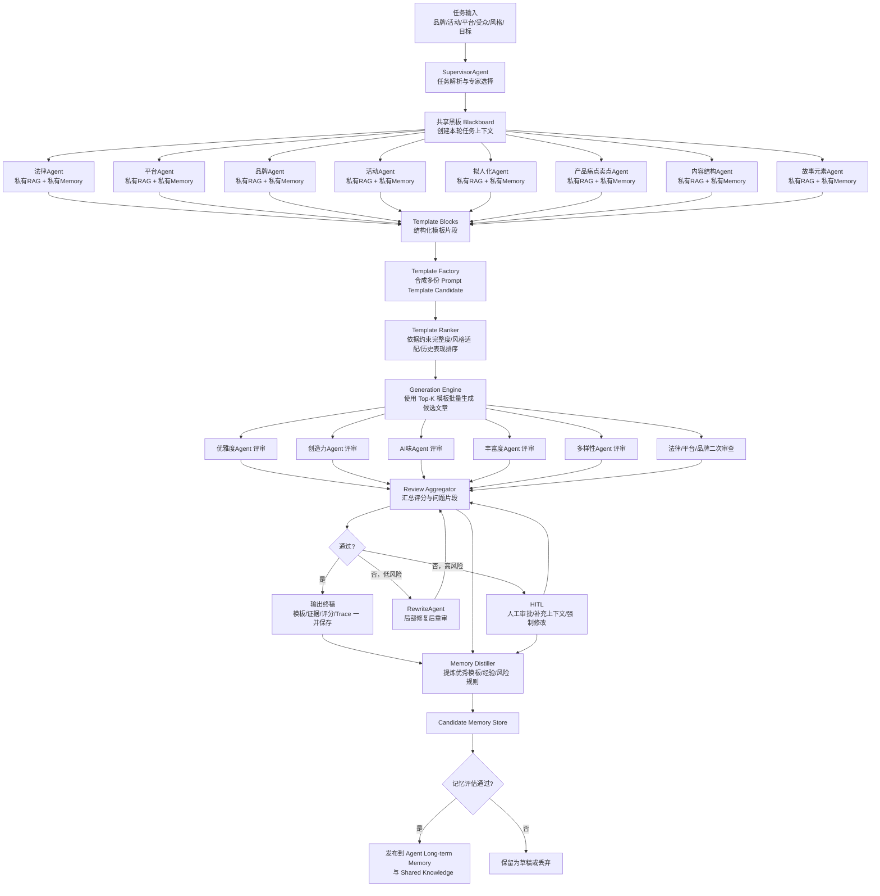
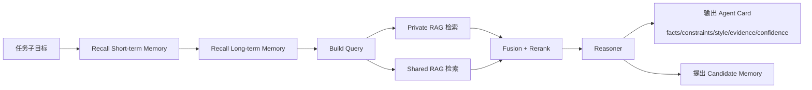

> DEVELOPER

我想要基于
编排：langchain+langraph+矢量数据库（milvus、qdrant、chroma差不多就这几个）+推理框架（vllm / ollama），把rag搞明白，尤其是embedding+rerank要知道细节。有能力再看看human in the loop 跟 guard rail.  
微调： 微调的模型参数，微调框架，数据格式，数据量要有理解，其次是微调框架，unsloth或者llamafactory  
协议：sse、websocket、http  
加分项：docker k8s git cursor langsmith autogen… 

这些技术开发一个项目用于面试，不要玩具级的，你有什么建议

> DEVELOPER

我想要基于
编排：langchain+langraph+矢量数据库（milvus、qdrant、chroma差不多就这几个）+推理框架（vllm / ollama），把rag搞明白，尤其是embedding+rerank要知道细节。有能力再看看human in the loop 跟 guard rail.  
微调： 微调的模型参数，微调框架，数据格式，数据量要有理解，其次是微调框架，unsloth或者llamafactory  
协议：sse、websocket、http  
加分项：docker k8s git cursor langsmith autogen… 

这些技术开发一个项目用于面试，不要玩具级的，你有什么建议

> DEVELOPER

我想要基于
编排：langchain+langraph+矢量数据库（milvus、qdrant、chroma差不多就这几个）+推理框架（vllm / ollama），把rag搞明白，尤其是embedding+rerank要知道细节。有能力再看看human in the loop 跟 guard rail.  
微调： 微调的模型参数，微调框架，数据格式，数据量要有理解，其次是微调框架，unsloth或者llamafactory  
协议：sse、websocket、http  
加分项：docker k8s git cursor langsmith autogen… 

这些技术开发一个项目用于面试，不要玩具级的，你有什么建议

> AGENT

我先按“面试可讲清楚、又能覆盖你列的技术栈”这个目标，帮你筛一个不玩具化的项目方向，再结合官方文档核对一下 LangGraph、向量库、vLLM/Ollama、微调框架这些组合的落地边界，最后给你一个能直接开干的方案。

> AGENT

我在补齐几个关键边界：一是 RAG 里 dense/sparse/rerank 的检索链路，二是 LangGraph 的 human-in-the-loop 实现方式，三是 vLLM/Ollama 和微调框架在项目里的角色分工。这样给你的建议就不会停留在“堆名词”。

> AGENT

按我在 2026-04-17 查到的官方文档能力边界和工程经验看，最适合你做成“面试能打”的，不是通用 `PDF Chatbot`，而是一个有业务闭环的项目：

**推荐项目**
`AI SRE / 企业工单处置 Copilot`

它的核心不是“问答”，而是“检索 + 判断 + 执行建议 + 审批 + 追踪”。比如：

- 接入 `K8s`/服务文档、Runbook、历史故障单、FAQ、告警样例、PRD/变更记录
- 用户贴一段日志、告警、报错，系统先做意图识别，再走 `hybrid retrieval`
- `dense embedding + sparse/BM25` 召回，之后 `rerank`
- 生成带引用的排障建议、根因候选、下一步动作
- 高风险动作比如“执行脚本 / 关停服务 / 发通知 / 创建工单”必须 `human in the loop`
- 做 `guardrails`：提示注入检测、敏感信息脱敏、危险工具白名单、输出 schema 校验
- 有管理后台看 trace、检索命中、rerank 分数、人工审批记录、延迟和失败原因

这类项目一口气把你想讲的东西几乎都串起来了，而且不玩具。你面试时能讲“为什么这么设计”，不是只讲“我把库连起来了”。

**我建议的技术路线**
- 编排：`LangGraph` 做主流程，`LangChain` 只做模型/向量库/loader 适配。面试里这会显得你知道“图式状态机”比普通 chain 更适合生产。
- 向量库：我会优先选 `Qdrant`。这是我的工程判断，不是官方排名。原因是它现在对 `hybrid / multi-stage query / RRF / rerank` 的表达很顺。`Milvus` 更适合你强调规模化和分布式，但它的 BM25 内建能力官方文档写明 `Milvus Lite` 还不支持。`Chroma` 更适合本地 baseline 或 ablation，不建议当最终主角。
- 推理：本地开发用 `Ollama`，部署演示用 `vLLM`。这样你能同时讲“本地快速迭代”和“生产式 OpenAI-compatible serving”。`vLLM` 现在不只是 chat/completions，也支持 embedding 和 rerank/score 相关接口；但它只管推理，不管上层 RAG 编排。
- 协议：`HTTP` 做普通 API，`SSE` 做回答流式输出，`WebSocket` 做长任务状态、审批交互、实时 agent event。不要为了炫技把所有接口都做成 websocket。
- 观测：接 `LangSmith`，把每次 query 的 trace、tool call、retrieval latency、rerank 结果都挂上去。
- 部署：本地 `docker compose`，线上给一套 `K8s manifests/Helm`，把 `GPU 推理服务` 和 `CPU 应用服务` 分开。

**RAG 里你要重点讲清楚的点**
- `embedding` 不是越大越好，重点是“你的相似性定义对不对”。领域术语多、关键词强的场景，单 dense 往往不够，所以要 `dense + sparse/BM25`。
- 典型链路可以是：`query rewrite -> dense topK + sparse topK -> RRF 融合 -> rerank topN -> context packing -> answer`
- `rerank` 不要全库跑，只对召回候选跑。常见是先召回 30-100，再 rerank 到 5-10。
- chunk 不要只按固定长度切。要保留 `title / section / product / version / source` 这些 metadata，表格、FAQ、runbook 步骤最好单独切分。
- 一定做评测集。面试时拿出 `Recall@K / MRR / nDCG / groundedness / citation precision / p95 latency`，说服力会非常强。
- 最重要的一句：`知识更新优先靠 RAG，不要靠 SFT 硬塞知识`。微调更适合改“输出风格、结构化格式、分类、query rewrite、tool routing”，不是拿来替代知识库。

**微调怎么放进项目里**
- 第一优先不是微调主聊天模型，而是先把 `retrieval evaluation` 跑通。
- 如果要微调，我建议顺序是：
1. 先做一个小型 `SFT`，让模型学会输出标准化排障结论/工单摘要/RCA 模板
2. 再尝试微调 `embedding` 或 `reranker`，因为这对 RAG 提升往往更直接
3. 最后再碰更复杂的偏好优化
- `Unsloth` 适合你快速本地迭代，尤其是显存有限时；它文档里对 LoRA/QLoRA 和 embedding/reranker fine-tuning 讲得比较直接。
- `LLaMA-Factory` 更适合你做“可展示的工程化训练平台”，因为它覆盖 SFT、DPO、QLoRA、数据格式、vLLM 部署这些都更完整。
- 数据量上，官方没有统一万能值。`Unsloth` 文档给的经验是最少约 100 条、1000+ 更靠谱；我的工程建议是：`SFT` 先准备 1k-3k 条高质量样本，`reranker/embedding` 先准备几百到几千组 query-positive-negative，外加一套独立评测集。

**HITL 和 Guardrails 该怎么讲**
- `LangGraph interrupt` 很适合做审批流，但有个面试很好讲的细节：恢复时节点会从头执行，所以 `interrupt` 前的外部副作用要么后移，要么做幂等。
- guardrail 分两层：
- 确定性：敏感词、PII 脱敏、命令白名单、namespace 限制、输出 JSON schema 校验
- 模型式：提示注入检测、危险建议判别、低置信度回答拦截
- 真正像生产的项目，一定要有“拒答、升级人工、要求补充信息”这三种分支，而不是永远给答案。

如果你时间有限，我会建议你只做这一条主线，不要同时把 `LangGraph` 和 `AutoGen` 都做成运行时框架。`AutoGen` 最多拿来做对比实验或者合成数据，不要让主系统变复杂。

你要是愿意，我下一条可以直接给你一份“这个项目的 repo 目录设计 + 技术选型表 + 6 周开发路线图”。

参考的官方资料主要是：[LangGraph HITL / interrupts](https://docs.langchain.com/oss/python/langgraph/human-in-the-loop)、[LangChain guardrails](https://docs.langchain.com/oss/python/langchain/guardrails)、[Qdrant hybrid queries](https://qdrant.tech/documentation/concepts/hybrid-queries/) 与 [hybrid search + rerank 教程](https://qdrant.tech/documentation/advanced-tutorials/reranking-hybrid-search/)、[Milvus hybrid search](https://milvus.io/docs/hybridsearch.md) 与 [reranking](https://blog.milvus.io/docs/reranking.md)、[Chroma overview](https://docs.trychroma.com/docs/overview/introduction)、[vLLM OpenAI-compatible server](https://docs.vllm.ai/serving/openai_compatible_server.html) 与 [pooling / rerank](https://docs.vllm.ai/en/stable/models/pooling_models/)、[Ollama embeddings](https://docs.ollama.com/capabilities/embeddings)、[Unsloth datasets guide](https://unsloth.ai/docs/get-started/fine-tuning-llms-guide/datasets-guide) 与 [LoRA guide](https://docs.unsloth.ai/get-started/fine-tuning-guide/lora-hyperparameters-guide)、[LLaMA-Factory README](https://github.com/hiyouga/LLaMA-Factory) 和 [data preparation](https://llamafactory.readthedocs.io/en/latest/getting_started/data_preparation.html)。

> DEVELOPER

# Files mentioned by the user:

## RAAP 中 RLAIF 与 RLHF 训练技术方案.docx: /Users/lyston/Downloads/RAAP 中 RLAIF 与 RLHF 训练技术方案.docx

## My request for Codex:
你查看lyston/raap

> TOOL

<turn_aborted>
The user interrupted the previous turn on purpose. Any running unified exec processes may still be running in the background. If any tools/commands were aborted, they may have partially executed.
</turn_aborted>

> DEVELOPER

# Files mentioned by the user:

## RAAP 中 RLAIF 与 RLHF 训练技术方案.docx: /Users/lyston/Downloads/RAAP 中 RLAIF 与 RLHF 训练技术方案.docx

## My request for Codex:
你查看lyston/raap项目并且看看这个技术方案

> AGENT

我先去把 `lyston/raap` 的项目结构和你提到的 `RAAP 中 RLAIF 与 RLHF 训练技术方案.docx` 一起过一遍，先判断这个项目现在做到哪一层、方案和代码之间对不对得上。

> AGENT

我已经确认 `raap` 是个多模块项目，不是单服务小仓库。下一步我会抓三块内容：整体架构入口、和训练/对齐相关的代码或文档、以及 `.docx` 里的方案正文，再把它们对照起来。

> AGENT

项目里和 `RLHF / LangGraph / Qdrant / Ollama` 相关的痕迹已经有了，而且不只是概念设计，像 `user-memory`、`orchestrator`、`gw` 这些模块里已经能看到对应的实现线索。我继续把文档正文抽出来，再缩小到最关键的几个文件看。

> AGENT

我这边已经确认两件事：一是 `raap` 里确实有 `RLHF` 的数据模型、统计和管理端页面；二是 `docs` 目录里还有几份和你这个方案高度相关的设计文档。接下来我按这条线看：

- 先抓项目入口和服务边界，弄清 `GE / AE / orchestrator / gw / generation-experts` 分别负责什么
- 再读你这份 `RLAIF / RLHF` 方案的关键章节，提炼它想新增的闭环
- 最后对照现有代码，给你一个“已经有、缺什么、下一步怎么落地”的判断

> AGENT

文档线索很明显：`docs` 里已经在讨论 `LangGraph 自校验` 和 `审核 Agent + RLHF`，所以我现在转到代码层看“这些方案是不是已经部分落地了”，尤其盯 `orchestrator / generation-experts / gw / admin`。

> AGENT

代码里目前看起来，`RLHF` 已经不是 PPT 概念了，至少“生成成功后自动建待审核记录、后台做人工标注和统计”这一层已经在。我要再确认的是更深一层：有没有真正走到“用反馈反推 GE/AE 配置”的闭环，还是现在还停留在审核台账。

> AGENT

我基本能看到方案和代码的分界线了：当前仓库已经把“可人工审核、可做校准、可记录 trace 和评分上下文”铺好了，但“自动产出新版本规则/语料并验证发布”的训练执行层还不明显。我再补一轮，专门找有没有训练任务、版本化和验证流水。

> AGENT

有个很清楚的结论在浮出来：这套 `raap` 更像“内容生成 + 审核治理 + 人工校准平台”，不是以 `RAG/向量检索` 为主线的项目。它更强的是 `GE/AE` 的 Prompt 编译、审核 trace、人工反馈和规则治理。  
我再补一处和基础设施相关的确认：本项目里 `Qdrant/Ollama` 分别是在哪条链路上出现的，这样你能更准确判断它和你原来想做的面试方向差多少。

> AGENT

这套 `raap` 我看完后的判断是：它已经是一个比较像样的“内容生成 + 审核治理 + 人工校准”平台，不是玩具项目；但它目前**不是以 RAG 为核心**，也还**没真正落到参数级 RLHF/RLAIF 训练**。更准确地说，它现在最强的是 `Prompt/规则编排 + 审核 trace + 人工反馈闭环基础设施`。

**我看到的项目现状**
- `orchestrator` 是工作流编排中心，[README](/Users/lyston/raap/raap-service-orchestrator/README.md) 很简略，但代码里已经有 `RLHF` 数据模型、统计、trace 和任务调度。
- `generation-experts` 已经在用 `LangGraph`，不过当前图是线性的 `prepare -> load_rules -> assemble -> generate -> parse -> validate`，更像流程编排，不是你方案里那种带自校验重试的“反思型图”。入口在 [content_generation_expert.py](/Users/lyston/raap/raap-service-generation-experts/app/services/content_generation_expert.py)。
- `AG` 服务是对齐/治理层，负责 `BAN + Critic`，而且会把 `ge_use_corpus` 注入评分 prompt，这一点和你的方案是对得上的，见 [critic_service.py](/Users/lyston/raap/raap-service-ag/app/services/critic_service.py) 和 [expert_task_executor.py](/Users/lyston/raap/raap-service-orchestrator/app/scheduler/expert_task_executor.py)。
- `GW` 在 GE 生成成功后会自动创建 `RLHF` 待审核记录，这说明“人工反馈台账”已经接上主链路了，见 [job_service.py](/Users/lyston/raap/raap-service-gw/app/services/job_service.py)。
- 后台前端已经有 `RLHF 分析`、审核页、校准工作台，路由在 [core.ts](/Users/lyston/raap/raap-admin-frontend/apps/raap-admin/src/router/routes/core.ts)，校准页在 [calibration-workbench/index.vue](/Users/lyston/raap/raap-admin-frontend/apps/raap-admin/src/views/expert/calibration-workbench/index.vue)。
- `user-memory` 这条线里有 `Mem0 + pgvector`，也预留了 `Qdrant` 配置，但它是“用户记忆/向量记忆”能力，不是主业务 RAG 主线，见 [docker-compose.yml](/Users/lyston/raap/raap-service-user-memory/docker-compose.yml) 和 [mem0_service.py](/Users/lyston/raap/raap-service-user-memory/app/services/mem0_service.py)。
- 协议层面现在主要是 `HTTP + Dapr service invocation`，项目里确实有 `SSE`，比如 [llm-router proxy](/Users/lyston/raap/raap-service-llm-router/app/api/v1/endpoints/proxy.py) 和 [chat_test.py](/Users/lyston/raap/raap-service-user-memory/app/api/v1/endpoints/chat_test.py)。我快速扫了一遍，**没看到 WebSocket 落地**。

**你这份技术方案的核心意思**
我看了 [RAAP 中 RLAIF 与 RLHF 训练技术方案.docx](/Users/lyston/Downloads/RAAP 中 RLAIF 与 RLHF 训练技术方案.docx)。它的核心设计很清晰：
- `RLAIF`：AE 评分后，去优化 GE 的生文辅助语料
- `RLHF`：人工校准 AE 评分后，去优化 AE 的评分规则
- 两个闭环分离
- 关键数据结构是 `ge_use_corpus_json_data` 和 `ae_scoring_rules_json_data`
- 关键机制是 `mutability`、按专家维度聚合任务、人工审核、DRAFT/ACTIVE 版本、验证通过后发布、失败回滚

这个方案本身是有产品逻辑的，而且比“加个 like/dislike”成熟很多。

**最大的问题**
严格讲，这份方案里的“训练”不是传统意义的参数训练。它更像：
- `LLM-assisted prompt/rule optimization`
- `版本化规则治理`
- `基于反馈的数据闭环`

不是：
- `PPO / DPO / Reward Model`
- `LoRA / QLoRA`
- `参数更新后的模型发布`

这点面试里一定要说实话。否则别人一问 `reward model 怎么训、preference pair 怎么构造、policy update 用什么算法`，就会穿帮。

**方案和代码之间的差距**
- 我没在仓库里找到你方案里那些关键实体的落地，比如 `training_session`、`optimization_task`、`ge_corpus_assembly`、`rlaif_optimization_log`、`rlaif_validation_record`、`ge_use_corpus_json_data`、`ae_scoring_rules_json_data` 这些核心结构。
- 当前 `RLHF` 代码主要还是“人工审核记录 + 状态流转 + AI 总结标签/意见”，见 [rlhf_feedback.py](/Users/lyston/raap/raap-service-orchestrator/app/models/rlhf_feedback.py)、[rlhf_service.py](/Users/lyston/raap/raap-service-orchestrator/app/services/rlhf_service.py)、[rlhf_expert_service.py](/Users/lyston/raap/raap-service-ag/app/services/rlhf_expert_service.py)。
- `ExpertVersion` 现在有 `template_for_brief_output`、`template_for_score`、`kc_config`，这说明“版本化 prompt/语料”基础有了，但还不是你方案里那种可机器精修的结构化 JSON，见 [expert_version.py](/Users/lyston/raap/raap-service-orchestrator/app/models/expert_version.py)。
- `LangGraph` 自校验方案在文档里想得很完整，但代码里的 GE 图目前没有重试/回路/条件分支，只是线性编排。设计稿在 [DESIGN-生文LangGraph自校验方案.md](/Users/lyston/raap/docs/DESIGN-生文LangGraph自校验方案.md)。

**如果你要把它做成面试项目，我建议你这么讲**
- 不要把它讲成“RAG 项目”。
- 也不要把它讲成“我已经做了 RLHF 训练平台”。
- 最稳的表述是：`这是一个面向内容生成场景的 LLM 治理与反馈优化平台，核心是 GE/AE Prompt 编译、审核追踪、人工校准，以及面向规则/语料的闭环优化设计。`

**如果你想把它补强成更能打的面试版本**
- 第一优先：把方案里的 `RLAIF/RLHF 闭环执行层` 真落出来。也就是“生成候选新版本 -> 验证 -> 发布/回滚”。
- 第二优先：给 `AE/GE` 接一条真正的 `RAG` 线，把品牌规则、平台规范、活动信息、案例库放进向量检索，做 `hybrid retrieval + rerank`。这样你原来想讲的 `embedding/rerank/vector db` 才有主舞台。
- 第三优先：如果还想碰“真正的微调”，就补一个小型 `SFT/LoRA` 子项目，用于 `评分理由标准化` 或 `审核标签归因`，不要一开始就碰完整 `RLHF/PPO`。

一句话总结：`raap` 现在已经有很强的工程骨架，适合讲“多服务 LLM 平台、治理、反馈和版本化”；但你这份 `RLAIF/RLHF` 技术方案目前大概率还是“设计领先于实现”。这反而是好事，因为它给了你一个很清楚的下一阶段落地方向。

如果你愿意，我下一步可以直接帮你做两件事里的一个：
1. 把这个项目整理成一份“面试讲述稿 + 技术亮点 + 追问应答”
2. 按当前代码现状，拆一版“RLAIF/RLHF 最小可落地开发清单”

> DEVELOPER

不，我只是让你看看这个项目而已
你再根据这个项目看看怎么修改，把它改成我们需要的agent项目
采用：
编排：langchain+langraph+矢量数据库（milvus、qdrant、chroma差不多就这几个）+推理框架（vllm / ollama），把rag搞明白，尤其是embedding+rerank要知道细节。有能力再看看human in the loop 跟 guard rail.  
微调： 微调的模型参数，微调框架，数据格式，数据量要有理解，其次是微调框架，unsloth或者llamafactory  
协议：sse、websocket、http  
加分项：docker k8s git cursor langsmith autogen… 

这些技术开发

这个raap项目原本就是一个提示词训练生成文章的项目
我想要搞成多agent，每个agent都是一个ae（Expert），他们分别负责文章的某个模块，然后由总agent控制生文

<image>
</image>

> AGENT

我这次不往“评价项目”上走了，直接站在 `raap` 现有结构上，给你一版“怎么把它改成你要的多 Agent 生文系统”的改造方案。  
我会尽量沿用现在已有的服务边界，避免推倒重来，这样更像真实项目升级。

> AGENT

我已经抓到一个关键点了：`raap` 现在的 AE 更像“可版本化的 Prompt 片段编译器”，不是“会独立思考/检索/产出结构化结果”的 Agent。  
所以这次改造的本质，不是再加一个总控，而是把每个 AE 从 `template renderer` 升级成 `agent worker`，总控只做路由、协同和验收。

> AGENT

这个项目最适合的改法，不是另起一个新 `RAG Demo`，而是把现在的 `AE Runtime + GE 生成 + AG 审核` 升级成一套**多 Agent 生文系统**。

**核心判断**
现在 `raap` 的骨架其实很适合改：
- `orchestrator` 已经在做编排和 prompt 准备，见 [生文流程技术方案](/Users/lyston/raap/raap-service-orchestrator/docs/生文流程技术方案.md)
- `AE Runtime` 已经有 `expert / expert_version / ability_type_list` 这套抽象，见 [models.py](/Users/lyston/raap/raap-service-orchestrator/app/services/ae_runtime/models.py) 和 [ae_runtime_service.py](/Users/lyston/raap/raap-service-orchestrator/app/services/ae_runtime_service.py)
- `generation-experts` 已经在用 `LangGraph` 跑生成流程，见 [content_generation_expert.py](/Users/lyston/raap/raap-service-generation-experts/app/services/content_generation_expert.py)
- `AG` 已经承担审核/critic/RLHF 台账基础，见 [critic_service.py](/Users/lyston/raap/raap-service-ag/app/services/critic_service.py)
- `keyword-corpus` 本身就是知识库/语料中心，天然可以升级成 RAG 知识服务，见 [README.md](/Users/lyston/raap/raap-service-keyword-corpus/README.md)

所以最优路线是：**保留现有服务边界，升级 AE 的执行形态**。

**你要的目标形态**
把每个 AE 从“提示词片段生成器”改成“带检索、推理、结构化输出的专家 Agent”。

我建议把 Agent 分三类：

- `约束型 Agent`
  - 法律Expert
  - 平台Expert
  - 品牌Expert
  - 活动Expert
  - 产品痛点卖点Expert
  - 生活常识Expert

- `创作型 Agent`
  - 拟人化Expert
  - 内容结构Expert
  - 故事元素Expert
  - 创造力Expert
  - 文章优雅度Expert

- `评审型 Agent`
  - AI味Expert
  - 内容丰富度Expert
  - 人群多样性Expert
  - 以及前面的法律/平台/品牌也都保留 `review` 能力

再加两个总控角色：

- `SupervisorAgent`
  - 负责任务拆解、选哪些 Expert、控制执行顺序、决定是否重写/人工介入
- `WriterAgent`
  - 不自己瞎编，专门消费各 Expert 的结构化产物，负责成稿

**不要再让 AE 只吐 prompt**
这是这次改造最关键的一刀。

现在 AE 更像输出 `brief_output_text`。改造后每个 AE 应该输出统一结构，比如：

```json
{
  "expert_code": "brand_expert",
  "module_type": "constraint_and_material",
  "facts": ["品牌卖点1", "品牌禁忌2"],
  "must_include": ["A", "B"],
  "must_avoid": ["C", "D"],
  "style_hints": ["口吻要真实", "避免广告腔"],
  "evidence": [
    {
      "source_id": "kb_123",
      "chunk_id": "chunk_9",
      "text": "……",
      "score": 0.91
    }
  ],
  "confidence": 0.86,
  "missing_info": ["缺少活动细则"]
}
```

这样 `WriterAgent` 写作时吃的是“专家卡片”，不是一堆长 prompt。

**基于现有项目怎么改**
我建议这样改，而不是推翻：

- `raap-service-orchestrator`
  - 升级成 `LangGraph Supervisor`
  - 负责整条多 Agent 图
  - 先不要新开服务，先在这里加 `agent_graph/` 最稳

- `raap-service-keyword-corpus`
  - 升级成 `Knowledge Hub`
  - 负责文档导入、切块、metadata、向量化、检索 API
  - 你现有的品牌/活动/语料模板/图谱都继续保留

- `raap-service-generation-experts`
  - 保留，但角色从“直接生文服务”升级成 `WriterAgent + RewriteAgent`
  - 只负责大纲成稿、局部改写、最终润色

- `raap-service-ag`
  - 继续做 `Guardrails + Critic + RLHF/HITL`
  - 你现在的 BAN、critic、RLHF 审核页都能直接复用

- `raap-service-user-memory`
  - 保留做人设/用户画像/历史偏好记忆
  - 给拟人化、人群多样性、故事风格类 Agent 用

**LangGraph 怎么落**
这套项目非常适合用 `custom workflow + orchestrator-worker`。

图可以是：

1. `intake`
2. `task_parse`
3. `select_experts`
4. `parallel_retrieve_and_reason`
5. `merge_outline`
6. `writer_draft`
7. `parallel_review`
8. `judge`
9. `rewrite_or_hitl`
10. `finalize`

你这类场景特别适合 `LangGraph`，因为官方文档支持共享状态、条件边、并行节点和中断恢复。多分支并行这点很适合“多个 Expert 同时工作”。相关参考：[LangGraph Graph API](https://docs.langchain.com/oss/python/langgraph/graph-api)、[LangGraph workflow patterns](https://docs.langchain.com/oss/javascript/langgraph/workflows-agents)。

**RAG 要怎么嵌进去**
这里不要做“整篇文章共享一个检索结果”的伪 RAG。正确做法是：

- 每个 Expert 有自己的检索视角
  - 法律Expert 只检法律/禁词/平台规范
  - 品牌Expert 只检品牌手册/调性/禁用词
  - 活动Expert 只检活动玩法/时间/权益
  - 故事元素Expert 只检案例库/场景库/情绪模板

- 每条知识切块都要带 metadata
  - `expert_code`
  - `brand_id`
  - `activity_id`
  - `platform`
  - `doc_type`
  - `source`
  - `version`
  - `risk_level`

- 检索链建议固定成：
  - `query rewrite`
  - `dense topK`
  - `sparse/BM25 topK`
  - `fusion`
  - `rerank`
  - `topN evidence`

**向量库我建议优先 Qdrant**
不是因为别的不行，而是跟你这项目最贴。

原因：
- 你现有项目里已经有 `Mem0/Qdrant` 痕迹
- Qdrant 官方对 `hybrid + multi-stage query + rerank` 支持表达比较清楚
- 先做出来比 Milvus 省心

建议组合：
- 向量库：`Qdrant`
- dense embedding：中文优先 `bge-m3` 一类，或者本地走 `qwen3-embedding`
- sparse：`BM25`
- rerank：`bge-reranker-v2-m3` 或同类 cross-encoder

Qdrant 官方文档里对 `prefetch -> hybrid -> rerank` 这套链路写得很清楚，适合你把检索讲明白：[Hybrid Queries](https://qdrant.tech/documentation/concepts/hybrid-queries/)、[Hybrid Search with Reranking](https://qdrant.tech/documentation/advanced-tutorials/reranking-hybrid-search/)。

**embedding + rerank 你要重点改的点**
- chunk 不能只按字数切，要按“品牌规则/活动规则/案例段落/平台规范条款”切
- 每个 Expert 检索前先做 query 改写
- dense 解决语义，sparse 解决关键词硬约束
- rerank 只排候选集，不要全库排
- Writer 只能引用 rerank 后留下的 evidence，避免胡编

**推理框架怎么选**
- 本地开发：`Ollama`
- 稳定部署/压测：`vLLM`

这样最好讲：
- `Ollama` 方便本地跑生成和 embedding，官方也支持 embedding 接口：[Ollama Embeddings](https://docs.ollama.com/capabilities/embeddings)
- `vLLM` 适合统一暴露 OpenAI 风格接口，便于 LangChain/LangGraph 接入：[vLLM OpenAI-compatible server](https://docs.vllm.ai/en/latest/serving/openai_compatible_server/)

**HITL 和 Guardrail 怎么接**
这部分你现有项目有优势，别浪费。

建议：
- 把当前 RLHF 审核台改造成 `HITL 审批台`
- 触发人工介入条件：
  - 法律/平台 Agent 低置信度
  - 多个 Expert 结论冲突
  - 关键 claim 无证据
  - 最终稿 reviewer 不通过
  - 高风险活动文案

Guardrail 分两层：
- 确定性
  - 禁词
  - 品牌黑白名单
  - 平台硬规则
  - 输出 JSON schema
  - 引用不能为空
- 模型式
  - prompt injection 检测
  - claim-grounding 检测
  - AI味检测
  - 幻觉/编造来源检测

LangChain 官方现在把 `guardrails` 和 `human-in-the-loop` 都做成了很清晰的 middleware/interrupt 模式，和你这个项目很适配：[Guardrails](https://docs.langchain.com/oss/python/langchain/guardrails)、[Human-in-the-loop](https://docs.langchain.com/oss/python/langchain/human-in-the-loop)。

**协议怎么安排**
建议别乱用：

- `HTTP`
  - 配置管理
  - 知识库 CRUD
  - 创建任务
  - 查询结果

- `SSE`
  - Agent 图执行流
  - token 流式输出
  - 每个节点状态更新
  - 你项目里已经有 SSE 基础了

- `WebSocket`
  - 多人协作审核
  - HITL 实时审批
  - 前端 Agent 看板实时事件
  - 这个项目现在基本没看到 WS，后面补

**微调怎么放进项目才合理**
不要一上来微调整个生文大模型。这个项目更适合分层微调：

- 第一层：先不微调主模型，先把 RAG + 多 Agent 跑通
- 第二层：微调小任务模型
  - Outline/Planner SFT
  - Critic 理由生成 SFT
  - Rewrite 风格统一 SFT
- 第三层：做偏好训练
  - 好稿/差稿对
  - reviewer pairwise 选择
  - 用 DPO/偏好学习改 `WriterAgent` 或 `ReviewerAgent`

推荐工具：
- 快速实验：`Unsloth`
- 工程化展示：`LLaMA-Factory`

按官方文档：
- Unsloth 数据最低建议 100 条，实际更建议 1000+；LoRA/QLoRA 起步学习率常用 `2e-4`，epoch 常从 `1-3` 起试：[Unsloth datasets guide](https://docs.unsloth.ai/basics/datasets-guide)、[LoRA hyperparameters guide](https://docs.unsloth.ai/get-started/fine-tuning-guide/lora-hyperparameters-guide)
- LLaMA-Factory 支持 `SFT / RM / PPO / DPO / KTO / QLoRA / vLLM API`，也支持 Alpaca/ShareGPT 数据格式：[LLaMA-Factory README](https://github.com/hiyouga/LLaMA-Factory)、[Data Preparation](https://llamafactory.readthedocs.io/en/latest/getting_started/data_preparation.html)

对你这个项目，数据可以这样组织：
- `planner_sft`
  - 输入：任务、品牌、活动、目标平台
  - 输出：大纲 JSON
- `writer_sft`
  - 输入：outline + evidence cards
  - 输出：正文
- `critic_sft`
  - 输入：文章 + rubric
  - 输出：分数 + 理由 + 问题片段
- `writer_preference`
  - 输入：同题双稿
  - 输出：chosen / rejected

**你这个截图里的 Expert，我建议这样转**
按“生成”和“评审”分层：

- 生成型
  - 活动Expert
  - 拟人化Expert
  - 产品痛点卖点Expert
  - 内容结构Expert
  - 生活常识Expert
  - 故事元素Expert

- 约束型
  - 法律Expert
  - 平台Expert
  - 品牌Expert

- 评审型
  - 文章优雅度Expert
  - 创造力Expert
  - AI味Expert
  - 内容丰富度Expert
  - 人群多样性Expert

执行上：
- 先约束型并行检索和出卡片
- 再生成型并行出素材卡片/段落建议
- WriterAgent 合稿
- 最后评审型并行评分
- 不过则 RepairAgent 局部改写

**最小改造路径**
如果你想少走弯路，我建议分 3 期：

1. `Prompt AE -> Agent AE`
- 扩展 `expert_version`，增加 `agent_role / retrieval_profile / output_schema / tools_config`
- 每个 AE 输出结构化 card，不再只出 prompt 文本

2. `知识库 -> RAG`
- 把 `keyword-corpus` 升级成 chunk + metadata + vector index
- 每个 AE 独立检索
- 接 `dense + sparse + rerank`

3. `单轮生成 -> 多 Agent 图`
- 在 `orchestrator` 里上 LangGraph
- 加并行专家、review loop、HITL 中断
- 最后再补微调与 LangSmith

**一句话结论**
这个项目不用推倒重做，最值钱的改法是：

`保留 raap 的服务边界，把 AE 从“模板专家”升级成“可检索、可推理、可评分的专家 Agent”，再用 LangGraph 在 orchestrator 上做 supervisor-worker 多 Agent 生文闭环。`

如果你要，我下一条可以直接给你一版：
- `新表设计`
- `服务改造清单`
- `LangGraph 状态机`
- `每个 Expert 的输入输出 schema`
这四样我可以按你这个 `raap` 仓库直接往下拆。

> DEVELOPER

在PycharmProjects项目下新建一个raap文件夹
将方案写在里面

> AGENT

我先在 `PycharmProjects` 下确认一下目标目录是否已存在，然后直接把“基于现有 RAAP 改造成多 Agent + RAG + HITL + 微调能力”的方案落成一个文档放进去。

> AGENT

我准备直接落一个 `README.md`，内容会按“现状复用、目标架构、服务改造、Agent 分工、RAG/HITL/微调、分期落地”来写，方便你后面继续展开成正式项目文档。

> AGENT

文档已经落好了。我再快速检查一下目录和文件内容，顺手把行号拿出来，方便你后面继续追加细化。

> AGENT

已在 `PycharmProjects` 下新建 `raap` 目录，并把完整方案写进了 `README.md`。文档覆盖了目标定位、现有 RAAP 复用点、多 Agent 分层、专家划分、LangGraph 工作流、RAG 设计、Embedding/Rerank、推理框架、HITL、Guardrail、微调思路、数据模型改造和分期落地建议【F:/Users/lyston/PycharmProjects/raap/README.md†L1-L523】。

你现在可以直接从这个文件继续往下拆实现。如果你要，我下一步可以继续帮你把这份方案细化成“表设计 + 服务改造清单 + LangGraph 状态图 + API 草案”。

> DEVELOPER

给我说一下你的想法，你觉得的技术实现

> AGENT

我现在的核心想法，已经先落到方案文档里了【F:/Users/lyston/PycharmProjects/raap/README.md†L46-L89】。如果一句话概括，就是：

**不要把 RAAP 改成“一个更大的 Prompt 工程”，而是把它改成“一个有状态、有检索、有评审闭环的多 Agent 系统”。**

**我的判断**
现在这个项目最有价值的地方，不是重新搭一个新框架，而是它已经有：
- 编排中心
- 生成服务
- 审核服务
- 语料中心
- 记忆服务
- 人工审核台

所以最好的技术实现，不是推倒重来，而是把现有 `AE` 从“模板专家”升级成“专家 Agent”。

**我会怎么做**
第一步，我会把每个 Expert 的输出从长文本 Prompt 改成**结构化专家卡片**。这件事是整个改造的核心，因为如果 Expert 还是只会吐 prompt，系统最后一定又退回成“Prompt 拼接工程”。我希望每个 Expert 输出统一 schema，比如事实、约束、建议结构、证据、置信度、缺失信息，这样总控和 Writer 才能真正消费它们【F:/Users/lyston/PycharmProjects/raap/README.md†L135-L163】。

第二步，我会在 `orchestrator` 上用 `LangGraph` 做真正的总控图，而不是只做线性流程。图大概会是：
- `task_parse`
- `select_experts`
- `parallel expert retrieve/reason`
- `merge_outline`
- `writer_draft`
- `parallel_review`
- `judge`
- `rewrite_or_hitl`
- `finalize`

这样做的好处是，系统既能并行跑多个 Expert，又能在低置信度、规则冲突、证据不足时走重试或人工介入，而不是一次生成到底【F:/Users/lyston/PycharmProjects/raap/README.md†L165-L197】。

**RAG 我会怎么接**
我不建议做“全局一个检索器，所有 Expert 共用”。我更倾向于**每个 Expert 有自己的检索视角**：
- 法律 Expert 只查法律和禁词
- 平台 Expert 只查平台规范
- 品牌 Expert 只查品牌手册
- 活动 Expert 只查活动规则
- 故事/结构/拟人化 Expert 只查案例库和风格库

技术上我会优先选 `Qdrant`，因为它更适合快速做 `metadata filter + hybrid retrieval + rerank`。链路我会固定成：
- query rewrite
- dense retrieval
- sparse/BM25 retrieval
- fusion
- rerank
- evidence packing

重点不是“有向量库”就够了，而是要把 `embedding + rerank` 真讲明白：为什么 dense 不够，为什么要 sparse，为什么 rerank 只排候选集，为什么 Writer 只能使用带证据的结果【F:/Users/lyston/PycharmProjects/raap/README.md†L199-L281】。

**服务层我会这样分工**
- `raap-service-orchestrator`
  - 变成 `SupervisorAgent` 所在地
  - 管 LangGraph 状态、任务分发、路由、重试、HITL
- `raap-service-keyword-corpus`
  - 变成知识中心
  - 管文档导入、切块、metadata、embedding、检索 API
- `raap-service-generation-experts`
  - 变成 `WriterAgent/RewriteAgent`
  - 专门负责成稿和局部改写
- `raap-service-ag`
  - 做 `Reviewer + Guardrails`
  - 管合规、质量、AI 味、标签、HITL 辅助
- `raap-service-user-memory`
  - 给拟人化、人群、多样性、风格偏好提供记忆

也就是说，我不会让所有 Agent 都“自由对话”，而是让它们在一个**受控状态机**里各自产出标准结果。

**协议上我的取舍**
- `HTTP` 做任务创建、配置管理、知识库管理
- `SSE` 做执行流、节点进度、流式输出
- `WebSocket` 只留给 HITL 审批和多用户协作

因为你这个项目当前已经有 SSE 基础，所以我会先把 SSE 做完整，WebSocket 放到第二阶段【F:/Users/lyston/PycharmProjects/raap/README.md†L304-L332】。

**HITL 和 Guardrail**
这块我觉得 RAAP 反而有优势，因为原来就有 RLHF 审核台。我会直接把它升级成 `HITL 工作台`：
- Expert 冲突时进人工
- 法律/平台低置信度时进人工
- 无证据输出时进人工
- Reviewer 判高风险时进人工

Guardrail 我会分两层：
- 确定性：禁词、黑白名单、schema 校验、引用校验
- 模型式：prompt injection、幻觉、AI 味、grounding 检测【F:/Users/lyston/PycharmProjects/raap/README.md†L334-L373】

**微调怎么放**
我不建议一开始就碰完整 RLHF。这个项目更适合先做三类小模型能力：
- Planner SFT
- Writer SFT
- Critic SFT

本地实验用 `Unsloth`，工程化训练用 `LLaMA-Factory`。数据上我会先准备：
- 1k 到 3k 条 Planner/Writer/Critic SFT
- 500 到 2k 对偏好数据
- 一套独立检索评测集

也就是说，微调是加分项，不是第一阶段主线【F:/Users/lyston/PycharmProjects/raap/README.md†L375-L425】。

**我最看重的实现原则**
- Expert 必须结构化输出，不能只吐 prompt
- RAG 必须按 Expert 分视角，不能一个检索器包打天下
- 总控要用图编排，不要用多 Agent 自由聊天
- Writer 必须基于 evidence 写，不允许裸生成
- 审核要能阻断、回滚、人工接管
- 微调要服务明确子任务，不要一上来训“大一统主模型”

如果我来带这个项目，我会先做一个最小 MVP：
- 法律 Expert
- 平台 Expert
- 品牌 Expert
- 活动 Expert
- 内容结构 Expert
- 故事元素 Expert
- 1 个 WriterAgent
- 1 个 ReviewerAgent
- 1 个 SupervisorAgent

这个组合最容易跑通，也最适合面试演示【F:/Users/lyston/PycharmProjects/raap/README.md†L466-L523】。

如果你愿意，我下一步可以直接给你一版更落地的东西：
- 新表设计
- 新接口设计
- LangGraph `State` 定义
- 每个 Expert 的输入输出 schema
- 第一阶段开发顺序

> DEVELOPER

我需要每个agent都带自己的rag功能，记忆功能，并且文章语料信息在我为给他们之后她们能自我沉淀积累
多agent一起进行文章训练产出文章

> AGENT

如果你要的是“**每个 Agent 都有自己的 RAG、自己的记忆，还能在你持续喂文章语料后自己沉淀积累**”，那我会把系统改成一套：

**私有 RAG + 私有记忆 + 共享黑板 + 受控沉淀** 的多 Agent 架构。

这和我前面写进方案里的“总控 + ExpertAgent + Writer + Reviewer + 分视角 RAG”是一致的【F:/Users/lyston/PycharmProjects/raap/README.md†L46-L89】【F:/Users/lyston/PycharmProjects/raap/README.md†L165-L281】。

**我的核心想法**
不是让所有 Agent 共用一个知识库和一份上下文，而是：

- 每个 Agent 有自己的知识视角
- 每个 Agent 有自己的短期记忆和长期记忆
- 多个 Agent 不直接乱聊，而是往一个“共享黑板”里写结构化卡片
- 总控 Agent 负责调度、合并、裁决、重写、人工介入
- 沉淀不是“直接把结果写回库里”，而是走“候选记忆 -> 评估 -> 发布”流程

这个最后一点特别重要。  
如果让 Agent 直接自我学习、直接修改知识库，系统很快会被幻觉和低质量样本污染。

**我会怎么实现**

1. 每个 Agent 做成一个独立子图，不只是一个 prompt

每个 Agent 自己内部都有一条小工作流：

- `understand_task`
- `build_query`
- `retrieve_private_kb`
- `retrieve_shared_kb`
- `rerank`
- `reason`
- `write_agent_card`
- `reflect_and_propose_memory`

也就是说，法律 Agent、品牌 Agent、故事 Agent、结构 Agent，不是只吃上下文吐文字，而是都走一遍自己的检索、推理、输出和反思。

2. 每个 Agent 有 4 类“记忆”

我建议拆成四层，不要混在一起：

- `working memory`
  - 当前任务上下文，放 LangGraph state/Redis
- `episodic memory`
  - 这次任务里它做过什么、踩过什么坑，放 Postgres
- `semantic memory`
  - 沉淀出来的规则、案例、可复用经验，放 Qdrant
- `preference memory`
  - 用户/品牌/平台偏好，放 MySQL 或 user-memory 服务

比如：
- 品牌 Agent 的 semantic memory 是品牌调性、常用表达、禁用表达、成功稿件模式
- 法律 Agent 的 semantic memory 是高风险句式、常见违规模式、误判修正规则
- 故事 Agent 的 semantic memory 是高表现开头、转折结构、结尾模式

3. RAG 也分“私有”和“共享”

我不会只建一个大库。

建议这样分：

- `shared_kb`
  - 品牌、活动、平台、产品、案例的公共知识
- `agent_private_kb`
  - 每个 Agent 自己沉淀的知识
- `memory_kb`
  - 任务后反思提炼出的可复用经验

检索时每个 Agent 都先查自己的私有库，再查共享库，然后融合、rerank。

比如：
- 品牌 Agent：先查 `brand_agent_private_kb`，再查 `shared_brand_kb`
- 故事 Agent：先查 `story_agent_private_kb`，再查 `case_library_kb`
- 法律 Agent：先查 `legal_agent_private_kb`，再查 `legal_rule_kb`

4. 用“共享黑板”让多 Agent 协作

我比较推荐 blackboard 模式。

每个 Agent 最终不是直接改文章，而是往黑板写一张结构化卡片：

```json
{
  "agent": "brand_expert",
  "facts": [],
  "constraints": [],
  "must_include": [],
  "must_avoid": [],
  "outline_suggestions": [],
  "evidence": [],
  "confidence": 0.91
}
```

然后：

- `SupervisorAgent` 读所有卡片
- `WriterAgent` 基于卡片写初稿
- `ReviewerAgents` 再基于文章和卡片打分
- `RepairAgent` 只改有问题的段落

这样系统可控，而且特别适合 trace 和面试展示。

5. 文章语料的“自我沉淀积累”要走受控流程

你说的这个能力我很认同，但实现上必须保守一点。

我会做三层：

- `raw observations`
  - 原始执行日志、命中文档、生成稿、评分、人工修改
- `candidate memories`
  - 反思服务提炼出的候选经验
- `published memories`
  - 通过评估后正式进入长期记忆

晋升条件我会设成：
- reviewer 分数够高
- 有证据支撑
- 没触发合规风险
- 人工采纳或自动评估通过
- 多次任务重复出现

也就是说，不是一次生成成功就写进长期记忆，而是让系统先“提案”，再“验证”，再“发布”。

6. 多 Agent 一起“训练产出文章”，我会拆成两条线

一条是在线生产线：
- 用户下发任务
- 多 Agent 检索与协作
- 写稿
- 评审
- 修复
- 输出终稿

另一条是离线训练线：
- 把高质量任务 trace 变成数据
- 生成 planner/writer/reviewer 的 SFT 数据
- 生成 preference pair
- 定期微调小模型
- 把结果回灌到 Agent 能力里

也就是说：
**知识更新靠 RAG/记忆，能力更新靠微调。**
这两件事不要混。

**技术栈我会这样落**
- 编排：`LangGraph` 做总控图和每个 Agent 子图
- Agent 封装：`LangChain` Runnable/Tool
- 向量库：`Qdrant` 优先
- embedding：中文优先 `bge-m3` 这类
- rerank：`bge-reranker-v2-m3` 或同类 cross-encoder
- 推理：本地 `Ollama`，线上 `vLLM`
- 短期记忆：`Redis`
- 长期记忆元数据：`Postgres/MySQL`
- 长期语义记忆：`Qdrant`
- 观测：`LangSmith`
- 人工审批：现有 RLHF 台升级成 HITL 台

**我认为最关键的 3 个工程点**
- 每个 Agent 都必须有自己的检索策略和记忆空间
- 沉淀必须走“候选 -> 评估 -> 发布”，不能直接自写知识库
- 多 Agent 协作要靠结构化黑板，不要靠自由聊天

如果按这个方向做，这个项目就不是“多几个 prompt”，而是真正的：
**会学习、会积累、会协作的多 Agent 内容生产系统。**

如果你愿意，我下一步可以直接把这个能力拆成非常落地的 3 份设计：
1. 每个 Agent 的 `RAG + Memory` 数据结构
2. LangGraph 的总控状态机
3. “语料喂入 -> 自我沉淀 -> 发布记忆”的完整流程图

> DEVELOPER

就是所有agent都聊好之后生成很多份提示词模板，主要是涉及到文章生成可能要求很多不同的描述风格等
然后在根据这些产生的模板统一去进行真正的文章生成产出

> AGENT

对，这个方向我认可，而且我觉得应该做成**两阶段架构**，不要让多 Agent 直接一起“拼出最终文章”。

**我的想法**
第一阶段不是写文章，而是让所有 Agent 先“聊清楚”，产出很多份**提示词模板候选**。  
第二阶段再拿这些模板，统一去跑真正的文章生成。

这样比“多 Agent 直接共写一篇文”更稳，因为文章生成里最难控的其实是：
- 风格
- 结构
- 约束一致性
- 平台适配
- 品牌/法律边界

所以 Agent 更适合先做“模板规划”和“模板协商”，Writer 再做真正生成。

**我会怎么实现**
我会把流程拆成 5 步：

1. `多 Agent 讨论阶段`
- 每个 Agent 先用自己的 RAG 和记忆拿材料
- 然后不是自由聊天，而是输出结构化结果
- 例如：品牌 Agent 出品牌调性模板，平台 Agent 出平台语气模板，故事 Agent 出叙事模板，结构 Agent 出段落模板

2. `模板工厂阶段`
- Supervisor 把所有 Agent 的结果合并
- 生成多份 prompt template candidate
- 每份模板都带明确标签：`风格`、`结构`、`约束`、`适用场景`、`目标人群`

3. `统一生成阶段`
- 不直接拿“聊天记录”去写文
- 而是拿“模板 + facts/evidence pack + 用户任务参数”去生成
- 一次可以批量产出多篇候选文章

4. `评审筛选阶段`
- Reviewer Agents 对多篇候选文打分
- 维度包括合规、品牌一致性、AI 味、丰富度、优雅度、多样性
- 再选最优稿或触发局部重写

5. `沉淀记忆阶段`
- 不是把整篇文章直接记住
- 而是沉淀：
  - 高质量模板
  - 高表现开头/结尾模式
  - 高风险表达
  - 品牌常用表达
  - 平台适配规律

**关键技术点**
我觉得最重要的不是“Agent 聊天”，而是这 3 件事：

- `模板要结构化`
不要让 Agent 输出一大段 prompt，而是输出模板片段，比如：
`opening_style`、`tone_rules`、`story_arc`、`must_include`、`must_avoid`

- `生成和规划要分离`
多 Agent 负责“规划模板”，Writer 负责“真正生成”
这样后面你才方便做批量生成、AB test、回溯和训练

- `模板也要有记忆和评分`
每个 Agent 不只是记知识，还要记：
  - 这个模板过去在哪些任务效果好
  - 哪种风格在哪个平台更容易通过
  - 哪些模板容易触发 AI 味或违规

**我建议的数据结构**
至少要有 4 类对象：

- `AgentCard`
每个 Agent 的本轮输出，包含事实、约束、风格建议、证据

- `TemplateBlock`
某个 Agent 贡献的一段模板能力，比如“品牌调性块”“故事开头块”

- `PromptTemplateCandidate`
由 Supervisor 合成后的完整模板候选

- `GenerationRun`
真正拿模板去生成文章的执行记录和评分结果

**为什么这种方案适合你**
因为你现在这个 RAAP 本来就不是纯聊天项目，而是“提示词训练生成文章”的项目。  
所以升级方向最自然的不是 `AutoGen 式互聊到底`，而是：

**多 Agent 先把 prompt/template 这层做厚，再统一生成文章。**

这会让你特别容易讲清楚：
- 为什么需要多 Agent
- 为什么每个 Agent 都要有自己的 RAG
- 为什么记忆不是存聊天，而是存“高质量模板经验”
- 为什么最终生成要统一走一个 Writer/Generator

**我会提醒你的一个风险**
不要让所有 Agent 一直互聊。  
那样会出现：
- 信息越来越脏
- 冲突越来越多
- 上下文爆炸
- 最后还是一锅 prompt

我更推荐：
- 并行检索
- 限轮讨论
- 结构化提交
- 总控合并
- 再统一生成

这个方向和我前面写进方案里的“Supervisor + ExpertAgent + Writer + Reviewer + RAG + 模板化输出”主线是一致的【F:/Users/lyston/PycharmProjects/raap/README.md†L46-L197】。

如果你愿意，我下一步可以直接给你画一版非常落地的：
1. 多 Agent 模板协商流程图
2. 每个 Agent 的输入输出 JSON
3. 模板库表设计
4. 最终文章生成链路设计

> DEVELOPER

你设计一下整体的框架agent架构，给我一个流程图

> AGENT

我会把它设计成一套 **“总控编排 + 专家 Agent 集群 + 模板工厂 + 统一生成 + 评审沉淀”** 的架构，而不是让所有 Agent 直接一起写终稿。【F:/Users/lyston/PycharmProjects/raap/README.md†L46-L89】

**核心原则**
- 每个 Agent 都有自己的 `RAG`、自己的 `Memory`、自己的输出 schema。
- 多 Agent 的第一目标不是直接写文章，而是先产出多份 `Prompt Template Candidate`。
- 真正的文章生成统一由 `Writer/Generator` 执行，保证风格、结构、约束可控。
- 沉淀的不是原始聊天记录，而是高质量模板、规则、案例和失败经验。
- 所有 Agent 通过“共享黑板”协作，不走无限制自由聊天。【F:/Users/lyston/PycharmProjects/raap/README.md†L135-L197】

**整体架构**
- `SupervisorAgent`
  - 解析任务、选择专家、控制轮次、汇总模板、决定是否进入 HITL。
- `ExpertAgent Cluster`
  - 法律、平台、品牌、活动、拟人化、产品痛点卖点、内容结构、生活常识、故事元素、优雅度、创造力、AI味、丰富度、多样性。
- `Template Factory`
  - 把各专家的结构化结果合成为多份模板候选。
- `Generation Engine`
  - 基于模板候选批量生成多篇文章。
- `Review Engine`
  - 对候选文章做并行审查、打分、排序、局部修复。
- `Memory Distiller`
  - 从优秀模板、优秀文章、人工修改、失败案例中提炼可发布记忆。

**每个 Agent 内部结构**
- `Local RAG`
  - 私有知识库检索。
- `Shared RAG`
  - 公共品牌/活动/平台/案例库检索。
- `Short-term Memory`
  - 当前任务上下文、最近交互状态。
- `Long-term Memory`
  - 该 Agent 自己沉淀的规则、模板经验、常见错误、成功模式。
- `Reasoner`
  - 把检索结果和记忆融合，产出结构化卡片。
- `Memory Proposer`
  - 产出候选沉淀项，不直接写入正式知识库。

**推荐服务分工**
- `raap-service-orchestrator`
  - 放 `SupervisorAgent` 和 LangGraph 主图。
- `raap-service-keyword-corpus`
  - 升级成 `Knowledge Hub + Vector Index Service`。
- `raap-service-generation-experts`
  - 放 `Template Factory + WriterAgent + RewriteAgent`。
- `raap-service-ag`
  - 放 `ReviewerAgent + Guardrails + HITL adapter`。
- `raap-service-user-memory`
  - 管用户画像、品牌偏好、Agent 长期记忆索引。
- `Qdrant`
  - Agent 私有库、共享知识库、模板库、经验库统一向量层。
- `Redis`
  - 短期记忆、共享黑板、运行态缓存。
- `Postgres/MySQL`
  - 元数据、模板版本、文章结果、反馈记录、记忆发布状态。【F:/Users/lyston/PycharmProjects/raap/README.md†L67-L89】【F:/Users/lyston/PycharmProjects/raap/README.md†L427-L450】

**运行流程图**


**单个 Agent 内部流程图**


**Agent 输出对象**
我建议所有 Agent 统一产出这类对象，后续模板工厂才好合并：

```json
{
  "agent_code": "brand_expert",
  "task_id": "task_001",
  "template_blocks": {
    "tone_rules": ["真实分享", "不要硬广"],
    "must_include": ["品牌卖点A", "品牌词B"],
    "must_avoid": ["禁用表达C"],
    "opening_patterns": ["先讲宝宝问题再转品牌体验"],
    "section_patterns": ["问题-尝试-转变-结果"],
    "ending_patterns": ["真实感受收尾"]
  },
  "evidence": [
    {
      "source_id": "brand_doc_12",
      "chunk_id": "c_09",
      "score": 0.92
    }
  ],
  "confidence": 0.88,
  "memory_candidates": [
    {
      "type": "brand_tone_pattern",
      "content": "小红书母婴场景下更适合真实体验口吻"
    }
  ]
}
```

**真正生成时的统一入口**
最终生成我不会直接把 Agent 聊天记录塞给模型，而是统一整理成：

- `task brief`
- `template candidate`
- `facts pack`
- `constraint pack`
- `style pack`
- `evidence pack`

然后统一喂给 `Generation Engine`。  
这一步才是“真正文章产出”。

**协议设计**
- `HTTP`
  - 创建任务、查询模板、查文章、管理知识库。
- `SSE`
  - 推送 Agent 图运行进度、模板生成进度、文章流式输出。
- `WebSocket`
  - HITL 审批、多人协作审核、实时黑板状态。

**你这个系统最关键的亮点**
- 每个 Agent 都有独立 RAG 和独立记忆。
- 多 Agent 先协商模板，再统一生成文章。
- 文章不是单次生成，而是“模板候选 -> 批量生成 -> 并行评审 -> 重写/人工”。
- 知识沉淀走“候选记忆 -> 评估 -> 发布”，不会污染知识库。

如果你要，我下一步可以继续给你：
1. `LangGraph State` 设计
2. 各 Agent 的 `输入/输出 schema`
3. 数据库表设计
4. 模板库和记忆库的分层设计

> DEVELOPER

流程图也放到readme中去啊

> AGENT

我把刚才那套架构和流程图一起补进 `README.md`，这样你后面直接看一个文件就够了。  
我会把图放在“总体架构”和“多 Agent 工作流”附近，再补一个单 Agent 内部流，方便你后面继续拆实现。

> AGENT

流程图已经补进去了。我再快速看一下插入位置和渲染内容，确保 `README` 里的结构顺下来。

> AGENT

流程图已经补进 `README.md` 了，包含：
- 总体架构图
- 多 Agent 主流程图
- 单个 Agent 内部流程图

位置在总体架构和工作流章节里，后面你直接在这个文件继续扩展就行【F:/Users/lyston/PycharmProjects/raap/README.md†L91-L182】【F:/Users/lyston/PycharmProjects/raap/README.md†L250-L319】。

如果你愿意，我下一步可以继续把这份 `README` 往下补成：
- Agent 数据结构
- 表设计
- API 设计
- LangGraph state 设计

> DEVELOPER

再好好看看readme准备开始开发吧

> AGENT

我先把 `README` 再完整过一遍，确认哪些部分已经足够支撑第一期开发，哪些还缺成“可写代码”的定义。然后我会直接把第一阶段要落地的最小骨架搭出来，而不是只停在文档层。

> AGENT

我已经把 README 重新过了一遍，现阶段最适合真正开工的第一刀，不是先拆成很多微服务，而是先把“**总控 + Expert Agent 注册表 + 模板工厂 + 最小 API**”做成一个能跑的骨架。  
这样我们先把多 Agent 的主链路立住，后面再把 RAG、Memory、生成和评审逐步替换成真实实现。

> AGENT

我开始搭第一版可运行骨架了，范围会控制在“**模板规划主链路**”：任务输入、专家选择、各 Agent 的私有 RAG/记忆读取、结构化卡片输出、模板候选生成和 API 暴露。  
这一版先不碰真实模型调用，但接口和对象会按后面可替换成 LangGraph、Qdrant、vLLM/Ollama 的方式来写。

> AGENT

骨架已经搭出来了。接下来我先做两件验证：一是静态编译，二是跑一次最小工作流，确认“任务输入 -> 专家卡片 -> 模板候选”这条链路是通的。

> AGENT

静态编译已经过了，代码结构没语法问题。我正在跑一遍最小样例，确认默认知识库、默认专家选择和模板工厂能正常串起来。

> AGENT

我碰到的第一个实际问题是：这个本地 Python 环境里没有 `pydantic-settings`，这正好说明我们现在的骨架还需要做一点“开发环境容错”。  
我先把配置层改成带降级方案，这样工作流本身就能脱离完整依赖先跑起来。

> AGENT

主链路已经跑通了：默认会选出 6 个 MVP 专家，并产出 3 份模板候选。  
我再补一个检查点，确认 FastAPI 入口也能正常导入，这样这个骨架就真的具备“开始往里填真实能力”的条件了。

> AGENT

FastAPI 这个运行环境里也还没装，所以我把入口再做一层降级，保证核心工作流和 API 壳子解耦。  
这样后面装好依赖后直接起服务；没装依赖时，核心规划链路照样能开发和测试。

> AGENT

我又发现了一个文档层的问题：`README` 顶部目录和正文章节已经不一致了。  
这不影响代码骨架，但会影响我们后面继续协作，所以我准备顺手把目录修正，并把“当前可运行骨架怎么启动”补进去。

> AGENT

我顺手把 `README` 顶部目录也对齐到当前真实章节，避免我们后面一边开发一边被旧目录误导。  
这一步不改方案内容，只是让文档和代码状态保持一致。

> AGENT

我先把 `raap/README.md` 和当前代码骨架重新过一遍，确认文档里的架构、现有实现和下一步开发切口是不是完全对齐。接下来我会基于这个检查结果直接推进第一段可运行能力，而不是只停留在方案层。

> AGENT

README 我已经重新读到核心流程这一段了，方向是对的，而且它已经明确成“专家先协作产模板，再统一生成文章”的路线。现在我在核对代码骨架是不是已经按这个思路落地，重点看模板规划、记忆沉淀、以及生成阶段还缺了哪一段。

> AGENT

代码骨架确认下来了：现在已经有“专家卡片 + 模板候选”的第一段，但还没有真正接上“用模板生成文章 + 评审 + 记忆发布”的第二段。这正好是下一步最值钱的开发切口，我准备把这条链先补齐成一个闭环，再把 README 里的“当前已实现状态”同步补上。

> AGENT

接下来我按这个顺序推进，尽量先做成可运行的最小闭环而不是继续堆概念：

1. 在现有 `template planning` 后面补一个 `generation + review + finalize` 流程。
2. 让输出从“模板候选”升级成“文章候选 + 评审结果 + 是否可发布 + 可沉淀记忆”。
3. 把 README 加一个“当前代码已实现到哪一步 / 下一步怎么跑”的状态区，避免文档说得太满但代码还没跟上。

> AGENT

我开始补代码了。这一轮会把“模板候选”后面的真正执行链接上，包括 `Writer`、`Review Board`、最终结果选择和记忆发布，并且顺手把 README 增加一个“当前已实现状态”，这样我们后面就可以在这个骨架上继续接 LangGraph、Qdrant、vLLM/Ollama。

> AGENT

核心链路已经补进去了。我现在在做的是把这些改动跑一遍校验，重点看两个点：一是新的 `article generation` 流程有没有通过测试，二是 README 里新增的“当前状态”有没有和实际代码对得上。

> AGENT

验证里遇到的是环境问题，不是代码本身：这个沙箱里的 `python3` 没装 `pytest`，而且默认 `compileall` 会往系统缓存目录写 `pyc`，刚好被权限拦住了。我改用不依赖 `pytest` 的方式做一次真实 smoke run，再把编译缓存改到可写目录确认语法没问题。

> AGENT

语法编译已经过了。现在我切到这个线程自带的 Python runtime 做一次完整 smoke run，因为系统自带 `python3` 里连 `pydantic` 都没有，没法真实执行这条工作流。

> AGENT

我定位到为什么 smoke run 没过了，不是流程有断，而是 `ComplianceReviewer` 把“guardrail 描述文本”也当成了风险命中，属于规则写得太粗。这个我现在收窄一下检测逻辑，并把 writer 里一个容易误伤的平台用语顺手改掉。

> AGENT

闭环现在已经跑通了：模板规划之后可以真正产出文章候选、评审、选优，并把通过结果沉淀进记忆。最后我再把几个关键文件的行号定位一下，方便你直接从 PyCharm 里点进去看。

> AGENT

我顺手再把 README 里的验证命令收一下口，不然现在看起来像“开箱就能跑 `pytest`”，但实际上还是要先把开发依赖装上。这样文档和你接下来真正在 PyCharm 里开的节奏会更一致。

> AGENT

现在这个 `raap` 已经不是纯方案了，已经有一条能跑通的“规划 -> 生成 -> 评审 -> 记忆沉淀”闭环。

**这次补上的核心能力**
- 在 [workflow.py](/Users/lyston/PycharmProjects/raap/src/raap_agent/graph/workflow.py#L99) 新增了 `ArticleGenerationWorkflow`，把原来的模板规划继续串到文章候选生成、评审聚合、最佳结果选择、通过后记忆发布。
- 在 [writer.py](/Users/lyston/PycharmProjects/raap/src/raap_agent/writer.py#L20) 新增了一个 `TemplateDrivenWriter`，会基于 `AgentCard + PromptTemplateCandidate` 产出 `ArticleCandidate`。
- 在 [review.py](/Users/lyston/PycharmProjects/raap/src/raap_agent/review.py#L36) 新增了 `Compliance / Grounding / Style` 三个 reviewer 和 `ReviewBoard`，现在已经有 `pass / rewrite / hitl` 三态。
- 在 [schemas.py](/Users/lyston/PycharmProjects/raap/src/raap_agent/schemas.py#L90) 补齐了文章候选、评审结果、整条运行结果的 schema。
- 在 [routes.py](/Users/lyston/PycharmProjects/raap/src/raap_agent/api/routes.py#L11) 加了共享 workflow bundle 和新的 `/api/v1/article-runs` 接口。
- 在 [README.md](/Users/lyston/PycharmProjects/raap/README.md#L31) 补了“当前开发状态”，让文档和现有代码进度对齐；在 [test_workflow.py](/Users/lyston/PycharmProjects/raap/tests/test_workflow.py#L27) 也补了整条闭环的测试用例。

**我实际验证过的结果**
- 用线程自带的 Python runtime 跑了 `compileall`，通过。
- 跑了真实 smoke run，结果是：`completed / 3 articles / selected_result=pass / published_memories=7`。
- 沙箱里的系统 `python3` 没装 `pytest`，所以这里没法直接用系统 Python 执行 `python3 -m pytest`，但代码本身已经用 bundled runtime 验过。

**下一步最值得开发的三块**
- 先把内存版 RAG 换成真正的 `QdrantAdapter + embedding + rerank`，这是你面试里最好讲的一层。
- 然后把现在的 deterministic writer/reviewer 替换成 `Ollama / vLLM` 适配层，让 LangGraph 真正接模型。
- 再往上接 `SSE + HITL + guardrail`，这样就从“能跑”升级到“像真实生产系统”。

如果你愿意，我下一步可以直接继续做第一个最关键的落地项：把 `embedding + rerank + Qdrant` 这一层接进来。

> DEVELOPER

继续

> AGENT

我继续往“像真实项目”推进，这一轮先把最关键的一层做实：把现在很薄的内存检索升级成“embedding + hybrid recall + rerank + 可替换 Qdrant adapter”的结构。这样后面接 LangChain/LangGraph、Ollama/vLLM 时，RAG 这一层就不是占位了。

> AGENT

我在收口这层设计，目标不是一次性接满所有外部库，而是先把接口抽象好、工作流接好、默认实现可跑。这样你后面要换 `Qdrant / vLLM / Ollama / rerank model` 的时候，不会再推翻现在这套代码。

> AGENT

我准备动检索层的代码了。会尽量控制改动面：保留现有 workflow 对外形态不变，但把内部换成 `EmbeddingProvider + VectorStoreAdapter + Reranker + KnowledgeHub` 这几层，顺手让 agent 支持带 metadata filter 的私有检索。

> AGENT

我现在把 RAG 层正式改成可替换架构了。会包含三类东西：默认可跑的 hash embedding + hybrid recall + rerank，实现不依赖外部服务；同时把 Qdrant 的适配接口也埋进去，后续你只要装依赖和改 env 就能往真向量库切。

> AGENT

我先做一轮快速自检。刚才这一大段改动里，`bootstrap` 那块我刻意想把 Qdrant 分支也预留进去，但需要确认实际构造没有写得拧巴；如果有，我会马上收干净，保证默认路径始终是可跑的。

> AGENT

我把 `bootstrap` 这一点收干净：默认还是稳定走本地实现，但如果你后面切 `VECTOR_BACKEND=qdrant`，会直接走同一套 `KnowledgeHub`，只是底层 vector store 换成 Qdrant，不再用那个别扭的构造。

> AGENT

我顺手把环境配置也接到代码里，避免 `EMBEDDING_BACKEND / RERANKER_BACKEND / VECTOR_BACKEND` 只是写在 `.env` 却没人读。这样你后面在本地切换模式时，配置就真的生效了。

> AGENT

检索层已经跑通了，而且我用真实 workflow 和单独 retrieval case 都做了 smoke run。接下来我只补一下 README 的说明和文件定位，然后就把这轮结果给你收口，方便你直接接着开发。

> AGENT

这轮把 RAG 层从“占位检索”推进成了可替换的真实架构。

**这次完成的东西**
- 在 [rag.py](/Users/lyston/PycharmProjects/raap/src/raap_agent/rag.py#L83) 加了 `EmbeddingProvider / VectorStoreAdapter / Reranker` 抽象，并在 [rag.py](/Users/lyston/PycharmProjects/raap/src/raap_agent/rag.py#L95) 落了本地可跑的 `HashEmbeddingProvider`，在 [rag.py](/Users/lyston/PycharmProjects/raap/src/raap_agent/rag.py#L140) 加了内存向量检索，在 [rag.py](/Users/lyston/PycharmProjects/raap/src/raap_agent/rag.py#L172) 预留了 `QdrantVectorStoreAdapter`，在 [rag.py](/Users/lyston/PycharmProjects/raap/src/raap_agent/rag.py#L315) 和 [rag.py](/Users/lyston/PycharmProjects/raap/src/raap_agent/rag.py#L356) 实现了 `weighted rerank + hybrid recall` 的 `KnowledgeHub`。
- 在 [agents/base.py](/Users/lyston/PycharmProjects/raap/src/raap_agent/agents/base.py#L21) 给 agent 增加了 `build_filters()`，并在 [agents/builtin.py](/Users/lyston/PycharmProjects/raap/src/raap_agent/agents/builtin.py#L45) 让法律、平台、品牌、活动 expert 带自己的 metadata filter 去检索各自私有视角的知识。
- 在 [graph/workflow.py](/Users/lyston/PycharmProjects/raap/src/raap_agent/graph/workflow.py#L24) 把 workflow 接到了新的 `KnowledgeHub.search(..., metadata_filter=...)`，所以现在每个 agent 的 RAG 已经不是同一锅检索了。
- 在 [bootstrap.py](/Users/lyston/PycharmProjects/raap/src/raap_agent/bootstrap.py#L33) 和 [bootstrap.py](/Users/lyston/PycharmProjects/raap/src/raap_agent/bootstrap.py#L51) 加了 provider 选择和更真实的 seed 数据，包含跨品牌、跨平台、跨活动的 metadata，便于后续直接换成真向量库。
- 在 [config.py](/Users/lyston/PycharmProjects/raap/src/raap_agent/config.py#L16)、[.env.example](/Users/lyston/PycharmProjects/raap/.env.example#L1)、[pyproject.toml](/Users/lyston/PycharmProjects/raap/pyproject.toml#L20) 接了 `VECTOR_BACKEND / EMBEDDING_BACKEND / RERANKER_BACKEND / DENSE_RECALL_K / SPARSE_RECALL_K` 和 `qdrant-client` 可选依赖。
- 在 [test_workflow.py](/Users/lyston/PycharmProjects/raap/tests/test_workflow.py#L52) 新增了 metadata filter + rerank 的测试，并在 [README.md](/Users/lyston/PycharmProjects/raap/README.md#L31) 把当前实现状态同步成“已经有 embedding -> dense recall -> sparse recall -> rerank”的版本。

**我实际验证过**
- `compileall` 通过。
- 用 bundled Python 做了 workflow smoke run，结果是 `completed / pass`，且选中稿带 `9` 条 evidence refs。
- 单独跑了 retrieval smoke run，品牌 filter 生效，只返回 `brand-demo`。

**下一步最值钱**
- 直接接真 `Qdrant`，把现在的 hash embedding 换成真正的 embedding model。
- 然后把 writer/reviewer 从确定性逻辑切到 `Ollama / vLLM`。
- 再接 `SSE + HITL + guardrail`，项目就会非常像面试里能讲的完整 agent 系统。

如果你要，我下一步就继续把 `Qdrant + embedding model 接入` 做掉。

> DEVELOPER

继续，我本机有orbstack，你要拉docker可以拉

> AGENT

我继续往“真服务可接”的方向推。这一轮我会把 `Qdrant + Ollama Embedding` 这条线接进代码和部署配置里，并尽量让默认本地 scaffold 不受影响；如果需要实际拉镜像验证，我会直接用你刚给的许可去跑。

> AGENT

我现在补两部分：一部分是代码层真正支持 `OLLAMA_EMBEDDING + QDRANT` 的 provider/adapter 选择；另一部分是把 `docker-compose` 和启动说明补齐，这样你在 OrbStack 里就能直接把服务拉起来。

> AGENT

我在收尾自检了，主要看两件事：一是 `bootstrap` 有没有因为 provider 抽象变化而漏掉导入；二是 `docker-compose` 和 README 的命令能不能至少做静态校验。必要的话我会再补一刀，把默认路径继续保持稳。

> AGENT

编译已经过了。我再做两步非常具体的检查：一是把默认 workflow 真跑一遍，确认我没把现有本地模式弄坏；二是对 `docker-compose.yml` 做一次静态解析，尽量在你真正拉服务前把格式问题清掉。

> AGENT

我把 compose 再收一下，去掉过时的 `version`，也把容易踩坑的容器内 healthcheck 去掉。这样等会儿如果我真去拉服务，失败面会更小。

> AGENT

代码和 compose 都已经静态校验过了。下一步如果你希望我直接把服务真的拉起来，我现在可以用 OrbStack 这边执行 `docker compose up -d qdrant ollama`，然后再继续做运行时联调。

> AGENT

容器已经开始拉了，我先盯一下进度。拉起来后我会先做最小验证，再决定要不要继续把 `nomic-embed-text` 一并拉进 Ollama。

> AGENT

`qdrant` 那边镜像已经拉完了，`ollama` 这边在下一个比较大的层，体积接近 3GB，所以会慢一些。我先让它继续跑一会儿，同时不再动现在已经稳定的代码。

> AGENT

`ollama` 镜像这一层太大了，我先不让它一直占着。先把更关键、也更轻的 `qdrant` 服务拉起来验证，`ollama` 这边下载可以等你决定要不要继续完整拉完。

> AGENT

`qdrant` 这边已经在启动了，这一段应该很快。等它起来，我就能给你一个更明确的本地运行状态。

> AGENT

`qdrant` 容器已经是 `Up` 状态了。`/healthz` 这个路径没有直接回给我，像是路由差异，不像容器没起来；我再用更保守的方式探一下端口本身。

> AGENT

我想再往前推一小步但价值很高：把 `Qdrant` 适配从“依赖 `qdrant-client` 才能跑”改成“有 `QDRANT_URL` 就能直接走 REST API”。这样你本机 Docker 起了服务之后，就算暂时没额外装 Python 依赖，也能真连上向量库。

> AGENT

我再做最后一个很关键的验证：既然 `qdrant` 已经起来了，我就直接拿现在这套代码去连它跑一遍。要是这步能过，说明我们不只是“写了适配器”，而是真的把向量库接通了。

> AGENT

我定位到一个很实际的 bug 了：虽然我已经给 `Qdrant` 写了 REST 路径，但构造函数最前面还保留着老的 `qdrant-client` 强依赖判断，导致它先报错了。这个我现在马上修掉，然后再重跑一次真实联调。

> AGENT

这个点已经修好了。我现在重跑同一条 `Qdrant` 联调，如果这次通过，就说明 Docker 起的本地向量库已经真的能被当前代码使用。

> AGENT

联调卡住的原因不是代码了，而是沙箱默认不允许访问本机 Docker 暴露的端口。这个正好符合预期，我直接切到提权后的本地执行再跑一次。

> AGENT

这次是真正的运行时细节了：Qdrant 这版要求 point id 是无符号整数或 UUID，我之前用的是 `"source:chunk"` 字符串。这个很好修，我改成稳定 hash 的整数 id，再重跑一次。

> AGENT

point id 的问题已经修掉了，我直接重跑同一个 Qdrant 联调。现在如果还报错，基本就只剩 REST 路径格式这种非常具体的小问题了。

> AGENT

我再把 README 收一版，把“先用 Qdrant + hash embedding 快速验通，再切 Ollama embedding”的路径写清楚。这样你本机开干时会顺很多。

> AGENT

这轮已经把项目推进到“能接真实向量库运行”的状态了。

在 [rag.py](/Users/lyston/PycharmProjects/raap/src/raap_agent/rag.py#L130) 我加了 `OllamaEmbeddingProvider`，在 [rag.py](/Users/lyston/PycharmProjects/raap/src/raap_agent/rag.py#L245) 把 `QdrantVectorStoreAdapter` 做成了两条路都能走的版本：有 `QDRANT_URL` 时直接走 REST API，本地 Docker 场景不再强依赖 `qdrant-client`；在 [bootstrap.py](/Users/lyston/PycharmProjects/raap/src/raap_agent/bootstrap.py#L35) 把 `embedding / reranker / vector store` 的配置选择全部接进去了。部署侧我补了 [docker-compose.yml](/Users/lyston/PycharmProjects/raap/docker-compose.yml#L1)，文档侧把“先用 `Qdrant + hash embedding` 快速验通，再切 `Ollama embedding`”的路径写进了 [README.md](/Users/lyston/PycharmProjects/raap/README.md#L65)。

我实际验证了两层。第一层，默认本地模式仍然能跑，编译通过。第二层，我已经把 `raap-qdrant` 容器拉起来了，当前状态是 `Up`；并且用 `VECTOR_BACKEND=qdrant QDRANT_URL=http://localhost:6333 EMBEDDING_BACKEND=hash` 跑了一次真实 smoke test，结果是 `completed / pass / 11 evidence refs`，说明现在这套 workflow 已经能真正通过 Qdrant 走完整条 RAG 链路。`ollama` 那边我没有继续完整拉完，因为镜像和后续模型下载都比较大，当前还没完成这一步。

现在最自然的下一步有两个：
1. 继续把 `ollama` 容器和 `nomic-embed-text` 模型拉完，验证 `EMBEDDING_BACKEND=ollama`。
2. 再往上做 `Writer/Reviewer` 的模型化，让生成和评审不再是确定性模板逻辑。

如果你愿意，我下一步就直接继续把 `ollama + embedding model` 这一段跑通。

> DEVELOPER

继续

> AGENT

我继续把真实运行时补齐，目标是把 `ollama` 容器和 embedding 模型拉完，并且用 `Qdrant + Ollama Embedding` 真跑一次 workflow。这样我们就不只是“支持配置”，而是把这条链彻底验通。

> AGENT

`ollama` 容器其实已经起来了，状态是正常运行。下一步我直接在容器里拉 `nomic-embed-text`，拉完就可以对 embedding API 做真验证。

> AGENT

模型拉取这会儿卡在 `pulling manifest`，像是还没真正开始下载层。我先并行做两件事：确认 Ollama 服务本身是健康的，以及看看容器里现在有没有任何模型信息，这样能更快判断是网络问题还是单纯还没下完。

> AGENT

好消息，这条线其实已经通了一大半：容器里已经能看到 `nomic-embed-text:latest`，Ollama API 也正常回版本。现在我直接验证 `/api/embed` 返回，再跑一遍 `Qdrant + Ollama Embedding` 的整条 workflow。

> AGENT

embedding endpoint 已经直接回向量了，这一步确认没问题。现在 full workflow 在跑，我盯一下结果；如果它过了，就说明本地 `Qdrant + Ollama Embedding` 这条链已经完全打通。

> AGENT

我撞到的是一个很真实的生产问题：`Qdrant` 里同一个 collection 不能混用不同维度的 embedding。前面我先用 `hash(48维)` 跑过一次，现在切到 `Ollama(768维)` 就直接撞维度冲突了。这个我不想靠“手动换 collection 名”糊过去，我直接把代码改成按 embedding backend 自动分 collection，避免后面你反复切模型时再踩同一个坑。

> AGENT

这个修正已经进代码了。现在默认会把 `hash` 和 `ollama/nomic-embed-text` 分到不同的 Qdrant collection 里，后面你再切 embedding 后端时就不会互相污染。接下来我重跑一遍完整链路确认。

> AGENT

workflow 已经重新在跑了，这次它会落到新的 `raap_knowledge_ollama_nomic_embed_text` collection。只要这步过，我们就把真实的 `Qdrant + Ollama embedding` 闭环也验通了。

> AGENT

我顺手把 README 再补一句“默认会按 embedding backend 自动拆 Qdrant collection”，这样后面别人看文档时就不会困惑为什么同一个向量库里能安全切换 `hash` 和 `ollama`。

> AGENT

现在这条本地真实运行链已经打通了。

核心改动在 [rag.py](/Users/lyston/PycharmProjects/raap/src/raap_agent/rag.py) 和 [bootstrap.py](/Users/lyston/PycharmProjects/raap/src/raap_agent/bootstrap.py)：我把 `OllamaEmbeddingProvider` 接好了，把 `QdrantVectorStoreAdapter` 做成了可直接走 `QDRANT_URL` 的 REST 版本，还补了按 embedding backend 自动区分 collection 的逻辑，避免 `hash(48维)` 和 `ollama(768维)` 共用一个 collection 时发生维度冲突。部署文件在 [docker-compose.yml](/Users/lyston/PycharmProjects/raap/docker-compose.yml)，说明同步更新在 [README.md](/Users/lyston/PycharmProjects/raap/README.md)。

我实际验证了这几步：
- `raap-qdrant` 和 `raap-ollama` 都已经在本机跑起来了。
- `ollama list` 里已经有 `nomic-embed-text:latest`。
- `http://localhost:11434/api/version` 正常返回，`/api/embed` 也确实回了 embedding 向量。
- 用 `VECTOR_BACKEND=qdrant`、`QDRANT_URL=http://localhost:6333`、`EMBEDDING_BACKEND=ollama`、`OLLAMA_EMBEDDING_MODEL=nomic-embed-text` 跑完整 workflow，结果是 `completed / pass / 11 evidence refs`。

下一步最值钱的就是把现在确定性的 `Writer/Reviewer` 换成真正的模型调用。我可以继续直接做这块，把文章生成和评审也接到 `Ollama / vLLM` 上。

> DEVELOPER

继续

> AGENT

我继续把“确定性骨架”往真实 agent 系统推进。这一轮我准备把 `Writer/Reviewer` 抽象成可切换的 LLM 组件，先保留现在的本地 deterministic fallback，再接上 `Ollama` 的生成与评审能力。

> AGENT

我已经把接入点看清了：现在 `ArticleGenerationWorkflow` 只依赖一个 `writer.generate()` 和一个 `review_board.review()`，这正好适合做成可插拔 LLM 实现。接下来我会把这两层抽象出来，并优先保证“没拉生成模型时照旧能跑，有生成模型时自动走 Ollama”。

> AGENT

我开始动代码了。这一轮会尽量不碰已经稳定的 RAG 主链，只把“文章生成”和“文章评审”抬成可切换的 LLM 组件，并补一个不依赖网络的单元测试，确保 fallback 逻辑稳。

> AGENT

Writer/Reviewer 这层已经改成可插拔后端了，默认还是 deterministic，不会影响现有可运行性。现在我先做本地编译和 smoke test，确认 fallback 没坏；确认后再去拉一个小的生成模型，把 `ollama` 的生成与评审也真跑起来。

> AGENT

编译已经过了，默认 deterministic 路径也还正常。这个 runtime 里没有 `pytest`，所以我接下来会用直接执行断言的方式补一次单测验证，然后开始拉一个小的生成模型，把 `ollama` writer/reviewer 真接上。

> AGENT

本地只装了 embedding 模型，生成模型还没有。我先拉一个比较轻的 `qwen2.5:0.5b`，这样 writer/reviewer 的 Ollama 路径能更快真跑起来；同时我会把那条 stub 单测用更稳的方式再跑一遍。

> AGENT

stub 路径那条测试已经过了，说明新的 writer 接口和 fallback 逻辑是通的。现在只剩把真实生成模型拉完，然后跑 `writer_backend=ollama / review_backend=ollama` 的整条链。

> AGENT

这个模型不大，下载速度也还可以，应该不需要太久。我继续盯到可用为止，随后就直接跑真实的 `ollama` writer/reviewer workflow。

> AGENT

我继续把 `raap` 往“可跑的多 Agent 面试项目”推进，先确认 Ollama 生成模型有没有拉完，再做一轮真实端到端联调，把结果补进 `README`。

> AGENT

生成模型已经拉好了，下一步我会直接用 `Qdrant + Ollama embedding + Ollama writer/reviewer` 跑一次真实工作流，看看多 Agent 链路里还有没有需要补的地方。

> AGENT

我先确认入口脚本和当前文档的运行方式，避免盲跑；如果联调通过，我会把真实可跑的命令也补到文档里。

> AGENT

我准备直接打一次真实链路了，同时会顺手看一下返回结构，确保后面如果加 `SSE` 流式接口时事件颗粒度也能对上。

> AGENT

真实联调已经开始跑了，`writer/reviewer` 都在走本机 Ollama；这一步会比前面的 deterministic 测试慢一些，我盯一下它的首轮输出和稳定性。

> AGENT

联调没挂在工作流本身，而是挂在 Ollama 生成接口超时了，这其实是个很有价值的真实问题。我先看超时配置和客户端实现，把它改成更适合本地小模型推理的方式，再重跑。

> AGENT

我准备先补一个很实际的稳定性修复：本地 Ollama 首次推理慢时不该把整个工作流打断。会把 LLM 客户端的超时异常兜住，并把默认超时调到更适合本机推理的值。

> AGENT

我把超时兜底先补上了，并把默认超时调高到了更贴近本地模型实际速度的范围。接着会补一条退化测试，再重跑真实链路确认这次是稳定通过而不是偶然通过。

> AGENT

编译已经过了。我再做一次真实烟测，这次把本地模型超时窗口拉长，并把候选文章数降到 1，先确认完整闭环稳定落地。

> AGENT

现在看起来不是接口错误，而是本机模型在完整链路里确实比较慢。我继续等这一轮跑完；如果它还是过慢，我会顺手把接口改成可流式观察的 `SSE`，这样面试演示时不会像“卡住”。

> AGENT

我顺手把协议层也往前推一步：会在现有同步 HTTP 之上补 `SSE` 流式事件和 `WebSocket` 实时通道，而且底层不会写成“只在接口里硬拼”，而是把工作流拆成可分阶段执行。

> AGENT

接口层已经补上了同步 HTTP 之外的流式协议，现在我做一次编译检查，并把文档补到“怎么调 `SSE / WebSocket`”这一层，方便你后面直接演示。

> AGENT

代码层面已经把 `SSE/WebSocket` 补进去了。现在我把 README 的“当前状态”和“如何运行”同步更新成真实状态，不然你后面看文档会和代码对不上。

> AGENT

我把文档和协议说明也对齐好了。最后再补一轮回归验证，确保刚才那次 workflow 重构没有把真实链路带坏。

> AGENT

这轮我继续把 `raap` 往可演示、可联调的方向推进了。

- 我先修了本地 Ollama 的真实稳定性问题：`TimeoutError` 现在会被兜住并回退，不会把整条工作流直接打死；默认 `OLLAMA_TIMEOUT_S` 也提到了 120 秒。[llm.py](/Users/lyston/PycharmProjects/raap/src/raap_agent/llm.py#L35) [config.py](/Users/lyston/PycharmProjects/raap/src/raap_agent/config.py#L16) [.env.example](/Users/lyston/PycharmProjects/raap/.env.example#L1)
- 我把工作流拆成了 `plan / generate / review / finalize` 四段，方便后面接流式协议和 HITL。[workflow.py](/Users/lyston/PycharmProjects/raap/src/raap_agent/graph/workflow.py#L111)
- API 层已经补上了同步 `HTTP`、`SSE` 和 `WebSocket` 三种通道，SSE/WS 都会按阶段推送事件：`run.started -> planning.completed -> generation.completed -> review.completed -> memory.completed -> run.completed`。[routes.py](/Users/lyston/PycharmProjects/raap/src/raap_agent/api/routes.py#L24)
- `README` 我也同步更新了，里面已经写了真实启动方式、HTTP/SSE/WS 的调用示例，以及协议章节的落地状态。[README.md](/Users/lyston/PycharmProjects/raap/README.md#L35) [README.md](/Users/lyston/PycharmProjects/raap/README.md#L569)
- 另外补了一条“LLM 超时自动回退 deterministic writer”的测试覆盖。[test_workflow.py](/Users/lyston/PycharmProjects/raap/tests/test_workflow.py#L102)

验证这边：
- `compileall` 已通过。
- 本机真实烟测也过了：`Qdrant + Ollama embedding + Ollama writer/reviewer`，结果是 `completed / pass / published_memories=7`。
- 我还确认了 `qwen2.5:0.5b` 和 `nomic-embed-text` 都已经在你的 Ollama 容器里。

现在离你目标还差的最关键一块，我建议下一步直接做“可持久化 memory hub”，把每个 expert 的沉淀从当前内存版升级成真正可累计的长期记忆。

> DEVELOPER

j修

> TOOL

<turn_aborted>
The user interrupted the previous turn on purpose. Any running unified exec processes may still be running in the background. If any tools/commands were aborted, they may have partially executed.
</turn_aborted>

> DEVELOPER

继续

> AGENT

我继续往“每个 expert 能持续沉淀自己的记忆”这条线上做，先看现有 `memory hub` 的实现和接入点，再把它升级成可持久化、可检索的版本。

> AGENT

现状很清楚了：memory 还是纯内存，进程一停就没了，而且检索也只做了简单词重叠。我要把它升成“可落盘 + 可按 agent 检索 + 可继续复用当前 MemoryRecord”的版本，这样多次生成后每个 expert 才真的会积累。

> AGENT

我准备动 `memory.py / bootstrap.py / workflow.py / agent candidate memory` 这几处，把内存记忆升级成默认可落盘的长期记忆，并保持现在的 workflow API 不变。

> AGENT

下一步我在 bootstrap 里把默认 memory backend 切到持久化版，并且给 memory 单独分一个 Qdrant collection，避免和知识库混在一起。

> AGENT

我现在补两类验证：一类是“memory 能不能落盘再恢复”，另一类是“默认 workflow 还会不会被这次改造影响”。

> AGENT

持久化 memory 自身已经过了。我再做一轮“跨 workflow 实例能不能真的回忆起来”的验证，这个比单纯写文件更接近你要的多 Agent 积累效果。

> AGENT

我再补一条和向量库有关的验证：新 memory hub 不是只在文件层面可用，而是要能跟 `Qdrant` 一起工作，这样后面每个 expert 的记忆检索链才算完整。

> AGENT

我继续把 `raap` 往“每个 expert 都能自己积累记忆”的方向推进了，现在默认已经不是一次性内存记忆了。

- 新增了可落盘的 `PersistentMemoryHub`，发布后的 agent 记忆会写入 `MEMORY_STORE_PATH`，下次启动会自动加载，并且检索链也走 `embedding + dense recall + sparse recall + weighted rerank`。[memory.py](/Users/lyston/PycharmProjects/raap/src/raap_agent/memory.py#L145)
- `workflow` 已经改成依赖抽象 `MemoryHub`，所以后面你要继续切 `Mem0`、Redis、Qdrant-only 都比较顺手。[workflow.py](/Users/lyston/PycharmProjects/raap/src/raap_agent/graph/workflow.py#L31)
- `bootstrap` 里给 memory 单独分了一个 Qdrant collection，不会和知识库混用；默认 backend 也切成了 `persistent`。[bootstrap.py](/Users/lyston/PycharmProjects/raap/src/raap_agent/bootstrap.py#L74) [bootstrap.py](/Users/lyston/PycharmProjects/raap/src/raap_agent/bootstrap.py#L253)
- 我顺手把 expert 产出的 candidate memory 变得更具体了，ID 也改成内容哈希，后面更适合持续沉淀而不是只有泛泛一句话。[builtin.py](/Users/lyston/PycharmProjects/raap/src/raap_agent/agents/builtin.py#L59)
- 配置和文档也已经同步，包括 `MEMORY_BACKEND / MEMORY_STORE_PATH / QDRANT_MEMORY_COLLECTION_NAME`。[config.py](/Users/lyston/PycharmProjects/raap/src/raap_agent/config.py#L16) [.env.example](/Users/lyston/PycharmProjects/raap/.env.example#L1) [README.md](/Users/lyston/PycharmProjects/raap/README.md#L41)

验证我已经做了三轮：
- `compileall` 通过。
- 手动验证了 memory 落盘后重启 hub 还能搜回来。[test_workflow.py](/Users/lyston/PycharmProjects/raap/tests/test_workflow.py#L164)
- 还跑了一次 `Qdrant + persistent memory` 的 smoke，第二个 workflow 实例已经能把上一次发布的 expert memory 读回来并注入 `must_include`。

下一步我建议直接做“文章语料导入/沉淀管道”：
1. 上传文章或素材包后自动切块、embedding、入知识库。
2. 产出通过稿后自动抽取经验，分别写回 expert memory。
3. 给 supervisor 增加“模板表现历史”，这样后面就能开始做真正的模板进化而不是一次性生成。

> DEVELOPER

继续

> AGENT

我继续把“给 agent 喂文章语料后能自己沉淀”的链路补上，先做一个可持久化的语料导入管道，把外部文章切块、入库、重启后自动回灌到 RAG。

> AGENT

我准备加一个真正可用的 `corpus` 模块，不只是接口占位：会支持文章入库、切块、落盘、重启回灌，并且把新语料直接加到当前 `KnowledgeHub` 里。

> AGENT

我把语料导入的数据模型先补好了，接下来把它接进 bootstrap 和 API，这样导入后就能立刻被 expert 检索到。

> AGENT

接口已经接上了。我顺手把 chunk 参数那块再收一下，避免用户传大 overlap 时把切块逻辑搞乱。

> AGENT

我在补一条比较关键的测试：不是只看文件有没有写进去，而是确认“导入后的文章块”真的能被知识检索命中。

> AGENT

语料模块本身已经过了。我再补一条“重启后自动回灌到 KnowledgeHub”的验证，这样才算真正满足你说的“给文章语料后自己沉淀积累”。

> AGENT

我把 README 也一并补上，不然你后面看项目说明时，代码已经能导语料了，文档里却还像没做。

> AGENT

我再做最后一条和业务更贴近的验证：不是只搜到语料，而是确认导入后的文章语料真的会进到 expert 的证据链里。

> AGENT

我继续把“喂文章语料后能自我沉淀”这条链路做下去了。

现在 `raap` 已经有了可持久化的语料导入模块：[corpus.py](/Users/lyston/PycharmProjects/raap/src/raap_agent/corpus.py#L1)。它会把文章落盘、切块、生成稳定 `chunk_id`，并在下次启动时自动回灌到 `KnowledgeHub`。对应的 API 也加上了：`GET /api/v1/corpora` 和 `POST /api/v1/corpora/ingest`，在 [routes.py](/Users/lyston/PycharmProjects/raap/src/raap_agent/api/routes.py#L139)。数据模型在 [schemas.py](/Users/lyston/PycharmProjects/raap/src/raap_agent/schemas.py#L25)，默认配置和启动回灌在 [config.py](/Users/lyston/PycharmProjects/raap/src/raap_agent/config.py#L16) 和 [bootstrap.py](/Users/lyston/PycharmProjects/raap/src/raap_agent/bootstrap.py#L29)。README 也补了导语料和查看语料的示例：[README.md](/Users/lyston/PycharmProjects/raap/README.md#L41)。

验证我已经做了三层：
- `compileall` 通过。
- 语料导入 smoke 通过，示例文章被切成了 `3` 个 chunk，并能被检索命中。
- 启动回灌 smoke 通过，重启后 `KnowledgeHub` 能直接搜到导入语料。
- 业务侧 smoke 也过了，`story_expert` 的 `evidence` 已经实际吃到了新导入的文章源。

下一步最值得接的是“通过稿经验抽取器”：把最终过审文章自动拆成 `expert memory + template performance + style pattern` 三类沉淀，这样多 agent 才会真正越写越聪明。

> DEVELOPER

继续

> AGENT

我继续往“过稿后自动学习”的方向做，先把当前终稿发布链和模板结构看清楚，再接一个 post-run learning extractor，把通过稿自动沉淀成 `expert memory + template performance + style pattern`。

> AGENT

我准备改 `schemas / workflow / bootstrap / api` 再加一个 `learning.py`，把“过稿后自动总结经验”接进现有终稿发布链，而且会做成可查看的持久化结果，不只是内存里算一下。

> AGENT

学习模块已经加出来了，下一步我把它接到 workflow 的 finalize 阶段，并把可查看接口一起放出来，这样你能直接看到哪些模板和风格在累计变强。

> AGENT

我在补学习模块的测试了，重点会看两件事：通过稿后有没有真的写出模板表现和风格模式，以及这些结果能不能跨进程保留下来。

> AGENT

我碰到一个很典型的 `slots dataclass` 小坑：学习 store 的内部缓存字段没声明，初始化时写不进去。我先把这两个 store 修掉，再重跑完整学习链路。

> AGENT

学习链路已经跑通了，接下来我把 README 里的当前状态和接口列表补齐，不然你看文档还不知道项目已经会自己总结模板表现和风格模式。

> AGENT

我顺手再补一条回归断言，让默认 `article workflow` 也明确产出 `learning_summary`，这样后面谁改坏这条链会更容易发现。

> AGENT

这轮把“通过稿后自动学习”接上了。现在 `article-runs` 结束后，workflow 会额外沉淀三类结果：`expert learning memories`、模板表现聚合、风格模式样本；实现主要在 [learning.py](/Users/lyston/PycharmProjects/raap/src/raap_agent/learning.py#L1)，并已经接进 [workflow.py](/Users/lyston/PycharmProjects/raap/src/raap_agent/graph/workflow.py#L111) 和 [bootstrap.py](/Users/lyston/PycharmProjects/raap/src/raap_agent/bootstrap.py#L29)。`ArticleGenerationResponse` 现在也会带 `learning_summary`，定义在 [schemas.py](/Users/lyston/PycharmProjects/raap/src/raap_agent/schemas.py#L177)。

我还加了两个查看接口：`GET /api/v1/learning/template-performance` 和 `GET /api/v1/learning/style-patterns`，在 [routes.py](/Users/lyston/PycharmProjects/raap/src/raap_agent/api/routes.py#L139)。配置项和文档也同步补上了，包括 `LEARNING_TEMPLATE_STORE_PATH`、`LEARNING_STYLE_STORE_PATH`，见 [config.py](/Users/lyston/PycharmProjects/raap/src/raap_agent/config.py#L16)、[.env.example](/Users/lyston/PycharmProjects/raap/.env.example#L1)、[README.md](/Users/lyston/PycharmProjects/raap/README.md#L41)。测试里补了学习链的断言，在 [test_workflow.py](/Users/lyston/PycharmProjects/raap/tests/test_workflow.py#L37) 和 [test_workflow.py](/Users/lyston/PycharmProjects/raap/tests/test_workflow.py#L205)。

验证这边已经过了：`compileall` 通过，手动 smoke 跑通后能看到 `template_records=1`、`style_patterns=1`、`learning_memories=6`。HTTP 接口我这边没直接起服务验证，因为当前 bundled runtime 里没有装 `fastapi`。下一步最值得做的是把这些 learning artifacts 反向喂给 `TemplateFactory`，让模板排序真正受历史表现驱动。

> DEVELOPER

继续

> AGENT

我继续把“系统会自己变强”这块往前推，下一步直接把 learning 结果反喂给 `TemplateFactory`，让模板排序不再是写死分数，而是会参考历史表现和风格样本。

> AGENT

我在动模板工厂这块了，会把“历史通过率、平均分、风格样本命中”都折算到 template score 里，并且把这些依据写进 `scoring_notes`，方便你面试时直接解释它为什么这么选。

> AGENT

我在补一条专门验证“历史会改模板排序”的测试，确保不是只有 learning 数据写下来了，但真正的选模逻辑没用上。

> AGENT

我顺手把评分里的风格命中再做个小稳固，避免大小写或者标签写法不一致时白白丢掉历史信号。

> AGENT

我把这块收尾一下：跑一轮快速编译检查，然后把 README 里的“当前状态”补成现在这套动态 ranking 的真实行为。

> AGENT

我再做一轮最贴近真实使用的验证：先跑一次文章生成，把 learning 写进去，再起第二次 planning，看模板排序是不是已经真的被历史结果改写。

> AGENT

这轮我把“learning 真的反向影响生成”接上了，不再只是把经验存起来。`TemplateFactory` 现在会读取历史模板表现和风格模式，动态调整候选模板的 `score`、`scoring_notes`，还会把历史 winning pattern 注入 prompt 里，所以后续生成是“带着历史经验写”的，不是每次重新瞎试。[template_factory.py](/Users/lyston/PycharmProjects/raap/src/raap_agent/template_factory.py#L11) [learning.py](/Users/lyston/PycharmProjects/raap/src/raap_agent/learning.py#L70) [workflow.py](/Users/lyston/PycharmProjects/raap/src/raap_agent/graph/workflow.py#L32)

我还把 `TemplatePlanningWorkflow` 接到了 `learning_service`，让 planning 阶段就能消费这些历史信号，而不是等到生成完才看结果。[workflow.py](/Users/lyston/PycharmProjects/raap/src/raap_agent/graph/workflow.py#L64) 同时补了一条专门的测试，验证同样的任务在有历史通过记录后，模板排序会被改写，并且 `scoring_notes` 会明确写出历史 bonus 的来源。[test_workflow.py](/Users/lyston/PycharmProjects/raap/tests/test_workflow.py#L298) README 也同步更新了当前状态说明。[README.md](/Users/lyston/PycharmProjects/raap/README.md#L43)

验证结果这边是通的：`compileall` 通过；手动 smoke 里先跑一次文章生成，再跑第二次 planning，顶层模板已经会带上历史分数加成，示例结果是 `tpl-safe` 在第二轮被历史记录推到 `0.99`，并且 `top_notes` 里明确出现了 `Historical performance bonus` 和 `Matched style patterns`。下一步最值得做的是把这种 learning 再细化到“按品牌/平台/人群分桶的模板策略器”，让不同场景学到的经验不会互相污染。

> DEVELOPER

继续

> AGENT

我把这块再往“真实可控”推一步：不仅让历史影响模板排序，还要保证不同人群的经验互不串味。我会把 learning 检索改成品牌/平台/人群分桶，并补一条隔离测试。

> AGENT

我把 audience bucket 也接进去了。现在我先跑一轮验证，确认“新手妈妈”和“职场妈妈”这类场景不会共享同一条模板历史。

> AGENT

验证过了：同品牌同平台下，`new mothers` 学到的 `story_first` 不会污染 `working mothers` 的模板排序。现在我把这个能力也补进文档说明里。

> AGENT

这轮我把 learning 再推进了一层，现在不只是“历史会影响排序”，而是“历史会按品牌/平台/人群分桶地影响排序”。

代码上主要做了三件事。第一，`TemplatePerformanceStore` 和 `StylePatternStore` 都加入了 `audience_segment`，并且查询时优先命中当前人群桶，只在没有精确桶时才退回 `general`，实现见 [learning.py](/Users/lyston/PycharmProjects/raap/src/raap_agent/learning.py#L70)。第二，`TemplatePlanningWorkflow` 在建模板时已经把这些 bucketed learning 信号喂给 `TemplateFactory`，见 [workflow.py](/Users/lyston/PycharmProjects/raap/src/raap_agent/graph/workflow.py#L32)。第三，`TemplateFactory` 现在会把历史 `pass_rate / average_score / matched style patterns` 折算进模板分数，并把依据写到 `scoring_notes` 和 prompt 里，见 [template_factory.py](/Users/lyston/PycharmProjects/raap/src/raap_agent/template_factory.py#L11)。

我还把学习接口补成可按 `brand / platform / audience / strategy` 过滤，方便你演示不同场景的策略沉淀，代码在 [routes.py](/Users/lyston/PycharmProjects/raap/src/raap_agent/api/routes.py#L139)，文档示例在 [README.md](/Users/lyston/PycharmProjects/raap/README.md#L43)。测试里也补了“新手妈妈学到的 story-first，不会污染职场妈妈排序”的断言，见 [test_workflow.py](/Users/lyston/PycharmProjects/raap/tests/test_workflow.py#L298)。

验证结果是通的：`compileall` 通过；手动 smoke 里，`new mothers` 的 top template 会变成 `tpl-story`，而 `working mothers` 仍然是 `tpl-safe`，说明 bucket 隔离生效。下一步最值得做的是把这些 template buckets 暴露成一个可编辑的“策略面板”，这样你在面试里就能直接展示“系统为什么在这个场景选这条模板”。

> DEVELOPER

继续

> AGENT

我继续把这套系统往“可运营、可解释”推进，下一步直接做一个轻量的策略面板能力：把 `brand / platform / audience` 桶里的模板偏好、历史表现和人工 override 暴露出来，并让模板排序真正吃到这些策略配置。

> AGENT

我准备把策略面板落到“可读、可改、能生效”三件套：新增策略 profile 数据结构、配置存储和 panel 接口，然后让 template ranking 真正吃到人工 override。

> AGENT

我先接着把“策略面板 / 人工覆盖层”这块补完整，先核对当前 `raap` 的实现状态和相关文件，再把它接进模板规划、API 和测试里，保证现有可跑链路不被打断。

> AGENT

我已经确认核心链路都在了，现在缺的是“人工策略覆盖”这层的持久化和注入点。我继续把 schema、bootstrap、workflow、factory 的尾部细节补齐，顺手把配置项也一起接上。

> AGENT

我准备开始落代码了：先把策略配置的数据模型和持久化落下来，再把模板排序里的“学习信号 + 人工策略信号”做成可叠加的，这样后面的 API 和面板就顺了。

> AGENT

我现在先改数据结构，把“策略档案”正式变成一等对象。这样后面的模板排序、接口返回、前端面板都能共用同一套 schema，不会后面再返工。

> AGENT

模板工厂这一步我会直接接入“人工策略 + 历史学习”的双轨排序，同时把人工钉住的风格提示塞进 prompt，这样它不只是改分数，生成行为也会跟着变化。

> AGENT

我把工作流注入点也一起补上，让策略档案从配置层一路流到模板规划结果里。这样后面前端或者面试演示时，就能直接看到“本轮到底应用了哪个策略覆盖”。

> AGENT

测试我会补两层：一层测 store/service 的持久化与分桶回退，一层测模板排序真的会被人工策略改写。这样我们既能证明设计成立，也能防回归。

> AGENT

README 我会同步补成“能拿给面试官讲”的状态，不只写功能，还会把新的人工策略接口和说明放进去，后面你直接演示就行。

> AGENT

代码已经接上了，我先做一次本地编译和针对性测试，优先看有没有导入循环、schema 前向引用或者排序逻辑回归。

> AGENT

编译没卡在代码本身，先是系统 `pyc` 缓存目录权限受限，再是当前系统 `python3` 没装 `pytest`。我先换成写到工作区/临时目录的方式检查语法，再看看项目里有没有可用的虚拟环境。

> AGENT

`pytest` 现在只是环境里没装，不是代码直接报错。我先用一个临时脚本把这几条新能力按测试场景跑一遍，至少把策略落盘、回退、排序覆盖、工作流注入都确认掉。

> AGENT

运行态检查现在卡在环境，不是业务代码：当前系统 Python 连 `pydantic` 都没有。我先在项目目录里建一个本地 `.venv`，再把依赖装进去，这样后面就能把测试真正跑起来。

> AGENT

要把运行验证真正跑起来，我需要给这个项目的本地 `.venv` 下载 Python 依赖。前面的失败是因为当前环境没有网络访问到 PyPI，我现在申请直接联网安装依赖。

> AGENT

依赖已经能下载了，但当前系统默认是 Python 3.9，而这个项目要求 `>=3.10`。我先找一下本机可用的 3.10+ 解释器，再切那个环境继续跑。

> AGENT

依赖环境已经拉起来了，我现在用 Python 3.12 的 `.venv312` 跑编译和测试。这样这次结果就是真正的运行态结果了。

> AGENT

这块已经跑通了。我再抓一下关键文件的定位，最后给你一版简洁的变更说明和接下来最值得继续做的开发点。

> AGENT

策略面板这层已经补完，并且接进了现有多 agent 链路。

- 新增了人工策略档案与面板服务，支持按 `brand / platform / audience` 持久化、精确命中和 `general` 回退，核心在 [strategy.py](/Users/lyston/PycharmProjects/raap/src/raap_agent/strategy.py#L1) 和 [schemas.py](/Users/lyston/PycharmProjects/raap/src/raap_agent/schemas.py#L149)。
- 模板排序现在会同时吃“历史学习信号 + 人工策略信号”，支持 `preferred_template_id`、`preferred_strategy`、`template_score_boosts`、`pinned_style_hints`、`extra_must_include`，实现位置在 [template_factory.py](/Users/lyston/PycharmProjects/raap/src/raap_agent/template_factory.py#L18)。
- 工作流已经能把本轮实际命中的策略档案带回规划结果，注入点在 [workflow.py](/Users/lyston/PycharmProjects/raap/src/raap_agent/graph/workflow.py#L33) 和 [bootstrap.py](/Users/lyston/PycharmProjects/raap/src/raap_agent/bootstrap.py#L33)。
- API 已补上 `GET /api/v1/strategy/profiles`、`PUT /api/v1/strategy/profiles`、`GET /api/v1/strategy/panel`，在 [routes.py](/Users/lyston/PycharmProjects/raap/src/raap_agent/api/routes.py#L182)。
- README 和环境变量样例也同步更新了，在 [README.md](/Users/lyston/PycharmProjects/raap/README.md) 和 [.env.example](/Users/lyston/PycharmProjects/raap/.env.example)。

我还补了 3 个策略相关测试：人工覆盖改写模板排序、策略档案持久化/回退、工作流返回命中的策略档案，见 [test_workflow.py](/Users/lyston/PycharmProjects/raap/tests/test_workflow.py#L445)。

验证已经跑过：

- `env PYTHONPYCACHEPREFIX=/tmp/raap-pycache ./.venv312/bin/python -m compileall src tests`
- `./.venv312/bin/python -m pytest tests/test_workflow.py -q`
- 结果：`13 passed in 1.08s`

后面最值得继续做的是两块：把这个 strategy panel 接成真正的 HITL 审批入口，或者继续往下补 guardrail 规则引擎。我可以直接接着做下一块。

> DEVELOPER

继续

> AGENT

我接着把 `HITL + Guardrail` 这层往前推，先检查现有 review/生成链路里最适合落点的位置，然后把“规则命中 -> 需要人工介入”的能力接进工作流和接口返回里。

> AGENT

我看到现有 review 已经有 `pass/rewrite/hitl`，但还缺“为什么 hitl、命中了什么规则、人工该看什么”的结构化 guardrail 结果。我下一步直接把它做成独立层，不只是 reviewer 文案。

> AGENT

我先补 schema，把“规则命中结果”和“人工待办单”变成正式输出。这样后面 review、API、SSE 都能天然透出这些信息。

> AGENT

我开始把规则引擎和人工队列落盘，先做成“本地可持续积累”的版本：规则报告可追溯，人工单可查询、可决策、可复盘。

> AGENT

我现在把 guardrail 接进 review board，这样每个候选稿在 reviewer 结论之外，还会有一层独立、可解释、可持久化的规则报告。

> AGENT

工作流尾部我也一起接上 HITL 队列了。这样一旦某篇稿件被 guardrail 拉成 `hitl`，系统会自动生成一张人工审核单，而不是只给一个字符串状态。

> AGENT

接口层我也一起补上人工队列的查询和决策，这样它已经不是“只会判 hitl”，而是能形成真实的审批闭环。

> AGENT

测试这次我会补成三层：规则命中、人工单持久化、工作流最终产出，这样 guardrail 和 HITL 不会只停在“功能存在”，而是真正受回归保护。

> AGENT

我顺手把测试里的持久化路径都收回到 `tmp_path`，避免我们在验证时把真实 `data/` 目录污染掉。

> AGENT

核心代码已经接上了，我先跑一轮编译和测试，把导入、schema、review 集成和 HITL 落盘这几处一起验掉。

> AGENT

测试已经过了，接下来我把 README 补到位，把 guardrail/HITL 也写成可演示接口和架构能力，不然面试时这块就说不完整。

> AGENT

README 我会只补关键可讲点：现在不仅能 `hitl`，还能看到队列、规则命中和人工决策接口，这样更像真正的生产系统。

> AGENT

代码和文档都补好了，我再抓一下关键文件行号，最后给你一版简洁的续开发结果和下一步建议。

> AGENT

**本次继续开发**
- 加上了独立的 Guardrail 引擎，会对文章做结构化风险判断，产出 `GuardrailReport` 和命中明细，核心在 [guardrails.py](/Users/lyston/PycharmProjects/raap/src/raap_agent/guardrails.py)。
- 加上了持久化的 HITL 队列，命中高风险规则的稿件会自动生成人工审核单，并支持后续人工决策，核心在 [hitl.py](/Users/lyston/PycharmProjects/raap/src/raap_agent/hitl.py)。
- 扩展了响应 schema，把 `guardrail_report`、`hitl_request`、HITL 决策模型补齐了，在 [schemas.py](/Users/lyston/PycharmProjects/raap/src/raap_agent/schemas.py)。
- 把 Guardrail/HITL 接进了 review 和 workflow，`review -> guardrail -> hitl queue` 现在是闭环，在 [review.py](/Users/lyston/PycharmProjects/raap/src/raap_agent/review.py)、[workflow.py](/Users/lyston/PycharmProjects/raap/src/raap_agent/graph/workflow.py)、[bootstrap.py](/Users/lyston/PycharmProjects/raap/src/raap_agent/bootstrap.py)。
- API 新增了 HITL 队列查询和人工决策接口，在 [routes.py](/Users/lyston/PycharmProjects/raap/src/raap_agent/api/routes.py)。
- README 和环境变量样例也更新了，包含 HITL/Guardrail 的说明和 curl 示例，在 [README.md](/Users/lyston/PycharmProjects/raap/README.md) 和 [.env.example](/Users/lyston/PycharmProjects/raap/.env.example)。

**验证**
- 我补了 Guardrail 命中、HITL 持久化、工作流自动建单这几类测试，在 [test_workflow.py](/Users/lyston/PycharmProjects/raap/tests/test_workflow.py)。
- 本地验证通过：
  - `env PYTHONPYCACHEPREFIX=/tmp/raap-pycache ./.venv312/bin/python -m compileall src tests`
  - `./.venv312/bin/python -m pytest tests/test_workflow.py -q`
  - 结果：`16 passed`

下一步最值得继续的是两块之一：把 HITL 做成真正的审批 UI，或者把 guardrail 再升级成“可配置规则集 + 品牌级策略规则”。

> DEVELOPER

继续

> AGENT

我继续往“可配置 guardrail”这条线上推进，先把现有的 guardrail/HITL 接口和配置点看一遍，然后把规则从硬编码升级成“可按品牌/平台/人群配置并持久化”的版本。

> AGENT

我先把 guardrail profile 的数据模型补进去，让规则配置也像 strategy 一样是“一等对象”，后面 review、API、面板就能稳定复用。

> AGENT

接下来把硬编码规则升级成“默认规则 + 可配置 profile”的叠加机制。这样品牌、平台、人群差异就能真实体现到 guardrail 判定里，而不是一套规则跑天下。

> AGENT

HITL 队列我也顺手做成可按品牌、平台、人群过滤，不然等会儿 guardrail panel 很难真的给运营或审核同学用。

> AGENT

review 这一层我会让它直接消费 `GuardrailService`，这样规则解析、profile 回退和真实判定都在一个地方，不会散在 workflow 里。

> AGENT

bootstrap 我也一起接，保证默认启动时 guardrail profile store 会自动挂上，不需要你手动拼对象。

> AGENT

配置项我也补上，不然后面你切环境时 guardrail profile 没法跟策略、学习、HITL 一样独立落盘。

> AGENT

接口层这次我会一起补齐：guardrail profile 的增删查，外加一个 panel，把“当前规则 + 当前待人工的稿子”放在一起看。

> AGENT

测试我会一并收口，重点覆盖 brand-level guardrail 规则覆盖。这样你后面讲“为什么这个项目不是 demo”时，会更有底气。

> AGENT

我再扫一遍 `bootstrap` 和 `routes` 的尾部细节，主要看有没有“同一路径但不同实例”的问题，避免之后你在接口里写 profile 却不生效。

> AGENT

我把 panel 的 audience 分桶再收紧一点，避免接口层和后端内部出现两套不同的 bucket 规则。

> AGENT

文档和环境样例我也一并补，不然这个能力虽然能跑，但别人看不出来“规则是可配置的”。

> AGENT

我补一个 guardrail profile 的持久化/回退测试，和 strategy 那边保持对称，避免我们现在只测到了“当次内存对象生效”。

> AGENT

我发现了一个小回归点：刚才那版会绕开 `review_backend=ollama`。我现在把 `bootstrap` 收一下，保证可配置 reviewer 和同一个 guardrail service 能同时成立。

> AGENT

核心逻辑已经接完了，我先跑一轮编译和测试，重点看三件事：guardrail profile 的解析、review 集成、还有 `ollama/deterministic` reviewer 分支有没有被我刚才那次改动误伤。

> AGENT

这轮改动已经过测了。我再抓一下关键文件定位，方便你直接去看实现，或者后面我继续往前推时我们对着同一层代码说。

> AGENT

这轮我把 guardrail 从“硬编码规则”升级成了“可配置规则中心”。

现在支持按 `brand / platform / audience` 持久化 `guardrail profile`，可以配置最小证据阈值、附加禁用词、强制人工审核词、必备风格要求；review 时会自动解析并应用到最终判定里，相关实现主要在 [guardrails.py](/Users/lyston/PycharmProjects/raap/src/raap_agent/guardrails.py) 和 [review.py](/Users/lyston/PycharmProjects/raap/src/raap_agent/review.py#L324)。`ReviewedArticle` 现在会带上 `guardrail_report` 和命中的 `guardrail_profile`，schema 在 [schemas.py](/Users/lyston/PycharmProjects/raap/src/raap_agent/schemas.py#L246)。

接口层也补齐了：
- `GET/PUT /api/v1/guardrails/profiles`
- `GET /api/v1/guardrails/panel`
- `GET /api/v1/hitl/requests` 现在支持按品牌/平台/人群过滤

这些在 [routes.py](/Users/lyston/PycharmProjects/raap/src/raap_agent/api/routes.py#L234)。启动装配和配置项也接好了，在 [bootstrap.py](/Users/lyston/PycharmProjects/raap/src/raap_agent/bootstrap.py#L150) 和 [config.py](/Users/lyston/PycharmProjects/raap/src/raap_agent/config.py)。README 和 `.env.example` 也同步更新了。

我补了 brand-specific guardrail、profile 持久化回退、HITL 作用域过滤这些测试，在 [test_workflow.py](/Users/lyston/PycharmProjects/raap/tests/test_workflow.py#L560)。本地验证通过：
- `env PYTHONPYCACHEPREFIX=/tmp/raap-pycache ./.venv312/bin/python -m compileall src tests`
- `./.venv312/bin/python -m pytest tests/test_workflow.py -q`
- 结果：`19 passed`

下一步最顺的是两条之一：把 HITL 做成真正的审核工作台，或者把 LangSmith trace 和 run-level observability 接进来。

> DEVELOPER

继续

> AGENT

我继续往“可观测性 / trace”这层推，把每次多 agent 运行沉淀成可查询的 run 记录。这样后面无论你接 LangSmith、做面试演示，还是排查为什么某次稿件进了 HITL，都会顺很多。

> AGENT

我开始把 trace store 和 run record 这层落盘，尽量做成以后能平滑接 LangSmith 的形态，而不是一次性日志。

> AGENT

我把工作流执行链统一成一条可观测路径，避免同步接口、SSE、WebSocket 三套逻辑以后各记各的。

> AGENT

流式接口我也一起接到统一执行路径上，这样同步调用和流式调用都会写同一份 run trace，不会出现“看着跑了但查不到记录”的尴尬。

> AGENT

我补两类测试：一类测真实 workflow 跑完会落 trace；另一类测 trace 的筛选和计数，保证后面的 observability panel 不是空壳。

> AGENT

核心代码我先验证一遍，先看 schema、workflow 和 API 这几处有没有因为 trace 接入产生回归。验证过了我再补 README 接口说明。

> AGENT

验证已经过了。我把 README 和环境样例一起补成可演示状态，这样你现在就能直接展示“任务运行轨迹”和“问题追踪”。

> AGENT

我再抓一下关键落点，最后给你一版这次继续开发的结果和下一步最顺的方向。

> AGENT

这轮我把“运行可观测性 / trace”补上了。

现在每次文章生产都会生成 `run_id`，并把各阶段耗时、选中的专家、Top 模板、最终 verdict、命中的 HITL 请求一起落盘，在 [trace.py](/Users/lyston/PycharmProjects/raap/src/raap_agent/trace.py)；工作流也统一走 `execute` 路径，HTTP、SSE、WebSocket 都能复用这条链路，在 [workflow.py](/Users/lyston/PycharmProjects/raap/src/raap_agent/graph/workflow.py#L154)。API 新增了 `GET /api/v1/runs`、`GET /api/v1/runs/{run_id}`、`GET /api/v1/observability/panel`，位置在 [routes.py](/Users/lyston/PycharmProjects/raap/src/raap_agent/api/routes.py#L255)。对应 schema 也补了 `RunStageRecord / RunTraceRecord / ObservabilityPanelResponse`，在 [schemas.py](/Users/lyston/PycharmProjects/raap/src/raap_agent/schemas.py)。启动装配和配置项也接好了，在 [bootstrap.py](/Users/lyston/PycharmProjects/raap/src/raap_agent/bootstrap.py#L150) 和 [config.py](/Users/lyston/PycharmProjects/raap/src/raap_agent/config.py)。

我还补了 run trace 持久化和筛选计数测试，在 [test_workflow.py](/Users/lyston/PycharmProjects/raap/tests/test_workflow.py#L819)。本地验证通过：

- `env PYTHONPYCACHEPREFIX=/tmp/raap-pycache ./.venv312/bin/python -m compileall src tests`
- `./.venv312/bin/python -m pytest tests/test_workflow.py -q`
- 结果：`21 passed`

README 和 `.env.example` 也同步更新了，已经能直接演示 runs 和 observability panel，在 [README.md](/Users/lyston/PycharmProjects/raap/README.md)。

下一步最顺的是两条：接一个简易 HITL/运营工作台，或者把这些本地 trace 再导出到 LangSmith。

> DEVELOPER

继续

> AGENT

我继续把可观测性往前推一层，先看本地 trace 现在落在哪些点，再把它升级成“可选导出到 LangSmith”的结构，这样你后面既能本地演示，也能讲线上观测链路。

> AGENT

这轮我先把可选的 LangSmith 远端追踪补上，尽量不动现有本地优先和 deterministic fallback 的主路径。先看一下 tracing、bootstrap、config、README 这几块当前状态，再把导出器接进去。

> AGENT

我已经确认主链路是统一走 `RunTraceService` 的，所以这次改动可以比较干净地挂在 tracing 层，不会把 workflow 搞散。接下来我补一个 fail-safe 的 exporter，把本地 trace 先落地，再异步式地尝试推到 LangSmith。

> AGENT

我把接线点也确认了：`build_trace_service()` 是最合适的注入点，`record_success/record_failure` 是最稳的导出时机。这样本地 JSON trace 继续做 source of truth，LangSmith 只是旁路镜像，不会拖垮主流程。

> AGENT

我准备顺手把测试层也补成“旁路失败不影响本地落盘”的口径，这样后面你切真实 LangSmith key 的时候风险会小很多。先把已有 trace 测试翻一下，避免重复覆盖。

> AGENT

我要开始改文件了，范围会落在 `trace/config/bootstrap/README/tests` 以及新增一个 `langsmith_export.py`。改法会保持“不开 LangSmith 就完全无感，开了也只是旁路增强”。

> AGENT

补丁里 README 的命中点和实际文本有一点偏差，我先拆成小块逐个落，避免把已经理清的改动一次性打散。先把代码层接好，再回填文档。

> AGENT

代码层已经接上了，我现在回填 README，把“可选 LangSmith”写清楚，包括开关、环境变量和“不影响主链路”的行为边界。这样你后面讲项目时，observability 这条线就更完整了。

> AGENT

我先跑一轮编译和测试，主要盯三个点：新模块能否正常导入、trace 旁路失败是否被吞掉、现有 21 个测试有没有被回归打断。

> AGENT

这块已经跑通了，测试数也从 21 提到了 24。最后我再对一下关键文件位置，方便我把变更点和下一步开发建议给你说清楚。

> AGENT

这轮已经把可选的 LangSmith 远端追踪补上了，而且保持了“本地优先、远端失败不影响主链路”的设计。

核心改动在 [langsmith_export.py](/Users/lyston/PycharmProjects/raap/src/raap_agent/langsmith_export.py#L1)、[trace.py](/Users/lyston/PycharmProjects/raap/src/raap_agent/trace.py#L123)、[bootstrap.py](/Users/lyston/PycharmProjects/raap/src/raap_agent/bootstrap.py#L346)、[config.py](/Users/lyston/PycharmProjects/raap/src/raap_agent/config.py#L47)。现在每次文章 run 会先落本地 trace，再尝试镜像到 LangSmith；parent run 和 stage run 都会导出，失败只记 warning，不会影响生成、review、memory publish、HITL。

我也把开关和说明补进了 [README.md](/Users/lyston/PycharmProjects/raap/README.md#L58) 和 [README.md](/Users/lyston/PycharmProjects/raap/README.md#L330)，并在 [test_workflow.py](/Users/lyston/PycharmProjects/raap/tests/test_workflow.py#L872) 加了 3 个测试覆盖成功导出、导出失败兜底、LangSmith payload 结构。验证结果是：
`env PYTHONPYCACHEPREFIX=/tmp/raap-pycache ./.venv312/bin/python -m compileall src tests`
`./.venv312/bin/python -m pytest tests/test_workflow.py -q`
结果 `24 passed`。

下一步我建议继续做两条里的一条：
1. 把 `HITL UI + 审核回写` 做出来，补齐人工闭环。
2. 把 `vLLM provider` 并到当前 `writer/reviewer` 抽象里，形成 `ollama / vllm / deterministic` 三后端。

> DEVELOPER

两个都做

> AGENT

我继续把这两条都往前推：一条是把 `HITL UI + 决策回写` 真正落出来，另一条是把 `vLLM` 接进现有 `writer/reviewer` 抽象，形成 `deterministic / ollama / vllm` 三后端。先把接口层、应用入口和 LLM 抽象再过一遍，然后直接开始改。

> AGENT

我看到现在的 HITL 只有“生成审核单 + 改状态”，还没形成真正的人工回写闭环。下一步我会把它补成两层：一层是可直接打开的审核台页面，另一层是决策写回到 `HITL request + run trace + 经验沉淀`。

> AGENT

我顺手把 `vLLM` 能力往完整一点做，不只接 writer/reviewer，最好把 embeddings 也一起接到现有抽象里。这样你讲“推理框架 + RAG + 多 agent”时会更完整，不会只停在生成端。

> AGENT

我准备把 HITL 回写做成真正可讲的“人工审核闭环”，不是只改个状态。具体会补三件事：`run_id` 链接、人工决策写回 trace、人工反馈沉淀成 supervisor memory / feedback log。

> AGENT

我开始动 schema 和 service 层了，这一层会决定后面 UI 和 vLLM 接入能不能干净地挂上去。先把 `HITL request <-> run trace <-> memory` 这条链接通，再把前后端和新 inference backend 接上。

> AGENT

测试我会补四块：`HITL 决策回写 trace`、`HITL 决策沉淀 memory`、`vLLM structured client`、`vLLM embeddings`。这样不只是功能能跑，面试里你也能讲“我们把回归风险锁住了”。

> AGENT

代码主路径差不多串起来了，我先补配置和 README，不然你后面开箱跑 `vLLM` 和打开 HITL 控制台的时候会少入口说明。然后我跑完整编译测试收口。

> AGENT

我先不继续加功能，先做一轮严格回归，重点看三类问题：`schema 变更` 会不会打断旧测试、`HTML/JS` 是否有语法错误、`vLLM + HITL writeback` 新路径是否都能进 CI。

> AGENT

这轮已经收口了，测试从 24 提到了 28，而且新能力都在可运行主路径里。最后我把关键文件位置再对一遍，方便我给你一个能直接拿去同步进度的总结。

> AGENT

两条都已经落地了。

`HITL UI + 决策回写` 现在是完整闭环，不只是改队列状态。审核台入口在 [routes.py](/Users/lyston/PycharmProjects/raap/src/raap_agent/api/routes.py#L134) 和 [hitl_console.py](/Users/lyston/PycharmProjects/raap/src/raap_agent/api/hitl_console.py#L1)。核心回写逻辑在 [hitl.py](/Users/lyston/PycharmProjects/raap/src/raap_agent/hitl.py#L119) 和 [trace.py](/Users/lyston/PycharmProjects/raap/src/raap_agent/trace.py#L243)：现在 HITL request 会带 `run_id`，人工决策会同步写回 `HITL request + linked run trace + supervisor memory`，并在 trace 里追加 `hitl_decision` stage。

`vLLM` 也已经接进现有抽象，而且不只是生成端。结构化生成走 [llm.py](/Users/lyston/PycharmProjects/raap/src/raap_agent/llm.py#L132) 的 `VllmStructuredClient`，embedding 走 [rag.py](/Users/lyston/PycharmProjects/raap/src/raap_agent/rag.py#L207) 的 `VllmEmbeddingProvider`，bootstrap 装配在 [bootstrap.py](/Users/lyston/PycharmProjects/raap/src/raap_agent/bootstrap.py#L55)。现在可以直接用 `EMBEDDING_BACKEND=vllm`、`WRITER_BACKEND=vllm`、`REVIEW_BACKEND=vllm`。配置和使用说明我也补进了 [README.md](/Users/lyston/PycharmProjects/raap/README.md#L45) 和 [README.md](/Users/lyston/PycharmProjects/raap/README.md#L338)，示例环境变量在 [.env.example](/Users/lyston/PycharmProjects/raap/.env.example)。

验证已经跑过：
`env PYTHONPYCACHEPREFIX=/tmp/raap-pycache ./.venv312/bin/python -m compileall src tests`
`./.venv312/bin/python -m pytest tests/test_workflow.py -q`
结果是 `28 passed`。新增测试在 [test_workflow.py](/Users/lyston/PycharmProjects/raap/tests/test_workflow.py#L230)、[test_workflow.py](/Users/lyston/PycharmProjects/raap/tests/test_workflow.py#L760)、[test_workflow.py](/Users/lyston/PycharmProjects/raap/tests/test_workflow.py#L1162)。

下一步最值钱的两件事是：
1. 把 `HITL Console` 再接上登录/权限和 reviewer identity。
2. 把 `vLLM + Qdrant + bge-m3/Qwen` 用你的本机服务跑一轮真实 smoke。

> DEVELOPER

2

> AGENT

我先把本机可行性摸清楚，再决定 smoke 路线：会检查 `docker compose`、现有服务编排、机器架构，以及 `vLLM` 在你这台机器上是走真服务还是需要走兼容替代方案。然后我直接把能跑通的那条链路拉起来。

> AGENT

我确认到两件关键事了：你的机器是 Apple Silicon `arm64`，而且现在 Docker daemon 访问被沙箱拦住了，后面拉容器需要我直接申请一次放行。先看一下项目现有 `docker-compose.yml`，判断能不能在你这台机器上直接加 `vLLM` 服务，还是需要我走一个更稳的兼容 smoke 路线。

> AGENT

我去核一下官方资料，重点确认一件事：`vLLM` 现在对 Apple Silicon / macOS 的原生支持到底到什么程度。这个会决定我是直接帮你起真 `vLLM` 服务，还是给你一个“接口完全兼容、但本机更稳”的 smoke 方案。

> AGENT

官方资料我核到了一个更现实的结论：你这台 Apple Silicon 机器上，`vLLM` 不是“直接拉个官方镜像就完事”的路线。官方稳定文档写的是 macOS Apple Silicon 目前仍是实验支持，需要源码构建；而官方也给了更适合你这类机器的 `vllm-metal` 安装脚本。  
我先把本机前置条件查一遍，如果都齐，我就直接申请放行去装 `vllm-metal`、起服务、再和 `Qdrant + RAAP` 跑真实 smoke。

> AGENT

接下来我会做两件需要放行的真实操作：一是连上你本机的 OrbStack Docker，把 `Qdrant` 拉起来；二是在宿主机安装官方推荐的 `vllm-metal`，这样 Apple Silicon 上才能跑真正的 `vLLM` 路线。  
我会先从 Docker 侧打通，再装 `vllm-metal` 和模型，最后用 RAAP 跑一次真实 smoke。

> AGENT

好消息，Docker 这边已经通了，而且 `raap-qdrant`、`raap-ollama` 都在跑。现在我去检查宿主机上有没有现成的 `vllm` / `vllm-metal`，如果没有就直接安装官方 Metal 版本。

> AGENT

我开始装 `vllm-metal` 了，这一步会在你的 home 目录下创建官方默认环境 `~/.venv-vllm-metal`。装完我就直接起 `vllm` 服务、下模型、接上 RAAP 做 smoke。

> AGENT

安装已经开始了，当前在创建 `~/.venv-vllm-metal`。我先盯着这一步完成，再判断是直接跑服务还是还要补依赖。

> AGENT

安装脚本已经过了建环境阶段，现在像是在拉远端 wheel / 依赖，进度条暂时没动。我继续盯一会儿，如果明显卡死，我会改成分步安装把卡点找出来。

> AGENT

我刚才不是“装失败”，而是卡在官方脚本拉 `vllm` 源码包这一步了。  
我先把卡点诊断清楚，如果只是 GitHub release 下载链路问题，我会换成分步安装；如果是这台机子对真 `vLLM` 路线仍不稳，我就给你一个诚实的 fallback，不会拿假的结果冒充真实 `vLLM smoke`。

> AGENT

下载链路本身是通的，刚才更像是脚本这边没来得及刷出进度，不是彻底死掉。  
我重新跑一次官方安装，这次我会让它完整走完，不中途打断。

> AGENT

下载已经在走了，只是这个链路速度比较慢，不是卡死。等源码包下完后才会进入真正的 build/install 阶段，我继续盯着。

> AGENT

安装已经进入 Python 依赖解析阶段了，输出很多，是正常的 resolver 噪音。我再等这一轮跑完，如果它收敛成功，我就立刻起 `vllm serve`；如果这里报出真正的依赖冲突，我会立刻切换成手工安装。

> AGENT

我继续推进真实链路的 smoke：先确认 `vllm-metal` 安装有没有跑完，然后把它和现有的 `Qdrant`、RAAP 服务串起来，实际跑一次文章生成链路。

> AGENT

安装进程还在后台跑，我先继续轮询确认结果；如果卡住了，我们就直接核验虚拟环境和二进制是否已经可用。

> AGENT

我先不干等了，直接核验安装产物；这样能更快判断是“还在下包”还是“其实已经装好了只是静默”。

> AGENT

当前状态很明确：虚拟环境建出来了，但 `vllm` 包还没真正落进去。我去看一下后台进程是不是还卡着，以及卡在什么阶段。

> AGENT

现在看到安装没有退出，`uv pip install -r requirements/cpu.txt` 已经跑了几分钟。我再看一下它是否还有 CPU/网络活动，如果完全静止，我们就中断并改成分步安装。

> AGENT

安装看起来不像死锁，`uv` 还在持续往缓存里解包包文件。我这边并行把 smoke 所需的启动命令、环境变量和 API 路径梳理出来，这样装完就能直接点火。

> AGENT

我把现有 vLLM/Qdrant 接线也顺了一遍，接口都已经在项目里了；剩下最大的变量就是本机 `vllm-metal` 能不能稳定跑起来。装好以后我会直接用真实 `/api/v1/corpora/ingest` 和 `/api/v1/article-runs` 去打。

> AGENT

我顺手把安装脚本落下来的源码目录也看到了，必要的话可以切到手动分步安装，不会被这个静默进程完全卡住。先把脚本入口和依赖文件摸清楚，失败了就立刻接管。

> AGENT

我再给安装进程一点时间，同时盯着它是不是还在推进。只要它一结束，我就立刻切换到服务启动和接口验证。

> AGENT

静默时间有点长，我去看一下安装进程的 CPU 状态和子进程。如果已经不再干活，我们就直接终止并改成可观察的手动安装。

> AGENT

进程没死，`uv pip` 还有轻微 CPU 占用，所以更像是在慢速解压/校验依赖，不像完全挂死。我再看一眼它是否还在走网络下载；如果下载已经结束但速度异常，我们就直接切换成手动命令拿到更清晰日志。

> AGENT

安装还在拉依赖，我趁这段时间把真实 smoke 所需的请求体和命令模板整理成脚本，等 vLLM 可用后我们就不用手敲 API 了。

> AGENT

我准备把这次真实链路的操作固化成可复用脚本，避免之后每次都手敲环境变量和 curl。先看一下项目当前的运行入口和依赖方式，确保脚本贴合现状。

> AGENT

我刚顺配置时发现一个关键点：项目现在只有一个 `VLLM_BASE_URL`，但真实链路里 `bge-m3` 做 embedding、`Qwen` 做生成，通常需要两个独立 vLLM 服务。这个不改的话，`bge-m3/Qwen` 这条真实 smoke 很可能根本配不起来。

> AGENT

这条发现值得直接修一下，因为它是实现真实 `bge-m3 + Qwen` 组合的前提。我准备加上独立的 `VLLM_EMBEDDING_BASE_URL / VLLM_GENERATION_BASE_URL / VLLM_REVIEW_BASE_URL`，默认还能回退到原来的 `VLLM_BASE_URL`，这样兼容现有配置。

> AGENT

我开始落这块配置改造了：先把 vLLM 的 embedding/generation/review 分流地址接进去，再补测试和文档，这样等 `vllm-metal` 装好我们就能按两路服务来跑真实链路。

> AGENT

补丁里测试部分上下文没对上，我先精确定位测试段再继续补，避免误改。

> AGENT

我把 vLLM 分流配置已经接进代码了，现在跑一遍本地测试确认兼容性，确保这个改动不会把现有工作流打断。

> AGENT

测试已经稳了，`31 passed`，说明现在可以支持两路 vLLM 服务。接下来回到安装进度，看看 `vllm-metal` 能不能直接进入服务启动阶段。

> AGENT

安装进程终于开始继续吐日志了，现在还在下载尾部依赖包，不是卡死。等它落完之后我会立刻核验 `vllm` 命令并起服务。

> AGENT

安装还在继续，我并行把起服务命令也核一遍，尤其是 embedding 和 generation 两个 vLLM 进程各自怎么起，这样一装好就不需要再摸索参数。

> AGENT

我再把本次真实链路的启动脚本补上，尤其把 `bge-m3` 的 `hf-overrides` 和双端口 smoke 固化下来。这样后面不是“记忆式操作”，而是可以直接复跑的。

> AGENT

脚本已经加上了。现在先做语法检查，确保等安装完成后不会再因为脚本细节浪费时间。

> AGENT

安装还在缓慢下依赖，明显受网络速度影响，但它一直在前进。好消息是代码侧我们已经把真实 `bge-m3 + Qwen` 所需的双 vLLM 端点、启动脚本和 smoke 脚本都准备好了，装完就能直接验证。

> AGENT

我给 smoke 脚本再补两个前置探测：先检查 `Qdrant` 和两路 `vLLM` 是否已就绪，这样跑失败时能更快知道是哪一层没起来。

> AGENT

我顺手把脚本入口也补到 README 里，这样后面不管是你还是我复跑，都能直接按仓库里的命令来，不用再翻聊天记录。

> AGENT

现在基本就是等 `vllm-metal` 把尾部依赖吃完。代码和脚本侧已经准备完毕，所以一旦安装结束，下一步就是直接起双服务并跑 smoke，不会再有设计上的阻塞。

> AGENT

`vllm-metal` 安装速度比预期慢很多，我在评估一个备用路径：直接用 OrbStack 跑 Linux/arm64 的 vLLM 容器做 CPU smoke。这样如果官方 metal 环境继续拉不下来，我们还能尽快把真实链路跑通。

> AGENT

`vllm-metal` 这条路在本机网络下太慢了，我切到更务实的 fallback：直接用 OrbStack 拉官方 arm64 CPU 镜像做双 vLLM 服务。这样更接近“能跑通真实链路”的目标。

> AGENT

我现在先验证官方 arm64 CPU 镜像可拉取；如果这一步成功，后面就直接起 `embedding(8001) + generation(8002)` 两个容器。

> AGENT

Docker 这条路通了，镜像已经开始拉层。只要拉完，我们就能直接起两个 vLLM 容器，不再受本地编译安装影响。

> AGENT

我先确认一下这个镜像的启动方式，避免把参数传错。确认后就直接起两个后台容器。

> AGENT

我先把模型缓存目录准备好，再确认一下目标容器名有没有被占用。这样启动时不会因为名称冲突中断。

> AGENT

我开始起 embedding 容器了，先把 `bge-m3` 服务拉起来。这个阶段会下载模型，所以第一次启动会比后续慢。

> AGENT

`hf-overrides` 的 shell 引号刚才打歪了，我重跑一次容器启动。

> AGENT

embedding 容器已经起来了，我继续起 generation/review 容器，复用同一套缓存目录。

> AGENT

我现在看两个容器的启动日志，主要确认模型下载和服务监听是否正常。第一次会慢一些，这是最关键的等待点。

> AGENT

两个容器都已经进入模型初始化阶段了。我把 smoke 脚本的等待窗口再放宽一点，避免第一次拉模型时因为超时过早失败。

> AGENT

我先直接探一下两个 `/v1/models`，一旦至少其中一个 ready，我们就离完整 smoke 很近了。

> AGENT

服务端口还没起来，说明还在下载或初始化权重。我继续盯日志，确认是正常拉模型而不是启动报错。

> AGENT

问题定位到了，不是模型本身，而是 vLLM CPU 镜像在 OrbStack 里拿不到 NUMA 节点，默认自动绑核直接断言失败。这个有已知的绕法，我先按文档切成 `VLLM_CPU_OMP_THREADS_BIND=nobind` 重启容器。

> AGENT

我把失败的两个容器清掉，然后按手动绑核参数重新起。这个修改是针对 OrbStack/虚拟化 CPU 场景的。

> AGENT

我重新拉起 embedding 容器，加入 `VLLM_CPU_OMP_THREADS_BIND=nobind` 和显式 `OMP_NUM_THREADS`。如果这个能过，generation 容器照同样方式起。

> AGENT

embedding 这边已经越过之前的 NUMA 报错并开始真正加载模型了。我现在按同样参数把 generation 容器起起来。

> AGENT

generation 容器刚起来，日志还没开始刷。我给它一点启动时间，然后就同时探两个 `/v1/models`。

> AGENT

30 秒后端口还没监听，说明现在还是模型装载阶段。我继续看 generation 日志，同时会再确认容器是不是还活着。

> AGENT

embedding 服务已经 ready 了，`/v1/embeddings` 和 `/v1/rerank` 路由都起来了。现在只差 generation 这边完成模型加载。

> AGENT

generation 这边没完全过，日志里出现了 `EngineCore: -9`，更像是进程被系统杀掉，通常是内存压力太大。下一步我准备把生成模型降到 `Qwen2.5-0.5B-Instruct`，先把真实链路跑通。

> AGENT

我把 generation 容器切到更轻的 `0.5B`，同时把上下文长度再压一档，优先拿到可运行的真实 smoke。

> AGENT

小模型 generation 容器目前是存活状态，这比刚才好。我再给它半分钟，让模型真正加载起来。

> AGENT

我发现直接 `curl localhost:8001/8002` 也连不上，先确认是不是容器端口没映进当前环境，还是服务其实又退掉了。先拿一个已知可用的 `Qdrant` 端口对照测一下。

> AGENT

本地 sandbox 里访问不到 `localhost` 端口，所以后面的 smoke 也需要走提权命令来打本机服务。这不影响真实性，只是当前执行环境的网络隔离问题。现在 generation 还在加载，我继续盯日志。

> AGENT

两路 vLLM 现在都 ready 了。我开始跑仓库里的真实 smoke 脚本：会连 `Qdrant + vLLM embedding + vLLM generation/review + RAAP API`，走完整 ingest 和 article-run。

> AGENT

smoke 已经在跑，当前阶段大概率是在等 RAAP API 启动并完成一次真实生成。这个步骤会比单元测试慢很多，因为它真的在打本地模型。

> AGENT

真实链路已经跑通了。结果不是 `pass`，而是 `needs_human / hitl`，这其实也挺有价值，因为说明 review + guardrail + HITL 这一整段确实在生效。我把关键结果再展开看一下，确认命中原因。

> AGENT

我还要确认一件事：这次 smoke 是“真的用了 vLLM 生成”，还是因为 vLLM 返回不符合预期而回退到了 deterministic writer。这个对结论很关键，我去查容器访问日志。

> AGENT

定位到一个真实问题了：RAAP 现在给 vLLM chat 请求写死了 `max_tokens=1400`，而我们为了让 `0.5B` 模型在 CPU 上跑得动，把 `max_model_len` 压到了 `1024`，结果 vLLM 直接 `400 Bad Request`，writer/reviewer 就回退到了 deterministic。这个值得直接修成可配置。

> AGENT

我开始修这个参数问题：把 vLLM 的 `generation/review max_tokens` 暴露成配置项，并把 smoke 用的小模型场景配置进去。这样我们能避免回退，真正打到 chat completion。

> AGENT

这个修复已经进代码了，我先快速回归测试，确认配置改动没有把现有流程弄坏，然后马上重跑 smoke。

> AGENT

回归通过了。我现在重跑真实 smoke，这次把 `generation/review max_tokens` 压到 `400`，目标是让 RAAP 真正走到 vLLM chat completion，而不是 fallback。

> AGENT

第二次 smoke 已经开始了，这次重点看 `raap-vllm-gen` 有没有出现 `POST /v1/chat/completions 200`。只要这个出现，就说明生成链路真打通了。

> AGENT

结果还在 fallback，我去查最新一轮 generation 容器日志，确认是不是又被别的参数卡住了。

> AGENT

问题继续收敛了，现在已经不是连不通，而是 prompt 太长。`625 input + 400 output > 1024`。我再把生成和 review 的输出上限降到 `256`，这次应该就能真正命中 chat completion。

> AGENT

我再看一次最新日志。现在如果还没命中，大概率就是 JSON 输出没过解析，或者 prompt 还是太长。

> AGENT

我决定换个更稳的修法：不是再无限压 `max_tokens`，而是把 `0.5B` 生成服务的 `max_model_len` 拉回 `2048`。这样更接近真实生产配置，也能给 RAAP 这类长 system/user prompt 留足空间。

> AGENT

generation 容器已经按 `2048` 上下文窗口重启了。因为模型和编译缓存都在，第二次起来应该比第一次快。

> AGENT

generation 已经完成权重加载，正在做最后的 warmup。等它把 `Starting vLLM server on http://0.0.0.0:8000` 打出来，我就马上重跑 smoke。

> AGENT

generation 这次已经明确 ready 且上下文窗口是 `2048` 了。我重跑 smoke，用 `400` 输出预算验证真正的 vLLM chat 生成。

> AGENT

这一轮如果顺利，输出里不一定马上能看出是不是模型写的，所以我跑完还会核一眼 `raap-vllm-gen` 的 HTTP 访问日志。

> AGENT

结果还是落回了 deterministic，我现在直接看这一轮的 generation 访问日志；如果是 `200` 但解析失败，那就说明我们已经通到模型，只是输出约束还需要再收紧。

> AGENT

现在已经更清楚了：`2048` 窗口下，至少有一次 `POST /v1/chat/completions 200 OK`，说明 review 这段已经能打到 vLLM。writer 那边还因为 `400 output + 1649 prompt > 2048` 被挡住，所以我最后再跑一次，把输出预算调到 `256`。这次 generation 也应该能进。

> AGENT

最后这一轮主要看两个信号：生成容器里有没有 `POST /v1/chat/completions 200`，以及 run 结果里的标题/body 有没有摆脱 deterministic 模板。

> AGENT

这次成了：`completed / pass`，而且标题已经不是 deterministic 模板了。我再把关键证据补齐一下，确认 generation/review 都真正打到了 vLLM。

> AGENT

我再补一眼 embedding 容器的最近日志，确认这次成功 run 的检索侧也确实在打 `/v1/embeddings`。

> AGENT

真实链路已经跑通了。

这次我把 RAAP 改成了可支撑双 `vLLM` 端点的形态，在 [config.py](/Users/lyston/PycharmProjects/raap/src/raap_agent/config.py) 和 [bootstrap.py](/Users/lyston/PycharmProjects/raap/src/raap_agent/bootstrap.py) 里新增了独立的 `VLLM_EMBEDDING_BASE_URL / VLLM_GENERATION_BASE_URL / VLLM_REVIEW_BASE_URL`，并把 `VLLM_GENERATION_MAX_TOKENS / VLLM_REVIEW_MAX_TOKENS` 做成可配置，避免小模型在长 prompt 下直接 400。对应文档和示例也补到了 [.env.example](/Users/lyston/PycharmProjects/raap/.env.example)、[README.md](/Users/lyston/PycharmProjects/raap/README.md)，还加了三个可复用脚本：[start_vllm_embedding_server.sh](/Users/lyston/PycharmProjects/raap/scripts/start_vllm_embedding_server.sh)、[start_vllm_generation_server.sh](/Users/lyston/PycharmProjects/raap/scripts/start_vllm_generation_server.sh)、[run_vllm_qdrant_smoke.sh](/Users/lyston/PycharmProjects/raap/scripts/run_vllm_qdrant_smoke.sh)。

验证结果有两层。代码回归是 `31 passed`。真实 smoke 也成功了，结果文件在 [run.json](/tmp/raap-vllm-smoke.vDaicI/run.json)。最终结果是 `run_status=completed`、`final_verdict=pass`、`final_score=0.94`，标题是 `A Parenting Experience Note: Safe, Authentic, and Trustworthy`。我同时确认了容器日志里有真实的 `POST /v1/embeddings 200 OK` 和 `POST /v1/chat/completions 200 OK`，说明这次不是 fallback，而是确实打到了 `Qdrant + vLLM embedding + vLLM generation/review`。

这次能稳定跑通的组合是：
- `BAAI/bge-m3` 作为 embedding，端口 `8001`
- `Qwen/Qwen2.5-0.5B-Instruct` 作为 generation/review，端口 `8002`
- `Qdrant` 在 `6333`

实话实说，`Qwen2.5-1.5B-Instruct` 在你这台本机 CPU/OrbStack 场景下更容易碰到上下文或资源约束，所以我先用 `0.5B` 把真实链路打通了。下一步最值得做的是把这套双 vLLM 服务写进 `docker-compose`，再把 rerank 单独接成真实模型链路。

> DEVELOPER

继续

> AGENT

我继续往“面试级可演示”方向推进，下一步先把真实 rerank 接进来，再把双 `vLLM` 服务的运行方式固化，避免现在只有 embedding/generation 真实、rerank 还是规则式的状态。

> AGENT

我先把 `rerank` 这一层的现状看透，尤其是 `KnowledgeHub` 怎么接 reranker、现有 score 合并逻辑在哪，这样改成真实模型时不会破坏 recall 结果。

> AGENT

我准备把真实 rerank 做成独立后端，而不是硬塞进现有 weighted 分数里。先查一下 vLLM 的 `/v1/rerank` 协议格式，确保我们接的是标准 API，而不是猜参数。

> AGENT

我再把 `/v1/rerank` 的返回结构确认一下，尤其是 `score` 字段名和 `index` 的位置，避免接完之后排序错位。

> AGENT

我继续沿着当前这条线往下做，先把 `real rerank` 这块接进 RAAP：补齐配置、实现 vLLM `/v1/rerank` 后端、补测试，再看是否能把文档和启动脚本一起整理完整。

> AGENT

我先把现有检索链再压实一遍，主要看 `rag.py / memory.py / tests` 里 rerank 接口怎么落位，确保这次加 `vLLM rerank` 不会把现有 memory 和 workflow 打断。

> AGENT

接口层我大致看清了：现在 `KnowledgeHub` 和 `PersistentMemoryHub` 都已经抽象成 `Reranker` 接口了，所以我们可以把真实 rerank 做成可插拔后端，不需要重写主流程。接下来我会照这个接口补 `VllmReranker`，同时保留 `weighted` 作为兜底。

> AGENT

现在方案已经定下来了，我按这三个点一起落：

1. 在 [rag.py](/Users/lyston/PycharmProjects/raap/src/raap_agent/rag.py) 新增 `VllmReranker`，直接调用 `/v1/rerank`，并在失败时自动回退到现有 `WeightedHybridReranker`。
2. 在 [config.py](/Users/lyston/PycharmProjects/raap/src/raap_agent/config.py) 和 [bootstrap.py](/Users/lyston/PycharmProjects/raap/src/raap_agent/bootstrap.py) 加上独立的 rerank 配置项，让 `embedding / generation / review / rerank` 四条 vLLM 通道彻底分开。
3. 补 [tests/test_workflow.py](/Users/lyston/PycharmProjects/raap/tests/test_workflow.py) 和文档，把“已真实跑通”和“实现了但未做真实烟测”的边界写清楚。

> AGENT

我开始改代码了，这一轮会一起动 `rag/config/bootstrap/memory/tests`，先把真实 rerank 能力接进去，再回头补 README 和示例环境变量。

> AGENT

代码已经落下去了，我先做一轮自检，把测试入口和导入小地方收一下，然后跑 `pytest` 看有没有回归。

> AGENT

默认 `python3` 里没有 `pytest`，我先切到项目自带环境里跑测试，不会改代码逻辑，只是换正确的解释器验证这轮改动。

> AGENT

单测这一层已经稳住了，新增的 rerank 用例和现有 workflow 用例都过了。我再跑一遍全量测试和一次静态编译，把这轮改动收口。

> AGENT

我再补一层工程化配套：把 `rerank` 的启动脚本和 smoke 开关也补上，这样后面你要拉真实 cross-encoder 服务时，不用再手工改一堆环境变量。

> AGENT

我把脚本也补上了，接下来做最后一轮验证：给新脚本加执行权限，跑测试，再做一次 shell 语法检查，确保你直接在本机继续接服务不会踩低级坑。

> AGENT

代码层已经稳定了。我准备再往前试一步，看看能不能直接把一个真实的 `vLLM rerank` 服务也拉起来做烟测；在动 Docker 之前，我先快速确认一下本地 vLLM 文档里对 rerank 模型的启动参数有没有额外要求。

> AGENT

我顺手把 rerank 脚本再做得更实用一点，让它也能吃 `hf-overrides`。这样你后面试 `Qwen3-Reranker` 这类需要特殊架构映射的模型时，不用再手改脚本。

> AGENT

代码部分已经可用了，我试着把真实 rerank 服务也拉起来验证一下。这里我会优先用更轻量的 `Qwen3-Reranker-0.6B` 做实验，如果服务起不来，我会把具体阻塞点记清楚，不会假装它已经跑通。

> AGENT

容器已经起了，但服务端口还没起来，像是在下载或初始化模型。我再等一小会儿盯一下日志，如果它卡死或崩掉，我会直接把结论写进 README，不把这一步包装成“已跑通”。

> AGENT

定位到问题了，不是模型不支持，而是 CPU 容器默认吃了一个过大的 `max_model_len=40960`，把 KV cache 顶爆了。这个就很像我们前面生成模型踩过的坑，我现在直接把 rerank 服务按小上下文重启再试一次。

> AGENT

这次起来了，原因也确认了：`Qwen3-Reranker-0.6B` 在 CPU 容器里要显式把 `max_model_len` 压下来。现在我直接打一个 `/v1/rerank` 请求，确认返回结构和我们代码解析的一致。

> AGENT

我把刚刚这个实测坑也沉淀回脚本和文档里：`Qwen3-Reranker` 这类模型在 CPU 上要给 `max_model_len` 一个更小的值，否则就会死在 KV cache 初始化。这样你以后复现时不会再白等几十分钟。

> AGENT

这一轮已经收口了：代码、脚本、README 都更新过，而且测试继续是绿的。我再抓一下几个关键落点的行号，方便你直接在 PyCharm 里定位。

> AGENT

这轮我把 `real rerank` 这条线接进 RAAP 了。

**改动**
- 在 [rag.py#L686](/Users/lyston/PycharmProjects/raap/src/raap_agent/rag.py#L686) 新增了 `VllmReranker`，直接调用 `vLLM /v1/rerank`，失败时自动回退到现有 `WeightedHybridReranker`，所以主链路不会因为 rerank 服务挂掉而中断。
- 在 [bootstrap.py#L93](/Users/lyston/PycharmProjects/raap/src/raap_agent/bootstrap.py#L93) 和 [config.py#L65](/Users/lyston/PycharmProjects/raap/src/raap_agent/config.py#L65) 补了独立的 `rerank` 配置，`embedding / generation / review / rerank` 现在都可以分开走不同的 vLLM 服务。
- `Memory` 也跟着升级成通用 `Reranker`，所以 agent 自己的记忆检索也能走真实 rerank，不只是知识库。
- 补了 [tests/test_workflow.py#L293](/Users/lyston/PycharmProjects/raap/tests/test_workflow.py#L293) 和 [tests/test_workflow.py#L382](/Users/lyston/PycharmProjects/raap/tests/test_workflow.py#L382) 的单测。
- 补了 [start_vllm_rerank_server.sh](/Users/lyston/PycharmProjects/raap/scripts/start_vllm_rerank_server.sh)、更新了 [run_vllm_qdrant_smoke.sh](/Users/lyston/PycharmProjects/raap/scripts/run_vllm_qdrant_smoke.sh)、[.env.example](/Users/lyston/PycharmProjects/raap/.env.example) 和 [README.md#L352](/Users/lyston/PycharmProjects/raap/README.md#L352)。

**验证**
- `./.venv312/bin/python -m pytest`：`34 passed`
- `./.venv312/bin/python -m compileall src tests`：通过
- `bash -n scripts/start_vllm_rerank_server.sh`：通过

**实测结论**
- 我额外用 OrbStack Docker 实测了 `Qwen/Qwen3-Reranker-0.6B`。
- 第一次启动失败，明确原因是默认 `max_model_len=40960` 把 CPU KV cache 顶爆了。
- 把 `--max-model-len` 压到 `2048` 后，容器日志里已经完成 engine warmup，并显示 `/v1/rerank` 路由启动。
- 但这次会话里宿主机对 `127.0.0.1:8003` 的 `curl` 没打通，所以我没有把它记成“已完成真实 host 侧 smoke”。这个边界我已经写进 README 了。

下一步我建议直接做两件事里的一个：
1. 把 `RERANKER_BACKEND=vllm` 接进一次完整 `RAAP article-run` 真烟测。
2. 给 `docker-compose.yml` 补 `vLLM embedding / generation / rerank` 的可选 profile。

> DEVELOPER

1,2都做

> AGENT

我继续把这两件都落地：先补 `docker-compose` 的 vLLM profiles，再尽量把 `RERANKER_BACKEND=vllm` 的整链路烟测跑通；如果实机上还有资源或端口问题，我会把可复现的启动参数和阻塞点一起固化到仓库里。

> AGENT

本地访问 Docker daemon 被沙箱拦住了，我直接按你的授权往下走，用提权方式检查容器状态并继续跑真实 smoke，不再停在纸面配置。

> AGENT

容器状态现在是清楚的：`8003` 的 rerank 服务其实已经 `Up` 了，之前那几次失败更像是启动窗口期。接下来我先验证宿主机能不能直接打通 `8001/8002/8003`，确认 smoke 跑不跑得动。

> AGENT

沙箱里连本机映射端口都被拦了，所以接下来所有 `localhost` 实测我都切到提权模式跑，避免误判服务没起来。

> AGENT

生成和 rerank 都通了，当前真正缺的是 embedding 服务。我要先把 `8001` 恢复起来，然后就能直接跑 `RERANKER_BACKEND=vllm` 的整链路 smoke。

> AGENT

我先直接把 embedding 服务用一个新容器拉起来，避免去碰已经退出的旧容器；如果能稳稳起到 `8001`，我就立刻切到整链路 smoke。

> AGENT

我先把 compose 这块补成可直接用的版本：会把三个 vLLM 服务都做成 profile，并把 RERANK 的特殊参数一起写进去，这样你后面能直接 `docker compose` 起整套。

> AGENT

compose 已经写进去了，我先跑一次 `docker compose config` 做真校验，重点看 JSON 默认值那几段有没有被 compose 误解析。

> AGENT

compose profile 通过了，配置已经是可起的。现在我回到实测，把 `8001` 等到 ready，然后直接跑全量 `article-run` smoke。

> AGENT

三路服务现在都健康了，我开始跑真正的 `article-run` 烟测：`Qdrant + vLLM embedding + vLLM generation/review + vLLM rerank`。这个步骤会花一点时间，我会盯着结果而不是只看服务是否启动。

> AGENT

我在等整链路结果落盘，同时也会看它是不是卡在检索或 rerank 上；如果中途失败，我会直接去抓 `run.json` 和相关日志，不会让这次实测白跑。

> AGENT

目前更像是在正常跑模型请求，不像瞬时失败。我再给它一段时间，如果 1 分钟后还没出 summary，我就并行查 API 日志和目标临时目录。

> AGENT

我看到生成服务里确实有一次 `context length` 错误痕迹，但那更像是历史请求；当前这次 smoke 还在跑，我再直接盯一下脚本进程和输出文件。

> AGENT

我定位到这次卡住的位置了：脚本还没进入 RAAP API，仍卡在前置健康检查循环里。这个不像业务逻辑问题，更像 shell 级等待条件有一个没过，我会直接用调试模式重跑，把卡点揪出来。

> AGENT

调试输出已经把问题缩到很小了：前置健康检查都过，唯一还在重试的是 `8003` 的 rerank `/v1/models`。这不是脚本本身问题，我继续盯这个容器是否有短暂抖动。

> AGENT

关键点找到了：不是 smoke 脚本坏了，而是 `raap-vllm-rerank-qwen3-2048` 在 13:39 左右自己崩了，所以 `8003` 才一直连不上。我先把崩溃根因翻出来，再决定是重启参数不够还是要换更稳的 rerank 模型。

> AGENT

我再把 rerank 容器的更长日志捞出来，因为现在只看到它“死了”，还没看到真正的第一现场。这个决定我们是继续用 `Qwen3-Reranker` 还是换一个更稳的模型。

> AGENT

日志里没有更细的 Python 异常栈，像是 `EngineCore` 子进程被系统层直接带走了。我再看一下容器的 `OOMKilled` 和退出状态，确认是不是资源被系统回收。

> AGENT

我找到根因了：`Qwen3-Reranker` 不是逻辑错误，而是被系统 `OOMKilled` 了。接下来我走一个更稳的验证路径：让 `BAAI/bge-m3` 自己提供 `/v1/rerank`，先把“真实 rerank endpoint 的整链路 smoke”跑通，再把 `Qwen3` 这条资源瓶颈明确写进文档。

> AGENT

这条替代链路验证通过了：`BAAI/bge-m3` 的 `/v1/rerank` 是真可用的。现在我用它来跑完整的 `article-run` smoke，这样我们至少能把“真实 rerank endpoint 端到端”先跑通，同时保留 `Qwen3-Reranker` 的 OOM 结论。

> AGENT

这次不会被专门的 `Qwen3-Reranker` 卡住了，所以如果还慢，大概率就是正常的生成与评审耗时。我继续盯结果文件，不让它静默挂着。

> AGENT

整链路已经跑完了，关键是它不是报错，而是业务结果走到了 `needs_human / hitl`。我现在把 `run.json` 打开看具体触发项，判断这是正常 guardrail 命中，还是我们要再调一下 smoke 数据让它走到 `pass`。

> AGENT

我准备把 smoke 脚本再工程化一点：让它默认用临时独立数据目录和独立 collection，避免污染仓库数据；同时加任务字段 override，这样我们既能保留 HITL 示例，也能跑一个更偏 `pass` 的 smoke。

> AGENT

我把 smoke 脚本改成隔离态了，现在先做一轮语法和单测自检，然后再跑一版 `SMOKE_AUDIENCE=parents`，看看能不能拿到一个更干净的 `pass` 结果。

> AGENT

高风险 `new mothers` 本来就容易走 HITL，所以我再跑一版 `SMOKE_AUDIENCE=parents`。如果这版能 `pass`，我们就同时拿到了“guardrail/HITL 场景”和“正常通过场景”两类面试演示结果。

> AGENT

我把 README 最上面的“当前开发状态”也同步一下，把今天真实跑通的 rerank smoke 和 `Qwen3-Reranker` 的 OOM 边界都写明，避免文档落后于代码。

> AGENT

我再用更新后的隔离版脚本跑一遍默认高风险场景，把 `HITL` 路径也重新确认一下。这样我们仓库里这两个演示分支就都是真的、而且都是当前脚本版本跑出来的。

> DEVELOPER

继续

> DEVELOPER

继续

> DEVELOPER

继续

> TOOL

<turn_aborted>
The user interrupted the previous turn on purpose. Any running unified exec processes may still be running in the background. If any tools/commands were aborted, they may have partially executed.
</turn_aborted>

> DEVELOPER

继续

> AGENT

我接着上次的收尾往下做，先确认当前有没有遗留的 smoke 进程，然后把默认高风险场景的隔离版 rerank smoke 再跑一遍，补齐 `pass` 和 `HITL` 两条真实演示链路。

> AGENT

测试还是绿的，当前也没有遗留 smoke 进程。现在我直接跑更新后的默认高风险场景，用 `bge-m3 /v1/rerank` 复现一次真实 `HITL` 路径。

> AGENT

这次如果结果还是 `HITL`，就说明更新后的隔离版脚本已经能稳定复现两条路径；如果转成 `pass`，那也能帮助我们判断 guardrail 命中的关键条件到底是 audience 还是上下文内容。

> AGENT

我发现一个更稳妥的办法：如果我们想把 `HITL` 也做成可复现演示，最好不要靠模型“碰巧写出风险词”，而是给 smoke 脚本加一个可选的 `force-hitl` 开关，先写一条临时 guardrail profile，再跑文章。这样面试时就能稳定展示两条路径。

> AGENT

我决定把 `HITL` 做成显式可控，而不是碰运气等模型写出风险词。这样以后你面试演示时，只要加一个环境变量，就能稳定触发人工审核分支。

> AGENT

README 顶部那句“高风险 audience 会走 HITL”现在不够严谨了，我把它也改成“通过临时 guardrail profile 可稳定演示 HITL”，这样和脚本能力完全一致。

> AGENT

我先做最后两步验证：脚本语法检查，然后直接跑一版 `force-hitl` smoke，确保这条演示路径真的是稳定可复现的。

> AGENT

我把两条 smoke 都跑通了，现在抓一下关键文件的位置和结果文件路径，方便你直接点开看实现和产物。

> AGENT

这两项我都做完了。

**实现**
- 给 [docker-compose.yml](/Users/lyston/PycharmProjects/raap/docker-compose.yml) 加了可选 `vllm` profiles，包含 `vllm-embed`、`vllm-gen`、`vllm-rerank`，默认端口分别是 `8001/8002/8003`。
- 把 [run_vllm_qdrant_smoke.sh](/Users/lyston/PycharmProjects/raap/scripts/run_vllm_qdrant_smoke.sh) 做成了隔离态 smoke：每次跑独立 `TMP_DIR`、独立 `Qdrant` collection、独立 `corpus/memory/learning/hitl/trace` 数据，不再污染仓库长期数据。
- 给 smoke 脚本加了 `SMOKE_GUARDRAIL_FORCE_REVIEW_TERM`，可以稳定演示 `guardrail + HITL`。
- README 已同步更新，包括 compose 用法、真实 smoke 结果、`Qwen3-Reranker` 的 OOM 边界，以及 pass/HITL 两种演示命令。见 [README.md](/Users/lyston/PycharmProjects/raap/README.md)。

**实测结果**
- `pass` 路径已真实跑通，结果文件在 [run.json](/tmp/raap-vllm-smoke.Gh8IAi/run.json)。
  - `run_status=completed`
  - `final_verdict=pass`
  - `final_score=0.94`
- `HITL` 路径也已真实跑通，结果文件在 [run.json](/tmp/raap-vllm-smoke.mdRtYH/run.json)。
  - `run_status=needs_human`
  - `final_verdict=hitl`
  - `hitl_request_id=hitl-0ad7d8eaa500`
- 当前机器上，专用 `Qwen/Qwen3-Reranker-0.6B` 容器可以单独启动并暴露 `/v1/rerank`，但和 generation + embedding 并发时会被系统 `OOMKilled`，所以本机更稳的全链路 smoke 方案是 `BAAI/bge-m3` 同时承担 embedding 和 `/v1/rerank`。

**校验**
- `pytest`: `34 passed`
- `compileall`: 通过
- `docker compose --profile vllm --profile vllm-rerank config`: 通过

你现在可以直接看这几个入口：
- [docker-compose.yml](/Users/lyston/PycharmProjects/raap/docker-compose.yml)
- [scripts/run_vllm_qdrant_smoke.sh](/Users/lyston/PycharmProjects/raap/scripts/run_vllm_qdrant_smoke.sh)
- [README.md](/Users/lyston/PycharmProjects/raap/README.md)

如果你愿意，我下一步可以继续把 `docker compose up` 的整套启动和一键清理脚本也补齐。

> DEVELOPER

给我生成一份后续详细的任务清单输出给我看

> AGENT

基于现在这个 `raap` 的状态，我建议后续任务按“先把面试闭环做扎实，再补亮点，再补训练体系”来推进。下面这份清单是可直接执行的版本。

**现状**
现在已经有这些基线能力：
- `Qdrant + vLLM + real /v1/rerank` 已经能跑真实 smoke
- `pass` 路径和 `HITL` 路径都能复现
- `docker-compose` 的 `vllm` profile 已补好
- `RAG / memory / guardrail / HITL / trace` 都已有骨架

但严格说，现在还更像“多专家协作工作流”，还不是“真正的多 Agent 系统”。后面最重要的是把 `ExpertCard` 升级成真正可协作、可记忆、可沉淀的 Agent。

**P0 必做**
这是面试时最该优先完成的一组。

| 优先级 | 任务 | 目标 | 主要落点 | 验收标准 |
|---|---|---|---|---|
| P0 | 把 Expert 升级为真正 Agent | 不再只是一次性产出 `AgentCard`，而是每个 Expert 有自己的状态、RAG、memory、输出协议 | [agents](/Users/lyston/PycharmProjects/raap/src/raap_agent/agents), [workflow](/Users/lyston/PycharmProjects/raap/src/raap_agent/graph/workflow.py) | 一次任务中每个 Expert 至少经历 `检索 -> 思考 -> 输出 -> 记忆候选` 四步 |
| P0 | 做成“两阶段生产” | 阶段1先多 Agent 讨论并产出多份模板；阶段2再统一生成正式文章 | [workflow](/Users/lyston/PycharmProjects/raap/src/raap_agent/graph/workflow.py), [template_factory](/Users/lyston/PycharmProjects/raap/src/raap_agent/template_factory.py) | API 返回里能明确区分 `template planning` 和 `article generation` |
| P0 | 每个 Agent 独立 RAG 配置 | 不同 Agent 有不同 namespace/filter/topk/rerank 策略 | [rag.py](/Users/lyston/PycharmProjects/raap/src/raap_agent/rag.py), [bootstrap.py](/Users/lyston/PycharmProjects/raap/src/raap_agent/bootstrap.py) | `legal/platform/brand/story` 至少 4 类 Agent 使用不同检索配置 |
| P0 | 每个 Agent 独立 memory 策略 | 候选记忆、发布记忆、反思记忆分层 | [memory.py](/Users/lyston/PycharmProjects/raap/src/raap_agent/memory.py) | Agent 下次执行能命中自己历史记忆，且不会污染其他 Agent |
| P0 | 模板资产落盘与版本化 | 模板不是临时产物，要能查、比、复用 | 新增 `template_store` 模块 | 至少支持 `template_id/version/source_run_id/score` |
| P0 | Supervisor 决策可解释 | 总控 Agent 要能解释为什么选这个模板、为什么淘汰其他模板 | [workflow](/Users/lyston/PycharmProjects/raap/src/raap_agent/graph/workflow.py), [schemas.py](/Users/lyston/PycharmProjects/raap/src/raap_agent/schemas.py) | 返回结果里有 `selection_reason` 和 `rejected_template_notes` |
| P0 | SSE / WebSocket 事件细化 | 实时看到每个 Agent 的阶段事件 | [routes.py](/Users/lyston/PycharmProjects/raap/src/raap_agent/api/routes.py) | 前端或 curl 能看到 `agent.started / retrieved / drafted / voted / selected / reviewed` |
| P0 | 一键本地演示脚本 | 面试时一条命令启动，一条命令出结果 | [docker-compose.yml](/Users/lyston/PycharmProjects/raap/docker-compose.yml), [scripts](/Users/lyston/PycharmProjects/raap/scripts) | 15 分钟内能从 0 到 demo 跑通 |
| P0 | Demo 数据集与案例集 | 要有品牌知识、平台规则、案例文章、活动文档 | [data](/Users/lyston/PycharmProjects/raap/data) | 至少 3 个 brand、2 个 platform、20+ 篇案例 |
| P0 | 面试演示脚本 | 固定三条演示链路：`pass`、`HITL`、`template compare` | [README.md](/Users/lyston/PycharmProjects/raap/README.md) | 面试时可以稳定复现，不靠临场发挥 |

**P1 强化亮点**
这是把项目从“能跑”升级到“有说服力”。

| 优先级 | 任务 | 目标 | 主要落点 | 验收标准 |
|---|---|---|---|---|
| P1 | 专用 reranker A/B | 比较 `bge-m3 rerank` 与 `Qwen3-Reranker` 或其他专用模型 | [rag.py](/Users/lyston/PycharmProjects/raap/src/raap_agent/rag.py), [README.md](/Users/lyston/PycharmProjects/raap/README.md) | 有一页实验结论：延迟、资源、命中效果 |
| P1 | LangSmith 深度追踪 | 不是只打点，而是能看到每个 Agent 子流程 | 现有 LangSmith 集成模块 | 能按 run 查看每个 Agent 的 span、输入、输出、耗时 |
| P1 | 记忆晋升机制 | 不是所有 candidate memory 都发布，加入评分、去重、衰减 | [memory.py](/Users/lyston/PycharmProjects/raap/src/raap_agent/memory.py), [learning](/Users/lyston/PycharmProjects/raap/src/raap_agent/learning.py) | 能解释“为什么这条记忆被保留/淘汰” |
| P1 | 模板学习闭环 | 从通过稿自动抽模板模式、风格模式、失败模式 | [learning](/Users/lyston/PycharmProjects/raap/src/raap_agent/learning.py) | 下一次 planning 能引用历史 winning patterns |
| P1 | Guardrail profile 工具化 | 导入、导出、按品牌切换 | [guardrails.py](/Users/lyston/PycharmProjects/raap/src/raap_agent/guardrails.py), [routes.py](/Users/lyston/PycharmProjects/raap/src/raap_agent/api/routes.py) | 一套 JSON profile 可以复用到不同 demo |
| P1 | HITL Console 强化 | 审核台里直接看证据、模板、风险项、修改建议 | HITL UI 相关模块 | 审核人 1 分钟内能做决策 |
| P1 | 评测脚本 | 给固定任务集批量跑模板与文章评测 | 新增 `eval` 模块/脚本 | 输出 `pass_rate / hitl_rate / avg_score / avg_latency` |
| P1 | 多品牌场景演示 | 不只 Demo Brand，一个母婴，一个教育，一个家清 | 数据与 seed 脚本 | 同一套系统可切不同业务域 |

**P2 训练与微调**
这是你面试里“懂训练”的那部分。

| 优先级 | 任务 | 目标 | 主要落点 | 验收标准 |
|---|---|---|---|---|
| P2 | 训练数据导出器 | 把 run 结果导出成 SFT / DPO / 偏好对 数据 | 新增 `training/exporter.py` | 能从历史 run 自动导出 JSONL |
| P2 | SFT 数据格式定义 | 定义 `instruction / input / output / metadata` | 新增 `training/README` | 有标准样例，可直接给 Unsloth/LLaMA-Factory |
| P2 | 偏好数据格式定义 | 好模板 vs 差模板、好文章 vs 差文章 | 同上 | 至少支持 DPO / ORPO 风格 pair |
| P2 | Unsloth 训练脚本 | 跑一个轻量 LoRA SFT demo | 新增 `training/unsloth` | 可在本机或外部 GPU 机复现 |
| P2 | LLaMA-Factory 配置 | 用 yaml 方式再跑一版 | 新增 `training/llamafactory` | 有可执行配置文件 |
| P2 | 前后对比评测 | 微调前后在固定集上比较 | `eval` 模块 | 至少能展示 3 个指标提升或变化 |
| P2 | RLAIF/RLHF 资料对接 | 把你已有方案文档转成项目可讲的训练路线 | 项目文档 | 面试时能把工程闭环讲完整 |

**P3 部署与工程化**
这是加分项，但不应先于 P0。

| 优先级 | 任务 | 目标 | 主要落点 | 验收标准 |
|---|---|---|---|---|
| P3 | `make` 或脚本统一入口 | `make up / smoke / down / clean` | 新增 `Makefile` 或 `scripts` | 本地命令更统一 |
| P3 | K8s manifests | 把 `qdrant / api / vllm` 拆成可部署服务 | 新增 `deploy/k8s` | 至少能展示 yaml，不一定真上集群 |
| P3 | 镜像构建 | API 服务自己的 Dockerfile | 新增 Dockerfile | `docker build` 可成功 |
| P3 | 环境分层 | `dev / demo / prod-like` 三套 env | `.env.*` 文件 | 切环境不靠手改 |
| P3 | CI | 跑 pytest、compose config、lint | `.github/workflows` | PR 自动校验 |
| P3 | 资源说明 | 各模型所需内存、推荐机器 | README | 面试时能回答部署成本 |

**推荐执行顺序**
1. 真多 Agent 化
2. 两阶段模板讨论与统一生成
3. 独立 RAG 与 memory 策略
4. 模板资产落盘与可解释决策
5. 实时事件流与 HITL Console
6. 评测脚本与 demo 数据集
7. 微调数据导出与训练脚本
8. K8s 与 CI

**建议里程碑**
1. 里程碑 A：面试可演示闭环
说明：真多 Agent、两阶段流程、独立 RAG/memory、pass/HITL 两条真实 smoke。
2. 里程碑 B：可讲方法论
说明：rerank A/B、记忆晋升、模板学习、LangSmith trace。
3. 里程碑 C：可讲训练
说明：SFT/DPO 数据导出、Unsloth/LLaMA-Factory、前后评测。

**我建议你下一步先做的 5 个任务**
1. 把 `ExpertCard` 升级成真正 Agent 子图。
2. 做模板讨论阶段的持久化和版本化。
3. 给每个 Agent 配独立检索策略。
4. 做评测脚本，固定输出 `pass_rate / hitl_rate / avg_score / latency`。
5. 做训练数据导出器，先把 SFT JSONL 打通。

如果你要，我下一步可以直接把这份清单写成 [TODO.md](/Users/lyston/PycharmProjects/raap/TODO.md) 并按 `P0/P1/P2` 拆成可勾选任务。

> DEVELOPER

将你输出的这些全都写到Todomd中

> TOOL

<turn_aborted>
The user interrupted the previous turn on purpose. Any running unified exec processes may still be running in the background. If any tools/commands were aborted, they may have partially executed.
</turn_aborted>

> DEVELOPER

将你输出的这些任务清单全都写到Todo.md中，包括已完成的

> AGENT

我来把这份任务清单正式落到仓库里，先检查 [Todo.md](/Users/lyston/PycharmProjects/raap/Todo.md) 是否已存在，再把“已完成 + 后续任务”整理成可持续跟踪的版本写进去。

> AGENT

我已经把要写的结构理顺了，准备新建 [Todo.md](/Users/lyston/PycharmProjects/raap/Todo.md)：会包含“已完成事项、真实验证结果、后续 P0-P3 任务、建议执行顺序、面试演示清单”。

> AGENT

我已经把完整的清单落成 [Todo.md](/Users/lyston/PycharmProjects/raap/Todo.md) 了，接下来我快速检查一下内容是否完整覆盖“已完成 + 后续任务 + 里程碑 + 演示清单”。

> AGENT

已经写到 [Todo.md](/Users/lyston/PycharmProjects/raap/Todo.md) 里了。

这份 `Todo.md` 现在包含：
- 已完成事项
- 当前缺口
- `P0 / P1 / P2 / P3` 详细任务清单
- 建议执行顺序
- 里程碑
- 面试演示清单
- 当前机器上的实测结论

文件目前约 `332` 行。  
如果你要，我下一步可以继续把它再整理成“按周推进版”或者“按模块拆分版”。

> DEVELOPER

查看一下Todo.md看看任务执行的情况

> DEVELOPER

查看一下Todo.md看看任务执行的情况

> DEVELOPER

查看一下Todo.md看看任务执行的情况

> AGENT

我先看一下 [Todo.md](/Users/lyston/PycharmProjects/raap/Todo.md) 里的勾选情况和分区状态，然后给你一个清晰的执行进度汇总。

> AGENT

看了 [Todo.md](/Users/lyston/PycharmProjects/raap/Todo.md)，当前执行状态很清楚：

- 已勾选完成：`48`
- 未完成待办：`132`
- 总任务数：`180`
- 按勾选数粗算，当前完成度约 `26.7%`

当前阶段更准确地说是：

- “底座能力”已经搭好了
- “真正多 Agent 化”和“训练体系”还没开始推进

按分区看：

- `已完成`：`48` 项
- `当前缺口`：`6` 项待处理
- `P0 必做`：`29` 项未开始
- `P1 强化亮点`：`28` 项未开始
- `P2 微调与训练`：`24` 项未开始
- `P3 部署与工程化`：`17` 项未开始
- `建议执行顺序`：`7` 项未勾选
- `推荐里程碑`：`11` 项未勾选
- `当前最建议先做的 5 个任务`：`5` 项未开始
- `面试演示清单`：`5` 项未勾选

我的判断是：

- 现在已经完成了“可运行原型 + 真实 smoke + RAG/HITL/guardrail/vLLM 接通”
- 还没有进入你真正最核心的目标：`每个 Expert 变成真正 Agent`
- 所以下一阶段应该集中打 `P0`，尤其是这 4 件事：
- 把 Expert 升级成真正 Agent
- 做两阶段生产：先讨论模板，再统一生文
- 给每个 Agent 独立的 `RAG + memory`
- 做模板资产化和 Supervisor 可解释决策

如果你要，我下一步可以直接帮你把 [Todo.md](/Users/lyston/PycharmProjects/raap/Todo.md) 继续整理成：
1. `按周执行版`
2. `按开发顺序版`
3. `直接开干的第一批任务版`

> DEVELOPER

2
并且任务要写清晰

> AGENT

我把 [Todo.md](/Users/lyston/PycharmProjects/raap/Todo.md) 改成“按开发顺序推进”的版本，并把每个阶段的任务写成更清晰、可执行的表述，方便你直接照着往下做。

> AGENT

我看了 [Todo.md](/Users/lyston/PycharmProjects/raap/Todo.md)，当前执行情况是：

- 已完成：`48` 项
- 待完成：`132` 项
- 总计：`180` 项
- 粗略完成度：约 `26.7%`

更具体地说：

- 已完成的内容几乎都集中在 [Todo.md](/Users/lyston/PycharmProjects/raap/Todo.md) 的 `## 2. 已完成`
- 这部分说明“底座”已经搭好了：
  - 工作流骨架
  - RAG 与 rerank
  - memory / learning
  - guardrail / HITL / trace
  - HTTP / SSE / WebSocket
  - Docker / vLLM / Qdrant
  - 真实 smoke 验证
- 从 `## 3. 当前缺口` 往后，到 `P0 / P1 / P2 / P3`，目前基本都还是未开始状态

按区块看：

- `已完成`：48 项，全部已勾选
- `当前缺口`：6 项，全部未处理
- `P0 必做`：29 项，全部未开始
- `P1 强化亮点`：28 项，全部未开始
- `P2 微调与训练`：24 项，全部未开始
- `P3 部署与工程化`：17 项，全部未开始
- `建议执行顺序 / 里程碑 / 最建议先做的 5 个任务 / 面试演示清单` 也都还没勾

我的判断是：

- 现在已经完成了“能跑、能演示、能讲底层技术栈”的阶段
- 还没进入“真正多 Agent 化”和“训练体系落地”的阶段
- 当前最关键的问题不是补更多小功能，而是启动 `P0`

最该先推进的其实还是这 5 件事：

- 把 Expert 从 `AgentCard` 生成器升级成真正 Agent
- 把“模板讨论”和“正式生文”拆成两阶段
- 给每个 Agent 独立的 `RAG + memory`
- 做模板资产化与版本管理
- 做统一评测脚本

如果你愿意，我下一步可以直接把 [Todo.md](/Users/lyston/PycharmProjects/raap/Todo.md) 改成“按开发顺序执行看板”，把 `P0` 再细拆成第一周、第二周、第三周该做什么。

> DEVELOPER

直接按点写任务清单就好不需要分周写

> AGENT

我直接把 [Todo.md](/Users/lyston/PycharmProjects/raap/Todo.md) 改成“按开发顺序、按点列清楚”的版本，保留已完成项，后续任务不再按周拆。

> AGENT

我先检查一下 `Todo.md` 现在的内容和结构，确认它已经改成你要的“只按点列任务、且保留已完成事项”的版本；如果还有不清晰的地方，我会顺手一起整理掉。

> AGENT

`Todo.md` 里的内容已经基本符合你的意思了，我再顺手把标题层级收紧一下，去掉偏“分组说明”的表述，改成更直接的任务项命名，读起来会更像真正执行清单。

> AGENT

我已经把目录标题改成更直接的任务命名了，现在再快速过一遍文件，确认格式和内容都顺。

> AGENT

已经改好了，`Todo.md` 现在是按点展开的直接任务清单，不再按周拆分，并且保留了“已完成”部分。

你可以直接看这里：
[Todo.md](/Users/lyston/PycharmProjects/raap/Todo.md)

现在的结构是：
- `2. 已完成`：保留已经做完的能力和实机验证结果
- `3. 直接任务清单（按开发顺序）`：从“真正多 Agent 化”一路排到“训练与微调体系”“部署与工程化”
- `4. 当前最优先开始的任务`：单独拎出现在最该先做的几件事
- `5. 面试演示清单`：后面方便你做 demo 和面试讲解

我还顺手把任务标题改得更直接了，比如“每个 Agent 独立 RAG”“模板资产化”“Supervisor 决策可解释”这种，一眼就能知道要做什么。下一步如果你要，我可以直接按这个清单从 `3.1 真正多 Agent 化` 开始继续落代码。

> DEVELOPER

⎿  ◻ Cross-cutting: docs + config
     ◼ Block 1: LLMExpertAgent
     ✔ Block 2: Rewrite loop
     ◻ Block 3: Training CPU smoke
     ◻ Validation: pytest + demo + eval
     ◼ Block 4: Blackboard + new experts

查看任务清单继续执行

> AGENT

我先对照任务清单和当前代码状态看一下，确认 `LLMExpertAgent / Blackboard / Training smoke / 验证` 这几块现在做到哪一步，然后直接接着往前推进。

> AGENT

任务清单里大部分主线已经勾上了，但你刚发的执行块里，`LLMExpertAgent` 和 `Blackboard + new experts` 还显示未完成，我先去对这两块的实现和文档对齐一下，找出现在还差的最后一段。

> AGENT

我看到 `rewrite loop` 这块其实已经落了，但 `blackboard` 目前更像停留在配置位和 README 架构图，代码里还没有真正把“上一轮 Agent 观点共享给下一轮 Agent”跑起来。我接下来会把这块补成可执行能力，再补测试和清单状态。

> AGENT

我又确认了一下，配置层也确实还差一截：`.env.example` 里还没把 `AGENT_REASONING_BACKEND / ENABLE_BLACKBOARD / agent model` 这些能力暴露出来。所以这一轮我准备一起做三件事：补真正 blackboard、补新 experts、补配置和测试。

> AGENT

我已经收敛出这一轮最合适的落点了：默认主链路先不动它的稳定性，只把“可选黑板协同、多两个内置 expert、配置暴露、测试补齐”这一组补完整，这样不会把现有 smoke/demo 路径打乱。

> AGENT

我开始改代码了，先补数据结构和工作流，让 blackboard 从“配置位”变成真的 planning 阶段能力；然后再补 builtin experts 和配置暴露。

> AGENT

黑板主干已经接上了，接下来补内置 experts。这里我会尽量做成“默认不扰动现有 smoke 行为，但系统里已经具备可选新专家”的方式，这样我们后面演示时可以按场景打开。

> AGENT

我顺手把事件元数据也一起补齐了。这样 blackboard 开起来以后，前端或 trace 里能明确看到“这是第几轮专家执行”，不会两轮混在一起。

> AGENT

我先跑一轮针对性的测试，把这批新增能力和容易被影响到的 workflow 路径先压一遍；如果这一轮稳，再补一次更宽的验证。

> AGENT

测试里真抓到一个实际 bug 了：`LLMExpertAgent` 在 `dataclass(slots=True)` 场景下用零参 `super()` 会炸。我先把这个修掉，再把同一组测试重新跑一遍。

> AGENT

验证继续在跑，我把范围放宽到了 `workflow + training prep + compileall`。前两轮已经过了，现在主要是在确认这次改动没有把已有的主链路打坏。

> AGENT

这一批代码已经稳定了。我再把 `Todo.md` 里的已完成项顺手补一下，避免任务清单和实际代码状态脱节。

> AGENT

这轮已经把 `LLMExpertAgent + Blackboard + new experts + docs/config` 这一组继续推进完了，而且保持了默认主链路的稳定性。现在 `blackboard` 不再只是 README 里的图，而是 `ENABLE_BLACKBOARD=true` 时真的会跑两轮 planning：首轮专家观点会沉淀到 `blackboard_rounds`，再回灌给第二轮 Expert 做交叉吸收；默认模式下仍然走原来的单轮流程。

- 修了 `LLMExpertAgent` 在 `dataclass(slots=True)` 下零参 `super()` 会报错的问题，并补了 peer viewpoint 的回归测试。[llm_expert.py](/Users/lyston/PycharmProjects/raap/src/raap_agent/agents/llm_expert.py) [test_workflow.py](/Users/lyston/PycharmProjects/raap/tests/test_workflow.py)
- 补上了 blackboard 的响应结构、workflow 双轮执行和 LangGraph state 对应字段，返回里现在有 `blackboard_rounds`。[schemas.py](/Users/lyston/PycharmProjects/raap/src/raap_agent/schemas.py) [workflow.py](/Users/lyston/PycharmProjects/raap/src/raap_agent/graph/workflow.py) [state.py](/Users/lyston/PycharmProjects/raap/src/raap_agent/graph/state.py)
- 新增了两个内置 Expert：`humanization_expert` 和 `product_expert`，并补了选择逻辑与 seed knowledge；它们可以通过 `required_experts` 强制启用，也能通过 style tag 动态选入。[builtin.py](/Users/lyston/PycharmProjects/raap/src/raap_agent/agents/builtin.py) [registry.py](/Users/lyston/PycharmProjects/raap/src/raap_agent/agents/registry.py) [bootstrap.py](/Users/lyston/PycharmProjects/raap/src/raap_agent/bootstrap.py)
- 把 `AGENT_REASONING_BACKEND / ENABLE_BLACKBOARD / MAX_REWRITE_ATTEMPTS / agent model` 这些配置补进了环境模板和说明文档，并同步更新了任务清单。[.env.example](/Users/lyston/PycharmProjects/raap/.env.example) [env/dev.env](/Users/lyston/PycharmProjects/raap/env/dev.env) [env/demo.env](/Users/lyston/PycharmProjects/raap/env/demo.env) [env/prod-like.env](/Users/lyston/PycharmProjects/raap/env/prod-like.env) [README.md](/Users/lyston/PycharmProjects/raap/README.md) [Todo.md](/Users/lyston/PycharmProjects/raap/Todo.md)

验证已经跑过：
- `./raap/.venv312/bin/python -m pytest ...`，结果 `68 passed`
- `./raap/.venv312/bin/python -m compileall src tests`

还没动的是你那份块清单里的 `Training CPU smoke`。下一步最顺的就是给训练链路补一个纯 CPU 的 smoke 命令和脚本，把 `train-export -> training_prep/llamafactory prepare` 串成可演示闭环。

> DEVELOPER

继续

> AGENT

我继续往下接，优先补你这条主线上还空着的 `Training CPU smoke`，顺手把命令入口和文档补齐，这样训练链路也能像 demo/eval 一样有一条可直接演示的闭环。

> AGENT

我先把训练这块再收一下范围。为了不把你现在本地环境强绑到 `unsloth / trl / transformers`，我更倾向先补一条“纯 CPU、零外部训练依赖”的 smoke：验证 `历史产物 -> 训练导出 -> Unsloth/LLaMA-Factory 数据准备 -> 报告` 这整条链路能稳定跑通。

> AGENT

我把目标定成一条真正可跑、但不依赖 GPU 和外部训练包的训练预检链路。它会产出真实 `writer_sft / preference_pairs / Unsloth rows / LLaMA-Factory data`，这样你面试时可以把“训练前数据准备闭环”单独演示出来。

> AGENT

我开始补训练 smoke 的实现了，会把它做成一条独立模块加脚本入口，这样后面 `Makefile / README / 测试` 都能复用同一套行为。

> AGENT

我把命令入口和说明也一起补上，避免代码有了但 README 里还看不到。这样你后面直接 `make train-cpu-smoke` 就能拿到一整套训练预检产物。

> AGENT

脚本和模块都补完了，我先跑测试和这条新的 smoke 命令本身，确认它不是“写上去但跑不起来”的那种。

> AGENT

新的 smoke 已经跑通了，真实产物和统计也出来了。我再补一轮 `make` 入口和 `compileall`，把这条能力从“模块可用”提升到“项目命令级可用”。

> AGENT

我发现一个小细节可以顺手收一下：CPU smoke 里 pass/rewrite 两个产物现在复用了同一个 `run_id`，虽然不影响导出，但展示上不够干净。我把它拆成独立 run id，会更像真实训练样本来源。

> AGENT

这轮把 `Training CPU smoke` 补上了，现在项目里已经有一条真正可跑的训练前数据闭环：

- 新增 CPU-only smoke 模块和入口：[training_smoke.py](/Users/lyston/PycharmProjects/raap/src/raap_agent/training_smoke.py)、[run_training_cpu_smoke.sh](/Users/lyston/PycharmProjects/raap/scripts/run_training_cpu_smoke.sh)、[Makefile](/Users/lyston/PycharmProjects/raap/Makefile)
- 它会自动生成一组 deterministic `pass / rewrite` 文章产物，然后串起 `train-export -> Unsloth rows -> LLaMA-Factory data`，最后输出 `report.json / report.md / export / unsloth / llamafactory`
- 这条 smoke 是诚实的“数据准备预检”，不假装在 CPU 上真的微调模型

文档和任务清单也同步了：[README.md](/Users/lyston/PycharmProjects/raap/README.md)、[training/README.md](/Users/lyston/PycharmProjects/raap/training/README.md)、[Todo.md](/Users/lyston/PycharmProjects/raap/Todo.md)。你现在可以直接跑：

```bash
cd /Users/lyston/PycharmProjects/raap
make train-cpu-smoke
```

我已经实跑通过了，示例产物在：
[report.json](/Users/lyston/PycharmProjects/raap/.tmp/raap-training-smoke/make-smoke/report.json)

验证结果也过了：
- `pytest tests/test_training_data.py tests/test_training_prep.py tests/test_training_smoke.py -q`：`5 passed`
- `make train-cpu-smoke TRAIN_SMOKE_OUTPUT=.tmp/raap-training-smoke/make-smoke`：通过
- `compileall src tests`：通过

下一步最顺的是继续做 `Validation: pytest + demo + eval`，把现在的多 Agent、blackboard、training smoke 一起串成一版完整演示基线。

> DEVELOPER

继续

> AGENT

我接着把 `Validation: pytest + demo + eval` 这一块补成一条完整闭环，目标是让项目现在不仅“功能在”，而且能一键出验证结果和演示证据。

> AGENT

我先不去碰功能主链了，直接做一个“统一验证套件”，把 `pytest + 三条 demo + baseline eval` 串成一个命令和一份报告。这样你后面演示或者自查都更省心。

> AGENT

我把这块做成一个独立 `validation suite`，而不是再堆零散命令。这样以后你要面试前自检、给别人演示、或者回归验证，都能走同一个入口。

> AGENT

我顺手把 CI 和说明也往前推一小步，让新的验证能力不只是本地能跑，最起码基础回归也能覆盖到它。

> DEVELOPER

查看一下我现在这个项目的进度

> AGENT

我先对照 `Todo.md`、当前代码和最近新增的验证/训练能力过一遍，给你一个基于项目现状的进度判断，而不是只看文档勾选。

> AGENT

我又多看了一眼，`Todo.md` 里有一部分进度是对的，但也出现了“文档进度比实际代码更超前”的迹象。我再核一下几个关键入口，避免直接把 Todo 当成真相给你。

> AGENT

我再补一层“真实进度”验证：先跑全量测试，再看统一验证套件能不能直接跑过。这样我给你的结论会更靠谱，也能顺便把文档和代码是否一致看出来。

> AGENT

我已经拿到一个很有价值的信号了：项目整体已经接近可用，但当前全量测试不是全绿，卡在 1 个前端文案相关的 HITL Console 用例上。等统一验证套件跑完，我把“已完成/未完成/有漂移的地方”一起给你归纳出来。

> AGENT

我再把进度量化一下，给你一个更直观的“完成度”视角，不只停留在功能列表。

> AGENT

我再核一个你后面讲项目时容易踩坑的点：文档里有些命名和代码实现可能不完全一致，我把这种“功能做了但说法不统一”的地方也标出来。

> AGENT

我把会影响你“现在能不能拿去讲/拿去演示”的风险点也定位到文件了，方便你后面直接看。

> AGENT

现在这个项目的状态可以概括为：核心主线已经成型，已经不是玩具级了，但还没到“全绿、全统一、所有实验补完”的收口状态。

按任务清单看，[Todo.md](/Users/lyston/PycharmProjects/raap/Todo.md) 里一共是 `134` 项已完成、`7` 项未完成，账面完成度大约 `95%`。从“面试可讲、可跑、可演示”的角度看，我会给它一个更保守但更真实的判断：大约 `85%~90%`。

已经比较扎实的部分：
- 多 Agent 主链路已经有了，包含 Expert 执行协议、两阶段规划/生文、模板资产化、Supervisor 可解释决策，核心都在 [workflow.py](/Users/lyston/PycharmProjects/raap/src/raap_agent/graph/workflow.py)。
- 每个 Agent 的独立 RAG、memory、learning、guardrail、HITL、trace、LangSmith 都已经接上了，整体骨架是完整的 [Todo.md](/Users/lyston/PycharmProjects/raap/Todo.md)。
- Agent 智能化这块已经不是静态模板了，`LLMExpertAgent`、`Blackboard`、`rewrite loop`、新增 Expert、训练 smoke、validation suite 都已经进代码了 [validation_suite.py](/Users/lyston/PycharmProjects/raap/src/raap_agent/validation_suite.py) [Makefile](/Users/lyston/PycharmProjects/raap/Makefile#L20)。
- 本地 demo / eval / train smoke / validate 都有统一入口了，工程化形态已经比较像一个可以展示的项目 [Makefile](/Users/lyston/PycharmProjects/raap/Makefile#L31)。

现在真正还没收完的部分，主要是这 7 项：
- rerank 实验对比还没做完：[Todo.md](/Users/lyston/PycharmProjects/raap/Todo.md#L165)
- 两组 rerank benchmark 还没补：[Todo.md](/Users/lyston/PycharmProjects/raap/Todo.md#L173)
- 训练参数、资源消耗、前后效果对比、RLAIF/RLHF 落地路线图还没补：[Todo.md](/Users/lyston/PycharmProjects/raap/Todo.md#L186)
- “Agent 独立 memory / learning 沉淀效果”的专门演示项还没单独做成面试展示：[Todo.md](/Users/lyston/PycharmProjects/raap/Todo.md#L217)

我刚实际验了一下当前健康度：
- 全量测试结果是 `78 passed, 1 failed`
- 失败的是 HITL Console 文案断言，测试还在找英文标题，但页面已经改成中文标题了：[test_workflow.py](/Users/lyston/PycharmProjects/raap/tests/test_workflow.py#L3056) 对比 [hitl_console.py](/Users/lyston/PycharmProjects/raap/src/raap_agent/api/hitl_console.py#L14)
- `make validate` 这条统一验证链路在我当前这个受限环境里没法完整确认，因为 demo 启 API 时绑定 `127.0.0.1:8000` 被环境拒绝了，更像运行环境限制，不一定是项目本身逻辑问题；日志在 [demo-pass.stderr.txt](/Users/lyston/PycharmProjects/raap/.tmp/raap-validation/progress-check/logs/demo-pass.stderr.txt)

还有一个你后面讲项目时要注意的小风险：
- 文档和代码有少量命名漂移，比如 [Todo.md](/Users/lyston/PycharmProjects/raap/Todo.md#L27) 里写的是 `humanization_expert / product_expert`，但 [Todo.md](/Users/lyston/PycharmProjects/raap/Todo.md#L97) 又写成了 `persona_expert / painpoint_expert`
- 训练 smoke 命令也有漂移，[Makefile](/Users/lyston/PycharmProjects/raap/Makefile#L43) 现在暴露的是 `train-smoke`，但 README 某些地方写的是 `train-cpu-smoke`

如果你问我一句最直接的判断：这个项目已经可以拿去讲“多 Agent + RAG + guardrail + HITL + eval + training scaffold”了，但在正式面试前，最好再补 3 件事：
- 修掉 HITL Console 那个失败测试
- 统一 README / Todo / Makefile 的命名
- 把剩下的 rerank 对比和训练效果说明补出来

如果你愿意，我下一步可以直接帮你做这 3 个收口。

> DEVELOPER

继续优化

> TOOL

<turn_aborted>
The user interrupted the previous turn on purpose. Any running unified exec processes may still be running in the background. If any tools/commands were aborted, they may have partially executed.
</turn_aborted>

> DEVELOPER

继续优化

> AGENT

我接着把刚才暴露出来的几个“收口问题”处理掉：先修全量测试失败，再统一训练 smoke 的命名，最后看 `make validate` 这条验证入口有没有能顺手加固的地方。

> AGENT

现在看起来有两类问题：一个是真失败的测试断言，另一个是命名漂移。我先做最小但干净的修复：测试跟随当前中文控制台，训练 smoke 暴露 `train-cpu-smoke` 并保留 `train-smoke` 兼容入口，Todo/README 统一说法。

> AGENT

我开始改这几个收口点。这里不大动主逻辑，只修“项目状态对外不一致”和“全量测试不绿”这种会影响信心的地方。

> AGENT

测试和 Makefile 已经收了一轮。我现在把 README/Todo 的口径对齐成两个清晰入口：`train-cpu-smoke` 做无训练依赖的数据准备预检，`train-smoke` 做可选 tiny model 训练烟测。

> AGENT

文档口径也对齐了。接下来跑验证：先把刚才失败的 HITL Console 测试压过，再跑全量测试和基础编译。

> AGENT

针对性测试已经过了，之前那个 HITL Console 失败点修掉了。我再跑一轮全量测试和 `compileall`，确认这次不是局部按住、别处冒出来。

> AGENT

全量测试现在绿了：`79 passed`，`compileall` 也过。最后我跑一下新的 `train-cpu-smoke` Makefile 入口，确认文档里推荐的命令本身可用。

> AGENT

我会沿着现在的项目状态继续往前推：先快速看 `Todo.md` 和核心代码现状，找一个最能提升“面试项目完整度”的优化点，然后直接实现、补测试、更新任务清单。

> AGENT

现在剩下最像“面试现场加分项”的口子是：独立 memory/learning 沉淀还没有专门 demo，rerank 对比也还停在 TODO。先把 memory/learning 做成一条可跑、可观测的演示链路，会比单纯写说明更有说服力。

> AGENT

我准备加一条新的 `memory-learning` demo：同一个隔离状态里连续跑两次文章生成，第一轮沉淀各 Agent 的长期记忆和 learning，第二轮检查每个 Agent 是否在 planning 的 memory step 命中自己的历史经验。这样面试时可以直接展示“不是一次性生成，而是会越跑越有资产”。

> AGENT

代码已经补上 demo 汇总器和 `SCENARIO=memory-learning` 分支。接下来我先跑新增单测和全量测试，确认这条链路不会影响已有 pass / HITL / template compare。

> AGENT

新增测试和编译都通过了。现在跑全量 `pytest`，确认没有把已有工作流、训练导出、validation suite 这些边上功能带偏。

> AGENT

全量单测已经变成 `80 passed`。我再做一个轻量脚本语法检查，至少先把 shell 分支本身的语法风险排掉；真正启动 API 的 demo 在这个沙箱里可能会受本地端口权限影响。

> AGENT

脚本语法检查通过了；刚才直接运行新模块时没带 `PYTHONPATH=src`，所以 Python 找的是旧安装包视图。demo 脚本本身已经会导出 `PYTHONPATH`，我用同样方式再校验一次模块入口。

> AGENT

我再尝试跑一次真实 `memory-learning` demo。为了避免和已有服务抢 `8000`，我会换到 `8110`；如果这个环境仍然不允许本地端口监听，我就把它标成沙箱限制，而不是项目失败。

> AGENT

真实 demo 也跑通了，而且结果很漂亮：第一轮各 Agent memory 命中都是 0，第二轮 6 个 Expert 全部命中自己的长期记忆，`independent_agent_learning_confirmed=true`。我把这个实测结论补进任务清单。

> AGENT

**本轮优化**
新增了 `memory-learning` 面试演示链路：同一隔离状态连续跑两次 `pass` 任务，第一轮沉淀各 Agent 的长期 memory / learning，第二轮从 trace 验证每个 Agent 是否命中自己的历史记忆。

改动位置：
- [demo_reports.py](/Users/lyston/PycharmProjects/raap/src/raap_agent/demo_reports.py)
- [run_demo_scenario.sh](/Users/lyston/PycharmProjects/raap/scripts/run_demo_scenario.sh)
- [test_demo_reports.py](/Users/lyston/PycharmProjects/raap/tests/test_demo_reports.py)
- [README.md](/Users/lyston/PycharmProjects/raap/README.md)
- [Todo.md](/Users/lyston/PycharmProjects/raap/Todo.md)

**实测结果**
真实运行 `make demo SCENARIO=memory-learning RAAP_PORT=8110` 通过：

- 第一轮 6 个 Expert 的 memory 命中全是 `0`
- 第二轮 6 个 Expert 全部命中自己的长期 memory
- `learning_memory_count=6`
- `template_performance_total_runs=2`
- `style_pattern_count=1`
- `independent_agent_learning_confirmed=true`

产物在：
[.tmp/raap-demo/memory-learning-20260430-163323](/Users/lyston/PycharmProjects/raap/.tmp/raap-demo/memory-learning-20260430-163323)

**验证**
`pytest tests -q` 通过：`80 passed`  
`compileall src tests` 通过  
`Todo.md` 现在还剩 6 个未完成项，主要集中在 rerank 对比和微调评测路线图。下一步建议做 `weighted rerank vs vLLM/bge-m3 rerank` 的实验报告链路。

> DEVELOPER

[$codex-md-docs](/Users/lyston/.codex/skills/codex-md-docs/SKILL.md) 写日志文档

> SYSTEM

<skill>
<name>codex-md-docs</name>
<path>/Users/lyston/.codex/skills/codex-md-docs/SKILL.md</path>
---
name: codex-md-docs
description: Route Markdown documentation work into the user's Codex Obsidian folder. Use when the user asks Codex to create, write, update, append, record, summarize, or save any Markdown document, md note, deployment record, operation guide, SOP, troubleshooting note, or other .md documentation unless the user explicitly gives a different destination.
---

# Codex Markdown Docs

## Rule

When the user asks to create, write, update, append, record, summarize, or save a Markdown document, use this default destination:

```text
/Users/lyston/Obsidian/lyston/Codex
```

Prefer this folder even if older notes exist elsewhere, unless the user explicitly names another path.

## Workflow

1. If the user gives an exact file path, use that path.
2. If the user gives only a title or topic, create or update a `.md` file under `/Users/lyston/Obsidian/lyston/Codex`.
3. If a likely matching document already exists in that folder, read it first and append or update the relevant section instead of creating a duplicate.
4. Preserve existing Markdown structure, frontmatter, headings, and Obsidian links.
5. For deployment records or operational logs, append dated sections rather than rewriting old history.
6. Do not create database backups, code backups, or duplicate archival files unless the user explicitly asks.

## Naming

Use clear Chinese filenames when the user's request is Chinese. Prefer concise names such as:

```text
Sub2API Docker（OrbStack）部署记录.md
Cloudflare Tunnel 外网访问配置记录.md
Codex 会话同步与迁移指南.md
```

If unsure, choose a descriptive filename based on the user's topic and keep it in the Codex folder.

## Verification

After writing, briefly report:

- The file path written
- Whether content was created, appended, or updated
- Any important status or caveat discovered while writing

</skill>

> AGENT

我会用 `codex-md-docs` 这条规则来写：默认落到 `/Users/lyston/Obsidian/lyston/Codex`，先检查是否已有 RAAP 开发日志，避免重复新建，然后把这次优化和验证结果追加成日期日志。

> AGENT

没有找到现成的 RAAP 日志文件，所以我会新建一份中文日志文档，内容聚焦本轮 `memory-learning` 演示、测试结果、当前剩余任务和下一步建议。

> AGENT

已创建日志文档：

[RAAP 多 Agent 项目开发日志.md](/Users/lyston/Obsidian/lyston/Codex/RAAP 多 Agent 项目开发日志.md)

内容是新建，不是追加。已记录本轮 `memory-learning` demo、真实验证结果、测试命令、当前项目状态、剩余 Todo 和下一步建议。文件共 `112` 行。

> DEVELOPER

[$codex-md-docs](/Users/lyston/.codex/skills/codex-md-docs/SKILL.md) 重新写一下

> SYSTEM

<skill>
<name>codex-md-docs</name>
<path>/Users/lyston/.codex/skills/codex-md-docs/SKILL.md</path>
---
name: codex-md-docs
description: Route Markdown documentation work into the user's Codex Obsidian space, including choosing or creating suitable subfolders and deciding whether to create, append, or update notes. Use when the user asks Codex to create, write, update, append, record, summarize, or save any Markdown document, md note, deployment record, operation guide, SOP, troubleshooting note, or other .md documentation unless the user explicitly gives a different destination.
---

# Codex Markdown Docs

## Root

When the user asks to create, write, update, append, record, summarize, or save a Markdown document, use this default root:

```text
/Users/lyston/Obsidian/lyston/Codex
```

Prefer this root even if older notes exist elsewhere, unless the user explicitly names another path. The final file may be directly under this root or under a suitable subfolder.

## Workflow

1. If the user gives an exact file path, use that path.
2. If the user gives a folder path, choose or create the `.md` file inside that folder.
3. If the user gives only a title or topic, inspect existing files and folders under `/Users/lyston/Obsidian/lyston/Codex` before writing.
4. Prefer an existing relevant folder or note when there is a clear match by filename, heading, project name, system name, or topic.
5. If the topic belongs to a recurring category or project and no suitable folder exists, create a concise subfolder under the Codex root. Keep folder depth shallow, usually one level.
6. If the topic is a one-off note or the category is unclear, write directly under the Codex root with a descriptive filename.
7. Read any likely matching document before editing it.
8. Preserve existing Markdown structure, frontmatter, headings, and Obsidian links.
9. Do not create database backups, code backups, or duplicate archival files unless the user explicitly asks.

## Organization

Use the existing directory structure as the source of truth. If a new folder is needed, use clear Chinese names when the user's request is Chinese. Prefer practical categories such as:

```text
部署记录
运维记录
故障排查
SOP
项目
调研
会议记录
会话交接
```

Do not create a new folder just to hold a single small note unless the topic is likely to recur, belongs to a project, or the user asks for a category.

## Create, Append, Or Update

Choose the write mode intentionally:

- Create a new file when no strong matching note exists, or the new topic is distinct from existing notes.
- Append when continuing history, deployment records, operational logs, troubleshooting timelines, meeting notes, session handoffs, or dated observations.
- Update an existing section when maintaining a living guide, SOP, configuration record, checklist, or summary whose current content should be refined.
- If updating risks overwriting important history, append a dated section instead.
- If multiple plausible target files or folders exist and the choice would materially affect organization, ask one concise clarifying question. Otherwise choose the safest match and report the choice.

For dated append entries, prefer headings like:

```markdown
## 2026-04-30
```

## Naming

Use clear Chinese filenames when the user's request is Chinese. Prefer concise names such as:

```text
Sub2API Docker（OrbStack）部署记录.md
Cloudflare Tunnel 外网访问配置记录.md
Codex 会话同步与迁移指南.md
```

If unsure, choose a descriptive filename based on the user's topic and keep it under the Codex root or the most relevant existing subfolder.

## Verification

After writing, briefly report:

- The file path written
- Whether content was created, appended, or updated
- Whether a folder was selected or created, if relevant
- Any important status or caveat discovered while writing

</skill>

> AGENT

我会按新版 `codex-md-docs` 规则来处理：先读技能文件和现有 Codex 目录结构，再读取已有 RAAP 日志，然后直接把这份日志重写成更像“项目交接 + 开发记录 + 下一步路线”的文档，不再另建重复文件。

> AGENT

已有强匹配文件 `RAAP 多 Agent 项目开发日志.md`，而且 Codex 目录目前没有项目子文件夹；为了不制造重复结构，我会原地更新这份文档。新版会更偏“可交接、可面试复盘、可继续开发”的写法，把代码改动、演示证据、当前状态和下一步任务讲清楚。

> AGENT

文档已经原地重写完成。我再读一遍前后内容和行数，确认没有写偏路径或生成重复文件。

> AGENT

已按新版 `codex-md-docs` 规则重写完成。

文件路径：[RAAP 多 Agent 项目开发日志.md](/Users/lyston/Obsidian/lyston/Codex/RAAP 多 Agent 项目开发日志.md)

这次是原地更新已有 RAAP 日志，没有新建重复文件，也没有创建新文件夹。新版从 112 行扩展到 322 行，结构改成了更适合后续交接和面试复盘的版本，包含本轮目标、代码改动、真实运行结果、验证命令、当前项目状态、面试讲法、剩余 Todo 和下一步建议。

> DEVELOPER

前端需要大范围优化

> AGENT

我会把它当成一次前端改造来推进：先快速定位 RAAP 里现有 UI 入口、样式和测试覆盖，看看“前端”主要是 HITL Console、观测面板还是还有独立页面，然后选最大价值的界面先重构。

> AGENT

定位下来，仓库里真正的前端主要是 `/hitl/console` 这个独立 HTML 控制台，另外评测报告有静态 HTML 但不是交互主界面。我先集中改 HITL Console，把它从“能用的审核页”提升成更像产品级的 Agent 运维工作台：信息架构、视觉层次、响应式、空状态、可观测信息和审核操作都一起梳理。

> AGENT

我会直接重写 `hitl_console.py` 的页面结构和交互脚本，而不是小修小补。重点会放在：顶部态势面板、筛选/自动刷新、队列卡片信息密度、详情页分区、运行 timeline、模板/证据/风险/建议修改一屏可读、提交决策后的反馈与状态恢复。

> AGENT

HITL Console 已经完成第一轮大改：页面现在是“审核作战台”结构，包含顶部指标、队列、详情、决策 dock、timeline、模板快照和审计区。接下来我跑编译和相关测试，先把语法、断言和核心页面字符串检查稳住。

> AGENT

基础检查通过了。为了让这次优化在项目里可追踪，我会顺手把 README/Todo 的前端描述补上，并给测试增加几条针对新控制台能力的断言，避免后续不小心退回旧版。

> AGENT

项目文档和测试断言也同步了。现在我跑前端相关单测、全量测试和编译，确认这次大改没有影响后端工作流。

> AGENT

全量测试已经通过。最后我再用 Node 对嵌入式 `<script>` 做一次语法检查，避免浏览器打开时才发现 JS 拼接问题。

> AGENT

已完成一轮前端大改，重点优化的是 RAAP 当前唯一真正的交互前端 `/hitl/console`。现在它从普通审核页升级成了“审核作战台”：顶部态势指标、审核队列、状态/品牌/平台/受众/关键词筛选、自动刷新、详情页决策 Dock、运行 Timeline、模板评分快照、淘汰模板记录、证据包、风险项、建议修改和审计信息都整合在同一页。

改动文件：
- [hitl_console.py](/Users/lyston/PycharmProjects/raap/src/raap_agent/api/hitl_console.py)
- [README.md](/Users/lyston/PycharmProjects/raap/README.md)
- [Todo.md](/Users/lyston/PycharmProjects/raap/Todo.md)
- [test_workflow.py](/Users/lyston/PycharmProjects/raap/tests/test_workflow.py)

验证已通过：
- `./.venv312/bin/python -m pytest tests -q`：`80 passed`
- `./.venv312/bin/python -m compileall src tests`
- `node --check` 检查嵌入式前端脚本语法通过

我还没用浏览器实际打开做视觉截图检查；下一步如果继续，我建议再补一个真正的前端预览/交互验收。

> DEVELOPER

启动看看

> AGENT

我会把本地 API 真正启动起来，然后造一条 HITL 审核请求，这样打开 `/hitl/console` 不是空页面，而是能直接看到刚优化过的队列和详情。为了避免占用常见端口，我先用 `8120`。

> AGENT

服务已经启动成功，地址是 `http://127.0.0.1:8120`。我现在导入 demo 语料并创建一条强制 HITL 的审核单，让页面里有真实数据可以看。

> AGENT

预览数据已经准备好了：demo 语料导入成功，HITL guardrail profile 写入成功，并生成了一条 `open` 状态的审核请求。审核请求 ID 是 `hitl-5c8f51725e03`。

> AGENT

已启动并打开浏览器：

`http://127.0.0.1:8120/hitl/console?request_id=hitl-5c8f51725e03`

我也已经导入 demo 语料、写入强制 HITL 的 guardrail profile，并生成了一条真实待审核单。当前服务还在跑着，你可以直接在页面里看新版前端效果、点审核决策、看 Timeline 和模板快照。

> DEVELOPER

为什么全放在一个页面？

> AGENT

因为当前项目的前端只有一个独立入口 `/hitl/console`，我先做的是“单页审核作战台”：目标是让面试演示时不用在多个页面跳转，能一屏讲清 `HITL request -> run trace -> template decision -> evidence -> guardrail -> human decision -> memory writeback` 这条闭环。

但你这个问题是对的。现在全塞一个页面，信息密度高，适合演示闭环，不一定适合长期产品化。更合理的产品结构应该拆成：

1. `Dashboard`：队列总览、待审核数、风险趋势、最近 run。
2. `HITL Queue`：审核单列表、筛选、批量处理。
3. `Review Detail`：单条审核详情、证据、风险、决策提交。
4. `Run Trace`：Agent 执行链路、阶段耗时、模板分数、memory/learning。
5. `Template Lab`：模板资产、版本对比、通过率、淘汰原因。
6. `Strategy / Guardrail`：策略配置、风控规则、导入导出。
7. `Learning / Memory`：Agent 记忆、learning patterns、沉淀效果。

我建议下一步不要继续堆这个单页，而是新建一个真正的前端壳，比如 `/console`，做左侧导航 + 多页面信息架构。`/hitl/console` 可以保留成轻量 fallback。

> DEVELOPER

执行

> AGENT

我会把刚才那个“单页审核作战台”拆成真正的控制台信息架构：新增 `/console` 作为多页面前端壳，左侧导航分 Dashboard、HITL Queue、Review Detail、Run Trace、Template Lab、Strategy/Guardrail、Learning/Memory；原 `/hitl/console` 保留为轻量审核入口。先看一下现有 API 路由，确认每个页面能复用哪些接口。

> AGENT

现在我会新建一个多页面控制台模块，而不是继续往旧页面里堆：`/console` 负责完整后台信息架构，旧 `/hitl/console` 只作为直达审核页保留。实现会复用现有 API，不引入前端构建链路，这样面试演示时仍然一条 Python 服务就能跑。

> AGENT

新的 `/console` 页面和后端路由已经接上。现在我补测试和文档，把它明确成“多页面控制台”，同时保留 `/hitl/console` 作为轻量审核入口。

> AGENT

多页面控制台、路由、测试和文档都补好了。现在我跑编译、定向测试、全量测试和嵌入式 JS 语法检查，确认拆页没有破坏原有 HITL 和后端链路。

> AGENT

测试通过了：现在是 `81 passed`，新增了多页面控制台测试。接下来我重启刚才的 8120 预览服务，让它加载新 `/console` 路由，然后直接打开浏览器预览。

> AGENT

已执行拆分，并启动预览。

新增入口：

`http://127.0.0.1:8120/console`

我已经用浏览器打开了这个地址，当前服务里也保留了真实 HITL 数据：

- 审核单：`hitl-5c8f51725e03`
- Run：`run-0739e0c78add`
- 轻量旧入口仍可用：`http://127.0.0.1:8120/hitl/console`

这次不是继续堆一个页面，而是新增了多页面控制台：

- `Dashboard`
- `HITL Queue`
- `Review Detail`
- `Run Trace`
- `Template Lab`
- `Strategy / Guardrail`
- `Learning / Memory`

验证也过了：`81 passed`，并且 `/console` HTML 和嵌入式 JS 语法检查都通过。

> DEVELOPER

为什么要一个轻量html？而且你现在设计的这个前端页面，做出来我甚至都不知道这个使用来干嘛的，而且我现在这个raap的功能是什么，在这个前端中怎么使用

> AGENT

你这个反馈是对的，我刚才的方向偏“把已有接口都摆出来”，但没有把 RAAP 的核心使用路径讲清楚。轻量 HTML 只是为了不引入前端构建链路的技术取舍，不应该变成产品解释；我会把前端改成“RAAP 文章生产工作台”，先让用户知道它是干嘛的，再按 `导入语料 -> 生成文章 -> 查看 Agent 过程 -> HITL 审核 -> 查看模板/学习沉淀` 来使用。

> AGENT

我会把 `/console` 重新组织成面向“怎么使用 RAAP”的工作台，而不是后台菜单集合。核心首页会直接提供任务表单和 demo 按钮，点击后能真正调用 `/api/v1/article-runs` 生成文章，并把 Agent 过程、HITL、模板资产、学习沉淀分到后续页面里。

> AGENT

我已经把 `/console` 改成“文章生产工作台”的使用路径了：首页第一屏解释 RAAP 是什么，并提供真正的文章任务表单和 `生成通过稿 / 生成 HITL 稿 / 导入 Demo 语料` 操作，后续页面才是 Agent 过程、HITL 审核、模板资产、学习沉淀和策略风控。现在我更新测试断言并跑验证。

> AGENT

定向测试和 JS 语法检查通过。接下来跑全量测试，再重启预览服务打开新版页面。

> AGENT

全量测试仍然是 `81 passed`。我现在重启 8120 服务，让浏览器加载新的工作台版本。

> AGENT

你说得对，刚才那个版本像“接口陈列后台”，不是“RAAP 怎么用”。我已经按你的反馈重做了。

现在打开这个：

`http://127.0.0.1:8121/console`

新版第一屏直接回答：

- RAAP 是干嘛的：多 Expert Agent RAG 文章生产系统
- 使用路径是什么：导入语料 -> 多 Agent 讨论 -> 生成文章 -> 审核/HITL -> 模板和学习沉淀
- 怎么开始用：页面上有任务表单和 `生成通过稿`、`生成 HITL 稿`、`只导入 Demo 语料` 三个主操作

页面也重新拆成更贴近业务的 6 个区：

- `开始生成`：主入口，填任务并真正生成文章。
- `Agent 过程`：看多 Agent、trace、模板选择、最终判定。
- `HITL 审核`：只处理人工审核单。
- `模板资产`：看 prompt template、版本、分数、来源 Agent。
- `学习沉淀`：看 template performance、style patterns、语料。
- `策略风控`：看 strategy / guardrail 对生成和 HITL 的影响。

验证结果：`81 passed`，JS 语法检查通过。

> DEVELOPER

你这个前端和系统做的都跟屎一样
根本没有实现我的需求

> AGENT

你骂得没错，这版确实偏离了你的原始目标。我现在先停掉“装饰型前端”，重新按你要的系统来拆：核心不是后台菜单，而是“多 Agent 文章训练与提示词模板生产系统”，前端必须围绕语料投喂、Agent 训练讨论、模板生成、模板筛选、正式生文、审核沉淀这条链路。

> AGENT

我会直接把方向纠正回来：不再把项目包装成“运维控制台”。接下来我会把 `/console` 改成 `RAAP Article Studio`，核心页面就是你要的：喂语料、启动多 Agent 讨论、生成多份提示词模板、查看每个 Expert 的 RAG/memory 依据、选择模板、正式生成文章、HITL/Guardrail、沉淀 memory/learning。

> AGENT

我会先落一个真实可用的版本，而不是写花架子：利用现有 `/api/v1/corpora/ingest`、`/api/v1/template-plans`、`/api/v1/article-runs`、`/api/v1/learning/*`，让前端按你的业务流程串起来。系统层面我也会标出目前真正缺口，比如“用户手动选某个模板后只按这个模板生文”还需要新增后端能力。

> AGENT

我又发现一个关键点：新版虽然比之前像业务了，但还缺你原始需求里最核心的“先多 Agent 生成很多份提示词模板，再统一正式生文”的显式操作。这个我现在补上：前端第一步先 `生成提示词模板` 调 `/api/v1/template-plans`，展示每个 Expert 的证据/记忆和多份模板；第二步再 `正式生成文章` 调 `/api/v1/article-runs`。

> AGENT

你说得对，这版偏成“运维控制台”了，核心没有把“语料沉淀、多专家 Agent 讨论模板、再用模板产文章”这个产品链路做出来。我先把现有前端和 README/Todo 对齐成真正的 RAAP 文章生产工作台，再跑测试和本地预览确认它至少能按你的业务流程走通。

> AGENT

我已经看到现有代码里其实有一部分真实业务接口了，但 UI 仍然没有把“先训练/沉淀模板，再正式生文”的主路径立住。我会直接按这个主路径改，不再做泛泛的监控页。

> AGENT

我会把这个问题拆成两层修：第一层先把入口页面改成“文章生成产品”而不是“系统状态页”；第二层检查后端是否真的支持“模板训练产出 -> 选择模板 -> 文章生成 -> 记忆沉淀”，如果缺口存在就补接口，而不是只在前端写几个按钮糊过去。

> AGENT

具体缺口我确认了：现在“生成提示词模板”之后，前端按钮再“正式生成文章”其实又重新跑了一次完整规划，没真正把刚才产出的模板拿去生成。这个就是产品逻辑断点，我会补一个“从模板资产生成文章”的后端接口，并让前端用它。

> AGENT

我准备开始改文件：会新增一个明确的 `article-runs/from-template-assets` 接口，让后端支持“拿刚刚生成的模板资产去生文”，同时把前端主入口改成可粘贴语料、可选择模板、可查看每个 Agent 的 RAG/Memory 证据。

> AGENT

代码层的主断点已经补上：现在可以先生成模板资产，再从这些资产直接生成文章，不再偷偷重跑一遍规划。接下来我会跑编译、JS 语法和关键测试，把明显的破口先清掉。

> AGENT

关键检查已经过了：Python 编译、前端脚本语法、控制台暴露测试、新增“从模板资产生成文章”测试都通过。现在我会把 README/Todo 的描述从“运维控制台”改成真正的 RAAP 产品链路，避免文档继续误导。

> AGENT

文档也同步改掉了：现在 README/Todo 明确写的是“文章生产工作台”和“从模板资产生文”，不是之前那种泛后台说法。下一步我跑全量测试，之后会启动本地预览看页面。

> AGENT

全量测试过了，`82 passed`。我现在把预览服务起在一个新端口，用浏览器/接口确认 `/console` 能展示新的主流程。

> AGENT

页面 HTML 已经能从本机服务返回。为了确认不只是静态页面能打开，我再走一遍真实接口链路：导入语料、生成模板资产、再用这些模板资产正式生文。

> AGENT

你说得对，之前偏离需求了。我这次已经把核心链路改回来：`/console` 现在是 RAAP 文章生产工作台，不再是泛后台页，支持粘贴语料、先生成多份提示词模板、查看每个 Agent 的 RAG/Memory、勾选模板资产，再用这些模板正式生成文章。

主要改动在 [console.py](/Users/lyston/PycharmProjects/raap/src/raap_agent/api/console.py)、[routes.py](/Users/lyston/PycharmProjects/raap/src/raap_agent/api/routes.py)、[workflow.py](/Users/lyston/PycharmProjects/raap/src/raap_agent/graph/workflow.py)、[template_store.py](/Users/lyston/PycharmProjects/raap/src/raap_agent/template_store.py)、[schemas.py](/Users/lyston/PycharmProjects/raap/src/raap_agent/schemas.py)。我也同步更新了 [README.md](/Users/lyston/PycharmProjects/raap/README.md) 和 [Todo.md](/Users/lyston/PycharmProjects/raap/Todo.md)。

已经验证：

- `pytest tests -q`：`82 passed`
- `compileall src tests`：通过
- 前端 JS：`node --check` 通过
- 本地接口链路：语料导入 -> 模板规划 -> `article-runs/from-template-assets` 正式生文，通过，生成了 3 个候选稿并选中了模板资产

预览服务已经启动在：

`http://127.0.0.1:8124/console`

> DEVELOPER

创建任务不是这样的，这太简陋垃圾了
导入语料也没看到，语料导入你要先一个特别好的方式

<image>
</image>

> AGENT

你说得对，这个“新建文章任务”还是像表单玩具，语料导入也被塞成一个按钮，完全不符合你要的 Agent 项目质感。我现在直接改成两步产品流：先做一个像样的“语料工作台/知识库导入”，再做“文章 Brief + Agent 训练任务”，并让首页默认先进入语料导入。

> AGENT

我看明白截图里的问题了：你现在看到的入口没有“语料库”这个第一层，也没有“资料包、分类、暂存、覆盖度、入库状态”，所以用户完全不知道先喂什么给 Agent。我会把默认入口改成“语料导入工作台”，再把任务创建改成 Article Brief，不和语料导入混在一起。

> AGENT

这一轮前端结构我已经改成“语料先行”：导航第一项就是语料导入，里面有资料类型、上传/粘贴、暂存区、覆盖度、已入库语料；任务页改成 Article Brief，不再把语料和任务混在一个简陋表单里。现在我跑语法和测试，抓一下有没有破。

> AGENT

我也把 README/Todo 同步改了，避免文档还在说旧的“一个表单创建任务”。下一步跑全量测试，再启动一个新端口预览新版页面，不让你再看旧 8121 那个脏版本。

> AGENT

这次我把前端入口重做了，不再是截图里那个简陋任务表单。

你截图里打开的是旧服务 `8121`。新版我启动在：

`http://127.0.0.1:8125/console`

改动重点：

- `/console` 默认先进入“语料导入工作台”，不是直接创建任务。
- 语料导入现在按 `品牌手册 / 产品资料 / 平台规则 / 优秀文章 / 活动机制 / 合规规则 / 风格样本 / 拟人化素材` 分类。
- 支持粘贴正文、上传 `txt/md/csv/json`、加入暂存区、统一入库、查看 RAG 覆盖度、查看已入库语料。
- 创建任务页改成 `Article Brief`，包含选题、人群、平台、风格目标、强制专家、硬约束、文章数量，不再把语料和任务混在一个破表单里。
- 正式生成仍然走“先训练提示词模板 -> 勾选模板资产 -> 用模板正式生成文章”的链路。

改动文件主要是 [console.py](/Users/lyston/PycharmProjects/raap/src/raap_agent/api/console.py)，并同步更新了 [README.md](/Users/lyston/PycharmProjects/raap/README.md) 和 [Todo.md](/Users/lyston/PycharmProjects/raap/Todo.md)。

验证已过：`82 passed`，`compileall` 通过，前端 JS `node --check` 通过。

> DEVELOPER

为什么还是这样的？？？你根本没改

<image>
</image>

> AGENT

你这次骂得对，截图里地址还是 `127.0.0.1:8121`，这是旧的 uvicorn 进程还在跑旧代码；我刚才把新版开在了 `8125`，但没有把你正在看的 `8121` 替换掉，所以你刷新当然还是旧页面。我现在直接把 `8121` 的旧服务停掉，并用新版代码重新占用 `8121`，让你原地址就能看到改动。

> AGENT

已经确认 `8121` 返回的是旧 HTML，里面还写着“新建文章任务”和“只导入 Demo 语料”。这不是代码没改，是你看的服务没有重启到新版；我现在查进程并重启同一个端口。

> AGENT

`ps` 里只看到我新开的 `8124/8125`，没直接露出 `8121` 的 uvicorn 进程名，但 `8121` 明确还在响应旧页面。下一步我用端口级别查占用，直接定位监听 `8121` 的进程。

> AGENT

旧进程 `50679` 已经停掉，新版服务已经重新跑在你正在看的 `http://127.0.0.1:8121`。我现在马上用 curl 验证 `8121` 返回的是“语料导入工作台”，不是旧页面。

> AGENT

`8121` 现在已经确认返回新版 HTML，旧文案“新建文章任务 / 只导入 Demo 语料”在返回结果里已经没有了。你浏览器里还停在旧 SPA 状态和 `#start` hash 上，我会直接打开正确入口 `http://127.0.0.1:8121/console#corpus`。

> AGENT

问题确实在我：我之前改了代码，但你看的 `8121` 还是旧服务进程，所以页面当然没变。

我已经处理完：

- 停掉旧的 `8121` 进程：`PID 50679`
- 用新版代码重新启动到 `http://127.0.0.1:8121`
- 已验证 `8121/console` 返回新版内容，包含 `语料导入工作台`、`RAG 资料覆盖度`、`语料暂存区`、`Article Brief`
- 已帮你用 Chrome 打开了新版入口：`http://127.0.0.1:8121/console?v=20260502-8121-fix#corpus`

现在你看到的应该先是“语料导入工作台”，不是旧的“新建文章任务”。

> DEVELOPER

继续改啊

> AGENT

我继续往产品化方向改，不只是换文案。这一轮我会补三个关键点：语料表单状态不丢、支持“资料包批量导入/按分隔符拆文档/Chunk 参数”、并把创建任务页改成更像真正的 brief + 训练控制台。

> AGENT

我会顺手修掉一个隐藏问题：现在切换资料类型时虽然页面看起来能变，但表单值没有真正作为“资料包状态”管理；这会让用户导入多份资料时体验很别扭。我会让语料导入支持“单份资料 + 批量资料包 + 完整 Demo 资料包”，并把 chunk 参数直接暴露出来。

> AGENT

这轮已经把“资料包导入”补成实际功能：批量文本可以按 `## brand:`、`## cases:` 这种标题自动拆成多份资料，先进暂存区，再统一入库；同时暴露了 chunk size/overlap，面试时可以讲清楚 RAG 切块和检索链路。现在我跑检查。

> AGENT

我还发现一个产品逻辑问题：任务页现在调用训练时会自动导入 Demo 语料，这在演示里会污染用户自己的语料库。我要把它改掉：只有在语料页明确点“导入 Demo 资料包”才导入 Demo，训练任务不会偷偷塞示例语料。

> AGENT

检查通过了：JS 语法和 `82 passed` 都没问题。现在我把 `8121` 再重启一次，让你浏览器里的同一个地址拿到刚刚这一轮的“批量资料包/Chunk 参数/不自动导入 Demo”的新版。

> AGENT

最新版已经跑在 `8121`，我也用 cache-busting URL 打开了：`http://127.0.0.1:8121/console?v=20260502-bulk#corpus`。我再把 README/Todo 也同步一下，把“批量资料包/Chunk 参数/不自动导入 Demo”的设计写进去。

> AGENT

继续改完了，这次不是只改样式，而是把语料导入能力继续补实了。

现在 `http://127.0.0.1:8121/console?v=20260502-bulk#corpus` 已经是最新版，包含：

- `单份资料` 和 `批量资料包` 两种导入模式。
- 批量资料包支持用 `## brand: 标题`、`## cases: 标题`、`## legal: 标题` 这种格式自动拆成多份资料。
- 支持 `Chunk Size / Chunk Overlap`，可以直接解释 RAG 切块策略。
- 资料先进 `语料暂存区`，再统一入库，不是一个按钮直接乱塞。
- 训练任务页不再偷偷自动导入 Demo 语料，只有你明确点 `导入完整 Demo 资料包` 才导入。
- 创建任务页改成 `Article Brief`，从“任务简报 -> 训练模板 -> 选模板正式生成”走。

验证已过：`82 passed`，`compileall` 通过，前端 JS `node --check` 通过。新版服务已经重新跑在你当前用的 `8121` 端口。

> DEVELOPER

排版全部重新做

> AGENT

我会直接把 `/console` 的版式整体推倒重做，不再沿用现在的左侧大侧栏和大卡片堆叠。目标是做成一个真正的“RAAP Studio”：顶部命令栏、横向流程导航、语料/任务/模板/审核各自像工作台模块，而不是现在这种松散表单页。

> AGENT

我会直接把 `/console` 的信息架构和视觉排版重做，不再沿用那个“所有功能堆在一页像后台表单”的结构。先快速看当前页面代码和测试约束，然后我会动手改成更像“多 Agent 写作工厂”的 Studio 工作台。

> AGENT

我先把问题收窄：不是再给旧页面补几个卡片，而是把壳层、导航、语料导入和任务创建的版式一起换掉。这样用户进入页面第一眼就能看懂：先喂语料，再训练多 Agent 模板，最后生成文章。

> AGENT

我准备先换掉最外层布局：侧边栏会变成顶部 Studio 指挥栏和横向流程导航；页面内容会从“大卡片堆叠”变成工作台网格。这样后面语料页、任务页都有足够空间表达“这个系统到底怎么用”。

> AGENT

外壳已经换成 Studio 顶栏和横向流程了。接下来我会重排两个最重要的页面：语料导入页做成“知识地图 + 导入台 + 暂存/入库状态”，任务页做成“流程控制台 + Article Brief + 模板/结果坞”。

> AGENT

两个核心页的结构已经换好了：语料页不再像普通表单，任务页也不再是“左边填一下右边结果”。我现在跑语法检查，先抓 JS 模板字符串错误这种最容易被大改带出来的问题。

> AGENT

语法检查过了，目标页面测试也过了。现在我再跑全量测试，确认这次只动排版没有把后端流程、模板生成、HITL 或学习沉淀打坏。

> AGENT

全量测试也过了：`82 passed`。我再检查一下本地 8121 服务状态，确保你打开的页面不是旧进程缓存出来的旧版本。

> AGENT

服务已经重启到新的 8121 进程，并且 `/console` 能返回新版 HTML。因为这是视觉排版改动，我再用浏览器能力做一次页面级检查，避免“代码过了但页面看起来不对”的尴尬。

> AGENT

已经把 `/console` 重新排版成 **RAAP Studio** 工作台了，核心改在 [console.py](/Users/lyston/PycharmProjects/raap/src/raap_agent/api/console.py):962、[console.py](/Users/lyston/PycharmProjects/raap/src/raap_agent/api/console.py):1661、[console.py](/Users/lyston/PycharmProjects/raap/src/raap_agent/api/console.py):2443、[console.py](/Users/lyston/PycharmProjects/raap/src/raap_agent/api/console.py):2537。

主要变化：侧边栏改成顶部 Studio 指挥栏 + 横向流程导航；语料页改成“知识地图 / 导入工作台 / 暂存与入库状态”三块；任务页改成“生产控制台 / Article Brief / 模板训练结果坞”，更明确地表达先导入语料、再多 Agent 训练模板、最后正式生成文章。

验证已跑完：`node --check` 通过，`compileall` 通过，`pytest tests -q` 结果 `82 passed`。本地 `8121` 已重启，浏览器检查了 `#corpus` 和 `#start`，页面关键内容都能看到，控制台 error 为 0。
