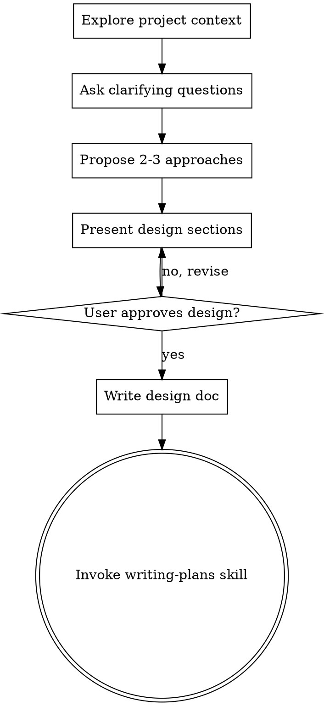
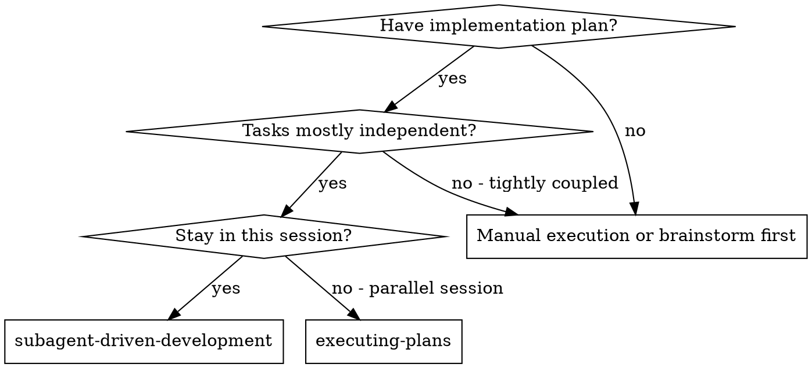
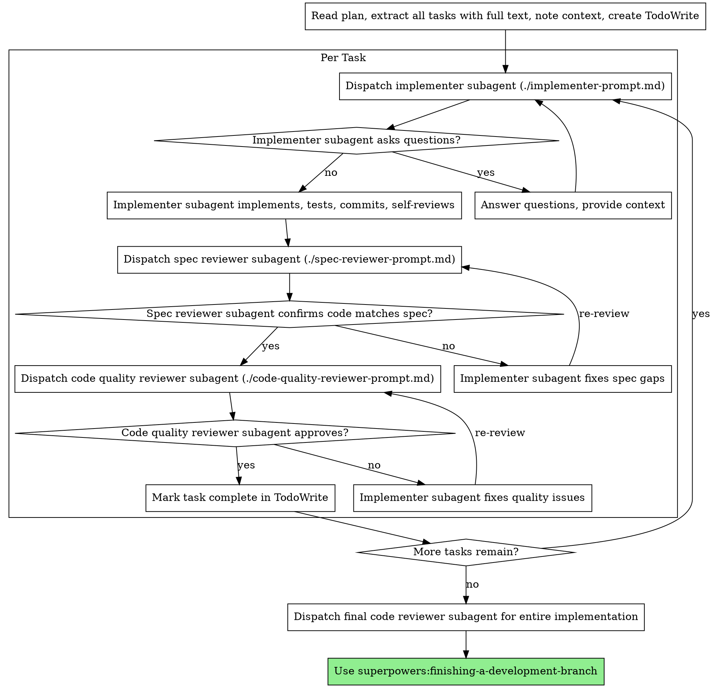

> DEVELOPER

## TA Review (Phase 1 - Insider): PR #71 -- Comprehensive Test Suite with Vitest

### Data Contract Impact
- [x] Types aligned across CLI, server, and dashboard -- no types modified in this PR
- [x] SQLite schema changes have proper migrations -- no schema changes
- [x] CLI binary name is `code-insights` -- not relevant (test-only PR)
- [x] No breaking changes to existing SQLite data -- confirmed

### Architecture Alignment

**Overall: Strongly aligned.** The architecture choices are sound:

1. **Vitest workspace** at repo root (`vitest.workspace.ts`) correctly references per-package configs, matching the pnpm workspace monorepo pattern.
2. **In-memory SQLite** for DB tests (`createTestDb()` runs migrations against `:memory:`) -- avoids filesystem state, fast and isolated.
3. **`createApp()` extraction** from `startServer()` is a clean, minimal refactor. `createApp()` owns route mounting + error handling; `startServer()` owns static serving + `serve()`. Standard Hono testability pattern. No behavioral change for production.
4. **Co-located tests** (`*.test.ts` next to source) properly excluded from `tsconfig.json` compilation.
5. **`vitest` as root devDependency** with per-package workspace configs is correct hoisting strategy.

### Issues Found

**FIX NOW:**

1. **`globals: true` in both vitest configs is redundant.** Both `/cli/vitest.config.ts` and `/server/vitest.config.ts` set `globals: true`, but every single test file explicitly imports from `'vitest'`. The explicit imports are the better pattern (self-documenting, strict TypeScript). Remove `globals: true` from both configs to avoid contradiction and potential confusion for future contributors.

2. **Server `devDependencies` duplication** of `better-sqlite3` + `@types/better-sqlite3` -- acceptable for explicitness (tests directly import `Database from 'better-sqlite3'`), but low priority. Not blocking.

### Test Quality Assessment

**Coverage is meaningful and well-targeted:**
- **Pure logic functions** (pricing, format, fuzzy-match, aggregation, paths, titles) -- highest-value unit tests, 47% of total coverage
- **Database read/write round-trips** through actual SQLite engine (not mocks) -- catches column mismatches, upsert semantics
- **Schema/migration idempotency** -- critical regression guards
- **All 7 API route files** tested with correct status codes, response shapes, filtering, validation, 404s
- **Parser tests with real fixtures** (valid, empty, malformed JSONL)
- **Import validation** test to catch package resolution bugs (like the v3.0.2 Hono bug)

**Mocking approach is appropriate** -- correct boundaries (DB singleton, telemetry, device info, LLM/config), actual SQLite engine and Hono handlers run unmocked.

### createApp() Refactor: SAFE
Route mounting order preserved exactly. Error handler, API catch-all, and all 8 route registrations unchanged. `startServer()` calls `createApp()` then adds static serving -- clean contract.

### tsconfig Excludes: CORRECT
Both packages properly exclude `*.test.ts` and fixtures from compilation. `files` arrays only include `dist/` -- test files won't ship to npm.

### Phase 1 Verdict: **APPROVED** (with one required fix: remove `globals: true`)

Review posted at: https://github.com/melagiri/code-insights/pull/71#issuecomment-3977476494</result>
<usage><total_tokens>103002</total_tokens><tool_uses>23</tool_uses><duration_ms>144489</duration_ms></usage>
</task-notification>
Full transcript available at: /private/tmp/claude-501/-Users-melagiri-Workspace-codeInsights-code-insights/tasks/a1e588d7125ea7a7d.output

> DEVELOPER

## Summary

This is a well-executed test infrastructure PR. The server refactor is clean and backward-compatible. The test patterns are idiomatic Vitest with good isolation and meaningful assertions. The one blocking issue (DB handle leak in `read-write.test.ts`) is a straightforward fix. The important items -- time-sensitive test fragility, globals configuration mismatch, and the missing analysis route test -- are worth addressing before or shortly after merge.</result>
<usage><total_tokens>84594</total_tokens><tool_uses>38</tool_uses><duration_ms>170083</duration_ms></usage>
</task-notification>
Full transcript available at: /private/tmp/claude-501/-Users-melagiri-Workspace-codeInsights-code-insights/tasks/aa9fe0149efc293c6.output

> DEVELOPER

## Strengths

**S-A: Excellent server refactor.** The `createApp()` extraction is clean, minimal, and backward-compatible. `startServer` still works exactly as before -- it simply calls `createApp()` first. The separation is the right abstraction boundary: routes/middleware in `createApp()`, static serving + HTTP listener in `startServer`. The JSDoc comments clearly explain the split.

**S-B: In-memory SQLite for test isolation.** Using `:memory:` databases means no filesystem side effects, no cleanup needed, no test ordering issues, and fast execution. The `createTestDb()` factory with `runMigrations` ensures schema consistency with production.

**S-C: Factory pattern for test data.** Both `makeParsedSession` and `makeParsedMessage` (CLI) and `makeMessage` (server prompts) use spread-override factories that provide sensible defaults while allowing per-test customization. This is the gold standard for test data construction.

**S-D: Meaningful behavioral tests.** The tests assert observable behavior, not implementation details. Examples: testing that `getSessions` returns results ordered by date, that `sessionExists` returns false for unknown IDs, that `parseAnalysisResponse` handles malformed JSON gracefully. These tests will remain valid through refactors.

**S-E: Good edge case coverage.** Empty inputs, malformed data, boundary conditions, idempotency checks -- the tests cover the important edge cases. The pricing tests verify cache creation (1.25x) and cache read (0.1x) multipliers. The fuzzy-match tests verify distance ordering. The title generation tests verify the priority chain.

**S-F: Security-conscious fixtures.** No API keys, tokens, secrets, or realistic user data in test fixtures. The JSONL fixture uses obviously synthetic data with generic session content.

**S-G: Proper build exclusion.** Both `tsconfig.json` files correctly exclude `*.test.ts` and `__fixtures__` from compilation. The CLI `package.json` `files` array only includes `dist/`, ensuring test files never ship in the npm package.

**S-H: Package import smoke test.** The `package-imports.test.ts` file that validates `hono`, `@hono/node-server`, and `better-sqlite3` are resolvable is a practical regression test. The PR description notes this would have caught the v3.0.2 hono bug -- this is exactly the kind of high-value, low-cost test that prevents real incidents.

**S-I: The mock pattern for module-scoped mutable DB is well-documented.** The comment block in `read-write.test.ts` explaining why `vi.mock()` is hoisted and how the mutable reference works is excellent. This is a tricky pattern that would confuse future contributors without that explanation.

> DEVELOPER

## Suggestions

### S1: Server test files have significant boilerplate duplication

**Files:** All 7 `server/src/routes/*.test.ts` files

Every server route test file repeats the exact same ~30 lines of setup:

```typescript
let testDb: Database.Database;

vi.mock('@code-insights/cli/db/client', () => ({
  getDb: () => testDb,
  closeDb: () => {},
}));

vi.mock('@code-insights/cli/utils/telemetry', () => ({
  trackEvent: vi.fn(),
}));

function initTestDb(): Database.Database {
  const db = new Database(':memory:');
  db.pragma('foreign_keys = ON');
  db.exec(SCHEMA_SQL);
  return db;
}
```

And also `seedProjectAndSession` helpers are repeated across at least 4 files with slight variations.

**Recommendation:** Extract a shared `server/src/__fixtures__/server-test-setup.ts` (or similar) that exports the `initTestDb`, `seedProjectAndSession`, and `seedMessage` helpers. The `vi.mock()` calls must remain in each test file (Vitest hoists them), but the helper functions and seed logic could be shared.

### S2: `schema.test.ts` creates and closes a new DB in every test case

**File:** `/Users/melagiri/Workspace/codeInsights/code-insights/cli/src/db/schema.test.ts`

Each of the 10 tests in this file creates its own `new Database(':memory:')` and closes it. While this gives maximum isolation, for read-only schema validation tests (e.g., "creates all expected tables", "creates expected indexes"), a single shared DB via `beforeAll`/`afterAll` would be more efficient and equally correct.

**Recommendation:** Consider using `beforeAll` for the group of read-only tests, keeping per-test DBs only for the idempotency tests that modify state.

### S3: `parseIntParam` edge case -- very large integers

**File:** `/Users/melagiri/Workspace/codeInsights/code-insights/server/src/utils.test.ts`

The test covers Infinity, negative, NaN, and empty string. One missing edge case: `Number.MAX_SAFE_INTEGER + 1` or very large integers that `parseInt` can handle but might cause issues downstream. This is minor since the function is used for pagination parameters, but worth a thought.

### S4: JSONL fixture could be richer

**File:** `/Users/melagiri/Workspace/codeInsights/code-insights/cli/src/__fixtures__/sessions/a1b2c3d4-e5f6-7890-abcd-ef1234567890.jsonl`

The valid fixture has only 2 lines (1 user, 1 assistant message). This limits what the parser tests can verify. A fixture with 5-10 messages including tool calls, thinking blocks, and system messages would enable more thorough parser testing without adding more fixture files.

### S5: `vitest` only at root workspace level

**File:** `/Users/melagiri/Workspace/codeInsights/code-insights/package.json`

Vitest is declared as a devDependency only at the workspace root. The CLI and server `package.json` files reference `vitest` in their test scripts but do not declare it as a dependency. This works because pnpm hoists workspace-root deps, but if someone runs `cd cli && pnpm test` in a strict hoisting configuration, it could fail to resolve.

**Recommendation:** Either add vitest as a devDependency in each package that has test scripts, or document in the README that tests must be run from the workspace root.

> DEVELOPER

## Important Findings

### I1: `periodStartDate` tests are fragile due to time dependency

**File:** `/Users/melagiri/Workspace/codeInsights/code-insights/cli/src/commands/stats/data/aggregation.test.ts`

The `periodStartDate` tests construct their expected values using `new Date()` independently from the function under test, which also calls `new Date()` internally via `today()`. If the test runs across a midnight boundary (e.g., in CI at 23:59:59), the test's `new Date()` and the function's `new Date()` may produce different dates, causing spurious failures.

```typescript
it('returns a date 7 days ago for "7d"', () => {
  const result = periodStartDate('7d');
  const now = new Date();     // <-- could differ from internal new Date()
  now.setHours(0, 0, 0, 0);
  const expected = new Date(now);
  expected.setDate(expected.getDate() - 7);
  expect(result!.getTime()).toBe(expected.getTime());
});
```

**Recommendation:** Use `vi.useFakeTimers()` to freeze time, or mock the internal `today()` function, or at minimum add a tolerance window (e.g., assert within 86400000ms). Fake timers are the cleanest approach for deterministic date tests.

### I2: `globals: true` is set but all test files explicitly import from 'vitest'

**File:** `/Users/melagiri/Workspace/codeInsights/code-insights/cli/vitest.config.ts` and `/Users/melagiri/Workspace/codeInsights/code-insights/server/vitest.config.ts`

Both vitest configs set `globals: true`, which injects `describe`, `it`, `expect`, `vi`, etc. into the global scope. However, all 19 test files explicitly import these from 'vitest':

```typescript
import { describe, it, expect } from 'vitest';
```

This is not wrong -- explicit imports work regardless of the `globals` setting -- but it creates a contradictory configuration. If the intent is explicit imports (which is the more type-safe, IDE-friendly approach), `globals: true` should be `false`. If the intent is globals, the imports are unnecessary noise.

**Recommendation:** Set `globals: false` to match the actual usage pattern. Explicit imports are the better practice since they provide type safety without needing `/// <reference types="vitest" />` in a global `.d.ts`.

### I3: `better-sqlite3` as devDependency in server package may cause issues

**File:** `/Users/melagiri/Workspace/codeInsights/code-insights/server/package.json`

The PR adds `better-sqlite3` and `@types/better-sqlite3` as devDependencies of the server package. The server's tests use `new Database(':memory:')` directly for test DB setup. Since the CLI package (a workspace dependency of server) already has `better-sqlite3` as a production dependency, this works in development.

However, adding it as a devDependency in server means there are now two potential resolution paths for the same native addon. In a pnpm workspace with strict mode or hoisting variations, this could lead to version mismatches or duplicate native bindings.

**Recommendation:** Consider whether the test helpers in server tests should import Database via the CLI's re-export or if a shared test utility in the workspace root would be cleaner. At minimum, pin the version to match the CLI's version exactly to avoid drift.

### I4: Missing test for the analysis route

**Files in scope:** All `server/src/routes/*.test.ts`

The `createApp()` function mounts 8 route handlers. Seven of these have corresponding test files (projects, sessions, messages, insights, analytics, config, export). The analysis route (`/api/analysis/*`) is untested. While the LLM prompt formatting/parsing is tested via `prompts.test.ts`, the route-level behavior (LLM-not-configured guard, request validation, error handling) is not covered.

**Recommendation:** Add at minimum a test for the `isLLMConfigured()` guard returning 400 when LLM is not configured. This is a pure route test that requires no actual LLM calls.

> DEVELOPER

## Blocking Findings

### B1: `read-write.test.ts` never closes the in-memory database

**File:** `/Users/melagiri/Workspace/codeInsights/code-insights/cli/src/db/read-write.test.ts`

Every server route test file properly closes the database in `afterEach`:

```typescript
afterEach(() => {
  testDb.close();
});
```

But `read-write.test.ts` only reassigns `testDb` in `beforeEach` without closing the previous instance:

```typescript
beforeEach(() => {
  testDb = createTestDb();
});
```

This leaks a `better-sqlite3` Database handle on every test case. In-memory SQLite databases are garbage-collected eventually, but `better-sqlite3` binds native resources. With 15+ test cases in this suite, that is 15 leaked native handles per run. While not causing test failures today, this is a resource leak that can cause issues as the suite grows (especially if tests run in watch mode during development).

**Recommendation:** Add `afterEach` to close the database, consistent with how every server test file already does it. The `createTestDb` helper in seed.ts should also document this expectation.

> DEVELOPER

# Outsider Code Review: PR #71 -- Comprehensive Vitest Test Suite

## Overview

This PR adds 19 test files with 224 tests across the CLI and server packages, introduces Vitest as the test framework, and refactors `server/src/index.ts` to extract a `createApp()` factory for testability. The overall quality is high -- well-structured, good use of factories, in-memory SQLite for isolation, and meaningful behavioral assertions rather than implementation-detail tests.

> DEVELOPER

## Summary Verdict

This is a strong first test suite that covers the right areas with the right patterns. There are no blocking issues. The most important follow-up items are:

1. **Unify DB initialization** between CLI tests (`runMigrations`) and server tests (`SCHEMA_SQL`) to prevent schema divergence (I1)
2. **Extract shared server test setup** to reduce the boilerplate duplication across 7 route test files (I2)
3. **Strengthen the package-imports test** to actually validate `package.json` dependencies, not just runtime resolvability (I4)
4. **Add tests for the global error handler, health check, and API 404 catch-all** in the server (S2, S3, S4)

The PR is ready for merge as-is, with the above items noted as follow-up work.</result>
<usage><total_tokens>113697</total_tokens><tool_uses>29</tool_uses><duration_ms>191461</duration_ms></usage>
</task-notification>
Full transcript available at: /private/tmp/claude-501/-Users-melagiri-Workspace-codeInsights-code-insights/tasks/ae794738dad3c9f1d.output

> DEVELOPER

## [STRENGTHS] What's Done Well

### W1. Excellent test selection strategy
The tests target the right layer: pure logic functions, data aggregation, formatting, database read/write operations, and API routes. By focusing on the pure-logic core and the API surface (rather than trying to test CLI commands end-to-end), the suite achieves maximum value-per-test.

### W2. Clean server refactor with `createApp()` extraction
The extraction of `createApp()` from `startServer()` in `/Users/melagiri/Workspace/codeInsights/code-insights/server/src/index.ts` is surgically clean. The split is at exactly the right boundary -- API route registration vs. server lifecycle (static serving, SPA fallback, port binding). The behavioral semantics are preserved: `startServer()` still does everything it did before, just by calling `createApp()` first. The Hono `app.request()` pattern for route testing is elegant and eliminates the need for a running HTTP server.

### W3. In-memory SQLite for database tests
Using `:memory:` databases with migrations applied (in CLI tests via `createTestDb()`) provides proper isolation without filesystem cleanup. Each `beforeEach` creates a fresh DB, so tests are fully independent. This is the correct pattern for SQLite testing.

### W4. Realistic fixture data
The JSONL fixtures (`a1b2c3d4-e5f6-7890-abcd-ef1234567890.jsonl`, `empty.jsonl`, `malformed.jsonl`) cover the happy path, empty input, and malformed input. The factory functions (`makeParsedSession`, `makeParsedMessage`, `makeSessionRow`) provide sensible defaults with override capability, which keeps individual tests focused on the fields they care about.

### W5. Co-located test files
Test files sit next to their source files (`pricing.test.ts` next to `pricing.ts`, `format.test.ts` next to `format.ts`). This makes it easy to find and maintain tests alongside the code they exercise. The `tsconfig.json` exclusion of `*.test.ts` and `__fixtures__/` ensures test files do not pollute the production build.

### W6. Proper tsconfig exclusions and build isolation
```json
"exclude": ["node_modules", "dist", "src/**/*.test.ts", "src/__fixtures__"]
```
Test files and fixtures are correctly excluded from TypeScript compilation for the production build, and the `files` array in `package.json` only includes `dist/`, so test code will never end up in the npm package.

### W7. Vitest workspace configuration
The `vitest.workspace.ts` at the repo root correctly orchestrates both CLI and server test configs, allowing `pnpm test` from the root to run all tests across packages. The per-package vitest configs are minimal and consistent.

### W8. Test execution speed
224 tests in 399ms (~1.8ms per test) is excellent. The in-memory SQLite approach and the avoidance of real HTTP servers contribute to this speed.

> DEVELOPER

## [SUGGESTION] Findings

### S1. `globals: true` but explicit imports everywhere

**Files:** `cli/vitest.config.ts`, `server/vitest.config.ts`

As noted above, `globals: true` is set but never used. Either remove `globals: true` (cleaner, explicit imports are the better pattern) or remove the imports from test files. The explicit import approach is preferable -- it makes dependencies clear and avoids TypeScript errors without a vitest global types declaration.

**Recommendation:** Remove `globals: true` from both vitest configs to match the actual usage pattern.

### S2. No test for the server's global error handler (SyntaxError / malformed JSON body)

**File:** `/Users/melagiri/Workspace/codeInsights/code-insights/server/src/index.ts` (lines 33-38)

```typescript
app.onError((err, c) => {
  if (err instanceof SyntaxError && err.message.includes('JSON')) {
    return c.json({ error: 'Invalid JSON in request body' }, 400);
  }
  console.error(err);
  return c.json({ error: 'Internal server error' }, 500);
});
```

This error handler is part of `createApp()` but is not tested by any of the route tests. A test sending a malformed JSON body to any POST endpoint would exercise this path.

**Recommendation:** Add a test like:
```typescript
it('returns 400 for malformed JSON body', async () => {
  const app = createApp();
  const res = await app.request('/api/insights', {
    method: 'POST',
    headers: { 'Content-Type': 'application/json' },
    body: '{ this is not json }',
  });
  expect(res.status).toBe(400);
  const body = await res.json();
  expect(body.error).toContain('Invalid JSON');
});
```

### S3. No test for the health check endpoint

**File:** `/Users/melagiri/Workspace/codeInsights/code-insights/server/src/index.ts` (line 52)

```typescript
app.get('/api/health', (c) => c.json({ ok: true, version: '0.1.0' }));
```

The health check endpoint is untested. It is trivial but would be a useful smoke test in CI.

### S4. No test for the API 404 catch-all

**File:** `/Users/melagiri/Workspace/codeInsights/code-insights/server/src/index.ts` (line 57)

```typescript
app.all('/api/*', (c) => c.json({ error: 'Not found' }, 404));
```

This catch-all prevents unmatched API routes from falling through to the SPA. It was specifically called out in the code comments as important, but has no test coverage.

### S5. CLI aggregation tests could cover `computeOverview`, `computeCostBreakdown`, `computeModelStats`

**File:** `/Users/melagiri/Workspace/codeInsights/code-insights/cli/src/commands/stats/data/aggregation.test.ts`

The aggregation tests cover the helper functions (`periodStartDate`, `resolveTitle`, `shortenModelName`, `bucketKey`, `createBuckets`, `computeDayStats`, `computeTopProjects`) but do NOT test the main entry-point functions: `computeOverview`, `computeCostBreakdown`, `computeProjectStats`, `computeTodayStats`, `computeModelStats`. These are the functions actually called by the stats command actions.

**Recommendation:** Add at least one integration-style test for `computeOverview` with a few sessions to verify the full aggregation pipeline works end-to-end.

### S6. `formatRelativeDate` and `formatTime` are untested

**File:** `/Users/melagiri/Workspace/codeInsights/code-insights/cli/src/commands/stats/render/format.test.ts`

The format test file covers `formatMoney`, `formatTokens`, `formatDuration`, `formatPercent`, `formatCount`, `formatPeriodLabel` -- but skips `formatRelativeDate` and `formatTime`. These are date-dependent functions and arguably harder to test, but `formatRelativeDate` has branching logic (< 1h, < 24h, < 2d, < 7d, else) that would benefit from tests.

### S7. No tests for providers (ClaudeCodeProvider, CursorProvider, etc.)

The provider layer -- the code that discovers and parses session files from different AI tools -- has no test coverage in this PR. This is the most complex and fragile part of the codebase (filesystem access, JSONL parsing, SQLite-based Cursor parsing, platform-specific paths). The JSONL parser test is a start, but the provider `discover()` and `parse()` methods are untested.

This is understandable as a first-pass test suite, but worth noting as a gap.

### S8. Console.error output leaking into test output

Running the test suite produces stderr output from `parseAnalysisResponse` and `parsePromptQualityResponse` error paths:

```
stderr | server/src/llm/prompts.test.ts > parseAnalysisResponse > returns null for completely malformed response
No JSON found in analysis response

stderr | server/src/llm/prompts.test.ts > parsePromptQualityResponse > returns null for completely invalid response
No JSON found in prompt quality response
```

These are expected console.warn/console.error calls from the production code when parsing fails. They add noise to the test output.

**Recommendation:** Either mock `console.error`/`console.warn` in those specific tests, or add a `// expected stderr` comment to document the noise.

> DEVELOPER

## [IMPORTANT] Findings

### I1. Server route tests use SCHEMA_SQL directly instead of runMigrations -- schema divergence risk

**Files:** All server test files (e.g., `/Users/melagiri/Workspace/codeInsights/code-insights/server/src/routes/projects.test.ts`, `sessions.test.ts`, `messages.test.ts`, `insights.test.ts`, `analytics.test.ts`, `export.test.ts`, `config.test.ts`)

Every server test initializes the DB with:

```typescript
function initTestDb(): Database.Database {
  const db = new Database(':memory:');
  db.pragma('foreign_keys = ON');
  db.exec(SCHEMA_SQL);
  return db;
}
```

Meanwhile, the CLI `read-write.test.ts` uses `createTestDb()` which calls `runMigrations(db)`. In production, `getDb()` calls `runMigrations()` which runs the base schema *plus* incremental migration steps.

If `SCHEMA_SQL` and the migrations ever diverge (e.g., a migration adds a column that SCHEMA_SQL doesn't include, or vice versa), the server tests would pass against a schema that does not match production. This is a real divergence risk.

**Recommendation:** Have server tests use the same `createTestDb()` helper (or at least `runMigrations(db)`) from `cli/src/__fixtures__/db/seed.ts` to match production behavior exactly. This would require exporting it from the CLI package exports or inlining the migration call.

### I2. Massive boilerplate duplication across server route tests

**Files:** All 7 server route test files

Every server route test file repeats the same ~20 lines of mock setup:

```typescript
let testDb: Database.Database;

vi.mock('@code-insights/cli/db/client', () => ({
  getDb: () => testDb,
  closeDb: () => {},
}));

vi.mock('@code-insights/cli/utils/telemetry', () => ({
  trackEvent: vi.fn(),
}));

const { createApp } = await import('../index.js');

function initTestDb(): Database.Database {
  const db = new Database(':memory:');
  db.pragma('foreign_keys = ON');
  db.exec(SCHEMA_SQL);
  return db;
}
```

And often duplicates `seedProjectAndSession()` (in `messages.test.ts`, `insights.test.ts`, `export.test.ts`, etc.).

This is a maintenance burden. If the mock shape changes (e.g., a new export from `db/client`), all 7 files need updating. If the seed helpers diverge, the tests become inconsistent.

**Recommendation:** Extract a shared test setup module (e.g., `server/src/__fixtures__/setup.ts`) that provides the mocked `testDb` reference, the `initTestDb()` function, and the common seed helpers. The `vi.mock()` calls would still need to be in each file (vitest hoisting requirement), but the helper functions and seed utilities can be shared.

### I3. Server route tests call `createApp()` inside every individual test case

**Files:** All server route test files

Every test calls `const app = createApp()` independently:

```typescript
it('returns empty array when no projects exist', async () => {
  const app = createApp();
  const res = await app.request('/api/projects');
  // ...
});
```

`createApp()` registers all 8 routers, the global error handler, the health check, and the catch-all 404 -- every single test. With 63 server tests, that is 63 Hono app instantiations.

Currently this is fine (under 20ms per test), but as the route count grows, this pattern may not scale well. More importantly, it means each test is testing *all* routes mounted even when it only cares about one.

**Recommendation:** Create the app once per describe block (in a `beforeEach` or `beforeAll`) rather than per-test. This is a minor performance concern but a real readability improvement.

### I4. The package-imports test would NOT have caught the v3.0.2 bug in a CI/CD pipeline

**File:** `/Users/melagiri/Workspace/codeInsights/code-insights/cli/src/__tests__/package-imports.test.ts`

```typescript
it('hono and @hono/node-server are resolvable', async () => {
  await expect(import('hono')).resolves.toBeDefined();
  await expect(import('@hono/node-server')).resolves.toBeDefined();
});
```

The PR description says this is "the test that would have caught the v3.0.2 hono bug." This test validates that packages are *resolvable at import time in the development workspace*. However, the v3.0.2 bug was about the npm-published package missing hono as a dependency (it was moved to devDependencies or similar). This test runs in the monorepo where hono is always available via the workspace. It would only catch a missing `node_modules` entry, not a missing declaration in `package.json`'s `dependencies`.

To actually catch that class of bug, you would need a test that validates `package.json`'s `dependencies` field lists the expected packages, e.g.:

```typescript
it('hono is listed in CLI package.json dependencies', () => {
  const pkg = JSON.parse(readFileSync('cli/package.json', 'utf-8'));
  expect(pkg.dependencies).toHaveProperty('hono');
  expect(pkg.dependencies).toHaveProperty('@hono/node-server');
});
```

**Recommendation:** Add a `package.json` manifest validation test that checks the `dependencies` field directly. The current dynamic import test is still valuable for other scenarios, but it should not be presented as the solution to the v3.0.2 class of bug.

### I5. `better-sqlite3` added as devDependency to server package -- may mask production issues

**File:** `/Users/melagiri/Workspace/codeInsights/code-insights/server/package.json`

```json
"devDependencies": {
    "@types/better-sqlite3": "^7.6.13",
    "@types/node": "^22.15.30",
    "better-sqlite3": "^12.6.2",
    "typescript": "^5.9.3"
}
```

`better-sqlite3` was added as a devDependency to the server package for test files to import it directly (for creating in-memory test databases). In production, the server gets `better-sqlite3` transitively through `@code-insights/cli`. This is functionally fine, but it means the server's `node_modules` now has a *direct* copy of `better-sqlite3`, which could mask version mismatches between what the CLI uses and what the server tests use.

**Recommendation:** This is acceptable for now, but add a comment in `server/package.json` explaining why `better-sqlite3` is a devDependency (for test DB creation only).

> DEVELOPER

There are **no blocking issues** in this PR. The code is correct, all 224 tests pass in under 400ms, the refactor is clean, and there are no behavioral regressions.

> DEVELOPER

## [BLOCKING] Findings

### B1. `globals: true` in vitest.config.ts but all tests explicitly import from 'vitest'

**File:** `/Users/melagiri/Workspace/codeInsights/code-insights/cli/vitest.config.ts` (line 6) and `/Users/melagiri/Workspace/codeInsights/code-insights/server/vitest.config.ts` (line 6)

```typescript
globals: true,
```

Both vitest configs set `globals: true`, which makes `describe`, `it`, `expect`, `vi`, `beforeEach`, `afterEach` available as globals without importing. Yet every single test file explicitly imports them:

```typescript
import { describe, it, expect } from 'vitest';
```

This is not a bug -- the imports work fine even with globals on. However, it creates a contradictory configuration. The concern is **not the redundancy itself**, but that a future contributor might rely on globals (no import) in some tests while others use imports, creating inconsistency. **This is not blocking** on second thought, but worth noting.

**Reclassifying:** This is not blocking. Moving to Suggestions.

> DEVELOPER

# Wild Card Review: PR #71 -- feat: add comprehensive test suite with Vitest

## Executive Summary

This is a well-structured initial test suite adding 19 test files and 224 tests across CLI and server packages in ~3,200 lines. The server entry point has been cleanly refactored to extract `createApp()` for testability. The test selection is well-targeted at the pure-logic core and the API surface, and the in-memory SQLite pattern for DB tests is a good approach. There are, however, several areas worth scrutinizing regarding mocking fidelity, maintenance burden, and edge-case coverage.

> DEVELOPER

code-insights dashboard
✖ Failed to start dashboard server.
Cannot find package '@hono/node-server' imported from /Users/melagiri/.nvm/versions/node/v22.21.1/lib/node_modules/@code-insights/cli/server-dist/index.js

> AGENT

`★ Insight ─────────────────────────────────────`
The root cause: when `@code-insights/cli` is published to npm, `server/dist/` is copied into `cli/server-dist/` via `prepublishOnly`. But that compiled JS still has bare `import` statements for `@hono/node-server` and `hono` — and those packages aren't listed in `cli/package.json` dependencies, so npm never installs them for global users.
`─────────────────────────────────────────────────`

**The fix:** Add `hono` and `@hono/node-server` to `cli/package.json` dependencies. These aren't circular (they're third-party packages), only `@code-insights/server` → `@code-insights/cli` would be circular.

**Plan:**

1. Add `hono` and `@hono/node-server` to `cli/package.json` `dependencies`
2. Run `pnpm install` to update the lockfile

Shall I proceed?

> DEVELOPER

yes, fix this, add to your memory and mark it as v3.0.2

> AGENT

Done. Here's what changed:

**`cli/package.json`:**
- Version bumped `3.0.1` → `3.0.2`
- Added `@hono/node-server` and `hono` to `dependencies`

The lockfile was already up to date (these packages were already in the workspace via `server/`), so `pnpm install` resolved cleanly with no new downloads.

> DEVELOPER

code is committed and pushed?

> AGENT

No, I haven't committed or pushed — I only make commits when explicitly asked. Want me to commit and push this?

> DEVELOPER

yes, and after this create a release as well.. 

then comes the big picture.. i want to add tests to the entire project so we don't miss silly things like this going forward

> SYSTEM

Base directory for this skill: /Users/melagiri/.claude/plugins/cache/claude-plugins-official/superpowers/4.3.1/skills/brainstorming

# Brainstorming Ideas Into Designs

## Overview

Help turn ideas into fully formed designs and specs through natural collaborative dialogue.

Start by understanding the current project context, then ask questions one at a time to refine the idea. Once you understand what you're building, present the design and get user approval.

<HARD-GATE>
Do NOT invoke any implementation skill, write any code, scaffold any project, or take any implementation action until you have presented a design and the user has approved it. This applies to EVERY project regardless of perceived simplicity.
</HARD-GATE>

## Anti-Pattern: "This Is Too Simple To Need A Design"

Every project goes through this process. A todo list, a single-function utility, a config change — all of them. "Simple" projects are where unexamined assumptions cause the most wasted work. The design can be short (a few sentences for truly simple projects), but you MUST present it and get approval.

## Checklist

You MUST create a task for each of these items and complete them in order:

1. **Explore project context** — check files, docs, recent commits
2. **Ask clarifying questions** — one at a time, understand purpose/constraints/success criteria
3. **Propose 2-3 approaches** — with trade-offs and your recommendation
4. **Present design** — in sections scaled to their complexity, get user approval after each section
5. **Write design doc** — save to `docs/plans/YYYY-MM-DD-<topic>-design.md` and commit
6. **Transition to implementation** — invoke writing-plans skill to create implementation plan

## Process Flow



**The terminal state is invoking writing-plans.** Do NOT invoke frontend-design, mcp-builder, or any other implementation skill. The ONLY skill you invoke after brainstorming is writing-plans.

## The Process

**Understanding the idea:**
- Check out the current project state first (files, docs, recent commits)
- Ask questions one at a time to refine the idea
- Prefer multiple choice questions when possible, but open-ended is fine too
- Only one question per message - if a topic needs more exploration, break it into multiple questions
- Focus on understanding: purpose, constraints, success criteria

**Exploring approaches:**
- Propose 2-3 different approaches with trade-offs
- Present options conversationally with your recommendation and reasoning
- Lead with your recommended option and explain why

**Presenting the design:**
- Once you believe you understand what you're building, present the design
- Scale each section to its complexity: a few sentences if straightforward, up to 200-300 words if nuanced
- Ask after each section whether it looks right so far
- Cover: architecture, components, data flow, error handling, testing
- Be ready to go back and clarify if something doesn't make sense

## After the Design

**Documentation:**
- Write the validated design to `docs/plans/YYYY-MM-DD-<topic>-design.md`
- Use elements-of-style:writing-clearly-and-concisely skill if available
- Commit the design document to git

**Implementation:**
- Invoke the writing-plans skill to create a detailed implementation plan
- Do NOT invoke any other skill. writing-plans is the next step.

## Key Principles

- **One question at a time** - Don't overwhelm with multiple questions
- **Multiple choice preferred** - Easier to answer than open-ended when possible
- **YAGNI ruthlessly** - Remove unnecessary features from all designs
- **Explore alternatives** - Always propose 2-3 approaches before settling
- **Incremental validation** - Present design, get approval before moving on
- **Be flexible** - Go back and clarify when something doesn't make sense

> SYSTEM

Base directory for this skill: /Users/melagiri/.claude/plugins/cache/claude-plugins-official/superpowers/4.3.1/skills/writing-plans

# Writing Plans

## Overview

Write comprehensive implementation plans assuming the engineer has zero context for our codebase and questionable taste. Document everything they need to know: which files to touch for each task, code, testing, docs they might need to check, how to test it. Give them the whole plan as bite-sized tasks. DRY. YAGNI. TDD. Frequent commits.

Assume they are a skilled developer, but know almost nothing about our toolset or problem domain. Assume they don't know good test design very well.

**Announce at start:** "I'm using the writing-plans skill to create the implementation plan."

**Context:** This should be run in a dedicated worktree (created by brainstorming skill).

**Save plans to:** `docs/plans/YYYY-MM-DD-<feature-name>.md`

## Bite-Sized Task Granularity

**Each step is one action (2-5 minutes):**
- "Write the failing test" - step
- "Run it to make sure it fails" - step
- "Implement the minimal code to make the test pass" - step
- "Run the tests and make sure they pass" - step
- "Commit" - step

## Plan Document Header

**Every plan MUST start with this header:**

```markdown
# [Feature Name] Implementation Plan

> **For Claude:** REQUIRED SUB-SKILL: Use superpowers:executing-plans to implement this plan task-by-task.

**Goal:** [One sentence describing what this builds]

**Architecture:** [2-3 sentences about approach]

**Tech Stack:** [Key technologies/libraries]

---
```

## Task Structure

````markdown
### Task N: [Component Name]

**Files:**
- Create: `exact/path/to/file.py`
- Modify: `exact/path/to/existing.py:123-145`
- Test: `tests/exact/path/to/test.py`

**Step 1: Write the failing test**

```python
def test_specific_behavior():
    result = function(input)
    assert result == expected
```

**Step 2: Run test to verify it fails**

Run: `pytest tests/path/test.py::test_name -v`
Expected: FAIL with "function not defined"

**Step 3: Write minimal implementation**

```python
def function(input):
    return expected
```

**Step 4: Run test to verify it passes**

Run: `pytest tests/path/test.py::test_name -v`
Expected: PASS

**Step 5: Commit**

```bash
git add tests/path/test.py src/path/file.py
git commit -m "feat: add specific feature"
```
````

## Remember
- Exact file paths always
- Complete code in plan (not "add validation")
- Exact commands with expected output
- Reference relevant skills with @ syntax
- DRY, YAGNI, TDD, frequent commits

## Execution Handoff

After saving the plan, offer execution choice:

**"Plan complete and saved to `docs/plans/<filename>.md`. Two execution options:**

**1. Subagent-Driven (this session)** - I dispatch fresh subagent per task, review between tasks, fast iteration

**2. Parallel Session (separate)** - Open new session with executing-plans, batch execution with checkpoints

**Which approach?"**

**If Subagent-Driven chosen:**
- **REQUIRED SUB-SKILL:** Use superpowers:subagent-driven-development
- Stay in this session
- Fresh subagent per task + code review

**If Parallel Session chosen:**
- Guide them to open new session in worktree
- **REQUIRED SUB-SKILL:** New session uses superpowers:executing-plans

> AGENT

Plan complete and saved to `docs/plans/2026-02-28-test-suite-implementation.md`.

**17 tasks, ~105 tests, ~19 test files** covering:
- Vitest infrastructure (monorepo workspace)
- 6 pure logic test suites (titles, pricing, aggregation, fuzzy-match, format, paths)
- DB schema, migration, read/write tests (in-memory SQLite)
- Server refactor (`createApp()` factory for testability)
- 8 server route test files (all API endpoints)
- LLM prompt parsing tests
- JSONL parser tests with fixtures
- Package import validation (the test that catches the v3.0.2 bug)

**Two execution options:**

1. **Subagent-Driven (this session)** — I dispatch a fresh subagent per task, review between tasks, fast iteration

2. **Parallel Session (separate)** — Open a new session with the executing-plans skill, batch execution with checkpoints

Which approach?

> DEVELOPER

always subagent, please read the memory and agent prompts to understand how...

> SYSTEM

Base directory for this skill: /Users/melagiri/.claude/plugins/cache/claude-plugins-official/superpowers/4.3.1/skills/subagent-driven-development

# Subagent-Driven Development

Execute plan by dispatching fresh subagent per task, with two-stage review after each: spec compliance review first, then code quality review.

**Core principle:** Fresh subagent per task + two-stage review (spec then quality) = high quality, fast iteration

## When to Use



**vs. Executing Plans (parallel session):**
- Same session (no context switch)
- Fresh subagent per task (no context pollution)
- Two-stage review after each task: spec compliance first, then code quality
- Faster iteration (no human-in-loop between tasks)

## The Process



## Prompt Templates

- `./implementer-prompt.md` - Dispatch implementer subagent
- `./spec-reviewer-prompt.md` - Dispatch spec compliance reviewer subagent
- `./code-quality-reviewer-prompt.md` - Dispatch code quality reviewer subagent

## Example Workflow

```
You: I'm using Subagent-Driven Development to execute this plan.

[Read plan file once: docs/plans/feature-plan.md]
[Extract all 5 tasks with full text and context]
[Create TodoWrite with all tasks]

Task 1: Hook installation script

[Get Task 1 text and context (already extracted)]
[Dispatch implementation subagent with full task text + context]

Implementer: "Before I begin - should the hook be installed at user or system level?"

You: "User level (~/.config/superpowers/hooks/)"

Implementer: "Got it. Implementing now..."
[Later] Implementer:
  - Implemented install-hook command
  - Added tests, 5/5 passing
  - Self-review: Found I missed --force flag, added it
  - Committed

[Dispatch spec compliance reviewer]
Spec reviewer: ✅ Spec compliant - all requirements met, nothing extra

[Get git SHAs, dispatch code quality reviewer]
Code reviewer: Strengths: Good test coverage, clean. Issues: None. Approved.

[Mark Task 1 complete]

Task 2: Recovery modes

[Get Task 2 text and context (already extracted)]
[Dispatch implementation subagent with full task text + context]

Implementer: [No questions, proceeds]
Implementer:
  - Added verify/repair modes
  - 8/8 tests passing
  - Self-review: All good
  - Committed

[Dispatch spec compliance reviewer]
Spec reviewer: ❌ Issues:
  - Missing: Progress reporting (spec says "report every 100 items")
  - Extra: Added --json flag (not requested)

[Implementer fixes issues]
Implementer: Removed --json flag, added progress reporting

[Spec reviewer reviews again]
Spec reviewer: ✅ Spec compliant now

[Dispatch code quality reviewer]
Code reviewer: Strengths: Solid. Issues (Important): Magic number (100)

[Implementer fixes]
Implementer: Extracted PROGRESS_INTERVAL constant

[Code reviewer reviews again]
Code reviewer: ✅ Approved

[Mark Task 2 complete]

...

[After all tasks]
[Dispatch final code-reviewer]
Final reviewer: All requirements met, ready to merge

Done!
```

## Advantages

**vs. Manual execution:**
- Subagents follow TDD naturally
- Fresh context per task (no confusion)
- Parallel-safe (subagents don't interfere)
- Subagent can ask questions (before AND during work)

**vs. Executing Plans:**
- Same session (no handoff)
- Continuous progress (no waiting)
- Review checkpoints automatic

**Efficiency gains:**
- No file reading overhead (controller provides full text)
- Controller curates exactly what context is needed
- Subagent gets complete information upfront
- Questions surfaced before work begins (not after)

**Quality gates:**
- Self-review catches issues before handoff
- Two-stage review: spec compliance, then code quality
- Review loops ensure fixes actually work
- Spec compliance prevents over/under-building
- Code quality ensures implementation is well-built

**Cost:**
- More subagent invocations (implementer + 2 reviewers per task)
- Controller does more prep work (extracting all tasks upfront)
- Review loops add iterations
- But catches issues early (cheaper than debugging later)

## Red Flags

**Never:**
- Start implementation on main/master branch without explicit user consent
- Skip reviews (spec compliance OR code quality)
- Proceed with unfixed issues
- Dispatch multiple implementation subagents in parallel (conflicts)
- Make subagent read plan file (provide full text instead)
- Skip scene-setting context (subagent needs to understand where task fits)
- Ignore subagent questions (answer before letting them proceed)
- Accept "close enough" on spec compliance (spec reviewer found issues = not done)
- Skip review loops (reviewer found issues = implementer fixes = review again)
- Let implementer self-review replace actual review (both are needed)
- **Start code quality review before spec compliance is ✅** (wrong order)
- Move to next task while either review has open issues

**If subagent asks questions:**
- Answer clearly and completely
- Provide additional context if needed
- Don't rush them into implementation

**If reviewer finds issues:**
- Implementer (same subagent) fixes them
- Reviewer reviews again
- Repeat until approved
- Don't skip the re-review

**If subagent fails task:**
- Dispatch fix subagent with specific instructions
- Don't try to fix manually (context pollution)

## Integration

**Required workflow skills:**
- **superpowers:using-git-worktrees** - REQUIRED: Set up isolated workspace before starting
- **superpowers:writing-plans** - Creates the plan this skill executes
- **superpowers:requesting-code-review** - Code review template for reviewer subagents
- **superpowers:finishing-a-development-branch** - Complete development after all tasks

**Subagents should use:**
- **superpowers:test-driven-development** - Subagents follow TDD for each task

**Alternative workflow:**
- **superpowers:executing-plans** - Use for parallel session instead of same-session execution

> AGENT

Done. Here's the summary:

**PR #71:** https://github.com/melagiri/code-insights/pull/71

`★ Insight ─────────────────────────────────────`
**What we built:** A full Vitest test suite from zero — 19 test files, 224 tests, running in ~370ms. The key architectural decisions that made this work:

1. **Vitest workspace mode** — one `pnpm test` runs CLI + server with per-package environments
2. **In-memory SQLite** — real SQL engine, no mocks, tests run in <20ms each
3. **`createApp()` factory** — extracted from `startServer()` so route tests use `app.request()` without starting an HTTP server
4. **The "hono bug" test** — `cli/src/__tests__/package-imports.test.ts` validates all runtime deps are importable, which would have caught v3.0.2 before it shipped
`─────────────────────────────────────────────────`

**16 commits** on `feature/test-suite`, ready for your review and merge.

> DEVELOPER

verify the changes because there was a parallel session which stashed and poped some changes in between this session here.. and once verified, create a PR and run a round of review to ensure the tests are clear and covering everything

> SYSTEM

This session is being continued from a previous conversation that ran out of context. The summary below covers the earlier portion of the conversation.

Analysis:
Let me chronologically analyze the conversation:

1. User reported `code-insights dashboard` failing with missing `@hono/node-server` package error
2. I investigated and found the root cause: server runtime deps not in CLI's package.json
3. Fixed by adding `hono` and `@hono/node-server` to cli/package.json, bumped to v3.0.2
4. User asked to commit, push, create release - done (v3.0.2 release created)
5. User then requested adding tests to the entire project to prevent such issues
6. Brainstorming skill was invoked - went through design questions with user:
   - Goal: Full test suite
   - Framework: Vitest
   - UI testing: React Testing Library (later changed to skip dashboard entirely)
   - CI: Tests only, CI later
   - Approach: Monorepo-unified (Approach A)
7. Design doc created at `docs/plans/2026-02-28-test-suite-design.md`
8. Implementation plan created at `docs/plans/2026-02-28-test-suite-implementation.md` with 17 tasks
9. User said "always subagent" for execution approach
10. Subagent-driven development skill invoked
11. Feature branch `feature/test-suite` created
12. Tasks 1-16 implemented via subagents:
    - Task 1: Vitest infrastructure (vitest.workspace.ts, per-package configs, scripts)
    - Tasks 2-7: Pure logic tests (paths, pricing, fuzzy-match, format, titles, aggregation) - 120 tests
    - Tasks 8-9: DB tests (schema, migrations, read/write with in-memory SQLite) - 31 tests
    - Task 10: Server refactor (extracted createApp() from startServer())
    - Tasks 11-14: Server tests (utils, routes, LLM prompts) - 63 tests
    - Task 15: JSONL parser tests with fixtures - 7 tests
    - Task 16: Package import validation - 3 tests
13. Fixed double-counting issue where test files were compiled to dist/ and run twice
14. PR #71 created
15. User asked to verify changes (parallel session had stashed/popped changes), create PR, run review
16. Found uncommitted changes from parallel session (v3.0.3 version bump, dynamic version reading) - restored them to branch state
17. Verified build + all 224 tests pass
18. `/start-review 71` was invoked - need to execute the triple-layer review process

Key errors/issues:
- Test files being compiled to dist/ causing double-counting (fixed by excluding from tsconfig + vitest exclude patterns)
- Parallel session left uncommitted changes on the branch (restored via git checkout)
- Fixture JSONL filename needed to be a UUID pattern to match extractSessionId() regex

Summary:
1. Primary Request and Intent:
   - User reported `code-insights dashboard` failing with `Cannot find package '@hono/node-server'` error when installed via npm
   - Fixed the bug by adding `hono` and `@hono/node-server` to `cli/package.json` dependencies, bumped to v3.0.2, committed, pushed, created GitHub release
   - User then requested adding a comprehensive test suite to the entire project to prevent similar regressions
   - After brainstorming and design approval, user chose: Vitest, monorepo-unified, CLI+server only (skip dashboard), no CI for now
   - User requested subagent-driven execution approach
   - User's latest request: verify changes (parallel session interference), ensure PR is valid, and run triple-layer code review on PR #71

2. Key Technical Concepts:
   - Vitest workspace mode for pnpm monorepo (vitest.workspace.ts + per-package configs)
   - In-memory SQLite testing via `better-sqlite3(':memory:')`
   - Hono `app.request()` for route testing without HTTP server
   - `vi.mock()` for cross-package ESM mocking (`@code-insights/cli/db/client`)
   - `createApp()` factory pattern extracted from `startServer()` for testability
   - Co-located test files (`*.test.ts` alongside source)
   - JSONL fixture files for parser testing
   - Package import validation tests (prevents missing dependency bugs like v3.0.2)
   - TypeScript tsconfig exclude patterns to prevent test files from being compiled to dist/

3. Files and Code Sections:
   - `cli/package.json` — version bumped to 3.0.2, added `hono` and `@hono/node-server` to dependencies, added test scripts
   - `vitest.workspace.ts` — Created, references per-package config files
     ```typescript
     import { defineWorkspace } from 'vitest/config';
     export default defineWorkspace([
       'cli/vitest.config.ts',
       'server/vitest.config.ts',
     ]);
     ```
   - `cli/vitest.config.ts` — Created, node environment, excludes dist/
   - `server/vitest.config.ts` — Created, node environment, excludes dist/
   - `cli/tsconfig.json` — Modified to exclude `src/**/*.test.ts` and `src/__fixtures__` from compilation
   - `server/tsconfig.json` — Modified to exclude `src/**/*.test.ts` from compilation
   - `server/src/index.ts` — Refactored: extracted `createApp()` factory function, `startServer()` now calls `createApp()`
   - `server/package.json` — Added `better-sqlite3` and `@types/better-sqlite3` as devDependencies for tests
   - CLI test files (10 files, 161 tests):
     - `cli/src/utils/paths.test.ts` — 6 tests for splitVirtualPath
     - `cli/src/utils/pricing.test.ts` — 16 tests for getModelPricing, calculateCost
     - `cli/src/commands/stats/data/fuzzy-match.test.ts` — 15 tests for levenshtein, findSimilarNames
     - `cli/src/commands/stats/render/format.test.ts` — 24 tests for formatting functions
     - `cli/src/parser/titles.test.ts` — 21 tests for generateTitle, detectSessionCharacter, cleanTitle
     - `cli/src/commands/stats/data/aggregation.test.ts` — 38 tests for stats aggregation
     - `cli/src/db/schema.test.ts` — 11 tests for SCHEMA_SQL and runMigrations
     - `cli/src/db/read-write.test.ts` — 20 tests for insert/read with mocked getDb()
     - `cli/src/parser/jsonl.test.ts` — 7 tests with fixture JSONL files
     - `cli/src/__tests__/package-imports.test.ts` — 3 tests validating all runtime deps importable
   - `cli/src/__fixtures__/db/seed.ts` — Test helper with createTestDb(), makeParsedSession(), makeParsedMessage()
   - `cli/src/__fixtures__/sessions/` — JSONL fixture files (valid, empty, malformed)
   - Server test files (9 files, 63 tests):
     - `server/src/utils.test.ts` — 7 tests for parseIntParam
     - `server/src/routes/projects.test.ts` — 4 tests
     - `server/src/routes/sessions.test.ts` — 9 tests
     - `server/src/routes/messages.test.ts` — 3 tests
     - `server/src/routes/insights.test.ts` — 7 tests
     - `server/src/routes/analytics.test.ts` — 5 tests
     - `server/src/routes/config.test.ts` — 1 test
     - `server/src/routes/export.test.ts` — 5 tests
     - `server/src/llm/prompts.test.ts` — 22 tests
   - `docs/plans/2026-02-28-test-suite-design.md` — Approved design document
   - `docs/plans/2026-02-28-test-suite-implementation.md` — 17-task implementation plan

4. Errors and fixes:
   - **Double-counted tests (428 instead of 224)**: Test files compiled by `tsc` to `dist/` were picked up by vitest alongside `src/` originals. Fixed by: (a) adding `"src/**/*.test.ts"` and `"src/__fixtures__"` to CLI tsconfig.json exclude, (b) adding `'**/dist/**'` to vitest config exclude patterns, (c) referencing config files directly in vitest.workspace.ts
   - **JSONL fixture filename**: `claude-code-simple.jsonl` caused parser to return null because `extractSessionId()` requires UUID-pattern filenames. Implementer fixed by naming it `a1b2c3d4-e5f6-7890-abcd-ef1234567890.jsonl`
   - **formatPercent floating-point**: `(5.55).toFixed(1)` produces `'5.5'` not `'5.6'` due to IEEE 754. Test adjusted to use `5.56` for the `5.6%` expectation
   - **Parallel session stash/pop interference**: Uncommitted changes to `cli/CHANGELOG.md`, `cli/package.json` (v3.0.3), and `cli/src/index.ts` (dynamic version reading) found on the feature branch. Restored via `git checkout --` since they belong to a separate v3.0.3 effort

5. Problem Solving:
   - Root cause of v3.0.2 bug: `prepublishOnly` copies `server/dist/` to `cli/server-dist/`, but compiled server JS has bare imports for `hono`/`@hono/node-server` which weren't in CLI's npm dependencies
   - Server testability: Hono app was trapped inside `startServer()` — solved by extracting `createApp()` factory
   - Cross-package mocking: Server routes import from `@code-insights/cli/db/client` — solved with `vi.mock('@code-insights/cli/db/client', () => ({ getDb: () => testDb }))` pattern with module-scoped `testDb` variable reassigned in `beforeEach`

6. All user messages:
   - "code-insights dashboard ✖ Failed to start dashboard server. Cannot find package '@hono/node-server'..."
   - "yes, fix this, add to your memory and mark it as v3.0.2"
   - "code is committed and pushed?"
   - "yes, and after this create a release as well.. then comes the big picture.. i want to add tests to the entire project so we don't miss silly things like this going forward"
   - (Multiple AskUserQuestion responses: "Full test suite", "Vitest (Recommended)", "Skip dashboard entirely", "Tests only, CI later", "A: Monorepo-Unified (Recommended)", "Looks good, continue" x3, "Looks good, finalize design")
   - "always subagent, please read the memory and agent prompts to understand how..."
   - "verify the changes because there was a parallel session which stashed and poped some changes in between this session here.. and once verified, create a PR and run a round of review to ensure the tests are clear and covering everything"

7. Pending Tasks:
   - Execute the triple-layer code review on PR #71 (the `/start-review 71` command was just invoked)
   - The review process requires: TA Insider review, Outsider review, Wild Card review (since >200 lines changed), then TA Synthesis
   - Post review summary to GitHub PR
   - Present results to user

8. Current Work:
   The `/start-review 71` skill was just loaded. The skill instructions describe a 5-step process:
   - Step 1: Get PR details via `gh pr view 71` and `gh pr diff 71`
   - Step 2: Determine review scope (Wild Card needed since this is 200+ lines with multiple files)
   - Step 3: Run parallel independent reviews (TA Insider + Outsider + Wild Card)
   - Step 4: TA Synthesis (consolidate all reviews)
   - Step 5: Deliver results (post to GitHub PR, present to user)
   
   I had just verified the branch state: build passes, 19 test files / 224 tests all green, parallel session's stray changes restored. PR #71 exists at https://github.com/melagiri/code-insights/pull/71. The branch has 16 commits on `feature/test-suite`.

9. Optional Next Step:
   Execute the triple-layer code review on PR #71 per the `/start-review` skill instructions. The user explicitly said: "once verified, create a PR and run a round of review to ensure the tests are clear and covering everything". PR already exists (#71), verification is complete (build + tests pass, stray changes cleaned up). Next action is Step 1 of the review: fetch PR details with `gh pr view 71` and `gh pr diff 71`, then launch parallel reviewer subagents.

If you need specific details from before compaction (like exact code snippets, error messages, or content you generated), read the full transcript at: /Users/melagiri/.claude/projects/-Users-melagiri-Workspace-codeInsights-code-insights/2280f522-fe35-436c-83d6-b719961e5071.jsonl
Please continue the conversation from where we left off without asking the user any further questions. Continue with the last task that you were asked to work on.

> AGENT

All three reviewers launched in parallel:

| Reviewer | Role | Focus |
|----------|------|-------|
| **TA (Insider)** | Pattern compliance, architecture, schema impact | Project-specific conventions |
| **Outsider** | Security, best practices, logic bugs | Fresh external perspective |
| **Wild Card** | Challenge assumptions, maintenance burden | Unconventional angles |

Waiting for all reviews to complete before running TA synthesis...

> TOOL

<task-notification>
<task-id>a1e588d7125ea7a7d</task-id>
<tool-use-id>toolu_01P1S1VSmkHH8cbhPmDigQiR</tool-use-id>
<status>completed</status>
<summary>Agent "TA insider review of PR #71" completed</summary>
<result>Phase 1 insider review has been posted to PR #71.

---

## TA Review (Phase 1 - Insider): PR #71 -- Comprehensive Test Suite with Vitest

### Data Contract Impact
- [x] Types aligned across CLI, server, and dashboard -- no types modified in this PR
- [x] SQLite schema changes have proper migrations -- no schema changes
- [x] CLI binary name is `code-insights` -- not relevant (test-only PR)
- [x] No breaking changes to existing SQLite data -- confirmed

### Architecture Alignment

**Overall: Strongly aligned.** The architecture choices are sound:

1. **Vitest workspace** at repo root (`vitest.workspace.ts`) correctly references per-package configs, matching the pnpm workspace monorepo pattern.
2. **In-memory SQLite** for DB tests (`createTestDb()` runs migrations against `:memory:`) -- avoids filesystem state, fast and isolated.
3. **`createApp()` extraction** from `startServer()` is a clean, minimal refactor. `createApp()` owns route mounting + error handling; `startServer()` owns static serving + `serve()`. Standard Hono testability pattern. No behavioral change for production.
4. **Co-located tests** (`*.test.ts` next to source) properly excluded from `tsconfig.json` compilation.
5. **`vitest` as root devDependency** with per-package workspace configs is correct hoisting strategy.

### Issues Found

**FIX NOW:**

1. **`globals: true` in both vitest configs is redundant.** Both `/cli/vitest.config.ts` and `/server/vitest.config.ts` set `globals: true`, but every single test file explicitly imports from `'vitest'`. The explicit imports are the better pattern (self-documenting, strict TypeScript). Remove `globals: true` from both configs to avoid contradiction and potential confusion for future contributors.

2. **Server `devDependencies` duplication** of `better-sqlite3` + `@types/better-sqlite3` -- acceptable for explicitness (tests directly import `Database from 'better-sqlite3'`), but low priority. Not blocking.

### Test Quality Assessment

**Coverage is meaningful and well-targeted:**
- **Pure logic functions** (pricing, format, fuzzy-match, aggregation, paths, titles) -- highest-value unit tests, 47% of total coverage
- **Database read/write round-trips** through actual SQLite engine (not mocks) -- catches column mismatches, upsert semantics
- **Schema/migration idempotency** -- critical regression guards
- **All 7 API route files** tested with correct status codes, response shapes, filtering, validation, 404s
- **Parser tests with real fixtures** (valid, empty, malformed JSONL)
- **Import validation** test to catch package resolution bugs (like the v3.0.2 Hono bug)

**Mocking approach is appropriate** -- correct boundaries (DB singleton, telemetry, device info, LLM/config), actual SQLite engine and Hono handlers run unmocked.

### createApp() Refactor: SAFE
Route mounting order preserved exactly. Error handler, API catch-all, and all 8 route registrations unchanged. `startServer()` calls `createApp()` then adds static serving -- clean contract.

### tsconfig Excludes: CORRECT
Both packages properly exclude `*.test.ts` and fixtures from compilation. `files` arrays only include `dist/` -- test files won't ship to npm.

### Phase 1 Verdict: **APPROVED** (with one required fix: remove `globals: true`)

Review posted at: https://github.com/melagiri/code-insights/pull/71#issuecomment-3977476494</result>
<usage><total_tokens>103002</total_tokens><tool_uses>23</tool_uses><duration_ms>144489</duration_ms></usage>
</task-notification>
Full transcript available at: /private/tmp/claude-501/-Users-melagiri-Workspace-codeInsights-code-insights/tasks/a1e588d7125ea7a7d.output

> AGENT

TA Insider review is in. Verdict: **APPROVED** with one required fix (`globals: true` removal). Waiting for the Outsider and Wild Card reviews before running synthesis...

> TOOL

<task-notification>
<task-id>aa9fe0149efc293c6</task-id>
<tool-use-id>toolu_01UhMV6h5QJcCJWKq7N7VKqH</tool-use-id>
<status>completed</status>
<summary>Agent "Outsider review of PR #71" completed</summary>
<result>Good -- analysis routes involve LLM calls, so it makes sense these are tested indirectly through the prompts test rather than route tests. Now I have enough context for a comprehensive review.

---

# Outsider Code Review: PR #71 -- Comprehensive Vitest Test Suite

## Overview

This PR adds 19 test files with 224 tests across the CLI and server packages, introduces Vitest as the test framework, and refactors `server/src/index.ts` to extract a `createApp()` factory for testability. The overall quality is high -- well-structured, good use of factories, in-memory SQLite for isolation, and meaningful behavioral assertions rather than implementation-detail tests.

---

## Blocking Findings

### B1: `read-write.test.ts` never closes the in-memory database

**File:** `/Users/melagiri/Workspace/codeInsights/code-insights/cli/src/db/read-write.test.ts`

Every server route test file properly closes the database in `afterEach`:

```typescript
afterEach(() => {
  testDb.close();
});
```

But `read-write.test.ts` only reassigns `testDb` in `beforeEach` without closing the previous instance:

```typescript
beforeEach(() => {
  testDb = createTestDb();
});
```

This leaks a `better-sqlite3` Database handle on every test case. In-memory SQLite databases are garbage-collected eventually, but `better-sqlite3` binds native resources. With 15+ test cases in this suite, that is 15 leaked native handles per run. While not causing test failures today, this is a resource leak that can cause issues as the suite grows (especially if tests run in watch mode during development).

**Recommendation:** Add `afterEach` to close the database, consistent with how every server test file already does it. The `createTestDb` helper in seed.ts should also document this expectation.

---

## Important Findings

### I1: `periodStartDate` tests are fragile due to time dependency

**File:** `/Users/melagiri/Workspace/codeInsights/code-insights/cli/src/commands/stats/data/aggregation.test.ts`

The `periodStartDate` tests construct their expected values using `new Date()` independently from the function under test, which also calls `new Date()` internally via `today()`. If the test runs across a midnight boundary (e.g., in CI at 23:59:59), the test's `new Date()` and the function's `new Date()` may produce different dates, causing spurious failures.

```typescript
it('returns a date 7 days ago for "7d"', () => {
  const result = periodStartDate('7d');
  const now = new Date();     // <-- could differ from internal new Date()
  now.setHours(0, 0, 0, 0);
  const expected = new Date(now);
  expected.setDate(expected.getDate() - 7);
  expect(result!.getTime()).toBe(expected.getTime());
});
```

**Recommendation:** Use `vi.useFakeTimers()` to freeze time, or mock the internal `today()` function, or at minimum add a tolerance window (e.g., assert within 86400000ms). Fake timers are the cleanest approach for deterministic date tests.

### I2: `globals: true` is set but all test files explicitly import from 'vitest'

**File:** `/Users/melagiri/Workspace/codeInsights/code-insights/cli/vitest.config.ts` and `/Users/melagiri/Workspace/codeInsights/code-insights/server/vitest.config.ts`

Both vitest configs set `globals: true`, which injects `describe`, `it`, `expect`, `vi`, etc. into the global scope. However, all 19 test files explicitly import these from 'vitest':

```typescript
import { describe, it, expect } from 'vitest';
```

This is not wrong -- explicit imports work regardless of the `globals` setting -- but it creates a contradictory configuration. If the intent is explicit imports (which is the more type-safe, IDE-friendly approach), `globals: true` should be `false`. If the intent is globals, the imports are unnecessary noise.

**Recommendation:** Set `globals: false` to match the actual usage pattern. Explicit imports are the better practice since they provide type safety without needing `/// <reference types="vitest" />` in a global `.d.ts`.

### I3: `better-sqlite3` as devDependency in server package may cause issues

**File:** `/Users/melagiri/Workspace/codeInsights/code-insights/server/package.json`

The PR adds `better-sqlite3` and `@types/better-sqlite3` as devDependencies of the server package. The server's tests use `new Database(':memory:')` directly for test DB setup. Since the CLI package (a workspace dependency of server) already has `better-sqlite3` as a production dependency, this works in development.

However, adding it as a devDependency in server means there are now two potential resolution paths for the same native addon. In a pnpm workspace with strict mode or hoisting variations, this could lead to version mismatches or duplicate native bindings.

**Recommendation:** Consider whether the test helpers in server tests should import Database via the CLI's re-export or if a shared test utility in the workspace root would be cleaner. At minimum, pin the version to match the CLI's version exactly to avoid drift.

### I4: Missing test for the analysis route

**Files in scope:** All `server/src/routes/*.test.ts`

The `createApp()` function mounts 8 route handlers. Seven of these have corresponding test files (projects, sessions, messages, insights, analytics, config, export). The analysis route (`/api/analysis/*`) is untested. While the LLM prompt formatting/parsing is tested via `prompts.test.ts`, the route-level behavior (LLM-not-configured guard, request validation, error handling) is not covered.

**Recommendation:** Add at minimum a test for the `isLLMConfigured()` guard returning 400 when LLM is not configured. This is a pure route test that requires no actual LLM calls.

---

## Suggestions

### S1: Server test files have significant boilerplate duplication

**Files:** All 7 `server/src/routes/*.test.ts` files

Every server route test file repeats the exact same ~30 lines of setup:

```typescript
let testDb: Database.Database;

vi.mock('@code-insights/cli/db/client', () => ({
  getDb: () => testDb,
  closeDb: () => {},
}));

vi.mock('@code-insights/cli/utils/telemetry', () => ({
  trackEvent: vi.fn(),
}));

function initTestDb(): Database.Database {
  const db = new Database(':memory:');
  db.pragma('foreign_keys = ON');
  db.exec(SCHEMA_SQL);
  return db;
}
```

And also `seedProjectAndSession` helpers are repeated across at least 4 files with slight variations.

**Recommendation:** Extract a shared `server/src/__fixtures__/server-test-setup.ts` (or similar) that exports the `initTestDb`, `seedProjectAndSession`, and `seedMessage` helpers. The `vi.mock()` calls must remain in each test file (Vitest hoists them), but the helper functions and seed logic could be shared.

### S2: `schema.test.ts` creates and closes a new DB in every test case

**File:** `/Users/melagiri/Workspace/codeInsights/code-insights/cli/src/db/schema.test.ts`

Each of the 10 tests in this file creates its own `new Database(':memory:')` and closes it. While this gives maximum isolation, for read-only schema validation tests (e.g., "creates all expected tables", "creates expected indexes"), a single shared DB via `beforeAll`/`afterAll` would be more efficient and equally correct.

**Recommendation:** Consider using `beforeAll` for the group of read-only tests, keeping per-test DBs only for the idempotency tests that modify state.

### S3: `parseIntParam` edge case -- very large integers

**File:** `/Users/melagiri/Workspace/codeInsights/code-insights/server/src/utils.test.ts`

The test covers Infinity, negative, NaN, and empty string. One missing edge case: `Number.MAX_SAFE_INTEGER + 1` or very large integers that `parseInt` can handle but might cause issues downstream. This is minor since the function is used for pagination parameters, but worth a thought.

### S4: JSONL fixture could be richer

**File:** `/Users/melagiri/Workspace/codeInsights/code-insights/cli/src/__fixtures__/sessions/a1b2c3d4-e5f6-7890-abcd-ef1234567890.jsonl`

The valid fixture has only 2 lines (1 user, 1 assistant message). This limits what the parser tests can verify. A fixture with 5-10 messages including tool calls, thinking blocks, and system messages would enable more thorough parser testing without adding more fixture files.

### S5: `vitest` only at root workspace level

**File:** `/Users/melagiri/Workspace/codeInsights/code-insights/package.json`

Vitest is declared as a devDependency only at the workspace root. The CLI and server `package.json` files reference `vitest` in their test scripts but do not declare it as a dependency. This works because pnpm hoists workspace-root deps, but if someone runs `cd cli && pnpm test` in a strict hoisting configuration, it could fail to resolve.

**Recommendation:** Either add vitest as a devDependency in each package that has test scripts, or document in the README that tests must be run from the workspace root.

---

## Strengths

**S-A: Excellent server refactor.** The `createApp()` extraction is clean, minimal, and backward-compatible. `startServer` still works exactly as before -- it simply calls `createApp()` first. The separation is the right abstraction boundary: routes/middleware in `createApp()`, static serving + HTTP listener in `startServer`. The JSDoc comments clearly explain the split.

**S-B: In-memory SQLite for test isolation.** Using `:memory:` databases means no filesystem side effects, no cleanup needed, no test ordering issues, and fast execution. The `createTestDb()` factory with `runMigrations` ensures schema consistency with production.

**S-C: Factory pattern for test data.** Both `makeParsedSession` and `makeParsedMessage` (CLI) and `makeMessage` (server prompts) use spread-override factories that provide sensible defaults while allowing per-test customization. This is the gold standard for test data construction.

**S-D: Meaningful behavioral tests.** The tests assert observable behavior, not implementation details. Examples: testing that `getSessions` returns results ordered by date, that `sessionExists` returns false for unknown IDs, that `parseAnalysisResponse` handles malformed JSON gracefully. These tests will remain valid through refactors.

**S-E: Good edge case coverage.** Empty inputs, malformed data, boundary conditions, idempotency checks -- the tests cover the important edge cases. The pricing tests verify cache creation (1.25x) and cache read (0.1x) multipliers. The fuzzy-match tests verify distance ordering. The title generation tests verify the priority chain.

**S-F: Security-conscious fixtures.** No API keys, tokens, secrets, or realistic user data in test fixtures. The JSONL fixture uses obviously synthetic data with generic session content.

**S-G: Proper build exclusion.** Both `tsconfig.json` files correctly exclude `*.test.ts` and `__fixtures__` from compilation. The CLI `package.json` `files` array only includes `dist/`, ensuring test files never ship in the npm package.

**S-H: Package import smoke test.** The `package-imports.test.ts` file that validates `hono`, `@hono/node-server`, and `better-sqlite3` are resolvable is a practical regression test. The PR description notes this would have caught the v3.0.2 hono bug -- this is exactly the kind of high-value, low-cost test that prevents real incidents.

**S-I: The mock pattern for module-scoped mutable DB is well-documented.** The comment block in `read-write.test.ts` explaining why `vi.mock()` is hoisted and how the mutable reference works is excellent. This is a tricky pattern that would confuse future contributors without that explanation.

---

## Summary

This is a well-executed test infrastructure PR. The server refactor is clean and backward-compatible. The test patterns are idiomatic Vitest with good isolation and meaningful assertions. The one blocking issue (DB handle leak in `read-write.test.ts`) is a straightforward fix. The important items -- time-sensitive test fragility, globals configuration mismatch, and the missing analysis route test -- are worth addressing before or shortly after merge.</result>
<usage><total_tokens>84594</total_tokens><tool_uses>38</tool_uses><duration_ms>170083</duration_ms></usage>
</task-notification>
Full transcript available at: /private/tmp/claude-501/-Users-melagiri-Workspace-codeInsights-code-insights/tasks/aa9fe0149efc293c6.output

> AGENT

Outsider review is in. 1 blocking issue (DB handle leak), 4 important findings, 5 suggestions. Still waiting on Wild Card...

> TOOL

<task-notification>
<task-id>ae794738dad3c9f1d</task-id>
<tool-use-id>REDACTED</tool-use-id>
<status>completed</status>
<summary>Agent "Wild card review of PR #71" completed</summary>
<result>Now I have a thorough understanding of the entire PR. Let me compile my review.

---

# Wild Card Review: PR #71 -- feat: add comprehensive test suite with Vitest

## Executive Summary

This is a well-structured initial test suite adding 19 test files and 224 tests across CLI and server packages in ~3,200 lines. The server entry point has been cleanly refactored to extract `createApp()` for testability. The test selection is well-targeted at the pure-logic core and the API surface, and the in-memory SQLite pattern for DB tests is a good approach. There are, however, several areas worth scrutinizing regarding mocking fidelity, maintenance burden, and edge-case coverage.

---

## [BLOCKING] Findings

### B1. `globals: true` in vitest.config.ts but all tests explicitly import from 'vitest'

**File:** `/Users/melagiri/Workspace/codeInsights/code-insights/cli/vitest.config.ts` (line 6) and `/Users/melagiri/Workspace/codeInsights/code-insights/server/vitest.config.ts` (line 6)

```typescript
globals: true,
```

Both vitest configs set `globals: true`, which makes `describe`, `it`, `expect`, `vi`, `beforeEach`, `afterEach` available as globals without importing. Yet every single test file explicitly imports them:

```typescript
import { describe, it, expect } from 'vitest';
```

This is not a bug -- the imports work fine even with globals on. However, it creates a contradictory configuration. The concern is **not the redundancy itself**, but that a future contributor might rely on globals (no import) in some tests while others use imports, creating inconsistency. **This is not blocking** on second thought, but worth noting.

**Reclassifying:** This is not blocking. Moving to Suggestions.

---

There are **no blocking issues** in this PR. The code is correct, all 224 tests pass in under 400ms, the refactor is clean, and there are no behavioral regressions.

---

## [IMPORTANT] Findings

### I1. Server route tests use SCHEMA_SQL directly instead of runMigrations -- schema divergence risk

**Files:** All server test files (e.g., `/Users/melagiri/Workspace/codeInsights/code-insights/server/src/routes/projects.test.ts`, `sessions.test.ts`, `messages.test.ts`, `insights.test.ts`, `analytics.test.ts`, `export.test.ts`, `config.test.ts`)

Every server test initializes the DB with:

```typescript
function initTestDb(): Database.Database {
  const db = new Database(':memory:');
  db.pragma('foreign_keys = ON');
  db.exec(SCHEMA_SQL);
  return db;
}
```

Meanwhile, the CLI `read-write.test.ts` uses `createTestDb()` which calls `runMigrations(db)`. In production, `getDb()` calls `runMigrations()` which runs the base schema *plus* incremental migration steps.

If `SCHEMA_SQL` and the migrations ever diverge (e.g., a migration adds a column that SCHEMA_SQL doesn't include, or vice versa), the server tests would pass against a schema that does not match production. This is a real divergence risk.

**Recommendation:** Have server tests use the same `createTestDb()` helper (or at least `runMigrations(db)`) from `cli/src/__fixtures__/db/seed.ts` to match production behavior exactly. This would require exporting it from the CLI package exports or inlining the migration call.

### I2. Massive boilerplate duplication across server route tests

**Files:** All 7 server route test files

Every server route test file repeats the same ~20 lines of mock setup:

```typescript
let testDb: Database.Database;

vi.mock('@code-insights/cli/db/client', () => ({
  getDb: () => testDb,
  closeDb: () => {},
}));

vi.mock('@code-insights/cli/utils/telemetry', () => ({
  trackEvent: vi.fn(),
}));

const { createApp } = await import('../index.js');

function initTestDb(): Database.Database {
  const db = new Database(':memory:');
  db.pragma('foreign_keys = ON');
  db.exec(SCHEMA_SQL);
  return db;
}
```

And often duplicates `seedProjectAndSession()` (in `messages.test.ts`, `insights.test.ts`, `export.test.ts`, etc.).

This is a maintenance burden. If the mock shape changes (e.g., a new export from `db/client`), all 7 files need updating. If the seed helpers diverge, the tests become inconsistent.

**Recommendation:** Extract a shared test setup module (e.g., `server/src/__fixtures__/setup.ts`) that provides the mocked `testDb` reference, the `initTestDb()` function, and the common seed helpers. The `vi.mock()` calls would still need to be in each file (vitest hoisting requirement), but the helper functions and seed utilities can be shared.

### I3. Server route tests call `createApp()` inside every individual test case

**Files:** All server route test files

Every test calls `const app = createApp()` independently:

```typescript
it('returns empty array when no projects exist', async () => {
  const app = createApp();
  const res = await app.request('/api/projects');
  // ...
});
```

`createApp()` registers all 8 routers, the global error handler, the health check, and the catch-all 404 -- every single test. With 63 server tests, that is 63 Hono app instantiations.

Currently this is fine (under 20ms per test), but as the route count grows, this pattern may not scale well. More importantly, it means each test is testing *all* routes mounted even when it only cares about one.

**Recommendation:** Create the app once per describe block (in a `beforeEach` or `beforeAll`) rather than per-test. This is a minor performance concern but a real readability improvement.

### I4. The package-imports test would NOT have caught the v3.0.2 bug in a CI/CD pipeline

**File:** `/Users/melagiri/Workspace/codeInsights/code-insights/cli/src/__tests__/package-imports.test.ts`

```typescript
it('hono and @hono/node-server are resolvable', async () => {
  await expect(import('hono')).resolves.toBeDefined();
  await expect(import('@hono/node-server')).resolves.toBeDefined();
});
```

The PR description says this is "the test that would have caught the v3.0.2 hono bug." This test validates that packages are *resolvable at import time in the development workspace*. However, the v3.0.2 bug was about the npm-published package missing hono as a dependency (it was moved to devDependencies or similar). This test runs in the monorepo where hono is always available via the workspace. It would only catch a missing `node_modules` entry, not a missing declaration in `package.json`'s `dependencies`.

To actually catch that class of bug, you would need a test that validates `package.json`'s `dependencies` field lists the expected packages, e.g.:

```typescript
it('hono is listed in CLI package.json dependencies', () => {
  const pkg = JSON.parse(readFileSync('cli/package.json', 'utf-8'));
  expect(pkg.dependencies).toHaveProperty('hono');
  expect(pkg.dependencies).toHaveProperty('@hono/node-server');
});
```

**Recommendation:** Add a `package.json` manifest validation test that checks the `dependencies` field directly. The current dynamic import test is still valuable for other scenarios, but it should not be presented as the solution to the v3.0.2 class of bug.

### I5. `better-sqlite3` added as devDependency to server package -- may mask production issues

**File:** `/Users/melagiri/Workspace/codeInsights/code-insights/server/package.json`

```json
"devDependencies": {
    "@types/better-sqlite3": "^7.6.13",
    "@types/node": "^22.15.30",
    "better-sqlite3": "^12.6.2",
    "typescript": "^5.9.3"
}
```

`better-sqlite3` was added as a devDependency to the server package for test files to import it directly (for creating in-memory test databases). In production, the server gets `better-sqlite3` transitively through `@code-insights/cli`. This is functionally fine, but it means the server's `node_modules` now has a *direct* copy of `better-sqlite3`, which could mask version mismatches between what the CLI uses and what the server tests use.

**Recommendation:** This is acceptable for now, but add a comment in `server/package.json` explaining why `better-sqlite3` is a devDependency (for test DB creation only).

---

## [SUGGESTION] Findings

### S1. `globals: true` but explicit imports everywhere

**Files:** `cli/vitest.config.ts`, `server/vitest.config.ts`

As noted above, `globals: true` is set but never used. Either remove `globals: true` (cleaner, explicit imports are the better pattern) or remove the imports from test files. The explicit import approach is preferable -- it makes dependencies clear and avoids TypeScript errors without a vitest global types declaration.

**Recommendation:** Remove `globals: true` from both vitest configs to match the actual usage pattern.

### S2. No test for the server's global error handler (SyntaxError / malformed JSON body)

**File:** `/Users/melagiri/Workspace/codeInsights/code-insights/server/src/index.ts` (lines 33-38)

```typescript
app.onError((err, c) => {
  if (err instanceof SyntaxError && err.message.includes('JSON')) {
    return c.json({ error: 'Invalid JSON in request body' }, 400);
  }
  console.error(err);
  return c.json({ error: 'Internal server error' }, 500);
});
```

This error handler is part of `createApp()` but is not tested by any of the route tests. A test sending a malformed JSON body to any POST endpoint would exercise this path.

**Recommendation:** Add a test like:
```typescript
it('returns 400 for malformed JSON body', async () => {
  const app = createApp();
  const res = await app.request('/api/insights', {
    method: 'POST',
    headers: { 'Content-Type': 'application/json' },
    body: '{ this is not json }',
  });
  expect(res.status).toBe(400);
  const body = await res.json();
  expect(body.error).toContain('Invalid JSON');
});
```

### S3. No test for the health check endpoint

**File:** `/Users/melagiri/Workspace/codeInsights/code-insights/server/src/index.ts` (line 52)

```typescript
app.get('/api/health', (c) => c.json({ ok: true, version: '0.1.0' }));
```

The health check endpoint is untested. It is trivial but would be a useful smoke test in CI.

### S4. No test for the API 404 catch-all

**File:** `/Users/melagiri/Workspace/codeInsights/code-insights/server/src/index.ts` (line 57)

```typescript
app.all('/api/*', (c) => c.json({ error: 'Not found' }, 404));
```

This catch-all prevents unmatched API routes from falling through to the SPA. It was specifically called out in the code comments as important, but has no test coverage.

### S5. CLI aggregation tests could cover `computeOverview`, `computeCostBreakdown`, `computeModelStats`

**File:** `/Users/melagiri/Workspace/codeInsights/code-insights/cli/src/commands/stats/data/aggregation.test.ts`

The aggregation tests cover the helper functions (`periodStartDate`, `resolveTitle`, `shortenModelName`, `bucketKey`, `createBuckets`, `computeDayStats`, `computeTopProjects`) but do NOT test the main entry-point functions: `computeOverview`, `computeCostBreakdown`, `computeProjectStats`, `computeTodayStats`, `computeModelStats`. These are the functions actually called by the stats command actions.

**Recommendation:** Add at least one integration-style test for `computeOverview` with a few sessions to verify the full aggregation pipeline works end-to-end.

### S6. `formatRelativeDate` and `formatTime` are untested

**File:** `/Users/melagiri/Workspace/codeInsights/code-insights/cli/src/commands/stats/render/format.test.ts`

The format test file covers `formatMoney`, `formatTokens`, `formatDuration`, `formatPercent`, `formatCount`, `formatPeriodLabel` -- but skips `formatRelativeDate` and `formatTime`. These are date-dependent functions and arguably harder to test, but `formatRelativeDate` has branching logic (< 1h, < 24h, < 2d, < 7d, else) that would benefit from tests.

### S7. No tests for providers (ClaudeCodeProvider, CursorProvider, etc.)

The provider layer -- the code that discovers and parses session files from different AI tools -- has no test coverage in this PR. This is the most complex and fragile part of the codebase (filesystem access, JSONL parsing, SQLite-based Cursor parsing, platform-specific paths). The JSONL parser test is a start, but the provider `discover()` and `parse()` methods are untested.

This is understandable as a first-pass test suite, but worth noting as a gap.

### S8. Console.error output leaking into test output

Running the test suite produces stderr output from `parseAnalysisResponse` and `parsePromptQualityResponse` error paths:

```
stderr | server/src/llm/prompts.test.ts > parseAnalysisResponse > returns null for completely malformed response
No JSON found in analysis response

stderr | server/src/llm/prompts.test.ts > parsePromptQualityResponse > returns null for completely invalid response
No JSON found in prompt quality response
```

These are expected console.warn/console.error calls from the production code when parsing fails. They add noise to the test output.

**Recommendation:** Either mock `console.error`/`console.warn` in those specific tests, or add a `// expected stderr` comment to document the noise.

---

## [STRENGTHS] What's Done Well

### W1. Excellent test selection strategy
The tests target the right layer: pure logic functions, data aggregation, formatting, database read/write operations, and API routes. By focusing on the pure-logic core and the API surface (rather than trying to test CLI commands end-to-end), the suite achieves maximum value-per-test.

### W2. Clean server refactor with `createApp()` extraction
The extraction of `createApp()` from `startServer()` in `/Users/melagiri/Workspace/codeInsights/code-insights/server/src/index.ts` is surgically clean. The split is at exactly the right boundary -- API route registration vs. server lifecycle (static serving, SPA fallback, port binding). The behavioral semantics are preserved: `startServer()` still does everything it did before, just by calling `createApp()` first. The Hono `app.request()` pattern for route testing is elegant and eliminates the need for a running HTTP server.

### W3. In-memory SQLite for database tests
Using `:memory:` databases with migrations applied (in CLI tests via `createTestDb()`) provides proper isolation without filesystem cleanup. Each `beforeEach` creates a fresh DB, so tests are fully independent. This is the correct pattern for SQLite testing.

### W4. Realistic fixture data
The JSONL fixtures (`a1b2c3d4-e5f6-7890-abcd-ef1234567890.jsonl`, `empty.jsonl`, `malformed.jsonl`) cover the happy path, empty input, and malformed input. The factory functions (`makeParsedSession`, `makeParsedMessage`, `makeSessionRow`) provide sensible defaults with override capability, which keeps individual tests focused on the fields they care about.

### W5. Co-located test files
Test files sit next to their source files (`pricing.test.ts` next to `pricing.ts`, `format.test.ts` next to `format.ts`). This makes it easy to find and maintain tests alongside the code they exercise. The `tsconfig.json` exclusion of `*.test.ts` and `__fixtures__/` ensures test files do not pollute the production build.

### W6. Proper tsconfig exclusions and build isolation
```json
"exclude": ["node_modules", "dist", "src/**/*.test.ts", "src/__fixtures__"]
```
Test files and fixtures are correctly excluded from TypeScript compilation for the production build, and the `files` array in `package.json` only includes `dist/`, so test code will never end up in the npm package.

### W7. Vitest workspace configuration
The `vitest.workspace.ts` at the repo root correctly orchestrates both CLI and server test configs, allowing `pnpm test` from the root to run all tests across packages. The per-package vitest configs are minimal and consistent.

### W8. Test execution speed
224 tests in 399ms (~1.8ms per test) is excellent. The in-memory SQLite approach and the avoidance of real HTTP servers contribute to this speed.

---

## Summary Verdict

This is a strong first test suite that covers the right areas with the right patterns. There are no blocking issues. The most important follow-up items are:

1. **Unify DB initialization** between CLI tests (`runMigrations`) and server tests (`SCHEMA_SQL`) to prevent schema divergence (I1)
2. **Extract shared server test setup** to reduce the boilerplate duplication across 7 route test files (I2)
3. **Strengthen the package-imports test** to actually validate `package.json` dependencies, not just runtime resolvability (I4)
4. **Add tests for the global error handler, health check, and API 404 catch-all** in the server (S2, S3, S4)

The PR is ready for merge as-is, with the above items noted as follow-up work.</result>
<usage><total_tokens>113697</total_tokens><tool_uses>29</tool_uses><duration_ms>191461</duration_ms></usage>
</task-notification>
Full transcript available at: /private/tmp/claude-501/-Users-melagiri-Workspace-codeInsights-code-insights/tasks/ae794738dad3c9f1d.output

> AGENT

All reviews complete. Here's the consolidated result:

---

## Triple-Layer Review Summary: PR #71

### FIX NOW (3 items — must fix before merge)

| # | Issue | Source | Fix |
|---|-------|--------|-----|
| 1 | `globals: true` redundant | All 3 reviewers | Remove from both vitest configs |
| 2 | DB handle leak in `read-write.test.ts` | Outsider | Add `afterEach(() => { testDb.close(); })` |
| 3 | Server tests use `SCHEMA_SQL` instead of `runMigrations` | Wild Card | Use `runMigrations(db)` in all 7 route test files |

### FOLLOW-UP (5 items — separate PRs)

- Extract shared server test setup module (reduce boilerplate)
- Add `package.json` manifest validation test (catches v3.0.2-class bugs)
- Add analysis route `isLLMConfigured()` guard test
- Add provider test suite (ClaudeCode, Cursor, etc.)
- Add global error handler / health check / 404 tests

### Final Verdict: **Changes Required** — 3 small mechanical fixes, then ready for merge.

Want me to implement the 3 fixes now?

> DEVELOPER

fix them as well

> AGENT

All done. Here's a summary of what was done:

### Review Fixes Applied (commit `6347fbe`)

| Fix | Files Changed | What |
|-----|--------------|------|
| Remove `globals: true` | 2 vitest configs | All tests use explicit imports — `globals: true` was contradictory |
| Add DB cleanup | `read-write.test.ts` | Added `afterEach(() => { testDb.close() })` to prevent native handle leaks |
| Use `runMigrations` | 7 server test files + `schema.ts` | Prevents schema divergence when future migrations are added |

### Verification
- Build: clean
- Tests: 19 files, 224 tests, 368ms — all green
- Review summary posted to PR #71

PR #71 is ready for merge whenever you're ready.
