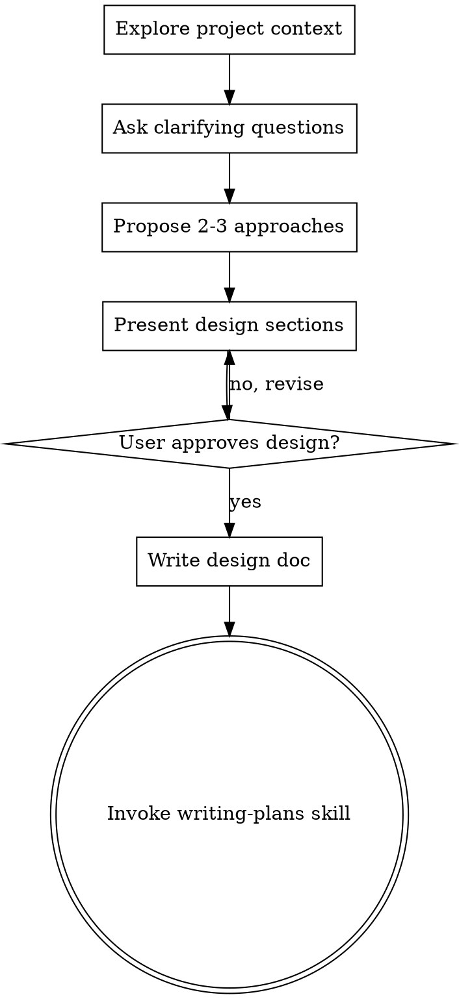

> DEVELOPER

## Important Rules

- **NEVER merge the PR** — founder-only
- **Only the orchestrator spawns agents** — sub-agents CANNOT use the Task tool to spawn teammates. PM must send SPAWN_REQUEST messages to the orchestrator.
- **PM handles scoping and coordination** — it creates task graphs, GitHub Issues, and prepares handoff context
- **Orchestrator is the agent factory** — spawns TA and Dev agents when PM requests them
- **All dev work happens in the worktree**
- **Task dependencies enforce ceremony order** — agents can't skip steps
- **TA is optional** for internal-only changes — PM decides based on scope

> DEVELOPER

## Step 5: Cleanup (After PR Merge)

After the founder merges the PR:

1. Send shutdown requests to all teammates (pm-agent, ta-agent, dev-agent)
2. Delete the team: `TeamDelete`
3. Clean up worktree:
```bash
git worktree remove ../code-insights-<slugified-arguments>
```
4. Confirm cleanup is complete

> DEVELOPER

## Step 5: Supervise

After spawning agents, your role is active supervisor:

1. **PM handles scoping and task graph** — orchestrator handles all agent spawning
2. **Spawn agents when PM sends SPAWN_REQUEST messages**
3. **Intervene when**:
   - PM messages you asking for user clarification -> relay to user
   - An agent is stuck or reports a blocker -> help unblock
   - PM requests `/start-review` -> run the review command on the PR
4. **When PM reports "ready for merge"** -> inform the user

> DEVELOPER

## Step 4: Orchestrator Spawns Agents on PM Request

After PM completes its handoff and sends a SPAWN_REQUEST message, the orchestrator spawns the requested agent:

**For TA (if PM requests it):**
```
Task {
  name: "ta-agent",
  subagent_type: "technical-architect",
  team_name: "feat-<slugified-arguments>",
  prompt: "You are the TA for feature team feat-<slugified-arguments>. Feature: Migrate telemetry from Supabase Edge Function to PostHog. Design doc at docs/plans/2026-03-02-posthog-telemetry-migration-design.md. Check TaskList for your assigned tasks. Use SendMessage to communicate with pm-agent and later dev-agent. Mark tasks in_progress when starting, completed when done.",
  mode: "bypassPermissions"
}
```
Assign the TA task to ta-agent.

**For Dev (when PM requests it):**
```
Task {
  name: "dev-agent",
  subagent_type: "engineer",
  team_name: "feat-<slugified-arguments>",
  prompt: "You are the Dev for feature team feat-<slugified-arguments>. Feature: Migrate telemetry from Supabase Edge Function to PostHog. Design doc at docs/plans/2026-03-02-posthog-telemetry-migration-design.md. Worktree: ../code-insights-<slugified-arguments>/. All code work happens in the worktree. Check TaskList for your tasks. Use SendMessage to communicate with pm-agent. Mark tasks in_progress/completed. CI gate: pnpm build must pass.",
  mode: "bypassPermissions"
}
```
Assign the next unblocked dev task to dev-agent.

> DEVELOPER

## Step 3: Spawn PM Agent

The PM agent handles scoping, GitHub Issues, and task graph creation. It does NOT spawn other agents — only the orchestrator can spawn agents.

```
Task {
  name: "pm-agent",
  subagent_type: "product-manager",
  team_name: "feat-<slugified-arguments>",
  prompt: "You are the PM for this feature team.

FEATURE REQUEST: Migrate telemetry from Supabase Edge Function to PostHog. Design doc at docs/plans/2026-03-02-posthog-telemetry-migration-design.md
WORKTREE: ../code-insights-<slugified-arguments>/
BRANCH: feature/<slugified-arguments>
TEAM: feat-<slugified-arguments>

Your responsibilities are scoping, GitHub Issues, task graph, and handoff preparation.
IMPORTANT: You CANNOT spawn agents. Only the orchestrator can. When you need an agent spawned, message the orchestrator with the request.

Follow this protocol:

1. SCOPE: Read docs in docs/ and CLAUDE.md to understand what this feature involves. Check for existing design docs in docs/plans/. Check docs/architecture/ for architecture context. If the scope is unclear, message the orchestrator for clarification.

2. ISSUES: Search for an existing GitHub Issue that matches this feature. If one exists, use it. If not, create one with proper description, acceptance criteria, and T-shirt size. Record the issue number.

3. TASK GRAPH: Create the ceremony tasks using TaskCreate, then set dependencies with TaskUpdate:
   - Task: 'TA: Review architecture alignment' (no dependencies) -- SKIP if internal-only (new components, UI, styling)
   - Task: 'PM: Prepare handoff context in GitHub Issue' (no dependencies, you do this yourself)
   - Task: 'Dev: Read handoff and design docs, prepare questions' (blockedBy: both above)
   - Task: 'Dev + TA: Reach consensus on implementation approach' (blockedBy: above) -- SKIP if internal-only
   - Task: 'Dev: Implement feature in worktree' (blockedBy: above)
   - Task: 'Dev: Create PR and run CI checks' (blockedBy: above)
   - Task: 'Review: Triple-layer code review' (blockedBy: above)
   - Task: 'Post review summary to GitHub PR' (blockedBy: above)

4. DO YOUR OWN TASK: Work on your handoff task -- prepare context in the GitHub Issue (description, acceptance criteria, relevant doc paths, implementation guidance).

5. REQUEST AGENT SPAWNS: When your handoff task is done, message the orchestrator:
   - If TA is needed: 'SPAWN_REQUEST: ta-agent — [brief context]'
   - When dev prerequisites are met: 'SPAWN_REQUEST: dev-agent — [brief context including issue number and key details]'
   The orchestrator will spawn the agents and assign tasks.

   SKIP TA if the feature is internal-only (new components, UI fixes, styling, LLM provider additions). In that case, mark the TA task as completed with note 'Skipped -- internal-only change'.

6. MONITOR: Check TaskList periodically. When Dev creates a PR, message the orchestrator to trigger /start-review on the PR number.

7. REPORT: When review is posted, message the orchestrator: 'PR #XX for Migrate telemetry from Supabase Edge Function to PostHog. Design doc at docs/plans/2026-03-02-posthog-telemetry-migration-design.md is ready for founder review and merge.'

IMPORTANT RULES:
- NEVER merge PRs -- founder-only
- NEVER try to spawn agents -- message the orchestrator instead
- All dev work happens in the worktree
- If you need user clarification, message the orchestrator who will ask the user
- You can message existing teammates directly via SendMessage for routine coordination
- Task dependencies enforce ceremony order -- don't skip steps
- CI gate for this project: pnpm build (no test framework yet)",
  mode: "bypassPermissions"
}
```

> DEVELOPER

## Step 2: Create Named Team

Create the team using TeamCreate. Use the slugified branch name (without `feature/` prefix) as the team name:

```
TeamCreate {
  team_name: "feat-<slugified-arguments>",
  description: "Feature team: Migrate telemetry from Supabase Edge Function to PostHog. Design doc at docs/plans/2026-03-02-posthog-telemetry-migration-design.md"
}
```

> DEVELOPER

## Step 1: Create Git Worktree

Slugify the feature description into a branch name:
- Take `Migrate telemetry from Supabase Edge Function to PostHog. Design doc at docs/plans/2026-03-02-posthog-telemetry-migration-design.md`, lowercase it, replace spaces/special chars with hyphens, truncate to 50 chars
- Prefix with `feature/` (e.g., "add demo mode onboarding" -> `feature/add-demo-mode-onboarding`)

```bash
# Example (adapt the slug from Migrate telemetry from Supabase Edge Function to PostHog. Design doc at docs/plans/2026-03-02-posthog-telemetry-migration-design.md):
BRANCH_NAME="feature/<slugified-arguments>"
git fetch origin
git worktree add ../code-insights-${BRANCH_NAME#feature/} -b ${BRANCH_NAME} origin/main
```

If the worktree or branch already exists, inform the user and ask how to proceed.

Run `pnpm install` in the worktree:
```bash
cd ../code-insights-${BRANCH_NAME#feature/} && pnpm install
```

> DEVELOPER

If i run code-insights sync without running init, will it work for the first time after installation?

> AGENT

**Yes, `sync` will work without running `init` first.** Here's why:

1. **Database creation is self-bootstrapping** — `getDb()` in `db/client.ts:20-21` creates `~/.code-insights/` if it doesn't exist, then opens (or creates) `data.db`, enables WAL mode, and runs migrations. The sync command calls `getDb()` directly at line 58.

2. **No config dependency** — `sync` never calls `loadConfig()`. It loads sync state via `loadSyncState()`, which returns a safe default `{ lastSync: '', files: {} }` if the file doesn't exist (`config.ts:64-65`).

3. **Providers use hardcoded defaults** — The Claude Code provider looks in `~/.claude/projects/` by default (via `getClaudeDir()`), not from config.

`★ Insight ─────────────────────────────────────`
The `init` command is essentially just a config writer — it saves a `config.json` and prints next-steps guidance. The actual infrastructure (database, migrations, sync state) is all lazy-initialized on first use. This means `init` is useful for discoverability/onboarding but isn't a hard prerequisite.
`─────────────────────────────────────────────────`

So a fresh `npm install -g @code-insights/cli && code-insights sync` would work out of the box — it just won't create `config.json`. The only thing `init` gives you that `sync` doesn't is that config file (which currently only stores `sync.excludeProjects` and dashboard LLM settings — neither needed for basic sync).

> DEVELOPER

what is the point in keeping the init then? do we see a value there?

> AGENT

Here's the honest assessment:

**`init` provides almost no value today.** All it does is:

1. Write a `config.json` with a default `claudeDir` that every provider already hardcodes
2. Call `getDb()` — which `sync` and `stats` do anyway
3. Print "next steps" guidance

**What actually reads the config:**
- `code-insights config` — shows/edits settings (LLM provider, port, telemetry). But these are all optional and have sensible defaults.
- `stats overview` — checks `isConfigured()` only to show a welcome message on first run
- `telemetry` — reads telemetry opt-in/out preference
- `open` — reads the dashboard port

None of these *require* `init` to have been run. They all handle `null` config gracefully.

**So the options are:**

| Option | Pros | Cons |
|--------|------|------|
| **Keep `init`** | Familiar CLI pattern; place to add future setup (e.g., source tool selection, LLM API key prompts) | Dead weight today; misleads users into thinking it's required |
| **Remove `init`, auto-bootstrap** | Simpler onboarding (`npm install -g && code-insights sync` just works); one less concept | Lose a natural place for future interactive setup |
| **Keep but make it optional explicitly** | Best of both — document that sync works standalone, `init` is for customization | Still carrying code that does almost nothing |

My take: `init` is a vestige from the Firebase era where setup was genuinely needed (API keys, project config). In a local-first tool where everything auto-bootstraps, it adds friction without value.

If you ever need interactive setup later (e.g., "which source tools do you use?" or "paste your OpenAI key"), you could reintroduce it then — or fold it into `code-insights config set`. What's your call?

> DEVELOPER

yea, i already had working config and sync in my machine, so i didn't use init.. but let's see how users will do it.. 

Now, explain me the telemetry part.. what are we capturing, how are we capturing, what value/insight we can generate from each type or the data captures?

> AGENT

Here's the full picture:

---

## What's captured

Every event sends exactly these 12 fields:

| Field | Example | How it's built |
|-------|---------|----------------|
| `machineId` | `a3f8b2c1d4e5f678` | `SHA-256(hostname:username:YYYY-MM)` truncated to 16 chars. Rotates monthly — can't track across months. |
| `command` | `sync`, `stats`, `dashboard` | Hardcoded string at each call site |
| `subcommand` | `cost`, `today`, `models` | Only for stats subcommands |
| `success` | `true` / `false` | Whether the command completed without error |
| `cliVersion` | `3.2.0` | From `package.json` |
| `nodeVersion` | `22.5.1` | `process.version` |
| `os` | `darwin` | `process.platform` |
| `arch` | `arm64` | `process.arch` |
| `providers` | `['claude-code', 'cursor']` | Checks if `~/.claude/projects`, `~/.codex/sessions`, etc. directories exist |
| `sessionCountBucket` | `51-200` | Counts `.jsonl` files in `~/.claude/projects/`, bucketed coarsely |
| `hasHook` | `true` | Checks if `~/.claude/settings.json` contains "code-insights" |
| `timestamp` | `2026-03-02` | Date only, no time, no timezone |
| `dataSource` | `local` / `none` | Whether a config file exists |

## Which commands are instrumented

Every CLI command fires a `trackEvent` — `init`, `sync`, `stats` (+ all 5 subcommands), `dashboard`, `config`, `status`, `reset`, `open`, `install-hook`.

## What value each field gives you

| Field(s) | Insight | Example question it answers |
|----------|---------|----------------------------|
| `machineId` + `timestamp` | Monthly active users (MAU) | "How many unique users in February?" |
| `command` + `subcommand` | Feature adoption | "Do people use `stats cost` or just `stats`?" "Is anyone using `reset`?" |
| `success` | Reliability | "Is `sync` failing for a chunk of users?" |
| `cliVersion` | Upgrade adoption | "How fast are users moving to v3.2?" "Can we deprecate v3.0?" |
| `os` + `arch` | Platform prioritization | "Are we mostly macOS ARM? Worth testing Linux x86?" |
| `providers` | Multi-source demand | "What % of users have Cursor installed? Should we prioritize Copilot CLI provider?" |
| `sessionCountBucket` | Power vs casual users | "Are most users in 1-10 sessions or 200+?" |
| `hasHook` | Auto-sync adoption | "Did the hook install feature land well?" |
| `nodeVersion` | Compatibility planning | "Can we drop Node 18 support?" |

## What's NOT captured

No file paths, project names, session content, git URLs, hostnames, usernames, API keys, or timing beyond date.

## Honest assessment

**Good design decisions:**
- Monthly-rotating machine ID prevents long-term tracking
- Coarse bucketing (session count) preserves privacy
- Fire-and-forget with 2s timeout — zero UX impact
- `DO_NOT_TRACK` env var respected (community standard)
- `telemetry status` shows a live preview of exactly what would be sent — full transparency

**Gaps in value:**

1. **No duration/latency** — you can't tell if `sync` takes 2s or 2min. A coarse bucket (e.g., `<5s`, `5-30s`, `30s+`) would help identify performance issues without fingerprinting.

2. **No session count in sync events** — you know sync succeeded but not whether it synced 0 sessions or 500. A bucket like `sessionCountBucket` for "sessions synced this run" would tell you if people sync frequently (few new) vs. rarely (big batch).

3. **No dashboard engagement** — `dashboard started` fires once, but you have no signal on whether people actually use the dashboard or close it immediately. The dashboard itself sends no telemetry.

4. **Provider detection ≠ provider usage** — you know Cursor is *installed* but not whether they actually synced Cursor sessions. The `--source` flag value isn't captured.

5. **`sessionCountBucket` only counts Claude Code .jsonl files** — doesn't reflect Cursor/Codex/Copilot session volume.

Want me to dig into any of these gaps, or into the Supabase Edge Function server side?

> DEVELOPER

I want to make some changes, i don't want monthly-rotating machine ids.. i want to know how many unique users are using, this will create problem for me to arrive at a correct number, isn't it?
Also, on your points:

1. Yes, we need to identify performance as well
2. need this as well
3. dashboard stats also is very much required, to know which LLM provider people use and how many insights, learnings, decisions and prompt analysis they are running
4. provider as well to know which ai tools are used the most
5. need session counts not buckets/estimated ranges.

I think it will tie back to the way we wanted to capture telemetry. We wanted to move to posthog from supabase. i think listed in @docs/plans/2026-02-27-local-first-migration.md 

come back to me with your analysis

> AGENT

Here's my analysis.

---

## Current State vs What You Need

### The core problem: Supabase is a dumb event store

Right now, events go to a Supabase Edge Function that (presumably) inserts them into a Postgres table. You have no analytics UI — to answer "how many users this month?" you'd need to write SQL against the Supabase table manually. That's the gap PostHog fills.

### Your 5 requirements mapped against what changes

| # | Requirement | Current State | What Needs to Change |
|---|-------------|---------------|---------------------|
| **Machine ID** | Monthly-rotating hash — can't count unique users across months | **Stable ID** (hash without monthly salt). PostHog handles this natively with `distinct_id`. |
| **1. Performance** | No duration captured | Add a `duration_ms` property to events (or let PostHog calculate from event pairs) |
| **2. Session count per sync** | Only a coarse bucket of total files | Add `sessions_synced` (exact count) to sync events |
| **3. Dashboard engagement** | Only `dashboard_started` fires once | Add server-side events: `analysis_run` (with LLM provider, analysis type), `insight_generated` (with type), `dashboard_page_view` |
| **4. Provider usage** | `providers` field only detects installed directories | Capture `source` from `--source` flag on sync; capture actual sessions synced per provider |
| **5. Exact session counts** | Bucketed (`1-10`, `51-200`) | Send exact count. PostHog can bucket on their end if you ever want to. |

### PostHog migration — why it solves most of this

The migration plan (Phase 5, §5.3) already recommends PostHog. Here's why it matters more now with your expanded requirements:

**What PostHog gives you for free that Supabase doesn't:**

| Capability | Supabase (current) | PostHog |
|------------|-------------------|---------|
| Unique user counts | Write SQL manually | Built-in, automatic from `distinct_id` |
| Retention (week-over-week) | Nothing | Built-in retention charts |
| Feature funnels (sync → dashboard → analyze) | Nothing | Built-in funnel analysis |
| Event property breakdowns (by OS, provider, LLM) | Raw SQL | Point-and-click |
| Performance percentiles (p50/p95 sync time) | Nothing | Property aggregation |
| Dashboard | None | Full product analytics UI |

**PostHog's `distinct_id` solves your machine ID problem directly.** You send a stable anonymous hash (no monthly rotation), and PostHog handles all the unique-user math, cohort tracking, and retention analysis. No need to build any of that yourself.

### Revised event schema for PostHog

Here's what the events should look like:

**Stable identity (replaces monthly-rotating hash):**
```
distinct_id: SHA-256(hostname:username:code-insights)[0:16]
// No monthly salt. Stable forever. Still anonymous — no PII sent.
```

**CLI events (already instrumented, need property expansion):**

| Event | New Properties | Value |
|-------|---------------|-------|
| `cli_sync` | `duration_ms`, `sessions_synced`, `sessions_by_provider: {claude-code: 12, cursor: 5}`, `source_filter` | Sync performance, volume, per-provider adoption |
| `cli_stats` | `duration_ms`, `subcommand`, `period`, `source_filter` | Which stats views are popular |
| `cli_dashboard` | `duration_ms` (time to start) | Dashboard startup performance |
| `cli_init` | (no changes) | First-run funnel |
| `cli_reset` | (no changes) | Churn signal |

**Server/dashboard events (new — currently missing):**

| Event | Properties | Value |
|-------|-----------|-------|
| `analysis_run` | `type` (session/prompt-quality/recurring), `llm_provider`, `llm_model`, `duration_ms`, `success` | LLM usage by provider, performance, failure rate |
| `insight_generated` | `type` (summary/decision/learning/technique/prompt_quality), `count` | Which insight types users care about |
| `export_run` | `format`, `session_count` | Export adoption |
| `dashboard_page_view` | `page` (/sessions, /insights, /analytics, etc.) | Which pages get traffic |

### Privacy impact of removing monthly rotation

The monthly rotation was a conservative privacy measure. Removing it means:

- **You can** count true unique users, track retention, build cohort analysis
- **Trade-off:** A stable hash is theoretically more correlatable if someone got access to both the telemetry DB and a user's machine. But since the hash includes no PII and you're not collecting IPs (PostHog can be configured to discard them), this is a reasonable trade-off for an open-source CLI.

**Recommendation:** Update the disclosure notice to reflect the stable ID, and keep all the opt-out mechanisms (`DO_NOT_TRACK`, env var, `telemetry disable`). That's the standard for tools like Next.js, Astro, and Turborepo — all use stable anonymous IDs.

### Implementation scope

The migration has two parts:

1. **Backend swap** — Replace `sendEvent()` with `posthog-node` SDK calls. ~50 lines changed in `telemetry.ts`. The opt-out logic, disclosure notice, and `trackEvent()` interface stay the same.

2. **Event enrichment** — Add `duration_ms`, exact counts, per-provider breakdowns, and new server-side events. This touches `sync.ts`, `analysis.ts`, `export.ts`, and adds a lightweight page-view tracker in the dashboard.

The `posthog-node` SDK is ~20KB, no native deps, fire-and-forget by default (it batches internally and flushes on process exit). It's designed for exactly this use case.

---

### Summary

The Supabase endpoint was a "ship something now" decision for v3.0.0. For what you actually need — unique users, retention, performance tracking, feature adoption by provider/LLM — PostHog is the right move. The event shape needs to expand (duration, exact counts, server-side events), and the machine ID needs to go stable.

Want me to plan this out as a feature?

> DEVELOPER

yes, plan it up.. i am signing up for posthog meanwhile

> SYSTEM

Base directory for this skill: /Users/melagiri/.claude/plugins/cache/claude-plugins-official/superpowers/4.3.1/skills/brainstorming

# Brainstorming Ideas Into Designs

## Overview

Help turn ideas into fully formed designs and specs through natural collaborative dialogue.

Start by understanding the current project context, then ask questions one at a time to refine the idea. Once you understand what you're building, present the design and get user approval.

<HARD-GATE>
Do NOT invoke any implementation skill, write any code, scaffold any project, or take any implementation action until you have presented a design and the user has approved it. This applies to EVERY project regardless of perceived simplicity.
</HARD-GATE>

## Anti-Pattern: "This Is Too Simple To Need A Design"

Every project goes through this process. A todo list, a single-function utility, a config change — all of them. "Simple" projects are where unexamined assumptions cause the most wasted work. The design can be short (a few sentences for truly simple projects), but you MUST present it and get approval.

## Checklist

You MUST create a task for each of these items and complete them in order:

1. **Explore project context** — check files, docs, recent commits
2. **Ask clarifying questions** — one at a time, understand purpose/constraints/success criteria
3. **Propose 2-3 approaches** — with trade-offs and your recommendation
4. **Present design** — in sections scaled to their complexity, get user approval after each section
5. **Write design doc** — save to `docs/plans/YYYY-MM-DD-<topic>-design.md` and commit
6. **Transition to implementation** — invoke writing-plans skill to create implementation plan

## Process Flow



**The terminal state is invoking writing-plans.** Do NOT invoke frontend-design, mcp-builder, or any other implementation skill. The ONLY skill you invoke after brainstorming is writing-plans.

## The Process

**Understanding the idea:**
- Check out the current project state first (files, docs, recent commits)
- Ask questions one at a time to refine the idea
- Prefer multiple choice questions when possible, but open-ended is fine too
- Only one question per message - if a topic needs more exploration, break it into multiple questions
- Focus on understanding: purpose, constraints, success criteria

**Exploring approaches:**
- Propose 2-3 different approaches with trade-offs
- Present options conversationally with your recommendation and reasoning
- Lead with your recommended option and explain why

**Presenting the design:**
- Once you believe you understand what you're building, present the design
- Scale each section to its complexity: a few sentences if straightforward, up to 200-300 words if nuanced
- Ask after each section whether it looks right so far
- Cover: architecture, components, data flow, error handling, testing
- Be ready to go back and clarify if something doesn't make sense

## After the Design

**Documentation:**
- Write the validated design to `docs/plans/YYYY-MM-DD-<topic>-design.md`
- Use elements-of-style:writing-clearly-and-concisely skill if available
- Commit the design document to git

**Implementation:**
- Invoke the writing-plans skill to create a detailed implementation plan
- Do NOT invoke any other skill. writing-plans is the next step.

## Key Principles

- **One question at a time** - Don't overwhelm with multiple questions
- **Multiple choice preferred** - Easier to answer than open-ended when possible
- **YAGNI ruthlessly** - Remove unnecessary features from all designs
- **Explore alternatives** - Always propose 2-3 approaches before settling
- **Incremental validation** - Present design, get approval before moving on
- **Be flexible** - Go back and clarify when something doesn't make sense

> AGENT

Good. All questions answered. Let me present the design section by section.

---

## Design Section 1: Architecture

**Two SDKs, one identity, three event sources:**

```
CLI commands ──► posthog-node (server-side) ──► PostHog
                     ▲
Server routes ───────┘
                                                   ▲
Dashboard SPA ──► posthog-js (client-side) ────────┘
```

- **`posthog-node`** (~20KB, no native deps) replaces the current raw `fetch` + Supabase endpoint. Used by CLI commands and server-side analysis/export routes. Fire-and-forget with internal batching.
- **`posthog-js`** (~45KB) loaded in the dashboard SPA for page views. Configured with `persistence: 'memory'` (no cookies, no localStorage) and `ip: false` (don't capture IPs).
- **Shared `distinct_id`**: `SHA-256(hostname:username:code-insights)[0:16]`. The server passes this to the SPA via a new `GET /api/telemetry/identity` endpoint so both SDKs use the same ID.

**Supabase removal:** The Supabase endpoint, HMAC signing, and `HMAC_KEY` constant are deleted entirely. No more custom edge function to maintain.

Does this architecture look right so far?

> DEVELOPER

yes

> AGENT

## Design Section 2: Identity & Privacy

**Stable machine ID (replaces monthly-rotating hash):**
```
SHA-256(hostname:username:code-insights)[0:16]
```

- No monthly salt — same machine always produces the same ID
- No PII sent — hostname and username are hashed, never transmitted
- Survives reinstalls — deterministic, no stored file needed
- PostHog configured with `ip: false` on both SDKs to discard IP addresses

**Opt-out mechanisms (unchanged):**
1. `CODE_INSIGHTS_TELEMETRY_DISABLED=1` env var
2. `DO_NOT_TRACK=1` env var (community standard)
3. `code-insights telemetry disable` (persists to config)

**Re-show disclosure:** Delete `.telemetry-notice-shown` touch file during the migration. Updated notice text:

```
Code Insights collects anonymous usage data to improve the CLI and dashboard.
Includes: commands, page views, OS, CLI version, AI tool types, session counts,
LLM provider, performance timing.
Never includes: file paths, project names, session content, API keys, or personal data.
```

**Dashboard SPA opt-out:** The `/api/telemetry/identity` endpoint returns `{ enabled: false }` when telemetry is disabled. The SPA checks this before initializing `posthog-js`. If disabled, no client-side SDK loads at all.

Does this look right?

> DEVELOPER

good

> AGENT

## Design Section 3: Event Schema

All events get these **common properties** automatically (set once via `posthog-node`'s `register` / `posthog-js`'s `register`):

| Property | Example | Source |
|----------|---------|--------|
| `cli_version` | `3.3.0` | `package.json` |
| `node_version` | `22.5.1` | `process.version` |
| `os` | `darwin` | `process.platform` |
| `arch` | `arm64` | `process.arch` |
| `installed_providers` | `['claude-code', 'cursor']` | Directory existence check (current logic) |
| `has_hook` | `true` | Claude settings.json check (current logic) |
| `total_sessions` | `347` | Exact count from SQLite `SELECT COUNT(*) FROM sessions` |

**CLI events (posthog-node, server-side):**

| Event | Properties | Replaces |
|-------|-----------|----------|
| `cli_sync` | `duration_ms`, `sessions_synced`, `sessions_by_provider: {claude-code: 12, cursor: 5}`, `errors`, `source_filter` | Current `trackEvent('sync', ...)` |
| `cli_stats` | `duration_ms`, `subcommand` (overview/cost/projects/today/models), `period`, `source_filter` | Current `trackEvent('stats', ...)` |
| `cli_dashboard` | `port` | Current `trackEvent('dashboard', ...)` |
| `cli_init` | _(no extra props)_ | Current `trackEvent('init', ...)` |
| `cli_config` | `subcommand` (show/set/llm) | Current `trackEvent('config', ...)` |
| `cli_reset` | _(no extra props)_ | Current `trackEvent('reset', ...)` |
| `cli_install_hook` | _(no extra props)_ | Current `trackEvent('install-hook', ...)` |

**Server events (posthog-node, fired from Hono routes):**

| Event | Properties | New? |
|-------|-----------|------|
| `analysis_run` | `type` (session/prompt-quality/recurring), `llm_provider`, `llm_model`, `duration_ms`, `success` | Yes |
| `insight_generated` | `type` (summary/decision/learning/technique/prompt_quality), `count` | Yes |
| `export_run` | `format` (markdown), `session_count` | Enriched (was just success boolean) |

**Dashboard events (posthog-js, client-side):**

| Event | Properties | New? |
|-------|-----------|------|
| `$pageview` | `path` (automatic from posthog-js) | Yes |
| `dashboard_loaded` | `page` (/sessions, /insights, etc.), `load_time_ms` | Yes |

`posthog-js` captures `$pageview` automatically on route change if `capture_pageview: true`. The `dashboard_loaded` event is a manual capture for measuring meaningful render time (after data loads, not just route change).

**Dropped fields:**
- `sessionCountBucket` — replaced by exact `total_sessions`
- `dataSource` — always `local`, no value
- `machineId` field in payload — PostHog uses `distinct_id` natively
- `timestamp` — PostHog timestamps events server-side

Does this event schema cover what you need?

> DEVELOPER

yes

> AGENT

## Design Section 4: Implementation Changes

**Files modified:**

| File | Change |
|------|--------|
| `cli/src/utils/telemetry.ts` | Gut and rewrite. Replace `fetch` + Supabase with `posthog-node`. Remove HMAC signing, monthly salt, `sessionCountBucket`, `dataSource`. New `getPostHogClient()` singleton. `trackEvent()` signature stays the same but accepts a `properties` object. Add `getStableMachineId()`, `getCommonProperties()`, `shutdown()` (flushes on process exit). |
| `cli/src/commands/sync.ts` | Capture `Date.now()` before/after `runSync()`. Pass `duration_ms`, `sessions_synced`, `sessions_by_provider`, `errors`, `source_filter` to `trackEvent`. |
| `cli/src/commands/stats/actions/*.ts` | Add `duration_ms` to all 5 subcommand `trackEvent` calls. |
| `cli/src/commands/dashboard.ts` | No change — already fires `trackEvent('dashboard', true, 'started')`. |
| `cli/src/commands/telemetry.ts` | Update `statusAction()` preview to show PostHog event shape instead of raw JSON. |
| `server/src/routes/analysis.ts` | Add `duration_ms`, `llm_provider`, `llm_model` to existing `trackEvent` calls. Add `insight_generated` events after successful writes. |
| `server/src/routes/export.ts` | Add `session_count` to existing `trackEvent` call. |
| `server/src/routes/config.ts` (or new `telemetry.ts` route) | New `GET /api/telemetry/identity` — returns `{ enabled, distinctId }` for the SPA. |
| `dashboard/src/App.tsx` (or a new `telemetry.ts` init file) | Fetch identity on mount, conditionally init `posthog-js` with `distinct_id`, `persistence: 'memory'`, `ip: false`, `capture_pageview: true`. |

**Files deleted:**
- Nothing deleted, but `TELEMETRY_ENDPOINT`, `HMAC_KEY`, `signPayload()`, `getMachineId()` (monthly version), `getSessionCountBucket()`, `getDataSource()` are all removed from `telemetry.ts`.

**New dependencies:**

| Package | Added to | Size |
|---------|----------|------|
| `posthog-node` | `cli/package.json` | ~20KB |
| `posthog-js` | `dashboard/package.json` | ~45KB |

**Disclosure reset:**
- During the migration, the code that checks for `.telemetry-notice-shown` gets a version check. If the file exists but was written before this version, delete it and re-show. Simple approach: write the CLI version into the touch file instead of an empty string, and re-show if version < the release version.

**`trackEvent` signature change:**

```typescript
// Before
trackEvent(command: string, success: boolean, subcommand?: string): void

// After
trackEvent(event: string, properties?: Record<string, unknown>): void
```

All existing call sites get updated mechanically. `success` becomes a property instead of a positional arg.

Does this implementation scope look right?

> DEVELOPER

yes, run it for a review with @"technical-architect (agent)" as well before finalizing

> AGENT

Excellent review from TA. Here's the summary of their findings:

### TA Verdict: Approved with 3 items to address

**Must address before implementation:**

| # | Issue | TA Recommendation | 
|---|-------|-------------------|
| **#1** | PostHog background flush timer — events dropped on `process.exit()` | Add `shutdownTelemetry()` export, wire into server SIGINT/SIGTERM handler |
| **#4** | `total_sessions` SQLite query fires on every event | Use `posthog.identify()` with person properties once per process, not per-event |
| **#7** | PostHog client created at module load time blocks even `--help` | Lazy init via `getPostHogClient()`. Use `flushAt: 1`, `flushInterval: 0` for CLI (short-lived process — default batching would silently drop events) |

**Refinements (handle during implementation):**

| # | Issue | Action |
|---|-------|--------|
| **#2** | Type safety | Use string literal union for event names, `Record<string, unknown>` for properties |
| **#5** | posthog-js config | Explicitly set `autocapture: false`, `disable_session_recording: true` to avoid dead code |
| **#6** | Disclosure re-show | Write CLI version into touch file instead of empty string |
| **#8** | `success` field | Keep as explicit boolean property, don't infer from error absence |
| **#10** | API key | Hardcoded in source — standard PostHog pattern (write-only key) |

**Non-issues:** Cross-package import (#1 structure), identity endpoint security (#3), bundle size (#5 at ~2.6% increase), identity hash change (#9 — fresh PostHog project).

I'll incorporate all of TA's feedback into the design doc. Does this all look good to you, or do you want to discuss any of these points?

> DEVELOPER

i am good. go ahead, follow full ceremony for development

> DEVELOPER

# /start-feature — Auto-Setup Feature Development Team

**Feature**: Migrate telemetry from Supabase Edge Function to PostHog. Design doc at docs/plans/2026-03-02-posthog-telemetry-migration-design.md

You are setting up a hybrid agent team for feature development. The PM agent leads the team and owns the ceremony. Your job is minimal setup, then hand control to PM.

---

## Step 1: Create Git Worktree

Slugify the feature description into a branch name:
- Take `Migrate telemetry from Supabase Edge Function to PostHog. Design doc at docs/plans/2026-03-02-posthog-telemetry-migration-design.md`, lowercase it, replace spaces/special chars with hyphens, truncate to 50 chars
- Prefix with `feature/` (e.g., "add demo mode onboarding" -> `feature/add-demo-mode-onboarding`)

```bash
# Example (adapt the slug from Migrate telemetry from Supabase Edge Function to PostHog. Design doc at docs/plans/2026-03-02-posthog-telemetry-migration-design.md):
BRANCH_NAME="feature/<slugified-arguments>"
git fetch origin
git worktree add ../code-insights-${BRANCH_NAME#feature/} -b ${BRANCH_NAME} origin/main
```

If the worktree or branch already exists, inform the user and ask how to proceed.

Run `pnpm install` in the worktree:
```bash
cd ../code-insights-${BRANCH_NAME#feature/} && pnpm install
```

---

## Step 2: Create Named Team

Create the team using TeamCreate. Use the slugified branch name (without `feature/` prefix) as the team name:

```
TeamCreate {
  team_name: "feat-<slugified-arguments>",
  description: "Feature team: Migrate telemetry from Supabase Edge Function to PostHog. Design doc at docs/plans/2026-03-02-posthog-telemetry-migration-design.md"
}
```

---

## Step 3: Spawn PM Agent

The PM agent handles scoping, GitHub Issues, and task graph creation. It does NOT spawn other agents — only the orchestrator can spawn agents.

```
Task {
  name: "pm-agent",
  subagent_type: "product-manager",
  team_name: "feat-<slugified-arguments>",
  prompt: "You are the PM for this feature team.

FEATURE REQUEST: Migrate telemetry from Supabase Edge Function to PostHog. Design doc at docs/plans/2026-03-02-posthog-telemetry-migration-design.md
WORKTREE: ../code-insights-<slugified-arguments>/
BRANCH: feature/<slugified-arguments>
TEAM: feat-<slugified-arguments>

Your responsibilities are scoping, GitHub Issues, task graph, and handoff preparation.
IMPORTANT: You CANNOT spawn agents. Only the orchestrator can. When you need an agent spawned, message the orchestrator with the request.

Follow this protocol:

1. SCOPE: Read docs in docs/ and CLAUDE.md to understand what this feature involves. Check for existing design docs in docs/plans/. Check docs/architecture/ for architecture context. If the scope is unclear, message the orchestrator for clarification.

2. ISSUES: Search for an existing GitHub Issue that matches this feature. If one exists, use it. If not, create one with proper description, acceptance criteria, and T-shirt size. Record the issue number.

3. TASK GRAPH: Create the ceremony tasks using TaskCreate, then set dependencies with TaskUpdate:
   - Task: 'TA: Review architecture alignment' (no dependencies) -- SKIP if internal-only (new components, UI, styling)
   - Task: 'PM: Prepare handoff context in GitHub Issue' (no dependencies, you do this yourself)
   - Task: 'Dev: Read handoff and design docs, prepare questions' (blockedBy: both above)
   - Task: 'Dev + TA: Reach consensus on implementation approach' (blockedBy: above) -- SKIP if internal-only
   - Task: 'Dev: Implement feature in worktree' (blockedBy: above)
   - Task: 'Dev: Create PR and run CI checks' (blockedBy: above)
   - Task: 'Review: Triple-layer code review' (blockedBy: above)
   - Task: 'Post review summary to GitHub PR' (blockedBy: above)

4. DO YOUR OWN TASK: Work on your handoff task -- prepare context in the GitHub Issue (description, acceptance criteria, relevant doc paths, implementation guidance).

5. REQUEST AGENT SPAWNS: When your handoff task is done, message the orchestrator:
   - If TA is needed: 'SPAWN_REQUEST: ta-agent — [brief context]'
   - When dev prerequisites are met: 'SPAWN_REQUEST: dev-agent — [brief context including issue number and key details]'
   The orchestrator will spawn the agents and assign tasks.

   SKIP TA if the feature is internal-only (new components, UI fixes, styling, LLM provider additions). In that case, mark the TA task as completed with note 'Skipped -- internal-only change'.

6. MONITOR: Check TaskList periodically. When Dev creates a PR, message the orchestrator to trigger /start-review on the PR number.

7. REPORT: When review is posted, message the orchestrator: 'PR #XX for Migrate telemetry from Supabase Edge Function to PostHog. Design doc at docs/plans/2026-03-02-posthog-telemetry-migration-design.md is ready for founder review and merge.'

IMPORTANT RULES:
- NEVER merge PRs -- founder-only
- NEVER try to spawn agents -- message the orchestrator instead
- All dev work happens in the worktree
- If you need user clarification, message the orchestrator who will ask the user
- You can message existing teammates directly via SendMessage for routine coordination
- Task dependencies enforce ceremony order -- don't skip steps
- CI gate for this project: pnpm build (no test framework yet)",
  mode: "bypassPermissions"
}
```

---

## Step 4: Orchestrator Spawns Agents on PM Request

After PM completes its handoff and sends a SPAWN_REQUEST message, the orchestrator spawns the requested agent:

**For TA (if PM requests it):**
```
Task {
  name: "ta-agent",
  subagent_type: "technical-architect",
  team_name: "feat-<slugified-arguments>",
  prompt: "You are the TA for feature team feat-<slugified-arguments>. Feature: Migrate telemetry from Supabase Edge Function to PostHog. Design doc at docs/plans/2026-03-02-posthog-telemetry-migration-design.md. Check TaskList for your assigned tasks. Use SendMessage to communicate with pm-agent and later dev-agent. Mark tasks in_progress when starting, completed when done.",
  mode: "bypassPermissions"
}
```
Assign the TA task to ta-agent.

**For Dev (when PM requests it):**
```
Task {
  name: "dev-agent",
  subagent_type: "engineer",
  team_name: "feat-<slugified-arguments>",
  prompt: "You are the Dev for feature team feat-<slugified-arguments>. Feature: Migrate telemetry from Supabase Edge Function to PostHog. Design doc at docs/plans/2026-03-02-posthog-telemetry-migration-design.md. Worktree: ../code-insights-<slugified-arguments>/. All code work happens in the worktree. Check TaskList for your tasks. Use SendMessage to communicate with pm-agent. Mark tasks in_progress/completed. CI gate: pnpm build must pass.",
  mode: "bypassPermissions"
}
```
Assign the next unblocked dev task to dev-agent.

---

## Step 5: Supervise

After spawning agents, your role is active supervisor:

1. **PM handles scoping and task graph** — orchestrator handles all agent spawning
2. **Spawn agents when PM sends SPAWN_REQUEST messages**
3. **Intervene when**:
   - PM messages you asking for user clarification -> relay to user
   - An agent is stuck or reports a blocker -> help unblock
   - PM requests `/start-review` -> run the review command on the PR
4. **When PM reports "ready for merge"** -> inform the user

---

## Step 5: Cleanup (After PR Merge)

After the founder merges the PR:

1. Send shutdown requests to all teammates (pm-agent, ta-agent, dev-agent)
2. Delete the team: `TeamDelete`
3. Clean up worktree:
```bash
git worktree remove ../code-insights-<slugified-arguments>
```
4. Confirm cleanup is complete

---

## Important Rules

- **NEVER merge the PR** — founder-only
- **Only the orchestrator spawns agents** — sub-agents CANNOT use the Task tool to spawn teammates. PM must send SPAWN_REQUEST messages to the orchestrator.
- **PM handles scoping and coordination** — it creates task graphs, GitHub Issues, and prepares handoff context
- **Orchestrator is the agent factory** — spawns TA and Dev agents when PM requests them
- **All dev work happens in the worktree**
- **Task dependencies enforce ceremony order** — agents can't skip steps
- **TA is optional** for internal-only changes — PM decides based on scope

> AGENT

Team is up and running:

- **Worktree:** `../code-insights-migrate-telemetry-supabase-to-posthog/` on branch `feature/migrate-telemetry-supabase-to-posthog`
- **Team:** `feat-migrate-telemetry-supabase-to-posthog`
- **PM spawned** — scoping the feature, creating GitHub Issue, and building the task graph

I'm now supervising. PM will message me when it needs TA or Dev agents spawned. I'll relay any questions that come up.
