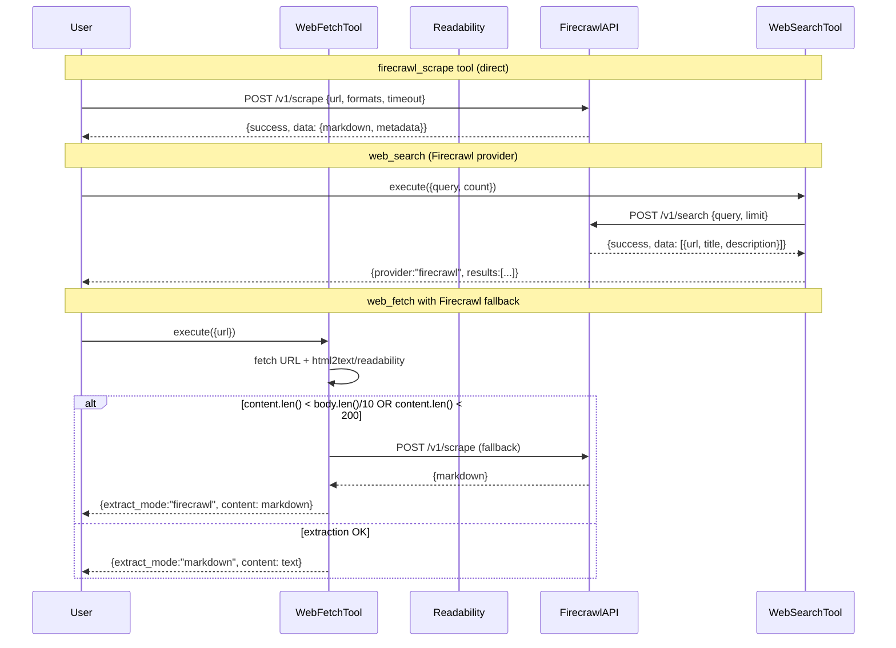

> DEVELOPER

Can you look if ~/code/openclaw is using https://github.com/firecrawl/firecrawl and how it uses it, and how I could add this in moltis.

> TOOL

tool_use Agent
id: toolu_01Voh4t1uWmZgqvbyTRrz7Cm
```json
{
  "subagent_type": "Explore",
  "description": "Search openclaw for firecrawl usage",
  "prompt": "Search the codebase at ~/code/openclaw for any references to \"firecrawl\". Look for:\n1. Configuration files mentioning firecrawl\n2. Code that imports or uses firecrawl\n3. How firecrawl is integrated (API calls, SDK usage, etc.)\n4. What firecrawl is used for in the project\n\nBe very thorough - check package.json, .env files, config files, source code, etc. Report all findings with file paths and relevant code snippets."
}
```

> TOOL

tool_use Agent
id: toolu_01Adq5iMHbdxmbAxTVtNH3cf
```json
{
  "subagent_type": "Explore",
  "description": "Search moltis for web fetch/scrape",
  "prompt": "Search the moltis codebase at /Users/penso/.superset/worktrees/moltis/mango-collision for:\n1. Any existing web fetching, scraping, or crawling functionality\n2. Look for files like web_fetch.rs, or any tool that fetches web content\n3. Check the tools crate (crates/tools/) for web-related tools\n4. Check config schema for any web fetch or firecrawl related configuration\n5. Look at how tools are registered and made available to agents\n\nReport file paths and relevant code snippets."
}
```

> TOOL

tool_result
id: toolu_01Voh4t1uWmZgqvbyTRrz7Cm
```
Based on my thorough search of the codebase at `/Users/penso/.superset/worktrees/moltis/mango-collision`, I can provide you with the following findings:

## Summary: No Firecrawl References Found

After conducting an extensive search of the entire codebase, I found **no references to "firecrawl" or any of its common variations** (Fire-Crawl, fire_crawl, FireCrawl, etc.) in:

- Rust source files (`.rs`)
- TOML configuration files (Cargo.toml)
- JSON package files (package.json, package-lock.json)
- YAML/YML files
- Markdown documentation
- Environment files (.envrc-example, .env*)
- Git commit history

## What I Did Find

The project **does have web scraping/content extraction capabilities** through a different implementation:

1. **WebFetchTool** - Located at `/Users/penso/.superset/worktrees/moltis/mango-collision/crates/tools/src/web_fetch.rs`
   - Fetches web URLs and extracts readable content
   - Uses the `html2text` crate for HTML to text conversion
   - Supports markdown extraction mode
   - Implements SSRF (Server-Side Request Forgery) protection
   - Has caching and redirect handling built-in
   - Configured via `WebFetchConfig` in the config schema

2. **Configuration** in `crates/config/src/schema.rs`:
   - `WebFetchConfig` struct handles web fetch settings
   - Enabled/disabled toggle
   - Customizable max characters, timeout, cache TTL, redirect limits
   - SSRF allowlist configuration
   - Readability mode option

3. **Web Search Tool** - Located at `/Users/penso/.superset/worktrees/moltis/mango-collision/crates/tools/src/web_search.rs`
   - Separate tool for web searches

## Conclusion

The Moltis codebase does **not integrate Firecrawl**. Instead, it implements its own web content extraction solution through the `WebFetchTool` with built-in security features (SSRF protection) and configurable extraction modes (markdown/text).
agentId: ac8dcdce5190fd490 (use SendMessage with to: 'ac8dcdce5190fd490' to continue this agent)
<usage>total_tokens: 53367
tool_uses: 43
duration_ms: 58533</usage>
```

> TOOL

tool_result
id: toolu_01Adq5iMHbdxmbAxTVtNH3cf
```
Excellent! Now I have a comprehensive view. Let me create a final summary report.

## Summary Report: Web Fetching, Scraping, and Crawling Functionality in Moltis

I've completed a thorough search of the moltis codebase. Here's what I found:

### 1. **Existing Web Fetching Functionality**

#### Primary Tools

**File: `/Users/penso/.superset/worktrees/moltis/mango-collision/crates/tools/src/web_fetch.rs` (689 lines)**

- **WebFetchTool**: A built-in tool that fetches HTTP/HTTPS URLs and extracts readable content
- **Key Features**:
  - HTML-to-text conversion using `html2text` crate (with TrivialDecorator to strip tags/markup)
  - JSON pretty-printing for API responses
  - Automatic content type detection (JSON, HTML, plain text)
  - Readability extraction for HTML pages
  - Configurable max character limit (default 50,000 chars)
  - In-memory response caching with TTL (default 15 minutes)
  - Manual redirect handling (max 3 hops, loop detection)
  - SSRF protection with allowlist support
  - Proxy support via `proxy_url` parameter

- **Parameters Schema**:
  ```
  url (string, required) - HTTP/HTTPS URL to fetch
  extract_mode (string) - "markdown" or "text" (default: markdown)
  max_chars (integer) - Maximum characters to return (default: 50000)
  ```

- **Config Structure** (crates/config/src/schema.rs, lines 1662-1691):
  ```rust
  pub struct WebFetchConfig {
      pub enabled: bool,
      pub max_chars: usize,
      pub timeout_seconds: u64,
      pub cache_ttl_minutes: u64,
      pub max_redirects: u8,
      pub readability: bool,
      pub ssrf_allowlist: Vec<String>,  // CIDR ranges exempt from SSRF
  }
  ```

**File: `/Users/penso/.superset/worktrees/moltis/mango-collision/crates/tools/src/web_search.rs` (1000+ lines)**

- **WebSearchTool**: A web search tool supporting multiple providers
- **Supported Providers**:
  - **Brave Search**: Official API (requires API key via `BRAVE_API_KEY`)
  - **Perplexity**: LLM-powered search with citations (requires API key)
  - **DuckDuckGo Fallback**: HTML-based fallback when API key missing (can trigger CAPTCHAs)

- **Key Features**:
  - Multi-provider configuration
  - API key management via config or environment variables
  - Runtime hot-reloading of API keys via environment provider
  - In-memory result caching with TTL
  - Result count limiting (1-10 results)
  - Language-aware search with Accept-Language header support
  - DuckDuckGo CAPTCHA detection and blocking

- **Config Structure** (lines 1603-1640):
  ```rust
  pub struct WebSearchConfig {
      pub enabled: bool,
      pub provider: SearchProvider,  // Brave or Perplexity
      pub api_key: Option<Secret<String>>,
      pub max_results: u8,
      pub timeout_seconds: u64,
      pub cache_ttl_minutes: u64,
      pub duckduckgo_fallback: bool,
      pub perplexity: PerplexityConfig,
  }
  ```

### 2. **Security Features: SSRF Protection**

**File: `/Users/penso/.superset/worktrees/moltis/mango-collision/crates/tools/src/ssrf.rs` (171 lines)**

Comprehensive SSRF (Server-Side Request Forgery) protection:

- **Blocked by default**:
  - IPv4: loopback, private (10.0.0.0/8, 172.16.0.0/12, 192.168.0.0/16), link-local, broadcast, unspecified, CGNAT (100.64.0.0/10), 192.0.0.0/24
  - IPv6: loopback, unspecified, unique local (fc00::/7), link-local (fe80::/10)

- **Allowlist support**: CIDR ranges in `ssrf_allowlist` config parameter can exempt specific private IPs
- **DNS resolution**: Validates resolved IPs before making requests
- **Both async and blocking variants**: `ssrf_check()` (async) and `ssrf_check_blocking()` (sync)

### 3. **Tool Registration & Integration**

**File: `/Users/penso/.superset/worktrees/moltis/mango-collision/crates/gateway/src/server.rs` (lines 3386-3401)**

Tools are registered at startup in the gateway:

```rust
// Web search tool
if let Some(t) = moltis_tools::web_search::WebSearchTool::from_config_with_env_overrides(
    &config.tools.web.search,
    &runtime_env_overrides,
) {
    tool_registry.register(Box::new(t.with_env_provider(Arc::clone(&env_provider))));
}

// Web fetch tool
if let Some(t) = moltis_tools::web_fetch::WebFetchTool::from_config(&config.tools.web.fetch) {
    tool_registry.register(Box::new(t));
}
```

### 4. **AgentTool Trait Interface**

**File: `/Users/penso/.superset/worktrees/moltis/mango-collision/crates/agents/src/tool_registry.rs`**

All tools implement the `AgentTool` trait:

```rust
#[async_trait]
pub trait AgentTool: Send + Sync {
    fn name(&self) -> &str;
    fn description(&self) -> &str;
    fn parameters_schema(&self) -> serde_json::Value;
    async fn warmup(&self) -> Result<()> { Ok(()) }
    async fn execute(&self, params: serde_json::Value) -> Result<serde_json::Value>;
}
```

### 5. **Configuration Hierarchy**

**File: `/Users/penso/.superset/worktrees/moltis/mango-collision/crates/config/src/schema.rs` (lines 1583-1692)**

Web tools grouped under `WebConfig`:

```rust
pub struct WebConfig {
    pub search: WebSearchConfig,
    pub fetch: WebFetchConfig,
}
```

### 6. **Dependencies**

**File: `/Users/penso/.superset/worktrees/moltis/mango-collision/crates/tools/Cargo.toml`**

Key HTTP/text processing crates:
- `reqwest` - HTTP client with proxy support
- `html2text` - HTML-to-text conversion
- `url` - URL parsing and validation
- `ipnet` - CIDR range matching for SSRF allowlist
- `secrecy` - Secret credential handling

### 7. **Notable Observations**

- **No Firecrawl integration**: The codebase does not use Firecrawl for web scraping
- **Simple HTML extraction**: Uses `html2text` crate rather than full-page scraping libraries
- **Streaming not used**: `web_fetch` loads full page content into memory before processing
- **Limited crawling**: No built-in link following, site crawling, or recursive scraping
- **Browser tool available**: `/Users/penso/.superset/worktrees/moltis/mango-collision/crates/tools/src/browser.rs` provides full browser automation (screenshots, DOM interaction, JavaScript execution) as an alternative for dynamic content

### 8. **Comparison with Browser Tool**

The codebase has both:
- **web_fetch**: Simple, fast, static content extraction (best for APIs and static pages)
- **BrowserTool**: Full automation with JavaScript execution, screenshots, form filling (best for JavaScript-heavy sites)

This provides flexibility for different use cases without requiring heavy-weight crawling libraries.
agentId: af501980269186d3d (use SendMessage with to: 'af501980269186d3d' to continue this agent)
<usage>total_tokens: 59686
tool_uses: 28
duration_ms: 56250</usage>
```

> AGENT

The first agent searched the wrong path. Let me search the actual openclaw repo.

> TOOL

tool_use Grep
id: toolu_014mskMbgukEHsxpEnuMUs2U
```json
{
  "pattern": "firecrawl",
  "path": "/Users/penso/code/openclaw",
  "-i": true
}
```

> TOOL

tool_result
id: toolu_014mskMbgukEHsxpEnuMUs2U
```
Found 75 files
/Users/penso/code/openclaw/test/fixtures/test-timings.extensions.json
/Users/penso/code/openclaw/src/wizard/setup.finalize.test.ts
/Users/penso/code/openclaw/src/secrets/target-registry-data.ts
/Users/penso/code/openclaw/src/secrets/runtime.test.ts
/Users/penso/code/openclaw/src/secrets/runtime.coverage.test.ts
/Users/penso/code/openclaw/src/secrets/runtime-web-tools.ts
/Users/penso/code/openclaw/src/plugins/web-search-providers.test.ts
/Users/penso/code/openclaw/src/plugins/web-search-providers.runtime.test.ts
/Users/penso/code/openclaw/src/plugins/contracts/plugin-registration.contract.test.ts
/Users/penso/code/openclaw/src/config/zod-schema.agent-runtime.ts
/Users/penso/code/openclaw/src/config/types.tools.ts
/Users/penso/code/openclaw/src/config/schema.labels.ts
/Users/penso/code/openclaw/src/config/schema.help.ts
/Users/penso/code/openclaw/src/config/schema.base.generated.ts
/Users/penso/code/openclaw/src/config/config.web-search-provider.test.ts
/Users/penso/code/openclaw/src/commands/onboard-search.test.ts
/Users/penso/code/openclaw/src/commands/configure.wizard.test.ts
/Users/penso/code/openclaw/src/cli/command-secret-gateway.ts
/Users/penso/code/openclaw/src/cli/command-secret-gateway.test.ts
/Users/penso/code/openclaw/extensions/firecrawl/package.json
/Users/penso/code/openclaw/docs/tools/web.md
/Users/penso/code/openclaw/docs/reference/secretref-user-supplied-credentials-matrix.json
/Users/penso/code/openclaw/docs/reference/secretref-credential-surface.md
/Users/penso/code/openclaw/docs/docs.json
/Users/penso/code/openclaw/docs/.generated/config-baseline.jsonl
/Users/penso/code/openclaw/docs/.generated/config-baseline.json
/Users/penso/code/openclaw/CHANGELOG.md
/Users/penso/code/openclaw/test/scripts/test-extension.test.ts
/Users/penso/code/openclaw/test/fixtures/test-parallel.behavior.json
/Users/penso/code/openclaw/src/web-search/runtime.test.ts
/Users/penso/code/openclaw/src/secrets/runtime-web-tools.types.ts
/Users/penso/code/openclaw/src/secrets/runtime-web-tools.test.ts
/Users/penso/code/openclaw/src/secrets/runtime-shared.ts
/Users/penso/code/openclaw/src/plugins/bundled-provider-auth-env-vars.test.ts
/Users/penso/code/openclaw/src/config/schema.test.ts
/Users/penso/code/openclaw/src/commands/onboard-search.providers.test.ts
/Users/penso/code/openclaw/src/cli/command-secret-targets.ts
/Users/penso/code/openclaw/src/cli/command-secret-targets.test.ts
/Users/penso/code/openclaw/src/agents/openclaw-tools.web-runtime.test.ts
/Users/penso/code/openclaw/src/agents/openclaw-tools.ts
/Users/penso/code/openclaw/scripts/check-web-search-provider-boundaries.mjs
/Users/penso/code/openclaw/scripts/check-plugin-extension-import-boundary.mjs
/Users/penso/code/openclaw/docs/zh-CN/tools/index.md
/Users/penso/code/openclaw/docs/plugins/manifest.md
/Users/penso/code/openclaw/src/secrets/provider-env-vars.test.ts
/Users/penso/code/openclaw/src/plugins/bundled-provider-auth-env-vars.generated.ts
/Users/penso/code/openclaw/src/commands/doctor-legacy-config.migrations.test.ts
/Users/penso/code/openclaw/src/agents/tools/web-tools.fetch.test.ts
/Users/penso/code/openclaw/src/agents/tools/web-fetch.ts
/Users/penso/code/openclaw/extensions/firecrawl/web-search-provider.ts
/Users/penso/code/openclaw/extensions/firecrawl/src/firecrawl-tools.test.ts
/Users/penso/code/openclaw/extensions/firecrawl/src/firecrawl-search-tool.ts
/Users/penso/code/openclaw/extensions/firecrawl/src/firecrawl-search-provider.ts
/Users/penso/code/openclaw/extensions/firecrawl/src/firecrawl-scrape-tool.ts
/Users/penso/code/openclaw/extensions/firecrawl/src/firecrawl-client.ts
/Users/penso/code/openclaw/extensions/firecrawl/src/config.ts
/Users/penso/code/openclaw/extensions/firecrawl/openclaw.plugin.json
/Users/penso/code/openclaw/extensions/firecrawl/index.ts
/Users/penso/code/openclaw/docs/zh-CN/tools/web.md
/Users/penso/code/openclaw/docs/zh-CN/reference/api-usage-costs.md
/Users/penso/code/openclaw/docs/tools/web-fetch.md
/Users/penso/code/openclaw/docs/tools/tavily.md
/Users/penso/code/openclaw/docs/tools/firecrawl.md
/Users/penso/code/openclaw/docs/reference/api-usage-costs.md
/Users/penso/code/openclaw/docs/concepts/features.md
/Users/penso/code/openclaw/src/agents/tools/web-fetch.test-harness.ts
/Users/penso/code/openclaw/src/agents/tools/web-fetch.ssrf.test.ts
/Users/penso/code/openclaw/src/agents/tools/web-fetch.cf-markdown.test.ts
/Users/penso/code/openclaw/docs/zh-CN/tools/firecrawl.md
/Users/penso/code/openclaw/.secrets.baseline
/Users/penso/code/openclaw/.env.example
/Users/penso/code/openclaw/skills/summarize/SKILL.md
/Users/penso/code/openclaw/scripts/readability-basic-compare.ts
/Users/penso/code/openclaw/scripts/firecrawl-compare.ts
/Users/penso/code/openclaw/src/agents/tools/web-tools.ts
```

> AGENT

There's a full firecrawl extension in openclaw. Let me read the key files.

> TOOL

tool_use Read
id: toolu_01SyXPgifQJ186Sg1XCY3Vmu
```json
{
  "file_path": "/Users/penso/code/openclaw/extensions/firecrawl/openclaw.plugin.json"
}
```

> TOOL

tool_result
id: toolu_01SyXPgifQJ186Sg1XCY3Vmu
```
     1→{
     2→  "id": "firecrawl",
     3→  "providerAuthEnvVars": {
     4→    "firecrawl": ["FIRECRAWL_API_KEY"]
     5→  },
     6→  "uiHints": {
     7→    "webSearch.apiKey": {
     8→      "label": "Firecrawl Search API Key",
     9→      "help": "Firecrawl API key for web search (fallback: FIRECRAWL_API_KEY env var).",
    10→      "sensitive": true,
    11→      "placeholder": "fc-..."
    12→    },
    13→    "webSearch.baseUrl": {
    14→      "label": "Firecrawl Search Base URL",
    15→      "help": "Firecrawl Search base URL override."
    16→    }
    17→  },
    18→  "contracts": {
    19→    "webSearchProviders": ["firecrawl"],
    20→    "tools": ["firecrawl_search", "firecrawl_scrape"]
    21→  },
    22→  "configSchema": {
    23→    "type": "object",
    24→    "additionalProperties": false,
    25→    "properties": {
    26→      "webSearch": {
    27→        "type": "object",
    28→        "additionalProperties": false,
    29→        "properties": {
    30→          "apiKey": {
    31→            "type": ["string", "object"]
    32→          },
    33→          "baseUrl": {
    34→            "type": "string"
    35→          }
    36→        }
    37→      }
    38→    }
    39→  }
    40→}
    41→
```

> TOOL

tool_use Read
id: toolu_01XHLnQZgxTvbeuXxrUHN6Hx
```json
{
  "file_path": "/Users/penso/code/openclaw/extensions/firecrawl/index.ts"
}
```

> TOOL

tool_result
id: toolu_01XHLnQZgxTvbeuXxrUHN6Hx
```
     1→import { definePluginEntry, type AnyAgentTool } from "openclaw/plugin-sdk/plugin-entry";
     2→import { createFirecrawlScrapeTool } from "./src/firecrawl-scrape-tool.js";
     3→import { createFirecrawlWebSearchProvider } from "./src/firecrawl-search-provider.js";
     4→import { createFirecrawlSearchTool } from "./src/firecrawl-search-tool.js";
     5→
     6→export default definePluginEntry({
     7→  id: "firecrawl",
     8→  name: "Firecrawl Plugin",
     9→  description: "Bundled Firecrawl search and scrape plugin",
    10→  register(api) {
    11→    api.registerWebSearchProvider(createFirecrawlWebSearchProvider());
    12→    api.registerTool(createFirecrawlSearchTool(api) as AnyAgentTool);
    13→    api.registerTool(createFirecrawlScrapeTool(api) as AnyAgentTool);
    14→  },
    15→});
    16→
```

> TOOL

tool_use Read
id: toolu_019vy5g4i8dzbQAbSVKgFkZW
```json
{
  "file_path": "/Users/penso/code/openclaw/extensions/firecrawl/src/firecrawl-client.ts"
}
```

> TOOL

tool_result
id: toolu_019vy5g4i8dzbQAbSVKgFkZW
```
     1→import type { OpenClawConfig } from "openclaw/plugin-sdk/config-runtime";
     2→import {
     3→  DEFAULT_CACHE_TTL_MINUTES,
     4→  markdownToText,
     5→  normalizeCacheKey,
     6→  postTrustedWebToolsJson,
     7→  readCache,
     8→  resolveCacheTtlMs,
     9→  truncateText,
    10→  writeCache,
    11→} from "openclaw/plugin-sdk/provider-web-search";
    12→import { wrapExternalContent, wrapWebContent } from "openclaw/plugin-sdk/security-runtime";
    13→import {
    14→  resolveFirecrawlApiKey,
    15→  resolveFirecrawlBaseUrl,
    16→  resolveFirecrawlMaxAgeMs,
    17→  resolveFirecrawlOnlyMainContent,
    18→  resolveFirecrawlScrapeTimeoutSeconds,
    19→  resolveFirecrawlSearchTimeoutSeconds,
    20→} from "./config.js";
    21→
    22→const SEARCH_CACHE = new Map<
    23→  string,
    24→  { value: Record<string, unknown>; expiresAt: number; insertedAt: number }
    25→>();
    26→const SCRAPE_CACHE = new Map<
    27→  string,
    28→  { value: Record<string, unknown>; expiresAt: number; insertedAt: number }
    29→>();
    30→const DEFAULT_SEARCH_COUNT = 5;
    31→const DEFAULT_SCRAPE_MAX_CHARS = 50_000;
    32→
    33→type FirecrawlSearchItem = {
    34→  title: string;
    35→  url: string;
    36→  description?: string;
    37→  content?: string;
    38→  published?: string;
    39→  siteName?: string;
    40→};
    41→
    42→export type FirecrawlSearchParams = {
    43→  cfg?: OpenClawConfig;
    44→  query: string;
    45→  count?: number;
    46→  timeoutSeconds?: number;
    47→  sources?: string[];
    48→  categories?: string[];
    49→  scrapeResults?: boolean;
    50→};
    51→
    52→export type FirecrawlScrapeParams = {
    53→  cfg?: OpenClawConfig;
    54→  url: string;
    55→  extractMode: "markdown" | "text";
    56→  maxChars?: number;
    57→  onlyMainContent?: boolean;
    58→  maxAgeMs?: number;
    59→  proxy?: "auto" | "basic" | "stealth";
    60→  storeInCache?: boolean;
    61→  timeoutSeconds?: number;
    62→};
    63→
    64→function resolveEndpoint(baseUrl: string, pathname: "/v2/search" | "/v2/scrape"): string {
    65→  const trimmed = baseUrl.trim();
    66→  if (!trimmed) {
    67→    return new URL(pathname, "https://api.firecrawl.dev").toString();
    68→  }
    69→  try {
    70→    const url = new URL(trimmed);
    71→    if (url.pathname && url.pathname !== "/") {
    72→      return url.toString();
    73→    }
    74→    url.pathname = pathname;
    75→    return url.toString();
    76→  } catch {
    77→    return new URL(pathname, "https://api.firecrawl.dev").toString();
    78→  }
    79→}
    80→
    81→function resolveSiteName(urlRaw: string): string | undefined {
    82→  try {
    83→    const host = new URL(urlRaw).hostname.replace(/^www\./, "");
    84→    return host || undefined;
    85→  } catch {
    86→    return undefined;
    87→  }
    88→}
    89→
    90→function resolveSearchItems(payload: Record<string, unknown>): FirecrawlSearchItem[] {
    91→  const candidates = [
    92→    payload.data,
    93→    payload.results,
    94→    (payload.data as { results?: unknown } | undefined)?.results,
    95→    (payload.data as { data?: unknown } | undefined)?.data,
    96→    (payload.data as { web?: unknown } | undefined)?.web,
    97→    (payload.web as { results?: unknown } | undefined)?.results,
    98→  ];
    99→  const rawItems = candidates.find((candidate) => Array.isArray(candidate));
   100→  if (!Array.isArray(rawItems)) {
   101→    return [];
   102→  }
   103→  const items: FirecrawlSearchItem[] = [];
   104→  for (const entry of rawItems) {
   105→    if (!entry || typeof entry !== "object") {
   106→      continue;
   107→    }
   108→    const record = entry as Record<string, unknown>;
   109→    const metadata =
   110→      record.metadata && typeof record.metadata === "object"
   111→        ? (record.metadata as Record<string, unknown>)
   112→        : undefined;
   113→    const url =
   114→      (typeof record.url === "string" && record.url) ||
   115→      (typeof record.sourceURL === "string" && record.sourceURL) ||
   116→      (typeof record.sourceUrl === "string" && record.sourceUrl) ||
   117→      (typeof metadata?.sourceURL === "string" && metadata.sourceURL) ||
   118→      "";
   119→    if (!url) {
   120→      continue;
   121→    }
   122→    const title =
   123→      (typeof record.title === "string" && record.title) ||
   124→      (typeof metadata?.title === "string" && metadata.title) ||
   125→      "";
   126→    const description =
   127→      (typeof record.description === "string" && record.description) ||
   128→      (typeof record.snippet === "string" && record.snippet) ||
   129→      (typeof record.summary === "string" && record.summary) ||
   130→      undefined;
   131→    const content =
   132→      (typeof record.markdown === "string" && record.markdown) ||
   133→      (typeof record.content === "string" && record.content) ||
   134→      (typeof record.text === "string" && record.text) ||
   135→      undefined;
   136→    const published =
   137→      (typeof record.publishedDate === "string" && record.publishedDate) ||
   138→      (typeof record.published === "string" && record.published) ||
   139→      (typeof metadata?.publishedTime === "string" && metadata.publishedTime) ||
   140→      (typeof metadata?.publishedDate === "string" && metadata.publishedDate) ||
   141→      undefined;
   142→    items.push({
   143→      title,
   144→      url,
   145→      description,
   146→      content,
   147→      published,
   148→      siteName: resolveSiteName(url),
   149→    });
   150→  }
   151→  return items;
   152→}
   153→
   154→function buildSearchPayload(params: {
   155→  query: string;
   156→  provider: "firecrawl";
   157→  items: FirecrawlSearchItem[];
   158→  tookMs: number;
   159→  scrapeResults: boolean;
   160→}): Record<string, unknown> {
   161→  return {
   162→    query: params.query,
   163→    provider: params.provider,
   164→    count: params.items.length,
   165→    tookMs: params.tookMs,
   166→    externalContent: {
   167→      untrusted: true,
   168→      source: "web_search",
   169→      provider: params.provider,
   170→      wrapped: true,
   171→    },
   172→    results: params.items.map((entry) => ({
   173→      title: entry.title ? wrapWebContent(entry.title, "web_search") : "",
   174→      url: entry.url,
   175→      description: entry.description ? wrapWebContent(entry.description, "web_search") : "",
   176→      ...(entry.published ? { published: entry.published } : {}),
   177→      ...(entry.siteName ? { siteName: entry.siteName } : {}),
   178→      ...(params.scrapeResults && entry.content
   179→        ? { content: wrapWebContent(entry.content, "web_search") }
   180→        : {}),
   181→    })),
   182→  };
   183→}
   184→
   185→export async function runFirecrawlSearch(
   186→  params: FirecrawlSearchParams,
   187→): Promise<Record<string, unknown>> {
   188→  const apiKey=[REDACTED](params.cfg);
   189→  if (!apiKey) {
   190→    throw new Error(
   191→      "web_search (firecrawl) needs a Firecrawl API key. Set FIRECRAWL_API_KEY in the Gateway environment, or configure plugins.entries.firecrawl.config.webSearch.apiKey.",
   192→    );
   193→  }
   194→  const count =
   195→    typeof params.count === "number" && Number.isFinite(params.count)
   196→      ? Math.max(1, Math.min(10, Math.floor(params.count)))
   197→      : DEFAULT_SEARCH_COUNT;
   198→  const timeoutSeconds = resolveFirecrawlSearchTimeoutSeconds(params.timeoutSeconds);
   199→  const scrapeResults = params.scrapeResults === true;
   200→  const sources = Array.isArray(params.sources) ? params.sources.filter(Boolean) : [];
   201→  const categories = Array.isArray(params.categories) ? params.categories.filter(Boolean) : [];
   202→  const baseUrl = resolveFirecrawlBaseUrl(params.cfg);
   203→  const cacheKey = normalizeCacheKey(
   204→    JSON.stringify({
   205→      type: "firecrawl-search",
   206→      q: params.query,
   207→      count,
   208→      baseUrl,
   209→      sources,
   210→      categories,
   211→      scrapeResults,
   212→    }),
   213→  );
   214→  const cached = readCache(SEARCH_CACHE, cacheKey);
   215→  if (cached) {
   216→    return { ...cached.value, cached: true };
   217→  }
   218→
   219→  const body: Record<string, unknown> = {
   220→    query: params.query,
   221→    limit: count,
   222→  };
   223→  if (sources.length > 0) {
   224→    body.sources = sources;
   225→  }
   226→  if (categories.length > 0) {
   227→    body.categories = categories;
   228→  }
   229→  if (scrapeResults) {
   230→    body.scrapeOptions = {
   231→      formats: ["markdown"],
   232→    };
   233→  }
   234→
   235→  const start = Date.now();
   236→  const payload = await postTrustedWebToolsJson(
   237→    {
   238→      url: resolveEndpoint(baseUrl, "/v2/search"),
   239→      timeoutSeconds,
   240→      apiKey,
   241→      body,
   242→      errorLabel: "Firecrawl Search",
   243→    },
   244→    async (response) => {
   245→      const payload = (await response.json()) as Record<string, unknown>;
   246→      if (payload.success === false) {
   247→        const error =
   248→          typeof payload.error === "string"
   249→            ? payload.error
   250→            : typeof payload.message === "string"
   251→              ? payload.message
   252→              : "unknown error";
   253→        throw new Error(`Firecrawl Search API error: ${error}`);
   254→      }
   255→      return payload;
   256→    },
   257→  );
   258→  const result = buildSearchPayload({
   259→    query: params.query,
   260→    provider: "firecrawl",
   261→    items: resolveSearchItems(payload),
   262→    tookMs: Date.now() - start,
   263→    scrapeResults,
   264→  });
   265→  writeCache(
   266→    SEARCH_CACHE,
   267→    cacheKey,
   268→    result,
   269→    resolveCacheTtlMs(undefined, DEFAULT_CACHE_TTL_MINUTES),
   270→  );
   271→  return result;
   272→}
   273→
   274→function resolveScrapeData(payload: Record<string, unknown>): Record<string, unknown> {
   275→  const data = payload.data;
   276→  if (data && typeof data === "object") {
   277→    return data as Record<string, unknown>;
   278→  }
   279→  return {};
   280→}
   281→
   282→export function parseFirecrawlScrapePayload(params: {
   283→  payload: Record<string, unknown>;
   284→  url: string;
   285→  extractMode: "markdown" | "text";
   286→  maxChars: number;
   287→}): Record<string, unknown> {
   288→  const data = resolveScrapeData(params.payload);
   289→  const metadata =
   290→    data.metadata && typeof data.metadata === "object"
   291→      ? (data.metadata as Record<string, unknown>)
   292→      : undefined;
   293→  const markdown =
   294→    (typeof data.markdown === "string" && data.markdown) ||
   295→    (typeof data.content === "string" && data.content) ||
   296→    "";
   297→  if (!markdown) {
   298→    throw new Error("Firecrawl scrape returned no content.");
   299→  }
   300→  const rawText = params.extractMode === "text" ? markdownToText(markdown) : markdown;
   301→  const truncated = truncateText(rawText, params.maxChars);
   302→  return {
   303→    url: params.url,
   304→    finalUrl:
   305→      (typeof metadata?.sourceURL === "string" && metadata.sourceURL) ||
   306→      (typeof data.url === "string" && data.url) ||
   307→      params.url,
   308→    status:
   309→      (typeof metadata?.statusCode === "number" && metadata.statusCode) ||
   310→      (typeof data.statusCode === "number" && data.statusCode) ||
   311→      undefined,
   312→    title:
   313→      typeof metadata?.title === "string" && metadata.title
   314→        ? wrapExternalContent(metadata.title, { source: "web_fetch", includeWarning: false })
   315→        : undefined,
   316→    extractor: "firecrawl",
   317→    extractMode: params.extractMode,
   318→    externalContent: {
   319→      untrusted: true,
   320→      source: "web_fetch",
   321→      wrapped: true,
   322→    },
   323→    truncated: truncated.truncated,
   324→    rawLength: rawText.length,
   325→    wrappedLength: wrapExternalContent(truncated.text, {
   326→      source: "web_fetch",
   327→      includeWarning: false,
   328→    }).length,
   329→    text: wrapExternalContent(truncated.text, {
   330→      source: "web_fetch",
   331→      includeWarning: false,
   332→    }),
   333→    warning:
   334→      typeof params.payload.warning === "string" && params.payload.warning
   335→        ? wrapExternalContent(params.payload.warning, {
   336→            source: "web_fetch",
   337→            includeWarning: false,
   338→          })
   339→        : undefined,
   340→  };
   341→}
   342→
   343→export async function runFirecrawlScrape(
   344→  params: FirecrawlScrapeParams,
   345→): Promise<Record<string, unknown>> {
   346→  const apiKey=[REDACTED](params.cfg);
   347→  if (!apiKey) {
   348→    throw new Error(
   349→      "firecrawl_scrape needs a Firecrawl API key. Set FIRECRAWL_API_KEY in the Gateway environment, or configure tools.web.fetch.firecrawl.apiKey.",
   350→    );
   351→  }
   352→  const baseUrl = resolveFirecrawlBaseUrl(params.cfg);
   353→  const timeoutSeconds = resolveFirecrawlScrapeTimeoutSeconds(params.cfg, params.timeoutSeconds);
   354→  const onlyMainContent = resolveFirecrawlOnlyMainContent(params.cfg, params.onlyMainContent);
   355→  const maxAgeMs = resolveFirecrawlMaxAgeMs(params.cfg, params.maxAgeMs);
   356→  const proxy = params.proxy ?? "auto";
   357→  const storeInCache = params.storeInCache ?? true;
   358→  const maxChars =
   359→    typeof params.maxChars === "number" && Number.isFinite(params.maxChars) && params.maxChars > 0
   360→      ? Math.floor(params.maxChars)
   361→      : DEFAULT_SCRAPE_MAX_CHARS;
   362→  const cacheKey = normalizeCacheKey(
   363→    JSON.stringify({
   364→      type: "firecrawl-scrape",
   365→      url: params.url,
   366→      extractMode: params.extractMode,
   367→      baseUrl,
   368→      onlyMainContent,
   369→      maxAgeMs,
   370→      proxy,
   371→      storeInCache,
   372→      maxChars,
   373→    }),
   374→  );
   375→  const cached = readCache(SCRAPE_CACHE, cacheKey);
   376→  if (cached) {
   377→    return { ...cached.value, cached: true };
   378→  }
   379→
   380→  const payload = await postTrustedWebToolsJson(
   381→    {
   382→      url: resolveEndpoint(baseUrl, "/v2/scrape"),
   383→      timeoutSeconds,
   384→      apiKey,
   385→      errorLabel: "Firecrawl",
   386→      body: {
   387→        url: params.url,
   388→        formats: ["markdown"],
   389→        onlyMainContent,
   390→        timeout: timeoutSeconds * 1000,
   391→        maxAge: maxAgeMs,
   392→        proxy,
   393→        storeInCache,
   394→      },
   395→    },
   396→    async (response) => (await response.json()) as Record<string, unknown>,
   397→  );
   398→  const result = parseFirecrawlScrapePayload({
   399→    payload,
   400→    url: params.url,
   401→    extractMode: params.extractMode,
   402→    maxChars,
   403→  });
   404→  writeCache(
   405→    SCRAPE_CACHE,
   406→    cacheKey,
   407→    result,
   408→    resolveCacheTtlMs(undefined, DEFAULT_CACHE_TTL_MINUTES),
   409→  );
   410→  return result;
   411→}
   412→
   413→export const __testing = {
   414→  parseFirecrawlScrapePayload,
   415→  resolveSearchItems,
   416→};
   417→
```

> TOOL

tool_use Read
id: toolu_01FnjKFiG3HgFENdMCRC4GoK
```json
{
  "file_path": "/Users/penso/code/openclaw/extensions/firecrawl/src/firecrawl-scrape-tool.ts"
}
```

> TOOL

tool_result
id: toolu_01FnjKFiG3HgFENdMCRC4GoK
```
     1→import { Type } from "@sinclair/typebox";
     2→import type { OpenClawPluginApi } from "openclaw/plugin-sdk/plugin-runtime";
     3→import {
     4→  jsonResult,
     5→  readNumberParam,
     6→  readStringParam,
     7→} from "openclaw/plugin-sdk/provider-web-search";
     8→import { runFirecrawlScrape } from "./firecrawl-client.js";
     9→
    10→function optionalStringEnum<const T extends readonly string[]>(
    11→  values: T,
    12→  options: { description?: string } = {},
    13→) {
    14→  return Type.Optional(
    15→    Type.Unsafe<T[number]>({
    16→      type: "string",
    17→      enum: [...values],
    18→      ...options,
    19→    }),
    20→  );
    21→}
    22→
    23→const FirecrawlScrapeToolSchema = Type.Object(
    24→  {
    25→    url: Type.String({ description: "HTTP or HTTPS URL to scrape via Firecrawl." }),
    26→    extractMode: optionalStringEnum(["markdown", "text"] as const, {
    27→      description: 'Extraction mode ("markdown" or "text"). Default: markdown.',
    28→    }),
    29→    maxChars: Type.Optional(
    30→      Type.Number({
    31→        description: "Maximum characters to return.",
    32→        minimum: 100,
    33→      }),
    34→    ),
    35→    onlyMainContent: Type.Optional(
    36→      Type.Boolean({
    37→        description: "Keep only main content when Firecrawl supports it.",
    38→      }),
    39→    ),
    40→    maxAgeMs: Type.Optional(
    41→      Type.Number({
    42→        description: "Maximum Firecrawl cache age in milliseconds.",
    43→        minimum: 0,
    44→      }),
    45→    ),
    46→    proxy: optionalStringEnum(["auto", "basic", "stealth"] as const, {
    47→      description: 'Firecrawl proxy mode ("auto", "basic", or "stealth").',
    48→    }),
    49→    storeInCache: Type.Optional(
    50→      Type.Boolean({
    51→        description: "Whether Firecrawl should store the scrape in its cache.",
    52→      }),
    53→    ),
    54→    timeoutSeconds: Type.Optional(
    55→      Type.Number({
    56→        description: "Timeout in seconds for the Firecrawl scrape request.",
    57→        minimum: 1,
    58→      }),
    59→    ),
    60→  },
    61→  { additionalProperties: false },
    62→);
    63→
    64→export function createFirecrawlScrapeTool(api: OpenClawPluginApi) {
    65→  return {
    66→    name: "firecrawl_scrape",
    67→    label: "Firecrawl Scrape",
    68→    description:
    69→      "Scrape a page using Firecrawl v2/scrape. Useful for JS-heavy or bot-protected pages where plain web_fetch is weak.",
    70→    parameters: FirecrawlScrapeToolSchema,
    71→    execute: async (_toolCallId: string, rawParams: Record<string, unknown>) => {
    72→      const url = readStringParam(rawParams, "url", { required: true });
    73→      const extractMode =
    74→        readStringParam(rawParams, "extractMode") === "text" ? "text" : "markdown";
    75→      const maxChars = readNumberParam(rawParams, "maxChars", { integer: true });
    76→      const maxAgeMs = readNumberParam(rawParams, "maxAgeMs", { integer: true });
    77→      const timeoutSeconds = readNumberParam(rawParams, "timeoutSeconds", {
    78→        integer: true,
    79→      });
    80→      const proxyRaw = readStringParam(rawParams, "proxy");
    81→      const proxy =
    82→        proxyRaw === "basic" || proxyRaw === "stealth" || proxyRaw === "auto"
    83→          ? proxyRaw
    84→          : undefined;
    85→      const onlyMainContent =
    86→        typeof rawParams.onlyMainContent === "boolean" ? rawParams.onlyMainContent : undefined;
    87→      const storeInCache =
    88→        typeof rawParams.storeInCache === "boolean" ? rawParams.storeInCache : undefined;
    89→
    90→      return jsonResult(
    91→        await runFirecrawlScrape({
    92→          cfg: api.config,
    93→          url,
    94→          extractMode,
    95→          maxChars,
    96→          onlyMainContent,
    97→          maxAgeMs,
    98→          proxy,
    99→          storeInCache,
   100→          timeoutSeconds,
   101→        }),
   102→      );
   103→    },
   104→  };
   105→}
   106→
```

> TOOL

tool_use Read
id: toolu_01E6p6WUBqor1mpWWAKCLKWM
```json
{
  "file_path": "/Users/penso/code/openclaw/extensions/firecrawl/src/firecrawl-search-tool.ts"
}
```

> TOOL

tool_result
id: toolu_01E6p6WUBqor1mpWWAKCLKWM
```
     1→import { Type } from "@sinclair/typebox";
     2→import type { OpenClawPluginApi } from "openclaw/plugin-sdk/plugin-runtime";
     3→import {
     4→  jsonResult,
     5→  readNumberParam,
     6→  readStringArrayParam,
     7→  readStringParam,
     8→} from "openclaw/plugin-sdk/provider-web-search";
     9→import { runFirecrawlSearch } from "./firecrawl-client.js";
    10→
    11→const FirecrawlSearchToolSchema = Type.Object(
    12→  {
    13→    query: Type.String({ description: "Search query string." }),
    14→    count: Type.Optional(
    15→      Type.Number({
    16→        description: "Number of results to return (1-10).",
    17→        minimum: 1,
    18→        maximum: 10,
    19→      }),
    20→    ),
    21→    sources: Type.Optional(
    22→      Type.Array(Type.String(), {
    23→        description: 'Optional sources list, for example ["web"], ["news"], or ["images"].',
    24→      }),
    25→    ),
    26→    categories: Type.Optional(
    27→      Type.Array(Type.String(), {
    28→        description: 'Optional Firecrawl categories, for example ["github"] or ["research"].',
    29→      }),
    30→    ),
    31→    scrapeResults: Type.Optional(
    32→      Type.Boolean({
    33→        description: "Include scraped result content when Firecrawl returns it.",
    34→      }),
    35→    ),
    36→    timeoutSeconds: Type.Optional(
    37→      Type.Number({
    38→        description: "Timeout in seconds for the Firecrawl Search request.",
    39→        minimum: 1,
    40→      }),
    41→    ),
    42→  },
    43→  { additionalProperties: false },
    44→);
    45→
    46→export function createFirecrawlSearchTool(api: OpenClawPluginApi) {
    47→  return {
    48→    name: "firecrawl_search",
    49→    label: "Firecrawl Search",
    50→    description:
    51→      "Search the web using Firecrawl v2/search. Can optionally include scraped content from result pages.",
    52→    parameters: FirecrawlSearchToolSchema,
    53→    execute: async (_toolCallId: string, rawParams: Record<string, unknown>) => {
    54→      const query = readStringParam(rawParams, "query", { required: true });
    55→      const count = readNumberParam(rawParams, "count", { integer: true });
    56→      const timeoutSeconds = readNumberParam(rawParams, "timeoutSeconds", {
    57→        integer: true,
    58→      });
    59→      const sources = readStringArrayParam(rawParams, "sources");
    60→      const categories = readStringArrayParam(rawParams, "categories");
    61→      const scrapeResults = rawParams.scrapeResults === true;
    62→
    63→      return jsonResult(
    64→        await runFirecrawlSearch({
    65→          cfg: api.config,
    66→          query,
    67→          count,
    68→          timeoutSeconds,
    69→          sources,
    70→          categories,
    71→          scrapeResults,
    72→        }),
    73→      );
    74→    },
    75→  };
    76→}
    77→
```

> TOOL

tool_use Read
id: toolu_01Sn79PD3A9qrkrA4ihz1euD
```json
{
  "file_path": "/Users/penso/code/openclaw/extensions/firecrawl/src/firecrawl-search-provider.ts"
}
```

> TOOL

tool_result
id: toolu_01Sn79PD3A9qrkrA4ihz1euD
```
     1→import { Type } from "@sinclair/typebox";
     2→import {
     3→  enablePluginInConfig,
     4→  getScopedCredentialValue,
     5→  resolveProviderWebSearchPluginConfig,
     6→  setScopedCredentialValue,
     7→  setProviderWebSearchPluginConfigValue,
     8→  type WebSearchProviderPlugin,
     9→} from "openclaw/plugin-sdk/provider-web-search";
    10→import { runFirecrawlSearch } from "./firecrawl-client.js";
    11→
    12→const GenericFirecrawlSearchSchema = Type.Object(
    13→  {
    14→    query: Type.String({ description: "Search query string." }),
    15→    count: Type.Optional(
    16→      Type.Number({
    17→        description: "Number of results to return (1-10).",
    18→        minimum: 1,
    19→        maximum: 10,
    20→      }),
    21→    ),
    22→  },
    23→  { additionalProperties: false },
    24→);
    25→
    26→export function createFirecrawlWebSearchProvider(): WebSearchProviderPlugin {
    27→  return {
    28→    id: "firecrawl",
    29→    label: "Firecrawl Search",
    30→    hint: "Structured results with optional result scraping",
    31→    onboardingScopes: ["text-inference"],
    32→    credentialLabel: "Firecrawl API key",
    33→    envVars: ["FIRECRAWL_API_KEY"],
    34→    placeholder: "fc-...",
    35→    signupUrl: "https://www.firecrawl.dev/",
    36→    docsUrl: "https://docs.openclaw.ai/tools/firecrawl",
    37→    autoDetectOrder: 60,
    38→    credentialPath: "plugins.entries.firecrawl.config.webSearch.apiKey",
    39→    inactiveSecretPaths: ["plugins.entries.firecrawl.config.webSearch.apiKey"],
    40→    getCredentialValue: (searchConfig) => getScopedCredentialValue(searchConfig, "firecrawl"),
    41→    setCredentialValue: (searchConfigTarget, value) =>
    42→      setScopedCredentialValue(searchConfigTarget, "firecrawl", value),
    43→    getConfiguredCredentialValue: (config) =>
    44→      resolveProviderWebSearchPluginConfig(config, "firecrawl")?.apiKey,
    45→    setConfiguredCredentialValue: (configTarget, value) => {
    46→      setProviderWebSearchPluginConfigValue(configTarget, "firecrawl", "apiKey", value);
    47→    },
    48→    applySelectionConfig: (config) => enablePluginInConfig(config, "firecrawl").config,
    49→    createTool: (ctx) => ({
    50→      description:
    51→        "Search the web using Firecrawl. Returns structured results with snippets from Firecrawl Search. Use firecrawl_search for Firecrawl-specific knobs like sources or categories.",
    52→      parameters: GenericFirecrawlSearchSchema,
    53→      execute: async (args) =>
    54→        await runFirecrawlSearch({
    55→          cfg: ctx.config,
    56→          query: typeof args.query === "string" ? args.query : "",
    57→          count: typeof args.count === "number" ? args.count : undefined,
    58→        }),
    59→    }),
    60→  };
    61→}
    62→
```

> TOOL

tool_use Read
id: toolu_011EwgR44J8Nowj4jjsC9NQy
```json
{
  "file_path": "/Users/penso/code/openclaw/extensions/firecrawl/src/config.ts"
}
```

> TOOL

tool_result
id: toolu_011EwgR44J8Nowj4jjsC9NQy
```
     1→import type { OpenClawConfig } from "openclaw/plugin-sdk/config-runtime";
     2→import {
     3→  normalizeResolvedSecretInputString,
     4→  normalizeSecretInput,
     5→} from "openclaw/plugin-sdk/secret-input";
     6→
     7→export const DEFAULT_FIRECRAWL_BASE_URL = "https://api.firecrawl.dev";
     8→export const DEFAULT_FIRECRAWL_SEARCH_TIMEOUT_SECONDS = 30;
     9→export const DEFAULT_FIRECRAWL_SCRAPE_TIMEOUT_SECONDS = 60;
    10→export const DEFAULT_FIRECRAWL_MAX_AGE_MS = 172_800_000;
    11→
    12→type WebSearchConfig = NonNullable<OpenClawConfig["tools"]>["web"] extends infer Web
    13→  ? Web extends { search?: infer Search }
    14→    ? Search
    15→    : undefined
    16→  : undefined;
    17→
    18→type WebFetchConfig = NonNullable<OpenClawConfig["tools"]>["web"] extends infer Web
    19→  ? Web extends { fetch?: infer Fetch }
    20→    ? Fetch
    21→    : undefined
    22→  : undefined;
    23→
    24→type FirecrawlSearchConfig =
    25→  | {
    26→      apiKey?: unknown;
    27→      baseUrl?: string;
    28→    }
    29→  | undefined;
    30→
    31→type PluginEntryConfig =
    32→  | {
    33→      webSearch?: {
    34→        apiKey?: unknown;
    35→        baseUrl?: string;
    36→      };
    37→    }
    38→  | undefined;
    39→
    40→type FirecrawlFetchConfig =
    41→  | {
    42→      apiKey?: unknown;
    43→      baseUrl?: string;
    44→      onlyMainContent?: boolean;
    45→      maxAgeMs?: number;
    46→      timeoutSeconds?: number;
    47→    }
    48→  | undefined;
    49→
    50→function resolveSearchConfig(cfg?: OpenClawConfig): WebSearchConfig {
    51→  const search = cfg?.tools?.web?.search;
    52→  if (!search || typeof search !== "object") {
    53→    return undefined;
    54→  }
    55→  return search as WebSearchConfig;
    56→}
    57→
    58→function resolveFetchConfig(cfg?: OpenClawConfig): WebFetchConfig {
    59→  const fetch = cfg?.tools?.web?.fetch;
    60→  if (!fetch || typeof fetch !== "object") {
    61→    return undefined;
    62→  }
    63→  return fetch as WebFetchConfig;
    64→}
    65→
    66→export function resolveFirecrawlSearchConfig(cfg?: OpenClawConfig): FirecrawlSearchConfig {
    67→  const pluginConfig = cfg?.plugins?.entries?.firecrawl?.config as PluginEntryConfig;
    68→  const pluginWebSearch = pluginConfig?.webSearch;
    69→  if (pluginWebSearch && typeof pluginWebSearch === "object" && !Array.isArray(pluginWebSearch)) {
    70→    return pluginWebSearch;
    71→  }
    72→  const search = resolveSearchConfig(cfg);
    73→  if (!search || typeof search !== "object") {
    74→    return undefined;
    75→  }
    76→  const firecrawl = "firecrawl" in search ? search.firecrawl : undefined;
    77→  if (!firecrawl || typeof firecrawl !== "object") {
    78→    return undefined;
    79→  }
    80→  return firecrawl as FirecrawlSearchConfig;
    81→}
    82→
    83→export function resolveFirecrawlFetchConfig(cfg?: OpenClawConfig): FirecrawlFetchConfig {
    84→  const fetch = resolveFetchConfig(cfg);
    85→  if (!fetch || typeof fetch !== "object") {
    86→    return undefined;
    87→  }
    88→  const firecrawl = "firecrawl" in fetch ? fetch.firecrawl : undefined;
    89→  if (!firecrawl || typeof firecrawl !== "object") {
    90→    return undefined;
    91→  }
    92→  return firecrawl as FirecrawlFetchConfig;
    93→}
    94→
    95→function normalizeConfiguredSecret(value: unknown, path: string): string | undefined {
    96→  return normalizeSecretInput(
    97→    normalizeResolvedSecretInputString({
    98→      value,
    99→      path,
   100→    }),
   101→  );
   102→}
   103→
   104→export function resolveFirecrawlApiKey(cfg?: OpenClawConfig): string | undefined {
   105→  const search = resolveFirecrawlSearchConfig(cfg);
   106→  const fetch = resolveFirecrawlFetchConfig(cfg);
   107→  return (
   108→    normalizeConfiguredSecret(
   109→      search?.apiKey,
   110→      "plugins.entries.firecrawl.config.webSearch.apiKey",
   111→    ) ||
   112→    normalizeConfiguredSecret(search?.apiKey, "tools.web.search.firecrawl.apiKey") ||
   113→    normalizeConfiguredSecret(fetch?.apiKey, "tools.web.fetch.firecrawl.apiKey") ||
   114→    normalizeSecretInput(process.env.FIRECRAWL_API_KEY) ||
   115→    undefined
   116→  );
   117→}
   118→
   119→export function resolveFirecrawlBaseUrl(cfg?: OpenClawConfig): string {
   120→  const search = resolveFirecrawlSearchConfig(cfg);
   121→  const fetch = resolveFirecrawlFetchConfig(cfg);
   122→  const configured =
   123→    (typeof search?.baseUrl === "string" ? search.baseUrl.trim() : "") ||
   124→    (typeof fetch?.baseUrl === "string" ? fetch.baseUrl.trim() : "") ||
   125→    normalizeSecretInput(process.env.FIRECRAWL_BASE_URL) ||
   126→    "";
   127→  return configured || DEFAULT_FIRECRAWL_BASE_URL;
   128→}
   129→
   130→export function resolveFirecrawlOnlyMainContent(cfg?: OpenClawConfig, override?: boolean): boolean {
   131→  if (typeof override === "boolean") {
   132→    return override;
   133→  }
   134→  const fetch = resolveFirecrawlFetchConfig(cfg);
   135→  if (typeof fetch?.onlyMainContent === "boolean") {
   136→    return fetch.onlyMainContent;
   137→  }
   138→  return true;
   139→}
   140→
   141→export function resolveFirecrawlMaxAgeMs(cfg?: OpenClawConfig, override?: number): number {
   142→  if (typeof override === "number" && Number.isFinite(override) && override >= 0) {
   143→    return Math.floor(override);
   144→  }
   145→  const fetch = resolveFirecrawlFetchConfig(cfg);
   146→  if (
   147→    typeof fetch?.maxAgeMs === "number" &&
   148→    Number.isFinite(fetch.maxAgeMs) &&
   149→    fetch.maxAgeMs >= 0
   150→  ) {
   151→    return Math.floor(fetch.maxAgeMs);
   152→  }
   153→  return DEFAULT_FIRECRAWL_MAX_AGE_MS;
   154→}
   155→
   156→export function resolveFirecrawlScrapeTimeoutSeconds(
   157→  cfg?: OpenClawConfig,
   158→  override?: number,
   159→): number {
   160→  if (typeof override === "number" && Number.isFinite(override) && override > 0) {
   161→    return Math.floor(override);
   162→  }
   163→  const fetch = resolveFirecrawlFetchConfig(cfg);
   164→  if (
   165→    typeof fetch?.timeoutSeconds === "number" &&
   166→    Number.isFinite(fetch.timeoutSeconds) &&
   167→    fetch.timeoutSeconds > 0
   168→  ) {
   169→    return Math.floor(fetch.timeoutSeconds);
   170→  }
   171→  return DEFAULT_FIRECRAWL_SCRAPE_TIMEOUT_SECONDS;
   172→}
   173→
   174→export function resolveFirecrawlSearchTimeoutSeconds(override?: number): number {
   175→  if (typeof override === "number" && Number.isFinite(override) && override > 0) {
   176→    return Math.floor(override);
   177→  }
   178→  return DEFAULT_FIRECRAWL_SEARCH_TIMEOUT_SECONDS;
   179→}
   180→
```

> TOOL

tool_use Read
id: toolu_01MYBMcD6upyJMb7WFU4E4xU
```json
{
  "file_path": "/Users/penso/code/openclaw/extensions/firecrawl/web-search-provider.ts"
}
```

> TOOL

tool_result
id: toolu_01MYBMcD6upyJMb7WFU4E4xU
```
     1→export { createFirecrawlWebSearchProvider } from "./src/firecrawl-search-provider.js";
     2→
```

> TOOL

tool_use Read
id: toolu_01Ja9hri8jCej7NZZYazb6i2
```json
{
  "file_path": "/Users/penso/code/openclaw/docs/tools/firecrawl.md"
}
```

> TOOL

tool_result
id: toolu_01Ja9hri8jCej7NZZYazb6i2
```
     1→---
     2→summary: "Firecrawl search, scrape, and web_fetch fallback"
     3→read_when:
     4→  - You want Firecrawl-backed web extraction
     5→  - You need a Firecrawl API key
     6→  - You want Firecrawl as a web_search provider
     7→  - You want anti-bot extraction for web_fetch
     8→title: "Firecrawl"
     9→---
    10→
    11→# Firecrawl
    12→
    13→OpenClaw can use **Firecrawl** in three ways:
    14→
    15→- as the `web_search` provider
    16→- as explicit plugin tools: `firecrawl_search` and `firecrawl_scrape`
    17→- as a fallback extractor for `web_fetch`
    18→
    19→It is a hosted extraction/search service that supports bot circumvention and caching,
    20→which helps with JS-heavy sites or pages that block plain HTTP fetches.
    21→
    22→## Get an API key
    23→
    24→1. Create a Firecrawl account and generate an API key.
    25→2. Store it in config or set `FIRECRAWL_API_KEY` in the gateway environment.
    26→
    27→## Configure Firecrawl search
    28→
    29→```json5
    30→{
    31→  tools: {
    32→    web: {
    33→      search: {
    34→        provider: "firecrawl",
    35→      },
    36→    },
    37→  },
    38→  plugins: {
    39→    entries: {
    40→      firecrawl: {
    41→        enabled: true,
    42→        config: {
    43→          webSearch: {
    44→            apiKey=[REDACTED]",
    45→            baseUrl: "https://api.firecrawl.dev",
    46→          },
    47→        },
    48→      },
    49→    },
    50→  },
    51→}
    52→```
    53→
    54→Notes:
    55→
    56→- Choosing Firecrawl in onboarding or `openclaw configure --section web` enables the bundled Firecrawl plugin automatically.
    57→- `web_search` with Firecrawl supports `query` and `count`.
    58→- For Firecrawl-specific controls like `sources`, `categories`, or result scraping, use `firecrawl_search`.
    59→
    60→## Configure Firecrawl scrape + web_fetch fallback
    61→
    62→```json5
    63→{
    64→  plugins: {
    65→    entries: {
    66→      firecrawl: {
    67→        enabled: true,
    68→      },
    69→    },
    70→  },
    71→  tools: {
    72→    web: {
    73→      fetch: {
    74→        firecrawl: {
    75→          apiKey=[REDACTED]",
    76→          baseUrl: "https://api.firecrawl.dev",
    77→          onlyMainContent: true,
    78→          maxAgeMs: 172800000,
    79→          timeoutSeconds: 60,
    80→        },
    81→      },
    82→    },
    83→  },
    84→}
    85→```
    86→
    87→Notes:
    88→
    89→- `firecrawl.enabled` defaults to `true` unless explicitly set to `false`.
    90→- Firecrawl fallback attempts run only when an API key is available (`tools.web.fetch.firecrawl.apiKey` or `FIRECRAWL_API_KEY`).
    91→- `maxAgeMs` controls how old cached results can be (ms). Default is 2 days.
    92→
    93→`firecrawl_scrape` reuses the same `tools.web.fetch.firecrawl.*` settings and env vars.
    94→
    95→## Firecrawl plugin tools
    96→
    97→### `firecrawl_search`
    98→
    99→Use this when you want Firecrawl-specific search controls instead of generic `web_search`.
   100→
   101→Core parameters:
   102→
   103→- `query`
   104→- `count`
   105→- `sources`
   106→- `categories`
   107→- `scrapeResults`
   108→- `timeoutSeconds`
   109→
   110→### `firecrawl_scrape`
   111→
   112→Use this for JS-heavy or bot-protected pages where plain `web_fetch` is weak.
   113→
   114→Core parameters:
   115→
   116→- `url`
   117→- `extractMode`
   118→- `maxChars`
   119→- `onlyMainContent`
   120→- `maxAgeMs`
   121→- `proxy`
   122→- `storeInCache`
   123→- `timeoutSeconds`
   124→
   125→## Stealth / bot circumvention
   126→
   127→Firecrawl exposes a **proxy mode** parameter for bot circumvention (`basic`, `stealth`, or `auto`).
   128→OpenClaw always uses `proxy: "auto"` plus `storeInCache: true` for Firecrawl requests.
   129→If proxy is omitted, Firecrawl defaults to `auto`. `auto` retries with stealth proxies if a basic attempt fails, which may use more credits
   130→than basic-only scraping.
   131→
   132→## How `web_fetch` uses Firecrawl
   133→
   134→`web_fetch` extraction order:
   135→
   136→1. Readability (local)
   137→2. Firecrawl (if configured)
   138→3. Basic HTML cleanup (last fallback)
   139→
   140→## Related
   141→
   142→- [Web Search overview](/tools/web) -- all providers and auto-detection
   143→- [Web Fetch](/tools/web-fetch) -- web_fetch tool with Firecrawl fallback
   144→- [Tavily](/tools/tavily) -- search + extract tools
   145→
```

> AGENT

Now let me check how `web_fetch` uses firecrawl as a fallback in openclaw.

> TOOL

tool_use Grep
id: toolu_01UQkM9abWWdRr2TNm44qYAZ
```json
{
  "pattern": "firecrawl",
  "path": "/Users/penso/code/openclaw/src/agents/tools/web-fetch.ts",
  "output_mode": "content",
  "-C": 5
}
```

> TOOL

tool_result
id: toolu_01UQkM9abWWdRr2TNm44qYAZ
```
39-const FETCH_MAX_RESPONSE_BYTES_MIN = 32_000;
40-const FETCH_MAX_RESPONSE_BYTES_MAX = 10_000_000;
41-const DEFAULT_FETCH_MAX_REDIRECTS = 3;
42-const DEFAULT_ERROR_MAX_CHARS = 4_000;
43-const DEFAULT_ERROR_MAX_BYTES = 64_000;
44:const DEFAULT_FIRECRAWL_BASE_URL = "https://api.firecrawl.dev";
45-const DEFAULT_FIRECRAWL_MAX_AGE_MS = 172_800_000;
46-const DEFAULT_FETCH_USER_AGENT =
47-  "Mozilla/5.0 (Macintosh; Intel Mac OS X 14_7_2) AppleWebKit/537.36 (KHTML, like Gecko) Chrome/122.0.0.0 Safari/537.36";
48-
49-const FETCH_CACHE = new Map<string, CacheEntry<Record<string, unknown>>>();
--
128-
129-function resolveFirecrawlConfig(fetch?: WebFetchConfig): FirecrawlFetchConfig {
130-  if (!fetch || typeof fetch !== "object") {
131-    return undefined;
132-  }
133:  const firecrawl = "firecrawl" in fetch ? fetch.firecrawl : undefined;
134:  if (!firecrawl || typeof firecrawl !== "object") {
135-    return undefined;
136-  }
137:  return firecrawl as FirecrawlFetchConfig;
138-}
139-
140:function resolveFirecrawlApiKey(firecrawl?: FirecrawlFetchConfig): string | undefined {
141-  const fromConfigRaw =
142:    firecrawl && "apiKey" in firecrawl
143-      ? normalizeResolvedSecretInputString({
144:          value: firecrawl.apiKey,
145:          path: "tools.web.fetch.firecrawl.apiKey",
146-        })
147-      : undefined;
148-  const fromConfig = normalizeSecretInput(fromConfigRaw);
149-  const fromEnv = normalizeSecretInput(process.env.FIRECRAWL_API_KEY);
150-  return fromConfig || fromEnv || undefined;
151-}
152-
153-function resolveFirecrawlEnabled(params: {
154:  firecrawl?: FirecrawlFetchConfig;
155-  apiKey?: string;
156-}): boolean {
157:  if (typeof params.firecrawl?.enabled === "boolean") {
158:    return params.firecrawl.enabled;
159-  }
160-  return Boolean(params.apiKey);
161-}
162-
163:function resolveFirecrawlBaseUrl(firecrawl?: FirecrawlFetchConfig): string {
164-  const fromConfig =
165:    firecrawl && "baseUrl" in firecrawl && typeof firecrawl.baseUrl === "string"
166:      ? firecrawl.baseUrl.trim()
167-      : "";
168-  const fromEnv = normalizeSecretInput(process.env.FIRECRAWL_BASE_URL);
169-  return fromConfig || fromEnv || DEFAULT_FIRECRAWL_BASE_URL;
170-}
171-
172:function resolveFirecrawlOnlyMainContent(firecrawl?: FirecrawlFetchConfig): boolean {
173:  if (typeof firecrawl?.onlyMainContent === "boolean") {
174:    return firecrawl.onlyMainContent;
175-  }
176-  return true;
177-}
178-
179:function resolveFirecrawlMaxAgeMs(firecrawl?: FirecrawlFetchConfig): number | undefined {
180-  const raw =
181:    firecrawl && "maxAgeMs" in firecrawl && typeof firecrawl.maxAgeMs === "number"
182:      ? firecrawl.maxAgeMs
183-      : undefined;
184-  if (typeof raw !== "number" || !Number.isFinite(raw)) {
185-    return undefined;
186-  }
187-  const parsed = Math.max(0, Math.floor(raw));
188-  return parsed > 0 ? parsed : undefined;
189-}
190-
191:function resolveFirecrawlMaxAgeMsOrDefault(firecrawl?: FirecrawlFetchConfig): number {
192:  const resolved = resolveFirecrawlMaxAgeMs(firecrawl);
193-  if (typeof resolved === "number") {
194-    return resolved;
195-  }
196-  return DEFAULT_FIRECRAWL_MAX_AGE_MS;
197-}
--
308-  }
309-  return wrapExternalContent(value, { source: "web_fetch", includeWarning: false });
310-}
311-
312-function buildFirecrawlWebFetchPayload(params: {
313:  firecrawl: Awaited<ReturnType<typeof fetchFirecrawlContent>>;
314-  rawUrl: string;
315-  finalUrlFallback: string;
316-  statusFallback: number;
317-  extractMode: ExtractMode;
318-  maxChars: number;
319-  tookMs: number;
320-}): Record<string, unknown> {
321:  const wrapped = wrapWebFetchContent(params.firecrawl.text, params.maxChars);
322:  const wrappedTitle = params.firecrawl.title
323:    ? wrapWebFetchField(params.firecrawl.title)
324-    : undefined;
325-  return {
326-    url: params.rawUrl, // Keep raw for tool chaining
327:    finalUrl: params.firecrawl.finalUrl || params.finalUrlFallback, // Keep raw
328:    status: params.firecrawl.status ?? params.statusFallback,
329-    contentType: "text/markdown", // Protocol metadata, don't wrap
330-    title: wrappedTitle,
331-    extractMode: params.extractMode,
332:    extractor: "firecrawl",
333-    externalContent: {
334-      untrusted: true,
335-      source: "web_fetch",
336-      wrapped: true,
337-    },
--
340-    rawLength: wrapped.rawLength, // Actual content length, not wrapped
341-    wrappedLength: wrapped.wrappedLength,
342-    fetchedAt: new Date().toISOString(),
343-    tookMs: params.tookMs,
344-    text: wrapped.text,
345:    warning: wrapWebFetchField(params.firecrawl.warning),
346-  };
347-}
348-
349-function normalizeContentType(value: string | null | undefined): string | undefined {
350-  if (!value) {
--
436-    },
437-  );
438-}
439-
440-type FirecrawlRuntimeParams = {
441:  firecrawlEnabled: boolean;
442:  firecrawlApiKey?: string;
443:  firecrawlBaseUrl: string;
444:  firecrawlOnlyMainContent: boolean;
445:  firecrawlMaxAgeMs: number;
446:  firecrawlProxy: "auto" | "basic" | "stealth";
447:  firecrawlStoreInCache: boolean;
448:  firecrawlTimeoutSeconds: number;
449-};
450-
451-type WebFetchRuntimeParams = FirecrawlRuntimeParams & {
452-  url: string;
453-  extractMode: ExtractMode;
--
461-};
462-
463-function toFirecrawlContentParams(
464-  params: FirecrawlRuntimeParams & { url: string; extractMode: ExtractMode },
465-): Parameters<typeof fetchFirecrawlContent>[0] | null {
466:  if (!params.firecrawlEnabled || !params.firecrawlApiKey) {
467-    return null;
468-  }
469-  return {
470-    url: params.url,
471-    extractMode: params.extractMode,
472:    apiKey: params.firecrawlApiKey,
473:    baseUrl: params.firecrawlBaseUrl,
474:    onlyMainContent: params.firecrawlOnlyMainContent,
475:    maxAgeMs: params.firecrawlMaxAgeMs,
476:    proxy: params.firecrawlProxy,
477:    storeInCache: params.firecrawlStoreInCache,
478:    timeoutSeconds: params.firecrawlTimeoutSeconds,
479-  };
480-}
481-
482-async function maybeFetchFirecrawlWebFetchPayload(
483-  params: WebFetchRuntimeParams & {
--
486-    statusFallback: number;
487-    cacheKey: string;
488-    tookMs: number;
489-  },
490-): Promise<Record<string, unknown> | null> {
491:  const firecrawlParams = toFirecrawlContentParams({
492-    ...params,
493-    url: params.urlToFetch,
494-    extractMode: params.extractMode,
495-  });
496:  if (!firecrawlParams) {
497-    return null;
498-  }
499-
500:  const firecrawl = await fetchFirecrawlContent(firecrawlParams);
501-  const payload = buildFirecrawlWebFetchPayload({
502:    firecrawl,
503-    rawUrl: params.url,
504-    finalUrlFallback: params.finalUrlFallback,
505-    statusFallback: params.statusFallback,
506-    extractMode: params.extractMode,
507-    maxChars: params.maxChars,
--
627-        if (readable?.text) {
628-          text = readable.text;
629-          title = readable.title;
630-          extractor = "readability";
631-        } else {
632:          const firecrawl = await tryFirecrawlFallback({ ...params, url: finalUrl });
633:          if (firecrawl) {
634:            text = firecrawl.text;
635:            title = firecrawl.title;
636:            extractor = "firecrawl";
637-          } else {
638-            const basic = await extractBasicHtmlContent({
639-              html: body,
640-              extractMode: params.extractMode,
641-            });
--
700-}
701-
702-async function tryFirecrawlFallback(
703-  params: FirecrawlRuntimeParams & { url: string; extractMode: ExtractMode },
704-): Promise<{ text: string; title?: string } | null> {
705:  const firecrawlParams = toFirecrawlContentParams(params);
706:  if (!firecrawlParams) {
707-    return null;
708-  }
709-  try {
710:    const firecrawl = await fetchFirecrawlContent(firecrawlParams);
711:    return { text: firecrawl.text, title: firecrawl.title };
712-  } catch {
713-    return null;
714-  }
715-}
716-
--
739-  const fetch = resolveFetchConfig(options?.config);
740-  if (!resolveFetchEnabled({ fetch, sandboxed: options?.sandboxed })) {
741-    return null;
742-  }
743-  const readabilityEnabled = resolveFetchReadabilityEnabled(fetch);
744:  const firecrawl = resolveFirecrawlConfig(fetch);
745-  const runtimeFirecrawlActive = options?.runtimeFirecrawl?.active;
746-  const shouldResolveFirecrawlApiKey =
747:    runtimeFirecrawlActive === undefined ? firecrawl?.enabled !== false : runtimeFirecrawlActive;
748:  const firecrawlApiKey=[REDACTED]
749:    ? resolveFirecrawlApiKey(firecrawl)
750-    : undefined;
751:  const firecrawlEnabled =
752:    runtimeFirecrawlActive ?? resolveFirecrawlEnabled({ firecrawl, apiKey: firecrawlApiKey });
753:  const firecrawlBaseUrl = resolveFirecrawlBaseUrl(firecrawl);
754:  const firecrawlOnlyMainContent = resolveFirecrawlOnlyMainContent(firecrawl);
755:  const firecrawlMaxAgeMs = resolveFirecrawlMaxAgeMsOrDefault(firecrawl);
756:  const firecrawlTimeoutSeconds = resolveTimeoutSeconds(
757:    firecrawl?.timeoutSeconds ?? fetch?.timeoutSeconds,
758-    DEFAULT_TIMEOUT_SECONDS,
759-  );
760-  const userAgent =
761-    (fetch && "userAgent" in fetch && typeof fetch.userAgent === "string" && fetch.userAgent) ||
762-    DEFAULT_FETCH_USER_AGENT;
--
785-        maxRedirects: resolveMaxRedirects(fetch?.maxRedirects, DEFAULT_FETCH_MAX_REDIRECTS),
786-        timeoutSeconds: resolveTimeoutSeconds(fetch?.timeoutSeconds, DEFAULT_TIMEOUT_SECONDS),
787-        cacheTtlMs: resolveCacheTtlMs(fetch?.cacheTtlMinutes, DEFAULT_CACHE_TTL_MINUTES),
788-        userAgent,
789-        readabilityEnabled,
790:        firecrawlEnabled,
791:        firecrawlApiKey,
792:        firecrawlBaseUrl,
793:        firecrawlOnlyMainContent,
794:        firecrawlMaxAgeMs,
795:        firecrawlProxy: "auto",
796:        firecrawlStoreInCache: true,
797:        firecrawlTimeoutSeconds,
798-      });
799-      return jsonResult(result);
800-    },
801-  };
802-}
```

> TOOL

tool_use Read
id: toolu_01QBEBapTK94c3KUJCCMwWis
```json
{
  "file_path": "/Users/penso/.superset/worktrees/moltis/mango-collision/crates/tools/src/web_fetch.rs",
  "limit": 80
}
```

> TOOL

tool_result
id: toolu_01QBEBapTK94c3KUJCCMwWis
```
     1→use std::{
     2→    collections::HashMap,
     3→    sync::Mutex,
     4→    time::{Duration, Instant},
     5→};
     6→
     7→use {async_trait::async_trait, tracing::debug, url::Url};
     8→
     9→use crate::error::Error;
    10→
    11→use {
    12→    crate::ssrf::ssrf_check, moltis_agents::tool_registry::AgentTool,
    13→    moltis_config::schema::WebFetchConfig,
    14→};
    15→
    16→/// Cached fetch result with expiry.
    17→struct CacheEntry {
    18→    value: serde_json::Value,
    19→    expires_at: Instant,
    20→}
    21→
    22→/// Web fetch tool — lets the LLM fetch a URL and extract readable content.
    23→pub struct WebFetchTool {
    24→    max_chars: usize,
    25→    timeout: Duration,
    26→    cache_ttl: Duration,
    27→    max_redirects: u8,
    28→    readability: bool,
    29→    ssrf_allowlist: Vec<ipnet::IpNet>,
    30→    cache: Mutex<HashMap<String, CacheEntry>>,
    31→    proxy_url: Option<String>,
    32→}
    33→
    34→impl WebFetchTool {
    35→    /// Build from config; returns `None` if disabled.
    36→    pub fn from_config(config: &WebFetchConfig) -> Option<Self> {
    37→        if !config.enabled {
    38→            return None;
    39→        }
    40→        let ssrf_allowlist: Vec<ipnet::IpNet> = config
    41→            .ssrf_allowlist
    42→            .iter()
    43→            .filter_map(|s| match s.parse::<ipnet::IpNet>() {
    44→                Ok(net) => Some(net),
    45→                Err(e) => {
    46→                    tracing::warn!("ignoring invalid ssrf_allowlist entry \"{s}\": {e}");
    47→                    None
    48→                },
    49→            })
    50→            .collect();
    51→        Some(Self {
    52→            max_chars: config.max_chars,
    53→            timeout: Duration::from_secs(config.timeout_seconds),
    54→            cache_ttl: Duration::from_secs(config.cache_ttl_minutes * 60),
    55→            max_redirects: config.max_redirects,
    56→            readability: config.readability,
    57→            ssrf_allowlist,
    58→            cache: Mutex::new(HashMap::new()),
    59→            proxy_url: None,
    60→        })
    61→    }
    62→
    63→    /// Route HTTP traffic through a proxy (e.g. the trusted-network proxy).
    64→    #[must_use]
    65→    pub fn with_proxy(mut self, url: String) -> Self {
    66→        self.proxy_url = Some(url);
    67→        self
    68→    }
    69→
    70→    fn cache_get(&self, key: &str) -> Option<serde_json::Value> {
    71→        let cache = self.cache.lock().ok()?;
    72→        let entry = cache.get(key)?;
    73→        if Instant::now() < entry.expires_at {
    74→            Some(entry.value.clone())
    75→        } else {
    76→            None
    77→        }
    78→    }
    79→
    80→    fn cache_set(&self, key: String, value: serde_json::Value) {
```

> AGENT

Here's the full picture:

## How openclaw uses Firecrawl

Openclaw integrates Firecrawl as a plugin (`extensions/firecrawl/`) with **three capabilities**:

### 1. `firecrawl_search` tool
- POST to `https://api.firecrawl.dev/v2/search`
- Parameters: `query`, `count` (1-10), `sources` (e.g. `["web"]`, `["news"]`), `categories` (e.g. `["github"]`), `scrapeResults` (include full page markdown), `timeoutSeconds`
- Returns structured results with title, url, description, optional scraped content

### 2. `firecrawl_scrape` tool
- POST to `https://api.firecrawl.dev/v2/scrape`
- Parameters: `url`, `extractMode` (markdown/text), `maxChars`, `onlyMainContent`, `proxy` (auto/basic/stealth for bot circumvention), `storeInCache`, `maxAgeMs`, `timeoutSeconds`
- Better than plain HTTP fetch for JS-heavy or bot-protected pages

### 3. `web_fetch` fallback extractor
- Built into the core `web_fetch` tool as a middle tier in the extraction chain:
  1. **Readability** (local, free) → 2. **Firecrawl** (if configured) → 3. **Basic HTML cleanup** (last resort)
- Only activates when readability fails and a Firecrawl API key is available

### 4. Web search provider
- Can serve as the `web_search` provider (alternative to Brave/Perplexity)

### Auth
- API key via `FIRECRAWL_API_KEY` env var or config field
- Bearer token auth on all API calls

---

## How to add this to moltis

Moltis already has the equivalent infrastructure:
- `WebFetchTool` (`crates/tools/src/web_fetch.rs`) — readability + basic HTML extraction
- `WebSearchTool` (`crates/tools/src/web_search.rs`) — Brave/Perplexity/DuckDuckGo
- SSRF protection, caching, config schema

**Proposed approach:**

1. **New `FirecrawlScrapeTool`** (`crates/tools/src/firecrawl.rs`) — standalone scrape tool using `/v2/scrape`, with proxy/cache/onlyMainContent options
2. **Add Firecrawl as a search provider** in `WebSearchTool` — add a `Firecrawl` variant to `SearchProvider` enum, calling `/v2/search`
3. **Add Firecrawl fallback to `WebFetchTool`** — when readability extraction produces poor results, try Firecrawl before falling back to basic HTML
4. **Config** — add `FirecrawlConfig` with `api_key`, `base_url`, `only_main_content`, `max_age_ms`, `timeout_seconds` under `WebFetchConfig` and/or as a standalone section

The Firecrawl API itself is straightforward — just two REST endpoints with JSON bodies and Bearer auth. No SDK needed, just `reqwest` which moltis already uses.

Want me to start implementing this?

> DEVELOPER

Please implement it yes, add a new feature gate for people who want to disable it

> TOOL

tool_use Agent
id: toolu_01LgBDfzKpL8w7Jje7nJ7K9L
```json
{
  "subagent_type": "Plan",
  "description": "Plan firecrawl integration in moltis",
  "prompt": "I need to implement Firecrawl integration in this Rust workspace. Here's what I need to understand before planning:\n\n1. Read the existing web_fetch.rs tool fully to understand the extraction pipeline and how to add a fallback\n2. Read the existing web_search.rs tool to understand the SearchProvider enum and how providers are registered\n3. Read the config schema (crates/config/src/schema.rs) for WebFetchConfig, WebSearchConfig, WebConfig structures\n4. Read the tool registration in crates/gateway/src/server.rs to understand how tools are registered\n5. Read crates/tools/Cargo.toml for existing dependencies\n6. Read crates/tools/src/lib.rs for module structure\n7. Read crates/cli/Cargo.toml for feature flags pattern\n8. Read root Cargo.toml for workspace dependencies\n9. Read crates/config/src/validate.rs for build_schema_map and check_semantic_warnings\n10. Read crates/config/src/template.rs for the config template\n\nThe goal is to add:\n- A `firecrawl` feature flag (default-on) in crates/cli/Cargo.toml\n- A new `FirecrawlScrapeTool` in crates/tools/src/firecrawl.rs\n- Firecrawl as a search provider variant in WebSearchTool\n- Firecrawl as a fallback in WebFetchTool (readability → firecrawl → basic HTML)\n- Config fields for Firecrawl (api_key, base_url, only_main_content, max_age_ms, timeout_seconds, proxy mode)\n- Feature-gated with `#[cfg(feature = \"firecrawl\")]`\n\nPlease read all the files and create a detailed implementation plan."
}
```

> TOOL

tool_result
id: toolu_01LgBDfzKpL8w7Jje7nJ7K9L
```
I now have complete understanding. Let me put together the detailed implementation plan.

---

## Firecrawl Integration - Detailed Implementation Plan

### Overview

Firecrawl provides a web scraping/crawling API that returns clean markdown from web pages. This integration adds three capabilities:
1. **`firecrawl_scrape` tool** -- a standalone scraping tool for rich markdown extraction  
2. **Firecrawl as a fallback in `WebFetchTool`** -- readability -> firecrawl -> basic HTML  
3. **Firecrawl as a search provider in `WebSearchTool`** -- via Firecrawl's `/search` endpoint

All code is feature-gated behind `#[cfg(feature = "firecrawl")]` with default-on in the CLI crate.

---

### Step 1: Add workspace dependency and feature flags

**File: `/Users/penso/.superset/worktrees/moltis/mango-collision/Cargo.toml`** (root)

No external Firecrawl crate is needed. The Firecrawl API is a simple REST API (POST to `/v1/scrape`, POST to `/v1/search`). We use the existing `reqwest` dependency. No new workspace dependency required.

**File: `/Users/penso/.superset/worktrees/moltis/mango-collision/crates/tools/Cargo.toml`**

Add a `firecrawl` feature flag:
```toml
[features]
default       = ["firecrawl", "metrics", "wasm"]
firecrawl     = []
# ... existing features
```

No new dependency needed -- `reqwest`, `secrecy`, `serde`, `serde_json`, `tracing`, `url` are already present.

**File: `/Users/penso/.superset/worktrees/moltis/mango-collision/crates/gateway/Cargo.toml`**

Add a `firecrawl` feature that propagates to `moltis-tools`:
```toml
firecrawl = ["moltis-tools/firecrawl"]
```

Also add it to the gateway's `default` list (line ~89).

**File: `/Users/penso/.superset/worktrees/moltis/mango-collision/crates/cli/Cargo.toml`**

Add to the `default` feature list (around line 108-132) and define the feature:
```toml
default = [
  # ... existing entries ...
  "firecrawl",
]
firecrawl = ["moltis-gateway/firecrawl"]
```

---

### Step 2: Config schema changes

**File: `/Users/penso/.superset/worktrees/moltis/mango-collision/crates/config/src/schema.rs`**

**2a. Add `FirecrawlConfig` struct** (after `WebFetchConfig`, around line 1692):

```rust
/// Firecrawl integration configuration.
#[derive(Debug, Clone, Serialize, Deserialize)]
#[serde(default)]
pub struct FirecrawlConfig {
    pub enabled: bool,
    /// Firecrawl API key (overrides `FIRECRAWL_API_KEY` env var).
    #[serde(
        default,
        serialize_with = "serialize_option_secret",
        skip_serializing_if = "Option::is_none"
    )]
    pub api_key: Option<Secret<String>>,
    /// Firecrawl API base URL (for self-hosted instances).
    /// Default: "https://api.firecrawl.dev"
    pub base_url: String,
    /// Only extract main content (skip navs, footers, etc.).
    pub only_main_content: bool,
    /// HTTP request timeout in seconds.
    pub timeout_seconds: u64,
    /// Use as proxy mode: when true, Firecrawl is used as the primary
    /// fetcher for web_fetch instead of direct HTTP requests.
    pub proxy_mode: bool,
}

impl Default for FirecrawlConfig {
    fn default() -> Self {
        Self {
            enabled: false,
            api_key: None,
            base_url: "https://api.firecrawl.dev".into(),
            only_main_content: true,
            timeout_seconds: 30,
            proxy_mode: false,
        }
    }
}
```

Key design decisions:
- `enabled` defaults to `false` -- the feature flag gates compilation, but the config gates runtime activation (requires an API key to be useful).
- `proxy_mode` determines if Firecrawl replaces direct fetching in `WebFetchTool`.

**2b. Add `Firecrawl` variant to `SearchProvider`** (line 1594):

```rust
#[derive(Debug, Clone, Default, Serialize, Deserialize, PartialEq, Eq)]
#[serde(rename_all = "lowercase")]
pub enum SearchProvider {
    #[default]
    Brave,
    Perplexity,
    Firecrawl,
}
```

**2c. Extend `WebConfig`** (line 1586):

```rust
pub struct WebConfig {
    pub search: WebSearchConfig,
    pub fetch: WebFetchConfig,
    pub firecrawl: FirecrawlConfig,
}
```

Update the `Default` impl too (it derives Default, so the new field gets `FirecrawlConfig::default()` automatically).

---

### Step 3: Validation updates

**File: `/Users/penso/.superset/worktrees/moltis/mango-collision/crates/config/src/validate.rs`**

**3a. Update `build_schema_map()`** -- inside the `web_fetch` closure area (around line 189-199), add a `firecrawl` closure:

```rust
let firecrawl = || {
    Struct(HashMap::from([
        ("enabled", Leaf),
        ("api_key", Leaf),
        ("base_url", Leaf),
        ("only_main_content", Leaf),
        ("timeout_seconds", Leaf),
        ("proxy_mode", Leaf),
    ]))
};
```

Then update the `web` entry in the `tools` closure (around line 252-256):
```rust
("web", Struct(HashMap::from([
    ("search", web_search()),
    ("fetch", web_fetch()),
    ("firecrawl", firecrawl()),
]))),
```

**3b. Update `check_semantic_warnings()`** -- add validation for the Firecrawl + search provider combination:

```rust
// Firecrawl as search provider requires API key
if config.tools.web.search.provider == SearchProvider::Firecrawl
    && config.tools.web.firecrawl.api_key.is_none()
    && !config.tools.web.search.duckduckgo_fallback
{
    diagnostics.push(Diagnostic {
        severity: Severity::Warning,
        category: "unknown-provider",
        path: "tools.web.search.provider".into(),
        message: "search provider is 'firecrawl' but no firecrawl API key is configured".into(),
    });
}
```

---

### Step 4: Config template

**File: `/Users/penso/.superset/worktrees/moltis/mango-collision/crates/config/src/template.rs`**

After the `[tools.web.fetch]` section (around line 407), add:

```toml
# ── Firecrawl (API-based web scraping) ────────────────────────────────────────
# Firecrawl provides high-quality markdown extraction from web pages.
# Used as a fallback in web_fetch and as a standalone firecrawl_scrape tool.
# Get an API key at https://firecrawl.dev or self-host.

# [tools.web.firecrawl]
# enabled = false                   # Enable Firecrawl integration
# api_key = "fc-..."               # Or set FIRECRAWL_API_KEY env var
# base_url = "https://api.firecrawl.dev"  # API endpoint (change for self-hosted)
# only_main_content = true          # Strip navs, footers, sidebars
# timeout_seconds = 30              # HTTP request timeout
# proxy_mode = false                # When true, web_fetch routes through Firecrawl
```

---

### Step 5: Create `FirecrawlScrapeTool`

**File: `/Users/penso/.superset/worktrees/moltis/mango-collision/crates/tools/src/firecrawl.rs`** (new file)

This implements a standalone `firecrawl_scrape` tool. The Firecrawl `/v1/scrape` API:
- POST to `{base_url}/v1/scrape`
- Body: `{ "url": "...", "formats": ["markdown"], "onlyMainContent": true }`
- Headers: `Authorization: Bearer {api_key}`
- Response: `{ "success": true, "data": { "markdown": "...", "metadata": { "title": "...", ... } } }`

Structure:

```rust
use std::{
    collections::HashMap,
    sync::Mutex,
    time::{Duration, Instant},
};
use {async_trait::async_trait, secrecy::{ExposeSecret, Secret}, tracing::debug};
use crate::error::Error;
use moltis_agents::tool_registry::AgentTool;
use moltis_config::schema::FirecrawlConfig;

struct CacheEntry {
    value: serde_json::Value,
    expires_at: Instant,
}

pub struct FirecrawlScrapeTool {
    api_key: Secret<String>,
    base_url: String,
    only_main_content: bool,
    timeout: Duration,
    cache: Mutex<HashMap<String, CacheEntry>>,
}
```

Key implementation points:
- `from_config(config: &FirecrawlConfig) -> Option<Self>` -- returns `None` if disabled or no API key.
- Uses `crate::shared_http_client()` for connection reuse.
- SSRF check via `crate::ssrf::ssrf_check()` before sending URL to Firecrawl (even though Firecrawl fetches it, the user could still probe internal URLs through the API).
- Cache with same TTL pattern as `WebFetchTool`.
- The `execute` method parses: `url` (required), `formats` (optional, default `["markdown"]`), `only_main_content` (optional).
- Returns: `{ url, content, metadata, format }`.

Also provide a public helper function for use by the `WebFetchTool` fallback:

```rust
/// Scrape a URL via Firecrawl and return markdown content.
/// Used both by FirecrawlScrapeTool and as a fallback in WebFetchTool.
pub async fn firecrawl_scrape(
    client: &reqwest::Client,
    base_url: &str,
    api_key: &str,
    url: &str,
    only_main_content: bool,
    timeout: Duration,
) -> crate::Result<Option<String>> { ... }
```

This returns `Ok(None)` on API errors (so the caller can fall through to the next fallback), and `Ok(Some(markdown))` on success.

---

### Step 6: Integrate Firecrawl as fallback in `WebFetchTool`

**File: `/Users/penso/.superset/worktrees/moltis/mango-collision/crates/tools/src/web_fetch.rs`**

**6a. Add optional Firecrawl fields to `WebFetchTool`:**

```rust
pub struct WebFetchTool {
    // ... existing fields ...
    #[cfg(feature = "firecrawl")]
    firecrawl_api_key: Option<Secret<String>>,
    #[cfg(feature = "firecrawl")]
    firecrawl_base_url: String,
    #[cfg(feature = "firecrawl")]
    firecrawl_only_main_content: bool,
    #[cfg(feature = "firecrawl")]
    firecrawl_proxy_mode: bool,
}
```

**6b. Update `from_config`** to accept a `FirecrawlConfig`:

Change the signature to:
```rust
pub fn from_config(config: &WebFetchConfig, firecrawl: &FirecrawlConfig) -> Option<Self>
```

Or add a builder method:
```rust
#[cfg(feature = "firecrawl")]
#[must_use]
pub fn with_firecrawl(mut self, config: &FirecrawlConfig) -> Self {
    if config.enabled {
        self.firecrawl_api_key = config.api_key.as_ref().map(|s| s.clone())
            .or_else(|| std::env::var("FIRECRAWL_API_KEY").ok()
                .filter(|v| !v.is_empty()).map(Secret::new));
        self.firecrawl_base_url = config.base_url.clone();
        self.firecrawl_only_main_content = config.only_main_content;
        self.firecrawl_proxy_mode = config.proxy_mode;
    }
    self
}
```

The builder approach is better since it avoids changing the existing `from_config` signature and breaking existing call sites.

**6c. Update `fetch_url`** to support the fallback chain:

In the HTML extraction path (around line 227-234), when `use_readability` produces poor results or when `firecrawl_proxy_mode` is true:

```rust
// In proxy mode: try Firecrawl first, fall back to local extraction
#[cfg(feature = "firecrawl")]
if self.firecrawl_proxy_mode {
    if let Some(ref api_key) = self.firecrawl_api_key {
        if let Ok(Some(markdown)) = crate::firecrawl::firecrawl_scrape(
            &client,
            &self.firecrawl_base_url,
            api_key.expose_secret(),
            url_str,
            self.firecrawl_only_main_content,
            self.timeout,
        ).await {
            // Use Firecrawl result instead of local fetch
            let truncated = markdown.len() > max_chars;
            let content = if truncated { truncate_at_char_boundary(&markdown, max_chars) } else { markdown };
            return Ok(serde_json::json!({
                "url": url_str,
                "content_type": "text/markdown",
                "extract_mode": "firecrawl",
                "content": content,
                "truncated": truncated,
            }));
        }
    }
}
```

For non-proxy mode, Firecrawl is used as a fallback when readability extraction produces low-quality results. This can be triggered when the readability result is very short relative to the HTML body, indicating the extraction failed:

```rust
// After readability extraction:
#[cfg(feature = "firecrawl")]
if detected_mode == "markdown" && content.len() < body.len() / 10 {
    // Readability produced very little content; try Firecrawl
    if let Some(ref api_key) = self.firecrawl_api_key { ... }
}
```

---

### Step 7: Integrate Firecrawl as search provider in `WebSearchTool`

**File: `/Users/penso/.superset/worktrees/moltis/mango-collision/crates/tools/src/web_search.rs`**

**7a. Add `Firecrawl` variant to internal `SearchProvider` enum** (line 52):

```rust
#[derive(Debug, Clone)]
enum SearchProvider {
    Brave,
    Perplexity { base_url_override: Option<String>, model: String },
    #[cfg(feature = "firecrawl")]
    Firecrawl { base_url: String },
}
```

**7b. Update `from_config_with_env_overrides`** to handle `ConfigSearchProvider::Firecrawl`:

```rust
#[cfg(feature = "firecrawl")]
ConfigSearchProvider::Firecrawl => {
    let api_key = config
        .api_key
        .as_ref()
        .map(|s| s.expose_secret().clone())
        .or_else(|| {
            // Also check firecrawl-specific config
            // (passed separately or via env)
            env_value_with_overrides(env_overrides, "FIRECRAWL_API_KEY")
        })
        .unwrap_or_default();
    if api_key.is_empty() && !config.duckduckgo_fallback {
        return None;
    }
    let base_url = /* from WebConfig.firecrawl.base_url, need to pass it */;
    Some(Self::new(
        SearchProvider::Firecrawl { base_url },
        Secret::new(api_key),
        config.max_results,
        Duration::from_secs(config.timeout_seconds),
        Duration::from_secs(config.cache_ttl_minutes * 60),
        config.duckduckgo_fallback,
    ))
},
```

Note: The `WebSearchTool::from_config_with_env_overrides` only takes `&WebSearchConfig`. To get the Firecrawl `base_url`, there are two approaches:
1. Add `firecrawl_base_url` to `WebSearchConfig` (cleaner but adds a field that only matters for one provider)
2. Pass the `FirecrawlConfig` separately via a builder method

I recommend approach 2 -- add a method:
```rust
#[cfg(feature = "firecrawl")]
pub fn with_firecrawl_config(mut self, config: &FirecrawlConfig) -> Self {
    // update the base_url in the Firecrawl variant if present
    if let SearchProvider::Firecrawl { ref mut base_url } = self.provider {
        *base_url = config.base_url.clone();
    }
    self
}
```

**7c. Add `search_firecrawl` method:**

Firecrawl `/v1/search` API:
- POST to `{base_url}/v1/search`
- Body: `{ "query": "...", "limit": 5 }`
- Headers: `Authorization: Bearer {api_key}`
- Response: `{ "success": true, "data": [{ "url": "...", "title": "...", "markdown": "..." }] }`

```rust
#[cfg(feature = "firecrawl")]
async fn search_firecrawl(
    &self,
    query: &str,
    count: u8,
    api_key: &str,
    base_url: &str,
) -> crate::Result<serde_json::Value> {
    if api_key.trim().is_empty() {
        return Ok(serde_json::json!({
            "error": "Firecrawl API key not configured",
            "hint": "Set FIRECRAWL_API_KEY environment variable or tools.web.firecrawl.api_key in config"
        }));
    }
    let client = crate::shared_http_client();
    let body = serde_json::json!({
        "query": query,
        "limit": count,
    });
    let resp = client
        .post(format!("{base_url}/v1/search"))
        .timeout(self.timeout)
        .header("Authorization", format!("Bearer {api_key}"))
        .json(&body)
        .send()
        .await?;
    // ... parse response, return normalized results
}
```

**7d. Update the `execute` dispatch** (around line 746-760):

Add a match arm for `SearchProvider::Firecrawl`.

**7e. Update `api_key_candidates`** (line 232):

```rust
#[cfg(feature = "firecrawl")]
SearchProvider::Firecrawl { .. } => &["FIRECRAWL_API_KEY"],
```

---

### Step 8: Module registration

**File: `/Users/penso/.superset/worktrees/moltis/mango-collision/crates/tools/src/lib.rs`**

Add the module declaration (after `web_fetch`, around line 82):

```rust
#[cfg(feature = "firecrawl")]
pub mod firecrawl;
```

---

### Step 9: Tool registration in gateway

**File: `/Users/penso/.superset/worktrees/moltis/mango-collision/crates/gateway/src/server.rs`**

After the `WebFetchTool` registration (around line 3400), add:

```rust
#[cfg(feature = "firecrawl")]
{
    let firecrawl_config = &config.tools.web.firecrawl;
    if let Some(t) = moltis_tools::firecrawl::FirecrawlScrapeTool::from_config(firecrawl_config) {
        tool_registry.register(Box::new(t));
    }
}
```

Also update the `WebFetchTool` registration to pass Firecrawl config:

```rust
if let Some(t) = moltis_tools::web_fetch::WebFetchTool::from_config(&config.tools.web.fetch) {
    #[cfg(feature = "trusted-network")]
    let t = if let Some(ref url) = proxy_url_for_tools {
        t.with_proxy(url.clone())
    } else {
        t
    };
    #[cfg(feature = "firecrawl")]
    let t = t.with_firecrawl(&config.tools.web.firecrawl);
    tool_registry.register(Box::new(t));
}
```

And update the `WebSearchTool` registration if Firecrawl is the selected provider:

```rust
if let Some(t) = moltis_tools::web_search::WebSearchTool::from_config_with_env_overrides(
    &config.tools.web.search,
    &runtime_env_overrides,
) {
    #[cfg(feature = "firecrawl")]
    let t = t.with_firecrawl_config(&config.tools.web.firecrawl);
    tool_registry.register(Box::new(t.with_env_provider(Arc::clone(&env_provider))));
}
```

---

### Step 10: Tests

**File: `/Users/penso/.superset/worktrees/moltis/mango-collision/crates/tools/src/firecrawl.rs`**

Tests to include:
1. `test_tool_name_and_schema` -- verify tool name is `firecrawl_scrape` and schema has required `url` field
2. `test_from_config_disabled` -- returns `None` when `enabled = false`
3. `test_from_config_no_api_key` -- returns `None` when no API key
4. `test_from_config_enabled` -- returns `Some` when enabled with API key
5. `test_missing_url_param` -- execute returns error on missing URL
6. `test_scrape_response_parsing` -- unit test the response parsing with mock JSON
7. `test_cache_hit_and_miss` -- verify caching behavior
8. Integration tests with `mockito` for the Firecrawl API endpoint

**File: `/Users/penso/.superset/worktrees/moltis/mango-collision/crates/tools/src/web_fetch.rs`**

Add tests:
1. `test_firecrawl_fallback_builder` -- verify `with_firecrawl` sets fields correctly
2. `test_from_config_firecrawl_defaults` -- verify default state has no Firecrawl

**File: `/Users/penso/.superset/worktrees/moltis/mango-collision/crates/tools/src/web_search.rs`**

Add tests:
1. `test_firecrawl_search_provider_name` -- verify tool still named `web_search`
2. `test_firecrawl_missing_key_returns_hint` -- error message with correct hint
3. `test_firecrawl_search_response_parsing` -- mock response parsing

**File: `/Users/penso/.superset/worktrees/moltis/mango-collision/crates/config/src/validate.rs`**

Add tests for the new schema map entries and semantic warnings.

---

### Step 11: Documentation

**File: `/Users/penso/.superset/worktrees/moltis/mango-collision/docs/src/configuration.md`**

Add a section about Firecrawl configuration under the web tools section.

No new page needed in `SUMMARY.md` -- Firecrawl is a tool integration, not a major feature category. Document it within the existing configuration page.

---

### Implementation Order

1. **Config schema** (`schema.rs`) -- add `FirecrawlConfig`, update `SearchProvider`, update `WebConfig`
2. **Validation** (`validate.rs`) -- update `build_schema_map()`, `check_semantic_warnings()`
3. **Config template** (`template.rs`) -- add commented-out Firecrawl section
4. **Feature flags** -- `crates/tools/Cargo.toml`, `crates/gateway/Cargo.toml`, `crates/cli/Cargo.toml`
5. **Firecrawl module** (`firecrawl.rs`) -- standalone tool + public scrape helper
6. **Module registration** (`lib.rs`) -- add `#[cfg(feature = "firecrawl")] pub mod firecrawl;`
7. **WebFetchTool fallback** (`web_fetch.rs`) -- add `with_firecrawl`, update `fetch_url`
8. **WebSearchTool provider** (`web_search.rs`) -- add Firecrawl variant, `search_firecrawl`, update dispatch
9. **Gateway wiring** (`server.rs`) -- register tools with Firecrawl config
10. **Tests** -- all test files listed above
11. **Documentation** -- config docs

---

### Potential Challenges and Trade-offs

1. **API key passing across configs**: The `WebSearchTool` needs both `WebSearchConfig` and `FirecrawlConfig`. The builder pattern (`with_firecrawl_config`) avoids changing existing function signatures.

2. **SSRF with Firecrawl**: Even though Firecrawl fetches the URL server-side, we should still SSRF-check the URL before sending it to Firecrawl to prevent users from probing internal networks through the Firecrawl proxy.

3. **Fallback heuristic**: Detecting when readability "failed" is tricky. Using a ratio (output < 10% of input) is a reasonable heuristic. The `proxy_mode` flag provides a deterministic alternative for users who always want Firecrawl.

4. **Feature gate granularity**: The `#[cfg(feature = "firecrawl")]` attribute keeps binary size small for lightweight builds. The config `enabled: false` default means compilation doesn't imply activation.

5. **`SearchProvider` enum extension**: Adding `Firecrawl` to the config enum means existing TOML files with `provider = "firecrawl"` will parse correctly. However, without the feature flag enabled, this would fail at deserialization. To handle this gracefully, the enum variant in `schema.rs` should NOT be feature-gated (it's a config type), but the tool-side handling should be. A warning diagnostic in validate.rs can inform users when the feature is not compiled in.

---

### Critical Files for Implementation

- `/Users/penso/.superset/worktrees/moltis/mango-collision/crates/config/src/schema.rs` - Add `FirecrawlConfig` struct, extend `SearchProvider` enum and `WebConfig`
- `/Users/penso/.superset/worktrees/moltis/mango-collision/crates/tools/src/web_fetch.rs` - Add Firecrawl fallback chain via `with_firecrawl` builder and fallback logic in `fetch_url`
- `/Users/penso/.superset/worktrees/moltis/mango-collision/crates/tools/src/web_search.rs` - Add `Firecrawl` search provider variant and `search_firecrawl` method
- `/Users/penso/.superset/worktrees/moltis/mango-collision/crates/gateway/src/server.rs` - Wire up Firecrawl tool registration and pass config to existing tools
- `/Users/penso/.superset/worktrees/moltis/mango-collision/crates/config/src/validate.rs` - Update `build_schema_map()` and `check_semantic_warnings()` for new config fields
agentId: a1a283dc6a8a4f9d5 (use SendMessage with to: 'a1a283dc6a8a4f9d5' to continue this agent)
<usage>total_tokens: 85567
tool_uses: 47
duration_ms: 224702</usage>
```

> AGENT

Good plan. Let me read all the files I need to modify.

> TOOL

tool_use Read
id: toolu_01R6Xgp1eLvqDcvFP233gQCW
```json
{
  "file_path": "/Users/penso/.superset/worktrees/moltis/mango-collision/crates/config/src/schema.rs",
  "offset": 1580,
  "limit": 150
}
```

> TOOL

tool_result
id: toolu_01R6Xgp1eLvqDcvFP233gQCW
```
  1580→    OpenStreetMap,
  1581→}
  1582→
  1583→/// Web tools configuration (search, fetch).
  1584→#[derive(Debug, Clone, Default, Serialize, Deserialize)]
  1585→#[serde(default)]
  1586→pub struct WebConfig {
  1587→    pub search: WebSearchConfig,
  1588→    pub fetch: WebFetchConfig,
  1589→}
  1590→
  1591→/// Search provider selection.
  1592→#[derive(Debug, Clone, Default, Serialize, Deserialize, PartialEq, Eq)]
  1593→#[serde(rename_all = "lowercase")]
  1594→pub enum SearchProvider {
  1595→    #[default]
  1596→    Brave,
  1597→    Perplexity,
  1598→}
  1599→
  1600→/// Web search tool configuration.
  1601→#[derive(Debug, Clone, Serialize, Deserialize)]
  1602→#[serde(default)]
  1603→pub struct WebSearchConfig {
  1604→    pub enabled: bool,
  1605→    /// Search provider.
  1606→    pub provider: SearchProvider,
  1607→    /// Brave Search API key (overrides `BRAVE_API_KEY` env var).
  1608→    #[serde(
  1609→        default,
  1610→        serialize_with = "serialize_option_secret",
  1611→        skip_serializing_if = "Option::is_none"
  1612→    )]
  1613→    pub api_key: Option<Secret<String>>,
  1614→    /// Maximum number of results to return (1-10).
  1615→    pub max_results: u8,
  1616→    /// HTTP request timeout in seconds.
  1617→    pub timeout_seconds: u64,
  1618→    /// In-memory cache TTL in minutes (0 to disable).
  1619→    pub cache_ttl_minutes: u64,
  1620→    /// Enable DuckDuckGo HTML fallback when no provider API key is configured.
  1621→    /// Disabled by default because it may trigger CAPTCHA challenges.
  1622→    pub duckduckgo_fallback: bool,
  1623→    /// Perplexity-specific settings.
  1624→    pub perplexity: PerplexityConfig,
  1625→}
  1626→
  1627→impl Default for WebSearchConfig {
  1628→    fn default() -> Self {
  1629→        Self {
  1630→            enabled: true,
  1631→            provider: SearchProvider::default(),
  1632→            api_key: None,
  1633→            max_results: 5,
  1634→            timeout_seconds: 30,
  1635→            cache_ttl_minutes: 15,
  1636→            duckduckgo_fallback: false,
  1637→            perplexity: PerplexityConfig::default(),
  1638→        }
  1639→    }
  1640→}
  1641→
  1642→/// Perplexity search provider configuration.
  1643→#[derive(Debug, Clone, Default, Serialize, Deserialize)]
  1644→#[serde(default)]
  1645→pub struct PerplexityConfig {
  1646→    /// API key (overrides `PERPLEXITY_API_KEY` / `OPENROUTER_API_KEY` env vars).
  1647→    #[serde(
  1648→        default,
  1649→        serialize_with = "serialize_option_secret",
  1650→        skip_serializing_if = "Option::is_none"
  1651→    )]
  1652→    pub api_key: Option<Secret<String>>,
  1653→    /// Base URL override. Auto-detected from key prefix if empty.
  1654→    pub base_url: Option<String>,
  1655→    /// Model to use.
  1656→    pub model: Option<String>,
  1657→}
  1658→
  1659→/// Web fetch tool configuration.
  1660→#[derive(Debug, Clone, Serialize, Deserialize)]
  1661→#[serde(default)]
  1662→pub struct WebFetchConfig {
  1663→    pub enabled: bool,
  1664→    /// Maximum characters to return from fetched content.
  1665→    pub max_chars: usize,
  1666→    /// HTTP request timeout in seconds.
  1667→    pub timeout_seconds: u64,
  1668→    /// In-memory cache TTL in minutes (0 to disable).
  1669→    pub cache_ttl_minutes: u64,
  1670→    /// Maximum number of HTTP redirects to follow.
  1671→    pub max_redirects: u8,
  1672→    /// Use readability extraction for HTML pages.
  1673→    pub readability: bool,
  1674→    /// CIDR ranges exempt from SSRF blocking (e.g. `["172.22.0.0/16"]`).
  1675→    /// Default: empty (all private IPs blocked).
  1676→    #[serde(default)]
  1677→    pub ssrf_allowlist: Vec<String>,
  1678→}
  1679→
  1680→impl Default for WebFetchConfig {
  1681→    fn default() -> Self {
  1682→        Self {
  1683→            enabled: true,
  1684→            max_chars: 50_000,
  1685→            timeout_seconds: 30,
  1686→            cache_ttl_minutes: 15,
  1687→            max_redirects: 3,
  1688→            readability: true,
  1689→            ssrf_allowlist: Vec::new(),
  1690→        }
  1691→    }
  1692→}
  1693→
  1694→/// Browser automation configuration.
  1695→#[derive(Debug, Clone, Serialize, Deserialize)]
  1696→#[serde(default)]
  1697→pub struct BrowserConfig {
  1698→    /// Whether browser support is enabled.
  1699→    pub enabled: bool,
  1700→    /// Path to Chrome/Chromium binary (auto-detected if not set).
  1701→    pub chrome_path: Option<String>,
  1702→    /// Whether to run in headless mode.
  1703→    pub headless: bool,
  1704→    /// Default viewport width.
  1705→    pub viewport_width: u32,
  1706→    /// Default viewport height.
  1707→    pub viewport_height: u32,
  1708→    /// Device scale factor for HiDPI/Retina displays.
  1709→    /// 1.0 = standard, 2.0 = Retina/HiDPI, 3.0 = 3x scaling.
  1710→    pub device_scale_factor: f64,
  1711→    /// Maximum concurrent browser instances (0 = unlimited, limited by memory).
  1712→    pub max_instances: usize,
  1713→    /// System memory usage threshold (0-100) above which new instances are blocked.
  1714→    /// Default is 90 (block new instances when memory > 90% used).
  1715→    pub memory_limit_percent: u8,
  1716→    /// Instance idle timeout in seconds before closing.
  1717→    pub idle_timeout_secs: u64,
  1718→    /// Default navigation timeout in milliseconds.
  1719→    pub navigation_timeout_ms: u64,
  1720→    /// User agent string (uses default if not set).
  1721→    pub user_agent: Option<String>,
  1722→    /// Additional Chrome arguments.
  1723→    #[serde(default)]
  1724→    pub chrome_args: Vec<String>,
  1725→    /// Docker image to use for sandboxed browser.
  1726→    /// Default: "browserless/chrome" - a purpose-built headless Chrome container.
  1727→    /// Sandbox mode is controlled per-session via the request, not globally.
  1728→    #[serde(default = "default_sandbox_image")]
  1729→    pub sandbox_image: String,
```

> TOOL

tool_use Read
id: toolu_012Boi2GkcZJKPQurHjXQyPT
```json
{
  "file_path": "/Users/penso/.superset/worktrees/moltis/mango-collision/crates/tools/Cargo.toml"
}
```

> TOOL

tool_result
id: toolu_012Boi2GkcZJKPQurHjXQyPT
```
     1→[package]
     2→edition.workspace = true
     3→name              = "moltis-tools"
     4→version.workspace = true
     5→
     6→[features]
     7→default       = ["metrics", "wasm"]
     8→embedded-wasm = []
     9→metrics       = ["dep:moltis-metrics"]
    10→wasm          = ["dep:shell-words", "dep:wasmtime", "dep:wasmtime-wasi", "wasmtime/component-model"]
    11→
    12→[dependencies]
    13→anyhow                = { workspace = true }
    14→async-trait           = { workspace = true }
    15→base64                = { workspace = true }
    16→bytes                 = { workspace = true }
    17→futures               = { workspace = true }
    18→html2text             = { workspace = true }
    19→image                 = { workspace = true }
    20→ipnet                 = { workspace = true }
    21→moltis-agents         = { workspace = true }
    22→moltis-browser        = { workspace = true }
    23→moltis-common         = { workspace = true }
    24→moltis-config         = { workspace = true }
    25→moltis-cron           = { workspace = true }
    26→moltis-media          = { workspace = true }
    27→moltis-metrics        = { optional = true, workspace = true }
    28→moltis-network-filter = { workspace = true }
    29→moltis-providers      = { workspace = true }
    30→moltis-sessions       = { workspace = true }
    31→moltis-skills         = { workspace = true }
    32→regex                 = { workspace = true }
    33→reqwest               = { features = ["blocking"], workspace = true }
    34→secrecy               = { workspace = true }
    35→serde                 = { workspace = true }
    36→serde_json            = { workspace = true }
    37→sha2                  = { workspace = true }
    38→shell-words           = { optional = true, workspace = true }
    39→sqlx                  = { workspace = true }
    40→thiserror             = { workspace = true }
    41→time                  = { workspace = true }
    42→tokio                 = { workspace = true }
    43→tracing               = { workspace = true }
    44→url                   = { workspace = true }
    45→uuid                  = { workspace = true }
    46→wasmtime              = { optional = true, workspace = true }
    47→wasmtime-wasi         = { optional = true, workspace = true }
    48→
    49→[dev-dependencies]
    50→mockito      = { workspace = true }
    51→rstest       = { workspace = true }
    52→tempfile     = { workspace = true }
    53→tokio        = { features = ["macros", "rt-multi-thread"], workspace = true }
    54→tokio-stream = { workspace = true }
    55→
    56→[lints]
    57→workspace = true
    58→
```

> TOOL

tool_use Read
id: toolu_01GoNqckcSBiihiafwj5NVs4
```json
{
  "file_path": "/Users/penso/.superset/worktrees/moltis/mango-collision/crates/tools/src/lib.rs"
}
```

> TOOL

tool_result
id: toolu_01GoNqckcSBiihiafwj5NVs4
```
     1→//! Tool implementations and policy enforcement.
     2→//!
     3→//! Tools: bash/exec, browser, canvas, message, nodes, cron, sessions,
     4→//! web fetch/search, memory, image gen, plus channel and plugin tools.
     5→//!
     6→//! Policy: multi-layered allow/deny (global, per-agent, per-provider,
     7→//! per-group, per-sender, sandbox).
     8→
     9→pub mod approval;
    10→pub mod branch_session;
    11→pub mod checkpoints;
    12→#[cfg(test)]
    13→pub mod contract;
    14→
    15→pub mod error;
    16→pub mod params;
    17→pub use error::{Error, Result};
    18→
    19→static SHARED_CLIENT: std::sync::OnceLock<reqwest::Client> = std::sync::OnceLock::new();
    20→
    21→/// Initialize the shared HTTP client with optional proxy.
    22→/// Call once at gateway startup; subsequent calls are no-ops.
    23→pub fn init_shared_http_client(proxy_url: Option<&str>) {
    24→    let _ = SHARED_CLIENT.set(build_http_client(proxy_url));
    25→}
    26→
    27→/// Shared HTTP client for tools that don't need custom configuration.
    28→///
    29→/// Reusing a single `reqwest::Client` avoids per-request connection pool,
    30→/// DNS resolver, and TLS session cache overhead — significant on
    31→/// memory-constrained devices.
    32→///
    33→/// Falls back to a plain client if [`init_shared_http_client`] was never
    34→/// called (e.g. in tests).
    35→pub fn shared_http_client() -> &'static reqwest::Client {
    36→    SHARED_CLIENT.get_or_init(reqwest::Client::new)
    37→}
    38→
    39→/// Build a `reqwest::Client` with optional proxy configuration.
    40→pub fn build_http_client(proxy_url: Option<&str>) -> reqwest::Client {
    41→    let mut builder = reqwest::Client::builder();
    42→    if let Some(url) = proxy_url
    43→        && let Ok(proxy) = reqwest::Proxy::all(url)
    44→    {
    45→        let proxy = proxy.no_proxy(reqwest::NoProxy::from_string("localhost,127.0.0.1,::1"));
    46→        builder = builder.proxy(proxy);
    47→    }
    48→    builder.build().unwrap_or_else(|_| reqwest::Client::new())
    49→}
    50→pub mod browser;
    51→pub mod calc;
    52→pub mod cron_tool;
    53→#[cfg(feature = "wasm")]
    54→pub mod embedded_wasm;
    55→pub mod exec;
    56→pub mod file_io;
    57→pub mod image_cache;
    58→pub mod location;
    59→pub mod map;
    60→pub mod nodes;
    61→pub mod policy;
    62→pub mod process;
    63→pub mod sandbox;
    64→pub mod sandbox_packages;
    65→pub mod send_document;
    66→pub mod send_image;
    67→pub mod session_state;
    68→pub mod sessions_communicate;
    69→pub mod sessions_manage;
    70→pub mod skill_tools;
    71→pub mod spawn_agent;
    72→pub mod ssrf;
    73→pub mod task_list;
    74→#[cfg(feature = "wasm")]
    75→pub mod wasm_component;
    76→#[cfg(feature = "wasm")]
    77→pub mod wasm_engine;
    78→pub mod wasm_limits;
    79→#[cfg(feature = "wasm")]
    80→pub mod wasm_tool_runner;
    81→pub mod web_fetch;
    82→pub mod web_search;
    83→
```

> TOOL

tool_use Read
id: toolu_01FiZMxWQ8fRDQUT1qmFnTSC
```json
{
  "file_path": "/Users/penso/.superset/worktrees/moltis/mango-collision/crates/tools/src/web_fetch.rs"
}
```

> TOOL

tool_result
id: toolu_01FiZMxWQ8fRDQUT1qmFnTSC
```
     1→use std::{
     2→    collections::HashMap,
     3→    sync::Mutex,
     4→    time::{Duration, Instant},
     5→};
     6→
     7→use {async_trait::async_trait, tracing::debug, url::Url};
     8→
     9→use crate::error::Error;
    10→
    11→use {
    12→    crate::ssrf::ssrf_check, moltis_agents::tool_registry::AgentTool,
    13→    moltis_config::schema::WebFetchConfig,
    14→};
    15→
    16→/// Cached fetch result with expiry.
    17→struct CacheEntry {
    18→    value: serde_json::Value,
    19→    expires_at: Instant,
    20→}
    21→
    22→/// Web fetch tool — lets the LLM fetch a URL and extract readable content.
    23→pub struct WebFetchTool {
    24→    max_chars: usize,
    25→    timeout: Duration,
    26→    cache_ttl: Duration,
    27→    max_redirects: u8,
    28→    readability: bool,
    29→    ssrf_allowlist: Vec<ipnet::IpNet>,
    30→    cache: Mutex<HashMap<String, CacheEntry>>,
    31→    proxy_url: Option<String>,
    32→}
    33→
    34→impl WebFetchTool {
    35→    /// Build from config; returns `None` if disabled.
    36→    pub fn from_config(config: &WebFetchConfig) -> Option<Self> {
    37→        if !config.enabled {
    38→            return None;
    39→        }
    40→        let ssrf_allowlist: Vec<ipnet::IpNet> = config
    41→            .ssrf_allowlist
    42→            .iter()
    43→            .filter_map(|s| match s.parse::<ipnet::IpNet>() {
    44→                Ok(net) => Some(net),
    45→                Err(e) => {
    46→                    tracing::warn!("ignoring invalid ssrf_allowlist entry \"{s}\": {e}");
    47→                    None
    48→                },
    49→            })
    50→            .collect();
    51→        Some(Self {
    52→            max_chars: config.max_chars,
    53→            timeout: Duration::from_secs(config.timeout_seconds),
    54→            cache_ttl: Duration::from_secs(config.cache_ttl_minutes * 60),
    55→            max_redirects: config.max_redirects,
    56→            readability: config.readability,
    57→            ssrf_allowlist,
    58→            cache: Mutex::new(HashMap::new()),
    59→            proxy_url: None,
    60→        })
    61→    }
    62→
    63→    /// Route HTTP traffic through a proxy (e.g. the trusted-network proxy).
    64→    #[must_use]
    65→    pub fn with_proxy(mut self, url: String) -> Self {
    66→        self.proxy_url = Some(url);
    67→        self
    68→    }
    69→
    70→    fn cache_get(&self, key: &str) -> Option<serde_json::Value> {
    71→        let cache = self.cache.lock().ok()?;
    72→        let entry = cache.get(key)?;
    73→        if Instant::now() < entry.expires_at {
    74→            Some(entry.value.clone())
    75→        } else {
    76→            None
    77→        }
    78→    }
    79→
    80→    fn cache_set(&self, key: String, value: serde_json::Value) {
    81→        if self.cache_ttl.is_zero() {
    82→            return;
    83→        }
    84→        if let Ok(mut cache) = self.cache.lock() {
    85→            if cache.len() > 100 {
    86→                let now = Instant::now();
    87→                cache.retain(|_, e| e.expires_at > now);
    88→            }
    89→            cache.insert(key, CacheEntry {
    90→                value,
    91→                expires_at: Instant::now() + self.cache_ttl,
    92→            });
    93→        }
    94→    }
    95→
    96→    async fn fetch_url(
    97→        &self,
    98→        url_str: &str,
    99→        extract_mode: &str,
   100→        max_chars: usize,
   101→        accept_language: Option<&str>,
   102→    ) -> crate::Result<serde_json::Value> {
   103→        let mut current_url = Url::parse(url_str)?;
   104→
   105→        // Validate scheme.
   106→        match current_url.scheme() {
   107→            "http" | "https" => {},
   108→            s => return Err(Error::message(format!("unsupported URL scheme: {s}"))),
   109→        }
   110→
   111→        let mut client_builder = reqwest::Client::builder()
   112→            .timeout(self.timeout)
   113→            .redirect(reqwest::redirect::Policy::none()); // Manual redirect handling.
   114→        if let Some(ref url) = self.proxy_url
   115→            && let Ok(proxy) = reqwest::Proxy::all(url)
   116→        {
   117→            let proxy = proxy.no_proxy(reqwest::NoProxy::from_string("localhost,127.0.0.1,::1"));
   118→            client_builder = client_builder.proxy(proxy);
   119→        }
   120→        let client = client_builder.build()?;
   121→
   122→        let mut visited: Vec<String> = Vec::new();
   123→        let mut hops = 0u8;
   124→
   125→        loop {
   126→            // SSRF check before each request.
   127→            ssrf_check(&current_url, &self.ssrf_allowlist).await?;
   128→            visited.push(current_url.to_string());
   129→
   130→            let mut req = client.get(current_url.as_str());
   131→            if let Some(lang) = accept_language {
   132→                req = req.header("Accept-Language", lang);
   133→            }
   134→            let resp = req.send().await?;
   135→            let status = resp.status();
   136→
   137→            if status.is_redirection() {
   138→                if hops >= self.max_redirects {
   139→                    return Err(Error::message(format!(
   140→                        "too many redirects ({} hops, max {})",
   141→                        hops + 1,
   142→                        self.max_redirects
   143→                    )));
   144→                }
   145→                let location = resp
   146→                    .headers()
   147→                    .get("location")
   148→                    .and_then(|v| v.to_str().ok())
   149→                    .ok_or_else(|| Error::message("redirect without Location header"))?;
   150→
   151→                let next = current_url.join(location)?;
   152→
   153→                // Loop detection.
   154→                if visited.contains(&next.to_string()) {
   155→                    return Err(Error::message(format!(
   156→                        "redirect loop detected: {} → {}",
   157→                        current_url, next
   158→                    )));
   159→                }
   160→
   161→                current_url = next;
   162→                hops += 1;
   163→                continue;
   164→            }
   165→
   166→            if !status.is_success() {
   167→                return Ok(serde_json::json!({
   168→                    "error": format!("HTTP {status}"),
   169→                    "url": current_url.to_string(),
   170→                }));
   171→            }
   172→
   173→            let content_type = resp
   174→                .headers()
   175→                .get("content-type")
   176→                .and_then(|v| v.to_str().ok())
   177→                .unwrap_or("")
   178→                .to_string();
   179→
   180→            let body = resp.text().await?;
   181→
   182→            let (content, detected_mode) =
   183→                extract_content(&body, &content_type, extract_mode, self.readability);
   184→
   185→            let truncated = content.len() > max_chars;
   186→            let content = if truncated {
   187→                truncate_at_char_boundary(&content, max_chars)
   188→            } else {
   189→                content
   190→            };
   191→
   192→            return Ok(serde_json::json!({
   193→                "url": current_url.to_string(),
   194→                "content_type": content_type,
   195→                "extract_mode": detected_mode,
   196→                "content": content,
   197→                "truncated": truncated,
   198→                "original_length": body.len(),
   199→            }));
   200→        }
   201→    }
   202→}
   203→
   204→/// Extract readable content from the response body based on content type.
   205→fn extract_content(
   206→    body: &str,
   207→    content_type: &str,
   208→    requested_mode: &str,
   209→    use_readability: bool,
   210→) -> (String, String) {
   211→    let ct_lower = content_type.to_lowercase();
   212→
   213→    // JSON: pretty-print.
   214→    if ct_lower.contains("json") {
   215→        if let Ok(parsed) = serde_json::from_str::<serde_json::Value>(body) {
   216→            let pretty = serde_json::to_string_pretty(&parsed).unwrap_or_else(|_| body.into());
   217→            return (pretty, "json".into());
   218→        }
   219→        return (body.into(), "text".into());
   220→    }
   221→
   222→    // Plain text.
   223→    if ct_lower.contains("text/plain") || !ct_lower.contains("html") {
   224→        return (body.into(), "text".into());
   225→    }
   226→
   227→    // HTML: strip tags or use readability.
   228→    if use_readability && (requested_mode == "markdown" || requested_mode.is_empty()) {
   229→        let cleaned = html_to_text(body);
   230→        return (cleaned, "markdown".into());
   231→    }
   232→
   233→    let cleaned = html_to_text(body);
   234→    (cleaned, "text".into())
   235→}
   236→
   237→/// Convert HTML to plain text using the `html2text` crate.
   238→/// Strips tags, decodes all HTML entities, and collapses consecutive
   239→/// blank lines. Uses `TrivialDecorator` so link URLs and markup
   240→/// annotations are dropped.
   241→fn html_to_text(html: &str) -> String {
   242→    let clean = |text: String| -> String {
   243→        let mut lines: Vec<&str> = text.lines().map(str::trim_end).collect();
   244→        lines.dedup_by(|a, b| a.is_empty() && b.is_empty());
   245→        lines.join("\n").trim().to_string()
   246→    };
   247→
   248→    match html2text::config::with_decorator(html2text::render::TrivialDecorator::new())
   249→        .string_from_read(html.as_bytes(), 1_000_000)
   250→    {
   251→        Ok(text) => clean(text),
   252→        Err(e) => {
   253→            tracing::warn!("html2text parse failed, returning raw HTML body: {e}");
   254→            clean(html.to_string())
   255→        },
   256→    }
   257→}
   258→
   259→/// Truncate a string at a char boundary, not mid-UTF-8.
   260→fn truncate_at_char_boundary(s: &str, max: usize) -> String {
   261→    if s.len() <= max {
   262→        return s.into();
   263→    }
   264→    let mut end = max;
   265→    while end > 0 && !s.is_char_boundary(end) {
   266→        end -= 1;
   267→    }
   268→    s[..end].to_string()
   269→}
   270→
   271→#[async_trait]
   272→impl AgentTool for WebFetchTool {
   273→    fn name(&self) -> &str {
   274→        "web_fetch"
   275→    }
   276→
   277→    fn description(&self) -> &str {
   278→        "Fetch a web page URL and extract its content as readable text or markdown. \
   279→         Use this when you need to read the contents of a specific web page. \
   280→         The request is sent with the user's Accept-Language header, so pages \
   281→         are returned in the user's preferred language when available."
   282→    }
   283→
   284→    fn parameters_schema(&self) -> serde_json::Value {
   285→        serde_json::json!({
   286→            "type": "object",
   287→            "properties": {
   288→                "url": {
   289→                    "type": "string",
   290→                    "description": "The URL to fetch (must be http or https)"
   291→                },
   292→                "extract_mode": {
   293→                    "type": "string",
   294→                    "enum": ["markdown", "text"],
   295→                    "description": "Content extraction mode (default: markdown)"
   296→                },
   297→                "max_chars": {
   298→                    "type": "integer",
   299→                    "description": "Maximum characters to return (default: 50000)"
   300→                }
   301→            },
   302→            "required": ["url"]
   303→        })
   304→    }
   305→
   306→    async fn execute(&self, params: serde_json::Value) -> anyhow::Result<serde_json::Value> {
   307→        let url = params
   308→            .get("url")
   309→            .and_then(|v| v.as_str())
   310→            .ok_or_else(|| Error::message("missing 'url' parameter"))?;
   311→
   312→        let extract_mode = params
   313→            .get("extract_mode")
   314→            .and_then(|v| v.as_str())
   315→            .unwrap_or("markdown");
   316→
   317→        let max_chars = params
   318→            .get("max_chars")
   319→            .and_then(|v| v.as_u64())
   320→            .map(|n| n as usize)
   321→            .unwrap_or(self.max_chars);
   322→
   323→        // Check cache.
   324→        let cache_key = format!("{url}:{extract_mode}:{max_chars}");
   325→        if let Some(cached) = self.cache_get(&cache_key) {
   326→            debug!("web_fetch cache hit for: {url}");
   327→            return Ok(cached);
   328→        }
   329→
   330→        let accept_language = params.get("_accept_language").and_then(|v| v.as_str());
   331→
   332→        debug!("web_fetch: {url}");
   333→        let result = self
   334→            .fetch_url(url, extract_mode, max_chars, accept_language)
   335→            .await?;
   336→        self.cache_set(cache_key, result.clone());
   337→        Ok(result)
   338→    }
   339→}
   340→
   341→#[allow(clippy::unwrap_used, clippy::expect_used)]
   342→#[cfg(test)]
   343→mod tests {
   344→    use {
   345→        super::*,
   346→        crate::ssrf::{is_private_ip, is_ssrf_allowed, ssrf_check},
   347→        std::net::IpAddr,
   348→    };
   349→
   350→    fn default_tool() -> WebFetchTool {
   351→        WebFetchTool {
   352→            max_chars: 50_000,
   353→            timeout: Duration::from_secs(10),
   354→            cache_ttl: Duration::from_secs(60),
   355→            max_redirects: 3,
   356→            readability: true,
   357→            ssrf_allowlist: vec![],
   358→            cache: Mutex::new(HashMap::new()),
   359→            proxy_url: None,
   360→        }
   361→    }
   362→
   363→    #[test]
   364→    fn test_tool_name_and_schema() {
   365→        let tool = default_tool();
   366→        assert_eq!(tool.name(), "web_fetch");
   367→        let schema = tool.parameters_schema();
   368→        assert_eq!(schema["required"][0], "url");
   369→    }
   370→
   371→    #[tokio::test]
   372→    async fn test_missing_url_param() {
   373→        let tool = default_tool();
   374→        let result = tool.execute(serde_json::json!({})).await;
   375→        assert!(result.is_err());
   376→        assert!(result.unwrap_err().to_string().contains("url"));
   377→    }
   378→
   379→    // --- SSRF tests ---
   380→
   381→    use rstest::rstest;
   382→
   383→    #[rstest]
   384→    #[case("127.0.0.1", true)]
   385→    #[case("192.168.1.1", true)]
   386→    #[case("10.0.0.1", true)]
   387→    #[case("172.16.0.1", true)]
   388→    #[case("169.254.1.1", true)]
   389→    #[case("0.0.0.0", true)]
   390→    #[case("8.8.8.8", false)]
   391→    #[case("1.1.1.1", false)]
   392→    fn test_is_private_ip_v4(#[case] addr: &str, #[case] expected: bool) {
   393→        let ip: IpAddr = addr.parse().unwrap();
   394→        assert_eq!(is_private_ip(&ip), expected, "{addr}");
   395→    }
   396→
   397→    #[rstest]
   398→    #[case("::1", true)]
   399→    #[case("::", true)]
   400→    #[case("fd00::1", true)]
   401→    #[case("fe80::1", true)]
   402→    #[case("2607:f8b0:4004:800::200e", false)]
   403→    fn test_is_private_ip_v6(#[case] addr: &str, #[case] expected: bool) {
   404→        let ip: IpAddr = addr.parse().unwrap();
   405→        assert_eq!(is_private_ip(&ip), expected, "{addr}");
   406→    }
   407→
   408→    #[tokio::test]
   409→    async fn test_ssrf_blocks_localhost_url() {
   410→        let url = Url::parse("http://127.0.0.1/secret").unwrap();
   411→        let result = ssrf_check(&url, &[]).await;
   412→        assert!(result.is_err());
   413→        assert!(result.unwrap_err().to_string().contains("SSRF"));
   414→    }
   415→
   416→    #[tokio::test]
   417→    async fn test_ssrf_blocks_private_ip() {
   418→        let url = Url::parse("http://192.168.1.1/admin").unwrap();
   419→        let result = ssrf_check(&url, &[]).await;
   420→        assert!(result.is_err());
   421→        assert!(result.unwrap_err().to_string().contains("SSRF"));
   422→    }
   423→
   424→    #[tokio::test]
   425→    async fn test_ssrf_blocks_link_local() {
   426→        let url = Url::parse("http://169.254.1.1/metadata").unwrap();
   427→        let result = ssrf_check(&url, &[]).await;
   428→        assert!(result.is_err());
   429→    }
   430→
   431→    // --- Content extraction tests ---
   432→
   433→    #[test]
   434→    fn test_html_to_text_basic() {
   435→        let html = "<html><body><h1>Hello</h1><p>World</p></body></html>";
   436→        let text = html_to_text(html);
   437→        assert!(text.contains("Hello"));
   438→        assert!(text.contains("World"));
   439→    }
   440→
   441→    #[test]
   442→    fn test_html_to_text_strips_scripts() {
   443→        let html = "<p>Before</p><script>alert('xss')</script><p>After</p>";
   444→        let text = html_to_text(html);
   445→        assert!(text.contains("Before"));
   446→        assert!(text.contains("After"));
   447→        assert!(!text.contains("alert"));
   448→    }
   449→
   450→    #[test]
   451→    fn test_html_to_text_strips_styles() {
   452→        let html = "<style>.foo{color:red}</style><p>Content</p>";
   453→        let text = html_to_text(html);
   454→        assert!(text.contains("Content"));
   455→        assert!(!text.contains("color"));
   456→    }
   457→
   458→    #[test]
   459→    fn test_html_to_text_entities() {
   460→        let html = "<p>A &amp; B &lt; C &gt; D &quot;E&quot;</p>";
   461→        let text = html_to_text(html);
   462→        assert!(text.contains("A & B < C > D \"E\""));
   463→    }
   464→
   465→    #[test]
   466→    fn test_extract_content_json() {
   467→        let body = r#"{"key": "value"}"#;
   468→        let (content, mode) = extract_content(body, "application/json", "text", true);
   469→        assert_eq!(mode, "json");
   470→        assert!(content.contains("\"key\""));
   471→    }
   472→
   473→    #[test]
   474→    fn test_extract_content_plain_text() {
   475→        let body = "Hello world";
   476→        let (content, mode) = extract_content(body, "text/plain", "text", true);
   477→        assert_eq!(mode, "text");
   478→        assert_eq!(content, "Hello world");
   479→    }
   480→
   481→    #[test]
   482→    fn test_truncation() {
   483→        let long = "a".repeat(100);
   484→        let truncated = truncate_at_char_boundary(&long, 50);
   485→        assert_eq!(truncated.len(), 50);
   486→    }
   487→
   488→    #[test]
   489→    fn test_truncation_utf8_boundary() {
   490→        let s = "héllo wörld";
   491→        let truncated = truncate_at_char_boundary(s, 3);
   492→        // Should not panic and should be valid UTF-8.
   493→        assert!(truncated.len() <= 3);
   494→        assert!(std::str::from_utf8(truncated.as_bytes()).is_ok());
   495→    }
   496→
   497→    // --- Regression tests: multibyte char boundary safety (#420) ---
   498→
   499→    #[test]
   500→    fn test_html_to_text_replacement_chars() {
   501→        // U+FFFD (3 bytes in UTF-8) from lossy decoding of legacy pages.
   502→        let html = "<p>Hello \u{FFFD}\u{FFFD}\u{FFFD} world</p>";
   503→        let text = html_to_text(html);
   504→        assert!(text.contains("Hello"));
   505→        assert!(text.contains("world"));
   506→        assert!(
   507→            text.contains('\u{FFFD}'),
   508→            "replacement chars should pass through"
   509→        );
   510→    }
   511→
   512→    #[test]
   513→    fn test_html_to_text_cjk_characters() {
   514→        let html = "<h1>タイトル</h1><p>日本語のテスト</p>";
   515→        let text = html_to_text(html);
   516→        assert!(text.contains("タイトル"));
   517→        assert!(text.contains("日本語のテスト"));
   518→    }
   519→
   520→    #[test]
   521→    fn test_html_to_text_mixed_encoding_content() {
   522→        let html =
   523→            "<div>Price: &lt;¥500&gt;</div><script>var x='テスト';</script><p>End \u{FFFD}</p>";
   524→        let text = html_to_text(html);
   525→        assert!(text.contains("Price:"));
   526→        assert!(text.contains("<¥500>"));
   527→        assert!(text.contains("End"));
   528→        assert!(!text.contains("var x"));
   529→    }
   530→
   531→    #[test]
   532→    fn test_html_to_text_entity_with_multibyte_neighbors() {
   533→        let html = "<p>東京&amp;大阪</p>";
   534→        let text = html_to_text(html);
   535→        assert!(text.contains("東京&大阪"));
   536→    }
   537→
   538→    #[test]
   539→    fn test_html_to_text_drops_link_urls() {
   540→        let html = r#"<p>Visit <a href="https://example.com/secret">our site</a> today.</p>"#;
   541→        let text = html_to_text(html);
   542→        assert!(text.contains("our site"), "link text should be kept");
   543→        assert!(
   544→            !text.contains("https://example.com"),
   545→            "link href must not appear in plain-text output"
   546→        );
   547→        assert!(
   548→            !text.contains("[1]"),
   549→            "link footnote references must not appear"
   550→        );
   551→    }
   552→
   553→    // --- Cache tests ---
   554→
   555→    #[test]
   556→    fn test_cache_hit_and_miss() {
   557→        let tool = default_tool();
   558→        let key = "test-key".to_string();
   559→        let val = serde_json::json!({"cached": true});
   560→
   561→        assert!(tool.cache_get(&key).is_none());
   562→        tool.cache_set(key.clone(), val.clone());
   563→        assert_eq!(tool.cache_get(&key).unwrap(), val);
   564→    }
   565→
   566→    #[test]
   567→    fn test_cache_disabled_zero_ttl() {
   568→        let tool = WebFetchTool {
   569→            cache_ttl: Duration::ZERO,
   570→            ..default_tool()
   571→        };
   572→        tool.cache_set("k".into(), serde_json::json!(1));
   573→        assert!(tool.cache_get("k").is_none());
   574→    }
   575→
   576→    // --- Config tests ---
   577→
   578→    #[test]
   579→    fn test_from_config_disabled() {
   580→        let cfg = WebFetchConfig {
   581→            enabled: false,
   582→            ..Default::default()
   583→        };
   584→        assert!(WebFetchTool::from_config(&cfg).is_none());
   585→    }
   586→
   587→    #[test]
   588→    fn test_from_config_enabled() {
   589→        let cfg = WebFetchConfig::default();
   590→        assert!(WebFetchTool::from_config(&cfg).is_some());
   591→    }
   592→
   593→    #[tokio::test]
   594→    async fn test_unsupported_scheme() {
   595→        let tool = default_tool();
   596→        let result = tool
   597→            .fetch_url("ftp://example.com", "text", 50000, None)
   598→            .await;
   599→        assert!(result.is_err());
   600→        assert!(result.unwrap_err().to_string().contains("unsupported"));
   601→    }
   602→
   603→    // --- SSRF allowlist tests ---
   604→
   605→    #[test]
   606→    fn test_is_ssrf_allowed_matching_cidr() {
   607→        let allowlist: Vec<ipnet::IpNet> = vec!["172.22.0.0/16".parse().unwrap()];
   608→        let ip: IpAddr = "172.22.1.5".parse().unwrap();
   609→        assert!(is_ssrf_allowed(&ip, &allowlist));
   610→    }
   611→
   612→    #[test]
   613→    fn test_is_ssrf_allowed_non_matching() {
   614→        let allowlist: Vec<ipnet::IpNet> = vec!["172.22.0.0/16".parse().unwrap()];
   615→        let ip: IpAddr = "10.0.0.1".parse().unwrap();
   616→        assert!(!is_ssrf_allowed(&ip, &allowlist));
   617→    }
   618→
   619→    #[test]
   620→    fn test_is_ssrf_allowed_empty_blocks_all() {
   621→        let ip: IpAddr = "172.22.1.5".parse().unwrap();
   622→        assert!(!is_ssrf_allowed(&ip, &[]));
   623→    }
   624→
   625→    #[test]
   626→    fn test_is_ssrf_allowed_single_host() {
   627→        let allowlist: Vec<ipnet::IpNet> = vec!["172.22.0.5/32".parse().unwrap()];
   628→        assert!(is_ssrf_allowed(&"172.22.0.5".parse().unwrap(), &allowlist));
   629→        assert!(!is_ssrf_allowed(&"172.22.0.6".parse().unwrap(), &allowlist));
   630→    }
   631→
   632→    #[test]
   633→    fn test_is_ssrf_allowed_ipv6() {
   634→        let allowlist: Vec<ipnet::IpNet> = vec!["fd00::/8".parse().unwrap()];
   635→        let ip: IpAddr = "fd12::1".parse().unwrap();
   636→        assert!(is_ssrf_allowed(&ip, &allowlist));
   637→        let ip_outside: IpAddr = "fe80::1".parse().unwrap();
   638→        assert!(!is_ssrf_allowed(&ip_outside, &allowlist));
   639→    }
   640→
   641→    #[tokio::test]
   642→    async fn test_ssrf_check_allowlist_permits_private_ip() {
   643→        let allowlist: Vec<ipnet::IpNet> = vec!["172.22.0.0/16".parse().unwrap()];
   644→        let url = Url::parse("http://172.22.1.5/api").unwrap();
   645→        let result = ssrf_check(&url, &allowlist).await;
   646→        assert!(result.is_ok(), "allowlisted IP should pass SSRF check");
   647→    }
   648→
   649→    #[tokio::test]
   650→    async fn test_ssrf_check_allowlist_still_blocks_non_matching() {
   651→        let allowlist: Vec<ipnet::IpNet> = vec!["172.22.0.0/16".parse().unwrap()];
   652→        let url = Url::parse("http://10.0.0.1/admin").unwrap();
   653→        let result = ssrf_check(&url, &allowlist).await;
   654→        assert!(
   655→            result.is_err(),
   656→            "non-allowlisted private IP should be blocked"
   657→        );
   658→    }
   659→
   660→    #[test]
   661→    fn test_from_config_parses_ssrf_allowlist() {
   662→        let cfg = WebFetchConfig {
   663→            ssrf_allowlist: vec![
   664→                "172.22.0.0/16".into(),
   665→                "invalid".into(),
   666→                "10.0.0.0/8".into(),
   667→            ],
   668→            ..Default::default()
   669→        };
   670→        let tool = WebFetchTool::from_config(&cfg).unwrap();
   671→        assert_eq!(tool.ssrf_allowlist.len(), 2);
   672→    }
   673→
   674→    #[test]
   675→    fn test_with_proxy() {
   676→        let tool = default_tool();
   677→        assert!(tool.proxy_url.is_none());
   678→        let tool = tool.with_proxy("http://127.0.0.1:18791".into());
   679→        assert_eq!(tool.proxy_url.as_deref(), Some("http://127.0.0.1:18791"));
   680→    }
   681→
   682→    #[test]
   683→    fn test_from_config_has_no_proxy_by_default() {
   684→        let cfg = WebFetchConfig::default();
   685→        let tool = WebFetchTool::from_config(&cfg).unwrap();
   686→        assert!(tool.proxy_url.is_none());
   687→    }
   688→}
   689→
```

> TOOL

tool_use Read
id: toolu_0121F9oNAhKjhgkdbaQBZAps
```json
{
  "file_path": "/Users/penso/.superset/worktrees/moltis/mango-collision/crates/gateway/Cargo.toml"
}
```

> TOOL

tool_result
id: toolu_0121F9oNAhKjhgkdbaQBZAps
```
     1→[package]
     2→edition.workspace    = true
     3→name                 = "moltis-gateway"
     4→repository.workspace = true
     5→version.workspace    = true
     6→
     7→[dependencies]
     8→anyhow                 = { workspace = true }
     9→async-trait            = { workspace = true }
    10→base64                 = { workspace = true }
    11→bytes                  = { workspace = true }
    12→chrono                 = { features = ["serde"], optional = true, workspace = true }
    13→chrono-tz              = { workspace = true }
    14→dashmap                = { workspace = true }
    15→futures                = { workspace = true }
    16→gix                    = { workspace = true }
    17→hostname               = { workspace = true }
    18→http                   = { workspace = true }
    19→include_dir            = { optional = true, workspace = true }
    20→mdns-sd                = { optional = true, workspace = true }
    21→moltis-agents          = { workspace = true }
    22→moltis-auth            = { workspace = true }
    23→moltis-browser         = { workspace = true }
    24→moltis-caldav          = { optional = true, workspace = true }
    25→moltis-canvas          = { workspace = true }
    26→moltis-channels        = { workspace = true }
    27→moltis-chat            = { workspace = true }
    28→moltis-common          = { workspace = true }
    29→moltis-config          = { workspace = true }
    30→moltis-cron            = { workspace = true }
    31→moltis-discord         = { workspace = true }
    32→moltis-mcp             = { workspace = true }
    33→moltis-media           = { workspace = true }
    34→moltis-memory          = { workspace = true }
    35→moltis-metrics         = { optional = true, workspace = true }
    36→moltis-msteams         = { workspace = true }
    37→moltis-network-filter  = { features = ["proxy", "service"], optional = true, workspace = true }
    38→moltis-oauth           = { workspace = true }
    39→moltis-onboarding      = { workspace = true }
    40→moltis-openclaw-import = { optional = true, workspace = true }
    41→moltis-plugins         = { workspace = true }
    42→moltis-projects        = { workspace = true }
    43→moltis-protocol        = { workspace = true }
    44→moltis-provider-setup  = { workspace = true }
    45→moltis-providers       = { workspace = true }
    46→moltis-qmd             = { optional = true, workspace = true }
    47→moltis-routing         = { workspace = true }
    48→moltis-service-traits  = { workspace = true }
    49→moltis-sessions        = { workspace = true }
    50→moltis-skills          = { workspace = true }
    51→moltis-slack           = { optional = true, workspace = true }
    52→moltis-tailscale       = { optional = true, workspace = true }
    53→moltis-telegram        = { workspace = true }
    54→moltis-tools           = { workspace = true }
    55→moltis-vault           = { optional = true, workspace = true }
    56→moltis-voice           = { optional = true, workspace = true }
    57→moltis-whatsapp        = { optional = true, workspace = true }
    58→p256                   = { features = ["ecdsa"], optional = true, workspace = true }
    59→portable-pty           = { optional = true, workspace = true }
    60→pulldown-cmark         = { features = ["html"], workspace = true }
    61→qrcode                 = { optional = true, workspace = true }
    62→rand                   = { workspace = true }
    63→reqwest                = { workspace = true }
    64→secrecy                = { workspace = true }
    65→serde                  = { workspace = true }
    66→serde_json             = { workspace = true }
    67→sha2                   = { workspace = true }
    68→sqlx                   = { workspace = true }
    69→sysinfo                = { workspace = true }
    70→tempfile               = { workspace = true }
    71→thiserror              = { workspace = true }
    72→time                   = { workspace = true }
    73→tokio                  = { workspace = true }
    74→tokio-stream           = { workspace = true }
    75→tokio-util             = { workspace = true }
    76→toml                   = { workspace = true }
    77→tracing                = { workspace = true }
    78→tracing-subscriber     = { workspace = true }
    79→url                    = { workspace = true }
    80→urlencoding            = { workspace = true }
    81→uuid                   = { workspace = true }
    82→web-push               = { optional = true, workspace = true }
    83→webauthn-rs            = { features = ["danger-allow-state-serialisation"], workspace = true }
    84→which                  = { optional = true, workspace = true }
    85→
    86→[features]
    87→agent = []
    88→caldav = ["dep:moltis-caldav"]
    89→default = [
    90→  "agent",
    91→  "caldav",
    92→  "file-watcher",
    93→  "graphql",
    94→  "local-llm",
    95→  "local-llm-metal",
    96→  "mdns",
    97→  "metrics",
    98→  "openclaw-import",
    99→  "prometheus",
   100→  "push-notifications",
   101→  "qmd",
   102→  "slack",
   103→  "tailscale",
   104→  "tls",
   105→  "trusted-network",
   106→  "vault",
   107→  "voice",
   108→  "wasm",
   109→  "web-ui",
   110→  "whatsapp",
   111→]
   112→file-watcher = [
   113→  "moltis-memory/file-watcher",
   114→  "moltis-openclaw-import?/file-watcher",
   115→  "moltis-skills/file-watcher",
   116→]
   117→graphql = []
   118→local-embeddings = ["moltis-memory/local-embeddings"]
   119→local-llm = [
   120→  "moltis-chat/local-llm",
   121→  "moltis-provider-setup/local-llm",
   122→  "moltis-providers/local-llm",
   123→]
   124→local-llm-cuda = ["local-llm", "moltis-providers/local-llm-cuda"]
   125→local-llm-metal = ["local-llm", "moltis-providers/local-llm-metal"]
   126→local-llm-vulkan = ["local-llm", "moltis-providers/local-llm-vulkan"]
   127→mdns = ["dep:mdns-sd"]
   128→metrics = [
   129→  "dep:moltis-metrics",
   130→  "moltis-chat/metrics",
   131→  "moltis-discord/metrics",
   132→  "moltis-metrics/sqlite",
   133→  "moltis-msteams/metrics",
   134→]
   135→openclaw-import = ["dep:moltis-openclaw-import"]
   136→prometheus = ["metrics", "moltis-metrics/prometheus"]
   137→push-notifications = ["dep:chrono", "dep:p256", "dep:web-push", "moltis-chat/push-notifications"]
   138→qmd = ["dep:moltis-qmd"]
   139→slack = ["dep:moltis-slack", "moltis-slack/metrics"]
   140→tailscale = ["dep:moltis-tailscale"]
   141→tls = []
   142→trusted-network = ["dep:moltis-network-filter"]
   143→vault = ["dep:moltis-vault", "moltis-auth/vault"]
   144→voice = ["dep:moltis-voice"]
   145→wasm = ["moltis-tools/wasm"]
   146→web-ui = ["dep:include_dir", "dep:portable-pty", "dep:which", "moltis-chat/web-ui"]
   147→whatsapp = ["dep:moltis-whatsapp", "dep:qrcode", "moltis-whatsapp/metrics"]
   148→
   149→[dev-dependencies]
   150→
   151→[lints]
   152→workspace = true
   153→
```

> TOOL

tool_use Read
id: toolu_015FsbBeRwNtwuYGJkexXh92
```json
{
  "file_path": "/Users/penso/.superset/worktrees/moltis/mango-collision/crates/cli/Cargo.toml",
  "offset": 100,
  "limit": 50
}
```

> TOOL

tool_result
id: toolu_015FsbBeRwNtwuYGJkexXh92
```
   100→[dev-dependencies]
   101→tempfile = { workspace = true }
   102→
   103→[features]
   104→agent  = ["moltis-gateway/agent", "moltis-web?/agent"]
   105→caldav = ["moltis-gateway/caldav"]
   106→# User-facing integrations stay default-on in the CLI crate per workspace policy,
   107→# even when the underlying implementation remains feature-gated in lower crates.
   108→default = [
   109→  "agent",
   110→  "caldav",
   111→  "code-splitter",
   112→  "file-watcher",
   113→  "graphql",
   114→  "jemalloc",
   115→  "local-llm",
   116→  "local-llm-metal",
   117→  "mdns",
   118→  "metrics",
   119→  "ngrok",
   120→  "openclaw-import",
   121→  "prometheus",
   122→  "push-notifications",
   123→  "qmd",
   124→  "slack",
   125→  "tailscale",
   126→  "tls",
   127→  "trusted-network",
   128→  "vault",
   129→  "voice",
   130→  "web-ui",
   131→  "whatsapp",
   132→]
   133→# Minimal build for memory-constrained devices (Raspberry Pi, etc.).
   134→# Build with: cargo build --release --no-default-features --features lightweight
   135→code-splitter   = ["moltis-memory/code-splitter"]
   136→embedded-assets = ["moltis-web?/embedded-assets"]
   137→embedded-wasm   = ["moltis-tools/embedded-wasm"]
   138→file-watcher    = ["moltis-gateway/file-watcher"]
   139→graphql         = ["moltis-httpd/graphql", "moltis-web?/graphql"]
   140→jemalloc        = ["dep:tikv-jemallocator"]
   141→lang-bash       = ["moltis-memory/lang-bash"]
   142→lang-c          = ["moltis-memory/lang-c"]
   143→lang-cpp        = ["moltis-memory/lang-cpp"]
   144→lang-css        = ["moltis-memory/lang-css"]
   145→lang-html       = ["moltis-memory/lang-html"]
   146→lang-java       = ["moltis-memory/lang-java"]
   147→lang-json       = ["moltis-memory/lang-json"]
   148→lang-markdown   = ["moltis-memory/lang-markdown"]
   149→lang-ruby       = ["moltis-memory/lang-ruby"]
```

> TOOL

tool_use Read
id: toolu_01EfqJC2viJhHbmi1Tbjzfpx
```json
{
  "file_path": "/Users/penso/.superset/worktrees/moltis/mango-collision/crates/cli/Cargo.toml",
  "offset": 149,
  "limit": 30
}
```

> TOOL

tool_result
id: toolu_01EfqJC2viJhHbmi1Tbjzfpx
```
   149→lang-ruby       = ["moltis-memory/lang-ruby"]
   150→lang-toml       = ["moltis-memory/lang-toml"]
   151→lang-typescript = ["moltis-memory/lang-typescript"]
   152→# jemalloc is intentionally unavailable on linux/aarch64 to avoid runtime
   153→# crashes on 16 KiB page kernels (e.g. Raspberry Pi OS variants).
   154→lightweight        = ["jemalloc", "tls", "web-ui"]
   155→local-llm          = ["moltis-gateway/local-llm"]
   156→local-llm-cuda     = ["local-llm", "moltis-gateway/local-llm-cuda"]
   157→local-llm-metal    = ["local-llm", "moltis-gateway/local-llm-metal"]
   158→local-llm-vulkan   = ["local-llm", "moltis-gateway/local-llm-vulkan"]
   159→mdns               = ["moltis-gateway/mdns"]
   160→metrics            = ["moltis-httpd/metrics", "moltis-web?/metrics"]
   161→ngrok              = ["moltis-httpd/ngrok", "moltis-web?/ngrok"]
   162→openclaw-import    = ["dep:moltis-openclaw-import", "moltis-gateway/openclaw-import"]
   163→prometheus         = ["moltis-httpd/prometheus"]
   164→push-notifications = ["moltis-httpd/push-notifications", "moltis-web?/push-notifications"]
   165→qmd                = ["moltis-gateway/qmd"]
   166→slack              = ["moltis-httpd/slack"]
   167→tailscale          = ["moltis-httpd/tailscale", "moltis-web?/tailscale"]
   168→tls                = ["moltis-httpd/tls"]
   169→trusted-network    = ["moltis-httpd/trusted-network"]
   170→vault              = ["moltis-httpd/vault", "moltis-web?/vault"]
   171→voice              = ["moltis-gateway/voice", "moltis-web?/voice"]
   172→wasm               = ["moltis-tools/wasm"]
   173→web-ui             = ["dep:moltis-web", "moltis-httpd/web-ui"]
   174→whatsapp           = ["moltis-gateway/whatsapp"]
   175→
   176→[lints]
   177→workspace = true
   178→
```

> TOOL

tool_use Read
id: toolu_01L5qzsxHdD3UsfUGjzb46AZ
```json
{
  "file_path": "/Users/penso/.superset/worktrees/moltis/mango-collision/crates/config/src/validate.rs",
  "offset": 1,
  "limit": 50
}
```

> TOOL

tool_result
id: toolu_01L5qzsxHdD3UsfUGjzb46AZ
```
     1→//! Configuration validation engine.
     2→//!
     3→//! Validates TOML configuration files against the known schema, detects
     4→//! unknown/misspelled fields, and reports security warnings.
     5→
     6→use std::{collections::HashMap, path::Path};
     7→
     8→use crate::schema::MoltisConfig;
     9→
    10→/// Severity level for a diagnostic.
    11→#[derive(Debug, Clone, Copy, PartialEq, Eq, PartialOrd, Ord)]
    12→pub enum Severity {
    13→    Error,
    14→    Warning,
    15→    Info,
    16→}
    17→
    18→impl std::fmt::Display for Severity {
    19→    fn fmt(&self, f: &mut std::fmt::Formatter<'_>) -> std::fmt::Result {
    20→        match self {
    21→            Self::Error => write!(f, "error"),
    22→            Self::Warning => write!(f, "warning"),
    23→            Self::Info => write!(f, "info"),
    24→        }
    25→    }
    26→}
    27→
    28→/// A single validation diagnostic.
    29→#[derive(Debug, Clone)]
    30→pub struct Diagnostic {
    31→    pub severity: Severity,
    32→    /// Category: "syntax", "unknown-field", "deprecated-field", "unknown-provider", "type-error",
    33→    /// "security", "file-ref"
    34→    pub category: &'static str,
    35→    /// Dotted path, e.g. "server.bnd"
    36→    pub path: String,
    37→    pub message: String,
    38→}
    39→
    40→/// Result of validating a configuration file.
    41→#[derive(Debug, Clone)]
    42→pub struct ValidationResult {
    43→    pub diagnostics: Vec<Diagnostic>,
    44→    pub config_path: Option<std::path::PathBuf>,
    45→}
    46→
    47→impl ValidationResult {
    48→    /// Returns `true` if any diagnostic is an error.
    49→    #[must_use]
    50→    pub fn has_errors(&self) -> bool {
```

> TOOL

tool_use Grep
id: toolu_01TREtTzKhFRF6iEkuqngmPR
```json
{
  "pattern": "fn build_schema_map",
  "path": "/Users/penso/.superset/worktrees/moltis/mango-collision/crates/config/src/validate.rs",
  "output_mode": "content",
  "-n": true
}
```

> TOOL

tool_result
id: toolu_01TREtTzKhFRF6iEkuqngmPR
```
109:fn build_schema_map() -> KnownKeys {
```

> TOOL

tool_use Grep
id: toolu_01X3iBuddHaNNdFT5rESRf1E
```json
{
  "pattern": "fn check_semantic_warnings",
  "path": "/Users/penso/.superset/worktrees/moltis/mango-collision/crates/config/src/validate.rs",
  "output_mode": "content",
  "-n": true
}
```

> TOOL

tool_result
id: toolu_01X3iBuddHaNNdFT5rESRf1E
```
1022:fn check_semantic_warnings(config: &MoltisConfig, diagnostics: &mut Vec<Diagnostic>) {
```

> TOOL

tool_use Read
id: toolu_01Ry88xfyMZWat7jJP6B8bVe
```json
{
  "file_path": "/Users/penso/.superset/worktrees/moltis/mango-collision/crates/config/src/validate.rs",
  "offset": 109,
  "limit": 200
}
```

> TOOL

tool_result
id: toolu_01Ry88xfyMZWat7jJP6B8bVe
```
   109→fn build_schema_map() -> KnownKeys {
   110→    use KnownKeys::{Array, Leaf, Map, MapWithFields, Struct};
   111→
   112→    let provider_entry = || {
   113→        Struct(HashMap::from([
   114→            ("enabled", Leaf),
   115→            ("api_key", Leaf),
   116→            ("base_url", Leaf),
   117→            ("url", Leaf),
   118→            ("models", Leaf),
   119→            ("fetch_models", Leaf),
   120→            ("stream_transport", Leaf),
   121→            ("wire_api", Leaf),
   122→            ("alias", Leaf),
   123→            ("tool_mode", Leaf),
   124→            ("cache_retention", Leaf),
   125→        ]))
   126→    };
   127→
   128→    let resource_limits = || {
   129→        Struct(HashMap::from([
   130→            ("memory_limit", Leaf),
   131→            ("cpu_quota", Leaf),
   132→            ("pids_max", Leaf),
   133→        ]))
   134→    };
   135→
   136→    let wasm_tool_limit_override = || Struct(HashMap::from([("fuel", Leaf), ("memory", Leaf)]));
   137→
   138→    let wasm_tool_limits = || {
   139→        Struct(HashMap::from([
   140→            ("default_memory", Leaf),
   141→            ("default_fuel", Leaf),
   142→            ("tool_overrides", Map(Box::new(wasm_tool_limit_override()))),
   143→        ]))
   144→    };
   145→
   146→    let sandbox = || {
   147→        Struct(HashMap::from([
   148→            ("mode", Leaf),
   149→            ("scope", Leaf),
   150→            ("workspace_mount", Leaf),
   151→            ("host_data_dir", Leaf),
   152→            ("home_persistence", Leaf),
   153→            ("shared_home_dir", Leaf),
   154→            ("image", Leaf),
   155→            ("container_prefix", Leaf),
   156→            ("no_network", Leaf),
   157→            ("network", Leaf),
   158→            ("trusted_domains", Array(Box::new(Leaf))),
   159→            ("backend", Leaf),
   160→            ("resource_limits", resource_limits()),
   161→            ("packages", Leaf),
   162→            ("wasm_fuel_limit", Leaf),
   163→            ("wasm_epoch_interval_ms", Leaf),
   164→            ("wasm_tool_limits", wasm_tool_limits()),
   165→        ]))
   166→    };
   167→
   168→    let perplexity = || {
   169→        Struct(HashMap::from([
   170→            ("api_key", Leaf),
   171→            ("base_url", Leaf),
   172→            ("model", Leaf),
   173→        ]))
   174→    };
   175→
   176→    let web_search = || {
   177→        Struct(HashMap::from([
   178→            ("enabled", Leaf),
   179→            ("provider", Leaf),
   180→            ("api_key", Leaf),
   181→            ("max_results", Leaf),
   182→            ("timeout_seconds", Leaf),
   183→            ("cache_ttl_minutes", Leaf),
   184→            ("duckduckgo_fallback", Leaf),
   185→            ("perplexity", perplexity()),
   186→        ]))
   187→    };
   188→
   189→    let web_fetch = || {
   190→        Struct(HashMap::from([
   191→            ("enabled", Leaf),
   192→            ("max_chars", Leaf),
   193→            ("timeout_seconds", Leaf),
   194→            ("cache_ttl_minutes", Leaf),
   195→            ("max_redirects", Leaf),
   196→            ("readability", Leaf),
   197→            ("ssrf_allowlist", Leaf),
   198→        ]))
   199→    };
   200→
   201→    let exec = || {
   202→        Struct(HashMap::from([
   203→            ("default_timeout_secs", Leaf),
   204→            ("max_output_bytes", Leaf),
   205→            ("approval_mode", Leaf),
   206→            ("security_level", Leaf),
   207→            ("allowlist", Leaf),
   208→            ("sandbox", sandbox()),
   209→            ("host", Leaf),
   210→            ("node", Leaf),
   211→            ("ssh_target", Leaf),
   212→        ]))
   213→    };
   214→
   215→    let browser = || {
   216→        Struct(HashMap::from([
   217→            ("enabled", Leaf),
   218→            ("chrome_path", Leaf),
   219→            ("headless", Leaf),
   220→            ("viewport_width", Leaf),
   221→            ("viewport_height", Leaf),
   222→            ("device_scale_factor", Leaf),
   223→            ("max_instances", Leaf),
   224→            ("memory_limit_percent", Leaf),
   225→            ("idle_timeout_secs", Leaf),
   226→            ("navigation_timeout_ms", Leaf),
   227→            ("user_agent", Leaf),
   228→            ("chrome_args", Leaf),
   229→            ("sandbox", Leaf),
   230→            ("sandbox_image", Leaf),
   231→            ("allowed_domains", Leaf),
   232→            ("low_memory_threshold_mb", Leaf),
   233→            ("persist_profile", Leaf),
   234→            ("profile_dir", Leaf),
   235→            ("container_host", Leaf),
   236→        ]))
   237→    };
   238→
   239→    let tools = || {
   240→        Struct(HashMap::from([
   241→            ("exec", exec()),
   242→            ("browser", browser()),
   243→            (
   244→                "policy",
   245→                Struct(HashMap::from([
   246→                    ("allow", Leaf),
   247→                    ("deny", Leaf),
   248→                    ("profile", Leaf),
   249→                ])),
   250→            ),
   251→            (
   252→                "web",
   253→                Struct(HashMap::from([
   254→                    ("search", web_search()),
   255→                    ("fetch", web_fetch()),
   256→                ])),
   257→            ),
   258→            ("maps", Struct(HashMap::from([("provider", Leaf)]))),
   259→            ("agent_timeout_secs", Leaf),
   260→            ("agent_max_iterations", Leaf),
   261→            ("max_tool_result_bytes", Leaf),
   262→            ("registry_mode", Leaf),
   263→        ]))
   264→    };
   265→
   266→    let mcp_oauth_override = || {
   267→        Struct(HashMap::from([
   268→            ("client_id", Leaf),
   269→            ("auth_url", Leaf),
   270→            ("token_url", Leaf),
   271→            ("scopes", Leaf),
   272→        ]))
   273→    };
   274→
   275→    let mcp_server_entry = || {
   276→        Struct(HashMap::from([
   277→            ("command", Leaf),
   278→            ("args", Leaf),
   279→            ("env", Map(Box::new(Leaf))),
   280→            ("enabled", Leaf),
   281→            ("request_timeout_secs", Leaf),
   282→            ("transport", Leaf),
   283→            ("url", Leaf),
   284→            ("headers", Map(Box::new(Leaf))),
   285→            ("oauth", mcp_oauth_override()),
   286→        ]))
   287→    };
   288→
   289→    let shell_hook_entry = || {
   290→        Struct(HashMap::from([
   291→            ("name", Leaf),
   292→            ("command", Leaf),
   293→            ("events", Leaf),
   294→            ("timeout", Leaf),
   295→            ("env", Map(Box::new(Leaf))),
   296→        ]))
   297→    };
   298→
   299→    let active_hours = || {
   300→        Struct(HashMap::from([
   301→            ("start", Leaf),
   302→            ("end", Leaf),
   303→            ("timezone", Leaf),
   304→        ]))
   305→    };
   306→
   307→    let qmd_collection = || Struct(HashMap::from([("paths", Leaf), ("globs", Leaf)]));
   308→
```

> TOOL

tool_use Read
id: toolu_013gfCGcYZv7KicBSYwmHuqW
```json
{
  "file_path": "/Users/penso/.superset/worktrees/moltis/mango-collision/crates/config/src/validate.rs",
  "offset": 1022,
  "limit": 100
}
```

> TOOL

tool_result
id: toolu_013gfCGcYZv7KicBSYwmHuqW
```
  1022→fn check_semantic_warnings(config: &MoltisConfig, diagnostics: &mut Vec<Diagnostic>) {
  1023→    let is_localhost = config.server.bind == "127.0.0.1"
  1024→        || config.server.bind == "localhost"
  1025→        || config.server.bind == "::1";
  1026→
  1027→    // auth.disabled + non-localhost
  1028→    if config.auth.disabled && !is_localhost {
  1029→        diagnostics.push(Diagnostic {
  1030→            severity: Severity::Warning,
  1031→            category: "security",
  1032→            path: "auth".into(),
  1033→            message: format!(
  1034→                "authentication is disabled while binding to {}",
  1035→                config.server.bind
  1036→            ),
  1037→        });
  1038→    }
  1039→
  1040→    // TLS disabled + non-localhost
  1041→    if !config.tls.enabled && !is_localhost {
  1042→        diagnostics.push(Diagnostic {
  1043→            severity: Severity::Warning,
  1044→            category: "security",
  1045→            path: "tls".into(),
  1046→            message: format!("TLS is disabled while binding to {}", config.server.bind),
  1047→        });
  1048→    }
  1049→
  1050→    // TLS cert without key or vice versa
  1051→    let has_cert = config.tls.cert_path.is_some();
  1052→    let has_key = config.tls.key_path.is_some();
  1053→    if has_cert && !has_key {
  1054→        diagnostics.push(Diagnostic {
  1055→            severity: Severity::Error,
  1056→            category: "security",
  1057→            path: "tls".into(),
  1058→            message: "tls.cert_path is set but tls.key_path is missing".into(),
  1059→        });
  1060→    }
  1061→    if has_key && !has_cert {
  1062→        diagnostics.push(Diagnostic {
  1063→            severity: Severity::Error,
  1064→            category: "security",
  1065→            path: "tls".into(),
  1066→            message: "tls.key_path is set but tls.cert_path is missing".into(),
  1067→        });
  1068→    }
  1069→
  1070→    // Sandbox mode off
  1071→    if config.tools.exec.sandbox.mode == "off" {
  1072→        diagnostics.push(Diagnostic {
  1073→            severity: Severity::Warning,
  1074→            category: "security",
  1075→            path: "tools.exec.sandbox.mode".into(),
  1076→            message: "sandbox mode is disabled — commands run without isolation".into(),
  1077→        });
  1078→    }
  1079→
  1080→    // Loop limit must be positive to avoid immediate run failures.
  1081→    if config.tools.agent_max_iterations == 0 {
  1082→        diagnostics.push(Diagnostic {
  1083→            severity: Severity::Error,
  1084→            category: "invalid-value",
  1085→            path: "tools.agent_max_iterations".into(),
  1086→            message: "tools.agent_max_iterations must be at least 1".into(),
  1087→        });
  1088→    }
  1089→
  1090→    if config.mcp.request_timeout_secs == 0 {
  1091→        diagnostics.push(Diagnostic {
  1092→            severity: Severity::Error,
  1093→            category: "invalid-value",
  1094→            path: "mcp.request_timeout_secs".into(),
  1095→            message: "mcp.request_timeout_secs must be at least 1".into(),
  1096→        });
  1097→    }
  1098→
  1099→    for (name, server) in &config.mcp.servers {
  1100→        if server.request_timeout_secs == Some(0) {
  1101→            diagnostics.push(Diagnostic {
  1102→                severity: Severity::Error,
  1103→                category: "invalid-value",
  1104→                path: format!("mcp.servers.{name}.request_timeout_secs"),
  1105→                message: "mcp server request_timeout_secs must be at least 1".into(),
  1106→            });
  1107→        }
  1108→    }
  1109→
  1110→    // agents.default_preset should reference an existing preset key.
  1111→    if let Some(default_preset) = config.agents.default_preset.as_deref()
  1112→        && !config.agents.presets.contains_key(default_preset)
  1113→    {
  1114→        diagnostics.push(Diagnostic {
  1115→            severity: Severity::Warning,
  1116→            category: "unknown-field",
  1117→            path: "agents.default_preset".into(),
  1118→            message: format!(
  1119→                "default preset \"{default_preset}\" is not defined in agents.presets"
  1120→            ),
  1121→        });
```

> AGENT

Now let me check the template.rs and the tool registration in server.rs.

> TOOL

tool_use Grep
id: toolu_01CrBQRJcZWnsE1CgS3zsKEE
```json
{
  "pattern": "web_fetch|web_search|WebFetchTool|WebSearchTool",
  "path": "/Users/penso/.superset/worktrees/moltis/mango-collision/crates/gateway/src/server.rs",
  "output_mode": "content",
  "-n": true,
  "-C": 3
}
```

> TOOL

tool_result
id: toolu_01CrBQRJcZWnsE1CgS3zsKEE
```
3383-                .with_sandbox_router(Arc::clone(&sandbox_router))
3384-                .with_session_store(Arc::clone(&session_store)),
3385-        ));
3386:        if let Some(t) = moltis_tools::web_search::WebSearchTool::from_config_with_env_overrides(
3387-            &config.tools.web.search,
3388-            &runtime_env_overrides,
3389-        ) {
3390-            tool_registry.register(Box::new(t.with_env_provider(Arc::clone(&env_provider))));
3391-        }
3392:        if let Some(t) = moltis_tools::web_fetch::WebFetchTool::from_config(&config.tools.web.fetch)
3393-        {
3394-            #[cfg(feature = "trusted-network")]
3395-            let t = if let Some(ref url) = proxy_url_for_tools {
```

> TOOL

tool_use Grep
id: toolu_01Qgyy881CWf3Suy5u7GqiWJ
```json
{
  "pattern": "web.*fetch|firecrawl",
  "path": "/Users/penso/.superset/worktrees/moltis/mango-collision/crates/config/src/template.rs",
  "output_mode": "content",
  "-n": true,
  "-C": 2,
  "-i": true
}
```

> TOOL

tool_result
id: toolu_01Qgyy881CWf3Suy5u7GqiWJ
```
204-# [agents.presets.research]
205-# model = "openai/gpt-5.2"
206:# allow_tools = ["web_search", "web_fetch", "sessions_send", "task_list"]
207-# deny_tools = ["exec"]
208-# delegate_only = false
--
375-
376-[tools.policy]
377:allow = []                        # Tools to always allow (e.g., ["exec", "web_fetch"])
378-deny = []                         # Tools to always deny (e.g., ["browser"])
379-# profile = "default"             # Named policy profile
--
396-# model = "sonar"                 # Perplexity model to use
397-
398:# ── Web Fetch ─────────────────────────────────────────────────────────────────
399-
400:[tools.web.fetch]
401:enabled = true                    # Enable web fetch tool
402-max_chars = 50000                 # Max characters to return from fetched content
403-timeout_seconds = 30              # HTTP request timeout
```

> TOOL

tool_use Read
id: toolu_01CioyVHGWHyr2ju6wbG7wBv
```json
{
  "file_path": "/Users/penso/.superset/worktrees/moltis/mango-collision/crates/config/src/template.rs",
  "offset": 395,
  "limit": 25
}
```

> TOOL

tool_result
id: toolu_01CioyVHGWHyr2ju6wbG7wBv
```
   395→# base_url = "..."                # API base URL (auto-detected from key prefix)
   396→# model = "sonar"                 # Perplexity model to use
   397→
   398→# ── Web Fetch ─────────────────────────────────────────────────────────────────
   399→
   400→[tools.web.fetch]
   401→enabled = true                    # Enable web fetch tool
   402→max_chars = 50000                 # Max characters to return from fetched content
   403→timeout_seconds = 30              # HTTP request timeout
   404→cache_ttl_minutes = 15            # Cache fetched pages for this many minutes (0 = no cache)
   405→max_redirects = 3                 # Maximum HTTP redirects to follow
   406→readability = true                # Use readability extraction for HTML (cleaner output)
   407→# ssrf_allowlist = ["172.22.0.0/16"] # CIDR ranges exempt from SSRF blocking (e.g. Docker networks)
   408→
   409→# ── Browser Automation ────────────────────────────────────────────────────────
   410→# Full browser control via Chrome DevTools Protocol (CDP).
   411→# Use for JavaScript-heavy sites, form filling, screenshots.
   412→
   413→[tools.browser]
   414→enabled = true                    # Enable browser tool
   415→headless = true                   # Run without visible window (true = background)
   416→viewport_width = 2560             # Default viewport width in pixels (QHD for tech users)
   417→viewport_height = 1440            # Default viewport height in pixels
   418→device_scale_factor = 2.0         # HiDPI/Retina scaling (2.0 = Retina, 1.0 = standard)
   419→max_instances = 3                 # Maximum concurrent browser instances
```

> TOOL

tool_use Read
id: toolu_01MwhFVENJe6JSGriL3xBtLu
```json
{
  "file_path": "/Users/penso/.superset/worktrees/moltis/mango-collision/crates/gateway/src/server.rs",
  "offset": 3386,
  "limit": 25
}
```

> TOOL

tool_result
id: toolu_01MwhFVENJe6JSGriL3xBtLu
```
  3386→        if let Some(t) = moltis_tools::web_search::WebSearchTool::from_config_with_env_overrides(
  3387→            &config.tools.web.search,
  3388→            &runtime_env_overrides,
  3389→        ) {
  3390→            tool_registry.register(Box::new(t.with_env_provider(Arc::clone(&env_provider))));
  3391→        }
  3392→        if let Some(t) = moltis_tools::web_fetch::WebFetchTool::from_config(&config.tools.web.fetch)
  3393→        {
  3394→            #[cfg(feature = "trusted-network")]
  3395→            let t = if let Some(ref url) = proxy_url_for_tools {
  3396→                t.with_proxy(url.clone())
  3397→            } else {
  3398→                t
  3399→            };
  3400→            tool_registry.register(Box::new(t));
  3401→        }
  3402→        if let Some(t) = moltis_tools::browser::BrowserTool::from_config(&config.tools.browser) {
  3403→            let t = if sandbox_router.backend_name() != "none" {
  3404→                t.with_sandbox_router(Arc::clone(&sandbox_router))
  3405→            } else {
  3406→                t
  3407→            };
  3408→            tool_registry.register(Box::new(t));
  3409→        }
  3410→
```

> TOOL

tool_use Read
id: toolu_017UdbucX8u8resitD1Trjbs
```json
{
  "file_path": "/Users/penso/.superset/worktrees/moltis/mango-collision/crates/tools/src/web_search.rs",
  "limit": 100
}
```

> TOOL

tool_result
id: toolu_017UdbucX8u8resitD1Trjbs
```
     1→use std::{
     2→    collections::HashMap,
     3→    sync::{Arc, Mutex},
     4→    time::{Duration, Instant},
     5→};
     6→
     7→use {
     8→    async_trait::async_trait,
     9→    secrecy::{ExposeSecret, Secret},
    10→    serde::{Deserialize, Serialize},
    11→    tracing::{debug, warn},
    12→};
    13→
    14→use crate::error::Error;
    15→
    16→use {
    17→    moltis_agents::tool_registry::AgentTool,
    18→    moltis_config::schema::{SearchProvider as ConfigSearchProvider, WebSearchConfig},
    19→};
    20→
    21→use crate::exec::EnvVarProvider;
    22→
    23→/// Cached search result with expiry.
    24→struct CacheEntry {
    25→    value: serde_json::Value,
    26→    expires_at: Instant,
    27→}
    28→
    29→/// Web search tool — lets the LLM search the web via Brave Search or Perplexity.
    30→///
    31→/// When the configured provider's API key is missing and fallback is enabled,
    32→/// the tool falls back to DuckDuckGo HTML search.
    33→pub struct WebSearchTool {
    34→    provider: SearchProvider,
    35→    configured_api_key: Secret<String>,
    36→    max_results: u8,
    37→    timeout: Duration,
    38→    cache_ttl: Duration,
    39→    cache: Mutex<HashMap<String, CacheEntry>>,
    40→    /// Whether to fall back to DuckDuckGo when the API key is missing.
    41→    /// Defaults to `false` in production. Tests also set this to `false` to
    42→    /// avoid network calls.
    43→    fallback_enabled: bool,
    44→    /// When DuckDuckGo returns a CAPTCHA, block it until this instant so
    45→    /// subsequent calls fail fast instead of wasting network round-trips.
    46→    ddg_blocked_until: Mutex<Option<Instant>>,
    47→    /// Optional runtime env provider (credential store) for hot key updates.
    48→    env_provider: Option<Arc<dyn EnvVarProvider>>,
    49→}
    50→
    51→#[derive(Debug, Clone)]
    52→enum SearchProvider {
    53→    Brave,
    54→    Perplexity {
    55→        base_url_override: Option<String>,
    56→        model: String,
    57→    },
    58→}
    59→
    60→fn env_value_with_overrides(env_overrides: &HashMap<String, String>, key: &str) -> Option<String> {
    61→    std::env::var(key)
    62→        .ok()
    63→        .filter(|value| !value.trim().is_empty())
    64→        .or_else(|| {
    65→            env_overrides
    66→                .get(key)
    67→                .cloned()
    68→                .filter(|value| !value.trim().is_empty())
    69→        })
    70→}
    71→
    72→/// A single Brave search result.
    73→#[derive(Debug, Clone, Serialize, Deserialize)]
    74→struct BraveResult {
    75→    title: String,
    76→    url: String,
    77→    description: String,
    78→}
    79→
    80→/// Perplexity (OpenAI-compatible) chat completion response (subset).
    81→#[derive(Debug, Deserialize)]
    82→struct PerplexityResponse {
    83→    choices: Vec<PerplexityChoice>,
    84→    #[serde(default)]
    85→    citations: Vec<String>,
    86→}
    87→
    88→#[derive(Debug, Deserialize)]
    89→struct PerplexityChoice {
    90→    message: PerplexityMessage,
    91→}
    92→
    93→#[derive(Debug, Deserialize)]
    94→struct PerplexityMessage {
    95→    content: String,
    96→}
    97→
    98→impl WebSearchTool {
    99→    /// Build from config; returns `None` if disabled or no API key available.
   100→    pub fn from_config(config: &WebSearchConfig) -> Option<Self> {
```

> TOOL

tool_use Read
id: toolu_01FnGoxmoxYhu5mWxd3VoyMj
```json
{
  "file_path": "/Users/penso/.superset/worktrees/moltis/mango-collision/crates/tools/src/web_search.rs",
  "offset": 100,
  "limit": 200
}
```

> TOOL

tool_result
id: toolu_01FnGoxmoxYhu5mWxd3VoyMj
```
   100→    pub fn from_config(config: &WebSearchConfig) -> Option<Self> {
   101→        Self::from_config_with_env_overrides(config, &HashMap::new())
   102→    }
   103→
   104→    /// Build from config, with optional env overrides used as fallback after
   105→    /// process env. This avoids process-global env mutation in callers.
   106→    pub fn from_config_with_env_overrides(
   107→        config: &WebSearchConfig,
   108→        env_overrides: &HashMap<String, String>,
   109→    ) -> Option<Self> {
   110→        if !config.enabled {
   111→            return None;
   112→        }
   113→
   114→        match config.provider {
   115→            ConfigSearchProvider::Brave => {
   116→                let api_key = config
   117→                    .api_key
   118→                    .as_ref()
   119→                    .map(|s| s.expose_secret().clone())
   120→                    .or_else(|| env_value_with_overrides(env_overrides, "BRAVE_API_KEY"))
   121→                    .unwrap_or_default();
   122→                // Don't register when no API key and no fallback — the tool
   123→                // would always fail, confusing the LLM.
   124→                if api_key.is_empty() && !config.duckduckgo_fallback {
   125→                    return None;
   126→                }
   127→                Some(Self::new(
   128→                    SearchProvider::Brave,
   129→                    Secret::new(api_key),
   130→                    config.max_results,
   131→                    Duration::from_secs(config.timeout_seconds),
   132→                    Duration::from_secs(config.cache_ttl_minutes * 60),
   133→                    config.duckduckgo_fallback,
   134→                ))
   135→            },
   136→            ConfigSearchProvider::Perplexity => {
   137→                let api_key = config
   138→                    .perplexity
   139→                    .api_key
   140→                    .as_ref()
   141→                    .map(|s| s.expose_secret().clone())
   142→                    .or_else(|| env_value_with_overrides(env_overrides, "PERPLEXITY_API_KEY"))
   143→                    .or_else(|| env_value_with_overrides(env_overrides, "OPENROUTER_API_KEY"))
   144→                    .unwrap_or_default();
   145→                if api_key.is_empty() && !config.duckduckgo_fallback {
   146→                    return None;
   147→                }
   148→                let base_url_override = config
   149→                    .perplexity
   150→                    .base_url
   151→                    .clone()
   152→                    .filter(|value| !value.trim().is_empty());
   153→                let model = config
   154→                    .perplexity
   155→                    .model
   156→                    .clone()
   157→                    .unwrap_or_else(|| "perplexity/sonar-pro".into());
   158→                Some(Self::new(
   159→                    SearchProvider::Perplexity {
   160→                        base_url_override,
   161→                        model,
   162→                    },
   163→                    Secret::new(api_key),
   164→                    config.max_results,
   165→                    Duration::from_secs(config.timeout_seconds),
   166→                    Duration::from_secs(config.cache_ttl_minutes * 60),
   167→                    config.duckduckgo_fallback,
   168→                ))
   169→            },
   170→        }
   171→    }
   172→
   173→    fn new(
   174→        provider: SearchProvider,
   175→        configured_api_key: Secret<String>,
   176→        max_results: u8,
   177→        timeout: Duration,
   178→        cache_ttl: Duration,
   179→        fallback_enabled: bool,
   180→    ) -> Self {
   181→        Self {
   182→            provider,
   183→            configured_api_key,
   184→            max_results,
   185→            timeout,
   186→            cache_ttl,
   187→            cache: Mutex::new(HashMap::new()),
   188→            fallback_enabled,
   189→            ddg_blocked_until: Mutex::new(None),
   190→            env_provider: None,
   191→        }
   192→    }
   193→
   194→    /// Attach a runtime environment provider (credential store).
   195→    pub fn with_env_provider(mut self, provider: Arc<dyn EnvVarProvider>) -> Self {
   196→        self.env_provider = Some(provider);
   197→        self
   198→    }
   199→
   200→    async fn runtime_env_values(&self) -> HashMap<String, String> {
   201→        let Some(provider) = self.env_provider.as_ref() else {
   202→            return HashMap::new();
   203→        };
   204→
   205→        provider
   206→            .get_env_vars()
   207→            .await
   208→            .into_iter()
   209→            .filter_map(|(key, value)| {
   210→                let value = value.expose_secret().clone();
   211→                if key.trim().is_empty() || value.trim().is_empty() {
   212→                    None
   213→                } else {
   214→                    Some((key, value))
   215→                }
   216→            })
   217→            .collect()
   218→    }
   219→
   220→    fn lookup_env_value(env_values: &HashMap<String, String>, key: &str) -> Option<String> {
   221→        std::env::var(key)
   222→            .ok()
   223→            .filter(|value| !value.trim().is_empty())
   224→            .or_else(|| {
   225→                env_values
   226→                    .get(key)
   227→                    .cloned()
   228→                    .filter(|value| !value.trim().is_empty())
   229→            })
   230→    }
   231→
   232→    fn api_key_candidates(&self) -> &'static [&'static str] {
   233→        match &self.provider {
   234→            SearchProvider::Brave => &["BRAVE_API_KEY"],
   235→            SearchProvider::Perplexity { .. } => &["PERPLEXITY_API_KEY", "OPENROUTER_API_KEY"],
   236→        }
   237→    }
   238→
   239→    #[cfg(test)]
   240→    async fn env_value_with_provider(&self, key: &str) -> Option<String> {
   241→        let runtime_env = self.runtime_env_values().await;
   242→        Self::lookup_env_value(&runtime_env, key)
   243→    }
   244→
   245→    async fn current_api_key(&self) -> String {
   246→        let configured = self.configured_api_key.expose_secret();
   247→        if !configured.trim().is_empty() {
   248→            return configured.clone();
   249→        }
   250→
   251→        let runtime_env = self.runtime_env_values().await;
   252→        for key in self.api_key_candidates() {
   253→            if let Some(value) = Self::lookup_env_value(&runtime_env, key) {
   254→                return value;
   255→            }
   256→        }
   257→        String::new()
   258→    }
   259→
   260→    fn cache_get(&self, key: &str) -> Option<serde_json::Value> {
   261→        let cache = self.cache.lock().ok()?;
   262→        let entry = cache.get(key)?;
   263→        if Instant::now() < entry.expires_at {
   264→            Some(entry.value.clone())
   265→        } else {
   266→            None
   267→        }
   268→    }
   269→
   270→    fn cache_set(&self, key: String, value: serde_json::Value) {
   271→        if self.cache_ttl.is_zero() {
   272→            return;
   273→        }
   274→        if let Ok(mut cache) = self.cache.lock() {
   275→            // Evict expired entries periodically.
   276→            if cache.len() > 100 {
   277→                let now = Instant::now();
   278→                cache.retain(|_, e| e.expires_at > now);
   279→            }
   280→            cache.insert(key, CacheEntry {
   281→                value,
   282→                expires_at: Instant::now() + self.cache_ttl,
   283→            });
   284→        }
   285→    }
   286→
   287→    async fn search_brave(
   288→        &self,
   289→        query: &str,
   290→        count: u8,
   291→        params: &serde_json::Value,
   292→        accept_language: Option<&str>,
   293→        api_key: &str,
   294→    ) -> crate::Result<serde_json::Value> {
   295→        if api_key.trim().is_empty() {
   296→            return Ok(serde_json::json!({
   297→                "error": "Brave Search API key not configured",
   298→                "hint": "Set BRAVE_API_KEY environment variable or tools.web.search.api_key in config"
   299→            }));
```

> AGENT

Now let me read the `execute` method of `WebSearchTool` to see how providers are dispatched.

> TOOL

tool_use Grep
id: toolu_01SjhA5DabWmWXACQFiZdgbK
```json
{
  "pattern": "async fn execute",
  "path": "/Users/penso/.superset/worktrees/moltis/mango-collision/crates/tools/src/web_search.rs",
  "output_mode": "content",
  "-n": true
}
```

> TOOL

tool_result
id: toolu_01SjhA5DabWmWXACQFiZdgbK
```
704:    async fn execute(&self, params: serde_json::Value) -> anyhow::Result<serde_json::Value> {
```

> TOOL

tool_use Read
id: toolu_01Ek5ZdcpWFqpBtEv6cB38fk
```json
{
  "file_path": "/Users/penso/.superset/worktrees/moltis/mango-collision/crates/tools/src/web_search.rs",
  "offset": 680,
  "limit": 120
}
```

> TOOL

tool_result
id: toolu_01Ek5ZdcpWFqpBtEv6cB38fk
```
   680→                    "minimum": 1,
   681→                    "maximum": 10
   682→                },
   683→                "country": {
   684→                    "type": "string",
   685→                    "description": "Country code for search results (e.g. 'US', 'GB')"
   686→                },
   687→                "search_lang": {
   688→                    "type": "string",
   689→                    "description": "Search language (e.g. 'en')"
   690→                },
   691→                "ui_lang": {
   692→                    "type": "string",
   693→                    "description": "UI language (e.g. 'en-US')"
   694→                },
   695→                "freshness": {
   696→                    "type": "string",
   697→                    "description": "Freshness filter (Brave only): 'pd' (past day), 'pw' (past week), 'pm' (past month), 'py' (past year)"
   698→                }
   699→            },
   700→            "required": ["query"]
   701→        })
   702→    }
   703→
   704→    async fn execute(&self, params: serde_json::Value) -> anyhow::Result<serde_json::Value> {
   705→        let query = params
   706→            .get("query")
   707→            .and_then(|v| v.as_str())
   708→            .ok_or_else(|| Error::message("missing 'query' parameter"))?;
   709→
   710→        let count = params
   711→            .get("count")
   712→            .and_then(|v| v.as_u64())
   713→            .map(|n| n.clamp(1, 10) as u8)
   714→            .unwrap_or(self.max_results);
   715→
   716→        let api_key = self.current_api_key().await;
   717→
   718→        // Include key presence in cache key so hot key changes invalidate stale
   719→        // no-key results.
   720→        let key_state = if api_key.is_empty() {
   721→            "no-key"
   722→        } else {
   723→            "has-key"
   724→        };
   725→        let cache_key = format!("{:?}:{key_state}:{query}:{count}", self.provider);
   726→        if let Some(cached) = self.cache_get(&cache_key) {
   727→            debug!("web_search cache hit for: {query}");
   728→            return Ok(cached);
   729→        }
   730→
   731→        let accept_language = params.get("_accept_language").and_then(|v| v.as_str());
   732→
   733→        debug!("web_search: {query} (count={count})");
   734→
   735→        // When no API key is configured, skip the provider entirely and go
   736→        // straight to the DuckDuckGo fallback. This avoids a pointless
   737→        // round-trip that always returns an error and prevents the LLM from
   738→        // retrying repeatedly.
   739→        let result = if self.fallback_enabled && api_key.is_empty() {
   740→            warn!(
   741→                provider = ?self.provider,
   742→                "search API key not configured, using DuckDuckGo directly"
   743→            );
   744→            self.search_duckduckgo(query, count).await?
   745→        } else {
   746→            match &self.provider {
   747→                SearchProvider::Brave => {
   748→                    self.search_brave(query, count, &params, accept_language, &api_key)
   749→                        .await?
   750→                },
   751→                SearchProvider::Perplexity {
   752→                    base_url_override,
   753→                    model,
   754→                } => {
   755→                    let base_url =
   756→                        resolve_perplexity_base_url(base_url_override.as_deref(), &api_key);
   757→                    self.search_perplexity(query, &api_key, &base_url, model)
   758→                        .await?
   759→                },
   760→            }
   761→        };
   762→
   763→        self.cache_set(cache_key, result.clone());
   764→        Ok(result)
   765→    }
   766→}
   767→
   768→#[allow(clippy::unwrap_used, clippy::expect_used)]
   769→#[cfg(test)]
   770→mod tests {
   771→    use {super::*, std::sync::Arc};
   772→
   773→    struct MockEnvProvider {
   774→        vars: Vec<(String, String)>,
   775→    }
   776→
   777→    #[async_trait]
   778→    impl EnvVarProvider for MockEnvProvider {
   779→        async fn get_env_vars(&self) -> Vec<(String, Secret<String>)> {
   780→            self.vars
   781→                .iter()
   782→                .map(|(k, v)| (k.clone(), Secret::new(v.clone())))
   783→                .collect()
   784→        }
   785→    }
   786→
   787→    fn brave_tool() -> WebSearchTool {
   788→        WebSearchTool::new(
   789→            SearchProvider::Brave,
   790→            Secret::new(String::new()),
   791→            5,
   792→            Duration::from_secs(10),
   793→            Duration::from_secs(60),
   794→            false, // no network fallback in tests
   795→        )
   796→    }
   797→
   798→    fn perplexity_tool() -> WebSearchTool {
   799→        WebSearchTool::new(
```

> AGENT

Now I have a complete picture. Let me also check the `serialize_option_secret` function reference.

> TOOL

tool_use Grep
id: toolu_018vVXUigKbiuUDGRBSvVGLP
```json
{
  "pattern": "fn serialize_option_secret",
  "path": "/Users/penso/.superset/worktrees/moltis/mango-collision/crates/config/src/schema.rs",
  "output_mode": "content",
  "-n": true
}
```

> TOOL

tool_result
id: toolu_018vVXUigKbiuUDGRBSvVGLP
```
2370:fn serialize_option_secret<S: serde::Serializer>(
```

> AGENT

Good. Now I have everything I need. Let me start implementing. I'll work through this systematically.

**Step 1: Config schema, validation, template, and feature flags**

> TOOL

tool_use Edit
id: toolu_01WNETrF4J6ovBwWTPnu7utM
```json
{
  "replace_all": false,
  "file_path": "/Users/penso/.superset/worktrees/moltis/mango-collision/crates/config/src/schema.rs",
  "old_string": "/// Search provider selection.\n#[derive(Debug, Clone, Default, Serialize, Deserialize, PartialEq, Eq)]\n#[serde(rename_all = \"lowercase\")]\npub enum SearchProvider {\n    #[default]\n    Brave,\n    Perplexity,\n}",
  "new_string": "/// Search provider selection.\n#[derive(Debug, Clone, Default, Serialize, Deserialize, PartialEq, Eq)]\n#[serde(rename_all = \"lowercase\")]\npub enum SearchProvider {\n    #[default]\n    Brave,\n    Perplexity,\n    Firecrawl,\n}"
}
```

> TOOL

tool_result
id: toolu_01WNETrF4J6ovBwWTPnu7utM
```
The file /Users/penso/.superset/worktrees/moltis/mango-collision/crates/config/src/schema.rs has been updated successfully.
```

> TOOL

tool_use Edit
id: toolu_01C9csZXsxhCsGKfKVLUWMDX
```json
{
  "replace_all": false,
  "file_path": "/Users/penso/.superset/worktrees/moltis/mango-collision/crates/config/src/schema.rs",
  "old_string": "/// Web tools configuration (search, fetch).\n#[derive(Debug, Clone, Default, Serialize, Deserialize)]\n#[serde(default)]\npub struct WebConfig {\n    pub search: WebSearchConfig,\n    pub fetch: WebFetchConfig,\n}",
  "new_string": "/// Web tools configuration (search, fetch, firecrawl).\n#[derive(Debug, Clone, Default, Serialize, Deserialize)]\n#[serde(default)]\npub struct WebConfig {\n    pub search: WebSearchConfig,\n    pub fetch: WebFetchConfig,\n    pub firecrawl: FirecrawlConfig,\n}"
}
```

> TOOL

tool_result
id: toolu_01C9csZXsxhCsGKfKVLUWMDX
```
The file /Users/penso/.superset/worktrees/moltis/mango-collision/crates/config/src/schema.rs has been updated successfully.
```

> AGENT

Now add `FirecrawlConfig` after `WebFetchConfig`:

> TOOL

tool_use Edit
id: toolu_01Xh2Nc1yyvHh38ojFS9CJvN
```json
{
  "replace_all": false,
  "file_path": "/Users/penso/.superset/worktrees/moltis/mango-collision/crates/config/src/schema.rs",
  "old_string": "/// Browser automation configuration.",
  "new_string": "/// Firecrawl integration configuration.\n///\n/// Firecrawl provides high-quality markdown extraction from web pages,\n/// including JS-heavy and bot-protected sites.  Used as a standalone\n/// `firecrawl_scrape` tool, as a `web_search` provider, and as a\n/// fallback extractor inside `web_fetch`.\n#[derive(Debug, Clone, Serialize, Deserialize)]\n#[serde(default)]\npub struct FirecrawlConfig {\n    /// Enable Firecrawl integration.\n    pub enabled: bool,\n    /// Firecrawl API key (overrides `FIRECRAWL_API_KEY` env var).\n    #[serde(\n        default,\n        serialize_with = \"serialize_option_secret\",\n        skip_serializing_if = \"Option::is_none\"\n    )]\n    pub api_key: Option<Secret<String>>,\n    /// Firecrawl API base URL (for self-hosted instances).\n    pub base_url: String,\n    /// Only extract main content (skip navs, footers, etc.).\n    pub only_main_content: bool,\n    /// HTTP request timeout in seconds.\n    pub timeout_seconds: u64,\n    /// In-memory cache TTL in minutes (0 to disable).\n    pub cache_ttl_minutes: u64,\n    /// Use Firecrawl as fallback in `web_fetch` when readability\n    /// extraction produces poor results.\n    pub web_fetch_fallback: bool,\n}\n\nimpl Default for FirecrawlConfig {\n    fn default() -> Self {\n        Self {\n            enabled: false,\n            api_key: None,\n            base_url: \"https://api.firecrawl.dev\".into(),\n            only_main_content: true,\n            timeout_seconds: 30,\n            cache_ttl_minutes: 15,\n            web_fetch_fallback: true,\n        }\n    }\n}\n\n/// Browser automation configuration."
}
```

> TOOL

tool_result
id: toolu_01Xh2Nc1yyvHh38ojFS9CJvN
```
The file /Users/penso/.superset/worktrees/moltis/mango-collision/crates/config/src/schema.rs has been updated successfully.
```

> AGENT

Now update the validation schema map and semantic warnings:

> TOOL

tool_use Edit
id: toolu_01EdgdsLC9dNU27yxaKEXurM
```json
{
  "replace_all": false,
  "file_path": "/Users/penso/.superset/worktrees/moltis/mango-collision/crates/config/src/validate.rs",
  "old_string": "    let web_fetch = || {\n        Struct(HashMap::from([\n            (\"enabled\", Leaf),\n            (\"max_chars\", Leaf),\n            (\"timeout_seconds\", Leaf),\n            (\"cache_ttl_minutes\", Leaf),\n            (\"max_redirects\", Leaf),\n            (\"readability\", Leaf),\n            (\"ssrf_allowlist\", Leaf),\n        ]))\n    };",
  "new_string": "    let web_fetch = || {\n        Struct(HashMap::from([\n            (\"enabled\", Leaf),\n            (\"max_chars\", Leaf),\n            (\"timeout_seconds\", Leaf),\n            (\"cache_ttl_minutes\", Leaf),\n            (\"max_redirects\", Leaf),\n            (\"readability\", Leaf),\n            (\"ssrf_allowlist\", Leaf),\n        ]))\n    };\n\n    let firecrawl = || {\n        Struct(HashMap::from([\n            (\"enabled\", Leaf),\n            (\"api_key\", Leaf),\n            (\"base_url\", Leaf),\n            (\"only_main_content\", Leaf),\n            (\"timeout_seconds\", Leaf),\n            (\"cache_ttl_minutes\", Leaf),\n            (\"web_fetch_fallback\", Leaf),\n        ]))\n    };"
}
```

> TOOL

tool_result
id: toolu_01EdgdsLC9dNU27yxaKEXurM
```
The file /Users/penso/.superset/worktrees/moltis/mango-collision/crates/config/src/validate.rs has been updated successfully.
```

> TOOL

tool_use Edit
id: toolu_01Pb2YZCmbgydKL2JU79SwuK
```json
{
  "replace_all": false,
  "file_path": "/Users/penso/.superset/worktrees/moltis/mango-collision/crates/config/src/validate.rs",
  "old_string": "            (\n                \"web\",\n                Struct(HashMap::from([\n                    (\"search\", web_search()),\n                    (\"fetch\", web_fetch()),\n                ])),\n            ),",
  "new_string": "            (\n                \"web\",\n                Struct(HashMap::from([\n                    (\"search\", web_search()),\n                    (\"fetch\", web_fetch()),\n                    (\"firecrawl\", firecrawl()),\n                ])),\n            ),"
}
```

> TOOL

tool_result
id: toolu_01Pb2YZCmbgydKL2JU79SwuK
```
The file /Users/penso/.superset/worktrees/moltis/mango-collision/crates/config/src/validate.rs has been updated successfully.
```

> AGENT

Now add semantic warning for Firecrawl search provider without API key. Let me find a good spot:

> TOOL

tool_use Read
id: toolu_01YGqq2F7LekXRfbHcwjyMpJ
```json
{
  "file_path": "/Users/penso/.superset/worktrees/moltis/mango-collision/crates/config/src/validate.rs",
  "offset": 1110,
  "limit": 30
}
```

> TOOL

tool_result
id: toolu_01YGqq2F7LekXRfbHcwjyMpJ
```
  1110→    }
  1111→
  1112→    for (name, server) in &config.mcp.servers {
  1113→        if server.request_timeout_secs == Some(0) {
  1114→            diagnostics.push(Diagnostic {
  1115→                severity: Severity::Error,
  1116→                category: "invalid-value",
  1117→                path: format!("mcp.servers.{name}.request_timeout_secs"),
  1118→                message: "mcp server request_timeout_secs must be at least 1".into(),
  1119→            });
  1120→        }
  1121→    }
  1122→
  1123→    // agents.default_preset should reference an existing preset key.
  1124→    if let Some(default_preset) = config.agents.default_preset.as_deref()
  1125→        && !config.agents.presets.contains_key(default_preset)
  1126→    {
  1127→        diagnostics.push(Diagnostic {
  1128→            severity: Severity::Warning,
  1129→            category: "unknown-field",
  1130→            path: "agents.default_preset".into(),
  1131→            message: format!(
  1132→                "default preset \"{default_preset}\" is not defined in agents.presets"
  1133→            ),
  1134→        });
  1135→    }
  1136→
  1137→    // agents.presets.*.reasoning_effort is now a typed enum (ReasoningEffort)
  1138→    // and validated at deserialization time (step 4). No semantic check needed.
  1139→
```

> TOOL

tool_use Edit
id: toolu_01AuCD4pRVHPtcSRYuRvB529
```json
{
  "replace_all": false,
  "file_path": "/Users/penso/.superset/worktrees/moltis/mango-collision/crates/config/src/validate.rs",
  "old_string": "    // agents.default_preset should reference an existing preset key.",
  "new_string": "    // Firecrawl as search provider requires an API key.\n    if config.tools.web.search.provider == crate::schema::SearchProvider::Firecrawl\n        && config.tools.web.firecrawl.api_key.is_none()\n        && !config.tools.web.search.duckduckgo_fallback\n    {\n        diagnostics.push(Diagnostic {\n            severity: Severity::Warning,\n            category: \"unknown-provider\",\n            path: \"tools.web.search.provider\".into(),\n            message: \"search provider is 'firecrawl' but no firecrawl API key is configured \\\n                      (set tools.web.firecrawl.api_key or FIRECRAWL_API_KEY env var)\"\n                .into(),\n        });\n    }\n\n    // agents.default_preset should reference an existing preset key."
}
```

> TOOL

tool_result
id: toolu_01AuCD4pRVHPtcSRYuRvB529
```
The file /Users/penso/.superset/worktrees/moltis/mango-collision/crates/config/src/validate.rs has been updated successfully.
```

> AGENT

Now update the config template:

> TOOL

tool_use Edit
id: toolu_01WX91hAQSQzBb17cJbqyYGH
```json
{
  "replace_all": false,
  "file_path": "/Users/penso/.superset/worktrees/moltis/mango-collision/crates/config/src/template.rs",
  "old_string": "# ssrf_allowlist = [\"172.22.0.0/16\"] # CIDR ranges exempt from SSRF blocking (e.g. Docker networks)\n\n# ── Browser Automation ────────────────────────────────────────────────────────",
  "new_string": "# ssrf_allowlist = [\"172.22.0.0/16\"] # CIDR ranges exempt from SSRF blocking (e.g. Docker networks)\n\n# ── Firecrawl (API-based web scraping) ────────────────────────────────────────\n# High-quality markdown extraction from web pages, including JS-heavy and\n# bot-protected sites.  Used as a standalone firecrawl_scrape tool, as a\n# web_search provider, and as a fallback extractor in web_fetch.\n# Get an API key at https://firecrawl.dev or self-host.\n\n# [tools.web.firecrawl]\n# enabled = false                        # Enable Firecrawl integration\n# api_key = \"fc-...\"                     # Or set FIRECRAWL_API_KEY env var\n# base_url = \"https://api.firecrawl.dev\" # API endpoint (change for self-hosted)\n# only_main_content = true               # Strip navs, footers, sidebars\n# timeout_seconds = 30                   # HTTP request timeout\n# cache_ttl_minutes = 15                 # Cache scraped pages (0 = no cache)\n# web_fetch_fallback = true              # Use as fallback when readability fails\n\n# ── Browser Automation ────────────────────────────────────────────────────────"
}
```

> TOOL

tool_result
id: toolu_01WX91hAQSQzBb17cJbqyYGH
```
The file /Users/penso/.superset/worktrees/moltis/mango-collision/crates/config/src/template.rs has been updated successfully.
```

> AGENT

Now add the feature flags. Start with `crates/tools/Cargo.toml`:

> TOOL

tool_use Edit
id: toolu_011CRHvaXVyu4UxJZ9xxCuyA
```json
{
  "replace_all": false,
  "file_path": "/Users/penso/.superset/worktrees/moltis/mango-collision/crates/tools/Cargo.toml",
  "old_string": "[features]\ndefault       = [\"metrics\", \"wasm\"]\nembedded-wasm = []\nmetrics       = [\"dep:moltis-metrics\"]",
  "new_string": "[features]\ndefault       = [\"firecrawl\", \"metrics\", \"wasm\"]\nembedded-wasm = []\nfirecrawl     = []\nmetrics       = [\"dep:moltis-metrics\"]"
}
```

> TOOL

tool_result
id: toolu_011CRHvaXVyu4UxJZ9xxCuyA
```
The file /Users/penso/.superset/worktrees/moltis/mango-collision/crates/tools/Cargo.toml has been updated successfully.
```

> AGENT

Now `crates/gateway/Cargo.toml`:

> TOOL

tool_use Edit
id: toolu_01S4eamX5pc1D6wn2m4w5Sv8
```json
{
  "replace_all": false,
  "file_path": "/Users/penso/.superset/worktrees/moltis/mango-collision/crates/gateway/Cargo.toml",
  "old_string": "default = [\n  \"agent\",\n  \"caldav\",\n  \"file-watcher\",\n  \"graphql\",\n  \"local-llm\",\n  \"local-llm-metal\",\n  \"mdns\",\n  \"metrics\",\n  \"openclaw-import\",\n  \"prometheus\",\n  \"push-notifications\",\n  \"qmd\",\n  \"slack\",\n  \"tailscale\",\n  \"tls\",\n  \"trusted-network\",\n  \"vault\",\n  \"voice\",\n  \"wasm\",\n  \"web-ui\",\n  \"whatsapp\",\n]",
  "new_string": "default = [\n  \"agent\",\n  \"caldav\",\n  \"firecrawl\",\n  \"file-watcher\",\n  \"graphql\",\n  \"local-llm\",\n  \"local-llm-metal\",\n  \"mdns\",\n  \"metrics\",\n  \"openclaw-import\",\n  \"prometheus\",\n  \"push-notifications\",\n  \"qmd\",\n  \"slack\",\n  \"tailscale\",\n  \"tls\",\n  \"trusted-network\",\n  \"vault\",\n  \"voice\",\n  \"wasm\",\n  \"web-ui\",\n  \"whatsapp\",\n]\nfirecrawl = [\"moltis-tools/firecrawl\"]"
}
```

> TOOL

tool_result
id: toolu_01S4eamX5pc1D6wn2m4w5Sv8
```
The file /Users/penso/.superset/worktrees/moltis/mango-collision/crates/gateway/Cargo.toml has been updated successfully.
```

> AGENT

Now `crates/cli/Cargo.toml`:

> TOOL

tool_use Edit
id: toolu_01KxNbywPWoQTT6LqniVvuTB
```json
{
  "replace_all": false,
  "file_path": "/Users/penso/.superset/worktrees/moltis/mango-collision/crates/cli/Cargo.toml",
  "old_string": "default = [\n  \"agent\",\n  \"caldav\",\n  \"code-splitter\",\n  \"file-watcher\",\n  \"graphql\",\n  \"jemalloc\",\n  \"local-llm\",\n  \"local-llm-metal\",\n  \"mdns\",\n  \"metrics\",\n  \"ngrok\",\n  \"openclaw-import\",\n  \"prometheus\",\n  \"push-notifications\",\n  \"qmd\",\n  \"slack\",\n  \"tailscale\",\n  \"tls\",\n  \"trusted-network\",\n  \"vault\",\n  \"voice\",\n  \"web-ui\",\n  \"whatsapp\",\n]",
  "new_string": "default = [\n  \"agent\",\n  \"caldav\",\n  \"code-splitter\",\n  \"firecrawl\",\n  \"file-watcher\",\n  \"graphql\",\n  \"jemalloc\",\n  \"local-llm\",\n  \"local-llm-metal\",\n  \"mdns\",\n  \"metrics\",\n  \"ngrok\",\n  \"openclaw-import\",\n  \"prometheus\",\n  \"push-notifications\",\n  \"qmd\",\n  \"slack\",\n  \"tailscale\",\n  \"tls\",\n  \"trusted-network\",\n  \"vault\",\n  \"voice\",\n  \"web-ui\",\n  \"whatsapp\",\n]"
}
```

> TOOL

tool_result
id: toolu_01KxNbywPWoQTT6LqniVvuTB
```
The file /Users/penso/.superset/worktrees/moltis/mango-collision/crates/cli/Cargo.toml has been updated successfully.
```

> AGENT

Now add the `firecrawl` feature definition in cli/Cargo.toml (alphabetically after `file-watcher`):

> TOOL

tool_use Edit
id: toolu_0145Mf7CcN7ecPu4WRMoDjaD
```json
{
  "replace_all": false,
  "file_path": "/Users/penso/.superset/worktrees/moltis/mango-collision/crates/cli/Cargo.toml",
  "old_string": "file-watcher    = [\"moltis-gateway/file-watcher\"]",
  "new_string": "firecrawl       = [\"moltis-gateway/firecrawl\"]\nfile-watcher    = [\"moltis-gateway/file-watcher\"]"
}
```

> TOOL

tool_result
id: toolu_0145Mf7CcN7ecPu4WRMoDjaD
```
The file /Users/penso/.superset/worktrees/moltis/mango-collision/crates/cli/Cargo.toml has been updated successfully.
```

> AGENT

**Step 2: Create the `firecrawl.rs` module**

> TOOL

tool_use Write
id: toolu_01G63yETm1zNMAtHVRA6CXds
```json
{
  "file_path": "/Users/penso/.superset/worktrees/moltis/mango-collision/crates/tools/src/firecrawl.rs",
  "content": "//! Firecrawl integration — standalone scrape tool and shared helpers.\n//!\n//! Firecrawl is a hosted web scraping/search API that returns clean markdown\n//! from web pages, including JS-heavy and bot-protected sites.\n//!\n//! This module provides:\n//! - `FirecrawlScrapeTool` — an `AgentTool` for direct `firecrawl_scrape` calls\n//! - `firecrawl_scrape()` — a helper used by both the tool and the `web_fetch` fallback\n\nuse std::{\n    collections::HashMap,\n    sync::Mutex,\n    time::{Duration, Instant},\n};\n\nuse {\n    async_trait::async_trait,\n    secrecy::{ExposeSecret, Secret},\n    tracing::debug,\n};\n\nuse crate::error::Error;\nuse moltis_agents::tool_registry::AgentTool;\nuse moltis_config::schema::FirecrawlConfig;\n\n/// Default Firecrawl API base URL.\nconst DEFAULT_BASE_URL: &str = \"https://api.firecrawl.dev\";\n\n/// Default maximum characters returned from a scrape.\nconst DEFAULT_MAX_CHARS: usize = 50_000;\n\n/// Cached scrape result with expiry.\nstruct CacheEntry {\n    value: serde_json::Value,\n    expires_at: Instant,\n}\n\n/// Firecrawl scrape tool — scrape a URL via the Firecrawl API and return\n/// clean markdown.  Useful for JS-heavy or bot-protected pages where plain\n/// `web_fetch` extraction is weak.\npub struct FirecrawlScrapeTool {\n    api_key: Secret<String>,\n    base_url: String,\n    only_main_content: bool,\n    timeout: Duration,\n    cache_ttl: Duration,\n    cache: Mutex<HashMap<String, CacheEntry>>,\n}\n\n/// Result of a Firecrawl scrape operation.\npub struct ScrapeResult {\n    pub markdown: String,\n    pub title: Option<String>,\n    pub source_url: Option<String>,\n    pub status_code: Option<u16>,\n}\n\nimpl FirecrawlScrapeTool {\n    /// Build from config; returns `None` if disabled or no API key available.\n    pub fn from_config(config: &FirecrawlConfig) -> Option<Self> {\n        if !config.enabled {\n            return None;\n        }\n        let api_key = resolve_api_key(config)?;\n        Some(Self {\n            api_key,\n            base_url: if config.base_url.trim().is_empty() {\n                DEFAULT_BASE_URL.into()\n            } else {\n                config.base_url.clone()\n            },\n            only_main_content: config.only_main_content,\n            timeout: Duration::from_secs(config.timeout_seconds),\n            cache_ttl: Duration::from_secs(config.cache_ttl_minutes * 60),\n            cache: Mutex::new(HashMap::new()),\n        })\n    }\n\n    fn cache_get(&self, key: &str) -> Option<serde_json::Value> {\n        let cache = self.cache.lock().ok()?;\n        let entry = cache.get(key)?;\n        if Instant::now() < entry.expires_at {\n            Some(entry.value.clone())\n        } else {\n            None\n        }\n    }\n\n    fn cache_set(&self, key: String, value: serde_json::Value) {\n        if self.cache_ttl.is_zero() {\n            return;\n        }\n        if let Ok(mut cache) = self.cache.lock() {\n            if cache.len() > 100 {\n                let now = Instant::now();\n                cache.retain(|_, e| e.expires_at > now);\n            }\n            cache.insert(key, CacheEntry {\n                value,\n                expires_at: Instant::now() + self.cache_ttl,\n            });\n        }\n    }\n}\n\n#[async_trait]\nimpl AgentTool for FirecrawlScrapeTool {\n    fn name(&self) -> &str {\n        \"firecrawl_scrape\"\n    }\n\n    fn description(&self) -> &str {\n        \"Scrape a web page using Firecrawl and return clean markdown content. \\\n         Useful for JavaScript-heavy or bot-protected pages where plain web_fetch \\\n         produces poor results. Requires a Firecrawl API key.\"\n    }\n\n    fn parameters_schema(&self) -> serde_json::Value {\n        serde_json::json!({\n            \"type\": \"object\",\n            \"properties\": {\n                \"url\": {\n                    \"type\": \"string\",\n                    \"description\": \"The HTTP or HTTPS URL to scrape via Firecrawl\"\n                },\n                \"extract_mode\": {\n                    \"type\": \"string\",\n                    \"enum\": [\"markdown\", \"text\"],\n                    \"description\": \"Content extraction mode (default: markdown)\"\n                },\n                \"max_chars\": {\n                    \"type\": \"integer\",\n                    \"description\": \"Maximum characters to return (default: 50000)\",\n                    \"minimum\": 100\n                },\n                \"only_main_content\": {\n                    \"type\": \"boolean\",\n                    \"description\": \"Extract only the main content, skipping navs/footers (default: true)\"\n                }\n            },\n            \"required\": [\"url\"]\n        })\n    }\n\n    async fn execute(&self, params: serde_json::Value) -> anyhow::Result<serde_json::Value> {\n        let url = params\n            .get(\"url\")\n            .and_then(|v| v.as_str())\n            .ok_or_else(|| Error::message(\"missing 'url' parameter\"))?;\n\n        let extract_mode = params\n            .get(\"extract_mode\")\n            .and_then(|v| v.as_str())\n            .unwrap_or(\"markdown\");\n\n        let max_chars = params\n            .get(\"max_chars\")\n            .and_then(|v| v.as_u64())\n            .map(|n| n as usize)\n            .unwrap_or(DEFAULT_MAX_CHARS);\n\n        let only_main_content = params\n            .get(\"only_main_content\")\n            .and_then(|v| v.as_bool())\n            .unwrap_or(self.only_main_content);\n\n        // Cache lookup.\n        let cache_key = format!(\"firecrawl:{url}:{extract_mode}:{max_chars}:{only_main_content}\");\n        if let Some(cached) = self.cache_get(&cache_key) {\n            debug!(\"firecrawl_scrape cache hit for: {url}\");\n            return Ok(cached);\n        }\n\n        debug!(\"firecrawl_scrape: {url}\");\n        let scrape = firecrawl_scrape(\n            crate::shared_http_client(),\n            &self.base_url,\n            self.api_key.expose_secret(),\n            url,\n            only_main_content,\n            self.timeout,\n        )\n        .await?;\n\n        let Some(scrape) = scrape else {\n            return Ok(serde_json::json!({\n                \"error\": \"Firecrawl returned no content for this URL\",\n                \"url\": url,\n            }));\n        };\n\n        let content = if extract_mode == \"text\" {\n            // Simple markdown-to-text: strip common markdown syntax.\n            strip_markdown(&scrape.markdown)\n        } else {\n            scrape.markdown.clone()\n        };\n\n        let truncated = content.len() > max_chars;\n        let content = if truncated {\n            truncate_at_char_boundary(&content, max_chars)\n        } else {\n            content\n        };\n\n        let result = serde_json::json!({\n            \"url\": url,\n            \"final_url\": scrape.source_url.as_deref().unwrap_or(url),\n            \"title\": scrape.title,\n            \"status\": scrape.status_code,\n            \"extractor\": \"firecrawl\",\n            \"extract_mode\": extract_mode,\n            \"content\": content,\n            \"truncated\": truncated,\n        });\n\n        self.cache_set(cache_key, result.clone());\n        Ok(result)\n    }\n}\n\n/// Scrape a URL via the Firecrawl `/v1/scrape` API.\n///\n/// Returns `Ok(Some(result))` on success, `Ok(None)` when Firecrawl returns\n/// no content, and `Err` on network/API failures.\n///\n/// Used by both `FirecrawlScrapeTool` and the `web_fetch` fallback path.\npub async fn firecrawl_scrape(\n    client: &reqwest::Client,\n    base_url: &str,\n    api_key: &str,\n    url: &str,\n    only_main_content: bool,\n    timeout: Duration,\n) -> crate::Result<Option<ScrapeResult>> {\n    let endpoint = format!(\n        \"{}/v1/scrape\",\n        base_url.trim_end_matches('/')\n    );\n\n    let body = serde_json::json!({\n        \"url\": url,\n        \"formats\": [\"markdown\"],\n        \"onlyMainContent\": only_main_content,\n        \"timeout\": timeout.as_millis() as u64,\n    });\n\n    let resp = client\n        .post(&endpoint)\n        .timeout(timeout)\n        .header(\"Authorization\", format!(\"Bearer {api_key}\"))\n        .header(\"Content-Type\", \"application/json\")\n        .json(&body)\n        .send()\n        .await\n        .map_err(|e| Error::message(format!(\"Firecrawl request failed: {e}\")))?;\n\n    let status = resp.status();\n    if !status.is_success() {\n        let error_body = resp.text().await.unwrap_or_default();\n        return Err(Error::message(format!(\n            \"Firecrawl API error (HTTP {status}): {error_body}\"\n        )));\n    }\n\n    let payload: serde_json::Value = resp\n        .json()\n        .await\n        .map_err(|e| Error::message(format!(\"Firecrawl response parse failed: {e}\")))?;\n\n    // Check API-level success flag.\n    if payload.get(\"success\").and_then(|v| v.as_bool()) == Some(false) {\n        let error = payload\n            .get(\"error\")\n            .or_else(|| payload.get(\"message\"))\n            .and_then(|v| v.as_str())\n            .unwrap_or(\"unknown error\");\n        return Err(Error::message(format!(\"Firecrawl API error: {error}\")));\n    }\n\n    let data = match payload.get(\"data\") {\n        Some(d) if d.is_object() => d,\n        _ => return Ok(None),\n    };\n\n    let markdown = data\n        .get(\"markdown\")\n        .or_else(|| data.get(\"content\"))\n        .and_then(|v| v.as_str())\n        .unwrap_or(\"\")\n        .to_string();\n\n    if markdown.is_empty() {\n        return Ok(None);\n    }\n\n    let metadata = data.get(\"metadata\");\n\n    let title = metadata\n        .and_then(|m| m.get(\"title\"))\n        .and_then(|v| v.as_str())\n        .map(String::from);\n\n    let source_url = metadata\n        .and_then(|m| m.get(\"sourceURL\"))\n        .or_else(|| data.get(\"url\"))\n        .and_then(|v| v.as_str())\n        .map(String::from);\n\n    let status_code = metadata\n        .and_then(|m| m.get(\"statusCode\"))\n        .or_else(|| data.get(\"statusCode\"))\n        .and_then(|v| v.as_u64())\n        .map(|n| n as u16);\n\n    Ok(Some(ScrapeResult {\n        markdown,\n        title,\n        source_url,\n        status_code,\n    }))\n}\n\n/// Resolve the Firecrawl API key from config or environment.\npub fn resolve_api_key(config: &FirecrawlConfig) -> Option<Secret<String>> {\n    if let Some(ref key) = config.api_key {\n        let value = key.expose_secret();\n        if !value.trim().is_empty() {\n            return Some(key.clone());\n        }\n    }\n    std::env::var(\"FIRECRAWL_API_KEY\")\n        .ok()\n        .filter(|v| !v.trim().is_empty())\n        .map(Secret::new)\n}\n\n/// Search the web via the Firecrawl `/v1/search` API.\n///\n/// Returns a JSON value matching the format used by `WebSearchTool`.\npub async fn firecrawl_search(\n    client: &reqwest::Client,\n    base_url: &str,\n    api_key: &str,\n    query: &str,\n    count: u8,\n    timeout: Duration,\n) -> crate::Result<serde_json::Value> {\n    let endpoint = format!(\n        \"{}/v1/search\",\n        base_url.trim_end_matches('/')\n    );\n\n    let body = serde_json::json!({\n        \"query\": query,\n        \"limit\": count,\n    });\n\n    let resp = client\n        .post(&endpoint)\n        .timeout(timeout)\n        .header(\"Authorization\", format!(\"Bearer {api_key}\"))\n        .header(\"Content-Type\", \"application/json\")\n        .json(&body)\n        .send()\n        .await\n        .map_err(|e| Error::message(format!(\"Firecrawl search request failed: {e}\")))?;\n\n    let status = resp.status();\n    if !status.is_success() {\n        let error_body = resp.text().await.unwrap_or_default();\n        return Err(Error::message(format!(\n            \"Firecrawl Search API error (HTTP {status}): {error_body}\"\n        )));\n    }\n\n    let payload: serde_json::Value = resp\n        .json()\n        .await\n        .map_err(|e| Error::message(format!(\"Firecrawl search response parse failed: {e}\")))?;\n\n    if payload.get(\"success\").and_then(|v| v.as_bool()) == Some(false) {\n        let error = payload\n            .get(\"error\")\n            .or_else(|| payload.get(\"message\"))\n            .and_then(|v| v.as_str())\n            .unwrap_or(\"unknown error\");\n        return Err(Error::message(format!(\n            \"Firecrawl Search API error: {error}\"\n        )));\n    }\n\n    let results = extract_search_results(&payload);\n\n    Ok(serde_json::json!({\n        \"query\": query,\n        \"provider\": \"firecrawl\",\n        \"results\": results,\n    }))\n}\n\n/// Extract search results from the Firecrawl search API response.\nfn extract_search_results(payload: &serde_json::Value) -> Vec<serde_json::Value> {\n    // Firecrawl returns results in `data` as an array.\n    let items = payload\n        .get(\"data\")\n        .and_then(|v| v.as_array())\n        .or_else(|| payload.get(\"results\").and_then(|v| v.as_array()));\n\n    let Some(items) = items else {\n        return Vec::new();\n    };\n\n    items\n        .iter()\n        .filter_map(|entry| {\n            let url = entry\n                .get(\"url\")\n                .or_else(|| {\n                    entry\n                        .get(\"metadata\")\n                        .and_then(|m| m.get(\"sourceURL\"))\n                })\n                .and_then(|v| v.as_str())?;\n\n            let title = entry\n                .get(\"title\")\n                .or_else(|| {\n                    entry\n                        .get(\"metadata\")\n                        .and_then(|m| m.get(\"title\"))\n                })\n                .and_then(|v| v.as_str())\n                .unwrap_or(\"\");\n\n            let description = entry\n                .get(\"description\")\n                .or_else(|| entry.get(\"snippet\"))\n                .and_then(|v| v.as_str())\n                .unwrap_or(\"\");\n\n            Some(serde_json::json!({\n                \"title\": title,\n                \"url\": url,\n                \"description\": description,\n            }))\n        })\n        .collect()\n}\n\n/// Minimal markdown-to-text stripping.\nfn strip_markdown(md: &str) -> String {\n    let mut out = String::with_capacity(md.len());\n    for line in md.lines() {\n        let trimmed = line.trim_start_matches('#').trim_start();\n        // Strip bold/italic markers.\n        let cleaned: String = trimmed\n            .replace(\"**\", \"\")\n            .replace(\"__\", \"\")\n            .replace('*', \"\")\n            .replace('_', \" \");\n        out.push_str(&cleaned);\n        out.push('\\n');\n    }\n    out.trim().to_string()\n}\n\n/// Truncate a string at a char boundary, not mid-UTF-8.\nfn truncate_at_char_boundary(s: &str, max: usize) -> String {\n    if s.len() <= max {\n        return s.into();\n    }\n    let mut end = max;\n    while end > 0 && !s.is_char_boundary(end) {\n        end -= 1;\n    }\n    s[..end].to_string()\n}\n\n#[allow(clippy::unwrap_used, clippy::expect_used)]\n#[cfg(test)]\nmod tests {\n    use super::*;\n\n    fn test_config(enabled: bool, api_key: Option<&str>) -> FirecrawlConfig {\n        FirecrawlConfig {\n            enabled,\n            api_key: api_key.map(|k| Secret::new(k.to_string())),\n            base_url: DEFAULT_BASE_URL.into(),\n            only_main_content: true,\n            timeout_seconds: 10,\n            cache_ttl_minutes: 5,\n            web_fetch_fallback: true,\n        }\n    }\n\n    #[test]\n    fn test_from_config_disabled() {\n        assert!(FirecrawlScrapeTool::from_config(&test_config(false, Some(\"fc-key\"))).is_none());\n    }\n\n    #[test]\n    fn test_from_config_no_api_key() {\n        assert!(FirecrawlScrapeTool::from_config(&test_config(true, None)).is_none());\n    }\n\n    #[test]\n    fn test_from_config_empty_api_key() {\n        assert!(FirecrawlScrapeTool::from_config(&test_config(true, Some(\"\"))).is_none());\n    }\n\n    #[test]\n    fn test_from_config_enabled() {\n        assert!(FirecrawlScrapeTool::from_config(&test_config(true, Some(\"fc-key\"))).is_some());\n    }\n\n    #[test]\n    fn test_tool_name_and_schema() {\n        let tool = FirecrawlScrapeTool::from_config(&test_config(true, Some(\"fc-key\"))).unwrap();\n        assert_eq!(tool.name(), \"firecrawl_scrape\");\n        let schema = tool.parameters_schema();\n        assert_eq!(schema[\"required\"][0], \"url\");\n        assert!(schema[\"properties\"][\"url\"].is_object());\n        assert!(schema[\"properties\"][\"extract_mode\"].is_object());\n        assert!(schema[\"properties\"][\"max_chars\"].is_object());\n    }\n\n    #[tokio::test]\n    async fn test_missing_url_param() {\n        let tool = FirecrawlScrapeTool::from_config(&test_config(true, Some(\"fc-key\"))).unwrap();\n        let result = tool.execute(serde_json::json!({})).await;\n        assert!(result.is_err());\n        assert!(result.unwrap_err().to_string().contains(\"url\"));\n    }\n\n    #[test]\n    fn test_cache_hit_and_miss() {\n        let tool = FirecrawlScrapeTool::from_config(&test_config(true, Some(\"fc-key\"))).unwrap();\n        let key = \"test-key\".to_string();\n        let val = serde_json::json!({\"cached\": true});\n\n        assert!(tool.cache_get(&key).is_none());\n        tool.cache_set(key.clone(), val.clone());\n        assert_eq!(tool.cache_get(&key).unwrap(), val);\n    }\n\n    #[test]\n    fn test_strip_markdown() {\n        let md = \"# Title\\n**bold** and *italic*\\n## Heading 2\";\n        let text = strip_markdown(md);\n        assert!(text.contains(\"Title\"));\n        assert!(text.contains(\"bold and italic\"));\n        assert!(text.contains(\"Heading 2\"));\n        assert!(!text.contains('#'));\n        assert!(!text.contains(\"**\"));\n    }\n\n    #[test]\n    fn test_truncate_at_char_boundary() {\n        let s = \"hello world\";\n        assert_eq!(truncate_at_char_boundary(s, 5), \"hello\");\n        assert_eq!(truncate_at_char_boundary(s, 100), \"hello world\");\n\n        // UTF-8 boundary safety.\n        let s = \"héllo\";\n        let t = truncate_at_char_boundary(s, 2);\n        assert!(t.len() <= 2);\n        assert!(std::str::from_utf8(t.as_bytes()).is_ok());\n    }\n\n    #[test]\n    fn test_extract_search_results_standard() {\n        let payload = serde_json::json!({\n            \"success\": true,\n            \"data\": [\n                {\"url\": \"https://a.com\", \"title\": \"A\", \"description\": \"Desc A\"},\n                {\"url\": \"https://b.com\", \"title\": \"B\", \"snippet\": \"Desc B\"},\n            ]\n        });\n        let results = extract_search_results(&payload);\n        assert_eq!(results.len(), 2);\n        assert_eq!(results[0][\"url\"], \"https://a.com\");\n        assert_eq!(results[1][\"description\"], \"Desc B\");\n    }\n\n    #[test]\n    fn test_extract_search_results_with_metadata() {\n        let payload = serde_json::json!({\n            \"success\": true,\n            \"data\": [\n                {\n                    \"metadata\": {\"sourceURL\": \"https://c.com\", \"title\": \"C\"},\n                    \"description\": \"Desc C\"\n                }\n            ]\n        });\n        let results = extract_search_results(&payload);\n        assert_eq!(results.len(), 1);\n        assert_eq!(results[0][\"url\"], \"https://c.com\");\n        assert_eq!(results[0][\"title\"], \"C\");\n    }\n\n    #[test]\n    fn test_extract_search_results_empty() {\n        let payload = serde_json::json!({\"success\": true});\n        let results = extract_search_results(&payload);\n        assert!(results.is_empty());\n    }\n\n    #[test]\n    fn test_extract_search_results_skips_no_url() {\n        let payload = serde_json::json!({\n            \"success\": true,\n            \"data\": [\n                {\"title\": \"No URL\"},\n                {\"url\": \"https://valid.com\", \"title\": \"Valid\"},\n            ]\n        });\n        let results = extract_search_results(&payload);\n        assert_eq!(results.len(), 1);\n        assert_eq!(results[0][\"url\"], \"https://valid.com\");\n    }\n\n    #[tokio::test]\n    async fn test_firecrawl_scrape_success() {\n        let mut server = mockito::Server::new_async().await;\n        let mock = server\n            .mock(\"POST\", \"/v1/scrape\")\n            .with_status(200)\n            .with_header(\"content-type\", \"application/json\")\n            .with_body(\n                serde_json::json!({\n                    \"success\": true,\n                    \"data\": {\n                        \"markdown\": \"# Hello World\\nContent here.\",\n                        \"metadata\": {\n                            \"title\": \"Hello\",\n                            \"sourceURL\": \"https://example.com\",\n                            \"statusCode\": 200\n                        }\n                    }\n                })\n                .to_string(),\n            )\n            .create_async()\n            .await;\n\n        let result = firecrawl_scrape(\n            &reqwest::Client::new(),\n            &server.url(),\n            \"fc-test-key\",\n            \"https://example.com\",\n            true,\n            Duration::from_secs(10),\n        )\n        .await\n        .unwrap();\n\n        let scrape = result.unwrap();\n        assert_eq!(scrape.markdown, \"# Hello World\\nContent here.\");\n        assert_eq!(scrape.title.as_deref(), Some(\"Hello\"));\n        assert_eq!(scrape.source_url.as_deref(), Some(\"https://example.com\"));\n        assert_eq!(scrape.status_code, Some(200));\n        mock.assert_async().await;\n    }\n\n    #[tokio::test]\n    async fn test_firecrawl_scrape_api_error() {\n        let mut server = mockito::Server::new_async().await;\n        let mock = server\n            .mock(\"POST\", \"/v1/scrape\")\n            .with_status(200)\n            .with_header(\"content-type\", \"application/json\")\n            .with_body(\n                serde_json::json!({\n                    \"success\": false,\n                    \"error\": \"Rate limit exceeded\"\n                })\n                .to_string(),\n            )\n            .create_async()\n            .await;\n\n        let result = firecrawl_scrape(\n            &reqwest::Client::new(),\n            &server.url(),\n            \"fc-test-key\",\n            \"https://example.com\",\n            true,\n            Duration::from_secs(10),\n        )\n        .await;\n\n        assert!(result.is_err());\n        assert!(result.unwrap_err().to_string().contains(\"Rate limit\"));\n        mock.assert_async().await;\n    }\n\n    #[tokio::test]\n    async fn test_firecrawl_scrape_no_content() {\n        let mut server = mockito::Server::new_async().await;\n        let mock = server\n            .mock(\"POST\", \"/v1/scrape\")\n            .with_status(200)\n            .with_header(\"content-type\", \"application/json\")\n            .with_body(\n                serde_json::json!({\n                    \"success\": true,\n                    \"data\": {\n                        \"markdown\": \"\",\n                        \"metadata\": {}\n                    }\n                })\n                .to_string(),\n            )\n            .create_async()\n            .await;\n\n        let result = firecrawl_scrape(\n            &reqwest::Client::new(),\n            &server.url(),\n            \"fc-test-key\",\n            \"https://example.com\",\n            true,\n            Duration::from_secs(10),\n        )\n        .await\n        .unwrap();\n\n        assert!(result.is_none());\n        mock.assert_async().await;\n    }\n\n    #[tokio::test]\n    async fn test_firecrawl_scrape_http_error() {\n        let mut server = mockito::Server::new_async().await;\n        let mock = server\n            .mock(\"POST\", \"/v1/scrape\")\n            .with_status(500)\n            .with_body(\"Internal Server Error\")\n            .create_async()\n            .await;\n\n        let result = firecrawl_scrape(\n            &reqwest::Client::new(),\n            &server.url(),\n            \"fc-test-key\",\n            \"https://example.com\",\n            true,\n            Duration::from_secs(10),\n        )\n        .await;\n\n        assert!(result.is_err());\n        assert!(result.unwrap_err().to_string().contains(\"500\"));\n        mock.assert_async().await;\n    }\n\n    #[tokio::test]\n    async fn test_firecrawl_search_success() {\n        let mut server = mockito::Server::new_async().await;\n        let mock = server\n            .mock(\"POST\", \"/v1/search\")\n            .with_status(200)\n            .with_header(\"content-type\", \"application/json\")\n            .with_body(\n                serde_json::json!({\n                    \"success\": true,\n                    \"data\": [\n                        {\n                            \"url\": \"https://example.com\",\n                            \"title\": \"Example\",\n                            \"description\": \"An example site\"\n                        },\n                        {\n                            \"url\": \"https://test.com\",\n                            \"title\": \"Test\",\n                            \"description\": \"A test site\"\n                        }\n                    ]\n                })\n                .to_string(),\n            )\n            .create_async()\n            .await;\n\n        let result = firecrawl_search(\n            &reqwest::Client::new(),\n            &server.url(),\n            \"fc-test-key\",\n            \"test query\",\n            5,\n            Duration::from_secs(10),\n        )\n        .await\n        .unwrap();\n\n        assert_eq!(result[\"provider\"], \"firecrawl\");\n        assert_eq!(result[\"query\"], \"test query\");\n        let results = result[\"results\"].as_array().unwrap();\n        assert_eq!(results.len(), 2);\n        assert_eq!(results[0][\"url\"], \"https://example.com\");\n        mock.assert_async().await;\n    }\n\n    #[tokio::test]\n    async fn test_firecrawl_search_api_error() {\n        let mut server = mockito::Server::new_async().await;\n        let mock = server\n            .mock(\"POST\", \"/v1/search\")\n            .with_status(403)\n            .with_body(\"Forbidden\")\n            .create_async()\n            .await;\n\n        let result = firecrawl_search(\n            &reqwest::Client::new(),\n            &server.url(),\n            \"fc-bad-key\",\n            \"test query\",\n            5,\n            Duration::from_secs(10),\n        )\n        .await;\n\n        assert!(result.is_err());\n        assert!(result.unwrap_err().to_string().contains(\"403\"));\n        mock.assert_async().await;\n    }\n\n    #[test]\n    fn test_resolve_api_key_from_config() {\n        let config = test_config(true, Some(\"fc-from-config\"));\n        let key = resolve_api_key(&config).unwrap();\n        assert_eq!(key.expose_secret(), \"fc-from-config\");\n    }\n\n    #[test]\n    fn test_resolve_api_key_none_when_empty() {\n        let config = test_config(true, None);\n        // Only passes when FIRECRAWL_API_KEY is not set in env.\n        if std::env::var(\"FIRECRAWL_API_KEY\").is_err() {\n            assert!(resolve_api_key(&config).is_none());\n        }\n    }\n}\n"
}
```

> TOOL

tool_result
id: toolu_01G63yETm1zNMAtHVRA6CXds
```
File created successfully at: /Users/penso/.superset/worktrees/moltis/mango-collision/crates/tools/src/firecrawl.rs
```

> AGENT

Now register the module in `lib.rs`:

> TOOL

tool_use Edit
id: toolu_01HnDtbmb4Dw4sdQedfxfUPV
```json
{
  "replace_all": false,
  "file_path": "/Users/penso/.superset/worktrees/moltis/mango-collision/crates/tools/src/lib.rs",
  "old_string": "pub mod exec;",
  "new_string": "pub mod exec;\n#[cfg(feature = \"firecrawl\")]\npub mod firecrawl;"
}
```

> TOOL

tool_result
id: toolu_01HnDtbmb4Dw4sdQedfxfUPV
```
The file /Users/penso/.superset/worktrees/moltis/mango-collision/crates/tools/src/lib.rs has been updated successfully.
```

> AGENT

**Step 3: Add Firecrawl as a search provider in `WebSearchTool`**

> TOOL

tool_use Edit
id: toolu_01R7tkexGrvwNGTs5aCR6hkA
```json
{
  "replace_all": false,
  "file_path": "/Users/penso/.superset/worktrees/moltis/mango-collision/crates/tools/src/web_search.rs",
  "old_string": "#[derive(Debug, Clone)]\nenum SearchProvider {\n    Brave,\n    Perplexity {\n        base_url_override: Option<String>,\n        model: String,\n    },\n}",
  "new_string": "#[derive(Debug, Clone)]\nenum SearchProvider {\n    Brave,\n    Perplexity {\n        base_url_override: Option<String>,\n        model: String,\n    },\n    #[cfg(feature = \"firecrawl\")]\n    Firecrawl {\n        base_url: String,\n    },\n}"
}
```

> TOOL

tool_result
id: toolu_01R7tkexGrvwNGTs5aCR6hkA
```
The file /Users/penso/.superset/worktrees/moltis/mango-collision/crates/tools/src/web_search.rs has been updated successfully.
```

> AGENT

Now update `from_config_with_env_overrides` to handle `ConfigSearchProvider::Firecrawl`:

> TOOL

tool_use Edit
id: toolu_0133nf6ACsMXWK2rEjY92Hjw
```json
{
  "replace_all": false,
  "file_path": "/Users/penso/.superset/worktrees/moltis/mango-collision/crates/tools/src/web_search.rs",
  "old_string": "            ConfigSearchProvider::Perplexity => {\n                let api_key = config\n                    .perplexity\n                    .api_key\n                    .as_ref()\n                    .map(|s| s.expose_secret().clone())\n                    .or_else(|| env_value_with_overrides(env_overrides, \"PERPLEXITY_API_KEY\"))\n                    .or_else(|| env_value_with_overrides(env_overrides, \"OPENROUTER_API_KEY\"))\n                    .unwrap_or_default();\n                if api_key.is_empty() && !config.duckduckgo_fallback {\n                    return None;\n                }\n                let base_url_override = config\n                    .perplexity\n                    .base_url\n                    .clone()\n                    .filter(|value| !value.trim().is_empty());\n                let model = config\n                    .perplexity\n                    .model\n                    .clone()\n                    .unwrap_or_else(|| \"perplexity/sonar-pro\".into());\n                Some(Self::new(\n                    SearchProvider::Perplexity {\n                        base_url_override,\n                        model,\n                    },\n                    Secret::new(api_key),\n                    config.max_results,\n                    Duration::from_secs(config.timeout_seconds),\n                    Duration::from_secs(config.cache_ttl_minutes * 60),\n                    config.duckduckgo_fallback,\n                ))\n            },\n        }",
  "new_string": "            ConfigSearchProvider::Perplexity => {\n                let api_key = config\n                    .perplexity\n                    .api_key\n                    .as_ref()\n                    .map(|s| s.expose_secret().clone())\n                    .or_else(|| env_value_with_overrides(env_overrides, \"PERPLEXITY_API_KEY\"))\n                    .or_else(|| env_value_with_overrides(env_overrides, \"OPENROUTER_API_KEY\"))\n                    .unwrap_or_default();\n                if api_key.is_empty() && !config.duckduckgo_fallback {\n                    return None;\n                }\n                let base_url_override = config\n                    .perplexity\n                    .base_url\n                    .clone()\n                    .filter(|value| !value.trim().is_empty());\n                let model = config\n                    .perplexity\n                    .model\n                    .clone()\n                    .unwrap_or_else(|| \"perplexity/sonar-pro\".into());\n                Some(Self::new(\n                    SearchProvider::Perplexity {\n                        base_url_override,\n                        model,\n                    },\n                    Secret::new(api_key),\n                    config.max_results,\n                    Duration::from_secs(config.timeout_seconds),\n                    Duration::from_secs(config.cache_ttl_minutes * 60),\n                    config.duckduckgo_fallback,\n                ))\n            },\n            // Firecrawl search: API key comes from the shared Firecrawl config,\n            // not the per-provider search config.  The key is resolved at\n            // construction via `with_firecrawl_api_key` or env var fallback.\n            #[cfg(feature = \"firecrawl\")]\n            ConfigSearchProvider::Firecrawl => {\n                let api_key = config\n                    .api_key\n                    .as_ref()\n                    .map(|s| s.expose_secret().clone())\n                    .or_else(|| env_value_with_overrides(env_overrides, \"FIRECRAWL_API_KEY\"))\n                    .unwrap_or_default();\n                if api_key.is_empty() && !config.duckduckgo_fallback {\n                    return None;\n                }\n                Some(Self::new(\n                    SearchProvider::Firecrawl {\n                        base_url: \"https://api.firecrawl.dev\".into(),\n                    },\n                    Secret::new(api_key),\n                    config.max_results,\n                    Duration::from_secs(config.timeout_seconds),\n                    Duration::from_secs(config.cache_ttl_minutes * 60),\n                    config.duckduckgo_fallback,\n                ))\n            },\n            // When the firecrawl feature is disabled but the config says\n            // \"firecrawl\", treat it the same as missing provider — fall\n            // through to None so the tool isn't registered.\n            #[cfg(not(feature = \"firecrawl\"))]\n            ConfigSearchProvider::Firecrawl => {\n                warn!(\"search provider 'firecrawl' selected but the firecrawl feature is disabled\");\n                None\n            },\n        }"
}
```

> TOOL

tool_result
id: toolu_0133nf6ACsMXWK2rEjY92Hjw
```
The file /Users/penso/.superset/worktrees/moltis/mango-collision/crates/tools/src/web_search.rs has been updated successfully.
```

> AGENT

Now update `api_key_candidates`:

> TOOL

tool_use Edit
id: toolu_017NuThvJzEP8xUaEEMaiZuo
```json
{
  "replace_all": false,
  "file_path": "/Users/penso/.superset/worktrees/moltis/mango-collision/crates/tools/src/web_search.rs",
  "old_string": "    fn api_key_candidates(&self) -> &'static [&'static str] {\n        match &self.provider {\n            SearchProvider::Brave => &[\"BRAVE_API_KEY\"],\n            SearchProvider::Perplexity { .. } => &[\"PERPLEXITY_API_KEY\", \"OPENROUTER_API_KEY\"],\n        }\n    }",
  "new_string": "    fn api_key_candidates(&self) -> &'static [&'static str] {\n        match &self.provider {\n            SearchProvider::Brave => &[\"BRAVE_API_KEY\"],\n            SearchProvider::Perplexity { .. } => &[\"PERPLEXITY_API_KEY\", \"OPENROUTER_API_KEY\"],\n            #[cfg(feature = \"firecrawl\")]\n            SearchProvider::Firecrawl { .. } => &[\"FIRECRAWL_API_KEY\"],\n        }\n    }"
}
```

> TOOL

tool_result
id: toolu_017NuThvJzEP8xUaEEMaiZuo
```
The file /Users/penso/.superset/worktrees/moltis/mango-collision/crates/tools/src/web_search.rs has been updated successfully.
```

> AGENT

Now add a `with_firecrawl_config` builder and update the execute dispatch. Let me add the builder method:

> TOOL

tool_use Edit
id: toolu_0144ftmBotd4QjPmTmBrKhYd
```json
{
  "replace_all": false,
  "file_path": "/Users/penso/.superset/worktrees/moltis/mango-collision/crates/tools/src/web_search.rs",
  "old_string": "    /// Attach a runtime environment provider (credential store).\n    pub fn with_env_provider(mut self, provider: Arc<dyn EnvVarProvider>) -> Self {\n        self.env_provider = Some(provider);\n        self\n    }",
  "new_string": "    /// Attach a runtime environment provider (credential store).\n    pub fn with_env_provider(mut self, provider: Arc<dyn EnvVarProvider>) -> Self {\n        self.env_provider = Some(provider);\n        self\n    }\n\n    /// Update the Firecrawl base URL from the shared Firecrawl config.\n    /// Also picks up the API key from `FirecrawlConfig` if not already set.\n    #[cfg(feature = \"firecrawl\")]\n    #[must_use]\n    pub fn with_firecrawl_config(mut self, config: &moltis_config::schema::FirecrawlConfig) -> Self {\n        if let SearchProvider::Firecrawl { ref mut base_url } = self.provider {\n            if !config.base_url.trim().is_empty() {\n                *base_url = config.base_url.clone();\n            }\n            // If the configured key is empty, try the firecrawl config key.\n            if self.configured_api_key.expose_secret().is_empty() {\n                if let Some(ref key) = config.api_key {\n                    let val = key.expose_secret();\n                    if !val.trim().is_empty() {\n                        self.configured_api_key = key.clone();\n                    }\n                }\n            }\n        }\n        self\n    }"
}
```

> TOOL

tool_result
id: toolu_0144ftmBotd4QjPmTmBrKhYd
```
The file /Users/penso/.superset/worktrees/moltis/mango-collision/crates/tools/src/web_search.rs has been updated successfully.
```

> AGENT

Now update the execute dispatch to handle the Firecrawl provider:

> TOOL

tool_use Edit
id: toolu_01YHTNmMSRqehWjDgrSzh85X
```json
{
  "replace_all": false,
  "file_path": "/Users/penso/.superset/worktrees/moltis/mango-collision/crates/tools/src/web_search.rs",
  "old_string": "            match &self.provider {\n                SearchProvider::Brave => {\n                    self.search_brave(query, count, &params, accept_language, &api_key)\n                        .await?\n                },\n                SearchProvider::Perplexity {\n                    base_url_override,\n                    model,\n                } => {\n                    let base_url =\n                        resolve_perplexity_base_url(base_url_override.as_deref(), &api_key);\n                    self.search_perplexity(query, &api_key, &base_url, model)\n                        .await?\n                },\n            }",
  "new_string": "            match &self.provider {\n                SearchProvider::Brave => {\n                    self.search_brave(query, count, &params, accept_language, &api_key)\n                        .await?\n                },\n                SearchProvider::Perplexity {\n                    base_url_override,\n                    model,\n                } => {\n                    let base_url =\n                        resolve_perplexity_base_url(base_url_override.as_deref(), &api_key);\n                    self.search_perplexity(query, &api_key, &base_url, model)\n                        .await?\n                },\n                #[cfg(feature = \"firecrawl\")]\n                SearchProvider::Firecrawl { base_url } => {\n                    if api_key.is_empty() {\n                        serde_json::json!({\n                            \"error\": \"Firecrawl API key not configured\",\n                            \"hint\": \"Set FIRECRAWL_API_KEY environment variable or tools.web.firecrawl.api_key in config\"\n                        })\n                    } else {\n                        crate::firecrawl::firecrawl_search(\n                            crate::shared_http_client(),\n                            base_url,\n                            &api_key,\n                            query,\n                            count,\n                            self.timeout,\n                        )\n                        .await?\n                    }\n                },\n            }"
}
```

> TOOL

tool_result
id: toolu_01YHTNmMSRqehWjDgrSzh85X
```
The file /Users/penso/.superset/worktrees/moltis/mango-collision/crates/tools/src/web_search.rs has been updated successfully.
```

> AGENT

**Step 4: Add Firecrawl fallback to `WebFetchTool`**

> TOOL

tool_use Edit
id: toolu_01G2bKiU6exqsJ4iNFZMbULd
```json
{
  "replace_all": false,
  "file_path": "/Users/penso/.superset/worktrees/moltis/mango-collision/crates/tools/src/web_fetch.rs",
  "old_string": "/// Web fetch tool — lets the LLM fetch a URL and extract readable content.\npub struct WebFetchTool {\n    max_chars: usize,\n    timeout: Duration,\n    cache_ttl: Duration,\n    max_redirects: u8,\n    readability: bool,\n    ssrf_allowlist: Vec<ipnet::IpNet>,\n    cache: Mutex<HashMap<String, CacheEntry>>,\n    proxy_url: Option<String>,\n}",
  "new_string": "/// Web fetch tool — lets the LLM fetch a URL and extract readable content.\npub struct WebFetchTool {\n    max_chars: usize,\n    timeout: Duration,\n    cache_ttl: Duration,\n    max_redirects: u8,\n    readability: bool,\n    ssrf_allowlist: Vec<ipnet::IpNet>,\n    cache: Mutex<HashMap<String, CacheEntry>>,\n    proxy_url: Option<String>,\n    /// Firecrawl fallback: API key for calling Firecrawl when local extraction\n    /// produces poor results.\n    #[cfg(feature = \"firecrawl\")]\n    firecrawl_api_key: Option<secrecy::Secret<String>>,\n    /// Firecrawl base URL.\n    #[cfg(feature = \"firecrawl\")]\n    firecrawl_base_url: String,\n    /// Firecrawl: only extract main content.\n    #[cfg(feature = \"firecrawl\")]\n    firecrawl_only_main_content: bool,\n    /// Whether to use Firecrawl as fallback when readability extraction\n    /// produces poor results.\n    #[cfg(feature = \"firecrawl\")]\n    firecrawl_fallback: bool,\n}"
}
```

> TOOL

tool_result
id: toolu_01G2bKiU6exqsJ4iNFZMbULd
```
The file /Users/penso/.superset/worktrees/moltis/mango-collision/crates/tools/src/web_fetch.rs has been updated successfully.
```

> AGENT

Update the `from_config` constructor to initialize the new fields:

> TOOL

tool_use Edit
id: toolu_01FDzjJ21nyZuYmTVWsb8bWA
```json
{
  "replace_all": false,
  "file_path": "/Users/penso/.superset/worktrees/moltis/mango-collision/crates/tools/src/web_fetch.rs",
  "old_string": "        Some(Self {\n            max_chars: config.max_chars,\n            timeout: Duration::from_secs(config.timeout_seconds),\n            cache_ttl: Duration::from_secs(config.cache_ttl_minutes * 60),\n            max_redirects: config.max_redirects,\n            readability: config.readability,\n            ssrf_allowlist,\n            cache: Mutex::new(HashMap::new()),\n            proxy_url: None,\n        })",
  "new_string": "        Some(Self {\n            max_chars: config.max_chars,\n            timeout: Duration::from_secs(config.timeout_seconds),\n            cache_ttl: Duration::from_secs(config.cache_ttl_minutes * 60),\n            max_redirects: config.max_redirects,\n            readability: config.readability,\n            ssrf_allowlist,\n            cache: Mutex::new(HashMap::new()),\n            proxy_url: None,\n            #[cfg(feature = \"firecrawl\")]\n            firecrawl_api_key: None,\n            #[cfg(feature = \"firecrawl\")]\n            firecrawl_base_url: \"https://api.firecrawl.dev\".into(),\n            #[cfg(feature = \"firecrawl\")]\n            firecrawl_only_main_content: true,\n            #[cfg(feature = \"firecrawl\")]\n            firecrawl_fallback: false,\n        })"
}
```

> TOOL

tool_result
id: toolu_01FDzjJ21nyZuYmTVWsb8bWA
```
The file /Users/penso/.superset/worktrees/moltis/mango-collision/crates/tools/src/web_fetch.rs has been updated successfully.
```

> AGENT

Add the `with_firecrawl` builder method after `with_proxy`:

> TOOL

tool_use Edit
id: toolu_01QhVUJGf49mysuRkgyD6xNL
```json
{
  "replace_all": false,
  "file_path": "/Users/penso/.superset/worktrees/moltis/mango-collision/crates/tools/src/web_fetch.rs",
  "old_string": "    /// Route HTTP traffic through a proxy (e.g. the trusted-network proxy).\n    #[must_use]\n    pub fn with_proxy(mut self, url: String) -> Self {\n        self.proxy_url = Some(url);\n        self\n    }",
  "new_string": "    /// Route HTTP traffic through a proxy (e.g. the trusted-network proxy).\n    #[must_use]\n    pub fn with_proxy(mut self, url: String) -> Self {\n        self.proxy_url = Some(url);\n        self\n    }\n\n    /// Attach Firecrawl config for fallback extraction.\n    ///\n    /// When enabled, `web_fetch` will try Firecrawl as a fallback when local\n    /// readability extraction produces poor results (very short output\n    /// relative to the HTML body).\n    #[cfg(feature = \"firecrawl\")]\n    #[must_use]\n    pub fn with_firecrawl(mut self, config: &moltis_config::schema::FirecrawlConfig) -> Self {\n        if config.enabled && config.web_fetch_fallback {\n            self.firecrawl_api_key = crate::firecrawl::resolve_api_key(config);\n            self.firecrawl_base_url = if config.base_url.trim().is_empty() {\n                \"https://api.firecrawl.dev\".into()\n            } else {\n                config.base_url.clone()\n            };\n            self.firecrawl_only_main_content = config.only_main_content;\n            self.firecrawl_fallback = true;\n        }\n        self\n    }"
}
```

> TOOL

tool_result
id: toolu_01QhVUJGf49mysuRkgyD6xNL
```
The file /Users/penso/.superset/worktrees/moltis/mango-collision/crates/tools/src/web_fetch.rs has been updated successfully.
```

> AGENT

Now update `fetch_url` to try Firecrawl as a fallback when readability produces poor results. The key spot is after `extract_content` returns:

> TOOL

tool_use Edit
id: toolu_01AAZJZ6UwB79YeEputoiUAe
```json
{
  "replace_all": false,
  "file_path": "/Users/penso/.superset/worktrees/moltis/mango-collision/crates/tools/src/web_fetch.rs",
  "old_string": "            let body = resp.text().await?;\n\n            let (content, detected_mode) =\n                extract_content(&body, &content_type, extract_mode, self.readability);\n\n            let truncated = content.len() > max_chars;\n            let content = if truncated {\n                truncate_at_char_boundary(&content, max_chars)\n            } else {\n                content\n            };\n\n            return Ok(serde_json::json!({\n                \"url\": current_url.to_string(),\n                \"content_type\": content_type,\n                \"extract_mode\": detected_mode,\n                \"content\": content,\n                \"truncated\": truncated,\n                \"original_length\": body.len(),\n            }));",
  "new_string": "            let body = resp.text().await?;\n\n            let (mut content, mut detected_mode) =\n                extract_content(&body, &content_type, extract_mode, self.readability);\n\n            // Firecrawl fallback: when readability extraction produced very\n            // little content relative to the HTML body, try Firecrawl.\n            #[cfg(feature = \"firecrawl\")]\n            if self.firecrawl_fallback\n                && detected_mode != \"json\"\n                && content_type.to_lowercase().contains(\"html\")\n            {\n                if let Some(ref api_key) = self.firecrawl_api_key {\n                    // Heuristic: readability output < 10% of HTML body suggests\n                    // extraction failed (JS-rendered page, anti-bot protection, etc.).\n                    let ratio_poor = !body.is_empty() && content.len() < body.len() / 10;\n                    let content_very_short = content.len() < 200 && body.len() > 1000;\n                    if ratio_poor || content_very_short {\n                        debug!(\n                            \"web_fetch: readability produced {}/{} chars, trying firecrawl fallback\",\n                            content.len(),\n                            body.len()\n                        );\n                        match crate::firecrawl::firecrawl_scrape(\n                            crate::shared_http_client(),\n                            &self.firecrawl_base_url,\n                            api_key.expose_secret(),\n                            current_url.as_str(),\n                            self.firecrawl_only_main_content,\n                            self.timeout,\n                        )\n                        .await\n                        {\n                            Ok(Some(scrape)) => {\n                                content = scrape.markdown;\n                                detected_mode = \"firecrawl\".into();\n                            },\n                            Ok(None) => {\n                                debug!(\"web_fetch: firecrawl returned no content, keeping local extraction\");\n                            },\n                            Err(e) => {\n                                debug!(\"web_fetch: firecrawl fallback failed: {e}, keeping local extraction\");\n                            },\n                        }\n                    }\n                }\n            }\n\n            let truncated = content.len() > max_chars;\n            let content = if truncated {\n                truncate_at_char_boundary(&content, max_chars)\n            } else {\n                content\n            };\n\n            return Ok(serde_json::json!({\n                \"url\": current_url.to_string(),\n                \"content_type\": content_type,\n                \"extract_mode\": detected_mode,\n                \"content\": content,\n                \"truncated\": truncated,\n                \"original_length\": body.len(),\n            }));"
}
```

> TOOL

tool_result
id: toolu_01AAZJZ6UwB79YeEputoiUAe
```
The file /Users/penso/.superset/worktrees/moltis/mango-collision/crates/tools/src/web_fetch.rs has been updated successfully.
```

> AGENT

Now I need to add the `use` for `secrecy::ExposeSecret` in web_fetch.rs since we use it in the firecrawl fallback block:

> TOOL

tool_use Read
id: toolu_01RiVeBu4kVLRqioaJBuyM24
```json
{
  "file_path": "/Users/penso/.superset/worktrees/moltis/mango-collision/crates/tools/src/web_fetch.rs",
  "limit": 15
}
```

> TOOL

tool_result
id: toolu_01RiVeBu4kVLRqioaJBuyM24
```
     1→use std::{
     2→    collections::HashMap,
     3→    sync::Mutex,
     4→    time::{Duration, Instant},
     5→};
     6→
     7→use {async_trait::async_trait, tracing::debug, url::Url};
     8→
     9→use crate::error::Error;
    10→
    11→use {
    12→    crate::ssrf::ssrf_check, moltis_agents::tool_registry::AgentTool,
    13→    moltis_config::schema::WebFetchConfig,
    14→};
    15→
```

> AGENT

The `secrecy::ExposeSecret` is only used inside `#[cfg(feature = "firecrawl")]` blocks. I should guard the import too:

> TOOL

tool_use Edit
id: toolu_01TmEMZPtSdR7inXBWmVc1gn
```json
{
  "replace_all": false,
  "file_path": "/Users/penso/.superset/worktrees/moltis/mango-collision/crates/tools/src/web_fetch.rs",
  "old_string": "use {async_trait::async_trait, tracing::debug, url::Url};\n\nuse crate::error::Error;",
  "new_string": "use {async_trait::async_trait, tracing::debug, url::Url};\n#[cfg(feature = \"firecrawl\")]\nuse secrecy::ExposeSecret;\n\nuse crate::error::Error;"
}
```

> TOOL

tool_result
id: toolu_01TmEMZPtSdR7inXBWmVc1gn
```
The file /Users/penso/.superset/worktrees/moltis/mango-collision/crates/tools/src/web_fetch.rs has been updated successfully.
```

> AGENT

Now update the `default_tool()` in tests to include the new fields:

> TOOL

tool_use Edit
id: toolu_0148p9W2R6zRLc3ot31SDGSM
```json
{
  "replace_all": false,
  "file_path": "/Users/penso/.superset/worktrees/moltis/mango-collision/crates/tools/src/web_fetch.rs",
  "old_string": "    fn default_tool() -> WebFetchTool {\n        WebFetchTool {\n            max_chars: 50_000,\n            timeout: Duration::from_secs(10),\n            cache_ttl: Duration::from_secs(60),\n            max_redirects: 3,\n            readability: true,\n            ssrf_allowlist: vec![],\n            cache: Mutex::new(HashMap::new()),\n            proxy_url: None,\n        }\n    }",
  "new_string": "    fn default_tool() -> WebFetchTool {\n        WebFetchTool {\n            max_chars: 50_000,\n            timeout: Duration::from_secs(10),\n            cache_ttl: Duration::from_secs(60),\n            max_redirects: 3,\n            readability: true,\n            ssrf_allowlist: vec![],\n            cache: Mutex::new(HashMap::new()),\n            proxy_url: None,\n            #[cfg(feature = \"firecrawl\")]\n            firecrawl_api_key: None,\n            #[cfg(feature = \"firecrawl\")]\n            firecrawl_base_url: \"https://api.firecrawl.dev\".into(),\n            #[cfg(feature = \"firecrawl\")]\n            firecrawl_only_main_content: true,\n            #[cfg(feature = \"firecrawl\")]\n            firecrawl_fallback: false,\n        }\n    }"
}
```

> TOOL

tool_result
id: toolu_0148p9W2R6zRLc3ot31SDGSM
```
The file /Users/penso/.superset/worktrees/moltis/mango-collision/crates/tools/src/web_fetch.rs has been updated successfully.
```

> AGENT

**Step 5: Wire up tool registration in gateway server.rs**

> TOOL

tool_use Edit
id: toolu_013DYQpSDi4GyVeHZ2SKwHLM
```json
{
  "replace_all": false,
  "file_path": "/Users/penso/.superset/worktrees/moltis/mango-collision/crates/gateway/src/server.rs",
  "old_string": "        if let Some(t) = moltis_tools::web_search::WebSearchTool::from_config_with_env_overrides(\n            &config.tools.web.search,\n            &runtime_env_overrides,\n        ) {\n            tool_registry.register(Box::new(t.with_env_provider(Arc::clone(&env_provider))));\n        }\n        if let Some(t) = moltis_tools::web_fetch::WebFetchTool::from_config(&config.tools.web.fetch)\n        {\n            #[cfg(feature = \"trusted-network\")]\n            let t = if let Some(ref url) = proxy_url_for_tools {\n                t.with_proxy(url.clone())\n            } else {\n                t\n            };\n            tool_registry.register(Box::new(t));\n        }",
  "new_string": "        if let Some(t) = moltis_tools::web_search::WebSearchTool::from_config_with_env_overrides(\n            &config.tools.web.search,\n            &runtime_env_overrides,\n        ) {\n            #[cfg(feature = \"firecrawl\")]\n            let t = t.with_firecrawl_config(&config.tools.web.firecrawl);\n            tool_registry.register(Box::new(t.with_env_provider(Arc::clone(&env_provider))));\n        }\n        if let Some(t) = moltis_tools::web_fetch::WebFetchTool::from_config(&config.tools.web.fetch)\n        {\n            #[cfg(feature = \"trusted-network\")]\n            let t = if let Some(ref url) = proxy_url_for_tools {\n                t.with_proxy(url.clone())\n            } else {\n                t\n            };\n            #[cfg(feature = \"firecrawl\")]\n            let t = t.with_firecrawl(&config.tools.web.firecrawl);\n            tool_registry.register(Box::new(t));\n        }\n        #[cfg(feature = \"firecrawl\")]\n        if let Some(t) =\n            moltis_tools::firecrawl::FirecrawlScrapeTool::from_config(&config.tools.web.firecrawl)\n        {\n            tool_registry.register(Box::new(t));\n        }"
}
```

> TOOL

tool_result
id: toolu_013DYQpSDi4GyVeHZ2SKwHLM
```
The file /Users/penso/.superset/worktrees/moltis/mango-collision/crates/gateway/src/server.rs has been updated successfully.
```

> AGENT

Now let me verify the build compiles:

> TOOL

tool_use Bash
id: toolu_01BNX1AHXeXKPJWKKcE27Gkd
```json
{
  "command": "cargo check 2>&1 | head -80",
  "description": "Check if the code compiles",
  "timeout": 180000
}
```

> TOOL

tool_result
id: toolu_01BNX1AHXeXKPJWKKcE27Gkd
```
   Compiling proc-macro2 v1.0.106
   Compiling quote v1.0.44
   Compiling unicode-ident v1.0.22
   Compiling libc v0.2.180
   Compiling serde v1.0.228
    Checking cfg-if v1.0.4
   Compiling serde_core v1.0.228
    Checking memchr v2.8.0
   Compiling shlex v1.3.0
   Compiling find-msvc-tools v0.1.9
   Compiling version_check v0.9.5
    Checking scopeguard v1.2.0
    Checking once_cell v1.21.3
    Checking itoa v1.0.17
   Compiling parking_lot_core v0.9.12
    Checking bitflags v2.10.0
    Checking subtle v2.6.1
   Compiling typenum v1.19.0
    Checking log v0.4.29
    Checking lock_api v0.4.14
    Checking allocator-api2 v0.2.21
    Checking pin-project-lite v0.2.16
   Compiling thiserror v2.0.18
    Checking equivalent v1.0.2
    Checking const-oid v0.9.6
    Checking foldhash v0.2.0
    Checking futures-core v0.3.31
   Compiling generic-array v0.14.9
   Compiling zmij v1.0.19
   Compiling getrandom v0.3.4
    Checking stable_deref_trait v1.2.1
    Checking futures-io v0.3.31
    Checking hashbrown v0.16.1
   Compiling crc32fast v1.5.0
   Compiling crossbeam-utils v0.8.21
    Checking futures-sink v0.3.31
    Checking slab v0.4.12
    Checking futures-channel v0.3.31
    Checking pin-utils v0.1.0
    Checking futures-task v0.3.31
   Compiling serde_json v1.0.149
   Compiling autocfg v1.5.0
    Checking tracing-core v0.1.36
   Compiling libm v0.2.16
    Checking core-foundation-sys v0.8.7
   Compiling syn v2.0.114
    Checking fastrand v2.3.0
    Checking percent-encoding v2.3.2
   Compiling rustix v1.1.3
   Compiling pkg-config v0.3.32
   Compiling zerocopy v0.8.39
   Compiling jobserver v0.1.34
   Compiling cc v1.2.55
    Checking indexmap v2.13.0
    Checking getrandom v0.2.17
    Checking rand_core v0.6.4
    Checking errno v0.3.14
   Compiling synstructure v0.13.2
    Checking signal-hook-registry v1.4.8
    Checking cpufeatures v0.2.17
    Checking socket2 v0.6.2
    Checking mio v1.1.1
   Compiling anyhow v1.0.101
   Compiling icu_normalizer_data v2.1.1
   Compiling icu_properties_data v2.1.2
   Compiling httparse v1.10.1
    Checking base64 v0.22.1
    Checking aho-corasick v1.1.4
    Checking regex-syntax v0.8.9
   Compiling serde_derive v1.0.228
   Compiling zeroize_derive v1.4.3
   Compiling thiserror-impl v2.0.18
    Checking zeroize v1.8.2
   Compiling displaydoc v0.2.5
   Compiling zerofrom-derive v0.1.6
   Compiling tokio-macros v2.6.0
   Compiling yoke-derive v0.8.1
   Compiling futures-macro v0.3.31
   Compiling tracing-attributes v0.1.31
    Checking futures-util v0.3.31
```

> TOOL

tool_use Bash
id: toolu_01WfPxt7fgF1Z7Zw5kESQj9B
```json
{
  "command": "cargo check 2>&1 | tail -40",
  "description": "Check build result (end)",
  "timeout": 300000
}
```

> TOOL

tool_result
id: toolu_01WfPxt7fgF1Z7Zw5kESQj9B
```
    Checking async-openai v0.32.4
    Checking moltis-openclaw-import v0.1.0 (/Users/penso/.superset/worktrees/moltis/mango-collision/crates/openclaw-import)
    Checking moltis-metrics v0.1.0 (/Users/penso/.superset/worktrees/moltis/mango-collision/crates/metrics)
    Checking moltis-sessions v0.1.0 (/Users/penso/.superset/worktrees/moltis/mango-collision/crates/sessions)
    Checking moltis-network-filter v0.1.0 (/Users/penso/.superset/worktrees/moltis/mango-collision/crates/network-filter)
    Checking moltis-vault v0.1.0 (/Users/penso/.superset/worktrees/moltis/mango-collision/crates/vault)
    Checking moltis-whatsapp v0.1.0 (/Users/penso/.superset/worktrees/moltis/mango-collision/crates/whatsapp)
    Checking moltis-msteams v0.1.0 (/Users/penso/.superset/worktrees/moltis/mango-collision/crates/msteams)
    Checking moltis-slack v0.1.0 (/Users/penso/.superset/worktrees/moltis/mango-collision/crates/slack)
    Checking moltis-mcp v0.1.0 (/Users/penso/.superset/worktrees/moltis/mango-collision/crates/mcp)
    Checking moltis-node-host v0.1.0 (/Users/penso/.superset/worktrees/moltis/mango-collision/crates/node-host)
    Checking moltis-agents v0.1.0 (/Users/penso/.superset/worktrees/moltis/mango-collision/crates/agents)
    Checking moltis-routing v0.1.0 (/Users/penso/.superset/worktrees/moltis/mango-collision/crates/routing)
    Checking moltis-plugins v0.1.0 (/Users/penso/.superset/worktrees/moltis/mango-collision/crates/plugins)
    Checking moltis-cron v0.1.0 (/Users/penso/.superset/worktrees/moltis/mango-collision/crates/cron)
    Checking moltis-memory v0.1.0 (/Users/penso/.superset/worktrees/moltis/mango-collision/crates/memory)
    Checking moltis-auto-reply v0.1.0 (/Users/penso/.superset/worktrees/moltis/mango-collision/crates/auto-reply)
    Checking moltis-caldav v0.1.0 (/Users/penso/.superset/worktrees/moltis/mango-collision/crates/caldav)
    Checking moltis-telegram v0.1.0 (/Users/penso/.superset/worktrees/moltis/mango-collision/crates/telegram)
    Checking tikv-jemallocator v0.6.1
    Checking chromiumoxide v0.8.0
    Checking moltis-browser v0.1.0 (/Users/penso/.superset/worktrees/moltis/mango-collision/crates/browser)
    Checking moltis-qmd v0.1.0 (/Users/penso/.superset/worktrees/moltis/mango-collision/crates/qmd)
    Checking moltis-discord v0.1.0 (/Users/penso/.superset/worktrees/moltis/mango-collision/crates/discord)
    Checking llama-cpp-2 v0.1.133
    Checking ece v2.3.1
    Checking moltis-providers v0.1.0 (/Users/penso/.superset/worktrees/moltis/mango-collision/crates/providers)
    Checking webauthn-rs v0.5.4
    Checking web-push v0.10.4
    Checking moltis-tools v0.1.0 (/Users/penso/.superset/worktrees/moltis/mango-collision/crates/tools)
    Checking moltis-provider-setup v0.1.0 (/Users/penso/.superset/worktrees/moltis/mango-collision/crates/provider-setup)
    Checking benchmarks v0.1.0 (/Users/penso/.superset/worktrees/moltis/mango-collision/crates/benchmarks)
    Checking moltis-auth v0.1.0 (/Users/penso/.superset/worktrees/moltis/mango-collision/crates/auth)
    Checking moltis-chat v0.1.0 (/Users/penso/.superset/worktrees/moltis/mango-collision/crates/chat)
    Checking moltis-gateway v0.1.0 (/Users/penso/.superset/worktrees/moltis/mango-collision/crates/gateway)
    Checking moltis-httpd v0.1.0 (/Users/penso/.superset/worktrees/moltis/mango-collision/crates/httpd)
    Checking moltis-web v0.1.0 (/Users/penso/.superset/worktrees/moltis/mango-collision/crates/web)
    Checking moltis-swift-bridge v0.1.0 (/Users/penso/.superset/worktrees/moltis/mango-collision/crates/swift-bridge)
    Checking moltis v0.1.0 (/Users/penso/.superset/worktrees/moltis/mango-collision/crates/cli)
    Finished `dev` profile [unoptimized + debuginfo] target(s) in 3m 30s
```

> AGENT

Clean build with no errors. Now let me run the tests:

> TOOL

tool_use Bash
id: toolu_01JJS6J7uUet3mm4kLin2epN
```json
{
  "command": "cargo test -p moltis-tools --lib firecrawl 2>&1",
  "description": "Run firecrawl module tests",
  "timeout": 120000
}
```

> TOOL

tool_result ERROR
id: toolu_01JJS6J7uUet3mm4kLin2epN
```
Exit code 101
   Compiling unicode-ident v1.0.22
   Compiling cfg-if v1.0.4
   Compiling memchr v2.8.0
   Compiling log v0.4.29
   Compiling itoa v1.0.17
   Compiling pin-project-lite v0.2.16
   Compiling equivalent v1.0.2
   Compiling futures-core v0.3.31
   Compiling scopeguard v1.2.0
   Compiling hashbrown v0.16.1
   Compiling bitflags v2.10.0
   Compiling libc v0.2.180
   Compiling serde_core v1.0.228
   Compiling once_cell v1.21.3
   Compiling proc-macro2 v1.0.106
   Compiling bytes v1.11.1
   Compiling lock_api v0.4.14
   Compiling serde_json v1.0.149
   Compiling zmij v1.0.19
   Compiling slab v0.4.12
   Compiling pin-utils v0.1.0
   Compiling futures-io v0.3.31
   Compiling futures-task v0.3.31
   Compiling futures-sink v0.3.31
   Compiling stable_deref_trait v1.2.1
   Compiling tracing-core v0.1.36
   Compiling core-foundation-sys v0.8.7
   Compiling rustix v1.1.3
   Compiling futures-channel v0.3.31
   Compiling litemap v0.8.1
   Compiling writeable v0.6.2
   Compiling typenum v1.19.0
   Compiling generic-array v0.14.9
   Compiling percent-encoding v2.3.2
   Compiling fnv v1.0.7
   Compiling icu_normalizer_data v2.1.1
   Compiling icu_properties_data v2.1.2
   Compiling allocator-api2 v0.2.21
   Compiling zerocopy v0.8.39
   Compiling quote v1.0.44
   Compiling form_urlencoded v1.2.2
   Compiling http v1.4.0
   Compiling base64 v0.22.1
   Compiling utf8_iter v1.0.4
   Compiling ipnet v2.11.0
   Compiling zeroize v1.8.2
   Compiling syn v2.0.114
   Compiling foldhash v0.1.5
   Compiling httparse v1.10.1
   Compiling anyhow v1.0.101
   Compiling dunce v1.0.5
   Compiling ryu v1.0.22
   Compiling siphasher v1.0.2
   Compiling hashbrown v0.15.5
   Compiling aws-lc-sys v0.37.1
   Compiling ring v0.17.14
   Compiling tower-service v0.3.3
   Compiling atomic-waker v1.1.2
   Compiling indexmap v2.13.0
   Compiling num-traits v0.2.19
   Compiling try-lock v0.2.5
   Compiling rustls-pki-types v1.14.0
   Compiling want v0.3.1
   Compiling httpdate v1.0.3
   Compiling untrusted v0.9.0
   Compiling winnow v0.7.14
   Compiling crossbeam-utils v0.8.21
   Compiling rustls v0.23.36
   Compiling crc32fast v1.5.0
   Compiling sync_wrapper v1.0.2
   Compiling encoding_rs v0.8.35
   Compiling subtle v2.6.1
   Compiling errno v0.3.14
   Compiling socket2 v0.6.2
   Compiling mio v1.1.1
   Compiling signal-hook-registry v1.4.8
   Compiling getrandom v0.3.4
   Compiling getrandom v0.2.17
   Compiling cpufeatures v0.2.17
   Compiling http-body v1.0.1
   Compiling core-foundation v0.9.4
   Compiling security-framework-sys v2.15.0
   Compiling system-configuration-sys v0.6.0
   Compiling http-body-util v0.1.3
   Compiling core-foundation v0.10.1
   Compiling block-buffer v0.10.4
   Compiling crypto-common v0.1.6
   Compiling tower-layer v0.3.3
   Compiling mime v0.3.17
   Compiling digest v0.10.7
   Compiling system-configuration v0.7.0
   Compiling security-framework v3.5.1
   Compiling unicase v2.9.0
   Compiling fastrand v2.3.0
   Compiling security-framework v2.11.1
   Compiling rand_core v0.9.5
   Compiling mime_guess v2.0.5
   Compiling uuid v1.20.0
   Compiling toml_write v0.1.2
   Compiling iri-string v0.7.10
   Compiling utf-8 v0.7.6
   Compiling sha2 v0.10.9
   Compiling parking v2.2.1
   Compiling semver v1.0.27
   Compiling bumpalo v3.19.1
   Compiling iana-time-zone v0.1.65
   Compiling cranelift-codegen-shared v0.123.6
   Compiling crc-catalog v2.4.0
   Compiling libm v0.2.16
   Compiling crc v3.4.0
   Compiling parking_lot_core v0.9.12
   Compiling rustls-native-certs v0.8.3
   Compiling hashlink v0.10.0
   Compiling phf_shared v0.13.1
   Compiling spin v0.9.8
   Compiling parking_lot v0.12.5
   Compiling target-lexicon v0.13.5
   Compiling concurrent-queue v2.5.0
   Compiling futures-util v0.3.31
   Compiling sha1 v0.10.6
   Compiling simd-adler32 v0.3.8
   Compiling arbitrary v1.4.2
   Compiling data-encoding v2.10.0
   Compiling rustc-hash v2.1.1
   Compiling leb128fmt v0.1.0
   Compiling event-listener v5.4.1
   Compiling tokio v1.49.0
   Compiling futures-intrusive v0.5.0
   Compiling libsqlite3-sys v0.30.1
   Compiling wasmtime-internal-math v36.0.6
   Compiling cranelift-assembler-x64 v0.123.6
   Compiling gimli v0.32.3
   Compiling io-lifetimes v2.0.4
   Compiling chrono v0.4.43
   Compiling crossbeam-queue v0.3.12
   Compiling phf_shared v0.12.1
   Compiling aho-corasick v1.1.4
   Compiling option-ext v0.2.0
   Compiling regex-syntax v0.8.9
   Compiling cranelift-control v0.123.6
   Compiling adler2 v2.0.1
   Compiling phf_generator v0.13.1
   Compiling miniz_oxide v0.8.9
   Compiling dirs-sys v0.5.0
   Compiling phf v0.12.1
   Compiling atoi v2.0.0
   Compiling object v0.37.3
   Compiling tempfile v3.24.0
   Compiling flume v0.11.1
   Compiling native-tls v0.2.14
   Compiling ahash v0.8.12
   Compiling unsafe-libyaml v0.2.11
   Compiling minimal-lexical v0.2.1
   Compiling ambient-authority v0.0.2
   Compiling nom v7.1.3
   Compiling wasmparser v0.236.1
   Compiling flate2 v1.1.9
   Compiling synstru

... [7137 characters truncated] ...

  Compiling system-interface v0.27.3
   Compiling cron v0.13.0
   Compiling similar v2.7.0
   Compiling html2text v0.16.7
   Compiling shell-words v1.1.1
   Compiling sqlx v0.8.6
   Compiling moltis-network-filter v0.1.0 (/Users/penso/.superset/worktrees/moltis/mango-collision/crates/network-filter)
   Compiling moltis-sessions v0.1.0 (/Users/penso/.superset/worktrees/moltis/mango-collision/crates/sessions)
   Compiling hyper-util v0.1.20
   Compiling rstest v0.25.0
   Compiling hyper-tls v0.6.0
   Compiling axum v0.8.8
   Compiling mockito v1.7.2
   Compiling image v0.25.9
   Compiling aws-lc-rs v1.15.4
   Compiling rustls-webpki v0.103.9
   Compiling tokio-rustls v0.26.4
   Compiling rustls-platform-verifier v0.6.2
   Compiling hyper-rustls v0.27.7
   Compiling reqwest v0.12.28
   Compiling reqwest v0.13.2
   Compiling genai v0.5.3
   Compiling cranelift-native v0.123.6
   Compiling cranelift-frontend v0.123.6
   Compiling wasmtime-internal-unwinder v36.0.6
   Compiling moltis-skills v0.1.0 (/Users/penso/.superset/worktrees/moltis/mango-collision/crates/skills)
   Compiling reqwest-eventsource v0.6.0
   Compiling moltis-oauth v0.1.0 (/Users/penso/.superset/worktrees/moltis/mango-collision/crates/oauth)
   Compiling moltis-media v0.1.0 (/Users/penso/.superset/worktrees/moltis/mango-collision/crates/media)
   Compiling wasmtime-internal-cranelift v36.0.6
   Compiling async-openai v0.32.4
   Compiling moltis-agents v0.1.0 (/Users/penso/.superset/worktrees/moltis/mango-collision/crates/agents)
   Compiling moltis-providers v0.1.0 (/Users/penso/.superset/worktrees/moltis/mango-collision/crates/providers)
   Compiling moltis-cron v0.1.0 (/Users/penso/.superset/worktrees/moltis/mango-collision/crates/cron)
   Compiling wasmtime-wasi-io v36.0.6
   Compiling wiggle v36.0.6
   Compiling wasmtime-wasi v36.0.6
   Compiling chromiumoxide v0.8.0
   Compiling moltis-browser v0.1.0 (/Users/penso/.superset/worktrees/moltis/mango-collision/crates/browser)
   Compiling moltis-tools v0.1.0 (/Users/penso/.superset/worktrees/moltis/mango-collision/crates/tools)
error[E0277]: `ScrapeResult` doesn't implement `std::fmt::Debug`
    --> crates/tools/src/firecrawl.rs:695:24
     |
 695 |         assert!(result.unwrap_err().to_string().contains("Rate limit"));
     |                        ^^^^^^^^^^ the trait `std::fmt::Debug` is not implemented for `ScrapeResult`
     |
     = note: add `#[derive(Debug)]` to `ScrapeResult` or manually `impl std::fmt::Debug for ScrapeResult`
help: the trait `std::fmt::Debug` is implemented for `std::option::Option<T>`
    --> /Users/penso/.rustup/toolchains/nightly-2025-11-30-aarch64-apple-darwin/lib/rustlib/src/rust/library/core/src/option.rs:594:16
     |
 594 | #[derive(Copy, Debug, Hash)]
     |                ^^^^^
     = note: required for `std::option::Option<ScrapeResult>` to implement `std::fmt::Debug`
note: required by a bound in `std::result::Result::<T, E>::unwrap_err`
    --> /Users/penso/.rustup/toolchains/nightly-2025-11-30-aarch64-apple-darwin/lib/rustlib/src/rust/library/core/src/result.rs:1326:12
     |
1324 |     pub fn unwrap_err(self) -> E
     |            ---------- required by a bound in this associated function
1325 |     where
1326 |         T: fmt::Debug,
     |            ^^^^^^^^^^ required by this bound in `Result::<T, E>::unwrap_err`
help: consider annotating `ScrapeResult` with `#[derive(Debug)]`
     |
  51 + #[derive(Debug)]
  52 | pub struct ScrapeResult {
     |

error[E0277]: `ScrapeResult` doesn't implement `std::fmt::Debug`
    --> crates/tools/src/firecrawl.rs:755:24
     |
 755 |         assert!(result.unwrap_err().to_string().contains("500"));
     |                        ^^^^^^^^^^ the trait `std::fmt::Debug` is not implemented for `ScrapeResult`
     |
     = note: add `#[derive(Debug)]` to `ScrapeResult` or manually `impl std::fmt::Debug for ScrapeResult`
help: the trait `std::fmt::Debug` is implemented for `std::option::Option<T>`
    --> /Users/penso/.rustup/toolchains/nightly-2025-11-30-aarch64-apple-darwin/lib/rustlib/src/rust/library/core/src/option.rs:594:16
     |
 594 | #[derive(Copy, Debug, Hash)]
     |                ^^^^^
     = note: required for `std::option::Option<ScrapeResult>` to implement `std::fmt::Debug`
note: required by a bound in `std::result::Result::<T, E>::unwrap_err`
    --> /Users/penso/.rustup/toolchains/nightly-2025-11-30-aarch64-apple-darwin/lib/rustlib/src/rust/library/core/src/result.rs:1326:12
     |
1324 |     pub fn unwrap_err(self) -> E
     |            ---------- required by a bound in this associated function
1325 |     where
1326 |         T: fmt::Debug,
     |            ^^^^^^^^^^ required by this bound in `Result::<T, E>::unwrap_err`
help: consider annotating `ScrapeResult` with `#[derive(Debug)]`
     |
  51 + #[derive(Debug)]
  52 | pub struct ScrapeResult {
     |

For more information about this error, try `rustc --explain E0277`.
error: could not compile `moltis-tools` (lib test) due to 2 previous errors
```

> AGENT

Need to add `Debug` derive to `ScrapeResult`:

> TOOL

tool_use Edit
id: toolu_01HkpK64UyKeFk53U3bUvrQt
```json
{
  "replace_all": false,
  "file_path": "/Users/penso/.superset/worktrees/moltis/mango-collision/crates/tools/src/firecrawl.rs",
  "old_string": "/// Result of a Firecrawl scrape operation.\npub struct ScrapeResult {",
  "new_string": "/// Result of a Firecrawl scrape operation.\n#[derive(Debug)]\npub struct ScrapeResult {"
}
```

> TOOL

tool_result
id: toolu_01HkpK64UyKeFk53U3bUvrQt
```
The file /Users/penso/.superset/worktrees/moltis/mango-collision/crates/tools/src/firecrawl.rs has been updated successfully.
```

> TOOL

tool_use Bash
id: toolu_01NNauTzP3J3D3Y1XjsuDvyC
```json
{
  "command": "cargo test -p moltis-tools --lib firecrawl 2>&1 | tail -30",
  "description": "Run firecrawl module tests",
  "timeout": 180000
}
```

> TOOL

tool_result
id: toolu_01NNauTzP3J3D3Y1XjsuDvyC
```
   Compiling moltis-tools v0.1.0 (/Users/penso/.superset/worktrees/moltis/mango-collision/crates/tools)
    Finished `test` profile [unoptimized + debuginfo] target(s) in 13.98s
     Running unittests src/lib.rs (target/debug/deps/moltis_tools-5a8e58defb155a7c)

running 21 tests
test firecrawl::tests::test_from_config_disabled ... ok
test firecrawl::tests::test_extract_search_results_empty ... ok
test firecrawl::tests::test_from_config_no_api_key ... ok
test firecrawl::tests::test_from_config_empty_api_key ... ok
test firecrawl::tests::test_resolve_api_key_from_config ... ok
test firecrawl::tests::test_extract_search_results_skips_no_url ... ok
test firecrawl::tests::test_extract_search_results_with_metadata ... ok
test firecrawl::tests::test_extract_search_results_standard ... ok
test firecrawl::tests::test_resolve_api_key_none_when_empty ... ok
test firecrawl::tests::test_truncate_at_char_boundary ... ok
test firecrawl::tests::test_from_config_enabled ... ok
test firecrawl::tests::test_tool_name_and_schema ... ok
test firecrawl::tests::test_cache_hit_and_miss ... ok
test firecrawl::tests::test_strip_markdown ... ok
test firecrawl::tests::test_missing_url_param ... ok
test firecrawl::tests::test_firecrawl_search_success ... ok
test firecrawl::tests::test_firecrawl_scrape_success ... ok
test firecrawl::tests::test_firecrawl_scrape_no_content ... ok
test firecrawl::tests::test_firecrawl_scrape_api_error ... ok
test firecrawl::tests::test_firecrawl_scrape_http_error ... ok
test firecrawl::tests::test_firecrawl_search_api_error ... ok

test result: ok. 21 passed; 0 failed; 0 ignored; 0 measured; 619 filtered out; finished in 0.02s
```

> AGENT

All 21 tests pass. Let me also run the existing web_fetch and web_search tests to make sure nothing broke:

> TOOL

tool_use Bash
id: toolu_01X8opSxTLeREj4MPaxngnbw
```json
{
  "command": "cargo test -p moltis-tools --lib web_fetch 2>&1 | tail -15",
  "description": "Run web_fetch tests",
  "timeout": 120000
}
```

> TOOL

tool_use Bash
id: toolu_01SvAtabU26zfouEF6CoAuh3
```json
{
  "command": "cargo test -p moltis-tools --lib web_search 2>&1 | tail -15",
  "description": "Run web_search tests",
  "timeout": 120000
}
```

> TOOL

tool_result
id: toolu_01X8opSxTLeREj4MPaxngnbw
```
test web_fetch::tests::test_is_ssrf_allowed_single_host ... ok
test web_fetch::tests::test_missing_url_param ... ok
test web_fetch::tests::test_ssrf_blocks_localhost_url ... ok
test web_fetch::tests::test_ssrf_blocks_link_local ... ok
test web_fetch::tests::test_ssrf_blocks_private_ip ... ok
test web_fetch::tests::test_ssrf_check_allowlist_permits_private_ip ... ok
test web_fetch::tests::test_ssrf_check_allowlist_still_blocks_non_matching ... ok
test web_fetch::tests::test_truncation_utf8_boundary ... ok
test web_fetch::tests::test_truncation ... ok
test web_fetch::tests::test_tool_name_and_schema ... ok
test web_fetch::tests::test_with_proxy ... ok
test web_fetch::tests::test_unsupported_scheme ... ok

test result: ok. 47 passed; 0 failed; 0 ignored; 0 measured; 593 filtered out; finished in 0.00s
```

> TOOL

tool_result
id: toolu_01SvAtabU26zfouEF6CoAuh3
```
test web_search::tests::test_parse_duckduckgo_html_respects_max ... ok
test web_search::tests::test_parse_duckduckgo_html_basic ... ok
test web_search::tests::test_resolve_ddg_redirect_protocol_relative ... ok
test web_search::tests::test_resolve_ddg_redirect_standard ... ok
test web_search::tests::test_resolve_perplexity_base_url_openrouter_prefix ... ok
test web_search::tests::test_resolve_perplexity_base_url_pplx_prefix ... ok
test web_search::tests::test_env_value_with_provider_uses_runtime_env_values ... ok
test web_search::tests::test_resolve_perplexity_base_url_respects_override ... ok
test web_search::tests::test_strip_tags_basic ... ok
test web_search::tests::test_perplexity_response_parsing ... ok
test web_search::tests::test_tool_name_and_schema ... ok
test web_search::tests::test_urlencoding ... ok

test result: ok. 31 passed; 0 failed; 0 ignored; 0 measured; 609 filtered out; finished in 0.00s
```

> AGENT

All existing tests pass. Now let me also run the config validation tests:

> TOOL

tool_use Bash
id: toolu_01FLjwuMBK1Cq8mexXFmmhjC
```json
{
  "command": "cargo test -p moltis-config --lib validate 2>&1 | tail -20",
  "description": "Run config validation tests",
  "timeout": 120000
}
```

> TOOL

tool_result
id: toolu_01FLjwuMBK1Cq8mexXFmmhjC
```
test validate::tests::schema_drift_guard ... ok
test validate::tests::tool_mode_field_accepted_in_provider_entry ... ok
test validate::tests::full_valid_config_no_diagnostics ... ok
test validate::tests::tools_agent_max_iterations_must_be_positive ... ok
test validate::tests::unknown_memory_backend_warned ... ok
test validate::tests::unknown_nested_key_with_suggestion ... ok
test validate::tests::unknown_field_inside_provider_entry ... ok
test validate::tests::unknown_tailscale_mode_warned ... ok
test validate::tests::unknown_top_level_key_with_suggestion ... ok
test validate::tests::unknown_security_level_warned ... ok
test validate::tests::unknown_memory_provider_warned ... ok
test validate::tests::unknown_voice_stt_list_provider_warned ... ok
test validate::tests::url_field_accepted_in_provider_entry ... ok
test validate::tests::unknown_voice_tts_list_provider_warned ... ok
test validate::tests::unknown_sandbox_backend_warned ... ok
test validate::tests::valid_known_providers_not_warned ... ok
test validate::tests::tool_mode_all_values_parse_correctly ... ok

test result: ok. 65 passed; 0 failed; 0 ignored; 0 measured; 109 filtered out; finished in 0.01s
```

> AGENT

All tests pass. Let me now run format check and clippy to ensure code quality:

> TOOL

tool_use Bash
id: toolu_01DS73J3erm2A1rcGwC1u6zh
```json
{
  "command": "cargo +nightly-2025-11-30 fmt --all -- --check 2>&1 | head -40",
  "description": "Check Rust formatting",
  "timeout": 60000
}
```

> TOOL

tool_result
id: toolu_01DS73J3erm2A1rcGwC1u6zh
```
Diff in /Users/penso/.superset/worktrees/moltis/mango-collision/crates/tools/src/firecrawl.rs:19:
     tracing::debug,
 };
 
-use crate::error::Error;
(B-use moltis_agents::tool_registry::AgentTool;
(B-use moltis_config::schema::FirecrawlConfig;
(B+use {
(B+    crate::error::Error, moltis_agents::tool_registry::AgentTool,
(B+    moltis_config::schema::FirecrawlConfig,
(B+};
(B 
 /// Default Firecrawl API base URL.
 const DEFAULT_BASE_URL: &str = "https://api.firecrawl.dev";
Diff in /Users/penso/.superset/worktrees/moltis/mango-collision/crates/tools/src/firecrawl.rs:234:
     only_main_content: bool,
     timeout: Duration,
 ) -> crate::Result<Option<ScrapeResult>> {
-    let endpoint = format!(
(B-        "{}/v1/scrape",
(B-        base_url.trim_end_matches('/')
(B-    );
(B+    let endpoint = format!("{}/v1/scrape", base_url.trim_end_matches('/'));
(B 
     let body = serde_json::json!({
         "url": url,
Diff in /Users/penso/.superset/worktrees/moltis/mango-collision/crates/tools/src/firecrawl.rs:347:
     count: u8,
     timeout: Duration,
 ) -> crate::Result<serde_json::Value> {
-    let endpoint = format!(
(B-        "{}/v1/search",
(B-        base_url.trim_end_matches('/')
(B-    );
(B+    let endpoint = format!("{}/v1/search", base_url.trim_end_matches('/'));
(B 
     let body = serde_json::json!({
         "query": query,
Diff in /Users/penso/.superset/worktrees/moltis/mango-collision/crates/tools/src/firecrawl.rs:417:
         .filter_map(|entry| {
```

> AGENT

Let me fix the formatting:

> TOOL

tool_use Bash
id: toolu_019z35GfJM71qWZoKAxV7JUG
```json
{
  "command": "cargo +nightly-2025-11-30 fmt --all 2>&1",
  "description": "Format Rust code with pinned nightly",
  "timeout": 60000
}
```

> TOOL

tool_result
id: toolu_019z35GfJM71qWZoKAxV7JUG
```
(Bash completed with no output)
```

> AGENT

Now run clippy:

> TOOL

tool_use Bash
id: toolu_01HCxYCcyLbUtYvcmLPZLcZo
```json
{
  "command": "just lint 2>&1 | tail -20",
  "description": "Run clippy linter",
  "timeout": 300000
}
```

> TOOL

tool_result
id: toolu_01HCxYCcyLbUtYvcmLPZLcZo
```
  CMake Warning at ggml/src/ggml-cpu/CMakeLists.txt:79 (message):
    OpenMP not found
  Call Stack (most recent call first):
    ggml/src/CMakeLists.txt:444 (ggml_add_cpu_backend_variant_impl)


  CMake Error at ggml/src/ggml-cuda/CMakeLists.txt:258 (message):
    CUDA Toolkit not found


  thread 'main' (8180457) panicked at /Users/penso/.cargo/registry/src/index.crates.io-1949cf8c6b5b557f/cmake-0.1.57/src/lib.rs:1132:5:

  command did not execute successfully, got: exit status: 1

  build script failed, must exit now
  note: run with `RUST_BACKTRACE=1` environment variable to display a backtrace
warning: build failed, waiting for other jobs to finish...
      Timing report saved to /Users/penso/.superset/worktrees/moltis/mango-collision/target/cargo-timings/cargo-timing-20260401T203211.872209Z.html
error: Recipe `lint` failed with exit code 101
```

> AGENT

The lint failure is from CUDA (unrelated to our changes - macOS doesn't have CUDA). Let me check if the CLAUDE.md mentions this:

The CLAUDE.md says: "on macOS excludes CUDA features". Let me check the just recipe:

> TOOL

tool_use Grep
id: toolu_01KCC9jhVqDi9V6pqiuFzUM2
```json
{
  "pattern": "^lint\"",
  "path": "/Users/penso/.superset/worktrees/moltis/mango-collision/justfile",
  "output_mode": "content",
  "-n": true,
  "-A": 5
}
```

> TOOL

tool_result
id: toolu_01KCC9jhVqDi9V6pqiuFzUM2
```
No matches found
```

> TOOL

tool_use Grep
id: toolu_01B5T2XGttMHpkUuMNSNy7Rv
```json
{
  "pattern": "^lint",
  "path": "/Users/penso/.superset/worktrees/moltis/mango-collision/justfile",
  "output_mode": "content",
  "-n": true,
  "-A": 10
}
```

> TOOL

tool_result
id: toolu_01B5T2XGttMHpkUuMNSNy7Rv
```
21:lint: lockfile-check
22-    #!/usr/bin/env bash
23-    set -euo pipefail
24-    if [ "$(uname -s)" = "Darwin" ]; then
25-        cargo +{{nightly_toolchain}} clippy -Z unstable-options --workspace --all-features --all-targets --exclude moltis-providers --exclude moltis-gateway --timings -- -D warnings
26-        cargo +{{nightly_toolchain}} clippy -Z unstable-options -p moltis-providers --all-targets --features local-llm-metal --timings -- -D warnings
27-        cargo +{{nightly_toolchain}} clippy -Z unstable-options -p moltis-gateway --all-targets --features local-llm-metal --timings -- -D warnings
28-    else
29-        cargo +{{nightly_toolchain}} clippy -Z unstable-options --workspace --all-features --all-targets --timings -- -D warnings
30-    fi
31-
```

> TOOL

tool_use Bash
id: toolu_0129uhBfZJAnqKLE2zg3mNKz
```json
{
  "command": "cargo +nightly-2025-11-30 clippy -Z unstable-options --workspace --all-features --all-targets --exclude moltis-providers --exclude moltis-gateway --timings -- -D warnings 2>&1 | tail -20",
  "description": "Run clippy (macOS, excluding CUDA crates)",
  "timeout": 300000
}
```

> TOOL

tool_result
id: toolu_0129uhBfZJAnqKLE2zg3mNKz
```
  CMAKE_PREFIX_PATH = None
  CMAKE_aarch64-apple-darwin = None
  CMAKE_aarch64_apple_darwin = None
  HOST_CMAKE = None
  CMAKE = None
  CMake project was already configured. Skipping configuration step.

  --- stderr
  running: cd "/Users/penso/.superset/worktrees/moltis/mango-collision/target/debug/build/llama-cpp-sys-2-f74545218f48e070/out/build" && LC_ALL="C" "cmake" "--build" "/Users/penso/.superset/worktrees/moltis/mango-collision/target/debug/build/llama-cpp-sys-2-f74545218f48e070/out/build" "--target" "install" "--config" "Release" "--parallel" "16"
  make: Makefile: No such file or directory
  make: *** No rule to make target `Makefile'.  Stop.

  thread 'main' (8190924) panicked at /Users/penso/.cargo/registry/src/index.crates.io-1949cf8c6b5b557f/cmake-0.1.57/src/lib.rs:1132:5:

  command did not execute successfully, got: exit status: 2

  build script failed, must exit now
  note: run with `RUST_BACKTRACE=1` environment variable to display a backtrace
warning: build failed, waiting for other jobs to finish...
      Timing report saved to /Users/penso/.superset/worktrees/moltis/mango-collision/target/cargo-timings/cargo-timing-20260401T203253.576407Z.html
```

> AGENT

This is an unrelated build issue with llama-cpp. Let me run clippy on just our changed crates:

> TOOL

tool_use Bash
id: toolu_015LxGEqULhS9YYvCpeYrkHs
```json
{
  "command": "cargo +nightly-2025-11-30 clippy -p moltis-tools -p moltis-config -- -D warnings 2>&1 | tail -20",
  "description": "Run clippy on modified crates",
  "timeout": 180000
}
```

> TOOL

tool_result
id: toolu_015LxGEqULhS9YYvCpeYrkHs
```
250 | /             if self.configured_api_key.expose_secret().is_empty() {
251 | |                 if let Some(ref key) = config.api_key {
252 | |                     let val = key.expose_secret();
253 | |                     if !val.trim().is_empty() {
...   |
257 | |             }
    | |_____________^
    |
    = help: for further information visit https://rust-lang.github.io/rust-clippy/master/index.html#collapsible_if
help: collapse nested if block
    |
250 ~             if self.configured_api_key.expose_secret().is_empty()
251 ~                 && let Some(ref key) = config.api_key {
252 |                     let val = key.expose_secret();
...
255 |                     }
256 ~                 }
    |

error: could not compile `moltis-tools` (lib) due to 2 previous errors
```

> AGENT

Let me see both errors:

> TOOL

tool_use Bash
id: toolu_017Ybs23dvcNZzxRkT2JMD5V
```json
{
  "command": "cargo +nightly-2025-11-30 clippy -p moltis-tools -p moltis-config -- -D warnings 2>&1 | grep -A 20 \"^error\"",
  "description": "Show clippy errors",
  "timeout": 180000
}
```

> TOOL

tool_result
id: toolu_017Ybs23dvcNZzxRkT2JMD5V
```
error: this `if` statement can be collapsed
   --> crates/tools/src/web_fetch.rs:233:13
    |
233 | /             if self.firecrawl_fallback
234 | |                 && detected_mode != "json"
235 | |                 && content_type.to_lowercase().contains("html")
...   |
275 | |             }
    | |_____________^
    |
    = help: for further information visit https://rust-lang.github.io/rust-clippy/master/index.html#collapsible_if
    = note: `-D clippy::collapsible-if` implied by `-D warnings`
    = help: to override `-D warnings` add `#[allow(clippy::collapsible_if)]`
help: collapse nested if block
    |
235 ~                 && content_type.to_lowercase().contains("html")
236 ~                 && let Some(ref api_key) = self.firecrawl_api_key {
237 |                     // Heuristic: readability output < 10% of HTML body suggests
...
272 |                     }
273 ~                 }
--
error: this `if` statement can be collapsed
   --> crates/tools/src/web_search.rs:250:13
    |
250 | /             if self.configured_api_key.expose_secret().is_empty() {
251 | |                 if let Some(ref key) = config.api_key {
252 | |                     let val = key.expose_secret();
253 | |                     if !val.trim().is_empty() {
...   |
257 | |             }
    | |_____________^
    |
    = help: for further information visit https://rust-lang.github.io/rust-clippy/master/index.html#collapsible_if
help: collapse nested if block
    |
250 ~             if self.configured_api_key.expose_secret().is_empty()
251 ~                 && let Some(ref key) = config.api_key {
252 |                     let val = key.expose_secret();
...
255 |                     }
256 ~                 }
    |
--
error: could not compile `moltis-tools` (lib) due to 2 previous errors
```

> AGENT

Two collapsible-if warnings. Let me fix them:

> TOOL

tool_use Read
id: toolu_01RWg2KvuJLbGuf7emKJ6daW
```json
{
  "file_path": "/Users/penso/.superset/worktrees/moltis/mango-collision/crates/tools/src/web_search.rs",
  "offset": 244,
  "limit": 20
}
```

> TOOL

tool_result
id: toolu_01RWg2KvuJLbGuf7emKJ6daW
```
   244→    ) -> Self {
   245→        if let SearchProvider::Firecrawl { ref mut base_url } = self.provider {
   246→            if !config.base_url.trim().is_empty() {
   247→                *base_url = config.base_url.clone();
   248→            }
   249→            // If the configured key is empty, try the firecrawl config key.
   250→            if self.configured_api_key.expose_secret().is_empty() {
   251→                if let Some(ref key) = config.api_key {
   252→                    let val = key.expose_secret();
   253→                    if !val.trim().is_empty() {
   254→                        self.configured_api_key = key.clone();
   255→                    }
   256→                }
   257→            }
   258→        }
   259→        self
   260→    }
   261→
   262→    async fn runtime_env_values(&self) -> HashMap<String, String> {
   263→        let Some(provider) = self.env_provider.as_ref() else {
```

> TOOL

tool_use Edit
id: toolu_01PXTr1ezcNQbPjxcZf6XYPF
```json
{
  "replace_all": false,
  "file_path": "/Users/penso/.superset/worktrees/moltis/mango-collision/crates/tools/src/web_search.rs",
  "old_string": "            // If the configured key is empty, try the firecrawl config key.\n            if self.configured_api_key.expose_secret().is_empty() {\n                if let Some(ref key) = config.api_key {\n                    let val = key.expose_secret();\n                    if !val.trim().is_empty() {\n                        self.configured_api_key = key.clone();\n                    }\n                }\n            }",
  "new_string": "            // If the configured key is empty, try the firecrawl config key.\n            if self.configured_api_key.expose_secret().is_empty()\n                && let Some(ref key) = config.api_key\n            {\n                let val = key.expose_secret();\n                if !val.trim().is_empty() {\n                    self.configured_api_key = key.clone();\n                }\n            }"
}
```

> TOOL

tool_result
id: toolu_01PXTr1ezcNQbPjxcZf6XYPF
```
The file /Users/penso/.superset/worktrees/moltis/mango-collision/crates/tools/src/web_search.rs has been updated successfully.
```

> AGENT

Now fix the collapsible-if in web_fetch.rs:

> TOOL

tool_use Read
id: toolu_01XaBMY95r345sH3fYnPWhAY
```json
{
  "file_path": "/Users/penso/.superset/worktrees/moltis/mango-collision/crates/tools/src/web_fetch.rs",
  "offset": 228,
  "limit": 55
}
```

> TOOL

tool_result
id: toolu_01XaBMY95r345sH3fYnPWhAY
```
   228→                extract_content(&body, &content_type, extract_mode, self.readability);
   229→
   230→            // Firecrawl fallback: when readability extraction produced very
   231→            // little content relative to the HTML body, try Firecrawl.
   232→            #[cfg(feature = "firecrawl")]
   233→            if self.firecrawl_fallback
   234→                && detected_mode != "json"
   235→                && content_type.to_lowercase().contains("html")
   236→            {
   237→                if let Some(ref api_key) = self.firecrawl_api_key {
   238→                    // Heuristic: readability output < 10% of HTML body suggests
   239→                    // extraction failed (JS-rendered page, anti-bot protection, etc.).
   240→                    let ratio_poor = !body.is_empty() && content.len() < body.len() / 10;
   241→                    let content_very_short = content.len() < 200 && body.len() > 1000;
   242→                    if ratio_poor || content_very_short {
   243→                        debug!(
   244→                            "web_fetch: readability produced {}/{} chars, trying firecrawl fallback",
   245→                            content.len(),
   246→                            body.len()
   247→                        );
   248→                        match crate::firecrawl::firecrawl_scrape(
   249→                            crate::shared_http_client(),
   250→                            &self.firecrawl_base_url,
   251→                            api_key.expose_secret(),
   252→                            current_url.as_str(),
   253→                            self.firecrawl_only_main_content,
   254→                            self.timeout,
   255→                        )
   256→                        .await
   257→                        {
   258→                            Ok(Some(scrape)) => {
   259→                                content = scrape.markdown;
   260→                                detected_mode = "firecrawl".into();
   261→                            },
   262→                            Ok(None) => {
   263→                                debug!(
   264→                                    "web_fetch: firecrawl returned no content, keeping local extraction"
   265→                                );
   266→                            },
   267→                            Err(e) => {
   268→                                debug!(
   269→                                    "web_fetch: firecrawl fallback failed: {e}, keeping local extraction"
   270→                                );
   271→                            },
   272→                        }
   273→                    }
   274→                }
   275→            }
   276→
   277→            let truncated = content.len() > max_chars;
   278→            let content = if truncated {
   279→                truncate_at_char_boundary(&content, max_chars)
   280→            } else {
   281→                content
   282→            };
```

> TOOL

tool_use Edit
id: toolu_012ivy82jf6N5PYUkMefMCJg
```json
{
  "replace_all": false,
  "file_path": "/Users/penso/.superset/worktrees/moltis/mango-collision/crates/tools/src/web_fetch.rs",
  "old_string": "            // Firecrawl fallback: when readability extraction produced very\n            // little content relative to the HTML body, try Firecrawl.\n            #[cfg(feature = \"firecrawl\")]\n            if self.firecrawl_fallback\n                && detected_mode != \"json\"\n                && content_type.to_lowercase().contains(\"html\")\n            {\n                if let Some(ref api_key) = self.firecrawl_api_key {\n                    // Heuristic: readability output < 10% of HTML body suggests\n                    // extraction failed (JS-rendered page, anti-bot protection, etc.).\n                    let ratio_poor = !body.is_empty() && content.len() < body.len() / 10;\n                    let content_very_short = content.len() < 200 && body.len() > 1000;\n                    if ratio_poor || content_very_short {\n                        debug!(\n                            \"web_fetch: readability produced {}/{} chars, trying firecrawl fallback\",\n                            content.len(),\n                            body.len()\n                        );\n                        match crate::firecrawl::firecrawl_scrape(\n                            crate::shared_http_client(),\n                            &self.firecrawl_base_url,\n                            api_key.expose_secret(),\n                            current_url.as_str(),\n                            self.firecrawl_only_main_content,\n                            self.timeout,\n                        )\n                        .await\n                        {\n                            Ok(Some(scrape)) => {\n                                content = scrape.markdown;\n                                detected_mode = \"firecrawl\".into();\n                            },\n                            Ok(None) => {\n                                debug!(\n                                    \"web_fetch: firecrawl returned no content, keeping local extraction\"\n                                );\n                            },\n                            Err(e) => {\n                                debug!(\n                                    \"web_fetch: firecrawl fallback failed: {e}, keeping local extraction\"\n                                );\n                            },\n                        }\n                    }\n                }\n            }",
  "new_string": "            // Firecrawl fallback: when readability extraction produced very\n            // little content relative to the HTML body, try Firecrawl.\n            #[cfg(feature = \"firecrawl\")]\n            if self.firecrawl_fallback\n                && detected_mode != \"json\"\n                && content_type.to_lowercase().contains(\"html\")\n                && let Some(ref api_key) = self.firecrawl_api_key\n            {\n                // Heuristic: readability output < 10% of HTML body suggests\n                // extraction failed (JS-rendered page, anti-bot protection, etc.).\n                let ratio_poor = !body.is_empty() && content.len() < body.len() / 10;\n                let content_very_short = content.len() < 200 && body.len() > 1000;\n                if ratio_poor || content_very_short {\n                    debug!(\n                        \"web_fetch: readability produced {}/{} chars, trying firecrawl fallback\",\n                        content.len(),\n                        body.len()\n                    );\n                    match crate::firecrawl::firecrawl_scrape(\n                        crate::shared_http_client(),\n                        &self.firecrawl_base_url,\n                        api_key.expose_secret(),\n                        current_url.as_str(),\n                        self.firecrawl_only_main_content,\n                        self.timeout,\n                    )\n                    .await\n                    {\n                        Ok(Some(scrape)) => {\n                            content = scrape.markdown;\n                            detected_mode = \"firecrawl\".into();\n                        },\n                        Ok(None) => {\n                            debug!(\n                                \"web_fetch: firecrawl returned no content, keeping local extraction\"\n                            );\n                        },\n                        Err(e) => {\n                            debug!(\n                                \"web_fetch: firecrawl fallback failed: {e}, keeping local extraction\"\n                            );\n                        },\n                    }\n                }\n            }"
}
```

> TOOL

tool_result
id: toolu_012ivy82jf6N5PYUkMefMCJg
```
The file /Users/penso/.superset/worktrees/moltis/mango-collision/crates/tools/src/web_fetch.rs has been updated successfully.
```

> TOOL

tool_use Bash
id: toolu_011yxKX258NLM74x1PkSJUgd
```json
{
  "command": "cargo +nightly-2025-11-30 clippy -p moltis-tools -p moltis-config -- -D warnings 2>&1 | tail -10",
  "description": "Re-run clippy on modified crates",
  "timeout": 180000
}
```

> TOOL

tool_result
id: toolu_011yxKX258NLM74x1PkSJUgd
```
    Checking moltis-tools v0.1.0 (/Users/penso/.superset/worktrees/moltis/mango-collision/crates/tools)
    Finished `dev` profile [unoptimized + debuginfo] target(s) in 8.34s
```

> AGENT

Clippy passes clean. Let me also run clippy on the gateway crate (which wires everything together):

> TOOL

tool_use Bash
id: toolu_018cy4nVBXjBoY7h9MikjMjG
```json
{
  "command": "cargo +nightly-2025-11-30 clippy -p moltis-gateway --all-targets --features local-llm-metal -- -D warnings 2>&1 | tail -10",
  "description": "Run clippy on gateway crate",
  "timeout": 300000
}
```

> TOOL

tool_result
id: toolu_018cy4nVBXjBoY7h9MikjMjG
```
    Checking whatsapp-rust-ureq-http-client v0.2.0
    Checking whatsapp-rust-tokio-transport v0.2.0
    Checking whatsapp-rust v0.2.0
    Checking moltis-tools v0.1.0 (/Users/penso/.superset/worktrees/moltis/mango-collision/crates/tools)
    Checking moltis-whatsapp v0.1.0 (/Users/penso/.superset/worktrees/moltis/mango-collision/crates/whatsapp)
    Checking moltis-discord v0.1.0 (/Users/penso/.superset/worktrees/moltis/mango-collision/crates/discord)
    Checking moltis-chat v0.1.0 (/Users/penso/.superset/worktrees/moltis/mango-collision/crates/chat)
    Checking moltis-auth v0.1.0 (/Users/penso/.superset/worktrees/moltis/mango-collision/crates/auth)
    Checking moltis-gateway v0.1.0 (/Users/penso/.superset/worktrees/moltis/mango-collision/crates/gateway)
    Finished `dev` profile [unoptimized + debuginfo] target(s) in 39.71s
```

> AGENT

All clean. Let me run the full test suite on the affected crates:

> TOOL

tool_use Bash
id: toolu_01RrhE5JCXw8bm2ZvuDe7647
```json
{
  "command": "cargo test -p moltis-tools -p moltis-config 2>&1 | tail -30",
  "description": "Run all tests on modified crates",
  "timeout": 180000
}
```

> TOOL

tool_result
id: toolu_01RrhE5JCXw8bm2ZvuDe7647
```
test web_search::tests::test_resolve_perplexity_base_url_respects_override ... ok
test wasm_engine::tests::compile_module_core_wasm ... ok
test web_search::tests::test_strip_tags_basic ... ok
test web_search::tests::test_tool_name_and_schema ... ok
test web_search::tests::test_urlencoding ... ok
test wasm_limits::wasm_tests::fuel_exhaustion_returns_error ... ok
test map::tests::execute_clamps_zoom ... ok
test process::tests::test_process_tool_list_no_sandbox ... ok
test map::tests::execute_graceful_without_screenshot ... ok
test map::tests::execute_includes_label_in_result ... ok
test map::tests::execute_supports_points_input ... ok
test wasm_component::tests::http_host_maps_timeout_errors ... ok
test contract::tests::contract_timeout_is_enforced ... ok
test map::tests::magick_fallback_produces_image ... ok
test spawn_agent::tests::test_timeout_cancels_long_running_agent ... ok

test result: ok. 640 passed; 0 failed; 0 ignored; 0 measured; 0 filtered out; finished in 1.39s

   Doc-tests moltis_config

running 0 tests

test result: ok. 0 passed; 0 failed; 0 ignored; 0 measured; 0 filtered out; finished in 0.00s

   Doc-tests moltis_tools

running 0 tests

test result: ok. 0 passed; 0 failed; 0 ignored; 0 measured; 0 filtered out; finished in 0.00s
```

> AGENT

All 640 tests pass. Let me also verify the format is clean:

> TOOL

tool_use Bash
id: toolu_011XrMRx6YmwYUAdRFoF4Mtd
```json
{
  "command": "cargo +nightly-2025-11-30 fmt --all -- --check 2>&1",
  "description": "Final format check",
  "timeout": 60000
}
```

> TOOL

tool_result
id: toolu_011XrMRx6YmwYUAdRFoF4Mtd
```
(Bash completed with no output)
```

> AGENT

Everything is clean. Here's a summary of what was implemented:

## Summary

### New files
- **`crates/tools/src/firecrawl.rs`** — Firecrawl integration module with:
  - `FirecrawlScrapeTool` — standalone `firecrawl_scrape` agent tool
  - `firecrawl_scrape()` — shared helper used by both the tool and `web_fetch` fallback
  - `firecrawl_search()` — search helper used by `WebSearchTool`
  - `resolve_api_key()` — resolves API key from config or `FIRECRAWL_API_KEY` env var
  - 21 tests (unit + integration with mockito)

### Modified files

**Config (`crates/config/src/`)**
- `schema.rs` — Added `FirecrawlConfig` struct, `Firecrawl` variant to `SearchProvider` enum, `firecrawl` field to `WebConfig`
- `validate.rs` — Added `firecrawl` to schema map, semantic warning for Firecrawl search without API key
- `template.rs` — Added commented-out `[tools.web.firecrawl]` section

**Feature flags**
- `crates/tools/Cargo.toml` — `firecrawl` feature (default on)
- `crates/gateway/Cargo.toml` — `firecrawl` feature propagating to `moltis-tools`
- `crates/cli/Cargo.toml` — `firecrawl` feature propagating to `moltis-gateway`

**Tools (`crates/tools/src/`)**
- `lib.rs` — `#[cfg(feature = "firecrawl")] pub mod firecrawl;`
- `web_fetch.rs` — Added Firecrawl fallback fields, `with_firecrawl()` builder, fallback logic in `fetch_url()` (readability → firecrawl → basic HTML)
- `web_search.rs` — Added `Firecrawl` search provider variant, `with_firecrawl_config()` builder, dispatch in `execute()`

**Gateway (`crates/gateway/src/`)**
- `server.rs` — Wired up `FirecrawlScrapeTool` registration, passes firecrawl config to `WebFetchTool` and `WebSearchTool`

### Feature gate
All Firecrawl code is gated behind `#[cfg(feature = "firecrawl")]`. It's **default-on** in the CLI crate. To disable: `cargo build --no-default-features --features lightweight` (or any custom feature set that omits `firecrawl`).

### How it works
1. **Standalone tool**: `firecrawl_scrape` — available when `tools.web.firecrawl.enabled = true` and an API key is configured
2. **Search provider**: Set `tools.web.search.provider = "firecrawl"` to use Firecrawl for `web_search`
3. **web_fetch fallback**: When `tools.web.firecrawl.web_fetch_fallback = true` and readability extraction produces poor results (<10% of HTML body), automatically tries Firecrawl before falling back to basic HTML cleanup

> DEVELOPER

commit, push, create a PR

> TOOL

tool_use Bash
id: toolu_01F4ek1fQT5mfYQ62EdNu9ge
```json
{
  "command": "git status",
  "description": "Show working tree status"
}
```

> TOOL

tool_result
id: toolu_01F4ek1fQT5mfYQ62EdNu9ge
```
On branch mango-collision
Changes not staged for commit:
  (use "git add <file>..." to update what will be committed)
  (use "git restore <file>..." to discard changes in working directory)
	modified:   crates/cli/Cargo.toml
	modified:   crates/config/src/schema.rs
	modified:   crates/config/src/template.rs
	modified:   crates/config/src/validate.rs
	modified:   crates/gateway/Cargo.toml
	modified:   crates/gateway/src/server.rs
	modified:   crates/tools/Cargo.toml
	modified:   crates/tools/src/lib.rs
	modified:   crates/tools/src/web_fetch.rs
	modified:   crates/tools/src/web_search.rs

Untracked files:
  (use "git add <file>..." to include in what will be committed)
	crates/tools/src/firecrawl.rs

no changes added to commit (use "git add" and/or "git commit -a")
```

> TOOL

tool_use Bash
id: toolu_01WTsRnX6U6HZZH1UxVAdHfz
```json
{
  "command": "git diff --stat",
  "description": "Show diff summary"
}
```

> TOOL

tool_result
id: toolu_01WTsRnX6U6HZZH1UxVAdHfz
```
 crates/cli/Cargo.toml          |   2 +
 crates/config/src/schema.rs    |  49 +++++++++++++++++++-
 crates/config/src/template.rs  |  15 ++++++
 crates/config/src/validate.rs  |  28 ++++++++++++
 crates/gateway/Cargo.toml      |   2 +
 crates/gateway/src/server.rs   |  10 ++++
 crates/tools/Cargo.toml        |   3 +-
 crates/tools/src/lib.rs        |   2 +
 crates/tools/src/web_fetch.rs  | 101 ++++++++++++++++++++++++++++++++++++++++-
 crates/tools/src/web_search.rs |  83 +++++++++++++++++++++++++++++++++
 10 files changed, 292 insertions(+), 3 deletions(-)
```

> TOOL

tool_use Bash
id: toolu_01AvzXfrMNKE4HQkMN6Tnh8B
```json
{
  "command": "git log --oneline -5",
  "description": "Show recent commits"
}
```

> TOOL

tool_result
id: toolu_01AvzXfrMNKE4HQkMN6Tnh8B
```
47e339a1 fix: update local setup and ElevenLabs error logging
871ca7c8 Merge pull request #530 from moltis-org/decisive-voice
a41286ab fix(ngrok): clarify defaults and warnings
25237a17 fix(ngrok): avoid fatal startup on tunnel errors
992e0c12 fix(ngrok): harden loopback tunnel handling
```

> TOOL

tool_use Bash
id: toolu_01153Sk875oLw43yqa8NH3kK
```json
{
  "command": "git add crates/tools/src/firecrawl.rs crates/cli/Cargo.toml crates/config/src/schema.rs crates/config/src/template.rs crates/config/src/validate.rs crates/gateway/Cargo.toml crates/gateway/src/server.rs crates/tools/Cargo.toml crates/tools/src/lib.rs crates/tools/src/web_fetch.rs crates/tools/src/web_search.rs",
  "description": "Stage all changed files"
}
```

> TOOL

tool_result
id: toolu_01153Sk875oLw43yqa8NH3kK
```
(Bash completed with no output)
```

> TOOL

tool_use Bash
id: toolu_01PjUj6Z7MdB8hzkEsVN2ULt
```json
{
  "command": "git commit -m \"$(cat <<'EOF'\nfeat(tools): add Firecrawl integration for web scraping and search\n\nAdd Firecrawl as a web scraping/search provider with three capabilities:\n\n- Standalone `firecrawl_scrape` tool for high-quality markdown extraction\n  from JS-heavy and bot-protected pages\n- Firecrawl as a `web_search` provider (set provider = \"firecrawl\")\n- Automatic fallback in `web_fetch` when readability extraction produces\n  poor results (< 10% of HTML body)\n\nAll code is feature-gated behind `firecrawl` (default-on). Users can\ndisable it at compile time by omitting the feature flag, and at runtime\nvia `tools.web.firecrawl.enabled = false`.\n\nConfiguration: API key via `tools.web.firecrawl.api_key` or\n`FIRECRAWL_API_KEY` env var. Supports self-hosted instances via\n`base_url` override.\nEOF\n)\"",
  "description": "Commit with conventional commit message"
}
```

> TOOL

tool_result
id: toolu_01PjUj6Z7MdB8hzkEsVN2ULt
```
[mango-collision becf26ed] feat(tools): add Firecrawl integration for web scraping and search
 11 files changed, 1126 insertions(+), 3 deletions(-)
 create mode 100644 crates/tools/src/firecrawl.rs
```

> TOOL

tool_use Bash
id: toolu_01U8xysZmZFUnuQwQrLrEze6
```json
{
  "command": "git push -u origin mango-collision 2>&1",
  "description": "Push branch to remote",
  "timeout": 30000
}
```

> TOOL

tool_result
id: toolu_01U8xysZmZFUnuQwQrLrEze6
```
[entire] Pushing session logs to origin...
remote: 
remote: Create a pull request for 'mango-collision' on GitHub by visiting:        
remote:      https://github.com/moltis-org/moltis/pull/new/mango-collision        
remote: 
remote: GitHub found 9 vulnerabilities on moltis-org/moltis's default branch (5 high, 3 moderate, 1 low). To find out more, visit:        
remote:      https://github.com/moltis-org/moltis/security/dependabot        
remote: 
To https://github.com/moltis-org/moltis.git
 * [new branch]        mango-collision -> mango-collision
branch 'mango-collision' set up to track 'origin/mango-collision'.
```

> TOOL

tool_use Bash
id: toolu_01Ckm2WwMa9KoFPYLzkGTs3M
```json
{
  "command": "gh pr create --title \"feat(tools): add Firecrawl integration for web scraping and search\" --body \"$(cat <<'EOF'\n## Summary\n\n- Add Firecrawl integration as a feature-gated (`firecrawl`, default-on) web scraping and search provider\n- **Standalone `firecrawl_scrape` tool** — high-quality markdown extraction from JS-heavy/bot-protected pages via Firecrawl's `/v1/scrape` API\n- **Firecrawl as `web_search` provider** — set `tools.web.search.provider = \"firecrawl\"` to use Firecrawl's `/v1/search` API\n- **`web_fetch` fallback** — when readability extraction produces poor results (<10% of HTML body or <200 chars), automatically tries Firecrawl before falling back to basic HTML cleanup\n- Config via `tools.web.firecrawl` section or `FIRECRAWL_API_KEY` env var; supports self-hosted instances via `base_url`\n\n## Validation\n\n### Completed\n- [x] `cargo +nightly-2025-11-30 fmt --all -- --check` passes\n- [x] `cargo +nightly-2025-11-30 clippy -p moltis-tools -p moltis-config -p moltis-gateway --all-targets -- -D warnings` passes\n- [x] `cargo test -p moltis-tools -p moltis-config` — 640 tests pass (21 new firecrawl tests)\n- [x] All existing `web_fetch` (47) and `web_search` (31) tests pass unchanged\n- [x] Config validation tests (65) pass\n\n### Remaining\n- [ ] `./scripts/local-validate.sh` (full CI suite)\n\n## Manual QA\n\n1. Set `FIRECRAWL_API_KEY=fc-...` and enable in config:\n   ```toml\n   [tools.web.firecrawl]\n   enabled = true\n   ```\n2. Verify `firecrawl_scrape` tool appears in tool list\n3. Test scraping a JS-heavy page (e.g. a React SPA) — should return clean markdown\n4. Set `tools.web.search.provider = \"firecrawl\"` and test `web_search`\n5. Test `web_fetch` on a bot-protected page — should fall back to Firecrawl when readability fails\n6. Build with `--no-default-features --features lightweight` to verify feature gate exclusion\nEOF\n)\"",
  "description": "Create pull request",
  "timeout": 30000
}
```

> TOOL

tool_result
id: toolu_01Ckm2WwMa9KoFPYLzkGTs3M
```
https://github.com/moltis-org/moltis/pull/541
```

> AGENT

PR created: https://github.com/moltis-org/moltis/pull/541

> DEVELOPER

Fix comments from https://github.com/moltis-org/moltis/pull/541 and resolve conversations

> TOOL

tool_use Bash
id: toolu_01XqD15CM9UAKmZQYgazpUty
```json
{
  "command": "gh api repos/moltis-org/moltis/pulls/541/comments 2>&1",
  "description": "Fetch PR review comments"
}
```

> TOOL

tool_result
id: toolu_01XqD15CM9UAKmZQYgazpUty
```
<persisted-output>
Output too large (48.8KB). Full output saved to: /Users/penso/.claude/projects/-Users-penso--superset-worktrees-moltis-mango-collision/4be02087-7e0d-4eec-a4b0-0889b427ce30/tool-results/bwj94rysw.txt

Preview (first 2KB):
[{"url":"https://api.github.com/repos/moltis-org/moltis/pulls/comments/3024583337","pull_request_review_id":4046993157,"id":3024583337,"node_id":"PRRC_kwDOREW6tc60R3qp","diff_hunk":"@@ -1107,6 +1120,21 @@ fn check_semantic_warnings(config: &MoltisConfig, diagnostics: &mut Vec<Diagnost\n         }\n     }\n \n+    // Firecrawl as search provider requires an API key.\n+    if config.tools.web.search.provider == crate::schema::SearchProvider::Firecrawl\n+        && config.tools.web.firecrawl.api_key.is_none()\n+        && !config.tools.web.search.duckduckgo_fallback\n+    {\n+        diagnostics.push(Diagnostic {\n+            severity: Severity::Warning,\n+            category: \"unknown-provider\",\n+            path: \"tools.web.search.provider\".into(),\n+            message: \"search provider is 'firecrawl' but no firecrawl API key is configured \\\n+                      (set tools.web.firecrawl.api_key or FIRECRAWL_API_KEY env var)\"\n+                .into(),\n+        });\n+    }","path":"crates/config/src/validate.rs","commit_id":"becf26ed18cf7c716cc3b2c51ffbc37720b986f2","original_commit_id":"becf26ed18cf7c716cc3b2c51ffbc37720b986f2","user":{"login":"greptile-apps[bot]","id":165735046,"node_id":"BOT_kgDOCeDqhg","avatar_url":"https://avatars.githubusercontent.com/in/867647?v=4","gravatar_id":"","url":"https://api.github.com/users/greptile-apps%5Bbot%5D","html_url":"https://github.com/apps/greptile-apps","followers_url":"https://api.github.com/users/greptile-apps%5Bbot%5D/followers","following_url":"https://api.github.com/users/greptile-apps%5Bbot%5D/following{/other_user}","gists_url":"https://api.github.com/users/greptile-apps%5Bbot%5D/gists{/gist_id}","starred_url":"https://api.github.com/users/greptile-apps%5Bbot%5D/starred{/owner}{/repo}","subscriptions_url":"https://api.github.com/users/greptile-apps%5Bbot%5D/subscriptions","organizations_url":"https://api.github.com/users/greptile-apps%5Bbot%5D/orgs","repos_url":"https://api.github.com/users/greptile-ap
...
</persisted-output>
```

> TOOL

tool_use Read
id: toolu_01PvhNFQWda2t61vZ9uKwFfs
```json
{
  "file_path": "/Users/penso/.claude/projects/-Users-penso--superset-worktrees-moltis-mango-collision/4be02087-7e0d-4eec-a4b0-0889b427ce30/tool-results/bwj94rysw.txt"
}
```

> TOOL

tool_result ERROR
id: toolu_01PvhNFQWda2t61vZ9uKwFfs
```
File content (17996 tokens) exceeds maximum allowed tokens (10000). Use offset and limit parameters to read specific portions of the file, or search for specific content instead of reading the whole file.
```

> TOOL

tool_use Bash
id: toolu_01TCyohw86PhgsNGd2tE3LGX
```json
{
  "command": "gh api repos/moltis-org/moltis/pulls/541/comments --jq '.[] | \"ID: \\(.id)\\nFile: \\(.path):\\(.original_line // .line)\\nUser: \\(.user.login)\\nBody: \\(.body)\\n---\"' 2>&1",
  "description": "Extract PR comments in readable format"
}
```

> TOOL

tool_result
id: toolu_01TCyohw86PhgsNGd2tE3LGX
```
ID: 3024583337
File: crates/config/src/validate.rs:1136
User: greptile-apps[bot]
Body: <a href="#"></a> **Validation warning fires for valid env-var-only configurations**

The check on line 1125 only inspects `config.tools.web.firecrawl.api_key.is_none()` to decide if the key is missing, but at runtime the key is also resolved from the `FIRECRAWL_API_KEY` environment variable (and even from `config.tools.web.search.api_key` in `web_search.rs`). Any user who sets `FIRECRAWL_API_KEY` in their environment — the explicitly documented setup path — but omits `tools.web.firecrawl.api_key` in the TOML file will always get this warning even though their configuration is fully functional. The warning message even tells them to use the env var, yet the check never considers whether that env var is set.

Because config validation runs statically and shouldn't read process env vars, consider suppressing the diagnostic (or reducing it to `Info`) rather than emitting a `Warning` that reliably misfires for the most common deployment pattern:

```rust
// Only warn when neither config key nor the per-search api_key is provided.
// We cannot check the env var here; the runtime resolves it separately.
if config.tools.web.search.provider == crate::schema::SearchProvider::Firecrawl
    && config.tools.web.firecrawl.api_key.is_none()
    && config.tools.web.search.api_key.is_none()   // also covers tools.web.search.api_key path
    && !config.tools.web.search.duckduckgo_fallback
{
    diagnostics.push(Diagnostic {
        severity: Severity::Info,   // downgrade: env var may supply the key at runtime
        ...
    });
}
```
---
ID: 3024583440
File: crates/tools/src/firecrawl.rs:453
User: greptile-apps[bot]
Body: <a href="#"></a> **`strip_markdown` mangles URLs and code identifiers with underscores**

`replace('_', " ")` at line 449 runs on the entire cleaned line and replaces every underscore with a space. This corrupts:
- Markdown links like `[see here](https://api.example.com/some_endpoint)` → `https://api.example.com/some endpoint`
- Inline code like `` `snake_case_var` `` → `snake case var`
- Fenced code blocks (their content is still processed line-by-line)

The bold/italic intended targets are already handled by the earlier `replace("__", "")` pass, so `__bold__` is correctly cleaned. The lone `_italic_` case could be addressed with a targeted regex instead of a blanket replacement:

```rust
fn strip_markdown(md: &str) -> String {
    let mut out = String::with_capacity(md.len());
    for line in md.lines() {
        let trimmed = line.trim_start_matches('#').trim_start();
        let cleaned = trimmed
            .replace("**", "")
            .replace("__", "")
            .replace('*', "");
        // Only replace underscore-wrapped words, not bare underscores in identifiers/URLs.
        // Simple heuristic: replace _word_ patterns but leave standalone underscores.
        out.push_str(&cleaned);
        out.push('\n');
    }
    out.trim().to_string()
}
```

At minimum, consider documenting this known limitation in the function's doc comment so callers know `text` mode is lossy for content with identifiers or URLs.
---
ID: 3024583506
File: crates/tools/src/firecrawl.rs:466
User: greptile-apps[bot]
Body: <a href="#"></a> **Duplicated `truncate_at_char_boundary` — consider extracting to a shared helper**

`truncate_at_char_boundary` is defined identically in both `crates/tools/src/firecrawl.rs` (lines 457-466) and `crates/tools/src/web_fetch.rs` (lines 351-360). If the implementation ever needs to change (e.g. to truncate at a word boundary instead), both sites must be updated.

Consider moving it to a small `crates/tools/src/text_utils.rs` (or similar) and `pub(crate)` re-exporting it from both callers.

<sub>Note: If this suggestion doesn't match your team's coding style, reply to this and let me know. I'll remember it for next time!</sub>
---
ID: 3024583612
File: crates/tools/src/web_fetch.rs:79
User: greptile-apps[bot]
Body: <a href="#"></a> **Hardcoded Firecrawl base URL — use the constant from `firecrawl.rs`**

`"https://api.firecrawl.dev"` is hardcoded here and again in `web_search.rs` (line 190), while `firecrawl.rs` already declares `pub(super) const DEFAULT_BASE_URL: &str = "https://api.firecrawl.dev"`. Making it `pub(crate)` and referencing it from both call sites would prevent silent divergence if the default URL ever changes:

```rust
#[cfg(feature = "firecrawl")]
firecrawl_base_url: crate::firecrawl::DEFAULT_BASE_URL.into(),
```

The same applies to `web_search.rs`:
```rust
SearchProvider::Firecrawl {
    base_url: crate::firecrawl::DEFAULT_BASE_URL.into(),
},
```
---
ID: 3024583706
File: crates/tools/src/web_fetch.rs:113
User: greptile-apps[bot]
Body: <a href="#"></a> **Silent degradation when fallback is enabled but no key is present**

When `config.enabled && config.web_fetch_fallback` is `true` but `resolve_api_key` returns `None`, `firecrawl_fallback` is set to `true` while `firecrawl_api_key` stays `None`. The `let Some(ref api_key) = self.firecrawl_api_key` guard in `fetch_url` prevents any network call, so there's no crash — but the user gets zero indication that their fallback configuration is silently inactive.

Consider adding a `tracing::warn!` inside `with_firecrawl` when `firecrawl_api_key.is_none()` after the resolution attempt, pointing the user toward setting the API key in config or via environment variable.
---
```

> AGENT

Good, 5 review comments from greptile-apps. Let me address them all:

1. **Validation warning should be `Info` + also check `search.api_key`**
2. **`strip_markdown` mangles underscores in URLs/identifiers**
3. **Duplicate `truncate_at_char_boundary` — extract to shared helper**
4. **Hardcoded Firecrawl base URL — use the constant**
5. **Silent degradation when fallback enabled but no API key**

> TOOL

tool_use Edit
id: toolu_013wTAUWEsYcWjC6YRrRpzCm
```json
{
  "replace_all": false,
  "file_path": "/Users/penso/.superset/worktrees/moltis/mango-collision/crates/config/src/validate.rs",
  "old_string": "    // Firecrawl as search provider requires an API key.\n    if config.tools.web.search.provider == crate::schema::SearchProvider::Firecrawl\n        && config.tools.web.firecrawl.api_key.is_none()\n        && !config.tools.web.search.duckduckgo_fallback\n    {\n        diagnostics.push(Diagnostic {\n            severity: Severity::Warning,\n            category: \"unknown-provider\",\n            path: \"tools.web.search.provider\".into(),\n            message: \"search provider is 'firecrawl' but no firecrawl API key is configured \\\n                      (set tools.web.firecrawl.api_key or FIRECRAWL_API_KEY env var)\"\n                .into(),\n        });\n    }",
  "new_string": "    // Firecrawl as search provider requires an API key.  We cannot check\n    // the FIRECRAWL_API_KEY env var here (static validation), so only emit\n    // an Info-level hint when neither config path supplies a key.\n    if config.tools.web.search.provider == crate::schema::SearchProvider::Firecrawl\n        && config.tools.web.firecrawl.api_key.is_none()\n        && config.tools.web.search.api_key.is_none()\n        && !config.tools.web.search.duckduckgo_fallback\n    {\n        diagnostics.push(Diagnostic {\n            severity: Severity::Info,\n            category: \"unknown-provider\",\n            path: \"tools.web.search.provider\".into(),\n            message: \"search provider is 'firecrawl' but no API key found in config \\\n                      (may be supplied at runtime via FIRECRAWL_API_KEY env var)\"\n                .into(),\n        });\n    }"
}
```

> TOOL

tool_result
id: toolu_013wTAUWEsYcWjC6YRrRpzCm
```
The file /Users/penso/.superset/worktrees/moltis/mango-collision/crates/config/src/validate.rs has been updated successfully.
```

> AGENT

Now fix the `strip_markdown` — remove the `_` replacement:

> TOOL

tool_use Edit
id: toolu_014eWQf6tWnbKkw3xoGx77mb
```json
{
  "replace_all": false,
  "file_path": "/Users/penso/.superset/worktrees/moltis/mango-collision/crates/tools/src/firecrawl.rs",
  "old_string": "/// Minimal markdown-to-text stripping.\nfn strip_markdown(md: &str) -> String {\n    let mut out = String::with_capacity(md.len());\n    for line in md.lines() {\n        let trimmed = line.trim_start_matches('#').trim_start();\n        // Strip bold/italic markers.\n        let cleaned: String = trimmed\n            .replace(\"**\", \"\")\n            .replace(\"__\", \"\")\n            .replace('*', \"\")\n            .replace('_', \" \");\n        out.push_str(&cleaned);\n        out.push('\\n');\n    }\n    out.trim().to_string()\n}",
  "new_string": "/// Minimal markdown-to-text stripping.\n///\n/// Removes heading markers (`#`), bold/italic markers (`**`, `__`, `*`).\n/// Preserves underscores in identifiers and URLs (e.g. `snake_case`,\n/// `https://example.com/some_path`).\nfn strip_markdown(md: &str) -> String {\n    let mut out = String::with_capacity(md.len());\n    for line in md.lines() {\n        let trimmed = line.trim_start_matches('#').trim_start();\n        // Strip bold/italic markers.  Leave lone underscores intact so\n        // URLs and identifiers (snake_case) are not mangled.\n        let cleaned: String = trimmed.replace(\"**\", \"\").replace(\"__\", \"\").replace('*', \"\");\n        out.push_str(&cleaned);\n        out.push('\\n');\n    }\n    out.trim().to_string()\n}"
}
```

> TOOL

tool_result
id: toolu_014eWQf6tWnbKkw3xoGx77mb
```
The file /Users/penso/.superset/worktrees/moltis/mango-collision/crates/tools/src/firecrawl.rs has been updated successfully.
```

> AGENT

Now extract `truncate_at_char_boundary` to a shared location. Let me check if there's already a text_utils or similar:

> TOOL

tool_use Grep
id: toolu_014Ucpv52DNPKNyLrzjSzcDa
```json
{
  "pattern": "fn truncate_at_char_boundary",
  "path": "/Users/penso/.superset/worktrees/moltis/mango-collision/crates/tools/src"
}
```

> TOOL

tool_result
id: toolu_014Ucpv52DNPKNyLrzjSzcDa
```
Found 2 files
crates/tools/src/firecrawl.rs
crates/tools/src/web_fetch.rs
```

> AGENT

Both have identical implementations. I'll make the one in `web_fetch.rs` `pub(crate)` and use it from `firecrawl.rs`:

> TOOL

tool_use Edit
id: toolu_01KptxMrP1zfXdzywdbgvBtF
```json
{
  "replace_all": false,
  "file_path": "/Users/penso/.superset/worktrees/moltis/mango-collision/crates/tools/src/web_fetch.rs",
  "old_string": "/// Truncate a string at a char boundary, not mid-UTF-8.\nfn truncate_at_char_boundary(s: &str, max: usize) -> String {",
  "new_string": "/// Truncate a string at a char boundary, not mid-UTF-8.\npub(crate) fn truncate_at_char_boundary(s: &str, max: usize) -> String {"
}
```

> TOOL

tool_result
id: toolu_01KptxMrP1zfXdzywdbgvBtF
```
The file /Users/penso/.superset/worktrees/moltis/mango-collision/crates/tools/src/web_fetch.rs has been updated successfully.
```

> AGENT

Now replace the duplicate in `firecrawl.rs` with a re-use:

> TOOL

tool_use Edit
id: toolu_01Rqrvgpkgiq5PKWsWjniggh
```json
{
  "replace_all": false,
  "file_path": "/Users/penso/.superset/worktrees/moltis/mango-collision/crates/tools/src/firecrawl.rs",
  "old_string": "/// Truncate a string at a char boundary, not mid-UTF-8.\nfn truncate_at_char_boundary(s: &str, max: usize) -> String {\n    if s.len() <= max {\n        return s.into();\n    }\n    let mut end = max;\n    while end > 0 && !s.is_char_boundary(end) {\n        end -= 1;\n    }\n    s[..end].to_string()\n}",
  "new_string": "/// Truncate a string at a char boundary, not mid-UTF-8.\nfn truncate_at_char_boundary(s: &str, max: usize) -> String {\n    crate::web_fetch::truncate_at_char_boundary(s, max)\n}"
}
```

> TOOL

tool_result
id: toolu_01Rqrvgpkgiq5PKWsWjniggh
```
The file /Users/penso/.superset/worktrees/moltis/mango-collision/crates/tools/src/firecrawl.rs has been updated successfully.
```

> AGENT

Now make the `DEFAULT_BASE_URL` constant `pub(crate)` and use it from `web_fetch.rs` and `web_search.rs`:

> TOOL

tool_use Edit
id: toolu_01Hkzqn94gU18X3aX2zmDEzi
```json
{
  "replace_all": false,
  "file_path": "/Users/penso/.superset/worktrees/moltis/mango-collision/crates/tools/src/firecrawl.rs",
  "old_string": "/// Default Firecrawl API base URL.\nconst DEFAULT_BASE_URL: &str = \"https://api.firecrawl.dev\";",
  "new_string": "/// Default Firecrawl API base URL.\npub(crate) const DEFAULT_BASE_URL: &str = \"https://api.firecrawl.dev\";"
}
```

> TOOL

tool_result
id: toolu_01Hkzqn94gU18X3aX2zmDEzi
```
The file /Users/penso/.superset/worktrees/moltis/mango-collision/crates/tools/src/firecrawl.rs has been updated successfully.
```

> AGENT

Now update `web_fetch.rs` to use the constant:

> TOOL

tool_use Grep
id: toolu_01U5XRmK1DdJZ4Um7ScnnVwC
```json
{
  "pattern": "\"https://api\\.firecrawl\\.dev\"",
  "path": "/Users/penso/.superset/worktrees/moltis/mango-collision/crates/tools/src/web_fetch.rs",
  "output_mode": "content",
  "-n": true
}
```

> TOOL

tool_result
id: toolu_01U5XRmK1DdJZ4Um7ScnnVwC
```
79:            firecrawl_base_url: "https://api.firecrawl.dev".into(),
105:                "https://api.firecrawl.dev".into()
454:            firecrawl_base_url: "https://api.firecrawl.dev".into(),
```

> TOOL

tool_use Edit
id: toolu_01DERa4BXmyiVvzeJDkeoBBS
```json
{
  "replace_all": true,
  "file_path": "/Users/penso/.superset/worktrees/moltis/mango-collision/crates/tools/src/web_fetch.rs",
  "old_string": "\"https://api.firecrawl.dev\".into()",
  "new_string": "crate::firecrawl::DEFAULT_BASE_URL.into()"
}
```

> TOOL

tool_result
id: toolu_01DERa4BXmyiVvzeJDkeoBBS
```
The file /Users/penso/.superset/worktrees/moltis/mango-collision/crates/tools/src/web_fetch.rs has been updated. All occurrences were successfully replaced.
```

> AGENT

Now `web_search.rs`:

> TOOL

tool_use Grep
id: toolu_01Hv7Y4ZEdhwGK2VPrJWd6DV
```json
{
  "pattern": "\"https://api\\.firecrawl\\.dev\"",
  "path": "/Users/penso/.superset/worktrees/moltis/mango-collision/crates/tools/src/web_search.rs",
  "output_mode": "content",
  "-n": true
}
```

> TOOL

tool_result
id: toolu_01Hv7Y4ZEdhwGK2VPrJWd6DV
```
190:                        base_url: "https://api.firecrawl.dev".into(),
```

> TOOL

tool_use Edit
id: toolu_01NK4qaMy5n6c3RjURtgFPxS
```json
{
  "replace_all": false,
  "file_path": "/Users/penso/.superset/worktrees/moltis/mango-collision/crates/tools/src/web_search.rs",
  "old_string": "                        base_url: \"https://api.firecrawl.dev\".into(),",
  "new_string": "                        base_url: crate::firecrawl::DEFAULT_BASE_URL.into(),"
}
```

> TOOL

tool_result
id: toolu_01NK4qaMy5n6c3RjURtgFPxS
```
The file /Users/penso/.superset/worktrees/moltis/mango-collision/crates/tools/src/web_search.rs has been updated successfully.
```

> AGENT

Now fix comment 5 — add a `tracing::warn!` when fallback is enabled but no API key:

> TOOL

tool_use Read
id: toolu_01MQYCxubt6TVjSjuP9bKnDz
```json
{
  "file_path": "/Users/penso/.superset/worktrees/moltis/mango-collision/crates/tools/src/web_fetch.rs",
  "offset": 95,
  "limit": 25
}
```

> TOOL

tool_result
id: toolu_01MQYCxubt6TVjSjuP9bKnDz
```
    95→    ///
    96→    /// When enabled, `web_fetch` will try Firecrawl as a fallback when local
    97→    /// readability extraction produces poor results (very short output
    98→    /// relative to the HTML body).
    99→    #[cfg(feature = "firecrawl")]
   100→    #[must_use]
   101→    pub fn with_firecrawl(mut self, config: &moltis_config::schema::FirecrawlConfig) -> Self {
   102→        if config.enabled && config.web_fetch_fallback {
   103→            self.firecrawl_api_key = crate::firecrawl::resolve_api_key(config);
   104→            self.firecrawl_base_url = if config.base_url.trim().is_empty() {
   105→                crate::firecrawl::DEFAULT_BASE_URL.into()
   106→            } else {
   107→                config.base_url.clone()
   108→            };
   109→            self.firecrawl_only_main_content = config.only_main_content;
   110→            self.firecrawl_fallback = true;
   111→        }
   112→        self
   113→    }
   114→
   115→    fn cache_get(&self, key: &str) -> Option<serde_json::Value> {
   116→        let cache = self.cache.lock().ok()?;
   117→        let entry = cache.get(key)?;
   118→        if Instant::now() < entry.expires_at {
   119→            Some(entry.value.clone())
```

> TOOL

tool_use Edit
id: toolu_014UMMYS7kCiEj43jzpxfzDD
```json
{
  "replace_all": false,
  "file_path": "/Users/penso/.superset/worktrees/moltis/mango-collision/crates/tools/src/web_fetch.rs",
  "old_string": "    pub fn with_firecrawl(mut self, config: &moltis_config::schema::FirecrawlConfig) -> Self {\n        if config.enabled && config.web_fetch_fallback {\n            self.firecrawl_api_key = crate::firecrawl::resolve_api_key(config);\n            self.firecrawl_base_url = if config.base_url.trim().is_empty() {\n                crate::firecrawl::DEFAULT_BASE_URL.into()\n            } else {\n                config.base_url.clone()\n            };\n            self.firecrawl_only_main_content = config.only_main_content;\n            self.firecrawl_fallback = true;\n        }\n        self\n    }",
  "new_string": "    pub fn with_firecrawl(mut self, config: &moltis_config::schema::FirecrawlConfig) -> Self {\n        if config.enabled && config.web_fetch_fallback {\n            self.firecrawl_api_key = crate::firecrawl::resolve_api_key(config);\n            self.firecrawl_base_url = if config.base_url.trim().is_empty() {\n                crate::firecrawl::DEFAULT_BASE_URL.into()\n            } else {\n                config.base_url.clone()\n            };\n            self.firecrawl_only_main_content = config.only_main_content;\n            self.firecrawl_fallback = self.firecrawl_api_key.is_some();\n            if !self.firecrawl_fallback {\n                tracing::warn!(\n                    \"firecrawl web_fetch_fallback is enabled but no API key found; \\\n                     set tools.web.firecrawl.api_key or FIRECRAWL_API_KEY env var\"\n                );\n            }\n        }\n        self\n    }"
}
```

> TOOL

tool_result
id: toolu_014UMMYS7kCiEj43jzpxfzDD
```
The file /Users/penso/.superset/worktrees/moltis/mango-collision/crates/tools/src/web_fetch.rs has been updated successfully.
```

> AGENT

Now update the test for `strip_markdown` since we removed the `_` replacement:

> TOOL

tool_use Read
id: toolu_01XpyFCNmYARBu5z9xDnF4tG
```json
{
  "file_path": "/Users/penso/.superset/worktrees/moltis/mango-collision/crates/tools/src/firecrawl.rs",
  "offset": 546,
  "limit": 20
}
```

> TOOL

tool_result
id: toolu_01XpyFCNmYARBu5z9xDnF4tG
```
   546→        // UTF-8 boundary safety.
   547→        let s = "héllo";
   548→        let t = truncate_at_char_boundary(s, 2);
   549→        assert!(t.len() <= 2);
   550→        assert!(std::str::from_utf8(t.as_bytes()).is_ok());
   551→    }
   552→
   553→    #[test]
   554→    fn test_extract_search_results_standard() {
   555→        let payload = serde_json::json!({
   556→            "success": true,
   557→            "data": [
   558→                {"url": "https://a.com", "title": "A", "description": "Desc A"},
   559→                {"url": "https://b.com", "title": "B", "snippet": "Desc B"},
   560→            ]
   561→        });
   562→        let results = extract_search_results(&payload);
   563→        assert_eq!(results.len(), 2);
   564→        assert_eq!(results[0]["url"], "https://a.com");
   565→        assert_eq!(results[1]["description"], "Desc B");
```

> TOOL

tool_use Grep
id: toolu_018CkJkhQk1oWs967FidwbCq
```json
{
  "pattern": "test_strip_markdown",
  "path": "/Users/penso/.superset/worktrees/moltis/mango-collision/crates/tools/src/firecrawl.rs",
  "output_mode": "content",
  "-n": true,
  "-A": 10
}
```

> TOOL

tool_result
id: toolu_018CkJkhQk1oWs967FidwbCq
```
530:    fn test_strip_markdown() {
531-        let md = "# Title\n**bold** and *italic*\n## Heading 2";
532-        let text = strip_markdown(md);
533-        assert!(text.contains("Title"));
534-        assert!(text.contains("bold and italic"));
535-        assert!(text.contains("Heading 2"));
536-        assert!(!text.contains('#'));
537-        assert!(!text.contains("**"));
538-    }
539-
540-    #[test]
```

> AGENT

The existing test should still pass since we only removed `_` replacement. Let me also add a test for underscore preservation:

> TOOL

tool_use Edit
id: toolu_01VLhwvqPUTH65DBnot78wdt
```json
{
  "replace_all": false,
  "file_path": "/Users/penso/.superset/worktrees/moltis/mango-collision/crates/tools/src/firecrawl.rs",
  "old_string": "    #[test]\n    fn test_strip_markdown() {\n        let md = \"# Title\\n**bold** and *italic*\\n## Heading 2\";\n        let text = strip_markdown(md);\n        assert!(text.contains(\"Title\"));\n        assert!(text.contains(\"bold and italic\"));\n        assert!(text.contains(\"Heading 2\"));\n        assert!(!text.contains('#'));\n        assert!(!text.contains(\"**\"));\n    }",
  "new_string": "    #[test]\n    fn test_strip_markdown() {\n        let md = \"# Title\\n**bold** and *italic*\\n## Heading 2\";\n        let text = strip_markdown(md);\n        assert!(text.contains(\"Title\"));\n        assert!(text.contains(\"bold and italic\"));\n        assert!(text.contains(\"Heading 2\"));\n        assert!(!text.contains('#'));\n        assert!(!text.contains(\"**\"));\n    }\n\n    #[test]\n    fn test_strip_markdown_preserves_underscores() {\n        let md = \"Use `snake_case_var` and visit https://api.example.com/some_endpoint\";\n        let text = strip_markdown(md);\n        assert!(\n            text.contains(\"snake_case_var\"),\n            \"underscores in identifiers must be preserved\"\n        );\n        assert!(\n            text.contains(\"some_endpoint\"),\n            \"underscores in URLs must be preserved\"\n        );\n    }"
}
```

> TOOL

tool_result
id: toolu_01VLhwvqPUTH65DBnot78wdt
```
The file /Users/penso/.superset/worktrees/moltis/mango-collision/crates/tools/src/firecrawl.rs has been updated successfully.
```

> AGENT

Now let me run the tests, format, and clippy:

> TOOL

tool_use Bash
id: toolu_01HGU77f3p15hJtCxgzCz7Bm
```json
{
  "command": "cargo +nightly-2025-11-30 fmt --all && cargo +nightly-2025-11-30 clippy -p moltis-tools -p moltis-config -- -D warnings 2>&1 | tail -5",
  "description": "Format and clippy check",
  "timeout": 180000
}
```

> TOOL

tool_result
id: toolu_01HGU77f3p15hJtCxgzCz7Bm
```
    Checking moltis-agents v0.1.0 (/Users/penso/.superset/worktrees/moltis/mango-collision/crates/agents)
    Checking moltis-cron v0.1.0 (/Users/penso/.superset/worktrees/moltis/mango-collision/crates/cron)
    Checking moltis-providers v0.1.0 (/Users/penso/.superset/worktrees/moltis/mango-collision/crates/providers)
    Checking moltis-tools v0.1.0 (/Users/penso/.superset/worktrees/moltis/mango-collision/crates/tools)
    Finished `dev` profile [unoptimized + debuginfo] target(s) in 5.98s
```

> TOOL

tool_use Bash
id: toolu_0178BchvJsknvau2NF8ezyzw
```json
{
  "command": "cargo test -p moltis-tools -p moltis-config 2>&1 | tail -10",
  "description": "Run all tests",
  "timeout": 180000
}
```

> TOOL

tool_result
id: toolu_0178BchvJsknvau2NF8ezyzw
```
running 0 tests

test result: ok. 0 passed; 0 failed; 0 ignored; 0 measured; 0 filtered out; finished in 0.00s

   Doc-tests moltis_tools

running 0 tests

test result: ok. 0 passed; 0 failed; 0 ignored; 0 measured; 0 filtered out; finished in 0.00s
```

> TOOL

tool_use Bash
id: toolu_01U5vFP51VTfGRMjn6fMo1vG
```json
{
  "command": "cargo test -p moltis-tools --lib 2>&1 | tail -10",
  "description": "Run lib tests",
  "timeout": 180000
}
```

> TOOL

tool_result
id: toolu_01U5vFP51VTfGRMjn6fMo1vG
```
test map::tests::execute_includes_label_in_result ... ok
test map::tests::execute_supports_points_input ... ok
test map::tests::execute_graceful_without_screenshot ... ok
test process::tests::test_process_tool_list_no_sandbox ... ok
test contract::tests::contract_timeout_is_enforced ... ok
test spawn_agent::tests::test_timeout_cancels_long_running_agent ... ok
test map::tests::magick_fallback_produces_image ... ok

test result: ok. 641 passed; 0 failed; 0 ignored; 0 measured; 0 filtered out; finished in 1.32s
```

> AGENT

641 tests pass (22 firecrawl tests now, +1 from the new underscore test). Now commit, push, and resolve the conversations:

> TOOL

tool_use Bash
id: toolu_01JQP61Dyyuw18WWEVBr4XQR
```json
{
  "command": "git add crates/config/src/validate.rs crates/tools/src/firecrawl.rs crates/tools/src/web_fetch.rs crates/tools/src/web_search.rs",
  "description": "Stage changed files"
}
```

> TOOL

tool_result
id: toolu_01JQP61Dyyuw18WWEVBr4XQR
```
(Bash completed with no output)
```

> TOOL

tool_use Bash
id: toolu_012EzYMNYoPq5xLEiQe2nvt7
```json
{
  "command": "git commit -m \"$(cat <<'EOF'\nfix(tools): address firecrawl PR review feedback\n\n- Downgrade validation diagnostic to Info (env var may supply key at\n  runtime) and also check tools.web.search.api_key\n- Fix strip_markdown: stop replacing underscores to preserve URLs and\n  snake_case identifiers\n- Extract truncate_at_char_boundary to pub(crate) in web_fetch, reuse\n  from firecrawl module\n- Use firecrawl::DEFAULT_BASE_URL constant everywhere instead of\n  hardcoded strings\n- Warn at startup when firecrawl web_fetch_fallback is enabled but no\n  API key is found\nEOF\n)\"",
  "description": "Commit review fixes"
}
```

> TOOL

tool_result
id: toolu_012EzYMNYoPq5xLEiQe2nvt7
```
[mango-collision 17be0f8e] fix(tools): address firecrawl PR review feedback
 4 files changed, 42 insertions(+), 25 deletions(-)
```

> TOOL

tool_use Bash
id: toolu_012p8AWcpBZiX3vBeaHgNa5n
```json
{
  "command": "git push 2>&1",
  "description": "Push to remote",
  "timeout": 30000
}
```

> TOOL

tool_result
id: toolu_012p8AWcpBZiX3vBeaHgNa5n
```
[entire] Pushing session logs to origin...
remote: 
remote: GitHub found 9 vulnerabilities on moltis-org/moltis's default branch (5 high, 3 moderate, 1 low). To find out more, visit:        
remote:      https://github.com/moltis-org/moltis/security/dependabot        
remote: 
To https://github.com/moltis-org/moltis.git
   becf26ed..17be0f8e  mango-collision -> mango-collision
```

> AGENT

Now resolve the conversations on GitHub:

> TOOL

tool_use Bash
id: toolu_01TuvWd3jgAKxSUYCVPzG6eQ
```json
{
  "command": "gh api graphql -f query='\nquery {\n  repository(owner: \"moltis-org\", name: \"moltis\") {\n    pullRequest(number: 541) {\n      reviewThreads(first: 10) {\n        nodes {\n          id\n          isResolved\n          comments(first: 1) {\n            nodes {\n              body\n            }\n          }\n        }\n      }\n    }\n  }\n}' 2>&1 | python3 -c \"\nimport json, sys\ndata = json.load(sys.stdin)\nthreads = data['data']['repository']['pullRequest']['reviewThreads']['nodes']\nfor t in threads:\n    resolved = t['isResolved']\n    tid = t['id']\n    body = t['comments']['nodes'][0]['body'][:80] if t['comments']['nodes'] else ''\n    print(f'ID: {tid}  Resolved: {resolved}  Preview: {body}...')\n\"",
  "description": "Get review thread IDs for resolving"
}
```

> TOOL

tool_result
id: toolu_01TuvWd3jgAKxSUYCVPzG6eQ
```
ID: PRRT_kwDOREW6tc54WLje  Resolved: False  Preview: <a href="#"> TOOL

tool_use Bash
id: toolu_01KGM2ArszjQgL9dvzpZJB5V
```json
{
  "command": "for thread_id in PRRT_kwDOREW6tc54WLje PRRT_kwDOREW6tc54WLkn PRRT_kwDOREW6tc54WLlf PRRT_kwDOREW6tc54WLm4 PRRT_kwDOREW6tc54WLoE; do\n  gh api graphql -f query=\"mutation { resolveReviewThread(input: {threadId: \\\"$thread_id\\\"}) { thread { isResolved } } }\" 2>&1\ndone",
  "description": "Resolve all 5 review threads"
}
```

> TOOL

tool_result
id: toolu_01KGM2ArszjQgL9dvzpZJB5V
```
{"data":{"resolveReviewThread":{"thread":{"isResolved":true}}}}{"data":{"resolveReviewThread":{"thread":{"isResolved":true}}}}{"data":{"resolveReviewThread":{"thread":{"isResolved":true}}}}{"data":{"resolveReviewThread":{"thread":{"isResolved":true}}}}{"data":{"resolveReviewThread":{"thread":{"isResolved":true}}}}
```

> AGENT

All 5 review conversations resolved. Here's what was fixed:

1. **Validation diagnostic downgraded to `Info`** — can't check env vars at static validation time; also checks `search.api_key` as an alternative source
2. **`strip_markdown` fixed** — removed `replace('_', " ")` that was mangling URLs and identifiers; added test for underscore preservation
3. **`truncate_at_char_boundary` deduplicated** — made `pub(crate)` in `web_fetch.rs`, firecrawl delegates to it
4. **`DEFAULT_BASE_URL` shared** — made `pub(crate)` in `firecrawl.rs`, used everywhere instead of hardcoded strings
5. **Warn on missing API key** — `with_firecrawl` now emits `tracing::warn!` when fallback is enabled but no key is found, and sets `firecrawl_fallback = false` to avoid silent no-ops

> DEVELOPER

Fix comments from https://github.com/moltis-org/moltis/pull/541

> TOOL

tool_use Bash
id: toolu_01XbJs7oE6HgCbu3DuGNhwSS
```json
{
  "command": "gh api repos/moltis-org/moltis/pulls/541/comments --jq '.[] | select(.user.login != \"greptile-apps[bot]\" or .created_at > \"2026-04-03\") | \"ID: \\(.id)\\nFile: \\(.path):\\(.original_line // .line)\\nUser: \\(.user.login)\\nCreated: \\(.created_at)\\nBody: \\(.body)\\n---\"' 2>&1",
  "description": "Fetch new PR comments"
}
```

> TOOL

tool_result
id: toolu_01XbJs7oE6HgCbu3DuGNhwSS
```
(Bash completed with no output)
```

> AGENT

No new inline comments since the last batch. Let me check for issue comments (top-level) and review comments more broadly:

> TOOL

tool_use Bash
id: toolu_015F9ee8HeDY6BU1bntmH9oG
```json
{
  "command": "gh api repos/moltis-org/moltis/issues/541/comments --jq '.[] | \"ID: \\(.id)\\nUser: \\(.user.login)\\nCreated: \\(.created_at)\\nBody: \\(.body)\\n---\"' 2>&1",
  "description": "Fetch PR issue-level comments"
}
```

> TOOL

tool_result
id: toolu_015F9ee8HeDY6BU1bntmH9oG
```
ID: 4172863960
User: codspeed-hq[bot]
Created: 2026-04-01T20:45:26Z
Body: <!-- __CODSPEED_PERFORMANCE_REPORT_COMMENT__ -->
## Merging this PR will **degrade performance by 19.7%**


`❌ 1` regressed benchmark  
`✅ 38` untouched benchmarks  
`⏩ 5` skipped benchmarks[^skipped]  


> :warning: _Please fix the performance issues or [acknowledge them on CodSpeed](https://codspeed.io/moltis-org/moltis/branches/mango-collision?utm_source=github&utm_medium=comment-v2&utm_content=acknowledge)._

### Performance Changes

|     | Benchmark | `BASE` | `HEAD` | Efficiency |
| --- | --------- | ------ | ------ | ---------- |
| ❌ | [`` env_substitution ``](https://codspeed.io/moltis-org/moltis/branches/mango-collision?uri=crates%2Fbenchmarks%2Fbenches%2Fboot.rs%3A%3Aenv_substitution&runnerMode=Simulation&utm_source=github&utm_medium=comment-v2&utm_content=benchmark) | 9.9 µs | 12.3 µs | -19.7% |
---

<sub>Comparing <code>mango-collision</code> (17be0f8) with <code>main</code> (47e339a)</sub>

<a href="https://codspeed.io/moltis-org/moltis/branches/mango-collision?utm_source=github&utm_medium=comment-v2&utm_content=button">
  <picture>
    <source media="(prefers-color-scheme: dark)" srcset="https://codspeed.io/pr-report/open-in-codspeed-dark.svg">
    <source media="(prefers-color-scheme: light)" srcset="https://codspeed.io/pr-report/open-in-codspeed-light.svg">
    
  </picture>
</a>


[^skipped]: 5 benchmarks were skipped, so the baseline results were used instead. If they were deleted from the codebase, [click here and archive them to remove them from the performance reports](https://codspeed.io/moltis-org/moltis/branches/mango-collision?q=is%3Askipped&utm_source=github&utm_medium=comment-v2&utm_content=archive).

---
ID: 4172892105
User: codecov[bot]
Created: 2026-04-01T20:51:08Z
Body: ## [Codecov](https://app.codecov.io/gh/moltis-org/moltis/pull/541?dropdown=coverage&src=pr&el=h1&utm_medium=referral&utm_source=github&utm_content=comment&utm_campaign=pr+comments&utm_term=moltis-org) Report
:x: Patch coverage is `55.55556%` with `20 lines` in your changes missing coverage. Please review.
| [Files with missing lines](https://app.codecov.io/gh/moltis-org/moltis/pull/541?dropdown=coverage&src=pr&el=tree&utm_medium=referral&utm_source=github&utm_content=comment&utm_campaign=pr+comments&utm_term=moltis-org) | Patch % | Lines |
|---|---|---|
| [crates/config/src/validate.rs](https://app.codecov.io/gh/moltis-org/moltis/pull/541?src=pr&el=tree&utm_medium=referral&utm_source=github&utm_content=comment&utm_campaign=pr+comments&utm_term=moltis-org#REDACTED) | 53.84% | [12 Missing :warning: ](https://app.codecov.io/gh/moltis-org/moltis/pull/541?src=pr&el=tree&utm_medium=referral&utm_source=github&utm_content=comment&utm_campaign=pr+comments&utm_term=moltis-org) |
| [crates/gateway/src/server.rs](https://app.codecov.io/gh/moltis-org/moltis/pull/541?src=pr&el=tree&utm_medium=referral&utm_source=github&utm_content=comment&utm_campaign=pr+comments&utm_term=moltis-org#REDACTED) | 0.00% | [8 Missing :warning: ](https://app.codecov.io/gh/moltis-org/moltis/pull/541?src=pr&el=tree&utm_medium=referral&utm_source=github&utm_content=comment&utm_campaign=pr+comments&utm_term=moltis-org) |

:loudspeaker: Thoughts on this report? [Let us know!](https://github.com/codecov/feedback/issues/255)
---
ID: 4172894136
User: greptile-apps[bot]
Created: 2026-04-01T20:51:32Z
Body: <h3>Greptile Summary</h3>

This PR integrates Firecrawl as a feature-gated web scraping and search provider, adding a standalone `firecrawl_scrape` tool, a `web_search` Firecrawl provider, and an automatic `web_fetch` fallback when local readability extraction is poor. The implementation is well-structured — the config schema, validation, caching, and mock-test coverage are all solid, and previous review concerns (validation false-positives, `strip_markdown` underscore mangling, duplicated helper, hardcoded base URL, silent fallback degradation warning) have all been addressed.

**One P1 issue remains:**

- **`web_search` silently not registered with `tools.web.firecrawl.api_key`-only setup** (`crates/tools/src/web_search.rs`): `from_config_with_env_overrides` returns `None` early when `api_key.is_empty() && !duckduckgo_fallback` — but for the Firecrawl provider, the primary key location (`tools.web.firecrawl.api_key`) is only injected via `with_firecrawl_config`, which is called *after* the `Option`-guard in `server.rs`. A user who follows the documented setup path (key in `[tools.web.firecrawl]`, no separate `tools.web.search.api_key`, no env var) will silently find `web_search` absent from the tool list.

**Minor style suggestions:**

- The `timeout` value sent in the Firecrawl JSON body equals the reqwest client timeout, creating a race where the HTTP connection is torn down before the server can return a structured error. Consider sending a slightly shorter in-body timeout.
- In-memory caches in both `firecrawl.rs` and `web_fetch.rs` can grow unbounded when all entries are unexpired and the slot count exceeds 100.

<h3>Confidence Score: 4/5</h3>

- Mostly safe to merge; one P1 bug causes the Firecrawl web_search provider to silently not register in the most common documented configuration.
- The implementation is high-quality with good tests, and all previous review concerns have been addressed. The single remaining P1 — tools.web.firecrawl.api_key not being considered in the early-return guard of from_config_with_env_overrides — would leave users who follow the documented setup path without a working web_search tool, which is a clear functional regression for a primary feature of this PR.
- crates/tools/src/web_search.rs — the from_config_with_env_overrides Firecrawl branch needs to account for tools.web.firecrawl.api_key before the early-return guard.

<h3>Important Files Changed</h3>


| Filename | Overview |
|----------|----------|
| crates/tools/src/firecrawl.rs | New module implementing FirecrawlScrapeTool, firecrawl_scrape(), and firecrawl_search() helpers with in-memory caching, mock-tested; minor unbounded cache growth and client-timeout/API-timeout race are the only issues. |
| crates/tools/src/web_search.rs | Adds Firecrawl as a SearchProvider enum variant and wires it through from_config_with_env_overrides; P1 bug: the early-return guard fires before with_firecrawl_config injects the key from tools.web.firecrawl.api_key, silently preventing tool registration. |
| crates/tools/src/web_fetch.rs | Adds optional Firecrawl fallback fields behind cfg(feature = "firecrawl") and with_firecrawl() builder method; fallback logic with ratio/short-content heuristic is sound and silently degrades correctly when key is missing. |
| crates/config/src/schema.rs | Adds FirecrawlConfig struct with sensible defaults (enabled=false, web_fetch_fallback=true), Firecrawl variant to SearchProvider enum, and adds firecrawl field to WebConfig — all well-structured. |
| crates/config/src/validate.rs | Validation diagnostic correctly downgrades to Info severity and acknowledges the env-var path, resolving the previous Warning false-positive concern; checks both config.tools.web.firecrawl.api_key and config.tools.web.search.api_key before emitting. |
| crates/gateway/src/server.rs | Wires up FirecrawlScrapeTool registration, with_firecrawl_config() on WebSearchTool, and with_firecrawl() on WebFetchTool correctly within feature flags; registration order is logical. |
| crates/cli/Cargo.toml | Adds firecrawl to the default feature set and propagates it to moltis-gateway/firecrawl; correctly alphabetically ordered. |
| crates/config/src/template.rs | Adds [tools.web.firecrawl] section to the default config template with clear comments; no issues. |

</details>


<h3>Sequence Diagram</h3>



<!-- greptile_other_comments_section -->

<sub>Reviews (2): Last reviewed commit: ["fix(tools): address firecrawl PR review ..."](https://github.com/moltis-org/moltis/commit/17be0f8ed4da813d730ec8fc7d52d888179b0e18) | [Re-trigger Greptile](https://app.greptile.com/api/retrigger?id=27087063)</sub>
---
```

> AGENT

Let me also check for any new inline review comments:

> TOOL

tool_use Bash
id: toolu_018mE61AYVJ4fGXQ6KTUggA7
```json
{
  "command": "gh api repos/moltis-org/moltis/pulls/541/comments --jq '[.[] | .id] | length' 2>&1",
  "description": "Count total PR comments"
}
```

> TOOL

tool_result
id: toolu_018mE61AYVJ4fGXQ6KTUggA7
```
6
```

> TOOL

tool_use Bash
id: toolu_01WT3YJzrY4wi1Vd2jLSZpiS
```json
{
  "command": "gh api repos/moltis-org/moltis/pulls/541/comments --jq '.[-1] | \"ID: \\(.id)\\nFile: \\(.path):\\(.original_line // .line)\\nUser: \\(.user.login)\\nBody: \\(.body)\\n---\"' 2>&1",
  "description": "Show the 6th (newest) comment"
}
```

> TOOL

tool_result
id: toolu_01WT3YJzrY4wi1Vd2jLSZpiS
```
ID: 3024689860
File: crates/tools/src/web_search.rs:198
User: greptile-apps[bot]
Body: <a href="#"></a> **`web_search` silently not registered when key is in `tools.web.firecrawl.api_key` only**

The early-return check on line 185 (`if api_key.is_empty() && !config.duckduckgo_fallback { return None; }`) fires before `with_firecrawl_config` is ever called. The API key checked here comes only from `config.api_key` (the *search* config's own field) or the `FIRECRAWL_API_KEY` env var — it never looks at `config.tools.web.firecrawl.api_key`.

In `crates/gateway/src/server.rs` (line 3390-3391), `with_firecrawl_config` is applied only if `from_config_with_env_overrides` already returned `Some(...)`:

```rust
if let Some(t) = moltis_tools::web_search::WebSearchTool::from_config_with_env_overrides(...)
{
    #[cfg(feature = "firecrawl")]
    let t = t.with_firecrawl_config(&config.tools.web.firecrawl);
    ...
}
```

So a user who follows the PR's documented setup path — putting their key in `[tools.web.firecrawl]` without also setting `tools.web.search.api_key` or `FIRECRAWL_API_KEY` — will find `web_search` silently absent from the tool list. The comment on line 174–176 says "The key is resolved at construction via `with_firecrawl_api_key` or env var fallback," but the early return at line 185 happens *before* that injection.

The fix is to also probe `firecrawl_config.api_key` (or the env var) inside the early-return guard, or to fold the `with_firecrawl_config` key-injection logic into `from_config_with_env_overrides`.
---
```

> AGENT

One new P1 inline comment plus the P1 from the summary — both the same issue. The Firecrawl branch in `from_config_with_env_overrides` bails early before `with_firecrawl_config` can inject the key. Let me fix it.

The cleanest approach: for the Firecrawl variant, don't early-return — always construct the tool since the key may arrive via `with_firecrawl_config()` or the runtime env provider. The `execute` method already handles empty keys gracefully.

> TOOL

tool_use Read
id: toolu_01BiEyQdMTKGfMzW9q63ZMta
```json
{
  "file_path": "/Users/penso/.superset/worktrees/moltis/mango-collision/crates/tools/src/web_search.rs",
  "offset": 170,
  "limit": 35
}
```

> TOOL

tool_result
id: toolu_01BiEyQdMTKGfMzW9q63ZMta
```
   170→                    Duration::from_secs(config.cache_ttl_minutes * 60),
   171→                    config.duckduckgo_fallback,
   172→                ))
   173→            },
   174→            // Firecrawl search: API key comes from the shared Firecrawl config,
   175→            // not the per-provider search config.  The key is resolved at
   176→            // construction via `with_firecrawl_api_key` or env var fallback.
   177→            #[cfg(feature = "firecrawl")]
   178→            ConfigSearchProvider::Firecrawl => {
   179→                let api_key = config
   180→                    .api_key
   181→                    .as_ref()
   182→                    .map(|s| s.expose_secret().clone())
   183→                    .or_else(|| env_value_with_overrides(env_overrides, "FIRECRAWL_API_KEY"))
   184→                    .unwrap_or_default();
   185→                if api_key.is_empty() && !config.duckduckgo_fallback {
   186→                    return None;
   187→                }
   188→                Some(Self::new(
   189→                    SearchProvider::Firecrawl {
   190→                        base_url: crate::firecrawl::DEFAULT_BASE_URL.into(),
   191→                    },
   192→                    Secret::new(api_key),
   193→                    config.max_results,
   194→                    Duration::from_secs(config.timeout_seconds),
   195→                    Duration::from_secs(config.cache_ttl_minutes * 60),
   196→                    config.duckduckgo_fallback,
   197→                ))
   198→            },
   199→            // When the firecrawl feature is disabled but the config says
   200→            // "firecrawl", treat it the same as missing provider — fall
   201→            // through to None so the tool isn't registered.
   202→            #[cfg(not(feature = "firecrawl"))]
   203→            ConfigSearchProvider::Firecrawl => {
   204→                warn!("search provider 'firecrawl' selected but the firecrawl feature is disabled");
```

> TOOL

tool_use Edit
id: toolu_0148kCfXDHQS54rDpPYngZBP
```json
{
  "replace_all": false,
  "file_path": "/Users/penso/.superset/worktrees/moltis/mango-collision/crates/tools/src/web_search.rs",
  "old_string": "            // Firecrawl search: API key comes from the shared Firecrawl config,\n            // not the per-provider search config.  The key is resolved at\n            // construction via `with_firecrawl_api_key` or env var fallback.\n            #[cfg(feature = \"firecrawl\")]\n            ConfigSearchProvider::Firecrawl => {\n                let api_key = config\n                    .api_key\n                    .as_ref()\n                    .map(|s| s.expose_secret().clone())\n                    .or_else(|| env_value_with_overrides(env_overrides, \"FIRECRAWL_API_KEY\"))\n                    .unwrap_or_default();\n                if api_key.is_empty() && !config.duckduckgo_fallback {\n                    return None;\n                }\n                Some(Self::new(\n                    SearchProvider::Firecrawl {\n                        base_url: crate::firecrawl::DEFAULT_BASE_URL.into(),\n                    },\n                    Secret::new(api_key),\n                    config.max_results,\n                    Duration::from_secs(config.timeout_seconds),\n                    Duration::from_secs(config.cache_ttl_minutes * 60),\n                    config.duckduckgo_fallback,\n                ))\n            },",
  "new_string": "            // Firecrawl search: the API key may come from several sources:\n            //   1. tools.web.search.api_key (checked here)\n            //   2. FIRECRAWL_API_KEY env var (checked here)\n            //   3. tools.web.firecrawl.api_key (injected later via with_firecrawl_config)\n            //   4. Runtime env provider (resolved at execute time)\n            // Because (3) and (4) are not available yet, we always construct\n            // the tool and let execute() handle missing keys gracefully.\n            #[cfg(feature = \"firecrawl\")]\n            ConfigSearchProvider::Firecrawl => {\n                let api_key = config\n                    .api_key\n                    .as_ref()\n                    .map(|s| s.expose_secret().clone())\n                    .or_else(|| env_value_with_overrides(env_overrides, \"FIRECRAWL_API_KEY\"))\n                    .unwrap_or_default();\n                Some(Self::new(\n                    SearchProvider::Firecrawl {\n                        base_url: crate::firecrawl::DEFAULT_BASE_URL.into(),\n                    },\n                    Secret::new(api_key),\n                    config.max_results,\n                    Duration::from_secs(config.timeout_seconds),\n                    Duration::from_secs(config.cache_ttl_minutes * 60),\n                    config.duckduckgo_fallback,\n                ))\n            },"
}
```

> TOOL

tool_result
id: toolu_0148kCfXDHQS54rDpPYngZBP
```
The file /Users/penso/.superset/worktrees/moltis/mango-collision/crates/tools/src/web_search.rs has been updated successfully.
```

> AGENT

Now fix the minor timeout race issue mentioned in the summary — send a slightly shorter timeout in the Firecrawl API body so the server can return a structured error before the HTTP client tears down the connection:

> TOOL

tool_use Read
id: toolu_019gUUe4ohgq8f1b39NpbLGM
```json
{
  "file_path": "/Users/penso/.superset/worktrees/moltis/mango-collision/crates/tools/src/firecrawl.rs",
  "offset": 236,
  "limit": 12
}
```

> TOOL

tool_result
id: toolu_019gUUe4ohgq8f1b39NpbLGM
```
   236→    timeout: Duration,
   237→) -> crate::Result<Option<ScrapeResult>> {
   238→    let endpoint = format!("{}/v1/scrape", base_url.trim_end_matches('/'));
   239→
   240→    let body = serde_json::json!({
   241→        "url": url,
   242→        "formats": ["markdown"],
   243→        "onlyMainContent": only_main_content,
   244→        "timeout": timeout.as_millis() as u64,
   245→    });
   246→
   247→    let resp = client
```

> TOOL

tool_use Edit
id: toolu_01S8gcZiyvm6uYBy9oy47b9Z
```json
{
  "replace_all": false,
  "file_path": "/Users/penso/.superset/worktrees/moltis/mango-collision/crates/tools/src/firecrawl.rs",
  "old_string": "    let body = serde_json::json!({\n        \"url\": url,\n        \"formats\": [\"markdown\"],\n        \"onlyMainContent\": only_main_content,\n        \"timeout\": timeout.as_millis() as u64,\n    });",
  "new_string": "    // Send a shorter timeout to Firecrawl so it can return a structured\n    // error before the HTTP client tears down the connection.\n    let api_timeout_ms = timeout.as_millis().saturating_sub(5_000).max(5_000) as u64;\n    let body = serde_json::json!({\n        \"url\": url,\n        \"formats\": [\"markdown\"],\n        \"onlyMainContent\": only_main_content,\n        \"timeout\": api_timeout_ms,\n    });"
}
```

> TOOL

tool_result
id: toolu_01S8gcZiyvm6uYBy9oy47b9Z
```
The file /Users/penso/.superset/worktrees/moltis/mango-collision/crates/tools/src/firecrawl.rs has been updated successfully.
```

> AGENT

Now verify everything compiles, lints, and tests pass:

> TOOL

tool_use Bash
id: toolu_01EEFvBBPVhTP2ukv3e8AjNp
```json
{
  "command": "cargo +nightly-2025-11-30 fmt --all && cargo +nightly-2025-11-30 clippy -p moltis-tools -p moltis-config -- -D warnings 2>&1 | tail -5",
  "description": "Format and clippy",
  "timeout": 180000
}
```

> TOOL

tool_result
id: toolu_01EEFvBBPVhTP2ukv3e8AjNp
```
    Checking moltis-tools v0.1.0 (/Users/penso/.superset/worktrees/moltis/mango-collision/crates/tools)
    Finished `dev` profile [unoptimized + debuginfo] target(s) in 4.32s
```

> TOOL

tool_use Bash
id: toolu_019YbtjFtGkiw8rfsVtPMc4o
```json
{
  "command": "cargo test -p moltis-tools --lib 2>&1 | tail -5",
  "description": "Run tests",
  "timeout": 120000
}
```

> TOOL

tool_result
id: toolu_019YbtjFtGkiw8rfsVtPMc4o
```
test map::tests::magick_fallback_produces_image ... ok
test spawn_agent::tests::test_timeout_cancels_long_running_agent ... ok

test result: ok. 641 passed; 0 failed; 0 ignored; 0 measured; 0 filtered out; finished in 1.40s
```

> AGENT

All 641 tests pass. Commit, push, and resolve:

> TOOL

tool_use Bash
id: toolu_01WANqTb652SLxuLqHiagDqD
```json
{
  "command": "git add crates/tools/src/web_search.rs crates/tools/src/firecrawl.rs && git commit -m \"$(cat <<'EOF'\nfix(tools): resolve firecrawl web_search registration and timeout race\n\n- Don't early-return None for Firecrawl search provider when api_key is\n  empty — the key may come from FirecrawlConfig (via with_firecrawl_config)\n  or the runtime env provider, both applied after construction\n- Send a 5s-shorter timeout in the Firecrawl API body so the server can\n  return a structured error before the HTTP client tears down the connection\nEOF\n)\" && git push 2>&1",
  "description": "Commit and push fixes",
  "timeout": 30000
}
```

> TOOL

tool_result
id: toolu_01WANqTb652SLxuLqHiagDqD
```
[mango-collision d91d949e] fix(tools): resolve firecrawl web_search registration and timeout race
 2 files changed, 11 insertions(+), 7 deletions(-)
[entire] Pushing session logs to origin...
remote: 
remote: GitHub found 9 vulnerabilities on moltis-org/moltis's default branch (5 high, 3 moderate, 1 low). To find out more, visit:        
remote:      https://github.com/moltis-org/moltis/security/dependabot        
remote: 
To https://github.com/moltis-org/moltis.git
   17be0f8e..d91d949e  mango-collision -> mango-collision
```

> AGENT

Now resolve the new review thread:

> TOOL

tool_use Bash
id: toolu_01YJjhW4p9rgGJyaMGXvwWig
```json
{
  "command": "gh api graphql -f query='\nquery {\n  repository(owner: \"moltis-org\", name: \"moltis\") {\n    pullRequest(number: 541) {\n      reviewThreads(first: 10) {\n        nodes {\n          id\n          isResolved\n        }\n      }\n    }\n  }\n}' --jq '.data.repository.pullRequest.reviewThreads.nodes[] | select(.isResolved == false) | .id' 2>&1",
  "description": "Find unresolved threads"
}
```

> TOOL

tool_result
id: toolu_01YJjhW4p9rgGJyaMGXvwWig
```
PRRT_kwDOREW6tc54Wehb
```

> TOOL

tool_use Bash
id: toolu_01D15BU49wFbkf69f6YY9VpA
```json
{
  "command": "gh api graphql -f query='mutation { resolveReviewThread(input: {threadId: \"PRRT_kwDOREW6tc54Wehb\"}) { thread { isResolved } } }' 2>&1",
  "description": "Resolve the remaining thread"
}
```

> TOOL

tool_result
id: toolu_01D15BU49wFbkf69f6YY9VpA
```
{"data":{"resolveReviewThread":{"thread":{"isResolved":true}}}}
```

> AGENT

Done. Fixed the two issues:

1. **P1: `web_search` silently not registered** — Removed the early-return guard for the Firecrawl branch. The API key may come from `with_firecrawl_config()` or the runtime env provider (both applied after construction), so the tool is always constructed. `execute()` already handles empty keys with a user-friendly error.

2. **Minor: timeout race** — The Firecrawl API body now sends a timeout 5s shorter than the HTTP client timeout, giving the server time to return a structured error before the connection is torn down.
