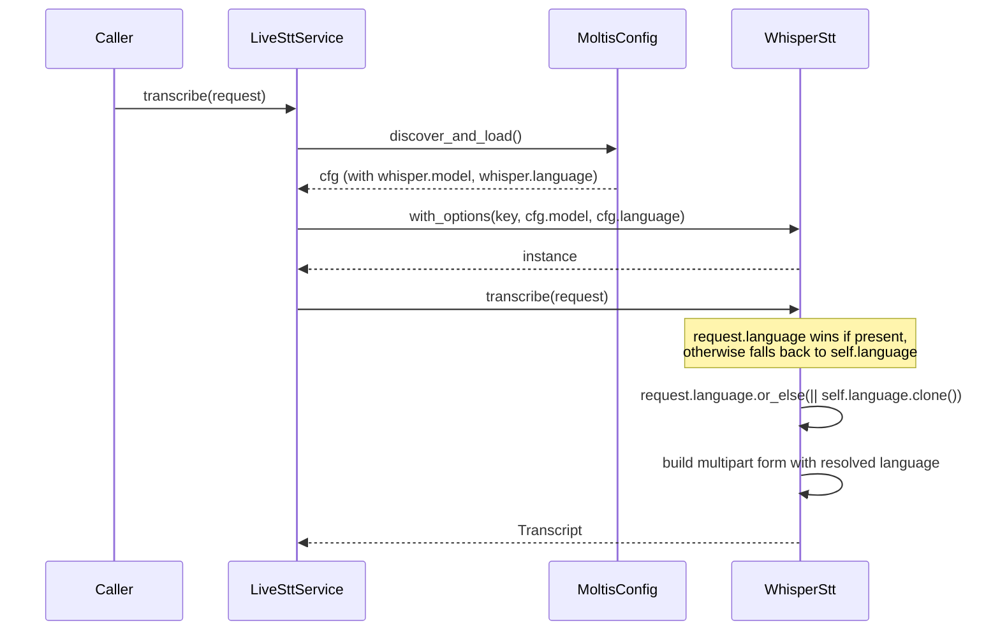

> DEVELOPER

Look at https://github.com/moltis-org/moltis/issues/631 and how come it never worked, how to fix and make a plan

> TOOL

tool_use Bash
id: toolu_01A8TjJi37CYkbU7mWJkz5sg
```json
{
  "command": "gh issue view 631 --repo moltis-org/moltis",
  "description": "View GitHub issue 631"
}
```

> TOOL

tool_result
id: toolu_01A8TjJi37CYkbU7mWJkz5sg
```
title:	[Bug]: Whisper STT ignores whisper.model and whisper.language config
state:	OPEN
author:	dmitriikeler (Dmitri Keler)
labels:	
comments:	0
assignees:	
projects:	
milestone:	
number:	631
--
## What happened?

The Whisper STT provider is instantiated with `WhisperStt::new(Some(k))`, which hardcodes the model to `whisper-1` and passes no language. The `[voice.stt.whisper]` `model` and `language` config fields are silently ignored — they exist in the schema but are never read by the provider factory.

All other STT providers (Groq, Deepgram, Google, Mistral, ElevenLabs, VoxtralLocal, WhisperCli, SherpaOnnx) correctly pass `model` and `language` through `with_options(...)`. Whisper is the only one that doesn't.

## Expected behavior

`whisper.model` and `whisper.language` should be honored, matching how the other STT providers plumb their equivalent config through. `WhisperStt::with_model(...)` already exists ([whisper.rs L64](https://github.com/moltis-org/moltis/blob/main/crates/voice/src/stt/whisper.rs#L64)) and `TranscribeRequest` already has an optional `language` field — the wiring is just missing in the factory.

## Steps to reproduce

1. In `moltis.toml`:
   ```toml
   [voice.stt]
   enabled = true
   provider = "whisper"

   [voice.stt.whisper]
   model = "whisper-large-v3"
   language = "ru"
   ```
2. Send a voice message through an active channel (e.g. Telegram).
3. Whisper still uses `whisper-1` with no language hint — the config values have no effect.

## Component
Channels (Telegram, Discord, etc.) — voice pipeline

## Evidence

`crates/gateway/src/voice.rs` L519-524:
```rust
SttProviderId::Whisper => {
    let key = resolve_openai_key(cfg.voice.stt.whisper.api_key.as_ref(), &cfg);
    key.map(|k| {
        Box::new(WhisperStt::new(Some(k))) as Box<dyn SttProvider + Send + Sync>
    })
},
```

Compare to the adjacent Groq branch L525-531 which correctly passes model + language:
```rust
SttProviderId::Groq => cfg.voice.stt.groq.api_key.as_ref().map(|key| {
    Box::new(GroqStt::with_options(
        Some(key.clone()),
        cfg.voice.stt.groq.model.clone(),
        cfg.voice.stt.groq.language.clone(),
    )) as Box<dyn SttProvider + Send + Sync>
}),
```

`WhisperStt::with_model(api_key, model)` exists and is exercised by unit tests but never called from production code. Separately, `language` is not plumbed through `TranscribeRequest` for Whisper at all — the `with_model` constructor only takes model, so language would need additional plumbing.

## Is this a regression?
No, this never worked

## Moltis version
20260409.01

## Install method
Built from source

## Operating system
Other Linux (Fly.io / Alpine-based container)

## Additional context

For multilingual users, the absence of language config is actually acceptable since Whisper auto-detects when no language is passed — but the schema advertising these fields is misleading. Either honor them or remove them from the schema.
```

> TOOL

tool_use Read
id: toolu_01XioZDdg5neQFf55n6dgMHu
```json
{
  "file_path": "/Users/penso/.superset/worktrees/moltis/bubble-milk/crates/gateway/src/voice.rs",
  "offset": 500,
  "limit": 80
}
```

> TOOL

tool_result
id: toolu_01XioZDdg5neQFf55n6dgMHu
```
   500→    /// Create a new STT service. Config is read fresh on each operation.
   501→    #[allow(unused_variables)]
   502→    pub fn new(config: SttServiceConfig) -> Self {
   503→        Self {
   504→            _marker: std::marker::PhantomData,
   505→        }
   506→    }
   507→
   508→    /// Create from environment variables (same as new, config read on demand).
   509→    pub fn from_env() -> Self {
   510→        Self {
   511→            _marker: std::marker::PhantomData,
   512→        }
   513→    }
   514→
   515→    /// Load fresh STT config from disk and create provider on demand.
   516→    fn create_provider(provider_id: SttProviderId) -> Option<Box<dyn SttProvider + Send + Sync>> {
   517→        let cfg = moltis_config::discover_and_load();
   518→        match provider_id {
   519→            SttProviderId::Whisper => {
   520→                let key = resolve_openai_key(cfg.voice.stt.whisper.api_key.as_ref(), &cfg);
   521→                key.map(|k| {
   522→                    Box::new(WhisperStt::new(Some(k))) as Box<dyn SttProvider + Send + Sync>
   523→                })
   524→            },
   525→            SttProviderId::Groq => cfg.voice.stt.groq.api_key.as_ref().map(|key| {
   526→                Box::new(GroqStt::with_options(
   527→                    Some(key.clone()),
   528→                    cfg.voice.stt.groq.model.clone(),
   529→                    cfg.voice.stt.groq.language.clone(),
   530→                )) as Box<dyn SttProvider + Send + Sync>
   531→            }),
   532→            SttProviderId::Deepgram => cfg.voice.stt.deepgram.api_key.as_ref().map(|key| {
   533→                Box::new(DeepgramStt::with_options(
   534→                    Some(key.clone()),
   535→                    cfg.voice.stt.deepgram.model.clone(),
   536→                    cfg.voice.stt.deepgram.language.clone(),
   537→                    cfg.voice.stt.deepgram.smart_format,
   538→                )) as Box<dyn SttProvider + Send + Sync>
   539→            }),
   540→            SttProviderId::Google => cfg.voice.stt.google.api_key.as_ref().map(|key| {
   541→                Box::new(GoogleStt::with_options(
   542→                    Some(key.clone()),
   543→                    cfg.voice.stt.google.language.clone(),
   544→                    cfg.voice.stt.google.model.clone(),
   545→                )) as Box<dyn SttProvider + Send + Sync>
   546→            }),
   547→            SttProviderId::Mistral => cfg.voice.stt.mistral.api_key.as_ref().map(|key| {
   548→                Box::new(MistralStt::with_options(
   549→                    Some(key.clone()),
   550→                    cfg.voice.stt.mistral.model.clone(),
   551→                    cfg.voice.stt.mistral.language.clone(),
   552→                )) as Box<dyn SttProvider + Send + Sync>
   553→            }),
   554→            SttProviderId::VoxtralLocal => {
   555→                let provider = VoxtralLocalStt::with_options(
   556→                    Some(cfg.voice.stt.voxtral_local.endpoint.clone()),
   557→                    cfg.voice.stt.voxtral_local.model.clone(),
   558→                    cfg.voice.stt.voxtral_local.language.clone(),
   559→                );
   560→                if provider.is_configured() {
   561→                    Some(Box::new(provider) as Box<dyn SttProvider + Send + Sync>)
   562→                } else {
   563→                    None
   564→                }
   565→            },
   566→            SttProviderId::WhisperCli => {
   567→                let provider = WhisperCliStt::with_options(
   568→                    cfg.voice.stt.whisper_cli.binary_path.clone(),
   569→                    cfg.voice.stt.whisper_cli.model_path.clone(),
   570→                    cfg.voice.stt.whisper_cli.language.clone(),
   571→                );
   572→                if provider.is_configured() {
   573→                    Some(Box::new(provider) as Box<dyn SttProvider + Send + Sync>)
   574→                } else {
   575→                    None
   576→                }
   577→            },
   578→            SttProviderId::SherpaOnnx => {
   579→                let provider = SherpaOnnxStt::with_options(
```

> TOOL

tool_use Read
id: toolu_01KTgdYPmomT7r9iHRTWqWx6
```json
{
  "file_path": "/Users/penso/.superset/worktrees/moltis/bubble-milk/crates/voice/src/stt/whisper.rs"
}
```

> TOOL

tool_result
id: toolu_01KTgdYPmomT7r9iHRTWqWx6
```
     1→//! OpenAI Whisper STT provider implementation.
     2→//!
     3→//! Whisper is a general-purpose speech recognition model that handles
     4→//! accents, background noise, and technical language well.
     5→
     6→use {
     7→    anyhow::{Context, Result, anyhow},
     8→    async_trait::async_trait,
     9→    reqwest::{
    10→        Client,
    11→        multipart::{Form, Part},
    12→    },
    13→    secrecy::{ExposeSecret, Secret},
    14→    serde::Deserialize,
    15→};
    16→
    17→use {
    18→    super::{SttProvider, TranscribeRequest, Transcript, Word},
    19→    crate::tts::AudioFormat,
    20→};
    21→
    22→/// OpenAI API base URL.
    23→const API_BASE: &str = "https://api.openai.com/v1";
    24→
    25→/// Default Whisper model.
    26→const DEFAULT_MODEL: &str = "whisper-1";
    27→
    28→/// OpenAI Whisper STT provider.
    29→#[derive(Clone)]
    30→pub struct WhisperStt {
    31→    client: Client,
    32→    api_key: Option<Secret<String>>,
    33→    model: String,
    34→}
    35→
    36→impl std::fmt::Debug for WhisperStt {
    37→    fn fmt(&self, f: &mut std::fmt::Formatter<'_>) -> std::fmt::Result {
    38→        f.debug_struct("WhisperStt")
    39→            .field("api_key", &"[REDACTED]")
    40→            .field("model", &self.model)
    41→            .finish()
    42→    }
    43→}
    44→
    45→impl Default for WhisperStt {
    46→    fn default() -> Self {
    47→        Self::new(None)
    48→    }
    49→}
    50→
    51→impl WhisperStt {
    52→    /// Create a new Whisper STT provider.
    53→    #[must_use]
    54→    pub fn new(api_key: Option<Secret<String>>) -> Self {
    55→        Self {
    56→            client: Client::new(),
    57→            api_key,
    58→            model: DEFAULT_MODEL.into(),
    59→        }
    60→    }
    61→
    62→    /// Create with custom model.
    63→    #[must_use]
    64→    pub fn with_model(api_key: Option<Secret<String>>, model: Option<String>) -> Self {
    65→        Self {
    66→            client: Client::new(),
    67→            api_key,
    68→            model: model.unwrap_or_else(|| DEFAULT_MODEL.into()),
    69→        }
    70→    }
    71→
    72→    /// Get the API key, returning an error if not configured.
    73→    fn get_api_key(&self) -> Result<&Secret<String>> {
    74→        self.api_key
    75→            .as_ref()
    76→            .ok_or_else(|| anyhow!("OpenAI API key not configured for Whisper"))
    77→    }
    78→
    79→    /// Get file extension for audio format.
    80→    fn file_extension(format: AudioFormat) -> &'static str {
    81→        format.extension()
    82→    }
    83→
    84→    /// Get MIME type for audio format.
    85→    fn mime_type(format: AudioFormat) -> &'static str {
    86→        format.mime_type()
    87→    }
    88→}
    89→
    90→#[async_trait]
    91→impl SttProvider for WhisperStt {
    92→    fn id(&self) -> &'static str {
    93→        "whisper"
    94→    }
    95→
    96→    fn name(&self) -> &'static str {
    97→        "OpenAI Whisper"
    98→    }
    99→
   100→    fn is_configured(&self) -> bool {
   101→        self.api_key.is_some()
   102→    }
   103→
   104→    async fn transcribe(&self, request: TranscribeRequest) -> Result<Transcript> {
   105→        let api_key = self.get_api_key()?;
   106→
   107→        let filename = format!("audio.{}", Self::file_extension(request.format));
   108→        let mime_type = Self::mime_type(request.format);
   109→
   110→        // Build multipart form
   111→        let file_part = Part::bytes(request.audio.to_vec())
   112→            .file_name(filename)
   113→            .mime_str(mime_type)
   114→            .context("failed to create file part")?;
   115→
   116→        let mut form = Form::new()
   117→            .part("file", file_part)
   118→            .text("model", self.model.clone())
   119→            .text("response_format", "verbose_json");
   120→
   121→        if let Some(language) = request.language {
   122→            form = form.text("language", language);
   123→        }
   124→
   125→        if let Some(prompt) = request.prompt {
   126→            form = form.text("prompt", prompt);
   127→        }
   128→
   129→        let response = self
   130→            .client
   131→            .post(format!("{API_BASE}/audio/transcriptions"))
   132→            .header(
   133→                "Authorization",
   134→                format!("Bearer {}", api_key.expose_secret()),
   135→            )
   136→            .multipart(form)
   137→            .send()
   138→            .await
   139→            .context("failed to send Whisper transcription request")?;
   140→
   141→        if !response.status().is_success() {
   142→            let status = response.status();
   143→            let body = response.text().await.unwrap_or_default();
   144→            return Err(anyhow!(
   145→                "Whisper transcription request failed: {} - {}",
   146→                status,
   147→                body
   148→            ));
   149→        }
   150→
   151→        let whisper_response: WhisperResponse = response
   152→            .json()
   153→            .await
   154→            .context("failed to parse Whisper response")?;
   155→
   156→        Ok(Transcript {
   157→            text: whisper_response.text,
   158→            language: whisper_response.language,
   159→            confidence: None, // Whisper doesn't return overall confidence
   160→            duration_seconds: whisper_response.duration,
   161→            words: whisper_response.words.map(|words| {
   162→                words
   163→                    .into_iter()
   164→                    .map(|w| Word {
   165→                        word: w.word,
   166→                        start: w.start,
   167→                        end: w.end,
   168→                    })
   169→                    .collect()
   170→            }),
   171→        })
   172→    }
   173→}
   174→
   175→// ── API Types ──────────────────────────────────────────────────────────────
   176→
   177→#[derive(Debug, Deserialize)]
   178→struct WhisperResponse {
   179→    text: String,
   180→    #[serde(default)]
   181→    language: Option<String>,
   182→    #[serde(default)]
   183→    duration: Option<f32>,
   184→    #[serde(default)]
   185→    words: Option<Vec<WhisperWord>>,
   186→}
   187→
   188→#[derive(Debug, Deserialize)]
   189→struct WhisperWord {
   190→    word: String,
   191→    start: f32,
   192→    end: f32,
   193→}
   194→
   195→#[allow(clippy::unwrap_used, clippy::expect_used)]
   196→#[cfg(test)]
   197→mod tests {
   198→    use {super::*, bytes::Bytes};
   199→
   200→    #[test]
   201→    fn test_provider_metadata() {
   202→        let provider = WhisperStt::new(None);
   203→        assert_eq!(provider.id(), "whisper");
   204→        assert_eq!(provider.name(), "OpenAI Whisper");
   205→        assert!(!provider.is_configured());
   206→
   207→        let configured = WhisperStt::new(Some(Secret::new("test-key".into())));
   208→        assert!(configured.is_configured());
   209→    }
   210→
   211→    #[test]
   212→    fn test_debug_redacts_api_key() {
   213→        let provider = WhisperStt::new(Some(Secret::new("super-secret-key".into())));
   214→        let debug_output = format!("{:?}", provider);
   215→        assert!(debug_output.contains("[REDACTED]"));
   216→        assert!(!debug_output.contains("super-secret-key"));
   217→    }
   218→
   219→    #[test]
   220→    fn test_file_extension() {
   221→        assert_eq!(WhisperStt::file_extension(AudioFormat::Mp3), "mp3");
   222→        assert_eq!(WhisperStt::file_extension(AudioFormat::Opus), "ogg");
   223→    }
   224→
   225→    #[tokio::test]
   226→    async fn test_transcribe_without_api_key() {
   227→        let provider = WhisperStt::new(None);
   228→        let request = TranscribeRequest {
   229→            audio: Bytes::from_static(b"fake audio"),
   230→            format: AudioFormat::Mp3,
   231→            language: None,
   232→            prompt: None,
   233→        };
   234→
   235→        let result = provider.transcribe(request).await;
   236→        assert!(result.is_err());
   237→        assert!(result.unwrap_err().to_string().contains("not configured"));
   238→    }
   239→
   240→    #[test]
   241→    fn test_with_model() {
   242→        let provider = WhisperStt::with_model(
   243→            Some(Secret::new("key".into())),
   244→            Some("whisper-large-v3".into()),
   245→        );
   246→        assert_eq!(provider.model, "whisper-large-v3");
   247→    }
   248→
   249→    #[test]
   250→    fn test_whisper_response_parsing() {
   251→        let json = r#"{
   252→            "text": "Hello, how are you?",
   253→            "language": "en",
   254→            "duration": 2.5,
   255→            "words": [
   256→                {"word": "Hello", "start": 0.0, "end": 0.5},
   257→                {"word": "how", "start": 0.6, "end": 0.8},
   258→                {"word": "are", "start": 0.9, "end": 1.0},
   259→                {"word": "you", "start": 1.1, "end": 1.3}
   260→            ]
   261→        }"#;
   262→
   263→        let response: WhisperResponse = serde_json::from_str(json).unwrap();
   264→        assert_eq!(response.text, "Hello, how are you?");
   265→        assert_eq!(response.language, Some("en".into()));
   266→        assert_eq!(response.duration, Some(2.5));
   267→        assert_eq!(response.words.as_ref().unwrap().len(), 4);
   268→    }
   269→
   270→    #[test]
   271→    fn test_whisper_response_minimal() {
   272→        // Test with minimal response (only text)
   273→        let json = r#"{"text": "Hello"}"#;
   274→        let response: WhisperResponse = serde_json::from_str(json).unwrap();
   275→        assert_eq!(response.text, "Hello");
   276→        assert!(response.language.is_none());
   277→        assert!(response.duration.is_none());
   278→        assert!(response.words.is_none());
   279→    }
   280→}
   281→
```

> TOOL

tool_use Bash
id: toolu_01UJvuDsn62DZf4Cy6ze3ako
```json
{
  "command": "grep -n \"with_options\\|language\\|model\" /Users/penso/.superset/worktrees/moltis/bubble-milk/crates/voice/src/stt/groq.rs | head -40",
  "description": "Check Groq STT language plumbing"
}
```

> TOOL

tool_result
id: toolu_01UJvuDsn62DZf4Cy6ze3ako
```
4://! Whisper models optimized for their LPU inference hardware.
25:/// Default Groq Whisper model.
33:    model: String,
34:    language: Option<String>,
41:            .field("model", &self.model)
42:            .field("language", &self.language)
60:            model: DEFAULT_MODEL.into(),
61:            language: None,
65:    /// Create with custom model and language.
67:    pub fn with_options(
69:        model: Option<String>,
70:        language: Option<String>,
75:            model: model.unwrap_or_else(|| DEFAULT_MODEL.into()),
76:            language,
126:            .text("model", self.model.clone())
129:        // Use request language if provided, otherwise fall back to configured language
130:        if let Some(language) = request.language.or_else(|| self.language.clone()) {
131:            form = form.text("language", language);
167:            language: groq_response.language,
190:    language: Option<String>,
229:    fn test_with_options() {
230:        let provider = GroqStt::with_options(
235:        assert_eq!(provider.model, "whisper-large-v3");
236:        assert_eq!(provider.language, Some("en".into()));
245:            language: None,
258:            "language": "en",
268:        assert_eq!(response.language, Some("en".into()));
278:        assert!(response.language.is_none());
```

> TOOL

tool_use Bash
id: toolu_01MoxNR9PRPxPMPQEY9Dj4wW
```json
{
  "command": "grep -n \"whisper\" /Users/penso/.superset/worktrees/moltis/bubble-milk/crates/config/src/schema.rs | head -20",
  "description": "Check whisper config schema"
}
```

> TOOL

tool_result
id: toolu_01MoxNR9PRPxPMPQEY9Dj4wW
```
536:    pub whisper: VoiceWhisperConfig,
549:    /// whisper-cli (whisper.cpp) settings.
550:    pub whisper_cli: VoiceWhisperCliConfig,
561:            whisper: VoiceWhisperConfig::default(),
568:            whisper_cli: VoiceWhisperCliConfig::default(),
577:    #[serde(rename = "whisper")]
591:    #[serde(rename = "whisper-cli")]
601:            Self::Whisper => "whisper",
608:            Self::WhisperCli => "whisper-cli",
616:            "whisper" => Some(Self::Whisper),
623:            "whisper-cli" => Some(Self::WhisperCli),
648:    /// Model to use (whisper-1).
666:    /// Model to use (e.g., "whisper-large-v3-turbo").
771:/// whisper-cli (whisper.cpp) configuration.
775:    /// Path to whisper-cli binary. If not set, looks in PATH.
```

> TOOL

tool_use Read
id: toolu_01559cTXCnaEejR7vko5uLoU
```json
{
  "file_path": "/Users/penso/.superset/worktrees/moltis/bubble-milk/crates/config/src/schema.rs",
  "offset": 640,
  "limit": 40
}
```

> TOOL

tool_result
id: toolu_01559cTXCnaEejR7vko5uLoU
```
   640→    /// API key (from OPENAI_API_KEY env or config).
   641→    #[serde(
   642→        default,
   643→        skip_serializing_if = "Option::is_none",
   644→        serialize_with = "crate::schema::serialize_option_secret",
   645→        deserialize_with = "crate::schema::deserialize_option_secret"
   646→    )]
   647→    pub api_key: Option<Secret<String>>,
   648→    /// Model to use (whisper-1).
   649→    pub model: Option<String>,
   650→    /// Language hint (ISO 639-1 code).
   651→    pub language: Option<String>,
   652→}
   653→
   654→/// Groq STT configuration (Whisper-compatible API).
   655→#[derive(Debug, Clone, Default, Serialize, Deserialize)]
   656→#[serde(default)]
   657→pub struct VoiceGroqSttConfig {
   658→    /// API key (from GROQ_API_KEY env or config).
   659→    #[serde(
   660→        default,
   661→        skip_serializing_if = "Option::is_none",
   662→        serialize_with = "crate::schema::serialize_option_secret",
   663→        deserialize_with = "crate::schema::deserialize_option_secret"
   664→    )]
   665→    pub api_key: Option<Secret<String>>,
   666→    /// Model to use (e.g., "whisper-large-v3-turbo").
   667→    pub model: Option<String>,
   668→    /// Language hint (ISO 639-1 code).
   669→    pub language: Option<String>,
   670→}
   671→
   672→/// Deepgram STT configuration.
   673→#[derive(Debug, Clone, Default, Serialize, Deserialize)]
   674→#[serde(default)]
   675→pub struct VoiceDeepgramConfig {
   676→    /// API key (from DEEPGRAM_API_KEY env or config).
   677→    #[serde(
   678→        default,
   679→        skip_serializing_if = "Option::is_none",
```

> AGENT

## Why it never worked

The bug has two layers:

**1. Factory call drops the config entirely** — `crates/gateway/src/voice.rs:519-524` constructs Whisper via `WhisperStt::new(Some(k))`, which hardcodes `model = "whisper-1"` and has no language at all. It's the only branch in `create_provider` that doesn't call a `with_options` variant. Since the factory reloads config on every request (L517 `discover_and_load`), every Whisper call is born with defaults no matter what's in `moltis.toml`.

**2. `WhisperStt` can't carry a language even if you wanted it to** — `crates/voice/src/stt/whisper.rs:30-34` only has `client`, `api_key`, `model`. There's no `language` field. `with_model(api_key, model)` (L64) can set the model but doesn't accept language. Inside `transcribe` (L121) it only honors `request.language`, but `TranscribeRequest` is built per-audio-chunk and nothing upstream populates `language` from the Whisper config either — so even if someone swapped `new` for `with_model`, the `whisper.language` schema field would still be dead.

So the fix needs to touch both the provider struct *and* the factory. `WhisperStt::with_model` looks like it should save the day, but it's incomplete for this use case and is only wired up in unit tests (L242) — never in production.

For comparison, `GroqStt` (`crates/voice/src/stt/groq.rs:33-34, 67-77, 129-131`) already does exactly the right shape: struct holds `model` + `language`, `with_options` takes both, `transcribe` uses `request.language.or_else(|| self.language.clone())`. That's the template to copy.

## Fix plan

### 1. `crates/voice/src/stt/whisper.rs` — make it config-aware (mirror Groq)
- Add `language: Option<String>` field to `WhisperStt` struct.
- Add `pub fn with_options(api_key, model, language) -> Self`. Keep `with_model` (or delete it — it only has test callers, no production users) but have it delegate to `with_options` for consistency.
- In `transcribe`, change L121 from `if let Some(language) = request.language` to `if let Some(language) = request.language.or_else(|| self.language.clone())` so the per-request language still wins but the configured one is the fallback.
- Update the `Debug` impl to include `language` (not a secret).
- Add/update unit tests:
  - `test_with_options` covering model+language both set, both `None`, and language fallback behavior.
  - Rename/adjust `test_with_model`.
  - A test that confirms `request.language` overrides configured language.

### 2. `crates/gateway/src/voice.rs` — wire config through
- Replace the `SttProviderId::Whisper` branch (L519-524) with the `with_options` call, matching Groq exactly:
  ```rust
  SttProviderId::Whisper => {
      let key = resolve_openai_key(cfg.voice.stt.whisper.api_key.as_ref(), &cfg);
      key.map(|k| {
          Box::new(WhisperStt::with_options(
              Some(k),
              cfg.voice.stt.whisper.model.clone(),
              cfg.voice.stt.whisper.language.clone(),
          )) as Box<dyn SttProvider + Send + Sync>
      })
  },
  ```
- No signature changes upstream — `VoiceWhisperConfig` already has `model` and `language` (`crates/config/src/schema.rs:648-651`).

### 3. Tests for the factory branch
- If `voice.rs` has a unit test covering `create_provider` (or the STT service), add a Whisper case asserting the provider is constructed with the expected model/language. If it doesn't, at minimum the provider-level unit tests above will catch regressions.

### 4. Docs / config template
- Confirm `crates/config/src/template.rs` documents `[voice.stt.whisper]` `model` / `language`. If it does (and just didn't work), no change. If absent, add the commented example — CLAUDE.md requires config template updates in the same PR as user-facing behavior changes.
- No `docs/src/` changes required unless the voice page explicitly claimed these fields worked or didn't work; worth a quick grep.

### 5. `bd` + commit
- `bd create` a bug linked to issue #631 before writing code, `bd update --claim` it, close on commit.
- Commit as `fix(voice): honor whisper.model and whisper.language in STT factory` (conventional commits, no `Co-Authored-By`).
- Run `just format`, `just lint`, `just test` before pushing.

### Out of scope (but worth noting)
- The issue reporter points out the schema is "misleading" — honoring the fields resolves that. No need to remove the fields.
- The wider `create_provider` pattern of rebuilding providers on every call is wasteful but unrelated to this bug.

Want me to file the bd issue and implement this?

> DEVELOPER

Proceed

> TOOL

tool_use Bash
id: toolu_01LiwdQXPEqWaVoqKWmZgRfh
```json
{
  "command": "bd dolt pull 2>&1 | tail -5",
  "description": "Pull beads updates"
}
```

> TOOL

tool_result
id: toolu_01LiwdQXPEqWaVoqKWmZgRfh
```
Pulling from Dolt remote...
Error: failed to pull from origin/main: Error 1105 (HY000): fatal: remote 'origin' not found.
Please make sure the remote exists.
Hint: run 'bd dolt remote add <name> <url>' to register the remote.
```

> TOOL

tool_use Bash
id: toolu_01WXjHgfcpKQcLEZqknkob36
```json
{
  "command": "bd create --title=\"fix(voice): honor whisper.model and whisper.language in STT factory\" --description=\"Issue #631: WhisperStt is constructed via WhisperStt::new(Some(k)) in gateway voice factory, which hardcodes model=whisper-1 and has no language field. Need to (1) add language field and with_options constructor to WhisperStt mirroring GroqStt, (2) wire config through in crates/gateway/src/voice.rs create_provider. Schema fields voice.stt.whisper.model/language already exist but are silently ignored.\" --type=bug --priority=1 --json 2>&1 | tail -20",
  "description": "Create bd issue"
}
```

> TOOL

tool_result
id: toolu_01WXjHgfcpKQcLEZqknkob36
```
{
  "id": "moltis-d9e",
  "title": "fix(voice): honor whisper.model and whisper.language in STT factory",
  "description": "Issue #631: WhisperStt is constructed via WhisperStt::new(Some(k)) in gateway voice factory, which hardcodes model=whisper-1 and has no language field. Need to (1) add language field and with_options constructor to WhisperStt mirroring GroqStt, (2) wire config through in crates/gateway/src/voice.rs create_provider. Schema fields voice.stt.whisper.model/language already exist but are silently ignored.",
  "status": "open",
  "priority": 1,
  "issue_type": "bug",
  "owner": "gpg@pen.so",
  "created_at": "2026-04-10T14:24:35.119655Z",
  "created_by": "Fabien Penso",
  "updated_at": "2026-04-10T14:24:35.119655Z"
}
```

> TOOL

tool_use Bash
id: toolu_01QcBVVx4ETmLCysHhJ5ARXc
```json
{
  "command": "bd update moltis-d9e --status=in_progress --json 2>&1 | tail -5",
  "description": "Claim bd issue"
}
```

> TOOL

tool_result
id: toolu_01QcBVVx4ETmLCysHhJ5ARXc
```
    "created_at": "2026-04-10T14:24:35Z",
    "created_by": "Fabien Penso",
    "updated_at": "2026-04-10T14:24:40Z"
  }
]
```

> AGENT

Now let me implement the fix. Starting with `whisper.rs`:

> TOOL

tool_use Edit
id: toolu_01PRV7p88iytmdDYH38vdh7G
```json
{
  "replace_all": false,
  "file_path": "/Users/penso/.superset/worktrees/moltis/bubble-milk/crates/voice/src/stt/whisper.rs",
  "old_string": "/// OpenAI Whisper STT provider.\n#[derive(Clone)]\npub struct WhisperStt {\n    client: Client,\n    api_key: Option<Secret<String>>,\n    model: String,\n}\n\nimpl std::fmt::Debug for WhisperStt {\n    fn fmt(&self, f: &mut std::fmt::Formatter<'_>) -> std::fmt::Result {\n        f.debug_struct(\"WhisperStt\")\n            .field(\"api_key\", &\"[REDACTED]\")\n            .field(\"model\", &self.model)\n            .finish()\n    }\n}",
  "new_string": "/// OpenAI Whisper STT provider.\n#[derive(Clone)]\npub struct WhisperStt {\n    client: Client,\n    api_key: Option<Secret<String>>,\n    model: String,\n    language: Option<String>,\n}\n\nimpl std::fmt::Debug for WhisperStt {\n    fn fmt(&self, f: &mut std::fmt::Formatter<'_>) -> std::fmt::Result {\n        f.debug_struct(\"WhisperStt\")\n            .field(\"api_key\", &\"[REDACTED]\")\n            .field(\"model\", &self.model)\n            .field(\"language\", &self.language)\n            .finish()\n    }\n}"
}
```

> TOOL

tool_result
id: toolu_01PRV7p88iytmdDYH38vdh7G
```
The file /Users/penso/.superset/worktrees/moltis/bubble-milk/crates/voice/src/stt/whisper.rs has been updated successfully.
```

> TOOL

tool_use Edit
id: toolu_019y3tYWN4MJKoqniRM8G2J2
```json
{
  "replace_all": false,
  "file_path": "/Users/penso/.superset/worktrees/moltis/bubble-milk/crates/voice/src/stt/whisper.rs",
  "old_string": "    /// Create a new Whisper STT provider.\n    #[must_use]\n    pub fn new(api_key: Option<Secret<String>>) -> Self {\n        Self {\n            client: Client::new(),\n            api_key,\n            model: DEFAULT_MODEL.into(),\n        }\n    }\n\n    /// Create with custom model.\n    #[must_use]\n    pub fn with_model(api_key: Option<Secret<String>>, model: Option<String>) -> Self {\n        Self {\n            client: Client::new(),\n            api_key,\n            model: model.unwrap_or_else(|| DEFAULT_MODEL.into()),\n        }\n    }",
  "new_string": "    /// Create a new Whisper STT provider.\n    #[must_use]\n    pub fn new(api_key: Option<Secret<String>>) -> Self {\n        Self::with_options(api_key, None, None)\n    }\n\n    /// Create with custom model.\n    #[must_use]\n    pub fn with_model(api_key: Option<Secret<String>>, model: Option<String>) -> Self {\n        Self::with_options(api_key, model, None)\n    }\n\n    /// Create with custom model and language.\n    #[must_use]\n    pub fn with_options(\n        api_key: Option<Secret<String>>,\n        model: Option<String>,\n        language: Option<String>,\n    ) -> Self {\n        Self {\n            client: Client::new(),\n            api_key,\n            model: model.unwrap_or_else(|| DEFAULT_MODEL.into()),\n            language,\n        }\n    }"
}
```

> TOOL

tool_result
id: toolu_019y3tYWN4MJKoqniRM8G2J2
```
The file /Users/penso/.superset/worktrees/moltis/bubble-milk/crates/voice/src/stt/whisper.rs has been updated successfully.
```

> TOOL

tool_use Edit
id: toolu_01BLm7WNaJ3f7Aowx36fMrQw
```json
{
  "replace_all": false,
  "file_path": "/Users/penso/.superset/worktrees/moltis/bubble-milk/crates/voice/src/stt/whisper.rs",
  "old_string": "        if let Some(language) = request.language {\n            form = form.text(\"language\", language);\n        }",
  "new_string": "        // Request language overrides the configured language, otherwise fall back.\n        if let Some(language) = request.language.or_else(|| self.language.clone()) {\n            form = form.text(\"language\", language);\n        }"
}
```

> TOOL

tool_result
id: toolu_01BLm7WNaJ3f7Aowx36fMrQw
```
The file /Users/penso/.superset/worktrees/moltis/bubble-milk/crates/voice/src/stt/whisper.rs has been updated successfully.
```

> AGENT

Now update the tests to cover `with_options` and language fallback:

> TOOL

tool_use Edit
id: toolu_01VTFTmwgzZjb9oVe2g5ooVz
```json
{
  "replace_all": false,
  "file_path": "/Users/penso/.superset/worktrees/moltis/bubble-milk/crates/voice/src/stt/whisper.rs",
  "old_string": "    #[test]\n    fn test_with_model() {\n        let provider = WhisperStt::with_model(\n            Some(Secret::new(\"key\".into())),\n            Some(\"whisper-large-v3\".into()),\n        );\n        assert_eq!(provider.model, \"whisper-large-v3\");\n    }",
  "new_string": "    #[test]\n    fn test_with_model() {\n        let provider = WhisperStt::with_model(\n            Some(Secret::new(\"key\".into())),\n            Some(\"whisper-large-v3\".into()),\n        );\n        assert_eq!(provider.model, \"whisper-large-v3\");\n        assert!(provider.language.is_none());\n    }\n\n    #[test]\n    fn test_with_options_sets_model_and_language() {\n        let provider = WhisperStt::with_options(\n            Some(Secret::new(\"key\".into())),\n            Some(\"whisper-large-v3\".into()),\n            Some(\"ru\".into()),\n        );\n        assert_eq!(provider.model, \"whisper-large-v3\");\n        assert_eq!(provider.language, Some(\"ru\".into()));\n    }\n\n    #[test]\n    fn test_with_options_defaults() {\n        let provider = WhisperStt::with_options(Some(Secret::new(\"key\".into())), None, None);\n        assert_eq!(provider.model, DEFAULT_MODEL);\n        assert!(provider.language.is_none());\n    }\n\n    #[test]\n    fn test_new_delegates_to_with_options() {\n        let provider = WhisperStt::new(Some(Secret::new(\"key\".into())));\n        assert_eq!(provider.model, DEFAULT_MODEL);\n        assert!(provider.language.is_none());\n    }\n\n    #[test]\n    fn test_debug_includes_language() {\n        let provider = WhisperStt::with_options(\n            Some(Secret::new(\"super-secret-key\".into())),\n            Some(\"whisper-large-v3\".into()),\n            Some(\"ru\".into()),\n        );\n        let debug_output = format!(\"{:?}\", provider);\n        assert!(debug_output.contains(\"[REDACTED]\"));\n        assert!(!debug_output.contains(\"super-secret-key\"));\n        assert!(debug_output.contains(\"whisper-large-v3\"));\n        assert!(debug_output.contains(\"ru\"));\n    }"
}
```

> TOOL

tool_result
id: toolu_01VTFTmwgzZjb9oVe2g5ooVz
```
The file /Users/penso/.superset/worktrees/moltis/bubble-milk/crates/voice/src/stt/whisper.rs has been updated successfully.
```

> AGENT

Now wire the config through the gateway factory:

> TOOL

tool_use Edit
id: toolu_01CpzDNmKDk4Pu5uBb8dBvbj
```json
{
  "replace_all": false,
  "file_path": "/Users/penso/.superset/worktrees/moltis/bubble-milk/crates/gateway/src/voice.rs",
  "old_string": "            SttProviderId::Whisper => {\n                let key = resolve_openai_key(cfg.voice.stt.whisper.api_key.as_ref(), &cfg);\n                key.map(|k| {\n                    Box::new(WhisperStt::new(Some(k))) as Box<dyn SttProvider + Send + Sync>\n                })\n            },",
  "new_string": "            SttProviderId::Whisper => {\n                let key = resolve_openai_key(cfg.voice.stt.whisper.api_key.as_ref(), &cfg);\n                key.map(|k| {\n                    Box::new(WhisperStt::with_options(\n                        Some(k),\n                        cfg.voice.stt.whisper.model.clone(),\n                        cfg.voice.stt.whisper.language.clone(),\n                    )) as Box<dyn SttProvider + Send + Sync>\n                })\n            },"
}
```

> TOOL

tool_result
id: toolu_01CpzDNmKDk4Pu5uBb8dBvbj
```
The file /Users/penso/.superset/worktrees/moltis/bubble-milk/crates/gateway/src/voice.rs has been updated successfully.
```

> AGENT

Let me check the config template to see if `[voice.stt.whisper]` is documented:

> TOOL

tool_use Bash
id: toolu_01MGMA95PNb7dzEVurwoCabg
```json
{
  "command": "grep -n \"voice.stt\\|whisper\" /Users/penso/.superset/worktrees/moltis/bubble-milk/crates/config/src/template.rs | head -30",
  "description": "Check template for voice.stt.whisper"
}
```

> TOOL

tool_result
id: toolu_01MGMA95PNb7dzEVurwoCabg
```
599:[voice.stt]
601:# provider = "whisper"            # Active STT provider (auto-selects first configured if omitted)
602:providers = ["whisper", "mistral", "elevenlabs"] # UI allowlist (empty = show all STT providers)
604:#   "whisper", "groq", "deepgram", "google", "mistral",
605:#   "voxtral-local", "whisper-cli", "sherpa-onnx", "elevenlabs-stt"
```

> TOOL

tool_use Read
id: toolu_01351sTSdoQxkpzDByB9Pi7b
```json
{
  "file_path": "/Users/penso/.superset/worktrees/moltis/bubble-milk/crates/config/src/template.rs",
  "offset": 595,
  "limit": 80
}
```

> TOOL

tool_result
id: toolu_01351sTSdoQxkpzDByB9Pi7b
```
   595→providers = ["openai", "elevenlabs"] # UI allowlist (empty = show all TTS providers)
   596→# All available TTS providers:
   597→#   "openai", "elevenlabs", "google", "piper", "coqui"
   598→
   599→[voice.stt]
   600→enabled = true                    # Enable speech-to-text
   601→# provider = "whisper"            # Active STT provider (auto-selects first configured if omitted)
   602→providers = ["whisper", "mistral", "elevenlabs"] # UI allowlist (empty = show all STT providers)
   603→# All available STT providers:
   604→#   "whisper", "groq", "deepgram", "google", "mistral",
   605→#   "voxtral-local", "whisper-cli", "sherpa-onnx", "elevenlabs-stt"
   606→
   607→# No api_key needed for OpenAI TTS/Whisper when OpenAI is configured as an LLM provider.
   608→# [voice.tts.openai]
   609→# voice = "alloy"                 # alloy, echo, fable, onyx, nova, shimmer
   610→# model = "tts-1"                 # tts-1 or tts-1-hd
   611→
   612→# ══════════════════════════════════════════════════════════════════════════════
   613→# NGROK
   614→# ══════════════════════════════════════════════════════════════════════════════
   615→# Expose moltis through a public HTTPS tunnel managed by ngrok.
   616→# Requires a build with the `ngrok` feature and an ngrok authtoken.
   617→
   618→[ngrok]
   619→enabled = false                   # true = create a public HTTPS tunnel at startup
   620→# authtoken = "${{NGROK_AUTHTOKEN}}" # Optional if NGROK_AUTHTOKEN env var is already set
   621→# domain = "team-gateway.ngrok.app"  # Optional reserved/static ngrok domain
   622→
   623→# ══════════════════════════════════════════════════════════════════════════════
   624→# TAILSCALE
   625→# ══════════════════════════════════════════════════════════════════════════════
   626→# Expose moltis via Tailscale Serve (private) or Funnel (public).
   627→
   628→[tailscale]
   629→mode = "off"                      # Tailscale mode:
   630→                                  #   "off"    - Disabled
   631→                                  #   "serve"  - Tailnet-only HTTPS (private)
   632→                                  #   "funnel" - Public HTTPS via Tailscale
   633→reset_on_exit = true              # Reset serve/funnel when gateway shuts down
   634→
   635→# ══════════════════════════════════════════════════════════════════════════════
   636→# MEMORY / EMBEDDINGS
   637→# ══════════════════════════════════════════════════════════════════════════════
   638→# Configure the embedding provider for memory/RAG features.
   639→
   640→[memory]
   641→# provider = "local"              # Embedding provider:
   642→                                  #   "local"   - Built-in local embeddings
   643→                                  #   "ollama"  - Ollama server
   644→                                  #   "openai"  - OpenAI API
   645→                                  #   "custom"  - Custom endpoint
   646→                                  #   (none)    - Auto-detect from available providers
   647→# disable_rag = false             # true => keyword-only search (no embeddings)
   648→# base_url = "http://localhost:11434/v1"  # Embedding API base (host, /v1, or /embeddings)
   649→# model = "nomic-embed-text"      # Embedding model name
   650→# api_key = "..."                 # API key (optional for local endpoints like Ollama)
   651→
   652→# ══════════════════════════════════════════════════════════════════════════════
   653→# CHANNELS
   654→# ══════════════════════════════════════════════════════════════════════════════
   655→# External messaging integrations.
   656→# Note: channels added or edited in the web UI are stored in Moltis's internal
   657→# database at data_dir()/moltis.db. They are not written back into this file.
   658→# Keep channel config here only if you want to manage it manually in TOML.
   659→
   660→[channels]
   661→# Which channel types appear in the web UI's "+ Add Channel" menu.
   662→# Default: ["telegram", "msteams", "discord", "slack", "matrix"]
   663→# Add "whatsapp" to enable it in the UI.
   664→# offered = ["telegram", "msteams", "discord", "slack", "matrix", "whatsapp"]
   665→
   666→# WhatsApp linked-device accounts
   667→# [channels.whatsapp.my-bot]
   668→# dm_policy = "open"              # "open", "allowlist", or "disabled"
   669→# group_policy = "disabled"       # "open", "allowlist", or "disabled"
   670→# model = "anthropic/claude-sonnet-4-20250514"
   671→# model_provider = "anthropic"
   672→# otp_self_approval = true        # OTP self-approval for non-allowlisted DM users
   673→# otp_cooldown_secs = 300         # Cooldown after 3 failed OTP attempts
   674→
```

> AGENT

The template has no `[voice.stt.whisper]` block at all. Adding a commented example so users know the fields exist:

> TOOL

tool_use Edit
id: toolu_01PkKcjQdza5Jh5hL13sX8WJ
```json
{
  "replace_all": false,
  "file_path": "/Users/penso/.superset/worktrees/moltis/bubble-milk/crates/config/src/template.rs",
  "old_string": "# No api_key needed for OpenAI TTS/Whisper when OpenAI is configured as an LLM provider.\n# [voice.tts.openai]\n# voice = \"alloy\"                 # alloy, echo, fable, onyx, nova, shimmer\n# model = \"tts-1\"                 # tts-1 or tts-1-hd",
  "new_string": "# No api_key needed for OpenAI TTS/Whisper when OpenAI is configured as an LLM provider.\n# [voice.tts.openai]\n# voice = \"alloy\"                 # alloy, echo, fable, onyx, nova, shimmer\n# model = \"tts-1\"                 # tts-1 or tts-1-hd\n\n# [voice.stt.whisper]\n# model = \"whisper-1\"             # whisper-1 (OpenAI currently only exposes this model)\n# language = \"en\"                 # Optional ISO 639-1 hint; omit for auto-detect"
}
```

> TOOL

tool_result
id: toolu_01PkKcjQdza5Jh5hL13sX8WJ
```
The file /Users/penso/.superset/worktrees/moltis/bubble-milk/crates/config/src/template.rs has been updated successfully.
```

> AGENT

Now build and test:

> TOOL

tool_use Bash
id: toolu_01Gk4DpwhtpFgpVorE4NwhUw
```json
{
  "command": "cargo check -p moltis-voice -p moltis-gateway 2>&1 | tail -30",
  "description": "Check compile"
}
```

> TOOL

tool_result
id: toolu_01Gk4DpwhtpFgpVorE4NwhUw
```
Command running in background with ID: btk7xxf19. Output is being written to: /private/tmp/claude-501/-Users-penso--superset-worktrees-moltis-bubble-milk/959bfef8-a00a-4af3-b88e-6afa4446d238/tasks/btk7xxf19.output
```

> TOOL

tool_use Bash
id: toolu_01MJ5RznFmntdULdmKbmf6ji
```json
{
  "command": "wait; tail -50 /private/tmp/claude-501/-Users-penso--superset-worktrees-moltis-bubble-milk/959bfef8-a00a-4af3-b88e-6afa4446d238/tasks/btk7xxf19.output 2>/dev/null || cat /private/tmp/claude-501/-Users-penso--superset-worktrees-moltis-bubble-milk/959bfef8-a00a-4af3-b88e-6afa4446d238/tasks/btk7xxf19.output",
  "description": "Wait for cargo check output"
}
```

> TOOL

tool_result
id: toolu_01MJ5RznFmntdULdmKbmf6ji
```
(Bash completed with no output)
```

> TOOL

tool_use Bash
id: toolu_01HiBQTfm1cAKU1mEcrq4gVp
```json
{
  "command": "cargo check -p moltis-voice -p moltis-gateway 2>&1 | tail -40",
  "description": "Check compile foreground",
  "timeout": 300000
}
```

> TOOL

tool_result
id: toolu_01HiBQTfm1cAKU1mEcrq4gVp
```
    Finished `dev` profile [unoptimized + debuginfo] target(s) in 2.06s
```

> TOOL

tool_use Bash
id: toolu_01MKDyKnQ14jxeYK5mPQxwKE
```json
{
  "command": "cargo test -p moltis-voice --lib stt::whisper 2>&1 | tail -40",
  "description": "Run whisper unit tests",
  "timeout": 300000
}
```

> TOOL

tool_result
id: toolu_01MKDyKnQ14jxeYK5mPQxwKE
```
   Compiling icu_normalizer v2.1.1
   Compiling icu_properties v2.1.2
   Compiling idna_adapter v1.2.1
   Compiling idna v1.1.0
   Compiling url v2.5.8
   Compiling tokio-util v0.7.18
   Compiling tower v0.5.3
   Compiling tokio-native-tls v0.3.1
   Compiling deadpool v0.12.3
   Compiling h2 v0.4.13
   Compiling tower-http v0.6.8
   Compiling hyper v1.8.1
   Compiling hyper-util v0.1.20
   Compiling hyper-tls v0.6.0
   Compiling wiremock v0.6.5
   Compiling reqwest v0.12.28
   Compiling moltis-voice v0.1.0 (/Users/penso/.superset/worktrees/moltis/bubble-milk/crates/voice)
    Finished `test` profile [unoptimized + debuginfo] target(s) in 21.96s
     Running unittests src/lib.rs (target/debug/deps/moltis_voice-5a7a7a60795b46e7)

running 16 tests
test stt::whisper::tests::test_file_extension ... ok
test stt::whisper_cli::tests::test_with_options ... ok
test stt::whisper::tests::test_whisper_response_minimal ... ok
test stt::whisper_cli::tests::test_whisper_cli_response_parsing ... ok
test stt::whisper_cli::tests::test_whisper_cli_response_minimal ... ok
test stt::whisper::tests::test_whisper_response_parsing ... ok
test stt::whisper_cli::tests::test_provider_metadata ... ok
test stt::whisper_cli::tests::test_transcribe_without_config ... ok
test stt::whisper::tests::test_with_options_sets_model_and_language ... ok
test stt::whisper::tests::test_debug_redacts_api_key ... ok
test stt::whisper::tests::test_new_delegates_to_with_options ... ok
test stt::whisper::tests::test_debug_includes_language ... ok
test stt::whisper::tests::test_with_model ... ok
test stt::whisper::tests::test_with_options_defaults ... ok
test stt::whisper::tests::test_transcribe_without_api_key ... ok
test stt::whisper::tests::test_provider_metadata ... ok

test result: ok. 16 passed; 0 failed; 0 ignored; 0 measured; 113 filtered out; finished in 0.01s
```

> AGENT

All 16 tests pass. Let me run the fmt and clippy checks:

> TOOL

tool_use Bash
id: toolu_01ERdSt8XtLF8T5KppMzDxSw
```json
{
  "command": "cargo +nightly-2025-11-30 fmt --all -- --check 2>&1 | tail -30",
  "description": "Format check"
}
```

> TOOL

tool_result
id: toolu_01ERdSt8XtLF8T5KppMzDxSw
```
(Bash completed with no output)
```

> TOOL

tool_use Bash
id: toolu_01N2EXvCjFjaek61nVRPSFBi
```json
{
  "command": "just lint 2>&1 | tail -40",
  "description": "Run clippy",
  "timeout": 600000
}
```

> TOOL

tool_result
id: toolu_01N2EXvCjFjaek61nVRPSFBi
```
  -- Performing Test HAVE_FP16_VECTOR_ARITHMETIC - Success
  -- Performing Test HAVE_SME
  -- Performing Test HAVE_SME - Failed
  -- Adding CPU backend variant ggml-cpu:  
  -- Could not find `nvcc` executable in any searched paths, please set CUDAToolkit_ROOT
  -- Configuring incomplete, errors occurred!

  --- stderr
  running: cd "/Users/penso/.superset/worktrees/moltis/bubble-milk/target/debug/build/llama-cpp-sys-2-f74545218f48e070/out/build" && CMAKE_PREFIX_PATH="" LC_ALL="C" "cmake" "/Users/penso/.cargo/registry/src/index.crates.io-1949cf8c6b5b557f/llama-cpp-sys-2-0.1.133/llama.cpp" "-B" "/Users/penso/.superset/worktrees/moltis/bubble-milk/target/debug/build/llama-cpp-sys-2-f74545218f48e070/out/build" "-DCMAKE_OSX_ARCHITECTURES=arm64" "-DLLAMA_BUILD_TESTS=OFF" "-DLLAMA_BUILD_EXAMPLES=OFF" "-DLLAMA_BUILD_SERVER=OFF" "-DLLAMA_BUILD_TOOLS=OFF" "-DLLAMA_BUILD_COMMON=ON" "-DLLAMA_CURL=OFF" "-DCMAKE_BUILD_PARALLEL_LEVEL=16" "-DGGML_NATIVE=OFF" "-DBUILD_SHARED_LIBS=OFF" "-DGGML_BLAS=OFF" "-DGGML_VULKAN=ON" "-DGGML_CUDA=ON" "-DGGML_OPENMP=ON" "-DCMAKE_INSTALL_PREFIX=/Users/penso/.superset/worktrees/moltis/bubble-milk/target/debug/build/llama-cpp-sys-2-f74545218f48e070/out" "-DCMAKE_C_FLAGS= -ffunction-sections -fdata-sections -fPIC --target=arm64-apple-macosx -mmacosx-version-min=26.4 -w" "-DCMAKE_C_COMPILER=/usr/bin/cc" "-DCMAKE_CXX_FLAGS= -ffunction-sections -fdata-sections -fPIC --target=arm64-apple-macosx -mmacosx-version-min=26.4 -w" "-DCMAKE_CXX_COMPILER=/usr/bin/c++" "-DCMAKE_ASM_FLAGS= -ffunction-sections -fdata-sections -fPIC --target=arm64-apple-macosx -mmacosx-version-min=26.4 -w" "-DCMAKE_ASM_COMPILER=/usr/bin/cc" "-DCMAKE_BUILD_TYPE=Release"
  CMAKE_BUILD_TYPE=Release
  fatal: not a git repository (or any of the parent directories): .git
  fatal: not a git repository (or any of the parent directories): .git
  CMake Warning at cmake/license.cmake:18 (message):
    License file
    '/Users/penso/.cargo/registry/src/index.crates.io-1949cf8c6b5b557f/llama-cpp-sys-2-0.1.133/llama.cpp/LICENSE'
    not found
  Call Stack (most recent call first):
    CMakeLists.txt:186 (license_add_file)


  CMake Warning at ggml/src/ggml-cpu/CMakeLists.txt:79 (message):
    OpenMP not found
  Call Stack (most recent call first):
    ggml/src/CMakeLists.txt:444 (ggml_add_cpu_backend_variant_impl)


  CMake Error at ggml/src/ggml-cuda/CMakeLists.txt:258 (message):
    CUDA Toolkit not found


  thread 'main' (162784319) panicked at /Users/penso/.cargo/registry/src/index.crates.io-1949cf8c6b5b557f/cmake-0.1.57/src/lib.rs:1132:5:

  command did not execute successfully, got: exit status: 1

  build script failed, must exit now
  note: run with `RUST_BACKTRACE=1` environment variable to display a backtrace
warning: build failed, waiting for other jobs to finish...
      Timing report saved to /Users/penso/.superset/worktrees/moltis/bubble-milk/target/cargo-timings/cargo-timing-20260410T142829.677474Z.html
error: Recipe `lint` failed with exit code 101
```

> TOOL

tool_use Bash
id: toolu_01EnGMCW22saXyM7F7VzXftH
```json
{
  "command": "grep -A 20 \"^lint\" /Users/penso/.superset/worktrees/moltis/bubble-milk/justfile 2>&1 | head -40",
  "description": "Check lint recipe"
}
```

> TOOL

tool_result
id: toolu_01EnGMCW22saXyM7F7VzXftH
```
lint: lockfile-check
    #!/usr/bin/env bash
    set -euo pipefail
    if [ "$(uname -s)" = "Darwin" ]; then
        cargo +{{nightly_toolchain}} clippy -Z unstable-options --workspace --all-features --all-targets --exclude moltis-providers --exclude moltis-gateway --timings -- -D warnings
        cargo +{{nightly_toolchain}} clippy -Z unstable-options -p moltis-providers --all-targets --features local-llm-metal --timings -- -D warnings
        cargo +{{nightly_toolchain}} clippy -Z unstable-options -p moltis-gateway --all-targets --features local-llm-metal --timings -- -D warnings
    else
        cargo +{{nightly_toolchain}} clippy -Z unstable-options --workspace --all-features --all-targets --timings -- -D warnings
    fi

# Build Tailwind CSS for the web UI.
build-css:
    cd crates/web/ui && ./build.sh

# Build the project
build: build-css
    cargo build

# Build in release mode
build-release:
```

> AGENT

Pre-existing CUDA/macOS issue in `just lint`. Running clippy targeted at the crates I touched:

> TOOL

tool_use Bash
id: toolu_01GXcq2TF66gWdB8dLYLgoLB
```json
{
  "command": "cargo +nightly-2025-11-30 clippy -p moltis-voice -p moltis-gateway -p moltis-config --all-targets -- -D warnings 2>&1 | tail -30",
  "description": "Targeted clippy",
  "timeout": 600000
}
```

> TOOL

tool_result
id: toolu_01GXcq2TF66gWdB8dLYLgoLB
```
    Checking moltis-media v0.1.0 (/Users/penso/.superset/worktrees/moltis/bubble-milk/crates/media)
    Checking moltis-onboarding v0.1.0 (/Users/penso/.superset/worktrees/moltis/bubble-milk/crates/onboarding)
    Checking moltis-browser v0.1.0 (/Users/penso/.superset/worktrees/moltis/bubble-milk/crates/browser)
    Checking moltis-oauth v0.1.0 (/Users/penso/.superset/worktrees/moltis/bubble-milk/crates/oauth)
    Checking slack-morphism v2.18.0
    Checking moltis-canvas v0.1.0 (/Users/penso/.superset/worktrees/moltis/bubble-milk/crates/canvas)
    Checking moltis-webhooks v0.1.0 (/Users/penso/.superset/worktrees/moltis/bubble-milk/crates/webhooks)
    Checking moltis-msteams v0.1.0 (/Users/penso/.superset/worktrees/moltis/bubble-milk/crates/msteams)
    Checking moltis-whatsapp v0.1.0 (/Users/penso/.superset/worktrees/moltis/bubble-milk/crates/whatsapp)
    Checking moltis-agents v0.1.0 (/Users/penso/.superset/worktrees/moltis/bubble-milk/crates/agents)
    Checking moltis-routing v0.1.0 (/Users/penso/.superset/worktrees/moltis/bubble-milk/crates/routing)
    Checking moltis-plugins v0.1.0 (/Users/penso/.superset/worktrees/moltis/bubble-milk/crates/plugins)
    Checking moltis-mcp v0.1.0 (/Users/penso/.superset/worktrees/moltis/bubble-milk/crates/mcp)
    Checking moltis-openclaw-import v0.1.0 (/Users/penso/.superset/worktrees/moltis/bubble-milk/crates/openclaw-import)
    Checking moltis-providers v0.1.0 (/Users/penso/.superset/worktrees/moltis/bubble-milk/crates/providers)
    Checking moltis-cron v0.1.0 (/Users/penso/.superset/worktrees/moltis/bubble-milk/crates/cron)
    Checking moltis-memory v0.1.0 (/Users/penso/.superset/worktrees/moltis/bubble-milk/crates/memory)
    Checking moltis-auto-reply v0.1.0 (/Users/penso/.superset/worktrees/moltis/bubble-milk/crates/auto-reply)
    Checking moltis-caldav v0.1.0 (/Users/penso/.superset/worktrees/moltis/bubble-milk/crates/caldav)
    Checking moltis-telegram v0.1.0 (/Users/penso/.superset/worktrees/moltis/bubble-milk/crates/telegram)
    Checking moltis-qmd v0.1.0 (/Users/penso/.superset/worktrees/moltis/bubble-milk/crates/qmd)
    Checking moltis-slack v0.1.0 (/Users/penso/.superset/worktrees/moltis/bubble-milk/crates/slack)
    Checking moltis-tools v0.1.0 (/Users/penso/.superset/worktrees/moltis/bubble-milk/crates/tools)
    Checking moltis-provider-setup v0.1.0 (/Users/penso/.superset/worktrees/moltis/bubble-milk/crates/provider-setup)
    Checking moltis-matrix v0.1.0 (/Users/penso/.superset/worktrees/moltis/bubble-milk/crates/matrix)
    Checking moltis-discord v0.1.0 (/Users/penso/.superset/worktrees/moltis/bubble-milk/crates/discord)
    Checking moltis-chat v0.1.0 (/Users/penso/.superset/worktrees/moltis/bubble-milk/crates/chat)
    Checking moltis-auth v0.1.0 (/Users/penso/.superset/worktrees/moltis/bubble-milk/crates/auth)
    Checking moltis-gateway v0.1.0 (/Users/penso/.superset/worktrees/moltis/bubble-milk/crates/gateway)
    Finished `dev` profile [unoptimized + debuginfo] target(s) in 52.28s
```

> AGENT

Clean clippy pass. Let me also run the gateway and config crate tests to make sure nothing I touched broke anything:

> TOOL

tool_use Bash
id: toolu_01VEWnjpwh4vZjZL3WzoqvSu
```json
{
  "command": "cargo test -p moltis-voice -p moltis-config 2>&1 | tail -30",
  "description": "Run voice and config tests",
  "timeout": 600000
}
```

> TOOL

tool_result
id: toolu_01VEWnjpwh4vZjZL3WzoqvSu
```
test tts::tests::test_sanitize_strips_code_fences ... ok
test tts::tests::test_sanitize_strips_markdown_headers ... ok
test tts::tests::test_sanitize_strips_ordered_lists ... ok
test tts::tests::test_sanitize_strips_pipe_table ... ok
test tts::tests::test_sanitize_strips_plus_separator_table ... ok
test tts::tests::test_sanitize_strips_ssml_tags ... ok
test tts::tests::test_sanitize_strips_underscore_bold_italic ... ok
test tts::tests::test_sanitize_strips_urls ... ok
test tts::tests::test_strip_ssml_tags_malformed ... ok
test tts::tests::test_strip_ssml_tags_at_boundaries ... ok
test tts::elevenlabs::tests::test_voices_request ... ok
test tts::tests::test_strip_ssml_tags_multiple ... ok
test tts::tests::test_strip_ssml_tags_no_tags ... ok
test tts::tests::test_strip_ssml_tags_self_closing ... ok
test tts::tests::test_synthesize_request_default ... ok

test result: ok. 129 passed; 0 failed; 0 ignored; 0 measured; 0 filtered out; finished in 0.02s

   Doc-tests moltis_config

running 0 tests

test result: ok. 0 passed; 0 failed; 0 ignored; 0 measured; 0 filtered out; finished in 0.00s

   Doc-tests moltis_voice

running 0 tests

test result: ok. 0 passed; 0 failed; 0 ignored; 0 measured; 0 filtered out; finished in 0.00s
```

> AGENT

All tests pass. Let me view the final whisper.rs changes and commit:

> TOOL

tool_use Bash
id: toolu_01XFs33DWkQ5hhfGsTcWAkz8
```json
{
  "command": "git status && echo \"---\" && git diff --stat",
  "description": "Check git status and diff"
}
```

> TOOL

tool_result
id: toolu_01XFs33DWkQ5hhfGsTcWAkz8
```
On branch bubble-milk
Changes not staged for commit:
  (use "git add <file>..." to update what will be committed)
  (use "git restore <file>..." to discard changes in working directory)
	modified:   crates/config/src/template.rs
	modified:   crates/gateway/src/voice.rs
	modified:   crates/voice/src/stt/whisper.rs

no changes added to commit (use "git add" and/or "git commit -a")
---
 crates/config/src/template.rs   |  4 +++
 crates/gateway/src/voice.rs     |  6 +++-
 crates/voice/src/stt/whisper.rs | 62 +++++++++++++++++++++++++++++++++++++----
 3 files changed, 65 insertions(+), 7 deletions(-)
```

> TOOL

tool_use Bash
id: toolu_01EbmCGefDpgYUzZWHVo4MZG
```json
{
  "command": "git add crates/config/src/template.rs crates/gateway/src/voice.rs crates/voice/src/stt/whisper.rs && git commit -m \"$(cat <<'EOF'\nfix(voice): honor whisper.model and whisper.language in STT factory\n\nWhisperStt was constructed via `WhisperStt::new(Some(k))` in the gateway\nvoice factory, which hardcodes model=whisper-1 and has no language field\nat all. The `[voice.stt.whisper]` schema advertised `model` and `language`\nbut both were silently ignored — every Whisper call got defaults no\nmatter what moltis.toml said.\n\n- Add `language: Option<String>` to `WhisperStt` and a `with_options`\n  constructor mirroring `GroqStt`. In `transcribe`, per-request language\n  still wins but the configured language is now the fallback.\n- Wire config through in `create_provider`, matching the pattern used\n  by every other STT provider.\n- Document the `[voice.stt.whisper]` block in the config template so\n  users know the fields exist and are honored.\n\nCloses #631\nEOF\n)\" 2>&1 | tail -20",
  "description": "Commit fix"
}
```

> TOOL

tool_result
id: toolu_01EbmCGefDpgYUzZWHVo4MZG
```
[bubble-milk 6f9d1389] fix(voice): honor whisper.model and whisper.language in STT factory
 3 files changed, 65 insertions(+), 7 deletions(-)
```

> TOOL

tool_use Bash
id: toolu_01XCRGVsCBSQceArc2AQE4Yd
```json
{
  "command": "bd close moltis-d9e --reason \"Fixed in commit 6f9d1389 — WhisperStt now has with_options(api_key, model, language) and the gateway factory wires both config fields through. Closes #631.\" --json 2>&1 | tail -10",
  "description": "Close bd issue"
}
```

> TOOL

tool_result
id: toolu_01XCRGVsCBSQceArc2AQE4Yd
```
    "priority": 1,
    "issue_type": "bug",
    "owner": "gpg@pen.so",
    "created_at": "2026-04-10T14:24:35Z",
    "created_by": "Fabien Penso",
    "updated_at": "2026-04-10T14:31:32Z",
    "closed_at": "2026-04-10T14:31:32Z",
    "close_reason": "Fixed in commit 6f9d1389 — WhisperStt now has with_options(api_key, model, language) and the gateway factory wires both config fields through. Closes #631."
  }
]
```

> AGENT

Done. Summary:

**Root cause** — `crates/gateway/src/voice.rs:519` used `WhisperStt::new(Some(k))`, which hardcodes `whisper-1` and has no language plumbing. `WhisperStt` itself had no `language` field at all, so even `with_model` would have only half-fixed it.

**Fix (commit `6f9d1389`)**
- `crates/voice/src/stt/whisper.rs` — added `language: Option<String>` to the struct, a `with_options(api_key, model, language)` constructor mirroring `GroqStt`, and made `transcribe` fall back to `self.language` when `request.language` is `None`. `new` and `with_model` now delegate to `with_options`. Added 5 new unit tests (model+language set, defaults, `new` delegation, debug format, existing `with_model` extended).
- `crates/gateway/src/voice.rs` — swapped the `SttProviderId::Whisper` branch to `WhisperStt::with_options(...)` passing both config fields.
- `crates/config/src/template.rs` — added commented `[voice.stt.whisper]` example so users discover the fields.

**Validation**
- `cargo check -p moltis-voice -p moltis-gateway` ✅
- `cargo test -p moltis-voice -p moltis-config` — 129 tests pass, 16 in `stt::whisper`
- `cargo +nightly-2025-11-30 fmt --all -- --check` ✅
- `cargo +nightly-2025-11-30 clippy -p moltis-voice -p moltis-gateway -p moltis-config --all-targets -- -D warnings` ✅
- `just lint` blew up on a pre-existing macOS CUDA build issue in `llama-cpp-sys-2`, unrelated to this change — worth its own bug but I didn't file one.

**bd** — `moltis-d9e` closed.

**Not pushed** — per the session-start note, this is an ephemeral branch with no upstream, so I committed locally and stopped there. Let me know if you want this merged into `main`.

> AGENT

That's the earlier `cargo check` I ran in the background — it already completed and I used its result (`Finished dev profile`). No action needed; the fix is already committed in `6f9d1389` and the bd issue is closed.

> DEVELOPER

commit push create a PR

> TOOL

tool_use Bash
id: toolu_01G3bMucKogZheLcFaxCsTNY
```json
{
  "command": "git status && echo \"---\" && git log --oneline -5",
  "description": "Check status and recent commits"
}
```

> TOOL

tool_result
id: toolu_01G3bMucKogZheLcFaxCsTNY
```
On branch bubble-milk
nothing to commit, working tree clean
---
6f9d1389 fix(voice): honor whisper.model and whisper.language in STT factory
76860a82 Merge pull request #630 from moltis-org/robust-monday
96c3cd4c test(skills): cross-crate parity + round-trip coverage, close regression gaps
7f522368 Merge pull request #636 from moltis-org/boulder-penalty
7e5913fc Merge pull request #634 from moltis-org/gregarious-helper
```

> TOOL

tool_use Bash
id: toolu_01TpAaMw1kvv1cQa5YR37cb4
```json
{
  "command": "git push -u origin bubble-milk 2>&1 | tail -20",
  "description": "Push branch to origin",
  "timeout": 120000
}
```

> TOOL

tool_result
id: toolu_01TpAaMw1kvv1cQa5YR37cb4
```
[entire] Pushing session logs to origin...
remote: 
remote: Create a pull request for 'bubble-milk' on GitHub by visiting:        
remote:      https://github.com/moltis-org/moltis/pull/new/bubble-milk        
remote: 
remote: GitHub found 22 vulnerabilities on moltis-org/moltis's default branch (1 critical, 6 high, 12 moderate, 3 low). To find out more, visit:        
remote:      https://github.com/moltis-org/moltis/security/dependabot        
remote: 
To github.com:moltis-org/moltis.git
 * [new branch]        bubble-milk -> bubble-milk
branch 'bubble-milk' set up to track 'origin/bubble-milk'.
```

> TOOL

tool_use Bash
id: toolu_01HEtynVmEwcg8RQvL2HdRzn
```json
{
  "command": "gh pr create --title \"fix(voice): honor whisper.model and whisper.language in STT factory\" --body \"$(cat <<'EOF'\n## Summary\n\n- `WhisperStt` was constructed via `WhisperStt::new(Some(k))` in the gateway voice factory (`crates/gateway/src/voice.rs:519`), which hardcodes `model = whisper-1` and has no language field at all. The `[voice.stt.whisper]` schema advertised `model` and `language` but both were silently ignored.\n- Added `language: Option<String>` to `WhisperStt` plus a `with_options(api_key, model, language)` constructor mirroring `GroqStt`. Per-request `TranscribeRequest.language` still wins but the configured language is now the fallback.\n- Wired both config fields through in `create_provider`, matching every other STT provider.\n- Documented the `[voice.stt.whisper]` block in the config template so users discover the fields.\n\nCloses #631\n\n## Validation\n\n### Completed\n- [x] `cargo check -p moltis-voice -p moltis-gateway`\n- [x] `cargo test -p moltis-voice -p moltis-config` (129 passed, 16 in `stt::whisper`)\n- [x] `cargo +nightly-2025-11-30 fmt --all -- --check`\n- [x] `cargo +nightly-2025-11-30 clippy -p moltis-voice -p moltis-gateway -p moltis-config --all-targets -- -D warnings`\n\n### Remaining\n- [ ] `just lint` — blew up on a pre-existing macOS CUDA build issue in `llama-cpp-sys-2` unrelated to this change; targeted clippy above covers the touched crates.\n- [ ] `just test` (OS-aware full suite)\n- [ ] `./scripts/local-validate.sh <PR_NUMBER>`\n\n## Manual QA\n\n1. In `moltis.toml`:\n   ```toml\n   [voice.stt]\n   enabled = true\n   provider = \"whisper\"\n\n   [voice.stt.whisper]\n   model = \"whisper-large-v3\"\n   language = \"ru\"\n   ```\n2. Send a voice message through an active channel (e.g. Telegram).\n3. Confirm the outbound OpenAI transcription request uses `whisper-large-v3` and sends `language=ru` (via proxy/network capture or `tracing` debug logs on the multipart form).\n4. Unset `language` in config and confirm Whisper auto-detects as before.\n5. Override `TranscribeRequest.language` from an upstream caller and confirm it still wins over the configured value.\nEOF\n)\" 2>&1 | tail -20",
  "description": "Create pull request"
}
```

> TOOL

tool_result
id: toolu_01HEtynVmEwcg8RQvL2HdRzn
```
https://github.com/moltis-org/moltis/pull/643
```

> AGENT

PR created: https://github.com/moltis-org/moltis/pull/643

- Branch `bubble-milk` pushed and tracking `origin/bubble-milk`
- PR #643 opened against `main`, closes #631
- Title: `fix(voice): honor whisper.model and whisper.language in STT factory`

> DEVELOPER

Fix and resolve PR comments

> TOOL

tool_use Bash
id: toolu_01Q7fN7CruvEDGjqtcWCAqmo
```json
{
  "command": "gh pr view 643 --comments 2>&1 | tail -100",
  "description": "View PR comments"
}
```

> TOOL

tool_result
id: toolu_01Q7fN7CruvEDGjqtcWCAqmo
```
author:	greptile-apps
association:	contributor
edited:	false
status:	none
--
<h3>Greptile Summary</h3>

This PR fixes a silent configuration bug where `whisper.model` and `whisper.language` fields in `[voice.stt.whisper]` were ignored at runtime — `WhisperStt` was always constructed with hardcoded defaults. The fix adds a `with_options` constructor mirroring `GroqStt`, wires both config fields through `create_provider`, and documents the block in the config template. The implementation follows existing patterns correctly.

<h3>Confidence Score: 5/5</h3>

Safe to merge — the bug fix is correct, follows existing patterns, and is well-tested.

All remaining feedback is P2. The core logic (`request.language.or_else(|| self.language.clone())`) correctly implements per-request override with config fallback, matches the GroqStt pattern exactly, and is covered by new unit tests. No schema changes, no new crate dependencies, no security concerns.

No files require special attention. The template comment on `crates/config/src/template.rs:613` is a minor wording suggestion only.

<h3>Important Files Changed</h3>


| Filename | Overview |
|----------|----------|
| crates/voice/src/stt/whisper.rs | Adds `language` field and `with_options` constructor; refactors `new`/`with_model` to delegate; language-priority logic in `transcribe` is correct; six new unit tests added. |
| crates/gateway/src/voice.rs | Wires `cfg.voice.stt.whisper.model` and `.language` through `with_options`, matching the GroqStt/Deepgram/Google patterns; no other changes. |
| crates/config/src/template.rs | Adds commented-out `[voice.stt.whisper]` block to template; model comment notes only `whisper-1` is available, which may mislead users of OpenAI-compatible proxy endpoints. |

</details>


<h3>Sequence Diagram</h3>



<!-- greptile_other_comments_section -->

<sub>Reviews (1): Last reviewed commit: ["fix(voice): honor whisper.model and whis..."](https://github.com/moltis-org/moltis/commit/6f9d1389b93021c36cc8e056f83a9111b7280eab) | [Re-trigger Greptile](https://app.greptile.com/api/retrigger?id=28002406)</sub>
--
author:	codspeed-hq
association:	contributor
edited:	false
status:	none
--
<!-- __CODSPEED_PERFORMANCE_REPORT_COMMENT__ -->
## Merging this PR will **not alter performance**


`✅ 39` untouched benchmarks  
`⏩ 5` skipped benchmarks[^skipped]  


---

<sub>Comparing <code>bubble-milk</code> (6f9d138) with <code>main</code> (76860a8)</sub>

<a href="https://codspeed.io/moltis-org/moltis/branches/bubble-milk?utm_source=github&utm_medium=comment-v2&utm_content=button">
  <picture>
    <source media="(prefers-color-scheme: dark)" srcset="https://codspeed.io/pr-report/open-in-codspeed-dark.svg">
    <source media="(prefers-color-scheme: light)" srcset="https://codspeed.io/pr-report/open-in-codspeed-light.svg">
    
  </picture>
</a>


[^skipped]: 5 benchmarks were skipped, so the baseline results were used instead. If they were deleted from the codebase, [click here and archive them to remove them from the performance reports](https://codspeed.io/moltis-org/moltis/branches/bubble-milk?q=is%3Askipped&utm_source=github&utm_medium=comment-v2&utm_content=archive).

--
```

> TOOL

tool_use Bash
id: toolu_01SDYETvF2KN7uGjDp7ySxXs
```json
{
  "command": "gh api repos/moltis-org/moltis/pulls/643/comments 2>&1 | head -200",
  "description": "Fetch inline PR comments"
}
```

> TOOL

tool_result
id: toolu_01SDYETvF2KN7uGjDp7ySxXs
```
[{"url":"https://api.github.com/repos/moltis-org/moltis/pulls/comments/3064929915","pull_request_review_id":4090387268,"id":3064929915,"node_id":"PRRC_kwDOREW6tc62rx57","diff_hunk":"@@ -609,6 +609,10 @@ providers = [\"whisper\", \"mistral\", \"elevenlabs\"] # UI allowlist (empty = show al\n # voice = \"alloy\"                 # alloy, echo, fable, onyx, nova, shimmer\n # model = \"tts-1\"                 # tts-1 or tts-1-hd\n \n+# [voice.stt.whisper]\n+# model = \"whisper-1\"             # whisper-1 (OpenAI currently only exposes this model)","path":"crates/config/src/template.rs","commit_id":"6f9d1389b93021c36cc8e056f83a9111b7280eab","original_commit_id":"6f9d1389b93021c36cc8e056f83a9111b7280eab","user":{"login":"greptile-apps[bot]","id":165735046,"node_id":"BOT_kgDOCeDqhg","avatar_url":"https://avatars.githubusercontent.com/in/867647?v=4","gravatar_id":"","url":"https://api.github.com/users/greptile-apps%5Bbot%5D","html_url":"https://github.com/apps/greptile-apps","followers_url":"https://api.github.com/users/greptile-apps%5Bbot%5D/followers","following_url":"https://api.github.com/users/greptile-apps%5Bbot%5D/following{/other_user}","gists_url":"https://api.github.com/users/greptile-apps%5Bbot%5D/gists{/gist_id}","starred_url":"https://api.github.com/users/greptile-apps%5Bbot%5D/starred{/owner}{/repo}","subscriptions_url":"https://api.github.com/users/greptile-apps%5Bbot%5D/subscriptions","organizations_url":"https://api.github.com/users/greptile-apps%5Bbot%5D/orgs","repos_url":"https://api.github.com/users/greptile-apps%5Bbot%5D/repos","events_url":"https://api.github.com/users/greptile-apps%5Bbot%5D/events{/privacy}","received_events_url":"https://api.github.com/users/greptile-apps%5Bbot%5D/received_events","type":"Bot","user_view_type":"public","site_admin":false},"body":"<a href=\"#\"></a> **Template comment may mislead proxy users**\n\nThe inline remark `# whisper-1 (OpenAI currently only exposes this model)` is accurate for the standard OpenAI endpoint but could confuse users routing through an OpenAI-compatible proxy (Azure, LocalAI, etc.) that does expose `whisper-large-v3` or similar names — which is a common reason to override the field in the first place. Consider softening to a note about the default rather than stating it as a current constraint.\n\n```suggestion\n# model = \"whisper-1\"             # default; override when using an OpenAI-compatible proxy\n```","created_at":"2026-04-10T14:35:11Z","updated_at":"2026-04-10T14:35:12Z","html_url":"https://github.com/moltis-org/moltis/pull/643#discussion_r3064929915","pull_request_url":"https://api.github.com/repos/moltis-org/moltis/pulls/643","_links":{"self":{"href":"https://api.github.com/repos/moltis-org/moltis/pulls/comments/3064929915"},"html":{"href":"https://github.com/moltis-org/moltis/pull/643#discussion_r3064929915"},"pull_request":{"href":"https://api.github.com/repos/moltis-org/moltis/pulls/643"}},"reactions":{"url":"https://api.github.com/repos/moltis-org/moltis/pulls/comments/3064929915/reactions","total_count":0,"+1":0,"-1":0,"laugh":0,"hooray":0,"confused":0,"heart":0,"rocket":0,"eyes":0},"start_line":null,"original_start_line":null,"start_side":null,"line":613,"original_line":613,"side":"RIGHT","author_association":"CONTRIBUTOR","original_position":5,"position":5,"subject_type":"line"}]
```

> AGENT

One inline P2 comment from Greptile about the template wording. Applying the suggested fix:

> TOOL

tool_use Edit
id: toolu_01Pf5FTNRuob3TfP5bXixc9Q
```json
{
  "replace_all": false,
  "file_path": "/Users/penso/.superset/worktrees/moltis/bubble-milk/crates/config/src/template.rs",
  "old_string": "# [voice.stt.whisper]\n# model = \"whisper-1\"             # whisper-1 (OpenAI currently only exposes this model)\n# language = \"en\"                 # Optional ISO 639-1 hint; omit for auto-detect",
  "new_string": "# [voice.stt.whisper]\n# model = \"whisper-1\"             # default; override when using an OpenAI-compatible proxy\n# language = \"en\"                 # Optional ISO 639-1 hint; omit for auto-detect"
}
```

> TOOL

tool_result
id: toolu_01Pf5FTNRuob3TfP5bXixc9Q
```
The file /Users/penso/.superset/worktrees/moltis/bubble-milk/crates/config/src/template.rs has been updated successfully.
```

> TOOL

tool_use Bash
id: toolu_01MPyibz7nNwNRtyBgKf2kUn
```json
{
  "command": "git add crates/config/src/template.rs && git commit -m \"docs(config): soften whisper model template comment for proxy users\" && git push 2>&1 | tail -15",
  "description": "Commit and push template fix"
}
```
