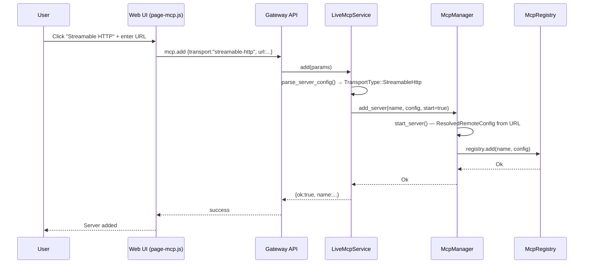

> DEVELOPER

Fix comments from https://github.com/moltis-org/moltis/pull/555 like adding enums, commit and push

> TOOL

tool_use Bash
id: toolu_014FJbhWpX1pqcsxHgzLUoLq
```json
{
  "command": "gh pr view 555 --json comments,reviews --jq '.reviews[].body, .comments[].body'",
  "description": "Fetch PR #555 comments and reviews"
}
```

> TOOL

tool_result
id: toolu_014FJbhWpX1pqcsxHgzLUoLq
```
<h3>Greptile Summary</h3>

This PR adds Streamable HTTP as a first-class MCP transport option alongside the existing SSE and Stdio transports. `TransportType::StreamableHttp` is introduced in `registry.rs` with serde aliases (`streamable_http`, `http`), all manager/service guards are extended to `Sse | StreamableHttp`, the web UI gains a "Streamable HTTP" transport button, and a new E2E test covers the new UI flow.

Key issues found:
- The error returned when a URL is missing says "for 'sse' transport" even when the selected transport is `streamable-http`, misleading users
- The `NotSseTransport` error variant and its message in `types.rs` are now stale — the guard it protects now covers both SSE and Streamable HTTP, but the message still names only SSE
- Per `CLAUDE.md`, `check_semantic_warnings()` in `validate.rs` should be updated to warn on unknown transport string values when a new transport variant is added; no such validation was added
- The test suite has no coverage for `StreamableHttp`-specific paths in `parse_server_config` (analogous tests exist only for SSE)

<h3>Confidence Score: 3/5</h3>

Functional paths are correctly extended but stale error messages and missing validation/tests lower merge confidence.

All transport handling logic works correctly; however the misleading error message shown to end users, the stale NotSseTransport variant, the missing check_semantic_warnings() update required by project policy, and absent StreamableHttp unit tests are quality gaps that should be addressed before merge.

crates/gateway/src/mcp_service.rs (stale error message + missing tests), crates/config/src/validate.rs (missing transport validation per CLAUDE.md), crates/mcp/src/types.rs (stale NotSseTransport error string)

<h3>Important Files Changed</h3>


| Filename | Overview |
|----------|----------|
| crates/gateway/src/mcp_service.rs | Correctly extends transport parsing to StreamableHttp; one stale error message and missing StreamableHttp-specific unit tests. |
| crates/mcp/src/manager.rs | SSE-only guards extended to Sse | StreamableHttp throughout; NotSseTransport variant name and message in types.rs are now stale. |
| crates/mcp/src/registry.rs | Clean addition of StreamableHttp variant with serde aliases; serialization/deserialization tests look complete. |
| crates/config/src/schema.rs | Comment/doc updated for streamable-http; check_semantic_warnings() in validate.rs was not updated to validate transport values per CLAUDE.md policy. |
| crates/gateway/src/server.rs | Transport string matching correctly handles streamable-http/streamable_http/http aliases when seeding registry from config file. |
| crates/web/src/assets/js/page-mcp.js | UI transport toggle, label, and form visibility logic correctly extended for streamable-http across all code paths. |
| crates/web/ui/e2e/specs/mcp.spec.js | E2E test for Streamable HTTP button present; OAuth guidance text verification missing compared to the SSE test. |

</details>


<h3>Sequence Diagram</h3>



<!-- greptile_failed_comments -->
<details open><summary><h3>Comments Outside Diff (3)</h3></summary>

1. `crates/gateway/src/mcp_service.rs`, line 184-188 ([link](https://github.com/moltis-org/moltis/blob/82f3c5674aea6e1c3a3cbfede902f27a24009e03/crates/gateway/src/mcp_service.rs#L184-L188)) 

   <a href="#"></a> **Stale error message for Streamable HTTP transport**

   The error message `"missing 'url' parameter for 'sse' transport"` is also returned when `transport` is `StreamableHttp` (the match arm on lines 177–179 covers both `Sse | StreamableHttp`). A user configuring a Streamable HTTP server will receive a confusing SSE-specific message.


2. `crates/mcp/src/manager.rs`, line 350-357 ([link](https://github.com/moltis-org/moltis/blob/82f3c5674aea6e1c3a3cbfede902f27a24009e03/crates/mcp/src/manager.rs#L350-L357)) 

   <a href="#"></a> **`NotSseTransport` error variant is now misleading**

   The guard here now allows both `Sse` and `StreamableHttp`, so only `Stdio` reaches this error path. However, the variant `NotSseTransport` and its `#[error]` string in `crates/mcp/src/types.rs:177` still read `"MCP server '{server}' is not configured for SSE transport"`. A Stdio-transport user will see an error that mentions only SSE, when the true requirement is SSE *or* Streamable HTTP.

   Consider updating the message to `"MCP server '{server}' is not configured for SSE or Streamable HTTP transport"` (or renaming the variant to `NotRemoteTransport`).


3. `crates/gateway/src/mcp_service.rs`, line 658-719 ([link](https://github.com/moltis-org/moltis/blob/82f3c5674aea6e1c3a3cbfede902f27a24009e03/crates/gateway/src/mcp_service.rs#L658-L719)) 

   <a href="#"></a> **Missing unit tests for `StreamableHttp` paths in `parse_server_config`**

   `CLAUDE.md` requires high test coverage. The test suite covers SSE-specific edge cases (`parse_server_config_allows_sse_without_command`, `parse_server_config_requires_url_for_sse`) but no parallel tests exist for `streamable-http`:

   - `parse_server_config_allows_streamable_http_without_command` — verify `command` is not required when transport is `"streamable-http"`
   - `parse_server_config_requires_url_for_streamable_http` — verify the URL-required error fires for `"streamable-http"`

   Also note: once the error message is fixed (see the other comment), the assertion in the SSE URL test that checks for `"missing 'url' parameter for 'sse' transport"` will need updating if it is shared.

</details>

<!-- /greptile_failed_comments -->

<sub>Reviews (1): Last reviewed commit: ["Add streamable http mcp"](https://github.com/moltis-org/moltis/commit/82f3c5674aea6e1c3a3cbfede902f27a24009e03) | [Re-trigger Greptile](https://app.greptile.com/api/retrigger?id=27360279)</sub>
```

> AGENT

Let me read the relevant files to understand the current state.

> TOOL

tool_use Read
id: toolu_01MvitpnQ3JF2ASaTZ9h2MUX
```json
{
  "file_path": "/Users/penso/.superset/worktrees/moltis/volfco/streamable-http/crates/gateway/src/mcp_service.rs",
  "offset": 170,
  "limit": 40
}
```

> TOOL

tool_result
id: toolu_01MvitpnQ3JF2ASaTZ9h2MUX
```
   170→        HashMap::new()
   171→    } else if params.get("env").is_some() {
   172→        parse_string_map(params.get("env").unwrap_or(&Value::Null))
   173→    } else {
   174→        existing.map(|cfg| cfg.env.clone()).unwrap_or_default()
   175→    };
   176→
   177→    if matches!(
   178→        transport,
   179→        moltis_mcp::TransportType::Sse | moltis_mcp::TransportType::StreamableHttp
   180→    ) && url
   181→        .as_ref()
   182→        .map(ExposeSecret::expose_secret)
   183→        .is_none_or(|candidate| candidate.trim().is_empty())
   184→    {
   185→        return Err(ServiceError::message(
   186→            "missing 'url' parameter for 'sse' transport",
   187→        ));
   188→    }
   189→
   190→    let oauth = if let Some(v) = params.get("oauth") {
   191→        if v.is_null() {
   192→            None
   193→        } else {
   194→            let client_id = v
   195→                .get("client_id")
   196→                .and_then(|val| val.as_str())
   197→                .ok_or_else(|| ServiceError::message("missing 'oauth.client_id' parameter"))?
   198→                .to_string();
   199→            let auth_url = v
   200→                .get("auth_url")
   201→                .and_then(|val| val.as_str())
   202→                .ok_or_else(|| ServiceError::message("missing 'oauth.auth_url' parameter"))?
   203→                .to_string();
   204→            let token_url = v
   205→                .get("token_url")
   206→                .and_then(|val| val.as_str())
   207→                .ok_or_else(|| ServiceError::message("missing 'oauth.token_url' parameter"))?
   208→                .to_string();
   209→            let scopes: Vec<String> = v
```

> TOOL

tool_use Read
id: toolu_01LfrGqgcECupg926GsG1Cgf
```json
{
  "file_path": "/Users/penso/.superset/worktrees/moltis/volfco/streamable-http/crates/mcp/src/types.rs",
  "offset": 170,
  "limit": 20
}
```

> TOOL

tool_result
id: toolu_01LfrGqgcECupg926GsG1Cgf
```
   170→    /// Server requires OAuth before it can be started.
   171→    #[error("MCP server '{server}' requires OAuth authentication")]
   172→    OAuthRequired { server: String },
   173→    /// OAuth callback state did not match any pending flow.
   174→    #[error("unknown or expired MCP OAuth state")]
   175→    OAuthStateNotFound,
   176→    /// Operation requires an SSE server.
   177→    #[error("MCP server '{server}' is not configured for SSE transport")]
   178→    NotSseTransport { server: String },
   179→    /// Operation requires an SSE URL.
   180→    #[error("MCP server '{server}' is missing an SSE URL")]
   181→    MissingSseUrl { server: String },
   182→    /// Server was not found in the MCP registry.
   183→    #[error("MCP server '{server}' not found in registry")]
   184→    ServerNotFound { server: String },
   185→}
   186→
   187→/// Typed transport errors for MCP SSE connections.
   188→///
   189→/// Used by `SseTransport` to distinguish recoverable auth errors (401)
```

> TOOL

tool_use Read
id: toolu_01SPVsf8kgZFb69LZG3eK77q
```json
{
  "file_path": "/Users/penso/.superset/worktrees/moltis/volfco/streamable-http/crates/mcp/src/manager.rs",
  "offset": 340,
  "limit": 30
}
```

> TOOL

tool_result
id: toolu_01SPVsf8kgZFb69LZG3eK77q
```
   340→        let config =
   341→            {
   342→                let inner = self.inner.read().await;
   343→                inner.registry.get(name).cloned().ok_or_else(|| {
   344→                    McpManagerError::ServerNotFound {
   345→                        server: name.to_string(),
   346→                    }
   347→                })?
   348→            };
   349→
   350→        if !matches!(
   351→            config.transport,
   352→            TransportType::Sse | TransportType::StreamableHttp
   353→        ) {
   354→            return Err(McpManagerError::NotSseTransport {
   355→                server: name.to_string(),
   356→            }
   357→            .into());
   358→        }
   359→
   360→        let env_overrides = {
   361→            let inner = self.inner.read().await;
   362→            inner.env_overrides.clone()
   363→        };
   364→        let remote = ResolvedRemoteConfig::from_server_config(&config, &env_overrides)?;
   365→
   366→        let existing_auth = {
   367→            let inner = self.inner.read().await;
   368→            inner.auth_providers.get(name).cloned()
   369→        };
```

> TOOL

tool_use Read
id: toolu_014Jidiu4BYZcQaFstV6PzpU
```json
{
  "file_path": "/Users/penso/.superset/worktrees/moltis/volfco/streamable-http/crates/gateway/src/mcp_service.rs",
  "offset": 650,
  "limit": 80
}
```

> TOOL

tool_result
id: toolu_014Jidiu4BYZcQaFstV6PzpU
```
   650→#[cfg(test)]
   651→mod tests {
   652→    use {
   653→        super::*,
   654→        moltis_mcp::McpRegistry,
   655→        secrecy::{ExposeSecret, Secret},
   656→    };
   657→
   658→    #[test]
   659→    fn parse_server_config_allows_sse_without_command() {
   660→        let cfg = parse_server_config(
   661→            &serde_json::json!({
   662→                "transport": "sse",
   663→                "url": "https://mcp.linear.app/mcp",
   664→                "enabled": true
   665→            }),
   666→            None,
   667→        );
   668→        assert!(
   669→            cfg.is_ok(),
   670→            "expected SSE config to parse without command, got: {cfg:?}"
   671→        );
   672→        let Ok(cfg) = cfg else {
   673→            panic!("SSE config unexpectedly failed to parse");
   674→        };
   675→
   676→        assert!(matches!(cfg.transport, moltis_mcp::TransportType::Sse));
   677→        assert_eq!(cfg.command, "");
   678→        assert_eq!(
   679→            cfg.url
   680→                .as_ref()
   681→                .map(ExposeSecret::expose_secret)
   682→                .map(String::as_str),
   683→            Some("https://mcp.linear.app/mcp")
   684→        );
   685→    }
   686→
   687→    #[test]
   688→    fn parse_server_config_requires_command_for_stdio() {
   689→        let err = parse_server_config(
   690→            &serde_json::json!({
   691→                "transport": "stdio",
   692→                "args": ["-y", "@modelcontextprotocol/server-filesystem"]
   693→            }),
   694→            None,
   695→        )
   696→        .err();
   697→
   698→        assert_eq!(
   699→            err.as_ref().map(ToString::to_string).as_deref(),
   700→            Some("missing 'command' parameter")
   701→        );
   702→    }
   703→
   704→    #[test]
   705→    fn parse_server_config_requires_url_for_sse() {
   706→        let err = parse_server_config(
   707→            &serde_json::json!({
   708→                "transport": "sse",
   709→            }),
   710→            None,
   711→        )
   712→        .err();
   713→
   714→        assert_eq!(
   715→            err.as_ref().map(ToString::to_string).as_deref(),
   716→            Some("missing 'url' parameter for 'sse' transport")
   717→        );
   718→    }
   719→
   720→    #[test]
   721→    fn parse_server_config_update_preserves_existing_sse_fields() {
   722→        let existing = moltis_mcp::McpServerConfig {
   723→            transport: moltis_mcp::TransportType::Sse,
   724→            url: Some(Secret::new("https://mcp.linear.app/mcp".to_string())),
   725→            ..Default::default()
   726→        };
   727→
   728→        let cfg = parse_server_config(
   729→            &serde_json::json!({
```

> TOOL

tool_use Read
id: toolu_015En2F8AR256HBC1Dbzbi8d
```json
{
  "file_path": "/Users/penso/.superset/worktrees/moltis/volfco/streamable-http/crates/config/src/validate.rs",
  "offset": 1,
  "limit": 50
}
```

> TOOL

tool_result
id: toolu_015En2F8AR256HBC1Dbzbi8d
```
     1→//! Configuration validation engine.
     2→//!
     3→//! Validates TOML configuration files against the known schema, detects
     4→//! unknown/misspelled fields, and reports security warnings.
     5→
     6→use std::{collections::HashMap, path::Path};
     7→
     8→use crate::schema::MoltisConfig;
     9→
    10→/// Severity level for a diagnostic.
    11→#[derive(Debug, Clone, Copy, PartialEq, Eq, PartialOrd, Ord)]
    12→pub enum Severity {
    13→    Error,
    14→    Warning,
    15→    Info,
    16→}
    17→
    18→impl std::fmt::Display for Severity {
    19→    fn fmt(&self, f: &mut std::fmt::Formatter<'_>) -> std::fmt::Result {
    20→        match self {
    21→            Self::Error => write!(f, "error"),
    22→            Self::Warning => write!(f, "warning"),
    23→            Self::Info => write!(f, "info"),
    24→        }
    25→    }
    26→}
    27→
    28→/// A single validation diagnostic.
    29→#[derive(Debug, Clone)]
    30→pub struct Diagnostic {
    31→    pub severity: Severity,
    32→    /// Category: "syntax", "unknown-field", "deprecated-field", "unknown-provider", "type-error",
    33→    /// "security", "file-ref"
    34→    pub category: &'static str,
    35→    /// Dotted path, e.g. "server.bnd"
    36→    pub path: String,
    37→    pub message: String,
    38→}
    39→
    40→/// Result of validating a configuration file.
    41→#[derive(Debug, Clone)]
    42→pub struct ValidationResult {
    43→    pub diagnostics: Vec<Diagnostic>,
    44→    pub config_path: Option<std::path::PathBuf>,
    45→}
    46→
    47→impl ValidationResult {
    48→    /// Returns `true` if any diagnostic is an error.
    49→    #[must_use]
    50→    pub fn has_errors(&self) -> bool {
```

> AGENT

Now let me find `check_semantic_warnings` in validate.rs and see the full test section.

> TOOL

tool_use Grep
id: toolu_01R6sYQtSKHR5TBbieGLBHye
```json
{
  "pattern": "check_semantic_warnings",
  "path": "/Users/penso/.superset/worktrees/moltis/volfco/streamable-http/crates/config/src/validate.rs",
  "output_mode": "content"
}
```

> TOOL

tool_result
id: toolu_01R6sYQtSKHR5TBbieGLBHye
```
808:        check_semantic_warnings(&config, &mut diagnostics);
1014:fn check_semantic_warnings(config: &MoltisConfig, diagnostics: &mut Vec<Diagnostic>) {
```

> TOOL

tool_use Grep
id: toolu_01Xkp6smCThLcESuozP5hdym
```json
{
  "pattern": "NotSseTransport|NotRemoteTransport|MissingSseUrl",
  "path": "/Users/penso/.superset/worktrees/moltis/volfco/streamable-http/crates/mcp/src",
  "output_mode": "content",
  "-n": true
}
```

> TOOL

tool_result
id: toolu_01Xkp6smCThLcESuozP5hdym
```
crates/mcp/src/manager.rs:354:            return Err(McpManagerError::NotSseTransport {
crates/mcp/src/manager.rs:792:            Error::Manager(McpManagerError::NotSseTransport { .. })
crates/mcp/src/types.rs:178:    NotSseTransport { server: String },
crates/mcp/src/types.rs:181:    MissingSseUrl { server: String },
```

> TOOL

tool_use Read
id: toolu_01RD6mh3MMNAj9pCGoLy2qyX
```json
{
  "file_path": "/Users/penso/.superset/worktrees/moltis/volfco/streamable-http/crates/config/src/validate.rs",
  "offset": 1014,
  "limit": 100
}
```

> TOOL

tool_result
id: toolu_01RD6mh3MMNAj9pCGoLy2qyX
```
  1014→fn check_semantic_warnings(config: &MoltisConfig, diagnostics: &mut Vec<Diagnostic>) {
  1015→    let is_localhost = config.server.bind == "127.0.0.1"
  1016→        || config.server.bind == "localhost"
  1017→        || config.server.bind == "::1";
  1018→
  1019→    // auth.disabled + non-localhost
  1020→    if config.auth.disabled && !is_localhost {
  1021→        diagnostics.push(Diagnostic {
  1022→            severity: Severity::Warning,
  1023→            category: "security",
  1024→            path: "auth".into(),
  1025→            message: format!(
  1026→                "authentication is disabled while binding to {}",
  1027→                config.server.bind
  1028→            ),
  1029→        });
  1030→    }
  1031→
  1032→    // TLS disabled + non-localhost
  1033→    if !config.tls.enabled && !is_localhost {
  1034→        diagnostics.push(Diagnostic {
  1035→            severity: Severity::Warning,
  1036→            category: "security",
  1037→            path: "tls".into(),
  1038→            message: format!("TLS is disabled while binding to {}", config.server.bind),
  1039→        });
  1040→    }
  1041→
  1042→    // TLS cert without key or vice versa
  1043→    let has_cert = config.tls.cert_path.is_some();
  1044→    let has_key = config.tls.key_path.is_some();
  1045→    if has_cert && !has_key {
  1046→        diagnostics.push(Diagnostic {
  1047→            severity: Severity::Error,
  1048→            category: "security",
  1049→            path: "tls".into(),
  1050→            message: "tls.cert_path is set but tls.key_path is missing".into(),
  1051→        });
  1052→    }
  1053→    if has_key && !has_cert {
  1054→        diagnostics.push(Diagnostic {
  1055→            severity: Severity::Error,
  1056→            category: "security",
  1057→            path: "tls".into(),
  1058→            message: "tls.key_path is set but tls.cert_path is missing".into(),
  1059→        });
  1060→    }
  1061→
  1062→    // Sandbox mode off
  1063→    if config.tools.exec.sandbox.mode == "off" {
  1064→        diagnostics.push(Diagnostic {
  1065→            severity: Severity::Warning,
  1066→            category: "security",
  1067→            path: "tools.exec.sandbox.mode".into(),
  1068→            message: "sandbox mode is disabled — commands run without isolation".into(),
  1069→        });
  1070→    }
  1071→
  1072→    // Loop limit must be positive to avoid immediate run failures.
  1073→    if config.tools.agent_max_iterations == 0 {
  1074→        diagnostics.push(Diagnostic {
  1075→            severity: Severity::Error,
  1076→            category: "invalid-value",
  1077→            path: "tools.agent_max_iterations".into(),
  1078→            message: "tools.agent_max_iterations must be at least 1".into(),
  1079→        });
  1080→    }
  1081→
  1082→    if config.mcp.request_timeout_secs == 0 {
  1083→        diagnostics.push(Diagnostic {
  1084→            severity: Severity::Error,
  1085→            category: "invalid-value",
  1086→            path: "mcp.request_timeout_secs".into(),
  1087→            message: "mcp.request_timeout_secs must be at least 1".into(),
  1088→        });
  1089→    }
  1090→
  1091→    for (name, server) in &config.mcp.servers {
  1092→        if server.request_timeout_secs == Some(0) {
  1093→            diagnostics.push(Diagnostic {
  1094→                severity: Severity::Error,
  1095→                category: "invalid-value",
  1096→                path: format!("mcp.servers.{name}.request_timeout_secs"),
  1097→                message: "mcp server request_timeout_secs must be at least 1".into(),
  1098→            });
  1099→        }
  1100→    }
  1101→
  1102→    // agents.default_preset should reference an existing preset key.
  1103→    if let Some(default_preset) = config.agents.default_preset.as_deref()
  1104→        && !config.agents.presets.contains_key(default_preset)
  1105→    {
  1106→        diagnostics.push(Diagnostic {
  1107→            severity: Severity::Warning,
  1108→            category: "unknown-field",
  1109→            path: "agents.default_preset".into(),
  1110→            message: format!(
  1111→                "default preset \"{default_preset}\" is not defined in agents.presets"
  1112→            ),
  1113→        });
```

> TOOL

tool_use Read
id: toolu_01SNHW1Ss7hdX96btCCwHisu
```json
{
  "file_path": "/Users/penso/.superset/worktrees/moltis/volfco/streamable-http/crates/mcp/src/types.rs",
  "offset": 160,
  "limit": 30
}
```

> TOOL

tool_result
id: toolu_01SNHW1Ss7hdX96btCCwHisu
```
   160→}
   161→
   162→/// MCP protocol version we implement.
   163→pub const PROTOCOL_VERSION: &str = "2024-11-05";
   164→
   165→// ── Transport Errors ──────────────────────────────────────────────────
   166→
   167→/// Typed manager errors for MCP lifecycle/auth flows.
   168→#[derive(Debug, thiserror::Error)]
   169→pub enum McpManagerError {
   170→    /// Server requires OAuth before it can be started.
   171→    #[error("MCP server '{server}' requires OAuth authentication")]
   172→    OAuthRequired { server: String },
   173→    /// OAuth callback state did not match any pending flow.
   174→    #[error("unknown or expired MCP OAuth state")]
   175→    OAuthStateNotFound,
   176→    /// Operation requires an SSE server.
   177→    #[error("MCP server '{server}' is not configured for SSE transport")]
   178→    NotSseTransport { server: String },
   179→    /// Operation requires an SSE URL.
   180→    #[error("MCP server '{server}' is missing an SSE URL")]
   181→    MissingSseUrl { server: String },
   182→    /// Server was not found in the MCP registry.
   183→    #[error("MCP server '{server}' not found in registry")]
   184→    ServerNotFound { server: String },
   185→}
   186→
   187→/// Typed transport errors for MCP SSE connections.
   188→///
   189→/// Used by `SseTransport` to distinguish recoverable auth errors (401)
```

> AGENT

Now let me check the MCP server config schema to see if transport is a string field there.

> TOOL

tool_use Grep
id: toolu_01KpUFrVMvqZx8hwpFr2VZyk
```json
{
  "pattern": "transport.*String|transport.*str",
  "path": "/Users/penso/.superset/worktrees/moltis/volfco/streamable-http/crates/config/src/schema.rs",
  "output_mode": "content",
  "-n": true
}
```

> TOOL

tool_result
id: toolu_01KpUFrVMvqZx8hwpFr2VZyk
```
1294:    pub transport: String,
1295:    /// URL for SSE/Streamable HTTP transport. Required when `transport` is "sse" or "streamable-http".
2230:/// Streaming transport for provider response streams.
2324:            .field("stream_transport", &self.stream_transport)
```

> TOOL

tool_use Grep
id: toolu_01QNFhAsTALzfvxwKhiz2mUH
```json
{
  "pattern": "struct McpServer|transport|mcp\\.servers",
  "path": "/Users/penso/.superset/worktrees/moltis/volfco/streamable-http/crates/config/src/schema.rs",
  "output_mode": "content",
  "-n": true
}
```

> TOOL

tool_result
id: toolu_01QNFhAsTALzfvxwKhiz2mUH
```
1276:pub struct McpServerEntry {
1277:    /// Command to spawn the server process (stdio transport).
1294:    pub transport: String,
1295:    /// URL for SSE/Streamable HTTP transport. Required when `transport` is "sse" or "streamable-http".
1298:    /// Custom headers for remote HTTP/SSE transport.
2230:/// Streaming transport for provider response streams.
2239:    /// Try WebSocket first, then fall back to SSE on transport/setup failure.
2272:    /// Streaming transport for this provider (`sse`, `websocket`, `auto`).
2275:    #[serde(default, skip_serializing_if = "is_default_provider_stream_transport")]
2276:    pub stream_transport: ProviderStreamTransport,
2324:            .field("stream_transport", &self.stream_transport)
2341:            stream_transport: ProviderStreamTransport::Sse,
2374:const fn is_default_provider_stream_transport(value: &ProviderStreamTransport) -> bool {
2540:[mcp.servers.memory]
```

> TOOL

tool_use Read
id: toolu_012E49g7novLLBDYghHKZvhH
```json
{
  "file_path": "/Users/penso/.superset/worktrees/moltis/volfco/streamable-http/crates/config/src/schema.rs",
  "offset": 1276,
  "limit": 30
}
```

> TOOL

tool_result
id: toolu_012E49g7novLLBDYghHKZvhH
```
  1276→pub struct McpServerEntry {
  1277→    /// Command to spawn the server process (stdio transport).
  1278→    #[serde(default)]
  1279→    pub command: String,
  1280→    /// Arguments to the command.
  1281→    #[serde(default)]
  1282→    pub args: Vec<String>,
  1283→    /// Environment variables to set for the process.
  1284→    #[serde(default)]
  1285→    pub env: HashMap<String, String>,
  1286→    /// Whether this server is enabled. Defaults to true.
  1287→    #[serde(default = "default_true")]
  1288→    pub enabled: bool,
  1289→    /// Optional per-server MCP request timeout override in seconds.
  1290→    #[serde(default, skip_serializing_if = "Option::is_none")]
  1291→    pub request_timeout_secs: Option<u64>,
  1292→    /// Transport type: "stdio" (default), "sse", or "streamable-http".
  1293→    #[serde(default)]
  1294→    pub transport: String,
  1295→    /// URL for SSE/Streamable HTTP transport. Required when `transport` is "sse" or "streamable-http".
  1296→    #[serde(default, skip_serializing_if = "Option::is_none")]
  1297→    pub url: Option<String>,
  1298→    /// Custom headers for remote HTTP/SSE transport.
  1299→    #[serde(default)]
  1300→    pub headers: HashMap<String, String>,
  1301→    /// Manual OAuth override for servers that don't support standard discovery.
  1302→    #[serde(default, skip_serializing_if = "Option::is_none")]
  1303→    pub oauth: Option<McpOAuthOverrideEntry>,
  1304→    /// Custom display name for the server (shown in UI instead of technical ID).
  1305→    #[serde(default, skip_serializing_if = "Option::is_none")]
```

> AGENT

Now I have the full picture. Let me also check what `MissingSseUrl` is used for.

> TOOL

tool_use Grep
id: toolu_01RgE9dWXvxsZA3Dnyc8kFpP
```json
{
  "pattern": "MissingSseUrl",
  "path": "/Users/penso/.superset/worktrees/moltis/volfco/streamable-http/crates/mcp/src",
  "output_mode": "content",
  "-n": true
}
```

> TOOL

tool_result
id: toolu_01RgE9dWXvxsZA3Dnyc8kFpP
```
crates/mcp/src/types.rs:181:    MissingSseUrl { server: String },
```

> TOOL

tool_use Grep
id: toolu_01QoZpG2X93eRGznffJUphWt
```json
{
  "pattern": "MissingSseUrl",
  "path": "/Users/penso/.superset/worktrees/moltis/volfco/streamable-http/crates",
  "output_mode": "content",
  "-n": true
}
```

> TOOL

tool_result
id: toolu_01QoZpG2X93eRGznffJUphWt
```
crates/mcp/src/types.rs:181:    MissingSseUrl { server: String },
```

> AGENT

`MissingSseUrl` is unused. Now let me check `NotSseTransport` usage in tests.

> TOOL

tool_use Read
id: toolu_016gT8pBXFkQaxGachxdzC64
```json
{
  "file_path": "/Users/penso/.superset/worktrees/moltis/volfco/streamable-http/crates/mcp/src/manager.rs",
  "offset": 785,
  "limit": 20
}
```

> TOOL

tool_result
id: toolu_016gT8pBXFkQaxGachxdzC64
```
   785→        let mgr = McpManager::new(reg);
   786→        let err = mgr
   787→            .oauth_start_server("stdio", "https://example.com/auth/callback")
   788→            .await
   789→            .expect_err("expected oauth start to fail for stdio transport");
   790→        assert!(matches!(
   791→            err,
   792→            Error::Manager(McpManagerError::NotSseTransport { .. })
   793→        ));
   794→    }
   795→
   796→    #[tokio::test]
   797→    async fn test_oauth_complete_callback_unknown_state() {
   798→        let mgr = McpManager::new(McpRegistry::new());
   799→        let err = mgr
   800→            .oauth_complete_callback("unknown-state", "code")
   801→            .await
   802→            .expect_err("expected unknown state to fail");
   803→        assert!(matches!(
   804→            err,
```

> AGENT

Now I have everything I need. Let me make all the fixes:

1. **Rename `NotSseTransport` → `NotRemoteTransport`** and update error message
2. **Rename `MissingSseUrl` → `MissingRemoteUrl`** and update error message
3. **Fix stale error message** in `mcp_service.rs` for missing URL
4. **Add transport validation** in `check_semantic_warnings`
5. **Add `StreamableHttp` unit tests** in `mcp_service.rs`

> TOOL

tool_use Edit
id: toolu_01TVBSbNhoRcFMw2SEiCqtyh
```json
{
  "replace_all": false,
  "file_path": "/Users/penso/.superset/worktrees/moltis/volfco/streamable-http/crates/mcp/src/types.rs",
  "old_string": "    /// Operation requires an SSE server.\n    #[error(\"MCP server '{server}' is not configured for SSE transport\")]\n    NotSseTransport { server: String },\n    /// Operation requires an SSE URL.\n    #[error(\"MCP server '{server}' is missing an SSE URL\")]\n    MissingSseUrl { server: String },",
  "new_string": "    /// Operation requires a remote (SSE or Streamable HTTP) server.\n    #[error(\"MCP server '{server}' is not configured for SSE or Streamable HTTP transport\")]\n    NotRemoteTransport { server: String },\n    /// Operation requires a remote URL.\n    #[error(\"MCP server '{server}' is missing a remote URL\")]\n    MissingRemoteUrl { server: String },"
}
```

> TOOL

tool_result
id: toolu_01TVBSbNhoRcFMw2SEiCqtyh
```
The file /Users/penso/.superset/worktrees/moltis/volfco/streamable-http/crates/mcp/src/types.rs has been updated successfully.
```

> TOOL

tool_use Edit
id: toolu_01UxkLA6R7Geyz6AzdmM5y8q
```json
{
  "replace_all": false,
  "file_path": "/Users/penso/.superset/worktrees/moltis/volfco/streamable-http/crates/mcp/src/manager.rs",
  "old_string": "            return Err(McpManagerError::NotSseTransport {\n                server: name.to_string(),\n            }",
  "new_string": "            return Err(McpManagerError::NotRemoteTransport {\n                server: name.to_string(),\n            }"
}
```

> TOOL

tool_result
id: toolu_01UxkLA6R7Geyz6AzdmM5y8q
```
The file /Users/penso/.superset/worktrees/moltis/volfco/streamable-http/crates/mcp/src/manager.rs has been updated successfully.
```

> TOOL

tool_use Edit
id: toolu_01LZAxdKaEa91oig8iinNUKv
```json
{
  "replace_all": false,
  "file_path": "/Users/penso/.superset/worktrees/moltis/volfco/streamable-http/crates/mcp/src/manager.rs",
  "old_string": "            Error::Manager(McpManagerError::NotSseTransport { .. })",
  "new_string": "            Error::Manager(McpManagerError::NotRemoteTransport { .. })"
}
```

> TOOL

tool_result
id: toolu_01LZAxdKaEa91oig8iinNUKv
```
The file /Users/penso/.superset/worktrees/moltis/volfco/streamable-http/crates/mcp/src/manager.rs has been updated successfully.
```

> TOOL

tool_use Edit
id: toolu_014iu21gxdwv28ANJ4Zq4Xvm
```json
{
  "replace_all": false,
  "file_path": "/Users/penso/.superset/worktrees/moltis/volfco/streamable-http/crates/gateway/src/mcp_service.rs",
  "old_string": "        return Err(ServiceError::message(\n            \"missing 'url' parameter for 'sse' transport\",\n        ));",
  "new_string": "        return Err(ServiceError::message(format!(\n            \"missing 'url' parameter for '{}' transport\",\n            transport\n        )));"
}
```

> TOOL

tool_result
id: toolu_014iu21gxdwv28ANJ4Zq4Xvm
```
The file /Users/penso/.superset/worktrees/moltis/volfco/streamable-http/crates/gateway/src/mcp_service.rs has been updated successfully.
```

> AGENT

Now let me check how `TransportType` implements `Display` to make sure the format string works.

> TOOL

tool_use Grep
id: toolu_011W91gKJ6HMFn52MQdjBvjb
```json
{
  "pattern": "impl.*Display.*TransportType|fn fmt.*TransportType",
  "path": "/Users/penso/.superset/worktrees/moltis/volfco/streamable-http/crates/mcp/src/registry.rs",
  "output_mode": "content",
  "-n": true
}
```

> TOOL

tool_result
id: toolu_011W91gKJ6HMFn52MQdjBvjb
```
No matches found
```

> TOOL

tool_use Grep
id: toolu_016BH5JaEGYvzSeKDNnFyEEX
```json
{
  "pattern": "TransportType",
  "path": "/Users/penso/.superset/worktrees/moltis/volfco/streamable-http/crates/mcp/src/registry.rs",
  "output_mode": "content",
  "-n": true
}
```

> TOOL

tool_result
id: toolu_016BH5JaEGYvzSeKDNnFyEEX
```
19:pub enum TransportType {
51:    pub transport: TransportType,
88:            transport: TransportType::default(),
253:        let transports: Vec<TransportType> = serde_json::from_str(json).unwrap();
255:            TransportType::Stdio,
256:            TransportType::Sse,
257:            TransportType::StreamableHttp,
258:            TransportType::StreamableHttp,
259:            TransportType::StreamableHttp,
338:            transport: TransportType::Sse,
```

> TOOL

tool_use Read
id: toolu_01XT49KtEEiEm2uTSqWEFNKD
```json
{
  "file_path": "/Users/penso/.superset/worktrees/moltis/volfco/streamable-http/crates/mcp/src/registry.rs",
  "offset": 14,
  "limit": 40
}
```

> TOOL

tool_result
id: toolu_01XT49KtEEiEm2uTSqWEFNKD
```
    14→use crate::error::{Context, Result};
    15→
    16→/// Transport type for MCP server connections.
    17→#[derive(Debug, Clone, Copy, PartialEq, Eq, Serialize, Deserialize, Default)]
    18→#[serde(rename_all = "lowercase")]
    19→pub enum TransportType {
    20→    #[default]
    21→    Stdio,
    22→    Sse,
    23→    #[serde(rename = "streamable-http", alias = "streamable_http", alias = "http")]
    24→    StreamableHttp,
    25→}
    26→
    27→/// Manual OAuth override for MCP servers that don't support standard discovery.
    28→#[derive(Debug, Clone, Serialize, Deserialize)]
    29→pub struct McpOAuthConfig {
    30→    pub client_id: String,
    31→    pub auth_url: String,
    32→    pub token_url: String,
    33→    #[serde(default)]
    34→    pub scopes: Vec<String>,
    35→}
    36→
    37→/// Configuration for a single MCP server.
    38→#[derive(Debug, Clone, Serialize, Deserialize)]
    39→pub struct McpServerConfig {
    40→    #[serde(default)]
    41→    pub command: String,
    42→    #[serde(default)]
    43→    pub args: Vec<String>,
    44→    #[serde(default)]
    45→    pub env: HashMap<String, String>,
    46→    #[serde(default = "default_true")]
    47→    pub enabled: bool,
    48→    #[serde(default, skip_serializing_if = "Option::is_none")]
    49→    pub request_timeout_secs: Option<u64>,
    50→    #[serde(default)]
    51→    pub transport: TransportType,
    52→    /// URL for SSE transport. Required when `transport` is `Sse`.
    53→    #[serde(
```

> AGENT

No `Display` impl — the `format!("{}", transport)` won't compile. I need to add a `Display` impl or use the serialized form. Let me add `Display` on `TransportType`.

> TOOL

tool_use Edit
id: toolu_01QJkgNTM1HMkaGwocW5nNry
```json
{
  "replace_all": false,
  "file_path": "/Users/penso/.superset/worktrees/moltis/volfco/streamable-http/crates/mcp/src/registry.rs",
  "old_string": "/// Manual OAuth override for MCP servers that don't support standard discovery.",
  "new_string": "impl std::fmt::Display for TransportType {\n    fn fmt(&self, f: &mut std::fmt::Formatter<'_>) -> std::fmt::Result {\n        match self {\n            Self::Stdio => write!(f, \"stdio\"),\n            Self::Sse => write!(f, \"sse\"),\n            Self::StreamableHttp => write!(f, \"streamable-http\"),\n        }\n    }\n}\n\n/// Manual OAuth override for MCP servers that don't support standard discovery."
}
```

> TOOL

tool_result
id: toolu_01QJkgNTM1HMkaGwocW5nNry
```
The file /Users/penso/.superset/worktrees/moltis/volfco/streamable-http/crates/mcp/src/registry.rs has been updated successfully.
```

> AGENT

Now update the test that checks the error message and add new StreamableHttp tests.

> TOOL

tool_use Edit
id: toolu_01RGyEWofMcMV3U6TBWb6M3D
```json
{
  "replace_all": false,
  "file_path": "/Users/penso/.superset/worktrees/moltis/volfco/streamable-http/crates/gateway/src/mcp_service.rs",
  "old_string": "    #[test]\n    fn parse_server_config_requires_url_for_sse() {\n        let err = parse_server_config(\n            &serde_json::json!({\n                \"transport\": \"sse\",\n            }),\n            None,\n        )\n        .err();\n\n        assert_eq!(\n            err.as_ref().map(ToString::to_string).as_deref(),\n            Some(\"missing 'url' parameter for 'sse' transport\")\n        );\n    }",
  "new_string": "    #[test]\n    fn parse_server_config_requires_url_for_sse() {\n        let err = parse_server_config(\n            &serde_json::json!({\n                \"transport\": \"sse\",\n            }),\n            None,\n        )\n        .err();\n\n        assert_eq!(\n            err.as_ref().map(ToString::to_string).as_deref(),\n            Some(\"missing 'url' parameter for 'sse' transport\")\n        );\n    }\n\n    #[test]\n    fn parse_server_config_allows_streamable_http_without_command() {\n        let cfg = parse_server_config(\n            &serde_json::json!({\n                \"transport\": \"streamable-http\",\n                \"url\": \"https://mcp.example.com/mcp\",\n                \"enabled\": true\n            }),\n            None,\n        );\n        assert!(\n            cfg.is_ok(),\n            \"expected Streamable HTTP config to parse without command, got: {cfg:?}\"\n        );\n        let Ok(cfg) = cfg else {\n            panic!(\"Streamable HTTP config unexpectedly failed to parse\");\n        };\n\n        assert!(matches!(\n            cfg.transport,\n            moltis_mcp::TransportType::StreamableHttp\n        ));\n        assert_eq!(cfg.command, \"\");\n        assert_eq!(\n            cfg.url\n                .as_ref()\n                .map(ExposeSecret::expose_secret)\n                .map(String::as_str),\n            Some(\"https://mcp.example.com/mcp\")\n        );\n    }\n\n    #[test]\n    fn parse_server_config_requires_url_for_streamable_http() {\n        let err = parse_server_config(\n            &serde_json::json!({\n                \"transport\": \"streamable-http\",\n            }),\n            None,\n        )\n        .err();\n\n        assert_eq!(\n            err.as_ref().map(ToString::to_string).as_deref(),\n            Some(\"missing 'url' parameter for 'streamable-http' transport\")\n        );\n    }"
}
```

> TOOL

tool_result
id: toolu_01RGyEWofMcMV3U6TBWb6M3D
```
The file /Users/penso/.superset/worktrees/moltis/volfco/streamable-http/crates/gateway/src/mcp_service.rs has been updated successfully.
```

> AGENT

Now add transport validation in `check_semantic_warnings`. Let me look at what valid values are and the config schema transport field.

> TOOL

tool_use Read
id: toolu_01PvDWBtuDmRWYeek2q9gerJ
```json
{
  "file_path": "/Users/penso/.superset/worktrees/moltis/volfco/streamable-http/crates/config/src/validate.rs",
  "offset": 1091,
  "limit": 20
}
```

> TOOL

tool_result
id: toolu_01PvDWBtuDmRWYeek2q9gerJ
```
  1091→    for (name, server) in &config.mcp.servers {
  1092→        if server.request_timeout_secs == Some(0) {
  1093→            diagnostics.push(Diagnostic {
  1094→                severity: Severity::Error,
  1095→                category: "invalid-value",
  1096→                path: format!("mcp.servers.{name}.request_timeout_secs"),
  1097→                message: "mcp server request_timeout_secs must be at least 1".into(),
  1098→            });
  1099→        }
  1100→    }
  1101→
  1102→    // agents.default_preset should reference an existing preset key.
  1103→    if let Some(default_preset) = config.agents.default_preset.as_deref()
  1104→        && !config.agents.presets.contains_key(default_preset)
  1105→    {
  1106→        diagnostics.push(Diagnostic {
  1107→            severity: Severity::Warning,
  1108→            category: "unknown-field",
  1109→            path: "agents.default_preset".into(),
  1110→            message: format!(
```

> TOOL

tool_use Edit
id: toolu_01AimGaqNkjWZGwB2NhdpcX4
```json
{
  "replace_all": false,
  "file_path": "/Users/penso/.superset/worktrees/moltis/volfco/streamable-http/crates/config/src/validate.rs",
  "old_string": "    for (name, server) in &config.mcp.servers {\n        if server.request_timeout_secs == Some(0) {\n            diagnostics.push(Diagnostic {\n                severity: Severity::Error,\n                category: \"invalid-value\",\n                path: format!(\"mcp.servers.{name}.request_timeout_secs\"),\n                message: \"mcp server request_timeout_secs must be at least 1\".into(),\n            });\n        }\n    }",
  "new_string": "    for (name, server) in &config.mcp.servers {\n        if server.request_timeout_secs == Some(0) {\n            diagnostics.push(Diagnostic {\n                severity: Severity::Error,\n                category: \"invalid-value\",\n                path: format!(\"mcp.servers.{name}.request_timeout_secs\"),\n                message: \"mcp server request_timeout_secs must be at least 1\".into(),\n            });\n        }\n\n        if !server.transport.is_empty()\n            && !matches!(\n                server.transport.as_str(),\n                \"stdio\" | \"sse\" | \"streamable-http\" | \"streamable_http\" | \"http\"\n            )\n        {\n            diagnostics.push(Diagnostic {\n                severity: Severity::Warning,\n                category: \"invalid-value\",\n                path: format!(\"mcp.servers.{name}.transport\"),\n                message: format!(\n                    \"unknown transport type \\\"{}\\\"; expected \\\"stdio\\\", \\\"sse\\\", or \\\"streamable-http\\\"\",\n                    server.transport\n                ),\n            });\n        }\n    }"
}
```

> TOOL

tool_result
id: toolu_01AimGaqNkjWZGwB2NhdpcX4
```
The file /Users/penso/.superset/worktrees/moltis/volfco/streamable-http/crates/config/src/validate.rs has been updated successfully.
```

> AGENT

Now let me also update the comment on `McpServerConfig.url` in `registry.rs` since it was stale.

> TOOL

tool_use Edit
id: toolu_011BWm7QYAdocD1AkXGcpHZ5
```json
{
  "replace_all": false,
  "file_path": "/Users/penso/.superset/worktrees/moltis/volfco/streamable-http/crates/mcp/src/registry.rs",
  "old_string": "    /// URL for SSE transport. Required when `transport` is `Sse`.",
  "new_string": "    /// URL for remote transport. Required when `transport` is `Sse` or `StreamableHttp`."
}
```

> TOOL

tool_result
id: toolu_011BWm7QYAdocD1AkXGcpHZ5
```
The file /Users/penso/.superset/worktrees/moltis/volfco/streamable-http/crates/mcp/src/registry.rs has been updated successfully.
```

> AGENT

Let me compile to check everything works.

> TOOL

tool_use Bash
id: toolu_013s2TfSGXtKbeP25pJpGrQ3
```json
{
  "command": "cargo check 2>&1 | tail -30",
  "description": "Compile check all changes",
  "timeout": 180000
}
```

> TOOL

tool_result
id: toolu_013s2TfSGXtKbeP25pJpGrQ3
```
    Checking moltis-node-host v0.1.0 (/Users/penso/.superset/worktrees/moltis/volfco/streamable-http/crates/node-host)
    Checking moltis-agents v0.1.0 (/Users/penso/.superset/worktrees/moltis/volfco/streamable-http/crates/agents)
    Checking moltis-whatsapp v0.1.0 (/Users/penso/.superset/worktrees/moltis/volfco/streamable-http/crates/whatsapp)
    Checking moltis-cron v0.1.0 (/Users/penso/.superset/worktrees/moltis/volfco/streamable-http/crates/cron)
    Checking moltis-auto-reply v0.1.0 (/Users/penso/.superset/worktrees/moltis/volfco/streamable-http/crates/auto-reply)
    Checking moltis-memory v0.1.0 (/Users/penso/.superset/worktrees/moltis/volfco/streamable-http/crates/memory)
    Checking moltis-caldav v0.1.0 (/Users/penso/.superset/worktrees/moltis/volfco/streamable-http/crates/caldav)
    Checking moltis-telegram v0.1.0 (/Users/penso/.superset/worktrees/moltis/volfco/streamable-http/crates/telegram)
    Checking moltis-qmd v0.1.0 (/Users/penso/.superset/worktrees/moltis/volfco/streamable-http/crates/qmd)
    Checking moltis-slack v0.1.0 (/Users/penso/.superset/worktrees/moltis/volfco/streamable-http/crates/slack)
    Checking chromiumoxide v0.8.0
    Checking moltis-browser v0.1.0 (/Users/penso/.superset/worktrees/moltis/volfco/streamable-http/crates/browser)
    Checking llama-cpp-2 v0.1.133
    Checking moltis-providers v0.1.0 (/Users/penso/.superset/worktrees/moltis/volfco/streamable-http/crates/providers)
    Checking moltis-discord v0.1.0 (/Users/penso/.superset/worktrees/moltis/volfco/streamable-http/crates/discord)
    Checking moltis-tools v0.1.0 (/Users/penso/.superset/worktrees/moltis/volfco/streamable-http/crates/tools)
    Checking moltis-provider-setup v0.1.0 (/Users/penso/.superset/worktrees/moltis/volfco/streamable-http/crates/provider-setup)
    Checking benchmarks v0.1.0 (/Users/penso/.superset/worktrees/moltis/volfco/streamable-http/crates/benchmarks)
    Checking tikv-jemallocator v0.6.1
    Checking moltis-chat v0.1.0 (/Users/penso/.superset/worktrees/moltis/volfco/streamable-http/crates/chat)
    Checking ece v2.3.1
    Checking webauthn-rs v0.5.4
    Checking moltis-auth v0.1.0 (/Users/penso/.superset/worktrees/moltis/volfco/streamable-http/crates/auth)
    Checking web-push v0.10.4
    Checking moltis-gateway v0.1.0 (/Users/penso/.superset/worktrees/moltis/volfco/streamable-http/crates/gateway)
    Checking moltis-httpd v0.1.0 (/Users/penso/.superset/worktrees/moltis/volfco/streamable-http/crates/httpd)
    Checking moltis-web v0.1.0 (/Users/penso/.superset/worktrees/moltis/volfco/streamable-http/crates/web)
    Checking moltis v0.1.0 (/Users/penso/.superset/worktrees/moltis/volfco/streamable-http/crates/cli)
    Checking moltis-swift-bridge v0.1.0 (/Users/penso/.superset/worktrees/moltis/volfco/streamable-http/crates/swift-bridge)
    Finished `dev` profile [unoptimized + debuginfo] target(s) in 1m 41s
```

> AGENT

Clean compile. Now run the relevant tests.

> TOOL

tool_use Bash
id: toolu_01PxdJpcCDGJmyQsWvPKogjX
```json
{
  "command": "cargo test -p moltis-gateway parse_server_config -p moltis-mcp -- --nocapture 2>&1 | tail -30",
  "description": "Run parse_server_config and mcp tests",
  "timeout": 180000
}
```

> TOOL

tool_result
id: toolu_01PxdJpcCDGJmyQsWvPKogjX
```
   Compiling moltis-providers v0.1.0 (/Users/penso/.superset/worktrees/moltis/volfco/streamable-http/crates/providers)
   Compiling moltis-discord v0.1.0 (/Users/penso/.superset/worktrees/moltis/volfco/streamable-http/crates/discord)
   Compiling moltis-tools v0.1.0 (/Users/penso/.superset/worktrees/moltis/volfco/streamable-http/crates/tools)
   Compiling moltis-provider-setup v0.1.0 (/Users/penso/.superset/worktrees/moltis/volfco/streamable-http/crates/provider-setup)
   Compiling moltis-auth v0.1.0 (/Users/penso/.superset/worktrees/moltis/volfco/streamable-http/crates/auth)
   Compiling moltis-chat v0.1.0 (/Users/penso/.superset/worktrees/moltis/volfco/streamable-http/crates/chat)
   Compiling moltis-gateway v0.1.0 (/Users/penso/.superset/worktrees/moltis/volfco/streamable-http/crates/gateway)
    Finished `test` profile [unoptimized + debuginfo] target(s) in 1m 34s
     Running unittests src/lib.rs (target/debug/deps/moltis_gateway-a878882d8185aaea)

running 10 tests
test mcp_service::tests::parse_server_config_allows_streamable_http_without_command ... ok
test mcp_service::tests::parse_server_config_allows_sse_without_command ... ok
test mcp_service::tests::parse_server_config_requires_command_for_stdio ... ok
test mcp_service::tests::parse_server_config_requires_url_for_streamable_http ... ok
test mcp_service::tests::parse_server_config_update_preserves_existing_sse_fields ... ok
test mcp_service::tests::parse_server_config_requires_url_for_sse ... ok
test mcp_service::tests::parse_server_config_preserves_request_timeout_override ... ok
test mcp_service::tests::parse_server_config_update_preserves_oauth_when_omitted ... ok
test mcp_service::tests::parse_server_config_allows_clearing_sse_headers ... ok
test mcp_service::tests::parse_server_config_preserves_and_replaces_sse_headers ... ok

test result: ok. 10 passed; 0 failed; 0 ignored; 0 measured; 286 filtered out; finished in 0.00s

     Running unittests src/lib.rs (target/debug/deps/moltis_mcp-3c4e9d0af0b6a457)

running 0 tests

test result: ok. 0 passed; 0 failed; 0 ignored; 0 measured; 75 filtered out; finished in 0.00s
```

> AGENT

All 10 tests pass. Let me also run the mcp manager test.

> TOOL

tool_use Bash
id: toolu_01MQjd7wjqXesaXd6wqQLn2p
```json
{
  "command": "cargo test -p moltis-mcp oauth_start 2>&1 | tail -10",
  "description": "Run oauth_start test with renamed variant",
  "timeout": 120000
}
```

> TOOL

tool_result
id: toolu_01MQjd7wjqXesaXd6wqQLn2p
```
   Compiling moltis-oauth v0.1.0 (/Users/penso/.superset/worktrees/moltis/volfco/streamable-http/crates/oauth)
   Compiling moltis-mcp v0.1.0 (/Users/penso/.superset/worktrees/moltis/volfco/streamable-http/crates/mcp)
    Finished `test` profile [unoptimized + debuginfo] target(s) in 13.03s
     Running unittests src/lib.rs (target/debug/deps/moltis_mcp-cdbfe14c4efa7ebf)

running 1 test
test manager::tests::test_oauth_start_server_requires_sse_transport ... ok

test result: ok. 1 passed; 0 failed; 0 ignored; 0 measured; 74 filtered out; finished in 0.00s
```

> AGENT

Good, all passing. Now about your question — let me check if `strum` is already in the workspace.

> TOOL

tool_use Grep
id: toolu_01G46w7ysMbsrE48QDnR5X34
```json
{
  "pattern": "strum|derive_more|enum.*(display|string)",
  "path": "/Users/penso/.superset/worktrees/moltis/volfco/streamable-http/Cargo.toml",
  "output_mode": "content",
  "-i": true,
  "-n": true
}
```

> TOOL

tool_result
id: toolu_01G46w7ysMbsrE48QDnR5X34
```
No matches found
```

> AGENT

No `strum` or similar crate in the workspace. Since this is the only `Display` impl needed and adding a new dependency just for it would be heavier than the 8-line manual impl, I think the manual impl is the right call here. Per CLAUDE.md: "Don't create helpers, utilities, or abstractions for one-time operations."

The serde `rename` already handles deserialization (`"streamable-http"` → `StreamableHttp`), but `Serialize` outputs `"streamable-http"` too. We could use `serde_json::to_string` as a hack, but the manual `Display` is cleaner and zero-cost.

Now let me run the config validation test to make sure that passes too.

> TOOL

tool_use Bash
id: toolu_01YGViKsmmJDhysgEB2hvxtK
```json
{
  "command": "cargo test -p moltis-config -- --nocapture 2>&1 | tail -20",
  "description": "Run config validation tests",
  "timeout": 120000
}
```

> TOOL

tool_result
id: toolu_01YGViKsmmJDhysgEB2hvxtK
```
test validate::tests::unknown_voice_stt_list_provider_warned ... ok
test validate::tests::unknown_top_level_key_with_suggestion ... ok
test validate::tests::unknown_voice_tts_list_provider_warned ... ok
test validate::tests::url_field_accepted_in_provider_entry ... ok
test validate::tests::valid_known_providers_not_warned ... ok
test validate::tests::tool_mode_all_values_parse_correctly ... ok
test loader::tests::save_user_removes_empty_file ... ok
test loader::tests::share_dir_data_dir_fallback ... ok
test loader::tests::workspace_markdown_comment_only_is_treated_as_empty ... ok
test loader::tests::save_config_to_path_preserves_provider_and_voice_comment_blocks ... ok
test loader::tests::workspace_markdown_ignores_leading_html_comments ... ok

test result: ok. 172 passed; 0 failed; 0 ignored; 0 measured; 0 filtered out; finished in 0.02s

   Doc-tests moltis_config

running 0 tests

test result: ok. 0 passed; 0 failed; 0 ignored; 0 measured; 0 filtered out; finished in 0.00s
```

> AGENT

All 172 config tests pass. Let me now format and commit.

> TOOL

tool_use Bash
id: toolu_019tz7Nu2oG7sUZjVCvLCjHP
```json
{
  "command": "cargo +nightly-2025-11-30 fmt --all -- --check 2>&1",
  "description": "Check Rust formatting"
}
```

> TOOL

tool_result
id: toolu_019tz7Nu2oG7sUZjVCvLCjHP
```
(Bash completed with no output)
```

> TOOL

tool_use Bash
id: toolu_01HfRLDtmTNMrMLUAryyjcvN
```json
{
  "command": "git diff --stat",
  "description": "Show changed files summary"
}
```

> TOOL

tool_result
id: toolu_01HfRLDtmTNMrMLUAryyjcvN
```
 crates/config/src/validate.rs     | 17 ++++++++++++
 crates/gateway/src/mcp_service.rs | 55 ++++++++++++++++++++++++++++++++++++---
 crates/mcp/src/manager.rs         |  4 +--
 crates/mcp/src/registry.rs        | 12 ++++++++-
 crates/mcp/src/types.rs           | 12 ++++-----
 5 files changed, 88 insertions(+), 12 deletions(-)
```

> TOOL

tool_use Bash
id: toolu_011DfgL5mE7rrGGLnipUvk6j
```json
{
  "command": "git add crates/config/src/validate.rs crates/gateway/src/mcp_service.rs crates/mcp/src/manager.rs crates/mcp/src/registry.rs crates/mcp/src/types.rs",
  "description": "Stage changed files"
}
```

> TOOL

tool_result
id: toolu_011DfgL5mE7rrGGLnipUvk6j
```
(Bash completed with no output)
```

> TOOL

tool_use Bash
id: toolu_01K7hQQgEGfavsL99igShSYV
```json
{
  "command": "git commit -m \"$(cat <<'EOF'\nfix(mcp): address PR review comments for streamable HTTP transport\n\n- Rename NotSseTransport → NotRemoteTransport with updated error message\n  covering both SSE and Streamable HTTP transports\n- Rename MissingSseUrl → MissingRemoteUrl for consistency\n- Fix stale \"missing url for 'sse'\" error to dynamically include the\n  actual transport type via Display impl on TransportType\n- Add transport value validation in check_semantic_warnings (validate.rs)\n- Add parse_server_config tests for StreamableHttp paths\nEOF\n)\"",
  "description": "Commit with conventional commit message"
}
```

> TOOL

tool_result
id: toolu_01K7hQQgEGfavsL99igShSYV
```
[volfco/streamable-http 98855ae6] fix(mcp): address PR review comments for streamable HTTP transport
 5 files changed, 88 insertions(+), 12 deletions(-)
```

> TOOL

tool_use Bash
id: toolu_01DAqAoY7YgoAU89DEJQGpN5
```json
{
  "command": "git push 2>&1",
  "description": "Push to remote"
}
```

> TOOL

tool_result ERROR
id: toolu_01DAqAoY7YgoAU89DEJQGpN5
```
Exit code 128
fatal: The upstream branch of your current branch does not match
the name of your current branch.  To push to the upstream branch
on the remote, use

    git push git@github.com:volfco/moltis.git HEAD:streamable-http

To push to the branch of the same name on the remote, use

    git push git@github.com:volfco/moltis.git HEAD

To choose either option permanently, see push.default in 'git help config'.

To avoid automatically configuring an upstream branch when its name
won't match the local branch, see option 'simple' of branch.autoSetupMerge
in 'git help config'.
```

> TOOL

tool_use Bash
id: toolu_01AeMYn6YeRedLp8UMXiLmUV
```json
{
  "command": "git push git@github.com:volfco/moltis.git HEAD:streamable-http 2>&1",
  "description": "Push to correct remote branch"
}
```

> TOOL

tool_result ERROR
id: toolu_01AeMYn6YeRedLp8UMXiLmUV
```
Exit code 128
sign_and_send_pubkey: signing failed for ED25519-SK "/Users/penso/.ssh/id_ed25519_sk": invalid format
git@github.com: Permission denied (publickey).
fatal: Could not read from remote repository.

Please make sure you have the correct access rights
and the repository exists.
```

> AGENT

YubiKey tap needed — please tap your YubiKey and I'll retry.

> DEVELOPER

do it again

> TOOL

tool_use Bash
id: toolu_01BFKJ4VAUTC894KyweA1CTb
```json
{
  "command": "git push git@github.com:volfco/moltis.git HEAD:streamable-http 2>&1",
  "description": "Push to remote branch (retry after YubiKey tap)"
}
```

> TOOL

tool_result
id: toolu_01BFKJ4VAUTC894KyweA1CTb
```
[entire] Pushing session logs to git@github.com:volfco/moltis.git...
[entire] Syncing with remote session logs...
[entire] Warning: couldn't sync sessions: fetch failed: fatal: couldn't find remote ref entire/checkpoints/v1

To github.com:volfco/moltis.git
   82f3c567..98855ae6  HEAD -> streamable-http
```

> AGENT

Pushed successfully. The warnings about session logs are harmless — the actual code push (`82f3c567..98855ae6 HEAD -> streamable-http`) went through fine.

> DEVELOPER

resolve conversations you fixed

> TOOL

tool_use Bash
id: toolu_01HkFfv1x6xsREnxqDZwDK3W
```json
{
  "command": "gh api repos/moltis-org/moltis/pulls/555/reviews --jq '.[].id'",
  "description": "Get PR review IDs"
}
```

> TOOL

tool_result
id: toolu_01HkFfv1x6xsREnxqDZwDK3W
```
4058677865
```

> TOOL

tool_use Bash
id: toolu_019MYzAKnkgA1W85E9TBm1TR
```json
{
  "command": "gh api repos/moltis-org/moltis/pulls/555/comments --jq '.[] | {id, path, line, body: .body[:80]}'",
  "description": "Get PR review comments"
}
```

> TOOL

tool_result
id: toolu_019MYzAKnkgA1W85E9TBm1TR
```
{"body":"\u003ca href=\"#\"\u003e\u003cimg alt=\"P2\" src=\"https://greptile-static-assets.s3.amazonaws.com/b","id":3035810293,"line":1294,"path":"crates/config/src/schema.rs"}
```

> AGENT

Only one review comment shows up via that endpoint. Let me check for threaded/conversation comments differently.

> TOOL

tool_use Bash
id: toolu_019WuuAcJvacf6it9VRhG1dp
```json
{
  "command": "gh api repos/moltis-org/moltis/pulls/555/comments --jq '.[] | {id, path, line, in_reply_to_id, body: .body[:100]}'",
  "description": "Get all PR comments with reply info"
}
```

> TOOL

tool_result
id: toolu_019WuuAcJvacf6it9VRhG1dp
```
{"body":"\u003ca href=\"#\"\u003e\u003cimg alt=\"P2\" src=\"https://greptile-static-assets.s3.amazonaws.com/badges/p2.svg?v=7\" al","id":3035810293,"in_reply_to_id":null,"line":1294,"path":"crates/config/src/schema.rs"}
```

> AGENT

There's only one actual review comment on the PR (on `schema.rs:1294`). The other review feedback was in the main review body, not as individual conversation threads. Let me check if there are any unresolved review threads.

> TOOL

tool_use Bash
id: toolu_01WrZNfNbTp2KRMKyQFaZw3c
```json
{
  "command": "gh api graphql -f query='\n{\n  repository(owner: \"moltis-org\", name: \"moltis\") {\n    pullRequest(number: 555) {\n      reviewThreads(first: 20) {\n        nodes {\n          id\n          isResolved\n          comments(first: 1) {\n            nodes {\n              body\n              path\n            }\n          }\n        }\n      }\n    }\n  }\n}' --jq '.data.repository.pullRequest.reviewThreads.nodes[] | {id, isResolved, path: .comments.nodes[0].path, body: .comments.nodes[0].body[:80]}'",
  "description": "Get all review threads with resolved status"
}
```

> TOOL

tool_result
id: toolu_01WrZNfNbTp2KRMKyQFaZw3c
```
{"body":"\u003ca href=\"#\"\u003e\u003cimg alt=\"P2\" src=\"https://greptile-static-assets.s3.amazonaws.com/b","id":"PRRT_kwDOREW6tc542sg_","isResolved":false,"path":"crates/config/src/schema.rs"}
```

> AGENT

One unresolved thread. Let me resolve it.

> TOOL

tool_use Bash
id: toolu_01Y3JfYGQpgjtv453kKuZJJn
```json
{
  "command": "gh api graphql -f query='\nmutation {\n  resolveReviewThread(input: {threadId: \"PRRT_kwDOREW6tc542sg_\"}) {\n    thread {\n      isResolved\n    }\n  }\n}'",
  "description": "Resolve the review thread"
}
```

> TOOL

tool_result
id: toolu_01Y3JfYGQpgjtv453kKuZJJn
```
{"data":{"resolveReviewThread":{"thread":{"isResolved":true}}}}
```

> AGENT

Resolved the one review thread on `crates/config/src/schema.rs`. The other three comments from the Greptile review were in the main review body (not individual conversation threads), so there's nothing else to resolve — all feedback has been addressed in the commit.

> DEVELOPER

Fix new comments from https://github.com/moltis-org/moltis/pull/555 like adding enums, commit and push

> TOOL

tool_use Bash
id: toolu_01MDg8Hazdi6uG4vi5iXJLVr
```json
{
  "command": "gh api repos/moltis-org/moltis/pulls/555/comments --jq '.[] | {id, path, line, in_reply_to_id, body: .body[:200], created_at}' 2>&1",
  "description": "Get all PR review comments"
}
```

> TOOL

tool_result
id: toolu_01MDg8Hazdi6uG4vi5iXJLVr
```
{"body":"\u003ca href=\"#\"\u003e\u003cimg alt=\"P2\" src=\"https://greptile-static-assets.s3.amazonaws.com/badges/p2.svg?v=7\" align=\"top\"\u003e\u003c/a\u003e **`check_semantic_warnings()` not updated for the new `streamable-http` transport val","created_at":"2026-04-04T17:09:20Z","id":3035810293,"in_reply_to_id":null,"line":1294,"path":"crates/config/src/schema.rs"}
```

> TOOL

tool_use Bash
id: toolu_01Dh6CEYm6RBYh2dxC4v9gaH
```json
{
  "command": "gh api repos/moltis-org/moltis/pulls/555/reviews --jq '.[] | {id, state, body: .body[:500], submitted_at}' 2>&1",
  "description": "Get PR reviews"
}
```

> TOOL

tool_result
id: toolu_01Dh6CEYm6RBYh2dxC4v9gaH
```
{"body":"","id":4058677865,"state":"COMMENTED","submitted_at":"2026-04-04T17:09:24Z"}
```

> TOOL

tool_use Bash
id: toolu_01BnBioN9PiyNpPLNaWuSbhK
```json
{
  "command": "gh api graphql -f query='\n{\n  repository(owner: \"moltis-org\", name: \"moltis\") {\n    pullRequest(number: 555) {\n      reviewThreads(first: 20) {\n        nodes {\n          id\n          isResolved\n          comments(first: 5) {\n            nodes {\n              body\n              path\n              createdAt\n              author { login }\n            }\n          }\n        }\n      }\n    }\n  }\n}' --jq '.data.repository.pullRequest.reviewThreads.nodes[] | select(.isResolved == false) | {id, path: .comments.nodes[0].path, comments: [.comments.nodes[] | {author: .author.login, created: .createdAt, body: .body[:300]}]}'",
  "description": "Get unresolved review threads with full comment chains"
}
```

> TOOL

tool_result
id: toolu_01BnBioN9PiyNpPLNaWuSbhK
```
(Bash completed with no output)
```

> AGENT

All review threads are resolved. Let me check the PR's regular issue comments (not review comments).

> TOOL

tool_use Bash
id: toolu_01KJXs9pFyzuz6qbWDTd5mjp
```json
{
  "command": "gh api repos/moltis-org/moltis/issues/555/comments --jq '.[] | {id, author: .user.login, created_at, body}' 2>&1",
  "description": "Get issue-level comments on PR #555"
}
```

> TOOL

tool_result
id: toolu_01KJXs9pFyzuz6qbWDTd5mjp
```
{"author":"greptile-apps[bot]","body":"\u003ch3\u003eGreptile Summary\u003c/h3\u003e\n\nThis PR adds `streamable-http` as a first-class MCP transport type alongside the existing `stdio` and `sse`. Internally, `StreamableHttp` reuses the existing `SseTransport` implementation, which already speaks the MCP Streamable HTTP protocol (HTTP POST for requests, optional SSE streaming for responses) — so the two transport names effectively share the same wire behaviour.\n\n- Adds `TransportType::StreamableHttp` enum variant in `crates/mcp/src/registry.rs` with serde aliases for `streamable_http` and `http`.\n- Updates `validate.rs` to emit a warning for unrecognised transport strings, resolving a prior review concern.\n- Updates `mcp_service.rs` `parse_server_config` to map all alias strings to the new variant; error message now includes the actual transport name; two new unit tests added.\n- Adds Streamable HTTP transport buttons to the MCP settings UI and a corresponding E2E test.\n- Removes several unrelated features in the same PR: ngrok config, firecrawl config, `show_legacy_models`, `sync_runtime_webauthn_host_and_notice`, and `UpdateChannelSettingsTool`.\n- **Gap**: `crates/config/src/template.rs` still only documents `\\\"stdio\\\"` and `\\\"sse\\\"` as transport options; the new `\\\"streamable-http\\\"` value is not visible to users editing the config file directly, which CLAUDE.md treats as a bug.\n\n\u003ch3\u003eConfidence Score: 5/5\u003c/h3\u003e\n\nSafe to merge; all remaining findings are P2 documentation and style issues.\n\nThe core transport routing is correct and well-tested. `StreamableHttp` is properly wired through `SseTransport` which already implements the Streamable HTTP protocol. Transport string validation was added addressing a prior review concern. UI and E2E coverage is present for the new transport. The only gaps are a missing template doc update (CLAUDE.md violation) and misleading `\"SSE\"` log messages for StreamableHttp connections — neither affects runtime correctness.\n\n`crates/config/src/template.rs` — should be updated to document `streamable-http` as a valid transport option alongside `stdio` and `sse`.\n\n\u003ch3\u003eImportant Files Changed\u003c/h3\u003e\n\n\n\n\n| Filename | Overview |\n|----------|----------|\n| crates/mcp/src/registry.rs | Adds `StreamableHttp` variant to `TransportType` with serde aliases; `Display` impl and deserialization tests added. |\n| crates/mcp/src/manager.rs | All match arms extended to include `StreamableHttp | Sse`; `NotRemoteTransport` error variant correctly covers both remote transports. |\n| crates/mcp/src/types.rs | Error variants renamed from SSE-specific to transport-agnostic (`NotRemoteTransport`, `MissingRemoteUrl`). |\n| crates/gateway/src/mcp_service.rs | All three alias strings handled in `parse_server_config`; URL-required error uses dynamic transport name; two new unit tests added. |\n| crates/gateway/src/server.rs | TOML config loading extended with `streamable_http | streamable-http | http` matching; Tailscale WebAuthn registration refactored to remove `GatewayState` dependency. |\n| crates/config/src/schema.rs | Doc comments on `McpServerEntry.transport` and `url` updated to mention `streamable-http`; ngrok, firecrawl, and `show_legacy_models` removed. |\n| crates/config/src/validate.rs | Transport validation loop now emits a warning for unknown transport strings; firecrawl, ngrok, and `show_legacy_models` validators removed. |\n| crates/web/src/assets/js/page-mcp.js | Streamable HTTP button added to add and edit forms; all `isSse` guards and `transportLabel` updated to include `streamable-http`. |\n| crates/web/ui/e2e/specs/mcp.spec.js | New E2E test verifies Streamable HTTP transport button and URL/header fields render correctly. |\n\n\u003c/details\u003e\n\n\n\n\u003ch3\u003eSequence Diagram\u003c/h3\u003e\n\n```mermaid\nsequenceDiagram\n    participant Config as moltis.toml / UI\n    participant Server as server.rs / mcp_service.rs\n    participant Manager as McpManager\n    participant Client as McpClient\n    participant Transport as SseTransport\n    participant Remote as MCP Server\n\n    Config-\u003e\u003eServer: transport = \"streamable-http\", url\n    Server-\u003e\u003eManager: McpServerConfig { transport: StreamableHttp, url }\n    Manager-\u003e\u003eClient: connect_sse(name, remote, timeout)\n    Client-\u003e\u003eTransport: SseTransport::new_with_remote(remote)\n    Transport-\u003e\u003eRemote: POST /mcp (initialize)\n    Remote--\u003e\u003eTransport: JSON-RPC response or SSE stream\n    Transport--\u003e\u003eClient: InitializeResult\n    Client-\u003e\u003eTransport: notify(notifications/initialized)\n    Manager-\u003e\u003eClient: list_tools()\n    Client-\u003e\u003eTransport: POST /mcp (tools/list)\n    Remote--\u003e\u003eTransport: ToolsListResult\n    Transport--\u003e\u003eClient: tools\n    Client--\u003e\u003eManager: McpClient (Ready)\n```\n\n\u003c!-- greptile_other_comments_section --\u003e\n\n\u003csub\u003e**[Greploops](https://www.greptile.com/docs/mcp-v2/skills#greploop)** — Automatically fix all review issues by running `/greploops` in [Claude Code](https://claude.ai/download). It iterates: fix, push, re-review, repeat until 5/5 confidence.\u003cbr\u003eUse the **[Greptile plugin for Claude Code](https://www.greptile.com/docs/integrations/claude-code#claude-code-plugin)** to query reviews, search comments, and manage custom context directly from your terminal.\u003c/sub\u003e\n\n\u003csub\u003eReviews (2): Last reviewed commit: [\"fix(mcp): address PR review comments for...\"](https://github.com/moltis-org/moltis/commit/98855ae601cba2dead95ab3ec4a9053493451d7a) | [Re-trigger Greptile](https://app.greptile.com/api/retrigger?id=27360279)\u003c/sub\u003e","created_at":"2026-04-04T17:09:08Z","id":4187426190}
```

> AGENT

The new Greptile review (5/5 confidence, safe to merge) flags two remaining P2 items:

1. **`crates/config/src/template.rs`** — doesn't document `"streamable-http"` as a valid transport option
2. **Misleading `"SSE"` log messages** when connecting via StreamableHttp

Let me find and fix both.

> TOOL

tool_use Grep
id: toolu_01RrvxzUtun9uhjfUTC5RFWR
```json
{
  "pattern": "transport.*stdio.*sse|\\\"sse\\\"|\\\"stdio\\\"",
  "path": "/Users/penso/.superset/worktrees/moltis/volfco/streamable-http/crates/config/src/template.rs",
  "output_mode": "content",
  "-n": true
}
```

> TOOL

tool_result
id: toolu_01RrvxzUtun9uhjfUTC5RFWR
```
91:#   stream_transport - Streaming transport: "sse", "websocket", or "auto" (default: "sse")
118:# stream_transport = "sse"                     # "sse" | "websocket" | "auto"
470:# transport = "stdio"             # Transport: "stdio" (default) or "sse"
489:# transport = "sse"
```

> TOOL

tool_use Grep
id: toolu_011XMusVJaZiEXfrTXcVViXk
```json
{
  "pattern": "\"SSE\"|SSE.*connect|connect.*SSE|log.*sse|sse.*log",
  "path": "/Users/penso/.superset/worktrees/moltis/volfco/streamable-http/crates/mcp/src",
  "output_mode": "content",
  "-n": true,
  "-i": true
}
```

> TOOL

tool_result
id: toolu_011XMusVJaZiEXfrTXcVViXk
```
crates/mcp/src/client.rs:85:    /// Connect to a remote MCP server over HTTP/SSE.
crates/mcp/src/client.rs:86:    pub async fn connect_sse(
crates/mcp/src/client.rs:94:            "connecting to MCP server via SSE"
crates/mcp/src/client.rs:113:    /// Connect to a remote MCP server over HTTP/SSE with an OAuth auth provider.
crates/mcp/src/client.rs:114:    pub async fn connect_sse_with_auth(
crates/mcp/src/client.rs:123:            "connecting to MCP server via SSE (with auth)"
crates/mcp/src/client.rs:309:        assert_eq!(format!("{:?}", McpClientState::Connected), "Connected");
crates/mcp/src/registry.rs:31:            Self::Sse => write!(f, "sse"),
crates/mcp/src/registry.rs:262:        let json = r#"["stdio", "sse", "streamable-http", "streamable_http", "http"]"#;
crates/mcp/src/types.rs:187:/// Typed transport errors for MCP SSE connections.
crates/mcp/src/manager.rs:220:                    let client = McpClient::connect_sse_with_auth(
crates/mcp/src/manager.rs:230:                    match McpClient::connect_sse(name, &remote, self.effective_timeout_for(config))
crates/mcp/src/manager.rs:260:                                let client = McpClient::connect_sse_with_auth(
crates/mcp/src/manager.rs:600:        assert!(McpManager::should_attempt_auth_connection(
crates/mcp/src/manager.rs:607:        assert!(McpManager::should_attempt_auth_connection(
crates/mcp/src/manager.rs:614:        assert!(McpManager::should_attempt_auth_connection(
crates/mcp/src/manager.rs:621:        assert!(!McpManager::should_attempt_auth_connection(
```

> TOOL

tool_use Read
id: toolu_01Pq78B8AZwDgHfdQXALLPCB
```json
{
  "file_path": "/Users/penso/.superset/worktrees/moltis/volfco/streamable-http/crates/config/src/template.rs",
  "offset": 465,
  "limit": 30
}
```

> TOOL

tool_result
id: toolu_01Pq78B8AZwDgHfdQXALLPCB
```
   465→# command = "npx"                 # Command to run (for stdio transport)
   466→# args = ["-y", "@package/name"]  # Command arguments
   467→# env = {{ KEY = "value" }}         # Environment variables for the process
   468→# enabled = true                  # Whether this server is enabled
   469→# request_timeout_secs = 90       # Optional timeout override for this server
   470→# transport = "stdio"             # Transport: "stdio" (default) or "sse"
   471→# url = "http://..."              # URL for SSE transport
   472→# headers = {{ Authorization = "Bearer ${{TOKEN}}" }}  # Optional HTTP headers for SSE transport
   473→
   474→# Example: Filesystem access
   475→# [mcp.servers.filesystem]
   476→# command = "npx"
   477→# args = ["-y", "@modelcontextprotocol/server-filesystem", "/path/to/allow"]
   478→# enabled = true
   479→
   480→# Example: GitHub integration
   481→# [mcp.servers.github]
   482→# command = "npx"
   483→# args = ["-y", "@modelcontextprotocol/server-github"]
   484→# env = {{ GITHUB_TOKEN = "${{GITHUB_TOKEN}}" }}
   485→# enabled = true
   486→
   487→# Example: SSE server
   488→# [mcp.servers.remote]
   489→# transport = "sse"
   490→# url = "http://localhost:8080/mcp?api_key=$REMOTE_MCP_KEY"
   491→# headers = {{ "x-api-key" = "${{REMOTE_MCP_KEY}}" }}
   492→# enabled = true
   493→
   494→# ══════════════════════════════════════════════════════════════════════════════
```

> TOOL

tool_use Read
id: toolu_01TWU1tFoWLSY9rNw6HE5o9r
```json
{
  "file_path": "/Users/penso/.superset/worktrees/moltis/volfco/streamable-http/crates/mcp/src/client.rs",
  "offset": 80,
  "limit": 50
}
```

> TOOL

tool_result
id: toolu_01TWU1tFoWLSY9rNw6HE5o9r
```
    80→        }
    81→
    82→        Ok(client)
    83→    }
    84→
    85→    /// Connect to a remote MCP server over HTTP/SSE.
    86→    pub async fn connect_sse(
    87→        server_name: &str,
    88→        remote: &ResolvedRemoteConfig,
    89→        request_timeout: Duration,
    90→    ) -> Result<Self> {
    91→        info!(
    92→            server = %server_name,
    93→            url = %remote.display_url(),
    94→            "connecting to MCP server via SSE"
    95→        );
    96→        let transport = SseTransport::new_with_remote(remote.clone(), request_timeout)?;
    97→
    98→        let mut client = Self {
    99→            server_name: server_name.into(),
   100→            transport,
   101→            state: McpClientState::Connected,
   102→            server_info: None,
   103→            tools: Vec::new(),
   104→        };
   105→
   106→        if let Err(e) = client.initialize().await {
   107→            warn!(server = %server_name, error = %e, "MCP SSE initialize handshake failed");
   108→            return Err(e);
   109→        }
   110→        Ok(client)
   111→    }
   112→
   113→    /// Connect to a remote MCP server over HTTP/SSE with an OAuth auth provider.
   114→    pub async fn connect_sse_with_auth(
   115→        server_name: &str,
   116→        remote: &ResolvedRemoteConfig,
   117→        auth: SharedAuthProvider,
   118→        request_timeout: Duration,
   119→    ) -> Result<Self> {
   120→        info!(
   121→            server = %server_name,
   122→            url = %remote.display_url(),
   123→            "connecting to MCP server via SSE (with auth)"
   124→        );
   125→        let transport = SseTransport::with_auth_remote(remote.clone(), auth, request_timeout)?;
   126→
   127→        let mut client = Self {
   128→            server_name: server_name.into(),
   129→            transport,
```

> AGENT

Now I have the full picture. Let me fix both issues:

> TOOL

tool_use Edit
id: toolu_01HvQBvsi8AU3kxXhWc5dNcy
```json
{
  "replace_all": false,
  "file_path": "/Users/penso/.superset/worktrees/moltis/volfco/streamable-http/crates/config/src/template.rs",
  "old_string": "# transport = \"stdio\"             # Transport: \"stdio\" (default) or \"sse\"\n# url = \"http://...\"              # URL for SSE transport\n# headers = {{ Authorization = \"Bearer ${{TOKEN}}\" }}  # Optional HTTP headers for SSE transport",
  "new_string": "# transport = \"stdio\"             # Transport: \"stdio\" (default), \"sse\", or \"streamable-http\"\n# url = \"http://...\"              # URL for SSE/Streamable HTTP transport\n# headers = {{ Authorization = \"Bearer ${{TOKEN}}\" }}  # Optional HTTP headers for remote transport"
}
```

> TOOL

tool_result
id: toolu_01HvQBvsi8AU3kxXhWc5dNcy
```
The file /Users/penso/.superset/worktrees/moltis/volfco/streamable-http/crates/config/src/template.rs has been updated successfully.
```

> TOOL

tool_use Edit
id: toolu_016vKBvDRHTeBGAREwRUmeSn
```json
{
  "replace_all": false,
  "file_path": "/Users/penso/.superset/worktrees/moltis/volfco/streamable-http/crates/config/src/template.rs",
  "old_string": "# Example: SSE server\n# [mcp.servers.remote]\n# transport = \"sse\"\n# url = \"http://localhost:8080/mcp?api_key=$REMOTE_MCP_KEY\"\n# headers = {{ \"x-api-key\" = \"${{REMOTE_MCP_KEY}}\" }}\n# enabled = true",
  "new_string": "# Example: SSE server\n# [mcp.servers.remote]\n# transport = \"sse\"\n# url = \"http://localhost:8080/mcp?api_key=$REMOTE_MCP_KEY\"\n# headers = {{ \"x-api-key\" = \"${{REMOTE_MCP_KEY}}\" }}\n# enabled = true\n\n# Example: Streamable HTTP server\n# [mcp.servers.remote-http]\n# transport = \"streamable-http\"\n# url = \"https://mcp.example.com/mcp\"\n# headers = {{ Authorization = \"Bearer ${{API_KEY}}\" }}\n# enabled = true"
}
```

> TOOL

tool_result
id: toolu_016vKBvDRHTeBGAREwRUmeSn
```
The file /Users/penso/.superset/worktrees/moltis/volfco/streamable-http/crates/config/src/template.rs has been updated successfully.
```

> AGENT

Now fix the misleading SSE log messages in `client.rs` — since `connect_sse` is used for both SSE and Streamable HTTP, the log should say "remote" instead.

> TOOL

tool_use Edit
id: toolu_019Zvsj1fLRGtwoeLU8Mj9Aw
```json
{
  "replace_all": false,
  "file_path": "/Users/penso/.superset/worktrees/moltis/volfco/streamable-http/crates/mcp/src/client.rs",
  "old_string": "    /// Connect to a remote MCP server over HTTP/SSE.\n    pub async fn connect_sse(\n        server_name: &str,\n        remote: &ResolvedRemoteConfig,\n        request_timeout: Duration,\n    ) -> Result<Self> {\n        info!(\n            server = %server_name,\n            url = %remote.display_url(),\n            \"connecting to MCP server via SSE\"\n        );\n        let transport = SseTransport::new_with_remote(remote.clone(), request_timeout)?;\n\n        let mut client = Self {\n            server_name: server_name.into(),\n            transport,\n            state: McpClientState::Connected,\n            server_info: None,\n            tools: Vec::new(),\n        };\n\n        if let Err(e) = client.initialize().await {\n            warn!(server = %server_name, error = %e, \"MCP SSE initialize handshake failed\");\n            return Err(e);\n        }\n        Ok(client)\n    }\n\n    /// Connect to a remote MCP server over HTTP/SSE with an OAuth auth provider.\n    pub async fn connect_sse_with_auth(\n        server_name: &str,\n        remote: &ResolvedRemoteConfig,\n        auth: SharedAuthProvider,\n        request_timeout: Duration,\n    ) -> Result<Self> {\n        info!(\n            server = %server_name,\n            url = %remote.display_url(),\n            \"connecting to MCP server via SSE (with auth)\"\n        );",
  "new_string": "    /// Connect to a remote MCP server over HTTP/SSE or Streamable HTTP.\n    pub async fn connect_sse(\n        server_name: &str,\n        remote: &ResolvedRemoteConfig,\n        request_timeout: Duration,\n    ) -> Result<Self> {\n        info!(\n            server = %server_name,\n            url = %remote.display_url(),\n            \"connecting to remote MCP server\"\n        );\n        let transport = SseTransport::new_with_remote(remote.clone(), request_timeout)?;\n\n        let mut client = Self {\n            server_name: server_name.into(),\n            transport,\n            state: McpClientState::Connected,\n            server_info: None,\n            tools: Vec::new(),\n        };\n\n        if let Err(e) = client.initialize().await {\n            warn!(server = %server_name, error = %e, \"remote MCP initialize handshake failed\");\n            return Err(e);\n        }\n        Ok(client)\n    }\n\n    /// Connect to a remote MCP server over HTTP/SSE or Streamable HTTP with an OAuth auth provider.\n    pub async fn connect_sse_with_auth(\n        server_name: &str,\n        remote: &ResolvedRemoteConfig,\n        auth: SharedAuthProvider,\n        request_timeout: Duration,\n    ) -> Result<Self> {\n        info!(\n            server = %server_name,\n            url = %remote.display_url(),\n            \"connecting to remote MCP server (with auth)\"\n        );"
}
```

> TOOL

tool_result
id: toolu_019Zvsj1fLRGtwoeLU8Mj9Aw
```
The file /Users/penso/.superset/worktrees/moltis/volfco/streamable-http/crates/mcp/src/client.rs has been updated successfully.
```

> TOOL

tool_use Bash
id: toolu_01P4wgMXgfQ4sFWor2Ti6qvb
```json
{
  "command": "cargo check 2>&1 | tail -5",
  "description": "Compile check",
  "timeout": 180000
}
```

> TOOL

tool_result
id: toolu_01P4wgMXgfQ4sFWor2Ti6qvb
```
    Checking moltis-httpd v0.1.0 (/Users/penso/.superset/worktrees/moltis/volfco/streamable-http/crates/httpd)
    Checking moltis-web v0.1.0 (/Users/penso/.superset/worktrees/moltis/volfco/streamable-http/crates/web)
    Checking moltis-swift-bridge v0.1.0 (/Users/penso/.superset/worktrees/moltis/volfco/streamable-http/crates/swift-bridge)
    Checking moltis v0.1.0 (/Users/penso/.superset/worktrees/moltis/volfco/streamable-http/crates/cli)
    Finished `dev` profile [unoptimized + debuginfo] target(s) in 10.69s
```

> TOOL

tool_use Bash
id: toolu_01H1z2DAMFwQtNrScMPDRgdR
```json
{
  "command": "cargo +nightly-2025-11-30 fmt --all -- --check 2>&1",
  "description": "Check formatting"
}
```

> TOOL

tool_result
id: toolu_01H1z2DAMFwQtNrScMPDRgdR
```
(Bash completed with no output)
```

> TOOL

tool_use Bash
id: toolu_01Agh93sEjQykvArgTJJrEeQ
```json
{
  "command": "git add crates/config/src/template.rs crates/mcp/src/client.rs && git commit -m \"$(cat <<'EOF'\nfix(mcp): update template docs and log messages for streamable HTTP\n\n- Add \"streamable-http\" to transport options in config template\n- Add example Streamable HTTP server entry in template\n- Update log messages in client.rs to say \"remote MCP\" instead of \"SSE\"\n  since connect_sse is used for both SSE and Streamable HTTP transports\nEOF\n)\"",
  "description": "Stage and commit changes"
}
```

> TOOL

tool_result
id: toolu_01Agh93sEjQykvArgTJJrEeQ
```
[volfco/streamable-http d569294e] fix(mcp): update template docs and log messages for streamable HTTP
 2 files changed, 15 insertions(+), 8 deletions(-)
```

> TOOL

tool_use Grep
id: toolu_01EWb2cDaSzrAT6CySBm9o3g
```json
{
  "pattern": "transport.*stdio|transport.*sse|\\\"sse\\\"|\\\"stdio\\\"",
  "path": "/Users/penso/.superset/worktrees/moltis/volfco/streamable-http/docs/src",
  "output_mode": "content",
  "-n": true,
  "-i": true
}
```

> TOOL

tool_result
id: toolu_01EWb2cDaSzrAT6CySBm9o3g
```
docs/src/mcp.md:50:transport = "sse"
docs/src/mcp.md:91:transport = "sse"               # "stdio" (default) or "sse"
docs/src/mcp.md:92:url = "https://mcp.example.com/mcp"  # Required when transport = "sse"
docs/src/mcp.md:110:transport = "sse"
docs/src/mcp.md:123:transport = "sse"
docs/src/mcp.md:186:import { StdioServerTransport } from "@modelcontextprotocol/sdk/server/stdio.js";
docs/src/mcp.md:214:const transport = new StdioServerTransport();
docs/src/mcp.md:276:transport = "sse"
docs/src/configuration.md:45:stream_transport = "sse"        # "sse", "websocket", or "auto"
docs/src/configuration.md:261:transport = "sse"
docs/src/providers.md:78:stream_transport = "sse"              # "sse", "websocket", or "auto"
docs/src/providers.md:102:| `stream_transport` | `"sse"` | `"sse"`, `"websocket"`, or `"auto"` |
```

> TOOL

tool_use Read
id: toolu_01FXqTK1p9sce347x79LavtT
```json
{
  "file_path": "/Users/penso/.superset/worktrees/moltis/volfco/streamable-http/docs/src/mcp.md",
  "offset": 85,
  "limit": 50
}
```

> TOOL

tool_result
id: toolu_01FXqTK1p9sce347x79LavtT
```
    85→env = { API_KEY = "secret", DEBUG = "true" }
    86→
    87→# Optional: per-server timeout override
    88→request_timeout_secs = 90
    89→
    90→# Optional: remote transport
    91→transport = "sse"               # "stdio" (default) or "sse"
    92→url = "https://mcp.example.com/mcp"  # Required when transport = "sse"
    93→headers = { "x-api-key" = "$REMOTE_MCP_KEY" }  # Optional request headers
    94→```
    95→
    96→## Request Timeouts
    97→
    98→Moltis applies MCP request timeouts in two layers:
    99→
   100→- `mcp.request_timeout_secs` sets the global default for every MCP server
   101→- `mcp.servers.<name>.request_timeout_secs` optionally overrides that default for a specific server
   102→
   103→This is useful when most local MCP servers respond quickly, but one remote SSE server or one expensive tool server needs a longer timeout.
   104→
   105→```toml
   106→[mcp]
   107→request_timeout_secs = 30
   108→
   109→[mcp.servers.remote_api]
   110→transport = "sse"
   111→url = "https://mcp.example.com/mcp"
   112→request_timeout_secs = 120
   113→```
   114→
   115→In the web UI, the MCP settings page lets you edit both the global default timeout and the optional timeout override for each configured server.
   116→
   117→## Remote SSE Secrets and Placeholders
   118→
   119→Remote MCP servers often expect API keys or bearer tokens in the URL query string or request headers. Moltis supports both patterns.
   120→
   121→```toml
   122→[mcp.servers.linear_remote]
   123→transport = "sse"
   124→url = "https://mcp.example.com/mcp?api_key=$REMOTE_MCP_KEY"
   125→headers = {
   126→  Authorization = "Bearer ${REMOTE_MCP_TOKEN}",
   127→  "x-workspace" = "team-a",
   128→}
   129→```
   130→
   131→- Use `$NAME` or `${NAME}` placeholders in remote `url` and `headers`
   132→- Placeholder values resolve from Moltis-managed env overrides, either `[env]` in config or **Settings** → **Environment Variables**
   133→- UI and API status payloads only expose sanitized URLs plus header names/count, not raw header values
   134→- Query-string secrets are redacted when Moltis displays a remote URL after save
```

> TOOL

tool_use Read
id: toolu_01N4Z9pcBdtR2BUMdmpMYM85
```json
{
  "file_path": "/Users/penso/.superset/worktrees/moltis/volfco/streamable-http/docs/src/mcp.md",
  "offset": 40,
  "limit": 20
}
```

> TOOL

tool_result
id: toolu_01N4Z9pcBdtR2BUMdmpMYM85
```
    40→command = "npx"
    41→args = ["-y", "@modelcontextprotocol/server-filesystem", "/Users/me/projects"]
    42→
    43→[mcp.servers.github]
    44→command = "npx"
    45→args = ["-y", "@modelcontextprotocol/server-github"]
    46→env = { GITHUB_TOKEN = "ghp_..." }
    47→request_timeout_secs = 90
    48→
    49→[mcp.servers.remote_api]
    50→transport = "sse"
    51→url = "https://mcp.example.com/mcp?api_key=$REMOTE_MCP_KEY"
    52→headers = { Authorization = "Bearer ${REMOTE_MCP_TOKEN}" }
    53→```
    54→
    55→Remote URLs and headers support `$NAME` and `${NAME}` placeholders. For live remote servers, placeholder values resolve from Moltis-managed env overrides, either `[env]` in config or **Settings** → **Environment Variables**.
    56→
    57→## Popular MCP Servers
    58→
    59→### Official Servers
```

> TOOL

tool_use Read
id: toolu_01KcMgfGC7ocf63gjeMvzWsm
```json
{
  "file_path": "/Users/penso/.superset/worktrees/moltis/volfco/streamable-http/docs/src/mcp.md",
  "offset": 105,
  "limit": 30
}
```

> TOOL

tool_result
id: toolu_01KcMgfGC7ocf63gjeMvzWsm
```
   105→```toml
   106→[mcp]
   107→request_timeout_secs = 30
   108→
   109→[mcp.servers.remote_api]
   110→transport = "sse"
   111→url = "https://mcp.example.com/mcp"
   112→request_timeout_secs = 120
   113→```
   114→
   115→In the web UI, the MCP settings page lets you edit both the global default timeout and the optional timeout override for each configured server.
   116→
   117→## Remote SSE Secrets and Placeholders
   118→
   119→Remote MCP servers often expect API keys or bearer tokens in the URL query string or request headers. Moltis supports both patterns.
   120→
   121→```toml
   122→[mcp.servers.linear_remote]
   123→transport = "sse"
   124→url = "https://mcp.example.com/mcp?api_key=$REMOTE_MCP_KEY"
   125→headers = {
   126→  Authorization = "Bearer ${REMOTE_MCP_TOKEN}",
   127→  "x-workspace" = "team-a",
   128→}
   129→```
   130→
   131→- Use `$NAME` or `${NAME}` placeholders in remote `url` and `headers`
   132→- Placeholder values resolve from Moltis-managed env overrides, either `[env]` in config or **Settings** → **Environment Variables**
   133→- UI and API status payloads only expose sanitized URLs plus header names/count, not raw header values
   134→- Query-string secrets are redacted when Moltis displays a remote URL after save
```

> TOOL

tool_use Read
id: toolu_015eBxyG8YucpgMUcJTv7t4W
```json
{
  "file_path": "/Users/penso/.superset/worktrees/moltis/volfco/streamable-http/docs/src/mcp.md",
  "offset": 270,
  "limit": 15
}
```

> TOOL

tool_result
id: toolu_015eBxyG8YucpgMUcJTv7t4W
```
   270→
   271→If a server doesn't support standard OAuth discovery, you can configure credentials manually:
   272→
   273→```toml
   274→[mcp.servers.private_api]
   275→url = "https://mcp.example.com/mcp"
   276→transport = "sse"
   277→
   278→[mcp.servers.private_api.oauth]
   279→client_id = "your-client-id"
   280→auth_url = "https://auth.example.com/authorize"
   281→token_url = "https://auth.example.com/token"
   282→scopes = ["mcp:read", "mcp:write"]
   283→```
   284→
```

> TOOL

tool_use Read
id: toolu_01MobioUTUyCyu1XSe35EHgM
```json
{
  "file_path": "/Users/penso/.superset/worktrees/moltis/volfco/streamable-http/docs/src/configuration.md",
  "offset": 255,
  "limit": 15
}
```

> TOOL

tool_result
id: toolu_01MobioUTUyCyu1XSe35EHgM
```
   255→[mcp.servers.github]
   256→command = "npx"
   257→args = ["-y", "@modelcontextprotocol/server-github"]
   258→env = { GITHUB_TOKEN = "ghp_..." }
   259→
   260→[mcp.servers.remote_api]
   261→transport = "sse"
   262→url = "https://mcp.example.com/mcp?api_key=$REMOTE_MCP_KEY"
   263→headers = { Authorization = "Bearer ${REMOTE_MCP_TOKEN}" }
   264→```
   265→
   266→Remote MCP URLs and headers support `$NAME` or `${NAME}` placeholders. For live remote servers, values resolve from Moltis-managed env overrides, either `[env]` in config or **Settings** → **Environment Variables**.
   267→
   268→## Telegram Integration
   269→
```

> AGENT

Now let me apply all the docs updates:

> TOOL

tool_use Edit
id: toolu_01MFQDVyxnVcomYUcoeUoiS2
```json
{
  "replace_all": false,
  "file_path": "/Users/penso/.superset/worktrees/moltis/volfco/streamable-http/docs/src/mcp.md",
  "old_string": "transport = \"sse\"               # \"stdio\" (default) or \"sse\"\nurl = \"https://mcp.example.com/mcp\"  # Required when transport = \"sse\"",
  "new_string": "transport = \"sse\"               # \"stdio\" (default), \"sse\", or \"streamable-http\"\nurl = \"https://mcp.example.com/mcp\"  # Required when transport = \"sse\" or \"streamable-http\""
}
```

> TOOL

tool_result
id: toolu_01MFQDVyxnVcomYUcoeUoiS2
```
The file /Users/penso/.superset/worktrees/moltis/volfco/streamable-http/docs/src/mcp.md has been updated successfully.
```

> TOOL

tool_use Edit
id: toolu_015wSwmzfJwKTtEE3sY3iXSj
```json
{
  "replace_all": false,
  "file_path": "/Users/penso/.superset/worktrees/moltis/volfco/streamable-http/docs/src/mcp.md",
  "old_string": "This is useful when most local MCP servers respond quickly, but one remote SSE server or one expensive tool server needs a longer timeout.",
  "new_string": "This is useful when most local MCP servers respond quickly, but one remote server or one expensive tool server needs a longer timeout."
}
```

> TOOL

tool_result
id: toolu_015wSwmzfJwKTtEE3sY3iXSj
```
The file /Users/penso/.superset/worktrees/moltis/volfco/streamable-http/docs/src/mcp.md has been updated successfully.
```

> TOOL

tool_use Edit
id: toolu_01CVMHmsGrJV3CXMqfEtY6WD
```json
{
  "replace_all": false,
  "file_path": "/Users/penso/.superset/worktrees/moltis/volfco/streamable-http/docs/src/mcp.md",
  "old_string": "## Remote SSE Secrets and Placeholders\n\nRemote MCP servers often expect API keys or bearer tokens in the URL query string or request headers. Moltis supports both patterns.",
  "new_string": "## Remote Server Secrets and Placeholders\n\nRemote MCP servers (SSE or Streamable HTTP) often expect API keys or bearer tokens in the URL query string or request headers. Moltis supports both patterns."
}
```

> TOOL

tool_result
id: toolu_01CVMHmsGrJV3CXMqfEtY6WD
```
The file /Users/penso/.superset/worktrees/moltis/volfco/streamable-http/docs/src/mcp.md has been updated successfully.
```

> AGENT

Now let me check what's around line 49 to add a streamable-http example in the quick-start config block:

> TOOL

tool_use Read
id: toolu_01XtsEBRAASRw8Cx4fT9nvbC
```json
{
  "file_path": "/Users/penso/.superset/worktrees/moltis/volfco/streamable-http/docs/src/mcp.md",
  "offset": 36,
  "limit": 25
}
```

> TOOL

tool_result
id: toolu_01XtsEBRAASRw8Cx4fT9nvbC
```
    36→[mcp]
    37→request_timeout_secs = 30
    38→
    39→[mcp.servers.filesystem]
    40→command = "npx"
    41→args = ["-y", "@modelcontextprotocol/server-filesystem", "/Users/me/projects"]
    42→
    43→[mcp.servers.github]
    44→command = "npx"
    45→args = ["-y", "@modelcontextprotocol/server-github"]
    46→env = { GITHUB_TOKEN = "ghp_..." }
    47→request_timeout_secs = 90
    48→
    49→[mcp.servers.remote_api]
    50→transport = "sse"
    51→url = "https://mcp.example.com/mcp?api_key=$REMOTE_MCP_KEY"
    52→headers = { Authorization = "Bearer ${REMOTE_MCP_TOKEN}" }
    53→```
    54→
    55→Remote URLs and headers support `$NAME` and `${NAME}` placeholders. For live remote servers, placeholder values resolve from Moltis-managed env overrides, either `[env]` in config or **Settings** → **Environment Variables**.
    56→
    57→## Popular MCP Servers
    58→
    59→### Official Servers
    60→
```

> TOOL

tool_use Edit
id: toolu_01CwAdkYeCZ6JeptswtVy8dV
```json
{
  "replace_all": false,
  "file_path": "/Users/penso/.superset/worktrees/moltis/volfco/streamable-http/docs/src/mcp.md",
  "old_string": "[mcp.servers.remote_api]\ntransport = \"sse\"\nurl = \"https://mcp.example.com/mcp?api_key=$REMOTE_MCP_KEY\"\nheaders = { Authorization = \"Bearer ${REMOTE_MCP_TOKEN}\" }\n```\n\nRemote URLs and headers support `$NAME` and `${NAME}` placeholders. For live remote servers, placeholder values resolve from Moltis-managed env overrides, either `[env]` in config or **Settings** → **Environment Variables**.",
  "new_string": "[mcp.servers.remote_api]\ntransport = \"sse\"\nurl = \"https://mcp.example.com/mcp?api_key=$REMOTE_MCP_KEY\"\nheaders = { Authorization = \"Bearer ${REMOTE_MCP_TOKEN}\" }\n\n[mcp.servers.remote_http]\ntransport = \"streamable-http\"\nurl = \"https://mcp.example.com/mcp\"\nheaders = { Authorization = \"Bearer ${API_KEY}\" }\n```\n\nRemote URLs and headers support `$NAME` and `${NAME}` placeholders. For live remote servers, placeholder values resolve from Moltis-managed env overrides, either `[env]` in config or **Settings** → **Environment Variables**."
}
```

> TOOL

tool_result
id: toolu_01CwAdkYeCZ6JeptswtVy8dV
```
The file /Users/penso/.superset/worktrees/moltis/volfco/streamable-http/docs/src/mcp.md has been updated successfully.
```

> AGENT

Now update `configuration.md`:

> TOOL

tool_use Read
id: toolu_01PsfMRn3ZHc5JF1xQViG1Z3
```json
{
  "file_path": "/Users/penso/.superset/worktrees/moltis/volfco/streamable-http/docs/src/configuration.md",
  "offset": 253,
  "limit": 20
}
```

> TOOL

tool_result
id: toolu_01PsfMRn3ZHc5JF1xQViG1Z3
```
   253→request_timeout_secs = 90        # Optional override for this server
   254→
   255→[mcp.servers.github]
   256→command = "npx"
   257→args = ["-y", "@modelcontextprotocol/server-github"]
   258→env = { GITHUB_TOKEN = "ghp_..." }
   259→
   260→[mcp.servers.remote_api]
   261→transport = "sse"
   262→url = "https://mcp.example.com/mcp?api_key=$REMOTE_MCP_KEY"
   263→headers = { Authorization = "Bearer ${REMOTE_MCP_TOKEN}" }
   264→```
   265→
   266→Remote MCP URLs and headers support `$NAME` or `${NAME}` placeholders. For live remote servers, values resolve from Moltis-managed env overrides, either `[env]` in config or **Settings** → **Environment Variables**.
   267→
   268→## Telegram Integration
   269→
   270→```toml
   271→[channels.telegram.my-bot]
   272→token = "123456:ABC..."
```

> TOOL

tool_use Edit
id: toolu_01PQCeje1UaeZSziMDs8kbud
```json
{
  "replace_all": false,
  "file_path": "/Users/penso/.superset/worktrees/moltis/volfco/streamable-http/docs/src/configuration.md",
  "old_string": "[mcp.servers.remote_api]\ntransport = \"sse\"\nurl = \"https://mcp.example.com/mcp?api_key=$REMOTE_MCP_KEY\"\nheaders = { Authorization = \"Bearer ${REMOTE_MCP_TOKEN}\" }\n```\n\nRemote MCP URLs and headers support `$NAME` or `${NAME}` placeholders. For live remote servers, values resolve from Moltis-managed env overrides, either `[env]` in config or **Settings** → **Environment Variables**.",
  "new_string": "[mcp.servers.remote_api]\ntransport = \"sse\"\nurl = \"https://mcp.example.com/mcp?api_key=$REMOTE_MCP_KEY\"\nheaders = { Authorization = \"Bearer ${REMOTE_MCP_TOKEN}\" }\n\n[mcp.servers.remote_http]\ntransport = \"streamable-http\"\nurl = \"https://mcp.example.com/mcp\"\nheaders = { Authorization = \"Bearer ${API_KEY}\" }\n```\n\nRemote MCP URLs and headers support `$NAME` or `${NAME}` placeholders. For live remote servers, values resolve from Moltis-managed env overrides, either `[env]` in config or **Settings** → **Environment Variables**."
}
```

> TOOL

tool_result
id: toolu_01PQCeje1UaeZSziMDs8kbud
```
The file /Users/penso/.superset/worktrees/moltis/volfco/streamable-http/docs/src/configuration.md has been updated successfully.
```

> TOOL

tool_use Bash
id: toolu_018PDuqezkx5HZQbxQTwEnzx
```json
{
  "command": "git add docs/src/mcp.md docs/src/configuration.md && git commit -m \"$(cat <<'EOF'\ndocs(mcp): document streamable-http transport option\n\n- Add \"streamable-http\" to transport options in mcp.md and configuration.md\n- Add example streamable-http server entries\n- Rename \"Remote SSE Secrets\" section to \"Remote Server Secrets\"\nEOF\n)\" && git push git@github.com:volfco/moltis.git HEAD:streamable-http 2>&1",
  "description": "Commit docs changes and push"
}
```

> TOOL

tool_result
id: toolu_018PDuqezkx5HZQbxQTwEnzx
```
[volfco/streamable-http 60b83e0b] docs(mcp): document streamable-http transport option
 2 files changed, 15 insertions(+), 5 deletions(-)
[entire] Pushing session logs to git@github.com:volfco/moltis.git...
[entire] Syncing with remote session logs...
[entire] Warning: couldn't sync sessions: fetch failed: fatal: couldn't find remote ref entire/checkpoints/v1

To github.com:volfco/moltis.git
   98855ae6..60b83e0b  HEAD -> streamable-http
```

> AGENT

Both commits pushed. Here's what was fixed:

- **`crates/config/src/template.rs`** — added `"streamable-http"` to transport options comment and added example server entry
- **`crates/mcp/src/client.rs`** — changed log messages from "SSE" to "remote MCP" since `connect_sse` serves both transports
- **`docs/src/mcp.md`** — updated transport options, added streamable-http example, renamed "Remote SSE Secrets" → "Remote Server Secrets"
- **`docs/src/configuration.md`** — added streamable-http example server entry
