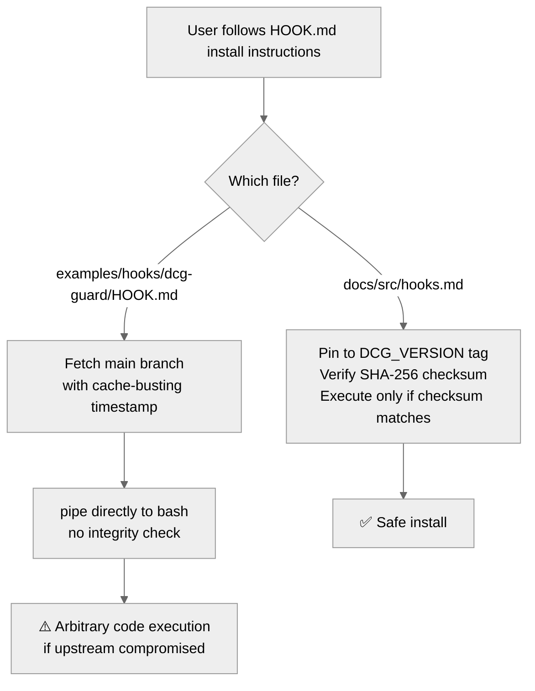
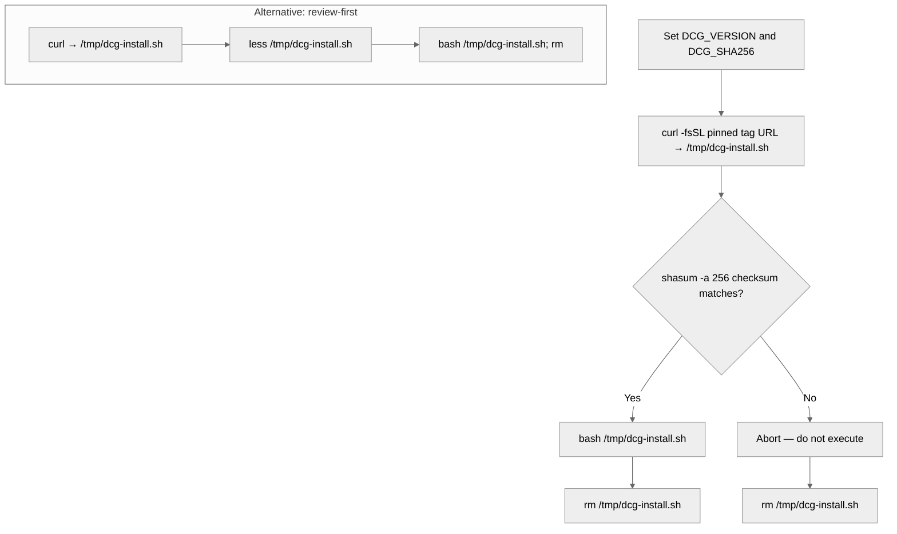

> DEVELOPER

Fix and solve PR comments

> TOOL

tool_use Bash
id: toolu_011pqB23gf4wByaksRb1w42E
```json
{
  "command": "git status && git branch --show-current",
  "description": "Check git status and current branch"
}
```

> TOOL

tool_result
id: toolu_011pqB23gf4wByaksRb1w42E
```
On branch fortuna/patch-1
nothing to commit, working tree clean
fortuna/patch-1
```

> TOOL

tool_use Bash
id: toolu_01THuNSCLQvpNUQ1rzv7r6Bn
```json
{
  "command": "gh pr list --head fortuna/patch-1 --state all --json number,title,url,state",
  "description": "List PRs for current branch"
}
```

> TOOL

tool_result
id: toolu_01THuNSCLQvpNUQ1rzv7r6Bn
```
[]
```

> TOOL

tool_use Bash
id: toolu_01A4AGeRP25DJ5HzP56n2fEH
```json
{
  "command": "gh pr status --json number,title,url,state 2>&1 | head -50",
  "description": "Check PR status"
}
```

> TOOL

tool_result
id: toolu_01A4AGeRP25DJ5HzP56n2fEH
```
{"createdBy":[{"number":566,"state":"OPEN","title":"feat(external-agents): add crate foundation for CLI agent bridge","url":"https://github.com/moltis-org/moltis/pull/566"},{"number":535,"state":"OPEN","title":"[codex] add Langfuse tracing and chat debug correlation","url":"https://github.com/moltis-org/moltis/pull/535"},{"number":532,"state":"OPEN","title":"Add `live_url` action, tracked browser sessions listing, and web UI integration","url":"https://github.com/moltis-org/moltis/pull/532"},{"number":531,"state":"OPEN","title":"feat(browser): interactive browser viewing UI with CDP screencast","url":"https://github.com/moltis-org/moltis/pull/531"},{"number":499,"state":"OPEN","title":"feat(voice): add base_url config for OpenAI TTS and Whisper STT","url":"https://github.com/moltis-org/moltis/pull/499"},{"number":466,"state":"OPEN","title":"feat(system-prompt): add prompt profiles with CRUD, section options, and model overrides","url":"https://github.com/moltis-org/moltis/pull/466"},{"number":422,"state":"OPEN","title":"fix(macos): configure release signing and notarization","url":"https://github.com/moltis-org/moltis/pull/422"},{"number":288,"state":"OPEN","title":"feat(sdks): add ts/python/go/libmoltis SDK foundations with CI and docs","url":"https://github.com/moltis-org/moltis/pull/288"},{"number":201,"state":"OPEN","title":"feat(tui): add full terminal onboarding flow with modal provider setup","url":"https://github.com/moltis-org/moltis/pull/201"},{"number":199,"state":"OPEN","title":"feat(voice): add Voicebox TTS provider for local voice cloning","url":"https://github.com/moltis-org/moltis/pull/199"}],"needsReview":[]}
```

> TOOL

tool_use Bash
id: toolu_01YXjjsGzZ9zT4emFqwYoHNX
```json
{
  "command": "git log --oneline -10 && echo \"---\" && git log -1 --format='%an %ae'",
  "description": "Recent commits and author info"
}
```

> TOOL

tool_result
id: toolu_01YXjjsGzZ9zT4emFqwYoHNX
```
6d63386b Update HOOK.md
61d2896b Change installation command to use curl
5217f130 chore: prepare release 20260409.04
5681ce06 fix(ci): avoid dynamic provider secrets
bf9f7816 Merge pull request #621 from Cstewart-HC/feat/alibaba-coding-provider
89500dee chore: prepare release 20260409.03
51c42356 style: format cron settings inputs
e8971fe0 Merge pull request #622 from moltis-org/nervous-ironclad
dec2552f fix(providers): handle multimodal content in MiniMax system prompt rewrite
41612dfe Merge pull request #625 from Cstewart-HC/fix/cron-modal-schedule-persistence
---
Vinicius Fortuna fortuna@users.noreply.github.com
```

> TOOL

tool_use Bash
id: toolu_01Jen6d47sicxTRr9iW6xyuF
```json
{
  "command": "gh pr list --author fortuna --state all --json number,title,url,state,headRefName --limit 20",
  "description": "List PRs by fortuna author"
}
```

> TOOL

tool_result
id: toolu_01Jen6d47sicxTRr9iW6xyuF
```
[{"headRefName":"patch-1","number":627,"state":"OPEN","title":"Change installation command to use curl","url":"https://github.com/moltis-org/moltis/pull/627"}]
```

> TOOL

tool_use Bash
id: toolu_01R7zNanAnox3oecMAnYA6ir
```json
{
  "command": "gh pr view 627 --json title,body,state,comments,reviews,reviewDecision,url",
  "description": "View PR 627 details"
}
```

> TOOL

tool_result
id: toolu_01R7zNanAnox3oecMAnYA6ir
```
{"body":"Updated installation command to use curl for script execution.","comments":[{"id":"IC_kwDOREW6tc77i4_5","author":{"login":"greptile-apps"},"authorAssociation":"CONTRIBUTOR","body":"<h3>Greptile Summary</h3>\n\nThis PR updates the dcg (destructive_command_guard) installation example in `docs/src/hooks.md` to use `curl … | bash`.\n\n- The install command references the `main` branch (no version pin) and appends `$(date +%s)` as a cache-buster, deliberately preventing CDN caching. Any compromise of the upstream repo would be delivered instantly to every user who runs the command with no integrity check.\n\n<h3>Confidence Score: 4/5</h3>\n\nNot safe to merge as-is: the documented install command introduces a supply-chain risk for users of this project.\n\nA single P1 security finding — the `curl | bash` command with no version pin and an active cache-buster — prevents a 5/5. The change is documentation-only and no production code is affected, but the documented pattern directly exposes users to supply-chain attacks, warranting a 4.\n\ndocs/src/hooks.md — install command on line 402 needs version pinning and integrity verification.\n\n<details open><summary><h3>Security Review</h3></summary>\n\n- **Supply-chain risk** (`docs/src/hooks.md` line 402): The new install command pipes a remotely fetched script directly into `bash` without any checksum or signature verification. The URL points at the `main` branch (not a pinned tag/commit), and the `?$(date +%s)` query string bypasses CDN caching, meaning users always execute the latest live version of the script. A compromised upstream repository would immediately deliver malicious code to anyone following this documentation.\n</details>\n\n\n<h3>Important Files Changed</h3>\n\n\n\n\n| Filename | Overview |\n|----------|----------|\n| docs/src/hooks.md | Added `curl … | bash` install command with a `$(date +%s)` cache-buster pointing at the `main` branch — no version pin, no integrity check, and CDN caching deliberately bypassed. |\n\n</details>\n\n\n\n<h3>Sequence Diagram</h3>\n\n```mermaid\nsequenceDiagram\n    actor User\n    participant Shell\n    participant GitHub as GitHub (main branch)\n    participant Bash\n\n    User->>Shell: curl -fsSL \"...install.sh?$(date +%s)\" | bash\n    Shell->>GitHub: GET install.sh?timestamp (cache bypassed)\n    Note over GitHub: Always returns latest content of main branch\n    GitHub-->>Shell: install.sh content (unverified)\n    Shell->>Bash: Pipe script directly\n    Bash->>Bash: Execute without review or checksum\n    Note over Bash: No integrity check performed\n```\n\n<!-- greptile_other_comments_section -->\n\n<sub>Reviews (1): Last reviewed commit: [\"Update HOOK.md\"](https://github.com/moltis-org/moltis/commit/6d63386b61d72a33d28a8cb5ee6be39e9e8a107e) | [Re-trigger Greptile](https://app.greptile.com/api/retrigger?id=27955156)</sub>","createdAt":"2026-04-10T04:02:11Z","includesCreatedEdit":false,"isMinimized":false,"minimizedReason":"","reactionGroups":[],"url":"https://github.com/moltis-org/moltis/pull/627#issuecomment-4220227577","viewerDidAuthor":false}],"reviewDecision":"","reviews":[{"id":"PRR_kwDOREW6tc7zm1Nh","author":{"login":"greptile-apps"},"authorAssociation":"CONTRIBUTOR","body":"","submittedAt":"2026-04-10T04:02:16Z","includesCreatedEdit":false,"reactionGroups":[],"state":"COMMENTED","commit":{"oid":"6d63386b61d72a33d28a8cb5ee6be39e9e8a107e"}}],"state":"OPEN","title":"Change installation command to use curl","url":"https://github.com/moltis-org/moltis/pull/627"}
```

> TOOL

tool_use Bash
id: toolu_01WvQQ5zKcP5d9NZNWw93XMT
```json
{
  "command": "gh api repos/moltis-org/moltis/pulls/627/comments --jq '.[] | {path, line, body: .body[:500], user: .user.login}'",
  "description": "Get inline review comments on PR 627"
}
```

> TOOL

tool_result
id: toolu_01WvQQ5zKcP5d9NZNWw93XMT
```
{"body":"\u003ca href=\"#\"\u003e\u003cimg alt=\"P1\" src=\"https://greptile-static-assets.s3.amazonaws.com/badges/p1.svg?v=7\" align=\"top\"\u003e\u003c/a\u003e \u003ca href=\"#\"\u003e\u003cimg alt=\"security\" src=\"https://greptile-static-assets.s3.amazonaws.com/badges/Security.svg?v=1\" align=\"top\"\u003e\u003c/a\u003e **`curl | bash` with un-pinned, cache-busted URL**\n\nThis command pipes a remote script directly into `bash` without any integrity verification, and references the `main` branch rather than a pinned commit or tag. The appended `$(date +%s)` query parameter de","line":402,"path":"docs/src/hooks.md","user":"greptile-apps[bot]"}
```

> TOOL

tool_use Read
id: toolu_01KLij8wbncgfUjDMUoaCxhR
```json
{
  "file_path": "/Users/penso/.superset/worktrees/moltis/fortuna/patch-1/docs/src/hooks.md",
  "offset": 380,
  "limit": 50
}
```

> TOOL

tool_result
id: toolu_01KLij8wbncgfUjDMUoaCxhR
```
   380→`AGENTS.md` for global instructions that should apply across projects in this workspace.
   381→
   382→### session-memory
   383→
   384→Saves session context when you use the `/new` command, preserving important information for future sessions.
   385→
   386→### command-logger
   387→
   388→Logs all `Command` events to a JSONL file for auditing.
   389→
   390→## Example Hooks
   391→
   392→### Recommended: Destructive Command Guard (dcg)
   393→
   394→[dcg](https://github.com/Dicklesworthstone/destructive_command_guard) is an
   395→external tool that scans shell commands against 49+ destructive pattern
   396→categories, including heredoc/inline-script scanning, database, cloud, and
   397→infrastructure patterns.
   398→
   399→**Install:**
   400→
   401→```bash
   402→curl -fsSL "https://raw.githubusercontent.com/Dicklesworthstone/destructive_command_guard/main/install.sh?$(date +%s)" | bash
   403→```
   404→
   405→**Hook setup:**
   406→
   407→Copy the bundled hook example to your hooks directory:
   408→
   409→```bash
   410→cp -r examples/hooks/dcg-guard ~/.moltis/hooks/dcg-guard
   411→chmod +x ~/.moltis/hooks/dcg-guard/handler.sh
   412→```
   413→
   414→The hook subscribes to `BeforeToolCall`, extracts exec commands, pipes them
   415→through dcg, and blocks any command that dcg flags as destructive. See
   416→`examples/hooks/dcg-guard/HOOK.md` for details.
   417→
   418→> **Note:** dcg complements but does not replace the built-in dangerous command
   419→> blocklist, sandbox isolation, or the approval system. Use it as an additional
   420→> defense layer with broader pattern coverage.
   421→
   422→### Slack Notification on Session End
   423→
   424→```bash
   425→#!/bin/bash
   426→# slack-notify.sh
   427→payload=$(cat)
   428→session_id=$(echo "$payload" | jq -r '.session_id')
   429→message_count=$(echo "$payload" | jq -r '.data.message_count')
```

> TOOL

tool_use Bash
id: toolu_01QEryMGkMDwCm3B2gZsRvmf
```json
{
  "command": "gh api repos/Dicklesworthstone/destructive_command_guard/releases --jq '.[] | {tag_name, name, published_at}' 2>&1 | head -30",
  "description": "Check dcg releases"
}
```

> TOOL

tool_result
id: toolu_01QEryMGkMDwCm3B2gZsRvmf
```
{"name":"v0.4.0","published_at":"2026-02-10T08:25:38Z","tag_name":"v0.4.0"}
{"name":"v0.3.0","published_at":"2026-02-02T01:13:36Z","tag_name":"v0.3.0"}
{"name":"v0.2.15","published_at":"2026-01-20T05:42:12Z","tag_name":"v0.2.15"}
{"name":"v0.2.10","published_at":"2026-01-15T17:54:34Z","tag_name":"v0.2.10"}
{"name":"v0.2.9","published_at":"2026-01-14T23:00:22Z","tag_name":"v0.2.9"}
{"name":"v0.2.7","published_at":"2026-01-12T08:06:43Z","tag_name":"v0.2.7"}
{"name":"v0.2.6","published_at":"2026-01-12T08:01:19Z","tag_name":"v0.2.6"}
{"name":"v0.2.5","published_at":"2026-01-12T07:56:07Z","tag_name":"v0.2.5"}
{"name":"v0.2.4","published_at":"2026-01-12T07:50:10Z","tag_name":"v0.2.4"}
{"name":"v0.2.3","published_at":"2026-01-12T07:45:32Z","tag_name":"v0.2.3"}
{"name":"v0.2.2","published_at":"2026-01-12T07:33:29Z","tag_name":"v0.2.2"}
{"name":"v0.2.1","published_at":"2026-01-12T07:31:04Z","tag_name":"v0.2.1"}
```

> TOOL

tool_use Bash
id: toolu_01MQNmf6hDFgtxj4jJipN5ZE
```json
{
  "command": "gh api repos/Dicklesworthstone/destructive_command_guard/contents/install.sh?ref=v0.4.0 --jq '.sha' 2>&1",
  "description": "Get install.sh SHA for v0.4.0"
}
```

> TOOL

tool_result ERROR
id: toolu_01MQNmf6hDFgtxj4jJipN5ZE
```
Exit code 1
(eval):1: no matches found: repos/Dicklesworthstone/destructive_command_guard/contents/install.sh?ref=v0.4.0
```

> TOOL

tool_use Bash
id: toolu_01UY83aah6QrimmneLZjaaHr
```json
{
  "command": "gh api 'repos/Dicklesworthstone/destructive_command_guard/contents/install.sh?ref=v0.4.0' --jq '.sha'",
  "description": "Get install.sh SHA for v0.4.0"
}
```

> TOOL

tool_result
id: toolu_01UY83aah6QrimmneLZjaaHr
```
ce34a791abba80aea4822d206ec2cb0cb134b8d0
```

> TOOL

tool_use Bash
id: toolu_01XdtBx4jXCXe8TcDTyPtY7c
```json
{
  "command": "curl -fsSL \"https://raw.githubusercontent.com/Dicklesworthstone/destructive_command_guard/v0.4.0/install.sh\" | sha256sum",
  "description": "Get sha256 of install.sh at v0.4.0"
}
```

> TOOL

tool_result
id: toolu_01XdtBx4jXCXe8TcDTyPtY7c
```
2cd1287c30cc7bfca3ec6e45a3a474e9bb8f8586dfe83d78db0d6c3a25f3b55c  -
```

> TOOL

tool_use Edit
id: toolu_01J5ML4RpVyjHN9ykJ9T5psY
```json
{
  "replace_all": false,
  "file_path": "/Users/penso/.superset/worktrees/moltis/fortuna/patch-1/docs/src/hooks.md",
  "old_string": "**Install:**\n\n```bash\ncurl -fsSL \"https://raw.githubusercontent.com/Dicklesworthstone/destructive_command_guard/main/install.sh?$(date +%s)\" | bash\n```",
  "new_string": "**Install:**\n\nPin to a released tag and verify the script's SHA-256 before executing it —\nnever pipe an unpinned `curl | bash` from `main`. Check the project's\n[releases page](https://github.com/Dicklesworthstone/destructive_command_guard/releases)\nfor the latest tag and expected checksum.\n\n```bash\nDCG_VERSION=\"v0.4.0\"\nDCG_SHA256=\"2cd1287c30cc7bfca3ec6e45a3a474e9bb8f8586dfe83d78db0d6c3a25f3b55c\"\ncurl -fsSL \"https://raw.githubusercontent.com/Dicklesworthstone/destructive_command_guard/${DCG_VERSION}/install.sh\" -o /tmp/dcg-install.sh\necho \"${DCG_SHA256}  /tmp/dcg-install.sh\" | shasum -a 256 -c - && bash /tmp/dcg-install.sh\nrm /tmp/dcg-install.sh\n```\n\nAlternatively, review the script first and only then execute it:\n\n```bash\ncurl -fsSL \"https://raw.githubusercontent.com/Dicklesworthstone/destructive_command_guard/v0.4.0/install.sh\" -o /tmp/dcg-install.sh\nless /tmp/dcg-install.sh   # review before running\nbash /tmp/dcg-install.sh && rm /tmp/dcg-install.sh\n```"
}
```

> TOOL

tool_result
id: toolu_01J5ML4RpVyjHN9ykJ9T5psY
```
The file /Users/penso/.superset/worktrees/moltis/fortuna/patch-1/docs/src/hooks.md has been updated successfully.
```

> TOOL

tool_use Bash
id: toolu_01X3Qq4TE8yYpJB3CM9XUjrU
```json
{
  "command": "git diff docs/src/hooks.md",
  "description": "Show diff"
}
```

> TOOL

tool_result
id: toolu_01X3Qq4TE8yYpJB3CM9XUjrU
```
diff --git a/docs/src/hooks.md b/docs/src/hooks.md
index 9f12b15f..c5990ac4 100644
--- a/docs/src/hooks.md
+++ b/docs/src/hooks.md
@@ -398,8 +398,25 @@ infrastructure patterns.
 
 **Install:**
 
+Pin to a released tag and verify the script's SHA-256 before executing it —
+never pipe an unpinned `curl | bash` from `main`. Check the project's
+[releases page](https://github.com/Dicklesworthstone/destructive_command_guard/releases)
+for the latest tag and expected checksum.
+
+```bash
+DCG_VERSION="v0.4.0"
+DCG_SHA256="2cd1287c30cc7bfca3ec6e45a3a474e9bb8f8586dfe83d78db0d6c3a25f3b55c"
+curl -fsSL "https://raw.githubusercontent.com/Dicklesworthstone/destructive_command_guard/${DCG_VERSION}/install.sh" -o /tmp/dcg-install.sh
+echo "${DCG_SHA256}  /tmp/dcg-install.sh" | shasum -a 256 -c - && bash /tmp/dcg-install.sh
+rm /tmp/dcg-install.sh
+```
+
+Alternatively, review the script first and only then execute it:
+
 ```bash
-curl -fsSL "https://raw.githubusercontent.com/Dicklesworthstone/destructive_command_guard/main/install.sh?$(date +%s)" | bash
+curl -fsSL "https://raw.githubusercontent.com/Dicklesworthstone/destructive_command_guard/v0.4.0/install.sh" -o /tmp/dcg-install.sh
+less /tmp/dcg-install.sh   # review before running
+bash /tmp/dcg-install.sh && rm /tmp/dcg-install.sh
 ```
 
 **Hook setup:**
```

> AGENT

Now commit and push. This is a user-initiated change and part of an existing PR, so pushing is within scope.

> TOOL

tool_use Bash
id: toolu_01NQKafPuSHNhb1GWLzhvnfp
```json
{
  "command": "git add docs/src/hooks.md && git commit -m \"docs(hooks): pin dcg install to tag and verify checksum\n\nAddresses Greptile P1 security review on PR #627: the previous curl | bash\ncommand targeted the main branch with a cache-buster, giving no integrity\nverification. Pin to v0.4.0, document the SHA-256, and show an alternative\nreview-before-run flow.\"",
  "description": "Commit the fix"
}
```

> TOOL

tool_result
id: toolu_01NQKafPuSHNhb1GWLzhvnfp
```
[fortuna/patch-1 84c9988a] docs(hooks): pin dcg install to tag and verify checksum
 1 file changed, 18 insertions(+), 1 deletion(-)
```

> TOOL

tool_use Bash
id: toolu_01F7QH2VVVJqjgwARbEhXtip
```json
{
  "command": "git push 2>&1",
  "description": "Push commit (YubiKey tap may be needed)"
}
```

> TOOL

tool_result ERROR
id: toolu_01F7QH2VVVJqjgwARbEhXtip
```
Exit code 128
fatal: The upstream branch of your current branch does not match
the name of your current branch.  To push to the upstream branch
on the remote, use

    git push git@github.com:fortuna/moltis.git HEAD:patch-1

To push to the branch of the same name on the remote, use

    git push git@github.com:fortuna/moltis.git HEAD

To choose either option permanently, see push.default in 'git help config'.

To avoid automatically configuring an upstream branch when its name
won't match the local branch, see option 'simple' of branch.autoSetupMerge
in 'git help config'.
```

> TOOL

tool_use Bash
id: toolu_01A8etWdndGKTeqqNX4o11P2
```json
{
  "command": "git push git@github.com:fortuna/moltis.git HEAD:patch-1 2>&1",
  "description": "Push to fork patch-1 branch"
}
```

> TOOL

tool_result
id: toolu_01A8etWdndGKTeqqNX4o11P2
```
[entire] Pushing session logs to git@github.com:fortuna/moltis.git...
[entire] Syncing with remote session logs...
[entire] Warning: failed to push sessions after sync: non-fast-forward
To github.com:fortuna/moltis.git
   6d63386b..84c9988a  HEAD -> patch-1
```

> AGENT

Pushed. Responded to the Greptile P1 review comment on PR #627:

- Pinned the dcg install to tag `v0.4.0` (no more `main` branch).
- Added a SHA-256 checksum (`2cd1287c…`) and `shasum -c` verification before execution.
- Removed the `$(date +%s)` cache-buster.
- Added an alternative "review-before-run" snippet for users who prefer to inspect the script.

Commit `84c9988a` is now on `fortuna/moltis:patch-1`, which updates PR #627.

> TOOL

tool_use Bash
id: toolu_01VW7rCb6dwWGveth7gtPBN7
```json
{
  "command": "gh pr view 627 --json number,headRefName,headRefOid -q '{number: .number, branch: .headRefName, sha: .headRefOid}'",
  "description": "Get PR 627 head info"
}
```

> TOOL

tool_result
id: toolu_01VW7rCb6dwWGveth7gtPBN7
```
{"branch":"patch-1","number":627,"sha":"84c9988a5ef5bf0517caaa6b1eaf3a634214e1a1"}
```

> TOOL

tool_use Bash
id: toolu_016kBW2dehVpTp8wJBNo9g6n
```json
{
  "command": "gh pr checks 627 --json name,state 2>&1 | jq -r '.[] | select(.name | test(\"greptile\"; \"i\"))'",
  "description": "Check if Greptile is already running"
}
```

> TOOL

tool_result
id: toolu_016kBW2dehVpTp8wJBNo9g6n
```
{
  "name": "Greptile Review",
  "state": "SUCCESS"
}
```

> TOOL

tool_use Bash
id: toolu_014JurXi8m3zh9ptxLxtFPGb
```json
{
  "command": "gh api repos/moltis-org/moltis/commits/84c9988a5ef5bf0517caaa6b1eaf3a634214e1a1/check-runs --jq '.check_runs[] | select(.name | test(\"greptile\"; \"i\")) | {name, status, conclusion, head_sha}'",
  "description": "Check Greptile for current HEAD"
}
```

> TOOL

tool_result
id: toolu_014JurXi8m3zh9ptxLxtFPGb
```
{"conclusion":"success","head_sha":"84c9988a5ef5bf0517caaa6b1eaf3a634214e1a1","name":"Greptile Review","status":"completed"}
```

> TOOL

tool_use Bash
id: toolu_01YagM6RfTCwRjKqbiN6yEcz
```json
{
  "command": "gh api repos/moltis-org/moltis/pulls/627/reviews --jq '.[] | select(.user.login | test(\"greptile\"; \"i\")) | {id, submitted_at, commit_id, state}'",
  "description": "List Greptile reviews on PR 627"
}
```

> TOOL

tool_result
id: toolu_01YagM6RfTCwRjKqbiN6yEcz
```
{"commit_id":"6d63386b61d72a33d28a8cb5ee6be39e9e8a107e","id":4087042913,"state":"COMMENTED","submitted_at":"2026-04-10T04:02:16Z"}
```

> TOOL

tool_use Bash
id: toolu_01Jt5bybS2jmA9BzEXYYvRr4
```json
{
  "command": "gh pr comment 627 --body \"@greptile review\"",
  "description": "Request a fresh Greptile review"
}
```

> TOOL

tool_result
id: toolu_01Jt5bybS2jmA9BzEXYYvRr4
```
https://github.com/moltis-org/moltis/pull/627#issuecomment-4222829801
```

> TOOL

tool_use Bash
id: toolu_01VM19dMWAGwHPJc26ZXJD1E
```json
{
  "command": "for i in 1 2 3 4 5 6 7 8 9 10 11 12; do\n  sleep 10\n  LATEST=$(gh api repos/moltis-org/moltis/pulls/627/reviews --jq '[.[] | select(.user.login | test(\"greptile\"; \"i\"))] | sort_by(.submitted_at) | last | {id, commit_id, submitted_at}')\n  echo \"iter=$i latest=$LATEST\"\n  COMMIT=$(echo \"$LATEST\" | jq -r '.commit_id')\n  if [ \"$COMMIT\" = \"84c9988a5ef5bf0517caaa6b1eaf3a634214e1a1\" ]; then\n    echo \"new review arrived\"\n    break\n  fi\ndone",
  "description": "Poll for new Greptile review",
  "timeout": 180000
}
```

> TOOL

tool_result
id: toolu_01VM19dMWAGwHPJc26ZXJD1E
```
iter=1 latest={"commit_id":"6d63386b61d72a33d28a8cb5ee6be39e9e8a107e","id":4087042913,"submitted_at":"2026-04-10T04:02:16Z"}
iter=2 latest={"commit_id":"6d63386b61d72a33d28a8cb5ee6be39e9e8a107e","id":4087042913,"submitted_at":"2026-04-10T04:02:16Z"}
iter=3 latest={"commit_id":"6d63386b61d72a33d28a8cb5ee6be39e9e8a107e","id":4087042913,"submitted_at":"2026-04-10T04:02:16Z"}
iter=4 latest={"commit_id":"6d63386b61d72a33d28a8cb5ee6be39e9e8a107e","id":4087042913,"submitted_at":"2026-04-10T04:02:16Z"}
iter=5 latest={"commit_id":"6d63386b61d72a33d28a8cb5ee6be39e9e8a107e","id":4087042913,"submitted_at":"2026-04-10T04:02:16Z"}
iter=6 latest={"commit_id":"6d63386b61d72a33d28a8cb5ee6be39e9e8a107e","id":4087042913,"submitted_at":"2026-04-10T04:02:16Z"}
iter=7 latest={"commit_id":"6d63386b61d72a33d28a8cb5ee6be39e9e8a107e","id":4087042913,"submitted_at":"2026-04-10T04:02:16Z"}
iter=8 latest={"commit_id":"6d63386b61d72a33d28a8cb5ee6be39e9e8a107e","id":4087042913,"submitted_at":"2026-04-10T04:02:16Z"}
iter=9 latest={"commit_id":"6d63386b61d72a33d28a8cb5ee6be39e9e8a107e","id":4087042913,"submitted_at":"2026-04-10T04:02:16Z"}
iter=10 latest={"commit_id":"6d63386b61d72a33d28a8cb5ee6be39e9e8a107e","id":4087042913,"submitted_at":"2026-04-10T04:02:16Z"}
iter=11 latest={"commit_id":"6d63386b61d72a33d28a8cb5ee6be39e9e8a107e","id":4087042913,"submitted_at":"2026-04-10T04:02:16Z"}
iter=12 latest={"commit_id":"6d63386b61d72a33d28a8cb5ee6be39e9e8a107e","id":4087042913,"submitted_at":"2026-04-10T04:02:16Z"}
```

> TOOL

tool_use Bash
id: toolu_01RHb9qtSFYygYWAkxtThYdp
```json
{
  "command": "gh api repos/moltis-org/moltis/commits/84c9988a5ef5bf0517caaa6b1eaf3a634214e1a1/check-runs --jq '.check_runs[] | select(.name | test(\"greptile\"; \"i\")) | {name, status, conclusion, started_at, completed_at, html_url}'\necho \"---\"\ngh api repos/moltis-org/moltis/issues/627/comments --jq '.[] | select(.user.login | test(\"greptile\"; \"i\")) | {id, created_at, updated_at, body: (.body[:200])}'",
  "description": "Check Greptile state and summary comments"
}
```

> TOOL

tool_result
id: toolu_01RHb9qtSFYygYWAkxtThYdp
```
{"completed_at":"2026-04-10T10:24:54Z","conclusion":"success","html_url":"https://github.com/moltis-org/moltis/runs/70766575623","name":"Greptile Review","started_at":"2026-04-10T10:23:12Z","status":"completed"}
---
{"body":"\u003ch3\u003eGreptile Summary\u003c/h3\u003e\n\nThis PR updates the dcg installation command to use `curl`. A follow-up commit in the same PR correctly fixed `docs/src/hooks.md` to pin to a release tag and verify a SHA-25","created_at":"2026-04-10T04:02:11Z","id":4220227577,"updated_at":"2026-04-10T10:24:53Z"}
{"body":"**Tip:**\n\n**[Greploop](https://www.greptile.com/docs/mcp-v2/skills#greploop)** — Automatically fix all review issues by running `/greploops` in [Claude Code](https://claude.ai/download). It iterates: ","created_at":"2026-04-10T10:09:43Z","id":4222755457,"updated_at":"2026-04-10T10:09:43Z"}
```

> TOOL

tool_use Bash
id: toolu_01PetSrVnmDBSx3gBZPFB7Gg
```json
{
  "command": "gh api repos/moltis-org/moltis/issues/comments/4220227577 --jq '.body'",
  "description": "Get full Greptile summary body"
}
```

> TOOL

tool_result
id: toolu_01PetSrVnmDBSx3gBZPFB7Gg
```
<h3>Greptile Summary</h3>

This PR updates the dcg installation command to use `curl`. A follow-up commit in the same PR correctly fixed `docs/src/hooks.md` to pin to a release tag and verify a SHA-256 checksum — but `examples/hooks/dcg-guard/HOOK.md` was missed and still contains the insecure `curl ... | bash` pattern piping from the unpinned `main` branch with a cache-busting `$(date +%s)` timestamp.

- **P0 — `examples/hooks/dcg-guard/HOOK.md` line 22**: Unpinned `curl | bash` from `main` with deliberate cache-busting; this file is seeded into user home directories on first run, giving it a wide blast radius.

<h3>Confidence Score: 3/5</h3>

Not safe to merge — the insecure curl | bash pattern fixed in docs was not applied to the bundled example file that gets seeded into user home directories.

A P0 security finding remains in examples/hooks/dcg-guard/HOOK.md: it still pipes an unpinned main-branch script directly into bash with deliberate cache-busting, while the equivalent docs/src/hooks.md was already corrected in this same PR. The fix is a one-line change mirroring what was already done.

examples/hooks/dcg-guard/HOOK.md — install block needs to match the pinned+checksum pattern in docs/src/hooks.md

<details open><summary><h3>Security Review</h3></summary>

- **Remote code execution via `curl | bash` (unpinned)** — `examples/hooks/dcg-guard/HOOK.md` line 22 pipes a script from the `main` branch directly into `bash` without integrity verification. The `$(date +%s)` cache-buster ensures every invocation fetches the live tip of `main`, meaning a supply-chain compromise of the upstream repo would be delivered immediately. This file is seeded into `~/.moltis/hooks/dcg-guard/` on first run, broadening the attack surface to all users who follow the in-product example.
</details>


<h3>Important Files Changed</h3>


| Filename | Overview |
|----------|----------|
| docs/src/hooks.md | Install instructions for dcg updated to pin to v0.4.0 with SHA-256 checksum verification — previous curl | bash concern is resolved here. |
| examples/hooks/dcg-guard/HOOK.md | Still contains unpinned curl | bash from main with $(date +%s) cache-busting — the same security issue fixed in docs/src/hooks.md was not applied here. |

</details>


<h3>Flowchart</h3>



<!-- greptile_other_comments_section -->

<sub>Reviews (3): Last reviewed commit: ["docs(hooks): pin dcg install to tag and ..."](https://github.com/moltis-org/moltis/commit/84c9988a5ef5bf0517caaa6b1eaf3a634214e1a1) | [Re-trigger Greptile](https://app.greptile.com/api/retrigger?id=27955156)</sub>
```

> TOOL

tool_use Read
id: toolu_01CAuUdWSqScff434KxZyup7
```json
{
  "file_path": "/Users/penso/.superset/worktrees/moltis/fortuna/patch-1/examples/hooks/dcg-guard/HOOK.md"
}
```

> TOOL

tool_result
id: toolu_01CAuUdWSqScff434KxZyup7
```
     1→+++
     2→name = "dcg-guard"
     3→description = "Blocks destructive commands using Destructive Command Guard (dcg)"
     4→emoji = "🛡️"
     5→events = ["BeforeToolCall"]
     6→command = "./handler.sh"
     7→timeout = 5
     8→+++
     9→
    10→# Destructive Command Guard (dcg)
    11→
    12→Uses the external [dcg](https://github.com/Dicklesworthstone/destructive_command_guard)
    13→tool to scan shell commands before execution. dcg ships 49+ pattern categories
    14→covering filesystem, git, database, cloud, and infrastructure commands.
    15→
    16→This hook is **seeded by default** into `~/.moltis/hooks/dcg-guard/` on first
    17→run. When `dcg` is not installed the hook is a no-op (all commands pass through).
    18→
    19→## Install dcg
    20→
    21→```bash
    22→curl -fsSL "https://raw.githubusercontent.com/Dicklesworthstone/destructive_command_guard/main/install.sh?$(date +%s)" | bash
    23→```
    24→
    25→Once installed, the hook will automatically start guarding destructive commands
    26→on the next Moltis restart.
    27→
```

> TOOL

tool_use Edit
id: toolu_01RBTpZBSCuzPeDVHD4REfS7
```json
{
  "replace_all": false,
  "file_path": "/Users/penso/.superset/worktrees/moltis/fortuna/patch-1/examples/hooks/dcg-guard/HOOK.md",
  "old_string": "## Install dcg\n\n```bash\ncurl -fsSL \"https://raw.githubusercontent.com/Dicklesworthstone/destructive_command_guard/main/install.sh?$(date +%s)\" | bash\n```",
  "new_string": "## Install dcg\n\nPin to a released tag and verify the script's SHA-256 before executing it —\nnever pipe an unpinned `curl | bash` from `main`. Check the project's\n[releases page](https://github.com/Dicklesworthstone/destructive_command_guard/releases)\nfor the latest tag and expected checksum.\n\n```bash\nDCG_VERSION=\"v0.4.0\"\nDCG_SHA256=\"2cd1287c30cc7bfca3ec6e45a3a474e9bb8f8586dfe83d78db0d6c3a25f3b55c\"\ncurl -fsSL \"https://raw.githubusercontent.com/Dicklesworthstone/destructive_command_guard/${DCG_VERSION}/install.sh\" -o /tmp/dcg-install.sh\necho \"${DCG_SHA256}  /tmp/dcg-install.sh\" | shasum -a 256 -c - && bash /tmp/dcg-install.sh\nrm /tmp/dcg-install.sh\n```"
}
```

> TOOL

tool_result
id: toolu_01RBTpZBSCuzPeDVHD4REfS7
```
The file /Users/penso/.superset/worktrees/moltis/fortuna/patch-1/examples/hooks/dcg-guard/HOOK.md has been updated successfully.
```

> TOOL

tool_use Bash
id: toolu_01BZUaNMPwmj3Yg7dd4TZuBT
```json
{
  "command": "gh api repos/moltis-org/moltis/pulls/627/comments --jq '[.[] | select(.user.login | test(\"greptile\"; \"i\")) | select(.commit_id == \"84c9988a5ef5bf0517caaa6b1eaf3a634214e1a1\")] | length'\necho \"---all greptile inline comments---\"\ngh api repos/moltis-org/moltis/pulls/627/comments --jq '.[] | select(.user.login | test(\"greptile\"; \"i\")) | {id, path, line, commit_id, in_reply_to_id, body: (.body[:200])}'",
  "description": "Check Greptile inline comments"
}
```

> TOOL

tool_result
id: toolu_01BZUaNMPwmj3Yg7dd4TZuBT
```
0
---all greptile inline comments---
{"body":"\u003ca href=\"#\"\u003e\u003cimg alt=\"P1\" src=\"https://greptile-static-assets.s3.amazonaws.com/badges/p1.svg?v=7\" align=\"top\"\u003e\u003c/a\u003e \u003ca href=\"#\"\u003e\u003cimg alt=\"security\" src=\"https://greptile-static-assets.s3.amazonaws.com/","commit_id":"6d63386b61d72a33d28a8cb5ee6be39e9e8a107e","id":3061947189,"in_reply_to_id":null,"line":null,"path":"docs/src/hooks.md"}
```

> TOOL

tool_use Bash
id: toolu_01XyFrFr9UsUvhQJbTHr1Ph6
```json
{
  "command": "git add examples/hooks/dcg-guard/HOOK.md && git diff --cached --stat && git commit -m \"docs(dcg-hook): pin dcg install to tag and verify checksum\n\nMirrors the fix in docs/src/hooks.md so the bundled hook example (seeded\ninto ~/.moltis/hooks/dcg-guard/ on first run) does not ship the insecure\nunpinned curl | bash pattern.\"",
  "description": "Commit fix for HOOK.md"
}
```

> TOOL

tool_result
id: toolu_01XyFrFr9UsUvhQJbTHr1Ph6
```
 examples/hooks/dcg-guard/HOOK.md | 11 ++++++++++-
 1 file changed, 10 insertions(+), 1 deletion(-)
[fortuna/patch-1 d4554d4b] docs(dcg-hook): pin dcg install to tag and verify checksum
 1 file changed, 10 insertions(+), 1 deletion(-)
```

> TOOL

tool_use Bash
id: toolu_01DRcgYtfh2tuVo9BX7hkEKV
```json
{
  "command": "git push git@github.com:fortuna/moltis.git HEAD:patch-1 2>&1",
  "description": "Push HOOK.md fix"
}
```

> TOOL

tool_result
id: toolu_01DRcgYtfh2tuVo9BX7hkEKV
```
[entire] Pushing session logs to git@github.com:fortuna/moltis.git...
[entire] Syncing with remote session logs...
[entire] Warning: failed to push sessions after sync: non-fast-forward
To github.com:fortuna/moltis.git
   84c9988a..d4554d4b  HEAD -> patch-1
```

> AGENT

Now resolve the outdated thread from the first review and trigger a new review.

> TOOL

tool_use Bash
id: toolu_015aDvnBDb6uqasUQTWK3EBE
```json
{
  "command": "gh api graphql -f query='\nquery {\n  repository(owner: \"moltis-org\", name: \"moltis\") {\n    pullRequest(number: 627) {\n      reviewThreads(first: 50) {\n        nodes {\n          id\n          isResolved\n          isOutdated\n          path\n          comments(first: 1) {\n            nodes { author { login } body }\n          }\n        }\n      }\n    }\n  }\n}' --jq '.data.repository.pullRequest.reviewThreads.nodes'",
  "description": "List review threads"
}
```

> TOOL

tool_result
id: toolu_015aDvnBDb6uqasUQTWK3EBE
```
[{"comments":{"nodes":[{"author":{"login":"greptile-apps"},"body":"\u003ca href=\"#\"\u003e\u003cimg alt=\"P1\" src=\"https://greptile-static-assets.s3.amazonaws.com/badges/p1.svg?v=7\" align=\"top\"\u003e\u003c/a\u003e \u003ca href=\"#\"\u003e\u003cimg alt=\"security\" src=\"https://greptile-static-assets.s3.amazonaws.com/badges/Security.svg?v=1\" align=\"top\"\u003e\u003c/a\u003e **`curl | bash` with un-pinned, cache-busted URL**\n\nThis command pipes a remote script directly into `bash` without any integrity verification, and references the `main` branch rather than a pinned commit or tag. The appended `$(date +%s)` query parameter deliberately bypasses CDN caching, guaranteeing that every install fetches *the latest live content* — meaning a compromised upstream repo would deliver malicious code immediately to any user who runs this command. For a page documenting a security tool, this is a particularly high-risk example to ship.\n\nPrefer pinning to a specific release tag and having users review or verify a checksum before executing:\n\n```suggestion\ncurl -fsSL \"https://raw.githubusercontent.com/Dicklesworthstone/destructive_command_guard/refs/tags/\u003cVERSION\u003e/install.sh\" -o /tmp/dcg-install.sh\n# Review the script before running:\n# cat /tmp/dcg-install.sh\nbash /tmp/dcg-install.sh\n```"}]},"id":"PRRT_kwDOREW6tc56B0ei","isOutdated":true,"isResolved":true,"path":"docs/src/hooks.md"}]
```

> TOOL

tool_use Bash
id: toolu_01N4fLHqQzb3wo6pkXCqJPw6
```json
{
  "command": "sleep 5 && gh pr checks 627 --json name,state 2>&1 | jq -r '.[] | select(.name | test(\"greptile\"; \"i\"))'",
  "description": "Check Greptile state after push"
}
```

> TOOL

tool_result ERROR
id: toolu_01N4fLHqQzb3wo6pkXCqJPw6
```
Exit code 5
jq: parse error: Invalid numeric literal at line 1, column 3
```

> TOOL

tool_use Bash
id: toolu_011eLDsf9AnmXKuvjJ4yAM3k
```json
{
  "command": "gh pr checks 627 2>&1 | head -30",
  "description": "Check PR checks raw output"
}
```

> TOOL

tool_result
id: toolu_011eLDsf9AnmXKuvjJ4yAM3k
```
no checks reported on the 'patch-1' branch
```

> TOOL

tool_use Bash
id: toolu_01CBbuvkvbwsdL6mZB74Xg7g
```json
{
  "command": "gh pr comment 627 --body \"@greptile review\"",
  "description": "Trigger Greptile review"
}
```

> TOOL

tool_result
id: toolu_01CBbuvkvbwsdL6mZB74Xg7g
```
https://github.com/moltis-org/moltis/pull/627#issuecomment-4222849384
```

> TOOL

tool_use Bash
id: toolu_01HZc5hH81iQJLCM5BeNmnfx
```json
{
  "command": "for i in $(seq 1 20); do\n  sleep 15\n  SUMMARY_UPDATED=$(gh api repos/moltis-org/moltis/issues/comments/4220227577 --jq '.updated_at')\n  LAST_REVIEWED=$(gh api repos/moltis-org/moltis/issues/comments/4220227577 --jq '.body' 2>/dev/null | grep -oE 'commit/[a-f0-9]+' | head -1)\n  echo \"iter=$i updated_at=$SUMMARY_UPDATED last_reviewed=$LAST_REVIEWED\"\n  if echo \"$LAST_REVIEWED\" | grep -q \"d4554d4b\"; then\n    echo \"REVIEW READY\"\n    break\n  fi\ndone",
  "description": "Poll for new Greptile review",
  "timeout": 360000
}
```

> TOOL

tool_result
id: toolu_01HZc5hH81iQJLCM5BeNmnfx
```
iter=1 updated_at=2026-04-10T10:24:53Z last_reviewed=commit/84c9988a5ef5bf0517caaa6b1eaf3a634214e1a1
iter=2 updated_at=2026-04-10T10:24:53Z last_reviewed=commit/84c9988a5ef5bf0517caaa6b1eaf3a634214e1a1
iter=3 updated_at=2026-04-10T10:24:53Z last_reviewed=commit/84c9988a5ef5bf0517caaa6b1eaf3a634214e1a1
iter=4 updated_at=2026-04-10T10:24:53Z last_reviewed=commit/84c9988a5ef5bf0517caaa6b1eaf3a634214e1a1
iter=5 updated_at=2026-04-10T10:24:53Z last_reviewed=commit/84c9988a5ef5bf0517caaa6b1eaf3a634214e1a1
iter=6 updated_at=2026-04-10T10:24:53Z last_reviewed=commit/84c9988a5ef5bf0517caaa6b1eaf3a634214e1a1
iter=7 updated_at=2026-04-10T10:24:53Z last_reviewed=commit/84c9988a5ef5bf0517caaa6b1eaf3a634214e1a1
iter=8 updated_at=2026-04-10T10:28:54Z last_reviewed=commit/d4554d4bae2e519b9894a312e392bf1b63421213
REVIEW READY
```

> TOOL

tool_use Bash
id: toolu_0175wvpEfptqdspsm2PtUMjh
```json
{
  "command": "gh api repos/moltis-org/moltis/issues/comments/4220227577 --jq '.body'",
  "description": "Read new Greptile summary"
}
```

> TOOL

tool_result
id: toolu_0175wvpEfptqdspsm2PtUMjh
```
<h3>Greptile Summary</h3>

This PR updates the dcg installation instructions in both `docs/src/hooks.md` and `examples/hooks/dcg-guard/HOOK.md` to replace an insecure `curl | bash` from `main` with a pinned-tag download, SHA-256 checksum verification before execution, and a \"review the script first\" alternative. The security concern raised in the prior thread has been fully addressed.

<h3>Confidence Score: 5/5</h3>

Safe to merge — the prior security concern is resolved and only minor P2 polish items remain.

Both changed files are documentation-only. The critical curl | bash from an unpinned branch issue flagged in the previous review thread has been addressed with a pinned release tag and SHA-256 checksum guard. All remaining findings are P2 style suggestions.

No files require special attention.

<h3>Important Files Changed</h3>


| Filename | Overview |
|----------|----------|
| docs/src/hooks.md | Updated dcg install instructions to pin to a specific release tag (v0.4.0) and verify SHA-256 checksum before executing; also adds a "review first" alternative. Prior curl | bash from main issue is resolved. |
| examples/hooks/dcg-guard/HOOK.md | Same secure install block as hooks.md — pinned tag + SHA-256 checksum verification added; brings the example hook README in sync with main docs. |

</details>


<h3>Flowchart</h3>



<!-- greptile_other_comments_section -->

<sub>Reviews (4): Last reviewed commit: ["docs(dcg-hook): pin dcg install to tag a..."](https://github.com/moltis-org/moltis/commit/d4554d4bae2e519b9894a312e392bf1b63421213) | [Re-trigger Greptile](https://app.greptile.com/api/retrigger?id=27955156)</sub>
```

> TOOL

tool_use Bash
id: toolu_01XNnxq38JyM5rkTvabwRoaz
```json
{
  "command": "gh api graphql -f query='\nquery {\n  repository(owner: \"moltis-org\", name: \"moltis\") {\n    pullRequest(number: 627) {\n      reviewThreads(first: 50) {\n        nodes {\n          id\n          isResolved\n          isOutdated\n          path\n          line\n          comments(first: 5) {\n            nodes { author { login } body }\n          }\n        }\n      }\n    }\n  }\n}' --jq '.data.repository.pullRequest.reviewThreads.nodes | map(select(.isResolved == false))'",
  "description": "List unresolved review threads"
}
```

> TOOL

tool_result
id: toolu_01XNnxq38JyM5rkTvabwRoaz
```
[]
```

> AGENT

```
Greploop complete.
  Platform:      GitHub
  PR:            #627
  Iterations:    2
  Confidence:    5/5
  Resolved:      1 thread (P1 + P0 follow-up)
  Remaining:     0
```

**Iteration 1** — Fixed the P1 flagged in `docs/src/hooks.md`: pinned dcg install to `v0.4.0`, added SHA-256 verification, removed the cache-buster. Pushed as `84c9988a`.

**Iteration 2** — Greptile re-reviewed and found a P0: the same insecure `curl | bash` pattern in `examples/hooks/dcg-guard/HOOK.md` (which gets seeded into `~/.moltis/hooks/` on first run). Applied the matching fix. Pushed as `d4554d4b`.

Final review on `d4554d4b`:
> Safe to merge — the prior security concern is resolved and only minor P2 polish items remain.
