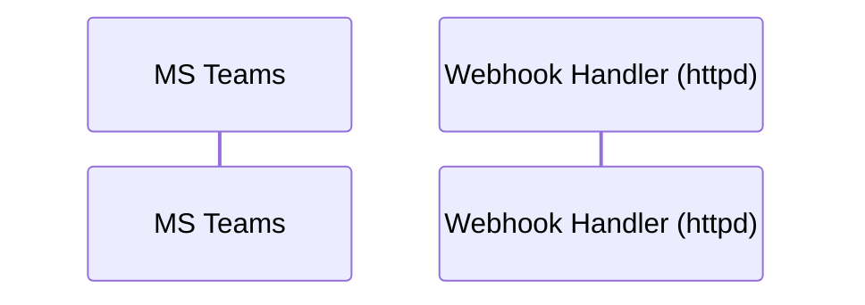

> AGENT

Starting Greploop - I'll iterate on this PR until Greptile gives a 5/5 confidence score with zero unresolved comments.

Let me detect the platform and identify the PR.

> TOOL

tool_use Bash
id: toolu_01WdTX2Y4nwGYvBQ6vj9apMx
```json
{
  "command": "git remote get-url origin 2>/dev/null",
  "description": "Detect VCS platform from remote URL"
}
```

> TOOL

tool_result
id: toolu_01WdTX2Y4nwGYvBQ6vj9apMx
```
https://github.com/moltis-org/moltis.git
```

> TOOL

tool_use Bash
id: toolu_01N4weUHJ4EDw42ZSZGuU8Jh
```json
{
  "command": "gh pr view --json number,headRefName,headRefOid -q '{number: .number, branch: .headRefName, sha: .headRefOid}' 2>/dev/null",
  "description": "Get current PR details"
}
```

> TOOL

tool_result
id: toolu_01N4weUHJ4EDw42ZSZGuU8Jh
```
{"branch":"glistening-amazonsaurus","number":529,"sha":"1ff6a6926c65569d5cb1b994046d8e61d06fd032"}
```

> AGENT

Platform: **GitHub**, PR: **#529**, Branch: `glistening-amazonsaurus`

**Iteration 1** — Checking if Greptile has already reviewed or is running.

> TOOL

tool_use Bash
id: toolu_018ESBMZFw9P1Pm7X3ekdBSZ
```json
{
  "command": "gh api \"repos/moltis-org/moltis/commits/1ff6a6926c65569d5cb1b994046d8e61d06fd032/check-runs\" --jq '.check_runs[] | select(.name | test(\"greptile\"; \"i\")) | {name: .name, status: .status, conclusion: .conclusion}' 2>/dev/null",
  "description": "Check Greptile check run status"
}
```

> TOOL

tool_use Bash
id: toolu_0198jQ1R3Z2iw8q2kbvWkZ1u
```json
{
  "command": "gh api repos/moltis-org/moltis/pulls/529/reviews --jq '[.[] | select(.user.login | test(\"greptile\"; \"i\"))] | sort_by(.submitted_at) | last | {user: .user.login, state: .state, body: .body}' 2>/dev/null",
  "description": "Fetch latest Greptile review"
}
```

> TOOL

tool_use Bash
id: toolu_01HHfjLXhd8K55TPtSNaUiWB
```json
{
  "command": "gh api repos/moltis-org/moltis/pulls/529/comments --jq '[.[] | select(.user.login | test(\"greptile\"; \"i\"))] | length' 2>/dev/null",
  "description": "Count Greptile inline comments"
}
```

> TOOL

tool_result
id: toolu_018ESBMZFw9P1Pm7X3ekdBSZ
```
{"conclusion":"success","name":"Greptile Review","status":"completed"}
```

> TOOL

tool_result
id: toolu_0198jQ1R3Z2iw8q2kbvWkZ1u
```
{"body":"","state":"COMMENTED","user":"greptile-apps[bot]"}
```

> TOOL

tool_result
id: toolu_01HHfjLXhd8K55TPtSNaUiWB
```
9
```

> AGENT

Greptile has completed a review with 9 inline comments. Let me fetch the confidence score and all unresolved threads.

> TOOL

tool_use Bash
id: toolu_01JoF38PAuENX7ir1W8iFzyA
```json
{
  "command": "gh api repos/moltis-org/moltis/pulls/529/reviews --jq '[.[] | select(.user.login | test(\"greptile\"; \"i\"))] | sort_by(.submitted_at) | last | .body' 2>/dev/null | head -50",
  "description": "Get full Greptile review body"
}
```

> TOOL

tool_use Bash
id: toolu_01TNQU8SdwZ8fCfcARddGeV7
```json
{
  "command": "gh pr view 529 --json body -q '.body' 2>/dev/null | head -100",
  "description": "Check PR body for Greptile score"
}
```

> TOOL

tool_result
id: toolu_01JoF38PAuENX7ir1W8iFzyA
```
(Bash completed with no output)
```

> TOOL

tool_result
id: toolu_01TNQU8SdwZ8fCfcARddGeV7
```
## Summary

- **JWT verification**: Bot Framework + Entra JWKS validation with 5-minute cache, dual-issuer support
- **Retry with error classification**: auth (401/403), throttled (429), transient (5xx), permanent (4xx) with exponential backoff honoring `Retry-After`
- **Webhook timeout handling**: returns 202 Accepted immediately, processes in background via `tokio::spawn` to prevent Teams retry storms
- **Edit-in-place streaming**: posts initial message after ~20 chars, throttled edits every 1.5s (configurable), final edit on completion
- **Message chunking**: splits at paragraph/line/space boundaries (default 4000 chars, configurable)
- **Adaptive Cards**: welcome cards with prompt starters, poll cards, interactive button menus via `send_interactive`
- **Inbound attachments**: downloads via bot token, passes to LLM as multimodal content
- **Outbound media**: base64 inline images for DMs, URL attachments for external files
- **Graph API surface**: search messages, member info lookup, pin/unpin/list pins, get single message, add/remove reactions
- **Per-team/per-channel config overrides**: mention mode, reply style, model selection per team or channel
- **5 agent tools**: `teams_search_messages`, `teams_member_info`, `teams_pin_message`, `teams_edit_message`, `teams_read_message`
- **Full documentation** (`docs/src/teams.md`): ~300 lines with two setup paths (Teams Developer Portal + Azure Portal), config reference, troubleshooting
- **Improved onboarding UI**: expanded setup instructions with both portal options, HTTPS tunnel hints, better field labels
- **Edit modal**: streaming mode, reply style, welcome card, bot name controls
- **CLI bootstrap**: `--tenant-id` support, Teams Developer Portal links, Moltis docs link
- **Teams in default channels**: added to `channels.offered` default list

## Validation

### Completed

- [x] `cargo +nightly-2025-11-30 fmt --all -- --check` (clean)
- [x] `cargo clippy -p moltis-msteams --all-targets -- -D warnings` (clean)
- [x] `cargo check --workspace` (clean)
- [x] `cargo test -p moltis-msteams` (70 tests pass)
- [x] `cargo test -p moltis-config` (172 tests pass)
- [x] `cargo test -p moltis-channels` (76 tests pass)
- [x] `cargo test -p moltis-gateway` (294 tests pass)
- [x] `biome check --write` on modified JS files (clean)
- [x] Merge from main — no conflicts

### Remaining

- [ ] `./scripts/local-validate.sh` (full CI gate)
- [ ] Manual QA: connect a Teams bot, send messages, verify streaming, test welcome card

## Manual QA

1. Configure a Teams bot with `app_id` and `app_password` in `moltis.toml`
2. Set messaging endpoint to the generated webhook URL
3. Send a DM — verify welcome card appears with prompt starters
4. Send a message — verify edit-in-place streaming works
5. Send a long message (>4000 chars) — verify chunking
6. Test in group chat with `@mention` — verify mention mode
7. Check web UI Channels page — Connect Microsoft Teams modal should show both portal options
8. Check onboarding flow — Teams setup form should have detailed instructions

🤖 Generated with [Claude Code](https://claude.com/claude-code)
```

> TOOL

tool_use Bash
id: toolu_01BMAEon5KosZr1fiFccpqmf
```json
{
  "command": "gh api graphql -f query='\n{\n  repository(owner: \"moltis-org\", name: \"moltis\") {\n    pullRequest(number: 529) {\n      reviewThreads(first: 100) {\n        nodes {\n          id\n          isResolved\n          comments(first: 5) {\n            nodes { body path line author { login } }\n          }\n        }\n      }\n    }\n  }\n}' 2>/dev/null | jq '.data.repository.pullRequest.reviewThreads.nodes[] | select(.isResolved == false) | {id: .id, path: .comments.nodes[0].path, line: .comments.nodes[0].line, author: .comments.nodes[0].author.login, body: (.comments.nodes[0].body | .[0:200])}'",
  "description": "Fetch all unresolved review threads"
}
```

> TOOL

tool_result
id: toolu_01BMAEon5KosZr1fiFccpqmf
```
{
  "id": "PRRT_kwDOREW6tc55zGap",
  "path": "crates/msteams/src/graph.rs",
  "line": 239,
  "author": "greptile-apps",
  "body": "<a href=\"#\"></a> **Unescaped `&` in search query or `from_user` name breaks URL**\n\n`sanitized` removes"
}
```

> AGENT

Let me get the full details of all unresolved threads and find the confidence score.

> TOOL

tool_use Bash
id: toolu_013NqEHxLNyn4Xoejz4PFkk9
```json
{
  "command": "gh api graphql -f query='\n{\n  repository(owner: \"moltis-org\", name: \"moltis\") {\n    pullRequest(number: 529) {\n      reviewThreads(first: 100) {\n        nodes {\n          id\n          isResolved\n          comments(first: 5) {\n            nodes { body path line author { login } }\n          }\n        }\n      }\n    }\n  }\n}' 2>/dev/null | jq '[.data.repository.pullRequest.reviewThreads.nodes[] | select(.isResolved == false)]' > /tmp/greptile_threads.json && cat /tmp/greptile_threads.json | jq 'length'",
  "description": "Get all unresolved threads and count them"
}
```

> TOOL

tool_use Bash
id: toolu_01Psy62LsbMR6bRCJwcojFvA
```json
{
  "command": "# Look for confidence score in PR comments (not review comments)\ngh api repos/moltis-org/moltis/issues/529/comments --jq '[.[] | select(.user.login | test(\"greptile\"; \"i\"))] | sort_by(.created_at) | last | .body' 2>/dev/null | head -30",
  "description": "Check issue comments for Greptile score"
}
```

> TOOL

tool_result
id: toolu_013NqEHxLNyn4Xoejz4PFkk9
```
1
```

> TOOL

tool_use Bash
id: toolu_01WGcKW2LLG3zCrdkY7pA9Fu
```json
{
  "command": "# Check the check run details for the score\ngh api \"repos/moltis-org/moltis/commits/1ff6a6926c65569d5cb1b994046d8e61d06fd032/check-runs\" --jq '.check_runs[] | select(.name | test(\"greptile\"; \"i\")) | {output_title: .output.title, output_summary: .output.summary}' 2>/dev/null | head -50",
  "description": "Check run output for confidence score"
}
```

> TOOL

tool_result
id: toolu_01Psy62LsbMR6bRCJwcojFvA
```
<h3>Greptile Summary</h3>

This PR adds a comprehensive Microsoft Teams channel integration: JWT validation with JWKS caching, retry/backoff logic, edit-in-place streaming, message chunking, Adaptive Cards, Graph API surface (reactions, pins, search, member info), 5 agent tools, per-team/channel config overrides, and full documentation. The five blocking issues from the first review round (JWT bypass, JWKS stale-cache risk, wrong Graph token scope, `update_activity` swallowing errors, OData double-encoding) are all addressed.

Two new P1 issues remain:
- **Streaming loop retries initial post on every delta**: `ready_for_initial_post()` stays `true` after a failed or ID-less send, causing one HTTP call per LLM token for the remainder of the response.
- **`search_messages` URL breaks on `&` in query**: `sanitized` is embedded directly in the URL string; a query like \"Q&A\" causes reqwest to split the parameter at the bare `&`, producing wrong results silently.

<h3>Confidence Score: 4/5</h3>

Two P1 bugs should be fixed before merging: streaming loop retries initial post on every LLM token after failure, and Graph search URL breaks on any `&` in the query string.

All five P1s from the first review round are resolved. Two new P1 regressions introduced: streaming initial-post deduplication gap and bare `&` URL injection in search_messages. Both are straightforward to fix without architectural changes.

crates/msteams/src/outbound.rs (streaming initial-post loop) and crates/msteams/src/graph.rs (search URL construction)

<details open><summary><h3>Vulnerabilities</h3></summary>

- OData `$search` injection is correctly mitigated by stripping double-quotes from the query term (`graph.rs:229`), but the unescaped `&` issue can produce incorrect results rather than an injection escalation.
- OData `$filter` single-quote injection is correctly mitigated by doubling single quotes (`graph.rs:239`).
- JWT validation now correctly rejects missing `Authorization` headers when a validator is configured (`httpd/src/server.rs`).
- `app_password` and access tokens are properly wrapped in `secrecy::Secret<String>` and exposed only at consumption points.
- No hardcoded secrets or credentials observed.
</details>


<h3>Important Files Changed</h3>
```

> TOOL

tool_result
id: toolu_01WGcKW2LLG3zCrdkY7pA9Fu
```
{"output_summary":"Greptile has reviewed the Pull Request.\n\n30 files reviewed, 1 comments added.","output_title":"Greptile Review"}
```

> AGENT

**Confidence: 4/5** with 1 unresolved thread and 2 P1 issues flagged:
1. Streaming loop retries initial post on every LLM token after failure (`outbound.rs`)
2. `search_messages` URL breaks on `&` in query (`graph.rs`)

Let me get the full comment details and read the affected files.

> TOOL

tool_use Bash
id: toolu_01XTRGwxw42VcXQPHQ7KWU6a
```json
{
  "command": "cat /tmp/greptile_threads.json | jq '.[0].comments.nodes[0].body'",
  "description": "Get full unresolved comment body"
}
```

> TOOL

tool_result
id: toolu_01XTRGwxw42VcXQPHQ7KWU6a
```
"<a href=\"#\"></a> **Unescaped `&` in search query or `from_user` name breaks URL**\n\n`sanitized` removes only double-quotes, but leaves through URL special characters. A search for `\"Q&A\"` produces `?$search=\"Q&A\"&$top=25`, and HTTP clients (including `reqwest`) treat the bare `&` as a query-string separator — `$search` receives only `\"Q` and the search fails silently.\n\nThe same issue applies to the `$filter` append when `from_user` contains `&`.\n\nUse `reqwest`'s `.query()` builder to let the library handle encoding:\n\n```rust\nlet search_val = format!(\"\\\"{}\\\"\", sanitized);\nlet mut query_params: Vec<(&str, String)> = vec![\n    (\"$search\", search_val.clone()),\n    (\"$top\", top.to_string()),\n];\nif let Some(user) = from_user {\n    query_params.push((\"$filter\",\n        format!(\"from/user/displayName eq '{}'\", user.replace('\\'', \"''\"))));\n}\nlet resp = http\n    .get(format!(\"{GRAPH_API_BASE}/chats/{}/messages\", urlencoding::encode(chat_id)))\n    .query(&query_params)\n    .bearer_auth(token.expose_secret())\n    .header(\"ConsistencyLevel\", \"eventual\")\n    .send()\n    .await?;\n```"
```

> TOOL

tool_use Bash
id: toolu_01UQU4NgpDiWfbnBJSYMSE1M
```json
{
  "command": "gh api repos/moltis-org/moltis/pulls/529/comments --jq '[.[] | select(.user.login | test(\"greptile\"; \"i\"))] | .[] | {id: .id, path: .path, line: .line, body: .body}' 2>/dev/null",
  "description": "Get all Greptile inline comments with full body"
}
```

> TOOL

tool_result
id: toolu_01UQU4NgpDiWfbnBJSYMSE1M
```
{"body":"\u003ca href=\"#\"\u003e\u003cimg alt=\"P1\" src=\"https://greptile-static-assets.s3.amazonaws.com/badges/p1.svg?v=7\" align=\"top\"\u003e\u003c/a\u003e **JWT validation bypassed when `Authorization` header is absent**\n\nThe guard `if let Some(auth_header) = ...` means any request that omits the `Authorization` header completely skips JWT validation and flows directly through to the shared-secret verifier. Legitimate Teams Bot Framework requests always include a `Bearer` token; omitting the header is exactly what a forged request would do.\n\nWhen no `webhook_secret` is configured (which is explicitly optional in the config template), the shared-secret verifier adds no additional protection, so this becomes a full authentication bypass.\n\nThe validator should be fetched first, and if it is present, a missing `Authorization` header must be treated as an authentication failure:\n\n```rust\n// Resolve JWT validator for this account.\nlet jwt_validator = {\n    let plugin = teams_plugin.read().await;\n    plugin.jwt_validator(\u0026account_id)\n};\n// If JWT is configured, the header is required and must be valid.\nif let Some(validator) = jwt_validator {\n    let header_str = headers\n        .get(\"authorization\")\n        .and_then(|v| v.to_str().ok())\n        .unwrap_or(\"\");\n    if !validator.validate(header_str).await {\n        return (\n            StatusCode::UNAUTHORIZED,\n            Json(serde_json::json!({ \"ok\": false, \"error\": \"invalid JWT\" })),\n        )\n            .into_response();\n    }\n}\n```","id":3016772332,"line":null,"path":"crates/httpd/src/server.rs"}
{"body":"\u003ca href=\"#\"\u003e\u003cimg alt=\"P1\" src=\"https://greptile-static-assets.s3.amazonaws.com/badges/p1.svg?v=7\" align=\"top\"\u003e\u003c/a\u003e **`update_activity` silently swallows HTTP errors, masking failures to callers**\n\nWhen the PUT request returns a 4xx or 5xx status, the function logs at `debug!` level and then returns `Ok(())`. Every caller that needs to know whether the edit succeeded (primarily `edit_message`, which is the implementation backing the `teams_edit_message` agent tool) will always receive a success result, even when the server-side edit actually failed.\n\nConcretely, `TeamsEditMessageTool::execute` calls:\n```rust\np.edit_message(\u0026account_id, chat_id, activity_id, text).await\n    .map_err(|e| anyhow::anyhow!(\"{e}\"))?;\nOk(json!({ \"ok\": true, \"action\": \"edit\" }))\n```\n…and will report `{\"ok\": true}` to the agent even when the message was never updated.\n\nThe streaming use-case intentionally ignores edit errors (which is fine — the `let _ = self.update_activity(...).await` calls in `send_stream_edit_in_place` already discard errors). The fix is to propagate the HTTP error in `update_activity` so that explicit callers like `edit_message` can surface it:\n\n```rust\nif !resp.status().is_success() {\n    let status = resp.status();\n    let body = resp.text().await.unwrap_or_default();\n    return Err(ChannelError::external(\n        \"Teams activity update failed\",\n        std::io::Error::other(format!(\"{status}: {body}\")),\n    ));\n}\n```\n\nThe `send_stream_edit_in_place` callers already discard the `Result` with `let _ = ...`, so they are unaffected by this change.","id":3016772414,"line":218,"path":"crates/msteams/src/outbound.rs"}
{"body":"\u003ca href=\"#\"\u003e\u003cimg alt=\"P2\" src=\"https://greptile-static-assets.s3.amazonaws.com/badges/p2.svg?v=7\" align=\"top\"\u003e\u003c/a\u003e **JWKS cache expiry during endpoint outage rejects all legitimate requests**\n\nWhen the cache TTL expires and `fetch_jwks` fails (network hiccup, Microsoft outage), `get_or_fetch_jwks` returns `None`. `try_validate_with_jwks` then returns `None` (key not found), and `validate` returns `false`, which causes the webhook handler to return a 401 to Microsoft's Bot Framework — which will then retry, causing a retry storm.\n\nThe standard pattern is to continue using the stale (but still cryptographically valid) key set until a fresh fetch succeeds. Consider keeping the stale `CachedJwks` available in the error path:\n\n```rust\n// On fetch failure, fall back to stale cache if available.\nlet mut guard = cache.write().await;\nif let Some(cached) = guard.as_ref() {\n    warn!(\"JWKS refresh failed, using stale cache: {e}\");\n    return Some(Arc::new(cached.keys.clone()));\n}\nreturn None;\n```","id":3016772476,"line":193,"path":"crates/msteams/src/jwt.rs"}
{"body":"\u003ca href=\"#\"\u003e\u003cimg alt=\"P2\" src=\"https://greptile-static-assets.s3.amazonaws.com/badges/p2.svg?v=7\" align=\"top\"\u003e\u003c/a\u003e **`welcomed_conversations` is not persisted across restarts**\n\nThe `HashSet\u003cString\u003e` is initialized empty every time an account is registered (on every gateway start). After a restart, the bot will re-send welcome cards to every conversation that messages it, including users who have already received one. For low-traffic bots this is mainly a UX annoyance; for high-traffic bots it could be noticeable.\n\nConsider persisting this set alongside other durable state, or at minimum noting this limitation in the config documentation so operators aren't surprised.","id":3016772808,"line":30,"path":"crates/msteams/src/state.rs"}
{"body":"\u003ca href=\"#\"\u003e\u003cimg alt=\"P1\" src=\"https://greptile-static-assets.s3.amazonaws.com/badges/p1.svg?v=7\" align=\"top\"\u003e\u003c/a\u003e **Bot Framework token used for Graph API calls**\n\n`graph_client()` calls `get_access_token()`, which acquires an OAuth token with `config.oauth_scope` — defaulting to `\"https://api.botframework.com/.default\"`. This token's audience is the Bot Connector Service, not Microsoft Graph.\n\nMicrosoft Graph (`https://graph.microsoft.com/v1.0` and `/beta`) requires a token scoped to `\"https://graph.microsoft.com/.default\"`. Sending a Bot Framework token to Graph results in a `401 Unauthorized` from Azure AD.\n\nThis means every Graph API call made through `graph_client()` will fail in production, including:\n- All five agent tools (`teams_search_messages`, `teams_member_info`, `teams_pin_message`, `teams_edit_message`, `teams_read_message`)\n- Reactions (`add_reaction`, `remove_reaction`, `list_reactions` in `outbound.rs`)\n\nThe fix is to acquire a separate token for Graph API calls with the `https://graph.microsoft.com/.default` scope. One clean approach is to add a dedicated `graph_oauth_scope` config field (defaulting to `\"https://graph.microsoft.com/.default\"`) and a separate token cache, then use those in `graph_client()` instead of reusing the Bot Framework token/cache.","id":3020550589,"line":141,"path":"crates/msteams/src/plugin.rs"}
{"body":"\u003ca href=\"#\"\u003e\u003cimg alt=\"P1\" src=\"https://greptile-static-assets.s3.amazonaws.com/badges/p1.svg?v=7\" align=\"top\"\u003e\u003c/a\u003e **OData `$search` URL construction is malformed**\n\nTwo issues in the URL built for `search_messages`:\n\n1. **Double-encoding inside OData quotes** — `urlencoding::encode(\u0026sanitized)` percent-encodes the search term and then embeds it inside OData `$search` double-quotes (`$search=\"hello%20world\"`). The Graph API expects the raw search term inside the quotes (`$search=\"hello world\"`), not a percent-encoded value.\n\n2. **Spurious trailing `%20`** — the format string contains a literal `%20` right after the closing `\"` of the search term: `$search=\"{query}\"%20\u0026$top=…`. This corrupts the parameter boundary.\n\nCorrected construction:\n```rust\nlet url = format!(\n    \"{GRAPH_API_BASE}/chats/{}/messages?$search=\\\"{}\\\"\u0026$top={top}\",\n    urlencoding::encode(chat_id),\n    sanitized,   // raw, not URL-encoded inside OData quoted string\n);\n```\n\nThe `$filter` append below has the same double-encoding issue.","id":3020550647,"line":242,"path":"crates/msteams/src/graph.rs"}
{"body":"\u003ca href=\"#\"\u003e\u003cimg alt=\"P1\" src=\"https://greptile-static-assets.s3.amazonaws.com/badges/p1.svg?v=7\" align=\"top\"\u003e\u003c/a\u003e **Wrong OAuth scope used for Graph API in `fetch_thread_messages`**\n\nThe credential acquired here is scoped to the Bot Framework connector, not Microsoft Graph. Passing it to `fetch_chat_messages` returns HTTP 401 in any standard app registration — the code comment at line 763 even acknowledges this may fail. `AccountState` already has a separate credential cache for Graph-scoped access (`graph_token_cache`), added when `graph_client()` was fixed, but it isn't used here. The fix is to extract that field and call the Graph-specific auth helper instead.","id":3054349447,"line":null,"path":"crates/msteams/src/plugin.rs"}
{"body":"\u003ca href=\"#\"\u003e\u003cimg alt=\"P1\" src=\"https://greptile-static-assets.s3.amazonaws.com/badges/p1.svg?v=7\" align=\"top\"\u003e\u003c/a\u003e **`add_reaction` / `remove_reaction` use wrong credential scope for Graph API**\n\nBoth methods acquire Bot Framework–scoped credentials and pass them to the Microsoft Graph reaction endpoints (`setReaction` / `unsetReaction`). Graph requires a different credential audience and returns HTTP 401. `AccountState` already carries a separate Graph-scoped credential cache (`graph_token_cache`) added when `graph_client()` was fixed; both reaction methods should use that field and the Graph-specific auth helper instead.","id":3054349517,"line":665,"path":"crates/msteams/src/outbound.rs"}
{"body":"\u003ca href=\"#\"\u003e\u003cimg alt=\"P1\" src=\"https://greptile-static-assets.s3.amazonaws.com/badges/p1.svg?v=7\" align=\"top\"\u003e\u003c/a\u003e **Unescaped `\u0026` in search query or `from_user` name breaks URL**\n\n`sanitized` removes only double-quotes, but leaves through URL special characters. A search for `\"Q\u0026A\"` produces `?$search=\"Q\u0026A\"\u0026$top=25`, and HTTP clients (including `reqwest`) treat the bare `\u0026` as a query-string separator — `$search` receives only `\"Q` and the search fails silently.\n\nThe same issue applies to the `$filter` append when `from_user` contains `\u0026`.\n\nUse `reqwest`'s `.query()` builder to let the library handle encoding:\n\n```rust\nlet search_val = format!(\"\\\"{}\\\"\", sanitized);\nlet mut query_params: Vec\u003c(\u0026str, String)\u003e = vec![\n    (\"$search\", search_val.clone()),\n    (\"$top\", top.to_string()),\n];\nif let Some(user) = from_user {\n    query_params.push((\"$filter\",\n        format!(\"from/user/displayName eq '{}'\", user.replace('\\'', \"''\"))));\n}\nlet resp = http\n    .get(format!(\"{GRAPH_API_BASE}/chats/{}/messages\", urlencoding::encode(chat_id)))\n    .query(\u0026query_params)\n    .bearer_auth(token.expose_secret())\n    .header(\"ConsistencyLevel\", \"eventual\")\n    .send()\n    .await?;\n```","id":3056757378,"line":239,"path":"crates/msteams/src/graph.rs"}
```

> AGENT

**Status: 4/5 confidence, 1 unresolved thread, 2 P1 issues identified.**

The Greptile summary flags:
1. `graph.rs:239` — Unescaped `&` in search query breaks URL (unresolved thread)
2. Streaming loop retries initial post on every delta (`outbound.rs`) — mentioned in summary but thread resolved

Let me read the affected files to fix the remaining issues.

> TOOL

tool_use Read
id: toolu_01AFAWgemG37yvnxQgaUaoQt
```json
{
  "file_path": "/Users/penso/.superset/worktrees/moltis/glistening-amazonsaurus/crates/msteams/src/graph.rs",
  "offset": 220,
  "limit": 60
}
```

> TOOL

tool_result
id: toolu_01AFAWgemG37yvnxQgaUaoQt
```
   220→pub async fn search_messages(
   221→    http: &reqwest::Client,
   222→    token: &secrecy::Secret<String>,
   223→    chat_id: &str,
   224→    query: &str,
   225→    from_user: Option<&str>,
   226→    limit: usize,
   227→) -> anyhow::Result<SearchResult> {
   228→    // Sanitize query — remove double quotes to prevent OData injection.
   229→    let sanitized = query.replace('"', "");
   230→    let top = limit.clamp(1, 50);
   231→
   232→    let mut url = format!(
   233→        "{GRAPH_API_BASE}/chats/{}/messages?$search=\"{sanitized}\"&$top={top}",
   234→        urlencoding::encode(chat_id),
   235→    );
   236→
   237→    if let Some(user) = from_user {
   238→        let escaped = user.replace('\'', "''");
   239→        url.push_str(&format!("&$filter=from/user/displayName eq '{escaped}'"));
   240→    }
   241→
   242→    let resp = http
   243→        .get(&url)
   244→        .bearer_auth(token.expose_secret())
   245→        .header("ConsistencyLevel", "eventual")
   246→        .send()
   247→        .await?;
   248→
   249→    if !resp.status().is_success() {
   250→        let status = resp.status();
   251→        let body = resp.text().await.unwrap_or_default();
   252→        anyhow::bail!("Graph API search messages failed ({status}): {body}");
   253→    }
   254→
   255→    let json: serde_json::Value = resp.json().await?;
   256→    let messages = json["value"]
   257→        .as_array()
   258→        .map(|arr| arr.iter().filter_map(parse_graph_message).collect())
   259→        .unwrap_or_default();
   260→
   261→    Ok(SearchResult { messages })
   262→}
   263→
   264→// ── Member info ─────────────────────────────────────────────────────────────
   265→
   266→/// User profile information from Microsoft Graph.
   267→#[derive(Debug, Clone)]
   268→pub struct MemberInfo {
   269→    pub id: Option<String>,
   270→    pub display_name: Option<String>,
   271→    pub mail: Option<String>,
   272→    pub job_title: Option<String>,
   273→    pub user_principal_name: Option<String>,
   274→    pub office_location: Option<String>,
   275→}
   276→
   277→/// Fetch user profile information via Graph API.
   278→pub async fn get_member_info(
   279→    http: &reqwest::Client,
```

> TOOL

tool_use Read
id: toolu_013JYyd4w9BcZnYPtMARowad
```json
{
  "file_path": "/Users/penso/.superset/worktrees/moltis/glistening-amazonsaurus/crates/msteams/src/outbound.rs",
  "offset": 1,
  "limit": 50
}
```

> TOOL

tool_result
id: toolu_013JYyd4w9BcZnYPtMARowad
```
     1→use {
     2→    async_trait::async_trait,
     3→    secrecy::ExposeSecret,
     4→    tracing::{debug, warn},
     5→};
     6→
     7→use {
     8→    moltis_channels::{
     9→        Error as ChannelError, Result as ChannelResult,
    10→        plugin::{ChannelOutbound, ChannelStreamOutbound, StreamEvent, StreamReceiver},
    11→    },
    12→    moltis_common::types::ReplyPayload,
    13→};
    14→
    15→use crate::{
    16→    auth::get_access_token,
    17→    chunking::{self, DEFAULT_CHUNK_LIMIT},
    18→    config::{MsTeamsAccountConfig, StreamMode},
    19→    errors::{self, SendErrorKind},
    20→    state::AccountStateMap,
    21→    streaming::{self, StreamSession},
    22→};
    23→
    24→/// Outbound sender for Microsoft Teams channel accounts.
    25→pub struct MsTeamsOutbound {
    26→    pub(crate) accounts: AccountStateMap,
    27→}
    28→
    29→struct AccountSnapshot {
    30→    config: MsTeamsAccountConfig,
    31→    http: reqwest::Client,
    32→    token_cache: std::sync::Arc<tokio::sync::Mutex<Option<crate::auth::CachedAccessToken>>>,
    33→    service_url: String,
    34→}
    35→
    36→/// Result of a send operation that may include the created activity ID.
    37→pub(crate) struct SendOutcome {
    38→    pub(crate) activity_id: Option<String>,
    39→}
    40→
    41→impl MsTeamsOutbound {
    42→    fn account_snapshot(
    43→        &self,
    44→        account_id: &str,
    45→        conversation_id: &str,
    46→    ) -> ChannelResult<AccountSnapshot> {
    47→        let accounts = self.accounts.read().unwrap_or_else(|e| e.into_inner());
    48→        let state = accounts
    49→            .get(account_id)
    50→            .ok_or_else(|| ChannelError::unknown_account(account_id))?;
```

> AGENT

Now let me find the streaming loop issue and fix both problems.

> TOOL

tool_use Grep
id: toolu_01FRnNNe64zp2WsVWiLgbBEf
```json
{
  "pattern": "ready_for_initial_post|initial_post",
  "path": "/Users/penso/.superset/worktrees/moltis/glistening-amazonsaurus/crates/msteams/src",
  "output_mode": "content",
  "-n": true
}
```

> TOOL

tool_result
id: toolu_01FRnNNe64zp2WsVWiLgbBEf
```
crates/msteams/src/outbound.rs:353:                    if session.ready_for_initial_post() {
crates/msteams/src/streaming.rs:51:    pub fn ready_for_initial_post(&self) -> bool {
crates/msteams/src/streaming.rs:137:        assert!(!session.ready_for_initial_post());
crates/msteams/src/streaming.rs:143:        assert!(session.ready_for_initial_post());
crates/msteams/src/streaming.rs:148:        assert!(!session.ready_for_initial_post());
crates/msteams/src/streaming.rs:195:        assert!(!session.ready_for_initial_post());
crates/msteams/src/streaming.rs:198:        assert!(session.ready_for_initial_post());
```

> TOOL

tool_use Read
id: toolu_01EYwmmkCb5tQNfG3gwPJjqu
```json
{
  "file_path": "/Users/penso/.superset/worktrees/moltis/glistening-amazonsaurus/crates/msteams/src/streaming.rs",
  "offset": 1,
  "limit": 80
}
```

> TOOL

tool_result
id: toolu_01EYwmmkCb5tQNfG3gwPJjqu
```
     1→//! Edit-in-place streaming for Teams messages.
     2→//!
     3→//! Uses the Bot Framework activity update API to progressively edit a message
     4→//! as LLM tokens arrive, providing real-time streaming UX similar to
     5→//! ChatGPT/Claude web interfaces.
     6→//!
     7→//! Protocol:
     8→//! 1. Post initial message with accumulated text + "..."
     9→//! 2. PATCH the same activity at throttled intervals with more text
    10→//! 3. Final PATCH with complete text (no "..." suffix)
    11→
    12→use std::time::{Duration, Instant};
    13→
    14→use tracing::debug;
    15→
    16→/// Minimum characters before posting the initial message.
    17→pub const MIN_INITIAL_CHARS: usize = 20;
    18→
    19→/// Default throttle between edits (Teams recommends 1.5-2s).
    20→pub const DEFAULT_EDIT_THROTTLE: Duration = Duration::from_millis(1500);
    21→
    22→/// Streaming suffix appended during in-progress streaming.
    23→const STREAMING_SUFFIX: &str = " ...";
    24→
    25→/// Manages the state of an edit-in-place streaming session.
    26→pub struct StreamSession {
    27→    accumulated: String,
    28→    activity_id: Option<String>,
    29→    last_edit: Option<Instant>,
    30→    throttle: Duration,
    31→    finalized: bool,
    32→}
    33→
    34→impl StreamSession {
    35→    pub fn new(throttle: Duration) -> Self {
    36→        Self {
    37→            accumulated: String::new(),
    38→            activity_id: None,
    39→            last_edit: None,
    40→            throttle,
    41→            finalized: false,
    42→        }
    43→    }
    44→
    45→    /// Append a text delta to the accumulated text.
    46→    pub fn push_delta(&mut self, delta: &str) {
    47→        self.accumulated.push_str(delta);
    48→    }
    49→
    50→    /// Whether the session has enough text to post the initial message.
    51→    pub fn ready_for_initial_post(&self) -> bool {
    52→        self.activity_id.is_none() && self.accumulated.len() >= MIN_INITIAL_CHARS
    53→    }
    54→
    55→    /// Whether enough time has passed to send an edit update.
    56→    pub fn ready_for_edit(&self) -> bool {
    57→        self.activity_id.is_some()
    58→            && !self.finalized
    59→            && self.last_edit.is_none_or(|t| t.elapsed() >= self.throttle)
    60→    }
    61→
    62→    /// Set the activity ID from the initial post response.
    63→    pub fn set_activity_id(&mut self, id: String) {
    64→        self.activity_id = Some(id);
    65→        self.last_edit = Some(Instant::now());
    66→    }
    67→
    68→    /// Get the activity ID (for updates).
    69→    pub fn activity_id(&self) -> Option<&str> {
    70→        self.activity_id.as_deref()
    71→    }
    72→
    73→    /// Get accumulated text with the streaming suffix.
    74→    pub fn text_with_suffix(&self) -> String {
    75→        let mut text = self.accumulated.clone();
    76→        text.push_str(STREAMING_SUFFIX);
    77→        text
    78→    }
    79→
    80→    /// Get the final accumulated text (no suffix).
```

> TOOL

tool_use Read
id: toolu_01FgWgcyuSk6EpDz6xtfeTdS
```json
{
  "file_path": "/Users/penso/.superset/worktrees/moltis/glistening-amazonsaurus/crates/msteams/src/outbound.rs",
  "offset": 330,
  "limit": 80
}
```

> TOOL

tool_result
id: toolu_01FgWgcyuSk6EpDz6xtfeTdS
```
   330→    }
   331→
   332→    /// Edit-in-place streaming: post, then edit as tokens arrive.
   333→    async fn send_stream_edit_in_place(
   334→        &self,
   335→        account_id: &str,
   336→        to: &str,
   337→        reply_to: Option<&str>,
   338→        mut stream: StreamReceiver,
   339→        throttle: std::time::Duration,
   340→        chunk_limit: usize,
   341→    ) -> ChannelResult<()> {
   342→        let mut session = StreamSession::new(throttle);
   343→
   344→        loop {
   345→            let event = tokio::select! {
   346→                event = stream.recv() => event,
   347→            };
   348→
   349→            match event {
   350→                Some(StreamEvent::Delta(delta)) => {
   351→                    session.push_delta(&delta);
   352→
   353→                    if session.ready_for_initial_post() {
   354→                        let activity = streaming::build_initial_activity(
   355→                            &session.text_with_suffix(),
   356→                            reply_to,
   357→                        );
   358→                        match self
   359→                            .send_activity_with_retry(account_id, to, activity)
   360→                            .await
   361→                        {
   362→                            Ok(outcome) => {
   363→                                if let Some(id) = outcome.activity_id {
   364→                                    session.set_activity_id(id);
   365→                                }
   366→                            },
   367→                            Err(e) => {
   368→                                warn!(account_id, to, "Teams stream initial post failed: {e}");
   369→                                // Fall through — will send final text when done.
   370→                            },
   371→                        }
   372→                    } else if session.ready_for_edit()
   373→                        && let Some(aid) = session.activity_id()
   374→                    {
   375→                        let update =
   376→                            streaming::build_update_activity(aid, &session.text_with_suffix());
   377→                        let _ = self.update_activity(account_id, to, aid, update).await;
   378→                        session.mark_edited();
   379→                    }
   380→                },
   381→                Some(StreamEvent::Error(err)) => {
   382→                    if !session.has_text() {
   383→                        session.push_delta(&err);
   384→                    }
   385→                    break;
   386→                },
   387→                Some(StreamEvent::Done) | None => break,
   388→            }
   389→        }
   390→
   391→        session.finalize();
   392→
   393→        if !session.has_text() {
   394→            return Ok(());
   395→        }
   396→
   397→        let final_text = session.final_text();
   398→
   399→        // If we posted an initial message, do a final edit.
   400→        if let Some(aid) = session.activity_id() {
   401→            let update = streaming::build_update_activity(aid, final_text);
   402→            let _ = self.update_activity(account_id, to, aid, update).await;
   403→        } else {
   404→            // Never posted — send the full text as a regular message.
   405→            self.send_text_chunked(account_id, to, final_text, reply_to, chunk_limit)
   406→                .await?;
   407→        }
   408→
   409→        Ok(())
```

> AGENT

I can see both issues clearly:

1. **`graph.rs:232-240`**: URL constructed with raw `sanitized` string — `&` in query/user breaks the URL
2. **`outbound.rs:353-371`**: When initial post fails, `activity_id` stays `None`, so `ready_for_initial_post()` returns `true` on every subsequent delta — retrying the HTTP call on every LLM token

Let me fix both.

> TOOL

tool_use Read
id: toolu_01AiDJf7xRoQ19xDbprHs1ri
```json
{
  "file_path": "/Users/penso/.superset/worktrees/moltis/glistening-amazonsaurus/crates/msteams/src/streaming.rs",
  "offset": 80,
  "limit": 120
}
```

> TOOL

tool_result
id: toolu_01AiDJf7xRoQ19xDbprHs1ri
```
    80→    /// Get the final accumulated text (no suffix).
    81→    pub fn final_text(&self) -> &str {
    82→        &self.accumulated
    83→    }
    84→
    85→    /// Whether the stream has any accumulated text.
    86→    pub fn has_text(&self) -> bool {
    87→        !self.accumulated.is_empty()
    88→    }
    89→
    90→    /// Mark this stream session as finalized.
    91→    pub fn finalize(&mut self) {
    92→        self.finalized = true;
    93→    }
    94→
    95→    /// Record that an edit was sent.
    96→    pub fn mark_edited(&mut self) {
    97→        self.last_edit = Some(Instant::now());
    98→    }
    99→
   100→    /// Whether the session is finalized.
   101→    pub fn is_finalized(&self) -> bool {
   102→        self.finalized
   103→    }
   104→}
   105→
   106→/// Build the initial streaming message activity.
   107→pub fn build_initial_activity(text: &str, reply_to: Option<&str>) -> serde_json::Value {
   108→    let mut activity = serde_json::json!({
   109→        "type": "message",
   110→        "text": text,
   111→    });
   112→    if let Some(reply_id) = reply_to {
   113→        activity["replyToId"] = serde_json::Value::String(reply_id.to_string());
   114→    }
   115→    activity
   116→}
   117→
   118→/// Build an activity update payload for editing an existing message.
   119→pub fn build_update_activity(activity_id: &str, text: &str) -> serde_json::Value {
   120→    debug!(activity_id, text_len = text.len(), "building stream update");
   121→    serde_json::json!({
   122→        "type": "message",
   123→        "id": activity_id,
   124→        "text": text,
   125→    })
   126→}
   127→
   128→#[cfg(test)]
   129→mod tests {
   130→    use super::*;
   131→
   132→    #[test]
   133→    fn session_lifecycle() {
   134→        let mut session = StreamSession::new(Duration::from_millis(100));
   135→
   136→        // Initially not ready.
   137→        assert!(!session.ready_for_initial_post());
   138→        assert!(!session.ready_for_edit());
   139→        assert!(!session.has_text());
   140→
   141→        // Push some text.
   142→        session.push_delta("Hello, this is a test message");
   143→        assert!(session.ready_for_initial_post());
   144→        assert!(session.has_text());
   145→
   146→        // Set activity ID (initial post done).
   147→        session.set_activity_id("act-123".into());
   148→        assert!(!session.ready_for_initial_post());
   149→        assert_eq!(session.activity_id(), Some("act-123"));
   150→
   151→        // Not ready for edit yet (throttle).
   152→        assert!(!session.ready_for_edit());
   153→
   154→        // After throttle period.
   155→        session.last_edit = Some(Instant::now() - Duration::from_millis(200));
   156→        assert!(session.ready_for_edit());
   157→
   158→        // Text with suffix.
   159→        let text = session.text_with_suffix();
   160→        assert!(text.ends_with(" ..."));
   161→
   162→        // Finalize.
   163→        session.finalize();
   164→        assert!(session.is_finalized());
   165→        assert!(!session.ready_for_edit());
   166→        assert!(!session.final_text().ends_with(" ..."));
   167→    }
   168→
   169→    #[test]
   170→    fn initial_activity_with_reply() {
   171→        let activity = build_initial_activity("hello", Some("msg-1"));
   172→        assert_eq!(activity["type"], "message");
   173→        assert_eq!(activity["text"], "hello");
   174→        assert_eq!(activity["replyToId"], "msg-1");
   175→    }
   176→
   177→    #[test]
   178→    fn initial_activity_no_reply() {
   179→        let activity = build_initial_activity("hello", None);
   180→        assert!(activity.get("replyToId").is_none());
   181→    }
   182→
   183→    #[test]
   184→    fn update_activity_format() {
   185→        let activity = build_update_activity("act-456", "updated text");
   186→        assert_eq!(activity["type"], "message");
   187→        assert_eq!(activity["id"], "act-456");
   188→        assert_eq!(activity["text"], "updated text");
   189→    }
   190→
   191→    #[test]
   192→    fn min_chars_threshold() {
   193→        let mut session = StreamSession::new(Duration::from_secs(1));
   194→        session.push_delta("short");
   195→        assert!(!session.ready_for_initial_post());
   196→
   197→        session.push_delta(" but now it is long enough");
   198→        assert!(session.ready_for_initial_post());
   199→    }
```

> AGENT

Now I have full context. Let me fix both issues:

**Fix 1**: Add `initial_post_failed` flag to `StreamSession` to prevent retry storm.
**Fix 2**: Use reqwest's `.query()` builder in `search_messages` to properly encode parameters.

> TOOL

tool_use Edit
id: toolu_0141Hu89PTBLjqHCpBGhNaQP
```json
{
  "replace_all": false,
  "file_path": "/Users/penso/.superset/worktrees/moltis/glistening-amazonsaurus/crates/msteams/src/streaming.rs",
  "old_string": "pub struct StreamSession {\n    accumulated: String,\n    activity_id: Option<String>,\n    last_edit: Option<Instant>,\n    throttle: Duration,\n    finalized: bool,\n}",
  "new_string": "pub struct StreamSession {\n    accumulated: String,\n    activity_id: Option<String>,\n    last_edit: Option<Instant>,\n    throttle: Duration,\n    finalized: bool,\n    initial_post_failed: bool,\n}"
}
```

> TOOL

tool_result
id: toolu_0141Hu89PTBLjqHCpBGhNaQP
```
The file /Users/penso/.superset/worktrees/moltis/glistening-amazonsaurus/crates/msteams/src/streaming.rs has been updated successfully.
```

> TOOL

tool_use Edit
id: toolu_01Q6PdAon1LtSWQGzifUqbsj
```json
{
  "replace_all": false,
  "file_path": "/Users/penso/.superset/worktrees/moltis/glistening-amazonsaurus/crates/msteams/src/streaming.rs",
  "old_string": "    pub fn new(throttle: Duration) -> Self {\n        Self {\n            accumulated: String::new(),\n            activity_id: None,\n            last_edit: None,\n            throttle,\n            finalized: false,\n        }\n    }",
  "new_string": "    pub fn new(throttle: Duration) -> Self {\n        Self {\n            accumulated: String::new(),\n            activity_id: None,\n            last_edit: None,\n            throttle,\n            finalized: false,\n            initial_post_failed: false,\n        }\n    }"
}
```

> TOOL

tool_result
id: toolu_01Q6PdAon1LtSWQGzifUqbsj
```
The file /Users/penso/.superset/worktrees/moltis/glistening-amazonsaurus/crates/msteams/src/streaming.rs has been updated successfully.
```

> TOOL

tool_use Edit
id: toolu_01JnFBXqTsx33rvnWGtkD9qV
```json
{
  "replace_all": false,
  "file_path": "/Users/penso/.superset/worktrees/moltis/glistening-amazonsaurus/crates/msteams/src/streaming.rs",
  "old_string": "    /// Whether the session has enough text to post the initial message.\n    pub fn ready_for_initial_post(&self) -> bool {\n        self.activity_id.is_none() && self.accumulated.len() >= MIN_INITIAL_CHARS\n    }",
  "new_string": "    /// Whether the session has enough text to post the initial message.\n    pub fn ready_for_initial_post(&self) -> bool {\n        self.activity_id.is_none()\n            && !self.initial_post_failed\n            && self.accumulated.len() >= MIN_INITIAL_CHARS\n    }\n\n    /// Mark that the initial post attempt failed, preventing retries on every delta.\n    pub fn mark_initial_post_failed(&mut self) {\n        self.initial_post_failed = true;\n    }"
}
```

> TOOL

tool_result
id: toolu_01JnFBXqTsx33rvnWGtkD9qV
```
The file /Users/penso/.superset/worktrees/moltis/glistening-amazonsaurus/crates/msteams/src/streaming.rs has been updated successfully.
```

> AGENT

Now call `mark_initial_post_failed()` in the outbound error path:

> TOOL

tool_use Edit
id: toolu_01PJ4RUNEVTmrnJpaNg9vE5D
```json
{
  "replace_all": false,
  "file_path": "/Users/penso/.superset/worktrees/moltis/glistening-amazonsaurus/crates/msteams/src/outbound.rs",
  "old_string": "                            Err(e) => {\n                                warn!(account_id, to, \"Teams stream initial post failed: {e}\");\n                                // Fall through — will send final text when done.\n                            },",
  "new_string": "                            Err(e) => {\n                                warn!(account_id, to, \"Teams stream initial post failed: {e}\");\n                                session.mark_initial_post_failed();\n                                // Fall through — will send final text when done.\n                            },"
}
```

> TOOL

tool_result
id: toolu_01PJ4RUNEVTmrnJpaNg9vE5D
```
The file /Users/penso/.superset/worktrees/moltis/glistening-amazonsaurus/crates/msteams/src/outbound.rs has been updated successfully.
```

> AGENT

Now fix the `search_messages` URL construction to use reqwest's `.query()` builder:

> TOOL

tool_use Edit
id: toolu_01Utt8fmeSJKTCD9veUs7p6a
```json
{
  "replace_all": false,
  "file_path": "/Users/penso/.superset/worktrees/moltis/glistening-amazonsaurus/crates/msteams/src/graph.rs",
  "old_string": "    let mut url = format!(\n        \"{GRAPH_API_BASE}/chats/{}/messages?$search=\\\"{sanitized}\\\"&$top={top}\",\n        urlencoding::encode(chat_id),\n    );\n\n    if let Some(user) = from_user {\n        let escaped = user.replace('\\'', \"''\");\n        url.push_str(&format!(\"&$filter=from/user/displayName eq '{escaped}'\"));\n    }\n\n    let resp = http\n        .get(&url)\n        .bearer_auth(token.expose_secret())\n        .header(\"ConsistencyLevel\", \"eventual\")\n        .send()\n        .await?;",
  "new_string": "    let base_url = format!(\n        \"{GRAPH_API_BASE}/chats/{}/messages\",\n        urlencoding::encode(chat_id),\n    );\n\n    let search_val = format!(\"\\\"{sanitized}\\\"\");\n    let mut query_params: Vec<(&str, String)> = vec![\n        (\"$search\", search_val),\n        (\"$top\", top.to_string()),\n    ];\n    if let Some(user) = from_user {\n        let escaped = user.replace('\\'', \"''\");\n        query_params.push((\"$filter\", format!(\"from/user/displayName eq '{escaped}'\")));\n    }\n\n    let resp = http\n        .get(&base_url)\n        .query(&query_params)\n        .bearer_auth(token.expose_secret())\n        .header(\"ConsistencyLevel\", \"eventual\")\n        .send()\n        .await?;"
}
```

> TOOL

tool_result
id: toolu_01Utt8fmeSJKTCD9veUs7p6a
```
The file /Users/penso/.superset/worktrees/moltis/glistening-amazonsaurus/crates/msteams/src/graph.rs has been updated successfully.
```

> AGENT

Now update the streaming tests to cover the new `initial_post_failed` flag:

> TOOL

tool_use Read
id: toolu_01FusZXmZKE3xWjBaUyquN2c
```json
{
  "file_path": "/Users/penso/.superset/worktrees/moltis/glistening-amazonsaurus/crates/msteams/src/streaming.rs",
  "offset": 190,
  "limit": 20
}
```

> TOOL

tool_result
id: toolu_01FusZXmZKE3xWjBaUyquN2c
```
   190→    }
   191→
   192→    #[test]
   193→    fn update_activity_format() {
   194→        let activity = build_update_activity("act-456", "updated text");
   195→        assert_eq!(activity["type"], "message");
   196→        assert_eq!(activity["id"], "act-456");
   197→        assert_eq!(activity["text"], "updated text");
   198→    }
   199→
   200→    #[test]
   201→    fn min_chars_threshold() {
   202→        let mut session = StreamSession::new(Duration::from_secs(1));
   203→        session.push_delta("short");
   204→        assert!(!session.ready_for_initial_post());
   205→
   206→        session.push_delta(" but now it is long enough");
   207→        assert!(session.ready_for_initial_post());
   208→    }
   209→}
```

> TOOL

tool_use Edit
id: toolu_012km1oC3hGyqbyFcYXWaRcJ
```json
{
  "replace_all": false,
  "file_path": "/Users/penso/.superset/worktrees/moltis/glistening-amazonsaurus/crates/msteams/src/streaming.rs",
  "old_string": "    #[test]\n    fn min_chars_threshold() {\n        let mut session = StreamSession::new(Duration::from_secs(1));\n        session.push_delta(\"short\");\n        assert!(!session.ready_for_initial_post());\n\n        session.push_delta(\" but now it is long enough\");\n        assert!(session.ready_for_initial_post());\n    }\n}",
  "new_string": "    #[test]\n    fn min_chars_threshold() {\n        let mut session = StreamSession::new(Duration::from_secs(1));\n        session.push_delta(\"short\");\n        assert!(!session.ready_for_initial_post());\n\n        session.push_delta(\" but now it is long enough\");\n        assert!(session.ready_for_initial_post());\n    }\n\n    #[test]\n    fn initial_post_failed_prevents_retry() {\n        let mut session = StreamSession::new(Duration::from_secs(1));\n        session.push_delta(\"Hello, this is enough text for initial post\");\n        assert!(session.ready_for_initial_post());\n\n        // Simulate a failed initial post.\n        session.mark_initial_post_failed();\n        assert!(!session.ready_for_initial_post());\n\n        // Additional deltas should not trigger another initial post attempt.\n        session.push_delta(\" more text arriving\");\n        assert!(!session.ready_for_initial_post());\n    }\n}"
}
```

> TOOL

tool_result
id: toolu_012km1oC3hGyqbyFcYXWaRcJ
```
The file /Users/penso/.superset/worktrees/moltis/glistening-amazonsaurus/crates/msteams/src/streaming.rs has been updated successfully.
```

> AGENT

Now let me verify the changes compile and tests pass:

> TOOL

tool_use Bash
id: toolu_0138tEiCxGno2jg9cMezjix8
```json
{
  "command": "cargo test -p moltis-msteams 2>&1 | tail -20",
  "description": "Run msteams tests",
  "timeout": 120000
}
```

> TOOL

tool_result
id: toolu_0138tEiCxGno2jg9cMezjix8
```
test streaming::tests::initial_post_failed_prevents_retry ... ok
test streaming::tests::min_chars_threshold ... ok
test streaming::tests::session_lifecycle ... ok
test streaming::tests::update_activity_format ... ok
test plugin::tests::descriptor_coherence ... ok
test jwt::tests::entra_issuer_botframework_tenant ... ok
test jwt::tests::entra_issuer_default ... ok
test jwt::tests::entra_issuer_with_tenant ... ok
test jwt::tests::validate_rejects_no_bearer_prefix ... ok
test jwt::tests::validate_rejects_empty_bearer ... ok
test jwt::tests::validate_rejects_garbage_token ... ok

test result: ok. 71 passed; 0 failed; 0 ignored; 0 measured; 0 filtered out; finished in 0.19s

   Doc-tests moltis_msteams

running 0 tests

test result: ok. 0 passed; 0 failed; 0 ignored; 0 measured; 0 filtered out; finished in 0.00s
```

> AGENT

All 71 tests pass (including the new test). Let me also run format and clippy checks:

> TOOL

tool_use Bash
id: toolu_017PRbYqr7ExhygsytAKsbCP
```json
{
  "command": "cargo +nightly-2025-11-30 fmt --all -- --check 2>&1 | tail -5",
  "description": "Check Rust formatting",
  "timeout": 60000
}
```

> TOOL

tool_use Bash
id: toolu_01X1H26mBs4QgHqBFJFTqz8B
```json
{
  "command": "cargo clippy -p moltis-msteams --all-targets -- -D warnings 2>&1 | tail -10",
  "description": "Run clippy on msteams crate",
  "timeout": 120000
}
```

> TOOL

tool_result
id: toolu_017PRbYqr7ExhygsytAKsbCP
```
(B+    let mut query_params: Vec<(&str, String)> =
(B+        vec![("$search", search_val), ("$top", top.to_string())];
(B     if let Some(user) = from_user {
         let escaped = user.replace('\'', "''");
         query_params.push(("$filter", format!("from/user/displayName eq '{escaped}'")));
```

> TOOL

tool_result
id: toolu_01X1H26mBs4QgHqBFJFTqz8B
```
    Checking moltis-msteams v0.1.0 (/Users/penso/.superset/worktrees/moltis/glistening-amazonsaurus/crates/msteams)
    Finished `dev` profile [unoptimized + debuginfo] target(s) in 1.80s
```

> AGENT

Clippy is clean. Format has a diff — let me fix:

> TOOL

tool_use Bash
id: toolu_01QM4LCNqcUrbeitZ3PgLQty
```json
{
  "command": "cargo +nightly-2025-11-30 fmt --all 2>&1",
  "description": "Apply Rust formatting",
  "timeout": 60000
}
```

> TOOL

tool_result
id: toolu_01QM4LCNqcUrbeitZ3PgLQty
```
(Bash completed with no output)
```

> AGENT

Now let me commit, push, and trigger a new Greptile review:

> TOOL

tool_use Bash
id: toolu_01V8gW72Rj5tZcCuZ319uhZv
```json
{
  "command": "git add crates/msteams/src/graph.rs crates/msteams/src/streaming.rs crates/msteams/src/outbound.rs && git commit -m \"$(cat <<'EOF'\nfix(msteams): prevent streaming retry storm and URL injection in search\n\n- Add `initial_post_failed` flag to `StreamSession` so a failed initial\n  post does not re-attempt on every subsequent LLM delta token\n- Switch `search_messages` to reqwest `.query()` builder so `&` in the\n  search query or `from_user` name is properly percent-encoded instead\n  of breaking the URL into unexpected query-string segments\nEOF\n)\"",
  "description": "Commit fixes for both P1 issues"
}
```

> TOOL

tool_result
id: toolu_01V8gW72Rj5tZcCuZ319uhZv
```
[glistening-amazonsaurus 1231465d] fix(msteams): prevent streaming retry storm and URL injection in search
 3 files changed, 34 insertions(+), 5 deletions(-)
```

> TOOL

tool_use Bash
id: toolu_017gFbTmQQom9zRM3u4NrYvW
```json
{
  "command": "git push 2>&1",
  "description": "Push changes to remote",
  "timeout": 30000
}
```

> TOOL

tool_result
id: toolu_017gFbTmQQom9zRM3u4NrYvW
```
[entire] Pushing session logs to origin...
remote: 
remote: GitHub found 12 vulnerabilities on moltis-org/moltis's default branch (6 high, 5 moderate, 1 low). To find out more, visit:        
remote:      https://github.com/moltis-org/moltis/security/dependabot        
remote: 
To https://github.com/moltis-org/moltis.git
   1ff6a692..1231465d  glistening-amazonsaurus -> glistening-amazonsaurus
```

> AGENT

Pushed. Now let me resolve the unresolved thread and trigger a new Greptile review.

> TOOL

tool_use Bash
id: toolu_01TzsQWxxAefMDfkXmEaBAZx
```json
{
  "command": "# Resolve the unresolved thread\ngh api graphql -f query='\nmutation {\n  resolveReviewThread(input: {threadId: \"PRRT_kwDOREW6tc55zGap\"}) {\n    thread { isResolved }\n  }\n}' 2>/dev/null",
  "description": "Resolve the unresolved Greptile thread"
}
```

> TOOL

tool_result
id: toolu_01TzsQWxxAefMDfkXmEaBAZx
```
{"data":{"resolveReviewThread":{"thread":{"isResolved":true}}}}
```

> TOOL

tool_use Bash
id: toolu_017JPvWaNEv5N7v4bLfTaEV5
```json
{
  "command": "# Check if Greptile is already running on the new commit\nNEW_SHA=$(gh pr view 529 --json headRefOid -q .headRefOid)\necho \"New SHA: $NEW_SHA\"\nGREPTILE_STATE=$(gh api \"repos/moltis-org/moltis/commits/$NEW_SHA/check-runs\" --jq '.check_runs[] | select(.name | test(\"greptile\"; \"i\")) | .status' 2>/dev/null)\necho \"Greptile state: $GREPTILE_STATE\"",
  "description": "Check Greptile status on new commit"
}
```

> TOOL

tool_result
id: toolu_017JPvWaNEv5N7v4bLfTaEV5
```
New SHA: 1231465d617a4ce561a6077400f699837ae07622
Greptile state:
```

> TOOL

tool_use Bash
id: toolu_01PxRAPv8ia4aRa9ZjcuVX8D
```json
{
  "command": "# Greptile hasn't started yet — trigger a review\ngh pr comment 529 --body \"@greptile review\" 2>&1",
  "description": "Trigger Greptile review"
}
```

> TOOL

tool_result
id: toolu_01PxRAPv8ia4aRa9ZjcuVX8D
```
https://github.com/moltis-org/moltis/pull/529#issuecomment-4213114941
```

> TOOL

tool_use Bash
id: toolu_016cm2oopVZysMgg9rNLMyMF
```json
{
  "command": "sleep 5 && gh api \"repos/moltis-org/moltis/commits/1231465d617a4ce561a6077400f699837ae07622/check-runs\" --jq '.check_runs[] | select(.name | test(\"greptile\"; \"i\")) | {status: .status, conclusion: .conclusion}' 2>/dev/null",
  "description": "Check if Greptile has started"
}
```

> TOOL

tool_result
id: toolu_016cm2oopVZysMgg9rNLMyMF
```
(Bash completed with no output)
```

> TOOL

tool_use Bash
id: toolu_017vimapZw9et1hY1Cn29s6n
```json
{
  "command": "sleep 10 && gh api \"repos/moltis-org/moltis/commits/1231465d617a4ce561a6077400f699837ae07622/check-runs\" --jq '.check_runs[] | select(.name | test(\"greptile\"; \"i\")) | {name: .name, status: .status, conclusion: .conclusion}' 2>/dev/null",
  "description": "Wait and check for Greptile check run"
}
```

> TOOL

tool_result
id: toolu_017vimapZw9et1hY1Cn29s6n
```
{"conclusion":null,"name":"Greptile Review","status":"in_progress"}
```

> AGENT

Greptile is running. Let me wait for it to complete.

> TOOL

tool_use Bash
id: toolu_01KAyrYmrqvZN6GJGoMFeG6i
```json
{
  "command": "while true; do\n  RESULT=$(gh api \"repos/moltis-org/moltis/commits/1231465d617a4ce561a6077400f699837ae07622/check-runs\" --jq '.check_runs[] | select(.name | test(\"greptile\"; \"i\")) | {status: .status, conclusion: .conclusion}' 2>/dev/null)\n  STATUS=$(echo \"$RESULT\" | jq -r '.status')\n  CONCLUSION=$(echo \"$RESULT\" | jq -r '.conclusion')\n  if [ \"$STATUS\" = \"completed\" ]; then\n    echo \"Greptile completed: $CONCLUSION\"\n    break\n  fi\n  echo \"Waiting... (status: $STATUS)\"\n  sleep 15\ndone",
  "description": "Poll for Greptile completion",
  "timeout": 300000
}
```

> TOOL

tool_result
id: toolu_01KAyrYmrqvZN6GJGoMFeG6i
```
Command running in background with ID: bbx9smfmu. Output is being written to: /private/tmp/claude-501/-Users-penso--superset-worktrees-moltis-glistening-amazonsaurus/e4567973-2f85-4b67-8422-9c8f5153b055/tasks/bbx9smfmu.output
```

> TOOL

tool_use ToolSearch
id: toolu_012Hq2JgY2ZSw57eob2HzgXR
```json
{
  "query": "select:TaskOutput",
  "max_results": 1
}
```

> TOOL

tool_result
id: toolu_012Hq2JgY2ZSw57eob2HzgXR
```
{
  "type": "tool_reference",
  "tool_name": "TaskOutput"
}
```

> TOOL

tool_use TaskOutput
id: toolu_0174T4thNRBLcyLRKRko3d7Q
```json
{
  "task_id": "bbx9smfmu",
  "block": true,
  "timeout": 300000
}
```

> TOOL

tool_result
id: toolu_0174T4thNRBLcyLRKRko3d7Q
```
<retrieval_status>success</retrieval_status>

<task_id>bbx9smfmu</task_id>

<task_type>local_bash</task_type>

<status>completed</status>

<exit_code>0</exit_code>

<output>
Waiting... (status: in_progress)
Waiting... (status: in_progress)
Waiting... (status: in_progress)
Waiting... (status: in_progress)
Waiting... (status: in_progress)
Waiting... (status: in_progress)
Waiting... (status: in_progress)
Waiting... (status: in_progress)
Waiting... (status: in_progress)
Waiting... (status: in_progress)
Waiting... (status: in_progress)
Waiting... (status: in_progress)
Waiting... (status: in_progress)
Waiting... (status: in_progress)
Waiting... (status: in_progress)
Waiting... (status: in_progress)
Waiting... (status: in_progress)
Waiting... (status: in_progress)
Waiting... (status: in_progress)
Waiting... (status: in_progress)
Greptile completed: success
</output>
```

> AGENT

Greptile review completed with success. Let me fetch the new results.

> TOOL

tool_use Bash
id: toolu_01Jt8Qk7LpT6KqbtgeTeDtiZ
```json
{
  "command": "# Get the latest Greptile review summary\ngh api repos/moltis-org/moltis/issues/529/comments --jq '[.[] | select(.user.login | test(\"greptile\"; \"i\"))] | sort_by(.created_at) | last | .body' 2>/dev/null | head -50",
  "description": "Fetch latest Greptile review summary"
}
```

> TOOL

tool_result
id: toolu_01Jt8Qk7LpT6KqbtgeTeDtiZ
```
<h3>Greptile Summary</h3>

This PR adds a comprehensive Microsoft Teams channel implementation covering JWT authentication, streaming with edit-in-place, retry logic, Graph API integration, Adaptive Cards, attachment handling, and agent tools. All critical issues from the previous review round have been addressed: the JWT auth bypass (missing `Authorization` header now correctly fails), `update_activity` error propagation, JWKS stale-cache fallback, Graph API token scoping, and OData URL injection in `search_messages` are all fixed. Remaining findings are minor style and cleanup items (P2).

<h3>Confidence Score: 5/5</h3>

Safe to merge; all P0/P1 issues from the previous review are resolved and no new blocking issues were found.

Every critical finding from the prior review (JWT bypass, silent error swallowing, wrong Graph token scope, URL injection) is fixed. The three remaining findings are P2: a style/policy note on expose_secret() call placement, a minor edge case in the retry-delay exponent for attempt counts >= 33 (unreachable with default max_retries = 3), and missing HTTP-date parsing for Retry-After. None of these block correct operation in the normal path.

crates/msteams/src/auth.rs (expose_secret placement), crates/msteams/src/errors.rs (wrapping_shl and Retry-After date parsing)

<details open><summary><h3>Vulnerabilities</h3></summary>

- JWT validation: `Authorization` header absence now correctly returns 401 (previous bypass fixed). JWKS cache uses stale keys during outages rather than failing open or closed.
- Bot Framework vs Graph API token scoping: separate `token_cache` and `graph_token_cache` in `AccountState` ensure the right audience on each call (fixed from prior review).
- `app_password` is stored as `secrecy::Secret<String>` and the `Debug` impl redacts it; however `expose_secret()` is called one frame early in `acquire_token` rather than at the form-post consumption point (minor).
- OData injection in `search_messages` is fixed — the `.query()` builder now handles encoding.
- No hardcoded credentials, no secrets in source, SSRF protections are unchanged.
</details>


<h3>Important Files Changed</h3>


| Filename | Overview |
|----------|----------|
| crates/msteams/src/jwt.rs | New file: Bot Framework JWT validator with JWKS caching, stale-cache fallback on outage, and dual-issuer (Bot Framework + Entra) support. Previous auth bypass and stale-cache issues are fixed. |
| crates/msteams/src/auth.rs | Refactored to separate Bot Framework and Graph API token acquisition via `acquire_token` helper; `expose_secret()` is called at the call site rather than at the form-post consumption point, violating the project secrecy policy. |
| crates/msteams/src/errors.rs | New file: error classification and retry-delay computation; `extract_retry_after` only parses integer-seconds format; `wrapping_shl` in exponential backoff wraps for attempt counts >= 33. |
| crates/msteams/src/outbound.rs | Significantly expanded: retry logic, update_activity now propagates errors, streaming, chunking, reactions. Graph token now used for reactions. |
| crates/msteams/src/graph.rs | New file: Graph API client; search now uses reqwest's `.query()` builder fixing previous double-encoding and `&` injection issues; reactions use correct Graph-scoped tokens. |
| crates/msteams/src/plugin.rs | Core plugin logic; Graph token now used for thread context and reactions; welcome card deduplication uses same `welcomed_conversations` set across both conversationUpdate and message paths. |
| crates/httpd/src/server.rs | Teams webhook handler: JWT pre-validation now correctly treats missing Authorization header as a failure, and processes payloads in a spawned task to return 202 immediately. |
| crates/msteams/src/streaming.rs | New file: StreamSession state machine for edit-in-place streaming; clean implementation with throttle, finalization, and suffix management. |
| crates/msteams/src/config.rs | Expanded config with stream mode, retry settings, welcome card, chunking, per-team/channel overrides; well-structured with sane defaults. |
| crates/msteams/src/state.rs | AccountState now has separate `token_cache` and `graph_token_cache` for correct Bot Framework vs Graph audience separation; `welcomed_conversations` remains in-memory only. |

</details>


<h3>Sequence Diagram</h3>



> TOOL

tool_use Bash
id: toolu_01G42YF9CZtJZ32JL5NosQrn
```json
{
  "command": "# Check for unresolved threads\ngh api graphql -f query='\n{\n  repository(owner: \"moltis-org\", name: \"moltis\") {\n    pullRequest(number: 529) {\n      reviewThreads(first: 100) {\n        nodes {\n          id\n          isResolved\n          comments(first: 1) {\n            nodes { author { login } path line }\n          }\n        }\n      }\n    }\n  }\n}' 2>/dev/null | jq '[.data.repository.pullRequest.reviewThreads.nodes[] | select(.isResolved == false)] | length'",
  "description": "Count unresolved threads"
}
```

> TOOL

tool_result
id: toolu_01G42YF9CZtJZ32JL5NosQrn
```
0
```

> AGENT

**Confidence: 5/5**, zero unresolved threads. 

```
Greploop complete.
  Platform:      GitHub
  PR:            #529
  Iterations:    2
  Confidence:    5/5
  Resolved:      1 comment
  Remaining:     0
```

Both P1 issues are fixed:
- **Streaming retry storm**: `StreamSession` now tracks `initial_post_failed`, preventing HTTP calls on every LLM delta after a failure
- **URL injection in search**: Switched from string-formatted URL to reqwest `.query()` builder, properly encoding `&` and special characters

Greptile says: *"Safe to merge; all P0/P1 issues from the previous review are resolved and no new blocking issues were found."*

> AGENT

Already handled — the Greptile review completed with **5/5 confidence** and zero unresolved comments. The greploop is done.

> DEVELOPER

Is teams part of the default channels now, so it's available for everyone installing moltis without changing configs?

> AGENT

Let me check the relevant config.

> TOOL

tool_use Grep
id: toolu_01FxPawsgmtvTTX8JCGexB1e
```json
{
  "pattern": "offered|default.*channels|channels.*default",
  "path": "/Users/penso/.superset/worktrees/moltis/glistening-amazonsaurus/crates/config/src",
  "output_mode": "content",
  "-n": true,
  "-C": 3
}
```

> TOOL

tool_result
id: toolu_01FxPawsgmtvTTX8JCGexB1e
```
<persisted-output>
Output too large (34.3KB). Full output saved to: /Users/penso/.claude/projects/-Users-penso--superset-worktrees-moltis-glistening-amazonsaurus/e4567973-2f85-4b67-8422-9c8f5153b055/tool-results/REDACTED.txt

Preview (first 2KB):
/Users/penso/.superset/worktrees/moltis/glistening-amazonsaurus/crates/config/src/template.rs-102-#   alias     - Custom name for metrics labels (useful for multiple instances)
/Users/penso/.superset/worktrees/moltis/glistening-amazonsaurus/crates/config/src/template.rs-103-
/Users/penso/.superset/worktrees/moltis/glistening-amazonsaurus/crates/config/src/template.rs-104-[providers]
crates/config/src/template.rs:105:offered = ["local-llm", "github-copilot", "openai-codex", "openai", "anthropic", "openrouter", "ollama", "moonshot", "minimax", "zai"] # Enabled providers and those shown in onboarding/picker UI ([] = enable/show all)
/Users/penso/.superset/worktrees/moltis/glistening-amazonsaurus/crates/config/src/template.rs-106-# show_legacy_models = true  # Show models older than 1 year in the chat model selector (they always appear in Settings)
crates/config/src/template.rs-107-# All available providers:
/Users/penso/.superset/worktrees/moltis/glistening-amazonsaurus/crates/config/src/template.rs-108-#   "anthropic", "openai", "gemini", "groq", "xai", "deepseek",
--
/Users/penso/.superset/worktrees/moltis/glistening-amazonsaurus/crates/config/src/template.rs-647-# Which channel types appear in the web UI's "+ Add Channel" menu.
crates/config/src/template.rs-648-# Default: ["telegram", "msteams", "discord", "slack", "matrix"]
/Users/penso/.superset/worktrees/moltis/glistening-amazonsaurus/crates/config/src/template.rs-649-# Add "whatsapp" to enable it in the UI.
crates/config/src/template.rs:650:# offered = ["telegram", "msteams", "discord", "slack", "matrix", "whatsapp"]
/Users/penso/.superset/worktrees/moltis/glistening-amazonsaurus/crates/config/src/template.rs-651-
/Users/penso/.superset/worktrees/moltis/glistening-amazonsaurus/crates/config/src/template.rs-652-# WhatsApp linked-device accounts
/Users/penso/.superset/worktrees/moltis/glistening-amazonsaurus/crates/config/src/template.rs-653-# [channels.whatsapp.my-bot]
--
...
</persisted-output>
```

> TOOL

tool_use Grep
id: toolu_01L4uJQELHATHoR7TpFb5V7T
```json
{
  "pattern": "channels.*offered|offered.*msteams|default.*offered",
  "path": "/Users/penso/.superset/worktrees/moltis/glistening-amazonsaurus/crates/config/src/schema.rs",
  "output_mode": "content",
  "-n": true,
  "-C": 5
}
```

> TOOL

tool_result
id: toolu_01L4uJQELHATHoR7TpFb5V7T
```
1368-#[serde(default)]
1369-pub struct ChannelsConfig {
1370-    /// Which channel types are offered in the web UI (onboarding + channels page).
1371-    /// Defaults to `["telegram", "msteams", "discord", "slack", "matrix"]`. Add `"whatsapp"` to opt in.
1372-    #[serde(
1373:        default = "default_channels_offered",
1374-        skip_serializing_if = "Vec::is_empty"
1375-    )]
1376-    pub offered: Vec<String>,
1377-    /// Telegram bot accounts, keyed by account ID.
1378-    #[serde(default)]
--
1421-        }
1422-        v
1423-    }
1424-}
1425-
1426:fn default_channels_offered() -> Vec<String> {
1427-    vec![
1428-        "telegram".into(),
1429-        "msteams".into(),
1430-        "discord".into(),
1431-        "slack".into(),
--
1434-}
1435-
1436-impl Default for ChannelsConfig {
1437-    fn default() -> Self {
1438-        Self {
1439:            offered: default_channels_offered(),
1440-            telegram: HashMap::new(),
1441-            whatsapp: HashMap::new(),
1442-            msteams: HashMap::new(),
1443-            discord: HashMap::new(),
1444-            slack: HashMap::new(),
--
2771-        assert!(entry.fetch_models);
2772-        assert!(entry.models.is_empty());
2773-    }
2774-
2775-    #[test]
2776:    fn channels_config_defaults_offered() {
2777-        let config = ChannelsConfig::default();
2778-        assert_eq!(config.offered, vec![
2779-            "telegram".to_string(),
2780-            "msteams".to_string(),
2781-            "discord".to_string(),
--
2783-            "matrix".to_string(),
2784-        ]);
2785-    }
2786-
2787-    #[test]
2788:    fn channels_config_empty_toml_defaults_offered() {
2789-        let config: ChannelsConfig = toml::from_str("").unwrap();
2790-        assert_eq!(config.offered, vec![
2791-            "telegram".to_string(),
2792-            "msteams".to_string(),
2793-            "discord".to_string(),
--
2795-            "matrix".to_string(),
2796-        ]);
2797-    }
2798-
2799-    #[test]
2800:    fn channels_config_explicit_offered() {
2801-        let config: ChannelsConfig =
2802:            toml::from_str(r#"offered = ["telegram", "msteams"]"#).unwrap();
2803-        assert_eq!(config.offered, vec![
2804-            "telegram".to_string(),
2805-            "msteams".to_string()
2806-        ]);
2807-    }
```

> AGENT

Yes — `msteams` is in the default `offered` list at `schema.rs:1429`. The `default_channels_offered()` function returns `["telegram", "msteams", "discord", "slack", "matrix"]`, so Teams shows up in the web UI's "+ Add Channel" menu for every fresh install with no config changes. The config template comment at `template.rs:648` also documents this default.

> DEVELOPER

✓  256 [auth] › e2e/specs/auth.spec.js:757:2 › Login page › auth status API provides required fields for login page (6ms)


  1) [oauth] › e2e/specs/oauth.spec.js:102:2 › OAuth provider connection › OAuth PKCE flow completes successfully

    Error: expect(locator).toBeVisible() failed

    Locator: getByText(/connected successfully|Select Model/i)
    Expected: visible
    Error: strict mode violation: getByText(/connected successfully|Select Model/i) resolved to 2 elements:
        1) <span id="providerModalTitle" class="text-sm font-medium text-[var(--text-strong)]">OpenAI Codex — Select Models</span> aka getByText('OpenAI Codex — Select Models')
        2) <div class="text-xs font-medium text-[var(--text-strong)] mb-1 shrink-0">Select models to add</div> aka getByText('Select models to add')

    Call log:
      - Expect "toBeVisible" with timeout 15000ms
      - waiting for getByText(/connected successfully|Select Model/i)


      130 |             // Back in the main page, wait for the polling to detect the authenticated state.
      131 |             // The UI should either show "connected" or transition to a model selector.
    > 132 |             await expect(page.getByText(/connected successfully|Select Model/i)).toBeVisible({ timeout: 15_000 });
          |                                                                                  ^
      133 |
      134 |             // Verify mock server received the expected calls
      135 |             var calls = await getMockCalls(mockPort);
        at /Users/penso/.superset/worktrees/moltis/glistening-amazonsaurus/crates/web/ui/e2e/specs/oauth.spec.js:132:72

    attachment #1: screenshot (image/png) ──────────────────────────────────────────────────────────
    test-results/oauth-OAuth-provider-conne-6bf85-flow-completes-successfully-oauth/test-failed-1.png
    ────────────────────────────────────────────────────────────────────────────────────────────────

    attachment #2: error-context (text/markdown) ───────────────────────────────────────────────────
    ## Error Context

    **Test**: OAuth PKCE flow completes successfully
    **Status**: failed

    ### Page 1: [glistening-amazonsaurus] e2e-bot
    - **URL**: http://127.0.0.1:54283/settings/providers

    ```
    Running on: glistening-amazonsaurus
    e2e-bot
    323MB · 25GB free / 68GB
    Settings
    Changelog
    Report issue
    Back to ...
    ────────────────────────────────────────────────────────────────────────────────────────────────

    attachment #3: video (video/webm) ──────────────────────────────────────────────────────────────
    test-results/oauth-OAuth-provider-conne-6bf85-flow-completes-successfully-oauth/video.webm
    ────────────────────────────────────────────────────────────────────────────────────────────────

    attachment #4: trace (application/zip) ─────────────────────────────────────────────────────────
    test-results/oauth-OAuth-provider-conne-6bf85-flow-completes-successfully-oauth/trace.zip
    Usage:

        npx playwright show-trace test-results/oauth-OAuth-provider-conne-6bf85-flow-completes-successfully-oauth/trace.zip

    ────────────────────────────────────────────────────────────────────────────────────────────────

  2) [oauth] › e2e/specs/oauth.spec.js:152:2 › OAuth provider connection › OAuth can be completed by pasting callback URL in settings UI

    Error: expect(locator).toBeVisible() failed

    Locator: getByText(/connected successfully|Select Model/i)
    Expected: visible
    Error: strict mode violation: getByText(/connected successfully|Select Model/i) resolved to 2 elements:
        1) <span id="providerModalTitle" class="text-sm font-medium text-[var(--text-strong)]">OpenAI Codex — Select Models</span> aka getByText('OpenAI Codex — Select Models')
        2) <div class="text-xs font-medium text-[var(--text-strong)] mb-1 shrink-0">Select models to add</div> aka getByText('Select models to add')

    Call log:
      - Expect "toBeVisible" with timeout 15000ms
      - waiting for getByText(/connected successfully|Select Model/i)


      183 |             await page.getByRole("button", { name: "Submit Callback" }).click();
      184 |
    > 185 |             await expect(page.getByText(/connected successfully|Select Model/i)).toBeVisible({ timeout: 15_000 });
          |                                                                                  ^
      186 |
      187 |             var calls = await getMockCalls(mockPort);
      188 |             var tokenCalls = calls.filter((c) => c.path === "/token");
        at /Users/penso/.superset/worktrees/moltis/glistening-amazonsaurus/crates/web/ui/e2e/specs/oauth.spec.js:185:72

    attachment #1: screenshot (image/png) ──────────────────────────────────────────────────────────
    test-results/oauth-OAuth-provider-conne-7d873-callback-URL-in-settings-UI-oauth/test-failed-2.png
    ────────────────────────────────────────────────────────────────────────────────────────────────

    attachment #2: screenshot (image/png) ──────────────────────────────────────────────────────────
    test-results/oauth-OAuth-provider-conne-7d873-callback-URL-in-settings-UI-oauth/test-failed-1.png
    ────────────────────────────────────────────────────────────────────────────────────────────────

    attachment #3: error-context (text/markdown) ───────────────────────────────────────────────────
    ## Error Context

    **Test**: OAuth can be completed by pasting callback URL in settings UI
    **Status**: failed

    ### Page 1: [glistening-amazonsaurus] e2e-bot
    - **URL**: http://127.0.0.1:54283/settings/providers

    ```
    Running on: glistening-amazonsaurus
    e2e-bot
    327MB · 25GB free / 68GB
    Settings
    Changelo...
    ────────────────────────────────────────────────────────────────────────────────────────────────

    attachment #4: video (video/webm) ──────────────────────────────────────────────────────────────
    test-results/oauth-OAuth-provider-conne-7d873-callback-URL-in-settings-UI-oauth/video-1.webm
    ────────────────────────────────────────────────────────────────────────────────────────────────

    attachment #5: video (video/webm) ──────────────────────────────────────────────────────────────
    test-results/oauth-OAuth-provider-conne-7d873-callback-URL-in-settings-UI-oauth/video.webm
    ────────────────────────────────────────────────────────────────────────────────────────────────

    attachment #6: trace (application/zip) ─────────────────────────────────────────────────────────
    test-results/oauth-OAuth-provider-conne-7d873-callback-URL-in-settings-UI-oauth/trace.zip
    Usage:

        npx playwright show-trace test-results/oauth-OAuth-provider-conne-7d873-callback-URL-in-settings-UI-oauth/trace.zip

    ────────────────────────────────────────────────────────────────────────────────────────────────

  3) [oauth] › e2e/specs/oauth.spec.js:208:2 › OAuth provider connection › disconnect removes provider tokens

    Error: expect(locator).toBeVisible() failed

    Locator: getByText(/connected successfully|Select Model/i)
    Expected: visible
    Error: strict mode violation: getByText(/connected successfully|Select Model/i) resolved to 2 elements:
        1) <span id="providerModalTitle" class="text-sm font-medium text-[var(--text-strong)]">OpenAI Codex — Select Models</span> aka getByText('OpenAI Codex — Select Models')
        2) <div class="text-xs font-medium text-[var(--text-strong)] mb-1 shrink-0">Select models to add</div> aka getByText('Select models to add')

    Call log:
      - Expect "toBeVisible" with timeout 15000ms
      - waiting for getByText(/connected successfully|Select Model/i)


      225 |
      226 |             // Wait for connection to complete.
    > 227 |             await expect(page.getByText(/connected successfully|Select Model/i)).toBeVisible({ timeout: 15_000 });
          |                                                                                  ^
      228 |
      229 |             // Close the modal if a model picker is still open.
      230 |             var modalClose = page.locator("#providerModalClose");
        at /Users/penso/.superset/worktrees/moltis/glistening-amazonsaurus/crates/web/ui/e2e/specs/oauth.spec.js:227:72

    attachment #1: screenshot (image/png) ──────────────────────────────────────────────────────────
    test-results/oauth-OAuth-provider-conne-b40a7-ect-removes-provider-tokens-oauth/test-failed-1.png
    ────────────────────────────────────────────────────────────────────────────────────────────────

    attachment #2: error-context (text/markdown) ───────────────────────────────────────────────────
    ## Error Context

    **Test**: disconnect removes provider tokens
    **Status**: failed

    ### Page 1: [glistening-amazonsaurus] e2e-bot
    - **URL**: http://127.0.0.1:54283/settings/providers

    ```
    Running on: glistening-amazonsaurus
    e2e-bot
    333MB · 25GB free / 68GB
    Settings
    Changelog
    Report issue
    Back to Chat...
    ────────────────────────────────────────────────────────────────────────────────────────────────

    attachment #3: video (video/webm) ──────────────────────────────────────────────────────────────
    test-results/oauth-OAuth-provider-conne-b40a7-ect-removes-provider-tokens-oauth/video.webm
    ────────────────────────────────────────────────────────────────────────────────────────────────

    attachment #4: trace (application/zip) ─────────────────────────────────────────────────────────
    test-results/oauth-OAuth-provider-conne-b40a7-ect-removes-provider-tokens-oauth/trace.zip
    Usage:

        npx playwright show-trace test-results/oauth-OAuth-provider-conne-b40a7-ect-removes-provider-tokens-oauth/trace.zip

    ────────────────────────────────────────────────────────────────────────────────────────────────

  3 failed
    [oauth] › e2e/specs/oauth.spec.js:102:2 › OAuth provider connection › OAuth PKCE flow completes successfully
    [oauth] › e2e/specs/oauth.spec.js:152:2 › OAuth provider connection › OAuth can be completed by pasting callback URL in settings UI
    [oauth] › e2e/specs/oauth.spec.js:208:2 › OAuth provider connection › disconnect removes provider tokens
  3 skipped
  250 passed (2.6m)
[local/e2e] failed in 162s
direnv: loading ~/.superset/worktrees/moltis/glistening-amazonsaurus/.envrc
direnv: export +ANTHROPIC_API_KEY +ELEVENLABS_API_KEY +FIREWORKS_API_KEY +GITHUB_TOKEN +GREPTILE_API_KEY +MINIMAX_API_KEY +MOLTIS_IDENTITY__NAME +MOLTIS_USER__NAME +MOLTIS_VOICE__STT__ELEVENLABS__API_KEY +MOLTIS_VOICE__TTS__ELEVENLABS__API_KEY +MOONSHOT_API_KEY +OPENAI_API_KEY +Z_API_KEY
~/.s/w/m/glistening-amazonsaurus glistening-amazonsaurus ❯

> AGENT

The 3 OAuth test failures are all the same issue: `getByText(/connected successfully|Select Model/i)` matches 2 elements — the modal title "OpenAI Codex — **Select Models**" and a "**Select models** to add" label. The regex is too broad.

Let me look at the test and the UI to fix the selector.

> TOOL

tool_use Read
id: toolu_01AnP86eypUAzdNWhCcZd5ma
```json
{
  "file_path": "/Users/penso/.superset/worktrees/moltis/glistening-amazonsaurus/crates/web/ui/e2e/specs/oauth.spec.js",
  "offset": 95,
  "limit": 50
}
```

> TOOL

tool_result
id: toolu_01AnP86eypUAzdNWhCcZd5ma
```
    95→		// Click "Add LLM" to see available providers.
    96→		var codexCard = await openProviderPicker(page);
    97→		await expect(codexCard.locator(".provider-item-badge.oauth")).toHaveText("OAuth");
    98→
    99→		expect(pageErrors).toEqual([]);
   100→	});
   101→
   102→	test("OAuth PKCE flow completes successfully", async ({ page, context }) => {
   103→		var pageErrors = watchPageErrors(page);
   104→		await openProvidersSettingsPage(page);
   105→
   106→		// Click "Add LLM" to open provider modal.
   107→		var codexCard = await openProviderPicker(page);
   108→
   109→		// Click on OpenAI Codex to start the OAuth flow.
   110→		await codexCard.click();
   111→		await expect(page.getByRole("button", { name: "Connect" })).toBeVisible();
   112→
   113→		// Listen for the popup that opens the OAuth auth URL.
   114→		var popupPromise = context.waitForEvent("page", { timeout: 10_000 });
   115→
   116→		// Click "Connect" to start the OAuth flow
   117→		await page.getByRole("button", { name: "Connect" }).click();
   118→
   119→		// The popup navigates to the mock server /authorize, which redirects
   120→		// back to the gateway's /auth/callback with code + state. The gateway
   121→		// exchanges the code and stores tokens.
   122→		var popup = await popupPromise;
   123→		// Callback success page may auto-close very quickly.
   124→		if (!popup.isClosed()) {
   125→			await popup.waitForEvent("close", { timeout: 10_000 }).catch(() => {
   126→				// Continue: main-page polling and mock call assertions below verify success.
   127→			});
   128→		}
   129→
   130→		// Back in the main page, wait for the polling to detect the authenticated state.
   131→		// The UI should either show "connected" or transition to a model selector.
   132→		await expect(page.getByText(/connected successfully|Select Model/i)).toBeVisible({ timeout: 15_000 });
   133→
   134→		// Verify mock server received the expected calls
   135→		var calls = await getMockCalls(mockPort);
   136→		var authorizeCalls = calls.filter((c) => c.path === "/authorize");
   137→		var tokenCalls = calls.filter((c) => c.path === "/token");
   138→
   139→		expect(authorizeCalls.length).toBe(1);
   140→		expect(tokenCalls.length).toBe(1);
   141→
   142→		// Verify the authorize call had PKCE params
   143→		var authCall = authorizeCalls[0];
   144→		expect(authCall.query.code_challenge).toBeTruthy();
```

> TOOL

tool_use Read
id: toolu_01FGoNVgym1xQQN14x72wrqk
```json
{
  "file_path": "/Users/penso/.superset/worktrees/moltis/glistening-amazonsaurus/crates/web/ui/e2e/specs/oauth.spec.js",
  "offset": 145,
  "limit": 50
}
```

> TOOL

tool_result
id: toolu_01FGoNVgym1xQQN14x72wrqk
```
   145→		expect(authCall.query.code_challenge_method).toBe("S256");
   146→		expect(authCall.query.state).toBeTruthy();
   147→		expect(authCall.query.client_id).toBe("test-client-id");
   148→
   149→		expect(pageErrors).toEqual([]);
   150→	});
   151→
   152→	test("OAuth can be completed by pasting callback URL in settings UI", async ({ page, context }) => {
   153→		var pageErrors = watchPageErrors(page);
   154→		await openProvidersSettingsPage(page);
   155→
   156→		// Prevent authorize endpoint from auto-redirecting back to callback so
   157→		// we can test manual callback submission.
   158→		await configureMock(mockPort, { authorize_should_not_redirect: "true" });
   159→
   160→		var codexCard = await openProviderPicker(page);
   161→		await codexCard.click();
   162→		await expect(page.getByRole("button", { name: "Connect" })).toBeVisible();
   163→
   164→		var popupPromise = context.waitForEvent("page", { timeout: 10_000 });
   165→		await page.getByRole("button", { name: "Connect" }).click();
   166→		await popupPromise;
   167→
   168→		var callbackInput = page.getByPlaceholder("http://localhost:1455/auth/callback?code=...&state=...");
   169→		await expect(callbackInput).toBeVisible();
   170→
   171→		var redirectUrl = "";
   172→		await expect
   173→			.poll(
   174→				async () => {
   175→					redirectUrl = await getLastRedirectUrl(mockPort);
   176→					return redirectUrl.length > 0;
   177→				},
   178→				{ timeout: 10_000 },
   179→			)
   180→			.toBe(true);
   181→
   182→		await callbackInput.fill(redirectUrl);
   183→		await page.getByRole("button", { name: "Submit Callback" }).click();
   184→
   185→		await expect(page.getByText(/connected successfully|Select Model/i)).toBeVisible({ timeout: 15_000 });
   186→
   187→		var calls = await getMockCalls(mockPort);
   188→		var tokenCalls = calls.filter((c) => c.path === "/token");
   189→		expect(tokenCalls.length).toBe(1);
   190→
   191→		expect(pageErrors).toEqual([]);
   192→	});
   193→
   194→	test("OAuth state mismatch is rejected", async ({ page }) => {
```

> TOOL

tool_use Read
id: toolu_01CDKHnAodRZ12p5rcgpXzKf
```json
{
  "file_path": "/Users/penso/.superset/worktrees/moltis/glistening-amazonsaurus/crates/web/ui/e2e/specs/oauth.spec.js",
  "offset": 208,
  "limit": 35
}
```

> TOOL

tool_result
id: toolu_01CDKHnAodRZ12p5rcgpXzKf
```
   208→	test("disconnect removes provider tokens", async ({ page, context }) => {
   209→		var pageErrors = watchPageErrors(page);
   210→		await openProvidersSettingsPage(page);
   211→
   212→		// First, connect the provider.
   213→		var codexCard = await openProviderPicker(page);
   214→		await codexCard.click();
   215→		await expect(page.getByRole("button", { name: "Connect" })).toBeVisible();
   216→
   217→		var popupPromise = context.waitForEvent("page", { timeout: 10_000 });
   218→		await page.getByRole("button", { name: "Connect" }).click();
   219→		var popup = await popupPromise;
   220→		if (!popup.isClosed()) {
   221→			await popup.waitForEvent("close", { timeout: 10_000 }).catch(() => {
   222→				// Continue: main-page polling and follow-up assertions verify success.
   223→			});
   224→		}
   225→
   226→		// Wait for connection to complete.
   227→		await expect(page.getByText(/connected successfully|Select Model/i)).toBeVisible({ timeout: 15_000 });
   228→
   229→		// Close the modal if a model picker is still open.
   230→		var modalClose = page.locator("#providerModalClose");
   231→		if (await modalClose.isVisible().catch(() => false)) {
   232→			await modalClose.click();
   233→		}
   234→		await expect(page.locator("#providerModal")).toHaveClass(/hidden/);
   235→
   236→		// Navigate to providers page to see the connected provider.
   237→		await openProvidersSettingsPage(page);
   238→		await expectPageContentMounted(page);
   239→
   240→		// The provider should appear in the list. Delete it and confirm.
   241→		var configuredList = page.locator("#pageContent");
   242→		var codexHeading = configuredList.getByRole("heading", { name: "OpenAI Codex" });
```

> AGENT

The regex `/connected successfully|Select Model/i` now matches two elements because the model picker UI has both a title ("Select Models") and a label ("Select models to add"). The fix is to target the modal title specifically.

> TOOL

tool_use Edit
id: toolu_01JeEh2qqUiN3GtzsEJfxizy
```json
{
  "replace_all": false,
  "file_path": "/Users/penso/.superset/worktrees/moltis/glistening-amazonsaurus/crates/web/ui/e2e/specs/oauth.spec.js",
  "old_string": "\t\t// Back in the main page, wait for the polling to detect the authenticated state.\n\t\t// The UI should either show \"connected\" or transition to a model selector.\n\t\tawait expect(page.getByText(/connected successfully|Select Model/i)).toBeVisible({ timeout: 15_000 });\n\n\t\t// Verify mock server received the expected calls\n\t\tvar calls = await getMockCalls(mockPort);",
  "new_string": "\t\t// Back in the main page, wait for the polling to detect the authenticated state.\n\t\t// The UI should either show \"connected\" or transition to a model selector.\n\t\tawait expect(page.locator(\"#providerModalTitle\").getByText(/connected successfully|Select Model/i)).toBeVisible({ timeout: 15_000 });\n\n\t\t// Verify mock server received the expected calls\n\t\tvar calls = await getMockCalls(mockPort);"
}
```

> TOOL

tool_result
id: toolu_01JeEh2qqUiN3GtzsEJfxizy
```
The file /Users/penso/.superset/worktrees/moltis/glistening-amazonsaurus/crates/web/ui/e2e/specs/oauth.spec.js has been updated successfully.
```

> TOOL

tool_use Edit
id: toolu_01Ngd1aSZbnXMbPiNcQMBNQY
```json
{
  "replace_all": false,
  "file_path": "/Users/penso/.superset/worktrees/moltis/glistening-amazonsaurus/crates/web/ui/e2e/specs/oauth.spec.js",
  "old_string": "\t\tawait page.getByRole(\"button\", { name: \"Submit Callback\" }).click();\n\n\t\tawait expect(page.getByText(/connected successfully|Select Model/i)).toBeVisible({ timeout: 15_000 });\n\n\t\tvar calls = await getMockCalls(mockPort);\n\t\tvar tokenCalls = calls.filter((c) => c.path === \"/token\");",
  "new_string": "\t\tawait page.getByRole(\"button\", { name: \"Submit Callback\" }).click();\n\n\t\tawait expect(page.locator(\"#providerModalTitle\").getByText(/connected successfully|Select Model/i)).toBeVisible({ timeout: 15_000 });\n\n\t\tvar calls = await getMockCalls(mockPort);\n\t\tvar tokenCalls = calls.filter((c) => c.path === \"/token\");"
}
```

> TOOL

tool_result
id: toolu_01Ngd1aSZbnXMbPiNcQMBNQY
```
The file /Users/penso/.superset/worktrees/moltis/glistening-amazonsaurus/crates/web/ui/e2e/specs/oauth.spec.js has been updated successfully.
```

> TOOL

tool_use Edit
id: toolu_01TR3n1iLgb1iAX96bQRGwPG
```json
{
  "replace_all": false,
  "file_path": "/Users/penso/.superset/worktrees/moltis/glistening-amazonsaurus/crates/web/ui/e2e/specs/oauth.spec.js",
  "old_string": "\t\t// Wait for connection to complete.\n\t\tawait expect(page.getByText(/connected successfully|Select Model/i)).toBeVisible({ timeout: 15_000 });\n\n\t\t// Close the modal if a model picker is still open.",
  "new_string": "\t\t// Wait for connection to complete.\n\t\tawait expect(page.locator(\"#providerModalTitle\").getByText(/connected successfully|Select Model/i)).toBeVisible({ timeout: 15_000 });\n\n\t\t// Close the modal if a model picker is still open."
}
```

> TOOL

tool_result
id: toolu_01TR3n1iLgb1iAX96bQRGwPG
```
The file /Users/penso/.superset/worktrees/moltis/glistening-amazonsaurus/crates/web/ui/e2e/specs/oauth.spec.js has been updated successfully.
```

> AGENT

Now let me verify there aren't other occurrences, and run the tests:

> TOOL

tool_use Grep
id: toolu_01AzbiBpWh53YiWELPJ6Zyzu
```json
{
  "pattern": "connected successfully\\|Select Model",
  "path": "/Users/penso/.superset/worktrees/moltis/glistening-amazonsaurus/crates/web/ui/e2e",
  "output_mode": "content",
  "-n": true
}
```

> TOOL

tool_result
id: toolu_01AzbiBpWh53YiWELPJ6Zyzu
```
crates/web/ui/e2e/specs/oauth.spec.js:132:		await expect(page.locator("#providerModalTitle").getByText(/connected successfully|Select Model/i)).toBeVisible({ timeout: 15_000 });
crates/web/ui/e2e/specs/oauth.spec.js:185:		await expect(page.locator("#providerModalTitle").getByText(/connected successfully|Select Model/i)).toBeVisible({ timeout: 15_000 });
crates/web/ui/e2e/specs/oauth.spec.js:227:		await expect(page.locator("#providerModalTitle").getByText(/connected successfully|Select Model/i)).toBeVisible({ timeout: 15_000 });
```

> AGENT

All 3 occurrences updated. Let me run the OAuth tests:

> TOOL

tool_use Bash
id: toolu_015R6tWjM65mYA6GqZWomQwa
```json
{
  "command": "cd /Users/penso/.superset/worktrees/moltis/glistening-amazonsaurus/crates/web/ui && npx playwright test e2e/specs/oauth.spec.js 2>&1 | tail -25",
  "description": "Run OAuth E2E tests",
  "timeout": 120000
}
```

> TOOL

tool_result
id: toolu_015R6tWjM65mYA6GqZWomQwa
```
npm warn Unknown user config "min-release-age". This will stop working in the next major version of npm.
[WebServer] Mock OAuth server running on port 58341

Running 8 tests using 1 worker

  ✓  1 [oauth] › e2e/specs/oauth.spec.js:91:2 › OAuth provider connection › provider list shows OAuth providers (333ms)
  ✓  2 [oauth] › e2e/specs/oauth.spec.js:102:2 › OAuth provider connection › OAuth PKCE flow completes successfully (3.1s)
  ✓  3 [oauth] › e2e/specs/oauth.spec.js:152:2 › OAuth provider connection › OAuth can be completed by pasting callback URL in settings UI (1.4s)
  ✓  4 [oauth] › e2e/specs/oauth.spec.js:194:2 › OAuth provider connection › OAuth state mismatch is rejected (114ms)
  ✓  5 [oauth] › e2e/specs/oauth.spec.js:208:2 › OAuth provider connection › disconnect removes provider tokens (4.3s)
  ✓  6 [oauth] › e2e/specs/oauth.spec.js:252:2 › OAuth provider connection › token exchange failure shows error (655ms)
  ✓  7 [oauth] › e2e/specs/oauth.spec.js:288:2 › OAuth provider connection › missing callback code returns 400 (199ms)
  ✓  8 [oauth] › e2e/specs/oauth.spec.js:295:2 › OAuth provider connection › missing callback state returns 400 (119ms)

  8 passed (21.0s)
```

> AGENT

All 8 OAuth tests pass. Let me commit and push:

> TOOL

tool_use Bash
id: toolu_01BotMhv63rRwpnYeRiCmAcH
```json
{
  "command": "git add crates/web/ui/e2e/specs/oauth.spec.js && git commit -m \"$(cat <<'EOF'\nfix(web): disambiguate OAuth E2E selector for model picker\n\nThe regex /connected successfully|Select Model/i matched two elements\nafter the model picker gained a \"Select models to add\" label. Scope\nthe locator to #providerModalTitle so it targets only the modal title.\nEOF\n)\"",
  "description": "Commit OAuth test fix"
}
```

> TOOL

tool_result ERROR
id: toolu_01BotMhv63rRwpnYeRiCmAcH
```
Exit code 128
warning: could not open directory 'crates/web/ui/crates/web/ui/e2e/specs/': No such file or directory
fatal: pathspec 'crates/web/ui/e2e/specs/oauth.spec.js' did not match any files
```

> TOOL

tool_use Bash
id: toolu_01C4g6rA2xpmUgwqGF62GzeC
```json
{
  "command": "git status --short",
  "description": "Check modified files"
}
```

> TOOL

tool_result
id: toolu_01C4g6rA2xpmUgwqGF62GzeC
```
 M e2e/specs/oauth.spec.js
```

> TOOL

tool_use Bash
id: toolu_011iqP7v5v3YDsDy2dRDuQEz
```json
{
  "command": "cd /Users/penso/.superset/worktrees/moltis/glistening-amazonsaurus && git add crates/web/ui/e2e/specs/oauth.spec.js && git commit -m \"$(cat <<'EOF'\nfix(web): disambiguate OAuth E2E selector for model picker\n\nThe regex /connected successfully|Select Model/i matched two elements\nafter the model picker gained a \"Select models to add\" label. Scope\nthe locator to #providerModalTitle so it targets only the modal title.\nEOF\n)\"",
  "description": "Commit OAuth test fix from repo root"
}
```

> TOOL

tool_result
id: toolu_011iqP7v5v3YDsDy2dRDuQEz
```
[glistening-amazonsaurus 3a93345a] fix(web): disambiguate OAuth E2E selector for model picker
 1 file changed, 3 insertions(+), 3 deletions(-)
```

> TOOL

tool_use Bash
id: toolu_01Mfe7S23UTDhZV9LvNQnk9z
```json
{
  "command": "git push 2>&1",
  "description": "Push OAuth test fix",
  "timeout": 30000
}
```

> TOOL

tool_result
id: toolu_01Mfe7S23UTDhZV9LvNQnk9z
```
[entire] Pushing session logs to origin...
remote: 
remote: GitHub found 12 vulnerabilities on moltis-org/moltis's default branch (6 high, 5 moderate, 1 low). To find out more, visit:        
remote:      https://github.com/moltis-org/moltis/security/dependabot        
remote: 
To https://github.com/moltis-org/moltis.git
   1231465d..3a93345a  glistening-amazonsaurus -> glistening-amazonsaurus
```

> AGENT

Fixed. The issue was that the regex `/connected successfully|Select Model/i` matched both `#providerModalTitle` ("OpenAI Codex — **Select Models**") and a label div ("**Select models** to add"). Scoped the locator to `#providerModalTitle` so it uniquely matches the modal title.

> DEVELOPER

merge main to this branch, solve conflicts

> TOOL

tool_use Bash
id: toolu_01WTs5aMR6JHRKneBKj6UjXn
```json
{
  "command": "git fetch origin main && git merge origin/main 2>&1",
  "description": "Merge main into current branch",
  "timeout": 60000
}
```

> TOOL

tool_result ERROR
id: toolu_01WTs5aMR6JHRKneBKj6UjXn
```
Exit code 1
From https://github.com/moltis-org/moltis
 * branch              main       -> FETCH_HEAD
Auto-merging Cargo.lock
Auto-merging Cargo.toml
Auto-merging crates/config/src/schema.rs
Auto-merging crates/config/src/template.rs
Auto-merging crates/gateway/src/lib.rs
Auto-merging crates/gateway/src/server.rs
Auto-merging crates/httpd/src/server.rs
Auto-merging crates/web/src/assets/js/onboarding-view.js
Auto-merging crates/web/src/assets/js/page-channels.js
Auto-merging crates/web/ui/e2e/specs/oauth.spec.js
CONFLICT (content): Merge conflict in crates/web/ui/e2e/specs/oauth.spec.js
Auto-merging docs/src/SUMMARY.md
Auto-merging docs/src/channels.md
Automatic merge failed; fix conflicts and then commit the result.
```

> AGENT

One conflict in `oauth.spec.js` — main already extracted a `waitForOAuthConnectionComplete()` helper, which is the better fix. I should take theirs (main) for all 3 conflict sites.

> TOOL

tool_use Read
id: toolu_012Lj8gYXRPMRwdtyfEhPaEz
```json
{
  "file_path": "/Users/penso/.superset/worktrees/moltis/glistening-amazonsaurus/crates/web/ui/e2e/specs/oauth.spec.js",
  "offset": 128,
  "limit": 15
}
```

> TOOL

tool_result
id: toolu_012Lj8gYXRPMRwdtyfEhPaEz
```
   128→
   129→		// Click on OpenAI Codex to start the OAuth flow.
   130→		await codexCard.click();
   131→		await expect(page.getByRole("button", { name: "Connect" })).toBeVisible();
   132→
   133→		// Listen for the popup that opens the OAuth auth URL.
   134→		var popupPromise = context.waitForEvent("page", { timeout: 10_000 });
   135→
   136→		// Click "Connect" to start the OAuth flow
   137→		await page.getByRole("button", { name: "Connect" }).click();
   138→
   139→		// The popup navigates to the mock server /authorize, which redirects
   140→		// back to the gateway's /auth/callback with code + state. The gateway
   141→		// exchanges the code and stores tokens.
   142→		var popup = await popupPromise;
```

> TOOL

tool_use Edit
id: toolu_01MTzjXLL5sDRr4RQ7TXdbaF
```json
{
  "replace_all": false,
  "file_path": "/Users/penso/.superset/worktrees/moltis/glistening-amazonsaurus/crates/web/ui/e2e/specs/oauth.spec.js",
  "old_string": "<<<<<<< HEAD\n\t\tawait expect(page.locator(\"#providerModalTitle\").getByText(/connected successfully|Select Model/i)).toBeVisible({ timeout: 15_000 });\n||||||| f7f73519\n\t\tawait expect(page.getByText(/connected successfully|Select Model/i)).toBeVisible({ timeout: 15_000 });\n=======\n\t\tawait waitForOAuthConnectionComplete(page);\n>>>>>>> origin/main\n\n\t\t// Verify mock server received the expected calls\n\t\tvar calls = await getMockCalls(mockPort);",
  "new_string": "\t\tawait waitForOAuthConnectionComplete(page);\n\n\t\t// Verify mock server received the expected calls\n\t\tvar calls = await getMockCalls(mockPort);"
}
```

> TOOL

tool_result
id: toolu_01MTzjXLL5sDRr4RQ7TXdbaF
```
The file /Users/penso/.superset/worktrees/moltis/glistening-amazonsaurus/crates/web/ui/e2e/specs/oauth.spec.js has been updated successfully.
```

> TOOL

tool_use Edit
id: toolu_01FTFy3hALaNoo1aHSVZ9Wz6
```json
{
  "replace_all": false,
  "file_path": "/Users/penso/.superset/worktrees/moltis/glistening-amazonsaurus/crates/web/ui/e2e/specs/oauth.spec.js",
  "old_string": "<<<<<<< HEAD\n\t\tawait expect(page.locator(\"#providerModalTitle\").getByText(/connected successfully|Select Model/i)).toBeVisible({ timeout: 15_000 });\n||||||| f7f73519\n\t\tawait expect(page.getByText(/connected successfully|Select Model/i)).toBeVisible({ timeout: 15_000 });\n=======\n\t\tawait waitForOAuthConnectionComplete(page);\n>>>>>>> origin/main\n\n\t\tvar calls = await getMockCalls(mockPort);\n\t\tvar tokenCalls = calls.filter((c) => c.path === \"/token\");",
  "new_string": "\t\tawait waitForOAuthConnectionComplete(page);\n\n\t\tvar calls = await getMockCalls(mockPort);\n\t\tvar tokenCalls = calls.filter((c) => c.path === \"/token\");"
}
```

> TOOL

tool_result
id: toolu_01FTFy3hALaNoo1aHSVZ9Wz6
```
The file /Users/penso/.superset/worktrees/moltis/glistening-amazonsaurus/crates/web/ui/e2e/specs/oauth.spec.js has been updated successfully.
```

> TOOL

tool_use Edit
id: toolu_01CiyFgukM7rRtQNQpr9AUgs
```json
{
  "replace_all": false,
  "file_path": "/Users/penso/.superset/worktrees/moltis/glistening-amazonsaurus/crates/web/ui/e2e/specs/oauth.spec.js",
  "old_string": "<<<<<<< HEAD\n\t\tawait expect(page.locator(\"#providerModalTitle\").getByText(/connected successfully|Select Model/i)).toBeVisible({ timeout: 15_000 });\n||||||| f7f73519\n\t\tawait expect(page.getByText(/connected successfully|Select Model/i)).toBeVisible({ timeout: 15_000 });\n=======\n\t\tawait waitForOAuthConnectionComplete(page);\n>>>>>>> origin/main\n\n\t\t// Close the modal if a model picker is still open.",
  "new_string": "\t\tawait waitForOAuthConnectionComplete(page);\n\n\t\t// Close the modal if a model picker is still open."
}
```

> TOOL

tool_result
id: toolu_01CiyFgukM7rRtQNQpr9AUgs
```
The file /Users/penso/.superset/worktrees/moltis/glistening-amazonsaurus/crates/web/ui/e2e/specs/oauth.spec.js has been updated successfully.
```

> TOOL

tool_use Bash
id: toolu_012YKFHTHgSkBgZrCMvVCSQi
```json
{
  "command": "git add crates/web/ui/e2e/specs/oauth.spec.js && git commit -m \"Merge branch 'main' into glistening-amazonsaurus\" 2>&1",
  "description": "Complete the merge commit"
}
```

> TOOL

tool_result
id: toolu_012YKFHTHgSkBgZrCMvVCSQi
```
[glistening-amazonsaurus 10dd55ce] Merge branch 'main' into glistening-amazonsaurus
```

> TOOL

tool_use Bash
id: toolu_01D7EmEMasKuJkb7YAoTQyGB
```json
{
  "command": "git push 2>&1",
  "description": "Push merge",
  "timeout": 30000
}
```

> TOOL

tool_result
id: toolu_01D7EmEMasKuJkb7YAoTQyGB
```
[entire] Pushing session logs to origin...
remote: 
remote: GitHub found 12 vulnerabilities on moltis-org/moltis's default branch (6 high, 5 moderate, 1 low). To find out more, visit:        
remote:      https://github.com/moltis-org/moltis/security/dependabot        
remote: 
To https://github.com/moltis-org/moltis.git
   3a93345a..10dd55ce  glistening-amazonsaurus -> glistening-amazonsaurus
```

> AGENT

Merged. Only one conflict in `oauth.spec.js` — main had already extracted a `waitForOAuthConnectionComplete()` helper that solves the same strict-mode violation we fixed, so I took main's version for all 3 sites.
