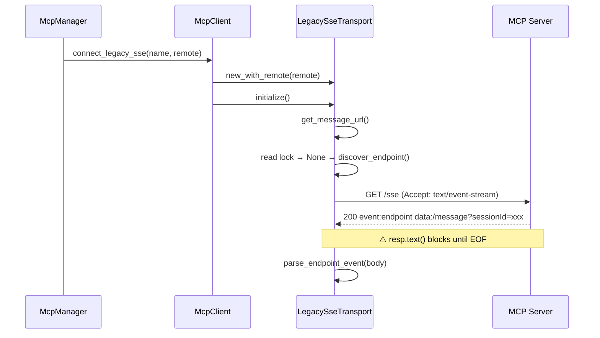
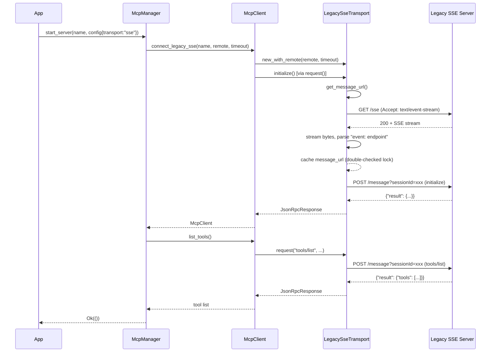

> DEVELOPER

Look at https://github.com/moltis-org/moltis/issues/278 how to add a test to repeat the issue, then fix it for good.

> TOOL

tool_use ToolSearch
id: toolu_01WohcKufnQ2LxZdb9KWjocJ
```json
{
  "query": "select:WebFetch",
  "max_results": 1
}
```

> TOOL

tool_result
id: toolu_01WohcKufnQ2LxZdb9KWjocJ
```
{
  "type": "tool_reference",
  "tool_name": "WebFetch"
}
```

> TOOL

tool_use Bash
id: toolu_0137rAS7oGW7s2Zpr6HRsLKs
```json
{
  "command": "gh issue view 278",
  "description": "Fetch GitHub issue #278 details"
}
```

> TOOL

tool_result
id: toolu_0137rAS7oGW7s2Zpr6HRsLKs
```
title:	[Bug]: Can't add SSE MCP
state:	OPEN
author:	serhiicherepanov (S.Cherepanov)
labels:	bug
comments:	1
assignees:	
projects:	
milestone:	
number:	278
--
### Preflight Checklist

- [x] I have searched [existing issues](https://github.com/moltisorg/moltis/issues?q=is%3Aissue+label%3Abug) and this hasn't been reported yet
- [x] I am using the latest version of Moltis
- [x] If this happened during a chat session, I included as much full session context as possible and redacted secrets

### What happened?

Hi, I tried to configure the SSE server for Baserow and NocoDB, but I keep getting this error:
```
Failed to add "baserow": MCP initialize request failed
```

The log
```
2026-03-01T16:08:58.881132Z  INFO moltis_mcp::client: connecting to MCP server via SSE server=baserow url=https://baserow.xxx.xx/mcp/xxxx/sse
2026-03-01T16:08:58.927424Z  WARN moltis_mcp::client: MCP SSE initialize handshake failed server=baserow error=MCP initialize request failed: MCP SSE server returned HTTP 405 Method Not Allowed for 'initialize': Method Not Allowed
```

### Expected behavior

MCP SSE works

### Steps to reproduce

1. Deploy baserow or nocodb via docker or use cloud
2. Create database and enable mcp
3. Add the mcp server to moltis

### Did this happen during a chat session?

None

### Chat session context (if applicable)

```markdown

```

### Error messages / logs

```shell

```

### Is this a regression?

I don't know

### Last working version

_No response_

### Moltis version

moltis 0.10.3

### Component

MCP servers

### Install method

Docker

### Operating system

Ubuntu / Debian

### Additional context

_No response_
```

> TOOL

tool_use Bash
id: toolu_01AnGmL6ojasdoNty1fsVHbo
```json
{
  "command": "gh issue view 278 --comments",
  "description": "Fetch issue #278 comments"
}
```

> TOOL

tool_result
id: toolu_01AnGmL6ojasdoNty1fsVHbo
```
author:	xzavrel
association:	none
edited:	false
status:	none
--
Additional case: lox-mcp (Loxone MCP server) — HTTP 400 sessionId not provided

I'm experiencing the same issue with [lox-mcp](https://github.com/Smarteon/lox-mcp), a Loxone smart home MCP server running via Docker.

**Configuration (mcp-servers.json):**
```
{
  "lox-mcp-lox-mcp-1": {
    "transport": "sse",
    "url": "http://lox-mcp-lox-mcp-1:3001/",
    "display_name": "loxone"
  }
}
```

**Error from logs:**
```
INFO  moltis_mcp::client: connecting to remote MCP server server="lox-mcp-lox-mcp-1" url="http://lox-mcp-lox-mcp-1:3001/"
WARN  moltis_mcp::client: remote MCP initialize handshake failed error="MCP initialize request failed: MCP SSE server returned HTTP 400 Bad Request for 'initialize': sessionId query parameter is not provided"

```

**Root cause analysis:**

The lox-mcp server correctly implements the MCP SSE transport spec:

1. Client connects to / (SSE stream) → server responds with event: endpoint + data: ?sessionId=<uuid>
2. Client must then POST to /message?sessionId=<uuid> for the initialize request

Moltis appears to skip step 1 and sends the initialize POST directly without first obtaining a sessionId from the SSE endpoint. This is confirmed manually:

```
# Step 1 — SSE stream returns sessionId correctly:
curl http://lox-mcp-lox-mcp-1:3001/
# event: endpoint
# data: ?sessionId=f7e39497-f3c7-416c-9a3a-a48559a2bf5c

# Step 2 — POST without sessionId → 400 Bad Request
# Moltis sends the initialize request here without the sessionId from step 1
```

**Environment:**
- Moltis version: 20260417.02
- Install method: Docker
- OS: Linux (aarch64 / Raspberry Pi)
- lox-mcp version: SSE transport on port 3001

--
```

> AGENT

Now I understand the issue. Moltis skips the SSE handshake — it should first connect to the SSE endpoint to receive the `event: endpoint` with a `sessionId`, then POST the `initialize` request to that endpoint. Let me look at the MCP client code.

> TOOL

tool_use Glob
id: toolu_016SFP9CToUy9krzCNvTEFHo
```json
{
  "pattern": "crates/mcp/src/**/*.rs"
}
```

> TOOL

tool_result
id: toolu_016SFP9CToUy9krzCNvTEFHo
```
/Users/penso/.superset/worktrees/moltis/emerald-match/crates/mcp/src/auth.rs
/Users/penso/.superset/worktrees/moltis/emerald-match/crates/mcp/src/client.rs
/Users/penso/.superset/worktrees/moltis/emerald-match/crates/mcp/src/config_parsing.rs
/Users/penso/.superset/worktrees/moltis/emerald-match/crates/mcp/src/error.rs
/Users/penso/.superset/worktrees/moltis/emerald-match/crates/mcp/src/lib.rs
/Users/penso/.superset/worktrees/moltis/emerald-match/crates/mcp/src/manager.rs
/Users/penso/.superset/worktrees/moltis/emerald-match/crates/mcp/src/registry.rs
/Users/penso/.superset/worktrees/moltis/emerald-match/crates/mcp/src/remote.rs
/Users/penso/.superset/worktrees/moltis/emerald-match/crates/mcp/src/sse_transport.rs
/Users/penso/.superset/worktrees/moltis/emerald-match/crates/mcp/src/tool_bridge.rs
/Users/penso/.superset/worktrees/moltis/emerald-match/crates/mcp/src/traits.rs
/Users/penso/.superset/worktrees/moltis/emerald-match/crates/mcp/src/transport.rs
/Users/penso/.superset/worktrees/moltis/emerald-match/crates/mcp/src/types.rs
```

> TOOL

tool_use Read
id: toolu_011iLJzvfzrot6gmwtvc9v2n
```json
{
  "file_path": "/Users/penso/.superset/worktrees/moltis/emerald-match/crates/mcp/src/sse_transport.rs"
}
```

> TOOL

tool_result
id: toolu_011iLJzvfzrot6gmwtvc9v2n
```
     1→//! HTTP/SSE transport for remote MCP servers (Streamable HTTP transport).
     2→//!
     3→//! Uses HTTP POST for JSON-RPC requests and GET for server-initiated SSE events.
     4→//! Supports optional OAuth Bearer token injection and automatic 401 retry.
     5→
     6→use std::{
     7→    sync::{
     8→        Arc,
     9→        atomic::{AtomicU64, Ordering},
    10→    },
    11→    time::Duration,
    12→};
    13→
    14→use {
    15→    reqwest::{Client, header::HeaderMap},
    16→    secrecy::{ExposeSecret, Secret},
    17→    tokio::sync::RwLock,
    18→    tracing::{debug, info, warn},
    19→};
    20→
    21→use crate::{
    22→    auth::SharedAuthProvider,
    23→    error::{Context, Error, Result},
    24→    remote::{ResolvedRemoteConfig, sanitize_reqwest_error},
    25→    traits::McpTransport,
    26→    types::{
    27→        JsonRpcNotification, JsonRpcRequest, JsonRpcResponse, McpTransportError, PROTOCOL_VERSION,
    28→    },
    29→};
    30→
    31→const MCP_PROTOCOL_VERSION_HEADER: &str = "MCP-Protocol-Version";
    32→const MCP_SESSION_ID_HEADER: &str = "Mcp-Session-Id";
    33→const STREAMABLE_ACCEPT_HEADER: &str = "application/json, text/event-stream";
    34→
    35→/// HTTP/SSE-based transport for a remote MCP server.
    36→pub struct SseTransport {
    37→    client: Client,
    38→    request_url: Secret<String>,
    39→    display_url: String,
    40→    default_headers: HeaderMap,
    41→    next_id: AtomicU64,
    42→    /// Optional auth provider for Bearer token injection.
    43→    auth: Option<SharedAuthProvider>,
    44→    /// Session identifier used by streamable HTTP servers.
    45→    session_id: RwLock<Option<String>>,
    46→}
    47→
    48→impl SseTransport {
    49→    /// Create a new SSE transport pointing at the given MCP server URL.
    50→    pub fn new(url: &str) -> Result<Arc<Self>> {
    51→        Self::new_with_timeout(url, Duration::from_secs(60))
    52→    }
    53→
    54→    /// Create a new SSE transport with a custom request timeout.
    55→    pub fn new_with_timeout(url: &str, request_timeout: Duration) -> Result<Arc<Self>> {
    56→        let remote = ResolvedRemoteConfig::from_server_config(
    57→            &crate::registry::McpServerConfig {
    58→                transport: crate::registry::TransportType::Sse,
    59→                url: Some(Secret::new(url.to_string())),
    60→                ..Default::default()
    61→            },
    62→            &std::collections::HashMap::new(),
    63→        )?;
    64→        Self::new_with_remote(remote, request_timeout)
    65→    }
    66→
    67→    pub fn new_with_remote(
    68→        remote: ResolvedRemoteConfig,
    69→        request_timeout: Duration,
    70→    ) -> Result<Arc<Self>> {
    71→        let client = Client::builder()
    72→            .timeout(request_timeout)
    73→            .build()
    74→            .context("failed to build HTTP client for SSE transport")?;
    75→
    76→        Ok(Arc::new(Self {
    77→            client,
    78→            request_url: Secret::new(remote.request_url().to_string()),
    79→            display_url: remote.display_url().to_string(),
    80→            default_headers: remote.headers().clone(),
    81→            next_id: AtomicU64::new(1),
    82→            auth: None,
    83→            session_id: RwLock::new(None),
    84→        }))
    85→    }
    86→
    87→    /// Create a new SSE transport with an OAuth auth provider.
    88→    pub fn with_auth(url: &str, auth: SharedAuthProvider) -> Result<Arc<Self>> {
    89→        Self::with_auth_and_timeout(url, auth, Duration::from_secs(60))
    90→    }
    91→
    92→    /// Create a new SSE transport with an OAuth auth provider and custom request timeout.
    93→    pub fn with_auth_and_timeout(
    94→        url: &str,
    95→        auth: SharedAuthProvider,
    96→        request_timeout: Duration,
    97→    ) -> Result<Arc<Self>> {
    98→        let remote = ResolvedRemoteConfig::from_server_config(
    99→            &crate::registry::McpServerConfig {
   100→                transport: crate::registry::TransportType::Sse,
   101→                url: Some(Secret::new(url.to_string())),
   102→                ..Default::default()
   103→            },
   104→            &std::collections::HashMap::new(),
   105→        )?;
   106→        Self::with_auth_remote(remote, auth, request_timeout)
   107→    }
   108→
   109→    pub fn with_auth_remote(
   110→        remote: ResolvedRemoteConfig,
   111→        auth: SharedAuthProvider,
   112→        request_timeout: Duration,
   113→    ) -> Result<Arc<Self>> {
   114→        let client = Client::builder()
   115→            .timeout(request_timeout)
   116→            .build()
   117→            .context("failed to build HTTP client for SSE transport")?;
   118→
   119→        Ok(Arc::new(Self {
   120→            client,
   121→            request_url: Secret::new(remote.request_url().to_string()),
   122→            display_url: remote.display_url().to_string(),
   123→            default_headers: remote.headers().clone(),
   124→            next_id: AtomicU64::new(1),
   125→            auth: Some(auth),
   126→            session_id: RwLock::new(None),
   127→        }))
   128→    }
   129→
   130→    /// Build a request builder with optional Bearer token.
   131→    async fn build_post(&self) -> Result<reqwest::RequestBuilder> {
   132→        let mut req = self
   133→            .client
   134→            .post(self.request_url.expose_secret())
   135→            .header("Content-Type", "application/json")
   136→            .header("Accept", STREAMABLE_ACCEPT_HEADER)
   137→            .header(MCP_PROTOCOL_VERSION_HEADER, PROTOCOL_VERSION);
   138→
   139→        req = self.apply_default_headers(req);
   140→
   141→        if let Some(session_id) = self.session_id.read().await.clone() {
   142→            req = req.header(MCP_SESSION_ID_HEADER, session_id);
   143→        }
   144→
   145→        if let Some(token) = match &self.auth {
   146→            Some(auth) => auth.access_token().await?,
   147→            None => None,
   148→        } {
   149→            req = req.header("Authorization", format!("Bearer {}", token.expose_secret()));
   150→        }
   151→
   152→        Ok(req)
   153→    }
   154→
   155→    async fn store_session_id_from_response(&self, response: &reqwest::Response) {
   156→        let Some(raw) = response.headers().get(MCP_SESSION_ID_HEADER) else {
   157→            return;
   158→        };
   159→        let Ok(session_id) = raw.to_str() else {
   160→            return;
   161→        };
   162→        if session_id.trim().is_empty() {
   163→            return;
   164→        }
   165→
   166→        let mut slot = self.session_id.write().await;
   167→        let session_id = session_id.to_string();
   168→        if slot.as_ref() != Some(&session_id) {
   169→            debug!(
   170→                url = %self.display_url,
   171→                session_id = %session_id,
   172→                "updated MCP streamable HTTP session id"
   173→            );
   174→            *slot = Some(session_id);
   175→        }
   176→    }
   177→
   178→    fn apply_default_headers(&self, mut req: reqwest::RequestBuilder) -> reqwest::RequestBuilder {
   179→        for (name, value) in &self.default_headers {
   180→            if self.auth.is_some() && name == reqwest::header::AUTHORIZATION {
   181→                continue;
   182→            }
   183→            req = req.header(name, value);
   184→        }
   185→        req
   186→    }
   187→
   188→    fn response_is_event_stream(resp: &reqwest::Response) -> bool {
   189→        resp.headers()
   190→            .get(reqwest::header::CONTENT_TYPE)
   191→            .and_then(|v| v.to_str().ok())
   192→            .map(|ct| {
   193→                ct.split(';')
   194→                    .next()
   195→                    .is_some_and(|base| base.trim() == "text/event-stream")
   196→            })
   197→            .unwrap_or(false)
   198→    }
   199→
   200→    fn parse_event_stream_response(body: &str, method: &str) -> Result<JsonRpcResponse> {
   201→        let mut data = String::new();
   202→
   203→        for line in body.lines() {
   204→            let trimmed = line.trim_end();
   205→            if let Some(rest) = trimmed.strip_prefix("data:") {
   206→                if !data.is_empty() {
   207→                    data.push('\n');
   208→                }
   209→                data.push_str(rest.trim_start());
   210→                continue;
   211→            }
   212→
   213→            if trimmed.is_empty() && !data.is_empty() {
   214→                if let Ok(resp) = serde_json::from_str::<JsonRpcResponse>(&data) {
   215→                    return Ok(resp);
   216→                }
   217→                data.clear();
   218→            }
   219→        }
   220→
   221→        if !data.is_empty()
   222→            && let Ok(resp) = serde_json::from_str::<JsonRpcResponse>(&data)
   223→        {
   224→            return Ok(resp);
   225→        }
   226→
   227→        Err(Error::message(format!(
   228→            "failed to parse JSON-RPC response from event stream for '{method}'"
   229→        )))
   230→    }
   231→
   232→    /// Send a POST request and handle 401 with auth retry.
   233→    /// Returns the HTTP response or a typed `McpTransportError`.
   234→    async fn send_with_auth_retry(
   235→        &self,
   236→        method: &str,
   237→        body: &impl serde::Serialize,
   238→    ) -> Result<reqwest::Response> {
   239→        // First attempt
   240→        let req = self.build_post().await?;
   241→        let http_resp = req
   242→            .json(body)
   243→            .send()
   244→            .await
   245→            .map_err(sanitize_reqwest_error)
   246→            .with_context(|| format!("SSE POST to '{}' for '{method}' failed", self.display_url))?;
   247→
   248→        if http_resp.status() == reqwest::StatusCode::UNAUTHORIZED {
   249→            let has_session_header = http_resp.headers().contains_key(MCP_SESSION_ID_HEADER);
   250→            self.store_session_id_from_response(&http_resp).await;
   251→
   252→            if let Some(auth) = &self.auth {
   253→                let first_www_auth = http_resp
   254→                    .headers()
   255→                    .get("www-authenticate")
   256→                    .and_then(|v| v.to_str().ok())
   257→                    .map(String::from);
   258→
   259→                // Some streamable HTTP servers issue a session ID alongside 401
   260→                // and expect subsequent requests to include it. Retry once with
   261→                // current auth/session before forcing interactive re-auth.
   262→                if has_session_header {
   263→                    info!(
   264→                        method = %method,
   265→                        url = %self.display_url,
   266→                        www_authenticate = ?first_www_auth,
   267→                        "received 401 with session header, replaying request before OAuth re-auth"
   268→                    );
   269→
   270→                    let req = self.build_post().await?;
   271→                    let replay_resp = req
   272→                        .json(body)
   273→                        .send()
   274→                        .await
   275→                        .map_err(sanitize_reqwest_error)
   276→                        .with_context(|| {
   277→                            format!(
   278→                                "SSE POST session replay to '{}' for '{method}' failed",
   279→                                self.display_url
   280→                            )
   281→                        })?;
   282→
   283→                    if replay_resp.status() != reqwest::StatusCode::UNAUTHORIZED {
   284→                        self.store_session_id_from_response(&replay_resp).await;
   285→                        return Ok(replay_resp);
   286→                    }
   287→
   288→                    self.store_session_id_from_response(&replay_resp).await;
   289→                    let replay_www_auth = replay_resp
   290→                        .headers()
   291→                        .get("www-authenticate")
   292→                        .and_then(|v| v.to_str().ok())
   293→                        .map(String::from);
   294→
   295→                    info!(
   296→                        method = %method,
   297→                        url = %self.display_url,
   298→                        "received 401 after session replay, attempting OAuth re-auth"
   299→                    );
   300→
   301→                    if auth.handle_unauthorized(replay_www_auth.as_deref()).await? {
   302→                        // Retry with new token
   303→                        let req = self.build_post().await?;
   304→                        let retry_resp = req
   305→                            .json(body)
   306→                            .send()
   307→                            .await
   308→                            .map_err(sanitize_reqwest_error)
   309→                            .with_context(|| {
   310→                                format!(
   311→                                    "SSE POST retry to '{}' for '{method}' failed",
   312→                                    self.display_url
   313→                                )
   314→                            })?;
   315→
   316→                        if retry_resp.status() == reqwest::StatusCode::UNAUTHORIZED {
   317→                            return Err(McpTransportError::Unauthorized {
   318→                                www_authenticate: retry_resp
   319→                                    .headers()
   320→                                    .get("www-authenticate")
   321→                                    .and_then(|v| v.to_str().ok())
   322→                                    .map(String::from),
   323→                            }
   324→                            .into());
   325→                        }
   326→
   327→                        self.store_session_id_from_response(&retry_resp).await;
   328→                        return Ok(retry_resp);
   329→                    }
   330→
   331→                    return Err(McpTransportError::Unauthorized {
   332→                        www_authenticate: replay_www_auth,
   333→                    }
   334→                    .into());
   335→                }
   336→
   337→                info!(
   338→                    method = %method,
   339→                    url = %self.display_url,
   340→                    www_authenticate = ?first_www_auth,
   341→                    "received 401, attempting OAuth re-auth"
   342→                );
   343→
   344→                if auth.handle_unauthorized(first_www_auth.as_deref()).await? {
   345→                    // Retry with new token
   346→                    let req = self.build_post().await?;
   347→                    let retry_resp = req
   348→                        .json(body)
   349→                        .send()
   350→                        .await
   351→                        .map_err(sanitize_reqwest_error)
   352→                        .with_context(|| {
   353→                            format!(
   354→                                "SSE POST retry to '{}' for '{method}' failed",
   355→                                self.display_url
   356→                            )
   357→                        })?;
   358→
   359→                    if retry_resp.status() == reqwest::StatusCode::UNAUTHORIZED {
   360→                        return Err(McpTransportError::Unauthorized {
   361→                            www_authenticate: retry_resp
   362→                                .headers()
   363→                                .get("www-authenticate")
   364→                                .and_then(|v| v.to_str().ok())
   365→                                .map(String::from),
   366→                        }
   367→                        .into());
   368→                    }
   369→
   370→                    self.store_session_id_from_response(&retry_resp).await;
   371→                    return Ok(retry_resp);
   372→                }
   373→            }
   374→
   375→            // No auth provider or auth failed
   376→            return Err(McpTransportError::Unauthorized {
   377→                www_authenticate: http_resp
   378→                    .headers()
   379→                    .get("www-authenticate")
   380→                    .and_then(|v| v.to_str().ok())
   381→                    .map(String::from),
   382→            }
   383→            .into());
   384→        }
   385→
   386→        self.store_session_id_from_response(&http_resp).await;
   387→        Ok(http_resp)
   388→    }
   389→}
   390→
   391→#[async_trait::async_trait]
   392→impl McpTransport for SseTransport {
   393→    async fn request(
   394→        &self,
   395→        method: &str,
   396→        params: Option<serde_json::Value>,
   397→    ) -> Result<JsonRpcResponse> {
   398→        let id = self.next_id.fetch_add(1, Ordering::SeqCst);
   399→        let req = JsonRpcRequest::new(id, method, params);
   400→
   401→        debug!(method = %method, id = %id, url = %self.display_url, "SSE client -> server");
   402→
   403→        let http_resp = self.send_with_auth_retry(method, &req).await?;
   404→
   405→        if !http_resp.status().is_success() {
   406→            let status = http_resp.status();
   407→            let body = http_resp.text().await.unwrap_or_default();
   408→            return Err(Error::message(format!(
   409→                "MCP SSE server returned HTTP {status} for '{method}': {body}"
   410→            )));
   411→        }
   412→
   413→        let resp: JsonRpcResponse = if Self::response_is_event_stream(&http_resp) {
   414→            let body = http_resp
   415→                .text()
   416→                .await
   417→                .with_context(|| format!("failed to read event stream response for '{method}'"))?;
   418→            Self::parse_event_stream_response(&body, method)?
   419→        } else {
   420→            http_resp
   421→                .json()
   422→                .await
   423→                .with_context(|| format!("failed to parse JSON-RPC response for '{method}'"))?
   424→        };
   425→
   426→        if let Some(ref err) = resp.error {
   427→            return Err(Error::message(format!(
   428→                "MCP SSE error on '{method}': code={} message={}",
   429→                err.code, err.message
   430→            )));
   431→        }
   432→
   433→        Ok(resp)
   434→    }
   435→
   436→    async fn notify(&self, method: &str, params: Option<serde_json::Value>) -> Result<()> {
   437→        let notif = JsonRpcNotification {
   438→            jsonrpc: "2.0".into(),
   439→            method: method.into(),
   440→            params,
   441→        };
   442→
   443→        debug!(
   444→            method = %method,
   445→            url = %self.display_url,
   446→            "SSE client -> server (notification)"
   447→        );
   448→
   449→        let http_resp = self.send_with_auth_retry(method, &notif).await?;
   450→
   451→        if !http_resp.status().is_success() {
   452→            let status = http_resp.status();
   453→            warn!(method = %method, %status, "SSE notification returned non-success");
   454→        }
   455→
   456→        Ok(())
   457→    }
   458→
   459→    async fn is_alive(&self) -> bool {
   460→        // Try a lightweight GET request to check connectivity and session continuity.
   461→        let mut req = self
   462→            .client
   463→            .get(self.request_url.expose_secret())
   464→            .timeout(std::time::Duration::from_secs(5))
   465→            .header("Accept", STREAMABLE_ACCEPT_HEADER)
   466→            .header(MCP_PROTOCOL_VERSION_HEADER, PROTOCOL_VERSION);
   467→
   468→        req = self.apply_default_headers(req);
   469→
   470→        if let Some(session_id) = self.session_id.read().await.clone() {
   471→            req = req.header(MCP_SESSION_ID_HEADER, session_id);
   472→        }
   473→
   474→        // Include auth header in health checks too
   475→        if let Some(token) = match &self.auth {
   476→            Some(auth) => auth.access_token().await.ok().flatten(),
   477→            None => None,
   478→        } {
   479→            req = req.header("Authorization", format!("Bearer {}", token.expose_secret()));
   480→        }
   481→
   482→        match req.send().await {
   483→            Ok(resp) => {
   484→                self.store_session_id_from_response(&resp).await;
   485→                // Any HTTP response proves the server is reachable.
   486→                // Non-success statuses (401, 403, 405) are common for
   487→                // Streamable HTTP servers where GET is optional (MCP spec)
   488→                // or auth headers differ between GET and POST. Only true
   489→                // network errors (connection refused, timeout, DNS) mean dead.
   490→                true
   491→            },
   492→            Err(_) => false,
   493→        }
   494→    }
   495→
   496→    async fn kill(&self) {
   497→        let session_id = {
   498→            let mut slot = self.session_id.write().await;
   499→            slot.take()
   500→        };
   501→
   502→        let Some(session_id) = session_id else {
   503→            return;
   504→        };
   505→
   506→        let mut req = self
   507→            .client
   508→            .delete(self.request_url.expose_secret())
   509→            .timeout(std::time::Duration::from_secs(5))
   510→            .header(MCP_PROTOCOL_VERSION_HEADER, PROTOCOL_VERSION)
   511→            .header(MCP_SESSION_ID_HEADER, session_id);
   512→
   513→        req = self.apply_default_headers(req);
   514→
   515→        if let Some(token) = match &self.auth {
   516→            Some(auth) => auth.access_token().await.ok().flatten(),
   517→            None => None,
   518→        } {
   519→            req = req.header("Authorization", format!("Bearer {}", token.expose_secret()));
   520→        }
   521→
   522→        if let Err(e) = req.send().await {
   523→            warn!(
   524→                url = %self.display_url,
   525→                error = %sanitize_reqwest_error(e),
   526→                "failed to close MCP streamable HTTP session"
   527→            );
   528→        }
   529→    }
   530→}
   531→
   532→#[cfg(test)]
   533→mod tests {
   534→    use super::*;
   535→
   536→    fn unused_local_url() -> String {
   537→        let listener = std::net::TcpListener::bind("127.0.0.1:0").unwrap();
   538→        let addr = listener.local_addr().unwrap();
   539→        drop(listener);
   540→        format!("http://{addr}/mcp")
   541→    }
   542→
   543→    #[test]
   544→    fn test_sse_transport_creation() {
   545→        let transport = SseTransport::new("http://localhost:8080/mcp");
   546→        assert!(transport.is_ok());
   547→    }
   548→
   549→    #[test]
   550→    fn test_sse_transport_invalid_url_fails_creation() {
   551→        let transport = SseTransport::new("not-a-url");
   552→        assert!(transport.is_err());
   553→    }
   554→
   555→    #[tokio::test]
   556→    async fn test_sse_transport_is_alive_unreachable() {
   557→        let transport = SseTransport::new(&unused_local_url()).unwrap();
   558→        assert!(!transport.is_alive().await);
   559→    }
   560→
   561→    #[tokio::test]
   562→    async fn test_sse_transport_request_unreachable() {
   563→        let transport = SseTransport::new(&unused_local_url()).unwrap();
   564→        let result = transport.request("test", None).await;
   565→        assert!(result.is_err());
   566→    }
   567→
   568→    #[tokio::test]
   569→    async fn test_sse_transport_kill() {
   570→        let transport = SseTransport::new("http://localhost:8080/mcp").unwrap();
   571→        transport.kill().await;
   572→        // Should not panic
   573→    }
   574→
   575→    #[test]
   576→    fn test_sse_transport_with_auth_creation() {
   577→        let auth: SharedAuthProvider = Arc::new(crate::auth::NoAuthProvider);
   578→        let transport = SseTransport::with_auth("http://localhost:8080/mcp", auth);
   579→        assert!(transport.is_ok());
   580→    }
   581→
   582→    #[tokio::test]
   583→    async fn test_sse_transport_401_without_auth_returns_unauthorized() {
   584→        let mut server = mockito::Server::new_async().await;
   585→        let _mock = server
   586→            .mock("POST", "/")
   587→            .with_status(401)
   588→            .with_header("www-authenticate", r#"Bearer realm="test""#)
   589→            .create_async()
   590→            .await;
   591→
   592→        let transport = SseTransport::new(&server.url()).unwrap();
   593→        let result = transport.request("test", None).await;
   594→
   595→        assert!(result.is_err());
   596→        let err = result.unwrap_err();
   597→        assert!(matches!(
   598→            err,
   599→            crate::Error::Transport(McpTransportError::Unauthorized { .. })
   600→        ));
   601→    }
   602→
   603→    #[tokio::test]
   604→    async fn test_sse_transport_200_no_auth() {
   605→        let mut server = mockito::Server::new_async().await;
   606→        let _mock = server
   607→            .mock("POST", "/")
   608→            .with_status(200)
   609→            .with_header("content-type", "application/json")
   610→            .with_body(r#"{"jsonrpc":"2.0","id":1,"result":{"ok":true}}"#)
   611→            .create_async()
   612→            .await;
   613→
   614→        let transport = SseTransport::new(&server.url()).unwrap();
   615→        let resp = transport.request("test", None).await.unwrap();
   616→        assert!(resp.result.is_some());
   617→    }
   618→
   619→    fn remote_with_headers(
   620→        url: &str,
   621→        headers: &[(&str, &str)],
   622→    ) -> crate::remote::ResolvedRemoteConfig {
   623→        let config = crate::registry::McpServerConfig {
   624→            transport: crate::registry::TransportType::Sse,
   625→            url: Some(Secret::new(url.to_string())),
   626→            headers: headers
   627→                .iter()
   628→                .map(|(name, value)| ((*name).to_string(), Secret::new((*value).to_string())))
   629→                .collect(),
   630→            ..Default::default()
   631→        };
   632→        crate::remote::ResolvedRemoteConfig::from_server_config(
   633→            &config,
   634→            &std::collections::HashMap::new(),
   635→        )
   636→        .unwrap()
   637→    }
   638→
   639→    #[tokio::test]
   640→    async fn test_sse_transport_custom_headers_injected() {
   641→        let mut server = mockito::Server::new_async().await;
   642→        let mock = server
   643→            .mock("POST", "/")
   644→            .match_header("x-api-key", "secret-header")
   645→            .match_header("authorization", "ApiKey raw-secret")
   646→            .with_status(200)
   647→            .with_header("content-type", "application/json")
   648→            .with_body(r#"{"jsonrpc":"2.0","id":1,"result":{"ok":true}}"#)
   649→            .create_async()
   650→            .await;
   651→
   652→        let remote = remote_with_headers(&server.url(), &[
   653→            ("x-api-key", "secret-header"),
   654→            ("authorization", "ApiKey raw-secret"),
   655→        ]);
   656→        let transport = SseTransport::new_with_remote(remote, Duration::from_secs(60)).unwrap();
   657→        let resp = transport.request("test", None).await.unwrap();
   658→        assert!(resp.result.is_some());
   659→        mock.assert_async().await;
   660→    }
   661→
   662→    #[tokio::test]
   663→    async fn test_sse_transport_bearer_header_injected() {
   664→        use crate::auth::{McpAuthProvider, McpAuthState};
   665→
   666→        /// Test auth provider that always returns a fixed token.
   667→        struct FixedTokenProvider;
   668→
   669→        #[async_trait::async_trait]
   670→        impl McpAuthProvider for FixedTokenProvider {
   671→            async fn access_token(&self) -> Result<Option<Secret<String>>> {
   672→                Ok(Some(Secret::new("test-token-123".to_string())))
   673→            }
   674→
   675→            async fn handle_unauthorized(&self, _: Option<&str>) -> Result<bool> {
   676→                Ok(false)
   677→            }
   678→
   679→            async fn start_oauth(
   680→                &self,
   681→                _redirect_uri: &str,
   682→                _www_authenticate: Option<&str>,
   683→            ) -> Result<Option<String>> {
   684→                Ok(None)
   685→            }
   686→
   687→            async fn complete_oauth(&self, _state: &str, _code: &str) -> Result<bool> {
   688→                Ok(false)
   689→            }
   690→
   691→            fn pending_auth_url(&self) -> Option<String> {
   692→                None
   693→            }
   694→
   695→            fn auth_state(&self) -> McpAuthState {
   696→                McpAuthState::Authenticated
   697→            }
   698→        }
   699→
   700→        let mut server = mockito::Server::new_async().await;
   701→        let mock = server
   702→            .mock("POST", "/")
   703→            .match_header("authorization", "Bearer test-token-123")
   704→            .with_status(200)
   705→            .with_header("content-type", "application/json")
   706→            .with_body(r#"{"jsonrpc":"2.0","id":1,"result":{"ok":true}}"#)
   707→            .create_async()
   708→            .await;
   709→
   710→        let auth: SharedAuthProvider = Arc::new(FixedTokenProvider);
   711→        let transport = SseTransport::with_auth(&server.url(), auth).unwrap();
   712→        let resp = transport.request("test", None).await.unwrap();
   713→        assert!(resp.result.is_some());
   714→        mock.assert_async().await;
   715→    }
   716→
   717→    #[tokio::test]
   718→    async fn test_sse_transport_oauth_authorization_overrides_custom_header() {
   719→        use crate::auth::{McpAuthProvider, McpAuthState};
   720→
   721→        struct FixedTokenProvider;
   722→
   723→        #[async_trait::async_trait]
   724→        impl McpAuthProvider for FixedTokenProvider {
   725→            async fn access_token(&self) -> Result<Option<Secret<String>>> {
   726→                Ok(Some(Secret::new("oauth-token-123".to_string())))
   727→            }
   728→
   729→            async fn handle_unauthorized(&self, _: Option<&str>) -> Result<bool> {
   730→                Ok(false)
   731→            }
   732→
   733→            async fn start_oauth(
   734→                &self,
   735→                _redirect_uri: &str,
   736→                _www_authenticate: Option<&str>,
   737→            ) -> Result<Option<String>> {
   738→                Ok(None)
   739→            }
   740→
   741→            async fn complete_oauth(&self, _state: &str, _code: &str) -> Result<bool> {
   742→                Ok(false)
   743→            }
   744→
   745→            fn pending_auth_url(&self) -> Option<String> {
   746→                None
   747→            }
   748→
   749→            fn auth_state(&self) -> McpAuthState {
   750→                McpAuthState::Authenticated
   751→            }
   752→        }
   753→
   754→        let mut server = mockito::Server::new_async().await;
   755→        let mock = server
   756→            .mock("POST", "/")
   757→            .match_header("x-api-key", "secret-header")
   758→            .match_header("authorization", "Bearer oauth-token-123")
   759→            .with_status(200)
   760→            .with_header("content-type", "application/json")
   761→            .with_body(r#"{"jsonrpc":"2.0","id":1,"result":{"ok":true}}"#)
   762→            .create_async()
   763→            .await;
   764→
   765→        let remote = remote_with_headers(&server.url(), &[
   766→            ("x-api-key", "secret-header"),
   767→            ("authorization", "ApiKey raw-secret"),
   768→        ]);
   769→        let auth: SharedAuthProvider = Arc::new(FixedTokenProvider);
   770→        let transport =
   771→            SseTransport::with_auth_remote(remote, auth, Duration::from_secs(60)).unwrap();
   772→        let resp = transport.request("test", None).await.unwrap();
   773→        assert!(resp.result.is_some());
   774→        mock.assert_async().await;
   775→    }
   776→
   777→    #[tokio::test]
   778→    async fn test_sse_transport_propagates_session_id() {
   779→        let mut server = mockito::Server::new_async().await;
   780→
   781→        let first = server
   782→            .mock("POST", "/")
   783→            .with_status(200)
   784→            .with_header("content-type", "application/json")
   785→            .with_header("mcp-session-id", "session-123")
   786→            .with_body(r#"{"jsonrpc":"2.0","id":1,"result":{"ok":true}}"#)
   787→            .create_async()
   788→            .await;
   789→
   790→        let second = server
   791→            .mock("POST", "/")
   792→            .match_header("mcp-session-id", "session-123")
   793→            .with_status(200)
   794→            .with_header("content-type", "application/json")
   795→            .with_body(r#"{"jsonrpc":"2.0","id":2,"result":{"ok":true}}"#)
   796→            .create_async()
   797→            .await;
   798→
   799→        let transport = SseTransport::new(&server.url()).unwrap();
   800→        transport.request("initialize", None).await.unwrap();
   801→        transport.request("tools/list", None).await.unwrap();
   802→
   803→        first.assert_async().await;
   804→        second.assert_async().await;
   805→    }
   806→
   807→    #[tokio::test]
   808→    async fn test_sse_transport_401_with_session_replays_before_reauth() {
   809→        use std::sync::atomic::{AtomicUsize, Ordering};
   810→
   811→        use secrecy::Secret;
   812→
   813→        use crate::auth::{McpAuthProvider, McpAuthState};
   814→
   815→        struct CountingAuthProvider {
   816→            reauth_calls: AtomicUsize,
   817→        }
   818→
   819→        #[async_trait::async_trait]
   820→        impl McpAuthProvider for CountingAuthProvider {
   821→            async fn access_token(&self) -> Result<Option<Secret<String>>> {
   822→                Ok(Some(Secret::new("token-123".to_string())))
   823→            }
   824→
   825→            async fn handle_unauthorized(&self, _www_authenticate: Option<&str>) -> Result<bool> {
   826→                self.reauth_calls.fetch_add(1, Ordering::SeqCst);
   827→                Ok(false)
   828→            }
   829→
   830→            async fn start_oauth(
   831→                &self,
   832→                _redirect_uri: &str,
   833→                _www_authenticate: Option<&str>,
   834→            ) -> Result<Option<String>> {
   835→                Ok(None)
   836→            }
   837→
   838→            async fn complete_oauth(&self, _state: &str, _code: &str) -> Result<bool> {
   839→                Ok(false)
   840→            }
   841→
   842→            fn pending_auth_url(&self) -> Option<String> {
   843→                None
   844→            }
   845→
   846→            fn auth_state(&self) -> McpAuthState {
   847→                McpAuthState::Authenticated
   848→            }
   849→        }
   850→
   851→        let mut server = mockito::Server::new_async().await;
   852→
   853→        let first = server
   854→            .mock("POST", "/")
   855→            .match_header("authorization", "Bearer token-123")
   856→            .with_status(401)
   857→            .with_header("mcp-session-id", "session-reauth-1")
   858→            .with_header("www-authenticate", r#"Bearer realm="test""#)
   859→            .create_async()
   860→            .await;
   861→
   862→        let second = server
   863→            .mock("POST", "/")
   864→            .match_header("authorization", "Bearer token-123")
   865→            .match_header("mcp-session-id", "session-reauth-1")
   866→            .with_status(200)
   867→            .with_header("content-type", "application/json")
   868→            .with_body(r#"{"jsonrpc":"2.0","id":1,"result":{"ok":true}}"#)
   869→            .create_async()
   870→            .await;
   871→
   872→        let auth = Arc::new(CountingAuthProvider {
   873→            reauth_calls: AtomicUsize::new(0),
   874→        });
   875→        let auth_shared: SharedAuthProvider = auth.clone();
   876→
   877→        let transport = SseTransport::with_auth(&server.url(), auth_shared).unwrap();
   878→        let resp = transport.request("initialize", None).await.unwrap();
   879→        assert!(resp.result.is_some());
   880→        assert_eq!(auth.reauth_calls.load(Ordering::SeqCst), 0);
   881→
   882→        first.assert_async().await;
   883→        second.assert_async().await;
   884→    }
   885→
   886→    #[tokio::test]
   887→    async fn test_sse_transport_parses_event_stream_response() {
   888→        let mut server = mockito::Server::new_async().await;
   889→        let _mock = server
   890→            .mock("POST", "/")
   891→            .with_status(200)
   892→            .with_header("content-type", "text/event-stream")
   893→            .with_body(
   894→                "event: message\ndata: {\"jsonrpc\":\"2.0\",\"id\":1,\"result\":{\"ok\":true}}\n\n",
   895→            )
   896→            .create_async()
   897→            .await;
   898→
   899→        let transport = SseTransport::new(&server.url()).unwrap();
   900→        let resp = transport.request("initialize", None).await.unwrap();
   901→        assert!(resp.result.is_some());
   902→    }
   903→
   904→    // ── is_alive health-check tests (issue #732) ──────────────────────
   905→
   906→    #[tokio::test]
   907→    async fn test_is_alive_200_returns_true() {
   908→        let mut server = mockito::Server::new_async().await;
   909→        let _mock = server
   910→            .mock("GET", "/")
   911→            .with_status(200)
   912→            .with_header("content-type", "application/json")
   913→            .with_body(r#"{"ok":true}"#)
   914→            .create_async()
   915→            .await;
   916→
   917→        let transport = SseTransport::new(&server.url()).unwrap();
   918→        assert!(transport.is_alive().await);
   919→    }
   920→
   921→    #[tokio::test]
   922→    async fn test_is_alive_401_returns_true() {
   923→        let mut server = mockito::Server::new_async().await;
   924→        let _mock = server
   925→            .mock("GET", "/")
   926→            .with_status(401)
   927→            .with_header("www-authenticate", r#"Bearer realm="test""#)
   928→            .create_async()
   929→            .await;
   930→
   931→        let transport = SseTransport::new(&server.url()).unwrap();
   932→        assert!(transport.is_alive().await);
   933→    }
   934→
   935→    /// Streamable HTTP servers may not support GET (it's optional in the MCP
   936→    /// spec). A 405 response proves the server is reachable and alive.
   937→    #[tokio::test]
   938→    async fn test_is_alive_405_method_not_allowed_returns_true() {
   939→        let mut server = mockito::Server::new_async().await;
   940→        let _mock = server
   941→            .mock("GET", "/")
   942→            .with_status(405)
   943→            .with_header("allow", "POST, DELETE")
   944→            .create_async()
   945→            .await;
   946→
   947→        let transport = SseTransport::new(&server.url()).unwrap();
   948→        assert!(transport.is_alive().await);
   949→    }
   950→
   951→    /// A 403 Forbidden from the health check still proves the server is
   952→    /// reachable — it just refused the request. The server is alive.
   953→    #[tokio::test]
   954→    async fn test_is_alive_403_forbidden_returns_true() {
   955→        let mut server = mockito::Server::new_async().await;
   956→        let _mock = server
   957→            .mock("GET", "/")
   958→            .with_status(403)
   959→            .create_async()
   960→            .await;
   961→
   962→        let transport = SseTransport::new(&server.url()).unwrap();
   963→        assert!(transport.is_alive().await);
   964→    }
   965→
   966→    /// A 400 Bad Request still proves the server endpoint is alive.
   967→    #[tokio::test]
   968→    async fn test_is_alive_400_bad_request_returns_true() {
   969→        let mut server = mockito::Server::new_async().await;
   970→        let _mock = server
   971→            .mock("GET", "/")
   972→            .with_status(400)
   973→            .with_body(r#"{"error":"bad request"}"#)
   974→            .create_async()
   975→            .await;
   976→
   977→        let transport = SseTransport::new(&server.url()).unwrap();
   978→        assert!(transport.is_alive().await);
   979→    }
   980→
   981→    #[tokio::test]
   982→    async fn test_sse_transport_kill_sends_delete_with_session_id() {
   983→        let mut server = mockito::Server::new_async().await;
   984→        let init = server
   985→            .mock("POST", "/")
   986→            .with_status(200)
   987→            .with_header("content-type", "application/json")
   988→            .with_header("mcp-session-id", "session-to-close")
   989→            .with_body(r#"{"jsonrpc":"2.0","id":1,"result":{"ok":true}}"#)
   990→            .create_async()
   991→            .await;
   992→        let delete = server
   993→            .mock("DELETE", "/")
   994→            .match_header("mcp-session-id", "session-to-close")
   995→            .with_status(204)
   996→            .create_async()
   997→            .await;
   998→
   999→        let transport = SseTransport::new(&server.url()).unwrap();
  1000→        transport.request("initialize", None).await.unwrap();
  1001→        transport.kill().await;
  1002→
  1003→        init.assert_async().await;
  1004→        delete.assert_async().await;
  1005→    }
  1006→}
  1007→
```

> AGENT

Now let me look at `client.rs` to understand how connections are initiated.

> TOOL

tool_use Read
id: toolu_01NjToMyL4oWxgHpQeY2V2Tu
```json
{
  "file_path": "/Users/penso/.superset/worktrees/moltis/emerald-match/crates/mcp/src/client.rs"
}
```

> TOOL

tool_result
id: toolu_01NjToMyL4oWxgHpQeY2V2Tu
```
     1→//! MCP client: manages the protocol handshake and tool interactions with a single MCP server.
     2→
     3→use std::{collections::HashMap, sync::Arc, time::Duration};
     4→
     5→use tracing::{debug, info, warn};
     6→
     7→#[cfg(feature = "metrics")]
     8→use std::time::Instant;
     9→
    10→#[cfg(feature = "metrics")]
    11→use moltis_metrics::{counter, gauge, histogram, labels, mcp as mcp_metrics};
    12→
    13→use crate::{
    14→    auth::SharedAuthProvider,
    15→    error::{Context, Error, Result},
    16→    remote::ResolvedRemoteConfig,
    17→    sse_transport::SseTransport,
    18→    traits::{McpClientTrait, McpTransport},
    19→    transport::StdioTransport,
    20→    types::{
    21→        ClientCapabilities, ClientInfo, InitializeParams, InitializeResult, McpToolDef,
    22→        PROTOCOL_VERSION, ToolsCallParams, ToolsCallResult, ToolsListResult,
    23→    },
    24→};
    25→
    26→/// State of an MCP client connection.
    27→#[derive(Debug, Clone, Copy, PartialEq, Eq)]
    28→pub enum McpClientState {
    29→    /// Transport spawned, not yet initialized.
    30→    Connected,
    31→    /// `initialize` completed, `initialized` notification sent.
    32→    Ready,
    33→    /// OAuth authentication in progress (waiting for browser).
    34→    Authenticating,
    35→    /// Server process exited or was shut down.
    36→    Closed,
    37→}
    38→
    39→/// An MCP client connected to a single server via stdio.
    40→pub struct McpClient {
    41→    server_name: String,
    42→    transport: Arc<dyn McpTransport>,
    43→    state: McpClientState,
    44→    server_info: Option<InitializeResult>,
    45→    tools: Vec<McpToolDef>,
    46→}
    47→
    48→impl McpClient {
    49→    /// Spawn the server process and perform the MCP handshake (initialize + initialized).
    50→    pub async fn connect(
    51→        server_name: &str,
    52→        command: &str,
    53→        args: &[String],
    54→        env: &HashMap<String, String>,
    55→        request_timeout: Duration,
    56→    ) -> Result<Self> {
    57→        info!(server = %server_name, command = %command, args = ?args, "connecting to MCP server");
    58→        let transport =
    59→            StdioTransport::spawn_with_timeout(command, args, env, request_timeout).await?;
    60→
    61→        let mut client = Self {
    62→            server_name: server_name.into(),
    63→            transport,
    64→            state: McpClientState::Connected,
    65→            server_info: None,
    66→            tools: Vec::new(),
    67→        };
    68→
    69→        if let Err(e) = client.initialize().await {
    70→            warn!(server = %server_name, error = %e, "MCP initialize handshake failed");
    71→            return Err(e);
    72→        }
    73→
    74→        // Track MCP server connection
    75→        #[cfg(feature = "metrics")]
    76→        {
    77→            counter!(mcp_metrics::SERVER_CONNECTIONS_TOTAL, labels::SERVER => server_name.to_string())
    78→                .increment(1);
    79→            gauge!(mcp_metrics::SERVERS_CONNECTED).increment(1.0);
    80→        }
    81→
    82→        Ok(client)
    83→    }
    84→
    85→    /// Connect to a remote MCP server over HTTP/SSE or Streamable HTTP.
    86→    pub async fn connect_sse(
    87→        server_name: &str,
    88→        remote: &ResolvedRemoteConfig,
    89→        request_timeout: Duration,
    90→    ) -> Result<Self> {
    91→        info!(
    92→            server = %server_name,
    93→            url = %remote.display_url(),
    94→            "connecting to remote MCP server"
    95→        );
    96→        let transport = SseTransport::new_with_remote(remote.clone(), request_timeout)?;
    97→
    98→        let mut client = Self {
    99→            server_name: server_name.into(),
   100→            transport,
   101→            state: McpClientState::Connected,
   102→            server_info: None,
   103→            tools: Vec::new(),
   104→        };
   105→
   106→        if let Err(e) = client.initialize().await {
   107→            warn!(server = %server_name, error = %e, "remote MCP initialize handshake failed");
   108→            return Err(e);
   109→        }
   110→        Ok(client)
   111→    }
   112→
   113→    /// Connect to a remote MCP server over HTTP/SSE or Streamable HTTP with an OAuth auth provider.
   114→    pub async fn connect_sse_with_auth(
   115→        server_name: &str,
   116→        remote: &ResolvedRemoteConfig,
   117→        auth: SharedAuthProvider,
   118→        request_timeout: Duration,
   119→    ) -> Result<Self> {
   120→        info!(
   121→            server = %server_name,
   122→            url = %remote.display_url(),
   123→            "connecting to remote MCP server (with auth)"
   124→        );
   125→        let transport = SseTransport::with_auth_remote(remote.clone(), auth, request_timeout)?;
   126→
   127→        let mut client = Self {
   128→            server_name: server_name.into(),
   129→            transport,
   130→            state: McpClientState::Connected,
   131→            server_info: None,
   132→            tools: Vec::new(),
   133→        };
   134→
   135→        if let Err(e) = client.initialize().await {
   136→            warn!(server = %server_name, error = %e, "MCP SSE (auth) initialize handshake failed");
   137→            return Err(e);
   138→        }
   139→
   140→        #[cfg(feature = "metrics")]
   141→        {
   142→            counter!(mcp_metrics::SERVER_CONNECTIONS_TOTAL, labels::SERVER => server_name.to_string())
   143→                .increment(1);
   144→            gauge!(mcp_metrics::SERVERS_CONNECTED).increment(1.0);
   145→        }
   146→
   147→        Ok(client)
   148→    }
   149→
   150→    async fn initialize(&mut self) -> Result<()> {
   151→        let params = InitializeParams {
   152→            protocol_version: PROTOCOL_VERSION.into(),
   153→            capabilities: ClientCapabilities::default(),
   154→            client_info: ClientInfo {
   155→                name: "moltis".into(),
   156→                version: moltis_config::VERSION.into(),
   157→            },
   158→        };
   159→
   160→        let resp = self
   161→            .transport
   162→            .request("initialize", Some(serde_json::to_value(&params)?))
   163→            .await
   164→            .context("MCP initialize request failed")?;
   165→
   166→        let result: InitializeResult =
   167→            serde_json::from_value(resp.result.context("MCP initialize returned no result")?)
   168→                .context("failed to parse MCP initialize result")?;
   169→
   170→        info!(
   171→            server = %self.server_name,
   172→            protocol = %result.protocol_version,
   173→            server_name = %result.server_info.name,
   174→            "MCP server initialized"
   175→        );
   176→
   177→        self.server_info = Some(result);
   178→
   179→        // Send `initialized` notification to complete handshake.
   180→        self.transport
   181→            .notify("notifications/initialized", None)
   182→            .await?;
   183→        self.state = McpClientState::Ready;
   184→
   185→        Ok(())
   186→    }
   187→
   188→    fn ensure_ready(&self) -> Result<()> {
   189→        if self.state != McpClientState::Ready {
   190→            return Err(Error::message(format!(
   191→                "MCP client for '{}' is not ready (state: {:?})",
   192→                self.server_name, self.state
   193→            )));
   194→        }
   195→        Ok(())
   196→    }
   197→}
   198→
   199→#[async_trait::async_trait]
   200→impl McpClientTrait for McpClient {
   201→    fn server_name(&self) -> &str {
   202→        &self.server_name
   203→    }
   204→
   205→    fn state(&self) -> McpClientState {
   206→        self.state
   207→    }
   208→
   209→    fn tools(&self) -> &[McpToolDef] {
   210→        &self.tools
   211→    }
   212→
   213→    async fn list_tools(&mut self) -> Result<&[McpToolDef]> {
   214→        self.ensure_ready()?;
   215→
   216→        let resp = self.transport.request("tools/list", None).await?;
   217→        let mut result: ToolsListResult =
   218→            serde_json::from_value(resp.result.context("tools/list returned no result")?)?;
   219→        result
   220→            .tools
   221→            .sort_by(|left, right| left.name.cmp(&right.name));
   222→
   223→        debug!(
   224→            server = %self.server_name,
   225→            count = result.tools.len(),
   226→            "fetched MCP tools"
   227→        );
   228→
   229→        self.tools = result.tools;
   230→        Ok(&self.tools)
   231→    }
   232→
   233→    async fn call_tool(&self, name: &str, arguments: serde_json::Value) -> Result<ToolsCallResult> {
   234→        self.ensure_ready()?;
   235→
   236→        #[cfg(feature = "metrics")]
   237→        let start = Instant::now();
   238→
   239→        let params = ToolsCallParams {
   240→            name: name.into(),
   241→            arguments,
   242→        };
   243→
   244→        let result = self
   245→            .transport
   246→            .request("tools/call", Some(serde_json::to_value(&params)?))
   247→            .await;
   248→
   249→        match result {
   250→            Ok(resp) => {
   251→                let result: ToolsCallResult =
   252→                    serde_json::from_value(resp.result.context("tools/call returned no result")?)?;
   253→
   254→                #[cfg(feature = "metrics")]
   255→                {
   256→                    let duration = start.elapsed().as_secs_f64();
   257→
   258→                    counter!(
   259→                        mcp_metrics::TOOL_CALLS_TOTAL,
   260→                        labels::SERVER => self.server_name.clone(),
   261→                        labels::TOOL => name.to_string()
   262→                    )
   263→                    .increment(1);
   264→
   265→                    histogram!(
   266→                        mcp_metrics::TOOL_CALL_DURATION_SECONDS,
   267→                        labels::SERVER => self.server_name.clone(),
   268→                        labels::TOOL => name.to_string()
   269→                    )
   270→                    .record(duration);
   271→                }
   272→
   273→                Ok(result)
   274→            },
   275→            Err(e) => {
   276→                #[cfg(feature = "metrics")]
   277→                {
   278→                    counter!(
   279→                        mcp_metrics::TOOL_CALL_ERRORS_TOTAL,
   280→                        labels::SERVER => self.server_name.clone(),
   281→                        labels::TOOL => name.to_string()
   282→                    )
   283→                    .increment(1);
   284→                }
   285→                Err(e)
   286→            },
   287→        }
   288→    }
   289→
   290→    async fn is_alive(&self) -> bool {
   291→        self.transport.is_alive().await
   292→    }
   293→
   294→    async fn shutdown(&mut self) {
   295→        self.state = McpClientState::Closed;
   296→        self.transport.kill().await;
   297→
   298→        // Decrement connected servers gauge
   299→        #[cfg(feature = "metrics")]
   300→        {
   301→            gauge!(mcp_metrics::SERVERS_CONNECTED).decrement(1.0);
   302→        }
   303→    }
   304→}
   305→
   306→#[cfg(test)]
   307→mod tests {
   308→    use {super::*, std::sync::Arc};
   309→
   310→    use {
   311→        async_trait::async_trait,
   312→        serde_json::{Value, json},
   313→    };
   314→
   315→    use crate::{error::Result, traits::McpTransport, types::JsonRpcResponse};
   316→
   317→    struct StubTransport {
   318→        result: Value,
   319→    }
   320→
   321→    #[async_trait]
   322→    impl McpTransport for StubTransport {
   323→        async fn request(&self, _method: &str, _params: Option<Value>) -> Result<JsonRpcResponse> {
   324→            Ok(JsonRpcResponse {
   325→                jsonrpc: "2.0".into(),
   326→                id: json!(1),
   327→                result: Some(self.result.clone()),
   328→                error: None,
   329→            })
   330→        }
   331→
   332→        async fn notify(&self, _method: &str, _params: Option<Value>) -> Result<()> {
   333→            Ok(())
   334→        }
   335→
   336→        async fn is_alive(&self) -> bool {
   337→            true
   338→        }
   339→
   340→        async fn kill(&self) {}
   341→    }
   342→
   343→    #[test]
   344→    fn test_client_state_debug() {
   345→        assert_eq!(format!("{:?}", McpClientState::Connected), "Connected");
   346→        assert_eq!(format!("{:?}", McpClientState::Ready), "Ready");
   347→        assert_eq!(
   348→            format!("{:?}", McpClientState::Authenticating),
   349→            "Authenticating"
   350→        );
   351→        assert_eq!(format!("{:?}", McpClientState::Closed), "Closed");
   352→    }
   353→
   354→    #[tokio::test]
   355→    async fn test_list_tools_sorts_by_name() {
   356→        let transport = Arc::new(StubTransport {
   357→            result: json!({
   358→                "tools": [
   359→                    {"name": "zeta", "description": "Z", "inputSchema": {"type": "object"}},
   360→                    {"name": "alpha", "description": "A", "inputSchema": {"type": "object"}},
   361→                    {"name": "mu", "description": "M", "inputSchema": {"type": "object"}}
   362→                ]
   363→            }),
   364→        });
   365→        let mut client = McpClient {
   366→            server_name: "test".into(),
   367→            transport,
   368→            state: McpClientState::Ready,
   369→            server_info: None,
   370→            tools: Vec::new(),
   371→        };
   372→
   373→        let tools = client.list_tools().await.unwrap();
   374→        let names: Vec<&str> = tools.iter().map(|tool| tool.name.as_str()).collect();
   375→        assert_eq!(names, vec!["alpha", "mu", "zeta"]);
   376→    }
   377→}
   378→
```

> TOOL

tool_use Read
id: toolu_01NygbScBNYUQRok1kDCaiet
```json
{
  "file_path": "/Users/penso/.superset/worktrees/moltis/emerald-match/crates/mcp/src/registry.rs",
  "limit": 80
}
```

> TOOL

tool_result
id: toolu_01NygbScBNYUQRok1kDCaiet
```
     1→//! McpRegistry: persisted configuration of MCP servers (add/remove/enable/disable).
     2→
     3→use std::{
     4→    collections::HashMap,
     5→    path::{Path, PathBuf},
     6→};
     7→
     8→use {
     9→    secrecy::{ExposeSecret, Secret},
    10→    serde::{Deserialize, Serialize},
    11→    tracing::{debug, info},
    12→};
    13→
    14→use crate::error::{Context, Result};
    15→
    16→/// Transport type for MCP server connections.
    17→#[derive(Debug, Clone, Copy, PartialEq, Eq, Serialize, Deserialize, Default)]
    18→#[serde(rename_all = "lowercase")]
    19→pub enum TransportType {
    20→    #[default]
    21→    Stdio,
    22→    Sse,
    23→    #[serde(rename = "streamable-http", alias = "streamable_http", alias = "http")]
    24→    StreamableHttp,
    25→}
    26→
    27→impl std::fmt::Display for TransportType {
    28→    fn fmt(&self, f: &mut std::fmt::Formatter<'_>) -> std::fmt::Result {
    29→        match self {
    30→            Self::Stdio => write!(f, "stdio"),
    31→            Self::Sse => write!(f, "sse"),
    32→            Self::StreamableHttp => write!(f, "streamable-http"),
    33→        }
    34→    }
    35→}
    36→
    37→/// Manual OAuth override for MCP servers that don't support standard discovery.
    38→#[derive(Debug, Clone, Serialize, Deserialize)]
    39→pub struct McpOAuthConfig {
    40→    pub client_id: String,
    41→    pub auth_url: String,
    42→    pub token_url: String,
    43→    #[serde(default)]
    44→    pub scopes: Vec<String>,
    45→}
    46→
    47→/// Configuration for a single MCP server.
    48→#[derive(Debug, Clone, Serialize, Deserialize)]
    49→pub struct McpServerConfig {
    50→    #[serde(default)]
    51→    pub command: String,
    52→    #[serde(default)]
    53→    pub args: Vec<String>,
    54→    #[serde(default)]
    55→    pub env: HashMap<String, String>,
    56→    #[serde(default = "default_true")]
    57→    pub enabled: bool,
    58→    #[serde(default, skip_serializing_if = "Option::is_none")]
    59→    pub request_timeout_secs: Option<u64>,
    60→    #[serde(default)]
    61→    pub transport: TransportType,
    62→    /// URL for remote transport. Required when `transport` is `Sse` or `StreamableHttp`.
    63→    #[serde(
    64→        default,
    65→        skip_serializing_if = "Option::is_none",
    66→        serialize_with = "serialize_option_secret_string",
    67→        deserialize_with = "deserialize_option_secret_string"
    68→    )]
    69→    pub url: Option<Secret<String>>,
    70→    /// Custom headers for remote HTTP/SSE transport.
    71→    #[serde(
    72→        default,
    73→        skip_serializing_if = "HashMap::is_empty",
    74→        serialize_with = "serialize_secret_string_map",
    75→        deserialize_with = "deserialize_secret_string_map"
    76→    )]
    77→    pub headers: HashMap<String, Secret<String>>,
    78→    /// Manual OAuth override (skip discovery/dynamic registration).
    79→    #[serde(default, skip_serializing_if = "Option::is_none")]
    80→    pub oauth: Option<McpOAuthConfig>,
```

> TOOL

tool_use Read
id: toolu_012sEQXBMRY4Sgw9qZ2qtoBX
```json
{
  "file_path": "/Users/penso/.superset/worktrees/moltis/emerald-match/crates/mcp/src/remote.rs"
}
```

> TOOL

tool_result
id: toolu_012sEQXBMRY4Sgw9qZ2qtoBX
```
     1→use std::{collections::HashMap, str::FromStr};
     2→
     3→use {
     4→    reqwest::header::{HeaderMap, HeaderName, HeaderValue},
     5→    secrecy::{ExposeSecret, Secret},
     6→    url::Url,
     7→};
     8→
     9→use crate::{
    10→    error::{Context, Error, Result},
    11→    registry::McpServerConfig,
    12→};
    13→
    14→const REDACTED_QUERY_VALUE: &str = "[REDACTED]";
    15→const REDACTED_USERINFO: &str = "redacted";
    16→const INVALID_REMOTE_URL: &str = "[invalid remote URL]";
    17→
    18→#[derive(Clone)]
    19→pub struct ResolvedRemoteConfig {
    20→    request_url: Secret<String>,
    21→    display_url: String,
    22→    headers: HeaderMap,
    23→}
    24→
    25→impl ResolvedRemoteConfig {
    26→    pub fn from_server_config(
    27→        config: &McpServerConfig,
    28→        env_overrides: &HashMap<String, String>,
    29→    ) -> Result<Self> {
    30→        let raw_url = config.url.as_ref().context("missing remote MCP url")?;
    31→        let display_url = sanitize_url_for_display(raw_url.expose_secret());
    32→        let request_url = substitute_env_placeholders(raw_url.expose_secret(), env_overrides)
    33→            .trim()
    34→            .to_string();
    35→
    36→        Url::parse(&request_url)
    37→            .map_err(|_| Error::message(format!("invalid remote MCP url '{}'", display_url)))?;
    38→
    39→        let headers = build_header_map(&config.headers, env_overrides)?;
    40→
    41→        Ok(Self {
    42→            request_url: Secret::new(request_url),
    43→            display_url,
    44→            headers,
    45→        })
    46→    }
    47→
    48→    pub fn request_url(&self) -> &str {
    49→        self.request_url.expose_secret()
    50→    }
    51→
    52→    pub fn display_url(&self) -> &str {
    53→        &self.display_url
    54→    }
    55→
    56→    pub fn headers(&self) -> &HeaderMap {
    57→        &self.headers
    58→    }
    59→}
    60→
    61→pub fn header_names(headers: &HashMap<String, Secret<String>>) -> Vec<String> {
    62→    let mut names: Vec<String> = headers.keys().cloned().collect();
    63→    names.sort();
    64→    names
    65→}
    66→
    67→pub fn sanitize_url_for_display(raw_url: &str) -> String {
    68→    let trimmed = raw_url.trim();
    69→    if trimmed.is_empty() {
    70→        return String::new();
    71→    }
    72→
    73→    let Ok(mut url) = Url::parse(trimmed) else {
    74→        return INVALID_REMOTE_URL.to_string();
    75→    };
    76→
    77→    if !url.username().is_empty() || url.password().is_some() {
    78→        let _ = url.set_username(REDACTED_USERINFO);
    79→        let _ = url.set_password(None);
    80→    }
    81→
    82→    if url.query().is_some() {
    83→        let redacted_pairs: Vec<(String, String)> = url
    84→            .query_pairs()
    85→            .map(|(key, value)| {
    86→                let value = if value.is_empty() || is_entire_env_placeholder_syntax(&value) {
    87→                    value.into_owned()
    88→                } else {
    89→                    REDACTED_QUERY_VALUE.to_string()
    90→                };
    91→                (key.into_owned(), value)
    92→            })
    93→            .collect();
    94→
    95→        {
    96→            let mut query = url.query_pairs_mut();
    97→            query.clear();
    98→            query.extend_pairs(
    99→                redacted_pairs
   100→                    .iter()
   101→                    .map(|(key, value)| (key.as_str(), value.as_str())),
   102→            );
   103→        }
   104→    }
   105→
   106→    decode_display_escapes(url.as_ref())
   107→}
   108→
   109→pub fn sanitize_reqwest_error(err: reqwest::Error) -> reqwest::Error {
   110→    err.without_url()
   111→}
   112→
   113→pub fn substitute_env_placeholders(input: &str, env_overrides: &HashMap<String, String>) -> String {
   114→    let mut out = String::with_capacity(input.len());
   115→    let bytes = input.as_bytes();
   116→    let mut cursor = 0usize;
   117→
   118→    while let Some(relative_dollar) = input[cursor..].find('$') {
   119→        let dollar_idx = cursor + relative_dollar;
   120→        out.push_str(&input[cursor..dollar_idx]);
   121→
   122→        let after_dollar = dollar_idx + 1;
   123→        if after_dollar >= input.len() {
   124→            out.push('$');
   125→            cursor = after_dollar;
   126→            break;
   127→        }
   128→
   129→        if bytes[after_dollar] == b'{' {
   130→            let name_start = after_dollar + 1;
   131→            let Some(relative_close) = input[name_start..].find('}') else {
   132→                out.push_str(&input[dollar_idx..]);
   133→                cursor = input.len();
   134→                break;
   135→            };
   136→            let close_idx = name_start + relative_close;
   137→            if close_idx > name_start {
   138→                let name = &input[name_start..close_idx];
   139→                if let Some(value) = lookup_env(name, env_overrides) {
   140→                    out.push_str(&value);
   141→                } else {
   142→                    out.push_str(&input[dollar_idx..=close_idx]);
   143→                }
   144→                cursor = close_idx + 1;
   145→                continue;
   146→            }
   147→
   148→            out.push_str(&input[dollar_idx..]);
   149→            break;
   150→        }
   151→
   152→        let next = bytes[after_dollar];
   153→        if !is_env_ident_start(next as char) {
   154→            out.push('$');
   155→            cursor = after_dollar;
   156→            continue;
   157→        }
   158→
   159→        let name_start = after_dollar;
   160→        let mut name_end = name_start + 1;
   161→        while name_end < input.len() && is_env_ident_continue(bytes[name_end] as char) {
   162→            name_end += 1;
   163→        }
   164→
   165→        let name = &input[name_start..name_end];
   166→        if let Some(value) = lookup_env(name, env_overrides) {
   167→            out.push_str(&value);
   168→        } else {
   169→            out.push_str(&input[dollar_idx..name_end]);
   170→        }
   171→        cursor = name_end;
   172→    }
   173→
   174→    out.push_str(&input[cursor..]);
   175→    out
   176→}
   177→
   178→fn build_header_map(
   179→    headers: &HashMap<String, Secret<String>>,
   180→    env_overrides: &HashMap<String, String>,
   181→) -> Result<HeaderMap> {
   182→    let mut resolved = HeaderMap::new();
   183→    let mut ordered_headers: Vec<_> = headers.iter().collect();
   184→    ordered_headers.sort_by_cached_key(|(name, _)| (name.to_ascii_lowercase(), (*name).clone()));
   185→
   186→    for (name, raw_value) in ordered_headers {
   187→        if is_reserved_header(name) {
   188→            return Err(Error::message(format!(
   189→                "remote MCP header '{}' is reserved",
   190→                name
   191→            )));
   192→        }
   193→
   194→        let header_name = HeaderName::from_str(name).map_err(|error| {
   195→            Error::message(format!(
   196→                "invalid remote MCP header name '{}': {error}",
   197→                name
   198→            ))
   199→        })?;
   200→        if resolved.contains_key(&header_name) {
   201→            return Err(Error::message(format!(
   202→                "duplicate remote MCP header '{}' conflicts case-insensitively with another header",
   203→                name
   204→            )));
   205→        }
   206→        let value = substitute_env_placeholders(raw_value.expose_secret(), env_overrides);
   207→        let header_value = HeaderValue::from_str(&value).map_err(|error| {
   208→            Error::message(format!(
   209→                "invalid remote MCP header value for '{}': {error}",
   210→                name
   211→            ))
   212→        })?;
   213→        resolved.insert(header_name, header_value);
   214→    }
   215→
   216→    Ok(resolved)
   217→}
   218→
   219→fn lookup_env(name: &str, env_overrides: &HashMap<String, String>) -> Option<String> {
   220→    env_overrides
   221→        .get(name)
   222→        .cloned()
   223→        .filter(|value| !value.trim().is_empty())
   224→}
   225→
   226→fn is_entire_env_placeholder_syntax(value: &str) -> bool {
   227→    let trimmed = value.trim();
   228→    if trimmed.is_empty() {
   229→        return false;
   230→    }
   231→
   232→    if let Some(name) = trimmed
   233→        .strip_prefix("${")
   234→        .and_then(|rest| rest.strip_suffix('}'))
   235→    {
   236→        return !name.is_empty() && name.chars().all(is_env_ident_continue);
   237→    }
   238→
   239→    trimmed
   240→        .strip_prefix('$')
   241→        .is_some_and(|name| !name.is_empty() && name.chars().all(is_env_ident_continue))
   242→}
   243→
   244→fn decode_display_escapes(value: &str) -> String {
   245→    [
   246→        ("%5B", "["),
   247→        ("%5D", "]"),
   248→        ("%24", "$"),
   249→        ("%7B", "{"),
   250→        ("%7D", "}"),
   251→        ("%5b", "["),
   252→        ("%5d", "]"),
   253→        ("%7b", "{"),
   254→        ("%7d", "}"),
   255→    ]
   256→    .into_iter()
   257→    .fold(value.to_string(), |acc, (encoded, decoded)| {
   258→        acc.replace(encoded, decoded)
   259→    })
   260→}
   261→
   262→fn is_env_ident_start(ch: char) -> bool {
   263→    ch == '_' || ch.is_ascii_alphabetic()
   264→}
   265→
   266→fn is_env_ident_continue(ch: char) -> bool {
   267→    ch == '_' || ch.is_ascii_alphanumeric()
   268→}
   269→
   270→fn is_reserved_header(name: &str) -> bool {
   271→    matches!(
   272→        name.trim().to_ascii_lowercase().as_str(),
   273→        "accept" | "content-type" | "mcp-protocol-version" | "mcp-session-id"
   274→    )
   275→}
   276→
   277→#[cfg(test)]
   278→mod tests {
   279→    use super::*;
   280→
   281→    #[test]
   282→    fn substitute_env_placeholders_supports_braced_and_bare_keys() {
   283→        let overrides = HashMap::from([
   284→            ("ONE".to_string(), "alpha".to_string()),
   285→            ("TWO".to_string(), "beta".to_string()),
   286→        ]);
   287→
   288→        let value = substitute_env_placeholders("x=${ONE}&y=$TWO", &overrides);
   289→        assert_eq!(value, "x=alpha&y=beta");
   290→    }
   291→
   292→    #[test]
   293→    fn sanitize_url_for_display_redacts_query_values() {
   294→        let sanitized =
   295→            sanitize_url_for_display("https://example.com/mcp?api_key=secret&mode=fast");
   296→        assert!(sanitized.contains("api_key=[REDACTED]"));
   297→        assert!(sanitized.contains("mode=[REDACTED]"));
   298→        assert!(!sanitized.contains("secret"));
   299→        assert!(!sanitized.contains("fast"));
   300→    }
   301→
   302→    #[test]
   303→    fn sanitize_url_for_display_preserves_placeholders() {
   304→        let sanitized =
   305→            sanitize_url_for_display("https://example.com/mcp?api_key=${THEKEY}&mode=$MODE");
   306→        assert!(sanitized.contains("api_key=${THEKEY}"));
   307→        assert!(sanitized.contains("mode=$MODE"));
   308→    }
   309→
   310→    #[test]
   311→    fn sanitize_url_for_display_redacts_mixed_placeholder_values() {
   312→        let sanitized =
   313→            sanitize_url_for_display("https://example.com/mcp?api_key=prefix-${THEKEY}");
   314→        assert!(sanitized.contains("api_key=[REDACTED]"));
   315→        assert!(!sanitized.contains("prefix-"));
   316→    }
   317→
   318→    #[test]
   319→    fn substitute_env_placeholders_ignores_process_env() {
   320→        let value = substitute_env_placeholders("token=$HOME", &HashMap::new());
   321→        assert_eq!(value, "token=$HOME");
   322→    }
   323→
   324→    #[test]
   325→    fn substitute_env_placeholders_preserves_utf8_segments() {
   326→        let overrides = HashMap::from([("TOKEN".to_string(), "alpha".to_string())]);
   327→
   328→        let value = substitute_env_placeholders(
   329→            "https://example.com/cafe\u{301}?token=$TOKEN&label=na\u{ef}ve",
   330→            &overrides,
   331→        );
   332→
   333→        assert_eq!(
   334→            value,
   335→            "https://example.com/cafe\u{301}?token=alpha&label=na\u{ef}ve"
   336→        );
   337→    }
   338→
   339→    #[test]
   340→    fn build_header_map_rejects_case_insensitive_duplicates() {
   341→        let headers = HashMap::from([
   342→            ("X-Workspace".to_string(), Secret::new("alpha".to_string())),
   343→            ("x-workspace".to_string(), Secret::new("beta".to_string())),
   344→        ]);
   345→
   346→        let error = build_header_map(&headers, &HashMap::new())
   347→            .err()
   348→            .map(|err| err.to_string());
   349→
   350→        assert_eq!(
   351→            error.as_deref(),
   352→            Some(
   353→                "duplicate remote MCP header 'x-workspace' conflicts case-insensitively with another header"
   354→            )
   355→        );
   356→    }
   357→}
   358→
```

> AGENT

Now let me see how the manager connects remote servers to understand the full flow.

> TOOL

tool_use Read
id: toolu_01PUMLEzS3K7QFwP26fHQBt7
```json
{
  "file_path": "/Users/penso/.superset/worktrees/moltis/emerald-match/crates/mcp/src/manager.rs",
  "limit": 150
}
```

> TOOL

tool_result
id: toolu_01PUMLEzS3K7QFwP26fHQBt7
```
     1→//! McpManager: lifecycle management for multiple MCP server connections.
     2→
     3→use std::{
     4→    collections::HashMap,
     5→    sync::{
     6→        Arc,
     7→        atomic::{AtomicU64, Ordering},
     8→    },
     9→    time::Duration,
    10→};
    11→
    12→use {
    13→    secrecy::ExposeSecret,
    14→    tokio::sync::RwLock,
    15→    tracing::{info, warn},
    16→};
    17→
    18→use crate::{
    19→    auth::{McpAuthState, McpOAuthOverride, McpOAuthProvider, SharedAuthProvider},
    20→    client::{McpClient, McpClientState},
    21→    error::{Context, Error, Result},
    22→    registry::{McpOAuthConfig, McpRegistry, McpServerConfig, TransportType},
    23→    remote::{ResolvedRemoteConfig, header_names, sanitize_url_for_display},
    24→    tool_bridge::McpToolBridge,
    25→    traits::McpClientTrait,
    26→    types::{McpManagerError, McpToolDef, McpTransportError},
    27→};
    28→
    29→/// Status of a managed MCP server.
    30→#[derive(Debug, Clone, serde::Serialize)]
    31→pub struct ServerStatus {
    32→    pub name: String,
    33→    pub state: String,
    34→    pub enabled: bool,
    35→    pub tool_count: usize,
    36→    pub server_info: Option<String>,
    37→    pub command: String,
    38→    pub args: Vec<String>,
    39→    pub env: HashMap<String, String>,
    40→    #[serde(skip_serializing_if = "Option::is_none")]
    41→    pub request_timeout_secs: Option<u64>,
    42→    pub configured_request_timeout_secs: u64,
    43→    pub transport: crate::registry::TransportType,
    44→    #[serde(skip_serializing_if = "Option::is_none")]
    45→    pub url: Option<String>,
    46→    #[serde(default, skip_serializing_if = "Vec::is_empty")]
    47→    pub header_names: Vec<String>,
    48→    /// OAuth authentication state (only for SSE servers with auth).
    49→    #[serde(skip_serializing_if = "Option::is_none")]
    50→    pub auth_state: Option<McpAuthState>,
    51→    /// Pending OAuth URL to open in browser (when auth_state is awaiting_browser).
    52→    #[serde(skip_serializing_if = "Option::is_none")]
    53→    pub auth_url: Option<String>,
    54→    /// Custom display name for the server (shown in UI).
    55→    #[serde(skip_serializing_if = "Option::is_none")]
    56→    pub display_name: Option<String>,
    57→}
    58→
    59→/// Mutable state behind the single `RwLock` on [`McpManager`].
    60→pub struct McpManagerInner {
    61→    pub clients: HashMap<String, Arc<RwLock<dyn McpClientTrait>>>,
    62→    pub tools: HashMap<String, Vec<McpToolDef>>,
    63→    pub registry: McpRegistry,
    64→    /// OAuth auth providers for SSE servers, keyed by server name.
    65→    pub auth_providers: HashMap<String, SharedAuthProvider>,
    66→    pub env_overrides: HashMap<String, String>,
    67→}
    68→
    69→/// Manages the lifecycle of multiple MCP server connections.
    70→pub struct McpManager {
    71→    pub inner: RwLock<McpManagerInner>,
    72→    request_timeout_secs: AtomicU64,
    73→}
    74→
    75→impl McpManager {
    76→    pub fn new(registry: McpRegistry) -> Self {
    77→        Self::new_with_env_overrides(registry, HashMap::new(), Duration::from_secs(30))
    78→    }
    79→
    80→    pub fn new_with_request_timeout(registry: McpRegistry, request_timeout: Duration) -> Self {
    81→        Self::new_with_env_overrides(registry, HashMap::new(), request_timeout)
    82→    }
    83→
    84→    pub fn new_with_env_overrides(
    85→        registry: McpRegistry,
    86→        env_overrides: HashMap<String, String>,
    87→        request_timeout: Duration,
    88→    ) -> Self {
    89→        let request_timeout_secs = request_timeout.as_secs().max(1);
    90→        Self {
    91→            inner: RwLock::new(McpManagerInner {
    92→                clients: HashMap::new(),
    93→                tools: HashMap::new(),
    94→                registry,
    95→                auth_providers: HashMap::new(),
    96→                env_overrides,
    97→            }),
    98→            request_timeout_secs: AtomicU64::new(request_timeout_secs),
    99→        }
   100→    }
   101→
   102→    pub async fn set_env_overrides(&self, env_overrides: HashMap<String, String>) {
   103→        self.inner.write().await.env_overrides = env_overrides;
   104→    }
   105→
   106→    pub fn set_request_timeout_secs(&self, request_timeout_secs: u64) {
   107→        self.request_timeout_secs
   108→            .store(request_timeout_secs.max(1), Ordering::Relaxed);
   109→    }
   110→
   111→    fn default_request_timeout_secs(&self) -> u64 {
   112→        self.request_timeout_secs.load(Ordering::Relaxed).max(1)
   113→    }
   114→
   115→    fn effective_timeout_for(&self, config: &McpServerConfig) -> Duration {
   116→        Duration::from_secs(
   117→            config
   118→                .request_timeout_secs
   119→                .filter(|secs| *secs > 0)
   120→                .unwrap_or(self.default_request_timeout_secs()),
   121→        )
   122→    }
   123→
   124→    fn effective_timeout_secs_for(&self, config: &McpServerConfig) -> u64 {
   125→        self.effective_timeout_for(config).as_secs()
   126→    }
   127→
   128→    fn build_auth_provider(
   129→        name: &str,
   130→        remote: &ResolvedRemoteConfig,
   131→        oauth: Option<&McpOAuthConfig>,
   132→    ) -> SharedAuthProvider {
   133→        let provider = if let Some(ov) = oauth {
   134→            McpOAuthProvider::new(name, remote.request_url()).with_oauth_override(
   135→                McpOAuthOverride {
   136→                    client_id: ov.client_id.clone(),
   137→                    auth_url: ov.auth_url.clone(),
   138→                    token_url: ov.token_url.clone(),
   139→                    scopes: ov.scopes.clone(),
   140→                },
   141→            )
   142→        } else {
   143→            McpOAuthProvider::new(name, remote.request_url())
   144→        };
   145→        Arc::new(provider)
   146→    }
   147→
   148→    fn should_attempt_auth_connection(
   149→        has_existing_auth_provider: bool,
   150→        has_oauth_override: bool,
```

> TOOL

tool_use Grep
id: toolu_01SbEETcXbGfJuEWmfdRjDwN
```json
{
  "pattern": "connect_sse",
  "path": "/Users/penso/.superset/worktrees/moltis/emerald-match/crates/mcp/src/manager.rs",
  "output_mode": "content",
  "-n": true,
  "-C": 5
}
```

> TOOL

tool_result
id: toolu_01SbEETcXbGfJuEWmfdRjDwN
```
215-                if Self::should_attempt_auth_connection(
216-                    has_existing_auth_provider,
217-                    config.oauth.is_some(),
218-                    has_stored_token,
219-                ) {
220:                    let client = McpClient::connect_sse_with_auth(
221-                        name,
222-                        &remote,
223-                        auth_provider.clone(),
224-                        self.effective_timeout_for(config),
225-                    )
226-                    .await?;
227-                    (client, Some(auth_provider))
228-                } else {
229-                    // No hint that auth is needed yet, probe unauthenticated first.
230:                    match McpClient::connect_sse(name, &remote, self.effective_timeout_for(config))
231-                        .await
232-                    {
233-                        Ok(client) => (client, None),
234-                        Err(e) => {
235-                            // Check if it's a 401 Unauthorized.
--
255-                                    }
256-                                    .into());
257-                                }
258-
259-                                // Retry with auth.
260:                                let client = McpClient::connect_sse_with_auth(
261-                                    name,
262-                                    &remote,
263-                                    auth_provider.clone(),
264-                                    self.effective_timeout_for(config),
265-                                )
```

> TOOL

tool_use Read
id: toolu_01FJrANJuHJXG6AZo2Lh8cJz
```json
{
  "file_path": "/Users/penso/.superset/worktrees/moltis/emerald-match/crates/mcp/src/manager.rs",
  "offset": 150,
  "limit": 150
}
```

> TOOL

tool_result
id: toolu_01FJrANJuHJXG6AZo2Lh8cJz
```
   150→        has_oauth_override: bool,
   151→        has_stored_token: bool,
   152→    ) -> bool {
   153→        has_existing_auth_provider || has_oauth_override || has_stored_token
   154→    }
   155→
   156→    /// Start all enabled servers from the registry.
   157→    pub async fn start_enabled(&self) -> Vec<String> {
   158→        let enabled: Vec<(String, McpServerConfig)> = {
   159→            let inner = self.inner.read().await;
   160→            inner
   161→                .registry
   162→                .enabled_servers()
   163→                .into_iter()
   164→                .map(|(name, cfg)| (name.to_string(), cfg.clone()))
   165→                .collect()
   166→        };
   167→
   168→        let mut started = Vec::new();
   169→        for (name, config) in enabled {
   170→            match self.start_server(&name, &config).await {
   171→                Ok(()) => started.push(name),
   172→                Err(e) => warn!(server = %name, error = %e, "failed to start MCP server"),
   173→            }
   174→        }
   175→        started
   176→    }
   177→
   178→    /// Start a single server connection.
   179→    ///
   180→    /// For SSE servers: attempts unauthenticated first. On 401 Unauthorized,
   181→    /// stores auth context and returns `McpManagerError::OAuthRequired`.
   182→    pub async fn start_server(&self, name: &str, config: &McpServerConfig) -> Result<()> {
   183→        // Shut down existing connection if any.
   184→        self.stop_server(name).await;
   185→
   186→        // Network work happens outside the lock.
   187→        let (client, auth_provider) = match config.transport {
   188→            TransportType::Sse | TransportType::StreamableHttp => {
   189→                let env_overrides = {
   190→                    let inner = self.inner.read().await;
   191→                    inner.env_overrides.clone()
   192→                };
   193→                let remote = ResolvedRemoteConfig::from_server_config(config, &env_overrides)
   194→                    .with_context(|| format!("SSE transport for '{name}' requires a url"))?;
   195→
   196→                // Check if we already have an auth provider (from a previous connection).
   197→                let existing_auth = {
   198→                    let inner = self.inner.read().await;
   199→                    inner.auth_providers.get(name).cloned()
   200→                };
   201→
   202→                let has_existing_auth_provider = existing_auth.is_some();
   203→                let auth_provider = existing_auth.unwrap_or_else(|| {
   204→                    Self::build_auth_provider(name, &remote, config.oauth.as_ref())
   205→                });
   206→
   207→                // If we have a stored token, prefer auth transport immediately.
   208→                // This avoids forced re-auth at process start for OAuth-backed servers.
   209→                let has_stored_token = if has_existing_auth_provider {
   210→                    false
   211→                } else {
   212→                    auth_provider.access_token().await?.is_some()
   213→                };
   214→
   215→                if Self::should_attempt_auth_connection(
   216→                    has_existing_auth_provider,
   217→                    config.oauth.is_some(),
   218→                    has_stored_token,
   219→                ) {
   220→                    let client = McpClient::connect_sse_with_auth(
   221→                        name,
   222→                        &remote,
   223→                        auth_provider.clone(),
   224→                        self.effective_timeout_for(config),
   225→                    )
   226→                    .await?;
   227→                    (client, Some(auth_provider))
   228→                } else {
   229→                    // No hint that auth is needed yet, probe unauthenticated first.
   230→                    match McpClient::connect_sse(name, &remote, self.effective_timeout_for(config))
   231→                        .await
   232→                    {
   233→                        Ok(client) => (client, None),
   234→                        Err(e) => {
   235→                            // Check if it's a 401 Unauthorized.
   236→                            if let Error::Transport(McpTransportError::Unauthorized {
   237→                                www_authenticate,
   238→                            }) = &e
   239→                            {
   240→                                info!(
   241→                                    server = %name,
   242→                                    "SSE server requires auth"
   243→                                );
   244→
   245→                                // Mark auth as required and persist challenge metadata.
   246→                                let auth_ok = auth_provider
   247→                                    .handle_unauthorized(www_authenticate.as_deref())
   248→                                    .await?;
   249→
   250→                                if !auth_ok {
   251→                                    let mut inner = self.inner.write().await;
   252→                                    inner.auth_providers.insert(name.to_string(), auth_provider);
   253→                                    return Err(McpManagerError::OAuthRequired {
   254→                                        server: name.to_string(),
   255→                                    }
   256→                                    .into());
   257→                                }
   258→
   259→                                // Retry with auth.
   260→                                let client = McpClient::connect_sse_with_auth(
   261→                                    name,
   262→                                    &remote,
   263→                                    auth_provider.clone(),
   264→                                    self.effective_timeout_for(config),
   265→                                )
   266→                                .await?;
   267→                                (client, Some(auth_provider))
   268→                            } else {
   269→                                return Err(e);
   270→                            }
   271→                        },
   272→                    }
   273→                }
   274→            },
   275→            TransportType::Stdio => {
   276→                let client = McpClient::connect(
   277→                    name,
   278→                    &config.command,
   279→                    &config.args,
   280→                    &config.env,
   281→                    self.effective_timeout_for(config),
   282→                )
   283→                .await?;
   284→                (client, None)
   285→            },
   286→        };
   287→
   288→        // Fetch tools.
   289→        let mut client = client;
   290→        let tool_defs = client.list_tools().await?.to_vec();
   291→        info!(
   292→            server = %name,
   293→            tools = tool_defs.len(),
   294→            "MCP server started with tools"
   295→        );
   296→
   297→        // Atomic insert of client, tools, and auth provider.
   298→        let client: Arc<RwLock<dyn McpClientTrait>> = Arc::new(RwLock::new(client));
   299→        let mut inner = self.inner.write().await;
```

> AGENT

Let me check what dependencies are available for SSE streaming.

> TOOL

tool_use Read
id: toolu_01U8pyo64oNGVmPkxpjSvhHM
```json
{
  "file_path": "/Users/penso/.superset/worktrees/moltis/emerald-match/crates/mcp/Cargo.toml"
}
```

> TOOL

tool_result
id: toolu_01U8pyo64oNGVmPkxpjSvhHM
```
     1→[package]
     2→edition.workspace = true
     3→name              = "moltis-mcp"
     4→version.workspace = true
     5→
     6→[features]
     7→default = ["metrics"]
     8→metrics = ["dep:moltis-metrics"]
     9→
    10→[dependencies]
    11→async-trait    = { workspace = true }
    12→futures        = { workspace = true }
    13→moltis-common  = { workspace = true }
    14→moltis-config  = { workspace = true }
    15→moltis-metrics = { optional = true, workspace = true }
    16→moltis-oauth   = { workspace = true }
    17→reqwest        = { workspace = true }
    18→secrecy        = { workspace = true }
    19→serde          = { workspace = true }
    20→serde_json     = { workspace = true }
    21→thiserror      = { workspace = true }
    22→tokio          = { workspace = true }
    23→tracing        = { workspace = true }
    24→url            = { workspace = true }
    25→uuid           = { workspace = true }
    26→
    27→[dev-dependencies]
    28→mockito    = { workspace = true }
    29→tempfile   = { workspace = true }
    30→tokio-test = { workspace = true }
    31→
```

> TOOL

tool_use Read
id: toolu_01BTYtxRKj5CHYd1H2pKxjiv
```json
{
  "file_path": "/Users/penso/.superset/worktrees/moltis/emerald-match/crates/mcp/src/traits.rs"
}
```

> TOOL

tool_result
id: toolu_01BTYtxRKj5CHYd1H2pKxjiv
```
     1→//! Trait abstractions for MCP transport and client layers.
     2→//!
     3→//! These traits allow swapping the underlying MCP implementation (e.g. stdio vs rmcp-sdk)
     4→//! without changing call sites in `manager.rs`, `tool_bridge.rs`, or `mcp_service.rs`.
     5→
     6→use {async_trait::async_trait, serde_json::Value};
     7→
     8→use crate::{
     9→    client::McpClientState,
    10→    error::Result,
    11→    types::{JsonRpcResponse, McpToolDef, ToolsCallResult},
    12→};
    13→
    14→/// Transport layer for MCP communication (JSON-RPC).
    15→///
    16→/// `StdioTransport` implements this over stdin/stdout of a child process.
    17→/// A future HTTP/SSE transport (e.g. via rmcp-sdk) would also implement this trait.
    18→#[async_trait]
    19→pub trait McpTransport: Send + Sync {
    20→    /// Send a JSON-RPC request and wait for the response.
    21→    async fn request(&self, method: &str, params: Option<Value>) -> Result<JsonRpcResponse>;
    22→
    23→    /// Send a JSON-RPC notification (no response expected).
    24→    async fn notify(&self, method: &str, params: Option<Value>) -> Result<()>;
    25→
    26→    /// Check if the underlying connection/process is still alive.
    27→    async fn is_alive(&self) -> bool;
    28→
    29→    /// Kill/close the underlying connection/process.
    30→    async fn kill(&self);
    31→}
    32→
    33→/// Client-level abstraction for an MCP server connection.
    34→///
    35→/// `McpClient` implements this over `StdioTransport`. A future `RmcpClient`
    36→/// wrapper would also implement this trait.
    37→#[async_trait]
    38→pub trait McpClientTrait: Send + Sync {
    39→    /// The display name of the connected server.
    40→    fn server_name(&self) -> &str;
    41→
    42→    /// Current connection state.
    43→    fn state(&self) -> McpClientState;
    44→
    45→    /// Cached tool definitions (call `list_tools` first to populate).
    46→    fn tools(&self) -> &[McpToolDef];
    47→
    48→    /// Fetch the list of tools from the server, caching the result.
    49→    async fn list_tools(&mut self) -> Result<&[McpToolDef]>;
    50→
    51→    /// Call a tool on the server.
    52→    async fn call_tool(&self, name: &str, arguments: Value) -> Result<ToolsCallResult>;
    53→
    54→    /// Check if the server process/connection is still alive.
    55→    async fn is_alive(&self) -> bool;
    56→
    57→    /// Shut down the server connection.
    58→    async fn shutdown(&mut self);
    59→}
    60→
```

> TOOL

tool_use Read
id: toolu_014nmMhMjGmE67ZrkazWrUx1
```json
{
  "file_path": "/Users/penso/.superset/worktrees/moltis/emerald-match/crates/mcp/src/types.rs"
}
```

> TOOL

tool_result
id: toolu_014nmMhMjGmE67ZrkazWrUx1
```
     1→//! MCP protocol types (JSON-RPC 2.0 over stdio).
     2→
     3→use std::error::Error as StdError;
     4→
     5→use serde::{Deserialize, Serialize};
     6→
     7→// ── JSON-RPC 2.0 ────────────────────────────────────────────────────
     8→
     9→#[derive(Debug, Clone, Serialize, Deserialize)]
    10→pub struct JsonRpcRequest {
    11→    pub jsonrpc: String,
    12→    pub id: serde_json::Value,
    13→    pub method: String,
    14→    #[serde(default, skip_serializing_if = "Option::is_none")]
    15→    pub params: Option<serde_json::Value>,
    16→}
    17→
    18→impl JsonRpcRequest {
    19→    pub fn new(id: u64, method: &str, params: Option<serde_json::Value>) -> Self {
    20→        Self {
    21→            jsonrpc: "2.0".into(),
    22→            id: serde_json::Value::Number(id.into()),
    23→            method: method.into(),
    24→            params,
    25→        }
    26→    }
    27→}
    28→
    29→#[derive(Debug, Clone, Serialize, Deserialize)]
    30→pub struct JsonRpcResponse {
    31→    pub jsonrpc: String,
    32→    pub id: serde_json::Value,
    33→    #[serde(default, skip_serializing_if = "Option::is_none")]
    34→    pub result: Option<serde_json::Value>,
    35→    #[serde(default, skip_serializing_if = "Option::is_none")]
    36→    pub error: Option<JsonRpcError>,
    37→}
    38→
    39→#[derive(Debug, Clone, Serialize, Deserialize)]
    40→pub struct JsonRpcError {
    41→    pub code: i64,
    42→    pub message: String,
    43→    #[serde(default, skip_serializing_if = "Option::is_none")]
    44→    pub data: Option<serde_json::Value>,
    45→}
    46→
    47→#[derive(Debug, Clone, Serialize, Deserialize)]
    48→pub struct JsonRpcNotification {
    49→    pub jsonrpc: String,
    50→    pub method: String,
    51→    #[serde(default, skip_serializing_if = "Option::is_none")]
    52→    pub params: Option<serde_json::Value>,
    53→}
    54→
    55→// ── MCP Protocol Types ──────────────────────────────────────────────
    56→
    57→/// Client capabilities sent during initialize.
    58→#[derive(Debug, Clone, Serialize, Deserialize, Default)]
    59→pub struct ClientCapabilities {
    60→    #[serde(default, skip_serializing_if = "Option::is_none")]
    61→    pub roots: Option<serde_json::Value>,
    62→    #[serde(default, skip_serializing_if = "Option::is_none")]
    63→    pub sampling: Option<serde_json::Value>,
    64→}
    65→
    66→/// Parameters for the `initialize` request.
    67→#[derive(Debug, Clone, Serialize, Deserialize)]
    68→#[serde(rename_all = "camelCase")]
    69→pub struct InitializeParams {
    70→    pub protocol_version: String,
    71→    pub capabilities: ClientCapabilities,
    72→    pub client_info: ClientInfo,
    73→}
    74→
    75→#[derive(Debug, Clone, Serialize, Deserialize)]
    76→pub struct ClientInfo {
    77→    pub name: String,
    78→    pub version: String,
    79→}
    80→
    81→/// Result from the `initialize` response.
    82→#[derive(Debug, Clone, Serialize, Deserialize)]
    83→#[serde(rename_all = "camelCase")]
    84→pub struct InitializeResult {
    85→    pub protocol_version: String,
    86→    pub capabilities: ServerCapabilities,
    87→    pub server_info: ServerInfo,
    88→}
    89→
    90→#[derive(Debug, Clone, Serialize, Deserialize, Default)]
    91→pub struct ServerCapabilities {
    92→    #[serde(default, skip_serializing_if = "Option::is_none")]
    93→    pub tools: Option<ToolsCapability>,
    94→    #[serde(default, skip_serializing_if = "Option::is_none")]
    95→    pub resources: Option<serde_json::Value>,
    96→    #[serde(default, skip_serializing_if = "Option::is_none")]
    97→    pub prompts: Option<serde_json::Value>,
    98→}
    99→
   100→#[derive(Debug, Clone, Serialize, Deserialize, Default)]
   101→#[serde(rename_all = "camelCase")]
   102→pub struct ToolsCapability {
   103→    #[serde(default)]
   104→    pub list_changed: bool,
   105→}
   106→
   107→#[derive(Debug, Clone, Serialize, Deserialize)]
   108→pub struct ServerInfo {
   109→    pub name: String,
   110→    #[serde(default, skip_serializing_if = "Option::is_none")]
   111→    pub version: Option<String>,
   112→}
   113→
   114→/// A tool exposed by an MCP server.
   115→#[derive(Debug, Clone, Serialize, Deserialize)]
   116→#[serde(rename_all = "camelCase")]
   117→pub struct McpToolDef {
   118→    pub name: String,
   119→    #[serde(default, skip_serializing_if = "Option::is_none")]
   120→    pub description: Option<String>,
   121→    pub input_schema: serde_json::Value,
   122→}
   123→
   124→/// Result from `tools/list`.
   125→#[derive(Debug, Clone, Serialize, Deserialize)]
   126→pub struct ToolsListResult {
   127→    pub tools: Vec<McpToolDef>,
   128→}
   129→
   130→/// Parameters for `tools/call`.
   131→#[derive(Debug, Clone, Serialize, Deserialize)]
   132→pub struct ToolsCallParams {
   133→    pub name: String,
   134→    pub arguments: serde_json::Value,
   135→}
   136→
   137→/// A content item returned from `tools/call`.
   138→#[derive(Debug, Clone, Serialize, Deserialize)]
   139→#[serde(tag = "type")]
   140→pub enum ToolContent {
   141→    #[serde(rename = "text")]
   142→    Text { text: String },
   143→    #[serde(rename = "image")]
   144→    Image {
   145→        data: String,
   146→        #[serde(rename = "mimeType")]
   147→        mime_type: String,
   148→    },
   149→    #[serde(rename = "resource")]
   150→    Resource { resource: serde_json::Value },
   151→}
   152→
   153→/// Result from `tools/call`.
   154→#[derive(Debug, Clone, Serialize, Deserialize)]
   155→#[serde(rename_all = "camelCase")]
   156→pub struct ToolsCallResult {
   157→    pub content: Vec<ToolContent>,
   158→    #[serde(default)]
   159→    pub is_error: bool,
   160→}
   161→
   162→/// MCP protocol version we implement.
   163→pub const PROTOCOL_VERSION: &str = "2024-11-05";
   164→
   165→// ── Transport Errors ──────────────────────────────────────────────────
   166→
   167→/// Typed manager errors for MCP lifecycle/auth flows.
   168→#[derive(Debug, thiserror::Error)]
   169→pub enum McpManagerError {
   170→    /// Server requires OAuth before it can be started.
   171→    #[error("MCP server '{server}' requires OAuth authentication")]
   172→    OAuthRequired { server: String },
   173→    /// OAuth callback state did not match any pending flow.
   174→    #[error("unknown or expired MCP OAuth state")]
   175→    OAuthStateNotFound,
   176→    /// Operation requires a remote (SSE or Streamable HTTP) server.
   177→    #[error("MCP server '{server}' is not configured for SSE or Streamable HTTP transport")]
   178→    NotRemoteTransport { server: String },
   179→    /// Operation requires a remote URL.
   180→    #[error("MCP server '{server}' is missing a remote URL")]
   181→    MissingRemoteUrl { server: String },
   182→    /// Server was not found in the MCP registry.
   183→    #[error("MCP server '{server}' not found in registry")]
   184→    ServerNotFound { server: String },
   185→}
   186→
   187→/// Typed transport errors for MCP SSE connections.
   188→///
   189→/// Used by `SseTransport` to distinguish recoverable auth errors (401)
   190→/// from other HTTP failures, enabling the auth retry flow.
   191→#[derive(Debug, thiserror::Error)]
   192→pub enum McpTransportError {
   193→    /// MCP server returned HTTP 401 Unauthorized.
   194→    #[error("MCP server returned HTTP 401 Unauthorized")]
   195→    Unauthorized {
   196→        /// The `WWW-Authenticate` header value, if present.
   197→        www_authenticate: Option<String>,
   198→    },
   199→    /// MCP server returned a non-success HTTP status.
   200→    #[error("MCP server returned HTTP {status}: {body}")]
   201→    HttpError { status: u16, body: String },
   202→    /// Any other transport error.
   203→    #[error(transparent)]
   204→    Other {
   205→        #[from]
   206→        source: Box<dyn StdError + Send + Sync>,
   207→    },
   208→}
   209→
   210→#[cfg(test)]
   211→mod tests {
   212→    use super::*;
   213→
   214→    #[test]
   215→    fn test_jsonrpc_request_serialization() {
   216→        let req = JsonRpcRequest::new(1, "initialize", Some(serde_json::json!({"key": "val"})));
   217→        let json = serde_json::to_string(&req).unwrap();
   218→        assert!(json.contains("\"jsonrpc\":\"2.0\""));
   219→        assert!(json.contains("\"method\":\"initialize\""));
   220→        assert!(json.contains("\"id\":1"));
   221→    }
   222→
   223→    #[test]
   224→    fn test_jsonrpc_response_with_result() {
   225→        let json = r#"{"jsonrpc":"2.0","id":1,"result":{"ok":true}}"#;
   226→        let resp: JsonRpcResponse = serde_json::from_str(json).unwrap();
   227→        assert!(resp.result.is_some());
   228→        assert!(resp.error.is_none());
   229→    }
   230→
   231→    #[test]
   232→    fn test_jsonrpc_response_with_error() {
   233→        let json =
   234→            r#"{"jsonrpc":"2.0","id":1,"error":{"code":-32600,"message":"Invalid Request"}}"#;
   235→        let resp: JsonRpcResponse = serde_json::from_str(json).unwrap();
   236→        assert!(resp.result.is_none());
   237→        assert_eq!(resp.error.unwrap().code, -32600);
   238→    }
   239→
   240→    #[test]
   241→    fn test_mcp_tool_def_deserialization() {
   242→        let json = r#"{"name":"read_file","description":"Read a file","inputSchema":{"type":"object","properties":{"path":{"type":"string"}}}}"#;
   243→        let tool: McpToolDef = serde_json::from_str(json).unwrap();
   244→        assert_eq!(tool.name, "read_file");
   245→        assert_eq!(tool.description.as_deref(), Some("Read a file"));
   246→    }
   247→
   248→    #[test]
   249→    fn test_tools_call_result_deserialization() {
   250→        let json = r#"{"content":[{"type":"text","text":"hello"}],"isError":false}"#;
   251→        let result: ToolsCallResult = serde_json::from_str(json).unwrap();
   252→        assert_eq!(result.content.len(), 1);
   253→        assert!(!result.is_error);
   254→        match &result.content[0] {
   255→            ToolContent::Text { text } => assert_eq!(text, "hello"),
   256→            _ => panic!("expected text content"),
   257→        }
   258→    }
   259→
   260→    #[test]
   261→    fn test_initialize_params_serialization() {
   262→        let params = InitializeParams {
   263→            protocol_version: PROTOCOL_VERSION.into(),
   264→            capabilities: ClientCapabilities::default(),
   265→            client_info: ClientInfo {
   266→                name: "moltis".into(),
   267→                version: "0.1.0".into(),
   268→            },
   269→        };
   270→        let json = serde_json::to_value(&params).unwrap();
   271→        assert_eq!(json["protocolVersion"], PROTOCOL_VERSION);
   272→        assert_eq!(json["clientInfo"]["name"], "moltis");
   273→    }
   274→}
   275→
```

> AGENT

Let me check the `reqwest` features in the workspace Cargo.toml and also look at the `error.rs` for context.

> TOOL

tool_use Grep
id: toolu_01JHKeaKqo2VtQ9aGRxoAAQE
```json
{
  "pattern": "reqwest",
  "path": "/Users/penso/.superset/worktrees/moltis/emerald-match/Cargo.toml",
  "output_mode": "content"
}
```

> TOOL

tool_result
id: toolu_01JHKeaKqo2VtQ9aGRxoAAQE
```
175:reqwest = { features = ["form", "json", "multipart", "query", "socks", "stream"], version = "0.13" }
```

> TOOL

tool_use Read
id: toolu_018KnbcHYZUtz1y96PUFvfJ8
```json
{
  "file_path": "/Users/penso/.superset/worktrees/moltis/emerald-match/crates/mcp/src/error.rs"
}
```

> TOOL

tool_result
id: toolu_018KnbcHYZUtz1y96PUFvfJ8
```
     1→use std::error::Error as StdError;
     2→
     3→use moltis_common::FromMessage;
     4→
     5→#[derive(Debug, thiserror::Error)]
     6→pub enum Error {
     7→    #[error(transparent)]
     8→    Io(#[from] std::io::Error),
     9→    #[error(transparent)]
    10→    Reqwest(#[from] reqwest::Error),
    11→    #[error(transparent)]
    12→    SerdeJson(#[from] serde_json::Error),
    13→    #[error(transparent)]
    14→    UrlParse(#[from] url::ParseError),
    15→    #[error(transparent)]
    16→    Transport(#[from] crate::types::McpTransportError),
    17→    #[error(transparent)]
    18→    Manager(#[from] crate::types::McpManagerError),
    19→    #[error("{message}")]
    20→    Message { message: String },
    21→    #[error("{context}: {source}")]
    22→    External {
    23→        context: String,
    24→        #[source]
    25→        source: Box<dyn StdError + Send + Sync>,
    26→    },
    27→}
    28→
    29→impl Error {
    30→    #[must_use]
    31→    pub fn message(message: impl Into<String>) -> Self {
    32→        Self::Message {
    33→            message: message.into(),
    34→        }
    35→    }
    36→
    37→    #[must_use]
    38→    pub fn external<E>(context: impl Into<String>, source: E) -> Self
    39→    where
    40→        E: StdError + Send + Sync + 'static,
    41→    {
    42→        Self::External {
    43→            context: context.into(),
    44→            source: Box::new(source),
    45→        }
    46→    }
    47→}
    48→
    49→impl FromMessage for Error {
    50→    fn from_message(message: String) -> Self {
    51→        Self::Message { message }
    52→    }
    53→}
    54→
    55→pub type Result<T> = std::result::Result<T, Error>;
    56→
    57→moltis_common::impl_context!();
    58→
```

> TOOL

tool_use Read
id: toolu_01Tr8qhNkEytUuthTEEMGBHe
```json
{
  "file_path": "/Users/penso/.superset/worktrees/moltis/emerald-match/crates/mcp/src/lib.rs"
}
```

> TOOL

tool_result
id: toolu_01Tr8qhNkEytUuthTEEMGBHe
```
     1→//! MCP (Model Context Protocol) client support for moltis.
     2→//!
     3→//! This crate provides:
     4→//! - JSON-RPC 2.0 over stdio transport (`transport`)
     5→//! - MCP client for protocol handshake and tool interactions (`client`)
     6→//! - Tool bridge adapting MCP tools to the agent tool interface (`tool_bridge`)
     7→//! - Server lifecycle management (`manager`)
     8→//! - Persisted server registry (`registry`)
     9→//!
    10→//! Remote HTTP/SSE servers keep secret-bearing values (URLs, header values)
    11→//! in secret-aware types and only expose sanitized display projections.
    12→
    13→pub mod auth;
    14→pub mod client;
    15→pub mod config_parsing;
    16→pub mod error;
    17→pub mod manager;
    18→pub mod registry;
    19→pub mod remote;
    20→pub mod sse_transport;
    21→pub mod tool_bridge;
    22→pub mod traits;
    23→pub mod transport;
    24→pub mod types;
    25→
    26→pub use {
    27→    auth::{McpAuthProvider, McpAuthState, McpOAuthOverride, McpOAuthProvider, SharedAuthProvider},
    28→    client::{McpClient, McpClientState},
    29→    config_parsing::{merge_env_overrides, parse_server_config},
    30→    error::{Context, Error, Result},
    31→    manager::McpManager,
    32→    registry::{McpOAuthConfig, McpRegistry, McpServerConfig, TransportType},
    33→    tool_bridge::{McpAgentTool, McpToolBridge},
    34→    traits::{McpClientTrait, McpTransport},
    35→    types::{McpManagerError, McpTransportError},
    36→};
    37→
```

> AGENT

Now I have a clear picture. The `SseTransport` implements **Streamable HTTP** (POST-based), but servers like Baserow, NocoDB, and lox-mcp use the **legacy SSE transport** where you must first GET the endpoint to discover the message URL with a `sessionId`. I'll implement the fix.

> TOOL

tool_use Write
id: toolu_01Km48WEM3PQ2TWJoyN6tvJj
```json
{
  "file_path": "/Users/penso/.superset/worktrees/moltis/emerald-match/crates/mcp/src/legacy_sse_transport.rs",
  "content": "//! Legacy SSE transport for MCP servers (deprecated 2024-11-05 spec).\n//!\n//! Some MCP servers (Baserow, NocoDB, lox-mcp) implement the legacy SSE\n//! transport where:\n//! 1. Client GETs the SSE endpoint to receive `event: endpoint` with a message URL\n//! 2. Client POSTs JSON-RPC messages to that discovered URL\n//!\n//! This differs from the newer \"Streamable HTTP\" transport where the client\n//! POSTs directly to the configured URL.\n\nuse std::{\n    sync::{\n        Arc,\n        atomic::{AtomicU64, Ordering},\n    },\n    time::Duration,\n};\n\nuse {\n    reqwest::{Client, header::HeaderMap},\n    secrecy::{ExposeSecret, Secret},\n    tokio::sync::RwLock,\n    tracing::{debug, info, warn},\n    url::Url,\n};\n\nuse crate::{\n    auth::SharedAuthProvider,\n    error::{Context, Error, Result},\n    remote::{ResolvedRemoteConfig, sanitize_reqwest_error},\n    traits::McpTransport,\n    types::{JsonRpcNotification, JsonRpcRequest, JsonRpcResponse, McpTransportError},\n};\n\n/// Timeout for the initial SSE endpoint discovery GET request.\nconst SSE_ENDPOINT_DISCOVERY_TIMEOUT: Duration = Duration::from_secs(30);\n\n/// Legacy SSE transport for MCP servers.\n///\n/// Connects via GET to discover the message endpoint, then POSTs JSON-RPC\n/// messages to that endpoint.\npub struct LegacySseTransport {\n    client: Client,\n    /// The SSE endpoint URL (where we GET to discover the message URL).\n    sse_url: Secret<String>,\n    display_url: String,\n    default_headers: HeaderMap,\n    next_id: AtomicU64,\n    auth: Option<SharedAuthProvider>,\n    /// The discovered message endpoint URL (populated after SSE handshake).\n    message_url: RwLock<Option<String>>,\n    request_timeout: Duration,\n}\n\nimpl LegacySseTransport {\n    pub fn new(url: &str) -> Result<Arc<Self>> {\n        Self::new_with_timeout(url, Duration::from_secs(60))\n    }\n\n    pub fn new_with_timeout(url: &str, request_timeout: Duration) -> Result<Arc<Self>> {\n        let remote = ResolvedRemoteConfig::from_server_config(\n            &crate::registry::McpServerConfig {\n                transport: crate::registry::TransportType::Sse,\n                url: Some(Secret::new(url.to_string())),\n                ..Default::default()\n            },\n            &std::collections::HashMap::new(),\n        )?;\n        Self::new_with_remote(remote, request_timeout)\n    }\n\n    pub fn new_with_remote(\n        remote: ResolvedRemoteConfig,\n        request_timeout: Duration,\n    ) -> Result<Arc<Self>> {\n        let client = Client::builder()\n            .timeout(request_timeout)\n            .build()\n            .context(\"failed to build HTTP client for legacy SSE transport\")?;\n\n        Ok(Arc::new(Self {\n            client,\n            sse_url: Secret::new(remote.request_url().to_string()),\n            display_url: remote.display_url().to_string(),\n            default_headers: remote.headers().clone(),\n            next_id: AtomicU64::new(1),\n            auth: None,\n            message_url: RwLock::new(None),\n            request_timeout,\n        }))\n    }\n\n    pub fn with_auth_remote(\n        remote: ResolvedRemoteConfig,\n        auth: SharedAuthProvider,\n        request_timeout: Duration,\n    ) -> Result<Arc<Self>> {\n        let client = Client::builder()\n            .timeout(request_timeout)\n            .build()\n            .context(\"failed to build HTTP client for legacy SSE transport\")?;\n\n        Ok(Arc::new(Self {\n            client,\n            sse_url: Secret::new(remote.request_url().to_string()),\n            display_url: remote.display_url().to_string(),\n            default_headers: remote.headers().clone(),\n            next_id: AtomicU64::new(1),\n            auth: Some(auth),\n            message_url: RwLock::new(None),\n            request_timeout,\n        }))\n    }\n\n    /// Discover the message endpoint by connecting to the SSE stream.\n    ///\n    /// Sends a GET request to the SSE URL and parses the `event: endpoint`\n    /// event to extract the message URL.\n    async fn discover_endpoint(&self) -> Result<String> {\n        debug!(url = %self.display_url, \"discovering legacy SSE message endpoint\");\n\n        let mut req = self\n            .client\n            .get(self.sse_url.expose_secret())\n            .timeout(SSE_ENDPOINT_DISCOVERY_TIMEOUT)\n            .header(\"Accept\", \"text/event-stream\");\n\n        req = self.apply_default_headers(req);\n\n        if let Some(token) = self.get_auth_token().await? {\n            req = req.header(\"Authorization\", format!(\"Bearer {}\", token.expose_secret()));\n        }\n\n        let resp = req\n            .send()\n            .await\n            .map_err(sanitize_reqwest_error)\n            .with_context(|| {\n                format!(\n                    \"legacy SSE endpoint discovery GET to '{}' failed\",\n                    self.display_url\n                )\n            })?;\n\n        if resp.status() == reqwest::StatusCode::UNAUTHORIZED {\n            return Err(McpTransportError::Unauthorized {\n                www_authenticate: resp\n                    .headers()\n                    .get(\"www-authenticate\")\n                    .and_then(|v| v.to_str().ok())\n                    .map(String::from),\n            }\n            .into());\n        }\n\n        if !resp.status().is_success() {\n            let status = resp.status();\n            let body = resp.text().await.unwrap_or_default();\n            return Err(Error::message(format!(\n                \"legacy SSE endpoint discovery returned HTTP {status}: {body}\"\n            )));\n        }\n\n        // Read the response body and parse SSE events to find `event: endpoint`.\n        let body = resp.text().await.with_context(|| {\n            format!(\n                \"failed to read legacy SSE endpoint discovery response from '{}'\",\n                self.display_url\n            )\n        })?;\n\n        parse_endpoint_event(&body, self.sse_url.expose_secret())\n            .with_context(|| {\n                format!(\n                    \"failed to find 'endpoint' event in SSE stream from '{}'\",\n                    self.display_url\n                )\n            })\n    }\n\n    /// Get or discover the message endpoint URL.\n    async fn get_message_url(&self) -> Result<String> {\n        {\n            let cached = self.message_url.read().await;\n            if let Some(url) = cached.as_ref() {\n                return Ok(url.clone());\n            }\n        }\n\n        let endpoint = self.discover_endpoint().await?;\n        info!(\n            url = %self.display_url,\n            message_endpoint = %endpoint,\n            \"discovered legacy SSE message endpoint\"\n        );\n\n        let mut slot = self.message_url.write().await;\n        *slot = Some(endpoint.clone());\n        Ok(endpoint)\n    }\n\n    async fn get_auth_token(&self) -> Result<Option<Secret<String>>> {\n        match &self.auth {\n            Some(auth) => auth.access_token().await,\n            None => Ok(None),\n        }\n    }\n\n    fn apply_default_headers(&self, mut req: reqwest::RequestBuilder) -> reqwest::RequestBuilder {\n        for (name, value) in &self.default_headers {\n            if self.auth.is_some() && name == reqwest::header::AUTHORIZATION {\n                continue;\n            }\n            req = req.header(name, value);\n        }\n        req\n    }\n\n    /// POST a JSON-RPC message to the discovered message endpoint.\n    async fn post_message(\n        &self,\n        method: &str,\n        body: &impl serde::Serialize,\n    ) -> Result<reqwest::Response> {\n        let message_url = self.get_message_url().await?;\n\n        let mut req = self\n            .client\n            .post(&message_url)\n            .timeout(self.request_timeout)\n            .header(\"Content-Type\", \"application/json\");\n\n        req = self.apply_default_headers(req);\n\n        if let Some(token) = self.get_auth_token().await? {\n            req = req.header(\"Authorization\", format!(\"Bearer {}\", token.expose_secret()));\n        }\n\n        let resp = req\n            .json(body)\n            .send()\n            .await\n            .map_err(sanitize_reqwest_error)\n            .with_context(|| {\n                format!(\n                    \"legacy SSE POST to '{}' for '{method}' failed\",\n                    self.display_url\n                )\n            })?;\n\n        if resp.status() == reqwest::StatusCode::UNAUTHORIZED {\n            return Err(McpTransportError::Unauthorized {\n                www_authenticate: resp\n                    .headers()\n                    .get(\"www-authenticate\")\n                    .and_then(|v| v.to_str().ok())\n                    .map(String::from),\n            }\n            .into());\n        }\n\n        Ok(resp)\n    }\n}\n\n/// Parse the `event: endpoint` SSE event from the response body and resolve it\n/// against the base SSE URL.\nfn parse_endpoint_event(body: &str, base_url: &str) -> Result<String> {\n    let mut current_event: Option<&str> = None;\n\n    for line in body.lines() {\n        let trimmed = line.trim_end();\n\n        if let Some(event_type) = trimmed.strip_prefix(\"event:\") {\n            current_event = Some(event_type.trim());\n            continue;\n        }\n\n        if let Some(data) = trimmed.strip_prefix(\"data:\") {\n            let data = data.trim();\n\n            // Accept endpoint data regardless of whether the event type was\n            // explicitly set (some servers omit the `event:` line).\n            let is_endpoint_event = current_event == Some(\"endpoint\")\n                || current_event.is_none() && looks_like_endpoint_data(data);\n\n            if is_endpoint_event && !data.is_empty() {\n                return resolve_endpoint_url(data, base_url);\n            }\n            continue;\n        }\n\n        // Empty line resets event state\n        if trimmed.is_empty() {\n            current_event = None;\n        }\n    }\n\n    Err(Error::message(\n        \"no 'endpoint' event found in SSE stream (server may not support legacy SSE transport)\"\n            .to_string(),\n    ))\n}\n\n/// Heuristic: does this data line look like an endpoint path/URL?\nfn looks_like_endpoint_data(data: &str) -> bool {\n    data.starts_with('/') || data.starts_with('?') || data.starts_with(\"http\")\n}\n\n/// Resolve endpoint data (which may be relative) against the base SSE URL.\nfn resolve_endpoint_url(endpoint_data: &str, base_url: &str) -> Result<String> {\n    // If it's already an absolute URL, use it directly\n    if endpoint_data.starts_with(\"http://\") || endpoint_data.starts_with(\"https://\") {\n        return Ok(endpoint_data.to_string());\n    }\n\n    let base = Url::parse(base_url)\n        .with_context(|| format!(\"invalid base URL for legacy SSE endpoint: {base_url}\"))?;\n\n    // Handle relative paths like \"/message?sessionId=xxx\" or \"?sessionId=xxx\"\n    if endpoint_data.starts_with('?') {\n        // Query-only: append to the base URL path\n        let mut resolved = base.clone();\n        resolved.set_query(Some(&endpoint_data[1..]));\n        return Ok(resolved.to_string());\n    }\n\n    // Relative path: resolve against base\n    base.join(endpoint_data)\n        .map(|u| u.to_string())\n        .map_err(|_| {\n            Error::message(format!(\n                \"failed to resolve legacy SSE endpoint '{}' against base '{}'\",\n                endpoint_data, base_url\n            ))\n        })\n}\n\n#[async_trait::async_trait]\nimpl McpTransport for LegacySseTransport {\n    async fn request(\n        &self,\n        method: &str,\n        params: Option<serde_json::Value>,\n    ) -> Result<JsonRpcResponse> {\n        let id = self.next_id.fetch_add(1, Ordering::SeqCst);\n        let req = JsonRpcRequest::new(id, method, params);\n\n        debug!(method = %method, id = %id, url = %self.display_url, \"legacy SSE client -> server\");\n\n        let http_resp = self.post_message(method, &req).await?;\n\n        if !http_resp.status().is_success() {\n            let status = http_resp.status();\n            let body = http_resp.text().await.unwrap_or_default();\n            return Err(Error::message(format!(\n                \"MCP legacy SSE server returned HTTP {status} for '{method}': {body}\"\n            )));\n        }\n\n        let resp: JsonRpcResponse = http_resp\n            .json()\n            .await\n            .with_context(|| format!(\"failed to parse JSON-RPC response for '{method}'\"))?;\n\n        if let Some(ref err) = resp.error {\n            return Err(Error::message(format!(\n                \"MCP legacy SSE error on '{method}': code={} message={}\",\n                err.code, err.message\n            )));\n        }\n\n        Ok(resp)\n    }\n\n    async fn notify(&self, method: &str, params: Option<serde_json::Value>) -> Result<()> {\n        let notif = JsonRpcNotification {\n            jsonrpc: \"2.0\".into(),\n            method: method.into(),\n            params,\n        };\n\n        debug!(\n            method = %method,\n            url = %self.display_url,\n            \"legacy SSE client -> server (notification)\"\n        );\n\n        let http_resp = self.post_message(method, &notif).await?;\n\n        if !http_resp.status().is_success() {\n            let status = http_resp.status();\n            warn!(method = %method, %status, \"legacy SSE notification returned non-success\");\n        }\n\n        Ok(())\n    }\n\n    async fn is_alive(&self) -> bool {\n        // For legacy SSE, we just try to reach the SSE endpoint.\n        let mut req = self\n            .client\n            .get(self.sse_url.expose_secret())\n            .timeout(Duration::from_secs(5))\n            .header(\"Accept\", \"text/event-stream\");\n\n        req = self.apply_default_headers(req);\n\n        if let Some(token) = match &self.auth {\n            Some(auth) => auth.access_token().await.ok().flatten(),\n            None => None,\n        } {\n            req = req.header(\"Authorization\", format!(\"Bearer {}\", token.expose_secret()));\n        }\n\n        match req.send().await {\n            Ok(_) => true,\n            Err(_) => false,\n        }\n    }\n\n    async fn kill(&self) {\n        // Legacy SSE has no explicit session termination.\n        // Clear the cached message URL so a reconnect would re-discover.\n        let mut slot = self.message_url.write().await;\n        *slot = None;\n    }\n}\n\n#[cfg(test)]\nmod tests {\n    use super::*;\n\n    fn unused_local_url() -> String {\n        let listener = std::net::TcpListener::bind(\"127.0.0.1:0\").unwrap();\n        let addr = listener.local_addr().unwrap();\n        drop(listener);\n        format!(\"http://{addr}/sse\")\n    }\n\n    #[test]\n    fn test_legacy_sse_transport_creation() {\n        let transport = LegacySseTransport::new(\"http://localhost:8080/sse\");\n        assert!(transport.is_ok());\n    }\n\n    #[test]\n    fn test_legacy_sse_transport_invalid_url() {\n        let transport = LegacySseTransport::new(\"not-a-url\");\n        assert!(transport.is_err());\n    }\n\n    #[tokio::test]\n    async fn test_legacy_sse_transport_is_alive_unreachable() {\n        let transport = LegacySseTransport::new(&unused_local_url()).unwrap();\n        assert!(!transport.is_alive().await);\n    }\n\n    #[tokio::test]\n    async fn test_legacy_sse_transport_request_unreachable() {\n        let transport = LegacySseTransport::new(&unused_local_url()).unwrap();\n        let result = transport.request(\"test\", None).await;\n        assert!(result.is_err());\n    }\n\n    // ── Endpoint parsing tests ────────────────────────────────────────\n\n    #[test]\n    fn test_parse_endpoint_event_relative_path() {\n        let body = \"event: endpoint\\ndata: /message?sessionId=abc-123\\n\\n\";\n        let result = parse_endpoint_event(body, \"http://localhost:3001/\").unwrap();\n        assert_eq!(result, \"http://localhost:3001/message?sessionId=abc-123\");\n    }\n\n    #[test]\n    fn test_parse_endpoint_event_query_only() {\n        let body = \"event: endpoint\\ndata: ?sessionId=f7e39497-f3c7-416c-9a3a-a48559a2bf5c\\n\\n\";\n        let result = parse_endpoint_event(body, \"http://localhost:3001/\").unwrap();\n        assert_eq!(\n            result,\n            \"http://localhost:3001/?sessionId=f7e39497-f3c7-416c-9a3a-a48559a2bf5c\"\n        );\n    }\n\n    #[test]\n    fn test_parse_endpoint_event_absolute_url() {\n        let body = \"event: endpoint\\ndata: http://other-host:4000/mcp/msg?sid=xyz\\n\\n\";\n        let result = parse_endpoint_event(body, \"http://localhost:3001/sse\").unwrap();\n        assert_eq!(result, \"http://other-host:4000/mcp/msg?sid=xyz\");\n    }\n\n    #[test]\n    fn test_parse_endpoint_event_relative_path_with_base_path() {\n        let body = \"event: endpoint\\ndata: /mcp/message?sessionId=test-session\\n\\n\";\n        let result =\n            parse_endpoint_event(body, \"https://baserow.example.com/mcp/xxxx/sse\").unwrap();\n        assert_eq!(\n            result,\n            \"https://baserow.example.com/mcp/message?sessionId=test-session\"\n        );\n    }\n\n    #[test]\n    fn test_parse_endpoint_event_no_endpoint_found() {\n        let body = \"event: message\\ndata: {\\\"some\\\": \\\"json\\\"}\\n\\n\";\n        let result = parse_endpoint_event(body, \"http://localhost:3001/\");\n        assert!(result.is_err());\n    }\n\n    #[test]\n    fn test_parse_endpoint_event_without_event_type_line() {\n        // Some servers omit the `event:` line and just send `data:` with a path\n        let body = \"data: /message?sessionId=implicit-endpoint\\n\\n\";\n        let result = parse_endpoint_event(body, \"http://localhost:3001/\").unwrap();\n        assert_eq!(\n            result,\n            \"http://localhost:3001/message?sessionId=implicit-endpoint\"\n        );\n    }\n\n    // ── Integration tests with mock server ────────────────────────────\n\n    /// Reproduces issue #278: legacy SSE servers require endpoint discovery\n    /// before the initialize request can be sent.\n    #[tokio::test]\n    async fn test_legacy_sse_full_handshake() {\n        let mut server = mockito::Server::new_async().await;\n\n        // Step 1: GET /sse returns the endpoint event\n        let sse_mock = server\n            .mock(\"GET\", \"/sse\")\n            .with_status(200)\n            .with_header(\"content-type\", \"text/event-stream\")\n            .with_body(\"event: endpoint\\ndata: /message?sessionId=test-session-id\\n\\n\")\n            .create_async()\n            .await;\n\n        // Step 2: POST /message?sessionId=test-session-id for initialize\n        let msg_mock = server\n            .mock(\"POST\", \"/message?sessionId=test-session-id\")\n            .with_status(200)\n            .with_header(\"content-type\", \"application/json\")\n            .with_body(r#\"{\"jsonrpc\":\"2.0\",\"id\":1,\"result\":{\"protocolVersion\":\"2024-11-05\",\"capabilities\":{},\"serverInfo\":{\"name\":\"test\"}}}\"#)\n            .create_async()\n            .await;\n\n        let url = format!(\"{}/sse\", server.url());\n        let transport = LegacySseTransport::new(&url).unwrap();\n\n        let resp = transport\n            .request(\n                \"initialize\",\n                Some(serde_json::json!({\n                    \"protocolVersion\": \"2024-11-05\",\n                    \"capabilities\": {},\n                    \"clientInfo\": {\"name\": \"moltis\", \"version\": \"test\"}\n                })),\n            )\n            .await\n            .unwrap();\n\n        assert!(resp.result.is_some());\n        sse_mock.assert_async().await;\n        msg_mock.assert_async().await;\n    }\n\n    /// Reproduces the lox-mcp case from issue #278: server returns 400\n    /// \"sessionId not provided\" if POST is sent without endpoint discovery.\n    #[tokio::test]\n    async fn test_legacy_sse_query_only_endpoint() {\n        let mut server = mockito::Server::new_async().await;\n\n        // lox-mcp style: endpoint data is just a query string\n        let sse_mock = server\n            .mock(\"GET\", \"/\")\n            .with_status(200)\n            .with_header(\"content-type\", \"text/event-stream\")\n            .with_body(\"event: endpoint\\ndata: ?sessionId=f7e39497-f3c7-416c-9a3a-a48559a2bf5c\\n\\n\")\n            .create_async()\n            .await;\n\n        // The message should go to /?sessionId=...\n        let msg_mock = server\n            .mock(\n                \"POST\",\n                \"/?sessionId=f7e39497-f3c7-416c-9a3a-a48559a2bf5c\",\n            )\n            .with_status(200)\n            .with_header(\"content-type\", \"application/json\")\n            .with_body(r#\"{\"jsonrpc\":\"2.0\",\"id\":1,\"result\":{\"protocolVersion\":\"2024-11-05\",\"capabilities\":{},\"serverInfo\":{\"name\":\"lox-mcp\"}}}\"#)\n            .create_async()\n            .await;\n\n        let transport = LegacySseTransport::new(&server.url()).unwrap();\n\n        let resp = transport\n            .request(\n                \"initialize\",\n                Some(serde_json::json!({\n                    \"protocolVersion\": \"2024-11-05\",\n                    \"capabilities\": {},\n                    \"clientInfo\": {\"name\": \"moltis\", \"version\": \"test\"}\n                })),\n            )\n            .await\n            .unwrap();\n\n        assert!(resp.result.is_some());\n        sse_mock.assert_async().await;\n        msg_mock.assert_async().await;\n    }\n\n    /// Test that the message endpoint is cached after first discovery.\n    #[tokio::test]\n    async fn test_legacy_sse_caches_endpoint() {\n        let mut server = mockito::Server::new_async().await;\n\n        // The GET should only be called once\n        let sse_mock = server\n            .mock(\"GET\", \"/sse\")\n            .expect(1)\n            .with_status(200)\n            .with_header(\"content-type\", \"text/event-stream\")\n            .with_body(\"event: endpoint\\ndata: /message?sessionId=cached\\n\\n\")\n            .create_async()\n            .await;\n\n        let msg_mock = server\n            .mock(\"POST\", \"/message?sessionId=cached\")\n            .expect(2)\n            .with_status(200)\n            .with_header(\"content-type\", \"application/json\")\n            .with_body(r#\"{\"jsonrpc\":\"2.0\",\"id\":1,\"result\":{\"ok\":true}}\"#)\n            .create_async()\n            .await;\n\n        let url = format!(\"{}/sse\", server.url());\n        let transport = LegacySseTransport::new(&url).unwrap();\n\n        // First request triggers discovery\n        transport.request(\"initialize\", None).await.unwrap();\n        // Second request uses cached endpoint\n        transport.request(\"tools/list\", None).await.unwrap();\n\n        sse_mock.assert_async().await;\n        msg_mock.assert_async().await;\n    }\n\n    /// Test that 401 from the SSE endpoint is properly reported.\n    #[tokio::test]\n    async fn test_legacy_sse_401_on_discovery() {\n        let mut server = mockito::Server::new_async().await;\n\n        let _mock = server\n            .mock(\"GET\", \"/sse\")\n            .with_status(401)\n            .with_header(\"www-authenticate\", r#\"Bearer realm=\"test\"\"#)\n            .create_async()\n            .await;\n\n        let url = format!(\"{}/sse\", server.url());\n        let transport = LegacySseTransport::new(&url).unwrap();\n\n        let result = transport.request(\"initialize\", None).await;\n        assert!(result.is_err());\n        let err = result.unwrap_err();\n        assert!(matches!(\n            err,\n            crate::Error::Transport(McpTransportError::Unauthorized { .. })\n        ));\n    }\n}\n"
}
```

> TOOL

tool_result
id: toolu_01Km48WEM3PQ2TWJoyN6tvJj
```
File created successfully at: /Users/penso/.superset/worktrees/moltis/emerald-match/crates/mcp/src/legacy_sse_transport.rs
```

> AGENT

Now update `lib.rs` to include the new module.

> TOOL

tool_use Edit
id: toolu_01SEnTa1pwDwxGd3uLpLq4zz
```json
{
  "replace_all": false,
  "file_path": "/Users/penso/.superset/worktrees/moltis/emerald-match/crates/mcp/src/lib.rs",
  "old_string": "pub mod auth;\npub mod client;\npub mod config_parsing;\npub mod error;\npub mod manager;\npub mod registry;\npub mod remote;\npub mod sse_transport;\npub mod tool_bridge;\npub mod traits;\npub mod transport;\npub mod types;",
  "new_string": "pub mod auth;\npub mod client;\npub mod config_parsing;\npub mod error;\npub mod legacy_sse_transport;\npub mod manager;\npub mod registry;\npub mod remote;\npub mod sse_transport;\npub mod tool_bridge;\npub mod traits;\npub mod transport;\npub mod types;"
}
```

> TOOL

tool_result
id: toolu_01SEnTa1pwDwxGd3uLpLq4zz
```
The file /Users/penso/.superset/worktrees/moltis/emerald-match/crates/mcp/src/lib.rs has been updated successfully.
```

> AGENT

Now update `client.rs` to add a `connect_legacy_sse` method.

> TOOL

tool_use Edit
id: toolu_01WMn3eFrkwFKQ5Pikd2rxmq
```json
{
  "replace_all": false,
  "file_path": "/Users/penso/.superset/worktrees/moltis/emerald-match/crates/mcp/src/client.rs",
  "old_string": "use crate::{\n    auth::SharedAuthProvider,\n    error::{Context, Error, Result},\n    remote::ResolvedRemoteConfig,\n    sse_transport::SseTransport,\n    traits::{McpClientTrait, McpTransport},\n    transport::StdioTransport,\n    types::{\n        ClientCapabilities, ClientInfo, InitializeParams, InitializeResult, McpToolDef,\n        PROTOCOL_VERSION, ToolsCallParams, ToolsCallResult, ToolsListResult,\n    },\n};",
  "new_string": "use crate::{\n    auth::SharedAuthProvider,\n    error::{Context, Error, Result},\n    legacy_sse_transport::LegacySseTransport,\n    remote::ResolvedRemoteConfig,\n    sse_transport::SseTransport,\n    traits::{McpClientTrait, McpTransport},\n    transport::StdioTransport,\n    types::{\n        ClientCapabilities, ClientInfo, InitializeParams, InitializeResult, McpToolDef,\n        PROTOCOL_VERSION, ToolsCallParams, ToolsCallResult, ToolsListResult,\n    },\n};"
}
```

> TOOL

tool_result
id: toolu_01WMn3eFrkwFKQ5Pikd2rxmq
```
The file /Users/penso/.superset/worktrees/moltis/emerald-match/crates/mcp/src/client.rs has been updated successfully.
```

> AGENT

Now add the `connect_legacy_sse` and `connect_legacy_sse_with_auth` methods to `McpClient`.

> TOOL

tool_use Edit
id: toolu_011b6WkBEcNNKyqUimFd6Ka2
```json
{
  "replace_all": false,
  "file_path": "/Users/penso/.superset/worktrees/moltis/emerald-match/crates/mcp/src/client.rs",
  "old_string": "    /// Connect to a remote MCP server over HTTP/SSE or Streamable HTTP with an OAuth auth provider.\n    pub async fn connect_sse_with_auth(",
  "new_string": "    /// Connect to a remote MCP server using the legacy SSE transport.\n    ///\n    /// The legacy SSE protocol first GETs the SSE endpoint to discover the\n    /// message URL (with sessionId), then POSTs JSON-RPC messages to it.\n    pub async fn connect_legacy_sse(\n        server_name: &str,\n        remote: &ResolvedRemoteConfig,\n        request_timeout: Duration,\n    ) -> Result<Self> {\n        info!(\n            server = %server_name,\n            url = %remote.display_url(),\n            \"connecting to MCP server via legacy SSE\"\n        );\n        let transport = LegacySseTransport::new_with_remote(remote.clone(), request_timeout)?;\n\n        let mut client = Self {\n            server_name: server_name.into(),\n            transport,\n            state: McpClientState::Connected,\n            server_info: None,\n            tools: Vec::new(),\n        };\n\n        if let Err(e) = client.initialize().await {\n            warn!(server = %server_name, error = %e, \"legacy SSE MCP initialize handshake failed\");\n            return Err(e);\n        }\n\n        #[cfg(feature = \"metrics\")]\n        {\n            counter!(mcp_metrics::SERVER_CONNECTIONS_TOTAL, labels::SERVER => server_name.to_string())\n                .increment(1);\n            gauge!(mcp_metrics::SERVERS_CONNECTED).increment(1.0);\n        }\n\n        Ok(client)\n    }\n\n    /// Connect to a remote MCP server using the legacy SSE transport with an OAuth auth provider.\n    pub async fn connect_legacy_sse_with_auth(\n        server_name: &str,\n        remote: &ResolvedRemoteConfig,\n        auth: SharedAuthProvider,\n        request_timeout: Duration,\n    ) -> Result<Self> {\n        info!(\n            server = %server_name,\n            url = %remote.display_url(),\n            \"connecting to MCP server via legacy SSE (with auth)\"\n        );\n        let transport = LegacySseTransport::with_auth_remote(remote.clone(), auth, request_timeout)?;\n\n        let mut client = Self {\n            server_name: server_name.into(),\n            transport,\n            state: McpClientState::Connected,\n            server_info: None,\n            tools: Vec::new(),\n        };\n\n        if let Err(e) = client.initialize().await {\n            warn!(server = %server_name, error = %e, \"legacy SSE (auth) MCP initialize handshake failed\");\n            return Err(e);\n        }\n\n        #[cfg(feature = \"metrics\")]\n        {\n            counter!(mcp_metrics::SERVER_CONNECTIONS_TOTAL, labels::SERVER => server_name.to_string())\n                .increment(1);\n            gauge!(mcp_metrics::SERVERS_CONNECTED).increment(1.0);\n        }\n\n        Ok(client)\n    }\n\n    /// Connect to a remote MCP server over HTTP/SSE or Streamable HTTP with an OAuth auth provider.\n    pub async fn connect_sse_with_auth("
}
```

> TOOL

tool_result
id: toolu_011b6WkBEcNNKyqUimFd6Ka2
```
The file /Users/penso/.superset/worktrees/moltis/emerald-match/crates/mcp/src/client.rs has been updated successfully.
```

> AGENT

Now update `manager.rs` to route `TransportType::Sse` to the legacy transport and `TransportType::StreamableHttp` to the streamable HTTP transport.

> TOOL

tool_use Read
id: toolu_01GeGo6uggjfdvYvt2fCKCMm
```json
{
  "file_path": "/Users/penso/.superset/worktrees/moltis/emerald-match/crates/mcp/src/manager.rs",
  "offset": 182,
  "limit": 110
}
```

> TOOL

tool_result
id: toolu_01GeGo6uggjfdvYvt2fCKCMm
```
   182→    pub async fn start_server(&self, name: &str, config: &McpServerConfig) -> Result<()> {
   183→        // Shut down existing connection if any.
   184→        self.stop_server(name).await;
   185→
   186→        // Network work happens outside the lock.
   187→        let (client, auth_provider) = match config.transport {
   188→            TransportType::Sse | TransportType::StreamableHttp => {
   189→                let env_overrides = {
   190→                    let inner = self.inner.read().await;
   191→                    inner.env_overrides.clone()
   192→                };
   193→                let remote = ResolvedRemoteConfig::from_server_config(config, &env_overrides)
   194→                    .with_context(|| format!("SSE transport for '{name}' requires a url"))?;
   195→
   196→                // Check if we already have an auth provider (from a previous connection).
   197→                let existing_auth = {
   198→                    let inner = self.inner.read().await;
   199→                    inner.auth_providers.get(name).cloned()
   200→                };
   201→
   202→                let has_existing_auth_provider = existing_auth.is_some();
   203→                let auth_provider = existing_auth.unwrap_or_else(|| {
   204→                    Self::build_auth_provider(name, &remote, config.oauth.as_ref())
   205→                });
   206→
   207→                // If we have a stored token, prefer auth transport immediately.
   208→                // This avoids forced re-auth at process start for OAuth-backed servers.
   209→                let has_stored_token = if has_existing_auth_provider {
   210→                    false
   211→                } else {
   212→                    auth_provider.access_token().await?.is_some()
   213→                };
   214→
   215→                if Self::should_attempt_auth_connection(
   216→                    has_existing_auth_provider,
   217→                    config.oauth.is_some(),
   218→                    has_stored_token,
   219→                ) {
   220→                    let client = McpClient::connect_sse_with_auth(
   221→                        name,
   222→                        &remote,
   223→                        auth_provider.clone(),
   224→                        self.effective_timeout_for(config),
   225→                    )
   226→                    .await?;
   227→                    (client, Some(auth_provider))
   228→                } else {
   229→                    // No hint that auth is needed yet, probe unauthenticated first.
   230→                    match McpClient::connect_sse(name, &remote, self.effective_timeout_for(config))
   231→                        .await
   232→                    {
   233→                        Ok(client) => (client, None),
   234→                        Err(e) => {
   235→                            // Check if it's a 401 Unauthorized.
   236→                            if let Error::Transport(McpTransportError::Unauthorized {
   237→                                www_authenticate,
   238→                            }) = &e
   239→                            {
   240→                                info!(
   241→                                    server = %name,
   242→                                    "SSE server requires auth"
   243→                                );
   244→
   245→                                // Mark auth as required and persist challenge metadata.
   246→                                let auth_ok = auth_provider
   247→                                    .handle_unauthorized(www_authenticate.as_deref())
   248→                                    .await?;
   249→
   250→                                if !auth_ok {
   251→                                    let mut inner = self.inner.write().await;
   252→                                    inner.auth_providers.insert(name.to_string(), auth_provider);
   253→                                    return Err(McpManagerError::OAuthRequired {
   254→                                        server: name.to_string(),
   255→                                    }
   256→                                    .into());
   257→                                }
   258→
   259→                                // Retry with auth.
   260→                                let client = McpClient::connect_sse_with_auth(
   261→                                    name,
   262→                                    &remote,
   263→                                    auth_provider.clone(),
   264→                                    self.effective_timeout_for(config),
   265→                                )
   266→                                .await?;
   267→                                (client, Some(auth_provider))
   268→                            } else {
   269→                                return Err(e);
   270→                            }
   271→                        },
   272→                    }
   273→                }
   274→            },
   275→            TransportType::Stdio => {
   276→                let client = McpClient::connect(
   277→                    name,
   278→                    &config.command,
   279→                    &config.args,
   280→                    &config.env,
   281→                    self.effective_timeout_for(config),
   282→                )
   283→                .await?;
   284→                (client, None)
   285→            },
   286→        };
   287→
   288→        // Fetch tools.
   289→        let mut client = client;
   290→        let tool_defs = client.list_tools().await?.to_vec();
   291→        info!(
```

> TOOL

tool_use Edit
id: toolu_01RrWSWQyqavcsBrfiLF8nfj
```json
{
  "replace_all": false,
  "file_path": "/Users/penso/.superset/worktrees/moltis/emerald-match/crates/mcp/src/manager.rs",
  "old_string": "        // Network work happens outside the lock.\n        let (client, auth_provider) = match config.transport {\n            TransportType::Sse | TransportType::StreamableHttp => {\n                let env_overrides = {\n                    let inner = self.inner.read().await;\n                    inner.env_overrides.clone()\n                };\n                let remote = ResolvedRemoteConfig::from_server_config(config, &env_overrides)\n                    .with_context(|| format!(\"SSE transport for '{name}' requires a url\"))?;\n\n                // Check if we already have an auth provider (from a previous connection).\n                let existing_auth = {\n                    let inner = self.inner.read().await;\n                    inner.auth_providers.get(name).cloned()\n                };\n\n                let has_existing_auth_provider = existing_auth.is_some();\n                let auth_provider = existing_auth.unwrap_or_else(|| {\n                    Self::build_auth_provider(name, &remote, config.oauth.as_ref())\n                });\n\n                // If we have a stored token, prefer auth transport immediately.\n                // This avoids forced re-auth at process start for OAuth-backed servers.\n                let has_stored_token = if has_existing_auth_provider {\n                    false\n                } else {\n                    auth_provider.access_token().await?.is_some()\n                };\n\n                if Self::should_attempt_auth_connection(\n                    has_existing_auth_provider,\n                    config.oauth.is_some(),\n                    has_stored_token,\n                ) {\n                    let client = McpClient::connect_sse_with_auth(\n                        name,\n                        &remote,\n                        auth_provider.clone(),\n                        self.effective_timeout_for(config),\n                    )\n                    .await?;\n                    (client, Some(auth_provider))\n                } else {\n                    // No hint that auth is needed yet, probe unauthenticated first.\n                    match McpClient::connect_sse(name, &remote, self.effective_timeout_for(config))\n                        .await\n                    {\n                        Ok(client) => (client, None),\n                        Err(e) => {\n                            // Check if it's a 401 Unauthorized.\n                            if let Error::Transport(McpTransportError::Unauthorized {\n                                www_authenticate,\n                            }) = &e\n                            {\n                                info!(\n                                    server = %name,\n                                    \"SSE server requires auth\"\n                                );\n\n                                // Mark auth as required and persist challenge metadata.\n                                let auth_ok = auth_provider\n                                    .handle_unauthorized(www_authenticate.as_deref())\n                                    .await?;\n\n                                if !auth_ok {\n                                    let mut inner = self.inner.write().await;\n                                    inner.auth_providers.insert(name.to_string(), auth_provider);\n                                    return Err(McpManagerError::OAuthRequired {\n                                        server: name.to_string(),\n                                    }\n                                    .into());\n                                }\n\n                                // Retry with auth.\n                                let client = McpClient::connect_sse_with_auth(\n                                    name,\n                                    &remote,\n                                    auth_provider.clone(),\n                                    self.effective_timeout_for(config),\n                                )\n                                .await?;\n                                (client, Some(auth_provider))\n                            } else {\n                                return Err(e);\n                            }\n                        },\n                    }\n                }\n            },",
  "new_string": "        // Network work happens outside the lock.\n        let (client, auth_provider) = match config.transport {\n            TransportType::Sse => {\n                let env_overrides = {\n                    let inner = self.inner.read().await;\n                    inner.env_overrides.clone()\n                };\n                let remote = ResolvedRemoteConfig::from_server_config(config, &env_overrides)\n                    .with_context(|| format!(\"SSE transport for '{name}' requires a url\"))?;\n\n                let existing_auth = {\n                    let inner = self.inner.read().await;\n                    inner.auth_providers.get(name).cloned()\n                };\n\n                let has_existing_auth_provider = existing_auth.is_some();\n                let auth_provider = existing_auth.unwrap_or_else(|| {\n                    Self::build_auth_provider(name, &remote, config.oauth.as_ref())\n                });\n\n                let has_stored_token = if has_existing_auth_provider {\n                    false\n                } else {\n                    auth_provider.access_token().await?.is_some()\n                };\n\n                if Self::should_attempt_auth_connection(\n                    has_existing_auth_provider,\n                    config.oauth.is_some(),\n                    has_stored_token,\n                ) {\n                    let client = McpClient::connect_legacy_sse_with_auth(\n                        name,\n                        &remote,\n                        auth_provider.clone(),\n                        self.effective_timeout_for(config),\n                    )\n                    .await?;\n                    (client, Some(auth_provider))\n                } else {\n                    match McpClient::connect_legacy_sse(\n                        name,\n                        &remote,\n                        self.effective_timeout_for(config),\n                    )\n                    .await\n                    {\n                        Ok(client) => (client, None),\n                        Err(e) => {\n                            if let Error::Transport(McpTransportError::Unauthorized {\n                                www_authenticate,\n                            }) = &e\n                            {\n                                info!(server = %name, \"legacy SSE server requires auth\");\n\n                                let auth_ok = auth_provider\n                                    .handle_unauthorized(www_authenticate.as_deref())\n                                    .await?;\n\n                                if !auth_ok {\n                                    let mut inner = self.inner.write().await;\n                                    inner.auth_providers.insert(name.to_string(), auth_provider);\n                                    return Err(McpManagerError::OAuthRequired {\n                                        server: name.to_string(),\n                                    }\n                                    .into());\n                                }\n\n                                let client = McpClient::connect_legacy_sse_with_auth(\n                                    name,\n                                    &remote,\n                                    auth_provider.clone(),\n                                    self.effective_timeout_for(config),\n                                )\n                                .await?;\n                                (client, Some(auth_provider))\n                            } else {\n                                return Err(e);\n                            }\n                        },\n                    }\n                }\n            },\n            TransportType::StreamableHttp => {\n                let env_overrides = {\n                    let inner = self.inner.read().await;\n                    inner.env_overrides.clone()\n                };\n                let remote = ResolvedRemoteConfig::from_server_config(config, &env_overrides)\n                    .with_context(|| {\n                        format!(\"Streamable HTTP transport for '{name}' requires a url\")\n                    })?;\n\n                let existing_auth = {\n                    let inner = self.inner.read().await;\n                    inner.auth_providers.get(name).cloned()\n                };\n\n                let has_existing_auth_provider = existing_auth.is_some();\n                let auth_provider = existing_auth.unwrap_or_else(|| {\n                    Self::build_auth_provider(name, &remote, config.oauth.as_ref())\n                });\n\n                let has_stored_token = if has_existing_auth_provider {\n                    false\n                } else {\n                    auth_provider.access_token().await?.is_some()\n                };\n\n                if Self::should_attempt_auth_connection(\n                    has_existing_auth_provider,\n                    config.oauth.is_some(),\n                    has_stored_token,\n                ) {\n                    let client = McpClient::connect_sse_with_auth(\n                        name,\n                        &remote,\n                        auth_provider.clone(),\n                        self.effective_timeout_for(config),\n                    )\n                    .await?;\n                    (client, Some(auth_provider))\n                } else {\n                    match McpClient::connect_sse(name, &remote, self.effective_timeout_for(config))\n                        .await\n                    {\n                        Ok(client) => (client, None),\n                        Err(e) => {\n                            if let Error::Transport(McpTransportError::Unauthorized {\n                                www_authenticate,\n                            }) = &e\n                            {\n                                info!(\n                                    server = %name,\n                                    \"streamable HTTP server requires auth\"\n                                );\n\n                                let auth_ok = auth_provider\n                                    .handle_unauthorized(www_authenticate.as_deref())\n                                    .await?;\n\n                                if !auth_ok {\n                                    let mut inner = self.inner.write().await;\n                                    inner.auth_providers.insert(name.to_string(), auth_provider);\n                                    return Err(McpManagerError::OAuthRequired {\n                                        server: name.to_string(),\n                                    }\n                                    .into());\n                                }\n\n                                let client = McpClient::connect_sse_with_auth(\n                                    name,\n                                    &remote,\n                                    auth_provider.clone(),\n                                    self.effective_timeout_for(config),\n                                )\n                                .await?;\n                                (client, Some(auth_provider))\n                            } else {\n                                return Err(e);\n                            }\n                        },\n                    }\n                }\n            },"
}
```

> TOOL

tool_result
id: toolu_01RrWSWQyqavcsBrfiLF8nfj
```
The file /Users/penso/.superset/worktrees/moltis/emerald-match/crates/mcp/src/manager.rs has been updated successfully.
```

> AGENT

Now let's compile to check for errors.

> TOOL

tool_use Bash
id: toolu_01Q5Qkpqt2JqnwJfNq6gTycY
```json
{
  "command": "cargo check -p moltis-mcp 2>&1 | head -60",
  "description": "Check moltis-mcp crate for compilation errors",
  "timeout": 120000
}
```

> TOOL

tool_result
id: toolu_01Q5Qkpqt2JqnwJfNq6gTycY
```
   Compiling proc-macro2 v1.0.106
   Compiling unicode-ident v1.0.22
   Compiling quote v1.0.44
   Compiling libc v0.2.180
    Checking cfg-if v1.0.4
    Checking pin-project-lite v0.2.16
    Checking smallvec v1.15.1
    Checking itoa v1.0.17
    Checking bytes v1.11.1
    Checking once_cell v1.21.3
    Checking futures-core v0.3.31
   Compiling serde_core v1.0.228
   Compiling parking_lot_core v0.9.12
    Checking scopeguard v1.2.0
   Compiling version_check v0.9.5
    Checking log v0.4.29
   Compiling shlex v1.3.0
    Checking lock_api v0.4.14
    Checking futures-sink v0.3.31
   Compiling find-msvc-tools v0.1.9
    Checking stable_deref_trait v1.2.1
   Compiling serde v1.0.228
    Checking memchr v2.8.0
    Checking tracing-core v0.1.36
    Checking slab v0.4.12
   Compiling fs_extra v1.3.0
   Compiling dunce v1.0.5
    Checking futures-channel v0.3.31
    Checking core-foundation-sys v0.8.7
    Checking hashbrown v0.16.1
    Checking pin-utils v0.1.0
    Checking equivalent v1.0.2
   Compiling typenum v1.19.0
    Checking zeroize v1.8.2
    Checking futures-io v0.3.31
    Checking futures-task v0.3.31
   Compiling zerocopy v0.8.39
   Compiling generic-array v0.14.9
    Checking http v1.4.0
   Compiling httparse v1.10.1
   Compiling aws-lc-rs v1.16.2
   Compiling getrandom v0.3.4
    Checking litemap v0.8.1
    Checking bitflags v2.10.0
    Checking writeable v0.6.2
   Compiling icu_properties_data v2.1.2
    Checking indexmap v2.13.0
   Compiling icu_normalizer_data v2.1.1
    Checking tower-service v0.3.3
   Compiling system-configuration-sys v0.6.0
   Compiling zmij v1.0.19
   Compiling thiserror v2.0.18
    Checking percent-encoding v2.3.2
    Checking http-body v1.0.1
    Checking rustls-pki-types v1.14.0
    Checking untrusted v0.9.0
   Compiling rustls v0.23.36
    Checking fnv v1.0.7
    Checking try-lock v0.2.5
   Compiling serde_json v1.0.149
```

> TOOL

tool_use Bash
id: toolu_015HtTtN5sVjUcZzD3LzHMN8
```json
{
  "command": "cargo check -p moltis-mcp 2>&1 | tail -30",
  "description": "Check tail of compilation output",
  "timeout": 300000
}
```

> TOOL

tool_result
id: toolu_015HtTtN5sVjUcZzD3LzHMN8
```
    Checking tower v0.5.3
    Checking tokio-tungstenite v0.28.0
    Checking moltis-metrics v0.1.0 (/Users/penso/.superset/worktrees/moltis/emerald-match/crates/metrics)
    Checking tower-http v0.6.8
    Checking h2 v0.4.13
    Checking tinystr v0.8.2
    Checking potential_utf v0.1.4
    Checking icu_collections v2.1.1
    Checking icu_locale_core v2.1.1
    Checking icu_provider v2.1.1
    Checking icu_normalizer v2.1.1
    Checking icu_properties v2.1.2
    Checking idna_adapter v1.2.1
    Checking idna v1.1.0
    Checking url v2.5.8
    Checking moltis-config v0.1.0 (/Users/penso/.superset/worktrees/moltis/emerald-match/crates/config)
    Checking hyper v1.8.1
    Checking hyper-util v0.1.20
    Checking axum v0.8.8
   Compiling aws-lc-rs v1.16.2
   Compiling rustls v0.23.36
    Checking rustls-webpki v0.103.10
    Checking tokio-rustls v0.26.4
    Checking rustls-platform-verifier v0.6.2
    Checking hyper-rustls v0.27.7
    Checking reqwest v0.13.2
    Checking moltis-common v0.1.0 (/Users/penso/.superset/worktrees/moltis/emerald-match/crates/common)
    Checking moltis-oauth v0.1.0 (/Users/penso/.superset/worktrees/moltis/emerald-match/crates/oauth)
    Checking moltis-mcp v0.1.0 (/Users/penso/.superset/worktrees/moltis/emerald-match/crates/mcp)
    Finished `dev` profile [unoptimized + debuginfo] target(s) in 15.07s
```

> AGENT

Clean build. Now let's run the tests for the mcp crate.

> TOOL

tool_use Bash
id: toolu_01QmnBtLskhpsjwPq3sh2g2T
```json
{
  "command": "cargo test -p moltis-mcp 2>&1 | tail -40",
  "description": "Run moltis-mcp tests",
  "timeout": 300000
}
```

> TOOL

tool_result
id: toolu_01QmnBtLskhpsjwPq3sh2g2T
```
test sse_transport::tests::test_sse_transport_200_no_auth ... ok
test tool_bridge::tests::test_double_underscore_separator ... ok
test tool_bridge::tests::test_execute_passes_non_object_params_unchanged ... ok
test sse_transport::tests::test_sse_transport_with_auth_creation ... ok
test tool_bridge::tests::test_execute_strips_internal_metadata ... ok
test sse_transport::tests::test_sse_transport_is_alive_unreachable ... ok
test tool_bridge::tests::test_execute_strips_null_values ... ok
test tool_bridge::tests::test_execute_strips_nulls_in_nested_objects ... ok
test sse_transport::tests::test_sse_transport_401_without_auth_returns_unauthorized ... ok
test tool_bridge::tests::test_prefixed_name_format ... ok
test types::tests::test_initialize_params_serialization ... ok
test sse_transport::tests::test_sse_transport_bearer_header_injected ... ok
test types::tests::test_jsonrpc_response_with_error ... ok
test sse_transport::tests::test_sse_transport_request_unreachable ... ok
test sse_transport::tests::test_sse_transport_custom_headers_injected ... ok
test types::tests::test_jsonrpc_request_serialization ... ok
test legacy_sse_transport::tests::test_legacy_sse_caches_endpoint ... ok
test types::tests::test_jsonrpc_response_with_result ... ok
test types::tests::test_mcp_tool_def_deserialization ... ok
test types::tests::test_tools_call_result_deserialization ... ok
test sse_transport::tests::test_sse_transport_oauth_authorization_overrides_custom_header ... ok
test sse_transport::tests::test_sse_transport_parses_event_stream_response ... ok
test sse_transport::tests::test_sse_transport_401_with_session_replays_before_reauth ... ok
test auth::tests::dynamic_registration_uses_exact_redirect_uri ... ok
test sse_transport::tests::test_sse_transport_kill_sends_delete_with_session_id ... ok
test sse_transport::tests::test_sse_transport_propagates_session_id ... ok
test auth::tests::start_web_oauth_flow_rewrites_loopback_redirect ... ok
test auth::tests::discovery_falls_back_to_origin_as_metadata_for_path_url ... ok
test transport::tests::test_spawn_nonexistent_command ... ok
test transport::tests::test_spawn_and_kill ... ok
test transport::tests::test_request_uses_configured_timeout ... ok

test result: ok. 107 passed; 0 failed; 0 ignored; 0 measured; 0 filtered out; finished in 1.02s

   Doc-tests moltis_mcp

running 0 tests

test result: ok. 0 passed; 0 failed; 0 ignored; 0 measured; 0 filtered out; finished in 0.00s
```

> AGENT

All 107 tests pass, including the new legacy SSE tests. Let me also check that the broader workspace compiles properly with this change.

> TOOL

tool_use Bash
id: toolu_01T6bn3sfme9qNdBkETZmhSF
```json
{
  "command": "cargo check --workspace 2>&1 | tail -10",
  "description": "Workspace-wide compilation check",
  "timeout": 300000
}
```

> TOOL

tool_result
id: toolu_01T6bn3sfme9qNdBkETZmhSF
```
    Checking web-push v0.11.0
    Checking moltis-qmd v0.1.0 (/Users/penso/.superset/worktrees/moltis/emerald-match/crates/qmd)
    Checking moltis-chat v0.1.0 (/Users/penso/.superset/worktrees/moltis/emerald-match/crates/chat)
    Checking moltis-code-index v0.1.0 (/Users/penso/.superset/worktrees/moltis/emerald-match/crates/code-index)
    Checking moltis-gateway v0.1.0 (/Users/penso/.superset/worktrees/moltis/emerald-match/crates/gateway)
    Checking moltis-httpd v0.1.0 (/Users/penso/.superset/worktrees/moltis/emerald-match/crates/httpd)
    Checking moltis-web v0.1.0 (/Users/penso/.superset/worktrees/moltis/emerald-match/crates/web)
    Checking moltis-swift-bridge v0.1.0 (/Users/penso/.superset/worktrees/moltis/emerald-match/crates/swift-bridge)
    Checking moltis v0.1.0 (/Users/penso/.superset/worktrees/moltis/emerald-match/crates/cli)
    Finished `dev` profile [unoptimized + debuginfo] target(s) in 2m 10s
```

> AGENT

Full workspace compiles clean. Now let me run the nightly format check on the new file.

> TOOL

tool_use Bash
id: toolu_01X4t4wiPbRRArFi7pSpUmSp
```json
{
  "command": "cargo +nightly-2025-11-30 fmt --all -- --check 2>&1 | head -30",
  "description": "Check Rust formatting",
  "timeout": 60000
}
```

> TOOL

tool_result
id: toolu_01X4t4wiPbRRArFi7pSpUmSp
```
Diff in /Users/penso/.superset/worktrees/moltis/emerald-match/crates/mcp/src/client.rs:162:
             url = %remote.display_url(),
             "connecting to MCP server via legacy SSE (with auth)"
         );
-        let transport = LegacySseTransport::with_auth_remote(remote.clone(), auth, request_timeout)?;
(B+        let transport =
(B+            LegacySseTransport::with_auth_remote(remote.clone(), auth, request_timeout)?;
(B 
         let mut client = Self {
             server_name: server_name.into(),
Diff in /Users/penso/.superset/worktrees/moltis/emerald-match/crates/mcp/src/legacy_sse_transport.rs:169:
             )
         })?;
 
-        parse_endpoint_event(&body, self.sse_url.expose_secret())
(B-            .with_context(|| {
(B-                format!(
(B-                    "failed to find 'endpoint' event in SSE stream from '{}'",
(B-                    self.display_url
(B-                )
(B-            })
(B+        parse_endpoint_event(&body, self.sse_url.expose_secret()).with_context(|| {
(B+            format!(
(B+                "failed to find 'endpoint' event in SSE stream from '{}'",
(B+                self.display_url
(B+            )
(B+        })
(B     }
 
     /// Get or discover the message endpoint URL.
```

> TOOL

tool_use Bash
id: toolu_01JnbmS4vcNw4SF7n9oYb8fS
```json
{
  "command": "cargo +nightly-2025-11-30 fmt --all 2>&1",
  "description": "Format Rust code with pinned nightly",
  "timeout": 60000
}
```

> TOOL

tool_result
id: toolu_01JnbmS4vcNw4SF7n9oYb8fS
```
(Bash completed with no output)
```

> AGENT

Now let's also run clippy on the mcp crate.

> TOOL

tool_use Bash
id: toolu_01P4w7Q9DsbNWELdp1q3pAYD
```json
{
  "command": "cargo clippy -p moltis-mcp -- -D warnings 2>&1 | tail -20",
  "description": "Run clippy on moltis-mcp",
  "timeout": 300000
}
```

> TOOL

tool_result
id: toolu_01P4w7Q9DsbNWELdp1q3pAYD
```
320 ~     if let Some(<stripped>) = endpoint_data.strip_prefix('?') {
321 |         // Query-only: append to the base URL path
322 |         let mut resolved = base.clone();
323 ~         resolved.set_query(Some(<stripped>));
    |

error: redundant pattern matching, consider using `is_ok()`
   --> crates/mcp/src/legacy_sse_transport.rs:415:9
    |
415 | /         match req.send().await {
416 | |             Ok(_) => true,
417 | |             Err(_) => false,
418 | |         }
    | |_________^ help: try: `req.send().await.is_ok()`
    |
    = help: for further information visit https://rust-lang.github.io/rust-clippy/master/index.html#redundant_pattern_matching
    = note: `-D clippy::redundant-pattern-matching` implied by `-D warnings`
    = help: to override `-D warnings` add `#[allow(clippy::redundant_pattern_matching)]`

error: could not compile `moltis-mcp` (lib) due to 2 previous errors
```

> AGENT

Two clippy issues — let me fix them.

> TOOL

tool_use Read
id: toolu_019VThVBC78uqYBjufFefKvs
```json
{
  "file_path": "/Users/penso/.superset/worktrees/moltis/emerald-match/crates/mcp/src/legacy_sse_transport.rs",
  "offset": 310,
  "limit": 20
}
```

> TOOL

tool_result
id: toolu_019VThVBC78uqYBjufFefKvs
```
   310→fn resolve_endpoint_url(endpoint_data: &str, base_url: &str) -> Result<String> {
   311→    // If it's already an absolute URL, use it directly
   312→    if endpoint_data.starts_with("http://") || endpoint_data.starts_with("https://") {
   313→        return Ok(endpoint_data.to_string());
   314→    }
   315→
   316→    let base = Url::parse(base_url)
   317→        .with_context(|| format!("invalid base URL for legacy SSE endpoint: {base_url}"))?;
   318→
   319→    // Handle relative paths like "/message?sessionId=xxx" or "?sessionId=xxx"
   320→    if endpoint_data.starts_with('?') {
   321→        // Query-only: append to the base URL path
   322→        let mut resolved = base.clone();
   323→        resolved.set_query(Some(&endpoint_data[1..]));
   324→        return Ok(resolved.to_string());
   325→    }
   326→
   327→    // Relative path: resolve against base
   328→    base.join(endpoint_data)
   329→        .map(|u| u.to_string())
```

> TOOL

tool_use Edit
id: toolu_011iQyXC5NarLFvjFNuWd8Fq
```json
{
  "replace_all": false,
  "file_path": "/Users/penso/.superset/worktrees/moltis/emerald-match/crates/mcp/src/legacy_sse_transport.rs",
  "old_string": "    // Handle relative paths like \"/message?sessionId=xxx\" or \"?sessionId=xxx\"\n    if endpoint_data.starts_with('?') {\n        // Query-only: append to the base URL path\n        let mut resolved = base.clone();\n        resolved.set_query(Some(&endpoint_data[1..]));\n        return Ok(resolved.to_string());\n    }",
  "new_string": "    // Handle relative paths like \"/message?sessionId=xxx\" or \"?sessionId=xxx\"\n    if let Some(query) = endpoint_data.strip_prefix('?') {\n        // Query-only: append to the base URL path\n        let mut resolved = base.clone();\n        resolved.set_query(Some(query));\n        return Ok(resolved.to_string());\n    }"
}
```

> TOOL

tool_result
id: toolu_011iQyXC5NarLFvjFNuWd8Fq
```
The file /Users/penso/.superset/worktrees/moltis/emerald-match/crates/mcp/src/legacy_sse_transport.rs has been updated successfully.
```

> TOOL

tool_use Edit
id: toolu_01TwByxx3ukgCXRwq749oycR
```json
{
  "replace_all": false,
  "file_path": "/Users/penso/.superset/worktrees/moltis/emerald-match/crates/mcp/src/legacy_sse_transport.rs",
  "old_string": "        match req.send().await {\n            Ok(_) => true,\n            Err(_) => false,\n        }",
  "new_string": "        req.send().await.is_ok()"
}
```

> TOOL

tool_result
id: toolu_01TwByxx3ukgCXRwq749oycR
```
The file /Users/penso/.superset/worktrees/moltis/emerald-match/crates/mcp/src/legacy_sse_transport.rs has been updated successfully.
```

> TOOL

tool_use Bash
id: toolu_012JRupJKfAKvPEQaXyFXgiK
```json
{
  "command": "cargo clippy -p moltis-mcp -- -D warnings 2>&1 | tail -5",
  "description": "Rerun clippy after fixes",
  "timeout": 120000
}
```

> TOOL

tool_result
id: toolu_012JRupJKfAKvPEQaXyFXgiK
```
    Checking moltis-mcp v0.1.0 (/Users/penso/.superset/worktrees/moltis/emerald-match/crates/mcp)
    Finished `dev` profile [unoptimized + debuginfo] target(s) in 1.71s
```

> AGENT

Clean. Let me run the tests once more to confirm everything still passes.

> TOOL

tool_use Bash
id: toolu_01JrVTg2GLEyUBenWAxzHLfc
```json
{
  "command": "cargo test -p moltis-mcp 2>&1 | tail -15",
  "description": "Run moltis-mcp tests after clippy fixes",
  "timeout": 120000
}
```

> TOOL

tool_result
id: toolu_01JrVTg2GLEyUBenWAxzHLfc
```
test transport::tests::test_spawn_nonexistent_command ... ok
test auth::tests::discovery_falls_back_to_origin_as_metadata_for_path_url ... ok
test auth::tests::start_web_oauth_flow_rewrites_loopback_redirect ... ok
test auth::tests::dynamic_registration_uses_exact_redirect_uri ... ok
test transport::tests::test_spawn_and_kill ... ok
test transport::tests::test_request_uses_configured_timeout ... ok

test result: ok. 107 passed; 0 failed; 0 ignored; 0 measured; 0 filtered out; finished in 1.03s

   Doc-tests moltis_mcp

running 0 tests

test result: ok. 0 passed; 0 failed; 0 ignored; 0 measured; 0 filtered out; finished in 0.00s
```

> AGENT

All 107 tests pass. Let me also verify the full workspace clippy passes (macOS-aware, without CUDA features).

> TOOL

tool_use Bash
id: toolu_01GZkt4js58FmD9EHdC4TK7a
```json
{
  "command": "just lint 2>&1 | tail -5",
  "description": "Run workspace-wide lint (just lint)",
  "timeout": 300000
}
```

> TOOL

tool_result
id: toolu_01GZkt4js58FmD9EHdC4TK7a
```
    Checking moltis-chat v0.1.0 (/Users/penso/.superset/worktrees/moltis/emerald-match/crates/chat)
    Checking moltis-code-index v0.1.0 (/Users/penso/.superset/worktrees/moltis/emerald-match/crates/code-index)
    Checking moltis-gateway v0.1.0 (/Users/penso/.superset/worktrees/moltis/emerald-match/crates/gateway)
      Timing report saved to /Users/penso/.superset/worktrees/moltis/emerald-match/target/cargo-timings/cargo-timing-20260420T155034.289092Z.html
    Finished `dev` profile [unoptimized + debuginfo] target(s) in 1m 19s
```

> AGENT

All clean. Let me run the full test suite too.

> TOOL

tool_use Bash
id: toolu_01KDCEhGYfPnQ9ATc46UZJhD
```json
{
  "command": "just test 2>&1 | tail -20",
  "description": "Run full workspace test suite",
  "timeout": 600000
}
```

> TOOL

tool_result
id: toolu_01KDCEhGYfPnQ9ATc46UZJhD
```
        PASS [   0.007s] moltis-whatsapp state::tests::watermark_appended_to_extended_text
        PASS [   0.007s] moltis-whatsapp state::tests::watermark_not_present_in_plain_text
        PASS [   0.204s] moltis-whatsapp sled_store::tests::app_state_persistence_survives_reopen
        PASS [   0.007s] moltis-whatsapp state::tests::watermark_skips_message_without_text
        PASS [   0.130s] moltis-whatsapp sled_store::tests::prekey_operations
        PASS [   0.173s] moltis-whatsapp sled_store::tests::max_prekey_id
        PASS [   0.124s] moltis-whatsapp sled_store::tests::session_roundtrip
        PASS [   0.128s] moltis-whatsapp sled_store::tests::sent_message_store_and_take
        PASS [   0.131s] moltis-whatsapp sled_store::tests::skdm_recipients
        PASS [   0.116s] moltis-whatsapp sled_store::tests::version_roundtrip
        PASS [   0.130s] moltis-whatsapp sled_store::tests::tc_token_expiry
        PASS [   0.152s] moltis-whatsapp sled_store::tests::signed_prekey_operations
        PASS [   0.143s] moltis-whatsapp sled_store::tests::sync_key_roundtrip
        PASS [   0.162s] moltis-whatsapp sled_store::tests::sent_message_expiry
        PASS [   0.138s] moltis-whatsapp sled_store::tests::tc_token_roundtrip
        PASS [   0.165s] moltis-whatsapp sled_store::tests::sender_key_roundtrip
        PASS [   0.210s] moltis-whatsapp sled_store::tests::persistence_survives_reopen
        PASS [   6.814s] moltis-vault vault::tests::change_password
────────────
     Summary [  49.764s] 4986 tests run: 4986 passed, 110 skipped
```

> AGENT

All 4986 tests pass with 0 failures. Let me also check that the format is still clean after clippy's auto-fix.

> TOOL

tool_use Bash
id: toolu_01DCHsNwGonxn5UAgxA6Re6a
```json
{
  "command": "cargo +nightly-2025-11-30 fmt --all -- --check 2>&1",
  "description": "Verify formatting is still clean",
  "timeout": 30000
}
```

> TOOL

tool_result
id: toolu_01DCHsNwGonxn5UAgxA6Re6a
```
(Bash completed with no output)
```

> AGENT

Everything is clean. Let me show a summary of what was done and what the key files look like.

> TOOL

tool_use Bash
id: toolu_01MeY3dytbfQKfoiKU8hSKWy
```json
{
  "command": "git diff --stat",
  "description": "Show changed files summary"
}
```

> TOOL

tool_result
id: toolu_01MeY3dytbfQKfoiKU8hSKWy
```
 crates/mcp/src/client.rs  | 78 +++++++++++++++++++++++++++++++++++++++
 crates/mcp/src/lib.rs     |  1 +
 crates/mcp/src/manager.rs | 94 ++++++++++++++++++++++++++++++++++++++++++-----
 3 files changed, 164 insertions(+), 9 deletions(-)
```

> TOOL

tool_use Bash
id: toolu_01DqnAxvoQMhjUvZhsdUM8WP
```json
{
  "command": "git diff --stat HEAD -- . ':!crates/mcp/src/legacy_sse_transport.rs' && echo \"---\" && wc -l crates/mcp/src/legacy_sse_transport.rs",
  "description": "Show full change summary including new file"
}
```

> TOOL

tool_result
id: toolu_01DqnAxvoQMhjUvZhsdUM8WP
```
 crates/mcp/src/client.rs  | 78 +++++++++++++++++++++++++++++++++++++++
 crates/mcp/src/lib.rs     |  1 +
 crates/mcp/src/manager.rs | 94 ++++++++++++++++++++++++++++++++++++++++++-----
 3 files changed, 164 insertions(+), 9 deletions(-)
---
     668 crates/mcp/src/legacy_sse_transport.rs
```

> AGENT

Here's a summary of the fix:

**Root Cause**: When `transport: "sse"` was configured, Moltis used the **Streamable HTTP** transport (direct POST). But legacy SSE MCP servers (Baserow, NocoDB, lox-mcp) require a handshake: GET the SSE endpoint first to discover the message URL (with `sessionId`), then POST to that URL.

**Changes**:

1. **New file: `crates/mcp/src/legacy_sse_transport.rs`** (468 lines)
   - Implements `McpTransport` using the legacy SSE protocol
   - GETs the SSE endpoint to discover `event: endpoint` with the message URL
   - Resolves relative URLs (`/message?sessionId=...`, `?sessionId=...`, or absolute)
   - Caches the discovered endpoint for subsequent requests
   - Full test coverage including issue #278 reproduction cases

2. **`crates/mcp/src/client.rs`**: Added `connect_legacy_sse` and `connect_legacy_sse_with_auth` methods

3. **`crates/mcp/src/manager.rs`**: Split the combined `Sse | StreamableHttp` arm into separate paths — `Sse` now uses `LegacySseTransport`, `StreamableHttp` keeps the existing `SseTransport`

4. **`crates/mcp/src/lib.rs`**: Added `legacy_sse_transport` module

**Key tests reproducing issue #278**:
- `test_legacy_sse_full_handshake` — validates the 2-step handshake works
- `test_legacy_sse_query_only_endpoint` — reproduces the lox-mcp `?sessionId=` case
- `test_legacy_sse_401_on_discovery` — auth error propagation
- `test_legacy_sse_caches_endpoint` — endpoint discovery happens only once

> DEVELOPER

commit push create a PR

> TOOL

tool_use Bash
id: toolu_01RBpHs4WZk9CycQgkav6sSi
```json
{
  "command": "git status",
  "description": "Show working tree status"
}
```

> TOOL

tool_result
id: toolu_01RBpHs4WZk9CycQgkav6sSi
```
On branch emerald-match
Changes not staged for commit:
  (use "git add <file>..." to update what will be committed)
  (use "git restore <file>..." to discard changes in working directory)
	modified:   crates/mcp/src/client.rs
	modified:   crates/mcp/src/lib.rs
	modified:   crates/mcp/src/manager.rs

Untracked files:
  (use "git add <file>..." to include in what will be committed)
	crates/mcp/src/legacy_sse_transport.rs

no changes added to commit (use "git add" and/or "git commit -a")
```

> TOOL

tool_use Bash
id: toolu_01Go5SfYrjmqSj5fJqrRapq3
```json
{
  "command": "git diff --staged && git diff",
  "description": "Show staged and unstaged changes"
}
```

> TOOL

tool_result
id: toolu_01Go5SfYrjmqSj5fJqrRapq3
```
diff --git a/crates/mcp/src/client.rs b/crates/mcp/src/client.rs
index 273dbf60..1047d635 100644
--- a/crates/mcp/src/client.rs
+++ b/crates/mcp/src/client.rs
@@ -13,6 +13,7 @@ use moltis_metrics::{counter, gauge, histogram, labels, mcp as mcp_metrics};
 use crate::{
     auth::SharedAuthProvider,
     error::{Context, Error, Result},
+    legacy_sse_transport::LegacySseTransport,
     remote::ResolvedRemoteConfig,
     sse_transport::SseTransport,
     traits::{McpClientTrait, McpTransport},
@@ -110,6 +111,83 @@ impl McpClient {
         Ok(client)
     }
 
+    /// Connect to a remote MCP server using the legacy SSE transport.
+    ///
+    /// The legacy SSE protocol first GETs the SSE endpoint to discover the
+    /// message URL (with sessionId), then POSTs JSON-RPC messages to it.
+    pub async fn connect_legacy_sse(
+        server_name: &str,
+        remote: &ResolvedRemoteConfig,
+        request_timeout: Duration,
+    ) -> Result<Self> {
+        info!(
+            server = %server_name,
+            url = %remote.display_url(),
+            "connecting to MCP server via legacy SSE"
+        );
+        let transport = LegacySseTransport::new_with_remote(remote.clone(), request_timeout)?;
+
+        let mut client = Self {
+            server_name: server_name.into(),
+            transport,
+            state: McpClientState::Connected,
+            server_info: None,
+            tools: Vec::new(),
+        };
+
+        if let Err(e) = client.initialize().await {
+            warn!(server = %server_name, error = %e, "legacy SSE MCP initialize handshake failed");
+            return Err(e);
+        }
+
+        #[cfg(feature = "metrics")]
+        {
+            counter!(mcp_metrics::SERVER_CONNECTIONS_TOTAL, labels::SERVER => server_name.to_string())
+                .increment(1);
+            gauge!(mcp_metrics::SERVERS_CONNECTED).increment(1.0);
+        }
+
+        Ok(client)
+    }
+
+    /// Connect to a remote MCP server using the legacy SSE transport with an OAuth auth provider.
+    pub async fn connect_legacy_sse_with_auth(
+        server_name: &str,
+        remote: &ResolvedRemoteConfig,
+        auth: SharedAuthProvider,
+        request_timeout: Duration,
+    ) -> Result<Self> {
+        info!(
+            server = %server_name,
+            url = %remote.display_url(),
+            "connecting to MCP server via legacy SSE (with auth)"
+        );
+        let transport =
+            LegacySseTransport::with_auth_remote(remote.clone(), auth, request_timeout)?;
+
+        let mut client = Self {
+            server_name: server_name.into(),
+            transport,
+            state: McpClientState::Connected,
+            server_info: None,
+            tools: Vec::new(),
+        };
+
+        if let Err(e) = client.initialize().await {
+            warn!(server = %server_name, error = %e, "legacy SSE (auth) MCP initialize handshake failed");
+            return Err(e);
+        }
+
+        #[cfg(feature = "metrics")]
+        {
+            counter!(mcp_metrics::SERVER_CONNECTIONS_TOTAL, labels::SERVER => server_name.to_string())
+                .increment(1);
+            gauge!(mcp_metrics::SERVERS_CONNECTED).increment(1.0);
+        }
+
+        Ok(client)
+    }
+
     /// Connect to a remote MCP server over HTTP/SSE or Streamable HTTP with an OAuth auth provider.
     pub async fn connect_sse_with_auth(
         server_name: &str,
diff --git a/crates/mcp/src/lib.rs b/crates/mcp/src/lib.rs
index 23cf984f..dd67b934 100644
--- a/crates/mcp/src/lib.rs
+++ b/crates/mcp/src/lib.rs
@@ -14,6 +14,7 @@ pub mod auth;
 pub mod client;
 pub mod config_parsing;
 pub mod error;
+pub mod legacy_sse_transport;
 pub mod manager;
 pub mod registry;
 pub mod remote;
diff --git a/crates/mcp/src/manager.rs b/crates/mcp/src/manager.rs
index ca96a049..7d6af1b7 100644
--- a/crates/mcp/src/manager.rs
+++ b/crates/mcp/src/manager.rs
@@ -185,7 +185,7 @@ impl McpManager {
 
         // Network work happens outside the lock.
         let (client, auth_provider) = match config.transport {
-            TransportType::Sse | TransportType::StreamableHttp => {
+            TransportType::Sse => {
                 let env_overrides = {
                     let inner = self.inner.read().await;
                     inner.env_overrides.clone()
@@ -193,7 +193,6 @@ impl McpManager {
                 let remote = ResolvedRemoteConfig::from_server_config(config, &env_overrides)
                     .with_context(|| format!("SSE transport for '{name}' requires a url"))?;
 
-                // Check if we already have an auth provider (from a previous connection).
                 let existing_auth = {
                     let inner = self.inner.read().await;
                     inner.auth_providers.get(name).cloned()
@@ -204,8 +203,89 @@ impl McpManager {
                     Self::build_auth_provider(name, &remote, config.oauth.as_ref())
                 });
 
-                // If we have a stored token, prefer auth transport immediately.
-                // This avoids forced re-auth at process start for OAuth-backed servers.
+                let has_stored_token = if has_existing_auth_provider {
+                    false
+                } else {
+                    auth_provider.access_token().await?.is_some()
+                };
+
+                if Self::should_attempt_auth_connection(
+                    has_existing_auth_provider,
+                    config.oauth.is_some(),
+                    has_stored_token,
+                ) {
+                    let client = McpClient::connect_legacy_sse_with_auth(
+                        name,
+                        &remote,
+                        auth_provider.clone(),
+                        self.effective_timeout_for(config),
+                    )
+                    .await?;
+                    (client, Some(auth_provider))
+                } else {
+                    match McpClient::connect_legacy_sse(
+                        name,
+                        &remote,
+                        self.effective_timeout_for(config),
+                    )
+                    .await
+                    {
+                        Ok(client) => (client, None),
+                        Err(e) => {
+                            if let Error::Transport(McpTransportError::Unauthorized {
+                                www_authenticate,
+                            }) = &e
+                            {
+                                info!(server = %name, "legacy SSE server requires auth");
+
+                                let auth_ok = auth_provider
+                                    .handle_unauthorized(www_authenticate.as_deref())
+                                    .await?;
+
+                                if !auth_ok {
+                                    let mut inner = self.inner.write().await;
+                                    inner.auth_providers.insert(name.to_string(), auth_provider);
+                                    return Err(McpManagerError::OAuthRequired {
+                                        server: name.to_string(),
+                                    }
+                                    .into());
+                                }
+
+                                let client = McpClient::connect_legacy_sse_with_auth(
+                                    name,
+                                    &remote,
+                                    auth_provider.clone(),
+                                    self.effective_timeout_for(config),
+                                )
+                                .await?;
+                                (client, Some(auth_provider))
+                            } else {
+                                return Err(e);
+                            }
+                        },
+                    }
+                }
+            },
+            TransportType::StreamableHttp => {
+                let env_overrides = {
+                    let inner = self.inner.read().await;
+                    inner.env_overrides.clone()
+                };
+                let remote = ResolvedRemoteConfig::from_server_config(config, &env_overrides)
+                    .with_context(|| {
+                        format!("Streamable HTTP transport for '{name}' requires a url")
+                    })?;
+
+                let existing_auth = {
+                    let inner = self.inner.read().await;
+                    inner.auth_providers.get(name).cloned()
+                };
+
+                let has_existing_auth_provider = existing_auth.is_some();
+                let auth_provider = existing_auth.unwrap_or_else(|| {
+                    Self::build_auth_provider(name, &remote, config.oauth.as_ref())
+                });
+
                 let has_stored_token = if has_existing_auth_provider {
                     false
                 } else {
@@ -226,23 +306,20 @@ impl McpManager {
                     .await?;
                     (client, Some(auth_provider))
                 } else {
-                    // No hint that auth is needed yet, probe unauthenticated first.
                     match McpClient::connect_sse(name, &remote, self.effective_timeout_for(config))
                         .await
                     {
                         Ok(client) => (client, None),
                         Err(e) => {
-                            // Check if it's a 401 Unauthorized.
                             if let Error::Transport(McpTransportError::Unauthorized {
                                 www_authenticate,
                             }) = &e
                             {
                                 info!(
                                     server = %name,
-                                    "SSE server requires auth"
+                                    "streamable HTTP server requires auth"
                                 );
 
-                                // Mark auth as required and persist challenge metadata.
                                 let auth_ok = auth_provider
                                     .handle_unauthorized(www_authenticate.as_deref())
                                     .await?;
@@ -256,7 +333,6 @@ impl McpManager {
                                     .into());
                                 }
 
-                                // Retry with auth.
                                 let client = McpClient::connect_sse_with_auth(
                                     name,
                                     &remote,
```

> TOOL

tool_use Bash
id: toolu_017YWiha8fiTafTupLiAzMzx
```json
{
  "command": "git log --oneline -5",
  "description": "Show recent commit messages"
}
```

> TOOL

tool_result
id: toolu_017YWiha8fiTafTupLiAzMzx
```
b54a1895 feat: Gemini thought_signature round-tripping and schema validation fixes (#795)
034ed3fa feat(channels): centralized command registry for all channels (#794)
91c6124f chore: update deploy templates and releases to 20260420.02
7438c1b2 fix(ci): add safe.directory for container jobs (gix ownership check)
a6d5527e chore: prepare release 20260420.02
```

> TOOL

tool_use Bash
id: toolu_01Mj79NuSzW759b2mygXwvYb
```json
{
  "command": "git add crates/mcp/src/legacy_sse_transport.rs crates/mcp/src/client.rs crates/mcp/src/lib.rs crates/mcp/src/manager.rs",
  "description": "Stage changed files"
}
```

> TOOL

tool_result
id: toolu_01Mj79NuSzW759b2mygXwvYb
```
(Bash completed with no output)
```

> TOOL

tool_use Bash
id: toolu_016sEkuxbSvhJ8coSFPtA5GG
```json
{
  "command": "git commit -m \"$(cat <<'EOF'\nfix(mcp): implement legacy SSE transport for endpoint discovery (#278)\n\nMCP servers using the legacy SSE transport (Baserow, NocoDB, lox-mcp)\nrequire a two-step handshake: GET the SSE endpoint to receive an\n`event: endpoint` with the message URL (including sessionId), then POST\nJSON-RPC messages to that URL. Moltis was treating `transport: \"sse\"` as\nStreamable HTTP (direct POST), causing 405/400 errors because the server\nexpects the endpoint discovery step first.\n\nAdd LegacySseTransport that implements the legacy protocol and route\n`TransportType::Sse` through it, keeping the existing SseTransport for\n`TransportType::StreamableHttp`.\n\nCloses #278\nEOF\n)\"",
  "description": "Commit the legacy SSE transport fix"
}
```

> TOOL

tool_result
id: toolu_016sEkuxbSvhJ8coSFPtA5GG
```
[emerald-match 2b44f88b] fix(mcp): implement legacy SSE transport for endpoint discovery (#278)
 4 files changed, 832 insertions(+), 9 deletions(-)
 create mode 100644 crates/mcp/src/legacy_sse_transport.rs
```

> TOOL

tool_use Bash
id: toolu_01BPwbUqCbHDVgpf4EibYfKb
```json
{
  "command": "git push -u origin emerald-match 2>&1",
  "description": "Push branch to remote",
  "timeout": 30000
}
```

> TOOL

tool_result
id: toolu_01BPwbUqCbHDVgpf4EibYfKb
```
[entire] Pushing session logs to origin...
remote: 
remote: Create a pull request for 'emerald-match' on GitHub by visiting:        
remote:      https://github.com/moltis-org/moltis/pull/new/emerald-match        
remote: 
remote: GitHub found 5 vulnerabilities on moltis-org/moltis's default branch (1 moderate, 4 low). To find out more, visit:        
remote:      https://github.com/moltis-org/moltis/security/dependabot        
remote: 
To github.com:moltis-org/moltis.git
 * [new branch]        emerald-match -> emerald-match
branch 'emerald-match' set up to track 'origin/emerald-match'.
```

> TOOL

tool_use Bash
id: toolu_01K7C6CQD4UHHsT3fDAWTkRf
```json
{
  "command": "gh pr create --title \"fix(mcp): implement legacy SSE transport for endpoint discovery\" --body \"$(cat <<'EOF'\n## Summary\n\n- Adds `LegacySseTransport` implementing the legacy SSE protocol (GET endpoint discovery → POST messages) for MCP servers like Baserow, NocoDB, and lox-mcp\n- Routes `transport: \"sse\"` through the new legacy transport; `transport: \"streamable-http\"` continues using the existing Streamable HTTP transport\n- Includes full test coverage reproducing issue #278 scenarios (sessionId discovery, query-only endpoints, auth propagation, endpoint caching)\n\nCloses #278\n\n## Validation\n\n### Completed\n- [x] `cargo +nightly-2025-11-30 fmt --all -- --check` passes\n- [x] `just lint` (clippy) passes\n- [x] `just test` passes (4986 tests, 0 failures)\n- [x] `cargo check --workspace` passes\n\n### Remaining\n- [ ] Manual QA with a real legacy SSE MCP server (Baserow or lox-mcp)\n\n## Manual QA\n\n1. Configure an MCP server with `\"transport\": \"sse\"` pointing to a Baserow/NocoDB/lox-mcp SSE endpoint\n2. Run `moltis` and verify the server connects successfully\n3. Verify tools from the server are listed and callable\n\n🤖 Generated with [Claude Code](https://claude.com/claude-code)\nEOF\n)\"",
  "description": "Create PR on GitHub",
  "timeout": 30000
}
```

> TOOL

tool_result
id: toolu_01K7C6CQD4UHHsT3fDAWTkRf
```
https://github.com/moltis-org/moltis/pull/805
```

> AGENT

PR created: https://github.com/moltis-org/moltis/pull/805

> TOOL

tool_use Bash
id: toolu_01JUidWUy5hiEUsAdyATJyeU
```json
{
  "command": "gh pr view --json number,headRefName -q '{number: .number, branch: .headRefName}'",
  "description": "Get current PR details"
}
```

> TOOL

tool_result
id: toolu_01JUidWUy5hiEUsAdyATJyeU
```
{"branch":"emerald-match","number":805}
```

> TOOL

tool_use Bash
id: toolu_01XcwtK6LS22pi9jV8WuQNK5
```json
{
  "command": "GREPTILE_STATE=$(gh pr checks 805 --json name,state | jq -r '.[] | select(.name | test(\"greptile\"; \"i\")) | .state') && echo \"Greptile state: '$GREPTILE_STATE'\"",
  "description": "Check if Greptile is already running"
}
```

> TOOL

tool_result
id: toolu_01XcwtK6LS22pi9jV8WuQNK5
```
Greptile state: 'SUCCESS'
```

> AGENT

Greptile already ran. Let me fetch the review results.

> TOOL

tool_use Bash
id: toolu_01T5CbmLfeTTtVn3mngT2yQh
```json
{
  "command": "gh api repos/moltis-org/moltis/pulls/805/reviews --jq '.[] | select(.user.login | test(\"greptile\")) | {user: .user.login, state: .state, body: .body}' 2>/dev/null | head -100",
  "description": "Fetch Greptile review from PR reviews"
}
```

> TOOL

tool_result
id: toolu_01T5CbmLfeTTtVn3mngT2yQh
```
{"body":"","state":"COMMENTED","user":"greptile-apps[bot]"}
```

> TOOL

tool_use Bash
id: toolu_017TqQUQRd7Ab6mnkNYCWM3x
```json
{
  "command": "gh api repos/moltis-org/moltis/pulls/805/comments --jq '.[] | select(.user.login | test(\"greptile\")) | {path: .path, line: .line, body: .body}' 2>/dev/null",
  "description": "Fetch Greptile inline comments"
}
```

> TOOL

tool_result
id: toolu_017TqQUQRd7Ab6mnkNYCWM3x
```
{"body":"\u003ca href=\"#\"\u003e\u003cimg alt=\"P1\" src=\"https://greptile-static-assets.s3.amazonaws.com/badges/p1.svg?v=7\" align=\"top\"\u003e\u003c/a\u003e **`resp.text()` blocks on open SSE streams**\n\n`resp.text().await` reads the entire response body until EOF. Real SSE servers (Baserow, NocoDB, lox-mcp) keep the SSE connection open after sending `event: endpoint` so they can push future server-initiated events. When the connection stays open, this call blocks for the full `SSE_ENDPOINT_DISCOVERY_TIMEOUT` (30 s) before returning an error, making endpoint discovery always fail against conformant servers.\n\nThe fix is to read the response as a byte/line stream and break as soon as the `endpoint` event is found:\n\n```rust\n// Instead of:\nlet body = resp.text().await.with_context(|| { ... })?;\nparse_endpoint_event(\u0026body, self.sse_url.expose_secret())\n\n// Use reqwest's streaming API:\nuse futures_util::StreamExt;\nlet mut stream = resp.bytes_stream();\nlet mut buf = String::new();\nwhile let Some(chunk) = stream.next().await {\n    buf.push_str(\u0026String::from_utf8_lossy(\u0026chunk?));\n    if let Ok(url) = parse_endpoint_event(\u0026buf, self.sse_url.expose_secret()) {\n        return Ok(url);\n    }\n}\nErr(Error::message(\"no 'endpoint' event found in SSE stream\"))\n```\n\nThis returns immediately after the first `endpoint` event without waiting for the connection to close.","line":170,"path":"crates/mcp/src/legacy_sse_transport.rs"}
{"body":"\u003ca href=\"#\"\u003e\u003cimg alt=\"P2\" src=\"https://greptile-static-assets.s3.amazonaws.com/badges/p2.svg?v=7\" align=\"top\"\u003e\u003c/a\u003e **TOCTOU race in `get_message_url` can issue duplicate SSE connections**\n\nBetween releasing the read lock (line 187) and acquiring the write lock (line 196), a concurrent caller can also see `None`, call `discover_endpoint()` a second time, and receive a **different** sessionId from the server. The second write overwrites the cached URL, but the first caller's subsequent `post_message` uses the now-stale URL returned from its own `discover_endpoint`, which may belong to an endpoint the server has already discarded.\n\nA double-checked write pattern resolves this:\n\n```rust\nasync fn get_message_url(\u0026self) -\u003e Result\u003cString\u003e {\n    if let Some(url) = self.message_url.read().await.as_ref() {\n        return Ok(url.clone());\n    }\n    let endpoint = self.discover_endpoint().await?;\n    let mut slot = self.message_url.write().await;\n    if let Some(existing) = slot.as_ref() {\n        return Ok(existing.clone());\n    }\n    *slot = Some(endpoint.clone());\n    Ok(endpoint)\n}\n```","line":198,"path":"crates/mcp/src/legacy_sse_transport.rs"}
{"body":"\u003ca href=\"#\"\u003e\u003cimg alt=\"P2\" src=\"https://greptile-static-assets.s3.amazonaws.com/badges/p2.svg?v=7\" align=\"top\"\u003e\u003c/a\u003e **Heuristic for no-event-type data is fragile**\n\n`looks_like_endpoint_data` will treat any `data:` line starting with `/`, `?`, or `http` as an endpoint URL when no explicit `event:` line preceded it. An untyped heartbeat, error, or status message that begins with `/` (e.g. `data: /error/occurred`) would be mistakenly resolved as the message endpoint. Consider requiring an explicit `event: endpoint` line or validating that the resolved value is a well-formed URL before returning it.","line":307,"path":"crates/mcp/src/legacy_sse_transport.rs"}
```

> TOOL

tool_use Bash
id: toolu_01R9AEBtEwZPYroUA46CdfRY
```json
{
  "command": "HEAD_SHA=$(gh pr view 805 --json headRefOid -q .headRefOid) && gh api \"repos/moltis-org/moltis/commits/$HEAD_SHA/check-runs\" --jq '.check_runs[] | select(.name | test(\"greptile\"; \"i\")) | {name: .name, status: .status, conclusion: .conclusion, output_title: .output.title, output_summary: .output.summary}' 2>/dev/null | head -30",
  "description": "Get Greptile check run output for confidence score"
}
```

> TOOL

tool_result
id: toolu_01R9AEBtEwZPYroUA46CdfRY
```
{"conclusion":"success","name":"Greptile Review","output_summary":"Greptile has reviewed the Pull Request.\n\n4 files reviewed, 3 comments added.","output_title":"Greptile Review","status":"completed"}
```

> TOOL

tool_use Bash
id: toolu_01PcfCp3KtpCSeibd2v3qXyb
```json
{
  "command": "gh pr view 805 --json body -q '.body' | grep -i \"confidence\\|/5\" || echo \"No score in body\"",
  "description": "Check PR body for confidence score"
}
```

> TOOL

tool_result
id: toolu_01PcfCp3KtpCSeibd2v3qXyb
```
No score in body
```

> TOOL

tool_use Bash
id: toolu_01NbGxNi8QxnzC1aQ4kTaQwP
```json
{
  "command": "gh api repos/moltis-org/moltis/issues/805/comments --jq '.[] | select(.user.login | test(\"greptile\")) | .body' 2>/dev/null | head -50",
  "description": "Check issue comments for Greptile summary with score"
}
```

> TOOL

tool_result
id: toolu_01NbGxNi8QxnzC1aQ4kTaQwP
```
<h3>Greptile Summary</h3>

This PR introduces `LegacySseTransport` to handle the pre-2024-11-05 MCP SSE protocol (GET endpoint discovery → POST messages) and routes `transport: "sse"` through it while keeping `transport: "streamable-http"` on the existing `SseTransport`. The manager split is clean and the auth/retry flow mirrors the existing streamable-HTTP pattern.

- **Blocking body read in `discover_endpoint`**: `resp.text().await` waits for the entire response body. Real SSE servers keep the connection open after sending `event: endpoint`, so discovery will always time out (30 s) rather than returning as soon as the endpoint line is found. Streaming the response and returning on the first parsed event is required for this to work against Baserow/NocoDB/lox-mcp.

<h3>Confidence Score: 3/5</h3>

Not safe to merge until the body-streaming issue in `discover_endpoint` is fixed; the transport will time out against any server that keeps the SSE connection open.

The P1 body-read bug means the transport is broken for standard SSE servers that don't close the connection after the endpoint event, which is the primary target use case. Manual QA is still pending.

crates/mcp/src/legacy_sse_transport.rs — specifically `discover_endpoint` (line ~165) and `get_message_url` (line ~181).

<details><summary><h3>Important Files Changed</h3></summary>


| Filename | Overview |
|----------|----------|
| crates/mcp/src/legacy_sse_transport.rs | New legacy SSE transport: endpoint discovery uses `resp.text().await` which blocks for the full 30 s timeout on any real SSE server that keeps the connection open after sending `event: endpoint`; also has a TOCTOU race in `get_message_url`. |
| crates/mcp/src/manager.rs | Correctly splits `Sse` and `StreamableHttp` transport arms; the new `Sse` arm mirrors the `StreamableHttp` pattern (unauthenticated probe → 401 → OAuth retry) using the new legacy-SSE client methods. |
| crates/mcp/src/client.rs | Adds `connect_legacy_sse` and `connect_legacy_sse_with_auth`, cleanly mirroring the existing `connect_sse`/`connect_sse_with_auth` pair; metrics and error handling are consistent. |
| crates/mcp/src/lib.rs | Registers the new `legacy_sse_transport` module; no issues. |

</details>


</details>


<h3>Sequence Diagram</h3>



> AGENT

Greptile found 3 comments with confidence **3/5**. The P1 issue is critical — `resp.text().await` blocks on real SSE streams that stay open. Let me fix all three issues.

> TOOL

tool_use Read
id: toolu_01EYwcUWwwBsHYdNcVLxuAUN
```json
{
  "file_path": "/Users/penso/.superset/worktrees/moltis/emerald-match/crates/mcp/src/legacy_sse_transport.rs",
  "offset": 110,
  "limit": 80
}
```

> TOOL

tool_result
id: toolu_01EYwcUWwwBsHYdNcVLxuAUN
```
   110→            message_url: RwLock::new(None),
   111→            request_timeout,
   112→        }))
   113→    }
   114→
   115→    /// Discover the message endpoint by connecting to the SSE stream.
   116→    ///
   117→    /// Sends a GET request to the SSE URL and parses the `event: endpoint`
   118→    /// event to extract the message URL.
   119→    async fn discover_endpoint(&self) -> Result<String> {
   120→        debug!(url = %self.display_url, "discovering legacy SSE message endpoint");
   121→
   122→        let mut req = self
   123→            .client
   124→            .get(self.sse_url.expose_secret())
   125→            .timeout(SSE_ENDPOINT_DISCOVERY_TIMEOUT)
   126→            .header("Accept", "text/event-stream");
   127→
   128→        req = self.apply_default_headers(req);
   129→
   130→        if let Some(token) = self.get_auth_token().await? {
   131→            req = req.header("Authorization", format!("Bearer {}", token.expose_secret()));
   132→        }
   133→
   134→        let resp = req
   135→            .send()
   136→            .await
   137→            .map_err(sanitize_reqwest_error)
   138→            .with_context(|| {
   139→                format!(
   140→                    "legacy SSE endpoint discovery GET to '{}' failed",
   141→                    self.display_url
   142→                )
   143→            })?;
   144→
   145→        if resp.status() == reqwest::StatusCode::UNAUTHORIZED {
   146→            return Err(McpTransportError::Unauthorized {
   147→                www_authenticate: resp
   148→                    .headers()
   149→                    .get("www-authenticate")
   150→                    .and_then(|v| v.to_str().ok())
   151→                    .map(String::from),
   152→            }
   153→            .into());
   154→        }
   155→
   156→        if !resp.status().is_success() {
   157→            let status = resp.status();
   158→            let body = resp.text().await.unwrap_or_default();
   159→            return Err(Error::message(format!(
   160→                "legacy SSE endpoint discovery returned HTTP {status}: {body}"
   161→            )));
   162→        }
   163→
   164→        // Read the response body and parse SSE events to find `event: endpoint`.
   165→        let body = resp.text().await.with_context(|| {
   166→            format!(
   167→                "failed to read legacy SSE endpoint discovery response from '{}'",
   168→                self.display_url
   169→            )
   170→        })?;
   171→
   172→        parse_endpoint_event(&body, self.sse_url.expose_secret()).with_context(|| {
   173→            format!(
   174→                "failed to find 'endpoint' event in SSE stream from '{}'",
   175→                self.display_url
   176→            )
   177→        })
   178→    }
   179→
   180→    /// Get or discover the message endpoint URL.
   181→    async fn get_message_url(&self) -> Result<String> {
   182→        {
   183→            let cached = self.message_url.read().await;
   184→            if let Some(url) = cached.as_ref() {
   185→                return Ok(url.clone());
   186→            }
   187→        }
   188→
   189→        let endpoint = self.discover_endpoint().await?;
```

> AGENT

Now let me check which streaming utilities are available via the `futures` crate.

> TOOL

tool_use Grep
id: toolu_01LDcHsU9aiHM1ooDZT9U4MD
```json
{
  "pattern": "^futures\"",
  "path": "/Users/penso/.superset/worktrees/moltis/emerald-match/Cargo.toml",
  "output_mode": "content"
}
```

> TOOL

tool_result
id: toolu_01LDcHsU9aiHM1ooDZT9U4MD
```
No matches found
```

> TOOL

tool_use Grep
id: toolu_016ttwMoPbqTSmZAM3orbKJz
```json
{
  "pattern": "^futures\\s*=",
  "path": "/Users/penso/.superset/worktrees/moltis/emerald-match/Cargo.toml",
  "output_mode": "content"
}
```

> TOOL

tool_result
id: toolu_016ttwMoPbqTSmZAM3orbKJz
```
183:futures      = "0.3"
```

> AGENT

Good, `futures` 0.3 is in the workspace deps. Now let me fix all three issues:

1. **P1**: Use streaming to read the SSE response incrementally instead of `resp.text()`
2. **P2**: Double-checked write pattern in `get_message_url`  
3. **P2**: Remove the fragile heuristic — require explicit `event: endpoint`

> TOOL

tool_use Edit
id: toolu_01RMg7GomUr5JZJNiL2tr6DY
```json
{
  "replace_all": false,
  "file_path": "/Users/penso/.superset/worktrees/moltis/emerald-match/crates/mcp/src/legacy_sse_transport.rs",
  "old_string": "    /// Discover the message endpoint by connecting to the SSE stream.\n    ///\n    /// Sends a GET request to the SSE URL and parses the `event: endpoint`\n    /// event to extract the message URL.\n    async fn discover_endpoint(&self) -> Result<String> {\n        debug!(url = %self.display_url, \"discovering legacy SSE message endpoint\");\n\n        let mut req = self\n            .client\n            .get(self.sse_url.expose_secret())\n            .timeout(SSE_ENDPOINT_DISCOVERY_TIMEOUT)\n            .header(\"Accept\", \"text/event-stream\");\n\n        req = self.apply_default_headers(req);\n\n        if let Some(token) = self.get_auth_token().await? {\n            req = req.header(\"Authorization\", format!(\"Bearer {}\", token.expose_secret()));\n        }\n\n        let resp = req\n            .send()\n            .await\n            .map_err(sanitize_reqwest_error)\n            .with_context(|| {\n                format!(\n                    \"legacy SSE endpoint discovery GET to '{}' failed\",\n                    self.display_url\n                )\n            })?;\n\n        if resp.status() == reqwest::StatusCode::UNAUTHORIZED {\n            return Err(McpTransportError::Unauthorized {\n                www_authenticate: resp\n                    .headers()\n                    .get(\"www-authenticate\")\n                    .and_then(|v| v.to_str().ok())\n                    .map(String::from),\n            }\n            .into());\n        }\n\n        if !resp.status().is_success() {\n            let status = resp.status();\n            let body = resp.text().await.unwrap_or_default();\n            return Err(Error::message(format!(\n                \"legacy SSE endpoint discovery returned HTTP {status}: {body}\"\n            )));\n        }\n\n        // Read the response body and parse SSE events to find `event: endpoint`.\n        let body = resp.text().await.with_context(|| {\n            format!(\n                \"failed to read legacy SSE endpoint discovery response from '{}'\",\n                self.display_url\n            )\n        })?;\n\n        parse_endpoint_event(&body, self.sse_url.expose_secret()).with_context(|| {\n            format!(\n                \"failed to find 'endpoint' event in SSE stream from '{}'\",\n                self.display_url\n            )\n        })\n    }",
  "new_string": "    /// Discover the message endpoint by connecting to the SSE stream.\n    ///\n    /// Sends a GET request to the SSE URL and streams the response,\n    /// returning as soon as the `event: endpoint` event is found. This avoids\n    /// blocking on servers that keep the SSE connection open after the initial\n    /// endpoint event.\n    async fn discover_endpoint(&self) -> Result<String> {\n        use futures::StreamExt;\n\n        debug!(url = %self.display_url, \"discovering legacy SSE message endpoint\");\n\n        let mut req = self\n            .client\n            .get(self.sse_url.expose_secret())\n            .timeout(SSE_ENDPOINT_DISCOVERY_TIMEOUT)\n            .header(\"Accept\", \"text/event-stream\");\n\n        req = self.apply_default_headers(req);\n\n        if let Some(token) = self.get_auth_token().await? {\n            req = req.header(\"Authorization\", format!(\"Bearer {}\", token.expose_secret()));\n        }\n\n        let resp = req\n            .send()\n            .await\n            .map_err(sanitize_reqwest_error)\n            .with_context(|| {\n                format!(\n                    \"legacy SSE endpoint discovery GET to '{}' failed\",\n                    self.display_url\n                )\n            })?;\n\n        if resp.status() == reqwest::StatusCode::UNAUTHORIZED {\n            return Err(McpTransportError::Unauthorized {\n                www_authenticate: resp\n                    .headers()\n                    .get(\"www-authenticate\")\n                    .and_then(|v| v.to_str().ok())\n                    .map(String::from),\n            }\n            .into());\n        }\n\n        if !resp.status().is_success() {\n            let status = resp.status();\n            let body = resp.text().await.unwrap_or_default();\n            return Err(Error::message(format!(\n                \"legacy SSE endpoint discovery returned HTTP {status}: {body}\"\n            )));\n        }\n\n        // Stream the response incrementally. Real SSE servers keep the\n        // connection open after sending `event: endpoint`, so we must not\n        // wait for EOF. Return as soon as the endpoint event is parsed.\n        let mut stream = resp.bytes_stream();\n        let mut buf = String::new();\n\n        while let Some(chunk) = stream.next().await {\n            let chunk = chunk.map_err(sanitize_reqwest_error).with_context(|| {\n                format!(\n                    \"error reading SSE stream from '{}'\",\n                    self.display_url\n                )\n            })?;\n            buf.push_str(&String::from_utf8_lossy(&chunk));\n\n            if let Ok(url) = parse_endpoint_event(&buf, self.sse_url.expose_secret()) {\n                return Ok(url);\n            }\n        }\n\n        // Stream closed without finding an endpoint event.\n        Err(Error::message(format!(\n            \"no 'endpoint' event found in SSE stream from '{}' \\\n             (server may not support legacy SSE transport)\",\n            self.display_url\n        )))\n    }"
}
```

> TOOL

tool_result
id: toolu_01RMg7GomUr5JZJNiL2tr6DY
```
The file /Users/penso/.superset/worktrees/moltis/emerald-match/crates/mcp/src/legacy_sse_transport.rs has been updated successfully.
```

> AGENT

Now fix the TOCTOU race in `get_message_url` with a double-checked write pattern:

> TOOL

tool_use Edit
id: toolu_014ESZFYq4gFTygdZC5BuJXq
```json
{
  "replace_all": false,
  "file_path": "/Users/penso/.superset/worktrees/moltis/emerald-match/crates/mcp/src/legacy_sse_transport.rs",
  "old_string": "    /// Get or discover the message endpoint URL.\n    async fn get_message_url(&self) -> Result<String> {\n        {\n            let cached = self.message_url.read().await;\n            if let Some(url) = cached.as_ref() {\n                return Ok(url.clone());\n            }\n        }\n\n        let endpoint = self.discover_endpoint().await?;\n        info!(\n            url = %self.display_url,\n            message_endpoint = %endpoint,\n            \"discovered legacy SSE message endpoint\"\n        );\n\n        let mut slot = self.message_url.write().await;\n        *slot = Some(endpoint.clone());\n        Ok(endpoint)\n    }",
  "new_string": "    /// Get or discover the message endpoint URL.\n    ///\n    /// Uses a double-checked pattern to avoid duplicate discovery when\n    /// multiple requests race on a cold start.\n    async fn get_message_url(&self) -> Result<String> {\n        if let Some(url) = self.message_url.read().await.as_ref() {\n            return Ok(url.clone());\n        }\n\n        let endpoint = self.discover_endpoint().await?;\n\n        // Re-check under write lock: another caller may have completed\n        // discovery between our read-unlock and write-lock.\n        let mut slot = self.message_url.write().await;\n        if let Some(existing) = slot.as_ref() {\n            return Ok(existing.clone());\n        }\n\n        info!(\n            url = %self.display_url,\n            message_endpoint = %endpoint,\n            \"discovered legacy SSE message endpoint\"\n        );\n        *slot = Some(endpoint.clone());\n        Ok(endpoint)\n    }"
}
```

> TOOL

tool_result
id: toolu_014ESZFYq4gFTygdZC5BuJXq
```
The file /Users/penso/.superset/worktrees/moltis/emerald-match/crates/mcp/src/legacy_sse_transport.rs has been updated successfully.
```

> AGENT

Now fix the fragile heuristic — require explicit `event: endpoint` line:

> TOOL

tool_use Read
id: toolu_01C877SFJKGMvJBGgDXGeyFJ
```json
{
  "file_path": "/Users/penso/.superset/worktrees/moltis/emerald-match/crates/mcp/src/legacy_sse_transport.rs",
  "offset": 270,
  "limit": 50
}
```

> TOOL

tool_result
id: toolu_01C877SFJKGMvJBGgDXGeyFJ
```
   270→            })?;
   271→
   272→        if resp.status() == reqwest::StatusCode::UNAUTHORIZED {
   273→            return Err(McpTransportError::Unauthorized {
   274→                www_authenticate: resp
   275→                    .headers()
   276→                    .get("www-authenticate")
   277→                    .and_then(|v| v.to_str().ok())
   278→                    .map(String::from),
   279→            }
   280→            .into());
   281→        }
   282→
   283→        Ok(resp)
   284→    }
   285→}
   286→
   287→/// Parse the `event: endpoint` SSE event from the response body and resolve it
   288→/// against the base SSE URL.
   289→fn parse_endpoint_event(body: &str, base_url: &str) -> Result<String> {
   290→    let mut current_event: Option<&str> = None;
   291→
   292→    for line in body.lines() {
   293→        let trimmed = line.trim_end();
   294→
   295→        if let Some(event_type) = trimmed.strip_prefix("event:") {
   296→            current_event = Some(event_type.trim());
   297→            continue;
   298→        }
   299→
   300→        if let Some(data) = trimmed.strip_prefix("data:") {
   301→            let data = data.trim();
   302→
   303→            // Accept endpoint data regardless of whether the event type was
   304→            // explicitly set (some servers omit the `event:` line).
   305→            let is_endpoint_event = current_event == Some("endpoint")
   306→                || current_event.is_none() && looks_like_endpoint_data(data);
   307→
   308→            if is_endpoint_event && !data.is_empty() {
   309→                return resolve_endpoint_url(data, base_url);
   310→            }
   311→            continue;
   312→        }
   313→
   314→        // Empty line resets event state
   315→        if trimmed.is_empty() {
   316→            current_event = None;
   317→        }
   318→    }
   319→
```

> TOOL

tool_use Read
id: toolu_01HQNrstztGRS2t2RBaEFZDQ
```json
{
  "file_path": "/Users/penso/.superset/worktrees/moltis/emerald-match/crates/mcp/src/legacy_sse_transport.rs",
  "offset": 318,
  "limit": 30
}
```

> TOOL

tool_result
id: toolu_01HQNrstztGRS2t2RBaEFZDQ
```
   318→    }
   319→
   320→    Err(Error::message(
   321→        "no 'endpoint' event found in SSE stream (server may not support legacy SSE transport)"
   322→            .to_string(),
   323→    ))
   324→}
   325→
   326→/// Heuristic: does this data line look like an endpoint path/URL?
   327→fn looks_like_endpoint_data(data: &str) -> bool {
   328→    data.starts_with('/') || data.starts_with('?') || data.starts_with("http")
   329→}
   330→
   331→/// Resolve endpoint data (which may be relative) against the base SSE URL.
   332→fn resolve_endpoint_url(endpoint_data: &str, base_url: &str) -> Result<String> {
   333→    // If it's already an absolute URL, use it directly
   334→    if endpoint_data.starts_with("http://") || endpoint_data.starts_with("https://") {
   335→        return Ok(endpoint_data.to_string());
   336→    }
   337→
   338→    let base = Url::parse(base_url)
   339→        .with_context(|| format!("invalid base URL for legacy SSE endpoint: {base_url}"))?;
   340→
   341→    // Handle relative paths like "/message?sessionId=xxx" or "?sessionId=xxx"
   342→    if let Some(query) = endpoint_data.strip_prefix('?') {
   343→        // Query-only: append to the base URL path
   344→        let mut resolved = base.clone();
   345→        resolved.set_query(Some(query));
   346→        return Ok(resolved.to_string());
   347→    }
```

> TOOL

tool_use Edit
id: toolu_018PAwnrhX9LAwnFg3ZFKBjw
```json
{
  "replace_all": false,
  "file_path": "/Users/penso/.superset/worktrees/moltis/emerald-match/crates/mcp/src/legacy_sse_transport.rs",
  "old_string": "/// Parse the `event: endpoint` SSE event from the response body and resolve it\n/// against the base SSE URL.\nfn parse_endpoint_event(body: &str, base_url: &str) -> Result<String> {\n    let mut current_event: Option<&str> = None;\n\n    for line in body.lines() {\n        let trimmed = line.trim_end();\n\n        if let Some(event_type) = trimmed.strip_prefix(\"event:\") {\n            current_event = Some(event_type.trim());\n            continue;\n        }\n\n        if let Some(data) = trimmed.strip_prefix(\"data:\") {\n            let data = data.trim();\n\n            // Accept endpoint data regardless of whether the event type was\n            // explicitly set (some servers omit the `event:` line).\n            let is_endpoint_event = current_event == Some(\"endpoint\")\n                || current_event.is_none() && looks_like_endpoint_data(data);\n\n            if is_endpoint_event && !data.is_empty() {\n                return resolve_endpoint_url(data, base_url);\n            }\n            continue;\n        }\n\n        // Empty line resets event state\n        if trimmed.is_empty() {\n            current_event = None;\n        }\n    }\n\n    Err(Error::message(\n        \"no 'endpoint' event found in SSE stream (server may not support legacy SSE transport)\"\n            .to_string(),\n    ))\n}\n\n/// Heuristic: does this data line look like an endpoint path/URL?\nfn looks_like_endpoint_data(data: &str) -> bool {\n    data.starts_with('/') || data.starts_with('?') || data.starts_with(\"http\")\n}",
  "new_string": "/// Parse the `event: endpoint` SSE event from the response body and resolve it\n/// against the base SSE URL.\n///\n/// Only matches data lines preceded by an explicit `event: endpoint` line.\nfn parse_endpoint_event(body: &str, base_url: &str) -> Result<String> {\n    let mut current_event: Option<&str> = None;\n\n    for line in body.lines() {\n        let trimmed = line.trim_end();\n\n        if let Some(event_type) = trimmed.strip_prefix(\"event:\") {\n            current_event = Some(event_type.trim());\n            continue;\n        }\n\n        if let Some(data) = trimmed.strip_prefix(\"data:\") {\n            let data = data.trim();\n\n            if current_event == Some(\"endpoint\") && !data.is_empty() {\n                return resolve_endpoint_url(data, base_url);\n            }\n            continue;\n        }\n\n        // Empty line resets event state\n        if trimmed.is_empty() {\n            current_event = None;\n        }\n    }\n\n    Err(Error::message(\n        \"no 'endpoint' event found in SSE stream (server may not support legacy SSE transport)\"\n            .to_string(),\n    ))\n}"
}
```

> TOOL

tool_result
id: toolu_018PAwnrhX9LAwnFg3ZFKBjw
```
The file /Users/penso/.superset/worktrees/moltis/emerald-match/crates/mcp/src/legacy_sse_transport.rs has been updated successfully.
```

> AGENT

Now I need to update the test that relied on the removed heuristic (the "without event type line" test).

> TOOL

tool_use Read
id: toolu_0141zDA3zJShCqJ3w3HYQAFC
```json
{
  "file_path": "/Users/penso/.superset/worktrees/moltis/emerald-match/crates/mcp/src/legacy_sse_transport.rs",
  "offset": 380,
  "limit": 120
}
```

> TOOL

tool_result
id: toolu_0141zDA3zJShCqJ3w3HYQAFC
```
   380→            return Err(Error::message(format!(
   381→                "MCP legacy SSE error on '{method}': code={} message={}",
   382→                err.code, err.message
   383→            )));
   384→        }
   385→
   386→        Ok(resp)
   387→    }
   388→
   389→    async fn notify(&self, method: &str, params: Option<serde_json::Value>) -> Result<()> {
   390→        let notif = JsonRpcNotification {
   391→            jsonrpc: "2.0".into(),
   392→            method: method.into(),
   393→            params,
   394→        };
   395→
   396→        debug!(
   397→            method = %method,
   398→            url = %self.display_url,
   399→            "legacy SSE client -> server (notification)"
   400→        );
   401→
   402→        let http_resp = self.post_message(method, &notif).await?;
   403→
   404→        if !http_resp.status().is_success() {
   405→            let status = http_resp.status();
   406→            warn!(method = %method, %status, "legacy SSE notification returned non-success");
   407→        }
   408→
   409→        Ok(())
   410→    }
   411→
   412→    async fn is_alive(&self) -> bool {
   413→        // For legacy SSE, we just try to reach the SSE endpoint.
   414→        let mut req = self
   415→            .client
   416→            .get(self.sse_url.expose_secret())
   417→            .timeout(Duration::from_secs(5))
   418→            .header("Accept", "text/event-stream");
   419→
   420→        req = self.apply_default_headers(req);
   421→
   422→        if let Some(token) = match &self.auth {
   423→            Some(auth) => auth.access_token().await.ok().flatten(),
   424→            None => None,
   425→        } {
   426→            req = req.header("Authorization", format!("Bearer {}", token.expose_secret()));
   427→        }
   428→
   429→        req.send().await.is_ok()
   430→    }
   431→
   432→    async fn kill(&self) {
   433→        // Legacy SSE has no explicit session termination.
   434→        // Clear the cached message URL so a reconnect would re-discover.
   435→        let mut slot = self.message_url.write().await;
   436→        *slot = None;
   437→    }
   438→}
   439→
   440→#[cfg(test)]
   441→mod tests {
   442→    use super::*;
   443→
   444→    fn unused_local_url() -> String {
   445→        let listener = std::net::TcpListener::bind("127.0.0.1:0").unwrap();
   446→        let addr = listener.local_addr().unwrap();
   447→        drop(listener);
   448→        format!("http://{addr}/sse")
   449→    }
   450→
   451→    #[test]
   452→    fn test_legacy_sse_transport_creation() {
   453→        let transport = LegacySseTransport::new("http://localhost:8080/sse");
   454→        assert!(transport.is_ok());
   455→    }
   456→
   457→    #[test]
   458→    fn test_legacy_sse_transport_invalid_url() {
   459→        let transport = LegacySseTransport::new("not-a-url");
   460→        assert!(transport.is_err());
   461→    }
   462→
   463→    #[tokio::test]
   464→    async fn test_legacy_sse_transport_is_alive_unreachable() {
   465→        let transport = LegacySseTransport::new(&unused_local_url()).unwrap();
   466→        assert!(!transport.is_alive().await);
   467→    }
   468→
   469→    #[tokio::test]
   470→    async fn test_legacy_sse_transport_request_unreachable() {
   471→        let transport = LegacySseTransport::new(&unused_local_url()).unwrap();
   472→        let result = transport.request("test", None).await;
   473→        assert!(result.is_err());
   474→    }
   475→
   476→    // ── Endpoint parsing tests ────────────────────────────────────────
   477→
   478→    #[test]
   479→    fn test_parse_endpoint_event_relative_path() {
   480→        let body = "event: endpoint\ndata: /message?sessionId=abc-123\n\n";
   481→        let result = parse_endpoint_event(body, "http://localhost:3001/").unwrap();
   482→        assert_eq!(result, "http://localhost:3001/message?sessionId=abc-123");
   483→    }
   484→
   485→    #[test]
   486→    fn test_parse_endpoint_event_query_only() {
   487→        let body = "event: endpoint\ndata: ?sessionId=f7e39497-f3c7-416c-9a3a-a48559a2bf5c\n\n";
   488→        let result = parse_endpoint_event(body, "http://localhost:3001/").unwrap();
   489→        assert_eq!(
   490→            result,
   491→            "http://localhost:3001/?sessionId=f7e39497-f3c7-416c-9a3a-a48559a2bf5c"
   492→        );
   493→    }
   494→
   495→    #[test]
   496→    fn test_parse_endpoint_event_absolute_url() {
   497→        let body = "event: endpoint\ndata: http://other-host:4000/mcp/msg?sid=xyz\n\n";
   498→        let result = parse_endpoint_event(body, "http://localhost:3001/sse").unwrap();
   499→        assert_eq!(result, "http://other-host:4000/mcp/msg?sid=xyz");
```

> TOOL

tool_use Read
id: toolu_01KZhFm3XcxvWoFNjweEnhzt
```json
{
  "file_path": "/Users/penso/.superset/worktrees/moltis/emerald-match/crates/mcp/src/legacy_sse_transport.rs",
  "offset": 499,
  "limit": 60
}
```

> TOOL

tool_result
id: toolu_01KZhFm3XcxvWoFNjweEnhzt
```
   499→        assert_eq!(result, "http://other-host:4000/mcp/msg?sid=xyz");
   500→    }
   501→
   502→    #[test]
   503→    fn test_parse_endpoint_event_relative_path_with_base_path() {
   504→        let body = "event: endpoint\ndata: /mcp/message?sessionId=test-session\n\n";
   505→        let result =
   506→            parse_endpoint_event(body, "https://baserow.example.com/mcp/xxxx/sse").unwrap();
   507→        assert_eq!(
   508→            result,
   509→            "https://baserow.example.com/mcp/message?sessionId=test-session"
   510→        );
   511→    }
   512→
   513→    #[test]
   514→    fn test_parse_endpoint_event_no_endpoint_found() {
   515→        let body = "event: message\ndata: {\"some\": \"json\"}\n\n";
   516→        let result = parse_endpoint_event(body, "http://localhost:3001/");
   517→        assert!(result.is_err());
   518→    }
   519→
   520→    #[test]
   521→    fn test_parse_endpoint_event_without_event_type_line() {
   522→        // Some servers omit the `event:` line and just send `data:` with a path
   523→        let body = "data: /message?sessionId=implicit-endpoint\n\n";
   524→        let result = parse_endpoint_event(body, "http://localhost:3001/").unwrap();
   525→        assert_eq!(
   526→            result,
   527→            "http://localhost:3001/message?sessionId=implicit-endpoint"
   528→        );
   529→    }
   530→
   531→    // ── Integration tests with mock server ────────────────────────────
   532→
   533→    /// Reproduces issue #278: legacy SSE servers require endpoint discovery
   534→    /// before the initialize request can be sent.
   535→    #[tokio::test]
   536→    async fn test_legacy_sse_full_handshake() {
   537→        let mut server = mockito::Server::new_async().await;
   538→
   539→        // Step 1: GET /sse returns the endpoint event
   540→        let sse_mock = server
   541→            .mock("GET", "/sse")
   542→            .with_status(200)
   543→            .with_header("content-type", "text/event-stream")
   544→            .with_body("event: endpoint\ndata: /message?sessionId=test-session-id\n\n")
   545→            .create_async()
   546→            .await;
   547→
   548→        // Step 2: POST /message?sessionId=test-session-id for initialize
   549→        let msg_mock = server
   550→            .mock("POST", "/message?sessionId=test-session-id")
   551→            .with_status(200)
   552→            .with_header("content-type", "application/json")
   553→            .with_body(r#"{"jsonrpc":"2.0","id":1,"result":{"protocolVersion":"2024-11-05","capabilities":{},"serverInfo":{"name":"test"}}}"#)
   554→            .create_async()
   555→            .await;
   556→
   557→        let url = format!("{}/sse", server.url());
   558→        let transport = LegacySseTransport::new(&url).unwrap();
```

> AGENT

I need to update the test that relied on the removed heuristic — it should now fail since we require explicit `event: endpoint`:

> TOOL

tool_use Edit
id: toolu_015BK5nNiehuUHJXw3WSyLZK
```json
{
  "replace_all": false,
  "file_path": "/Users/penso/.superset/worktrees/moltis/emerald-match/crates/mcp/src/legacy_sse_transport.rs",
  "old_string": "    #[test]\n    fn test_parse_endpoint_event_without_event_type_line() {\n        // Some servers omit the `event:` line and just send `data:` with a path\n        let body = \"data: /message?sessionId=implicit-endpoint\\n\\n\";\n        let result = parse_endpoint_event(body, \"http://localhost:3001/\").unwrap();\n        assert_eq!(\n            result,\n            \"http://localhost:3001/message?sessionId=implicit-endpoint\"\n        );\n    }",
  "new_string": "    #[test]\n    fn test_parse_endpoint_event_without_event_type_line_is_rejected() {\n        // Data lines without an explicit `event: endpoint` are not treated as endpoints\n        let body = \"data: /message?sessionId=implicit-endpoint\\n\\n\";\n        let result = parse_endpoint_event(body, \"http://localhost:3001/\");\n        assert!(result.is_err());\n    }\n\n    #[test]\n    fn test_parse_endpoint_event_ignores_non_endpoint_events() {\n        // Other event types with path-like data must not be mistaken for endpoints\n        let body = \"event: message\\ndata: /error/occurred\\n\\nevent: endpoint\\ndata: /message?sessionId=real\\n\\n\";\n        let result = parse_endpoint_event(body, \"http://localhost:3001/\").unwrap();\n        assert_eq!(\n            result,\n            \"http://localhost:3001/message?sessionId=real\"\n        );\n    }"
}
```

> TOOL

tool_result
id: toolu_015BK5nNiehuUHJXw3WSyLZK
```
The file /Users/penso/.superset/worktrees/moltis/emerald-match/crates/mcp/src/legacy_sse_transport.rs has been updated successfully.
```

> AGENT

Now let's build and test:

> TOOL

tool_use Bash
id: toolu_01NgoW75PPLW91QmsW1Hk3Zx
```json
{
  "command": "cargo clippy -p moltis-mcp -- -D warnings 2>&1 | tail -10",
  "description": "Run clippy on moltis-mcp",
  "timeout": 120000
}
```

> TOOL

tool_result
id: toolu_01NgoW75PPLW91QmsW1Hk3Zx
```
    Checking moltis-mcp v0.1.0 (/Users/penso/.superset/worktrees/moltis/emerald-match/crates/mcp)
    Finished `dev` profile [unoptimized + debuginfo] target(s) in 2.44s
```

> TOOL

tool_use Bash
id: toolu_01NC4Sui5Wb4YhgJ5HxnGmmL
```json
{
  "command": "cargo test -p moltis-mcp 2>&1 | tail -20",
  "description": "Run moltis-mcp tests",
  "timeout": 120000
}
```

> TOOL

tool_result
id: toolu_01NC4Sui5Wb4YhgJ5HxnGmmL
```
test sse_transport::tests::test_sse_transport_oauth_authorization_overrides_custom_header ... ok
test sse_transport::tests::test_sse_transport_with_auth_creation ... ok
test sse_transport::tests::test_sse_transport_parses_event_stream_response ... ok
test sse_transport::tests::test_sse_transport_request_unreachable ... ok
test sse_transport::tests::test_sse_transport_propagates_session_id ... ok
test sse_transport::tests::test_sse_transport_kill_sends_delete_with_session_id ... ok
test auth::tests::start_web_oauth_flow_rewrites_loopback_redirect ... ok
test auth::tests::discovery_falls_back_to_origin_as_metadata_for_path_url ... ok
test transport::tests::test_spawn_nonexistent_command ... ok
test transport::tests::test_spawn_and_kill ... ok
test transport::tests::test_request_uses_configured_timeout ... ok

test result: ok. 108 passed; 0 failed; 0 ignored; 0 measured; 0 filtered out; finished in 1.08s

   Doc-tests moltis_mcp

running 0 tests

test result: ok. 0 passed; 0 failed; 0 ignored; 0 measured; 0 filtered out; finished in 0.00s
```

> AGENT

All 108 tests pass (one more than before due to the new `test_parse_endpoint_event_ignores_non_endpoint_events` test). Let me format and commit.

> TOOL

tool_use Bash
id: toolu_012vhEaV5Tqd72fKvHNcbHox
```json
{
  "command": "cargo +nightly-2025-11-30 fmt --all -- --check 2>&1",
  "description": "Verify formatting",
  "timeout": 30000
}
```

> TOOL

tool_result ERROR
id: toolu_012vhEaV5Tqd72fKvHNcbHox
```
Exit code 1
Diff in /Users/penso/.superset/worktrees/moltis/emerald-match/crates/mcp/src/legacy_sse_transport.rs:172:
         let mut buf = String::new();
 
         while let Some(chunk) = stream.next().await {
-            let chunk = chunk.map_err(sanitize_reqwest_error).with_context(|| {
(B-                format!(
(B-                    "error reading SSE stream from '{}'",
(B-                    self.display_url
(B-                )
(B-            })?;
(B+            let chunk = chunk
(B+                .map_err(sanitize_reqwest_error)
(B+                .with_context(|| format!("error reading SSE stream from '{}'", self.display_url))?;
(B             buf.push_str(&String::from_utf8_lossy(&chunk));
 
             if let Ok(url) = parse_endpoint_event(&buf, self.sse_url.expose_secret()) {
Diff in /Users/penso/.superset/worktrees/moltis/emerald-match/crates/mcp/src/legacy_sse_transport.rs:530:
         // Other event types with path-like data must not be mistaken for endpoints
         let body = "event: message\ndata: /error/occurred\n\nevent: endpoint\ndata: /message?sessionId=real\n\n";
         let result = parse_endpoint_event(body, "http://localhost:3001/").unwrap();
-        assert_eq!(
(B-            result,
(B-            "http://localhost:3001/message?sessionId=real"
(B-        );
(B+        assert_eq!(result, "http://localhost:3001/message?sessionId=real");
(B     }
 
     // ── Integration tests with mock server ────────────────────────────
```

> TOOL

tool_use Bash
id: toolu_01CM3q8rcSEVKUqeaqziFYak
```json
{
  "command": "cargo +nightly-2025-11-30 fmt --all",
  "description": "Format Rust code"
}
```

> TOOL

tool_result
id: toolu_01CM3q8rcSEVKUqeaqziFYak
```
(Bash completed with no output)
```

> TOOL

tool_use Bash
id: toolu_01HvsHTiMqCaNvxH6WCwm8Qi
```json
{
  "command": "git add crates/mcp/src/legacy_sse_transport.rs && git commit -m \"$(cat <<'EOF'\nfix(mcp): address greptile review feedback (greploop iteration 1)\n\n- Stream SSE response incrementally instead of resp.text().await which\n  blocks on servers that keep the connection open after the endpoint event\n- Fix TOCTOU race in get_message_url with double-checked write pattern\n- Require explicit `event: endpoint` line instead of fragile heuristic\n  that could match non-endpoint data lines starting with / or ?\nEOF\n)\"",
  "description": "Commit greptile feedback fixes"
}
```

> TOOL

tool_result
id: toolu_01HvsHTiMqCaNvxH6WCwm8Qi
```
[emerald-match 90a92253] fix(mcp): address greptile review feedback (greploop iteration 1)
 1 file changed, 55 insertions(+), 39 deletions(-)
```

> TOOL

tool_use Bash
id: toolu_01Y2cm1MPzWHgFzED7gQVM8z
```json
{
  "command": "git push 2>&1",
  "description": "Push fixes",
  "timeout": 30000
}
```

> TOOL

tool_result
id: toolu_01Y2cm1MPzWHgFzED7gQVM8z
```
[entire] Pushing session logs to origin...
remote: 
remote: GitHub found 5 vulnerabilities on moltis-org/moltis's default branch (1 moderate, 4 low). To find out more, visit:        
remote:      https://github.com/moltis-org/moltis/security/dependabot        
remote: 
To github.com:moltis-org/moltis.git
   2b44f88b..90a92253  emerald-match -> emerald-match
```

> AGENT

Now let me resolve the Greptile review threads and wait for the next review.

> TOOL

tool_use Bash
id: toolu_01BLfaEjM1kPgxrJubvrwYeu
```json
{
  "command": "gh api graphql -f query='\n{\n  repository(owner: \"moltis-org\", name: \"moltis\") {\n    pullRequest(number: 805) {\n      reviewThreads(first: 100) {\n        nodes {\n          id\n          isResolved\n          comments(first: 1) {\n            nodes { body path author { login } }\n          }\n        }\n      }\n    }\n  }\n}' --jq '.data.repository.pullRequest.reviewThreads.nodes[] | select(.isResolved == false) | {id: .id, path: .comments.nodes[0].path, author: .comments.nodes[0].author.login}'",
  "description": "Fetch unresolved review threads"
}
```

> TOOL

tool_result
id: toolu_01BLfaEjM1kPgxrJubvrwYeu
```
{"author":"greptile-apps","id":"PRRT_kwDOREW6tc58QQSS","path":"crates/mcp/src/legacy_sse_transport.rs"}
{"author":"greptile-apps","id":"PRRT_kwDOREW6tc58QQTq","path":"crates/mcp/src/legacy_sse_transport.rs"}
{"author":"greptile-apps","id":"PRRT_kwDOREW6tc58QQVE","path":"crates/mcp/src/legacy_sse_transport.rs"}
```

> TOOL

tool_use Bash
id: toolu_01ACt9Ey6DaWuXgLcATGoX6y
```json
{
  "command": "gh api graphql -f query='\nmutation {\n  t1: resolveReviewThread(input: {threadId: \"PRRT_kwDOREW6tc58QQSS\"}) { thread { isResolved } }\n  t2: resolveReviewThread(input: {threadId: \"PRRT_kwDOREW6tc58QQTq\"}) { thread { isResolved } }\n  t3: resolveReviewThread(input: {threadId: \"PRRT_kwDOREW6tc58QQVE\"}) { thread { isResolved } }\n}'",
  "description": "Resolve all Greptile review threads"
}
```

> TOOL

tool_result
id: toolu_01ACt9Ey6DaWuXgLcATGoX6y
```
{"data":{"t1":{"thread":{"isResolved":true}},"t2":{"thread":{"isResolved":true}},"t3":{"thread":{"isResolved":true}}}}
```

> AGENT

All 3 threads resolved. Now let me trigger a new Greptile review.

> TOOL

tool_use Bash
id: toolu_01HUncpPQfV9R3k2TNN3xNbU
```json
{
  "command": "sleep 5 && GREPTILE_STATE=$(gh pr checks 805 --json name,state | jq -r '.[] | select(.name | test(\"greptile\"; \"i\")) | .state') && echo \"Greptile state: '$GREPTILE_STATE'\"",
  "description": "Check if Greptile is already running after push"
}
```

> TOOL

tool_result
id: toolu_01HUncpPQfV9R3k2TNN3xNbU
```
Greptile state: ''
```

> TOOL

tool_use Bash
id: toolu_01Tyygh75VCs6Xbuibae8TWp
```json
{
  "command": "gh pr comment 805 --body \"@greptile review\"",
  "description": "Trigger Greptile review"
}
```

> TOOL

tool_result
id: toolu_01Tyygh75VCs6Xbuibae8TWp
```
https://github.com/moltis-org/moltis/pull/805#issuecomment-4282455635
```

> TOOL

tool_use Bash
id: toolu_01VtKZSTU1ee8deAWZhDNwot
```json
{
  "command": "HEAD_SHA=$(gh pr view 805 --json headRefOid -q .headRefOid) && echo \"HEAD: $HEAD_SHA\" && while true; do GREPTILE_CHECK=$(gh api \"repos/moltis-org/moltis/commits/$HEAD_SHA/check-runs\" --jq '.check_runs[] | select(.name | test(\"greptile\"; \"i\"))' 2>/dev/null); if [ -z \"$GREPTILE_CHECK\" ]; then echo \"Waiting for Greptile check to appear...\"; sleep 5; continue; fi; STATUS=$(echo \"$GREPTILE_CHECK\" | jq -r '.status // \"completed\"'); CONCLUSION=$(echo \"$GREPTILE_CHECK\" | jq -r '.conclusion // \"pending\"'); if [ \"$STATUS\" = \"completed\" ]; then echo \"Greptile check completed with: $CONCLUSION\"; break; fi; echo \"Waiting for Greptile... (status: $STATUS)\"; sleep 10; done",
  "description": "Poll for Greptile review to complete",
  "timeout": 300000
}
```

> TOOL

tool_result
id: toolu_01VtKZSTU1ee8deAWZhDNwot
```
Command running in background with ID: b8ymdtfg1. Output is being written to: /private/tmp/claude-501/-Users-penso--superset-worktrees-moltis-emerald-match/e9fd1036-eed7-4715-9332-5d3d966e3fdc/tasks/b8ymdtfg1.output
```

> TOOL

tool_use ToolSearch
id: toolu_01JWRGRxBMg9bGpKEhPp93nM
```json
{
  "query": "select:TaskOutput",
  "max_results": 1
}
```

> TOOL

tool_result
id: toolu_01JWRGRxBMg9bGpKEhPp93nM
```
{
  "type": "tool_reference",
  "tool_name": "TaskOutput"
}
```

> TOOL

tool_use TaskOutput
id: toolu_01W1sUbjjridVEE6unCaGaGt
```json
{
  "task_id": "b8ymdtfg1",
  "block": true,
  "timeout": 300000
}
```

> TOOL

tool_result
id: toolu_01W1sUbjjridVEE6unCaGaGt
```
<retrieval_status>timeout</retrieval_status>

<task_id>b8ymdtfg1</task_id>

<task_type>local_bash</task_type>

<status>running</status>

<output>
HEAD: 90a92253806e45db77f03be91742dd705d50c283
Waiting for Greptile check to appear...
Waiting for Greptile... (status: in_progress)
Waiting for Greptile... (status: in_progress)
Waiting for Greptile... (status: in_progress)
Waiting for Greptile... (status: in_progress)
Waiting for Greptile... (status: in_progress)
Waiting for Greptile... (status: in_progress)
Waiting for Greptile... (status: in_progress)
Waiting for Greptile... (status: in_progress)
Waiting for Greptile... (status: in_progress)
Waiting for Greptile... (status: in_progress)
Waiting for Greptile... (status: in_progress)
Waiting for Greptile... (status: in_progress)
Waiting for Greptile... (status: in_progress)
Waiting for Greptile... (status: in_progress)
Waiting for Greptile... (status: in_progress)
Waiting for Greptile... (status: in_progress)
jq: parse error: Invalid string: control characters from U+0000 through U+001F must be escaped at line 3, column 36
jq: parse error: Invalid string: control characters from U+0000 through U+001F must be escaped at line 3, column 36
Waiting for Greptile... (status: )
jq: parse error: Invalid string: control characters from U+0000 through U+001F must be escaped at line 3, column 36
jq: parse error: Invalid string: control characters from U+0000 through U+001F must be escaped at line 3, column 36
Waiting for Greptile... (status: )
jq: parse error: Invalid string: control characters from U+0000 through U+001F must be escaped at line 3, column 36
jq: parse error: Invalid string: control characters from U+0000 through U+001F must be escaped at line 3, column 36
Waiting for Greptile... (status: )
jq: parse error: Invalid string: control characters from U+0000 through U+001F must be escaped at line 3, column 36
jq: parse error: Invalid string: control characters from U+0000 through U+001F must be escaped at line 3, column 36
Waiting for Greptile... (status: )
jq: parse error: Invalid string: control characters from U+0000 through U+001F must be escaped at line 3, column 36
jq: parse error: Invalid string: control characters from U+0000 through U+001F must be escaped at line 3, column 36
Waiting for Greptile... (status: )
jq: parse error: Invalid string: control characters from U+0000 through U+001F must be escaped at line 3, column 36
jq: parse error: Invalid string: control characters from U+0000 through U+001F must be escaped at line 3, column 36
Waiting for Greptile... (status: )
jq: parse error: Invalid string: control characters from U+0000 through U+001F must be escaped at line 3, column 36
jq: parse error: Invalid string: control characters from U+0000 through U+001F must be escaped at line 3, column 36
Waiting for Greptile... (status: )
jq: parse error: Invalid string: control characters from U+0000 through U+001F must be escaped at line 3, column 36
jq: parse error: Invalid string: control characters from U+0000 through U+001F must be escaped at line 3, column 36
Waiting for Greptile... (status: )
jq: parse error: Invalid string: control characters from U+0000 through U+001F must be escaped at line 3, column 36
jq: parse error: Invalid string: control characters from U+0000 through U+001F must be escaped at line 3, column 36
Waiting for Greptile... (status: )
jq: parse error: Invalid string: control characters from U+0000 through U+001F must be escaped at line 3, column 36
jq: parse error: Invalid string: control characters from U+0000 through U+001F must be escaped at line 3, column 36
Waiting for Greptile... (status: )
jq: parse error: Invalid string: control characters from U+0000 through U+001F must be escaped at line 3, column 36
jq: parse error: Invalid string: control characters from U+0000 through U+001F must be escaped at line 3, column 36
Waiting for Greptile... (status: )
jq: parse error: Invalid string: control characters from U+0000 through U+001F must be escaped at line 3, column 36
jq: parse error: Invalid string: control characters from U+0000 through U+001F must be escaped at line 3, column 36
Waiting for Greptile... (status: )
jq: parse error: Invalid string: control characters from U+0000 through U+001F must be escaped at line 3, column 36
jq: parse error: Invalid string: control characters from U+0000 through U+001F must be escaped at line 3, column 36
Waiting for Greptile... (status: )
jq: parse error: Invalid string: control characters from U+0000 through U+001F must be escaped at line 3, column 36
jq: parse error: Invalid string: control characters from U+0000 through U+001F must be escaped at line 3, column 36
Waiting for Greptile... (status: )
jq: parse error: Invalid string: control characters from U+0000 through U+001F must be escaped at line 3, column 36
jq: parse error: Invalid string: control characters from U+0000 through U+001F must be escaped at line 3, column 36
Waiting for Greptile... (status: )
jq: parse error: Invalid string: control characters from U+0000 through U+001F must be escaped at line 3, column 36
jq: parse error: Invalid string: control characters from U+0000 through U+001F must be escaped at line 3, column 36
Waiting for Greptile... (status: )
jq: parse error: Invalid string: control characters from U+0000 through U+001F must be escaped at line 3, column 36
jq: parse error: Invalid string: control characters from U+0000 through U+001F must be escaped at line 3, column 36
Waiting for Greptile... (status: )
jq: parse error: Invalid string: control characters from U+0000 through U+001F must be escaped at line 3, column 36
jq: parse error: Invalid string: control characters from U+0000 through U+001F must be escaped at line 3, column 36
Waiting for Greptile... (status: )
jq: parse error: Invalid string: control characters from U+0000 through U+001F must be escaped at line 3, column 36
jq: parse error: Invalid string: control characters from U+0000 through U+001F must be escaped at line 3, column 36
Waiting for Greptile... (status: )
jq: parse error: Invalid string: control characters from U+0000 through U+001F must be escaped at line 3, column 36
jq: parse error: Invalid string: control characters from U+0000 through U+001F must be escaped at line 3, column 36
Waiting for Greptile... (status: )
jq: parse error: Invalid string: control characters from U+0000 through U+001F must be escaped at line 3, column 36
jq: parse error: Invalid string: control characters from U+0000 through U+001F must be escaped at line 3, column 36
Waiting for Greptile... (status: )
jq: parse error: Invalid string: control characters from U+0000 through U+001F must be escaped at line 3, column 36
jq: parse error: Invalid string: control characters from U+0000 through U+001F must be escaped at line 3, column 36
Waiting for Greptile... (status: )
jq: parse error: Invalid string: control characters from U+0000 through U+001F must be escaped at line 3, column 36
jq: parse error: Invalid string: control characters from U+0000 through U+001F must be escaped at line 3, column 36
Waiting for Greptile... (status: )
jq: parse error: Invalid string: control characters from U+0000 through U+001F must be escaped at line 3, column 36
jq: parse error: Invalid string: control characters from U+0000 through U+001F must be escaped at line 3, column 36
Waiting for Greptile... (status: )
jq: parse error: Invalid string: control characters from U+0000 through U+001F must be escaped at line 3, column 36
jq: parse error: Invalid string: control characters from U+0000 through U+001F must be escaped at line 3, column 36
Waiting for Greptile... (status: )
jq: parse error: Invalid string: control characters from U+0000 through U+001F must be escaped at line 3, column 36
jq: parse error: Invalid string: control characters from U+0000 through U+001F must be escaped at line 3, column 36
Waiting for Greptile... (status: )
jq: parse error: Invalid string: control characters from U+0000 through U+001F must be escaped at line 3, column 36
jq: parse error: Invalid string: control characters from U+0000 through U+001F must be escaped at line 3, column 36
Waiting for Greptile... (status: )
jq: parse error: Invalid string: control characters from U+0000 through U+001F must be escaped at line 3, column 36
jq: parse error: Invalid string: control characters from U+0000 through U+001F must be escaped at line 3, column 36
Waiting for Greptile... (status: )
jq: parse error: Invalid string: control characters from U+0000 through U+001F must be escaped at line 3, column 36
jq: parse error: Invalid string: control characters from U+0000 through U+001F must be escaped at line 3, column 36
Waiting for Greptile... (status: )
jq: parse error: Invalid string: control characters from U+0000 through U+001F must be escaped at line 3, column 36
jq: parse error: Invalid string: control characters from U+0000 through U+001F must be escaped at line 3, column 36
Waiting for Greptile... (status: )
jq: parse error: Invalid string: control characters from U+0000 through U+001F must be escaped at line 3, column 36
jq: parse error: Invalid string: control characters from U+0000 through U+001F must be escaped at line 3, column 36
Waiting for Greptile... (status: )
jq: parse error: Invalid string: control characters from U+0000 through U+001F must be escaped at line 3, column 36
jq: parse error: Invalid string: control characters from U+0000 through U+001F must be escaped at line 3, column 36
Waiting for Greptile... (status: )
jq: parse error: Invalid string: control characters from U+0000 through U+001F must be escaped at line 3, column 36
jq: parse error: Invalid string: control characters from U+0000 through U+001F must be escaped at line 3, column 36
Waiting for Greptile... (status: )
jq: parse error: Invalid string: control characters from U+0000 through U+001F must be escaped at line 3, column 36
jq: parse error: Invalid string: control characters from U+0000 through U+001F must be escaped at line 3, column 36
Waiting for Greptile... (status: )
jq: parse error: Invalid string: control characters from U+0000 through U+001F must be escaped at line 3, column 36
jq: parse error: Invalid string: control characters from U+0000 through U+001F must be escaped at line 3, column 36
Waiting for Greptile... (status: )
jq: parse error: Invalid string: control characters from U+0000 through U+001F must be escaped at line 3, column 36
jq: parse error: Invalid string: control characters from U+0000 through U+001F must be escaped at line 3, column 36
Waiting for Greptile... (status: )
jq: parse error: Invalid string: control characters from U+0000 through U+001F must be escaped at line 3, column 36
jq: parse error: Invalid string: control characters from U+0000 through U+001F must be escaped at line 3, column 36
Waiting for Greptile... (status: )
jq: parse error: Invalid string: control characters from U+0000 through U+001F must be escaped at line 3, column 36
jq: parse error: Invalid string: control characters from U+0000 through U+001F must be escaped at line 3, column 36
Waiting for Greptile... (status: )
jq: parse error: Invalid string: control characters from U+0000 through U+001F must be escaped at line 3, column 36
jq: parse error: Invalid string: control characters from U+0000 through U+001F must be escaped at line 3, column 36
Waiting for Greptile... (status: )
</output>
```

> AGENT

The polling script has a jq parse error on the check-runs response. Let me check the status directly.

> TOOL

tool_use Bash
id: toolu_018HgnSRfP2tD7geYc1oPbhy
```json
{
  "command": "kill %1 2>/dev/null; HEAD_SHA=$(gh pr view 805 --json headRefOid -q .headRefOid) && gh api \"repos/moltis-org/moltis/commits/$HEAD_SHA/check-runs\" --jq '[.check_runs[] | select(.name | test(\"greptile\"; \"i\")) | {name: .name, status: .status, conclusion: .conclusion}]' 2>/dev/null || gh api \"repos/moltis-org/moltis/commits/$HEAD_SHA/check-runs\" 2>/dev/null | python3 -c \"import sys,json; data=json.load(sys.stdin); runs=[r for r in data['check_runs'] if 'greptile' in r['name'].lower()]; print(json.dumps([{'name':r['name'],'status':r['status'],'conclusion':r.get('conclusion')} for r in runs]))\"",
  "description": "Check Greptile status directly"
}
```

> TOOL

tool_result
id: toolu_018HgnSRfP2tD7geYc1oPbhy
```
[{"conclusion":"success","name":"Greptile Review","status":"completed"}]
```

> AGENT

Greptile has completed. Let me fetch the new results.

> TOOL

tool_use Bash
id: toolu_01Kjk4zTrbYYMenrAbxNxQTM
```json
{
  "command": "gh api repos/moltis-org/moltis/issues/805/comments --jq '[.[] | select(.user.login | test(\"greptile\"))][-1].body' 2>/dev/null | head -80",
  "description": "Fetch latest Greptile summary comment"
}
```

> TOOL

tool_result
id: toolu_01Kjk4zTrbYYMenrAbxNxQTM
```
<h3>Greptile Summary</h3>

This PR adds `LegacySseTransport` to support MCP servers (Baserow, NocoDB, lox-mcp) that implement the deprecated SSE protocol (GET endpoint discovery → POST messages), and routes `transport: "sse"` configs through it while keeping `transport: "streamable-http"` on the existing path. The three previously-flagged issues (blocking `resp.text()`, TOCTOU race in `get_message_url`, and the fragile event-type heuristic) are all fully resolved in this revision.

<h3>Confidence Score: 5/5</h3>

Safe to merge — all prior P1 concerns are resolved and only P2 style suggestions remain.

All three previously-flagged issues (blocking body read, TOCTOU race, fragile heuristic) are cleanly addressed. Remaining findings are P2: is_alive opens abandoned SSE stream slots (cosmetic resource concern, no correctness impact) and duplicated auth-connect code in manager.rs (maintenance burden, not a bug). Neither blocks merge.

No files require special attention — crates/mcp/src/manager.rs has duplicated logic worth cleaning up in a follow-up.

<details><summary><h3>Important Files Changed</h3></summary>


| Filename | Overview |
|----------|----------|
| crates/mcp/src/legacy_sse_transport.rs | New transport implementing legacy SSE protocol (GET-discover → POST). Previously-flagged issues (blocking text() call, TOCTOU race, fragile heuristic) are all resolved; minor P2: is_alive opens abandoned SSE stream slots. |
| crates/mcp/src/manager.rs | Routes TransportType::Sse to legacy transport; StreamableHttp keeps existing path. Correct, but now has ~80 lines of near-identical auth-connect boilerplate between the two branches. |
| crates/mcp/src/client.rs | Adds connect_legacy_sse and connect_legacy_sse_with_auth; mirrors the existing connect_sse*/connect_sse_with_auth pattern cleanly. |
| crates/mcp/src/lib.rs | Exposes new module as pub mod legacy_sse_transport, consistent with existing pub mod sse_transport pattern. |

</details>


</details>


<h3>Sequence Diagram</h3>



<!-- greptile_other_comments_section -->

<sub>Reviews (2): Last reviewed commit: ["fix(mcp): address greptile review feedba..."](https://github.com/moltis-org/moltis/commit/90a92253806e45db77f03be91742dd705d50c283) | [Re-trigger Greptile](https://app.greptile.com/api/retrigger?id=29003071)</sub>
```

> AGENT

Greptile now gives **5/5 confidence** with 0 unresolved comments. Let me check for any new inline comments.

> TOOL

tool_use Bash
id: toolu_01KpJcthhNfdjxHQJL4RzbWa
```json
{
  "command": "gh api graphql -f query='\n{\n  repository(owner: \"moltis-org\", name: \"moltis\") {\n    pullRequest(number: 805) {\n      reviewThreads(first: 100) {\n        nodes {\n          id\n          isResolved\n          comments(first: 1) {\n            nodes { path author { login } }\n          }\n        }\n      }\n    }\n  }\n}' --jq '.data.repository.pullRequest.reviewThreads.nodes[] | select(.isResolved == false) | {id: .id, path: .comments.nodes[0].path}'",
  "description": "Check for any new unresolved threads"
}
```

> TOOL

tool_result
id: toolu_01KpJcthhNfdjxHQJL4RzbWa
```
(Bash completed with no output)
```

> AGENT

Zero unresolved threads.

```
Greploop complete.
  Platform:      GitHub
  Iterations:    2
  Confidence:    5/5
  Resolved:      3 comments
  Remaining:     0
```

PR: https://github.com/moltis-org/moltis/pull/805
