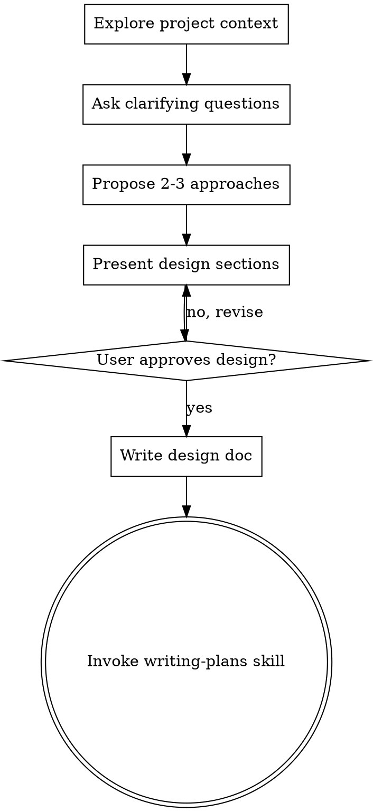
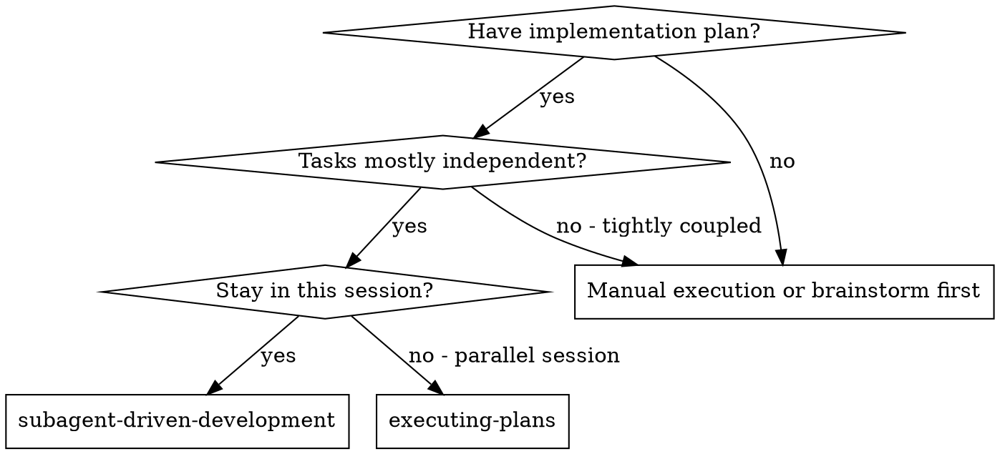
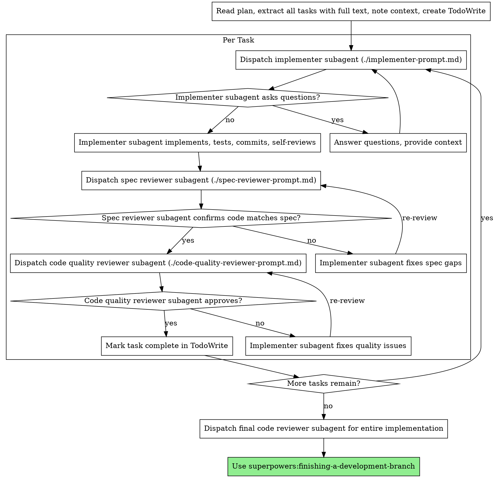

> TOOL

<command-message>pr</command-message>
<command-name>/pr</command-name>
<command-args>review</command-args>

> SYSTEM

Base directory for this skill: /Users/ta93abe/.claude/skills/pr

# pr

Pull Requestの作成・レビュー対応を行うスキル。

## サブコマンド

### /pr create (デフォルト)

PRを作成する。

**動作:**
1. `git status` で現在のブランチと変更を確認
2. `git log main..HEAD` でコミット履歴を確認
3. `git diff main...HEAD` で全体の変更を確認
4. 変更内容を分析してPRの説明文を生成
5. `gh pr create` でPRを作成

**PR形式:**
```markdown
## Summary
<変更の概要を箇条書き>

## Test plan
<テスト方法のチェックリスト>

Generated with [Claude Code](https://claude.com/claude-code)
```

### /pr review

PRのレビューコメントに対応し、問題なければマージまで行う。

**動作:**
1. `gh pr view` でPR情報を取得
2. `gh api` でレビューコメントを取得
3. 各コメントの指摘内容を分析
4. 必要な修正を実施
5. 修正をコミット・プッシュ
6. CIの状態を確認
7. 重大な問題がなければ `gh pr merge` でマージ

**マージ判断基準:**
- 重大な問題（セキュリティ、破壊的変更）がない
- CIが通っている
- 軽微な指摘は対応済み、または次回対応として許容できる

**マージ方法:**
- デフォルトは squash merge (`--squash`)
- マージ後にブランチを削除 (`--delete-branch`)

### /pr status

現在のPRの状態を確認する。

**動作:**
1. `gh pr status` でPR一覧を表示
2. CIの状態を確認
3. レビューの状態を確認

## 注意事項

- PRを作成する前にリモートにプッシュされていることを確認
- ベースブランチ（通常はmain）との差分を確認
- CIが通っていることを確認してからマージ依頼


ARGUMENTS: review

> AGENT

PR #3 は正常にマージされました。

---

## 完了サマリー

**PR:** [#3 ci: establish release cycle with CI and tag-based releases](https://github.com/ta93abe/dbt-jobs/pull/3) → **MERGED**

### レビューコメントへの対応

| 指摘 | 対応 |
|------|------|
| `dbt-job` → `dbt-jobs` (design doc) | 前コミットで対応済み |
| `actions/checkout@v4` → `@v6` | ci.yml, release.yml を修正 |
| `yaml-lint` バージョン固定 | `@1.7.0` に固定（Copilot提案の `1.10.0` は存在しないため正しい最新版を使用） |
| lint対象に `.github/workflows/*.yml` 追記 | design doc を修正 |
| `docs/` フォルダ削除 | ユーザーリクエストに従い削除 |

### 重大な問題
なし。すべてBotレビュアーからの軽微な指摘（バージョン一貫性・ドキュメント整合性）でした。

`★ Insight ─────────────────────────────────────`
- Copilot の `yaml-lint@1.10.0` 提案は存在しないバージョン。Bot提案は必ず `npm view` で検証するのが安全
- `gh pr merge --squash` はGitHub側でマージ成功しても、ローカルの fast-forward 更新が失敗する場合がある（ローカルmainが古い場合）。マージ自体は問題なし
`─────────────────────────────────────────────────`

> DEVELOPER

git checkout main && git pull

> AGENT

完了です。ローカルmainがリモートと一致しました。

```
b96bf58 ci: establish release cycle with CI and tag-based releases (#3)
```

> DEVELOPER

マージされたときにリリースノートを作りたい。

> SYSTEM

Base directory for this skill: /Users/ta93abe/.claude/plugins/cache/claude-plugins-official/superpowers/4.3.0/skills/brainstorming

# Brainstorming Ideas Into Designs

## Overview

Help turn ideas into fully formed designs and specs through natural collaborative dialogue.

Start by understanding the current project context, then ask questions one at a time to refine the idea. Once you understand what you're building, present the design and get user approval.

<HARD-GATE>
Do NOT invoke any implementation skill, write any code, scaffold any project, or take any implementation action until you have presented a design and the user has approved it. This applies to EVERY project regardless of perceived simplicity.
</HARD-GATE>

## Anti-Pattern: "This Is Too Simple To Need A Design"

Every project goes through this process. A todo list, a single-function utility, a config change — all of them. "Simple" projects are where unexamined assumptions cause the most wasted work. The design can be short (a few sentences for truly simple projects), but you MUST present it and get approval.

## Checklist

You MUST create a task for each of these items and complete them in order:

1. **Explore project context** — check files, docs, recent commits
2. **Ask clarifying questions** — one at a time, understand purpose/constraints/success criteria
3. **Propose 2-3 approaches** — with trade-offs and your recommendation
4. **Present design** — in sections scaled to their complexity, get user approval after each section
5. **Write design doc** — save to `docs/plans/YYYY-MM-DD-<topic>-design.md` and commit
6. **Transition to implementation** — invoke writing-plans skill to create implementation plan

## Process Flow



**The terminal state is invoking writing-plans.** Do NOT invoke frontend-design, mcp-builder, or any other implementation skill. The ONLY skill you invoke after brainstorming is writing-plans.

## The Process

**Understanding the idea:**
- Check out the current project state first (files, docs, recent commits)
- Ask questions one at a time to refine the idea
- Prefer multiple choice questions when possible, but open-ended is fine too
- Only one question per message - if a topic needs more exploration, break it into multiple questions
- Focus on understanding: purpose, constraints, success criteria

**Exploring approaches:**
- Propose 2-3 different approaches with trade-offs
- Present options conversationally with your recommendation and reasoning
- Lead with your recommended option and explain why

**Presenting the design:**
- Once you believe you understand what you're building, present the design
- Scale each section to its complexity: a few sentences if straightforward, up to 200-300 words if nuanced
- Ask after each section whether it looks right so far
- Cover: architecture, components, data flow, error handling, testing
- Be ready to go back and clarify if something doesn't make sense

## After the Design

**Documentation:**
- Write the validated design to `docs/plans/YYYY-MM-DD-<topic>-design.md`
- Use elements-of-style:writing-clearly-and-concisely skill if available
- Commit the design document to git

**Implementation:**
- Invoke the writing-plans skill to create a detailed implementation plan
- Do NOT invoke any other skill. writing-plans is the next step.

## Key Principles

- **One question at a time** - Don't overwhelm with multiple questions
- **Multiple choice preferred** - Easier to answer than open-ended when possible
- **YAGNI ruthlessly** - Remove unnecessary features from all designs
- **Explore alternatives** - Always propose 2-3 approaches before settling
- **Incremental validation** - Present design, get approval before moving on
- **Be flexible** - Go back and clarify when something doesn't make sense

> SYSTEM

Base directory for this skill: /Users/ta93abe/.claude/plugins/cache/claude-plugins-official/superpowers/4.3.0/skills/writing-plans

# Writing Plans

## Overview

Write comprehensive implementation plans assuming the engineer has zero context for our codebase and questionable taste. Document everything they need to know: which files to touch for each task, code, testing, docs they might need to check, how to test it. Give them the whole plan as bite-sized tasks. DRY. YAGNI. TDD. Frequent commits.

Assume they are a skilled developer, but know almost nothing about our toolset or problem domain. Assume they don't know good test design very well.

**Announce at start:** "I'm using the writing-plans skill to create the implementation plan."

**Context:** This should be run in a dedicated worktree (created by brainstorming skill).

**Save plans to:** `docs/plans/YYYY-MM-DD-<feature-name>.md`

## Bite-Sized Task Granularity

**Each step is one action (2-5 minutes):**
- "Write the failing test" - step
- "Run it to make sure it fails" - step
- "Implement the minimal code to make the test pass" - step
- "Run the tests and make sure they pass" - step
- "Commit" - step

## Plan Document Header

**Every plan MUST start with this header:**

```markdown
# [Feature Name] Implementation Plan

> **For Claude:** REQUIRED SUB-SKILL: Use superpowers:executing-plans to implement this plan task-by-task.

**Goal:** [One sentence describing what this builds]

**Architecture:** [2-3 sentences about approach]

**Tech Stack:** [Key technologies/libraries]

---
```

## Task Structure

````markdown
### Task N: [Component Name]

**Files:**
- Create: `exact/path/to/file.py`
- Modify: `exact/path/to/existing.py:123-145`
- Test: `tests/exact/path/to/test.py`

**Step 1: Write the failing test**

```python
def test_specific_behavior():
    result = function(input)
    assert result == expected
```

**Step 2: Run test to verify it fails**

Run: `pytest tests/path/test.py::test_name -v`
Expected: FAIL with "function not defined"

**Step 3: Write minimal implementation**

```python
def function(input):
    return expected
```

**Step 4: Run test to verify it passes**

Run: `pytest tests/path/test.py::test_name -v`
Expected: PASS

**Step 5: Commit**

```bash
git add tests/path/test.py src/path/file.py
git commit -m "feat: add specific feature"
```
````

## Remember
- Exact file paths always
- Complete code in plan (not "add validation")
- Exact commands with expected output
- Reference relevant skills with @ syntax
- DRY, YAGNI, TDD, frequent commits

## Execution Handoff

After saving the plan, offer execution choice:

**"Plan complete and saved to `docs/plans/<filename>.md`. Two execution options:**

**1. Subagent-Driven (this session)** - I dispatch fresh subagent per task, review between tasks, fast iteration

**2. Parallel Session (separate)** - Open new session with executing-plans, batch execution with checkpoints

**Which approach?"**

**If Subagent-Driven chosen:**
- **REQUIRED SUB-SKILL:** Use superpowers:subagent-driven-development
- Stay in this session
- Fresh subagent per task + code review

**If Parallel Session chosen:**
- Guide them to open new session in worktree
- **REQUIRED SUB-SKILL:** New session uses superpowers:executing-plans

> SYSTEM

Base directory for this skill: /Users/ta93abe/.claude/plugins/cache/claude-plugins-official/superpowers/4.3.0/skills/subagent-driven-development

# Subagent-Driven Development

Execute plan by dispatching fresh subagent per task, with two-stage review after each: spec compliance review first, then code quality review.

**Core principle:** Fresh subagent per task + two-stage review (spec then quality) = high quality, fast iteration

## When to Use



**vs. Executing Plans (parallel session):**
- Same session (no context switch)
- Fresh subagent per task (no context pollution)
- Two-stage review after each task: spec compliance first, then code quality
- Faster iteration (no human-in-loop between tasks)

## The Process



## Prompt Templates

- `./implementer-prompt.md` - Dispatch implementer subagent
- `./spec-reviewer-prompt.md` - Dispatch spec compliance reviewer subagent
- `./code-quality-reviewer-prompt.md` - Dispatch code quality reviewer subagent

## Example Workflow

```
You: I'm using Subagent-Driven Development to execute this plan.

[Read plan file once: docs/plans/feature-plan.md]
[Extract all 5 tasks with full text and context]
[Create TodoWrite with all tasks]

Task 1: Hook installation script

[Get Task 1 text and context (already extracted)]
[Dispatch implementation subagent with full task text + context]

Implementer: "Before I begin - should the hook be installed at user or system level?"

You: "User level (~/.config/superpowers/hooks/)"

Implementer: "Got it. Implementing now..."
[Later] Implementer:
  - Implemented install-hook command
  - Added tests, 5/5 passing
  - Self-review: Found I missed --force flag, added it
  - Committed

[Dispatch spec compliance reviewer]
Spec reviewer: ✅ Spec compliant - all requirements met, nothing extra

[Get git SHAs, dispatch code quality reviewer]
Code reviewer: Strengths: Good test coverage, clean. Issues: None. Approved.

[Mark Task 1 complete]

Task 2: Recovery modes

[Get Task 2 text and context (already extracted)]
[Dispatch implementation subagent with full task text + context]

Implementer: [No questions, proceeds]
Implementer:
  - Added verify/repair modes
  - 8/8 tests passing
  - Self-review: All good
  - Committed

[Dispatch spec compliance reviewer]
Spec reviewer: ❌ Issues:
  - Missing: Progress reporting (spec says "report every 100 items")
  - Extra: Added --json flag (not requested)

[Implementer fixes issues]
Implementer: Removed --json flag, added progress reporting

[Spec reviewer reviews again]
Spec reviewer: ✅ Spec compliant now

[Dispatch code quality reviewer]
Code reviewer: Strengths: Solid. Issues (Important): Magic number (100)

[Implementer fixes]
Implementer: Extracted PROGRESS_INTERVAL constant

[Code reviewer reviews again]
Code reviewer: ✅ Approved

[Mark Task 2 complete]

...

[After all tasks]
[Dispatch final code-reviewer]
Final reviewer: All requirements met, ready to merge

Done!
```

## Advantages

**vs. Manual execution:**
- Subagents follow TDD naturally
- Fresh context per task (no confusion)
- Parallel-safe (subagents don't interfere)
- Subagent can ask questions (before AND during work)

**vs. Executing Plans:**
- Same session (no handoff)
- Continuous progress (no waiting)
- Review checkpoints automatic

**Efficiency gains:**
- No file reading overhead (controller provides full text)
- Controller curates exactly what context is needed
- Subagent gets complete information upfront
- Questions surfaced before work begins (not after)

**Quality gates:**
- Self-review catches issues before handoff
- Two-stage review: spec compliance, then code quality
- Review loops ensure fixes actually work
- Spec compliance prevents over/under-building
- Code quality ensures implementation is well-built

**Cost:**
- More subagent invocations (implementer + 2 reviewers per task)
- Controller does more prep work (extracting all tasks upfront)
- Review loops add iterations
- But catches issues early (cheaper than debugging later)

## Red Flags

**Never:**
- Start implementation on main/master branch without explicit user consent
- Skip reviews (spec compliance OR code quality)
- Proceed with unfixed issues
- Dispatch multiple implementation subagents in parallel (conflicts)
- Make subagent read plan file (provide full text instead)
- Skip scene-setting context (subagent needs to understand where task fits)
- Ignore subagent questions (answer before letting them proceed)
- Accept "close enough" on spec compliance (spec reviewer found issues = not done)
- Skip review loops (reviewer found issues = implementer fixes = review again)
- Let implementer self-review replace actual review (both are needed)
- **Start code quality review before spec compliance is ✅** (wrong order)
- Move to next task while either review has open issues

**If subagent asks questions:**
- Answer clearly and completely
- Provide additional context if needed
- Don't rush them into implementation

**If reviewer finds issues:**
- Implementer (same subagent) fixes them
- Reviewer reviews again
- Repeat until approved
- Don't skip the re-review

**If subagent fails task:**
- Dispatch fix subagent with specific instructions
- Don't try to fix manually (context pollution)

## Integration

**Required workflow skills:**
- **superpowers:using-git-worktrees** - REQUIRED: Set up isolated workspace before starting
- **superpowers:writing-plans** - Creates the plan this skill executes
- **superpowers:requesting-code-review** - Code review template for reviewer subagents
- **superpowers:finishing-a-development-branch** - Complete development after all tasks

**Subagents should use:**
- **superpowers:test-driven-development** - Subagents follow TDD for each task

**Alternative workflow:**
- **superpowers:executing-plans** - Use for parallel session instead of same-session execution

> AGENT

---

## 完了サマリー

全4タスク完了しました。

| Task | 状態 |
|------|------|
| 1. GitHub にリリースラベル作成 | `patch` `minor` `major` 作成済み |
| 2. release.yml をauto-release に置換 | mainプッシュトリガー、PR ラベル読み取り、concurrency付き |
| 3. PRスキルにラベル付与追加 | `/pr create` にステップ6追加 |
| 4. 検証 + PR作成 | **PR #4**: https://github.com/ta93abe/dbt-jobs/pull/4 |

**次のステップ:** PR #4がマージされると、Releaseワークフローが発火し `v0.2.0` が自動作成されるはずです。

> DEVELOPER

リリースノートも作成される？

> AGENT

はい、作成されます。ワークフローの `release.yml:78` で：

```yaml
gh release create "$NEXT_TAG" --generate-notes
```

`--generate-notes` フラグにより、GitHub が前回リリース以降のPRタイトルやコミットメッセージから**リリースノートを自動生成**します。

`★ Insight ─────────────────────────────────────`
- `--generate-notes` はGitHub側の機能で、マージされたPR一覧・コントリビューター・変更リンクを自動でまとめてくれる
- `.github/release.yml` (リリースノート設定ファイル) を追加すればカテゴリ分け（Features / Bug Fixes 等）のカスタマイズも可能
`─────────────────────────────────────────────────`

現時点では GitHub デフォルトの形式で生成されます。カスタマイズしたい場合はお知らせください。

> TOOL

<command-message>pr</command-message>
<command-name>/pr</command-name>
<command-args>review</command-args>

> SYSTEM

Base directory for this skill: /Users/ta93abe/.claude/skills/pr

# pr

Pull Requestの作成・レビュー対応を行うスキル。

## サブコマンド

### /pr create (デフォルト)

PRを作成する。

**動作:**
1. `git status` で現在のブランチと変更を確認
2. `git log main..HEAD` でコミット履歴を確認
3. `git diff main...HEAD` で全体の変更を確認
4. 変更内容を分析してPRの説明文を生成
5. `gh pr create` でPRを作成
6. 変更の種類を確認し、リリースラベル（`patch`/`minor`/`major`）を付与

**リリースラベル判断基準:**
- `patch`: バグ修正、ドキュメント更新、リファクタリング、CI修正
- `minor`: 新機能追加、既存機能の拡張
- `major`: 破壊的変更（後方互換性のない変更）

デフォルトは `patch`。判断に迷った場合はユーザーに確認する。

**PR形式:**
```markdown
## Summary
<変更の概要を箇条書き>

## Test plan
<テスト方法のチェックリスト>

Generated with [Claude Code](https://claude.com/claude-code)
```

### /pr review

PRのレビューコメントに対応し、問題なければマージまで行う。

**動作:**
1. `gh pr view` でPR情報を取得
2. `gh api` でレビューコメントを取得
3. 各コメントの指摘内容を分析
4. 必要な修正を実施
5. 修正をコミット・プッシュ
6. CIの状態を確認
7. 重大な問題がなければ `gh pr merge` でマージ

**マージ判断基準:**
- 重大な問題（セキュリティ、破壊的変更）がない
- CIが通っている
- 軽微な指摘は対応済み、または次回対応として許容できる

**マージ方法:**
- デフォルトは squash merge (`--squash`)
- マージ後にブランチを削除 (`--delete-branch`)

### /pr status

現在のPRの状態を確認する。

**動作:**
1. `gh pr status` でPR一覧を表示
2. CIの状態を確認
3. レビューの状態を確認

## 注意事項

- PRを作成する前にリモートにプッシュされていることを確認
- ベースブランチ（通常はmain）との差分を確認
- CIが通っていることを確認してからマージ依頼


ARGUMENTS: review

> AGENT

自動リリース完全に動作しています!

---

## 結果

**`v0.1.1` が自動作成されました** (`patch` ラベル → `v0.1.0` + patch = `v0.1.1`)

リリースノートには GitHub の `--generate-notes` により以下が自動記載されています:
- PR #3, #4, #5 の変更内容
- コントリビューター情報
- Full Changelog リンク

https://github.com/ta93abe/dbt-jobs/releases/tag/v0.1.1

`★ Insight ─────────────────────────────────────`
- `gh api releases/latest` は初回リリース前に404を返す。APIレスポンスは必ずフォーマット検証すべき
- 初回リリースでは `git tag` フォールバック（`v0.1.0`）が正しく機能し、patch バンプで `v0.1.1` になった
`─────────────────────────────────────────────────`
