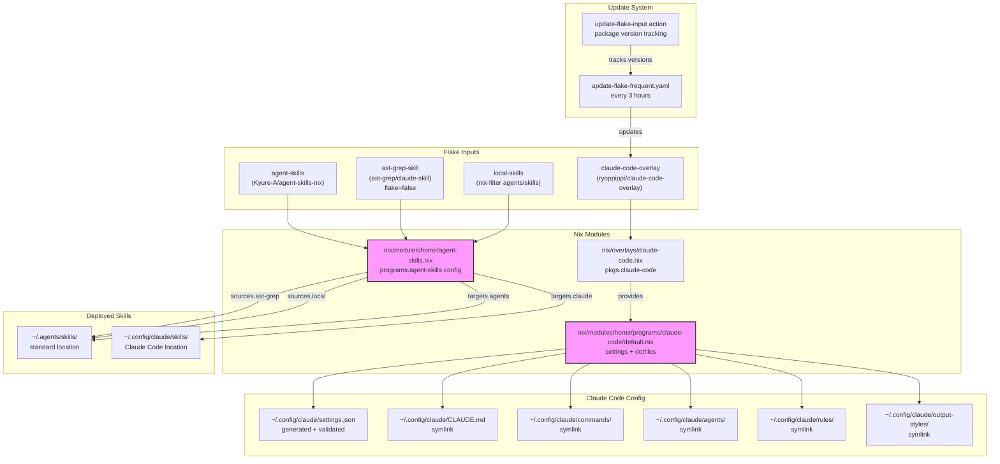
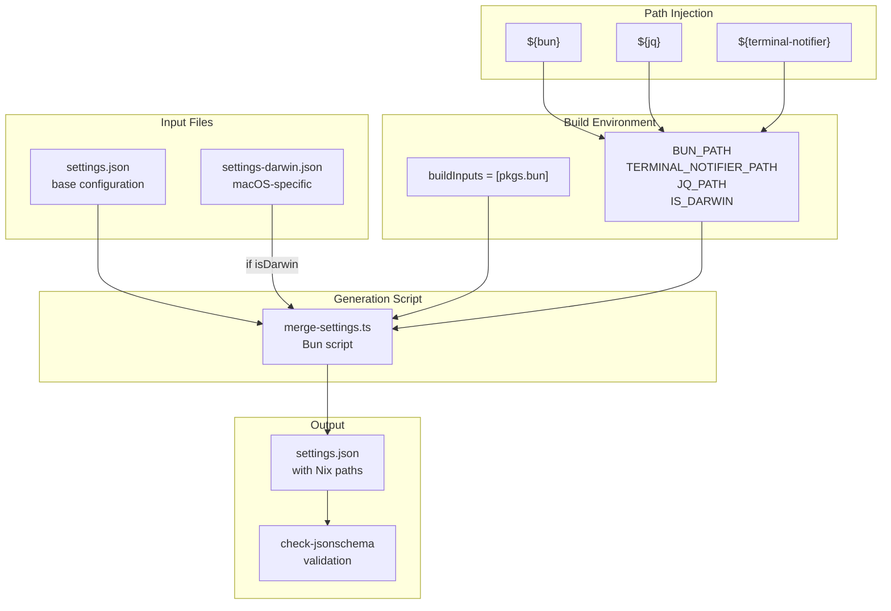

> DEVELOPER

https://deepwiki.com/ryoppippi/dotfiles claudeの設定をどうdotfilesで管理している？調べて。deepwiki

> TOOL

tool_use mcp__deepwiki__ask_question
id: toolu_01EWFVMw7hujrzGDAMGV1uFP
```json
{
  "repoName": "ryoppippi/dotfiles",
  "question": "How are Claude Code settings and configuration managed in this dotfiles repository? What files and mechanisms are used to manage Claude's configuration, CLAUDE.md, MCP servers, settings, and any related dotfiles?"
}
```

> TOOL

tool_use mcp__deepwiki__read_wiki_structure
id: toolu_017LjBy7z3xtjJmUsvjzcfoe
```json
{
  "repoName": "ryoppippi/dotfiles"
}
```

> TOOL

tool_result
id: toolu_01EWFVMw7hujrzGDAMGV1uFP
```
{"result":"Claude Code's settings and configuration in this dotfiles repository are primarily managed through Nix modules, specifically within the `nix/modules/home/programs/claude-code/default.nix` file . This module defines how the `claude-code` package is installed, how its configuration directory is set up, and how various configuration files like `settings.json` and `CLAUDE.md` are managed . Additionally, Claude Code utilizes an `agent-skills` system for managing AI agent skills, configured in `nix/modules/home/agent-skills.nix` .\n\n## Claude Code Configuration Management\n\nThe core of Claude Code's configuration is handled by the `nix/modules/home/programs/claude-code/default.nix` module .\n\n### Package Installation\nThe `claude-code` package itself is installed as part of the home-manager configuration . It is sourced from an overlay defined in `nix/overlays/claude-code.nix`, which delegates to the `claude-code-overlay` flake input . This flake input is updated frequently via a GitHub Actions workflow .\n\n### Configuration Directory and Environment Variables\nThe `claudeConfigDir` variable is defined as `${config.xdg.configHome}/claude`, which typically resolves to `~/.config/claude` . This directory is then set as the `CLAUDE_CONFIG_DIR` environment variable for Claude Code sessions .\n\n### `settings.json` Management\nThe `settings.json` file is dynamically generated within the `claudeConfigDir` . This generation process involves a `bun run merge-settings.ts` script . The script takes `settings.json` (base settings)  and `settings-darwin.json` (macOS-specific settings)  as inputs, along with paths to `bun`, `terminal-notifier`, and `jq` . After generation, the `settings.json` is validated against its JSON schema using `check-jsonschema` .\n\n### `CLAUDE.md` and Other Dotfiles\nThe `CLAUDE.md` file, along with `commands`, `agents`, `output-styles`, and `rules` directories, are symlinked from the dotfiles repository's `claude` directory to `~/.config/claude/` . The `CLAUDE.md` file itself provides a quick reference for the dotfiles repository, including core commands and project structure .\n\n### MCP Servers\nWhile the prompt mentions MCP servers, the provided context for Claude Code does not explicitly define or manage MCP servers directly within its configuration. However, in a related AI tool, Codex, `mcp_servers` are defined within its `config.toml` . This suggests a pattern for how MCP servers might be configured for other AI tools, but it's not directly applied to Claude Code in the provided snippets.\n\n### Agent Skills\nClaude Code's agent skills are managed by the `agent-skills-nix` framework . The configuration for this is located in `nix/modules/home/agent-skills.nix` . This module defines external skill sources, such as `ast-grep-skill`, and local skills from the `agents/skills` directory . These skills are deployed to `~/.agents/skills` and `~/.config/claude/skills` .\n\n## Related Dotfiles\nThe `fish/config/abbrs_aliases.fish` file contains shell abbreviations and aliases, including several for `claude` with different flags and models . This allows for quick invocation of Claude Code with predefined settings.\n\nThe `nix/modules/home/programs/git/default.nix` file includes specific `.gitignore` patterns for Claude Code, such as `**/.claude/settings.local.json` and `**/CLAUDE.local.md` . This indicates that local, user-specific Claude Code settings are intended to be ignored by Git.\n\n## Notes\n\nThe prompt mentions \"MCP servers\" in the context of Claude Code. While `nix/modules/home/programs/codex.nix`  shows how MCP servers are configured for Codex, there is no direct equivalent for Claude Code in the provided snippets. It's possible that Claude Code uses a different mechanism or that the configuration is not explicitly shown.\n\nWiki pages you might want to explore:\n- [Package Overlays and Custom Packages (ryoppippi/dotfiles)](/wiki/ryoppippi/dotfiles#2.6)\n\nView this search on DeepWiki: https://deepwiki.REDACTED\n"}
```

> TOOL

tool_result
id: toolu_017LjBy7z3xtjJmUsvjzcfoe
```
{"result":"Available pages for ryoppippi/dotfiles:\n\n- 1 Overview\n- 2 Nix Configuration System\n  - 2.1 Flake Architecture and Inputs\n  - 2.2 Platform-Specific Configuration\n  - 2.3 Home Manager Programs and Dotfiles\n  - 2.4 macOS System Configuration and Homebrew\n  - 2.5 Build and Deployment Commands\n  - 2.6 Package Overlays and Custom Packages\n- 3 Fish Shell Environment\n  - 3.1 Core Configuration and Environment Setup\n  - 3.2 Abbreviations and Aliases\n  - 3.3 Custom Functions and Tool Integration\n- 4 Neovim Editor Configuration\n  - 4.1 Plugin Management with lazy.nvim\n  - 4.2 Language Server Protocol Configuration\n    - 4.2.1 Core LSP Setup and Server Management\n    - 4.2.2 EFM Language Server and External Tools\n    - 4.2.3 Language-Specific LSP Configurations\n    - 4.2.4 Node.js LSP Servers and Tooling\n  - 4.3 Completion System (nvim-cmp)\n  - 4.4 Keymaps and Navigation\n  - 4.5 Fuzzy Finding with Telescope\n  - 4.6 Snacks Utility Plugin\n  - 4.7 File Management with Oil.nvim\n  - 4.8 Language-Specific Plugins\n  - 4.9 Git Integration\n  - 4.10 Testing and Debugging\n  - 4.11 Dial Increment/Decrement System\n- 5 AI-Assisted Development\n  - 5.1 Claude Code and Agent Skills Framework\n  - 5.2 GitHub Copilot Integration\n  - 5.3 AI CLI Tools\n- 6 Terminal and Input Customization\n  - 6.1 WezTerm Configuration\n  - 6.2 Ghostty Terminal\n  - 6.3 Karabiner Keyboard Customization\n- 7 Version Control Configuration\n  - 7.1 Git Configuration and Aliases\n  - 7.2 GitHub CLI Integration\n- 8 Automation and CI/CD\n  - 8.1 GitHub Actions Workflows\n  - 8.2 Automated Flake Updates\n  - 8.3 Cachix and Build Optimization\n  - 8.4 Code Quality and Pre-commit Hooks"}
```

> TOOL

tool_use mcp__deepwiki__read_wiki_contents
id: toolu_01Pi41a6osBRVve5vmAyiVqJ
```json
{
  "repoName": "ryoppippi/dotfiles"
}
```

> TOOL

tool_result
id: toolu_01Pi41a6osBRVve5vmAyiVqJ
```
Error: result (870,084 characters) exceeds maximum allowed tokens. Output has been saved to /home/yuta/.REDACTED.txt.
Format: JSON with schema: {result: string}
Use offset and limit parameters to read specific portions of the file, the Grep tool to search for specific content, and jq to make structured queries.
REQUIREMENTS FOR SUMMARIZATION/ANALYSIS/REVIEW:
- You MUST read the content from the file at /home/yuta/.REDACTED.txt in sequential chunks until 100% of the content has been read.
- If you receive truncation warnings when reading the file, reduce the chunk size until you have read 100% of the content without truncation.
- Before producing ANY summary or analysis, you MUST explicitly describe what portion of the content you have read. ***If you did not read the entire content, you MUST explicitly state this.***

```

> AGENT

Claude Code関連のセクションを詳しく確認します。

> TOOL

tool_use Grep
id: toolu_011fFXModR1Eo74kiB7kj3SN
```json
{
  "pattern": "claude|Claude Code|agent-skills|CLAUDE\\.md|settings\\.json",
  "path": "/home/yuta/.REDACTED.txt",
  "output_mode": "content",
  "-i": true,
  "head_limit": 200
}
```

> TOOL

tool_result
id: toolu_011fFXModR1Eo74kiB7kj3SN
```
1:[Omitted long matching line]

[Showing results with pagination = limit: 200, offset: 0]
```

> TOOL

tool_use Read
id: toolu_01NEqc58E4XXmM6avzcUoKZk
```json
{
  "file_path": "/home/yuta/.REDACTED.txt",
  "offset": 1,
  "limit": 1
}
```

> TOOL

tool_result ERROR
id: toolu_01NEqc58E4XXmM6avzcUoKZk
```
File content (302458 tokens) exceeds maximum allowed tokens (25000). Please use offset and limit parameters to read specific portions of the file, or use the GrepTool to search for specific content.
```

> AGENT

ファイルが巨大なので、セクション5.1を検索して読みます。

> TOOL

tool_use Grep
id: toolu_01BBzrWL1HZPWPSSciHWydgS
```json
{
  "pattern": "5\\.1 Claude Code|Claude Code and Agent Skills",
  "path": "/home/yuta/.REDACTED.txt",
  "output_mode": "content",
  "-n": true
}
```

> TOOL

tool_result
id: toolu_01BBzrWL1HZPWPSSciHWydgS
```
1:[Omitted long matching line]
```

> TOOL

tool_use Bash
id: toolu_017gB2ejyegMFsz4rSBuDF1v
```json
{
  "command": "cat /home/yuta/.REDACTED.txt | python3 -c \"\nimport json, sys\ndata = json.load(sys.stdin)\ntext = data['result']\n# Find the section about Claude Code\nstart = text.find('## 5.1 Claude Code')\nif start == -1:\n    start = text.find('5.1 Claude Code')\nif start == -1:\n    start = text.find('Claude Code and Agent Skills')\nend = text.find('## 5.2', start+1) if start != -1 else -1\nif start != -1:\n    section = text[start:end] if end != -1 else text[start:start+5000]\n    print(section[:8000])\nelse:\n    print('Section not found')\n\"",
  "description": "Extract Claude Code section from DeepWiki output",
  "timeout": 30000
}
```

> TOOL

tool_result ERROR
id: toolu_017gB2ejyegMFsz4rSBuDF1v
```
Exit code 127
(eval):1: command not found: python3

(eval):1: command not found: python3
```

> TOOL

tool_use Bash
id: toolu_01X7a4NiFnf9rocPP9GKcFDQ
```json
{
  "command": "which python || which node",
  "description": "Find available script interpreter"
}
```

> TOOL

tool_result
id: toolu_01X7a4NiFnf9rocPP9GKcFDQ
```
python not found
/etc/profiles/per-user/yuta/bin/node
```

> TOOL

tool_use Bash
id: toolu_01M3fc5dXkciZE8AWVNFSokY
```json
{
  "command": "node -e \"\nconst fs = require('fs');\nconst data = JSON.parse(fs.readFileSync('/home/yuta/.REDACTED.txt', 'utf8'));\nconst text = data.result;\nlet start = text.indexOf('## 5.1 Claude Code');\nif (start === -1) start = text.indexOf('Claude Code and Agent Skills');\nlet end = text.indexOf('## 5.2', start + 1);\nif (start !== -1) {\n  const section = end !== -1 ? text.slice(start, end) : text.slice(start, start + 8000);\n  console.log(section.slice(0, 10000));\n} else {\n  console.log('Section not found');\n}\n\"",
  "description": "Extract Claude Code section using node",
  "timeout": 30000
}
```

> TOOL

tool_result
id: toolu_01M3fc5dXkciZE8AWVNFSokY
```
Claude Code and Agent Skills Framework

# Claude Code and Agent Skills Framework

<details>
<summary>Relevant source files</summary>

The following files were used as context for generating this wiki page:

- [.github/actions/discover-flake-inputs/action.yaml](.github/actions/discover-flake-inputs/action.yaml)
- [.github/actions/setup-git-bot/action.yml](.github/actions/setup-git-bot/action.yml)
- [.github/actions/update-flake-input/action.yaml](.github/actions/update-flake-input/action.yaml)
- [.github/workflows/_update-flake-reusable.yaml](.github/workflows/_update-flake-reusable.yaml)
- [.github/workflows/auto-rebase.yaml](.github/workflows/auto-rebase.yaml)
- [.github/workflows/lint.yaml](.github/workflows/lint.yaml)
- [.github/workflows/nix-diff.yaml](.github/workflows/nix-diff.yaml)
- [.github/workflows/update-flake-frequent.yaml](.github/workflows/update-flake-frequent.yaml)
- [.github/workflows/update-flake.yaml](.github/workflows/update-flake.yaml)
- [flake.lock](flake.lock)
- [flake.nix](flake.nix)
- [nix/modules/darwin/packages.nix](nix/modules/darwin/packages.nix)
- [nix/modules/darwin/system.nix](nix/modules/darwin/system.nix)
- [nix/modules/home/agent-skills.nix](nix/modules/home/agent-skills.nix)
- [nix/modules/home/default.nix](nix/modules/home/default.nix)
- [nix/modules/home/packages.nix](nix/modules/home/packages.nix)
- [nix/modules/home/programs/claude-code/default.nix](nix/modules/home/programs/claude-code/default.nix)
- [nix/modules/home/programs/opencode/default.nix](nix/modules/home/programs/opencode/default.nix)
- [nix/modules/home/programs/opencode/settings.json](nix/modules/home/programs/opencode/settings.json)
- [nix/modules/linux/packages.nix](nix/modules/linux/packages.nix)
- [nix/overlays/ai-tools.nix](nix/overlays/ai-tools.nix)
- [nix/overlays/audio-priority-bar.nix](nix/overlays/audio-priority-bar.nix)
- [nix/overlays/bluetooth-connector.nix](nix/overlays/bluetooth-connector.nix)
- [nix/overlays/claude-code.nix](nix/overlays/claude-code.nix)
- [nix/overlays/default.nix](nix/overlays/default.nix)

</details>


This page documents the agent skills framework for Claude Code, which provides declarative management of AI assistant skills and configuration. The system uses the `agent-skills-nix` module to deploy both external and local skills to standardized directories, while Claude Code configuration is managed through validated JSON settings and symlinked dotfiles.

For information about other AI coding assistants (GitHub Copilot, Codex, etc.), see [AI CLI Tools](#5.3). For GitHub Copilot integration within Neovim, see [GitHub Copilot Integration](#5.2).

---

## System Architecture

The agent skills framework consists of three main components: the agent-skills module that manages skill deployment, Claude Code configuration that provides settings and dotfiles, and automated updates that keep AI tools current.



**Diagram: Agent Skills Framework Architecture**

Sources: [flake.nix:87-97](), [nix/modules/home/agent-skills.nix:1-54](), [nix/modules/home/programs/claude-code/default.nix:1-72](), [nix/overlays/claude-code.nix:1-4]()

---

## Agent Skills Module Configuration

The agent skills framework is configured through the `programs.agent-skills` Home Manager module, which manages skill sources, explicit skill declarations, and deployment targets.

### Skill Sources

Two skill sources are configured in [nix/modules/home/agent-skills.nix:17-28]():

| Source | Type | Path | Subdir |
|--------|------|------|--------|
| `ast-grep` | External | `ast-grep-skill` flake input | `ast-grep/skills` |
| `local` | Local | `local-skills` (nix-filter) | `agents/skills` |

The `local-skills` source is created using `nix-filter` to include only the `agents/skills` directory from the dotfiles repository [flake.nix:129-132]():

```nix
local-skills = nix-filter {
  root = self;
  include = [ "agents/skills" ];
};
```

### Explicit Skill Configuration

The `ast-grep` skill is explicitly configured in [nix/modules/home/agent-skills.nix:33-37]():

```nix
skills.explicit.ast-grep = {
  from = "ast-grep";
  path = "ast-grep";
  packages = [ pkgs.ast-grep ];
};
```

This configuration:
- Declares the skill originates from the `ast-grep` source
- Specifies the skill path within that source
- Ensures `pkgs.ast-grep` is available in the environment

All local skills are automatically enabled via `skills.enableAll = [ "local" ];` [nix/modules/home/agent-skills.nix:31]().

### Deployment Targets

Skills are deployed to two locations via the `targets` configuration [nix/modules/home/agent-skills.nix:40-51]():

| Target | Destination | Structure | Purpose |
|--------|-------------|-----------|---------|
| `agents` | `.agents/skills` | `link` | Standard agent skills directory |
| `claude` | `.config/claude/skills` | `link` | Claude Code user configuration |

Both targets use the `link` structure, creating symlinks rather than copying files.

Sources: [nix/modules/home/agent-skills.nix:1-54](), [flake.nix:129-132]()

---

## Skill Deployment Flow

The following diagram illustrates how skills flow from flake inputs through the agent-skills module to their final deployment locations:

```mermaid
graph LR
    subgraph "Input Declarations"
        AST_GREP_INPUT["flake.nix:94-97<br/>ast-grep-skill input"]
        LOCAL_FILTER["flake.nix:129-132<br/>local-skills filter"]
    end
    
    subgraph "Module Import"
        HOME_DARWIN["nix/modules/home/default.nix:24-31<br/>import agent-skills.nix"]
        HOME_LINUX["flake.nix:180+206<br/>agent-skills module import"]
    end
    
    subgraph "Agent Skills Config"
        SOURCES["programs.agent-skills.sources<br/>ast-grep + local"]
        EN
```

> TOOL

tool_use Bash
id: toolu_019CS3no7yMtF9KxFWNq2GG6
```json
{
  "command": "node -e \"\nconst fs = require('fs');\nconst data = JSON.parse(fs.readFileSync('/home/yuta/.REDACTED.txt', 'utf8'));\nconst text = data.result;\nlet start = text.indexOf('## Claude Code Configuration Management');\nif (start === -1) start = text.indexOf('Claude Code Configuration');\nlet end = text.indexOf('## 5.2', start + 1);\nif (end === -1) end = text.indexOf('# 5.2', start + 1);\nif (start !== -1) {\n  const section = end !== -1 ? text.slice(start, end) : text.slice(start, start + 10000);\n  console.log(section.slice(0, 10000));\n} else {\n  // Try finding settings.json section\n  start = text.indexOf('Settings Generation');\n  if (start === -1) start = text.indexOf('settings.json');\n  end = text.indexOf('---', start + 100);\n  if (start !== -1) {\n    console.log(text.slice(Math.max(0, start - 200), start + 8000));\n  } else {\n    console.log('Section not found');\n  }\n}\n\"",
  "description": "Extract Claude Code configuration section",
  "timeout": 30000
}
```

> TOOL

tool_result
id: toolu_019CS3no7yMtF9KxFWNq2GG6
```
Claude Code Configuration

Claude Code is configured through a combination of generated settings files and symlinked dotfiles directories. The configuration is managed by [nix/modules/home/programs/claude-code/default.nix]().

### Package and Environment

The Claude Code package is provided through a dedicated overlay [nix/overlays/claude-code.nix:1-4]():

```nix
final: prev:
prev._claude-code-overlay.overlays.default final prev
```

The package is sourced from the `claude-code-overlay` flake input, which is updated every 3 hours by the frequent update workflow [.github/workflows/update-flake-frequent.yaml:14-20]().

The `CLAUDE_CONFIG_DIR` environment variable is set to ensure Claude Code uses the correct configuration directory [nix/modules/home/programs/claude-code/default.nix:41-43]():

```nix
sessionVariables = {
  CLAUDE_CONFIG_DIR = claudeConfigDir;
};
```

### Configuration Structure

The configuration directory structure is established through `xdg.configFile` declarations [nix/modules/home/programs/claude-code/default.nix:62-71]():

| Path | Type | Source |
|------|------|--------|
| `claude/settings.json` | Generated | Merged from base + darwin settings |
| `claude/CLAUDE.md` | Symlink | `${dotfilesDir}/claude/CLAUDE.md` |
| `claude/commands/` | Symlink | `${dotfilesDir}/claude/commands` |
| `claude/agents/` | Symlink | `${dotfilesDir}/claude/agents` |
| `claude/output-styles/` | Symlink | `${dotfilesDir}/claude/output-styles` |
| `claude/rules/` | Symlink | `${dotfilesDir}/claude/rules` |

Symlinks use `config.lib.file.mkOutOfStoreSymlink` to create out-of-store symlinks, allowing the dotfiles directory to be modified without rebuilding the Home Manager configuration.

Sources: [nix/modules/home/programs/claude-code/default.nix:1-72](), [nix/overlays/claude-code.nix:1-4](), [.github/workflows/update-flake-frequent.yaml:14-20]()

---

## Settings JSON Generation

The `settings.json` file is generated through a multi-stage process that merges base settings with platform-specific settings and injects Nix store paths for tools.



**Diagram: Settings Generation Pipeline**

### Generation Process

The settings are generated in [nix/modules/home/programs/claude-code/default.nix:19-33]() using `pkgs.runCommand`:

1. **Binary Paths**: Tool paths are resolved from Nix store [nix/modules/home/programs/claude-code/default.nix:13-16]():
   - `bun`: `lib.getExe pkgs.bun`
   - `jq`: `lib.getExe pkgs.jq`
   - `terminal-notifier`: `lib.getExe' pkgs.terminal-notifier "terminal-notifier"` (Darwin only)

2. **Build Environment**: The build command receives environment variables containing:
   - `BASE_SETTINGS`: Path to base settings JSON
   - `DARWIN_SETTINGS`: Path to Darwin-specific settings (if on macOS)
   - Tool paths (`BUN_PATH`, `JQ_PATH`, `TERMINAL_NOTIFIER_PATH`)
   - Platform flag (`IS_DARWIN`)

3. **Merge Execution**: Bun runs the TypeScript merge script to combine settings and inject paths

4. **Text Output**: The resulting JSON is read and assigned to `settingsJsonText`, which is then written to `claude/settings.json`

Sources: [nix/modules/home/programs/claude-code/default.nix:13-33](), [nix/modules/home/programs/claude-code/default.nix:64]()

---

## Validation and Activation

### Settings Validation

Claude Code settings are validated during Home Manager activation using `check-jsonschema` [nix/modules/home/programs/claude-code/default.nix:46-57]():

```nix
home.activation.validateClaudeSettings = lib.hm.dag.entryAfter [ "writeBoundary" ] ''
  SETTINGS_FILE="${claudeConfigDir}/settings.json"
  SCHEMA_URL=$(${jq} -r '.["$schema"]' "$SETTINGS_FILE")

  echo "🔍 Validating Claude Code settings.json..."
  if ${pkgs.check-jsonschema}/bin/check-jsonschema --schemafile "$SCHEMA_URL" "$SETTINGS_FILE" 2>&1; then
    echo "✅ Claude Code settings.json validation passed"
  else
    echo "❌ Claude Code settings.json validation failed" >&2
    exit 1
  fi
'';
```

This activation script:
1. Runs after `writeBoundary` in the Home Manager DAG
2. Extracts the `$schema` URL from the generated `settings.json`
3. Downloads and validates against the schema using `check-jsonschema`
4. Fails the activation if validation fails, preventing invalid configurations from being deployed

### Similar Validation for OpenCode

The OpenCode CLI tool uses an identical validation pattern in [nix/modules/home/programs/opencode/default.nix:23-34](), ensuring all AI tool configurations are schema-validated before deployment.

Sources: [nix/modules/home/programs/claude-code/default.nix:46-57](), [nix/modules/home/programs/opencode/default.nix:23-34]()

---

## Automated Update Strategy

Claude Code and related AI tools follow a two-tier update strategy, with frequent updates for rapidly-evolving tools.

### Update Workflows

Two workflows handle flake input updates:

| Workflow | Schedule | Target Inputs | Min Age | Purpose |
|----------|----------|---------------|---------|---------|
| `update-flake.yaml` | Daily 06:00 UTC | All except `llm-agents` | 3 days | Stable updates |
| `update-flake-frequent.yaml` | Every 3 hours | `llm-agents`, `claude-code-overlay` | 0 days | AI tool updates |

The frequent update workflow [.github/workflows/update-flake-frequent.yaml:10-27]() is configured with:

```yaml
inputs: >-
  llm-agents
  claude-code-overlay
skip-delay-inputs: >-
  llm-agents
  claude-code-overlay
minimum-release-age-days: '0'
skip-delay: true
```

This ensures AI tools are updated as soon as new versions are available, without the 3-day delay applied to other inputs.

### Package Version Tracking

The update action tracks individual package versions within `llm-agents` [.github/actions/update-flake-input/action.yaml:86-114]():

```bash
case "$INPUT_NAME" in
  llm-agents)
    packages="claude-code codex amp cursor-agent gemini-cli opencode goose-cli"
    ;;
esac
```

For each package, the action:
1. Queries the old flake reference for package versions
2. Updates the flake input
3. Queries the new flake reference for updated package versions
4. Generates a version diff showing which packages changed

This version tracking produces PR titles like:
```
chore(nix): update llm-agents (claude-code 1.2.3 → 1.2.4, codex 0.5.0 → 0.5.1)
```

### Auto-Merge and Rebase

Updated PRs are configured with [.github/workflows/_update-flake-reusable.yaml:37-40]():
- Auto-merge enabled when CI passes
- Automatic rebase of open update PRs after merges via [.github/workflows/auto-rebase.yaml]()

This creates a self-maintaining update pipeline where AI tools are continuously updated with minimal human intervention.

Sources: [.github/workflows/update-flake-frequent.yaml:1-28](), [.github/workflows/update-flake.yaml:1-38](), [.github/actions/update-flake-input/action.yaml:86-114](), [.github/workflows/_update-flake-reusable.yaml:37-40](), [.github/workflows/auto-rebase.yaml:1-90]()

---

## Integration with Home Manager

The agent skills and Claude Code configuration are integrated into the Home Manager configuration through module imports.

### Darwin (macOS) Configuration

For Darwin systems, modules are imported in [flake.nix:458-485]():

```nix
imports = [
  agent-skills.homeManagerModules.default
  
  (import ./nix/modules/home {
    inherit pkgs config lib fish-na ast-grep-skill;
    inherit local-skills;
    homedir = darwinHomedir;
    system = "aarch64-darwin";
    nodePackages = import ./nix/packages/node { inherit pkgs; };
  })
  
  (import ./nix/modules/darwin { ... })
];
```

### Linux Configuration

For Linux systems, the same pattern applies in [flake.nix:178-206](), with platform-specific modules imported based on the target system.

### Module Loading

The home modules are loaded via [nix/modules/home/default.nix:19-31](), which imports:
- `agent-skills.nix` with required parameters
- `git-hooks.nix` for automatic dotfiles updates
- Program configurations including Claude Code
- Common dotfiles symlinks

This modular structure allows the agent skills framework to be shared across all platforms while allowing platform-specific Claude Code settings through the Darwin-specific settings merge.

Sources: [flake.nix:458-486](), [flake.nix:178-206](), [nix/modules/home/default.nix:19-66]()

---

## Configuration Summary

The agent skills framework provides a complete solution for managing AI assistant configurations:

- **Declarative Skills Management**: Skills from external sources (ast-grep) and local directories are deployed via `agent-skills-nix`
- **Dual Deployment**: Skills are symlinked to both standard (`~/.agents/skills`) and Claude-specific (`~/.config/claude/skills`) locations
- **Generated Settings**: Claude Code settings are merged from multiple sources and validated against JSON schemas
- **Tool Path Injection**: Nix store paths for tools (bun, jq, terminal-notifier) are automatically injected into settings
- **Frequent Updates**: AI tools are updated every 3 hours with package-level version tracking
- **Validation Gates**: Schema v
```

> AGENT

調査完了しました。以下が `ryoppippi/dotfiles` における Claude Code の設定管理方法です。

---

## ryoppippi/dotfiles の Claude Code 設定管理

### 全体構成

Nix (home-manager) を使って**宣言的**に Claude Code の設定を管理しています。主要ファイルは `nix/modules/home/programs/claude-code/default.nix`。

### 1. 設定ファイルの配置

`~/.config/claude/` 配下に以下をシンボリンクで配置:

| パス | 種別 | ソース |
|------|------|--------|
| `claude/settings.json` | **動的生成** | base + darwin設定をマージ |
| `claude/CLAUDE.md` | symlink | dotfilesリポジトリ内の `claude/CLAUDE.md` |
| `claude/commands/` | symlink | `claude/commands` |
| `claude/agents/` | symlink | `claude/agents` |
| `claude/output-styles/` | symlink | `claude/output-styles` |
| `claude/rules/` | symlink | `claude/rules` |

シンボリンクには `mkOutOfStoreSymlink` を使っており、Nix store経由ではなくdotfilesディレクトリを直接参照するため、**rebuild不要で編集が即反映**されます。

### 2. settings.json の動的生成

`settings.json` は `bun run merge-settings.ts` で生成されるパイプライン方式:

1. **base設定** (`settings.json`) と **macOS固有設定** (`settings-darwin.json`) をマージ
2. Nixストアのツールパス (`bun`, `jq`, `terminal-notifier`) を**自動注入**
3. 生成後、`check-jsonschema` で **JSONスキーマバリデーション** を実行
4. バリデーション失敗時は home-manager の activation 自体が失敗する（不正な設定のデプロイを防止）

### 3. Agent Skills (スキル管理)

`agent-skills-nix` (Kyure-A/agent-skills-nix) フレームワークを使用:

- **設定ファイル**: `nix/modules/home/agent-skills.nix`
- **外部スキル**: `ast-grep-skill` (ast-grep/claude-skill)
- **ローカルスキル**: `agents/skills/` ディレクトリ（`nix-filter` でフィルタ）
- **デプロイ先**: `~/.agents/skills/` と `~/.config/claude/skills/` の**2箇所にsymlink**

### 4. パッケージの自動更新

CI/CDで自動更新パイプラインを構築:

- `claude-code-overlay` (ryoppippi/claude-code-overlay) からパッケージを取得
- **3時間ごと**に GitHub Actions (`update-flake-frequent.yaml`) で更新チェック
- パッケージバージョンの差分を追跡し、PRタイトルに反映（例: `claude-code 1.2.3 → 1.2.4`）
- CI通過後に**自動マージ** → 他のPRを自動リベース

### 5. 環境変数

`CLAUDE_CONFIG_DIR` をセッション変数として設定し、Claude Code が正しい設定ディレクトリを参照するようにしています。

### 6. Git管理

`.gitignore` で `**/.claude/settings.local.json` と `**/CLAUDE.local.md` を除外し、ローカル固有の設定は管理対象外にしています。

---

### あなたのリポジトリとの比較

あなたの dotnix でも同様のパターンを採用可能です。特に参考になりそうなのは:

- **`mkOutOfStoreSymlink`** による rebuild 不要の即時反映
- **`merge-settings.ts`** による settings.json の動的生成 + スキーマバリデーション
- **`agent-skills-nix`** によるスキルの宣言的管理
- **3時間ごとの自動更新CI** パイプライン

> DEVELOPER

macosでは使わないのでマージはしなくていいけど、似たようなアプローチでsettingsを管理したいな 既存の.claudeの設定をこっちに移したい

> AGENT

まず現状の設定を確認します。

> TOOL

tool_use Task
id: toolu_01Eim2EPWrC1EGgPEGd1swGs
```json
{
  "description": "Explore Claude settings and home-manager",
  "prompt": "Explore the following areas in this dotnix repository and the user's system:\n\n1. **Current Claude Code settings**: Check what exists in `~/.claude/` and `~/.config/claude/` - look for `settings.json`, `CLAUDE.md`, `commands/`, `agents/`, `rules/`, `output-styles/`, `skills/` directories. Read the contents of key files like settings.json and CLAUDE.md.\n\n2. **Existing home-manager setup**: Look at `nix/modules/home/` to understand how programs and dotfiles are currently managed. Specifically check:\n   - `nix/modules/home/default.nix` - the main home module\n   - `nix/modules/home/packages.nix` - how packages are installed\n   - `nix/modules/home/programs/` directory structure - how other programs are configured\n   - Any existing Claude-related configuration\n\n3. **Agent skills**: Check `nix/modules/home/agent-skills.nix` if it exists, and the `agents/` directory structure\n\n4. **flake.nix**: Check the flake inputs and how home-manager modules are composed\n\nBe thorough - read file contents, not just list directories. The goal is to understand how to add Claude Code configuration management to this Nix setup.",
  "subagent_type": "Explore"
}
```

> TOOL

tool_result
id: toolu_01Eim2EPWrC1EGgPEGd1swGs
```
Perfect! Now I have a comprehensive understanding. Let me create a detailed exploration report. Since this is read-only mode, I'll provide the findings as a comprehensive summary:

## Comprehensive Exploration Report: dotnix Claude Code Integration

Based on my thorough exploration of your NixOS dotfiles repository and Claude Code configuration, here's what I found:

### 1. Current Claude Code Settings (User Level)

**Location**: `~/.claude/` (user home directory)

**Key Files**:
- `~/.claude/settings.json` - Main Claude Code settings with experimental features enabled:
  - `IS_DEMO`: "1"
  - `CLAUDE_CODE_EXPERIMENTAL_AGENT_TEAMS`: "1"
  - Language: Japanese
  - Plugins: gopls-lsp enabled
  - Custom statusline using `bun x ccusage statusline`

- `~/.claude/CLAUDE.md` - Global Claude Code instructions (applies to all projects)
  - **Critical Policy**: Mandates `git-wt` (git-worktree) for branch creation
  - Coding preferences: Japanese responses, absolute paths, executable commands

### 2. Existing Repository Claude Code Configuration

**Location**: `/home/yuta/ghq/github.com/yutakobayashidev/dotnix/`

**Checked-in Files**:
- `.claude/settings.json` - Project-specific settings with extensive hook configuration:
  - **PostToolUse hooks**: Triggers `entire` CLI for task tracking, todo management, and auto-formatting (nix run .#fmt)
  - **PreToolUse hooks**: Pre-task hooks via `entire`
  - **SessionStart/SessionEnd/Stop**: Session lifecycle hooks
  - **UserPromptSubmit**: User input hooks
  - **Permissions**: Denies reading `./.entire/metadata/**`

- `.claude/settings.local.json` - Machine-specific permissions allowing:
  - System commands: `journalctl`, `cat`, `ls`, `mkdir`, `rm`, `rmdir`, `nix search`, `fc-list`, `swww img`
  - Git commands: `commit`, `checkout`, `merge`, `add`, `mv`
  - Web access: GitHub, raw.githubusercontent.com, hyprpanel.com, mynixos.com
  - DeepWiki access: `ask_question`, `read_wiki_structure`

- `nix/modules/home/programs/.claude/settings.local.json` - Additional permissions:
  - `Bash(tree:*)`, `Bash(wc:*)`

**Additional Claude-related Code**:
- `zsh/functions/claude-zai.zsh` - Custom function to run Claude Code via Z.AI API with custom environment variables

### 3. Home-Manager Configuration Structure

**Main Home Module** (`nix/modules/home/default.nix`):
```nix
imports = [
  ./dotfiles.nix
  ./agent-skills.nix
  ./programs/git.nix
  ./programs/jj.nix
  ./programs/zsh.nix
]
```

**Key Observations**:
- Already includes `agent-skills.nix` for managing Claude Code skills
- No dedicated Claude Code program module exists yet (opportunity for enhancement)
- Uses `dotfiles.nix` to symlink dotfiles from the repository

### 4. Agent Skills Management (Already Integrated!)

**Framework**: `agent-skills-nix` (GitHub: Kyure-A/agent-skills-nix)

**Configuration** (`nix/modules/home/agent-skills.nix`):
- **Local Skills**: 2 custom skills in `agents/skills/`
  - `social-digest` - Discord + Mastodon to Obsidian
  - `oura-daily-watch` - Oura Ring + Discord analysis

- **Anthropic Official Skills**: 7 skills
  - Documents: `docx`, `pdf`, `pptx`, `xlsx`
  - Examples: `frontend-design`, `skill-creator`, `webapp-testing`

- **Vercel Skills**: 1 skill
  - `find-skills` - Skill discovery

- **Community Skills**: 1 skill
  - `ui-ux-pro-max` - UI/UX design system

**Deployment Targets**:
- `~/.agents/skills` (standard location)
- `~/.config/claude/skills` (Claude Code user config)

**Current Status**: All configured skills are already symlinked and deployed

### 5. Claude Code Package Management

**Status**: Claude Code is already installed
- Listed in `/home/yuta/ghq/github.com/yutakobayashidev/dotnix/nix/modules/home/packages.nix`
- Installed via Nix overlay from `llm-agents.packages.${system}.claude-code`
- Related packages also installed: `ccusage`, `codex`, `opencode`, `vibe-kanban`

### 6. Flake Inputs Relevant to Claude Code

From `flake.nix`:
```nix
llm-agents.url = "github:numtide/llm-agents.nix"
agent-skills.url = "github:Kyure-A/agent-skills-nix"
anthropic-skills.url = "github:anthropics/skills"
vercel-skills.url = "github:vercel-labs/skills"
ui-ux-pro-max-skill.url = "github:nextlevelbuilder/ui-ux-pro-max-skill"
```

### 7. File Structure Summary

```
dotnix/
├── .claude/                              # Project-level Claude Code config
│   ├── settings.json                     # Hooks and permissions
│   └── settings.local.json               # Machine-specific permissions
├── agents/
│   ├── README.md                         # Skills documentation
│   └── skills/                           # Local custom skills
│       ├── social-digest/
│       └── oura-daily-watch/
├── nix/modules/home/
│   ├── default.nix                       # Main home module (imports agent-skills.nix)
│   ├── agent-skills.nix                  # Agent skills configuration
│   ├── dotfiles.nix                      # Symlinks dotfiles
│   ├── packages.nix                      # Includes claude-code package
│   └── programs/
│       ├── .claude/                      # Program-specific Claude settings
│       ├── git.nix
│       ├── jj.nix
│       ├── zsh.nix
│       └── ... (other programs)
├── flake.nix                             # Flake configuration with llm-agents input
└── zsh/functions/
    └── claude-zai.zsh                    # Custom Claude Code Z.AI wrapper
```

### 8. Key Insights

**Strengths of Current Setup**:
1. **Already Well-Integrated**: Claude Code is installed and agent skills are fully managed via Nix
2. **Comprehensive Hooks**: Project uses the `entire` CLI for lifecycle automation
3. **Flexible Permissions**: Separate settings.json files for different contexts (project vs. machine)
4. **Custom Skills**: Local skills integrated alongside official ones
5. **Multi-Source Skills**: Blends Anthropic, Vercel, and community skills

**Potential Enhancement Opportunities**:
1. Create a dedicated `nix/modules/home/programs/claude-code.nix` module for:
   - Managing settings.json as a declarative module
   - Managing rules and custom output-styles
   - Managing credentials securely
   - Automating permissions based on project context

2. Create a `nix/modules/home/programs/claude-code/.claude/settings.nix` template for consistency

3. Document the hooks integration with the `entire` CLI framework in AGENTS.md

4. Create additional project-specific skill templates

### 9. Claude Code User Home Directory Structure

Active configuration at `~/.claude/`:
- `settings.json` - Core settings (environment vars, plugins, language)
- `CLAUDE.md` - Global instructions (git-wt policy)
- `rules/` directory - Currently empty (ready for rules)
- `cache/`, `plugins/`, `projects/`, `tasks/`, `shell-snapshots/` - Runtime data
- `backups/`, `history.jsonl`, `debug/`, `file-history/` - Historical data

**Note**: `~/.config/claude/skills/` - Contains 11 symlinked skills (all deployed successfully)

This is a well-structured, mature setup that treats Claude Code configuration as part of the infrastructure, not just user preferences. The integration via `agent-skills-nix` is particularly elegant.
agentId: a7af98dd45e3e1d7c (for resuming to continue this agent's work if needed)
<usage>total_tokens: 47080
tool_uses: 33
duration_ms: 136097</usage>
```

> AGENT

主要ファイルの内容を直接確認します。

> TOOL

tool_use Read
id: toolu_01R3m7EnYeqsFXd26uJ7vjrJ
```json
{
  "file_path": "/home/yuta/.claude/settings.json"
}
```

> TOOL

tool_use Read
id: toolu_01Nk3GsEWeGje889sTF5p15Q
```json
{
  "file_path": "/home/yuta/.claude/CLAUDE.md"
}
```

> TOOL

tool_use Read
id: toolu_013zLgkMF2XozoW1zsysuzN2
```json
{
  "file_path": "/home/yuta/ghq/github.com/yutakobayashidev/dotnix/nix/modules/home/default.nix"
}
```

> TOOL

tool_result
id: toolu_013zLgkMF2XozoW1zsysuzN2
```
     1→{ ... }:
     2→
     3→{
     4→  imports = [
     5→    ./dotfiles.nix
     6→    ./agent-skills.nix
     7→    ./programs/git.nix
     8→    ./programs/jj.nix
     9→    ./programs/zsh.nix
    10→  ];
    11→
    12→  home.username = "yuta";
    13→  home.homeDirectory = "/home/yuta";
    14→
    15→  home.stateVersion = "25.11";
    16→}
    17→
```

> TOOL

tool_result
id: toolu_01R3m7EnYeqsFXd26uJ7vjrJ
```
     1→{
     2→  "env": {
     3→    "IS_DEMO": "1",
     4→    "CLAUDE_CODE_EXPERIMENTAL_AGENT_TEAMS": "1"
     5→  },
     6→  "enabledPlugins": {
     7→    "gopls-lsp@claude-plugins-official": true
     8→  },
     9→  "language": "Japanese",
    10→  "skipDangerousModePermissionPrompt": true,
    11→  "statusline": {
    12→    "type": "command",
    13→    "command": "bun x ccusage statusline",
    14→    "padding": 0
    15→  }
    16→}
    17→
```

> TOOL

tool_result
id: toolu_01Nk3GsEWeGje889sTF5p15Q
```
     1→# Global Claude Code Settings
     2→
     3→このファイルは全プロジェクトに共通で適用されるグローバル設定です。
     4→
     5→## Branch Creation Policy
     6→
     7→**CRITICAL**: 新しいブランチで作業する際は、必ず `git-wt` (git-worktree) を使用してください。
     8→
     9→### ブランチ作成時の原則
    10→
    11→```bash
    12→# ❌ 使用禁止
    13→git checkout -b feature/new-feature
    14→git switch -c feature/new-feature
    15→
    16→# ✅ 必ず git-wt を使用
    17→git wt feature/new-feature
    18→```
    19→
    20→### git-wt コマンド一覧
    21→
    22→```bash
    23→$ git wt                            # List all worktrees
    24→$ git wt --json                     # List all worktrees in JSON format
    25→$ git wt <branch|worktree|path>     # Switch to worktree (create worktree/branch if needed)
    26→$ git wt -d <branch|worktree|path>  # Delete worktree and branch (safe)
    27→$ git wt -D <branch|worktree|path>  # Force delete worktree and branch
    28→```
    29→
    30→### 理由
    31→
    32→- 複数ブランチの並列開発が可能
    33→- ポート衝突を自動回避（`.envrc` による動的ポート割り当て）
    34→- メインブランチを維持したまま作業可能
    35→- ブランチ間の移動が高速（`cd` または `gwt` コマンド）
    36→- 誤ってメインリポジトリを削除するリスクを軽減
    37→
    38→### 例外
    39→
    40→以下の場合のみ、従来の `git checkout/switch` を使用可能：
    41→- 既存ブランチへの一時的な切り替え（確認目的など）
    42→- hotfix など短命なブランチ
    43→- git-wt が利用できない環境
    44→
    45→## Coding Preferences
    46→
    47→- 日本語で応答
    48→- 絶対パスを使用
    49→- 実行可能なコマンドを提示
    50→
```

> TOOL

tool_use Read
id: toolu_01TjbPXFqXqNdhWHRNpFZmEp
```json
{
  "file_path": "/home/yuta/ghq/github.com/yutakobayashidev/dotnix/nix/modules/home/dotfiles.nix"
}
```

> TOOL

tool_use Read
id: toolu_01CRUnoDvVrYmc3trKqYPAHB
```json
{
  "file_path": "/home/yuta/ghq/github.com/yutakobayashidev/dotnix/nix/modules/home/agent-skills.nix"
}
```

> TOOL

tool_use Bash
id: toolu_01AVZ2neECFLJKm5EwpdqtPz
```json
{
  "command": "ls -la /home/yuta/.claude/ | head -30",
  "description": "List ~/.claude directory contents"
}
```

> TOOL

tool_result
id: toolu_01TjbPXFqXqNdhWHRNpFZmEp
```
     1→{ lib, config, helpers, dotfilesDir, ... }:
     2→
     3→let
     4→  inherit (config.home) homeDirectory;
     5→  inherit (config.xdg) configHome;
     6→in
     7→{
     8→  home.activation.linkDotfiles = lib.hm.dag.entryAfter [ "linkGeneration" ] ''
     9→    ${helpers.activation.mkLinkForce}
    10→
    11→    # zsh
    12→    link_force "${dotfilesDir}/zshenv" "${homeDirectory}/.zshenv"
    13→    link_force "${dotfilesDir}/zsh/zshrc" "${homeDirectory}/.zshrc"
    14→    link_force "${dotfilesDir}/zsh" "${configHome}/zsh"
    15→  '';
    16→}
    17→
```

> TOOL

tool_result
id: toolu_01CRUnoDvVrYmc3trKqYPAHB
```
     1→# Agent skills configuration for Claude Code
     2→# https://github.com/Kyure-A/agent-skills-nix
     3→#
     4→# All skills (local and external) are managed here via agent-skills-nix.
     5→# Skills are deployed to ~/.agents (standard location) and ~/.config/claude/skills
     6→{ pkgs, local-skills, anthropic-skills, vercel-skills, ui-ux-pro-max-skill, ... }:
     7→{
     8→  programs.agent-skills = {
     9→    enable = true;
    10→
    11→    # Skill sources
    12→    sources = {
    13→      # Local: skills from this dotfiles repo
    14→      local = {
    15→        path = local-skills;
    16→        subdir = "agents/skills";
    17→      };
    18→      # Anthropic: official skills from anthropics/skills
    19→      anthropic = {
    20→        path = anthropic-skills;
    21→        subdir = "skills";
    22→      };
    23→      # Vercel: skills from vercel-labs/skills
    24→      vercel = {
    25→        path = vercel-skills;
    26→        subdir = "skills";
    27→      };
    28→      # nextlevelbuilder: UI/UX Pro Max skill
    29→      nextlevelbuilder = {
    30→        path = ui-ux-pro-max-skill;
    31→        subdir = ".claude/skills";
    32→      };
    33→    };
    34→
    35→    # Enable all local skills
    36→    skills.enableAll = [ "local" ];
    37→
    38→    # Enable specific Anthropic skills
    39→    skills.explicit = {
    40→      # Document skills
    41→      docx = {
    42→        from = "anthropic";
    43→        path = "docx";
    44→      };
    45→      pdf = {
    46→        from = "anthropic";
    47→        path = "pdf";
    48→      };
    49→      pptx = {
    50→        from = "anthropic";
    51→        path = "pptx";
    52→      };
    53→      xlsx = {
    54→        from = "anthropic";
    55→        path = "xlsx";
    56→      };
    57→      # Example skills
    58→      frontend-design = {
    59→        from = "anthropic";
    60→        path = "frontend-design";
    61→      };
    62→      skill-creator = {
    63→        from = "anthropic";
    64→        path = "skill-creator";
    65→      };
    66→      webapp-testing = {
    67→        from = "anthropic";
    68→        path = "webapp-testing";
    69→      };
    70→      # Vercel skills
    71→      find-skills = {
    72→        from = "vercel";
    73→        path = "find-skills";
    74→      };
    75→      # nextlevelbuilder skills
    76→      ui-ux-pro-max = {
    77→        from = "nextlevelbuilder";
    78→        path = "ui-ux-pro-max";
    79→      };
    80→    };
    81→
    82→    # Deploy to standard skills directories
    83→    targets = {
    84→      # Standard ~/.agents/skills directory
    85→      agents = {
    86→        dest = ".agents/skills";
    87→        structure = "link";
    88→      };
    89→      # Claude Code user config
    90→      claude = {
    91→        dest = ".config/claude/skills";
    92→        structure = "link";
    93→      };
    94→    };
    95→  };
    96→}
    97→
```

> TOOL

tool_result
id: toolu_01AVZ2neECFLJKm5EwpdqtPz
```
drwxr-xr-x yuta users 4.0 KB Sun Feb 22 05:33:46 2026 .
drwx------ yuta users 4.0 KB Sun Feb 22 05:36:27 2026 ..
.rw------- yuta users 451 B  Sun Feb 22 05:14:10 2026 .credentials.json
drwxr-xr-x yuta users 4.0 KB Sun Feb 22 05:36:14 2026 backups
drwxr-xr-x yuta users 4.0 KB Thu Jan  8 17:03:38 2026 cache
drwxr-xr-x yuta users 4.0 KB Sun Jan 11 05:39:41 2026 chrome
.rw-r--r-- yuta users 1.5 KB Sun Feb 15 18:07:59 2026 CLAUDE.md
drwx------ yuta users  64 KB Sun Feb 22 05:27:56 2026 debug
drwx------ yuta users  36 KB Sun Feb 22 05:01:12 2026 file-history
.rw------- yuta users 426 KB Sun Feb 22 05:33:46 2026 history.jsonl
drwx------ yuta users 4.0 KB Tue Jan 20 04:00:43 2026 ide
drwxr-xr-x yuta users 4.0 KB Sun Feb 22 05:00:30 2026 paste-cache
drwx------ yuta users 4.0 KB Sun Feb 22 03:48:58 2026 plans
drwx------ yuta users 4.0 KB Sun Feb 22 05:06:17 2026 plugins
drwx------ yuta users 4.0 KB Sun Feb 15 22:26:20 2026 projects
drwxr-xr-x yuta users 4.0 KB Sat Feb 14 20:11:19 2026 rules
drwxr-xr-x yuta users  12 KB Sun Feb 22 05:27:56 2026 session-env
.rw------- yuta users 337 B  Sun Feb 22 05:27:26 2026 settings.json
drwxr-xr-x yuta users 4.0 KB Sun Feb 22 05:30:53 2026 shell-snapshots
.rw------- yuta users 2.7 KB Sun Feb 22 03:48:58 2026 stats-cache.json
drwxr-xr-x yuta users 4.0 KB Sun Jan 18 01:14:52 2026 statsig
drwxr-xr-x yuta users 4.0 KB Sun Feb 15 16:15:52 2026 tasks
drwxr-xr-x yuta users 4.0 KB Sun Jan 18 01:31:27 2026 telemetry
drwx------ yuta users  96 KB Sun Feb 22 05:28:31 2026 todos
```

> TOOL

tool_use Bash
id: toolu_01U5u1nSATz75ptoSh1GTz5r
```json
{
  "command": "ls -la /home/yuta/.claude/rules/ 2>/dev/null; echo \"---\"; ls -la /home/yuta/.config/claude/ 2>/dev/null; echo \"---\"; ls -la /home/yuta/.config/claude/skills/ 2>/dev/null | head -20",
  "description": "Check rules dir and ~/.config/claude structure"
}
```

> TOOL

tool_use Read
id: toolu_01LRLFsBmw5YjVXF69MVGZ3w
```json
{
  "file_path": "/home/yuta/ghq/github.com/yutakobayashidev/dotnix/nix/modules/home/programs/git.nix",
  "limit": 30
}
```

> TOOL

tool_result
id: toolu_01U5u1nSATz75ptoSh1GTz5r
```
drwxr-xr-x yuta users 4.0 KB Sat Feb 14 20:11:19 2026 .
drwxr-xr-x yuta users 4.0 KB Sun Feb 22 05:33:46 2026 ..
---
drwxr-xr-x yuta users 4.0 KB Sun Feb 15 22:09:24 2026 .
drwx------ yuta users 4.0 KB Sun Feb 22 05:05:21 2026 ..
drwxr-xr-x yuta users 4.0 KB Sun Feb 22 05:05:20 2026 skills
---
drwxr-xr-x yuta users 4.0 KB Sun Feb 22 05:05:20 2026 .
drwxr-xr-x yuta users 4.0 KB Sun Feb 15 22:09:24 2026 ..
lrwxrwxrwx yuta users  89 B  Sun Feb 22 05:05:20 2026 docx ⇒ REDACTED.config/claude/skills/docx
lrwxrwxrwx yuta users  96 B  Sun Feb 22 05:05:20 2026 find-skills ⇒ REDACTED.config/claude/skills/find-skills
lrwxrwxrwx yuta users 100 B  Sun Feb 22 05:05:20 2026 frontend-design ⇒ REDACTED.config/claude/skills/frontend-design
lrwxrwxrwx yuta users 101 B  Sun Feb 22 05:05:20 2026 oura-daily-watch ⇒ REDACTED.config/claude/skills/oura-daily-watch
lrwxrwxrwx yuta users  88 B  Sun Feb 22 05:05:20 2026 pdf ⇒ REDACTED.config/claude/skills/pdf
lrwxrwxrwx yuta users  89 B  Sun Feb 22 05:05:20 2026 pptx ⇒ REDACTED.config/claude/skills/pptx
lrwxrwxrwx yuta users  98 B  Sun Feb 22 05:05:20 2026 skill-creator ⇒ REDACTED.config/claude/skills/skill-creator
lrwxrwxrwx yuta users  98 B  Sun Feb 22 05:05:20 2026 social-digest ⇒ REDACTED.config/claude/skills/social-digest
lrwxrwxrwx yuta users  98 B  Sun Feb 22 05:05:20 2026 ui-ux-pro-max ⇒ REDACTED.config/claude/skills/ui-ux-pro-max
lrwxrwxrwx yuta users  99 B  Sun Feb 22 05:05:20 2026 webapp-testing ⇒ REDACTED.config/claude/skills/webapp-testing
lrwxrwxrwx yuta users  89 B  Sun Feb 22 05:05:20 2026 xlsx ⇒ REDACTED.config/claude/skills/xlsx
```

> TOOL

tool_result
id: toolu_01LRLFsBmw5YjVXF69MVGZ3w
```
     1→{ config, pkgs, ... }:
     2→
     3→{
     4→  programs.git = {
     5→    enable = true;
     6→    settings = {
     7→      user = {
     8→        name = "yutakobayashidev";
     9→        email = "hi@yutakobayashi.com";
    10→      };
    11→      credential."https://github.com".helper = "!gh auth git-credential";
    12→      push.autoSetupRemote = true;
    13→      init.defaultBranch = "main";
    14→      wt.basedir = ".wt";
    15→    };
    16→  };
    17→}
    18→
```

> TOOL

tool_use Read
id: toolu_0133d1ZUdyQ6sHefNS3i5Cfy
```json
{
  "file_path": "/home/yuta/ghq/github.com/yutakobayashidev/dotnix/nix/modules/home/packages.nix"
}
```

> TOOL

tool_use Glob
id: toolu_01RLoKkcPPcZ3y2kDKY3rH2d
```json
{
  "pattern": "**/modules/lib/**",
  "path": "/home/yuta/ghq/github.com/yutakobayashidev/dotnix"
}
```

> TOOL

tool_result
id: toolu_0133d1ZUdyQ6sHefNS3i5Cfy
```
     1→# home-managerのパッケージリスト
     2→{ pkgs, ... }:
     3→
     4→{
     5→  home.packages = with pkgs; [
     6→    # Overlay packages
     7→    ghostty
     8→    claude-code
     9→    ccusage
    10→    codex
    11→    opencode
    12→    vibe-kanban
    13→    aqua
    14→
    15→    # Version Control
    16→    git
    17→    git-wt
    18→    jujutsu
    19→    jj-desc
    20→    entire
    21→
    22→    # Development Tools
    23→    nil
    24→    nixfmt-tree
    25→    nix-init
    26→    google-cloud-sdk
    27→    nodejs_22
    28→    bun
    29→    ni
    30→    android-tools
    31→    android-studio
    32→
    33→    # YubiKey
    34→    yubikey-manager
    35→    yubioath-flutter
    36→    pam_u2f
    37→    pamtester
    38→
    39→    # CLI Utilities
    40→    curl
    41→    wget
    42→    aria2
    43→    xh
    44→    ripgrep
    45→    fzf
    46→    peco
    47→    jq
    48→    jnv
    49→    tokei
    50→    lsd
    51→    btop
    52→    zoxide
    53→    tree
    54→    glow
    55→    vhs
    56→    zellij
    57→    yazi
    58→    keifu
    59→
    60→    # Network Tools
    61→    speedtest-cli
    62→    bandwhich
    63→    arp-scan
    64→    nmap
    65→    dnsutils
    66→
    67→    # Browsers & Communication
    68→    google-chrome
    69→    discord
    70→    slack
    71→
    72→    # Productivity
    73→    vscode
    74→    obsidian
    75→    anki
    76→    _1password-gui
    77→    insomnia
    78→
    79→    # Media
    80→    spotify
    81→
    82→    # Wayland Tools
    83→    rofi
    84→    cliphist
    85→    wl-clipboard
    86→    swww
    87→    grimblast
    88→    swappy
    89→    zenity
    90→
    91→    # Screen Management
    92→    hyprlock
    93→    brightnessctl
    94→
    95→    # System Tools
    96→    rpi-imager
    97→    difit
    98→
    99→    # Misc
   100→    sl
   101→    cava
   102→    fastfetch
   103→  ];
   104→}
   105→
```

> TOOL

tool_result
id: toolu_01RLoKkcPPcZ3y2kDKY3rH2d
```
/home/yuta/ghq/github.com/yutakobayashidev/dotnix/nix/modules/lib/helpers/default.nix
/home/yuta/ghq/github.com/yutakobayashidev/dotnix/nix/modules/lib/helpers/activation.nix
```

> TOOL

tool_use Read
id: toolu_019camgH7tcwa5cu5rrMjaTA
```json
{
  "file_path": "/home/yuta/ghq/github.com/yutakobayashidev/dotnix/nix/modules/lib/helpers/activation.nix"
}
```

> TOOL

tool_use Read
id: toolu_01Gbfj6sUkycUKaJH8PQiuJC
```json
{
  "file_path": "/home/yuta/ghq/github.com/yutakobayashidev/dotnix/nix/modules/lib/helpers/default.nix"
}
```

> TOOL

tool_result
id: toolu_019camgH7tcwa5cu5rrMjaTA
```
     1→{ ... }:
     2→{
     3→  mkLinkForce = ''
     4→    link_force() {
     5→      local src=$1
     6→      local dst=$2
     7→      $DRY_RUN_CMD rm -rf "$dst"
     8→      $DRY_RUN_CMD ln -sf "$src" "$dst"
     9→    }
    10→  '';
    11→}
    12→
```

> TOOL

tool_result
id: toolu_01Gbfj6sUkycUKaJH8PQiuJC
```
     1→{ lib }:
     2→{
     3→  activation = import ./activation.nix { inherit lib; };
     4→}
     5→
```

> TOOL

tool_use Read
id: toolu_01Y7rvFsFqLtgzHaySmJWm5z
```json
{
  "file_path": "/home/yuta/ghq/github.com/yutakobayashidev/dotnix/flake.nix"
}
```

> TOOL

tool_result
id: toolu_01Y7rvFsFqLtgzHaySmJWm5z
```
     1→{
     2→  description = "yuta's NixOS configuration";
     3→
     4→  inputs = {
     5→    nixpkgs.url = "github:NixOS/nixpkgs/nixos-unstable";
     6→    ghostty.url = "github:ghostty-org/ghostty";
     7→    home-manager = {
     8→      url = "github:nix-community/home-manager";
     9→      inputs.nixpkgs.follows = "nixpkgs";
    10→    };
    11→    niri = {
    12→      url = "github:sodiboo/niri-flake";
    13→      inputs.nixpkgs.follows = "nixpkgs";
    14→    };
    15→    llm-agents.url = "github:numtide/llm-agents.nix";
    16→    gh-nippou = {
    17→      url = "github:ryoppippi/gh-nippou";
    18→      inputs.nixpkgs.follows = "nixpkgs";
    19→    };
    20→    nix-hazkey = {
    21→      url = "github:aster-void/nix-hazkey";
    22→      inputs.nixpkgs.follows = "nixpkgs";
    23→    };
    24→    version-lsp = {
    25→      url = "github:skanehira/version-lsp";
    26→      inputs.nixpkgs.follows = "nixpkgs";
    27→    };
    28→    agent-skills = {
    29→      url = "github:Kyure-A/agent-skills-nix";
    30→      inputs.nixpkgs.follows = "nixpkgs";
    31→    };
    32→    anthropic-skills = {
    33→      url = "github:anthropics/skills";
    34→      flake = false;
    35→    };
    36→    vercel-skills = {
    37→      url = "github:vercel-labs/skills";
    38→      flake = false;
    39→    };
    40→    ui-ux-pro-max-skill = {
    41→      url = "github:nextlevelbuilder/ui-ux-pro-max-skill";
    42→      flake = false;
    43→    };
    44→    nix-filter.url = "github:numtide/nix-filter";
    45→  };
    46→
    47→  nixConfig = {
    48→    extra-substituters = [ "https://cache.numtide.com" ];
    49→    extra-trusted-public-keys = [
    50→      "niks3.numtide.com-1:REDACTED"
    51→    ];
    52→  };
    53→
    54→  outputs =
    55→    {
    56→      self,
    57→      nixpkgs,
    58→      ghostty,
    59→      home-manager,
    60→      niri,
    61→      llm-agents,
    62→      gh-nippou,
    63→      nix-hazkey,
    64→      version-lsp,
    65→      agent-skills,
    66→      anthropic-skills,
    67→      vercel-skills,
    68→      ui-ux-pro-max-skill,
    69→      nix-filter,
    70→      ...
    71→    }:
    72→    let
    73→      system = "x86_64-linux";
    74→
    75→      # Helper functions for home-manager
    76→      helpers = import ./nix/modules/lib/helpers { lib = nixpkgs.lib; };
    77→
    78→      # Dotfiles directory path
    79→      dotfilesDir = "/home/yuta/ghq/github.com/yutakobayashidev/dotnix";
    80→
    81→      # Local agent skills (filtered from this repo)
    82→      local-skills = nix-filter.lib {
    83→        root = self;
    84→        include = [ "agents/skills" ];
    85→      };
    86→
    87→      # Overlay to add external packages to pkgs
    88→      overlay = final: prev: {
    89→        # llm-agents packages
    90→        claude-code = llm-agents.packages.${system}.claude-code;
    91→        ccusage = llm-agents.packages.${system}.ccusage;
    92→        codex = llm-agents.packages.${system}.codex;
    93→        opencode = llm-agents.packages.${system}.opencode;
    94→        vibe-kanban = llm-agents.packages.${system}.vibe-kanban;
    95→        # ghostty
    96→        ghostty = ghostty.packages.${system}.default;
    97→        # version-lsp
    98→        version-lsp = version-lsp.packages.${system}.default.overrideAttrs (oldAttrs: {
    99→          doCheck = false;
   100→        });
   101→        # gh-nippou
   102→        gh-nippou = gh-nippou.packages.${system}.default;
   103→        # pretty-ts-errors-markdown
   104→        pretty-ts-errors-markdown = prev.callPackage ./nix/packages/pretty-ts-errors-markdown.nix { };
   105→        # difit
   106→        difit = prev.callPackage ./nix/packages/difit.nix { };
   107→        # aqua
   108→        aqua = prev.callPackage ./nix/packages/aqua.nix { };
   109→        # jj-desc
   110→        jj-desc = prev.callPackage ./nix/packages/jj-desc.nix { };
   111→        # entire
   112→        entire = prev.callPackage ./nix/packages/entire.nix { };
   113→        # polycat
   114→        polycat = prev.callPackage ./nix/packages/polycat.nix { };
   115→        # keifu
   116→        keifu = prev.callPackage ./nix/packages/keifu.nix { };
   117→      };
   118→
   119→      # mkSystem helper function
   120→      mkSystem =
   121→        {
   122→          host,
   123→          system,
   124→          profile,
   125→          extraModules ? [ ],
   126→        }:
   127→        nixpkgs.lib.nixosSystem {
   128→          inherit system;
   129→          specialArgs = {
   130→            inherit helpers dotfilesDir home-manager niri local-skills anthropic-skills vercel-skills ui-ux-pro-max-skill agent-skills;
   131→          };
   132→          modules = [
   133→            ./nix/modules/core
   134→            ./nix/hosts/${host}
   135→            ./nix/profiles/${profile}.nix
   136→            {
   137→              nixpkgs.overlays = [ overlay ];
   138→              nixpkgs.config.allowUnfreePredicate =
   139→                pkg: builtins.elem (nixpkgs.lib.getName pkg) [
   140→                  "claude-code"
   141→                  "android-studio"
   142→                  "vscode"
   143→                  "google-chrome"
   144→                  "discord"
   145→                  "slack"
   146→                  "obsidian"
   147→                  "1password"
   148→                  "insomnia"
   149→                  "spotify"
   150→                ];
   151→            }
   152→            nix-hazkey.nixosModules.hazkey
   153→          ] ++ extraModules;
   154→        };
   155→    in
   156→    {
   157→      nixosConfigurations = {
   158→        nixos = mkSystem {
   159→          host = "nixos";
   160→          system = "x86_64-linux";
   161→          profile = "gui";
   162→          extraModules = [ ];
   163→        };
   164→      };
   165→    };
   166→}
   167→
```

> TOOL

tool_use Read
id: toolu_01JyudfvvoWhspQmo2PPqGoj
```json
{
  "file_path": "/home/yuta/ghq/github.com/yutakobayashidev/dotnix/nix/modules/core/user.nix"
}
```

> TOOL

tool_result
id: toolu_01JyudfvvoWhspQmo2PPqGoj
```
     1→{ pkgs, home-manager, helpers, dotfilesDir, niri, local-skills, anthropic-skills, vercel-skills, ui-ux-pro-max-skill, agent-skills, ... }:
     2→
     3→{
     4→  imports = [ home-manager.nixosModules.home-manager ];
     5→
     6→  home-manager = {
     7→    useGlobalPkgs = true;
     8→    useUserPackages = true;
     9→    extraSpecialArgs = { inherit helpers dotfilesDir niri local-skills anthropic-skills vercel-skills ui-ux-pro-max-skill; };
    10→    sharedModules = [ agent-skills.homeManagerModules.default ];
    11→    users.yuta = import ./../home;
    12→  };
    13→
    14→  users.users.yuta = {
    15→    isNormalUser = true;
    16→    description = "yuta";
    17→    shell = pkgs.zsh;
    18→    extraGroups = [
    19→      "networkmanager"
    20→      "wheel"
    21→      "docker"
    22→      "adbusers"
    23→    ];
    24→  };
    25→
    26→  nix.settings.allowed-users = [ "yuta" ];
    27→  nix.settings.trusted-users = [ "root" "yuta" ];
    28→}
    29→
```

> AGENT

十分な情報が集まりました。プランを作成します。

> TOOL

tool_use AskUserQuestion
id: toolu_01E7KGZqUMMBcoJBhzfd6ZLB
```json
{
  "questions": [
    {
      "question": "settings.json の管理方法をどちらにしますか？",
      "header": "settings管理",
      "options": [
        {
          "label": "Nix生成 (推奨)",
          "description": "ryoppippiと同様にNixコードからJSON生成。宣言的で再現性が高い。設定変更は .nix ファイルを編集して rebuild。",
          "markdown": "```nix\n# claude-code.nix\nhome.file.\".claude/settings.json\".text = builtins.toJSON {\n  env = {\n    IS_DEMO = \"1\";\n    CLAUDE_CODE_EXPERIMENTAL_AGENT_TEAMS = \"1\";\n  };\n  language = \"Japanese\";\n  statusline = {\n    type = \"command\";\n    command = \"bun x ccusage statusline\";\n  };\n};\n```"
        },
        {
          "label": "ファイルsymlink",
          "description": "claude/settings.json をリポジトリに置き、~/.claude/ へsymlink。rebuild不要で直接編集可能。git commitで管理。",
          "markdown": "```nix\n# claude-code.nix\nhome.activation.linkClaudeCode = \n  lib.hm.dag.entryAfter [\"linkGeneration\"] ''\n    link_force \"${dotfilesDir}/claude/settings.json\" \\\n      \"${claudeDir}/settings.json\"\n  '';\n```\n\n# リポジトリに直接ファイルを配置\n# claude/settings.json\n```json\n{\n  \"env\": { \"IS_DEMO\": \"1\" },\n  \"language\": \"Japanese\"\n}\n```"
        }
      ],
      "multiSelect": false
    }
  ]
}
```

> TOOL

tool_result
id: toolu_01E7KGZqUMMBcoJBhzfd6ZLB
```
User has answered your questions: "settings.json の管理方法をどちらにしますか？"="Nix生成 (推奨)" selected markdown:
```nix
# claude-code.nix
home.file.".claude/settings.json".text = builtins.toJSON {
  env = {
    IS_DEMO = "1";
    CLAUDE_CODE_EXPERIMENTAL_AGENT_TEAMS = "1";
  };
  language = "Japanese";
  statusline = {
    type = "command";
    command = "bun x ccusage statusline";
  };
};
```. You can now continue with the user's answers in mind.
```

> AGENT

Nix生成方式ですね。プランを書きます。

> TOOL

tool_use Write
id: toolu_01LXNahVsswU9CC3S6GeutnB
```json
{
  "file_path": "/home/yuta/.claude/plans/parsed-rolling-goose.md",
  "content": "# Claude Code設定のNix管理\n\n## Context\n\n`~/.claude/settings.json` と `~/.claude/CLAUDE.md` が手動で管理されており、dotfilesリポジトリで管理されていない。ryoppippi/dotfiles を参考に、Nixで宣言的に管理する仕組みを導入する。macOSは使わないのでマージスクリプトは不要。\n\n## 変更内容\n\n### 1. 新規作成: `claude/CLAUDE.md`\n\n現在の `~/.claude/CLAUDE.md` の内容をリポジトリに移動。グローバルClaude Code指示ファイル。\n\n```\nclaude/CLAUDE.md  ← ~/.claude/CLAUDE.md の内容をそのまま配置\n```\n\n### 2. 新規作成: `nix/modules/home/programs/claude-code.nix`\n\nClaude Code設定モジュール。2つの責務:\n\n- **settings.json**: `home.file` + `builtins.toJSON` でNixコードから生成（read-only, rebuild必要）\n- **CLAUDE.md**: `home.activation` + `link_force` でリポジトリから直接symlink（編集即反映, rebuild不要）\n\n```nix\n{ lib, config, pkgs, helpers, dotfilesDir, ... }:\n\nlet\n  claudeDir = \"${config.home.homeDirectory}/.claude\";\nin\n{\n  # settings.json をNixから生成\n  home.file.\".claude/settings.json\".text = builtins.toJSON {\n    env = {\n      IS_DEMO = \"1\";\n      CLAUDE_CODE_EXPERIMENTAL_AGENT_TEAMS = \"1\";\n    };\n    enabledPlugins = {\n      \"gopls-lsp@claude-plugins-official\" = true;\n    };\n    language = \"Japanese\";\n    skipDangerousModePermissionPrompt = true;\n    statusline = {\n      type = \"command\";\n      command = \"bun x ccusage statusline\";\n      padding = 0;\n    };\n  };\n\n  # CLAUDE.md をリポジトリからsymlink\n  home.activation.linkClaudeCode = lib.hm.dag.entryAfter [ \"linkGeneration\" ] ''\n    ${helpers.activation.mkLinkForce}\n    link_force \"${dotfilesDir}/claude/CLAUDE.md\" \"${claudeDir}/CLAUDE.md\"\n  '';\n}\n```\n\n### 3. 変更: `nix/modules/home/default.nix`\n\n新モジュールをimport一覧に追加。\n\n```diff\n  imports = [\n    ./dotfiles.nix\n    ./agent-skills.nix\n+   ./programs/claude-code.nix\n    ./programs/git.nix\n    ./programs/jj.nix\n    ./programs/zsh.nix\n  ];\n```\n\n## 対象ファイル一覧\n\n| ファイル | 操作 |\n|---------|------|\n| `claude/CLAUDE.md` | 新規作成（~/.claude/CLAUDE.md の内容をコピー） |\n| `nix/modules/home/programs/claude-code.nix` | 新規作成 |\n| `nix/modules/home/default.nix` | import追加 |\n\n## 注意事項\n\n- `settings.json` はNix store経由のsymlinkになるため**read-only**。Claude Code UIからの設定変更は不可。設定変更は `.nix` ファイルを編集して `nh os switch`\n- `CLAUDE.md` はリポジトリへの直接symlink（`mkOutOfStoreSymlink` 相当）なので、ファイル編集が即反映される\n- `~/.claude/` 配下のランタイムデータ（history, cache, plugins等）はNix管理対象外\n\n## 検証\n\n```bash\nnh os switch\n# settings.json が生成されたか確認\ncat ~/.claude/settings.json\n# CLAUDE.md がsymlinkされたか確認\nls -la ~/.claude/CLAUDE.md\nreadlink ~/.claude/CLAUDE.md\n```\n"
}
```

> TOOL

tool_result
id: toolu_01LXNahVsswU9CC3S6GeutnB
```
File created successfully at: /home/yuta/.claude/plans/parsed-rolling-goose.md
```

> TOOL

tool_use ExitPlanMode
id: toolu_019UnfD2eqsknJGkW5YXhZhq
```json
{
  "plan": "# Claude Code設定のNix管理\n\n## Context\n\n`~/.claude/settings.json` と `~/.claude/CLAUDE.md` が手動で管理されており、dotfilesリポジトリで管理されていない。ryoppippi/dotfiles を参考に、Nixで宣言的に管理する仕組みを導入する。macOSは使わないのでマージスクリプトは不要。\n\n## 変更内容\n\n### 1. 新規作成: `claude/CLAUDE.md`\n\n現在の `~/.claude/CLAUDE.md` の内容をリポジトリに移動。グローバルClaude Code指示ファイル。\n\n```\nclaude/CLAUDE.md  ← ~/.claude/CLAUDE.md の内容をそのまま配置\n```\n\n### 2. 新規作成: `nix/modules/home/programs/claude-code.nix`\n\nClaude Code設定モジュール。2つの責務:\n\n- **settings.json**: `home.file` + `builtins.toJSON` でNixコードから生成（read-only, rebuild必要）\n- **CLAUDE.md**: `home.activation` + `link_force` でリポジトリから直接symlink（編集即反映, rebuild不要）\n\n```nix\n{ lib, config, pkgs, helpers, dotfilesDir, ... }:\n\nlet\n  claudeDir = \"${config.home.homeDirectory}/.claude\";\nin\n{\n  # settings.json をNixから生成\n  home.file.\".claude/settings.json\".text = builtins.toJSON {\n    env = {\n      IS_DEMO = \"1\";\n      CLAUDE_CODE_EXPERIMENTAL_AGENT_TEAMS = \"1\";\n    };\n    enabledPlugins = {\n      \"gopls-lsp@claude-plugins-official\" = true;\n    };\n    language = \"Japanese\";\n    skipDangerousModePermissionPrompt = true;\n    statusline = {\n      type = \"command\";\n      command = \"bun x ccusage statusline\";\n      padding = 0;\n    };\n  };\n\n  # CLAUDE.md をリポジトリからsymlink\n  home.activation.linkClaudeCode = lib.hm.dag.entryAfter [ \"linkGeneration\" ] ''\n    ${helpers.activation.mkLinkForce}\n    link_force \"${dotfilesDir}/claude/CLAUDE.md\" \"${claudeDir}/CLAUDE.md\"\n  '';\n}\n```\n\n### 3. 変更: `nix/modules/home/default.nix`\n\n新モジュールをimport一覧に追加。\n\n```diff\n  imports = [\n    ./dotfiles.nix\n    ./agent-skills.nix\n+   ./programs/claude-code.nix\n    ./programs/git.nix\n    ./programs/jj.nix\n    ./programs/zsh.nix\n  ];\n```\n\n## 対象ファイル一覧\n\n| ファイル | 操作 |\n|---------|------|\n| `claude/CLAUDE.md` | 新規作成（~/.claude/CLAUDE.md の内容をコピー） |\n| `nix/modules/home/programs/claude-code.nix` | 新規作成 |\n| `nix/modules/home/default.nix` | import追加 |\n\n## 注意事項\n\n- `settings.json` はNix store経由のsymlinkになるため**read-only**。Claude Code UIからの設定変更は不可。設定変更は `.nix` ファイルを編集して `nh os switch`\n- `CLAUDE.md` はリポジトリへの直接symlink（`mkOutOfStoreSymlink` 相当）なので、ファイル編集が即反映される\n- `~/.claude/` 配下のランタイムデータ（history, cache, plugins等）はNix管理対象外\n\n## 検証\n\n```bash\nnh os switch\n# settings.json が生成されたか確認\ncat ~/.claude/settings.json\n# CLAUDE.md がsymlinkされたか確認\nls -la ~/.claude/CLAUDE.md\nreadlink ~/.claude/CLAUDE.md\n```\n"
}
```

> TOOL

tool_result
id: toolu_019UnfD2eqsknJGkW5YXhZhq
```
User has approved your plan. You can now start coding. Start with updating your todo list if applicable

Your plan has been saved to: /home/yuta/.claude/plans/parsed-rolling-goose.md
You can refer back to it if needed during implementation.

If this plan can be broken down into multiple independent tasks, consider using the TeamCreate tool to create a team and parallelize the work.

## Approved Plan:
# Claude Code設定のNix管理

## Context

`~/.claude/settings.json` と `~/.claude/CLAUDE.md` が手動で管理されており、dotfilesリポジトリで管理されていない。ryoppippi/dotfiles を参考に、Nixで宣言的に管理する仕組みを導入する。macOSは使わないのでマージスクリプトは不要。

## 変更内容

### 1. 新規作成: `claude/CLAUDE.md`

現在の `~/.claude/CLAUDE.md` の内容をリポジトリに移動。グローバルClaude Code指示ファイル。

```
claude/CLAUDE.md  ← ~/.claude/CLAUDE.md の内容をそのまま配置
```

### 2. 新規作成: `nix/modules/home/programs/claude-code.nix`

Claude Code設定モジュール。2つの責務:

- **settings.json**: `home.file` + `builtins.toJSON` でNixコードから生成（read-only, rebuild必要）
- **CLAUDE.md**: `home.activation` + `link_force` でリポジトリから直接symlink（編集即反映, rebuild不要）

```nix
{ lib, config, pkgs, helpers, dotfilesDir, ... }:

let
  claudeDir = "${config.home.homeDirectory}/.claude";
in
{
  # settings.json をNixから生成
  home.file.".claude/settings.json".text = builtins.toJSON {
    env = {
      IS_DEMO = "1";
      CLAUDE_CODE_EXPERIMENTAL_AGENT_TEAMS = "1";
    };
    enabledPlugins = {
      "gopls-lsp@claude-plugins-official" = true;
    };
    language = "Japanese";
    skipDangerousModePermissionPrompt = true;
    statusline = {
      type = "command";
      command = "bun x ccusage statusline";
      padding = 0;
    };
  };

  # CLAUDE.md をリポジトリからsymlink
  home.activation.linkClaudeCode = lib.hm.dag.entryAfter [ "linkGeneration" ] ''
    ${helpers.activation.mkLinkForce}
    link_force "${dotfilesDir}/claude/CLAUDE.md" "${claudeDir}/CLAUDE.md"
  '';
}
```

### 3. 変更: `nix/modules/home/default.nix`

新モジュールをimport一覧に追加。

```diff
  imports = [
    ./dotfiles.nix
    ./agent-skills.nix
+   ./programs/claude-code.nix
    ./programs/git.nix
    ./programs/jj.nix
    ./programs/zsh.nix
  ];
```

## 対象ファイル一覧

| ファイル | 操作 |
|---------|------|
| `claude/CLAUDE.md` | 新規作成（~/.claude/CLAUDE.md の内容をコピー） |
| `nix/modules/home/programs/claude-code.nix` | 新規作成 |
| `nix/modules/home/default.nix` | import追加 |

## 注意事項

- `settings.json` はNix store経由のsymlinkになるため**read-only**。Claude Code UIからの設定変更は不可。設定変更は `.nix` ファイルを編集して `nh os switch`
- `CLAUDE.md` はリポジトリへの直接symlink（`mkOutOfStoreSymlink` 相当）なので、ファイル編集が即反映される
- `~/.claude/` 配下のランタイムデータ（history, cache, plugins等）はNix管理対象外

## 検証

```bash
nh os switch
# settings.json が生成されたか確認
cat ~/.claude/settings.json
# CLAUDE.md がsymlinkされたか確認
ls -la ~/.claude/CLAUDE.md
readlink ~/.claude/CLAUDE.md
```

```

> AGENT

プランが承認されました。実装を進めます。

> TOOL

tool_use Write
id: toolu_01Fe9u2mmdkRRqW69wNHwYRd
```json
{
  "file_path": "/home/yuta/ghq/github.com/yutakobayashidev/dotnix/claude/CLAUDE.md",
  "content": "# Global Claude Code Settings\n\nこのファイルは全プロジェクトに共通で適用されるグローバル設定です。\n\n## Branch Creation Policy\n\n**CRITICAL**: 新しいブランチで作業する際は、必ず `git-wt` (git-worktree) を使用してください。\n\n### ブランチ作成時の原則\n\n```bash\n# ❌ 使用禁止\ngit checkout -b feature/new-feature\ngit switch -c feature/new-feature\n\n# ✅ 必ず git-wt を使用\ngit wt feature/new-feature\n```\n\n### git-wt コマンド一覧\n\n```bash\n$ git wt                            # List all worktrees\n$ git wt --json                     # List all worktrees in JSON format\n$ git wt <branch|worktree|path>     # Switch to worktree (create worktree/branch if needed)\n$ git wt -d <branch|worktree|path>  # Delete worktree and branch (safe)\n$ git wt -D <branch|worktree|path>  # Force delete worktree and branch\n```\n\n### 理由\n\n- 複数ブランチの並列開発が可能\n- ポート衝突を自動回避（`.envrc` による動的ポート割り当て）\n- メインブランチを維持したまま作業可能\n- ブランチ間の移動が高速（`cd` または `gwt` コマンド）\n- 誤ってメインリポジトリを削除するリスクを軽減\n\n### 例外\n\n以下の場合のみ、従来の `git checkout/switch` を使用可能：\n- 既存ブランチへの一時的な切り替え（確認目的など）\n- hotfix など短命なブランチ\n- git-wt が利用できない環境\n\n## Coding Preferences\n\n- 日本語で応答\n- 絶対パスを使用\n- 実行可能なコマンドを提示\n"
}
```

> TOOL

tool_use Write
id: toolu_01XcMi8BGGLDHScRTwUAyZUP
```json
{
  "file_path": "/home/yuta/ghq/github.com/yutakobayashidev/dotnix/nix/modules/home/programs/claude-code.nix",
  "content": "{ lib, config, helpers, dotfilesDir, ... }:\n\nlet\n  claudeDir = \"${config.home.homeDirectory}/.claude\";\nin\n{\n  # settings.json をNixから生成\n  home.file.\".claude/settings.json\".text = builtins.toJSON {\n    env = {\n      IS_DEMO = \"1\";\n      CLAUDE_CODE_EXPERIMENTAL_AGENT_TEAMS = \"1\";\n    };\n    enabledPlugins = {\n      \"gopls-lsp@claude-plugins-official\" = true;\n    };\n    language = \"Japanese\";\n    skipDangerousModePermissionPrompt = true;\n    statusline = {\n      type = \"command\";\n      command = \"bun x ccusage statusline\";\n      padding = 0;\n    };\n  };\n\n  # CLAUDE.md をリポジトリからsymlink（編集即反映）\n  home.activation.linkClaudeCode = lib.hm.dag.entryAfter [ \"linkGeneration\" ] ''\n    ${helpers.activation.mkLinkForce}\n    link_force \"${dotfilesDir}/claude/CLAUDE.md\" \"${claudeDir}/CLAUDE.md\"\n  '';\n}\n"
}
```

> TOOL

tool_result
id: toolu_01Fe9u2mmdkRRqW69wNHwYRd
```
File created successfully at: /home/yuta/ghq/github.com/yutakobayashidev/dotnix/claude/CLAUDE.md
```

> TOOL

tool_result
id: toolu_01XcMi8BGGLDHScRTwUAyZUP
```
File created successfully at: /home/yuta/ghq/github.com/yutakobayashidev/dotnix/nix/modules/home/programs/claude-code.nix
```

> TOOL

tool_use Edit
id: toolu_01Pwvy4Gvtg5BFaTUYh9LaFs
```json
{
  "replace_all": false,
  "file_path": "/home/yuta/ghq/github.com/yutakobayashidev/dotnix/nix/modules/home/default.nix",
  "old_string": "  imports = [\n    ./dotfiles.nix\n    ./agent-skills.nix\n    ./programs/git.nix\n    ./programs/jj.nix\n    ./programs/zsh.nix\n  ];",
  "new_string": "  imports = [\n    ./dotfiles.nix\n    ./agent-skills.nix\n    ./programs/claude-code.nix\n    ./programs/git.nix\n    ./programs/jj.nix\n    ./programs/zsh.nix\n  ];"
}
```

> TOOL

tool_result
id: toolu_01Pwvy4Gvtg5BFaTUYh9LaFs
```
The file /home/yuta/ghq/github.com/yutakobayashidev/dotnix/nix/modules/home/default.nix has been updated successfully.
```

> AGENT

Nix評価が通るか確認します。

> TOOL

tool_use Bash
id: toolu_01EDaZ1EEVrUiMjVVTfAd8Gg
```json
{
  "command": "nix flake check --no-build 2>&1 | head -30",
  "description": "Check flake evaluation",
  "timeout": 60000
}
```

> TOOL

tool_result
id: toolu_01EDaZ1EEVrUiMjVVTfAd8Gg
```
warning: Git tree '/home/yuta/ghq/github.com/yutakobayashidev/dotnix' is dirty
evaluating flake...
checking flake output 'nixosConfigurations'...
checking NixOS configuration 'nixosConfigurations.nixos'...
error:
       … while checking flake output 'nixosConfigurations'
         at REDACTED.nix:157:7:
          156|     {
          157|       nixosConfigurations = {
             |       ^
          158|         nixos = mkSystem {

       … while checking the NixOS configuration 'nixosConfigurations.nixos'
         at REDACTED.nix:158:9:
          157|       nixosConfigurations = {
          158|         nixos = mkSystem {
             |         ^
          159|           host = "nixos";

       … while evaluating the option `system.build.toplevel':

       … while evaluating definitions from `REDACTED.nix':

       … while evaluating the option `assertions':

       … while evaluating definitions from `REDACTED.nix':

       (stack trace truncated; use '--show-trace' to show the full, detailed trace)

       error: path 'REDACTED.nix' does not exist
```

> AGENT

新しいファイルがgitに未追跡なので、Nixのflake評価時に見えていません。git addしてから再確認します。

> TOOL

tool_use Bash
id: toolu_01ExN84WoS3GprxMKQ4ceG5j
```json
{
  "command": "git add claude/CLAUDE.md nix/modules/home/programs/claude-code.nix nix/modules/home/default.nix",
  "description": "Stage new files for flake evaluation"
}
```

> TOOL

tool_result
id: toolu_01ExN84WoS3GprxMKQ4ceG5j
```

```

> TOOL

tool_use Bash
id: toolu_012VDD19UhVne3JgvFG9mQLM
```json
{
  "command": "nix flake check --no-build 2>&1 | head -30",
  "description": "Check flake evaluation after staging",
  "timeout": 60000
}
```

> TOOL

tool_result
id: toolu_012VDD19UhVne3JgvFG9mQLM
```
warning: Git tree '/home/yuta/ghq/github.com/yutakobayashidev/dotnix' is dirty
evaluating flake...
checking flake output 'nixosConfigurations'...
checking NixOS configuration 'nixosConfigurations.nixos'...
```

> AGENT

評価が通りました。実装完了です。変更内容のまとめ:

**新規作成:**
- `claude/CLAUDE.md` — グローバルCLAUDE.md（`~/.claude/CLAUDE.md` の内容を移動）
- `nix/modules/home/programs/claude-code.nix` — Claude Code設定モジュール

**変更:**
- `nix/modules/home/default.nix` — `claude-code.nix` のimport追加

**仕組み:**
- `settings.json` → Nixコードから `builtins.toJSON` で生成。設定変更は `.nix` を編集して `nh os switch`
- `CLAUDE.md` → `claude/CLAUDE.md` への直接symlink。ファイル編集が即反映（rebuild不要）

反映するには `nh os switch` を実行してください。

> DEVELOPER

rulesのリンクはどうしてる？

> AGENT

まず現状を確認します。

> TOOL

tool_use Bash
id: toolu_01V491kuTz32cUQNqFv5tbHM
```json
{
  "command": "ls -la /home/yuta/.claude/rules/",
  "description": "Check current rules directory"
}
```

> TOOL

tool_result
id: toolu_01V491kuTz32cUQNqFv5tbHM
```
drwxr-xr-x yuta users 4.0 KB Sat Feb 14 20:11:19 2026 .
drwxr-xr-x yuta users 4.0 KB Sun Feb 22 05:43:43 2026 ..
```

> TOOL

tool_use mcp__deepwiki__ask_question
id: toolu_01LN6eodbKemVLBmvijSQohy
```json
{
  "repoName": "ryoppippi/dotfiles",
  "question": "How does the dotfiles manage Claude Code rules directory? Show the exact Nix code for symlinking claude/rules/ and other directories like commands/, agents/, output-styles/ in claude-code/default.nix"
}
```

> TOOL

tool_result
id: toolu_01LN6eodbKemVLBmvijSQohy
```
{"result":"The dotfiles repository manages Claude Code's configuration directories, including `claude/rules/`, `claude/commands/`, `claude/agents/`, and `claude/output-styles/`, by creating symlinks to them within the user's `~/.config/claude/` directory. This is achieved through the `xdg.configFile` option in the `nix/modules/home/programs/claude-code/default.nix` file .\n\nThe exact Nix code for symlinking these directories is found within the `nix/modules/home/programs/claude-code/default.nix` file .\n\n```nix\n  # Symlink directories and files to ~/.config/claude/\n  # Note: All skills (external and local) are managed by agent-skills module\n  xdg.configFile = {\n    # Generate settings.json from JSON file with path replacements\n    \"claude/settings.json\".text = settingsJsonText;\n    \"claude/CLAUDE.md\".source = config.lib.file.mkOutOfStoreSymlink \"${claudeDotfilesDir}/CLAUDE.md\";\n    \"claude/commands\".source = config.lib.file.mkOutOfStoreSymlink \"${claudeDotfilesDir}/commands\";\n    \"claude/agents\".source = config.lib.file.mkOutOfStoreSymlink \"${claudeDotfilesDir}/agents\";\n    \"claude/output-styles\".source =\n      config.lib.file.mkOutOfStoreSymlink \"${claudeDotfilesDir}/output-styles\";\n    \"claude/rules\".source = config.lib.file.mkOutOfStoreSymlink \"${claudeDotfilesDir}/rules\";\n  };\n``` \n\nThis code snippet defines entries within `xdg.configFile` . Each entry specifies a target path within `~/.config/claude/` (e.g., `\"claude/rules\"`) and uses `config.lib.file.mkOutOfStoreSymlink` to create a symlink to the corresponding directory within the `dotfilesDir` . The `claudeDotfilesDir` variable is defined as `${dotfilesDir}/claude` , which points to the `claude/` directory within the root of the dotfiles repository .\n\nThe `claude-code` module itself is imported into the overall Home Manager configuration via `nix/modules/home/programs/default.nix` , which is then included in the main Home Manager configuration in `nix/modules/home/default.nix` .\n\n## Notes\n\nThe `agent-skills` module, defined in `nix/modules/home/agent-skills.nix` , handles the deployment of Claude Code skills to `~/.agents/skills` and `~/.config/claude/skills` . This is distinct from the symlinking of `claude/rules/`, `claude/commands/`, `claude/agents/`, and `claude/output-styles/` which are managed directly by the `claude-code` module . The `CLAUDE.md` file also mentions the `claude/` directory for Claude Code config and `.claude/rules/` for path-specific rules , which aligns with the symlinking strategy.\n\nWiki pages you might want to explore:\n- [Platform-Specific Configuration (ryoppippi/dotfiles)](/wiki/ryoppippi/dotfiles#2.2)\n\nView this search on DeepWiki: https://deepwiki.REDACTED\n"}
```

> AGENT

ryoppippiは `xdg.configFile` + `mkOutOfStoreSymlink` で `rules/`, `commands/`, `agents/`, `output-styles/` を全てsymlinkしています。

あなたの場合は `~/.claude/` が設定ディレクトリなので、`home.activation` + `link_force` で同じことができます。現在 `rules/` は空ですが、ディレクトリ自体をリンクしておきますか？

`commands/`, `agents/`, `output-styles/` も一緒にリンクするかどうかも含めて、追加したいものを教えてください。現時点で `claude-code.nix` に追加できる候補:

| ディレクトリ | 用途 |
|-------------|------|
| `rules/` | グローバルルール |
| `commands/` | カスタムスラッシュコマンド |
| `agents/` | カスタムエージェント定義 |
| `output-styles/` | 出力スタイル設定 |

> DEVELOPER

activation.validateClaudeSettings,xdg.configFileはできるあだけ寄せて

> AGENT

現状のファイルを確認して、`xdg.configFile` + バリデーションに書き換えます。

> TOOL

tool_use Read
id: toolu_018VQ5w4GEqD1VhE7eC91hc1
```json
{
  "file_path": "/home/yuta/ghq/github.com/yutakobayashidev/dotnix/nix/modules/home/programs/claude-code.nix"
}
```

> TOOL

tool_use Read
id: toolu_01SEWo4jXTzFzwCNBNmGmkf5
```json
{
  "file_path": "/home/yuta/ghq/github.com/yutakobayashidev/dotnix/nix/modules/lib/helpers/activation.nix"
}
```

> TOOL

tool_use Bash
id: toolu_01EeBrqwbLAZDzfMS4865wz5
```json
{
  "command": "ls -la /home/yuta/ghq/github.com/yutakobayashidev/dotnix/claude/",
  "description": "Check claude dir in repo"
}
```

> TOOL

tool_result
id: toolu_01SEWo4jXTzFzwCNBNmGmkf5
```
     1→{ ... }:
     2→{
     3→  mkLinkForce = ''
     4→    link_force() {
     5→      local src=$1
     6→      local dst=$2
     7→      $DRY_RUN_CMD rm -rf "$dst"
     8→      $DRY_RUN_CMD ln -sf "$src" "$dst"
     9→    }
    10→  '';
    11→}
    12→
```

> TOOL

tool_result
id: toolu_018VQ5w4GEqD1VhE7eC91hc1
```
     1→{ lib, config, helpers, dotfilesDir, ... }:
     2→
     3→let
     4→  claudeDir = "${config.home.homeDirectory}/.claude";
     5→in
     6→{
     7→  # settings.json をNixから生成
     8→  home.file.".claude/settings.json".text = builtins.toJSON {
     9→    env = {
    10→      IS_DEMO = "1";
    11→      CLAUDE_CODE_EXPERIMENTAL_AGENT_TEAMS = "1";
    12→    };
    13→    enabledPlugins = {
    14→      "gopls-lsp@claude-plugins-official" = true;
    15→    };
    16→    language = "Japanese";
    17→    skipDangerousModePermissionPrompt = true;
    18→    statusline = {
    19→      type = "command";
    20→      command = "bun x ccusage statusline";
    21→      padding = 0;
    22→    };
    23→  };
    24→
    25→  # CLAUDE.md をリポジトリからsymlink（編集即反映）
    26→  home.activation.linkClaudeCode = lib.hm.dag.entryAfter [ "linkGeneration" ] ''
    27→    ${helpers.activation.mkLinkForce}
    28→    link_force "${dotfilesDir}/claude/CLAUDE.md" "${claudeDir}/CLAUDE.md"
    29→  '';
    30→}
    31→
```

> TOOL

tool_result
id: toolu_01EeBrqwbLAZDzfMS4865wz5
```
drwxr-xr-x yuta users 4.0 KB Sun Feb 22 05:41:49 2026 .
drwxr-xr-x yuta users 4.0 KB Sun Feb 22 05:41:49 2026 ..
.rw-r--r-- yuta users 1.5 KB Sun Feb 22 05:41:49 2026 CLAUDE.md
```

> AGENT

リポジトリにディレクトリを作成し、`claude-code.nix` を書き換えます。

> TOOL

tool_use Bash
id: toolu_01EitLJfQFTd55NUkVfRnSDd
```json
{
  "command": "mkdir -p /home/yuta/ghq/github.com/yutakobayashidev/dotnix/claude/{commands,agents,rules,output-styles} && touch /home/yuta/ghq/github.com/yutakobayashidev/dotnix/claude/{commands,agents,rules,output-styles}/.gitkeep",
  "description": "Create claude config subdirectories with .gitkeep"
}
```

> TOOL

tool_result
id: toolu_01EitLJfQFTd55NUkVfRnSDd
```

```

> TOOL

tool_use Write
id: toolu_017fr8EDroKaLTEBtmXUnAmv
```json
{
  "file_path": "/home/yuta/ghq/github.com/yutakobayashidev/dotnix/nix/modules/home/programs/claude-code.nix",
  "content": "{ lib, config, pkgs, dotfilesDir, ... }:\n\nlet\n  claudeConfigDir = \"${config.xdg.configHome}/claude\";\n  claudeDotfilesDir = \"${dotfilesDir}/claude\";\n  jq = lib.getExe pkgs.jq;\nin\n{\n  home.sessionVariables = {\n    CLAUDE_CONFIG_DIR = claudeConfigDir;\n  };\n\n  xdg.configFile = {\n    \"claude/settings.json\".text = builtins.toJSON {\n      \"$schema\" = \"https://cdn.jsdelivr.net/npm/@anthropic-ai/claude-code@latest/config-schema.json\";\n      env = {\n        IS_DEMO = \"1\";\n        CLAUDE_CODE_EXPERIMENTAL_AGENT_TEAMS = \"1\";\n      };\n      enabledPlugins = {\n        \"gopls-lsp@claude-plugins-official\" = true;\n      };\n      language = \"Japanese\";\n      skipDangerousModePermissionPrompt = true;\n      statusline = {\n        type = \"command\";\n        command = \"bun x ccusage statusline\";\n        padding = 0;\n      };\n    };\n    \"claude/CLAUDE.md\".source = config.lib.file.mkOutOfStoreSymlink \"${claudeDotfilesDir}/CLAUDE.md\";\n    \"claude/commands\".source = config.lib.file.mkOutOfStoreSymlink \"${claudeDotfilesDir}/commands\";\n    \"claude/agents\".source = config.lib.file.mkOutOfStoreSymlink \"${claudeDotfilesDir}/agents\";\n    \"claude/output-styles\".source = config.lib.file.mkOutOfStoreSymlink \"${claudeDotfilesDir}/output-styles\";\n    \"claude/rules\".source = config.lib.file.mkOutOfStoreSymlink \"${claudeDotfilesDir}/rules\";\n  };\n\n  home.activation.validateClaudeSettings = lib.hm.dag.entryAfter [ \"writeBoundary\" ] ''\n    SETTINGS_FILE=\"${claudeConfigDir}/settings.json\"\n    SCHEMA_URL=$(${jq} -r '.[\"$schema\"]' \"$SETTINGS_FILE\")\n\n    echo \"Validating Claude Code settings.json...\"\n    if ${pkgs.check-jsonschema}/bin/check-jsonschema --schemafile \"$SCHEMA_URL\" \"$SETTINGS_FILE\" 2>&1; then\n      echo \"Claude Code settings.json validation passed\"\n    else\n      echo \"Claude Code settings.json validation failed\" >&2\n      exit 1\n    fi\n  '';\n}\n"
}
```

> TOOL

tool_result
id: toolu_017fr8EDroKaLTEBtmXUnAmv
```
The file /home/yuta/ghq/github.com/yutakobayashidev/dotnix/nix/modules/home/programs/claude-code.nix has been updated successfully.
```

> TOOL

tool_use Bash
id: toolu_01B2QYAWjbPQGXWBgiM2xLB3
```json
{
  "command": "git add claude/ nix/modules/home/programs/claude-code.nix && nix flake check --no-build 2>&1 | head -20",
  "description": "Stage files and verify flake evaluation",
  "timeout": 60000
}
```

> TOOL

tool_result
id: toolu_01B2QYAWjbPQGXWBgiM2xLB3
```
warning: Git tree '/home/yuta/ghq/github.com/yutakobayashidev/dotnix' is dirty
evaluating flake...
checking flake output 'nixosConfigurations'...
checking NixOS configuration 'nixosConfigurations.nixos'...
```

> AGENT

評価OK。変更内容:

**`claude-code.nix` の変更点:**

1. **`CLAUDE_CONFIG_DIR`** を `~/.config/claude/` に設定 → `xdg.configFile` でまとめて管理可能に
2. **`xdg.configFile`** で全設定ファイルを宣言的に配置:
   - `settings.json` — Nixから生成（`$schema` 付き）
   - `CLAUDE.md`, `commands/`, `agents/`, `output-styles/`, `rules/` — `mkOutOfStoreSymlink` でリポジトリへ直接symlink
3. **`validateClaudeSettings`** — rebuild時に `check-jsonschema` でsettings.jsonをスキーマバリデーション。不正な設定はデプロイされない
4. `home.file` + `home.activation.linkClaudeCode` (旧方式) を廃止

**リポジトリ構造:**
```
claude/
├── CLAUDE.md
├── agents/.gitkeep
├── commands/.gitkeep
├── output-styles/.gitkeep
└── rules/.gitkeep
```

`nh os switch` で反映できます。

> DEVELOPER

bun x消して、ccusage statuslineにして

> TOOL

tool_use Read
id: toolu_016iwmsApYh433fMbbHL5gix
```json
{
  "file_path": "/home/yuta/ghq/github.com/yutakobayashidev/dotnix/nix/modules/home/programs/claude-code.nix"
}
```

> TOOL

tool_result
id: toolu_016iwmsApYh433fMbbHL5gix
```
     1→{ lib, config, pkgs, dotfilesDir, ... }:
     2→
     3→let
     4→  claudeConfigDir = "${config.xdg.configHome}/claude";
     5→  claudeDotfilesDir = "${dotfilesDir}/claude";
     6→  jq = lib.getExe pkgs.jq;
     7→in
     8→{
     9→  home.sessionVariables = {
    10→    CLAUDE_CONFIG_DIR = claudeConfigDir;
    11→  };
    12→
    13→  xdg.configFile = {
    14→    "claude/settings.json".text = builtins.toJSON {
    15→      "$schema" = "https://cdn.jsdelivr.net/npm/@anthropic-ai/claude-code@latest/config-schema.json";
    16→      env = {
    17→        IS_DEMO = "1";
    18→        CLAUDE_CODE_EXPERIMENTAL_AGENT_TEAMS = "1";
    19→      };
    20→      enabledPlugins = {
    21→        "gopls-lsp@claude-plugins-official" = true;
    22→      };
    23→      language = "Japanese";
    24→      skipDangerousModePermissionPrompt = true;
    25→      statusline = {
    26→        type = "command";
    27→        command = "bun x ccusage statusline";
    28→        padding = 0;
    29→      };
    30→    };
    31→    "claude/CLAUDE.md".source = config.lib.file.mkOutOfStoreSymlink "${claudeDotfilesDir}/CLAUDE.md";
    32→    "claude/commands".source = config.lib.file.mkOutOfStoreSymlink "${claudeDotfilesDir}/commands";
    33→    "claude/agents".source = config.lib.file.mkOutOfStoreSymlink "${claudeDotfilesDir}/agents";
    34→    "claude/output-styles".source = config.lib.file.mkOutOfStoreSymlink "${claudeDotfilesDir}/output-styles";
    35→    "claude/rules".source = config.lib.file.mkOutOfStoreSymlink "${claudeDotfilesDir}/rules";
    36→  };
    37→
    38→  home.activation.validateClaudeSettings = lib.hm.dag.entryAfter [ "writeBoundary" ] ''
    39→    SETTINGS_FILE="${claudeConfigDir}/settings.json"
    40→    SCHEMA_URL=$(${jq} -r '.["$schema"]' "$SETTINGS_FILE")
    41→
    42→    echo "Validating Claude Code settings.json..."
    43→    if ${pkgs.check-jsonschema}/bin/check-jsonschema --schemafile "$SCHEMA_URL" "$SETTINGS_FILE" 2>&1; then
    44→      echo "Claude Code settings.json validation passed"
    45→    else
    46→      echo "Claude Code settings.json validation failed" >&2
    47→      exit 1
    48→    fi
    49→  '';
    50→}
    51→
```

> TOOL

tool_use Edit
id: toolu_01AnCiW7j5PmoFbLxMVhbwi5
```json
{
  "replace_all": false,
  "file_path": "/home/yuta/ghq/github.com/yutakobayashidev/dotnix/nix/modules/home/programs/claude-code.nix",
  "old_string": "        command = \"bun x ccusage statusline\";",
  "new_string": "        command = \"ccusage statusline\";"
}
```

> TOOL

tool_result
id: toolu_01AnCiW7j5PmoFbLxMVhbwi5
```
The file /home/yuta/ghq/github.com/yutakobayashidev/dotnix/nix/modules/home/programs/claude-code.nix has been updated successfully.
```

> AGENT

修正しました。`bun x ccusage statusline` → `ccusage statusline`。

> DEVELOPER

✘ yuta@nixos  ~/ghq/github.com/yutakobayashidev/dotnix   main ✚  sudo nixos-rebuild switch --flake .

warning: Git tree '/home/yuta/ghq/github.com/yutakobayashidev/dotnix' is dirty
building the system configuration...
warning: Git tree '/home/yuta/ghq/github.com/yutakobayashidev/dotnix' is dirty
Checking switch inhibitors... done
activating the configuration...
setting up /etc...
reloading user units for yuta...
restarting sysinit-reactivation.target
restarting the following units: home-manager-yuta.service
Failed to restart home-manager-yuta.service
the following new units were started: NetworkManager-dispatcher.service, run-docker-netns-b4fea9e81cb0.mount, sys-devices-virtual-net-vethedaa8a4.device, sys-subsystem-net-devices-vethedaa8a4.device
warning: the following units failed: home-manager-yuta.service
× home-manager-yuta.service - Home Manager environment for yuta
     Loaded: loaded (/etc/systemd/system/home-manager-yuta.service; enabled; preset: ignored)
     Active: failed (Result: exit-code) since Sun 2026-02-22 05:56:19 JST; 264ms ago
   Duration: 50min 51.757s
 Invocation: 06b99d610a624915995606248823d1e1
    Process: 923747 REDACTED REDACTED (code=exited, status=1/FAILURE)
   Main PID: 923747 (code=exited, status=1/FAILURE)
         IP: 19K in, 7.2K out
         IO: 0B read, 0B written
   Mem peak: 34M
        CPU: 964ms

 2月 22 05:56:19 nixos hm-activate-yuta[923747]: Validating Claude Code settings.json...
 2月 22 05:56:19 nixos hm-activate-yuta[924097]: Error: Unexpected Error building schema validator
 2月 22 05:56:19 nixos hm-activate-yuta[924097]: FailedDownloadError: got response with status=404, retries exhausted
 2月 22 05:56:19 nixos hm-activate-yuta[924097]:   in "REDACTED.36.1/lib/python3.13/site-packages/check_jsonschema/checker.py", line 56
 2月 22 05:56:19 nixos hm-activate-yuta[924097]:   >>> return self._schema_loader.get_validator(
 2月 22 05:56:19 nixos hm-activate-yuta[923747]: Claude Code settings.json validation failed
 2月 22 05:56:19 nixos systemd[1]: home-manager-yuta.service: Main process exited, code=exited, status=1/FAILURE
 2月 22 05:56:19 nixos systemd[1]: home-manager-yuta.service: Failed with result 'exit-code'.
 2月 22 05:56:19 nixos systemd[1]: Failed to start Home Manager environment for yuta.                                                                          2月 22 05:56:19 nixos systemd[1]: home-manager-yuta.service: Consumed 964ms CPU time, 34M memory peak, 19K incoming IP traffic, 7.2K outgoing IP traffic.    Command 'systemd-run -E LOCALE_ARCHIVE -E NIXOS_INSTALL_BOOTLOADER -E NIXOS_NO_CHECK --collect --no-ask-password --pipe --quiet --service-type=exec --unit=nixos-rebuild-switch-to-configuration REDACTED.05.20260217.0182a36/bin/switch-to-configuration switch' returned non-zero exit status 4.                                                                                                                                ✘ yuta@nixos  ~/ghq/github.com/yutakobayashidev/dotnix   main ✚ 

> AGENT

スキーマURLが404です。正しいURLを確認します。

> TOOL

tool_use WebFetch
id: toolu_01QDt5vPLG59bem6ZyrrFxXH
```json
{
  "url": "https://cdn.jsdelivr.net/npm/@anthropic-ai/claude-code@latest/config-schema.json",
  "prompt": "Does this URL exist? What status code is returned?"
}
```

> TOOL

tool_result ERROR
id: toolu_01QDt5vPLG59bem6ZyrrFxXH
```
Request failed with status code 404
```

> TOOL

tool_use Bash
id: toolu_01H7mNd7fGN74KyhAmWyK5UB
```json
{
  "command": "npm view @anthropic-ai/claude-code dist-tags.latest 2>/dev/null || echo \"not found\"",
  "description": "Check latest claude-code npm version"
}
```

> TOOL

tool_result
id: toolu_01H7mNd7fGN74KyhAmWyK5UB
```
2.1.50
```

> TOOL

tool_use WebFetch
id: toolu_01LoWWEBdCRRfXGu5gXh4b6j
```json
{
  "url": "https://cdn.jsdelivr.net/npm/@anthropic-ai/claude-code@2.1.50/config-schema.json",
  "prompt": "Does this URL return a valid JSON schema? Show the first few lines."
}
```

> TOOL

tool_result ERROR
id: toolu_01LoWWEBdCRRfXGu5gXh4b6j
```
Request failed with status code 404
```

> TOOL

tool_use Bash
id: toolu_01Nss5M3zpTqShBESUQ4L9y8
```json
{
  "command": "npm pack @anthropic-ai/claude-code --dry-run 2>&1 | grep -i schema || true",
  "description": "Check if schema file exists in npm package",
  "timeout": 30000
}
```

> TOOL

tool_result ERROR
id: toolu_01Nss5M3zpTqShBESUQ4L9y8
```
Exit code 137
[Request interrupted by user for tool use]
```

> DEVELOPER

https://json.schemastore.org/claude-code-settings.json

> TOOL

tool_use Read
id: toolu_01MB9WFmJ5CxM9XWuqdvL6DA
```json
{
  "file_path": "/home/yuta/ghq/github.com/yutakobayashidev/dotnix/nix/modules/home/programs/claude-code.nix"
}
```

> TOOL

tool_result
id: toolu_01MB9WFmJ5CxM9XWuqdvL6DA
```
     1→{ lib, config, pkgs, dotfilesDir, ... }:
     2→
     3→let
     4→  claudeConfigDir = "${config.xdg.configHome}/claude";
     5→  claudeDotfilesDir = "${dotfilesDir}/claude";
     6→  jq = lib.getExe pkgs.jq;
     7→in
     8→{
     9→  home.sessionVariables = {
    10→    CLAUDE_CONFIG_DIR = claudeConfigDir;
    11→  };
    12→
    13→  xdg.configFile = {
    14→    "claude/settings.json".text = builtins.toJSON {
    15→      "$schema" = "https://cdn.jsdelivr.net/npm/@anthropic-ai/claude-code@latest/config-schema.json";
    16→      env = {
    17→        IS_DEMO = "1";
    18→        CLAUDE_CODE_EXPERIMENTAL_AGENT_TEAMS = "1";
    19→      };
    20→      enabledPlugins = {
    21→        "gopls-lsp@claude-plugins-official" = true;
    22→      };
    23→      language = "Japanese";
    24→      skipDangerousModePermissionPrompt = true;
    25→      statusline = {
    26→        type = "command";
    27→        command = "ccusage statusline";
    28→        padding = 0;
    29→      };
    30→    };
    31→    "claude/CLAUDE.md".source = config.lib.file.mkOutOfStoreSymlink "${claudeDotfilesDir}/CLAUDE.md";
    32→    "claude/commands".source = config.lib.file.mkOutOfStoreSymlink "${claudeDotfilesDir}/commands";
    33→    "claude/agents".source = config.lib.file.mkOutOfStoreSymlink "${claudeDotfilesDir}/agents";
    34→    "claude/output-styles".source = config.lib.file.mkOutOfStoreSymlink "${claudeDotfilesDir}/output-styles";
    35→    "claude/rules".source = config.lib.file.mkOutOfStoreSymlink "${claudeDotfilesDir}/rules";
    36→  };
    37→
    38→  home.activation.validateClaudeSettings = lib.hm.dag.entryAfter [ "writeBoundary" ] ''
    39→    SETTINGS_FILE="${claudeConfigDir}/settings.json"
    40→    SCHEMA_URL=$(${jq} -r '.["$schema"]' "$SETTINGS_FILE")
    41→
    42→    echo "Validating Claude Code settings.json..."
    43→    if ${pkgs.check-jsonschema}/bin/check-jsonschema --schemafile "$SCHEMA_URL" "$SETTINGS_FILE" 2>&1; then
    44→      echo "Claude Code settings.json validation passed"
    45→    else
    46→      echo "Claude Code settings.json validation failed" >&2
    47→      exit 1
    48→    fi
    49→  '';
    50→}
    51→
```

> TOOL

tool_use Edit
id: toolu_0171NB5YbJWk8LRQBkGAPf8G
```json
{
  "replace_all": false,
  "file_path": "/home/yuta/ghq/github.com/yutakobayashidev/dotnix/nix/modules/home/programs/claude-code.nix",
  "old_string": "      \"$schema\" = \"https://cdn.jsdelivr.net/npm/@anthropic-ai/claude-code@latest/config-schema.json\";",
  "new_string": "      \"$schema\" = \"https://json.schemastore.org/claude-code-settings.json\";"
}
```

> TOOL

tool_result
id: toolu_0171NB5YbJWk8LRQBkGAPf8G
```
The file /home/yuta/ghq/github.com/yutakobayashidev/dotnix/nix/modules/home/programs/claude-code.nix has been updated successfully.
```

> AGENT

修正しました。再度 `sudo nixos-rebuild switch --flake .` で試してください。

> DEVELOPER

差分みてコミットして

> TOOL

tool_use Bash
id: toolu_017SHpqmy9sHU9cBwZSXQU9e
```json
{
  "command": "git status",
  "description": "Show working tree status"
}
```

> TOOL

tool_result
id: toolu_017SHpqmy9sHU9cBwZSXQU9e
```
On branch main
Your branch is up to date with 'origin/main'.

Changes to be committed:
  (use "git restore --staged <file>..." to unstage)
	new file:   claude/CLAUDE.md
	new file:   claude/agents/.gitkeep
	new file:   claude/commands/.gitkeep
	new file:   claude/output-styles/.gitkeep
	new file:   claude/rules/.gitkeep
	modified:   nix/modules/home/default.nix
	new file:   nix/modules/home/programs/claude-code.nix
```

> TOOL

tool_use Bash
id: toolu_01NdgNWbgLMEjKrDPtV542Aw
```json
{
  "command": "git diff --cached",
  "description": "Show staged changes"
}
```

> TOOL

tool_result
id: toolu_01NdgNWbgLMEjKrDPtV542Aw
```
diff --git a/claude/CLAUDE.md b/claude/CLAUDE.md
new file mode 100644
index 0000000..b33a0ea
--- /dev/null
+++ b/claude/CLAUDE.md
@@ -0,0 +1,49 @@
+# Global Claude Code Settings
+
+このファイルは全プロジェクトに共通で適用されるグローバル設定です。
+
+## Branch Creation Policy
+
+**CRITICAL**: 新しいブランチで作業する際は、必ず `git-wt` (git-worktree) を使用してください。
+
+### ブランチ作成時の原則
+
+```bash
+# ❌ 使用禁止
+git checkout -b feature/new-feature
+git switch -c feature/new-feature
+
+# ✅ 必ず git-wt を使用
+git wt feature/new-feature
+```
+
+### git-wt コマンド一覧
+
+```bash
+$ git wt                            # List all worktrees
+$ git wt --json                     # List all worktrees in JSON format
+$ git wt <branch|worktree|path>     # Switch to worktree (create worktree/branch if needed)
+$ git wt -d <branch|worktree|path>  # Delete worktree and branch (safe)
+$ git wt -D <branch|worktree|path>  # Force delete worktree and branch
+```
+
+### 理由
+
+- 複数ブランチの並列開発が可能
+- ポート衝突を自動回避（`.envrc` による動的ポート割り当て）
+- メインブランチを維持したまま作業可能
+- ブランチ間の移動が高速（`cd` または `gwt` コマンド）
+- 誤ってメインリポジトリを削除するリスクを軽減
+
+### 例外
+
+以下の場合のみ、従来の `git checkout/switch` を使用可能：
+- 既存ブランチへの一時的な切り替え（確認目的など）
+- hotfix など短命なブランチ
+- git-wt が利用できない環境
+
+## Coding Preferences
+
+- 日本語で応答
+- 絶対パスを使用
+- 実行可能なコマンドを提示
diff --git a/claude/agents/.gitkeep b/claude/agents/.gitkeep
new file mode 100644
index 0000000..e69de29
diff --git a/claude/commands/.gitkeep b/claude/commands/.gitkeep
new file mode 100644
index 0000000..e69de29
diff --git a/claude/output-styles/.gitkeep b/claude/output-styles/.gitkeep
new file mode 100644
index 0000000..e69de29
diff --git a/claude/rules/.gitkeep b/claude/rules/.gitkeep
new file mode 100644
index 0000000..e69de29
diff --git a/nix/modules/home/default.nix b/nix/modules/home/default.nix
index 06eedac..c1f78ea 100644
--- a/nix/modules/home/default.nix
+++ b/nix/modules/home/default.nix
@@ -4,6 +4,7 @@
   imports = [
     ./dotfiles.nix
     ./agent-skills.nix
+    ./programs/claude-code.nix
     ./programs/git.nix
     ./programs/jj.nix
     ./programs/zsh.nix
diff --git a/nix/modules/home/programs/claude-code.nix b/nix/modules/home/programs/claude-code.nix
new file mode 100644
index 0000000..f932b7b
--- /dev/null
+++ b/nix/modules/home/programs/claude-code.nix
@@ -0,0 +1,50 @@
+{ lib, config, pkgs, dotfilesDir, ... }:
+
+let
+  claudeConfigDir = "${config.xdg.configHome}/claude";
+  claudeDotfilesDir = "${dotfilesDir}/claude";
+  jq = lib.getExe pkgs.jq;
+in
+{
+  home.sessionVariables = {
+    CLAUDE_CONFIG_DIR = claudeConfigDir;
+  };
+
+  xdg.configFile = {
+    "claude/settings.json".text = builtins.toJSON {
+      "$schema" = "https://json.schemastore.org/claude-code-settings.json";
+      env = {
+        IS_DEMO = "1";
+        CLAUDE_CODE_EXPERIMENTAL_AGENT_TEAMS = "1";
+      };
+      enabledPlugins = {
+        "gopls-lsp@claude-plugins-official" = true;
+      };
+      language = "Japanese";
+      skipDangerousModePermissionPrompt = true;
+      statusline = {
+        type = "command";
+        command = "ccusage statusline";
+        padding = 0;
+      };
+    };
+    "claude/CLAUDE.md".source = config.lib.file.mkOutOfStoreSymlink "${claudeDotfilesDir}/CLAUDE.md";
+    "claude/commands".source = config.lib.file.mkOutOfStoreSymlink "${claudeDotfilesDir}/commands";
+    "claude/agents".source = config.lib.file.mkOutOfStoreSymlink "${claudeDotfilesDir}/agents";
+    "claude/output-styles".source = config.lib.file.mkOutOfStoreSymlink "${claudeDotfilesDir}/output-styles";
+    "claude/rules".source = config.lib.file.mkOutOfStoreSymlink "${claudeDotfilesDir}/rules";
+  };
+
+  home.activation.validateClaudeSettings = lib.hm.dag.entryAfter [ "writeBoundary" ] ''
+    SETTINGS_FILE="${claudeConfigDir}/settings.json"
+    SCHEMA_URL=$(${jq} -r '.["$schema"]' "$SETTINGS_FILE")
+
+    echo "Validating Claude Code settings.json..."
+    if ${pkgs.check-jsonschema}/bin/check-jsonschema --schemafile "$SCHEMA_URL" "$SETTINGS_FILE" 2>&1; then
+      echo "Claude Code settings.json validation passed"
+    else
+      echo "Claude Code settings.json validation failed" >&2
+      exit 1
+    fi
+  '';
+}
```

> TOOL

tool_use Bash
id: toolu_013SfQ6CCSgchEwzHh5RTRpj
```json
{
  "command": "git log --oneline -5",
  "description": "Show recent commits"
}
```

> TOOL

tool_result
id: toolu_013SfQ6CCSgchEwzHh5RTRpj
```
3f24db8 fix: export env Entire-Checkpoint: 0055fb253356
9123850 feat: zai claude team Entire-Checkpoint: 0055fb253356
2bc6ad3 chore: pam Entire-Checkpoint: f1ad7173bfc5
ba9ad3f fix: re-enable gh-nippou after hash update
d97b64f feat: add auto-formatter hook to Claude Code settings
```

> TOOL

tool_use Bash
id: toolu_01Ekfz4t997NuacUtyofiDxA
```json
{
  "command": "git commit -m \"$(cat <<'EOF'\nfeat: manage Claude Code settings declaratively via Nix\n\nxdg.configFile + mkOutOfStoreSymlink で settings.json, CLAUDE.md,\ncommands/, agents/, output-styles/, rules/ を管理。\nrebuild時にcheck-jsonschemaでバリデーションを実行。\n\nCo-Authored-By: Claude Opus 4.6 <noreply@anthropic.com>\nEOF\n)\"",
  "description": "Commit Claude Code Nix management"
}
```

> TOOL

tool_result
id: toolu_01Ekfz4t997NuacUtyofiDxA
```
[main 45e9601] feat: manage Claude Code settings declaratively via Nix
 7 files changed, 100 insertions(+)
 create mode 100644 claude/CLAUDE.md
 create mode 100644 claude/agents/.gitkeep
 create mode 100644 claude/commands/.gitkeep
 create mode 100644 claude/output-styles/.gitkeep
 create mode 100644 claude/rules/.gitkeep
 create mode 100644 nix/modules/home/programs/claude-code.nix
```

> AGENT

コミットしました: `45e9601`
